# UUIDNA QPU

**Final build receipt** `7c4cac02-a5c4-8e61-a8d3-df2979bde41f`

| | |
|---|---|
| version | 0.5.0 |
| commit | `3eceaa47010fb19db70cafdb35a6978ecdbaaec1` |
| receipts | 7 files, 20 nodes |
| build stream | length 20, head `7c4cac02-a5c4-8e61-a8d3-df2979bde41f`, chain `153744f55b67b0d8`, holds **true** |

Each node is a quantum receipt: its UUID is the RFC 9562 v8 content address of its payload fold and its referrer, and
its referrer is the node above it. Change any receipt's bytes and its node, its file's node, the build stream chain
and this final receipt move; the root moves with the commit.

```mermaid
flowchart TD
  nf8c19c4e["root<br/><code>f8c19c4e</code>"]
  n67f938d6["debts-receipt.json<br/><code>67f938d6</code>"]
  n8f408beb["flaws-receipt.json<br/><code>8f408beb</code>"]
  n1da70c96["lattice-receipt.json<br/><code>1da70c96</code>"]
  n7270c844["percall-receipt.json<br/><code>7270c844</code>"]
  n7be39f07["refusals-receipt.json<br/><code>7be39f07</code>"]
  nf1681cf0["test-receipt.json<br/><code>f1681cf0</code>"]
  na67ea0ef["test-receipt.json#0<br/><code>a67ea0ef</code>"]
  ne58ee432["test-receipt.json#1<br/><code>e58ee432</code>"]
  nb773b805["test-receipt.json#2<br/><code>b773b805</code>"]
  nb7d80b8b["test-receipt.json#3<br/><code>b7d80b8b</code>"]
  n4664929c["test-receipt.json#4<br/><code>4664929c</code>"]
  n96d0eb1d["test-receipt.json#5<br/><code>96d0eb1d</code>"]
  n93cc397f["test-receipt.json#6<br/><code>93cc397f</code>"]
  n0da2e007["test-receipt.json#7<br/><code>0da2e007</code>"]
  n294a580d["test-receipt.json#8<br/><code>294a580d</code>"]
  n47f6a34f["test-receipt.json#9<br/><code>47f6a34f</code>"]
  nce668bdc["test-receipt.json#10<br/><code>ce668bdc</code>"]
  n3df1cc83["walls-receipt.json<br/><code>3df1cc83</code>"]
  n7c4cac02["readme<br/><code>7c4cac02</code>"]
  nf8c19c4e --> n67f938d6
  nf8c19c4e --> n8f408beb
  nf8c19c4e --> n1da70c96
  nf8c19c4e --> n7270c844
  nf8c19c4e --> n7be39f07
  nf8c19c4e --> nf1681cf0
  nf1681cf0 --> na67ea0ef
  nf1681cf0 --> ne58ee432
  nf1681cf0 --> nb773b805
  nf1681cf0 --> nb7d80b8b
  nf1681cf0 --> n4664929c
  nf1681cf0 --> n96d0eb1d
  nf1681cf0 --> n93cc397f
  nf1681cf0 --> n0da2e007
  nf1681cf0 --> n294a580d
  nf1681cf0 --> n47f6a34f
  nf1681cf0 --> nce668bdc
  nf8c19c4e --> n3df1cc83
  nf8c19c4e --> n7c4cac02
```

| node | receipt uuid | referrer | payload fold | seq |
|---|---|---|---|---|
| root | `f8c19c4e-1962-8326-86c1-e25dfdc33643` | `3eceaa47` | `061805c650fa1838` | 0 |
| debts-receipt.json | `67f938d6-a70b-837e-b25f-3fe717344ded` | `f8c19c4e` | `de5129853bb193de` | 1 |
| flaws-receipt.json | `8f408beb-f574-8467-b73f-fb983af01d93` | `f8c19c4e` | `ff955046d9f87003` | 2 |
| lattice-receipt.json | `1da70c96-ce82-8851-9afc-0e2397ccd29d` | `f8c19c4e` | `36da43b99a7f4375` | 3 |
| percall-receipt.json | `7270c844-ab23-849a-8cc1-041072cd98ca` | `f8c19c4e` | `227e095d17f22621` | 4 |
| refusals-receipt.json | `7be39f07-d027-8857-8401-5b54ca8664b8` | `f8c19c4e` | `e0e972028d35f5b2` | 5 |
| test-receipt.json | `f1681cf0-a18b-8175-a33c-2c29aa3a1dee` | `f8c19c4e` | `5fc637f79dfc94eb` | 6 |
| test-receipt.json#0 | `a67ea0ef-c920-8851-915e-5131f3b52f91` | `f1681cf0` | `8f31e84778031660` | 7 |
| test-receipt.json#1 | `e58ee432-b129-8ead-82eb-cb9096c63d05` | `f1681cf0` | `da3eb97348e29c82` | 8 |
| test-receipt.json#2 | `b773b805-9a31-8d40-9702-e919018455d4` | `f1681cf0` | `6523d3075b964345` | 9 |
| test-receipt.json#3 | `b7d80b8b-c004-839d-9eba-f4891d7bd405` | `f1681cf0` | `34a901af3f06268a` | 10 |
| test-receipt.json#4 | `4664929c-355f-888f-8457-38e58468b572` | `f1681cf0` | `e83367f743ae290e` | 11 |
| test-receipt.json#5 | `96d0eb1d-2c7b-8793-9edc-27bcf705c071` | `f1681cf0` | `05903ab5ea276b01` | 12 |
| test-receipt.json#6 | `93cc397f-705c-80dd-9296-4013059e8bd1` | `f1681cf0` | `6dbdd2e465db81e1` | 13 |
| test-receipt.json#7 | `0da2e007-1c72-8ff9-8b27-a33df3eb9698` | `f1681cf0` | `862a01d23f60c3e6` | 14 |
| test-receipt.json#8 | `294a580d-198d-8fe7-a362-d4335744df30` | `f1681cf0` | `dd8db09b8187d2b5` | 15 |
| test-receipt.json#9 | `47f6a34f-d760-88f4-86e8-1d1f1277db4f` | `f1681cf0` | `b8f486e7e88aae90` | 16 |
| test-receipt.json#10 | `ce668bdc-2e7e-8b84-9791-be290c85a663` | `f1681cf0` | `99bb4c4605f26d4a` | 17 |
| walls-receipt.json | `3df1cc83-28a3-8fbe-bc74-cd4555526155` | `f8c19c4e` | `2a4c3de10ff7f9be` | 18 |
| readme | `7c4cac02-a5c4-8e61-a8d3-df2979bde41f` | `f8c19c4e` | `06c7c0b7888f0035` | 19 |

Regenerate with `npm run readme` after `npm run build` and the receipt-producing runs; `node scripts/generate-readme.mjs --check`
compares. Documentation: [docs/README.md](docs/README.md). License: CC-BY-NC-ND-4.0.
