# UUIDNA QPU

An exact quantum processing unit served over MCP at https://qpu.uuidna.com, with its site, admin and API on the
same host. Reads need no auth; storage writes need a Bearer token. Use it as an MCP server (`{ "qpu": { "type": "http",
"url": "https://qpu.uuidna.com/mcp" } }`), as a package (`npm install @uuidna/qpu`), or as a container.

| Capability | How much | Compared with |
|---|---|---|
| MCP door (https://qpu.uuidna.com/mcp) | 16 listed tools; through any of them 52 doors and 326 formulas (`{ doors: true }`, `{ door }`, `{ hex }`, `{ errors: true }`) | the Model Context Protocol: `tools/list` sealed by the Lean theorem agents_mcp_tools |
| Formal proof | 124 Lean theorems served, 124 recomputed in TypeScript | the Lean 4 kernel (leanprover/lean4:v4.33.0) |
| Formula families | 18 families run as hex-program UUIDs (RFC 9562 v8); 17,473 programs in the last discovery | each other: 247 values reached by two or more families, 13 seals (fixed points, involutions) |
| Live public data | 38 of 57 sources agree | CERN Open Data, NIST CODATA, OEIS (11 formulas identified as sequences), Zenodo, DataCite, ORCID, GitHub, npm, INSPIRE catalogues |
| Public APIs | 2,529 of 2,529 APIs walked live, 123,136 methods, 438,299 cross formulas; 2,529 fused and 808 used as hex addresses api.call(i, j, s) | the APIs.guru registry, against the Lean theorem fuse |
| Cross formulas | 78 of 79 rows hold across 37 formulas | their own hex programs (36 agree) |
| Cryptography | 27/27 attacks resisted, no node:crypto | Node's crypto (parity), its own attacks |
| Live cross-proof | 27 of 30 claims agree | the hosts the claims name |
| Payload on Cloudflare | 98,304 combinations generated; the site is one Worker | Payload's documented plugins and adapters |
| Code heat | 434 of 452 files cold, 18 hot | Qpu.Physics: photon / thermal T |

Cite: Rouschev, Tsvetan. "qpu." doi:[10.5281/zenodo.23091364](https://doi.org/10.5281/zenodo.23091364). License: CC-BY-NC-ND-4.0
(commercial use by license: https://qpu.uuidna.com/license).

**Final build receipt** `7587430a-352b-8ec5-8ac0-9185eb0729b7`

| | |
|---|---|
| version | 1.0.1 |
| commit | `5efbcb3a9e95206037d90532d84113a1317596be` (working tree differed from this commit) |
| receipts | 18 files, 3381 nodes |
| build stream | length 3381, head `7587430a-352b-8ec5-8ac0-9185eb0729b7`, chain `b566e221184d706f3314fdc0967fd9b6689bea82557df5029d561de6fed968c3`, holds **true** |

## Proof by MCP

Every figure in this README is read from a receipt a run of the unit wrote; no figure is typed. The tests call the
unit through its own `tools/call` (`{ hex }` addresses, the live host for the release tests), the gate is the `gate`
family's formulas run through the MCP in-process, the API walk is the `api` family's addresses, the discovery is the
`data` family's. Each receipt below is a node of the final build receipt; its uuid moves with its bytes.

| Receipt | Verdicts | Hold | Do not hold | Receipt uuid |
|---|---:|---:|---:|---|
| api | 2,529 | 808 | 1,721 | `64cc1301-059c-8d95-97d1-383a361b1ec5` |
| discovery | 336 | 317 | 19 | `—` |
| formulas | 79 | 78 | 1 | `—` |
| gate | 2 | 1 | 1 | `909e4fd8-fb51-8d9c-964a-db139cb28b00` |
| heat | 40 | 22 | 18 | `70ed95ae-ed65-8484-aac8-fd122bbb1c3d` |
| next | 178 | 22 | 156 | `1fb70bcb-ca29-83db-ba35-516167c4e449` |
| test | 1 | 1 | 0 | `f9ae622b9f60bb5f` |
| uses | 42 | 42 | 0 | `fcfb3140-44ed-877f-9a0f-c179769f7a13` |

Tests: 1 top-level, 1 pass, 0 fail; 58,752 computations folded (cnot 6,160, x 3,051, h 838, toffoli 758, cmodexp 742, xx 742, lean next 740, lean mint 387); 512-dimensional state, 9 qubits; test receipt `f9ae622b9f60bb5f`.
Gate: push on 2026-10-03, does not hold — ✗ gate.push(0) = 13 gate failing Qpu.Coil; ✓ gate.push(14) = 8 gate.

### What QPU may be

Imagined by the MCP, not claimed: for every category of the APIs.guru registry, `data.imagine(c)` reads that world's
APIs and crosses the words of their titles and operations with the words of every family's formulas; the families
reached are what the unit is for that world (42 of 42 categories reach a family; 0 name a family to imagine).
A request in words — a law firm, an auditor, a forensic expert — is imagined the same way by the cross formula
`qpu_data { source: 'imagine', about }` (`data.imagine` at its hex address). The chat answers any question from the
formula its words name: `qpu_data { source: 'ask', about }`.

| World (registry category) | What QPU may be there: the families its APIs name |
|---|---|
| analytics | path (anomalyToResponse, obsToAction, performanceToMetrics); cross (enterpriseMetricsViaObs, testCoverageToQuality); hd (channels, code) |
| backend | audit (paymentSecurityFusion); signal (keyBits) |
| c | hd (code); np (isTime); path (allPaths); yi (change) |
| cloud | rule (cap, compositions, families, formulas, free, nibbles, over, slice, truncated); path (allPaths, anomalyToResponse, dataFlowCompressML, executePath, obsToAction, performanceToMetrics, qualityToRisk, quantumSecurityChain, secureDataPathQSec); cross (deploymentToObs, medSecureWithQSec, mlOnObsForP |
| collaboration | path (dataFlowCompressML, secureDataPathQSec); audit (paymentSecurityFusion); signal (keyBits) |
| customer_relation | path (allPaths, dataFlowCompressML, obsToAction, secureDataPathQSec); merkaba (steps) |
| developer_tools | rule (cap, compositions, families, formulas, free, nibbles, over, slice, truncated); path (allPaths, dataFlowCompressML, executePath, secureDataPathQSec); cross (mlOnObsForPrediction, testCoverageToQuality); hd (definition); np (isTime); tesla (sync) |
| e | hd (code); np (isTime); path (allPaths); yi (change) |
| ecommerce | rule (cap, compositions, families, formulas, free, nibbles, over, slice, truncated); hd (channel, channels, code, definition, design); path (allPaths, dataFlowCompressML, performanceToMetrics, secureDataPathQSec); Qpu.Hybrid (kvCost, r2Cost, hybridCost); cross (enterpriseMetricsViaObs, medSecureWith |
| education | path (allPaths, anomalyToResponse, dataFlowCompressML, secureDataPathQSec); hd (channel, channels); cross (mlOnObsForPrediction); signal (keyBits); kin (digitalRoot) |
| email | rule (cap, compositions, families, formulas, free, nibbles, over, slice, truncated); path (allPaths, anomalyToResponse, dataFlowCompressML, executePath, obsToAction, performanceToMetrics, qualityToRisk, quantumSecurityChain, secureDataPathQSec); cross (medSecureWithQSec, mlOnObsForPrediction, testCo |
| enterprise | rule (cap, compositions, families, formulas, free, nibbles, over, slice, truncated); path (allPaths, dataFlowCompressML, obsToAction, performanceToMetrics, qualityToRisk, quantumSecurityChain, secureDataPathQSec); cross (enterpriseMetricsViaObs, mlOnObsForPrediction, quantumToEnterprise, testCoverag |
| entertainment | path (dataFlowCompressML, executePath, secureDataPathQSec); hd (channels, code); yi (change, withYang); cross (medSecureWithQSec); audit (paymentSecurityFusion); crypt (nonceCollision) |
| financial | path (dataFlowCompressML, obsToAction, secureDataPathQSec); cross (medSecureWithQSec, testCoverageToQuality); yi (change, withYang); audit (paymentSecurityFusion); hd (code); signal (keyBits); tesla (sync) |
| forms | path (anomalyToResponse) |
| hosting | path (allPaths, obsToAction); signal (keyBits); kin (digitalRoot); yi (change) |
| i | hd (code); np (isTime); path (allPaths); yi (change) |
| iot | rule (cap, compositions, families, formulas, free, nibbles, over, slice, truncated); path (allPaths, dataFlowCompressML, executePath, obsToAction, performanceToMetrics, qualityToRisk, quantumSecurityChain, secureDataPathQSec); signal (detection, hops, keyBits, keyspace, qber, siftedBits); cross (dep |
| location | path (allPaths, anomalyToResponse, dataFlowCompressML, executePath, obsToAction, performanceToMetrics, qualityToRisk, quantumSecurityChain, secureDataPathQSec); Qpu.Hybrid (kvCost, r2Cost, hybridCost); cross (medSecureWithQSec, testCoverageToQuality); hd (mean); np (isSpace); tesla (field); yi (with |
| machine_learning | signal (detection) |
| marketing | path (allPaths, anomalyToResponse, dataFlowCompressML, executePath, obsToAction, performanceToMetrics, qualityToRisk, quantumSecurityChain, secureDataPathQSec); Qpu.Hybrid (kvCost, r2Cost, hybridCost); Qpu.Lattice (seed); cross (mlOnObsForPrediction); cal (designDays); crypt (tagForgery); np (isTime |
| media | path (allPaths, dataFlowCompressML, secureDataPathQSec); hd (channel, channels); signal (keyBits) |
| messaging | path (allPaths, dataFlowCompressML, obsToAction, performanceToMetrics, quantumSecurityChain, secureDataPathQSec); cross (enterpriseMetricsViaObs, medSecureWithQSec, testCoverageToQuality); hd (channel, channels, code); yi (change, withYang); audit (paymentSecurityFusion); crypt (knownAnswers); np (i |
| monitoring | path (allPaths, dataFlowCompressML, qualityToRisk, secureDataPathQSec); cross (enterpriseMetricsViaObs, quantumToEnterprise); Qpu.Lattice (scanner); audit (supplyChainRiskFormula); signal (keyBits); np (isTime); tesla (sync); yi (change) |
| open_data | path (anomalyToResponse, dataFlowCompressML, performanceToMetrics, secureDataPathQSec); cross (enterpriseMetricsViaObs); hd (mean); np (isSpace) |
| payment | rule (cap, compositions, families, formulas, free, nibbles, over, slice, truncated); Qpu.Hybrid (kvCost, r2Cost, hybridCost); path (dataFlowCompressML, secureDataPathQSec); audit (paymentSecurityFusion) |
| project_management | rule (cap, compositions, families, formulas, free, nibbles, over, slice, truncated); Qpu.Hybrid (kvCost, r2Cost, hybridCost); tesla (field, sync); cross (medSecureWithQSec); audit (paymentSecurityFusion); hd (line); np (isTime); path (allPaths); yi (withYang) |
| r | hd (code); np (isTime); path (allPaths); yi (change) |
| s | hd (code); np (isTime); path (allPaths); yi (change) |
| search | path (allPaths, dataFlowCompressML, secureDataPathQSec); cal (dayPer, faces); yi (change, withYang); Qpu.Lattice (faces); cross (medSecureWithQSec); signal (keyBits) |
| security | path (allPaths, dataFlowCompressML, performanceToMetrics, qualityToRisk, quantumSecurityChain, secureDataPathQSec); cross (enterpriseMetricsViaObs, medSecureWithQSec, mlOnObsForPrediction); audit (paymentSecurityFusion, supplyChainRiskFormula); yi (change, withYang); hd (code); signal (keyBits); np  |
| social | path (allPaths, anomalyToResponse, dataFlowCompressML, executePath, obsToAction, performanceToMetrics, qualityToRisk, quantumSecurityChain, secureDataPathQSec); audit (gdprIsoNistFusion, healthcareComplianceFusion, paymentSecurityFusion, supplyChainRiskFormula); cross (enterpriseMetricsViaObs, medSe |
| storage | cross (bb84ToCompress, compressQSecSignals, mlOnObsForPrediction); signal (keyBits); path (dataFlowCompressML) |
| support | path (anomalyToResponse, obsToAction, performanceToMetrics); cross (enterpriseMetricsViaObs); hd (definition); crypt (knownAnswers) |
| t | hd (code); np (isTime); path (allPaths); yi (change) |
| telecom | path (allPaths, anomalyToResponse, dataFlowCompressML, executePath, obsToAction, performanceToMetrics, qualityToRisk, quantumSecurityChain, secureDataPathQSec); cross (enterpriseMetricsViaObs, mlOnObsForPrediction, quantumToEnterprise, testCoverageToQuality); audit (paymentSecurityFusion); hd (code) |
| text | rule (cap, compositions, families, formulas, free, nibbles, over, slice, truncated); cross (medSecureWithQSec, testCoverageToQuality); signal (detection, keyBits); path (dataFlowCompressML, secureDataPathQSec); yi (change, withYang); crypt (tagForgery) |
| time_management | rule (cap, compositions, families, formulas, free, nibbles, over, slice, truncated); Qpu.Hybrid (kvCost, r2Cost, hybridCost); tesla (field, sync); cross (medSecureWithQSec); audit (paymentSecurityFusion); hd (line); np (isTime); path (allPaths); yi (withYang) |
| tools | path (dataFlowCompressML, quantumSecurityChain, secureDataPathQSec); cross (mlOnObsForPrediction, testCoverageToQuality); audit (paymentSecurityFusion); hd (definition) |
| transport | Qpu.Hybrid (kvCost, r2Cost, hybridCost); path (allPaths, dataFlowCompressML, secureDataPathQSec); hd (code); np (isTime); rule (free) |
| u | hd (code); np (isTime); path (allPaths); yi (change) |
| y | hd (code); np (isTime); path (allPaths); yi (change) |

### Next

The base for the next development, discovered by the MCP: every family researched in the public record
(21 of 22 families found APIs their formulas name, 92 read live), one discovery over every reading
(26 live inputs, 178 superpositions — values reached by two or more families, 171 reached by a live reading),
each superposition run from every other way's referrer perspective (25,586 of 25,586 perspectives answer the same value);
22 are driven by a test and closed, 156 are what the next tests drive:

- Qpu.Hybrid × Qpu.Lattice × Qpu.Shor × audit × cal × cross × crypt × hd × heat × holo × kin × merkaba × np × rule × signal × tesla × yi = 3 — Qpu.Shor.periodOf(2, 7) = Qpu.Shor.periodOf(4, 7) = Qpu.Shor.half(7, 4) = Qpu.Lattice.n() = Qpu.Lattice.n∘n() = Qpu.Lattice.seed∘n() = Qpu.Lattice.coins∘n() = Qpu.Hybrid.hybridCost() = Qpu.Hybrid.kvCo
- Qpu.Lattice × Qpu.Mint × Qpu.Shor × audit × clay × cross × crypt × hd × heat × holo × kin × merkaba × np × rule × signal × tesla × yi = 4 — Qpu.Mint.mintOf(2) = Qpu.Mint.mintOf∘mintOf(1) = Qpu.Mint.mintOf∘chooseOf(2, 1) = Qpu.Mint.mintOf∘chooseOf(2, 3) = Qpu.Shor.powMod(2, 2, 5) = Qpu.Shor.powMod(3, 2, 5) = Qpu.Shor.periodOf(2, 5) = Qpu.S
- Qpu.Hybrid × Qpu.Lattice × Qpu.Mint × clay × cross × crypt × hd × heat × holo × kin × merkaba × np × rule × signal × tesla × yi = 8 — Qpu.Mint.mintOf(3) = Qpu.Mint.mintOf∘chooseOf(3, 1) = Qpu.Mint.chooseOf∘mintOf(3, 1) = Qpu.Mint.chooseOf∘mintOf(3, 2) = Qpu.Lattice.vertices() = Qpu.Lattice.n∘vertices() = Qpu.Lattice.seed∘vertices() 
- Qpu.Mint × Qpu.Shor × cal × clay × cross × crypt × hd × holo × kin × merkaba × np × rule × signal × tesla × yi = 6 — Qpu.Mint.chooseOf(4, 2) = Qpu.Mint.mintOf∘chooseOf(2, 2) = Qpu.Shor.periodOf(3, 7) = Qpu.Shor.periodOf(5, 7) = Qpu.Shor.half(3, 7) = Qpu.Shor.half(5, 7) = cross.medSecureWithQSec(3, 1) = cross.medSecu
- Qpu.Physics × cal × clay × crypt × hd × heat × holo × kin × np × rule × signal × tesla × yi = 5 — Qpu.Physics.transmon() = Qpu.Physics.planck∘transmon() = Qpu.Physics.boltzmann∘transmon() = Qpu.Physics.transmon∘transmon() = hd.line(20) = hd.line(28) = hd.line(591) = hd.gate∘line(1) = cal.julianDri
- Qpu.Hybrid × Qpu.Lattice × cal × crypt × hd × holo × kin × np × rule × signal × tesla × yi = 7 — Qpu.Lattice.rays() = Qpu.Lattice.n∘rays() = Qpu.Lattice.seed∘rays() = Qpu.Lattice.coins∘rays() = Qpu.Hybrid.kvSpeed() = Qpu.Hybrid.kvCost∘kvSpeed() = Qpu.Hybrid.r2Cost∘kvSpeed() = Qpu.Hybrid.hybridCos
- Qpu.Mint × cal × clay × cross × crypt × hd × holo × kin × np × signal × tesla × yi = 10 — Qpu.Mint.chooseOf(5, 2) = Qpu.Mint.chooseOf(5, 3) = cross.medSecureWithQSec(5, 1) = hd.sun∘gate(1) = hd.sun∘gate(2) = hd.sun∘gate(3) = hd.sun∘gate(4) = cal.lunarDrift(1) = cal.coin∘lunarDrift(1) = cal
- Qpu.Coil × Qpu.Lattice × clay × cross × crypt × heat × kin × rule × signal × tesla × yi = 14 — Qpu.Lattice.faces() = Qpu.Lattice.n∘faces() = Qpu.Lattice.seed∘faces() = Qpu.Lattice.coins∘faces() = Qpu.Coil.coil() = Qpu.Coil.theory∘coil() = Qpu.Coil.practice∘coil() = Qpu.Coil.coil∘coil() = cross.
- Qpu.Mint × clay × cross × holo × kin × np × rule × signal × tesla × yi = 16 — Qpu.Mint.mintOf(4) = Qpu.Mint.mintOf∘mintOf(2) = cross.medSecureWithQSec(1, 4) = cross.medSecureWithQSec(2, 3) = cross.medSecureWithQSec(4, 2) = cross.medSecureWithQSec(8, 1) = clay.hodge(8) = clay.ho
- crypt × hd × holo × kin × np × rule × signal × tesla × yi = 9 — hd.center(52) = crypt.curveClassicalBits(18) = crypt.symmetricQuantumBits(18) = signal.siftedBits(18) = holo.proofDepth(400) = holo.proofDepth(401) = holo.proofDepth(404) = np.isSpace(400) = np.isSpac
- Qpu.Lattice × Qpu.Mint × cal × clay × cross × np × signal × tesla × yi = 32 — Qpu.Mint.mintOf(5) = Qpu.Lattice.bits() = Qpu.Lattice.n∘bits() = Qpu.Lattice.seed∘bits() = Qpu.Lattice.coins∘bits() = cross.medSecureWithQSec(1, 5) = cross.medSecureWithQSec(2, 4) = cross.medSecureWit
- Qpu.Mint × cal × crypt × hd × heat × signal × tesla × yi = 21 — Qpu.Mint.chooseOf(7, 2) = Qpu.Mint.chooseOf(7, 5) = hd.gate(123) = hd.gate(145) = cal.lunarDrift(2) = cal.coin∘lunarDrift(4) = cal.designDays∘gatesPrecessed(1) = cal.designDays∘gatesPrecessed(2) = cry
- clay × cross × kin × np × rule × tesla × yi = 12 — cross.medSecureWithQSec(3, 2) = cross.medSecureWithQSec(6, 1) = cross.medSecureWithQSec∘medSecureWithQSec(3, 1) = clay.hodge(6) = clay.hodge∘hodge(3) = np.sparseWidth(591) = np.sparseWidth(615) = np.s
- Qpu.Mint × clay × cross × hd × kin × tesla × yi = 20 — Qpu.Mint.chooseOf(6, 3) = cross.medSecureWithQSec(5, 2) = hd.gate(615) = hd.gate(628) = clay.hodge(10) = kin.seal(200) = kin.kin∘seal(1, 2) = kin.kin∘seal(1, 3) = kin.kin∘seal(2, 3) = tesla.field(4, 5
- clay × cross × hd × kin × merkaba × tesla × yi = 24 — cross.medSecureWithQSec(3, 3) = cross.medSecureWithQSec(6, 2) = hd.gate(400) = hd.gate(401) = hd.gate(404) = clay.hodge(12) = merkaba.flows(4) = merkaba.coil∘flows(4) = kin.pillar∘pillar(2, 1) = tesla
- clay × crypt × kin × rule × signal × tesla × yi = 36 — clay.bsd(200) = clay.hodge(18) = crypt.curveClassicalBits(72) = crypt.symmetricQuantumBits(72) = signal.siftedBits(72) = rule.compositions(1) = rule.compositions(9) = rule.compositions(11) = rule.comp
- Qpu.Mint × cross × kin × rule × signal × tesla × yi = 64 — Qpu.Mint.mintOf(6) = cross.medSecureWithQSec(1, 6) = cross.medSecureWithQSec(2, 5) = cross.medSecureWithQSec(4, 4) = cross.medSecureWithQSec(8, 3) = signal.keyspace(6) = rule.compositions(12) = kin.co
- heat × kin × np × rule × tesla × yi = 11 — np.sparseWidth(400) = np.sparseWidth(401) = np.sparseWidth(404) = np.isTime∘isSpace(4) = rule.free(5) = rule.free(7) = heat.signal(20) = kin.combinations∘dootKin(1, 2, 1) = tesla.resonance∘period(1, 3
- heat × kin × np × rule × tesla × yi = 13 — np.isTime∘sparseWidth(4) = rule.free(3) = rule.free(6) = rule.nibbles(2) = rule.free∘free(4) = heat.signal(18) = kin.dreamspellDrift(52) = kin.pillar(2, 1) = kin.pillar(3, 2) = kin.pillar(4, 3) = tesl
- Qpu.Mint × kin × np × rule × tesla × yi = 15 — Qpu.Mint.chooseOf(6, 2) = Qpu.Mint.chooseOf(6, 4) = np.isTime∘subsetSum(3, 2) = rule.cap() = rule.nibbles(18) = rule.cap∘cap() = rule.compositions∘cap(1) = kin.period∘dreamspellDrift(3) = tesla.field(
- clay × heat × kin × np × tesla × yi = 18 — clay.hodge(9) = np.sparseWidth(40101) = np.isTime∘subsetSum(3, 3) = heat.signal(13) = kin.dreamspellDrift(72) = tesla.field(3, 6) = tesla.field(6, 3) = tesla.windings(3, 6) = tesla.windings(6, 3) = yi
- Qpu.Lattice × Qpu.Mint × clay × cross × tesla × yi = 28 — Qpu.Mint.chooseOf(8, 2) = Qpu.Mint.chooseOf(8, 6) = Qpu.Mint.mintOf∘chooseOf(3, 2) = Qpu.Lattice.plane() = Qpu.Lattice.n∘plane() = Qpu.Lattice.seed∘plane() = Qpu.Lattice.coins∘plane() = cross.medSecur
- Qpu.Mint × clay × cross × kin × tesla × yi = 56 — Qpu.Mint.chooseOf(8, 3) = Qpu.Mint.chooseOf(8, 5) = Qpu.Mint.mintOf∘chooseOf(3, 3) = cross.medSecureWithQSec(7, 3) = clay.hodge(28) = kin.dootKin(4, 1, 1) = kin.dootKin(5, 2, 1) = kin.period∘pillar(2,
- Qpu.Mint × cal × cross × signal × tesla × yi = 128 — Qpu.Mint.mintOf(7) = cross.medSecureWithQSec(1, 7) = cross.medSecureWithQSec(2, 6) = cross.medSecureWithQSec(4, 5) = cross.medSecureWithQSec(8, 4) = cal.gatesPrecessed∘dayPer(1) = cal.gatesPrecessed∘d
- Qpu.Mint × cross × kin × np × signal × yi = 1024 — Qpu.Mint.mintOf(10) = cross.medSecureWithQSec(4, 8) = cross.medSecureWithQSec(8, 7) = signal.keyspace(10) = np.isTime(4) = np.sparseWidth∘isTime(2) = np.sparseWidth∘isTime(3) = kin.combinations∘dreams
- hd × heat × kin × tesla × yi = 17 — hd.gate(42) = hd.gate(52) = hd.gate(72) = heat.signal(14) = kin.bits(2) = kin.bits∘dootKin(2, 2, 2) = kin.bits∘seal(2) = kin.digitalRoot∘bits(2) = tesla.sync∘turns(2, 2) = yi.inverse∘change(2, 1) · li
- clay × crypt × heat × kin × signal = 26 — clay.hodge(13) = crypt.curveClassicalBits(52) = crypt.symmetricQuantumBits(52) = signal.siftedBits(52) = heat.signal(9) = heat.signal∘coherence(3, 2) = kin.bits(3) = kin.pillar(3, 1) = kin.pillar(4, 2
- cal × heat × rule × signal × tesla = 27 — cal.gregorianDrift(1) = cal.coin∘gregorianDrift(1) = cal.coin∘gregorianDrift(2) = cal.coin∘gregorianDrift(3) = signal.keyBits(72) = rule.families() = rule.cap∘families() = rule.compositions∘families(1
- clay × cross × heat × tesla × yi = 40 — cross.medSecureWithQSec(5, 3) = clay.hodge(20) = heat.signal∘cooling(2, 3) = heat.signal∘cooling(3, 2) = heat.signal∘ways(2, 3) = heat.signal∘ways(3, 2) = tesla.field(5, 8) = tesla.field(8, 5) = tesla
- cal × clay × kin × merkaba × yi = 54 — cal.gregorianDrift(2) = cal.lunarDrift(5) = cal.coin∘gregorianDrift(4) = clay.bsd(145) = merkaba.flows(5) = kin.dootKin(1, 3, 4) = kin.dootKin(2, 4, 4) = kin.dootKin(3, 5, 4) = kin.pillar(1, 7) = yi.c
- cross × heat × kin × path × tesla = 80 — cross.medSecureWithQSec(5, 4) = heat.signal∘cooling(1, 3) = heat.signal∘ways(1, 3) = kin.pillar(1, 5) = kin.pillar(2, 6) = kin.pillar(3, 7) = kin.pillar(4, 8) = path.anomalyToResponse() = path.allPath
- crypt × kin × rule × signal × tesla = 100 — crypt.curveClassicalBits(200) = crypt.symmetricQuantumBits(200) = signal.siftedBits(200) = rule.compositions(10) = kin.dreamspellDrift(400) = kin.dreamspellDrift(401) = kin.enneagram∘kin(1, 1) = kin.e
- heat × kin × tesla × yi = 19 — heat.signal(12) = heat.signal∘coherence(3, 3) = kin.pillar∘seal(1, 2) = kin.pillar∘seal(2, 3) = tesla.resonance∘period(3, 3) = yi.inverse∘change(2, 3) · live · 30/30 perspectives · untested
- clay × kin × tesla × yi = 30 — clay.hodge(15) = kin.dreamspellDrift(123) = kin.period∘pillar(2, 3) = tesla.field(5, 6) = tesla.field(6, 5) = tesla.sync(1, 4) = tesla.sync(2, 8) = yi.nuclear(12) = yi.nuclear(13) · live · 72/72 persp
- Qpu.Mint × hd × tesla × yi = 35 — Qpu.Mint.chooseOf(7, 3) = Qpu.Mint.chooseOf(7, 4) = hd.cells∘gate(1) = hd.cells∘gate(2) = hd.cells∘gate(3) = hd.cells∘gate(4) = tesla.field(5, 7) = tesla.field(7, 5) = tesla.windings(5, 7) = tesla.win
- cross × kin × tesla × yi = 48 — cross.medSecureWithQSec(3, 4) = cross.medSecureWithQSec(6, 3) = cross.medSecureWithQSec∘medSecureWithQSec(3, 2) = kin.bits∘pillar(3, 2) = tesla.field(6, 8) = tesla.field(8, 6) = tesla.windings(6, 8) =
- cal × kin × tesla × yi = 50 — cal.precession(1) = cal.coin∘precession(1) = cal.coin∘precession(2) = cal.coin∘precession(3) = kin.dreamspellDrift(200) = kin.bits∘pillar(2, 3) = kin.combinations∘pillar(2, 2) = tesla.earth∘period(2) 
- heat × kin × tesla × yi = 60 — heat.signal∘cooling(2, 2) = heat.signal∘ways(2, 2) = kin.bits(7) = kin.dootKin(4, 1, 5) = kin.dootKin(5, 2, 5) = kin.period(3) = tesla.sync(1, 2) = tesla.sync(2, 4) = tesla.sync(3, 6) = tesla.sync(4, 
- cross × kin × merkaba × tesla = 112 — cross.medSecureWithQSec(7, 4) = merkaba.flows(6) = merkaba.flows∘flows(3) = kin.bits(13) = kin.pillar∘bits(2, 1) = kin.pillar∘bits(3, 2) = tesla.slip∘quarter(3, 1) = tesla.turns∘quarter(3, 2) · live ·
- cal × heat × kin × tesla = 119 — cal.lunarDrift(11) = heat.signal(2) = heat.cooling∘signal(2, 1) = heat.cooling∘signal(3, 2) = heat.signal∘coherence(1, 1) = kin.pillar(1, 2) = kin.pillar(2, 3) = kin.pillar(3, 4) = kin.pillar(4, 5) = 
- cal × heat × kin × tesla = 120 — cal.sarosShift(1) = cal.sarosShift(4) = cal.sarosShift(7) = cal.sarosShift(10) = heat.signal∘cooling(1, 2) = heat.signal∘ways(1, 2) = kin.bits(14) = tesla.sync(2, 2) = tesla.sync(4, 4) = tesla.sync(6,
- crypt × heat × signal × tesla = 200 — crypt.curveClassicalBits(400) = crypt.symmetricQuantumBits(400) = signal.siftedBits(400) = heat.temperature(1, 5) = tesla.slip(5, 4) = tesla.turns(5, 1) · live · 30/30 perspectives · untested
- Qpu.Mint × cross × signal × yi = 256 — Qpu.Mint.mintOf(8) = Qpu.Mint.mintOf∘mintOf(3) = cross.medSecureWithQSec(1, 8) = cross.medSecureWithQSec(2, 7) = cross.medSecureWithQSec(4, 6) = cross.medSecureWithQSec(8, 5) = signal.keyspace(8) = si
- Qpu.Mint × cross × signal × yi = 512 — Qpu.Mint.mintOf(9) = cross.medSecureWithQSec(2, 8) = cross.medSecureWithQSec(4, 7) = cross.medSecureWithQSec(8, 6) = signal.keyspace(9) = yi.figures(9) · live · 30/30 perspectives · untested
- clay × hd × heat × tesla = 800 — hd.mean(200) = clay.hodge(400) = heat.temperature(4, 5) = tesla.slip(5, 1) = tesla.turns(5, 4) · live · 20/20 perspectives · untested
- Qpu.Mint × cross × signal × yi = 2048 — Qpu.Mint.mintOf(11) = cross.medSecureWithQSec(8, 8) = signal.keyspace(11) = yi.figures(11) · live · 12/12 perspectives · untested
- Qpu.Mint × np × signal × yi = 32768 — Qpu.Mint.mintOf(15) = signal.keyspace(15) = np.isTime(8) = yi.figures(15) = yi.withYang∘figures(2) = yi.withYang∘figures(4) · live · 30/30 perspectives · untested
- Qpu.Mint × kin × signal × yi = 65536 — Qpu.Mint.mintOf(16) = Qpu.Mint.mintOf∘mintOf(4) = signal.keyspace(16) = signal.keyspace∘keyspace(4) = kin.combinations∘dreamspellDrift(3) = yi.figures(16) = yi.figures∘figures(4) = yi.inverse∘figures(
- clay × hd × yi = 22 — hd.code(123) = clay.hodge(11) = yi.withYang∘change(3, 2) · live · 6/6 perspectives · untested
- heat × kin × yi = 23 — heat.signal(10) = kin.pillar∘pillar(3, 2) = yi.withYang∘change(3, 3) · live · 6/6 perspectives · untested
- Qpu.Physics × hd × tesla = 25 — Qpu.Physics.bcs∘gap(1) = Qpu.Physics.bcs∘gap(2) = Qpu.Physics.bcs∘gap(3) = Qpu.Physics.bcs∘gap(4) = hd.gate(1) = hd.gate(2) = hd.gate(3) = hd.gate(4) = tesla.field(5, 5) = tesla.period(40101) = tesla.
- hd × heat × kin = 29 — hd.ut∘gate(1, 1) = hd.ut∘gate(1, 2) = hd.ut∘gate(1, 3) = hd.ut∘gate(2, 1) = heat.signal(8) = heat.signal∘coherence(2, 3) = kin.pillar∘dreamspellDrift(1, 2) = kin.pillar∘dreamspellDrift(2, 3) · live · 
- heat × kin × yi = 34 — heat.signal(7) = kin.bits(4) = kin.digitalRoot∘bits(4) = kin.seal∘bits(4) = kin.tone∘bits(4) = yi.inverse∘change(1, 2) · live · 30/30 perspectives · untested
- hd × kin × yi = 51 — hd.gate(200) = kin.dootKin(1, 3, 1) = kin.dootKin(2, 4, 1) = kin.dootKin(3, 5, 1) = kin.crossed∘dootKin(1, 2, 1) = yi.complement(12) = yi.inverse∘change(3, 3) · live · 42/42 perspectives · untested
- kin × tesla × yi = 52 — kin.bits(6) = kin.dootKin(1, 3, 2) = kin.dootKin(2, 4, 2) = kin.dootKin(3, 5, 2) = tesla.schumann∘period(3) = yi.complement(11) = yi.inverse(11) · live · 42/42 perspectives · untested
- kin × tesla × yi = 53 — kin.dootKin(1, 3, 3) = kin.dootKin(2, 4, 3) = kin.dootKin(3, 5, 3) = tesla.quarter∘period(4) = yi.complement(10) = yi.complement∘nuclear(4) = yi.nuclear∘complement(4) · live · 42/42 perspectives · unt
- heat × kin × yi = 59 — heat.signal(4) = heat.signal∘coherence(1, 3) = heat.signal∘coherence(2, 1) = kin.dootKin(4, 1, 4) = kin.dootKin(5, 2, 4) = yi.complement(4) = yi.figures∘complement(2) = yi.lower∘complement(4) · live ·
- cal × kin × tesla = 65 — cal.lunarDrift(6) = kin.pillar(6, 1) = kin.pillar(7, 2) = kin.pillar(8, 3) = kin.kin∘dreamspellDrift(1, 2) = tesla.earth(615) · live · 30/30 perspectives · untested
- cal × clay × kin = 76 — cal.lunarDrift(7) = clay.bsd(400) = kin.bits∘pillar(2, 1) = kin.period∘dootKin(1, 1, 1) · live · 12/12 perspectives · untested
- cal × heat × tesla = 125 — cal.metonicDrift(1) = cal.coin∘metonicDrift(1) = cal.coin∘metonicDrift(2) = cal.coin∘metonicDrift(3) = heat.temperature(1, 8) = tesla.slip(8, 7) = tesla.turns(8, 1) · live · 42/42 perspectives · untes
- cross × kin × tesla = 160 — cross.medSecureWithQSec(5, 5) = kin.dootKin(1, 2, 5) = kin.dootKin(2, 3, 5) = kin.dootKin(3, 4, 5) = kin.dootKin(4, 5, 5) = tesla.sync(8, 6) · live · 30/30 perspectives · untested
- hd × kin × rule = 207 — hd.mean∘code(4) = rule.formulas() = rule.cap∘formulas() = rule.compositions∘formulas(1) = rule.compositions∘formulas(2) = kin.dootKin(1, 4, 2) = kin.dootKin(2, 5, 2) · live · 42/42 perspectives · unte
- cal × kin × tesla = 240 — cal.sarosShift(2) = cal.sarosShift(5) = cal.sarosShift(8) = cal.sarosShift(11) = kin.bits(28) = tesla.sync(4, 2) = tesla.sync(8, 4) = tesla.field∘sync(2, 2) = tesla.sync∘field(2, 2) · live · 72/72 per
- cal × heat × tesla = 250 — cal.metonicDrift(2) = cal.coin∘metonicDrift(4) = heat.temperature(1, 4) = heat.temperature(2, 8) = heat.temperature∘coherence(3, 3) = heat.temperature∘cooling(1, 2) = tesla.slip(4, 3) = tesla.slip(8, 
- cal × heat × tesla = 375 — cal.metonicDrift(3) = heat.temperature(3, 8) = tesla.quarter(200) = tesla.slip(8, 5) = tesla.turns(8, 3) · live · 20/20 perspectives · untested
- clay × heat × tesla = 400 — clay.hodge(200) = heat.temperature(2, 5) = tesla.slip(5, 3) = tesla.turns(5, 2) · live · 12/12 perspectives · untested
- cal × heat × tesla = 500 — cal.metonicDrift(4) = heat.temperature(1, 2) = heat.temperature(2, 4) = heat.temperature(3, 6) = heat.temperature(4, 8) = tesla.slip(2, 1) = tesla.slip(4, 2) = tesla.slip(6, 3) = tesla.slip(8, 4) · li
- cal × heat × tesla = 625 — cal.metonicDrift(5) = heat.temperature(5, 8) = tesla.slip(8, 3) = tesla.turns(8, 5) = tesla.sync∘quarter(2, 2) · live · 20/20 perspectives · untested
- cal × heat × tesla = 750 — cal.metonicDrift(6) = heat.temperature(3, 4) = heat.temperature(6, 8) = heat.temperature∘cooling(3, 2) = heat.temperature∘ways(3, 2) = tesla.slip(4, 1) = tesla.slip(8, 2) = tesla.turns(4, 3) = tesla.t
- cal × heat × tesla = 875 — cal.metonicDrift(7) = heat.temperature(7, 8) = tesla.slip(8, 1) = tesla.turns(8, 7) · live · 12/12 perspectives · untested
- cal × heat × tesla = 1000 — cal.metonicDrift(8) = heat.temperature(1, 1) = heat.temperature(2, 2) = heat.temperature(3, 3) = heat.temperature(4, 4) = tesla.turns(1, 1) = tesla.turns(2, 2) = tesla.turns(3, 3) = tesla.turns(4, 4) 
- Qpu.Physics × heat × tesla = 1200 — Qpu.Physics.aluminium() = Qpu.Physics.planck∘aluminium() = Qpu.Physics.boltzmann∘aluminium() = Qpu.Physics.transmon∘aluminium() = heat.temperature(6, 5) = tesla.turns(5, 6) · live · 30/30 perspectives
- cal × heat × tesla = 1250 — cal.metonicDrift(10) = cal.lunarDrift∘metonicDrift(1) = heat.temperature(5, 4) = tesla.turns(4, 5) · live · 12/12 perspectives · untested
- cal × heat × tesla = 1500 — cal.metonicDrift(12) = heat.temperature(3, 2) = heat.temperature(6, 4) = heat.temperature∘coherence(3, 1) = tesla.turns(2, 3) = tesla.turns(4, 6) · live · 30/30 perspectives · untested
- cal × heat × tesla = 1750 — cal.metonicDrift(14) = heat.temperature(7, 4) = tesla.turns(4, 7) · live · 6/6 perspectives · untested
- cal × heat × tesla = 2000 — cal.metonicDrift(16) = heat.temperature(2, 1) = heat.temperature(4, 2) = heat.temperature(6, 3) = heat.temperature(8, 4) = tesla.turns(1, 2) = tesla.turns(2, 4) = tesla.turns(3, 6) = tesla.turns(4, 8)
- cal × heat × tesla = 2500 — cal.metonicDrift(20) = heat.temperature(5, 2) = tesla.period(400) = tesla.turns(2, 5) · live · 12/12 perspectives · untested
- cal × heat × tesla = 3500 — cal.metonicDrift(28) = heat.temperature(7, 2) = tesla.turns(2, 7) · live · 6/6 perspectives · untested
- cal × heat × tesla = 4000 — cal.lunarDrift∘metonicDrift(3) = heat.temperature(4, 1) = heat.temperature(8, 2) = tesla.turns(1, 4) = tesla.turns(2, 8) = tesla.turns∘field(1, 2) = tesla.turns∘windings(1, 2) · live · 42/42 perspecti
- Qpu.Mint × signal × yi = 16384 — Qpu.Mint.mintOf(14) = signal.keyspace(14) = yi.figures(14) · live · 6/6 perspectives · untested
- kin × signal × yi = 262144 — signal.keyspace(18) = kin.combinations(3) = kin.digitalRoot∘combinations(3) = kin.seal∘combinations(3) = kin.tone∘combinations(3) = yi.figures(18) · live · 30/30 perspectives · untested
- np × signal × yi = 1048576 — signal.keyspace(20) = np.isTime(16) = yi.figures(20) = yi.withYang∘figures(3) · live · 12/12 perspectives · untested
- kin × signal × yi = 4398046511104 — signal.keyspace(42) = kin.combinations(7) = kin.vortex∘combinations(4) = yi.figures(42) · live · 12/12 perspectives · untested
- tesla × yi = 33 — tesla.sync∘turns(1, 2) = yi.nuclear(18) = yi.inverse∘change(1, 1) · live · 6/6 perspectives · untested
- kin × tesla = 37 — kin.combinations∘pillar(2, 3) = tesla.turns∘quarter(1, 2) · live · 2/2 perspectives · untested
- heat × kin = 39 — heat.signal(6) = heat.signal∘coherence(2, 2) = heat.signal∘coherence(3, 1) = kin.pillar(4, 1) = kin.pillar(5, 2) = kin.pillar(6, 3) = kin.pillar(7, 4) · live · 42/42 perspectives · untested
- tesla × yi = 42 — tesla.field(6, 7) = tesla.field(7, 6) = tesla.windings(6, 7) = tesla.windings(7, 6) = yi.nuclear(20) = yi.nuclear(52) = yi.withYang∘nuclear(3) · live · 42/42 perspectives · untested
- tesla × yi = 49 — tesla.field(7, 7) = tesla.windings(7, 7) = yi.complement(14) = yi.inverse∘change(3, 1) · live · 12/12 perspectives · untested
- kin × yi = 61 — kin.bits∘dootKin(1, 1, 1) = kin.bits∘pillar(3, 1) = kin.pillar∘pillar(3, 1) = yi.complement(2) = yi.change∘complement(1, 3) = yi.change∘complement(3, 1) = yi.complement∘change(1, 3) · live · 42/42 per
- kin × yi = 62 — kin.bits∘dootKin(1, 1, 2) = yi.complement(1) = yi.nuclear(28) = yi.change∘complement(2, 3) = yi.change∘complement(3, 2) · live · 20/20 perspectives · untested
- kin × yi = 63 — kin.bits∘pillar(2, 2) = kin.combinations∘pillar(2, 1) = yi.change∘complement(1, 1) = yi.change∘complement(2, 2) = yi.change∘complement(3, 3) = yi.complement∘change(1, 1) · live · 30/30 perspectives · 
- signal × tesla = 75 — signal.keyBits(200) = tesla.sync(5, 8) = tesla.earth∘period(3) = tesla.turns∘quarter(1, 1) = tesla.turns∘quarter(2, 2) · live · 20/20 perspectives · untested
- cal × rule = 81 — cal.gregorianDrift(3) = rule.compositions(4) = rule.compositions(13) = rule.compositions∘compositions(3) = rule.free∘compositions(3) · live · 20/20 perspectives · untested
- kin × tesla = 92 — kin.combinations∘dootKin(2, 2, 2) = tesla.period∘resonance(1, 3) · live · 2/2 perspectives · untested
- cross × hd = 96 — cross.medSecureWithQSec(3, 5) = cross.medSecureWithQSec(6, 4) = hd.code(404) · live · 6/6 perspectives · untested
- clay × kin = 98 — clay.bsd(404) = kin.period∘pillar(1, 2) · live · 2/2 perspectives · untested
- cal × tesla = 99 — cal.gatesPrecessed(40101) = tesla.earth(404) · live · 2/2 perspectives · untested
- clay × kin = 104 — clay.hodge(52) = kin.dootKin(1, 5, 4) = kin.bits∘pillar(1, 1) · live · 6/6 perspectives · untested
- cal × kin = 108 — cal.gregorianDrift(4) = cal.lunarDrift(10) = cal.lunarDrift∘lunarDrift(1) = kin.dootKin(2, 1, 3) = kin.dootKin(3, 2, 3) = kin.dootKin(4, 3, 3) = kin.dootKin(5, 4, 3) · live · 42/42 perspectives · unte
- heat × kin = 111 — heat.temperature∘cooling(1, 3) = heat.temperature∘ways(1, 3) = kin.period∘pillar(1, 1) · live · 6/6 perspectives · untested
- kin × tesla = 122 — kin.bits∘dootKin(2, 1, 2) = tesla.quarter(615) · live · 2/2 perspectives · untested
- cal × tesla = 130 — cal.lunarDrift(12) = tesla.period∘resonance(2, 3) · live · 2/2 perspectives · untested
- hd × tesla = 143 — hd.ut∘mean(1, 3) = tesla.slip(7, 6) = tesla.turns(7, 1) · live · 6/6 perspectives · untested
- clay × hd = 144 — hd.ut∘mean(1, 1) = hd.ut∘mean(1, 2) = hd.ut∘mean(2, 1) = hd.ut∘mean(2, 2) = clay.hodge(72) · live · 20/20 perspectives · untested
- signal × tesla = 150 — signal.keyBits(400) = tesla.sync(5, 4) = tesla.slip∘quarter(2, 1) = tesla.turns∘quarter(2, 1) · live · 12/12 perspectives · untested
- clay × kin = 156 — clay.bsd(615) = kin.dootKin(1, 2, 1) = kin.dootKin(2, 3, 1) = kin.dootKin(3, 4, 1) = kin.dootKin(4, 5, 1) · live · 20/20 perspectives · untested
- kin × tesla = 159 — kin.dootKin(1, 2, 4) = kin.dootKin(2, 3, 4) = kin.dootKin(3, 4, 4) = kin.dootKin(4, 5, 4) = tesla.period∘resonance(1, 1) = tesla.period∘resonance(2, 2) = tesla.period∘resonance(3, 3) · live · 42/42 pe
- cal × kin = 162 — cal.gregorianDrift(6) = kin.dootKin(5, 1, 2) · live · 2/2 perspectives · untested
- hd × rule = 169 — hd.code(615) = rule.compositions(2) = rule.free∘compositions(2) = rule.nibbles∘compositions(3) · live · 12/12 perspectives · untested
- cal × tesla = 195 — cal.lunarDrift(18) = tesla.period∘resonance(3, 2) · live · 2/2 perspectives · untested
- kin × rule = 196 — rule.compositions(8) = rule.compositions(15) = rule.cap∘compositions(1) = rule.cap∘compositions(2) = kin.combinations∘dootKin(2, 1, 1) · live · 20/20 perspectives · untested
- clay × merkaba = 199 — clay.bsd(401) = merkaba.flows(7) · live · 2/2 perspectives · untested
- crypt × signal = 202 — crypt.curveClassicalBits(404) = crypt.symmetricQuantumBits(404) = signal.siftedBits(404) · live · 6/6 perspectives · untested
- cal × kin = 216 — cal.gregorianDrift(8) = kin.bits∘dootKin(1, 2, 1) · live · 2/2 perspectives · untested
- heat × kin = 222 — heat.temperature∘cooling(2, 3) = heat.temperature∘ways(2, 3) = kin.enneagram∘dootKin(1, 1, 2) = kin.enneagram∘dootKin(2, 1, 2) = kin.pillar∘dootKin(2, 1, 2) · live · 20/20 perspectives · untested
- kin × tesla = 223 — kin.bits∘bits(3) = kin.pillar∘bits(3, 1) = tesla.sync∘earth(3, 2) · live · 6/6 perspectives · untested
- rule × tesla = 225 — rule.compositions(18) = tesla.period∘resonance(2, 1) = tesla.slip∘quarter(3, 2) = tesla.turns∘quarter(3, 1) · live · 12/12 perspectives · untested
- cal × np = 243 — cal.gregorianDrift(9) = np.isTime(3) = np.isSpace∘isTime(4) = np.subsetSum∘isTime(3, 1) = np.subsetSum∘isTime(3, 3) · live · 20/20 perspectives · untested
- crypt × signal = 314 — crypt.curveClassicalBits(628) = crypt.symmetricQuantumBits(628) = signal.siftedBits(628) · live · 6/6 perspectives · untested
- heat × tesla = 333 — heat.temperature(1, 3) = heat.temperature(2, 6) = heat.cooling∘temperature(1, 3) = heat.cooling∘temperature(2, 3) = tesla.slip(3, 2) = tesla.slip(6, 4) = tesla.turns(3, 1) = tesla.turns(6, 2) · live ·
- heat × tesla = 334 — heat.temperature∘cooling(3, 3) = heat.temperature∘ways(3, 3) = tesla.sync∘earth(2, 2) · live · 6/6 perspectives · untested
- Qpu.Physics × cal = 352 — Qpu.Physics.bcs() = Qpu.Physics.planck∘bcs() = Qpu.Physics.boltzmann∘bcs() = Qpu.Physics.transmon∘bcs() = cal.precession(7) · live · 20/20 perspectives · untested
- heat × tesla = 571 — heat.temperature(4, 7) = tesla.slip(7, 3) = tesla.turns(7, 4) · live · 6/6 perspectives · untested
- heat × tesla = 600 — heat.temperature(3, 5) = tesla.slip(5, 2) = tesla.turns(5, 3) · live · 6/6 perspectives · untested
- heat × tesla = 666 — heat.temperature(2, 3) = heat.temperature(4, 6) = tesla.slip∘field(3, 2) = tesla.slip∘windings(3, 2) · live · 12/12 perspectives · untested
- heat × tesla = 714 — heat.temperature(5, 7) = tesla.slip(7, 2) = tesla.turns(7, 5) · live · 6/6 perspectives · untested
- cross × hd = 768 — cross.medSecureWithQSec(3, 8) = cross.medSecureWithQSec(6, 7) = hd.cells() = hd.cells∘cells() = hd.center∘cells(1) = hd.center∘cells(2) · live · 30/30 perspectives · untested
- heat × tesla = 833 — heat.temperature(5, 6) = tesla.slip(6, 1) = tesla.turns(6, 5) · live · 6/6 perspectives · untested
- heat × tesla = 857 — heat.temperature(6, 7) = tesla.slip(7, 1) = tesla.turns(7, 6) · live · 6/6 perspectives · untested
- cal × hd = 880 — hd.mean(400) = hd.mean(401) = cal.gregorianDrift∘lunarDrift(3) · live · 6/6 perspectives · untested
- hd × tesla = 966 — hd.mean(615) = tesla.schumann∘resonance(2, 2) · live · 2/2 perspectives · untested
- cal × tesla = 994 — cal.dayPer∘sunSpeed(1) = cal.julianDrift∘sunSpeed(4) = tesla.slip∘slip(3, 2) · live · 6/6 perspectives · untested
- heat × tesla = 1333 — heat.temperature(4, 3) = heat.temperature(8, 6) = tesla.turns(3, 4) = tesla.turns(6, 8) · live · 12/12 perspectives · untested
- heat × tesla = 1400 — heat.temperature(7, 5) = tesla.turns(5, 7) · live · 2/2 perspectives · untested
- heat × tesla = 1600 — heat.temperature(8, 5) = tesla.turns(5, 8) · live · 2/2 perspectives · untested
- heat × tesla = 2333 — heat.temperature(7, 3) = tesla.turns(3, 7) · live · 2/2 perspectives · untested
- heat × tesla = 3000 — heat.temperature(3, 1) = heat.temperature(6, 2) = heat.cooling∘temperature(3, 1) = heat.temperature∘cooling(3, 1) = tesla.turns(1, 3) = tesla.turns(2, 6) = tesla.turns∘field(3, 3) = tesla.turns∘windin
- heat × tesla = 5000 — heat.temperature(5, 1) = tesla.period(200) = tesla.turns(1, 5) · live · 6/6 perspectives · untested
- heat × tesla = 6000 — heat.temperature(6, 1) = tesla.turns(1, 6) · live · 2/2 perspectives · untested
- heat × tesla = 7000 — heat.temperature(7, 1) = tesla.turns(1, 7) · live · 2/2 perspectives · untested
- heat × tesla = 8000 — heat.temperature(8, 1) = tesla.turns(1, 8) · live · 2/2 perspectives · untested
- cal × tesla = 9000 — cal.metonicDrift(72) = tesla.turns∘field(1, 3) = tesla.turns∘windings(1, 3) · live · 6/6 perspectives · untested
- cal × tesla = 10800 — cal.gregorianDrift(400) = cal.julianDrift(16) = tesla.sync∘sync(3, 2) · live · 6/6 perspectives · untested
- np × tesla = 100000 — np.isTime(10) = tesla.period(10) · live · 2/2 perspectives · untested
- heat × tesla = 250000 — heat.temperature∘temperature(1, 2) = tesla.period(4) = tesla.field∘period(2, 2) = tesla.windings∘period(2, 2) · live · 12/12 perspectives · untested
- heat × tesla = 333333 — heat.temperature∘temperature(3, 3) = tesla.period(3) = tesla.field∘period(3, 1) = tesla.period∘field(3, 1) = tesla.period∘windings(3, 1) · live · 20/20 perspectives · untested
- heat × tesla = 3000000 — heat.temperature∘temperature(3, 1) = tesla.period∘field(1, 3) = tesla.period∘windings(1, 3) · live · 6/6 perspectives · untested
- signal × yi = 268435456 — signal.keyspace(28) = yi.figures(28) · live · 2/2 perspectives · untested
- Qpu.Physics × merkaba = 662607015 — Qpu.Physics.planck() = Qpu.Physics.planck∘planck() = Qpu.Physics.boltzmann∘planck() = Qpu.Physics.transmon∘planck() = merkaba.mirror(4, 1, 2) = merkaba.mirror(4, 1, 3) = merkaba.mirror(4, 1, 5) = merk
- Qpu.Mint × kin × signal × yi = 4096 — Qpu.Mint.mintOf(12) = signal.keyspace(12) = kin.combinations(2) = kin.digitalRoot∘combinations(2) = kin.dootKin∘combinations(1, 1, 2) = kin.dootKin∘combinations(2, 2, 2) = yi.figures(12) · 42/42 persp
- Qpu.Mint × signal × yi = 8192 — Qpu.Mint.mintOf(13) = signal.keyspace(13) = yi.figures(13) · 6/6 perspectives · untested
- heat × tesla = 500000 — heat.temperature∘temperature(2, 2) = tesla.period(2) = tesla.field∘period(2, 1) = tesla.period∘field(2, 1) = tesla.period∘windings(2, 1) · 20/20 perspectives · untested
- heat × tesla = 1000000 — heat.temperature∘temperature(1, 1) = tesla.period(1) = tesla.period∘field(1, 1) = tesla.period∘field(2, 2) = tesla.period∘windings(1, 1) · 20/20 perspectives · untested
- heat × tesla = 2000000 — heat.temperature∘temperature(2, 1) = tesla.period∘field(1, 2) = tesla.period∘windings(1, 2) · 6/6 perspectives · untested
- Qpu.Physics × heat = 3313035075 — Qpu.Physics.photon() = Qpu.Physics.planck∘photon() = Qpu.Physics.boltzmann∘photon() = Qpu.Physics.transmon∘photon() = heat.coherence∘quality(1, 2, 1) = heat.coherence∘quality(2, 2, 1) = heat.coherence
- Qpu.Lattice × yi = 4294967296 — Qpu.Lattice.amplitudes() = Qpu.Lattice.n∘amplitudes() = Qpu.Lattice.seed∘amplitudes() = Qpu.Lattice.coins∘amplitudes() = yi.inverse∘figures(1) · 20/20 perspectives · untested

The leads (`gate.crossed`): formulas no relation with another family reaches and no dataset identifies, each given
every effort — OEIS at every small fixed slot, the Clay lens, the involuted perspective, the family's research — and
tagged by what crossed it or, failing all, by `signal.detection(k)`, the chance k checks would have caught a
manipulation; an unverified lead is developed before anything is removed or edited:

- cross.deploymentToObs — unverified after 13 checks: consistent from every perspective but confirmed by no other domain — a manipulation until crossed (OEIS 0/8, seal none, involutes true, research 591, APIs 2/25 read: azure.com:azsadmin-Deployment, azure.com:deploymentmanager, rosetta —, detection 0.9762)
- cross.enterpriseMetricsViaObs — crossed by OEIS A000012 (OEIS 1/8, seal none, involutes true, research 591, APIs 2/46 read: azure.com:EnterpriseKnowledgeGraph-EnterpriseKnowledgeGraphSwagger, azure.com:monitor-metrics_API, rosetta —, detection 0.9762)
- cross.mlOnObsForPrediction — unverified after 13 checks: consistent from every perspective but confirmed by no other domain — a manipulation until crossed (OEIS 0/8, seal none, involutes true, research 591, APIs 2/112 read: 1forge.com, ably.io:platform, rosetta —, detection 0.9762)
- cross.observabilityToML — unverified after 6 checks: consistent from every perspective but confirmed by no other domain — a manipulation until crossed (OEIS 0/1, seal none, involutes true, research 591, APIs 2/4 read: ebi.ac.uk, visualcrossing.com:weather, rosetta —, detection 0.822)
- cross.quantumToEnterprise — unverified after 8 checks: consistent from every perspective but confirmed by no other domain — a manipulation until crossed (OEIS 0/1, seal none, involutes true, research 591, APIs 4/23 read: azure.com:EnterpriseKnowledgeGraph-EnterpriseKnowledgeGraphSwagger, ebi.ac.uk, id4i.de, meraki.com, rosetta —, detection 0.8999)
- cross.testCoverageToQuality — unverified after 16 checks: consistent from every perspective but confirmed by no other domain — a manipulation until crossed (OEIS 0/8, seal none, involutes true, research 591, APIs 5/16 read: azure.com:devtestlabs-DTL, ebi.ac.uk, googleapis.com:prod_tt_sasportal, lambdatest.com, netlicensing.io, rosetta —, detection 0.99)
- audit.paymentSecurityFusion — unverified after 14 checks: consistent from every perspective but confirmed by no other domain — a manipulation until crossed (OEIS 0/8, seal none, involutes true, research 145, APIs 3/112 read: 1password.com:events, 6-dot-authentiqio.appspot.com, adyen.com:CheckoutService, rosetta —, detection 0.9822)
- audit.supplyChainRiskFormula — unverified after 15 checks: inconsistent across perspectives — a manipulation until crossed (OEIS 0/8, seal none, involutes false, research 145, APIs 4/9 read: azure.com:blockchain, azure.com:sql-blobAuditing, googleapis.com:webrisk, nexmo.com:audit, rosetta —, detection 0.9866)
- hd.design — unverified after 4 checks: consistent from every perspective but confirmed by no other domain — a manipulation until crossed (OEIS 0/1, seal none, involutes true, research 123, APIs 0/0 read, rosetta —, detection 0.6836)
- hd.jdm — unverified after 11 checks: consistent from every perspective but confirmed by no other domain — a manipulation until crossed (OEIS 0/8, seal none, involutes true, research 123, APIs 0/0 read, rosetta —, detection 0.9578)
- clay.pVsNp — crossed by seal fixed (OEIS 0/1, seal fixed, involutes true, research 3, APIs 0/0 read, rosetta —, detection 0.6836)
- clay.yangMills — unverified after 3 checks: consistent from every perspective but confirmed by no other domain — a manipulation until crossed (OEIS 0/0, seal none, involutes true, research 3, APIs 0/0 read, rosetta —, detection 0.5781)
- crypt.knownAnswers — unverified after 8 checks: consistent from every perspective but confirmed by no other domain — a manipulation until crossed (OEIS 0/0, seal none, involutes true, research 18, APIs 5/6 read: azure.com:mariadb-DataEncryptionKeys, azure.com:mysql-DataEncryptionKeys, azure.com:postgresql-DataEncryptionKeys, azure.com:sql-ManagedInstanceEncryptionProtectors, azure.com:sql-encryptionProtectors, rosetta —, detection 0.8999)
- crypt.nonceCollision — unverified after 9 checks: consistent from every perspective but confirmed by no other domain — a manipulation until crossed (OEIS 0/1, seal none, involutes true, research 18, APIs 5/5 read: azure.com:mariadb-DataEncryptionKeys, azure.com:mysql-DataEncryptionKeys, azure.com:postgresql-DataEncryptionKeys, azure.com:sql-ManagedInstanceEncryptionProtectors, azure.com:sql-encryptionProtectors, rosetta —, detection 0.9249)
- crypt.tagForgery — unverified after 11 checks: consistent from every perspective but confirmed by no other domain — a manipulation until crossed (OEIS 0/1, seal none, involutes true, research 18, APIs 7/17 read: azure.com:mariadb-DataEncryptionKeys, azure.com:mysql-DataEncryptionKeys, azure.com:postgresql-DataEncryptionKeys, azure.com:sql-ManagedInstanceEncryptionProtectors, azure.com:sql-encryptionProtectors, googleapis.com:tagmanager, instagram.com, rosetta —, detection 0.9578)
- signal.detection — unverified after 6 checks: consistent from every perspective but confirmed by no other domain — a manipulation until crossed (OEIS 0/1, seal none, involutes true, research 28, APIs 2/5 read: azure.com:applicationinsights-componentProactiveDetection_API, azure.com:signalr, rosetta —, detection 0.822)
- signal.qber — unverified after 12 checks: consistent from every perspective but confirmed by no other domain — a manipulation until crossed (OEIS 0/8, seal none, involutes true, research 28, APIs 1/2 read: azure.com:signalr, rosetta —, detection 0.9683)
- merkaba.merkaba — unverified after 11 checks: consistent from every perspective but confirmed by no other domain — a manipulation until crossed (OEIS 0/8, seal none, involutes true, research 9, APIs 0/0 read, rosetta —, detection 0.9578)
- merkaba.spin — unverified after 12 checks: consistent from every perspective but confirmed by no other domain — a manipulation until crossed (OEIS 0/8, seal none, involutes true, research 9, APIs 1/2 read: spinitron.com, rosetta —, detection 0.9683)
- merkaba.star — crossed by seal fixed (OEIS 0/1, seal fixed, involutes true, research 9, APIs 1/5 read: telematicssdk.com, rosetta —, detection 0.7627)
- merkaba.steps — unverified after 11 checks: consistent from every perspective but confirmed by no other domain — a manipulation until crossed (OEIS 0/8, seal none, involutes true, research 9, APIs 0/0 read, rosetta —, detection 0.9578)
- merkaba.trinity — unverified after 11 checks: consistent from every perspective but confirmed by no other domain — a manipulation until crossed (OEIS 0/8, seal none, involutes true, research 9, APIs 0/0 read, rosetta —, detection 0.9578)
- holo.forgery — unverified after 4 checks: consistent from every perspective but confirmed by no other domain — a manipulation until crossed (OEIS 0/1, seal none, involutes true, research 1, APIs 0/0 read, rosetta —, detection 0.6836)
- path.executePath — unverified after 12 checks: consistent from every perspective but confirmed by no other domain — a manipulation until crossed (OEIS 0/8, seal none, involutes true, research 628, APIs 1/1 read: wikipathways.org, rosetta —, detection 0.9683)
- path.obsToAction — unverified after 9 checks: consistent from every perspective but confirmed by no other domain — a manipulation until crossed (OEIS 0/0, seal none, involutes true, research 628, APIs 6/23 read: azure.com:hdinsight-scriptActions, azure.com:monitor-actionGroups_API, azure.com:recoveryservicesbackup-jobs, azure.com:sql-jobs, azure.com:streamanalytics-streamingjobs, googleapis.com:mybusinessplaceactions, rosetta —, detection 0.9249)
- path.performanceToMetrics — unverified after 4 checks: consistent from every perspective but confirmed by no other domain — a manipulation until crossed (OEIS 0/0, seal none, involutes true, research 628, APIs 1/17 read: azure.com:monitor-metrics_API, rosetta —, detection 0.6836)
- path.qualityToRisk — unverified after 5 checks: consistent from every perspective but confirmed by no other domain — a manipulation until crossed (OEIS 0/0, seal none, involutes true, research 628, APIs 2/3 read: googleapis.com:webrisk, wikipathways.org, rosetta —, detection 0.7627)
- path.quantumSecurityChain — unverified after 8 checks: consistent from every perspective but confirmed by no other domain — a manipulation until crossed (OEIS 0/0, seal none, involutes true, research 628, APIs 5/66 read: 1password.com:events, 6-dot-authentiqio.appspot.com, azure.com:blockchain, azure.com:hardwaresecuritymodules-dedicatedhsm, azure.com:security, rosetta —, detection 0.8999)
- path.secureDataPathQSec — unverified after 5 checks: consistent from every perspective but confirmed by no other domain — a manipulation until crossed (OEIS 0/0, seal none, involutes true, research 628, APIs 2/546 read: 1password.com:events, 6-dot-authentiqio.appspot.com, rosetta —, detection 0.7627)

And every row of every other receipt that does not hold, as the receipt names it:

- api: 1password.local:connect — 15 operations · fetch failed
- api: abstractapi.com:geolocation — 1 operations · no read without parameters
- api: adyen.com:AccountService — 20 operations · no read without parameters
- api: adyen.com:BalanceControlService — 1 operations · no read without parameters
- api: adyen.com:BalancePlatformConfigurationNotification-v1 — 0 operations · no read without parameters
- api: adyen.com:BalancePlatformPaymentNotification-v1 — 0 operations · no read without parameters
- api: adyen.com:BalancePlatformReportNotification-v1 — 0 operations · no read without parameters
- api: adyen.com:BalancePlatformService — 31 operations · no read without parameters
- api: adyen.com:BalancePlatformTransferNotification-v3 — 0 operations · no read without parameters
- api: adyen.com:BinLookupService — 2 operations · no read without parameters
- api: adyen.com:CheckoutUtilityService — 1 operations · no read without parameters
- api: adyen.com:DataProtectionService — 1 operations · no read without parameters
- api: adyen.com:FundService — 8 operations · no read without parameters
- api: adyen.com:HopService — 2 operations · no read without parameters
- api: adyen.com:ManagementNotificationService-v1 — 0 operations · no read without parameters
- api: adyen.com:MarketPayNotificationService — 0 operations · no read without parameters
- api: adyen.com:NotificationConfigurationService — 6 operations · no read without parameters
- api: adyen.com:PaymentService — 13 operations · no read without parameters
- api: adyen.com:PayoutService — 6 operations · no read without parameters
- api: adyen.com:RecurringService — 6 operations · no read without parameters
- api: adyen.com:StoredValueService — 6 operations · no read without parameters
- api: adyen.com:TestCardService — 1 operations · no read without parameters
- api: adyen.com:TfmAPIService — 5 operations · no read without parameters
- api: adyen.com:TransferService — 3 operations · no read without parameters
- api: aiception.com — 10 operations · no read without parameters
- api: airbyte.local:config — 102 operations · fetch failed
- api: airport-web.appspot.com — 1 operations · no read without parameters
- api: akeneo.com — 140 operations · fetch failed
- api: amadeus.com — 2 operations · no read without parameters
- api: amadeus.com:amadeus-airline-code-lookup — 1 operations · fetch failed
- api: amadeus.com:amadeus-airport-&-city-search — 2 operations · fetch failed
- api: amadeus.com:amadeus-airport-nearest-relevant — 1 operations · no read without parameters
- api: amadeus.com:amadeus-airport-on-time-performance — 1 operations · no read without parameters
- api: amadeus.com:amadeus-branded-fares-upsell — 1 operations · no read without parameters
- api: amadeus.com:amadeus-flight-availabilities-search — 1 operations · no read without parameters
- api: amadeus.com:amadeus-flight-busiest-traveling-period — 1 operations · no read without parameters
- api: amadeus.com:amadeus-flight-cheapest-date-search — 1 operations · no read without parameters
- api: amadeus.com:amadeus-flight-check-in-links — 1 operations · no read without parameters
- api: amadeus.com:amadeus-flight-choice-prediction — 1 operations · no read without parameters
- api: amadeus.com:amadeus-flight-create-orders — 1 operations · no read without parameters
- api: amadeus.com:amadeus-flight-delay-prediction — 1 operations · no read without parameters
- api: amadeus.com:amadeus-flight-inspiration-search — 1 operations · no read without parameters
- api: amadeus.com:amadeus-flight-most-booked-destinations — 1 operations · no read without parameters
- api: amadeus.com:amadeus-flight-most-traveled-destinations — 1 operations · no read without parameters
- api: amadeus.com:amadeus-flight-offers-price — 1 operations · no read without parameters
- api: amadeus.com:amadeus-flight-order-management — 2 operations · fetch failed
- api: amadeus.com:amadeus-flight-price-analysis — 1 operations · no read without parameters
- api: amadeus.com:amadeus-hotel-booking — 1 operations · no read without parameters
- api: amadeus.com:amadeus-hotel-name-autocomplete — 1 operations · no read without parameters
- api: amadeus.com:amadeus-hotel-ratings — 1 operations · no read without parameters
- api: amadeus.com:amadeus-hotel-search — 2 operations · no read without parameters
- api: amadeus.com:amadeus-location-score — 1 operations · no read without parameters
- api: amadeus.com:amadeus-on-demand-flight-status — 1 operations · no read without parameters
- api: amadeus.com:amadeus-points-of-interest — 3 operations · fetch failed
- api: amadeus.com:amadeus-safe-place- — 3 operations · fetch failed
- api: amadeus.com:amadeus-seatmap-display — 2 operations · fetch failed
- api: amadeus.com:amadeus-tours-and-activities — 3 operations · fetch failed
- api: amadeus.com:amadeus-travel-recommendations — 1 operations · no read without parameters
- api: amadeus.com:amadeus-trip-parser — 1 operations · no read without parameters
- api: amadeus.com:amadeus-trip-purpose-prediction — 1 operations · no read without parameters
- api: amazonaws.com:AWSMigrationHub — 17 operations · no read without parameters
- api: amazonaws.com:accessanalyzer — 28 operations · fetch failed
- api: amazonaws.com:acm — 15 operations · no read without parameters
- api: amazonaws.com:acm-pca — 23 operations · no read without parameters
- api: amazonaws.com:alexaforbusiness — 93 operations · no read without parameters
- api: amazonaws.com:amp — 21 operations · fetch failed
- api: amazonaws.com:amplify — 37 operations · fetch failed
- api: amazonaws.com:amplifybackend — 31 operations · no read without parameters
- api: amazonaws.com:apigateway — 120 operations · fetch failed
- api: amazonaws.com:apigatewaymanagementapi — 3 operations · no read without parameters
- api: amazonaws.com:apigatewayv2 — 72 operations · fetch failed
- api: amazonaws.com:appconfig — 43 operations · fetch failed
- api: amazonaws.com:appflow — 23 operations · no read without parameters
- api: amazonaws.com:appintegrations — 15 operations · fetch failed
- api: amazonaws.com:application-autoscaling — 13 operations · no read without parameters
- api: amazonaws.com:application-insights — 27 operations · no read without parameters
- api: amazonaws.com:applicationcostprofiler — 6 operations · fetch failed
- api: amazonaws.com:appmesh — 38 operations · fetch failed
- api: amazonaws.com:apprunner — 35 operations · no read without parameters
- api: amazonaws.com:appstream — 65 operations · no read without parameters
- api: amazonaws.com:appsync — 51 operations · fetch failed
- api: amazonaws.com:athena — 60 operations · no read without parameters
- api: amazonaws.com:auditmanager — 61 operations · fetch failed
- api: amazonaws.com:autoscaling — 130 operations · no read without parameters
- api: amazonaws.com:autoscaling-plans — 6 operations · no read without parameters
- api: amazonaws.com:backup — 72 operations · fetch failed
- api: amazonaws.com:batch — 24 operations · no read without parameters
- api: amazonaws.com:braket — 13 operations · no read without parameters
- api: amazonaws.com:budgets — 23 operations · no read without parameters
- api: amazonaws.com:ce — 37 operations · no read without parameters
- api: amazonaws.com:chime — 191 operations · fetch failed
- api: amazonaws.com:cloud9 — 13 operations · no read without parameters
- api: amazonaws.com:clouddirectory — 66 operations · no read without parameters
- api: amazonaws.com:cloudformation — 132 operations · no read without parameters
- api: amazonaws.com:cloudhsm — 20 operations · no read without parameters
- api: amazonaws.com:cloudhsmv2 — 15 operations · no read without parameters
- api: amazonaws.com:cloudsearch — 52 operations · no read without parameters
- api: amazonaws.com:cloudsearchdomain — 3 operations · no read without parameters
- api: amazonaws.com:cloudtrail — 44 operations · no read without parameters
- api: amazonaws.com:codeartifact — 38 operations · no read without parameters
- api: amazonaws.com:codebuild — 45 operations · no read without parameters
- api: amazonaws.com:codecommit — 77 operations · no read without parameters
- api: amazonaws.com:codedeploy — 47 operations · no read without parameters
- api: amazonaws.com:codeguru-reviewer — 14 operations · fetch failed
- api: amazonaws.com:codeguruprofiler — 23 operations · fetch failed
- api: amazonaws.com:codepipeline — 39 operations · no read without parameters
- api: amazonaws.com:codestar — 18 operations · no read without parameters
- api: amazonaws.com:codestar-connections — 12 operations · no read without parameters
- api: amazonaws.com:codestar-notifications — 13 operations · no read without parameters
- api: amazonaws.com:cognito-identity — 23 operations · no read without parameters
- api: amazonaws.com:cognito-idp — 101 operations · no read without parameters
- api: amazonaws.com:cognito-sync — 17 operations · fetch failed
- api: amazonaws.com:comprehend — 84 operations · no read without parameters
- api: amazonaws.com:comprehendmedical — 26 operations · no read without parameters
- api: amazonaws.com:compute-optimizer — 21 operations · no read without parameters
- api: amazonaws.com:config — 92 operations · no read without parameters
- api: amazonaws.com:connect — 171 operations · fetch failed
- api: amazonaws.com:connect-contact-lens — 1 operations · no read without parameters
- api: amazonaws.com:connectparticipant — 8 operations · no read without parameters
- api: amazonaws.com:cur — 4 operations · no read without parameters
- api: amazonaws.com:customer-profiles — 38 operations · fetch failed
- api: amazonaws.com:databrew — 44 operations · fetch failed
- api: amazonaws.com:dataexchange — 29 operations · fetch failed
- api: amazonaws.com:datapipeline — 19 operations · no read without parameters
- api: amazonaws.com:datasync — 44 operations · no read without parameters
- api: amazonaws.com:dax — 21 operations · no read without parameters
- api: amazonaws.com:detective — 24 operations · no read without parameters
- api: amazonaws.com:devicefarm — 77 operations · no read without parameters
- api: amazonaws.com:devops-guru — 31 operations · fetch failed
- api: amazonaws.com:directconnect — 63 operations · no read without parameters
- api: amazonaws.com:discovery — 25 operations · no read without parameters
- api: amazonaws.com:dlm — 8 operations · fetch failed
- api: amazonaws.com:dms — 69 operations · no read without parameters
- api: amazonaws.com:docdb — 106 operations · no read without parameters
- api: amazonaws.com:ds — 67 operations · no read without parameters
- api: amazonaws.com:dynamodb — 53 operations · no read without parameters
- api: amazonaws.com:ebs — 6 operations · no read without parameters
- api: amazonaws.com:ec2 — 1182 operations · no read without parameters
- api: amazonaws.com:ec2-instance-connect — 2 operations · no read without parameters
- api: amazonaws.com:ecr — 41 operations · no read without parameters
- api: amazonaws.com:ecr-public — 23 operations · no read without parameters
- api: amazonaws.com:ecs — 56 operations · no read without parameters
- api: amazonaws.com:eks — 35 operations · fetch failed
- api: amazonaws.com:elastic-inference — 6 operations · fetch failed
- api: amazonaws.com:elasticache — 130 operations · no read without parameters
- api: amazonaws.com:elasticbeanstalk — 94 operations · no read without parameters
- api: amazonaws.com:elasticfilesystem — 30 operations · fetch failed
- api: amazonaws.com:elasticloadbalancing — 58 operations · no read without parameters
- api: amazonaws.com:elasticloadbalancingv2 — 68 operations · no read without parameters
- api: amazonaws.com:elasticmapreduce — 53 operations · no read without parameters
- api: amazonaws.com:elastictranscoder — 17 operations · fetch failed
- api: amazonaws.com:email — 142 operations · no read without parameters
- api: amazonaws.com:emr-containers — 19 operations · fetch failed
- api: amazonaws.com:entitlement.marketplace — 1 operations · no read without parameters
- api: amazonaws.com:es — 50 operations · fetch failed
- api: amazonaws.com:eventbridge — 56 operations · no read without parameters
- api: amazonaws.com:events — 51 operations · no read without parameters
- api: amazonaws.com:finspace — 8 operations · fetch failed
- api: amazonaws.com:finspace-data — 31 operations · fetch failed
- api: amazonaws.com:firehose — 12 operations · no read without parameters
- api: amazonaws.com:fis — 16 operations · fetch failed
- api: amazonaws.com:fms — 42 operations · no read without parameters
- api: amazonaws.com:forecast — 63 operations · no read without parameters
- api: amazonaws.com:forecastquery — 2 operations · no read without parameters
- api: amazonaws.com:frauddetector — 73 operations · no read without parameters
- api: amazonaws.com:fsx — 41 operations · no read without parameters
- api: amazonaws.com:gamelift — 104 operations · no read without parameters
- api: amazonaws.com:glacier — 33 operations · no read without parameters
- api: amazonaws.com:globalaccelerator — 49 operations · no read without parameters
- api: amazonaws.com:glue — 202 operations · no read without parameters
- api: amazonaws.com:greengrass — 92 operations · fetch failed
- api: amazonaws.com:greengrassv2 — 29 operations · fetch failed
- api: amazonaws.com:groundstation — 33 operations · fetch failed
- api: amazonaws.com:guardduty — 67 operations · fetch failed
- api: amazonaws.com:health — 13 operations · no read without parameters
- api: amazonaws.com:healthlake — 13 operations · no read without parameters
- api: amazonaws.com:honeycode — 15 operations · no read without parameters
- api: amazonaws.com:iam — 316 operations · no read without parameters
- api: amazonaws.com:identitystore — 19 operations · no read without parameters
- api: amazonaws.com:imagebuilder — 56 operations · no read without parameters
- api: amazonaws.com:importexport — 12 operations · no read without parameters
- api: amazonaws.com:inspector — 37 operations · no read without parameters
- api: amazonaws.com:iot — 238 operations · fetch failed
- api: amazonaws.com:iot-data — 7 operations · fetch failed
- api: amazonaws.com:iot-jobs-data — 4 operations · no read without parameters
- api: amazonaws.com:iot1click-devices — 13 operations · fetch failed
- api: amazonaws.com:iot1click-projects — 16 operations · fetch failed
- api: amazonaws.com:iotanalytics — 34 operations · fetch failed
- api: amazonaws.com:iotdeviceadvisor — 14 operations · fetch failed
- api: amazonaws.com:iotevents — 26 operations · fetch failed
- api: amazonaws.com:iotevents-data — 12 operations · no read without parameters
- api: amazonaws.com:iotfleethub — 8 operations · fetch failed
- api: amazonaws.com:iotsecuretunneling — 8 operations · no read without parameters
- api: amazonaws.com:iotsitewise — 73 operations · fetch failed
- api: amazonaws.com:iotthingsgraph — 35 operations · no read without parameters
- api: amazonaws.com:iotwireless — 109 operations · fetch failed
- api: amazonaws.com:ivs — 28 operations · no read without parameters
- api: amazonaws.com:kafka — 36 operations · fetch failed
- api: amazonaws.com:kendra — 65 operations · no read without parameters
- api: amazonaws.com:kinesis — 28 operations · no read without parameters
- api: amazonaws.com:kinesis-video-archived-media — 6 operations · no read without parameters
- api: amazonaws.com:kinesis-video-media — 1 operations · no read without parameters
- api: amazonaws.com:kinesis-video-signaling — 2 operations · no read without parameters
- api: amazonaws.com:kinesisanalytics — 20 operations · no read without parameters
- api: amazonaws.com:kinesisanalyticsv2 — 31 operations · no read without parameters
- api: amazonaws.com:kinesisvideo — 28 operations · no read without parameters
- api: amazonaws.com:kms — 50 operations · no read without parameters
- api: amazonaws.com:lakeformation — 47 operations · no read without parameters
- api: amazonaws.com:lambda — 66 operations · fetch failed
- api: amazonaws.com:lex-models — 42 operations · fetch failed
- api: amazonaws.com:license-manager — 50 operations · no read without parameters
- api: amazonaws.com:lightsail — 159 operations · no read without parameters
- api: amazonaws.com:location — 58 operations · no read without parameters
- api: amazonaws.com:logs — 48 operations · no read without parameters
- api: amazonaws.com:lookoutequipment — 33 operations · no read without parameters
- api: amazonaws.com:lookoutmetrics — 30 operations · no read without parameters
- api: amazonaws.com:lookoutvision — 22 operations · fetch failed
- api: amazonaws.com:machinelearning — 28 operations · no read without parameters
- api: amazonaws.com:macie — 7 operations · no read without parameters
- api: amazonaws.com:macie2 — 79 operations · fetch failed
- api: amazonaws.com:managedblockchain — 27 operations · fetch failed
- api: amazonaws.com:marketplace-catalog — 12 operations · no read without parameters
- api: amazonaws.com:marketplacecommerceanalytics — 2 operations · no read without parameters
- api: amazonaws.com:mediaconnect — 50 operations · fetch failed
- api: amazonaws.com:mediaconvert — 28 operations · fetch failed
- api: amazonaws.com:medialive — 59 operations · fetch failed
- api: amazonaws.com:mediapackage — 19 operations · fetch failed
- api: amazonaws.com:mediapackage-vod — 17 operations · fetch failed
- api: amazonaws.com:mediastore — 21 operations · no read without parameters
- api: amazonaws.com:mediastore-data — 4 operations · fetch failed
- api: amazonaws.com:mediatailor — 44 operations · fetch failed
- api: amazonaws.com:meteringmarketplace — 4 operations · no read without parameters
- api: amazonaws.com:mgn — 61 operations · fetch failed
- api: amazonaws.com:migrationhub-config — 3 operations · no read without parameters
- api: amazonaws.com:mobile — 9 operations · fetch failed
- api: amazonaws.com:mobileanalytics — 1 operations · no read without parameters
- api: amazonaws.com:models.lex.v2 — 71 operations · no read without parameters
- api: amazonaws.com:monitoring — 76 operations · no read without parameters
- api: amazonaws.com:mq — 22 operations · fetch failed
- api: amazonaws.com:mturk-requester — 39 operations · no read without parameters
- api: amazonaws.com:mwaa — 11 operations · fetch failed
- api: amazonaws.com:neptune — 138 operations · no read without parameters
- api: amazonaws.com:network-firewall — 36 operations · no read without parameters
- api: amazonaws.com:networkmanager — 85 operations · fetch failed
- api: amazonaws.com:nimble — 49 operations · fetch failed
- api: amazonaws.com:opsworks — 74 operations · no read without parameters
- api: amazonaws.com:opsworkscm — 19 operations · no read without parameters
- api: amazonaws.com:organizations — 55 operations · no read without parameters
- api: amazonaws.com:outposts — 26 operations · fetch failed
- api: amazonaws.com:personalize — 66 operations · no read without parameters
- api: amazonaws.com:personalize-events — 3 operations · no read without parameters
- api: amazonaws.com:personalize-runtime — 2 operations · no read without parameters
- api: amazonaws.com:pi — 6 operations · no read without parameters
- api: amazonaws.com:pinpoint — 119 operations · fetch failed
- api: amazonaws.com:pinpoint-email — 42 operations · fetch failed
- api: amazonaws.com:polly — 9 operations · fetch failed
- api: amazonaws.com:pricing — 5 operations · no read without parameters
- api: amazonaws.com:proton — 84 operations · no read without parameters
- api: amazonaws.com:qldb — 20 operations · fetch failed
- api: amazonaws.com:qldb-session — 1 operations · no read without parameters
- api: amazonaws.com:quicksight — 134 operations · no read without parameters
- api: amazonaws.com:ram — 34 operations · no read without parameters
- api: amazonaws.com:rds — 282 operations · no read without parameters
- api: amazonaws.com:rds-data — 6 operations · no read without parameters
- api: amazonaws.com:redshift — 238 operations · no read without parameters
- api: amazonaws.com:redshift-data — 10 operations · no read without parameters
- api: amazonaws.com:rekognition — 65 operations · no read without parameters
- api: amazonaws.com:resource-groups — 18 operations · no read without parameters
- api: amazonaws.com:resourcegroupstaggingapi — 8 operations · no read without parameters
- api: amazonaws.com:robomaker — 57 operations · no read without parameters
- api: amazonaws.com:route53domains — 34 operations · no read without parameters
- api: amazonaws.com:route53resolver — 63 operations · no read without parameters
- api: amazonaws.com:runtime.lex — 5 operations · no read without parameters
- api: amazonaws.com:runtime.lex.v2 — 5 operations · no read without parameters
- api: amazonaws.com:runtime.sagemaker — 2 operations · no read without parameters
- api: amazonaws.com:s3 — 95 operations · fetch failed
- api: amazonaws.com:s3control — 64 operations · no read without parameters
- api: amazonaws.com:s3outposts — 5 operations · fetch failed
- api: amazonaws.com:sagemaker — 302 operations · no read without parameters
- api: amazonaws.com:sagemaker-a2i-runtime — 5 operations · no read without parameters
- api: amazonaws.com:sagemaker-edge — 3 operations · no read without parameters
- api: amazonaws.com:sagemaker-featurestore-runtime — 4 operations · no read without parameters
- api: amazonaws.com:savingsplans — 9 operations · no read without parameters
- api: amazonaws.com:schemas — 31 operations · fetch failed
- api: amazonaws.com:sdb — 20 operations · no read without parameters
- api: amazonaws.com:secretsmanager — 22 operations · no read without parameters
- api: amazonaws.com:securityhub — 61 operations · fetch failed
- api: amazonaws.com:serverlessrepo — 14 operations · fetch failed
- api: amazonaws.com:service-quotas — 19 operations · no read without parameters
- api: amazonaws.com:servicecatalog — 90 operations · no read without parameters
- api: amazonaws.com:servicecatalog-appregistry — 24 operations · fetch failed
- api: amazonaws.com:servicediscovery — 26 operations · no read without parameters
- api: amazonaws.com:sesv2 — 86 operations · fetch failed
- api: amazonaws.com:shield — 36 operations · no read without parameters
- api: amazonaws.com:signer — 17 operations · fetch failed
- api: amazonaws.com:sms — 35 operations · no read without parameters
- api: amazonaws.com:sms-voice — 8 operations · fetch failed
- api: amazonaws.com:snowball — 26 operations · no read without parameters
- api: amazonaws.com:sns — 84 operations · no read without parameters
- api: amazonaws.com:sqs — 40 operations · no read without parameters
- api: amazonaws.com:ssm — 138 operations · no read without parameters
- api: amazonaws.com:ssm-contacts — 39 operations · no read without parameters
- api: amazonaws.com:ssm-incidents — 29 operations · no read without parameters
- api: amazonaws.com:sso — 4 operations · no read without parameters
- api: amazonaws.com:sso-admin — 37 operations · no read without parameters
- api: amazonaws.com:sso-oidc — 3 operations · no read without parameters
- api: amazonaws.com:states — 26 operations · no read without parameters
- api: amazonaws.com:storagegateway — 90 operations · no read without parameters
- api: amazonaws.com:streams.dynamodb — 4 operations · no read without parameters
- api: amazonaws.com:sts — 16 operations · no read without parameters
- api: amazonaws.com:support — 14 operations · no read without parameters
- api: amazonaws.com:swf — 37 operations · no read without parameters
- api: amazonaws.com:synthetics — 21 operations · no read without parameters
- api: amazonaws.com:textract — 13 operations · no read without parameters
- api: amazonaws.com:timestream-query — 13 operations · no read without parameters
- api: amazonaws.com:timestream-write — 19 operations · no read without parameters
- api: amazonaws.com:transcribe — 39 operations · no read without parameters
- api: amazonaws.com:transfer — 58 operations · no read without parameters
- api: amazonaws.com:translate — 18 operations · no read without parameters
- api: amazonaws.com:waf — 77 operations · no read without parameters
- api: amazonaws.com:waf-regional — 81 operations · no read without parameters
- api: amazonaws.com:wafv2 — 51 operations · no read without parameters
- api: amazonaws.com:wellarchitected — 43 operations · fetch failed
- api: amazonaws.com:workdocs — 44 operations · fetch failed
- api: amazonaws.com:worklink — 33 operations · no read without parameters
- api: amazonaws.com:workmail — 80 operations · no read without parameters
- api: amazonaws.com:workmailmessageflow — 2 operations · no read without parameters
- api: amazonaws.com:workspaces — 65 operations · no read without parameters
- api: amazonaws.com:xray — 30 operations · no read without parameters
- api: amentum.space:atmosphere — 3 operations · the document names no server: resolved to a path, not an address
- api: amentum.space:aviation_radiation — 7 operations · no read without parameters
- api: amentum.space:gravity — 2 operations · the document names no server: resolved to a path, not an address
- api: amentum.space:space_radiation — 3 operations · the document names no server: resolved to a path, not an address
- api: apache.org:qakka — 10 operations · fetch failed
- api: api.ebay.com:sell-account — 36 operations · fetch failed
- api: api.ebay.com:sell-analytics — 4 operations · fetch failed
- api: api.ebay.com:sell-compliance — 3 operations · fetch failed
- api: api.gov.uk:vehicle-enquiry — 1 operations · no read without parameters
- api: api2pdf.com — 9 operations · no read without parameters
- api: apicurio.local:registry — 64 operations · fetch failed
- api: apidapp.com — 30 operations · fetch failed
- api: apigee.local:registry — 35 operations · no read without parameters
- api: apigee.net:marketcheck-cars — 71 operations · fetch failed
- api: apimatic.io — 1 operations · no read without parameters
- api: apisetu.gov.in:aaharjh — 1 operations · no read without parameters
- api: apisetu.gov.in:acko — 3 operations · no read without parameters
- api: apisetu.gov.in:agtripura — 2 operations · no read without parameters
- api: apisetu.gov.in:aharakar — 1 operations · no read without parameters
- api: apisetu.gov.in:aiimsmangalagiri — 1 operations · no read without parameters
- api: apisetu.gov.in:aiimspatna — 1 operations · no read without parameters
- api: apisetu.gov.in:aiimsrishikesh — 1 operations · no read without parameters
- api: apisetu.gov.in:aktu — 2 operations · no read without parameters
- api: apisetu.gov.in:apmcservices — 1 operations · no read without parameters
- api: apisetu.gov.in:asrb — 1 operations · no read without parameters
- api: apisetu.gov.in:bajajallianz — 7 operations · no read without parameters
- api: apisetu.gov.in:bajajallianzlife — 1 operations · no read without parameters
- api: apisetu.gov.in:barti — 1 operations · no read without parameters
- api: apisetu.gov.in:bharatpetroleum — 1 operations · no read without parameters
- api: apisetu.gov.in:bhartiaxagi — 5 operations · no read without parameters
- api: apisetu.gov.in:bhavishya — 1 operations · no read without parameters
- api: apisetu.gov.in:biharboard — 2 operations · no read without parameters
- api: apisetu.gov.in:bput — 1 operations · no read without parameters
- api: apisetu.gov.in:bsehr — 2 operations · no read without parameters
- api: apisetu.gov.in:cbse — 16 operations · no read without parameters
- api: apisetu.gov.in:cgbse — 2 operations · no read without parameters
- api: apisetu.gov.in:chennaicorp — 2 operations · no read without parameters
- api: apisetu.gov.in:chitkarauniversity — 1 operations · no read without parameters
- api: apisetu.gov.in:cholainsurance — 2 operations · no read without parameters
- api: apisetu.gov.in:cisce — 5 operations · no read without parameters
- api: apisetu.gov.in:civilsupplieskerala — 1 operations · no read without parameters
- api: apisetu.gov.in:cpctmp — 1 operations · no read without parameters
- api: apisetu.gov.in:csc — 1 operations · no read without parameters
- api: apisetu.gov.in:dbraitandaman — 1 operations · no read without parameters
- api: apisetu.gov.in:dgecerttn — 2 operations · no read without parameters
- api: apisetu.gov.in:dgft — 1 operations · no read without parameters
- api: apisetu.gov.in:dhsekerala — 1 operations · no read without parameters
- api: apisetu.gov.in:ditarunachal — 1 operations · no read without parameters
- api: apisetu.gov.in:ditch — 4 operations · no read without parameters
- api: apisetu.gov.in:dittripura — 18 operations · no read without parameters
- api: apisetu.gov.in:duexam — 1 operations · no read without parameters
- api: apisetu.gov.in:edistrictandaman — 12 operations · no read without parameters
- api: apisetu.gov.in:edistricthp — 32 operations · no read without parameters
- api: apisetu.gov.in:edistrictkerala — 24 operations · no read without parameters
- api: apisetu.gov.in:edistrictodisha — 6 operations · no read without parameters
- api: apisetu.gov.in:edistrictodishasp — 7 operations · no read without parameters
- api: apisetu.gov.in:edistrictpb — 7 operations · no read without parameters
- api: apisetu.gov.in:edistrictup — 6 operations · no read without parameters
- api: apisetu.gov.in:ehimapurtihp — 1 operations · no read without parameters
- api: apisetu.gov.in:enibandhanjh — 3 operations · no read without parameters
- api: apisetu.gov.in:epfindia — 3 operations · no read without parameters
- api: apisetu.gov.in:epramanhp — 14 operations · no read without parameters
- api: apisetu.gov.in:eservicearunachal — 6 operations · no read without parameters
- api: apisetu.gov.in:fsdhr — 1 operations · no read without parameters
- api: apisetu.gov.in:futuregenerali — 5 operations · no read without parameters
- api: apisetu.gov.in:gadbih — 4 operations · no read without parameters
- api: apisetu.gov.in:gauhati — 1 operations · no read without parameters
- api: apisetu.gov.in:gbshse — 1 operations · no read without parameters
- api: apisetu.gov.in:geetanjaliuniv — 1 operations · no read without parameters
- api: apisetu.gov.in:gmch — 1 operations · no read without parameters
- api: apisetu.gov.in:goawrd — 3 operations · no read without parameters
- api: apisetu.gov.in:godigit — 3 operations · no read without parameters
- api: apisetu.gov.in:gujaratvidyapith — 1 operations · no read without parameters
- api: apisetu.gov.in:hindustanpetroleum — 1 operations · no read without parameters
- api: apisetu.gov.in:hpayushboard — 2 operations · no read without parameters
- api: apisetu.gov.in:hpbose — 2 operations · no read without parameters
- api: apisetu.gov.in:hppanchayat — 1 operations · no read without parameters
- api: apisetu.gov.in:hpsbys — 1 operations · no read without parameters
- api: apisetu.gov.in:hpsssb — 1 operations · no read without parameters
- api: apisetu.gov.in:hptechboard — 1 operations · no read without parameters
- api: apisetu.gov.in:hsbte — 1 operations · no read without parameters
- api: apisetu.gov.in:hsscboardmh — 4 operations · no read without parameters
- api: apisetu.gov.in:icicilombard — 7 operations · no read without parameters
- api: apisetu.gov.in:iciciprulife — 1 operations · no read without parameters
- api: apisetu.gov.in:icsi — 2 operations · no read without parameters
- api: apisetu.gov.in:igrmaharashtra — 1 operations · no read without parameters
- api: apisetu.gov.in:insvalsura — 2 operations · no read without parameters
- api: apisetu.gov.in:iocl — 2 operations · no read without parameters
- api: apisetu.gov.in:issuer — 2 operations · no read without parameters
- api: apisetu.gov.in:jac — 4 operations · no read without parameters
- api: apisetu.gov.in:jeecup — 1 operations · no read without parameters
- api: apisetu.gov.in:jharsewa — 7 operations · no read without parameters
- api: apisetu.gov.in:jnrmand — 1 operations · no read without parameters
- api: apisetu.gov.in:juit — 1 operations · no read without parameters
- api: apisetu.gov.in:keralapsc — 1 operations · no read without parameters
- api: apisetu.gov.in:kiadb — 8 operations · no read without parameters
- api: apisetu.gov.in:kkhsou — 1 operations · no read without parameters
- api: apisetu.gov.in:kotakgeneralinsurance — 6 operations · no read without parameters
- api: apisetu.gov.in:kseebkr — 1 operations · no read without parameters
- api: apisetu.gov.in:ktech — 2 operations · no read without parameters
- api: apisetu.gov.in:labourbih — 7 operations · no read without parameters
- api: apisetu.gov.in:landrecordskar — 2 operations · no read without parameters
- api: apisetu.gov.in:lawcollegeandaman — 1 operations · no read without parameters
- api: apisetu.gov.in:legalmetrologyup — 4 operations · no read without parameters
- api: apisetu.gov.in:licindia — 1 operations · no read without parameters
- api: apisetu.gov.in:maxlifeinsurance — 1 operations · no read without parameters
- api: apisetu.gov.in:mbose — 2 operations · no read without parameters
- api: apisetu.gov.in:mbse — 4 operations · no read without parameters
- api: apisetu.gov.in:mcimindia — 2 operations · no read without parameters
- api: apisetu.gov.in:meark — 1 operations · no read without parameters
- api: apisetu.gov.in:mizoramlesde — 1 operations · no read without parameters
- api: apisetu.gov.in:mizorampolice — 1 operations · no read without parameters
- api: apisetu.gov.in:mpmsu — 2 operations · no read without parameters
- api: apisetu.gov.in:mppmc — 1 operations · no read without parameters
- api: apisetu.gov.in:mriu — 1 operations · no read without parameters
- api: apisetu.gov.in:msde — 1 operations · no read without parameters
- api: apisetu.gov.in:municipaladmin — 4 operations · no read without parameters
- api: apisetu.gov.in:nationalinsurance — 10 operations · no read without parameters
- api: apisetu.gov.in:ncert — 1 operations · no read without parameters
- api: apisetu.gov.in:negd — 1 operations · no read without parameters
- api: apisetu.gov.in:neilit — 1 operations · no read without parameters
- api: apisetu.gov.in:newindia — 7 operations · no read without parameters
- api: apisetu.gov.in:niesbud — 1 operations · no read without parameters
- api: apisetu.gov.in:nios — 6 operations · no read without parameters
- api: apisetu.gov.in:nitap — 1 operations · no read without parameters
- api: apisetu.gov.in:nitp — 1 operations · no read without parameters
- api: apisetu.gov.in:npsailu — 1 operations · no read without parameters
- api: apisetu.gov.in:nsdcindia — 2 operations · no read without parameters
- api: apisetu.gov.in:orientalinsurance — 10 operations · no read without parameters
- api: apisetu.gov.in:pan — 1 operations · no read without parameters
- api: apisetu.gov.in:pareekshabhavanker — 1 operations · no read without parameters
- api: apisetu.gov.in:pblabour — 3 operations · no read without parameters
- api: apisetu.gov.in:pgimer — 1 operations · no read without parameters
- api: apisetu.gov.in:phedharyana — 3 operations · no read without parameters
- api: apisetu.gov.in:pmjay — 1 operations · no read without parameters
- api: apisetu.gov.in:pramericalife — 1 operations · no read without parameters
- api: apisetu.gov.in:pseb — 5 operations · no read without parameters
- api: apisetu.gov.in:puekar — 1 operations · no read without parameters
- api: apisetu.gov.in:punjabteched — 1 operations · no read without parameters
- api: apisetu.gov.in:rajasthandsa — 1 operations · no read without parameters
- api: apisetu.gov.in:rajasthanrajeduboard — 2 operations · no read without parameters
- api: apisetu.gov.in:reliancegeneral — 6 operations · no read without parameters
- api: apisetu.gov.in:revenueassam — 1 operations · no read without parameters
- api: apisetu.gov.in:revenueodisha — 2 operations · no read without parameters
- api: apisetu.gov.in:sainikwelfarepud — 1 operations · no read without parameters
- api: apisetu.gov.in:saralharyana — 1 operations · no read without parameters
- api: apisetu.gov.in:sbigeneral — 5 operations · no read without parameters
- api: apisetu.gov.in:scvtup — 2 operations · no read without parameters
- api: apisetu.gov.in:sebaonline — 1 operations · no read without parameters
- api: apisetu.gov.in:statisticsrajasthan — 3 operations · no read without parameters
- api: apisetu.gov.in:swavlambancard — 2 operations · no read without parameters
- api: apisetu.gov.in:tataaia — 2 operations · no read without parameters
- api: apisetu.gov.in:tataaig — 1 operations · no read without parameters
- api: apisetu.gov.in:tbse — 1 operations · no read without parameters
- api: apisetu.gov.in:transport — 5 operations · no read without parameters
- api: apisetu.gov.in:transportan — 2 operations · no read without parameters
- api: apisetu.gov.in:transportap — 2 operations · no read without parameters
- api: apisetu.gov.in:transportar — 2 operations · no read without parameters
- api: apisetu.gov.in:transportas — 2 operations · no read without parameters
- api: apisetu.gov.in:transportbr — 2 operations · no read without parameters
- api: apisetu.gov.in:transportcg — 2 operations · no read without parameters
- api: apisetu.gov.in:transportdd — 2 operations · no read without parameters
- api: apisetu.gov.in:transportdh — 2 operations · no read without parameters
- api: apisetu.gov.in:transportdl — 2 operations · no read without parameters
- api: apisetu.gov.in:transportga — 2 operations · no read without parameters
- api: apisetu.gov.in:transportgj — 2 operations · no read without parameters
- api: apisetu.gov.in:transporthp — 2 operations · no read without parameters
- api: apisetu.gov.in:transporthr — 2 operations · no read without parameters
- api: apisetu.gov.in:transportjh — 2 operations · no read without parameters
- api: apisetu.gov.in:transportjk — 2 operations · no read without parameters
- api: apisetu.gov.in:transportka — 2 operations · no read without parameters
- api: apisetu.gov.in:transportkl — 2 operations · no read without parameters
- api: apisetu.gov.in:transportld — 2 operations · no read without parameters
- api: apisetu.gov.in:transportmh — 2 operations · no read without parameters
- api: apisetu.gov.in:transportml — 2 operations · no read without parameters
- api: apisetu.gov.in:transportmn — 2 operations · no read without parameters
- api: apisetu.gov.in:transportmp — 2 operations · no read without parameters
- api: apisetu.gov.in:transportmz — 2 operations · no read without parameters
- api: apisetu.gov.in:transportnl — 2 operations · no read without parameters
- api: apisetu.gov.in:transportod — 2 operations · no read without parameters
- api: apisetu.gov.in:transportpb — 2 operations · no read without parameters
- api: apisetu.gov.in:transportpy — 2 operations · no read without parameters
- api: apisetu.gov.in:transportrj — 2 operations · no read without parameters
- api: apisetu.gov.in:transportsk — 2 operations · no read without parameters
- api: apisetu.gov.in:transporttn — 2 operations · no read without parameters
- api: apisetu.gov.in:transporttr — 2 operations · no read without parameters
- api: apisetu.gov.in:transportts — 2 operations · no read without parameters
- api: apisetu.gov.in:transportuk — 2 operations · no read without parameters
- api: apisetu.gov.in:transportup — 2 operations · no read without parameters
- api: apisetu.gov.in:transportwb — 2 operations · no read without parameters
- api: apisetu.gov.in:ubseuk — 3 operations · no read without parameters
- api: apisetu.gov.in:ucobank — 1 operations · no read without parameters
- api: apisetu.gov.in:uiic — 2 operations · no read without parameters
- api: apisetu.gov.in:upmsp — 2 operations · no read without parameters
- api: apisetu.gov.in:vhseker — 1 operations · no read without parameters
- api: apisetu.gov.in:vssut — 1 operations · no read without parameters
- api: apiz.ebay.com:commerce-identity — 1 operations · fetch failed
- api: apiz.ebay.com:sell-finances — 7 operations · fetch failed
- api: apple.com:sirikit-cloud-media — 6 operations · no read without parameters
- api: apptigent.com — 88 operations · no read without parameters
- api: archive.org:search — 3 operations · fetch failed
- api: archive.org:wayback — 2 operations · fetch failed
- api: arespass.net — 2 operations · fetch failed
- api: asuarez.dev:searchly — 3 operations · no read without parameters
- api: ato.gov.au — 74 operations · fetch failed
- api: aucklandmuseum.com — 6 operations · no read without parameters
- api: authentiq.io — 9 operations · fetch failed
- api: autodealerdata.com — 35 operations · no read without parameters
- api: autotask.net — 2958 operations · no read without parameters
- api: aviationdata.systems — 6 operations · fetch failed
- api: azure.com:apimanagement-apimapis — 60 operations · no read without parameters
- api: azure.com:apimanagement-apimapisByTags — 1 operations · no read without parameters
- api: azure.com:apimanagement-apimapiversionsets — 5 operations · no read without parameters
- api: azure.com:apimanagement-apimauthorizationservers — 6 operations · no read without parameters
- api: azure.com:apimanagement-apimbackends — 6 operations · no read without parameters
- api: azure.com:apimanagement-apimcaches — 5 operations · no read without parameters
- api: azure.com:apimanagement-apimcertificates — 4 operations · no read without parameters
- api: azure.com:apimanagement-apimdeployment — 13 operations · no read without parameters
- api: azure.com:apimanagement-apimdiagnostics — 5 operations · no read without parameters
- api: azure.com:apimanagement-apimemailtemplate — 5 operations · no read without parameters
- api: azure.com:apimanagement-apimemailtemplates — 5 operations · no read without parameters
- api: azure.com:apimanagement-apimgroups — 8 operations · no read without parameters
- api: azure.com:apimanagement-apimidentityprovider — 5 operations · no read without parameters
- api: azure.com:apimanagement-apimissues — 2 operations · no read without parameters
- api: azure.com:apimanagement-apimloggers — 5 operations · no read without parameters
- api: azure.com:apimanagement-apimnamedvalues — 6 operations · no read without parameters
- api: azure.com:apimanagement-apimnetworkstatus — 2 operations · no read without parameters
- api: azure.com:apimanagement-apimnotifications — 9 operations · no read without parameters
- api: azure.com:apimanagement-apimopenidconnectproviders — 6 operations · no read without parameters
- api: azure.com:apimanagement-apimpolicies — 4 operations · no read without parameters
- api: azure.com:apimanagement-apimpolicydescriptions — 1 operations · no read without parameters
- api: azure.com:apimanagement-apimpolicysnippets — 1 operations · no read without parameters
- api: azure.com:apimanagement-apimproducts — 20 operations · no read without parameters
- api: azure.com:apimanagement-apimproductsByTags — 1 operations · no read without parameters
- api: azure.com:apimanagement-apimproperties — 5 operations · no read without parameters
- api: azure.com:apimanagement-apimquotas — 4 operations · no read without parameters
- api: azure.com:apimanagement-apimregions — 1 operations · no read without parameters
- api: azure.com:apimanagement-apimreports — 8 operations · no read without parameters
- api: azure.com:apimanagement-apimsubscriptions — 8 operations · no read without parameters
- api: azure.com:apimanagement-apimtagresources — 1 operations · no read without parameters
- api: azure.com:apimanagement-apimtags — 5 operations · no read without parameters
- api: azure.com:apimanagement-apimtenant — 11 operations · no read without parameters
- api: azure.com:apimanagement-apimusers — 11 operations · no read without parameters
- api: azure.com:apimanagement-apimversionsets — 5 operations · no read without parameters
- api: azure.com:applicationinsights-QueryPackQueries_API — 5 operations · no read without parameters
- api: azure.com:applicationinsights-QueryPacks_API — 6 operations · no read without parameters
- api: azure.com:applicationinsights-aiOperations_API — 1 operations · no read without parameters
- api: azure.com:applicationinsights-analyticsItems_API — 4 operations · no read without parameters
- api: azure.com:applicationinsights-componentAnnotations_API — 4 operations · no read without parameters
- api: azure.com:applicationinsights-componentApiKeys_API — 4 operations · no read without parameters
- api: azure.com:applicationinsights-componentContinuousExport_API — 5 operations · no read without parameters
- api: azure.com:applicationinsights-componentFeaturesAndPricing_API — 3 operations · no read without parameters
- api: azure.com:applicationinsights-componentWorkItemConfigs_API — 6 operations · no read without parameters
- api: azure.com:applicationinsights-components_API — 8 operations · no read without parameters
- api: azure.com:applicationinsights-eaSubscriptionMigration_API — 3 operations · no read without parameters
- api: azure.com:applicationinsights-favorites_API — 5 operations · no read without parameters
- api: azure.com:applicationinsights-webTestLocations_API — 1 operations · no read without parameters
- api: azure.com:applicationinsights-webTests_API — 7 operations · no read without parameters
- api: azure.com:applicationinsights-workbookOperations_API — 1 operations · no read without parameters
- api: azure.com:applicationinsights-workbookTemplates_API — 5 operations · no read without parameters
- api: azure.com:applicationinsights-workbooks_API — 5 operations · no read without parameters
- api: azure.com:attestation — 6 operations · fetch failed
- api: azure.com:authorization-authorization-ElevateAccessCalls — 1 operations · no read without parameters
- api: azure.com:automation-account — 10 operations · no read without parameters
- api: azure.com:automation-certificate — 5 operations · no read without parameters
- api: azure.com:automation-connection — 5 operations · no read without parameters
- api: azure.com:automation-connectionType — 4 operations · no read without parameters
- api: azure.com:automation-credential — 5 operations · no read without parameters
- api: azure.com:automation-dscCompilationJob — 5 operations · no read without parameters
- api: azure.com:automation-dscConfiguration — 6 operations · no read without parameters
- api: azure.com:automation-dscNode — 9 operations · no read without parameters
- api: azure.com:automation-dscNodeConfiguration — 4 operations · no read without parameters
- api: azure.com:automation-dscNodeCounts — 1 operations · no read without parameters
- api: azure.com:automation-hybridRunbookWorkerGroup — 4 operations · no read without parameters
- api: azure.com:automation-job — 10 operations · no read without parameters
- api: azure.com:automation-jobSchedule — 4 operations · no read without parameters
- api: azure.com:automation-linkedWorkspace — 1 operations · no read without parameters
- api: azure.com:automation-module — 10 operations · no read without parameters
- api: azure.com:automation-python2package — 5 operations · no read without parameters
- api: azure.com:automation-runbook — 18 operations · no read without parameters
- api: azure.com:automation-schedule — 5 operations · no read without parameters
- api: azure.com:automation-softwareUpdateConfiguration — 4 operations · no read without parameters
- api: azure.com:automation-softwareUpdateConfigurationMachineRun — 2 operations · no read without parameters
- api: azure.com:automation-softwareUpdateConfigurationRun — 2 operations · no read without parameters
- api: azure.com:automation-sourceControl — 5 operations · no read without parameters
- api: azure.com:automation-sourceControlSyncJob — 3 operations · no read without parameters
- api: azure.com:automation-sourceControlSyncJobStreams — 2 operations · no read without parameters
- api: azure.com:automation-variable — 5 operations · no read without parameters
- api: azure.com:automation-watcher — 7 operations · no read without parameters
- api: azure.com:automation-webhook — 6 operations · no read without parameters
- api: azure.com:azsadmin-AcquiredPlan — 4 operations · no read without parameters
- api: azure.com:azsadmin-ActionPlan — 2 operations · no read without parameters
- api: azure.com:azsadmin-ActionPlanOperation — 2 operations · no read without parameters
- api: azure.com:azsadmin-Activation — 4 operations · no read without parameters
- api: azure.com:azsadmin-Alert — 4 operations · no read without parameters
- api: azure.com:azsadmin-ApplicationOperationResults — 2 operations · no read without parameters
- api: azure.com:azsadmin-AzureBridge — 1 operations · fetch failed
- api: azure.com:azsadmin-Backup — 1 operations · fetch failed
- api: azure.com:azsadmin-BackupLocations — 4 operations · no read without parameters
- api: azure.com:azsadmin-Backups — 3 operations · no read without parameters
- api: azure.com:azsadmin-Commerce — 3 operations · fetch failed
- api: azure.com:azsadmin-CommerceAdmin — 1 operations · fetch failed
- api: azure.com:azsadmin-Compute — 1 operations · fetch failed
- api: azure.com:azsadmin-ComputeOperationResults — 2 operations · no read without parameters
- api: azure.com:azsadmin-DelegatedProvider — 2 operations · no read without parameters
- api: azure.com:azsadmin-DelegatedProviderOffer — 2 operations · no read without parameters
- api: azure.com:azsadmin-DirectoryTenant — 4 operations · no read without parameters
- api: azure.com:azsadmin-DiskMigrationJobs — 4 operations · no read without parameters
- api: azure.com:azsadmin-Disks — 2 operations · no read without parameters
- api: azure.com:azsadmin-DownloadedProduct — 4 operations · no read without parameters
- api: azure.com:azsadmin-Drive — 2 operations · no read without parameters
- api: azure.com:azsadmin-EdgeGateway — 2 operations · no read without parameters
- api: azure.com:azsadmin-EdgeGatewayPool — 2 operations · no read without parameters
- api: azure.com:azsadmin-Fabric — 1 operations · fetch failed
- api: azure.com:azsadmin-FabricLocation — 2 operations · no read without parameters
- api: azure.com:azsadmin-FileContainer — 4 operations · no read without parameters
- api: azure.com:azsadmin-FileShare — 2 operations · no read without parameters
- api: azure.com:azsadmin-Gallery — 1 operations · no read without parameters
- api: azure.com:azsadmin-GalleryItem — 4 operations · no read without parameters
- api: azure.com:azsadmin-InfraRole — 3 operations · no read without parameters
- api: azure.com:azsadmin-InfraRoleInstance — 6 operations · no read without parameters
- api: azure.com:azsadmin-InfrastructureInsights — 1 operations · fetch failed
- api: azure.com:azsadmin-IpPool — 3 operations · no read without parameters
- api: azure.com:azsadmin-KeyVault — 1 operations · fetch failed
- api: azure.com:azsadmin-LoadBalancers — 1 operations · no read without parameters
- api: azure.com:azsadmin-Location — 4 operations · no read without parameters
- api: azure.com:azsadmin-LogicalNetwork — 2 operations · no read without parameters
- api: azure.com:azsadmin-LogicalSubnet — 2 operations · no read without parameters
- api: azure.com:azsadmin-MacAddressPool — 2 operations · no read without parameters
- api: azure.com:azsadmin-Manifest — 2 operations · no read without parameters
- api: azure.com:azsadmin-Network — 5 operations · fetch failed
- api: azure.com:azsadmin-NetworkOperationResults — 2 operations · no read without parameters
- api: azure.com:azsadmin-Offer — 3 operations · no read without parameters
- api: azure.com:azsadmin-OfferDelegation — 4 operations · no read without parameters
- api: azure.com:azsadmin-Operations — 2 operations · no read without parameters
- api: azure.com:azsadmin-Plan — 7 operations · no read without parameters
- api: azure.com:azsadmin-PlatformImages — 4 operations · no read without parameters
- api: azure.com:azsadmin-Product — 3 operations · no read without parameters
- api: azure.com:azsadmin-ProductDeployment — 8 operations · no read without parameters
- api: azure.com:azsadmin-ProductPackage — 4 operations · no read without parameters
- api: azure.com:azsadmin-ProductSecret — 4 operations · no read without parameters
- api: azure.com:azsadmin-PublicIpAddresses — 1 operations · no read without parameters
- api: azure.com:azsadmin-Quota — 2 operations · no read without parameters
- api: azure.com:azsadmin-Quotas — 4 operations · no read without parameters
- api: azure.com:azsadmin-RegionHealth — 2 operations · no read without parameters
- api: azure.com:azsadmin-ResourceHealth — 2 operations · no read without parameters
- api: azure.com:azsadmin-ScaleUnit — 4 operations · no read without parameters
- api: azure.com:azsadmin-ScaleUnitNode — 8 operations · no read without parameters
- api: azure.com:azsadmin-ServiceHealth — 2 operations · no read without parameters
- api: azure.com:azsadmin-SlbMuxInstance — 2 operations · no read without parameters
- api: azure.com:azsadmin-StorageOperationResults — 2 operations · no read without parameters
- api: azure.com:azsadmin-StoragePool — 2 operations · no read without parameters
- api: azure.com:azsadmin-StorageSubSystem — 2 operations · no read without parameters
- api: azure.com:azsadmin-StorageSystem — 2 operations · no read without parameters
- api: azure.com:azsadmin-Update — 1 operations · fetch failed
- api: azure.com:azsadmin-UpdateLocations — 2 operations · no read without parameters
- api: azure.com:azsadmin-UpdateRuns — 5 operations · no read without parameters
- api: azure.com:azsadmin-VMExtensions — 4 operations · no read without parameters
- api: azure.com:azsadmin-VirtualNetworks — 1 operations · no read without parameters
- api: azure.com:azsadmin-Volume — 2 operations · no read without parameters
- api: azure.com:azsadmin-acquisitions — 1 operations · no read without parameters
- api: azure.com:azsadmin-blobServices — 3 operations · no read without parameters
- api: azure.com:azsadmin-containers — 5 operations · no read without parameters
- api: azure.com:azsadmin-farms — 8 operations · no read without parameters
- api: azure.com:azsadmin-queueServices — 3 operations · no read without parameters
- api: azure.com:azsadmin-shares — 4 operations · no read without parameters
- api: azure.com:azsadmin-storage — 1 operations · fetch failed
- api: azure.com:azsadmin-storageaccounts — 4 operations · no read without parameters
- api: azure.com:azsadmin-tableServices — 3 operations · no read without parameters
- api: azure.com:azurestack-CustomerSubscription — 4 operations · no read without parameters
- api: azure.com:azurestack-Product — 6 operations · no read without parameters
- api: azure.com:azurestack-Registration — 6 operations · no read without parameters
- api: azure.com:batch-BatchService — 72 operations · fetch failed
- api: azure.com:cognitiveservices-AnomalyDetector — 3 operations · no read without parameters
- api: azure.com:cognitiveservices-AnomalyFinder — 2 operations · no read without parameters
- api: azure.com:cognitiveservices-ComputerVision — 9 operations · fetch failed
- api: azure.com:cognitiveservices-ContentModerator — 35 operations · fetch failed
- api: azure.com:cognitiveservices-Face — 63 operations · fetch failed
- api: azure.com:cognitiveservices-FormRecognizer — 10 operations · fetch failed
- api: azure.com:cognitiveservices-InkRecognizer — 1 operations · no read without parameters
- api: azure.com:cognitiveservices-LUIS-Authoring — 172 operations · fetch failed
- api: azure.com:cognitiveservices-LUIS-Programmatic — 97 operations · fetch failed
- api: azure.com:cognitiveservices-LUIS-Runtime — 2 operations · no read without parameters
- api: azure.com:cognitiveservices-Personalizer — 17 operations · fetch failed
- api: azure.com:cognitiveservices-QnAMaker — 15 operations · fetch failed
- api: azure.com:cognitiveservices-QnAMakerRuntime — 2 operations · no read without parameters
- api: azure.com:cognitiveservices-TextAnalytics — 4 operations · no read without parameters
- api: azure.com:commerce — 2 operations · no read without parameters
- api: azure.com:compute-runCommands — 4 operations · no read without parameters
- api: azure.com:compute-swagger — 1 operations · no read without parameters
- api: azure.com:containerregistry — 25 operations · fetch failed
- api: azure.com:cosmos-db-privateEndpointConnection — 4 operations · no read without parameters
- api: azure.com:cosmos-db-privateLinkResources — 2 operations · no read without parameters
- api: azure.com:datalake-analytics-catalog — 45 operations · fetch failed
- api: azure.com:datalake-analytics-job — 13 operations · fetch failed
- api: azure.com:datalake-store-filesystem — 3 operations · no read without parameters
- api: azure.com:frontdoor — 13 operations · no read without parameters
- api: azure.com:frontdoor-networkexperiment — 14 operations · no read without parameters
- api: azure.com:frontdoor-webapplicationfirewall — 5 operations · no read without parameters
- api: azure.com:guestconfiguration — 7 operations · no read without parameters
- api: azure.com:guestconfiguration-guestconfiguration_NotImplemented — 1 operations · no read without parameters
- api: azure.com:hdinsight-capabilities — 1 operations · no read without parameters
- api: azure.com:hdinsight-job — 10 operations · no read without parameters
- api: azure.com:hybridcompute-HybridCompute — 13 operations · no read without parameters
- api: azure.com:imds — 4 operations · fetch failed
- api: azure.com:keyvault — 78 operations · fetch failed
- api: azure.com:keyvault-secrets — 4 operations · no read without parameters
- api: azure.com:machinelearningservices-artifact — 18 operations · no read without parameters
- api: azure.com:machinelearningservices-datastore — 8 operations · fetch failed
- api: azure.com:machinelearningservices-execution — 4 operations · no read without parameters
- api: azure.com:machinelearningservices-hyperdrive — 2 operations · no read without parameters
- api: azure.com:machinelearningservices-modelManagement — 23 operations · fetch failed
- api: azure.com:machinelearningservices-runHistory — 26 operations · no read without parameters
- api: azure.com:mariadb-PerformanceRecommendations — 7 operations · no read without parameters
- api: azure.com:mariadb-QueryPerformanceInsights — 6 operations · no read without parameters
- api: azure.com:mixedreality-proxy — 2 operations · no read without parameters
- api: azure.com:mixedreality-remote-rendering — 8 operations · no read without parameters
- api: azure.com:mixedreality-spatial-anchors — 8 operations · no read without parameters
- api: azure.com:monitor-activityLogs_API — 1 operations · no read without parameters
- api: azure.com:monitor-calculateBaseline_API — 1 operations · no read without parameters
- api: azure.com:monitor-metricsCreate_API — 1 operations · no read without parameters
- api: azure.com:monitor-privateLinkScopes_API — 16 operations · no read without parameters
- api: azure.com:monitor-vmInsightsOnboarding_API — 1 operations · no read without parameters
- api: azure.com:mysql-PerformanceRecommendations — 7 operations · no read without parameters
- api: azure.com:mysql-QueryPerformanceInsights — 6 operations · no read without parameters
- api: azure.com:network-applicationSecurityGroup — 6 operations · no read without parameters
- api: azure.com:network-availableDelegations — 2 operations · no read without parameters
- api: azure.com:network-availableServiceAliases — 2 operations · no read without parameters
- api: azure.com:network-azureFirewall — 6 operations · no read without parameters
- api: azure.com:network-azureFirewallFqdnTag — 1 operations · no read without parameters
- api: azure.com:network-bastionHost — 5 operations · no read without parameters
- api: azure.com:network-checkDnsAvailability — 1 operations · no read without parameters
- api: azure.com:network-ddosCustomPolicy — 4 operations · no read without parameters
- api: azure.com:network-ddosProtectionPlan — 6 operations · no read without parameters
- api: azure.com:network-endpointService — 1 operations · no read without parameters
- api: azure.com:network-expressRouteCircuit — 26 operations · no read without parameters
- api: azure.com:network-expressRouteCrossConnection — 12 operations · no read without parameters
- api: azure.com:network-expressRouteGateway — 9 operations · no read without parameters
- api: azure.com:network-expressRoutePort — 10 operations · no read without parameters
- api: azure.com:network-firewallPolicy — 10 operations · no read without parameters
- api: azure.com:network-interfaceEndpoint — 5 operations · no read without parameters
- api: azure.com:network-ipGroups — 6 operations · no read without parameters
- api: azure.com:network-loadBalancer — 21 operations · no read without parameters
- api: azure.com:network-natGateway — 6 operations · no read without parameters
- api: azure.com:network-networkProfile — 6 operations · no read without parameters
- api: azure.com:network-networkSecurityGroup — 12 operations · no read without parameters
- api: azure.com:network-networkWatcher — 24 operations · no read without parameters
- api: azure.com:network-networkWatcherConnectionMonitorV1 — 8 operations · no read without parameters
- api: azure.com:network-operation — 1 operations · no read without parameters
- api: azure.com:network-privateEndpoint — 7 operations · no read without parameters
- api: azure.com:network-privateLinkService — 11 operations · no read without parameters
- api: azure.com:network-publicIpAddress — 6 operations · no read without parameters
- api: azure.com:network-publicIpPrefix — 6 operations · no read without parameters
- api: azure.com:network-routeFilter — 11 operations · no read without parameters
- api: azure.com:network-routeTable — 10 operations · no read without parameters
- api: azure.com:network-serviceCommunity — 1 operations · no read without parameters
- api: azure.com:network-serviceEndpointPolicy — 10 operations · no read without parameters
- api: azure.com:network-serviceTags — 1 operations · no read without parameters
- api: azure.com:network-usage — 1 operations · no read without parameters
- api: azure.com:network-virtualNetwork — 20 operations · no read without parameters
- api: azure.com:network-virtualNetworkGateway — 36 operations · no read without parameters
- api: azure.com:network-virtualNetworkTap — 6 operations · no read without parameters
- api: azure.com:network-virtualRouter — 9 operations · no read without parameters
- api: azure.com:network-virtualWan — 49 operations · no read without parameters
- api: azure.com:network-vmssNetworkInterface — 5 operations · no read without parameters
- api: azure.com:network-vmssPublicIpAddress — 3 operations · no read without parameters
- api: azure.com:policyinsights-policyTrackedResources — 4 operations · no read without parameters
- api: azure.com:recoveryservices-registeredidentities — 2 operations · no read without parameters
- api: azure.com:recoveryservicesbackup-registeredIdentities — 1 operations · no read without parameters
- api: azure.com:search-searchindex — 9 operations · fetch failed
- api: azure.com:search-searchservice — 31 operations · fetch failed
- api: azure.com:security-adaptiveNetworkHardenings — 3 operations · no read without parameters
- api: azure.com:security-advancedThreatProtectionSettings — 2 operations · no read without parameters
- api: azure.com:security-alerts — 10 operations · no read without parameters
- api: azure.com:security-allowedConnections — 3 operations · no read without parameters
- api: azure.com:security-applicationWhitelistings — 3 operations · no read without parameters
- api: azure.com:security-assessmentMetadata — 6 operations · no read without parameters
- api: azure.com:security-assessments — 4 operations · no read without parameters
- api: azure.com:security-autoProvisioningSettings — 3 operations · no read without parameters
- api: azure.com:security-automations — 6 operations · no read without parameters
- api: azure.com:security-complianceResults — 2 operations · no read without parameters
- api: azure.com:security-compliances — 2 operations · no read without parameters
- api: azure.com:security-deviceSecurityGroups — 4 operations · no read without parameters
- api: azure.com:security-discoveredSecuritySolutions — 3 operations · no read without parameters
- api: azure.com:security-externalSecuritySolutions — 3 operations · no read without parameters
- api: azure.com:security-informationProtectionPolicies — 3 operations · no read without parameters
- api: azure.com:security-iotSecuritySolutionAnalytics — 7 operations · no read without parameters
- api: azure.com:security-iotSecuritySolutions — 6 operations · no read without parameters
- api: azure.com:security-jitNetworkAccessPolicies — 8 operations · no read without parameters
- api: azure.com:security-locations — 2 operations · no read without parameters
- api: azure.com:security-operations — 1 operations · no read without parameters
- api: azure.com:security-pricings — 3 operations · no read without parameters
- api: azure.com:security-regulatoryCompliance — 6 operations · no read without parameters
- api: azure.com:security-securityContacts — 5 operations · no read without parameters
- api: azure.com:security-serverVulnerabilityAssessments — 4 operations · no read without parameters
- api: azure.com:security-subAssessments — 3 operations · no read without parameters
- api: azure.com:security-tasks — 7 operations · no read without parameters
- api: azure.com:security-topologies — 3 operations · no read without parameters
- api: azure.com:security-workspaceSettings — 5 operations · no read without parameters
- api: azure.com:servicefabric — 234 operations · fetch failed
- api: azure.com:sql-DatabaseSecurityAlertPolicies — 3 operations · no read without parameters
- api: azure.com:sql-FailoverDatabases — 1 operations · no read without parameters
- api: azure.com:sql-FailoverElasticPools — 1 operations · no read without parameters
- api: azure.com:sql-ManagedDatabaseSecurityAlertPolicies — 3 operations · no read without parameters
- api: azure.com:sql-ManagedInstanceTdeCertificates — 1 operations · no read without parameters
- api: azure.com:sql-ManagedInstanceVulnerabilityAssessments — 4 operations · no read without parameters
- api: azure.com:sql-ManagedRestorableDroppedDatabaseBackupShortTermRetenion — 4 operations · no read without parameters
- api: azure.com:sql-ServerAzureADAdministrators — 4 operations · no read without parameters
- api: azure.com:sql-TdeCertificates — 1 operations · no read without parameters
- api: azure.com:sql-WorkloadClassifiers — 4 operations · no read without parameters
- api: azure.com:sql-backupLongTermRetentionPolicies — 3 operations · no read without parameters
- api: azure.com:sql-backupLongTermRetentionVaults — 3 operations · no read without parameters
- api: azure.com:sql-backups — 4 operations · no read without parameters
- api: azure.com:sql-blobAuditingPolicies — 2 operations · no read without parameters
- api: azure.com:sql-cancelPoolOperations — 2 operations · no read without parameters
- api: azure.com:sql-capabilities — 1 operations · no read without parameters
- api: azure.com:sql-checkNameAvailability — 1 operations · no read without parameters
- api: azure.com:sql-connectionPolicies — 2 operations · no read without parameters
- api: azure.com:sql-dataMasking — 4 operations · no read without parameters
- api: azure.com:sql-dataWarehouseUserActivities — 1 operations · no read without parameters
- api: azure.com:sql-databaseVulnerabilityAssessmentBaselines — 3 operations · no read without parameters
- api: azure.com:sql-databaseVulnerabilityAssessmentScans — 4 operations · no read without parameters
- api: azure.com:sql-databaseVulnerabilityAssessments — 4 operations · no read without parameters
- api: azure.com:sql-deprecated — 3 operations · no read without parameters
- api: azure.com:sql-disasterRecoveryConfigurations — 6 operations · no read without parameters
- api: azure.com:sql-failoverGroups — 7 operations · no read without parameters
- api: azure.com:sql-geoBackupPolicies — 3 operations · no read without parameters
- api: azure.com:sql-importExport — 3 operations · no read without parameters
- api: azure.com:sql-instanceFailoverGroups — 6 operations · no read without parameters
- api: azure.com:sql-managedDatabaseVulnerabilityAssesmentRuleBaselines — 3 operations · no read without parameters
- api: azure.com:sql-managedDatabaseVulnerabilityAssessmentScans — 4 operations · no read without parameters
- api: azure.com:sql-managedDatabaseVulnerabilityAssessments — 4 operations · no read without parameters
- api: azure.com:sql-metrics — 4 operations · no read without parameters
- api: azure.com:sql-queries — 3 operations · no read without parameters
- api: azure.com:sql-recommendedElasticPools — 3 operations · no read without parameters
- api: azure.com:sql-recommendedElasticPoolsDecoupled — 3 operations · no read without parameters
- api: azure.com:sql-renameDatabase — 1 operations · no read without parameters
- api: azure.com:sql-replicationLinks — 5 operations · no read without parameters
- api: azure.com:sql-serverCommunicationLinks — 4 operations · no read without parameters
- api: azure.com:sql-serverDnsAliases — 5 operations · no read without parameters
- api: azure.com:sql-serviceObjectives — 2 operations · no read without parameters
- api: azure.com:sql-sql.core — 7 operations · no read without parameters
- api: azure.com:sql-syncAgents — 6 operations · no read without parameters
- api: azure.com:sql-syncGroups — 11 operations · no read without parameters
- api: azure.com:sql-syncMembers — 7 operations · no read without parameters
- api: azure.com:sql-tableAuditing — 8 operations · no read without parameters
- api: azure.com:sql-usages — 1 operations · no read without parameters
- api: azure.com:storage — 19 operations · no read without parameters
- api: azure.com:storage-DataLakeStorage — 10 operations · no read without parameters
- api: azure.com:storage-blob — 16 operations · no read without parameters
- api: azure.com:storage-file — 8 operations · no read without parameters
- api: azure.com:storage-managementpolicy — 3 operations · no read without parameters
- api: azure.com:storagesync — 37 operations · no read without parameters
- api: azure.com:streamanalytics-subscriptions — 1 operations · no read without parameters
- api: azure.com:subscription-subscriptions — 3 operations · no read without parameters
- api: azure.com:timeseriesinsights — 13 operations · fetch failed
- api: azure.com:visualstudio-Projects — 4 operations · no read without parameters
- api: azure.com:web-Diagnostics — 22 operations · no read without parameters
- api: azure.com:windowsesu — 7 operations · no read without parameters
- api: balldontlie.io — 7 operations · fetch failed
- api: bandsintown.com — 2 operations · no read without parameters
- api: bbc.co.uk — 75 operations · no read without parameters
- api: bbc.com — 25 operations · fetch failed
- api: bbci.co.uk — 30 operations · fetch failed
- api: bclaws.ca:bclaws — 7 operations · no read without parameters
- api: beanstream.com — 15 operations · no read without parameters
- api: beezup.com — 224 operations · fetch failed
- api: betfair.com — 1 operations · no read without parameters
- api: bethmardutho.org — 2 operations · no read without parameters
- api: bhagavadgita.io — 6 operations · no read without parameters
- api: biapi.pro — 167 operations · fetch failed
- api: bigdatacloud.net — 2 operations · fetch failed
- api: bigoven.com — 66 operations · fetch failed
- api: bigredcloud.com — 111 operations · fetch failed
- api: bikewise.org — 4 operations · fetch failed
- api: billbee.io — 76 operations · fetch failed
- api: billingo.hu — 31 operations · fetch failed
- api: bintable.com — 2 operations · no read without parameters
- api: bitbucket.org — 303 operations · fetch failed
- api: biztoc.com — 1 operations · fetch failed
- api: blazemeter.com — 14 operations · fetch failed
- api: bluemix.net:containers — 47 operations · fetch failed
- api: botify.com — 26 operations · no read without parameters
- api: botschaft.local — 10 operations · fetch failed
- api: box.com — 258 operations · fetch failed
- api: brandlovers.com — 36 operations · no read without parameters
- api: braze.com — 31 operations · fetch failed
- api: brex.io — 54 operations · fetch failed
- api: bridgedb.org — 13 operations · no read without parameters
- api: browshot.com — 17 operations · fetch failed
- api: bufferapp.com — 18 operations · no read without parameters
- api: bulksms.com — 15 operations · fetch failed
- api: bungie.net — 134 operations · fetch failed
- api: bunq.com — 421 operations · fetch failed
- api: byautomata.io — 4 operations · no read without parameters
- api: c19qrserver.local — 14 operations · fetch failed
- api: callcontrol.com — 6 operations · no read without parameters
- api: callfire.com — 122 operations · fetch failed
- api: calorieninjas.com — 1 operations · no read without parameters
- api: cambase.io — 17 operations · fetch failed
- api: canada-holidays.ca — 6 operations · fetch failed
- api: carbondoomsday.com — 2 operations · fetch failed
- api: cdcgov.local:prime-data-hub — 13 operations · fetch failed
- api: cenit.io — 40 operations · fetch failed
- api: chaingateway.io — 21 operations · no read without parameters
- api: change.local — 8 operations · fetch failed
- api: channel4.com — 68 operations · fetch failed
- api: chompthis.com — 4 operations · fetch failed
- api: circleci.com — 22 operations · fetch failed
- api: circuitsandbox.net — 123 operations · fetch failed
- api: cisco.com — 19 operations · fetch failed
- api: citrixonline.com:gotomeeting — 26 operations · fetch failed
- api: citrixonline.com:scim — 17 operations · fetch failed
- api: citycontext.com — 3 operations · fetch failed
- api: clarify.io — 21 operations · fetch failed
- api: clearblade.com — 220 operations · fetch failed
- api: clever-cloud.com — 324 operations · fetch failed
- api: clever.com — 44 operations · fetch failed
- api: clickmeter.com — 104 operations · fetch failed
- api: clicksend.com — 205 operations · fetch failed
- api: clickup.com — 2 operations · fetch failed
- api: climate.com — 26 operations · fetch failed
- api: climatekuul.com — 26 operations · no read without parameters
- api: cloud-elements.com:ecwid — 42 operations · no read without parameters
- api: cloudmersive.com:ocr — 19 operations · no read without parameters
- api: cloudrf.com — 11 operations · fetch failed
- api: clubhouseapi.com — 41 operations · fetch failed
- api: cnab-online.herokuapp.com — 4 operations · no read without parameters
- api: codat.io:accounting — 127 operations · fetch failed
- api: codat.io:assess — 27 operations · fetch failed
- api: codat.io:bank-feeds — 6 operations · fetch failed
- api: codat.io:banking — 8 operations · fetch failed
- api: codat.io:commerce — 11 operations · fetch failed
- api: codat.io:sync-for-commerce — 17 operations · fetch failed
- api: codat.io:sync-for-expenses — 13 operations · fetch failed
- api: code-scan.com — 2 operations · no read without parameters
- api: codesearch.debian.net — 2 operations · no read without parameters
- api: collegefootballdata.com — 51 operations · fetch failed
- api: color.pizza — 4 operations · fetch failed
- api: configcat.com — 62 operations · fetch failed
- api: conjur.local — 41 operations · fetch failed
- api: consumerfinance.gov — 6 operations · fetch failed
- api: contentgroove.com — 15 operations · fetch failed
- api: contract-p.fit — 135 operations · fetch failed
- api: contribly.com — 44 operations · fetch failed
- api: core.ac.uk — 18 operations · no read without parameters
- api: corrently.io — 26 operations · fetch failed
- api: covid19-api.com — 9 operations · the document names no server: resolved to a path, not an address
- api: cowin.gov.cin:cowincert — 1 operations · no read without parameters
- api: cpy.re:peertube — 186 operations · fetch failed
- api: credas.co.uk:pi — 37 operations · no read without parameters
- api: crediwatch.com:covid19 — 5 operations · no read without parameters
- api: crossbrowsertesting.com — 3 operations · no read without parameters
- api: crucible.local — 79 operations · fetch failed
- api: cybertaxonomy.eu — 2 operations · fetch failed
- api: cycat.org — 14 operations · the document names no server: resolved to a path, not an address
- api: d7networks.com — 3 operations · fetch failed
- api: daniweb.com — 67 operations · fetch failed
- api: data.gov — 3 operations · no read without parameters
- api: data2crm.com — 336 operations · no read without parameters
- api: dataatwork.org — 13 operations · fetch failed
- api: dataflowkit.com — 5 operations · no read without parameters
- api: datasette.local — 1 operations · no read without parameters
- api: datumbox.com — 14 operations · no read without parameters
- api: deeparteffects.com — 3 operations · fetch failed
- api: departureboard.io — 6 operations · no read without parameters
- api: deutschebahn.com:betriebsstellen — 2 operations · fetch failed
- api: deutschebahn.com:fahrplan — 4 operations · no read without parameters
- api: deutschebahn.com:fasta — 3 operations · fetch failed
- api: deutschebahn.com:flinkster — 10 operations · fetch failed
- api: deutschebahn.com:reisezentren — 4 operations · fetch failed
- api: deutschebahn.com:stada — 4 operations · fetch failed
- api: digitallocker.gov.in:authpartner — 22 operations · fetch failed
- api: discourse.local — 84 operations · fetch failed
- api: dodo.ac — 30 operations · no read without parameters
- api: dweet.io — 13 operations · no read without parameters
- api: easypdfserver.com — 1 operations · no read without parameters
- api: ebay.com:buy-deal — 4 operations · no read without parameters
- api: ebay.com:buy-feed — 4 operations · no read without parameters
- api: ebay.com:buy-marketing — 1 operations · no read without parameters
- api: ebay.com:commerce-catalog — 2 operations · fetch failed
- api: ebay.com:commerce-charity — 2 operations · no read without parameters
- api: ebay.com:commerce-taxonomy — 8 operations · no read without parameters
- api: ebay.com:commerce-translation — 1 operations · no read without parameters
- api: ebay.com:developer-analytics — 2 operations · fetch failed
- api: ebay.com:sell-account — 36 operations · fetch failed
- api: ebay.com:sell-analytics — 4 operations · fetch failed
- api: ebay.com:sell-compliance — 3 operations · fetch failed
- api: ebay.com:sell-feed — 23 operations · fetch failed
- api: ebay.com:sell-fulfillment — 15 operations · fetch failed
- api: ebay.com:sell-listing — 1 operations · no read without parameters
- api: ebay.com:sell-logistics — 6 operations · no read without parameters
- api: ebay.com:sell-marketing — 69 operations · fetch failed
- api: ebay.com:sell-metadata — 8 operations · no read without parameters
- api: ebay.com:sell-negotiation — 2 operations · no read without parameters
- api: ebay.com:sell-recommendation — 1 operations · no read without parameters
- api: elmah.io — 22 operations · the document names no server: resolved to a path, not an address
- api: enode.io — 28 operations · fetch failed
- api: envoice.in — 61 operations · no read without parameters
- api: eos.local — 4 operations · no read without parameters
- api: esgenterprise.com — 1 operations · no read without parameters
- api: etherpad.local — 96 operations · fetch failed
- api: etmdb.com — 27 operations · no read without parameters
- api: etsi.local:MEC010-2_AppPkgMgmt — 16 operations · fetch failed
- api: europeana.eu — 9 operations · no read without parameters
- api: evemarketer.com — 4 operations · no read without parameters
- api: exchangerate-api.com — 1 operations · no read without parameters
- api: extendsclass.com:json-storage — 5 operations · no read without parameters
- api: exude-api.herokuapp.com — 2 operations · no read without parameters
- api: facecheck.id — 4 operations · no read without parameters
- api: faceidentity-beta.azurewebsites.net — 2 operations · no read without parameters
- api: faretrotter.com — 2 operations · fetch failed
- api: fec.gov — 91 operations · no read without parameters
- api: fecru.local — 113 operations · fetch failed
- api: firmalyzer.com:iotvas — 8 operations · no read without parameters
- api: firstinspires.org — 0 operations · no read without parameters
- api: fisheye.local — 16 operations · fetch failed
- api: flickr.com — 25 operations · no read without parameters
- api: frankiefinancial.io — 46 operations · fetch failed
- api: fraudlabspro.com:fraud-detection — 2 operations · no read without parameters
- api: fraudlabspro.com:sms-verification — 2 operations · no read without parameters
- api: freetv-app.com — 1 operations · no read without parameters
- api: fungenerators.com:qrcode — 9 operations · no read without parameters
- api: funtranslations.com:braile — 5 operations · no read without parameters
- api: funtranslations.com:index — 36 operations · no read without parameters
- api: funtranslations.com:starwars — 6 operations · no read without parameters
- api: gambitcomm.local:mimic — 356 operations · fetch failed
- api: gamesparks.net:game-details — 76 operations · fetch failed
- api: geodatasource.com — 1 operations · no read without parameters
- api: getsandbox.com — 9 operations · fetch failed
- api: getthedata.com:bng2latlong — 1 operations · no read without parameters
- api: gettyimages.com — 52 operations · the document names no server: resolved to a path, not an address
- api: gisgraphy.com — 6 operations · no read without parameters
- api: github.com:ghes-2.18 — 509 operations · fetch failed
- api: github.com:ghes-2.19 — 516 operations · fetch failed
- api: github.com:ghes-2.20 — 521 operations · fetch failed
- api: github.com:ghes-2.21 — 558 operations · fetch failed
- api: github.com:ghes-2.22 — 642 operations · fetch failed
- api: github.com:ghes-3.0 — 674 operations · fetch failed
- api: github.com:ghes-3.1 — 682 operations · fetch failed
- api: go-upc.com — 1 operations · no read without parameters
- api: goog.io — 6 operations · fetch failed
- api: google.com — 23 operations · no read without parameters
- api: googleapis.com:acceleratedmobilepageurl — 1 operations · no read without parameters
- api: googleapis.com:accessapproval — 7 operations · no read without parameters
- api: googleapis.com:acmedns — 2 operations · no read without parameters
- api: googleapis.com:adexchangebuyer2 — 50 operations · no read without parameters
- api: googleapis.com:advisorynotifications — 2 operations · no read without parameters
- api: googleapis.com:analyticsdata — 7 operations · no read without parameters
- api: googleapis.com:analyticshub — 12 operations · no read without parameters
- api: googleapis.com:analyticsreporting — 2 operations · no read without parameters
- api: googleapis.com:androidenterprise — 76 operations · no read without parameters
- api: googleapis.com:androidpublisher — 94 operations · no read without parameters
- api: googleapis.com:apigateway — 8 operations · no read without parameters
- api: googleapis.com:apigee — 109 operations · no read without parameters
- api: googleapis.com:apigeeregistry — 26 operations · no read without parameters
- api: googleapis.com:appengine — 45 operations · no read without parameters
- api: googleapis.com:artifactregistry — 18 operations · no read without parameters
- api: googleapis.com:assuredworkloads — 11 operations · no read without parameters
- api: googleapis.com:authorizedbuyersmarketplace — 27 operations · no read without parameters
- api: googleapis.com:automl — 25 operations · no read without parameters
- api: googleapis.com:baremetalsolution — 30 operations · no read without parameters
- api: googleapis.com:batch — 9 operations · no read without parameters
- api: googleapis.com:beyondcorp — 18 operations · no read without parameters
- api: googleapis.com:bigqueryconnection — 8 operations · no read without parameters
- api: googleapis.com:bigquerydatatransfer — 13 operations · no read without parameters
- api: googleapis.com:bigqueryreservation — 13 operations · no read without parameters
- api: googleapis.com:bigtableadmin — 28 operations · no read without parameters
- api: googleapis.com:billingbudgets — 5 operations · no read without parameters
- api: googleapis.com:binaryauthorization — 9 operations · no read without parameters
- api: googleapis.com:blogger — 33 operations · no read without parameters
- api: googleapis.com:businessprofileperformance — 3 operations · no read without parameters
- api: googleapis.com:certificatemanager — 18 operations · no read without parameters
- api: googleapis.com:chromemanagement — 12 operations · no read without parameters
- api: googleapis.com:chromepolicy — 14 operations · no read without parameters
- api: googleapis.com:chromeuxreport — 2 operations · no read without parameters
- api: googleapis.com:cloudasset — 2 operations · no read without parameters
- api: googleapis.com:cloudbilling — 2 operations · no read without parameters
- api: googleapis.com:cloudbuild — 6 operations · no read without parameters
- api: googleapis.com:clouddeploy — 24 operations · no read without parameters
- api: googleapis.com:clouderrorreporting — 6 operations · no read without parameters
- api: googleapis.com:cloudfunctions — 13 operations · no read without parameters
- api: googleapis.com:cloudiot — 16 operations · no read without parameters
- api: googleapis.com:cloudkms — 29 operations · no read without parameters
- api: googleapis.com:cloudprivatecatalog — 3 operations · no read without parameters
- api: googleapis.com:cloudprofiler — 3 operations · no read without parameters
- api: googleapis.com:cloudscheduler — 9 operations · no read without parameters
- api: googleapis.com:cloudshell — 7 operations · no read without parameters
- api: googleapis.com:cloudtasks — 16 operations · no read without parameters
- api: googleapis.com:cloudtrace — 5 operations · no read without parameters
- api: googleapis.com:commentanalyzer — 2 operations · no read without parameters
- api: googleapis.com:composer — 11 operations · no read without parameters
- api: googleapis.com:connectors — 11 operations · no read without parameters
- api: googleapis.com:contactcenteraiplatform — 9 operations · no read without parameters
- api: googleapis.com:contactcenterinsights — 24 operations · no read without parameters
- api: googleapis.com:container — 61 operations · no read without parameters
- api: googleapis.com:containeranalysis — 15 operations · no read without parameters
- api: googleapis.com:contentwarehouse — 20 operations · no read without parameters
- api: googleapis.com:dataflow — 41 operations · no read without parameters
- api: googleapis.com:dataform — 38 operations · no read without parameters
- api: googleapis.com:datafusion — 18 operations · no read without parameters
- api: googleapis.com:datalabeling — 28 operations · no read without parameters
- api: googleapis.com:datalineage — 13 operations · no read without parameters
- api: googleapis.com:datamigration — 20 operations · no read without parameters
- api: googleapis.com:datapipelines — 8 operations · no read without parameters
- api: googleapis.com:dataplex — 40 operations · no read without parameters
- api: googleapis.com:dataproc — 34 operations · no read without parameters
- api: googleapis.com:datastore — 2 operations · no read without parameters
- api: googleapis.com:datastream — 20 operations · no read without parameters
- api: googleapis.com:deploymentmanager — 32 operations · no read without parameters
- api: googleapis.com:dialogflow — 55 operations · no read without parameters
- api: googleapis.com:discoveryengine — 11 operations · no read without parameters
- api: googleapis.com:dns — 40 operations · no read without parameters
- api: googleapis.com:docs — 3 operations · no read without parameters
- api: googleapis.com:documentai — 21 operations · no read without parameters
- api: googleapis.com:domains — 22 operations · no read without parameters
- api: googleapis.com:doubleclicksearch — 11 operations · no read without parameters
- api: googleapis.com:driveactivity — 1 operations · no read without parameters
- api: googleapis.com:essentialcontacts — 7 operations · no read without parameters
- api: googleapis.com:eventarc — 11 operations · no read without parameters
- api: googleapis.com:fcm — 1 operations · no read without parameters
- api: googleapis.com:fcmdata — 1 operations · no read without parameters
- api: googleapis.com:file — 14 operations · no read without parameters
- api: googleapis.com:firebaseappcheck — 24 operations · no read without parameters
- api: googleapis.com:firebaseappdistribution — 18 operations · no read without parameters
- api: googleapis.com:firebasedatabase — 7 operations · no read without parameters
- api: googleapis.com:firebasedynamiclinks — 5 operations · no read without parameters
- api: googleapis.com:firebasehosting — 17 operations · no read without parameters
- api: googleapis.com:firebaseml — 6 operations · no read without parameters
- api: googleapis.com:firebaserules — 9 operations · no read without parameters
- api: googleapis.com:firebasestorage — 4 operations · no read without parameters
- api: googleapis.com:firestore — 8 operations · no read without parameters
- api: googleapis.com:fitness — 13 operations · no read without parameters
- api: googleapis.com:forms — 9 operations · no read without parameters
- api: googleapis.com:gamesConfiguration — 10 operations · no read without parameters
- api: googleapis.com:gamesManagement — 18 operations · no read without parameters
- api: googleapis.com:gameservices — 8 operations · no read without parameters
- api: googleapis.com:genomics — 5 operations · no read without parameters
- api: googleapis.com:gkebackup — 20 operations · no read without parameters
- api: googleapis.com:gkehub — 14 operations · no read without parameters
- api: googleapis.com:gmail — 79 operations · no read without parameters
- api: googleapis.com:groupsmigration — 1 operations · no read without parameters
- api: googleapis.com:groupssettings — 3 operations · no read without parameters
- api: googleapis.com:healthcare — 72 operations · no read without parameters
- api: googleapis.com:homegraph — 5 operations · no read without parameters
- api: googleapis.com:iam — 5 operations · no read without parameters
- api: googleapis.com:iamcredentials — 4 operations · no read without parameters
- api: googleapis.com:iap — 3 operations · no read without parameters
- api: googleapis.com:ids — 11 operations · no read without parameters
- api: googleapis.com:jobs — 12 operations · no read without parameters
- api: googleapis.com:kmsinventory — 3 operations · no read without parameters
- api: googleapis.com:language — 4 operations · no read without parameters
- api: googleapis.com:licensing — 7 operations · no read without parameters
- api: googleapis.com:lifesciences — 5 operations · no read without parameters
- api: googleapis.com:managedidentities — 29 operations · no read without parameters
- api: googleapis.com:manufacturers — 8 operations · no read without parameters
- api: googleapis.com:memcache — 12 operations · no read without parameters
- api: googleapis.com:metastore — 23 operations · no read without parameters
- api: googleapis.com:migrationcenter — 29 operations · no read without parameters
- api: googleapis.com:ml — 29 operations · no read without parameters
- api: googleapis.com:mybusinessbusinesscalls — 3 operations · no read without parameters
- api: googleapis.com:mybusinesslodging — 3 operations · no read without parameters
- api: googleapis.com:mybusinessnotifications — 2 operations · no read without parameters
- api: googleapis.com:mybusinessqanda — 7 operations · no read without parameters
- api: googleapis.com:mybusinessverifications — 6 operations · no read without parameters
- api: googleapis.com:networkconnectivity — 15 operations · no read without parameters
- api: googleapis.com:networkmanagement — 12 operations · no read without parameters
- api: googleapis.com:networksecurity — 29 operations · no read without parameters
- api: googleapis.com:networkservices — 25 operations · no read without parameters
- api: googleapis.com:notebooks — 8 operations · no read without parameters
- api: googleapis.com:ondemandscanning — 7 operations · no read without parameters
- api: googleapis.com:orgpolicy — 9 operations · no read without parameters
- api: googleapis.com:osconfig — 14 operations · no read without parameters
- api: googleapis.com:oslogin — 6 operations · no read without parameters
- api: googleapis.com:pagespeedonline — 1 operations · no read without parameters
- api: googleapis.com:paymentsresellersubscription — 10 operations · no read without parameters
- api: googleapis.com:playablelocations — 3 operations · no read without parameters
- api: googleapis.com:playcustomapp — 1 operations · no read without parameters
- api: googleapis.com:playdeveloperreporting — 5 operations · no read without parameters
- api: googleapis.com:playintegrity — 1 operations · no read without parameters
- api: googleapis.com:plus — 9 operations · no read without parameters
- api: googleapis.com:policyanalyzer — 1 operations · no read without parameters
- api: googleapis.com:policysimulator — 1 operations · no read without parameters
- api: googleapis.com:policytroubleshooter — 1 operations · no read without parameters
- api: googleapis.com:poly — 4 operations · fetch failed
- api: googleapis.com:privateca — 8 operations · no read without parameters
- api: googleapis.com:proximitybeacon — 17 operations · fetch failed
- api: googleapis.com:publicca — 1 operations · no read without parameters
- api: googleapis.com:pubsub — 16 operations · no read without parameters
- api: googleapis.com:pubsublite — 20 operations · no read without parameters
- api: googleapis.com:readerrevenuesubscriptionlinking — 3 operations · no read without parameters
- api: googleapis.com:realtimebidding — 4 operations · no read without parameters
- api: googleapis.com:recaptchaenterprise — 14 operations · no read without parameters
- api: googleapis.com:recommendationengine — 17 operations · no read without parameters
- api: googleapis.com:recommender — 9 operations · no read without parameters
- api: googleapis.com:redis — 14 operations · no read without parameters
- api: googleapis.com:remotebuildexecution — 8 operations · no read without parameters
- api: googleapis.com:replicapool — 10 operations · no read without parameters
- api: googleapis.com:resourcesettings — 3 operations · no read without parameters
- api: googleapis.com:retail — 42 operations · no read without parameters
- api: googleapis.com:run — 16 operations · no read without parameters
- api: googleapis.com:runtimeconfig — 13 operations · no read without parameters
- api: googleapis.com:searchads360 — 5 operations · no read without parameters
- api: googleapis.com:secretmanager — 15 operations · no read without parameters
- api: googleapis.com:securitycenter — 3 operations · no read without parameters
- api: googleapis.com:servicebroker — 14 operations · no read without parameters
- api: googleapis.com:serviceconsumermanagement — 7 operations · no read without parameters
- api: googleapis.com:servicecontrol — 2 operations · no read without parameters
- api: googleapis.com:servicedirectory — 14 operations · no read without parameters
- api: googleapis.com:servicenetworking — 6 operations · no read without parameters
- api: googleapis.com:sheets — 17 operations · no read without parameters
- api: googleapis.com:slides — 5 operations · no read without parameters
- api: googleapis.com:smartdevicemanagement — 5 operations · no read without parameters
- api: googleapis.com:sourcerepo — 11 operations · no read without parameters
- api: googleapis.com:spanner — 39 operations · no read without parameters
- api: googleapis.com:speech — 2 operations · no read without parameters
- api: googleapis.com:storage — 52 operations · no read without parameters
- api: googleapis.com:storagetransfer — 15 operations · no read without parameters
- api: googleapis.com:sts — 1 operations · no read without parameters
- api: googleapis.com:testing — 5 operations · no read without parameters
- api: googleapis.com:toolresults — 29 operations · no read without parameters
- api: googleapis.com:tpu — 14 operations · no read without parameters
- api: googleapis.com:trafficdirector — 1 operations · no read without parameters
- api: googleapis.com:transcoder — 6 operations · no read without parameters
- api: googleapis.com:translate — 14 operations · no read without parameters
- api: googleapis.com:travelimpactmodel — 1 operations · no read without parameters
- api: googleapis.com:vectortile — 1 operations · no read without parameters
- api: googleapis.com:verifiedaccess — 2 operations · no read without parameters
- api: googleapis.com:versionhistory — 4 operations · no read without parameters
- api: googleapis.com:videointelligence — 1 operations · no read without parameters
- api: googleapis.com:vision — 8 operations · no read without parameters
- api: googleapis.com:vmmigration — 31 operations · no read without parameters
- api: googleapis.com:vpcaccess — 7 operations · no read without parameters
- api: googleapis.com:websecurityscanner — 11 operations · no read without parameters
- api: googleapis.com:workflowexecutions — 4 operations · no read without parameters
- api: googleapis.com:workflows — 7 operations · no read without parameters
- api: googleapis.com:workloadmanager — 13 operations · no read without parameters
- api: googleapis.com:workstations — 19 operations · no read without parameters
- api: googleapis.com:youtube — 76 operations · no read without parameters
- api: googleapis.com:youtubeAnalytics — 0 operations · no read without parameters
- api: gov.bc.ca:bcgnws — 14 operations · no read without parameters
- api: gov.bc.ca:geocoder — 16 operations · no read without parameters
- api: gov.bc.ca:geomark — 7 operations · no read without parameters
- api: gov.bc.ca:news — 27 operations · no read without parameters
- api: gov.bc.ca:router — 24 operations · no read without parameters
- api: greenpeace.org — 6 operations · no read without parameters
- api: greip.io — 5 operations · no read without parameters
- api: gsa.gov — 5 operations · fetch failed
- api: gsmtasks.com — 261 operations · the document names no server: resolved to a path, not an address
- api: haloapi.com:profile — 3 operations · no read without parameters
- api: haloapi.com:stats — 28 operations · no read without parameters
- api: haloapi.com:ugc — 4 operations · no read without parameters
- api: healthcare.gov — 16 operations · no read without parameters
- api: hetras-certification.net:booking — 19 operations · no read without parameters
- api: hetras-certification.net:hotel — 21 operations · no read without parameters
- api: highwaysengland.co.uk — 10 operations · no read without parameters
- api: hillbillysoftware.com:shinobi — 58 operations · no read without parameters
- api: hsbc.com:atm — 5 operations · fetch failed
- api: hsbc.com:branches — 6 operations · fetch failed
- api: hsbc.com:product — 8 operations · fetch failed
- api: hubapi.com:analytics — 1 operations · no read without parameters
- api: hubapi.com:auth — 4 operations · no read without parameters
- api: hubapi.com:automation — 16 operations · no read without parameters
- api: hubapi.com:business units — 1 operations · no read without parameters
- api: hubapi.com:conversations — 1 operations · no read without parameters
- api: hubapi.com:marketing — 16 operations · no read without parameters
- api: hubapi.com:webhooks — 9 operations · no read without parameters
- api: hydramovies.com — 2 operations · no read without parameters
- api: i-cue.solutions — 64 operations · the document names no server: resolved to a path, not an address
- api: icons8.com — 8 operations · no read without parameters
- api: idtbeyond.com — 15 operations · no read without parameters
- api: ijenko.net — 67 operations · fetch failed
- api: illumidesk.com — 143 operations · fetch failed
- api: impala.travel:hotels — 10 operations · fetch failed
- api: import.io:data — 2 operations · no read without parameters
- api: import.io:extraction — 1 operations · no read without parameters
- api: import.io:rss — 1 operations · no read without parameters
- api: import.io:run — 2 operations · no read without parameters
- api: inboxroute.com — 8 operations · fetch failed
- api: inpe.br:dados-abertos — 6 operations · the document names no server: resolved to a path, not an address
- api: intel.com:product-catalogue — 4 operations · no read without parameters
- api: intellifi.nl — 77 operations · fetch failed
- api: interzoid.com:convertcurrency — 1 operations · no read without parameters
- api: interzoid.com:getaddressmatch — 1 operations · no read without parameters
- api: interzoid.com:getareacodefromnumber — 1 operations · no read without parameters
- api: interzoid.com:getcitymatch — 1 operations · no read without parameters
- api: interzoid.com:getcitystandard — 1 operations · no read without parameters
- api: interzoid.com:getcompanymatch — 1 operations · no read without parameters
- api: interzoid.com:getcountrymatch — 1 operations · no read without parameters
- api: interzoid.com:getcountrystandard — 1 operations · no read without parameters
- api: interzoid.com:getcurrencyrate — 1 operations · no read without parameters
- api: interzoid.com:getemailinfo — 1 operations · no read without parameters
- api: interzoid.com:getfullnamematch — 1 operations · no read without parameters
- api: interzoid.com:getfullnameparsedmatch — 1 operations · no read without parameters
- api: interzoid.com:getglobalnumberinfo — 1 operations · no read without parameters
- api: interzoid.com:getglobaltime — 1 operations · no read without parameters
- api: interzoid.com:getstateabbreviation — 1 operations · no read without parameters
- api: interzoid.com:getweathercity — 1 operations · no read without parameters
- api: interzoid.com:getweatherzip — 1 operations · no read without parameters
- api: interzoid.com:getzipinfo — 1 operations · no read without parameters
- api: interzoid.com:globalpageload — 1 operations · no read without parameters
- api: interzoid.com:lookupareacode — 1 operations · no read without parameters
- api: ip2location.com:geolocation — 1 operations · no read without parameters
- api: ip2location.io — 1 operations · no read without parameters
- api: ip2proxy.com — 1 operations · no read without parameters
- api: ip2whois.com — 1 operations · no read without parameters
- api: ipinfodb.com — 0 operations · no read without parameters
- api: ipqualityscore.com — 3 operations · no read without parameters
- api: iptwist.com — 1 operations · no read without parameters
- api: isendpro.com — 14 operations · no read without parameters
- api: iva-api.com — 0 operations · no read without parameters
- api: javatpoint.com — 1 operations · no read without parameters
- api: jellyfin.local — 387 operations · fetch failed
- api: jira.local — 324 operations · fetch failed
- api: jirafe.com — 6 operations · no read without parameters
- api: keycloak.local — 281 operations · fetch failed
- api: keyserv.solutions — 24 operations · no read without parameters
- api: klarna.com:openai — 1 operations · no read without parameters
- api: klarna.com:payments — 6 operations · no read without parameters
- api: koomalooma.com — 2 operations · no read without parameters
- api: kubernetes.io — 821 operations · fetch failed
- api: landregistry.gov.uk:deed — 2 operations · no read without parameters
- api: learnifier.com — 34 operations · timeout
- api: letmc.com:basic-tier — 45 operations · no read without parameters
- api: letmc.com:customer — 24 operations · no read without parameters
- api: letmc.com:diary — 13 operations · no read without parameters
- api: letmc.com:free-tier — 43 operations · no read without parameters
- api: letmc.com:maintenance — 1 operations · no read without parameters
- api: letmc.com:reporting — 4 operations · no read without parameters
- api: libretranslate.local — 6 operations · fetch failed
- api: link.fish — 8 operations · no read without parameters
- api: linqr.app — 14 operations · fetch failed
- api: linuxfoundation.org:reimbursement — 5 operations · the document names no server: resolved to a path, not an address
- api: ljaero.com:dflight — 24 operations · no read without parameters
- api: logoraisr.com — 10 operations · fetch failed
- api: loket.nl — 641 operations · no read without parameters
- api: lotadata.com — 4 operations · no read without parameters
- api: lufthansa.com:partner — 16 operations · no read without parameters
- api: lufthansa.com:public — 15 operations · no read without parameters
- api: lumminary.com — 17 operations · fetch failed
- api: magick.nu — 8 operations · fetch failed
- api: maif.local:otoroshi — 102 operations · fetch failed
- api: mailboxvalidator.com:checker — 1 operations · no read without parameters
- api: mailboxvalidator.com:disposable — 1 operations · no read without parameters
- api: mailboxvalidator.com:validation — 1 operations · no read without parameters
- api: mailscript.com — 38 operations · fetch failed
- api: mandrillapp.com — 90 operations · no read without parameters
- api: mastercard.com:BillPay — 1 operations · no read without parameters
- api: mastercard.com:MATCH — 6 operations · no read without parameters
- api: mastercard.com:MAWS — 1 operations · no read without parameters
- api: mastercard.com:PaymentAccountReferenceInquiryAPI — 1 operations · no read without parameters
- api: mastercard.com:PersonalizedLoyaltyOffers — 8 operations · no read without parameters
- api: mastercard.com:Repower — 2 operations · no read without parameters
- api: mastercard.com:masterpassqr — 15 operations · no read without parameters
- api: mastercard.com:open-banking-connect-pis — 12 operations · the document names no server: resolved to a path, not an address
- api: mastodon.local — 127 operations · fetch failed
- api: mbus.local — 7 operations · fetch failed
- api: meilisearch.com — 65 operations · fetch failed
- api: mercedes-benz.com:diagnostics — 4 operations · no read without parameters
- api: mercure.local — 5 operations · fetch failed
- api: meshery.local — 75 operations · fetch failed
- api: miataru.com — 5 operations · no read without parameters
- api: microcks.local — 44 operations · fetch failed
- api: microsoft.com:cognitiveservices-AutoSuggest — 1 operations · no read without parameters
- api: microsoft.com:cognitiveservices-CustomImageSearch — 1 operations · no read without parameters
- api: microsoft.com:cognitiveservices-CustomSearch — 1 operations · no read without parameters
- api: microsoft.com:cognitiveservices-EntitySearch — 1 operations · no read without parameters
- api: microsoft.com:cognitiveservices-LocalSearch — 1 operations · no read without parameters
- api: microsoft.com:cognitiveservices-Ocr — 4 operations · no read without parameters
- api: microsoft.com:cognitiveservices-Prediction — 8 operations · no read without parameters
- api: microsoft.com:cognitiveservices-SpellCheck — 1 operations · no read without parameters
- api: microsoft.com:cognitiveservices-Training — 48 operations · fetch failed
- api: microsoft.com:cognitiveservices-VisualSearch — 1 operations · no read without parameters
- api: microsoft.com:cognitiveservices-WebSearch — 1 operations · no read without parameters
- api: mist.com — 775 operations · fetch failed
- api: moderatecontent.com — 1 operations · no read without parameters
- api: mon-voyage-pas-cher.com — 11 operations · fetch failed
- api: moonmoonmoonmoon.com — 2 operations · fetch failed
- api: mtaa-api.herokuapp.com — 5 operations · no read without parameters
- api: n-auth.com — 55 operations · fetch failed
- api: nativeads.com — 4 operations · no read without parameters
- api: naviplancentral.com:factfinder — 151 operations · fetch failed
- api: naviplancentral.com:plan — 64 operations · fetch failed
- api: nba.com — 91 operations · timeout
- api: nbg.gr — 21 operations · no read without parameters
- api: ndhm.gov.in:ndhm-cm — 22 operations · fetch failed
- api: ndhm.gov.in:ndhm-gateway — 48 operations · fetch failed
- api: ndhm.gov.in:ndhm-healthid — 73 operations · fetch failed
- api: ndhm.gov.in:ndhm-hip — 30 operations · fetch failed
- api: ndhm.gov.in:ndhm-hiu — 32 operations · fetch failed
- api: nebl.io — 50 operations · fetch failed
- api: netatmo.net — 22 operations · fetch failed
- api: netboxdemo.com — 386 operations · fetch failed
- api: nexmo.com:conversion — 2 operations · no read without parameters
- api: nexmo.com:dispatch — 1 operations · no read without parameters
- api: nexmo.com:messages-olympus — 1 operations · no read without parameters
- api: nexmo.com:redact — 1 operations · no read without parameters
- api: nexmo.com:reports — 6 operations · no read without parameters
- api: nexmo.com:sms — 1 operations · no read without parameters
- api: nexmo.com:subaccounts — 9 operations · no read without parameters
- api: nexmo.com:verify — 6 operations · no read without parameters
- api: nic.at:domainfinder — 1 operations · no read without parameters
- api: nlpcloud.io — 5 operations · the document names no server: resolved to a path, not an address
- api: npr.org:authorization — 3 operations · no read without parameters
- api: npr.org:sponsorship — 2 operations · fetch failed
- api: nrel.gov:building-case-studies — 2 operations · no read without parameters
- api: nrel.gov:transportation-incentives-laws — 4 operations · no read without parameters
- api: nrm.se:georg — 5 operations · the document names no server: resolved to a path, not an address
- api: nsidc.org — 4 operations · timeout
- api: ntropy.network — 2 operations · no read without parameters
- api: nytimes.com:archive — 1 operations · no read without parameters
- api: nytimes.com:article_search — 1 operations · fetch failed
- api: nytimes.com:community — 4 operations · fetch failed
- api: nytimes.com:geo_api — 1 operations · fetch failed
- api: nytimes.com:most_popular_api — 3 operations · fetch failed
- api: nytimes.com:movie_reviews — 3 operations · fetch failed
- api: nytimes.com:semantic_api — 2 operations · no read without parameters
- api: nytimes.com:times_tags — 1 operations · no read without parameters
- api: nytimes.com:timeswire — 3 operations · no read without parameters
- api: nytimes.com:top_stories — 1 operations · no read without parameters
- api: o2.cz:mobility — 2 operations · fetch failed
- api: o2.cz:sociodemo — 3 operations · fetch failed
- api: okta.local — 19 operations · fetch failed
- api: omdbapi.com — 1 operations · no read without parameters
- api: openaq.local — 36 operations · fetch failed
- api: openbanking.org.uk — 6 operations · fetch failed
- api: openbanking.org.uk:event-notifications-openapi — 1 operations · no read without parameters
- api: openbankingproject.ch — 34 operations · fetch failed
- api: opencagedata.com — 1 operations · no read without parameters
- api: openchannel.io:market — 72 operations · fetch failed
- api: openfigi.com — 2 operations · no read without parameters
- api: openfintech.io — 18 operations · fetch failed
- api: openindex.ai — 1 operations · no read without parameters
- api: openlinksw.com:osdb — 10 operations · fetch failed
- api: openpolicy.local — 16 operations · fetch failed
- api: openstates.org — 12 operations · the document names no server: resolved to a path, not an address
- api: openstf.io — 10 operations · fetch failed
- api: opentargets.io — 31 operations · fetch failed
- api: opentrials.local — 17 operations · fetch failed
- api: openuv.io — 3 operations · no read without parameters
- api: optimade.local — 8 operations · fetch failed
- api: opto22.com:groov — 10 operations · the document names no server: resolved to a path, not an address
- api: opto22.com:pac — 55 operations · the document names no server: resolved to a path, not an address
- api: orghunter.com — 6 operations · no read without parameters
- api: ornl.gov:daymet — 4 operations · no read without parameters
- api: osisoft.com — 413 operations · fetch failed
- api: ote-godaddy.com:aftermarket — 2 operations · no read without parameters
- api: ote-godaddy.com:agreements — 1 operations · no read without parameters
- api: ote-godaddy.com:countries — 2 operations · no read without parameters
- api: ote-godaddy.com:shoppers — 6 operations · no read without parameters
- api: owler.com — 13 operations · no read without parameters
- api: oxforddictionaries.com — 26 operations · fetch failed
- api: paccurate.io — 1 operations · no read without parameters
- api: pandorabots.com — 13 operations · no read without parameters
- api: papinet.io:order_status — 2 operations · fetch failed
- api: parliament.uk:commonsvotes — 5 operations · no read without parameters
- api: parliament.uk:erskine-may — 11 operations · the document names no server: resolved to a path, not an address
- api: parliament.uk:lordsvotes — 5 operations · the document names no server: resolved to a path, not an address
- api: parliament.uk:members — 43 operations · the document names no server: resolved to a path, not an address
- api: parliament.uk:now — 2 operations · no read without parameters
- api: parliament.uk:statutoryinstruments — 10 operations · the document names no server: resolved to a path, not an address
- api: parliament.uk:treaties — 6 operations · the document names no server: resolved to a path, not an address
- api: parliament.uk:writtenquestions — 7 operations · the document names no server: resolved to a path, not an address
- api: passwordutility.net — 2 operations · no read without parameters
- api: patrowl.local — 14 operations · fetch failed
- api: pay1.de:link — 4 operations · no read without parameters
- api: paylocity.com — 30 operations · no read without parameters
- api: paypi.dev — 2 operations · no read without parameters
- api: pdfblocks.com — 12 operations · no read without parameters
- api: pdfbroker.io — 7 operations · the document names no server: resolved to a path, not an address
- api: peel-ci.com — 5 operations · fetch failed
- api: peoplefinderspro.com — 5 operations · no read without parameters
- api: peoplegeneratorapi.live — 46 operations · fetch failed
- api: personio.de:authentication — 1 operations · no read without parameters
- api: phantauth.net — 10 operations · no read without parameters
- api: phila.gov:pollingplaces — 1 operations · no read without parameters
- api: pinecone.io — 15 operations · fetch failed
- api: plaid.com — 198 operations · no read without parameters
- api: portfoliooptimizer.io — 83 operations · no read without parameters
- api: postmarkapp.com:account — 23 operations · no read without parameters
- api: postmarkapp.com:server — 43 operations · no read without parameters
- api: powerdns.local — 32 operations · the document names no server: resolved to a path, not an address
- api: presalytics.io:converter — 1 operations · no read without parameters
- api: presalytics.io:ooxml — 148 operations · fetch failed
- api: proxykingdom.com — 1 operations · no read without parameters
- api: prss.org — 36 operations · the document names no server: resolved to a path, not an address
- api: qualpay.com — 14 operations · no read without parameters
- api: qualtrics.com — 8 operations · no read without parameters
- api: quarantine.country — 6 operations · fetch failed
- api: quicksold.co.uk:location — 1 operations · no read without parameters
- api: randommer.io — 25 operations · the document names no server: resolved to a path, not an address
- api: rapidapi.com:dynamicdocs — 1 operations · no read without parameters
- api: rapidapi.com:ecowetter — 1 operations · fetch failed
- api: rapidapi.com:idealspot-geodata — 7 operations · no read without parameters
- api: rapidapi.com:language-identification — 1 operations · no read without parameters
- api: rapidapi.com:spellcheckpro — 1 operations · no read without parameters
- api: redhat.local:patchman-engine — 21 operations · fetch failed
- api: regcheck.org.uk — 1 operations · no read without parameters
- api: reloadly.com — 2 operations · fetch failed
- api: restful4up.local — 4 operations · no read without parameters
- api: ritc.io — 66 operations · fetch failed
- api: roaring.io — 11 operations · no read without parameters
- api: rottentomatoes.com — 18 operations · fetch failed
- api: royalmail.com:click-and-drop — 12 operations · the document names no server: resolved to a path, not an address
- api: rudder.example.local — 134 operations · fetch failed
- api: salesforce.local:einstein — 45 operations · fetch failed
- api: schooldigger.com — 6 operations · no read without parameters
- api: scideas.net:perfectpdf — 1 operations · no read without parameters
- api: scideas.net:regression — 1 operations · no read without parameters
- api: scrapewebsite.email — 3 operations · fetch failed
- api: seldon.local:core — 12 operations · no read without parameters
- api: seldon.local:engine — 2 operations · no read without parameters
- api: seldon.local:wrapper — 12 operations · no read without parameters
- api: selectpdf.com — 1 operations · no read without parameters
- api: semantria.com — 41 operations · no read without parameters
- api: sendgrid.com — 334 operations · fetch failed
- api: setlist.fm — 15 operations · the document names no server: resolved to a path, not an address
- api: sheerseo.com — 4 operations · no read without parameters
- api: sheetlabs.com:rig-veda — 1 operations · no read without parameters
- api: sheetlabs.com:vedic-society — 1 operations · no read without parameters
- api: shipstation.com — 2 operations · fetch failed
- api: shotstack.io — 5 operations · no read without parameters
- api: simplivpn.net — 7 operations · the document names no server: resolved to a path, not an address
- api: slack.com:openai — 1 operations · no read without parameters
- api: slicebox.local — 118 operations · fetch failed
- api: solarvps.com — 20 operations · fetch failed
- api: sonar.trading — 4 operations · fetch failed
- api: spectrocoin.com — 1 operations · no read without parameters
- api: spinbot.net — 5 operations · no read without parameters
- api: sportsdata.io:cbb-v3-scores — 16 operations · no read without parameters
- api: sportsdata.io:cbb-v3-stats — 26 operations · no read without parameters
- api: sportsdata.io:cfb-v3-scores — 18 operations · no read without parameters
- api: sportsdata.io:csgo-v3-scores — 16 operations · no read without parameters
- api: sportsdata.io:csgo-v3-stats — 18 operations · no read without parameters
- api: sportsdata.io:golf-v2 — 15 operations · no read without parameters
- api: sportsdata.io:lol-v3-projections — 3 operations · no read without parameters
- api: sportsdata.io:lol-v3-scores — 16 operations · no read without parameters
- api: sportsdata.io:lol-v3-stats — 21 operations · no read without parameters
- api: sportsdata.io:mlb-v3-play-by-play — 2 operations · no read without parameters
- api: sportsdata.io:mlb-v3-projections — 7 operations · no read without parameters
- api: sportsdata.io:mlb-v3-rotoballer-articles — 3 operations · no read without parameters
- api: sportsdata.io:mlb-v3-rotoballer-premium-news — 3 operations · no read without parameters
- api: sportsdata.io:mlb-v3-scores — 18 operations · no read without parameters
- api: sportsdata.io:mlb-v3-stats — 34 operations · no read without parameters
- api: sportsdata.io:nascar-v2 — 6 operations · no read without parameters
- api: sportsdata.io:nba-v3-play-by-play — 2 operations · no read without parameters
- api: sportsdata.io:nba-v3-projections — 9 operations · no read without parameters
- api: sportsdata.io:nba-v3-rotoballer-articles — 3 operations · no read without parameters
- api: sportsdata.io:nba-v3-rotoballer-premium-news — 3 operations · no read without parameters
- api: sportsdata.io:nba-v3-scores — 20 operations · no read without parameters
- api: sportsdata.io:nba-v3-stats — 30 operations · no read without parameters
- api: sportsdata.io:nfl-v3-play-by-play — 3 operations · no read without parameters
- api: sportsdata.io:nfl-v3-projections — 16 operations · no read without parameters
- api: sportsdata.io:nfl-v3-rotoballer-articles — 3 operations · no read without parameters
- api: sportsdata.io:nfl-v3-rotoballer-premium-news — 4 operations · no read without parameters
- api: sportsdata.io:nfl-v3-scores — 36 operations · no read without parameters
- api: sportsdata.io:nfl-v3-stats — 76 operations · no read without parameters
- api: sportsdata.io:nhl-v3-play-by-play — 2 operations · no read without parameters
- api: sportsdata.io:nhl-v3-projections — 5 operations · no read without parameters
- api: sportsdata.io:nhl-v3-scores — 18 operations · no read without parameters
- api: sportsdata.io:nhl-v3-stats — 30 operations · no read without parameters
- api: sportsdata.io:soccer-v3-projections — 6 operations · no read without parameters
- api: sportsdata.io:soccer-v3-scores — 24 operations · no read without parameters
- api: sportsdata.io:soccer-v3-stats — 35 operations · no read without parameters
- api: staging-ecotaco.com — 27 operations · fetch failed
- api: stellastra.com — 1 operations · no read without parameters
- api: stoplight.io — 5 operations · no read without parameters
- api: stormglass.io — 1 operations · no read without parameters
- api: superset.apache.local:superset — 120 operations · fetch failed
- api: surevoip.co.uk — 28 operations · fetch failed
- api: svix.com — 52 operations · the document names no server: resolved to a path, not an address
- api: symanto.net — 7 operations · no read without parameters
- api: synq.fm — 7 operations · no read without parameters
- api: tafqit.herokuapp.com — 1 operations · no read without parameters
- api: taggun.io — 13 operations · no read without parameters
- api: taxrates.io — 3 operations · fetch failed
- api: telegram.org — 74 operations · no read without parameters
- api: testfire.net:altoroj — 12 operations · the document names no server: resolved to a path, not an address
- api: text2data.org — 6 operations · fetch failed
- api: tfl.gov.uk — 84 operations · fetch failed
- api: thetvdb.com — 31 operations · the document names no server: resolved to a path, not an address
- api: threatjammer.com — 96 operations · the document names no server: resolved to a path, not an address
- api: ticketmaster.com:commerce — 1 operations · no read without parameters
- api: ticketmaster.com:publish — 10 operations · no read without parameters
- api: tinyuid.com — 1 operations · no read without parameters
- api: tokenmetrics.com — 14 operations · fetch failed
- api: tomtom.com:maps — 10 operations · no read without parameters
- api: transitfeeds.com — 4 operations · no read without parameters
- api: trapstreet.com — 1 operations · no read without parameters
- api: trello.com — 324 operations · no read without parameters
- api: truanon.com — 2 operations · fetch failed
- api: truesight.local — 23 operations · fetch failed
- api: truora.com — 25 operations · fetch failed
- api: tsapi.net — 3 operations · the document names no server: resolved to a path, not an address
- api: turbinelabs.io — 44 operations · fetch failed
- api: twilio.com:twilio_bulkexports_v1 — 9 operations · no read without parameters
- api: twilio.com:twilio_chat_v3 — 1 operations · no read without parameters
- api: twilio.com:twilio_flex_v2 — 1 operations · no read without parameters
- api: twilio.com:twilio_frontline_v1 — 2 operations · no read without parameters
- api: twilio.com:twilio_lookups_v1 — 1 operations · no read without parameters
- api: twilio.com:twilio_lookups_v2 — 1 operations · no read without parameters
- api: twilio.com:twilio_numbers_v1 — 0 operations · no read without parameters
- api: twilio.com:twilio_routes_v2 — 6 operations · no read without parameters
- api: twinehealth.com — 62 operations · fetch failed
- api: tyk.com — 18 operations · no read without parameters
- api: urlbox.io — 1 operations · no read without parameters
- api: uscann.net — 5 operations · no read without parameters
- api: uspto.gov:bdss — 7 operations · the document names no server: resolved to a path, not an address
- api: va.gov:benefits — 6 operations · no read without parameters
- api: va.gov:confirmation — 1 operations · no read without parameters
- api: vectara.io — 9 operations · no read without parameters
- api: versioneye.com — 3 operations · fetch failed
- api: vestorly.com — 51 operations · no read without parameters
- api: visagecloud.com — 52 operations · no read without parameters
- api: vmware.local:vrni — 161 operations · fetch failed
- api: vocadb.net — 129 operations · the document names no server: resolved to a path, not an address
- api: vonage.com:reports — 1 operations · no read without parameters
- api: voodoomfg.com — 11 operations · the document names no server: resolved to a path, not an address
- api: vtex.local:Catalog-API — 162 operations · no read without parameters
- api: vtex.local:Catalog-API-Seller-Portal — 16 operations · no read without parameters
- api: vtex.local:Checkout-API — 32 operations · no read without parameters
- api: vtex.local:Customer-Credit-API — 26 operations · no read without parameters
- api: vtex.local:GiftCard-Hub-API — 15 operations · no read without parameters
- api: vtex.local:Giftcard-API — 11 operations · no read without parameters
- api: vtex.local:Headless-CMS-API — 3 operations · no read without parameters
- api: vtex.local:Intelligent-Search-API — 7 operations · fetch failed
- api: vtex.local:License-Manager-API — 12 operations · fetch failed
- api: vtex.local:Logistics-API — 53 operations · no read without parameters
- api: vtex.local:Marketplace-APIs — 23 operations · no read without parameters
- api: vtex.local:Marketplace-APIs- — 15 operations · no read without parameters
- api: vtex.local:Marketplace-Protocol — 15 operations · no read without parameters
- api: vtex.local:Master-Data-API- — 26 operations · fetch failed
- api: vtex.local:MasterData-API- — 20 operations · no read without parameters
- api: vtex.local:Message-Center-API — 1 operations · no read without parameters
- api: vtex.local:Orders-API — 28 operations · no read without parameters
- api: vtex.local:Orders-API-(PII-version) — 6 operations · fetch failed
- api: vtex.local:Payments-Gateway-API — 22 operations · no read without parameters
- api: vtex.local:Policies-System-API — 6 operations · no read without parameters
- api: vtex.local:Price-Simulations — 7 operations · no read without parameters
- api: vtex.local:Pricing-API — 14 operations · no read without parameters
- api: vtex.local:Pricing-Hub — 2 operations · no read without parameters
- api: vtex.local:Profile-System — 27 operations · fetch failed
- api: vtex.local:Promotions- — 31 operations · no read without parameters
- api: vtex.local:Recurrence-(v1- — 11 operations · no read without parameters
- api: vtex.local:Reviews-and-Ratings-API — 8 operations · no read without parameters
- api: vtex.local:SKU-Bindings-API — 12 operations · no read without parameters
- api: vtex.local:Search-API — 15 operations · no read without parameters
- api: vtex.local:Session-Manager-API — 4 operations · fetch failed
- api: vtex.local:Subscriptions-API-(v2) — 31 operations · no read without parameters
- api: vtex.local:Subscriptions-API-(v3) — 20 operations · no read without parameters
- api: vtex.local:VTEX-Do-API — 8 operations · no read without parameters
- api: vtex.local:VTEX_TEMPLATE — 3 operations · fetch failed
- api: walletobjects.googleapis.com:pay-passes — 95 operations · fetch failed
- api: walmart.com:inventory — 7 operations · no read without parameters
- api: walmart.com:item — 6 operations · no read without parameters
- api: walmart.com:order — 9 operations · no read without parameters
- api: walmart.com:price — 3 operations · no read without parameters
- api: warwick.ac.uk:enterobase — 26 operations · the document names no server: resolved to a path, not an address
- api: watchful.li — 59 operations · fetch failed
- api: waterlinked.com — 38 operations · fetch failed
- api: weatherbit.io — 47 operations · no read without parameters
- api: weber-gesamtausgabe.de — 10 operations · fetch failed
- api: webflow.com — 81 operations · fetch failed
- api: webscraping.ai — 4 operations · fetch failed
- api: wellknown.ai — 2 operations · fetch failed
- api: whapi.com:accounts — 9 operations · fetch failed
- api: whapi.com:bets — 6 operations · fetch failed
- api: whapi.com:locations — 5 operations · fetch failed
- api: whapi.com:numbers — 1 operations · no read without parameters
- api: whapi.com:sessions — 4 operations · fetch failed
- api: whapi.com:sportsdata — 15 operations · fetch failed
- api: whatsapp.local — 55 operations · fetch failed
- api: wheretocredit.com — 2 operations · the document names no server: resolved to a path, not an address
- api: who-hosts-this.com — 2 operations · fetch failed
- api: wikimedia.org — 35 operations · fetch failed
- api: wikipathways.org — 27 operations · fetch failed
- api: windows.net:batch-BatchService — 73 operations · fetch failed
- api: windows.net:graphrbac — 56 operations · fetch failed
- api: winsms.co.za — 11 operations · fetch failed
- api: wmata.com:bus-realtime — 2 operations · no read without parameters
- api: wmata.com:bus-route — 12 operations · fetch failed
- api: wmata.com:incidents — 6 operations · fetch failed
- api: wmata.com:rail-realtime — 2 operations · no read without parameters
- api: wmata.com:rail-station — 16 operations · fetch failed
- api: wolframalpha.com — 2 operations · no read without parameters
- api: wordassociations.net — 2 operations · no read without parameters
- api: wordnik.com — 16 operations · fetch failed
- api: worldtimeapi.org — 12 operations · fetch failed
- api: wowza.com — 104 operations · fetch failed
- api: wso2apistore.com:transform — 2 operations · no read without parameters
- api: zappiti.com — 7 operations · no read without parameters
- api: zenoti.com — 0 operations · no read without parameters
- discovery: live OEIS · Qpu.Shor.periodOf(2, n) — {"formula":"Qpu.Shor.periodOf(2, n)","terms":"0,0,0,2,0,4,0,3,0,6,0,10,0,12,0,4","oeis":"none","name":"","candidates":0}
- discovery: live OEIS · Qpu.Shor.half(2, n) — {"formula":"Qpu.Shor.half(2, n)","terms":"1,0,1,2,1,4,1,2,1,8,1,10,1,12,1,4","oeis":"none","name":"","candidates":0}
- discovery: live OEIS · Qpu.Physics.thermal(n) — {"formula":"Qpu.Physics.thermal(n)","terms":"0,13806490,27612980,41419470,55225960,69032450,82838940,96645430,110451920,124258410,138064900,151871390,165677880,
- discovery: live OEIS · api.operations(n) — {"formula":"api.operations(n)","terms":"2,3,15,12,22,22,1,71,48,20,1,0,0,0,31,0","oeis":"none","name":"","candidates":0}
- discovery: live OEIS · hd.center(n) — {"formula":"hd.center(n)","terms":"4,4,6,2,6,7,4,3,6,4,2,3,4,6,4","oeis":"none","name":"","candidates":0}
- discovery: live OEIS · hd.mean(n) — {"formula":"hd.mean(n)","terms":"720,720,721,721,722,722,722,723,723,724,724,724,725,725,726,726","oeis":"none","name":"","candidates":0}
- discovery: live OEIS · hd.ut(2, n) — {"formula":"hd.ut(2, n)","terms":"2162,2161,2160,2159,2158,2157,2156,2155,2154,2153,2152,2151,2150,2149,2148,2147","oeis":"none","name":"","candidates":0}
- discovery: live OEIS · cal.bits(n) — {"formula":"cal.bits(n)","terms":"0,9,17,26,34,43,52,60,69,77,86,94,103,112,120,129","oeis":"none","name":"","candidates":0}
- discovery: live OEIS · cal.julianDrift(n) — {"formula":"cal.julianDrift(n)","terms":"0,675,1350,2025,2700,3375,4050,4725,5400,6075,6750,7425,8100,8775,9450,10125","oeis":"none","name":"","candidates":0}
- discovery: live OEIS · cal.precession(n) — {"formula":"cal.precession(n)","terms":"0,50,101,151,201,251,302,352,402,453,503,553,603,654,704,754","oeis":"none","name":"","candidates":0}
- discovery: live OEIS · heat.signal(n) — {"formula":"heat.signal(n)","terms":"3313035075,239,119,79,59,47,39,34,29,26,23,21,19,18,17,15","oeis":"none","name":"","candidates":0}
- discovery: live OEIS · heat.temperature(2, n) — {"formula":"heat.temperature(2, n)","terms":"2000,2000,1000,666,500,400,333,285,250,222,200,181,166,153,142,133","oeis":"none","name":"","candidates":0}
- discovery: live Zenodo · latest release — {"record":23091364,"doi":"10.5281/zenodo.23091364","version":"v1.0.0","published":"2026-10-01"}
- discovery: live GitHub · uuidna/payload — unreachable: https://api.github.com/repos/uuidna/payload answered 404
- discovery: live npm · @uuidna/qpu — {"latest":"1.0.0","versions":13,"modified":"2026-10-03T06:50:46.024Z"}
- discovery: live site · every sitemap address — {"sitemapMs":463,"addresses":10,"answered":8,"titled":1,"slowest":"/openapi.json","failing":["/quantum/processing/unit 200","/mcp 0 /mcp did not answer within t
- discovery: live GitHub Release · v1.0.1 — unreachable: https://api.github.com/repos/uuidna/qpu/releases/tags/v1.0.1 answered 404
- discovery: live catalog · hepdata — unreachable: https://www.hepdata.net/search/?format=json answered 403
- discovery: live catalog · indico — "The operation was aborted due to timeout"
- formulas: cross med+qsec-1 — 4.631683569492648e+77
- gate: gate.push(0) — 13 gate failing Qpu.Coil
- heat: src/quantum/processing/unit/index.ts — 5600 mK · signal 0 · T₂ 5d · quality 0 · 168 commits/30d · 5 fixes · 12308 lines · split 24
- heat: src/quantum/processing/unit/index.lean — 1033 mK · signal 0 · T₂ 30d · quality 0 · 31 commits/30d · 0 fixes · 252 lines · split 5
- heat: src/mcp/qpu-fused.ts — 666 mK · signal 0 · T₂ 30d · quality 0 · 20 commits/30d · 0 fixes · 1010 lines · split 3
- heat: src/mcp/operations-metadata.ts — 566 mK · signal 0 · T₂ 30d · quality 0 · 17 commits/30d · 0 fixes · 1030 lines · split 3
- heat: scripts/payload-cloudflare.mjs — 533 mK · signal 0 · T₂ 30d · quality 0 · 16 commits/30d · 0 fixes · 239 lines · split 3
- heat: src/deployment/payload-templates.ts — 500 mK · signal 0 · T₂ 30d · quality 0 · 15 commits/30d · 0 fixes · 423 lines · split 3
- heat: scripts/leads.mjs — 466 mK · signal 0 · T₂ 30d · quality 0 · 14 commits/30d · 0 fixes · 519 lines · split 2
- heat: src/quantum/processing/unit/live.test.ts — 466 mK · signal 0 · T₂ 15d · quality 0 · 14 commits/30d · 1 fixes · 339 lines · split 2
- heat: scripts/generate-readme.mjs — 433 mK · signal 0 · T₂ 30d · quality 0 · 13 commits/30d · 0 fixes · 282 lines · split 2
- heat: src/quantum/processing/unit/readme.ts — 400 mK · signal 0 · T₂ 30d · quality 0 · 12 commits/30d · 0 fixes · 331 lines · split 2
- heat: src/quantum/processing/unit/release.test.ts — 400 mK · signal 0 · T₂ 30d · quality 0 · 12 commits/30d · 0 fixes · 306 lines · split 2
- heat: src/quantum/processing/unit/receipted.ts — 366 mK · signal 0 · T₂ 30d · quality 0 · 11 commits/30d · 0 fixes · 210 lines · split 2
- heat: src/quantum/processing/unit/receipt.ts — 366 mK · signal 0 · T₂ 30d · quality 0 · 11 commits/30d · 0 fixes · 173 lines · split 2
- heat: scripts/leads.test.mjs — 333 mK · signal 0 · T₂ 30d · quality 0 · 10 commits/30d · 0 fixes · 256 lines · split 2
- heat: scripts/outage.mjs — 333 mK · signal 0 · T₂ 30d · quality 0 · 10 commits/30d · 0 fixes · 203 lines · split 2
- heat: src/quantum/kernel/index.ts — 333 mK · signal 0 · T₂ 15d · quality 0 · 10 commits/30d · 1 fixes · 116 lines · split 2
- heat: src/mcp/uuid-programmable-core.ts — 266 mK · signal 0 · T₂ 10d · quality 0 · 8 commits/30d · 2 fixes · 273 lines · split 2
- heat: src/core/index.ts — 266 mK · signal 0 · T₂ 15d · quality 0 · 8 commits/30d · 1 fixes · 37 lines · split 2

## What QPU does

An exact quantum processing unit served over MCP at https://qpu.uuidna.com: integer state vectors, Lean-checked theorems,
formula families addressed by hex-program UUIDs, quantum receipts, its own cryptography, and live checks against public
data. Each wing reports itself:

| Wing | Capabilities | With an evidence predicate | Predicates that hold now | Live (need the network; checked by the live doors) |
|---|---:|---:|---:|---:|
| [Lattice & arithmetic](https://qpu.uuidna.com/lattice) | 10 | 7 | 7 | 0 |
| [Quantum computation](https://qpu.uuidna.com/quantum) | 17 | 17 | 14 | 3 |
| [Formal proof (Lean)](https://qpu.uuidna.com/proof) | 12 | 4 | 4 | 0 |
| [Cryptography](https://qpu.uuidna.com/crypto) | 3 | 2 | 2 | 0 |
| [UUIDs & quantum receipts](https://qpu.uuidna.com/receipts) | 40 | 17 | 15 | 0 |
| [Storage & database](https://qpu.uuidna.com/storage) | 25 | 10 | 6 | 0 |
| [MCP & agents](https://qpu.uuidna.com/agents) | 100 | 54 | 45 | 2 |
| [Live science data](https://qpu.uuidna.com/science) | 22 | 17 | 10 | 7 |
| [API fusion](https://qpu.uuidna.com/fusion) | 16 | 8 | 2 | 3 |
| [Payload & Cloudflare](https://qpu.uuidna.com/cms) | 19 | 4 | 3 | 0 |
| [Presentation & discovery](https://qpu.uuidna.com/presentation) | 14 | 14 | 14 | 0 |

## Clay Millennium Prize Problems

The author claims solutions to 6 of the Millennium Prize Problems, composed by the unit's cross formulas
across its families; Poincaré was solved by Perelman. Each claim links to the document that states it, with its argument
and verification status.

| Problem | Status | The claim |
|---|---|---|
| P vs NP | claimed by Tsvetan Rouschev ([the document](https://doi.org/10.5281/zenodo.21781603)) — UNVERIFIED | P ≠ NP (information-theoretic proof) |
| Hodge Conjecture | claimed by Tsvetan Rouschev ([the document](https://doi.org/10.5281/zenodo.21781603)) — UNVERIFIED |  |
| Riemann Hypothesis | claimed by Tsvetan Rouschev ([the document](https://doi.org/10.5281/zenodo.21781603)) — UNVERIFIED | All non-trivial zeros lie on Re(s) = 1/2 (symmetry proof) |
| Yang-Mills and Mass Gap | claimed by Tsvetan Rouschev ([the document](https://doi.org/10.5281/zenodo.21781603)) — UNVERIFIED |  |
| Navier-Stokes Existence and Smoothness | claimed by Tsvetan Rouschev ([the document](https://doi.org/10.5281/zenodo.21781603)) — UNVERIFIED | Existence and smoothness proven for smooth initial data |
| Birch and Swinnerton-Dyer Conjecture | claimed by Tsvetan Rouschev ([the document](https://doi.org/10.5281/zenodo.21781603)) — UNVERIFIED |  |
| Poincaré Conjecture | solved (Grigori Perelman, 2003) |  |

Proven on the host in one pass (`clay.pass(14)`, written by `node scripts/receipt.mjs clay`): every seal run at the inputs 1 … 14, its
involution checked where it holds, the values handed to the discovery at once, which finds every formula of every other
family reaching the same value and every seal; each problem looked up in OEIS and the family researched in the record
(—). Two verdicts per problem and nothing else: the seal (σ∘σ = id and its fixed point) is VERIFIED when
recomputed at its address — — of — are, — related formulas found — and the Millennium claim
itself is UNVERIFIED (not accepted by the Clay Institute; no Lean theorem states it). Receipt `—`.

| Problem (formula) | Seal | Claim | Involution, seal, related formulas, OEIS, address |
|---|---|---|---|

## Build receipt

3381 receipts, chained in the build stream

Each node is a quantum receipt: its UUID is the RFC 9562 v8 content address of its payload fold and its referrer, and
its referrer is the node above it. Change any receipt's bytes and its node, its file's node, the build stream chain
and this final receipt move; the root moves with the commit.

```mermaid
flowchart TD
  n96982289["root<br/><code>96982289</code>"]
  n96a7c845["api-receipt.json<br/>2529 rows<br/><code>96a7c845</code>"]
  na04d6c6c["cross-receipt.json<br/>30 rows<br/><code>a04d6c6c</code>"]
  n6a8a103c["debts-receipt.json<br/><code>6a8a103c</code>"]
  n2be20dc3["discovery-receipt.json<br/>336 rows<br/><code>2be20dc3</code>"]
  n504470b9["flaws-receipt.json<br/><code>504470b9</code>"]
  n87f0a808["formulas-receipt.json<br/>79 rows<br/><code>87f0a808</code>"]
  n17c09d22["fuse-receipt.json<br/><code>17c09d22</code>"]
  n7941073a["gate-receipt.json<br/>2 rows<br/><code>7941073a</code>"]
  n14b948dc["heat-receipt.json<br/>40 rows<br/><code>14b948dc</code>"]
  nf5841c12["lattice-receipt.json<br/><code>f5841c12</code>"]
  n5d64562c["lean-receipt.json<br/>124 rows<br/><code>5d64562c</code>"]
  n28e48c4f["next-receipt.json<br/>178 rows<br/><code>28e48c4f</code>"]
  nc91b8a62["payload-cf-receipt.json<br/><code>c91b8a62</code>"]
  n982b9d16["percall-receipt.json<br/><code>982b9d16</code>"]
  n85622678["refusals-receipt.json<br/><code>85622678</code>"]
  n8fa648e2["test-receipt.json<br/>1 rows<br/><code>8fa648e2</code>"]
  n46dba540["uses-receipt.json<br/>42 rows<br/><code>46dba540</code>"]
  nf03da8d4["walls-receipt.json<br/><code>f03da8d4</code>"]
  n7587430a["readme<br/><code>7587430a</code>"]
  n96982289 --> n96a7c845
  n96982289 --> na04d6c6c
  n96982289 --> n6a8a103c
  n96982289 --> n2be20dc3
  n96982289 --> n504470b9
  n96982289 --> n87f0a808
  n96982289 --> n17c09d22
  n96982289 --> n7941073a
  n96982289 --> n14b948dc
  n96982289 --> nf5841c12
  n96982289 --> n5d64562c
  n96982289 --> n28e48c4f
  n96982289 --> nc91b8a62
  n96982289 --> n982b9d16
  n96982289 --> n85622678
  n96982289 --> n8fa648e2
  n96982289 --> n46dba540
  n96982289 --> nf03da8d4
  n96982289 --> n7587430a
```

| node | receipt uuid | referrer | payload fold | seq |
|---|---|---|---|---|
| root | `96982289-7c7e-8c7a-bf11-0da2398618a4` | `5efbcb3a` | `f21720c60ff1ee38` | 0 |
| api-receipt.json | `96a7c845-66d8-87f4-ac35-56eabdbd15a2` | `96982289` | `67000f92836f6850` | 1 |
| api-receipt.json#0 | `15bdae54-faa1-8964-8755-8017c03f495d` | `96a7c845` | `582016c2cdebd640` | 2 |
| api-receipt.json#1 | `adb7cc7a-b2c0-81d0-905d-53f3dd51b9ca` | `96a7c845` | `7bfb85b7c3d8e112` | 3 |
| api-receipt.json#2 | `d5a787b7-0044-8f4e-a8ed-26d432e53832` | `96a7c845` | `5480ded33854cac0` | 4 |
| api-receipt.json#3 | `69fa4e79-7d4b-8bb2-844d-4290646b1ccf` | `96a7c845` | `9d57702ba64ccd04` | 5 |
| api-receipt.json#4 | `53744014-24d0-8f52-8559-e9b25f0ab25f` | `96a7c845` | `eed7b9d9a52f5d43` | 6 |
| api-receipt.json#5 | `a8cf47c9-d06a-86e5-8d32-ea2367f58413` | `96a7c845` | `0553e2371363ed44` | 7 |
| api-receipt.json#6 | `30fe5f5d-47c3-8a1c-9b71-2fe032a70a37` | `96a7c845` | `b31688a35c4c8688` | 8 |
| api-receipt.json#7 | `99b7ca2d-9552-8aca-8bbc-4ba83a2e3300` | `96a7c845` | `30a3771f727227fd` | 9 |
| api-receipt.json#8 | `4c36280b-5774-84a1-ba0a-7aa1c5047117` | `96a7c845` | `606e3e4b1bd65771` | 10 |
| api-receipt.json#9 | `d0fa18d5-eab0-8af7-b0cd-79757e8c5057` | `96a7c845` | `6f1b5f67d83df661` | 11 |
| api-receipt.json#10 | `8816a1e8-c52d-87a6-ae6e-c0b2d6048542` | `96a7c845` | `fef6ab2bc8b16dc8` | 12 |
| api-receipt.json#11 | `9c78c5a2-8a55-8930-97c4-0dfe4c5b27f8` | `96a7c845` | `a156dd01990735e7` | 13 |
| api-receipt.json#12 | `34101ed1-7215-8690-896a-d70b5402b7f3` | `96a7c845` | `dbed02dc2876f98d` | 14 |
| api-receipt.json#13 | `71f1052a-16c4-8cb0-b7ae-21b57b9e3b06` | `96a7c845` | `3d87b11f2aa7c5b5` | 15 |
| api-receipt.json#14 | `6b766faa-0c70-85be-b366-ec037eccc1c2` | `96a7c845` | `90a153d994f127b2` | 16 |
| api-receipt.json#15 | `5a28dbb0-c247-871f-94a6-978da2b8c5b5` | `96a7c845` | `c2c563e18c88393f` | 17 |
| api-receipt.json#16 | `2a12176a-1b29-8135-9302-c1b02584020d` | `96a7c845` | `0256519c22bfcc86` | 18 |
| api-receipt.json#17 | `f946944c-2ec1-8981-b5ff-c19928074cfe` | `96a7c845` | `88d0a060281ccb33` | 19 |
| api-receipt.json#18 | `198dc9e7-18fe-8550-8334-1bf24896e25e` | `96a7c845` | `7938ed26f7ee70e7` | 20 |
| api-receipt.json#19 | `4f5de46c-69ca-8608-bbb3-1bf73a423dfe` | `96a7c845` | `0b65969b46497f41` | 21 |
| api-receipt.json#20 | `7635cd97-3666-8bd6-be21-1a61ca77682d` | `96a7c845` | `bf2ac1db88d0c1f4` | 22 |
| api-receipt.json#21 | `965411b1-3999-8049-b336-867966854185` | `96a7c845` | `c718e2ca9b11d244` | 23 |
| api-receipt.json#22 | `b04f1cbb-bdba-8ff4-8911-7e76aaaeacd4` | `96a7c845` | `0fa5d53df35ee034` | 24 |
| api-receipt.json#23 | `bfb963ca-e7e0-8baf-9aa0-eb014070c221` | `96a7c845` | `6c124c2ba0d94d00` | 25 |
| api-receipt.json#24 | `92b1ab10-8a8f-8efe-97d5-f4c2a8ad827f` | `96a7c845` | `bf13f225f1f3dd59` | 26 |
| api-receipt.json#25 | `e023a645-d01c-899d-b049-255dc7c16878` | `96a7c845` | `9ad13dddab1fb0dd` | 27 |
| api-receipt.json#26 | `ebc0758a-42c6-8b00-a60c-65cef11587b0` | `96a7c845` | `f7aef3b5301a78d8` | 28 |
| api-receipt.json#27 | `0c581d02-b56d-8c85-bff3-08f167ae2284` | `96a7c845` | `a5d3e9d17ddf88b2` | 29 |
| api-receipt.json#28 | `1f296a2e-3cf8-86e4-8e1a-dc09c5433856` | `96a7c845` | `5759fc2f06733bad` | 30 |
| api-receipt.json#29 | `80c59d25-776d-8afa-a912-4d392fb1a588` | `96a7c845` | `fbad9c5ac0d46dca` | 31 |
| api-receipt.json#30 | `a815aebd-dd43-8b88-83b4-42e56d6111c4` | `96a7c845` | `c161e00d3a074dc9` | 32 |
| api-receipt.json#31 | `9b0289f1-fe7b-87a8-b52b-61ff8fe5e1aa` | `96a7c845` | `9d4cb4c8a19b9476` | 33 |
| api-receipt.json#32 | `f524c413-d08f-8dd5-a4e4-78c240099554` | `96a7c845` | `e0ae098d2a9fe03c` | 34 |
| api-receipt.json#33 | `97bfb2d7-4d1b-8190-9061-bc1ba1c89e76` | `96a7c845` | `44b21861402be9b1` | 35 |
| api-receipt.json#34 | `ce8a472d-c776-84fe-b58c-523c49bab83c` | `96a7c845` | `c3182e6fa0b03000` | 36 |
| api-receipt.json#35 | `658389a5-ec58-85f2-86f2-c5a589823d03` | `96a7c845` | `cd80d5c94ee1b6d0` | 37 |
| api-receipt.json#36 | `edd47bdf-1e71-89c9-b741-b3a669005d3f` | `96a7c845` | `5122d6bde8c774f1` | 38 |
| api-receipt.json#37 | `7602833e-eb97-889f-a20d-85c05ca18aa1` | `96a7c845` | `4a7ff410b234f3ed` | 39 |
| api-receipt.json#38 | `50dae4cc-ea28-84d1-9983-3b5475453da7` | `96a7c845` | `443170d4f5463908` | 40 |
| api-receipt.json#39 | `48132c97-dbe4-8cf8-af42-d51b4b167a09` | `96a7c845` | `bd082b6bde8a1bf2` | 41 |
| api-receipt.json#40 | `94af3094-4392-87a1-b6ff-79955d06a806` | `96a7c845` | `234ac66b9e8760f4` | 42 |
| api-receipt.json#41 | `e3a78798-fed1-8588-aa28-fc172b0b9469` | `96a7c845` | `2c5655fcf1bae2b9` | 43 |
| api-receipt.json#42 | `bcbb2de5-decb-80dc-87cd-f08a5a5b70a6` | `96a7c845` | `291e4c5512530ffb` | 44 |
| api-receipt.json#43 | `99641e05-9b88-8ddf-94fe-d17b768d7567` | `96a7c845` | `3bb7997341c812d9` | 45 |
| api-receipt.json#44 | `636b019d-6316-89a7-861a-2e9aa6d54670` | `96a7c845` | `24a3a1c7a7558878` | 46 |
| api-receipt.json#45 | `d2a56c8b-ed6a-808c-9359-43dfb0c19cbf` | `96a7c845` | `bb2c98d5be5b6e75` | 47 |
| api-receipt.json#46 | `4da7f6d0-a9cf-8491-b825-d0d20963c08c` | `96a7c845` | `ff78018de11c2a26` | 48 |
| api-receipt.json#47 | `69f464b8-dd18-8963-b8a7-b02c96f8e3c4` | `96a7c845` | `14ba5a3cebdcf691` | 49 |
| api-receipt.json#48 | `0e8cb190-62bb-8065-aa02-3cfd1f1e6c8d` | `96a7c845` | `ee7b486af8f41c56` | 50 |
| api-receipt.json#49 | `58ed9e63-1638-86ad-9a3f-677deee88ff5` | `96a7c845` | `b56676606bb55bd4` | 51 |
| api-receipt.json#50 | `e2ec7bb8-7c89-89c1-a704-5d9c88a95643` | `96a7c845` | `4ae10faab74030f9` | 52 |
| api-receipt.json#51 | `bfce333e-04c8-8c4a-9bb7-8433b42657cc` | `96a7c845` | `ba9a975956946716` | 53 |
| api-receipt.json#52 | `2de66da9-5528-89ff-8a83-f26c8331706c` | `96a7c845` | `596664c5d70c1b27` | 54 |
| api-receipt.json#53 | `2369db9c-067f-8b44-bcc4-ad627463187c` | `96a7c845` | `72522f781709191f` | 55 |
| api-receipt.json#54 | `a0112adc-45e2-89a5-a08e-5005e011db7f` | `96a7c845` | `6a96b95f662949ff` | 56 |
| api-receipt.json#55 | `9ed05ecc-f5bb-8277-aa4c-447d6d2fb0d2` | `96a7c845` | `c09b89000102e02a` | 57 |
| api-receipt.json#56 | `27acf311-1442-8272-bc3e-80b923d38ca2` | `96a7c845` | `baf37d43a37dcf05` | 58 |
| api-receipt.json#57 | `5b9eccbe-fbf6-8bb1-a62a-bd61c5a062f1` | `96a7c845` | `8474f0c5369a50f9` | 59 |
| api-receipt.json#58 | `a42f19e1-e510-8b54-a5e6-e6110f5ec081` | `96a7c845` | `ee3b3d385948c65f` | 60 |
| api-receipt.json#59 | `42fff3bd-81b8-8d19-8175-b8cafcd22ab2` | `96a7c845` | `cc91ab0d4660ec87` | 61 |
| api-receipt.json#60 | `c872c76d-a078-89e1-a24f-c97fa5c629af` | `96a7c845` | `2ccbb1437c876987` | 62 |
| api-receipt.json#61 | `306716c6-3a15-8ed4-9fa2-fe6e4ba10107` | `96a7c845` | `bfdf1a6a2654aba9` | 63 |
| api-receipt.json#62 | `dd589ef5-f878-89ad-b311-380b301b533a` | `96a7c845` | `1b6217c38be3eb17` | 64 |
| api-receipt.json#63 | `aed954b5-f686-8eb9-ba14-a8fe5e97d0b3` | `96a7c845` | `abe1d65a1206c201` | 65 |
| api-receipt.json#64 | `f384c749-76b6-8743-b803-6aca963c5667` | `96a7c845` | `b1f7b36cd2e4e9a4` | 66 |
| api-receipt.json#65 | `93e135de-25fb-80dd-81b8-7213e008235e` | `96a7c845` | `2f6e0ad505cde283` | 67 |
| api-receipt.json#66 | `4b5ec608-6f4d-81e2-b0f1-cea65c1488a4` | `96a7c845` | `78a0a4ddb5071ff5` | 68 |
| api-receipt.json#67 | `67aa8c8c-12b7-800c-a306-8a0cb5a6864a` | `96a7c845` | `d85480ad68c54efa` | 69 |
| api-receipt.json#68 | `b1ac5b94-0d62-8de9-a3f7-fa85513c357a` | `96a7c845` | `0d982d3a5b152bd5` | 70 |
| api-receipt.json#69 | `b6dacced-3e56-8b5e-bd24-25399ef7fe5b` | `96a7c845` | `d20c6bdb79086a08` | 71 |
| api-receipt.json#70 | `464aa430-6061-8cb3-ae3f-1bddcb72a8b7` | `96a7c845` | `3bbdb330b6a5b0f3` | 72 |
| api-receipt.json#71 | `b1b5928e-4e24-8bff-aa2f-6bd28b81b518` | `96a7c845` | `ebcc71c22442349c` | 73 |
| api-receipt.json#72 | `c725c4cf-cb86-8fbd-9cd8-fbb88894e177` | `96a7c845` | `0dbe8bd7e3e4df70` | 74 |
| api-receipt.json#73 | `4b16286b-689c-8b5a-a5b2-fd3ad1c9fa9b` | `96a7c845` | `939113d74406d5d6` | 75 |
| api-receipt.json#74 | `a46da357-596e-8218-b8b0-4f605c217988` | `96a7c845` | `a867acdc9369b544` | 76 |
| api-receipt.json#75 | `9b14916b-40d6-8f04-adf1-362dc0ee336c` | `96a7c845` | `c8dae12c2cf9f493` | 77 |
| api-receipt.json#76 | `e771c71e-b2d9-831a-bdea-6d43ce5d5bc2` | `96a7c845` | `fb1eb59276244b04` | 78 |
| api-receipt.json#77 | `1d0beeac-6206-8a74-b58a-d0462334f149` | `96a7c845` | `50723edb3bb1189a` | 79 |
| api-receipt.json#78 | `bfddbb95-0bf0-80fb-974e-7123e7ffd2e2` | `96a7c845` | `bbc7103958ed71be` | 80 |
| api-receipt.json#79 | `55753834-9681-8ddd-92d1-5a0a03d6feba` | `96a7c845` | `98ade2cd14fff067` | 81 |
| api-receipt.json#80 | `0d93b0d6-ef69-8544-a3b1-7de45ddaa82e` | `96a7c845` | `abf61aa7f696f43c` | 82 |
| api-receipt.json#81 | `2414fe1d-e09c-8d35-b4c7-6143e7688f24` | `96a7c845` | `d4d6547729620693` | 83 |
| api-receipt.json#82 | `105989aa-0859-8232-8d8e-b5ba7467ea2e` | `96a7c845` | `2cf0d39ab7775be7` | 84 |
| api-receipt.json#83 | `d0d505cf-c408-8447-a190-8ee923836ec4` | `96a7c845` | `84c5616a52707b58` | 85 |
| api-receipt.json#84 | `72257a9b-982d-8fbe-84b5-9721edc183f1` | `96a7c845` | `7b5f991953ecada2` | 86 |
| api-receipt.json#85 | `37b642e9-af2b-8105-a4fd-b44a0b88e01c` | `96a7c845` | `53066aa15eb6912f` | 87 |
| api-receipt.json#86 | `fdc219d9-906c-8dde-91d2-22dd86963034` | `96a7c845` | `cabb2de416a473c4` | 88 |
| api-receipt.json#87 | `ed2608ac-7d15-84b2-8639-504db4827c85` | `96a7c845` | `f0ffe742ad15b4d9` | 89 |
| api-receipt.json#88 | `482fc14f-6315-8d6f-bdb2-0767e2a16dcf` | `96a7c845` | `0dcb622b55725788` | 90 |
| api-receipt.json#89 | `c998bfb0-44b3-8d64-949f-fa9954e1e08e` | `96a7c845` | `26872fdc19209563` | 91 |
| api-receipt.json#90 | `e520bf8b-6992-8aaa-bb11-3c47ffd48d50` | `96a7c845` | `7f362ec01449cdd6` | 92 |
| api-receipt.json#91 | `ae0fa66a-dcc4-823c-b043-1f32b973937b` | `96a7c845` | `a30fc1d1b519220f` | 93 |
| api-receipt.json#92 | `a8a3ffc5-9234-8321-86ab-ddf07d70b08c` | `96a7c845` | `0f909961ef7ffc4f` | 94 |
| api-receipt.json#93 | `1888d945-b2b5-8861-892a-25ae377d6b8f` | `96a7c845` | `82a48a51b923ca25` | 95 |
| api-receipt.json#94 | `8dced91f-46eb-8dab-aa97-6e878e2062b9` | `96a7c845` | `106356ab2e0d01b0` | 96 |
| api-receipt.json#95 | `d4637a81-6be2-8da9-8559-4a801e1702c9` | `96a7c845` | `407fc0a8ec70cbb4` | 97 |
| api-receipt.json#96 | `503dc5e3-5769-8646-8e84-74d09a3313fe` | `96a7c845` | `2a775aff7f695c33` | 98 |
| api-receipt.json#97 | `dc58880c-f352-8313-825c-643a946317dd` | `96a7c845` | `83423491b85e3b5a` | 99 |
| api-receipt.json#98 | `71335594-3d6e-845c-83f3-b1b3bfb47da8` | `96a7c845` | `66df261e5ecd79a0` | 100 |
| api-receipt.json#99 | `745076cf-5f7b-8280-868b-942925b467fb` | `96a7c845` | `14f64c32b020305a` | 101 |
| api-receipt.json#100 | `fac2b78a-7b7d-8325-95fa-adf2afd9a376` | `96a7c845` | `562f77228eb5268f` | 102 |
| api-receipt.json#101 | `f1286ebf-8f14-8d93-8ade-2ce68592b668` | `96a7c845` | `0ce65cebd5f3e815` | 103 |
| api-receipt.json#102 | `bd07bee9-e79c-84e0-a95c-a7ccf96ef980` | `96a7c845` | `ebb63b92f708501f` | 104 |
| api-receipt.json#103 | `47380289-d77a-81fa-a17e-cf14d1033893` | `96a7c845` | `7d7bfdc0046236ba` | 105 |
| api-receipt.json#104 | `e6835feb-3a8e-8452-8da2-4fe55dc03130` | `96a7c845` | `63ccb08b1a20ddd6` | 106 |
| api-receipt.json#105 | `656424dd-9fa4-870e-8b6f-66d8e710354f` | `96a7c845` | `23db5df894e10738` | 107 |
| api-receipt.json#106 | `18fa5ea0-a0e1-80b9-bfef-d13a73352a56` | `96a7c845` | `f0631f03c24edd93` | 108 |
| api-receipt.json#107 | `aa884e72-9265-8943-97c2-9fea6349e791` | `96a7c845` | `6199aa845586a3df` | 109 |
| api-receipt.json#108 | `ac565d21-470d-8676-9655-9a7cabb5d0ff` | `96a7c845` | `ad83e7cf459de509` | 110 |
| api-receipt.json#109 | `4f7eb764-3f43-8e35-a1f9-4d34a0067ca8` | `96a7c845` | `5ef4c5773f1e93cb` | 111 |
| api-receipt.json#110 | `a767f35f-cf4a-8f43-b976-02cbc30cca3c` | `96a7c845` | `c006cfcee87783f4` | 112 |
| api-receipt.json#111 | `77390c69-3f53-8021-8ca9-260184c05da8` | `96a7c845` | `d2c537594c26ae86` | 113 |
| api-receipt.json#112 | `c603ac0c-ea94-8439-819e-11cd9342e982` | `96a7c845` | `63265ba03110b564` | 114 |
| api-receipt.json#113 | `7c2596e9-63c2-88d4-851d-916504ba316e` | `96a7c845` | `dea1953eb89812f8` | 115 |
| api-receipt.json#114 | `deaa01ee-3560-8837-bdd1-5df406801939` | `96a7c845` | `3fccd6b84c3a43e5` | 116 |
| api-receipt.json#115 | `60277e1d-990a-8283-912c-9477ff8cee3a` | `96a7c845` | `d8292090b7fa944e` | 117 |
| api-receipt.json#116 | `2ef27dce-1600-85f1-8ac5-60f59da06fde` | `96a7c845` | `ad45dd553046eec7` | 118 |
| api-receipt.json#117 | `d7f9e0fc-1426-86fa-8cd0-4bfdc6f8e135` | `96a7c845` | `621da91a3fb5da55` | 119 |
| api-receipt.json#118 | `5665867a-d71b-8803-91a6-956fab5a3a24` | `96a7c845` | `ed8ef3fc630bc6ea` | 120 |
| api-receipt.json#119 | `0d24feb9-3710-800b-b034-a3ed74fa26d8` | `96a7c845` | `6a1e34d392839c82` | 121 |
| api-receipt.json#120 | `e908eaf7-9baa-81a6-8047-c609e28dab1e` | `96a7c845` | `2f844e381ace0443` | 122 |
| api-receipt.json#121 | `5d08cb9b-2396-8a0c-965f-214bef0e4a01` | `96a7c845` | `8aad2bd24cdea08c` | 123 |
| api-receipt.json#122 | `2b5da07a-495b-83d1-a3c5-3545933c2f3a` | `96a7c845` | `7aeae32ccab7bb63` | 124 |
| api-receipt.json#123 | `d0698c90-0ca0-8588-9ba8-b691f174c5cb` | `96a7c845` | `bb9b00482a6a6082` | 125 |
| api-receipt.json#124 | `acf72bd6-2c00-8f03-970b-429d4d99671a` | `96a7c845` | `2125d8fdc8d9170c` | 126 |
| api-receipt.json#125 | `9b9daec8-92fd-863c-820e-e9aaa2db208c` | `96a7c845` | `27e7af5281aa55ea` | 127 |
| api-receipt.json#126 | `cfd57e5c-f15f-87b4-af85-2f736eaee033` | `96a7c845` | `9f83646ffb734f2a` | 128 |
| api-receipt.json#127 | `34eef807-b284-8ef9-9f2d-ee9c80d2c2a6` | `96a7c845` | `23ab0eb42acedaae` | 129 |
| api-receipt.json#128 | `dc32b931-21ec-8bff-a1bf-d63bb4c8b208` | `96a7c845` | `e6ba0b23002bdbe2` | 130 |
| api-receipt.json#129 | `3e6a8a9a-5c01-848d-bd8c-110641bc126b` | `96a7c845` | `01e9eeef16bbf377` | 131 |
| api-receipt.json#130 | `63cab1cc-5799-8e81-bee3-203ac45677e6` | `96a7c845` | `0f09999e6a757d26` | 132 |
| api-receipt.json#131 | `d4a621b1-dd51-8d82-9770-e5d8b174c6e3` | `96a7c845` | `2c5fb35019ba2ce8` | 133 |
| api-receipt.json#132 | `73555ed6-e7b4-8ad3-9e99-a6d958cb61ba` | `96a7c845` | `4b30d67cd3cd0567` | 134 |
| api-receipt.json#133 | `1a3e6e83-5638-8f09-a605-d48ce2dc6e80` | `96a7c845` | `4da4cc60ae7f6440` | 135 |
| api-receipt.json#134 | `2569edfc-b5cf-8c81-bf21-b068500e7c37` | `96a7c845` | `f939645f919207fd` | 136 |
| api-receipt.json#135 | `cc78b3e5-5efd-8b86-b92f-6a4600d78ead` | `96a7c845` | `b5179e9863e594d1` | 137 |
| api-receipt.json#136 | `11002ea9-7ae7-8fc5-a94a-27803405df5b` | `96a7c845` | `f3c03f96f7b56a09` | 138 |
| api-receipt.json#137 | `c896653a-165b-8fa6-bd36-536b9a442735` | `96a7c845` | `e2c775e46f8a5fa7` | 139 |
| api-receipt.json#138 | `e107f0e9-a530-89f0-8697-6f7865a1912e` | `96a7c845` | `5d96b6bfa7b57284` | 140 |
| api-receipt.json#139 | `bc95757f-1fb7-89af-97d9-64ec5cd1e7c1` | `96a7c845` | `6b33e6c5e6403a7a` | 141 |
| api-receipt.json#140 | `fa509211-6723-8f39-afb6-91748e21c01c` | `96a7c845` | `62d523438e5a2dc2` | 142 |
| api-receipt.json#141 | `8a12a49e-8c85-83da-8dd2-4417eaf074e5` | `96a7c845` | `198b46b0d42991c8` | 143 |
| api-receipt.json#142 | `4e9fa294-14cb-8016-a02d-d81c59dd1009` | `96a7c845` | `ba836b437652dd94` | 144 |
| api-receipt.json#143 | `c29236ff-2bcf-8365-a17c-c1a6a4e183cc` | `96a7c845` | `0949dd3173fca398` | 145 |
| api-receipt.json#144 | `d569fc1b-5dae-898b-8961-2619b3cde9bf` | `96a7c845` | `78473850b459717a` | 146 |
| api-receipt.json#145 | `c18ecb04-ffd6-8ce6-9522-ef91e495e648` | `96a7c845` | `2655e67fde858633` | 147 |
| api-receipt.json#146 | `a430a821-4f9d-8d6a-a7c8-689671739df5` | `96a7c845` | `2067ad5c57be78de` | 148 |
| api-receipt.json#147 | `cd9bea6f-11dd-87e0-9f48-9671baf1a7e5` | `96a7c845` | `c5b51e13c7eb123d` | 149 |
| api-receipt.json#148 | `c20f56a5-ead7-8254-abd4-d8539f2e5b04` | `96a7c845` | `664b27bc4a0c46da` | 150 |
| api-receipt.json#149 | `cf4f7784-2ca6-8106-bf51-0f36a25865f2` | `96a7c845` | `3ed01b00c349a1fe` | 151 |
| api-receipt.json#150 | `63663649-c3ee-8f98-aaba-c623c4d6eb63` | `96a7c845` | `8b77570e69675981` | 152 |
| api-receipt.json#151 | `79dc62fb-e18a-86e3-931d-ad3c5181feab` | `96a7c845` | `cc6815802172aaf0` | 153 |
| api-receipt.json#152 | `9c94ce9b-3b8b-807e-91d7-187231acd1ed` | `96a7c845` | `d6e47e3fbb729f54` | 154 |
| api-receipt.json#153 | `15957457-17dd-8029-923b-c9e351f7d6b9` | `96a7c845` | `0e1c2f8a3a602599` | 155 |
| api-receipt.json#154 | `e5ab0d92-2612-830c-9887-96c3faccb227` | `96a7c845` | `6e76d59717fd36eb` | 156 |
| api-receipt.json#155 | `dc064ad5-e7b1-8a86-8b40-d428b125237e` | `96a7c845` | `a8c76d00a971227e` | 157 |
| api-receipt.json#156 | `a4a0d7cc-4e7f-8f23-b1e6-4fae67f7a509` | `96a7c845` | `0188386391032def` | 158 |
| api-receipt.json#157 | `d83d6a66-116b-8d0b-bb56-8fa13bc2c75e` | `96a7c845` | `3ad5a99858f3884a` | 159 |
| api-receipt.json#158 | `d7c26a0f-1631-864c-90d5-bda8ccd90cee` | `96a7c845` | `b5559bee36caf28b` | 160 |
| api-receipt.json#159 | `5e5820f2-9674-8217-b490-baf970528728` | `96a7c845` | `bcd50a66e0c39006` | 161 |
| api-receipt.json#160 | `5e59ed57-db15-807f-8bdd-b3e2412d7c00` | `96a7c845` | `e72a52bcf2c3e8de` | 162 |
| api-receipt.json#161 | `e2168b51-7aeb-8b20-825a-5e9fd9312441` | `96a7c845` | `3ad9072497763a44` | 163 |
| api-receipt.json#162 | `0cc2ebcf-97fe-8434-87b6-3f19d2d0a411` | `96a7c845` | `f162605578526db2` | 164 |
| api-receipt.json#163 | `990c50b8-4146-8438-975b-558f92598995` | `96a7c845` | `7d9822ea973b1e12` | 165 |
| api-receipt.json#164 | `02fa6c67-43d8-8093-9cb2-a950e8992e30` | `96a7c845` | `e5b878d1bedc53e2` | 166 |
| api-receipt.json#165 | `0eeed783-7201-8115-8451-4f3a50e2408a` | `96a7c845` | `dca29707773a7d52` | 167 |
| api-receipt.json#166 | `ed19dda9-b265-8b92-9b66-354dc8b41852` | `96a7c845` | `ef15afc71ab6912d` | 168 |
| api-receipt.json#167 | `96e9a6d9-c780-81a5-937f-99706bb804d9` | `96a7c845` | `c599b471156e8e82` | 169 |
| api-receipt.json#168 | `e8bb7c1b-8d70-8f28-9a77-ea631ead3b7a` | `96a7c845` | `4160c5007420f0c8` | 170 |
| api-receipt.json#169 | `c5ce67ba-5221-83ed-a073-e77d5727adb1` | `96a7c845` | `b9efce3f4ff59773` | 171 |
| api-receipt.json#170 | `e820f080-ad3a-80dd-8b70-7095923e5496` | `96a7c845` | `3534a072b430f499` | 172 |
| api-receipt.json#171 | `0e9718a5-820a-8630-8361-950b944a4e92` | `96a7c845` | `e2654cee2d55f79a` | 173 |
| api-receipt.json#172 | `dd34c2af-23a3-8a6f-b02a-cbdbbebaed91` | `96a7c845` | `c4641c3f9b00e0b4` | 174 |
| api-receipt.json#173 | `929d9cf2-bee5-8c5e-8c48-97843a8a3e83` | `96a7c845` | `43226819f82bb2e6` | 175 |
| api-receipt.json#174 | `fe407b2f-3b3c-8292-85d1-bb797042e032` | `96a7c845` | `804b73b6eed657d1` | 176 |
| api-receipt.json#175 | `57060e57-5896-8772-9bdd-e3e19a0cf38c` | `96a7c845` | `b04edb99deeb31b0` | 177 |
| api-receipt.json#176 | `e1f22b6d-2c30-8e51-9ae6-9911bf2b15ec` | `96a7c845` | `0a86acb941d28bba` | 178 |
| api-receipt.json#177 | `4da2b24b-7bfd-83ce-85ae-b193403fb033` | `96a7c845` | `4395f3c441bc15b4` | 179 |
| api-receipt.json#178 | `24f9dce8-8f3e-8cd1-9073-a22fcf5cf99d` | `96a7c845` | `9d16245b38c4886b` | 180 |
| api-receipt.json#179 | `f7e04e25-f7c3-8fc7-b490-e5e8e7e59a18` | `96a7c845` | `369f4d9773a3fe0d` | 181 |
| api-receipt.json#180 | `d7c088ef-1057-8ffb-954b-162735581f99` | `96a7c845` | `7446d55e337c452f` | 182 |
| api-receipt.json#181 | `77dad904-fdea-8f72-b7b0-442fe1a685df` | `96a7c845` | `1ad93115903ac11e` | 183 |
| api-receipt.json#182 | `cefeaf1d-c03b-85b0-8b4d-ecae61eee8cc` | `96a7c845` | `3e8da1f8c74f8870` | 184 |
| api-receipt.json#183 | `68c9016f-b307-842c-b34c-0cf237f65d32` | `96a7c845` | `a549e977ac270f68` | 185 |
| api-receipt.json#184 | `baf32dac-df6e-8c34-8238-a722c2d89f7c` | `96a7c845` | `216f080be639caa2` | 186 |
| api-receipt.json#185 | `35c95c3f-5dc0-8241-81ec-9a4982fb91a9` | `96a7c845` | `f442d468b946ffb1` | 187 |
| api-receipt.json#186 | `3b805279-0d1c-846e-a513-f83ae1bca90a` | `96a7c845` | `12d22060b5c2bee1` | 188 |
| api-receipt.json#187 | `9ab86fc7-df42-85ef-9b15-af67f2ef9860` | `96a7c845` | `f9a592548b14d298` | 189 |
| api-receipt.json#188 | `fd366a1e-ce7a-887c-8e5b-b0200b9b25dc` | `96a7c845` | `750d5e457a0cac19` | 190 |
| api-receipt.json#189 | `5172ca01-4020-8d0a-b0c7-7fdc6e8e67e1` | `96a7c845` | `ab65aa61317f0834` | 191 |
| api-receipt.json#190 | `2d417181-6fb6-8171-abc5-ecaa3a0f9346` | `96a7c845` | `f71cc8dba6557166` | 192 |
| api-receipt.json#191 | `a326a25a-0e9b-8787-be6f-13ebe4e912fd` | `96a7c845` | `4822ccb8e012884f` | 193 |
| api-receipt.json#192 | `8ed50d30-8fad-854b-98e8-68947390c49d` | `96a7c845` | `9f69c3139913da8c` | 194 |
| api-receipt.json#193 | `1496c3b9-f0eb-8816-9c6a-97c15077fe1e` | `96a7c845` | `2163fef613adf634` | 195 |
| api-receipt.json#194 | `8adad2d6-5275-8621-a48e-9582f7365432` | `96a7c845` | `2bf69d911d7219ae` | 196 |
| api-receipt.json#195 | `0d0127be-789e-88d4-9403-3ad7e01af665` | `96a7c845` | `86c9bcd572e9e241` | 197 |
| api-receipt.json#196 | `f7879b27-b38b-8399-98d3-f2f2014ba8f1` | `96a7c845` | `1464a5b41b217ceb` | 198 |
| api-receipt.json#197 | `5280ed6e-db54-81cf-a583-db5c60605173` | `96a7c845` | `91d71a663dd3fca3` | 199 |
| api-receipt.json#198 | `2b95f6ea-bf85-815c-bf45-14b08d66a00b` | `96a7c845` | `7f176af129f9c3cb` | 200 |
| api-receipt.json#199 | `4c1c29d9-8735-8433-8655-b054b0eb64c5` | `96a7c845` | `bdbc8e28a7242a7e` | 201 |
| api-receipt.json#200 | `41bc0632-5802-8798-a859-1e8af3f112ed` | `96a7c845` | `8739fb0a64d60c6c` | 202 |
| api-receipt.json#201 | `5dc8ad9f-3f3d-8973-8809-51b5d1987ea0` | `96a7c845` | `8e2e9c9eccb9e7fc` | 203 |
| api-receipt.json#202 | `1d7ee69f-de89-8c62-9f88-6edce25712b4` | `96a7c845` | `1b927a0171985f25` | 204 |
| api-receipt.json#203 | `fe197e78-6aa2-87e0-8173-8d67cdc099fa` | `96a7c845` | `e518b9fb0704c5a1` | 205 |
| api-receipt.json#204 | `4510ee82-6afe-8f3e-854d-55c111ec185f` | `96a7c845` | `fa4a71575fee152b` | 206 |
| api-receipt.json#205 | `e9642c31-2ae5-8872-a179-464e13f92dbc` | `96a7c845` | `dd8763245f63ea64` | 207 |
| api-receipt.json#206 | `8b433cb1-7a0a-8155-8ef8-d4a4621827dc` | `96a7c845` | `7aac8b3b3beb0c7b` | 208 |
| api-receipt.json#207 | `ff3ba0ea-730e-8b0a-aac9-54c7bfa13dd0` | `96a7c845` | `ef7d26ac711ce9e8` | 209 |
| api-receipt.json#208 | `6be74580-e693-8abe-99a8-015e67271066` | `96a7c845` | `cc9bb45fbd355f19` | 210 |
| api-receipt.json#209 | `a4c68fbc-e31c-8e99-ad52-c2cabf8368e6` | `96a7c845` | `dc55760dc5cbc982` | 211 |
| api-receipt.json#210 | `53968dbe-b61a-8c93-a50c-b6f851851928` | `96a7c845` | `20409aa1630f94e7` | 212 |
| api-receipt.json#211 | `0b7b7795-36ad-84ef-a94e-21f47a5b2b63` | `96a7c845` | `b3a4b664b26e13fe` | 213 |
| api-receipt.json#212 | `f4ef0107-06b5-8fc9-b79d-91822a2fe369` | `96a7c845` | `350beaa508518401` | 214 |
| api-receipt.json#213 | `bc931cf6-9457-8202-87cc-3a41631ad353` | `96a7c845` | `ef5bbcd1d6d4bcf0` | 215 |
| api-receipt.json#214 | `624ba1fc-0f59-8c27-9ffc-d7733227b6e3` | `96a7c845` | `d29a6aa4c47530ae` | 216 |
| api-receipt.json#215 | `52c1f133-cb9b-8d5e-8b85-5b4d183deb90` | `96a7c845` | `d918f675ff4a6297` | 217 |
| api-receipt.json#216 | `41cde4ab-c580-87b2-b8d0-aef186601fa8` | `96a7c845` | `d5c1c392408a41e1` | 218 |
| api-receipt.json#217 | `447b6bfc-2ce6-838b-b73d-1c61736d4988` | `96a7c845` | `02efadeb9a1b524a` | 219 |
| api-receipt.json#218 | `e3ed8a03-b42c-86a5-a3f8-9a5b22fc805c` | `96a7c845` | `7ebdaca4932ca7d1` | 220 |
| api-receipt.json#219 | `20c78dcf-5346-8d93-bca6-f1aaa66edbb2` | `96a7c845` | `663a4ea1446bf80c` | 221 |
| api-receipt.json#220 | `13935716-8031-8a9a-bb6d-afafa8b95907` | `96a7c845` | `c4c45994810fa8a1` | 222 |
| api-receipt.json#221 | `1dcb69a8-baa8-8a7c-a844-72c66a15fadf` | `96a7c845` | `88b67d5bac23d7ee` | 223 |
| api-receipt.json#222 | `e8a8ee0e-1874-8959-ac87-7f19625c2cc4` | `96a7c845` | `a0fb8951c246ca11` | 224 |
| api-receipt.json#223 | `2035e1af-7ccb-8aad-913f-c8ad91943d19` | `96a7c845` | `c6ac56796f48dcad` | 225 |
| api-receipt.json#224 | `2b3897bb-9bdc-8109-b7c6-109fd733a9c0` | `96a7c845` | `9caa8d378339b87d` | 226 |
| api-receipt.json#225 | `192cdebc-a21e-8297-9d9a-cf92ac75c572` | `96a7c845` | `138a77ccec1d95e5` | 227 |
| api-receipt.json#226 | `56bafff6-984c-8cde-af28-23e1952a63a2` | `96a7c845` | `0caf5c3a5f7bae03` | 228 |
| api-receipt.json#227 | `065dd48b-a8bc-80bb-be3b-ee7b750aa74f` | `96a7c845` | `1bf8d5107bf0f7a0` | 229 |
| api-receipt.json#228 | `7c7c4643-2c98-856b-a2a8-66c820b2fec0` | `96a7c845` | `392e29cc437576bc` | 230 |
| api-receipt.json#229 | `f7f94901-5f3e-89c2-ac76-2c4aa2066375` | `96a7c845` | `e4215fb3d4d7f315` | 231 |
| api-receipt.json#230 | `b6471cf9-022c-8ae5-a51f-d939d031cf44` | `96a7c845` | `3bfe1f1149885579` | 232 |
| api-receipt.json#231 | `eb588e80-5e62-88eb-bf3b-a6128da2fc16` | `96a7c845` | `b0f0e9ba9e59565e` | 233 |
| api-receipt.json#232 | `be853ca6-a05f-8e0c-bedb-0adf41a62d02` | `96a7c845` | `a4ca9d97320a80f7` | 234 |
| api-receipt.json#233 | `13b42b6c-10bd-8411-b382-bdb83b7b3683` | `96a7c845` | `43d30c94c37fff52` | 235 |
| api-receipt.json#234 | `2a46ab51-1f9d-8a17-9af9-49399953c93f` | `96a7c845` | `21a840ab729cdde1` | 236 |
| api-receipt.json#235 | `19bf5fb1-e761-8af1-a04f-b278172025ef` | `96a7c845` | `2f8cd8debeb409af` | 237 |
| api-receipt.json#236 | `3a510e67-5df6-8e1c-9b58-0e5325b3b8b6` | `96a7c845` | `4537ba301417ba70` | 238 |
| api-receipt.json#237 | `7c20c571-b2ce-8cab-8248-63da39206613` | `96a7c845` | `9403e22f233dbc8d` | 239 |
| api-receipt.json#238 | `63991f11-cff3-8dc2-a0c0-56d0974b674c` | `96a7c845` | `39e68f389d2c40e0` | 240 |
| api-receipt.json#239 | `1c01d829-5a8d-8b24-895b-b3163a9c2fff` | `96a7c845` | `2259bf571de9d13e` | 241 |
| api-receipt.json#240 | `e61683c9-a714-8e49-9a45-13a67e2674c1` | `96a7c845` | `97e672f123f472e9` | 242 |
| api-receipt.json#241 | `33faaa9d-8849-8cba-b09d-622a9288b8d9` | `96a7c845` | `057aa7edfae1fcc6` | 243 |
| api-receipt.json#242 | `f44b0de9-ad32-815d-9277-49c6799608e9` | `96a7c845` | `780892aafec02b46` | 244 |
| api-receipt.json#243 | `bf7e9484-c089-8820-b84d-b339c0442c48` | `96a7c845` | `cfd568c4815de736` | 245 |
| api-receipt.json#244 | `2cf047aa-7c82-8211-b183-e70e5f1fb354` | `96a7c845` | `5fe0d8e69999fceb` | 246 |
| api-receipt.json#245 | `f096371a-8f37-83f6-9ee9-5df9db8b5e17` | `96a7c845` | `5101730a9212491b` | 247 |
| api-receipt.json#246 | `042faefc-89d1-8226-8fb6-751609125856` | `96a7c845` | `2d0503b20100b004` | 248 |
| api-receipt.json#247 | `dcee48a3-160d-81e7-9609-e786e35d5a4d` | `96a7c845` | `897b4ce7952249be` | 249 |
| api-receipt.json#248 | `db55b5a6-c269-84ae-bab2-21bf1f4d4ab3` | `96a7c845` | `4f7dcef64bbe4a91` | 250 |
| api-receipt.json#249 | `a7e919fd-dcb3-816a-ba67-71d252668b36` | `96a7c845` | `2ec2a78c92ee9e35` | 251 |
| api-receipt.json#250 | `cc50e809-96c6-86bf-8b05-f108a4066c51` | `96a7c845` | `f00187139ba6a582` | 252 |
| api-receipt.json#251 | `53f85f32-7b97-8ff5-aab0-df8cf7b700ed` | `96a7c845` | `2be7ef26d076ede8` | 253 |
| api-receipt.json#252 | `566beb40-ebfb-802f-a12a-4d5098f8673a` | `96a7c845` | `8ccfcb6a958d1b6f` | 254 |
| api-receipt.json#253 | `8df8d693-b975-879b-a144-492b2effba13` | `96a7c845` | `4faaed5a4c735b9d` | 255 |
| api-receipt.json#254 | `ea9d5648-04c7-8710-9777-ea65c1a91d14` | `96a7c845` | `a927ca8673e763a0` | 256 |
| api-receipt.json#255 | `7da7ef4a-e32e-8067-9d3f-5de2dbabb617` | `96a7c845` | `7b6a531155abf6d1` | 257 |
| api-receipt.json#256 | `9b256ece-4708-80a6-807a-0dcf56630d89` | `96a7c845` | `aaeade734b380af3` | 258 |
| api-receipt.json#257 | `0a22c3b0-295e-8907-bb21-b0de37f5441b` | `96a7c845` | `af3085f79e1c7dbc` | 259 |
| api-receipt.json#258 | `0e299152-38de-8624-91e4-25ddfe7019f9` | `96a7c845` | `9331a37d1d29c630` | 260 |
| api-receipt.json#259 | `696e04b0-8cb3-8268-8e5e-b0305d51a689` | `96a7c845` | `0c25adf84bb6d7c3` | 261 |
| api-receipt.json#260 | `1c66118d-98e1-8848-a9a3-a7cc77a3b08c` | `96a7c845` | `d160bda5b14364a1` | 262 |
| api-receipt.json#261 | `9641a172-e40c-8bad-a3f9-59604fcece27` | `96a7c845` | `37d42123505f485e` | 263 |
| api-receipt.json#262 | `f3be4a52-fe1b-85bc-b5e9-9077201d0dd5` | `96a7c845` | `af6d2d7dcdd7639e` | 264 |
| api-receipt.json#263 | `4b75420e-c5d5-86b1-8b03-fb2bf2f34afb` | `96a7c845` | `06ea37cd1fb5a986` | 265 |
| api-receipt.json#264 | `09c48a66-3226-84e5-b623-2b529d896755` | `96a7c845` | `84d24d3ca8029b46` | 266 |
| api-receipt.json#265 | `9b9cdcab-7555-8307-b067-20da9196fa06` | `96a7c845` | `5ddb1a66ca6bb795` | 267 |
| api-receipt.json#266 | `56a554fa-e086-8489-b87a-22daa86b8e0e` | `96a7c845` | `d814c6cf8e015d1a` | 268 |
| api-receipt.json#267 | `c35c9ce9-90d8-83e8-b1e0-9dfe9f69096e` | `96a7c845` | `8247e6d91e7811c8` | 269 |
| api-receipt.json#268 | `b3c02356-2379-8cc7-b975-73610ef05aee` | `96a7c845` | `61d46d2df6367229` | 270 |
| api-receipt.json#269 | `87af3a9b-0450-894d-b284-0154ab4ec155` | `96a7c845` | `f43669052a04cfcf` | 271 |
| api-receipt.json#270 | `435a4a92-0120-81a6-901c-959c822559b2` | `96a7c845` | `1660a07d89d71bc8` | 272 |
| api-receipt.json#271 | `f532cf27-b1ab-8fef-ac3a-5e1f892b87d4` | `96a7c845` | `5af3a25a6672b5a9` | 273 |
| api-receipt.json#272 | `d213c6b7-a122-87cb-b368-71a3d2384d12` | `96a7c845` | `f378b3974a1434b6` | 274 |
| api-receipt.json#273 | `58982e46-fe58-84e7-b44b-451ffea3abf8` | `96a7c845` | `967375c97bec5294` | 275 |
| api-receipt.json#274 | `4586db48-92aa-8739-8bb1-0cf3a99319c2` | `96a7c845` | `b1a6a3718d2d92b4` | 276 |
| api-receipt.json#275 | `2a07677c-a4b6-847e-b26e-4b6c87f5efcf` | `96a7c845` | `781136fd89a56e46` | 277 |
| api-receipt.json#276 | `748ec444-f8af-87b3-85ec-490cf9e0c625` | `96a7c845` | `4f2e9e6517d377b7` | 278 |
| api-receipt.json#277 | `9e662120-24c6-8b2e-86c5-ef071299b160` | `96a7c845` | `e77758d185d0721a` | 279 |
| api-receipt.json#278 | `3d922f78-8f1b-8fc2-b7ae-7163c91d5a5a` | `96a7c845` | `7b9262c0387c4522` | 280 |
| api-receipt.json#279 | `c98e79f7-31ee-85c7-b008-67d7649903ab` | `96a7c845` | `2ab8fc812548db4a` | 281 |
| api-receipt.json#280 | `1667c5b9-e78c-86e8-ae4d-bff73c532000` | `96a7c845` | `33f882598af22707` | 282 |
| api-receipt.json#281 | `588b5265-3c0d-8fbb-8201-c3e7f116614e` | `96a7c845` | `9e2965de2ed1fdf2` | 283 |
| api-receipt.json#282 | `7dff5564-19ef-808b-8e85-c71c612d008b` | `96a7c845` | `dfaf012488260136` | 284 |
| api-receipt.json#283 | `74254d4e-61b4-8d68-bddb-3b2d7de2d9e2` | `96a7c845` | `d0b961d9f52aaf2f` | 285 |
| api-receipt.json#284 | `2526ac6d-0d8b-8107-9309-127817b58ac5` | `96a7c845` | `18ae52235ac11c67` | 286 |
| api-receipt.json#285 | `f4506e35-354d-8498-b9c2-c258daa0801e` | `96a7c845` | `5be70289ef538f54` | 287 |
| api-receipt.json#286 | `df69ab04-8ba2-8e13-9d9a-63acf4d33882` | `96a7c845` | `e99760df9bc27225` | 288 |
| api-receipt.json#287 | `63cedc36-498d-88be-8a1a-fc18b679de15` | `96a7c845` | `6e7f036a09561f42` | 289 |
| api-receipt.json#288 | `662a4853-b93c-85a1-8b47-10044bbc1089` | `96a7c845` | `3f42a2269c25272e` | 290 |
| api-receipt.json#289 | `66f30484-5944-848e-a715-01f6c68bb25f` | `96a7c845` | `3a07b53babcbee4e` | 291 |
| api-receipt.json#290 | `37163686-0bb9-8566-ad61-d31fb5d85752` | `96a7c845` | `f324ab2bfb7e73d7` | 292 |
| api-receipt.json#291 | `66489929-3ce6-894a-a23a-086f104ef25a` | `96a7c845` | `4d0f1e029ab0385b` | 293 |
| api-receipt.json#292 | `f11cfa72-8333-8bda-b66b-569e0fbe2f95` | `96a7c845` | `4c2eb1c0ffe668fd` | 294 |
| api-receipt.json#293 | `af36435f-c009-8e9f-bfc1-1a4e04d9b736` | `96a7c845` | `0559d5bbf645277e` | 295 |
| api-receipt.json#294 | `b71dc4a1-bd50-8dce-b170-c251a25b0654` | `96a7c845` | `8c8920369d29b3f6` | 296 |
| api-receipt.json#295 | `7363fc0d-3390-89c2-b1bf-72b5f8f2cc82` | `96a7c845` | `298ec6af4b360485` | 297 |
| api-receipt.json#296 | `509fa21d-dfee-8eeb-92bb-37f977923106` | `96a7c845` | `f5fb6edaf29bdb04` | 298 |
| api-receipt.json#297 | `2aa9509b-b958-8a05-a4a5-baf2cb4cf3ab` | `96a7c845` | `e48c0c04613e2757` | 299 |
| api-receipt.json#298 | `5bac53f2-8d2b-82ce-9b03-1047533f35f1` | `96a7c845` | `04f5f7e300242a85` | 300 |
| api-receipt.json#299 | `15e231dd-d2fd-8e36-9cf4-90f6390c8485` | `96a7c845` | `404f1050a483d8a5` | 301 |
| api-receipt.json#300 | `b41637c6-f3fa-86c4-b66e-745bfb360e0a` | `96a7c845` | `b78b99d3dfd2683b` | 302 |
| api-receipt.json#301 | `c5a322bb-d2a8-8d21-94ad-c64dc5d17aaf` | `96a7c845` | `f0b70b11e5e51107` | 303 |
| api-receipt.json#302 | `5c5b78ae-22f6-8a98-b3a6-8d440070552e` | `96a7c845` | `9645d4904e260eb8` | 304 |
| api-receipt.json#303 | `850de772-9bc4-8113-a370-5939b98730e6` | `96a7c845` | `6bb821e3fd522d85` | 305 |
| api-receipt.json#304 | `25915f4c-74c4-8e35-b7bc-1074604e87fd` | `96a7c845` | `f5d369e2c978ada8` | 306 |
| api-receipt.json#305 | `2180c071-6704-8b49-9817-ff8ad5f1a398` | `96a7c845` | `794f5953e0b44e1c` | 307 |
| api-receipt.json#306 | `eae943ac-7984-8b9c-9388-ea53f7a925f8` | `96a7c845` | `ac5d367b3ae71e91` | 308 |
| api-receipt.json#307 | `412d9589-5518-8ae5-9acc-ba59d60a6109` | `96a7c845` | `8ac6a04353dfe74b` | 309 |
| api-receipt.json#308 | `e8af1de5-91e5-8ed1-8868-2223902c8417` | `96a7c845` | `9f5fec22770ec15d` | 310 |
| api-receipt.json#309 | `7b9be2f1-279a-821d-b1ac-a7c22e64b28d` | `96a7c845` | `16e8f5ada5703d03` | 311 |
| api-receipt.json#310 | `76f0785d-7b65-880a-a3ad-0620c62f4e3d` | `96a7c845` | `a99027e7889d4d02` | 312 |
| api-receipt.json#311 | `83536829-0fa1-89e1-9abc-753becd414a8` | `96a7c845` | `7248129591820a9e` | 313 |
| api-receipt.json#312 | `cbf4070c-fc12-82ab-aa4f-89bc1b0177e9` | `96a7c845` | `ef366789cdb7cd97` | 314 |
| api-receipt.json#313 | `48e937f1-ba94-84c6-a8c1-58fea62c1b1e` | `96a7c845` | `efd3566004c5e293` | 315 |
| api-receipt.json#314 | `3ca7d6d4-9292-8301-9e4d-68501a955ddc` | `96a7c845` | `619f35d6c8ef6a80` | 316 |
| api-receipt.json#315 | `35d03a32-bb7b-8da1-b78a-080a61ff577a` | `96a7c845` | `8ef2b3e13c64c7a8` | 317 |
| api-receipt.json#316 | `09cb0624-6979-89d2-bd42-9aa42d1cd45e` | `96a7c845` | `245355f32dafe630` | 318 |
| api-receipt.json#317 | `9c5be25d-fa1c-80e2-81f7-265c9a0a0550` | `96a7c845` | `0ae2d20e2d157ea5` | 319 |
| api-receipt.json#318 | `713c00bf-fdff-83fa-a1fd-b0c0e59e436c` | `96a7c845` | `9e66e2d442a1d441` | 320 |
| api-receipt.json#319 | `9272960d-e4ce-8882-8ed6-3783f2895d69` | `96a7c845` | `e4f58fc8a904a45f` | 321 |
| api-receipt.json#320 | `52c74c4e-e516-89fc-8774-3e306d296908` | `96a7c845` | `9c7c640399f630b6` | 322 |
| api-receipt.json#321 | `ce0caa74-cf73-81c3-b191-51aad5e8991c` | `96a7c845` | `c9f221a24363d958` | 323 |
| api-receipt.json#322 | `5eb1fbf5-2cc8-874f-8351-8fb40fe1f444` | `96a7c845` | `639256fa54802bd7` | 324 |
| api-receipt.json#323 | `68f230c3-aade-8d5e-825c-b43f90e0a08d` | `96a7c845` | `ab07b385da104bd8` | 325 |
| api-receipt.json#324 | `4d533cf3-b02c-83e7-896c-1c7db14cd8cb` | `96a7c845` | `e5caa448568f310d` | 326 |
| api-receipt.json#325 | `af9a2ef7-07f3-8f54-a158-77a5478cd110` | `96a7c845` | `a8a79c4668d976dc` | 327 |
| api-receipt.json#326 | `d696aced-0123-8d03-af25-fdf6202fea39` | `96a7c845` | `62c2184e257612a8` | 328 |
| api-receipt.json#327 | `9fcfa489-fe1a-8da2-89a4-7cc4e6888e83` | `96a7c845` | `d12ce573f7bb0940` | 329 |
| api-receipt.json#328 | `85bfb7d5-3978-8844-8516-02db54eefbb6` | `96a7c845` | `42194da3ce9a1d1b` | 330 |
| api-receipt.json#329 | `62aaa8e9-ac18-864d-94f2-b95677881b4f` | `96a7c845` | `631c1d42c8fc9242` | 331 |
| api-receipt.json#330 | `242ed91f-3a90-85f7-8bc7-e2a0c0f2436d` | `96a7c845` | `c9e80c7f7e32cd1b` | 332 |
| api-receipt.json#331 | `87fa9163-380d-86c0-93ec-942247770be7` | `96a7c845` | `2bf4674fc88e2b1b` | 333 |
| api-receipt.json#332 | `f977039d-9818-8af4-ba69-bb48f6c71cbe` | `96a7c845` | `fa03cd7fc253a4e2` | 334 |
| api-receipt.json#333 | `9c027e7f-3a15-886d-a17a-f39f5548e152` | `96a7c845` | `630a04f6a3bcce6c` | 335 |
| api-receipt.json#334 | `354cc81a-7816-889e-9cb7-87a9cbcd05a7` | `96a7c845` | `6ce039efa4f30019` | 336 |
| api-receipt.json#335 | `98435c7d-0ceb-8275-9e12-69df1919e274` | `96a7c845` | `64b7025327836f0a` | 337 |
| api-receipt.json#336 | `843fe3a1-a483-8067-a862-c0bd286c59cf` | `96a7c845` | `cd7ec3ab5758b199` | 338 |
| api-receipt.json#337 | `d62c336a-cf83-8435-b30c-886bccdf0874` | `96a7c845` | `c9c6b2747da0e22a` | 339 |
| api-receipt.json#338 | `60fae251-8464-88e6-aec0-81f6f3b8dcad` | `96a7c845` | `266552250b312f1d` | 340 |
| api-receipt.json#339 | `5471d15d-9ec2-81a2-b732-e6ec2ce3ab3c` | `96a7c845` | `93e3377726321991` | 341 |
| api-receipt.json#340 | `3ad00443-dba4-8544-b28c-84770881bcb8` | `96a7c845` | `fd0ab43c1530e7b5` | 342 |
| api-receipt.json#341 | `279aa118-4097-8c33-b8a1-ca5635401098` | `96a7c845` | `04cf6e1398a55cd7` | 343 |
| api-receipt.json#342 | `8214fe41-bb96-8fa3-9083-0aca9099a7fc` | `96a7c845` | `4cd02611151abdcd` | 344 |
| api-receipt.json#343 | `34bcfa2e-b7e3-8331-a4f0-f686ac105bfb` | `96a7c845` | `fa068249ee122038` | 345 |
| api-receipt.json#344 | `0277ff54-5bd7-8cb2-84ab-f6d82134b221` | `96a7c845` | `e157916757cb037e` | 346 |
| api-receipt.json#345 | `c83db37b-457c-8afa-8b46-a4c27eeb5b3a` | `96a7c845` | `2398909690635a46` | 347 |
| api-receipt.json#346 | `c606b0ea-a076-853c-bf00-0996464552c2` | `96a7c845` | `f0317f19bf13eb67` | 348 |
| api-receipt.json#347 | `ab5481cc-d6ad-8fe5-835c-cd9fc4d555d1` | `96a7c845` | `105fe2a43c650fb2` | 349 |
| api-receipt.json#348 | `e55498cc-70b9-8e65-a0c1-91b969b11df9` | `96a7c845` | `8dd0ae198f3cca41` | 350 |
| api-receipt.json#349 | `67a7f72f-ccce-8ab6-99df-090da2ba1956` | `96a7c845` | `78eed18875377c3e` | 351 |
| api-receipt.json#350 | `c20aa32b-2cbd-8b14-9660-57f2017cc242` | `96a7c845` | `c2117c38a83c18be` | 352 |
| api-receipt.json#351 | `3600211f-7322-8053-93fa-e82cd3e38db3` | `96a7c845` | `e1341ad90e663e96` | 353 |
| api-receipt.json#352 | `dbc09099-025e-8072-9948-fea951e91cf4` | `96a7c845` | `e3299766fc5d1f39` | 354 |
| api-receipt.json#353 | `a2c3f4be-f644-879f-a754-ac5596978b9c` | `96a7c845` | `072bf6549d3c21a6` | 355 |
| api-receipt.json#354 | `2391c2b0-31b0-8e2d-916a-20d8e62cfff9` | `96a7c845` | `83645cc678ad3f29` | 356 |
| api-receipt.json#355 | `5f2ed239-e719-8c7c-b0c3-825a7de0834d` | `96a7c845` | `080b4e0b0a9f8971` | 357 |
| api-receipt.json#356 | `e846c2e3-21ef-86b7-b123-c209e0e110bc` | `96a7c845` | `3b28562459ea6392` | 358 |
| api-receipt.json#357 | `c19fc360-cf23-831f-b276-9c7d771449b7` | `96a7c845` | `f92a58cddffae3ee` | 359 |
| api-receipt.json#358 | `c2765cbb-4c88-828b-bd99-8740b355311f` | `96a7c845` | `74c5da05d19f9ff9` | 360 |
| api-receipt.json#359 | `042b54e1-7a0b-8b08-8ba0-4152979cbe62` | `96a7c845` | `519a313e2a1a7947` | 361 |
| api-receipt.json#360 | `3febf271-7f1e-8407-adf8-454acab599d9` | `96a7c845` | `974903ec1eb5575a` | 362 |
| api-receipt.json#361 | `4a7c3b24-6c9c-8209-a83f-8e5058466bd8` | `96a7c845` | `16133b62f3e41118` | 363 |
| api-receipt.json#362 | `4b16e8a6-d9a0-818a-8ab2-9c15db8c3521` | `96a7c845` | `2c285beb5231f742` | 364 |
| api-receipt.json#363 | `d0e9f137-223e-83a5-94be-ec5d0468e47b` | `96a7c845` | `b3b4b947515a2483` | 365 |
| api-receipt.json#364 | `72de5059-2fd7-8870-b5af-4a709c1a5007` | `96a7c845` | `71cf0d4abafbfb6c` | 366 |
| api-receipt.json#365 | `f4a04a0a-969f-83d3-99dd-ca699de68161` | `96a7c845` | `b1de2b1770d966e1` | 367 |
| api-receipt.json#366 | `d96935e2-5b8a-86dd-915f-c19439b26b18` | `96a7c845` | `177ace6d4088fb1e` | 368 |
| api-receipt.json#367 | `2cf1681a-441f-8243-a2d9-c5ccbe774ed7` | `96a7c845` | `90587c91bf9afdee` | 369 |
| api-receipt.json#368 | `db145c53-8df4-8fd5-a4cb-512a7206108e` | `96a7c845` | `615ff80bebc7a329` | 370 |
| api-receipt.json#369 | `b95cf9e7-ddb4-82c8-b0e4-8a4b0436df7f` | `96a7c845` | `529b812336f45732` | 371 |
| api-receipt.json#370 | `61f763ec-6ccd-82ec-9134-5dfc207e3817` | `96a7c845` | `edca675d57af1a0d` | 372 |
| api-receipt.json#371 | `c3504419-7f0e-810f-8a80-1c378e186dca` | `96a7c845` | `ee23567d47a2d5fb` | 373 |
| api-receipt.json#372 | `ceaf6421-b8e2-8463-887b-dafde035fab1` | `96a7c845` | `13a9486672449ecc` | 374 |
| api-receipt.json#373 | `e2020a0c-d5fb-8a76-a245-7c60fddf075a` | `96a7c845` | `14d505b5e986f48d` | 375 |
| api-receipt.json#374 | `e30c2d12-8254-844d-b33c-3a9d7f003eb0` | `96a7c845` | `4c14d97327b2564f` | 376 |
| api-receipt.json#375 | `f0eb9e1b-c061-87de-81c6-83cb95e4f62b` | `96a7c845` | `09bcb7a29c72cd68` | 377 |
| api-receipt.json#376 | `a0299b14-d46c-8d75-8100-a491347c5845` | `96a7c845` | `17c8786b37e3964c` | 378 |
| api-receipt.json#377 | `56d180b7-884e-8f85-a060-68f9d88e1c53` | `96a7c845` | `5d999e01ecfde03f` | 379 |
| api-receipt.json#378 | `3564be89-ecfe-8f55-92d4-a5406842d64f` | `96a7c845` | `074e74a09084fa2c` | 380 |
| api-receipt.json#379 | `bda90b3d-36f2-8c3b-b5e0-011dd6ac4410` | `96a7c845` | `dd49a8a6d2e1bca1` | 381 |
| api-receipt.json#380 | `f0af1a42-d428-8e45-a0c4-3444559b1e50` | `96a7c845` | `cf10755f179c38ca` | 382 |
| api-receipt.json#381 | `fab79813-7103-8383-8b3f-e0bcb8e5668d` | `96a7c845` | `e1e45da4f402a131` | 383 |
| api-receipt.json#382 | `83a6656e-46dc-8eef-93b4-2470a2099119` | `96a7c845` | `d18ff072e54bcaf0` | 384 |
| api-receipt.json#383 | `f746bbfd-a2e6-84b9-a0a7-6415f90fd444` | `96a7c845` | `b6262583c7c49544` | 385 |
| api-receipt.json#384 | `3f45ead6-07ba-8f7a-8c53-7e9d08dc76d0` | `96a7c845` | `8621f210bda23190` | 386 |
| api-receipt.json#385 | `5bd39737-fe7f-8ccf-852d-fd241b03e798` | `96a7c845` | `a32bd0667bbede3c` | 387 |
| api-receipt.json#386 | `1d5876f0-e6a0-8e6d-8514-9b63e67141e1` | `96a7c845` | `0f85324a16736352` | 388 |
| api-receipt.json#387 | `1349aadd-110e-819d-afe6-211a2503bf25` | `96a7c845` | `1764a5eef475de7c` | 389 |
| api-receipt.json#388 | `0d0da634-1350-8203-ac67-4520d7e61255` | `96a7c845` | `d84079ed7a2e9272` | 390 |
| api-receipt.json#389 | `621cc379-6b03-85b5-84c0-77515ea85a65` | `96a7c845` | `8692d1bd015ab249` | 391 |
| api-receipt.json#390 | `ef8819a6-1686-84eb-b0b4-a90f9d7b060c` | `96a7c845` | `b3b1caac75b17988` | 392 |
| api-receipt.json#391 | `9e489873-6033-8466-9ca1-460e6f137a86` | `96a7c845` | `a1e031916b88d5df` | 393 |
| api-receipt.json#392 | `54d2f002-17c7-88e8-ac56-c8014f839577` | `96a7c845` | `988729d25ccd88c8` | 394 |
| api-receipt.json#393 | `11a24760-6478-8bc6-99b6-11e10c16ac33` | `96a7c845` | `8f139b397159704d` | 395 |
| api-receipt.json#394 | `bfdd6533-5456-871c-b54a-cac7ed1a6bcf` | `96a7c845` | `88fcf204598557f7` | 396 |
| api-receipt.json#395 | `b8030576-0bc6-8096-bf81-e028ea7d2b9a` | `96a7c845` | `83f6cdc07eda223f` | 397 |
| api-receipt.json#396 | `dcd5f497-2e1c-8c16-a99b-01f20b71d20e` | `96a7c845` | `75eb0ecf6ebcecc5` | 398 |
| api-receipt.json#397 | `75e6c19c-ea20-88c1-bc79-550c16d3ce78` | `96a7c845` | `fd62b42986e8590f` | 399 |
| api-receipt.json#398 | `798a81cd-dcc4-8c6e-a1ad-32ebd03ebc5c` | `96a7c845` | `38e33b1fa6b92571` | 400 |
| api-receipt.json#399 | `a3b5f10e-4d38-82b5-b44d-11bb13804060` | `96a7c845` | `ab99989a409e4c02` | 401 |
| api-receipt.json#400 | `699df87f-1b1d-8b37-8473-077b123a7f0d` | `96a7c845` | `53aa7c3e4189fe54` | 402 |
| api-receipt.json#401 | `308f3cb7-b970-8eb0-bae1-628af28ba6b0` | `96a7c845` | `b3f1833782d1716a` | 403 |
| api-receipt.json#402 | `de0cdb02-06dc-8a88-91c3-663ce741b8bd` | `96a7c845` | `15da2c1c3ba68b45` | 404 |
| api-receipt.json#403 | `413e10c0-58b9-802d-b15f-a8dc2f95f697` | `96a7c845` | `edd391aa1aaf57cd` | 405 |
| api-receipt.json#404 | `a319e086-efae-88df-b68d-96e1b13fb6c2` | `96a7c845` | `0b8c699362f6a5d2` | 406 |
| api-receipt.json#405 | `56c8e5ff-dc66-8d22-b46b-2418e7d7bf23` | `96a7c845` | `a259d51997ec9e1f` | 407 |
| api-receipt.json#406 | `3205c5e6-b9a5-85ef-9192-3683db3185d1` | `96a7c845` | `3948b929703733ef` | 408 |
| api-receipt.json#407 | `7856de35-e291-8df0-8acc-e96f68d776d6` | `96a7c845` | `9ee2f2fe324be652` | 409 |
| api-receipt.json#408 | `4b04ddbf-d669-8c93-9a4b-69580e6e6e31` | `96a7c845` | `85018e2cd4016cbe` | 410 |
| api-receipt.json#409 | `f5d76f3b-38fd-80c5-8332-46fbeea1eaa7` | `96a7c845` | `f79c3779aaf3362b` | 411 |
| api-receipt.json#410 | `cc45e795-ce2d-8d49-b8b0-c358264a5a6c` | `96a7c845` | `b91f51928bae851a` | 412 |
| api-receipt.json#411 | `01e33f98-2303-845d-87b1-8e540da23ebf` | `96a7c845` | `b271e6cab347214d` | 413 |
| api-receipt.json#412 | `eefda460-18ff-8758-bfe9-1625a16d72e6` | `96a7c845` | `9e9909589bbacb43` | 414 |
| api-receipt.json#413 | `a6a6fe54-ac63-8fd1-84e3-eb5957af3b23` | `96a7c845` | `5034d8bdc42f71d7` | 415 |
| api-receipt.json#414 | `2db707c1-aca3-850b-bd80-b5efc71d1979` | `96a7c845` | `456bbfa2d72a5a69` | 416 |
| api-receipt.json#415 | `6f77ddab-ec5a-85b4-a41d-e4336c2e2e75` | `96a7c845` | `ccdb8969fed9e144` | 417 |
| api-receipt.json#416 | `cc7f2c8d-b2b4-8c46-804d-1e331aff6c22` | `96a7c845` | `dbacbf92d967c8a0` | 418 |
| api-receipt.json#417 | `e1620de6-1409-87b3-be22-9714e71159e6` | `96a7c845` | `aa5843647b846f34` | 419 |
| api-receipt.json#418 | `0f6bdec3-0a2d-860e-8066-037948284220` | `96a7c845` | `c133f458043acf3a` | 420 |
| api-receipt.json#419 | `5ec0a1c1-2ff5-8cc9-86a7-77755a452322` | `96a7c845` | `cf06a433bbee4104` | 421 |
| api-receipt.json#420 | `45e93eaf-f178-8431-864f-cb6794a17767` | `96a7c845` | `70f969f3a7492ae1` | 422 |
| api-receipt.json#421 | `a9db724c-8ef0-8b69-84d4-1b4f83a878af` | `96a7c845` | `202ad22476355917` | 423 |
| api-receipt.json#422 | `3cbbf3f5-e7c9-8c7c-8720-30823c2b5ce0` | `96a7c845` | `ddb7b96b066079a1` | 424 |
| api-receipt.json#423 | `92c8696d-6609-8102-a57c-c7440b0b3afe` | `96a7c845` | `ed3957cc6cb65c35` | 425 |
| api-receipt.json#424 | `3a0f011a-fa9d-8220-a4cd-a916b34615ed` | `96a7c845` | `313581b893bd4b3c` | 426 |
| api-receipt.json#425 | `5df1d11f-08a0-8f36-aed3-32c3669ae317` | `96a7c845` | `ac11638cf708a69d` | 427 |
| api-receipt.json#426 | `15efb2d7-8304-8581-a715-d7c05eb54076` | `96a7c845` | `f29bcb77990064af` | 428 |
| api-receipt.json#427 | `857ab4cc-a616-8976-92c7-468221dee5d6` | `96a7c845` | `745e153e5b85cf74` | 429 |
| api-receipt.json#428 | `ebbb74e6-5414-80ad-aed3-5c721921e977` | `96a7c845` | `0f5fc906ad86cbda` | 430 |
| api-receipt.json#429 | `2ed34b77-7533-8111-8347-9516085eab56` | `96a7c845` | `2c923bd11edda7f3` | 431 |
| api-receipt.json#430 | `9808d7b9-d63d-8751-a592-e0327fed6ba1` | `96a7c845` | `f382c53d2f238741` | 432 |
| api-receipt.json#431 | `1a77292b-04e0-8393-a13d-d7948472c341` | `96a7c845` | `3deb9223a43168a1` | 433 |
| api-receipt.json#432 | `b31318b5-1598-8236-b6c6-3e40b74229f4` | `96a7c845` | `e2ad507ba8a1b6be` | 434 |
| api-receipt.json#433 | `153ae7f1-492e-8ade-ac89-b3bdcfdd5217` | `96a7c845` | `de0fc6637a23fcd3` | 435 |
| api-receipt.json#434 | `9dd3ffe4-bcd1-8aec-b6bf-d9784684d54b` | `96a7c845` | `c359188b011cb1df` | 436 |
| api-receipt.json#435 | `e2caa5f5-72fd-8b8a-b06a-b960f6039bc4` | `96a7c845` | `e41abdcae78ef9fb` | 437 |
| api-receipt.json#436 | `fa019841-020e-846d-a0ac-334ef2445d19` | `96a7c845` | `008de9d0224295d0` | 438 |
| api-receipt.json#437 | `940d4393-86f8-88d6-96d9-187f34a2b3e8` | `96a7c845` | `4b15ca9a3028d369` | 439 |
| api-receipt.json#438 | `faf5d654-9eec-829b-9009-e9449a3fb2c7` | `96a7c845` | `844996fecfdc92fa` | 440 |
| api-receipt.json#439 | `2cdbcc36-8541-8ae5-9a16-50872477805e` | `96a7c845` | `1860b0952586dd0b` | 441 |
| api-receipt.json#440 | `9344cfbe-cd86-8f61-bfad-bbe66891ddeb` | `96a7c845` | `989c43027be6dfa8` | 442 |
| api-receipt.json#441 | `91b7a752-cde7-8968-acc0-e5033a62160b` | `96a7c845` | `a9e84964dd10b18c` | 443 |
| api-receipt.json#442 | `a4dcbe12-fb18-8b32-9fff-3d7799cb1ee0` | `96a7c845` | `47a664d1365e81c4` | 444 |
| api-receipt.json#443 | `12fea9ac-a047-8d36-a86c-001ce999c014` | `96a7c845` | `10e20b368222b4eb` | 445 |
| api-receipt.json#444 | `a00b4ea7-5978-8731-b265-e4b051ee390c` | `96a7c845` | `03091252758fe431` | 446 |
| api-receipt.json#445 | `ed17d6df-0bcd-8aa6-9bfd-2272ee666f05` | `96a7c845` | `1cf8bdd46dee55fa` | 447 |
| api-receipt.json#446 | `1aacb5af-ee37-8f55-8697-0f1bb76eba16` | `96a7c845` | `1659f52aae0a3a65` | 448 |
| api-receipt.json#447 | `55481693-dec1-8884-a43f-ab2b6d7c6cf2` | `96a7c845` | `9d12c52065455f82` | 449 |
| api-receipt.json#448 | `d37bbd69-b4ba-8dfd-b215-35eccf5dd8d1` | `96a7c845` | `866463ca05cb05a0` | 450 |
| api-receipt.json#449 | `792ace88-3cdd-80ec-94e6-c51fb1be71f4` | `96a7c845` | `bb3fd9fdd8b3f6e1` | 451 |
| api-receipt.json#450 | `c951cdf3-2fce-8a77-808a-8e7112f3377d` | `96a7c845` | `1c625622e38f4722` | 452 |
| api-receipt.json#451 | `ffaa0b2b-28aa-8732-b37a-3f28adf178e1` | `96a7c845` | `4553e9974aae8d02` | 453 |
| api-receipt.json#452 | `72648824-2c5a-8821-97b5-b21b1da73233` | `96a7c845` | `52bbe2bdab8b3ad8` | 454 |
| api-receipt.json#453 | `b13b7ade-e167-82bb-a4e0-8e37c30a13ba` | `96a7c845` | `351b273eb17817d8` | 455 |
| api-receipt.json#454 | `c60ceacc-a02b-8b28-87da-f8b9d959e44c` | `96a7c845` | `38fbbfa916d2a958` | 456 |
| api-receipt.json#455 | `3edea17f-8ea4-8373-8707-c7fb088b03c9` | `96a7c845` | `20f99825bf67cebd` | 457 |
| api-receipt.json#456 | `13bb1471-a7a8-8409-9173-e501f0259e39` | `96a7c845` | `0dc39d0c06371f10` | 458 |
| api-receipt.json#457 | `56682b5f-765a-8806-9caa-312206b26d76` | `96a7c845` | `c89885928019f4f3` | 459 |
| api-receipt.json#458 | `c1823066-8715-8d50-a268-36d7fd8e9a78` | `96a7c845` | `3d77adb92667e411` | 460 |
| api-receipt.json#459 | `8a1c421e-e412-8e92-851b-3200f1a1613a` | `96a7c845` | `03294fdab260f3f5` | 461 |
| api-receipt.json#460 | `f8506369-d30c-819e-b4c2-493cec223d51` | `96a7c845` | `3fe186b554930a9c` | 462 |
| api-receipt.json#461 | `50a15bcc-3856-83cb-9920-131c897fee81` | `96a7c845` | `af056684ffdee1ce` | 463 |
| api-receipt.json#462 | `e23aac9c-8969-8fb5-8b16-5151a77af6ff` | `96a7c845` | `417bfea31c3d9bec` | 464 |
| api-receipt.json#463 | `d0ac2685-3550-80b9-98bd-081e100f2e00` | `96a7c845` | `ffd24b827a4733de` | 465 |
| api-receipt.json#464 | `2d19816c-0251-806a-a0bc-4ddd92687c06` | `96a7c845` | `cae13ed265b4c99e` | 466 |
| api-receipt.json#465 | `f549c146-a831-8159-bbe8-6949734e04cf` | `96a7c845` | `99ed054352ab521d` | 467 |
| api-receipt.json#466 | `e5db5380-25e4-8c4c-a2f9-61e3928fd59e` | `96a7c845` | `b888d1a5ae97e9f8` | 468 |
| api-receipt.json#467 | `cec8b762-6aa7-805e-9290-d9bd83c969e7` | `96a7c845` | `900c2402317478a0` | 469 |
| api-receipt.json#468 | `6cfbcb10-a8d1-80d1-9219-868371d59d1a` | `96a7c845` | `72361954fc27955e` | 470 |
| api-receipt.json#469 | `03054cda-f773-8005-b815-c994f3d319de` | `96a7c845` | `a0a045cfc93dd902` | 471 |
| api-receipt.json#470 | `11e31967-00e0-8876-b098-190d5ec86a2c` | `96a7c845` | `562a205ba6d089c4` | 472 |
| api-receipt.json#471 | `50147158-947b-893b-a009-e3c78f4da7bf` | `96a7c845` | `3f569aaac12fdcc6` | 473 |
| api-receipt.json#472 | `b806faa5-22d2-8e4e-8744-15115f5ce856` | `96a7c845` | `bf326ca25123d4c2` | 474 |
| api-receipt.json#473 | `dd2b35fa-49aa-8b18-8bd2-56cdf097fc94` | `96a7c845` | `61b54735d39e17f5` | 475 |
| api-receipt.json#474 | `f58977b6-c37d-88c8-8e0e-4c401dcf3212` | `96a7c845` | `c877e63ade8f9e77` | 476 |
| api-receipt.json#475 | `51678046-9c74-89f3-9a43-606962b5cbe4` | `96a7c845` | `c651e15277de782f` | 477 |
| api-receipt.json#476 | `49bf4246-d368-85ca-9ceb-ccf0b258c20f` | `96a7c845` | `2df309747293f815` | 478 |
| api-receipt.json#477 | `06f03e2e-0669-8cd0-af0b-9c680bcbde10` | `96a7c845` | `f29f21eefc64da28` | 479 |
| api-receipt.json#478 | `8da66211-4c1f-8eb5-8c39-b95fb5802fbd` | `96a7c845` | `f8fb53e9195bacad` | 480 |
| api-receipt.json#479 | `c2934763-5fb8-8fff-a317-517486337723` | `96a7c845` | `8fb68202623ae490` | 481 |
| api-receipt.json#480 | `778aa358-083d-8696-b9f5-66d2b7dfed32` | `96a7c845` | `89ba2ce30b760365` | 482 |
| api-receipt.json#481 | `00a5e5ee-7a61-8533-86da-dd6712538a3c` | `96a7c845` | `4f3461a811ad86e5` | 483 |
| api-receipt.json#482 | `059d15cc-c6d5-87b5-a78b-378b61dbb423` | `96a7c845` | `e56831f8428aa378` | 484 |
| api-receipt.json#483 | `8b68a5a9-1867-8a80-96ad-ee6ce5796eb1` | `96a7c845` | `9948147165d1df6e` | 485 |
| api-receipt.json#484 | `afae9688-dd77-8eea-b454-da647712f061` | `96a7c845` | `c2a0435eee1c1c36` | 486 |
| api-receipt.json#485 | `11fc7b01-5c20-8c95-a882-6e1526ce3b72` | `96a7c845` | `3dad02dc4e6a4a33` | 487 |
| api-receipt.json#486 | `b7553321-a0e9-8621-9776-5e416f89cc57` | `96a7c845` | `351d1c35d66add2b` | 488 |
| api-receipt.json#487 | `e6669284-b735-8ba9-8c0a-1f1e3700cdc4` | `96a7c845` | `06d20b79b7f536c0` | 489 |
| api-receipt.json#488 | `e155d86a-f9df-8dc7-82c8-ea038020c238` | `96a7c845` | `3f6dfe40859c507f` | 490 |
| api-receipt.json#489 | `6dba670c-36b9-8cf4-8901-4c8f891978de` | `96a7c845` | `bb8793dcd9cd4eb8` | 491 |
| api-receipt.json#490 | `5d58e0e1-f2f2-85a2-a824-43eb1d493adc` | `96a7c845` | `4f5172986a4a34d5` | 492 |
| api-receipt.json#491 | `7a0d7dd0-1dbe-8be3-863c-d377132c67dc` | `96a7c845` | `74f83bb1b0ff7e93` | 493 |
| api-receipt.json#492 | `3ff40595-6ca5-84cf-9d4d-ac8912e791e6` | `96a7c845` | `cce2023776240eba` | 494 |
| api-receipt.json#493 | `681abf47-2f20-8a50-b0fc-f6cdf3756f6f` | `96a7c845` | `df496d331a63ce43` | 495 |
| api-receipt.json#494 | `2cfe0482-ac1b-8ba5-aeb7-868054809c55` | `96a7c845` | `9fd8ac51b0de546f` | 496 |
| api-receipt.json#495 | `b71121c2-0649-8ec6-bb1b-2045a0e3942e` | `96a7c845` | `26b4d756a8219fa8` | 497 |
| api-receipt.json#496 | `13491e25-d359-8e4a-a8d5-32521b1942d9` | `96a7c845` | `654c7c90f53514e9` | 498 |
| api-receipt.json#497 | `5bcbb0bb-d32f-85b4-9a6a-7b0efb691ba9` | `96a7c845` | `ba20118e90b6d45e` | 499 |
| api-receipt.json#498 | `a32d7b57-24b0-8ca7-8df5-d45a7e5a2968` | `96a7c845` | `4abf9d05c28a8322` | 500 |
| api-receipt.json#499 | `1c4b3dd2-68d8-82c5-80d6-0a51b9368b75` | `96a7c845` | `e2e6b51a6a644f4a` | 501 |
| api-receipt.json#500 | `c8c3f3e9-f509-8a26-ac35-dbea4181c4d9` | `96a7c845` | `123ade3d488568d6` | 502 |
| api-receipt.json#501 | `98846ed7-e3cf-81ca-b165-e950fedfa862` | `96a7c845` | `e00a85a426e12fa1` | 503 |
| api-receipt.json#502 | `acae6206-aed5-80df-8538-d41379a62ea9` | `96a7c845` | `7ab32f17fb809065` | 504 |
| api-receipt.json#503 | `5a757dc6-885f-83d7-a910-f903677a6ba1` | `96a7c845` | `8e1876bbd1a7a5d5` | 505 |
| api-receipt.json#504 | `8880e55c-4e5f-8617-818b-31490ec09673` | `96a7c845` | `0acad9b64f006fc6` | 506 |
| api-receipt.json#505 | `ff3ef074-a2de-86b5-99b4-08b88b7ae209` | `96a7c845` | `9c67f2e4779a6371` | 507 |
| api-receipt.json#506 | `21ff5096-6eae-859b-8bcf-ac3158b36518` | `96a7c845` | `e53355be3b9a0ca6` | 508 |
| api-receipt.json#507 | `8f84fc04-647c-84a0-b906-5dddaa22f47d` | `96a7c845` | `981b9ca9a31ef059` | 509 |
| api-receipt.json#508 | `d01c2fb2-594f-8c32-a235-36e50481db7a` | `96a7c845` | `da1c92f2341bff5b` | 510 |
| api-receipt.json#509 | `6c7263fc-38df-8f3a-8474-87bb4908735c` | `96a7c845` | `39bc96730d8d4a27` | 511 |
| api-receipt.json#510 | `5d438249-c4c8-8b69-9aee-59045dc4ffc5` | `96a7c845` | `b740a76d400889c8` | 512 |
| api-receipt.json#511 | `3b5b577b-54db-86f4-aeeb-9648fdbe9a67` | `96a7c845` | `bcef541ed014af50` | 513 |
| api-receipt.json#512 | `53dd0f4c-a1d9-8a19-8c9c-90027e1191f9` | `96a7c845` | `e7782399cac43006` | 514 |
| api-receipt.json#513 | `f5b4db56-d286-8925-94b7-885efc034cc0` | `96a7c845` | `be114f1d6487377c` | 515 |
| api-receipt.json#514 | `bdbabb04-fea1-84ed-9009-0824f4496f20` | `96a7c845` | `0b316c88384f9b22` | 516 |
| api-receipt.json#515 | `29b0e98c-67a8-8d51-b309-c74c2a45fb1a` | `96a7c845` | `82cf214d41d460bf` | 517 |
| api-receipt.json#516 | `71ad64fc-222e-835b-b2e3-134bae622319` | `96a7c845` | `ebae933889e41b16` | 518 |
| api-receipt.json#517 | `5e6dadf5-d16b-8a01-bd70-c2035a4aef32` | `96a7c845` | `6efab47a50565d44` | 519 |
| api-receipt.json#518 | `9b3be117-a66f-8e2a-9978-4e33eee94712` | `96a7c845` | `eb4e7f778c8b09d8` | 520 |
| api-receipt.json#519 | `52403be8-87f6-8ac2-9f9b-26d5763f7bc1` | `96a7c845` | `82c879d376dbce6c` | 521 |
| api-receipt.json#520 | `efff0dcf-c986-83f8-851c-382eb5c9b5e9` | `96a7c845` | `b0c1feca92b398cb` | 522 |
| api-receipt.json#521 | `7dcdfaa5-b188-8007-acfb-497b2d56835f` | `96a7c845` | `e177de1922419f73` | 523 |
| api-receipt.json#522 | `461e1ab6-e698-8dca-a93f-8a338c3f196b` | `96a7c845` | `18ede6f8a875cf3e` | 524 |
| api-receipt.json#523 | `d5e52ba2-8f66-8668-b67e-eda790308e59` | `96a7c845` | `b21232169645d346` | 525 |
| api-receipt.json#524 | `df22f569-267e-8202-b933-e4dc33f5a4d5` | `96a7c845` | `c4848a8086b15d3f` | 526 |
| api-receipt.json#525 | `e3d90580-5c71-8b5e-ad5f-cdbb8f1c8751` | `96a7c845` | `0676dc307a37c751` | 527 |
| api-receipt.json#526 | `3cb93420-9943-80f4-8c21-9e6ede1f94fa` | `96a7c845` | `0faac0cbf731dd67` | 528 |
| api-receipt.json#527 | `b95a8904-ca14-83d0-b91a-76fdd1e250fa` | `96a7c845` | `5c9c5c2099a80e66` | 529 |
| api-receipt.json#528 | `aa9b0b36-22b9-8f4d-8f32-15892404523e` | `96a7c845` | `e90977a0facce293` | 530 |
| api-receipt.json#529 | `a064781c-cc5e-8cdc-b2bf-40361c1fe257` | `96a7c845` | `879afe6d77db3e93` | 531 |
| api-receipt.json#530 | `37899624-2249-800b-b193-931bbc40f051` | `96a7c845` | `bd6587fdc5452fd9` | 532 |
| api-receipt.json#531 | `818cc3d8-f4be-887d-a1a5-a37d7cca3eff` | `96a7c845` | `3f9587133d24d6f8` | 533 |
| api-receipt.json#532 | `03a251e1-2367-8c82-8a79-c8d84cf874f1` | `96a7c845` | `bae92939be4aeb0c` | 534 |
| api-receipt.json#533 | `7bd3dc8c-9114-8098-bfdf-b1a4f2d550fd` | `96a7c845` | `7b45b74c34ac32f5` | 535 |
| api-receipt.json#534 | `11cf0ac6-950d-8c97-8f15-6fa1f0a27577` | `96a7c845` | `6b9e228a84baf33a` | 536 |
| api-receipt.json#535 | `7b59802e-3004-8842-a15c-3514c9cd5496` | `96a7c845` | `afd91664bbf672ab` | 537 |
| api-receipt.json#536 | `459b7547-e39e-8789-b1dc-71de34c59eb8` | `96a7c845` | `a5eaf0a6bb28b89d` | 538 |
| api-receipt.json#537 | `4a7adce1-9c54-8177-961f-c6325cd509d9` | `96a7c845` | `0d8858f6ff56eb2d` | 539 |
| api-receipt.json#538 | `c22f34e1-c4cd-8fce-a9ab-0b040f691c84` | `96a7c845` | `e058baacb137400a` | 540 |
| api-receipt.json#539 | `b16aa3b7-97b3-8b39-930f-ca37d9c40902` | `96a7c845` | `12dadd310c4bf817` | 541 |
| api-receipt.json#540 | `b9734711-c490-8d08-ae0f-e62c9756093f` | `96a7c845` | `1dd32ff624e0377b` | 542 |
| api-receipt.json#541 | `42eb6138-b173-8623-8cf7-ca23b02967c5` | `96a7c845` | `8cd5482235e39ddb` | 543 |
| api-receipt.json#542 | `e58b1c4f-5f25-80d4-b5e0-6f7216ec13fe` | `96a7c845` | `fde0fb3b6f0918a8` | 544 |
| api-receipt.json#543 | `01c031a2-f7a0-83db-a6cc-4104747924f4` | `96a7c845` | `c57b69fcae40c233` | 545 |
| api-receipt.json#544 | `a79e51f5-911d-8e7c-b5c5-7b5d3d18495d` | `96a7c845` | `48af983dadebbee6` | 546 |
| api-receipt.json#545 | `94b2911d-21cb-81be-a364-0b35f70d1263` | `96a7c845` | `bc049850aa64a728` | 547 |
| api-receipt.json#546 | `50e8b7fd-cbe5-81f5-a6de-127f086c85e5` | `96a7c845` | `8c0b6009dcebe8a9` | 548 |
| api-receipt.json#547 | `61206f77-98ed-8f3d-a4c3-19380f1dd1cb` | `96a7c845` | `08e8ae519d88e6b6` | 549 |
| api-receipt.json#548 | `88a3201b-6b6c-852b-899a-d3d707e5ec5a` | `96a7c845` | `fdace54b20b9af15` | 550 |
| api-receipt.json#549 | `83b20d38-c121-8e94-a80a-30cf3ed9e548` | `96a7c845` | `1fe705f75098f022` | 551 |
| api-receipt.json#550 | `6094d3fb-81c9-8bbc-875d-249a5f0498f9` | `96a7c845` | `1baa2b424c078956` | 552 |
| api-receipt.json#551 | `d04daea0-9906-8ede-8589-085ab62fd215` | `96a7c845` | `083c4e225ba6c818` | 553 |
| api-receipt.json#552 | `641ad737-4cd9-8602-a7b0-bca00211d927` | `96a7c845` | `7b1fd5d3b93b2616` | 554 |
| api-receipt.json#553 | `a5a50a36-1675-8aa9-8f6f-f4f7213418ee` | `96a7c845` | `02ce4df00c02074b` | 555 |
| api-receipt.json#554 | `17b613bb-d1a4-80b1-8817-8b678803a2b3` | `96a7c845` | `78a24c95e82db807` | 556 |
| api-receipt.json#555 | `fb0f6de9-87c6-852b-ad4c-2b39446324bd` | `96a7c845` | `934bbbdcd112d411` | 557 |
| api-receipt.json#556 | `a6456c49-cd3a-8dfa-be51-cb1eb2dfada6` | `96a7c845` | `a715d971ff1d33aa` | 558 |
| api-receipt.json#557 | `d75b8cda-0c28-8acb-b792-8f0cbbbbcb74` | `96a7c845` | `06d00711d102f551` | 559 |
| api-receipt.json#558 | `095c7f6b-23a5-8540-b6b9-e148894d447a` | `96a7c845` | `41d7a2183bc4556c` | 560 |
| api-receipt.json#559 | `a5c7ab4c-0405-8a6a-a76d-4954766bb7e8` | `96a7c845` | `05c8b7605e1e3310` | 561 |
| api-receipt.json#560 | `031f60a1-ad42-86a0-aedc-515111362e9a` | `96a7c845` | `4811285be4ab828a` | 562 |
| api-receipt.json#561 | `d1537458-af5d-8e22-b4eb-ca7df5a39d80` | `96a7c845` | `80aa0feafc6fba2e` | 563 |
| api-receipt.json#562 | `c41759a2-4eb0-8f90-adf8-e1d207dda153` | `96a7c845` | `da6a4ec32e107c7b` | 564 |
| api-receipt.json#563 | `e5dc3114-8bf3-8482-9644-f0ee7f1700a6` | `96a7c845` | `9068a8dcf74c1dee` | 565 |
| api-receipt.json#564 | `b6160a43-6381-82ce-a955-4a6b03c57461` | `96a7c845` | `592ca8d9ea01918e` | 566 |
| api-receipt.json#565 | `1107fd22-537f-8d80-b682-1daa60cd9369` | `96a7c845` | `464d3d3980bedf23` | 567 |
| api-receipt.json#566 | `c31d7322-55b5-8638-a75e-6c5fed79d452` | `96a7c845` | `e458a969e86a90eb` | 568 |
| api-receipt.json#567 | `89c50c51-6634-8ab9-9335-1e3f5636ac8b` | `96a7c845` | `5e59a802ae649fbb` | 569 |
| api-receipt.json#568 | `14a16b0f-85cc-8174-9269-ec84c5a46f98` | `96a7c845` | `46c42657a8454b89` | 570 |
| api-receipt.json#569 | `16b415a8-fa71-87cb-8c14-0b65453c50f3` | `96a7c845` | `4946fbb1e5f42f16` | 571 |
| api-receipt.json#570 | `67ddc425-355d-877b-8a9c-acaa0ba6a8c4` | `96a7c845` | `0060e30e9fe60305` | 572 |
| api-receipt.json#571 | `d1dda822-b0b7-8bbb-8068-2747ea1eec46` | `96a7c845` | `0bb5fb5e4dafbf49` | 573 |
| api-receipt.json#572 | `d78b7830-663d-8057-88a2-a3c4d65872de` | `96a7c845` | `ebeff474ee609761` | 574 |
| api-receipt.json#573 | `029a58e8-64f3-8ae2-a1f5-9eedfb9ee464` | `96a7c845` | `00368cc584f4a7d8` | 575 |
| api-receipt.json#574 | `7f3e51f2-d351-80da-8554-9aaa9e062a3a` | `96a7c845` | `757e8da339bc6c35` | 576 |
| api-receipt.json#575 | `6bdb2bf3-e49c-853f-8835-044e1a0cac65` | `96a7c845` | `da4f6bc59cc87591` | 577 |
| api-receipt.json#576 | `e6f57438-2514-8d73-8f36-ae35eab9cc41` | `96a7c845` | `bfb7f7f8f1de3c1e` | 578 |
| api-receipt.json#577 | `3169b0c4-c7b2-848e-bee3-237d0086a4c8` | `96a7c845` | `d1851e219cf287c4` | 579 |
| api-receipt.json#578 | `9b2f8305-16f7-8b1f-9f63-01c55b25c01b` | `96a7c845` | `96e72b5d32dcc631` | 580 |
| api-receipt.json#579 | `04a2804f-cf48-8d8b-8e43-8b1635f190f2` | `96a7c845` | `0e3d9da34b3ff478` | 581 |
| api-receipt.json#580 | `10a4d76e-9c64-8f44-97e5-2b6758708ce6` | `96a7c845` | `845a126875716019` | 582 |
| api-receipt.json#581 | `e1392dbe-712c-85d0-855f-7f66d05b71f0` | `96a7c845` | `d8b002ef4d0c238e` | 583 |
| api-receipt.json#582 | `05b83f37-eea1-8c7f-b067-dd9bb451af18` | `96a7c845` | `93d5385c585cd7a2` | 584 |
| api-receipt.json#583 | `7d54dafe-b426-8dc5-aa4b-3d3af2e520cd` | `96a7c845` | `a490fbc78d5eb4eb` | 585 |
| api-receipt.json#584 | `bfed3ff0-1f2e-8175-8a37-e1ed8f4ed4b7` | `96a7c845` | `a9e74a7fb02c3886` | 586 |
| api-receipt.json#585 | `d0da0f68-53d4-8d5c-b942-0547aad35c7f` | `96a7c845` | `061a29d0982d5250` | 587 |
| api-receipt.json#586 | `40677c32-fc0c-8efb-8096-617f828512e0` | `96a7c845` | `0253a19c78ca1ac3` | 588 |
| api-receipt.json#587 | `20dccb61-a05c-88e9-91a8-76745ca4d50f` | `96a7c845` | `7509fa243a751565` | 589 |
| api-receipt.json#588 | `487572c0-4860-842f-905c-5e8cb430c361` | `96a7c845` | `39efa3cb38e405ff` | 590 |
| api-receipt.json#589 | `f895c4e4-9c98-892f-8b9c-6e7de6e444d5` | `96a7c845` | `74ac8b6cd3054e9f` | 591 |
| api-receipt.json#590 | `219cdfbe-91cd-88d0-bf2e-782e589b512e` | `96a7c845` | `1d456d220a23f336` | 592 |
| api-receipt.json#591 | `f25889ff-b16b-82f5-bacb-cf8aa83571a3` | `96a7c845` | `c8156c89b58c1ae7` | 593 |
| api-receipt.json#592 | `e41b4a5a-cd1d-826a-9b2a-ac7577114ead` | `96a7c845` | `ad439604622d91be` | 594 |
| api-receipt.json#593 | `11563307-5925-8bd4-ac60-774f0fe1aa46` | `96a7c845` | `1397db38309dea4f` | 595 |
| api-receipt.json#594 | `c8afb2e1-6837-8b72-aca5-3f5a2083ca07` | `96a7c845` | `60ecd0e006e23350` | 596 |
| api-receipt.json#595 | `84c2cb20-f4a2-81bc-acd7-f66f70033b41` | `96a7c845` | `5e10292c599a16be` | 597 |
| api-receipt.json#596 | `b5cb6d26-5e60-8229-90ec-599c702e534a` | `96a7c845` | `0e4b0b510b3a70ec` | 598 |
| api-receipt.json#597 | `dbf65c41-6a2d-864f-99bb-a1ece384826f` | `96a7c845` | `49f3cffec7530c5a` | 599 |
| api-receipt.json#598 | `77f04ce7-6aa8-8505-84e0-539d701ea184` | `96a7c845` | `b32294f268f5f7a9` | 600 |
| api-receipt.json#599 | `f8d28311-bcd7-8378-b6b0-339f6ae354e8` | `96a7c845` | `cce1e0f64aff6afb` | 601 |
| api-receipt.json#600 | `3fb18548-93b8-8003-82fe-fed3a26286e9` | `96a7c845` | `10fa84ac7f29ec8c` | 602 |
| api-receipt.json#601 | `2d760d5b-189e-83b3-90b1-4d5d989f01ed` | `96a7c845` | `a51bcb26dfe9b697` | 603 |
| api-receipt.json#602 | `4a2eda29-5b0d-8530-a817-e24136324161` | `96a7c845` | `37e6dd0a5c7cb132` | 604 |
| api-receipt.json#603 | `ffb7403b-ca45-8a0c-ae0a-e3e912879b0e` | `96a7c845` | `5abc6cb653dc4262` | 605 |
| api-receipt.json#604 | `4445c6a9-7cf9-875f-95e2-9f2003447ac4` | `96a7c845` | `4c0ab84bf13203a7` | 606 |
| api-receipt.json#605 | `70349b4b-92d8-8347-bbca-8b82a8bca067` | `96a7c845` | `8009829e90a7256e` | 607 |
| api-receipt.json#606 | `dcd6f66f-ce40-8d9f-9168-40ed48f1bf4b` | `96a7c845` | `e141b86e0eed2cde` | 608 |
| api-receipt.json#607 | `5f72a6e0-6b6c-81c8-a4f8-41a336ab9dee` | `96a7c845` | `512524fed7e31294` | 609 |
| api-receipt.json#608 | `b3c906c5-6ea6-8051-bc6a-041a76b912c4` | `96a7c845` | `dc7ed67e050066a5` | 610 |
| api-receipt.json#609 | `338c53e6-4469-8400-bed0-2b168290385c` | `96a7c845` | `098d98a623c226f7` | 611 |
| api-receipt.json#610 | `d40a3236-1f37-8cbb-9dc8-707b763ccd3f` | `96a7c845` | `59d9a1a6f031e2c5` | 612 |
| api-receipt.json#611 | `8e3a1f87-f584-8493-8418-dae677358de8` | `96a7c845` | `f59fd2725fdcf416` | 613 |
| api-receipt.json#612 | `a8198a36-4acd-8deb-bef6-3e16c145cda7` | `96a7c845` | `00c101875520594b` | 614 |
| api-receipt.json#613 | `3b28abf8-e221-8e65-bcca-04f4bebe9c09` | `96a7c845` | `ac287bf5617fc418` | 615 |
| api-receipt.json#614 | `60fc797b-b66d-8013-92e5-86bb368bd164` | `96a7c845` | `84aa33a3b8d7b7e3` | 616 |
| api-receipt.json#615 | `0e94aad9-1c03-8d34-a0ad-6ea698f730f1` | `96a7c845` | `878f716fe139b55e` | 617 |
| api-receipt.json#616 | `2d19ff1a-b085-8cf3-a986-2db5233eceea` | `96a7c845` | `79923823d7f5b504` | 618 |
| api-receipt.json#617 | `bc6f4056-7a94-844c-9c6a-e1170ab99c9e` | `96a7c845` | `f587200028d06de6` | 619 |
| api-receipt.json#618 | `c56a1762-cbbc-8bba-9e79-70ffe98dea73` | `96a7c845` | `5599bd947df2921f` | 620 |
| api-receipt.json#619 | `7f7ef40c-6fbc-8a0d-9d12-d71f5f07d6e0` | `96a7c845` | `171a6c936187bd95` | 621 |
| api-receipt.json#620 | `6e190f46-7d2d-8f81-91c5-d75feca3bc5a` | `96a7c845` | `b6596bcf41268c17` | 622 |
| api-receipt.json#621 | `4ccbf8e8-8b20-8b3b-82ab-5965a2ad01a6` | `96a7c845` | `f7b61aa7c07d96e4` | 623 |
| api-receipt.json#622 | `96ce5258-19c3-85d5-9a5c-26947d414348` | `96a7c845` | `0775f18e2707e257` | 624 |
| api-receipt.json#623 | `789330a6-ba26-851f-8bf9-7b9b02e87b24` | `96a7c845` | `b0487b1413779cd2` | 625 |
| api-receipt.json#624 | `b97dbdd7-3940-8c3f-bb4f-e6fa09c7cbe3` | `96a7c845` | `f387a5999e131e84` | 626 |
| api-receipt.json#625 | `23fb7bc4-0ae6-84b2-8e64-34f1bcf6e4a1` | `96a7c845` | `cac889ed44e7cad0` | 627 |
| api-receipt.json#626 | `ed976b2d-2cba-872c-ad22-7e688fa58243` | `96a7c845` | `f77bb53b9011ea90` | 628 |
| api-receipt.json#627 | `6a01c685-8c8a-8903-a79c-01cba7945346` | `96a7c845` | `1e531965567a63bc` | 629 |
| api-receipt.json#628 | `9ba9300a-6ce6-864a-94bf-e4b15f11cb36` | `96a7c845` | `f1450a1d0b3ed537` | 630 |
| api-receipt.json#629 | `af196d23-16fb-8461-ae09-e33628a954cb` | `96a7c845` | `fe688e4a483ee000` | 631 |
| api-receipt.json#630 | `e672d2b1-a4d5-8483-bc74-a8a3807f8a18` | `96a7c845` | `c8c499e39e4cedd6` | 632 |
| api-receipt.json#631 | `de93ea7c-eb9d-8a2c-9fe8-969825aee9f7` | `96a7c845` | `1816c44256395a2d` | 633 |
| api-receipt.json#632 | `e4673e1d-ba18-8b66-b4a0-104985962282` | `96a7c845` | `e6915f0c0e9b6e88` | 634 |
| api-receipt.json#633 | `42c7b709-f530-8439-88a7-2f73aba45d60` | `96a7c845` | `825d24ec62416553` | 635 |
| api-receipt.json#634 | `4b6cf0a0-fe73-8d42-b79e-7b70c71b6ec6` | `96a7c845` | `5f912a2f5d036592` | 636 |
| api-receipt.json#635 | `19a6674c-c98d-8ca8-9719-74e6b71fbec6` | `96a7c845` | `6e198a9c690a20f9` | 637 |
| api-receipt.json#636 | `9b07e5ce-0f70-85b4-a304-23fc0c906af7` | `96a7c845` | `e4f1d2361878d502` | 638 |
| api-receipt.json#637 | `4428d7fd-d3fb-815c-852b-000942b10692` | `96a7c845` | `41f9121796516894` | 639 |
| api-receipt.json#638 | `66fccc9c-2fa6-8ce6-99d5-bc015aa08686` | `96a7c845` | `a308cb0fa927e99c` | 640 |
| api-receipt.json#639 | `965d8af8-d366-8ebe-9bed-aada7390e3a8` | `96a7c845` | `7151ebf5a55ffb20` | 641 |
| api-receipt.json#640 | `c0527b1b-0d0e-802d-8385-fa3d9c2c5adb` | `96a7c845` | `e26cdb1983fd5b47` | 642 |
| api-receipt.json#641 | `7b3ffe67-40ee-84ec-b13b-4e59a8605b48` | `96a7c845` | `c4bb8b3a9b4d51fc` | 643 |
| api-receipt.json#642 | `33e9e246-6fac-815d-905a-840516f4a3bf` | `96a7c845` | `98ef996af80710fb` | 644 |
| api-receipt.json#643 | `10b1ce08-82b1-8116-b8b0-d5800d4265ae` | `96a7c845` | `377fcf2aaccd4c8b` | 645 |
| api-receipt.json#644 | `fd0a515a-1710-8ce5-8f4c-c59e2746379c` | `96a7c845` | `d02c5a5e4f722854` | 646 |
| api-receipt.json#645 | `8b9e9c76-e50c-84d4-a5a4-2efb3192fc4c` | `96a7c845` | `1308221985c24649` | 647 |
| api-receipt.json#646 | `f0354345-b84b-8d22-8925-47a6f263f6bc` | `96a7c845` | `00dd1534e1ed296d` | 648 |
| api-receipt.json#647 | `9f0653dc-be58-8613-be06-de9a1d4658d7` | `96a7c845` | `33ba42cb817713fb` | 649 |
| api-receipt.json#648 | `b50ecfb8-7acd-8d5b-8d16-dc9548d67a8e` | `96a7c845` | `108438d501d30c5e` | 650 |
| api-receipt.json#649 | `8e2d60e0-2263-8b43-b4c2-b63ae7577ea8` | `96a7c845` | `775c1c068dac2422` | 651 |
| api-receipt.json#650 | `3db3a0a1-41b7-868a-b223-d77e8e7fe20b` | `96a7c845` | `ba0cbd2cd46b15ec` | 652 |
| api-receipt.json#651 | `d962228b-cce4-825d-9af6-313e971bd718` | `96a7c845` | `2464f32fb938587d` | 653 |
| api-receipt.json#652 | `44c98a87-9fbf-85cd-9fbf-65a9d74afdbe` | `96a7c845` | `5c9ecb35e4b491ea` | 654 |
| api-receipt.json#653 | `24761227-3479-81bb-a8bd-98d0e2456f5e` | `96a7c845` | `1a6633a53d19f66a` | 655 |
| api-receipt.json#654 | `318b1c38-a5f3-86b6-993d-0f1924183cfb` | `96a7c845` | `dfb434683fb3de4f` | 656 |
| api-receipt.json#655 | `8893ed72-af29-817d-8953-609c4c540f1a` | `96a7c845` | `7f85d0f92c81ab4d` | 657 |
| api-receipt.json#656 | `3943eed5-aba9-84c3-bee9-a34b9af64b30` | `96a7c845` | `887276f2ded169b3` | 658 |
| api-receipt.json#657 | `7d15ac25-6ba0-8548-aef2-71cb4dd4c7c5` | `96a7c845` | `f0359cd28efa1777` | 659 |
| api-receipt.json#658 | `6cafa22a-173c-8f52-9080-5a43fd2c0c27` | `96a7c845` | `387d1053227d5fc9` | 660 |
| api-receipt.json#659 | `0510c679-6c18-8f19-ba68-e0f76975faec` | `96a7c845` | `84d14cf48ea3e423` | 661 |
| api-receipt.json#660 | `ac931b35-091c-8c06-a118-0db69f7177bf` | `96a7c845` | `780ddf60c424e0a5` | 662 |
| api-receipt.json#661 | `9b53a672-1124-8453-8f2c-bf5913a6a689` | `96a7c845` | `36a78114342b5b76` | 663 |
| api-receipt.json#662 | `383bfab0-0243-8b6b-b357-8a12b66251e8` | `96a7c845` | `8e7c7e5ace8bcfa7` | 664 |
| api-receipt.json#663 | `0c500d77-33c5-85f6-a309-b53c205eefa4` | `96a7c845` | `edc589923912bf66` | 665 |
| api-receipt.json#664 | `1f3dad52-fb4d-8143-93c4-694373e4e2f6` | `96a7c845` | `0a2c1852c4a87994` | 666 |
| api-receipt.json#665 | `85ad49f7-350b-8120-8359-a1bad824524a` | `96a7c845` | `01fddd4de10c6307` | 667 |
| api-receipt.json#666 | `beb061f6-9657-812f-86b5-2bf843988dcb` | `96a7c845` | `3b686a197832f8fb` | 668 |
| api-receipt.json#667 | `01aeaafa-3b90-8c74-80fc-b47dc29c66fd` | `96a7c845` | `d49863df7e720b03` | 669 |
| api-receipt.json#668 | `83b0c3b7-e71b-8baf-90c3-d0eb97b3c69d` | `96a7c845` | `8390d9771a6ce95f` | 670 |
| api-receipt.json#669 | `b248d4b5-934d-83b8-8d60-a235687f702b` | `96a7c845` | `5a241db539977f2a` | 671 |
| api-receipt.json#670 | `c5ebc629-99e6-8dfb-bff7-5cb518721a5a` | `96a7c845` | `539281a003f0eb1a` | 672 |
| api-receipt.json#671 | `4381386c-137d-8342-82f5-e200e1cf1543` | `96a7c845` | `296fdcc42e7e390b` | 673 |
| api-receipt.json#672 | `6a0648e9-0cd0-8098-b7b3-0933cda2a80c` | `96a7c845` | `90653016b2c926c4` | 674 |
| api-receipt.json#673 | `734c5e85-b6f5-8abe-a816-8c0ab474ef56` | `96a7c845` | `2a2de54ed0909f97` | 675 |
| api-receipt.json#674 | `cc0343f4-4bb1-830f-a626-2e2980331dc9` | `96a7c845` | `47be219c4a8c9699` | 676 |
| api-receipt.json#675 | `e9b5f8bd-49c4-8ade-9de6-23199cf19ff7` | `96a7c845` | `972ec952e9c39cf7` | 677 |
| api-receipt.json#676 | `7e900add-50c2-84e1-96f5-6e1962f59b89` | `96a7c845` | `dfb562f9c3b314ea` | 678 |
| api-receipt.json#677 | `4de179f3-7acb-8085-956d-3a75b0e613d8` | `96a7c845` | `466b536655fb5dd0` | 679 |
| api-receipt.json#678 | `0b896453-cea2-8954-b9b5-b7710287aae9` | `96a7c845` | `7c0bd517c4dd2564` | 680 |
| api-receipt.json#679 | `88113ddb-c726-8592-be5c-fb37747c18ce` | `96a7c845` | `a1ce4d1845b8981d` | 681 |
| api-receipt.json#680 | `a04d5660-915a-86af-8007-7777d9cc752e` | `96a7c845` | `65bfacb262323386` | 682 |
| api-receipt.json#681 | `0dc8c6b6-48d3-8c48-bdbe-7258ec49e70a` | `96a7c845` | `46ece6cbf155ac57` | 683 |
| api-receipt.json#682 | `ccf66eb6-7b8c-8df9-ad58-e77f87c0b5fb` | `96a7c845` | `9f1e4169ba8a8dc5` | 684 |
| api-receipt.json#683 | `a557fd84-6f77-8e04-a07e-34e4c43e08ea` | `96a7c845` | `bfebed09b1433892` | 685 |
| api-receipt.json#684 | `1159434c-60fb-8bd5-a008-24ad37ad3ae2` | `96a7c845` | `4219484f3d95c0e7` | 686 |
| api-receipt.json#685 | `b906dd52-5cb1-8605-9a65-e659d7f01d45` | `96a7c845` | `182a380477fadc34` | 687 |
| api-receipt.json#686 | `dd56b50b-d168-8b5d-afca-9f7e41160e2d` | `96a7c845` | `c325b82746aa1ea8` | 688 |
| api-receipt.json#687 | `afa31d1a-98f4-8d1e-83cf-ce8225f6ec4d` | `96a7c845` | `d25db97f33ef52a2` | 689 |
| api-receipt.json#688 | `070acbcb-9ca9-8e5a-b27e-d4318996c6a8` | `96a7c845` | `756f6faaef05c103` | 690 |
| api-receipt.json#689 | `88602b55-156c-8f25-ac86-3356a3b5aae6` | `96a7c845` | `d88d82dc5fb2a8e9` | 691 |
| api-receipt.json#690 | `7ecd5bd2-1168-85b7-a788-f856dc2529a6` | `96a7c845` | `c26f6e14bffa0d28` | 692 |
| api-receipt.json#691 | `b866b2fa-2eeb-8b28-a48e-081ca333ab77` | `96a7c845` | `87caedc9a6a0792a` | 693 |
| api-receipt.json#692 | `a2e57a49-dc13-823c-8c63-5c58d921a14d` | `96a7c845` | `b3b91668f50abd25` | 694 |
| api-receipt.json#693 | `6c8000e6-416c-8287-9bea-49b039a35320` | `96a7c845` | `1d71e9a227a15fc2` | 695 |
| api-receipt.json#694 | `2b6469c4-5f3d-8363-bb93-cd4d8ff0befb` | `96a7c845` | `2efb10f26cc7e83d` | 696 |
| api-receipt.json#695 | `d8a85ea9-8015-8226-bf20-1a174bc7ed08` | `96a7c845` | `96c13a8b7759b223` | 697 |
| api-receipt.json#696 | `bcba0fdc-45a7-867d-ba26-64fb464d6624` | `96a7c845` | `e2e259df7f4e2de7` | 698 |
| api-receipt.json#697 | `cc04584a-9aa6-87b2-9109-1a20a1da45ae` | `96a7c845` | `176cc6ceada226a4` | 699 |
| api-receipt.json#698 | `fc51fe03-39ac-86f5-93a9-6ae8d2a74605` | `96a7c845` | `e618b4b8f68aed0f` | 700 |
| api-receipt.json#699 | `8075a1f5-a656-890e-8da5-42fa2bac14a4` | `96a7c845` | `4ba0dc7a97612234` | 701 |
| api-receipt.json#700 | `f4873644-904c-8ae9-9f32-a869e52a3ca6` | `96a7c845` | `55c5148b33e7ae9a` | 702 |
| api-receipt.json#701 | `f753acce-ca62-8912-be47-246774d3639f` | `96a7c845` | `4942f022ff7104cc` | 703 |
| api-receipt.json#702 | `aabace16-076f-81a9-b6c8-26fccb831837` | `96a7c845` | `2be22a58cb1286f4` | 704 |
| api-receipt.json#703 | `4588c2f5-adc7-8e06-8ae4-121fc30138f4` | `96a7c845` | `76e546708cd5b2aa` | 705 |
| api-receipt.json#704 | `3254ac5f-5cfc-8c81-af92-03fb08b36473` | `96a7c845` | `93bcce129f37cb81` | 706 |
| api-receipt.json#705 | `8866b844-4772-8cca-aa6b-4dec005d71b3` | `96a7c845` | `410b62c53a12a556` | 707 |
| api-receipt.json#706 | `247176d2-15b0-8574-ae67-6f87e8351520` | `96a7c845` | `b7ccfcd15b8a15ff` | 708 |
| api-receipt.json#707 | `0f0e3fb5-2600-8399-80d5-d6983578b882` | `96a7c845` | `06e3c051520811fa` | 709 |
| api-receipt.json#708 | `9a5653b0-8f8b-8015-bce9-b6b76f9ed62b` | `96a7c845` | `3495bc2d57eb2271` | 710 |
| api-receipt.json#709 | `ad799f3d-7a9a-8da7-a361-c1cc0bcc5518` | `96a7c845` | `571b65a5bbcb3703` | 711 |
| api-receipt.json#710 | `b91b215c-4c8f-8eca-ba25-ed3363226815` | `96a7c845` | `2adb989c51a34e1b` | 712 |
| api-receipt.json#711 | `c323d7bf-3a9f-8384-8fec-1bd032d91b51` | `96a7c845` | `cc66089958c02b0d` | 713 |
| api-receipt.json#712 | `f92664fe-9a78-8aca-8d57-0fcfd8f87041` | `96a7c845` | `03f220dead74b31a` | 714 |
| api-receipt.json#713 | `e74e454d-641d-886e-a73e-faa7eb759daa` | `96a7c845` | `bbc3a458cdb560dd` | 715 |
| api-receipt.json#714 | `cc37f18c-b836-8ccf-8e6b-b3818335af39` | `96a7c845` | `8250100d177a0bc6` | 716 |
| api-receipt.json#715 | `7ce5a601-bcc3-84e8-a8eb-e6aed1df4ed8` | `96a7c845` | `c72855761bf1a95d` | 717 |
| api-receipt.json#716 | `edad0982-b2b3-8fd5-a3a4-5a3f6c73df2c` | `96a7c845` | `2348fc9f3492604d` | 718 |
| api-receipt.json#717 | `cb65483e-2005-8451-97a4-20dba69b5d8b` | `96a7c845` | `b550ad5bf783111f` | 719 |
| api-receipt.json#718 | `6d0b7ab7-d38e-86a1-b9cd-9232772995ad` | `96a7c845` | `e53de239fea8b59f` | 720 |
| api-receipt.json#719 | `8cfe4470-00a7-8312-ac61-a2ac844ebcfb` | `96a7c845` | `29380b21e4d8168c` | 721 |
| api-receipt.json#720 | `86f4fdbf-b450-8a7d-81cc-bc20259bf766` | `96a7c845` | `b893d0768e31e5fc` | 722 |
| api-receipt.json#721 | `e18cea34-2dcc-80fc-ba7d-526ee29307e0` | `96a7c845` | `b40b082a6362831b` | 723 |
| api-receipt.json#722 | `a141c432-10e5-83fc-b371-b78591efef06` | `96a7c845` | `0a34b8e89bbc4cf9` | 724 |
| api-receipt.json#723 | `68d48a14-aa8c-80be-825f-029a921c38b3` | `96a7c845` | `1567c2d80ac689fd` | 725 |
| api-receipt.json#724 | `121b057b-8f48-85b3-bf54-e9a4afe3baaa` | `96a7c845` | `3786706cf46edad2` | 726 |
| api-receipt.json#725 | `759fea55-066a-8640-9fc6-e9aee95fe5d7` | `96a7c845` | `37340f440bc804ff` | 727 |
| api-receipt.json#726 | `bcd5f2b4-1512-85c5-8c3a-cc42021c4a03` | `96a7c845` | `645f18655bea7e84` | 728 |
| api-receipt.json#727 | `b4b36812-b66b-8833-b84d-3b16e1712b09` | `96a7c845` | `7d6dc9ba542a72e5` | 729 |
| api-receipt.json#728 | `b0bf43f9-6ddd-8cc4-b863-dc823ddff78f` | `96a7c845` | `d0a277e29791d91d` | 730 |
| api-receipt.json#729 | `116724a6-3d21-81bd-bec0-b8c7bc8f6686` | `96a7c845` | `09eeb383870ec68c` | 731 |
| api-receipt.json#730 | `5fe65854-c3c8-8f05-b413-171f7451d64b` | `96a7c845` | `2b3cc2e5472d2796` | 732 |
| api-receipt.json#731 | `b4320bef-4d67-867f-850c-bc2473b647f4` | `96a7c845` | `2f5c02c4abc0a779` | 733 |
| api-receipt.json#732 | `08550b4d-e9bd-8254-a029-d27a88466e9d` | `96a7c845` | `feee64a87287714d` | 734 |
| api-receipt.json#733 | `4141d87d-7e98-80e5-b2f0-c1542eb03ac0` | `96a7c845` | `7827789e99fc3d2d` | 735 |
| api-receipt.json#734 | `f3f6067e-e32f-8dbc-b297-dfad813bb400` | `96a7c845` | `e2cf518d5b00c0db` | 736 |
| api-receipt.json#735 | `0e197fa5-82c8-8ce4-b067-d559de2866a3` | `96a7c845` | `689b3f01693ebc84` | 737 |
| api-receipt.json#736 | `209944bc-c038-89b4-8527-5330d0249f5f` | `96a7c845` | `1ed260cbe4fcd978` | 738 |
| api-receipt.json#737 | `d4375776-8604-8e3e-ad84-5cb320ecb5d5` | `96a7c845` | `70b0952feec30b06` | 739 |
| api-receipt.json#738 | `10a92d81-1eb7-8799-bb28-2ab947d5166f` | `96a7c845` | `61273258740a1bfe` | 740 |
| api-receipt.json#739 | `28b1286e-3609-8ffc-8e42-59102e7d7f08` | `96a7c845` | `ec82742db0796be3` | 741 |
| api-receipt.json#740 | `82345e81-c194-8f97-88e7-0399ae434949` | `96a7c845` | `bb4fb95130aea7be` | 742 |
| api-receipt.json#741 | `37699511-2d91-8de1-96a4-939b24a24377` | `96a7c845` | `7c4beebd2a167167` | 743 |
| api-receipt.json#742 | `c8525b8b-5bdf-86df-b5e6-5089cf0669a0` | `96a7c845` | `55786e18ccc224bd` | 744 |
| api-receipt.json#743 | `9ceeefe5-a4e0-8f43-8833-3264078e1c29` | `96a7c845` | `83cf4d7e7b4110b5` | 745 |
| api-receipt.json#744 | `63244a4a-19f0-8fdb-9864-3d699e974c7d` | `96a7c845` | `d2616bd057dda2c8` | 746 |
| api-receipt.json#745 | `c2255920-e466-8fa0-80c6-217b8dc19b7c` | `96a7c845` | `7041c1148bb3adac` | 747 |
| api-receipt.json#746 | `10025055-9a91-8f6f-baf2-60a762786de5` | `96a7c845` | `958471205cc322f3` | 748 |
| api-receipt.json#747 | `50e586ac-4d0e-8bff-8b9b-2b103ec4c61c` | `96a7c845` | `24fcf4e5d189eca7` | 749 |
| api-receipt.json#748 | `4409e3ca-1053-8056-b0bf-3f727b491555` | `96a7c845` | `13c8eb8ac4808ac9` | 750 |
| api-receipt.json#749 | `c85ea2b9-79d9-895e-b7cc-a4d566d17402` | `96a7c845` | `f672fa2b1502ab35` | 751 |
| api-receipt.json#750 | `4051d035-b7d8-8ab5-9ed2-0723f4598052` | `96a7c845` | `954ae949d1a63ba0` | 752 |
| api-receipt.json#751 | `682bd217-be9d-819e-bdeb-090df8e0f150` | `96a7c845` | `b382de3d0e6b2047` | 753 |
| api-receipt.json#752 | `e045d56f-59ea-800f-a4cc-96a2d9e63f3f` | `96a7c845` | `3ef95c9d0a22cf6f` | 754 |
| api-receipt.json#753 | `454818a2-dea1-85d3-9df5-bbcec40950eb` | `96a7c845` | `f085bd44dcacbe86` | 755 |
| api-receipt.json#754 | `6bd9af9a-3896-814d-86fe-79dbb729d220` | `96a7c845` | `19fa6d8f1283274a` | 756 |
| api-receipt.json#755 | `7bfa459e-b5a7-8ce7-aa8c-e191f61cd3a6` | `96a7c845` | `beb57b626ba20b90` | 757 |
| api-receipt.json#756 | `fb05fac8-d03a-8205-909d-aeb0d13215a3` | `96a7c845` | `378e37e556cf5929` | 758 |
| api-receipt.json#757 | `d9605ccc-d307-8933-9441-df4696ec535f` | `96a7c845` | `7803cbed74687972` | 759 |
| api-receipt.json#758 | `e576067c-fd3c-8640-9323-c9f2efe81627` | `96a7c845` | `24179d3d1f1844e7` | 760 |
| api-receipt.json#759 | `6b47a23b-83d6-8055-a8d0-ca39cd7fc1e7` | `96a7c845` | `00cb7447ffb7c879` | 761 |
| api-receipt.json#760 | `56fe73d2-a916-8ca0-b627-b171ccab834f` | `96a7c845` | `795c9447b98f3239` | 762 |
| api-receipt.json#761 | `1fb699f9-3ff6-882f-98f5-be2b3b9090ce` | `96a7c845` | `d980c07cdb486238` | 763 |
| api-receipt.json#762 | `af83f29f-0980-813e-852a-3d81b827fd75` | `96a7c845` | `4ae046c58ce4028e` | 764 |
| api-receipt.json#763 | `c453f85a-6c5a-88f1-b332-eb18351379cd` | `96a7c845` | `b6576477512d852a` | 765 |
| api-receipt.json#764 | `6c94f816-9dac-827d-8fd0-e47ceae83fec` | `96a7c845` | `cd410698bd005dca` | 766 |
| api-receipt.json#765 | `b60372c8-67b0-81f1-a1f4-1845841679e7` | `96a7c845` | `75c0ea0ffe5410f9` | 767 |
| api-receipt.json#766 | `d7f7c890-faa4-88c9-a19b-ea3fc9f1b91d` | `96a7c845` | `961acd7311b8e955` | 768 |
| api-receipt.json#767 | `8e0c008b-b386-8237-8fdb-7264e57082f2` | `96a7c845` | `cc5be3d66a7b32a7` | 769 |
| api-receipt.json#768 | `e2d3ed41-5936-8b8d-8cc9-86b110dac281` | `96a7c845` | `fb9518aab05ed94c` | 770 |
| api-receipt.json#769 | `df807e82-4025-85ce-be8b-83653b3920b2` | `96a7c845` | `a83899c60a99a1da` | 771 |
| api-receipt.json#770 | `401c8fa4-5d60-817a-9a23-abb6fbef5958` | `96a7c845` | `41c1c67b3965343d` | 772 |
| api-receipt.json#771 | `6612ce35-fe75-841d-bf6c-26f14471a323` | `96a7c845` | `498e7ebfa78e7721` | 773 |
| api-receipt.json#772 | `7ceb9bb3-3ff6-8237-b711-796ce21e3b10` | `96a7c845` | `c17d2345c1e58c3e` | 774 |
| api-receipt.json#773 | `710ffbf2-9f7c-85b3-b8af-211c5d6a606c` | `96a7c845` | `fffd23c4b85984c4` | 775 |
| api-receipt.json#774 | `9738b5ae-a4cd-80c3-b68c-cff98f955aa9` | `96a7c845` | `1a295294640611e9` | 776 |
| api-receipt.json#775 | `d5a8e644-801f-81dd-b6ef-071b710b3de8` | `96a7c845` | `adbdfac83085373b` | 777 |
| api-receipt.json#776 | `a9eb208c-0237-8c88-9f6a-559bc5e2043f` | `96a7c845` | `c7047987c4927424` | 778 |
| api-receipt.json#777 | `cab0f7e3-7506-8efe-a30e-271e6f958854` | `96a7c845` | `c34664dcf34470f5` | 779 |
| api-receipt.json#778 | `28a8a2ff-ecba-8ca2-84dc-c808a700b2db` | `96a7c845` | `06b7db160092e50a` | 780 |
| api-receipt.json#779 | `c5f97459-4e0f-8f13-a4f1-7e4df855e6fb` | `96a7c845` | `57c6ee84c888cb3a` | 781 |
| api-receipt.json#780 | `c91c540a-dc7e-8f8c-af11-4800f51f872b` | `96a7c845` | `af2c193753c9b2dc` | 782 |
| api-receipt.json#781 | `83698226-747d-8f44-9df6-9de791050fb7` | `96a7c845` | `0d66d1364d59cfc2` | 783 |
| api-receipt.json#782 | `33b937b3-ee0e-8e17-bd74-ec1247ffc644` | `96a7c845` | `5381e1696539cbf4` | 784 |
| api-receipt.json#783 | `9fd4bb94-76d9-8620-abe4-3bda550a930c` | `96a7c845` | `0d85f91ba001e94a` | 785 |
| api-receipt.json#784 | `3e243134-718e-8359-bf66-5b953fad6b8e` | `96a7c845` | `959c32287dd501e7` | 786 |
| api-receipt.json#785 | `cf8c8419-f078-8cb2-9160-54b8db0036c0` | `96a7c845` | `379fba29558d88fe` | 787 |
| api-receipt.json#786 | `13bdcfa6-7b61-8fce-9ac7-e1e8f55a7350` | `96a7c845` | `f611f211b19aad89` | 788 |
| api-receipt.json#787 | `16ac71b7-eb13-8d97-8e9c-343005002eec` | `96a7c845` | `ff17ac53049056c9` | 789 |
| api-receipt.json#788 | `09d82622-7597-895a-9e60-14f98a5ec138` | `96a7c845` | `c3066c179b9eccbf` | 790 |
| api-receipt.json#789 | `d78d6276-37f5-8632-95ef-06a5195dbaab` | `96a7c845` | `99f6a2387d66d120` | 791 |
| api-receipt.json#790 | `8ea651a5-fb6c-81b0-8256-762f8adca9c2` | `96a7c845` | `f078ea3c3eb40a26` | 792 |
| api-receipt.json#791 | `47355d32-ad31-8a04-aff0-1f451867150f` | `96a7c845` | `e85163f375db16c2` | 793 |
| api-receipt.json#792 | `65951463-6a71-83c6-92f0-16f288abbe36` | `96a7c845` | `6be6bef08881a34e` | 794 |
| api-receipt.json#793 | `b330fae5-f1c0-8cb6-82ba-1d78952103e6` | `96a7c845` | `3a3a5d4085786fc4` | 795 |
| api-receipt.json#794 | `0a8de28e-7df7-89c1-ae92-92472fda6173` | `96a7c845` | `42a81afc9b7fabf9` | 796 |
| api-receipt.json#795 | `3c7b4674-d49b-8678-b402-1d3337a9b504` | `96a7c845` | `2d3f71b8ed8b5e42` | 797 |
| api-receipt.json#796 | `fd0e8045-a1c3-89b4-897e-046949ea34a2` | `96a7c845` | `c90bf57bfb7f23e6` | 798 |
| api-receipt.json#797 | `0b504dd1-6a79-8da8-a2e5-40b8bde29826` | `96a7c845` | `782b4edc0ba2f2cd` | 799 |
| api-receipt.json#798 | `e6081a55-e029-8b9a-ba55-338e7a50ad8c` | `96a7c845` | `a8774d46e1560753` | 800 |
| api-receipt.json#799 | `87d393d5-f2cb-889e-8c21-84d2220827c1` | `96a7c845` | `afdc0d215788d1d6` | 801 |
| api-receipt.json#800 | `c5da64c3-298e-8d37-95fc-fc1912a39caf` | `96a7c845` | `68f6fae530942d09` | 802 |
| api-receipt.json#801 | `f134a5cc-5d31-8e88-847b-fd4ebbf4ea3b` | `96a7c845` | `106aebf183d0fb12` | 803 |
| api-receipt.json#802 | `7bd8bb77-2591-885b-bc07-da27f81b4427` | `96a7c845` | `6a49a3c74e63527a` | 804 |
| api-receipt.json#803 | `374e824a-d2ec-8222-9fa9-cc1d83e9a737` | `96a7c845` | `36cfffb61f309772` | 805 |
| api-receipt.json#804 | `8cb39144-300a-83ec-a843-a0b78cce6381` | `96a7c845` | `cda76391da4141ac` | 806 |
| api-receipt.json#805 | `b5811b9b-5d2f-8b20-a226-c3e41c94f381` | `96a7c845` | `b82521914ee8c0ff` | 807 |
| api-receipt.json#806 | `8fb78a12-21b0-8a25-b595-d1a8eac98827` | `96a7c845` | `a617a1350b448cf7` | 808 |
| api-receipt.json#807 | `8aad200e-f647-894f-8db9-abff162f2a31` | `96a7c845` | `41a1ef810c62df82` | 809 |
| api-receipt.json#808 | `2e74f225-6e57-85a0-92f2-2101a8cf6bbd` | `96a7c845` | `d156bde910303a29` | 810 |
| api-receipt.json#809 | `5c7cddc4-ffcd-82b7-aa02-396504fb3f86` | `96a7c845` | `db12fc6817ff6125` | 811 |
| api-receipt.json#810 | `702b8ca0-1289-8549-a007-f7b7cface66b` | `96a7c845` | `15f8f3fc96639a7f` | 812 |
| api-receipt.json#811 | `e7dc650c-e575-8966-a606-880e3a0278f9` | `96a7c845` | `7d265cb3d103f8ab` | 813 |
| api-receipt.json#812 | `aa494ceb-ea57-8e0a-8e1c-ad9f954d9d99` | `96a7c845` | `f8be4f6aeaf22b14` | 814 |
| api-receipt.json#813 | `c9ef49de-dffa-8168-a439-9802933c78e8` | `96a7c845` | `0944204f3c765e5b` | 815 |
| api-receipt.json#814 | `7ba8f666-e0d1-8ad7-95b6-20c3f11c4272` | `96a7c845` | `29700c5d9d175c41` | 816 |
| api-receipt.json#815 | `a8a47c6a-7cbe-81f5-8ef1-0d98f6932a7c` | `96a7c845` | `79ad1fafdfb32c27` | 817 |
| api-receipt.json#816 | `db2112df-15ef-8b2c-b08f-f476391b5ff0` | `96a7c845` | `d830879e10b601ad` | 818 |
| api-receipt.json#817 | `586443a8-1ab4-8232-b8bf-021e230eb229` | `96a7c845` | `8c121e448f20a845` | 819 |
| api-receipt.json#818 | `dec7a62a-3df0-8fd9-bd31-7aa324de5164` | `96a7c845` | `3a726a4e37a92eaf` | 820 |
| api-receipt.json#819 | `a005a1b3-1074-8cc5-b3d0-0867c08bb4e6` | `96a7c845` | `688ce1ec4a8811d7` | 821 |
| api-receipt.json#820 | `7e7b6781-4bab-814b-b4a3-8480f4f4c4f9` | `96a7c845` | `5deaad5bd34635d8` | 822 |
| api-receipt.json#821 | `105ae1f7-963c-8b92-8dcc-25f70a41dfee` | `96a7c845` | `e71bb208ee75abb0` | 823 |
| api-receipt.json#822 | `4148713d-923c-8213-9374-891efb21c0be` | `96a7c845` | `4dd33bd6553fef5e` | 824 |
| api-receipt.json#823 | `213df000-e547-80e1-ae40-cdc49e85de59` | `96a7c845` | `4059c3a6a4b36d4f` | 825 |
| api-receipt.json#824 | `13765570-1cdd-8d53-b613-45635b6fee66` | `96a7c845` | `1dbc5e6499c32e6a` | 826 |
| api-receipt.json#825 | `4d9e3a7d-6809-8c47-8178-51183f5aa4e0` | `96a7c845` | `e2d6d64e97b52cdc` | 827 |
| api-receipt.json#826 | `0174ce27-72ec-8cba-81b3-17ec01ae6ebb` | `96a7c845` | `cd957760ec2f125f` | 828 |
| api-receipt.json#827 | `e627a83c-39fa-88ec-a940-e46e7dcfdadf` | `96a7c845` | `dc0539941e3fc996` | 829 |
| api-receipt.json#828 | `8a7b4886-16e6-8a4d-b8f4-2b00ded0eef0` | `96a7c845` | `7d67354b019deeec` | 830 |
| api-receipt.json#829 | `e2668bff-8a97-89e5-8447-afeb302e6702` | `96a7c845` | `13c77fdae3409a5f` | 831 |
| api-receipt.json#830 | `8b502a66-ed0d-87e9-9721-438fe403bc17` | `96a7c845` | `5d04a5259f1632d5` | 832 |
| api-receipt.json#831 | `e9ce6a46-44ab-8e52-a5c2-cea49c73cbc4` | `96a7c845` | `a4905836786932f8` | 833 |
| api-receipt.json#832 | `8038905f-6998-86a1-b114-1b3e07edea31` | `96a7c845` | `e60f424415c49a7c` | 834 |
| api-receipt.json#833 | `83537110-aa32-80ad-9f46-a6687e46bfa8` | `96a7c845` | `7bc0749240b24722` | 835 |
| api-receipt.json#834 | `4b8d8ec8-5e5e-8187-a8b9-e4a1bd3b269f` | `96a7c845` | `d7b3324e39132eb7` | 836 |
| api-receipt.json#835 | `6d5af119-bdc4-82e7-b92d-651514e4aeda` | `96a7c845` | `54f14a133437f1bf` | 837 |
| api-receipt.json#836 | `29b81570-20b2-83a0-b1e2-83de3fbbcfdc` | `96a7c845` | `3c64fb6df685ae2b` | 838 |
| api-receipt.json#837 | `0677fb18-c0df-810a-9dc7-c2a9296c58db` | `96a7c845` | `4d94450df37f99a7` | 839 |
| api-receipt.json#838 | `44e32bfc-942d-8d97-a7cf-57d1256640d4` | `96a7c845` | `8ba3881a409d0672` | 840 |
| api-receipt.json#839 | `0fd3b540-16de-8158-894b-bbbd35046a7a` | `96a7c845` | `df2ce57eac808da5` | 841 |
| api-receipt.json#840 | `efd87f30-6fc5-8424-bb1b-dd4db2ea6f85` | `96a7c845` | `0b1d0a56a6e75ec2` | 842 |
| api-receipt.json#841 | `7cdfe5b0-81dc-8d03-8ef5-3e4082a75a70` | `96a7c845` | `66543545032faa3c` | 843 |
| api-receipt.json#842 | `733abd8d-1e4f-8199-b1c2-f433cb764d8b` | `96a7c845` | `21d4527cadffaf91` | 844 |
| api-receipt.json#843 | `bdc08f80-2a40-8fe9-ada8-7513eea77c6e` | `96a7c845` | `1b006ddef8e64363` | 845 |
| api-receipt.json#844 | `bdb00b52-c284-83e2-9aa7-d33704ddb9df` | `96a7c845` | `cdf5202606339ebf` | 846 |
| api-receipt.json#845 | `e69cbb07-076f-8abd-bae8-563bc6456b6d` | `96a7c845` | `c9a1b5459937cbeb` | 847 |
| api-receipt.json#846 | `d49fd6ef-61c2-8288-a052-c14f54c13505` | `96a7c845` | `7848bc65e230feea` | 848 |
| api-receipt.json#847 | `9018e197-8f18-8e52-8513-f656df3fd5d8` | `96a7c845` | `041976eafb766ac8` | 849 |
| api-receipt.json#848 | `9fd414f6-4eb6-8816-9aea-ba7c4ed45035` | `96a7c845` | `495a3cc918c24e1f` | 850 |
| api-receipt.json#849 | `88285197-c710-8391-9f95-121a4e55d5d7` | `96a7c845` | `4fac4bd5eff62b48` | 851 |
| api-receipt.json#850 | `010a5c8d-9023-8f4f-85fe-cfb77df6242d` | `96a7c845` | `90ca6f1609cb3dc6` | 852 |
| api-receipt.json#851 | `12850ef4-85ab-8ec0-87b1-98f67960a1ce` | `96a7c845` | `b4addcfb9f1fcc2c` | 853 |
| api-receipt.json#852 | `b05a01fc-fa56-8801-a0c0-248cdac230dc` | `96a7c845` | `c9ff612b7ac6d39f` | 854 |
| api-receipt.json#853 | `c7494ea2-e378-8383-a372-aa290cd2d330` | `96a7c845` | `8b5fc750925fe79d` | 855 |
| api-receipt.json#854 | `d590b5ad-eb85-80ad-acb0-8f9a01a1c7a9` | `96a7c845` | `93c63f1bc6a9610d` | 856 |
| api-receipt.json#855 | `ccc72dbb-b847-8e01-ad18-3d83b285f8a2` | `96a7c845` | `b2035b9c21f770b5` | 857 |
| api-receipt.json#856 | `47981290-b297-883b-a94d-656c7a5d983a` | `96a7c845` | `1a845e0a27125d36` | 858 |
| api-receipt.json#857 | `719bfd96-f495-8702-a40e-b5ce34525c88` | `96a7c845` | `2ccaaee5b887428d` | 859 |
| api-receipt.json#858 | `2dd2a5bc-d776-877e-bc94-e81b98ce8cb8` | `96a7c845` | `bba6d1c81fc33960` | 860 |
| api-receipt.json#859 | `c049d6ca-4fea-89e0-bc26-c83161a9cb34` | `96a7c845` | `135c04f2adef8bc2` | 861 |
| api-receipt.json#860 | `bab67530-0e7b-8258-80f5-112381e8a9da` | `96a7c845` | `0b71abfdc22a9bb6` | 862 |
| api-receipt.json#861 | `dc3b8dfb-e4b3-80eb-aec9-6c5f4424004b` | `96a7c845` | `b67de2ab636ae5d1` | 863 |
| api-receipt.json#862 | `3dd0af0a-cf01-87eb-b297-957d53b61a6c` | `96a7c845` | `2ceefe801527707e` | 864 |
| api-receipt.json#863 | `daa6903b-f000-8fd5-bb2f-4a3f7d2f82d6` | `96a7c845` | `c0168cf02cc40bb5` | 865 |
| api-receipt.json#864 | `1e822bb8-7af8-8dcb-bd6f-7516ca9cd9c0` | `96a7c845` | `80ab0829947eb3ff` | 866 |
| api-receipt.json#865 | `3c2cdc05-006f-85cf-9c5a-858785288fdd` | `96a7c845` | `60e379758f27fc2e` | 867 |
| api-receipt.json#866 | `dd47cba1-d1f3-8103-b839-8aabd91680b8` | `96a7c845` | `989c8e1ebe3568b1` | 868 |
| api-receipt.json#867 | `8df9acad-e135-8cc2-bd4e-aab492b41962` | `96a7c845` | `9377ca4847943a05` | 869 |
| api-receipt.json#868 | `b18245ea-a220-8be4-8efd-3aee2a196fa8` | `96a7c845` | `c18f23af8ed23f1f` | 870 |
| api-receipt.json#869 | `d3285774-1d6c-83a5-8b61-fbc665ee6623` | `96a7c845` | `0acd3e314623cfae` | 871 |
| api-receipt.json#870 | `1cc75b88-1cb6-8450-9dbc-d4a769e3f82e` | `96a7c845` | `b3f93f8ee8c30175` | 872 |
| api-receipt.json#871 | `d919f1da-c350-8350-a095-f39fa2398833` | `96a7c845` | `9955e858fcef0d01` | 873 |
| api-receipt.json#872 | `dd566ca1-f30b-818a-a126-423471330226` | `96a7c845` | `3d4fcf4ae2104765` | 874 |
| api-receipt.json#873 | `76872d03-4042-8227-94c1-1f211d9f7de6` | `96a7c845` | `fcdfaf9e1a1cb10e` | 875 |
| api-receipt.json#874 | `8b82dfb2-afa1-8802-94ae-2a8ee8b07a26` | `96a7c845` | `a97de501f80c333b` | 876 |
| api-receipt.json#875 | `d86fd4cb-4ad6-840b-bdfa-2e142be8c82d` | `96a7c845` | `a4582b62240f9d4e` | 877 |
| api-receipt.json#876 | `ff4d0110-937e-81fe-ac82-6bac3c9b989d` | `96a7c845` | `d03ad634f972bbf8` | 878 |
| api-receipt.json#877 | `bd561bd7-c413-8d22-860c-70c12ea50da7` | `96a7c845` | `574b48eb687afabf` | 879 |
| api-receipt.json#878 | `4313e7c5-30c3-863e-a7ff-2c9dd755e680` | `96a7c845` | `2755666ab3aab479` | 880 |
| api-receipt.json#879 | `6d1bc8a0-b91e-86d3-9826-0d1ef075d36b` | `96a7c845` | `ad4c4ce43eff8b07` | 881 |
| api-receipt.json#880 | `4acad191-8927-8a5b-8b3f-d8ae4ff8f8b6` | `96a7c845` | `9e9ef1b38e624e58` | 882 |
| api-receipt.json#881 | `77e2887b-04c5-85c6-87db-001b856a1464` | `96a7c845` | `9a90d51d1f8511b3` | 883 |
| api-receipt.json#882 | `b9d8a9b0-72b0-83d4-8c9d-97679260f8ea` | `96a7c845` | `58240090c1a91e0a` | 884 |
| api-receipt.json#883 | `21e8f91d-0638-859b-8919-19d71903658b` | `96a7c845` | `a01d67942b37df2f` | 885 |
| api-receipt.json#884 | `c1488fee-13a7-822f-a442-9524efb2544d` | `96a7c845` | `67f8d8d31bdb8f22` | 886 |
| api-receipt.json#885 | `c8265f42-1824-82da-b4ca-8d996526cc2d` | `96a7c845` | `6e625f1190b090b9` | 887 |
| api-receipt.json#886 | `13f61584-3bbe-84b6-b0d9-9badc620065a` | `96a7c845` | `bc980d4159c325ad` | 888 |
| api-receipt.json#887 | `4f476eb4-2d0d-8ef5-bfb5-f43a3adc797b` | `96a7c845` | `70f838138893f62b` | 889 |
| api-receipt.json#888 | `e970ca57-a9d7-82a2-9f4a-9f1b152850a9` | `96a7c845` | `46925fd6e39c9ea9` | 890 |
| api-receipt.json#889 | `b80abf5b-7183-8b31-ab78-f4bfce264a4b` | `96a7c845` | `049ea0a5d68e1562` | 891 |
| api-receipt.json#890 | `205f1800-8786-886c-bf92-ae9871de5fb9` | `96a7c845` | `a4678f03e279aace` | 892 |
| api-receipt.json#891 | `5d2e63fd-3564-8df9-9dfc-a48902f4db98` | `96a7c845` | `42ba4be9e52017eb` | 893 |
| api-receipt.json#892 | `02598314-a2ae-8b02-b7e8-a3564749c91d` | `96a7c845` | `f0370f943148b877` | 894 |
| api-receipt.json#893 | `2cb38165-6aa7-8297-bf14-0e9a7df4f377` | `96a7c845` | `43ad926dcf204026` | 895 |
| api-receipt.json#894 | `09b4ea18-ceb8-853c-bba4-b9556792563d` | `96a7c845` | `cb4f5dce7ef38ed5` | 896 |
| api-receipt.json#895 | `1f67a99a-477d-8c1a-83e0-0749090da9c3` | `96a7c845` | `090e1ea34cb8ca3d` | 897 |
| api-receipt.json#896 | `a18062cd-bf40-8bb3-ba0f-7dcf3fdc98ff` | `96a7c845` | `dc35b9579b7ace09` | 898 |
| api-receipt.json#897 | `d6b1789d-d1b3-8543-abab-d802876c49a9` | `96a7c845` | `c65b7cfb843c4d41` | 899 |
| api-receipt.json#898 | `83ac0593-5b1c-865d-b3ae-d8cc7ee14b22` | `96a7c845` | `7fa51647aeb2b182` | 900 |
| api-receipt.json#899 | `20783057-90b0-883e-9c9c-3cfbb01db414` | `96a7c845` | `bb65e8d90a5c3a51` | 901 |
| api-receipt.json#900 | `25f859f3-3a3f-8fb6-9d77-9b09f873d0e5` | `96a7c845` | `fccee2643823464b` | 902 |
| api-receipt.json#901 | `b9c12254-e742-8e71-865f-6ef1e8b2e026` | `96a7c845` | `8beec18966be63ac` | 903 |
| api-receipt.json#902 | `bac08cfc-bc25-8a5c-ab10-aa082a10f164` | `96a7c845` | `966d549f62007db9` | 904 |
| api-receipt.json#903 | `9e738d73-7042-8f68-a8cc-5f23a10ed94a` | `96a7c845` | `28271d2a5cd72a8b` | 905 |
| api-receipt.json#904 | `dfe15407-637d-82f3-b43f-98721643ae98` | `96a7c845` | `0214a5ca042ab0f0` | 906 |
| api-receipt.json#905 | `35c63cf0-9706-886b-ab81-2676b2473f31` | `96a7c845` | `9f15b9b4e80cd9c1` | 907 |
| api-receipt.json#906 | `cbc112bf-0fa2-8e88-ab09-1e32df80ac24` | `96a7c845` | `89fc65686a98662a` | 908 |
| api-receipt.json#907 | `57605092-83c1-8f19-bc8d-f8e5966de705` | `96a7c845` | `8b76b4bdb25eb533` | 909 |
| api-receipt.json#908 | `388dada1-7687-8500-83ee-c77fb630a553` | `96a7c845` | `75816a85e67c8e2a` | 910 |
| api-receipt.json#909 | `36cb2335-5178-8ddf-816b-7b132ec38db5` | `96a7c845` | `c2b47a9da0a0751a` | 911 |
| api-receipt.json#910 | `f33b8653-6522-845d-8e47-3977501f9eea` | `96a7c845` | `892f8b46906273d5` | 912 |
| api-receipt.json#911 | `15bf299d-a94b-8d6e-a0b7-af4411cd0c43` | `96a7c845` | `4c6129f9b54e4652` | 913 |
| api-receipt.json#912 | `f9619011-21b2-88a9-ac5b-8e6c35975c3f` | `96a7c845` | `fccd272a63623f3c` | 914 |
| api-receipt.json#913 | `0199be20-11c5-8f07-b5dd-c2352a31aaa5` | `96a7c845` | `bc5300c10b0e235a` | 915 |
| api-receipt.json#914 | `d64f1fb3-6d2d-8db8-8511-7385d6352c3d` | `96a7c845` | `5ee1966d1a28fa68` | 916 |
| api-receipt.json#915 | `4c3ca0a6-f6e7-8c5d-ab37-a7ca41957ed8` | `96a7c845` | `bf78ddf7df4f61e3` | 917 |
| api-receipt.json#916 | `5a6dea41-561f-8edc-963d-19f7bc28663b` | `96a7c845` | `ada709d9bf93ed12` | 918 |
| api-receipt.json#917 | `880f79dc-a68d-8ba5-a920-03ed2c5d202c` | `96a7c845` | `f133694846326609` | 919 |
| api-receipt.json#918 | `7d2202ae-c6d5-877c-b9ce-363b02f41cfc` | `96a7c845` | `ad30571bf638ff01` | 920 |
| api-receipt.json#919 | `4bba66fd-03f6-8628-86eb-7c11d335eb30` | `96a7c845` | `998b656bc7eec694` | 921 |
| api-receipt.json#920 | `69c337df-2c85-85eb-8609-a01fdcb27a7d` | `96a7c845` | `ee3409bfb83279bf` | 922 |
| api-receipt.json#921 | `94136ffe-5cfd-8178-bb22-359f054b5e6a` | `96a7c845` | `7738c0fdc704e34d` | 923 |
| api-receipt.json#922 | `6f9d3c07-b65f-812c-80a0-47108db3cb82` | `96a7c845` | `bdea93f13c28a05d` | 924 |
| api-receipt.json#923 | `f0cb228d-1c2a-8d4f-90cd-be0c9e6da8da` | `96a7c845` | `81b53497c045094c` | 925 |
| api-receipt.json#924 | `7f5693c6-d0fd-8091-a43a-df31eab3c9b9` | `96a7c845` | `ee6469dd22f93103` | 926 |
| api-receipt.json#925 | `482d8ad4-2f26-8a49-adba-68abb7477f65` | `96a7c845` | `3c1899568856fa6b` | 927 |
| api-receipt.json#926 | `fe950e3a-4cf4-80cc-87d9-c0b6dadc9f5f` | `96a7c845` | `a86dd99c7fb44c3a` | 928 |
| api-receipt.json#927 | `e31385ba-1fb6-8825-b743-9184ac7cbd1a` | `96a7c845` | `5c900dc117f02c32` | 929 |
| api-receipt.json#928 | `9f731e1a-0170-812e-b34a-96bf20ae6ef2` | `96a7c845` | `10c22080abbbc99f` | 930 |
| api-receipt.json#929 | `0f1d3d7e-4b3e-8cf9-ba31-86319584e75f` | `96a7c845` | `0c3dfa63c31292ef` | 931 |
| api-receipt.json#930 | `8ad0416e-850e-8e00-a8b1-d803466e0e78` | `96a7c845` | `ec2a4a45ea3015cd` | 932 |
| api-receipt.json#931 | `b68ae973-4097-8505-aa30-794931cdee15` | `96a7c845` | `7b9cbf487424ef73` | 933 |
| api-receipt.json#932 | `f480e258-b7f9-8ca8-be6a-64afa1e6ce3c` | `96a7c845` | `8210574c959b9668` | 934 |
| api-receipt.json#933 | `c1500ba1-bb7a-8a15-a915-114ef892d991` | `96a7c845` | `ce226294333b59d2` | 935 |
| api-receipt.json#934 | `98a662b4-e44b-8bf3-ab29-3599c5df0c2e` | `96a7c845` | `bdb792709d4eb9a4` | 936 |
| api-receipt.json#935 | `f123c6a7-cbf3-8b42-97b1-f5ab8b158f63` | `96a7c845` | `ff552a600e1deba7` | 937 |
| api-receipt.json#936 | `a309c4bd-fd7f-86e2-9dda-fa358ff06b45` | `96a7c845` | `fc3339795515a460` | 938 |
| api-receipt.json#937 | `26f3f5c5-9ebe-8a41-b13f-eaa09a74385d` | `96a7c845` | `1550eadcd1205e9d` | 939 |
| api-receipt.json#938 | `2a92fa1c-2c85-8037-9f7b-2ba9f183512c` | `96a7c845` | `c84a73a0cb4710cb` | 940 |
| api-receipt.json#939 | `a5352b7a-3d9c-8bbb-88df-7735c8b59284` | `96a7c845` | `3f49089794127964` | 941 |
| api-receipt.json#940 | `8636e813-25b1-8e75-9e01-e07956804021` | `96a7c845` | `c9e5b8989ceabcc5` | 942 |
| api-receipt.json#941 | `44c0e858-477a-870a-b0f7-98c1bf4895b7` | `96a7c845` | `8ac8b6b6cc4fc8b9` | 943 |
| api-receipt.json#942 | `fa1f68e7-27c8-8e74-b6f4-bc6e43e60ac8` | `96a7c845` | `f3ccc9b05b46f80d` | 944 |
| api-receipt.json#943 | `31ea98bd-b96a-809b-a965-3b19dfcb1a72` | `96a7c845` | `f4264444e4e3680c` | 945 |
| api-receipt.json#944 | `0e88f7b7-2e87-8178-a7fa-e10f686e8f15` | `96a7c845` | `d7c3626f6199cc06` | 946 |
| api-receipt.json#945 | `7557e6bc-70e1-8aec-9f8c-55929f22f555` | `96a7c845` | `7449fab069b5b5f0` | 947 |
| api-receipt.json#946 | `6b611190-2cd1-890d-a4cb-c22bea0a4dbb` | `96a7c845` | `6bc387f04e8b39c5` | 948 |
| api-receipt.json#947 | `3b089dfd-6763-884f-94f6-18ccec083de4` | `96a7c845` | `9460e84a5093cf99` | 949 |
| api-receipt.json#948 | `4fba8cb5-d0ab-8b36-a1df-b4b843ee971d` | `96a7c845` | `0cf618de601524bb` | 950 |
| api-receipt.json#949 | `2c77d740-16a9-8b69-a857-76ff79b776ca` | `96a7c845` | `f0c43c33740421b2` | 951 |
| api-receipt.json#950 | `4c50ac12-0849-8d3b-8690-3554b05f8f4f` | `96a7c845` | `a875ab6532035495` | 952 |
| api-receipt.json#951 | `4e0c1ef6-9900-82b3-bda6-6ece045ee580` | `96a7c845` | `f94651cb2cf5dcbf` | 953 |
| api-receipt.json#952 | `3e4d1ed1-5dee-8867-bc7b-a911802949dd` | `96a7c845` | `e4d372bd9197446c` | 954 |
| api-receipt.json#953 | `3bb8a91f-3111-8ca7-bb1e-000b031301f5` | `96a7c845` | `438e7d53cf58e741` | 955 |
| api-receipt.json#954 | `c317992f-1a75-8f62-acf1-2e46ad33b4a3` | `96a7c845` | `1b529ff443a86e7a` | 956 |
| api-receipt.json#955 | `b0b21725-ec3d-89e4-8e92-fec569244905` | `96a7c845` | `2d02f4fdc14615d0` | 957 |
| api-receipt.json#956 | `3321eed1-1c5b-8c88-bc10-5dd817f23790` | `96a7c845` | `967101ff0930e205` | 958 |
| api-receipt.json#957 | `12741cb8-36ee-8264-a3d1-571d0f5cea1f` | `96a7c845` | `70e66fe587fa54b8` | 959 |
| api-receipt.json#958 | `de9e4113-05e1-896d-bb3b-7a5da3df2748` | `96a7c845` | `6cd8b2b9a1167f0e` | 960 |
| api-receipt.json#959 | `21e9edce-b1d6-8819-bbae-38e2cedb9f4b` | `96a7c845` | `0de7ecdde5fb3581` | 961 |
| api-receipt.json#960 | `f9af8b84-c699-80ef-8109-30e22574f1d2` | `96a7c845` | `d20e441cecf2995a` | 962 |
| api-receipt.json#961 | `dbe0c09a-211c-8342-a4b0-700896b6370f` | `96a7c845` | `6de7b09537ded8ba` | 963 |
| api-receipt.json#962 | `1fc51757-5439-8e5b-8d13-59258f642a4c` | `96a7c845` | `f41739ed3983fd3d` | 964 |
| api-receipt.json#963 | `4cb0fc26-7c7f-8dd2-8675-467555942808` | `96a7c845` | `cf6adeb803e391a2` | 965 |
| api-receipt.json#964 | `a1d6c2e0-dd2d-8be4-8f5c-f50edb2b5ab8` | `96a7c845` | `2072a5ee25bc93fb` | 966 |
| api-receipt.json#965 | `5a5e1bea-bd74-80c0-9697-bb077dc7814d` | `96a7c845` | `b88805539ba58817` | 967 |
| api-receipt.json#966 | `aead38a7-0ad0-82fa-9260-f50445eb8cbe` | `96a7c845` | `8a77e4d8dc4bed29` | 968 |
| api-receipt.json#967 | `d1de5624-cc4d-83d6-b014-0900ce29ec1a` | `96a7c845` | `96859f5ee6e99494` | 969 |
| api-receipt.json#968 | `593a1a54-d113-8b66-9268-43c45bc3ce39` | `96a7c845` | `7ebd5bc9a8673d11` | 970 |
| api-receipt.json#969 | `3e7cd1e6-bcdb-8c37-be02-309f546566ff` | `96a7c845` | `90d5dfa675a248e0` | 971 |
| api-receipt.json#970 | `d305d3f5-ffc4-8740-90ca-343541363621` | `96a7c845` | `4d6ced2999c68c93` | 972 |
| api-receipt.json#971 | `afb72e1b-4c25-8290-829c-9007dc505c68` | `96a7c845` | `7328e5af9345e506` | 973 |
| api-receipt.json#972 | `6fd3496e-c5bd-8648-870c-f3148ff7a5e7` | `96a7c845` | `fe43cab7dbec2cd6` | 974 |
| api-receipt.json#973 | `33f4aefe-ef3e-8ac4-9579-e41991462323` | `96a7c845` | `36532f2f0e703079` | 975 |
| api-receipt.json#974 | `01b1e23c-2a9c-80f8-9df7-8bf11e7f315b` | `96a7c845` | `705e7c5914d9dd59` | 976 |
| api-receipt.json#975 | `b925b818-9650-80f0-9111-e07231fba851` | `96a7c845` | `215afb464334d1ec` | 977 |
| api-receipt.json#976 | `08110c9c-3c4a-8c5b-aaa0-82565e5ba06b` | `96a7c845` | `f61fc0486065d3ec` | 978 |
| api-receipt.json#977 | `5ba307d2-9910-8317-b1b0-fb37fada0a81` | `96a7c845` | `d201b28fe0d8a9cc` | 979 |
| api-receipt.json#978 | `fb9fdeca-5d87-8351-95de-a0453e8095dc` | `96a7c845` | `2bea61ba5f980637` | 980 |
| api-receipt.json#979 | `d3bcca32-41ed-814f-a30f-25a50028761e` | `96a7c845` | `2f5ea7f30ae0d7cf` | 981 |
| api-receipt.json#980 | `6d3704bd-d9ea-81e2-8840-bdb76b28ee30` | `96a7c845` | `454a996848464252` | 982 |
| api-receipt.json#981 | `903d958c-fc06-845e-bdcf-e070f84d6357` | `96a7c845` | `3ec77fa5e4ddc00b` | 983 |
| api-receipt.json#982 | `69ee3230-1f2c-869e-8ff7-773a8c1df9fe` | `96a7c845` | `de1de304300f48e1` | 984 |
| api-receipt.json#983 | `eb67853a-13ac-8869-b964-6f9226081508` | `96a7c845` | `a6bd5ea77ea2f95a` | 985 |
| api-receipt.json#984 | `279d9ea1-67d8-8bcf-a268-0a7c21db9602` | `96a7c845` | `3525eb705d0625cf` | 986 |
| api-receipt.json#985 | `257b598f-2faa-8f48-bd81-d585f80b5cc5` | `96a7c845` | `d9ad006d1ad36841` | 987 |
| api-receipt.json#986 | `d8124f7a-e316-8b12-a142-10d0840ea2b0` | `96a7c845` | `46e1380732e7ccb7` | 988 |
| api-receipt.json#987 | `f5ff549b-412d-89f2-9a6e-c3b27a9a6f0f` | `96a7c845` | `d5908b90aa36749a` | 989 |
| api-receipt.json#988 | `d27d8b48-0d6d-85ab-a0d6-f41258cc7c42` | `96a7c845` | `74755d37b2339d99` | 990 |
| api-receipt.json#989 | `06d320f5-b64e-830e-bde5-c31e9bf93fbf` | `96a7c845` | `337d1ed0758819c0` | 991 |
| api-receipt.json#990 | `efa050b1-e8e4-8d8c-a197-d9e7244252f5` | `96a7c845` | `bb92727c2c4fbb3e` | 992 |
| api-receipt.json#991 | `f5bc6170-a268-85d3-ab93-df0e0c20d58d` | `96a7c845` | `f90c237a6d03e922` | 993 |
| api-receipt.json#992 | `ca2c4a9b-1155-861b-931e-fe5fb042e99a` | `96a7c845` | `c48f06aec4cf13a2` | 994 |
| api-receipt.json#993 | `04c7b5b1-c405-8a28-b629-aaf62dba3a48` | `96a7c845` | `316f9321c6d9bdbd` | 995 |
| api-receipt.json#994 | `f870c933-5479-85d9-8221-3a31d606e8c1` | `96a7c845` | `76db77c87cf4aa94` | 996 |
| api-receipt.json#995 | `6a78b9bd-78bd-8fb3-832b-2f5eec7fc016` | `96a7c845` | `52780a5ceecaa11f` | 997 |
| api-receipt.json#996 | `b6ee7452-828c-8192-beb5-253092ddccab` | `96a7c845` | `796d8a5316c190b4` | 998 |
| api-receipt.json#997 | `47ec4035-cee3-813c-a47a-1f83f78d52d2` | `96a7c845` | `35fc951d98d9022a` | 999 |
| api-receipt.json#998 | `ea17abbb-772b-8a07-a03f-8205aa8cf633` | `96a7c845` | `db40a4948223465a` | 1000 |
| api-receipt.json#999 | `cef5e75a-7766-8224-ad4f-a208e23b7365` | `96a7c845` | `fbaf567a5c94bf45` | 1001 |
| api-receipt.json#1000 | `56181db1-2561-8589-a96a-1471e35254cb` | `96a7c845` | `b4de1686cd882a2c` | 1002 |
| api-receipt.json#1001 | `a6a1473e-6c18-8807-92c1-3d7a4e6646e8` | `96a7c845` | `5c652e7f46d48c7c` | 1003 |
| api-receipt.json#1002 | `37a8b267-b81a-8cad-b1bc-d70a2ab25bb4` | `96a7c845` | `cf23f84c472b2f9d` | 1004 |
| api-receipt.json#1003 | `e79976d5-7ea1-863a-aa76-c4535153fb92` | `96a7c845` | `b230bc80ade8262d` | 1005 |
| api-receipt.json#1004 | `48a64beb-b7cf-8d7a-acd8-e4b3a53e30ed` | `96a7c845` | `e9cdbe4e5fa4a437` | 1006 |
| api-receipt.json#1005 | `3747f0da-76bf-8956-be76-f52cf38949cb` | `96a7c845` | `70bf18b0ea3374fa` | 1007 |
| api-receipt.json#1006 | `30a4a881-1f5b-832a-a05d-96db1271e0e7` | `96a7c845` | `209193c2e2d88eab` | 1008 |
| api-receipt.json#1007 | `4e64282c-5c7c-82c1-a70f-fc33576d7cb3` | `96a7c845` | `d0ef283aee18100b` | 1009 |
| api-receipt.json#1008 | `2ccb312d-a50a-8b81-bf84-cd3ce401b81e` | `96a7c845` | `555f34d277b78fd3` | 1010 |
| api-receipt.json#1009 | `830befa7-5194-8aae-991d-275b77eef74b` | `96a7c845` | `a18945ba1b49e09f` | 1011 |
| api-receipt.json#1010 | `bf58f93d-ce4a-8455-8966-30b0a943b36f` | `96a7c845` | `31bd38a45a807432` | 1012 |
| api-receipt.json#1011 | `b138966e-32f0-8cad-a57c-a34606f95edb` | `96a7c845` | `9edd4d7c3087549a` | 1013 |
| api-receipt.json#1012 | `63c7f2be-a811-8180-b6f3-be03e139d4df` | `96a7c845` | `a5d5d90001bf4ea0` | 1014 |
| api-receipt.json#1013 | `fb521379-8f5e-8675-ac4d-12b83948c07a` | `96a7c845` | `3d3dc7c381f843ce` | 1015 |
| api-receipt.json#1014 | `b56dc554-8e83-8090-85f0-97619aa2b117` | `96a7c845` | `2bb98672bdec4289` | 1016 |
| api-receipt.json#1015 | `9e6e3bb4-256b-8f24-b083-9c5e9535a2b6` | `96a7c845` | `e189f36b57eabe30` | 1017 |
| api-receipt.json#1016 | `c7e0f2b2-444e-8d1b-900f-3c76621cec2c` | `96a7c845` | `c1dde5ea6099cb3f` | 1018 |
| api-receipt.json#1017 | `d1d4428a-2f7b-8409-8fc8-74d7830ff5fb` | `96a7c845` | `e097bc04b9f522eb` | 1019 |
| api-receipt.json#1018 | `8cd88c22-a8e7-8cea-a576-f978ee5be655` | `96a7c845` | `219ed7ad2a1f4e01` | 1020 |
| api-receipt.json#1019 | `2e6a3226-16fb-813a-a827-dbc4d1c2369b` | `96a7c845` | `c2a1d20224e2e354` | 1021 |
| api-receipt.json#1020 | `a2a1cac2-79ae-8d43-81f9-4ffe85e395e8` | `96a7c845` | `cb17e140956a83a5` | 1022 |
| api-receipt.json#1021 | `dfdee7c3-71b2-8fd2-b148-8c6f00a1b59f` | `96a7c845` | `8be865e3138e180b` | 1023 |
| api-receipt.json#1022 | `9b1b8336-bc03-8553-af3e-f544b2d85302` | `96a7c845` | `a009d7580fc60879` | 1024 |
| api-receipt.json#1023 | `6ecb4c93-9224-8f71-a297-8707d4a74a35` | `96a7c845` | `3f001e69738d0afa` | 1025 |
| api-receipt.json#1024 | `5c132ac4-4e06-81c7-a6fa-b192a5e281d7` | `96a7c845` | `5969567c2bd5eb46` | 1026 |
| api-receipt.json#1025 | `e9c7d86f-d65f-830d-88d3-3e9e80a93c13` | `96a7c845` | `9ecdac8716c85e16` | 1027 |
| api-receipt.json#1026 | `1e850112-d51f-8646-bcf0-49a731e1d468` | `96a7c845` | `631075bc3937f0f8` | 1028 |
| api-receipt.json#1027 | `19f8138b-8d5b-80b2-88fd-616788dac069` | `96a7c845` | `1e457c4d5fbf4a82` | 1029 |
| api-receipt.json#1028 | `6c92562c-1a36-88f8-9fcc-b496d8dfceea` | `96a7c845` | `c86c22a36b9810e7` | 1030 |
| api-receipt.json#1029 | `4c86a85e-3fea-8b7c-8bb7-8910701e1336` | `96a7c845` | `4801414d22338dbb` | 1031 |
| api-receipt.json#1030 | `bedbb61a-9301-84aa-af08-e145667a8f78` | `96a7c845` | `ee2dd96074f37908` | 1032 |
| api-receipt.json#1031 | `2c92255a-7bf1-85f7-b7b5-bb8a50000875` | `96a7c845` | `e314184bf42eebbc` | 1033 |
| api-receipt.json#1032 | `e61d7680-1bd8-8488-b054-a28e53abe27e` | `96a7c845` | `934ebda650d0a252` | 1034 |
| api-receipt.json#1033 | `a44d7c4a-8954-8e19-9c42-355d66792253` | `96a7c845` | `eb1b00a69e0a919f` | 1035 |
| api-receipt.json#1034 | `c41e8273-80cc-8f34-b004-a76de575b029` | `96a7c845` | `3b57af1bf3bd257c` | 1036 |
| api-receipt.json#1035 | `7051272d-7e77-8686-8656-1e0b76233acb` | `96a7c845` | `cab5cdbcc4fec3d4` | 1037 |
| api-receipt.json#1036 | `98f8897a-b462-8cfc-8911-6af8be4a2547` | `96a7c845` | `e63bbc2248ee2a1b` | 1038 |
| api-receipt.json#1037 | `07f7f316-97a3-8876-89ef-0c054fbab2cc` | `96a7c845` | `1121b4569f554b63` | 1039 |
| api-receipt.json#1038 | `6fa50e17-3a2a-8629-b6cd-7168c7b399fd` | `96a7c845` | `47c7834bf35e42c9` | 1040 |
| api-receipt.json#1039 | `c56effb5-7592-8f49-bc5e-dd950e04faf2` | `96a7c845` | `f629a2969c6f7e00` | 1041 |
| api-receipt.json#1040 | `be672505-7792-841d-b73a-75c553e4eeb6` | `96a7c845` | `d6fa5f2ca8de60cf` | 1042 |
| api-receipt.json#1041 | `5daf4ca0-cf4b-8b44-94a5-0e9a0d74cdbf` | `96a7c845` | `7f613ced165e5568` | 1043 |
| api-receipt.json#1042 | `95167eac-ee82-83ae-942d-b638e060f2d7` | `96a7c845` | `9525a3e92a031c7f` | 1044 |
| api-receipt.json#1043 | `15f86a2a-1136-8687-a2b6-c4c71c37cf34` | `96a7c845` | `827ff0fdd9780e8c` | 1045 |
| api-receipt.json#1044 | `b6431676-2b9e-8606-b35f-d6df49751635` | `96a7c845` | `c956894ca1f9df38` | 1046 |
| api-receipt.json#1045 | `68785d45-3779-89f8-89cb-d8bf22a22afd` | `96a7c845` | `3dc566ceb2436512` | 1047 |
| api-receipt.json#1046 | `2322cabc-18ad-8dda-8b0f-0b8702aafc5d` | `96a7c845` | `48a717bb9f57747f` | 1048 |
| api-receipt.json#1047 | `6395541f-8152-81b1-91df-bfae39d06f10` | `96a7c845` | `7be84ef23ac910bf` | 1049 |
| api-receipt.json#1048 | `0108edf4-1ee0-86ca-81ac-4f6a6f485ab5` | `96a7c845` | `0814e8bf1e6387c7` | 1050 |
| api-receipt.json#1049 | `c768c9be-0707-8589-b8e0-28c01739f0f9` | `96a7c845` | `157cd74ceab0c9df` | 1051 |
| api-receipt.json#1050 | `b74b843f-4b67-8527-b4c8-b41ed9797fd6` | `96a7c845` | `93df842e406c2f79` | 1052 |
| api-receipt.json#1051 | `d54fa7aa-8db6-810b-a415-c21f55c93b67` | `96a7c845` | `da938a416cbd4a71` | 1053 |
| api-receipt.json#1052 | `f3bb6c56-df73-8e9f-a71f-61eccdfab0f4` | `96a7c845` | `b6e17c095344b330` | 1054 |
| api-receipt.json#1053 | `e5a2c104-8ec7-8363-bb89-4958f21449d1` | `96a7c845` | `3b5378e22741deba` | 1055 |
| api-receipt.json#1054 | `d331db25-c014-8a5f-9b2a-bdca083d6c8a` | `96a7c845` | `530d1f485a0c36fe` | 1056 |
| api-receipt.json#1055 | `4362e921-efab-8081-9529-1c1fce83c9fb` | `96a7c845` | `2372a95f3381076d` | 1057 |
| api-receipt.json#1056 | `8cf443e6-7e10-8788-a4e5-7b1f35676bc6` | `96a7c845` | `74e31d6d64cbd647` | 1058 |
| api-receipt.json#1057 | `0ebab084-a365-82b4-80f0-109cf7b0269f` | `96a7c845` | `db8e978e1cf0a2d8` | 1059 |
| api-receipt.json#1058 | `1b8ab483-cf00-87d1-8252-b8a7094215f4` | `96a7c845` | `6dc6a9c800fecaea` | 1060 |
| api-receipt.json#1059 | `553d78e4-5549-8d55-8435-de5b0fcc9c24` | `96a7c845` | `91b32174a8fcae46` | 1061 |
| api-receipt.json#1060 | `9c8dff94-3747-8799-abf6-4c2ebe134450` | `96a7c845` | `6aa998e5ea757022` | 1062 |
| api-receipt.json#1061 | `08a9d116-4148-8e12-94b5-1ba218fa1880` | `96a7c845` | `265bf22132f68d62` | 1063 |
| api-receipt.json#1062 | `b631c720-4875-83b2-8616-4a613af6ae1a` | `96a7c845` | `8644c6adbca35488` | 1064 |
| api-receipt.json#1063 | `5996684b-14ac-8b31-a001-81ca311eafbd` | `96a7c845` | `10320d7fbad82a57` | 1065 |
| api-receipt.json#1064 | `124ee59f-2841-8a22-9c15-df6cb3615690` | `96a7c845` | `9b4b16406f34d538` | 1066 |
| api-receipt.json#1065 | `82447e9c-42a8-8bb2-b0b8-fbed1a752341` | `96a7c845` | `b2058f055ec62c3a` | 1067 |
| api-receipt.json#1066 | `8034224d-c24c-8005-a814-3edc9e8ec919` | `96a7c845` | `de731cfbbe5721f6` | 1068 |
| api-receipt.json#1067 | `22cbaa68-555f-8c4e-9cbd-39ac7c0b0db5` | `96a7c845` | `71e125f17bd100d9` | 1069 |
| api-receipt.json#1068 | `60f851db-351b-8d23-aa85-aad1c4939372` | `96a7c845` | `b84effd54a979010` | 1070 |
| api-receipt.json#1069 | `70eb9f9d-1bc9-8b78-8de6-0e2b1f6ecda7` | `96a7c845` | `cd81f9595c34b347` | 1071 |
| api-receipt.json#1070 | `7ab700a3-9359-8c2e-bf26-b86347008585` | `96a7c845` | `1c5976916942eff7` | 1072 |
| api-receipt.json#1071 | `b5861330-0e79-8e74-bedd-a731d07c4f88` | `96a7c845` | `566f04c9d2aad799` | 1073 |
| api-receipt.json#1072 | `723eb1af-b77f-8762-b8d7-3debcd168886` | `96a7c845` | `ed4ea1bb5d1625de` | 1074 |
| api-receipt.json#1073 | `ca0903a9-5006-829d-9de5-6df8c6212145` | `96a7c845` | `3f58dfbb9e61050f` | 1075 |
| api-receipt.json#1074 | `5ed45bcd-0f18-850c-8241-6db189981542` | `96a7c845` | `75158b2ef24e7a22` | 1076 |
| api-receipt.json#1075 | `f018bbda-5637-8189-9561-ec57c26ed4ae` | `96a7c845` | `c3c6f46468bfda4d` | 1077 |
| api-receipt.json#1076 | `55536c12-5dc8-8c97-addf-943f3a74b9c2` | `96a7c845` | `d846726369eed902` | 1078 |
| api-receipt.json#1077 | `eda756d6-ca2f-8606-92b2-ae08813b8cbb` | `96a7c845` | `603c064850a0de65` | 1079 |
| api-receipt.json#1078 | `ce0bf4b8-b0d4-80e6-9704-82663851d766` | `96a7c845` | `372854d9b8b35463` | 1080 |
| api-receipt.json#1079 | `856cefb5-7d35-86a8-a18a-30eb93102703` | `96a7c845` | `7cb7024533d2a8d0` | 1081 |
| api-receipt.json#1080 | `19204792-9c20-8e29-b010-340c5247502e` | `96a7c845` | `8a8a5adb3cadc2ac` | 1082 |
| api-receipt.json#1081 | `24d4f572-c6c4-8325-ab11-39e956ade0cb` | `96a7c845` | `163b786a334793a0` | 1083 |
| api-receipt.json#1082 | `4cdd7079-4bd4-8bfb-a29f-bb379d335cf0` | `96a7c845` | `3608d678f5bc9c20` | 1084 |
| api-receipt.json#1083 | `6c5bbba0-a58a-8f29-918c-eb10f56d855d` | `96a7c845` | `3a3481db23425529` | 1085 |
| api-receipt.json#1084 | `d038dc7e-0e28-834c-86e7-f9217f4f7a91` | `96a7c845` | `f7dea38af58dad34` | 1086 |
| api-receipt.json#1085 | `6519672c-05d7-8903-a0cf-0f23e2d2cac6` | `96a7c845` | `44783c0b848e1e7d` | 1087 |
| api-receipt.json#1086 | `b0a4b489-537d-8494-9ab4-5c39967dac41` | `96a7c845` | `e336d8089d562714` | 1088 |
| api-receipt.json#1087 | `466c65a9-b593-8b1c-8879-602d84f78f4e` | `96a7c845` | `c132c2a2a3fa85b4` | 1089 |
| api-receipt.json#1088 | `44f0bab5-35bb-8946-b0d9-7fd8d4a32c8a` | `96a7c845` | `270832fda36ffb56` | 1090 |
| api-receipt.json#1089 | `d9f8b3f1-c6c3-823a-b596-1e51e885a0b6` | `96a7c845` | `b549a4ea0f68659d` | 1091 |
| api-receipt.json#1090 | `cea80c92-fb3e-88cf-a8cd-fabbe8acab8b` | `96a7c845` | `dbec315f77420ddb` | 1092 |
| api-receipt.json#1091 | `120e1672-6c9f-8bf5-be10-3ed6f857b1b4` | `96a7c845` | `d5d5259a493b0f89` | 1093 |
| api-receipt.json#1092 | `9bc40d8d-ec01-8d7c-8965-b03df2365be0` | `96a7c845` | `20a5e70075735818` | 1094 |
| api-receipt.json#1093 | `04c314fd-6490-8b1f-99df-da3f7fe70786` | `96a7c845` | `19f90c160dc48326` | 1095 |
| api-receipt.json#1094 | `05ee8df1-8829-81fb-bc17-52e871a03ce2` | `96a7c845` | `325b1a6a2b744a48` | 1096 |
| api-receipt.json#1095 | `6e80f610-2ca1-8470-be31-a099554301f5` | `96a7c845` | `63bfa66cb0095f9a` | 1097 |
| api-receipt.json#1096 | `fa8f13d0-3639-86e9-a40d-467e929a7036` | `96a7c845` | `f5f0af9a20309127` | 1098 |
| api-receipt.json#1097 | `b04294c2-0822-8bdf-a36d-6a64cd669fc9` | `96a7c845` | `12327ae37356e280` | 1099 |
| api-receipt.json#1098 | `97b86a7d-facd-8c2a-afb7-a2fa8f416191` | `96a7c845` | `d52509564dfabca3` | 1100 |
| api-receipt.json#1099 | `e0b62ae2-128a-8f83-8d12-bd574fd5eca7` | `96a7c845` | `d24a2aa6522b0302` | 1101 |
| api-receipt.json#1100 | `d8b5dabb-4670-88a7-9ec8-fc1ab241b0ab` | `96a7c845` | `f4c1eb167e1da858` | 1102 |
| api-receipt.json#1101 | `d120fd09-d360-865a-999c-7744d672ddc0` | `96a7c845` | `3915149820673a5d` | 1103 |
| api-receipt.json#1102 | `fd542b30-f292-8b90-8036-c54cf7adba8f` | `96a7c845` | `aac9414b3c62e91e` | 1104 |
| api-receipt.json#1103 | `63af781c-b8c0-8462-b67c-4510a5e0a937` | `96a7c845` | `64c65ca1d22668ba` | 1105 |
| api-receipt.json#1104 | `6f548b54-2831-841c-89da-d7fdd50108bf` | `96a7c845` | `30e5168f9cd351d4` | 1106 |
| api-receipt.json#1105 | `92b644ad-c576-88da-ac07-fe9381a9a290` | `96a7c845` | `f68fa60aafda379d` | 1107 |
| api-receipt.json#1106 | `b42edad3-6ced-898e-a9c5-3a64782f4e78` | `96a7c845` | `352d31cfd651811b` | 1108 |
| api-receipt.json#1107 | `0cd8d357-fa34-8267-89b1-57d3a5d5142e` | `96a7c845` | `18c5339e238fe94c` | 1109 |
| api-receipt.json#1108 | `376f57ea-27f2-8ad2-92a7-e020afc6814d` | `96a7c845` | `2d3e7515378c1340` | 1110 |
| api-receipt.json#1109 | `224d7c5b-7394-88e0-8977-b4f1dc8ee1a9` | `96a7c845` | `e415f361b2f41b09` | 1111 |
| api-receipt.json#1110 | `db3cc877-6324-8a5f-a48d-f45ee8d198e5` | `96a7c845` | `35d732600bf653f6` | 1112 |
| api-receipt.json#1111 | `8104e37f-7cbf-8de3-91cf-ac1f424bd1d2` | `96a7c845` | `36e8e95965b62a28` | 1113 |
| api-receipt.json#1112 | `1488ea77-a938-8ca2-b225-42c6ca661706` | `96a7c845` | `824ca60f17e59e18` | 1114 |
| api-receipt.json#1113 | `641ee9f6-f2e5-85d9-a1a2-3537badf0c0d` | `96a7c845` | `80ea11d671801cfd` | 1115 |
| api-receipt.json#1114 | `5e38591e-dfaf-8dd5-a4dc-2dfb8078b19e` | `96a7c845` | `7c4b9af753f943ba` | 1116 |
| api-receipt.json#1115 | `1d830976-f457-8461-ae2c-146293e6b14a` | `96a7c845` | `9cfa024e1ea10a75` | 1117 |
| api-receipt.json#1116 | `06395eeb-97b6-8187-8bd1-138967678c7f` | `96a7c845` | `f309b5950afd35a6` | 1118 |
| api-receipt.json#1117 | `24ff7782-4684-808d-b2be-24457f97c99d` | `96a7c845` | `cbb7d69f10b051f9` | 1119 |
| api-receipt.json#1118 | `1bab342d-ec1b-8fce-9915-fb6403f2313f` | `96a7c845` | `025d7203f1013743` | 1120 |
| api-receipt.json#1119 | `4dab8657-d1ea-8d94-8d4f-39738b432a39` | `96a7c845` | `51594e3569d389e7` | 1121 |
| api-receipt.json#1120 | `a88ba074-d158-8e26-bded-e483f7781db5` | `96a7c845` | `73ce6fe5df110fad` | 1122 |
| api-receipt.json#1121 | `6613e0fb-e972-87b9-ac2f-63da5e5a5bb0` | `96a7c845` | `216360f31a369d8b` | 1123 |
| api-receipt.json#1122 | `1a9a0f47-c769-8d56-a161-b3edb0b3fb6f` | `96a7c845` | `1526f9477c62bc32` | 1124 |
| api-receipt.json#1123 | `1a9739d9-0923-85f8-b43f-2dc88bc993d9` | `96a7c845` | `e95fa8a40daa3d84` | 1125 |
| api-receipt.json#1124 | `08d19ef3-41de-8afd-aeaf-28514d353d05` | `96a7c845` | `573eb39f342f2ef0` | 1126 |
| api-receipt.json#1125 | `461d3ec1-f458-8aa5-bb03-d215d2b00d88` | `96a7c845` | `c05b73e42a829fd4` | 1127 |
| api-receipt.json#1126 | `ac8f43f4-f27c-897d-848c-0db482daa70c` | `96a7c845` | `b27a6c25339207f5` | 1128 |
| api-receipt.json#1127 | `6042c950-cb0f-8731-9047-26109d563396` | `96a7c845` | `b8c0d78f0f2b1a04` | 1129 |
| api-receipt.json#1128 | `8f62f3ac-aa5a-8386-9fe6-a400885cee6b` | `96a7c845` | `29297f5d2524447b` | 1130 |
| api-receipt.json#1129 | `592541db-d0e8-8a2b-bb6a-90665e037ae4` | `96a7c845` | `8b31f41d87d99939` | 1131 |
| api-receipt.json#1130 | `c97567ef-7553-87b1-b6c7-7ec939c5501c` | `96a7c845` | `6fcf9e3388c7a359` | 1132 |
| api-receipt.json#1131 | `e98ea17e-cda8-86b4-9b44-3cf465267c6e` | `96a7c845` | `e5b9bd1955647fbe` | 1133 |
| api-receipt.json#1132 | `be87bd43-983a-82fe-8040-4bf1710639a0` | `96a7c845` | `c497c599311e9e00` | 1134 |
| api-receipt.json#1133 | `dc6826b5-fa95-8914-a353-9f88b5d8ba11` | `96a7c845` | `f08a122183b496a4` | 1135 |
| api-receipt.json#1134 | `32415ac1-6a10-8ceb-b7a5-6fe0b3c29ae4` | `96a7c845` | `1cc54b4d7f962b4f` | 1136 |
| api-receipt.json#1135 | `1191bb08-5cdc-8bd8-8756-a46510406e17` | `96a7c845` | `1df552ad3e08b235` | 1137 |
| api-receipt.json#1136 | `5b6f78c0-2fbf-831b-8a94-0a918d24cb5a` | `96a7c845` | `ed43277d72a25394` | 1138 |
| api-receipt.json#1137 | `e3e44861-6433-87ed-9cea-49e2e7a85550` | `96a7c845` | `06edc61ee5f0f2cf` | 1139 |
| api-receipt.json#1138 | `1e4d7942-03c1-8cdb-a8ca-3661acde4f83` | `96a7c845` | `4c5e7d76ea7e7ffc` | 1140 |
| api-receipt.json#1139 | `386cc981-9ec6-802a-b86c-62010b72e6d0` | `96a7c845` | `87b84bf35180c5cd` | 1141 |
| api-receipt.json#1140 | `264c3795-d881-8c61-af32-6c622d1801c8` | `96a7c845` | `7dd102d1b10b3b08` | 1142 |
| api-receipt.json#1141 | `c6b0a691-a1ba-8297-a285-f1b77392f909` | `96a7c845` | `6c53fb94b8e6bc82` | 1143 |
| api-receipt.json#1142 | `a5cdbc5c-0db9-82c6-9396-b7eeee470848` | `96a7c845` | `1a2e102a0407072e` | 1144 |
| api-receipt.json#1143 | `a13639fd-df59-82ed-a9d3-0ae8d36d7f07` | `96a7c845` | `192ab63ba0eee7da` | 1145 |
| api-receipt.json#1144 | `d73f3bc8-84ec-8af8-99d8-3ccaa8b140d4` | `96a7c845` | `b4bd5d1f5d30c14c` | 1146 |
| api-receipt.json#1145 | `dcd06a5b-da8e-8690-a7b0-18241e4365ab` | `96a7c845` | `fd61ad1f09a30b1e` | 1147 |
| api-receipt.json#1146 | `4aa55291-37ec-80c5-bf1f-fba847cb588c` | `96a7c845` | `53098e85ee685368` | 1148 |
| api-receipt.json#1147 | `9247b607-96d9-8f7f-aaa5-77455789f9a3` | `96a7c845` | `fee7605ea8d1c6f5` | 1149 |
| api-receipt.json#1148 | `4161e292-1921-8b57-b8f8-0133d6a375f7` | `96a7c845` | `75dc0b323476f894` | 1150 |
| api-receipt.json#1149 | `a3757967-62e7-894f-8101-e7ae86c94b17` | `96a7c845` | `e9173cba0791fffd` | 1151 |
| api-receipt.json#1150 | `bd19f3b4-b74d-8ad4-b4e9-51a230a06c57` | `96a7c845` | `47259c6c3ad1878a` | 1152 |
| api-receipt.json#1151 | `650a2ee6-c76c-87bb-b74c-e549a26f46ce` | `96a7c845` | `d87adbe38f41dfe7` | 1153 |
| api-receipt.json#1152 | `3be23976-0661-8816-99dd-4e24aeaa4568` | `96a7c845` | `b3eec64d5cccb6a5` | 1154 |
| api-receipt.json#1153 | `865a8b52-0789-8044-bf03-4b09b6fcd31e` | `96a7c845` | `4b1d9ddb5c5fde5f` | 1155 |
| api-receipt.json#1154 | `8179b907-202c-820d-98f4-636d9e2b189d` | `96a7c845` | `af28909a54d5415b` | 1156 |
| api-receipt.json#1155 | `7e61a706-fc53-859a-97cc-707ce6ec5fd4` | `96a7c845` | `3667436ad5adb852` | 1157 |
| api-receipt.json#1156 | `7dd9a4bd-b84a-86f3-92c8-892d4f64ee92` | `96a7c845` | `144f12d00e418dfe` | 1158 |
| api-receipt.json#1157 | `f1406183-e9f3-86d2-9262-fc84117ae70d` | `96a7c845` | `6af13d949de5aba0` | 1159 |
| api-receipt.json#1158 | `d0920ac1-74bc-891c-a2c0-28ca52cb4645` | `96a7c845` | `cf0512b410d8f10b` | 1160 |
| api-receipt.json#1159 | `29db650c-809d-8779-ad40-775445a38d27` | `96a7c845` | `4519d7bf810ebcb9` | 1161 |
| api-receipt.json#1160 | `baed1f23-779f-80dc-a092-e0bb427efbab` | `96a7c845` | `1e32debd4170d30a` | 1162 |
| api-receipt.json#1161 | `5e7ceb07-d2c2-829f-aa69-d789830de683` | `96a7c845` | `10cfd7d34a9e4116` | 1163 |
| api-receipt.json#1162 | `6bbefaaf-34af-8f06-a0b0-e9adb85e1bbd` | `96a7c845` | `addf4e7d9408650c` | 1164 |
| api-receipt.json#1163 | `b13b49e8-e314-8e57-b4ce-a4c8f1040401` | `96a7c845` | `73c970ca51feca64` | 1165 |
| api-receipt.json#1164 | `0886e34e-90ba-8f5d-a75a-619df1d93036` | `96a7c845` | `407d0864c15237f2` | 1166 |
| api-receipt.json#1165 | `93262ae2-0b37-8a20-a922-4a7295ab8375` | `96a7c845` | `95ab4c77f5bc64b4` | 1167 |
| api-receipt.json#1166 | `81937bfb-cd59-8368-b4b0-2bbfeb9c95fc` | `96a7c845` | `7ec5dcf9ee2d6e25` | 1168 |
| api-receipt.json#1167 | `0cb3a037-3652-8ceb-9598-87dea97643ef` | `96a7c845` | `1cf583dc37894f23` | 1169 |
| api-receipt.json#1168 | `4f0f050f-6c12-83e5-8328-087ae7c14fa9` | `96a7c845` | `922b889b388fa2f6` | 1170 |
| api-receipt.json#1169 | `a1603ebb-87d5-8a6d-a7fd-c3dc735a26ef` | `96a7c845` | `722290f26722b5b1` | 1171 |
| api-receipt.json#1170 | `8a6adcb2-f12d-8c8a-b9a0-40cb7dffb3c4` | `96a7c845` | `a0b5bba4920baff7` | 1172 |
| api-receipt.json#1171 | `d39def47-deed-8a3b-925b-d71d10ada502` | `96a7c845` | `169b760a26c978c6` | 1173 |
| api-receipt.json#1172 | `03895b7c-6e81-8798-9ecf-dbe0efea0328` | `96a7c845` | `d2f36dedbca49dd8` | 1174 |
| api-receipt.json#1173 | `62fd0bcb-18f3-819b-aef8-8ef2d951107c` | `96a7c845` | `dd42bfdd297bccb7` | 1175 |
| api-receipt.json#1174 | `a6278e5a-6339-8115-898b-f3fe65baffd4` | `96a7c845` | `97815069c14c28cc` | 1176 |
| api-receipt.json#1175 | `7a2ad2da-3b84-820f-9b50-3cebd8c5cfa0` | `96a7c845` | `acc94c4c05bb18f1` | 1177 |
| api-receipt.json#1176 | `bea1129b-4312-82be-b742-b824854bf6ea` | `96a7c845` | `0439ce2cd74993da` | 1178 |
| api-receipt.json#1177 | `e542d6bd-d168-88c5-8886-93279a83ca09` | `96a7c845` | `79fcee353d56d8ae` | 1179 |
| api-receipt.json#1178 | `ee497ad0-68a8-872f-a3e0-f163cc1e6d2c` | `96a7c845` | `a24b57527c91074a` | 1180 |
| api-receipt.json#1179 | `8451e143-7902-8876-bd02-ffd87aafee3f` | `96a7c845` | `e734c7392e8cf87f` | 1181 |
| api-receipt.json#1180 | `23557dba-11af-8925-bd9d-474dfa1136e8` | `96a7c845` | `dbc53c3363a3373b` | 1182 |
| api-receipt.json#1181 | `88d24b7c-6e8d-89ff-b205-0a96fdd93beb` | `96a7c845` | `966429f034b0ace0` | 1183 |
| api-receipt.json#1182 | `f94b01a5-531b-8269-9b17-46a8400a13be` | `96a7c845` | `407b152d9b462da9` | 1184 |
| api-receipt.json#1183 | `709caf63-9959-8851-b165-99f1e5e332f7` | `96a7c845` | `05ab53355b3b70ae` | 1185 |
| api-receipt.json#1184 | `080e71d3-e0a1-8fc3-be05-e0edd093c43f` | `96a7c845` | `500d91a3c09b42d5` | 1186 |
| api-receipt.json#1185 | `935f8b8a-193c-87c0-b521-fd0d181cc8a0` | `96a7c845` | `247220d0e4a09b8f` | 1187 |
| api-receipt.json#1186 | `15aef92c-cac0-838e-942c-29fde9ce55a3` | `96a7c845` | `18ea6c7d4c5a0818` | 1188 |
| api-receipt.json#1187 | `00c5bc61-87d0-86f1-a2cc-8124232071ec` | `96a7c845` | `b58ab739a1016bb5` | 1189 |
| api-receipt.json#1188 | `946bd0db-4e07-8b36-b37b-91fd17eb441d` | `96a7c845` | `555fd68030ac8004` | 1190 |
| api-receipt.json#1189 | `3ddba8c4-22f5-855b-9d96-df679a4f8c67` | `96a7c845` | `91f6e3e2ea82b638` | 1191 |
| api-receipt.json#1190 | `2a06ffa0-baee-83ab-80c0-0aa28d4620fb` | `96a7c845` | `bd41bf69ec088b39` | 1192 |
| api-receipt.json#1191 | `37c9bed3-1b35-8060-ab83-4c3c093cc589` | `96a7c845` | `82ccff734f4a556b` | 1193 |
| api-receipt.json#1192 | `cfcbb2fb-67c2-89db-a4fc-a1f8e418f469` | `96a7c845` | `391ab4be44ae88bc` | 1194 |
| api-receipt.json#1193 | `c34c6cd6-7c38-8835-abe8-82d2e0245b59` | `96a7c845` | `f3baa682d604cb74` | 1195 |
| api-receipt.json#1194 | `27829749-e6fa-8aaf-a30c-27d9fa4eee19` | `96a7c845` | `0ae3e2d4333e6777` | 1196 |
| api-receipt.json#1195 | `0a173e58-67d6-8f8c-a717-b5afcf15392c` | `96a7c845` | `950d11444ef2d302` | 1197 |
| api-receipt.json#1196 | `a7298197-1e54-8fc0-a260-53c874efa780` | `96a7c845` | `7afe77da43761e26` | 1198 |
| api-receipt.json#1197 | `076310e8-bb36-81c2-bace-05569e7adc50` | `96a7c845` | `7fccd918d1bb6136` | 1199 |
| api-receipt.json#1198 | `73c92e20-7560-8663-a8e7-fed08c78e090` | `96a7c845` | `64e59a8cf3a4db09` | 1200 |
| api-receipt.json#1199 | `7ba71878-582c-8147-8fa5-27d47afa544f` | `96a7c845` | `4215b186285899b5` | 1201 |
| api-receipt.json#1200 | `61b2da13-5048-87d9-a477-6d597f5bd7bf` | `96a7c845` | `e73bc189e36ae44f` | 1202 |
| api-receipt.json#1201 | `9287b82c-c25f-8d2e-a091-e8a3d9f28e0a` | `96a7c845` | `c9ec8b69377906e6` | 1203 |
| api-receipt.json#1202 | `0b458af9-19a8-803a-9be3-76e90c9f6c0f` | `96a7c845` | `5c9726c3882806c9` | 1204 |
| api-receipt.json#1203 | `36b47701-3ff7-861f-ba87-79670a341501` | `96a7c845` | `0ffdd097c7842aaf` | 1205 |
| api-receipt.json#1204 | `eecc945a-39f7-8af8-b29a-0da01b44229d` | `96a7c845` | `f9a88c97ae588731` | 1206 |
| api-receipt.json#1205 | `ca76142c-f68c-85de-af96-c6dee347425f` | `96a7c845` | `8df700790576265f` | 1207 |
| api-receipt.json#1206 | `e90d38de-5186-88ac-b28d-f4c4cf0de1a8` | `96a7c845` | `dfad672fe85e38b4` | 1208 |
| api-receipt.json#1207 | `603c86bc-9bf8-846c-b8c7-5c09ae8be394` | `96a7c845` | `6feb9d67a9592b9f` | 1209 |
| api-receipt.json#1208 | `f96651d3-a15e-892e-a7dc-a9bbd78b827c` | `96a7c845` | `f1d597bf4ebfe069` | 1210 |
| api-receipt.json#1209 | `0deee3b9-7737-8683-b404-547cefe36c96` | `96a7c845` | `32a8d4b593ccdd74` | 1211 |
| api-receipt.json#1210 | `7253706c-c3c7-8535-8b5c-8e89be1a3d41` | `96a7c845` | `158e5a9f026d70ce` | 1212 |
| api-receipt.json#1211 | `45538c99-573d-882c-8800-db36dbef6422` | `96a7c845` | `7eb8d079fa61d7c7` | 1213 |
| api-receipt.json#1212 | `f06ddb5f-802f-8858-97ad-b6c97cfc39dd` | `96a7c845` | `3cedaf693d677935` | 1214 |
| api-receipt.json#1213 | `60f4a878-fc84-812d-8f50-246449cf3af1` | `96a7c845` | `beefbaf9c9236abd` | 1215 |
| api-receipt.json#1214 | `f27f705d-ec6f-8ddf-9d74-6359da79d34d` | `96a7c845` | `8e2401e286ca3689` | 1216 |
| api-receipt.json#1215 | `2a93cf77-704f-82b8-bfd8-81cc208b1c94` | `96a7c845` | `1e59b3e87cd76498` | 1217 |
| api-receipt.json#1216 | `732b3057-af4e-8bab-aea4-c55e17f5010e` | `96a7c845` | `b4506119c0d94d2e` | 1218 |
| api-receipt.json#1217 | `376cb9b3-8f89-8ce7-8343-ed09ea0a324e` | `96a7c845` | `6fa9e577b9d51d2e` | 1219 |
| api-receipt.json#1218 | `4ff1d650-227a-8c41-998e-00205a4eae6d` | `96a7c845` | `90fc157a1c5a57f6` | 1220 |
| api-receipt.json#1219 | `1b931b16-1d2a-8bb5-b425-32a400203666` | `96a7c845` | `983c9ae811fc3c18` | 1221 |
| api-receipt.json#1220 | `b72c43c5-f6de-86b3-8ff7-dcb0b326b62d` | `96a7c845` | `42e0cafd67715cc3` | 1222 |
| api-receipt.json#1221 | `22d8718f-79ef-8235-aeec-7e8a6ede7928` | `96a7c845` | `24ee9ae6a630fe12` | 1223 |
| api-receipt.json#1222 | `956c32de-2efa-8e07-8239-0fd2ab50ff88` | `96a7c845` | `7c22979cfed88f16` | 1224 |
| api-receipt.json#1223 | `45c89ed0-f70f-8480-afcb-7f4cc86ecd89` | `96a7c845` | `5337044493674ac2` | 1225 |
| api-receipt.json#1224 | `2f8ff292-7874-8c22-80b1-5d5cee3dc48c` | `96a7c845` | `673333be5ef5610b` | 1226 |
| api-receipt.json#1225 | `c0d32376-f290-84e8-b8e5-9641863bc301` | `96a7c845` | `a20d88ee7252fca9` | 1227 |
| api-receipt.json#1226 | `0278c448-b6f2-8d18-a0e8-00f109f62625` | `96a7c845` | `736c3a75fa27e0be` | 1228 |
| api-receipt.json#1227 | `2471dd26-a364-8177-86a6-27e95f6a09d2` | `96a7c845` | `a3c4e936b84606a5` | 1229 |
| api-receipt.json#1228 | `1b2888fc-da6a-8410-b786-4721e34002da` | `96a7c845` | `7c202d3f27ec571a` | 1230 |
| api-receipt.json#1229 | `34761e63-ecd4-8cc6-8770-1150c93a24a2` | `96a7c845` | `375dbdd5c33c7dc3` | 1231 |
| api-receipt.json#1230 | `88abffaf-7fa3-8a46-9f1d-1cd02af00d21` | `96a7c845` | `64311c6f52d9dc5a` | 1232 |
| api-receipt.json#1231 | `372d2f9d-2e6e-8550-8683-75f452dbd008` | `96a7c845` | `63be20748cb427d2` | 1233 |
| api-receipt.json#1232 | `10b9f5d1-0a65-8dc1-99bd-214cd4426095` | `96a7c845` | `5d044c28dd5d5eac` | 1234 |
| api-receipt.json#1233 | `11b2325e-f7ac-89da-ab8b-0cd14836f9a3` | `96a7c845` | `550f5a896f87f37f` | 1235 |
| api-receipt.json#1234 | `76e8cdc2-84c9-883f-aa58-db28ede9bfc4` | `96a7c845` | `611804d7479c2f28` | 1236 |
| api-receipt.json#1235 | `e307b0c7-e2e5-8089-b8ae-0e93aa27cbac` | `96a7c845` | `a8be389e952c05f6` | 1237 |
| api-receipt.json#1236 | `71e5f5e2-2081-82cb-a277-966b6fada821` | `96a7c845` | `73a67efca4808f6f` | 1238 |
| api-receipt.json#1237 | `a3896c77-2af3-8a23-a43a-72543da323b4` | `96a7c845` | `3bb51d043227e3fc` | 1239 |
| api-receipt.json#1238 | `2f6a6fbd-58a3-8cc4-9c02-f0a4e616e512` | `96a7c845` | `cad940d043a23da2` | 1240 |
| api-receipt.json#1239 | `eaa59227-e39d-8cc6-8827-2ebf7d1a887a` | `96a7c845` | `4966bf6a49b6bb3d` | 1241 |
| api-receipt.json#1240 | `32233218-a191-80af-abd1-7fac36066d4e` | `96a7c845` | `7c82eae9e4dd33ac` | 1242 |
| api-receipt.json#1241 | `7c6b5de0-50c5-8e44-b961-c84285d6f171` | `96a7c845` | `2a33da297b5265d9` | 1243 |
| api-receipt.json#1242 | `e03ddf6d-39d5-8ec6-919c-90a064d903d9` | `96a7c845` | `2e8a6b39502fb523` | 1244 |
| api-receipt.json#1243 | `0016fb6f-49cc-8a2c-916f-97e29597664c` | `96a7c845` | `d2d27adf2f0c47c5` | 1245 |
| api-receipt.json#1244 | `57132797-3b3b-8650-9773-fd95e74e8d63` | `96a7c845` | `2f398b35c87ba51f` | 1246 |
| api-receipt.json#1245 | `c3a7c321-3ee0-845c-8ac0-35a3e5a434b5` | `96a7c845` | `b11533f26da35276` | 1247 |
| api-receipt.json#1246 | `d7bcc541-a8a6-8049-9080-cda5a9cefdb6` | `96a7c845` | `f0bddac741bee567` | 1248 |
| api-receipt.json#1247 | `bb62d066-229c-8a7c-9df1-f09fe1cbb609` | `96a7c845` | `9c3d302e2e56c241` | 1249 |
| api-receipt.json#1248 | `a3370b78-a08e-8bf9-b5eb-d8594dc6203f` | `96a7c845` | `e40e524b27232226` | 1250 |
| api-receipt.json#1249 | `727abe60-5a0c-833c-a357-71aa38611751` | `96a7c845` | `ac32981fbf699702` | 1251 |
| api-receipt.json#1250 | `d7b9f1b2-51f3-8d78-b018-ba1b8370baec` | `96a7c845` | `4b09bf9d888bf4e1` | 1252 |
| api-receipt.json#1251 | `80186276-1fb5-8540-859d-1cdb5f695644` | `96a7c845` | `e26f96d7fa3f35a0` | 1253 |
| api-receipt.json#1252 | `d5b845f7-3c01-8eea-a37a-e2d95bf5ffbe` | `96a7c845` | `040c2eb64d7dcdd2` | 1254 |
| api-receipt.json#1253 | `008cd171-6193-8155-aa87-a30c1a8a883e` | `96a7c845` | `c6a624188850aff8` | 1255 |
| api-receipt.json#1254 | `577b9573-d2ef-8a24-8378-dcbad3039aa9` | `96a7c845` | `2fe8b8c48ef40e1c` | 1256 |
| api-receipt.json#1255 | `b713cd1e-38c5-8174-a0d9-5529e477cadd` | `96a7c845` | `ce74b71e27fd8521` | 1257 |
| api-receipt.json#1256 | `3d2e645a-bc76-8166-b7c5-5e93529a712e` | `96a7c845` | `fc81ebc7180d6b3d` | 1258 |
| api-receipt.json#1257 | `e0fbad92-7289-852e-8bd9-031238e21325` | `96a7c845` | `d2d8871e6c58f348` | 1259 |
| api-receipt.json#1258 | `2ed72905-1d18-8872-9fdb-ac438b141cfe` | `96a7c845` | `0e6fe9855305b3ef` | 1260 |
| api-receipt.json#1259 | `feeb6bb1-6201-839a-b3fa-c257f9aae372` | `96a7c845` | `22c50f170e384d36` | 1261 |
| api-receipt.json#1260 | `68a2faa4-3895-83fe-824a-b2d37c5750aa` | `96a7c845` | `ae80b68b9465aead` | 1262 |
| api-receipt.json#1261 | `7ce86258-0032-8847-b867-111722dce5ec` | `96a7c845` | `3cefc2bf7e019ec5` | 1263 |
| api-receipt.json#1262 | `519e04d3-8f58-86aa-a339-7d04297c1151` | `96a7c845` | `536aff0777e45bbe` | 1264 |
| api-receipt.json#1263 | `70ff2d1b-d0c0-86e6-97e3-c81408aac761` | `96a7c845` | `2f36d8d75585dae9` | 1265 |
| api-receipt.json#1264 | `dbf6f511-b25e-8880-aebb-8e6e7302b5fb` | `96a7c845` | `36a965d9806c17d5` | 1266 |
| api-receipt.json#1265 | `cd0263e1-2621-87d8-8b8f-d71634d0f7ba` | `96a7c845` | `1bf455a9031d66b8` | 1267 |
| api-receipt.json#1266 | `cc92931e-d1ac-882b-abaf-2019fcffc6c7` | `96a7c845` | `528362c768ef6ebe` | 1268 |
| api-receipt.json#1267 | `919013a5-f2fa-83c8-a162-fa9725d6a499` | `96a7c845` | `bf82f00b7aff4be1` | 1269 |
| api-receipt.json#1268 | `7a2c7340-4ca2-8de6-81d4-cad6a53ed502` | `96a7c845` | `4f3248ecb2f544f3` | 1270 |
| api-receipt.json#1269 | `24351fac-c081-8d5f-a919-037ffb007ead` | `96a7c845` | `b62c6ccb3258a05c` | 1271 |
| api-receipt.json#1270 | `84b5d72f-1488-8fdd-ba25-ac8ba979e3f1` | `96a7c845` | `31003e86ff623f09` | 1272 |
| api-receipt.json#1271 | `98b63b12-cd52-8966-9c36-4e61216a49aa` | `96a7c845` | `51b26cddfe2febde` | 1273 |
| api-receipt.json#1272 | `055951f3-47d8-8972-9300-6583926da3bb` | `96a7c845` | `0d0b2786e15f1f35` | 1274 |
| api-receipt.json#1273 | `94d08b1d-6c9e-8e32-b55d-6d5cf074ccbb` | `96a7c845` | `689ba416e5cda1aa` | 1275 |
| api-receipt.json#1274 | `5d1a8c36-a8c1-8bf2-abfc-0f4b3a95fd24` | `96a7c845` | `2e4a16b30a936d81` | 1276 |
| api-receipt.json#1275 | `cba64f32-2929-809e-85ce-b540beded216` | `96a7c845` | `f91c907b6d73e36a` | 1277 |
| api-receipt.json#1276 | `2157082c-6e1a-817c-bca3-378d2c60ba8d` | `96a7c845` | `942de1ba8de21a2d` | 1278 |
| api-receipt.json#1277 | `f17f3de6-f18d-8b4b-bfb6-4c1e2a42af68` | `96a7c845` | `13fb0cebb559d296` | 1279 |
| api-receipt.json#1278 | `511aa382-ef4c-81c5-ba8f-5d2eddffe53b` | `96a7c845` | `c59a7b168b59740e` | 1280 |
| api-receipt.json#1279 | `768111dd-121e-832f-8678-6c8d4a1f1cb8` | `96a7c845` | `0c6b781fa4b0ecf6` | 1281 |
| api-receipt.json#1280 | `611efef7-8d47-85b4-98df-fb0e071f1902` | `96a7c845` | `fb867c79d8d4bc34` | 1282 |
| api-receipt.json#1281 | `a5f1e69d-bc85-8ecb-bbe5-ea67150ece9f` | `96a7c845` | `7babb80844486a88` | 1283 |
| api-receipt.json#1282 | `1a5e5680-b732-84c5-9e05-a9f5bf150a5f` | `96a7c845` | `039f13b980512965` | 1284 |
| api-receipt.json#1283 | `79e4b962-6793-8315-add0-d738f753d2e3` | `96a7c845` | `eb2477ee2136a2eb` | 1285 |
| api-receipt.json#1284 | `1d324735-6bd7-8c45-aa2d-a790b2062482` | `96a7c845` | `3f63dfd8fe554479` | 1286 |
| api-receipt.json#1285 | `73865e77-ce4f-8fdc-bf53-1196c48f61a6` | `96a7c845` | `146e99d44a1fe805` | 1287 |
| api-receipt.json#1286 | `6550e575-c0bb-8799-afee-bc4b07af81ed` | `96a7c845` | `bc87087604b00775` | 1288 |
| api-receipt.json#1287 | `c82da95e-4626-876a-9a53-72d38983080e` | `96a7c845` | `56795fe617e48a68` | 1289 |
| api-receipt.json#1288 | `2bcd9e6c-098c-8cb7-8e2c-2bcc9fdae613` | `96a7c845` | `a7f1a1731b1a4ff5` | 1290 |
| api-receipt.json#1289 | `d18175d8-ee8f-8dfb-8644-46f7970a33c7` | `96a7c845` | `70a826ec9dfe2fdd` | 1291 |
| api-receipt.json#1290 | `b2c921ff-4f9a-865b-b691-e5b93c4eba2d` | `96a7c845` | `6be40140d58d3ca6` | 1292 |
| api-receipt.json#1291 | `391d3add-8897-85f0-a3fa-4c3a1bb6eae0` | `96a7c845` | `b93bab0503a7d121` | 1293 |
| api-receipt.json#1292 | `4e5c8acc-b310-8d9b-8e08-0fee78092313` | `96a7c845` | `4fa8922c321a1eda` | 1294 |
| api-receipt.json#1293 | `07c2d6c1-bf5e-85c7-a103-c09b95915bdb` | `96a7c845` | `cc73f3823d6d1d24` | 1295 |
| api-receipt.json#1294 | `9377d309-e040-8a51-9f38-1e5263c5037d` | `96a7c845` | `0f5ca1b2f62e7be5` | 1296 |
| api-receipt.json#1295 | `89904ebc-39dd-8806-8538-6bfff76caffd` | `96a7c845` | `5d43c4e7da2000a1` | 1297 |
| api-receipt.json#1296 | `e15a19ad-4e8e-8c2d-9d82-4a444a945d84` | `96a7c845` | `565d62122c44d501` | 1298 |
| api-receipt.json#1297 | `d971211b-cbfc-8264-923d-e67fe4f161c3` | `96a7c845` | `30791083eb412a8e` | 1299 |
| api-receipt.json#1298 | `33108d48-2901-81bf-9ed8-049fbd83f288` | `96a7c845` | `8915ec4922a61889` | 1300 |
| api-receipt.json#1299 | `8fc7174e-4e6c-8e13-aa67-69fb6e2bd77a` | `96a7c845` | `f9ee042b6e752001` | 1301 |
| api-receipt.json#1300 | `fd50d379-e210-8f95-bc83-3be3dd9a9425` | `96a7c845` | `579d082a5ebdc5f4` | 1302 |
| api-receipt.json#1301 | `77d61bd5-8ffd-8677-a862-a78d75461c6f` | `96a7c845` | `d2721d4c08ae35a2` | 1303 |
| api-receipt.json#1302 | `82bc106d-6cf4-8c8f-9b03-2574a97933ff` | `96a7c845` | `1d8f3e4d085f56b3` | 1304 |
| api-receipt.json#1303 | `c4ba0638-48d1-84f6-8077-74d83b898c3b` | `96a7c845` | `41b912fb10658d13` | 1305 |
| api-receipt.json#1304 | `8785a0be-d08d-8d0f-b77a-a632d542ab36` | `96a7c845` | `ff9ea1c605d9130f` | 1306 |
| api-receipt.json#1305 | `7e90c64f-517a-82dc-8880-1810cb5eb419` | `96a7c845` | `4ddc01b36bb4f517` | 1307 |
| api-receipt.json#1306 | `d069bdbc-361e-8eb2-9936-9e373754afa0` | `96a7c845` | `0efbfbe04a0055f5` | 1308 |
| api-receipt.json#1307 | `cc1cfdfb-34fa-83cc-a256-91418b343c4c` | `96a7c845` | `58124280652c0ec3` | 1309 |
| api-receipt.json#1308 | `841380ef-23c0-8615-b8ba-12993fcdb530` | `96a7c845` | `7c3352a92cd8ab38` | 1310 |
| api-receipt.json#1309 | `5e2d8f40-6282-8e03-9046-96af832d21bc` | `96a7c845` | `2a8c0a62424ddc75` | 1311 |
| api-receipt.json#1310 | `61efee5c-099f-809d-a32b-268e55d65e72` | `96a7c845` | `36529fab4e4cf361` | 1312 |
| api-receipt.json#1311 | `e8df77ba-64ae-8abe-98ef-42eef6b3a51b` | `96a7c845` | `4c7cd49a50fe2032` | 1313 |
| api-receipt.json#1312 | `f44a71ad-0955-85d5-9c35-b82a15bc22ee` | `96a7c845` | `536c62b9ee7ef2ba` | 1314 |
| api-receipt.json#1313 | `43fe2fa5-37b5-8b7c-a45a-bd765b40aec6` | `96a7c845` | `a55b0dfa55243338` | 1315 |
| api-receipt.json#1314 | `651b3076-f47b-8682-a1d5-d8a53bbc42ad` | `96a7c845` | `560a873beec5b36a` | 1316 |
| api-receipt.json#1315 | `b0374f0c-d4c1-8356-891e-ae11c4994da3` | `96a7c845` | `4a9331da16929d1c` | 1317 |
| api-receipt.json#1316 | `9b2877ee-c5bc-8ee9-8405-0b8fc9fb0f44` | `96a7c845` | `feb449d491b937f4` | 1318 |
| api-receipt.json#1317 | `f3e7a2e0-fa2f-8e2c-ac04-f6b50c2e5a0d` | `96a7c845` | `3a000e2f0416ae93` | 1319 |
| api-receipt.json#1318 | `64891724-e78a-8566-85a7-082da4fb0b1c` | `96a7c845` | `52761f6529669a87` | 1320 |
| api-receipt.json#1319 | `ee13efa6-6f99-895a-a499-ca66c240d4c7` | `96a7c845` | `766860d16703257b` | 1321 |
| api-receipt.json#1320 | `283548fb-618b-8c8a-9b6a-49647a127e85` | `96a7c845` | `537c8eb4429e3b32` | 1322 |
| api-receipt.json#1321 | `0d5d47cd-8dfe-8e44-9525-612111275075` | `96a7c845` | `d90cbe4470b9c416` | 1323 |
| api-receipt.json#1322 | `30e86d8c-866a-8399-8af4-f48940963b66` | `96a7c845` | `29476e2d522944f3` | 1324 |
| api-receipt.json#1323 | `853f257c-5f16-8568-bcbf-4eca9c53dd85` | `96a7c845` | `af2b3a106f7f9b9f` | 1325 |
| api-receipt.json#1324 | `4edcb21b-d0fc-8151-83a5-3396a1ff7ab8` | `96a7c845` | `d1a8a48cd9324db7` | 1326 |
| api-receipt.json#1325 | `27dc7bc5-ece6-8c80-8149-ddb9c3dc08ba` | `96a7c845` | `908c684e222383c5` | 1327 |
| api-receipt.json#1326 | `844bc8f6-1cf3-8165-bca6-4d5a1afb8222` | `96a7c845` | `43247d3abbc0959c` | 1328 |
| api-receipt.json#1327 | `27821430-cda2-8c17-975d-be953a0162d3` | `96a7c845` | `bbc12fef96ac4113` | 1329 |
| api-receipt.json#1328 | `806f6e63-1f39-888a-ac51-cafb58759158` | `96a7c845` | `02719818079e7ef2` | 1330 |
| api-receipt.json#1329 | `4b1c8116-f762-878d-a78e-d84950243aa0` | `96a7c845` | `999ad0daa936648f` | 1331 |
| api-receipt.json#1330 | `9747bde0-2bdc-8767-ad8b-ee8f6f0a10c0` | `96a7c845` | `203d50ed9b445cc2` | 1332 |
| api-receipt.json#1331 | `e0f71ba6-6c4d-8213-85bf-5ff318a90565` | `96a7c845` | `307e04dbc3642b29` | 1333 |
| api-receipt.json#1332 | `a4429a7c-5d6d-84ce-bb9b-acd44fe769c1` | `96a7c845` | `50411e7207068fdc` | 1334 |
| api-receipt.json#1333 | `00c8e855-e547-8db4-b9d9-4b3a9f9eb0a5` | `96a7c845` | `63658f26001ccc31` | 1335 |
| api-receipt.json#1334 | `f60ec3eb-d12a-874f-81cb-8c92610d42e1` | `96a7c845` | `373c3a0b19de1da4` | 1336 |
| api-receipt.json#1335 | `d76c52e0-b9a4-8d73-91b8-1bda6bba4c66` | `96a7c845` | `7e920d8287e7d2a6` | 1337 |
| api-receipt.json#1336 | `e0742ab8-c2ec-890c-8570-53c0772f5009` | `96a7c845` | `b001323d00f06fd1` | 1338 |
| api-receipt.json#1337 | `23e40595-dac7-8c7d-88c4-be06ffd1b57f` | `96a7c845` | `802c24af24d3d168` | 1339 |
| api-receipt.json#1338 | `a394a21c-9f3a-8781-97ae-425a7171be5e` | `96a7c845` | `7b1cc119028f3621` | 1340 |
| api-receipt.json#1339 | `c76212a3-884a-8133-876b-8bb11601a001` | `96a7c845` | `eae51af87b592a4b` | 1341 |
| api-receipt.json#1340 | `762fd560-4b27-8232-9830-52bbcc04bf8f` | `96a7c845` | `f040c42c054c78ca` | 1342 |
| api-receipt.json#1341 | `d6654d60-8af7-83ab-aa19-fd2ccaa6a379` | `96a7c845` | `afd9df8a9a7f18e4` | 1343 |
| api-receipt.json#1342 | `d7d7099b-2b19-8739-9352-57db219b29db` | `96a7c845` | `d5f7c86446a6526c` | 1344 |
| api-receipt.json#1343 | `320fd7ae-ea42-8919-8e99-be93f330c9b1` | `96a7c845` | `719123eaa77d457f` | 1345 |
| api-receipt.json#1344 | `35eedcae-6444-8e81-ba31-e6ecb426bbd1` | `96a7c845` | `9623c7a2d358aea0` | 1346 |
| api-receipt.json#1345 | `6659bd93-c205-833e-b0e3-619f9823abc2` | `96a7c845` | `56dca919424fbe06` | 1347 |
| api-receipt.json#1346 | `d520a01d-d36c-8b5b-ab00-4a88be780e2c` | `96a7c845` | `e6cf72acebbb4e44` | 1348 |
| api-receipt.json#1347 | `c11b4f26-0232-8b48-9f11-62362994be6e` | `96a7c845` | `15fec0a590947a48` | 1349 |
| api-receipt.json#1348 | `7c26b670-8819-86ed-9efc-0e2353219b9e` | `96a7c845` | `bf1d7db6ccafd887` | 1350 |
| api-receipt.json#1349 | `5a4f9328-fd93-8c9d-8e80-cb2e556dedc6` | `96a7c845` | `f2d3c848e1014c88` | 1351 |
| api-receipt.json#1350 | `f5d2fa40-0c06-885c-9bb1-e36871de3fb4` | `96a7c845` | `600c2cc38eb9b09c` | 1352 |
| api-receipt.json#1351 | `2c359aa4-2ad2-8eab-bfbb-b34b495e6131` | `96a7c845` | `a30d501e3a53dd8c` | 1353 |
| api-receipt.json#1352 | `b08f7f41-4466-8d8a-9274-ac0ee9c9b01d` | `96a7c845` | `13ee808bc3957644` | 1354 |
| api-receipt.json#1353 | `767e34cc-1096-84c5-9ad0-9bab60864320` | `96a7c845` | `3e06781a822ca225` | 1355 |
| api-receipt.json#1354 | `56c2ef37-d28e-8cb2-843c-93c433d41a73` | `96a7c845` | `a8536f42d00116eb` | 1356 |
| api-receipt.json#1355 | `eb1a7f4a-4d64-8da3-bb13-bbdefb5d44c7` | `96a7c845` | `995a3ff52bafe1dc` | 1357 |
| api-receipt.json#1356 | `26e2de8f-e9a6-83cc-868b-19ed1cc0ae14` | `96a7c845` | `bab90c2c08ab9b36` | 1358 |
| api-receipt.json#1357 | `58dedc3b-8483-81e1-b8bc-270ebfa87711` | `96a7c845` | `35d523da5817c606` | 1359 |
| api-receipt.json#1358 | `2994a316-302f-8654-957c-84d457da688b` | `96a7c845` | `f363647013286a77` | 1360 |
| api-receipt.json#1359 | `0d7523dc-03b2-8cb7-8b55-397896c1f89d` | `96a7c845` | `c9fa654fd2fffec2` | 1361 |
| api-receipt.json#1360 | `6084f5c2-d98c-86aa-ab6b-e1561a42b070` | `96a7c845` | `714e808c7224e6d7` | 1362 |
| api-receipt.json#1361 | `7d2668de-367d-8e28-88e8-28c82b24e369` | `96a7c845` | `1614a6d7e11b5570` | 1363 |
| api-receipt.json#1362 | `8d25ece5-c4f3-88be-8cca-5cbe17936a89` | `96a7c845` | `0e94a99d666e4a39` | 1364 |
| api-receipt.json#1363 | `ff6d9139-c1f0-8de0-8948-e385e8d65d54` | `96a7c845` | `a86f0740d20a7634` | 1365 |
| api-receipt.json#1364 | `cd1150b7-55e8-8091-8b5f-f2962b43c97c` | `96a7c845` | `cdb3dc96e1d58582` | 1366 |
| api-receipt.json#1365 | `3f5b09c5-8812-8cec-bd0d-f5c4baf7c7a5` | `96a7c845` | `7b39062a3afb3467` | 1367 |
| api-receipt.json#1366 | `a9dfedab-d16c-8996-92a2-9078be304508` | `96a7c845` | `72d0175dca4b82f7` | 1368 |
| api-receipt.json#1367 | `5f8ef155-570d-8cd9-8d77-bd40b514b308` | `96a7c845` | `b4b2a874218a8e53` | 1369 |
| api-receipt.json#1368 | `cb2a4333-13fe-891e-9fd9-eafdfc146ab1` | `96a7c845` | `e01e3994ef3eae6b` | 1370 |
| api-receipt.json#1369 | `32e4202a-620d-84a4-b76c-992beaa68abf` | `96a7c845` | `098e58f797e70f78` | 1371 |
| api-receipt.json#1370 | `f3037653-cb50-8771-97e0-69af900e3b1e` | `96a7c845` | `c4a8cd39ed66e7e2` | 1372 |
| api-receipt.json#1371 | `7d4e1d8e-5b4e-89bb-ae39-e749512a2478` | `96a7c845` | `629c1a639b49f971` | 1373 |
| api-receipt.json#1372 | `eebabdaa-2212-8f30-917d-6787ec97db7b` | `96a7c845` | `fc93abd11034e925` | 1374 |
| api-receipt.json#1373 | `619416ba-e8a0-8f76-b41a-198cbbe8e856` | `96a7c845` | `f0039587c635e3bc` | 1375 |
| api-receipt.json#1374 | `3bb968bb-1846-8561-8743-86ba6afe2af5` | `96a7c845` | `bb485ec7b7d0564f` | 1376 |
| api-receipt.json#1375 | `2da0c1c6-06e0-810d-8138-7b00061a20cd` | `96a7c845` | `7ecf38de1e4e8fb9` | 1377 |
| api-receipt.json#1376 | `b34aa17c-1edf-8cdf-8f6f-be20f3f5fd23` | `96a7c845` | `b7c6f8c35f7b9ca3` | 1378 |
| api-receipt.json#1377 | `1fb35178-9da5-8ed7-b888-fed3ba5a610c` | `96a7c845` | `54f016625117572f` | 1379 |
| api-receipt.json#1378 | `073c1a56-19fa-83a3-bc08-818e27dd730e` | `96a7c845` | `93e7dc53b08f5dd0` | 1380 |
| api-receipt.json#1379 | `33aa4822-7d98-866a-9c3e-5118073293c6` | `96a7c845` | `435f0856537c3c27` | 1381 |
| api-receipt.json#1380 | `5028f683-2d90-871a-bdbe-093a75840965` | `96a7c845` | `7638d6e43a7d9d69` | 1382 |
| api-receipt.json#1381 | `00738cdb-6da8-8151-9ed1-7e18fb6b856b` | `96a7c845` | `44455bb675d7be8d` | 1383 |
| api-receipt.json#1382 | `e688d70f-8dca-844f-8a04-d0b35a00f1bc` | `96a7c845` | `19f70abbff057fb1` | 1384 |
| api-receipt.json#1383 | `0ac71bda-658c-8f7e-8d0f-06e8f2f8c2b8` | `96a7c845` | `dfdc6969b540f5d1` | 1385 |
| api-receipt.json#1384 | `6a34ac6b-aa5a-8c7c-92bc-662e4e53b20e` | `96a7c845` | `95fde0e4c6f8cdf2` | 1386 |
| api-receipt.json#1385 | `98d06de0-27ef-8c73-a410-3ea8e55f5638` | `96a7c845` | `f3e9dd80f3ddabce` | 1387 |
| api-receipt.json#1386 | `df915a8c-337a-840b-9b33-49248298c4f7` | `96a7c845` | `afe083ebd3afb166` | 1388 |
| api-receipt.json#1387 | `45bc7873-19fe-83c8-aa98-115a83236cfe` | `96a7c845` | `f40eaffaa0aedda5` | 1389 |
| api-receipt.json#1388 | `067238d1-5f15-8b46-8817-e100beec0d32` | `96a7c845` | `8980c658cc3d4d0d` | 1390 |
| api-receipt.json#1389 | `7e4b6702-f236-80f2-b066-150e06e66801` | `96a7c845` | `19543313ee8f12ad` | 1391 |
| api-receipt.json#1390 | `4ef62576-1693-8cd7-999c-97e3fd018a8a` | `96a7c845` | `5a334c5d41408460` | 1392 |
| api-receipt.json#1391 | `bea9d3bf-6445-89d9-976e-ecb771bc6b25` | `96a7c845` | `56bac09cf2a34e6b` | 1393 |
| api-receipt.json#1392 | `4b7a7c91-1b1a-846c-b530-ce64ea11d06a` | `96a7c845` | `36cb5bea571eb626` | 1394 |
| api-receipt.json#1393 | `c10a13b8-25e3-823e-922b-1db0d6539246` | `96a7c845` | `77a8804b5de9d7a4` | 1395 |
| api-receipt.json#1394 | `b76a4d6f-099c-8332-8903-ddfbfc5234cf` | `96a7c845` | `1476348706755dff` | 1396 |
| api-receipt.json#1395 | `635d65ff-ad2a-896d-bebb-c182790aba51` | `96a7c845` | `4c6e6fe466339d3d` | 1397 |
| api-receipt.json#1396 | `a062c7c7-5148-8b24-a7ba-355cc4a29dc7` | `96a7c845` | `71d91597548eebe6` | 1398 |
| api-receipt.json#1397 | `a173267b-0cda-8833-9d0e-4a67538d7104` | `96a7c845` | `42dff520902faea9` | 1399 |
| api-receipt.json#1398 | `6f11801f-fc5e-8454-909d-affad74bffec` | `96a7c845` | `db437a587fcebbc5` | 1400 |
| api-receipt.json#1399 | `7e897f5d-8d0c-8c18-91af-cabf6c9c4b74` | `96a7c845` | `391d85959c5b041e` | 1401 |
| api-receipt.json#1400 | `d3176127-4485-80d8-8a8a-8a9c11506c1e` | `96a7c845` | `f75ca53ff4f80ec3` | 1402 |
| api-receipt.json#1401 | `7b0da605-13ce-82de-98b8-33e4143f5cd9` | `96a7c845` | `314eed2db6b882bd` | 1403 |
| api-receipt.json#1402 | `6ebc6fa6-2484-8b70-ae07-d440ea600b80` | `96a7c845` | `67d642d9301788db` | 1404 |
| api-receipt.json#1403 | `589a6c92-78b3-83d7-9b1a-e0c6cbb66e5f` | `96a7c845` | `e54f3f2a9f640d3c` | 1405 |
| api-receipt.json#1404 | `1c0f2b42-9430-85c3-be9c-5d6cc4f1a3f1` | `96a7c845` | `aabbd9e11ea074f8` | 1406 |
| api-receipt.json#1405 | `b6bf5986-afe5-8e0e-a56b-e8c1298e443a` | `96a7c845` | `138e1dfe795a9cc9` | 1407 |
| api-receipt.json#1406 | `66b0f282-dedc-850d-bcd5-1324c93a22ec` | `96a7c845` | `2d21f742d6872369` | 1408 |
| api-receipt.json#1407 | `4b1871c9-57d6-8de3-893e-b92195845795` | `96a7c845` | `b7dee672392dc818` | 1409 |
| api-receipt.json#1408 | `5d0d98bf-53fb-8d12-b28a-13997d9ea1b1` | `96a7c845` | `4d3e637f2012afb2` | 1410 |
| api-receipt.json#1409 | `6e851e60-3f33-8d2e-bb42-9303b3bba9f9` | `96a7c845` | `34d41bd95bf51b73` | 1411 |
| api-receipt.json#1410 | `058a4f6f-6cda-8d2b-8507-0f1de5c0c9ec` | `96a7c845` | `c7cb75f667177a3f` | 1412 |
| api-receipt.json#1411 | `d41885a0-98a8-81c3-ac1c-058f6e59043d` | `96a7c845` | `7d48bdec50e515ce` | 1413 |
| api-receipt.json#1412 | `a6c64faf-31f0-8a03-b20c-f67de02caaa3` | `96a7c845` | `81fda4297d61bfa0` | 1414 |
| api-receipt.json#1413 | `235975dc-6ee7-804e-a543-43844b7f2dc8` | `96a7c845` | `dee360525b8a09f2` | 1415 |
| api-receipt.json#1414 | `be9417bb-d357-8929-8346-732343dbdcd0` | `96a7c845` | `50f8e216200d4a4d` | 1416 |
| api-receipt.json#1415 | `05ed0c9f-7d39-8e5c-84b1-a4dd30560a56` | `96a7c845` | `e76f89df6efab108` | 1417 |
| api-receipt.json#1416 | `fcef984a-00e7-8a34-a195-f1811cc4fcce` | `96a7c845` | `4ae3a988182e87fe` | 1418 |
| api-receipt.json#1417 | `8c2d9a5a-7d6d-8f3c-b92e-9ed957dfd994` | `96a7c845` | `de1223a60998bfc2` | 1419 |
| api-receipt.json#1418 | `fb5a4226-3fb3-81bb-aded-6f35282a831b` | `96a7c845` | `28a167cadee68385` | 1420 |
| api-receipt.json#1419 | `5c2f9257-1192-88d8-a2d1-b97f12e3d6b7` | `96a7c845` | `0d36d7b13a0e58b9` | 1421 |
| api-receipt.json#1420 | `299917f0-5e61-8258-a9ad-ccaca782b23e` | `96a7c845` | `92b7383b0f9b9a2a` | 1422 |
| api-receipt.json#1421 | `1eb7692d-a6a9-842b-815b-585f057eb9d3` | `96a7c845` | `316916774031753b` | 1423 |
| api-receipt.json#1422 | `88332310-0860-8f0f-b0c1-cc05868db086` | `96a7c845` | `c43fc3ab6e307c6f` | 1424 |
| api-receipt.json#1423 | `f119884a-0527-8f18-8855-32175b343626` | `96a7c845` | `48cb99b7ae372309` | 1425 |
| api-receipt.json#1424 | `79a1d423-6e98-8cd2-be79-c4ebf9bbbae7` | `96a7c845` | `1b5785ef3c5231d8` | 1426 |
| api-receipt.json#1425 | `8c191f3a-6d72-8c0f-99fb-b5d577d161d4` | `96a7c845` | `e40d65d76db6350c` | 1427 |
| api-receipt.json#1426 | `2b2dbd99-2e76-8341-b0c5-6c833ee1574c` | `96a7c845` | `a66d140281709a6d` | 1428 |
| api-receipt.json#1427 | `a226a348-d4ad-8751-9b27-76fbe1ce596c` | `96a7c845` | `3d5dda968cddad4c` | 1429 |
| api-receipt.json#1428 | `d05bf41b-449f-8d44-99da-220da8369dd7` | `96a7c845` | `f0857dbae01c1424` | 1430 |
| api-receipt.json#1429 | `c3dfa8d9-acb3-82f5-83a0-38047f55aa40` | `96a7c845` | `761b29ca09c25ecf` | 1431 |
| api-receipt.json#1430 | `c72417fc-ac05-8c81-a259-49560fe0e1b7` | `96a7c845` | `49867531861f97d9` | 1432 |
| api-receipt.json#1431 | `8292174c-703c-896b-b34d-a3ad6d7bf98f` | `96a7c845` | `3a9efea03c6de02a` | 1433 |
| api-receipt.json#1432 | `0ed42b9a-3d9c-8efd-9bfc-0aa087c7e1ee` | `96a7c845` | `26748a58029f866d` | 1434 |
| api-receipt.json#1433 | `a07eb34e-4f31-8f5f-916a-39063959fabe` | `96a7c845` | `f403c490eda9e838` | 1435 |
| api-receipt.json#1434 | `6779d3cd-6c4a-82f6-9f8a-de3de68c1feb` | `96a7c845` | `bb3598bd5be135be` | 1436 |
| api-receipt.json#1435 | `ab65273a-b03e-8592-a460-bbc7b68915ee` | `96a7c845` | `e156481eae53ea41` | 1437 |
| api-receipt.json#1436 | `66cdf0ad-d17c-85a9-803a-8c056c902b6b` | `96a7c845` | `ac850cfa9db4e360` | 1438 |
| api-receipt.json#1437 | `2b5e9935-c691-85ae-b921-f5680d145f5d` | `96a7c845` | `c16214dc818b31dd` | 1439 |
| api-receipt.json#1438 | `7246421e-ea83-89cf-ba6e-963f39050138` | `96a7c845` | `a52e28d8a555ea1b` | 1440 |
| api-receipt.json#1439 | `38e5f472-43ff-88ed-8b8b-ad78b26cf7a0` | `96a7c845` | `119028afe9f0c161` | 1441 |
| api-receipt.json#1440 | `6c661f5a-3dbb-878e-9b95-6fb96750fdcd` | `96a7c845` | `ebac02e4f34e982e` | 1442 |
| api-receipt.json#1441 | `438f3d2b-f0d7-85f6-8e69-af1034775012` | `96a7c845` | `3f172ea83389d29c` | 1443 |
| api-receipt.json#1442 | `c539b6a4-e564-89d5-9298-6b62fac3cb63` | `96a7c845` | `e3de725831d47c5b` | 1444 |
| api-receipt.json#1443 | `6e731e49-7ce2-83c1-9ffc-bfd097638692` | `96a7c845` | `169376e71751b1f1` | 1445 |
| api-receipt.json#1444 | `926a9c98-ed90-870b-a60e-7d1736edfcac` | `96a7c845` | `b6a619293e454bca` | 1446 |
| api-receipt.json#1445 | `5fc486bc-37ae-8537-bd8e-b2af8ad8e6b1` | `96a7c845` | `841868410fc08fd0` | 1447 |
| api-receipt.json#1446 | `8ef23e85-95ec-8fdd-ab91-d560d255a219` | `96a7c845` | `3237e937f18562fc` | 1448 |
| api-receipt.json#1447 | `b521e2ed-6be2-84f9-8fcb-88b3379164e6` | `96a7c845` | `1c9cb93457b2ba60` | 1449 |
| api-receipt.json#1448 | `43949518-ebf7-8999-9e06-43b6919dda35` | `96a7c845` | `20b21595dd56a64c` | 1450 |
| api-receipt.json#1449 | `9d9ba125-593e-8f42-b3a9-7185a9b88d86` | `96a7c845` | `97e34877b5a35568` | 1451 |
| api-receipt.json#1450 | `acc4c976-a0e7-87c4-8f59-a2eb6f189785` | `96a7c845` | `46b6564409476e77` | 1452 |
| api-receipt.json#1451 | `d53457a1-6147-8bf8-b9a7-50ec05a3dcb8` | `96a7c845` | `01befaf2c33240fc` | 1453 |
| api-receipt.json#1452 | `a7d6ef39-eb34-8d1f-8c8a-57f0893d9b98` | `96a7c845` | `b1a9b1f9b214a8dd` | 1454 |
| api-receipt.json#1453 | `a92252c4-56b3-83b9-b7de-34c219979aa6` | `96a7c845` | `8890fb3740010ed3` | 1455 |
| api-receipt.json#1454 | `775fae8b-fa1a-8b55-80a6-62e1307ab523` | `96a7c845` | `dbd5ab56253a31a8` | 1456 |
| api-receipt.json#1455 | `0fb91981-b4b6-8b15-99ba-9e4078583143` | `96a7c845` | `3f1795f1285b64b9` | 1457 |
| api-receipt.json#1456 | `1d70132e-c3e2-8317-b657-0030eba23e0f` | `96a7c845` | `2b2cc82ca4a8a7c9` | 1458 |
| api-receipt.json#1457 | `4e6ca941-e8ac-85d7-b739-b8d986de953a` | `96a7c845` | `dd067f73bfe30b77` | 1459 |
| api-receipt.json#1458 | `83137eb2-aa02-8234-8328-3ed5687ebea8` | `96a7c845` | `fdb4c176f6d36a26` | 1460 |
| api-receipt.json#1459 | `e647bf1a-6541-8235-9c87-07dd3d4b30da` | `96a7c845` | `ac2c5e572776c6f2` | 1461 |
| api-receipt.json#1460 | `a6c22b55-3433-89bc-9f91-3e6c73ed15f9` | `96a7c845` | `aec56aca790e2a85` | 1462 |
| api-receipt.json#1461 | `ce7606c9-9738-8bb3-938a-18f5a05a7a22` | `96a7c845` | `2d5a3c534d2735fa` | 1463 |
| api-receipt.json#1462 | `4548e965-0dc9-8e55-9db6-4db89f0614df` | `96a7c845` | `8d0f4c13a52686da` | 1464 |
| api-receipt.json#1463 | `3a12721d-51fc-87b5-9261-6955b81801ea` | `96a7c845` | `c74655487ef504da` | 1465 |
| api-receipt.json#1464 | `01db7227-a556-843e-a84e-7989f78b818e` | `96a7c845` | `c6872fefd71093d3` | 1466 |
| api-receipt.json#1465 | `876c0d5b-46e7-8fa9-a759-b7ac3f386ee4` | `96a7c845` | `813bdd23a730d7ec` | 1467 |
| api-receipt.json#1466 | `76178a73-9bbf-85d9-be16-1108474641e2` | `96a7c845` | `e1bdf3f664352b91` | 1468 |
| api-receipt.json#1467 | `a897e3cc-5f1f-8e3f-8fac-681ec2d83ff8` | `96a7c845` | `99b609bf050a2f6c` | 1469 |
| api-receipt.json#1468 | `006db0dc-1932-8d07-a766-a995dcfc585c` | `96a7c845` | `5ef7ea130fc8fa65` | 1470 |
| api-receipt.json#1469 | `f6c387ab-dcf6-84c1-b8d4-b448d0a9b424` | `96a7c845` | `a3a0740a22e0e4ef` | 1471 |
| api-receipt.json#1470 | `1501715a-ccb9-8647-bcdb-0b713a3683d5` | `96a7c845` | `b634b632a14d4573` | 1472 |
| api-receipt.json#1471 | `d902f73d-8607-8a62-b5c8-5f53ebcfc717` | `96a7c845` | `91dee2ed30477113` | 1473 |
| api-receipt.json#1472 | `57cd2cab-9454-81e8-a7eb-45b919aba7e4` | `96a7c845` | `047ab2c0898d9788` | 1474 |
| api-receipt.json#1473 | `97b12c21-3379-81ef-86d6-8cd6f58bdd29` | `96a7c845` | `55aeb8baea073f4a` | 1475 |
| api-receipt.json#1474 | `575e7ace-0c00-8940-a76c-f3e3fae6e59b` | `96a7c845` | `140020e280329231` | 1476 |
| api-receipt.json#1475 | `b40e3492-ba08-8d48-b68b-56ad6b44ff68` | `96a7c845` | `b4c847b0259ea401` | 1477 |
| api-receipt.json#1476 | `87f7d32d-01df-8c5c-8bca-a4e3681c5425` | `96a7c845` | `91ec575f38d3d589` | 1478 |
| api-receipt.json#1477 | `acfa6b20-6063-8761-9155-db5c71d68a7b` | `96a7c845` | `153433238f37e77f` | 1479 |
| api-receipt.json#1478 | `ee118e74-56e1-8a41-a249-f2b951baa170` | `96a7c845` | `f6c54b86ff71e9a7` | 1480 |
| api-receipt.json#1479 | `f937e893-7caf-8567-a339-6e2f0f3f9359` | `96a7c845` | `7d78661e56ebeb2c` | 1481 |
| api-receipt.json#1480 | `a2f5a831-95e7-873a-8482-4d7846f7bf0c` | `96a7c845` | `c53822a363cc222c` | 1482 |
| api-receipt.json#1481 | `b77d7709-1b1e-8735-ab0f-02ef81a67de5` | `96a7c845` | `16e528635e4fb69a` | 1483 |
| api-receipt.json#1482 | `7e23f6bf-c7db-8341-8403-b84953a7bf22` | `96a7c845` | `d735e8bbe9733d38` | 1484 |
| api-receipt.json#1483 | `9b3d751e-85d4-811a-87a7-4d64b82e8144` | `96a7c845` | `884940651d800bcc` | 1485 |
| api-receipt.json#1484 | `e1ba0ef1-a5f5-8248-9a23-34a497c67de4` | `96a7c845` | `c03d3f5f24bdd5e9` | 1486 |
| api-receipt.json#1485 | `9abf3770-b5a2-8d4d-bae6-4076b7c42fd4` | `96a7c845` | `54a697a3efe284ee` | 1487 |
| api-receipt.json#1486 | `45af2000-99d3-8f02-b187-68b72eb60b38` | `96a7c845` | `8d789026bbe24bbc` | 1488 |
| api-receipt.json#1487 | `83c8786b-b8c5-8b78-a990-cf594be89952` | `96a7c845` | `8cdbab1aa74cbd3f` | 1489 |
| api-receipt.json#1488 | `a744f6e3-0d79-82a0-8bf9-e92631e8bfb1` | `96a7c845` | `6e64b83534fd6352` | 1490 |
| api-receipt.json#1489 | `d65d11f5-7d6c-848b-9c18-7b8738ba7d75` | `96a7c845` | `2057007747ba5151` | 1491 |
| api-receipt.json#1490 | `29c29cef-aad7-86d4-b3da-d5c531685dff` | `96a7c845` | `94e3a98c0f12199a` | 1492 |
| api-receipt.json#1491 | `28e19c68-c820-8fe8-bfd4-4a092ffebd8a` | `96a7c845` | `bf3cab61967f186a` | 1493 |
| api-receipt.json#1492 | `888bf688-cbb5-8fd2-aa63-6e0929b95024` | `96a7c845` | `1f1d47fe6049ee72` | 1494 |
| api-receipt.json#1493 | `db103ae6-fa4e-8ef4-8db3-20029f123eed` | `96a7c845` | `28f87909511dfa04` | 1495 |
| api-receipt.json#1494 | `91944914-5caa-8cc4-b94e-241e596f6e02` | `96a7c845` | `ae959f67e535f314` | 1496 |
| api-receipt.json#1495 | `5d16954f-cdc2-8ed5-87e1-c4bbbf3c6861` | `96a7c845` | `79c2f9849fd64304` | 1497 |
| api-receipt.json#1496 | `e2ec6138-2401-869a-b72b-a1c7a976b6b6` | `96a7c845` | `6f91c4bef562e740` | 1498 |
| api-receipt.json#1497 | `1a507944-2159-8441-8e9a-d9effd543a40` | `96a7c845` | `713f9ed754bc9ce5` | 1499 |
| api-receipt.json#1498 | `cfe6e840-d44a-880b-843b-effc2c673681` | `96a7c845` | `974e2ea064cd89da` | 1500 |
| api-receipt.json#1499 | `03841a26-e686-8c19-b823-b2991b1ea944` | `96a7c845` | `a19f08fd2d5627d2` | 1501 |
| api-receipt.json#1500 | `ff42d905-258a-8a3e-bc15-053577c498e6` | `96a7c845` | `105b657b379dc9d3` | 1502 |
| api-receipt.json#1501 | `8d2e9ea7-6799-87b9-aeec-0d67816027a4` | `96a7c845` | `47635d710aa4519f` | 1503 |
| api-receipt.json#1502 | `53495d01-745e-80a9-bf55-9a52c857afaa` | `96a7c845` | `42c290def026e959` | 1504 |
| api-receipt.json#1503 | `073d1bd5-91e2-8891-b9e1-4dac084d1e9d` | `96a7c845` | `badad20eabd9317d` | 1505 |
| api-receipt.json#1504 | `04f85181-e8b1-80b3-b3be-d97b314c0ee2` | `96a7c845` | `c30ee4eb28a13d7c` | 1506 |
| api-receipt.json#1505 | `a8a3614e-3fa4-8ba5-ad75-8bb8dd4a4a7b` | `96a7c845` | `965c130b81e2f2dd` | 1507 |
| api-receipt.json#1506 | `c52ed372-1b0f-8634-a905-6f80964e0f58` | `96a7c845` | `996381276eca8e69` | 1508 |
| api-receipt.json#1507 | `169f33dd-8784-8f9a-b1ed-f6fe13c9ec14` | `96a7c845` | `5c87392acde1de07` | 1509 |
| api-receipt.json#1508 | `be238c95-ef50-81a4-afa7-624e7f067ead` | `96a7c845` | `0b396ea8ccf5102a` | 1510 |
| api-receipt.json#1509 | `7f81ec12-c263-8500-9987-59e289b32177` | `96a7c845` | `ad5a2cfa0f5359a0` | 1511 |
| api-receipt.json#1510 | `084e15b1-2f4d-8641-bfa7-92a106c5cf81` | `96a7c845` | `072489054208cc35` | 1512 |
| api-receipt.json#1511 | `1e68fbc4-7f76-81ca-955c-c5bc6feda183` | `96a7c845` | `3876cd82fd210d38` | 1513 |
| api-receipt.json#1512 | `5fe3bb74-7e46-810d-8b28-daf72b9c79bb` | `96a7c845` | `041d8d59fc15fb43` | 1514 |
| api-receipt.json#1513 | `7d6c01b7-dc83-866e-a942-2c10d83ad123` | `96a7c845` | `e53a617c2a9cf24c` | 1515 |
| api-receipt.json#1514 | `160bb589-1863-8ad7-a4e3-522844fc8bd6` | `96a7c845` | `4868e352d87f6608` | 1516 |
| api-receipt.json#1515 | `ec9ad8d0-297d-8b65-8d49-785d44e8f1ab` | `96a7c845` | `cf3d93b5a74f0db3` | 1517 |
| api-receipt.json#1516 | `e932db77-e4cc-864e-9d7f-b49cdae8be1c` | `96a7c845` | `036536dbda3f82aa` | 1518 |
| api-receipt.json#1517 | `63c5cad9-daf1-88e7-886c-c9d2042c3169` | `96a7c845` | `8dd093c0e0790ac0` | 1519 |
| api-receipt.json#1518 | `bcf4c7bc-3112-8baf-ba0a-954b1fabbfeb` | `96a7c845` | `adf120198568edfc` | 1520 |
| api-receipt.json#1519 | `7d86dab4-0705-836d-902b-058361656cf7` | `96a7c845` | `8212322d31615e09` | 1521 |
| api-receipt.json#1520 | `5e00e24b-9ccd-897b-bbe8-5f9de8aafedb` | `96a7c845` | `f4647eefcc281b54` | 1522 |
| api-receipt.json#1521 | `6ca441dd-3fe1-80f8-84fe-d53ed8e345ae` | `96a7c845` | `f08a0c0edd042c12` | 1523 |
| api-receipt.json#1522 | `1a6a38fc-fb3f-8105-82b5-e1c68b13a064` | `96a7c845` | `5f0953032f0b7a81` | 1524 |
| api-receipt.json#1523 | `a29ec551-7a44-85f2-ae84-00de19890467` | `96a7c845` | `91f915a9bbc3be0d` | 1525 |
| api-receipt.json#1524 | `88b1f4d2-963c-89e0-9f80-731a01833d00` | `96a7c845` | `fb9fd5bf94db9b96` | 1526 |
| api-receipt.json#1525 | `5a60fa52-d6cd-8254-831f-5bb811cd4d22` | `96a7c845` | `b496fa10915063a1` | 1527 |
| api-receipt.json#1526 | `b07d7e9d-7fbd-88ad-bdbf-5c3191c8b3d4` | `96a7c845` | `d81790801a925107` | 1528 |
| api-receipt.json#1527 | `929692d2-4096-8712-9ebc-c09bd83190ec` | `96a7c845` | `9a22282702ae4702` | 1529 |
| api-receipt.json#1528 | `62dbef5d-be37-8579-b7ac-1b5df39de749` | `96a7c845` | `6fde4919207c1501` | 1530 |
| api-receipt.json#1529 | `5fdd75f5-2189-8fe7-a57b-4f3bda4b53b6` | `96a7c845` | `3833d525c4a08c05` | 1531 |
| api-receipt.json#1530 | `98e98416-ae33-85ae-9bdf-2358558ee6b1` | `96a7c845` | `aa704949b4f2074e` | 1532 |
| api-receipt.json#1531 | `1ac71443-a1e6-8d3c-a92b-de2fb40eb6d4` | `96a7c845` | `2319386b974e7cd3` | 1533 |
| api-receipt.json#1532 | `01501528-b499-87c9-8170-96b764dd64c4` | `96a7c845` | `d7c12b4fd3f93c2e` | 1534 |
| api-receipt.json#1533 | `2c4ed98b-5284-8727-bd09-9f28cbf121b7` | `96a7c845` | `799bc2f65bd29218` | 1535 |
| api-receipt.json#1534 | `0b9a5c06-3612-8264-910c-2da286362df7` | `96a7c845` | `098ba215689b71cc` | 1536 |
| api-receipt.json#1535 | `1e0a7541-0e36-874a-ab16-54f70df46ae5` | `96a7c845` | `6f4fef9fc3a84205` | 1537 |
| api-receipt.json#1536 | `768993e1-a26d-8b40-b52c-ad07c60d351d` | `96a7c845` | `b0585f46b48f7192` | 1538 |
| api-receipt.json#1537 | `f91b2f2d-5f2b-8014-881c-b9409c4cd947` | `96a7c845` | `7b17d56be303f436` | 1539 |
| api-receipt.json#1538 | `5392c47d-4759-8de4-8294-cffbcfc4756f` | `96a7c845` | `51e97ac77af94d0c` | 1540 |
| api-receipt.json#1539 | `14caf17f-3a0f-8eb8-9cf6-a917de89bb56` | `96a7c845` | `28fb763cf65b0b65` | 1541 |
| api-receipt.json#1540 | `67d14ca5-74c8-8d28-9cc1-56e5f6c96344` | `96a7c845` | `eba086150f28b4fa` | 1542 |
| api-receipt.json#1541 | `a673357e-565b-8eb3-ad32-86da71dbf011` | `96a7c845` | `c1bcb6b31164a00a` | 1543 |
| api-receipt.json#1542 | `aac5bf78-5c27-8bb1-b74f-0ac4693aa855` | `96a7c845` | `01b6a318ad3d1d29` | 1544 |
| api-receipt.json#1543 | `7c311135-aa33-8323-81ce-edc78c658153` | `96a7c845` | `765c7b044b719f9a` | 1545 |
| api-receipt.json#1544 | `e06e79d7-6414-8651-853b-e689499d6ac8` | `96a7c845` | `0279dfaa2036eea3` | 1546 |
| api-receipt.json#1545 | `200d4c73-d688-8964-82fd-05781f49bd6a` | `96a7c845` | `79e688eb842b1fc3` | 1547 |
| api-receipt.json#1546 | `b7b86d4e-1e8c-852a-adc6-5c9583fced16` | `96a7c845` | `79e9ace3fbc41e46` | 1548 |
| api-receipt.json#1547 | `21628fca-142f-8d55-b3f6-a76715a84a7e` | `96a7c845` | `22f4ee6d4434624b` | 1549 |
| api-receipt.json#1548 | `02022e95-27f4-810d-9f67-7f4d6c7aa0a8` | `96a7c845` | `43a9b52b7767f1e6` | 1550 |
| api-receipt.json#1549 | `0ead1631-4bc4-8179-aa68-94a189b69d84` | `96a7c845` | `c4c1c461577bad29` | 1551 |
| api-receipt.json#1550 | `9283a212-2d0c-8fec-b159-f28777487204` | `96a7c845` | `e4a43ce9dc272560` | 1552 |
| api-receipt.json#1551 | `b248cf87-7a32-8ba5-8fe6-149acd0bb546` | `96a7c845` | `d0e81e25eca67d8d` | 1553 |
| api-receipt.json#1552 | `22541f83-aed4-8b3f-89ef-0628df96704f` | `96a7c845` | `f3c3501397a1265e` | 1554 |
| api-receipt.json#1553 | `c5d7a0e3-e99e-8146-91e7-d23ba3eada2b` | `96a7c845` | `b6872efb672fe1e0` | 1555 |
| api-receipt.json#1554 | `4dd3a304-c927-87a3-bf6e-9fc8c5de1634` | `96a7c845` | `ce1e2687d4320799` | 1556 |
| api-receipt.json#1555 | `3c79aa04-4357-8aba-95d2-cbd436e09074` | `96a7c845` | `ade80fe6e10e3b25` | 1557 |
| api-receipt.json#1556 | `19a23801-ec3e-8acc-8b07-0c6596c33d29` | `96a7c845` | `27611903b3419aba` | 1558 |
| api-receipt.json#1557 | `174487ff-ca6b-8fb1-a84c-3c5b308a5b85` | `96a7c845` | `17419175c8cdcb90` | 1559 |
| api-receipt.json#1558 | `16d0a8df-4a87-8e00-92f0-5bd1a6e0e7dd` | `96a7c845` | `2bbaa6ba526996d4` | 1560 |
| api-receipt.json#1559 | `4c68cc24-50c7-85f0-a36a-57f153a3178e` | `96a7c845` | `10d789c3184f8266` | 1561 |
| api-receipt.json#1560 | `5998bd25-0484-8e77-91da-4d8379dab9dd` | `96a7c845` | `0ba1c33a7c6fd7c9` | 1562 |
| api-receipt.json#1561 | `e7bb2c68-33f5-85c3-8c93-8e93fe4e68a5` | `96a7c845` | `7626dc189b5c8ae6` | 1563 |
| api-receipt.json#1562 | `c38ee246-fd02-8235-9c47-5113e5b1eb22` | `96a7c845` | `44238a46dcefb937` | 1564 |
| api-receipt.json#1563 | `ce2abe64-9f08-87d0-a0c7-72f4ed1be7bc` | `96a7c845` | `67764297b2170f5c` | 1565 |
| api-receipt.json#1564 | `ffcab476-9144-82e8-b423-836239bd81e1` | `96a7c845` | `7d45f820eff1b688` | 1566 |
| api-receipt.json#1565 | `1fc3fb68-723d-82e7-b7e5-a710651e5104` | `96a7c845` | `8683a71653de722d` | 1567 |
| api-receipt.json#1566 | `1f73500c-a1f9-8841-bd70-dcf53c4a4728` | `96a7c845` | `553195293fa68d6b` | 1568 |
| api-receipt.json#1567 | `3c3c9a53-0210-8306-8c97-82e3d90f4eb9` | `96a7c845` | `3404df797dcf016f` | 1569 |
| api-receipt.json#1568 | `d67ce105-60d4-8740-8bd9-cd4d7e63b7bf` | `96a7c845` | `0cef591d795dfb18` | 1570 |
| api-receipt.json#1569 | `6606c1e2-0747-87c1-a4ed-1380ccad27b3` | `96a7c845` | `95a5da9873b9a78c` | 1571 |
| api-receipt.json#1570 | `09882d63-7625-8aac-934a-a57c3ebc3dee` | `96a7c845` | `65933139a3b61c8d` | 1572 |
| api-receipt.json#1571 | `b844b675-e6a7-810a-b9b6-554b7558f946` | `96a7c845` | `e0665711c570d8ea` | 1573 |
| api-receipt.json#1572 | `7c5bf27b-f68b-8458-ab12-8c8eef720999` | `96a7c845` | `0f834dd908b844f3` | 1574 |
| api-receipt.json#1573 | `03bbff76-034c-8047-b6e6-63b659469635` | `96a7c845` | `5c303282994dab97` | 1575 |
| api-receipt.json#1574 | `773b9696-c96f-8a24-959e-3007e726cba8` | `96a7c845` | `e14fc887385c1244` | 1576 |
| api-receipt.json#1575 | `f0cb91fb-204f-8d61-9d07-bd1d8b4c1790` | `96a7c845` | `7b89a5b3239108e8` | 1577 |
| api-receipt.json#1576 | `db65f5fa-33b8-8597-a1a7-1b1a112ab104` | `96a7c845` | `e7439837ace7ce27` | 1578 |
| api-receipt.json#1577 | `9220c912-bc1c-8d38-a646-db49c8169bdb` | `96a7c845` | `10d9cbeff9c97315` | 1579 |
| api-receipt.json#1578 | `b6edb424-0b2a-8dfb-91fe-b6f58dd72fc8` | `96a7c845` | `e1e55169e18fe522` | 1580 |
| api-receipt.json#1579 | `7237e576-c8c4-8a30-afaa-195dad7e5389` | `96a7c845` | `b910adc4ea9c7db9` | 1581 |
| api-receipt.json#1580 | `55868a6c-f60d-865a-a030-3dd0adc3aae2` | `96a7c845` | `18a27d718baa36da` | 1582 |
| api-receipt.json#1581 | `c57dd493-2ffb-831a-be53-7100d5e4c061` | `96a7c845` | `03de05c3a79bdede` | 1583 |
| api-receipt.json#1582 | `73da0afe-b06d-8041-9ca4-3491a8939025` | `96a7c845` | `07bba57aaa193ae9` | 1584 |
| api-receipt.json#1583 | `f3c3df15-5de8-8d93-850e-93cd4cffcdec` | `96a7c845` | `2a3d1274830590ec` | 1585 |
| api-receipt.json#1584 | `00b27c2e-3d34-8248-941b-92aeea5771e0` | `96a7c845` | `4a475bc83a46ebdf` | 1586 |
| api-receipt.json#1585 | `4ed6823a-64f1-80c3-9c32-e6dc00b58c24` | `96a7c845` | `5b06172265256acd` | 1587 |
| api-receipt.json#1586 | `038c5bb6-8264-8476-a80e-0b51105753b4` | `96a7c845` | `d5faa5c9368113c9` | 1588 |
| api-receipt.json#1587 | `421eab3d-4f6a-8fe6-a2bf-14e276f17048` | `96a7c845` | `87cbbe9069221a20` | 1589 |
| api-receipt.json#1588 | `34a6ddf0-6dfd-8087-b55d-20e06c81c512` | `96a7c845` | `d77180771f42df6b` | 1590 |
| api-receipt.json#1589 | `c28de197-87e6-89e5-8179-a7782d0d497e` | `96a7c845` | `53433d82908fafff` | 1591 |
| api-receipt.json#1590 | `37eb79c1-5526-8c9d-a90d-a4afb9f667a8` | `96a7c845` | `4fb9d787ff6dc8e6` | 1592 |
| api-receipt.json#1591 | `b9f703b2-16d3-832b-be67-4886248b84c1` | `96a7c845` | `b62d7e204d71370d` | 1593 |
| api-receipt.json#1592 | `8d345b94-c726-8016-a2fb-6255ab3443a5` | `96a7c845` | `e6ca13361b540ab0` | 1594 |
| api-receipt.json#1593 | `015f097e-31c0-85cc-a455-b02024f1a4de` | `96a7c845` | `3ef0379ec10ecc88` | 1595 |
| api-receipt.json#1594 | `141f0272-8a72-8633-9327-47e54d7dbbac` | `96a7c845` | `8e7c77d40a3cd4e3` | 1596 |
| api-receipt.json#1595 | `9d64eedf-7f8d-8b9c-8fcb-efff3650b001` | `96a7c845` | `0e0805d2d8f84d9b` | 1597 |
| api-receipt.json#1596 | `c61e0331-1f0f-8b35-bd22-2c91c6a4789d` | `96a7c845` | `19589a0c36329c8f` | 1598 |
| api-receipt.json#1597 | `dd9088ec-5882-8050-9dea-73d177dc26b4` | `96a7c845` | `d8855ced371f286f` | 1599 |
| api-receipt.json#1598 | `bd6b581c-0a79-8a94-8a51-6918c3d0bd30` | `96a7c845` | `97ea9936bdf30610` | 1600 |
| api-receipt.json#1599 | `9e9e5ad6-8bf0-8e15-9b27-b06cbc0fffc0` | `96a7c845` | `8ec39ab88826454a` | 1601 |
| api-receipt.json#1600 | `bd238916-59b1-8fde-b9c1-35934ac68fda` | `96a7c845` | `228ec7035679f046` | 1602 |
| api-receipt.json#1601 | `0ad9ed1f-6019-85ed-8896-f2626c7bb401` | `96a7c845` | `f4fa2f5fd27e16d8` | 1603 |
| api-receipt.json#1602 | `29976442-95bc-8d85-b4d3-a0c8aa093920` | `96a7c845` | `8d0fb9f497f7fca8` | 1604 |
| api-receipt.json#1603 | `4ac8ddfe-f152-865d-8a2b-b5ff08ca16f4` | `96a7c845` | `89c1e5e02339b714` | 1605 |
| api-receipt.json#1604 | `4a66e329-68a7-865e-81bb-df9c3bc03d1d` | `96a7c845` | `cc8be89320e5c034` | 1606 |
| api-receipt.json#1605 | `1a136edc-361e-87e3-a79e-5813beae56a6` | `96a7c845` | `d71203c6c86fc86d` | 1607 |
| api-receipt.json#1606 | `13a0d98c-5920-80ae-b0a4-5bdf32f1321a` | `96a7c845` | `a1893f5fc3fb91a8` | 1608 |
| api-receipt.json#1607 | `4f5d1261-f47f-8398-bebc-01c8e00c91a0` | `96a7c845` | `694b5cdbbdef4685` | 1609 |
| api-receipt.json#1608 | `636df98c-66f1-8236-9020-e222cf5228f9` | `96a7c845` | `544667cda793fe5f` | 1610 |
| api-receipt.json#1609 | `9f02aba9-3768-8262-9793-76f6cc022177` | `96a7c845` | `cbd0e8b12338a4f9` | 1611 |
| api-receipt.json#1610 | `ad030339-b59e-8b5e-afd3-181bc17735f9` | `96a7c845` | `2293be5ea9d3036f` | 1612 |
| api-receipt.json#1611 | `0dd179cc-8659-8d01-96c7-07439c15c615` | `96a7c845` | `4aaadac4fa36c9dc` | 1613 |
| api-receipt.json#1612 | `388bb914-a7e4-8c9a-8b27-43a3ee49e81c` | `96a7c845` | `80b58a88d3dfd401` | 1614 |
| api-receipt.json#1613 | `c5c4d2fc-8ad6-8b4a-8e39-7b7db360867e` | `96a7c845` | `de52f50aa29ab262` | 1615 |
| api-receipt.json#1614 | `b5ec6362-8f1a-848b-9060-63809b945399` | `96a7c845` | `65f4c0654dd8b638` | 1616 |
| api-receipt.json#1615 | `fe74cef9-231d-83bf-af23-a2aa144603fa` | `96a7c845` | `e161590d877535ef` | 1617 |
| api-receipt.json#1616 | `f8464acb-bc1f-8249-8bf8-142d3e845ee6` | `96a7c845` | `43c4292680413541` | 1618 |
| api-receipt.json#1617 | `889d8d4b-87ca-846f-97f7-6e514e4c7642` | `96a7c845` | `40315519d22f6a56` | 1619 |
| api-receipt.json#1618 | `84e43e69-181b-8e72-ae5a-3f90a5b47054` | `96a7c845` | `a0aeb9c014352a09` | 1620 |
| api-receipt.json#1619 | `4ac8890e-ef50-83a0-82f1-f7ee7bff2dff` | `96a7c845` | `95a46fbc1e33806d` | 1621 |
| api-receipt.json#1620 | `eb90eeef-f7ec-8f98-bc13-ca794325f5db` | `96a7c845` | `d89d8b3b281b76da` | 1622 |
| api-receipt.json#1621 | `4ae2e14b-d727-8b5b-9cca-fb8893b8ffa2` | `96a7c845` | `d7934b2a69869fb3` | 1623 |
| api-receipt.json#1622 | `95943a23-1edf-81f8-8853-901b56fe92ec` | `96a7c845` | `b84ab1b67043fe4b` | 1624 |
| api-receipt.json#1623 | `a877ebe3-ab2b-8265-9e7c-3764b92df99f` | `96a7c845` | `cc8524ced10642eb` | 1625 |
| api-receipt.json#1624 | `6cb5a1d1-6fb4-8c0a-beb6-dc2fd42fd8c8` | `96a7c845` | `b497693d389f89ac` | 1626 |
| api-receipt.json#1625 | `435a3827-414d-8780-b354-7cc6b4074da7` | `96a7c845` | `559f2427aa25fcb3` | 1627 |
| api-receipt.json#1626 | `dc3536ff-fa6d-869a-970b-760776f715a0` | `96a7c845` | `c2c70666a5cd49a6` | 1628 |
| api-receipt.json#1627 | `651baab6-d2ff-816c-9e48-0083afde3bca` | `96a7c845` | `3cb60631f1b2ccd6` | 1629 |
| api-receipt.json#1628 | `ab5b4a07-bef6-8f4d-b688-2927502f29c5` | `96a7c845` | `9b74690ca1bab475` | 1630 |
| api-receipt.json#1629 | `61db7d02-c539-83b0-8aec-07b4bc2a3553` | `96a7c845` | `321a2a333be6fdfa` | 1631 |
| api-receipt.json#1630 | `9298cd31-e9fb-8b45-a6c1-7c9e6a53e87e` | `96a7c845` | `fe6e325b6d89ea20` | 1632 |
| api-receipt.json#1631 | `6eaf2ac0-d9f4-8405-9655-30ffec9e8907` | `96a7c845` | `f03a5afc6539c432` | 1633 |
| api-receipt.json#1632 | `a84089cb-b8b5-835f-928f-ed6da3e2c6e9` | `96a7c845` | `5ee0dbdfcc5035ab` | 1634 |
| api-receipt.json#1633 | `c03b9275-7409-8ef0-88ca-bc4fd71bb236` | `96a7c845` | `a948f477f42c2813` | 1635 |
| api-receipt.json#1634 | `0dae45fc-b10b-827a-b503-2083f11b8a9b` | `96a7c845` | `f5a7948763158f8e` | 1636 |
| api-receipt.json#1635 | `84ceddc7-03bc-8099-9820-cdd6983db37b` | `96a7c845` | `e52883f1bbc9f6db` | 1637 |
| api-receipt.json#1636 | `09c222d1-2305-81ee-b6a3-8589eabdbaee` | `96a7c845` | `a2aadb1d14f47508` | 1638 |
| api-receipt.json#1637 | `5bde4654-043e-896d-8e52-65f9f56e2ca5` | `96a7c845` | `961025c0b7eec36b` | 1639 |
| api-receipt.json#1638 | `d5ab5078-eacf-8135-b529-d8989300bcc0` | `96a7c845` | `30a5fb993cf90448` | 1640 |
| api-receipt.json#1639 | `5614d1e5-d329-89c0-82b7-1770e62f153a` | `96a7c845` | `4823249908570937` | 1641 |
| api-receipt.json#1640 | `22e2cace-3ebd-81a0-be62-2caa006e9f0b` | `96a7c845` | `ee78a41fc48aeda5` | 1642 |
| api-receipt.json#1641 | `4a874930-d923-85f3-b4a2-4c9899275e0d` | `96a7c845` | `f4102c640fd0e779` | 1643 |
| api-receipt.json#1642 | `a84e32bd-1d3a-8b2e-8b23-5cd65f32e756` | `96a7c845` | `f0216c3b47d5766f` | 1644 |
| api-receipt.json#1643 | `50b70427-bc9d-8734-8429-0950bdb0be49` | `96a7c845` | `ced0f5e673942a67` | 1645 |
| api-receipt.json#1644 | `f627d3e4-cc48-89de-a982-5140ea7b1fe9` | `96a7c845` | `690fb01256a10828` | 1646 |
| api-receipt.json#1645 | `dcf89eac-21a3-84d9-93fb-921d1fc200db` | `96a7c845` | `c5f69110b35a0fc4` | 1647 |
| api-receipt.json#1646 | `f6d3fe77-6a04-8054-a770-fc972b1f4b19` | `96a7c845` | `d8e34e5c60303e4b` | 1648 |
| api-receipt.json#1647 | `84054b42-731c-8969-85fe-b8848abba89d` | `96a7c845` | `dab2708acc5d2f9d` | 1649 |
| api-receipt.json#1648 | `408ad2af-f87b-85e2-863d-797e8e2fe8d2` | `96a7c845` | `046d378bf9b21437` | 1650 |
| api-receipt.json#1649 | `3626c25b-0bff-807e-b77b-4b232384df79` | `96a7c845` | `6b48935fda49e257` | 1651 |
| api-receipt.json#1650 | `a051940c-37f6-8051-b330-507dc3d8c389` | `96a7c845` | `7274cd2a0c1d82a9` | 1652 |
| api-receipt.json#1651 | `78d5e3a5-e84a-81ca-995c-54781b499b11` | `96a7c845` | `c38f1428f58c958b` | 1653 |
| api-receipt.json#1652 | `e969234a-44d5-82cd-a706-ba5c3292bf74` | `96a7c845` | `4196830f150689f0` | 1654 |
| api-receipt.json#1653 | `8157db8f-6ca0-817a-9ceb-97477e556de2` | `96a7c845` | `849508401e55c05c` | 1655 |
| api-receipt.json#1654 | `4cf5cc39-a3ea-8efd-9f10-a47bc8a8c72c` | `96a7c845` | `fdc08961f4a5872b` | 1656 |
| api-receipt.json#1655 | `2935f26f-5462-82bf-9e6f-e3d506593c2d` | `96a7c845` | `b78b5fb207acef22` | 1657 |
| api-receipt.json#1656 | `9640c0ae-4d80-83f0-a16c-a0b7ad02042f` | `96a7c845` | `7c3364cb2f057b4d` | 1658 |
| api-receipt.json#1657 | `d8917521-31a9-8f10-ad29-a84b73045594` | `96a7c845` | `d712642621b4bd67` | 1659 |
| api-receipt.json#1658 | `6d58ab99-f11e-829a-bdce-ef9e7aaade0a` | `96a7c845` | `11c3e062639dafa5` | 1660 |
| api-receipt.json#1659 | `f8d0a2de-6e26-82ed-938c-f67a3b6b33e0` | `96a7c845` | `be69f363b67a9d6c` | 1661 |
| api-receipt.json#1660 | `6c92968c-5e63-8251-9dc7-2af83aa42535` | `96a7c845` | `6d93073f87fe9cbb` | 1662 |
| api-receipt.json#1661 | `62419ef0-933a-821c-b2e8-179d3669ad16` | `96a7c845` | `9b7bae2e9501cab1` | 1663 |
| api-receipt.json#1662 | `6a7c540a-a39b-8cc4-b842-96c8432e658b` | `96a7c845` | `2a3901024c020198` | 1664 |
| api-receipt.json#1663 | `855dd92e-34d0-8f79-a968-be3f65d7021c` | `96a7c845` | `b7ebfeea8484eda9` | 1665 |
| api-receipt.json#1664 | `74a02438-c999-86f5-b972-ec6624dec9b1` | `96a7c845` | `1e40884917ac4297` | 1666 |
| api-receipt.json#1665 | `4a20e858-1b14-8632-9209-15e7761593dd` | `96a7c845` | `a0cb46124d85e0a5` | 1667 |
| api-receipt.json#1666 | `5bd940f5-775b-875b-b375-289d18424274` | `96a7c845` | `0336e6dfe1013d28` | 1668 |
| api-receipt.json#1667 | `5b115c56-d9c5-8019-920e-340251a657f4` | `96a7c845` | `d20ecde641afa7af` | 1669 |
| api-receipt.json#1668 | `bbee40d7-4ee4-889b-8463-ff0b7ae50272` | `96a7c845` | `e9b66908dc766f6d` | 1670 |
| api-receipt.json#1669 | `ff6c571b-f9a4-80f8-8c66-ad719db7c5e0` | `96a7c845` | `7a8f25907360caaa` | 1671 |
| api-receipt.json#1670 | `95241485-93c1-88f4-8e40-44c000e79712` | `96a7c845` | `48405d2ee97a6dc6` | 1672 |
| api-receipt.json#1671 | `563f3e7e-43e9-8d43-9030-09986d7d7195` | `96a7c845` | `68eb56cf3ad020b8` | 1673 |
| api-receipt.json#1672 | `c5223200-ef64-816e-8dbe-abe8b279f69a` | `96a7c845` | `12cee6f3311532be` | 1674 |
| api-receipt.json#1673 | `0b09968a-a0f9-8d78-9c2e-55327f1755c8` | `96a7c845` | `35b3e7b9f77b058f` | 1675 |
| api-receipt.json#1674 | `13a49595-8fe1-8504-8511-36c6b0d1df67` | `96a7c845` | `76ebea8f7fe55585` | 1676 |
| api-receipt.json#1675 | `21b2e2e6-2537-8096-8442-82d663fe8ff3` | `96a7c845` | `a298d43f05a658af` | 1677 |
| api-receipt.json#1676 | `a5afd942-069d-8f89-9e43-dcc22fd1474b` | `96a7c845` | `fc8386da5b9f16d3` | 1678 |
| api-receipt.json#1677 | `63d98493-c0ac-8733-8fef-f1d771376f20` | `96a7c845` | `dd310c5a71035653` | 1679 |
| api-receipt.json#1678 | `ce9a18df-3a0b-89d6-b76d-a298816b8318` | `96a7c845` | `9fe6324613e65f24` | 1680 |
| api-receipt.json#1679 | `822ca825-826a-84df-8735-1d30538ee38f` | `96a7c845` | `091d556224bb4c97` | 1681 |
| api-receipt.json#1680 | `9c69699a-33d7-895c-8534-b0f78c3bc427` | `96a7c845` | `8cb7c3e8e3748c34` | 1682 |
| api-receipt.json#1681 | `ef57bc68-c9f9-85fa-a592-9edc1e043eda` | `96a7c845` | `0dcd2746142ea8fc` | 1683 |
| api-receipt.json#1682 | `6bc2f419-ed83-8bef-ae6a-c3dbc093d794` | `96a7c845` | `4df015eb9d291d5c` | 1684 |
| api-receipt.json#1683 | `5db640cd-3f44-807d-bbed-60f56e69666b` | `96a7c845` | `64b9e77f9e3d1af8` | 1685 |
| api-receipt.json#1684 | `699783b8-0d26-8b2d-8560-c46192b122ce` | `96a7c845` | `1aeeb183461123f4` | 1686 |
| api-receipt.json#1685 | `f06a1e7c-6b39-89c3-8672-198ac6d0eb96` | `96a7c845` | `88d08b9d876bb7f8` | 1687 |
| api-receipt.json#1686 | `1ccc8bab-eacb-84e3-842b-8a1e651940a3` | `96a7c845` | `b867b999a4e49f5b` | 1688 |
| api-receipt.json#1687 | `b991ece0-6b88-82f3-b769-a89053b70407` | `96a7c845` | `7f5b74a489cf3efc` | 1689 |
| api-receipt.json#1688 | `78f6372d-f52f-82f0-adc5-2e0f42c19bca` | `96a7c845` | `2cafaa24e1d7c8ef` | 1690 |
| api-receipt.json#1689 | `e1da5368-ada4-8f2a-a4c1-1bba2da3b388` | `96a7c845` | `a5ce1bf84e70f77e` | 1691 |
| api-receipt.json#1690 | `e4ad7cfe-0d28-8873-a247-224fcfe49ab7` | `96a7c845` | `a78b829da7099be8` | 1692 |
| api-receipt.json#1691 | `8dc2d916-df0d-8884-978b-66a92ca66ed7` | `96a7c845` | `7a1857907ee1a462` | 1693 |
| api-receipt.json#1692 | `bf9a6c4e-5a04-8c1e-955c-42c6420760d3` | `96a7c845` | `0ace035319bb9ec5` | 1694 |
| api-receipt.json#1693 | `b013fbb3-f9e0-870b-aa1a-f5183efbed74` | `96a7c845` | `af072efcae371723` | 1695 |
| api-receipt.json#1694 | `c097734a-ae6a-84de-993d-dfee1ae72398` | `96a7c845` | `d059f62d73f732d6` | 1696 |
| api-receipt.json#1695 | `1931affc-c291-8fb5-93e3-df37165f2c51` | `96a7c845` | `00b56eb340788f38` | 1697 |
| api-receipt.json#1696 | `4498d0e2-f63d-815e-80de-c8ce6d8d511a` | `96a7c845` | `d408ffd6c8da1526` | 1698 |
| api-receipt.json#1697 | `9c92bae1-39c7-83ed-820c-e313c6ed4380` | `96a7c845` | `5caef27d96ed8984` | 1699 |
| api-receipt.json#1698 | `ec9d80a5-2cf6-8f07-bcee-bcdcdf48abcb` | `96a7c845` | `f674af0e202ad430` | 1700 |
| api-receipt.json#1699 | `45c073b8-a843-8bee-9f4c-f9c37fbe1ce9` | `96a7c845` | `55af696b2222098b` | 1701 |
| api-receipt.json#1700 | `0cca259c-fc87-82fd-b4a9-7ffceb06b3b5` | `96a7c845` | `154b89d51973c8ef` | 1702 |
| api-receipt.json#1701 | `0719cb6c-0d59-8552-aace-b38b71dc02f1` | `96a7c845` | `b9bbfbbfc4f5a09e` | 1703 |
| api-receipt.json#1702 | `0861f64f-f19e-8155-ba24-adc736ea6822` | `96a7c845` | `e4de1a31b03d7c7b` | 1704 |
| api-receipt.json#1703 | `5c424822-3a3a-8a60-97fe-b6a3a912f700` | `96a7c845` | `9cbe0d97045ef413` | 1705 |
| api-receipt.json#1704 | `841f6252-8033-8873-befa-562f6fabd4ff` | `96a7c845` | `e91f61a1a0679b5b` | 1706 |
| api-receipt.json#1705 | `b5b9d6be-3c40-88d0-a140-7e748229f702` | `96a7c845` | `6afa3802a4ffb1f2` | 1707 |
| api-receipt.json#1706 | `7c275d92-14a3-8246-93dd-c2ca287f609b` | `96a7c845` | `f912a4f01fb2109d` | 1708 |
| api-receipt.json#1707 | `14af9576-a9ba-8c3d-ae8e-500296ae66f4` | `96a7c845` | `9e32097edea81594` | 1709 |
| api-receipt.json#1708 | `a5540bfd-7312-801d-bbc2-25af5c459fc5` | `96a7c845` | `33f7605190fa0bf3` | 1710 |
| api-receipt.json#1709 | `cc6292ee-5df2-8a69-9775-3f04b8fba9aa` | `96a7c845` | `17b0dcca34e80b35` | 1711 |
| api-receipt.json#1710 | `f79e6435-cd9c-8430-b6ff-a83defbe875c` | `96a7c845` | `c799359926077646` | 1712 |
| api-receipt.json#1711 | `8c03c299-ba7f-8ded-a77a-e480d983be3d` | `96a7c845` | `e6f811ad0e4a6f08` | 1713 |
| api-receipt.json#1712 | `322f51ca-0ee0-8fb4-b8d5-8f0320626501` | `96a7c845` | `08d1f9e23497d216` | 1714 |
| api-receipt.json#1713 | `158d99e1-afe8-82ab-8c9c-e1387c132980` | `96a7c845` | `4a5f8e9c2841168a` | 1715 |
| api-receipt.json#1714 | `ba9fc734-2a13-8f90-a7a7-afa4b469703d` | `96a7c845` | `bb1ccf7e7883abb0` | 1716 |
| api-receipt.json#1715 | `dbb41ae2-0729-86b6-9d22-01b927ea65a3` | `96a7c845` | `ae8ade4ac22f43c3` | 1717 |
| api-receipt.json#1716 | `b8c3eea8-5494-8943-aa12-a09fbdc1ff3d` | `96a7c845` | `15fe480d4a7d0bfd` | 1718 |
| api-receipt.json#1717 | `5fb5cd2d-3747-8b2a-8a16-ce9bf1891117` | `96a7c845` | `f0f56e81700dadfe` | 1719 |
| api-receipt.json#1718 | `6a769816-3e17-8e7f-914b-1aa72ef7234c` | `96a7c845` | `a6ce1c1070754e92` | 1720 |
| api-receipt.json#1719 | `58c886b2-1bf5-8be6-8d3d-a57f0bf24d4f` | `96a7c845` | `8f80746d021e3eef` | 1721 |
| api-receipt.json#1720 | `a8a8fdb5-62fe-8293-8f33-4a31e69cc4f0` | `96a7c845` | `8e6722012d1c741e` | 1722 |
| api-receipt.json#1721 | `99b4e80d-7d42-8e89-9c95-ed8542c7b7ea` | `96a7c845` | `2e2a1e55e425086a` | 1723 |
| api-receipt.json#1722 | `d4e92b83-2094-8e3c-b674-7e343c2e4dd9` | `96a7c845` | `f3e25a35cafeebd1` | 1724 |
| api-receipt.json#1723 | `ee735697-e299-848a-b915-c211cca191f7` | `96a7c845` | `83897d8f18204ac2` | 1725 |
| api-receipt.json#1724 | `efa462d4-6389-85f1-993d-166910807fce` | `96a7c845` | `4c30075433b29566` | 1726 |
| api-receipt.json#1725 | `62d0f71f-e2df-82a0-b394-df840ef592f1` | `96a7c845` | `c16341b96b332f59` | 1727 |
| api-receipt.json#1726 | `beddb60b-3e13-858e-94bc-d0b2a1b59920` | `96a7c845` | `5575d3afabcb3de7` | 1728 |
| api-receipt.json#1727 | `beb2df44-adbb-82be-9ebb-9e293fa5588d` | `96a7c845` | `f01e148693212c72` | 1729 |
| api-receipt.json#1728 | `9384def6-6e21-81cf-b2c6-88938fb04e00` | `96a7c845` | `0f95d253fc57609e` | 1730 |
| api-receipt.json#1729 | `9ec2d836-3849-8aec-a126-4eb6bd1404df` | `96a7c845` | `5ed5d51a5243a449` | 1731 |
| api-receipt.json#1730 | `0d633341-09f8-8f90-b495-b1a624a722ef` | `96a7c845` | `c07b8e943cc6151e` | 1732 |
| api-receipt.json#1731 | `3882602d-3e52-8a78-aef0-278c9a0aefbb` | `96a7c845` | `13c9052cdc2f68d6` | 1733 |
| api-receipt.json#1732 | `9ee394d6-39f0-8ec1-89e9-f43a43081192` | `96a7c845` | `f26cf1653f2f1ba9` | 1734 |
| api-receipt.json#1733 | `dee69a49-baec-86ed-8a74-855f78718a95` | `96a7c845` | `de99ee38874c9251` | 1735 |
| api-receipt.json#1734 | `c7b304fe-6b39-82ea-922f-43da6de641aa` | `96a7c845` | `2bddd2dd1ab68c8b` | 1736 |
| api-receipt.json#1735 | `37bd9da1-58e1-8b13-b901-8f7ca6ddc09f` | `96a7c845` | `5b4af8fe56406654` | 1737 |
| api-receipt.json#1736 | `f6c019a4-8755-8677-a8a2-c1040502dd8d` | `96a7c845` | `f8a2ba4e64411add` | 1738 |
| api-receipt.json#1737 | `d9b0e38d-5517-8eb4-8915-65cbdd36860e` | `96a7c845` | `7f307447760112fc` | 1739 |
| api-receipt.json#1738 | `5ed85422-8818-8126-88a7-e70b5f6031c1` | `96a7c845` | `64ac9250734b2a51` | 1740 |
| api-receipt.json#1739 | `56d720c7-3832-8fef-bf78-1baed7b687d0` | `96a7c845` | `5d8351a6805e8484` | 1741 |
| api-receipt.json#1740 | `9d8c476b-63c2-8b1b-a4d6-d1b0886adb0f` | `96a7c845` | `2a527f4d0f91e3bd` | 1742 |
| api-receipt.json#1741 | `5d6632ae-2b98-8b1d-a175-5d9b1e97150b` | `96a7c845` | `5ee4ecbeee659496` | 1743 |
| api-receipt.json#1742 | `433ac587-4686-8063-bb31-134b8fde0db6` | `96a7c845` | `aafa570b85d8e744` | 1744 |
| api-receipt.json#1743 | `4ef1f34d-a862-8ac2-bafd-edb0f0eb00ec` | `96a7c845` | `c411a36c5c6bc294` | 1745 |
| api-receipt.json#1744 | `8d4d0979-d7eb-80e2-a1ea-82d3f5dc76d9` | `96a7c845` | `5b9683d43ace299d` | 1746 |
| api-receipt.json#1745 | `380f5ac4-6c21-8a4e-a51a-1d7ac6412869` | `96a7c845` | `a04a9cea8e4ff975` | 1747 |
| api-receipt.json#1746 | `596cf627-9812-8ea7-85a6-52e5e95ecd16` | `96a7c845` | `f44fc93bc68f479a` | 1748 |
| api-receipt.json#1747 | `647740d2-4c06-8f68-827c-170be9a2ee36` | `96a7c845` | `5c349c5b0aa980a9` | 1749 |
| api-receipt.json#1748 | `fc052a9c-39bb-8c61-a36e-2657ae40b39d` | `96a7c845` | `55756b2ed96b3fb9` | 1750 |
| api-receipt.json#1749 | `10cc6f2c-46ea-8ae2-b771-73a101b9ea32` | `96a7c845` | `2b5cd076816a7083` | 1751 |
| api-receipt.json#1750 | `dd6819b5-e369-861b-94d3-c76b3933037b` | `96a7c845` | `3f3ecfdf5a086fa0` | 1752 |
| api-receipt.json#1751 | `4c14f7e1-e2b9-8f0d-9c00-3d7526beb568` | `96a7c845` | `42566cd6655cec83` | 1753 |
| api-receipt.json#1752 | `3936b914-b158-8725-b058-92b033f94bc6` | `96a7c845` | `16908854e8d8bae6` | 1754 |
| api-receipt.json#1753 | `c46c7435-dbac-8053-a469-7d21ab4490dd` | `96a7c845` | `5059caa2783a1d23` | 1755 |
| api-receipt.json#1754 | `eb89ef14-4f7e-853f-ab17-03df80b5ab71` | `96a7c845` | `ccf32ee684ec2d34` | 1756 |
| api-receipt.json#1755 | `31233d70-aa5a-826e-a2b4-1071d7ff6cd8` | `96a7c845` | `596d58997a6fab4d` | 1757 |
| api-receipt.json#1756 | `5a05386b-428c-8117-8533-9a83cad2353d` | `96a7c845` | `b4f94ad2f643bd31` | 1758 |
| api-receipt.json#1757 | `86bd33fd-a10d-8997-a812-8b545164ff00` | `96a7c845` | `c3ffd0baea9fdf57` | 1759 |
| api-receipt.json#1758 | `f0c7c3ab-7b3c-81c9-a1a3-3bcce5211bc6` | `96a7c845` | `f32016ca8120b788` | 1760 |
| api-receipt.json#1759 | `e53c3e4c-30f2-85de-9a44-a2d5e1709701` | `96a7c845` | `94b4e06f4f2e036c` | 1761 |
| api-receipt.json#1760 | `a68e204c-5982-865c-8c3e-d0beb3ac1e8d` | `96a7c845` | `07a775ea0499584c` | 1762 |
| api-receipt.json#1761 | `1882b1b0-8920-8b72-a754-ed5ad9e5b3e7` | `96a7c845` | `2206953f04ce718f` | 1763 |
| api-receipt.json#1762 | `865418d1-8d78-8fb5-ad0d-1fdcba13ba07` | `96a7c845` | `a4ff2aa96c05356c` | 1764 |
| api-receipt.json#1763 | `b854f43d-4d4b-8950-a8c7-cbfc80419785` | `96a7c845` | `a6d5170defca7ffa` | 1765 |
| api-receipt.json#1764 | `72eefc65-ba2f-8ed8-8181-4df8e001c0f5` | `96a7c845` | `a7917aeb8d6e2151` | 1766 |
| api-receipt.json#1765 | `78e21e41-313f-8a2a-a206-b87a600dc405` | `96a7c845` | `b9d2f36a57f8b508` | 1767 |
| api-receipt.json#1766 | `23807531-e647-8a21-84b4-bca6809430d8` | `96a7c845` | `053436e99f05eab1` | 1768 |
| api-receipt.json#1767 | `a038a4ab-724b-87df-b9b2-2dececf8f77e` | `96a7c845` | `5c8500b3cdc67ee3` | 1769 |
| api-receipt.json#1768 | `ac0ce495-0048-8c77-b08e-cf72ebe1aeda` | `96a7c845` | `dc690d833f8e1e3a` | 1770 |
| api-receipt.json#1769 | `07c2cc99-a2fb-8d08-93f4-1a2863f4b930` | `96a7c845` | `de01cbf0f7682ee6` | 1771 |
| api-receipt.json#1770 | `7f2d38df-99fb-8f23-92e7-72d8dc73bcf2` | `96a7c845` | `91be9e41add58d61` | 1772 |
| api-receipt.json#1771 | `12d39d90-732e-8282-bfaf-1a59892e2d8b` | `96a7c845` | `0d2534430faf169e` | 1773 |
| api-receipt.json#1772 | `213cb012-b279-8bc5-9a08-7e4816f1946f` | `96a7c845` | `b391c64caa5b976f` | 1774 |
| api-receipt.json#1773 | `b1fc8176-79fb-89bb-a6a3-9d0443aca88a` | `96a7c845` | `1f9853a91cebab1f` | 1775 |
| api-receipt.json#1774 | `d3dd0768-ebf8-89d6-8eed-1777b384b038` | `96a7c845` | `ed12f0972fd16a2f` | 1776 |
| api-receipt.json#1775 | `b0b49909-4d9e-813b-9516-78c69fd8459a` | `96a7c845` | `299d3c352de7f15f` | 1777 |
| api-receipt.json#1776 | `82b1b4ce-14df-8c39-a332-b63d84778d5f` | `96a7c845` | `f8be2a3d3b128111` | 1778 |
| api-receipt.json#1777 | `917cab1d-e73a-8aed-a531-dda8e1fda62f` | `96a7c845` | `de8f10e953a3b0fa` | 1779 |
| api-receipt.json#1778 | `575867da-0adc-8804-b900-83f30f0ee018` | `96a7c845` | `19fe0e914a7233fc` | 1780 |
| api-receipt.json#1779 | `e6322ee4-1145-8470-84d0-fdfcd9c331e7` | `96a7c845` | `0367e3cb25b54a05` | 1781 |
| api-receipt.json#1780 | `889cb327-2d11-8687-a6ca-ac489c437676` | `96a7c845` | `7805b0ca4f0d1692` | 1782 |
| api-receipt.json#1781 | `7dd342b3-341a-8a3b-8bc6-eef98e104a54` | `96a7c845` | `384b203ad2e7d289` | 1783 |
| api-receipt.json#1782 | `aa60c140-423b-8dc8-9bfc-482fd71d6cf2` | `96a7c845` | `0cf5e9cbc8c09e5f` | 1784 |
| api-receipt.json#1783 | `704533fd-9347-8eff-8361-f51bb31ca8ac` | `96a7c845` | `469009c5dc7ac217` | 1785 |
| api-receipt.json#1784 | `1d55d965-572a-81c1-bcfc-37c93cb90e68` | `96a7c845` | `1863d86905fccd9d` | 1786 |
| api-receipt.json#1785 | `79040077-b5c0-84f9-9a4a-ae0260619a02` | `96a7c845` | `259cf683220cc39f` | 1787 |
| api-receipt.json#1786 | `3140ec99-d3f6-81f1-b908-d8e5444a56d7` | `96a7c845` | `6bb0415deac67092` | 1788 |
| api-receipt.json#1787 | `46759785-5923-8e46-9707-88a6bcdb71df` | `96a7c845` | `a2d08c91ffdacf55` | 1789 |
| api-receipt.json#1788 | `9e3f2d9e-8a7f-8231-94d1-7f0bd4c6df9f` | `96a7c845` | `9856529a264cf9e7` | 1790 |
| api-receipt.json#1789 | `b7ead561-f185-8f1a-b038-9dc341a565de` | `96a7c845` | `9e4b96822d08a321` | 1791 |
| api-receipt.json#1790 | `de9b82a3-f251-80e6-a925-cb5afc3209bb` | `96a7c845` | `fab8266b79c2ca0a` | 1792 |
| api-receipt.json#1791 | `b33d776b-c273-819b-8222-dec6f9abbce3` | `96a7c845` | `d0e5be115ad9d467` | 1793 |
| api-receipt.json#1792 | `09d72e24-a9f7-8f8e-ae09-331d8f04367e` | `96a7c845` | `2500fac5968616ac` | 1794 |
| api-receipt.json#1793 | `0b1bbe01-1670-8792-b255-e74d8518890f` | `96a7c845` | `65760c5db1d7a805` | 1795 |
| api-receipt.json#1794 | `a5ecf669-ee09-8e8b-bb84-79929e0cd7e0` | `96a7c845` | `8e94bfa9a1d06f3d` | 1796 |
| api-receipt.json#1795 | `b5cfed92-487b-8af3-a1ef-b658db2dadb2` | `96a7c845` | `a85ffd88b8701c5d` | 1797 |
| api-receipt.json#1796 | `16ac3cab-51ec-870a-8231-7f165c3fd21e` | `96a7c845` | `9d13660d3ce4af2d` | 1798 |
| api-receipt.json#1797 | `50cbd1ae-9dab-899e-bd8b-fb800b013eba` | `96a7c845` | `c727a1aade3940ac` | 1799 |
| api-receipt.json#1798 | `b5447f73-9e70-8763-a831-b741130cd5f7` | `96a7c845` | `c94e1e7b2582646f` | 1800 |
| api-receipt.json#1799 | `dbc6020b-d84a-8084-ba18-9e83439d2627` | `96a7c845` | `4551eaea94f8c6e5` | 1801 |
| api-receipt.json#1800 | `100973db-e0bb-8124-b310-605b05956686` | `96a7c845` | `b8adc6eb18c89aa1` | 1802 |
| api-receipt.json#1801 | `6a9d605b-c304-8501-a5bc-72f4b9df642e` | `96a7c845` | `a1f461730849aef0` | 1803 |
| api-receipt.json#1802 | `fa42e249-3887-87b4-b61b-4e9e770ff240` | `96a7c845` | `40d894ff0c0955a4` | 1804 |
| api-receipt.json#1803 | `e619c26a-476d-894c-a0a8-354ee929eb38` | `96a7c845` | `6d7dce8c8622f24e` | 1805 |
| api-receipt.json#1804 | `445e5f21-21e7-83b6-a896-81c99a248685` | `96a7c845` | `956dc0a0060cc119` | 1806 |
| api-receipt.json#1805 | `1a9befca-3cd7-8571-bb49-078c224a5cbe` | `96a7c845` | `8bda67b54333eb3b` | 1807 |
| api-receipt.json#1806 | `04ffafc2-ffb3-88a6-88a8-a723ed836597` | `96a7c845` | `32daca03f2d8fa9d` | 1808 |
| api-receipt.json#1807 | `a835c496-ed45-8448-8af3-e9155e33c5a9` | `96a7c845` | `2669c47e4059dddc` | 1809 |
| api-receipt.json#1808 | `ca69ecd8-a420-8b46-bf83-56f4a1d9faaa` | `96a7c845` | `d526e63323dc0cfc` | 1810 |
| api-receipt.json#1809 | `2fba9c3f-c5b9-8fa7-93e1-c8a965e49f8c` | `96a7c845` | `a044e3805a214deb` | 1811 |
| api-receipt.json#1810 | `6afbc14f-df72-8e0e-b421-eb18db7a4b42` | `96a7c845` | `aeffbf4aa16c7a0b` | 1812 |
| api-receipt.json#1811 | `3add64f2-2d97-8264-a5bb-eb4a85671582` | `96a7c845` | `90319fdd38e7d4b2` | 1813 |
| api-receipt.json#1812 | `e75d0506-6eff-811f-96d2-d36c6ce65e11` | `96a7c845` | `014aa66a31b8545b` | 1814 |
| api-receipt.json#1813 | `96d1a88c-af88-8df9-8164-f72ee30a2d94` | `96a7c845` | `e086413a3c6e40e0` | 1815 |
| api-receipt.json#1814 | `336a5197-d900-8795-b407-d53df2f8138c` | `96a7c845` | `f860b5c754f3fb5f` | 1816 |
| api-receipt.json#1815 | `5a5d8dea-87d9-851c-838b-7e60ccbec677` | `96a7c845` | `ffb71e24681d9b17` | 1817 |
| api-receipt.json#1816 | `0a4f9b0f-8831-8264-9e20-b04f681f87d4` | `96a7c845` | `262ef039069ed8dd` | 1818 |
| api-receipt.json#1817 | `8925d28d-b1b6-8560-b6ff-6244dfebd0e7` | `96a7c845` | `c2d032f465327bff` | 1819 |
| api-receipt.json#1818 | `305e973d-a2c2-8df6-b7b7-131bc8fe1cd9` | `96a7c845` | `cabf5c654d4f55c4` | 1820 |
| api-receipt.json#1819 | `5cd3dc52-d8d7-85d9-84df-bdcee6616cdb` | `96a7c845` | `83a19a7f2762f42c` | 1821 |
| api-receipt.json#1820 | `23f35f6a-b6bf-8c84-a61c-a6aed47bef5e` | `96a7c845` | `8028bf83a1d8edac` | 1822 |
| api-receipt.json#1821 | `6655931f-82b5-8d60-b974-6b051d7d94fa` | `96a7c845` | `455895749334006c` | 1823 |
| api-receipt.json#1822 | `f80a4f2d-04ce-8c9b-8cd0-92c4b8fcd03f` | `96a7c845` | `7e4d049cf798e196` | 1824 |
| api-receipt.json#1823 | `72b128a9-7c47-870e-9fe7-dc29e389bf06` | `96a7c845` | `988577168f201915` | 1825 |
| api-receipt.json#1824 | `cbab3630-9f3d-8dc4-9b85-92869af85383` | `96a7c845` | `d59aacc9d66f4141` | 1826 |
| api-receipt.json#1825 | `a2222176-1485-83e5-950d-6abacb812231` | `96a7c845` | `2deab10e66892f94` | 1827 |
| api-receipt.json#1826 | `863d68d0-0798-8600-a3b5-2e1488ec5595` | `96a7c845` | `88110a2e8420482e` | 1828 |
| api-receipt.json#1827 | `d21d4fff-4b75-8052-9070-81dd21190515` | `96a7c845` | `c8e840169468ca2f` | 1829 |
| api-receipt.json#1828 | `3e6baa07-7d19-8bd7-998e-a90f6a215aee` | `96a7c845` | `969d226383bb4271` | 1830 |
| api-receipt.json#1829 | `062f5bb8-9a32-849b-8e6a-77a49e13f750` | `96a7c845` | `0425c1e8020cf4af` | 1831 |
| api-receipt.json#1830 | `73881305-b273-864b-b135-3ba045cd1137` | `96a7c845` | `a79b21132016e353` | 1832 |
| api-receipt.json#1831 | `3a1dea48-07e1-8ed1-94d6-408871b82183` | `96a7c845` | `d6bf8359b8b2759c` | 1833 |
| api-receipt.json#1832 | `abe50948-86ea-896d-a0c0-6a77d3e478bf` | `96a7c845` | `042bd2767626463d` | 1834 |
| api-receipt.json#1833 | `e667ce46-30f1-8405-a45a-d3c04028d9ca` | `96a7c845` | `f0b0f3935ecac4eb` | 1835 |
| api-receipt.json#1834 | `d0ac3ba4-3d0e-8c93-8930-c92b4634e161` | `96a7c845` | `ee8e93aa00317ed3` | 1836 |
| api-receipt.json#1835 | `af32396e-ef65-8abc-a50d-4ba803669aaf` | `96a7c845` | `3db2811b47cdfe8e` | 1837 |
| api-receipt.json#1836 | `2b8494dc-0065-85c6-8a48-f31af146e8dd` | `96a7c845` | `105692fb149eafde` | 1838 |
| api-receipt.json#1837 | `98094c46-1013-8511-8122-5d555424fcdc` | `96a7c845` | `0ab1dc708f69abaf` | 1839 |
| api-receipt.json#1838 | `2c898f8a-aeac-80f4-85ad-ab5083f7b0d5` | `96a7c845` | `51d142cbf0d0b134` | 1840 |
| api-receipt.json#1839 | `b325ccae-74d7-8f6f-96a6-cf650479294f` | `96a7c845` | `9323c6e77db141de` | 1841 |
| api-receipt.json#1840 | `8eae330d-fdbd-844d-9de8-61812c8b6c8c` | `96a7c845` | `510ed2dbe1f4094e` | 1842 |
| api-receipt.json#1841 | `cbf48738-dac2-8356-bb7f-d28e7f0fcf5f` | `96a7c845` | `fc976fb427db2a59` | 1843 |
| api-receipt.json#1842 | `035b0bb5-79fe-88fc-82a4-202b390e7a8c` | `96a7c845` | `e0a256bd6b666df1` | 1844 |
| api-receipt.json#1843 | `05b6ea9a-c52e-8b0d-9214-3c919ad0ab42` | `96a7c845` | `b09a6181185eda99` | 1845 |
| api-receipt.json#1844 | `5c1adb30-f6a2-8ee1-b085-0aff62903224` | `96a7c845` | `b80c20987b92cc59` | 1846 |
| api-receipt.json#1845 | `50e33b0d-abf0-83ec-a3a5-5b767991d2c2` | `96a7c845` | `8417d26ef52128e3` | 1847 |
| api-receipt.json#1846 | `cb13cfc4-81c8-8599-9d2e-7086c1b1553e` | `96a7c845` | `c29d7adbcc2a6a07` | 1848 |
| api-receipt.json#1847 | `4f98259f-868a-8dda-a039-683e3669a67f` | `96a7c845` | `5cb2f3fc7f0b95e6` | 1849 |
| api-receipt.json#1848 | `c013b01f-25df-836b-9d59-405d5f39a85a` | `96a7c845` | `5b1d4032097c3640` | 1850 |
| api-receipt.json#1849 | `75d54b7c-42f5-8a12-a0ec-ac94a6fa5ede` | `96a7c845` | `caa99b379cc9cd2f` | 1851 |
| api-receipt.json#1850 | `6db18a8a-2f51-810e-b1a5-cf4b827dc8ae` | `96a7c845` | `979ea2908b447419` | 1852 |
| api-receipt.json#1851 | `7f3816d5-c15c-823e-8d0e-1f694c0472b5` | `96a7c845` | `500f24c82b886a66` | 1853 |
| api-receipt.json#1852 | `953bebc8-b2d8-8c2f-9c3d-b6dbe7598c26` | `96a7c845` | `9c6ae28777502e3b` | 1854 |
| api-receipt.json#1853 | `17dadb8b-d604-8be3-b002-03da3178b12b` | `96a7c845` | `1342027f014ae754` | 1855 |
| api-receipt.json#1854 | `adaeff56-f73d-8bc6-8c23-51bf5a2f07b4` | `96a7c845` | `f39615da5943497b` | 1856 |
| api-receipt.json#1855 | `7680fdac-e339-86f5-9e11-f16e7f21c721` | `96a7c845` | `48ee0c0886b82875` | 1857 |
| api-receipt.json#1856 | `6dfaf7a0-d06a-8012-a7cd-fe05a73b8b95` | `96a7c845` | `a9ae3af6efac4c97` | 1858 |
| api-receipt.json#1857 | `af55202f-0231-88f6-a2f7-9c7cedaaea02` | `96a7c845` | `a3a6187c7a35a09b` | 1859 |
| api-receipt.json#1858 | `b5c66722-e103-8b27-9463-ac74c404b977` | `96a7c845` | `392b635fb752644f` | 1860 |
| api-receipt.json#1859 | `5a2f2e4a-f09f-899f-ae8b-1eddec0f5593` | `96a7c845` | `3e15b59f4c9bf3b4` | 1861 |
| api-receipt.json#1860 | `1236723a-0778-81c1-9138-3301526ed178` | `96a7c845` | `a21225ecbbbe4136` | 1862 |
| api-receipt.json#1861 | `dec86b75-c96a-8b58-b037-006ca1cde412` | `96a7c845` | `5c920d425a0d4ee5` | 1863 |
| api-receipt.json#1862 | `91c8d9d1-9bd3-855e-9478-14965d1c0de0` | `96a7c845` | `9bb064c6fd717b97` | 1864 |
| api-receipt.json#1863 | `8170af5a-b9a5-8753-aace-213958242176` | `96a7c845` | `25bcf3441b93de4c` | 1865 |
| api-receipt.json#1864 | `3dcc6628-3bca-849c-a238-f2f3ed316b39` | `96a7c845` | `ec9db797b61ec53e` | 1866 |
| api-receipt.json#1865 | `73ca0c38-dc0b-84c5-adc0-87f919fc9e03` | `96a7c845` | `5bc4274397dd4e4d` | 1867 |
| api-receipt.json#1866 | `9c0f5cc8-528b-8516-a93c-e70f269d8a9f` | `96a7c845` | `b9687e4a4af3e2c4` | 1868 |
| api-receipt.json#1867 | `d4e9d96c-6dc9-8f19-9ad3-a758a3623b75` | `96a7c845` | `ac4b20826966cdf4` | 1869 |
| api-receipt.json#1868 | `6f982779-8ad6-8787-9a03-10fc7dda836f` | `96a7c845` | `7759c6d82bf8764b` | 1870 |
| api-receipt.json#1869 | `26b4158d-a4c9-8398-824a-e6f80151a646` | `96a7c845` | `ca6eaa1213ddf104` | 1871 |
| api-receipt.json#1870 | `88bfee60-6f0f-8790-ba5f-823946476fb4` | `96a7c845` | `23d35ebe8f7138dd` | 1872 |
| api-receipt.json#1871 | `edd76f7f-92ba-84bd-9792-f8e23125061f` | `96a7c845` | `14229ae6d6822c61` | 1873 |
| api-receipt.json#1872 | `7c86ff1f-16fa-8afa-b5cb-0b1645856b97` | `96a7c845` | `b07eac6d636a2b92` | 1874 |
| api-receipt.json#1873 | `8b9f3b14-7890-818b-bfe7-0a917e55397c` | `96a7c845` | `e667f05106266a8b` | 1875 |
| api-receipt.json#1874 | `39704291-1973-842d-b327-da5de10a4a6f` | `96a7c845` | `f39de2c7ab648563` | 1876 |
| api-receipt.json#1875 | `34f5b35b-d024-81ec-90a5-234b683d155f` | `96a7c845` | `2335564a01a88f73` | 1877 |
| api-receipt.json#1876 | `ed031df1-0c11-8a58-b631-27ea502f45a6` | `96a7c845` | `f12aacc32326d721` | 1878 |
| api-receipt.json#1877 | `30316e64-c7d0-832b-8fc1-1cc8adc0708c` | `96a7c845` | `ec16302733a34c2c` | 1879 |
| api-receipt.json#1878 | `072d98b6-d1e9-89c0-b913-67718d467e41` | `96a7c845` | `3279c73bc61eaa8e` | 1880 |
| api-receipt.json#1879 | `8a396ca6-f4cf-874b-854b-7944808e419f` | `96a7c845` | `50deb5777e79191f` | 1881 |
| api-receipt.json#1880 | `b89974fc-69ac-8d75-bcbf-24835dbb5117` | `96a7c845` | `8e298880922de684` | 1882 |
| api-receipt.json#1881 | `17effa25-b949-848c-a565-8b299ba7264b` | `96a7c845` | `ebed7b064e85a383` | 1883 |
| api-receipt.json#1882 | `f20e219c-99e8-896e-a0b3-1bd0b6c32567` | `96a7c845` | `add50069ea625878` | 1884 |
| api-receipt.json#1883 | `85641c0b-f094-8a99-9c68-865c1fc42a6a` | `96a7c845` | `3a1cebd6f553c8f4` | 1885 |
| api-receipt.json#1884 | `c2ec6455-c730-83f4-a9b5-31c90c8718f0` | `96a7c845` | `dfc93ff52f4f88eb` | 1886 |
| api-receipt.json#1885 | `d107e404-b5bb-8569-9bd1-039baabfa6f5` | `96a7c845` | `7c095088d866199b` | 1887 |
| api-receipt.json#1886 | `ff86b1b2-b49e-849b-806d-dfef2fe029dd` | `96a7c845` | `281d06c5a0e9ae70` | 1888 |
| api-receipt.json#1887 | `fec2958b-8080-886a-ac0b-68f36b67071e` | `96a7c845` | `6580c96c5a6ed3f0` | 1889 |
| api-receipt.json#1888 | `eb7d263a-22f7-8934-a471-b8eb5d6224a0` | `96a7c845` | `cd96a6465176321c` | 1890 |
| api-receipt.json#1889 | `bb803191-c92f-8582-a84c-486d8fb99ca9` | `96a7c845` | `0c6d65fb70ae4e83` | 1891 |
| api-receipt.json#1890 | `54e44499-7eb0-82e6-aa05-aa98bfabfee9` | `96a7c845` | `e1bf4243f803d272` | 1892 |
| api-receipt.json#1891 | `8f558c2c-f94a-8c40-abac-1fba2bbb67db` | `96a7c845` | `d97d7fc4014a5180` | 1893 |
| api-receipt.json#1892 | `a4ed10e9-51f5-8ad1-9f51-2e37822bfd13` | `96a7c845` | `99a51ba8444c5929` | 1894 |
| api-receipt.json#1893 | `3464c156-ba77-84ff-9262-159e45fb394b` | `96a7c845` | `5c5f820c8a3e3cc9` | 1895 |
| api-receipt.json#1894 | `f09ae020-0f6a-82da-84b0-be8921fccaed` | `96a7c845` | `216abe000051972d` | 1896 |
| api-receipt.json#1895 | `49d39149-7edb-82cd-aa36-233fefea5147` | `96a7c845` | `b22aa78d018822a9` | 1897 |
| api-receipt.json#1896 | `dfc8f5e7-fc3e-8dc5-9cb0-81e95ef45861` | `96a7c845` | `526f5293fcc1f14f` | 1898 |
| api-receipt.json#1897 | `70e81b5d-b759-882b-a343-57b9238f2cbd` | `96a7c845` | `7b9e7fe45fe1c952` | 1899 |
| api-receipt.json#1898 | `fae6c0a3-a1d0-85fe-867f-ed817f4af228` | `96a7c845` | `04ff40a80f28f0c2` | 1900 |
| api-receipt.json#1899 | `e82db50a-0363-8e8f-8155-59ad395b6a9a` | `96a7c845` | `80e594bd842f4648` | 1901 |
| api-receipt.json#1900 | `8109d6bb-eff4-84ab-9c11-cc9f3b67648f` | `96a7c845` | `020ea9420f7b2ac2` | 1902 |
| api-receipt.json#1901 | `36e3263e-b8ba-809b-940e-4c9e62dbeea2` | `96a7c845` | `ffddd0ba90379dbd` | 1903 |
| api-receipt.json#1902 | `591d7873-6d40-84e6-b39d-4715a156b35c` | `96a7c845` | `ddbb3ebd7f132cf3` | 1904 |
| api-receipt.json#1903 | `47cf7294-3a88-8005-a0c9-319f5e92e310` | `96a7c845` | `23817eb4e7463fc3` | 1905 |
| api-receipt.json#1904 | `0d18f18f-dfd3-8017-ac39-a49b1a58e68a` | `96a7c845` | `88d9e63be833f472` | 1906 |
| api-receipt.json#1905 | `30428edc-6948-8439-b119-f73b0c8a779a` | `96a7c845` | `38fece091ffe1ee6` | 1907 |
| api-receipt.json#1906 | `29b3f5d8-5b77-8b8a-b503-1633e98f0ea9` | `96a7c845` | `e984148a2ff7d0e1` | 1908 |
| api-receipt.json#1907 | `f265c0b2-8a2b-8f33-8027-d333bc40a7f7` | `96a7c845` | `87bc2ec8772403b6` | 1909 |
| api-receipt.json#1908 | `b7436981-bcd1-8658-9399-bc89a6e9832f` | `96a7c845` | `9f7778dd152d03e6` | 1910 |
| api-receipt.json#1909 | `65ae183c-9523-826c-9a38-89f2364a8539` | `96a7c845` | `b659d78bd631c39b` | 1911 |
| api-receipt.json#1910 | `6588c88a-0e13-8fe1-9255-5b35a69c043a` | `96a7c845` | `3cc5103ae870120f` | 1912 |
| api-receipt.json#1911 | `97bb79dd-a85b-8f01-b55e-b6740d5e6c77` | `96a7c845` | `52e52b3d2120b810` | 1913 |
| api-receipt.json#1912 | `8a03f094-68f4-860a-9ef5-5cd431e4215e` | `96a7c845` | `076de44c63f85ea0` | 1914 |
| api-receipt.json#1913 | `ccdb37e6-eb94-8243-a8eb-52bfff65dd60` | `96a7c845` | `d91dd5aff5e0420b` | 1915 |
| api-receipt.json#1914 | `c97f991a-c6a1-8166-bc4a-32b759fb9051` | `96a7c845` | `8d2eae8d1b4a2782` | 1916 |
| api-receipt.json#1915 | `046d96d7-8dc8-809d-b1e2-cfdbfa21d02b` | `96a7c845` | `20c8a196f0b1bd88` | 1917 |
| api-receipt.json#1916 | `7d736c21-4b05-89d2-8c55-85d23fe10c5a` | `96a7c845` | `b2bf32baaa4ea8cc` | 1918 |
| api-receipt.json#1917 | `65655f91-f4d2-840e-bc1c-92e020d859ef` | `96a7c845` | `9a47a2a66b2ebb15` | 1919 |
| api-receipt.json#1918 | `88316a7d-8b02-8f45-9f93-f1140399de7b` | `96a7c845` | `9a5d5d87551b0013` | 1920 |
| api-receipt.json#1919 | `19d76c9d-3976-85f7-9c18-9a6ea6e48cfa` | `96a7c845` | `76fc5042859574ac` | 1921 |
| api-receipt.json#1920 | `cd54cbfe-78ff-8a28-8600-97d67c45e712` | `96a7c845` | `9f293a1321483510` | 1922 |
| api-receipt.json#1921 | `ebaf72f1-0e27-89e4-ad5a-e3ad0131ed93` | `96a7c845` | `b01402a7c4f79b52` | 1923 |
| api-receipt.json#1922 | `7ef2599c-91a2-8a08-9f8f-4be791004812` | `96a7c845` | `ecf7e9ff23223d8b` | 1924 |
| api-receipt.json#1923 | `71d1ad38-8dfe-874e-b04c-fd8192b0f927` | `96a7c845` | `ea5cabd5cdfd92bb` | 1925 |
| api-receipt.json#1924 | `1751abbd-70b6-84ea-ac2f-0643de590df7` | `96a7c845` | `284712590048b92e` | 1926 |
| api-receipt.json#1925 | `68f16f73-28e0-8bc1-84eb-d55319059428` | `96a7c845` | `c6813f37862a23da` | 1927 |
| api-receipt.json#1926 | `3948f72e-24b0-875a-b178-fd946c4badd0` | `96a7c845` | `18fd72a82c0375e7` | 1928 |
| api-receipt.json#1927 | `fc964552-08d5-8e4e-93f6-4b107de24827` | `96a7c845` | `4160d8d1dcab9229` | 1929 |
| api-receipt.json#1928 | `f0eaa170-1466-8a8d-b890-5e6370385270` | `96a7c845` | `1adb1c32a9ea7022` | 1930 |
| api-receipt.json#1929 | `e40e673e-1763-8c99-a238-dabfe4f11e79` | `96a7c845` | `fbdda12def3777e6` | 1931 |
| api-receipt.json#1930 | `e72866e1-3516-8504-b3d2-9a16f6158951` | `96a7c845` | `55b69944078c5ba4` | 1932 |
| api-receipt.json#1931 | `30c440d0-35f0-8c23-b434-20bbfa9739ab` | `96a7c845` | `7d509e9d398a820d` | 1933 |
| api-receipt.json#1932 | `0dfa2aed-420b-802d-b892-72c9dcebd1e1` | `96a7c845` | `204772f0ca19d44e` | 1934 |
| api-receipt.json#1933 | `ccc435c7-d189-881a-836f-049f7506065e` | `96a7c845` | `fbf64babb4c510eb` | 1935 |
| api-receipt.json#1934 | `bed25e3f-e1fe-8fae-a23f-2266975dd835` | `96a7c845` | `24d0f19f03fe7902` | 1936 |
| api-receipt.json#1935 | `2bda51f9-41a0-8b15-b3d4-310ffacda892` | `96a7c845` | `919b70fb7c06187d` | 1937 |
| api-receipt.json#1936 | `e337bef1-2324-8dd6-8b25-d0aed3aaf3d9` | `96a7c845` | `87dc3e64e10dffbc` | 1938 |
| api-receipt.json#1937 | `988b99b3-bad6-8fdd-834c-f03996ded0f3` | `96a7c845` | `0694e297081b4d9c` | 1939 |
| api-receipt.json#1938 | `5b14efd8-77e8-8fa6-8b61-8dacaf1d614b` | `96a7c845` | `a6e2f36ec56cd0c5` | 1940 |
| api-receipt.json#1939 | `c78b2255-8fea-8785-b0da-92a4e22298d8` | `96a7c845` | `cd3fea778429c69b` | 1941 |
| api-receipt.json#1940 | `03e4ba8e-af43-813a-ade7-cede67ed1a76` | `96a7c845` | `651ba0f12c88e174` | 1942 |
| api-receipt.json#1941 | `4ce421e7-1a13-8d40-bff2-24be535a296f` | `96a7c845` | `67a94c1af921f081` | 1943 |
| api-receipt.json#1942 | `8c45a0be-8f59-804b-8349-33088cd077f6` | `96a7c845` | `7f5ad12d9d5026cf` | 1944 |
| api-receipt.json#1943 | `10acc502-3865-8fd6-a800-b9116981fb6d` | `96a7c845` | `b43354afc5bce13a` | 1945 |
| api-receipt.json#1944 | `480e7023-4439-8f31-ac1e-3bd7e1777825` | `96a7c845` | `1cdcaa8ec8111908` | 1946 |
| api-receipt.json#1945 | `4c4e0787-5a3e-87d6-882a-299cb587583c` | `96a7c845` | `7cd7b8a8c2855e91` | 1947 |
| api-receipt.json#1946 | `8d7a696e-3836-8c49-add0-86cf0d19c824` | `96a7c845` | `5b2e23b76a1dfac1` | 1948 |
| api-receipt.json#1947 | `73bff904-7fc6-885d-afba-b11a00cfc532` | `96a7c845` | `14e1c16595e89eae` | 1949 |
| api-receipt.json#1948 | `0ab14754-74ce-83db-a880-779cee0d88eb` | `96a7c845` | `dcb32d49031d2710` | 1950 |
| api-receipt.json#1949 | `ed26de85-fa15-8831-82e4-76f76f564f5f` | `96a7c845` | `c32adc2dccb0e6a9` | 1951 |
| api-receipt.json#1950 | `475697c2-f980-83f0-9380-7fd8d27f9313` | `96a7c845` | `c3345d90d3f4651a` | 1952 |
| api-receipt.json#1951 | `47ca335b-e467-8270-8e09-b08cc4be8695` | `96a7c845` | `fae94fb06a004f00` | 1953 |
| api-receipt.json#1952 | `94148ea2-0bd3-8d76-b236-26f96416b58a` | `96a7c845` | `abe507492ab580ae` | 1954 |
| api-receipt.json#1953 | `bb72d92c-deeb-8acc-8bc9-76fdf099a939` | `96a7c845` | `bec926d6286d5de6` | 1955 |
| api-receipt.json#1954 | `ed5d7509-8c91-8ff6-b314-d94b7a10f034` | `96a7c845` | `861f7321848a6d36` | 1956 |
| api-receipt.json#1955 | `441b937e-1cf7-8c17-951a-f287fa11cff1` | `96a7c845` | `fa41635831c98ae1` | 1957 |
| api-receipt.json#1956 | `fb461d00-3f8d-8a52-82cb-9fbc4dc4fe54` | `96a7c845` | `00b6c5d55936184b` | 1958 |
| api-receipt.json#1957 | `4a60efe9-527b-8a0d-8fbf-4aa18918da4e` | `96a7c845` | `1c2521ac281e733e` | 1959 |
| api-receipt.json#1958 | `5b45491e-691d-8e19-a674-a77982767ee2` | `96a7c845` | `06fa42acf16b61fc` | 1960 |
| api-receipt.json#1959 | `53fee36c-ecd6-80d1-9b2c-55c60ae47c8a` | `96a7c845` | `fea2815fc7f58dc6` | 1961 |
| api-receipt.json#1960 | `18a86725-d015-8271-b890-bcaa7ec09928` | `96a7c845` | `a43be7c1dd326492` | 1962 |
| api-receipt.json#1961 | `0b40d9bf-a92b-8e07-8e59-f1c55429de1a` | `96a7c845` | `321c473d844fc26c` | 1963 |
| api-receipt.json#1962 | `ac6d71d4-4aad-8a87-a11e-5270ef662077` | `96a7c845` | `96abf99effd268b2` | 1964 |
| api-receipt.json#1963 | `359f43c3-0af1-802e-929d-7dd557812a8b` | `96a7c845` | `fd4624e32c2a7b9f` | 1965 |
| api-receipt.json#1964 | `389bbdb9-23bd-8f8d-9882-1b57b50500c1` | `96a7c845` | `b2b8a0b0438947e8` | 1966 |
| api-receipt.json#1965 | `dbbee92b-227f-8851-be28-49190b2bc725` | `96a7c845` | `504dc3fbec86fdea` | 1967 |
| api-receipt.json#1966 | `a521bc54-4255-8b6c-9c0d-9127bc2eff42` | `96a7c845` | `91f082ca1b58fb1a` | 1968 |
| api-receipt.json#1967 | `af55d6b4-8964-85e2-a6f6-2e56a498928f` | `96a7c845` | `c69b1abda8983394` | 1969 |
| api-receipt.json#1968 | `99d8e143-8ec0-8bc1-9f29-f62fb32b0151` | `96a7c845` | `c58a1add98a500ae` | 1970 |
| api-receipt.json#1969 | `5183d7ea-cf4d-8685-8597-254d1f157389` | `96a7c845` | `299d61a5fcfbacb7` | 1971 |
| api-receipt.json#1970 | `ff796dea-2a99-8ff9-8bce-4d0b7ec32553` | `96a7c845` | `29235758fabd10a8` | 1972 |
| api-receipt.json#1971 | `f641c9c0-1bd6-865b-8aec-0c6cbbd0f8a3` | `96a7c845` | `400bfedc561b2b62` | 1973 |
| api-receipt.json#1972 | `7750454a-95e1-8235-b9ee-0ececac281f0` | `96a7c845` | `a0b83ec37561d2f5` | 1974 |
| api-receipt.json#1973 | `c500a9f8-4c2d-8a63-a5d2-05a47080af2b` | `96a7c845` | `15b7f79d1ce0ba35` | 1975 |
| api-receipt.json#1974 | `c9b07bf5-c93d-8120-b11c-d9477ea48aef` | `96a7c845` | `10c92314e8ce8467` | 1976 |
| api-receipt.json#1975 | `eb434cef-6de0-80a1-87b1-388cdf944fcb` | `96a7c845` | `cdfbd88830a2f0ae` | 1977 |
| api-receipt.json#1976 | `fdabc01f-dc38-8c71-a32b-704bfc3eabda` | `96a7c845` | `c038a58f7f571f72` | 1978 |
| api-receipt.json#1977 | `cbbe1d62-0cd1-8e10-8579-796a91b7cdf8` | `96a7c845` | `0aba94d58b269a6b` | 1979 |
| api-receipt.json#1978 | `37e2ba29-4eda-890c-a4fe-d3233cf1c511` | `96a7c845` | `e81c9df1ad985c8d` | 1980 |
| api-receipt.json#1979 | `fcf00885-3e31-801b-816f-99d174741224` | `96a7c845` | `a8f85ac0428b2399` | 1981 |
| api-receipt.json#1980 | `02078568-4bc5-86fd-b9d5-f1980802ae89` | `96a7c845` | `ec81f0095b65ed5f` | 1982 |
| api-receipt.json#1981 | `ca1d32b4-8bf8-8367-920a-92f220083f16` | `96a7c845` | `5850f6a453c6c790` | 1983 |
| api-receipt.json#1982 | `f6ed5ae0-d7a2-8c70-9f25-21460cf5c8af` | `96a7c845` | `aa1af4b881c3a448` | 1984 |
| api-receipt.json#1983 | `b4623964-dc99-8034-b6f3-6ed57163ba51` | `96a7c845` | `c2e8a6eee03c5b73` | 1985 |
| api-receipt.json#1984 | `bf85ff46-1276-8899-af5a-b3940c801dfe` | `96a7c845` | `459b7486e7516ef3` | 1986 |
| api-receipt.json#1985 | `7416e101-8a6d-8398-b4ba-4ede863d87d5` | `96a7c845` | `2b77573f81cc7fc3` | 1987 |
| api-receipt.json#1986 | `d9e1cc97-57d1-809a-a4eb-d3524040d0b3` | `96a7c845` | `2c251c3bbed90652` | 1988 |
| api-receipt.json#1987 | `ad54d7b1-a294-8b32-a06b-946761efed70` | `96a7c845` | `3479382752ab15d0` | 1989 |
| api-receipt.json#1988 | `5dd51c87-068e-8a7c-aee6-ac67425c1d88` | `96a7c845` | `99969ec882e1d5cb` | 1990 |
| api-receipt.json#1989 | `ad821d08-0ff4-8e31-a355-2df9fd9fff42` | `96a7c845` | `5d24c9c28de82c92` | 1991 |
| api-receipt.json#1990 | `72824fbe-99f9-88df-9e90-d9a8328d10f3` | `96a7c845` | `f14681fcd0ea3d84` | 1992 |
| api-receipt.json#1991 | `14c771f7-76b3-804b-b96d-c7f47f8f8ec1` | `96a7c845` | `c620df63fc7722fb` | 1993 |
| api-receipt.json#1992 | `e9113d56-cd53-8664-b0a4-9845e0969882` | `96a7c845` | `00605057a1d02386` | 1994 |
| api-receipt.json#1993 | `b1b4d58e-06bd-8f86-9bd4-ef0cb53b8765` | `96a7c845` | `4845a7e8badf0131` | 1995 |
| api-receipt.json#1994 | `e7499143-559e-838f-a846-f67c8438ccce` | `96a7c845` | `8adc2e2ae1fc0a78` | 1996 |
| api-receipt.json#1995 | `7fb03839-9139-8ea4-9b88-a972da71cf5b` | `96a7c845` | `e9262bfcf70fdb25` | 1997 |
| api-receipt.json#1996 | `33e7ea94-e68b-86b3-a431-33ce1e79001b` | `96a7c845` | `536e17d0fd940d4c` | 1998 |
| api-receipt.json#1997 | `efd7c350-103e-8602-960c-24108cba9341` | `96a7c845` | `fc3c471b3f8c80da` | 1999 |
| api-receipt.json#1998 | `681e9373-2baf-8291-9489-e702a0d42a95` | `96a7c845` | `80f70c390a01bd92` | 2000 |
| api-receipt.json#1999 | `4a12d013-25fe-8b59-bd9b-d42cc3875605` | `96a7c845` | `7b39d20d1f61387e` | 2001 |
| api-receipt.json#2000 | `13a66042-374e-8ea1-bd07-a29af17d7a58` | `96a7c845` | `d698eecec3a067d9` | 2002 |
| api-receipt.json#2001 | `9b70f1a9-247c-8059-af33-554700772b80` | `96a7c845` | `8d7467e94d3367be` | 2003 |
| api-receipt.json#2002 | `5b0f3ef0-af14-8b17-9a91-2dacfec8cef7` | `96a7c845` | `7edd313c3fa16f66` | 2004 |
| api-receipt.json#2003 | `17125821-dd3a-840a-b83b-0a3682585fd4` | `96a7c845` | `c0b5d9f799c7e153` | 2005 |
| api-receipt.json#2004 | `e4e49868-dca2-89f2-bd87-afed2cfc2568` | `96a7c845` | `04a8923ad3a2e83b` | 2006 |
| api-receipt.json#2005 | `aa7db51b-aa42-8188-a9bd-5f4097bf9bdb` | `96a7c845` | `f1eea2297410c0e0` | 2007 |
| api-receipt.json#2006 | `d829b49c-15bb-83fe-a4f4-02dd652ee35e` | `96a7c845` | `06cbf43d799e1a25` | 2008 |
| api-receipt.json#2007 | `59395c1e-1bfa-8978-b35e-77ba258e2b34` | `96a7c845` | `2151e11350d7a20c` | 2009 |
| api-receipt.json#2008 | `7e27241c-bede-83f0-8dff-66482738f72f` | `96a7c845` | `51471b37f6aecfd3` | 2010 |
| api-receipt.json#2009 | `e052d7ac-93e1-8a38-9f0e-1511f9e2e9f4` | `96a7c845` | `8bd667285976576b` | 2011 |
| api-receipt.json#2010 | `2a29ccbd-650d-8de6-b7e3-e57e0ba2f977` | `96a7c845` | `996b414b5d6926cf` | 2012 |
| api-receipt.json#2011 | `0fe524ff-5113-89c4-94e1-90a10a97d353` | `96a7c845` | `138443f7f8410770` | 2013 |
| api-receipt.json#2012 | `c174bd02-ca78-848f-804d-c3bfece81f19` | `96a7c845` | `f9a95caa1c2550d9` | 2014 |
| api-receipt.json#2013 | `71d6c61f-a72a-81d1-9bae-d9491e54d894` | `96a7c845` | `4803b0b896d96768` | 2015 |
| api-receipt.json#2014 | `276a5ff1-3209-86c0-a7c7-5d72c65c76b4` | `96a7c845` | `fe1f2c7c66a31035` | 2016 |
| api-receipt.json#2015 | `b5c049e2-3ef4-8d10-8b24-f21963e641c1` | `96a7c845` | `04a52c764743f77e` | 2017 |
| api-receipt.json#2016 | `4107d210-e7fa-84a4-8b45-0384d52490eb` | `96a7c845` | `a00cf201ab763582` | 2018 |
| api-receipt.json#2017 | `3326072a-2adc-8b49-b30a-2b74b7d0a567` | `96a7c845` | `7db8c1f92cd96ccd` | 2019 |
| api-receipt.json#2018 | `f1c759bb-cc26-8e53-b3cb-f3255a778243` | `96a7c845` | `59e89af8978e4b06` | 2020 |
| api-receipt.json#2019 | `4a7c10d7-f35c-8b16-8aa2-472db6f4b60e` | `96a7c845` | `0e9367e741058b16` | 2021 |
| api-receipt.json#2020 | `68242aac-5211-8a67-8f9d-3ea5bdb807eb` | `96a7c845` | `bf23a6203f45c34d` | 2022 |
| api-receipt.json#2021 | `3d1b642b-7e58-87d1-b036-051087318c05` | `96a7c845` | `5032b453410c8205` | 2023 |
| api-receipt.json#2022 | `6b9f3841-b5c7-8cfb-b847-ae015a6fd87f` | `96a7c845` | `b6ad8092da7bf0cb` | 2024 |
| api-receipt.json#2023 | `7f221ea8-5f9d-834f-b2cc-0c0536c537c1` | `96a7c845` | `5989b2ef596e7eed` | 2025 |
| api-receipt.json#2024 | `c92ae990-d3d9-8c42-a7f8-6e034b188727` | `96a7c845` | `802a7bb933e1fdc0` | 2026 |
| api-receipt.json#2025 | `d5f677e4-a21f-8c8f-a8d0-1ee172405e69` | `96a7c845` | `40c3b48789c7f8fd` | 2027 |
| api-receipt.json#2026 | `22f799b7-6649-8ede-9b9f-b8b990e4eecd` | `96a7c845` | `51b25d78c58faa18` | 2028 |
| api-receipt.json#2027 | `c5d0327d-f6bf-88ce-a395-10b271f5cf8d` | `96a7c845` | `63e766f6f22b9d0c` | 2029 |
| api-receipt.json#2028 | `5ed87ef4-e0d0-8560-9929-b8e74c7e9620` | `96a7c845` | `22f6bd073e42e443` | 2030 |
| api-receipt.json#2029 | `b60c3ddb-8709-85c7-8f9d-0961d7edad83` | `96a7c845` | `4d0e721e3295578d` | 2031 |
| api-receipt.json#2030 | `8ede8401-72d4-883e-a55d-1ba55fed60b8` | `96a7c845` | `1eeaa045ca59e589` | 2032 |
| api-receipt.json#2031 | `3a9b69b0-07fb-860f-b69b-8734856d109b` | `96a7c845` | `5e73ee55a299ab3b` | 2033 |
| api-receipt.json#2032 | `d5208163-91a4-86db-869d-8a9696dfdd84` | `96a7c845` | `b038f5f630af6317` | 2034 |
| api-receipt.json#2033 | `625d896f-6204-80fe-bb05-610112f74320` | `96a7c845` | `eb61bde067c37d10` | 2035 |
| api-receipt.json#2034 | `21a9622d-1fbd-8c66-9b45-ca8d0e602713` | `96a7c845` | `b7c32f165c9bcd22` | 2036 |
| api-receipt.json#2035 | `168c044f-e27a-8b46-8d71-31643da2dbca` | `96a7c845` | `78305eeb957ecbc1` | 2037 |
| api-receipt.json#2036 | `a60391a0-592d-81d8-a508-f2c5af3322f1` | `96a7c845` | `b840e0c936cd9d78` | 2038 |
| api-receipt.json#2037 | `be23825a-de27-881f-bf92-0e2fd14d7017` | `96a7c845` | `397af84786ab4a1a` | 2039 |
| api-receipt.json#2038 | `3c13a8e3-e7fe-8418-8800-081f8282642f` | `96a7c845` | `3a9c3f4f0c9d066b` | 2040 |
| api-receipt.json#2039 | `c59fdcad-c720-8c18-aa31-d2015da12eb3` | `96a7c845` | `000ff8c7c1587e53` | 2041 |
| api-receipt.json#2040 | `8e202f70-01b6-8496-a7e5-5a6dfc883851` | `96a7c845` | `a46bc5c4bb21fd74` | 2042 |
| api-receipt.json#2041 | `6214fc21-4535-8191-b12b-bba6fcbebca5` | `96a7c845` | `c2016cbf01c7b020` | 2043 |
| api-receipt.json#2042 | `24b74006-ff49-8da6-a4fe-e5c1456e5941` | `96a7c845` | `9dbe7e343146f039` | 2044 |
| api-receipt.json#2043 | `f645d260-77b7-8d46-b464-5a9fb89f5ec2` | `96a7c845` | `88d3a65245f4f355` | 2045 |
| api-receipt.json#2044 | `3d95c3d0-86f5-8910-b393-64a2c6a7e6e9` | `96a7c845` | `ab8df5c9ef884ac2` | 2046 |
| api-receipt.json#2045 | `777b5261-8935-8608-a910-36926fe989ac` | `96a7c845` | `1e62c56504eb3b06` | 2047 |
| api-receipt.json#2046 | `536c5a6f-5d54-81f4-ade9-906bc900b936` | `96a7c845` | `d581432b01de3044` | 2048 |
| api-receipt.json#2047 | `2a1ab556-4371-80b6-ae16-bdced7ce9058` | `96a7c845` | `08b5b8aca4b294a4` | 2049 |
| api-receipt.json#2048 | `8fd39be7-35d4-85e7-a91a-9155b29b82bd` | `96a7c845` | `f95b51963664c951` | 2050 |
| api-receipt.json#2049 | `41f386a7-8a88-8045-9505-46d5320a41cc` | `96a7c845` | `cd3394108d1feb9b` | 2051 |
| api-receipt.json#2050 | `8265338e-e67b-82c7-a05e-954fb10982d3` | `96a7c845` | `4b716ebeedbc2b2f` | 2052 |
| api-receipt.json#2051 | `fb63f48c-b475-81fe-a63b-9e26987e4cf3` | `96a7c845` | `a78201b407866d06` | 2053 |
| api-receipt.json#2052 | `6df3dc2b-b4d0-880c-8554-a7629bd7958f` | `96a7c845` | `16bd45e741fff5f6` | 2054 |
| api-receipt.json#2053 | `2f42eeb2-a3c8-84ed-b572-5c86dd5c2b13` | `96a7c845` | `187e86d0e8652f6d` | 2055 |
| api-receipt.json#2054 | `28317864-7bbe-8689-91b5-d09c4c2dc3bf` | `96a7c845` | `0849dbc9b735eb08` | 2056 |
| api-receipt.json#2055 | `460ce6e2-e5e7-8a1e-b33d-14f80cb4e32c` | `96a7c845` | `24221461e6418a92` | 2057 |
| api-receipt.json#2056 | `f4284142-d9e1-8541-be32-27bf4782d739` | `96a7c845` | `707c2ca835061e7a` | 2058 |
| api-receipt.json#2057 | `50bf3b2b-7c1a-8802-9b3d-4d138b4baf5d` | `96a7c845` | `ca6e0fdddd2e7f13` | 2059 |
| api-receipt.json#2058 | `0e5b9390-c8b2-8cb7-a04e-58c6985bd3b4` | `96a7c845` | `97ff0c8f27bfe304` | 2060 |
| api-receipt.json#2059 | `621817f8-c7f3-88ef-b259-5d584cdb9800` | `96a7c845` | `62283b8bf3fd1e1f` | 2061 |
| api-receipt.json#2060 | `9bba8060-b57b-8d90-b57a-a9d525df7c8f` | `96a7c845` | `0cda6331f9bf050c` | 2062 |
| api-receipt.json#2061 | `7cb0e09b-07e5-8fb9-ae6b-fb8cd4a543a8` | `96a7c845` | `6548ecac88823ec8` | 2063 |
| api-receipt.json#2062 | `9e290465-b250-8563-88cd-d5169cd9ba47` | `96a7c845` | `1cc35811d870e3ba` | 2064 |
| api-receipt.json#2063 | `1012a060-b266-8e76-b3b7-fd89cb0f1fed` | `96a7c845` | `f25fb25625634e0f` | 2065 |
| api-receipt.json#2064 | `c56c35e6-fc93-85b4-8163-143eef796fee` | `96a7c845` | `68590ed3ff1e31b8` | 2066 |
| api-receipt.json#2065 | `b1924fd4-5f54-8191-9c1f-6615db59d2ea` | `96a7c845` | `5322132a04ab5f34` | 2067 |
| api-receipt.json#2066 | `565d9972-3eba-8894-8228-f13ffa1616bc` | `96a7c845` | `82740f48cee7e5cb` | 2068 |
| api-receipt.json#2067 | `b05d24ab-395d-8ff3-a342-9389b013cda2` | `96a7c845` | `177a10eb3a527f15` | 2069 |
| api-receipt.json#2068 | `1636d00e-af5b-842a-9146-9272eeb21360` | `96a7c845` | `e240eec8e7851e5e` | 2070 |
| api-receipt.json#2069 | `8f322c06-5200-8196-bc2c-56abf36bbd0e` | `96a7c845` | `98269c46c490d2be` | 2071 |
| api-receipt.json#2070 | `ae074359-7866-8c06-b9ea-98a1d27e576e` | `96a7c845` | `c78df2cd042ffc98` | 2072 |
| api-receipt.json#2071 | `6fefb130-a81b-8d97-8fe0-7602177d2968` | `96a7c845` | `a7f907d3e078ba8f` | 2073 |
| api-receipt.json#2072 | `be846e80-6096-8ddc-b40f-cfcfc183ebaf` | `96a7c845` | `3d6b0f31685ba521` | 2074 |
| api-receipt.json#2073 | `92cffd95-e6af-8a2c-bc5d-19c83e098e04` | `96a7c845` | `b65372e48f3186df` | 2075 |
| api-receipt.json#2074 | `847cdd2e-ae64-8cb9-a1d1-13e244a6d3da` | `96a7c845` | `244ea7d31e14dfab` | 2076 |
| api-receipt.json#2075 | `c4047a0e-17b1-8737-871b-087d3150b80a` | `96a7c845` | `e9e827d39dd8ab4d` | 2077 |
| api-receipt.json#2076 | `f6634722-5b5a-8ffc-8889-c7f316446e13` | `96a7c845` | `3a14e7c53a18bf9b` | 2078 |
| api-receipt.json#2077 | `be68e20a-ebfe-8462-ac88-3863988ec70f` | `96a7c845` | `796cc691ade88b5a` | 2079 |
| api-receipt.json#2078 | `5404486c-5745-8b28-936b-24347939f268` | `96a7c845` | `6415f6cc126ae42e` | 2080 |
| api-receipt.json#2079 | `a2722b25-a2ec-897b-9e31-27fdb9520bab` | `96a7c845` | `67ca7a9b26ba420b` | 2081 |
| api-receipt.json#2080 | `7aabba1c-0d4a-87c4-ad54-bfbda32b52da` | `96a7c845` | `2bdeac1d4c5d1753` | 2082 |
| api-receipt.json#2081 | `bb81bfd6-08a4-8d9a-9c74-9111e37d0c82` | `96a7c845` | `744783919f8c50dc` | 2083 |
| api-receipt.json#2082 | `f58b3bd1-b0b7-8ad3-a7cf-e17f78e9942c` | `96a7c845` | `0cbd7a6d96161052` | 2084 |
| api-receipt.json#2083 | `acfff1fa-b327-8da3-a4c0-85a3b6797244` | `96a7c845` | `23181f7db5c54979` | 2085 |
| api-receipt.json#2084 | `bd973687-5388-84e4-8b6f-be5395791d54` | `96a7c845` | `f5e17b3cdfae62f6` | 2086 |
| api-receipt.json#2085 | `52301bbd-02d7-83da-a599-4c6bb47c20d9` | `96a7c845` | `09cf8586d7488da4` | 2087 |
| api-receipt.json#2086 | `5141b4df-ef03-88cf-ab10-e71e30a89684` | `96a7c845` | `c5797bf58825fda5` | 2088 |
| api-receipt.json#2087 | `ecf5c235-c2f0-8249-a3f8-dc3583a04351` | `96a7c845` | `c68782192deb92f4` | 2089 |
| api-receipt.json#2088 | `9f2e7c76-8e95-84eb-bb2b-1c6982f6dd66` | `96a7c845` | `5d395b1a4110b6a6` | 2090 |
| api-receipt.json#2089 | `1561e320-6f86-8fc8-bff9-7924e87ee530` | `96a7c845` | `3fad059695029032` | 2091 |
| api-receipt.json#2090 | `ee1910c5-eb44-8a50-af98-5006364b52a5` | `96a7c845` | `d47f7d7caf219412` | 2092 |
| api-receipt.json#2091 | `31511290-2adf-8bf1-82a4-458b69ff2fd5` | `96a7c845` | `14fe17995eb9a787` | 2093 |
| api-receipt.json#2092 | `02ce8e54-a884-8ff5-a64f-867570569e83` | `96a7c845` | `953f4107eedcfdb5` | 2094 |
| api-receipt.json#2093 | `daee1a10-e82f-869f-9b0a-5277a6f2f07b` | `96a7c845` | `78d6c745dd65699f` | 2095 |
| api-receipt.json#2094 | `140f016f-a25a-8cd0-abcb-5c01b75f6f5d` | `96a7c845` | `79753bb05440cfaf` | 2096 |
| api-receipt.json#2095 | `5547ba93-c8df-8650-b9ae-4e2f41a5a23b` | `96a7c845` | `403fdd7c18b501e6` | 2097 |
| api-receipt.json#2096 | `29d12d15-22b6-8b8f-b7ab-8421df3ff182` | `96a7c845` | `d7b12ba0e9928d72` | 2098 |
| api-receipt.json#2097 | `149e630c-05c6-8087-ac17-da0d91d804ab` | `96a7c845` | `904939d585567de6` | 2099 |
| api-receipt.json#2098 | `41dc48e9-2cb6-828d-adab-e4386f3fb69a` | `96a7c845` | `d4c01f8d74723cfb` | 2100 |
| api-receipt.json#2099 | `dffbfd0b-d13c-85b6-a054-322c711f792e` | `96a7c845` | `c6eeb6ec3bed752e` | 2101 |
| api-receipt.json#2100 | `e47dec7c-f164-84eb-ac9d-5a825a76fcb1` | `96a7c845` | `852de64312c61b19` | 2102 |
| api-receipt.json#2101 | `cc7ea775-7188-8b20-bae5-763ed52416d8` | `96a7c845` | `84f9f0fdcb1893af` | 2103 |
| api-receipt.json#2102 | `3ea2db36-367f-8163-848c-153e7441003b` | `96a7c845` | `a48f31a78a45dc78` | 2104 |
| api-receipt.json#2103 | `fb0c480c-a061-89a7-ac50-8faa3d947605` | `96a7c845` | `c6b43daffb0dfa8b` | 2105 |
| api-receipt.json#2104 | `a7e6ce81-1f7c-8cca-b868-e18cc729602a` | `96a7c845` | `9638c95877b464a4` | 2106 |
| api-receipt.json#2105 | `363c9a96-12ee-858d-9677-d65e3876fefd` | `96a7c845` | `79df2e08ffd64fff` | 2107 |
| api-receipt.json#2106 | `e2fd55cf-8f88-8729-a89e-75fbbc92f78b` | `96a7c845` | `723486d390f337f9` | 2108 |
| api-receipt.json#2107 | `473cde5f-ccd9-8d24-abc6-71bb9ce4e5b4` | `96a7c845` | `d74ad70e838b5238` | 2109 |
| api-receipt.json#2108 | `cb103af1-57be-82f6-9d7f-a2ea62834195` | `96a7c845` | `7afbfda1b6c61899` | 2110 |
| api-receipt.json#2109 | `f4d8d8a0-d512-82c9-95ad-a2d3269561db` | `96a7c845` | `90bc3934f4e2be0e` | 2111 |
| api-receipt.json#2110 | `b4e55926-6b40-8981-ad7b-91bb40764de9` | `96a7c845` | `89499da0df9fbe0a` | 2112 |
| api-receipt.json#2111 | `9509477d-dbac-8e3b-9de1-a068685bf1db` | `96a7c845` | `e726a0672530a0cf` | 2113 |
| api-receipt.json#2112 | `96a0867d-7b3f-8960-a25a-51eeb60aff27` | `96a7c845` | `c8220c557d2e9129` | 2114 |
| api-receipt.json#2113 | `486c6606-aa34-807c-a8d3-2f15f0188019` | `96a7c845` | `1e364d672b1a97ff` | 2115 |
| api-receipt.json#2114 | `f2d73e58-0be7-8ff5-985e-4cdb47b4a2d1` | `96a7c845` | `0cd360ea114ea9d1` | 2116 |
| api-receipt.json#2115 | `853975f7-4499-8689-97c6-966f54da5d40` | `96a7c845` | `6577d4d1c50802de` | 2117 |
| api-receipt.json#2116 | `954de7fe-995f-8c48-b789-f199b38d17b9` | `96a7c845` | `56552074d3a22453` | 2118 |
| api-receipt.json#2117 | `ffac370a-0321-8692-a220-a848c2181851` | `96a7c845` | `e23d1fb500a1f9ea` | 2119 |
| api-receipt.json#2118 | `dee92b89-6bd4-8f57-90ad-ca296b0da126` | `96a7c845` | `e5671a5d5ea74d8c` | 2120 |
| api-receipt.json#2119 | `7fc3bcd9-afa4-8bf8-9c69-c5e55c1d0a7f` | `96a7c845` | `ee1d6f06ea9e9796` | 2121 |
| api-receipt.json#2120 | `3847da32-0578-8c32-8e67-8a52e998982b` | `96a7c845` | `8cc613df6b2c2429` | 2122 |
| api-receipt.json#2121 | `d74c0467-3803-8adf-a931-527be0a52f93` | `96a7c845` | `78706d6d55d698a8` | 2123 |
| api-receipt.json#2122 | `f568430a-5e41-8824-862f-d3c39615a35a` | `96a7c845` | `c6c7837c142fe7df` | 2124 |
| api-receipt.json#2123 | `867a9533-06f7-80fa-946e-56d962d9c2f6` | `96a7c845` | `798f7745db499632` | 2125 |
| api-receipt.json#2124 | `5e53b541-bcc7-8816-a1f0-8106fcb13485` | `96a7c845` | `975a5557e27e19cd` | 2126 |
| api-receipt.json#2125 | `5dbb8318-060f-8262-94e0-ba7dcb1189d7` | `96a7c845` | `b56b61f2c9910152` | 2127 |
| api-receipt.json#2126 | `910c8c54-a440-8907-aa88-ab87ed67a7aa` | `96a7c845` | `cba39d16f1d435a1` | 2128 |
| api-receipt.json#2127 | `01e360de-3f42-8abc-8f99-9fa720742135` | `96a7c845` | `affa095c932a516c` | 2129 |
| api-receipt.json#2128 | `ed1e3869-e22d-87bf-ad2b-5511b1f40972` | `96a7c845` | `6e2f4d8c50cde388` | 2130 |
| api-receipt.json#2129 | `7aa77279-71a9-8256-9b53-4fcce2cf8f99` | `96a7c845` | `a1418c7f240f32c7` | 2131 |
| api-receipt.json#2130 | `08495353-1d2e-858e-94ad-fc07ca19d888` | `96a7c845` | `36c9a2f57f4f703d` | 2132 |
| api-receipt.json#2131 | `282bcff8-5cd0-84d8-bca6-1509d91604fd` | `96a7c845` | `882f6829f2dded74` | 2133 |
| api-receipt.json#2132 | `cc868f7d-c70d-88a3-bf38-e1b1e101603b` | `96a7c845` | `62d7d7ce12a41b54` | 2134 |
| api-receipt.json#2133 | `4650063a-0a12-8ab7-a7cd-4387a849721b` | `96a7c845` | `e63ea2d66f319813` | 2135 |
| api-receipt.json#2134 | `f85c7560-29ab-89fc-90e5-953d77d7ec8a` | `96a7c845` | `a71be9be7b97f963` | 2136 |
| api-receipt.json#2135 | `a8a3e8c0-4e31-8ccd-b9eb-d52a89cab85c` | `96a7c845` | `c69dbd1167e92d57` | 2137 |
| api-receipt.json#2136 | `d8cf10ee-4dad-872f-8b4f-cedf4b352ce4` | `96a7c845` | `8737e2c7b63915a1` | 2138 |
| api-receipt.json#2137 | `30f3046f-44d3-8802-9c52-b50675f7fd5f` | `96a7c845` | `7ae89d9b6134f53e` | 2139 |
| api-receipt.json#2138 | `c380dc6a-a2ec-84a0-afec-a45bd88fd4b8` | `96a7c845` | `028adb90dcfa3c65` | 2140 |
| api-receipt.json#2139 | `3e4c570e-684b-8b9d-b90f-36408cfd60a6` | `96a7c845` | `6115e4274f906c26` | 2141 |
| api-receipt.json#2140 | `fac32f63-dfbc-873d-b1b6-8d19fd48a7aa` | `96a7c845` | `da739effa7ac03ee` | 2142 |
| api-receipt.json#2141 | `20b4ef82-6387-800d-933f-e06b219751f0` | `96a7c845` | `343530801edc6782` | 2143 |
| api-receipt.json#2142 | `8cc30ce5-82d1-8102-a44e-35dfc8e0a76a` | `96a7c845` | `2f3a81531f0b5358` | 2144 |
| api-receipt.json#2143 | `3fcb5306-6db6-8d29-9412-1bdcc7b01b99` | `96a7c845` | `1fadfafb03d2ca17` | 2145 |
| api-receipt.json#2144 | `114b9c5a-d748-86b5-9117-57df1e21f759` | `96a7c845` | `3f3fa0efade793cf` | 2146 |
| api-receipt.json#2145 | `3a0d7e72-b6b5-878d-81eb-eb95a8b97ea4` | `96a7c845` | `898d9c9cf27dfc28` | 2147 |
| api-receipt.json#2146 | `dbb037d9-4f57-85ec-a270-a4bd1f19e78a` | `96a7c845` | `10c4eb0d2f41f730` | 2148 |
| api-receipt.json#2147 | `28e2786b-87d0-8c7a-ad11-529a7af8a4fd` | `96a7c845` | `6672838ff7d16b71` | 2149 |
| api-receipt.json#2148 | `16f4d989-65a3-8cd1-9914-55fbdf10207b` | `96a7c845` | `43781cec2c88d646` | 2150 |
| api-receipt.json#2149 | `5596882f-d693-8904-b5f9-417152b07369` | `96a7c845` | `44f5e23948dc7563` | 2151 |
| api-receipt.json#2150 | `31ec1bac-b3c4-8c50-b2e3-6cfdc3d805b4` | `96a7c845` | `f5d29fa3055edbb4` | 2152 |
| api-receipt.json#2151 | `79590998-9c13-8d7d-a1f8-8bb6e7100201` | `96a7c845` | `4aa5929fcc92b3f1` | 2153 |
| api-receipt.json#2152 | `d54b58ab-93c5-89d6-b442-634c4dfb3396` | `96a7c845` | `2180754b50553a39` | 2154 |
| api-receipt.json#2153 | `d9bc8517-b3d0-8408-8c43-913c466e38fe` | `96a7c845` | `b9bfd574dd0ed28e` | 2155 |
| api-receipt.json#2154 | `a8778d0d-1dea-8b49-bfdf-c68248eb429c` | `96a7c845` | `fe9b3f90d28ae4f6` | 2156 |
| api-receipt.json#2155 | `023e3255-3646-8ef5-8c5d-de4f1cf7a391` | `96a7c845` | `340ed9bb51f34ec1` | 2157 |
| api-receipt.json#2156 | `a5e971ad-520d-8e60-a445-0eec5e2d4a20` | `96a7c845` | `ffffc0ce9c0776d3` | 2158 |
| api-receipt.json#2157 | `56b16159-9273-8ff9-8576-32bdbe7c0cbd` | `96a7c845` | `eb8899dc9904f15a` | 2159 |
| api-receipt.json#2158 | `77d00ee8-5043-8cb5-945a-f314f012b1de` | `96a7c845` | `93d1b9c6578074e8` | 2160 |
| api-receipt.json#2159 | `d088d6db-1d34-8777-be58-33f015eed26e` | `96a7c845` | `3767640df9aad6a5` | 2161 |
| api-receipt.json#2160 | `58aada37-3d70-8f18-8a78-1782b34eeb54` | `96a7c845` | `f9711c94b8f5ed75` | 2162 |
| api-receipt.json#2161 | `8c92d1c0-2892-86fe-a26c-0fe2d4f86be2` | `96a7c845` | `a28d581712237228` | 2163 |
| api-receipt.json#2162 | `7d5e19ec-07db-8c3a-909d-f54dce7c2314` | `96a7c845` | `445d68cb92f4e3b6` | 2164 |
| api-receipt.json#2163 | `f2419823-6a17-83c9-8c19-f3c3fa2d78af` | `96a7c845` | `9843740c6f24a5bc` | 2165 |
| api-receipt.json#2164 | `85b6d7cf-2a04-8cb7-b8a6-bfdb7585bc85` | `96a7c845` | `48e45addfb8d80e7` | 2166 |
| api-receipt.json#2165 | `2cc9150a-2591-8e67-9935-faef03d84840` | `96a7c845` | `c77eee9a45e2f23f` | 2167 |
| api-receipt.json#2166 | `5e3cc6e1-1898-81bc-a7ef-a727b8e41626` | `96a7c845` | `5148ab9d79fea472` | 2168 |
| api-receipt.json#2167 | `0b2ddc41-605e-8340-98e3-e91b1e64f54f` | `96a7c845` | `16d764fa7f8f4cb1` | 2169 |
| api-receipt.json#2168 | `cc87d6d1-c265-8b06-b90c-01f20dbd69ec` | `96a7c845` | `fa01776ed837231f` | 2170 |
| api-receipt.json#2169 | `4beab6b1-2f91-844a-b7c4-4768d81a1c0b` | `96a7c845` | `bac0066c6b1b9867` | 2171 |
| api-receipt.json#2170 | `81dd396f-09ce-883d-bbc4-52b15f85fc76` | `96a7c845` | `7c0c073b97577f4c` | 2172 |
| api-receipt.json#2171 | `36945887-2125-844f-a768-ddb2f02771dd` | `96a7c845` | `7417287c57144ecc` | 2173 |
| api-receipt.json#2172 | `074cfd56-1d5d-807c-9cca-9d8e9900a792` | `96a7c845` | `f2155fab4a8ed029` | 2174 |
| api-receipt.json#2173 | `ccd05734-e002-8173-9d3e-aad6a2eacdf4` | `96a7c845` | `ef8e5b91f1e00a2b` | 2175 |
| api-receipt.json#2174 | `fce89861-b541-8dae-9fe3-05001e558409` | `96a7c845` | `e2d2f6438eda65ca` | 2176 |
| api-receipt.json#2175 | `164698c5-173e-8e7f-bb3a-f9bed782d839` | `96a7c845` | `45915930c837501e` | 2177 |
| api-receipt.json#2176 | `0db75ff1-930b-809d-ae90-c6efb7ee7ede` | `96a7c845` | `5014f28d4464f286` | 2178 |
| api-receipt.json#2177 | `e2e23c4a-c162-895a-a9c4-2d4be4942f07` | `96a7c845` | `3d63986f3d4d5138` | 2179 |
| api-receipt.json#2178 | `ef04e85c-706d-84b2-b93e-dc8458454eec` | `96a7c845` | `3c0db9b60978f567` | 2180 |
| api-receipt.json#2179 | `99535772-95da-806a-884b-8753ac40ddef` | `96a7c845` | `cbf9ca59c6e97d35` | 2181 |
| api-receipt.json#2180 | `fbb3e4c1-9409-8d56-8e70-77149c267884` | `96a7c845` | `6e9f82d39c3c0b49` | 2182 |
| api-receipt.json#2181 | `48867b38-b0d5-8462-9670-ef60b32b83d8` | `96a7c845` | `3d862ed889e8082b` | 2183 |
| api-receipt.json#2182 | `b7e6c543-0d66-8923-adcd-bad19613fadc` | `96a7c845` | `2545177051192c5f` | 2184 |
| api-receipt.json#2183 | `d248a7d6-8a12-8037-8321-0dcd223f9028` | `96a7c845` | `419e032be02a6197` | 2185 |
| api-receipt.json#2184 | `eb05bb29-b8dd-84b4-8dcd-bd316a7c1e73` | `96a7c845` | `8f786a9818454192` | 2186 |
| api-receipt.json#2185 | `3f013eed-8904-8041-b112-36e71d3cc64e` | `96a7c845` | `aaa901621e3e37d8` | 2187 |
| api-receipt.json#2186 | `3366b5d1-722e-8fe8-b1bf-a40981779512` | `96a7c845` | `146c877c8fecd6e8` | 2188 |
| api-receipt.json#2187 | `321c25a2-20d6-8af0-9973-b53d04d0f3c2` | `96a7c845` | `9da1f989166e6045` | 2189 |
| api-receipt.json#2188 | `20ab8910-107d-8a29-9dc5-5b991d0a3f57` | `96a7c845` | `29142e16fd37119f` | 2190 |
| api-receipt.json#2189 | `2e97ac6a-d625-8af9-bbf9-b3bd636e9655` | `96a7c845` | `03942334ed0fbb28` | 2191 |
| api-receipt.json#2190 | `ad92ad57-7829-8139-9d28-2f9a0825061a` | `96a7c845` | `0c7506ff90b6ab02` | 2192 |
| api-receipt.json#2191 | `78981f16-6ae5-835c-8fac-c3c6c6528771` | `96a7c845` | `372ac3b777f0d897` | 2193 |
| api-receipt.json#2192 | `b3e9677a-a942-8c03-9689-519e15abcf9c` | `96a7c845` | `120d44f9f18e4adb` | 2194 |
| api-receipt.json#2193 | `8c642a5b-7cee-81d9-99f2-eb4e74b7067b` | `96a7c845` | `3eafbb636dc66516` | 2195 |
| api-receipt.json#2194 | `7f17771b-3894-857f-9fc1-a4bc3a943174` | `96a7c845` | `7deb6af8b07c44b9` | 2196 |
| api-receipt.json#2195 | `cbaf04a8-a2c9-8c4e-8896-4d6dcd3ad5a5` | `96a7c845` | `d6461923b8a7254b` | 2197 |
| api-receipt.json#2196 | `e26317ec-7147-8857-8e83-2aa81caa8227` | `96a7c845` | `fe0c4dc69825f88e` | 2198 |
| api-receipt.json#2197 | `61b6a800-ac76-8eff-8124-93e00868ee49` | `96a7c845` | `eceff603775bb79c` | 2199 |
| api-receipt.json#2198 | `9a9ab04e-8670-8cd3-87b5-c8fc316a9dc9` | `96a7c845` | `3942e515875acd9d` | 2200 |
| api-receipt.json#2199 | `85961889-de70-8ae2-aafa-1eabad3028a9` | `96a7c845` | `84138d22c9025e80` | 2201 |
| api-receipt.json#2200 | `09c3c934-29a3-837f-85f5-d1999b9ee140` | `96a7c845` | `97add3bef94583cf` | 2202 |
| api-receipt.json#2201 | `f853005f-1ac8-8036-9903-a00f3e293aa8` | `96a7c845` | `471ef102ffc73119` | 2203 |
| api-receipt.json#2202 | `87f254c2-5097-8ad2-9060-5de54c729175` | `96a7c845` | `1ded122f8f85b46c` | 2204 |
| api-receipt.json#2203 | `5c230baa-b073-86e5-abe8-ed0490c2eb32` | `96a7c845` | `80381a4450948db7` | 2205 |
| api-receipt.json#2204 | `ff22d483-5942-825c-9812-ae38540ea6bb` | `96a7c845` | `b6e0430c06bdb94f` | 2206 |
| api-receipt.json#2205 | `8bc61fb0-bdee-81fe-a4d6-1ff3441866a1` | `96a7c845` | `1312f9c3c692f90e` | 2207 |
| api-receipt.json#2206 | `3b57c418-07f0-8226-b622-827b32ab4c0e` | `96a7c845` | `fabd8990587d69f2` | 2208 |
| api-receipt.json#2207 | `5fb9463e-166c-8343-be64-5bb265ba2ed1` | `96a7c845` | `857a7e15eeb4eff8` | 2209 |
| api-receipt.json#2208 | `45515dab-739b-8423-99d4-4a5cbdfe38f6` | `96a7c845` | `a38a48eb97d8ea77` | 2210 |
| api-receipt.json#2209 | `a106ae2d-7825-81a1-974c-974ecdd61c80` | `96a7c845` | `a6e2a65236f7f4e3` | 2211 |
| api-receipt.json#2210 | `63c105eb-8408-8544-9352-566146621ff4` | `96a7c845` | `09f0f03d41b60464` | 2212 |
| api-receipt.json#2211 | `527dd5fd-d224-8d42-8f77-48af21486576` | `96a7c845` | `88177bd73bf205cd` | 2213 |
| api-receipt.json#2212 | `e545b8ee-c643-86b7-b36e-18f22e92849a` | `96a7c845` | `48c69720d5ab6251` | 2214 |
| api-receipt.json#2213 | `384375ad-ef29-8d8e-ae35-4a358eaf25ef` | `96a7c845` | `8a017bea6d464e72` | 2215 |
| api-receipt.json#2214 | `ce30ebe4-249c-8afd-b5f8-0edceb3a03a7` | `96a7c845` | `7d414fdd42f9b001` | 2216 |
| api-receipt.json#2215 | `68cbd72e-9810-8453-86d3-b671f8bc1ce4` | `96a7c845` | `a3648e1940ad7bbd` | 2217 |
| api-receipt.json#2216 | `24836780-0ffd-875f-91e4-76994663e18a` | `96a7c845` | `23d11f66da0ffe1d` | 2218 |
| api-receipt.json#2217 | `3ca91d61-9dcd-8f09-8822-8a2aebb5b42b` | `96a7c845` | `c4a8da4f2d88b2b3` | 2219 |
| api-receipt.json#2218 | `65a01a17-db83-8e24-ae9c-cc14fc174479` | `96a7c845` | `42eb21b26e03490f` | 2220 |
| api-receipt.json#2219 | `03859fa7-5c00-81d9-8000-2951d20b160c` | `96a7c845` | `60abbd1cfdecb8c7` | 2221 |
| api-receipt.json#2220 | `8ec6a4b6-e3cb-8450-8f1e-b9e711b22862` | `96a7c845` | `52c20b89fa81707b` | 2222 |
| api-receipt.json#2221 | `59ae7bfa-4541-8441-8410-b68d4e3ce53d` | `96a7c845` | `975ce19b71a2b16d` | 2223 |
| api-receipt.json#2222 | `2640253b-4ebf-87a6-8229-691eeee23c25` | `96a7c845` | `369ec63a65807e9c` | 2224 |
| api-receipt.json#2223 | `14160a21-2609-89c8-affb-e142389df8a8` | `96a7c845` | `16010b77fa6d967f` | 2225 |
| api-receipt.json#2224 | `62829994-f03a-8760-8825-a3248ab1546c` | `96a7c845` | `5b8375c2a78f24ec` | 2226 |
| api-receipt.json#2225 | `cc400881-15bb-8324-95ff-0253a2868483` | `96a7c845` | `3a77d5ada399fe6f` | 2227 |
| api-receipt.json#2226 | `c6ad5e42-5ebd-89ab-a071-f5d2d5eff21a` | `96a7c845` | `1e95b5011ba353d6` | 2228 |
| api-receipt.json#2227 | `4fe17985-0d71-8731-a067-d75513574522` | `96a7c845` | `92f5f9f3791778d2` | 2229 |
| api-receipt.json#2228 | `535a2cb3-db8d-83f2-a0a2-d17f4c164b1c` | `96a7c845` | `f283525ab12a71b9` | 2230 |
| api-receipt.json#2229 | `fac9bdee-6dbd-8933-8ad9-f4a75fb3c431` | `96a7c845` | `7d58c06bfd2bb69d` | 2231 |
| api-receipt.json#2230 | `fde052ef-8c2e-8436-b243-fa858834ba33` | `96a7c845` | `ba26b3352bb3d606` | 2232 |
| api-receipt.json#2231 | `e9d0dceb-3edf-8a24-affd-a8d53237d84c` | `96a7c845` | `c87de391c02c4cb9` | 2233 |
| api-receipt.json#2232 | `6bd1cc06-dc8f-8504-a8ea-5d6dc071bc94` | `96a7c845` | `64dca472c1062451` | 2234 |
| api-receipt.json#2233 | `1722651e-69d2-822f-b03e-37e31c3d1d8b` | `96a7c845` | `63c3acc165beca78` | 2235 |
| api-receipt.json#2234 | `838af531-d06f-8ebf-a764-507877797eff` | `96a7c845` | `77bac0a2f290be43` | 2236 |
| api-receipt.json#2235 | `ef586bab-1c07-8117-b0b1-2758e8ee35f9` | `96a7c845` | `daf80b1916bcaa8a` | 2237 |
| api-receipt.json#2236 | `0f94db6b-638c-8c57-9d95-131f355a68e8` | `96a7c845` | `d7806dcce85f73e4` | 2238 |
| api-receipt.json#2237 | `45889206-5251-8020-9609-6a72d7652732` | `96a7c845` | `f555a0c9ed8caeb9` | 2239 |
| api-receipt.json#2238 | `7d197936-1f22-8e7f-9d23-028e03ccfe06` | `96a7c845` | `9bcd9a3058f84e07` | 2240 |
| api-receipt.json#2239 | `8878d36f-739a-8dcc-a61f-5e52a997efa0` | `96a7c845` | `a3b3eac2494d00fb` | 2241 |
| api-receipt.json#2240 | `261ee5a7-779a-8e7f-bde4-a65bf003db55` | `96a7c845` | `3130a4bf8783a4bb` | 2242 |
| api-receipt.json#2241 | `0f4c8831-6475-8058-a2a5-afdee93ce446` | `96a7c845` | `f74f1ee8c45186fd` | 2243 |
| api-receipt.json#2242 | `6f1bb3cd-3da9-8d13-a05b-7d6702d0aa58` | `96a7c845` | `ead60649911d09eb` | 2244 |
| api-receipt.json#2243 | `91796715-f19f-88c3-aaa9-af70225e11bc` | `96a7c845` | `d21f01688b976b5e` | 2245 |
| api-receipt.json#2244 | `48bec793-d6d2-8077-a654-44f59bec523d` | `96a7c845` | `299c6372c9361147` | 2246 |
| api-receipt.json#2245 | `1c964e5f-56e0-856c-9213-a2bddf9655a8` | `96a7c845` | `f93fcdf45a2a5298` | 2247 |
| api-receipt.json#2246 | `a7b0e7e7-83c4-873a-a5bb-937d9fdd51a9` | `96a7c845` | `c56ffeba100b1357` | 2248 |
| api-receipt.json#2247 | `a3336b17-8fad-884a-96b5-dba952e53a7d` | `96a7c845` | `6d91456bcce7d8ba` | 2249 |
| api-receipt.json#2248 | `a106a57e-9a9e-8889-b72e-5925c47c46d9` | `96a7c845` | `8c9daee5f096506f` | 2250 |
| api-receipt.json#2249 | `e4954154-65fe-85de-adaa-0536b5ee56dc` | `96a7c845` | `32e92af3da34f779` | 2251 |
| api-receipt.json#2250 | `ec640299-3695-83d3-8336-3272260d461d` | `96a7c845` | `495f4b2cdc308180` | 2252 |
| api-receipt.json#2251 | `4246d35d-6960-8961-b2bf-fb9634aaabe7` | `96a7c845` | `0c3d8bae845c4742` | 2253 |
| api-receipt.json#2252 | `1ebe0854-ce5b-8dbf-8aa0-269aba733e50` | `96a7c845` | `4d5cff6e51d4bc41` | 2254 |
| api-receipt.json#2253 | `4567c848-a252-855a-9ef1-26429ca403cb` | `96a7c845` | `9401c22538a632ce` | 2255 |
| api-receipt.json#2254 | `5580e708-a809-8d42-8169-2ec574014985` | `96a7c845` | `e64b0d4f65f07da0` | 2256 |
| api-receipt.json#2255 | `ea4e4966-9fc3-83dc-8979-70f8c8fc01c3` | `96a7c845` | `6d7b5bff98994a12` | 2257 |
| api-receipt.json#2256 | `ec7620ea-2fcf-8dd8-af32-3360ec4424e9` | `96a7c845` | `8d5541b5045e3199` | 2258 |
| api-receipt.json#2257 | `d6a28192-57b8-89e0-901e-f4f4473cdde1` | `96a7c845` | `7a9aa3bb212458e3` | 2259 |
| api-receipt.json#2258 | `923fe522-3cd1-8267-b840-068d0dfad952` | `96a7c845` | `4563133ef42f5d9b` | 2260 |
| api-receipt.json#2259 | `a1c1fe5b-bcb7-8fd5-ade2-f05430cdddd3` | `96a7c845` | `424eb6d0a950738a` | 2261 |
| api-receipt.json#2260 | `a1cc45bf-1693-8704-8a9d-ae17c8ae0140` | `96a7c845` | `369eddcd8108f7cb` | 2262 |
| api-receipt.json#2261 | `e4f373d2-4753-87a5-80b1-a5c1da15a1ef` | `96a7c845` | `558a9ea56b974bc0` | 2263 |
| api-receipt.json#2262 | `821132fa-9407-81ce-ae23-50e73180fd8e` | `96a7c845` | `462bf035836d1581` | 2264 |
| api-receipt.json#2263 | `b51e1675-1ae2-8f66-8d96-058f26b4a7c8` | `96a7c845` | `54b7b7ecec1612a4` | 2265 |
| api-receipt.json#2264 | `7645d448-1817-801c-9f4c-b98b780c5867` | `96a7c845` | `f5fea632a906caf5` | 2266 |
| api-receipt.json#2265 | `35404dd6-7de7-87ce-9847-ffe8c5fe1efa` | `96a7c845` | `1a794cc537192032` | 2267 |
| api-receipt.json#2266 | `fe8a0c38-6907-8515-a223-16d26c0a042a` | `96a7c845` | `5a2240cb02d5ac79` | 2268 |
| api-receipt.json#2267 | `ff938fcc-abdd-80ee-9bca-53206ed45537` | `96a7c845` | `63b900080a647651` | 2269 |
| api-receipt.json#2268 | `85d3330d-abb6-87bd-aee3-1248e5195b23` | `96a7c845` | `7df18f3c749b2050` | 2270 |
| api-receipt.json#2269 | `8d13f118-2f81-8366-ad4d-070d540ac4ce` | `96a7c845` | `30bc0c963f7db5e6` | 2271 |
| api-receipt.json#2270 | `66bd8236-1f0d-8a19-8d24-5aee094fdc92` | `96a7c845` | `d8b303c225e82b88` | 2272 |
| api-receipt.json#2271 | `15a16157-3c26-83f8-ac0b-559f39341fde` | `96a7c845` | `b89f68ab441933ad` | 2273 |
| api-receipt.json#2272 | `9f8f2c2d-f4b2-8ccd-8110-bc12cdc60eac` | `96a7c845` | `1c2c9a7752f84ce9` | 2274 |
| api-receipt.json#2273 | `e02369da-72c2-8ab9-92b8-e42d7bb6e415` | `96a7c845` | `e0ae945a6f4ffe89` | 2275 |
| api-receipt.json#2274 | `e085fb56-5caf-8581-8b8c-0a2e43db223f` | `96a7c845` | `dd833e347a73fb06` | 2276 |
| api-receipt.json#2275 | `0935d112-36fd-8197-8241-2625547a4e6b` | `96a7c845` | `0c1ec300c10c513d` | 2277 |
| api-receipt.json#2276 | `9a040a1d-5455-8cc9-bbb5-16df012fb848` | `96a7c845` | `ef9e952313dcf619` | 2278 |
| api-receipt.json#2277 | `cabf1376-66c2-8ac0-a998-7f2c1627ea3a` | `96a7c845` | `a12fa945ffd01ab0` | 2279 |
| api-receipt.json#2278 | `d97e6c97-ba88-8048-a07a-73961ec5c751` | `96a7c845` | `4fe1211d90f62e99` | 2280 |
| api-receipt.json#2279 | `1fd2eb34-33ef-85fa-b3d9-7351497b6eb1` | `96a7c845` | `4076f47d8d7892af` | 2281 |
| api-receipt.json#2280 | `14d4a691-cdaa-8d55-a958-6d24e5d63ba9` | `96a7c845` | `ed910715770a4d42` | 2282 |
| api-receipt.json#2281 | `5cc5bb9d-373d-885d-80c2-2dd416a76587` | `96a7c845` | `0851a9d34aefbbfa` | 2283 |
| api-receipt.json#2282 | `35fc87f5-b853-8f8c-882a-57badbb10eb8` | `96a7c845` | `aaf4ff3edb5f35f9` | 2284 |
| api-receipt.json#2283 | `3da525e9-a02b-82bb-a57b-77a4a99aa756` | `96a7c845` | `2bdf3c9d6376d125` | 2285 |
| api-receipt.json#2284 | `83594a9e-375a-8886-8213-1033ece04e13` | `96a7c845` | `3294c21b6c67aae1` | 2286 |
| api-receipt.json#2285 | `d1bf85a1-3f11-8bbd-8d2d-e7547e918711` | `96a7c845` | `68335a71f8457eca` | 2287 |
| api-receipt.json#2286 | `dee1729e-98f6-85fd-8fba-6569110ec7f1` | `96a7c845` | `c2810d70be366039` | 2288 |
| api-receipt.json#2287 | `29624336-dbe2-886f-9b37-118a1795af1b` | `96a7c845` | `667b65a9b7108b13` | 2289 |
| api-receipt.json#2288 | `3bae6fa6-05e3-8dbe-a911-891a80371ece` | `96a7c845` | `af34777a952226a1` | 2290 |
| api-receipt.json#2289 | `4f23071e-1d2c-8d04-85c5-2cf24204eca9` | `96a7c845` | `4498fe3c75a4d116` | 2291 |
| api-receipt.json#2290 | `e2635b93-9a90-8140-8109-4e59fcb4d537` | `96a7c845` | `784e218d4d2f0ed3` | 2292 |
| api-receipt.json#2291 | `6eafcc05-a338-81e5-92b7-bf04cf800c8f` | `96a7c845` | `5d8859409d128352` | 2293 |
| api-receipt.json#2292 | `d2890432-69ad-8c33-8e16-d383dd533682` | `96a7c845` | `6817b41568c846d7` | 2294 |
| api-receipt.json#2293 | `4bc49fae-0716-8a50-b1b8-d576ec1fce3d` | `96a7c845` | `69a5db1dc2032906` | 2295 |
| api-receipt.json#2294 | `7f818c3c-ca63-8d70-ac72-5de940e8b329` | `96a7c845` | `b097cbe813cb7e85` | 2296 |
| api-receipt.json#2295 | `835913be-c4b6-873f-bc2f-d084b7bc724e` | `96a7c845` | `25d7bb9e88ef7c4f` | 2297 |
| api-receipt.json#2296 | `f46f4dca-0290-8c2e-ae6a-5db343fc7747` | `96a7c845` | `5d659763f7d3262d` | 2298 |
| api-receipt.json#2297 | `116a9ea5-0f4f-88e9-85ba-a54e557142d5` | `96a7c845` | `3fde22e2c57f15bf` | 2299 |
| api-receipt.json#2298 | `00d4e1d5-2564-85cf-b855-32ef398f4dc3` | `96a7c845` | `baaffef28601c0e5` | 2300 |
| api-receipt.json#2299 | `33f3c26f-ba31-8d81-b5ce-c1741c3b5cd2` | `96a7c845` | `9ced5db7a730a114` | 2301 |
| api-receipt.json#2300 | `aa4acf14-7b48-8f60-8c69-37dba08d2518` | `96a7c845` | `da5a3dcd5b80de47` | 2302 |
| api-receipt.json#2301 | `c64fe674-c9d7-8805-bd3c-8dbab78c241b` | `96a7c845` | `1d4f7d54564c214e` | 2303 |
| api-receipt.json#2302 | `6d8458be-a496-8d93-863c-9488e7a43ba3` | `96a7c845` | `55e815fce7211ccc` | 2304 |
| api-receipt.json#2303 | `ca0f507b-3038-80bb-8640-d893e4e4b0c3` | `96a7c845` | `040e1bbf8ea495c2` | 2305 |
| api-receipt.json#2304 | `65c52787-ab99-89c4-852d-01e6fbdb3b4b` | `96a7c845` | `9c2e6f2855ab1028` | 2306 |
| api-receipt.json#2305 | `09d71faa-c700-8b9c-8d55-f472ab72352b` | `96a7c845` | `4b89c893d0724b54` | 2307 |
| api-receipt.json#2306 | `2b031c6c-f88b-8e8a-b6de-a154a862d2e5` | `96a7c845` | `19b543b80c2a96b2` | 2308 |
| api-receipt.json#2307 | `f07323c7-9292-8612-b79f-afde10ce2b68` | `96a7c845` | `58fb77511685a697` | 2309 |
| api-receipt.json#2308 | `633f9227-2a53-8c97-ae1d-6555377d801c` | `96a7c845` | `405df70d324bd069` | 2310 |
| api-receipt.json#2309 | `4ea0aae4-6a05-87ce-9440-7f2772c2187e` | `96a7c845` | `a10c5c7f42fad549` | 2311 |
| api-receipt.json#2310 | `2f121474-37e2-8e4a-a395-d6465ad4246d` | `96a7c845` | `7a73ae76bb35822b` | 2312 |
| api-receipt.json#2311 | `9dab3228-e305-8647-8a11-9b68e5535eae` | `96a7c845` | `bb8fbf90df121d1f` | 2313 |
| api-receipt.json#2312 | `5d6d69d6-7cb2-8f5c-bf4b-2f289ef9f430` | `96a7c845` | `6ef693da89bedd48` | 2314 |
| api-receipt.json#2313 | `0a16bc3c-69cd-8773-bb0b-bbc712bdb6da` | `96a7c845` | `085e256750261244` | 2315 |
| api-receipt.json#2314 | `3e7f74ed-7d7e-87ea-b4a2-d91fcab4c114` | `96a7c845` | `3c82395de5e2917e` | 2316 |
| api-receipt.json#2315 | `de34cd8c-9554-8f67-b2c5-9887ecffabba` | `96a7c845` | `ad5438784e3df1be` | 2317 |
| api-receipt.json#2316 | `3b1b2383-4dda-8825-8c02-1bc0d20e7d4f` | `96a7c845` | `849da9a97ae4c144` | 2318 |
| api-receipt.json#2317 | `1231f114-f2ea-82e7-9d5f-2151973b933c` | `96a7c845` | `f5774f7fad30aa7d` | 2319 |
| api-receipt.json#2318 | `63af26d7-6f9e-8422-8946-e12a58acb93c` | `96a7c845` | `3e524bee0e600748` | 2320 |
| api-receipt.json#2319 | `558b27ef-960a-80f8-87a7-27d07bd762b5` | `96a7c845` | `0ed18f059f868ffb` | 2321 |
| api-receipt.json#2320 | `8a43e5f3-86d8-8d57-bf69-c836a9b8779d` | `96a7c845` | `5646ff0d2883a819` | 2322 |
| api-receipt.json#2321 | `a19dd36b-61e8-802c-aa91-77fccc5885f0` | `96a7c845` | `78978caaa6a74ea9` | 2323 |
| api-receipt.json#2322 | `ee7c1a1c-188b-8021-8436-12158847c3b3` | `96a7c845` | `96ac706d3158a2b4` | 2324 |
| api-receipt.json#2323 | `3e5fa3f2-31b6-88e6-b0f7-ccbac329c65d` | `96a7c845` | `99ca9744da718cfc` | 2325 |
| api-receipt.json#2324 | `e37fabe9-8bcc-890d-a143-8ea069aa16e8` | `96a7c845` | `42763d51ef0fe8c5` | 2326 |
| api-receipt.json#2325 | `98a3f1b7-d267-8a0a-a91a-6d131f626687` | `96a7c845` | `8450c67aefad5b03` | 2327 |
| api-receipt.json#2326 | `a0db143a-2acb-8c66-9813-93d7a6e3377f` | `96a7c845` | `320b45e5f72fba50` | 2328 |
| api-receipt.json#2327 | `a3a883d8-0d96-81c4-80dc-75cfc423f05b` | `96a7c845` | `da5891c7666bfe9f` | 2329 |
| api-receipt.json#2328 | `2db584cd-7f68-8b06-a426-0adfa207dd13` | `96a7c845` | `141c88fa3215b07b` | 2330 |
| api-receipt.json#2329 | `3ae327fc-cbf4-885c-a350-66398af81d8b` | `96a7c845` | `8a7fb03062a51bff` | 2331 |
| api-receipt.json#2330 | `139a82f5-3af4-817e-8a08-ad6e0c198ac9` | `96a7c845` | `619510d71d1e618d` | 2332 |
| api-receipt.json#2331 | `e804f954-45ac-8463-9c68-f06bd8dd9d59` | `96a7c845` | `cb33aaf42c14bb57` | 2333 |
| api-receipt.json#2332 | `df25b284-0196-8d07-a60c-fbc1b1ebeb86` | `96a7c845` | `ba65e85173dc1418` | 2334 |
| api-receipt.json#2333 | `e31fd2cc-84a6-8c39-a2db-7cd1325da5d6` | `96a7c845` | `469ce44bcd46c410` | 2335 |
| api-receipt.json#2334 | `9788b111-ca93-8b59-a961-56168833222f` | `96a7c845` | `ad578c2721713e56` | 2336 |
| api-receipt.json#2335 | `18ac6eaa-8994-8b08-9a04-754150f9cd39` | `96a7c845` | `691b145838125172` | 2337 |
| api-receipt.json#2336 | `c943dfba-4076-8403-b118-8f734a58e823` | `96a7c845` | `f07da766e1ddd93d` | 2338 |
| api-receipt.json#2337 | `b6f04013-96cb-897c-99c3-ba980087599a` | `96a7c845` | `80ec04597cdfd491` | 2339 |
| api-receipt.json#2338 | `c73e7915-574f-8889-8e6d-5debbad16ce6` | `96a7c845` | `3ccb419336fb1d07` | 2340 |
| api-receipt.json#2339 | `31254fd0-915b-86cb-bbef-fed13819ffb5` | `96a7c845` | `79ea626eeed85fb4` | 2341 |
| api-receipt.json#2340 | `dff867d0-32a4-8132-98c3-f942f915fd56` | `96a7c845` | `2159207e532de082` | 2342 |
| api-receipt.json#2341 | `4a17d58c-a35e-8d3b-9e89-8a05a3e1416d` | `96a7c845` | `3713b878ff4b0730` | 2343 |
| api-receipt.json#2342 | `8e69f8b4-847e-8f18-9802-410f9d175cb6` | `96a7c845` | `8eec2f11cf9e580f` | 2344 |
| api-receipt.json#2343 | `2c62efdd-6677-8db4-b9ae-86e2c8a8056d` | `96a7c845` | `0960d5a5d6d3ca39` | 2345 |
| api-receipt.json#2344 | `4fb856b7-6241-8d0f-8a2e-96ca4d3751ea` | `96a7c845` | `d21f66eb8d49c293` | 2346 |
| api-receipt.json#2345 | `0a8800a6-2000-800d-b508-c2116c08cfbd` | `96a7c845` | `91bbbad1fb01a055` | 2347 |
| api-receipt.json#2346 | `1ec033d5-7305-805f-ab51-6ccd5731043d` | `96a7c845` | `b3add6703a9d239c` | 2348 |
| api-receipt.json#2347 | `1d81a104-43cd-84a2-8bb4-2b9225976156` | `96a7c845` | `750e5486215766a9` | 2349 |
| api-receipt.json#2348 | `3bf4995e-ab49-88ad-88ee-35840fca054a` | `96a7c845` | `2dff289263e2e71c` | 2350 |
| api-receipt.json#2349 | `7ef9d0c6-3779-817a-b676-0c819fb7d277` | `96a7c845` | `0c80cf3dc9f013c7` | 2351 |
| api-receipt.json#2350 | `9cd3e327-2c42-8d60-816a-8b8872010370` | `96a7c845` | `2e7bcf0486112537` | 2352 |
| api-receipt.json#2351 | `a32cc0b2-6ae9-8428-bfd2-37e9aa82feb4` | `96a7c845` | `eee31b317d9bce4b` | 2353 |
| api-receipt.json#2352 | `cfadfa77-3532-8f46-b87a-a8c87c6677cb` | `96a7c845` | `8e8b12c4017bf9cb` | 2354 |
| api-receipt.json#2353 | `5dee9e4a-9ff3-8561-aab0-c45c0c65a85a` | `96a7c845` | `0b24ee6135b7e8b4` | 2355 |
| api-receipt.json#2354 | `51ecc66d-798a-85a6-809f-b8e99a5c39f2` | `96a7c845` | `47767470a5ac15b7` | 2356 |
| api-receipt.json#2355 | `52c51b29-118b-8736-8803-3cb0ed812f32` | `96a7c845` | `f53032f154f87e16` | 2357 |
| api-receipt.json#2356 | `42935475-0ca8-8be4-8254-f72ba3f0b160` | `96a7c845` | `9e2f27898bd16e44` | 2358 |
| api-receipt.json#2357 | `f5153249-92e4-872f-9585-2491761f8e0f` | `96a7c845` | `9281b86b1c8a96ce` | 2359 |
| api-receipt.json#2358 | `d4788cb9-6155-8bc0-acfb-ef53941b4dfe` | `96a7c845` | `8f504b9e5a2ba0d8` | 2360 |
| api-receipt.json#2359 | `67aff4a4-e6c9-8cbc-b47e-a49d8679415f` | `96a7c845` | `2eb5ffbb24115379` | 2361 |
| api-receipt.json#2360 | `cfe09c84-4d58-88af-a188-b7113c4a8be6` | `96a7c845` | `6e19a9742d0f7071` | 2362 |
| api-receipt.json#2361 | `2ff09c5b-8649-8f7b-b0c6-4dd3673446ea` | `96a7c845` | `3c30e6fea245260b` | 2363 |
| api-receipt.json#2362 | `9c0f06c0-e0ce-80bb-a25f-9f2d6531a1d2` | `96a7c845` | `f5b4276960adc1c0` | 2364 |
| api-receipt.json#2363 | `39632797-46ff-8041-bfa2-7b6290f165b2` | `96a7c845` | `cec13e94541df238` | 2365 |
| api-receipt.json#2364 | `65ae3af4-88b4-8f9d-b14a-f4ed00a17636` | `96a7c845` | `0da6ca97278e01c9` | 2366 |
| api-receipt.json#2365 | `a77f5a88-fbf1-8b30-bb8a-41d6ee3345ff` | `96a7c845` | `bbf1362d43236ef9` | 2367 |
| api-receipt.json#2366 | `b3f9fd96-a5a1-81f9-92c7-f62bfbde9c14` | `96a7c845` | `a1f392ca7351bbbd` | 2368 |
| api-receipt.json#2367 | `22bc6bc8-3b3d-87ee-b1e4-febb96a062fe` | `96a7c845` | `62624b8666b31bd8` | 2369 |
| api-receipt.json#2368 | `8931886c-a4fd-864d-a3bf-41c7eef5b3fe` | `96a7c845` | `ad26caade981a9e5` | 2370 |
| api-receipt.json#2369 | `2acb341a-e30c-88f3-b43d-5560fe9def08` | `96a7c845` | `99882a64d9b8d0bf` | 2371 |
| api-receipt.json#2370 | `c4ca680c-915c-84da-a3a9-f46a663fa926` | `96a7c845` | `cbd2e059e91dc916` | 2372 |
| api-receipt.json#2371 | `a911486e-c2e5-804b-a8f8-13b2a0999ba7` | `96a7c845` | `69645ef86b48b207` | 2373 |
| api-receipt.json#2372 | `c4cf0883-e2f3-8a72-8609-d23db4964dd8` | `96a7c845` | `1c9fd95d333a0a97` | 2374 |
| api-receipt.json#2373 | `4b48278f-bde7-89d7-a559-a8c6b7de377f` | `96a7c845` | `109acead88c62f09` | 2375 |
| api-receipt.json#2374 | `a2cf3ad7-71b3-8b9a-b87c-03e89da39498` | `96a7c845` | `b5ec0effc07758d7` | 2376 |
| api-receipt.json#2375 | `834acd45-fd65-8644-bf61-a7daff22dff7` | `96a7c845` | `62a145717d2cfb31` | 2377 |
| api-receipt.json#2376 | `7f851301-d686-899d-9a86-8229d5ddae5c` | `96a7c845` | `932129024eb889b7` | 2378 |
| api-receipt.json#2377 | `1c88b5fd-a585-84f2-8f91-076d734afe3a` | `96a7c845` | `9c7f86094c21aec8` | 2379 |
| api-receipt.json#2378 | `c95b4735-492e-857c-8067-5ed7f5949173` | `96a7c845` | `5007e8aeaa63e409` | 2380 |
| api-receipt.json#2379 | `2b5110d2-2037-88e1-82c8-43d22aca35f4` | `96a7c845` | `88a92d30e9b9fc28` | 2381 |
| api-receipt.json#2380 | `71730d2f-9a16-86d0-94db-4e56fa27338f` | `96a7c845` | `6a35a1520023ce5c` | 2382 |
| api-receipt.json#2381 | `9c0a0016-0b05-83d8-9a83-1add9a50896d` | `96a7c845` | `5d668c5bca5ecb96` | 2383 |
| api-receipt.json#2382 | `80cf741c-9ee8-82bd-9f0e-c2426f2ed055` | `96a7c845` | `4e465c37732533fa` | 2384 |
| api-receipt.json#2383 | `0ae93e52-47b5-8656-a59a-20aa9b524964` | `96a7c845` | `967f8a08e9d95f35` | 2385 |
| api-receipt.json#2384 | `5943cf1e-41fa-8bc5-b474-67cfcef63a3b` | `96a7c845` | `18db60ae2a6bb4a0` | 2386 |
| api-receipt.json#2385 | `ae30f5be-71db-866c-a3cf-39528bb20144` | `96a7c845` | `f37dd2d8efe17ced` | 2387 |
| api-receipt.json#2386 | `c0319c98-7b70-852b-8a77-791ba5e6e8f7` | `96a7c845` | `8c018b1a505ff42f` | 2388 |
| api-receipt.json#2387 | `68402dcd-9aba-898b-b55c-5cfe42a4638d` | `96a7c845` | `9f6ea8c09b000b3d` | 2389 |
| api-receipt.json#2388 | `5073d186-cf1b-8a56-9e7b-ce8c08104fe5` | `96a7c845` | `5d1d85b539bbf7e6` | 2390 |
| api-receipt.json#2389 | `b981854e-4065-84b3-871c-f595e6c5b8a4` | `96a7c845` | `47502d21a172986f` | 2391 |
| api-receipt.json#2390 | `53b92500-4249-8d41-9453-a82de0db954e` | `96a7c845` | `312f229e40271b17` | 2392 |
| api-receipt.json#2391 | `3508a691-66e7-82a8-81ab-99f3b5b8e5bd` | `96a7c845` | `035f0d24d2a4d201` | 2393 |
| api-receipt.json#2392 | `c31cd992-275e-824d-8a49-0dc68c30ccbe` | `96a7c845` | `00e0ed0ea7d6b686` | 2394 |
| api-receipt.json#2393 | `da584458-bd4a-85bc-b1c7-7b7235e3b77e` | `96a7c845` | `c2f6a47d292d6c46` | 2395 |
| api-receipt.json#2394 | `ff4a880f-f72f-89e2-9979-c13a55c3dac3` | `96a7c845` | `edb10afe2dedc58e` | 2396 |
| api-receipt.json#2395 | `41e6e2e1-f585-817e-b88e-6aaeccc4c34b` | `96a7c845` | `6a682a5cfaac38df` | 2397 |
| api-receipt.json#2396 | `2127b742-6faa-8a73-a803-5f1b391247db` | `96a7c845` | `714faa905fe97050` | 2398 |
| api-receipt.json#2397 | `4b0a17c7-bfe5-8e70-b838-6a470c931ccf` | `96a7c845` | `4b37d95cecc5cb3d` | 2399 |
| api-receipt.json#2398 | `d44c3b3f-af30-8e78-95e1-53908064b78c` | `96a7c845` | `1b1bb3caae1ea57a` | 2400 |
| api-receipt.json#2399 | `876f4eb3-43e8-81b9-a8fc-989b996abc20` | `96a7c845` | `848dd808d2a492c2` | 2401 |
| api-receipt.json#2400 | `a96d7328-eb58-827e-847f-ceefd6f9471e` | `96a7c845` | `9bd3debef3406d2d` | 2402 |
| api-receipt.json#2401 | `54d28b25-7287-8a67-95e3-31ee4ca5a6ad` | `96a7c845` | `20072c289e229ef3` | 2403 |
| api-receipt.json#2402 | `5d041da1-d1c7-86ee-b87f-5e0d1da10840` | `96a7c845` | `6276e9b97769143a` | 2404 |
| api-receipt.json#2403 | `16bb879d-bc2f-8383-b8a6-4ffe640955c1` | `96a7c845` | `bd99a5784e28e7ab` | 2405 |
| api-receipt.json#2404 | `b09ca5f8-1f1e-8308-bf45-324cb2e46c5f` | `96a7c845` | `c4d9267fce84672f` | 2406 |
| api-receipt.json#2405 | `e010c8ce-20c9-89c8-b71f-b7714f1a8328` | `96a7c845` | `3e96aaceaef35ecf` | 2407 |
| api-receipt.json#2406 | `8372e5d4-340e-8fa9-be17-4bee4e80c1e5` | `96a7c845` | `911994c4fd3fe1aa` | 2408 |
| api-receipt.json#2407 | `30f26052-1bfa-8d01-9f3c-430291f02165` | `96a7c845` | `8ee608f57516087e` | 2409 |
| api-receipt.json#2408 | `d2351476-0239-829f-9bb7-5d7f425c9232` | `96a7c845` | `8ba08c46e469ee13` | 2410 |
| api-receipt.json#2409 | `9772207b-3145-814c-8441-6ea838931619` | `96a7c845` | `dda1f55d28ffd107` | 2411 |
| api-receipt.json#2410 | `a62dff5f-b293-861c-8fcf-589bc300b2d8` | `96a7c845` | `d68712cdcbcc3205` | 2412 |
| api-receipt.json#2411 | `43b5dd9f-ee25-8b8a-bcb5-17a8e43ca05e` | `96a7c845` | `1f67cd0e0eb7d82e` | 2413 |
| api-receipt.json#2412 | `ced5e6c2-42be-8ecf-b904-eb729592a035` | `96a7c845` | `712ede74a5fd6306` | 2414 |
| api-receipt.json#2413 | `b519714c-92e0-8f31-a678-d27c69fdfc5e` | `96a7c845` | `a320389138525061` | 2415 |
| api-receipt.json#2414 | `13f7c1ab-c9b0-8d9e-b3e9-20a295edd2a9` | `96a7c845` | `dde64581f3c3960f` | 2416 |
| api-receipt.json#2415 | `a0792b69-4a2a-8072-87b4-c6e237718050` | `96a7c845` | `80d03fd77dea16d7` | 2417 |
| api-receipt.json#2416 | `48192514-85dc-8bf8-b968-0a2831103495` | `96a7c845` | `86d8c546372ab4f3` | 2418 |
| api-receipt.json#2417 | `e88e6430-51f7-8d10-976b-175ef8b65ae0` | `96a7c845` | `0176b804bdea6898` | 2419 |
| api-receipt.json#2418 | `aa39e1b7-c54e-8a05-924c-b164ddfefcfb` | `96a7c845` | `f6cdc0bae434227c` | 2420 |
| api-receipt.json#2419 | `58fa3707-e5d2-849a-be34-ef88b020c7ed` | `96a7c845` | `96b9c7aa506f41ed` | 2421 |
| api-receipt.json#2420 | `082052b5-f3b0-8d88-b720-21ff041d1ad9` | `96a7c845` | `0e7b0fc63ebefb20` | 2422 |
| api-receipt.json#2421 | `ab149343-55e7-82c7-be6a-256d9e6b4d3a` | `96a7c845` | `ff3ab4a13ae3d702` | 2423 |
| api-receipt.json#2422 | `185bdc30-d450-8008-a5fe-0e1ac61d9ed4` | `96a7c845` | `b1655d3eadabf191` | 2424 |
| api-receipt.json#2423 | `6226c6c7-a2e9-8dd8-a5c0-28cd063d3d43` | `96a7c845` | `e91ff8e1058820e1` | 2425 |
| api-receipt.json#2424 | `25b6175f-4520-8eed-a550-5b197749e6d9` | `96a7c845` | `e87203d47fb4e2d1` | 2426 |
| api-receipt.json#2425 | `01a7576c-e31b-83fd-8b2f-7656bd949f71` | `96a7c845` | `db44be69d3ec7800` | 2427 |
| api-receipt.json#2426 | `3974f80c-f59f-85b3-a9df-1d100a994994` | `96a7c845` | `5f7c6d3dea83df13` | 2428 |
| api-receipt.json#2427 | `40c30487-64b0-8a4b-97ce-d3f03432b00e` | `96a7c845` | `eb6b4dcd9b8cd631` | 2429 |
| api-receipt.json#2428 | `faae44f1-6f85-80a0-bd37-c8e26b23dc60` | `96a7c845` | `f69afb602e839e5a` | 2430 |
| api-receipt.json#2429 | `2de3988d-5078-8d26-a0e0-a4080ce5ee5f` | `96a7c845` | `3266d2264e804bc4` | 2431 |
| api-receipt.json#2430 | `98610d34-32d7-8059-ac89-6547fa54b971` | `96a7c845` | `2f996f161173a4fb` | 2432 |
| api-receipt.json#2431 | `c733aba5-d565-8498-bf1e-ba430044d007` | `96a7c845` | `691603d4bbf36655` | 2433 |
| api-receipt.json#2432 | `55a7d15d-7be9-8a1f-870f-0e544e74fdd9` | `96a7c845` | `925dc2832d2c98e4` | 2434 |
| api-receipt.json#2433 | `a080fed3-1601-805e-ad13-961ae78faf33` | `96a7c845` | `15dbd858f88e30c3` | 2435 |
| api-receipt.json#2434 | `aebc99ac-fbf6-86ed-b986-3b0e898e11c8` | `96a7c845` | `22f5e97e70704874` | 2436 |
| api-receipt.json#2435 | `a79db269-9b9b-8b24-940c-c368bc87555b` | `96a7c845` | `4e2403e29dd063c3` | 2437 |
| api-receipt.json#2436 | `eac11752-dffc-878f-9b58-66b3eb4117b4` | `96a7c845` | `18786e58207f5766` | 2438 |
| api-receipt.json#2437 | `930f008f-4114-8632-bbd8-843822519a20` | `96a7c845` | `9e15b6e0fe758e60` | 2439 |
| api-receipt.json#2438 | `f48f1a7e-60db-82ec-b49c-96497fde6ce4` | `96a7c845` | `4b597435c9a6e8e6` | 2440 |
| api-receipt.json#2439 | `9c0660f3-4469-87ac-b215-3e2e64682f8c` | `96a7c845` | `572a60da1a15a163` | 2441 |
| api-receipt.json#2440 | `a94ee304-c351-8a80-baf6-a55ed3b48b09` | `96a7c845` | `006a6a2aae571699` | 2442 |
| api-receipt.json#2441 | `d9b93b51-70d7-8acc-84c2-82e71572fbb6` | `96a7c845` | `105f14053b51b4c6` | 2443 |
| api-receipt.json#2442 | `98caaf86-96fa-8a10-9951-d740a3ad0cb4` | `96a7c845` | `1a037227a933e318` | 2444 |
| api-receipt.json#2443 | `de2214c8-988e-82a1-936e-490b08121814` | `96a7c845` | `ef7f1ef99d6bc12d` | 2445 |
| api-receipt.json#2444 | `918938f7-be24-8fdd-8779-75ea0796bcc1` | `96a7c845` | `b011439743dec841` | 2446 |
| api-receipt.json#2445 | `47fd9b8a-4a4a-8719-9031-3e3be5bbcbd4` | `96a7c845` | `726ae4e117c6cc7c` | 2447 |
| api-receipt.json#2446 | `2944a3c9-31ba-8ff0-9817-76b4120c3e24` | `96a7c845` | `f9dee43c5d768360` | 2448 |
| api-receipt.json#2447 | `fb0b5b82-203b-8f45-96f3-f6e11fa24523` | `96a7c845` | `ea366719cf10ec1d` | 2449 |
| api-receipt.json#2448 | `793cd289-c5dd-874c-bbb3-af78569ff474` | `96a7c845` | `cb53e592cb4f2f47` | 2450 |
| api-receipt.json#2449 | `43585558-3aca-8c05-a4fa-ecbe283ddcc9` | `96a7c845` | `d278c0f2c80a361b` | 2451 |
| api-receipt.json#2450 | `074a0087-edd2-8e29-a2a9-69913fc80efd` | `96a7c845` | `67497a1bf67125c6` | 2452 |
| api-receipt.json#2451 | `49e54220-b2ac-8775-883b-712e27a01f46` | `96a7c845` | `76031df551f3593b` | 2453 |
| api-receipt.json#2452 | `f7f72a18-02b7-8104-b785-a89693892e1f` | `96a7c845` | `09c0f73487800495` | 2454 |
| api-receipt.json#2453 | `02781730-96a6-88dd-ad49-12c41e775889` | `96a7c845` | `49aef3770aa96e2e` | 2455 |
| api-receipt.json#2454 | `933dd3bc-5215-8346-92d5-73dec74b3af7` | `96a7c845` | `feba9d591c1d16b5` | 2456 |
| api-receipt.json#2455 | `c918d137-e43f-87ce-a721-3db0711e0daf` | `96a7c845` | `b68c0f616dc50ae8` | 2457 |
| api-receipt.json#2456 | `114b8784-a4cb-8e75-be62-8de365d7156d` | `96a7c845` | `24646f938fcac9f6` | 2458 |
| api-receipt.json#2457 | `ac29c2c0-ab2d-8230-9f9b-77893c88b376` | `96a7c845` | `c1d8af81161ff4fa` | 2459 |
| api-receipt.json#2458 | `86bdef8f-571c-86cd-bd59-f24b912537c9` | `96a7c845` | `f1e9828e5707c957` | 2460 |
| api-receipt.json#2459 | `94a094ee-f367-8592-ba0e-5604a61b5720` | `96a7c845` | `5091819a96b1a4e7` | 2461 |
| api-receipt.json#2460 | `49c8671d-883c-8b4a-83f0-8563bc58a507` | `96a7c845` | `40f4765e4aec7a79` | 2462 |
| api-receipt.json#2461 | `0aaa5501-2c86-8a1c-bab6-f877abdfecce` | `96a7c845` | `6dd70e407c0add62` | 2463 |
| api-receipt.json#2462 | `5703e85c-2e08-862d-b0d3-f6da13ca30f6` | `96a7c845` | `24c67ff7ae3ec4b0` | 2464 |
| api-receipt.json#2463 | `32e953aa-9b62-8d9d-b4e1-ee2daffb608d` | `96a7c845` | `3f4eed3156831346` | 2465 |
| api-receipt.json#2464 | `3519a832-0f00-8c76-971b-8c2e59200433` | `96a7c845` | `1b6f479da8f431bf` | 2466 |
| api-receipt.json#2465 | `9fcb15b4-d784-8f9c-89f1-479e3f5d0902` | `96a7c845` | `1bee78ef1a1d0d93` | 2467 |
| api-receipt.json#2466 | `8d8c3f15-4993-8a15-aa9f-66709ac3ad2b` | `96a7c845` | `e850f2ba22087c3e` | 2468 |
| api-receipt.json#2467 | `4245c8db-fc1c-8372-aaf5-49d992c60bd2` | `96a7c845` | `9235987f5ad72f63` | 2469 |
| api-receipt.json#2468 | `14049ad3-93b2-8353-ba03-26085e1e3b54` | `96a7c845` | `f3130bdbe44f5ff5` | 2470 |
| api-receipt.json#2469 | `da65c7a6-4587-8303-94b0-cb083e1c7c30` | `96a7c845` | `b74e39aebbae3f73` | 2471 |
| api-receipt.json#2470 | `9cf0c9a3-05c9-8a22-8f53-e7abeb738f0c` | `96a7c845` | `430b9db5229c01c1` | 2472 |
| api-receipt.json#2471 | `a230e556-070a-8704-ae26-19dd0f909364` | `96a7c845` | `74f36a1325539268` | 2473 |
| api-receipt.json#2472 | `bb8aecd8-b2ee-8124-931e-bbc3cfc435fd` | `96a7c845` | `74df892ee1be9008` | 2474 |
| api-receipt.json#2473 | `05be4c51-ae4f-836d-8900-47e75eddbeaa` | `96a7c845` | `6b4d40ebe650b268` | 2475 |
| api-receipt.json#2474 | `db7e9436-d037-84e8-9cce-7a3055a3293f` | `96a7c845` | `01fbe79cf4fe93af` | 2476 |
| api-receipt.json#2475 | `b3ffbb15-2075-8ceb-ad05-5f77bae86539` | `96a7c845` | `a76696aafa656d44` | 2477 |
| api-receipt.json#2476 | `2872788a-726d-85c7-804b-c707511dfc12` | `96a7c845` | `fe6b5096adf31502` | 2478 |
| api-receipt.json#2477 | `8791e58b-b526-82a1-834b-c42fff717938` | `96a7c845` | `2ec82ef84ff5ea60` | 2479 |
| api-receipt.json#2478 | `9041fe64-fd21-867f-87a0-5463e458b266` | `96a7c845` | `c4e93f76e003d376` | 2480 |
| api-receipt.json#2479 | `c38d9339-11c8-880a-850f-4f3430a92cd6` | `96a7c845` | `334b95e7bb388946` | 2481 |
| api-receipt.json#2480 | `a2684f35-13cb-850a-8f2c-59e91a618b04` | `96a7c845` | `505fcaa47a6964ce` | 2482 |
| api-receipt.json#2481 | `7929e538-a9f4-8a31-ae6c-8f94e504c184` | `96a7c845` | `164e3503acdbb66e` | 2483 |
| api-receipt.json#2482 | `0126d408-6d8b-886d-8b72-23e072f9f287` | `96a7c845` | `048efa54e6d7c5dd` | 2484 |
| api-receipt.json#2483 | `540bf808-cf2f-815c-a018-ea05e3bd7087` | `96a7c845` | `3185e9a120bab2b7` | 2485 |
| api-receipt.json#2484 | `4fb18720-9ba8-85d8-8e13-787603322f38` | `96a7c845` | `1fac8215331d6734` | 2486 |
| api-receipt.json#2485 | `9978f962-f1cb-8151-b4d8-c5afe420ba7f` | `96a7c845` | `58491570ed1997f8` | 2487 |
| api-receipt.json#2486 | `1b27f7d4-a99d-84f7-8f0c-baf3d413abbb` | `96a7c845` | `b9d17cc22a38dc5a` | 2488 |
| api-receipt.json#2487 | `7aa9f2e2-5fd9-8be8-aa97-247478e1ceb4` | `96a7c845` | `118d037a7f7b8f73` | 2489 |
| api-receipt.json#2488 | `6c9495cf-57f4-85bf-a730-4c25a77bbab0` | `96a7c845` | `ba25359cad06a768` | 2490 |
| api-receipt.json#2489 | `182c75fd-62c2-8af5-ae14-d9851ee78c7c` | `96a7c845` | `35b96699abbe6a00` | 2491 |
| api-receipt.json#2490 | `415493d6-1e3e-89b9-bd20-a954310dd9fa` | `96a7c845` | `73185bc0b7b7c2d2` | 2492 |
| api-receipt.json#2491 | `9db6dfe8-af63-8728-b30d-3e96b270ea5d` | `96a7c845` | `20ad7c54e31118f2` | 2493 |
| api-receipt.json#2492 | `ef857c07-c405-8275-aa37-aaf6a9060da5` | `96a7c845` | `d52105dea8c755b1` | 2494 |
| api-receipt.json#2493 | `34a223f3-bb52-8543-ba39-9e33cc40ec63` | `96a7c845` | `992eaf400eba510e` | 2495 |
| api-receipt.json#2494 | `cc04dec3-41f8-81aa-8b2a-747f6fe5c130` | `96a7c845` | `f901b29557f7221e` | 2496 |
| api-receipt.json#2495 | `c8d909cd-bb31-8076-a30b-da686cf82b9c` | `96a7c845` | `0a84af7bb3ccc28c` | 2497 |
| api-receipt.json#2496 | `d4bfa1ac-cb92-8349-a5f0-db1cfb1ddd47` | `96a7c845` | `11c98c1bd92d7d94` | 2498 |
| api-receipt.json#2497 | `c3d90a78-92ec-8632-8e02-5159881e7f2b` | `96a7c845` | `c003d4ee071f5170` | 2499 |
| api-receipt.json#2498 | `a04c3734-44e2-8192-8a5d-51a3a1e12bc1` | `96a7c845` | `d66210ebbb19edd2` | 2500 |
| api-receipt.json#2499 | `2d08ef9f-e49f-8f44-916e-556ee36ca486` | `96a7c845` | `07551443349761a7` | 2501 |
| api-receipt.json#2500 | `76c2aba5-434b-834a-b9b9-1ac3584db86f` | `96a7c845` | `03c2b5920f9bdba4` | 2502 |
| api-receipt.json#2501 | `1890d213-fb56-8480-aa1f-8d5082815669` | `96a7c845` | `a7d830fa4940c919` | 2503 |
| api-receipt.json#2502 | `4e81a251-2b49-816a-a327-7f7a47803012` | `96a7c845` | `8ea26b9b4b1f7582` | 2504 |
| api-receipt.json#2503 | `7fe9996c-7432-82e3-96ca-b1fef055bd50` | `96a7c845` | `b4ca9e594c68ef41` | 2505 |
| api-receipt.json#2504 | `e637a4e2-f4b4-8012-813f-61c2e6280f93` | `96a7c845` | `6335d9bace2933f1` | 2506 |
| api-receipt.json#2505 | `74ef4e9a-14c6-8ca2-99f5-0444a0ff395f` | `96a7c845` | `fbd5693e14c0f265` | 2507 |
| api-receipt.json#2506 | `39e1a7bb-439b-817a-9751-59a7472dcd9e` | `96a7c845` | `11c2263c25ca8369` | 2508 |
| api-receipt.json#2507 | `8f3dda09-3776-8ed3-b1b4-eaa651f6b26b` | `96a7c845` | `18f301a2686d6394` | 2509 |
| api-receipt.json#2508 | `d2ea1573-c132-80f7-92c5-8c52df3cc258` | `96a7c845` | `99b05982551149c8` | 2510 |
| api-receipt.json#2509 | `207400fc-a7d8-8d05-b871-d1cc05ecd51b` | `96a7c845` | `d595d65c66ebb0a9` | 2511 |
| api-receipt.json#2510 | `1b23210a-d96a-8547-a7d0-0d534e0a0edb` | `96a7c845` | `30625b90c656db4c` | 2512 |
| api-receipt.json#2511 | `a421ff0e-5575-8c07-a0fb-fe47f4849a1f` | `96a7c845` | `6d20c47f85ba2019` | 2513 |
| api-receipt.json#2512 | `efd17572-87ae-80f8-aa25-124dcd35603c` | `96a7c845` | `315c03b4c7e34ae2` | 2514 |
| api-receipt.json#2513 | `d7ec90e9-e361-8331-b1d5-5d6400713e50` | `96a7c845` | `838562e9beae220b` | 2515 |
| api-receipt.json#2514 | `d24f4b8f-1b4f-8f0a-a3f8-be1d51e80094` | `96a7c845` | `2123f9adc146d8a5` | 2516 |
| api-receipt.json#2515 | `b15c78e4-90ca-8d76-990a-117002b21924` | `96a7c845` | `d31af23468100be0` | 2517 |
| api-receipt.json#2516 | `6c7cded7-5a8f-888d-915e-45a7c307838b` | `96a7c845` | `6097a7fcda7060b4` | 2518 |
| api-receipt.json#2517 | `e8dc5477-2e23-858f-9751-7bc3a7a40324` | `96a7c845` | `43c3853bbedd3fc8` | 2519 |
| api-receipt.json#2518 | `363806cc-32bb-8091-9170-2f6bec0d43c8` | `96a7c845` | `7f82ddd60c3a37bb` | 2520 |
| api-receipt.json#2519 | `d66b095e-5845-8be0-ab64-05d22da4a2cc` | `96a7c845` | `19250eb6d3adc0b9` | 2521 |
| api-receipt.json#2520 | `f2856b33-f575-8b89-8858-09a4d222e999` | `96a7c845` | `010037a85a213362` | 2522 |
| api-receipt.json#2521 | `5c0edd5c-f47a-896c-a68e-5d445389632b` | `96a7c845` | `912466af23beee03` | 2523 |
| api-receipt.json#2522 | `a314b275-e4f2-845c-aa14-ee28f8f989ce` | `96a7c845` | `56ccf383248fc1a4` | 2524 |
| api-receipt.json#2523 | `aa95531f-4d6e-8524-aaf8-ae9849aa764f` | `96a7c845` | `b56657a938bf2386` | 2525 |
| api-receipt.json#2524 | `33fbf320-4e4c-8af9-a0f9-80d1808a8594` | `96a7c845` | `4ddcbc91d03115a1` | 2526 |
| api-receipt.json#2525 | `f01bce3b-4ccb-8fd5-9ca1-aaad7aa1d6c1` | `96a7c845` | `75305e90a0443b9a` | 2527 |
| api-receipt.json#2526 | `aa1714e0-1d30-8fd7-a73d-c6fad874c162` | `96a7c845` | `ca1849e025cbeb64` | 2528 |
| api-receipt.json#2527 | `fb9697de-56df-8f1e-9f0b-ce65ff6f7c22` | `96a7c845` | `16a04a34b1f1c2ef` | 2529 |
| api-receipt.json#2528 | `cf4422a7-bf1a-8d17-a58f-0d3be8db1aa8` | `96a7c845` | `85e179502e505c9f` | 2530 |
| cross-receipt.json | `a04d6c6c-ae11-8a9e-b641-91feedbfc0a8` | `96982289` | `32e33b4efc02552d` | 2531 |
| cross-receipt.json#0 | `78221d77-8b64-8ac3-9c31-95b825879ee5` | `a04d6c6c` | `1dfb50c09d3ec562` | 2532 |
| cross-receipt.json#1 | `138a1937-15b5-89cb-bf72-78696f0fc741` | `a04d6c6c` | `71cd4b0253241eba` | 2533 |
| cross-receipt.json#2 | `9b37127f-fdba-8c68-9b41-8706ebc401e5` | `a04d6c6c` | `d395906a7c1ca3bd` | 2534 |
| cross-receipt.json#3 | `0cff4a2a-3282-8744-9ac5-a12c2fe05e7a` | `a04d6c6c` | `6d6d0a981d52ac76` | 2535 |
| cross-receipt.json#4 | `0d5e175a-7fea-8970-ba57-7cbec3765c72` | `a04d6c6c` | `3206e3e260b0bda7` | 2536 |
| cross-receipt.json#5 | `ca2817e0-c5ea-88d3-9023-25aa9cfca7e2` | `a04d6c6c` | `15acf0a0cff5c260` | 2537 |
| cross-receipt.json#6 | `7a17ea0f-1f1f-844b-ba4a-f24e75f4165a` | `a04d6c6c` | `15196e19197c8657` | 2538 |
| cross-receipt.json#7 | `3dc73bba-69d4-8a7e-8d6a-535422659d38` | `a04d6c6c` | `c63f9497ab57fde9` | 2539 |
| cross-receipt.json#8 | `159eeeb2-edeb-8809-9166-48f443a3a172` | `a04d6c6c` | `e153a0b9425f5a0a` | 2540 |
| cross-receipt.json#9 | `1e8320d5-d0b2-86fe-b83b-fc44f965828b` | `a04d6c6c` | `da63fe824b42d3b9` | 2541 |
| cross-receipt.json#10 | `89b11170-51b8-838a-8337-5ccc30e58754` | `a04d6c6c` | `30617b9216899d69` | 2542 |
| cross-receipt.json#11 | `343ed5f8-7e51-83c8-9b4d-56e588cc2c73` | `a04d6c6c` | `e5d9a81caa284bd2` | 2543 |
| cross-receipt.json#12 | `62d70355-ea84-83f0-b99b-1f5ed1049fea` | `a04d6c6c` | `c926f909137e13ea` | 2544 |
| cross-receipt.json#13 | `f7d2cddf-e3d1-8c15-b5b5-99158f1e6fa7` | `a04d6c6c` | `970496b026f43786` | 2545 |
| cross-receipt.json#14 | `07d8857c-51d3-8e43-92fa-1037428d8469` | `a04d6c6c` | `eddfd8ec84208444` | 2546 |
| cross-receipt.json#15 | `1a9fbef8-1611-8924-bb68-0704b43fe362` | `a04d6c6c` | `c635847ade052b98` | 2547 |
| cross-receipt.json#16 | `3013aa7d-e2ad-8d58-9d13-a8168a6b79c6` | `a04d6c6c` | `e73fd7a6d186d5b9` | 2548 |
| cross-receipt.json#17 | `089b1697-8203-893c-b15f-e3eb26710d55` | `a04d6c6c` | `488374c9d21d1916` | 2549 |
| cross-receipt.json#18 | `2510ef9a-6d18-8b57-aab3-0fb647791635` | `a04d6c6c` | `5a3a20319bd79246` | 2550 |
| cross-receipt.json#19 | `52fef6e7-1186-8c01-a905-f6e949e1ba5a` | `a04d6c6c` | `9722a986196949c6` | 2551 |
| cross-receipt.json#20 | `9f39212f-f1ab-8b98-8c23-75d774ea47a0` | `a04d6c6c` | `91ee2fdc046a71f2` | 2552 |
| cross-receipt.json#21 | `019ee17f-7fa7-86de-8add-cc31bb5e856f` | `a04d6c6c` | `5464a03fab9710c1` | 2553 |
| cross-receipt.json#22 | `e8ec592a-3bf5-8032-a18b-410ca058c47a` | `a04d6c6c` | `7ef706f14b351d5e` | 2554 |
| cross-receipt.json#23 | `1e03a469-f9a1-887e-8b87-bfc83cc56153` | `a04d6c6c` | `38fbb18b1e27788c` | 2555 |
| cross-receipt.json#24 | `cea2dc07-9306-869a-a6d6-274aa3995574` | `a04d6c6c` | `740b3c309e28316f` | 2556 |
| cross-receipt.json#25 | `5855a604-9a85-8a16-8ace-01d99497533d` | `a04d6c6c` | `e90b89ce056c1a01` | 2557 |
| cross-receipt.json#26 | `6ee30012-2aed-806e-b00e-ab5303745366` | `a04d6c6c` | `f1e15ae62cdf1e35` | 2558 |
| cross-receipt.json#27 | `c3aef09f-5d3e-8793-8ca9-838c576f93be` | `a04d6c6c` | `d1ffa93bf956431e` | 2559 |
| cross-receipt.json#28 | `55caddbe-5745-89f9-b9eb-2c737522ffd7` | `a04d6c6c` | `d5266feaca6b7beb` | 2560 |
| cross-receipt.json#29 | `6c674b0b-3dea-82b4-a03a-5ba531c1c11c` | `a04d6c6c` | `960c32a22f42e091` | 2561 |
| debts-receipt.json | `6a8a103c-b215-8f3a-bbab-8a0fb814b8eb` | `96982289` | `ddb0d39a20dd9254` | 2562 |
| discovery-receipt.json | `2be20dc3-f000-84e1-a224-47432c50159e` | `96982289` | `39989e40ff0d8256` | 2563 |
| discovery-receipt.json#0 | `3af07cfb-1b39-897f-b127-b767d4d96572` | `2be20dc3` | `b81fbea12947c2a4` | 2564 |
| discovery-receipt.json#1 | `7d11dbc9-7668-8b75-b9f2-94dce6421fd8` | `2be20dc3` | `fb13d499f5313981` | 2565 |
| discovery-receipt.json#2 | `1ca0b496-ac70-8cde-831e-87c5b74d576a` | `2be20dc3` | `15bfece2a2eb7f6e` | 2566 |
| discovery-receipt.json#3 | `e194aa34-f7c7-8549-a4d3-6bb23f53beac` | `2be20dc3` | `6f010dc7c239ce1c` | 2567 |
| discovery-receipt.json#4 | `d6fcd558-4af0-80f1-8f6c-1b8d0b91e2f1` | `2be20dc3` | `26bb65770a6e6bd2` | 2568 |
| discovery-receipt.json#5 | `7fac1842-b9dd-87f3-ae01-8730c9c7cd49` | `2be20dc3` | `430a32834df7c7af` | 2569 |
| discovery-receipt.json#6 | `33986e47-4016-8ca2-9ead-6ee9691d7940` | `2be20dc3` | `c142894d17e43879` | 2570 |
| discovery-receipt.json#7 | `2edbba3a-387c-856a-a369-2116c912ca68` | `2be20dc3` | `44c672879b7a6a08` | 2571 |
| discovery-receipt.json#8 | `8c779b10-cb3b-8086-bec4-48b04b800bcd` | `2be20dc3` | `702fc6d6184a66f0` | 2572 |
| discovery-receipt.json#9 | `dfdd9c13-9b7e-8b17-b909-f64c0bc34011` | `2be20dc3` | `d52bea9435d06268` | 2573 |
| discovery-receipt.json#10 | `6dfb11ab-7932-8a14-ac57-1a4cbdc1cfbd` | `2be20dc3` | `0179c05e9009a18c` | 2574 |
| discovery-receipt.json#11 | `6a20e5cc-d63b-8c94-a6f7-cc54f209e070` | `2be20dc3` | `c7ec657db6ac4e5f` | 2575 |
| discovery-receipt.json#12 | `c118f534-0d5b-8404-a90c-87653da92abd` | `2be20dc3` | `d677084ce02b47f0` | 2576 |
| discovery-receipt.json#13 | `58094dff-d67c-8806-9cde-3b5ebc8f09d9` | `2be20dc3` | `13d9194b026cc299` | 2577 |
| discovery-receipt.json#14 | `79aa2105-f184-8f2c-8353-8ba2d5d5829a` | `2be20dc3` | `d3fa3e9ba622ed62` | 2578 |
| discovery-receipt.json#15 | `1494b994-8ab1-8409-aea8-0739a701f734` | `2be20dc3` | `25e92ebdfc94a3f5` | 2579 |
| discovery-receipt.json#16 | `426d0792-ae00-889e-9c6f-f31c62dcd644` | `2be20dc3` | `5deab0b2d40286f5` | 2580 |
| discovery-receipt.json#17 | `74cff6c6-7d48-8eab-b1b5-23b5b3b4e605` | `2be20dc3` | `174c339be28fc9d3` | 2581 |
| discovery-receipt.json#18 | `bea1cd2b-83bf-82e1-9f26-f194a12d1d7b` | `2be20dc3` | `9a2afdcfdc549527` | 2582 |
| discovery-receipt.json#19 | `44f42de4-f09a-8205-9b2c-815ff35dc510` | `2be20dc3` | `86c461a7d30a8260` | 2583 |
| discovery-receipt.json#20 | `0a5116a9-5f7e-8091-9ee0-59174200d409` | `2be20dc3` | `a2529e9dffb69c14` | 2584 |
| discovery-receipt.json#21 | `cfaaca53-5e01-81f5-85bb-e2c2ef13e72c` | `2be20dc3` | `9b0d8d95218cb5dc` | 2585 |
| discovery-receipt.json#22 | `454b67be-3187-8eb7-a7ae-a9b21451aa6a` | `2be20dc3` | `6dfe0f6edbf5a67b` | 2586 |
| discovery-receipt.json#23 | `460bb5de-13a2-8b14-80a8-57b18968fd6f` | `2be20dc3` | `0b2320773d319b23` | 2587 |
| discovery-receipt.json#24 | `255f0826-84fb-819c-bb4e-a28d8fd12f25` | `2be20dc3` | `c8d087331521d478` | 2588 |
| discovery-receipt.json#25 | `3d1ac095-3b0a-8419-b418-d6abcb4bd8db` | `2be20dc3` | `229631f886263eed` | 2589 |
| discovery-receipt.json#26 | `7e796284-283c-89c8-b4dd-08a826dd2844` | `2be20dc3` | `e22ab9c1cbbae747` | 2590 |
| discovery-receipt.json#27 | `3fd071bf-b263-8d4c-914e-f8ef5d9407e1` | `2be20dc3` | `bbff26abaa043b2f` | 2591 |
| discovery-receipt.json#28 | `28f6b442-155c-8f65-8692-9ad2d2cbeadd` | `2be20dc3` | `59538c37491360a8` | 2592 |
| discovery-receipt.json#29 | `bdda43f6-4b35-8f96-acf2-f652b119ae54` | `2be20dc3` | `93baa84c9ff39699` | 2593 |
| discovery-receipt.json#30 | `77250e05-68c6-8071-88a9-4d1e9a2c9dcd` | `2be20dc3` | `64903611369f08b3` | 2594 |
| discovery-receipt.json#31 | `b95d1f17-b283-8882-aeda-6d4dd114cc77` | `2be20dc3` | `d5676b55b220fbd9` | 2595 |
| discovery-receipt.json#32 | `be2590f8-3aa7-8553-bb95-b509f5716c9f` | `2be20dc3` | `5487e6dfb5371c27` | 2596 |
| discovery-receipt.json#33 | `8bf505f8-9ee8-85c8-b4ac-96650fd569ee` | `2be20dc3` | `659ba948e8e370f2` | 2597 |
| discovery-receipt.json#34 | `4c8c571a-813b-892b-9b93-8799f493b77d` | `2be20dc3` | `51c96f668ff694b3` | 2598 |
| discovery-receipt.json#35 | `0e46ad36-70ff-8681-a9c8-3cbae2120fd0` | `2be20dc3` | `30b920d3e1b311d4` | 2599 |
| discovery-receipt.json#36 | `def34356-c23e-8d8f-b34f-bbb408c880ad` | `2be20dc3` | `ff3818b21cea0a10` | 2600 |
| discovery-receipt.json#37 | `b82cd319-c407-8b3c-9495-3c8cfb3fff6f` | `2be20dc3` | `f8cdf9c27e0afc7f` | 2601 |
| discovery-receipt.json#38 | `f4b49ef4-cfaf-8ea4-aba5-e09cc444cea0` | `2be20dc3` | `7c03fe97dff822bf` | 2602 |
| discovery-receipt.json#39 | `7e49870d-0741-8aa3-b3a4-b7878834f783` | `2be20dc3` | `bc21780b5580d7c6` | 2603 |
| discovery-receipt.json#40 | `8f2f5632-b9c1-8296-a8a3-9401b9e75443` | `2be20dc3` | `d3858127f937f9ce` | 2604 |
| discovery-receipt.json#41 | `7af3e9bc-86b3-872b-ac7d-0a9d6993a12f` | `2be20dc3` | `e03a003d55a92605` | 2605 |
| discovery-receipt.json#42 | `2769108c-2b5e-8834-98c8-983e92eb687f` | `2be20dc3` | `25303d6fc3479678` | 2606 |
| discovery-receipt.json#43 | `84677687-cadc-8136-a289-9d30cbb5593e` | `2be20dc3` | `bbccee3b204e2f66` | 2607 |
| discovery-receipt.json#44 | `f58399e5-d401-8653-a322-c1bafeb67c40` | `2be20dc3` | `7ec52c43fcd69b7c` | 2608 |
| discovery-receipt.json#45 | `7b778d94-65b2-83f4-8b6d-ccd2ad5a6050` | `2be20dc3` | `a12d0f98dd6f3fa2` | 2609 |
| discovery-receipt.json#46 | `e550ca55-56cd-887a-bcd8-522ae90b9ddb` | `2be20dc3` | `e41faf0b0e05b8d6` | 2610 |
| discovery-receipt.json#47 | `7a0423b6-d8d4-8fa5-897a-dd32821de7a7` | `2be20dc3` | `12ae7d305b841727` | 2611 |
| discovery-receipt.json#48 | `04a175ac-ad49-8998-b14f-b874884086c8` | `2be20dc3` | `14034e8ebbfaf418` | 2612 |
| discovery-receipt.json#49 | `4d860cfd-4d3c-867f-a746-b87c2c559919` | `2be20dc3` | `3a9116734a2f9249` | 2613 |
| discovery-receipt.json#50 | `b9c94ef2-7936-81ab-82db-9aa0fa519ecf` | `2be20dc3` | `30c66f4a21c7dd22` | 2614 |
| discovery-receipt.json#51 | `aecd9960-5f17-8fe9-880c-3e79d5e3e423` | `2be20dc3` | `5f2a287818010e16` | 2615 |
| discovery-receipt.json#52 | `16c9af94-95fd-8941-8e7d-a3f389bd4197` | `2be20dc3` | `9086d2e3a0b70973` | 2616 |
| discovery-receipt.json#53 | `541b8ca8-c09f-8019-98ad-cc3a354ac6d5` | `2be20dc3` | `28e42a7596640e40` | 2617 |
| discovery-receipt.json#54 | `5f114cd1-f158-81f4-ad75-67d52f918f1e` | `2be20dc3` | `02f6d13f70aaa7e2` | 2618 |
| discovery-receipt.json#55 | `eecc213c-aea7-859b-b0c9-17ff37ac36d5` | `2be20dc3` | `7b4de7aae810894f` | 2619 |
| discovery-receipt.json#56 | `11075af5-66b0-8fc3-bbe3-e36f9064fc82` | `2be20dc3` | `0fa55635e061bbc0` | 2620 |
| discovery-receipt.json#57 | `9e87c21e-ab94-8410-ab00-33480ad70ef7` | `2be20dc3` | `7bca730c32eec1f1` | 2621 |
| discovery-receipt.json#58 | `a7a40587-e7d4-8866-9948-ed6f1a208bff` | `2be20dc3` | `45116420e99c9d8b` | 2622 |
| discovery-receipt.json#59 | `1ad2e249-c2bc-8ad6-a23b-c1fb68b75e21` | `2be20dc3` | `393585207cf94a43` | 2623 |
| discovery-receipt.json#60 | `aef96d3d-a9db-8131-aa51-b3b968bc95a4` | `2be20dc3` | `a122a6537dce69e7` | 2624 |
| discovery-receipt.json#61 | `48840eaf-b218-8df0-a325-8bb685ee2c1d` | `2be20dc3` | `7dbf53969fe9bcdd` | 2625 |
| discovery-receipt.json#62 | `ab0b4075-25fe-88e0-a2bc-1cc0333ed3d8` | `2be20dc3` | `59bf6389f7626612` | 2626 |
| discovery-receipt.json#63 | `23519947-3ad6-87d9-ad1c-07d590e51926` | `2be20dc3` | `3efd6eb91f47836b` | 2627 |
| discovery-receipt.json#64 | `1c855f08-145d-8d34-8837-5198f820c5c3` | `2be20dc3` | `78fb2e290cba505f` | 2628 |
| discovery-receipt.json#65 | `9559a06d-1f10-8fb4-bdf3-14ebacabfc9e` | `2be20dc3` | `f775dbcf785f6962` | 2629 |
| discovery-receipt.json#66 | `32e145ab-8692-81ce-b891-062faa3b8d76` | `2be20dc3` | `159d51e201f214ed` | 2630 |
| discovery-receipt.json#67 | `f9adcc04-2934-8aab-a921-fd44a61352e0` | `2be20dc3` | `80b49d788b36494b` | 2631 |
| discovery-receipt.json#68 | `c4a0905f-4dc2-824c-b1c3-aa7a74c28e12` | `2be20dc3` | `5fbcd5e84bf337cf` | 2632 |
| discovery-receipt.json#69 | `60589322-d3c4-8e88-a2c6-48697427fbb2` | `2be20dc3` | `c4fdafb50dd0cf00` | 2633 |
| discovery-receipt.json#70 | `229eb588-59d5-8ffb-97da-e8d6743da766` | `2be20dc3` | `28d07e29043158be` | 2634 |
| discovery-receipt.json#71 | `be567dfb-aaa9-8fdd-9b38-96091adfdbb7` | `2be20dc3` | `2d3292327738677c` | 2635 |
| discovery-receipt.json#72 | `b372ceaa-68eb-8f73-8a5f-07157dc81590` | `2be20dc3` | `997a65068b9d385d` | 2636 |
| discovery-receipt.json#73 | `6e6ce93b-5711-80ac-86ea-125b0c2eab43` | `2be20dc3` | `df111b595ac1ca30` | 2637 |
| discovery-receipt.json#74 | `e9c1514d-61dc-8347-9507-8c589d8c0a44` | `2be20dc3` | `cdf5960906190f86` | 2638 |
| discovery-receipt.json#75 | `acf4d2cb-f211-8978-aa04-33fe77321447` | `2be20dc3` | `9c2aa6e312e5945a` | 2639 |
| discovery-receipt.json#76 | `cc8409c3-37e0-8987-bafd-fae3a039e61e` | `2be20dc3` | `95439639d93f7077` | 2640 |
| discovery-receipt.json#77 | `3417d492-37b2-8b92-a214-f4e254ec6881` | `2be20dc3` | `dcf54dcb85a8026b` | 2641 |
| discovery-receipt.json#78 | `50dd0047-d64e-8ae3-a5eb-4520b0342009` | `2be20dc3` | `d592658399e44370` | 2642 |
| discovery-receipt.json#79 | `040858a6-89a0-8e90-8b76-0044f01994e0` | `2be20dc3` | `65ad328e34430c14` | 2643 |
| discovery-receipt.json#80 | `f1542934-4bc1-8be6-ba48-daa10d280a06` | `2be20dc3` | `ac8764968c050687` | 2644 |
| discovery-receipt.json#81 | `322817af-187c-8f9f-8973-d40c6b61928e` | `2be20dc3` | `373cf8c9a0e76b1b` | 2645 |
| discovery-receipt.json#82 | `c76e272d-3957-82dd-90a5-59dff67f0f7b` | `2be20dc3` | `56a6d6a1de45937c` | 2646 |
| discovery-receipt.json#83 | `4fc08af5-1cdb-8c14-a96b-90fce2a4ee96` | `2be20dc3` | `c579037f73c8f242` | 2647 |
| discovery-receipt.json#84 | `bc22d2cc-aef3-853e-9e7f-01f700b10d32` | `2be20dc3` | `2b609fbc48ad7b64` | 2648 |
| discovery-receipt.json#85 | `1b7bdcb6-2858-8ce8-ae7f-2a461734b594` | `2be20dc3` | `afbbd2122c79c4e3` | 2649 |
| discovery-receipt.json#86 | `1f3af0e5-020e-8929-84c2-7c8702989537` | `2be20dc3` | `133a243c20ccab2e` | 2650 |
| discovery-receipt.json#87 | `60da3059-efca-8ba5-9c65-9d0b4e680e59` | `2be20dc3` | `eefcf3641aa824a6` | 2651 |
| discovery-receipt.json#88 | `ea4e279d-59c9-8ba9-b9d9-91d4fc67be78` | `2be20dc3` | `44e4a3c1d068fd3c` | 2652 |
| discovery-receipt.json#89 | `64b20157-4c9a-84e3-b70e-778f3e8c8bbf` | `2be20dc3` | `e77add39322e8a4b` | 2653 |
| discovery-receipt.json#90 | `e7f094ae-c1e4-84c3-96e4-9deb093be421` | `2be20dc3` | `0be439a1fc5f5b2c` | 2654 |
| discovery-receipt.json#91 | `c21bac2e-6b70-8498-92ee-ef440198bf63` | `2be20dc3` | `e5aba43855505e62` | 2655 |
| discovery-receipt.json#92 | `57625215-7e56-8171-8e21-4ade7387ec2e` | `2be20dc3` | `e1c0b85ba8ed653f` | 2656 |
| discovery-receipt.json#93 | `22eda55e-2ff2-81e0-aa4a-8bf0a0795bd5` | `2be20dc3` | `9930801cc1f107b2` | 2657 |
| discovery-receipt.json#94 | `0475992f-029c-8d23-bc8b-f41088294771` | `2be20dc3` | `80ca22fb0be4f2d0` | 2658 |
| discovery-receipt.json#95 | `03274a3c-dae9-8c73-a280-6fda7883c1e2` | `2be20dc3` | `137a89c37ee79c2e` | 2659 |
| discovery-receipt.json#96 | `68a496e2-8555-8632-807c-cf353f01918f` | `2be20dc3` | `bf2aa90c72fed3f9` | 2660 |
| discovery-receipt.json#97 | `0d10250a-a7c9-8020-ace8-8bc0dfb6b290` | `2be20dc3` | `eab3eb80535dc196` | 2661 |
| discovery-receipt.json#98 | `29725e56-8f28-89a8-80ef-f49837e33ed0` | `2be20dc3` | `708924de184ce3b6` | 2662 |
| discovery-receipt.json#99 | `a0e7c1e7-c811-87a0-af03-b6eaf54669f7` | `2be20dc3` | `f5b57420e1907940` | 2663 |
| discovery-receipt.json#100 | `761b778b-0906-81ae-969e-f4cfd09a0375` | `2be20dc3` | `95b243c7f5f17bd1` | 2664 |
| discovery-receipt.json#101 | `d1fb90c2-2dfd-84fb-823b-324afb5d1be9` | `2be20dc3` | `af47186fda1cf95f` | 2665 |
| discovery-receipt.json#102 | `38c3826c-a435-897d-a4aa-a9ec612fddb8` | `2be20dc3` | `0f87581b36e4efa1` | 2666 |
| discovery-receipt.json#103 | `f1ca0d85-8dbe-810e-80c2-5b7f97227231` | `2be20dc3` | `09f5d89ab13642eb` | 2667 |
| discovery-receipt.json#104 | `813493c5-fcb7-8f7a-8eeb-0261020d7cb9` | `2be20dc3` | `5dd5aa5d263410c8` | 2668 |
| discovery-receipt.json#105 | `0f0b5742-9db9-8cc7-b93a-41fc6a396dba` | `2be20dc3` | `bbd83fb46a0872a8` | 2669 |
| discovery-receipt.json#106 | `3fa68711-2661-87a4-94ce-68108404d03f` | `2be20dc3` | `eacd20132fb150b5` | 2670 |
| discovery-receipt.json#107 | `1e4f827a-7fdc-82e5-861b-9cfc17f6cc06` | `2be20dc3` | `1580209e689da2f0` | 2671 |
| discovery-receipt.json#108 | `c8eb921e-031e-821d-9073-57e028c85bcf` | `2be20dc3` | `4c8ba2c64cde538d` | 2672 |
| discovery-receipt.json#109 | `2a746d30-59c5-8663-ac94-aaf1a156f36b` | `2be20dc3` | `4c2a03e6864c78a8` | 2673 |
| discovery-receipt.json#110 | `73d7c90b-99d8-81d6-bb67-2c8b00ff55b7` | `2be20dc3` | `b533e9650344fa89` | 2674 |
| discovery-receipt.json#111 | `06aec427-e51e-8518-ba38-e31d36800242` | `2be20dc3` | `476550e6b54949bb` | 2675 |
| discovery-receipt.json#112 | `1a02181a-9a4e-8fa4-9481-2aa6dca5bbd8` | `2be20dc3` | `9b8f348d91c04543` | 2676 |
| discovery-receipt.json#113 | `e1a68534-6ebf-8ba4-871f-58de31e84d97` | `2be20dc3` | `e4f7b8d0953786ba` | 2677 |
| discovery-receipt.json#114 | `ff215294-050e-86f5-819e-599e5789f924` | `2be20dc3` | `01290e578bc4b85b` | 2678 |
| discovery-receipt.json#115 | `0829827b-f393-8bfa-9215-7d45c0927955` | `2be20dc3` | `b1163a4ae8406176` | 2679 |
| discovery-receipt.json#116 | `533883eb-64e1-89d7-8f24-cf91a294cd0b` | `2be20dc3` | `ccc1bc047ba6463c` | 2680 |
| discovery-receipt.json#117 | `3d6cd485-e0c5-8c4d-9b45-8bb7c1a7c9fa` | `2be20dc3` | `91d5f76aded9f998` | 2681 |
| discovery-receipt.json#118 | `f533d387-2cc6-86c8-ba6a-7b80bd2b72cf` | `2be20dc3` | `a8d3ea0494ba2ac1` | 2682 |
| discovery-receipt.json#119 | `1716e9e0-35f1-8b4b-a2f9-3c3b035620a6` | `2be20dc3` | `e06f42f1016f7338` | 2683 |
| discovery-receipt.json#120 | `2586c4ae-5f7a-8ad4-b566-fc49ee77d0d7` | `2be20dc3` | `5d5e6bc5b509bc8f` | 2684 |
| discovery-receipt.json#121 | `0809e979-4a8f-88ec-b48d-2d6e3e457dd9` | `2be20dc3` | `6e92adc158693d39` | 2685 |
| discovery-receipt.json#122 | `4a424ec5-e0d2-8d7b-85a2-bf4abeaaed88` | `2be20dc3` | `24dbb21cc9ca1240` | 2686 |
| discovery-receipt.json#123 | `f6402d5e-4305-8b1f-bb02-ab5f093dbbe2` | `2be20dc3` | `2ce1e922e59282aa` | 2687 |
| discovery-receipt.json#124 | `c3405c8b-73a7-8f98-8f62-c4bf9803af27` | `2be20dc3` | `1f376fdbcfbd1024` | 2688 |
| discovery-receipt.json#125 | `d528bc19-d69c-8a24-abf8-fa5faf6a3501` | `2be20dc3` | `ebc8b2ce3ea99f5a` | 2689 |
| discovery-receipt.json#126 | `c88835cf-9a48-86f8-a1b6-a2c10c181680` | `2be20dc3` | `51d3ba07234d5e2b` | 2690 |
| discovery-receipt.json#127 | `48692b98-06d3-87f3-8393-8e663f8373ba` | `2be20dc3` | `248069ead621ecfd` | 2691 |
| discovery-receipt.json#128 | `1e9ede12-537d-8996-b956-0c241f02ef10` | `2be20dc3` | `138c1589d4cb5229` | 2692 |
| discovery-receipt.json#129 | `6cc7095e-dc37-843f-a74f-8950a3963b61` | `2be20dc3` | `a066720e2c481828` | 2693 |
| discovery-receipt.json#130 | `fb617e59-fe15-8ac0-8c65-d88f196d64dc` | `2be20dc3` | `ece75e0fd42a6b42` | 2694 |
| discovery-receipt.json#131 | `c8a660db-6e11-822a-9c15-68559510c478` | `2be20dc3` | `337c1180a413858e` | 2695 |
| discovery-receipt.json#132 | `35f6a04c-f65f-8d82-a362-972e0287624b` | `2be20dc3` | `786c29d9bcd7ba2f` | 2696 |
| discovery-receipt.json#133 | `7281dfc5-cb1e-85f0-b191-34f21b0c8844` | `2be20dc3` | `c636b500cbf0f201` | 2697 |
| discovery-receipt.json#134 | `ac4baad6-a437-8945-b3d5-6662b2cfc489` | `2be20dc3` | `f26ebe2233963231` | 2698 |
| discovery-receipt.json#135 | `a5acdd62-9826-8a98-8e83-48a3218ac2ff` | `2be20dc3` | `174d4e4a16bd7c7f` | 2699 |
| discovery-receipt.json#136 | `5233663d-6cd5-84db-b52c-2202da1848cc` | `2be20dc3` | `6e242f6825441bce` | 2700 |
| discovery-receipt.json#137 | `dab24832-2d6a-8a55-99a3-f085f0d2c4f4` | `2be20dc3` | `96109f0f67313203` | 2701 |
| discovery-receipt.json#138 | `bad9f937-d15b-8be4-a5e6-2eb1b547324c` | `2be20dc3` | `6e2a7d2e21b652a2` | 2702 |
| discovery-receipt.json#139 | `dbef9a94-77a9-8834-b7a1-ff77dff37971` | `2be20dc3` | `e2a5a3fc34377ce7` | 2703 |
| discovery-receipt.json#140 | `f638766f-c7b8-887e-989c-92d8b6f1d2dc` | `2be20dc3` | `dcfde2c74bebc6a7` | 2704 |
| discovery-receipt.json#141 | `5bb2b67a-dccd-8380-84d6-f15246cbfd69` | `2be20dc3` | `3c029fd0939d6374` | 2705 |
| discovery-receipt.json#142 | `9e1f19c0-daec-88e2-bd9f-647be3dc8e06` | `2be20dc3` | `274ba4c523a4be56` | 2706 |
| discovery-receipt.json#143 | `4cec7ff2-cd1f-870d-80af-08bb1d08e562` | `2be20dc3` | `3850f1b47cf88670` | 2707 |
| discovery-receipt.json#144 | `8843f9c4-9025-8bd2-a010-a049e3e66d57` | `2be20dc3` | `f36168799921ee00` | 2708 |
| discovery-receipt.json#145 | `ca2970c0-3299-84f2-9867-16332d6b16a3` | `2be20dc3` | `40705956d3ea3c75` | 2709 |
| discovery-receipt.json#146 | `4b6ba3e8-44eb-8216-9b6f-1c4555013303` | `2be20dc3` | `a31c6fed1dd8ffc7` | 2710 |
| discovery-receipt.json#147 | `585cd42d-dae7-89f0-965e-ed341f008d52` | `2be20dc3` | `5513bb6688d8140b` | 2711 |
| discovery-receipt.json#148 | `9bdb089f-6e35-8aa2-b781-9400741f13a9` | `2be20dc3` | `8508aa34c24d3ec4` | 2712 |
| discovery-receipt.json#149 | `2522f342-c070-8cfd-a6fe-f1fff3b0b73f` | `2be20dc3` | `07b168778201cb71` | 2713 |
| discovery-receipt.json#150 | `1197fa44-b5c0-8a7e-939e-0017714ce5d2` | `2be20dc3` | `deca69037d09383f` | 2714 |
| discovery-receipt.json#151 | `60cc8343-7bd6-8fc5-8c9e-1ba2a9b8a278` | `2be20dc3` | `5ed3d3bf33a4640b` | 2715 |
| discovery-receipt.json#152 | `f1526fb4-c4b8-8e80-8b4e-85505f334f0c` | `2be20dc3` | `1ce4f0e26b1bf458` | 2716 |
| discovery-receipt.json#153 | `5d162a2c-ef71-8ba2-bd98-e26e6a7924c4` | `2be20dc3` | `0047ca2ca855abad` | 2717 |
| discovery-receipt.json#154 | `d47c0ca0-4a11-8371-a2a0-f062923007d4` | `2be20dc3` | `51357f45f5b43f3f` | 2718 |
| discovery-receipt.json#155 | `807b3d47-48a9-8358-9dc3-b351d6043585` | `2be20dc3` | `67d371315e426000` | 2719 |
| discovery-receipt.json#156 | `6586a182-5c5b-8f6f-a459-07605e1d2e4f` | `2be20dc3` | `57c0b4e0552c9270` | 2720 |
| discovery-receipt.json#157 | `b8a37e8a-740b-814d-8d6d-8ce000a6381e` | `2be20dc3` | `9f9f344c21a56845` | 2721 |
| discovery-receipt.json#158 | `556f8171-c09e-8e0c-b9ba-22213cb2f144` | `2be20dc3` | `2d81aa1556c03332` | 2722 |
| discovery-receipt.json#159 | `422f7c21-b817-8113-81b1-84c2c93aabe5` | `2be20dc3` | `1c774eb29734ac9a` | 2723 |
| discovery-receipt.json#160 | `04ff719e-77dd-8698-9536-4d0a82064c3e` | `2be20dc3` | `60c0604bd02800c2` | 2724 |
| discovery-receipt.json#161 | `0af9351a-9177-87a4-b936-2f85aa24693a` | `2be20dc3` | `ad293f0b36815464` | 2725 |
| discovery-receipt.json#162 | `e26fdd1a-d290-896d-b5c1-ce4900a20b70` | `2be20dc3` | `f692d366ca468696` | 2726 |
| discovery-receipt.json#163 | `1bb9840f-f4a5-8615-8970-a2557aaa40ff` | `2be20dc3` | `0a5832b83545c262` | 2727 |
| discovery-receipt.json#164 | `6b8c1d65-9420-80cd-acb5-d3f9f01db082` | `2be20dc3` | `66a51757e9fba9b6` | 2728 |
| discovery-receipt.json#165 | `01afb026-5c53-8d03-9b7b-6492adc15879` | `2be20dc3` | `2fd4cc17491ab57f` | 2729 |
| discovery-receipt.json#166 | `4f3b1023-8d77-8075-999e-fe33cef02f48` | `2be20dc3` | `7f5734fda67a6103` | 2730 |
| discovery-receipt.json#167 | `4db9ff58-6576-83f1-bbb7-a8eb5bf7c358` | `2be20dc3` | `0bc1d541e3458040` | 2731 |
| discovery-receipt.json#168 | `4240b1c4-c583-8f08-8691-916e6132cb85` | `2be20dc3` | `7c0b9acea02c07a3` | 2732 |
| discovery-receipt.json#169 | `45d0cdb2-f0f3-8b8a-8d94-f0396177954a` | `2be20dc3` | `da2a64af96e98318` | 2733 |
| discovery-receipt.json#170 | `db0cb84d-2181-8c8e-9140-652c7e915341` | `2be20dc3` | `91140e51d96c4567` | 2734 |
| discovery-receipt.json#171 | `0734b2d2-7b8f-8f80-ac66-d1681cb0534a` | `2be20dc3` | `b7bd5a7550406fb7` | 2735 |
| discovery-receipt.json#172 | `24a718ed-f2f3-8f36-9d25-8ce55ac7d203` | `2be20dc3` | `b376df11e1f0b40d` | 2736 |
| discovery-receipt.json#173 | `4cd54b1d-d08e-892b-b1eb-99f2272e7659` | `2be20dc3` | `6987fc250d0581a4` | 2737 |
| discovery-receipt.json#174 | `0229c587-33ad-8442-969f-1529d633e62c` | `2be20dc3` | `be9a37eaa29dee96` | 2738 |
| discovery-receipt.json#175 | `97f1a56b-2c5b-8bd3-a6a7-5f80320e75a4` | `2be20dc3` | `757f65688b99e824` | 2739 |
| discovery-receipt.json#176 | `2555a367-52c2-81ed-9890-fb93c8a9cb73` | `2be20dc3` | `e9650b45132bad7e` | 2740 |
| discovery-receipt.json#177 | `e50e4539-b4c2-8ced-ab5d-7e1cfbd264b5` | `2be20dc3` | `e3c3a4032a2c5ffe` | 2741 |
| discovery-receipt.json#178 | `9d5efee4-03ff-8bc6-bf12-6e69b342f8cb` | `2be20dc3` | `f53da0c29a2315ab` | 2742 |
| discovery-receipt.json#179 | `1f2717ff-709b-8dba-a812-d11743c02817` | `2be20dc3` | `2beaccce19a7f4fe` | 2743 |
| discovery-receipt.json#180 | `8b4973df-ec65-82e3-a26d-de361dd96c1d` | `2be20dc3` | `c407b0c79920e8be` | 2744 |
| discovery-receipt.json#181 | `28e2a63b-606d-80c0-89b1-b77bea4a3a77` | `2be20dc3` | `a2058c85a3544057` | 2745 |
| discovery-receipt.json#182 | `d16d0257-8a30-85a2-9143-5a9b0f85f9f9` | `2be20dc3` | `8b6a89518cf90802` | 2746 |
| discovery-receipt.json#183 | `4a456e91-3794-8a10-9e30-dace8937f258` | `2be20dc3` | `f1bbf0e5e66d9217` | 2747 |
| discovery-receipt.json#184 | `fdbcc6b4-d43d-8d89-b930-1800b441a936` | `2be20dc3` | `fbc73aea23000b54` | 2748 |
| discovery-receipt.json#185 | `29fd61ee-f291-8cb5-b773-8510edb68855` | `2be20dc3` | `4099078519a36b3d` | 2749 |
| discovery-receipt.json#186 | `0d958f8a-9352-8be9-a603-db854b8a48b0` | `2be20dc3` | `928bed73bfcd8e30` | 2750 |
| discovery-receipt.json#187 | `96b21c45-a17d-88f5-93bf-2b35cbc8c84f` | `2be20dc3` | `6fdeba33525bdb01` | 2751 |
| discovery-receipt.json#188 | `fd8157db-b945-8fa3-b35e-60f707908718` | `2be20dc3` | `34bc43b0fd1d6d01` | 2752 |
| discovery-receipt.json#189 | `b10f7010-c5dd-823b-9786-e5343448a5b9` | `2be20dc3` | `2e13e6646caaf228` | 2753 |
| discovery-receipt.json#190 | `c9141982-3e19-82a1-8606-4a4ba2a3c587` | `2be20dc3` | `103585af1d922f0b` | 2754 |
| discovery-receipt.json#191 | `a294fd80-d90c-8c45-9412-7652265da0b6` | `2be20dc3` | `2e67284e43d8f9cd` | 2755 |
| discovery-receipt.json#192 | `0f39db88-226c-81d1-adf1-970ea89be0ee` | `2be20dc3` | `e518fec68d428349` | 2756 |
| discovery-receipt.json#193 | `daf3f44a-a201-8081-a2d3-20b0bdfaed94` | `2be20dc3` | `9475465b166f84d3` | 2757 |
| discovery-receipt.json#194 | `75046875-3b42-8647-a2e1-7c83a58c47bc` | `2be20dc3` | `b64753d8ef548b0b` | 2758 |
| discovery-receipt.json#195 | `7a37fa36-7b25-8fd5-ac8a-e2e663b2ef19` | `2be20dc3` | `ee69d04a2f35f1b3` | 2759 |
| discovery-receipt.json#196 | `e729ed04-ba5e-8276-b755-4dc58bf1c82e` | `2be20dc3` | `0b65ef3dd0037690` | 2760 |
| discovery-receipt.json#197 | `03e2c321-967e-8604-b237-f3e58159bce0` | `2be20dc3` | `517cfa0d662dcdb6` | 2761 |
| discovery-receipt.json#198 | `0ef1b4eb-097a-84d0-84ed-b0a4949df4e8` | `2be20dc3` | `5851e6b5a6a26583` | 2762 |
| discovery-receipt.json#199 | `2781a185-e86e-8025-bd1c-313310634540` | `2be20dc3` | `5da6dafb102db4a0` | 2763 |
| discovery-receipt.json#200 | `542a2bc2-8854-8466-860b-bd622e826177` | `2be20dc3` | `0fd83189408fc4f6` | 2764 |
| discovery-receipt.json#201 | `be0485c4-db4a-89ca-ae6c-510d0102db4b` | `2be20dc3` | `9c7864722f87737e` | 2765 |
| discovery-receipt.json#202 | `c73bae66-14fe-84dc-8a70-81b6ede7c415` | `2be20dc3` | `00799a42e41187b4` | 2766 |
| discovery-receipt.json#203 | `8e0df575-f7f1-8505-9a9a-e5b7ce22e417` | `2be20dc3` | `1250ae6574eb081d` | 2767 |
| discovery-receipt.json#204 | `16d43b31-421f-813a-9d12-897953282b15` | `2be20dc3` | `f26610af2e347a8c` | 2768 |
| discovery-receipt.json#205 | `2d609bb1-1241-87fe-8681-751dcde85f6b` | `2be20dc3` | `7c4b936557a384ac` | 2769 |
| discovery-receipt.json#206 | `5e47a3ae-2cb4-8430-b8a8-cc2a5e1710f0` | `2be20dc3` | `93c7b4f3d82330aa` | 2770 |
| discovery-receipt.json#207 | `6d7e279d-fa51-8ed7-823e-3262201d12c3` | `2be20dc3` | `eca57b094ae6d0f9` | 2771 |
| discovery-receipt.json#208 | `b2383205-05cc-8791-9167-6395decd9830` | `2be20dc3` | `cd224bef82786d72` | 2772 |
| discovery-receipt.json#209 | `5e5ca514-0f6b-8589-a2db-72d7aa1020cb` | `2be20dc3` | `f29a832e51033b6c` | 2773 |
| discovery-receipt.json#210 | `14f5239a-bfde-8bcb-bcd3-98465c1b55a9` | `2be20dc3` | `77534508d2d409a0` | 2774 |
| discovery-receipt.json#211 | `4dd7dbac-a6d1-8a13-bf54-2511bf246cda` | `2be20dc3` | `9d2a099811414201` | 2775 |
| discovery-receipt.json#212 | `f4063e81-9e58-81ab-b596-bce2d41e1f2d` | `2be20dc3` | `8a3cccfc5c08637b` | 2776 |
| discovery-receipt.json#213 | `6d5f04eb-7a1f-80ec-8764-11cfcff684c5` | `2be20dc3` | `c8470a31e694c461` | 2777 |
| discovery-receipt.json#214 | `6d2bc1e7-8417-8ff1-bcff-3e4fda81904e` | `2be20dc3` | `c820fb2202e0eaeb` | 2778 |
| discovery-receipt.json#215 | `54e92d92-f344-818c-b2ee-cfa18b5b037b` | `2be20dc3` | `887051076777d787` | 2779 |
| discovery-receipt.json#216 | `f0babcba-b77c-81f9-bb8a-3bcc75132d67` | `2be20dc3` | `bb2554146a8e16d8` | 2780 |
| discovery-receipt.json#217 | `6162a6e2-ba18-8857-8b1f-9b6fb59c25d1` | `2be20dc3` | `29f65d2810d44976` | 2781 |
| discovery-receipt.json#218 | `a9154e79-d619-83f4-aedb-6a75aa76ba01` | `2be20dc3` | `db6f63d7a641c3aa` | 2782 |
| discovery-receipt.json#219 | `e43417de-aaf5-8903-8b6a-af370de5077b` | `2be20dc3` | `57bbacbc10f75a9e` | 2783 |
| discovery-receipt.json#220 | `1cd2d457-0bf9-8a4b-849f-d24cb137da69` | `2be20dc3` | `d44024c86be22cf9` | 2784 |
| discovery-receipt.json#221 | `394cf276-48b2-86bf-a3c0-3e2bcf5187a9` | `2be20dc3` | `9c826471790d9e90` | 2785 |
| discovery-receipt.json#222 | `cf2526ac-5865-842c-ad43-e2c790d80b07` | `2be20dc3` | `3fc28b54d76ba34d` | 2786 |
| discovery-receipt.json#223 | `8930ac4c-35fd-8b3b-9ddc-a941fbbf5ccd` | `2be20dc3` | `e3fbc0c3bb9c9274` | 2787 |
| discovery-receipt.json#224 | `0bdab53b-4a71-8c12-88cb-1cd0e698a622` | `2be20dc3` | `6ab107c8dfd86013` | 2788 |
| discovery-receipt.json#225 | `fb3145e5-4aa1-87f0-9057-bcb47cb3d799` | `2be20dc3` | `f4a80879d6e4886f` | 2789 |
| discovery-receipt.json#226 | `7736a1eb-7665-86a8-81e7-07ce44b1e697` | `2be20dc3` | `e4cc2e0c2664c1c9` | 2790 |
| discovery-receipt.json#227 | `9a48ddf7-46a5-871c-af88-5ffb1c256acb` | `2be20dc3` | `a6fe388ec42487e5` | 2791 |
| discovery-receipt.json#228 | `67154e4e-7db3-879b-b314-43415549aac9` | `2be20dc3` | `15fdf3f5a522a31c` | 2792 |
| discovery-receipt.json#229 | `fa5b3ce5-655b-8eea-a74f-9dd3ed97323e` | `2be20dc3` | `0393a3a8546643f0` | 2793 |
| discovery-receipt.json#230 | `3b130fc8-3d86-86b7-83ec-09a29c86b316` | `2be20dc3` | `f2bfa31dd35893c1` | 2794 |
| discovery-receipt.json#231 | `916e5e9b-5df4-81af-afc9-063919545b1d` | `2be20dc3` | `097b4110f99559c0` | 2795 |
| discovery-receipt.json#232 | `75d0c20f-921e-8ce3-8957-db48e9466827` | `2be20dc3` | `2d79bf8e68e3bd39` | 2796 |
| discovery-receipt.json#233 | `46d57cec-27c1-8ee3-86e1-f83a39fdb4ae` | `2be20dc3` | `b35e9c4208e6ab36` | 2797 |
| discovery-receipt.json#234 | `974bd817-b502-839b-b2a8-08515210da6b` | `2be20dc3` | `b00ee8fedfb58bad` | 2798 |
| discovery-receipt.json#235 | `bbbb7258-d827-8960-8f67-a0f1e2f90d90` | `2be20dc3` | `17ac7931e88e4a28` | 2799 |
| discovery-receipt.json#236 | `79f78a84-67b0-8d14-8f42-51d645c3032b` | `2be20dc3` | `cf2e43eab7df800e` | 2800 |
| discovery-receipt.json#237 | `f156e8f8-cbce-8bec-bd6c-1dc62f5ada58` | `2be20dc3` | `69cf40da5861dd0a` | 2801 |
| discovery-receipt.json#238 | `67f2608a-98bc-8c85-9e77-6c7be9ea9ee3` | `2be20dc3` | `54a267e90c53c71e` | 2802 |
| discovery-receipt.json#239 | `fe7cbb7d-6563-8d69-bec0-36b90c904516` | `2be20dc3` | `afc8dbced34146e2` | 2803 |
| discovery-receipt.json#240 | `858242a2-e4ab-8026-abda-97176dcbc5cc` | `2be20dc3` | `7b32cad7d188b2ea` | 2804 |
| discovery-receipt.json#241 | `d7a7bac5-2943-8d1a-9a59-03856978c47a` | `2be20dc3` | `87b4a00151b55fa0` | 2805 |
| discovery-receipt.json#242 | `88a86347-edb4-88a7-9328-fe320cd55af5` | `2be20dc3` | `f6b1976959e3bebb` | 2806 |
| discovery-receipt.json#243 | `f12c1a06-1630-80fa-b9c2-7cc4fef6d041` | `2be20dc3` | `13cbd709808f21b2` | 2807 |
| discovery-receipt.json#244 | `7117c270-b50d-8016-939a-809f6542edfb` | `2be20dc3` | `0cf5a3cecc0e9704` | 2808 |
| discovery-receipt.json#245 | `e3d0e413-5e20-8186-9f1c-1523d653e35a` | `2be20dc3` | `97895f35cab72323` | 2809 |
| discovery-receipt.json#246 | `3ed631ae-ee82-8f86-a3eb-3b3a0f029446` | `2be20dc3` | `b832034ccee5bb09` | 2810 |
| discovery-receipt.json#247 | `ce813b4a-1b21-8cd6-9c42-3292c980e1e2` | `2be20dc3` | `b69c7c7f9329059d` | 2811 |
| discovery-receipt.json#248 | `5bc0532e-8772-8392-a1d2-b2720198a910` | `2be20dc3` | `293140d9bf4fa434` | 2812 |
| discovery-receipt.json#249 | `e4960b17-3316-8506-a74d-d5cceada2325` | `2be20dc3` | `a0594a45017bfc6f` | 2813 |
| discovery-receipt.json#250 | `21342f2c-227d-8abf-bbdd-de80cfca6d82` | `2be20dc3` | `541dff3aae81b54e` | 2814 |
| discovery-receipt.json#251 | `864c159c-42dc-86a6-a4bd-1f663d70541b` | `2be20dc3` | `58ce123b0a24514c` | 2815 |
| discovery-receipt.json#252 | `ccb0294c-cd9c-873f-8582-1ab465851b24` | `2be20dc3` | `4047fc13b161ea55` | 2816 |
| discovery-receipt.json#253 | `593f2350-b204-8977-9b27-54d239a18eb9` | `2be20dc3` | `f276e9d6bba3ad86` | 2817 |
| discovery-receipt.json#254 | `2ecf5f47-6c63-87c3-9515-87d59460318c` | `2be20dc3` | `c43dc84820471f54` | 2818 |
| discovery-receipt.json#255 | `da683da7-5e18-8154-9c88-75581813449b` | `2be20dc3` | `826bd9043cd06114` | 2819 |
| discovery-receipt.json#256 | `d78fb1ed-462c-83fa-8573-17e2465fea5f` | `2be20dc3` | `1fdb981332d4eba3` | 2820 |
| discovery-receipt.json#257 | `a3a49c15-74eb-8683-a03c-7dab46a4c07a` | `2be20dc3` | `7adcaef1c89e8fe7` | 2821 |
| discovery-receipt.json#258 | `e6d6ebac-96e0-8b03-bfc4-0ff4ab1342fb` | `2be20dc3` | `9e11bd3ad8dc0bfc` | 2822 |
| discovery-receipt.json#259 | `d7af6a28-e437-814b-aad1-aa5d850e4dfd` | `2be20dc3` | `3de0bf4437a53b77` | 2823 |
| discovery-receipt.json#260 | `9702b89a-ae2f-8d23-8744-507feb6dc219` | `2be20dc3` | `7dad4423d4d7a326` | 2824 |
| discovery-receipt.json#261 | `90ed24e5-cb1b-8121-9d8d-93ae70bab2e0` | `2be20dc3` | `42de4d2033a42228` | 2825 |
| discovery-receipt.json#262 | `c111bdc6-ccdb-8b22-a87d-d5f183059696` | `2be20dc3` | `fddc53edd0b7d855` | 2826 |
| discovery-receipt.json#263 | `f71eacab-9fc3-8270-9cee-d1d1dbf1e947` | `2be20dc3` | `f7423976c3b9aa7c` | 2827 |
| discovery-receipt.json#264 | `db35710b-8e3f-809e-92c7-c68d520da647` | `2be20dc3` | `c8ed12e2b145b9f1` | 2828 |
| discovery-receipt.json#265 | `ffd139a3-4eb0-88f7-9f75-c92241255c3e` | `2be20dc3` | `29b74c6d2da4c1d7` | 2829 |
| discovery-receipt.json#266 | `7f545e0e-ed18-8b5b-ab17-eac04190d8fc` | `2be20dc3` | `f6d3260895112bff` | 2830 |
| discovery-receipt.json#267 | `9fce5053-13b6-8809-a783-c9fc8a112996` | `2be20dc3` | `81d01f46b9ea1e44` | 2831 |
| discovery-receipt.json#268 | `728de649-17d0-8953-9964-0c59de227247` | `2be20dc3` | `f281e2888c90292e` | 2832 |
| discovery-receipt.json#269 | `40b877b5-1c6f-8690-8142-999f6f1c0aff` | `2be20dc3` | `16755d5a7a40c0d7` | 2833 |
| discovery-receipt.json#270 | `110c8394-b813-8a58-a56d-6b1ab1813cf2` | `2be20dc3` | `90a5a2f8cbd5b469` | 2834 |
| discovery-receipt.json#271 | `2c373138-a521-8114-bfb5-349e98e23b80` | `2be20dc3` | `59e0a7b161cb73ab` | 2835 |
| discovery-receipt.json#272 | `d86631b7-6f4e-81fc-a99c-7b63fe778ded` | `2be20dc3` | `0fe96eb29f3f9f5b` | 2836 |
| discovery-receipt.json#273 | `a8cf026c-f2d8-8683-9190-f3f99020a518` | `2be20dc3` | `33c7dad2ceff4ed5` | 2837 |
| discovery-receipt.json#274 | `d6de98e6-44c8-8af6-a8a8-5636a7a1b1af` | `2be20dc3` | `665e52335e89961a` | 2838 |
| discovery-receipt.json#275 | `9347b976-97b6-8d7a-a548-ea3f9c9168bc` | `2be20dc3` | `dbf6f62d54de1bf9` | 2839 |
| discovery-receipt.json#276 | `2cdb6e34-a032-8da8-bc7c-9040a3618540` | `2be20dc3` | `d96e919151cbeec3` | 2840 |
| discovery-receipt.json#277 | `01b6dff4-d936-887b-b527-88528e67c45f` | `2be20dc3` | `4d5210405be65b4f` | 2841 |
| discovery-receipt.json#278 | `cb89a11b-02e8-86d7-93d4-9041b2b52414` | `2be20dc3` | `388cab45ac71f78a` | 2842 |
| discovery-receipt.json#279 | `1571ea96-14b3-8706-9608-5c37e98830da` | `2be20dc3` | `7de1c0ff873d9f41` | 2843 |
| discovery-receipt.json#280 | `fa220d7f-5d58-8674-bf1f-4bf1e6cb92f2` | `2be20dc3` | `9c88a8bd25d39858` | 2844 |
| discovery-receipt.json#281 | `f916848f-e05f-80d5-aba2-011c62b21e22` | `2be20dc3` | `1d762250532eb9b2` | 2845 |
| discovery-receipt.json#282 | `4e9d4ecf-79a3-8327-a144-b72d246f9632` | `2be20dc3` | `e807ee2834426035` | 2846 |
| discovery-receipt.json#283 | `d6cbe85f-8d6c-87cc-8127-afddf8a79c7a` | `2be20dc3` | `73c2ce92f307cbb6` | 2847 |
| discovery-receipt.json#284 | `dc6af4dc-1b31-8485-aabe-d0bfb201a11a` | `2be20dc3` | `101ca9fb8c28b159` | 2848 |
| discovery-receipt.json#285 | `683420c3-3db7-881b-9825-831363a38f62` | `2be20dc3` | `5a063c3b5b285f7e` | 2849 |
| discovery-receipt.json#286 | `ed74a4ff-ca43-87da-94e5-363184af9a7f` | `2be20dc3` | `406fd46cf863a157` | 2850 |
| discovery-receipt.json#287 | `48037f96-124d-82d8-80b5-f035d33fe81a` | `2be20dc3` | `6459518054fafae6` | 2851 |
| discovery-receipt.json#288 | `1957844c-05fe-89ac-85c3-c57177cca949` | `2be20dc3` | `1fbcdd81ad8bb3d4` | 2852 |
| discovery-receipt.json#289 | `fb151e27-b95f-832b-8021-dc26fad667c3` | `2be20dc3` | `7fd938342582f26f` | 2853 |
| discovery-receipt.json#290 | `8c316152-241e-8717-a5a9-1dd4671b495c` | `2be20dc3` | `0da385ef569eee12` | 2854 |
| discovery-receipt.json#291 | `8d56cc21-6bc4-8f30-ac38-4d7e237aabf7` | `2be20dc3` | `bedbbfc9ac7f8e26` | 2855 |
| discovery-receipt.json#292 | `d9a3e6d7-8646-841d-bacc-d34457f23e34` | `2be20dc3` | `fd7e40104abd116d` | 2856 |
| discovery-receipt.json#293 | `9d23b5fd-e9de-8538-9365-8de12b66c190` | `2be20dc3` | `6b2d556c7b440bd3` | 2857 |
| discovery-receipt.json#294 | `90ee36c7-6c76-8bf6-b2d3-a5cdebd59200` | `2be20dc3` | `374c7dbbd737d6e4` | 2858 |
| discovery-receipt.json#295 | `4d93b6ff-ef08-8b64-9c07-5ccebd7cbe99` | `2be20dc3` | `d3c3af9416ebdc8a` | 2859 |
| discovery-receipt.json#296 | `8b655384-7caf-8623-a668-1065a287c271` | `2be20dc3` | `11ad64b4a674d9d7` | 2860 |
| discovery-receipt.json#297 | `83d8aeb8-98ef-8b78-93b2-a68e6562a548` | `2be20dc3` | `3b2e60a25042b902` | 2861 |
| discovery-receipt.json#298 | `0c0452c0-6b7c-849f-a954-3c862dcfcda0` | `2be20dc3` | `5709cc07c678caf9` | 2862 |
| discovery-receipt.json#299 | `99fd9255-1b01-8e99-8ae1-7f3670d175f7` | `2be20dc3` | `7889e0705de7f1d3` | 2863 |
| discovery-receipt.json#300 | `e659e5ff-6d43-8724-9350-90166e55efe4` | `2be20dc3` | `d9b7a58b61717bfa` | 2864 |
| discovery-receipt.json#301 | `0bdb7b20-e94e-815b-86d7-63f9a64ce805` | `2be20dc3` | `5d7d7ddb0aaa2901` | 2865 |
| discovery-receipt.json#302 | `2f1a2751-fd9f-8019-8ab1-3c374c86d30e` | `2be20dc3` | `33c215fce65ee98b` | 2866 |
| discovery-receipt.json#303 | `42077c74-8a6a-8745-bc57-5cfbc1ee98a0` | `2be20dc3` | `cd04c445398f09e0` | 2867 |
| discovery-receipt.json#304 | `cae10f41-4123-8071-98c4-c937f36cf158` | `2be20dc3` | `e371b6e7e8f3440d` | 2868 |
| discovery-receipt.json#305 | `61a63313-4741-8a1f-b7fe-299488b4f2e6` | `2be20dc3` | `1cfa93fdecc625ae` | 2869 |
| discovery-receipt.json#306 | `e15b950a-6366-813d-bd32-2b28ddf7e1e0` | `2be20dc3` | `2a83960f0b2e4fce` | 2870 |
| discovery-receipt.json#307 | `757ebcb2-2ff7-8543-bb8c-99927f67ce20` | `2be20dc3` | `d1e5da10481a274e` | 2871 |
| discovery-receipt.json#308 | `4a90ccdc-4435-82c8-ad74-b82d046f8cfb` | `2be20dc3` | `a6420a4385accbd5` | 2872 |
| discovery-receipt.json#309 | `9b45ba0b-039f-8cc7-94d3-7cd35ca51bae` | `2be20dc3` | `9fb11e7ffc8f9cae` | 2873 |
| discovery-receipt.json#310 | `84476f32-1f52-8acb-ab9d-da5784c1d4d2` | `2be20dc3` | `032f53b429b00ede` | 2874 |
| discovery-receipt.json#311 | `76175523-2a04-8f4e-b222-d83e4f4aba1b` | `2be20dc3` | `446971d0628b84d5` | 2875 |
| discovery-receipt.json#312 | `187107ef-b4da-8dff-8105-0e3396d39b32` | `2be20dc3` | `00ff11fa2c81acb6` | 2876 |
| discovery-receipt.json#313 | `9060e5ab-8ec6-8d5d-ac84-f4f855b2c97d` | `2be20dc3` | `cb1ff06beec5f73f` | 2877 |
| discovery-receipt.json#314 | `9439d1f8-7a85-811e-a75b-bdfcd6847c40` | `2be20dc3` | `ebf38814833aa979` | 2878 |
| discovery-receipt.json#315 | `3845cf74-1c24-8811-a1c7-bd31c8c5eb7a` | `2be20dc3` | `f21fa277d106e2fb` | 2879 |
| discovery-receipt.json#316 | `ad0aa1cc-f31b-836c-8aae-21bc37d335d8` | `2be20dc3` | `8d390c077a58168b` | 2880 |
| discovery-receipt.json#317 | `f205b194-e159-8255-bb8b-27b334ff0502` | `2be20dc3` | `b3d2a938653f368d` | 2881 |
| discovery-receipt.json#318 | `c79eb078-76d6-8000-ad1a-2644eb44271d` | `2be20dc3` | `df41a6bc5816caed` | 2882 |
| discovery-receipt.json#319 | `38acd3d5-e32e-87b3-a0ad-0148001a9761` | `2be20dc3` | `05644a38eacb0851` | 2883 |
| discovery-receipt.json#320 | `36901f37-c8ee-87d0-b3f0-e749c47732db` | `2be20dc3` | `223badd5a5092ee3` | 2884 |
| discovery-receipt.json#321 | `a9495bcc-de0e-8382-ac6c-4463fb20f49f` | `2be20dc3` | `de58c5322d0d53cb` | 2885 |
| discovery-receipt.json#322 | `e76c4d99-b022-80ab-a4f2-ee9d02c31435` | `2be20dc3` | `897b8cd00c4bc230` | 2886 |
| discovery-receipt.json#323 | `e02f82cf-fc40-8e04-b6c5-9b02d80cd544` | `2be20dc3` | `c650c544d965a2b1` | 2887 |
| discovery-receipt.json#324 | `fc3356cb-21a5-8aa3-acf7-d6cf34b5fcc8` | `2be20dc3` | `c6dd477ca5528bb3` | 2888 |
| discovery-receipt.json#325 | `f67b2143-cb62-8068-8fe9-2bacdea74376` | `2be20dc3` | `39b7d76eee6a1735` | 2889 |
| discovery-receipt.json#326 | `03811312-c3ce-81d9-9c5f-0400f6ce3677` | `2be20dc3` | `3fe8b9ef4390ef45` | 2890 |
| discovery-receipt.json#327 | `2f241481-4702-8adf-8845-db7e3259cb49` | `2be20dc3` | `291ec60a7c459dfa` | 2891 |
| discovery-receipt.json#328 | `53ed7938-11f5-8097-a075-aedcb3d1395b` | `2be20dc3` | `00918d17e92984cb` | 2892 |
| discovery-receipt.json#329 | `98d15b28-2bf0-883e-967e-47547a9cd211` | `2be20dc3` | `67127206a6d595f9` | 2893 |
| discovery-receipt.json#330 | `1554bcf2-e97c-84b7-84b3-81a1c25e7278` | `2be20dc3` | `21526275c404fa65` | 2894 |
| discovery-receipt.json#331 | `0c593e46-394e-8704-bdc7-b13e810b9e34` | `2be20dc3` | `2224a63d79e96a96` | 2895 |
| discovery-receipt.json#332 | `bf356648-92cc-89d8-a0b6-8c5337a62bd5` | `2be20dc3` | `7ac340d128244666` | 2896 |
| discovery-receipt.json#333 | `e51d9f40-e020-8a21-8e9b-f4c3954c8511` | `2be20dc3` | `f3740abd82b4794e` | 2897 |
| discovery-receipt.json#334 | `64afb5fc-b34c-88fa-9da1-27e2baa7ad2a` | `2be20dc3` | `66bb52143d09eca7` | 2898 |
| discovery-receipt.json#335 | `ffff6ab0-a47c-8d0c-a8d1-9a0f7f115e57` | `2be20dc3` | `db391de961e37dab` | 2899 |
| flaws-receipt.json | `504470b9-9d62-80a8-9f5a-356b8eeaf9a9` | `96982289` | `4c375110f22b54d5` | 2900 |
| formulas-receipt.json | `87f0a808-f52a-813c-863a-2468480b50a9` | `96982289` | `6bf38de15f6a1de7` | 2901 |
| formulas-receipt.json#0 | `ad7d2e15-a4aa-8074-8dde-23cdc9abd95c` | `87f0a808` | `f52592fa4ab951ba` | 2902 |
| formulas-receipt.json#1 | `0174cf05-6493-8618-94f6-62ffe09745d1` | `87f0a808` | `e4f78fd4cfa86b24` | 2903 |
| formulas-receipt.json#2 | `df7e2dae-5b49-885d-8fee-b141c124c62a` | `87f0a808` | `ef8ee6088b8798d1` | 2904 |
| formulas-receipt.json#3 | `b180f5dd-52c5-8080-bd2f-2b03b1928853` | `87f0a808` | `98c405ed9817925d` | 2905 |
| formulas-receipt.json#4 | `434d2e8f-69ef-81cb-9c90-8e21fd09a303` | `87f0a808` | `1d80a1a9d02f8185` | 2906 |
| formulas-receipt.json#5 | `325378c1-f87f-839b-a5e4-e9c0e5f6925f` | `87f0a808` | `dee8bf83ecd1d209` | 2907 |
| formulas-receipt.json#6 | `7a525326-60a9-8d2f-9dcc-0ab40e9b89d1` | `87f0a808` | `ce3293a922910362` | 2908 |
| formulas-receipt.json#7 | `7dde9ae2-b338-87fa-a819-911d06a4cd2c` | `87f0a808` | `b761909a080a684f` | 2909 |
| formulas-receipt.json#8 | `8cac5d85-6a94-892d-9e8a-fae7b2371e6a` | `87f0a808` | `96ae527f647053aa` | 2910 |
| formulas-receipt.json#9 | `14f53875-1187-8127-a120-6768bb107807` | `87f0a808` | `53b5b0679ea39625` | 2911 |
| formulas-receipt.json#10 | `1dd21cbe-b7c2-8823-bd59-3d1e8475ce1f` | `87f0a808` | `63990cde7c964ae4` | 2912 |
| formulas-receipt.json#11 | `6a3ac66a-c16e-86cb-aa72-281e2103186b` | `87f0a808` | `9a201feb7ac91ac1` | 2913 |
| formulas-receipt.json#12 | `2fa19b90-16a8-86cb-b15a-13f09a2afb32` | `87f0a808` | `2d5de220c82b3847` | 2914 |
| formulas-receipt.json#13 | `5c2e699b-6de0-8c57-9c4e-e601ea175ff0` | `87f0a808` | `95b237c7d8808d1d` | 2915 |
| formulas-receipt.json#14 | `90f2c599-adba-8539-ae49-4990e37fb469` | `87f0a808` | `605094cde345604d` | 2916 |
| formulas-receipt.json#15 | `91ed6ac4-9bda-88ec-b800-e224d8d2ffcb` | `87f0a808` | `e8bc8445f97ae1ed` | 2917 |
| formulas-receipt.json#16 | `17072b23-a7f6-8a62-a9a3-a6590a6a7c0d` | `87f0a808` | `55f2c66cd95e6111` | 2918 |
| formulas-receipt.json#17 | `5cb715e3-86d5-80f0-87d1-b94abfe608df` | `87f0a808` | `0ff000fa51edd6fd` | 2919 |
| formulas-receipt.json#18 | `698f6075-27bb-8d2b-b504-a6aad2f35cb8` | `87f0a808` | `5538573d988db2ba` | 2920 |
| formulas-receipt.json#19 | `3de34d1b-2c4a-82e1-92c1-bf41fe823c51` | `87f0a808` | `e0c5cfbf87d76094` | 2921 |
| formulas-receipt.json#20 | `288ddc4f-482d-8c6b-bd44-91fe581ef0ba` | `87f0a808` | `b820ee55a3ef6e57` | 2922 |
| formulas-receipt.json#21 | `2339e38c-d178-8c72-b70e-4655b09d7ea7` | `87f0a808` | `b2e12ae8131959f4` | 2923 |
| formulas-receipt.json#22 | `63d25264-a7fe-88d6-b817-e2e97ff6600d` | `87f0a808` | `a6be7e8c4ccee123` | 2924 |
| formulas-receipt.json#23 | `3bad8cef-28e0-803d-a27e-c5d239d75726` | `87f0a808` | `5594fdbcf5f914e9` | 2925 |
| formulas-receipt.json#24 | `42389ba5-439f-8ada-97c3-cec3d2545b97` | `87f0a808` | `8b629c54ad46edf3` | 2926 |
| formulas-receipt.json#25 | `347cec40-b8ff-8cff-b96c-148a7d71ce58` | `87f0a808` | `12352f5aa459209d` | 2927 |
| formulas-receipt.json#26 | `54915c52-b14f-8f52-8005-ec526c9c2490` | `87f0a808` | `9fd5c0f03153cef0` | 2928 |
| formulas-receipt.json#27 | `4b5cb0cc-9a6f-875e-adac-8c0cb738a542` | `87f0a808` | `50fac61dbcdf9624` | 2929 |
| formulas-receipt.json#28 | `c4cc4bbf-e14d-886d-becb-e48f9bbb6d45` | `87f0a808` | `6899e4d021fda04f` | 2930 |
| formulas-receipt.json#29 | `b62b8b71-125d-8379-8649-943ef3ba043d` | `87f0a808` | `051f67e9f7a2420f` | 2931 |
| formulas-receipt.json#30 | `319c3ff0-33d4-8442-a551-f473f7d3a180` | `87f0a808` | `9659a2e42f1d8f9c` | 2932 |
| formulas-receipt.json#31 | `3d2e757d-107a-8de4-ab81-4b54be90a7b9` | `87f0a808` | `1af625d992bbd301` | 2933 |
| formulas-receipt.json#32 | `51304ed9-4bbf-87d5-b6f9-09153fb6d951` | `87f0a808` | `c97ab7369fa8548f` | 2934 |
| formulas-receipt.json#33 | `6e87c693-6551-880c-b7e3-f1fda41b5b39` | `87f0a808` | `9ecbeb96bbe59055` | 2935 |
| formulas-receipt.json#34 | `f33b21d8-50bf-8d13-a06d-9f201fc83671` | `87f0a808` | `379b8b45e662697f` | 2936 |
| formulas-receipt.json#35 | `31fd73b4-5d15-81e0-b4e8-7593b10184b3` | `87f0a808` | `a6543f991240197f` | 2937 |
| formulas-receipt.json#36 | `ed1f3ae5-5040-8fa9-827c-2f3c62c6436f` | `87f0a808` | `de4d075110be0c53` | 2938 |
| formulas-receipt.json#37 | `963238fb-1ddd-854d-8157-07f04e3dfbb3` | `87f0a808` | `aa2cfb68632c5119` | 2939 |
| formulas-receipt.json#38 | `aa47badc-b349-8f19-9834-9e0f46525e0b` | `87f0a808` | `8392917421a52db1` | 2940 |
| formulas-receipt.json#39 | `f56229dc-8686-8c82-bac0-c783d6345a9c` | `87f0a808` | `6662ca2e44ab30ce` | 2941 |
| formulas-receipt.json#40 | `1fcbfbad-73dc-804b-8bed-d6f7b945318b` | `87f0a808` | `f563e65959af7e4e` | 2942 |
| formulas-receipt.json#41 | `e2e95ee2-e40c-8f32-a539-60e39cde4a7f` | `87f0a808` | `92831b82805af163` | 2943 |
| formulas-receipt.json#42 | `6f6149ce-dc56-80a2-af3f-c295ee6c3b32` | `87f0a808` | `557f5e671bd51404` | 2944 |
| formulas-receipt.json#43 | `01b55ba8-3d82-89c8-b6fb-b2de9ad9bf66` | `87f0a808` | `96bf41580bb3e014` | 2945 |
| formulas-receipt.json#44 | `50301ffa-0313-8c60-9d82-c5609ffff9d6` | `87f0a808` | `1081e629ee709212` | 2946 |
| formulas-receipt.json#45 | `05684594-cc82-8155-8e26-d86e4e313e84` | `87f0a808` | `8f9bf89769e156e0` | 2947 |
| formulas-receipt.json#46 | `4fc23bcc-9b7f-8cf2-8d96-352bc25e34d2` | `87f0a808` | `c26d82a4db15e6e2` | 2948 |
| formulas-receipt.json#47 | `d36080f3-d6d9-8555-bed0-939bab128d11` | `87f0a808` | `7589f697a532a331` | 2949 |
| formulas-receipt.json#48 | `57d7eada-a819-8a1a-a4c5-f357f1c2f783` | `87f0a808` | `ca69c8b2bfd18768` | 2950 |
| formulas-receipt.json#49 | `b4a03b1b-2258-8f1e-9102-cc4e50af0349` | `87f0a808` | `35d178ba5806de3e` | 2951 |
| formulas-receipt.json#50 | `a022aafc-d06f-8d9f-b451-ba9347e52cb5` | `87f0a808` | `79165b15a85cd1c9` | 2952 |
| formulas-receipt.json#51 | `626f241f-efe9-8c11-b3a0-695713a185f7` | `87f0a808` | `19b9443386db5207` | 2953 |
| formulas-receipt.json#52 | `bea5820c-dcc6-8a77-b01d-ddcaeb8ea6d1` | `87f0a808` | `a5e18eaf7c36d53e` | 2954 |
| formulas-receipt.json#53 | `421f8679-2469-833f-93c4-2544b40f7be4` | `87f0a808` | `4af9d1ed26649ab9` | 2955 |
| formulas-receipt.json#54 | `61299a71-365f-897f-ba23-cf815dda6cf8` | `87f0a808` | `829600c37fb2c3cc` | 2956 |
| formulas-receipt.json#55 | `7a61f4d2-4af1-89c4-b0b3-2576ef9119de` | `87f0a808` | `6384cd49f6ae7653` | 2957 |
| formulas-receipt.json#56 | `e1669a6c-edd7-8e87-b94f-ffdc045a5291` | `87f0a808` | `b9182644b90809c4` | 2958 |
| formulas-receipt.json#57 | `e06bf35e-4b22-8894-8562-5c40e5570f19` | `87f0a808` | `e1016d184d08867a` | 2959 |
| formulas-receipt.json#58 | `3e76f630-49d0-8b60-9d37-b0038f116e4f` | `87f0a808` | `61e5f465150e9fb6` | 2960 |
| formulas-receipt.json#59 | `eae80878-7f57-832c-af15-da73920efd45` | `87f0a808` | `0bb30b26a85df1e2` | 2961 |
| formulas-receipt.json#60 | `6976975c-547d-822d-b6da-cf55ae89f7c8` | `87f0a808` | `e856c137149495c1` | 2962 |
| formulas-receipt.json#61 | `f4af172c-a5d4-8b6e-a35c-4217dfeba43f` | `87f0a808` | `577494687c1be17c` | 2963 |
| formulas-receipt.json#62 | `64cdd401-4e63-8d05-b48e-041c7e712bdc` | `87f0a808` | `06962e72272574ab` | 2964 |
| formulas-receipt.json#63 | `581e08d4-471b-87d9-b435-0333640079d3` | `87f0a808` | `56b20f8799d6b7ec` | 2965 |
| formulas-receipt.json#64 | `940cf919-5350-80ce-8253-1f6098df12e5` | `87f0a808` | `9d5eabf51b1d3f15` | 2966 |
| formulas-receipt.json#65 | `ba372726-cfca-880a-bfc1-596f02896c1a` | `87f0a808` | `ab940b45add682a2` | 2967 |
| formulas-receipt.json#66 | `3d1515be-9c71-88aa-b80b-97cfa6aeb908` | `87f0a808` | `c1b32a56a930528a` | 2968 |
| formulas-receipt.json#67 | `1ef74964-e100-8279-a0be-e4a878bb35da` | `87f0a808` | `2558048ef349fa9d` | 2969 |
| formulas-receipt.json#68 | `e0d587b8-c5fc-8395-b7a5-82c2bdf678a1` | `87f0a808` | `c41a2a719dbe2407` | 2970 |
| formulas-receipt.json#69 | `24d3e62a-5e85-84be-b1ef-7b91282a61e5` | `87f0a808` | `5e9d093b584d1aa5` | 2971 |
| formulas-receipt.json#70 | `ba8a985d-5c72-8c8d-9534-c4ee62163daf` | `87f0a808` | `f1c0a497d54f22b0` | 2972 |
| formulas-receipt.json#71 | `01d43690-ebea-8c84-9fd7-3a801fcc062f` | `87f0a808` | `9c4dbfae16230c90` | 2973 |
| formulas-receipt.json#72 | `7a3bfb24-cda0-87f4-8d72-73b1ce3e7fe7` | `87f0a808` | `d342241f5ab2d9dc` | 2974 |
| formulas-receipt.json#73 | `c339f520-1973-8083-8c6f-6b8d3545064f` | `87f0a808` | `1986cdb8d489b44b` | 2975 |
| formulas-receipt.json#74 | `aa4c9307-e7af-8620-aba0-15ec959a8917` | `87f0a808` | `9092ba22b6b56870` | 2976 |
| formulas-receipt.json#75 | `68c494fa-0874-87dc-a272-41a225ec44bb` | `87f0a808` | `6b53d7d27b6d3a5c` | 2977 |
| formulas-receipt.json#76 | `f8b47812-aebc-8657-bfec-97c8a706c336` | `87f0a808` | `8a1eb11de8387202` | 2978 |
| formulas-receipt.json#77 | `76c191ed-acdb-88ca-b137-3358b4e6fbc9` | `87f0a808` | `39ccfe9889225e5b` | 2979 |
| formulas-receipt.json#78 | `4946b752-a64a-8021-a20e-4aaf1d7b5980` | `87f0a808` | `9116f7ac9d0cd1b4` | 2980 |
| fuse-receipt.json | `17c09d22-36d3-846b-ad69-ce178a119c44` | `96982289` | `1e8c60741e0cdbbe` | 2981 |
| gate-receipt.json | `7941073a-2266-8360-b3e4-9d4404f7e5c4` | `96982289` | `7877ebb6324f6a47` | 2982 |
| gate-receipt.json#0 | `dd720a3d-f8e0-8fd6-bcd8-1a630886262b` | `7941073a` | `6ee269d1b7f453ce` | 2983 |
| gate-receipt.json#1 | `859c25c5-fba0-8879-b013-4c99873d5d51` | `7941073a` | `28cb933c61a522be` | 2984 |
| heat-receipt.json | `14b948dc-c681-858b-ba09-702468599c8a` | `96982289` | `76c391f0b1f4306e` | 2985 |
| heat-receipt.json#0 | `6bccda74-4cb0-8716-aa17-319d94524a79` | `14b948dc` | `0bb3463c17e4df99` | 2986 |
| heat-receipt.json#1 | `12dabc15-94b5-86f1-822e-f4513cf01836` | `14b948dc` | `ab55f7af57e1e5d7` | 2987 |
| heat-receipt.json#2 | `51c50ed3-233b-898e-ad2b-67d251729fe5` | `14b948dc` | `a7577b52cdbc7dc9` | 2988 |
| heat-receipt.json#3 | `963e2591-f85a-842c-980a-ce9fa476728d` | `14b948dc` | `d02d48ce589d4eb3` | 2989 |
| heat-receipt.json#4 | `3864e266-f6be-83e0-b8cd-8621fc17abb8` | `14b948dc` | `362b9403ea24dfc9` | 2990 |
| heat-receipt.json#5 | `7fc4f6a7-bf85-8f6c-978b-4cfcd1375c48` | `14b948dc` | `a4d5cc6d0f3d0480` | 2991 |
| heat-receipt.json#6 | `673dfd02-d91e-8e81-ad3b-c8d2232c7c22` | `14b948dc` | `6402edbf6be78311` | 2992 |
| heat-receipt.json#7 | `807cc906-eafa-8298-b8c7-cd264a6a7a85` | `14b948dc` | `19a87ae6c46e7a46` | 2993 |
| heat-receipt.json#8 | `a691571e-fba0-8c6b-834e-d36032f85405` | `14b948dc` | `dd6bdafa42847638` | 2994 |
| heat-receipt.json#9 | `ff8ce858-a7ea-87c1-ace0-9bec5f5eef18` | `14b948dc` | `8a809a9c5bce1a21` | 2995 |
| heat-receipt.json#10 | `f8a4072b-5200-8629-a638-261b15f35909` | `14b948dc` | `3c383367dcdad932` | 2996 |
| heat-receipt.json#11 | `f39b35ca-5b9e-8c49-bcb4-86cd4cf97892` | `14b948dc` | `e213749470fe17ca` | 2997 |
| heat-receipt.json#12 | `7fa2f3a3-6f26-878f-a1f5-3d4163c01066` | `14b948dc` | `3a25caa6e5047b30` | 2998 |
| heat-receipt.json#13 | `3d336bbe-e6f4-8518-8d58-3ab176b9dcd9` | `14b948dc` | `4b7be0cc43c5ec27` | 2999 |
| heat-receipt.json#14 | `286f3753-528e-8efd-a7fc-19f5620c06da` | `14b948dc` | `4adef8fd309a9ad0` | 3000 |
| heat-receipt.json#15 | `f238d975-e925-81da-bc5d-d6de9c3e9b5c` | `14b948dc` | `6fff88b9f496755e` | 3001 |
| heat-receipt.json#16 | `3ec40ca2-985c-8a0c-9c7b-219b2e1fdab0` | `14b948dc` | `3f6a965d020f133f` | 3002 |
| heat-receipt.json#17 | `09b12a31-a1bb-83fb-b97e-0f9f81bb1939` | `14b948dc` | `4f987b917ce6a868` | 3003 |
| heat-receipt.json#18 | `3988eb1f-7390-8a9f-b13a-390470eabbbc` | `14b948dc` | `2e5b7c73d514b17c` | 3004 |
| heat-receipt.json#19 | `508587c2-5ee2-8eee-b4ab-eca8aebd6a5e` | `14b948dc` | `43b086fb2302d02e` | 3005 |
| heat-receipt.json#20 | `380e636b-e824-80c9-868f-fd2a1ea37c63` | `14b948dc` | `fd5e57e1488fc9ff` | 3006 |
| heat-receipt.json#21 | `c15e0d30-623b-807c-9ba7-72b37b803a9d` | `14b948dc` | `e94f660c55503aee` | 3007 |
| heat-receipt.json#22 | `890b20d7-1937-8b8e-a0c5-632cef2900e5` | `14b948dc` | `36b519a9865d0b0f` | 3008 |
| heat-receipt.json#23 | `2d40c2e5-2dba-8692-9a3c-7ec7da7aad43` | `14b948dc` | `8b0910a11810a8b4` | 3009 |
| heat-receipt.json#24 | `1ae16c57-366b-87ae-a37e-8096a1e1fec1` | `14b948dc` | `ecdfbf48078e7c55` | 3010 |
| heat-receipt.json#25 | `f2070b91-a2e9-850a-8779-35003d621aeb` | `14b948dc` | `f6364e9b6ae6481c` | 3011 |
| heat-receipt.json#26 | `3584782a-b325-8b78-8f2e-32146ee2200b` | `14b948dc` | `9c6537448dce72d8` | 3012 |
| heat-receipt.json#27 | `14bbb131-b51a-824f-be06-5b3ac0e570c8` | `14b948dc` | `d9c4f1bf276fa58f` | 3013 |
| heat-receipt.json#28 | `707f929f-651a-89be-b5d7-4b0f6fc13678` | `14b948dc` | `26c5ebe8c504e6e6` | 3014 |
| heat-receipt.json#29 | `34eb6d83-8450-8685-b424-be37392ced75` | `14b948dc` | `d6eb80a20f9ea248` | 3015 |
| heat-receipt.json#30 | `e30582e3-a260-8dea-8955-5b160d9001a9` | `14b948dc` | `def7e92a67018dff` | 3016 |
| heat-receipt.json#31 | `d56bbf32-f9de-86a0-81ba-646d9c1488d1` | `14b948dc` | `fcf9e914775780f3` | 3017 |
| heat-receipt.json#32 | `6b0b0130-bd6d-83b9-b604-7d5f88c6ff8a` | `14b948dc` | `748f2debda8365c9` | 3018 |
| heat-receipt.json#33 | `5eab7c09-9696-8fd8-bbc6-37e4d8ed3769` | `14b948dc` | `d0f6577703704a31` | 3019 |
| heat-receipt.json#34 | `d6d7c592-36e9-8a0f-a8b6-37aa158c5e30` | `14b948dc` | `5eb41972439c2882` | 3020 |
| heat-receipt.json#35 | `9f963a82-ec3c-88f7-97fe-2fd5bfc7f927` | `14b948dc` | `bc4dc9625634ed72` | 3021 |
| heat-receipt.json#36 | `d7f8eeed-27b8-84c2-96f5-5c9f19483f6c` | `14b948dc` | `dadfd2394152be1b` | 3022 |
| heat-receipt.json#37 | `f937ea65-a176-875a-a397-3ca51d2791f4` | `14b948dc` | `7346f4dc9349ae62` | 3023 |
| heat-receipt.json#38 | `f5df406e-c656-8692-942e-f945f50939a2` | `14b948dc` | `98831c51bdf7104c` | 3024 |
| heat-receipt.json#39 | `93bf19ac-4a7b-8648-8077-f1cb074e82d2` | `14b948dc` | `d0dba1288e4e9edb` | 3025 |
| lattice-receipt.json | `f5841c12-90e2-8470-9179-a16ac5b399c1` | `96982289` | `5c9367f8765423b2` | 3026 |
| lean-receipt.json | `5d64562c-0c43-85a5-8a0f-76df0ba8e945` | `96982289` | `7a63d6ab25d404f4` | 3027 |
| lean-receipt.json#0 | `9a9ae74f-23fc-8720-97db-a5cedd6e8757` | `5d64562c` | `01a4314334920464` | 3028 |
| lean-receipt.json#1 | `37b400aa-5e1d-8676-91f9-89de8f628047` | `5d64562c` | `17dd686d646c00c4` | 3029 |
| lean-receipt.json#2 | `ae4215bc-89e2-87db-bfb2-5ebcdc5608e9` | `5d64562c` | `85559ecfe991db72` | 3030 |
| lean-receipt.json#3 | `c332ff12-f214-8819-a324-ef00c0216489` | `5d64562c` | `0b81c75ca7b9f612` | 3031 |
| lean-receipt.json#4 | `84299c4c-51f1-8184-8dca-a2fd89b300d9` | `5d64562c` | `856c8808576cb0ed` | 3032 |
| lean-receipt.json#5 | `3ee03249-b00c-8e3a-afa3-43c9822e5a7c` | `5d64562c` | `8c42f871b54b87a0` | 3033 |
| lean-receipt.json#6 | `a938903d-10d4-8f07-a01a-6a2aa4d19891` | `5d64562c` | `a1bb51780f3b93f2` | 3034 |
| lean-receipt.json#7 | `f608428e-7a23-833b-8cd1-91c413e71bac` | `5d64562c` | `8c393b1c4570738a` | 3035 |
| lean-receipt.json#8 | `ee2afb4a-e84d-8b1c-9f7e-efdb6e7970f9` | `5d64562c` | `8759e151d526b48d` | 3036 |
| lean-receipt.json#9 | `4d6cd24b-4e57-8b54-89b2-763abf7d96f0` | `5d64562c` | `ba236e62d0f2e667` | 3037 |
| lean-receipt.json#10 | `94fcaadd-45e9-8b5f-8906-2cde48774485` | `5d64562c` | `2d3bffa2815b71de` | 3038 |
| lean-receipt.json#11 | `b1d95c5e-1c2f-8a71-995c-b0eff09def4e` | `5d64562c` | `3b823db63b5cf251` | 3039 |
| lean-receipt.json#12 | `7f605795-a1a7-8b2d-8468-42770ca336bc` | `5d64562c` | `8198bb405e69ae3d` | 3040 |
| lean-receipt.json#13 | `64156839-3b42-80e6-b36e-95a0432a78a8` | `5d64562c` | `fa381a949b4f1709` | 3041 |
| lean-receipt.json#14 | `de0595ac-dd15-8570-8e1e-8818ded10eaa` | `5d64562c` | `ccbc114c64b5d7d5` | 3042 |
| lean-receipt.json#15 | `f8d7c954-2196-8280-a0ff-16f487f79d4f` | `5d64562c` | `ca2d842deaaa3417` | 3043 |
| lean-receipt.json#16 | `4cef5f7c-5b7c-811d-8e1a-c9cb8ed568d0` | `5d64562c` | `c26db2931600ef72` | 3044 |
| lean-receipt.json#17 | `2638b0ba-7f16-87a9-9060-98f2086d4f8c` | `5d64562c` | `f1d614a5647be442` | 3045 |
| lean-receipt.json#18 | `5cc03479-f7b3-8e44-bfeb-d0fb6a413f41` | `5d64562c` | `20b0af073db0d784` | 3046 |
| lean-receipt.json#19 | `af93d479-2090-81cd-a53a-b2df6e34bc44` | `5d64562c` | `661bd8788a9d8fec` | 3047 |
| lean-receipt.json#20 | `f327e523-211f-8e0a-b9cb-e2d6a3b598f7` | `5d64562c` | `8ae5bda61686e5fe` | 3048 |
| lean-receipt.json#21 | `d1181038-df2b-8fdf-8750-9e5820ddf18e` | `5d64562c` | `0173e958093f571c` | 3049 |
| lean-receipt.json#22 | `e971df83-6775-884e-a471-02f8b3c4b865` | `5d64562c` | `dc9170336312cfdd` | 3050 |
| lean-receipt.json#23 | `f39a8987-9ef8-800d-a581-d2937a5b050d` | `5d64562c` | `a928836e949a3b08` | 3051 |
| lean-receipt.json#24 | `1aa3d62e-069f-8258-b3a5-704381036bb8` | `5d64562c` | `892beb0c6c10c5d8` | 3052 |
| lean-receipt.json#25 | `2620a337-2958-89fe-860a-f850c550ca7f` | `5d64562c` | `54b1ada5511adb73` | 3053 |
| lean-receipt.json#26 | `8b3febcf-eca1-88bb-9cf2-11076edccc2e` | `5d64562c` | `ac8eef3ad8936c18` | 3054 |
| lean-receipt.json#27 | `0a0ec487-fa4f-872d-b423-283d0293c077` | `5d64562c` | `7256c466c3448c3f` | 3055 |
| lean-receipt.json#28 | `5b7d885c-c6be-807f-a52e-d7fbd7701c85` | `5d64562c` | `783f0872ec919aeb` | 3056 |
| lean-receipt.json#29 | `382ee306-22c8-874d-a2b7-735ff9d5421a` | `5d64562c` | `c2625317519e7ea0` | 3057 |
| lean-receipt.json#30 | `f6f5f667-8c7c-8990-818b-5348700749bb` | `5d64562c` | `b828aefe631f023f` | 3058 |
| lean-receipt.json#31 | `35e645e5-2393-8484-9071-df5eb3249f7d` | `5d64562c` | `28c97dc8c98c1353` | 3059 |
| lean-receipt.json#32 | `d0b858ec-92a1-8fe1-8419-c4cc0e5281e8` | `5d64562c` | `a50a453d176456ba` | 3060 |
| lean-receipt.json#33 | `5df6d6e1-4d72-8fe4-aaf8-9133d05959e0` | `5d64562c` | `e9987eb5bb747c92` | 3061 |
| lean-receipt.json#34 | `c2dab87c-1ea4-8acb-9413-c0ac9581b46c` | `5d64562c` | `d96c3e86ca8300bb` | 3062 |
| lean-receipt.json#35 | `70db73c0-4e3f-833f-9e1a-3e9054e52e99` | `5d64562c` | `026803944de9f8fb` | 3063 |
| lean-receipt.json#36 | `9b072a44-0258-81c1-aa57-794603934b56` | `5d64562c` | `9493a574bb66c834` | 3064 |
| lean-receipt.json#37 | `be63517b-4e72-8052-a700-d616665c6e32` | `5d64562c` | `e49607ea34f2e643` | 3065 |
| lean-receipt.json#38 | `3f587b9e-f64a-834d-a3ee-dbc8403487c3` | `5d64562c` | `3a9d0303d541d513` | 3066 |
| lean-receipt.json#39 | `cd06ab02-25e1-86a9-896a-cca396851af7` | `5d64562c` | `850461c1588ef998` | 3067 |
| lean-receipt.json#40 | `e7cb9589-b504-8bc7-ad54-efcefb30db1d` | `5d64562c` | `54ced7ee08c43b01` | 3068 |
| lean-receipt.json#41 | `496dcd79-81b0-8f72-930e-af66f0c06441` | `5d64562c` | `883120543a46eeba` | 3069 |
| lean-receipt.json#42 | `3dc5a6df-89d5-8105-9a3e-573cf8769d13` | `5d64562c` | `3ab0cd25a6b5a51c` | 3070 |
| lean-receipt.json#43 | `ac75e58d-e1d1-8d70-9f20-f7d486f9d69d` | `5d64562c` | `f9b7bcab6eb1f2ec` | 3071 |
| lean-receipt.json#44 | `55518634-8436-87c6-9dde-c2c623a6cc9f` | `5d64562c` | `ba26eb0385ad4049` | 3072 |
| lean-receipt.json#45 | `740d437c-22bc-86fa-a67d-43086b077541` | `5d64562c` | `cdfdeaec366d59a9` | 3073 |
| lean-receipt.json#46 | `9ac50ab7-2d93-8960-a8c9-a934d3ed2cf4` | `5d64562c` | `a3f34c2b09cbdc81` | 3074 |
| lean-receipt.json#47 | `fe1f8441-f243-86e2-b58d-666a1a140c3f` | `5d64562c` | `fa828c0c9002434a` | 3075 |
| lean-receipt.json#48 | `0171e777-7e54-8167-8d4a-04c7c54de0ad` | `5d64562c` | `390ee6112bc84229` | 3076 |
| lean-receipt.json#49 | `104c4ea6-4e15-8ac9-8b4b-af3d1bf080f4` | `5d64562c` | `14e7224d07b82fe5` | 3077 |
| lean-receipt.json#50 | `6dafd945-84e1-8dcf-a179-3cb55ea811a2` | `5d64562c` | `a26d61f94731765b` | 3078 |
| lean-receipt.json#51 | `19879af9-843f-8387-a8fa-ba5f58d19248` | `5d64562c` | `0606ba04128bc864` | 3079 |
| lean-receipt.json#52 | `ef720a55-9bd5-8bcf-8010-8ce506ee03a9` | `5d64562c` | `d8fe7dee19a9eca9` | 3080 |
| lean-receipt.json#53 | `e88de5d1-8879-86b1-8721-74e23a72ea5e` | `5d64562c` | `5e9815aaca739805` | 3081 |
| lean-receipt.json#54 | `6b0abad0-f019-890b-a55f-1ab37242e20c` | `5d64562c` | `fca5ef45f516834b` | 3082 |
| lean-receipt.json#55 | `c132475d-5ee7-8555-a380-9b4df183a0f4` | `5d64562c` | `4e0f8d28c2a80cb1` | 3083 |
| lean-receipt.json#56 | `c498c7b7-a2c6-849f-9a8b-d1f080bdd0ae` | `5d64562c` | `bddfe267a640156c` | 3084 |
| lean-receipt.json#57 | `afa4c3b6-ed02-8abf-baa6-d991c2b0205a` | `5d64562c` | `aaca8fa141b1b164` | 3085 |
| lean-receipt.json#58 | `9ea6d11f-f6a5-8fd5-b21b-fce91e62fc93` | `5d64562c` | `de9c1d0eb319845f` | 3086 |
| lean-receipt.json#59 | `02941cdf-924a-86c3-bcaf-650befb40f7a` | `5d64562c` | `5ad4efe87055dad6` | 3087 |
| lean-receipt.json#60 | `8a0effe6-9386-8e86-84db-eaf1b87182ca` | `5d64562c` | `21f8222a910896f8` | 3088 |
| lean-receipt.json#61 | `b211be3f-382c-8d5c-a390-5a86d5ad1912` | `5d64562c` | `9ab521ab8bfd2c30` | 3089 |
| lean-receipt.json#62 | `93ef0d33-55e1-8231-8ff7-4275fa8eeab2` | `5d64562c` | `97f276540373c55c` | 3090 |
| lean-receipt.json#63 | `43824492-693f-8da6-abf2-edca5bb31b19` | `5d64562c` | `433fae11c15a3406` | 3091 |
| lean-receipt.json#64 | `14f927f6-d85e-8ef0-a340-c6ebcdf0e530` | `5d64562c` | `99f6f1bba698c440` | 3092 |
| lean-receipt.json#65 | `dd2d3ef8-14bb-824f-b344-62e6dfb87025` | `5d64562c` | `9f74c15228e068ae` | 3093 |
| lean-receipt.json#66 | `2051c579-925a-80ba-88ed-fb11414dfe98` | `5d64562c` | `50d88d048369584c` | 3094 |
| lean-receipt.json#67 | `a35bec2a-d6b9-85be-a0dc-83e7f7b48f80` | `5d64562c` | `89f9254372ae56a4` | 3095 |
| lean-receipt.json#68 | `c478a505-83da-830e-82d6-62696b2bcfd9` | `5d64562c` | `019312acb7ec2b4b` | 3096 |
| lean-receipt.json#69 | `6f58c710-3912-82f7-b9ad-4fbbfa51689c` | `5d64562c` | `09fe6367b5d53bf0` | 3097 |
| lean-receipt.json#70 | `b3ea999c-534f-80e3-b295-7fea82aec1e6` | `5d64562c` | `228f135985843f8b` | 3098 |
| lean-receipt.json#71 | `fa45b31d-6652-80be-aef4-a4e966674765` | `5d64562c` | `43d4a9af3eae5238` | 3099 |
| lean-receipt.json#72 | `e41e7baf-fb03-8174-9da8-6037d1d9df99` | `5d64562c` | `c48f727b686daaaa` | 3100 |
| lean-receipt.json#73 | `9a21ebdd-c394-837d-9b88-9e7bd9559184` | `5d64562c` | `e948e238756c4b88` | 3101 |
| lean-receipt.json#74 | `912acc7e-b3fb-85c3-b9c2-a4cea4911a5b` | `5d64562c` | `97efe68b81d61976` | 3102 |
| lean-receipt.json#75 | `1c5a07f9-e84d-840a-b296-3de7d1bbc87e` | `5d64562c` | `9bff2b6d5fc53087` | 3103 |
| lean-receipt.json#76 | `d8e92bc5-d8c4-866c-8492-1a26ef62f60e` | `5d64562c` | `f7c370cf81952879` | 3104 |
| lean-receipt.json#77 | `25088d7e-1cd6-8652-8675-6a1094fea648` | `5d64562c` | `d3ac9515015a7683` | 3105 |
| lean-receipt.json#78 | `d8ba1c0f-094c-846b-bce7-117df24bfe0a` | `5d64562c` | `e39144dd650da2d3` | 3106 |
| lean-receipt.json#79 | `a69d4c25-a84f-82d5-a87c-2d6004a2cfb3` | `5d64562c` | `13aa26d4330f37b7` | 3107 |
| lean-receipt.json#80 | `c00b9022-cd72-8d0a-874a-045c37863c42` | `5d64562c` | `6fd3a89255a92ed8` | 3108 |
| lean-receipt.json#81 | `6d261b5b-a385-8d6d-9bfd-f92ced993e7b` | `5d64562c` | `2150be74f267d805` | 3109 |
| lean-receipt.json#82 | `a0700380-6c66-8316-bfd6-20ab7d58dbbf` | `5d64562c` | `ca40f3358e8ba4a4` | 3110 |
| lean-receipt.json#83 | `30f3ac28-16e9-89a5-ae36-9b04d71d7b32` | `5d64562c` | `cd77c6f87b5b1064` | 3111 |
| lean-receipt.json#84 | `4bc8b234-7c20-87cf-8bec-fbec8d83b3e5` | `5d64562c` | `7013fccd8490dad7` | 3112 |
| lean-receipt.json#85 | `0ff1f71b-9d89-84f1-80b9-3e12a1dd8dde` | `5d64562c` | `7502a7db02d5a467` | 3113 |
| lean-receipt.json#86 | `89dbb6b3-bd1e-8abd-86f6-8c808a78c8ca` | `5d64562c` | `d8ed6351f82dc020` | 3114 |
| lean-receipt.json#87 | `3a9d229b-1a85-80b6-bb23-952c06defebf` | `5d64562c` | `87ad43e6d9e74af4` | 3115 |
| lean-receipt.json#88 | `77390c90-513f-8c63-a2ef-bbf396ecdaf3` | `5d64562c` | `29a1ce5eccc794cd` | 3116 |
| lean-receipt.json#89 | `ddfc8903-9a8a-8da5-84cf-6b7020a70cec` | `5d64562c` | `917a754ef7ded231` | 3117 |
| lean-receipt.json#90 | `87b7fc25-c938-86e5-9c8b-a9fe6243ff24` | `5d64562c` | `2ddbc9e72c5863a3` | 3118 |
| lean-receipt.json#91 | `8199d5e8-c820-874c-86cf-74cae96dc92f` | `5d64562c` | `19e70810b6c0569e` | 3119 |
| lean-receipt.json#92 | `71ba4737-d07a-855b-b9d6-168273557abb` | `5d64562c` | `ab2dc0ed36085aae` | 3120 |
| lean-receipt.json#93 | `9eac73db-a0ce-8aaa-9bee-df4b266a887c` | `5d64562c` | `6b6a512c4de306e7` | 3121 |
| lean-receipt.json#94 | `639ba21c-0af8-8eb3-8527-97d2617ce1f8` | `5d64562c` | `8cc93ec2a2c3b4c1` | 3122 |
| lean-receipt.json#95 | `af8f1a3e-4860-843b-a9c4-bb8d461e0f05` | `5d64562c` | `4da17eb3cca04d6f` | 3123 |
| lean-receipt.json#96 | `212bfee6-13e2-8819-86d1-c2ede67b4a5d` | `5d64562c` | `cca2e313bbad6348` | 3124 |
| lean-receipt.json#97 | `22cd9b1c-639c-8c88-9ed9-37bfe9e34e3e` | `5d64562c` | `178311578707a3d9` | 3125 |
| lean-receipt.json#98 | `e41befb9-28b0-8100-a096-d90c5fa6a0c4` | `5d64562c` | `d6aad521dd3822c7` | 3126 |
| lean-receipt.json#99 | `a896b613-76d9-85bd-8173-e593b2c99f94` | `5d64562c` | `a558c1105bcf6999` | 3127 |
| lean-receipt.json#100 | `e1d3b365-6920-8051-ad44-91a03bf46485` | `5d64562c` | `7002d9a2943b4233` | 3128 |
| lean-receipt.json#101 | `39c4842b-ea5d-8b78-90e6-f0cb62e83b33` | `5d64562c` | `af05078facef6371` | 3129 |
| lean-receipt.json#102 | `7b14de30-e5f7-867a-acd9-ace3e8c1d272` | `5d64562c` | `d440e12709b21f65` | 3130 |
| lean-receipt.json#103 | `ae34b249-619c-80db-a5af-bbfa8d1be1cc` | `5d64562c` | `4a5dc765b0ae881a` | 3131 |
| lean-receipt.json#104 | `5b15d397-254b-8c3b-8d0e-ae5e18f64029` | `5d64562c` | `6e33961b381f1b24` | 3132 |
| lean-receipt.json#105 | `948713a8-e0b7-81ad-a543-5f70d50ac890` | `5d64562c` | `8995d8a066b7efef` | 3133 |
| lean-receipt.json#106 | `c9d8e517-66a0-8ad8-bab3-90e89cc98bf9` | `5d64562c` | `ee05cc004c566b7d` | 3134 |
| lean-receipt.json#107 | `0d86dc6d-a4e4-8abd-92b1-d3f0c7eb64bb` | `5d64562c` | `4a5f92880000ec12` | 3135 |
| lean-receipt.json#108 | `0698e22f-467e-862b-992e-68769715b6f2` | `5d64562c` | `673fccabf7917e43` | 3136 |
| lean-receipt.json#109 | `7b521471-3371-873c-9459-6486592507a9` | `5d64562c` | `7e721ac4c1f5636e` | 3137 |
| lean-receipt.json#110 | `b48010f1-971c-8170-8e66-c84c0bbd79ac` | `5d64562c` | `5104b1b5d221fe0c` | 3138 |
| lean-receipt.json#111 | `43cb2c9b-7670-8ef6-8547-9eb4791596be` | `5d64562c` | `a53e2a3165bc2079` | 3139 |
| lean-receipt.json#112 | `aeb584bb-8f8b-8743-8853-f65b37cea06a` | `5d64562c` | `ac11551381559b5d` | 3140 |
| lean-receipt.json#113 | `bc850ed0-f6c2-89f2-9f96-7b5124a39c4b` | `5d64562c` | `1e76aaa529c1faf4` | 3141 |
| lean-receipt.json#114 | `07ea9c68-cc4c-8741-86d3-6288d72a852a` | `5d64562c` | `6650de8fa69d0055` | 3142 |
| lean-receipt.json#115 | `7272f585-0b96-89a3-bba2-c75ce8c29e9e` | `5d64562c` | `45ffdc938f29d266` | 3143 |
| lean-receipt.json#116 | `7b5855f1-1683-8008-a23d-bf071466a006` | `5d64562c` | `29720f16131d7884` | 3144 |
| lean-receipt.json#117 | `7cfb4691-d4d9-862e-ba21-248613f52d36` | `5d64562c` | `8f9e22c7e2bea6c9` | 3145 |
| lean-receipt.json#118 | `3941b7e2-44df-8afc-a6bd-193153626653` | `5d64562c` | `f9363e39d4b6cfec` | 3146 |
| lean-receipt.json#119 | `6dd29699-749f-8451-a278-e2a780972399` | `5d64562c` | `123fa2b2b6e380b2` | 3147 |
| lean-receipt.json#120 | `184f752c-3443-84c6-a823-5f50f60f7f2b` | `5d64562c` | `df00ee1dd773d8f2` | 3148 |
| lean-receipt.json#121 | `8813db08-3263-8d44-a0b6-31a6c7456f60` | `5d64562c` | `20f85f44fda02861` | 3149 |
| lean-receipt.json#122 | `db152a39-78c1-8351-86a7-4a3780c4135d` | `5d64562c` | `040743c9cee1336f` | 3150 |
| lean-receipt.json#123 | `d166014a-9e9f-8dc2-9b3b-7b9695d7764c` | `5d64562c` | `bfa20fd6cf759420` | 3151 |
| next-receipt.json | `28e48c4f-1407-8df7-99ea-5a66b49f3ff4` | `96982289` | `6ba6e996698a5e27` | 3152 |
| next-receipt.json#0 | `6a703f10-e522-8ac2-851d-3dcaa1c167ca` | `28e48c4f` | `a5abceabf1cde8bb` | 3153 |
| next-receipt.json#1 | `dfddea2e-54a3-8f0e-8420-a59a0acfc7ec` | `28e48c4f` | `2d8963a4d7057fd9` | 3154 |
| next-receipt.json#2 | `22d4dd84-74d0-810a-ae93-476611ef78ed` | `28e48c4f` | `fc28f217cdbdd48a` | 3155 |
| next-receipt.json#3 | `25e10b2b-59bb-8709-8c98-0a59d18fcfc7` | `28e48c4f` | `1199452c325bea95` | 3156 |
| next-receipt.json#4 | `5435e51d-5ee9-8bf2-9d31-fd7a8bbd4efb` | `28e48c4f` | `a87b84ccd29a42e4` | 3157 |
| next-receipt.json#5 | `86551a37-585a-8ee0-a1c8-acd8c19ce937` | `28e48c4f` | `e441740adb7cb9cf` | 3158 |
| next-receipt.json#6 | `8fb60cdc-8cab-8603-a1f8-d8e324cd18be` | `28e48c4f` | `5c8dc6d67f6a5499` | 3159 |
| next-receipt.json#7 | `185562d5-b8f8-8eb8-ba1d-83531daed170` | `28e48c4f` | `14d4062ba0c3163a` | 3160 |
| next-receipt.json#8 | `081a6be4-09ed-83ca-ba8d-15c68263c837` | `28e48c4f` | `bb6ca284de6d9195` | 3161 |
| next-receipt.json#9 | `486aa6f7-b674-8a21-b69d-e507784c5129` | `28e48c4f` | `d8de8ef509d52710` | 3162 |
| next-receipt.json#10 | `35b789b8-5f32-8535-9a0c-bf46d6850b93` | `28e48c4f` | `c118eac2348dd046` | 3163 |
| next-receipt.json#11 | `30db0aee-e165-80db-8246-a12317e03521` | `28e48c4f` | `6cbed0642fda9bad` | 3164 |
| next-receipt.json#12 | `b305927e-1676-8383-bf33-4ea59b684208` | `28e48c4f` | `099305668ce73c9e` | 3165 |
| next-receipt.json#13 | `1b00b73a-c563-887b-b359-531d4c323a89` | `28e48c4f` | `07f067f48f8a972b` | 3166 |
| next-receipt.json#14 | `5cdca248-b8e2-86c4-8150-37b4561b8104` | `28e48c4f` | `a06839b8054cd9da` | 3167 |
| next-receipt.json#15 | `50b518c9-85fb-823b-89f5-00a4aa8d6cae` | `28e48c4f` | `2f7439928966259a` | 3168 |
| next-receipt.json#16 | `3d7d113d-76a2-8336-99d5-dcd4c9525cb8` | `28e48c4f` | `5537501a13dd71db` | 3169 |
| next-receipt.json#17 | `4ded8ae9-51bc-87e1-b8a6-7b38b428ec8b` | `28e48c4f` | `abb69b619be077c7` | 3170 |
| next-receipt.json#18 | `d3e5cd2b-e0f1-85d7-a85a-cab0d4fd4090` | `28e48c4f` | `8af7254c96c5d867` | 3171 |
| next-receipt.json#19 | `b79921e9-5a81-86ca-bfdd-964a85c60fa5` | `28e48c4f` | `5fbd2aab23edfc4f` | 3172 |
| next-receipt.json#20 | `bff9ec36-2dbc-81a2-a282-18bde40ccc00` | `28e48c4f` | `fbd527f352171f89` | 3173 |
| next-receipt.json#21 | `73b82b1f-a497-8320-80c5-a50772cbb552` | `28e48c4f` | `d37de0db2b537534` | 3174 |
| next-receipt.json#22 | `34b940d0-bb3a-844c-93bc-fae6240dc231` | `28e48c4f` | `fab972fcdd23a2c0` | 3175 |
| next-receipt.json#23 | `45c74645-2eb9-80d8-bb8d-2ce36797ca80` | `28e48c4f` | `a5aef42387a98d29` | 3176 |
| next-receipt.json#24 | `a1afc3df-fba5-8ceb-ba95-5b0e31f87686` | `28e48c4f` | `5199868fdf35a4f6` | 3177 |
| next-receipt.json#25 | `38b6025a-3f68-8945-be7f-f9778b095536` | `28e48c4f` | `3ba6bffc9ef54cf2` | 3178 |
| next-receipt.json#26 | `3ef466e4-0a2c-8582-b8b6-6237ce34e5cc` | `28e48c4f` | `9d5876455a5d37f7` | 3179 |
| next-receipt.json#27 | `e5d06a67-df33-8232-ba91-fcbae45baed7` | `28e48c4f` | `194904cad1c09c83` | 3180 |
| next-receipt.json#28 | `1093c4d5-074a-8314-bf1b-a412a3954cf6` | `28e48c4f` | `277b87b83b7916dc` | 3181 |
| next-receipt.json#29 | `7dca526f-80c6-8c07-8a7c-4b6d6696e1a4` | `28e48c4f` | `16d465a207eecd94` | 3182 |
| next-receipt.json#30 | `c1094f3d-4042-8d97-aa68-e6c966cdc7ee` | `28e48c4f` | `39ec3500929ebc93` | 3183 |
| next-receipt.json#31 | `a4c33005-15cf-8277-b060-f52bf159e97f` | `28e48c4f` | `8a4e4fb0fd0c0ad4` | 3184 |
| next-receipt.json#32 | `92653c73-7c5d-8569-baed-22e911322401` | `28e48c4f` | `960cfc2d13d97ce1` | 3185 |
| next-receipt.json#33 | `f03466f4-1134-83ff-acd9-181a5891c7b0` | `28e48c4f` | `95258060f6d159fc` | 3186 |
| next-receipt.json#34 | `27806924-cc8b-8c42-982e-f0efe1a66d3d` | `28e48c4f` | `8fedc08b5e6c35b1` | 3187 |
| next-receipt.json#35 | `920d5812-8ad6-8d9d-98c1-8ea391bed1fe` | `28e48c4f` | `854512d00e5d29f1` | 3188 |
| next-receipt.json#36 | `a31d8662-900a-84ef-a4ab-7b00cb9d5945` | `28e48c4f` | `a91db1c72a910bd2` | 3189 |
| next-receipt.json#37 | `05dbc7c2-e76a-8365-a17b-9e42c4c1d8b0` | `28e48c4f` | `7cda515920442d68` | 3190 |
| next-receipt.json#38 | `4ad3f6f0-c5d6-834d-a3a9-c910f687f899` | `28e48c4f` | `61ec8aaa9f3b7021` | 3191 |
| next-receipt.json#39 | `1c38be54-c6b4-860a-bb0e-88dfcaf78dc2` | `28e48c4f` | `f5dfdf51b7a85d93` | 3192 |
| next-receipt.json#40 | `3878ecb9-c3b7-884e-baf0-189e3b1d50a7` | `28e48c4f` | `723f58bf78775f6e` | 3193 |
| next-receipt.json#41 | `0ae56acc-6c4e-8001-9000-e2cc0d6c4bb7` | `28e48c4f` | `6ead2ca3710e7e13` | 3194 |
| next-receipt.json#42 | `fee9dcff-cc76-88c4-8dd5-9540f31acb42` | `28e48c4f` | `4eff5534b38a6f2c` | 3195 |
| next-receipt.json#43 | `da349c01-69c5-8c8f-ae91-2fd5044935d6` | `28e48c4f` | `087d90fab16f0c56` | 3196 |
| next-receipt.json#44 | `cee42e9e-b667-88ec-b635-43cdbe8b77ef` | `28e48c4f` | `917b689c4dd53325` | 3197 |
| next-receipt.json#45 | `62e55a52-ae4b-8fbf-bb06-7d0f1efec896` | `28e48c4f` | `c7731232b65e45a6` | 3198 |
| next-receipt.json#46 | `2801ed62-15fa-82ff-b635-321ea4c22acf` | `28e48c4f` | `9b89eaa4ad87c500` | 3199 |
| next-receipt.json#47 | `15800138-e8a6-8dea-a7ad-f7cbe0fdf641` | `28e48c4f` | `dc11a4af26600135` | 3200 |
| next-receipt.json#48 | `a6469da6-07d8-8824-989c-067b9b2e4181` | `28e48c4f` | `31823565111d832f` | 3201 |
| next-receipt.json#49 | `de852f2d-2956-85ae-a725-1d524298a973` | `28e48c4f` | `f5498dbaafe934ac` | 3202 |
| next-receipt.json#50 | `9bddd4ce-ceaa-89e5-994d-54d5cfcf6bee` | `28e48c4f` | `867d44ce1a9413ed` | 3203 |
| next-receipt.json#51 | `9867530a-f3a5-8415-ba37-a44dfe994cd9` | `28e48c4f` | `45268c6be853174d` | 3204 |
| next-receipt.json#52 | `61845221-ade1-821e-add3-ad617bb78cf8` | `28e48c4f` | `7cb1f570b0b01032` | 3205 |
| next-receipt.json#53 | `48bf6826-eb25-8cf0-bcd0-64bf670b5ce8` | `28e48c4f` | `f1047e1522832ef7` | 3206 |
| next-receipt.json#54 | `f96d76da-2a9a-8df7-9988-3f94f08eb8ca` | `28e48c4f` | `e4294a393d13776c` | 3207 |
| next-receipt.json#55 | `2e0d9376-6a5c-86a5-8924-d54079c3258f` | `28e48c4f` | `fd763485a6a1903a` | 3208 |
| next-receipt.json#56 | `db6b5993-73d3-84f1-b628-ffed2919e08d` | `28e48c4f` | `febe74112e77ba8e` | 3209 |
| next-receipt.json#57 | `e290847e-ac83-8e63-b8aa-bd2847fb3146` | `28e48c4f` | `ecd3aeb1aacd6120` | 3210 |
| next-receipt.json#58 | `ba78b58a-d539-8a0c-87bf-1cf412f51a85` | `28e48c4f` | `b7319f1297107106` | 3211 |
| next-receipt.json#59 | `d7e03319-85b5-8861-83e5-cfa64abea633` | `28e48c4f` | `a6e3db888bc808c4` | 3212 |
| next-receipt.json#60 | `dd138493-2bb5-889e-b6dd-c5d4b04f829d` | `28e48c4f` | `f8a5ec51fe007fad` | 3213 |
| next-receipt.json#61 | `f8e62759-c654-88ae-9d5c-5a58ae52116f` | `28e48c4f` | `7f97a04ebfdb1a3d` | 3214 |
| next-receipt.json#62 | `e71c713f-ed56-8170-82e4-ddff6413db2e` | `28e48c4f` | `bd68544460e88a4f` | 3215 |
| next-receipt.json#63 | `157ad5a5-222c-8010-a35d-a67fd2e9085c` | `28e48c4f` | `1acbff828b8002e5` | 3216 |
| next-receipt.json#64 | `c9128561-1abb-8b04-92d5-451eae64ae66` | `28e48c4f` | `1645325854546c2c` | 3217 |
| next-receipt.json#65 | `2abf21af-2f0e-8595-bb4b-055b07251dfb` | `28e48c4f` | `32fa527069e4f797` | 3218 |
| next-receipt.json#66 | `91261c88-b59a-8e53-ad18-b050bcb5ec42` | `28e48c4f` | `25efe9a16ec82b17` | 3219 |
| next-receipt.json#67 | `938ed279-fbdc-822d-9c35-9af85f7a50aa` | `28e48c4f` | `c370fe5bfa2a0bff` | 3220 |
| next-receipt.json#68 | `2093c58a-fd08-8124-b0a4-da53cd910b69` | `28e48c4f` | `a3832f9a3c37ee9d` | 3221 |
| next-receipt.json#69 | `2eb201b1-f6d2-8ccf-aa2c-4c0262174bdf` | `28e48c4f` | `31aaf380fec796b2` | 3222 |
| next-receipt.json#70 | `11912424-bfcb-8c8a-9dd7-48105af3e542` | `28e48c4f` | `3bc43a5fc1d37f59` | 3223 |
| next-receipt.json#71 | `bb9d2014-b6cb-87ff-85e4-e5db888ff036` | `28e48c4f` | `6c94e9c416bd5ba4` | 3224 |
| next-receipt.json#72 | `f45cf8a6-aceb-8ddb-a59b-870a7debce3f` | `28e48c4f` | `6206cc599d2376c1` | 3225 |
| next-receipt.json#73 | `1c62c1c4-b9da-8190-8977-cc7d120435e4` | `28e48c4f` | `a20a174b39b5b63f` | 3226 |
| next-receipt.json#74 | `5e1204ab-7036-8e9b-84fd-897d99e24a75` | `28e48c4f` | `2355db388c0d6315` | 3227 |
| next-receipt.json#75 | `272da2eb-ec71-8beb-b736-62d6783a0f22` | `28e48c4f` | `45402f3f438f6db9` | 3228 |
| next-receipt.json#76 | `4d36784d-a7b3-8217-a508-fb9eea906033` | `28e48c4f` | `d46eda0944228cd4` | 3229 |
| next-receipt.json#77 | `07145141-3a67-8250-b90a-2e09932b2fdb` | `28e48c4f` | `4b03cd58828e78a9` | 3230 |
| next-receipt.json#78 | `b779c3ac-262b-8bc5-891f-3fe64e823360` | `28e48c4f` | `e535e31f4659747c` | 3231 |
| next-receipt.json#79 | `6dbac79f-7fc7-82d5-acf7-2a82088f6cad` | `28e48c4f` | `27cf99129b656f0a` | 3232 |
| next-receipt.json#80 | `fbc121aa-23ea-84f8-aad1-055ea343f78a` | `28e48c4f` | `ab2f5db1855fd09f` | 3233 |
| next-receipt.json#81 | `0efaf838-00c8-8d0c-9a4c-c2b070e0e6ef` | `28e48c4f` | `c502d1df25b67de3` | 3234 |
| next-receipt.json#82 | `cec880eb-43ad-8ece-a2bb-7e87370ee1a9` | `28e48c4f` | `36e4ada954824d09` | 3235 |
| next-receipt.json#83 | `e061ec72-d47b-8746-9e13-85231acabfc6` | `28e48c4f` | `be54d5270ea56de4` | 3236 |
| next-receipt.json#84 | `c62e5b51-ca6f-8980-adc1-c4e4c9a3df12` | `28e48c4f` | `ac88dff96e6b0c8b` | 3237 |
| next-receipt.json#85 | `63a4d3c1-6a50-8fb7-b931-13fec0a07aa2` | `28e48c4f` | `29c0ddd8d995f02e` | 3238 |
| next-receipt.json#86 | `37162f8f-87a2-8c4c-affd-617b6f962662` | `28e48c4f` | `a72dbc622ffe2a76` | 3239 |
| next-receipt.json#87 | `61a4a4ba-da18-8f8a-ba75-60c63026e067` | `28e48c4f` | `5c2fba9c9a1aa144` | 3240 |
| next-receipt.json#88 | `55b1607f-0d41-8ec3-8740-c9405d6cc91f` | `28e48c4f` | `6f990b1f31e38cf3` | 3241 |
| next-receipt.json#89 | `6ccb8806-a9c2-86a4-8bf2-5853a2b36771` | `28e48c4f` | `cb00fd1d98cf456a` | 3242 |
| next-receipt.json#90 | `01509af9-8ac4-8728-8870-8f25ea30f084` | `28e48c4f` | `4e3f983cae43328b` | 3243 |
| next-receipt.json#91 | `266e1055-d005-8655-99b5-ef8c0ac8c2bd` | `28e48c4f` | `c008bfc4f71a50e9` | 3244 |
| next-receipt.json#92 | `6137cb28-eff4-833e-b440-9539ec2f6c1a` | `28e48c4f` | `1a0ea8c230319364` | 3245 |
| next-receipt.json#93 | `7429f92d-a680-8e58-ae08-170eea254715` | `28e48c4f` | `702ecf66deda793d` | 3246 |
| next-receipt.json#94 | `fe06fcca-72f4-8de4-a00b-aecf30a0c6e3` | `28e48c4f` | `4970295361f68cf4` | 3247 |
| next-receipt.json#95 | `2a4a8949-8a44-8849-8898-1d66cf885fa3` | `28e48c4f` | `c458d419a35dd0f7` | 3248 |
| next-receipt.json#96 | `baf04b46-f110-8dab-bbfb-b1bf9fdeca14` | `28e48c4f` | `6a364929eba6e8b1` | 3249 |
| next-receipt.json#97 | `d00d3bce-6ca4-8641-beef-6148dc24d36b` | `28e48c4f` | `23a761f0f0f24c8f` | 3250 |
| next-receipt.json#98 | `230556c5-1270-814d-aa8a-936ccff4f5ab` | `28e48c4f` | `4b83837365675bd4` | 3251 |
| next-receipt.json#99 | `6c44f550-b97e-8778-8c0a-f356293c059e` | `28e48c4f` | `abb6bf50eb697bea` | 3252 |
| next-receipt.json#100 | `52845799-78bf-8e17-9b46-a01f2b23d861` | `28e48c4f` | `628c82f4aee51b33` | 3253 |
| next-receipt.json#101 | `249e6314-9731-81b8-96b2-5b2fb56d8bd4` | `28e48c4f` | `d64093a16d541510` | 3254 |
| next-receipt.json#102 | `7fdc0d3b-78ae-89a2-b65a-0648ff02559e` | `28e48c4f` | `98044f9257003fda` | 3255 |
| next-receipt.json#103 | `1bf9e549-5b70-84c7-8bad-53f5a67605cb` | `28e48c4f` | `cc39d87f72017785` | 3256 |
| next-receipt.json#104 | `feb2fa6f-720f-885b-a5dc-f2df981bcd88` | `28e48c4f` | `513d2a81a595df29` | 3257 |
| next-receipt.json#105 | `381eaea6-d303-866e-b2a6-e9969d61a906` | `28e48c4f` | `f6eb8b85b381acf7` | 3258 |
| next-receipt.json#106 | `858cf942-0023-8c00-ac70-a623167eafec` | `28e48c4f` | `61f8c21dc8c1ab1d` | 3259 |
| next-receipt.json#107 | `bade8dc4-c884-8c53-939a-24c72134f920` | `28e48c4f` | `b7dfced0834ddd48` | 3260 |
| next-receipt.json#108 | `cf0a0f00-344e-8591-8aa9-87eeab205b0c` | `28e48c4f` | `df6c7898897f8078` | 3261 |
| next-receipt.json#109 | `4661ac18-c441-828c-9523-cdcb608a405d` | `28e48c4f` | `fa4daa19a6475049` | 3262 |
| next-receipt.json#110 | `501d4592-c065-8d72-9b8c-2982a52d27d6` | `28e48c4f` | `8f854a4e63145f36` | 3263 |
| next-receipt.json#111 | `eb038e7d-d73a-84a5-9065-eebd5a2ede99` | `28e48c4f` | `c7a66c14b2df52d5` | 3264 |
| next-receipt.json#112 | `cc80360c-2035-85d8-afd5-8814925d0058` | `28e48c4f` | `481d71483f65182d` | 3265 |
| next-receipt.json#113 | `487fed40-bac5-8ece-8d92-c1bf42209ed3` | `28e48c4f` | `63c869af8184dda5` | 3266 |
| next-receipt.json#114 | `9319abd4-7e2c-8f9d-afa4-cf2fa140196d` | `28e48c4f` | `2e8359fec7e20c21` | 3267 |
| next-receipt.json#115 | `edab27a7-1435-8f7e-8230-3677032a742a` | `28e48c4f` | `340e8d6605a5dc30` | 3268 |
| next-receipt.json#116 | `9c3e109e-169a-8302-8ffb-b96c037574c7` | `28e48c4f` | `ffed2e6f01383e6b` | 3269 |
| next-receipt.json#117 | `a60b4d57-a903-8118-a96b-7515006b1224` | `28e48c4f` | `a8c077dab3deef2c` | 3270 |
| next-receipt.json#118 | `3290c18f-15fd-8ff3-b318-62f7d0a48883` | `28e48c4f` | `c0f8fb29a32452ed` | 3271 |
| next-receipt.json#119 | `44a079b7-7ab8-8051-9d96-25236a6ab273` | `28e48c4f` | `990791927fbfd341` | 3272 |
| next-receipt.json#120 | `e9975dbb-f955-8b07-8dcc-122e1c8bf3e8` | `28e48c4f` | `e0c5a520e4307696` | 3273 |
| next-receipt.json#121 | `2ecd9a78-6f1c-8ed1-b0d5-de26c35d7392` | `28e48c4f` | `405c952ae02e674c` | 3274 |
| next-receipt.json#122 | `67fa82dd-5f60-8a9a-b3d1-e8653769c9e9` | `28e48c4f` | `c44720afd957b766` | 3275 |
| next-receipt.json#123 | `09c9e33d-b7f8-8b0a-8b4c-311a7e7751f5` | `28e48c4f` | `fa9dc1a4ba194730` | 3276 |
| next-receipt.json#124 | `0eeaef8e-8109-86f0-b787-c09149da8bc2` | `28e48c4f` | `8b337a0f7cb87836` | 3277 |
| next-receipt.json#125 | `fb45e117-823c-8800-a7f6-c02c20e75553` | `28e48c4f` | `30522917177bdb71` | 3278 |
| next-receipt.json#126 | `dd6ce4e3-92e1-8fd2-a3c2-952bd6197190` | `28e48c4f` | `ccb1222393c2dec0` | 3279 |
| next-receipt.json#127 | `000515d0-77f9-814d-a72d-b121c0a12ebb` | `28e48c4f` | `0b5512c5a4233010` | 3280 |
| next-receipt.json#128 | `3e44b6b0-b15d-8197-a5c6-9eb2af1691af` | `28e48c4f` | `1264905864c811e8` | 3281 |
| next-receipt.json#129 | `650737b9-f5ad-8799-a6c0-9d51625559f9` | `28e48c4f` | `89acd00ba6b62b31` | 3282 |
| next-receipt.json#130 | `acc56f5f-6067-8fd6-9694-66ef3740d9ef` | `28e48c4f` | `ad8ea4f655769858` | 3283 |
| next-receipt.json#131 | `23b469e0-4449-84a7-9c3e-a00aea945e2f` | `28e48c4f` | `091e14cda4062f9e` | 3284 |
| next-receipt.json#132 | `a09d8534-072e-8c14-8222-5e79a355ed69` | `28e48c4f` | `347d640a74bfbc5c` | 3285 |
| next-receipt.json#133 | `0e591c32-804f-80ff-b08a-a5311058cdf1` | `28e48c4f` | `36bf0bd54c223dea` | 3286 |
| next-receipt.json#134 | `61844beb-c4ec-8701-965c-e0b25aee7a40` | `28e48c4f` | `f3d2329000786c63` | 3287 |
| next-receipt.json#135 | `ff6dc4c2-5b7f-8782-894f-fd9677abf881` | `28e48c4f` | `ba6a1784b818d883` | 3288 |
| next-receipt.json#136 | `bd75d5a6-0666-8c58-a63c-b3f30d2c9b0d` | `28e48c4f` | `89518b2bdeb3d37b` | 3289 |
| next-receipt.json#137 | `92e6642f-6207-8b4d-959d-2c02f78327e5` | `28e48c4f` | `333fad539a5337f9` | 3290 |
| next-receipt.json#138 | `804c6f03-cf92-84ba-85d7-b4ef06b06d34` | `28e48c4f` | `5442df29c38ef5b7` | 3291 |
| next-receipt.json#139 | `30a26d15-3c8d-899a-b28f-4a2b3c1da55a` | `28e48c4f` | `f6396157b616b7c8` | 3292 |
| next-receipt.json#140 | `f6731c83-1253-82be-9b8f-ce5ba7789a9b` | `28e48c4f` | `3edb8a31532271f9` | 3293 |
| next-receipt.json#141 | `1018bfb5-0a15-8753-9f09-66c6f622c276` | `28e48c4f` | `a25f00e84878857f` | 3294 |
| next-receipt.json#142 | `720e8073-b99f-8f7c-8f57-6cafbd59c197` | `28e48c4f` | `b9754ede37ed1795` | 3295 |
| next-receipt.json#143 | `6d7a0ffc-a62a-8384-a04b-b814228001f9` | `28e48c4f` | `4e36c3df2485e5dd` | 3296 |
| next-receipt.json#144 | `b681cecb-ad29-88c1-bb92-a96d5c82dc47` | `28e48c4f` | `1758013609e7a1b6` | 3297 |
| next-receipt.json#145 | `ba9a8cb7-b8d6-809a-b9de-94c080b21ec9` | `28e48c4f` | `7c5811276486c6c4` | 3298 |
| next-receipt.json#146 | `703347c1-6969-8409-9fd1-719b1167eb48` | `28e48c4f` | `8f094ac58d6ee381` | 3299 |
| next-receipt.json#147 | `6389bb50-4daf-8829-a092-d2275f7ad8eb` | `28e48c4f` | `03c4a25695d42e32` | 3300 |
| next-receipt.json#148 | `ca78ef89-e101-8774-9665-06350c532e80` | `28e48c4f` | `c8787cd430416814` | 3301 |
| next-receipt.json#149 | `34bba53a-3120-8b46-9722-cc34f3458e0c` | `28e48c4f` | `df43fba6d8de5ebb` | 3302 |
| next-receipt.json#150 | `c5b2982d-928d-85c0-ae33-fe379d2b5219` | `28e48c4f` | `506bf29deeb66062` | 3303 |
| next-receipt.json#151 | `099e68f1-7492-8ef8-be71-1cd6bc91efdb` | `28e48c4f` | `2acb0f5e5107709b` | 3304 |
| next-receipt.json#152 | `671f87ae-397e-86a5-b89f-c556a9e543cf` | `28e48c4f` | `50dccac16c753238` | 3305 |
| next-receipt.json#153 | `fb455c46-8500-84ab-a5e8-cf96da29390d` | `28e48c4f` | `72b03b1fe51820a6` | 3306 |
| next-receipt.json#154 | `33cd8999-2d1d-8d01-860a-ee7fd39f48f7` | `28e48c4f` | `48187eba4e286b5a` | 3307 |
| next-receipt.json#155 | `f6961a41-6445-8ea6-9ea0-01ec5b1700c3` | `28e48c4f` | `87ee2fdfc0241d39` | 3308 |
| next-receipt.json#156 | `fd727199-3d12-8a10-b443-bc23ac9262f8` | `28e48c4f` | `6acdd5631c380913` | 3309 |
| next-receipt.json#157 | `a48b4fb9-49f7-84a2-ab1f-6c5d8627c6ee` | `28e48c4f` | `3ae24e6c269690d2` | 3310 |
| next-receipt.json#158 | `8081bfe5-b6cb-8e02-88f5-7c27184fcdd4` | `28e48c4f` | `18f755a28c113c2f` | 3311 |
| next-receipt.json#159 | `81a5a46f-4894-8e57-b1a3-fa6fd69bc996` | `28e48c4f` | `90e23cb3e0d0fb9d` | 3312 |
| next-receipt.json#160 | `ed96925d-4460-8066-a612-8e6e1fd19dbd` | `28e48c4f` | `6627cbb5c11c8cde` | 3313 |
| next-receipt.json#161 | `aa80db91-8976-8491-b0f1-095bfbe520ce` | `28e48c4f` | `dfc9eaf6a3686ed1` | 3314 |
| next-receipt.json#162 | `ba5423b3-6058-824d-9d06-39161d48c91f` | `28e48c4f` | `fbfa8650499424da` | 3315 |
| next-receipt.json#163 | `d20e972a-527f-82c8-8481-d21232f79da8` | `28e48c4f` | `4cea1e6c88895292` | 3316 |
| next-receipt.json#164 | `fb0d277e-98dd-815c-8575-10bfa1a658d3` | `28e48c4f` | `d12f6e5259bbdbb0` | 3317 |
| next-receipt.json#165 | `101eb8b6-387a-8039-9bcd-d7c835b272c5` | `28e48c4f` | `1dcc4424ff37df88` | 3318 |
| next-receipt.json#166 | `61db6602-1900-8844-aee1-c72d5f3e0d77` | `28e48c4f` | `13ca04b73d08446b` | 3319 |
| next-receipt.json#167 | `8919f651-169c-86f5-905d-ec1a374b56da` | `28e48c4f` | `f817c46fcbca86fc` | 3320 |
| next-receipt.json#168 | `f2523528-b412-8b09-91a0-6b3d0b40308c` | `28e48c4f` | `2cea3068547e4d92` | 3321 |
| next-receipt.json#169 | `a4f7ce32-6b37-83dd-8a2c-196d3c9bed69` | `28e48c4f` | `c6c435a8f3d07e65` | 3322 |
| next-receipt.json#170 | `b3e0735f-8c14-82b1-80db-4a3cb596dc8f` | `28e48c4f` | `0e6e27764ef7e08f` | 3323 |
| next-receipt.json#171 | `c2328c1e-a80d-82d7-b34c-04112712a992` | `28e48c4f` | `0f2b299441108acf` | 3324 |
| next-receipt.json#172 | `63cea44b-0b1e-81bc-87b4-78fa067477d5` | `28e48c4f` | `a86ec3d20851dd31` | 3325 |
| next-receipt.json#173 | `e8f35198-63ae-8e8d-952d-a82a1e2d2295` | `28e48c4f` | `7976ac9ffe62805f` | 3326 |
| next-receipt.json#174 | `aa63d0a0-ba07-8a8b-904d-3b8ef71e5134` | `28e48c4f` | `4d478a61c7df62f2` | 3327 |
| next-receipt.json#175 | `2a35b346-2c42-8b96-97d8-7eebd18655e5` | `28e48c4f` | `2ea6cdf1bc73a7b9` | 3328 |
| next-receipt.json#176 | `f135cb5e-4138-8eb3-9de3-348eb46455c1` | `28e48c4f` | `6e57997917227c64` | 3329 |
| next-receipt.json#177 | `dae6c125-00b6-896d-9889-bcb71261b37c` | `28e48c4f` | `028f617ddc29d592` | 3330 |
| payload-cf-receipt.json | `c91b8a62-e199-8933-bd35-99c56442cc81` | `96982289` | `f62f0aaf7ff26014` | 3331 |
| percall-receipt.json | `982b9d16-01db-8375-8995-bfe43023b61a` | `96982289` | `bb48a531ebc72170` | 3332 |
| refusals-receipt.json | `85622678-b6d8-8555-80d9-eecc43f1b6d2` | `96982289` | `8c5570077f4d6204` | 3333 |
| test-receipt.json | `8fa648e2-6485-87b2-beea-d4cafb923f21` | `96982289` | `fedc92eeca943ba8` | 3334 |
| test-receipt.json#0 | `0a1f4147-d605-85ae-9580-60e9c8a80cec` | `8fa648e2` | `9446bba24060af2d` | 3335 |
| uses-receipt.json | `46dba540-1569-8413-9f56-ec4b533f6aaf` | `96982289` | `b2fe89660765e803` | 3336 |
| uses-receipt.json#0 | `61b5cf5d-b246-8368-8744-911664a06883` | `46dba540` | `3808b1f74f93e5ae` | 3337 |
| uses-receipt.json#1 | `ad207dd7-84e4-8a1a-b1b8-9bd3f356771a` | `46dba540` | `76c762304be625b0` | 3338 |
| uses-receipt.json#2 | `39e4eb4a-6248-8624-8cba-e5df54e6c3aa` | `46dba540` | `5ac2e0b312b01b0f` | 3339 |
| uses-receipt.json#3 | `bad92283-d1ba-8dc0-a2f1-030620a411da` | `46dba540` | `97f205d9afc2c61c` | 3340 |
| uses-receipt.json#4 | `c2c5435b-2795-8f03-8dfa-655dccad4550` | `46dba540` | `2dfe2fa5464d6cf9` | 3341 |
| uses-receipt.json#5 | `8e9ceeae-0381-8de1-a6bd-4d81e883faca` | `46dba540` | `ce6af06d4268dfd9` | 3342 |
| uses-receipt.json#6 | `841e15b3-81b7-8d15-b2a4-d13dffd06409` | `46dba540` | `0a093e05d997a37d` | 3343 |
| uses-receipt.json#7 | `e00a9281-579d-849f-9867-d6cc840d4b01` | `46dba540` | `9e47dec4ab091c38` | 3344 |
| uses-receipt.json#8 | `eea0347e-145c-84b8-8c0f-53f96319ea5a` | `46dba540` | `0b1fec12d9f3f4f2` | 3345 |
| uses-receipt.json#9 | `a948ecd8-bdc8-8105-90d4-a1489d2f5b91` | `46dba540` | `edbfecd356f8728f` | 3346 |
| uses-receipt.json#10 | `0916b254-d7ee-81b1-9a41-773a24db9d95` | `46dba540` | `6c5d6c5046d6d8ca` | 3347 |
| uses-receipt.json#11 | `7705a831-cb0f-8946-bb85-a954789fece3` | `46dba540` | `715322c641a82332` | 3348 |
| uses-receipt.json#12 | `19994db5-cd6b-8be1-82bf-25aae016d851` | `46dba540` | `a92e5cefd2a7e3ce` | 3349 |
| uses-receipt.json#13 | `2e6666b4-6a88-8b61-969e-d048260f8127` | `46dba540` | `d02613607b1fc431` | 3350 |
| uses-receipt.json#14 | `57267915-d466-86fd-a49b-c726463e044e` | `46dba540` | `c5b5f533ca36e84a` | 3351 |
| uses-receipt.json#15 | `4cd7da95-0a7e-8cfc-92e3-ba9edc345efd` | `46dba540` | `f4f18358c2ce2a2a` | 3352 |
| uses-receipt.json#16 | `a10fa960-03c5-88d6-b6f6-b67276b5ed90` | `46dba540` | `cbc18811525279de` | 3353 |
| uses-receipt.json#17 | `dcec4d8c-cf09-8e28-8d39-3e2b6f3511f0` | `46dba540` | `acb9734dbd99ce30` | 3354 |
| uses-receipt.json#18 | `07c64bfe-e7a4-854a-8322-dca434aaf12b` | `46dba540` | `3af5a8d5deea14f8` | 3355 |
| uses-receipt.json#19 | `00f48be8-78cb-81d8-969d-e803c63be5fa` | `46dba540` | `0da263a43fafbe44` | 3356 |
| uses-receipt.json#20 | `9fbdd66f-ef0e-8b23-82db-53935a07d997` | `46dba540` | `f70919c4daf6dd6d` | 3357 |
| uses-receipt.json#21 | `745b7b20-d51e-8c3f-91bd-2e4f3ad4cf3d` | `46dba540` | `79a529631d25f6d2` | 3358 |
| uses-receipt.json#22 | `f1ad9189-a2a5-8a61-bdff-4c97b76caf27` | `46dba540` | `914e4e9fa5e66c3b` | 3359 |
| uses-receipt.json#23 | `20d8e435-4265-8f25-9a30-2f36381b1076` | `46dba540` | `c3c5dac0b87a14e5` | 3360 |
| uses-receipt.json#24 | `68483412-50eb-8927-a9f4-90cd2187ed8d` | `46dba540` | `a2b1c8c350396bd7` | 3361 |
| uses-receipt.json#25 | `a1c862aa-8ca0-8497-8b9e-59d0e4210d54` | `46dba540` | `43de4c182ce0e619` | 3362 |
| uses-receipt.json#26 | `d8087acb-9979-8ac1-93dd-6d94cce4f803` | `46dba540` | `251900fe2fa18694` | 3363 |
| uses-receipt.json#27 | `1453a50a-72f1-8a1c-a5e9-a8135702171e` | `46dba540` | `93d8c9c4c9bf85f2` | 3364 |
| uses-receipt.json#28 | `1aaaaa9b-527e-8533-92ed-dff3862f8c71` | `46dba540` | `6457799e286a16b1` | 3365 |
| uses-receipt.json#29 | `5c7286da-4067-835c-be29-b194618641e2` | `46dba540` | `139039653642eec9` | 3366 |
| uses-receipt.json#30 | `87db6e2a-c79b-8c0f-bcc6-6e2deb4af1fc` | `46dba540` | `eaf42dd843b384cf` | 3367 |
| uses-receipt.json#31 | `77e8b66a-ab34-8981-b6e1-1bfb4d4f0967` | `46dba540` | `eee46f9c0202a4b2` | 3368 |
| uses-receipt.json#32 | `760ecf6e-7371-828e-bc39-5769479b700a` | `46dba540` | `315f0bc22bff36f8` | 3369 |
| uses-receipt.json#33 | `e14415cd-f42b-841b-8b0f-03de4ca27fe1` | `46dba540` | `98cad71adefd6bf7` | 3370 |
| uses-receipt.json#34 | `4c4b20e0-e6f6-8e08-876e-19316e69dd1d` | `46dba540` | `e381880c755ef5ca` | 3371 |
| uses-receipt.json#35 | `707440b1-4de8-8180-a753-4de88093b21e` | `46dba540` | `98b3344ff0c4c860` | 3372 |
| uses-receipt.json#36 | `e163fe00-953c-89bb-a76f-86e1e0126457` | `46dba540` | `51d99a7d27d3444d` | 3373 |
| uses-receipt.json#37 | `01781717-4c7a-8473-ac82-4aeb63b668c1` | `46dba540` | `95aeb1b2540b512d` | 3374 |
| uses-receipt.json#38 | `3cd24dba-3eb5-880f-a1a8-d94ef7c389a1` | `46dba540` | `7fc1bcc8e2c5d803` | 3375 |
| uses-receipt.json#39 | `8319268b-a002-8e9a-ad41-b48976856943` | `46dba540` | `5a4b3aa8364412f0` | 3376 |
| uses-receipt.json#40 | `8a7cf077-ebec-8b18-9720-040b83790057` | `46dba540` | `edf48c0a47adcbfa` | 3377 |
| uses-receipt.json#41 | `aa9dd68c-a897-8538-a2b8-f1591545e052` | `46dba540` | `1e9d453025064335` | 3378 |
| walls-receipt.json | `f03da8d4-4411-80df-9c69-c463ca437ba4` | `96982289` | `83830280c48bcc9d` | 3379 |
| readme | `7587430a-352b-8ec5-8ac0-9185eb0729b7` | `96982289` | `fc8118b1c98d2acf` | 3380 |

Regenerate with `npm run readme` after `npm run build` and the receipt-producing runs; `node scripts/generate-readme.mjs --check`
compares. Documentation: [docs/README.md](docs/README.md). License: CC-BY-NC-ND-4.0.
