# UUIDNA QPU

An exact quantum processing unit served over MCP at https://qpu.uuidna.com, with its site, admin and API on the
same host. Reads need no auth; storage writes need a Bearer token. Use it as an MCP server (`{ "qpu": { "type": "http",
"url": "https://qpu.uuidna.com/mcp" } }`), as a package (`npm install @uuidna/qpu`), or as a container.

Author's published sequence: zeropoint-node 1.5.8, published 2026-09-07, prints 0\1\2\4\8/7/5/3\6\9/0\1 (that identifier is in the 1.5.8 README, and in the README from version 1.0.2 published 2026-07-29, including the August 2026 releases 1.0.3 published 2026-08-19 through 1.3.1 published 2026-08-31; the package was first published 2025-07-08). Author's claim: "All Seven Clay Millennium Problems Sealed via Universal σ-Involution" (Rouschev, 2026, doi:10.5281/zenodo.21781602). A prize is a lead.

Summarised analytics hold a Pravets 8M clay register: seed 1, coins 2, n 3, rays 7, clay 14, modulus 91, riemann 1, bsd 2, hodge 4, navierStokes 1, pVsNp 0, yangMills 2, 432 as bytes 176 and 1, amplitudes 4294967296, fused 120259084288, next 240518168576, plane 28.

Tsvetan Rouschev explores this knowledge under CC-BY-NC-ND-4.0: attribute the author, do not distribute a derivative, and do not use it commercially unless a commercial licence was granted on request.

Zero / temp / time / heat / cold-fusion from the tree: heat.identity kind heat hex `0a8f02cc-4000-8000-9000-00000000174e`; reactor.coldfusion → plasma.fusion of cooled signal (receipt heat when present). Holds true.

| Count | Integer |
|---|---:|
| seed | 1 |
| coins | 2 |
| n | 3 |
| rays | 7 |
| clay | 14 |
| modulus | 91 |
| riemann | 1 |
| bsd | 2 |
| hodge | 4 |
| navierStokes | 1 |
| pVsNp | 0 |
| yangMills | 2 |
| hz | 432 |
| low | 176 |
| high | 1 |
| amplitudes | 4,294,967,296 |
| fused | 120,259,084,288 |
| next | 240,518,168,576 |
| plane | 28 |
| zero | 0 |
| temp | 5,966 |
| time | 6 |
| heat | 25 |
| cold | 2,597 |
| coldFusion | 100 |

| Capability | How much | Compared with |
|---|---|---|
| MCP door (https://qpu.uuidna.com/mcp) | 16 listed tools; through any of them 58 doors and 9,115 formulas (`{ doors: true }`, `{ door }`, `{ hex }`, `{ errors: true }`) | the Model Context Protocol: `tools/list` sealed by the Lean theorem agents_mcp_tools |
| Formal proof | 145 Lean theorems served, 145 recomputed in TypeScript | the Lean 4 kernel (leanprover/lean4:v4.33.0) |
| Formula families | 18 families run as hex-program UUIDs (RFC 9562 v8); 17,473 programs in the last discovery | each other: 247 values reached by two or more families, 13 seals (fixed points, involutions) |
| Live public data | 38 of 57 sources agree | CERN Open Data, NIST CODATA, OEIS (11 formulas identified as sequences), Zenodo, DataCite, ORCID, GitHub, npm, INSPIRE catalogues |
| Public APIs | 2,529 of 2,529 APIs walked live, 123,136 methods, 438,299 cross formulas; 2,529 fused and 808 used as hex addresses api.call(i, j, s) | the APIs.guru registry, against the Lean theorem fuse |
| Cross formulas | 78 of 124 rows hold across 37 formulas | their own hex programs (36 agree) |
| Cryptography | 27/27 attacks resisted, no node:crypto | Node's crypto (parity), its own attacks |
| Live cross-proof | 27 of 30 claims agree | the hosts the claims name |
| Payload on Cloudflare | 1,376,256 combinations generated; the site is one Worker | Payload's documented plugins and adapters |
| Code heat | 2,597 of 2,622 files cold, 25 hot | Qpu.Physics: photon / thermal T |

Cite: Rouschev, Tsvetan. "qpu." doi:[10.5281/zenodo.23156998](https://doi.org/10.5281/zenodo.23156998). License: CC-BY-NC-ND-4.0
(commercial use by license: https://qpu.uuidna.com/license).

- https://doi.org/10.5281/zenodo.21781602 → https://qpu.uuidna.com
- https://doi.org/10.5281/zenodo.21781602 → https://qpu.uuidna.com/cite
- https://doi.org/10.5281/zenodo.21781602 → https://qpu.uuidna.com/license
- https://doi.org/10.5281/zenodo.21781602 → https://qpu.uuidna.com/mcp
- https://doi.org/10.5281/zenodo.21781602 → https://qpu.uuidna.com/quantum/processing/unit
- https://doi.org/10.5281/zenodo.21781603 → https://qpu.uuidna.com
- https://doi.org/10.5281/zenodo.21781603 → https://qpu.uuidna.com/cite
- https://doi.org/10.5281/zenodo.21781603 → https://qpu.uuidna.com/license
- https://doi.org/10.5281/zenodo.21781603 → https://qpu.uuidna.com/mcp
- https://doi.org/10.5281/zenodo.21781603 → https://qpu.uuidna.com/quantum/processing/unit
- https://doi.org/10.5281/zenodo.22700098 → https://qpu.uuidna.com
- https://doi.org/10.5281/zenodo.22700098 → https://qpu.uuidna.com/cite
- https://doi.org/10.5281/zenodo.22700098 → https://qpu.uuidna.com/license
- https://doi.org/10.5281/zenodo.22700098 → https://qpu.uuidna.com/mcp
- https://doi.org/10.5281/zenodo.22700098 → https://qpu.uuidna.com/quantum/processing/unit
- https://doi.org/10.5281/zenodo.23156998 → https://qpu.uuidna.com
- https://doi.org/10.5281/zenodo.23156998 → https://qpu.uuidna.com/cite
- https://doi.org/10.5281/zenodo.23156998 → https://qpu.uuidna.com/license
- https://doi.org/10.5281/zenodo.23156998 → https://qpu.uuidna.com/mcp
- https://doi.org/10.5281/zenodo.23156998 → https://qpu.uuidna.com/quantum/processing/unit
- https://github.com/uuidna/qpu → https://qpu.uuidna.com
- https://github.com/uuidna/qpu → https://qpu.uuidna.com/cite
- https://github.com/uuidna/qpu → https://qpu.uuidna.com/license
- https://github.com/uuidna/qpu → https://qpu.uuidna.com/mcp
- https://github.com/uuidna/qpu → https://qpu.uuidna.com/quantum/processing/unit
- https://qpu.uuidna.com → https://doi.org/10.5281/zenodo.21781602
- https://qpu.uuidna.com → https://doi.org/10.5281/zenodo.21781603
- https://qpu.uuidna.com → https://doi.org/10.5281/zenodo.22700098
- https://qpu.uuidna.com → https://doi.org/10.5281/zenodo.23156998
- https://qpu.uuidna.com → https://github.com/uuidna/qpu
- https://qpu.uuidna.com → https://zenodo.org/records/21781603
- https://qpu.uuidna.com → https://zenodo.org/records/23156998
- https://qpu.uuidna.com/cite → https://doi.org/10.5281/zenodo.21781602
- https://qpu.uuidna.com/cite → https://doi.org/10.5281/zenodo.21781603
- https://qpu.uuidna.com/cite → https://doi.org/10.5281/zenodo.22700098
- https://qpu.uuidna.com/cite → https://doi.org/10.5281/zenodo.23156998
- https://qpu.uuidna.com/cite → https://github.com/uuidna/qpu
- https://qpu.uuidna.com/cite → https://zenodo.org/records/21781603
- https://qpu.uuidna.com/cite → https://zenodo.org/records/23156998
- https://qpu.uuidna.com/license → https://doi.org/10.5281/zenodo.21781602
- https://qpu.uuidna.com/license → https://doi.org/10.5281/zenodo.21781603
- https://qpu.uuidna.com/license → https://doi.org/10.5281/zenodo.22700098
- https://qpu.uuidna.com/license → https://doi.org/10.5281/zenodo.23156998
- https://qpu.uuidna.com/license → https://github.com/uuidna/qpu
- https://qpu.uuidna.com/license → https://zenodo.org/records/21781603
- https://qpu.uuidna.com/license → https://zenodo.org/records/23156998
- https://qpu.uuidna.com/mcp → https://doi.org/10.5281/zenodo.21781602
- https://qpu.uuidna.com/mcp → https://doi.org/10.5281/zenodo.21781603
- https://qpu.uuidna.com/mcp → https://doi.org/10.5281/zenodo.22700098
- https://qpu.uuidna.com/mcp → https://doi.org/10.5281/zenodo.23156998
- https://qpu.uuidna.com/mcp → https://github.com/uuidna/qpu
- https://qpu.uuidna.com/mcp → https://zenodo.org/records/21781603
- https://qpu.uuidna.com/mcp → https://zenodo.org/records/23156998
- https://qpu.uuidna.com/quantum/processing/unit → https://doi.org/10.5281/zenodo.21781602
- https://qpu.uuidna.com/quantum/processing/unit → https://doi.org/10.5281/zenodo.21781603
- https://qpu.uuidna.com/quantum/processing/unit → https://doi.org/10.5281/zenodo.22700098
- https://qpu.uuidna.com/quantum/processing/unit → https://doi.org/10.5281/zenodo.23156998
- https://qpu.uuidna.com/quantum/processing/unit → https://github.com/uuidna/qpu
- https://qpu.uuidna.com/quantum/processing/unit → https://zenodo.org/records/21781603
- https://qpu.uuidna.com/quantum/processing/unit → https://zenodo.org/records/23156998
- https://zenodo.org/records/21781603 → https://qpu.uuidna.com
- https://zenodo.org/records/21781603 → https://qpu.uuidna.com/cite
- https://zenodo.org/records/21781603 → https://qpu.uuidna.com/license
- https://zenodo.org/records/21781603 → https://qpu.uuidna.com/mcp
- https://zenodo.org/records/21781603 → https://qpu.uuidna.com/quantum/processing/unit
- https://zenodo.org/records/23156998 → https://qpu.uuidna.com
- https://zenodo.org/records/23156998 → https://qpu.uuidna.com/cite
- https://zenodo.org/records/23156998 → https://qpu.uuidna.com/license
- https://zenodo.org/records/23156998 → https://qpu.uuidna.com/mcp
- https://zenodo.org/records/23156998 → https://qpu.uuidna.com/quantum/processing/unit

**Final build receipt** `5bb2395d-c49c-231a-bdb2-dc5ac5590f74`

| | |
|---|---|
| git tag | v1.1.0 |
| receipts | 30 files, 3723 nodes |
| build stream | length 3723, head `5bb2395d-c49c-231a-bdb2-dc5ac5590f74`, chain `9aa9bc450fbd7e6ef532753b1d38759310c3700e655df64d3a00d397665016a2`, holds **true** |

## Proof by MCP

Every figure in this README is read from a receipt a run of the unit wrote; no figure is typed. The tests call the
unit through its own `tools/call` (`{ hex }` addresses, the live host for the release tests), the gate is the `gate`
family's formulas run through the MCP in-process, the API walk is the `api` family's addresses, the discovery is the
`data` family's. Each receipt below is a node of the final build receipt; its uuid moves with its bytes.

| Receipt | Verdicts | Hold | Do not hold | Receipt uuid |
|---|---:|---:|---:|---|
| api | 2,529 | 808 | 1,721 | `64cc1301-059c-8d95-97d1-383a361b1ec5` |
| clay | 6 | 6 | 0 | `13962491-8000-2000-8000-000000000000` |
| cures | 10 | 10 | 0 | `—` |
| discovery | 336 | 317 | 19 | `—` |
| formulas | 124 | 78 | 2 | `—` |
| gate | 81 | 1 | 80 | `` |
| heat | 42 | 15 | 27 | `dc6998d4-6724-8a00-9888-2fd8e188f424` |
| linux-users | 12 | 9 | 1 | `635139b3-5aab-8b11-ad22-0cf2d510d1f8` |
| love-experience | 1 | 1 | 0 | `a357d729-9c76-83b7-86a4-68a42def0d59` |
| next | 214 | 209 | 5 | `8e3bbb64-3008-8746-9765-d1e9b079da1b` |
| payload-streams | 24 | 8 | 1 | `24452eab-1b20-5e79-8d0e-bba9ea530368` |
| percall | 1 | 0 | 1 | `—` |
| public-health | 8 | 4 | 0 | `98873453-ed24-731d-aba9-ff09855ccc58` |
| public-raid | 36 | 3 | 1 | `9d98a86c-812b-1e0d-8cb7-2c862b9f14bc` |
| society-imagine | 33 | 2 | 1 | `df0b1ba1-0275-4962-ac99-f6b16877afc9` |
| test | 4 | 4 | 0 | `cb548b5e2b853e5e` |
| uses | 42 | 42 | 0 | `fcfb3140-44ed-877f-9a0f-c179769f7a13` |

Tests: 4 top-level, 4 pass, 0 fail; 60,072 computations folded (cnot 6,176, x 3,058, h 840, toffoli 760, cmodexp 744, xx 744, lean next 741, measure 388); 512-dimensional state, 9 qubits; test receipt `cb548b5e2b853e5e`.
Gate: push on 2026-10-07, does not hold — ✓ gate.push(0) = 14; ✗ gate.push(14) = unreached: cite {"hex":{"family":"gate","program":["push"],"params":[14]}}: 503; ✗ gate.push(28) = unreached: cite {"hex":{"family":"gate","program":["push"],"params":[28]}}: 503; ✗ gate.push(42) = unreached: cite {"hex":{"family":"gate","program":["push"],"params":[42]}}: 503; ✗ gate.push(56) = unreached: cite {"hex":{"family":"gate","program":["push"],"params":[56]}}: 503; ✗ gate.push(70) = unreached: cite {"hex":{"family":"gate","program":["push"],"params":[70]}}: 503; ✗ gate.push(84) = unreached: cite {"hex":{"family":"gate","program":["push"],"params":[84]}}: 503; ✗ gate.push(98) = unreached: cite {"hex":{"family":"gate","program":["push"],"params":[98]}}: 503; ✗ gate.push(112) = unreached: cite {"hex":{"family":"gate","program":["push"],"params":[112]}}: 503; ✗ gate.push(126) = unreached: cite {"hex":{"family":"gate","program":["push"],"params":[126]}}: 503; ✗ gate.push(140) = unreached: cite {"hex":{"family":"gate","program":["push"],"params":[140]}}: 503; ✗ gate.push(154) = unreached: cite {"hex":{"family":"gate","program":["push"],"params":[154]}}: 503; ✗ gate.push(168) = unreached: cite {"hex":{"family":"gate","program":["push"],"params":[168]}}: 503; ✗ gate.push(182) = unreached: cite {"hex":{"family":"gate","program":["push"],"params":[182]}}: 503; ✗ gate.push(196) = unreached: cite {"hex":{"family":"gate","program":["push"],"params":[196]}}: 503; ✗ gate.push(210) = unreached: cite {"hex":{"family":"gate","program":["push"],"params":[210]}}: 503; ✗ gate.push(224) = unreached: cite {"hex":{"family":"gate","program":["push"],"params":[224]}}: 503; ✗ gate.push(238) = unreached: cite {"hex":{"family":"gate","program":["push"],"params":[238]}}: 503; ✗ gate.push(252) = unreached: cite {"hex":{"family":"gate","program":["push"],"params":[252]}}: 503; ✗ gate.push(266) = unreached: cite {"hex":{"family":"gate","program":["push"],"params":[266]}}: 503; ✗ gate.push(280) = unreached: cite {"hex":{"family":"gate","program":["push"],"params":[280]}}: 503; ✗ gate.push(294) = unreached: cite {"hex":{"family":"gate","program":["push"],"params":[294]}}: 503; ✗ gate.push(308) = unreached: cite {"hex":{"family":"gate","program":["push"],"params":[308]}}: 503; ✗ gate.push(322) = unreached: cite {"hex":{"family":"gate","program":["push"],"params":[322]}}: 503; ✗ gate.push(336) = unreached: cite {"hex":{"family":"gate","program":["push"],"params":[336]}}: 503; ✗ gate.push(350) = unreached: cite {"hex":{"family":"gate","program":["push"],"params":[350]}}: 503; ✗ gate.push(364) = unreached: cite {"hex":{"family":"gate","program":["push"],"params":[364]}}: 503; ✗ gate.push(378) = unreached: cite {"hex":{"family":"gate","program":["push"],"params":[378]}}: 503; ✗ gate.push(392) = unreached: cite {"hex":{"family":"gate","program":["push"],"params":[392]}}: 503; ✗ gate.push(406) = unreached: cite {"hex":{"family":"gate","program":["push"],"params":[406]}}: 503; ✗ gate.push(420) = unreached: cite {"hex":{"family":"gate","program":["push"],"params":[420]}}: 503; ✗ gate.push(434) = unreached: cite {"hex":{"family":"gate","program":["push"],"params":[434]}}: 503; ✗ gate.push(448) = unreached: cite {"hex":{"family":"gate","program":["push"],"params":[448]}}: 503; ✗ gate.push(462) = unreached: cite {"hex":{"family":"gate","program":["push"],"params":[462]}}: 503; ✗ gate.push(476) = unreached: cite {"hex":{"family":"gate","program":["push"],"params":[476]}}: 503; ✗ gate.push(490) = unreached: cite {"hex":{"family":"gate","program":["push"],"params":[490]}}: 503; ✗ gate.push(504) = unreached: cite {"hex":{"family":"gate","program":["push"],"params":[504]}}: 503; ✗ gate.push(518) = unreached: cite {"hex":{"family":"gate","program":["push"],"params":[518]}}: 503; ✗ gate.push(532) = unreached: cite {"hex":{"family":"gate","program":["push"],"params":[532]}}: 503; ✗ gate.push(546) = unreached: cite {"hex":{"family":"gate","program":["push"],"params":[546]}}: 503; ✗ gate.push(560) = unreached: cite {"hex":{"family":"gate","program":["push"],"params":[560]}}: 503; ✗ gate.push(574) = unreached: cite {"hex":{"family":"gate","program":["push"],"params":[574]}}: 503; ✗ gate.push(588) = unreached: cite {"hex":{"family":"gate","program":["push"],"params":[588]}}: 503; ✗ gate.push(602) = unreached: cite {"hex":{"family":"gate","program":["push"],"params":[602]}}: 503; ✗ gate.push(616) = unreached: cite {"hex":{"family":"gate","program":["push"],"params":[616]}}: 503; ✗ gate.push(630) = unreached: cite {"hex":{"family":"gate","program":["push"],"params":[630]}}: 503; ✗ gate.push(644) = unreached: cite {"hex":{"family":"gate","program":["push"],"params":[644]}}: 503; ✗ gate.push(658) = unreached: cite {"hex":{"family":"gate","program":["push"],"params":[658]}}: 503; ✗ gate.push(672) = unreached: cite {"hex":{"family":"gate","program":["push"],"params":[672]}}: 503; ✗ gate.push(686) = unreached: cite {"hex":{"family":"gate","program":["push"],"params":[686]}}: 503; ✗ gate.push(700) = unreached: cite {"hex":{"family":"gate","program":["push"],"params":[700]}}: 503; ✗ gate.push(714) = unreached: cite {"hex":{"family":"gate","program":["push"],"params":[714]}}: 503; ✗ gate.push(728) = unreached: cite {"hex":{"family":"gate","program":["push"],"params":[728]}}: 503; ✗ gate.push(742) = unreached: cite {"hex":{"family":"gate","program":["push"],"params":[742]}}: 503; ✗ gate.push(756) = unreached: cite {"hex":{"family":"gate","program":["push"],"params":[756]}}: 503; ✗ gate.push(770) = unreached: cite {"hex":{"family":"gate","program":["push"],"params":[770]}}: 503; ✗ gate.push(784) = unreached: cite {"hex":{"family":"gate","program":["push"],"params":[784]}}: 503; ✗ gate.push(798) = unreached: cite {"hex":{"family":"gate","program":["push"],"params":[798]}}: 503; ✗ gate.push(812) = unreached: cite {"hex":{"family":"gate","program":["push"],"params":[812]}}: 503; ✗ gate.push(826) = unreached: cite {"hex":{"family":"gate","program":["push"],"params":[826]}}: 503; ✗ gate.push(840) = unreached: cite {"hex":{"family":"gate","program":["push"],"params":[840]}}: 503; ✗ gate.push(854) = unreached: cite {"hex":{"family":"gate","program":["push"],"params":[854]}}: 503; ✗ gate.push(868) = unreached: cite {"hex":{"family":"gate","program":["push"],"params":[868]}}: 503; ✗ gate.push(882) = unreached: cite {"hex":{"family":"gate","program":["push"],"params":[882]}}: 503; ✗ gate.push(896) = unreached: cite {"hex":{"family":"gate","program":["push"],"params":[896]}}: 503; ✗ gate.push(910) = unreached: cite {"hex":{"family":"gate","program":["push"],"params":[910]}}: 503; ✗ gate.push(924) = unreached: cite {"hex":{"family":"gate","program":["push"],"params":[924]}}: 503; ✗ gate.push(938) = unreached: cite {"hex":{"family":"gate","program":["push"],"params":[938]}}: 503; ✗ gate.push(952) = unreached: cite {"hex":{"family":"gate","program":["push"],"params":[952]}}: 503; ✗ gate.push(966) = unreached: cite {"hex":{"family":"gate","program":["push"],"params":[966]}}: 503; ✗ gate.push(980) = unreached: cite {"hex":{"family":"gate","program":["push"],"params":[980]}}: 503; ✗ gate.push(994) = unreached: cite {"hex":{"family":"gate","program":["push"],"params":[994]}}: 503; ✗ gate.push(1008) = unreached: cite {"hex":{"family":"gate","program":["push"],"params":[1008]}}: 503; ✗ gate.push(1022) = unreached: cite {"hex":{"family":"gate","program":["push"],"params":[1022]}}: 503; ✗ gate.push(1036) = unreached: cite {"hex":{"family":"gate","program":["push"],"params":[1036]}}: 503; ✗ gate.push(1050) = unreached: cite {"hex":{"family":"gate","program":["push"],"params":[1050]}}: 503; ✗ gate.push(1064) = unreached: cite {"hex":{"family":"gate","program":["push"],"params":[1064]}}: 503; ✗ gate.push(1078) = unreached: cite {"hex":{"family":"gate","program":["push"],"params":[1078]}}: 503; ✗ gate.push(1092) = unreached: cite {"hex":{"family":"gate","program":["push"],"params":[1092]}}: 503; ✗ gate.push(1106) = unreached: cite {"hex":{"family":"gate","program":["push"],"params":[1106]}}: 503; ✗ gate.push(1120) = unreached: cite {"hex":{"family":"gate","program":["push"],"params":[1120]}}: 503.

### What QPU may be

Imagined by the MCP, not claimed: for every category of the APIs.guru registry, `data.imagine(c)` reads that world's
APIs and crosses the words of their titles and operations with the words of every family's formulas; the families
reached are what the unit is for that world (42 of 42 categories reach a family; 0 name a family to imagine).
A request in words — a law firm, an auditor, a forensic expert — is imagined the same way by the cross formula
`data { source: 'imagine', about }` (`data.imagine` at its hex address). The chat answers any question from the
formula its words name: `data { source: 'ask', about }`.

| World (registry category) | What QPU may be there: the families its APIs name |
|---|---|
| analytics | path (anomalyToResponse, obsToAction, performanceToMetrics); cross (enterpriseMetricsViaObs, testCoverageToQuality); hd (channels, code) |
| backend | audit (paymentSecurityFusion); signal (keyBits) |
| c | hd (code); np (isTime); path (allPaths); yi (change) |
| cloud | rule (cap, compositions, families, formulas, free, nibbles, over, slice, truncated); path (allPaths, anomalyToResponse, dataFlowCompressML, executePath, obsToAction, performanceToMetrics, qualityToRisk, quantumSecurityChain, secureDataPathQSec); cross (deploymentToObs, medSecureWithQSec, mlOnObsForP |
| collaboration | path (dataFlowCompressML, secureDataPathQSec); audit (paymentSecurityFusion); signal (keyBits) |
| customer_relation | path (allPaths, dataFlowCompressML, obsToAction, secureDataPathQSec); merkaba (steps) |
| developer_tools | rule (cap, compositions, families, formulas, free, nibbles, over, slice, truncated); path (allPaths, dataFlowCompressML, executePath, secureDataPathQSec); cross (mlOnObsForPrediction, testCoverageToQuality); hd (definition); np (isTime); tesla (sync) |
| e | hd (code); np (isTime); path (allPaths); yi (change) |
| ecommerce | rule (cap, compositions, families, formulas, free, nibbles, over, slice, truncated); hd (channel, channels, code, definition, design); path (allPaths, dataFlowCompressML, performanceToMetrics, secureDataPathQSec); Qpu.Hybrid (kvCost, r2Cost, hybridCost); cross (enterpriseMetricsViaObs, medSecureWith |
| education | path (allPaths, anomalyToResponse, dataFlowCompressML, secureDataPathQSec); hd (channel, channels); cross (mlOnObsForPrediction); signal (keyBits); kin (digitalRoot) |
| email | rule (cap, compositions, families, formulas, free, nibbles, over, slice, truncated); path (allPaths, anomalyToResponse, dataFlowCompressML, executePath, obsToAction, performanceToMetrics, qualityToRisk, quantumSecurityChain, secureDataPathQSec); cross (medSecureWithQSec, mlOnObsForPrediction, testCo |
| enterprise | rule (cap, compositions, families, formulas, free, nibbles, over, slice, truncated); path (allPaths, dataFlowCompressML, obsToAction, performanceToMetrics, qualityToRisk, quantumSecurityChain, secureDataPathQSec); cross (enterpriseMetricsViaObs, mlOnObsForPrediction, quantumToEnterprise, testCoverag |
| entertainment | path (dataFlowCompressML, executePath, secureDataPathQSec); hd (channels, code); yi (change, withYang); cross (medSecureWithQSec); audit (paymentSecurityFusion); crypt (nonceCollision) |
| financial | path (dataFlowCompressML, obsToAction, secureDataPathQSec); cross (medSecureWithQSec, testCoverageToQuality); yi (change, withYang); audit (paymentSecurityFusion); hd (code); signal (keyBits); tesla (sync) |
| forms | path (anomalyToResponse) |
| hosting | path (allPaths, obsToAction); signal (keyBits); kin (digitalRoot); yi (change) |
| i | hd (code); np (isTime); path (allPaths); yi (change) |
| iot | rule (cap, compositions, families, formulas, free, nibbles, over, slice, truncated); path (allPaths, dataFlowCompressML, executePath, obsToAction, performanceToMetrics, qualityToRisk, quantumSecurityChain, secureDataPathQSec); signal (detection, hops, keyBits, keyspace, qber, siftedBits); cross (dep |
| location | path (allPaths, anomalyToResponse, dataFlowCompressML, executePath, obsToAction, performanceToMetrics, qualityToRisk, quantumSecurityChain, secureDataPathQSec); Qpu.Hybrid (kvCost, r2Cost, hybridCost); cross (medSecureWithQSec, testCoverageToQuality); hd (mean); np (isSpace); tesla (field); yi (with |
| machine_learning | signal (detection) |
| marketing | path (allPaths, anomalyToResponse, dataFlowCompressML, executePath, obsToAction, performanceToMetrics, qualityToRisk, quantumSecurityChain, secureDataPathQSec); Qpu.Hybrid (kvCost, r2Cost, hybridCost); Qpu.Lattice (seed); cross (mlOnObsForPrediction); cal (designDays); crypt (tagForgery); np (isTime |
| media | path (allPaths, dataFlowCompressML, secureDataPathQSec); hd (channel, channels); signal (keyBits) |
| messaging | path (allPaths, dataFlowCompressML, obsToAction, performanceToMetrics, quantumSecurityChain, secureDataPathQSec); cross (enterpriseMetricsViaObs, medSecureWithQSec, testCoverageToQuality); hd (channel, channels, code); yi (change, withYang); audit (paymentSecurityFusion); crypt (knownAnswers); np (i |
| monitoring | path (allPaths, dataFlowCompressML, qualityToRisk, secureDataPathQSec); cross (enterpriseMetricsViaObs, quantumToEnterprise); Qpu.Lattice (scanner); audit (supplyChainRiskFormula); signal (keyBits); np (isTime); tesla (sync); yi (change) |
| open_data | path (anomalyToResponse, dataFlowCompressML, performanceToMetrics, secureDataPathQSec); cross (enterpriseMetricsViaObs); hd (mean); np (isSpace) |
| payment | rule (cap, compositions, families, formulas, free, nibbles, over, slice, truncated); Qpu.Hybrid (kvCost, r2Cost, hybridCost); path (dataFlowCompressML, secureDataPathQSec); audit (paymentSecurityFusion) |
| project_management | rule (cap, compositions, families, formulas, free, nibbles, over, slice, truncated); Qpu.Hybrid (kvCost, r2Cost, hybridCost); tesla (field, sync); cross (medSecureWithQSec); audit (paymentSecurityFusion); hd (line); np (isTime); path (allPaths); yi (withYang) |
| r | hd (code); np (isTime); path (allPaths); yi (change) |
| s | hd (code); np (isTime); path (allPaths); yi (change) |
| search | path (allPaths, dataFlowCompressML, secureDataPathQSec); cal (dayPer, faces); yi (change, withYang); Qpu.Lattice (faces); cross (medSecureWithQSec); signal (keyBits) |
| security | path (allPaths, dataFlowCompressML, performanceToMetrics, qualityToRisk, quantumSecurityChain, secureDataPathQSec); cross (enterpriseMetricsViaObs, medSecureWithQSec, mlOnObsForPrediction); audit (paymentSecurityFusion, supplyChainRiskFormula); yi (change, withYang); hd (code); signal (keyBits); np  |
| social | path (allPaths, anomalyToResponse, dataFlowCompressML, executePath, obsToAction, performanceToMetrics, qualityToRisk, quantumSecurityChain, secureDataPathQSec); audit (gdprIsoNistFusion, healthcareComplianceFusion, paymentSecurityFusion, supplyChainRiskFormula); cross (enterpriseMetricsViaObs, medSe |
| storage | cross (bb84ToCompress, compressQSecSignals, mlOnObsForPrediction); signal (keyBits); path (dataFlowCompressML) |
| support | path (anomalyToResponse, obsToAction, performanceToMetrics); cross (enterpriseMetricsViaObs); hd (definition); crypt (knownAnswers) |
| t | hd (code); np (isTime); path (allPaths); yi (change) |
| telecom | path (allPaths, anomalyToResponse, dataFlowCompressML, executePath, obsToAction, performanceToMetrics, qualityToRisk, quantumSecurityChain, secureDataPathQSec); cross (enterpriseMetricsViaObs, mlOnObsForPrediction, quantumToEnterprise, testCoverageToQuality); audit (paymentSecurityFusion); hd (code) |
| text | rule (cap, compositions, families, formulas, free, nibbles, over, slice, truncated); cross (medSecureWithQSec, testCoverageToQuality); signal (detection, keyBits); path (dataFlowCompressML, secureDataPathQSec); yi (change, withYang); crypt (tagForgery) |
| time_management | rule (cap, compositions, families, formulas, free, nibbles, over, slice, truncated); Qpu.Hybrid (kvCost, r2Cost, hybridCost); tesla (field, sync); cross (medSecureWithQSec); audit (paymentSecurityFusion); hd (line); np (isTime); path (allPaths); yi (withYang) |
| tools | path (dataFlowCompressML, quantumSecurityChain, secureDataPathQSec); cross (mlOnObsForPrediction, testCoverageToQuality); audit (paymentSecurityFusion); hd (definition) |
| transport | Qpu.Hybrid (kvCost, r2Cost, hybridCost); path (allPaths, dataFlowCompressML, secureDataPathQSec); hd (code); np (isTime); rule (free) |
| u | hd (code); np (isTime); path (allPaths); yi (change) |
| y | hd (code); np (isTime); path (allPaths); yi (change) |

### Next

The base for the next development, discovered by the MCP: every family researched in the public record
(16 of 17 families found APIs their formulas name, 60 read live), one discovery over every reading
(41 live inputs, 214 superpositions — values reached by two or more families, 188 reached by a live reading),
each superposition run from every other way's referrer perspective (14 of 18,896 perspectives answer the same value);
209 are driven by a test and closed, 5 are what the next tests drive:

- kin × np × rule × tesla × yi = 13 — 13 holds false; rule.free(6) is 7 (free); rule.free∘free(4) is 7 (free); next bfe6be1f-5000-1000-9000-000000000006
- clay × kin × rule = 208 — 208 holds false; rule.formulas() is 9099 (formulas); rule.cap∘formulas() is 9099 (formulas); rule.compositions∘formulas(1) is 9099 (formulas); rule.compositions∘formulas(2) is 9099 (formulas); next bf
- kin × rule = 196 — 196 holds false; kin.combinations∘dootKin(2, 1, 1) is 196 (kin); rule.compositions(8) is 100 (compositions); next bfe6be1f-2000-1000-9000-000000000008
- clay × merkaba = 199 — 199 holds false; clay.bsd(401) is 199 (bsd); merkaba.flows(7) is 54 (flows); next 89c984c4-3000-3000-9000-000000000007
- Qpu.Physics × merkaba = 662607015 — 662607015 holds false; merkaba.mirror(4, 1, 5) is 0 (mirror); next 89c984c4-5000-5000-b000-000400010005

The leads (`gate.crossed`): formulas no relation with another family reaches and no dataset identifies, each given
every effort — OEIS at every small fixed slot, the Clay lens, the involuted perspective, the family's research — and
tagged by what crossed it or, failing all, by `signal.detection(k)`, the chance k checks would have caught a
manipulation; an unverified lead is developed before anything is removed or edited — none.

And every row of every other receipt that does not hold, as the receipt names it:

- api: 1password.local:connect — 15 operations · fetch failed
- api: abstractapi.com:geolocation — 1 operations · no read without parameters
- api: adyen.com:AccountService — 20 operations · no read without parameters
- api: adyen.com:BalanceControlService — 1 operations · no read without parameters
- api: adyen.com:BalancePlatformConfigurationNotification-v1 — 0 operations · no read without parameters
- api: adyen.com:BalancePlatformPaymentNotification-v1 — 0 operations · no read without parameters
- api: adyen.com:BalancePlatformReportNotification-v1 — 0 operations · no read without parameters
- api: adyen.com:BalancePlatformService — 31 operations · no read without parameters
- api: adyen.com:BalancePlatformTransferNotification-v3 — 0 operations · no read without parameters
- api: adyen.com:BinLookupService — 2 operations · no read without parameters
- api: adyen.com:CheckoutUtilityService — 1 operations · no read without parameters
- api: adyen.com:DataProtectionService — 1 operations · no read without parameters
- api: adyen.com:FundService — 8 operations · no read without parameters
- api: adyen.com:HopService — 2 operations · no read without parameters
- api: adyen.com:ManagementNotificationService-v1 — 0 operations · no read without parameters
- api: adyen.com:MarketPayNotificationService — 0 operations · no read without parameters
- api: adyen.com:NotificationConfigurationService — 6 operations · no read without parameters
- api: adyen.com:PaymentService — 13 operations · no read without parameters
- api: adyen.com:PayoutService — 6 operations · no read without parameters
- api: adyen.com:RecurringService — 6 operations · no read without parameters
- api: adyen.com:StoredValueService — 6 operations · no read without parameters
- api: adyen.com:TestCardService — 1 operations · no read without parameters
- api: adyen.com:TfmAPIService — 5 operations · no read without parameters
- api: adyen.com:TransferService — 3 operations · no read without parameters
- api: aiception.com — 10 operations · no read without parameters
- api: airbyte.local:config — 102 operations · fetch failed
- api: airport-web.appspot.com — 1 operations · no read without parameters
- api: akeneo.com — 140 operations · fetch failed
- api: amadeus.com — 2 operations · no read without parameters
- api: amadeus.com:amadeus-airline-code-lookup — 1 operations · fetch failed
- api: amadeus.com:amadeus-airport-&-city-search — 2 operations · fetch failed
- api: amadeus.com:amadeus-airport-nearest-relevant — 1 operations · no read without parameters
- api: amadeus.com:amadeus-airport-on-time-performance — 1 operations · no read without parameters
- api: amadeus.com:amadeus-branded-fares-upsell — 1 operations · no read without parameters
- api: amadeus.com:amadeus-flight-availabilities-search — 1 operations · no read without parameters
- api: amadeus.com:amadeus-flight-busiest-traveling-period — 1 operations · no read without parameters
- api: amadeus.com:amadeus-flight-cheapest-date-search — 1 operations · no read without parameters
- api: amadeus.com:amadeus-flight-check-in-links — 1 operations · no read without parameters
- api: amadeus.com:amadeus-flight-choice-prediction — 1 operations · no read without parameters
- api: amadeus.com:amadeus-flight-create-orders — 1 operations · no read without parameters
- api: amadeus.com:amadeus-flight-delay-prediction — 1 operations · no read without parameters
- api: amadeus.com:amadeus-flight-inspiration-search — 1 operations · no read without parameters
- api: amadeus.com:amadeus-flight-most-booked-destinations — 1 operations · no read without parameters
- api: amadeus.com:amadeus-flight-most-traveled-destinations — 1 operations · no read without parameters
- api: amadeus.com:amadeus-flight-offers-price — 1 operations · no read without parameters
- api: amadeus.com:amadeus-flight-order-management — 2 operations · fetch failed
- api: amadeus.com:amadeus-flight-price-analysis — 1 operations · no read without parameters
- api: amadeus.com:amadeus-hotel-booking — 1 operations · no read without parameters
- api: amadeus.com:amadeus-hotel-name-autocomplete — 1 operations · no read without parameters
- api: amadeus.com:amadeus-hotel-ratings — 1 operations · no read without parameters
- api: amadeus.com:amadeus-hotel-search — 2 operations · no read without parameters
- api: amadeus.com:amadeus-location-score — 1 operations · no read without parameters
- api: amadeus.com:amadeus-on-demand-flight-status — 1 operations · no read without parameters
- api: amadeus.com:amadeus-points-of-interest — 3 operations · fetch failed
- api: amadeus.com:amadeus-safe-place- — 3 operations · fetch failed
- api: amadeus.com:amadeus-seatmap-display — 2 operations · fetch failed
- api: amadeus.com:amadeus-tours-and-activities — 3 operations · fetch failed
- api: amadeus.com:amadeus-travel-recommendations — 1 operations · no read without parameters
- api: amadeus.com:amadeus-trip-parser — 1 operations · no read without parameters
- api: amadeus.com:amadeus-trip-purpose-prediction — 1 operations · no read without parameters
- api: amazonaws.com:AWSMigrationHub — 17 operations · no read without parameters
- api: amazonaws.com:accessanalyzer — 28 operations · fetch failed
- api: amazonaws.com:acm — 15 operations · no read without parameters
- api: amazonaws.com:acm-pca — 23 operations · no read without parameters
- api: amazonaws.com:alexaforbusiness — 93 operations · no read without parameters
- api: amazonaws.com:amp — 21 operations · fetch failed
- api: amazonaws.com:amplify — 37 operations · fetch failed
- api: amazonaws.com:amplifybackend — 31 operations · no read without parameters
- api: amazonaws.com:apigateway — 120 operations · fetch failed
- api: amazonaws.com:apigatewaymanagementapi — 3 operations · no read without parameters
- api: amazonaws.com:apigatewayv2 — 72 operations · fetch failed
- api: amazonaws.com:appconfig — 43 operations · fetch failed
- api: amazonaws.com:appflow — 23 operations · no read without parameters
- api: amazonaws.com:appintegrations — 15 operations · fetch failed
- api: amazonaws.com:application-autoscaling — 13 operations · no read without parameters
- api: amazonaws.com:application-insights — 27 operations · no read without parameters
- api: amazonaws.com:applicationcostprofiler — 6 operations · fetch failed
- api: amazonaws.com:appmesh — 38 operations · fetch failed
- api: amazonaws.com:apprunner — 35 operations · no read without parameters
- api: amazonaws.com:appstream — 65 operations · no read without parameters
- api: amazonaws.com:appsync — 51 operations · fetch failed
- api: amazonaws.com:athena — 60 operations · no read without parameters
- api: amazonaws.com:auditmanager — 61 operations · fetch failed
- api: amazonaws.com:autoscaling — 130 operations · no read without parameters
- api: amazonaws.com:autoscaling-plans — 6 operations · no read without parameters
- api: amazonaws.com:backup — 72 operations · fetch failed
- api: amazonaws.com:batch — 24 operations · no read without parameters
- api: amazonaws.com:braket — 13 operations · no read without parameters
- api: amazonaws.com:budgets — 23 operations · no read without parameters
- api: amazonaws.com:ce — 37 operations · no read without parameters
- api: amazonaws.com:chime — 191 operations · fetch failed
- api: amazonaws.com:cloud9 — 13 operations · no read without parameters
- api: amazonaws.com:clouddirectory — 66 operations · no read without parameters
- api: amazonaws.com:cloudformation — 132 operations · no read without parameters
- api: amazonaws.com:cloudhsm — 20 operations · no read without parameters
- api: amazonaws.com:cloudhsmv2 — 15 operations · no read without parameters
- api: amazonaws.com:cloudsearch — 52 operations · no read without parameters
- api: amazonaws.com:cloudsearchdomain — 3 operations · no read without parameters
- api: amazonaws.com:cloudtrail — 44 operations · no read without parameters
- api: amazonaws.com:codeartifact — 38 operations · no read without parameters
- api: amazonaws.com:codebuild — 45 operations · no read without parameters
- api: amazonaws.com:codecommit — 77 operations · no read without parameters
- api: amazonaws.com:codedeploy — 47 operations · no read without parameters
- api: amazonaws.com:codeguru-reviewer — 14 operations · fetch failed
- api: amazonaws.com:codeguruprofiler — 23 operations · fetch failed
- api: amazonaws.com:codepipeline — 39 operations · no read without parameters
- api: amazonaws.com:codestar — 18 operations · no read without parameters
- api: amazonaws.com:codestar-connections — 12 operations · no read without parameters
- api: amazonaws.com:codestar-notifications — 13 operations · no read without parameters
- api: amazonaws.com:cognito-identity — 23 operations · no read without parameters
- api: amazonaws.com:cognito-idp — 101 operations · no read without parameters
- api: amazonaws.com:cognito-sync — 17 operations · fetch failed
- api: amazonaws.com:comprehend — 84 operations · no read without parameters
- api: amazonaws.com:comprehendmedical — 26 operations · no read without parameters
- api: amazonaws.com:compute-optimizer — 21 operations · no read without parameters
- api: amazonaws.com:config — 92 operations · no read without parameters
- api: amazonaws.com:connect — 171 operations · fetch failed
- api: amazonaws.com:connect-contact-lens — 1 operations · no read without parameters
- api: amazonaws.com:connectparticipant — 8 operations · no read without parameters
- api: amazonaws.com:cur — 4 operations · no read without parameters
- api: amazonaws.com:customer-profiles — 38 operations · fetch failed
- api: amazonaws.com:databrew — 44 operations · fetch failed
- api: amazonaws.com:dataexchange — 29 operations · fetch failed
- api: amazonaws.com:datapipeline — 19 operations · no read without parameters
- api: amazonaws.com:datasync — 44 operations · no read without parameters
- api: amazonaws.com:dax — 21 operations · no read without parameters
- api: amazonaws.com:detective — 24 operations · no read without parameters
- api: amazonaws.com:devicefarm — 77 operations · no read without parameters
- api: amazonaws.com:devops-guru — 31 operations · fetch failed
- api: amazonaws.com:directconnect — 63 operations · no read without parameters
- api: amazonaws.com:discovery — 25 operations · no read without parameters
- api: amazonaws.com:dlm — 8 operations · fetch failed
- api: amazonaws.com:dms — 69 operations · no read without parameters
- api: amazonaws.com:docdb — 106 operations · no read without parameters
- api: amazonaws.com:ds — 67 operations · no read without parameters
- api: amazonaws.com:dynamodb — 53 operations · no read without parameters
- api: amazonaws.com:ebs — 6 operations · no read without parameters
- api: amazonaws.com:ec2 — 1182 operations · no read without parameters
- api: amazonaws.com:ec2-instance-connect — 2 operations · no read without parameters
- api: amazonaws.com:ecr — 41 operations · no read without parameters
- api: amazonaws.com:ecr-public — 23 operations · no read without parameters
- api: amazonaws.com:ecs — 56 operations · no read without parameters
- api: amazonaws.com:eks — 35 operations · fetch failed
- api: amazonaws.com:elastic-inference — 6 operations · fetch failed
- api: amazonaws.com:elasticache — 130 operations · no read without parameters
- api: amazonaws.com:elasticbeanstalk — 94 operations · no read without parameters
- api: amazonaws.com:elasticfilesystem — 30 operations · fetch failed
- api: amazonaws.com:elasticloadbalancing — 58 operations · no read without parameters
- api: amazonaws.com:elasticloadbalancingv2 — 68 operations · no read without parameters
- api: amazonaws.com:elasticmapreduce — 53 operations · no read without parameters
- api: amazonaws.com:elastictranscoder — 17 operations · fetch failed
- api: amazonaws.com:email — 142 operations · no read without parameters
- api: amazonaws.com:emr-containers — 19 operations · fetch failed
- api: amazonaws.com:entitlement.marketplace — 1 operations · no read without parameters
- api: amazonaws.com:es — 50 operations · fetch failed
- api: amazonaws.com:eventbridge — 56 operations · no read without parameters
- api: amazonaws.com:events — 51 operations · no read without parameters
- api: amazonaws.com:finspace — 8 operations · fetch failed
- api: amazonaws.com:finspace-data — 31 operations · fetch failed
- api: amazonaws.com:firehose — 12 operations · no read without parameters
- api: amazonaws.com:fis — 16 operations · fetch failed
- api: amazonaws.com:fms — 42 operations · no read without parameters
- api: amazonaws.com:forecast — 63 operations · no read without parameters
- api: amazonaws.com:forecastquery — 2 operations · no read without parameters
- api: amazonaws.com:frauddetector — 73 operations · no read without parameters
- api: amazonaws.com:fsx — 41 operations · no read without parameters
- api: amazonaws.com:gamelift — 104 operations · no read without parameters
- api: amazonaws.com:glacier — 33 operations · no read without parameters
- api: amazonaws.com:globalaccelerator — 49 operations · no read without parameters
- api: amazonaws.com:glue — 202 operations · no read without parameters
- api: amazonaws.com:greengrass — 92 operations · fetch failed
- api: amazonaws.com:greengrassv2 — 29 operations · fetch failed
- api: amazonaws.com:groundstation — 33 operations · fetch failed
- api: amazonaws.com:guardduty — 67 operations · fetch failed
- api: amazonaws.com:health — 13 operations · no read without parameters
- api: amazonaws.com:healthlake — 13 operations · no read without parameters
- api: amazonaws.com:honeycode — 15 operations · no read without parameters
- api: amazonaws.com:iam — 316 operations · no read without parameters
- api: amazonaws.com:identitystore — 19 operations · no read without parameters
- api: amazonaws.com:imagebuilder — 56 operations · no read without parameters
- api: amazonaws.com:importexport — 12 operations · no read without parameters
- api: amazonaws.com:inspector — 37 operations · no read without parameters
- api: amazonaws.com:iot — 238 operations · fetch failed
- api: amazonaws.com:iot-data — 7 operations · fetch failed
- api: amazonaws.com:iot-jobs-data — 4 operations · no read without parameters
- api: amazonaws.com:iot1click-devices — 13 operations · fetch failed
- api: amazonaws.com:iot1click-projects — 16 operations · fetch failed
- api: amazonaws.com:iotanalytics — 34 operations · fetch failed
- api: amazonaws.com:iotdeviceadvisor — 14 operations · fetch failed
- api: amazonaws.com:iotevents — 26 operations · fetch failed
- api: amazonaws.com:iotevents-data — 12 operations · no read without parameters
- api: amazonaws.com:iotfleethub — 8 operations · fetch failed
- api: amazonaws.com:iotsecuretunneling — 8 operations · no read without parameters
- api: amazonaws.com:iotsitewise — 73 operations · fetch failed
- api: amazonaws.com:iotthingsgraph — 35 operations · no read without parameters
- api: amazonaws.com:iotwireless — 109 operations · fetch failed
- api: amazonaws.com:ivs — 28 operations · no read without parameters
- api: amazonaws.com:kafka — 36 operations · fetch failed
- api: amazonaws.com:kendra — 65 operations · no read without parameters
- api: amazonaws.com:kinesis — 28 operations · no read without parameters
- api: amazonaws.com:kinesis-video-archived-media — 6 operations · no read without parameters
- api: amazonaws.com:kinesis-video-media — 1 operations · no read without parameters
- api: amazonaws.com:kinesis-video-signaling — 2 operations · no read without parameters
- api: amazonaws.com:kinesisanalytics — 20 operations · no read without parameters
- api: amazonaws.com:kinesisanalyticsv2 — 31 operations · no read without parameters
- api: amazonaws.com:kinesisvideo — 28 operations · no read without parameters
- api: amazonaws.com:kms — 50 operations · no read without parameters
- api: amazonaws.com:lakeformation — 47 operations · no read without parameters
- api: amazonaws.com:lambda — 66 operations · fetch failed
- api: amazonaws.com:lex-models — 42 operations · fetch failed
- api: amazonaws.com:license-manager — 50 operations · no read without parameters
- api: amazonaws.com:lightsail — 159 operations · no read without parameters
- api: amazonaws.com:location — 58 operations · no read without parameters
- api: amazonaws.com:logs — 48 operations · no read without parameters
- api: amazonaws.com:lookoutequipment — 33 operations · no read without parameters
- api: amazonaws.com:lookoutmetrics — 30 operations · no read without parameters
- api: amazonaws.com:lookoutvision — 22 operations · fetch failed
- api: amazonaws.com:machinelearning — 28 operations · no read without parameters
- api: amazonaws.com:macie — 7 operations · no read without parameters
- api: amazonaws.com:macie2 — 79 operations · fetch failed
- api: amazonaws.com:managedblockchain — 27 operations · fetch failed
- api: amazonaws.com:marketplace-catalog — 12 operations · no read without parameters
- api: amazonaws.com:marketplacecommerceanalytics — 2 operations · no read without parameters
- api: amazonaws.com:mediaconnect — 50 operations · fetch failed
- api: amazonaws.com:mediaconvert — 28 operations · fetch failed
- api: amazonaws.com:medialive — 59 operations · fetch failed
- api: amazonaws.com:mediapackage — 19 operations · fetch failed
- api: amazonaws.com:mediapackage-vod — 17 operations · fetch failed
- api: amazonaws.com:mediastore — 21 operations · no read without parameters
- api: amazonaws.com:mediastore-data — 4 operations · fetch failed
- api: amazonaws.com:mediatailor — 44 operations · fetch failed
- api: amazonaws.com:meteringmarketplace — 4 operations · no read without parameters
- api: amazonaws.com:mgn — 61 operations · fetch failed
- api: amazonaws.com:migrationhub-config — 3 operations · no read without parameters
- api: amazonaws.com:mobile — 9 operations · fetch failed
- api: amazonaws.com:mobileanalytics — 1 operations · no read without parameters
- api: amazonaws.com:models.lex.v2 — 71 operations · no read without parameters
- api: amazonaws.com:monitoring — 76 operations · no read without parameters
- api: amazonaws.com:mq — 22 operations · fetch failed
- api: amazonaws.com:mturk-requester — 39 operations · no read without parameters
- api: amazonaws.com:mwaa — 11 operations · fetch failed
- api: amazonaws.com:neptune — 138 operations · no read without parameters
- api: amazonaws.com:network-firewall — 36 operations · no read without parameters
- api: amazonaws.com:networkmanager — 85 operations · fetch failed
- api: amazonaws.com:nimble — 49 operations · fetch failed
- api: amazonaws.com:opsworks — 74 operations · no read without parameters
- api: amazonaws.com:opsworkscm — 19 operations · no read without parameters
- api: amazonaws.com:organizations — 55 operations · no read without parameters
- api: amazonaws.com:outposts — 26 operations · fetch failed
- api: amazonaws.com:personalize — 66 operations · no read without parameters
- api: amazonaws.com:personalize-events — 3 operations · no read without parameters
- api: amazonaws.com:personalize-runtime — 2 operations · no read without parameters
- api: amazonaws.com:pi — 6 operations · no read without parameters
- api: amazonaws.com:pinpoint — 119 operations · fetch failed
- api: amazonaws.com:pinpoint-email — 42 operations · fetch failed
- api: amazonaws.com:polly — 9 operations · fetch failed
- api: amazonaws.com:pricing — 5 operations · no read without parameters
- api: amazonaws.com:proton — 84 operations · no read without parameters
- api: amazonaws.com:qldb — 20 operations · fetch failed
- api: amazonaws.com:qldb-session — 1 operations · no read without parameters
- api: amazonaws.com:quicksight — 134 operations · no read without parameters
- api: amazonaws.com:ram — 34 operations · no read without parameters
- api: amazonaws.com:rds — 282 operations · no read without parameters
- api: amazonaws.com:rds-data — 6 operations · no read without parameters
- api: amazonaws.com:redshift — 238 operations · no read without parameters
- api: amazonaws.com:redshift-data — 10 operations · no read without parameters
- api: amazonaws.com:rekognition — 65 operations · no read without parameters
- api: amazonaws.com:resource-groups — 18 operations · no read without parameters
- api: amazonaws.com:resourcegroupstaggingapi — 8 operations · no read without parameters
- api: amazonaws.com:robomaker — 57 operations · no read without parameters
- api: amazonaws.com:route53domains — 34 operations · no read without parameters
- api: amazonaws.com:route53resolver — 63 operations · no read without parameters
- api: amazonaws.com:runtime.lex — 5 operations · no read without parameters
- api: amazonaws.com:runtime.lex.v2 — 5 operations · no read without parameters
- api: amazonaws.com:runtime.sagemaker — 2 operations · no read without parameters
- api: amazonaws.com:s3 — 95 operations · fetch failed
- api: amazonaws.com:s3control — 64 operations · no read without parameters
- api: amazonaws.com:s3outposts — 5 operations · fetch failed
- api: amazonaws.com:sagemaker — 302 operations · no read without parameters
- api: amazonaws.com:sagemaker-a2i-runtime — 5 operations · no read without parameters
- api: amazonaws.com:sagemaker-edge — 3 operations · no read without parameters
- api: amazonaws.com:sagemaker-featurestore-runtime — 4 operations · no read without parameters
- api: amazonaws.com:savingsplans — 9 operations · no read without parameters
- api: amazonaws.com:schemas — 31 operations · fetch failed
- api: amazonaws.com:sdb — 20 operations · no read without parameters
- api: amazonaws.com:secretsmanager — 22 operations · no read without parameters
- api: amazonaws.com:securityhub — 61 operations · fetch failed
- api: amazonaws.com:serverlessrepo — 14 operations · fetch failed
- api: amazonaws.com:service-quotas — 19 operations · no read without parameters
- api: amazonaws.com:servicecatalog — 90 operations · no read without parameters
- api: amazonaws.com:servicecatalog-appregistry — 24 operations · fetch failed
- api: amazonaws.com:servicediscovery — 26 operations · no read without parameters
- api: amazonaws.com:sesv2 — 86 operations · fetch failed
- api: amazonaws.com:shield — 36 operations · no read without parameters
- api: amazonaws.com:signer — 17 operations · fetch failed
- api: amazonaws.com:sms — 35 operations · no read without parameters
- api: amazonaws.com:sms-voice — 8 operations · fetch failed
- api: amazonaws.com:snowball — 26 operations · no read without parameters
- api: amazonaws.com:sns — 84 operations · no read without parameters
- api: amazonaws.com:sqs — 40 operations · no read without parameters
- api: amazonaws.com:ssm — 138 operations · no read without parameters
- api: amazonaws.com:ssm-contacts — 39 operations · no read without parameters
- api: amazonaws.com:ssm-incidents — 29 operations · no read without parameters
- api: amazonaws.com:sso — 4 operations · no read without parameters
- api: amazonaws.com:sso-admin — 37 operations · no read without parameters
- api: amazonaws.com:sso-oidc — 3 operations · no read without parameters
- api: amazonaws.com:states — 26 operations · no read without parameters
- api: amazonaws.com:storagegateway — 90 operations · no read without parameters
- api: amazonaws.com:streams.dynamodb — 4 operations · no read without parameters
- api: amazonaws.com:sts — 16 operations · no read without parameters
- api: amazonaws.com:support — 14 operations · no read without parameters
- api: amazonaws.com:swf — 37 operations · no read without parameters
- api: amazonaws.com:synthetics — 21 operations · no read without parameters
- api: amazonaws.com:textract — 13 operations · no read without parameters
- api: amazonaws.com:timestream-query — 13 operations · no read without parameters
- api: amazonaws.com:timestream-write — 19 operations · no read without parameters
- api: amazonaws.com:transcribe — 39 operations · no read without parameters
- api: amazonaws.com:transfer — 58 operations · no read without parameters
- api: amazonaws.com:translate — 18 operations · no read without parameters
- api: amazonaws.com:waf — 77 operations · no read without parameters
- api: amazonaws.com:waf-regional — 81 operations · no read without parameters
- api: amazonaws.com:wafv2 — 51 operations · no read without parameters
- api: amazonaws.com:wellarchitected — 43 operations · fetch failed
- api: amazonaws.com:workdocs — 44 operations · fetch failed
- api: amazonaws.com:worklink — 33 operations · no read without parameters
- api: amazonaws.com:workmail — 80 operations · no read without parameters
- api: amazonaws.com:workmailmessageflow — 2 operations · no read without parameters
- api: amazonaws.com:workspaces — 65 operations · no read without parameters
- api: amazonaws.com:xray — 30 operations · no read without parameters
- api: amentum.space:atmosphere — 3 operations · the document names no server: resolved to a path, not an address
- api: amentum.space:aviation_radiation — 7 operations · no read without parameters
- api: amentum.space:gravity — 2 operations · the document names no server: resolved to a path, not an address
- api: amentum.space:space_radiation — 3 operations · the document names no server: resolved to a path, not an address
- api: apache.org:qakka — 10 operations · fetch failed
- api: api.ebay.com:sell-account — 36 operations · fetch failed
- api: api.ebay.com:sell-analytics — 4 operations · fetch failed
- api: api.ebay.com:sell-compliance — 3 operations · fetch failed
- api: api.gov.uk:vehicle-enquiry — 1 operations · no read without parameters
- api: api2pdf.com — 9 operations · no read without parameters
- api: apicurio.local:registry — 64 operations · fetch failed
- api: apidapp.com — 30 operations · fetch failed
- api: apigee.local:registry — 35 operations · no read without parameters
- api: apigee.net:marketcheck-cars — 71 operations · fetch failed
- api: apimatic.io — 1 operations · no read without parameters
- api: apisetu.gov.in:aaharjh — 1 operations · no read without parameters
- api: apisetu.gov.in:acko — 3 operations · no read without parameters
- api: apisetu.gov.in:agtripura — 2 operations · no read without parameters
- api: apisetu.gov.in:aharakar — 1 operations · no read without parameters
- api: apisetu.gov.in:aiimsmangalagiri — 1 operations · no read without parameters
- api: apisetu.gov.in:aiimspatna — 1 operations · no read without parameters
- api: apisetu.gov.in:aiimsrishikesh — 1 operations · no read without parameters
- api: apisetu.gov.in:aktu — 2 operations · no read without parameters
- api: apisetu.gov.in:apmcservices — 1 operations · no read without parameters
- api: apisetu.gov.in:asrb — 1 operations · no read without parameters
- api: apisetu.gov.in:bajajallianz — 7 operations · no read without parameters
- api: apisetu.gov.in:bajajallianzlife — 1 operations · no read without parameters
- api: apisetu.gov.in:barti — 1 operations · no read without parameters
- api: apisetu.gov.in:bharatpetroleum — 1 operations · no read without parameters
- api: apisetu.gov.in:bhartiaxagi — 5 operations · no read without parameters
- api: apisetu.gov.in:bhavishya — 1 operations · no read without parameters
- api: apisetu.gov.in:biharboard — 2 operations · no read without parameters
- api: apisetu.gov.in:bput — 1 operations · no read without parameters
- api: apisetu.gov.in:bsehr — 2 operations · no read without parameters
- api: apisetu.gov.in:cbse — 16 operations · no read without parameters
- api: apisetu.gov.in:cgbse — 2 operations · no read without parameters
- api: apisetu.gov.in:chennaicorp — 2 operations · no read without parameters
- api: apisetu.gov.in:chitkarauniversity — 1 operations · no read without parameters
- api: apisetu.gov.in:cholainsurance — 2 operations · no read without parameters
- api: apisetu.gov.in:cisce — 5 operations · no read without parameters
- api: apisetu.gov.in:civilsupplieskerala — 1 operations · no read without parameters
- api: apisetu.gov.in:cpctmp — 1 operations · no read without parameters
- api: apisetu.gov.in:csc — 1 operations · no read without parameters
- api: apisetu.gov.in:dbraitandaman — 1 operations · no read without parameters
- api: apisetu.gov.in:dgecerttn — 2 operations · no read without parameters
- api: apisetu.gov.in:dgft — 1 operations · no read without parameters
- api: apisetu.gov.in:dhsekerala — 1 operations · no read without parameters
- api: apisetu.gov.in:ditarunachal — 1 operations · no read without parameters
- api: apisetu.gov.in:ditch — 4 operations · no read without parameters
- api: apisetu.gov.in:dittripura — 18 operations · no read without parameters
- api: apisetu.gov.in:duexam — 1 operations · no read without parameters
- api: apisetu.gov.in:edistrictandaman — 12 operations · no read without parameters
- api: apisetu.gov.in:edistricthp — 32 operations · no read without parameters
- api: apisetu.gov.in:edistrictkerala — 24 operations · no read without parameters
- api: apisetu.gov.in:edistrictodisha — 6 operations · no read without parameters
- api: apisetu.gov.in:edistrictodishasp — 7 operations · no read without parameters
- api: apisetu.gov.in:edistrictpb — 7 operations · no read without parameters
- api: apisetu.gov.in:edistrictup — 6 operations · no read without parameters
- api: apisetu.gov.in:ehimapurtihp — 1 operations · no read without parameters
- api: apisetu.gov.in:enibandhanjh — 3 operations · no read without parameters
- api: apisetu.gov.in:epfindia — 3 operations · no read without parameters
- api: apisetu.gov.in:epramanhp — 14 operations · no read without parameters
- api: apisetu.gov.in:eservicearunachal — 6 operations · no read without parameters
- api: apisetu.gov.in:fsdhr — 1 operations · no read without parameters
- api: apisetu.gov.in:futuregenerali — 5 operations · no read without parameters
- api: apisetu.gov.in:gadbih — 4 operations · no read without parameters
- api: apisetu.gov.in:gauhati — 1 operations · no read without parameters
- api: apisetu.gov.in:gbshse — 1 operations · no read without parameters
- api: apisetu.gov.in:geetanjaliuniv — 1 operations · no read without parameters
- api: apisetu.gov.in:gmch — 1 operations · no read without parameters
- api: apisetu.gov.in:goawrd — 3 operations · no read without parameters
- api: apisetu.gov.in:godigit — 3 operations · no read without parameters
- api: apisetu.gov.in:gujaratvidyapith — 1 operations · no read without parameters
- api: apisetu.gov.in:hindustanpetroleum — 1 operations · no read without parameters
- api: apisetu.gov.in:hpayushboard — 2 operations · no read without parameters
- api: apisetu.gov.in:hpbose — 2 operations · no read without parameters
- api: apisetu.gov.in:hppanchayat — 1 operations · no read without parameters
- api: apisetu.gov.in:hpsbys — 1 operations · no read without parameters
- api: apisetu.gov.in:hpsssb — 1 operations · no read without parameters
- api: apisetu.gov.in:hptechboard — 1 operations · no read without parameters
- api: apisetu.gov.in:hsbte — 1 operations · no read without parameters
- api: apisetu.gov.in:hsscboardmh — 4 operations · no read without parameters
- api: apisetu.gov.in:icicilombard — 7 operations · no read without parameters
- api: apisetu.gov.in:iciciprulife — 1 operations · no read without parameters
- api: apisetu.gov.in:icsi — 2 operations · no read without parameters
- api: apisetu.gov.in:igrmaharashtra — 1 operations · no read without parameters
- api: apisetu.gov.in:insvalsura — 2 operations · no read without parameters
- api: apisetu.gov.in:iocl — 2 operations · no read without parameters
- api: apisetu.gov.in:issuer — 2 operations · no read without parameters
- api: apisetu.gov.in:jac — 4 operations · no read without parameters
- api: apisetu.gov.in:jeecup — 1 operations · no read without parameters
- api: apisetu.gov.in:jharsewa — 7 operations · no read without parameters
- api: apisetu.gov.in:jnrmand — 1 operations · no read without parameters
- api: apisetu.gov.in:juit — 1 operations · no read without parameters
- api: apisetu.gov.in:keralapsc — 1 operations · no read without parameters
- api: apisetu.gov.in:kiadb — 8 operations · no read without parameters
- api: apisetu.gov.in:kkhsou — 1 operations · no read without parameters
- api: apisetu.gov.in:kotakgeneralinsurance — 6 operations · no read without parameters
- api: apisetu.gov.in:kseebkr — 1 operations · no read without parameters
- api: apisetu.gov.in:ktech — 2 operations · no read without parameters
- api: apisetu.gov.in:labourbih — 7 operations · no read without parameters
- api: apisetu.gov.in:landrecordskar — 2 operations · no read without parameters
- api: apisetu.gov.in:lawcollegeandaman — 1 operations · no read without parameters
- api: apisetu.gov.in:legalmetrologyup — 4 operations · no read without parameters
- api: apisetu.gov.in:licindia — 1 operations · no read without parameters
- api: apisetu.gov.in:maxlifeinsurance — 1 operations · no read without parameters
- api: apisetu.gov.in:mbose — 2 operations · no read without parameters
- api: apisetu.gov.in:mbse — 4 operations · no read without parameters
- api: apisetu.gov.in:mcimindia — 2 operations · no read without parameters
- api: apisetu.gov.in:meark — 1 operations · no read without parameters
- api: apisetu.gov.in:mizoramlesde — 1 operations · no read without parameters
- api: apisetu.gov.in:mizorampolice — 1 operations · no read without parameters
- api: apisetu.gov.in:mpmsu — 2 operations · no read without parameters
- api: apisetu.gov.in:mppmc — 1 operations · no read without parameters
- api: apisetu.gov.in:mriu — 1 operations · no read without parameters
- api: apisetu.gov.in:msde — 1 operations · no read without parameters
- api: apisetu.gov.in:municipaladmin — 4 operations · no read without parameters
- api: apisetu.gov.in:nationalinsurance — 10 operations · no read without parameters
- api: apisetu.gov.in:ncert — 1 operations · no read without parameters
- api: apisetu.gov.in:negd — 1 operations · no read without parameters
- api: apisetu.gov.in:neilit — 1 operations · no read without parameters
- api: apisetu.gov.in:newindia — 7 operations · no read without parameters
- api: apisetu.gov.in:niesbud — 1 operations · no read without parameters
- api: apisetu.gov.in:nios — 6 operations · no read without parameters
- api: apisetu.gov.in:nitap — 1 operations · no read without parameters
- api: apisetu.gov.in:nitp — 1 operations · no read without parameters
- api: apisetu.gov.in:npsailu — 1 operations · no read without parameters
- api: apisetu.gov.in:nsdcindia — 2 operations · no read without parameters
- api: apisetu.gov.in:orientalinsurance — 10 operations · no read without parameters
- api: apisetu.gov.in:pan — 1 operations · no read without parameters
- api: apisetu.gov.in:pareekshabhavanker — 1 operations · no read without parameters
- api: apisetu.gov.in:pblabour — 3 operations · no read without parameters
- api: apisetu.gov.in:pgimer — 1 operations · no read without parameters
- api: apisetu.gov.in:phedharyana — 3 operations · no read without parameters
- api: apisetu.gov.in:pmjay — 1 operations · no read without parameters
- api: apisetu.gov.in:pramericalife — 1 operations · no read without parameters
- api: apisetu.gov.in:pseb — 5 operations · no read without parameters
- api: apisetu.gov.in:puekar — 1 operations · no read without parameters
- api: apisetu.gov.in:punjabteched — 1 operations · no read without parameters
- api: apisetu.gov.in:rajasthandsa — 1 operations · no read without parameters
- api: apisetu.gov.in:rajasthanrajeduboard — 2 operations · no read without parameters
- api: apisetu.gov.in:reliancegeneral — 6 operations · no read without parameters
- api: apisetu.gov.in:revenueassam — 1 operations · no read without parameters
- api: apisetu.gov.in:revenueodisha — 2 operations · no read without parameters
- api: apisetu.gov.in:sainikwelfarepud — 1 operations · no read without parameters
- api: apisetu.gov.in:saralharyana — 1 operations · no read without parameters
- api: apisetu.gov.in:sbigeneral — 5 operations · no read without parameters
- api: apisetu.gov.in:scvtup — 2 operations · no read without parameters
- api: apisetu.gov.in:sebaonline — 1 operations · no read without parameters
- api: apisetu.gov.in:statisticsrajasthan — 3 operations · no read without parameters
- api: apisetu.gov.in:swavlambancard — 2 operations · no read without parameters
- api: apisetu.gov.in:tataaia — 2 operations · no read without parameters
- api: apisetu.gov.in:tataaig — 1 operations · no read without parameters
- api: apisetu.gov.in:tbse — 1 operations · no read without parameters
- api: apisetu.gov.in:transport — 5 operations · no read without parameters
- api: apisetu.gov.in:transportan — 2 operations · no read without parameters
- api: apisetu.gov.in:transportap — 2 operations · no read without parameters
- api: apisetu.gov.in:transportar — 2 operations · no read without parameters
- api: apisetu.gov.in:transportas — 2 operations · no read without parameters
- api: apisetu.gov.in:transportbr — 2 operations · no read without parameters
- api: apisetu.gov.in:transportcg — 2 operations · no read without parameters
- api: apisetu.gov.in:transportdd — 2 operations · no read without parameters
- api: apisetu.gov.in:transportdh — 2 operations · no read without parameters
- api: apisetu.gov.in:transportdl — 2 operations · no read without parameters
- api: apisetu.gov.in:transportga — 2 operations · no read without parameters
- api: apisetu.gov.in:transportgj — 2 operations · no read without parameters
- api: apisetu.gov.in:transporthp — 2 operations · no read without parameters
- api: apisetu.gov.in:transporthr — 2 operations · no read without parameters
- api: apisetu.gov.in:transportjh — 2 operations · no read without parameters
- api: apisetu.gov.in:transportjk — 2 operations · no read without parameters
- api: apisetu.gov.in:transportka — 2 operations · no read without parameters
- api: apisetu.gov.in:transportkl — 2 operations · no read without parameters
- api: apisetu.gov.in:transportld — 2 operations · no read without parameters
- api: apisetu.gov.in:transportmh — 2 operations · no read without parameters
- api: apisetu.gov.in:transportml — 2 operations · no read without parameters
- api: apisetu.gov.in:transportmn — 2 operations · no read without parameters
- api: apisetu.gov.in:transportmp — 2 operations · no read without parameters
- api: apisetu.gov.in:transportmz — 2 operations · no read without parameters
- api: apisetu.gov.in:transportnl — 2 operations · no read without parameters
- api: apisetu.gov.in:transportod — 2 operations · no read without parameters
- api: apisetu.gov.in:transportpb — 2 operations · no read without parameters
- api: apisetu.gov.in:transportpy — 2 operations · no read without parameters
- api: apisetu.gov.in:transportrj — 2 operations · no read without parameters
- api: apisetu.gov.in:transportsk — 2 operations · no read without parameters
- api: apisetu.gov.in:transporttn — 2 operations · no read without parameters
- api: apisetu.gov.in:transporttr — 2 operations · no read without parameters
- api: apisetu.gov.in:transportts — 2 operations · no read without parameters
- api: apisetu.gov.in:transportuk — 2 operations · no read without parameters
- api: apisetu.gov.in:transportup — 2 operations · no read without parameters
- api: apisetu.gov.in:transportwb — 2 operations · no read without parameters
- api: apisetu.gov.in:ubseuk — 3 operations · no read without parameters
- api: apisetu.gov.in:ucobank — 1 operations · no read without parameters
- api: apisetu.gov.in:uiic — 2 operations · no read without parameters
- api: apisetu.gov.in:upmsp — 2 operations · no read without parameters
- api: apisetu.gov.in:vhseker — 1 operations · no read without parameters
- api: apisetu.gov.in:vssut — 1 operations · no read without parameters
- api: apiz.ebay.com:commerce-identity — 1 operations · fetch failed
- api: apiz.ebay.com:sell-finances — 7 operations · fetch failed
- api: apple.com:sirikit-cloud-media — 6 operations · no read without parameters
- api: apptigent.com — 88 operations · no read without parameters
- api: archive.org:search — 3 operations · fetch failed
- api: archive.org:wayback — 2 operations · fetch failed
- api: arespass.net — 2 operations · fetch failed
- api: asuarez.dev:searchly — 3 operations · no read without parameters
- api: ato.gov.au — 74 operations · fetch failed
- api: aucklandmuseum.com — 6 operations · no read without parameters
- api: authentiq.io — 9 operations · fetch failed
- api: autodealerdata.com — 35 operations · no read without parameters
- api: autotask.net — 2958 operations · no read without parameters
- api: aviationdata.systems — 6 operations · fetch failed
- api: azure.com:apimanagement-apimapis — 60 operations · no read without parameters
- api: azure.com:apimanagement-apimapisByTags — 1 operations · no read without parameters
- api: azure.com:apimanagement-apimapiversionsets — 5 operations · no read without parameters
- api: azure.com:apimanagement-apimauthorizationservers — 6 operations · no read without parameters
- api: azure.com:apimanagement-apimbackends — 6 operations · no read without parameters
- api: azure.com:apimanagement-apimcaches — 5 operations · no read without parameters
- api: azure.com:apimanagement-apimcertificates — 4 operations · no read without parameters
- api: azure.com:apimanagement-apimdeployment — 13 operations · no read without parameters
- api: azure.com:apimanagement-apimdiagnostics — 5 operations · no read without parameters
- api: azure.com:apimanagement-apimemailtemplate — 5 operations · no read without parameters
- api: azure.com:apimanagement-apimemailtemplates — 5 operations · no read without parameters
- api: azure.com:apimanagement-apimgroups — 8 operations · no read without parameters
- api: azure.com:apimanagement-apimidentityprovider — 5 operations · no read without parameters
- api: azure.com:apimanagement-apimissues — 2 operations · no read without parameters
- api: azure.com:apimanagement-apimloggers — 5 operations · no read without parameters
- api: azure.com:apimanagement-apimnamedvalues — 6 operations · no read without parameters
- api: azure.com:apimanagement-apimnetworkstatus — 2 operations · no read without parameters
- api: azure.com:apimanagement-apimnotifications — 9 operations · no read without parameters
- api: azure.com:apimanagement-apimopenidconnectproviders — 6 operations · no read without parameters
- api: azure.com:apimanagement-apimpolicies — 4 operations · no read without parameters
- api: azure.com:apimanagement-apimpolicydescriptions — 1 operations · no read without parameters
- api: azure.com:apimanagement-apimpolicysnippets — 1 operations · no read without parameters
- api: azure.com:apimanagement-apimproducts — 20 operations · no read without parameters
- api: azure.com:apimanagement-apimproductsByTags — 1 operations · no read without parameters
- api: azure.com:apimanagement-apimproperties — 5 operations · no read without parameters
- api: azure.com:apimanagement-apimquotas — 4 operations · no read without parameters
- api: azure.com:apimanagement-apimregions — 1 operations · no read without parameters
- api: azure.com:apimanagement-apimreports — 8 operations · no read without parameters
- api: azure.com:apimanagement-apimsubscriptions — 8 operations · no read without parameters
- api: azure.com:apimanagement-apimtagresources — 1 operations · no read without parameters
- api: azure.com:apimanagement-apimtags — 5 operations · no read without parameters
- api: azure.com:apimanagement-apimtenant — 11 operations · no read without parameters
- api: azure.com:apimanagement-apimusers — 11 operations · no read without parameters
- api: azure.com:apimanagement-apimversionsets — 5 operations · no read without parameters
- api: azure.com:applicationinsights-QueryPackQueries_API — 5 operations · no read without parameters
- api: azure.com:applicationinsights-QueryPacks_API — 6 operations · no read without parameters
- api: azure.com:applicationinsights-aiOperations_API — 1 operations · no read without parameters
- api: azure.com:applicationinsights-analyticsItems_API — 4 operations · no read without parameters
- api: azure.com:applicationinsights-componentAnnotations_API — 4 operations · no read without parameters
- api: azure.com:applicationinsights-componentApiKeys_API — 4 operations · no read without parameters
- api: azure.com:applicationinsights-componentContinuousExport_API — 5 operations · no read without parameters
- api: azure.com:applicationinsights-componentFeaturesAndPricing_API — 3 operations · no read without parameters
- api: azure.com:applicationinsights-componentWorkItemConfigs_API — 6 operations · no read without parameters
- api: azure.com:applicationinsights-components_API — 8 operations · no read without parameters
- api: azure.com:applicationinsights-eaSubscriptionMigration_API — 3 operations · no read without parameters
- api: azure.com:applicationinsights-favorites_API — 5 operations · no read without parameters
- api: azure.com:applicationinsights-webTestLocations_API — 1 operations · no read without parameters
- api: azure.com:applicationinsights-webTests_API — 7 operations · no read without parameters
- api: azure.com:applicationinsights-workbookOperations_API — 1 operations · no read without parameters
- api: azure.com:applicationinsights-workbookTemplates_API — 5 operations · no read without parameters
- api: azure.com:applicationinsights-workbooks_API — 5 operations · no read without parameters
- api: azure.com:attestation — 6 operations · fetch failed
- api: azure.com:authorization-authorization-ElevateAccessCalls — 1 operations · no read without parameters
- api: azure.com:automation-account — 10 operations · no read without parameters
- api: azure.com:automation-certificate — 5 operations · no read without parameters
- api: azure.com:automation-connection — 5 operations · no read without parameters
- api: azure.com:automation-connectionType — 4 operations · no read without parameters
- api: azure.com:automation-credential — 5 operations · no read without parameters
- api: azure.com:automation-dscCompilationJob — 5 operations · no read without parameters
- api: azure.com:automation-dscConfiguration — 6 operations · no read without parameters
- api: azure.com:automation-dscNode — 9 operations · no read without parameters
- api: azure.com:automation-dscNodeConfiguration — 4 operations · no read without parameters
- api: azure.com:automation-dscNodeCounts — 1 operations · no read without parameters
- api: azure.com:automation-hybridRunbookWorkerGroup — 4 operations · no read without parameters
- api: azure.com:automation-job — 10 operations · no read without parameters
- api: azure.com:automation-jobSchedule — 4 operations · no read without parameters
- api: azure.com:automation-linkedWorkspace — 1 operations · no read without parameters
- api: azure.com:automation-module — 10 operations · no read without parameters
- api: azure.com:automation-python2package — 5 operations · no read without parameters
- api: azure.com:automation-runbook — 18 operations · no read without parameters
- api: azure.com:automation-schedule — 5 operations · no read without parameters
- api: azure.com:automation-softwareUpdateConfiguration — 4 operations · no read without parameters
- api: azure.com:automation-softwareUpdateConfigurationMachineRun — 2 operations · no read without parameters
- api: azure.com:automation-softwareUpdateConfigurationRun — 2 operations · no read without parameters
- api: azure.com:automation-sourceControl — 5 operations · no read without parameters
- api: azure.com:automation-sourceControlSyncJob — 3 operations · no read without parameters
- api: azure.com:automation-sourceControlSyncJobStreams — 2 operations · no read without parameters
- api: azure.com:automation-variable — 5 operations · no read without parameters
- api: azure.com:automation-watcher — 7 operations · no read without parameters
- api: azure.com:automation-webhook — 6 operations · no read without parameters
- api: azure.com:azsadmin-AcquiredPlan — 4 operations · no read without parameters
- api: azure.com:azsadmin-ActionPlan — 2 operations · no read without parameters
- api: azure.com:azsadmin-ActionPlanOperation — 2 operations · no read without parameters
- api: azure.com:azsadmin-Activation — 4 operations · no read without parameters
- api: azure.com:azsadmin-Alert — 4 operations · no read without parameters
- api: azure.com:azsadmin-ApplicationOperationResults — 2 operations · no read without parameters
- api: azure.com:azsadmin-AzureBridge — 1 operations · fetch failed
- api: azure.com:azsadmin-Backup — 1 operations · fetch failed
- api: azure.com:azsadmin-BackupLocations — 4 operations · no read without parameters
- api: azure.com:azsadmin-Backups — 3 operations · no read without parameters
- api: azure.com:azsadmin-Commerce — 3 operations · fetch failed
- api: azure.com:azsadmin-CommerceAdmin — 1 operations · fetch failed
- api: azure.com:azsadmin-Compute — 1 operations · fetch failed
- api: azure.com:azsadmin-ComputeOperationResults — 2 operations · no read without parameters
- api: azure.com:azsadmin-DelegatedProvider — 2 operations · no read without parameters
- api: azure.com:azsadmin-DelegatedProviderOffer — 2 operations · no read without parameters
- api: azure.com:azsadmin-DirectoryTenant — 4 operations · no read without parameters
- api: azure.com:azsadmin-DiskMigrationJobs — 4 operations · no read without parameters
- api: azure.com:azsadmin-Disks — 2 operations · no read without parameters
- api: azure.com:azsadmin-DownloadedProduct — 4 operations · no read without parameters
- api: azure.com:azsadmin-Drive — 2 operations · no read without parameters
- api: azure.com:azsadmin-EdgeGateway — 2 operations · no read without parameters
- api: azure.com:azsadmin-EdgeGatewayPool — 2 operations · no read without parameters
- api: azure.com:azsadmin-Fabric — 1 operations · fetch failed
- api: azure.com:azsadmin-FabricLocation — 2 operations · no read without parameters
- api: azure.com:azsadmin-FileContainer — 4 operations · no read without parameters
- api: azure.com:azsadmin-FileShare — 2 operations · no read without parameters
- api: azure.com:azsadmin-Gallery — 1 operations · no read without parameters
- api: azure.com:azsadmin-GalleryItem — 4 operations · no read without parameters
- api: azure.com:azsadmin-InfraRole — 3 operations · no read without parameters
- api: azure.com:azsadmin-InfraRoleInstance — 6 operations · no read without parameters
- api: azure.com:azsadmin-InfrastructureInsights — 1 operations · fetch failed
- api: azure.com:azsadmin-IpPool — 3 operations · no read without parameters
- api: azure.com:azsadmin-KeyVault — 1 operations · fetch failed
- api: azure.com:azsadmin-LoadBalancers — 1 operations · no read without parameters
- api: azure.com:azsadmin-Location — 4 operations · no read without parameters
- api: azure.com:azsadmin-LogicalNetwork — 2 operations · no read without parameters
- api: azure.com:azsadmin-LogicalSubnet — 2 operations · no read without parameters
- api: azure.com:azsadmin-MacAddressPool — 2 operations · no read without parameters
- api: azure.com:azsadmin-Manifest — 2 operations · no read without parameters
- api: azure.com:azsadmin-Network — 5 operations · fetch failed
- api: azure.com:azsadmin-NetworkOperationResults — 2 operations · no read without parameters
- api: azure.com:azsadmin-Offer — 3 operations · no read without parameters
- api: azure.com:azsadmin-OfferDelegation — 4 operations · no read without parameters
- api: azure.com:azsadmin-Operations — 2 operations · no read without parameters
- api: azure.com:azsadmin-Plan — 7 operations · no read without parameters
- api: azure.com:azsadmin-PlatformImages — 4 operations · no read without parameters
- api: azure.com:azsadmin-Product — 3 operations · no read without parameters
- api: azure.com:azsadmin-ProductDeployment — 8 operations · no read without parameters
- api: azure.com:azsadmin-ProductPackage — 4 operations · no read without parameters
- api: azure.com:azsadmin-ProductSecret — 4 operations · no read without parameters
- api: azure.com:azsadmin-PublicIpAddresses — 1 operations · no read without parameters
- api: azure.com:azsadmin-Quota — 2 operations · no read without parameters
- api: azure.com:azsadmin-Quotas — 4 operations · no read without parameters
- api: azure.com:azsadmin-RegionHealth — 2 operations · no read without parameters
- api: azure.com:azsadmin-ResourceHealth — 2 operations · no read without parameters
- api: azure.com:azsadmin-ScaleUnit — 4 operations · no read without parameters
- api: azure.com:azsadmin-ScaleUnitNode — 8 operations · no read without parameters
- api: azure.com:azsadmin-ServiceHealth — 2 operations · no read without parameters
- api: azure.com:azsadmin-SlbMuxInstance — 2 operations · no read without parameters
- api: azure.com:azsadmin-StorageOperationResults — 2 operations · no read without parameters
- api: azure.com:azsadmin-StoragePool — 2 operations · no read without parameters
- api: azure.com:azsadmin-StorageSubSystem — 2 operations · no read without parameters
- api: azure.com:azsadmin-StorageSystem — 2 operations · no read without parameters
- api: azure.com:azsadmin-Update — 1 operations · fetch failed
- api: azure.com:azsadmin-UpdateLocations — 2 operations · no read without parameters
- api: azure.com:azsadmin-UpdateRuns — 5 operations · no read without parameters
- api: azure.com:azsadmin-VMExtensions — 4 operations · no read without parameters
- api: azure.com:azsadmin-VirtualNetworks — 1 operations · no read without parameters
- api: azure.com:azsadmin-Volume — 2 operations · no read without parameters
- api: azure.com:azsadmin-acquisitions — 1 operations · no read without parameters
- api: azure.com:azsadmin-blobServices — 3 operations · no read without parameters
- api: azure.com:azsadmin-containers — 5 operations · no read without parameters
- api: azure.com:azsadmin-farms — 8 operations · no read without parameters
- api: azure.com:azsadmin-queueServices — 3 operations · no read without parameters
- api: azure.com:azsadmin-shares — 4 operations · no read without parameters
- api: azure.com:azsadmin-storage — 1 operations · fetch failed
- api: azure.com:azsadmin-storageaccounts — 4 operations · no read without parameters
- api: azure.com:azsadmin-tableServices — 3 operations · no read without parameters
- api: azure.com:azurestack-CustomerSubscription — 4 operations · no read without parameters
- api: azure.com:azurestack-Product — 6 operations · no read without parameters
- api: azure.com:azurestack-Registration — 6 operations · no read without parameters
- api: azure.com:batch-BatchService — 72 operations · fetch failed
- api: azure.com:cognitiveservices-AnomalyDetector — 3 operations · no read without parameters
- api: azure.com:cognitiveservices-AnomalyFinder — 2 operations · no read without parameters
- api: azure.com:cognitiveservices-ComputerVision — 9 operations · fetch failed
- api: azure.com:cognitiveservices-ContentModerator — 35 operations · fetch failed
- api: azure.com:cognitiveservices-Face — 63 operations · fetch failed
- api: azure.com:cognitiveservices-FormRecognizer — 10 operations · fetch failed
- api: azure.com:cognitiveservices-InkRecognizer — 1 operations · no read without parameters
- api: azure.com:cognitiveservices-LUIS-Authoring — 172 operations · fetch failed
- api: azure.com:cognitiveservices-LUIS-Programmatic — 97 operations · fetch failed
- api: azure.com:cognitiveservices-LUIS-Runtime — 2 operations · no read without parameters
- api: azure.com:cognitiveservices-Personalizer — 17 operations · fetch failed
- api: azure.com:cognitiveservices-QnAMaker — 15 operations · fetch failed
- api: azure.com:cognitiveservices-QnAMakerRuntime — 2 operations · no read without parameters
- api: azure.com:cognitiveservices-TextAnalytics — 4 operations · no read without parameters
- api: azure.com:commerce — 2 operations · no read without parameters
- api: azure.com:compute-runCommands — 4 operations · no read without parameters
- api: azure.com:compute-swagger — 1 operations · no read without parameters
- api: azure.com:containerregistry — 25 operations · fetch failed
- api: azure.com:cosmos-db-privateEndpointConnection — 4 operations · no read without parameters
- api: azure.com:cosmos-db-privateLinkResources — 2 operations · no read without parameters
- api: azure.com:datalake-analytics-catalog — 45 operations · fetch failed
- api: azure.com:datalake-analytics-job — 13 operations · fetch failed
- api: azure.com:datalake-store-filesystem — 3 operations · no read without parameters
- api: azure.com:frontdoor — 13 operations · no read without parameters
- api: azure.com:frontdoor-networkexperiment — 14 operations · no read without parameters
- api: azure.com:frontdoor-webapplicationfirewall — 5 operations · no read without parameters
- api: azure.com:guestconfiguration — 7 operations · no read without parameters
- api: azure.com:guestconfiguration-guestconfiguration_NotImplemented — 1 operations · no read without parameters
- api: azure.com:hdinsight-capabilities — 1 operations · no read without parameters
- api: azure.com:hdinsight-job — 10 operations · no read without parameters
- api: azure.com:hybridcompute-HybridCompute — 13 operations · no read without parameters
- api: azure.com:imds — 4 operations · fetch failed
- api: azure.com:keyvault — 78 operations · fetch failed
- api: azure.com:keyvault-secrets — 4 operations · no read without parameters
- api: azure.com:machinelearningservices-artifact — 18 operations · no read without parameters
- api: azure.com:machinelearningservices-datastore — 8 operations · fetch failed
- api: azure.com:machinelearningservices-execution — 4 operations · no read without parameters
- api: azure.com:machinelearningservices-hyperdrive — 2 operations · no read without parameters
- api: azure.com:machinelearningservices-modelManagement — 23 operations · fetch failed
- api: azure.com:machinelearningservices-runHistory — 26 operations · no read without parameters
- api: azure.com:mariadb-PerformanceRecommendations — 7 operations · no read without parameters
- api: azure.com:mariadb-QueryPerformanceInsights — 6 operations · no read without parameters
- api: azure.com:mixedreality-proxy — 2 operations · no read without parameters
- api: azure.com:mixedreality-remote-rendering — 8 operations · no read without parameters
- api: azure.com:mixedreality-spatial-anchors — 8 operations · no read without parameters
- api: azure.com:monitor-activityLogs_API — 1 operations · no read without parameters
- api: azure.com:monitor-calculateBaseline_API — 1 operations · no read without parameters
- api: azure.com:monitor-metricsCreate_API — 1 operations · no read without parameters
- api: azure.com:monitor-privateLinkScopes_API — 16 operations · no read without parameters
- api: azure.com:monitor-vmInsightsOnboarding_API — 1 operations · no read without parameters
- api: azure.com:mysql-PerformanceRecommendations — 7 operations · no read without parameters
- api: azure.com:mysql-QueryPerformanceInsights — 6 operations · no read without parameters
- api: azure.com:network-applicationSecurityGroup — 6 operations · no read without parameters
- api: azure.com:network-availableDelegations — 2 operations · no read without parameters
- api: azure.com:network-availableServiceAliases — 2 operations · no read without parameters
- api: azure.com:network-azureFirewall — 6 operations · no read without parameters
- api: azure.com:network-azureFirewallFqdnTag — 1 operations · no read without parameters
- api: azure.com:network-bastionHost — 5 operations · no read without parameters
- api: azure.com:network-checkDnsAvailability — 1 operations · no read without parameters
- api: azure.com:network-ddosCustomPolicy — 4 operations · no read without parameters
- api: azure.com:network-ddosProtectionPlan — 6 operations · no read without parameters
- api: azure.com:network-endpointService — 1 operations · no read without parameters
- api: azure.com:network-expressRouteCircuit — 26 operations · no read without parameters
- api: azure.com:network-expressRouteCrossConnection — 12 operations · no read without parameters
- api: azure.com:network-expressRouteGateway — 9 operations · no read without parameters
- api: azure.com:network-expressRoutePort — 10 operations · no read without parameters
- api: azure.com:network-firewallPolicy — 10 operations · no read without parameters
- api: azure.com:network-interfaceEndpoint — 5 operations · no read without parameters
- api: azure.com:network-ipGroups — 6 operations · no read without parameters
- api: azure.com:network-loadBalancer — 21 operations · no read without parameters
- api: azure.com:network-natGateway — 6 operations · no read without parameters
- api: azure.com:network-networkProfile — 6 operations · no read without parameters
- api: azure.com:network-networkSecurityGroup — 12 operations · no read without parameters
- api: azure.com:network-networkWatcher — 24 operations · no read without parameters
- api: azure.com:network-networkWatcherConnectionMonitorV1 — 8 operations · no read without parameters
- api: azure.com:network-operation — 1 operations · no read without parameters
- api: azure.com:network-privateEndpoint — 7 operations · no read without parameters
- api: azure.com:network-privateLinkService — 11 operations · no read without parameters
- api: azure.com:network-publicIpAddress — 6 operations · no read without parameters
- api: azure.com:network-publicIpPrefix — 6 operations · no read without parameters
- api: azure.com:network-routeFilter — 11 operations · no read without parameters
- api: azure.com:network-routeTable — 10 operations · no read without parameters
- api: azure.com:network-serviceCommunity — 1 operations · no read without parameters
- api: azure.com:network-serviceEndpointPolicy — 10 operations · no read without parameters
- api: azure.com:network-serviceTags — 1 operations · no read without parameters
- api: azure.com:network-usage — 1 operations · no read without parameters
- api: azure.com:network-virtualNetwork — 20 operations · no read without parameters
- api: azure.com:network-virtualNetworkGateway — 36 operations · no read without parameters
- api: azure.com:network-virtualNetworkTap — 6 operations · no read without parameters
- api: azure.com:network-virtualRouter — 9 operations · no read without parameters
- api: azure.com:network-virtualWan — 49 operations · no read without parameters
- api: azure.com:network-vmssNetworkInterface — 5 operations · no read without parameters
- api: azure.com:network-vmssPublicIpAddress — 3 operations · no read without parameters
- api: azure.com:policyinsights-policyTrackedResources — 4 operations · no read without parameters
- api: azure.com:recoveryservices-registeredidentities — 2 operations · no read without parameters
- api: azure.com:recoveryservicesbackup-registeredIdentities — 1 operations · no read without parameters
- api: azure.com:search-searchindex — 9 operations · fetch failed
- api: azure.com:search-searchservice — 31 operations · fetch failed
- api: azure.com:security-adaptiveNetworkHardenings — 3 operations · no read without parameters
- api: azure.com:security-advancedThreatProtectionSettings — 2 operations · no read without parameters
- api: azure.com:security-alerts — 10 operations · no read without parameters
- api: azure.com:security-allowedConnections — 3 operations · no read without parameters
- api: azure.com:security-applicationWhitelistings — 3 operations · no read without parameters
- api: azure.com:security-assessmentMetadata — 6 operations · no read without parameters
- api: azure.com:security-assessments — 4 operations · no read without parameters
- api: azure.com:security-autoProvisioningSettings — 3 operations · no read without parameters
- api: azure.com:security-automations — 6 operations · no read without parameters
- api: azure.com:security-complianceResults — 2 operations · no read without parameters
- api: azure.com:security-compliances — 2 operations · no read without parameters
- api: azure.com:security-deviceSecurityGroups — 4 operations · no read without parameters
- api: azure.com:security-discoveredSecuritySolutions — 3 operations · no read without parameters
- api: azure.com:security-externalSecuritySolutions — 3 operations · no read without parameters
- api: azure.com:security-informationProtectionPolicies — 3 operations · no read without parameters
- api: azure.com:security-iotSecuritySolutionAnalytics — 7 operations · no read without parameters
- api: azure.com:security-iotSecuritySolutions — 6 operations · no read without parameters
- api: azure.com:security-jitNetworkAccessPolicies — 8 operations · no read without parameters
- api: azure.com:security-locations — 2 operations · no read without parameters
- api: azure.com:security-operations — 1 operations · no read without parameters
- api: azure.com:security-pricings — 3 operations · no read without parameters
- api: azure.com:security-regulatoryCompliance — 6 operations · no read without parameters
- api: azure.com:security-securityContacts — 5 operations · no read without parameters
- api: azure.com:security-serverVulnerabilityAssessments — 4 operations · no read without parameters
- api: azure.com:security-subAssessments — 3 operations · no read without parameters
- api: azure.com:security-tasks — 7 operations · no read without parameters
- api: azure.com:security-topologies — 3 operations · no read without parameters
- api: azure.com:security-workspaceSettings — 5 operations · no read without parameters
- api: azure.com:servicefabric — 234 operations · fetch failed
- api: azure.com:sql-DatabaseSecurityAlertPolicies — 3 operations · no read without parameters
- api: azure.com:sql-FailoverDatabases — 1 operations · no read without parameters
- api: azure.com:sql-FailoverElasticPools — 1 operations · no read without parameters
- api: azure.com:sql-ManagedDatabaseSecurityAlertPolicies — 3 operations · no read without parameters
- api: azure.com:sql-ManagedInstanceTdeCertificates — 1 operations · no read without parameters
- api: azure.com:sql-ManagedInstanceVulnerabilityAssessments — 4 operations · no read without parameters
- api: azure.com:sql-ManagedRestorableDroppedDatabaseBackupShortTermRetenion — 4 operations · no read without parameters
- api: azure.com:sql-ServerAzureADAdministrators — 4 operations · no read without parameters
- api: azure.com:sql-TdeCertificates — 1 operations · no read without parameters
- api: azure.com:sql-WorkloadClassifiers — 4 operations · no read without parameters
- api: azure.com:sql-backupLongTermRetentionPolicies — 3 operations · no read without parameters
- api: azure.com:sql-backupLongTermRetentionVaults — 3 operations · no read without parameters
- api: azure.com:sql-backups — 4 operations · no read without parameters
- api: azure.com:sql-blobAuditingPolicies — 2 operations · no read without parameters
- api: azure.com:sql-cancelPoolOperations — 2 operations · no read without parameters
- api: azure.com:sql-capabilities — 1 operations · no read without parameters
- api: azure.com:sql-checkNameAvailability — 1 operations · no read without parameters
- api: azure.com:sql-connectionPolicies — 2 operations · no read without parameters
- api: azure.com:sql-dataMasking — 4 operations · no read without parameters
- api: azure.com:sql-dataWarehouseUserActivities — 1 operations · no read without parameters
- api: azure.com:sql-databaseVulnerabilityAssessmentBaselines — 3 operations · no read without parameters
- api: azure.com:sql-databaseVulnerabilityAssessmentScans — 4 operations · no read without parameters
- api: azure.com:sql-databaseVulnerabilityAssessments — 4 operations · no read without parameters
- api: azure.com:sql-deprecated — 3 operations · no read without parameters
- api: azure.com:sql-disasterRecoveryConfigurations — 6 operations · no read without parameters
- api: azure.com:sql-failoverGroups — 7 operations · no read without parameters
- api: azure.com:sql-geoBackupPolicies — 3 operations · no read without parameters
- api: azure.com:sql-importExport — 3 operations · no read without parameters
- api: azure.com:sql-instanceFailoverGroups — 6 operations · no read without parameters
- api: azure.com:sql-managedDatabaseVulnerabilityAssesmentRuleBaselines — 3 operations · no read without parameters
- api: azure.com:sql-managedDatabaseVulnerabilityAssessmentScans — 4 operations · no read without parameters
- api: azure.com:sql-managedDatabaseVulnerabilityAssessments — 4 operations · no read without parameters
- api: azure.com:sql-metrics — 4 operations · no read without parameters
- api: azure.com:sql-queries — 3 operations · no read without parameters
- api: azure.com:sql-recommendedElasticPools — 3 operations · no read without parameters
- api: azure.com:sql-recommendedElasticPoolsDecoupled — 3 operations · no read without parameters
- api: azure.com:sql-renameDatabase — 1 operations · no read without parameters
- api: azure.com:sql-replicationLinks — 5 operations · no read without parameters
- api: azure.com:sql-serverCommunicationLinks — 4 operations · no read without parameters
- api: azure.com:sql-serverDnsAliases — 5 operations · no read without parameters
- api: azure.com:sql-serviceObjectives — 2 operations · no read without parameters
- api: azure.com:sql-sql.core — 7 operations · no read without parameters
- api: azure.com:sql-syncAgents — 6 operations · no read without parameters
- api: azure.com:sql-syncGroups — 11 operations · no read without parameters
- api: azure.com:sql-syncMembers — 7 operations · no read without parameters
- api: azure.com:sql-tableAuditing — 8 operations · no read without parameters
- api: azure.com:sql-usages — 1 operations · no read without parameters
- api: azure.com:storage — 19 operations · no read without parameters
- api: azure.com:storage-DataLakeStorage — 10 operations · no read without parameters
- api: azure.com:storage-blob — 16 operations · no read without parameters
- api: azure.com:storage-file — 8 operations · no read without parameters
- api: azure.com:storage-managementpolicy — 3 operations · no read without parameters
- api: azure.com:storagesync — 37 operations · no read without parameters
- api: azure.com:streamanalytics-subscriptions — 1 operations · no read without parameters
- api: azure.com:subscription-subscriptions — 3 operations · no read without parameters
- api: azure.com:timeseriesinsights — 13 operations · fetch failed
- api: azure.com:visualstudio-Projects — 4 operations · no read without parameters
- api: azure.com:web-Diagnostics — 22 operations · no read without parameters
- api: azure.com:windowsesu — 7 operations · no read without parameters
- api: balldontlie.io — 7 operations · fetch failed
- api: bandsintown.com — 2 operations · no read without parameters
- api: bbc.co.uk — 75 operations · no read without parameters
- api: bbc.com — 25 operations · fetch failed
- api: bbci.co.uk — 30 operations · fetch failed
- api: bclaws.ca:bclaws — 7 operations · no read without parameters
- api: beanstream.com — 15 operations · no read without parameters
- api: beezup.com — 224 operations · fetch failed
- api: betfair.com — 1 operations · no read without parameters
- api: bethmardutho.org — 2 operations · no read without parameters
- api: bhagavadgita.io — 6 operations · no read without parameters
- api: biapi.pro — 167 operations · fetch failed
- api: bigdatacloud.net — 2 operations · fetch failed
- api: bigoven.com — 66 operations · fetch failed
- api: bigredcloud.com — 111 operations · fetch failed
- api: bikewise.org — 4 operations · fetch failed
- api: billbee.io — 76 operations · fetch failed
- api: billingo.hu — 31 operations · fetch failed
- api: bintable.com — 2 operations · no read without parameters
- api: bitbucket.org — 303 operations · fetch failed
- api: biztoc.com — 1 operations · fetch failed
- api: blazemeter.com — 14 operations · fetch failed
- api: bluemix.net:containers — 47 operations · fetch failed
- api: botify.com — 26 operations · no read without parameters
- api: botschaft.local — 10 operations · fetch failed
- api: box.com — 258 operations · fetch failed
- api: brandlovers.com — 36 operations · no read without parameters
- api: braze.com — 31 operations · fetch failed
- api: brex.io — 54 operations · fetch failed
- api: bridgedb.org — 13 operations · no read without parameters
- api: browshot.com — 17 operations · fetch failed
- api: bufferapp.com — 18 operations · no read without parameters
- api: bulksms.com — 15 operations · fetch failed
- api: bungie.net — 134 operations · fetch failed
- api: bunq.com — 421 operations · fetch failed
- api: byautomata.io — 4 operations · no read without parameters
- api: c19qrserver.local — 14 operations · fetch failed
- api: callcontrol.com — 6 operations · no read without parameters
- api: callfire.com — 122 operations · fetch failed
- api: calorieninjas.com — 1 operations · no read without parameters
- api: cambase.io — 17 operations · fetch failed
- api: canada-holidays.ca — 6 operations · fetch failed
- api: carbondoomsday.com — 2 operations · fetch failed
- api: cdcgov.local:prime-data-hub — 13 operations · fetch failed
- api: cenit.io — 40 operations · fetch failed
- api: chaingateway.io — 21 operations · no read without parameters
- api: change.local — 8 operations · fetch failed
- api: channel4.com — 68 operations · fetch failed
- api: chompthis.com — 4 operations · fetch failed
- api: circleci.com — 22 operations · fetch failed
- api: circuitsandbox.net — 123 operations · fetch failed
- api: cisco.com — 19 operations · fetch failed
- api: citrixonline.com:gotomeeting — 26 operations · fetch failed
- api: citrixonline.com:scim — 17 operations · fetch failed
- api: citycontext.com — 3 operations · fetch failed
- api: clarify.io — 21 operations · fetch failed
- api: clearblade.com — 220 operations · fetch failed
- api: clever-cloud.com — 324 operations · fetch failed
- api: clever.com — 44 operations · fetch failed
- api: clickmeter.com — 104 operations · fetch failed
- api: clicksend.com — 205 operations · fetch failed
- api: clickup.com — 2 operations · fetch failed
- api: climate.com — 26 operations · fetch failed
- api: climatekuul.com — 26 operations · no read without parameters
- api: cloud-elements.com:ecwid — 42 operations · no read without parameters
- api: cloudmersive.com:ocr — 19 operations · no read without parameters
- api: cloudrf.com — 11 operations · fetch failed
- api: clubhouseapi.com — 41 operations · fetch failed
- api: cnab-online.herokuapp.com — 4 operations · no read without parameters
- api: codat.io:accounting — 127 operations · fetch failed
- api: codat.io:assess — 27 operations · fetch failed
- api: codat.io:bank-feeds — 6 operations · fetch failed
- api: codat.io:banking — 8 operations · fetch failed
- api: codat.io:commerce — 11 operations · fetch failed
- api: codat.io:sync-for-commerce — 17 operations · fetch failed
- api: codat.io:sync-for-expenses — 13 operations · fetch failed
- api: code-scan.com — 2 operations · no read without parameters
- api: codesearch.debian.net — 2 operations · no read without parameters
- api: collegefootballdata.com — 51 operations · fetch failed
- api: color.pizza — 4 operations · fetch failed
- api: configcat.com — 62 operations · fetch failed
- api: conjur.local — 41 operations · fetch failed
- api: consumerfinance.gov — 6 operations · fetch failed
- api: contentgroove.com — 15 operations · fetch failed
- api: contract-p.fit — 135 operations · fetch failed
- api: contribly.com — 44 operations · fetch failed
- api: core.ac.uk — 18 operations · no read without parameters
- api: corrently.io — 26 operations · fetch failed
- api: covid19-api.com — 9 operations · the document names no server: resolved to a path, not an address
- api: cowin.gov.cin:cowincert — 1 operations · no read without parameters
- api: cpy.re:peertube — 186 operations · fetch failed
- api: credas.co.uk:pi — 37 operations · no read without parameters
- api: crediwatch.com:covid19 — 5 operations · no read without parameters
- api: crossbrowsertesting.com — 3 operations · no read without parameters
- api: crucible.local — 79 operations · fetch failed
- api: cybertaxonomy.eu — 2 operations · fetch failed
- api: cycat.org — 14 operations · the document names no server: resolved to a path, not an address
- api: d7networks.com — 3 operations · fetch failed
- api: daniweb.com — 67 operations · fetch failed
- api: data.gov — 3 operations · no read without parameters
- api: data2crm.com — 336 operations · no read without parameters
- api: dataatwork.org — 13 operations · fetch failed
- api: dataflowkit.com — 5 operations · no read without parameters
- api: datasette.local — 1 operations · no read without parameters
- api: datumbox.com — 14 operations · no read without parameters
- api: deeparteffects.com — 3 operations · fetch failed
- api: departureboard.io — 6 operations · no read without parameters
- api: deutschebahn.com:betriebsstellen — 2 operations · fetch failed
- api: deutschebahn.com:fahrplan — 4 operations · no read without parameters
- api: deutschebahn.com:fasta — 3 operations · fetch failed
- api: deutschebahn.com:flinkster — 10 operations · fetch failed
- api: deutschebahn.com:reisezentren — 4 operations · fetch failed
- api: deutschebahn.com:stada — 4 operations · fetch failed
- api: digitallocker.gov.in:authpartner — 22 operations · fetch failed
- api: discourse.local — 84 operations · fetch failed
- api: dodo.ac — 30 operations · no read without parameters
- api: dweet.io — 13 operations · no read without parameters
- api: easypdfserver.com — 1 operations · no read without parameters
- api: ebay.com:buy-deal — 4 operations · no read without parameters
- api: ebay.com:buy-feed — 4 operations · no read without parameters
- api: ebay.com:buy-marketing — 1 operations · no read without parameters
- api: ebay.com:commerce-catalog — 2 operations · fetch failed
- api: ebay.com:commerce-charity — 2 operations · no read without parameters
- api: ebay.com:commerce-taxonomy — 8 operations · no read without parameters
- api: ebay.com:commerce-translation — 1 operations · no read without parameters
- api: ebay.com:developer-analytics — 2 operations · fetch failed
- api: ebay.com:sell-account — 36 operations · fetch failed
- api: ebay.com:sell-analytics — 4 operations · fetch failed
- api: ebay.com:sell-compliance — 3 operations · fetch failed
- api: ebay.com:sell-feed — 23 operations · fetch failed
- api: ebay.com:sell-fulfillment — 15 operations · fetch failed
- api: ebay.com:sell-listing — 1 operations · no read without parameters
- api: ebay.com:sell-logistics — 6 operations · no read without parameters
- api: ebay.com:sell-marketing — 69 operations · fetch failed
- api: ebay.com:sell-metadata — 8 operations · no read without parameters
- api: ebay.com:sell-negotiation — 2 operations · no read without parameters
- api: ebay.com:sell-recommendation — 1 operations · no read without parameters
- api: elmah.io — 22 operations · the document names no server: resolved to a path, not an address
- api: enode.io — 28 operations · fetch failed
- api: envoice.in — 61 operations · no read without parameters
- api: eos.local — 4 operations · no read without parameters
- api: esgenterprise.com — 1 operations · no read without parameters
- api: etherpad.local — 96 operations · fetch failed
- api: etmdb.com — 27 operations · no read without parameters
- api: etsi.local:MEC010-2_AppPkgMgmt — 16 operations · fetch failed
- api: europeana.eu — 9 operations · no read without parameters
- api: evemarketer.com — 4 operations · no read without parameters
- api: exchangerate-api.com — 1 operations · no read without parameters
- api: extendsclass.com:json-storage — 5 operations · no read without parameters
- api: exude-api.herokuapp.com — 2 operations · no read without parameters
- api: facecheck.id — 4 operations · no read without parameters
- api: faceidentity-beta.azurewebsites.net — 2 operations · no read without parameters
- api: faretrotter.com — 2 operations · fetch failed
- api: fec.gov — 91 operations · no read without parameters
- api: fecru.local — 113 operations · fetch failed
- api: firmalyzer.com:iotvas — 8 operations · no read without parameters
- api: firstinspires.org — 0 operations · no read without parameters
- api: fisheye.local — 16 operations · fetch failed
- api: flickr.com — 25 operations · no read without parameters
- api: frankiefinancial.io — 46 operations · fetch failed
- api: fraudlabspro.com:fraud-detection — 2 operations · no read without parameters
- api: fraudlabspro.com:sms-verification — 2 operations · no read without parameters
- api: freetv-app.com — 1 operations · no read without parameters
- api: fungenerators.com:qrcode — 9 operations · no read without parameters
- api: funtranslations.com:braile — 5 operations · no read without parameters
- api: funtranslations.com:index — 36 operations · no read without parameters
- api: funtranslations.com:starwars — 6 operations · no read without parameters
- api: gambitcomm.local:mimic — 356 operations · fetch failed
- api: gamesparks.net:game-details — 76 operations · fetch failed
- api: geodatasource.com — 1 operations · no read without parameters
- api: getsandbox.com — 9 operations · fetch failed
- api: getthedata.com:bng2latlong — 1 operations · no read without parameters
- api: gettyimages.com — 52 operations · the document names no server: resolved to a path, not an address
- api: gisgraphy.com — 6 operations · no read without parameters
- api: github.com:ghes-2.18 — 509 operations · fetch failed
- api: github.com:ghes-2.19 — 516 operations · fetch failed
- api: github.com:ghes-2.20 — 521 operations · fetch failed
- api: github.com:ghes-2.21 — 558 operations · fetch failed
- api: github.com:ghes-2.22 — 642 operations · fetch failed
- api: github.com:ghes-3.0 — 674 operations · fetch failed
- api: github.com:ghes-3.1 — 682 operations · fetch failed
- api: go-upc.com — 1 operations · no read without parameters
- api: goog.io — 6 operations · fetch failed
- api: google.com — 23 operations · no read without parameters
- api: googleapis.com:acceleratedmobilepageurl — 1 operations · no read without parameters
- api: googleapis.com:accessapproval — 7 operations · no read without parameters
- api: googleapis.com:acmedns — 2 operations · no read without parameters
- api: googleapis.com:adexchangebuyer2 — 50 operations · no read without parameters
- api: googleapis.com:advisorynotifications — 2 operations · no read without parameters
- api: googleapis.com:analyticsdata — 7 operations · no read without parameters
- api: googleapis.com:analyticshub — 12 operations · no read without parameters
- api: googleapis.com:analyticsreporting — 2 operations · no read without parameters
- api: googleapis.com:androidenterprise — 76 operations · no read without parameters
- api: googleapis.com:androidpublisher — 94 operations · no read without parameters
- api: googleapis.com:apigateway — 8 operations · no read without parameters
- api: googleapis.com:apigee — 109 operations · no read without parameters
- api: googleapis.com:apigeeregistry — 26 operations · no read without parameters
- api: googleapis.com:appengine — 45 operations · no read without parameters
- api: googleapis.com:artifactregistry — 18 operations · no read without parameters
- api: googleapis.com:assuredworkloads — 11 operations · no read without parameters
- api: googleapis.com:authorizedbuyersmarketplace — 27 operations · no read without parameters
- api: googleapis.com:automl — 25 operations · no read without parameters
- api: googleapis.com:baremetalsolution — 30 operations · no read without parameters
- api: googleapis.com:batch — 9 operations · no read without parameters
- api: googleapis.com:beyondcorp — 18 operations · no read without parameters
- api: googleapis.com:bigqueryconnection — 8 operations · no read without parameters
- api: googleapis.com:bigquerydatatransfer — 13 operations · no read without parameters
- api: googleapis.com:bigqueryreservation — 13 operations · no read without parameters
- api: googleapis.com:bigtableadmin — 28 operations · no read without parameters
- api: googleapis.com:billingbudgets — 5 operations · no read without parameters
- api: googleapis.com:binaryauthorization — 9 operations · no read without parameters
- api: googleapis.com:blogger — 33 operations · no read without parameters
- api: googleapis.com:businessprofileperformance — 3 operations · no read without parameters
- api: googleapis.com:certificatemanager — 18 operations · no read without parameters
- api: googleapis.com:chromemanagement — 12 operations · no read without parameters
- api: googleapis.com:chromepolicy — 14 operations · no read without parameters
- api: googleapis.com:chromeuxreport — 2 operations · no read without parameters
- api: googleapis.com:cloudasset — 2 operations · no read without parameters
- api: googleapis.com:cloudbilling — 2 operations · no read without parameters
- api: googleapis.com:cloudbuild — 6 operations · no read without parameters
- api: googleapis.com:clouddeploy — 24 operations · no read without parameters
- api: googleapis.com:clouderrorreporting — 6 operations · no read without parameters
- api: googleapis.com:cloudfunctions — 13 operations · no read without parameters
- api: googleapis.com:cloudiot — 16 operations · no read without parameters
- api: googleapis.com:cloudkms — 29 operations · no read without parameters
- api: googleapis.com:cloudprivatecatalog — 3 operations · no read without parameters
- api: googleapis.com:cloudprofiler — 3 operations · no read without parameters
- api: googleapis.com:cloudscheduler — 9 operations · no read without parameters
- api: googleapis.com:cloudshell — 7 operations · no read without parameters
- api: googleapis.com:cloudtasks — 16 operations · no read without parameters
- api: googleapis.com:cloudtrace — 5 operations · no read without parameters
- api: googleapis.com:commentanalyzer — 2 operations · no read without parameters
- api: googleapis.com:composer — 11 operations · no read without parameters
- api: googleapis.com:connectors — 11 operations · no read without parameters
- api: googleapis.com:contactcenteraiplatform — 9 operations · no read without parameters
- api: googleapis.com:contactcenterinsights — 24 operations · no read without parameters
- api: googleapis.com:container — 61 operations · no read without parameters
- api: googleapis.com:containeranalysis — 15 operations · no read without parameters
- api: googleapis.com:contentwarehouse — 20 operations · no read without parameters
- api: googleapis.com:dataflow — 41 operations · no read without parameters
- api: googleapis.com:dataform — 38 operations · no read without parameters
- api: googleapis.com:datafusion — 18 operations · no read without parameters
- api: googleapis.com:datalabeling — 28 operations · no read without parameters
- api: googleapis.com:datalineage — 13 operations · no read without parameters
- api: googleapis.com:datamigration — 20 operations · no read without parameters
- api: googleapis.com:datapipelines — 8 operations · no read without parameters
- api: googleapis.com:dataplex — 40 operations · no read without parameters
- api: googleapis.com:dataproc — 34 operations · no read without parameters
- api: googleapis.com:datastore — 2 operations · no read without parameters
- api: googleapis.com:datastream — 20 operations · no read without parameters
- api: googleapis.com:deploymentmanager — 32 operations · no read without parameters
- api: googleapis.com:dialogflow — 55 operations · no read without parameters
- api: googleapis.com:discoveryengine — 11 operations · no read without parameters
- api: googleapis.com:dns — 40 operations · no read without parameters
- api: googleapis.com:docs — 3 operations · no read without parameters
- api: googleapis.com:documentai — 21 operations · no read without parameters
- api: googleapis.com:domains — 22 operations · no read without parameters
- api: googleapis.com:doubleclicksearch — 11 operations · no read without parameters
- api: googleapis.com:driveactivity — 1 operations · no read without parameters
- api: googleapis.com:essentialcontacts — 7 operations · no read without parameters
- api: googleapis.com:eventarc — 11 operations · no read without parameters
- api: googleapis.com:fcm — 1 operations · no read without parameters
- api: googleapis.com:fcmdata — 1 operations · no read without parameters
- api: googleapis.com:file — 14 operations · no read without parameters
- api: googleapis.com:firebaseappcheck — 24 operations · no read without parameters
- api: googleapis.com:firebaseappdistribution — 18 operations · no read without parameters
- api: googleapis.com:firebasedatabase — 7 operations · no read without parameters
- api: googleapis.com:firebasedynamiclinks — 5 operations · no read without parameters
- api: googleapis.com:firebasehosting — 17 operations · no read without parameters
- api: googleapis.com:firebaseml — 6 operations · no read without parameters
- api: googleapis.com:firebaserules — 9 operations · no read without parameters
- api: googleapis.com:firebasestorage — 4 operations · no read without parameters
- api: googleapis.com:firestore — 8 operations · no read without parameters
- api: googleapis.com:fitness — 13 operations · no read without parameters
- api: googleapis.com:forms — 9 operations · no read without parameters
- api: googleapis.com:gamesConfiguration — 10 operations · no read without parameters
- api: googleapis.com:gamesManagement — 18 operations · no read without parameters
- api: googleapis.com:gameservices — 8 operations · no read without parameters
- api: googleapis.com:genomics — 5 operations · no read without parameters
- api: googleapis.com:gkebackup — 20 operations · no read without parameters
- api: googleapis.com:gkehub — 14 operations · no read without parameters
- api: googleapis.com:gmail — 79 operations · no read without parameters
- api: googleapis.com:groupsmigration — 1 operations · no read without parameters
- api: googleapis.com:groupssettings — 3 operations · no read without parameters
- api: googleapis.com:healthcare — 72 operations · no read without parameters
- api: googleapis.com:homegraph — 5 operations · no read without parameters
- api: googleapis.com:iam — 5 operations · no read without parameters
- api: googleapis.com:iamcredentials — 4 operations · no read without parameters
- api: googleapis.com:iap — 3 operations · no read without parameters
- api: googleapis.com:ids — 11 operations · no read without parameters
- api: googleapis.com:jobs — 12 operations · no read without parameters
- api: googleapis.com:kmsinventory — 3 operations · no read without parameters
- api: googleapis.com:language — 4 operations · no read without parameters
- api: googleapis.com:licensing — 7 operations · no read without parameters
- api: googleapis.com:lifesciences — 5 operations · no read without parameters
- api: googleapis.com:managedidentities — 29 operations · no read without parameters
- api: googleapis.com:manufacturers — 8 operations · no read without parameters
- api: googleapis.com:memcache — 12 operations · no read without parameters
- api: googleapis.com:metastore — 23 operations · no read without parameters
- api: googleapis.com:migrationcenter — 29 operations · no read without parameters
- api: googleapis.com:ml — 29 operations · no read without parameters
- api: googleapis.com:mybusinessbusinesscalls — 3 operations · no read without parameters
- api: googleapis.com:mybusinesslodging — 3 operations · no read without parameters
- api: googleapis.com:mybusinessnotifications — 2 operations · no read without parameters
- api: googleapis.com:mybusinessqanda — 7 operations · no read without parameters
- api: googleapis.com:mybusinessverifications — 6 operations · no read without parameters
- api: googleapis.com:networkconnectivity — 15 operations · no read without parameters
- api: googleapis.com:networkmanagement — 12 operations · no read without parameters
- api: googleapis.com:networksecurity — 29 operations · no read without parameters
- api: googleapis.com:networkservices — 25 operations · no read without parameters
- api: googleapis.com:notebooks — 8 operations · no read without parameters
- api: googleapis.com:ondemandscanning — 7 operations · no read without parameters
- api: googleapis.com:orgpolicy — 9 operations · no read without parameters
- api: googleapis.com:osconfig — 14 operations · no read without parameters
- api: googleapis.com:oslogin — 6 operations · no read without parameters
- api: googleapis.com:pagespeedonline — 1 operations · no read without parameters
- api: googleapis.com:paymentsresellersubscription — 10 operations · no read without parameters
- api: googleapis.com:playablelocations — 3 operations · no read without parameters
- api: googleapis.com:playcustomapp — 1 operations · no read without parameters
- api: googleapis.com:playdeveloperreporting — 5 operations · no read without parameters
- api: googleapis.com:playintegrity — 1 operations · no read without parameters
- api: googleapis.com:plus — 9 operations · no read without parameters
- api: googleapis.com:policyanalyzer — 1 operations · no read without parameters
- api: googleapis.com:policysimulator — 1 operations · no read without parameters
- api: googleapis.com:policytroubleshooter — 1 operations · no read without parameters
- api: googleapis.com:poly — 4 operations · fetch failed
- api: googleapis.com:privateca — 8 operations · no read without parameters
- api: googleapis.com:proximitybeacon — 17 operations · fetch failed
- api: googleapis.com:publicca — 1 operations · no read without parameters
- api: googleapis.com:pubsub — 16 operations · no read without parameters
- api: googleapis.com:pubsublite — 20 operations · no read without parameters
- api: googleapis.com:readerrevenuesubscriptionlinking — 3 operations · no read without parameters
- api: googleapis.com:realtimebidding — 4 operations · no read without parameters
- api: googleapis.com:recaptchaenterprise — 14 operations · no read without parameters
- api: googleapis.com:recommendationengine — 17 operations · no read without parameters
- api: googleapis.com:recommender — 9 operations · no read without parameters
- api: googleapis.com:redis — 14 operations · no read without parameters
- api: googleapis.com:remotebuildexecution — 8 operations · no read without parameters
- api: googleapis.com:replicapool — 10 operations · no read without parameters
- api: googleapis.com:resourcesettings — 3 operations · no read without parameters
- api: googleapis.com:retail — 42 operations · no read without parameters
- api: googleapis.com:run — 16 operations · no read without parameters
- api: googleapis.com:runtimeconfig — 13 operations · no read without parameters
- api: googleapis.com:searchads360 — 5 operations · no read without parameters
- api: googleapis.com:secretmanager — 15 operations · no read without parameters
- api: googleapis.com:securitycenter — 3 operations · no read without parameters
- api: googleapis.com:servicebroker — 14 operations · no read without parameters
- api: googleapis.com:serviceconsumermanagement — 7 operations · no read without parameters
- api: googleapis.com:servicecontrol — 2 operations · no read without parameters
- api: googleapis.com:servicedirectory — 14 operations · no read without parameters
- api: googleapis.com:servicenetworking — 6 operations · no read without parameters
- api: googleapis.com:sheets — 17 operations · no read without parameters
- api: googleapis.com:slides — 5 operations · no read without parameters
- api: googleapis.com:smartdevicemanagement — 5 operations · no read without parameters
- api: googleapis.com:sourcerepo — 11 operations · no read without parameters
- api: googleapis.com:spanner — 39 operations · no read without parameters
- api: googleapis.com:speech — 2 operations · no read without parameters
- api: googleapis.com:storage — 52 operations · no read without parameters
- api: googleapis.com:storagetransfer — 15 operations · no read without parameters
- api: googleapis.com:sts — 1 operations · no read without parameters
- api: googleapis.com:testing — 5 operations · no read without parameters
- api: googleapis.com:toolresults — 29 operations · no read without parameters
- api: googleapis.com:tpu — 14 operations · no read without parameters
- api: googleapis.com:trafficdirector — 1 operations · no read without parameters
- api: googleapis.com:transcoder — 6 operations · no read without parameters
- api: googleapis.com:translate — 14 operations · no read without parameters
- api: googleapis.com:travelimpactmodel — 1 operations · no read without parameters
- api: googleapis.com:vectortile — 1 operations · no read without parameters
- api: googleapis.com:verifiedaccess — 2 operations · no read without parameters
- api: googleapis.com:versionhistory — 4 operations · no read without parameters
- api: googleapis.com:videointelligence — 1 operations · no read without parameters
- api: googleapis.com:vision — 8 operations · no read without parameters
- api: googleapis.com:vmmigration — 31 operations · no read without parameters
- api: googleapis.com:vpcaccess — 7 operations · no read without parameters
- api: googleapis.com:websecurityscanner — 11 operations · no read without parameters
- api: googleapis.com:workflowexecutions — 4 operations · no read without parameters
- api: googleapis.com:workflows — 7 operations · no read without parameters
- api: googleapis.com:workloadmanager — 13 operations · no read without parameters
- api: googleapis.com:workstations — 19 operations · no read without parameters
- api: googleapis.com:youtube — 76 operations · no read without parameters
- api: googleapis.com:youtubeAnalytics — 0 operations · no read without parameters
- api: gov.bc.ca:bcgnws — 14 operations · no read without parameters
- api: gov.bc.ca:geocoder — 16 operations · no read without parameters
- api: gov.bc.ca:geomark — 7 operations · no read without parameters
- api: gov.bc.ca:news — 27 operations · no read without parameters
- api: gov.bc.ca:router — 24 operations · no read without parameters
- api: greenpeace.org — 6 operations · no read without parameters
- api: greip.io — 5 operations · no read without parameters
- api: gsa.gov — 5 operations · fetch failed
- api: gsmtasks.com — 261 operations · the document names no server: resolved to a path, not an address
- api: haloapi.com:profile — 3 operations · no read without parameters
- api: haloapi.com:stats — 28 operations · no read without parameters
- api: haloapi.com:ugc — 4 operations · no read without parameters
- api: healthcare.gov — 16 operations · no read without parameters
- api: hetras-certification.net:booking — 19 operations · no read without parameters
- api: hetras-certification.net:hotel — 21 operations · no read without parameters
- api: highwaysengland.co.uk — 10 operations · no read without parameters
- api: hillbillysoftware.com:shinobi — 58 operations · no read without parameters
- api: hsbc.com:atm — 5 operations · fetch failed
- api: hsbc.com:branches — 6 operations · fetch failed
- api: hsbc.com:product — 8 operations · fetch failed
- api: hubapi.com:analytics — 1 operations · no read without parameters
- api: hubapi.com:auth — 4 operations · no read without parameters
- api: hubapi.com:automation — 16 operations · no read without parameters
- api: hubapi.com:business units — 1 operations · no read without parameters
- api: hubapi.com:conversations — 1 operations · no read without parameters
- api: hubapi.com:marketing — 16 operations · no read without parameters
- api: hubapi.com:webhooks — 9 operations · no read without parameters
- api: hydramovies.com — 2 operations · no read without parameters
- api: i-cue.solutions — 64 operations · the document names no server: resolved to a path, not an address
- api: icons8.com — 8 operations · no read without parameters
- api: idtbeyond.com — 15 operations · no read without parameters
- api: ijenko.net — 67 operations · fetch failed
- api: illumidesk.com — 143 operations · fetch failed
- api: impala.travel:hotels — 10 operations · fetch failed
- api: import.io:data — 2 operations · no read without parameters
- api: import.io:extraction — 1 operations · no read without parameters
- api: import.io:rss — 1 operations · no read without parameters
- api: import.io:run — 2 operations · no read without parameters
- api: inboxroute.com — 8 operations · fetch failed
- api: inpe.br:dados-abertos — 6 operations · the document names no server: resolved to a path, not an address
- api: intel.com:product-catalogue — 4 operations · no read without parameters
- api: intellifi.nl — 77 operations · fetch failed
- api: interzoid.com:convertcurrency — 1 operations · no read without parameters
- api: interzoid.com:getaddressmatch — 1 operations · no read without parameters
- api: interzoid.com:getareacodefromnumber — 1 operations · no read without parameters
- api: interzoid.com:getcitymatch — 1 operations · no read without parameters
- api: interzoid.com:getcitystandard — 1 operations · no read without parameters
- api: interzoid.com:getcompanymatch — 1 operations · no read without parameters
- api: interzoid.com:getcountrymatch — 1 operations · no read without parameters
- api: interzoid.com:getcountrystandard — 1 operations · no read without parameters
- api: interzoid.com:getcurrencyrate — 1 operations · no read without parameters
- api: interzoid.com:getemailinfo — 1 operations · no read without parameters
- api: interzoid.com:getfullnamematch — 1 operations · no read without parameters
- api: interzoid.com:getfullnameparsedmatch — 1 operations · no read without parameters
- api: interzoid.com:getglobalnumberinfo — 1 operations · no read without parameters
- api: interzoid.com:getglobaltime — 1 operations · no read without parameters
- api: interzoid.com:getstateabbreviation — 1 operations · no read without parameters
- api: interzoid.com:getweathercity — 1 operations · no read without parameters
- api: interzoid.com:getweatherzip — 1 operations · no read without parameters
- api: interzoid.com:getzipinfo — 1 operations · no read without parameters
- api: interzoid.com:globalpageload — 1 operations · no read without parameters
- api: interzoid.com:lookupareacode — 1 operations · no read without parameters
- api: ip2location.com:geolocation — 1 operations · no read without parameters
- api: ip2location.io — 1 operations · no read without parameters
- api: ip2proxy.com — 1 operations · no read without parameters
- api: ip2whois.com — 1 operations · no read without parameters
- api: ipinfodb.com — 0 operations · no read without parameters
- api: ipqualityscore.com — 3 operations · no read without parameters
- api: iptwist.com — 1 operations · no read without parameters
- api: isendpro.com — 14 operations · no read without parameters
- api: iva-api.com — 0 operations · no read without parameters
- api: javatpoint.com — 1 operations · no read without parameters
- api: jellyfin.local — 387 operations · fetch failed
- api: jira.local — 324 operations · fetch failed
- api: jirafe.com — 6 operations · no read without parameters
- api: keycloak.local — 281 operations · fetch failed
- api: keyserv.solutions — 24 operations · no read without parameters
- api: klarna.com:openai — 1 operations · no read without parameters
- api: klarna.com:payments — 6 operations · no read without parameters
- api: koomalooma.com — 2 operations · no read without parameters
- api: kubernetes.io — 821 operations · fetch failed
- api: landregistry.gov.uk:deed — 2 operations · no read without parameters
- api: learnifier.com — 34 operations · timeout
- api: letmc.com:basic-tier — 45 operations · no read without parameters
- api: letmc.com:customer — 24 operations · no read without parameters
- api: letmc.com:diary — 13 operations · no read without parameters
- api: letmc.com:free-tier — 43 operations · no read without parameters
- api: letmc.com:maintenance — 1 operations · no read without parameters
- api: letmc.com:reporting — 4 operations · no read without parameters
- api: libretranslate.local — 6 operations · fetch failed
- api: link.fish — 8 operations · no read without parameters
- api: linqr.app — 14 operations · fetch failed
- api: linuxfoundation.org:reimbursement — 5 operations · the document names no server: resolved to a path, not an address
- api: ljaero.com:dflight — 24 operations · no read without parameters
- api: logoraisr.com — 10 operations · fetch failed
- api: loket.nl — 641 operations · no read without parameters
- api: lotadata.com — 4 operations · no read without parameters
- api: lufthansa.com:partner — 16 operations · no read without parameters
- api: lufthansa.com:public — 15 operations · no read without parameters
- api: lumminary.com — 17 operations · fetch failed
- api: magick.nu — 8 operations · fetch failed
- api: maif.local:otoroshi — 102 operations · fetch failed
- api: mailboxvalidator.com:checker — 1 operations · no read without parameters
- api: mailboxvalidator.com:disposable — 1 operations · no read without parameters
- api: mailboxvalidator.com:validation — 1 operations · no read without parameters
- api: mailscript.com — 38 operations · fetch failed
- api: mandrillapp.com — 90 operations · no read without parameters
- api: mastercard.com:BillPay — 1 operations · no read without parameters
- api: mastercard.com:MATCH — 6 operations · no read without parameters
- api: mastercard.com:MAWS — 1 operations · no read without parameters
- api: mastercard.com:PaymentAccountReferenceInquiryAPI — 1 operations · no read without parameters
- api: mastercard.com:PersonalizedLoyaltyOffers — 8 operations · no read without parameters
- api: mastercard.com:Repower — 2 operations · no read without parameters
- api: mastercard.com:masterpassqr — 15 operations · no read without parameters
- api: mastercard.com:open-banking-connect-pis — 12 operations · the document names no server: resolved to a path, not an address
- api: mastodon.local — 127 operations · fetch failed
- api: mbus.local — 7 operations · fetch failed
- api: meilisearch.com — 65 operations · fetch failed
- api: mercedes-benz.com:diagnostics — 4 operations · no read without parameters
- api: mercure.local — 5 operations · fetch failed
- api: meshery.local — 75 operations · fetch failed
- api: miataru.com — 5 operations · no read without parameters
- api: microcks.local — 44 operations · fetch failed
- api: microsoft.com:cognitiveservices-AutoSuggest — 1 operations · no read without parameters
- api: microsoft.com:cognitiveservices-CustomImageSearch — 1 operations · no read without parameters
- api: microsoft.com:cognitiveservices-CustomSearch — 1 operations · no read without parameters
- api: microsoft.com:cognitiveservices-EntitySearch — 1 operations · no read without parameters
- api: microsoft.com:cognitiveservices-LocalSearch — 1 operations · no read without parameters
- api: microsoft.com:cognitiveservices-Ocr — 4 operations · no read without parameters
- api: microsoft.com:cognitiveservices-Prediction — 8 operations · no read without parameters
- api: microsoft.com:cognitiveservices-SpellCheck — 1 operations · no read without parameters
- api: microsoft.com:cognitiveservices-Training — 48 operations · fetch failed
- api: microsoft.com:cognitiveservices-VisualSearch — 1 operations · no read without parameters
- api: microsoft.com:cognitiveservices-WebSearch — 1 operations · no read without parameters
- api: mist.com — 775 operations · fetch failed
- api: moderatecontent.com — 1 operations · no read without parameters
- api: mon-voyage-pas-cher.com — 11 operations · fetch failed
- api: moonmoonmoonmoon.com — 2 operations · fetch failed
- api: mtaa-api.herokuapp.com — 5 operations · no read without parameters
- api: n-auth.com — 55 operations · fetch failed
- api: nativeads.com — 4 operations · no read without parameters
- api: naviplancentral.com:factfinder — 151 operations · fetch failed
- api: naviplancentral.com:plan — 64 operations · fetch failed
- api: nba.com — 91 operations · timeout
- api: nbg.gr — 21 operations · no read without parameters
- api: ndhm.gov.in:ndhm-cm — 22 operations · fetch failed
- api: ndhm.gov.in:ndhm-gateway — 48 operations · fetch failed
- api: ndhm.gov.in:ndhm-healthid — 73 operations · fetch failed
- api: ndhm.gov.in:ndhm-hip — 30 operations · fetch failed
- api: ndhm.gov.in:ndhm-hiu — 32 operations · fetch failed
- api: nebl.io — 50 operations · fetch failed
- api: netatmo.net — 22 operations · fetch failed
- api: netboxdemo.com — 386 operations · fetch failed
- api: nexmo.com:conversion — 2 operations · no read without parameters
- api: nexmo.com:dispatch — 1 operations · no read without parameters
- api: nexmo.com:messages-olympus — 1 operations · no read without parameters
- api: nexmo.com:redact — 1 operations · no read without parameters
- api: nexmo.com:reports — 6 operations · no read without parameters
- api: nexmo.com:sms — 1 operations · no read without parameters
- api: nexmo.com:subaccounts — 9 operations · no read without parameters
- api: nexmo.com:verify — 6 operations · no read without parameters
- api: nic.at:domainfinder — 1 operations · no read without parameters
- api: nlpcloud.io — 5 operations · the document names no server: resolved to a path, not an address
- api: npr.org:authorization — 3 operations · no read without parameters
- api: npr.org:sponsorship — 2 operations · fetch failed
- api: nrel.gov:building-case-studies — 2 operations · no read without parameters
- api: nrel.gov:transportation-incentives-laws — 4 operations · no read without parameters
- api: nrm.se:georg — 5 operations · the document names no server: resolved to a path, not an address
- api: nsidc.org — 4 operations · timeout
- api: ntropy.network — 2 operations · no read without parameters
- api: nytimes.com:archive — 1 operations · no read without parameters
- api: nytimes.com:article_search — 1 operations · fetch failed
- api: nytimes.com:community — 4 operations · fetch failed
- api: nytimes.com:geo_api — 1 operations · fetch failed
- api: nytimes.com:most_popular_api — 3 operations · fetch failed
- api: nytimes.com:movie_reviews — 3 operations · fetch failed
- api: nytimes.com:semantic_api — 2 operations · no read without parameters
- api: nytimes.com:times_tags — 1 operations · no read without parameters
- api: nytimes.com:timeswire — 3 operations · no read without parameters
- api: nytimes.com:top_stories — 1 operations · no read without parameters
- api: o2.cz:mobility — 2 operations · fetch failed
- api: o2.cz:sociodemo — 3 operations · fetch failed
- api: okta.local — 19 operations · fetch failed
- api: omdbapi.com — 1 operations · no read without parameters
- api: openaq.local — 36 operations · fetch failed
- api: openbanking.org.uk — 6 operations · fetch failed
- api: openbanking.org.uk:event-notifications-openapi — 1 operations · no read without parameters
- api: openbankingproject.ch — 34 operations · fetch failed
- api: opencagedata.com — 1 operations · no read without parameters
- api: openchannel.io:market — 72 operations · fetch failed
- api: openfigi.com — 2 operations · no read without parameters
- api: openfintech.io — 18 operations · fetch failed
- api: openindex.ai — 1 operations · no read without parameters
- api: openlinksw.com:osdb — 10 operations · fetch failed
- api: openpolicy.local — 16 operations · fetch failed
- api: openstates.org — 12 operations · the document names no server: resolved to a path, not an address
- api: openstf.io — 10 operations · fetch failed
- api: opentargets.io — 31 operations · fetch failed
- api: opentrials.local — 17 operations · fetch failed
- api: openuv.io — 3 operations · no read without parameters
- api: optimade.local — 8 operations · fetch failed
- api: opto22.com:groov — 10 operations · the document names no server: resolved to a path, not an address
- api: opto22.com:pac — 55 operations · the document names no server: resolved to a path, not an address
- api: orghunter.com — 6 operations · no read without parameters
- api: ornl.gov:daymet — 4 operations · no read without parameters
- api: osisoft.com — 413 operations · fetch failed
- api: ote-godaddy.com:aftermarket — 2 operations · no read without parameters
- api: ote-godaddy.com:agreements — 1 operations · no read without parameters
- api: ote-godaddy.com:countries — 2 operations · no read without parameters
- api: ote-godaddy.com:shoppers — 6 operations · no read without parameters
- api: owler.com — 13 operations · no read without parameters
- api: oxforddictionaries.com — 26 operations · fetch failed
- api: paccurate.io — 1 operations · no read without parameters
- api: pandorabots.com — 13 operations · no read without parameters
- api: papinet.io:order_status — 2 operations · fetch failed
- api: parliament.uk:commonsvotes — 5 operations · no read without parameters
- api: parliament.uk:erskine-may — 11 operations · the document names no server: resolved to a path, not an address
- api: parliament.uk:lordsvotes — 5 operations · the document names no server: resolved to a path, not an address
- api: parliament.uk:members — 43 operations · the document names no server: resolved to a path, not an address
- api: parliament.uk:now — 2 operations · no read without parameters
- api: parliament.uk:statutoryinstruments — 10 operations · the document names no server: resolved to a path, not an address
- api: parliament.uk:treaties — 6 operations · the document names no server: resolved to a path, not an address
- api: parliament.uk:writtenquestions — 7 operations · the document names no server: resolved to a path, not an address
- api: passwordutility.net — 2 operations · no read without parameters
- api: patrowl.local — 14 operations · fetch failed
- api: pay1.de:link — 4 operations · no read without parameters
- api: paylocity.com — 30 operations · no read without parameters
- api: paypi.dev — 2 operations · no read without parameters
- api: pdfblocks.com — 12 operations · no read without parameters
- api: pdfbroker.io — 7 operations · the document names no server: resolved to a path, not an address
- api: peel-ci.com — 5 operations · fetch failed
- api: peoplefinderspro.com — 5 operations · no read without parameters
- api: peoplegeneratorapi.live — 46 operations · fetch failed
- api: personio.de:authentication — 1 operations · no read without parameters
- api: phantauth.net — 10 operations · no read without parameters
- api: phila.gov:pollingplaces — 1 operations · no read without parameters
- api: pinecone.io — 15 operations · fetch failed
- api: plaid.com — 198 operations · no read without parameters
- api: portfoliooptimizer.io — 83 operations · no read without parameters
- api: postmarkapp.com:account — 23 operations · no read without parameters
- api: postmarkapp.com:server — 43 operations · no read without parameters
- api: powerdns.local — 32 operations · the document names no server: resolved to a path, not an address
- api: presalytics.io:converter — 1 operations · no read without parameters
- api: presalytics.io:ooxml — 148 operations · fetch failed
- api: proxykingdom.com — 1 operations · no read without parameters
- api: prss.org — 36 operations · the document names no server: resolved to a path, not an address
- api: qualpay.com — 14 operations · no read without parameters
- api: qualtrics.com — 8 operations · no read without parameters
- api: quarantine.country — 6 operations · fetch failed
- api: quicksold.co.uk:location — 1 operations · no read without parameters
- api: randommer.io — 25 operations · the document names no server: resolved to a path, not an address
- api: rapidapi.com:dynamicdocs — 1 operations · no read without parameters
- api: rapidapi.com:ecowetter — 1 operations · fetch failed
- api: rapidapi.com:idealspot-geodata — 7 operations · no read without parameters
- api: rapidapi.com:language-identification — 1 operations · no read without parameters
- api: rapidapi.com:spellcheckpro — 1 operations · no read without parameters
- api: redhat.local:patchman-engine — 21 operations · fetch failed
- api: regcheck.org.uk — 1 operations · no read without parameters
- api: reloadly.com — 2 operations · fetch failed
- api: restful4up.local — 4 operations · no read without parameters
- api: ritc.io — 66 operations · fetch failed
- api: roaring.io — 11 operations · no read without parameters
- api: rottentomatoes.com — 18 operations · fetch failed
- api: royalmail.com:click-and-drop — 12 operations · the document names no server: resolved to a path, not an address
- api: rudder.example.local — 134 operations · fetch failed
- api: salesforce.local:einstein — 45 operations · fetch failed
- api: schooldigger.com — 6 operations · no read without parameters
- api: scideas.net:perfectpdf — 1 operations · no read without parameters
- api: scideas.net:regression — 1 operations · no read without parameters
- api: scrapewebsite.email — 3 operations · fetch failed
- api: seldon.local:core — 12 operations · no read without parameters
- api: seldon.local:engine — 2 operations · no read without parameters
- api: seldon.local:wrapper — 12 operations · no read without parameters
- api: selectpdf.com — 1 operations · no read without parameters
- api: semantria.com — 41 operations · no read without parameters
- api: sendgrid.com — 334 operations · fetch failed
- api: setlist.fm — 15 operations · the document names no server: resolved to a path, not an address
- api: sheerseo.com — 4 operations · no read without parameters
- api: sheetlabs.com:rig-veda — 1 operations · no read without parameters
- api: sheetlabs.com:vedic-society — 1 operations · no read without parameters
- api: shipstation.com — 2 operations · fetch failed
- api: shotstack.io — 5 operations · no read without parameters
- api: simplivpn.net — 7 operations · the document names no server: resolved to a path, not an address
- api: slack.com:openai — 1 operations · no read without parameters
- api: slicebox.local — 118 operations · fetch failed
- api: solarvps.com — 20 operations · fetch failed
- api: sonar.trading — 4 operations · fetch failed
- api: spectrocoin.com — 1 operations · no read without parameters
- api: spinbot.net — 5 operations · no read without parameters
- api: sportsdata.io:cbb-v3-scores — 16 operations · no read without parameters
- api: sportsdata.io:cbb-v3-stats — 26 operations · no read without parameters
- api: sportsdata.io:cfb-v3-scores — 18 operations · no read without parameters
- api: sportsdata.io:csgo-v3-scores — 16 operations · no read without parameters
- api: sportsdata.io:csgo-v3-stats — 18 operations · no read without parameters
- api: sportsdata.io:golf-v2 — 15 operations · no read without parameters
- api: sportsdata.io:lol-v3-projections — 3 operations · no read without parameters
- api: sportsdata.io:lol-v3-scores — 16 operations · no read without parameters
- api: sportsdata.io:lol-v3-stats — 21 operations · no read without parameters
- api: sportsdata.io:mlb-v3-play-by-play — 2 operations · no read without parameters
- api: sportsdata.io:mlb-v3-projections — 7 operations · no read without parameters
- api: sportsdata.io:mlb-v3-rotoballer-articles — 3 operations · no read without parameters
- api: sportsdata.io:mlb-v3-rotoballer-premium-news — 3 operations · no read without parameters
- api: sportsdata.io:mlb-v3-scores — 18 operations · no read without parameters
- api: sportsdata.io:mlb-v3-stats — 34 operations · no read without parameters
- api: sportsdata.io:nascar-v2 — 6 operations · no read without parameters
- api: sportsdata.io:nba-v3-play-by-play — 2 operations · no read without parameters
- api: sportsdata.io:nba-v3-projections — 9 operations · no read without parameters
- api: sportsdata.io:nba-v3-rotoballer-articles — 3 operations · no read without parameters
- api: sportsdata.io:nba-v3-rotoballer-premium-news — 3 operations · no read without parameters
- api: sportsdata.io:nba-v3-scores — 20 operations · no read without parameters
- api: sportsdata.io:nba-v3-stats — 30 operations · no read without parameters
- api: sportsdata.io:nfl-v3-play-by-play — 3 operations · no read without parameters
- api: sportsdata.io:nfl-v3-projections — 16 operations · no read without parameters
- api: sportsdata.io:nfl-v3-rotoballer-articles — 3 operations · no read without parameters
- api: sportsdata.io:nfl-v3-rotoballer-premium-news — 4 operations · no read without parameters
- api: sportsdata.io:nfl-v3-scores — 36 operations · no read without parameters
- api: sportsdata.io:nfl-v3-stats — 76 operations · no read without parameters
- api: sportsdata.io:nhl-v3-play-by-play — 2 operations · no read without parameters
- api: sportsdata.io:nhl-v3-projections — 5 operations · no read without parameters
- api: sportsdata.io:nhl-v3-scores — 18 operations · no read without parameters
- api: sportsdata.io:nhl-v3-stats — 30 operations · no read without parameters
- api: sportsdata.io:soccer-v3-projections — 6 operations · no read without parameters
- api: sportsdata.io:soccer-v3-scores — 24 operations · no read without parameters
- api: sportsdata.io:soccer-v3-stats — 35 operations · no read without parameters
- api: staging-ecotaco.com — 27 operations · fetch failed
- api: stellastra.com — 1 operations · no read without parameters
- api: stoplight.io — 5 operations · no read without parameters
- api: stormglass.io — 1 operations · no read without parameters
- api: superset.apache.local:superset — 120 operations · fetch failed
- api: surevoip.co.uk — 28 operations · fetch failed
- api: svix.com — 52 operations · the document names no server: resolved to a path, not an address
- api: symanto.net — 7 operations · no read without parameters
- api: synq.fm — 7 operations · no read without parameters
- api: tafqit.herokuapp.com — 1 operations · no read without parameters
- api: taggun.io — 13 operations · no read without parameters
- api: taxrates.io — 3 operations · fetch failed
- api: telegram.org — 74 operations · no read without parameters
- api: testfire.net:altoroj — 12 operations · the document names no server: resolved to a path, not an address
- api: text2data.org — 6 operations · fetch failed
- api: tfl.gov.uk — 84 operations · fetch failed
- api: thetvdb.com — 31 operations · the document names no server: resolved to a path, not an address
- api: threatjammer.com — 96 operations · the document names no server: resolved to a path, not an address
- api: ticketmaster.com:commerce — 1 operations · no read without parameters
- api: ticketmaster.com:publish — 10 operations · no read without parameters
- api: tinyuid.com — 1 operations · no read without parameters
- api: tokenmetrics.com — 14 operations · fetch failed
- api: tomtom.com:maps — 10 operations · no read without parameters
- api: transitfeeds.com — 4 operations · no read without parameters
- api: trapstreet.com — 1 operations · no read without parameters
- api: trello.com — 324 operations · no read without parameters
- api: truanon.com — 2 operations · fetch failed
- api: truesight.local — 23 operations · fetch failed
- api: truora.com — 25 operations · fetch failed
- api: tsapi.net — 3 operations · the document names no server: resolved to a path, not an address
- api: turbinelabs.io — 44 operations · fetch failed
- api: twilio.com:twilio_bulkexports_v1 — 9 operations · no read without parameters
- api: twilio.com:twilio_chat_v3 — 1 operations · no read without parameters
- api: twilio.com:twilio_flex_v2 — 1 operations · no read without parameters
- api: twilio.com:twilio_frontline_v1 — 2 operations · no read without parameters
- api: twilio.com:twilio_lookups_v1 — 1 operations · no read without parameters
- api: twilio.com:twilio_lookups_v2 — 1 operations · no read without parameters
- api: twilio.com:twilio_numbers_v1 — 0 operations · no read without parameters
- api: twilio.com:twilio_routes_v2 — 6 operations · no read without parameters
- api: twinehealth.com — 62 operations · fetch failed
- api: tyk.com — 18 operations · no read without parameters
- api: urlbox.io — 1 operations · no read without parameters
- api: uscann.net — 5 operations · no read without parameters
- api: uspto.gov:bdss — 7 operations · the document names no server: resolved to a path, not an address
- api: va.gov:benefits — 6 operations · no read without parameters
- api: va.gov:confirmation — 1 operations · no read without parameters
- api: vectara.io — 9 operations · no read without parameters
- api: versioneye.com — 3 operations · fetch failed
- api: vestorly.com — 51 operations · no read without parameters
- api: visagecloud.com — 52 operations · no read without parameters
- api: vmware.local:vrni — 161 operations · fetch failed
- api: vocadb.net — 129 operations · the document names no server: resolved to a path, not an address
- api: vonage.com:reports — 1 operations · no read without parameters
- api: voodoomfg.com — 11 operations · the document names no server: resolved to a path, not an address
- api: vtex.local:Catalog-API — 162 operations · no read without parameters
- api: vtex.local:Catalog-API-Seller-Portal — 16 operations · no read without parameters
- api: vtex.local:Checkout-API — 32 operations · no read without parameters
- api: vtex.local:Customer-Credit-API — 26 operations · no read without parameters
- api: vtex.local:GiftCard-Hub-API — 15 operations · no read without parameters
- api: vtex.local:Giftcard-API — 11 operations · no read without parameters
- api: vtex.local:Headless-CMS-API — 3 operations · no read without parameters
- api: vtex.local:Intelligent-Search-API — 7 operations · fetch failed
- api: vtex.local:License-Manager-API — 12 operations · fetch failed
- api: vtex.local:Logistics-API — 53 operations · no read without parameters
- api: vtex.local:Marketplace-APIs — 23 operations · no read without parameters
- api: vtex.local:Marketplace-APIs- — 15 operations · no read without parameters
- api: vtex.local:Marketplace-Protocol — 15 operations · no read without parameters
- api: vtex.local:Master-Data-API- — 26 operations · fetch failed
- api: vtex.local:MasterData-API- — 20 operations · no read without parameters
- api: vtex.local:Message-Center-API — 1 operations · no read without parameters
- api: vtex.local:Orders-API — 28 operations · no read without parameters
- api: vtex.local:Orders-API-(PII-version) — 6 operations · fetch failed
- api: vtex.local:Payments-Gateway-API — 22 operations · no read without parameters
- api: vtex.local:Policies-System-API — 6 operations · no read without parameters
- api: vtex.local:Price-Simulations — 7 operations · no read without parameters
- api: vtex.local:Pricing-API — 14 operations · no read without parameters
- api: vtex.local:Pricing-Hub — 2 operations · no read without parameters
- api: vtex.local:Profile-System — 27 operations · fetch failed
- api: vtex.local:Promotions- — 31 operations · no read without parameters
- api: vtex.local:Recurrence-(v1- — 11 operations · no read without parameters
- api: vtex.local:Reviews-and-Ratings-API — 8 operations · no read without parameters
- api: vtex.local:SKU-Bindings-API — 12 operations · no read without parameters
- api: vtex.local:Search-API — 15 operations · no read without parameters
- api: vtex.local:Session-Manager-API — 4 operations · fetch failed
- api: vtex.local:Subscriptions-API-(v2) — 31 operations · no read without parameters
- api: vtex.local:Subscriptions-API-(v3) — 20 operations · no read without parameters
- api: vtex.local:VTEX-Do-API — 8 operations · no read without parameters
- api: vtex.local:VTEX_TEMPLATE — 3 operations · fetch failed
- api: walletobjects.googleapis.com:pay-passes — 95 operations · fetch failed
- api: walmart.com:inventory — 7 operations · no read without parameters
- api: walmart.com:item — 6 operations · no read without parameters
- api: walmart.com:order — 9 operations · no read without parameters
- api: walmart.com:price — 3 operations · no read without parameters
- api: warwick.ac.uk:enterobase — 26 operations · the document names no server: resolved to a path, not an address
- api: watchful.li — 59 operations · fetch failed
- api: waterlinked.com — 38 operations · fetch failed
- api: weatherbit.io — 47 operations · no read without parameters
- api: weber-gesamtausgabe.de — 10 operations · fetch failed
- api: webflow.com — 81 operations · fetch failed
- api: webscraping.ai — 4 operations · fetch failed
- api: wellknown.ai — 2 operations · fetch failed
- api: whapi.com:accounts — 9 operations · fetch failed
- api: whapi.com:bets — 6 operations · fetch failed
- api: whapi.com:locations — 5 operations · fetch failed
- api: whapi.com:numbers — 1 operations · no read without parameters
- api: whapi.com:sessions — 4 operations · fetch failed
- api: whapi.com:sportsdata — 15 operations · fetch failed
- api: whatsapp.local — 55 operations · fetch failed
- api: wheretocredit.com — 2 operations · the document names no server: resolved to a path, not an address
- api: who-hosts-this.com — 2 operations · fetch failed
- api: wikimedia.org — 35 operations · fetch failed
- api: wikipathways.org — 27 operations · fetch failed
- api: windows.net:batch-BatchService — 73 operations · fetch failed
- api: windows.net:graphrbac — 56 operations · fetch failed
- api: winsms.co.za — 11 operations · fetch failed
- api: wmata.com:bus-realtime — 2 operations · no read without parameters
- api: wmata.com:bus-route — 12 operations · fetch failed
- api: wmata.com:incidents — 6 operations · fetch failed
- api: wmata.com:rail-realtime — 2 operations · no read without parameters
- api: wmata.com:rail-station — 16 operations · fetch failed
- api: wolframalpha.com — 2 operations · no read without parameters
- api: wordassociations.net — 2 operations · no read without parameters
- api: wordnik.com — 16 operations · fetch failed
- api: worldtimeapi.org — 12 operations · fetch failed
- api: wowza.com — 104 operations · fetch failed
- api: wso2apistore.com:transform — 2 operations · no read without parameters
- api: zappiti.com — 7 operations · no read without parameters
- api: zenoti.com — 0 operations · no read without parameters
- discovery: live OEIS · Qpu.Shor.periodOf(2, n) — {"formula":"Qpu.Shor.periodOf(2, n)","terms":"0,0,0,2,0,4,0,3,0,6,0,10,0,12,0,4","oeis":"none","name":"","candidates":0}
- discovery: live OEIS · Qpu.Shor.half(2, n) — {"formula":"Qpu.Shor.half(2, n)","terms":"1,0,1,2,1,4,1,2,1,8,1,10,1,12,1,4","oeis":"none","name":"","candidates":0}
- discovery: live OEIS · Qpu.Physics.thermal(n) — {"formula":"Qpu.Physics.thermal(n)","terms":"0,13806490,27612980,41419470,55225960,69032450,82838940,96645430,110451920,124258410,138064900,151871390,165677880,
- discovery: live OEIS · api.operations(n) — {"formula":"api.operations(n)","terms":"2,3,15,12,22,22,1,71,48,20,1,0,0,0,31,0","oeis":"none","name":"","candidates":0}
- discovery: live OEIS · hd.center(n) — {"formula":"hd.center(n)","terms":"4,4,6,2,6,7,4,3,6,4,2,3,4,6,4","oeis":"none","name":"","candidates":0}
- discovery: live OEIS · hd.mean(n) — {"formula":"hd.mean(n)","terms":"720,720,721,721,722,722,722,723,723,724,724,724,725,725,726,726","oeis":"none","name":"","candidates":0}
- discovery: live OEIS · hd.ut(2, n) — {"formula":"hd.ut(2, n)","terms":"2162,2161,2160,2159,2158,2157,2156,2155,2154,2153,2152,2151,2150,2149,2148,2147","oeis":"none","name":"","candidates":0}
- discovery: live OEIS · cal.bits(n) — {"formula":"cal.bits(n)","terms":"0,9,17,26,34,43,52,60,69,77,86,94,103,112,120,129","oeis":"none","name":"","candidates":0}
- discovery: live OEIS · cal.julianDrift(n) — {"formula":"cal.julianDrift(n)","terms":"0,675,1350,2025,2700,3375,4050,4725,5400,6075,6750,7425,8100,8775,9450,10125","oeis":"none","name":"","candidates":0}
- discovery: live OEIS · cal.precession(n) — {"formula":"cal.precession(n)","terms":"0,50,101,151,201,251,302,352,402,453,503,553,603,654,704,754","oeis":"none","name":"","candidates":0}
- discovery: live OEIS · heat.signal(n) — {"formula":"heat.signal(n)","terms":"3313035075,239,119,79,59,47,39,34,29,26,23,21,19,18,17,15","oeis":"none","name":"","candidates":0}
- discovery: live OEIS · heat.temperature(2, n) — {"formula":"heat.temperature(2, n)","terms":"2000,2000,1000,666,500,400,333,285,250,222,200,181,166,153,142,133","oeis":"none","name":"","candidates":0}
- discovery: live Zenodo · latest release — {"record":23091364,"doi":"10.5281/zenodo.23091364","version":"v1.0.0","published":"2026-10-01"}
- discovery: live GitHub · uuidna/payload — unreachable: https://api.github.com/repos/uuidna/payload answered 404
- discovery: live npm · @uuidna/qpu — {"latest":"1.0.0","versions":13,"modified":"2026-10-03T06:50:46.024Z"}
- discovery: live site · every sitemap address — {"sitemapMs":463,"addresses":10,"answered":8,"titled":1,"slowest":"/openapi.json","failing":["/quantum/processing/unit 200","/mcp 0 /mcp did not answer within t
- discovery: live GitHub Release · v1.0.1 — unreachable: https://api.github.com/repos/uuidna/qpu/releases/tags/v1.0.1 answered 404
- discovery: live catalog · hepdata — unreachable: https://www.hepdata.net/search/?format=json answered 403
- discovery: live catalog · indico — "The operation was aborted due to timeout"
- formulas: cross med+qsec-1 — 4.631683569492648e+77
- formulas: merkaba.develop — 0
- gate: gate.push(14) — unreached: cite {"hex":{"family":"gate","program":["push"],"params":[14]}}: 503
- gate: gate.push(28) — unreached: cite {"hex":{"family":"gate","program":["push"],"params":[28]}}: 503
- gate: gate.push(42) — unreached: cite {"hex":{"family":"gate","program":["push"],"params":[42]}}: 503
- gate: gate.push(56) — unreached: cite {"hex":{"family":"gate","program":["push"],"params":[56]}}: 503
- gate: gate.push(70) — unreached: cite {"hex":{"family":"gate","program":["push"],"params":[70]}}: 503
- gate: gate.push(84) — unreached: cite {"hex":{"family":"gate","program":["push"],"params":[84]}}: 503
- gate: gate.push(98) — unreached: cite {"hex":{"family":"gate","program":["push"],"params":[98]}}: 503
- gate: gate.push(112) — unreached: cite {"hex":{"family":"gate","program":["push"],"params":[112]}}: 503
- gate: gate.push(126) — unreached: cite {"hex":{"family":"gate","program":["push"],"params":[126]}}: 503
- gate: gate.push(140) — unreached: cite {"hex":{"family":"gate","program":["push"],"params":[140]}}: 503
- gate: gate.push(154) — unreached: cite {"hex":{"family":"gate","program":["push"],"params":[154]}}: 503
- gate: gate.push(168) — unreached: cite {"hex":{"family":"gate","program":["push"],"params":[168]}}: 503
- gate: gate.push(182) — unreached: cite {"hex":{"family":"gate","program":["push"],"params":[182]}}: 503
- gate: gate.push(196) — unreached: cite {"hex":{"family":"gate","program":["push"],"params":[196]}}: 503
- gate: gate.push(210) — unreached: cite {"hex":{"family":"gate","program":["push"],"params":[210]}}: 503
- gate: gate.push(224) — unreached: cite {"hex":{"family":"gate","program":["push"],"params":[224]}}: 503
- gate: gate.push(238) — unreached: cite {"hex":{"family":"gate","program":["push"],"params":[238]}}: 503
- gate: gate.push(252) — unreached: cite {"hex":{"family":"gate","program":["push"],"params":[252]}}: 503
- gate: gate.push(266) — unreached: cite {"hex":{"family":"gate","program":["push"],"params":[266]}}: 503
- gate: gate.push(280) — unreached: cite {"hex":{"family":"gate","program":["push"],"params":[280]}}: 503
- gate: gate.push(294) — unreached: cite {"hex":{"family":"gate","program":["push"],"params":[294]}}: 503
- gate: gate.push(308) — unreached: cite {"hex":{"family":"gate","program":["push"],"params":[308]}}: 503
- gate: gate.push(322) — unreached: cite {"hex":{"family":"gate","program":["push"],"params":[322]}}: 503
- gate: gate.push(336) — unreached: cite {"hex":{"family":"gate","program":["push"],"params":[336]}}: 503
- gate: gate.push(350) — unreached: cite {"hex":{"family":"gate","program":["push"],"params":[350]}}: 503
- gate: gate.push(364) — unreached: cite {"hex":{"family":"gate","program":["push"],"params":[364]}}: 503
- gate: gate.push(378) — unreached: cite {"hex":{"family":"gate","program":["push"],"params":[378]}}: 503
- gate: gate.push(392) — unreached: cite {"hex":{"family":"gate","program":["push"],"params":[392]}}: 503
- gate: gate.push(406) — unreached: cite {"hex":{"family":"gate","program":["push"],"params":[406]}}: 503
- gate: gate.push(420) — unreached: cite {"hex":{"family":"gate","program":["push"],"params":[420]}}: 503
- gate: gate.push(434) — unreached: cite {"hex":{"family":"gate","program":["push"],"params":[434]}}: 503
- gate: gate.push(448) — unreached: cite {"hex":{"family":"gate","program":["push"],"params":[448]}}: 503
- gate: gate.push(462) — unreached: cite {"hex":{"family":"gate","program":["push"],"params":[462]}}: 503
- gate: gate.push(476) — unreached: cite {"hex":{"family":"gate","program":["push"],"params":[476]}}: 503
- gate: gate.push(490) — unreached: cite {"hex":{"family":"gate","program":["push"],"params":[490]}}: 503
- gate: gate.push(504) — unreached: cite {"hex":{"family":"gate","program":["push"],"params":[504]}}: 503
- gate: gate.push(518) — unreached: cite {"hex":{"family":"gate","program":["push"],"params":[518]}}: 503
- gate: gate.push(532) — unreached: cite {"hex":{"family":"gate","program":["push"],"params":[532]}}: 503
- gate: gate.push(546) — unreached: cite {"hex":{"family":"gate","program":["push"],"params":[546]}}: 503
- gate: gate.push(560) — unreached: cite {"hex":{"family":"gate","program":["push"],"params":[560]}}: 503
- gate: gate.push(574) — unreached: cite {"hex":{"family":"gate","program":["push"],"params":[574]}}: 503
- gate: gate.push(588) — unreached: cite {"hex":{"family":"gate","program":["push"],"params":[588]}}: 503
- gate: gate.push(602) — unreached: cite {"hex":{"family":"gate","program":["push"],"params":[602]}}: 503
- gate: gate.push(616) — unreached: cite {"hex":{"family":"gate","program":["push"],"params":[616]}}: 503
- gate: gate.push(630) — unreached: cite {"hex":{"family":"gate","program":["push"],"params":[630]}}: 503
- gate: gate.push(644) — unreached: cite {"hex":{"family":"gate","program":["push"],"params":[644]}}: 503
- gate: gate.push(658) — unreached: cite {"hex":{"family":"gate","program":["push"],"params":[658]}}: 503
- gate: gate.push(672) — unreached: cite {"hex":{"family":"gate","program":["push"],"params":[672]}}: 503
- gate: gate.push(686) — unreached: cite {"hex":{"family":"gate","program":["push"],"params":[686]}}: 503
- gate: gate.push(700) — unreached: cite {"hex":{"family":"gate","program":["push"],"params":[700]}}: 503
- gate: gate.push(714) — unreached: cite {"hex":{"family":"gate","program":["push"],"params":[714]}}: 503
- gate: gate.push(728) — unreached: cite {"hex":{"family":"gate","program":["push"],"params":[728]}}: 503
- gate: gate.push(742) — unreached: cite {"hex":{"family":"gate","program":["push"],"params":[742]}}: 503
- gate: gate.push(756) — unreached: cite {"hex":{"family":"gate","program":["push"],"params":[756]}}: 503
- gate: gate.push(770) — unreached: cite {"hex":{"family":"gate","program":["push"],"params":[770]}}: 503
- gate: gate.push(784) — unreached: cite {"hex":{"family":"gate","program":["push"],"params":[784]}}: 503
- gate: gate.push(798) — unreached: cite {"hex":{"family":"gate","program":["push"],"params":[798]}}: 503
- gate: gate.push(812) — unreached: cite {"hex":{"family":"gate","program":["push"],"params":[812]}}: 503
- gate: gate.push(826) — unreached: cite {"hex":{"family":"gate","program":["push"],"params":[826]}}: 503
- gate: gate.push(840) — unreached: cite {"hex":{"family":"gate","program":["push"],"params":[840]}}: 503
- gate: gate.push(854) — unreached: cite {"hex":{"family":"gate","program":["push"],"params":[854]}}: 503
- gate: gate.push(868) — unreached: cite {"hex":{"family":"gate","program":["push"],"params":[868]}}: 503
- gate: gate.push(882) — unreached: cite {"hex":{"family":"gate","program":["push"],"params":[882]}}: 503
- gate: gate.push(896) — unreached: cite {"hex":{"family":"gate","program":["push"],"params":[896]}}: 503
- gate: gate.push(910) — unreached: cite {"hex":{"family":"gate","program":["push"],"params":[910]}}: 503
- gate: gate.push(924) — unreached: cite {"hex":{"family":"gate","program":["push"],"params":[924]}}: 503
- gate: gate.push(938) — unreached: cite {"hex":{"family":"gate","program":["push"],"params":[938]}}: 503
- gate: gate.push(952) — unreached: cite {"hex":{"family":"gate","program":["push"],"params":[952]}}: 503
- gate: gate.push(966) — unreached: cite {"hex":{"family":"gate","program":["push"],"params":[966]}}: 503
- gate: gate.push(980) — unreached: cite {"hex":{"family":"gate","program":["push"],"params":[980]}}: 503
- gate: gate.push(994) — unreached: cite {"hex":{"family":"gate","program":["push"],"params":[994]}}: 503
- gate: gate.push(1008) — unreached: cite {"hex":{"family":"gate","program":["push"],"params":[1008]}}: 503
- gate: gate.push(1022) — unreached: cite {"hex":{"family":"gate","program":["push"],"params":[1022]}}: 503
- gate: gate.push(1036) — unreached: cite {"hex":{"family":"gate","program":["push"],"params":[1036]}}: 503
- gate: gate.push(1050) — unreached: cite {"hex":{"family":"gate","program":["push"],"params":[1050]}}: 503
- gate: gate.push(1064) — unreached: cite {"hex":{"family":"gate","program":["push"],"params":[1064]}}: 503
- gate: gate.push(1078) — unreached: cite {"hex":{"family":"gate","program":["push"],"params":[1078]}}: 503
- gate: gate.push(1092) — unreached: cite {"hex":{"family":"gate","program":["push"],"params":[1092]}}: 503
- gate: gate.push(1106) — unreached: cite {"hex":{"family":"gate","program":["push"],"params":[1106]}}: 503
- gate: gate.push(1120) — unreached: cite {"hex":{"family":"gate","program":["push"],"params":[1120]}}: 503
- heat: src/quantum/processing/unit/index.ts — 5966 mK · signal 0 · T₂ 5d · quality 0 · 179 commits/30d · 5 fixes · 10852 lines · split 25
- heat: src/mcp/qpu-fused.ts — 1133 mK · signal 0 · T₂ 30d · quality 0 · 34 commits/30d · 0 fixes · 1311 lines · split 5
- heat: src/quantum/processing/unit/index.lean — 1033 mK · signal 0 · T₂ 30d · quality 0 · 31 commits/30d · 0 fixes · 252 lines · split 5
- heat: scripts/payload-cloudflare.mjs — 800 mK · signal 0 · T₂ 30d · quality 0 · 24 commits/30d · 0 fixes · 280 lines · split 4
- heat: scripts/generate-readme.mjs — 633 mK · signal 0 · T₂ 30d · quality 0 · 19 commits/30d · 0 fixes · 329 lines · split 3
- heat: src/deployment/payload-templates.ts — 566 mK · signal 0 · T₂ 30d · quality 0 · 17 commits/30d · 0 fixes · 423 lines · split 3
- heat: src/quantum/processing/unit/live.test.ts — 566 mK · signal 0 · T₂ 10d · quality 0 · 17 commits/30d · 2 fixes · 339 lines · split 3
- heat: scripts/leads.mjs — 533 mK · signal 0 · T₂ 30d · quality 0 · 16 commits/30d · 0 fixes · 552 lines · split 3
- heat: src/quantum/processing/unit/release.test.ts — 466 mK · signal 0 · T₂ 30d · quality 0 · 14 commits/30d · 0 fixes · 315 lines · split 2
- heat: src/quantum/processing/unit/readme.ts — 433 mK · signal 0 · T₂ 30d · quality 0 · 13 commits/30d · 0 fixes · 331 lines · split 2
- heat: scripts/leads.test.mjs — 400 mK · signal 0 · T₂ 30d · quality 0 · 12 commits/30d · 0 fixes · 269 lines · split 2
- heat: src/families/gate/index.ts — 366 mK · signal 0 · T₂ 30d · quality 0 · 11 commits/30d · 0 fixes · 260 lines · split 2
- heat: src/quantum/processing/unit/receipted.ts — 366 mK · signal 0 · T₂ 30d · quality 0 · 11 commits/30d · 0 fixes · 210 lines · split 2
- heat: src/quantum/processing/unit/receipt.ts — 366 mK · signal 0 · T₂ 30d · quality 0 · 11 commits/30d · 0 fixes · 173 lines · split 2
- heat: src/quantum/kernel/index.ts — 366 mK · signal 0 · T₂ 15d · quality 0 · 11 commits/30d · 1 fixes · 116 lines · split 2
- heat: scripts/outage.mjs — 333 mK · signal 0 · T₂ 30d · quality 0 · 10 commits/30d · 0 fixes · 203 lines · split 2
- heat: src/mcp/uuid-programmable-core.ts — 300 mK · signal 0 · T₂ 10d · quality 0 · 9 commits/30d · 2 fixes · 273 lines · split 2
- heat: src/families/cross/index.ts — 300 mK · signal 0 · T₂ 30d · quality 0 · 9 commits/30d · 0 fixes · 270 lines · split 2
- heat: scripts/generate-docs.mjs — 300 mK · signal 0 · T₂ 30d · quality 0 · 9 commits/30d · 0 fixes · 253 lines · split 2
- heat: scripts/receipt.mjs — 300 mK · signal 0 · T₂ 15d · quality 0 · 9 commits/30d · 1 fixes · 247 lines · split 2
- heat: src/quantum/processing/unit/mcp.ts — 266 mK · signal 0 · T₂ 30d · quality 0 · 8 commits/30d · 0 fixes · 704 lines · split 2
- heat: src/mcp/api-door.ts — 266 mK · signal 0 · T₂ 30d · quality 0 · 8 commits/30d · 0 fixes · 231 lines · split 2
- heat: src/mcp/discovery.ts — 266 mK · signal 0 · T₂ 30d · quality 0 · 8 commits/30d · 0 fixes · 156 lines · split 2
- heat: src/families/heat/index.ts — 266 mK · signal 0 · T₂ 30d · quality 0 · 8 commits/30d · 0 fixes · 149 lines · split 2
- heat: src/core/index.ts — 266 mK · signal 0 · T₂ 15d · quality 0 · 8 commits/30d · 1 fixes · 37 lines · split 2
- heat: merkaba.develop(243,4,0) — 0
- heat: criticalchain.fevermargin — buffer absent, consumed absent
- linux-users: merkaba.develop(18,3,18) — 0
- payload-streams: merkaba.develop(8,0,8) — 0
- percall: merkaba.develop — 0
- public-raid: law.lawful(1) — 0
- society-imagine: wave.sweep — 6

## What QPU does

An exact quantum processing unit served over MCP at https://qpu.uuidna.com: integer state vectors, Lean-checked theorems,
formula families addressed by hex-program UUIDs, quantum receipts, its own cryptography, and live checks against public
data. Each wing reports itself:

| Wing | Capabilities | With an evidence predicate | Predicates that hold now | Live (need the network; checked by the live doors) |
|---|---:|---:|---:|---:|
| [Lattice & arithmetic](https://qpu.uuidna.com/lattice) | 10 | 7 | 7 | 0 |
| [Quantum computation](https://qpu.uuidna.com/quantum) | 17 | 17 | 14 | 3 |
| [Formal proof (Lean)](https://qpu.uuidna.com/proof) | 12 | 4 | 4 | 0 |
| [Cryptography](https://qpu.uuidna.com/crypto) | 3 | 2 | 2 | 0 |
| [UUIDs & quantum receipts](https://qpu.uuidna.com/receipts) | 39 | 16 | 14 | 0 |
| [Storage & database](https://qpu.uuidna.com/storage) | 25 | 10 | 6 | 0 |
| [MCP & agents](https://qpu.uuidna.com/agents) | 112 | 55 | 46 | 2 |
| [Live science data](https://qpu.uuidna.com/science) | 22 | 17 | 10 | 7 |
| [API fusion](https://qpu.uuidna.com/fusion) | 18 | 11 | 5 | 3 |
| [Payload & Cloudflare](https://qpu.uuidna.com/cms) | 24 | 4 | 3 | 0 |
| [Presentation & discovery](https://qpu.uuidna.com/presentation) | 16 | 14 | 14 | 0 |

### Formula families

1,134 families carry 9,115 formulas, every one a hex-program UUID (RFC 9562) that crosses to another family — the cross formulations. A family holds when each of its formulas recomputes at its address; 78 of 124 cross-formula rows hold (36 agree with their hex programs).

| Family | Formulas | Family | Formulas | Family | Formulas |
|---|---:|---|---:|---|---:|
| `absorption` | 8 | `accelerometer` | 8 | `access` | 10 |
| `accessibility` | 8 | `accounting` | 8 | `acoustics` | 8 |
| `acquisition` | 8 | `actionpotential` | 8 | `activation` | 8 |
| `actuarial` | 8 | `actuation` | 8 | `adhesive` | 8 |
| `admin` | 8 | `advertising` | 8 | `aerodynamics` | 8 |
| `aerospace` | 8 | `aesthetics` | 8 | `agriculture` | 8 |
| `agronomy` | 8 | `airquality` | 8 | `airship` | 8 |
| `alerting` | 8 | `algebra` | 8 | `alloy` | 8 |
| `alloys` | 8 | `altimetry` | 8 | `amortization` | 8 |
| `amplifiers` | 8 | `analytics` | 8 | `anatomy` | 8 |
| `anesthesiology` | 8 | `animation` | 8 | `animism` | 8 |
| `annuity` | 8 | `antenna` | 8 | `anthropology` | 8 |
| `antibody` | 8 | `antitrust` | 8 | `api` | 10 |
| `apiculture` | 8 | `apiology` | 8 | `apocrypha` | 8 |
| `apoptosis` | 8 | `aquaculture` | 8 | `aquafarming` | 8 |
| `aquaponics` | 8 | `aquifer` | 8 | `arachnology` | 8 |
| `arbitrage` | 8 | `archaeology` | 8 | `arpeggio` | 8 |
| `assay` | 8 | `assembly` | 8 | `assessment` | 8 |
| `asteroid` | 8 | `astrobiology` | 8 | `astrometry` | 8 |
| `astronomy` | 8 | `astrophysics` | 8 | `athletics` | 8 |
| `atmospheric` | 8 | `attention` | 8 | `auction` | 8 |
| `audio` | 8 | `audiology` | 8 | `audit` | 4 |
| `auditing` | 8 | `auth` | 8 | `authentication` | 8 |
| `authorization` | 8 | `automation` | 8 | `automotive` | 8 |
| `autoscaling` | 8 | `availability` | 8 | `aviation` | 8 |
| `avionics` | 8 | `axiology` | 8 | `backend` | 8 |
| `backgammon` | 8 | `backhaul` | 8 | `backlash` | 8 |
| `backlog` | 8 | `bacteriology` | 8 | `baking` | 8 |
| `ballet` | 8 | `ballistics` | 8 | `bandwidth` | 8 |
| `banking` | 8 | `bankruptcy` | 8 | `barometry` | 8 |
| `basketball` | 8 | `bathymetry` | 8 | `battery` | 8 |
| `bayesian` | 8 | `beam` | 8 | `benchmark` | 8 |
| `bilingualism` | 8 | `bio` | 8 | `bioavailability` | 8 |
| `biochemistry` | 8 | `biodiversity` | 8 | `bioenergetics` | 8 |
| `biogeography` | 8 | `bioindicator` | 8 | `bioinformatics` | 8 |
| `biomass` | 8 | `biomechanics` | 8 | `biometrics` | 8 |
| `biophysics` | 8 | `blackhole` | 8 | `blockchain` | 8 |
| `blog` | 8 | `bond` | 8 | `botany` | 8 |
| `braking` | 8 | `branding` | 8 | `breeding` | 8 |
| `brewing` | 8 | `broadcasting` | 8 | `buddhism` | 8 |
| `budget` | 8 | `budgeting` | 8 | `buffer` | 8 |
| `bundle` | 8 | `bundling` | 8 | `buoyancy` | 8 |
| `burndown` | 8 | `butchery` | 8 | `cache` | 8 |
| `caching` | 8 | `cadence` | 8 | `cal` | 14 |
| `calculus` | 8 | `calendar` | 8 | `calligraphy` | 8 |
| `campaign` | 8 | `canning` | 8 | `canon` | 8 |
| `capacitor` | 8 | `caramelization` | 8 | `carbon` | 8 |
| `cardiology` | 8 | `cargo` | 8 | `cartography` | 8 |
| `casting` | 8 | `catalysis` | 8 | `catalyst` | 8 |
| `catering` | 8 | `causal` | 8 | `census` | 8 |
| `ceramic` | 8 | `ceramics` | 8 | `cern` | 8 |
| `chat` | 6 | `checkers` | 8 | `checksum` | 8 |
| `cheese` | 8 | `cheesemaking` | 8 | `chem` | 8 |
| `chemical` | 8 | `chemistry` | 8 | `chess` | 8 |
| `chocolate` | 8 | `chord` | 8 | `choreography` | 8 |
| `chromatography` | 8 | `chronology` | 8 | `churn` | 8 |
| `cinema` | 8 | `cinematography` | 8 | `civil` | 8 |
| `claims` | 8 | `clay` | 8 | `clearance` | 8 |
| `climate` | 8 | `climatology` | 8 | `climbing` | 8 |
| `cloud` | 8 | `cloudphysics` | 8 | `clustering` | 8 |
| `coaching` | 8 | `coagulation` | 8 | `code` | 8 |
| `codec` | 8 | `codicology` | 8 | `coding` | 8 |
| `coffee` | 8 | `cogeneration` | 8 | `cognition` | 8 |
| `cohort` | 8 | `coil` | 10 | `collaboration` | 8 |
| `collateral` | 8 | `collide` | 9 | `collision` | 8 |
| `color` | 8 | `colorgrading` | 8 | `colortheory` | 8 |
| `combinatorics` | 8 | `combustion` | 8 | `comet` | 8 |
| `comparison` | 8 | `compensation` | 8 | `compliance` | 8 |
| `composite` | 8 | `composites` | 8 | `composting` | 8 |
| `compress` | 8 | `compression` | 8 | `concrete` | 8 |
| `concurrency` | 9 | `conditioning` | 8 | `conduction` | 8 |
| `confectionery` | 8 | `conic` | 8 | `conservation` | 8 |
| `consolidation` | 8 | `construction` | 8 | `content` | 8 |
| `contract` | 8 | `control` | 8 | `controllability` | 8 |
| `convection` | 8 | `conversion` | 8 | `convolution` | 8 |
| `corpus` | 8 | `corrosion` | 8 | `cosmogony` | 8 |
| `cosmology` | 8 | `costing` | 8 | `counterpoint` | 8 |
| `court` | 15 | `covenant` | 8 | `coverage` | 8 |
| `creditscore` | 8 | `creed` | 8 | `cricket` | 8 |
| `criminology` | 8 | `criticalchain` | 8 | `cropyield` | 8 |
| `cross` | 10 | `crossdock` | 8 | `crypt` | 8 |
| `cryptanalysis` | 8 | `crypto` | 8 | `crystal` | 8 |
| `crystallography` | 8 | `css` | 8 | `cuisine` | 8 |
| `cuneiform` | 8 | `curing` | 8 | `curriculum` | 8 |
| `curvature` | 8 | `customer` | 8 | `cybernetics` | 8 |
| `cycling` | 8 | `cyclone` | 8 | `cytogenetics` | 8 |
| `cytology` | 8 | `dairy` | 8 | `dance` | 8 |
| `data` | 12 | `dataquality` | 8 | `db` | 8 |
| `deadreckoning` | 8 | `delivery` | 8 | `demographics` | 8 |
| `demography` | 8 | `dentistry` | 8 | `deontology` | 8 |
| `deployment` | 8 | `depreciation` | 8 | `derivative` | 8 |
| `derivatives` | 8 | `dermatology` | 8 | `desalination` | 8 |
| `determinism` | 8 | `devtools` | 8 | `dewpoint` | 8 |
| `dialectic` | 8 | `dice` | 8 | `dietetics` | 8 |
| `diffraction` | 8 | `diffusion` | 8 | `diplomacy` | 8 |
| `discourse` | 8 | `dispatch` | 8 | `distillation` | 8 |
| `distilling` | 8 | `distribution` | 8 | `dividend` | 8 |
| `dns` | 8 | `dominoes` | 8 | `dosage` | 8 |
| `dosimetry` | 8 | `download` | 8 | `drag` | 8 |
| `drayage` | 8 | `drilling` | 8 | `driver` | 8 |
| `drone` | 8 | `drought` | 8 | `dyeing` | 8 |
| `dynamics` | 8 | `earnedvalue` | 8 | `eclipse` | 8 |
| `ecology` | 8 | `ecommerce` | 8 | `econ` | 6 |
| `editing` | 8 | `education` | 8 | `elections` | 8 |
| `electrical` | 8 | `electrocardiography` | 8 | `electrochemistry` | 8 |
| `electrolyte` | 8 | `electromagnetism` | 8 | `electronics` | 8 |
| `electrostatics` | 8 | `elevator` | 8 | `elnino` | 8 |
| `elo` | 8 | `email` | 8 | `embedding` | 8 |
| `embroidery` | 8 | `embryology` | 8 | `emissions` | 8 |
| `emotion` | 8 | `empiricism` | 8 | `employment` | 8 |
| `emulsification` | 8 | `endocrinology` | 8 | `endpoint` | 8 |
| `endurance` | 8 | `energy` | 8 | `engine` | 8 |
| `enrollment` | 8 | `enterprise` | 8 | `entertainment` | 8 |
| `entomology` | 8 | `entropy` | 8 | `environment` | 8 |
| `enzyme` | 8 | `enzymology` | 8 | `epidemiology` | 8 |
| `epigenetics` | 8 | `epigraphy` | 8 | `epistemology` | 8 |
| `equine` | 8 | `equity` | 8 | `ergometry` | 8 |
| `ergonomics` | 8 | `eschatology` | 8 | `estimating` | 8 |
| `estimation` | 8 | `etl` | 8 | `etymology` | 8 |
| `evapotranspiration` | 8 | `events` | 8 | `evidence` | 9 |
| `excavation` | 8 | `exchangerate` | 8 | `exegesis` | 8 |
| `existentialism` | 8 | `exoplanet` | 8 | `exoplanets` | 8 |
| `failure` | 8 | `family` | 8 | `fatigue` | 8 |
| `federated` | 8 | `feed` | 9 | `feedback` | 8 |
| `feedlot` | 8 | `fermentation` | 8 | `ferry` | 8 |
| `fertilization` | 8 | `field` | 8 | `filtering` | 8 |
| `filters` | 8 | `financial` | 8 | `firewall` | 8 |
| `firmware` | 8 | `fishery` | 8 | `fitness` | 8 |
| `fleet` | 8 | `flightdynamics` | 8 | `floriculture` | 8 |
| `fluid` | 8 | `fluiddynamics` | 8 | `folklore` | 8 |
| `foodsafety` | 8 | `forensic` | 7 | `forestry` | 8 |
| `forging` | 8 | `formant` | 8 | `forms` | 8 |
| `fourier` | 8 | `fractal` | 8 | `fracture` | 8 |
| `freight` | 8 | `friction` | 8 | `frontend` | 8 |
| `frontogenesis` | 8 | `fuelcell` | 8 | `fulfillment` | 8 |
| `funnel` | 8 | `futures` | 8 | `fuzzing` | 8 |
| `galactic` | 8 | `galaxy` | 8 | `gaming` | 8 |
| `gastroenterology` | 8 | `gastronomy` | 8 | `gate` | 9 |
| `gear` | 8 | `gearing` | 8 | `gelatinization` | 8 |
| `gematria` | 8 | `genealogy` | 8 | `genetics` | 8 |
| `genome` | 8 | `genomics` | 8 | `geo` | 8 |
| `geochemistry` | 8 | `geodesy` | 8 | `geography` | 8 |
| `geology` | 8 | `geometry` | 8 | `geomorphology` | 8 |
| `geophysics` | 8 | `geopolitics` | 8 | `geothermal` | 8 |
| `germination` | 8 | `gerontology` | 8 | `gis` | 8 |
| `glaciology` | 8 | `glider` | 8 | `global` | 8 |
| `glomerular` | 8 | `glycolysis` | 8 | `glyph` | 6 |
| `glyphs` | 8 | `golf` | 8 | `governance` | 8 |
| `gps` | 8 | `gradient` | 8 | `grammar` | 8 |
| `graph` | 8 | `graphql` | 8 | `graphtheory` | 8 |
| `gravimetry` | 8 | `gravity` | 8 | `grazing` | 8 |
| `greenspace` | 8 | `grid` | 8 | `gripper` | 8 |
| `grouptheory` | 8 | `guide` | 4 | `hail` | 8 |
| `halflife` | 8 | `hanoi` | 8 | `hardness` | 8 |
| `hardware` | 8 | `harmony` | 8 | `harvest` | 8 |
| `hash` | 8 | `hashing` | 8 | `hazard` | 8 |
| `hd` | 14 | `heat` | 12 | `heatindex` | 8 |
| `heattransfer` | 8 | `hedging` | 8 | `helicopter` | 8 |
| `heliophysics` | 8 | `helminthology` | 8 | `hematocrit` | 8 |
| `hematology` | 8 | `hemodynamics` | 8 | `heraldry` | 8 |
| `hermeneutics` | 8 | `herpetology` | 8 | `hieroglyphs` | 8 |
| `highlights` | 8 | `hinduism` | 8 | `histology` | 8 |
| `historiography` | 8 | `holo` | 2 | `hook` | 8 |
| `horticulture` | 8 | `hospitality` | 8 | `hosting` | 8 |
| `hover` | 8 | `hovercraft` | 8 | `huffman` | 8 |
| `humidity` | 8 | `husbandry` | 8 | `hvac` | 8 |
| `hydration` | 8 | `hydraulics` | 8 | `hydro` | 8 |
| `hydrography` | 8 | `hydrology` | 8 | `hydroponics` | 8 |
| `ichthyology` | 8 | `iconography` | 8 | `idealism` | 8 |
| `identity` | 8 | `image` | 8 | `immigration` | 8 |
| `immunology` | 8 | `incidence` | 8 | `incident` | 8 |
| `indexing` | 8 | `inductor` | 8 | `inequality` | 8 |
| `inflation` | 8 | `informatics` | 8 | `ingestion` | 8 |
| `inspection` | 8 | `insurance` | 8 | `interaction` | 8 |
| `interestrate` | 8 | `interference` | 8 | `interleaving` | 8 |
| `invariant` | 8 | `inverter` | 8 | `invoice` | 8 |
| `iot` | 8 | `irrigation` | 8 | `jainism` | 8 |
| `jetstream` | 8 | `jewelry` | 8 | `jitter` | 8 |
| `job` | 8 | `journalism` | 8 | `jumping` | 8 |
| `kalman` | 8 | `karst` | 8 | `kerning` | 8 |
| `kin` | 15 | `kinematics` | 8 | `kinesiology` | 8 |
| `kinship` | 8 | `knitting` | 8 | `knot` | 8 |
| `kyc` | 8 | `landslide` | 8 | `landuse` | 8 |
| `lasers` | 8 | `lastmile` | 8 | `latency` | 8 |
| `lattice` | 8 | `law` | 15 | `layout` | 8 |
| `lean` | 8 | `learning` | 8 | `leavening` | 8 |
| `ledger` | 8 | `lemmatization` | 8 | `lenses` | 8 |
| `lever` | 8 | `leverage` | 8 | `lexicography` | 8 |
| `lexicon` | 8 | `licensing` | 8 | `lidar` | 8 |
| `lift` | 8 | `limnology` | 8 | `linearalgebra` | 8 |
| `linehaul` | 8 | `linguistics` | 8 | `linkage` | 8 |
| `liquidity` | 8 | `literacy` | 8 | `liturgy` | 8 |
| `livestock` | 8 | `loadplanning` | 8 | `loan` | 8 |
| `locale` | 8 | `localization` | 8 | `location` | 8 |
| `lodging` | 8 | `logging` | 8 | `logic` | 8 |
| `logicgates` | 8 | `logistics` | 8 | `logogram` | 8 |
| `lottery` | 8 | `loyalty` | 8 | `luminosity` | 8 |
| `machining` | 8 | `macroeconomics` | 8 | `magnetism` | 8 |
| `magnetometry` | 8 | `maillard` | 8 | `malacology` | 8 |
| `malware` | 8 | `mammalogy` | 8 | `manifold` | 8 |
| `manipulator` | 8 | `manufacturing` | 8 | `marination` | 8 |
| `maritime` | 8 | `marketing` | 8 | `masonry` | 8 |
| `materials` | 8 | `matrix` | 8 | `mealplanning` | 8 |
| `mechanical` | 8 | `med` | 8 | `media` | 8 |
| `meiosis` | 8 | `melody` | 8 | `membrane` | 8 |
| `memory` | 8 | `merchandising` | 8 | `merkaba` | 11 |
| `merkle` | 8 | `messaging` | 8 | `metabolism` | 8 |
| `metabolomics` | 8 | `metallurgy` | 8 | `meteoritics` | 8 |
| `meteorology` | 8 | `microbiology` | 8 | `microeconomics` | 8 |
| `microscopy` | 8 | `migration` | 8 | `milling` | 8 |
| `mime` | 8 | `mineralogy` | 8 | `mining` | 8 |
| `mitosis` | 8 | `mixing` | 8 | `mixology` | 8 |
| `ml` | 8 | `mobility` | 8 | `modular` | 8 |
| `modulation` | 8 | `monasticism` | 8 | `monitoring` | 8 |
| `monopoly` | 8 | `monorail` | 8 | `monsoon` | 8 |
| `moon` | 8 | `morphology` | 8 | `mortgage` | 8 |
| `mosaic` | 8 | `motion` | 8 | `motivation` | 8 |
| `mtbf` | 8 | `music` | 8 | `mutation` | 8 |
| `mycology` | 8 | `myrmecology` | 8 | `mysticism` | 8 |
| `mythography` | 8 | `mythology` | 8 | `nanomaterials` | 8 |
| `nanotechnology` | 8 | `navigation` | 8 | `nebula` | 8 |
| `nephrology` | 8 | `networking` | 8 | `neuralnet` | 8 |
| `neurology` | 8 | `neuron` | 8 | `neuropsychology` | 8 |
| `neuroscience` | 8 | `ngram` | 8 | `nim` | 8 |
| `noise` | 8 | `noisepollution` | 8 | `notice` | 8 |
| `np` | 6 | `nuclear` | 8 | `nuclearphysics` | 8 |
| `nuclearpower` | 8 | `numbertheory` | 8 | `numen` | 7 |
| `numeracy` | 8 | `numerology` | 8 | `numismatics` | 8 |
| `nursing` | 8 | `nutrition` | 8 | `obs` | 8 |
| `observability` | 8 | `oceanography` | 8 | `odometry` | 8 |
| `oligopoly` | 8 | `onboarding` | 8 | `oncology` | 8 |
| `onomastics` | 8 | `ontology` | 8 | `opendata` | 8 |
| `opera` | 8 | `ophthalmology` | 8 | `oppress` | 1 |
| `optics` | 8 | `option` | 8 | `optometry` | 8 |
| `orbit` | 8 | `orbital` | 8 | `origami` | 8 |
| `ornithology` | 8 | `orthography` | 8 | `orthopedics` | 8 |
| `oscillators` | 8 | `osmosis` | 8 | `outbreak` | 8 |
| `overtone` | 8 | `oxygenation` | 8 | `pacing` | 8 |
| `packet` | 8 | `pagination` | 8 | `painting` | 8 |
| `paleoclimate` | 8 | `paleography` | 8 | `paleontology` | 8 |
| `papyrology` | 8 | `parable` | 8 | `parallax` | 8 |
| `parasitology` | 8 | `parity` | 8 | `partitioning` | 8 |
| `partner` | 8 | `passwords` | 8 | `pasteurization` | 8 |
| `patent` | 8 | `path` | 9 | `pathogen` | 8 |
| `pathology` | 8 | `pathplanning` | 8 | `patristics` | 8 |
| `payables` | 8 | `payload` | 4 | `payment` | 8 |
| `payroll` | 8 | `pedagogy` | 8 | `pediatrics` | 8 |
| `pedology` | 8 | `pendulum` | 8 | `pentomino` | 8 |
| `perception` | 8 | `performance` | 8 | `perma` | 3 |
| `permitting` | 8 | `personality` | 8 | `pest` | 8 |
| `petroleum` | 8 | `petrology` | 8 | `pharma` | 8 |
| `pharmacokinetics` | 8 | `pharmacology` | 8 | `phenomenology` | 8 |
| `philosophy` | 8 | `phonetics` | 8 | `photochemistry` | 8 |
| `photodiode` | 8 | `photogrammetry` | 8 | `photography` | 8 |
| `photometry` | 8 | `photosynthesis` | 8 | `photovoltaic` | 8 |
| `phycology` | 8 | `physics` | 8 | `physiology` | 8 |
| `physiotherapy` | 8 | `pickling` | 8 | `pid` | 8 |
| `piezoelectric` | 8 | `pilgrimage` | 8 | `pipeline` | 8 |
| `piston` | 8 | `plagiarism` | 1 | `planet` | 8 |
| `planetology` | 8 | `plasma` | 11 | `platonic` | 8 |
| `podcasting` | 8 | `podiatry` | 8 | `poker` | 8 |
| `policy` | 8 | `pollination` | 8 | `polygon` | 8 |
| `polyhedron` | 8 | `polymer` | 8 | `polymers` | 8 |
| `polyphony` | 8 | `pomology` | 8 | `port` | 8 |
| `portfolio` | 8 | `poultry` | 8 | `powerfactor` | 8 |
| `pragmatics` | 8 | `precipitation` | 8 | `premium` | 8 |
| `preservation` | 8 | `prevalence` | 8 | `pricing` | 8 |
| `primatology` | 8 | `prime` | 8 | `printmaking` | 8 |
| `probability` | 8 | `procurement` | 8 | `profiling` | 8 |
| `project` | 8 | `projectile` | 8 | `promotion` | 8 |
| `proof` | 8 | `proofing` | 8 | `property` | 8 |
| `prophecy` | 8 | `propulsion` | 8 | `prosody` | 8 |
| `protein` | 8 | `proteomics` | 8 | `protocol` | 8 |
| `prototyping` | 8 | `protozoology` | 8 | `psalmody` | 8 |
| `psych` | 8 | `psychiatry` | 8 | `psychology` | 8 |
| `psychometrics` | 8 | `psychophysics` | 8 | `publishing` | 8 |
| `pulley` | 8 | `pulmonology` | 8 | `pulsar` | 8 |
| `pump` | 8 | `puppetry` | 8 | `pwm` | 8 |
| `qpu` | 8 | `Qpu` | 37 | `qsec` | 8 |
| `quality` | 8 | `quantization` | 8 | `quantum` | 8 |
| `query` | 8 | `queue` | 8 | `queueing` | 8 |
| `quilting` | 8 | `radar` | 8 | `radiology` | 8 |
| `rail` | 8 | `railway` | 8 | `raster` | 8 |
| `ratelimiting` | 8 | `rationalism` | 8 | `reactor` | 3 |
| `readability` | 8 | `ready` | 4 | `realestate` | 8 |
| `reasoning` | 8 | `receipts` | 8 | `receivables` | 8 |
| `record` | 7 | `recovery` | 8 | `recruitment` | 8 |
| `rectifier` | 8 | `rectifiers` | 8 | `recycling` | 8 |
| `redistricting` | 8 | `redshift` | 8 | `redundancy` | 8 |
| `refraction` | 8 | `refrigeration` | 8 | `regression` | 8 |
| `rehabilitation` | 8 | `reinsurance` | 8 | `relativity` | 8 |
| `reliability` | 8 | `remediation` | 8 | `remotesensing` | 8 |
| `rendering` | 8 | `replenishment` | 8 | `replication` | 8 |
| `respiration` | 8 | `responsive` | 8 | `rest` | 8 |
| `restaurant` | 8 | `retail` | 8 | `retirement` | 8 |
| `reverb` | 8 | `reverberation` | 8 | `rheology` | 8 |
| `rhetoric` | 8 | `rheumatology` | 8 | `rhythm` | 8 |
| `roasting` | 8 | `robotics` | 8 | `rocketry` | 8 |
| `rotation` | 8 | `route` | 8 | `router` | 8 |
| `routing` | 8 | `rubik` | 8 | `rule` | 10 |
| `runes` | 8 | `safety` | 8 | `sailing` | 8 |
| `salinity` | 8 | `sampling` | 8 | `satellite` | 8 |
| `savings` | 8 | `scale` | 6 | `scales` | 8 |
| `scheduling` | 8 | `scholasticism` | 8 | `science` | 8 |
| `scrabble` | 8 | `screening` | 8 | `screenwriting` | 8 |
| `scripture` | 8 | `sculpture` | 8 | `search` | 8 |
| `securities` | 8 | `security` | 8 | `sedimentology` | 8 |
| `seismology` | 8 | `semantics` | 8 | `semiconductor` | 8 |
| `semiconductors` | 8 | `semiotics` | 8 | `sentence` | 8 |
| `sentiment` | 8 | `seo` | 9 | `serialization` | 8 |
| `serology` | 8 | `sessionmgmt` | 8 | `shamanism` | 8 |
| `sharding` | 8 | `shinto` | 8 | `shipping` | 8 |
| `shogi` | 8 | `shorthand` | 8 | `signal` | 6 |
| `signaling` | 8 | `sikhism` | 8 | `silage` | 8 |
| `silviculture` | 8 | `simulation` | 8 | `sintering` | 8 |
| `sixsigma` | 8 | `slider` | 8 | `slotting` | 8 |
| `smartgrid` | 8 | `smoking` | 8 | `soccer` | 8 |
| `social` | 8 | `socialnetwork` | 8 | `sociology` | 8 |
| `socket` | 8 | `software` | 8 | `soilscience` | 8 |
| `solar` | 8 | `solarpower` | 8 | `solid` | 8 |
| `solvency` | 8 | `solvent` | 8 | `sonography` | 8 |
| `sort` | 8 | `sounddesign` | 8 | `sourcing` | 8 |
| `spaceflight` | 8 | `spectroscopy` | 8 | `speleology` | 8 |
| `spicetrade` | 8 | `spinning` | 8 | `spirometry` | 8 |
| `split` | 15 | `sports` | 8 | `spring` | 8 |
| `sprint` | 8 | `stability` | 8 | `staffing` | 8 |
| `stagecraft` | 8 | `stainedglass` | 8 | `star` | 8 |
| `state` | 8 | `statics` | 8 | `statistics` | 8 |
| `steering` | 8 | `steganography` | 8 | `stellar` | 8 |
| `stemming` | 8 | `steps` | 8 | `stoichiometry` | 8 |
| `stoicism` | 8 | `storage` | 8 | `storyboarding` | 8 |
| `straingauge` | 8 | `stratigraphy` | 8 | `stream` | 8 |
| `streaming` | 8 | `strength` | 8 | `structural` | 8 |
| `submarine` | 8 | `subsidence` | 8 | `subsidy` | 8 |
| `sudoku` | 8 | `supplychain` | 8 | `surgery` | 8 |
| `survey` | 8 | `surveying` | 8 | `suspension` | 8 |
| `sustainability` | 8 | `swaps` | 8 | `swine` | 8 |
| `syllabary` | 8 | `syllogism` | 8 | `synapse` | 8 |
| `syntax` | 8 | `synthesis` | 8 | `tanning` | 8 |
| `taoism` | 8 | `tariff` | 8 | `tax` | 8 |
| `taxation` | 8 | `tectonics` | 8 | `telecom` | 8 |
| `telemetry` | 8 | `teleology` | 8 | `telescope` | 8 |
| `tennis` | 8 | `teratology` | 8 | `tesla` | 11 |
| `testing` | 8 | `text` | 8 | `textiles` | 8 |
| `theatre` | 8 | `thermochemistry` | 8 | `thermocouple` | 8 |
| `thermodynamics` | 8 | `throughput` | 8 | `throwing` | 8 |
| `tides` | 8 | `tiling` | 8 | `tillage` | 8 |
| `timbre` | 8 | `timeseries` | 8 | `titration` | 8 |
| `tls` | 8 | `tokenization` | 8 | `tomography` | 8 |
| `tooling` | 8 | `topology` | 8 | `toponymy` | 8 |
| `tornado` | 8 | `torsion` | 8 | `totemism` | 8 |
| `tourism` | 8 | `tox` | 8 | `toxicology` | 8 |
| `tracing` | 8 | `trading` | 8 | `trajectory` | 8 |
| `transcription` | 8 | `transformer` | 8 | `transit` | 8 |
| `translation` | 8 | `transliteration` | 8 | `transport` | 8 |
| `treasury` | 8 | `tree` | 8 | `triangulation` | 8 |
| `tribology` | 8 | `trigonometry` | 8 | `trucking` | 8 |
| `tsunami` | 8 | `tune` | 7 | `tuning` | 8 |
| `turbine` | 8 | `turnaround` | 8 | `typography` | 8 |
| `typology` | 8 | `ui` | 8 | `ultrasonics` | 8 |
| `underwriting` | 8 | `unemployment` | 8 | `upload` | 8 |
| `urbanism` | 8 | `urology` | 8 | `usability` | 8 |
| `vaccination` | 8 | `vaccine` | 8 | `valuation` | 8 |
| `vector` | 8 | `ventilation` | 8 | `verification` | 8 |
| `version` | 8 | `vet` | 8 | `veterinary` | 8 |
| `vibration` | 8 | `virality` | 8 | `virology` | 8 |
| `virtualization` | 8 | `vitals` | 8 | `viticulture` | 8 |
| `volatility` | 8 | `volcanology` | 8 | `vulcanology` | 8 |
| `walkability` | 8 | `warehouse` | 8 | `warehousing` | 8 |
| `wastewater` | 8 | `waterquality` | 8 | `watershed` | 8 |
| `wave` | 9 | `waveform` | 8 | `wavelet` | 8 |
| `waypoint` | 8 | `weather` | 8 | `weaving` | 8 |
| `website` | 8 | `welding` | 8 | `welfare` | 8 |
| `wind` | 8 | `windchill` | 8 | `windpower` | 8 |
| `winemaking` | 8 | `wireframe` | 8 | `woodworking` | 8 |
| `workspace` | 8 | `xai` | 8 | `yi` | 9 |
| `yield` | 8 | `zeroshot` | 8 | `zerotrust` | 8 |
| `zoning` | 8 | `zoology` | 8 | `zoroastrianism` | 8 |

## Clay Millennium Prize Problems

Author claim: "All Seven Clay Millennium Problems Sealed via Universal σ-Involution" (Rouschev, 2026,
doi:[10.5281/zenodo.21781602](https://doi.org/10.5281/zenodo.21781602)). A prize is a lead. `qpuPublicOf().prize` is false.
`legal.citation` for the naming-scheme statement holds false, lead true. Evidence in this tree is seal formula
hex / value / holds / next only — this section does not state problems solved or unsolved, and does not publish as solved.
Claimable programmatically = the 6 `clay.*` seals in CLAY_SEALS; Poincaré is named, not a seal formula.

| Problem | Attribution | Seal name in tree |
|---|---|---|
| P vs NP | Tsvetan Rouschev ([document](https://doi.org/10.5281/zenodo.21781602)) | clay.pVsNp |
| Hodge Conjecture | Tsvetan Rouschev ([document](https://doi.org/10.5281/zenodo.21781602)) | clay.hodge |
| Riemann Hypothesis | Tsvetan Rouschev ([document](https://doi.org/10.5281/zenodo.21781602)) | clay.riemann |
| Yang-Mills and Mass Gap | Tsvetan Rouschev ([document](https://doi.org/10.5281/zenodo.21781602)) | clay.yangMills |
| Navier-Stokes Existence and Smoothness | Tsvetan Rouschev ([document](https://doi.org/10.5281/zenodo.21781602)) | clay.navierStokes |
| Birch and Swinnerton-Dyer Conjecture | Tsvetan Rouschev ([document](https://doi.org/10.5281/zenodo.21781602)) | clay.bsd |
| Poincaré Conjecture | named for Grigori Perelman (2003); not a clay.* seal; not an Institute award in this tree | — |

Seal-wave on the host (`clay.pass` / `claySealWaveOf`, receipt 2026-10-08): each seal recomputes σ∘σ = id on its combinatorial domain; related formulas and OEIS lookups are discovery readings. Seals with holds true this run: 6 of 6. Record: live claySealWaveOf domain-wave; clay-receipt written from README claimable verify. Receipt `13962491-8000-2000-8000-000000000000`.

| Problem (formula) | Seal holds | Attribution | Involution, seal, related formulas, OEIS, address |
|---|---|---|---|
| clay.bsd | holds | author document | involution holds on every domain input; domain 13/13; hex 13962491-1000-6000-9000-000000000003; treeNext 8589934592); attribution: doi:10.5281/zenodo.21781602 (Rouschev); prize is a lead; legal.citation holds false |
| clay.hodge | holds | author document | involution holds on every domain input; domain 14/14; hex 13962491-3000-7000-9000-000000000001; treeNext 8589934592); attribution: doi:10.5281/zenodo.21781602 (Rouschev); prize is a lead; legal.citation holds false |
| clay.navierStokes | holds | author document | involution holds on every domain input; domain 14/14; hex 13962491-4000-1000-a000-000001000001; treeNext 8589934592); attribution: doi:10.5281/zenodo.21781602 (Rouschev); prize is a lead; legal.citation holds false |
| clay.pVsNp | holds | author document | involution holds on every domain input; domain 2/2; hex 13962491-5000-6000-9000-000000000000; treeNext 8589934592); attribution: doi:10.5281/zenodo.21781602 (Rouschev); prize is a lead; legal.citation holds false |
| clay.riemann | holds | author document | involution holds on every domain input; domain 15/15; hex 13962491-7000-1000-a000-000001000001; treeNext 8589934592); attribution: doi:10.5281/zenodo.21781602 (Rouschev); prize is a lead; legal.citation holds false |
| clay.yangMills | holds | author document | involution holds on every domain input; domain 1/1; hex 13962491-8000-2000-8000-000000000000; treeNext 8589934592); attribution: doi:10.5281/zenodo.21781602 (Rouschev); prize is a lead; legal.citation holds false |

## Build receipt

3723 receipts, chained in the build stream

Each node is a quantum receipt: its UUID is the RFC 9562 v8 content address of its payload fold and its referrer, and
its referrer is the node above it. Change any receipt's bytes and its node, its file's node, the build stream chain
and this final receipt move. Nothing here depends on the git commit, so committing the tree never moves a UUID — only a changed reading does.

```mermaid
flowchart TD
  nfd569ac5["root<br/><code>fd569ac5</code>"]
  n9faeb807["api-receipt.json<br/>2529 rows<br/><code>9faeb807</code>"]
  n44fc3877["channels-receipt.json<br/><code>44fc3877</code>"]
  n7bae6a44["clay-receipt.json<br/>6 rows<br/><code>7bae6a44</code>"]
  na58b6175["clay-zero-wave-receipt.json<br/><code>a58b6175</code>"]
  na15e1721["cross-receipt.json<br/>30 rows<br/><code>a15e1721</code>"]
  nc303c7c7["cures-receipt.json<br/>10 rows<br/><code>c303c7c7</code>"]
  n66289e56["debts-receipt.json<br/><code>66289e56</code>"]
  ncc930b40["discovery-receipt.json<br/>336 rows<br/><code>cc930b40</code>"]
  n35d6ce3d["flaws-receipt.json<br/><code>35d6ce3d</code>"]
  n84a4f0ed["formulas-receipt.json<br/>124 rows<br/><code>84a4f0ed</code>"]
  n44043424["fuse-receipt.json<br/><code>44043424</code>"]
  n67ce39ac["gate-receipt.json<br/>81 rows<br/><code>67ce39ac</code>"]
  n62b2ac5e["heat-receipt.json<br/>42 rows<br/><code>62b2ac5e</code>"]
  n95ae1214["involute-receipt.json<br/>13 rows<br/><code>95ae1214</code>"]
  n343a8917["lattice-receipt.json<br/><code>343a8917</code>"]
  nb3c0e3a5["lead-waves-receipt.json<br/><code>b3c0e3a5</code>"]
  n85d51553["lean-receipt.json<br/>145 rows<br/><code>85d51553</code>"]
  nb9d15a96["linux-users-receipt.json<br/>12 rows<br/><code>b9d15a96</code>"]
  n2971c69d["love-experience-receipt.json<br/>1 rows<br/><code>2971c69d</code>"]
  n8a261b2e["next-receipt.json<br/>214 rows<br/><code>8a261b2e</code>"]
  n30040fc2["payload-cf-receipt.json<br/><code>30040fc2</code>"]
  nd5dc5a0b["payload-streams-receipt.json<br/>24 rows<br/><code>d5dc5a0b</code>"]
  na0875448["percall-receipt.json<br/>1 rows<br/><code>a0875448</code>"]
  n2c0ba063["public-health-receipt.json<br/>8 rows<br/><code>2c0ba063</code>"]
  naeb9497c["public-raid-receipt.json<br/>36 rows<br/><code>aeb9497c</code>"]
  n6684260c["refusals-receipt.json<br/><code>6684260c</code>"]
  n4f0b8299["society-imagine-receipt.json<br/>33 rows<br/><code>4f0b8299</code>"]
  n606e8a42["test-receipt.json<br/>4 rows<br/><code>606e8a42</code>"]
  ndbf82c11["uses-receipt.json<br/>42 rows<br/><code>dbf82c11</code>"]
  ne149d654["walls-receipt.json<br/><code>e149d654</code>"]
  n5bb2395d["readme<br/><code>5bb2395d</code>"]
  nfd569ac5 --> n9faeb807
  nfd569ac5 --> n44fc3877
  nfd569ac5 --> n7bae6a44
  nfd569ac5 --> na58b6175
  nfd569ac5 --> na15e1721
  nfd569ac5 --> nc303c7c7
  nfd569ac5 --> n66289e56
  nfd569ac5 --> ncc930b40
  nfd569ac5 --> n35d6ce3d
  nfd569ac5 --> n84a4f0ed
  nfd569ac5 --> n44043424
  nfd569ac5 --> n67ce39ac
  nfd569ac5 --> n62b2ac5e
  nfd569ac5 --> n95ae1214
  nfd569ac5 --> n343a8917
  nfd569ac5 --> nb3c0e3a5
  nfd569ac5 --> n85d51553
  nfd569ac5 --> nb9d15a96
  nfd569ac5 --> n2971c69d
  nfd569ac5 --> n8a261b2e
  nfd569ac5 --> n30040fc2
  nfd569ac5 --> nd5dc5a0b
  nfd569ac5 --> na0875448
  nfd569ac5 --> n2c0ba063
  nfd569ac5 --> naeb9497c
  nfd569ac5 --> n6684260c
  nfd569ac5 --> n4f0b8299
  nfd569ac5 --> n606e8a42
  nfd569ac5 --> ndbf82c11
  nfd569ac5 --> ne149d654
  nfd569ac5 --> n5bb2395d
```

| node | receipt uuid | referrer | payload fold | seq |
|---|---|---|---|---|
| root | `fd569ac5-0319-413c-ada9-8afc8c6df9e5` | `build` | `57868c56856f7454` | 0 |
| api-receipt.json | `9faeb807-7000-561d-867d-bb7d6a3bfe1f` | `fd569ac5` | `570ab563d1c6bfa0` | 1 |
| api-receipt.json#0 | `73e02580-8f43-72b3-b550-5aed3f3eaec1` | `9faeb807` | `16a210c7d273f49f` | 2 |
| api-receipt.json#1 | `332596ac-1daa-2fd4-8d62-fd02201400f6` | `9faeb807` | `22cb16c1f22fc2b7` | 3 |
| api-receipt.json#2 | `f547374b-4fef-5347-b661-0ea79aaed976` | `9faeb807` | `ac59024bee7a7f4e` | 4 |
| api-receipt.json#3 | `496fe289-a956-4420-8d24-a31835c9e28a` | `9faeb807` | `4dd2e05cb8c5455b` | 5 |
| api-receipt.json#4 | `5f7354d9-dbe3-8640-8eef-c9386be5ce15` | `9faeb807` | `c79379e380d63df5` | 6 |
| api-receipt.json#5 | `08c684fe-3096-46e6-b4a5-ab445dab5d29` | `9faeb807` | `85ad5deddff4eb41` | 7 |
| api-receipt.json#6 | `506d6742-a3d7-8372-ab2d-707a170cb38b` | `9faeb807` | `b31688a35c4c8688` | 8 |
| api-receipt.json#7 | `31d3fb0a-12fa-5e90-b46f-637314d6f754` | `9faeb807` | `f2a17818a5ae2550` | 9 |
| api-receipt.json#8 | `ef4dea3f-88e1-74ba-95ee-28730dede8bc` | `9faeb807` | `fa3cf6c40d5649c4` | 10 |
| api-receipt.json#9 | `c6fb952d-9f09-4d05-a177-af77bb732bc0` | `9faeb807` | `1a84ab088a57c5d1` | 11 |
| api-receipt.json#10 | `e766e6ab-130b-7c63-9bdd-418791f680af` | `9faeb807` | `4a08d010fc8123de` | 12 |
| api-receipt.json#11 | `954877ce-0470-7db7-825d-41d21f9b3963` | `9faeb807` | `f1bb58d62b99c8a3` | 13 |
| api-receipt.json#12 | `a208509a-f2ad-2ed2-8d7f-0c5bdaccb0bc` | `9faeb807` | `e6feeae33bb321a9` | 14 |
| api-receipt.json#13 | `cf7e86c7-c9f2-691d-a886-b2cfa4f65540` | `9faeb807` | `0961a44adefaa572` | 15 |
| api-receipt.json#14 | `a9cc3728-1654-471e-8054-fb6cbe8f9cc7` | `9faeb807` | `8cd2203d1a7dba83` | 16 |
| api-receipt.json#15 | `088069b5-af96-1f85-8ff6-be8ccfe6e3b7` | `9faeb807` | `58df24f34544a5d9` | 17 |
| api-receipt.json#16 | `d52fe711-1ea4-2975-bf73-fbaaef18a957` | `9faeb807` | `732ad7350a980563` | 18 |
| api-receipt.json#17 | `b702adb7-c331-1ec5-943c-1db40394388f` | `9faeb807` | `908098ebd13033c6` | 19 |
| api-receipt.json#18 | `c6023f61-e563-5a7d-8f68-482a7e9a67b5` | `9faeb807` | `ffe96221369aa69c` | 20 |
| api-receipt.json#19 | `a2710fd2-dfb9-1f2d-a0c8-a00840a4a7b4` | `9faeb807` | `987804fc34670dad` | 21 |
| api-receipt.json#20 | `e2e17a6c-52a9-7eb1-bb58-6a9575278870` | `9faeb807` | `6876b0982d6d8f02` | 22 |
| api-receipt.json#21 | `ddf17530-38b9-75ad-93e1-6ea8e50a1025` | `9faeb807` | `50e1e6065f056301` | 23 |
| api-receipt.json#22 | `3d9b2ecd-d128-1fdf-872a-4f1eb36ff474` | `9faeb807` | `87cfc0b73bac3d50` | 24 |
| api-receipt.json#23 | `8115ed8e-588e-67ce-b510-013562a75fc7` | `9faeb807` | `6c124c2ba0d94d00` | 25 |
| api-receipt.json#24 | `652c8998-79b7-289b-8130-5a495e408c0a` | `9faeb807` | `bf13f225f1f3dd59` | 26 |
| api-receipt.json#25 | `0d85f088-c78e-721c-aefa-f0c33bf73f28` | `9faeb807` | `8ab44db0b644388f` | 27 |
| api-receipt.json#26 | `4e5cd2ca-03c2-6497-aaeb-30b9962db4f3` | `9faeb807` | `17ef54cb51971974` | 28 |
| api-receipt.json#27 | `6645993a-649a-1fd0-97e9-4d7258158016` | `9faeb807` | `e2efcad3a629019f` | 29 |
| api-receipt.json#28 | `bc3dc226-243d-31cb-b913-4526d9cbb6c3` | `9faeb807` | `5759fc2f06733bad` | 30 |
| api-receipt.json#29 | `4eea11d2-10cc-784b-8c84-00f83cb948df` | `9faeb807` | `fbad9c5ac0d46dca` | 31 |
| api-receipt.json#30 | `06b91e96-b2c4-302b-ba82-e1a2c48a242b` | `9faeb807` | `e325f7330a7f561e` | 32 |
| api-receipt.json#31 | `3e3aabb4-fe68-1eac-bf56-fd914a62332c` | `9faeb807` | `9d4cb4c8a19b9476` | 33 |
| api-receipt.json#32 | `cc076e87-71e4-1da9-8028-d14b4baaaeac` | `9faeb807` | `5e92df4c6fc3f0d3` | 34 |
| api-receipt.json#33 | `3c8c6150-cc7a-3ec3-9f82-0f995f5490a8` | `9faeb807` | `7ed6431bf958f2c5` | 35 |
| api-receipt.json#34 | `4f8c2c45-2685-47bd-b473-6ac0f3a0f961` | `9faeb807` | `74bb60934c10b48c` | 36 |
| api-receipt.json#35 | `906e2d89-b047-6cfd-b0f8-e2795a35bbfa` | `9faeb807` | `6fe2bdc5c2563ea9` | 37 |
| api-receipt.json#36 | `bda6cde2-ae57-55ba-98e5-9099bdf24d1f` | `9faeb807` | `38d7ad585db8c44f` | 38 |
| api-receipt.json#37 | `c6f60a77-59a4-787b-b051-cb2843b7bd38` | `9faeb807` | `100a96f2fd321590` | 39 |
| api-receipt.json#38 | `2f4e068f-631b-38e0-80af-652cf432057b` | `9faeb807` | `cee2cf8d04d0ede3` | 40 |
| api-receipt.json#39 | `f2720b99-51ba-12de-b6ad-fb780f32b712` | `9faeb807` | `ae3cc5822acc8ec0` | 41 |
| api-receipt.json#40 | `ec39fe20-210f-6a6d-9e2e-aeffa5442a3c` | `9faeb807` | `bfa51e99ba2c27cb` | 42 |
| api-receipt.json#41 | `e908c075-9a8e-6feb-b431-2c76f7d1a443` | `9faeb807` | `12bfc8f6fa267fb9` | 43 |
| api-receipt.json#42 | `339114a8-620c-61c3-8f56-d95b6bebb5b8` | `9faeb807` | `3cea94a9e58fc063` | 44 |
| api-receipt.json#43 | `b3590f2c-f574-18dc-ace5-7af57176d206` | `9faeb807` | `a4d3169314dd0130` | 45 |
| api-receipt.json#44 | `a0d48c36-0bb2-4155-abc1-a2644e8c503b` | `9faeb807` | `ecf3b0d167a2a669` | 46 |
| api-receipt.json#45 | `f3d04294-b6f3-4646-92ff-8a78e15bedb2` | `9faeb807` | `bb2c98d5be5b6e75` | 47 |
| api-receipt.json#46 | `01bdaf5c-a2de-4cc7-afcd-3b934015a82c` | `9faeb807` | `617475ed547d51b5` | 48 |
| api-receipt.json#47 | `f9b7c613-7669-2170-8e90-0d826446240d` | `9faeb807` | `e02c9d9c439cf34e` | 49 |
| api-receipt.json#48 | `afb4e562-d122-1ba3-acb8-dae2092cfcc1` | `9faeb807` | `f7ba43d3f74248e6` | 50 |
| api-receipt.json#49 | `3007ee04-cad8-1208-b578-104f18e02ebb` | `9faeb807` | `a9f483e38626878c` | 51 |
| api-receipt.json#50 | `4d713d7f-e874-5c58-8089-194b9acf3c0c` | `9faeb807` | `f59f6c4b4308cd87` | 52 |
| api-receipt.json#51 | `c876b8c5-cde3-41c2-9056-be8c15709cdf` | `9faeb807` | `c7b81854b4a591eb` | 53 |
| api-receipt.json#52 | `6bacd0b7-d7fb-6f92-9cd7-8cda85c2ac7b` | `9faeb807` | `b31c6494cebe368c` | 54 |
| api-receipt.json#53 | `436f8dc4-afe5-5777-aab7-fc2e211e2cc1` | `9faeb807` | `72522f781709191f` | 55 |
| api-receipt.json#54 | `0c6f8924-c5b8-562f-870d-c1b2e04ca8d5` | `9faeb807` | `c72f2d6693a3216e` | 56 |
| api-receipt.json#55 | `cd907e7a-0e18-5136-8d17-625592058285` | `9faeb807` | `ec69f704c2294413` | 57 |
| api-receipt.json#56 | `0631daf5-b17f-4b8f-9098-74a81e544716` | `9faeb807` | `bbe31a0a70a5bfda` | 58 |
| api-receipt.json#57 | `b243a918-a10f-128b-9a57-056a7d8655a4` | `9faeb807` | `92a3ebe5156fd5be` | 59 |
| api-receipt.json#58 | `9cfd72ff-d78b-5a64-8eaf-b4b89fee6090` | `9faeb807` | `dc8f7e9cc4d41e42` | 60 |
| api-receipt.json#59 | `3777d65e-e9e4-5abe-9fb3-0402cdb498b9` | `9faeb807` | `0729b6af03d29ad0` | 61 |
| api-receipt.json#60 | `a2ba885c-13da-85be-b836-98987d9e67be` | `9faeb807` | `d720c8581a146c86` | 62 |
| api-receipt.json#61 | `e9e84748-f44c-72d1-bc58-ef43f002f9a3` | `9faeb807` | `76372060d362ef6a` | 63 |
| api-receipt.json#62 | `9444ff8c-56e1-679c-b6e1-c8d58b496ad9` | `9faeb807` | `98b21568522b0984` | 64 |
| api-receipt.json#63 | `4da9d5dd-864e-1392-b0f9-c9e8576b8267` | `9faeb807` | `3d234c4473b4da8b` | 65 |
| api-receipt.json#64 | `da3d4462-65a9-775e-acc4-98e269ef4144` | `9faeb807` | `21709e18afc9a830` | 66 |
| api-receipt.json#65 | `311f6bdc-60de-8699-9c6c-72f90aac516b` | `9faeb807` | `960e044c1ff7a4f8` | 67 |
| api-receipt.json#66 | `bce5285e-07ed-4e65-8c52-b093044d8279` | `9faeb807` | `cf733983798dd6e0` | 68 |
| api-receipt.json#67 | `5353d1b0-ad9f-18ce-885f-ef7d6cb8b15f` | `9faeb807` | `691c8f1aabbd1bbe` | 69 |
| api-receipt.json#68 | `2e4be2e2-e003-6761-9264-ce8b8d4be211` | `9faeb807` | `a55e339799f08b8c` | 70 |
| api-receipt.json#69 | `ee1bff1e-9a67-861f-8424-2573f0964191` | `9faeb807` | `cbbc96d491be1cb4` | 71 |
| api-receipt.json#70 | `1594205a-30a1-1ed3-96ab-2ca4220392df` | `9faeb807` | `8a814b90e5128c9c` | 72 |
| api-receipt.json#71 | `6b0825e7-ceab-1a06-b876-c0d44afd7942` | `9faeb807` | `878151b8f273d4d3` | 73 |
| api-receipt.json#72 | `1da8bcb6-9a6c-14ce-a582-5f89ed360e5a` | `9faeb807` | `0dbe8bd7e3e4df70` | 74 |
| api-receipt.json#73 | `b29d4416-3695-68b2-84ca-616d7efa83e6` | `9faeb807` | `ef73fce5f9a13306` | 75 |
| api-receipt.json#74 | `2156bf65-b292-7724-847c-8819d976e75e` | `9faeb807` | `7281111a32ef3703` | 76 |
| api-receipt.json#75 | `3e3b227b-678f-494d-a124-c99b930964d7` | `9faeb807` | `cc276a5fdfbe5ee1` | 77 |
| api-receipt.json#76 | `f935b65b-c45d-11f4-a721-c737843516c4` | `9faeb807` | `403fdca718988caf` | 78 |
| api-receipt.json#77 | `18848c1c-545a-89eb-8d10-1926663bb075` | `9faeb807` | `03205c291ceeea28` | 79 |
| api-receipt.json#78 | `d00f9959-6544-835e-a640-410d89a58170` | `9faeb807` | `7440938c1f6b0ae3` | 80 |
| api-receipt.json#79 | `f883f358-8f7c-24cf-b2e0-b0900c72b4be` | `9faeb807` | `515235792e7fad91` | 81 |
| api-receipt.json#80 | `98066bd6-73c2-1486-975c-5b530e70358c` | `9faeb807` | `659cf08272e02863` | 82 |
| api-receipt.json#81 | `c0eec7a1-b64b-5da9-b067-55bc2b297492` | `9faeb807` | `cce3dbaaee8e1d01` | 83 |
| api-receipt.json#82 | `f0e4fe31-4f5e-76fb-a54f-e945324ea730` | `9faeb807` | `9992e5ec00d7ed36` | 84 |
| api-receipt.json#83 | `e7289b65-a979-2708-a847-13a82f757792` | `9faeb807` | `84c5616a52707b58` | 85 |
| api-receipt.json#84 | `3cea2619-8d50-7e26-950e-72d3d9675f4c` | `9faeb807` | `e0df8743268975c7` | 86 |
| api-receipt.json#85 | `7a961134-ab25-85c2-9667-37c473ec4884` | `9faeb807` | `b65a87c85b599f2a` | 87 |
| api-receipt.json#86 | `a85d4214-63fb-2916-8ee1-f0746d4f1ffa` | `9faeb807` | `eeb9850d96f36978` | 88 |
| api-receipt.json#87 | `71221df7-f88b-7ebd-9f43-6652bc70bacd` | `9faeb807` | `ea5f2049efce2eeb` | 89 |
| api-receipt.json#88 | `8d118748-43ef-270d-8a0e-8f54bc66b140` | `9faeb807` | `0dcb622b55725788` | 90 |
| api-receipt.json#89 | `085e1886-d1ce-8301-90c1-3b1186b05919` | `9faeb807` | `df51ae9f8123a2e8` | 91 |
| api-receipt.json#90 | `9e446ff8-ef77-8a11-a87b-85d3531e1131` | `9faeb807` | `d9443c29dc442e52` | 92 |
| api-receipt.json#91 | `cf769798-d550-6c4c-8389-53fa48423f8d` | `9faeb807` | `befb7e262f8b7132` | 93 |
| api-receipt.json#92 | `c1b4f411-73f1-672e-b211-3a0104b10297` | `9faeb807` | `b922349f746bd004` | 94 |
| api-receipt.json#93 | `b7ce847d-da31-6f94-9fe1-976b145bc984` | `9faeb807` | `f757bc41cd49761d` | 95 |
| api-receipt.json#94 | `890ccc50-37f8-4d86-a398-c3a663430ecc` | `9faeb807` | `106356ab2e0d01b0` | 96 |
| api-receipt.json#95 | `3e49e60f-783c-86e2-947d-44ed2a80a59d` | `9faeb807` | `407fc0a8ec70cbb4` | 97 |
| api-receipt.json#96 | `644fde7a-2070-6080-9452-e8316728c6bf` | `9faeb807` | `bfe86a1a10050c14` | 98 |
| api-receipt.json#97 | `7dce604e-f3d4-4d5a-ad57-9becdfd85dd9` | `9faeb807` | `7718be1277c83a78` | 99 |
| api-receipt.json#98 | `6c6703ef-433d-4a01-b862-fd26d3eafefe` | `9faeb807` | `6a1240e412702fa1` | 100 |
| api-receipt.json#99 | `89aca0e1-bd7c-8057-9b4f-8bb906add7cc` | `9faeb807` | `14f64c32b020305a` | 101 |
| api-receipt.json#100 | `d9e1d8d4-663d-5b88-bf55-84ab10c66ce6` | `9faeb807` | `75a03d5e7a6b853c` | 102 |
| api-receipt.json#101 | `a85e3e82-4706-585c-a5b5-03ea67ed3c0d` | `9faeb807` | `6a2cef6484b7f90f` | 103 |
| api-receipt.json#102 | `a62bf9bb-05a0-470a-8f8e-8eb8254280b2` | `9faeb807` | `1dbacd9bc3938290` | 104 |
| api-receipt.json#103 | `074f5211-ea04-2c9f-a14e-90b1b6278ace` | `9faeb807` | `5ef22adaea10d8af` | 105 |
| api-receipt.json#104 | `84168876-3655-8a0d-b500-7536b8b0052f` | `9faeb807` | `1f1520aea6c76e49` | 106 |
| api-receipt.json#105 | `3156cb19-74e1-4157-b9f6-81046c161234` | `9faeb807` | `441a0b2d2fc5b3e2` | 107 |
| api-receipt.json#106 | `8de6ec2b-715c-5d71-aed2-b851c9838068` | `9faeb807` | `e4720faa93494bcd` | 108 |
| api-receipt.json#107 | `cbc11a2f-0b7f-5fb3-a684-0056e815c355` | `9faeb807` | `a298d834b9dac1f7` | 109 |
| api-receipt.json#108 | `524fa8e5-2feb-8417-8646-ab0521687b4c` | `9faeb807` | `b6ee79bc46b7ce46` | 110 |
| api-receipt.json#109 | `d19e34a8-971e-2ee4-8bf2-9b7ed1c9d196` | `9faeb807` | `f39b9907bb8b087d` | 111 |
| api-receipt.json#110 | `bc262840-1db0-8659-9529-85d22d5d95ff` | `9faeb807` | `47ca774c88d79ffa` | 112 |
| api-receipt.json#111 | `375d16fb-0d89-70a3-9aa7-efb1f0fe0907` | `9faeb807` | `826645da32c9c03f` | 113 |
| api-receipt.json#112 | `323b51fe-cd44-15cc-8fec-a45d5bf081d1` | `9faeb807` | `387c1e2470fd5c19` | 114 |
| api-receipt.json#113 | `c1f401dc-b5fd-652e-bf55-a2afa5ccf08f` | `9faeb807` | `80e89805773779bb` | 115 |
| api-receipt.json#114 | `f233121f-44e6-5769-bb35-620709fe21b2` | `9faeb807` | `54c9973ab1c22008` | 116 |
| api-receipt.json#115 | `d6f49c80-e41e-6b85-8680-7c1cda24c85e` | `9faeb807` | `4e82beb2c1dde55c` | 117 |
| api-receipt.json#116 | `57151e18-eaab-4a14-a764-439890201884` | `9faeb807` | `ad45dd553046eec7` | 118 |
| api-receipt.json#117 | `1aecf2f7-eb2a-613a-af2f-5a73d8e92c26` | `9faeb807` | `7598b97aa0a4a241` | 119 |
| api-receipt.json#118 | `61638d9b-fc69-8164-b871-f77ba2136276` | `9faeb807` | `92a35b5fcefdd6df` | 120 |
| api-receipt.json#119 | `ed712482-194c-5f3a-af61-ab300128cc74` | `9faeb807` | `38760c4970e3e6a7` | 121 |
| api-receipt.json#120 | `5432adf2-fac5-16cd-b082-fea3fcef4464` | `9faeb807` | `ef447da1ead835ff` | 122 |
| api-receipt.json#121 | `d4e3e0a2-6a1a-28c1-ad53-a0ae56ac3ccc` | `9faeb807` | `8aad2bd24cdea08c` | 123 |
| api-receipt.json#122 | `4f594aa1-46a5-44fd-8040-e550db912711` | `9faeb807` | `7aeae32ccab7bb63` | 124 |
| api-receipt.json#123 | `12c83c96-24cf-4453-aeba-5aabf9af280b` | `9faeb807` | `e2c26278a4b3e9c4` | 125 |
| api-receipt.json#124 | `a24ecd75-5e59-6769-819e-86cd8d652804` | `9faeb807` | `5e74ec873b4d2cf8` | 126 |
| api-receipt.json#125 | `c0168ba6-a9c6-64fe-94d8-fca11c7492e0` | `9faeb807` | `3f8bda74b41a916d` | 127 |
| api-receipt.json#126 | `c519b5cd-9c2f-5562-adbd-9b16e379a0f6` | `9faeb807` | `b56a25713f3f9bf4` | 128 |
| api-receipt.json#127 | `bfbbf594-2666-41ca-88af-5d59e285bcac` | `9faeb807` | `3cf21647f758e71b` | 129 |
| api-receipt.json#128 | `c990b93b-3521-5ed8-9b2c-645503ad9d95` | `9faeb807` | `364d7860605f6a77` | 130 |
| api-receipt.json#129 | `0d73331d-86c4-417f-be03-2d6f98e098be` | `9faeb807` | `01e9eeef16bbf377` | 131 |
| api-receipt.json#130 | `a3fd10a6-d0ec-6662-bf53-f2fabedb3bb5` | `9faeb807` | `849f97fb69ba87b0` | 132 |
| api-receipt.json#131 | `c1e7a054-466c-3ac7-be0e-51a5bda9f614` | `9faeb807` | `6cb9cc553a78fe74` | 133 |
| api-receipt.json#132 | `71320b6b-8064-11ef-b8a2-b5f1c120623b` | `9faeb807` | `e786088b408ed4c6` | 134 |
| api-receipt.json#133 | `06638cd4-dbbc-4411-8c6b-66dc427b7eec` | `9faeb807` | `4da4cc60ae7f6440` | 135 |
| api-receipt.json#134 | `471c9120-3409-5a6a-8c41-2a6c363ea1da` | `9faeb807` | `6c6ddd7096ee1289` | 136 |
| api-receipt.json#135 | `6803cad4-7913-538f-b50f-cd7844144947` | `9faeb807` | `a49a87b4f4b77d25` | 137 |
| api-receipt.json#136 | `34e19062-13ab-4080-8059-db98f499e879` | `9faeb807` | `9931cce36cb639f9` | 138 |
| api-receipt.json#137 | `3cb92eae-d402-2911-aee8-36fa6994e355` | `9faeb807` | `e2c775e46f8a5fa7` | 139 |
| api-receipt.json#138 | `0cdd6e43-6bfb-3c2a-9a9f-a8fa0d061004` | `9faeb807` | `dfb5e5f1a8ed7030` | 140 |
| api-receipt.json#139 | `d7aaa86b-9444-5a2a-960c-fa11f4bea9d5` | `9faeb807` | `6d6cbbff9cb3b5a4` | 141 |
| api-receipt.json#140 | `63f42be2-c02d-1a1c-8685-e9bf4bd68f55` | `9faeb807` | `62d523438e5a2dc2` | 142 |
| api-receipt.json#141 | `06892f17-f33d-18b3-a658-a68ba7528baa` | `9faeb807` | `198b46b0d42991c8` | 143 |
| api-receipt.json#142 | `63cc49a0-8d35-7002-8991-3f0aba116761` | `9faeb807` | `36999d675f3f1bc0` | 144 |
| api-receipt.json#143 | `6ff70518-bf32-4f3a-8aff-ca8f34b04085` | `9faeb807` | `0949dd3173fca398` | 145 |
| api-receipt.json#144 | `9b12d212-5c1f-4977-9c0a-744341d1e022` | `9faeb807` | `cd0a93273ec0f002` | 146 |
| api-receipt.json#145 | `58bf9f18-8f25-179e-9402-1ad67ee733f3` | `9faeb807` | `653451f8c4bb2b7d` | 147 |
| api-receipt.json#146 | `bea500c3-edd1-75d8-99db-d960ab081eca` | `9faeb807` | `1c0b5363a5481dac` | 148 |
| api-receipt.json#147 | `ee63893f-8cd5-3652-8136-c4d651b0f091` | `9faeb807` | `a4c23c5ffc73349b` | 149 |
| api-receipt.json#148 | `ddd4485b-e6c8-8aa3-8323-d56304bd25f2` | `9faeb807` | `664b27bc4a0c46da` | 150 |
| api-receipt.json#149 | `4dea3117-1df0-7c08-8e75-f97f6a103103` | `9faeb807` | `3ed01b00c349a1fe` | 151 |
| api-receipt.json#150 | `1b5091c0-1a1b-43a9-8cec-f065d963f379` | `9faeb807` | `ee97571868de0dc6` | 152 |
| api-receipt.json#151 | `f31c196c-813a-62b9-bff5-eb43fc46ab7a` | `9faeb807` | `34ad850981a7c368` | 153 |
| api-receipt.json#152 | `6409382d-a53b-3545-864c-a86d90a9f1a4` | `9faeb807` | `9d5a2beeb84cc590` | 154 |
| api-receipt.json#153 | `077e090b-d6f2-89b3-85b9-a5eb3e07d9f4` | `9faeb807` | `83f41728f5118c3a` | 155 |
| api-receipt.json#154 | `c4daa70b-7456-28e1-bb74-080eb9a74450` | `9faeb807` | `4a62f6fe4a37c60c` | 156 |
| api-receipt.json#155 | `336c62c7-2acd-3665-b528-876b4f481e56` | `9faeb807` | `2fa9a203e8c66bac` | 157 |
| api-receipt.json#156 | `33aadc0b-20f2-110c-bce1-0d18d577acad` | `9faeb807` | `c6b6537d7a83d216` | 158 |
| api-receipt.json#157 | `c6fa8a0a-3a44-8e7b-a882-cf4fe3d96444` | `9faeb807` | `3ad5a99858f3884a` | 159 |
| api-receipt.json#158 | `4518c105-bbee-2aec-a0e4-af08d699bfb6` | `9faeb807` | `b5559bee36caf28b` | 160 |
| api-receipt.json#159 | `0a77cff5-a181-407a-93d2-4c8b3eb2f467` | `9faeb807` | `006b6d666a3f53f3` | 161 |
| api-receipt.json#160 | `3cf59344-c15b-2855-88b5-5ab0f42bbb2b` | `9faeb807` | `fec6996e9810fe93` | 162 |
| api-receipt.json#161 | `e2de5740-62b8-2103-a131-111b6aa1d413` | `9faeb807` | `94667d56b624272e` | 163 |
| api-receipt.json#162 | `696c33fc-228d-1846-a83e-722dd67cf0d6` | `9faeb807` | `b8455b6e70a97708` | 164 |
| api-receipt.json#163 | `27062474-4ac8-2246-b837-2f7f923c1d85` | `9faeb807` | `7d9822ea973b1e12` | 165 |
| api-receipt.json#164 | `0d0a261e-f3de-127f-931d-09a4595410ac` | `9faeb807` | `e5b878d1bedc53e2` | 166 |
| api-receipt.json#165 | `82f48d95-c628-2839-a938-236f90c61255` | `9faeb807` | `3b0a60bea38d71fc` | 167 |
| api-receipt.json#166 | `2bd25b98-9ec1-3522-8e3a-905f8d38556e` | `9faeb807` | `6a8ad7cf50a29bf3` | 168 |
| api-receipt.json#167 | `a24cbf0d-371f-1d24-8f01-c47d5a6647f1` | `9faeb807` | `496be97138cfd72b` | 169 |
| api-receipt.json#168 | `e6875513-83bb-6f82-9762-8d6474cdc612` | `9faeb807` | `47dcae5798133176` | 170 |
| api-receipt.json#169 | `39b3caa1-2f28-7a37-87ec-00f97b77afff` | `9faeb807` | `f9ac6c9873694a6c` | 171 |
| api-receipt.json#170 | `db2beef1-a47a-11d4-ba4f-35547c5efeac` | `9faeb807` | `43aaec1b4d4aad4d` | 172 |
| api-receipt.json#171 | `90e33d43-5c7e-744e-a8b8-f09c9feb9b4b` | `9faeb807` | `442e7e846fcfc65a` | 173 |
| api-receipt.json#172 | `72932e31-2e91-75e1-9261-0711e847b635` | `9faeb807` | `3c9d70a39ca73e6e` | 174 |
| api-receipt.json#173 | `493de2ba-f606-4da6-94d9-b60f8035d4c8` | `9faeb807` | `812ae78efbabf4bc` | 175 |
| api-receipt.json#174 | `65b0db09-ffb0-2b2e-81af-75ebbd11736a` | `9faeb807` | `5654bee12cfaa946` | 176 |
| api-receipt.json#175 | `2ee586ea-6653-8e5b-a99e-ee3cdb239b18` | `9faeb807` | `7082847bab93ff52` | 177 |
| api-receipt.json#176 | `f0611eec-0b92-8d8c-81c5-ea9711ee8dc9` | `9faeb807` | `0a86acb941d28bba` | 178 |
| api-receipt.json#177 | `4242e03b-180b-782c-b50c-78bc53b7e80e` | `9faeb807` | `a7241bd64ed00c80` | 179 |
| api-receipt.json#178 | `22adcd83-9b73-8b88-845e-603b6b2c9c4e` | `9faeb807` | `9d16245b38c4886b` | 180 |
| api-receipt.json#179 | `42e8ccc8-b219-522d-93bd-a0ce0d2b81f5` | `9faeb807` | `369f4d9773a3fe0d` | 181 |
| api-receipt.json#180 | `cb057e8f-6eaa-54f3-912d-2462e1842cc1` | `9faeb807` | `17431f0e472b07e0` | 182 |
| api-receipt.json#181 | `7412dc78-c8ca-1d97-b4fc-e0d0ba19e66a` | `9faeb807` | `257187a91ec17313` | 183 |
| api-receipt.json#182 | `40aab27b-9847-89e6-bcb2-5dc612af724a` | `9faeb807` | `4c5d2777b701a602` | 184 |
| api-receipt.json#183 | `8066f2dd-2e79-7fbb-aac5-365aa220da0f` | `9faeb807` | `561b267099c4f2ba` | 185 |
| api-receipt.json#184 | `d9cceea3-9a14-842c-ba6a-98e2a50f61ee` | `9faeb807` | `785327d86bffad8d` | 186 |
| api-receipt.json#185 | `7d592128-a2c7-2b3c-be26-e4e7289e8763` | `9faeb807` | `d49bbd0091da938d` | 187 |
| api-receipt.json#186 | `b75da794-027d-65e3-bad1-95ad2050c6c9` | `9faeb807` | `824d94d0145776c4` | 188 |
| api-receipt.json#187 | `6d93697e-c8c3-74d1-b0f5-1cee36fb4dd0` | `9faeb807` | `b221af4704918ecd` | 189 |
| api-receipt.json#188 | `b321a00f-8ee5-1cc8-b457-96837ebefebb` | `9faeb807` | `3ac458d39b52fcb6` | 190 |
| api-receipt.json#189 | `67d62fe9-290c-725c-b50a-8845d8847f34` | `9faeb807` | `13a69d9953852357` | 191 |
| api-receipt.json#190 | `b61cf0b4-4497-7aa3-9f36-44b52af319f2` | `9faeb807` | `257cd906da7ff9e9` | 192 |
| api-receipt.json#191 | `286bc407-16a9-2ba2-8853-86cefecf1221` | `9faeb807` | `fb25498fbbe89adf` | 193 |
| api-receipt.json#192 | `b2457bd3-5289-21cf-aa57-3b7018274b58` | `9faeb807` | `3fbeca1421b147d9` | 194 |
| api-receipt.json#193 | `a0424f22-5583-5af0-9e52-d689211b96ba` | `9faeb807` | `2163fef613adf634` | 195 |
| api-receipt.json#194 | `a08ec075-b243-1e8a-bec9-ed6f7307dc4d` | `9faeb807` | `b6021bcf3041db2f` | 196 |
| api-receipt.json#195 | `122e95c5-3b06-5f57-b63a-83c2566e6e35` | `9faeb807` | `02740530749f4acd` | 197 |
| api-receipt.json#196 | `d00f8d0a-1f62-42c7-a5d2-897133da594c` | `9faeb807` | `bb9880859cf4a22f` | 198 |
| api-receipt.json#197 | `3f901446-2663-36cb-9c72-7441ba668a5c` | `9faeb807` | `694e8eb71931c55a` | 199 |
| api-receipt.json#198 | `5103e9d6-b502-6623-bdb9-4ee4096f221a` | `9faeb807` | `656a13bd5192ba93` | 200 |
| api-receipt.json#199 | `fb3c66d7-d6c4-80c6-bc17-e0b5ad54d3a4` | `9faeb807` | `0c26e2d3326365c0` | 201 |
| api-receipt.json#200 | `6c6d520d-f8c3-551f-8a49-205fbbccf2b5` | `9faeb807` | `df0e232eb5531e43` | 202 |
| api-receipt.json#201 | `bd1e456a-5596-2eb6-9eaa-dc13339962f1` | `9faeb807` | `8d7cfabd4580dade` | 203 |
| api-receipt.json#202 | `e891b1a3-6136-11d9-b8ae-a383a45fd69c` | `9faeb807` | `1b927a0171985f25` | 204 |
| api-receipt.json#203 | `241dc6a3-643c-3f50-b6ee-e6138fcd327d` | `9faeb807` | `2ae046afe515889a` | 205 |
| api-receipt.json#204 | `0e367744-d6f8-145d-8995-84ad88e7ae20` | `9faeb807` | `1d1ff5e4fe472e72` | 206 |
| api-receipt.json#205 | `c805600d-c365-83da-bf48-c5526f4f05fe` | `9faeb807` | `fc0e5faed4747119` | 207 |
| api-receipt.json#206 | `547737c9-b41d-769f-8444-3d37261f0b2d` | `9faeb807` | `ea2da1fad8b015f7` | 208 |
| api-receipt.json#207 | `e6a6df7f-80e8-6e1a-b48b-cdc9760cff26` | `9faeb807` | `ef7d26ac711ce9e8` | 209 |
| api-receipt.json#208 | `c4933e77-20c8-2563-bdf8-ca31e90b6557` | `9faeb807` | `6328a2cc0ac646b3` | 210 |
| api-receipt.json#209 | `5878db6f-9d68-7df1-b786-e3b7daf921b8` | `9faeb807` | `7892883ba429e3f2` | 211 |
| api-receipt.json#210 | `3ed8e022-f372-60fb-bc17-aa7d6061ed92` | `9faeb807` | `290d0d203b31b7e0` | 212 |
| api-receipt.json#211 | `0b4228cd-8666-76e4-9217-39e4a23ff285` | `9faeb807` | `60496996c61a791d` | 213 |
| api-receipt.json#212 | `8430368e-37d3-11a4-9b69-87dd033d7db6` | `9faeb807` | `d115f2c071365c11` | 214 |
| api-receipt.json#213 | `b1b712c6-48ff-4b9f-a378-9fe0a38b42f4` | `9faeb807` | `584b680fd6175841` | 215 |
| api-receipt.json#214 | `0e71851d-bc40-1a6e-9708-d6f0e2d904f7` | `9faeb807` | `d29a6aa4c47530ae` | 216 |
| api-receipt.json#215 | `5dd4197b-1f26-5fe8-89d1-ec08a7f27b93` | `9faeb807` | `32088d864abeb615` | 217 |
| api-receipt.json#216 | `f988d5a6-7790-5338-8d1e-d75462781105` | `9faeb807` | `d5c1c392408a41e1` | 218 |
| api-receipt.json#217 | `99f91967-d141-8b0d-9478-f003a83b508b` | `9faeb807` | `262dd3f8999488c5` | 219 |
| api-receipt.json#218 | `56baedd8-6d8d-8f50-804b-257f499c6fad` | `9faeb807` | `8654fc53ce17008f` | 220 |
| api-receipt.json#219 | `6281aca3-cf42-248a-8ab5-44a6d1def6da` | `9faeb807` | `663a4ea1446bf80c` | 221 |
| api-receipt.json#220 | `c35f1fe3-7244-2983-bb82-0267d1d03a8d` | `9faeb807` | `821ac90b9558cdab` | 222 |
| api-receipt.json#221 | `5a56ae6c-e243-1112-adb8-ad45b9895226` | `9faeb807` | `4bfeffdeafc29e2c` | 223 |
| api-receipt.json#222 | `a340e9af-3507-26e8-8414-7a112c368a87` | `9faeb807` | `9dd6b30e97d4cf89` | 224 |
| api-receipt.json#223 | `24180174-0eca-6e47-87f8-5ddfc3a500ab` | `9faeb807` | `c6ac56796f48dcad` | 225 |
| api-receipt.json#224 | `615aa9f3-46fc-2f80-a328-2b0d4d577ccc` | `9faeb807` | `9b6c741d66a264cc` | 226 |
| api-receipt.json#225 | `200f25a0-ce3d-76b8-a02a-b1f0dc3adca7` | `9faeb807` | `e3dcf7e2161f055a` | 227 |
| api-receipt.json#226 | `85f62dae-5db3-8404-9aa9-511535283fc0` | `9faeb807` | `31a21b160fa3b08f` | 228 |
| api-receipt.json#227 | `45703b0e-4a27-8677-88c0-471a2ce4475e` | `9faeb807` | `b79d021d0456927a` | 229 |
| api-receipt.json#228 | `2aba2428-bf3b-2916-9fad-28b841f9065a` | `9faeb807` | `0de668ac00d7263c` | 230 |
| api-receipt.json#229 | `d371e81c-bb70-88a0-b873-14d67df9bcee` | `9faeb807` | `ff357840b52f5bba` | 231 |
| api-receipt.json#230 | `e8711f61-3b13-2e13-b6e2-5a22bb839e76` | `9faeb807` | `de7b5d61b9330bdd` | 232 |
| api-receipt.json#231 | `566d21f1-b5a7-78b3-a7bf-629f9dbfb747` | `9faeb807` | `a1dc1e2ba5677fdf` | 233 |
| api-receipt.json#232 | `be17a29a-47de-4af2-b406-8eeefc2f8322` | `9faeb807` | `324713bb9f88e081` | 234 |
| api-receipt.json#233 | `2fb69d28-6ff5-75d5-9490-c61f13ae7f6a` | `9faeb807` | `e31e99cff3737d2c` | 235 |
| api-receipt.json#234 | `62068023-47b1-2f77-ab21-233722fccc0c` | `9faeb807` | `17f6bcb7a3243f19` | 236 |
| api-receipt.json#235 | `1cba4c48-d6f8-323b-aaf9-ec518a2cac54` | `9faeb807` | `749a766df71970eb` | 237 |
| api-receipt.json#236 | `9d61f243-e721-29e7-827d-af05125d06bf` | `9faeb807` | `cb06e2aa31669460` | 238 |
| api-receipt.json#237 | `919b4d18-d846-44da-afe3-3836b93588ff` | `9faeb807` | `926351174ab4fbf9` | 239 |
| api-receipt.json#238 | `f8845ed2-899f-3e94-9cf1-42200e1fecd0` | `9faeb807` | `04200dae318c41b6` | 240 |
| api-receipt.json#239 | `53221dc6-5f38-6e89-973d-24855387562e` | `9faeb807` | `e5404e2e7da7c57f` | 241 |
| api-receipt.json#240 | `dc3adece-7c86-4ff9-bcd0-48103529e1a6` | `9faeb807` | `2e1937fb4a767b0e` | 242 |
| api-receipt.json#241 | `f5c0b11e-07bb-8da0-b588-4dd7f8edc245` | `9faeb807` | `619378a9b9426912` | 243 |
| api-receipt.json#242 | `be4d6b88-261b-4d1a-a0a7-27afeeed75b1` | `9faeb807` | `bc485f2cfebd532d` | 244 |
| api-receipt.json#243 | `cdeec0e9-6b23-1cda-8b66-2dba5ae4dd05` | `9faeb807` | `d091e1ffed7f5cef` | 245 |
| api-receipt.json#244 | `8f0aa0a2-e15a-7e50-808c-be63007a4370` | `9faeb807` | `e2fc99750731e5cc` | 246 |
| api-receipt.json#245 | `9f9a9a1b-37f4-4a66-89c6-12b350f3a1d4` | `9faeb807` | `ba8018e96d89a063` | 247 |
| api-receipt.json#246 | `870f227f-7683-78aa-9d8b-c3f9d6cd73b3` | `9faeb807` | `95d9039568c11038` | 248 |
| api-receipt.json#247 | `3c82abc2-94e6-35da-a69a-ae85d690e05f` | `9faeb807` | `fb685940a5567153` | 249 |
| api-receipt.json#248 | `3eed4b24-edf7-6e91-8a7e-b83deb143b1f` | `9faeb807` | `2b7f14b11122ae96` | 250 |
| api-receipt.json#249 | `9875b6c0-e7a1-2195-9e56-6f6a992e36f0` | `9faeb807` | `2a348039b8f89c63` | 251 |
| api-receipt.json#250 | `c8dad517-cd3d-509c-8e68-ad23b1ac9022` | `9faeb807` | `8d387c471ddf9455` | 252 |
| api-receipt.json#251 | `f2345d76-d9a5-370d-b703-79739dcd9a09` | `9faeb807` | `aed42705a0b92a1a` | 253 |
| api-receipt.json#252 | `998f1bd0-3363-1764-83a0-a61353b36792` | `9faeb807` | `8ccfcb6a958d1b6f` | 254 |
| api-receipt.json#253 | `81ac0ac7-ede5-787a-9c90-5d295e93efcf` | `9faeb807` | `c71ef478f453b222` | 255 |
| api-receipt.json#254 | `e3373bc0-0b0a-4dc9-9a46-a94cf6363b9e` | `9faeb807` | `b111f93360c1e496` | 256 |
| api-receipt.json#255 | `0f804ab5-784a-2a7f-804a-5d475d836931` | `9faeb807` | `92d7f04d96b3154d` | 257 |
| api-receipt.json#256 | `05757a96-8d1f-54ea-ab77-3cbf089a2f0f` | `9faeb807` | `4c907bed2fd56245` | 258 |
| api-receipt.json#257 | `ab57ace2-6db8-5a20-baca-3594b945454c` | `9faeb807` | `e5c4746d1dc28d08` | 259 |
| api-receipt.json#258 | `8ca53431-c83c-313e-a869-4eaca431bcb1` | `9faeb807` | `ea5000dc72faf6b5` | 260 |
| api-receipt.json#259 | `6c965da1-e3b5-78b9-b1a0-ad6907b22dc9` | `9faeb807` | `a67b7a123eea32a6` | 261 |
| api-receipt.json#260 | `950562a2-0ad4-4bec-b789-28e5b8e43d02` | `9faeb807` | `9d9977b9eb41fe66` | 262 |
| api-receipt.json#261 | `448929c4-9772-62e9-803e-9d687a3ae671` | `9faeb807` | `14c6bc0edceedf79` | 263 |
| api-receipt.json#262 | `7e2365e2-663d-7f01-afcb-905a752df34b` | `9faeb807` | `86bb48cd5b84a59e` | 264 |
| api-receipt.json#263 | `2380ca69-aeaa-119a-8cd4-9c84754f8d08` | `9faeb807` | `a263956c8f4c6b89` | 265 |
| api-receipt.json#264 | `85727a05-d9e7-1777-a143-a1ee6f1c8473` | `9faeb807` | `98df4cf93cd24541` | 266 |
| api-receipt.json#265 | `1b935c4b-9b4c-323c-90a2-089473bfe074` | `9faeb807` | `12bfedbae2842867` | 267 |
| api-receipt.json#266 | `d8de205c-0314-56b7-b164-18196b028804` | `9faeb807` | `9aeea8cd1944b8c4` | 268 |
| api-receipt.json#267 | `569fea3b-f1e8-27eb-b87b-abaf17086bc6` | `9faeb807` | `b5145c689a0da20c` | 269 |
| api-receipt.json#268 | `c2a2d08c-20a5-23a8-a2eb-5a2335e0ec4a` | `9faeb807` | `0d4ba1b5b11856d0` | 270 |
| api-receipt.json#269 | `6b7fcc76-99fc-7d9c-b2c3-8e951061cd55` | `9faeb807` | `f076494218e13893` | 271 |
| api-receipt.json#270 | `198bf089-76aa-84fa-8695-659e5dd4a5a7` | `9faeb807` | `aa923d5cca271d73` | 272 |
| api-receipt.json#271 | `f0ffd072-80f2-1e32-9f97-910fd01f51cc` | `9faeb807` | `18057aa74afcdb62` | 273 |
| api-receipt.json#272 | `d36b1ad0-54fd-1439-852e-8a3c3d3399a5` | `9faeb807` | `a81edf03a094aa91` | 274 |
| api-receipt.json#273 | `bee5c36f-b9fa-3afe-91c4-949df9315b2b` | `9faeb807` | `20b6333ff896071c` | 275 |
| api-receipt.json#274 | `46a74e86-05a6-8367-89f8-fc628a3c8a01` | `9faeb807` | `ed0b8147d062908d` | 276 |
| api-receipt.json#275 | `2f2b7529-0911-3b67-9d2d-6409a93b9774` | `9faeb807` | `068026934234ce42` | 277 |
| api-receipt.json#276 | `98b42dd2-04a0-20e5-a4ee-09d7cafc2094` | `9faeb807` | `792799196613852a` | 278 |
| api-receipt.json#277 | `a5866f26-6bc8-23c6-b8c8-4c37a0abf00b` | `9faeb807` | `686aa9fa782964e3` | 279 |
| api-receipt.json#278 | `f6fb543c-b712-8b5b-bd84-2bd8e8658413` | `9faeb807` | `b1c3e9ad1af6439c` | 280 |
| api-receipt.json#279 | `218f3987-2182-66b6-b2e6-4f2edcdc657b` | `9faeb807` | `86b6060508100209` | 281 |
| api-receipt.json#280 | `9a4e4091-134e-7b95-aa40-d74c013f1adb` | `9faeb807` | `70b4eeb46ea77e99` | 282 |
| api-receipt.json#281 | `6f2aabe7-2047-201b-ba7d-c7d5d0ecf0c8` | `9faeb807` | `9e2965de2ed1fdf2` | 283 |
| api-receipt.json#282 | `b68a872d-92ca-6603-a2de-40dfa34572a6` | `9faeb807` | `19e62d76c7856713` | 284 |
| api-receipt.json#283 | `203df516-646f-6a43-b624-4eb2ad424c28` | `9faeb807` | `65cf2fd1cd9000ec` | 285 |
| api-receipt.json#284 | `e2ed23e1-b83f-4c99-ace5-0079e22a5896` | `9faeb807` | `16f0eec54910f1bb` | 286 |
| api-receipt.json#285 | `81b64523-469d-61f9-a506-081a3de47b08` | `9faeb807` | `eb39b743e07d79e6` | 287 |
| api-receipt.json#286 | `9f650f4e-a7a3-4a08-827c-05523b3713b0` | `9faeb807` | `a5f750f2e1af6d2f` | 288 |
| api-receipt.json#287 | `9a43b033-beba-63f0-8a4a-c75cba96c3fe` | `9faeb807` | `77875316b1f3519e` | 289 |
| api-receipt.json#288 | `e2626e37-b363-789b-afbf-8d0e5e10e667` | `9faeb807` | `40ae020cdd881f03` | 290 |
| api-receipt.json#289 | `e6994bca-68f1-54db-acdb-ee9f87851ea2` | `9faeb807` | `8a500b6dc7be4c3e` | 291 |
| api-receipt.json#290 | `8d1ff473-a896-6a69-b678-bd3bab938f34` | `9faeb807` | `e59caa94c22d3a6a` | 292 |
| api-receipt.json#291 | `a3bc7411-6d72-3ca9-ab52-521d5bb678f6` | `9faeb807` | `2aa3dc6508588e12` | 293 |
| api-receipt.json#292 | `82d1e093-bdbd-55b7-949e-8d51fcc5e0d1` | `9faeb807` | `8cffef89a6ab1c88` | 294 |
| api-receipt.json#293 | `d08734a3-aae8-8808-9506-3b5afb418e23` | `9faeb807` | `fe4d290b8cf82bce` | 295 |
| api-receipt.json#294 | `7b5998ca-d59a-2fb9-bc99-9885df131204` | `9faeb807` | `8c8920369d29b3f6` | 296 |
| api-receipt.json#295 | `7f9fda1f-2d96-4200-ae5c-0da1094d8acf` | `9faeb807` | `298ec6af4b360485` | 297 |
| api-receipt.json#296 | `bfb52745-84d3-3e75-8809-416fb48cb3d3` | `9faeb807` | `ede1e1937ad940b2` | 298 |
| api-receipt.json#297 | `6274fb38-7b74-784b-8b39-bc0038657407` | `9faeb807` | `57b2a18190d0d9b4` | 299 |
| api-receipt.json#298 | `9b80e525-c1cd-6395-8646-267c8c0926c6` | `9faeb807` | `1d10dce1b5df1d7a` | 300 |
| api-receipt.json#299 | `9d9b7387-bd3a-6e97-a693-4b16ed010215` | `9faeb807` | `60132078265082fd` | 301 |
| api-receipt.json#300 | `a1d59e1d-a240-6467-8bad-b839a4e891ef` | `9faeb807` | `4e3b28c9e9732212` | 302 |
| api-receipt.json#301 | `e8b4f276-0056-399f-85fb-a822d10d2f3f` | `9faeb807` | `93f7c97180677d01` | 303 |
| api-receipt.json#302 | `b4e56b09-c0c7-1440-955f-e4847938b2ad` | `9faeb807` | `6a1084783066f839` | 304 |
| api-receipt.json#303 | `eb8674e0-135d-8e69-ab4e-b1d56ec1eba6` | `9faeb807` | `6bb821e3fd522d85` | 305 |
| api-receipt.json#304 | `170e8a8d-62a6-2a13-8982-a43a189b93a6` | `9faeb807` | `f2008f1240607f7c` | 306 |
| api-receipt.json#305 | `0aeda698-82c1-7bed-8ff4-8b1cb3ce80c0` | `9faeb807` | `2416689c7fbf5b70` | 307 |
| api-receipt.json#306 | `cbd15462-2e95-4c49-93b3-b70f8ef54abf` | `9faeb807` | `9e6e3b8c2672e703` | 308 |
| api-receipt.json#307 | `bafd3232-7892-3be4-baaf-7c6fef94100d` | `9faeb807` | `39c1bbb2a6b23aca` | 309 |
| api-receipt.json#308 | `c5dc9e75-f754-2aaa-88fc-fed70afbcbc3` | `9faeb807` | `6875696a4c477e34` | 310 |
| api-receipt.json#309 | `dd172ed5-d9eb-8a4e-a474-523a052c0444` | `9faeb807` | `457efb361f97c13b` | 311 |
| api-receipt.json#310 | `931304df-58cd-1c42-a5c8-13ba071ab7f9` | `9faeb807` | `6402fdf6d729e67a` | 312 |
| api-receipt.json#311 | `0ecd6885-50a5-8c82-b73d-ddfe9bb31d18` | `9faeb807` | `d8a459328230e472` | 313 |
| api-receipt.json#312 | `7b960aea-150f-82ce-a163-43bc49d47a86` | `9faeb807` | `00d15581c6fb680e` | 314 |
| api-receipt.json#313 | `9586735c-1baf-4029-9c3f-8a01b8328f7c` | `9faeb807` | `477036e9c73ddb08` | 315 |
| api-receipt.json#314 | `477ffb35-19b1-3d06-9699-934ee8b8c228` | `9faeb807` | `2aa06b0c80f7c63f` | 316 |
| api-receipt.json#315 | `dd8036ef-7e22-7719-9be5-07a6292bbbe3` | `9faeb807` | `9c3fcc6a1a0bdf40` | 317 |
| api-receipt.json#316 | `0d37915f-1911-74d1-9e36-1383b95cd729` | `9faeb807` | `e9d8a3488114362f` | 318 |
| api-receipt.json#317 | `3bd1f0c7-6fd6-4d84-9c63-32710315aa19` | `9faeb807` | `4d9e0b494775a6a4` | 319 |
| api-receipt.json#318 | `dee76e98-dd1e-1da9-bef2-71b6e66bc44d` | `9faeb807` | `4b2c6a0ec6cfbf28` | 320 |
| api-receipt.json#319 | `94e46b95-c0ee-33b7-83ec-9aa1fb8ed8f3` | `9faeb807` | `e4f58fc8a904a45f` | 321 |
| api-receipt.json#320 | `e555740f-a6d0-1b78-9483-a623408406a8` | `9faeb807` | `74f34e8390b7d287` | 322 |
| api-receipt.json#321 | `c40ad9fd-c7fe-8a63-82c2-3fde8330676f` | `9faeb807` | `1ced8e2d6876487f` | 323 |
| api-receipt.json#322 | `1d8b8c4f-1c48-78bf-b50a-e363c61d8eee` | `9faeb807` | `553f6fd246a57bb9` | 324 |
| api-receipt.json#323 | `6f025f21-72e7-2f3f-9dfb-4bec08395c9c` | `9faeb807` | `a65272ea2146b7ab` | 325 |
| api-receipt.json#324 | `09a4af8a-7809-5ee1-9694-22d614d12bd2` | `9faeb807` | `69943361d04f402c` | 326 |
| api-receipt.json#325 | `d62479ea-6151-6f66-9eec-4ac0bd1a2ee2` | `9faeb807` | `73cd5061e8a37d0d` | 327 |
| api-receipt.json#326 | `026afd26-9ebe-19a3-96de-e39a0f86e503` | `9faeb807` | `e036f850f90ae7ff` | 328 |
| api-receipt.json#327 | `a1012633-7316-3d3d-abb9-ea013fb130c7` | `9faeb807` | `83d9b1fc17b58cfb` | 329 |
| api-receipt.json#328 | `942f8407-0b58-6e3a-9360-d51044a69cb2` | `9faeb807` | `9777abe1e2b716c9` | 330 |
| api-receipt.json#329 | `bebe9438-faed-437f-b9a9-ddcd77f10c1e` | `9faeb807` | `015a67da2bc10585` | 331 |
| api-receipt.json#330 | `40a07c4b-b1f0-2040-ba0f-c7a1275fe9c6` | `9faeb807` | `c2db03e7aaf87555` | 332 |
| api-receipt.json#331 | `850fedd5-50b9-1e0f-819b-fe212d34adc7` | `9faeb807` | `4113d5174a2c1065` | 333 |
| api-receipt.json#332 | `e81deac1-1ad8-228e-b31e-ab22c07c5b50` | `9faeb807` | `fa03cd7fc253a4e2` | 334 |
| api-receipt.json#333 | `74f5c78a-3cfa-50ea-a586-390b9cabb455` | `9faeb807` | `98acc35edbd07410` | 335 |
| api-receipt.json#334 | `69a4fb8c-0bef-3e12-8579-b756d62d37df` | `9faeb807` | `2dd653543e699061` | 336 |
| api-receipt.json#335 | `1286f38a-ea5c-2684-9628-1a60003abadd` | `9faeb807` | `f29b3db0a98906f8` | 337 |
| api-receipt.json#336 | `38d11dee-3d46-6150-a8e5-97af00dcdc3e` | `9faeb807` | `943ac501ecf4d5c3` | 338 |
| api-receipt.json#337 | `0ac3c4d2-3776-3698-97df-998d7f513feb` | `9faeb807` | `c8a7a3af9dbf945e` | 339 |
| api-receipt.json#338 | `72605597-621c-6670-9c6f-22d2b9944e63` | `9faeb807` | `e7a8ed7a515026b5` | 340 |
| api-receipt.json#339 | `8f01ab6e-f360-8602-8346-0be22d5f5184` | `9faeb807` | `ea918827a97b9e37` | 341 |
| api-receipt.json#340 | `aee887bf-a843-42d0-8f4a-3bbb7e2775c2` | `9faeb807` | `8c99ff92e8c0a3cf` | 342 |
| api-receipt.json#341 | `abc5cc10-4132-6421-98fc-908a138daf59` | `9faeb807` | `3074c073f0e9773a` | 343 |
| api-receipt.json#342 | `1b6ab581-2df6-5ee8-9828-6c318aae51bb` | `9faeb807` | `efb35be83692049e` | 344 |
| api-receipt.json#343 | `fe35bc43-e2fa-56c5-a026-4dc5ee112355` | `9faeb807` | `51b42784c848bc23` | 345 |
| api-receipt.json#344 | `4ce520d3-4c3e-5fba-ba6d-c1df57c1764f` | `9faeb807` | `518a95acf40be7f1` | 346 |
| api-receipt.json#345 | `898c23d5-bfc1-2e1f-9dac-3436c34c1d71` | `9faeb807` | `ebfd708fada81f4b` | 347 |
| api-receipt.json#346 | `68ee25da-4f72-7ae5-9dbf-04f375577bba` | `9faeb807` | `b9a17dac0046a533` | 348 |
| api-receipt.json#347 | `3baa9976-6ea7-76f2-9889-62d0e1f8ebc2` | `9faeb807` | `bc66b8c51e685f36` | 349 |
| api-receipt.json#348 | `02b9b1de-05f3-5561-9211-c0d6ddf7e45f` | `9faeb807` | `4e72387215732110` | 350 |
| api-receipt.json#349 | `3ed5aca6-45dd-5e28-aa6d-dda7eb0e255f` | `9faeb807` | `edfa2e20a085993f` | 351 |
| api-receipt.json#350 | `06050013-a1b7-820d-a77c-17cdfc9da05d` | `9faeb807` | `702daa8e2c387103` | 352 |
| api-receipt.json#351 | `889c20f6-ae2b-3929-9d4c-993136ede593` | `9faeb807` | `e1341ad90e663e96` | 353 |
| api-receipt.json#352 | `bf9c5430-209b-5372-9653-19e4587a749e` | `9faeb807` | `979a0527e9efe654` | 354 |
| api-receipt.json#353 | `6a185c5f-8695-3c3f-909c-85bab719500a` | `9faeb807` | `8d018bcb24381422` | 355 |
| api-receipt.json#354 | `c4178048-db4b-18a7-8270-83dd91d728d6` | `9faeb807` | `cc184d20e30513d3` | 356 |
| api-receipt.json#355 | `49b24bd7-6c3f-4d8a-9d02-a194f416fa93` | `9faeb807` | `1131411a448f50c7` | 357 |
| api-receipt.json#356 | `61538959-4da2-15ce-ad2d-606a9cc8b08a` | `9faeb807` | `37ba8e5e0526a9f4` | 358 |
| api-receipt.json#357 | `dd4de7b4-0144-37aa-a605-ccb23ff31026` | `9faeb807` | `7ae3d6f6a8dfd190` | 359 |
| api-receipt.json#358 | `3b6c3dc9-3353-4a4c-a458-9ae5eb51bdaf` | `9faeb807` | `301790aab3c40d08` | 360 |
| api-receipt.json#359 | `fd03b31a-d969-8336-a252-c962788d9c03` | `9faeb807` | `fca6f3cd49f7a74b` | 361 |
| api-receipt.json#360 | `8daa70fa-a448-33f4-bc2e-e8ccf6b82648` | `9faeb807` | `1be82f5954cfa39b` | 362 |
| api-receipt.json#361 | `167a9dfd-4fa6-29a7-92b3-5993d1da5b89` | `9faeb807` | `b81e53ce4836bc0e` | 363 |
| api-receipt.json#362 | `46eaebf0-38c6-3211-a2f1-e4ee12be2045` | `9faeb807` | `e46902d5930558e1` | 364 |
| api-receipt.json#363 | `7f404256-12e9-49e5-9607-3ffdd15b76b2` | `9faeb807` | `71f8a51d62b9e5c9` | 365 |
| api-receipt.json#364 | `75cc42e1-8052-3635-a944-e50f7a5f4a3a` | `9faeb807` | `8668ffd22b3ab0de` | 366 |
| api-receipt.json#365 | `5771e345-0d6c-2ad4-974c-a40163c8588f` | `9faeb807` | `b1de2b1770d966e1` | 367 |
| api-receipt.json#366 | `7c0f4d55-fb5f-8aaf-91d4-4a21e89e3619` | `9faeb807` | `715a1049dc62ae6d` | 368 |
| api-receipt.json#367 | `d0705c73-a880-2293-b8c9-b6e7f8207fe3` | `9faeb807` | `e66d2dca3fd5c548` | 369 |
| api-receipt.json#368 | `25fe5f92-6022-4025-8583-77fbbc0601c4` | `9faeb807` | `9692fb829b836231` | 370 |
| api-receipt.json#369 | `1c6edfd8-5c12-8671-95de-a5c87e6ca8c1` | `9faeb807` | `949a5ef8985d9063` | 371 |
| api-receipt.json#370 | `e513fa81-166e-1f21-bff5-f99c3d109e6a` | `9faeb807` | `90a1dd704786430d` | 372 |
| api-receipt.json#371 | `191e32d0-8d4b-5f16-b79e-6845b98f29cc` | `9faeb807` | `72942c00d002f35e` | 373 |
| api-receipt.json#372 | `da3d3388-ea12-837a-9277-0ed170bbdc81` | `9faeb807` | `13a9486672449ecc` | 374 |
| api-receipt.json#373 | `cb6e8ab5-c5e7-10e7-97d3-26ebcde7a756` | `9faeb807` | `7adbe149042a0e8a` | 375 |
| api-receipt.json#374 | `f16b4cb1-2bc1-165d-911d-ee0bb84b1d31` | `9faeb807` | `bb6a5970242d50ac` | 376 |
| api-receipt.json#375 | `e838328b-191d-3063-bcb3-18695e984e96` | `9faeb807` | `09bcb7a29c72cd68` | 377 |
| api-receipt.json#376 | `f6e70854-db0e-2b9d-8229-5ecb8f199e27` | `9faeb807` | `6c331378832fc0bc` | 378 |
| api-receipt.json#377 | `526e2c99-f7c6-6ce6-beb3-67c71c05f016` | `9faeb807` | `16cee71efc91c69d` | 379 |
| api-receipt.json#378 | `f70d64a2-6811-7d79-a674-e52ef22cf471` | `9faeb807` | `2f1a3cea83d2c1ae` | 380 |
| api-receipt.json#379 | `5cc2d733-fb89-4232-9d5f-cdde19047420` | `9faeb807` | `4730db22ef003653` | 381 |
| api-receipt.json#380 | `5c8ea38e-08d8-3b35-a9cc-ab42a8ad2d11` | `9faeb807` | `b21ec4ca92788f20` | 382 |
| api-receipt.json#381 | `62b19287-5820-7773-afb2-1fd3650a1696` | `9faeb807` | `3ea4ab856cd505af` | 383 |
| api-receipt.json#382 | `22aa46e5-8d1f-62f4-af7b-e3fc8045ade0` | `9faeb807` | `80ed1705adf465d5` | 384 |
| api-receipt.json#383 | `ebf85d3f-67ea-5316-b7c1-17e8ccd2d648` | `9faeb807` | `54c0cd92d51cb285` | 385 |
| api-receipt.json#384 | `58c6dea3-e8ed-7ed2-bc6b-2629b477b0fc` | `9faeb807` | `a54c904fcfca338d` | 386 |
| api-receipt.json#385 | `acb62e97-8b84-70a0-9b40-e0b22b33518b` | `9faeb807` | `559639a6c0841312` | 387 |
| api-receipt.json#386 | `6bc80470-2966-2789-98d0-42c9676ce7f9` | `9faeb807` | `97786937c38130d1` | 388 |
| api-receipt.json#387 | `3135a5db-ce5a-5266-8878-729e591761d0` | `9faeb807` | `f3c698da4c202022` | 389 |
| api-receipt.json#388 | `879d4e92-0019-86c2-8568-5c983f79d891` | `9faeb807` | `16bfb0ce3614f8d8` | 390 |
| api-receipt.json#389 | `9459abb2-cabb-32f6-b130-b147c8dd0667` | `9faeb807` | `8692d1bd015ab249` | 391 |
| api-receipt.json#390 | `7bd2e0b6-b77c-33bd-b627-fd3db9004b1e` | `9faeb807` | `79f7a0906a84a910` | 392 |
| api-receipt.json#391 | `c267d8f9-6658-6a1c-b799-6c1b8f692565` | `9faeb807` | `d15d702ba012f8bb` | 393 |
| api-receipt.json#392 | `5abb5ee7-d47c-595b-a647-047350af2f5f` | `9faeb807` | `a1e507b1088f76a4` | 394 |
| api-receipt.json#393 | `28971449-ba50-2116-9498-1f32b092670f` | `9faeb807` | `8f139b397159704d` | 395 |
| api-receipt.json#394 | `641d2a88-90ed-24ff-adee-d77af7d57071` | `9faeb807` | `39f1497ed23b5271` | 396 |
| api-receipt.json#395 | `cdad34d7-6e52-2aa6-a541-63e3c4120255` | `9faeb807` | `a284b26ba0a32329` | 397 |
| api-receipt.json#396 | `1f1d09ae-c0dc-63d6-9ae6-29da9f5de5b3` | `9faeb807` | `dce43e711caaf6a4` | 398 |
| api-receipt.json#397 | `f1b5b00a-67f5-7ca2-b52f-8c003d051092` | `9faeb807` | `a731f58f9d726ff1` | 399 |
| api-receipt.json#398 | `c61b5b67-9933-1f54-b9ec-0f3d4ee1ab5f` | `9faeb807` | `a135b52ebc9a4bb0` | 400 |
| api-receipt.json#399 | `08a1bfe7-69a0-7acc-b9b3-8a1e2bd27ede` | `9faeb807` | `e0f6f12e352ccd92` | 401 |
| api-receipt.json#400 | `a61a5ea3-463e-86d9-ae4e-1ab4367ee532` | `9faeb807` | `53aa7c3e4189fe54` | 402 |
| api-receipt.json#401 | `500dc3f2-0f0f-883e-b6a7-ec95f7efb63c` | `9faeb807` | `9000096e7ff7ceda` | 403 |
| api-receipt.json#402 | `b30c2ff9-8e86-4328-bb4f-ce5269b7b24c` | `9faeb807` | `15da2c1c3ba68b45` | 404 |
| api-receipt.json#403 | `5a4cee1c-38ec-5259-83ea-ab7a4ac7b9ae` | `9faeb807` | `edd391aa1aaf57cd` | 405 |
| api-receipt.json#404 | `3efbfeea-3d14-4e37-b5cb-6b18dcb1e4c9` | `9faeb807` | `429bf0c921eb125d` | 406 |
| api-receipt.json#405 | `fddd9d9e-9c07-7580-8497-0d2d6a2472da` | `9faeb807` | `fefdbf50f7ae1499` | 407 |
| api-receipt.json#406 | `4851687c-3203-8e76-9756-ec7b46aa9639` | `9faeb807` | `a8e07a73d0cb3297` | 408 |
| api-receipt.json#407 | `39182eb4-7664-4bfb-97a8-6846058bc90b` | `9faeb807` | `f579f2d68b9daf28` | 409 |
| api-receipt.json#408 | `163af142-4987-264f-a990-6d4298fdaa15` | `9faeb807` | `366bf50893ca45ce` | 410 |
| api-receipt.json#409 | `94a292c1-3b92-3a1e-90ff-25e4cc24233f` | `9faeb807` | `b182a4847365399d` | 411 |
| api-receipt.json#410 | `54d51b9c-235e-70d6-8f6a-c8de618dc910` | `9faeb807` | `03b7b6dab6b0b4e7` | 412 |
| api-receipt.json#411 | `b264cb92-33d5-1041-8e2f-5bfcdf960aaa` | `9faeb807` | `0ed7476516e0eac1` | 413 |
| api-receipt.json#412 | `19a9129b-7795-3e1d-a5ff-5e4aef544d0d` | `9faeb807` | `8a5b5a79fcb4140a` | 414 |
| api-receipt.json#413 | `130cfa20-1e97-8824-9167-a840ade350ed` | `9faeb807` | `5034d8bdc42f71d7` | 415 |
| api-receipt.json#414 | `06002b2f-60b0-7ea0-be0c-feec9aca2cc9` | `9faeb807` | `0eb8600c0b56725c` | 416 |
| api-receipt.json#415 | `3a909f2d-cc27-334c-9785-2bcd96287a48` | `9faeb807` | `e9d4f30492878343` | 417 |
| api-receipt.json#416 | `fc1e1d18-f491-670d-92b7-46fca53ad6de` | `9faeb807` | `ea96fb1df18bdf04` | 418 |
| api-receipt.json#417 | `b425ecd4-6341-3c39-b811-ede1a3538804` | `9faeb807` | `e124afa1a008b982` | 419 |
| api-receipt.json#418 | `ab6a3d0c-bb52-5d63-ad4a-2caf18d900fc` | `9faeb807` | `dbafcf696c8f6269` | 420 |
| api-receipt.json#419 | `f8eab960-c912-8959-9232-28a32329307c` | `9faeb807` | `2a9bb70d3550b65d` | 421 |
| api-receipt.json#420 | `76d3a7a3-59be-4c20-b251-45e9db0c073f` | `9faeb807` | `99981a5e8bb58367` | 422 |
| api-receipt.json#421 | `768d5cd2-b44c-8d12-99a8-3260572da62b` | `9faeb807` | `c07dbf9c384e01bf` | 423 |
| api-receipt.json#422 | `3f45c12f-54db-5bf5-8804-e638bf75038f` | `9faeb807` | `d91862ed0bd2cab8` | 424 |
| api-receipt.json#423 | `1b426e72-d917-2b4e-b8ff-08e9b314e32a` | `9faeb807` | `610af82b2f524941` | 425 |
| api-receipt.json#424 | `c9448418-d656-68d0-a365-338133da3095` | `9faeb807` | `d8677fcf35e784a8` | 426 |
| api-receipt.json#425 | `d0f3c88f-071a-77a7-8856-96d40e7f87b0` | `9faeb807` | `595dbf229c7a8732` | 427 |
| api-receipt.json#426 | `4e6bc80c-489b-55ec-b83b-75ecd14ef1bd` | `9faeb807` | `b6c64f31bc1bdc3f` | 428 |
| api-receipt.json#427 | `e58937ce-87c9-8897-abd2-7bbcf193525c` | `9faeb807` | `745e153e5b85cf74` | 429 |
| api-receipt.json#428 | `cda0cec3-6afc-755c-86a8-f212a2fd133e` | `9faeb807` | `591af0e93187dd1d` | 430 |
| api-receipt.json#429 | `5f9ae594-a2cd-1700-99fa-46638af10504` | `9faeb807` | `8e0a4da23bb1a265` | 431 |
| api-receipt.json#430 | `b324831d-2188-774f-97ff-bbd0c3c517d2` | `9faeb807` | `5b959ee3e815c313` | 432 |
| api-receipt.json#431 | `c341ee99-5e18-16e7-ab83-b60ae00b105a` | `9faeb807` | `a9b23590c396b54f` | 433 |
| api-receipt.json#432 | `953f453e-b031-4ba7-943d-cf075d6ff293` | `9faeb807` | `e2ad507ba8a1b6be` | 434 |
| api-receipt.json#433 | `d41ebc56-dca6-3162-a234-bb9cc3e44dcf` | `9faeb807` | `f18194924e6eafaa` | 435 |
| api-receipt.json#434 | `f8a56297-bfcc-1b99-84a0-3e50b461a828` | `9faeb807` | `0a83c7e0c2d47768` | 436 |
| api-receipt.json#435 | `cee46a1d-c9d9-8e60-84a2-4eff07e3c38b` | `9faeb807` | `4d2689951ed28db5` | 437 |
| api-receipt.json#436 | `c93b7ead-4c48-2f19-8a90-6d0bffcb6d60` | `9faeb807` | `951d238ef016a380` | 438 |
| api-receipt.json#437 | `becf34cb-d875-6772-b0b5-4edd55104957` | `9faeb807` | `7ccfd48fefd56d61` | 439 |
| api-receipt.json#438 | `5dc11e7d-36ee-69a0-9bd7-788839502372` | `9faeb807` | `d8c11a55683dfd0e` | 440 |
| api-receipt.json#439 | `0990c955-95fd-73b7-90f9-4355918d3b6c` | `9faeb807` | `292ca0d9b4695551` | 441 |
| api-receipt.json#440 | `b29c1f1e-f633-7860-ad6d-03bbdd703e1a` | `9faeb807` | `75a9372378baeada` | 442 |
| api-receipt.json#441 | `354633c5-45de-6693-aa09-a5b8ad28f437` | `9faeb807` | `bfbe56372bdc5ea3` | 443 |
| api-receipt.json#442 | `03e5c20a-c4fa-2d8e-8a3d-66d1ed92728c` | `9faeb807` | `a05ffec114a56a3c` | 444 |
| api-receipt.json#443 | `4f185245-6e89-4fb9-89bf-0fd8d288bbb8` | `9faeb807` | `5d380bd732c77d06` | 445 |
| api-receipt.json#444 | `392c771b-00b7-1291-8f67-13ca5938cf4e` | `9faeb807` | `1bc30045444bbe2c` | 446 |
| api-receipt.json#445 | `17f41683-d853-33d0-a1d4-062a0808d24b` | `9faeb807` | `32e3421076cfbe13` | 447 |
| api-receipt.json#446 | `c807bd6f-becb-1ffc-ac7e-aa09e240c4e2` | `9faeb807` | `884d0c556d3b623f` | 448 |
| api-receipt.json#447 | `80d8a851-360d-21f2-afe2-84ffd4853215` | `9faeb807` | `3a19610007f271ad` | 449 |
| api-receipt.json#448 | `27812923-7954-6e5f-909b-ff945a3f0b23` | `9faeb807` | `621945b01b00c2ca` | 450 |
| api-receipt.json#449 | `fa001cfa-52f9-6f04-9556-7d6f6cd6bce9` | `9faeb807` | `7eeb19c2e9812452` | 451 |
| api-receipt.json#450 | `a4d4a40a-3219-108e-bb15-1fb07c179315` | `9faeb807` | `1c625622e38f4722` | 452 |
| api-receipt.json#451 | `9caca590-2cde-87b5-b0b1-9d98c601be12` | `9faeb807` | `26d1c0bf99693890` | 453 |
| api-receipt.json#452 | `328124aa-0379-1d8a-8cbe-bf0fcf718eb7` | `9faeb807` | `e3fabb20cbff3aee` | 454 |
| api-receipt.json#453 | `2c112fca-9620-50d8-8e51-8a5dea47e19d` | `9faeb807` | `aa9ffb3fdd67126e` | 455 |
| api-receipt.json#454 | `2f30d702-eaca-671e-82ea-97e716c53e11` | `9faeb807` | `8d2b476b6316126e` | 456 |
| api-receipt.json#455 | `c6c6a03d-9ee6-1f46-b9ae-e6dc8bc8427a` | `9faeb807` | `20f99825bf67cebd` | 457 |
| api-receipt.json#456 | `072f30c2-6c05-1370-ae34-b2521a9e1189` | `9faeb807` | `0dc39d0c06371f10` | 458 |
| api-receipt.json#457 | `96ac9462-a790-2c75-8966-9fc87c0dd09f` | `9faeb807` | `978b40162cafe76d` | 459 |
| api-receipt.json#458 | `57a70a31-aabe-552f-b44a-08d7b9b35bd4` | `9faeb807` | `6af601cda89378b3` | 460 |
| api-receipt.json#459 | `a7415488-992f-2d2e-87cb-b92f445b5c8a` | `9faeb807` | `585719440bd480dc` | 461 |
| api-receipt.json#460 | `df526d4a-91d4-2adc-b49a-a85d19464d8a` | `9faeb807` | `54197751a5846943` | 462 |
| api-receipt.json#461 | `456f036b-20d7-4644-baa3-59e701d2d2c7` | `9faeb807` | `8273a66f77dd2c8e` | 463 |
| api-receipt.json#462 | `03eeadc6-0427-87a1-bea8-588a2c85104e` | `9faeb807` | `8758ccc12b070edb` | 464 |
| api-receipt.json#463 | `4d6b3ed5-844e-7848-b2e4-745a1dfc9db9` | `9faeb807` | `3b5e4141ff716d24` | 465 |
| api-receipt.json#464 | `bda05045-6321-1924-9fac-6666ca1db042` | `9faeb807` | `55b01722e79ecb21` | 466 |
| api-receipt.json#465 | `2023ac9d-2eb2-770f-8f0c-26bfe12084e0` | `9faeb807` | `c03cf0e9e4a735e3` | 467 |
| api-receipt.json#466 | `3832a58e-36b2-38a8-bb38-f1b8fa344e6d` | `9faeb807` | `9f2b80f1bd45b135` | 468 |
| api-receipt.json#467 | `1af2769e-aca2-33d4-8369-fd0baeac06aa` | `9faeb807` | `d5601867ed63ff6f` | 469 |
| api-receipt.json#468 | `23a7f2fb-3ec2-8ecb-aea8-28d25994fa24` | `9faeb807` | `79d857f9b962243b` | 470 |
| api-receipt.json#469 | `70ca7fd2-ecda-66c3-bd3e-bdcd179a50db` | `9faeb807` | `18a4e1e31da89528` | 471 |
| api-receipt.json#470 | `ec17c7b8-ec56-13b1-adaa-a2832ad83c6c` | `9faeb807` | `6b961615ecc86b74` | 472 |
| api-receipt.json#471 | `ecbdb583-151d-1121-a3a7-ea85aedcf75d` | `9faeb807` | `bc2ccc2f6746a538` | 473 |
| api-receipt.json#472 | `f1791d59-5fa9-420f-84ea-0dac61ea6706` | `9faeb807` | `bf326ca25123d4c2` | 474 |
| api-receipt.json#473 | `789c20f5-df5e-1390-bb12-a32de13cc1e7` | `9faeb807` | `38837a6ddb11941e` | 475 |
| api-receipt.json#474 | `3f12ec77-93c7-75ae-a14c-8da30f2e04f5` | `9faeb807` | `88190580127c897b` | 476 |
| api-receipt.json#475 | `423f0170-2f9e-5f5b-aff8-e8b8e4f78e0a` | `9faeb807` | `21afb9263e95037f` | 477 |
| api-receipt.json#476 | `15a2976a-175c-2102-985f-b888dc68fc87` | `9faeb807` | `3d136340447a84e1` | 478 |
| api-receipt.json#477 | `5d14c132-8d3b-2c21-ac0f-bf0ee386d37a` | `9faeb807` | `475fe3d0bb759369` | 479 |
| api-receipt.json#478 | `b8450a16-b7aa-1a82-b4db-a58fa975219d` | `9faeb807` | `f8fb53e9195bacad` | 480 |
| api-receipt.json#479 | `e80cfa2f-2220-5bbe-93ce-2806e2332d3f` | `9faeb807` | `2e166bc9e6bcc8c2` | 481 |
| api-receipt.json#480 | `ad8226bf-290d-3ebe-a6ec-c90b4fb4a7d2` | `9faeb807` | `5d1ee28358bee02c` | 482 |
| api-receipt.json#481 | `50343fb6-e81b-7222-a532-d25b148c24e1` | `9faeb807` | `8318823bca22f8eb` | 483 |
| api-receipt.json#482 | `46ad7292-db3d-3852-83a6-495afe0a4cc9` | `9faeb807` | `fd1a319eff3e96b6` | 484 |
| api-receipt.json#483 | `ac628f35-f825-14c4-8806-894884d7a0f4` | `9faeb807` | `7a0c1d5066c6aa18` | 485 |
| api-receipt.json#484 | `b6991526-4f4b-8673-b8e1-0da25e8a95f8` | `9faeb807` | `c2a0435eee1c1c36` | 486 |
| api-receipt.json#485 | `5ab99f86-1c18-2599-b322-7ccca6c358d0` | `9faeb807` | `63ab316f4575d607` | 487 |
| api-receipt.json#486 | `f75187f6-cd34-683b-935d-159c4b1afb90` | `9faeb807` | `c1240ad94ce3e12c` | 488 |
| api-receipt.json#487 | `b517feb6-755d-64cc-b7d7-9692df812a85` | `9faeb807` | `e8d85bf0bf55a587` | 489 |
| api-receipt.json#488 | `fdf7e310-2efa-1f64-8b46-da0d5bdbbc57` | `9faeb807` | `c528bbb1273618b2` | 490 |
| api-receipt.json#489 | `26f46f48-de6c-127a-8430-49ed70669734` | `9faeb807` | `bb8793dcd9cd4eb8` | 491 |
| api-receipt.json#490 | `7764e899-e5ca-4ac0-a8d5-cc8d7de5dfa9` | `9faeb807` | `78a6724481d227c6` | 492 |
| api-receipt.json#491 | `cec3ad39-1968-39eb-a854-b6420303b2ff` | `9faeb807` | `efc65b472737d79a` | 493 |
| api-receipt.json#492 | `842e05f7-1baf-6cc5-a154-df3708ff46ef` | `9faeb807` | `71d064f7076c58d9` | 494 |
| api-receipt.json#493 | `91cd59a7-721b-6a81-80a6-35d41e316765` | `9faeb807` | `94886310fa14eb5b` | 495 |
| api-receipt.json#494 | `31b46603-9e60-46d0-a243-1ae857b36b0d` | `9faeb807` | `9fd8ac51b0de546f` | 496 |
| api-receipt.json#495 | `332d9cce-ae23-34cc-9fd9-be0db6d77b31` | `9faeb807` | `d6a31a4fa306e8e6` | 497 |
| api-receipt.json#496 | `e11af091-b65d-38eb-9d8a-9e69ef275de6` | `9faeb807` | `990549c1f891988f` | 498 |
| api-receipt.json#497 | `e6d0db14-d356-6da9-ae24-1da5915205ac` | `9faeb807` | `46ca6168a6fa9aa3` | 499 |
| api-receipt.json#498 | `0621a956-e1e8-6b9d-911d-39b23f1fffd9` | `9faeb807` | `26521312be254eba` | 500 |
| api-receipt.json#499 | `7bf5ba9f-5f0f-60bb-a7fe-dc0ed7414e82` | `9faeb807` | `3c7bdfc3546bfbaa` | 501 |
| api-receipt.json#500 | `5b5813e4-2faa-780f-a426-92bf91aefe4f` | `9faeb807` | `ffb79efe5cc0264f` | 502 |
| api-receipt.json#501 | `87f79cbb-24d7-32f8-9dc7-2c079a6c549b` | `9faeb807` | `ea06ddb61fc13518` | 503 |
| api-receipt.json#502 | `4e2cf9d7-d668-235b-8c21-d240795b515d` | `9faeb807` | `aca9c0adfd3b945e` | 504 |
| api-receipt.json#503 | `8a5b0225-f493-1440-a04a-46f5c887fa2a` | `9faeb807` | `8e1876bbd1a7a5d5` | 505 |
| api-receipt.json#504 | `984473c0-ea7e-30dd-862f-a7e66b62674c` | `9faeb807` | `116ca0eb8f1568e1` | 506 |
| api-receipt.json#505 | `f3d23bbc-7e7f-38eb-ae67-463b0f9a86ab` | `9faeb807` | `164137281ff9a8c1` | 507 |
| api-receipt.json#506 | `0316f829-f935-734a-99ab-7da98b9540c2` | `9faeb807` | `44c46513f2fe0db1` | 508 |
| api-receipt.json#507 | `b2bfa23a-7f2c-75ff-84f5-1776e553aba1` | `9faeb807` | `52dd8f4e7317242c` | 509 |
| api-receipt.json#508 | `105b7b09-507a-3568-97bb-a3266c99cc0e` | `9faeb807` | `8bd9d9f1a0931ce5` | 510 |
| api-receipt.json#509 | `7efa5823-c7de-800a-9d1e-8d6fd741563b` | `9faeb807` | `ec0c4dbd05395a87` | 511 |
| api-receipt.json#510 | `5b80e0a9-0abc-69fb-892f-69e0eefa3845` | `9faeb807` | `b4629412711274cc` | 512 |
| api-receipt.json#511 | `cb9a57a3-ceb2-46c4-b6d8-ce2f69a2b113` | `9faeb807` | `bcef541ed014af50` | 513 |
| api-receipt.json#512 | `0f25784f-c950-6024-8704-3e3c48aa498c` | `9faeb807` | `9c032b74336e3078` | 514 |
| api-receipt.json#513 | `9c562332-ced8-2898-b932-aaf169187bbe` | `9faeb807` | `f3c6f868a9dcafec` | 515 |
| api-receipt.json#514 | `dcd46620-7a23-14e8-8557-92eedd6c2242` | `9faeb807` | `ff2ddae29e47232f` | 516 |
| api-receipt.json#515 | `71ad3ce1-6be1-26da-b6d9-53168928f040` | `9faeb807` | `357d2d0e5738088c` | 517 |
| api-receipt.json#516 | `c0b7a52f-fcb4-64f1-be4f-88621df6f468` | `9faeb807` | `1dc238f417400018` | 518 |
| api-receipt.json#517 | `1a3ff9f3-bf86-1ef9-9c1a-eace8fc9f001` | `9faeb807` | `3a23f8e72c915c21` | 519 |
| api-receipt.json#518 | `1ac1e504-8b97-8a45-ab9d-42452d668389` | `9faeb807` | `07b5a02852a09e38` | 520 |
| api-receipt.json#519 | `9a4b5f90-0a26-15a0-9972-7256413bdac1` | `9faeb807` | `82c879d376dbce6c` | 521 |
| api-receipt.json#520 | `d4cfa5c0-0dd4-88e4-94ab-5eaa1dbb8815` | `9faeb807` | `b0c1feca92b398cb` | 522 |
| api-receipt.json#521 | `f69ab3f6-6956-7688-ac88-d8a67ba3afc6` | `9faeb807` | `58c324c061bbe474` | 523 |
| api-receipt.json#522 | `f289b0ba-f6b1-53bc-8109-e2748e556cec` | `9faeb807` | `46841ecbacbfac5e` | 524 |
| api-receipt.json#523 | `80e106d3-78d1-68f7-8d87-db0c1a1c8ef7` | `9faeb807` | `ed41098dce88ff9d` | 525 |
| api-receipt.json#524 | `0441b48a-4e41-643b-b3da-e816b074bbbd` | `9faeb807` | `4bcfe7e3cdd53268` | 526 |
| api-receipt.json#525 | `72c02ba5-c7c1-3541-add4-1d477b9c32b8` | `9faeb807` | `e4757c65e4c8e0d7` | 527 |
| api-receipt.json#526 | `f181f4ee-2df3-79f8-ab79-dbcdf65d5b54` | `9faeb807` | `c49db0762e3f29a7` | 528 |
| api-receipt.json#527 | `3af6c301-1bd2-2de6-9f12-f69862f560b6` | `9faeb807` | `6f8575a9c8384c2f` | 529 |
| api-receipt.json#528 | `67180613-3fef-6e45-b7fd-93682bef4c3e` | `9faeb807` | `f9bfc8c2ddf99210` | 530 |
| api-receipt.json#529 | `1f6bd2ff-ddf6-2ccf-a9da-63022fda99be` | `9faeb807` | `c72ec648f52026e9` | 531 |
| api-receipt.json#530 | `18a6b1ac-75ed-4e39-835b-9e932ffbcf4c` | `9faeb807` | `579691ae93d37a82` | 532 |
| api-receipt.json#531 | `cdd476c4-f067-5234-8e2b-5188f512acb5` | `9faeb807` | `a2a53fe06e85b4fd` | 533 |
| api-receipt.json#532 | `32c74f32-e402-447d-bc12-eaec220c3634` | `9faeb807` | `dcd971fe2ef5965a` | 534 |
| api-receipt.json#533 | `d7da6a5a-c85f-3581-8832-5713ceb92a50` | `9faeb807` | `7b45b74c34ac32f5` | 535 |
| api-receipt.json#534 | `7b84b483-e681-8cac-9143-4cbd964fe510` | `9faeb807` | `a23c08ed4bacd99c` | 536 |
| api-receipt.json#535 | `16d57b57-6ce3-67bc-9c24-ddf793d9814d` | `9faeb807` | `5cbbaa1559aee59f` | 537 |
| api-receipt.json#536 | `fdf33db9-bc89-5f98-9048-1d794eb5dbcf` | `9faeb807` | `59b8db7601120c1a` | 538 |
| api-receipt.json#537 | `37c9348f-c898-4105-9d92-b9cee94f94c8` | `9faeb807` | `c6cf36ca17108a49` | 539 |
| api-receipt.json#538 | `1f2c69d4-e9f3-3dba-b206-90ff802352d2` | `9faeb807` | `20e2c2908b9b50cc` | 540 |
| api-receipt.json#539 | `e6f4c281-f463-1674-af91-ee47b836a96b` | `9faeb807` | `4bfa7d5139bd83ff` | 541 |
| api-receipt.json#540 | `c1a537ed-88b0-7e90-80f8-e50f3f1d9112` | `9faeb807` | `c1d84195c57fb841` | 542 |
| api-receipt.json#541 | `22e52356-39d3-41eb-91af-ef89c4dfe78a` | `9faeb807` | `fe366ec669c1f2da` | 543 |
| api-receipt.json#542 | `02b4acb5-ea7a-88d9-8c57-5620b5c8c790` | `9faeb807` | `61962cd4893f22ad` | 544 |
| api-receipt.json#543 | `c342d810-7cd1-25bc-aa6a-8757f3838c79` | `9faeb807` | `c57b69fcae40c233` | 545 |
| api-receipt.json#544 | `75944fc4-4e49-1ab4-a932-d46f12f6dcc5` | `9faeb807` | `425a48e0e5465ef1` | 546 |
| api-receipt.json#545 | `3f062cf0-b101-511e-8d88-3c4214b4688b` | `9faeb807` | `7419bd1324f24fb5` | 547 |
| api-receipt.json#546 | `79c11ada-b512-5ecc-9580-5c8c1883025d` | `9faeb807` | `9be211b27dd4102c` | 548 |
| api-receipt.json#547 | `80463a46-920e-4a5f-88f1-41d86b3cc585` | `9faeb807` | `ca3e8c3a3ea12976` | 549 |
| api-receipt.json#548 | `93e9e555-101c-19af-afc2-7a7956ef9123` | `9faeb807` | `e53540beb65ea354` | 550 |
| api-receipt.json#549 | `b0e4df97-db84-5adb-a6f5-2973e0135434` | `9faeb807` | `aa4d1f15ee0af045` | 551 |
| api-receipt.json#550 | `0cddb99a-fefc-41f3-9f3e-a2c14a5a1201` | `9faeb807` | `8c42056c9618d7d5` | 552 |
| api-receipt.json#551 | `7ee74855-e58a-310e-abe1-184f29979148` | `9faeb807` | `bf257b09cbfe3b7b` | 553 |
| api-receipt.json#552 | `989742aa-48a1-697d-9702-deb7caa402c2` | `9faeb807` | `7b1fd5d3b93b2616` | 554 |
| api-receipt.json#553 | `166dec73-30aa-7d26-ba98-80437a328a9d` | `9faeb807` | `14a330bc0e9ea098` | 555 |
| api-receipt.json#554 | `ea63223b-0f71-5dee-a4d2-ddc70f3b0f3a` | `9faeb807` | `5f6c028beebcb336` | 556 |
| api-receipt.json#555 | `b36ec20d-80fd-88d8-a681-715ad45b078c` | `9faeb807` | `b8795bc550c2e4d8` | 557 |
| api-receipt.json#556 | `ab0d6bfb-f4a3-1095-8f53-4a9c19beb80d` | `9faeb807` | `a715d971ff1d33aa` | 558 |
| api-receipt.json#557 | `3ce3f846-5465-7ae1-a589-46a487382c91` | `9faeb807` | `4c4043cf7232cf24` | 559 |
| api-receipt.json#558 | `196e2e6c-3d52-73a3-a9aa-f340d1730c47` | `9faeb807` | `34580741069472cc` | 560 |
| api-receipt.json#559 | `2e88ff24-5392-7da0-b755-ecc3cf22932e` | `9faeb807` | `ce7648c72021996a` | 561 |
| api-receipt.json#560 | `80b51533-26f2-5bcc-bade-2bb0cd235503` | `9faeb807` | `5cd8ff759f548f52` | 562 |
| api-receipt.json#561 | `43ce95c6-b9bb-3a75-9c32-97ec883f4e44` | `9faeb807` | `9d9cc9c21be23227` | 563 |
| api-receipt.json#562 | `cc7342d0-494f-25fa-9c0d-9d2c676e9a78` | `9faeb807` | `31e15ad63f194054` | 564 |
| api-receipt.json#563 | `56b9adf5-b8f1-7e15-83ee-4ad58874e50e` | `9faeb807` | `9068a8dcf74c1dee` | 565 |
| api-receipt.json#564 | `78342d93-516d-7a79-b1bb-aecbba6f8518` | `9faeb807` | `c9081c177dba28c9` | 566 |
| api-receipt.json#565 | `5be9a018-1291-5eb2-a2ad-583a63a6caeb` | `9faeb807` | `cef057dd41456d65` | 567 |
| api-receipt.json#566 | `c3314293-0afd-406d-9d1c-37d89c8eca0a` | `9faeb807` | `0ea06a050131ef13` | 568 |
| api-receipt.json#567 | `3ee142ec-0bd1-3a7c-8f3c-6aa7afe45575` | `9faeb807` | `5e59a802ae649fbb` | 569 |
| api-receipt.json#568 | `4d58cb13-e4ca-73e1-9ce8-64f85b4fe625` | `9faeb807` | `64ab3c64cffa38f8` | 570 |
| api-receipt.json#569 | `95857e64-fafe-8c16-8c03-fcd803eaa9d2` | `9faeb807` | `715b7ff90b09f383` | 571 |
| api-receipt.json#570 | `fba72d9e-3f52-52a3-bc60-781288f11ee4` | `9faeb807` | `031e5b396f77edca` | 572 |
| api-receipt.json#571 | `8fded6d5-f853-3fff-a082-62738d9b7006` | `9faeb807` | `66d59e40cb690278` | 573 |
| api-receipt.json#572 | `f841452d-3ac2-1b7c-949e-7c3a6c633ddb` | `9faeb807` | `412a6adebe14181c` | 574 |
| api-receipt.json#573 | `3a3a87a6-d5d3-669f-8aac-87df7ecd1e47` | `9faeb807` | `993d85c3a1956727` | 575 |
| api-receipt.json#574 | `bb9e345e-44f2-48e5-9ab8-332ac9bb337f` | `9faeb807` | `b8e0332525ccbe65` | 576 |
| api-receipt.json#575 | `7a500eef-2407-1737-baf3-da05a7daa667` | `9faeb807` | `da4f6bc59cc87591` | 577 |
| api-receipt.json#576 | `fd2fc326-866a-410b-804b-d3e84067fb80` | `9faeb807` | `72830c31e8b06eec` | 578 |
| api-receipt.json#577 | `9dd1e64b-5916-76ef-b146-05dd925832b3` | `9faeb807` | `90a62aca7cdad965` | 579 |
| api-receipt.json#578 | `cbf96a63-8593-40e9-b2ee-92b69f023e92` | `9faeb807` | `2a7af2d282c13ac6` | 580 |
| api-receipt.json#579 | `a9396db8-a36a-8a01-b0cf-19374ff019a7` | `9faeb807` | `58d22ccccdf45019` | 581 |
| api-receipt.json#580 | `90499c0b-5be3-225d-97ed-a1487c3cd84a` | `9faeb807` | `7ddb77b1fed24b7c` | 582 |
| api-receipt.json#581 | `334c02a2-3a01-24d0-9c9c-00b28fc5a844` | `9faeb807` | `32bc4348f1fd6a05` | 583 |
| api-receipt.json#582 | `50ad2b9e-2e17-1227-9f96-61c0986c7457` | `9faeb807` | `f0775570ba545f46` | 584 |
| api-receipt.json#583 | `c55263ac-fb8f-189c-b503-b19433e37dbf` | `9faeb807` | `a490fbc78d5eb4eb` | 585 |
| api-receipt.json#584 | `f5d5ec7d-8eb6-6a85-9e84-b9e94768a56d` | `9faeb807` | `99e27ac318f684f3` | 586 |
| api-receipt.json#585 | `885cc86c-73cb-78f4-a4aa-7c51897eaa95` | `9faeb807` | `c158e7a0b19f221b` | 587 |
| api-receipt.json#586 | `77edab0d-bc63-456c-985b-211f438173d2` | `9faeb807` | `da8f2b7807e61e19` | 588 |
| api-receipt.json#587 | `8cb4fe3e-1816-33fa-9b14-b3f56ea96198` | `9faeb807` | `d913882c09380120` | 589 |
| api-receipt.json#588 | `cfd5596a-64ad-7fa2-b54c-3435b6257fa0` | `9faeb807` | `39efa3cb38e405ff` | 590 |
| api-receipt.json#589 | `aaefafab-1cf2-8064-813b-7524b402373d` | `9faeb807` | `82255721cdc936db` | 591 |
| api-receipt.json#590 | `7404ff21-8211-50a5-84fe-aed4d67b9b85` | `9faeb807` | `649954633d1ef649` | 592 |
| api-receipt.json#591 | `13657812-8f32-6ed7-9afc-1197df691696` | `9faeb807` | `8a28e9c88aa202fd` | 593 |
| api-receipt.json#592 | `a771d07f-7f70-319e-8f9a-76ac020f4f6d` | `9faeb807` | `01f107d0d2ce243c` | 594 |
| api-receipt.json#593 | `acf57a24-b526-3652-8355-405aab24bcd7` | `9faeb807` | `96ec6450fc245976` | 595 |
| api-receipt.json#594 | `f6dd9e5a-a763-7a60-918d-1924ecef1400` | `9faeb807` | `4c923731403b6aee` | 596 |
| api-receipt.json#595 | `323fb88e-d39e-70c4-bded-69cf7573aad0` | `9faeb807` | `4786d3f51b09d796` | 597 |
| api-receipt.json#596 | `e88a0d90-05b1-2150-a6b3-1c8fb3ad4543` | `9faeb807` | `d6dc59246a5f41f8` | 598 |
| api-receipt.json#597 | `6ac3af17-fb77-6f53-8c12-4ff74fcaf17c` | `9faeb807` | `4d8ae374b0fd778d` | 599 |
| api-receipt.json#598 | `d2487d92-7f62-329f-ab68-a68e05ee9ca4` | `9faeb807` | `a51c88cdf05fafee` | 600 |
| api-receipt.json#599 | `3b098f72-71f0-8020-b5d6-e3f7d87ca99b` | `9faeb807` | `1214df98aa3c2ae5` | 601 |
| api-receipt.json#600 | `220739f9-9ce5-8ed1-8e33-9a257f5ccf7a` | `9faeb807` | `eddb7ee8dd439e62` | 602 |
| api-receipt.json#601 | `07a34b77-9668-1d24-9c65-fa5166b11b67` | `9faeb807` | `837ca6f0bf923371` | 603 |
| api-receipt.json#602 | `7e23afe0-91c6-1f91-a9f9-72d50839cc9f` | `9faeb807` | `51086bdede11ab37` | 604 |
| api-receipt.json#603 | `2f2dad25-7d1f-2821-8b15-58ea3a579c2a` | `9faeb807` | `5454b4d4751f516e` | 605 |
| api-receipt.json#604 | `3d7fe856-b7a5-3bac-94bf-bb9bc794b686` | `9faeb807` | `e417b2a98d45748d` | 606 |
| api-receipt.json#605 | `4e277dc4-deff-6590-8806-4614db648e02` | `9faeb807` | `f39118dd7070bd23` | 607 |
| api-receipt.json#606 | `232936ad-cd2d-1f41-aa5b-0df4d9661472` | `9faeb807` | `4cc4601d5c6eee78` | 608 |
| api-receipt.json#607 | `8000c270-2603-6b2a-b6cc-b38ee32afdd3` | `9faeb807` | `a5a7f0390cc08b7d` | 609 |
| api-receipt.json#608 | `d6e26f0d-e6ff-1fe8-b283-ccfae7213162` | `9faeb807` | `cce7bfecf0c7f6a0` | 610 |
| api-receipt.json#609 | `89ab9568-e82a-6d04-be5f-35d7c0df51d1` | `9faeb807` | `4d35b7aaac0b96ac` | 611 |
| api-receipt.json#610 | `43d289b0-59bd-25f9-a367-2aeb4cb81a00` | `9faeb807` | `6000facb66d536e4` | 612 |
| api-receipt.json#611 | `df361a79-6013-77fb-a3d9-e4fb20f0d212` | `9faeb807` | `7af723ce1c310db6` | 613 |
| api-receipt.json#612 | `c1edaff7-6f21-6b11-b5e7-c9a422ae91b9` | `9faeb807` | `95e8e47c16405168` | 614 |
| api-receipt.json#613 | `a711b22c-1cba-4fe3-8bad-fc6ddfafbd32` | `9faeb807` | `2965a2acddbd5c02` | 615 |
| api-receipt.json#614 | `def74ac9-6987-2cd2-8a98-2b174eab02e7` | `9faeb807` | `e913eee1ab2d53ad` | 616 |
| api-receipt.json#615 | `32fe577a-66ea-25d3-a521-1630befaf37d` | `9faeb807` | `75fec5738b9153e9` | 617 |
| api-receipt.json#616 | `7d3dd449-69ff-2d57-ab5a-65e5638d46b4` | `9faeb807` | `baefb59a53a178d3` | 618 |
| api-receipt.json#617 | `371cdc91-3ea7-6620-8bf7-41d796d6dee3` | `9faeb807` | `dab087cd231bf527` | 619 |
| api-receipt.json#618 | `dc69dbe2-405b-76ca-b3f6-f428ae8072a2` | `9faeb807` | `41c550d97ec6812c` | 620 |
| api-receipt.json#619 | `118c186c-ef24-2884-8100-467e1042baa6` | `9faeb807` | `446122284578c729` | 621 |
| api-receipt.json#620 | `b975b759-28d5-6d47-9d63-9c9f5886dede` | `9faeb807` | `3f4cb655a3829fa2` | 622 |
| api-receipt.json#621 | `01637cc3-3151-8e76-866c-c807b01efdb2` | `9faeb807` | `f2e03175ef8c5065` | 623 |
| api-receipt.json#622 | `fd15228d-9e90-401f-8d6a-b019359aee57` | `9faeb807` | `0775f18e2707e257` | 624 |
| api-receipt.json#623 | `b722959d-9928-61fd-a2c8-5edbeefdc3f2` | `9faeb807` | `b0487b1413779cd2` | 625 |
| api-receipt.json#624 | `8a60ca09-0da9-7d27-8133-d15c8c52571a` | `9faeb807` | `f387a5999e131e84` | 626 |
| api-receipt.json#625 | `147b1d52-6b89-2476-bc3e-e21c4e5e8365` | `9faeb807` | `142a18d865fb1a9e` | 627 |
| api-receipt.json#626 | `15a9535e-afd5-5328-8614-613b202fd3ea` | `9faeb807` | `f77bb53b9011ea90` | 628 |
| api-receipt.json#627 | `9068bcb9-de84-86b2-99e1-9bbd49d47f55` | `9faeb807` | `8651604bdfd12034` | 629 |
| api-receipt.json#628 | `6f01bc32-7ff4-36da-b9cb-a9e2e2e3fd27` | `9faeb807` | `934c0d347a530398` | 630 |
| api-receipt.json#629 | `195473ea-b77a-2aa5-bc7e-0c7c96d90324` | `9faeb807` | `fe688e4a483ee000` | 631 |
| api-receipt.json#630 | `422c0d19-aad6-6cee-8b35-6203699e6c5e` | `9faeb807` | `c8c499e39e4cedd6` | 632 |
| api-receipt.json#631 | `bfc78d03-ba7a-498f-817b-1099b9a4c2a2` | `9faeb807` | `1816c44256395a2d` | 633 |
| api-receipt.json#632 | `8ae7a67a-0321-41eb-868d-9f7f125dd9e2` | `9faeb807` | `de6ed52dd408f1ab` | 634 |
| api-receipt.json#633 | `6892cdff-4d75-8ad8-9ed4-8d090c8380c5` | `9faeb807` | `11970c2c89ac71bb` | 635 |
| api-receipt.json#634 | `8aaaebc0-7c8d-8c16-999c-4abd9a06d3bd` | `9faeb807` | `bc8fcd31b5b516ca` | 636 |
| api-receipt.json#635 | `6126fbe6-ec56-2404-ac9d-6ff665a6ca29` | `9faeb807` | `6e198a9c690a20f9` | 637 |
| api-receipt.json#636 | `9d84c661-ade2-477a-aaa9-30829b84aee2` | `9faeb807` | `f824830c78370a98` | 638 |
| api-receipt.json#637 | `d4fbe2cc-28dc-21c5-8ff7-8d9f6d209819` | `9faeb807` | `210b204382f14d8b` | 639 |
| api-receipt.json#638 | `cace0b09-f6e4-64ae-b1b8-bbc08a5b2299` | `9faeb807` | `5363c183505d4d13` | 640 |
| api-receipt.json#639 | `0d1d271c-fdfd-87fd-ba64-e0dc42b2a988` | `9faeb807` | `e6828c80656069c4` | 641 |
| api-receipt.json#640 | `6a29bb4b-3d66-2299-abe7-8311adcbaee4` | `9faeb807` | `1015cc810a78ebbd` | 642 |
| api-receipt.json#641 | `1c184b4b-6ce1-55d5-afca-ce94229f68cb` | `9faeb807` | `a06734b64b306705` | 643 |
| api-receipt.json#642 | `e3e2bbbd-29a0-455b-acea-4ca9cb9fce0f` | `9faeb807` | `59949585d8e4d1a2` | 644 |
| api-receipt.json#643 | `6a665cab-cf25-6701-9e1b-479030014dbb` | `9faeb807` | `a297fe1c863a3790` | 645 |
| api-receipt.json#644 | `342374d4-7e3a-5b69-a36f-3c8359343900` | `9faeb807` | `95abecf0d32f8e21` | 646 |
| api-receipt.json#645 | `80ffe854-eee0-5675-896c-3991619d4184` | `9faeb807` | `ada9744168c22277` | 647 |
| api-receipt.json#646 | `ff57bfc1-c6de-243a-beac-e8770add6c68` | `9faeb807` | `1c6aa6c1faf9e867` | 648 |
| api-receipt.json#647 | `78a73fb9-14d2-619e-bd3e-cb6fb71b6222` | `9faeb807` | `5fd508f367899e41` | 649 |
| api-receipt.json#648 | `5728ee08-bf1b-6063-93c6-1f3069654f50` | `9faeb807` | `d10721ab840f40f7` | 650 |
| api-receipt.json#649 | `9dcb5ee3-8277-7833-9283-8333610aef40` | `9faeb807` | `0cdae741c54d4fb0` | 651 |
| api-receipt.json#650 | `352739dd-65fc-898d-958f-6ee1125168d2` | `9faeb807` | `0d12c20fdb549fb6` | 652 |
| api-receipt.json#651 | `8307a3cb-9755-243c-bf2e-fbdb3c4567bb` | `9faeb807` | `2b89625dbb5f9b05` | 653 |
| api-receipt.json#652 | `0e23b82c-5b5e-7dc3-bf2a-66c685deba51` | `9faeb807` | `915e3b879b837055` | 654 |
| api-receipt.json#653 | `6e630d02-00f7-35cd-9a85-a1995940f355` | `9faeb807` | `57dd06ba383732e0` | 655 |
| api-receipt.json#654 | `c3f0d149-7adb-33f0-92ba-bb58d063dc91` | `9faeb807` | `5a040cd84d159f67` | 656 |
| api-receipt.json#655 | `340c972f-54c4-67e4-b9b0-c091e48e60e6` | `9faeb807` | `aaf8187a87372ae6` | 657 |
| api-receipt.json#656 | `0ef6899b-cb8a-8cdc-bdb2-022631c78db5` | `9faeb807` | `a3df693d41619e68` | 658 |
| api-receipt.json#657 | `bfe660b0-c1a1-3c97-8189-49e8621ef3c6` | `9faeb807` | `c97e4dca79083b2d` | 659 |
| api-receipt.json#658 | `b0120cc2-9e9f-7bf6-8f4d-3ba9c771dd02` | `9faeb807` | `7691efb80ea51763` | 660 |
| api-receipt.json#659 | `9ea4c815-3556-479d-8e24-5b3e7794cecd` | `9faeb807` | `1634e72b8794db3c` | 661 |
| api-receipt.json#660 | `6eade347-2ae2-1b2b-8323-f9147921d3ac` | `9faeb807` | `02213043fe4b8ced` | 662 |
| api-receipt.json#661 | `3be157bb-1be0-4bcf-9aa6-a768cd64152a` | `9faeb807` | `6befd3ce1059b10c` | 663 |
| api-receipt.json#662 | `b784210d-9fe1-1988-bd9c-9ceeb1298cc6` | `9faeb807` | `c9c701c2979d6564` | 664 |
| api-receipt.json#663 | `6d0a87d1-94a9-56a1-aed6-9ae6d12ecc9f` | `9faeb807` | `505b8188fcdb0145` | 665 |
| api-receipt.json#664 | `ddf5bee1-e2d0-86f5-9695-e13e6fa8a74b` | `9faeb807` | `0a2c1852c4a87994` | 666 |
| api-receipt.json#665 | `bb85de4b-fad2-18f6-b01b-d9adc14a713f` | `9faeb807` | `7ac63c4652367e18` | 667 |
| api-receipt.json#666 | `9e5c4296-209f-255f-bda2-b23714a60658` | `9faeb807` | `92862b8373a283e6` | 668 |
| api-receipt.json#667 | `da901996-aa6e-1e9e-bf00-a2ab384be269` | `9faeb807` | `6d048c2b264cc600` | 669 |
| api-receipt.json#668 | `cde5f4b4-9c83-7776-a457-66249f531dad` | `9faeb807` | `b6329b90ac92748e` | 670 |
| api-receipt.json#669 | `385cd4df-1d5d-8e4b-9896-657f4eb3761c` | `9faeb807` | `ce0756ff0f7be4c3` | 671 |
| api-receipt.json#670 | `8c260c18-6ab4-5c2e-ab49-f010faaf81b5` | `9faeb807` | `ee93f2332e3a1dfe` | 672 |
| api-receipt.json#671 | `1c4c2e95-c48b-59bc-bdbb-e4ff2073bbb7` | `9faeb807` | `ee37aaee05b74430` | 673 |
| api-receipt.json#672 | `54ef359e-367a-23e0-8f1d-a79b2bef4edb` | `9faeb807` | `5ff1d45b81a815e0` | 674 |
| api-receipt.json#673 | `98db50d7-1a9b-5e56-b25b-ec393e9b17fe` | `9faeb807` | `50e0ca3bdf76b384` | 675 |
| api-receipt.json#674 | `2ee73ef6-8e6c-31ec-a62b-50a35d026777` | `9faeb807` | `4991ed550c460899` | 676 |
| api-receipt.json#675 | `9fdaeda4-ba58-4b72-8f7f-03292e480633` | `9faeb807` | `6b7f01fb1cee4968` | 677 |
| api-receipt.json#676 | `f0fd0508-9ad0-31da-b050-bbed87df6a5e` | `9faeb807` | `b560d3e1fbfa3819` | 678 |
| api-receipt.json#677 | `e9f5d161-2ec4-6584-886c-d45b91448b6c` | `9faeb807` | `420db09aa46bd062` | 679 |
| api-receipt.json#678 | `87c94e8e-5567-6240-bf2c-30333bd6ca34` | `9faeb807` | `aa73dae2e2aaac1a` | 680 |
| api-receipt.json#679 | `205e80be-f3e7-3b98-9274-e9f2eca21238` | `9faeb807` | `7f88698eac205fad` | 681 |
| api-receipt.json#680 | `c35fd9d3-96a2-5a38-94b0-c556fec671ed` | `9faeb807` | `458b621cc722693f` | 682 |
| api-receipt.json#681 | `99ce6e70-129c-435d-8f41-dd93434a20b8` | `9faeb807` | `8f8c0f0dd7707b41` | 683 |
| api-receipt.json#682 | `8c794df1-ebde-8261-819a-5a8f041c931f` | `9faeb807` | `9f1e4169ba8a8dc5` | 684 |
| api-receipt.json#683 | `865baa5c-7f01-40f9-826e-3800e0c818de` | `9faeb807` | `146ea79f5e46e206` | 685 |
| api-receipt.json#684 | `abafba9d-4cb1-89d2-aab9-7b547b251ab7` | `9faeb807` | `5a5c2916e3d5d742` | 686 |
| api-receipt.json#685 | `f9382c19-a5c2-8fc1-aca2-77bd8ce2d1d8` | `9faeb807` | `182a380477fadc34` | 687 |
| api-receipt.json#686 | `43833018-1cad-835c-a0d6-952eaef77c5b` | `9faeb807` | `ba5b214e1b238651` | 688 |
| api-receipt.json#687 | `125ca2b2-4373-88f8-bd64-dc70909b4b5d` | `9faeb807` | `5fcecb6eec1207fb` | 689 |
| api-receipt.json#688 | `953172ab-f98e-5d4b-a326-61c0629bd605` | `9faeb807` | `24cde788ca3da593` | 690 |
| api-receipt.json#689 | `8ff295ca-d1f1-20ac-a760-7486e68598b2` | `9faeb807` | `53b6133c57240280` | 691 |
| api-receipt.json#690 | `94c5227e-5631-1957-9cbe-8a7e2d8455ca` | `9faeb807` | `78ce15e1323b22eb` | 692 |
| api-receipt.json#691 | `4bf7c4da-5340-73cb-b351-062e803f8ad9` | `9faeb807` | `e095b4ca0b0a74ce` | 693 |
| api-receipt.json#692 | `e9941810-ae03-267d-b5d8-1d4bece55307` | `9faeb807` | `79aeea1ca0ba5aa1` | 694 |
| api-receipt.json#693 | `5ab59e3c-05ea-7d27-9290-28702d1f354c` | `9faeb807` | `068532596c557495` | 695 |
| api-receipt.json#694 | `b55223ec-2db6-31b5-9de1-f10494b53e1f` | `9faeb807` | `76b9ea50ba003fe7` | 696 |
| api-receipt.json#695 | `9c7f9d62-90d5-1d19-9058-59a363d3a4bc` | `9faeb807` | `9880fc9960acf2ad` | 697 |
| api-receipt.json#696 | `5e8d398e-6de6-6501-84dd-1c161c29a057` | `9faeb807` | `e2e259df7f4e2de7` | 698 |
| api-receipt.json#697 | `b3c39fff-0beb-1f24-b0ef-65d10f9c000f` | `9faeb807` | `482cb1896068802f` | 699 |
| api-receipt.json#698 | `f460a12f-0cb2-8d22-91db-6ff546a4b608` | `9faeb807` | `346a58757664b890` | 700 |
| api-receipt.json#699 | `c3d26cd5-d39f-303b-ade6-bdc3ffd94ab9` | `9faeb807` | `4ba0dc7a97612234` | 701 |
| api-receipt.json#700 | `a2eb29a0-eeec-6ffe-aa12-ed53d4a3226e` | `9faeb807` | `4c6b13f03b650730` | 702 |
| api-receipt.json#701 | `bf1a608f-b30a-73fe-ab14-547288fcfc45` | `9faeb807` | `4942f022ff7104cc` | 703 |
| api-receipt.json#702 | `6f9978f5-3f82-5780-aee7-bdb59c11a6a8` | `9faeb807` | `a49074f89e30903c` | 704 |
| api-receipt.json#703 | `eb3571a5-5db2-2d7b-ab66-95c071aa2dd1` | `9faeb807` | `5728a0ab10c89a93` | 705 |
| api-receipt.json#704 | `23e2939d-25b3-65e5-a411-e899a0e8d096` | `9faeb807` | `4e6d7f8117bdbde8` | 706 |
| api-receipt.json#705 | `bf37cd80-0bc6-11a5-87d4-e9d217751f0a` | `9faeb807` | `dda3b25ca73fb3d4` | 707 |
| api-receipt.json#706 | `62c46bdb-2c88-3e67-b1ee-10282b6cd32b` | `9faeb807` | `3c77545a5490495f` | 708 |
| api-receipt.json#707 | `b97a9c45-95fc-5df3-bc3d-21c133153909` | `9faeb807` | `2efdb03e956d6379` | 709 |
| api-receipt.json#708 | `7120b956-0492-8437-8fdd-f4979261434f` | `9faeb807` | `3b4778659a697f44` | 710 |
| api-receipt.json#709 | `2b18fa32-9fda-8885-9417-1daa1ac24e95` | `9faeb807` | `55870efee5f2079a` | 711 |
| api-receipt.json#710 | `0926b51c-3dca-34a6-a019-ef1c0d5027b1` | `9faeb807` | `dc3971000d91ba69` | 712 |
| api-receipt.json#711 | `c3b53589-dc60-508f-8f7c-8e9342003fae` | `9faeb807` | `2c853d56443073f1` | 713 |
| api-receipt.json#712 | `b3fa5640-cebf-6a95-958e-5f1da2befbae` | `9faeb807` | `453710ba438db1eb` | 714 |
| api-receipt.json#713 | `ee1a3caa-ea48-35da-81e1-fc614dad548d` | `9faeb807` | `896190551e5bf89e` | 715 |
| api-receipt.json#714 | `933676d6-2cab-15e9-b5e5-06eff640046b` | `9faeb807` | `8250100d177a0bc6` | 716 |
| api-receipt.json#715 | `baaf2c6c-b3d9-73ca-b9ed-e3a0e573293e` | `9faeb807` | `0007ca06bf6566b4` | 717 |
| api-receipt.json#716 | `ae35e14c-4215-7103-b172-33b9f6432c15` | `9faeb807` | `946253501cf875cd` | 718 |
| api-receipt.json#717 | `111ff407-a3f6-1282-a00b-cbcee957265b` | `9faeb807` | `3d5edb37f0c004f7` | 719 |
| api-receipt.json#718 | `9693cc55-60eb-51ae-9b97-c4b670616616` | `9faeb807` | `c4d1032b60013e9d` | 720 |
| api-receipt.json#719 | `1eb425a7-59f1-1fe2-8529-3cee0c00ec36` | `9faeb807` | `280b6877de807851` | 721 |
| api-receipt.json#720 | `45692f8a-63e1-2c3f-9185-59e90c63a4f7` | `9faeb807` | `b893d0768e31e5fc` | 722 |
| api-receipt.json#721 | `3205b79e-caa1-2fb4-a617-058662ad18fd` | `9faeb807` | `b40b082a6362831b` | 723 |
| api-receipt.json#722 | `b6eafc00-1cf6-4112-b364-84eafd1f51ed` | `9faeb807` | `bd24b3fa20d3a1b7` | 724 |
| api-receipt.json#723 | `58bf973d-ead9-6161-97fc-11ee0cc838d3` | `9faeb807` | `fa2095d6ef75e287` | 725 |
| api-receipt.json#724 | `cc5f11de-4a51-6832-b2e6-a56af908e58d` | `9faeb807` | `28645d7c64f8c63e` | 726 |
| api-receipt.json#725 | `bc5a8e47-ccf7-83a2-805c-160d0dc8d97c` | `9faeb807` | `5c9c6e7ea432bd6d` | 727 |
| api-receipt.json#726 | `bdf2103e-6b6a-887f-973c-9a86055d4837` | `9faeb807` | `b913b4905fbd1237` | 728 |
| api-receipt.json#727 | `11975ff2-607e-83e8-9e37-85d04c860afd` | `9faeb807` | `b3256c655b899998` | 729 |
| api-receipt.json#728 | `5142a939-b340-2692-a98e-1dc1d91b0e65` | `9faeb807` | `6e3e5cf7735f22a1` | 730 |
| api-receipt.json#729 | `47f7f6e4-3b24-6c78-a0c8-7ab28d2b5830` | `9faeb807` | `dab81f6d77cab02d` | 731 |
| api-receipt.json#730 | `23b91fc3-8c7a-4a89-8e40-6faa14fcde7a` | `9faeb807` | `ed343b5796638f51` | 732 |
| api-receipt.json#731 | `7fd8df6b-4ca1-7dd8-a5e8-a534718da65f` | `9faeb807` | `516c3ab866d22be7` | 733 |
| api-receipt.json#732 | `f308d7df-10d3-6a2b-ba06-dfd702a3fb43` | `9faeb807` | `dca1247163dd7b7d` | 734 |
| api-receipt.json#733 | `0e3bf693-7955-574c-99cd-7dc299b669b9` | `9faeb807` | `72c98c9cad3179be` | 735 |
| api-receipt.json#734 | `a5435bd9-958c-538e-9215-ac488914e451` | `9faeb807` | `67fba3f197a64baf` | 736 |
| api-receipt.json#735 | `6ca24b49-406e-6496-bad0-2ce08ae3356c` | `9faeb807` | `9237a100b15a8535` | 737 |
| api-receipt.json#736 | `36fcdcc5-8055-88b7-9159-fcba9cfef401` | `9faeb807` | `d396203fb1305bc4` | 738 |
| api-receipt.json#737 | `4b9b4d34-cbff-6bf4-b3cb-436a4873d4cc` | `9faeb807` | `fcae85a08cc7fee9` | 739 |
| api-receipt.json#738 | `6732f5e5-3fd6-2626-8886-d6130b4c55c6` | `9faeb807` | `a034c4a535db5b74` | 740 |
| api-receipt.json#739 | `cf1a9345-958c-77b3-a8fd-5028da8c1db8` | `9faeb807` | `fce6791044aaeee6` | 741 |
| api-receipt.json#740 | `ceac7ae6-42e5-124b-b13b-5d9e9679b3df` | `9faeb807` | `6cfe933bcfe376cb` | 742 |
| api-receipt.json#741 | `38f143be-340b-677d-be0b-49a56142d07c` | `9faeb807` | `fbc4e23b42001c4a` | 743 |
| api-receipt.json#742 | `3ed58313-b2a5-8cdc-aadf-48717e36ee94` | `9faeb807` | `144c98b18fd5461d` | 744 |
| api-receipt.json#743 | `a0ae384d-62a3-195b-916d-deb8619170ac` | `9faeb807` | `b6f58a7a68a60c62` | 745 |
| api-receipt.json#744 | `79082032-d80a-4fa9-8eaf-097c9aa32da8` | `9faeb807` | `16c211a95baebdb7` | 746 |
| api-receipt.json#745 | `f4217b5c-736b-4b57-b31c-953eadd71b89` | `9faeb807` | `87c1b7a212b6d8a2` | 747 |
| api-receipt.json#746 | `0c3f7b3b-989c-73ec-a795-eebf3988c67f` | `9faeb807` | `c17d02a13440ebf0` | 748 |
| api-receipt.json#747 | `c0c008a5-f690-1f6b-9e9b-caef53aeb50c` | `9faeb807` | `c5a9fe1791ce4427` | 749 |
| api-receipt.json#748 | `fb8df3a0-fe9c-897c-ba9c-085595737fef` | `9faeb807` | `2bf18046916a115f` | 750 |
| api-receipt.json#749 | `40c65c7c-c356-160f-9eea-36dcf6c3ff73` | `9faeb807` | `f672fa2b1502ab35` | 751 |
| api-receipt.json#750 | `7788e623-d55c-40f0-86fb-721d4d3e1e54` | `9faeb807` | `954ae949d1a63ba0` | 752 |
| api-receipt.json#751 | `8abea2b1-a45a-84c6-a38f-258d9a55f4ab` | `9faeb807` | `02c085fd0c421949` | 753 |
| api-receipt.json#752 | `cea7af23-8a64-4176-a745-5d0526375a5f` | `9faeb807` | `439fc92b76d4599d` | 754 |
| api-receipt.json#753 | `e7e7ca58-0c10-81ae-9c4b-3dab78363dd7` | `9faeb807` | `c8e32423b3e2b5ef` | 755 |
| api-receipt.json#754 | `6e094e7a-1f90-1ac2-9e85-cfb1860e9a86` | `9faeb807` | `844c3da2972e3467` | 756 |
| api-receipt.json#755 | `319c643a-c221-8c37-88dd-9206aab0f6bd` | `9faeb807` | `beb57b626ba20b90` | 757 |
| api-receipt.json#756 | `6d0f10f7-58f3-6ef7-a270-e83b7aa2390b` | `9faeb807` | `a1516f45e594c2f8` | 758 |
| api-receipt.json#757 | `3ca9463e-6c51-50ca-958f-d4542c69c575` | `9faeb807` | `7803cbed74687972` | 759 |
| api-receipt.json#758 | `0cf8bb10-49e6-46f2-bd9d-b6ae2aaa759e` | `9faeb807` | `452247aad40b1ae9` | 760 |
| api-receipt.json#759 | `e30e2df0-d7ad-763a-9a1c-c7396a6f7e28` | `9faeb807` | `94e591594f649708` | 761 |
| api-receipt.json#760 | `d598f3d8-3d7a-37f6-8cb6-f4dcd02e7947` | `9faeb807` | `95e8dfe21a3acd07` | 762 |
| api-receipt.json#761 | `4aa62701-b674-5d29-8be8-bad899b55e09` | `9faeb807` | `983df00c2479dd3a` | 763 |
| api-receipt.json#762 | `ff981295-c35a-6a53-ac39-df734d593ccb` | `9faeb807` | `e7830ba3cc28c6f3` | 764 |
| api-receipt.json#763 | `2c9e661b-f910-744d-9e10-6ec8e2c46a5e` | `9faeb807` | `f554b6629c4e6f86` | 765 |
| api-receipt.json#764 | `4636fd87-20b0-4277-a19b-9f2e727ac3df` | `9faeb807` | `e51a2d5ee570ef44` | 766 |
| api-receipt.json#765 | `1a6e0c1b-a403-55d5-a955-b526cd5bd07f` | `9faeb807` | `4fd2213b40992896` | 767 |
| api-receipt.json#766 | `c61d6a01-156f-7703-a6e4-26394c6bd48c` | `9faeb807` | `e8f4d250f91fbd03` | 768 |
| api-receipt.json#767 | `95d8097b-5019-8e88-b1d9-e3e9b79ae9a4` | `9faeb807` | `cc5be3d66a7b32a7` | 769 |
| api-receipt.json#768 | `33a1d09a-a026-7193-9d2d-3434a1b1e2cd` | `9faeb807` | `a52c9559da622e8a` | 770 |
| api-receipt.json#769 | `824f0cf2-6c29-7c72-8cee-af9fd1ed12d1` | `9faeb807` | `49624457b9c670de` | 771 |
| api-receipt.json#770 | `d873eea0-88d4-5f94-bb63-7b105ad1c719` | `9faeb807` | `41c1c67b3965343d` | 772 |
| api-receipt.json#771 | `e65f0da9-5319-156b-a37c-6ffe0cf4f7fd` | `9faeb807` | `0e78fdd71415be7a` | 773 |
| api-receipt.json#772 | `e4b9d758-8eab-546a-b5dd-aa7e09a36592` | `9faeb807` | `43d161c4f9a94ab8` | 774 |
| api-receipt.json#773 | `d1040ef6-c13f-3026-a076-7019923eaf97` | `9faeb807` | `c44b949a9b6a3c62` | 775 |
| api-receipt.json#774 | `c9f18b7f-fa90-50b2-ab4c-bde53af32d8f` | `9faeb807` | `97e5e3698eaf3eab` | 776 |
| api-receipt.json#775 | `d08f16ff-adfd-89ad-a635-e6b0de669470` | `9faeb807` | `f4d4f91983efe49d` | 777 |
| api-receipt.json#776 | `69577214-1f23-2ebe-86c7-af0a3a7973b6` | `9faeb807` | `2c7e5e76fd36681d` | 778 |
| api-receipt.json#777 | `79aec6d3-77e1-5a02-82cc-42a1058f3535` | `9faeb807` | `0b587754a2c181d5` | 779 |
| api-receipt.json#778 | `e40c986d-421a-3e2b-9617-2b370f2128a4` | `9faeb807` | `9ff4040a9729b025` | 780 |
| api-receipt.json#779 | `db12a24e-9016-52c8-9456-423efd924f37` | `9faeb807` | `4e441c8a42166d8c` | 781 |
| api-receipt.json#780 | `80387411-e94e-43cb-a510-4799828bcb22` | `9faeb807` | `eeb26ef9a3916cb3` | 782 |
| api-receipt.json#781 | `37229c3f-86c8-3e2a-9d3d-90a115f12426` | `9faeb807` | `a38ba306b9716b37` | 783 |
| api-receipt.json#782 | `a2e7d8f7-18d0-7a57-b8c4-67e4d4d22b87` | `9faeb807` | `a3cce28332698227` | 784 |
| api-receipt.json#783 | `7ffdd3f9-fe80-8892-a1b0-dfaebae897f3` | `9faeb807` | `0d85f91ba001e94a` | 785 |
| api-receipt.json#784 | `c5e148d3-740c-5b54-8687-3ac8653afa05` | `9faeb807` | `5fa76f43401f254f` | 786 |
| api-receipt.json#785 | `f0cad4f6-2887-7111-9e1c-c1da88446085` | `9faeb807` | `c5e72ad7ef865bba` | 787 |
| api-receipt.json#786 | `6084381c-8d41-7541-b4d1-3ddd275e8615` | `9faeb807` | `26dbe0995279d1ba` | 788 |
| api-receipt.json#787 | `5d05510f-1ca0-13bd-bd79-bad1b4e46117` | `9faeb807` | `4bd6eb263e5b0a21` | 789 |
| api-receipt.json#788 | `a4aeee10-9f92-4cbb-9897-4aa40bf4c05e` | `9faeb807` | `bb74a8a0f21b681d` | 790 |
| api-receipt.json#789 | `27c3cbc9-4535-488f-9739-edd1a08bfe9d` | `9faeb807` | `bfa92e549b3f4604` | 791 |
| api-receipt.json#790 | `c13fbf55-46ff-2802-b79d-3d50d8af5dbc` | `9faeb807` | `c6707ec371f11dff` | 792 |
| api-receipt.json#791 | `de1eff17-5290-529d-b91d-79f9483d600a` | `9faeb807` | `a0c093d3f54f572d` | 793 |
| api-receipt.json#792 | `2e208f42-64f5-3d90-89e5-524b23fbeb34` | `9faeb807` | `5ebf1e8170a3bacc` | 794 |
| api-receipt.json#793 | `7ad0a7e3-66ee-65d3-855c-7bd3b71bb0e3` | `9faeb807` | `2f0212e4bc70b12e` | 795 |
| api-receipt.json#794 | `46395190-2dbb-2412-b2ff-4349bf2320fc` | `9faeb807` | `148ce30bb78a6283` | 796 |
| api-receipt.json#795 | `6a57ce95-f7dc-143b-8e79-8696dbe29923` | `9faeb807` | `9fee6ef59f7f442f` | 797 |
| api-receipt.json#796 | `b5f3a5c1-a612-1177-98ca-50ed81ee496d` | `9faeb807` | `8f2c291cb2b28ad4` | 798 |
| api-receipt.json#797 | `0755240f-039a-1e4c-b53a-defb8fe3843f` | `9faeb807` | `8c2a0665c6dc3a90` | 799 |
| api-receipt.json#798 | `ff8d197f-a3f4-143e-bde0-6be64f44b2e1` | `9faeb807` | `a9138d0e0b7d8bbd` | 800 |
| api-receipt.json#799 | `13e8e3d9-4a09-6595-8473-fd29bbc4febc` | `9faeb807` | `fbc3e61b5d342072` | 801 |
| api-receipt.json#800 | `25e61719-83bf-3917-aa6a-737a2781c3f9` | `9faeb807` | `68f6fae530942d09` | 802 |
| api-receipt.json#801 | `0028856e-3f34-24e3-a8f3-186434ea7abd` | `9faeb807` | `106aebf183d0fb12` | 803 |
| api-receipt.json#802 | `92d5722a-ab0c-8896-9635-71cf42108af8` | `9faeb807` | `9332cb5473dc0872` | 804 |
| api-receipt.json#803 | `8ee5791d-d9b5-8d30-87a4-489c943f111f` | `9faeb807` | `2081a90d8461f139` | 805 |
| api-receipt.json#804 | `a19772ad-9f76-7045-99ec-132814b11d56` | `9faeb807` | `ceb27e6fc98448d6` | 806 |
| api-receipt.json#805 | `8b28dfcd-c7fe-2c45-99c5-a7536189057e` | `9faeb807` | `b685abc0f1c3b98e` | 807 |
| api-receipt.json#806 | `01916144-f4d4-1939-a1a5-523f1f451a4f` | `9faeb807` | `6701eb8b466f2de4` | 808 |
| api-receipt.json#807 | `f39f4c02-4e41-84fb-b311-1d187f1922b1` | `9faeb807` | `8ac3a530474a7c53` | 809 |
| api-receipt.json#808 | `84a90274-6366-27d1-87f7-295812268f43` | `9faeb807` | `b129024c09bf34a1` | 810 |
| api-receipt.json#809 | `6b094d6c-d3a7-6ab4-ba9b-ca3e09fcb6e9` | `9faeb807` | `846c9d825fbed91c` | 811 |
| api-receipt.json#810 | `bed21b60-2ce3-8819-9f83-95146861b9e6` | `9faeb807` | `5a19667758c25526` | 812 |
| api-receipt.json#811 | `0150eeee-aeed-5389-86ba-d44fae95524d` | `9faeb807` | `2bb473598e08607a` | 813 |
| api-receipt.json#812 | `254762eb-3a83-404e-b208-368eae0af39b` | `9faeb807` | `2ce3483826fa0835` | 814 |
| api-receipt.json#813 | `2627b95b-2bc1-790b-bdd3-fa5e773cc2c5` | `9faeb807` | `4b859b5b2b24d1f8` | 815 |
| api-receipt.json#814 | `a2cac502-552e-29ab-b672-f071cd633bd4` | `9faeb807` | `860f07c2a9c55958` | 816 |
| api-receipt.json#815 | `a91ea175-6b5f-11a4-938d-89c08771ce4e` | `9faeb807` | `116dc2bcc2e54819` | 817 |
| api-receipt.json#816 | `0c23a51f-0195-167b-96b0-d78e2fd25bf9` | `9faeb807` | `8a0d4d2ac265df06` | 818 |
| api-receipt.json#817 | `e814c07e-cb8b-3e66-b557-d64849afec5b` | `9faeb807` | `2667486f40972d69` | 819 |
| api-receipt.json#818 | `7be0f3bb-628e-318d-8516-a74f281f5a08` | `9faeb807` | `237e96f2a8d0aa1a` | 820 |
| api-receipt.json#819 | `8b0f2582-3df1-24ac-b549-4e03a6f44a1b` | `9faeb807` | `4b69ad0c10923cf4` | 821 |
| api-receipt.json#820 | `e2e469a8-d18f-77e3-b832-611de7b05173` | `9faeb807` | `a8c5a8c1d9098f28` | 822 |
| api-receipt.json#821 | `22730757-3249-2233-b857-fe515b919866` | `9faeb807` | `ed5f41615b499547` | 823 |
| api-receipt.json#822 | `79175750-4a45-7d6a-8631-684098135c64` | `9faeb807` | `bc09eb5d01f4af37` | 824 |
| api-receipt.json#823 | `63b12e17-8b0a-8833-ab17-2f690e8ab042` | `9faeb807` | `81f6d75b89bd0eef` | 825 |
| api-receipt.json#824 | `afba8c01-80f8-718f-b326-0991cdcbcd38` | `9faeb807` | `4a11790daf131470` | 826 |
| api-receipt.json#825 | `2863891a-95d4-1dbc-8c56-93792e2c9e6a` | `9faeb807` | `c6b5b2609550a1d0` | 827 |
| api-receipt.json#826 | `8680b404-6b50-5ac5-9ab7-8f3c8514f421` | `9faeb807` | `0ed98b711158a2df` | 828 |
| api-receipt.json#827 | `cbc59641-0c1a-20b3-ad63-9e50ed104689` | `9faeb807` | `dc331e9ec4d473a6` | 829 |
| api-receipt.json#828 | `bd4f720e-089b-4b96-9839-3404c783b52f` | `9faeb807` | `b4a0a80a289b7a76` | 830 |
| api-receipt.json#829 | `32621f13-1e61-70d1-aff1-3da6af5fcfa6` | `9faeb807` | `ede54f2c5b9c0214` | 831 |
| api-receipt.json#830 | `efd17c00-8463-3886-a145-14ce64d0e5a8` | `9faeb807` | `44ef678a6b360540` | 832 |
| api-receipt.json#831 | `9f037da6-9ca9-6b01-9084-e9ff7b7454bc` | `9faeb807` | `eec68cceaeb52fb3` | 833 |
| api-receipt.json#832 | `32548d54-4cd1-2d99-9961-ba75144b7823` | `9faeb807` | `68b1005b531277c0` | 834 |
| api-receipt.json#833 | `d805a44b-6f00-305d-a897-9bead30da7fe` | `9faeb807` | `02f44c6e6e61b120` | 835 |
| api-receipt.json#834 | `109bad90-b9bd-4eb8-af10-76c41e3627c9` | `9faeb807` | `a42ab9cc98b26348` | 836 |
| api-receipt.json#835 | `1ed2fbd8-e66a-7dff-aff3-e57a294d2ce4` | `9faeb807` | `7a5e498c19af4953` | 837 |
| api-receipt.json#836 | `4cc0fafc-36c9-83c6-90a3-e5a3c64c07fa` | `9faeb807` | `896637ae3447e913` | 838 |
| api-receipt.json#837 | `c6d099d6-3ea5-23f8-9d98-5bb9f7b1125e` | `9faeb807` | `c0ed15e6d9714862` | 839 |
| api-receipt.json#838 | `581c3f70-511e-2c49-bd5e-472306ae24d5` | `9faeb807` | `0d46440d909a807f` | 840 |
| api-receipt.json#839 | `b87659e0-7627-2325-b658-1e195654f02b` | `9faeb807` | `e40f64e1839f50aa` | 841 |
| api-receipt.json#840 | `e6f95adb-f1f1-1cdc-8e12-f7b8f812fcd9` | `9faeb807` | `aa7f2a48cdf2d95d` | 842 |
| api-receipt.json#841 | `1170c80f-2d4e-728f-b3e6-f9d5ad479329` | `9faeb807` | `cd86c40de9f78573` | 843 |
| api-receipt.json#842 | `b10e8b6a-42a1-8314-b411-e48a1651f0bf` | `9faeb807` | `2c3624bb048bfc80` | 844 |
| api-receipt.json#843 | `bed1b099-a86e-5ba9-b928-65a07ceb2191` | `9faeb807` | `0050851bcf08b160` | 845 |
| api-receipt.json#844 | `5944eb4c-20a2-5f86-a19b-8e48fab74cb8` | `9faeb807` | `35c84e8d32525e57` | 846 |
| api-receipt.json#845 | `4209d300-a213-83aa-bf67-2d4d9c5dd15c` | `9faeb807` | `08a6bde86b717724` | 847 |
| api-receipt.json#846 | `4bc614cd-216d-496e-aedf-b3495064ae13` | `9faeb807` | `7848bc65e230feea` | 848 |
| api-receipt.json#847 | `0880807d-923b-1df1-b07b-f817c1dc8ed6` | `9faeb807` | `041976eafb766ac8` | 849 |
| api-receipt.json#848 | `22b76b38-048d-58fa-88a4-62ecefb7d59a` | `9faeb807` | `6dd9b062dbf717d6` | 850 |
| api-receipt.json#849 | `3a009b31-8e53-1f99-81f7-0f657a7d0d44` | `9faeb807` | `caeadf6244c5c429` | 851 |
| api-receipt.json#850 | `5e884ea0-f523-519e-a790-5c79974f413a` | `9faeb807` | `bb05a2f9a5f0e75d` | 852 |
| api-receipt.json#851 | `0f6b9775-7238-7777-8c86-1d060a904c8b` | `9faeb807` | `57107b016e0dc000` | 853 |
| api-receipt.json#852 | `7aef4698-4105-298e-85fa-c8b4d979ffe1` | `9faeb807` | `c9ff612b7ac6d39f` | 854 |
| api-receipt.json#853 | `7116b961-d989-3d66-8348-347033de054b` | `9faeb807` | `3afc9857b01543c7` | 855 |
| api-receipt.json#854 | `5c005102-6cc9-8ea7-8c63-e4fc11d809df` | `9faeb807` | `d056507a3bcb15b3` | 856 |
| api-receipt.json#855 | `d5cd40fa-8c50-1999-ad67-dc719cfcdbe5` | `9faeb807` | `05ab5b26a43a3159` | 857 |
| api-receipt.json#856 | `77dc2c0f-77cd-8281-96e1-2e637dc61adb` | `9faeb807` | `c0be946308ba4646` | 858 |
| api-receipt.json#857 | `60f423e8-60af-51a1-9b21-b036f9d4aff2` | `9faeb807` | `cf183739c05c511a` | 859 |
| api-receipt.json#858 | `c5c81f54-acfa-4176-948b-c8adda85d4f0` | `9faeb807` | `05b990b4797c9a05` | 860 |
| api-receipt.json#859 | `73d2a0cf-2909-13ab-8694-a466a96916ce` | `9faeb807` | `6566ca4767639b64` | 861 |
| api-receipt.json#860 | `c5cabc17-d1b4-1bf4-a6b7-54d7c8ffc0be` | `9faeb807` | `0b71abfdc22a9bb6` | 862 |
| api-receipt.json#861 | `a4af2493-05d4-2100-a34d-2a0b69226270` | `9faeb807` | `e3784e19d895e6ea` | 863 |
| api-receipt.json#862 | `6cafccfc-1fb5-6481-91b4-44aedb19f430` | `9faeb807` | `e770542a55db4ac9` | 864 |
| api-receipt.json#863 | `079505b1-99c8-8292-ad1c-c9d580f1f706` | `9faeb807` | `734622ccd17b7bed` | 865 |
| api-receipt.json#864 | `b7b506b4-44d3-6c4c-96d6-49751aac8b40` | `9faeb807` | `cbb055a5b8fcf778` | 866 |
| api-receipt.json#865 | `08cab933-05b6-39b4-b80f-60b0c09400cf` | `9faeb807` | `53c2cb2fb79f3987` | 867 |
| api-receipt.json#866 | `7ccae889-313e-410a-a21b-ad24c8ca8694` | `9faeb807` | `c0246599967056d7` | 868 |
| api-receipt.json#867 | `cf04438f-ae64-2aaa-a0a2-f49384184c21` | `9faeb807` | `f4cc54ccc99b57c6` | 869 |
| api-receipt.json#868 | `8507844d-1d6b-8cea-b991-6cf14ff898b7` | `9faeb807` | `15a087b54006527a` | 870 |
| api-receipt.json#869 | `3840f98c-71a9-3aaa-8141-db0365697178` | `9faeb807` | `f0df0ba7f518fa54` | 871 |
| api-receipt.json#870 | `0b682dc0-ecfa-1bf3-82b3-b1efe4e4fce4` | `9faeb807` | `4af0d4b27c4fb4c3` | 872 |
| api-receipt.json#871 | `051c5495-b939-8b34-a886-a00ab953e17b` | `9faeb807` | `9955e858fcef0d01` | 873 |
| api-receipt.json#872 | `81aaa2ad-7c49-4c7d-a2e0-ffb55d716078` | `9faeb807` | `d9cba8f7b38ec116` | 874 |
| api-receipt.json#873 | `a41f3ed5-411f-6a39-83b6-6b4f2cf8f5a1` | `9faeb807` | `28566e16f66d22a4` | 875 |
| api-receipt.json#874 | `fc1a1b1d-59f5-6ee5-8f59-e5504e8c7ff4` | `9faeb807` | `efe9dbc68f80a141` | 876 |
| api-receipt.json#875 | `49397b09-7b26-87f7-9f97-66a7c6c8fb78` | `9faeb807` | `2b14398fe68687bb` | 877 |
| api-receipt.json#876 | `241ecf4c-e3d7-74c6-be68-d448dc2048c9` | `9faeb807` | `6df6099867012923` | 878 |
| api-receipt.json#877 | `97279e4d-a99d-3e45-8434-86ff701d1f54` | `9faeb807` | `628c883815125d2e` | 879 |
| api-receipt.json#878 | `058de709-cb36-28eb-8be3-ae0bc9d7b75d` | `9faeb807` | `6bbba683d32d0e0a` | 880 |
| api-receipt.json#879 | `7dd92158-6482-78e9-bab8-256a14fc66e9` | `9faeb807` | `ad4c4ce43eff8b07` | 881 |
| api-receipt.json#880 | `1e4c7932-0a0e-6e53-8dcc-8654ed0564ec` | `9faeb807` | `a7c7923c60e6ea6f` | 882 |
| api-receipt.json#881 | `c8492c0e-82d7-4cb1-93de-19b8643f8743` | `9faeb807` | `bbb391889e6f37d2` | 883 |
| api-receipt.json#882 | `5158606c-45a4-47b8-bce0-a7586b963e03` | `9faeb807` | `7f53299ad6692024` | 884 |
| api-receipt.json#883 | `0ee2a2e2-980b-1e10-97e3-27cd9cbed6e2` | `9faeb807` | `1cb67c9a521d3fe7` | 885 |
| api-receipt.json#884 | `d739d1ab-c577-4f36-b276-545580a4826f` | `9faeb807` | `67f8d8d31bdb8f22` | 886 |
| api-receipt.json#885 | `efc459f6-b243-1f56-8e44-145f1b31e128` | `9faeb807` | `79298026be99f1fd` | 887 |
| api-receipt.json#886 | `57071041-9c4a-5cd5-b3ff-0def1985c27b` | `9faeb807` | `bc980d4159c325ad` | 888 |
| api-receipt.json#887 | `71edf450-2f2d-6719-a06b-7d1c9d4fc3cf` | `9faeb807` | `70800b537f9fcc14` | 889 |
| api-receipt.json#888 | `5878f4ff-6c92-57a5-b7f2-aabd5afc29d1` | `9faeb807` | `cbc1d9943d25d160` | 890 |
| api-receipt.json#889 | `6339e4d2-7cfc-15a8-b9f2-efde8b779501` | `9faeb807` | `1db790ea52da91e9` | 891 |
| api-receipt.json#890 | `8eff2c89-75f8-4333-b703-1ec36ac112b6` | `9faeb807` | `9897743f417c20c7` | 892 |
| api-receipt.json#891 | `7c1504cd-c1c0-7ad8-a8c8-9312e80c8b4a` | `9faeb807` | `7c3cbd3c82eb7578` | 893 |
| api-receipt.json#892 | `ce343ddd-f8ae-6545-a2cf-869e13cc1e08` | `9faeb807` | `4f6321f9233f49fd` | 894 |
| api-receipt.json#893 | `ca9e32e7-6059-51b7-a7db-2951025ecd7e` | `9faeb807` | `43ad926dcf204026` | 895 |
| api-receipt.json#894 | `ab6d8409-8d56-59a1-b9d3-c7111796562a` | `9faeb807` | `e0712748ba096b0b` | 896 |
| api-receipt.json#895 | `e8305e81-ad9a-733a-ade2-6727dbd28c17` | `9faeb807` | `bde8e738f23f5263` | 897 |
| api-receipt.json#896 | `5920da75-3c7d-3aba-935a-9038d78b0664` | `9faeb807` | `660a4dbbbf12f635` | 898 |
| api-receipt.json#897 | `1ee302fd-9876-2b0c-8cc8-737f66c5c458` | `9faeb807` | `3251660b0a4552af` | 899 |
| api-receipt.json#898 | `be9254c9-bbef-4806-aafb-f9a47fc45251` | `9faeb807` | `7fa51647aeb2b182` | 900 |
| api-receipt.json#899 | `895cdd3b-fbf7-4459-8637-05acf68a9491` | `9faeb807` | `d23ff372fbd1bb16` | 901 |
| api-receipt.json#900 | `a0c451c5-ca95-696d-9381-dfc334d73b1a` | `9faeb807` | `92a6ba13696c7073` | 902 |
| api-receipt.json#901 | `53604c27-2f17-7582-ab29-e78367d9b1c7` | `9faeb807` | `06b1c00c9d87bf69` | 903 |
| api-receipt.json#902 | `d284a97a-491b-27c2-b89b-2a58e9d618c4` | `9faeb807` | `49fb081a0d279b89` | 904 |
| api-receipt.json#903 | `5e163f93-25af-8b29-87d0-8a6a9f0107b7` | `9faeb807` | `074ae1d3da713fc5` | 905 |
| api-receipt.json#904 | `9d5d4129-f9b8-3cad-a79f-3a5b7afecd93` | `9faeb807` | `da09ce3d0d223d58` | 906 |
| api-receipt.json#905 | `7cee0294-3737-88ba-9035-4bcb9c536a73` | `9faeb807` | `9f15b9b4e80cd9c1` | 907 |
| api-receipt.json#906 | `64725c10-b9ab-3890-bc00-f9146e25986f` | `9faeb807` | `33f3422d8598b469` | 908 |
| api-receipt.json#907 | `e5f3c5d4-bc15-5936-944a-36d405c28d31` | `9faeb807` | `8b76b4bdb25eb533` | 909 |
| api-receipt.json#908 | `a9d32b41-2e6a-84c5-859a-34c16f8d905d` | `9faeb807` | `ed1c1026452866f3` | 910 |
| api-receipt.json#909 | `a8d37720-af06-421c-997d-6c2a8511ee3a` | `9faeb807` | `643bad8525876257` | 911 |
| api-receipt.json#910 | `f8280188-e059-3386-9192-4f1167c2eac1` | `9faeb807` | `24097cde3afe91e4` | 912 |
| api-receipt.json#911 | `9ac9a246-164a-29db-bc1e-320fce139eb8` | `9faeb807` | `6a50cd40b4c836e1` | 913 |
| api-receipt.json#912 | `6dff1f9b-1398-687e-9326-7aeb3b03dfc7` | `9faeb807` | `ce96a9f99d09f556` | 914 |
| api-receipt.json#913 | `35dd4e09-a7e9-3f4e-9326-dbc7b6062f65` | `9faeb807` | `bc5300c10b0e235a` | 915 |
| api-receipt.json#914 | `536f1c55-6ace-2082-9807-66373fb52425` | `9faeb807` | `51603611b253dc43` | 916 |
| api-receipt.json#915 | `b622024a-0425-7bae-bd3e-3c4c562c3b55` | `9faeb807` | `23bbcc968fa15108` | 917 |
| api-receipt.json#916 | `de96c133-d4ea-1ea5-945e-c0858ef0a3f6` | `9faeb807` | `4ea9b2fdda9209fd` | 918 |
| api-receipt.json#917 | `8b04bdb3-294e-19fb-adf6-20f9d119f4a0` | `9faeb807` | `cde378b4b9ab289e` | 919 |
| api-receipt.json#918 | `70f56753-3449-3a20-89a9-69023181eb42` | `9faeb807` | `b3f21205a1af9ee8` | 920 |
| api-receipt.json#919 | `c3d9cd89-eff7-22ec-ac5e-fa900e9ed92e` | `9faeb807` | `ed52de029eab1927` | 921 |
| api-receipt.json#920 | `9344dfbd-65e8-53e7-8091-29c63fddecd6` | `9faeb807` | `8ba9e0d652acc6c6` | 922 |
| api-receipt.json#921 | `a860b0a1-7cc2-43ab-b1e5-c6c50264e1c4` | `9faeb807` | `1d853aec042df1d5` | 923 |
| api-receipt.json#922 | `e873a742-1e22-2e5d-9fec-c333142e1475` | `9faeb807` | `df3068745e3ac8bd` | 924 |
| api-receipt.json#923 | `6914b0a9-7fc1-55d5-ba5f-fcba88bdebad` | `9faeb807` | `cf602b9bec283ec0` | 925 |
| api-receipt.json#924 | `5df5f372-366b-4731-96bd-3936497aaa15` | `9faeb807` | `ee6469dd22f93103` | 926 |
| api-receipt.json#925 | `88408fd1-44cf-8ab0-8775-285b859c7e7e` | `9faeb807` | `548cf76a1adc3f9b` | 927 |
| api-receipt.json#926 | `3c99b1a3-4828-3c01-beea-1e344c79e64e` | `9faeb807` | `089e3791baf5e59c` | 928 |
| api-receipt.json#927 | `31f94ca5-f180-8c1f-a588-bc4f36e342e8` | `9faeb807` | `419cb2fd9a88181c` | 929 |
| api-receipt.json#928 | `69a00eed-dd39-7bd2-8b81-da5a4cc8a685` | `9faeb807` | `c3f56c7722a955ef` | 930 |
| api-receipt.json#929 | `717acfdf-e6df-88d4-aaf9-c33fc87c5317` | `9faeb807` | `ca8b9de9185b5592` | 931 |
| api-receipt.json#930 | `bbc02f7c-d651-195c-8efa-987180e49d0b` | `9faeb807` | `ec2a4a45ea3015cd` | 932 |
| api-receipt.json#931 | `a0ae723a-3383-6733-b1ec-5df75a942911` | `9faeb807` | `c004036f0982e178` | 933 |
| api-receipt.json#932 | `388ef6fd-30a7-79dc-b726-e7a3a42beb37` | `9faeb807` | `c3fb82e12fab5f63` | 934 |
| api-receipt.json#933 | `2afbd21d-5ed6-39d2-9055-25414ea26666` | `9faeb807` | `399713c1a1b0e539` | 935 |
| api-receipt.json#934 | `729b8ed8-1773-471f-b6de-2eeccf753652` | `9faeb807` | `10728d786224bb95` | 936 |
| api-receipt.json#935 | `bd2bd297-efa6-4a6e-be14-41f6de2a2491` | `9faeb807` | `004114e7932bc6d8` | 937 |
| api-receipt.json#936 | `54dec3ae-b99d-4a23-a122-e7feec9977ab` | `9faeb807` | `5107198d159a1157` | 938 |
| api-receipt.json#937 | `ecc93c12-c1ec-5231-bf83-bc3af1cd53f8` | `9faeb807` | `54ec6fd37bdbe6c3` | 939 |
| api-receipt.json#938 | `5f3bde94-b6c8-6a5f-be6f-dac032f7e916` | `9faeb807` | `c84a73a0cb4710cb` | 940 |
| api-receipt.json#939 | `fdd6b951-9d7a-102b-9982-86adc0f3a485` | `9faeb807` | `5ee1dda1a207de51` | 941 |
| api-receipt.json#940 | `84a8fe7f-f0f1-16cb-997c-6e6a59c405d0` | `9faeb807` | `820e99d01bce68a5` | 942 |
| api-receipt.json#941 | `cb63156c-cd30-3f29-9360-5f71c81c8e50` | `9faeb807` | `1283a83aac3fa7fc` | 943 |
| api-receipt.json#942 | `40914e60-6346-244a-976f-b4d562a18561` | `9faeb807` | `727b1171b1ed1f3d` | 944 |
| api-receipt.json#943 | `b25d2460-45ea-1818-a68f-8102ed3cb22b` | `9faeb807` | `f4264444e4e3680c` | 945 |
| api-receipt.json#944 | `946b687b-0a98-8ccf-95d2-dcfc2e086fdc` | `9faeb807` | `0d4a24d0ac69e4c0` | 946 |
| api-receipt.json#945 | `5137aaa9-cdf9-294a-bafa-8f25afc143fc` | `9faeb807` | `370e2c760b0bfb93` | 947 |
| api-receipt.json#946 | `bd584bea-8afc-47fc-a883-6e24f3eeb98b` | `9faeb807` | `6f6d64467efe4578` | 948 |
| api-receipt.json#947 | `64c4dd00-1d67-21b2-95ae-dfb804cbda1a` | `9faeb807` | `e92da958ec58ecfc` | 949 |
| api-receipt.json#948 | `4abe1de3-8982-3525-8ded-1ba847165158` | `9faeb807` | `0cf618de601524bb` | 950 |
| api-receipt.json#949 | `0e5d2fe8-e2b4-8ab3-943a-88b458e68d8f` | `9faeb807` | `cd6d1509f8e91cda` | 951 |
| api-receipt.json#950 | `c403cf80-b76b-2b3f-afaf-5ab0bbfbb1d8` | `9faeb807` | `82e31091c8faba2f` | 952 |
| api-receipt.json#951 | `fdd3e895-4674-34ce-880e-39c34cb2f545` | `9faeb807` | `26b99c748b85966b` | 953 |
| api-receipt.json#952 | `971365f5-f56e-6f96-9b0e-aa32aa2e0035` | `9faeb807` | `2dbae145b5c13174` | 954 |
| api-receipt.json#953 | `aa061660-959e-11fb-aa49-17ed8a4aeb5d` | `9faeb807` | `438e7d53cf58e741` | 955 |
| api-receipt.json#954 | `bacc189a-6ef3-410b-b02a-7e6b45140074` | `9faeb807` | `705d6ffea9da1ae4` | 956 |
| api-receipt.json#955 | `754a9320-53b9-32a0-a799-5d325d09df49` | `9faeb807` | `fbef5af154c89edf` | 957 |
| api-receipt.json#956 | `3ffba2d5-c5d7-5e9b-8a9d-d4bc16d36b11` | `9faeb807` | `1b2862bba33eee4f` | 958 |
| api-receipt.json#957 | `fb2b6f57-14b8-68e2-9c01-0419acc1e6fc` | `9faeb807` | `084477c09feaa436` | 959 |
| api-receipt.json#958 | `dde517e8-c5b2-43eb-aa18-797205ee2741` | `9faeb807` | `282a0142b096598c` | 960 |
| api-receipt.json#959 | `9b9a4d66-819e-33f3-86af-40b652ef666f` | `9faeb807` | `0de7ecdde5fb3581` | 961 |
| api-receipt.json#960 | `777ba4cc-b111-20c3-bed1-0c64206bd1f4` | `9faeb807` | `c0b78de7b06ff978` | 962 |
| api-receipt.json#961 | `f5800b70-b82d-53bc-af1b-79b5ae1dc26c` | `9faeb807` | `6d1361a0337967b6` | 963 |
| api-receipt.json#962 | `20a35feb-f479-1bce-86fa-77391058c85a` | `9faeb807` | `12b683b3310bbcee` | 964 |
| api-receipt.json#963 | `6b2ea111-e48e-3c92-94e1-177a2231f894` | `9faeb807` | `cf6adeb803e391a2` | 965 |
| api-receipt.json#964 | `07800260-468d-77cd-96e2-1d702fafbbc5` | `9faeb807` | `cceebe844ebc39a9` | 966 |
| api-receipt.json#965 | `f8e5c22f-a89d-3d58-a21f-a914feccdc48` | `9faeb807` | `ea5ee0583b5873ec` | 967 |
| api-receipt.json#966 | `2477e15d-f62d-6cf1-a637-9d4ab33bdb61` | `9faeb807` | `11d170bc34b89a22` | 968 |
| api-receipt.json#967 | `974d52b5-b81d-630e-92da-43f6f0775953` | `9faeb807` | `9a917577f53df4ac` | 969 |
| api-receipt.json#968 | `d55ef7e2-9ed5-58f2-a8a3-a127e3b86473` | `9faeb807` | `d6079a0fde102f47` | 970 |
| api-receipt.json#969 | `311a4a61-0e5c-3abe-8cb3-f332a3f33ded` | `9faeb807` | `90d5dfa675a248e0` | 971 |
| api-receipt.json#970 | `be707d71-94fa-5a54-93b9-dcf0f7ee1d81` | `9faeb807` | `4d6ced2999c68c93` | 972 |
| api-receipt.json#971 | `47e46265-0343-487f-a6cd-61a866a81717` | `9faeb807` | `7328e5af9345e506` | 973 |
| api-receipt.json#972 | `e8bfab0e-6014-45e8-ad37-e3117913a828` | `9faeb807` | `fe43cab7dbec2cd6` | 974 |
| api-receipt.json#973 | `eed9df6e-b148-1762-8b0b-b50293f6abec` | `9faeb807` | `0fc2584e7d2eb3f5` | 975 |
| api-receipt.json#974 | `6ac467f0-c02b-5351-90a6-367087df8254` | `9faeb807` | `2abcf4ccb7f9cdef` | 976 |
| api-receipt.json#975 | `fa075c87-818a-2eb9-b101-e87dd5e9a75b` | `9faeb807` | `60045a917dacc85c` | 977 |
| api-receipt.json#976 | `56d538e9-8dda-15b5-a631-71cfea615437` | `9faeb807` | `3136677ccf9146fb` | 978 |
| api-receipt.json#977 | `14403c6b-be10-527c-9ce1-9fbdc011b510` | `9faeb807` | `d149bfe15c1c1814` | 979 |
| api-receipt.json#978 | `71543fdd-066e-300d-a3bf-f3cfd821bc0a` | `9faeb807` | `95dfd0829d252445` | 980 |
| api-receipt.json#979 | `7a2bc41a-136e-6f1b-bf6b-2de71470e53a` | `9faeb807` | `29a37bc213e6014f` | 981 |
| api-receipt.json#980 | `69918843-b1be-53ff-80c9-3028f729589b` | `9faeb807` | `11bb4967b210ffc1` | 982 |
| api-receipt.json#981 | `e9e87d2e-f0c1-430d-bd8b-719c8d6e941f` | `9faeb807` | `33073cdf9be5e586` | 983 |
| api-receipt.json#982 | `0ea434ca-e946-33db-873f-f1a9e6d19667` | `9faeb807` | `de1de304300f48e1` | 984 |
| api-receipt.json#983 | `39e7ee63-bd09-5555-b71b-51f4a61d5359` | `9faeb807` | `340553793462e497` | 985 |
| api-receipt.json#984 | `97d481c8-a611-7e9d-9818-03b90ab73721` | `9faeb807` | `5c56d05b7b3499ab` | 986 |
| api-receipt.json#985 | `333c0846-3b1c-521f-9b61-3bc43334b333` | `9faeb807` | `dff2ee0e5915fd84` | 987 |
| api-receipt.json#986 | `31a72ff2-9df8-1adb-b413-5a2b34b93a66` | `9faeb807` | `73f45612d94d1f56` | 988 |
| api-receipt.json#987 | `6aca7f7b-6594-8380-973f-26df3a2d6bdd` | `9faeb807` | `543aae37aeb7bd15` | 989 |
| api-receipt.json#988 | `a20be33e-3252-7c43-982d-dba36eeb3423` | `9faeb807` | `4bd248d000b7c615` | 990 |
| api-receipt.json#989 | `27ba5518-a9b9-7922-9017-bd41b26de6ab` | `9faeb807` | `2b8c243ea403fdb6` | 991 |
| api-receipt.json#990 | `25c26701-736d-685d-834b-212bc46cd42b` | `9faeb807` | `c1a641d58a812c95` | 992 |
| api-receipt.json#991 | `938d763a-541d-4a18-a6f3-01324572c1fd` | `9faeb807` | `a64ef4b7bd70b942` | 993 |
| api-receipt.json#992 | `4da90435-e8ae-385d-a61f-b852160b8ce8` | `9faeb807` | `59b9925447b64b07` | 994 |
| api-receipt.json#993 | `2786eded-859d-5c81-9a22-583f84ea8076` | `9faeb807` | `9b18de79c1c6b077` | 995 |
| api-receipt.json#994 | `cbc97ae0-2fb6-572b-8e9b-96a2446da519` | `9faeb807` | `fd47b3545fead004` | 996 |
| api-receipt.json#995 | `58f4d690-7697-183a-907f-bd217b49788c` | `9faeb807` | `56d30400141cda58` | 997 |
| api-receipt.json#996 | `8019ac7c-7cd1-1fcf-a608-a5517c2ceb43` | `9faeb807` | `20bfb921549b526e` | 998 |
| api-receipt.json#997 | `62833997-ba52-4f64-989a-ccc729df2698` | `9faeb807` | `ae94958a5e8764ae` | 999 |
| api-receipt.json#998 | `f51369f7-253c-7384-bcf1-fe429dd38e04` | `9faeb807` | `1649c09e948ebb5f` | 1000 |
| api-receipt.json#999 | `720da60e-83bc-7bc3-b059-0af67f7b64d1` | `9faeb807` | `24f879005061fe67` | 1001 |
| api-receipt.json#1000 | `cd395389-77d7-5fdb-9591-96e4eac46f66` | `9faeb807` | `b4de1686cd882a2c` | 1002 |
| api-receipt.json#1001 | `4aa80d6e-5e69-256f-abdd-31a22f71121e` | `9faeb807` | `7034b4c7ba11b521` | 1003 |
| api-receipt.json#1002 | `c39a5063-d221-8df9-815e-df4bbb19d12a` | `9faeb807` | `cf23f84c472b2f9d` | 1004 |
| api-receipt.json#1003 | `8ce06f52-ff59-1674-bb54-5bf39f856953` | `9faeb807` | `6a9f337a1098269a` | 1005 |
| api-receipt.json#1004 | `4e0a61fa-3e8f-6684-869a-19c31bfb030f` | `9faeb807` | `f781b47c7c2eb988` | 1006 |
| api-receipt.json#1005 | `e185f6b6-8093-284e-8602-09640cb7be52` | `9faeb807` | `70bf18b0ea3374fa` | 1007 |
| api-receipt.json#1006 | `c75df904-98f8-815c-affd-f8aa75b49266` | `9faeb807` | `209193c2e2d88eab` | 1008 |
| api-receipt.json#1007 | `891a0bd1-bb78-3d7d-85ad-06694143b50c` | `9faeb807` | `a6ad1645c51edde8` | 1009 |
| api-receipt.json#1008 | `51cced60-163b-5e65-98d2-0016af19deb8` | `9faeb807` | `81a71e56c90d76e0` | 1010 |
| api-receipt.json#1009 | `b41cce95-1cb2-3d15-b0a7-d3c1cfdecf73` | `9faeb807` | `6d5924739856a7fc` | 1011 |
| api-receipt.json#1010 | `7b87c16c-e778-1a8e-985d-266c3dae070a` | `9faeb807` | `d74174df92b84ec0` | 1012 |
| api-receipt.json#1011 | `e2c639eb-2822-2dba-96bc-b0002090e31b` | `9faeb807` | `fe002e7c41c9fb26` | 1013 |
| api-receipt.json#1012 | `e5bd6cb7-f170-2edf-bf8a-98e5c7db6254` | `9faeb807` | `ac6e48229f5ea0b1` | 1014 |
| api-receipt.json#1013 | `cba7bbe9-9ff1-18ec-b2aa-793303034a0a` | `9faeb807` | `67312016dfbd4536` | 1015 |
| api-receipt.json#1014 | `ff62018e-2619-19ea-b5c3-2a02b9dc310c` | `9faeb807` | `2425e5900dceb77b` | 1016 |
| api-receipt.json#1015 | `b478c301-4743-3556-8e84-def95ce38c05` | `9faeb807` | `42dc3a0e1b46fc0b` | 1017 |
| api-receipt.json#1016 | `38511600-8a69-10e9-97e3-aed408f6fd80` | `9faeb807` | `09e8ffc0deca53c0` | 1018 |
| api-receipt.json#1017 | `e152737a-1ad1-367e-ad87-c1a4617fdf8c` | `9faeb807` | `9f814bb338fce5bf` | 1019 |
| api-receipt.json#1018 | `3d6118b1-788e-8737-be6d-b2f186758c07` | `9faeb807` | `2a4f2086a17a8753` | 1020 |
| api-receipt.json#1019 | `8a7590f9-c10f-1b6a-a573-ebaa2878afc9` | `9faeb807` | `d7f94bc4405b2425` | 1021 |
| api-receipt.json#1020 | `f60545d8-28f3-4cf0-bad8-e72dc6fecbee` | `9faeb807` | `cb17e140956a83a5` | 1022 |
| api-receipt.json#1021 | `d8b0d629-0156-70b4-beb8-a4d3b33e37d0` | `9faeb807` | `a281a78ff7cf310b` | 1023 |
| api-receipt.json#1022 | `d6921240-8438-389c-8579-adc52078be57` | `9faeb807` | `0cdebc51bc344625` | 1024 |
| api-receipt.json#1023 | `e452d3e7-3a9e-45db-809f-1f9cc7cd0932` | `9faeb807` | `f444c8424e7216b6` | 1025 |
| api-receipt.json#1024 | `7d617594-57b2-730c-bccd-029a93105c3f` | `9faeb807` | `3e20359616ea6563` | 1026 |
| api-receipt.json#1025 | `1cb35b94-793b-7c1d-b819-94f2ea5319cd` | `9faeb807` | `05d405331d7db50a` | 1027 |
| api-receipt.json#1026 | `dd52f7c1-a59c-4310-a46a-76e0cbb539e0` | `9faeb807` | `93d75fefbfed71c6` | 1028 |
| api-receipt.json#1027 | `e492bcad-0ff7-7581-a596-1a586fa83f14` | `9faeb807` | `1e457c4d5fbf4a82` | 1029 |
| api-receipt.json#1028 | `48ad925d-9829-1ae9-9041-6ca2a1153b75` | `9faeb807` | `942c49d106907db8` | 1030 |
| api-receipt.json#1029 | `0c10a3d3-0381-4d6f-b874-f1adeb6f0f8f` | `9faeb807` | `dc951290558d26b8` | 1031 |
| api-receipt.json#1030 | `2185192d-cbf3-707c-86a3-51d9cc403c8c` | `9faeb807` | `d0107d5f5b5d3a65` | 1032 |
| api-receipt.json#1031 | `f588ad47-2f80-8de0-a02f-7bff6ae14176` | `9faeb807` | `33fe20bc72195350` | 1033 |
| api-receipt.json#1032 | `1a270cb4-cafa-2901-b752-fb6101dbd096` | `9faeb807` | `cb53b79ae3e8fb18` | 1034 |
| api-receipt.json#1033 | `b50b43bb-0ad2-19fe-94df-2649950d4493` | `9faeb807` | `1cab58b856ee1084` | 1035 |
| api-receipt.json#1034 | `1f3e6d89-1c6c-1177-b709-d01cdbf51e20` | `9faeb807` | `faf7661fae0f392f` | 1036 |
| api-receipt.json#1035 | `02af5340-6d71-4ed3-b93e-f4074502a187` | `9faeb807` | `cab5cdbcc4fec3d4` | 1037 |
| api-receipt.json#1036 | `1a4ae22d-e7b2-4ced-b4db-17ece251eaf7` | `9faeb807` | `2de1c685e5039ed9` | 1038 |
| api-receipt.json#1037 | `446021e8-d411-5920-ad84-1841149e5fcd` | `9faeb807` | `1121b4569f554b63` | 1039 |
| api-receipt.json#1038 | `ffdb1aa0-0549-5144-9c1d-a8d0a0ea868c` | `9faeb807` | `cc11717d4849c4a9` | 1040 |
| api-receipt.json#1039 | `16d0c1bb-3b51-41b8-b522-218d9fb5dbb7` | `9faeb807` | `d9cca8e388e362c4` | 1041 |
| api-receipt.json#1040 | `d01bbdb6-3c10-3337-92a4-13eee791f75d` | `9faeb807` | `5c66e77764ff3f32` | 1042 |
| api-receipt.json#1041 | `4086e945-75d3-467c-8ec5-56f9b31dc8d4` | `9faeb807` | `141e3dbf5a2785c6` | 1043 |
| api-receipt.json#1042 | `8286acae-af1d-368c-8459-976c59e3ccef` | `9faeb807` | `771716a76ac0f5c5` | 1044 |
| api-receipt.json#1043 | `a958cfe0-f1f6-383e-a68c-48ac2462d6af` | `9faeb807` | `60a32cec37f94150` | 1045 |
| api-receipt.json#1044 | `aadfbeea-aa26-7025-9e58-7762259d1101` | `9faeb807` | `7741bbab31ff140c` | 1046 |
| api-receipt.json#1045 | `21470cd7-e95f-31a6-940a-c3923c8b7d14` | `9faeb807` | `f4081b76ca29b6a0` | 1047 |
| api-receipt.json#1046 | `10417c93-1416-14ae-8fce-080db2e049c4` | `9faeb807` | `4650e40ef0a760d8` | 1048 |
| api-receipt.json#1047 | `4d90aecf-d5d1-49ca-a182-113a88cac87e` | `9faeb807` | `e7594cc133b65def` | 1049 |
| api-receipt.json#1048 | `419032b1-6e85-448c-ba1c-06a4d28e888e` | `9faeb807` | `22d1c9d146d9dfde` | 1050 |
| api-receipt.json#1049 | `5feae009-107e-87b9-8299-32ec3f835502` | `9faeb807` | `0cad1041b2ded832` | 1051 |
| api-receipt.json#1050 | `61997dca-8d73-3d21-8d27-ae83d39fb94d` | `9faeb807` | `c3178f8845b7bae6` | 1052 |
| api-receipt.json#1051 | `93b73fe9-20aa-3f27-8aa2-9ad8ba664005` | `9faeb807` | `2143616c69850bc5` | 1053 |
| api-receipt.json#1052 | `835908c6-6f7e-1a81-90db-0691353334fd` | `9faeb807` | `0cef00f3bd405680` | 1054 |
| api-receipt.json#1053 | `2a4f6fdc-d7f2-267c-8979-34607e94368b` | `9faeb807` | `cc1ab5f9f241e753` | 1055 |
| api-receipt.json#1054 | `d613718f-9f64-7c64-b312-f6924f015117` | `9faeb807` | `62c7696b8cb9d3ab` | 1056 |
| api-receipt.json#1055 | `e18858d1-8339-74dc-882d-ca87a09334c2` | `9faeb807` | `2620be7ae612d01d` | 1057 |
| api-receipt.json#1056 | `7c45ffb1-08f8-398f-962a-f77af026e0ab` | `9faeb807` | `86c17663e8a1d99c` | 1058 |
| api-receipt.json#1057 | `64265a21-b3fd-88d8-ba4b-0f8145d053ad` | `9faeb807` | `6866050decb46ebb` | 1059 |
| api-receipt.json#1058 | `aeccb87b-9b53-5e78-9cba-35d4728083d9` | `9faeb807` | `ea9557b252e0fc97` | 1060 |
| api-receipt.json#1059 | `12afe9d7-02dd-6442-ae21-3de8c2ea3ce1` | `9faeb807` | `4457b7d1c2f1ef52` | 1061 |
| api-receipt.json#1060 | `5f1610f4-2456-630d-a0c9-06fbdad21b29` | `9faeb807` | `ee9c548e6a4104ef` | 1062 |
| api-receipt.json#1061 | `754974ae-f5dd-5ffb-be6d-c0d31bd2c8e0` | `9faeb807` | `57fccb25b169c16a` | 1063 |
| api-receipt.json#1062 | `310d5d53-7ece-5cd4-89a0-2a30f27e39a9` | `9faeb807` | `8dc2842001ff24a2` | 1064 |
| api-receipt.json#1063 | `3cf5e909-82c0-5dba-9c7f-9aa8d7185682` | `9faeb807` | `072a5913da64ed3b` | 1065 |
| api-receipt.json#1064 | `0a5e9a54-a278-36dd-b020-d4aad565fc64` | `9faeb807` | `2adc3737515da420` | 1066 |
| api-receipt.json#1065 | `5472b0cf-bcfe-4365-ba3f-28663e1ed1d2` | `9faeb807` | `b2058f055ec62c3a` | 1067 |
| api-receipt.json#1066 | `e2c9b11c-83e3-2683-927a-2ce46c37d227` | `9faeb807` | `588ccaead1cb02c6` | 1068 |
| api-receipt.json#1067 | `3371177f-ac47-1223-a2f0-a816378b64f5` | `9faeb807` | `af011d99abad0f22` | 1069 |
| api-receipt.json#1068 | `5ecd81b2-bce7-7651-b70b-56a4b7454401` | `9faeb807` | `b84effd54a979010` | 1070 |
| api-receipt.json#1069 | `e9b4294e-1fb9-1899-aadc-7f781c235ca7` | `9faeb807` | `c50badf93ceea841` | 1071 |
| api-receipt.json#1070 | `3806a63e-6622-105d-89da-97eb2d8e064a` | `9faeb807` | `e90b5148f2fa70a5` | 1072 |
| api-receipt.json#1071 | `8c1ba021-a210-2556-8e39-7ccdbcb28723` | `9faeb807` | `8ec84d5a5a04533d` | 1073 |
| api-receipt.json#1072 | `b69d4a1d-3675-4699-b8a0-c19241875910` | `9faeb807` | `28fd3d2a3d6652c7` | 1074 |
| api-receipt.json#1073 | `9e2ed0a2-3fcd-7c41-82b1-a21d45de0127` | `9faeb807` | `ad1d3725679fa7c5` | 1075 |
| api-receipt.json#1074 | `e00c1664-9996-8160-9c9e-f1debf453cd8` | `9faeb807` | `9e041a97294a0647` | 1076 |
| api-receipt.json#1075 | `54f0f1c6-7f3a-593e-8efd-e73be254b1c6` | `9faeb807` | `c685cae5e7d31dba` | 1077 |
| api-receipt.json#1076 | `86556acc-ba37-7c21-bcf3-b621eb544243` | `9faeb807` | `ec21e78b4bbae72d` | 1078 |
| api-receipt.json#1077 | `67b0e674-86a4-6af0-a44a-e0f85b1285b8` | `9faeb807` | `b813a5bd5a357895` | 1079 |
| api-receipt.json#1078 | `c4f37dff-170a-301b-bab5-5121f70ac8eb` | `9faeb807` | `6227105b03a03d1d` | 1080 |
| api-receipt.json#1079 | `e144951c-1033-81cc-aa57-7beedbbbfc5e` | `9faeb807` | `daf2a774f70cc88f` | 1081 |
| api-receipt.json#1080 | `f08b5358-ee5e-7d40-af98-50f56254e922` | `9faeb807` | `6510ff0fda0b4982` | 1082 |
| api-receipt.json#1081 | `0724d241-a243-4dbd-8306-d48f0e346c3c` | `9faeb807` | `f380f5232a0a7e03` | 1083 |
| api-receipt.json#1082 | `b493ec8a-823d-41cd-9568-961904ba891a` | `9faeb807` | `de5f0a0ac9fa48c2` | 1084 |
| api-receipt.json#1083 | `227a461d-0c49-11bb-b5ba-e1c6a3f51f18` | `9faeb807` | `955b06031c81a529` | 1085 |
| api-receipt.json#1084 | `4da7050f-5934-3b60-b103-46ba94fdd404` | `9faeb807` | `3cc06603798212a1` | 1086 |
| api-receipt.json#1085 | `7f92d0fe-e709-18fa-adbd-f4492f4efbf1` | `9faeb807` | `36ef8af369e5d43f` | 1087 |
| api-receipt.json#1086 | `3aeb4a04-3b10-30b6-a619-af3984a5b90e` | `9faeb807` | `19e071d3f57d0407` | 1088 |
| api-receipt.json#1087 | `79540780-9559-629c-a34d-30d3c00f0526` | `9faeb807` | `bad8c05c29a62706` | 1089 |
| api-receipt.json#1088 | `509d62c0-5b40-14b4-a915-994449ed8a16` | `9faeb807` | `270832fda36ffb56` | 1090 |
| api-receipt.json#1089 | `30ff3458-d26e-526b-825c-4e09cc201025` | `9faeb807` | `72c75eb253bb56a3` | 1091 |
| api-receipt.json#1090 | `bfd115e7-e72d-274c-8c3f-66f73091b2f5` | `9faeb807` | `dbec315f77420ddb` | 1092 |
| api-receipt.json#1091 | `cc72b486-5a2b-88ec-ab96-610e18b55ef5` | `9faeb807` | `d5d5259a493b0f89` | 1093 |
| api-receipt.json#1092 | `8ec70369-6689-1570-bed1-5910d461fbc2` | `9faeb807` | `20a5e70075735818` | 1094 |
| api-receipt.json#1093 | `7e70fbf4-b014-1b5f-a223-093515ebd5df` | `9faeb807` | `739a7e6fec31eaea` | 1095 |
| api-receipt.json#1094 | `d7e1967e-0a89-878b-a49e-c76ae160a3c9` | `9faeb807` | `f841ad796ff3761b` | 1096 |
| api-receipt.json#1095 | `f6c5fa80-9653-8a0a-a751-81d469b4b1de` | `9faeb807` | `6ece51b019f779e8` | 1097 |
| api-receipt.json#1096 | `c5a381f7-bb9e-52c6-8795-590952ceed68` | `9faeb807` | `e54f1002c7cd30dc` | 1098 |
| api-receipt.json#1097 | `801624f0-dea7-5452-9c24-c4ca32482d10` | `9faeb807` | `ac4f80dae579b3af` | 1099 |
| api-receipt.json#1098 | `c81a2c69-f685-1119-a129-93c8ed79c89d` | `9faeb807` | `d52509564dfabca3` | 1100 |
| api-receipt.json#1099 | `67516e20-67a3-1b8f-8e7e-861b8ad14125` | `9faeb807` | `d24a2aa6522b0302` | 1101 |
| api-receipt.json#1100 | `6601eae5-4171-1be2-9a74-0f381f4b6e14` | `9faeb807` | `f4c1eb167e1da858` | 1102 |
| api-receipt.json#1101 | `c3d5b8f9-3d03-7c29-9712-5cdffcbd1f4e` | `9faeb807` | `bd01a64cdee0b801` | 1103 |
| api-receipt.json#1102 | `f23b020e-cb9e-3993-8b14-8a4b50e90081` | `9faeb807` | `f4a1d7a7ff468f08` | 1104 |
| api-receipt.json#1103 | `1fb669dc-a2bc-767b-95c0-0182ac56674b` | `9faeb807` | `64c65ca1d22668ba` | 1105 |
| api-receipt.json#1104 | `312ae366-e47b-5f09-96c4-9be4cb235525` | `9faeb807` | `30e5168f9cd351d4` | 1106 |
| api-receipt.json#1105 | `343b7521-847a-8eb7-ba7f-6e41b096900a` | `9faeb807` | `993fe6b74e8dcf3e` | 1107 |
| api-receipt.json#1106 | `06d5ada7-d5c9-326e-b505-40f7730a5494` | `9faeb807` | `61864a54067b1252` | 1108 |
| api-receipt.json#1107 | `22e518ad-3f4b-47af-b02f-b763080a0a19` | `9faeb807` | `063f8effd1f423b1` | 1109 |
| api-receipt.json#1108 | `167eb9ac-783e-7816-9eb9-203cfe19706c` | `9faeb807` | `d6490b3c9bf1d3ca` | 1110 |
| api-receipt.json#1109 | `06bf4f06-3f5b-887b-baca-300d8e918ded` | `9faeb807` | `164a29246aad3a5b` | 1111 |
| api-receipt.json#1110 | `5f2fbc43-c493-68ed-ac55-bd79c1587b3b` | `9faeb807` | `4b5cf6f86cb2a14d` | 1112 |
| api-receipt.json#1111 | `3aa42ddd-a609-1bcc-aeec-eccb087b5e42` | `9faeb807` | `cdad76b3fee44251` | 1113 |
| api-receipt.json#1112 | `e8ed305a-f047-64b5-a484-ac5bd49559a5` | `9faeb807` | `5c4e17efabf748b5` | 1114 |
| api-receipt.json#1113 | `1f0858c4-985a-4f0c-a017-8e5300bbf9cf` | `9faeb807` | `80ea11d671801cfd` | 1115 |
| api-receipt.json#1114 | `a4fa33be-d9b1-7fc6-86b2-b6259e23f736` | `9faeb807` | `b57d4a2e349b2e49` | 1116 |
| api-receipt.json#1115 | `3492b390-50e6-6f56-83e0-3c869098c489` | `9faeb807` | `b393dcdc7a342a16` | 1117 |
| api-receipt.json#1116 | `668bb39d-d854-79b2-a367-6d1ad2d17dea` | `9faeb807` | `0fd1160fb5958596` | 1118 |
| api-receipt.json#1117 | `9bcf9394-91e9-1125-a3f5-13501a8941ba` | `9faeb807` | `ccfff1974f613e4a` | 1119 |
| api-receipt.json#1118 | `f5fbe534-d6d7-7e0f-9074-87461c730daa` | `9faeb807` | `662e7804b779391c` | 1120 |
| api-receipt.json#1119 | `48031f0b-81ac-7e26-83da-a6c76cb10ca0` | `9faeb807` | `a4ba1798fa3814b3` | 1121 |
| api-receipt.json#1120 | `1b0d99a2-1222-524f-9b73-eb939907e14b` | `9faeb807` | `9265cd0711aa20a0` | 1122 |
| api-receipt.json#1121 | `7b72dcf2-61ac-76b4-beb9-0047089fe553` | `9faeb807` | `65e97bdb3d54ed60` | 1123 |
| api-receipt.json#1122 | `6e982849-240f-5d1b-83af-ff9b024b505c` | `9faeb807` | `1526f9477c62bc32` | 1124 |
| api-receipt.json#1123 | `87853ea7-abe0-3bc9-9e27-1980651c0849` | `9faeb807` | `c4934822271cd476` | 1125 |
| api-receipt.json#1124 | `6c88dde5-0574-62c9-b109-1c4fc90c6eb3` | `9faeb807` | `24552f77072090ff` | 1126 |
| api-receipt.json#1125 | `5051f796-87a5-3463-b594-88007c7e3508` | `9faeb807` | `679c446cbc91174b` | 1127 |
| api-receipt.json#1126 | `25064d99-3643-8209-9ece-e4581f3dd6e2` | `9faeb807` | `9055c5d93902dab2` | 1128 |
| api-receipt.json#1127 | `d87cdfea-c6ef-25f5-b729-f05607ee26ca` | `9faeb807` | `b8c0d78f0f2b1a04` | 1129 |
| api-receipt.json#1128 | `a231695e-2694-6e65-a97e-8d7240e87376` | `9faeb807` | `82d61aef7373b366` | 1130 |
| api-receipt.json#1129 | `90e80a7b-00ae-394a-9f54-74f243f9a8ee` | `9faeb807` | `5d9b5429be7751b7` | 1131 |
| api-receipt.json#1130 | `08be3899-7f1e-3b53-a505-edd6289ea0b3` | `9faeb807` | `088674414a40f001` | 1132 |
| api-receipt.json#1131 | `be09b085-add9-2faf-b349-0e106b9092a3` | `9faeb807` | `c0b3fe8dc6c6ba42` | 1133 |
| api-receipt.json#1132 | `f3005969-5938-661c-98ac-fccf79545287` | `9faeb807` | `d8cd7e1b2cc1a5b1` | 1134 |
| api-receipt.json#1133 | `a00347c7-60b6-8e47-8d80-b8631e4ff137` | `9faeb807` | `5e1b969839882d45` | 1135 |
| api-receipt.json#1134 | `9836552d-1f2f-2986-9eaf-c3d417cf7bbd` | `9faeb807` | `14029df656958385` | 1136 |
| api-receipt.json#1135 | `81096f21-2559-4c53-9f2e-224b5aa5c4fa` | `9faeb807` | `20c17b1040b5c4a8` | 1137 |
| api-receipt.json#1136 | `2aba1fb4-f91a-232d-974e-fa43718dabde` | `9faeb807` | `b108ef04245dd747` | 1138 |
| api-receipt.json#1137 | `f6405345-6acd-46cd-8279-e7eb683c072a` | `9faeb807` | `3ece59c616719423` | 1139 |
| api-receipt.json#1138 | `2e8de7f8-4442-7e2c-837e-99b5bc5a5e8a` | `9faeb807` | `2a99d5cfba493b3b` | 1140 |
| api-receipt.json#1139 | `001c5184-dcb5-6e19-a465-12bd9198eb1e` | `9faeb807` | `bc350e2acdb00a1c` | 1141 |
| api-receipt.json#1140 | `f0bcc8ae-167e-22a4-b1ed-d3cd6c668e0c` | `9faeb807` | `7dd102d1b10b3b08` | 1142 |
| api-receipt.json#1141 | `cecaf1ba-8ae0-7bd6-9346-048d087139d7` | `9faeb807` | `9bb06e1a16d0030d` | 1143 |
| api-receipt.json#1142 | `51e2e411-60b2-3a4f-9cbf-b59d6dc672c2` | `9faeb807` | `f8e6b884b8ad1bc8` | 1144 |
| api-receipt.json#1143 | `f6b10558-9cb5-3baa-a3a8-0552a0b79989` | `9faeb807` | `192ab63ba0eee7da` | 1145 |
| api-receipt.json#1144 | `e9cbb10b-c6fd-4222-979a-128cec0e18cc` | `9faeb807` | `880689d9cabea998` | 1146 |
| api-receipt.json#1145 | `b97d9df7-25bf-5a07-9c2e-8ec1e1f59992` | `9faeb807` | `abf08ee6caa2f2be` | 1147 |
| api-receipt.json#1146 | `7f558466-205d-7d09-8770-effe8aa312cb` | `9faeb807` | `eca958c7f278e646` | 1148 |
| api-receipt.json#1147 | `a5c28b59-9a3d-1cef-a801-16ee7132ac5b` | `9faeb807` | `4500e8ecf78d4889` | 1149 |
| api-receipt.json#1148 | `1496618e-c6f0-3cec-bcbf-7ba7d4d71fcf` | `9faeb807` | `e398ba6da44caa0a` | 1150 |
| api-receipt.json#1149 | `db076f97-78a1-3572-acfb-ed1525156715` | `9faeb807` | `e9173cba0791fffd` | 1151 |
| api-receipt.json#1150 | `844f0210-47e8-5980-9a77-d0671d7ac50f` | `9faeb807` | `47259c6c3ad1878a` | 1152 |
| api-receipt.json#1151 | `1ce0c2ef-491d-2b0e-9006-7bc34785308c` | `9faeb807` | `47effc73f32f60ea` | 1153 |
| api-receipt.json#1152 | `6fea0924-31ed-3fb1-aae8-052ce0be5731` | `9faeb807` | `c48bd388f1e1498e` | 1154 |
| api-receipt.json#1153 | `3a039509-f675-13d5-9b71-4423aad6cda4` | `9faeb807` | `4b1d9ddb5c5fde5f` | 1155 |
| api-receipt.json#1154 | `0e832b17-65e4-46f5-bbd0-75b98e2747d6` | `9faeb807` | `bc7de65f3180820f` | 1156 |
| api-receipt.json#1155 | `aa1cd59f-cfbc-7abe-b8ba-991d81922bbc` | `9faeb807` | `a219a283b40776d7` | 1157 |
| api-receipt.json#1156 | `1cdc30ec-5adc-7b83-a9b0-12c13bf339f3` | `9faeb807` | `887bbe073172e4fe` | 1158 |
| api-receipt.json#1157 | `b07ebe46-b2fc-6fae-8f6f-498bfb5a0f95` | `9faeb807` | `6af13d949de5aba0` | 1159 |
| api-receipt.json#1158 | `ed3ceca6-6d30-4e2b-8441-830bf73f48ab` | `9faeb807` | `7387cbbb10b07a55` | 1160 |
| api-receipt.json#1159 | `fcfb7add-3fac-3662-8f49-1d7dd0eb5b46` | `9faeb807` | `796e6c73cfa3eb03` | 1161 |
| api-receipt.json#1160 | `858986fd-7921-4c90-8012-34d203530a50` | `9faeb807` | `93c4d3ca5929f502` | 1162 |
| api-receipt.json#1161 | `151859d0-89c4-2528-8f79-dd3b3d9f0aa5` | `9faeb807` | `3d7ee7796773acc0` | 1163 |
| api-receipt.json#1162 | `83bcf4fe-e49b-1112-8939-5a0651eff28d` | `9faeb807` | `c992056d592ae685` | 1164 |
| api-receipt.json#1163 | `dce56ee6-5549-4218-aa70-89e23ccddbef` | `9faeb807` | `0c36c20658232b52` | 1165 |
| api-receipt.json#1164 | `116c5b4c-b722-38c2-a8c3-7ef44224ef07` | `9faeb807` | `38d9044c23732d16` | 1166 |
| api-receipt.json#1165 | `2358ac5a-0db1-6d3f-b36a-59422defe330` | `9faeb807` | `da56afa32f4b80a1` | 1167 |
| api-receipt.json#1166 | `9ba044b5-b263-5113-bfb4-28f2d87def91` | `9faeb807` | `7ec5dcf9ee2d6e25` | 1168 |
| api-receipt.json#1167 | `db18f5f2-0b36-5082-8959-c5472da5d24d` | `9faeb807` | `80cf806e186e5adc` | 1169 |
| api-receipt.json#1168 | `2c7c756e-6bfc-7fb3-9ed8-bbee5b141107` | `9faeb807` | `466c4158c7443f36` | 1170 |
| api-receipt.json#1169 | `3cf784a8-47f3-6c54-9b3a-20fe0b75eb7f` | `9faeb807` | `28502cb94c2ec610` | 1171 |
| api-receipt.json#1170 | `7766f60f-bafd-3d4b-9dbc-ca4940861e83` | `9faeb807` | `6ef7ac7934188883` | 1172 |
| api-receipt.json#1171 | `d6f901da-e401-5d98-950f-fb7697364123` | `9faeb807` | `9cc35f5bb280861c` | 1173 |
| api-receipt.json#1172 | `ee171d42-62fd-2f60-9c7b-a8068469a48b` | `9faeb807` | `bcfe526817d45f3a` | 1174 |
| api-receipt.json#1173 | `2c145b12-5ff6-5b89-b649-ae6e9961e8d2` | `9faeb807` | `dd42bfdd297bccb7` | 1175 |
| api-receipt.json#1174 | `fa716686-2949-7f3a-819d-98309b99797e` | `9faeb807` | `b7f8ae2c719b2db0` | 1176 |
| api-receipt.json#1175 | `10261170-b68a-426a-a9f2-39edb47cbce9` | `9faeb807` | `faebe2d20e188e10` | 1177 |
| api-receipt.json#1176 | `a714d6ea-c11a-2bf6-a590-ed60d280564d` | `9faeb807` | `47802e552349d4c4` | 1178 |
| api-receipt.json#1177 | `61c26649-8d9f-4707-b5be-f5920af3adfb` | `9faeb807` | `b8283b369fad653b` | 1179 |
| api-receipt.json#1178 | `fb657adf-59fe-8778-a35f-2ee50b5b991a` | `9faeb807` | `abc9b2e6007d5a52` | 1180 |
| api-receipt.json#1179 | `90dfc50a-ab66-23b4-8538-b5e904b74301` | `9faeb807` | `3168a1e43a89d0b6` | 1181 |
| api-receipt.json#1180 | `7d5e78da-60fa-595b-95dd-ff38a20fcf12` | `9faeb807` | `ba1cbe21bdce1298` | 1182 |
| api-receipt.json#1181 | `32dd41ee-824f-2b0b-b371-e95aea1ffe1d` | `9faeb807` | `966429f034b0ace0` | 1183 |
| api-receipt.json#1182 | `a54334b2-318c-2037-82fa-57901884bf78` | `9faeb807` | `d0f7554a6b9f6b57` | 1184 |
| api-receipt.json#1183 | `a8d32659-e089-8eaa-8d10-dfb6bba56c1a` | `9faeb807` | `a76302f9c62af9a5` | 1185 |
| api-receipt.json#1184 | `17fc99e7-e018-3792-91f5-1d71e538f273` | `9faeb807` | `6d894032856b0788` | 1186 |
| api-receipt.json#1185 | `aff50715-f18f-393f-8772-d7d964a6fdd3` | `9faeb807` | `a87ba1a33686c976` | 1187 |
| api-receipt.json#1186 | `4ce9ef85-cdac-2b37-be3e-b0591da7cde1` | `9faeb807` | `34dc11b66b7a2bb4` | 1188 |
| api-receipt.json#1187 | `0025823a-b55c-482a-8f7f-d160229a48ce` | `9faeb807` | `cbbe7485ab63f66f` | 1189 |
| api-receipt.json#1188 | `63c8377d-3870-347e-9dd9-66b317bc0f25` | `9faeb807` | `555fd68030ac8004` | 1190 |
| api-receipt.json#1189 | `815dbd7a-bf28-4a9d-be5c-0c1bf173f2af` | `9faeb807` | `98199adef6ebd2f3` | 1191 |
| api-receipt.json#1190 | `7bc078ca-5de0-2664-bda7-e542b2c18ec5` | `9faeb807` | `219795ed69377d96` | 1192 |
| api-receipt.json#1191 | `fa909c99-b448-442a-9aaf-f7b130d58c70` | `9faeb807` | `30306b131dfe19fb` | 1193 |
| api-receipt.json#1192 | `9d470439-18e8-7d83-b5b8-21506129ab14` | `9faeb807` | `94dbc0c0fd7be122` | 1194 |
| api-receipt.json#1193 | `e0194c9e-4e63-5dc8-85e5-4120f1a65899` | `9faeb807` | `3101182aa4c133df` | 1195 |
| api-receipt.json#1194 | `4e43d7d9-2664-5586-b60c-80c4a89de4cf` | `9faeb807` | `efebb2117e3d8961` | 1196 |
| api-receipt.json#1195 | `a423d0f5-79e3-81b8-83f0-37fd39ea2081` | `9faeb807` | `b1c83ba9bc979021` | 1197 |
| api-receipt.json#1196 | `bbec0d37-ae9e-8d68-91dc-0d000bf7e9a6` | `9faeb807` | `fefd05f850e83d97` | 1198 |
| api-receipt.json#1197 | `7cf40c48-d1c2-87f7-aeb5-40779c827317` | `9faeb807` | `fce6cb802c893d0f` | 1199 |
| api-receipt.json#1198 | `08ad2d54-daca-5e07-aa87-1010a3c66ac6` | `9faeb807` | `1cc37f73799abb2d` | 1200 |
| api-receipt.json#1199 | `5ba304b3-e65b-1083-8985-f2b61bfff10b` | `9faeb807` | `f62ecdbd7ddea277` | 1201 |
| api-receipt.json#1200 | `88ea4b36-1547-42d4-9e8b-805fc75b744b` | `9faeb807` | `ff2684836fa25a50` | 1202 |
| api-receipt.json#1201 | `92b899ed-72a7-89ea-ba29-c6cc677e4d26` | `9faeb807` | `c9ec8b69377906e6` | 1203 |
| api-receipt.json#1202 | `a4db679c-6db6-348f-886a-4170e37b8cc0` | `9faeb807` | `c57392ee225f2ab7` | 1204 |
| api-receipt.json#1203 | `00d3c7ee-ebdf-7d53-905f-7c877a30123a` | `9faeb807` | `7973abcb84e128db` | 1205 |
| api-receipt.json#1204 | `d1bcee14-e759-1074-800f-5e24cff17bc6` | `9faeb807` | `b6c8c82efde696ca` | 1206 |
| api-receipt.json#1205 | `eb19dbe7-7f7d-75d9-9ad7-d6e6ecef1281` | `9faeb807` | `5d75d3d34b6c528e` | 1207 |
| api-receipt.json#1206 | `5e54060f-ece3-6341-a516-acf960ebf02d` | `9faeb807` | `d9790a207f33ead0` | 1208 |
| api-receipt.json#1207 | `f761df74-f2e5-5fa4-abbb-cdc39cbaeebc` | `9faeb807` | `cdc9335ae3483a7c` | 1209 |
| api-receipt.json#1208 | `54b7904a-47b7-6f9e-bbc0-cc4a08d1bc55` | `9faeb807` | `39ac4cd2484a7a0b` | 1210 |
| api-receipt.json#1209 | `3cb2ba83-3c72-140b-84a5-d8a0d72e2128` | `9faeb807` | `7f661b3bed13fb9e` | 1211 |
| api-receipt.json#1210 | `9db1bc26-1ff1-1cb5-b0b2-a03381c8e1e3` | `9faeb807` | `8e4a21385502c964` | 1212 |
| api-receipt.json#1211 | `3a4352c7-6490-4b6a-b99a-eda82a6ab0e5` | `9faeb807` | `4b39b60772d77c8b` | 1213 |
| api-receipt.json#1212 | `5c6c4beb-6827-89d3-afc0-3423a2084fb0` | `9faeb807` | `1d34f4580a5e2dff` | 1214 |
| api-receipt.json#1213 | `1bb98b87-e3cb-6aed-af8c-b68bb756e46b` | `9faeb807` | `01157c3a3ed52eae` | 1215 |
| api-receipt.json#1214 | `e16dbd51-cc19-5d8c-a2a2-3720287d0a19` | `9faeb807` | `c1b003a8044f404f` | 1216 |
| api-receipt.json#1215 | `aac54e81-929c-3510-8ae6-2bc69e14b81f` | `9faeb807` | `f50782580c83bccf` | 1217 |
| api-receipt.json#1216 | `bd50f9df-a92c-350b-a75f-0a6394ebaf86` | `9faeb807` | `f4cc1ba758c6d022` | 1218 |
| api-receipt.json#1217 | `8a6a0824-a03a-2a72-bb88-fb7d5f98fe22` | `9faeb807` | `f2925c060477b2cd` | 1219 |
| api-receipt.json#1218 | `8b365260-94cf-5b0b-8c56-e52595e9d01d` | `9faeb807` | `eda3cc726c45e01a` | 1220 |
| api-receipt.json#1219 | `344c6128-9bbe-2d63-af9d-6ebc4cd6b851` | `9faeb807` | `0da59d2592ea61ee` | 1221 |
| api-receipt.json#1220 | `2ce46282-275b-41aa-a268-0320471f7b48` | `9faeb807` | `42e0cafd67715cc3` | 1222 |
| api-receipt.json#1221 | `56717805-a0c9-4e60-9501-4a3b740cbcf2` | `9faeb807` | `c072957c1b868b59` | 1223 |
| api-receipt.json#1222 | `6ef02b0e-1fc4-2639-ab34-0fb064c98494` | `9faeb807` | `3033ac94078f99de` | 1224 |
| api-receipt.json#1223 | `3ec9cf33-1ad8-3663-b80a-a46101e9bc19` | `9faeb807` | `815e5ceff654c598` | 1225 |
| api-receipt.json#1224 | `623cb460-6b73-1b85-8eb9-f9b755161e9b` | `9faeb807` | `dcc00db29310505f` | 1226 |
| api-receipt.json#1225 | `62350d94-7c57-72dd-b0e0-f6c46b242708` | `9faeb807` | `952e0d755e9f3646` | 1227 |
| api-receipt.json#1226 | `735b9ef0-133a-31ff-a7d9-5e8cbd34b06d` | `9faeb807` | `500c057d68df0261` | 1228 |
| api-receipt.json#1227 | `96782a17-7788-1aac-bad9-ac10ccca7ea5` | `9faeb807` | `2efcaa5969811363` | 1229 |
| api-receipt.json#1228 | `7bdff507-884d-87ce-9118-e5d52981ba00` | `9faeb807` | `e508a8fc8b39fafa` | 1230 |
| api-receipt.json#1229 | `f17d85bc-d077-7d36-bccf-7e6adfb4b97b` | `9faeb807` | `cf54da1cd90c3d8d` | 1231 |
| api-receipt.json#1230 | `18e0b86c-fb9d-1ec1-bd89-f50aa788fdc9` | `9faeb807` | `64311c6f52d9dc5a` | 1232 |
| api-receipt.json#1231 | `cc90e030-817c-29ac-ae74-8ffae3f0f683` | `9faeb807` | `ded2235cf370132d` | 1233 |
| api-receipt.json#1232 | `1ed836f1-36a9-195b-aa38-079f35fd23bd` | `9faeb807` | `3591da86a0ae67dc` | 1234 |
| api-receipt.json#1233 | `40f076d0-b1cf-51ea-83fc-22dfbc4d9c1c` | `9faeb807` | `bff20e35dc9669d7` | 1235 |
| api-receipt.json#1234 | `03175963-c3fc-6627-a8fe-98b04bbeda6a` | `9faeb807` | `611804d7479c2f28` | 1236 |
| api-receipt.json#1235 | `6b4e50cd-2359-6511-bdb6-9f2730a51236` | `9faeb807` | `03410304865c7a3d` | 1237 |
| api-receipt.json#1236 | `4eb0da16-2ccf-5e65-96b9-9ddc805e117f` | `9faeb807` | `44269e1d813379c5` | 1238 |
| api-receipt.json#1237 | `84e220d0-0e25-4102-a359-78cb89e53a65` | `9faeb807` | `46e8971b52ee4694` | 1239 |
| api-receipt.json#1238 | `ba13cb2c-f0bd-7671-92ed-a17de6c8750b` | `9faeb807` | `ba42b5c6f2422f89` | 1240 |
| api-receipt.json#1239 | `ecda2dae-2926-711b-8113-7b9f5f2a67a9` | `9faeb807` | `97848b1ce1292390` | 1241 |
| api-receipt.json#1240 | `aba372a0-979d-1388-bab2-469b6398de1e` | `9faeb807` | `027fe89b58d0d5cc` | 1242 |
| api-receipt.json#1241 | `9f19bf71-dbb8-25df-908f-67cf12ef104f` | `9faeb807` | `fdb96c1260b8893a` | 1243 |
| api-receipt.json#1242 | `ba6600c3-c6e6-7fa0-813a-c1fd452b266d` | `9faeb807` | `e8b311ea95ab7a8a` | 1244 |
| api-receipt.json#1243 | `2ec0ab45-3bc0-5e07-90e4-3c967f1e0164` | `9faeb807` | `ff8c0dac741f6c01` | 1245 |
| api-receipt.json#1244 | `cc38543f-8d79-7d0c-8d9e-230fee43367a` | `9faeb807` | `824d13982aecd109` | 1246 |
| api-receipt.json#1245 | `034116f3-25d1-2f9e-babe-ce77a6c5613f` | `9faeb807` | `559edbc04a51586b` | 1247 |
| api-receipt.json#1246 | `2de67a4f-0fee-5e5f-a837-500fe6ea60f3` | `9faeb807` | `45d6875540207f8b` | 1248 |
| api-receipt.json#1247 | `3e8cde4d-6550-2503-a146-432ba67cb2ae` | `9faeb807` | `ad292bc463417401` | 1249 |
| api-receipt.json#1248 | `03b81f91-e8b6-7e17-b10f-e3a4ead2af92` | `9faeb807` | `3679019b1e8efa6b` | 1250 |
| api-receipt.json#1249 | `ef4d7504-dee4-2825-8790-0397ced5fd53` | `9faeb807` | `602168ef2c2180d2` | 1251 |
| api-receipt.json#1250 | `83c0ce56-2248-46af-9914-94af0a5a6f31` | `9faeb807` | `9849a9e21dc0ccac` | 1252 |
| api-receipt.json#1251 | `2ff1199e-7b55-3a6c-9975-f358396b0641` | `9faeb807` | `e51fb801c94cd06a` | 1253 |
| api-receipt.json#1252 | `3a540c62-2c29-401a-ac3d-b0e1db7096fe` | `9faeb807` | `fb6473ed68007e8a` | 1254 |
| api-receipt.json#1253 | `122ac571-233b-6fd2-819e-0715d8a06c74` | `9faeb807` | `0a8abe75888155a4` | 1255 |
| api-receipt.json#1254 | `70a8b38d-bc14-2736-8a8d-b57ff9e83a79` | `9faeb807` | `de99fe57082c322f` | 1256 |
| api-receipt.json#1255 | `73bde415-28de-1bfb-a116-72a37cf1a7c7` | `9faeb807` | `16878ba2ac0cbd49` | 1257 |
| api-receipt.json#1256 | `b61887f9-38ad-8dd9-a996-5f7d7c242131` | `9faeb807` | `2942e997909f9eb7` | 1258 |
| api-receipt.json#1257 | `96589af1-c8d2-54f9-b98a-71903af41158` | `9faeb807` | `d2d8871e6c58f348` | 1259 |
| api-receipt.json#1258 | `f18abe54-84ac-64c9-ac9e-c43703761296` | `9faeb807` | `32cb2602bab1dc95` | 1260 |
| api-receipt.json#1259 | `2697fc77-1849-5176-ae7f-c9fc453b9fd3` | `9faeb807` | `caacfc7493007d86` | 1261 |
| api-receipt.json#1260 | `f2aae67f-f7d8-8b5b-aecf-7e527426fb06` | `9faeb807` | `b80e552bf7b900d2` | 1262 |
| api-receipt.json#1261 | `45fc8e3c-3968-497d-a371-4fc130c6e9db` | `9faeb807` | `b4a689e05dfa2e70` | 1263 |
| api-receipt.json#1262 | `43198fd3-7366-10a8-b6cd-70dc7129960b` | `9faeb807` | `ded02319dbbc1127` | 1264 |
| api-receipt.json#1263 | `966f773c-a2a5-4c71-b618-fbedcaa02ff8` | `9faeb807` | `6bf8c5a85b9289a1` | 1265 |
| api-receipt.json#1264 | `b64331b4-6515-4702-a4ff-0ca5faf68382` | `9faeb807` | `aab2d54b57ad39cc` | 1266 |
| api-receipt.json#1265 | `06ea9f48-d5a5-3b30-b390-5896ef51008f` | `9faeb807` | `ea9c1e96389d6287` | 1267 |
| api-receipt.json#1266 | `e03069dd-342d-1f44-a596-25fb98ac44c4` | `9faeb807` | `7a0be295bd9b0788` | 1268 |
| api-receipt.json#1267 | `72f8f5d4-2bde-3b0c-a731-e922e3d91b53` | `9faeb807` | `404868c4ecde3953` | 1269 |
| api-receipt.json#1268 | `b85539d1-a779-63e4-b2be-09f735ee8446` | `9faeb807` | `7294b481a29699da` | 1270 |
| api-receipt.json#1269 | `3d20af2b-f23d-5a18-b9c5-7d7475082485` | `9faeb807` | `b62c6ccb3258a05c` | 1271 |
| api-receipt.json#1270 | `4cd2b6e1-d81d-7721-82e7-b17631f2a79b` | `9faeb807` | `18c2af86379630c4` | 1272 |
| api-receipt.json#1271 | `22ae28d7-7d93-70f7-a014-a28764f3b7e8` | `9faeb807` | `5035d3c9f1d56583` | 1273 |
| api-receipt.json#1272 | `c1a6f91c-ce76-24fe-86e5-676589f38d9a` | `9faeb807` | `9804d06dd98087f0` | 1274 |
| api-receipt.json#1273 | `602bba4d-6c13-6bc6-81c4-82555d0221b2` | `9faeb807` | `81945aa51cbf567b` | 1275 |
| api-receipt.json#1274 | `e9970659-cc75-6580-9f43-adb7cff8a748` | `9faeb807` | `98c211f6c237ad17` | 1276 |
| api-receipt.json#1275 | `1cc52032-f67f-8f0c-a2f5-1f6404e8cc92` | `9faeb807` | `3fd666683e70d57e` | 1277 |
| api-receipt.json#1276 | `5a7d83e3-7848-4fc1-9f83-e0d012d94e61` | `9faeb807` | `9384dbf3c46d3ae0` | 1278 |
| api-receipt.json#1277 | `6602f50a-3e5f-8685-b5ac-f4af0dca1be5` | `9faeb807` | `c17ec510d0081fe6` | 1279 |
| api-receipt.json#1278 | `a6a32b2a-83d9-351a-8606-2e400a1a8c9b` | `9faeb807` | `012c5e0a54f77c0d` | 1280 |
| api-receipt.json#1279 | `1fff4793-8883-732c-9a78-901e4fc249e2` | `9faeb807` | `aee53e7ba8ece42b` | 1281 |
| api-receipt.json#1280 | `644b0b93-213c-1459-9ad2-018fc0f749db` | `9faeb807` | `7115e40c77a0388c` | 1282 |
| api-receipt.json#1281 | `c750a9ac-4a85-2d12-8d54-5a2de287d326` | `9faeb807` | `d8f711ae14481e83` | 1283 |
| api-receipt.json#1282 | `03b8c235-2a5b-3453-a60b-c1ca6f9459c1` | `9faeb807` | `53e56f5afae6ea56` | 1284 |
| api-receipt.json#1283 | `85369d93-dcc9-7480-ab34-a67ee524b248` | `9faeb807` | `b572eeb2860d0582` | 1285 |
| api-receipt.json#1284 | `24697ae1-01a5-48f3-bbff-e2ca7303cc79` | `9faeb807` | `fc6b3b67dc554e66` | 1286 |
| api-receipt.json#1285 | `019ca945-5929-66f9-8805-94a9fd7bff73` | `9faeb807` | `02a2767e275ae16a` | 1287 |
| api-receipt.json#1286 | `2bc1c699-0fab-33a0-bc25-3c84bac93674` | `9faeb807` | `d01c5f57aa096e0d` | 1288 |
| api-receipt.json#1287 | `6f423dd8-81d4-4250-8060-2020e3bb81d0` | `9faeb807` | `e4374262b4828b79` | 1289 |
| api-receipt.json#1288 | `4b019a3d-8771-4b47-abec-b8aa86d54ec4` | `9faeb807` | `c4c8c525972e4f60` | 1290 |
| api-receipt.json#1289 | `1227d9f7-9515-86e5-a3d3-43d26a5f5711` | `9faeb807` | `379e6b8255f957c1` | 1291 |
| api-receipt.json#1290 | `1e6bab32-3112-5ec5-b01f-24b6e10d96bd` | `9faeb807` | `706be1de22dc035e` | 1292 |
| api-receipt.json#1291 | `9feaeb16-3a9f-5569-85a9-c712c51dd5fd` | `9faeb807` | `64c6e096e0166435` | 1293 |
| api-receipt.json#1292 | `589f7ba0-5730-2e8f-881c-36d4e76af237` | `9faeb807` | `75357273819d4d60` | 1294 |
| api-receipt.json#1293 | `f6ff5adb-ef29-7adf-86e4-727da9eacebe` | `9faeb807` | `1fdb423c86373753` | 1295 |
| api-receipt.json#1294 | `c18042f7-d1be-8a88-b881-aa78d84843d6` | `9faeb807` | `53f615c4aa8b1b1b` | 1296 |
| api-receipt.json#1295 | `896a7a3b-e52b-7691-b744-f469aa076d18` | `9faeb807` | `5d43c4e7da2000a1` | 1297 |
| api-receipt.json#1296 | `5b3423ce-28c0-578b-a865-3575d163e9d8` | `9faeb807` | `565d62122c44d501` | 1298 |
| api-receipt.json#1297 | `442e18f6-4f0c-522a-8f33-a95bab8a0137` | `9faeb807` | `52c6f132257fb5af` | 1299 |
| api-receipt.json#1298 | `4dfafe32-bd2e-7fd8-a577-10e100fe829d` | `9faeb807` | `b816f6be1ba601d3` | 1300 |
| api-receipt.json#1299 | `4f7f9c87-bdb6-5781-9d38-6b2b1feee460` | `9faeb807` | `47b3f20c93d703ba` | 1301 |
| api-receipt.json#1300 | `2b023961-35a7-6e97-95b4-b5432656289d` | `9faeb807` | `e3ac20091e3278bb` | 1302 |
| api-receipt.json#1301 | `b42dd053-e89e-418e-b89d-fbac045123ba` | `9faeb807` | `a044d68763c23118` | 1303 |
| api-receipt.json#1302 | `dcfebe8f-a659-5dd7-a574-77b6f38a4e25` | `9faeb807` | `1d8f3e4d085f56b3` | 1304 |
| api-receipt.json#1303 | `438f669c-7623-39c6-a73e-8bb4dc9c82ec` | `9faeb807` | `154636154e2328bb` | 1305 |
| api-receipt.json#1304 | `6087d78d-4307-653c-8b70-5964113aa768` | `9faeb807` | `8b7800956f3a90f7` | 1306 |
| api-receipt.json#1305 | `6de8053e-90d2-4ecf-b6a7-ce40cf63e603` | `9faeb807` | `f27b7ef452305830` | 1307 |
| api-receipt.json#1306 | `9ad523cb-155b-14cc-b44f-f1c4d339e8f5` | `9faeb807` | `85664b9eacfe752f` | 1308 |
| api-receipt.json#1307 | `85db5a2b-659a-3bb4-a8a8-dae79a1534d0` | `9faeb807` | `f22135fd9c97a9ad` | 1309 |
| api-receipt.json#1308 | `6ffcee17-31da-7b82-891a-c94950887a36` | `9faeb807` | `557753c4a8eac05f` | 1310 |
| api-receipt.json#1309 | `7c8afaad-48dc-693a-a67d-30f2772d411e` | `9faeb807` | `3a3153b688f822a6` | 1311 |
| api-receipt.json#1310 | `75ebe8d9-27db-7420-bdd5-81edb4a7a5b1` | `9faeb807` | `36529fab4e4cf361` | 1312 |
| api-receipt.json#1311 | `931346c8-7e34-8a37-8138-974159055774` | `9faeb807` | `43f454ffff8369bd` | 1313 |
| api-receipt.json#1312 | `3d82ac5b-ee76-320a-b808-311a3c55e955` | `9faeb807` | `394f7a967adc3b33` | 1314 |
| api-receipt.json#1313 | `65829703-fa2c-8ff0-a0bb-7656bd5d5878` | `9faeb807` | `bbbc1f1f2dbec867` | 1315 |
| api-receipt.json#1314 | `dcd9b5b0-918f-68bb-8beb-91d08a10159d` | `9faeb807` | `1f40e8408c9a9a3f` | 1316 |
| api-receipt.json#1315 | `276e3a1e-a236-4da4-b2a2-2c9fb7abc60d` | `9faeb807` | `0b90086e85993367` | 1317 |
| api-receipt.json#1316 | `988c2466-dec6-82df-8c8d-39eb2566fcc1` | `9faeb807` | `feb449d491b937f4` | 1318 |
| api-receipt.json#1317 | `034dbc39-9165-67e3-aaee-b65cf62c2147` | `9faeb807` | `1b73152a2ee7d71c` | 1319 |
| api-receipt.json#1318 | `a267a8e1-f01c-8a9d-a3b6-2bfe48f06fba` | `9faeb807` | `c93bb195c1f962df` | 1320 |
| api-receipt.json#1319 | `35c26d3e-2329-5bb5-bcde-efeb92dc4c8f` | `9faeb807` | `dc54c4b5e58898af` | 1321 |
| api-receipt.json#1320 | `fad2e829-954c-121c-b74d-605af8e2eeca` | `9faeb807` | `537c8eb4429e3b32` | 1322 |
| api-receipt.json#1321 | `fe833fb8-d8e3-8cf3-ac9a-1f7f7f7fef92` | `9faeb807` | `9b139042ec0c673e` | 1323 |
| api-receipt.json#1322 | `b81dab79-e1a6-8ed6-b955-0cac120e6839` | `9faeb807` | `586f64d3f221df30` | 1324 |
| api-receipt.json#1323 | `a66f64b9-b827-6ac1-a0f7-3147fdfa325f` | `9faeb807` | `0fce0d53fd9bdf8e` | 1325 |
| api-receipt.json#1324 | `ec2f8ed4-d0fe-2e4c-baf7-422b47e02465` | `9faeb807` | `3e54005c3ade4e09` | 1326 |
| api-receipt.json#1325 | `6a02524b-723a-4ed8-9103-4dd7cecd224a` | `9faeb807` | `2e8275df10295b60` | 1327 |
| api-receipt.json#1326 | `cb5c0e8a-e209-38a3-b4d8-9afb30ba8b79` | `9faeb807` | `b0853bfb6c81e277` | 1328 |
| api-receipt.json#1327 | `6a0e2e9a-04b7-2267-865a-28b4c19c077e` | `9faeb807` | `b35aeb2e62d7c34c` | 1329 |
| api-receipt.json#1328 | `5e14c001-5ac8-8f27-8e16-66c8c167e15e` | `9faeb807` | `e8e8fd0b27d2ffee` | 1330 |
| api-receipt.json#1329 | `2c10a2f7-2ef8-693f-a53e-e3cd8bc015f8` | `9faeb807` | `3e41a321f9d50ce1` | 1331 |
| api-receipt.json#1330 | `1ce479b7-902a-1554-88c4-11a043c0538c` | `9faeb807` | `270fa96c89f85974` | 1332 |
| api-receipt.json#1331 | `26ff0386-f827-59c7-a2ff-0ea44c218ebb` | `9faeb807` | `69d36c5102451ceb` | 1333 |
| api-receipt.json#1332 | `ea63f75f-b83c-2107-8a91-6e6b3e927c50` | `9faeb807` | `731b9413728ccdb9` | 1334 |
| api-receipt.json#1333 | `57361107-02c5-8e24-a2c6-514074dd3229` | `9faeb807` | `7d7ab4d6731551cb` | 1335 |
| api-receipt.json#1334 | `9f3df2b8-2e5c-87be-bdb5-026e70a6217e` | `9faeb807` | `f7f66029acfe43b1` | 1336 |
| api-receipt.json#1335 | `e2fb5611-4e67-4444-8330-6cea4e84d962` | `9faeb807` | `e86f1deb011cc0e8` | 1337 |
| api-receipt.json#1336 | `fe116e99-e55f-2d3d-96ce-99002ba20db0` | `9faeb807` | `592fd96e81a1afa7` | 1338 |
| api-receipt.json#1337 | `3bc86591-e3d8-1b1a-a4c8-82d24d330912` | `9faeb807` | `ea18ca3133e72d7e` | 1339 |
| api-receipt.json#1338 | `568e9362-a9ad-8169-b3bb-682b594f320c` | `9faeb807` | `3c145ad8a1fd9a70` | 1340 |
| api-receipt.json#1339 | `b630da03-2d92-179e-bcfa-f69dac896610` | `9faeb807` | `b6a604a17dd78f84` | 1341 |
| api-receipt.json#1340 | `d090fe93-8461-2f4e-8a3d-1544e35e333c` | `9faeb807` | `9e806cbeaab7985b` | 1342 |
| api-receipt.json#1341 | `87f4881a-3efc-3627-9cc5-ca5064767801` | `9faeb807` | `968f8d56606d45a4` | 1343 |
| api-receipt.json#1342 | `39af58fe-1c75-2d5a-b4a0-221351c31aaa` | `9faeb807` | `6ec7fbcedc68fca0` | 1344 |
| api-receipt.json#1343 | `e29afed4-0678-7cc0-8eaf-72e07694934b` | `9faeb807` | `5415de989fb92b4e` | 1345 |
| api-receipt.json#1344 | `c079dd21-bff6-7cc1-8d9c-1855a556e331` | `9faeb807` | `e495e0507b22de43` | 1346 |
| api-receipt.json#1345 | `e619b7c8-fdb3-25d5-9a9d-1c8e1f360a7f` | `9faeb807` | `cd1cb9b24165fdbf` | 1347 |
| api-receipt.json#1346 | `84273a7a-89ce-593c-8711-b62080fd41a8` | `9faeb807` | `83dcb72bd11e0006` | 1348 |
| api-receipt.json#1347 | `332c73b1-1e03-1bc7-b932-12c119b4b281` | `9faeb807` | `2705161606cee4a7` | 1349 |
| api-receipt.json#1348 | `c0c62b7e-c2b1-8db7-85d1-1093c901b1db` | `9faeb807` | `7041b5c2456ffe38` | 1350 |
| api-receipt.json#1349 | `a6c173e4-c95a-47ef-8dc5-f83b1b364ea4` | `9faeb807` | `8a79d95e4f780772` | 1351 |
| api-receipt.json#1350 | `bf62bc50-3b73-8113-9e62-b46c52f2461b` | `9faeb807` | `ebe3d3a9ebf7a47f` | 1352 |
| api-receipt.json#1351 | `da59f7c6-935c-5fad-b6bd-8752afd33f7e` | `9faeb807` | `9f26694d872e66f7` | 1353 |
| api-receipt.json#1352 | `abb9828e-de88-8220-b00f-e52f48838dd0` | `9faeb807` | `55230a66745d094e` | 1354 |
| api-receipt.json#1353 | `e43985d9-88dd-785e-a0b3-bd7c5d22ec35` | `9faeb807` | `12d9eb37e28923e1` | 1355 |
| api-receipt.json#1354 | `323d5826-fcf2-181e-98de-155d4c03e56d` | `9faeb807` | `7d8bfe64fdc9fb6a` | 1356 |
| api-receipt.json#1355 | `4481d985-d87a-79bc-a78c-7ac8f63bf571` | `9faeb807` | `bf405a5d7570069d` | 1357 |
| api-receipt.json#1356 | `cb8525f5-7af8-373e-a117-4787fbbb401f` | `9faeb807` | `3b81b1ea41e312fd` | 1358 |
| api-receipt.json#1357 | `8729d52a-b58e-48e7-a689-6a3363f5bf29` | `9faeb807` | `c94f201622cc92b8` | 1359 |
| api-receipt.json#1358 | `0cf13e7e-f524-1e16-ae3a-9a6a885a05b8` | `9faeb807` | `5c79b83b6da0b002` | 1360 |
| api-receipt.json#1359 | `47260a5d-0a9e-1f90-890e-02856fd68808` | `9faeb807` | `c9fa654fd2fffec2` | 1361 |
| api-receipt.json#1360 | `3bfaba8e-68aa-2160-9ab4-340eb133cec0` | `9faeb807` | `b0c0937160083604` | 1362 |
| api-receipt.json#1361 | `86d007b1-e623-6bfb-b6f6-03641f15981c` | `9faeb807` | `70d41209c326bf54` | 1363 |
| api-receipt.json#1362 | `f859c5bd-df25-6588-b4af-f34704256637` | `9faeb807` | `7b0371ddd7062cfb` | 1364 |
| api-receipt.json#1363 | `a988ad11-b2d8-29dd-9eb9-9989bf93eccf` | `9faeb807` | `faee5858d929b713` | 1365 |
| api-receipt.json#1364 | `8ee8b260-e71d-5322-bc04-8e8aad54606c` | `9faeb807` | `29150d44ca364ed4` | 1366 |
| api-receipt.json#1365 | `05a179db-c569-480d-9034-ca65c16945d0` | `9faeb807` | `ed34e4e48657f456` | 1367 |
| api-receipt.json#1366 | `513fc5a8-ec23-626e-ae2e-047b6f4b808b` | `9faeb807` | `1005ebca554d21b9` | 1368 |
| api-receipt.json#1367 | `4fbb30de-4c99-80bb-9e39-19231f22484c` | `9faeb807` | `6357d5a4ece6e2d9` | 1369 |
| api-receipt.json#1368 | `21807410-9f42-8d2b-9394-ff7187abfaee` | `9faeb807` | `b80db95f1f0970e6` | 1370 |
| api-receipt.json#1369 | `939cb4df-e9d6-6797-9dca-5becc790dd3e` | `9faeb807` | `098e58f797e70f78` | 1371 |
| api-receipt.json#1370 | `50645686-e2b1-3fe1-bb87-040823044a14` | `9faeb807` | `c4a8cd39ed66e7e2` | 1372 |
| api-receipt.json#1371 | `e4c93f43-f2fe-8a89-ae54-5e298d586732` | `9faeb807` | `2005c76984e49ffa` | 1373 |
| api-receipt.json#1372 | `90d3f681-ba18-8fe7-848f-b891e149d2d9` | `9faeb807` | `d8c9e5862b4f458b` | 1374 |
| api-receipt.json#1373 | `d8141cd1-bf27-2083-b02b-925c8e643a06` | `9faeb807` | `026c396b91bc4ad3` | 1375 |
| api-receipt.json#1374 | `88938961-79a6-3374-84a0-f73171ac29e3` | `9faeb807` | `0fd7b428a084a882` | 1376 |
| api-receipt.json#1375 | `e4cd2a9d-3754-16ef-bb6d-0cfb6f3f0203` | `9faeb807` | `d5c907927a2a1d4e` | 1377 |
| api-receipt.json#1376 | `8f6382aa-cbab-444f-81e7-9eacae2f968b` | `9faeb807` | `ccb9b64114de713d` | 1378 |
| api-receipt.json#1377 | `23263738-29e3-7c43-b292-0b6315afd7cd` | `9faeb807` | `1412e39b56805c5a` | 1379 |
| api-receipt.json#1378 | `530f8bc2-42f1-20a7-9900-c4ca159ea79e` | `9faeb807` | `93e7dc53b08f5dd0` | 1380 |
| api-receipt.json#1379 | `0d3c0fc6-9d33-241e-a2e8-1f63fcb25f3b` | `9faeb807` | `435f0856537c3c27` | 1381 |
| api-receipt.json#1380 | `76e46e46-b8c5-8e61-8d3b-ee2c727fd1c7` | `9faeb807` | `cdba8097abd2dea8` | 1382 |
| api-receipt.json#1381 | `902075ff-dcf3-6139-83b0-919351bc6912` | `9faeb807` | `44455bb675d7be8d` | 1383 |
| api-receipt.json#1382 | `80537841-b913-88bb-bd10-c6d6e628cf31` | `9faeb807` | `19f70abbff057fb1` | 1384 |
| api-receipt.json#1383 | `edeccf2e-8739-1140-9cab-2522088b4a57` | `9faeb807` | `3450b7dcecf7e57d` | 1385 |
| api-receipt.json#1384 | `ad252498-48b3-87f1-9f33-f9ff52ba5c49` | `9faeb807` | `e1a527e733051922` | 1386 |
| api-receipt.json#1385 | `0c39d295-5e3b-780d-9bb8-d08522c76156` | `9faeb807` | `7b06ec0302c59821` | 1387 |
| api-receipt.json#1386 | `c7de4bfd-a75d-3eb1-a993-a89d3e6e09f2` | `9faeb807` | `73677a9b7c786d9e` | 1388 |
| api-receipt.json#1387 | `e24084ef-e24c-6ae4-9ab7-68021c230451` | `9faeb807` | `1cc47d626bfc8b9e` | 1389 |
| api-receipt.json#1388 | `760faaab-3982-1933-abaa-a615b7025aa6` | `9faeb807` | `bb8265917b17fa8a` | 1390 |
| api-receipt.json#1389 | `568a1916-f186-2685-8f74-39333e8b2871` | `9faeb807` | `cb8b2e02c092e92d` | 1391 |
| api-receipt.json#1390 | `4fd11859-1464-6e8b-b4cc-e76822724fa1` | `9faeb807` | `a723fd373c2939a7` | 1392 |
| api-receipt.json#1391 | `90c32ea5-870d-38bd-8267-c96bf99345ff` | `9faeb807` | `cc98290a25efcf0c` | 1393 |
| api-receipt.json#1392 | `78acf3a5-2fe8-790c-a096-29ab179bdaf8` | `9faeb807` | `25abb140243773f9` | 1394 |
| api-receipt.json#1393 | `a2793d95-fc2c-6188-a763-c14db2a1ed5e` | `9faeb807` | `6974e0636db1e115` | 1395 |
| api-receipt.json#1394 | `cf6584c6-894a-5b09-8d96-9038684c2bb0` | `9faeb807` | `1445805221f2e252` | 1396 |
| api-receipt.json#1395 | `585b6ffa-3730-14c0-beb6-b5d1acf766f9` | `9faeb807` | `e9fd0209d8b3af0b` | 1397 |
| api-receipt.json#1396 | `b357098c-76ed-83e7-9ed4-84dd9aa6e5e9` | `9faeb807` | `14ac1ef9ff4f5090` | 1398 |
| api-receipt.json#1397 | `537ea7f9-1e7d-630d-9a1d-8be067e10e6e` | `9faeb807` | `015d87f39ae2fcb8` | 1399 |
| api-receipt.json#1398 | `3c30021d-ae2c-89de-bbb9-05aed248c795` | `9faeb807` | `c2a0ddd64d7d4f31` | 1400 |
| api-receipt.json#1399 | `2cbb1e6a-fc8b-1649-9c76-78d1cfcdabe4` | `9faeb807` | `391d85959c5b041e` | 1401 |
| api-receipt.json#1400 | `aafdd1f7-71eb-8be3-8dee-0b5e13dc2636` | `9faeb807` | `c43d4127201ce8dd` | 1402 |
| api-receipt.json#1401 | `aadb5c98-14fc-45ef-80fe-8f1c14bdee2c` | `9faeb807` | `0b5763c67e5bf128` | 1403 |
| api-receipt.json#1402 | `cfc6d655-8333-481d-a491-418212d320c9` | `9faeb807` | `911fbfafc95cb6f2` | 1404 |
| api-receipt.json#1403 | `bfaf444b-4c71-61dc-a58e-b7b3ef29cd9d` | `9faeb807` | `e54f3f2a9f640d3c` | 1405 |
| api-receipt.json#1404 | `ae100531-2a02-8297-a71d-b2ab1ada2ef4` | `9faeb807` | `3e4bcf3d00d37790` | 1406 |
| api-receipt.json#1405 | `89c1e0b6-11d1-2c73-adca-7916a3b87ba0` | `9faeb807` | `38cb9bb8d37a1bd5` | 1407 |
| api-receipt.json#1406 | `1fc4cd64-e371-280a-a02a-12d21e50d679` | `9faeb807` | `672cff3053d044dd` | 1408 |
| api-receipt.json#1407 | `ef136e39-794f-132c-8276-dc53453b2820` | `9faeb807` | `ecf9ef04ff4678c9` | 1409 |
| api-receipt.json#1408 | `5c617565-2ce6-5488-bf6d-20ab5028ec41` | `9faeb807` | `c0c0934fe84e77a9` | 1410 |
| api-receipt.json#1409 | `788954b0-285a-33c2-a041-f2f410df1324` | `9faeb807` | `0587a49c99d97d57` | 1411 |
| api-receipt.json#1410 | `c478aba6-81a1-249f-9a4e-a9068cf7cc8a` | `9faeb807` | `5021b4fef39d6d52` | 1412 |
| api-receipt.json#1411 | `62bdbf91-8230-80a7-887c-c26f8de5d5eb` | `9faeb807` | `1106c609b90a9120` | 1413 |
| api-receipt.json#1412 | `600e3405-a16f-2709-843d-a2d9030b4f5b` | `9faeb807` | `b317bf47dd55a531` | 1414 |
| api-receipt.json#1413 | `07c15074-f459-406b-91c7-66a5d0a3405c` | `9faeb807` | `586638963f21d6e0` | 1415 |
| api-receipt.json#1414 | `772fc882-8117-26cd-b836-91bc8de2fdf2` | `9faeb807` | `1e1d0cd2e773d1fa` | 1416 |
| api-receipt.json#1415 | `0dbfcd46-bab8-1549-b585-882745120b8d` | `9faeb807` | `f733c3a8e4aff5aa` | 1417 |
| api-receipt.json#1416 | `d1798b08-3396-83a6-8a38-a2035afee10a` | `9faeb807` | `965f4a5f3d13c501` | 1418 |
| api-receipt.json#1417 | `71d9b63b-ba55-7b15-9acb-8c53d47b0982` | `9faeb807` | `fe282245cb445741` | 1419 |
| api-receipt.json#1418 | `611c9120-4549-7440-8015-92c4a583c154` | `9faeb807` | `63c4d0dff0177f90` | 1420 |
| api-receipt.json#1419 | `b162ec6f-1244-3777-8aef-aa317bdc9bc9` | `9faeb807` | `395ca37f7fe45349` | 1421 |
| api-receipt.json#1420 | `9631c9de-c17f-2421-8c79-a10b0ad6ee9b` | `9faeb807` | `270314ba7cfd040f` | 1422 |
| api-receipt.json#1421 | `abab5a01-9f0e-468e-9326-b57fc3a9b152` | `9faeb807` | `04e0334676b1e059` | 1423 |
| api-receipt.json#1422 | `8d3a7a6a-bc49-4138-89c6-7326122ebdde` | `9faeb807` | `0b2f69940e671af7` | 1424 |
| api-receipt.json#1423 | `5fc7f7da-ccd5-2f8b-8652-0f50a8776494` | `9faeb807` | `7765b97513636436` | 1425 |
| api-receipt.json#1424 | `15508978-ff97-4430-ae15-be644f3b18f5` | `9faeb807` | `002a821c4f6df1bb` | 1426 |
| api-receipt.json#1425 | `71ef0b3f-b8a6-2aee-b3c6-24f914b9be6c` | `9faeb807` | `7706f52ff16e0e66` | 1427 |
| api-receipt.json#1426 | `c5fc8e31-4c73-293c-8a07-c089824aa642` | `9faeb807` | `b8d8250f3b0724b2` | 1428 |
| api-receipt.json#1427 | `8a1afbbc-4176-1a70-a370-e5c67be17e45` | `9faeb807` | `98b0c6940e38b546` | 1429 |
| api-receipt.json#1428 | `47027c11-6f1e-4b45-ac9e-b72c30e55b62` | `9faeb807` | `eb0b525cd46dbf93` | 1430 |
| api-receipt.json#1429 | `b7eb9051-f68f-65e2-b082-f397f672c4c5` | `9faeb807` | `60bd8cc83b815752` | 1431 |
| api-receipt.json#1430 | `e23b30f9-76b5-5816-ba88-4f16a6e5fb91` | `9faeb807` | `c40119fdb2910b64` | 1432 |
| api-receipt.json#1431 | `50bb0877-ac92-8be9-be8b-96c297300f69` | `9faeb807` | `12be8dac09471113` | 1433 |
| api-receipt.json#1432 | `f358ed72-e557-61e4-8602-adb998a25a9c` | `9faeb807` | `8f96c26def16312b` | 1434 |
| api-receipt.json#1433 | `af24991a-11b3-5913-b0f0-f78d089c4431` | `9faeb807` | `6f0bd1e7ab455e5a` | 1435 |
| api-receipt.json#1434 | `34431b89-d362-514b-aace-369eb45e9faa` | `9faeb807` | `8966390cdf443635` | 1436 |
| api-receipt.json#1435 | `b5afa123-5dd9-8af5-897b-edf02802fea2` | `9faeb807` | `b957a14819476b82` | 1437 |
| api-receipt.json#1436 | `e1f0731e-a53f-2ec6-b80e-dfee8c08302f` | `9faeb807` | `7b762ef3ba866a65` | 1438 |
| api-receipt.json#1437 | `8250bcf0-d8ae-7917-870c-bb3cd5ef4350` | `9faeb807` | `1791b90f8a381791` | 1439 |
| api-receipt.json#1438 | `552c4741-4ac0-6f86-b8a5-5b092534b890` | `9faeb807` | `f6048a825d4f6fc2` | 1440 |
| api-receipt.json#1439 | `332f22f9-3922-7ce4-b945-b9602ee7cced` | `9faeb807` | `7330e31c0a73649a` | 1441 |
| api-receipt.json#1440 | `a80a65d3-14ef-4f1e-a35f-984f333ceffe` | `9faeb807` | `d046f720fa94faa2` | 1442 |
| api-receipt.json#1441 | `a1554ea7-b356-6551-a1ea-7cec5323cd53` | `9faeb807` | `9ad2e7b75f73137e` | 1443 |
| api-receipt.json#1442 | `ab7a5cdb-0bb6-257c-8fa4-833d438d4e7f` | `9faeb807` | `1fa13ba279ce757b` | 1444 |
| api-receipt.json#1443 | `eead7c1e-ac2a-4335-8af2-1d4b8568cbfc` | `9faeb807` | `56bc1a85e7a55e2e` | 1445 |
| api-receipt.json#1444 | `c6a6ec3a-704d-2295-90d3-8eb1615a3b1f` | `9faeb807` | `4b5050bf1195b1ea` | 1446 |
| api-receipt.json#1445 | `fddf7a08-cbf5-1fbd-b3e4-b477a4553f6d` | `9faeb807` | `96dd0e5e02723c17` | 1447 |
| api-receipt.json#1446 | `18767529-636c-38b3-98bf-e07a682261fa` | `9faeb807` | `33f13ce4c022e89b` | 1448 |
| api-receipt.json#1447 | `4ffd28e6-1de3-2f3f-b5e4-488253b98bb6` | `9faeb807` | `bf0b52d9e27b4aaa` | 1449 |
| api-receipt.json#1448 | `f85ddae5-d973-7fdd-a6dd-5a225ff4faa9` | `9faeb807` | `9eb29cc7d5ecc9a3` | 1450 |
| api-receipt.json#1449 | `e79e1ecd-5c35-6625-9c0b-5759b553ab5c` | `9faeb807` | `94e743ef1c97dd6c` | 1451 |
| api-receipt.json#1450 | `a4b38035-b62d-39c8-9380-b71d3bd6fc7f` | `9faeb807` | `3346a6cac0cba63e` | 1452 |
| api-receipt.json#1451 | `83a56baa-b2b6-11d9-b81b-5efc761a8c24` | `9faeb807` | `4fef787d7fecd3df` | 1453 |
| api-receipt.json#1452 | `aaa3f2bd-0323-278f-96b8-c9e332af0d89` | `9faeb807` | `d099d1aee458a446` | 1454 |
| api-receipt.json#1453 | `0e99108a-e5eb-88a5-b096-8e288330b645` | `9faeb807` | `8e8933fd209bdadf` | 1455 |
| api-receipt.json#1454 | `052041e0-09bb-31a3-b27e-ce2d3039bd74` | `9faeb807` | `1b38d9995ccd0c5b` | 1456 |
| api-receipt.json#1455 | `e87cb6cc-5a7e-67d4-8e59-70ddb4de597d` | `9faeb807` | `a5e31fd7af201f0b` | 1457 |
| api-receipt.json#1456 | `a431921d-4077-87b7-9170-6483f0e002b0` | `9faeb807` | `3cca34687857ad34` | 1458 |
| api-receipt.json#1457 | `bd691714-6ce1-4365-bf07-fdbabe265424` | `9faeb807` | `344ba7455c1be634` | 1459 |
| api-receipt.json#1458 | `d26b9777-a1cd-1d8c-a238-06a97033e3c4` | `9faeb807` | `6c576ee515180ca0` | 1460 |
| api-receipt.json#1459 | `dce00cbf-2569-7144-8214-c938b9727ae5` | `9faeb807` | `d02385638ea8d703` | 1461 |
| api-receipt.json#1460 | `da768369-0b16-6a36-8fa1-28ef38fe6180` | `9faeb807` | `8910ceb408660e7c` | 1462 |
| api-receipt.json#1461 | `311d80eb-f921-6e73-a0ee-5e0495a451c1` | `9faeb807` | `23c5166d2d884600` | 1463 |
| api-receipt.json#1462 | `3100e9d9-9ace-6d61-89c5-fac25fa389cc` | `9faeb807` | `5a9b5a8dee9163ea` | 1464 |
| api-receipt.json#1463 | `79ce0417-d3ee-83c5-9e68-ef2001f212a2` | `9faeb807` | `ae2f711431f92a27` | 1465 |
| api-receipt.json#1464 | `0dd26b43-e997-4477-8953-47770ef02b59` | `9faeb807` | `c2b886a20f5b7438` | 1466 |
| api-receipt.json#1465 | `ceee3936-7919-8704-a6ea-1f90dcc5a4b2` | `9faeb807` | `b20e83cdb218a4bb` | 1467 |
| api-receipt.json#1466 | `70bb0137-d90b-7eab-9adb-cfbb5a17c6f6` | `9faeb807` | `1c5206d37188a394` | 1468 |
| api-receipt.json#1467 | `fe90f0ce-d54e-7ba2-82ca-ba1cac1cb435` | `9faeb807` | `c6a36e8ede1f2042` | 1469 |
| api-receipt.json#1468 | `fd597193-3c60-51ff-a466-df85f407bb9c` | `9faeb807` | `bd3b4e99055fdaf3` | 1470 |
| api-receipt.json#1469 | `fb52d63a-34dc-2d2b-94b7-9b900090a7b1` | `9faeb807` | `110a64870c6fad31` | 1471 |
| api-receipt.json#1470 | `3d03ebda-8f1a-7cbc-82b4-7edb40d7694e` | `9faeb807` | `b76e91a72b1b0449` | 1472 |
| api-receipt.json#1471 | `7b24ef7d-dc06-38de-96ba-4bdaea9efb47` | `9faeb807` | `93799f99a1ac319b` | 1473 |
| api-receipt.json#1472 | `5884bc4e-3f26-63f0-b957-dc00938ed98d` | `9faeb807` | `aab6e9ebedd44376` | 1474 |
| api-receipt.json#1473 | `58fbf05b-7dea-2e18-aaa2-194fd6011948` | `9faeb807` | `765c33c4d565b3cd` | 1475 |
| api-receipt.json#1474 | `909a9307-9909-80f8-bcf8-a173de011da2` | `9faeb807` | `140020e280329231` | 1476 |
| api-receipt.json#1475 | `61f84ace-240a-60b3-8baf-a61ee83e0e84` | `9faeb807` | `af5681f98b2d8ae8` | 1477 |
| api-receipt.json#1476 | `647d0ba0-851b-5d72-9709-26e64b801616` | `9faeb807` | `2451850fdb58651a` | 1478 |
| api-receipt.json#1477 | `efccf547-9791-2cbc-981f-eb1754803435` | `9faeb807` | `d8705f794612c03d` | 1479 |
| api-receipt.json#1478 | `0ef216d5-1a56-5fe0-84c7-b3434ce74998` | `9faeb807` | `a76a4235fe5c2fda` | 1480 |
| api-receipt.json#1479 | `15f4bbdf-52bd-22f4-ae8c-0de57e111a01` | `9faeb807` | `36bcbe558a088ae9` | 1481 |
| api-receipt.json#1480 | `47b4282f-3951-1d3c-bb90-f80e1fac2105` | `9faeb807` | `85a56e3cd93d8c24` | 1482 |
| api-receipt.json#1481 | `edd9ed27-1d8b-25bf-b342-39f9d75645a5` | `9faeb807` | `9067b5ab41134195` | 1483 |
| api-receipt.json#1482 | `3877ae95-37c8-1f44-a07d-12d3d143d52d` | `9faeb807` | `e667752e960fcd84` | 1484 |
| api-receipt.json#1483 | `95e2db7f-5ced-7e80-9176-add3302bed27` | `9faeb807` | `884940651d800bcc` | 1485 |
| api-receipt.json#1484 | `297b5c5a-8c56-7bde-bf32-88b6f1e788f7` | `9faeb807` | `d9502f573989c5ab` | 1486 |
| api-receipt.json#1485 | `8a3e0eb2-a8fe-6eac-bfe5-fa2fc92308c2` | `9faeb807` | `1756858924dbb5db` | 1487 |
| api-receipt.json#1486 | `19a434d8-368c-54ce-8bef-2c5172408101` | `9faeb807` | `8d789026bbe24bbc` | 1488 |
| api-receipt.json#1487 | `81f05279-e4bb-8fc6-b830-d384d2503f9a` | `9faeb807` | `a759d68cba16f724` | 1489 |
| api-receipt.json#1488 | `5ca296f4-e39f-70fc-9795-8b9c023ee7eb` | `9faeb807` | `3f90adeb8ce631e8` | 1490 |
| api-receipt.json#1489 | `70015d29-9621-3492-b74f-1bd812497d57` | `9faeb807` | `1bbeaac2773763b6` | 1491 |
| api-receipt.json#1490 | `78139f98-7006-6aba-b408-05b8db4eb455` | `9faeb807` | `947de00b2ccd46b6` | 1492 |
| api-receipt.json#1491 | `c9ac60bd-5bf6-739f-9bfe-461a78364d7b` | `9faeb807` | `16c797a7c662f1b1` | 1493 |
| api-receipt.json#1492 | `6c3b9077-e702-4360-bbb0-c61e812ccd77` | `9faeb807` | `e0ce66206827a766` | 1494 |
| api-receipt.json#1493 | `ea320152-8b2b-870d-b8f0-74b7e19ca4af` | `9faeb807` | `0d616785e01a8843` | 1495 |
| api-receipt.json#1494 | `e2f9ed5c-c4fb-3fce-ab5a-51f1eff86ee8` | `9faeb807` | `2778f52bacd45263` | 1496 |
| api-receipt.json#1495 | `b18cfa6e-a68f-8679-a00f-2dd038580184` | `9faeb807` | `6f306bdd713e8438` | 1497 |
| api-receipt.json#1496 | `e422babc-5ce4-6a12-8929-a980eb6a02bd` | `9faeb807` | `9ff41ab3946ece6a` | 1498 |
| api-receipt.json#1497 | `9047e8d0-547b-6526-8285-064500fe730f` | `9faeb807` | `713f9ed754bc9ce5` | 1499 |
| api-receipt.json#1498 | `f7ca8977-1262-5cc9-90e6-433cf5f24d11` | `9faeb807` | `62b84998ecb3b6e6` | 1500 |
| api-receipt.json#1499 | `20bb161f-462d-8a72-865a-fe830228ab11` | `9faeb807` | `576f4aa18b42e19a` | 1501 |
| api-receipt.json#1500 | `7717ac4f-339c-58a6-9cb5-02c07de464cd` | `9faeb807` | `88516fc20c02816f` | 1502 |
| api-receipt.json#1501 | `c0f69f32-78da-6f57-9c53-670423b17e5a` | `9faeb807` | `2107ed4672547739` | 1503 |
| api-receipt.json#1502 | `32f6e816-2004-30a3-876b-a027f7990b92` | `9faeb807` | `55e9bf55185ffc06` | 1504 |
| api-receipt.json#1503 | `837bd771-9390-5a22-bf05-caaf3b81ebcb` | `9faeb807` | `be21770a59742d87` | 1505 |
| api-receipt.json#1504 | `40b189c8-ac6a-42ea-8189-d2d4b6d856df` | `9faeb807` | `054425ddf42ec996` | 1506 |
| api-receipt.json#1505 | `6703d0c6-82a5-7211-9a8a-1a02279e58f4` | `9faeb807` | `2180b704e6df7ac2` | 1507 |
| api-receipt.json#1506 | `4f54ee07-b318-18a7-a703-25dc4ed496d2` | `9faeb807` | `11f76788b9bf2787` | 1508 |
| api-receipt.json#1507 | `2ca6bbf6-52d6-4ff3-96e2-76fde6d13d38` | `9faeb807` | `9bf429eb0c02a872` | 1509 |
| api-receipt.json#1508 | `d5131059-4cb6-39b5-a6b4-49f7a2883cda` | `9faeb807` | `0b396ea8ccf5102a` | 1510 |
| api-receipt.json#1509 | `447a6fb3-db9c-41ee-9172-19370c4a3ea2` | `9faeb807` | `3a52f52a837691ac` | 1511 |
| api-receipt.json#1510 | `3fe3b36a-ad9a-2e79-967e-bdfce15672b4` | `9faeb807` | `762807cc53d4cbd0` | 1512 |
| api-receipt.json#1511 | `3769135f-4741-1fd7-9d6a-dc9c32d2fbf2` | `9faeb807` | `cfbbe80d9a2cb2ea` | 1513 |
| api-receipt.json#1512 | `148f7ddc-22b8-5496-ab13-45629942a943` | `9faeb807` | `412e30cf6c7c21f8` | 1514 |
| api-receipt.json#1513 | `610c7791-8b00-25ea-8d9b-c61f4a486c85` | `9faeb807` | `1039402109495500` | 1515 |
| api-receipt.json#1514 | `794a70f6-7a45-347a-9544-0cc36f6663a6` | `9faeb807` | `449850a3947a31a9` | 1516 |
| api-receipt.json#1515 | `aee8e230-03f5-153c-82a1-aee64dc30f1b` | `9faeb807` | `34e9c82c796fb240` | 1517 |
| api-receipt.json#1516 | `34ecddb1-b6e4-6952-ac83-07576ae32cd7` | `9faeb807` | `272c3d80a0ce91c6` | 1518 |
| api-receipt.json#1517 | `adbdc478-669c-4b55-8893-6a9ba4678b4f` | `9faeb807` | `d815c0fbebf039a3` | 1519 |
| api-receipt.json#1518 | `a0b302a4-77f2-2abd-910f-7c763ecde344` | `9faeb807` | `d63bbddd22b2ee8b` | 1520 |
| api-receipt.json#1519 | `fa833600-0e8f-181b-a1ce-3d3bdb724763` | `9faeb807` | `8212322d31615e09` | 1521 |
| api-receipt.json#1520 | `6ec483e0-6ca1-1695-b15b-5d36e5ee162e` | `9faeb807` | `f4647eefcc281b54` | 1522 |
| api-receipt.json#1521 | `54d4f9ff-031b-28b3-94f1-06df9b41904d` | `9faeb807` | `2ab65c9f7ef8cfbf` | 1523 |
| api-receipt.json#1522 | `b79de934-9bdc-4212-83a6-e79c89b60d4e` | `9faeb807` | `c7d4361eb1f9dee9` | 1524 |
| api-receipt.json#1523 | `fccb9d08-9a43-4709-adf6-86185c24081e` | `9faeb807` | `6e75bd99deab1d76` | 1525 |
| api-receipt.json#1524 | `0ab789e6-21da-84f0-9ff1-faa8acf3edd8` | `9faeb807` | `80c1c19ad08f4646` | 1526 |
| api-receipt.json#1525 | `8c5d50df-0ad4-12fc-b09b-f19b6bc58e54` | `9faeb807` | `462ce199f1be4f7a` | 1527 |
| api-receipt.json#1526 | `b0121aef-3945-2d36-85c2-02eb821093de` | `9faeb807` | `42e4c3ac3234020e` | 1528 |
| api-receipt.json#1527 | `50ff4e22-3ba4-29a2-802e-330bf1314676` | `9faeb807` | `5a8c134be85a5be1` | 1529 |
| api-receipt.json#1528 | `d3c329df-1d9b-71ad-8eda-a60c5554b7ab` | `9faeb807` | `09af6687e74d21b8` | 1530 |
| api-receipt.json#1529 | `49fa13c4-df31-2c34-b917-fb7e441208f7` | `9faeb807` | `44015115824b2045` | 1531 |
| api-receipt.json#1530 | `64dcab89-8971-359c-8148-7ab6d5ff3127` | `9faeb807` | `56b09e0b0dd3a28f` | 1532 |
| api-receipt.json#1531 | `38317433-fb41-464e-b7eb-cc5aa4205e51` | `9faeb807` | `8f4bd50bd8960c46` | 1533 |
| api-receipt.json#1532 | `b9113e5c-abd3-85f7-89c1-51a989d4be5d` | `9faeb807` | `e0bfccdfa95bbffc` | 1534 |
| api-receipt.json#1533 | `8e5c31f9-2597-16ba-bd15-7f072fe105ed` | `9faeb807` | `b0bceafb2ac4c463` | 1535 |
| api-receipt.json#1534 | `ef568c6f-8cad-39fd-982f-9e000b9588eb` | `9faeb807` | `e3add179c6387c6f` | 1536 |
| api-receipt.json#1535 | `75620867-3a70-4da0-9c2d-161ea2206347` | `9faeb807` | `5a0227175da3f663` | 1537 |
| api-receipt.json#1536 | `98bf71d1-ffcf-106d-96bb-e9b08a58807b` | `9faeb807` | `c7c5a94be1d63c54` | 1538 |
| api-receipt.json#1537 | `46f0f62d-13e3-7ced-9547-57a8969ca270` | `9faeb807` | `6aac43adef439279` | 1539 |
| api-receipt.json#1538 | `f44e48c1-54b4-22c2-9c49-6ea97e2dc990` | `9faeb807` | `e2661a8dad22fa3d` | 1540 |
| api-receipt.json#1539 | `ddb4acaa-e9cb-3612-b94d-b5984a424e36` | `9faeb807` | `a11dbd10c23b800e` | 1541 |
| api-receipt.json#1540 | `f4008266-5944-3454-916a-872c1e8aa0f0` | `9faeb807` | `d45dbc7e0e34f26f` | 1542 |
| api-receipt.json#1541 | `96b27715-dfba-5bd3-93a6-e20a36e3727e` | `9faeb807` | `d53ea45cae889b60` | 1543 |
| api-receipt.json#1542 | `1eaa03d2-09f7-5eff-9cb7-d91d824fba78` | `9faeb807` | `a91c9d2f288b9ebd` | 1544 |
| api-receipt.json#1543 | `3782177c-e226-3292-95f3-34a9de48d644` | `9faeb807` | `765c7b044b719f9a` | 1545 |
| api-receipt.json#1544 | `3853912c-ae3c-2155-ba42-21200fb32f48` | `9faeb807` | `0279dfaa2036eea3` | 1546 |
| api-receipt.json#1545 | `e15d47d8-4f95-4d8a-ba38-80db9c5cbe54` | `9faeb807` | `6c9cdf930e86d2e7` | 1547 |
| api-receipt.json#1546 | `b3016777-baf8-34f0-aefe-71bdc05146b6` | `9faeb807` | `3a3ef86eda683ec7` | 1548 |
| api-receipt.json#1547 | `135a9f62-7008-675a-9d7e-21ea178ad78b` | `9faeb807` | `0925814b08c53ee5` | 1549 |
| api-receipt.json#1548 | `188e97cf-7532-7691-98b3-627b112a8729` | `9faeb807` | `7bdd2078a8e412d1` | 1550 |
| api-receipt.json#1549 | `2dea8e98-ed32-63ea-8623-1130ec857cc4` | `9faeb807` | `f88b0817f97a2713` | 1551 |
| api-receipt.json#1550 | `42f84d3f-363a-86e6-97d9-00b471b55981` | `9faeb807` | `e4a43ce9dc272560` | 1552 |
| api-receipt.json#1551 | `c4641c9a-64dd-2e13-9a58-83b2bd5ea26c` | `9faeb807` | `195db91142b3f4d9` | 1553 |
| api-receipt.json#1552 | `874a5d84-23a2-1f64-8c66-25a747359506` | `9faeb807` | `fdf2bb55944009ee` | 1554 |
| api-receipt.json#1553 | `f8bc67ca-8dfd-62d0-9e30-a3e64c4a1186` | `9faeb807` | `b6872efb672fe1e0` | 1555 |
| api-receipt.json#1554 | `7a432cc8-dc30-2b86-95e4-972280fe9681` | `9faeb807` | `7535c7c4e720c20d` | 1556 |
| api-receipt.json#1555 | `a79281c1-ee5d-4cd8-a8db-c3f0d16d5bfd` | `9faeb807` | `de613e13a4838482` | 1557 |
| api-receipt.json#1556 | `ed11030d-a862-1f17-8f06-5845a3f47fa4` | `9faeb807` | `02867b0a1fbb3485` | 1558 |
| api-receipt.json#1557 | `9833f4be-44b1-58c4-aa80-c72a22b0d5fc` | `9faeb807` | `af6ad54d98979f8b` | 1559 |
| api-receipt.json#1558 | `c83ef6f1-d3b0-4d89-a8cb-4f21dec4f2bb` | `9faeb807` | `554cd70a68d0e353` | 1560 |
| api-receipt.json#1559 | `77628a99-6d12-36b9-b8ed-11747780e670` | `9faeb807` | `10d789c3184f8266` | 1561 |
| api-receipt.json#1560 | `fba3dec6-7d57-8f66-9ae0-31d5d6ada717` | `9faeb807` | `3dd30b990f37d3c9` | 1562 |
| api-receipt.json#1561 | `55704bca-d9d5-77d4-b2f9-3089bd61e42d` | `9faeb807` | `1f256516dbbd8ad4` | 1563 |
| api-receipt.json#1562 | `a22e97ac-886b-66fa-a03c-6f83e9a6628c` | `9faeb807` | `38638f83af529912` | 1564 |
| api-receipt.json#1563 | `8635da6d-ae3e-642f-b922-23e704b90b8d` | `9faeb807` | `40f571a55aaa6d1d` | 1565 |
| api-receipt.json#1564 | `70cae6a5-8096-1b68-8c42-40f58206dd93` | `9faeb807` | `b0a1a320fca7ad58` | 1566 |
| api-receipt.json#1565 | `3d762de3-f6b4-6365-9a92-baa14c91d72d` | `9faeb807` | `4af06cbdd959037a` | 1567 |
| api-receipt.json#1566 | `01d16f5d-fc0f-21af-9d83-824ba83a18bb` | `9faeb807` | `ffdcf947e697455d` | 1568 |
| api-receipt.json#1567 | `2bee4b0e-d14f-47d4-be09-ec2eec801228` | `9faeb807` | `945d837ddd2a6d03` | 1569 |
| api-receipt.json#1568 | `79a626e8-512d-3399-8e44-4593509f6aea` | `9faeb807` | `49de8b70ddb43901` | 1570 |
| api-receipt.json#1569 | `ff1d9e1b-dcc2-4dca-a997-69e64e77fb77` | `9faeb807` | `d8ac67e5011361c6` | 1571 |
| api-receipt.json#1570 | `26849011-0d11-75d5-a5de-4f8223669412` | `9faeb807` | `63f4d08300c5bfe8` | 1572 |
| api-receipt.json#1571 | `b5f0f3f3-5f04-5a8c-b1c8-191b2d51b2d6` | `9faeb807` | `dd2ff741df9e67de` | 1573 |
| api-receipt.json#1572 | `bdf6e389-7047-2da9-a055-15c40f029917` | `9faeb807` | `05438df1a6b35baa` | 1574 |
| api-receipt.json#1573 | `5db1c95f-8b97-8822-a936-81f0fb939e92` | `9faeb807` | `7c3796d7f155a478` | 1575 |
| api-receipt.json#1574 | `12d23619-aec7-2d02-8ba5-d6fa26e7c360` | `9faeb807` | `461b5262f0d79d7b` | 1576 |
| api-receipt.json#1575 | `88c84d80-d6f6-1d70-806a-61147c4696c7` | `9faeb807` | `e9d917dc332775cd` | 1577 |
| api-receipt.json#1576 | `1406dcee-8af6-7691-bd10-f39159afa815` | `9faeb807` | `861ea4c48a04f025` | 1578 |
| api-receipt.json#1577 | `0dd1e15d-0226-12d9-8272-fe4023d9666b` | `9faeb807` | `eb6d2e7f4df38d7e` | 1579 |
| api-receipt.json#1578 | `a0d3c960-520f-75ee-a679-14e16f690097` | `9faeb807` | `9e6e80e860d9cc7b` | 1580 |
| api-receipt.json#1579 | `ba08adae-38d0-7984-a726-c8796ba44bb2` | `9faeb807` | `73005b2eeb1b5dbc` | 1581 |
| api-receipt.json#1580 | `41f131a3-3027-1355-a829-56ed3fb3a135` | `9faeb807` | `156bf62a422916d8` | 1582 |
| api-receipt.json#1581 | `9ee552e7-93bc-8215-9ca5-e146269a5f25` | `9faeb807` | `b4b536b8ed458fd5` | 1583 |
| api-receipt.json#1582 | `e21fac1c-298b-81d8-8e7d-14015cf8ae17` | `9faeb807` | `72466a596e724dc5` | 1584 |
| api-receipt.json#1583 | `21f7a390-2554-7583-9d51-7a34d7284565` | `9faeb807` | `f291d7009dc070d9` | 1585 |
| api-receipt.json#1584 | `10539868-7382-8f44-a395-3245bf79bb50` | `9faeb807` | `9a9976feec622156` | 1586 |
| api-receipt.json#1585 | `08983ad1-091b-565f-aad4-c75afcca7ef0` | `9faeb807` | `79413057a468e917` | 1587 |
| api-receipt.json#1586 | `5c8110aa-c3cb-3817-a2df-ee114c29344d` | `9faeb807` | `3fe3f38106d3b254` | 1588 |
| api-receipt.json#1587 | `da3fde2d-a1b0-466c-b91f-a90bf80b7bcd` | `9faeb807` | `f3656457c883e5dd` | 1589 |
| api-receipt.json#1588 | `e3044d0a-1060-5989-ab87-b047c3887dca` | `9faeb807` | `5a4d34739718bec2` | 1590 |
| api-receipt.json#1589 | `e8834458-4503-8a44-889d-8436c8e7e57c` | `9faeb807` | `cf9ba7a3eba7bb38` | 1591 |
| api-receipt.json#1590 | `a8041e3a-3b44-7127-b2b7-6030c7ed64ff` | `9faeb807` | `ea183cd2d01270d9` | 1592 |
| api-receipt.json#1591 | `572c1839-5f31-7666-b718-8bb6355e415e` | `9faeb807` | `66addc8a0e2fafae` | 1593 |
| api-receipt.json#1592 | `24488c7d-41ec-4b49-acb2-d37948a717a6` | `9faeb807` | `f09a1f57cfe97294` | 1594 |
| api-receipt.json#1593 | `41a5b879-53e3-7984-bfae-07a00eacacfc` | `9faeb807` | `73a9cd5dbe07a8fd` | 1595 |
| api-receipt.json#1594 | `eaa3d2ec-c689-4e8e-bae7-cc76110ad8fe` | `9faeb807` | `e2999e4519ebaa66` | 1596 |
| api-receipt.json#1595 | `c3315de1-0176-6a7d-b188-610be8078e4a` | `9faeb807` | `2c7446becbc8c8d5` | 1597 |
| api-receipt.json#1596 | `f3afb26c-9dd1-52cd-b058-daee79f2a92d` | `9faeb807` | `19589a0c36329c8f` | 1598 |
| api-receipt.json#1597 | `63c855ab-c501-360f-a1fe-c2b7ae5d0a0b` | `9faeb807` | `3577321e2aacac18` | 1599 |
| api-receipt.json#1598 | `84bd3631-be53-76b8-8d69-3779cde88c9d` | `9faeb807` | `29d06d340e0ae1c7` | 1600 |
| api-receipt.json#1599 | `45298199-858f-8fbd-a71f-b7b1545feb15` | `9faeb807` | `7b4aa4b8ea67635a` | 1601 |
| api-receipt.json#1600 | `f9415366-6eee-3c10-86d5-fa181e88c4eb` | `9faeb807` | `9cae89b421feb33d` | 1602 |
| api-receipt.json#1601 | `e54d6ebb-cbef-7532-9df9-917c5150892c` | `9faeb807` | `d56d691d2d86cad2` | 1603 |
| api-receipt.json#1602 | `b6345727-447c-6edd-af0e-473bfac0cb5b` | `9faeb807` | `0648391c14e29c30` | 1604 |
| api-receipt.json#1603 | `d069f7ba-0574-7a09-8778-b95b02e001d7` | `9faeb807` | `ea7e08f827929308` | 1605 |
| api-receipt.json#1604 | `bd154ec9-424f-3e4a-a3bc-942497aec989` | `9faeb807` | `d109e030bfb093a2` | 1606 |
| api-receipt.json#1605 | `d04d1e80-4b6e-575d-a647-6d3d0a04bcca` | `9faeb807` | `ebbe791382d6183f` | 1607 |
| api-receipt.json#1606 | `ab0981ef-3d43-345e-9366-f82ee42fe98c` | `9faeb807` | `c09d85521e0fa7b8` | 1608 |
| api-receipt.json#1607 | `c009ba17-7ff9-1af6-8ed0-52f11440d6fe` | `9faeb807` | `5d2428402c99a026` | 1609 |
| api-receipt.json#1608 | `11508c53-dca0-3790-ac47-f35488386394` | `9faeb807` | `544667cda793fe5f` | 1610 |
| api-receipt.json#1609 | `665e3d55-49fb-36f2-a223-7d6785cfc3df` | `9faeb807` | `4da3b9d06732b2eb` | 1611 |
| api-receipt.json#1610 | `54e6baa6-311d-1c34-9466-c0a28b4e23e5` | `9faeb807` | `9313e9ec1a78f9b4` | 1612 |
| api-receipt.json#1611 | `619e2049-4a58-6f6f-a950-47d50885f860` | `9faeb807` | `bc625152fbce1da8` | 1613 |
| api-receipt.json#1612 | `1190d704-27fd-1639-9485-20f798c360da` | `9faeb807` | `80b58a88d3dfd401` | 1614 |
| api-receipt.json#1613 | `3017946e-19dc-51b3-875d-8a6443ec4790` | `9faeb807` | `5b041317f01d4e15` | 1615 |
| api-receipt.json#1614 | `fb4e07e2-08d8-2c46-8240-8eb725611055` | `9faeb807` | `8c172e6b35043729` | 1616 |
| api-receipt.json#1615 | `572bd952-252c-609f-a6a1-191ad54754c7` | `9faeb807` | `6c2073cbacbe1efb` | 1617 |
| api-receipt.json#1616 | `8a70c9a4-a385-3ea0-8889-5bfd2ac06e0f` | `9faeb807` | `cf02365ba0f132fb` | 1618 |
| api-receipt.json#1617 | `2571cfa7-d718-4af2-8340-13597f45a27f` | `9faeb807` | `ee1e3eec77bddb6f` | 1619 |
| api-receipt.json#1618 | `78caeed0-3445-41f5-8e9c-8686a559191a` | `9faeb807` | `a0aeb9c014352a09` | 1620 |
| api-receipt.json#1619 | `28312e8f-f838-3d08-b48a-3b87b72cfb28` | `9faeb807` | `95a46fbc1e33806d` | 1621 |
| api-receipt.json#1620 | `f54f4c7f-2e4a-344a-8cdd-d092a2d235fd` | `9faeb807` | `d89d8b3b281b76da` | 1622 |
| api-receipt.json#1621 | `8dd2ad80-cb13-2d91-8a86-426b4951e6a1` | `9faeb807` | `d7934b2a69869fb3` | 1623 |
| api-receipt.json#1622 | `c11c4983-e3f1-4c26-aa88-54ebbd81ca4a` | `9faeb807` | `2931a86d7624f918` | 1624 |
| api-receipt.json#1623 | `f10a49b6-833a-17a4-966b-1892cae260eb` | `9faeb807` | `4ffbfe75de1062cf` | 1625 |
| api-receipt.json#1624 | `4b131318-999b-4576-b7c8-6392cd32c1ad` | `9faeb807` | `8460aad45dee8270` | 1626 |
| api-receipt.json#1625 | `1eb30e2b-c5c3-6304-8b16-8c8df5e74c5e` | `9faeb807` | `d05f005798945186` | 1627 |
| api-receipt.json#1626 | `f8ffe54f-3982-3e67-96e2-4550ac5eb554` | `9faeb807` | `77d05a808ae55386` | 1628 |
| api-receipt.json#1627 | `8b01d781-19e5-32cd-b77b-26bfdb734654` | `9faeb807` | `adee27058cf773c7` | 1629 |
| api-receipt.json#1628 | `8e3b9b36-de80-5cd8-9a11-aecc0ccfea5c` | `9faeb807` | `de14922366bc45ad` | 1630 |
| api-receipt.json#1629 | `27eef4ab-93f4-7fb4-b733-8652bed77c6d` | `9faeb807` | `06febfd42aca965d` | 1631 |
| api-receipt.json#1630 | `0d529091-0efb-8b29-9a6b-1445f73c9eb2` | `9faeb807` | `1e80477154433507` | 1632 |
| api-receipt.json#1631 | `3e04763c-461d-1144-936a-5cc099c4147d` | `9faeb807` | `db1584d11d7b8382` | 1633 |
| api-receipt.json#1632 | `684272be-5423-2e4f-a26a-453ff137bae7` | `9faeb807` | `8ddfd42f2db43d8b` | 1634 |
| api-receipt.json#1633 | `6424752d-6a8e-29a2-b4f6-7a4e85abffcf` | `9faeb807` | `90bb2e71a586d7bd` | 1635 |
| api-receipt.json#1634 | `a6e5c059-ce68-184e-b630-a2a4513639a2` | `9faeb807` | `f5a7948763158f8e` | 1636 |
| api-receipt.json#1635 | `4b96d18b-af59-38e1-a818-7306c0c127fe` | `9faeb807` | `3f4365d3907bbb3b` | 1637 |
| api-receipt.json#1636 | `4a8ecd1f-6cd9-2428-91ca-36c1f72d5ec5` | `9faeb807` | `0f40ebf63c929f83` | 1638 |
| api-receipt.json#1637 | `14504df8-b21b-1824-ada8-84863f42e161` | `9faeb807` | `b14ad10f0aafb69e` | 1639 |
| api-receipt.json#1638 | `178c90e1-ab49-5bbf-90e2-3e440d325f1a` | `9faeb807` | `aa52c859286eea19` | 1640 |
| api-receipt.json#1639 | `2ebb740b-71ec-53fb-910e-72c3a6f5ccb8` | `9faeb807` | `a1cf1713c06d5d96` | 1641 |
| api-receipt.json#1640 | `bb3fa056-dd24-34c5-a5dc-8efad669a6ac` | `9faeb807` | `b7340d81985e4145` | 1642 |
| api-receipt.json#1641 | `31d75730-e5ad-2e45-81b5-7deaf996fbc3` | `9faeb807` | `cb8aadbab189af43` | 1643 |
| api-receipt.json#1642 | `3065e915-a204-6211-a5a0-8f40d8af17b0` | `9faeb807` | `4dbeecc3e5e5e6ef` | 1644 |
| api-receipt.json#1643 | `d1ab6960-7f43-6e82-afbe-d36d3dee9958` | `9faeb807` | `b6b770e1ac57e958` | 1645 |
| api-receipt.json#1644 | `c87d42ec-c42d-799e-ab6d-a5b52aab6eb2` | `9faeb807` | `352735a08c692cad` | 1646 |
| api-receipt.json#1645 | `a59d817b-ecbe-5111-a5b0-6813e4070ec1` | `9faeb807` | `be230f5f5117a169` | 1647 |
| api-receipt.json#1646 | `3c0ebadb-b1a4-28a9-bccd-8129e435428f` | `9faeb807` | `acb51123b8af6724` | 1648 |
| api-receipt.json#1647 | `d0d10210-5fc1-73b7-9775-79d68a5cce75` | `9faeb807` | `d8915c7327e400c5` | 1649 |
| api-receipt.json#1648 | `b68ffad3-b63d-53c2-a5a2-856602c66f08` | `9faeb807` | `c3dc2db40225f2fd` | 1650 |
| api-receipt.json#1649 | `c3224f31-b705-5507-9af7-57aa9f52a4c8` | `9faeb807` | `ace90c596319a566` | 1651 |
| api-receipt.json#1650 | `aa3bd91f-6161-16ff-8c1a-73fd9b224476` | `9faeb807` | `7c9829455746a1bf` | 1652 |
| api-receipt.json#1651 | `a4d9d7ad-443d-38ed-8594-3dbdecf3f761` | `9faeb807` | `ad9b17674ce47e5f` | 1653 |
| api-receipt.json#1652 | `06ebf0d8-2096-23d6-8b6c-b1453d0cc4fe` | `9faeb807` | `8fbb7fbd94778e37` | 1654 |
| api-receipt.json#1653 | `438e593d-d408-29cb-9c30-82de32024f0e` | `9faeb807` | `195d11efc7ec5275` | 1655 |
| api-receipt.json#1654 | `e0b277fb-8ce7-2577-b635-c3ed4279d678` | `9faeb807` | `87207890c1f705f5` | 1656 |
| api-receipt.json#1655 | `38fba49d-9c41-26a4-8ad3-fd0d5e4ba3ac` | `9faeb807` | `3a0c578e720c24d6` | 1657 |
| api-receipt.json#1656 | `3929feba-bffb-4cc2-a342-c6f7534c8cc2` | `9faeb807` | `443b9337f7f1e18c` | 1658 |
| api-receipt.json#1657 | `df7234b1-176d-12de-83e1-225d0b07b01c` | `9faeb807` | `a5776b1f6846e56b` | 1659 |
| api-receipt.json#1658 | `315f643e-6ff7-2013-9548-7e4dfeb9d507` | `9faeb807` | `c1545a2d84efb797` | 1660 |
| api-receipt.json#1659 | `1d45066a-119a-527a-907e-d144a9fbb2e1` | `9faeb807` | `be69f363b67a9d6c` | 1661 |
| api-receipt.json#1660 | `e16c1ccd-9130-1be1-8267-d5ab21904740` | `9faeb807` | `6d93073f87fe9cbb` | 1662 |
| api-receipt.json#1661 | `32e6e2da-29d5-2066-93f8-1721396abf17` | `9faeb807` | `1fa1d1f92f309c14` | 1663 |
| api-receipt.json#1662 | `f1b57cd7-7a48-5b1e-b6c1-3023aa21bc22` | `9faeb807` | `d389f028aa9992cb` | 1664 |
| api-receipt.json#1663 | `9c53b99b-f773-4bfe-a971-683561c445e8` | `9faeb807` | `79df2fdf52b50d97` | 1665 |
| api-receipt.json#1664 | `3444276b-fc3a-8143-aced-4703ea796968` | `9faeb807` | `323c987421cbb827` | 1666 |
| api-receipt.json#1665 | `deae4921-b31c-76a2-b9e1-7b03946046ad` | `9faeb807` | `af054e1438cd6801` | 1667 |
| api-receipt.json#1666 | `c70f357d-673f-38e2-98a7-223cf1fcb0f7` | `9faeb807` | `dd7d4bde816fbbf9` | 1668 |
| api-receipt.json#1667 | `bb3f997d-2147-4a9d-a801-a47fa0baecd3` | `9faeb807` | `8ef8500932e2ca96` | 1669 |
| api-receipt.json#1668 | `731f7d04-6554-63cd-9956-35b0a815157e` | `9faeb807` | `e5ec7e9d2f4333c6` | 1670 |
| api-receipt.json#1669 | `75381f83-3361-3f07-a999-99d1914c1809` | `9faeb807` | `b09f4e3c10cae459` | 1671 |
| api-receipt.json#1670 | `5485ddfa-5fd4-6c15-8283-5b5898a29754` | `9faeb807` | `ef32b5774a675358` | 1672 |
| api-receipt.json#1671 | `0b83a727-a9aa-193b-bb15-762ef6c1a599` | `9faeb807` | `68eb56cf3ad020b8` | 1673 |
| api-receipt.json#1672 | `ebfbb3b8-1830-670a-bead-836e1b2ba0dd` | `9faeb807` | `b0a3e9ed4ca3927e` | 1674 |
| api-receipt.json#1673 | `8c793ba9-e4d7-326d-af1a-6ae2cd1b2908` | `9faeb807` | `dfc4198ccb8ad50f` | 1675 |
| api-receipt.json#1674 | `e10c9a91-6a06-368e-a756-18bae54df606` | `9faeb807` | `9735382d69149047` | 1676 |
| api-receipt.json#1675 | `0f523f65-bc9c-3a57-a1d6-b1c90b4740fb` | `9faeb807` | `a298d43f05a658af` | 1677 |
| api-receipt.json#1676 | `1259d79f-e517-1cc6-acd1-f717089afc01` | `9faeb807` | `657ab1bc31f165fd` | 1678 |
| api-receipt.json#1677 | `b4c7aa2d-9a57-1cda-a094-ccf7d37b664e` | `9faeb807` | `f1db9a7b9d4850e7` | 1679 |
| api-receipt.json#1678 | `34c15825-bd06-5665-b0fc-df2d58bba033` | `9faeb807` | `a2609e9c31ca4dc0` | 1680 |
| api-receipt.json#1679 | `c44a8957-bb5b-7ad5-9eec-2e61e09a5728` | `9faeb807` | `8b0101b5ac63a6fa` | 1681 |
| api-receipt.json#1680 | `0561c1c7-1c98-6a91-9245-456867ac2346` | `9faeb807` | `ebd30876921bc6e9` | 1682 |
| api-receipt.json#1681 | `686f4d45-aad9-3202-82e7-7edd41c26606` | `9faeb807` | `0dcd2746142ea8fc` | 1683 |
| api-receipt.json#1682 | `3cfb0186-6b4b-3b03-a2b2-f09a640b2958` | `9faeb807` | `a51194f89d8aa07f` | 1684 |
| api-receipt.json#1683 | `5d990e5f-a422-7e6d-bed9-4f6c5e5c9412` | `9faeb807` | `b14c6ad595b6cdaf` | 1685 |
| api-receipt.json#1684 | `97195705-eaa6-3ed3-af87-21b964166990` | `9faeb807` | `48cfecc29f484114` | 1686 |
| api-receipt.json#1685 | `c5fe75cb-ac14-6181-9443-b60d5563fe7e` | `9faeb807` | `38c68ba0f790820c` | 1687 |
| api-receipt.json#1686 | `0a783da4-6ad0-12b0-a1ea-524354f052f9` | `9faeb807` | `d7369d25d9673bb6` | 1688 |
| api-receipt.json#1687 | `e43e46b5-803d-87c5-b7c4-35105138bb24` | `9faeb807` | `ab664fc1c4a5c9c9` | 1689 |
| api-receipt.json#1688 | `138158a7-6ed1-2927-ad18-5467f6540836` | `9faeb807` | `54a584ebe0a7b075` | 1690 |
| api-receipt.json#1689 | `4c776e19-19ca-3b2e-af77-ee8b698535b6` | `9faeb807` | `a5ce1bf84e70f77e` | 1691 |
| api-receipt.json#1690 | `a3b2d058-415f-77e1-8c26-c6dd85bf0dc3` | `9faeb807` | `2df7cdcd9725651d` | 1692 |
| api-receipt.json#1691 | `f2825f9f-1a70-33b4-8b7e-ad9da933a636` | `9faeb807` | `25d0444d2dd83f9e` | 1693 |
| api-receipt.json#1692 | `a2fbd3ed-a61f-257a-ae3e-b492d92287e8` | `9faeb807` | `ad636ca88369543e` | 1694 |
| api-receipt.json#1693 | `00aa6f47-8bd6-54a8-8a9f-3ba6f49f619f` | `9faeb807` | `d29908e2857e18a2` | 1695 |
| api-receipt.json#1694 | `f7fffd1f-7020-2af5-817c-37eaa21a364c` | `9faeb807` | `9698969af385075a` | 1696 |
| api-receipt.json#1695 | `340897a0-ba38-30c7-97ea-e2572154dcd3` | `9faeb807` | `6ba7ea0c30a44294` | 1697 |
| api-receipt.json#1696 | `eabe38db-b65e-153a-9530-89ca75bbcbce` | `9faeb807` | `d408ffd6c8da1526` | 1698 |
| api-receipt.json#1697 | `9ee0813f-ca8a-4cd1-8ada-e00111d7dffb` | `9faeb807` | `36fb66ad782254e7` | 1699 |
| api-receipt.json#1698 | `cd76f22b-8e7d-7188-8c19-23143158f423` | `9faeb807` | `a186cb3bfb88e9c3` | 1700 |
| api-receipt.json#1699 | `bd09901b-0ec2-667c-8b82-9332ac0188b1` | `9faeb807` | `fb1d288682923008` | 1701 |
| api-receipt.json#1700 | `e4288aed-d6b2-6125-ba98-740a514c4387` | `9faeb807` | `9eb051ce29fbc672` | 1702 |
| api-receipt.json#1701 | `81f63eb3-d706-806a-ad03-4316af149699` | `9faeb807` | `cad7fe2be80d2f55` | 1703 |
| api-receipt.json#1702 | `382a21c2-4051-5c3a-8df5-c0625e94de7b` | `9faeb807` | `4a56da411b4f9bcb` | 1704 |
| api-receipt.json#1703 | `203881e7-5373-8d4b-83e6-bc70d64809a2` | `9faeb807` | `9e50fb162fa80e8a` | 1705 |
| api-receipt.json#1704 | `f0d5a896-228e-3ee2-9e27-c0edd5b1b860` | `9faeb807` | `ff6831cbf0431910` | 1706 |
| api-receipt.json#1705 | `e55321a3-92b6-64ac-a285-f05464b3dd2c` | `9faeb807` | `0b7d9c535c8f3e68` | 1707 |
| api-receipt.json#1706 | `4d220bb8-dc88-6117-a990-57b5c46fe362` | `9faeb807` | `4d116009746641ae` | 1708 |
| api-receipt.json#1707 | `00c99613-51fd-4212-811d-dec4f6c7c5ae` | `9faeb807` | `9e32097edea81594` | 1709 |
| api-receipt.json#1708 | `f9d684dc-9018-141b-aa20-61e4068116c9` | `9faeb807` | `8c123312d8d4b106` | 1710 |
| api-receipt.json#1709 | `82e09ab2-913d-187c-8fd3-fc348c3e5997` | `9faeb807` | `c5a04cefe688edd1` | 1711 |
| api-receipt.json#1710 | `b2687d9f-fe55-7a62-84cc-3b2941d2b0b1` | `9faeb807` | `ea6187431833cdeb` | 1712 |
| api-receipt.json#1711 | `b649bd02-b279-603e-b1c6-0b9457553419` | `9faeb807` | `833f0a09078288df` | 1713 |
| api-receipt.json#1712 | `66c3b2f6-d5fd-89f3-be93-8995b741c68b` | `9faeb807` | `08d1f9e23497d216` | 1714 |
| api-receipt.json#1713 | `fb320a67-50f8-4b51-9a18-c4432ab57df0` | `9faeb807` | `4a5f8e9c2841168a` | 1715 |
| api-receipt.json#1714 | `bcc972a7-a28d-125e-8545-88ed89bf6ed9` | `9faeb807` | `d69cedff076c778d` | 1716 |
| api-receipt.json#1715 | `e81cd4d9-bb92-6d60-b22b-1b4873016b70` | `9faeb807` | `a7ddb0b9002158f3` | 1717 |
| api-receipt.json#1716 | `0d47ee55-345d-8dd6-bd67-e4151ce281b7` | `9faeb807` | `43373cd693cc4040` | 1718 |
| api-receipt.json#1717 | `b1fa6035-9b87-6a22-86e6-77224df50ad5` | `9faeb807` | `577a972861ca2896` | 1719 |
| api-receipt.json#1718 | `daac348c-3b5a-1426-be0f-feed762c385d` | `9faeb807` | `4d326cd7800e1675` | 1720 |
| api-receipt.json#1719 | `99bd10e3-1c7b-8db9-845c-e6948ed50401` | `9faeb807` | `a0be2781539ea9b1` | 1721 |
| api-receipt.json#1720 | `f363fbae-5b03-2abf-b344-96004108d643` | `9faeb807` | `b1c62f8f171cb705` | 1722 |
| api-receipt.json#1721 | `ede0d142-85a0-5b0f-bbbd-c27aba3e1537` | `9faeb807` | `2fd3f1fab92809d6` | 1723 |
| api-receipt.json#1722 | `31397e44-77be-1aa5-96ef-fe93bdcb0188` | `9faeb807` | `fb6c10b2029ded52` | 1724 |
| api-receipt.json#1723 | `e9d9e904-88f6-48ca-b474-c556c7617b66` | `9faeb807` | `55199db3b742247a` | 1725 |
| api-receipt.json#1724 | `b2983ca3-21cc-16d5-ab8e-1233f820b112` | `9faeb807` | `83b2ce9fdb1791ef` | 1726 |
| api-receipt.json#1725 | `e94a15a0-ffc3-4216-9ea1-b5c4b77c85e7` | `9faeb807` | `6953786d03a0110e` | 1727 |
| api-receipt.json#1726 | `cdc89229-d1c5-3263-bd26-8b6434c533a7` | `9faeb807` | `5575d3afabcb3de7` | 1728 |
| api-receipt.json#1727 | `d30ab81f-dfe5-53b3-9297-4b0376979d84` | `9faeb807` | `eae8880ec824868a` | 1729 |
| api-receipt.json#1728 | `7398c4e0-8251-1019-ad1d-6d52437bc360` | `9faeb807` | `6dd36bca38adaa41` | 1730 |
| api-receipt.json#1729 | `6be1a3fb-0477-8e1a-a282-8fb4742996aa` | `9faeb807` | `5ed5d51a5243a449` | 1731 |
| api-receipt.json#1730 | `d1e1a194-08a5-8bb2-89ee-62061056e1b2` | `9faeb807` | `c07b8e943cc6151e` | 1732 |
| api-receipt.json#1731 | `cc00f752-0e3a-4fa1-b277-d9e5b8ff8768` | `9faeb807` | `13c9052cdc2f68d6` | 1733 |
| api-receipt.json#1732 | `ce47b0f7-4ec5-5b98-949e-f2766b628e3c` | `9faeb807` | `c751d1e96cf83a17` | 1734 |
| api-receipt.json#1733 | `fb0d01b7-b7b2-4e5d-96c8-a28dcfed2a3b` | `9faeb807` | `6af25b44de94e3bc` | 1735 |
| api-receipt.json#1734 | `b2aaf9be-d578-81b5-bf88-84a954b396dd` | `9faeb807` | `b2ea3f7959f501db` | 1736 |
| api-receipt.json#1735 | `2aa67525-c1fc-78bd-9ab8-86de79a00d54` | `9faeb807` | `5b4af8fe56406654` | 1737 |
| api-receipt.json#1736 | `e3e273d6-2bad-4908-a287-381e715a3291` | `9faeb807` | `db8dfa394f0c9e81` | 1738 |
| api-receipt.json#1737 | `adbc3291-ca17-78c6-816b-5a28bcd7179e` | `9faeb807` | `7584f67d9da6b5ea` | 1739 |
| api-receipt.json#1738 | `6dce8e56-e3fe-28ed-86df-81302f3fcc33` | `9faeb807` | `94c3d97465fc8aeb` | 1740 |
| api-receipt.json#1739 | `d659d804-2378-62a2-b262-ed9a47f0a332` | `9faeb807` | `b0ab8fe540b15ca2` | 1741 |
| api-receipt.json#1740 | `11481e4f-7c03-1b82-89af-1ae11e538a94` | `9faeb807` | `bea58db16a6da134` | 1742 |
| api-receipt.json#1741 | `2c267f22-649f-2f59-9b64-c27339f1ce6e` | `9faeb807` | `d129cbaef23dcb34` | 1743 |
| api-receipt.json#1742 | `f255eb8a-5a2d-1944-ac4e-c8c5f1b3171c` | `9faeb807` | `8bfce2f0ddc385c4` | 1744 |
| api-receipt.json#1743 | `f1d8e27f-d3ef-342b-952a-8cbebe96e11e` | `9faeb807` | `eeec17d9c92449ea` | 1745 |
| api-receipt.json#1744 | `685266fd-ea5e-60b9-9f60-34a1f335898e` | `9faeb807` | `4ded46ef934b04f9` | 1746 |
| api-receipt.json#1745 | `df51d2d6-1f83-72e8-8067-ba0543a99d13` | `9faeb807` | `cb65c70ab4150e7b` | 1747 |
| api-receipt.json#1746 | `ee6db301-8231-43f0-a67a-6deb0349a2bc` | `9faeb807` | `3e62e90e292f3bc0` | 1748 |
| api-receipt.json#1747 | `4c36c34c-bd20-1c4b-941f-d76a46d32e03` | `9faeb807` | `660327a23b24e450` | 1749 |
| api-receipt.json#1748 | `6dbec7fc-c8fb-8020-b607-726adeceb25a` | `9faeb807` | `091b1da8b4dc3066` | 1750 |
| api-receipt.json#1749 | `9a301a9c-8e25-8fc1-96aa-26c6e4585316` | `9faeb807` | `d4f7bb02735309d8` | 1751 |
| api-receipt.json#1750 | `1e5e9f02-5a5b-42f5-99a4-0c78d262d86c` | `9faeb807` | `3f3ecfdf5a086fa0` | 1752 |
| api-receipt.json#1751 | `68c4ec92-c46d-7153-a5fc-8d8d5e3881c8` | `9faeb807` | `e7b5c5ccc232366f` | 1753 |
| api-receipt.json#1752 | `35895462-ce76-7b80-a1bd-ac4ed55b134a` | `9faeb807` | `4529db8487990eb5` | 1754 |
| api-receipt.json#1753 | `78780e17-f409-1f79-8ad6-ec9a5dddb300` | `9faeb807` | `d2c815db61d075e6` | 1755 |
| api-receipt.json#1754 | `ee7a09b0-7924-1f78-98c3-12e0a8362a32` | `9faeb807` | `09c9b7c847e45a2f` | 1756 |
| api-receipt.json#1755 | `0fe3cd3e-bea8-8ddb-8928-74fee292dce6` | `9faeb807` | `389afa1ed7534ef8` | 1757 |
| api-receipt.json#1756 | `00ea7d9f-a7e7-7e45-9ce7-c4fc697d0edf` | `9faeb807` | `e41c0fbd255e10ef` | 1758 |
| api-receipt.json#1757 | `8aeefba4-4770-86dd-8cff-b4b53b4e4b4f` | `9faeb807` | `78e82e29d65bb28f` | 1759 |
| api-receipt.json#1758 | `84631f82-84d8-3e8a-93db-acdde4927a18` | `9faeb807` | `372ed438a52b3ad7` | 1760 |
| api-receipt.json#1759 | `13f1a0d7-9c93-64aa-b815-8c583e73cab6` | `9faeb807` | `faee33b3be1cf859` | 1761 |
| api-receipt.json#1760 | `9504fca0-6daa-582d-a57b-cef7c5cc5e25` | `9faeb807` | `2d0dfa49fba122c5` | 1762 |
| api-receipt.json#1761 | `f277c0ac-df2b-6678-8c06-65bd27c2df95` | `9faeb807` | `6e7c088ca76890a5` | 1763 |
| api-receipt.json#1762 | `250fabd7-0719-5858-9f89-1af665876c98` | `9faeb807` | `8e9e3c9a6cf2f23b` | 1764 |
| api-receipt.json#1763 | `9fca44db-2d91-7fa3-80da-b880c31e1e44` | `9faeb807` | `cebbeead3301a28e` | 1765 |
| api-receipt.json#1764 | `f92d8472-969d-8841-8e70-3ca866b25dd7` | `9faeb807` | `f23d4e9863feb577` | 1766 |
| api-receipt.json#1765 | `4a17eb2b-dccd-23d9-8a7d-6e36b6f40ad6` | `9faeb807` | `326eee480cecd875` | 1767 |
| api-receipt.json#1766 | `4f928023-abbf-6464-bb8d-2084b2af7815` | `9faeb807` | `ae19e6e2dd8a31fc` | 1768 |
| api-receipt.json#1767 | `8d477129-b173-5a87-a3ed-198aab4cf29e` | `9faeb807` | `465f090447ef1d8f` | 1769 |
| api-receipt.json#1768 | `72d6b65c-5978-27be-9148-735c6a89e0e5` | `9faeb807` | `f1a56136a4cd7e51` | 1770 |
| api-receipt.json#1769 | `58ad5210-0695-18d1-a208-b4b99826e458` | `9faeb807` | `b256cdb4e6b1bc09` | 1771 |
| api-receipt.json#1770 | `25e01902-a46a-3180-ad45-29f6a5644f04` | `9faeb807` | `975dfe80edff94eb` | 1772 |
| api-receipt.json#1771 | `a0ce27b5-5146-5859-a181-aff0c3803356` | `9faeb807` | `07e8df35e570f8b2` | 1773 |
| api-receipt.json#1772 | `5f2b7d16-d152-6c39-9e2b-f5fba03d346e` | `9faeb807` | `a337d33792a68254` | 1774 |
| api-receipt.json#1773 | `52b8634c-3dea-755a-a528-548e09ad167d` | `9faeb807` | `8176fa066267e1a3` | 1775 |
| api-receipt.json#1774 | `d615623e-97a6-378e-947e-966cdf5d65d4` | `9faeb807` | `3a42b8cb93fb7275` | 1776 |
| api-receipt.json#1775 | `b1078267-742c-18ff-911f-03661dca7321` | `9faeb807` | `b9fc8597e06565d0` | 1777 |
| api-receipt.json#1776 | `6847aa02-3ff6-445d-bafb-df10a8e9163e` | `9faeb807` | `f8be2a3d3b128111` | 1778 |
| api-receipt.json#1777 | `ddb30d7a-da66-7c03-b8a8-e96b5f0b6ac7` | `9faeb807` | `cfa5a7de29e8fb95` | 1779 |
| api-receipt.json#1778 | `ef81108c-9fae-795b-bf55-002db5f49cb8` | `9faeb807` | `19fe0e914a7233fc` | 1780 |
| api-receipt.json#1779 | `2580a376-69f1-3e1f-98ff-9bb6b1e68704` | `9faeb807` | `691e69a61d4b31ff` | 1781 |
| api-receipt.json#1780 | `8c8e6fa9-0831-2f71-a573-9d4acf3273c1` | `9faeb807` | `27af7e834e0cad16` | 1782 |
| api-receipt.json#1781 | `1b00d334-7590-5ab8-91ac-d5df91787cdc` | `9faeb807` | `5b93310486156df2` | 1783 |
| api-receipt.json#1782 | `6d629d58-de7b-660b-bb06-df8514ac2a93` | `9faeb807` | `8a64bee61da7d2aa` | 1784 |
| api-receipt.json#1783 | `07cead0e-dfc1-10d0-b554-ca0f29982562` | `9faeb807` | `ef5280ac7e16e6a9` | 1785 |
| api-receipt.json#1784 | `6e1490a2-d0b6-3fb6-91b1-3310867e4609` | `9faeb807` | `25e254fbf6c11604` | 1786 |
| api-receipt.json#1785 | `1ffc51af-8793-125c-8ab0-335a463ed3ae` | `9faeb807` | `37b0acb323a7fd4e` | 1787 |
| api-receipt.json#1786 | `544b30de-f857-4009-aa35-4e0ce80d3249` | `9faeb807` | `9f439e458deec384` | 1788 |
| api-receipt.json#1787 | `683f8159-4495-82cc-ad55-d72fcf96b6ee` | `9faeb807` | `a2d08c91ffdacf55` | 1789 |
| api-receipt.json#1788 | `90062475-0607-6618-89c0-8a1bf600a935` | `9faeb807` | `9c26d6d80a02e61d` | 1790 |
| api-receipt.json#1789 | `5895116a-e11f-8fd8-bd49-0ef4f1d90e48` | `9faeb807` | `28002aa8c4d893ec` | 1791 |
| api-receipt.json#1790 | `ad4956d1-3c7b-4d95-8b75-c1477a9b47cb` | `9faeb807` | `7ad7792349aaad3f` | 1792 |
| api-receipt.json#1791 | `5b93a267-e379-6edb-830d-e1a9d8d73d60` | `9faeb807` | `410c8cb656c5eb26` | 1793 |
| api-receipt.json#1792 | `e9e1aaa5-48b8-1b8f-8ead-789461c91902` | `9faeb807` | `42954c95fbc7451d` | 1794 |
| api-receipt.json#1793 | `daea4542-be42-2b71-a349-2f14238979c2` | `9faeb807` | `e75fa280468d95ce` | 1795 |
| api-receipt.json#1794 | `ab87b8c6-fe66-2a70-abd1-cd736c1cf0e1` | `9faeb807` | `82ad205648299256` | 1796 |
| api-receipt.json#1795 | `ee065b97-995b-5053-b8f4-a9d6c0a42c92` | `9faeb807` | `4d7882c555cd0659` | 1797 |
| api-receipt.json#1796 | `75c9bb22-8ee6-1b5b-82bc-00da8332de61` | `9faeb807` | `9d13660d3ce4af2d` | 1798 |
| api-receipt.json#1797 | `fa4dcf1b-ea1c-7206-92fc-9df737dc0d59` | `9faeb807` | `82755548fe2d0001` | 1799 |
| api-receipt.json#1798 | `9d21da17-98d5-73a7-b15b-c914fa07859d` | `9faeb807` | `c94e1e7b2582646f` | 1800 |
| api-receipt.json#1799 | `c155f8c9-f2b4-3b48-be17-5a01244e8b0f` | `9faeb807` | `c1a38f2a9c4dab17` | 1801 |
| api-receipt.json#1800 | `c6cc8c0a-515f-572d-805a-b4be77704951` | `9faeb807` | `70e99a061a176e7f` | 1802 |
| api-receipt.json#1801 | `7d31917c-ff16-4811-957a-3ec2a94af8da` | `9faeb807` | `2179295e0f981f73` | 1803 |
| api-receipt.json#1802 | `34759514-089a-662f-a2ab-a80874bcf052` | `9faeb807` | `eb85c108815d45fe` | 1804 |
| api-receipt.json#1803 | `c796b32e-f8c0-21a2-866f-f3eba0f55493` | `9faeb807` | `77419d905b4b12e5` | 1805 |
| api-receipt.json#1804 | `88b9c9f8-163e-79f2-b4be-84fb97983ae1` | `9faeb807` | `08956e31c7fa7c55` | 1806 |
| api-receipt.json#1805 | `7f0e5077-080b-2cea-9434-d9a7b2c24ead` | `9faeb807` | `c4400269bbb981d7` | 1807 |
| api-receipt.json#1806 | `de034bc8-fc29-7a50-b59a-2f8e917f4505` | `9faeb807` | `9b21cfb3c425749e` | 1808 |
| api-receipt.json#1807 | `01da2289-fe61-154e-8a21-2ea5b88c65d6` | `9faeb807` | `7d64ff4598e78709` | 1809 |
| api-receipt.json#1808 | `176865fe-23b3-52eb-bfcd-98c682f373fa` | `9faeb807` | `08558405b57814f2` | 1810 |
| api-receipt.json#1809 | `0792fd0e-3714-6c66-b77d-48751f2d7454` | `9faeb807` | `b7280e6468335455` | 1811 |
| api-receipt.json#1810 | `5b930328-fbc3-25d6-9b2e-1314c04a0564` | `9faeb807` | `d60bc11f567a79d4` | 1812 |
| api-receipt.json#1811 | `551e2021-96e0-4630-ba37-ed360a01cde4` | `9faeb807` | `90319fdd38e7d4b2` | 1813 |
| api-receipt.json#1812 | `414c3332-7eed-4f03-9abd-ff5ed8c3a7df` | `9faeb807` | `05b4250592d29cb1` | 1814 |
| api-receipt.json#1813 | `cf9b5819-4e5b-7ff6-827b-58e839c3eee0` | `9faeb807` | `01c5ca28c2a8dc50` | 1815 |
| api-receipt.json#1814 | `6926acbd-3ac4-1e2f-a2ca-7ee4106cf2f7` | `9faeb807` | `cd91cdfb046a8c06` | 1816 |
| api-receipt.json#1815 | `efeff7a7-acd0-6900-8098-63d356548302` | `9faeb807` | `c26956562e3e90b2` | 1817 |
| api-receipt.json#1816 | `48b37b73-bb6e-20eb-b581-50e265266425` | `9faeb807` | `2fd8f59e74251fb2` | 1818 |
| api-receipt.json#1817 | `381c2d7e-455f-5748-940d-b7d15348b2b9` | `9faeb807` | `dda6541a44390a54` | 1819 |
| api-receipt.json#1818 | `d133a498-b865-8f15-ae43-341e46ac1786` | `9faeb807` | `36c3a510e23f28cc` | 1820 |
| api-receipt.json#1819 | `8a76213f-da05-7a11-85ab-221d4e643693` | `9faeb807` | `b4762f1b4d77b789` | 1821 |
| api-receipt.json#1820 | `ada7abd2-ba9f-4412-87ce-70a48a0560d6` | `9faeb807` | `cf4334bb658c789d` | 1822 |
| api-receipt.json#1821 | `05be23d7-6bca-4589-ae96-df8a971e7999` | `9faeb807` | `8e5d7e333b9dea0f` | 1823 |
| api-receipt.json#1822 | `3f8ba1ad-2e75-74c4-ab07-0bebf51dfaf1` | `9faeb807` | `64a443a50d5b6faf` | 1824 |
| api-receipt.json#1823 | `a9ec8e30-6d00-6faf-b384-d34f21a3700e` | `9faeb807` | `988577168f201915` | 1825 |
| api-receipt.json#1824 | `b3b46cc7-a126-2882-8bf2-a9a5aa3a15dc` | `9faeb807` | `7e4587ee08744661` | 1826 |
| api-receipt.json#1825 | `6d1afe09-6881-5810-b309-5f3a2e59e03d` | `9faeb807` | `8d5ae0ce590a256b` | 1827 |
| api-receipt.json#1826 | `60e1ef35-5400-6781-97b2-23fec2cf436f` | `9faeb807` | `88110a2e8420482e` | 1828 |
| api-receipt.json#1827 | `455efe9a-0ec9-5b86-b62a-b27a3d469550` | `9faeb807` | `648adde1f2d80ac8` | 1829 |
| api-receipt.json#1828 | `fd27e91b-342b-1668-8ae3-35bc3836e98f` | `9faeb807` | `018abb0eecc75eaf` | 1830 |
| api-receipt.json#1829 | `0ed70b76-365c-2543-a8ce-76d383c77bd0` | `9faeb807` | `0425c1e8020cf4af` | 1831 |
| api-receipt.json#1830 | `dbf04f04-aea8-3a82-bb0c-7479b1fbd608` | `9faeb807` | `3c8c068e35e2291d` | 1832 |
| api-receipt.json#1831 | `0fe1f15d-a161-52ea-b126-2369540904f0` | `9faeb807` | `1a7483d98e168bd2` | 1833 |
| api-receipt.json#1832 | `3cdb00c1-9686-6b51-a1ea-8a2e2d722f50` | `9faeb807` | `5fba04b523f61224` | 1834 |
| api-receipt.json#1833 | `1a111d40-d807-86e0-9bfd-b2391c279a8b` | `9faeb807` | `475bed3f6014af0e` | 1835 |
| api-receipt.json#1834 | `d792e38c-55d1-6cc3-81fd-5501465de16d` | `9faeb807` | `cbbb8bf6399765f7` | 1836 |
| api-receipt.json#1835 | `263f139b-2c81-26bd-be45-c496abbac015` | `9faeb807` | `b4a31dd8959ad9e8` | 1837 |
| api-receipt.json#1836 | `fcec0dfb-c820-2b62-8260-b59606eb53c6` | `9faeb807` | `0508b8650ecc80b8` | 1838 |
| api-receipt.json#1837 | `e3781b8f-ce1d-510a-9c60-8ec3ff7008ed` | `9faeb807` | `7946b3dff9345455` | 1839 |
| api-receipt.json#1838 | `e2a11c6d-58cd-156b-8cb9-94408bd54869` | `9faeb807` | `eddc9c7f2482cb0b` | 1840 |
| api-receipt.json#1839 | `20a68031-7a3e-21de-b086-2561934ae268` | `9faeb807` | `9323c6e77db141de` | 1841 |
| api-receipt.json#1840 | `d66f7a83-0658-59ab-a37f-d4a400a987f5` | `9faeb807` | `7d58fde1fae197f1` | 1842 |
| api-receipt.json#1841 | `defd5b8e-09a3-37df-b37e-8fe2461fe927` | `9faeb807` | `e9f4a2986de957e9` | 1843 |
| api-receipt.json#1842 | `86883748-aef6-66ca-99f3-a2101484996a` | `9faeb807` | `2eb750ea1af38122` | 1844 |
| api-receipt.json#1843 | `b939cf80-186b-20f0-a34d-1c87a49fe622` | `9faeb807` | `81be5240f6ae0e77` | 1845 |
| api-receipt.json#1844 | `d7a0b8b0-b849-29aa-ad42-ae4fc8f00d69` | `9faeb807` | `c2fbb7a8247a575f` | 1846 |
| api-receipt.json#1845 | `0124194f-2f25-1e8a-83d7-ac75a1de04be` | `9faeb807` | `8417d26ef52128e3` | 1847 |
| api-receipt.json#1846 | `d6e1dafb-c988-615c-8682-9d31fa2faedd` | `9faeb807` | `38f8704a3c388a9f` | 1848 |
| api-receipt.json#1847 | `ccecdfd8-86ff-56e2-b54c-47d56073c311` | `9faeb807` | `35976693dbb795be` | 1849 |
| api-receipt.json#1848 | `ef73ffad-28e9-2586-9406-d0e6fe9f3973` | `9faeb807` | `154da9c7a15080c2` | 1850 |
| api-receipt.json#1849 | `239d24f3-0b5a-4929-bf58-c0ebfbd7b787` | `9faeb807` | `638553e08653d979` | 1851 |
| api-receipt.json#1850 | `117acc41-aede-7ffc-8676-5502ed49adca` | `9faeb807` | `bf03259d6420c34e` | 1852 |
| api-receipt.json#1851 | `8228f26e-c9fc-5e51-b9f1-c43ba5fa39cb` | `9faeb807` | `49462f90e4902cba` | 1853 |
| api-receipt.json#1852 | `d57be6ba-18b7-1b0c-bad7-455af0911976` | `9faeb807` | `10a6d7afd356c9ad` | 1854 |
| api-receipt.json#1853 | `711626ee-e8e7-7493-a83f-214539af3b99` | `9faeb807` | `76d0e0f46a6c9da1` | 1855 |
| api-receipt.json#1854 | `ada18a47-145a-413b-aff6-cba20615b80b` | `9faeb807` | `be552dd7b68c3257` | 1856 |
| api-receipt.json#1855 | `3ef3a71a-61ac-2c16-93e4-88d5f5c0ebca` | `9faeb807` | `260fc306474920a6` | 1857 |
| api-receipt.json#1856 | `1144c171-ebb1-6708-802e-ae96668fe3ae` | `9faeb807` | `a9ae3af6efac4c97` | 1858 |
| api-receipt.json#1857 | `03bd50b2-1598-899e-926d-de53faf4b74e` | `9faeb807` | `63bb390bdb5e00d2` | 1859 |
| api-receipt.json#1858 | `c8a70a2e-e793-48f5-9007-3245069371db` | `9faeb807` | `bc55200698bafe68` | 1860 |
| api-receipt.json#1859 | `def6d544-a330-55e1-84aa-35d9d75019c6` | `9faeb807` | `0a791e570e530cd1` | 1861 |
| api-receipt.json#1860 | `202a6b4a-a122-1242-90e5-8b89a60f1387` | `9faeb807` | `65d07d949fae7157` | 1862 |
| api-receipt.json#1861 | `5e4f5afd-843c-7edd-becd-af07f7de674a` | `9faeb807` | `576d9dece38bc85a` | 1863 |
| api-receipt.json#1862 | `4f0c875b-31f4-656b-949d-113831195d00` | `9faeb807` | `1ab4511fed3795c7` | 1864 |
| api-receipt.json#1863 | `79bc636c-4412-467a-98d6-55c7b1d13ad4` | `9faeb807` | `25bcf3441b93de4c` | 1865 |
| api-receipt.json#1864 | `25459445-5e58-1c80-ba1e-54adddaa1279` | `9faeb807` | `acd54edd316c55a0` | 1866 |
| api-receipt.json#1865 | `726785a1-426f-1aee-a6e5-784391949e0a` | `9faeb807` | `40938ceb69fb80a5` | 1867 |
| api-receipt.json#1866 | `b25bb162-43cb-166a-85d2-a19b7d2a562e` | `9faeb807` | `ae280f3bbe8d0594` | 1868 |
| api-receipt.json#1867 | `3c6e5033-1ec0-7453-a3d6-adf8cd49a8cf` | `9faeb807` | `654dff3739e3c9f1` | 1869 |
| api-receipt.json#1868 | `2a35f74b-0915-21cd-af88-41de4583e778` | `9faeb807` | `297ea4c73a155f5b` | 1870 |
| api-receipt.json#1869 | `fe173da0-bdae-4f08-9a7a-b461a2e8b57e` | `9faeb807` | `ca3d2f4e9ea5d463` | 1871 |
| api-receipt.json#1870 | `e849c4f1-7e4f-56ff-9555-2205450e0eaf` | `9faeb807` | `3889d302f290a5d7` | 1872 |
| api-receipt.json#1871 | `a148a603-a288-5191-86a5-fe0e451a69f3` | `9faeb807` | `55696b13517b9359` | 1873 |
| api-receipt.json#1872 | `4a2727f3-8443-6373-b384-a27f88918f42` | `9faeb807` | `ac521bd3ccc792ed` | 1874 |
| api-receipt.json#1873 | `769e7992-3493-1c3a-9181-69a7f55b9e1b` | `9faeb807` | `5f4528c31f2a37f6` | 1875 |
| api-receipt.json#1874 | `b79a200b-537d-4804-b55b-31068aa65cbd` | `9faeb807` | `3fa8618bfa1c7549` | 1876 |
| api-receipt.json#1875 | `535f09c1-29e2-16ea-9fe2-73431d410d43` | `9faeb807` | `759c8eb84043b3aa` | 1877 |
| api-receipt.json#1876 | `462c5707-606c-1759-a83e-f2a9cf86b6ad` | `9faeb807` | `f82d95ee9fa642bb` | 1878 |
| api-receipt.json#1877 | `cf1a9cce-c2fa-5106-9444-39f8dbd0d04b` | `9faeb807` | `c895b8e04c16cc4e` | 1879 |
| api-receipt.json#1878 | `ec54f354-376a-8362-8bc6-238674ed7def` | `9faeb807` | `3279c73bc61eaa8e` | 1880 |
| api-receipt.json#1879 | `78ba5015-2a9a-4c26-b40c-d550db97f2a9` | `9faeb807` | `7d62ca12d94192a5` | 1881 |
| api-receipt.json#1880 | `05bcccca-0126-40cc-982b-ca8ad33b1bcf` | `9faeb807` | `ea7148cc933d9429` | 1882 |
| api-receipt.json#1881 | `ea8fd41a-b7c7-4291-94be-88180b690459` | `9faeb807` | `3786670f9f6da8a9` | 1883 |
| api-receipt.json#1882 | `a7a9373d-a3c5-3164-9c66-4e790de47cee` | `9faeb807` | `64e3bb3b49b21a9c` | 1884 |
| api-receipt.json#1883 | `0b7870fe-e694-6637-8948-e9d9ab0444ca` | `9faeb807` | `34de66866afc78f1` | 1885 |
| api-receipt.json#1884 | `4e062cd2-d0a8-3869-8553-aa721e4bb13e` | `9faeb807` | `fe88cafa9a31d3d6` | 1886 |
| api-receipt.json#1885 | `2ebe72ae-60d3-1651-9689-947df1f10a3a` | `9faeb807` | `79887775cc192cbf` | 1887 |
| api-receipt.json#1886 | `5f67d581-9640-4482-9569-527e277a33b9` | `9faeb807` | `21695d844b65f083` | 1888 |
| api-receipt.json#1887 | `e6425e47-9a72-7137-bb7e-a52d0688aae6` | `9faeb807` | `40e8a85e853cac85` | 1889 |
| api-receipt.json#1888 | `b3969765-cd05-43fa-b48c-4ea748ac20ff` | `9faeb807` | `cd96a6465176321c` | 1890 |
| api-receipt.json#1889 | `d327bde8-3a3d-5a56-a0c4-c6b8692a8438` | `9faeb807` | `41a4db66114a6cad` | 1891 |
| api-receipt.json#1890 | `083f1faa-4975-5a20-8613-cd3d1690ea62` | `9faeb807` | `28ed099d7bb95a5d` | 1892 |
| api-receipt.json#1891 | `2019bb0a-4abe-1d54-b6a1-2c7640d45ba0` | `9faeb807` | `56bd2e520f2cf166` | 1893 |
| api-receipt.json#1892 | `9a4a7914-33d2-591f-8f00-500618a502f6` | `9faeb807` | `68d534ef1a8036e3` | 1894 |
| api-receipt.json#1893 | `4b4b58c8-7876-6788-b471-55818645635e` | `9faeb807` | `e87c18a2a48dbb59` | 1895 |
| api-receipt.json#1894 | `78e716f3-cafe-7cfb-836a-202c592b90a0` | `9faeb807` | `559451f424ee4060` | 1896 |
| api-receipt.json#1895 | `dd1d45e2-dce4-2eb2-9b89-27dd6a46efcc` | `9faeb807` | `0895ec0956413803` | 1897 |
| api-receipt.json#1896 | `0e206549-6a22-4b57-933b-70e4ad2bc6a9` | `9faeb807` | `6441136982b0d10d` | 1898 |
| api-receipt.json#1897 | `16bd7fbb-c307-111e-bd88-2286a8cb6d95` | `9faeb807` | `a656110dfda18c77` | 1899 |
| api-receipt.json#1898 | `e154c123-cbf2-85a3-b388-ab84621e9348` | `9faeb807` | `04ff40a80f28f0c2` | 1900 |
| api-receipt.json#1899 | `02c5bbcd-74fc-8e0e-b170-3e064bc74f7e` | `9faeb807` | `80e594bd842f4648` | 1901 |
| api-receipt.json#1900 | `4929b916-ebaa-6222-be29-22427eba2bb2` | `9faeb807` | `3f0fa651515decde` | 1902 |
| api-receipt.json#1901 | `1c834b62-e3b5-7ee3-a66f-e4eb7ee907dc` | `9faeb807` | `f9e9e96842319c57` | 1903 |
| api-receipt.json#1902 | `6bc362d3-ab93-683f-92c5-7ada9a3f8406` | `9faeb807` | `8c61da8c6475090e` | 1904 |
| api-receipt.json#1903 | `9a33de56-2837-137d-954c-5bf413b6ff67` | `9faeb807` | `6796870947b09d9b` | 1905 |
| api-receipt.json#1904 | `6e06e9fc-715e-435b-afdf-658fb1820a8d` | `9faeb807` | `88d9e63be833f472` | 1906 |
| api-receipt.json#1905 | `4ef57244-384c-6875-846c-cb1dc6db561e` | `9faeb807` | `2adb94fedc3a6884` | 1907 |
| api-receipt.json#1906 | `80fa52ec-29dd-29e5-8300-b70b1196cdbe` | `9faeb807` | `f29dd8384c4ffd35` | 1908 |
| api-receipt.json#1907 | `4065e5a8-74b6-1dd3-8e4e-530d1708b2e8` | `9faeb807` | `87bc2ec8772403b6` | 1909 |
| api-receipt.json#1908 | `b68f6ead-4b3f-1062-9ace-635baab94f7c` | `9faeb807` | `abdc614287d74173` | 1910 |
| api-receipt.json#1909 | `97d0e644-e78a-134a-9b6d-1f4e4be8e631` | `9faeb807` | `62672250950db54d` | 1911 |
| api-receipt.json#1910 | `a0e2f9cf-0812-2ff1-bf11-63f17f3f7d63` | `9faeb807` | `7cfd60aba6933b44` | 1912 |
| api-receipt.json#1911 | `b1861855-bd4e-297d-bacf-f4a00e3b53dc` | `9faeb807` | `ed6a64015174131b` | 1913 |
| api-receipt.json#1912 | `8ca1d7df-f7cd-4e99-ad76-dd28db8c5cd6` | `9faeb807` | `c97256b7260498e3` | 1914 |
| api-receipt.json#1913 | `d574964d-10e1-59d2-8e8e-5194516c164b` | `9faeb807` | `0478fd3436766817` | 1915 |
| api-receipt.json#1914 | `c360e48c-ed63-52f5-a7ec-02a47c72a9d4` | `9faeb807` | `a46dd952bfe791d4` | 1916 |
| api-receipt.json#1915 | `561c7505-aafc-4dbb-bac2-5beb06fcb306` | `9faeb807` | `cf8823f01e535593` | 1917 |
| api-receipt.json#1916 | `b151c832-ea00-6d6f-a687-dac710f053f1` | `9faeb807` | `6fb8260d2cb02ed1` | 1918 |
| api-receipt.json#1917 | `989705cc-f7ea-41ee-833b-6ffc87305779` | `9faeb807` | `58709b8369fc5bf9` | 1919 |
| api-receipt.json#1918 | `43cd9e0d-2490-2922-b8bb-a99dc1621c30` | `9faeb807` | `e475e20d2d760245` | 1920 |
| api-receipt.json#1919 | `8a176aee-3631-74fc-9f18-760da0923055` | `9faeb807` | `abcdd345f30f217f` | 1921 |
| api-receipt.json#1920 | `8660f34c-63c7-8a00-9264-30affee5b414` | `9faeb807` | `37469adce7b22608` | 1922 |
| api-receipt.json#1921 | `48bc9b50-e879-6e53-a2c9-b2beab6c9194` | `9faeb807` | `bb2e7b2b7b899f31` | 1923 |
| api-receipt.json#1922 | `88d5bc93-884b-7020-9a2c-8d5c1cfacbf8` | `9faeb807` | `cc22aadba14cc310` | 1924 |
| api-receipt.json#1923 | `cd8d7b97-ec03-65c5-839e-38206f93df2d` | `9faeb807` | `9696c3909a9640d8` | 1925 |
| api-receipt.json#1924 | `97aab673-233b-4fc8-a11e-026631328c67` | `9faeb807` | `38937a5cbf5a6d01` | 1926 |
| api-receipt.json#1925 | `667c0623-6aa7-7c04-a77c-00ca9f1e4515` | `9faeb807` | `8456d50a1aaa67b1` | 1927 |
| api-receipt.json#1926 | `99645bef-0a9c-2aea-9980-0964cc2512fc` | `9faeb807` | `18fd72a82c0375e7` | 1928 |
| api-receipt.json#1927 | `5da9b81b-90f1-4612-9382-322a599b5f5c` | `9faeb807` | `9905d8839f302225` | 1929 |
| api-receipt.json#1928 | `91c568d8-83e1-43ef-b5b0-f21df7be416b` | `9faeb807` | `b24ab8fcfa7be324` | 1930 |
| api-receipt.json#1929 | `5301ebd0-3f08-2cd7-be93-69e02e7c7946` | `9faeb807` | `b7ed29cef26857c4` | 1931 |
| api-receipt.json#1930 | `91af0044-e70d-8e1c-9687-e74685d3e6b4` | `9faeb807` | `ea3a91e89358b5ac` | 1932 |
| api-receipt.json#1931 | `9fd6003a-9d7f-8f71-8cc8-4a052d32a162` | `9faeb807` | `a785d32ea1c76691` | 1933 |
| api-receipt.json#1932 | `e3112375-7777-8695-9ada-8480dd9faf93` | `9faeb807` | `bf23a6c6dcd6b9c7` | 1934 |
| api-receipt.json#1933 | `961fb29f-bcc6-831a-ba4c-306290c0bc5e` | `9faeb807` | `e5b475f85dbf3064` | 1935 |
| api-receipt.json#1934 | `a0e10453-5a8a-5bc0-8ded-a12e9a1b14a9` | `9faeb807` | `45d8c917a1528c5f` | 1936 |
| api-receipt.json#1935 | `d12612cc-b8b7-32b6-b7ba-4e27504968f4` | `9faeb807` | `919b70fb7c06187d` | 1937 |
| api-receipt.json#1936 | `46c03318-a322-43b8-9769-9b24219d276e` | `9faeb807` | `87dc3e64e10dffbc` | 1938 |
| api-receipt.json#1937 | `79a46846-d0b3-52a0-9baf-ef128578ec96` | `9faeb807` | `676975806fe99cdc` | 1939 |
| api-receipt.json#1938 | `d984e4f8-5035-6a8b-ae68-419742e9c478` | `9faeb807` | `0c9fb52bcfd7ead3` | 1940 |
| api-receipt.json#1939 | `b3c4d329-1856-3653-9aef-9b06ca0004ef` | `9faeb807` | `cd3fea778429c69b` | 1941 |
| api-receipt.json#1940 | `7e820dda-e117-58ae-a43f-df92ace0d2ce` | `9faeb807` | `36cc9efc6277086e` | 1942 |
| api-receipt.json#1941 | `544be06f-e8ad-8ec4-8ddc-d6e0a3c7b4dd` | `9faeb807` | `499f39cc6d5091fa` | 1943 |
| api-receipt.json#1942 | `4ca2f5d7-3a65-239b-b909-763bafc31854` | `9faeb807` | `aba694ebe645b853` | 1944 |
| api-receipt.json#1943 | `266a4880-5bc8-85a4-87b9-f98d594b37a9` | `9faeb807` | `30362dd0c6673e5d` | 1945 |
| api-receipt.json#1944 | `ec3646bb-21bf-33b4-b574-16ed425f262f` | `9faeb807` | `8970e25da861c25c` | 1946 |
| api-receipt.json#1945 | `33148d07-6631-6997-8bef-c43b7d55c475` | `9faeb807` | `897880c3233a64e1` | 1947 |
| api-receipt.json#1946 | `e422eef8-7206-73ab-b026-d55b9c7f1b1a` | `9faeb807` | `1c2d3fbf6df4f995` | 1948 |
| api-receipt.json#1947 | `bf0637bc-97d6-81cf-8b03-7b6b0635bcc9` | `9faeb807` | `d17af07e2c674f8d` | 1949 |
| api-receipt.json#1948 | `3a1a950b-b636-5dd5-b2a9-e9a3120fed46` | `9faeb807` | `651f4150a8374483` | 1950 |
| api-receipt.json#1949 | `96b732d6-ccd9-281c-b95d-a5620c554809` | `9faeb807` | `f8848940d0d84846` | 1951 |
| api-receipt.json#1950 | `31c1849f-6784-42a6-9477-506fdf4747bb` | `9faeb807` | `e188a1c4193b8363` | 1952 |
| api-receipt.json#1951 | `13c7ab1d-d5d1-2af6-9c83-59aed84df279` | `9faeb807` | `af283e13161ac832` | 1953 |
| api-receipt.json#1952 | `2b1f045a-9f78-4dad-935a-26093bd30205` | `9faeb807` | `37513e61c2ac54e1` | 1954 |
| api-receipt.json#1953 | `d3780ca1-293f-1b9c-84e4-204937c33f8e` | `9faeb807` | `d421ca4c68fb341c` | 1955 |
| api-receipt.json#1954 | `f315809b-5bc2-62eb-a71f-c7223e533881` | `9faeb807` | `bb02edc0806a80c0` | 1956 |
| api-receipt.json#1955 | `ab699820-23c2-218f-9492-8db3e71ad9ee` | `9faeb807` | `6d6cbfb5d9da6f45` | 1957 |
| api-receipt.json#1956 | `e489e008-0e58-3e5c-ac7b-6217b187dc76` | `9faeb807` | `c0021c79da918c20` | 1958 |
| api-receipt.json#1957 | `800ee342-6e7b-259c-af51-d28e5fee4e31` | `9faeb807` | `e7f8f7a408fdc266` | 1959 |
| api-receipt.json#1958 | `00f9e482-7f55-4d76-939e-d4c801b01083` | `9faeb807` | `2a79b5bb552bf91f` | 1960 |
| api-receipt.json#1959 | `ee48e58b-101c-2584-a593-44cee87567ab` | `9faeb807` | `e3965e74254533be` | 1961 |
| api-receipt.json#1960 | `1e559a39-9811-4794-b8c4-61a705e9b118` | `9faeb807` | `3bdcf5702ff35d02` | 1962 |
| api-receipt.json#1961 | `dc84d826-9a7e-5c63-8b8d-c627aa69a4f7` | `9faeb807` | `88497fdbc95f5f1d` | 1963 |
| api-receipt.json#1962 | `3ac79467-ba13-8b9f-bf04-c1e9aa637902` | `9faeb807` | `5b1d090fb9029602` | 1964 |
| api-receipt.json#1963 | `9a14c7fb-f8f1-1101-a95c-06866f2b7302` | `9faeb807` | `d8adb6a4349423aa` | 1965 |
| api-receipt.json#1964 | `2485e15b-1fea-83db-aa92-92cfeb1c7b6b` | `9faeb807` | `661bad44c8aef11a` | 1966 |
| api-receipt.json#1965 | `4203e173-2e60-806b-9028-d5bcd37ce388` | `9faeb807` | `504dc3fbec86fdea` | 1967 |
| api-receipt.json#1966 | `60f83145-d031-772c-aae3-148c8ea5eb59` | `9faeb807` | `91f082ca1b58fb1a` | 1968 |
| api-receipt.json#1967 | `f49836dd-8a27-7034-8160-292f0c86feba` | `9faeb807` | `0706e555f5c11f61` | 1969 |
| api-receipt.json#1968 | `9e5fbb39-e18c-1630-bebc-9c3c1b1d41cc` | `9faeb807` | `8061203f2aa0bd55` | 1970 |
| api-receipt.json#1969 | `5b6dfd82-5345-34eb-9108-d38aa3882717` | `9faeb807` | `b68528168f0d2d7a` | 1971 |
| api-receipt.json#1970 | `a692d39a-8707-14e2-b6eb-8bd12aca55e4` | `9faeb807` | `346a32aca1343c30` | 1972 |
| api-receipt.json#1971 | `2db366d6-bc73-8908-bf65-7913e0a8e75b` | `9faeb807` | `b0ca8c86cbdd30c6` | 1973 |
| api-receipt.json#1972 | `8e419190-a804-2f47-b24e-bf688d575cf6` | `9faeb807` | `3482205ac8d302a8` | 1974 |
| api-receipt.json#1973 | `bd2abb2a-117c-4a9b-903d-fc6a7a50e276` | `9faeb807` | `3a856e9f6c4b5e84` | 1975 |
| api-receipt.json#1974 | `bd1eaa09-6bbd-63de-963e-52395eaf9e92` | `9faeb807` | `e2198eb4a74f2779` | 1976 |
| api-receipt.json#1975 | `17dd3820-7365-1db0-b03d-d2258da42571` | `9faeb807` | `8b1db5d0027f066f` | 1977 |
| api-receipt.json#1976 | `261b4ff7-4b23-7c34-8ee7-7e32f584967a` | `9faeb807` | `1dcaadcc8a35f80d` | 1978 |
| api-receipt.json#1977 | `641da832-b0fe-5a65-baef-67b12322a53a` | `9faeb807` | `fffa0887e01e963c` | 1979 |
| api-receipt.json#1978 | `debfef34-41e2-1c25-8693-78b04f071f34` | `9faeb807` | `e81c9df1ad985c8d` | 1980 |
| api-receipt.json#1979 | `50a6669d-65df-434c-935c-f85d74797506` | `9faeb807` | `c888e29cdf414546` | 1981 |
| api-receipt.json#1980 | `c34684db-84b2-3252-8b5c-0bd26665e250` | `9faeb807` | `0531ea4d4cd51ea9` | 1982 |
| api-receipt.json#1981 | `6a5790d7-3559-33fc-a03a-da471bf8422a` | `9faeb807` | `6b151c5cdc1bd097` | 1983 |
| api-receipt.json#1982 | `d56096e8-f715-754f-b178-1edc76be9a4d` | `9faeb807` | `3474fc6bc3641ee6` | 1984 |
| api-receipt.json#1983 | `c4211874-3a54-8b7e-af4b-cdc2554f4651` | `9faeb807` | `09aca0b8696e8463` | 1985 |
| api-receipt.json#1984 | `00f9a658-3050-5366-a337-69fe395e0649` | `9faeb807` | `28fc17ed3328c51b` | 1986 |
| api-receipt.json#1985 | `48ef860d-2ab3-1159-9a4b-3246fa0e0c7c` | `9faeb807` | `48d529a42333092a` | 1987 |
| api-receipt.json#1986 | `bdb083f0-3c1b-7a1d-af55-1549be1e72c6` | `9faeb807` | `e89445b9c58726a7` | 1988 |
| api-receipt.json#1987 | `1bf2ddc6-8aaa-7d47-b722-007c9a904a45` | `9faeb807` | `3479382752ab15d0` | 1989 |
| api-receipt.json#1988 | `2fb7dae1-e711-1adb-ac29-ee474f24d653` | `9faeb807` | `3176907fa07c5970` | 1990 |
| api-receipt.json#1989 | `be7af09b-2f28-8d2f-84c0-e054a62ec206` | `9faeb807` | `5d24c9c28de82c92` | 1991 |
| api-receipt.json#1990 | `fe45dce2-1755-8e00-b34c-3a7130d3b412` | `9faeb807` | `68df7fa62c4017be` | 1992 |
| api-receipt.json#1991 | `d18515b2-a8ff-17d7-87fb-25210658c03b` | `9faeb807` | `b6d22221b18d2b57` | 1993 |
| api-receipt.json#1992 | `709dfc4e-c454-41d8-94f7-455168f246ed` | `9faeb807` | `6433107734f82b62` | 1994 |
| api-receipt.json#1993 | `0e260889-072a-4100-aea0-c98ea81d56e0` | `9faeb807` | `e3b9898ddc2f62cc` | 1995 |
| api-receipt.json#1994 | `c0c1f0f8-8add-191f-8183-a7289aa81132` | `9faeb807` | `8adc2e2ae1fc0a78` | 1996 |
| api-receipt.json#1995 | `22b9df2f-ec4b-37b7-9c4b-65c0f6526e28` | `9faeb807` | `b1c25d8c74fa0e70` | 1997 |
| api-receipt.json#1996 | `96fb4a2a-8917-25cf-beab-7ce3e3b1f31c` | `9faeb807` | `536e17d0fd940d4c` | 1998 |
| api-receipt.json#1997 | `b611f273-0764-30c8-b5c7-4cd19fd43fde` | `9faeb807` | `308d764d21435dae` | 1999 |
| api-receipt.json#1998 | `7d29abcf-24b6-8b94-88fe-7a473f384f14` | `9faeb807` | `86c1e51cae06071f` | 2000 |
| api-receipt.json#1999 | `4bd68cf2-0d6a-1119-8e50-f6cb42353889` | `9faeb807` | `56bddb86358de29b` | 2001 |
| api-receipt.json#2000 | `8fff4e8b-85ca-194e-9d0a-33eed626f84b` | `9faeb807` | `2cb77a20e348257c` | 2002 |
| api-receipt.json#2001 | `3a5396d8-8a90-43d8-8b19-03851b79a727` | `9faeb807` | `49f38a079da70d33` | 2003 |
| api-receipt.json#2002 | `e4817db1-1ef1-4571-8031-a861b68ebd2d` | `9faeb807` | `c467fbdb49ead5eb` | 2004 |
| api-receipt.json#2003 | `05409e69-eb96-8c57-a1ec-520913c00d2d` | `9faeb807` | `53072f01528e7e5c` | 2005 |
| api-receipt.json#2004 | `1d82efeb-9fed-354b-a977-63f5dcbbf6a2` | `9faeb807` | `f0a90fb6a4af415e` | 2006 |
| api-receipt.json#2005 | `3eeeb0ce-5fbe-812c-a017-74855cc5c231` | `9faeb807` | `8ac9c9b874c82c59` | 2007 |
| api-receipt.json#2006 | `352c18e5-f1f6-39e4-8644-dc9c2381a511` | `9faeb807` | `f665d5a44ec96c6e` | 2008 |
| api-receipt.json#2007 | `fd591cf1-5846-51d3-856b-7cdcec416eef` | `9faeb807` | `148054089132a5c7` | 2009 |
| api-receipt.json#2008 | `e6c01363-d984-6ee7-93d5-4c6174f5457e` | `9faeb807` | `1c4ad7f5cac8b692` | 2010 |
| api-receipt.json#2009 | `d78f5872-dd5a-275b-8dda-e1de60572c30` | `9faeb807` | `c6fc6b1ad67513bb` | 2011 |
| api-receipt.json#2010 | `411f8f15-e89d-7100-9d06-0987f99e0669` | `9faeb807` | `e3228fa4a105196f` | 2012 |
| api-receipt.json#2011 | `ccb039b0-aa64-3597-ac4e-58e21bbfcc7f` | `9faeb807` | `05daa094660a441a` | 2013 |
| api-receipt.json#2012 | `008d114b-b51b-3c8e-97ef-0cdb616e0e51` | `9faeb807` | `aa0cb7996f707aa4` | 2014 |
| api-receipt.json#2013 | `3d3261b4-8635-2061-b080-cf7444f05f14` | `9faeb807` | `0ddcde0c4b364625` | 2015 |
| api-receipt.json#2014 | `71dcefa8-8cab-8cfc-aba1-fdc1ae36ac43` | `9faeb807` | `158b005a35ec28fc` | 2016 |
| api-receipt.json#2015 | `201659fa-3b6e-3672-8601-f5c44185be8d` | `9faeb807` | `79d0e417e5bc3f0d` | 2017 |
| api-receipt.json#2016 | `e38b89c6-0eb0-897b-a7ae-f4e3c175e15d` | `9faeb807` | `523f245f747e96a5` | 2018 |
| api-receipt.json#2017 | `c460039c-a335-8548-954e-deb76c534a90` | `9faeb807` | `7b6f0450de62978e` | 2019 |
| api-receipt.json#2018 | `2571db17-c74f-74b1-bdb4-4f363e4d9479` | `9faeb807` | `cdc2c9477846271b` | 2020 |
| api-receipt.json#2019 | `ba8be837-aac6-1adf-88cf-cf6f92961798` | `9faeb807` | `b122ca0a1cd6f0a6` | 2021 |
| api-receipt.json#2020 | `809b06b3-c9af-42f5-a3d7-dc13c018bdaf` | `9faeb807` | `40efaf9c2bb6b130` | 2022 |
| api-receipt.json#2021 | `3759ac67-52a7-26fe-82b3-727d99e985ca` | `9faeb807` | `ae254ce87daa0d53` | 2023 |
| api-receipt.json#2022 | `9493d0b1-cded-6770-bcfb-03b828bd97d7` | `9faeb807` | `5dcce7abda277148` | 2024 |
| api-receipt.json#2023 | `8d3dbfaa-5409-5117-a63e-5f0949aa2b39` | `9faeb807` | `541f1493501271b3` | 2025 |
| api-receipt.json#2024 | `12212483-062a-35eb-8311-d3395ff6e1ab` | `9faeb807` | `3079e3feb19a9e2f` | 2026 |
| api-receipt.json#2025 | `c30d7d39-5241-3f97-8f0f-3c32443ca5ea` | `9faeb807` | `37722fbac5928ee1` | 2027 |
| api-receipt.json#2026 | `9e462e3d-f37c-124e-b6fd-4cef72319aca` | `9faeb807` | `11976d0731732a34` | 2028 |
| api-receipt.json#2027 | `7ed2a2d6-6d9e-3ddd-8f98-214531c00acc` | `9faeb807` | `7930598a55d73cab` | 2029 |
| api-receipt.json#2028 | `0af54336-1101-4308-8dd3-cd8ecc00c4a9` | `9faeb807` | `f5a4a6961fe5c68f` | 2030 |
| api-receipt.json#2029 | `1fc2ce90-4c40-7e5b-8309-ef745d2a787c` | `9faeb807` | `0e783e3fa4c81307` | 2031 |
| api-receipt.json#2030 | `b2bdcf1e-358c-6256-8721-8591661cf281` | `9faeb807` | `0914e96a2381b1f7` | 2032 |
| api-receipt.json#2031 | `8b51c8a6-8b41-704b-889d-058f38d61960` | `9faeb807` | `7ad044f75014b05f` | 2033 |
| api-receipt.json#2032 | `377eacc6-a2e0-2ec1-9d35-a11e98353f04` | `9faeb807` | `b038f5f630af6317` | 2034 |
| api-receipt.json#2033 | `feb5c9e8-ed9c-3791-af23-62e3b65fea0f` | `9faeb807` | `6a5ffde92ed12762` | 2035 |
| api-receipt.json#2034 | `e6f4a8b1-4774-6b85-9d62-5bb422f0af3b` | `9faeb807` | `395834d953f8b5f4` | 2036 |
| api-receipt.json#2035 | `3e20e600-497d-2d15-842a-71f7c50b1201` | `9faeb807` | `1239353910c1e60d` | 2037 |
| api-receipt.json#2036 | `8ae59dec-329f-1a6c-b523-4bc8e5fd1a4f` | `9faeb807` | `62126b2a96c80e3c` | 2038 |
| api-receipt.json#2037 | `2cb872b1-4b8f-1967-b62d-576d7e23c3c2` | `9faeb807` | `6d0a1f304fc34c63` | 2039 |
| api-receipt.json#2038 | `423d72c4-e34a-5708-a27f-fee61e6cc853` | `9faeb807` | `a7522c709a3d6686` | 2040 |
| api-receipt.json#2039 | `a5521d87-cb48-87eb-8ee1-a0805bfdb9b4` | `9faeb807` | `25dcce4b635eee6e` | 2041 |
| api-receipt.json#2040 | `68350d7b-3f40-23d8-ba73-452d3e9f6cca` | `9faeb807` | `f7f9898cd2fd36fb` | 2042 |
| api-receipt.json#2041 | `16b379e0-f4dd-6239-9126-8de0c5f579b4` | `9faeb807` | `9dfc777a56dbb456` | 2043 |
| api-receipt.json#2042 | `18e08484-5ab1-3b3a-97e4-83e75739928f` | `9faeb807` | `4b00def1851ed420` | 2044 |
| api-receipt.json#2043 | `1132961d-b23a-4814-b307-f3ac6a164945` | `9faeb807` | `6f63a0c87a445c6b` | 2045 |
| api-receipt.json#2044 | `91db88a9-d2e4-4c0f-88de-4ed2977d1f22` | `9faeb807` | `7adaf1c1472cc217` | 2046 |
| api-receipt.json#2045 | `c1d6f0aa-0c80-7130-8f8b-28625f152e3b` | `9faeb807` | `6d4550358a503c41` | 2047 |
| api-receipt.json#2046 | `d20a1fd0-d746-8100-bfbf-462a16a6a464` | `9faeb807` | `a6256c48554e9c3c` | 2048 |
| api-receipt.json#2047 | `c23089c7-83e0-2b4d-b761-e0ffafb9ce9e` | `9faeb807` | `7a079c992603330a` | 2049 |
| api-receipt.json#2048 | `70a13e36-1439-1ca1-b0a5-9ae75ca97cf4` | `9faeb807` | `f95b51963664c951` | 2050 |
| api-receipt.json#2049 | `ecf19bba-527e-7cce-bbcc-5f280cdf8b03` | `9faeb807` | `552a7a3e89bfa34b` | 2051 |
| api-receipt.json#2050 | `e6872906-1d93-2fbf-b42a-f6462dce2d89` | `9faeb807` | `373d59c4f5d44e84` | 2052 |
| api-receipt.json#2051 | `7a00e140-ac1c-6e5b-861c-cada867a3a08` | `9faeb807` | `b8c113b933c2f7da` | 2053 |
| api-receipt.json#2052 | `f48e170d-73e8-3f3d-9b13-63389150162e` | `9faeb807` | `cb791c3725256a9e` | 2054 |
| api-receipt.json#2053 | `5f0e0ce1-6fed-268d-8c05-f9de295731c6` | `9faeb807` | `0d6100d64fc77dae` | 2055 |
| api-receipt.json#2054 | `35c8ebcc-1e00-33b7-8230-b25974a74878` | `9faeb807` | `dbb6feeea37de4e2` | 2056 |
| api-receipt.json#2055 | `a70d971d-3410-70c1-b962-4e6587506886` | `9faeb807` | `ba4eb7586ffd55ac` | 2057 |
| api-receipt.json#2056 | `728d78ae-dd49-8c60-a9e1-b0d631662ef9` | `9faeb807` | `3af640b9ff0bba10` | 2058 |
| api-receipt.json#2057 | `d1d7c763-9cab-829c-9b5f-814731eb2e0d` | `9faeb807` | `1f9528ca7fda0d77` | 2059 |
| api-receipt.json#2058 | `5af67087-5718-56a5-b887-95c1e83fde54` | `9faeb807` | `1b3117c1ce8a1dc9` | 2060 |
| api-receipt.json#2059 | `e60fedd2-e80c-1a5a-8331-235046588f2b` | `9faeb807` | `94213aaecd6a36c5` | 2061 |
| api-receipt.json#2060 | `481c492d-1bbc-5736-99a7-29c1f2125367` | `9faeb807` | `96a7295cad7cb9a0` | 2062 |
| api-receipt.json#2061 | `22edef18-913c-898c-bd8f-11b4aea11a78` | `9faeb807` | `7149ff41f4ce1861` | 2063 |
| api-receipt.json#2062 | `b54aa131-a533-2907-be1b-f72ee8e91791` | `9faeb807` | `7e80e058d6aafd3f` | 2064 |
| api-receipt.json#2063 | `7a2940f8-a08e-122c-b0b5-a0dbe684ec85` | `9faeb807` | `e478a412d5357a91` | 2065 |
| api-receipt.json#2064 | `f9e3012e-a4e7-5e18-8516-e973a35b9aab` | `9faeb807` | `38ebce0bf0611573` | 2066 |
| api-receipt.json#2065 | `5f3f306d-7840-30d0-9a8f-37f731049057` | `9faeb807` | `e4182b0361b6aaf1` | 2067 |
| api-receipt.json#2066 | `1111fa3e-8cb4-78d1-8515-f07f3c56abab` | `9faeb807` | `82740f48cee7e5cb` | 2068 |
| api-receipt.json#2067 | `0588dc75-f581-5ffa-a762-0623b14149b9` | `9faeb807` | `8fbe64caaa37884a` | 2069 |
| api-receipt.json#2068 | `f66aad79-d94c-1af0-867f-1cbb842dbe13` | `9faeb807` | `8dc452a6a2ca473b` | 2070 |
| api-receipt.json#2069 | `02c27525-b3d7-8f86-b1e6-c396590efe54` | `9faeb807` | `a949ec213dd771a6` | 2071 |
| api-receipt.json#2070 | `7f3b16cc-c11f-6425-80c9-c6220fd039c1` | `9faeb807` | `e535f8344da90682` | 2072 |
| api-receipt.json#2071 | `7830c1e5-8d1c-3915-8c3f-8e55639cafe2` | `9faeb807` | `a7f907d3e078ba8f` | 2073 |
| api-receipt.json#2072 | `2863d26d-6449-3ad0-ad36-61e4d9aa1121` | `9faeb807` | `5e27faabeb4fd1ca` | 2074 |
| api-receipt.json#2073 | `672bc35b-3a8b-2f57-acac-7aa3103c18f2` | `9faeb807` | `17540d756f070ecd` | 2075 |
| api-receipt.json#2074 | `933a578e-d6dd-1f01-af2b-eca385394941` | `9faeb807` | `f8d1d96827346f60` | 2076 |
| api-receipt.json#2075 | `28c6b6f7-a764-14fc-8dac-da16f02d3771` | `9faeb807` | `87158720693ad128` | 2077 |
| api-receipt.json#2076 | `c8bb735d-5e44-341c-a534-0b72f4e97b28` | `9faeb807` | `eb322ade1d8e1669` | 2078 |
| api-receipt.json#2077 | `3d898d93-bb01-22bd-91ed-73f5199f3023` | `9faeb807` | `796cc691ade88b5a` | 2079 |
| api-receipt.json#2078 | `b2693f47-eb6f-2101-a553-7fea4b7d7b01` | `9faeb807` | `5cf003ac69839fcd` | 2080 |
| api-receipt.json#2079 | `902d7afc-a3fa-4313-8cb0-d7f84aa044f7` | `9faeb807` | `377b7a2dae6bc12e` | 2081 |
| api-receipt.json#2080 | `eb5d7b41-2e74-5236-9958-0e452af291cb` | `9faeb807` | `3b75fa7ed7dbef31` | 2082 |
| api-receipt.json#2081 | `2c4ca9f6-a768-3a1f-85e7-51664e306c60` | `9faeb807` | `cec5bc9c2c610493` | 2083 |
| api-receipt.json#2082 | `8c2e04d6-6063-3f28-9a07-75bd32c714c6` | `9faeb807` | `3250b3f23d085fcb` | 2084 |
| api-receipt.json#2083 | `14f0e37b-21c9-1e3e-b7f0-624602c6110a` | `9faeb807` | `5474395a507a1df0` | 2085 |
| api-receipt.json#2084 | `549158af-e891-487b-9d6f-98ceae16b81d` | `9faeb807` | `f5e17b3cdfae62f6` | 2086 |
| api-receipt.json#2085 | `fc6a2412-659c-46a7-a469-dbd5cb7f1298` | `9faeb807` | `09cf8586d7488da4` | 2087 |
| api-receipt.json#2086 | `51caf4da-d8d2-6ede-9da8-92412ee84162` | `9faeb807` | `dbac799ac8e5050c` | 2088 |
| api-receipt.json#2087 | `c39321da-47f9-19e7-a768-82992b31f416` | `9faeb807` | `0cfcd5f831aeef96` | 2089 |
| api-receipt.json#2088 | `42384c53-27b7-1c7b-9f8a-81890f6a7e91` | `9faeb807` | `66328bdcebd48c49` | 2090 |
| api-receipt.json#2089 | `12f42dba-0c01-7b05-bbae-fee7e88108d5` | `9faeb807` | `84794d378629d410` | 2091 |
| api-receipt.json#2090 | `af1a0310-392b-8171-ad59-41a5be4f9d4d` | `9faeb807` | `21ea6b5f8f843711` | 2092 |
| api-receipt.json#2091 | `ff72ea19-5a9d-31c7-84fc-c931a4a1a986` | `9faeb807` | `fbd85d39ab24235e` | 2093 |
| api-receipt.json#2092 | `66f8d2da-51d1-5fd3-a02c-95c7464f5848` | `9faeb807` | `88b582f88b6859a7` | 2094 |
| api-receipt.json#2093 | `aa012c5d-d7f2-1ca8-a8d8-29e6a4b442d4` | `9faeb807` | `1d2c9a3fbf9fd469` | 2095 |
| api-receipt.json#2094 | `0e47e9ed-2df4-2cd8-b40b-ccbfb1c4e44e` | `9faeb807` | `e0841333690dd220` | 2096 |
| api-receipt.json#2095 | `cc3a2709-8b18-602b-b2bb-f3743b3740fe` | `9faeb807` | `cf2d69656d795675` | 2097 |
| api-receipt.json#2096 | `cc08fc27-9465-3788-ab1e-00440275e826` | `9faeb807` | `d7b12ba0e9928d72` | 2098 |
| api-receipt.json#2097 | `668934af-b541-30e3-ab94-b528cdc19676` | `9faeb807` | `904939d585567de6` | 2099 |
| api-receipt.json#2098 | `fe21f778-f789-3434-b677-c39b9d3e9f27` | `9faeb807` | `4dd22700b1a31886` | 2100 |
| api-receipt.json#2099 | `50a6eac3-dcf4-2437-95d0-86a56a208e12` | `9faeb807` | `032bd3abd46fa589` | 2101 |
| api-receipt.json#2100 | `69bc320b-2253-2855-a782-6b9ec51ee719` | `9faeb807` | `d3e64df45c79dcb0` | 2102 |
| api-receipt.json#2101 | `03e1269e-9155-4d67-9ca1-fa6d5d931a7f` | `9faeb807` | `84f9f0fdcb1893af` | 2103 |
| api-receipt.json#2102 | `16c94d53-0991-4477-842e-77a57ef575d3` | `9faeb807` | `b36b5b530ce6942b` | 2104 |
| api-receipt.json#2103 | `b8666a64-fe89-6683-8767-f8bcac33030d` | `9faeb807` | `c6b43daffb0dfa8b` | 2105 |
| api-receipt.json#2104 | `afe0469c-1589-811d-8f76-502b3789fa2a` | `9faeb807` | `acd301d1596aedcb` | 2106 |
| api-receipt.json#2105 | `26236f64-87ae-2d03-8421-00d52a454db8` | `9faeb807` | `3f996b6581e557cd` | 2107 |
| api-receipt.json#2106 | `3fcff2d3-debd-772a-9461-bd24460f0d44` | `9faeb807` | `f0b74d06ced20bc2` | 2108 |
| api-receipt.json#2107 | `199fd468-92f5-30d9-8a56-2c4ea49bbe8a` | `9faeb807` | `b268a77ade66f868` | 2109 |
| api-receipt.json#2108 | `cafac197-9cfc-7aaa-93c7-4cfb02ea513f` | `9faeb807` | `510f86981ef3a8d5` | 2110 |
| api-receipt.json#2109 | `275b1e1c-5315-60a2-87d6-71b5e4209852` | `9faeb807` | `3852d2b579c6475d` | 2111 |
| api-receipt.json#2110 | `9e6a896c-535f-58e4-ad8f-9a5496e765f2` | `9faeb807` | `5d53910093dabe55` | 2112 |
| api-receipt.json#2111 | `6f3b54e1-c0af-31c2-a858-454d834227bb` | `9faeb807` | `48ec2af5b247a34b` | 2113 |
| api-receipt.json#2112 | `15c91111-8490-4aa7-92e7-6cca424e7780` | `9faeb807` | `a93ae60ec6797645` | 2114 |
| api-receipt.json#2113 | `fdc1381b-7d6a-6d9d-a224-024673ccff8b` | `9faeb807` | `a8bac28b6eaea52d` | 2115 |
| api-receipt.json#2114 | `0dac7e6a-4f98-2c96-8164-3b7cd8a15d3c` | `9faeb807` | `6f4ee4583bd3829d` | 2116 |
| api-receipt.json#2115 | `c4a58146-65df-52a1-adce-4bc7402fd696` | `9faeb807` | `c1b8d8bc5c594ad9` | 2117 |
| api-receipt.json#2116 | `5b1f033b-ea5c-181e-8117-90313fc70c6a` | `9faeb807` | `11e3a2595021c991` | 2118 |
| api-receipt.json#2117 | `60392eba-4b31-787c-930e-b278cbbfdf68` | `9faeb807` | `02ea66e3fa286d08` | 2119 |
| api-receipt.json#2118 | `72dfc44e-4eeb-85e8-90a2-0892283c6010` | `9faeb807` | `a46bd0a094fca321` | 2120 |
| api-receipt.json#2119 | `fd0c18b1-9070-1f9e-84bd-29b312ea777a` | `9faeb807` | `026f743372d0df27` | 2121 |
| api-receipt.json#2120 | `f66870b4-4897-54e4-ab13-78d8b1606ade` | `9faeb807` | `3427b433b8aae316` | 2122 |
| api-receipt.json#2121 | `a939bd5d-b69c-58d3-8a3d-2b4e3bd0334d` | `9faeb807` | `316f246536c87b72` | 2123 |
| api-receipt.json#2122 | `cbdc8147-f84f-68a2-b942-0de01623b26b` | `9faeb807` | `6c26d1b4f7edba3e` | 2124 |
| api-receipt.json#2123 | `f3a6c3bc-afc9-6e4e-8b46-226bd8937dd8` | `9faeb807` | `12dbd4a901937429` | 2125 |
| api-receipt.json#2124 | `b0290d9b-e51e-4742-a661-a582a0c513a6` | `9faeb807` | `17f5e8014ef6366e` | 2126 |
| api-receipt.json#2125 | `601b91f9-f0af-1752-ab4b-d07987efc6b9` | `9faeb807` | `f5a2b71e4d4f268b` | 2127 |
| api-receipt.json#2126 | `dd42b5ee-2187-89ad-91ec-bd3366ef638b` | `9faeb807` | `1e380e2328636625` | 2128 |
| api-receipt.json#2127 | `316b9a34-5841-8dee-bee3-69fc7cb312d1` | `9faeb807` | `1a1d096a7f8512df` | 2129 |
| api-receipt.json#2128 | `2bac82c8-e8bf-2124-b403-fa2e95524e73` | `9faeb807` | `17e447ebc002f5bb` | 2130 |
| api-receipt.json#2129 | `1a970b9a-45a8-1843-82cf-7f5eae22f706` | `9faeb807` | `8a5cbee2f00e70e9` | 2131 |
| api-receipt.json#2130 | `8ae0ae2a-de1d-8159-b6a2-15eaeab619f1` | `9faeb807` | `8a3a0f1980d908f5` | 2132 |
| api-receipt.json#2131 | `15a70f05-695a-7550-bf20-cbed696fb512` | `9faeb807` | `e43a4410c69098aa` | 2133 |
| api-receipt.json#2132 | `cd1b1ac6-458e-2c2b-9dc5-b1675d78c4fe` | `9faeb807` | `e47111e2a6dccf13` | 2134 |
| api-receipt.json#2133 | `aabdd5c4-0149-277f-b6af-b5cd06de530d` | `9faeb807` | `291dfca1f97ee431` | 2135 |
| api-receipt.json#2134 | `2d9b3355-82f9-8a6d-a065-4d65335fb6eb` | `9faeb807` | `62724c86d41927ad` | 2136 |
| api-receipt.json#2135 | `9706a3db-66ad-1e3f-ae46-2b9c671a1b9d` | `9faeb807` | `ba4fa8a8d2ec02c2` | 2137 |
| api-receipt.json#2136 | `125cc8ac-3aa9-1b9e-b540-73a7eaac2d72` | `9faeb807` | `8737e2c7b63915a1` | 2138 |
| api-receipt.json#2137 | `6c65b152-272c-6392-86cf-a702db536772` | `9faeb807` | `d33da1a4c9e2da79` | 2139 |
| api-receipt.json#2138 | `14c39ae6-40e0-54f2-aa4e-739ddae1367f` | `9faeb807` | `6005a7ec723114cf` | 2140 |
| api-receipt.json#2139 | `b9ea4fa5-60cb-898d-a63a-a769a3b6921d` | `9faeb807` | `0b551bb84ee7f5b4` | 2141 |
| api-receipt.json#2140 | `4cf1c427-ecdd-519b-8612-a1f895443f3a` | `9faeb807` | `0afcb8ffcc4e1c64` | 2142 |
| api-receipt.json#2141 | `9f4fdb8c-a576-709e-92f7-561d6dd6de00` | `9faeb807` | `ef5deedc58e27b10` | 2143 |
| api-receipt.json#2142 | `5f3f4ffc-51f4-1d18-9641-9d72aea12f1a` | `9faeb807` | `8a7066bb2ca59148` | 2144 |
| api-receipt.json#2143 | `0a6bead6-5664-8a4e-95b6-73afe2bcfa9b` | `9faeb807` | `eee12c70d1c961ab` | 2145 |
| api-receipt.json#2144 | `209c70d8-d4c8-61e7-be89-138a69897d11` | `9faeb807` | `7e3ff23036b16769` | 2146 |
| api-receipt.json#2145 | `08eb841a-e38c-391b-95b0-ddf1a72f6643` | `9faeb807` | `e49d7e26aa39da94` | 2147 |
| api-receipt.json#2146 | `9b94a526-38a3-1071-9cf8-08bc8ff4fe51` | `9faeb807` | `10c4eb0d2f41f730` | 2148 |
| api-receipt.json#2147 | `d1c42039-fee8-47ae-a94d-424a471ddfa9` | `9faeb807` | `b500fc1d05c6b33b` | 2149 |
| api-receipt.json#2148 | `2b71de5e-43f0-4925-a848-d44e16eb887a` | `9faeb807` | `43781cec2c88d646` | 2150 |
| api-receipt.json#2149 | `2162330a-91bb-7824-8db6-def19c3cefc5` | `9faeb807` | `44f5e23948dc7563` | 2151 |
| api-receipt.json#2150 | `68aeb69c-6ab0-523e-9351-69560d280ab1` | `9faeb807` | `e6c7d749b88a70d3` | 2152 |
| api-receipt.json#2151 | `47e7f68b-f736-1863-831e-80a0d62127cf` | `9faeb807` | `e94d847991ea0985` | 2153 |
| api-receipt.json#2152 | `d5fd341a-9035-6054-8d9b-73a492c3bb49` | `9faeb807` | `dbffc7bb6db2e4b7` | 2154 |
| api-receipt.json#2153 | `0214ccab-c1e4-2c9b-bf51-86796ca40423` | `9faeb807` | `0b2461473f70cf3b` | 2155 |
| api-receipt.json#2154 | `18c4075a-5f54-79df-9b8a-93ec38028a18` | `9faeb807` | `b8261b5337af3d1d` | 2156 |
| api-receipt.json#2155 | `28999d44-eb16-823a-b962-ba5f86759c0e` | `9faeb807` | `61a35b5ef4616eb8` | 2157 |
| api-receipt.json#2156 | `81526aa8-f906-2fdf-b320-257c3c94a545` | `9faeb807` | `933593f0928d210e` | 2158 |
| api-receipt.json#2157 | `796f4fb8-ebec-3945-be94-b89e450e2766` | `9faeb807` | `373b46ab6b593645` | 2159 |
| api-receipt.json#2158 | `f3bbf0d1-36ab-28ec-a57f-f8f3324c983c` | `9faeb807` | `3e24d02703561455` | 2160 |
| api-receipt.json#2159 | `a41108b4-ca0b-4663-b180-c7a36a56a0e4` | `9faeb807` | `2389192ddaa960a5` | 2161 |
| api-receipt.json#2160 | `b536ea4f-5932-198d-8e9b-684390064b5f` | `9faeb807` | `ad5498f628763b25` | 2162 |
| api-receipt.json#2161 | `93ca8a69-2ad3-4946-99e1-895f9c1a57e2` | `9faeb807` | `921402e72e570b47` | 2163 |
| api-receipt.json#2162 | `b8deac82-f44e-68c0-a577-0e97c304d4e6` | `9faeb807` | `1b28af00f1fc700b` | 2164 |
| api-receipt.json#2163 | `b125e9d4-59ab-48eb-8859-78dfc083e591` | `9faeb807` | `a28f3cf3b4f5e2b9` | 2165 |
| api-receipt.json#2164 | `e29e30bd-d739-38a5-a369-fea4f4548006` | `9faeb807` | `5764c0b5a66a15a9` | 2166 |
| api-receipt.json#2165 | `32cafdfe-9376-40ac-b7cb-38a16d4ed8a8` | `9faeb807` | `c2907f24240510b7` | 2167 |
| api-receipt.json#2166 | `98fd6ae8-d0b2-5a96-a2ed-b04e55aab42b` | `9faeb807` | `e78be7b0cb2f864c` | 2168 |
| api-receipt.json#2167 | `c62f5eaa-2988-661c-883d-5af231da44df` | `9faeb807` | `bae2c3a42733fdd7` | 2169 |
| api-receipt.json#2168 | `cb2450ea-1f15-3df4-bd1f-35671f271863` | `9faeb807` | `342ce2e0e510d95e` | 2170 |
| api-receipt.json#2169 | `baa0af38-e0e9-206f-8ef2-dd78c6b49a76` | `9faeb807` | `c250e79384f1eb13` | 2171 |
| api-receipt.json#2170 | `43a33360-0f40-82d5-88a7-72af889acbb4` | `9faeb807` | `8d0afcd00a1f46dd` | 2172 |
| api-receipt.json#2171 | `165bbc95-264e-480d-9f35-c2c8e135f17b` | `9faeb807` | `dbe2970038857242` | 2173 |
| api-receipt.json#2172 | `9a06e872-ab5e-5f81-b3ca-222d8e6ecbf3` | `9faeb807` | `f2155fab4a8ed029` | 2174 |
| api-receipt.json#2173 | `9648f069-e161-1b0b-b00c-1bad6f0a7ec1` | `9faeb807` | `43cd40e25fe7dd26` | 2175 |
| api-receipt.json#2174 | `3ef5275b-bd81-577d-974e-9ac3c04ff85b` | `9faeb807` | `e2d2f6438eda65ca` | 2176 |
| api-receipt.json#2175 | `9610f08c-66b3-583d-8830-e1562d4cf7a5` | `9faeb807` | `b2be479d295dac35` | 2177 |
| api-receipt.json#2176 | `95870e2b-31f9-31fa-87f1-d82c41f9b41c` | `9faeb807` | `a6088dfee6593d62` | 2178 |
| api-receipt.json#2177 | `61d190fa-d284-33c6-9312-703277e86777` | `9faeb807` | `6d10020715e92bcc` | 2179 |
| api-receipt.json#2178 | `5dff6e0c-d129-7e87-b85c-45fe337529f6` | `9faeb807` | `734de0937e36b6e5` | 2180 |
| api-receipt.json#2179 | `cca5f411-6bf0-210f-80df-5aef26a549d9` | `9faeb807` | `86091a1d5343027f` | 2181 |
| api-receipt.json#2180 | `a58da477-0f95-3461-b3f0-016b35206152` | `9faeb807` | `f1fcbf715c81a5c7` | 2182 |
| api-receipt.json#2181 | `22b6cca2-4cf7-50ae-bb94-15ba7ea69474` | `9faeb807` | `8e77be331aac0ab5` | 2183 |
| api-receipt.json#2182 | `fcd7ffc5-3a23-55d4-897d-27b0579187a1` | `9faeb807` | `cf662bfc8bff7b76` | 2184 |
| api-receipt.json#2183 | `0d13e32f-9a73-7f98-a370-832bea6d75b4` | `9faeb807` | `f105f91a08fc9055` | 2185 |
| api-receipt.json#2184 | `53b7ebf2-e275-644e-aacc-362ab073ff16` | `9faeb807` | `c681eb5281a96ab7` | 2186 |
| api-receipt.json#2185 | `95052cab-93a7-139d-ad11-0e5f34d836d1` | `9faeb807` | `20d264fed421ac88` | 2187 |
| api-receipt.json#2186 | `7c56685a-5506-8986-b971-2ddbd8ab6324` | `9faeb807` | `d89e9911641cc1e6` | 2188 |
| api-receipt.json#2187 | `2fcf0f26-b0e9-764a-850a-a98b8d44176c` | `9faeb807` | `c2d640af2845fcf6` | 2189 |
| api-receipt.json#2188 | `1b7fd76d-4155-71cc-beac-09ed4af3c674` | `9faeb807` | `fd2dcb3bcb174be1` | 2190 |
| api-receipt.json#2189 | `d91ba705-f00b-19ab-8612-418997fcd11e` | `9faeb807` | `b9eb0244cbf7f992` | 2191 |
| api-receipt.json#2190 | `04a4cf8d-3d8d-339d-ac77-62793b137b0d` | `9faeb807` | `058e54dc4e309120` | 2192 |
| api-receipt.json#2191 | `554e0ca1-cf89-8115-b0f0-77f18f692120` | `9faeb807` | `3946ac779680dc17` | 2193 |
| api-receipt.json#2192 | `8a549681-48ea-4b3a-9aa4-41deecfed56b` | `9faeb807` | `480703a0dbe85138` | 2194 |
| api-receipt.json#2193 | `022a8eca-b096-72c6-bcd3-247fcb9bbeb5` | `9faeb807` | `4d9940c99ffab0eb` | 2195 |
| api-receipt.json#2194 | `a12edfdb-f4d2-74ae-a3a6-6c257b9436fd` | `9faeb807` | `7b8e9984ca323a18` | 2196 |
| api-receipt.json#2195 | `f5a5934a-ce81-559c-983c-d475b02a800a` | `9faeb807` | `2c3421e2e8f251e5` | 2197 |
| api-receipt.json#2196 | `2cc01541-694c-54ed-bfb7-d0da77628bef` | `9faeb807` | `366863e505e280e3` | 2198 |
| api-receipt.json#2197 | `474e357e-d8ec-1e27-b8df-fa4887f56914` | `9faeb807` | `95ecd03f4749c2bd` | 2199 |
| api-receipt.json#2198 | `c9570837-0031-4626-80ca-aef07fad3793` | `9faeb807` | `6dc6f2a4b0cd57c7` | 2200 |
| api-receipt.json#2199 | `af9e9567-a80c-70c0-99c9-66276fca9f3c` | `9faeb807` | `7edfd673b7c262a1` | 2201 |
| api-receipt.json#2200 | `d93055dc-cde1-5131-a2e2-577bdc5168b6` | `9faeb807` | `a3cb219f0d552289` | 2202 |
| api-receipt.json#2201 | `e3025ffc-b61b-3e3c-9990-1cbad9292d4e` | `9faeb807` | `959871cdf57ae86f` | 2203 |
| api-receipt.json#2202 | `23b2eb86-5c0a-31c3-bf24-fb0d496e8367` | `9faeb807` | `8dbbd4ac527b997e` | 2204 |
| api-receipt.json#2203 | `27113b3a-6abe-3b30-8bd3-d19042b2cf6a` | `9faeb807` | `a0233e4ef3b2cea8` | 2205 |
| api-receipt.json#2204 | `edb543f2-4cc2-5bb8-8d2d-eacd0fcb1639` | `9faeb807` | `3b73906e3a10c6e9` | 2206 |
| api-receipt.json#2205 | `6224e928-e8ea-4927-88d1-65b3cf4aa970` | `9faeb807` | `aee9d9c1bef59861` | 2207 |
| api-receipt.json#2206 | `663233e5-e854-4be4-b714-454193cba153` | `9faeb807` | `346674c0cd4b5e7e` | 2208 |
| api-receipt.json#2207 | `d973daf9-0e83-8dcc-bfef-2aea80b48632` | `9faeb807` | `d72b7f86db845c4d` | 2209 |
| api-receipt.json#2208 | `95724e28-cc5f-3df1-84ad-95a48ccc2660` | `9faeb807` | `f0493620de239f9f` | 2210 |
| api-receipt.json#2209 | `9dc2f36f-6474-5f97-9e5e-bb0c90549a9c` | `9faeb807` | `c572b8f829e21ddc` | 2211 |
| api-receipt.json#2210 | `407f4ec0-0cb7-8fd1-b183-1c321ad557b5` | `9faeb807` | `09f0f03d41b60464` | 2212 |
| api-receipt.json#2211 | `096079aa-849d-37f8-9c1a-4b96b960267c` | `9faeb807` | `be6edac163e01c3a` | 2213 |
| api-receipt.json#2212 | `3f35e10e-0c9a-1179-b5af-cdfd1c041db3` | `9faeb807` | `1fd627b468ad61a4` | 2214 |
| api-receipt.json#2213 | `b438c10e-4828-3a91-8a74-f71c689537b3` | `9faeb807` | `96b45cd363bdd1b0` | 2215 |
| api-receipt.json#2214 | `11cfa8a2-0476-759c-a852-a18b9948c38e` | `9faeb807` | `7021d8681d505d70` | 2216 |
| api-receipt.json#2215 | `2b41a635-9fae-3928-831d-d6a27faf91f4` | `9faeb807` | `d2b7a8440dbb4723` | 2217 |
| api-receipt.json#2216 | `ef77d843-9c67-4921-aeac-0bc41c672281` | `9faeb807` | `092229a602782bc1` | 2218 |
| api-receipt.json#2217 | `1c6abc47-987d-5620-8766-7d204923371b` | `9faeb807` | `6e906c6c17c465db` | 2219 |
| api-receipt.json#2218 | `cbe155d1-2868-76ac-8217-0d8a1cef08f5` | `9faeb807` | `ec1a5685979a7039` | 2220 |
| api-receipt.json#2219 | `98317418-0825-61bc-b743-71604366042a` | `9faeb807` | `ce8c11066db8c7da` | 2221 |
| api-receipt.json#2220 | `766b1f5d-d3d0-66d0-aabb-38c6f06b1a75` | `9faeb807` | `431a6cec1056d525` | 2222 |
| api-receipt.json#2221 | `79d7b946-d5dc-713b-9cfb-00fa545bea93` | `9faeb807` | `19d071124654df39` | 2223 |
| api-receipt.json#2222 | `ff0f270a-caf7-583d-808a-6036da7c34a7` | `9faeb807` | `84f883f253fa4abc` | 2224 |
| api-receipt.json#2223 | `27fd8165-32d7-4f16-912c-3ec196335378` | `9faeb807` | `8df054636f3c3db5` | 2225 |
| api-receipt.json#2224 | `7cb248a7-5aad-8045-b245-4a0ce7ce5426` | `9faeb807` | `036fdb31e38e42fb` | 2226 |
| api-receipt.json#2225 | `13d1c720-414f-1ef0-8e7d-f20157689a65` | `9faeb807` | `4f7d89ea0b017014` | 2227 |
| api-receipt.json#2226 | `3ab134ce-b8a1-7cf9-89c6-00da4e33ccf1` | `9faeb807` | `222989b99a55339f` | 2228 |
| api-receipt.json#2227 | `4e5cd9d3-0ecf-682b-b21e-0f809433a59d` | `9faeb807` | `b21832818867977e` | 2229 |
| api-receipt.json#2228 | `0e64653d-249c-54d4-9270-025a6539bb01` | `9faeb807` | `f283525ab12a71b9` | 2230 |
| api-receipt.json#2229 | `f1d12597-e6d4-267e-acc8-42689bdb9339` | `9faeb807` | `231c756148673a8a` | 2231 |
| api-receipt.json#2230 | `164e621c-20d0-3032-bf89-366d9d85e793` | `9faeb807` | `e6569c74410800a5` | 2232 |
| api-receipt.json#2231 | `16bb5b60-0bc2-205f-a830-26e13496fc2c` | `9faeb807` | `0f51d58fd4bf8b28` | 2233 |
| api-receipt.json#2232 | `9f6a283c-7ec9-3e0e-8f7e-eaef4bb17848` | `9faeb807` | `a0f1d1b3aa7a0981` | 2234 |
| api-receipt.json#2233 | `847bad9b-7bf8-85b1-8447-487ea11b5089` | `9faeb807` | `7ed2c9ceb63feafe` | 2235 |
| api-receipt.json#2234 | `6d25f24e-d14d-3c95-9bf1-1487db10fe85` | `9faeb807` | `a2abb29c247eb2ec` | 2236 |
| api-receipt.json#2235 | `148c200d-190e-7415-8224-943d5907f324` | `9faeb807` | `fdd4a9a5876211b6` | 2237 |
| api-receipt.json#2236 | `e0b4b1e7-10ad-2369-9855-7bc4bc64ebf6` | `9faeb807` | `25534fcbd217e011` | 2238 |
| api-receipt.json#2237 | `ad0d3425-3b4e-1cf1-bdf9-111d808a8491` | `9faeb807` | `62a7f790681934e3` | 2239 |
| api-receipt.json#2238 | `991c6859-8956-78da-a6ab-6ed10f7ba65f` | `9faeb807` | `9bcd9a3058f84e07` | 2240 |
| api-receipt.json#2239 | `f5a95775-2bbb-149f-91aa-00a5b766c207` | `9faeb807` | `a3b3eac2494d00fb` | 2241 |
| api-receipt.json#2240 | `e74e3da0-c5d6-54f3-8d0e-ba44fb17fe49` | `9faeb807` | `a5157ba3540184d7` | 2242 |
| api-receipt.json#2241 | `ab28f315-fc1e-79a9-b483-a1048ee2cf1e` | `9faeb807` | `33e7419b85ca5111` | 2243 |
| api-receipt.json#2242 | `e4e0a289-9b6d-458d-b289-bd17e90bc6c9` | `9faeb807` | `d8189f016e97068a` | 2244 |
| api-receipt.json#2243 | `03f69783-38a2-86cb-afe0-0845e5522882` | `9faeb807` | `49f205b23c15c821` | 2245 |
| api-receipt.json#2244 | `c14ca276-37c8-5eb3-bd69-bfef2282840f` | `9faeb807` | `299c6372c9361147` | 2246 |
| api-receipt.json#2245 | `dc935582-d798-695f-b030-6e8f28ea6c5d` | `9faeb807` | `f93fcdf45a2a5298` | 2247 |
| api-receipt.json#2246 | `71ef82df-6134-70c7-9cb3-4c406a1583ac` | `9faeb807` | `779e3ea9ba380a24` | 2248 |
| api-receipt.json#2247 | `f8b27036-e39c-345d-ac9a-2e6db6e07665` | `9faeb807` | `6d91456bcce7d8ba` | 2249 |
| api-receipt.json#2248 | `425e5e69-7f97-718f-ba7d-0b7325549991` | `9faeb807` | `8c9daee5f096506f` | 2250 |
| api-receipt.json#2249 | `8d095a81-0b3d-348e-afb0-ec4e83a97832` | `9faeb807` | `fba066c9764b8220` | 2251 |
| api-receipt.json#2250 | `6e6eccc7-c8b3-3be5-b5fb-9235d46c8b7a` | `9faeb807` | `0686637cc6961878` | 2252 |
| api-receipt.json#2251 | `6ca9f7f0-4da2-6a71-a792-199cbbfb400a` | `9faeb807` | `0d67fcee110a7250` | 2253 |
| api-receipt.json#2252 | `e0a211b2-c2b6-3347-91a3-0c3ab7cbead8` | `9faeb807` | `bf253f544c9fee5b` | 2254 |
| api-receipt.json#2253 | `ae381e91-e57a-4bb3-90a6-7306d8dc01e8` | `9faeb807` | `9401c22538a632ce` | 2255 |
| api-receipt.json#2254 | `328282af-d82e-49b4-b78b-f29affc6cb0a` | `9faeb807` | `eb9e07434a5e2fd0` | 2256 |
| api-receipt.json#2255 | `6abb1616-b2d4-553b-b7d9-76bbece93af3` | `9faeb807` | `8daccc0b08a6cfb5` | 2257 |
| api-receipt.json#2256 | `53aaa1b3-b839-7e10-823d-e0bb20f156f4` | `9faeb807` | `2ea287bc02ee4c49` | 2258 |
| api-receipt.json#2257 | `94cfeb9f-ca5e-3370-be85-f4acdadcbfe9` | `9faeb807` | `7a9aa3bb212458e3` | 2259 |
| api-receipt.json#2258 | `efa42af6-8ff0-5b84-8527-41ab6987e2f2` | `9faeb807` | `4563133ef42f5d9b` | 2260 |
| api-receipt.json#2259 | `e2921fa7-aad2-8265-a3c4-3f154c36c34c` | `9faeb807` | `80d4d8c88e724a42` | 2261 |
| api-receipt.json#2260 | `ab506d38-a5ab-757f-8553-9a2eb70e8346` | `9faeb807` | `77188be7307d01b1` | 2262 |
| api-receipt.json#2261 | `49536dfe-83f3-8b14-a4a0-8f8f531d5fce` | `9faeb807` | `eba7ff9746080a50` | 2263 |
| api-receipt.json#2262 | `a44be4a5-10e1-4b91-9ba9-084d0909010e` | `9faeb807` | `9f9f3ffd107a0ea0` | 2264 |
| api-receipt.json#2263 | `420879b4-6c54-304d-a352-ab61342135c3` | `9faeb807` | `00b9dcee6ebd33d6` | 2265 |
| api-receipt.json#2264 | `9c9a82db-f461-86b3-9fd1-7647de643ef3` | `9faeb807` | `5f2a0924452ea5dd` | 2266 |
| api-receipt.json#2265 | `8104f10f-5a6a-7439-b8ef-297330ce8627` | `9faeb807` | `d7c575b123ed72ff` | 2267 |
| api-receipt.json#2266 | `1b26d667-f289-4fab-bbe2-0b01dd71222f` | `9faeb807` | `9f3515a46f7db19c` | 2268 |
| api-receipt.json#2267 | `ea3705f6-764c-2f2f-9550-37ecb6b24630` | `9faeb807` | `c1f5f0d0636db090` | 2269 |
| api-receipt.json#2268 | `f63f4731-a835-61ae-9a36-109b984f5f17` | `9faeb807` | `7df18f3c749b2050` | 2270 |
| api-receipt.json#2269 | `8f8c1787-2318-597d-a16e-c41648a95483` | `9faeb807` | `084168954a606308` | 2271 |
| api-receipt.json#2270 | `7db1c49d-b68c-2d24-a998-f4d9366ca732` | `9faeb807` | `7f623f43206b3b94` | 2272 |
| api-receipt.json#2271 | `29c3f3b5-bcfe-4ab1-a0d5-86e5d814b585` | `9faeb807` | `216ba99514fa0fc5` | 2273 |
| api-receipt.json#2272 | `bf95d33e-25b3-7874-9153-07c847e0580f` | `9faeb807` | `583893f789ff9d45` | 2274 |
| api-receipt.json#2273 | `bbf76512-a136-8608-bf67-ccce6fb54a35` | `9faeb807` | `e0ae945a6f4ffe89` | 2275 |
| api-receipt.json#2274 | `95981774-af1a-2134-9974-f144d1d8901b` | `9faeb807` | `bc20932c31661cbb` | 2276 |
| api-receipt.json#2275 | `33336f8f-987b-144b-8245-da2108790239` | `9faeb807` | `31536511952923cb` | 2277 |
| api-receipt.json#2276 | `6dc7dca1-3519-26ca-a737-6f9696e7aaee` | `9faeb807` | `e22503790deff308` | 2278 |
| api-receipt.json#2277 | `c7a317f7-a766-685e-ad69-d3621d488dee` | `9faeb807` | `7de8994f46926359` | 2279 |
| api-receipt.json#2278 | `1d50ade3-3aa7-8c74-a17c-9a1dd28ae234` | `9faeb807` | `ab44e7e7d07d2d12` | 2280 |
| api-receipt.json#2279 | `7966d8fe-1f00-6fed-b0ca-3813140881d0` | `9faeb807` | `b4c8459cbfbd361a` | 2281 |
| api-receipt.json#2280 | `82dbc374-fd4e-55c8-a220-392490529c2e` | `9faeb807` | `f91ac4c39527f350` | 2282 |
| api-receipt.json#2281 | `bf03d1ec-fcc0-67e3-bc01-4d276cb77669` | `9faeb807` | `5d8463d2924be719` | 2283 |
| api-receipt.json#2282 | `2e16992b-8684-3f74-9c6d-a85b74be5113` | `9faeb807` | `14804a405060eedb` | 2284 |
| api-receipt.json#2283 | `463a0859-2e68-4a1c-9a9f-a583eb137e82` | `9faeb807` | `4f9962404c0f31b6` | 2285 |
| api-receipt.json#2284 | `6334196e-fdb6-23f9-8dcc-f858d46d6750` | `9faeb807` | `32f2c55728a4a90c` | 2286 |
| api-receipt.json#2285 | `6fb2ec46-e211-324e-a8e0-0c0776409f08` | `9faeb807` | `6362dbcb75292b1e` | 2287 |
| api-receipt.json#2286 | `a1c99434-bdf8-5c3f-b2b9-fe42eb9d00b1` | `9faeb807` | `cac87d24b8792dfb` | 2288 |
| api-receipt.json#2287 | `9052597c-c4a2-3d52-bbd6-42dba340e2c6` | `9faeb807` | `667b65a9b7108b13` | 2289 |
| api-receipt.json#2288 | `a5820b41-acb2-4981-911e-f00e802eebd5` | `9faeb807` | `5c437bca8d97d116` | 2290 |
| api-receipt.json#2289 | `9fd24b51-1082-248a-8131-73b1cf7a7c23` | `9faeb807` | `4498fe3c75a4d116` | 2291 |
| api-receipt.json#2290 | `df3d94d4-73ca-47ec-9394-21a7c394e3c7` | `9faeb807` | `669a2ede79fa0e05` | 2292 |
| api-receipt.json#2291 | `a437f2a1-af56-1bbb-9411-f62d5abbb4da` | `9faeb807` | `0fd60108282f1c62` | 2293 |
| api-receipt.json#2292 | `03b1fbf3-4c2e-1070-8d04-896a631e8c61` | `9faeb807` | `3de620ed1ae55db8` | 2294 |
| api-receipt.json#2293 | `85678d41-12ab-84f3-91de-1af61e28f608` | `9faeb807` | `ade5b99af3da35c9` | 2295 |
| api-receipt.json#2294 | `cf9c123b-ef8c-2af5-8774-2fd8d8bf0a1f` | `9faeb807` | `fd29b8f5ae7985ce` | 2296 |
| api-receipt.json#2295 | `2ab13905-23a4-734d-bad6-578607a6d743` | `9faeb807` | `b1820feb5b659dfc` | 2297 |
| api-receipt.json#2296 | `1db1ead5-9425-4210-8329-f33416bf1ae9` | `9faeb807` | `24234b0c46e5032c` | 2298 |
| api-receipt.json#2297 | `9192807e-1c69-15c4-a39b-beaf454b88cd` | `9faeb807` | `b4c90d35cf10baa9` | 2299 |
| api-receipt.json#2298 | `d98e22e8-fb96-3758-a46b-612c20f4fe36` | `9faeb807` | `c5870c0e9d788e65` | 2300 |
| api-receipt.json#2299 | `5ae4f8e1-42b6-2e3d-a14f-81c5b19e3af2` | `9faeb807` | `ca576a66f2ed2cb9` | 2301 |
| api-receipt.json#2300 | `bc3e3583-e5cd-5e8a-8640-f469e03a2587` | `9faeb807` | `af74e1565e7a89be` | 2302 |
| api-receipt.json#2301 | `5c4770a3-7119-3a1f-adc3-56e3931af859` | `9faeb807` | `20a2850459d92c4c` | 2303 |
| api-receipt.json#2302 | `9afcb6ac-f16e-1aee-9104-14d7d42807f6` | `9faeb807` | `55e815fce7211ccc` | 2304 |
| api-receipt.json#2303 | `59791b76-08da-8301-bc85-36f82bda7b8f` | `9faeb807` | `040e1bbf8ea495c2` | 2305 |
| api-receipt.json#2304 | `f401437b-051d-70b5-b0d0-68b112527dfb` | `9faeb807` | `a78bbca0f44eef20` | 2306 |
| api-receipt.json#2305 | `1502a47a-2287-82e4-9795-df82c5e3ec6a` | `9faeb807` | `93a9a5421fca88a3` | 2307 |
| api-receipt.json#2306 | `de61a88e-629b-8311-a815-7c239e2ace14` | `9faeb807` | `97e632ec351d53e9` | 2308 |
| api-receipt.json#2307 | `23cc2eeb-22c4-6010-8be8-50992a37a212` | `9faeb807` | `d0f9f7a38193afe0` | 2309 |
| api-receipt.json#2308 | `c79e8269-f167-295c-9027-098814333feb` | `9faeb807` | `405df70d324bd069` | 2310 |
| api-receipt.json#2309 | `dba4c5f9-335c-7597-8667-b68e3b42e495` | `9faeb807` | `4d7ad75c445d9fdb` | 2311 |
| api-receipt.json#2310 | `74a4ce16-0044-7067-841c-526071d539aa` | `9faeb807` | `f344da1897815384` | 2312 |
| api-receipt.json#2311 | `5e76b64a-c8af-7ec5-aa77-661b76f86c90` | `9faeb807` | `7c46f32f06e51f42` | 2313 |
| api-receipt.json#2312 | `ed0120c4-b4ef-521f-94ae-e68a5f6f00dd` | `9faeb807` | `6c56db90261d9d22` | 2314 |
| api-receipt.json#2313 | `1c4f3492-4650-4e04-b852-0de9ceba143c` | `9faeb807` | `4325df7d848d146b` | 2315 |
| api-receipt.json#2314 | `bd68aec5-b3f3-40df-a152-5ea6c99db29a` | `9faeb807` | `3c82395de5e2917e` | 2316 |
| api-receipt.json#2315 | `e416b3c1-3c88-4cac-bef2-5abaae48d5de` | `9faeb807` | `ed3df146a2d5841e` | 2317 |
| api-receipt.json#2316 | `e8bab8df-ec83-7ac4-b530-34a10accbc44` | `9faeb807` | `924e051aff942274` | 2318 |
| api-receipt.json#2317 | `e6de88e9-e9b0-44a2-93af-2a888b978cd2` | `9faeb807` | `5739f8a34756705a` | 2319 |
| api-receipt.json#2318 | `95965daa-a576-7929-a0bf-fb7d0f0d9ef2` | `9faeb807` | `7561af698b56a937` | 2320 |
| api-receipt.json#2319 | `7f6b7492-342c-4bbe-adb1-7a28816f6581` | `9faeb807` | `c4f39ed3af73cc26` | 2321 |
| api-receipt.json#2320 | `38243690-32f6-3872-a9bc-21237fb2bb0c` | `9faeb807` | `5646ff0d2883a819` | 2322 |
| api-receipt.json#2321 | `91480773-327a-19be-8032-64914c658abf` | `9faeb807` | `e9cd0c0104e47723` | 2323 |
| api-receipt.json#2322 | `eaa29f3e-5cf2-330a-83eb-6128f21a1850` | `9faeb807` | `54641d91099e4ea0` | 2324 |
| api-receipt.json#2323 | `e3088e20-b512-1d09-82f1-61628e91a832` | `9faeb807` | `a6c2e70d6f460313` | 2325 |
| api-receipt.json#2324 | `050c4105-aef4-360d-a88a-d04110e127b1` | `9faeb807` | `5779812a32b613c9` | 2326 |
| api-receipt.json#2325 | `48f9b08d-4fc4-411e-b43b-9cd6f40eb7ef` | `9faeb807` | `511e0b0688b2fb34` | 2327 |
| api-receipt.json#2326 | `b767003f-a4ad-3b3f-9195-5c6afe4432e2` | `9faeb807` | `f5dc3f635425b3f1` | 2328 |
| api-receipt.json#2327 | `c28cc5ef-a9e7-5758-9796-d71bb176b81c` | `9faeb807` | `43cbf49fab574294` | 2329 |
| api-receipt.json#2328 | `ed298ca0-b46a-5aae-a642-2358b63f379f` | `9faeb807` | `93f44fc0c0251b08` | 2330 |
| api-receipt.json#2329 | `bcd78e82-2579-2fda-83d7-cdd8b93d5708` | `9faeb807` | `9e21c7fbf00f02a0` | 2331 |
| api-receipt.json#2330 | `6c38bc5b-2721-3e80-b227-e684280cb39c` | `9faeb807` | `8fd159ad68b88d43` | 2332 |
| api-receipt.json#2331 | `5d2ff44a-ad45-607f-b67e-6de7c3731a64` | `9faeb807` | `59fecbe6a78c1ad3` | 2333 |
| api-receipt.json#2332 | `8cbabff0-83cd-7d4f-9928-60db27d0d11a` | `9faeb807` | `6da5c9389e131ace` | 2334 |
| api-receipt.json#2333 | `43fd238d-7090-6f65-8a20-3b037a534f43` | `9faeb807` | `ebaad2f7a1888d7d` | 2335 |
| api-receipt.json#2334 | `9b451560-c90d-831d-87da-f1aa87c472cc` | `9faeb807` | `3a4d58ddc5f80f47` | 2336 |
| api-receipt.json#2335 | `f46e808a-3729-13ed-9106-8436d996ed6b` | `9faeb807` | `ae6f507ddba544f9` | 2337 |
| api-receipt.json#2336 | `25d0dd2e-c065-7b25-b6d4-95ccd4147045` | `9faeb807` | `622a50df2f847a81` | 2338 |
| api-receipt.json#2337 | `fe5a9193-2e4a-63ba-85a6-c14fdb4d4543` | `9faeb807` | `8c8572e6a6d3f7b1` | 2339 |
| api-receipt.json#2338 | `e9e77bcf-dd5d-8dd3-b627-3335556cf003` | `9faeb807` | `7c2539e402430025` | 2340 |
| api-receipt.json#2339 | `670a8045-c404-7177-90f4-d5dcfdac9ede` | `9faeb807` | `18a2aed4563f5afa` | 2341 |
| api-receipt.json#2340 | `25df82c6-513c-226e-9450-3f0d59108799` | `9faeb807` | `ccceedc31b42ff03` | 2342 |
| api-receipt.json#2341 | `225f4516-0d44-3cf9-a41e-17436959c830` | `9faeb807` | `e6366b38ee011b01` | 2343 |
| api-receipt.json#2342 | `15827ff4-9b48-5df0-a71f-2523bd9f5dd6` | `9faeb807` | `128797c7966efe85` | 2344 |
| api-receipt.json#2343 | `96a2f53e-97b8-4987-ac57-5d0cc6ed32a8` | `9faeb807` | `6087ebcb96d52a08` | 2345 |
| api-receipt.json#2344 | `e6640122-412e-60ed-a4fa-71ca66f07b67` | `9faeb807` | `cbf5d0d13ce3cabc` | 2346 |
| api-receipt.json#2345 | `7d4bfa76-4ed6-21de-b902-d42e43262f4d` | `9faeb807` | `a2074b205cfa67d8` | 2347 |
| api-receipt.json#2346 | `9b682fee-a9a8-7535-96b3-6fce761a3281` | `9faeb807` | `b3add6703a9d239c` | 2348 |
| api-receipt.json#2347 | `92a4b6f0-2026-5b98-9e31-e28ffee9966f` | `9faeb807` | `750e5486215766a9` | 2349 |
| api-receipt.json#2348 | `58386841-7c65-179b-b621-a53f4723f59d` | `9faeb807` | `c330db3be3059c8a` | 2350 |
| api-receipt.json#2349 | `93a19716-d945-86ac-a54d-fab6f9b18928` | `9faeb807` | `54c0b9fcf50bb0fc` | 2351 |
| api-receipt.json#2350 | `dcde99e0-6108-70bc-ae1b-37b73a89c9c0` | `9faeb807` | `db6bf59d41564737` | 2352 |
| api-receipt.json#2351 | `12fe9e0b-4d98-5cfa-998a-5283eb16bab6` | `9faeb807` | `367e41af1d37b994` | 2353 |
| api-receipt.json#2352 | `2a6212b5-dc78-19fa-8c1c-dcbd69c8ecee` | `9faeb807` | `efe620d7949d0552` | 2354 |
| api-receipt.json#2353 | `a2a4bde3-b125-3fee-9c75-a6e81b3a60a3` | `9faeb807` | `67822e8ddf2be0a4` | 2355 |
| api-receipt.json#2354 | `2ebdaec2-fbd0-4892-b688-09c302bcb663` | `9faeb807` | `291c93400c0fd818` | 2356 |
| api-receipt.json#2355 | `e2e7067e-9f7e-7b96-80ff-c5cb1afba96b` | `9faeb807` | `75cfa2b9de1175e3` | 2357 |
| api-receipt.json#2356 | `49d5a83e-3e93-4937-a4a2-208b024acfde` | `9faeb807` | `fba7e98dad943806` | 2358 |
| api-receipt.json#2357 | `eebdf06d-e314-3971-9b08-591f16d5d97a` | `9faeb807` | `d8e22da66c8d35e5` | 2359 |
| api-receipt.json#2358 | `d42c051a-bb2b-6eb3-b0ef-c651ea2f9efb` | `9faeb807` | `f8fb04e5d75f041e` | 2360 |
| api-receipt.json#2359 | `0df06945-fcc3-6853-84ef-f7f86ba8eb17` | `9faeb807` | `028b03fb5d5875cf` | 2361 |
| api-receipt.json#2360 | `8819f945-8edc-4390-8cc8-4ea4d9fa58c1` | `9faeb807` | `46ba777d0add3f0d` | 2362 |
| api-receipt.json#2361 | `fb72095b-d5a9-316e-ad87-4f32b24e5ca9` | `9faeb807` | `0f9d35c2b0832c36` | 2363 |
| api-receipt.json#2362 | `9f9731f1-bb02-12b2-b422-b5a4baff12cf` | `9faeb807` | `5b8d1202f8736e31` | 2364 |
| api-receipt.json#2363 | `b77ea744-7cce-1a09-9a72-f950e14f2004` | `9faeb807` | `8efd7e87f24de3c5` | 2365 |
| api-receipt.json#2364 | `c8cd7d7b-c211-82c8-a4f8-b5b70fc2be70` | `9faeb807` | `0da6ca97278e01c9` | 2366 |
| api-receipt.json#2365 | `6d410daa-751a-43ba-826f-2d08cb866f0e` | `9faeb807` | `bbf1362d43236ef9` | 2367 |
| api-receipt.json#2366 | `eb54ab3e-7026-84cb-a5d4-fe7a6765b0ce` | `9faeb807` | `d134a66857803f06` | 2368 |
| api-receipt.json#2367 | `5c028e8a-fa28-6569-a01c-8e6dec4e28e3` | `9faeb807` | `602c8c42adb04d9e` | 2369 |
| api-receipt.json#2368 | `2d2ae544-2f1e-388d-be71-1f4a23d81f60` | `9faeb807` | `cc212ec30d10e591` | 2370 |
| api-receipt.json#2369 | `29e74422-0f0a-40bd-b578-bcb598eb37b0` | `9faeb807` | `6c88e434c2d241f1` | 2371 |
| api-receipt.json#2370 | `2f796b04-1515-56fa-8026-a35f78694a73` | `9faeb807` | `cb949808d04369bf` | 2372 |
| api-receipt.json#2371 | `8e400dfd-9c96-356a-9a0c-2e47dac1224d` | `9faeb807` | `ec7333cffc57f941` | 2373 |
| api-receipt.json#2372 | `fe5f49af-4ecb-30d7-ae9c-cb2285b4bcc7` | `9faeb807` | `e21900af58b82df0` | 2374 |
| api-receipt.json#2373 | `0476d78e-2d80-8d8f-a330-cc892c70eb6d` | `9faeb807` | `c2430fde3ca218f3` | 2375 |
| api-receipt.json#2374 | `93a741a4-cfb7-58d5-8b7b-622cdfe93de4` | `9faeb807` | `1a2f33698429c0a6` | 2376 |
| api-receipt.json#2375 | `03f28883-94c3-1417-8dd5-22dde6a540ff` | `9faeb807` | `ee5611bb450ac9ab` | 2377 |
| api-receipt.json#2376 | `f53ad9f3-f64a-60c2-8699-37e5ac69dbd5` | `9faeb807` | `f2792d6074f22acd` | 2378 |
| api-receipt.json#2377 | `6512874e-7308-1df3-b492-0936266c22b1` | `9faeb807` | `b3f66b0efe6f687c` | 2379 |
| api-receipt.json#2378 | `9cac478f-8b1c-3f44-bead-587b70dfacb5` | `9faeb807` | `4e5d6444a358ccea` | 2380 |
| api-receipt.json#2379 | `3169feb1-3af7-328d-b62c-9a19364ff208` | `9faeb807` | `ea6186310c96b327` | 2381 |
| api-receipt.json#2380 | `8ca6c561-5f1d-36c2-b2c1-d324084c7a7e` | `9faeb807` | `d2d0718c77a71549` | 2382 |
| api-receipt.json#2381 | `0561fd3a-da9b-649c-864a-faab25b6e694` | `9faeb807` | `85143915877f86a2` | 2383 |
| api-receipt.json#2382 | `ceef9f6b-feef-4e03-8afe-bc9b84aec4ca` | `9faeb807` | `b200c4b760e0b501` | 2384 |
| api-receipt.json#2383 | `a30c67fe-8c0d-5668-ab9a-4627136e400f` | `9faeb807` | `967f8a08e9d95f35` | 2385 |
| api-receipt.json#2384 | `cea14158-7bce-81a9-8524-33e71d92445e` | `9faeb807` | `18db60ae2a6bb4a0` | 2386 |
| api-receipt.json#2385 | `abf42c00-8672-7228-b22f-9c1c2c7ada95` | `9faeb807` | `f37dd2d8efe17ced` | 2387 |
| api-receipt.json#2386 | `cfda4e90-12fc-3ad0-9578-ccd4c94def91` | `9faeb807` | `37eb7c4d22687234` | 2388 |
| api-receipt.json#2387 | `b388dc2d-bcec-15ac-9ab7-665015ebe467` | `9faeb807` | `bde359578f1767b5` | 2389 |
| api-receipt.json#2388 | `42cee63b-f735-7cb9-98eb-eb038178d046` | `9faeb807` | `4424f784a4e19a71` | 2390 |
| api-receipt.json#2389 | `b9a65113-c6a2-7353-baf0-83cdb2eb616e` | `9faeb807` | `87c05da5418486ee` | 2391 |
| api-receipt.json#2390 | `5f51d90b-a720-6e50-8ea4-f01f73b63a9e` | `9faeb807` | `76438d31bd5cffe8` | 2392 |
| api-receipt.json#2391 | `ac4b9ed4-fe2a-7e71-911b-d6e200ab4011` | `9faeb807` | `d04cb285906b8c90` | 2393 |
| api-receipt.json#2392 | `ffa3ab07-ff96-31be-bfd5-47d41633ee88` | `9faeb807` | `297ab1399a924f3b` | 2394 |
| api-receipt.json#2393 | `fda74a47-e004-1ee1-a5bb-ba453e2eb8a4` | `9faeb807` | `c68eb5c20719d66a` | 2395 |
| api-receipt.json#2394 | `c3b47057-2888-6a19-bac6-88ff97c12593` | `9faeb807` | `d152dab030405abd` | 2396 |
| api-receipt.json#2395 | `86360186-3de8-3e52-a65f-73dae36f2a59` | `9faeb807` | `6f4ea1d599524551` | 2397 |
| api-receipt.json#2396 | `a419ac0b-cda2-2c2b-85b8-03123689a1f0` | `9faeb807` | `8047ebbe3b5f663f` | 2398 |
| api-receipt.json#2397 | `12eb3ffe-74c1-7f8d-8363-46c08bf51987` | `9faeb807` | `4525534d4c072b2f` | 2399 |
| api-receipt.json#2398 | `31f65f75-1fc1-8e4d-b8d9-c1795475414f` | `9faeb807` | `1b1bb3caae1ea57a` | 2400 |
| api-receipt.json#2399 | `e2c25264-2ca7-4df5-a5c0-6f5e68a4984c` | `9faeb807` | `848dd808d2a492c2` | 2401 |
| api-receipt.json#2400 | `ff4bd022-e86c-1431-806a-9a63a5841a7c` | `9faeb807` | `f099ef66e8013bc1` | 2402 |
| api-receipt.json#2401 | `2cebd781-0f3d-7226-858a-218822b11560` | `9faeb807` | `be8fd9e70752655d` | 2403 |
| api-receipt.json#2402 | `47ed5073-45ce-193a-8ef9-0dd4c21e955f` | `9faeb807` | `294a2a4fa367c498` | 2404 |
| api-receipt.json#2403 | `b526aef3-4429-23c9-ae72-bc80a3f03618` | `9faeb807` | `a31af06a154a0568` | 2405 |
| api-receipt.json#2404 | `164cda27-2234-83ca-acdd-222034d99b20` | `9faeb807` | `c4d9267fce84672f` | 2406 |
| api-receipt.json#2405 | `87fd8603-2b83-715e-8e6e-2daf35609b80` | `9faeb807` | `dda6e19cc1871ca0` | 2407 |
| api-receipt.json#2406 | `ae801ca1-9e58-202a-896c-7c0279460d68` | `9faeb807` | `e2255dc4ce148540` | 2408 |
| api-receipt.json#2407 | `f7fc6c6b-0967-1238-a98a-fb86a07e5b04` | `9faeb807` | `3e0585c28add07c8` | 2409 |
| api-receipt.json#2408 | `1e5b9dce-67d5-6e41-b371-6333611adcfc` | `9faeb807` | `6a5dcc09539b9fd5` | 2410 |
| api-receipt.json#2409 | `3ecd05b0-cb37-4056-8277-8dcf70a6b443` | `9faeb807` | `e4b0a77e12e458d5` | 2411 |
| api-receipt.json#2410 | `23332acc-97dd-8619-a927-05f2290e54b9` | `9faeb807` | `9857aa2329ddfa22` | 2412 |
| api-receipt.json#2411 | `809bd7ef-42d7-4608-8647-81fa771cbfbd` | `9faeb807` | `d3012e6cfc0f01a4` | 2413 |
| api-receipt.json#2412 | `ea58de23-e15c-1d7f-aad2-a2f7007c2c3c` | `9faeb807` | `457d035e763e42a0` | 2414 |
| api-receipt.json#2413 | `fd84ed1d-7054-6c3a-9b74-904d584a4503` | `9faeb807` | `78980bd92687dcf9` | 2415 |
| api-receipt.json#2414 | `aa32bc57-ed02-4bac-82cc-83be5a6fa543` | `9faeb807` | `28a64866fec7bd74` | 2416 |
| api-receipt.json#2415 | `45f398e9-9da3-1bca-b4b6-49e16245c21b` | `9faeb807` | `ab27abd19265577f` | 2417 |
| api-receipt.json#2416 | `a1c2aa10-b1ae-45be-92f1-5fba91fbcd35` | `9faeb807` | `ef8f746654f4fc4f` | 2418 |
| api-receipt.json#2417 | `f62e074c-c665-29bd-ba56-b054e54f7e22` | `9faeb807` | `bf1bef8d21dc4de4` | 2419 |
| api-receipt.json#2418 | `9dca597b-820f-2e56-92d0-46a8667b45f1` | `9faeb807` | `c8e26f1fd21a8c33` | 2420 |
| api-receipt.json#2419 | `d9e132ab-b953-7846-9690-36bd1a5ebf43` | `9faeb807` | `1bebf59c035cb2bb` | 2421 |
| api-receipt.json#2420 | `d4fcc958-a355-23af-9c2c-6aa76623e302` | `9faeb807` | `0e7b0fc63ebefb20` | 2422 |
| api-receipt.json#2421 | `8ae9b02a-2eab-7225-b816-e8b57fdeeaab` | `9faeb807` | `d4645f41c616e1a4` | 2423 |
| api-receipt.json#2422 | `b792e0bb-e570-8995-ac6e-b2dfecea9c8f` | `9faeb807` | `efcbdbfe5cbb0065` | 2424 |
| api-receipt.json#2423 | `29497ffd-e5d2-50d8-896c-1c4ad484ab8c` | `9faeb807` | `ae4394706193b190` | 2425 |
| api-receipt.json#2424 | `7600e23f-328c-723c-80f0-9aa1f9a7a6b1` | `9faeb807` | `206a923882a6f567` | 2426 |
| api-receipt.json#2425 | `750efed7-6292-7dea-b0cd-def5cb127c5a` | `9faeb807` | `db44be69d3ec7800` | 2427 |
| api-receipt.json#2426 | `db278976-59a4-2ee5-b40a-616088c5b8c1` | `9faeb807` | `0815a57718319a8b` | 2428 |
| api-receipt.json#2427 | `2e2aa1c1-ddc7-5a1a-b404-5a0e5d289617` | `9faeb807` | `4bba0365f26984d0` | 2429 |
| api-receipt.json#2428 | `4df21d95-3b0b-228a-aa56-65ce6ca7ba3d` | `9faeb807` | `816280ebbfb1d325` | 2430 |
| api-receipt.json#2429 | `4528c40f-feec-7733-b003-993769b1eff9` | `9faeb807` | `2e319fe65776defa` | 2431 |
| api-receipt.json#2430 | `39242e1e-6dd8-8446-8b5a-70fa19bec9e6` | `9faeb807` | `18936eb621ce4990` | 2432 |
| api-receipt.json#2431 | `6ef2d33a-25bc-678c-91ca-bc8b48d3f942` | `9faeb807` | `27edcd8858079d83` | 2433 |
| api-receipt.json#2432 | `259c9ba0-fc78-2b37-81a9-f391345e99bf` | `9faeb807` | `71600248ba7d9859` | 2434 |
| api-receipt.json#2433 | `e8c5e81f-6d2d-7be4-97f8-9bde10ae538b` | `9faeb807` | `93c7548d69e3a5d1` | 2435 |
| api-receipt.json#2434 | `2df16937-b769-5681-89e5-ff47f8965a02` | `9faeb807` | `22f5e97e70704874` | 2436 |
| api-receipt.json#2435 | `d29dafca-0c46-5d15-b7a6-b24556878634` | `9faeb807` | `3f60c312cd0f90d3` | 2437 |
| api-receipt.json#2436 | `13e03c8a-2a72-7842-ade0-c10ccb36facc` | `9faeb807` | `37f2674234e1c74e` | 2438 |
| api-receipt.json#2437 | `76d6a28c-0d8e-4330-8312-ec86dacc4257` | `9faeb807` | `9e15b6e0fe758e60` | 2439 |
| api-receipt.json#2438 | `d10f6d69-428a-3107-a638-d9adc3623c37` | `9faeb807` | `6fd5ea02037006c2` | 2440 |
| api-receipt.json#2439 | `bcd899c1-6504-8c33-9aa8-e96945b35a7f` | `9faeb807` | `6635e4ca15a8da4d` | 2441 |
| api-receipt.json#2440 | `f4f22df4-7e23-1c8c-88b7-8bd73a9cdbcf` | `9faeb807` | `44cf9be36d25684f` | 2442 |
| api-receipt.json#2441 | `7b13ba02-e048-7a76-88d7-080b770d515d` | `9faeb807` | `dccee01becd23ff2` | 2443 |
| api-receipt.json#2442 | `49748345-7fe8-564b-814c-4619f9c8013a` | `9faeb807` | `1c8cbcdabf635351` | 2444 |
| api-receipt.json#2443 | `f4bf88e3-9e5f-7e08-8de9-1786193019b0` | `9faeb807` | `0f4fdc3d0bbfdf05` | 2445 |
| api-receipt.json#2444 | `02e29f65-b335-13f5-87e5-07ca35f07f33` | `9faeb807` | `c764f2bb78cbe29d` | 2446 |
| api-receipt.json#2445 | `7e07032b-25d2-5fb4-bead-a599f8f6e610` | `9faeb807` | `37ede03c3d17a460` | 2447 |
| api-receipt.json#2446 | `960d3501-a35e-3604-a7cc-2c310d2d0729` | `9faeb807` | `f9dee43c5d768360` | 2448 |
| api-receipt.json#2447 | `9f31c977-db36-348c-b954-28efc3364df2` | `9faeb807` | `5a40de14a9b7c25e` | 2449 |
| api-receipt.json#2448 | `f26333be-52e2-3e17-bcd2-6580593db7c5` | `9faeb807` | `ed9c72e3422fdc90` | 2450 |
| api-receipt.json#2449 | `f3176704-7c5a-6fd9-bdbf-117c64a3eb35` | `9faeb807` | `d278c0f2c80a361b` | 2451 |
| api-receipt.json#2450 | `5c9df4c1-0626-4b42-a4f8-e6f3c137ea05` | `9faeb807` | `dfb111c26ba2dfa9` | 2452 |
| api-receipt.json#2451 | `e107c9f6-3da1-1b21-80e0-87ab49d6ffdc` | `9faeb807` | `53287f20eb33cb12` | 2453 |
| api-receipt.json#2452 | `2ddfa2a4-96e4-6971-bedd-d9892e617fa8` | `9faeb807` | `9f49018f05a01267` | 2454 |
| api-receipt.json#2453 | `c93c19c6-cf7c-610b-b9e6-10c6b942df01` | `9faeb807` | `cc483678cc09917e` | 2455 |
| api-receipt.json#2454 | `3daceefd-5328-55aa-b74d-472d1c3cdf0d` | `9faeb807` | `feba9d591c1d16b5` | 2456 |
| api-receipt.json#2455 | `87484d98-4c9a-8eb3-bf61-1a7efb06a92f` | `9faeb807` | `b68c0f616dc50ae8` | 2457 |
| api-receipt.json#2456 | `c99e63a7-2d18-6f17-8d2d-52a9128088c3` | `9faeb807` | `dc9dea3bca79b11a` | 2458 |
| api-receipt.json#2457 | `23d28b17-2ad4-5d5f-ae30-935b591ad024` | `9faeb807` | `735b8f3e98a90111` | 2459 |
| api-receipt.json#2458 | `42f62e57-0f5b-15eb-b794-6f239bcb8900` | `9faeb807` | `93e1ebde564a0233` | 2460 |
| api-receipt.json#2459 | `891e2080-0ab4-341b-b022-a439d9f237c1` | `9faeb807` | `6f92e3254f7e84ab` | 2461 |
| api-receipt.json#2460 | `cb3d83dc-41cf-6d79-8bb4-317e9b21ec67` | `9faeb807` | `8761ec1973012c9b` | 2462 |
| api-receipt.json#2461 | `4ccd5bc7-b64c-56c0-9352-1bca3fbb6f7f` | `9faeb807` | `5d0e4414bc2377de` | 2463 |
| api-receipt.json#2462 | `31d3de4a-d0b2-61bf-a55c-3946456b4f5d` | `9faeb807` | `5f5f5a592b554519` | 2464 |
| api-receipt.json#2463 | `8f7bcf72-13f6-2d58-83f4-976b5d091978` | `9faeb807` | `55f5596dc51233ca` | 2465 |
| api-receipt.json#2464 | `4552529a-2186-1f68-b31e-53e7a099a583` | `9faeb807` | `c2e88b1f609f37b2` | 2466 |
| api-receipt.json#2465 | `79912d8f-fa58-74eb-84e4-604a9381bace` | `9faeb807` | `e4d5cbea283cf797` | 2467 |
| api-receipt.json#2466 | `d59b04fb-d79b-80a8-bf13-acc6db4dcb74` | `9faeb807` | `8ac1d8a3630dd4ce` | 2468 |
| api-receipt.json#2467 | `f49aa647-4290-17c2-83d4-f0ef7e08f990` | `9faeb807` | `c6f3261a454ae772` | 2469 |
| api-receipt.json#2468 | `7e0106ce-d140-3d3c-a9bd-30933ed23610` | `9faeb807` | `d27735dbc37d388e` | 2470 |
| api-receipt.json#2469 | `7691a089-706c-745c-b766-99ddd0e181f2` | `9faeb807` | `cf8963bd861d072f` | 2471 |
| api-receipt.json#2470 | `9e9341d7-d20e-6606-b2a5-8aaa672e6a04` | `9faeb807` | `db8351a3787669e5` | 2472 |
| api-receipt.json#2471 | `bcec4876-8c9e-8175-87f6-61c4d721b531` | `9faeb807` | `cd9a7b6d896f9db7` | 2473 |
| api-receipt.json#2472 | `4f770f03-bbe6-7dbe-9a0d-31d529b7c19c` | `9faeb807` | `a15a71e897af748a` | 2474 |
| api-receipt.json#2473 | `c90c29c3-fd7f-194b-a32f-da7f70f20159` | `9faeb807` | `1f1469887f25e9c7` | 2475 |
| api-receipt.json#2474 | `ec9759e1-4bc1-82ca-90cb-a17e26ee37cb` | `9faeb807` | `1a3bee1410b64880` | 2476 |
| api-receipt.json#2475 | `057eb070-8b21-1945-8505-e677c81b3b71` | `9faeb807` | `c626a800f67c9d94` | 2477 |
| api-receipt.json#2476 | `893ff558-ae0f-335f-a2a2-f32235cf9b60` | `9faeb807` | `71b86970d659f648` | 2478 |
| api-receipt.json#2477 | `6b041403-c4de-1ebd-902f-0d0ce7f9ddcb` | `9faeb807` | `ba248ad820cd2392` | 2479 |
| api-receipt.json#2478 | `02f6a2df-e329-28cd-bfc6-9d02b4376c3b` | `9faeb807` | `8221f3f31c801bf5` | 2480 |
| api-receipt.json#2479 | `f1a02c1c-4818-6e82-8dfb-007908513bd9` | `9faeb807` | `1274aa9e2969393e` | 2481 |
| api-receipt.json#2480 | `2a0bed91-4443-70b4-ac5f-0ad38e678a10` | `9faeb807` | `8d421c12cf6af9d8` | 2482 |
| api-receipt.json#2481 | `abdcfe70-d925-8241-9806-d22326a5aa47` | `9faeb807` | `164e3503acdbb66e` | 2483 |
| api-receipt.json#2482 | `a4db76e0-04a5-67ff-9025-5f4606e173db` | `9faeb807` | `dba52e2049087ba8` | 2484 |
| api-receipt.json#2483 | `927738b9-4a09-2790-a4c5-35869f5fbd19` | `9faeb807` | `3185e9a120bab2b7` | 2485 |
| api-receipt.json#2484 | `ec0a8586-2b37-1951-b812-2a57de9d00f3` | `9faeb807` | `a3f014f5a327fabe` | 2486 |
| api-receipt.json#2485 | `98964ae3-f8f6-8874-af03-faca45bebc1e` | `9faeb807` | `58491570ed1997f8` | 2487 |
| api-receipt.json#2486 | `d469f3be-4a91-1f8c-b18f-45a139419056` | `9faeb807` | `e7eb93d36b1bccc0` | 2488 |
| api-receipt.json#2487 | `da38ed1e-047b-7e34-8f99-1319064c37f0` | `9faeb807` | `7c321b77628dd641` | 2489 |
| api-receipt.json#2488 | `dec2c51b-27d4-5f93-8d71-1f9136e8775c` | `9faeb807` | `c0372b32b78649f4` | 2490 |
| api-receipt.json#2489 | `cd8dc776-1f70-4e9c-a9fb-55e506dee93a` | `9faeb807` | `674bc769bbd7f728` | 2491 |
| api-receipt.json#2490 | `fed1e131-ddce-54b7-9bac-29754eb71e33` | `9faeb807` | `73185bc0b7b7c2d2` | 2492 |
| api-receipt.json#2491 | `7a311a5c-6ae3-81b2-9c07-76f6a5fa73fd` | `9faeb807` | `fdd9da8350730f6f` | 2493 |
| api-receipt.json#2492 | `e82840b5-e848-8ac2-8ca6-e7f9a37b60d4` | `9faeb807` | `d7d881360776a707` | 2494 |
| api-receipt.json#2493 | `9c817e6e-0059-5928-bf42-6c20e54d9ea3` | `9faeb807` | `148730f2bc54484f` | 2495 |
| api-receipt.json#2494 | `9b7d2e4f-8598-566a-8eb3-06d48bd89eee` | `9faeb807` | `43168a0a1266a16c` | 2496 |
| api-receipt.json#2495 | `23783f4e-fd96-5963-bf67-aec3a83f4bf2` | `9faeb807` | `0a84af7bb3ccc28c` | 2497 |
| api-receipt.json#2496 | `2febd16b-e619-7c7a-ba05-f646c1e46b86` | `9faeb807` | `552ea425b5bcab78` | 2498 |
| api-receipt.json#2497 | `0a8468a1-595a-75ff-928b-ed1179587a6b` | `9faeb807` | `d7938276b780730a` | 2499 |
| api-receipt.json#2498 | `bb38786c-4000-7342-9ab8-7f382eb51957` | `9faeb807` | `8f41a805057ff635` | 2500 |
| api-receipt.json#2499 | `1224bfcf-c974-6028-b5d7-183549dfd232` | `9faeb807` | `6088091683a710db` | 2501 |
| api-receipt.json#2500 | `3cc0ec60-2869-86a0-b278-3d5f3376047e` | `9faeb807` | `2941be1d5242422c` | 2502 |
| api-receipt.json#2501 | `17448e30-9030-5857-9d35-f563a1a2ffac` | `9faeb807` | `3eddc0bd69c2248d` | 2503 |
| api-receipt.json#2502 | `383d83fc-b7d6-5594-9442-b4f2a9da82ad` | `9faeb807` | `5ad87c87286b52a2` | 2504 |
| api-receipt.json#2503 | `51d843c0-bf4c-84cf-9e51-182bc0cb56f6` | `9faeb807` | `2d0289f9f13cde23` | 2505 |
| api-receipt.json#2504 | `97a74493-1162-4bb4-91e6-41a51986b116` | `9faeb807` | `3c0facabe3bfcb16` | 2506 |
| api-receipt.json#2505 | `eb5613dc-348a-22f6-8f2e-db55701c033f` | `9faeb807` | `573ee16fdbda1394` | 2507 |
| api-receipt.json#2506 | `addf5f00-0f7d-3e0f-b68f-a43ef0b4f599` | `9faeb807` | `53bb9fb5417a433a` | 2508 |
| api-receipt.json#2507 | `0d740518-a066-3c4a-ba1e-46a3689cef7b` | `9faeb807` | `18f301a2686d6394` | 2509 |
| api-receipt.json#2508 | `e1b63b71-13ed-3b47-8e6d-07f1babd9661` | `9faeb807` | `462d38134de677b5` | 2510 |
| api-receipt.json#2509 | `9cada039-af5f-6ed5-a025-64c18e750cd7` | `9faeb807` | `9949cebd3a72c354` | 2511 |
| api-receipt.json#2510 | `89af2768-9901-652a-b34f-2dc676bc1222` | `9faeb807` | `284a9dc791d6107b` | 2512 |
| api-receipt.json#2511 | `8eefd5de-fe14-4196-96ea-1e04b156159f` | `9faeb807` | `6d20c47f85ba2019` | 2513 |
| api-receipt.json#2512 | `57a4d16b-a784-4514-ba7b-c81ebb7c0eba` | `9faeb807` | `d785142f6d87c0dc` | 2514 |
| api-receipt.json#2513 | `f6ef80f7-fc69-64cf-9163-1953b418fec6` | `9faeb807` | `f2de4fe17b3fa61b` | 2515 |
| api-receipt.json#2514 | `c6c4e006-b618-2761-bd51-ad716b79b7f2` | `9faeb807` | `a2f764e373a61471` | 2516 |
| api-receipt.json#2515 | `2974e5fb-1aeb-69ec-a18c-4d1de7a8e224` | `9faeb807` | `c03fff1f7b903310` | 2517 |
| api-receipt.json#2516 | `192d3c02-caff-62a9-82a7-322f748529b3` | `9faeb807` | `4946a8cb0209bffe` | 2518 |
| api-receipt.json#2517 | `c27f2e2f-7c30-512f-8112-430ce619b4ed` | `9faeb807` | `6c04775641615db4` | 2519 |
| api-receipt.json#2518 | `0c7427ff-9e0e-40ea-9aa2-0a4bf0e9b2f2` | `9faeb807` | `7621ecb32e7380d3` | 2520 |
| api-receipt.json#2519 | `70942d51-53b4-726d-86bd-6ace3dc0ce47` | `9faeb807` | `240c237efb9788c7` | 2521 |
| api-receipt.json#2520 | `f7140037-71cb-618b-84f0-cfe8e6dda6bd` | `9faeb807` | `6f4f00bc6181a1a6` | 2522 |
| api-receipt.json#2521 | `c1de8005-7868-66e4-beb8-b7b5832b31f5` | `9faeb807` | `9f14d0b06d1dfed1` | 2523 |
| api-receipt.json#2522 | `5e5af05f-9c37-4f2f-a5d6-4feb5f2d3a15` | `9faeb807` | `8b5193c1a587f38c` | 2524 |
| api-receipt.json#2523 | `d79f3264-b446-164f-b19c-a1d9cc7deafb` | `9faeb807` | `8fe916c62bf5db24` | 2525 |
| api-receipt.json#2524 | `02fdc6d3-11ae-6d6f-97fc-d8d4a93cfc73` | `9faeb807` | `4ddcbc91d03115a1` | 2526 |
| api-receipt.json#2525 | `29092378-9b23-1dec-a0fe-8f5f57705169` | `9faeb807` | `7c7176ba22056952` | 2527 |
| api-receipt.json#2526 | `07bee1df-7ea9-817b-ba7a-11956e6c3636` | `9faeb807` | `1dbf7a6f0a73b4f8` | 2528 |
| api-receipt.json#2527 | `05c6eec7-affc-6267-9bbe-340678e0ea52` | `9faeb807` | `4eca75364bad6e1a` | 2529 |
| api-receipt.json#2528 | `8f4f3d9f-ae24-59c5-9c4e-43dd5970eb06` | `9faeb807` | `0a654c2d5da13035` | 2530 |
| channels-receipt.json | `44fc3877-46f6-3a33-9bd1-85b35b1b3cf4` | `fd569ac5` | `b4cf612c5c219525` | 2531 |
| clay-receipt.json | `7bae6a44-edcc-580b-9d37-242f3d1eb3e4` | `fd569ac5` | `f75285f62a001e2c` | 2532 |
| clay-receipt.json#0 | `4e5ff991-299f-2a93-ae33-60a58c66c90e` | `7bae6a44` | `ba12bff7d0ecb3a3` | 2533 |
| clay-receipt.json#1 | `f4ca20a7-26c8-333d-aca8-4b449ce88825` | `7bae6a44` | `3ae7ad04d799fc09` | 2534 |
| clay-receipt.json#2 | `dfb3d570-8c5e-2fb3-a931-22dd0ccc38b4` | `7bae6a44` | `5a6f94442d142610` | 2535 |
| clay-receipt.json#3 | `9dff2fdb-2324-46d4-b82a-e099084c83e8` | `7bae6a44` | `0346af3baf286e1d` | 2536 |
| clay-receipt.json#4 | `5dd5e372-0d35-6420-87fb-70faab6f325d` | `7bae6a44` | `d124d13808ebdd53` | 2537 |
| clay-receipt.json#5 | `f944d121-6b53-10bf-b9fd-2683c796bf2d` | `7bae6a44` | `4146d58e27d380d1` | 2538 |
| clay-zero-wave-receipt.json | `a58b6175-5429-50d5-a500-afbafcb7f758` | `fd569ac5` | `5be00631b10397b2` | 2539 |
| cross-receipt.json | `a15e1721-03b4-58fa-a61f-3d3621f4774c` | `fd569ac5` | `c0cefe300d7094c9` | 2540 |
| cross-receipt.json#0 | `d80d122c-4511-1bb3-994b-40479f5e143c` | `a15e1721` | `b22d64f02c3ad5d4` | 2541 |
| cross-receipt.json#1 | `2a97fd67-051b-3b9f-83c6-5aa5a842889d` | `a15e1721` | `538ca6dc04e14c12` | 2542 |
| cross-receipt.json#2 | `ea71309c-ffc8-6889-a1fb-e4ef2e60f94b` | `a15e1721` | `99b4a829204d83c1` | 2543 |
| cross-receipt.json#3 | `ac9c2089-84e8-4f45-b73b-7a44c8fc9a02` | `a15e1721` | `6d6d0a981d52ac76` | 2544 |
| cross-receipt.json#4 | `e65295af-9735-518a-aa4e-6026ea280a3a` | `a15e1721` | `6f6fb82a41a19b0b` | 2545 |
| cross-receipt.json#5 | `26046e9c-e319-3398-9d45-36756568aafe` | `a15e1721` | `15acf0a0cff5c260` | 2546 |
| cross-receipt.json#6 | `c8452edb-71cb-283c-bddb-0589a62b40d9` | `a15e1721` | `fbd646a021a62e89` | 2547 |
| cross-receipt.json#7 | `db164b4e-47ee-6a7c-82c7-0e129701643e` | `a15e1721` | `061f5b3583ab3d58` | 2548 |
| cross-receipt.json#8 | `21f3f7f8-2b11-67c5-a42b-2f2ea851f617` | `a15e1721` | `7b3a986a35177256` | 2549 |
| cross-receipt.json#9 | `c22a47ee-c49f-4be0-920a-6dee217d3d5e` | `a15e1721` | `17367d69e155a115` | 2550 |
| cross-receipt.json#10 | `272f0d91-c7ea-835e-b8ca-19a520b1d63a` | `a15e1721` | `5d3d5686f8945590` | 2551 |
| cross-receipt.json#11 | `18b45087-608a-5767-b79d-8a59d38293b7` | `a15e1721` | `9ecf4bb5f4afd0a3` | 2552 |
| cross-receipt.json#12 | `abd3de76-1b75-5daa-b834-66c69dcf88b7` | `a15e1721` | `f81536774378f09f` | 2553 |
| cross-receipt.json#13 | `7451f839-773c-8f6c-b85a-9ccb1344d3e8` | `a15e1721` | `b07c78af288af301` | 2554 |
| cross-receipt.json#14 | `a5bcd59f-9e69-8035-b777-1678a42bbde1` | `a15e1721` | `a952884a6a71217d` | 2555 |
| cross-receipt.json#15 | `0e3d85c4-85c6-3b85-b354-f5980e206b9d` | `a15e1721` | `f1c4b844f2a886ed` | 2556 |
| cross-receipt.json#16 | `76b6f88b-1e11-14f0-9436-2b431f5c2406` | `a15e1721` | `7193dfe5632d75ea` | 2557 |
| cross-receipt.json#17 | `bd896924-4da7-23ba-b815-5f9587669169` | `a15e1721` | `2cbabdcca5d80518` | 2558 |
| cross-receipt.json#18 | `324a4445-4b1a-1bee-8861-ee1c886af069` | `a15e1721` | `23c7bc68228898d2` | 2559 |
| cross-receipt.json#19 | `a93bced4-1d87-3062-b138-6ca76be9d346` | `a15e1721` | `9722a986196949c6` | 2560 |
| cross-receipt.json#20 | `1df356a6-5947-7368-9c73-125395481112` | `a15e1721` | `4f588adafa3f58c9` | 2561 |
| cross-receipt.json#21 | `0326e003-bf72-8fb1-a538-f2ebe573522a` | `a15e1721` | `1994fa3e29d55f26` | 2562 |
| cross-receipt.json#22 | `56b43eea-53d4-3182-afad-0c074fb4aed0` | `a15e1721` | `5fa61a1c2839c233` | 2563 |
| cross-receipt.json#23 | `64f44168-1390-7b74-9245-ae0d34b76c9c` | `a15e1721` | `55ccd7e101f85a9a` | 2564 |
| cross-receipt.json#24 | `8da5fa4a-451a-4c0f-b34d-24e4bdfe8f39` | `a15e1721` | `55e618486374b6f4` | 2565 |
| cross-receipt.json#25 | `087ef133-a5e8-1663-8825-ad04b1352d94` | `a15e1721` | `c91b740a9e1910b8` | 2566 |
| cross-receipt.json#26 | `419a1b71-e62f-7b2d-abbd-6591bc3de07f` | `a15e1721` | `b5a9417b0bd980fc` | 2567 |
| cross-receipt.json#27 | `ac41d859-2856-7c02-adc7-3942ff6f222b` | `a15e1721` | `c3db6263805c3e1b` | 2568 |
| cross-receipt.json#28 | `a7faed5a-18d6-1b9c-8f70-71e9be792890` | `a15e1721` | `0e15143cc040dbc6` | 2569 |
| cross-receipt.json#29 | `ab9a9813-71c9-8048-bb05-6172815af17a` | `a15e1721` | `ddf9d4f3d40c342d` | 2570 |
| cures-receipt.json | `c303c7c7-c74f-6b55-ae54-a64fb8e3bbee` | `fd569ac5` | `aca7b1de256e4b83` | 2571 |
| cures-receipt.json#0 | `37ac2e86-2802-21f2-be2b-0b4958f36cbd` | `c303c7c7` | `e5cec70fbb1703e8` | 2572 |
| cures-receipt.json#1 | `b76c2bb0-64b6-858b-953e-3d35ceee6dee` | `c303c7c7` | `5585c4118f415a6c` | 2573 |
| cures-receipt.json#2 | `58982790-cb8a-1fe5-9687-453e85cd8b1f` | `c303c7c7` | `06a072ea5a3d5572` | 2574 |
| cures-receipt.json#3 | `4d8c42c7-5504-5895-b03d-06dda9387f96` | `c303c7c7` | `2593b351b074b190` | 2575 |
| cures-receipt.json#4 | `cd7d9ccb-4cb8-5131-aec7-74b910945bf0` | `c303c7c7` | `84a2a123cadf1446` | 2576 |
| cures-receipt.json#5 | `4dfcc490-b3f6-43f9-ba1e-99fb8a1faa9c` | `c303c7c7` | `95fcde84008e8bbc` | 2577 |
| cures-receipt.json#6 | `991f59a6-bb2d-5fb5-9211-4656eb3911e5` | `c303c7c7` | `9fcb8ab0234b4ff0` | 2578 |
| cures-receipt.json#7 | `c4e5921e-4d9b-14db-9843-1de31cd64574` | `c303c7c7` | `83d9fec4abd63875` | 2579 |
| cures-receipt.json#8 | `2ad82ac1-55cf-7f5a-b9a1-a3b6644a9aa8` | `c303c7c7` | `0a2548493287305e` | 2580 |
| cures-receipt.json#9 | `f8fb73f6-d48f-6861-ab59-827f57bf1c51` | `c303c7c7` | `a26fcbf38060fd02` | 2581 |
| debts-receipt.json | `66289e56-4d2d-191c-8533-0fa99e27619f` | `fd569ac5` | `24d15089b720c3aa` | 2582 |
| discovery-receipt.json | `cc930b40-0e10-8ed7-9991-fea181d8c4a6` | `fd569ac5` | `3f80caab6af5f9d7` | 2583 |
| discovery-receipt.json#0 | `16053f8e-8867-8430-b12c-b81893fb842b` | `cc930b40` | `19070faa7497d8b3` | 2584 |
| discovery-receipt.json#1 | `bfe3eab7-b1b8-50c8-897a-5343a74144c2` | `cc930b40` | `8a2b35bfa1615040` | 2585 |
| discovery-receipt.json#2 | `b0731d29-baa0-8cc1-a270-db75930d45cc` | `cc930b40` | `b1e3687c13e0418c` | 2586 |
| discovery-receipt.json#3 | `3ed47a81-4213-6257-b9db-feb112ab8bbf` | `cc930b40` | `ec647a4545a75f50` | 2587 |
| discovery-receipt.json#4 | `7f60b2d9-d7f4-4d61-9a56-fb935ddbdbd8` | `cc930b40` | `bd48bceacafde3c7` | 2588 |
| discovery-receipt.json#5 | `72513d6e-db25-1238-b3ee-e60f824b1d1d` | `cc930b40` | `cbc1b4492aa76e74` | 2589 |
| discovery-receipt.json#6 | `39f06a8a-41ff-37ef-92bc-614f7bbeeea2` | `cc930b40` | `01099dd41da852b3` | 2590 |
| discovery-receipt.json#7 | `f1739c43-4b61-1b5b-be55-006abdbb1631` | `cc930b40` | `f61755df6aa268b8` | 2591 |
| discovery-receipt.json#8 | `250e553b-bfeb-21a1-aa3f-4afc0e825e3d` | `cc930b40` | `94549c7fba70bda1` | 2592 |
| discovery-receipt.json#9 | `743a4ad6-3ad5-4f49-a63a-27e083ccc7ce` | `cc930b40` | `3a242ec4277b48ec` | 2593 |
| discovery-receipt.json#10 | `f6ab565e-6e7a-65bd-b618-4ffb5fcaac30` | `cc930b40` | `02ba9337490f7de8` | 2594 |
| discovery-receipt.json#11 | `749ecee5-e3ec-80d7-b286-7daa835015b5` | `cc930b40` | `8846d961ac169e68` | 2595 |
| discovery-receipt.json#12 | `2eef851c-a1f2-3037-af7c-d803e0e8e181` | `cc930b40` | `d677084ce02b47f0` | 2596 |
| discovery-receipt.json#13 | `697c4642-1edf-5e61-ad58-6f570e659f59` | `cc930b40` | `8c0fee1f3eedc01b` | 2597 |
| discovery-receipt.json#14 | `faef6707-4c92-8e3f-abc4-3591e2499704` | `cc930b40` | `96ac45a1572a713b` | 2598 |
| discovery-receipt.json#15 | `697eca57-7ba9-312e-a579-551197ca62e9` | `cc930b40` | `eaaeb6a1b2f790d3` | 2599 |
| discovery-receipt.json#16 | `d75c9b59-43d8-32f5-bd53-33ec34559632` | `cc930b40` | `1dfd6e7a5390152b` | 2600 |
| discovery-receipt.json#17 | `d446d1e1-dd5e-4c82-b441-9ac81ea680d4` | `cc930b40` | `e8bb4118c62e2aa2` | 2601 |
| discovery-receipt.json#18 | `04d8bc62-4c88-794f-8d23-51a5463f9209` | `cc930b40` | `52b350df516b50dc` | 2602 |
| discovery-receipt.json#19 | `6d13b5c9-9ccc-5d2e-a7b9-28230c599a49` | `cc930b40` | `035e588bd4c6582c` | 2603 |
| discovery-receipt.json#20 | `788834de-2d12-29b4-a251-84f4a4a882d8` | `cc930b40` | `df9d0adee68e36a9` | 2604 |
| discovery-receipt.json#21 | `f542764f-db06-676b-8deb-887fa58cc086` | `cc930b40` | `dfbac193455002d0` | 2605 |
| discovery-receipt.json#22 | `53bc4949-95a9-34a7-830a-1ec5bc4259de` | `cc930b40` | `8583e835d12c9fd8` | 2606 |
| discovery-receipt.json#23 | `d3d3a889-08c7-51e2-9e2b-e14a6acd5671` | `cc930b40` | `3a5e5b2aac1bd47c` | 2607 |
| discovery-receipt.json#24 | `beb6121b-ef4f-786f-bbd5-221ef5f0851a` | `cc930b40` | `c8d087331521d478` | 2608 |
| discovery-receipt.json#25 | `24f1e7fc-b4df-1f86-9da5-eb68645797ea` | `cc930b40` | `117f1f76b83d7ca9` | 2609 |
| discovery-receipt.json#26 | `d1a37653-3cba-6539-9fd9-b179428bc091` | `cc930b40` | `dca06bf1a1954e9d` | 2610 |
| discovery-receipt.json#27 | `3ff48033-ec77-8b3c-b472-275810289a1c` | `cc930b40` | `c004d7fc2b886a8e` | 2611 |
| discovery-receipt.json#28 | `1abf3e4d-6ef4-1d4a-b39e-2c834d0f98b2` | `cc930b40` | `59538c37491360a8` | 2612 |
| discovery-receipt.json#29 | `f7661d8e-af70-7981-868e-28b283792130` | `cc930b40` | `3a9c70b30ff9006a` | 2613 |
| discovery-receipt.json#30 | `a6952240-1426-1e15-a8a0-b5d3253c9074` | `cc930b40` | `e35c6e7a96abb7b8` | 2614 |
| discovery-receipt.json#31 | `ead4edc9-6829-577c-87c0-b096c9a69f8f` | `cc930b40` | `de2af6872ebc0148` | 2615 |
| discovery-receipt.json#32 | `032b6dc3-9e8e-5be1-8c30-5a4ff5e8a77d` | `cc930b40` | `5487e6dfb5371c27` | 2616 |
| discovery-receipt.json#33 | `fa55dfbd-b76e-2273-b590-0a3900da53c0` | `cc930b40` | `199536fc666d8010` | 2617 |
| discovery-receipt.json#34 | `b62842d9-d205-4db5-be10-8c9dab0f2de9` | `cc930b40` | `85686f908ee774a1` | 2618 |
| discovery-receipt.json#35 | `ea6139ed-0c94-85b6-beef-840f29e15329` | `cc930b40` | `59fead502574c824` | 2619 |
| discovery-receipt.json#36 | `68f490ea-587a-1d49-a7f2-1f6edb2cc22c` | `cc930b40` | `0a534a180665c319` | 2620 |
| discovery-receipt.json#37 | `6667497d-c59c-760d-b95d-a433458f7c4d` | `cc930b40` | `085cb487665cf586` | 2621 |
| discovery-receipt.json#38 | `1512b1e6-8d02-3b65-bc07-b82e725052d7` | `cc930b40` | `57251075030bb530` | 2622 |
| discovery-receipt.json#39 | `a450a7c5-84b2-6015-8a20-492270f568eb` | `cc930b40` | `01785fdb0f0f01bf` | 2623 |
| discovery-receipt.json#40 | `9069b90e-019e-58c7-a933-eed21f1ec869` | `cc930b40` | `814698623aad5055` | 2624 |
| discovery-receipt.json#41 | `da9afdce-bd0d-3ce7-a0cb-e341c59dc1a6` | `cc930b40` | `21414d6ed869e456` | 2625 |
| discovery-receipt.json#42 | `10b3cfcf-1578-37c7-8f4e-2018956821c3` | `cc930b40` | `46c6517d8ce738b7` | 2626 |
| discovery-receipt.json#43 | `721bf8b8-b78d-7159-be35-73a85717690e` | `cc930b40` | `1475737110558c40` | 2627 |
| discovery-receipt.json#44 | `97f7ab87-d7c5-2ddd-b6ee-3278001cc39b` | `cc930b40` | `ec6d3f201a460e62` | 2628 |
| discovery-receipt.json#45 | `5363de89-df49-5d57-8aa3-0c5f19084181` | `cc930b40` | `7d4ee5d501997ba1` | 2629 |
| discovery-receipt.json#46 | `d1e92f9b-5ff9-2858-ae8c-3fd966e0f98f` | `cc930b40` | `a654fec594932465` | 2630 |
| discovery-receipt.json#47 | `a1e1de33-6704-30c1-b1a3-33d37c5f6257` | `cc930b40` | `597443e6ce75f306` | 2631 |
| discovery-receipt.json#48 | `caab0922-d0c6-15d8-8bf4-900fb1d0d864` | `cc930b40` | `3b987786ca9449fa` | 2632 |
| discovery-receipt.json#49 | `390ee619-0f71-4f47-9f14-09184a309ad2` | `cc930b40` | `3a9116734a2f9249` | 2633 |
| discovery-receipt.json#50 | `beac1251-1163-4a53-a851-813321391796` | `cc930b40` | `d953ea22a1963a7d` | 2634 |
| discovery-receipt.json#51 | `68574eb4-9287-2023-8c7d-bd5400f2dcf5` | `cc930b40` | `c03e91fd03f663f4` | 2635 |
| discovery-receipt.json#52 | `dcd92298-097e-2068-ba6f-b32eff16d28a` | `cc930b40` | `916f87f60d64deb9` | 2636 |
| discovery-receipt.json#53 | `5529dbd3-9f5d-46da-88c5-5da184b7d8af` | `cc930b40` | `7fc4b2d3c5fee5f2` | 2637 |
| discovery-receipt.json#54 | `b2612b16-8301-37eb-b4c1-05db2308da77` | `cc930b40` | `bf1ec66615401b0e` | 2638 |
| discovery-receipt.json#55 | `94c86f27-4c55-64ba-ac92-1a782b796891` | `cc930b40` | `7b4de7aae810894f` | 2639 |
| discovery-receipt.json#56 | `65f33fe3-8557-7437-b637-4a37a208c229` | `cc930b40` | `113259681fa3db39` | 2640 |
| discovery-receipt.json#57 | `cd372668-f698-57f5-8684-76aef6846cec` | `cc930b40` | `78c9a6184ce9b3e1` | 2641 |
| discovery-receipt.json#58 | `dd8fd953-01ec-4ae2-8e74-3a2193d3048b` | `cc930b40` | `2f0263c718dc41f3` | 2642 |
| discovery-receipt.json#59 | `62df2180-f112-7340-b5bd-9962b1fc3b0a` | `cc930b40` | `587d2792d12cfba9` | 2643 |
| discovery-receipt.json#60 | `796049ef-e0c9-7251-b3d9-f2856eb27b92` | `cc930b40` | `1b5125e0cba854f9` | 2644 |
| discovery-receipt.json#61 | `84669bf2-c377-84be-926b-9c4316c4a259` | `cc930b40` | `3a0865afeef16c7e` | 2645 |
| discovery-receipt.json#62 | `88beafea-5435-1628-a118-367795395e07` | `cc930b40` | `de5b4d63beddf70b` | 2646 |
| discovery-receipt.json#63 | `37895a3e-8e6e-1763-b79e-e98a9f01355d` | `cc930b40` | `e27f846f916a767f` | 2647 |
| discovery-receipt.json#64 | `bf17c99b-6505-888e-9caf-e7d8d3b51398` | `cc930b40` | `9caafd52042174ae` | 2648 |
| discovery-receipt.json#65 | `4fe9ec0a-e698-1e40-b45b-036759895b06` | `cc930b40` | `b926c8a6cb1f37eb` | 2649 |
| discovery-receipt.json#66 | `15fdadf0-6fab-6bb8-9610-8aa990643d46` | `cc930b40` | `6bdd877408977b05` | 2650 |
| discovery-receipt.json#67 | `3d4b3155-2b21-6930-a39d-df117cc75ab2` | `cc930b40` | `4a46037706d05894` | 2651 |
| discovery-receipt.json#68 | `49c937e3-98b8-8258-8eb0-8578687ddeeb` | `cc930b40` | `5f87561f3a6c31aa` | 2652 |
| discovery-receipt.json#69 | `8f663ff5-f678-6b8a-957c-33f9fd950aa9` | `cc930b40` | `ba195d8f175220f0` | 2653 |
| discovery-receipt.json#70 | `3362cf6a-ee4f-2121-8f3c-28886207d97e` | `cc930b40` | `18968cd622d94429` | 2654 |
| discovery-receipt.json#71 | `008f5e12-80a1-11cd-9b90-d3996d3b95ee` | `cc930b40` | `eb3889830f54af30` | 2655 |
| discovery-receipt.json#72 | `bd92f233-04d6-596e-bb17-9dc7a85ed356` | `cc930b40` | `21e7da68ce49559d` | 2656 |
| discovery-receipt.json#73 | `eb63499d-80b5-7e5b-b9c4-3e7b1fac8fe5` | `cc930b40` | `713ab1a4962ceb7a` | 2657 |
| discovery-receipt.json#74 | `99790848-699d-5f9e-818b-d6408c48e7b8` | `cc930b40` | `992ab8a4f3ce8c97` | 2658 |
| discovery-receipt.json#75 | `be608bda-3116-69b5-9cfe-c8d41b6d452a` | `cc930b40` | `cb1bb78c4230a62a` | 2659 |
| discovery-receipt.json#76 | `680d609b-e103-1bce-9c3c-9bb9c2102940` | `cc930b40` | `0538754a175720ea` | 2660 |
| discovery-receipt.json#77 | `59c29a40-52c6-44d9-932b-c643c8cb7a83` | `cc930b40` | `87e711d6fa8bca05` | 2661 |
| discovery-receipt.json#78 | `75aad067-a950-64c6-bcdb-a538f93f9fbd` | `cc930b40` | `640de48b57ff994f` | 2662 |
| discovery-receipt.json#79 | `8a449fdf-8020-5f32-9f2d-b5933da9551a` | `cc930b40` | `22b888f59e1613a7` | 2663 |
| discovery-receipt.json#80 | `c7e8561b-d9d7-7cad-8675-e93128c05164` | `cc930b40` | `c709a5ae8b39c551` | 2664 |
| discovery-receipt.json#81 | `f6c54f1e-b5a0-5a4f-81b4-5c27aeaa054a` | `cc930b40` | `4a9286e63c3ba807` | 2665 |
| discovery-receipt.json#82 | `ea4607eb-caab-6886-b2fb-64d2fbff3208` | `cc930b40` | `aea1362a680f5b05` | 2666 |
| discovery-receipt.json#83 | `fd049c0f-d2a0-6f24-b539-1f7c9c0a6675` | `cc930b40` | `c579037f73c8f242` | 2667 |
| discovery-receipt.json#84 | `e5147f7c-e4f8-41a0-965a-5544a01babf3` | `cc930b40` | `ab6b9e837cf0de89` | 2668 |
| discovery-receipt.json#85 | `96d00343-38c1-747e-923e-65e0722044c5` | `cc930b40` | `7be7a3f62541965f` | 2669 |
| discovery-receipt.json#86 | `a366859b-758f-8dac-bbc8-b5ed1aa185d4` | `cc930b40` | `cf60d6fb420d07f3` | 2670 |
| discovery-receipt.json#87 | `2b2628aa-3ae1-8a61-b34f-32e330ce43ff` | `cc930b40` | `bd33086b937c4833` | 2671 |
| discovery-receipt.json#88 | `4e18458a-d889-20d2-8946-3abd6d621c80` | `cc930b40` | `05efa0fce9f1901f` | 2672 |
| discovery-receipt.json#89 | `8699afd1-dc15-14e4-86e1-b5e69546b978` | `cc930b40` | `c3f65fc2adc6e3de` | 2673 |
| discovery-receipt.json#90 | `e0d1d28d-9b1a-2da5-bc8d-58cf29d03e58` | `cc930b40` | `9f9a9eef511eb1dd` | 2674 |
| discovery-receipt.json#91 | `0b9c8ba1-540e-2131-b348-478aa43db2c6` | `cc930b40` | `e5aba43855505e62` | 2675 |
| discovery-receipt.json#92 | `b7fb815f-d122-21d5-96d1-2c308fa1f112` | `cc930b40` | `709c7dfb70cf3c6c` | 2676 |
| discovery-receipt.json#93 | `c3949469-eda8-170f-b558-d67e566e3c14` | `cc930b40` | `b657243787762dd5` | 2677 |
| discovery-receipt.json#94 | `9423c71d-e948-33f6-b1fd-628d66d84dfc` | `cc930b40` | `80ca22fb0be4f2d0` | 2678 |
| discovery-receipt.json#95 | `695917e2-cbca-3b03-9270-ea2b846205fc` | `cc930b40` | `19f065b7c230ac20` | 2679 |
| discovery-receipt.json#96 | `00a665cd-a29c-752f-8c32-550da222cdf3` | `cc930b40` | `bf2aa90c72fed3f9` | 2680 |
| discovery-receipt.json#97 | `e1c8c489-e02b-6f32-9006-bb14c3f93c4a` | `cc930b40` | `1818ea0f1dfb8bef` | 2681 |
| discovery-receipt.json#98 | `b814220a-f66c-6f59-b44b-94af73bbcacf` | `cc930b40` | `c74428c856154b13` | 2682 |
| discovery-receipt.json#99 | `5b33a49e-5fbc-6afa-a2b8-53768cb055ff` | `cc930b40` | `285bd59f18cc5234` | 2683 |
| discovery-receipt.json#100 | `87e6d079-0efe-4d71-a752-291f10804048` | `cc930b40` | `c578e73c3929f8b8` | 2684 |
| discovery-receipt.json#101 | `98e38bb8-79ad-36e0-9bb7-6a1ef202af24` | `cc930b40` | `e8a90a019a43aee2` | 2685 |
| discovery-receipt.json#102 | `07578610-38ea-5988-9272-c2619fed8f23` | `cc930b40` | `8ccece74eb13303f` | 2686 |
| discovery-receipt.json#103 | `7d406675-00f7-39ff-8344-09612d491b00` | `cc930b40` | `1764ee4920982faf` | 2687 |
| discovery-receipt.json#104 | `6da88aee-c566-5933-95fb-52590ad8dcd1` | `cc930b40` | `bbbceb1d26fbc6ed` | 2688 |
| discovery-receipt.json#105 | `410bdaaa-2a36-5aca-a86a-be63c3a38ccf` | `cc930b40` | `7aec538a00db50f4` | 2689 |
| discovery-receipt.json#106 | `0c4d6d12-2c5e-11d7-898a-b013abb5a0ce` | `cc930b40` | `3d5daddd82a13d81` | 2690 |
| discovery-receipt.json#107 | `88f823f4-cbfc-3c9b-9fee-dc65eca591b0` | `cc930b40` | `4164011ee34730cc` | 2691 |
| discovery-receipt.json#108 | `c2d6447b-e19a-4fff-9ff7-2e6a67345d32` | `cc930b40` | `c933c514d68ee48c` | 2692 |
| discovery-receipt.json#109 | `4877b22c-d20d-8a5e-8943-b261fa780fe6` | `cc930b40` | `22c7c99796c2a53c` | 2693 |
| discovery-receipt.json#110 | `598ffaa4-68e8-4a3c-b68a-db1d90503458` | `cc930b40` | `1ec9256b8623d0ee` | 2694 |
| discovery-receipt.json#111 | `c46695c1-5775-16f9-a2f1-5f03c232e3a5` | `cc930b40` | `430de1a850689963` | 2695 |
| discovery-receipt.json#112 | `a25f2d79-4990-7be3-be39-1a68d673ec1e` | `cc930b40` | `61467f11f7338243` | 2696 |
| discovery-receipt.json#113 | `d9a34f76-f0c6-18ab-b985-85a480e7619c` | `cc930b40` | `ef07785734870309` | 2697 |
| discovery-receipt.json#114 | `e569f054-2e3b-1a71-86e7-027bfa50fda7` | `cc930b40` | `78c534c89ca10e5b` | 2698 |
| discovery-receipt.json#115 | `a23de7aa-6226-8ab5-a0d1-fd2b9c251e7d` | `cc930b40` | `4894a60bb071d651` | 2699 |
| discovery-receipt.json#116 | `3a2676b4-1e3b-48ab-bb39-48f74113063e` | `cc930b40` | `f867b4fb772b098b` | 2700 |
| discovery-receipt.json#117 | `4ac50c5e-f87d-3bb5-b906-9157bcbe8a3e` | `cc930b40` | `76a02d5096a44c75` | 2701 |
| discovery-receipt.json#118 | `94bff158-2f6a-1bc0-9b9b-fe7857b156d0` | `cc930b40` | `a8d3ea0494ba2ac1` | 2702 |
| discovery-receipt.json#119 | `95906f35-3bcd-631a-bbe2-64609f21a733` | `cc930b40` | `e06f42f1016f7338` | 2703 |
| discovery-receipt.json#120 | `eab6ab63-2bd5-1a73-a1e4-163e12c01ff7` | `cc930b40` | `56f7b89966adfb1c` | 2704 |
| discovery-receipt.json#121 | `eca32ff9-3efc-55f8-bf4d-02fe71a080c1` | `cc930b40` | `6e92adc158693d39` | 2705 |
| discovery-receipt.json#122 | `161f16ce-6421-5cee-8d33-c939a3853f15` | `cc930b40` | `7580b29053c53d17` | 2706 |
| discovery-receipt.json#123 | `6e34b268-567c-48ae-99bf-6b03f5473b78` | `cc930b40` | `5bf989d8c4bb4900` | 2707 |
| discovery-receipt.json#124 | `3fc8fade-28dc-2903-b840-bf9397fc9d48` | `cc930b40` | `844186784389b396` | 2708 |
| discovery-receipt.json#125 | `f83b53ca-dc89-6b74-8be4-02bacf561713` | `cc930b40` | `ebc8b2ce3ea99f5a` | 2709 |
| discovery-receipt.json#126 | `2db09d1e-5bd8-5987-a011-f503d9b10c5e` | `cc930b40` | `7dfc55bd4b7662f0` | 2710 |
| discovery-receipt.json#127 | `c4716126-672e-4528-918a-435da2a0a40b` | `cc930b40` | `3a35d42eabdba73b` | 2711 |
| discovery-receipt.json#128 | `756e49ec-fc4e-299e-ac74-8db5049195e8` | `cc930b40` | `3d694e56b26e7206` | 2712 |
| discovery-receipt.json#129 | `46fe5ac7-5bae-3f49-a84c-aea903b8200e` | `cc930b40` | `59fbcdd5519c8474` | 2713 |
| discovery-receipt.json#130 | `fa85949e-d505-8780-a10e-4891ab7e3cf7` | `cc930b40` | `f6a00eff4b0e0e1f` | 2714 |
| discovery-receipt.json#131 | `464194b3-5107-8362-b956-b8c79352575c` | `cc930b40` | `2442569056a7c0f5` | 2715 |
| discovery-receipt.json#132 | `fd744fbb-8ff8-6b43-a593-eb7254408a81` | `cc930b40` | `69ce546f02490a8f` | 2716 |
| discovery-receipt.json#133 | `01518f9b-c156-4ccd-9e22-2ec4ea8bdf7d` | `cc930b40` | `a3fd2035cc237c3c` | 2717 |
| discovery-receipt.json#134 | `b07b3dc7-685f-831d-9429-a098287d4915` | `cc930b40` | `fe6780d11c6fbad7` | 2718 |
| discovery-receipt.json#135 | `c785343a-dd22-753c-af0c-e0040890f11a` | `cc930b40` | `50537de9479ebcae` | 2719 |
| discovery-receipt.json#136 | `f479d835-aaf0-7fe7-854c-68f12e551c19` | `cc930b40` | `b9340da95e5511bb` | 2720 |
| discovery-receipt.json#137 | `c5a3c2dc-0686-8f9d-806a-3996b7e5aad9` | `cc930b40` | `af3486c977ff0f5c` | 2721 |
| discovery-receipt.json#138 | `d08927c7-b7bd-2949-816a-0fd67e3444b9` | `cc930b40` | `a3b1877f7d56a921` | 2722 |
| discovery-receipt.json#139 | `75c9e563-a5fb-1317-b821-7c391391e6a9` | `cc930b40` | `3fa4bebd20bf3a39` | 2723 |
| discovery-receipt.json#140 | `d7a01759-e535-209c-acc0-b8db9f1f2c6a` | `cc930b40` | `28680909dc5a503e` | 2724 |
| discovery-receipt.json#141 | `156484b5-e46b-5a68-b49c-98993815cf59` | `cc930b40` | `fa85aeb7d7643538` | 2725 |
| discovery-receipt.json#142 | `aa1515f8-3233-89c7-98ac-920806acffc3` | `cc930b40` | `788d85213be1b43e` | 2726 |
| discovery-receipt.json#143 | `fa10f697-3551-137f-bf02-80aaf452f989` | `cc930b40` | `8e6f49961bc428e6` | 2727 |
| discovery-receipt.json#144 | `e41fd6fa-76a5-4af6-80cc-513a1d581081` | `cc930b40` | `cee8a200ffda901b` | 2728 |
| discovery-receipt.json#145 | `8b835b77-d2f9-36cb-8641-3117c092ac0f` | `cc930b40` | `c4f3481409cf2a35` | 2729 |
| discovery-receipt.json#146 | `39356ac3-c823-2ae4-8709-24994332e4d0` | `cc930b40` | `fa814e249dace0be` | 2730 |
| discovery-receipt.json#147 | `72526037-cfc2-6a0a-bda9-e80e7e45c4e9` | `cc930b40` | `3af4c7ecac19994d` | 2731 |
| discovery-receipt.json#148 | `fff9c8d8-45bc-8d95-b481-4f35dc12f14d` | `cc930b40` | `b156da3f5aba2b01` | 2732 |
| discovery-receipt.json#149 | `a22db49a-5880-4656-a6d7-419824131213` | `cc930b40` | `cff0d55ce332f1d6` | 2733 |
| discovery-receipt.json#150 | `1b9622b7-40b7-4b66-afc7-f0d06d5179e9` | `cc930b40` | `30cc3c596b6d7adb` | 2734 |
| discovery-receipt.json#151 | `eb3a7c30-c2bf-4f1d-b0dc-2f524b827b7e` | `cc930b40` | `32507141589fdf57` | 2735 |
| discovery-receipt.json#152 | `65adfe9c-c84f-6311-a5fa-15f29b92cd9b` | `cc930b40` | `21a744bc83f611d9` | 2736 |
| discovery-receipt.json#153 | `96f5e1eb-5c69-57d3-938c-d9204685d3bf` | `cc930b40` | `1fc339e095f4fb41` | 2737 |
| discovery-receipt.json#154 | `b34d5ca1-2b0a-807f-ab7c-a36bf64a7f75` | `cc930b40` | `e10ff67f87198b25` | 2738 |
| discovery-receipt.json#155 | `f26ad588-bf8b-3a10-a9db-e19e7dccc9fd` | `cc930b40` | `2860907dde15f7e7` | 2739 |
| discovery-receipt.json#156 | `de1adda4-0d23-24b0-96b9-1f14b077ef4c` | `cc930b40` | `6b2babb7a863dd6c` | 2740 |
| discovery-receipt.json#157 | `b9071e15-5f3e-6ec1-aec0-79265dc774f9` | `cc930b40` | `5fccf0146fa31028` | 2741 |
| discovery-receipt.json#158 | `1851927e-6be9-7461-827f-83203dda72a7` | `cc930b40` | `a048d4d9f21b44df` | 2742 |
| discovery-receipt.json#159 | `c9b11fb3-74dc-27d5-bf63-476cace85436` | `cc930b40` | `353ad93178b2bd81` | 2743 |
| discovery-receipt.json#160 | `28f24ccf-187d-24dc-aae0-970150762195` | `cc930b40` | `7a031e6ab5df17b7` | 2744 |
| discovery-receipt.json#161 | `ca23a300-b26b-5aa8-83ca-b23b7016b965` | `cc930b40` | `4ec6836c09de783a` | 2745 |
| discovery-receipt.json#162 | `fbb7e451-f96f-2316-abdd-b9224c29c71f` | `cc930b40` | `93a9789f4ce5760b` | 2746 |
| discovery-receipt.json#163 | `b2e92475-fd10-4b18-9118-168e06cc511f` | `cc930b40` | `0c52121a72186978` | 2747 |
| discovery-receipt.json#164 | `30b69852-9312-1fb9-a20d-f8a5fbf3cce9` | `cc930b40` | `fed4c7011e8ecec4` | 2748 |
| discovery-receipt.json#165 | `a6bb2b24-141e-10e2-8951-a9fd049f39dd` | `cc930b40` | `5cccd1c5ce5f1ad9` | 2749 |
| discovery-receipt.json#166 | `20d89fb7-ec67-3784-b46e-81e154f55cae` | `cc930b40` | `17ca70823939721b` | 2750 |
| discovery-receipt.json#167 | `024c17e7-176b-7dac-851e-c98ce1d0bc4d` | `cc930b40` | `fd76e829a35156cc` | 2751 |
| discovery-receipt.json#168 | `b8b47f21-d638-823d-b166-1b6c2e1869ff` | `cc930b40` | `8db0d3c32ae7f821` | 2752 |
| discovery-receipt.json#169 | `2e90a3ed-8888-2f8c-8845-2c74e68de04b` | `cc930b40` | `c32cda0bc67b8dc6` | 2753 |
| discovery-receipt.json#170 | `332c0210-c9ea-1b56-b9ef-ce99d7cf27e6` | `cc930b40` | `54e0fdd1cb6a2420` | 2754 |
| discovery-receipt.json#171 | `06674671-7742-2781-926b-58112ba3aa3b` | `cc930b40` | `7469e4ab0bd5250d` | 2755 |
| discovery-receipt.json#172 | `3baa731c-4601-5134-86df-2fc06c76ef97` | `cc930b40` | `b376df11e1f0b40d` | 2756 |
| discovery-receipt.json#173 | `79efcb5c-af3d-6ed3-a01e-a88978bbd912` | `cc930b40` | `6598260e3fd5c5ac` | 2757 |
| discovery-receipt.json#174 | `57514113-e237-5eea-8f5d-6ae1134c349c` | `cc930b40` | `965cc192df77e732` | 2758 |
| discovery-receipt.json#175 | `fbe93fda-2fe0-7cd0-90c6-d050f0a99328` | `cc930b40` | `2e63134d0725334a` | 2759 |
| discovery-receipt.json#176 | `08c49dbb-8cb9-6bf2-af50-9d6c974abbd6` | `cc930b40` | `0c8560cc904168b8` | 2760 |
| discovery-receipt.json#177 | `24d6c8d9-2498-7ccb-b7b8-b87d1297713c` | `cc930b40` | `aea394548956787e` | 2761 |
| discovery-receipt.json#178 | `ca942de6-9b00-15c3-a617-7a8bb7208cfe` | `cc930b40` | `560fa72bc113f887` | 2762 |
| discovery-receipt.json#179 | `af2e2086-70d5-5a7d-a6be-2cc09ec3cd12` | `cc930b40` | `66c478ea9b306abb` | 2763 |
| discovery-receipt.json#180 | `175f5547-0e0a-6041-868d-71def9e5e6bc` | `cc930b40` | `843820ce9c91c766` | 2764 |
| discovery-receipt.json#181 | `301d2803-3a9d-1994-bb0f-48d9597affe8` | `cc930b40` | `ca44edb49f90a1c9` | 2765 |
| discovery-receipt.json#182 | `5b9bbbb0-2338-5d77-9bd2-908440e0ec33` | `cc930b40` | `7c2fe356221fe927` | 2766 |
| discovery-receipt.json#183 | `b831246c-f900-5737-8325-15aa1afca577` | `cc930b40` | `0a1662c4a8bb2138` | 2767 |
| discovery-receipt.json#184 | `9ca7f7c4-6a3e-82b2-a931-0a69d4c22673` | `cc930b40` | `d5b99809dcf90e85` | 2768 |
| discovery-receipt.json#185 | `d65c25b7-3020-38e5-8209-df2babdc242c` | `cc930b40` | `f19fe25a97d73f10` | 2769 |
| discovery-receipt.json#186 | `6a0d513d-5e62-18ca-ab47-95486704f654` | `cc930b40` | `928bed73bfcd8e30` | 2770 |
| discovery-receipt.json#187 | `2546f013-d013-159e-8ddc-54afe37a73f4` | `cc930b40` | `0d74ec6d2dc0e51c` | 2771 |
| discovery-receipt.json#188 | `3ac8f1d6-d48e-6b0d-ad83-126f4577ef49` | `cc930b40` | `342e05cb5c41937b` | 2772 |
| discovery-receipt.json#189 | `c229fcdb-d665-1c1d-baba-560c7bb95faf` | `cc930b40` | `2e13e6646caaf228` | 2773 |
| discovery-receipt.json#190 | `e0ad9e90-db0a-8174-92ec-9f8c3a183159` | `cc930b40` | `5a0ed68aee6a9a29` | 2774 |
| discovery-receipt.json#191 | `6bafa898-bc2b-599e-9953-b501a28f3c55` | `cc930b40` | `11192a53f6d36a82` | 2775 |
| discovery-receipt.json#192 | `9faf49eb-ab29-7229-be79-2a392cecb185` | `cc930b40` | `f1c2dd4a9b94c0b6` | 2776 |
| discovery-receipt.json#193 | `10f4fd71-0679-3d24-9be1-bf16f192f59f` | `cc930b40` | `452909a7ce690a63` | 2777 |
| discovery-receipt.json#194 | `e3d4f780-7b20-58ce-974b-e408fb9a279c` | `cc930b40` | `2c5f6c97ce1b8f6a` | 2778 |
| discovery-receipt.json#195 | `fa47ba63-9fc6-5305-bd12-f54715f9e006` | `cc930b40` | `04d0bdd01c9a5b33` | 2779 |
| discovery-receipt.json#196 | `060fb35e-b60e-3356-9db9-3d7c5e5d52e9` | `cc930b40` | `6f2f714285303058` | 2780 |
| discovery-receipt.json#197 | `6dad8971-beef-67c7-9257-1a0d26dbf8b9` | `cc930b40` | `2e5ecf4082327b96` | 2781 |
| discovery-receipt.json#198 | `7f58e0b3-6216-8082-9bbf-c2d2c8631f47` | `cc930b40` | `5851e6b5a6a26583` | 2782 |
| discovery-receipt.json#199 | `8f925a7c-5d40-192d-aa40-f5c6ba8fc7fb` | `cc930b40` | `f1cdbee63eba25d6` | 2783 |
| discovery-receipt.json#200 | `1b432f23-1baa-8657-8639-51373e228fb2` | `cc930b40` | `d5993871cee0bff2` | 2784 |
| discovery-receipt.json#201 | `ada2a64f-95d3-319c-b212-daee3b5800ad` | `cc930b40` | `90b1523ec327bdd2` | 2785 |
| discovery-receipt.json#202 | `14dacaf7-8cb9-3ce8-926a-f264df9c717b` | `cc930b40` | `6264e9162ed47437` | 2786 |
| discovery-receipt.json#203 | `7d8d7b59-0412-2814-972e-aaedd30a6618` | `cc930b40` | `ffc8f55e3f8d0b11` | 2787 |
| discovery-receipt.json#204 | `c57c68c5-6efb-5185-a427-6ad6055accba` | `cc930b40` | `f620eff5ef57b3c3` | 2788 |
| discovery-receipt.json#205 | `6926f992-29b1-7af6-b4e9-867962f1f46f` | `cc930b40` | `26dc00309cb3faee` | 2789 |
| discovery-receipt.json#206 | `dbc7c61b-8565-81d5-851e-f8e860fc84cd` | `cc930b40` | `64a9408a9581f574` | 2790 |
| discovery-receipt.json#207 | `19bb43a2-69cf-4231-8fe4-a6e669f865ea` | `cc930b40` | `3f37df51b14ebe9f` | 2791 |
| discovery-receipt.json#208 | `6b1e230a-e32e-65f8-8613-5ad65f68007c` | `cc930b40` | `0d977173fe6851ec` | 2792 |
| discovery-receipt.json#209 | `1f264d84-dd6c-367f-a944-439f41af6f25` | `cc930b40` | `bb919a56999bf7df` | 2793 |
| discovery-receipt.json#210 | `28be103f-d67b-436d-a81f-15fadaf11d72` | `cc930b40` | `22619bb4e51b5f26` | 2794 |
| discovery-receipt.json#211 | `14d145d2-498e-5046-a122-f4e5d3b48cf4` | `cc930b40` | `7a76e62f05874320` | 2795 |
| discovery-receipt.json#212 | `230c32f6-4c22-2b4e-a716-40a553a25a9b` | `cc930b40` | `ca2aa185b856d0c5` | 2796 |
| discovery-receipt.json#213 | `09798430-3fd6-8833-81ca-d7d154d64f88` | `cc930b40` | `082ff899dbd3992d` | 2797 |
| discovery-receipt.json#214 | `ac80980e-a2ee-6ea6-9553-fd8a160ddb02` | `cc930b40` | `354c0350f82c32fe` | 2798 |
| discovery-receipt.json#215 | `badd0ad6-5671-8109-8c49-fc7222055719` | `cc930b40` | `f516c3014afc22ce` | 2799 |
| discovery-receipt.json#216 | `1ddaf0cd-4e7b-688c-ab5d-0231c778aaf7` | `cc930b40` | `7466eaaa0f09dbf2` | 2800 |
| discovery-receipt.json#217 | `73808bd3-6025-2a6f-90f6-42197ae03cc4` | `cc930b40` | `29f65d2810d44976` | 2801 |
| discovery-receipt.json#218 | `3f104c58-c5e7-8224-9408-57c7b4a59f94` | `cc930b40` | `9e4a76523c638980` | 2802 |
| discovery-receipt.json#219 | `f4dc6625-07bb-7512-bd86-b33434a0d96e` | `cc930b40` | `217b3b71ca81378d` | 2803 |
| discovery-receipt.json#220 | `26ab0700-206e-2ec4-b91a-86b2daf0ed8a` | `cc930b40` | `6863235361c4f14c` | 2804 |
| discovery-receipt.json#221 | `57fb3157-5167-3053-bc26-4c4a50e87066` | `cc930b40` | `9c826471790d9e90` | 2805 |
| discovery-receipt.json#222 | `11c89d88-7e82-7664-8b40-a434704d0e70` | `cc930b40` | `ba1de30a8e812bfb` | 2806 |
| discovery-receipt.json#223 | `d0c9b010-6d25-7524-9aeb-9d2527f4683e` | `cc930b40` | `3e1ca22930f77ae0` | 2807 |
| discovery-receipt.json#224 | `299875aa-68b5-5dcd-8565-e242888e85fd` | `cc930b40` | `486fff99f9391e2c` | 2808 |
| discovery-receipt.json#225 | `d9195898-7a18-1832-9715-8c927fa366b6` | `cc930b40` | `7f27ee7f2accb678` | 2809 |
| discovery-receipt.json#226 | `a7d2c3c0-4e00-2840-bca1-2b8c2ee1e8d4` | `cc930b40` | `622786701ae61925` | 2810 |
| discovery-receipt.json#227 | `e461b82c-2a89-7596-ac5a-16d6ac00a43a` | `cc930b40` | `4d995310c9472f84` | 2811 |
| discovery-receipt.json#228 | `4cafad91-6b03-409e-86cf-d57e0df5ebd0` | `cc930b40` | `778c75a9699050d9` | 2812 |
| discovery-receipt.json#229 | `ece19579-89fd-7929-9ecf-51eb18e373be` | `cc930b40` | `604f8ccbcdafaab3` | 2813 |
| discovery-receipt.json#230 | `1db8b39d-9a43-1bd2-bd25-c3562f5ad52c` | `cc930b40` | `f2bfa31dd35893c1` | 2814 |
| discovery-receipt.json#231 | `61a0b4fa-a6a9-3c33-874a-ed21b36023cf` | `cc930b40` | `16b30278518059f7` | 2815 |
| discovery-receipt.json#232 | `874d9484-6fc9-4d2d-8ea6-ef04dacdaba4` | `cc930b40` | `4228f4b8779934d1` | 2816 |
| discovery-receipt.json#233 | `d6ea5725-febe-72c4-acfa-4078fe581bae` | `cc930b40` | `56143b873956b419` | 2817 |
| discovery-receipt.json#234 | `ec65fc9b-48ee-44a0-b42a-ca00c5cbca52` | `cc930b40` | `6c73f3f706c015c4` | 2818 |
| discovery-receipt.json#235 | `c087c6db-6e99-79e5-b9e9-c1177e2f5051` | `cc930b40` | `32e9138d32f9e8a0` | 2819 |
| discovery-receipt.json#236 | `b8ab3de9-3ce3-7f92-83c7-e44396f1505c` | `cc930b40` | `be66471560a2515a` | 2820 |
| discovery-receipt.json#237 | `72c8f22c-0658-27b8-951b-163a9cbf968f` | `cc930b40` | `311fa4d115c0fc21` | 2821 |
| discovery-receipt.json#238 | `493e1673-c668-7afb-a3af-c2d8c0ccb5c4` | `cc930b40` | `11cd9f00ae747a1a` | 2822 |
| discovery-receipt.json#239 | `649232d6-652a-7c2d-8e16-120ee859f29b` | `cc930b40` | `874ae23f53e325ae` | 2823 |
| discovery-receipt.json#240 | `476f536e-3a34-1d55-b019-ac2597860f8a` | `cc930b40` | `7b32cad7d188b2ea` | 2824 |
| discovery-receipt.json#241 | `5a90312e-8e3b-32fe-b58f-bbdbd0855e4f` | `cc930b40` | `c99064b8f6f45d53` | 2825 |
| discovery-receipt.json#242 | `16407354-9a7d-6636-bd67-f9524f2fbbfa` | `cc930b40` | `0915df0fddaf2acf` | 2826 |
| discovery-receipt.json#243 | `5cd66705-04c4-497b-8e86-c03c12d0b8b9` | `cc930b40` | `b477d2a23fbe647e` | 2827 |
| discovery-receipt.json#244 | `0b44a1bd-d79f-5781-be8b-b0ba7b4375dc` | `cc930b40` | `09d38df2c265fec3` | 2828 |
| discovery-receipt.json#245 | `fbb63c1c-2dd5-336d-817e-3546579505a3` | `cc930b40` | `1e8743123c1fd848` | 2829 |
| discovery-receipt.json#246 | `a54e1460-73c5-27f8-939c-f9a512c0b9e7` | `cc930b40` | `394b92cc767d778f` | 2830 |
| discovery-receipt.json#247 | `b90a5f91-02bf-4a8f-80f5-5285fbe3129b` | `cc930b40` | `5a721cbcbf90db95` | 2831 |
| discovery-receipt.json#248 | `bce1dccd-a8d3-154c-a621-77a7093bba8c` | `cc930b40` | `0b4a124bbbc5cf07` | 2832 |
| discovery-receipt.json#249 | `92e1c5d5-540d-8d8d-902d-b86d67cafb5d` | `cc930b40` | `add1f30664333066` | 2833 |
| discovery-receipt.json#250 | `13b3c208-28e3-2d12-abf3-b25a634d2314` | `cc930b40` | `541dff3aae81b54e` | 2834 |
| discovery-receipt.json#251 | `46afdf6f-a604-62fa-a776-23f2aeea6230` | `cc930b40` | `58ce123b0a24514c` | 2835 |
| discovery-receipt.json#252 | `f772dd5b-c1d7-60f5-bbdd-6b390b1239a0` | `cc930b40` | `4a9606cb41983353` | 2836 |
| discovery-receipt.json#253 | `838d7512-f0c9-178b-8eec-1d3a104fbeeb` | `cc930b40` | `619393c8890e07a9` | 2837 |
| discovery-receipt.json#254 | `bc3d62a7-325d-40fd-8db9-240690dec5de` | `cc930b40` | `1f58086ce4869e59` | 2838 |
| discovery-receipt.json#255 | `a42c77a6-5169-43f6-b088-78e0e1df7685` | `cc930b40` | `6bc6a6dd80af8b36` | 2839 |
| discovery-receipt.json#256 | `059d1302-c5a0-4507-af58-288f0894ad09` | `cc930b40` | `868c0a7058ede2dd` | 2840 |
| discovery-receipt.json#257 | `69262367-ec08-5e5b-b1a0-f4285590f6e0` | `cc930b40` | `bc388a9c41e99ed7` | 2841 |
| discovery-receipt.json#258 | `4dfda99e-14b8-1829-b27e-78ebad2e97da` | `cc930b40` | `30a05c3d5d4d5d7e` | 2842 |
| discovery-receipt.json#259 | `85636c6b-af8b-2a1c-822a-f5dd700101df` | `cc930b40` | `bce65909c7c157fc` | 2843 |
| discovery-receipt.json#260 | `e7bb2ca0-0f27-34e4-8358-87456fabd517` | `cc930b40` | `64bd0276b2af393d` | 2844 |
| discovery-receipt.json#261 | `1aca1de0-752e-8537-8e74-1c2fedcee297` | `cc930b40` | `03dc83732d71efbc` | 2845 |
| discovery-receipt.json#262 | `8e10c757-eea9-7b4c-887a-aa34040305d9` | `cc930b40` | `c322573bf7c460e6` | 2846 |
| discovery-receipt.json#263 | `73ab17bb-d7b0-1fe5-847e-d005b3fa45a4` | `cc930b40` | `8c218a8e84eec538` | 2847 |
| discovery-receipt.json#264 | `7dafc6ef-c79f-4922-bd80-cc2b9b84f4c4` | `cc930b40` | `8a0ac945a6af4e71` | 2848 |
| discovery-receipt.json#265 | `fd01dda4-5c24-1728-bf65-1ebb95c7500c` | `cc930b40` | `b15518141a10d03c` | 2849 |
| discovery-receipt.json#266 | `ef2c4ad7-bff8-1b47-87b0-d3b821e53714` | `cc930b40` | `e293666073d7c5a0` | 2850 |
| discovery-receipt.json#267 | `c8ba14d5-6470-6862-877d-e16a3844a74d` | `cc930b40` | `81d01f46b9ea1e44` | 2851 |
| discovery-receipt.json#268 | `26ef58f9-8712-3564-865f-baaa891da16e` | `cc930b40` | `59e8cd50ec84861f` | 2852 |
| discovery-receipt.json#269 | `0d5e685d-d2a4-1fad-8f24-eb4c2bdbf844` | `cc930b40` | `c906ccc9d65613e3` | 2853 |
| discovery-receipt.json#270 | `d0f8a5f3-cfdf-7c50-ad3a-ee6755ffd220` | `cc930b40` | `b7c02fff4311b418` | 2854 |
| discovery-receipt.json#271 | `07792fc0-d286-839e-8b20-a50435f699ff` | `cc930b40` | `df998e185bec76af` | 2855 |
| discovery-receipt.json#272 | `f763adbe-1a7e-429c-8290-7bfcd7f6f815` | `cc930b40` | `0fe96eb29f3f9f5b` | 2856 |
| discovery-receipt.json#273 | `6371459b-144e-11be-be2f-602cc83bab1b` | `cc930b40` | `3da867865446df60` | 2857 |
| discovery-receipt.json#274 | `573ea57a-c009-8ad1-ac89-ead7280a4783` | `cc930b40` | `c6bfb57547c69394` | 2858 |
| discovery-receipt.json#275 | `7e6fc5dc-f3a4-424e-9d3b-678bf3b4e6d0` | `cc930b40` | `46a502409fb3233d` | 2859 |
| discovery-receipt.json#276 | `513669e1-b7bb-23f7-a6c4-86b52c13a25d` | `cc930b40` | `57fc76ba6ff91395` | 2860 |
| discovery-receipt.json#277 | `71141d9f-4c9f-3d25-a333-b28243018c62` | `cc930b40` | `06b0ec85bfec3f6a` | 2861 |
| discovery-receipt.json#278 | `bcb7ded5-2058-4b0b-b18e-6f4a2b965814` | `cc930b40` | `e9f633ff91d997d4` | 2862 |
| discovery-receipt.json#279 | `b61fdfa9-6c63-89d5-b434-e1271405a82d` | `cc930b40` | `53f1558aca6dab9c` | 2863 |
| discovery-receipt.json#280 | `2745ef23-bcf2-8b5e-9f7f-ea27e588e750` | `cc930b40` | `ad031f7385a68d4c` | 2864 |
| discovery-receipt.json#281 | `282f4555-a671-3ba5-960f-b976e026f3ae` | `cc930b40` | `1d762250532eb9b2` | 2865 |
| discovery-receipt.json#282 | `0114d77f-d3c7-416b-9c0c-de46d7073ea7` | `cc930b40` | `058fe12570be4ce5` | 2866 |
| discovery-receipt.json#283 | `fad6a7b1-b898-6a63-97c8-8d10bf3da535` | `cc930b40` | `2f116cb5de3b4e93` | 2867 |
| discovery-receipt.json#284 | `6f30713d-ee69-798a-8d8a-17e39b8fad6c` | `cc930b40` | `101ca9fb8c28b159` | 2868 |
| discovery-receipt.json#285 | `a9e72021-7b15-220c-b376-96662baa7f81` | `cc930b40` | `ef3f06e9c267a27d` | 2869 |
| discovery-receipt.json#286 | `0cf3e9e6-435a-7ef1-af6f-37774d53f8ce` | `cc930b40` | `36ab85173c90263c` | 2870 |
| discovery-receipt.json#287 | `1bc9983d-fa2b-76b2-9cd1-fa934ceb6bb6` | `cc930b40` | `420d9d63f4e256a2` | 2871 |
| discovery-receipt.json#288 | `9cfdef98-f579-4e54-a381-fd44491edd67` | `cc930b40` | `6b99da40a6d88cf6` | 2872 |
| discovery-receipt.json#289 | `9fa0e69b-65d1-4cee-b9d6-1c377a8b42fc` | `cc930b40` | `f68f0ab8b01650ad` | 2873 |
| discovery-receipt.json#290 | `4f473e96-3afc-6bec-90ca-76978c51cc03` | `cc930b40` | `c954821f34048c71` | 2874 |
| discovery-receipt.json#291 | `6be4a440-ae31-4ec2-a0ef-4ec639ef294e` | `cc930b40` | `ddac2638065b6aab` | 2875 |
| discovery-receipt.json#292 | `f7e9af92-aac2-34dd-995f-6b75edacd073` | `cc930b40` | `d41bc5f092c0247b` | 2876 |
| discovery-receipt.json#293 | `71ff59c5-1e83-1468-bdd0-a56d3a5cb3db` | `cc930b40` | `9bfd02afc2a4b667` | 2877 |
| discovery-receipt.json#294 | `2db02181-e16e-8ddb-9f0b-aa5e77b8e88d` | `cc930b40` | `374c7dbbd737d6e4` | 2878 |
| discovery-receipt.json#295 | `7061d6e8-85bd-24ee-acf0-35307eb8e3b5` | `cc930b40` | `aa74da21b53ab30a` | 2879 |
| discovery-receipt.json#296 | `89220c03-6368-257a-9852-49b9c17939d6` | `cc930b40` | `f98e878e2e8cc1a3` | 2880 |
| discovery-receipt.json#297 | `a75a0cb2-3dcb-2a41-bc14-a2924244b827` | `cc930b40` | `3b7db946e0ec8c4d` | 2881 |
| discovery-receipt.json#298 | `fa070986-7ef5-12b0-8951-81258cff5a95` | `cc930b40` | `19c54e4efadb5b67` | 2882 |
| discovery-receipt.json#299 | `04ded635-781e-5ba4-84ac-9f157520561d` | `cc930b40` | `8d7e9d8e69aec6b5` | 2883 |
| discovery-receipt.json#300 | `f02e8ab3-c13f-7d29-8d44-e427017179a4` | `cc930b40` | `b89810e548658d93` | 2884 |
| discovery-receipt.json#301 | `1ed0968d-ee91-5d37-93ce-48ab4a7b5bed` | `cc930b40` | `5d7d7ddb0aaa2901` | 2885 |
| discovery-receipt.json#302 | `4456f95d-a76b-2cf6-a78c-87b35be83382` | `cc930b40` | `72a49f6356fed5fd` | 2886 |
| discovery-receipt.json#303 | `3af9487f-6cb8-2255-befc-2650bd008d11` | `cc930b40` | `b1255e7d36876897` | 2887 |
| discovery-receipt.json#304 | `da08d809-8be6-76e7-9976-ca3c73e4ca43` | `cc930b40` | `8ab502f3ab5e84c1` | 2888 |
| discovery-receipt.json#305 | `167054c1-9617-5786-ab38-d235410bd876` | `cc930b40` | `400846ad9a8a915f` | 2889 |
| discovery-receipt.json#306 | `a7c5118d-35ec-3338-8f8f-e8e12a929dd1` | `cc930b40` | `fc44d1eeb49b16bc` | 2890 |
| discovery-receipt.json#307 | `c4cc3389-0585-34c9-af38-d5c92bd635a5` | `cc930b40` | `45bbeda4f5ff66e6` | 2891 |
| discovery-receipt.json#308 | `cea6e8b8-574a-238f-a0aa-335322c951c6` | `cc930b40` | `2f2543e576419602` | 2892 |
| discovery-receipt.json#309 | `83d72bf5-f251-5453-85f2-eb7e93065913` | `cc930b40` | `c4330ac4196a225f` | 2893 |
| discovery-receipt.json#310 | `6e62600d-b0f2-4bed-b1a3-69b7c52cde40` | `cc930b40` | `17c572804f93c8bd` | 2894 |
| discovery-receipt.json#311 | `684a53f6-7161-20a9-b6b2-b9ce14d53c3f` | `cc930b40` | `c1a6242a070b8c30` | 2895 |
| discovery-receipt.json#312 | `9bb044e7-1b5d-8887-8ede-c586191eb693` | `cc930b40` | `c94e2dbb9e4e3b4c` | 2896 |
| discovery-receipt.json#313 | `2031d266-9356-7daa-b3b8-a4cd9937286f` | `cc930b40` | `d76c9350cfca86e6` | 2897 |
| discovery-receipt.json#314 | `060eb541-fe76-7c18-805f-2a0f2b828a65` | `cc930b40` | `f41c4e5f0c5070c8` | 2898 |
| discovery-receipt.json#315 | `9abb9759-8cb9-7d4c-9e9e-42fb3f61c295` | `cc930b40` | `9b35a10333804bc3` | 2899 |
| discovery-receipt.json#316 | `681fadf1-5f42-35a8-b0f7-252abe73e470` | `cc930b40` | `5107213147cd9d46` | 2900 |
| discovery-receipt.json#317 | `e328db9c-9a75-5877-ada7-e62d85534c98` | `cc930b40` | `d67a2c9e7f1a98b6` | 2901 |
| discovery-receipt.json#318 | `b3d76a23-7dd0-3465-bdd3-736ccc98c664` | `cc930b40` | `9dd68e8bb269f0ff` | 2902 |
| discovery-receipt.json#319 | `205244c8-5f1f-285c-a594-80181c58dc60` | `cc930b40` | `2ae7a9bea70ce930` | 2903 |
| discovery-receipt.json#320 | `ec5b867e-3397-19ad-aa0f-317ce278b191` | `cc930b40` | `223badd5a5092ee3` | 2904 |
| discovery-receipt.json#321 | `96aae147-f3d0-1647-81bc-4457dd3334c4` | `cc930b40` | `1258fc7a943e2f47` | 2905 |
| discovery-receipt.json#322 | `cba996f2-6608-6a74-8bb1-c71c6161a4e3` | `cc930b40` | `1938e29f0f8b0d79` | 2906 |
| discovery-receipt.json#323 | `e8b8eb5d-c3db-7b8b-9d15-b52ae7fd9f4b` | `cc930b40` | `c650c544d965a2b1` | 2907 |
| discovery-receipt.json#324 | `0be328dd-c9f9-775e-9337-434a5d40b939` | `cc930b40` | `4f9c6f4ca4abe99c` | 2908 |
| discovery-receipt.json#325 | `abb9a0f1-1010-6b59-bb9c-cae5d352091d` | `cc930b40` | `cab8e0811196d8ab` | 2909 |
| discovery-receipt.json#326 | `a672960d-517c-5c80-a313-a384c0d5d069` | `cc930b40` | `366cb89d9a468317` | 2910 |
| discovery-receipt.json#327 | `4d4b8234-8983-4793-91b8-3a57fc2871c1` | `cc930b40` | `291ec60a7c459dfa` | 2911 |
| discovery-receipt.json#328 | `4836ec06-7991-8d33-bea4-ce695bda8285` | `cc930b40` | `c76e5fa0bef61bd9` | 2912 |
| discovery-receipt.json#329 | `39d96f28-9c0e-4edb-85e2-07562dfadbd5` | `cc930b40` | `4ceab65fb0359a25` | 2913 |
| discovery-receipt.json#330 | `f150c11f-33d9-2cf4-93a0-d37cf2f0ed1e` | `cc930b40` | `9d191cc15a06951f` | 2914 |
| discovery-receipt.json#331 | `7e84bbc0-ffd6-4024-a6f4-03aabfe488ea` | `cc930b40` | `fec78d68d7783a83` | 2915 |
| discovery-receipt.json#332 | `50ecae8d-45dd-4bde-9174-8e719616fe37` | `cc930b40` | `d52acec0382eb032` | 2916 |
| discovery-receipt.json#333 | `516e9291-ae1a-44f2-ac7f-f45f2ca74cfb` | `cc930b40` | `99495b1587a62c75` | 2917 |
| discovery-receipt.json#334 | `3a59fcec-797e-575d-b054-634b5d46c65d` | `cc930b40` | `7647a70985738924` | 2918 |
| discovery-receipt.json#335 | `fab68283-b391-8edc-9496-246170f64f7a` | `cc930b40` | `75052f64e6044bdb` | 2919 |
| flaws-receipt.json | `35d6ce3d-d587-74a4-b17e-f3a2d62394d6` | `fd569ac5` | `43ea9330cdd490a5` | 2920 |
| formulas-receipt.json | `84a4f0ed-5541-12ed-95b1-65cc8c230ee2` | `fd569ac5` | `15eb0a5c0076b1bc` | 2921 |
| formulas-receipt.json#0 | `aa82c5e4-2875-7458-af49-53b7b9c75b62` | `84a4f0ed` | `760b9989efbf378d` | 2922 |
| formulas-receipt.json#1 | `33202945-fc5e-5b35-9fee-db20281cb934` | `84a4f0ed` | `49cefa79979b75cc` | 2923 |
| formulas-receipt.json#2 | `4cd34e3d-34ed-4c12-857e-d51f5af937c4` | `84a4f0ed` | `84f3337e58dd8c27` | 2924 |
| formulas-receipt.json#3 | `41c844b0-ddc4-2c05-b219-ca72a3b2dcdf` | `84a4f0ed` | `6d792c32b0e767d9` | 2925 |
| formulas-receipt.json#4 | `d69d8747-2be0-2db2-84a1-9106cb19ee22` | `84a4f0ed` | `1d9dbbde5ad56e5e` | 2926 |
| formulas-receipt.json#5 | `d072c0a2-333e-5d06-986a-f36220147907` | `84a4f0ed` | `3b83aee0870b437a` | 2927 |
| formulas-receipt.json#6 | `7c33a817-49e5-6af8-af6b-7855927e5a84` | `84a4f0ed` | `ef529a72c3ce9848` | 2928 |
| formulas-receipt.json#7 | `20457437-3625-4c25-bf58-b62294f41689` | `84a4f0ed` | `3a7f241c78f811c6` | 2929 |
| formulas-receipt.json#8 | `983398cc-bfee-1278-a231-5ebfeb32d740` | `84a4f0ed` | `545b374fe96714ad` | 2930 |
| formulas-receipt.json#9 | `44a0eee1-8e03-6a12-8996-feff80f55197` | `84a4f0ed` | `469355482843b792` | 2931 |
| formulas-receipt.json#10 | `165be9a3-e1da-26ea-85f2-58a03cd95dbe` | `84a4f0ed` | `b9571f2f36b12816` | 2932 |
| formulas-receipt.json#11 | `4fcd742b-be99-3771-94bc-4b55deb79882` | `84a4f0ed` | `1f8379344917af84` | 2933 |
| formulas-receipt.json#12 | `89cee7fb-a664-2d1a-8019-77917557decf` | `84a4f0ed` | `cd842cecd9d5a8e4` | 2934 |
| formulas-receipt.json#13 | `e29bf55f-5f6f-7c5f-9b3b-2249c5a2672e` | `84a4f0ed` | `c47eeb1819c3ce3e` | 2935 |
| formulas-receipt.json#14 | `af5e2a1b-7661-50cf-8474-2a626e2eecdc` | `84a4f0ed` | `e3f8b5a50cdb1994` | 2936 |
| formulas-receipt.json#15 | `5ac99f13-b746-7821-b6b5-d709f4a179f7` | `84a4f0ed` | `9720c8e61dda9516` | 2937 |
| formulas-receipt.json#16 | `d1b32e62-fc18-730b-b9d8-e4e96ad1e0c2` | `84a4f0ed` | `4ecb303481adc6af` | 2938 |
| formulas-receipt.json#17 | `7472b5a6-0e97-53e7-bdeb-f2fd09d9f2a2` | `84a4f0ed` | `3210a16e157924f5` | 2939 |
| formulas-receipt.json#18 | `593db6f6-e52a-4768-8c0a-80b03fe90d6f` | `84a4f0ed` | `bf99294c00db26ac` | 2940 |
| formulas-receipt.json#19 | `25ff1b65-d538-7382-956c-f4282a9990bc` | `84a4f0ed` | `cf82e1192681dede` | 2941 |
| formulas-receipt.json#20 | `e69091a3-f2d0-5f12-8564-b4b21f10e357` | `84a4f0ed` | `a0b45ee43751b81b` | 2942 |
| formulas-receipt.json#21 | `2a9e35ad-d94d-2f29-9836-8c4d9ec3f578` | `84a4f0ed` | `866db9758f5b7be2` | 2943 |
| formulas-receipt.json#22 | `139238eb-48d1-24e7-8686-4c2a93782c84` | `84a4f0ed` | `5c4989128390539d` | 2944 |
| formulas-receipt.json#23 | `5862fef9-3ea8-831b-a7c5-73f14988828e` | `84a4f0ed` | `73804786e9a2076c` | 2945 |
| formulas-receipt.json#24 | `8f874080-5959-44e9-8260-24d8e4b56b30` | `84a4f0ed` | `e4401ee52acac440` | 2946 |
| formulas-receipt.json#25 | `15c69a93-49df-389f-b95e-7c29f68a85b6` | `84a4f0ed` | `6f91770ed62bd185` | 2947 |
| formulas-receipt.json#26 | `f582c24d-0d09-1561-bd6e-49f82cf7cd23` | `84a4f0ed` | `17573f4d1ca25041` | 2948 |
| formulas-receipt.json#27 | `328ab994-f5a4-397f-a84c-f25deac6ef43` | `84a4f0ed` | `30b14cea7fc5712a` | 2949 |
| formulas-receipt.json#28 | `b472c6f3-e0ce-68ea-b027-d1c66bc75114` | `84a4f0ed` | `0f6ccedbff42a79b` | 2950 |
| formulas-receipt.json#29 | `3c84bd54-0a98-1a7f-9180-dd6e72b35500` | `84a4f0ed` | `051f67e9f7a2420f` | 2951 |
| formulas-receipt.json#30 | `0f9c7239-eed8-79e3-aa80-0b6dc39c874d` | `84a4f0ed` | `5eff3da8857ee463` | 2952 |
| formulas-receipt.json#31 | `7286917b-8bb9-8a6a-84f7-4528aa2b4044` | `84a4f0ed` | `e948895cf99b1eb9` | 2953 |
| formulas-receipt.json#32 | `129deed6-f78d-3ada-aba3-7a2e552d0c3e` | `84a4f0ed` | `ea8283ef03316067` | 2954 |
| formulas-receipt.json#33 | `8d3f49a2-13a7-261f-a52d-39ee9c214ea6` | `84a4f0ed` | `55649dcf4bcaffa1` | 2955 |
| formulas-receipt.json#34 | `434082c5-fbe3-29a3-ac63-c72b6d5d82aa` | `84a4f0ed` | `c264f845f1fab40c` | 2956 |
| formulas-receipt.json#35 | `d4dbdd30-04a9-78a2-8a9a-9d5d17990108` | `84a4f0ed` | `986b5253df34315d` | 2957 |
| formulas-receipt.json#36 | `fe5dc226-269c-7c80-836e-50e34bde1d47` | `84a4f0ed` | `de32dd343d754cf9` | 2958 |
| formulas-receipt.json#37 | `3d0f32e2-48a2-1fd9-8827-56f5e3368bd8` | `84a4f0ed` | `2faf9c7ffebd7eec` | 2959 |
| formulas-receipt.json#38 | `467dd14b-d34a-85c1-88b6-e4762e4b3a80` | `84a4f0ed` | `c40a0f5b771b768c` | 2960 |
| formulas-receipt.json#39 | `54ae6d36-5108-8278-9fe8-700f5b11762b` | `84a4f0ed` | `a66558356891d3a6` | 2961 |
| formulas-receipt.json#40 | `12190e01-091d-326a-8875-c7213ae56e94` | `84a4f0ed` | `195a94bd9a769acf` | 2962 |
| formulas-receipt.json#41 | `7887e094-3db1-7685-9fef-f779cc66f287` | `84a4f0ed` | `92831b82805af163` | 2963 |
| formulas-receipt.json#42 | `8dc11d11-2b6e-80f1-9f30-73b2ced26ccb` | `84a4f0ed` | `0806d54914b4caf9` | 2964 |
| formulas-receipt.json#43 | `99435b8a-0d2d-4089-8644-f8cd8faca385` | `84a4f0ed` | `3232778ef9d2d11e` | 2965 |
| formulas-receipt.json#44 | `32a72d79-869d-2816-a071-325d365cbde1` | `84a4f0ed` | `0b69d970114260f6` | 2966 |
| formulas-receipt.json#45 | `bddc0ed4-69c8-6b08-8d94-d77c8f3a617e` | `84a4f0ed` | `c5e569a9955ff6a3` | 2967 |
| formulas-receipt.json#46 | `4a59230a-20c6-88ce-be39-a2d4ccb4f38a` | `84a4f0ed` | `6e66fba87a91b954` | 2968 |
| formulas-receipt.json#47 | `10b0b764-b1af-6bbd-bab5-0f0f982ca8ae` | `84a4f0ed` | `ae31f9ab25b603d9` | 2969 |
| formulas-receipt.json#48 | `fe5e97ca-dc68-1907-a4d0-8525f5bbc200` | `84a4f0ed` | `ca69c8b2bfd18768` | 2970 |
| formulas-receipt.json#49 | `c726de1f-10c7-4a94-bcd6-35037644dc34` | `84a4f0ed` | `4b6aab5b5071ba14` | 2971 |
| formulas-receipt.json#50 | `96ee547b-52ad-2e84-8b50-747f96072d58` | `84a4f0ed` | `79165b15a85cd1c9` | 2972 |
| formulas-receipt.json#51 | `e82db38d-c357-8481-99f9-f6c665d2b81f` | `84a4f0ed` | `9266f7dec507f5fb` | 2973 |
| formulas-receipt.json#52 | `9133211a-8b7a-5c25-932e-31f06cd4541d` | `84a4f0ed` | `a82ce9bbaf3b74ba` | 2974 |
| formulas-receipt.json#53 | `ef8910b0-d91f-80af-9dfb-f385e17bed30` | `84a4f0ed` | `8ac24f880f4c914c` | 2975 |
| formulas-receipt.json#54 | `1ec02088-d970-4b3e-8f28-e2f90bae8042` | `84a4f0ed` | `23fdd640377e79bf` | 2976 |
| formulas-receipt.json#55 | `1d51b689-aded-36b7-98a6-0012913aafbb` | `84a4f0ed` | `0958aefb6d75f617` | 2977 |
| formulas-receipt.json#56 | `dab173c1-fcb0-1390-b1f6-7d86f1faa783` | `84a4f0ed` | `9796b363a77cdc27` | 2978 |
| formulas-receipt.json#57 | `459094f3-8553-6035-b191-b0db30b8868d` | `84a4f0ed` | `e1016d184d08867a` | 2979 |
| formulas-receipt.json#58 | `4d6e3464-d155-3b73-ade2-da231a203ac9` | `84a4f0ed` | `909c1b5bede8dfce` | 2980 |
| formulas-receipt.json#59 | `134783bb-c152-31c4-a682-fc91aeef5c61` | `84a4f0ed` | `4ed5db5cbc79dd28` | 2981 |
| formulas-receipt.json#60 | `c95e7a50-dc36-48f6-9556-d4a7c5c13210` | `84a4f0ed` | `e856c137149495c1` | 2982 |
| formulas-receipt.json#61 | `5195ef03-e2fa-3dc3-aab3-086929f1c892` | `84a4f0ed` | `0540c899565627fa` | 2983 |
| formulas-receipt.json#62 | `6a5b2f02-8cad-278e-8e62-31ba24676b62` | `84a4f0ed` | `9e3e80b5bd4cd363` | 2984 |
| formulas-receipt.json#63 | `e41950bf-17f2-226b-ab25-1ac6e7737f70` | `84a4f0ed` | `32c3d1c380408649` | 2985 |
| formulas-receipt.json#64 | `35128956-9b32-212a-9309-ed565ff16afc` | `84a4f0ed` | `d27034b03898c4fb` | 2986 |
| formulas-receipt.json#65 | `b8847134-fcc3-15aa-80b5-73d9f80be39d` | `84a4f0ed` | `ab940b45add682a2` | 2987 |
| formulas-receipt.json#66 | `1d28ec8f-c418-2132-a356-87d58ae8740c` | `84a4f0ed` | `c4dce46bfd3685bd` | 2988 |
| formulas-receipt.json#67 | `1d22fdbc-8a40-7dbf-a31d-d6552abb397c` | `84a4f0ed` | `4ff51caaa310ac75` | 2989 |
| formulas-receipt.json#68 | `f17c130c-ef5b-4112-bfaa-e8586bf0722e` | `84a4f0ed` | `364f2966ed058327` | 2990 |
| formulas-receipt.json#69 | `941812b2-a089-3cfe-aaa6-6f17e225fd43` | `84a4f0ed` | `6739c9ea08526937` | 2991 |
| formulas-receipt.json#70 | `6dce912a-60ff-6a84-a666-5cf6c26bf0d9` | `84a4f0ed` | `e5f576c60600c58e` | 2992 |
| formulas-receipt.json#71 | `205426f8-0a83-1344-93ab-e8f27fbab2cd` | `84a4f0ed` | `ea27547bc065cb3c` | 2993 |
| formulas-receipt.json#72 | `cf685b40-3efe-2748-b9fc-e86c125bfc6b` | `84a4f0ed` | `9cd257d0b130c3a4` | 2994 |
| formulas-receipt.json#73 | `6a34cdbe-5878-4145-b8d5-78d0ef7733ef` | `84a4f0ed` | `d6a4282ad2c096e1` | 2995 |
| formulas-receipt.json#74 | `be3113b2-7102-2944-bc1c-3b67908ee2f3` | `84a4f0ed` | `2e86c12b9bce22b0` | 2996 |
| formulas-receipt.json#75 | `8a03871c-7fb9-5381-9d23-0c7f043fccbf` | `84a4f0ed` | `fa7478819b605165` | 2997 |
| formulas-receipt.json#76 | `8543bfb6-3997-1067-96d1-978c34c792fe` | `84a4f0ed` | `3dbef990e6db2b35` | 2998 |
| formulas-receipt.json#77 | `f49151df-475b-4ae8-a156-815432095924` | `84a4f0ed` | `0fbd672da2ef0c58` | 2999 |
| formulas-receipt.json#78 | `d0a07715-3355-7933-9d11-fef0c29e97d1` | `84a4f0ed` | `ca5daa73db681f11` | 3000 |
| formulas-receipt.json#79 | `b16034c6-0b9d-2639-aa2f-8ca8668ea728` | `84a4f0ed` | `8fffcc56961fdf3e` | 3001 |
| formulas-receipt.json#80 | `9032e04f-c814-3c7a-a978-e0d82352a756` | `84a4f0ed` | `ff4cbacad8ee5fe8` | 3002 |
| formulas-receipt.json#81 | `b72014f1-9702-62a5-bd8a-6d29c2cd6947` | `84a4f0ed` | `43aebdd725cf6886` | 3003 |
| formulas-receipt.json#82 | `170af178-0b44-8a6d-8756-c8391e45b889` | `84a4f0ed` | `5256c2bad0aee188` | 3004 |
| formulas-receipt.json#83 | `a86aa111-ab1d-7496-9f94-1cff90429754` | `84a4f0ed` | `8821a0e5eba38397` | 3005 |
| formulas-receipt.json#84 | `5de3ff4d-4447-177c-bb0e-8953a0231faf` | `84a4f0ed` | `7f4e212aaea2a4aa` | 3006 |
| formulas-receipt.json#85 | `6691c4bf-f4fd-5bd8-8cb9-075d59d7b61b` | `84a4f0ed` | `f51249963aa37bd3` | 3007 |
| formulas-receipt.json#86 | `2b978e74-3f2e-8a40-a50a-a140b79597cb` | `84a4f0ed` | `5c4d953817eafa09` | 3008 |
| formulas-receipt.json#87 | `303d8ffa-c98e-2f90-b124-18a921f48784` | `84a4f0ed` | `fb88d42b272791dd` | 3009 |
| formulas-receipt.json#88 | `32ff71cd-0172-7a9c-88b7-f1c56872c457` | `84a4f0ed` | `aeabec26ad7c7478` | 3010 |
| formulas-receipt.json#89 | `e9b7ce00-9ea2-66cd-90df-584e82c6e3f6` | `84a4f0ed` | `b2ca5ff358ee31bd` | 3011 |
| formulas-receipt.json#90 | `d3e0a25a-406d-68be-bbe8-2b52e91426db` | `84a4f0ed` | `3709ec5ee202c3f8` | 3012 |
| formulas-receipt.json#91 | `8a854c6d-8007-5db4-9eef-5a2066a53a46` | `84a4f0ed` | `e5bbeb14626a4b20` | 3013 |
| formulas-receipt.json#92 | `e6c44eb5-251a-8a2e-86ea-9f39020a3311` | `84a4f0ed` | `c77498f3911499df` | 3014 |
| formulas-receipt.json#93 | `1cba9de7-42c0-3b94-835c-d48221e450c7` | `84a4f0ed` | `e0898fcbc7e8f6b9` | 3015 |
| formulas-receipt.json#94 | `fe20cbb7-1f36-8a0e-a9ea-1935d93e0c37` | `84a4f0ed` | `9500123f127fd342` | 3016 |
| formulas-receipt.json#95 | `eeed9fb9-95fe-5c8b-ac7c-edbd7fc6a072` | `84a4f0ed` | `f11ad30cff0fb8ba` | 3017 |
| formulas-receipt.json#96 | `aa098d73-c6e6-1aa0-8eba-410d0a6bba16` | `84a4f0ed` | `4f6dfc0fad1952e0` | 3018 |
| formulas-receipt.json#97 | `0ddb18bf-4d51-4e87-8f26-9316403de12d` | `84a4f0ed` | `8a639a8c69608e47` | 3019 |
| formulas-receipt.json#98 | `95b116d4-d5a6-2df9-a63f-5ab79179a4a7` | `84a4f0ed` | `df2eba34a1c5c278` | 3020 |
| formulas-receipt.json#99 | `05a7ec71-9759-5d24-b3e3-a2b854d993f8` | `84a4f0ed` | `084debd31036eac9` | 3021 |
| formulas-receipt.json#100 | `2b9c019d-4b6b-36d6-af80-c1cc8cd162de` | `84a4f0ed` | `7eb7b353e5f26410` | 3022 |
| formulas-receipt.json#101 | `9ccae921-12ee-53be-aac0-e37b638c5b42` | `84a4f0ed` | `3d9eff0db7ab2b4d` | 3023 |
| formulas-receipt.json#102 | `dbc4af3b-7242-76bf-ae9b-bec50985e736` | `84a4f0ed` | `b462abdd62272284` | 3024 |
| formulas-receipt.json#103 | `b1c7fd78-2a75-3299-8fc0-8eacd6544750` | `84a4f0ed` | `d6efe73c357b9002` | 3025 |
| formulas-receipt.json#104 | `fd150775-b7b8-36d5-95c1-fa4b0cf14211` | `84a4f0ed` | `a5fa0f227d8c85a3` | 3026 |
| formulas-receipt.json#105 | `514f39ba-2ccf-8de0-bca1-98d627048e67` | `84a4f0ed` | `bda0b0ad3cefafb8` | 3027 |
| formulas-receipt.json#106 | `4badfbc2-a012-6e3d-8aa3-9a74a541cffa` | `84a4f0ed` | `8551c70995d00c31` | 3028 |
| formulas-receipt.json#107 | `2a7d9d98-3ecc-349d-bc90-ce7202d81d5b` | `84a4f0ed` | `0400454d8a2e0780` | 3029 |
| formulas-receipt.json#108 | `a29f2fe6-f868-6a89-889b-aa3acb0d3017` | `84a4f0ed` | `4467f898596d9800` | 3030 |
| formulas-receipt.json#109 | `1e446f34-7eb2-8f5e-9918-403f1a6f7be9` | `84a4f0ed` | `b060997d69806644` | 3031 |
| formulas-receipt.json#110 | `ad5c2778-63cb-8830-8a6e-d473df4dcede` | `84a4f0ed` | `66eb5d7492e01327` | 3032 |
| formulas-receipt.json#111 | `a4930a62-3acd-7e37-9d62-7d6ea45a5c3d` | `84a4f0ed` | `52bb8e8af2195e80` | 3033 |
| formulas-receipt.json#112 | `35342c9f-6a5d-7890-8f7d-3108de27f4c0` | `84a4f0ed` | `0222058bd66f30f1` | 3034 |
| formulas-receipt.json#113 | `7549353d-afe8-3f36-b51b-910e9e565d9d` | `84a4f0ed` | `f4d0d82efd422051` | 3035 |
| formulas-receipt.json#114 | `667d89d3-7bf1-3a06-a7f4-f48a3e4f325c` | `84a4f0ed` | `50ccb58fc59c028f` | 3036 |
| formulas-receipt.json#115 | `2d489e87-bc5e-72fb-9589-e631d88e01ab` | `84a4f0ed` | `72f88fe858dc88d0` | 3037 |
| formulas-receipt.json#116 | `44b46230-3164-2a31-876a-205779786fab` | `84a4f0ed` | `6aa5ce3d0d65dfd7` | 3038 |
| formulas-receipt.json#117 | `e2b7e476-ce7a-5f6d-95ff-39f7d1bcd197` | `84a4f0ed` | `789ffb27c91ac928` | 3039 |
| formulas-receipt.json#118 | `dc192891-dc06-4a79-90ba-a72910cefea3` | `84a4f0ed` | `7e0b287e6d58a0d0` | 3040 |
| formulas-receipt.json#119 | `4c2a4c52-e863-700d-bc92-dae95c7e48ff` | `84a4f0ed` | `10e4e9c43ddbda66` | 3041 |
| formulas-receipt.json#120 | `49b71030-461d-7fd6-b142-a19388e3aba7` | `84a4f0ed` | `fa5a8ec30278e93a` | 3042 |
| formulas-receipt.json#121 | `0cdb5d40-3783-305a-84f9-14cb25e6550e` | `84a4f0ed` | `681c0d7a0f3f759c` | 3043 |
| formulas-receipt.json#122 | `8a688f4d-6d9a-380d-86cf-35fc51c0b65b` | `84a4f0ed` | `f144c86af2c2e147` | 3044 |
| formulas-receipt.json#123 | `0b73e3f6-6a9b-8a07-aeab-055ad233c674` | `84a4f0ed` | `d435d94f9d25a976` | 3045 |
| fuse-receipt.json | `44043424-cf44-6a7b-8116-7ec93e3615dc` | `fd569ac5` | `b7817703d521450c` | 3046 |
| gate-receipt.json | `67ce39ac-eed7-35a3-9bcc-d7be4cbd91d0` | `fd569ac5` | `088a511995ac0f16` | 3047 |
| gate-receipt.json#0 | `5c321602-e7ba-70bf-a0ec-c40980095a01` | `67ce39ac` | `abe7eb6b09fb51c8` | 3048 |
| gate-receipt.json#1 | `26ae9735-79a0-3f49-a1c9-b8687df1b7c7` | `67ce39ac` | `51b36700216a439e` | 3049 |
| gate-receipt.json#2 | `4242a6e9-cfc6-1c6a-91f0-7c212b95cdcb` | `67ce39ac` | `3dbb87536eb869ae` | 3050 |
| gate-receipt.json#3 | `43d0070a-3685-18e4-a05d-e1ed247eeb74` | `67ce39ac` | `252d05641bee7e63` | 3051 |
| gate-receipt.json#4 | `074be730-deaf-2868-afcd-97e2182de730` | `67ce39ac` | `633a3a2c11dcc7fe` | 3052 |
| gate-receipt.json#5 | `28c9d89c-6694-368a-a7fe-5d6591298624` | `67ce39ac` | `fd6e05a282469b9e` | 3053 |
| gate-receipt.json#6 | `4fa2deda-30d8-5558-96d0-a1785aa4cca7` | `67ce39ac` | `9f638b8c40bf4751` | 3054 |
| gate-receipt.json#7 | `8a234131-5435-8601-a3d9-35daab9e2c42` | `67ce39ac` | `ee169b71f128fc71` | 3055 |
| gate-receipt.json#8 | `572a3c40-86a4-2a31-be5b-3c07e659b2a1` | `67ce39ac` | `cdf6fa1f4453649f` | 3056 |
| gate-receipt.json#9 | `6b0730e8-dd7d-8262-bc33-388f194110f9` | `67ce39ac` | `0c1e9b98bce2ecd4` | 3057 |
| gate-receipt.json#10 | `c414503f-e55f-2243-830e-4df65ad7a8ee` | `67ce39ac` | `561b1041e3b6304e` | 3058 |
| gate-receipt.json#11 | `bd570c29-a5ea-12e2-8555-907f4412e772` | `67ce39ac` | `8e89ae73f6a6efa7` | 3059 |
| gate-receipt.json#12 | `aab61b01-6f73-1640-ac61-9364b833067b` | `67ce39ac` | `63351846ac5110cc` | 3060 |
| gate-receipt.json#13 | `2cd2ed21-d511-1e51-b63f-3d84530bc5d3` | `67ce39ac` | `16e1b091d0d63c4b` | 3061 |
| gate-receipt.json#14 | `7a79b6a8-7480-3c37-813d-1a662029eced` | `67ce39ac` | `12ed812ffe2d31b9` | 3062 |
| gate-receipt.json#15 | `e3b2ce0f-afaf-7d45-b7d4-1a5c2902076d` | `67ce39ac` | `8d3899f6e1dc7512` | 3063 |
| gate-receipt.json#16 | `74cb62cf-8884-2e93-880c-1406149fdcaa` | `67ce39ac` | `288a9ece82c4cf71` | 3064 |
| gate-receipt.json#17 | `e62c0c70-48fc-42d9-a8a4-44b5451fe90e` | `67ce39ac` | `2147959eed788d13` | 3065 |
| gate-receipt.json#18 | `e1d483a8-56ee-40e0-a029-c9bde8908c7f` | `67ce39ac` | `5784dad526b3ffe2` | 3066 |
| gate-receipt.json#19 | `f8f21d96-837a-6038-9118-8d6f40330b47` | `67ce39ac` | `88ba811479d50609` | 3067 |
| gate-receipt.json#20 | `42ab8273-fffe-7f6e-a1c3-363e0f77289e` | `67ce39ac` | `5e7f08cdfcbb1e21` | 3068 |
| gate-receipt.json#21 | `8b880f4b-d4de-4ee7-b06d-c0cee72503c2` | `67ce39ac` | `f7446d84d53d1f0c` | 3069 |
| gate-receipt.json#22 | `007d51d9-6663-3929-bb84-ff0f1d2a27cb` | `67ce39ac` | `8d0a1bdcd06551d3` | 3070 |
| gate-receipt.json#23 | `d3b70e2b-3cff-1cf1-9006-eaec1134e263` | `67ce39ac` | `5d7c3631ac3dc576` | 3071 |
| gate-receipt.json#24 | `981b01d7-d8f0-6f62-a8f9-0239f0cd3d76` | `67ce39ac` | `10e594e68e6afb29` | 3072 |
| gate-receipt.json#25 | `a2597d8d-e3c8-6f1e-b514-da935d90ca72` | `67ce39ac` | `c2fd0d811cff5c7a` | 3073 |
| gate-receipt.json#26 | `fff14347-e0c7-3e76-b6e3-dcb88acc1c84` | `67ce39ac` | `b75647f59ca75cd3` | 3074 |
| gate-receipt.json#27 | `03409c20-67eb-8af5-8ea3-98e52b1c42af` | `67ce39ac` | `a48bda075a72f2b5` | 3075 |
| gate-receipt.json#28 | `7d7f4f97-26ef-8939-bdb3-cb081e22f4f9` | `67ce39ac` | `d579b0493ab56396` | 3076 |
| gate-receipt.json#29 | `3697ee61-9956-5145-aa30-3c18771c5a8d` | `67ce39ac` | `817ec6eb65844dd0` | 3077 |
| gate-receipt.json#30 | `f5bae65a-2978-1bb6-bfa6-15ebf295a7d7` | `67ce39ac` | `45e68041ea9a0d33` | 3078 |
| gate-receipt.json#31 | `f8045376-ba02-80fb-948e-b496ea26dec8` | `67ce39ac` | `c732f0f9d800a347` | 3079 |
| gate-receipt.json#32 | `254c34e6-6a8f-41ae-ab30-e15e3afd03f3` | `67ce39ac` | `eff87568628047b3` | 3080 |
| gate-receipt.json#33 | `83ccf2b7-a42a-8a7a-aaed-90be1fbdaba0` | `67ce39ac` | `deae2cfd0ca809f0` | 3081 |
| gate-receipt.json#34 | `6bce5436-0f45-1e72-b683-7d6457e891ec` | `67ce39ac` | `541852a5145879fa` | 3082 |
| gate-receipt.json#35 | `01bffb75-0f12-1ad7-8ff5-334adb0d1133` | `67ce39ac` | `e3f6024665eb0527` | 3083 |
| gate-receipt.json#36 | `04a78a96-2243-6e69-a622-31af78e7640d` | `67ce39ac` | `b0f6a49e653f82ef` | 3084 |
| gate-receipt.json#37 | `cf183896-bdf1-8493-95b4-4b7b183dfd41` | `67ce39ac` | `c87c95619884e09b` | 3085 |
| gate-receipt.json#38 | `88ca756a-7b6a-3fd8-a71e-2ae4e05c1a7d` | `67ce39ac` | `342beacf6c74c909` | 3086 |
| gate-receipt.json#39 | `a7452455-6bf7-6f93-8d19-a807a72d461c` | `67ce39ac` | `02251ed478dd4d1a` | 3087 |
| gate-receipt.json#40 | `ccc19f8b-acfd-44f7-bd2a-9220ea50038b` | `67ce39ac` | `733db9d6a8a2d7f3` | 3088 |
| gate-receipt.json#41 | `c5f291f7-fbdc-4b07-843b-8de285df9bbf` | `67ce39ac` | `8808bea015fa7d61` | 3089 |
| gate-receipt.json#42 | `0fc3ba2e-ec6e-613c-8adc-1d73cc1fa9e0` | `67ce39ac` | `3a1fdd7bbcb7a6ce` | 3090 |
| gate-receipt.json#43 | `2243ceb7-163d-20af-869a-bdaf0afb2a68` | `67ce39ac` | `206cc88a8cbb4b18` | 3091 |
| gate-receipt.json#44 | `92df8091-692f-2a49-8407-6a268a7e76f1` | `67ce39ac` | `d1a091a41ce78f9e` | 3092 |
| gate-receipt.json#45 | `377a57cf-711b-32ed-81ea-5701af2686ab` | `67ce39ac` | `c6e67f04791174c4` | 3093 |
| gate-receipt.json#46 | `16aab1d9-dc4c-108d-903a-0052b6a8226c` | `67ce39ac` | `321b0fa85e130678` | 3094 |
| gate-receipt.json#47 | `5e635200-05d6-732a-9ee3-94bf25dcb480` | `67ce39ac` | `cac850c121c34290` | 3095 |
| gate-receipt.json#48 | `ec8638fb-1649-66ce-ad79-8f110fba66d6` | `67ce39ac` | `c0703bf211b3bb04` | 3096 |
| gate-receipt.json#49 | `0fa5b150-cdf7-86a9-bfca-557e950dfbf4` | `67ce39ac` | `1f5012decc8b52eb` | 3097 |
| gate-receipt.json#50 | `33334cb7-801e-4f41-82ef-0696882efd66` | `67ce39ac` | `c6e695dd8241c397` | 3098 |
| gate-receipt.json#51 | `975e6c5a-810c-1820-aebf-7a9c906e64bb` | `67ce39ac` | `5e77deb720b6c481` | 3099 |
| gate-receipt.json#52 | `6eeaace3-ca9e-1899-bea0-40a87fc2135e` | `67ce39ac` | `c16deaa71f8388a1` | 3100 |
| gate-receipt.json#53 | `5726f464-d9f8-7af5-80fb-0d3e17aa581f` | `67ce39ac` | `e78c2ff887129d06` | 3101 |
| gate-receipt.json#54 | `1d92bc77-ceba-58ae-b2bc-4456e6eda474` | `67ce39ac` | `c2b397e675bd9018` | 3102 |
| gate-receipt.json#55 | `5934ab59-2af2-6478-b782-47d0bd51e7b1` | `67ce39ac` | `cb55cdbb8ca38f4f` | 3103 |
| gate-receipt.json#56 | `a34b2b01-a691-4ec8-adf7-4220338c0e81` | `67ce39ac` | `20165693973eb0a4` | 3104 |
| gate-receipt.json#57 | `89d4e34b-0c0f-463b-aa99-56c7075851c5` | `67ce39ac` | `cecf6e8c0662534e` | 3105 |
| gate-receipt.json#58 | `8048e864-cc24-118f-ab5b-215130196dab` | `67ce39ac` | `e1ba5ba61ff8c00a` | 3106 |
| gate-receipt.json#59 | `198bf16f-2c48-2cd2-b501-e53e48cd0455` | `67ce39ac` | `645c8957f736abcb` | 3107 |
| gate-receipt.json#60 | `65633965-4407-8431-a5ae-3746adfe5b98` | `67ce39ac` | `6994038598a69343` | 3108 |
| gate-receipt.json#61 | `9a733dd9-b25e-26e2-9b0a-4e6882e2d8bb` | `67ce39ac` | `899129f7845df830` | 3109 |
| gate-receipt.json#62 | `5a315e05-353f-81f5-aeb4-6a2e5db6110b` | `67ce39ac` | `5f4261316cfe2caf` | 3110 |
| gate-receipt.json#63 | `63ec2115-0b9e-23dc-94ca-2f3703041b9a` | `67ce39ac` | `1dd4aeaa4643ebfd` | 3111 |
| gate-receipt.json#64 | `6145a8d7-3c8b-1990-814e-00573529788e` | `67ce39ac` | `59ff36e23e65556a` | 3112 |
| gate-receipt.json#65 | `f0015263-081d-6ad0-a9aa-2c283cdeafcb` | `67ce39ac` | `a15021dc144ffbdc` | 3113 |
| gate-receipt.json#66 | `333055b0-2308-4c2c-82eb-e5171ac83c2e` | `67ce39ac` | `bee0cdcb80125c81` | 3114 |
| gate-receipt.json#67 | `21adfac5-7291-4457-93df-a4c53da869fe` | `67ce39ac` | `8b4bc8a221b15258` | 3115 |
| gate-receipt.json#68 | `c715de0c-4ff6-88f1-84c3-d0e040cfdf4d` | `67ce39ac` | `3a393e28599069bc` | 3116 |
| gate-receipt.json#69 | `4a23bbfb-ee00-1e8f-b793-1bf3d4c27dc6` | `67ce39ac` | `9b7a2aa80b102d89` | 3117 |
| gate-receipt.json#70 | `a578ab0a-cef5-475c-a5dd-e452008e8a11` | `67ce39ac` | `b28cb4afcde15f0a` | 3118 |
| gate-receipt.json#71 | `27279f4b-350b-8e89-b317-5f12fa9aa82f` | `67ce39ac` | `0a145c7c8274377a` | 3119 |
| gate-receipt.json#72 | `c129a399-d96f-5842-970d-d6071f775be0` | `67ce39ac` | `f9141072b0d0851e` | 3120 |
| gate-receipt.json#73 | `8805e325-61b6-268d-aefd-3d705a29aa84` | `67ce39ac` | `f5a81600dfd707e2` | 3121 |
| gate-receipt.json#74 | `69a4b736-3292-2aa4-ad60-f360f841dd6b` | `67ce39ac` | `4e39fc639f927809` | 3122 |
| gate-receipt.json#75 | `49eb2cca-3b4b-1848-88fb-e3e383e2c460` | `67ce39ac` | `284db7f14bf23dcd` | 3123 |
| gate-receipt.json#76 | `8f8130c9-5175-7129-bf1e-da9fbe5f4525` | `67ce39ac` | `b88066ab813f2fc5` | 3124 |
| gate-receipt.json#77 | `b84ac302-a5d3-1017-8311-7c5cc156a7b8` | `67ce39ac` | `d64644253a4ba9b1` | 3125 |
| gate-receipt.json#78 | `873087a6-a8d5-33cf-855d-de545500a00d` | `67ce39ac` | `07ed4807887f543a` | 3126 |
| gate-receipt.json#79 | `880b3ca3-802a-2339-98be-e3cc9f4b4f7e` | `67ce39ac` | `0b47873dfddcb0e2` | 3127 |
| gate-receipt.json#80 | `b8e65a42-6f80-28f1-a871-3d6a79b5617c` | `67ce39ac` | `5eaa733e6a3d0b33` | 3128 |
| heat-receipt.json | `62b2ac5e-37ba-7504-9a05-4b32d12e2299` | `fd569ac5` | `4c80a94f54cf76c8` | 3129 |
| heat-receipt.json#0 | `f698a0e9-c4cf-51f1-9713-2690f8063b19` | `62b2ac5e` | `de6e440cc482efe5` | 3130 |
| heat-receipt.json#1 | `6616138c-49be-43c1-a79d-52d27f691b57` | `62b2ac5e` | `dd9aef5f025d5901` | 3131 |
| heat-receipt.json#2 | `084accdb-5c9e-70ff-ab40-453d9f2a8d05` | `62b2ac5e` | `9cb6f05d0e101ee5` | 3132 |
| heat-receipt.json#3 | `eca51112-2c3a-2c7b-a68c-00533542783f` | `62b2ac5e` | `239e31eaac60b854` | 3133 |
| heat-receipt.json#4 | `f973839e-99e3-36d5-85d9-432263eeef7c` | `62b2ac5e` | `c99143955272b817` | 3134 |
| heat-receipt.json#5 | `f3ae9147-a822-154b-98ac-0b0e929b0abe` | `62b2ac5e` | `e0919ad1697894bf` | 3135 |
| heat-receipt.json#6 | `f785134e-e5f1-72c3-bfda-d46b4bc362da` | `62b2ac5e` | `229386faf93856c9` | 3136 |
| heat-receipt.json#7 | `9e86c708-5f0b-1641-8d9d-5a865e0c11f0` | `62b2ac5e` | `6c7d432dc05e6c66` | 3137 |
| heat-receipt.json#8 | `77efeec8-eacc-8b28-92df-40c7d547b161` | `62b2ac5e` | `bd70fd65b8f5d41b` | 3138 |
| heat-receipt.json#9 | `7aa7d42a-dbe4-7e65-9169-db257a3e3ed0` | `62b2ac5e` | `c60c62cfcbc02735` | 3139 |
| heat-receipt.json#10 | `3e6fb8b5-4a9c-2877-ab22-4e6cec9c4f28` | `62b2ac5e` | `e2d9fd8e256b596c` | 3140 |
| heat-receipt.json#11 | `553f461b-971a-5dc1-9253-c7d283b4fecf` | `62b2ac5e` | `4035bd9c1840af76` | 3141 |
| heat-receipt.json#12 | `eee97aba-6709-1774-85d5-69fd07e32405` | `62b2ac5e` | `5d10d2d8d42a91fd` | 3142 |
| heat-receipt.json#13 | `ac9f85b7-682c-670f-a3a5-9917352ae674` | `62b2ac5e` | `f23b11c263896760` | 3143 |
| heat-receipt.json#14 | `c4d71313-8e73-86c3-889f-6ddd5e466e34` | `62b2ac5e` | `efee0133040d8af1` | 3144 |
| heat-receipt.json#15 | `7d731e1f-a429-1981-92e1-6804d666e9a8` | `62b2ac5e` | `2ccb18b4e7c1727a` | 3145 |
| heat-receipt.json#16 | `af47809d-97ab-2343-b507-a3e40baf8f9b` | `62b2ac5e` | `e2269fa6b7444cac` | 3146 |
| heat-receipt.json#17 | `0f70722b-e47b-599f-93b2-01d6cb715530` | `62b2ac5e` | `1b54c657408f5a2c` | 3147 |
| heat-receipt.json#18 | `9675a4c4-8977-1796-a32f-8e22111963a7` | `62b2ac5e` | `3c63a709559150ac` | 3148 |
| heat-receipt.json#19 | `639b504f-2074-4858-8a66-b414526819b3` | `62b2ac5e` | `c1a41337c298c8ab` | 3149 |
| heat-receipt.json#20 | `1df0744b-d07b-6549-976e-b21e355f17eb` | `62b2ac5e` | `eacd99969c32411a` | 3150 |
| heat-receipt.json#21 | `bc232656-bc62-8b1d-bf95-e1e91e698e69` | `62b2ac5e` | `fe21d45f7bc52bf4` | 3151 |
| heat-receipt.json#22 | `71f6955c-f95c-6fcc-a295-ec30a8178c97` | `62b2ac5e` | `e1d4f3b347941bec` | 3152 |
| heat-receipt.json#23 | `6976731e-6669-8a5a-a552-e5714bdd644b` | `62b2ac5e` | `e26d3d41e548c6da` | 3153 |
| heat-receipt.json#24 | `6b2024d0-2905-6e7c-8b04-49030e4e6010` | `62b2ac5e` | `a86e6d40a3f00452` | 3154 |
| heat-receipt.json#25 | `c9d7eb09-e103-30f4-955b-649f14f5e078` | `62b2ac5e` | `32c5e4758adad960` | 3155 |
| heat-receipt.json#26 | `af752b73-0a3d-20a6-99c3-0b47e2076c50` | `62b2ac5e` | `3c3239b3bc922823` | 3156 |
| heat-receipt.json#27 | `3139fe27-5822-5c0d-a9c5-05326161d1b9` | `62b2ac5e` | `2f36b2efea786152` | 3157 |
| heat-receipt.json#28 | `903db953-72ab-527d-9c0c-2b327a897b82` | `62b2ac5e` | `68b2e2033d772002` | 3158 |
| heat-receipt.json#29 | `aba3835b-17a7-11ae-849c-5e4b13a6e61f` | `62b2ac5e` | `349678da39eceefa` | 3159 |
| heat-receipt.json#30 | `15a3238a-0af6-8905-9e34-d9a2fafb5c6e` | `62b2ac5e` | `9cb3c8d698cd8eb3` | 3160 |
| heat-receipt.json#31 | `03ee9029-1d04-5776-b466-02202675b030` | `62b2ac5e` | `2fe05207178a5b87` | 3161 |
| heat-receipt.json#32 | `0b34d493-f3ff-5d5d-b596-1bcd92d67cce` | `62b2ac5e` | `e22205693b51a858` | 3162 |
| heat-receipt.json#33 | `dcc3e0b1-ceba-1671-b0e0-5164ed69618b` | `62b2ac5e` | `4cb9e32414b794c7` | 3163 |
| heat-receipt.json#34 | `5789b5cd-f302-7f24-bcd0-c3dec0a49db3` | `62b2ac5e` | `f123dc43a4d6eb01` | 3164 |
| heat-receipt.json#35 | `2b13cd17-f2f4-773d-9cd8-79e5ed1fb6c6` | `62b2ac5e` | `4a2649903e5e5259` | 3165 |
| heat-receipt.json#36 | `4f435f56-0638-8218-a2f4-3bd5b97df6bf` | `62b2ac5e` | `940bfdf39d45a4e0` | 3166 |
| heat-receipt.json#37 | `95d9e7db-d506-3667-89e1-451f8a20643c` | `62b2ac5e` | `b420fd55acba6ffd` | 3167 |
| heat-receipt.json#38 | `a643ce4c-b0de-15d0-aeda-61fe85afb5b7` | `62b2ac5e` | `f04effbf905b323e` | 3168 |
| heat-receipt.json#39 | `59f38038-077f-4989-b55f-8da0d08b77bc` | `62b2ac5e` | `64c5d4150cea721a` | 3169 |
| heat-receipt.json#40 | `836da7ea-aea5-29cc-afdb-35afa73c927d` | `62b2ac5e` | `8386548ce82873dd` | 3170 |
| heat-receipt.json#41 | `5f9a1008-0c83-7eeb-8f15-4e929cb401b1` | `62b2ac5e` | `ad14d1053f85b0c5` | 3171 |
| involute-receipt.json | `95ae1214-f438-68b4-923a-ff1fc60dd142` | `fd569ac5` | `6301e1667b63b9a2` | 3172 |
| involute-receipt.json#0 | `edd34576-5a3b-48ea-8199-ded17e1e9818` | `95ae1214` | `3e70176d75954196` | 3173 |
| involute-receipt.json#1 | `b0f9387f-9457-7dbd-bd7d-1d05079d9c11` | `95ae1214` | `36df85a1243c3e02` | 3174 |
| involute-receipt.json#2 | `63988df8-8ebe-805d-b9e0-4cf268901a77` | `95ae1214` | `5006935dc0e85677` | 3175 |
| involute-receipt.json#3 | `e5876577-59cf-43bf-9430-a4691afdb613` | `95ae1214` | `e664f6a12b35733c` | 3176 |
| involute-receipt.json#4 | `80e281ba-4e9c-57e3-aac9-3568867ed1aa` | `95ae1214` | `487ac85602c8554a` | 3177 |
| involute-receipt.json#5 | `c22b7a7d-a221-1c72-849d-e6ba51739add` | `95ae1214` | `aacfed85793c98f2` | 3178 |
| involute-receipt.json#6 | `13f60a1a-f76d-56da-bf79-655d6771b568` | `95ae1214` | `c4dc4114deb2b70b` | 3179 |
| involute-receipt.json#7 | `3d51b96b-7533-6655-8cfc-d7d3865f125e` | `95ae1214` | `16bbb9e80cbc9dfa` | 3180 |
| involute-receipt.json#8 | `e2848bfe-4402-871e-8a62-2813b2f35e7e` | `95ae1214` | `0bbec6f06b2d2b0f` | 3181 |
| involute-receipt.json#9 | `e06107d8-99f2-3e6c-be49-98afed288937` | `95ae1214` | `a887f6276b0ff7b7` | 3182 |
| involute-receipt.json#10 | `cff55a85-80f8-67cd-8d3f-c18137febe55` | `95ae1214` | `5667726fd2160301` | 3183 |
| involute-receipt.json#11 | `75ade109-ecd7-393b-8f96-03e8f4d6046c` | `95ae1214` | `2fa13464bc78f470` | 3184 |
| involute-receipt.json#12 | `fbff3e1c-7fba-4a5b-93e7-f43a24932296` | `95ae1214` | `90838848b423fadc` | 3185 |
| lattice-receipt.json | `343a8917-9c71-460a-8f79-44c76e309348` | `fd569ac5` | `57e9d3fe79d78034` | 3186 |
| lead-waves-receipt.json | `b3c0e3a5-c408-80e4-b64c-837dd315afa5` | `fd569ac5` | `77a564a445f38b17` | 3187 |
| lean-receipt.json | `85d51553-4521-4a88-87d8-8d2d1cdff56c` | `fd569ac5` | `3903e77e4da15d97` | 3188 |
| lean-receipt.json#0 | `06301ea9-ba6f-4a07-905a-e7244e8ffc96` | `85d51553` | `73d063b936c7c184` | 3189 |
| lean-receipt.json#1 | `b4f4c102-85d9-78d6-807b-4f7fb960748c` | `85d51553` | `696a538080cb744e` | 3190 |
| lean-receipt.json#2 | `b536f6bc-628d-420e-9529-5cbd778ff71e` | `85d51553` | `aad1df6e738063e8` | 3191 |
| lean-receipt.json#3 | `8338aac6-5625-2ac8-b397-da70cf139395` | `85d51553` | `329b0a9296410e59` | 3192 |
| lean-receipt.json#4 | `40b8ae83-8449-8bb9-958a-599a935f3f8f` | `85d51553` | `9aac663709e71667` | 3193 |
| lean-receipt.json#5 | `6710f416-9b3b-2928-8554-e0068f1fb1aa` | `85d51553` | `df17bed66144b393` | 3194 |
| lean-receipt.json#6 | `3ae0ded9-f799-3c67-94f1-ccb8d42ccc43` | `85d51553` | `22ef5e64b2e50f62` | 3195 |
| lean-receipt.json#7 | `ac6814e1-fed1-3d4f-a695-9925449488bc` | `85d51553` | `d8fa8dcbbe63ca09` | 3196 |
| lean-receipt.json#8 | `d177db6e-5b67-3434-8911-830ef635068e` | `85d51553` | `a5e60c8e94664936` | 3197 |
| lean-receipt.json#9 | `d83d3c91-7d2c-3727-920b-8513ec029c36` | `85d51553` | `80f0547728891ef5` | 3198 |
| lean-receipt.json#10 | `d2fa84c0-c8b9-7466-993f-394f7d056f70` | `85d51553` | `77544d4e49b00bd4` | 3199 |
| lean-receipt.json#11 | `6269eae9-2137-54d2-8182-5ae95f5bb9e3` | `85d51553` | `fb89a153863fb3b1` | 3200 |
| lean-receipt.json#12 | `e7f6f26e-5774-68d5-a8fe-a2615c28e11b` | `85d51553` | `8c9358a16d9f9de4` | 3201 |
| lean-receipt.json#13 | `cbb4273a-ac8b-670b-a59b-348af912cc3f` | `85d51553` | `768768dcc35f8eed` | 3202 |
| lean-receipt.json#14 | `57e55aea-339a-3326-9429-4cbe13f147c7` | `85d51553` | `c73701007d6871d1` | 3203 |
| lean-receipt.json#15 | `1c14dcbc-92e7-4893-9aed-bc9efa49da6c` | `85d51553` | `ffada6b050ffcd0c` | 3204 |
| lean-receipt.json#16 | `506c126f-0640-86ae-9b48-3c2d2e405865` | `85d51553` | `4201ac47bf709946` | 3205 |
| lean-receipt.json#17 | `7e828814-5e90-281a-85ee-a15aa8e0360a` | `85d51553` | `f925da2d23929bb1` | 3206 |
| lean-receipt.json#18 | `c42db641-0686-1a20-89ef-7a81eda44ca4` | `85d51553` | `9cfd03c3b3369aa9` | 3207 |
| lean-receipt.json#19 | `4ce9e8c0-19ab-2fc3-94db-fbab4cbf014c` | `85d51553` | `62d88b5df30b27d2` | 3208 |
| lean-receipt.json#20 | `5286b5bc-77db-2db4-b8c9-dd002f2432e6` | `85d51553` | `a46336770667b52a` | 3209 |
| lean-receipt.json#21 | `761b9b53-51d9-854c-b282-fce4c6aacf10` | `85d51553` | `0bafd2209c7788ad` | 3210 |
| lean-receipt.json#22 | `653b38f5-1b82-3e9c-bdc5-ea9b7d2482fb` | `85d51553` | `63b87d69668886c3` | 3211 |
| lean-receipt.json#23 | `6fdff6bc-4888-33f5-a6bb-c3f966506073` | `85d51553` | `63e502ad092b91aa` | 3212 |
| lean-receipt.json#24 | `1cc0ecc0-c612-649b-9e6f-1a4da7e2bdd8` | `85d51553` | `0265b7cd11425ebc` | 3213 |
| lean-receipt.json#25 | `90baf1fd-07f6-244f-84c8-8d37d5ee1434` | `85d51553` | `d0fb56e58378200c` | 3214 |
| lean-receipt.json#26 | `a4a540b2-dc8e-3e68-8b1c-3a56c431286f` | `85d51553` | `f57418f10f699349` | 3215 |
| lean-receipt.json#27 | `809519d3-055a-402b-a7e2-da38dbad6565` | `85d51553` | `64ad2feb37e6d3bf` | 3216 |
| lean-receipt.json#28 | `83647bca-9444-12c1-83b5-ed7f1f33ef40` | `85d51553` | `8259d62ef1b37737` | 3217 |
| lean-receipt.json#29 | `d661751d-b520-7201-81f1-c5ee697df5c9` | `85d51553` | `89c790c535375891` | 3218 |
| lean-receipt.json#30 | `2eb3caab-9f41-5bdf-a5a1-93935ad448d6` | `85d51553` | `8bcb015fa3928550` | 3219 |
| lean-receipt.json#31 | `9e564af3-d691-56e3-96fc-9638ce5e4484` | `85d51553` | `75a2bb40dd36bf3d` | 3220 |
| lean-receipt.json#32 | `56b3296a-dc73-2b0d-b9eb-4083e469c66e` | `85d51553` | `b7d05ce4c493c3de` | 3221 |
| lean-receipt.json#33 | `ab96770c-ccdc-58c0-a294-d48518b97511` | `85d51553` | `65f6a8105a150c9c` | 3222 |
| lean-receipt.json#34 | `a0aac871-f701-3bba-bb40-c183fbfdebc3` | `85d51553` | `25dcfb927a6c7ab7` | 3223 |
| lean-receipt.json#35 | `163f3fde-be2e-104f-b681-75df6a79a5de` | `85d51553` | `e2c4d4ea22ec9b50` | 3224 |
| lean-receipt.json#36 | `03ef2ff2-fa94-1796-b2e2-9a51c32b2196` | `85d51553` | `866434d9a34eb77c` | 3225 |
| lean-receipt.json#37 | `f2f2ffe0-2d1b-2884-88db-c852062605bd` | `85d51553` | `25b5257c139ec3d4` | 3226 |
| lean-receipt.json#38 | `bba6a6e7-40a9-63ce-ab6c-bbd80b236d7d` | `85d51553` | `bbf9b8f0ff3f2e92` | 3227 |
| lean-receipt.json#39 | `438fb23c-2bcf-70f0-9b2e-ddccc9e50aea` | `85d51553` | `2e691ad4c281b31e` | 3228 |
| lean-receipt.json#40 | `16989463-113d-7c5b-9b14-081cfc0f8d35` | `85d51553` | `6cef8c3603a05c7f` | 3229 |
| lean-receipt.json#41 | `c84d7577-a52f-3631-85e2-9a86784ebed7` | `85d51553` | `c7a41f92dcee5c56` | 3230 |
| lean-receipt.json#42 | `dccef0e7-8471-1774-82a3-72b60a8a0a96` | `85d51553` | `0efacc00d86604f2` | 3231 |
| lean-receipt.json#43 | `b6e2aba7-6b9a-6dd6-bce1-5e847b5df171` | `85d51553` | `c1b57ddb694e9b70` | 3232 |
| lean-receipt.json#44 | `730708ec-5a0e-5a7c-a562-c31d906f18bb` | `85d51553` | `0eb9fc3d5d84a241` | 3233 |
| lean-receipt.json#45 | `739b6a9b-63cf-413b-ac22-eb6d17c5f7f2` | `85d51553` | `2d1912e27de940f7` | 3234 |
| lean-receipt.json#46 | `b6f791f3-a751-46ba-833c-b5ea48bdbd7c` | `85d51553` | `9139a6c403c2cb33` | 3235 |
| lean-receipt.json#47 | `04eb1197-0b6f-6af1-a557-a7e825f564be` | `85d51553` | `bc2ebbb55cc86ad8` | 3236 |
| lean-receipt.json#48 | `a8080376-e687-3446-88d0-45e14c332df9` | `85d51553` | `a276176026eff5ca` | 3237 |
| lean-receipt.json#49 | `55bca62c-a74d-1e87-aa2c-105311bfb536` | `85d51553` | `4afb7700814bf8b4` | 3238 |
| lean-receipt.json#50 | `3c431a6a-e82a-6ac8-95fd-5b7acf6b4c1b` | `85d51553` | `40e569b10fa125a1` | 3239 |
| lean-receipt.json#51 | `e9cf588d-b307-1240-886d-493517383774` | `85d51553` | `fe2230a9f8bb4155` | 3240 |
| lean-receipt.json#52 | `fa47e7b3-9514-553a-b7d4-d733d23b5c88` | `85d51553` | `99be5dc94cd2f5f2` | 3241 |
| lean-receipt.json#53 | `dbca77e6-d6b3-4f06-be11-e1ed2d71f30c` | `85d51553` | `f452c6ee90f05a31` | 3242 |
| lean-receipt.json#54 | `a5b10b46-62f4-6a52-ac0c-aa2c3868747e` | `85d51553` | `4ddc001e8a07c6ba` | 3243 |
| lean-receipt.json#55 | `a6e3aff1-2bf4-35d0-afe8-5f40726b04cd` | `85d51553` | `84e4664e4f3a40ba` | 3244 |
| lean-receipt.json#56 | `55e010a1-83bd-8f70-8da7-fdbccd296e6c` | `85d51553` | `17ab6fd92f1f34cc` | 3245 |
| lean-receipt.json#57 | `3ea6a124-4dc5-1f33-a17e-eee8eb127970` | `85d51553` | `14d198b202826a19` | 3246 |
| lean-receipt.json#58 | `a8c8c203-70df-8cac-b768-efd75efa6ccd` | `85d51553` | `7ace69753d586ea5` | 3247 |
| lean-receipt.json#59 | `2d1fe235-f809-5feb-b855-3acd84a3aedf` | `85d51553` | `fceddd8fce4f06e2` | 3248 |
| lean-receipt.json#60 | `04ac0685-5009-855a-9e89-41d5d7befd27` | `85d51553` | `8654ceca5ea342c7` | 3249 |
| lean-receipt.json#61 | `652be1ad-2efc-3d82-9b04-1cd9f6fe21a7` | `85d51553` | `cd3e80dbc282c6e0` | 3250 |
| lean-receipt.json#62 | `ca69c34e-3155-170e-846f-8541be985cba` | `85d51553` | `f57eb97e1b62fe78` | 3251 |
| lean-receipt.json#63 | `6730ad55-9f46-2665-9e14-3735b480ea73` | `85d51553` | `12ec112cb23fdfbf` | 3252 |
| lean-receipt.json#64 | `b69774b0-2e31-1222-a216-ca517c012d4b` | `85d51553` | `07581e8bdefca38e` | 3253 |
| lean-receipt.json#65 | `118548e2-b605-15ce-8c7b-c84261e0369d` | `85d51553` | `a750274753c348df` | 3254 |
| lean-receipt.json#66 | `d9957ecb-079d-6132-9456-b802b259caf7` | `85d51553` | `ac6c3643bd3588f5` | 3255 |
| lean-receipt.json#67 | `956d70c0-3baf-1e8d-b052-df4d41647852` | `85d51553` | `32047af227ca5d4d` | 3256 |
| lean-receipt.json#68 | `c6591a12-4496-7300-9c6f-293a35fadc9e` | `85d51553` | `458554770fb655c9` | 3257 |
| lean-receipt.json#69 | `a3308b26-d0e7-4461-9b68-663233969674` | `85d51553` | `ee45358242569e71` | 3258 |
| lean-receipt.json#70 | `c90554f2-b3ee-2fbb-aaac-87fbcb1e0e7f` | `85d51553` | `9d9a30d355019339` | 3259 |
| lean-receipt.json#71 | `5a1e3b73-29fa-4e0c-b2a9-223b8e6ca9e4` | `85d51553` | `46bc39cd29e075ec` | 3260 |
| lean-receipt.json#72 | `2bf8a928-6677-8b66-b4ca-97c76e2933f2` | `85d51553` | `17ddebe1a5c1a63c` | 3261 |
| lean-receipt.json#73 | `81eb1551-01f5-48cf-bbda-e75d4e3ac9e1` | `85d51553` | `e8acc60390957afc` | 3262 |
| lean-receipt.json#74 | `93d54438-319e-8675-8d3a-6910b1c460d9` | `85d51553` | `24e7bbdd7d7194dd` | 3263 |
| lean-receipt.json#75 | `be5f445c-a9a9-8aba-8f4d-092639c694f5` | `85d51553` | `bc6342d011662044` | 3264 |
| lean-receipt.json#76 | `48184629-59f8-41f4-83eb-9fea088ceabc` | `85d51553` | `dd70fe7deb837b1d` | 3265 |
| lean-receipt.json#77 | `baf7bfe7-0d88-78fa-b122-e05da3b45605` | `85d51553` | `9f0a5ae194ad6f14` | 3266 |
| lean-receipt.json#78 | `c4aad7f3-eb4c-273f-b6f7-8564089788c7` | `85d51553` | `b31331296dd8c6c7` | 3267 |
| lean-receipt.json#79 | `3ffdd207-cbaa-6909-84e9-ac5195a22ebb` | `85d51553` | `d4c3fce4d18c4920` | 3268 |
| lean-receipt.json#80 | `8bea4752-afbf-6105-8e57-f5d616cd12e6` | `85d51553` | `f58000d6afc7fdbf` | 3269 |
| lean-receipt.json#81 | `1900191a-045c-66f6-8a10-6e73c7bee021` | `85d51553` | `5da3627e3a2bda44` | 3270 |
| lean-receipt.json#82 | `a92b481b-63b0-4e7e-8937-f362eee06e1b` | `85d51553` | `c7fd37e763be48f6` | 3271 |
| lean-receipt.json#83 | `231f863d-8391-224e-b435-8a3f8b0942b3` | `85d51553` | `96775a67964390f5` | 3272 |
| lean-receipt.json#84 | `e1d730e0-9cd0-5397-88d3-13c9736a26da` | `85d51553` | `39fa320b21783a2c` | 3273 |
| lean-receipt.json#85 | `d24efb63-b9a6-2b6c-8547-717c9011924a` | `85d51553` | `3ebe2f398225e6ea` | 3274 |
| lean-receipt.json#86 | `d1462e1c-e808-4fc5-bdb7-df33c4a7b289` | `85d51553` | `199b123b01bc5235` | 3275 |
| lean-receipt.json#87 | `4a18cdb1-ff5f-11fc-a653-4e70c1e81adf` | `85d51553` | `c727bf4938c19364` | 3276 |
| lean-receipt.json#88 | `aa19041b-1949-49ef-ba66-b4c384348c66` | `85d51553` | `747ca748ed7d8023` | 3277 |
| lean-receipt.json#89 | `44c6cff1-23e5-5f72-bc28-d6c96ddc135d` | `85d51553` | `3f834d95dcb5bed3` | 3278 |
| lean-receipt.json#90 | `d5f0ee1e-682d-5e1c-ba9b-97a1c3accbb2` | `85d51553` | `dabb7e00dfd5c5cf` | 3279 |
| lean-receipt.json#91 | `1e383886-eb70-8404-bb6d-783f36d939ac` | `85d51553` | `fbcdefc1f31d01e9` | 3280 |
| lean-receipt.json#92 | `b68d9ac7-5cf9-3421-b0e4-c05f5b98d8ff` | `85d51553` | `e98120e9c641d244` | 3281 |
| lean-receipt.json#93 | `87693bdf-83b9-82b6-924b-3381594b5336` | `85d51553` | `f0bce04bb89f0691` | 3282 |
| lean-receipt.json#94 | `572d9e16-22f6-67b1-a59a-c083e8255ac7` | `85d51553` | `827ce4058188a8b0` | 3283 |
| lean-receipt.json#95 | `0b35c789-df8e-1a95-9695-667783de26f2` | `85d51553` | `da5dff78c2c2bd0d` | 3284 |
| lean-receipt.json#96 | `3fdba8d4-9d1c-46bb-afc3-b6a0330c322e` | `85d51553` | `92e71d98e5726fb4` | 3285 |
| lean-receipt.json#97 | `294f33ca-8b1a-170c-a89b-321174830ca2` | `85d51553` | `997274228a5ec172` | 3286 |
| lean-receipt.json#98 | `fa41e6fa-8d52-5116-974c-c2802905d593` | `85d51553` | `0b75c1b1004fde23` | 3287 |
| lean-receipt.json#99 | `c91afcbc-4115-17e7-a32f-deb1202b5c4c` | `85d51553` | `8563eb72d0136d49` | 3288 |
| lean-receipt.json#100 | `59dcd5da-a411-3a0d-a657-6aa775c5c19b` | `85d51553` | `93adaaf4fd02e579` | 3289 |
| lean-receipt.json#101 | `44ddf2c6-3ff4-4ccf-bd22-7e797e9613c2` | `85d51553` | `0b29b4185832742a` | 3290 |
| lean-receipt.json#102 | `37cf39b6-be79-63ab-ab66-b48bcd424a23` | `85d51553` | `e6600d6914bb7bba` | 3291 |
| lean-receipt.json#103 | `b1ab076d-6c9e-7845-8c06-881431255a68` | `85d51553` | `c8ec6b505b21e868` | 3292 |
| lean-receipt.json#104 | `42ca355c-3fb8-5ae9-ae60-423558b31731` | `85d51553` | `c7d4ab30e1762e9c` | 3293 |
| lean-receipt.json#105 | `d3c6733b-9056-58b6-8ad1-48c2ac102b1f` | `85d51553` | `43b719b83ed539a8` | 3294 |
| lean-receipt.json#106 | `6ef134ff-471d-427f-887f-7b15f36f48c1` | `85d51553` | `3b1b5ba3b01503ed` | 3295 |
| lean-receipt.json#107 | `a9c67df3-cec0-4e86-8e77-62c0a0d92cb4` | `85d51553` | `2a40fdcde56307a6` | 3296 |
| lean-receipt.json#108 | `6a9ee310-dd38-2027-9138-e2ca95cc924d` | `85d51553` | `4075e21c3b41d801` | 3297 |
| lean-receipt.json#109 | `0da568df-75d9-71ea-b696-6f59515ec696` | `85d51553` | `484a615c6e68c237` | 3298 |
| lean-receipt.json#110 | `1a8c7e85-7f08-5db2-b855-0d349509b64f` | `85d51553` | `39fdc4410cbac5bd` | 3299 |
| lean-receipt.json#111 | `aa020e94-9f0e-43a5-ae46-b3f42cd8ef73` | `85d51553` | `0ec5d7bb1ccf82a9` | 3300 |
| lean-receipt.json#112 | `ce54fc88-14c6-8547-a4b3-75df0ff0c5be` | `85d51553` | `3093b8a056095c2a` | 3301 |
| lean-receipt.json#113 | `32616cad-793f-4979-a7e5-f6cfa1e1b42f` | `85d51553` | `a61722e5d9183392` | 3302 |
| lean-receipt.json#114 | `7126045d-b856-2592-b022-a69b8f7d577c` | `85d51553` | `f09c5233dc372462` | 3303 |
| lean-receipt.json#115 | `52eb40b0-2247-52fb-9563-aa5ac8bc2dcd` | `85d51553` | `40a3f72b52cd340b` | 3304 |
| lean-receipt.json#116 | `bbeacdf0-3a17-73fd-aa8e-7aaf021434cd` | `85d51553` | `269f97f2e42d1868` | 3305 |
| lean-receipt.json#117 | `b0d4b47c-72be-2900-8b04-e1642e7ab211` | `85d51553` | `898c9a16258c4dfa` | 3306 |
| lean-receipt.json#118 | `80fb8928-64d2-28d9-9c44-ed31c9c5493c` | `85d51553` | `74ba6caa5b045c98` | 3307 |
| lean-receipt.json#119 | `8569d306-53e9-2c85-a43d-9334596b8e70` | `85d51553` | `85866c85373db314` | 3308 |
| lean-receipt.json#120 | `7efe47b1-467b-64f7-8796-856fa68e1183` | `85d51553` | `bd62643932f68221` | 3309 |
| lean-receipt.json#121 | `b5730bf1-2361-7fef-a825-f013cd8c962b` | `85d51553` | `7defd75d71a64a50` | 3310 |
| lean-receipt.json#122 | `9a695613-7420-323e-b977-3320ea595827` | `85d51553` | `092a4d8371154e5c` | 3311 |
| lean-receipt.json#123 | `55168ba6-a51a-84b8-980b-15bd7e782bc1` | `85d51553` | `384d08370da46b77` | 3312 |
| lean-receipt.json#124 | `5c1f885c-870b-29ab-a4f8-dcd221062758` | `85d51553` | `6d48cb6f2b71b1b2` | 3313 |
| lean-receipt.json#125 | `68caf97d-b807-8ef0-afeb-b7c5a6681536` | `85d51553` | `30cad5cc5f21f3fa` | 3314 |
| lean-receipt.json#126 | `0e7df6dd-2388-3080-978a-9cc37ad9df15` | `85d51553` | `ff2a22f0c4fe2553` | 3315 |
| lean-receipt.json#127 | `c0a5363c-3baa-49e9-8423-94ce25818836` | `85d51553` | `c9d5511f363d237b` | 3316 |
| lean-receipt.json#128 | `b071d0b8-fc91-7a8a-8c45-699d8d51e0b4` | `85d51553` | `32641d84c7a8cd95` | 3317 |
| lean-receipt.json#129 | `32e78b13-1b97-5149-bc79-c9d671958fc1` | `85d51553` | `e2194251ee66ff22` | 3318 |
| lean-receipt.json#130 | `ae8d2cea-6752-8cc3-9b3b-2109b065bf9a` | `85d51553` | `df226107dde02530` | 3319 |
| lean-receipt.json#131 | `2dd17b1d-3f65-56c5-8e60-16662ef93bc7` | `85d51553` | `9f227c38662f26e4` | 3320 |
| lean-receipt.json#132 | `0d42c0a2-3811-5a38-b981-7b8436d2bce9` | `85d51553` | `4151cfaefb0d215e` | 3321 |
| lean-receipt.json#133 | `db7276e9-fdbe-3e5a-b308-859fd816f7e4` | `85d51553` | `360919b74a042969` | 3322 |
| lean-receipt.json#134 | `6c45b50b-9e68-648f-ab27-3c2a172fa468` | `85d51553` | `d8c0e0edb619b4ac` | 3323 |
| lean-receipt.json#135 | `3fddaadd-1892-7195-ab58-d133153b6f4c` | `85d51553` | `a21580f3941d8df6` | 3324 |
| lean-receipt.json#136 | `5e315670-5a2c-5d26-8d89-6666245b105d` | `85d51553` | `6ed81ac86cf968cd` | 3325 |
| lean-receipt.json#137 | `9acd48ea-8794-7844-99a8-82888fb789c2` | `85d51553` | `9abd928c9fbf495f` | 3326 |
| lean-receipt.json#138 | `24488d3e-1c37-6621-9092-3d29048b023d` | `85d51553` | `c77643eaa6ddbbb8` | 3327 |
| lean-receipt.json#139 | `921cee13-245d-6323-bd71-13f83855a28a` | `85d51553` | `57f1ada37989feb7` | 3328 |
| lean-receipt.json#140 | `25145cc9-fddd-425a-afbd-e7ec138a35c2` | `85d51553` | `83c93cf4ffa672b2` | 3329 |
| lean-receipt.json#141 | `73a4bf0f-66f4-1b8a-b7df-78a6bf5d4825` | `85d51553` | `49d611cac63afba1` | 3330 |
| lean-receipt.json#142 | `24f0d305-57cb-2cbc-8bb3-005876031b75` | `85d51553` | `55d55f924d9eea49` | 3331 |
| lean-receipt.json#143 | `44e0f877-aa24-3818-a97c-ef68e3527c57` | `85d51553` | `e1ac1903f3770eff` | 3332 |
| lean-receipt.json#144 | `bae35461-3b1d-505c-97b7-f18ab192c809` | `85d51553` | `138e1a5dd0b1386b` | 3333 |
| linux-users-receipt.json | `b9d15a96-b955-78de-ba29-0367d28ff8c0` | `fd569ac5` | `94d35fe4e1a6de3c` | 3334 |
| linux-users-receipt.json#0 | `5a84675c-3cd9-7d1a-ba3b-38b0d9d9d2ac` | `b9d15a96` | `39aa66897070cb50` | 3335 |
| linux-users-receipt.json#1 | `91ee1698-f77b-39e1-bad8-8a6bda45c1ae` | `b9d15a96` | `596b9b5373a39e3a` | 3336 |
| linux-users-receipt.json#2 | `39817078-bcfd-4d79-9964-e4826ea5a43b` | `b9d15a96` | `7b41375e5252228d` | 3337 |
| linux-users-receipt.json#3 | `09d6eb54-d777-7296-a561-7c97e9d70230` | `b9d15a96` | `ab5fef2a0e204dce` | 3338 |
| linux-users-receipt.json#4 | `e5506cd4-9031-8016-8683-1a9b915f59f5` | `b9d15a96` | `e54a3768c91fcd59` | 3339 |
| linux-users-receipt.json#5 | `99f21c9f-4d74-551a-97a1-4d04c7bdb54b` | `b9d15a96` | `c838c726ced7189d` | 3340 |
| linux-users-receipt.json#6 | `a95bc565-f98b-13ab-b1b6-27aca1306570` | `b9d15a96` | `4730b4cf632ed045` | 3341 |
| linux-users-receipt.json#7 | `1496eb35-af4e-2afd-95f2-d9fca91e17ac` | `b9d15a96` | `5b4c75045f6c6ddc` | 3342 |
| linux-users-receipt.json#8 | `80bc9a45-1f6d-26e6-8399-e7cadd2b4c4e` | `b9d15a96` | `5806e85a68f402d4` | 3343 |
| linux-users-receipt.json#9 | `9a2ea5dc-4fa5-544b-9218-178199d00c27` | `b9d15a96` | `ce287bfada9f5231` | 3344 |
| linux-users-receipt.json#10 | `19edc42e-1d3f-1af6-a7bc-7f391fba921b` | `b9d15a96` | `072b1fb756f6d573` | 3345 |
| linux-users-receipt.json#11 | `da33abe6-9e84-6fc2-ac3c-e985d891516f` | `b9d15a96` | `d887d931ef7e2018` | 3346 |
| love-experience-receipt.json | `2971c69d-b83d-598c-a727-7fb86a322d2c` | `fd569ac5` | `b14c6232a937c4d7` | 3347 |
| love-experience-receipt.json#0 | `d436d4de-66ef-8159-a2f1-56c4265e8adb` | `2971c69d` | `448a39d0dca8ad4c` | 3348 |
| next-receipt.json | `8a261b2e-d45e-4006-8b58-6fae18acf2e0` | `fd569ac5` | `0fb2209c1e604d76` | 3349 |
| next-receipt.json#0 | `044c089a-b834-7a31-bf21-8f62021ae2a8` | `8a261b2e` | `acb66d35428e02d5` | 3350 |
| next-receipt.json#1 | `ef5c046f-8d1e-40c7-bae9-1d9da9799f3d` | `8a261b2e` | `a41d8dc0f6fb7d27` | 3351 |
| next-receipt.json#2 | `089b0351-2a1b-739e-9a1d-f2e9c88a73cc` | `8a261b2e` | `ca37fe8580b5c3ee` | 3352 |
| next-receipt.json#3 | `e78f6e45-a822-872f-a64b-ce63ed2c9ee1` | `8a261b2e` | `8b9cf65051384023` | 3353 |
| next-receipt.json#4 | `e69ddac2-a4d0-1c2e-96c3-e8d80eab6df3` | `8a261b2e` | `987d46ebea71da93` | 3354 |
| next-receipt.json#5 | `aac4c584-bdcb-1c30-b955-6e5801b0c87e` | `8a261b2e` | `34a6c94363956da7` | 3355 |
| next-receipt.json#6 | `e3a3a9bc-92b9-6ec7-ba1c-ecc7b035fcb7` | `8a261b2e` | `5f8c1cb0587d67ce` | 3356 |
| next-receipt.json#7 | `4654797c-9fe0-1d7e-9282-456826f8ba97` | `8a261b2e` | `7253199161b614c0` | 3357 |
| next-receipt.json#8 | `465b4aab-0adb-1111-9751-ccca7a3bdf70` | `8a261b2e` | `095cd56285431170` | 3358 |
| next-receipt.json#9 | `c9748672-ecea-1696-9c03-e0b291b15e1b` | `8a261b2e` | `cdba91220ac75662` | 3359 |
| next-receipt.json#10 | `4523b5b6-7eda-49e2-8029-43d186618926` | `8a261b2e` | `0050dc4ccc62b3d4` | 3360 |
| next-receipt.json#11 | `3176ef38-a03d-67ef-b613-7806b210b5d6` | `8a261b2e` | `9ec3bd9169250670` | 3361 |
| next-receipt.json#12 | `cf2964e0-d4e8-76c9-9956-aa1f853990ec` | `8a261b2e` | `eb037aefc21be431` | 3362 |
| next-receipt.json#13 | `ed76cbec-f7dd-1cd2-8e1b-7087f2f380e1` | `8a261b2e` | `7dbba6d46a96ecca` | 3363 |
| next-receipt.json#14 | `544ae225-173a-1989-afe2-d6a2e8f79a55` | `8a261b2e` | `aa387b8e922c0621` | 3364 |
| next-receipt.json#15 | `34aa4465-bf5a-2fcf-a4c2-6d41d7cb849b` | `8a261b2e` | `2facf199c27b8412` | 3365 |
| next-receipt.json#16 | `c425d0f5-a49c-764a-80b0-e4e96f158491` | `8a261b2e` | `336d3c018c94484f` | 3366 |
| next-receipt.json#17 | `eae59c60-d7cb-2945-a14d-ebe44e727bc7` | `8a261b2e` | `b199ed2025361d40` | 3367 |
| next-receipt.json#18 | `5576f9f3-1683-2042-a275-1ea22ca6f9b3` | `8a261b2e` | `4726bb4fa4fc2e8e` | 3368 |
| next-receipt.json#19 | `ea5ddc20-f55a-50f7-af13-9a216729536b` | `8a261b2e` | `575b7a19cef172e1` | 3369 |
| next-receipt.json#20 | `09153369-a053-5d9b-a3f5-477848875d63` | `8a261b2e` | `6ef0c31304f46fa2` | 3370 |
| next-receipt.json#21 | `2d3ba769-7ec3-5a31-8119-e8ee626080c8` | `8a261b2e` | `848cf554e9902a17` | 3371 |
| next-receipt.json#22 | `78d9061b-a7da-61a2-9b6b-0a9bb966cbee` | `8a261b2e` | `bf09201c595a8681` | 3372 |
| next-receipt.json#23 | `88afabdb-9d76-4807-ac0e-cac27764e8bd` | `8a261b2e` | `3e35c3d41bbe6dee` | 3373 |
| next-receipt.json#24 | `d1cd7e2b-381d-2a63-ba70-6759df6fc5c8` | `8a261b2e` | `686c0d7781291592` | 3374 |
| next-receipt.json#25 | `b127c21d-cc08-6802-bdfd-ce84982c05f3` | `8a261b2e` | `fc139883228f0f22` | 3375 |
| next-receipt.json#26 | `888acd9b-d17a-4c81-826a-26c6a8768504` | `8a261b2e` | `5900127cf7c6008c` | 3376 |
| next-receipt.json#27 | `18c31758-061c-3acd-a98d-c726384c27d3` | `8a261b2e` | `23a397cdfda3befd` | 3377 |
| next-receipt.json#28 | `224a4ce6-15c4-29a5-9fe6-9beb4b828237` | `8a261b2e` | `d55ee3b86dc796da` | 3378 |
| next-receipt.json#29 | `97d1a63a-c8f2-1cc2-843c-76c873059560` | `8a261b2e` | `3d89de2d80317963` | 3379 |
| next-receipt.json#30 | `863bf5f4-df02-7dd8-b00c-9ab315182378` | `8a261b2e` | `73a0c4cf433c81bd` | 3380 |
| next-receipt.json#31 | `a3452865-39d5-6747-91c5-8c97800f34af` | `8a261b2e` | `dc75ce0893092e21` | 3381 |
| next-receipt.json#32 | `94505958-fb49-5238-bcac-a9b85f23c6e6` | `8a261b2e` | `51b93e1a96ef9c2c` | 3382 |
| next-receipt.json#33 | `fab35b5a-a2a3-1e6c-bac2-374a9b7d141d` | `8a261b2e` | `e91719e75dab89b0` | 3383 |
| next-receipt.json#34 | `482e437e-2871-380f-9445-1ffea3560c6b` | `8a261b2e` | `d39b5cbb31a2b3d0` | 3384 |
| next-receipt.json#35 | `99e52878-6893-1721-98d2-dec610e7ff28` | `8a261b2e` | `1aeaad7736eed64e` | 3385 |
| next-receipt.json#36 | `7b59c6e5-2533-17e9-8774-52c9d2389dde` | `8a261b2e` | `6b3e9a3eb5e0263c` | 3386 |
| next-receipt.json#37 | `ff0a7f0d-2ca8-17f3-a26e-952077522f67` | `8a261b2e` | `19028a860b0e71b5` | 3387 |
| next-receipt.json#38 | `e463a4eb-b11d-1d6e-abdf-77404c20b564` | `8a261b2e` | `8c412b756136abc0` | 3388 |
| next-receipt.json#39 | `3effab2b-ad66-4594-8f29-32a18d413ed7` | `8a261b2e` | `725b516f344368ec` | 3389 |
| next-receipt.json#40 | `3472b075-397e-4055-9626-5cc2fa96a1f2` | `8a261b2e` | `f035bb4e555633df` | 3390 |
| next-receipt.json#41 | `eddf2c6d-212c-1784-bf84-b89c8cdb14b2` | `8a261b2e` | `23d632d17b5a088a` | 3391 |
| next-receipt.json#42 | `7eb27e83-3044-7eae-a237-d9fee7b0d89c` | `8a261b2e` | `725ed6f5d094f95a` | 3392 |
| next-receipt.json#43 | `373fb8f4-7ebc-6c19-8426-e08915382279` | `8a261b2e` | `15cf4b8d5c82b848` | 3393 |
| next-receipt.json#44 | `79ca64b0-a73a-1dff-ba8d-e16ff1627cb9` | `8a261b2e` | `05c1fb99df816861` | 3394 |
| next-receipt.json#45 | `ac00ad0f-b0ff-6966-9cb1-2a8cf8f8830d` | `8a261b2e` | `0f116d96fc33e1fd` | 3395 |
| next-receipt.json#46 | `9b8bd9c4-ca53-68d3-8696-67c8c8ed75d1` | `8a261b2e` | `ab6dc8008c5448b1` | 3396 |
| next-receipt.json#47 | `503825e9-1d30-6bcd-ab1d-2408c3987de2` | `8a261b2e` | `4cfe6ee9a3785b2d` | 3397 |
| next-receipt.json#48 | `44fe925f-0354-340b-b77f-e9d1c2b8a69c` | `8a261b2e` | `b3f2c7eab29c15af` | 3398 |
| next-receipt.json#49 | `65c69fbd-921e-1bc9-962b-504ce5ea8322` | `8a261b2e` | `068fd81a02f95afb` | 3399 |
| next-receipt.json#50 | `10530921-88a2-1d76-8eea-79df932e76c0` | `8a261b2e` | `9e224c3580b750c0` | 3400 |
| next-receipt.json#51 | `a3404380-3e7c-785e-b850-9afe96ce093e` | `8a261b2e` | `6e35e8a4d65c62c6` | 3401 |
| next-receipt.json#52 | `53a64d58-0243-326c-af4f-78c23d535fb7` | `8a261b2e` | `dca474cc8d44d9c6` | 3402 |
| next-receipt.json#53 | `4b4e0a2b-6b55-88dc-885a-1519b8473dfd` | `8a261b2e` | `00b223e46ea7ba15` | 3403 |
| next-receipt.json#54 | `351cf239-9db6-7c83-a042-488440c36845` | `8a261b2e` | `18db63cd2cf37ae3` | 3404 |
| next-receipt.json#55 | `a808ee4b-df6f-2a46-8d13-cb7dcee636fe` | `8a261b2e` | `772cc087e8bc4899` | 3405 |
| next-receipt.json#56 | `9ca48e0b-7ab4-817a-b9b5-680a9ceecd98` | `8a261b2e` | `ac9d867b2e03d8be` | 3406 |
| next-receipt.json#57 | `3e2d0577-f7c9-86c4-bfc5-f4eedaa9c754` | `8a261b2e` | `ac1d8d6ffae8fc5c` | 3407 |
| next-receipt.json#58 | `f727c2d8-2680-5289-81d3-a3c545617a52` | `8a261b2e` | `8c4e6b65c2c5c0c3` | 3408 |
| next-receipt.json#59 | `9a050cac-07a0-72c8-b216-d32d30cccbdd` | `8a261b2e` | `4710b632f93661c1` | 3409 |
| next-receipt.json#60 | `c205b954-2f6b-7cce-a96c-bc317e23a665` | `8a261b2e` | `7997631b5febe64b` | 3410 |
| next-receipt.json#61 | `65023b08-5946-8252-990d-26f641f46f00` | `8a261b2e` | `067f01ddcfa0fbb2` | 3411 |
| next-receipt.json#62 | `24deefe3-652b-156e-bf22-8597bbc4c485` | `8a261b2e` | `987e842982bf95c1` | 3412 |
| next-receipt.json#63 | `4f3a1b43-2672-393b-a594-d75eaded0634` | `8a261b2e` | `e23713ab98ead93c` | 3413 |
| next-receipt.json#64 | `dc8270f1-9778-6080-bc83-98df67c70587` | `8a261b2e` | `5307c9e9dd43b9e3` | 3414 |
| next-receipt.json#65 | `621993a8-54c7-8f4d-abc1-54c9e1690ce1` | `8a261b2e` | `ccae40de6bdba2a3` | 3415 |
| next-receipt.json#66 | `8c2bb789-54a2-34c1-96a6-c104668d0ce5` | `8a261b2e` | `698f545d0909c126` | 3416 |
| next-receipt.json#67 | `214f2fee-1579-7732-901c-913035a03d1a` | `8a261b2e` | `a1050a230c45bd05` | 3417 |
| next-receipt.json#68 | `876e6573-e321-5947-8a2a-00cf8bd9239f` | `8a261b2e` | `d325c1676427b56b` | 3418 |
| next-receipt.json#69 | `4a6b200f-11df-67e0-88f0-57b58f0a8af8` | `8a261b2e` | `aa375652916b5b3c` | 3419 |
| next-receipt.json#70 | `3fb16293-e4df-3e11-9da6-26d10224b1ea` | `8a261b2e` | `24821468d56f1b9f` | 3420 |
| next-receipt.json#71 | `caa11abc-1c54-317b-83d2-1d6889777f7e` | `8a261b2e` | `71cc64dd98914265` | 3421 |
| next-receipt.json#72 | `25e1ccb5-05de-624e-90d8-a31e3bcd224c` | `8a261b2e` | `8e00b897a11b1402` | 3422 |
| next-receipt.json#73 | `64502316-9712-3d2d-b2d8-1df1b5cd1705` | `8a261b2e` | `d7f2ae4eff699209` | 3423 |
| next-receipt.json#74 | `219f0562-a36d-8b51-b7ac-2858fc7ac044` | `8a261b2e` | `b1f98ced9162678d` | 3424 |
| next-receipt.json#75 | `44d3fd69-0d7f-78b6-af8f-107720ce7e56` | `8a261b2e` | `c1bc65808765b6cd` | 3425 |
| next-receipt.json#76 | `1fb1b854-84a0-38f2-a94f-d062d2766357` | `8a261b2e` | `957bc72ddfcb5302` | 3426 |
| next-receipt.json#77 | `df4359ca-5dcb-1e87-a69a-597c63f81be1` | `8a261b2e` | `ac8262d74ffaee77` | 3427 |
| next-receipt.json#78 | `2e2f22b9-0db7-30fa-b65b-9b53a0897311` | `8a261b2e` | `305a9575ebe06f54` | 3428 |
| next-receipt.json#79 | `2950b39a-5c5f-4d86-8251-538b8f8a76e0` | `8a261b2e` | `4c3b7828370f69fc` | 3429 |
| next-receipt.json#80 | `f7519e38-cf73-3ef5-9b13-ae2d4aba6bad` | `8a261b2e` | `5e723843a4a57453` | 3430 |
| next-receipt.json#81 | `7522f483-2550-3a5d-8e87-2f458b5c18f4` | `8a261b2e` | `7f4ece81c3e2798e` | 3431 |
| next-receipt.json#82 | `6bf3ba35-53cf-6c6b-979b-8a3cebf07802` | `8a261b2e` | `05922b92db7fb7b0` | 3432 |
| next-receipt.json#83 | `74895e78-802e-2bdc-a8a0-6ff6760b2f2b` | `8a261b2e` | `81c387e1d459b4ff` | 3433 |
| next-receipt.json#84 | `ec9de3f5-8dc2-5b28-897c-69379ce0a37d` | `8a261b2e` | `e8bc2dacf2806d27` | 3434 |
| next-receipt.json#85 | `fff60d31-295c-5158-937d-28738db22e6b` | `8a261b2e` | `e99c4fd26c75c28b` | 3435 |
| next-receipt.json#86 | `ca981a29-5b84-4c8a-bad7-e4e90cf43092` | `8a261b2e` | `52aef38e1348cc86` | 3436 |
| next-receipt.json#87 | `3d422058-a3cb-2216-9be5-07d8449039d5` | `8a261b2e` | `fe25c2b206c4b7de` | 3437 |
| next-receipt.json#88 | `f21596a8-1e03-6c22-a25b-d17ff74fc297` | `8a261b2e` | `76c71ef456a59928` | 3438 |
| next-receipt.json#89 | `a1940d51-f2e9-361e-a4c1-4cf4ccd54b75` | `8a261b2e` | `4f5f1071f1065611` | 3439 |
| next-receipt.json#90 | `20bd1eec-43f4-7082-ab1e-dd2af5ae2487` | `8a261b2e` | `48b43a7448c24ecf` | 3440 |
| next-receipt.json#91 | `d9c5f02e-85b8-62d0-8be3-cb7b6e8c0828` | `8a261b2e` | `4b010738beed1327` | 3441 |
| next-receipt.json#92 | `c3167c58-b7fc-5df5-a93e-936b0364a998` | `8a261b2e` | `b90db0541693b853` | 3442 |
| next-receipt.json#93 | `3dfd73f7-d979-804a-b1d1-5f95ba5eff95` | `8a261b2e` | `906cdc01aa739008` | 3443 |
| next-receipt.json#94 | `290e5232-47d2-7e62-9618-41476280cf10` | `8a261b2e` | `c76be0ea7e2c399c` | 3444 |
| next-receipt.json#95 | `6d9d38e0-6ccd-3cbe-a98c-5af1c65f70a4` | `8a261b2e` | `846b5a58605ca86e` | 3445 |
| next-receipt.json#96 | `340b28e9-6a34-6ca3-8f4d-51f1d19d9e19` | `8a261b2e` | `fae1750cfb46cce5` | 3446 |
| next-receipt.json#97 | `f6672a84-6069-7fae-ac7b-d4bdc3e312c6` | `8a261b2e` | `faab03f7bbe17806` | 3447 |
| next-receipt.json#98 | `81238ce5-c2e1-860c-bf19-59056e289426` | `8a261b2e` | `b65d338eb0b39514` | 3448 |
| next-receipt.json#99 | `e54b3fcf-e6e8-1b1b-a3f4-998fe9086048` | `8a261b2e` | `cb0c9ef543d1eeba` | 3449 |
| next-receipt.json#100 | `d20cb16f-33a0-131b-9be4-a7b49f7d2d8a` | `8a261b2e` | `4b062aa2bc61a4cf` | 3450 |
| next-receipt.json#101 | `461e0907-3135-34c3-be34-6e6e40caa29f` | `8a261b2e` | `a981b24c291cd8cf` | 3451 |
| next-receipt.json#102 | `40d8bcc7-b71d-8970-8ded-f9744641886c` | `8a261b2e` | `faafc4cfde04fb00` | 3452 |
| next-receipt.json#103 | `38cc039c-51da-6820-9ee0-6e46794b5986` | `8a261b2e` | `7b4a346ccda2b04f` | 3453 |
| next-receipt.json#104 | `808dbfd7-a84a-2144-a789-69b12522539f` | `8a261b2e` | `4de94c5d126f8139` | 3454 |
| next-receipt.json#105 | `d474d91e-6377-234f-add5-d946f31de152` | `8a261b2e` | `ad9f76f78014be5b` | 3455 |
| next-receipt.json#106 | `06a9b069-3fcd-4508-be29-13247f101a3a` | `8a261b2e` | `9711ea9664aaeed8` | 3456 |
| next-receipt.json#107 | `0f64c7a0-63b3-1d97-b1ae-ba49f5145865` | `8a261b2e` | `11f47b4896f8c3a0` | 3457 |
| next-receipt.json#108 | `196ecc60-70fa-3680-8734-f8b7d5677018` | `8a261b2e` | `731a30a1065864ec` | 3458 |
| next-receipt.json#109 | `66eff250-ffd5-5dc9-bc29-028b4970841a` | `8a261b2e` | `386b45b843061967` | 3459 |
| next-receipt.json#110 | `fb7e03be-1167-7b72-821f-5ea15274a985` | `8a261b2e` | `54668268bca54ec8` | 3460 |
| next-receipt.json#111 | `99462309-94fe-84b9-a725-1a3cfcc7fa2a` | `8a261b2e` | `d19b027f2f9193a3` | 3461 |
| next-receipt.json#112 | `16e3c303-6a1d-6712-9718-ff896a6b17cd` | `8a261b2e` | `282f678ebfec1a6d` | 3462 |
| next-receipt.json#113 | `aeb02fca-ca12-2149-9870-892465f0a01a` | `8a261b2e` | `5de3231b95c8bee9` | 3463 |
| next-receipt.json#114 | `d3c6e214-2258-1446-9fdc-b523cf989991` | `8a261b2e` | `ebbc67ea2d61fb04` | 3464 |
| next-receipt.json#115 | `1782fb40-7ec2-2749-8381-c737ba4dc6af` | `8a261b2e` | `4cc750179fadbe3f` | 3465 |
| next-receipt.json#116 | `9da8b418-63a7-855b-838b-f2fac6c039cb` | `8a261b2e` | `f58340a56238f97a` | 3466 |
| next-receipt.json#117 | `10af2083-9ca3-68bf-a5a4-98904aec43bb` | `8a261b2e` | `162946a110cb951d` | 3467 |
| next-receipt.json#118 | `dce89ecd-4ec3-8002-8016-bd8ad158ea92` | `8a261b2e` | `29997537a37f4257` | 3468 |
| next-receipt.json#119 | `9d2f493a-f7e5-1926-8818-ef89e4f47b77` | `8a261b2e` | `ef50a334f12f09ba` | 3469 |
| next-receipt.json#120 | `ab3d1012-6047-21ee-af08-ba34c51251de` | `8a261b2e` | `276d32d941a23070` | 3470 |
| next-receipt.json#121 | `c93162cc-79f6-52a3-82af-638c307c1b2f` | `8a261b2e` | `03720a553e1cd34d` | 3471 |
| next-receipt.json#122 | `9fbade1b-5748-2764-b94e-1490864b8b61` | `8a261b2e` | `70e9a1a0795f11d0` | 3472 |
| next-receipt.json#123 | `9df3511f-68b7-3ade-bc27-832964439cfe` | `8a261b2e` | `b8efe57c27669cee` | 3473 |
| next-receipt.json#124 | `0d399bcf-cf9d-8f07-89eb-8559462b5c4e` | `8a261b2e` | `219fb633230cb66f` | 3474 |
| next-receipt.json#125 | `41fc5ef8-bbcb-21d2-b21e-db640065a078` | `8a261b2e` | `17bd835f1240d446` | 3475 |
| next-receipt.json#126 | `fbc40b6d-018e-6f1e-bf89-2995fd7202aa` | `8a261b2e` | `4941f0042727a9c9` | 3476 |
| next-receipt.json#127 | `5533e880-cab1-7d07-9232-b09709b58099` | `8a261b2e` | `0f4e6bfdf2999a9a` | 3477 |
| next-receipt.json#128 | `c3cbbb89-2185-1003-b1ce-f1c26e18c296` | `8a261b2e` | `5a38c1308d4ec05e` | 3478 |
| next-receipt.json#129 | `a19ffa3b-1cdd-1482-937d-fbe83dcffa50` | `8a261b2e` | `7a89d069d2709e55` | 3479 |
| next-receipt.json#130 | `e698ab1c-c9ad-5973-930a-694c85a7089d` | `8a261b2e` | `6b8a79b1151c23a4` | 3480 |
| next-receipt.json#131 | `1a2841d1-32f6-703a-90bf-9ec017a8d73b` | `8a261b2e` | `e81130370aff97cf` | 3481 |
| next-receipt.json#132 | `6be4d5d4-c21d-6b23-85f6-018776c6e17e` | `8a261b2e` | `3d0933bd9dd0e6cc` | 3482 |
| next-receipt.json#133 | `ffae670b-522f-2e1f-bc86-01d1a4ad1363` | `8a261b2e` | `1abfb19426372c73` | 3483 |
| next-receipt.json#134 | `80da2f23-5833-23b5-a740-278921b69c6d` | `8a261b2e` | `da2cc7375c3ab27a` | 3484 |
| next-receipt.json#135 | `7fa1099e-562f-25c8-a733-c501b2c52cd7` | `8a261b2e` | `40192f5305e06acb` | 3485 |
| next-receipt.json#136 | `53516c71-f1d4-2e46-b7f1-1d3e8055cb5e` | `8a261b2e` | `40986d44700ee030` | 3486 |
| next-receipt.json#137 | `d4392995-ef86-8fd4-99a6-f121432aa9ad` | `8a261b2e` | `436c41714f0404e3` | 3487 |
| next-receipt.json#138 | `e5b2b6ec-9b4c-7c54-b65f-9ba7e44275df` | `8a261b2e` | `14c94f8e78489dec` | 3488 |
| next-receipt.json#139 | `ccefda54-29d9-1878-b9c3-56e06a6aa7a1` | `8a261b2e` | `41438c5b3e5bea43` | 3489 |
| next-receipt.json#140 | `920c2212-8b78-6c0a-a0e5-1b53b32d8660` | `8a261b2e` | `fdc74bba9d35bd00` | 3490 |
| next-receipt.json#141 | `58300fb7-3e36-3c0a-9a39-d214c64c275c` | `8a261b2e` | `713529e0c981a284` | 3491 |
| next-receipt.json#142 | `e42c976d-243f-85fb-9b02-339c248e6f99` | `8a261b2e` | `71f9d0300183dcc4` | 3492 |
| next-receipt.json#143 | `a30e73bf-1337-2d65-b38d-a1d1f8e50b4e` | `8a261b2e` | `295f75827a03800f` | 3493 |
| next-receipt.json#144 | `9db440de-82a0-67c9-8ec6-879e2aa57c6b` | `8a261b2e` | `6e8b4e1fea4ad8c4` | 3494 |
| next-receipt.json#145 | `e9ad284e-b652-89db-90c5-c29ccdd0960f` | `8a261b2e` | `0f7ce3eb3383720e` | 3495 |
| next-receipt.json#146 | `6d9eebd6-938a-2f1c-9c4b-9badb272d6ca` | `8a261b2e` | `78ae8e3dcaed1674` | 3496 |
| next-receipt.json#147 | `a01e50b8-e52c-7dfc-9c59-b705f45dab1e` | `8a261b2e` | `faed81158885dc36` | 3497 |
| next-receipt.json#148 | `af341c2c-e65c-74de-b383-0fbf997a8d77` | `8a261b2e` | `bcd931bafd683c23` | 3498 |
| next-receipt.json#149 | `2c71f399-f8f1-1f85-94ea-2370e7526e79` | `8a261b2e` | `894d4dbbb6437cb6` | 3499 |
| next-receipt.json#150 | `6d2fe780-9d5f-4fa6-8e6e-9f4e6aa8276b` | `8a261b2e` | `c378ecf607801be4` | 3500 |
| next-receipt.json#151 | `71eecb85-fafd-6359-a509-f735c43397c5` | `8a261b2e` | `ca1caac788c1d625` | 3501 |
| next-receipt.json#152 | `eedd5761-1e22-7884-931f-48db944ea9b7` | `8a261b2e` | `4de16075bbdd9a7f` | 3502 |
| next-receipt.json#153 | `badaa675-04e1-7eaa-9b4e-ad0ec78c175d` | `8a261b2e` | `ef146876c1612326` | 3503 |
| next-receipt.json#154 | `429fdd7f-7a4e-79c6-98f0-28d51562d6b6` | `8a261b2e` | `e8533b9fcb4c1c17` | 3504 |
| next-receipt.json#155 | `0b980940-6f9a-5282-9c5d-0259a90d0d1f` | `8a261b2e` | `3efef670876d6265` | 3505 |
| next-receipt.json#156 | `b15ef664-0da2-3cd4-a30b-2ff0e6793864` | `8a261b2e` | `081d78d5bbb5a714` | 3506 |
| next-receipt.json#157 | `cb1e29a8-e9e8-1ba5-b15e-5955cd8d9466` | `8a261b2e` | `6fc63d33a92b65cb` | 3507 |
| next-receipt.json#158 | `6667fa83-563d-552a-a46e-feea3d7f9ad4` | `8a261b2e` | `c16a33978c0172f0` | 3508 |
| next-receipt.json#159 | `6e727f4e-fde1-2ccf-a68e-6753a6096751` | `8a261b2e` | `42489e297ebd3e42` | 3509 |
| next-receipt.json#160 | `bb1930a1-bd6b-1d1e-a7a4-cd7035cb08bf` | `8a261b2e` | `d105ee5a7b3d666d` | 3510 |
| next-receipt.json#161 | `aa2f460c-5af8-81e7-9a5b-d481459bb1e9` | `8a261b2e` | `0521cb623a413f5c` | 3511 |
| next-receipt.json#162 | `f045f7ca-1113-8a21-bb38-90f5c0617cb3` | `8a261b2e` | `6d40fb92a084d0e8` | 3512 |
| next-receipt.json#163 | `b8e21578-515e-7635-856e-4744988a5052` | `8a261b2e` | `8ba8230e0f744a24` | 3513 |
| next-receipt.json#164 | `2c9fcf3e-bdff-8d23-b236-52adf3cc6dfe` | `8a261b2e` | `d3bca7f3f314c746` | 3514 |
| next-receipt.json#165 | `41806a70-5d63-7e42-a3d5-9d754df38557` | `8a261b2e` | `87f473232d8b2ea0` | 3515 |
| next-receipt.json#166 | `b2452e45-8221-1dd8-acc5-57da4390ee7c` | `8a261b2e` | `d3cecb2a2575dd82` | 3516 |
| next-receipt.json#167 | `f9756525-b802-1c0c-bbd3-228fdc0848fa` | `8a261b2e` | `1fb722b80632579a` | 3517 |
| next-receipt.json#168 | `46342a7b-fb94-56ac-883e-7101391e4215` | `8a261b2e` | `617e6255149e90e2` | 3518 |
| next-receipt.json#169 | `237b683f-f28b-5d6b-9a42-eca139ccd654` | `8a261b2e` | `be086e80ef0e1ebf` | 3519 |
| next-receipt.json#170 | `aa2d59e2-5c58-80f5-8421-b0f3bcc069a1` | `8a261b2e` | `64af2886c56ff449` | 3520 |
| next-receipt.json#171 | `336b5282-4dad-3722-a7cc-e013289fe1d3` | `8a261b2e` | `8d70506c3eee3cab` | 3521 |
| next-receipt.json#172 | `434a6d05-5ab0-1f1d-85ed-ea90a46439f7` | `8a261b2e` | `2f86144cf4b9932e` | 3522 |
| next-receipt.json#173 | `3acd396b-2020-5a26-a97a-6caf9a961aeb` | `8a261b2e` | `c3a6608fbd6af523` | 3523 |
| next-receipt.json#174 | `e094bd8d-f282-2d8a-a452-195d1138ebeb` | `8a261b2e` | `5f438ff7c1b8d257` | 3524 |
| next-receipt.json#175 | `6fb74432-e25d-1bb4-89af-9353b7b787aa` | `8a261b2e` | `fd188a4eaec9212b` | 3525 |
| next-receipt.json#176 | `219b2a61-52aa-20da-a495-2a87ad824d67` | `8a261b2e` | `792de642ebcc732c` | 3526 |
| next-receipt.json#177 | `61f4ff83-aa4e-88f2-ab67-69848d30a372` | `8a261b2e` | `491ab99f22a6f42c` | 3527 |
| next-receipt.json#178 | `d8e9c449-fbb7-88fa-9042-274f58ebef21` | `8a261b2e` | `5e5192d22141ce9d` | 3528 |
| next-receipt.json#179 | `b9f60634-ac40-218d-8de1-a07bdee0e6f6` | `8a261b2e` | `c62bb548129ccec2` | 3529 |
| next-receipt.json#180 | `3fd78ce8-76b9-733d-b199-48d2d027f131` | `8a261b2e` | `928568b232f67b9c` | 3530 |
| next-receipt.json#181 | `f5ef58d4-ab95-39db-a791-570c261ee678` | `8a261b2e` | `50617050d9f93ff8` | 3531 |
| next-receipt.json#182 | `7bca4af3-d727-1bab-9147-b8e589318068` | `8a261b2e` | `b196040a4b4c9abe` | 3532 |
| next-receipt.json#183 | `b53893fc-46ce-81c0-9a7b-f4a071ade2cc` | `8a261b2e` | `eccd987b5cd878dc` | 3533 |
| next-receipt.json#184 | `e9d84dc4-64d3-1cce-a8c3-c88f18c908ff` | `8a261b2e` | `d72563bab73919c1` | 3534 |
| next-receipt.json#185 | `23380d51-39c9-2f7b-be4d-c574b12335b9` | `8a261b2e` | `53a9a4f5fe6d71ab` | 3535 |
| next-receipt.json#186 | `db0ed288-fede-2634-af6b-3ec99d7fa50e` | `8a261b2e` | `b9105ddb80d54e59` | 3536 |
| next-receipt.json#187 | `cb753ab3-c113-1306-aeb5-76cfd6011388` | `8a261b2e` | `28c5125753e1c634` | 3537 |
| next-receipt.json#188 | `b88f990d-7d72-827c-84bb-8dbe8581b174` | `8a261b2e` | `88389a714f52f4b9` | 3538 |
| next-receipt.json#189 | `0cbbc8ad-7ba6-8c43-b89f-59546a3c1a2e` | `8a261b2e` | `576b86293ecbbc23` | 3539 |
| next-receipt.json#190 | `0fc92777-667a-2511-8d38-3e1c3b9331c4` | `8a261b2e` | `64b590b5a2727861` | 3540 |
| next-receipt.json#191 | `2f489fb1-7eaa-7713-bf78-82947c8d957f` | `8a261b2e` | `62974ed8517f7a03` | 3541 |
| next-receipt.json#192 | `66407e48-1c84-473b-8dca-7553d6be2e7f` | `8a261b2e` | `545e20a627342b29` | 3542 |
| next-receipt.json#193 | `83d3abad-6ab9-6ca0-8c0d-52e1f2e0e91f` | `8a261b2e` | `2fae130342ad934a` | 3543 |
| next-receipt.json#194 | `3fc6d742-2778-3335-aff0-276ac4b61d38` | `8a261b2e` | `ec0825858662cf36` | 3544 |
| next-receipt.json#195 | `36ad617d-8038-8073-bcc0-d549a8b39641` | `8a261b2e` | `14b42a7bc85ab99d` | 3545 |
| next-receipt.json#196 | `f9fe3d89-0fa7-7a32-9bbf-ee2faa57c685` | `8a261b2e` | `b2378a9a44c3f73b` | 3546 |
| next-receipt.json#197 | `e491ec5f-9efd-842a-94e3-f2132efa7046` | `8a261b2e` | `0ca80cf6b3d94e01` | 3547 |
| next-receipt.json#198 | `75035127-d304-4e6c-bc97-10c1026d3cfe` | `8a261b2e` | `72643c920473475f` | 3548 |
| next-receipt.json#199 | `469a679e-2bb1-7d50-96b4-94f2903ae139` | `8a261b2e` | `d719bb40c04a6f9b` | 3549 |
| next-receipt.json#200 | `68089c56-223c-796f-87e8-7a9f7d4aea53` | `8a261b2e` | `d1fa96051c7d4e1d` | 3550 |
| next-receipt.json#201 | `ba9bf1f4-0f92-3eb8-a32e-cfad299ade11` | `8a261b2e` | `8ad5095a5c5441ef` | 3551 |
| next-receipt.json#202 | `b7786352-6064-122d-97fa-993fe28fb963` | `8a261b2e` | `02d9fa8fb100be78` | 3552 |
| next-receipt.json#203 | `25ef6eee-6d6c-6e5e-8361-bba952126c51` | `8a261b2e` | `fa314451dc2ad6b2` | 3553 |
| next-receipt.json#204 | `a1be2f6b-7dc4-1fbf-9905-26e4395d9fae` | `8a261b2e` | `434d317333a82ee7` | 3554 |
| next-receipt.json#205 | `acf6faf1-6482-2a41-a23b-f9025243b3b4` | `8a261b2e` | `ba55547491f92617` | 3555 |
| next-receipt.json#206 | `29f63a3a-ebe1-6cc0-8a65-290de91c74fd` | `8a261b2e` | `9ed54e81e6a9ae1e` | 3556 |
| next-receipt.json#207 | `9cd6fa85-dabb-2590-8705-bd6d6522a5bd` | `8a261b2e` | `fb358b1987787fd7` | 3557 |
| next-receipt.json#208 | `438e513f-623e-7693-94cb-25010b1fd83f` | `8a261b2e` | `f0868688cc88a435` | 3558 |
| next-receipt.json#209 | `9d90494a-316b-6d67-a3d0-6e9f6739635d` | `8a261b2e` | `5ed20137c1c8f307` | 3559 |
| next-receipt.json#210 | `6d39b3d6-0bbd-3c4f-a0a3-1bbc51e8ff45` | `8a261b2e` | `fe750578bd2fc892` | 3560 |
| next-receipt.json#211 | `86a378fa-c6ae-8ab1-b110-704c2370b663` | `8a261b2e` | `38b0a729ce1a6a8f` | 3561 |
| next-receipt.json#212 | `f4209d2b-c586-18e4-9bcf-a76f20b51273` | `8a261b2e` | `56c4bcba40cef437` | 3562 |
| next-receipt.json#213 | `3cab4387-4926-7b6f-b053-f2b093190a6f` | `8a261b2e` | `9d8ceb2237dc52f1` | 3563 |
| payload-cf-receipt.json | `30040fc2-3bb7-828d-8810-4c2bfc7d60b9` | `fd569ac5` | `1efdf46c90476620` | 3564 |
| payload-streams-receipt.json | `d5dc5a0b-5132-4c29-b5c9-85d22e889e39` | `fd569ac5` | `759a03346852ef6a` | 3565 |
| payload-streams-receipt.json#0 | `9fee6f4f-6833-3aa1-88a9-17ed191d2503` | `d5dc5a0b` | `0dbfe059dcb25527` | 3566 |
| payload-streams-receipt.json#1 | `3dcb4e94-99dd-1fbf-b0ff-56259db2e894` | `d5dc5a0b` | `65eae5da4cd1ab1d` | 3567 |
| payload-streams-receipt.json#2 | `c56cb650-b9a6-3ff4-b78e-db797cd23436` | `d5dc5a0b` | `0ec57c43847e5d38` | 3568 |
| payload-streams-receipt.json#3 | `44e6e63c-5354-6b3d-9971-3552ec12d3de` | `d5dc5a0b` | `7a346642f29b46eb` | 3569 |
| payload-streams-receipt.json#4 | `9fedfeef-b521-29e8-bf40-6231a0294e29` | `d5dc5a0b` | `e855855b8aad63a3` | 3570 |
| payload-streams-receipt.json#5 | `a2d8f57f-696c-3df1-ae2e-ed9f6a5fbdce` | `d5dc5a0b` | `84e69c11fb2056e1` | 3571 |
| payload-streams-receipt.json#6 | `2efb2bdb-4751-1c69-a995-174ce903b833` | `d5dc5a0b` | `7d1c88cbeef6cc70` | 3572 |
| payload-streams-receipt.json#7 | `ae848546-f667-56cc-ac07-3e952ee4fc2f` | `d5dc5a0b` | `7c0090e4fd003d45` | 3573 |
| payload-streams-receipt.json#8 | `f8684858-1ee3-3ebc-836a-d92a4f790f6a` | `d5dc5a0b` | `1c064d2c44775a0a` | 3574 |
| payload-streams-receipt.json#9 | `07a92590-a83b-4c91-b5ce-bec7f1c164a4` | `d5dc5a0b` | `816d79229525f43b` | 3575 |
| payload-streams-receipt.json#10 | `6cdb31f0-fd41-3d81-93f1-20071f9d5926` | `d5dc5a0b` | `e921021cc08c9120` | 3576 |
| payload-streams-receipt.json#11 | `1b847855-7fc7-2f52-aad5-5407bd796b5c` | `d5dc5a0b` | `c0ef9cc33a55c173` | 3577 |
| payload-streams-receipt.json#12 | `9bc7c951-6ae4-4db5-b6fd-1f944fbf6210` | `d5dc5a0b` | `65a960421f45e6de` | 3578 |
| payload-streams-receipt.json#13 | `a79b4912-5d38-4729-9ff9-75bfacb31561` | `d5dc5a0b` | `a3918b9a458e23fd` | 3579 |
| payload-streams-receipt.json#14 | `52953169-e186-70e6-8d72-bd1308b34a33` | `d5dc5a0b` | `b8684be857469d2b` | 3580 |
| payload-streams-receipt.json#15 | `7a19db04-4056-63f4-a4cc-047e96ed3e4a` | `d5dc5a0b` | `22020e01b70ffc91` | 3581 |
| payload-streams-receipt.json#16 | `64f377d9-0fb7-861a-88ab-c35c77d59c5c` | `d5dc5a0b` | `41c848b0c5969d14` | 3582 |
| payload-streams-receipt.json#17 | `905fdb4d-1232-5535-a593-7fd85d4e259d` | `d5dc5a0b` | `eff5e57a6160e0c1` | 3583 |
| payload-streams-receipt.json#18 | `2be15c47-8c48-1a00-a2ea-f03eb2f263d8` | `d5dc5a0b` | `bd3b1219029f7295` | 3584 |
| payload-streams-receipt.json#19 | `8d437277-c891-658a-8a66-fdca39dc4177` | `d5dc5a0b` | `5f68a4c1966c3aaf` | 3585 |
| payload-streams-receipt.json#20 | `6d22e263-34b7-366b-847f-a10682db8d06` | `d5dc5a0b` | `9f94740504ccba20` | 3586 |
| payload-streams-receipt.json#21 | `9b16fa58-b45b-45c3-98ef-9fee1a3f4942` | `d5dc5a0b` | `81fcee451a54c267` | 3587 |
| payload-streams-receipt.json#22 | `1afbe4d8-00a6-8726-9428-3f541578a0a0` | `d5dc5a0b` | `a7607a16dc150c85` | 3588 |
| payload-streams-receipt.json#23 | `8ad9dcee-9d0c-58f9-ac6c-3cad660e4b21` | `d5dc5a0b` | `6634c31b117cb0a1` | 3589 |
| percall-receipt.json | `a0875448-88fb-5087-880d-a0cc63064b8b` | `fd569ac5` | `8e47a9e23d597ee1` | 3590 |
| percall-receipt.json#0 | `12a855d2-429e-7c50-ac37-bcbbe6f62c74` | `a0875448` | `145d437784f14d7d` | 3591 |
| public-health-receipt.json | `2c0ba063-e93a-1b61-ba0c-e1d023af5963` | `fd569ac5` | `641c1f31112d0f4f` | 3592 |
| public-health-receipt.json#0 | `3b30b1c1-f8b4-6c83-bdf3-4df0888f1fa6` | `2c0ba063` | `3c28ddd5d258e28a` | 3593 |
| public-health-receipt.json#1 | `6f9fed59-05e4-7650-a3b7-f0f44e695029` | `2c0ba063` | `cd2548133244d8fa` | 3594 |
| public-health-receipt.json#2 | `378c3eaa-f63a-43a0-b9b6-323351bdb6ce` | `2c0ba063` | `1b83f57be9498cdf` | 3595 |
| public-health-receipt.json#3 | `511e8a3c-525b-2f96-870c-8ce66ae5107f` | `2c0ba063` | `4b5d931acaea3e30` | 3596 |
| public-health-receipt.json#4 | `147d6519-2477-8bf5-9bd6-c03e2fef9b8b` | `2c0ba063` | `81328c18044131bb` | 3597 |
| public-health-receipt.json#5 | `d6feca77-8ac6-342f-a79b-6b5ba6b4a06b` | `2c0ba063` | `7a77608933849026` | 3598 |
| public-health-receipt.json#6 | `30334227-8876-3b99-bda7-65911336b429` | `2c0ba063` | `8dbd41062bf5564f` | 3599 |
| public-health-receipt.json#7 | `d7bf7877-747a-2d2a-8355-4201bf526ef5` | `2c0ba063` | `36decf195bd60e31` | 3600 |
| public-raid-receipt.json | `aeb9497c-3f81-335c-ac99-40558144dc4c` | `fd569ac5` | `a999ab540c42aa43` | 3601 |
| public-raid-receipt.json#0 | `2fb9bbf2-576a-4a77-8f4e-7d63abfbe60d` | `aeb9497c` | `7fe33beed6efd982` | 3602 |
| public-raid-receipt.json#1 | `7da0ca89-5ae8-781f-b112-c247b5809001` | `aeb9497c` | `a2a6134ff3affd85` | 3603 |
| public-raid-receipt.json#2 | `e56158cd-1639-429e-9eb5-ae9082ba4844` | `aeb9497c` | `80926a69d949eea1` | 3604 |
| public-raid-receipt.json#3 | `49047619-3ad5-754b-a92f-5befe10fa5b8` | `aeb9497c` | `8ecd018f0fb85f92` | 3605 |
| public-raid-receipt.json#4 | `ef40b980-33f4-1aa1-be14-40e94b820360` | `aeb9497c` | `e8ffcff3063cb7c5` | 3606 |
| public-raid-receipt.json#5 | `1ef5bd7a-7422-53d4-824f-084490fa5cd5` | `aeb9497c` | `1b49092041bf1708` | 3607 |
| public-raid-receipt.json#6 | `2fdea19c-e812-5a81-830e-4b0da922ece6` | `aeb9497c` | `9d10fe42edea4f7b` | 3608 |
| public-raid-receipt.json#7 | `a52cff5a-c420-1d21-949c-93f4a49a2821` | `aeb9497c` | `56c785deb12e8d33` | 3609 |
| public-raid-receipt.json#8 | `e1495aec-cea2-86e2-89e4-dfa37a1c60e8` | `aeb9497c` | `75e3554f12cb0fb2` | 3610 |
| public-raid-receipt.json#9 | `10a77175-7e46-6446-a7a2-14490c8030d0` | `aeb9497c` | `027a96a274c5204e` | 3611 |
| public-raid-receipt.json#10 | `1c688387-5ed1-3c3b-91e6-6296cf193d10` | `aeb9497c` | `150e8eb73a8dd840` | 3612 |
| public-raid-receipt.json#11 | `89de8772-573a-6dcf-9b67-7f03208dfd6f` | `aeb9497c` | `f739b571a83e2e39` | 3613 |
| public-raid-receipt.json#12 | `fad4f0fc-2bdb-11de-9b32-5135d0a5e409` | `aeb9497c` | `aafd3685a08965c1` | 3614 |
| public-raid-receipt.json#13 | `028aa185-9a16-4f37-8fea-ff7150090ad1` | `aeb9497c` | `74daf6aed7825910` | 3615 |
| public-raid-receipt.json#14 | `67beb9d9-9be7-2f61-adb1-ad7d1d9beb31` | `aeb9497c` | `0751209cc7d477c7` | 3616 |
| public-raid-receipt.json#15 | `edc3f7ca-f01b-11fa-af21-20a03e4f03d0` | `aeb9497c` | `f7e57a95902508e8` | 3617 |
| public-raid-receipt.json#16 | `7107f07f-1940-669e-953c-ade3152ce4f9` | `aeb9497c` | `838315f92b8765bf` | 3618 |
| public-raid-receipt.json#17 | `3926cfc5-58cf-39bc-8bd5-504a0a83928d` | `aeb9497c` | `d557a355c7f44b08` | 3619 |
| public-raid-receipt.json#18 | `5403a2df-3f0c-3c90-a915-adf03080796d` | `aeb9497c` | `b9711cddd5ffebd2` | 3620 |
| public-raid-receipt.json#19 | `eb2cc620-c7bb-1cc1-bdfb-528f3f204db4` | `aeb9497c` | `617a2ae7f6467c80` | 3621 |
| public-raid-receipt.json#20 | `e7b9a8ed-88d5-3da4-b72a-57974e421545` | `aeb9497c` | `c08eb1d885c929ec` | 3622 |
| public-raid-receipt.json#21 | `e435d2af-a533-1103-9367-fe3beb125c4e` | `aeb9497c` | `d59f57dcf4099803` | 3623 |
| public-raid-receipt.json#22 | `9186590d-04c3-3c23-857a-c2d84b64bc9b` | `aeb9497c` | `0f695a6b796d0f4f` | 3624 |
| public-raid-receipt.json#23 | `26d94ada-ed80-4ff3-af9f-fcdb6b320213` | `aeb9497c` | `852354a087cfd6d9` | 3625 |
| public-raid-receipt.json#24 | `71de472d-c692-51ed-8c6e-a5cfd89f5462` | `aeb9497c` | `e357a4fb7fbed2ea` | 3626 |
| public-raid-receipt.json#25 | `a9eee349-455b-8125-b31a-3e8e550903a7` | `aeb9497c` | `ea3b3d41be474bb7` | 3627 |
| public-raid-receipt.json#26 | `2a344f20-3c19-6641-815e-b2f9c2a2c216` | `aeb9497c` | `58ab070a978d5fba` | 3628 |
| public-raid-receipt.json#27 | `4ca65408-bbd4-1ac8-8ba0-027cb4ec3db3` | `aeb9497c` | `d0feaa7f451c6cb9` | 3629 |
| public-raid-receipt.json#28 | `22e5cfc8-fb8e-2989-af4c-47d62ba1eb3a` | `aeb9497c` | `bb327a60f95de283` | 3630 |
| public-raid-receipt.json#29 | `f0f3bdc7-ca45-7336-a95d-78c7527c6a6c` | `aeb9497c` | `7c1272a654dea02d` | 3631 |
| public-raid-receipt.json#30 | `93411b17-1652-7c9c-8647-15a153d2fef4` | `aeb9497c` | `b861da6c184cb014` | 3632 |
| public-raid-receipt.json#31 | `fa9829df-c3f4-6b00-9d94-c5f74fa510db` | `aeb9497c` | `40ac5717b982ee11` | 3633 |
| public-raid-receipt.json#32 | `021e7311-9095-7b94-aeb6-3c3ae494cc27` | `aeb9497c` | `ad4a583bc7bb0072` | 3634 |
| public-raid-receipt.json#33 | `35b0d563-e50a-463d-abe2-7f8cc11f6dbb` | `aeb9497c` | `7268df5b6d4223f1` | 3635 |
| public-raid-receipt.json#34 | `2d39794f-c9c6-749d-a5a2-a531768fc916` | `aeb9497c` | `1e4f0df6d2378619` | 3636 |
| public-raid-receipt.json#35 | `c348debf-97df-230b-b95f-b2db5ec0965d` | `aeb9497c` | `860f2314c4a3e361` | 3637 |
| refusals-receipt.json | `6684260c-7fd7-28d1-b74a-d9fbe70e8576` | `fd569ac5` | `6b66ddd9d9e500df` | 3638 |
| society-imagine-receipt.json | `4f0b8299-af2a-5c78-b575-3d664392a41c` | `fd569ac5` | `1b44794cc5c67e37` | 3639 |
| society-imagine-receipt.json#0 | `d1b53da2-f322-2ee7-8e2f-9fe97bcd6a83` | `4f0b8299` | `a9c5f51ce35dc299` | 3640 |
| society-imagine-receipt.json#1 | `2110f2d7-6e39-28e6-8cd1-6183e974ce6c` | `4f0b8299` | `6afe12f3b0cab966` | 3641 |
| society-imagine-receipt.json#2 | `422e5bac-a506-5bff-9a90-fd3738a36f93` | `4f0b8299` | `08bb963744fe3201` | 3642 |
| society-imagine-receipt.json#3 | `2be48915-28a5-3835-97ca-ac31bbf8c352` | `4f0b8299` | `60bc617f3e7818ec` | 3643 |
| society-imagine-receipt.json#4 | `205cf7ec-c3e0-7f59-9d3d-5c0e7e2252a6` | `4f0b8299` | `e793b370f4bb29fc` | 3644 |
| society-imagine-receipt.json#5 | `015e8875-6d25-35c3-b521-44f61486644a` | `4f0b8299` | `8b5f17a123584153` | 3645 |
| society-imagine-receipt.json#6 | `5bee36c7-fc48-585b-a8f2-7d592a73d120` | `4f0b8299` | `88e37e0087db9280` | 3646 |
| society-imagine-receipt.json#7 | `073be933-231b-2b28-91ea-f521055bde0d` | `4f0b8299` | `d3239f6dd829abe3` | 3647 |
| society-imagine-receipt.json#8 | `9b16d48b-a915-742a-b37e-eaa58260e51d` | `4f0b8299` | `756c299ccaa1bd7d` | 3648 |
| society-imagine-receipt.json#9 | `e8ccf76d-ea5d-753d-ae33-f57602f23199` | `4f0b8299` | `5641754a72b3335a` | 3649 |
| society-imagine-receipt.json#10 | `1826ad67-e4d3-3864-b103-ddd5efc62cc4` | `4f0b8299` | `11674f9dd83767ab` | 3650 |
| society-imagine-receipt.json#11 | `55f0cf90-b2d0-3147-b658-a6f27cd634e3` | `4f0b8299` | `3cfba95700417992` | 3651 |
| society-imagine-receipt.json#12 | `73eaf32a-4f91-20eb-bfab-8b98365f53c4` | `4f0b8299` | `2c0c3abc455142fb` | 3652 |
| society-imagine-receipt.json#13 | `d533762b-42b7-368f-a48f-c7bab4ac73ca` | `4f0b8299` | `52132c532a284509` | 3653 |
| society-imagine-receipt.json#14 | `9f47a46f-485a-5236-a966-b9f4cc71c8c3` | `4f0b8299` | `8936f81da5f323fd` | 3654 |
| society-imagine-receipt.json#15 | `d8d33956-2270-11c9-bbec-494bbb9d1cc7` | `4f0b8299` | `54137a7da4209411` | 3655 |
| society-imagine-receipt.json#16 | `76a3d579-0f03-605c-a12f-306fe86c54d3` | `4f0b8299` | `a79dbd312d471d71` | 3656 |
| society-imagine-receipt.json#17 | `5ea7a566-c3cd-45d1-8959-45310d646cad` | `4f0b8299` | `5331ee61783a84da` | 3657 |
| society-imagine-receipt.json#18 | `77f260ab-0f26-1d19-b44a-c5d190f55356` | `4f0b8299` | `1cd0bd42ace9ab56` | 3658 |
| society-imagine-receipt.json#19 | `214feba8-85f9-33ac-8937-23d2f6800f48` | `4f0b8299` | `64aed4934e7243f6` | 3659 |
| society-imagine-receipt.json#20 | `be0d6054-99dd-3a9d-a045-268a7b972782` | `4f0b8299` | `29694ab5965c7fef` | 3660 |
| society-imagine-receipt.json#21 | `ad5c5a37-a86f-1811-9a67-9c3dbcb50203` | `4f0b8299` | `d0aa8a637ee1e663` | 3661 |
| society-imagine-receipt.json#22 | `ed475607-084b-8ec6-b749-a1600f916a24` | `4f0b8299` | `51b750ad9337390e` | 3662 |
| society-imagine-receipt.json#23 | `4413c0d0-627f-84f2-b9ca-8818b7f8fbd9` | `4f0b8299` | `fee1560a09557a12` | 3663 |
| society-imagine-receipt.json#24 | `420cd18d-819c-2e69-9d99-d0c89dd496b6` | `4f0b8299` | `86e2e9a792748636` | 3664 |
| society-imagine-receipt.json#25 | `1af35af0-21e5-54ad-b167-26121f5f76d1` | `4f0b8299` | `b7830d90c856cd4b` | 3665 |
| society-imagine-receipt.json#26 | `c8834066-516a-72fc-a305-6b8f202e9057` | `4f0b8299` | `5c717d9ed4cb1d45` | 3666 |
| society-imagine-receipt.json#27 | `8dc5af79-ba3d-7193-bc70-4de2a22a6439` | `4f0b8299` | `e65aedfe67aff485` | 3667 |
| society-imagine-receipt.json#28 | `7c1f4458-27ba-3988-9a70-c987706c9072` | `4f0b8299` | `947d27bf70d68fe0` | 3668 |
| society-imagine-receipt.json#29 | `7c659dd9-efd0-2d38-af6f-51683f9eacb7` | `4f0b8299` | `200596c4f568cb2b` | 3669 |
| society-imagine-receipt.json#30 | `f96f9541-f201-3b69-896c-5c2710179cc5` | `4f0b8299` | `817c0c5159532749` | 3670 |
| society-imagine-receipt.json#31 | `adaf7e23-ec39-3154-9f85-f1ff72a25f9a` | `4f0b8299` | `038c71d5e30d2d91` | 3671 |
| society-imagine-receipt.json#32 | `31528b9a-7c7d-22ba-add2-a410c6b48b81` | `4f0b8299` | `f1730ba6843416df` | 3672 |
| test-receipt.json | `606e8a42-b184-500d-becc-ba3ebfcfb54d` | `fd569ac5` | `0e86b236743c24c9` | 3673 |
| test-receipt.json#0 | `603bc014-6bf8-5918-8626-91c5b8317d44` | `606e8a42` | `eebca387c30173ac` | 3674 |
| test-receipt.json#1 | `c83bf157-7799-7a09-bb60-dd65bc9bfb4c` | `606e8a42` | `e8b6bec68be1a881` | 3675 |
| test-receipt.json#2 | `4d89fcea-8d30-704c-94d6-69f7e4aed7b2` | `606e8a42` | `b4800b8c96bab4f5` | 3676 |
| test-receipt.json#3 | `bc70c742-850d-8fe3-a64c-e70959f9c172` | `606e8a42` | `e32c8d20ca3a728e` | 3677 |
| uses-receipt.json | `dbf82c11-440d-756a-9fa1-fd0950f29c9d` | `fd569ac5` | `ce02a76c7f180cbc` | 3678 |
| uses-receipt.json#0 | `4f17f6b5-a596-73dc-a29f-bfa656191cd6` | `dbf82c11` | `49ed53a4b88b6d41` | 3679 |
| uses-receipt.json#1 | `30b9d536-7a88-8139-b5b9-b9bbd3e5d97c` | `dbf82c11` | `254fe42372ded96d` | 3680 |
| uses-receipt.json#2 | `e9c15d40-7db4-714e-8166-06e94c4e0bd8` | `dbf82c11` | `d9205d9c6310a1d0` | 3681 |
| uses-receipt.json#3 | `6054af57-de28-605f-996f-367dc6351f38` | `dbf82c11` | `73f7052c16747ca1` | 3682 |
| uses-receipt.json#4 | `118aa92f-2f40-54db-bee7-5310f914a673` | `dbf82c11` | `edf65a9473b84b29` | 3683 |
| uses-receipt.json#5 | `d582c8bc-3dc3-5262-b0b0-d851be257620` | `dbf82c11` | `13eac9b1a3e451fb` | 3684 |
| uses-receipt.json#6 | `2f4d060f-b5b3-5665-bdb4-83b31140f4f8` | `dbf82c11` | `fb3d08085a405306` | 3685 |
| uses-receipt.json#7 | `94f73730-bd90-2a05-ac10-31d0d75e411c` | `dbf82c11` | `0eb2f3ca42073ab5` | 3686 |
| uses-receipt.json#8 | `95622a6d-de4e-1397-8549-4ed16924dc94` | `dbf82c11` | `10de23175b8e69ec` | 3687 |
| uses-receipt.json#9 | `e028f4da-200e-8b07-ba46-703a324d9f65` | `dbf82c11` | `6f11b1337ff8f8a7` | 3688 |
| uses-receipt.json#10 | `1e20d617-38e9-60ad-8f28-83428905fc46` | `dbf82c11` | `a32f41a95803ee5e` | 3689 |
| uses-receipt.json#11 | `c07df691-e17e-6f26-846b-18579725332e` | `dbf82c11` | `3c37ef954e2c99b6` | 3690 |
| uses-receipt.json#12 | `a8c60a96-c5ee-4a27-b11f-7fa8ca06b497` | `dbf82c11` | `522015fe57edb5cd` | 3691 |
| uses-receipt.json#13 | `47425f7d-8e8d-2de5-afef-78641277cdde` | `dbf82c11` | `9e0c5fc81958538a` | 3692 |
| uses-receipt.json#14 | `a28e3e7a-e24f-7882-89d5-764c61d38167` | `dbf82c11` | `8270b2dbfb030d9b` | 3693 |
| uses-receipt.json#15 | `c83ff2fd-b762-20e3-87f0-d139eebaba69` | `dbf82c11` | `b27a43e7a153d869` | 3694 |
| uses-receipt.json#16 | `9a1c1979-9338-5a1d-ba7c-c666f10f68ad` | `dbf82c11` | `0919a29ed8f98682` | 3695 |
| uses-receipt.json#17 | `7751002e-e6de-188f-afd2-12d6f98988dd` | `dbf82c11` | `2d3fca3cd71a57be` | 3696 |
| uses-receipt.json#18 | `9dd42981-dd07-46b7-bba9-c935761572cb` | `dbf82c11` | `c15ecd69e3563bf9` | 3697 |
| uses-receipt.json#19 | `ebcf84c8-c62a-8bcf-8dc2-6eab170f4523` | `dbf82c11` | `d82013b88168b3e6` | 3698 |
| uses-receipt.json#20 | `1a996406-a04b-7de0-b049-6fbe31248c43` | `dbf82c11` | `f70919c4daf6dd6d` | 3699 |
| uses-receipt.json#21 | `a4a7c230-dda4-38f7-808b-c24209720f67` | `dbf82c11` | `ccb9954a2fece6f8` | 3700 |
| uses-receipt.json#22 | `35afcb66-d05a-3fba-a422-b33cbf7e1e83` | `dbf82c11` | `d6d0dc7bb07a5ca0` | 3701 |
| uses-receipt.json#23 | `11ef4c92-7cdb-7e5e-91e3-e82b086a4a06` | `dbf82c11` | `31e49d1597625a63` | 3702 |
| uses-receipt.json#24 | `fda07a7b-8010-596b-a1e1-a6d09509df06` | `dbf82c11` | `777c44b25245d813` | 3703 |
| uses-receipt.json#25 | `dd2f16e5-3137-5e09-a8ec-7975ee63f00b` | `dbf82c11` | `20da35ee199fa9e0` | 3704 |
| uses-receipt.json#26 | `3316bdfe-0189-568a-a8ac-dff5fc972253` | `dbf82c11` | `251900fe2fa18694` | 3705 |
| uses-receipt.json#27 | `fd1f680f-d4bf-76e6-856e-1166a59e6740` | `dbf82c11` | `b15f95c99d798ebb` | 3706 |
| uses-receipt.json#28 | `05590cf2-f082-4f56-98e5-df6b969aaec9` | `dbf82c11` | `1a43050001a16658` | 3707 |
| uses-receipt.json#29 | `9ae5e96c-cf21-4532-8a3f-3e8c6c502b5d` | `dbf82c11` | `a42bf0f28fe0d82a` | 3708 |
| uses-receipt.json#30 | `b8665f8a-7867-47dd-a7c3-3becf2305b02` | `dbf82c11` | `97e8526d8cf3b0d0` | 3709 |
| uses-receipt.json#31 | `b956d63d-6731-4f05-ac1c-be10d6e0996f` | `dbf82c11` | `2ec703044412837a` | 3710 |
| uses-receipt.json#32 | `241ebb1d-cf41-5d14-af93-1d5d9fda5be7` | `dbf82c11` | `d9ec9e10032f3479` | 3711 |
| uses-receipt.json#33 | `66eba695-2b6c-890c-8acb-b2b3dc868222` | `dbf82c11` | `df002708e916c549` | 3712 |
| uses-receipt.json#34 | `50c87964-0c9b-5a45-998f-2c5114e1ddf0` | `dbf82c11` | `4a00f039e338fd08` | 3713 |
| uses-receipt.json#35 | `bea7d650-8dac-2a18-a7df-92d0f984fca5` | `dbf82c11` | `999f423b11b271c5` | 3714 |
| uses-receipt.json#36 | `a24f5eba-c0ae-840f-a4b1-014f0320e389` | `dbf82c11` | `6a355962961ae429` | 3715 |
| uses-receipt.json#37 | `c8c002d4-b590-3259-802d-0624b1a1fcf8` | `dbf82c11` | `a180961c493653b4` | 3716 |
| uses-receipt.json#38 | `6248e822-174c-4813-b0f4-bf34f5fbac60` | `dbf82c11` | `7fc1bcc8e2c5d803` | 3717 |
| uses-receipt.json#39 | `4415cf9b-958a-4a3e-82b3-4600ffd27afb` | `dbf82c11` | `5e8ccfdc561e39d3` | 3718 |
| uses-receipt.json#40 | `6a9b725d-02d9-6382-8386-c6388e3d4545` | `dbf82c11` | `a1bacec066656c45` | 3719 |
| uses-receipt.json#41 | `30dfff95-31c8-37d4-b6b3-559620fbe25e` | `dbf82c11` | `e43f843d6380eb30` | 3720 |
| walls-receipt.json | `e149d654-d25f-6e2b-8ce8-69b029fcfe82` | `fd569ac5` | `45649925346aa78d` | 3721 |
| readme | `5bb2395d-c49c-231a-bdb2-dc5ac5590f74` | `fd569ac5` | `b59e899c563da568` | 3722 |

Regenerate with `npm run readme` after `npm run build` and the receipt-producing runs; `node scripts/generate-readme.mjs --check`
compares. Documentation: [docs/README.md](docs/README.md). License: CC-BY-NC-ND-4.0.
