# UUIDNA QPU

An exact quantum processing unit served over MCP at https://qpu.uuidna.com, with its site, admin and API on the
same host. Reads need no auth; storage writes need a Bearer token. Use it as an MCP server (`{ "qpu": { "type": "http",
"url": "https://qpu.uuidna.com/mcp" } }`), as a package (`npm install @uuidna/qpu`), or as a container.

| Capability | How much | Compared with |
|---|---|---|
| MCP door (https://qpu.uuidna.com/mcp) | 16 listed tools; through any of them 52 doors and 326 formulas (`{ doors: true }`, `{ door }`, `{ hex }`, `{ errors: true }`) | the Model Context Protocol: `tools/list` sealed by the Lean theorem agents_mcp_tools |
| Formal proof | 124 Lean theorems served, 124 recomputed in TypeScript | the Lean 4 kernel (leanprover/lean4:v4.33.0) |
| Formula families | 18 families run as hex-program UUIDs (RFC 9562 v8); 17,473 programs in the last discovery | each other: 247 values reached by two or more families, 13 seals (fixed points, involutions) |
| Live public data | 38 of 57 sources agree | CERN Open Data, NIST CODATA, OEIS (11 formulas identified as sequences), Zenodo, DataCite, ORCID, GitHub, npm, INSPIRE catalogues |
| Public APIs | 2,529 of 2,529 APIs walked live, 123,136 methods, 438,299 cross formulas; 2,529 fused and 808 used as hex addresses api.call(i, j, s) | the APIs.guru registry, against the Lean theorem fuse |
| Cross formulas | 78 of 79 rows hold across 37 formulas | their own hex programs (36 agree) |
| Cryptography | 27/27 attacks resisted, no node:crypto | Node's crypto (parity), its own attacks |
| Live cross-proof | 27 of 30 claims agree | the hosts the claims name |
| Payload on Cloudflare | 98,304 combinations generated; the site is one Worker | Payload's documented plugins and adapters |
| Code heat | 435 of 453 files cold, 18 hot | Qpu.Physics: photon / thermal T |

Cite: Rouschev, Tsvetan. "qpu." doi:[10.5281/zenodo.23091364](https://doi.org/10.5281/zenodo.23091364). License: CC-BY-NC-ND-4.0
(commercial use by license: https://qpu.uuidna.com/license).

**Final build receipt** `cafe6709-a676-8237-8ba6-dac57abb9676`

| | |
|---|---|
| version | 1.0.1 |
| receipts | 18 files, 3417 nodes |
| build stream | length 3417, head `cafe6709-a676-8237-8ba6-dac57abb9676`, chain `5e55d7d4d20c212a8b3b104e017a9f610610de01c04b07b4029c7dce1165b947`, holds **true** |

## Proof by MCP

Every figure in this README is read from a receipt a run of the unit wrote; no figure is typed. The tests call the
unit through its own `tools/call` (`{ hex }` addresses, the live host for the release tests), the gate is the `gate`
family's formulas run through the MCP in-process, the API walk is the `api` family's addresses, the discovery is the
`data` family's. Each receipt below is a node of the final build receipt; its uuid moves with its bytes.

| Receipt | Verdicts | Hold | Do not hold | Receipt uuid |
|---|---:|---:|---:|---|
| api | 2,529 | 808 | 1,721 | `64cc1301-059c-8d95-97d1-383a361b1ec5` |
| discovery | 336 | 317 | 19 | `—` |
| formulas | 79 | 78 | 1 | `—` |
| gate | 2 | 1 | 1 | `909e4fd8-fb51-8d9c-964a-db139cb28b00` |
| heat | 40 | 22 | 18 | `d79202b8-ea76-80aa-83ab-94383d9ecaea` |
| next | 214 | 74 | 140 | `8e3bbb64-3008-8746-9765-d1e9b079da1b` |
| test | 1 | 1 | 0 | `f9ae622b9f60bb5f` |
| uses | 42 | 42 | 0 | `fcfb3140-44ed-877f-9a0f-c179769f7a13` |

Tests: 1 top-level, 1 pass, 0 fail; 58,752 computations folded (cnot 6,160, x 3,051, h 838, toffoli 758, cmodexp 742, xx 742, lean next 740, lean mint 387); 512-dimensional state, 9 qubits; test receipt `f9ae622b9f60bb5f`.
Gate: push on 2026-10-03, does not hold — ✗ gate.push(0) = 13 gate failing Qpu.Coil; ✓ gate.push(14) = 8 gate.

### What QPU may be

Imagined by the MCP, not claimed: for every category of the APIs.guru registry, `data.imagine(c)` reads that world's
APIs and crosses the words of their titles and operations with the words of every family's formulas; the families
reached are what the unit is for that world (42 of 42 categories reach a family; 0 name a family to imagine).
A request in words — a law firm, an auditor, a forensic expert — is imagined the same way by the cross formula
`qpu_data { source: 'imagine', about }` (`data.imagine` at its hex address). The chat answers any question from the
formula its words name: `qpu_data { source: 'ask', about }`.

| World (registry category) | What QPU may be there: the families its APIs name |
|---|---|
| analytics | path (anomalyToResponse, obsToAction, performanceToMetrics); cross (enterpriseMetricsViaObs, testCoverageToQuality); hd (channels, code) |
| backend | audit (paymentSecurityFusion); signal (keyBits) |
| c | hd (code); np (isTime); path (allPaths); yi (change) |
| cloud | rule (cap, compositions, families, formulas, free, nibbles, over, slice, truncated); path (allPaths, anomalyToResponse, dataFlowCompressML, executePath, obsToAction, performanceToMetrics, qualityToRisk, quantumSecurityChain, secureDataPathQSec); cross (deploymentToObs, medSecureWithQSec, mlOnObsForP |
| collaboration | path (dataFlowCompressML, secureDataPathQSec); audit (paymentSecurityFusion); signal (keyBits) |
| customer_relation | path (allPaths, dataFlowCompressML, obsToAction, secureDataPathQSec); merkaba (steps) |
| developer_tools | rule (cap, compositions, families, formulas, free, nibbles, over, slice, truncated); path (allPaths, dataFlowCompressML, executePath, secureDataPathQSec); cross (mlOnObsForPrediction, testCoverageToQuality); hd (definition); np (isTime); tesla (sync) |
| e | hd (code); np (isTime); path (allPaths); yi (change) |
| ecommerce | rule (cap, compositions, families, formulas, free, nibbles, over, slice, truncated); hd (channel, channels, code, definition, design); path (allPaths, dataFlowCompressML, performanceToMetrics, secureDataPathQSec); Qpu.Hybrid (kvCost, r2Cost, hybridCost); cross (enterpriseMetricsViaObs, medSecureWith |
| education | path (allPaths, anomalyToResponse, dataFlowCompressML, secureDataPathQSec); hd (channel, channels); cross (mlOnObsForPrediction); signal (keyBits); kin (digitalRoot) |
| email | rule (cap, compositions, families, formulas, free, nibbles, over, slice, truncated); path (allPaths, anomalyToResponse, dataFlowCompressML, executePath, obsToAction, performanceToMetrics, qualityToRisk, quantumSecurityChain, secureDataPathQSec); cross (medSecureWithQSec, mlOnObsForPrediction, testCo |
| enterprise | rule (cap, compositions, families, formulas, free, nibbles, over, slice, truncated); path (allPaths, dataFlowCompressML, obsToAction, performanceToMetrics, qualityToRisk, quantumSecurityChain, secureDataPathQSec); cross (enterpriseMetricsViaObs, mlOnObsForPrediction, quantumToEnterprise, testCoverag |
| entertainment | path (dataFlowCompressML, executePath, secureDataPathQSec); hd (channels, code); yi (change, withYang); cross (medSecureWithQSec); audit (paymentSecurityFusion); crypt (nonceCollision) |
| financial | path (dataFlowCompressML, obsToAction, secureDataPathQSec); cross (medSecureWithQSec, testCoverageToQuality); yi (change, withYang); audit (paymentSecurityFusion); hd (code); signal (keyBits); tesla (sync) |
| forms | path (anomalyToResponse) |
| hosting | path (allPaths, obsToAction); signal (keyBits); kin (digitalRoot); yi (change) |
| i | hd (code); np (isTime); path (allPaths); yi (change) |
| iot | rule (cap, compositions, families, formulas, free, nibbles, over, slice, truncated); path (allPaths, dataFlowCompressML, executePath, obsToAction, performanceToMetrics, qualityToRisk, quantumSecurityChain, secureDataPathQSec); signal (detection, hops, keyBits, keyspace, qber, siftedBits); cross (dep |
| location | path (allPaths, anomalyToResponse, dataFlowCompressML, executePath, obsToAction, performanceToMetrics, qualityToRisk, quantumSecurityChain, secureDataPathQSec); Qpu.Hybrid (kvCost, r2Cost, hybridCost); cross (medSecureWithQSec, testCoverageToQuality); hd (mean); np (isSpace); tesla (field); yi (with |
| machine_learning | signal (detection) |
| marketing | path (allPaths, anomalyToResponse, dataFlowCompressML, executePath, obsToAction, performanceToMetrics, qualityToRisk, quantumSecurityChain, secureDataPathQSec); Qpu.Hybrid (kvCost, r2Cost, hybridCost); Qpu.Lattice (seed); cross (mlOnObsForPrediction); cal (designDays); crypt (tagForgery); np (isTime |
| media | path (allPaths, dataFlowCompressML, secureDataPathQSec); hd (channel, channels); signal (keyBits) |
| messaging | path (allPaths, dataFlowCompressML, obsToAction, performanceToMetrics, quantumSecurityChain, secureDataPathQSec); cross (enterpriseMetricsViaObs, medSecureWithQSec, testCoverageToQuality); hd (channel, channels, code); yi (change, withYang); audit (paymentSecurityFusion); crypt (knownAnswers); np (i |
| monitoring | path (allPaths, dataFlowCompressML, qualityToRisk, secureDataPathQSec); cross (enterpriseMetricsViaObs, quantumToEnterprise); Qpu.Lattice (scanner); audit (supplyChainRiskFormula); signal (keyBits); np (isTime); tesla (sync); yi (change) |
| open_data | path (anomalyToResponse, dataFlowCompressML, performanceToMetrics, secureDataPathQSec); cross (enterpriseMetricsViaObs); hd (mean); np (isSpace) |
| payment | rule (cap, compositions, families, formulas, free, nibbles, over, slice, truncated); Qpu.Hybrid (kvCost, r2Cost, hybridCost); path (dataFlowCompressML, secureDataPathQSec); audit (paymentSecurityFusion) |
| project_management | rule (cap, compositions, families, formulas, free, nibbles, over, slice, truncated); Qpu.Hybrid (kvCost, r2Cost, hybridCost); tesla (field, sync); cross (medSecureWithQSec); audit (paymentSecurityFusion); hd (line); np (isTime); path (allPaths); yi (withYang) |
| r | hd (code); np (isTime); path (allPaths); yi (change) |
| s | hd (code); np (isTime); path (allPaths); yi (change) |
| search | path (allPaths, dataFlowCompressML, secureDataPathQSec); cal (dayPer, faces); yi (change, withYang); Qpu.Lattice (faces); cross (medSecureWithQSec); signal (keyBits) |
| security | path (allPaths, dataFlowCompressML, performanceToMetrics, qualityToRisk, quantumSecurityChain, secureDataPathQSec); cross (enterpriseMetricsViaObs, medSecureWithQSec, mlOnObsForPrediction); audit (paymentSecurityFusion, supplyChainRiskFormula); yi (change, withYang); hd (code); signal (keyBits); np  |
| social | path (allPaths, anomalyToResponse, dataFlowCompressML, executePath, obsToAction, performanceToMetrics, qualityToRisk, quantumSecurityChain, secureDataPathQSec); audit (gdprIsoNistFusion, healthcareComplianceFusion, paymentSecurityFusion, supplyChainRiskFormula); cross (enterpriseMetricsViaObs, medSe |
| storage | cross (bb84ToCompress, compressQSecSignals, mlOnObsForPrediction); signal (keyBits); path (dataFlowCompressML) |
| support | path (anomalyToResponse, obsToAction, performanceToMetrics); cross (enterpriseMetricsViaObs); hd (definition); crypt (knownAnswers) |
| t | hd (code); np (isTime); path (allPaths); yi (change) |
| telecom | path (allPaths, anomalyToResponse, dataFlowCompressML, executePath, obsToAction, performanceToMetrics, qualityToRisk, quantumSecurityChain, secureDataPathQSec); cross (enterpriseMetricsViaObs, mlOnObsForPrediction, quantumToEnterprise, testCoverageToQuality); audit (paymentSecurityFusion); hd (code) |
| text | rule (cap, compositions, families, formulas, free, nibbles, over, slice, truncated); cross (medSecureWithQSec, testCoverageToQuality); signal (detection, keyBits); path (dataFlowCompressML, secureDataPathQSec); yi (change, withYang); crypt (tagForgery) |
| time_management | rule (cap, compositions, families, formulas, free, nibbles, over, slice, truncated); Qpu.Hybrid (kvCost, r2Cost, hybridCost); tesla (field, sync); cross (medSecureWithQSec); audit (paymentSecurityFusion); hd (line); np (isTime); path (allPaths); yi (withYang) |
| tools | path (dataFlowCompressML, quantumSecurityChain, secureDataPathQSec); cross (mlOnObsForPrediction, testCoverageToQuality); audit (paymentSecurityFusion); hd (definition) |
| transport | Qpu.Hybrid (kvCost, r2Cost, hybridCost); path (allPaths, dataFlowCompressML, secureDataPathQSec); hd (code); np (isTime); rule (free) |
| u | hd (code); np (isTime); path (allPaths); yi (change) |
| y | hd (code); np (isTime); path (allPaths); yi (change) |

### Next

The base for the next development, discovered by the MCP: every family researched in the public record
(16 of 17 families found APIs their formulas name, 60 read live), one discovery over every reading
(41 live inputs, 214 superpositions — values reached by two or more families, 188 reached by a live reading),
each superposition run from every other way's referrer perspective (14 of 18,896 perspectives answer the same value);
74 are driven by a test and closed, 140 are what the next tests drive:

- Qpu.Hybrid × Qpu.Lattice × Qpu.Shor × audit × cal × cross × crypt × hd × heat × holo × kin × merkaba × np × rule × signal × tesla × yi = 3 — Qpu.Shor.periodOf(2, 7) = Qpu.Shor.periodOf(4, 7) = Qpu.Shor.half(7, 4) = Qpu.Lattice.n() = Qpu.Lattice.n∘n() = Qpu.Lattice.seed∘n() = Qpu.Lattice.coins∘n() = Qpu.Hybrid.hybridCost() = Qpu.Hybrid.kvCo
- Qpu.Lattice × Qpu.Mint × Qpu.Shor × audit × clay × cross × crypt × hd × heat × holo × kin × merkaba × np × rule × signal × tesla × yi = 4 — Qpu.Mint.mintOf(2) = Qpu.Mint.mintOf∘mintOf(1) = Qpu.Mint.mintOf∘chooseOf(2, 1) = Qpu.Mint.mintOf∘chooseOf(2, 3) = Qpu.Shor.powMod(2, 2, 5) = Qpu.Shor.powMod(3, 2, 5) = Qpu.Shor.periodOf(2, 5) = Qpu.S
- Qpu.Mint × Qpu.Shor × cal × clay × cross × crypt × hd × holo × kin × merkaba × np × rule × signal × tesla × yi = 6 — Qpu.Mint.chooseOf(4, 2) = Qpu.Mint.mintOf∘chooseOf(2, 2) = Qpu.Shor.periodOf(3, 7) = Qpu.Shor.periodOf(5, 7) = Qpu.Shor.half(3, 7) = Qpu.Shor.half(5, 7) = cross.medSecureWithQSec(3, 1) = cross.medSecu
- Qpu.Hybrid × Qpu.Lattice × Qpu.Mint × clay × cross × crypt × hd × holo × kin × merkaba × np × rule × signal × tesla × yi = 8 — Qpu.Mint.mintOf(3) = Qpu.Mint.mintOf∘chooseOf(3, 1) = Qpu.Mint.chooseOf∘mintOf(3, 1) = Qpu.Mint.chooseOf∘mintOf(3, 2) = Qpu.Lattice.vertices() = Qpu.Lattice.n∘vertices() = Qpu.Lattice.seed∘vertices() 
- Qpu.Physics × cal × clay × crypt × hd × holo × kin × np × rule × signal × tesla × yi = 5 — Qpu.Physics.transmon() = Qpu.Physics.planck∘transmon() = Qpu.Physics.boltzmann∘transmon() = Qpu.Physics.transmon∘transmon() = hd.line(24) = hd.line(84) = hd.line(141) = hd.line(252) = cal.julianDrift∘
- Qpu.Hybrid × Qpu.Lattice × cal × crypt × hd × holo × kin × np × rule × signal × tesla × yi = 7 — Qpu.Lattice.rays() = Qpu.Lattice.n∘rays() = Qpu.Lattice.seed∘rays() = Qpu.Lattice.coins∘rays() = Qpu.Hybrid.kvSpeed() = Qpu.Hybrid.kvCost∘kvSpeed() = Qpu.Hybrid.r2Cost∘kvSpeed() = Qpu.Hybrid.hybridCos
- Qpu.Mint × cal × clay × cross × hd × holo × kin × np × rule × tesla × yi = 10 — Qpu.Mint.chooseOf(5, 2) = Qpu.Mint.chooseOf(5, 3) = cross.medSecureWithQSec(5, 1) = hd.sun∘gate(1) = hd.sun∘gate(2) = hd.sun∘gate(3) = hd.sun∘gate(4) = cal.lunarDrift(1) = cal.coin∘lunarDrift(1) = cal
- clay × heat × holo × kin × np × rule × signal × tesla × yi = 9 — clay.bsd(50) = signal.keyBits(24) = holo.proofDepth(261) = holo.proofDepth(265) = holo.proofDepth(268) = holo.proofDepth(272) = np.isSpace(261) = np.isSpace(265) = np.isSpace(268) = np.isSpace(272) = 
- clay × cross × crypt × kin × np × rule × signal × tesla × yi = 12 — cross.medSecureWithQSec(3, 2) = cross.medSecureWithQSec(6, 1) = cross.medSecureWithQSec∘medSecureWithQSec(3, 1) = clay.hodge(6) = clay.hodge∘hodge(3) = crypt.curveClassicalBits(24) = crypt.symmetricQu
- Qpu.Coil × Qpu.Lattice × clay × cross × heat × kin × rule × tesla × yi = 14 — Qpu.Lattice.faces() = Qpu.Lattice.n∘faces() = Qpu.Lattice.seed∘faces() = Qpu.Lattice.coins∘faces() = Qpu.Coil.coil() = Qpu.Coil.theory∘coil() = Qpu.Coil.practice∘coil() = Qpu.Coil.coil∘coil() = cross.
- Qpu.Lattice × Qpu.Mint × cal × clay × cross × np × signal × tesla × yi = 32 — Qpu.Mint.mintOf(5) = Qpu.Lattice.bits() = Qpu.Lattice.n∘bits() = Qpu.Lattice.seed∘bits() = Qpu.Lattice.coins∘bits() = cross.medSecureWithQSec(1, 5) = cross.medSecureWithQSec(2, 4) = cross.medSecureWit
- Qpu.Mint × clay × cross × kin × rule × signal × tesla × yi = 16 — Qpu.Mint.mintOf(4) = Qpu.Mint.mintOf∘mintOf(2) = cross.medSecureWithQSec(1, 4) = cross.medSecureWithQSec(2, 3) = cross.medSecureWithQSec(4, 2) = cross.medSecureWithQSec(8, 1) = clay.hodge(8) = clay.ho
- Qpu.Mint × cal × hd × heat × kin × signal × tesla × yi = 21 — Qpu.Mint.chooseOf(7, 2) = Qpu.Mint.chooseOf(7, 5) = hd.code(122) = hd.gate(104) = hd.gate(119) = hd.gate(122) = cal.lunarDrift(2) = cal.coin∘lunarDrift(4) = cal.designDays∘gatesPrecessed(1) = cal.desi
- Qpu.Lattice × Qpu.Mint × clay × cross × crypt × signal × tesla × yi = 28 — Qpu.Mint.chooseOf(8, 2) = Qpu.Mint.chooseOf(8, 6) = Qpu.Mint.mintOf∘chooseOf(3, 2) = Qpu.Lattice.plane() = Qpu.Lattice.n∘plane() = Qpu.Lattice.seed∘plane() = Qpu.Lattice.coins∘plane() = cross.medSecur
- Qpu.Mint × clay × cross × kin × rule × signal × tesla × yi = 64 — Qpu.Mint.mintOf(6) = cross.medSecureWithQSec(1, 6) = cross.medSecureWithQSec(2, 5) = cross.medSecureWithQSec(4, 4) = cross.medSecureWithQSec(8, 3) = clay.bsd(268) = signal.keyspace(6) = rule.compositi
- clay × hd × heat × kin × np × tesla × yi = 18 — hd.code(119) = clay.hodge(9) = np.isTime∘subsetSum(3, 3) = heat.signal(13) = kin.seal(238) = tesla.field(3, 6) = tesla.field(6, 3) = tesla.windings(3, 6) = tesla.windings(6, 3) = yi.inverse∘change(2, 
- Qpu.Mint × clay × cross × hd × kin × tesla × yi = 20 — Qpu.Mint.chooseOf(6, 3) = cross.medSecureWithQSec(5, 2) = hd.gate(610) = clay.bsd(104) = clay.bsd(144) = clay.hodge(10) = kin.seal(240) = kin.kin∘seal(1, 2) = kin.kin∘seal(1, 3) = kin.kin∘seal(2, 3) =
- clay × cross × hd × kin × merkaba × tesla × yi = 24 — cross.medSecureWithQSec(3, 3) = cross.medSecureWithQSec(6, 2) = hd.gate(401) = hd.gate(404) = hd.gate(429) = clay.bsd(240) = clay.hodge(12) = merkaba.flows(4) = merkaba.coil∘flows(4) = kin.pillar∘pill
- clay × cross × crypt × kin × merkaba × signal × tesla = 112 — cross.medSecureWithQSec(7, 4) = clay.hodge(56) = crypt.curveClassicalBits(224) = crypt.symmetricQuantumBits(224) = signal.siftedBits(224) = merkaba.flows(6) = merkaba.flows∘flows(3) = kin.bits(13) = k
- Qpu.Mint × kin × np × rule × tesla × yi = 15 — Qpu.Mint.chooseOf(6, 2) = Qpu.Mint.chooseOf(6, 4) = np.isTime∘subsetSum(3, 2) = rule.cap() = rule.cap∘cap() = rule.compositions∘cap(1) = rule.compositions∘cap(2) = kin.seal(255) = kin.period∘dreamspel
- Qpu.Mint × clay × hd × kin × tesla × yi = 35 — Qpu.Mint.chooseOf(7, 3) = Qpu.Mint.chooseOf(7, 4) = hd.cells∘gate(1) = hd.cells∘gate(2) = hd.cells∘gate(3) = hd.cells∘gate(4) = clay.bsd(146) = kin.dreamspellDrift(141) = kin.dreamspellDrift(142) = te
- crypt × hd × kin × signal × tesla × yi = 42 — hd.gate(224) = hd.gate(238) = hd.gate(240) = hd.gate(252) = crypt.curveClassicalBits(84) = crypt.symmetricQuantumBits(84) = signal.siftedBits(84) = kin.dreamspellDrift(170) = tesla.field(6, 7) = tesla
- cal × hd × kin × merkaba × signal × yi = 54 — hd.code(224) = cal.gregorianDrift(2) = cal.lunarDrift(5) = cal.coin∘gregorianDrift(4) = signal.keyBits(144) = merkaba.flows(5) = kin.dootKin(1, 3, 4) = kin.dootKin(2, 4, 4) = kin.dootKin(3, 5, 4) = ki
- cal × crypt × heat × kin × signal × tesla = 120 — cal.sarosShift(1) = cal.sarosShift(4) = cal.sarosShift(7) = cal.sarosShift(10) = crypt.curveClassicalBits(240) = crypt.symmetricQuantumBits(240) = signal.siftedBits(240) = heat.signal∘cooling(1, 2) = 
- Qpu.Mint × cal × cross × signal × tesla × yi = 128 — Qpu.Mint.mintOf(7) = cross.medSecureWithQSec(1, 7) = cross.medSecureWithQSec(2, 6) = cross.medSecureWithQSec(4, 5) = cross.medSecureWithQSec(8, 4) = cal.gatesPrecessed∘dayPer(1) = cal.gatesPrecessed∘d
- Qpu.Mint × cross × kin × np × signal × yi = 1024 — Qpu.Mint.mintOf(10) = cross.medSecureWithQSec(4, 8) = cross.medSecureWithQSec(8, 7) = signal.keyspace(10) = np.isTime(4) = np.sparseWidth∘isTime(2) = np.sparseWidth∘isTime(3) = kin.combinations∘dreams
- kin × np × rule × tesla × yi = 11 — np.sparseWidth(261) = np.sparseWidth(265) = np.sparseWidth(268) = np.sparseWidth(272) = rule.free(5) = rule.free(7) = kin.tone(24) = kin.tone(50) = kin.tone(141) = kin.combinations∘dootKin(1, 2, 1) = 
- kin × np × rule × tesla × yi = 13 — np.isTime∘sparseWidth(4) = rule.free(3) = rule.free(6) = rule.nibbles(2) = rule.free∘free(4) = kin.pillar(2, 1) = kin.pillar(3, 2) = kin.pillar(4, 3) = kin.pillar(5, 4) = tesla.quarter∘period(1) = tes
- hd × heat × kin × tesla × yi = 17 — hd.gate(50) = hd.gate(56) = hd.gate(59) = hd.gate(84) = heat.signal(14) = kin.bits(2) = kin.seal(157) = kin.bits∘dootKin(2, 2, 2) = kin.bits∘seal(2) = tesla.sync∘turns(2, 2) = yi.inverse∘change(2, 1) 
- Qpu.Physics × crypt × hd × signal × tesla = 25 — Qpu.Physics.bcs∘gap(1) = Qpu.Physics.bcs∘gap(2) = Qpu.Physics.bcs∘gap(3) = Qpu.Physics.bcs∘gap(4) = hd.gate(1) = hd.gate(2) = hd.gate(3) = hd.gate(4) = crypt.curveClassicalBits(50) = crypt.symmetricQu
- cal × hd × heat × rule × tesla = 27 — hd.gate(362) = cal.gregorianDrift(1) = cal.coin∘gregorianDrift(1) = cal.coin∘gregorianDrift(2) = cal.coin∘gregorianDrift(3) = rule.families() = rule.cap∘families() = rule.compositions∘families(1) = ru
- clay × cross × heat × tesla × yi = 40 — cross.medSecureWithQSec(5, 3) = clay.bsd(280) = heat.signal∘cooling(2, 3) = heat.signal∘cooling(3, 2) = heat.signal∘ways(2, 3) = heat.signal∘ways(3, 2) = tesla.field(5, 8) = tesla.field(8, 5) = tesla.
- clay × cross × kin × tesla × yi = 48 — cross.medSecureWithQSec(3, 4) = cross.medSecureWithQSec(6, 3) = cross.medSecureWithQSec∘medSecureWithQSec(3, 2) = clay.hodge(24) = kin.bits∘pillar(3, 2) = tesla.field(6, 8) = tesla.field(8, 6) = tesla
- crypt × kin × signal × tesla × yi = 52 — crypt.curveClassicalBits(104) = crypt.symmetricQuantumBits(104) = signal.siftedBits(104) = kin.bits(6) = kin.dootKin(1, 3, 2) = kin.dootKin(2, 4, 2) = kin.dootKin(3, 5, 2) = tesla.schumann∘period(3) =
- Qpu.Mint × cross × kin × tesla × yi = 56 — Qpu.Mint.chooseOf(8, 3) = Qpu.Mint.chooseOf(8, 5) = Qpu.Mint.mintOf∘chooseOf(3, 3) = cross.medSecureWithQSec(7, 3) = kin.dootKin(4, 1, 1) = kin.dootKin(5, 2, 1) = kin.dreamspellDrift(224) = kin.period
- clay × heat × kin × tesla × yi = 60 — clay.bsd(255) = clay.bsd(272) = heat.signal∘cooling(2, 2) = heat.signal∘ways(2, 2) = kin.bits(7) = kin.dootKin(4, 1, 5) = kin.dootKin(5, 2, 5) = kin.dreamspellDrift(240) = tesla.sync(1, 2) = tesla.syn
- cross × heat × kin × path × tesla = 80 — cross.medSecureWithQSec(5, 4) = heat.signal∘cooling(1, 3) = heat.signal∘ways(1, 3) = kin.pillar(1, 5) = kin.pillar(2, 6) = kin.pillar(3, 7) = kin.pillar(4, 8) = path.anomalyToResponse() = path.allPath
- cal × crypt × heat × kin × signal = 119 — cal.lunarDrift(11) = crypt.curveClassicalBits(238) = crypt.symmetricQuantumBits(238) = signal.siftedBits(238) = heat.signal(2) = heat.cooling∘signal(2, 1) = heat.cooling∘signal(3, 2) = heat.signal∘coh
- heat × kin × tesla × yi = 19 — heat.signal(12) = heat.signal∘coherence(3, 3) = kin.seal(59) = kin.seal(119) = kin.pillar∘seal(1, 2) = kin.pillar∘seal(2, 3) = tesla.resonance∘period(3, 3) = yi.inverse(50) = yi.inverse∘change(2, 3) ·
- hd × heat × kin × yi = 23 — hd.gate(502) = heat.signal(10) = kin.dreamspellDrift(93) = kin.pillar∘pillar(3, 2) = yi.withYang∘change(3, 3) · live · untested (no test for signal, change)
- clay × hd × heat × kin = 26 — hd.code(127) = clay.hodge(13) = heat.signal(9) = heat.signal∘coherence(3, 2) = kin.bits(3) = kin.dreamspellDrift(104) = kin.pillar(3, 1) = kin.pillar(4, 2) · live · untested (no test for hodge, signal
- clay × hd × heat × kin = 29 — hd.ut∘gate(1, 1) = hd.ut∘gate(1, 2) = hd.ut∘gate(1, 3) = hd.ut∘gate(2, 1) = clay.bsd(122) = heat.signal(8) = heat.signal∘coherence(2, 3) = kin.dreamspellDrift(119) = kin.pillar∘dreamspellDrift(1, 2) =
- clay × kin × tesla × yi = 30 — clay.bsd(170) = clay.hodge(15) = kin.dreamspellDrift(122) = kin.period∘pillar(2, 3) = tesla.field(5, 6) = tesla.field(6, 5) = tesla.sync(1, 4) = tesla.sync(2, 8) = yi.nuclear(12) = yi.nuclear(13) · li
- clay × heat × kin × yi = 34 — clay.bsd(142) = heat.signal(7) = kin.bits(4) = kin.digitalRoot∘bits(4) = kin.seal∘bits(4) = kin.tone∘bits(4) = yi.inverse∘change(1, 2) · live · untested (no test for bsd, signal, change)
- kin × rule × tesla × yi = 36 — rule.compositions(1) = rule.compositions(9) = rule.compositions(11) = rule.compositions(14) = kin.dreamspellDrift(144) = kin.dreamspellDrift(146) = tesla.field(6, 6) = tesla.windings(6, 6) = yi.invers
- heat × kin × signal × yi = 39 — signal.keyBits(104) = heat.signal(6) = heat.signal∘coherence(2, 2) = heat.signal∘coherence(3, 1) = kin.dreamspellDrift(157) = kin.pillar(4, 1) = kin.pillar(5, 2) = kin.pillar(6, 3) = yi.complement(24)
- cal × kin × tesla × yi = 50 — cal.precession(1) = cal.coin∘precession(1) = cal.coin∘precession(2) = cal.coin∘precession(3) = kin.bits∘pillar(2, 3) = kin.combinations∘pillar(2, 2) = tesla.earth∘period(2) = tesla.turns∘quarter(2, 3)
- crypt × kin × signal × yi = 61 — crypt.curveClassicalBits(122) = crypt.symmetricQuantumBits(122) = signal.siftedBits(122) = kin.bits∘dootKin(1, 1, 1) = kin.bits∘pillar(3, 1) = kin.pillar∘pillar(3, 1) = yi.complement(2) = yi.change∘co
- clay × kin × rule × tesla = 100 — clay.hodge(50) = rule.compositions(10) = rule.compositions(13) = rule.free∘compositions(3) = rule.nibbles∘compositions(2) = kin.dreamspellDrift(401) = kin.enneagram∘kin(1, 1) = kin.enneagram∘kin(1, 2)
- heat × kin × signal × tesla = 111 — signal.keyBits(296) = heat.temperature∘cooling(1, 3) = heat.temperature∘ways(1, 3) = kin.period∘pillar(1, 1) = tesla.earth(362) · live · untested (no test for keyBits, cooling, ways)
- Qpu.Mint × cross × signal × yi = 256 — Qpu.Mint.mintOf(8) = Qpu.Mint.mintOf∘mintOf(3) = cross.medSecureWithQSec(1, 8) = cross.medSecureWithQSec(2, 7) = cross.medSecureWithQSec(4, 6) = cross.medSecureWithQSec(8, 5) = signal.keyspace(8) = si
- Qpu.Mint × cross × signal × yi = 512 — Qpu.Mint.mintOf(9) = cross.medSecureWithQSec(2, 8) = cross.medSecureWithQSec(4, 7) = cross.medSecureWithQSec(8, 6) = signal.keyspace(9) = yi.figures(9) · live · untested (no test for mintOf, medSecure
- Qpu.Mint × cross × signal × yi = 2048 — Qpu.Mint.mintOf(11) = cross.medSecureWithQSec(8, 8) = signal.keyspace(11) = yi.figures(11) · live · untested (no test for mintOf, medSecureWithQSec, keyspace)
- Qpu.Mint × np × signal × yi = 32768 — Qpu.Mint.mintOf(15) = signal.keyspace(15) = np.isTime(8) = yi.figures(15) = yi.withYang∘figures(2) = yi.withYang∘figures(4) · live · untested (no test for mintOf, keyspace, isTime)
- Qpu.Mint × kin × signal × yi = 65536 — Qpu.Mint.mintOf(16) = Qpu.Mint.mintOf∘mintOf(4) = signal.keyspace(16) = signal.keyspace∘keyspace(4) = kin.combinations∘dreamspellDrift(3) = yi.figures(16) = yi.figures∘figures(4) = yi.inverse∘figures(
- heat × kin × yi = 47 — heat.signal(5) = kin.bits∘pillar(3, 3) = yi.complement(16) = yi.complement∘inverse(2) = yi.figures∘complement(4) = yi.inverse∘complement(2) · live · untested (no test for signal)
- hd × kin × yi = 51 — hd.gate(157) = hd.gate(170) = hd.gate(183) = kin.dootKin(1, 3, 1) = kin.dootKin(2, 4, 1) = kin.dootKin(3, 5, 1) = kin.crossed∘dootKin(1, 2, 1) = yi.complement(12) = yi.inverse∘change(3, 3) · live · un
- clay × kin × yi = 58 — clay.bsd(183) = kin.dootKin(4, 1, 3) = kin.dootKin(5, 2, 3) = kin.dootKin∘pillar(1, 2, 1) = yi.complement(5) · live · untested (no test for bsd)
- heat × kin × yi = 59 — heat.signal(4) = heat.signal∘coherence(1, 3) = heat.signal∘coherence(2, 1) = kin.dootKin(4, 1, 4) = kin.dootKin(5, 2, 4) = kin.dreamspellDrift(238) = yi.complement(4) = yi.figures∘complement(2) = yi.l
- clay × kin × yi = 62 — clay.bsd(127) = kin.bits∘dootKin(1, 1, 2) = yi.complement(1) = yi.change∘complement(2, 3) = yi.change∘complement(3, 2) = yi.complement∘change(2, 3) · live · untested (no test for bsd, change)
- crypt × kin × signal = 71 — crypt.curveClassicalBits(142) = crypt.symmetricQuantumBits(142) = signal.siftedBits(142) = kin.dootKin∘pillar(1, 2, 2) · live · untested (no test for curveClassicalBits, symmetricQuantumBits, siftedBi
- clay × crypt × signal = 72 — clay.bsd(440) = crypt.curveClassicalBits(144) = crypt.symmetricQuantumBits(144) = signal.siftedBits(144) · live · untested (no test for bsd, curveClassicalBits, symmetricQuantumBits, siftedBits)
- clay × crypt × signal = 73 — clay.bsd(149) = crypt.curveClassicalBits(146) = crypt.symmetricQuantumBits(146) = signal.siftedBits(146) · live · untested (no test for bsd, curveClassicalBits, symmetricQuantumBits, siftedBits)
- crypt × kin × signal = 85 — crypt.curveClassicalBits(170) = crypt.symmetricQuantumBits(170) = signal.siftedBits(170) = kin.period∘pillar(1, 3) · live · untested (no test for curveClassicalBits, symmetricQuantumBits, siftedBits)
- kin × signal × tesla = 90 — signal.keyBits(240) = kin.dreamspellDrift(362) = tesla.sync(3, 4) = tesla.sync(6, 8) · live · untested (no test for keyBits)
- clay × kin × signal = 102 — clay.bsd(265) = signal.keyBits(272) = kin.dootKin(1, 5, 2) = kin.cycle∘pillar(2, 2) = kin.kin∘pillar(1, 2) · live · untested (no test for bsd, keyBits)
- kin × signal × tesla = 105 — signal.keyBits(280) = kin.dootKin(1, 5, 5) = tesla.sync(7, 8) · live · untested (no test for keyBits)
- crypt × kin × signal = 136 — crypt.curveClassicalBits(272) = crypt.symmetricQuantumBits(272) = signal.siftedBits(272) = kin.period∘dootKin(2, 2, 1) · live · untested (no test for curveClassicalBits, symmetricQuantumBits, siftedBi
- crypt × signal × tesla = 140 — crypt.curveClassicalBits(280) = crypt.symmetricQuantumBits(280) = signal.siftedBits(280) = tesla.sync(7, 6) · live · untested (no test for curveClassicalBits, symmetricQuantumBits, siftedBits)
- cross × kin × tesla = 160 — cross.medSecureWithQSec(5, 5) = kin.dootKin(1, 2, 5) = kin.dootKin(2, 3, 5) = kin.dootKin(3, 4, 5) = kin.dootKin(4, 5, 5) = tesla.sync(8, 6) · live · untested (no test for medSecureWithQSec)
- hd × kin × tesla = 207 — hd.mean∘code(4) = kin.dootKin(1, 4, 2) = kin.dootKin(2, 5, 2) = tesla.quarter(362) · live · untested (no test for mean)
- clay × kin × rule = 208 — clay.hodge(104) = rule.formulas() = rule.cap∘formulas() = rule.compositions∘formulas(1) = rule.compositions∘formulas(2) = kin.dootKin(1, 4, 3) = kin.dootKin(2, 5, 3) · live · untested (no test for hod
- cal × heat × tesla = 250 — cal.metonicDrift(2) = cal.coin∘metonicDrift(4) = heat.temperature(1, 4) = heat.temperature(2, 8) = heat.temperature∘coherence(3, 3) = heat.temperature∘cooling(1, 2) = tesla.slip(4, 3) = tesla.slip(8, 
- cal × crypt × signal = 251 — cal.precession(5) = crypt.curveClassicalBits(502) = crypt.symmetricQuantumBits(502) = signal.siftedBits(502) · live · untested (no test for curveClassicalBits, symmetricQuantumBits, siftedBits)
- hd × kin × tesla = 721 — hd.mean(2) = hd.mean(3) = hd.center∘mean(4) = hd.definition∘mean(2) = kin.bits(84) = tesla.quarter(104) · live · untested (no test for mean, definition)
- cal × heat × tesla = 750 — cal.metonicDrift(6) = heat.temperature(3, 4) = heat.temperature(6, 8) = heat.temperature∘cooling(3, 2) = heat.temperature∘ways(3, 2) = tesla.slip(4, 1) = tesla.slip(8, 2) = tesla.turns(4, 3) = tesla.t
- cal × clay × hd = 880 — hd.mean(401) = cal.gregorianDrift∘lunarDrift(3) = clay.hodge(440) · live · untested (no test for mean, hodge)
- cal × heat × tesla = 1500 — cal.metonicDrift(12) = heat.temperature(3, 2) = heat.temperature(6, 4) = heat.temperature∘coherence(3, 1) = tesla.turns(2, 3) = tesla.turns(4, 6) · live · untested (no test for coherence)
- cal × heat × tesla = 3000 — cal.metonicDrift(24) = heat.temperature(3, 1) = heat.temperature(6, 2) = heat.cooling∘temperature(3, 1) = heat.temperature∘cooling(3, 1) = tesla.turns(1, 3) = tesla.turns(2, 6) = tesla.turns∘field(3, 
- Qpu.Mint × signal × yi = 16384 — Qpu.Mint.mintOf(14) = signal.keyspace(14) = yi.figures(14) · live · untested (no test for mintOf, keyspace)
- kin × signal × yi = 16777216 — signal.keyspace(24) = kin.combinations(4) = kin.digitalRoot∘combinations(4) = kin.seal∘combinations(4) = kin.tone∘combinations(4) = yi.figures(24) · live · untested (no test for keyspace)
- clay × yi = 22 — clay.hodge(11) = yi.withYang∘change(3, 2) · live · untested (no test for hodge, change)
- tesla × yi = 33 — tesla.sync∘turns(1, 2) = yi.nuclear(50) = yi.inverse∘change(1, 1) · live · untested (no test for change)
- clay × yi = 44 — clay.bsd(141) = clay.bsd(224) = yi.inverse(13) · live · untested (no test for bsd)
- tesla × yi = 49 — tesla.field(7, 7) = tesla.windings(7, 7) = yi.complement(14) = yi.inverse∘change(3, 1) · live · untested (no test for change)
- kin × yi = 63 — kin.dreamspellDrift(252) = kin.dreamspellDrift(255) = kin.bits∘pillar(2, 2) = kin.combinations∘pillar(2, 1) = yi.change∘complement(1, 1) = yi.change∘complement(2, 2) = yi.change∘complement(3, 3) = yi.
- clay × kin = 68 — clay.bsd(296) = kin.dreamspellDrift(272) · live · untested (no test for bsd)
- Qpu.Mint × kin = 70 — Qpu.Mint.chooseOf(8, 4) = kin.dreamspellDrift(280) · live · untested (no test for chooseOf)
- clay × kin = 77 — clay.bsd(157) = kin.bits(9) = kin.bits∘bits(1) = kin.period∘dootKin(1, 1, 2) · live · untested (no test for bsd)
- cal × rule = 81 — cal.gregorianDrift(3) = rule.compositions(4) = rule.compositions∘compositions(3) · live · untested (no test for compositions)
- clay × kin = 82 — clay.bsd(261) = kin.dootKin∘pillar(2, 1, 2) · live · untested (no test for bsd)
- clay × kin = 89 — clay.bsd(362) = kin.cycle∘pillar(2, 3) = kin.kin∘pillar(1, 3) = kin.kin∘pillar(2, 3) · live · untested (no test for bsd)
- cross × hd = 96 — cross.medSecureWithQSec(3, 5) = cross.medSecureWithQSec(6, 4) = hd.code(404) · live · untested (no test for medSecureWithQSec)
- clay × kin = 98 — clay.bsd(404) = kin.period∘pillar(1, 2) · live · untested (no test for bsd)
- clay × kin = 116 — clay.bsd(429) = kin.combinations∘dootKin(1, 1, 1) = kin.enneagram∘dootKin(1, 2, 1) = kin.enneagram∘dootKin(2, 2, 1) · live · untested (no test for bsd)
- crypt × signal = 126 — crypt.curveClassicalBits(252) = crypt.symmetricQuantumBits(252) = signal.siftedBits(252) · live · untested (no test for curveClassicalBits, symmetricQuantumBits, siftedBits)
- crypt × signal = 134 — crypt.curveClassicalBits(268) = crypt.symmetricQuantumBits(268) = signal.siftedBits(268) · live · untested (no test for curveClassicalBits, symmetricQuantumBits, siftedBits)
- hd × tesla = 143 — hd.ut∘mean(1, 3) = tesla.earth(280) = tesla.slip(7, 6) = tesla.turns(7, 1) · live · untested (no test for ut, mean)
- crypt × signal = 148 — crypt.curveClassicalBits(296) = crypt.symmetricQuantumBits(296) = signal.siftedBits(296) · live · untested (no test for curveClassicalBits, symmetricQuantumBits, siftedBits)
- kin × signal = 165 — signal.keyBits(440) = kin.dootKin(5, 1, 5) · live · untested (no test for keyBits)
- clay × tesla = 168 — clay.hodge(84) = tesla.earth(238) · live · untested (no test for hodge)
- crypt × signal = 181 — crypt.curveClassicalBits(362) = crypt.symmetricQuantumBits(362) = signal.siftedBits(362) · live · untested (no test for curveClassicalBits, symmetricQuantumBits, siftedBits)
- clay × tesla = 186 — clay.hodge(93) = tesla.quarter(404) · live · untested (no test for hodge)
- kin × rule = 196 — rule.compositions(8) = rule.compositions(15) = rule.cap∘compositions(1) = rule.cap∘compositions(2) = kin.combinations∘dootKin(2, 1, 1) · live · untested (no test for compositions)
- clay × merkaba = 199 — clay.bsd(401) = merkaba.flows(7) · live · untested (no test for bsd)
- crypt × signal = 202 — crypt.curveClassicalBits(404) = crypt.symmetricQuantumBits(404) = signal.siftedBits(404) · live · untested (no test for curveClassicalBits, symmetricQuantumBits, siftedBits)
- hd × kin = 206 — hd.mean∘code(2) = hd.mean∘code(3) = kin.bits(24) = kin.dootKin(1, 4, 1) = kin.dootKin(2, 5, 1) · live · untested (no test for mean)
- crypt × signal = 220 — crypt.curveClassicalBits(440) = crypt.symmetricQuantumBits(440) = signal.siftedBits(440) · live · untested (no test for curveClassicalBits, symmetricQuantumBits, siftedBits)
- heat × kin = 222 — heat.temperature∘cooling(2, 3) = heat.temperature∘ways(2, 3) = kin.enneagram∘dootKin(1, 1, 2) = kin.enneagram∘dootKin(2, 1, 2) = kin.pillar∘dootKin(2, 1, 2) · live · untested (no test for cooling, way
- cal × np = 243 — cal.gregorianDrift(9) = np.isTime(3) = np.isSpace∘isTime(4) = np.subsetSum∘isTime(3, 1) = np.subsetSum∘isTime(3, 3) · live · untested (no test for isTime, isSpace, subsetSum)
- hd × kin = 260 — hd.sun∘mean(1) = hd.sun∘mean(2) = hd.sun∘mean(3) = hd.sun∘mean(4) = kin.kin(1, 2) = kin.kin(1, 3) = kin.kin(1, 4) = kin.kin(1, 5) · live · untested (no test for sun, mean)
- clay × tesla = 282 — clay.hodge(141) = tesla.earth(142) · live · untested (no test for hodge)
- clay × tesla = 284 — clay.hodge(142) = tesla.earth(141) · live · untested (no test for hodge)
- clay × kin = 292 — clay.hodge(146) = kin.bits∘bits(4) · live · untested (no test for hodge)
- crypt × signal = 305 — crypt.curveClassicalBits(610) = crypt.symmetricQuantumBits(610) = signal.siftedBits(610) · live · untested (no test for curveClassicalBits, symmetricQuantumBits, siftedBits)
- heat × tesla = 333 — heat.temperature(1, 3) = heat.temperature(2, 6) = heat.cooling∘temperature(1, 3) = heat.cooling∘temperature(2, 3) = tesla.slip(3, 2) = tesla.slip(6, 4) = tesla.turns(3, 1) = tesla.turns(6, 2) · live ·
- heat × tesla = 334 — heat.temperature∘cooling(3, 3) = heat.temperature∘ways(3, 3) = tesla.sync∘earth(2, 2) · live · untested (no test for cooling, ways)
- clay × cross = 448 — cross.medSecureWithQSec(7, 6) = clay.hodge(224) · live · untested (no test for medSecureWithQSec, hodge)
- clay × tesla = 480 — clay.hodge(240) = tesla.sync(8, 2) · live · untested (no test for hodge)
- path × tesla = 630 — path.secureDataPathQSec() = path.allPaths∘secureDataPathQSec() = path.anomalyToResponse∘secureDataPathQSec() = path.dataFlowCompressML∘secureDataPathQSec() = tesla.quarter(119) · live · untested (no t
- Qpu.Physics × tesla = 679 — Qpu.Physics.niobium∘gap(1) = Qpu.Physics.niobium∘gap(2) = Qpu.Physics.niobium∘gap(3) = Qpu.Physics.niobium∘gap(4) = tesla.earth(59) · live · untested (no test for niobium, gap)
- clay × hd = 724 — hd.mean(9) = hd.mean(10) = hd.mean(11) = clay.hodge(362) · live · untested (no test for mean, hodge)
- cal × hd = 754 — hd.mean(84) = cal.precession(15) · live · untested (no test for mean)
- cross × hd = 768 — cross.medSecureWithQSec(3, 8) = cross.medSecureWithQSec(6, 7) = hd.cells() = hd.mean(119) = hd.cells∘cells() = hd.center∘cells(1) · live · untested (no test for medSecureWithQSec, mean)
- clay × tesla = 802 — clay.hodge(401) = tesla.earth(50) · live · untested (no test for hodge)
- hd × tesla = 822 — hd.mean(255) = tesla.quarter∘resonance(2, 1) · live · untested (no test for mean)
- hd × tesla = 892 — hd.mean(429) = tesla.quarter(84) · live · untested (no test for mean)
- cross × hd = 896 — cross.medSecureWithQSec(7, 7) = hd.mean(440) · live · untested (no test for medSecureWithQSec, mean)
- cal × hd = 2162 — hd.ut(3, 1) = hd.ut(4, 2) = hd.ut(5, 3) = hd.ut(6, 4) = cal.lunarDrift∘precession(4) · live · untested (no test for ut)
- hd × kin = 2163 — hd.ut(4, 1) = hd.ut(5, 2) = hd.ut(6, 3) = hd.ut(7, 4) = kin.bits(252) · live · untested (no test for ut)
- np × tesla = 100000 — np.isTime(10) = tesla.period(10) · live · untested (no test for isTime)
- np × yi = 1048576 — np.isTime(16) = yi.withYang∘figures(3) · live · untested (no test for isTime)
- Qpu.Physics × merkaba = 662607015 — Qpu.Physics.planck() = Qpu.Physics.planck∘planck() = Qpu.Physics.boltzmann∘planck() = Qpu.Physics.transmon∘planck() = merkaba.mirror(4, 1, 2) = merkaba.mirror(4, 1, 3) = merkaba.mirror(4, 1, 5) = merk
- np × signal = 1125899906842624 — signal.keyspace(50) = np.isTime∘isTime(4) · live · untested (no test for keyspace, isTime)
- Qpu.Mint × kin × signal × yi = 4096 — Qpu.Mint.mintOf(12) = signal.keyspace(12) = kin.combinations(2) = kin.digitalRoot∘combinations(2) = kin.dootKin∘combinations(1, 1, 2) = kin.dootKin∘combinations(2, 2, 2) = yi.figures(12) · untested (n
- Qpu.Physics × heat × tesla = 1200 — Qpu.Physics.aluminium() = Qpu.Physics.planck∘aluminium() = Qpu.Physics.boltzmann∘aluminium() = Qpu.Physics.transmon∘aluminium() = heat.temperature(6, 5) = tesla.turns(5, 6) · untested (no test for alu
- Qpu.Mint × signal × yi = 8192 — Qpu.Mint.mintOf(13) = signal.keyspace(13) = yi.figures(13) · untested (no test for mintOf, keyspace)
- Qpu.Physics × cal = 352 — Qpu.Physics.bcs() = Qpu.Physics.planck∘bcs() = Qpu.Physics.boltzmann∘bcs() = Qpu.Physics.transmon∘bcs() = cal.precession(7) · untested (no test for bcs, planck, boltzmann, transmon)
- Qpu.Physics × heat = 3313035075 — Qpu.Physics.photon() = Qpu.Physics.planck∘photon() = Qpu.Physics.boltzmann∘photon() = Qpu.Physics.transmon∘photon() = heat.coherence∘quality(1, 2, 1) = heat.coherence∘quality(2, 2, 1) = heat.coherence
- Qpu.Lattice × yi = 4294967296 — Qpu.Lattice.amplitudes() = Qpu.Lattice.n∘amplitudes() = Qpu.Lattice.seed∘amplitudes() = Qpu.Lattice.coins∘amplitudes() = yi.inverse∘figures(1) · untested (no test for amplitudes, seed, coins)

The leads (`gate.crossed`): formulas no relation with another family reaches and no dataset identifies, each given
every effort — OEIS at every small fixed slot, the Clay lens, the involuted perspective, the family's research — and
tagged by what crossed it or, failing all, by `signal.detection(k)`, the chance k checks would have caught a
manipulation; an unverified lead is developed before anything is removed or edited:

- cross.deploymentToObs — unverified after 13 checks: consistent from every perspective but confirmed by no other domain — a manipulation until crossed (OEIS 0/8, seal none, involutes true, research 591, APIs 2/25 read: azure.com:azsadmin-Deployment, azure.com:deploymentmanager, rosetta —, detection 0.9762)
- cross.enterpriseMetricsViaObs — crossed by OEIS A000012 (OEIS 1/8, seal none, involutes true, research 591, APIs 2/46 read: azure.com:EnterpriseKnowledgeGraph-EnterpriseKnowledgeGraphSwagger, azure.com:monitor-metrics_API, rosetta —, detection 0.9762)
- cross.mlOnObsForPrediction — unverified after 13 checks: consistent from every perspective but confirmed by no other domain — a manipulation until crossed (OEIS 0/8, seal none, involutes true, research 591, APIs 2/112 read: 1forge.com, ably.io:platform, rosetta —, detection 0.9762)
- cross.observabilityToML — unverified after 6 checks: consistent from every perspective but confirmed by no other domain — a manipulation until crossed (OEIS 0/1, seal none, involutes true, research 591, APIs 2/4 read: ebi.ac.uk, visualcrossing.com:weather, rosetta —, detection 0.822)
- cross.quantumToEnterprise — unverified after 8 checks: consistent from every perspective but confirmed by no other domain — a manipulation until crossed (OEIS 0/1, seal none, involutes true, research 591, APIs 4/23 read: azure.com:EnterpriseKnowledgeGraph-EnterpriseKnowledgeGraphSwagger, ebi.ac.uk, id4i.de, meraki.com, rosetta —, detection 0.8999)
- cross.testCoverageToQuality — unverified after 16 checks: consistent from every perspective but confirmed by no other domain — a manipulation until crossed (OEIS 0/8, seal none, involutes true, research 591, APIs 5/16 read: azure.com:devtestlabs-DTL, ebi.ac.uk, googleapis.com:prod_tt_sasportal, lambdatest.com, netlicensing.io, rosetta —, detection 0.99)
- audit.paymentSecurityFusion — unverified after 14 checks: consistent from every perspective but confirmed by no other domain — a manipulation until crossed (OEIS 0/8, seal none, involutes true, research 145, APIs 3/112 read: 1password.com:events, 6-dot-authentiqio.appspot.com, adyen.com:CheckoutService, rosetta —, detection 0.9822)
- audit.supplyChainRiskFormula — unverified after 15 checks: inconsistent across perspectives — a manipulation until crossed (OEIS 0/8, seal none, involutes false, research 145, APIs 4/9 read: azure.com:blockchain, azure.com:sql-blobAuditing, googleapis.com:webrisk, nexmo.com:audit, rosetta —, detection 0.9866)
- hd.design — unverified after 4 checks: consistent from every perspective but confirmed by no other domain — a manipulation until crossed (OEIS 0/1, seal none, involutes true, research 123, APIs 0/0 read, rosetta —, detection 0.6836)
- hd.jdm — unverified after 11 checks: consistent from every perspective but confirmed by no other domain — a manipulation until crossed (OEIS 0/8, seal none, involutes true, research 123, APIs 0/0 read, rosetta —, detection 0.9578)
- clay.pVsNp — crossed by seal fixed (OEIS 0/1, seal fixed, involutes true, research 3, APIs 0/0 read, rosetta —, detection 0.6836)
- clay.yangMills — unverified after 3 checks: consistent from every perspective but confirmed by no other domain — a manipulation until crossed (OEIS 0/0, seal none, involutes true, research 3, APIs 0/0 read, rosetta —, detection 0.5781)
- crypt.knownAnswers — unverified after 8 checks: consistent from every perspective but confirmed by no other domain — a manipulation until crossed (OEIS 0/0, seal none, involutes true, research 18, APIs 5/6 read: azure.com:mariadb-DataEncryptionKeys, azure.com:mysql-DataEncryptionKeys, azure.com:postgresql-DataEncryptionKeys, azure.com:sql-ManagedInstanceEncryptionProtectors, azure.com:sql-encryptionProtectors, rosetta —, detection 0.8999)
- crypt.nonceCollision — unverified after 9 checks: consistent from every perspective but confirmed by no other domain — a manipulation until crossed (OEIS 0/1, seal none, involutes true, research 18, APIs 5/5 read: azure.com:mariadb-DataEncryptionKeys, azure.com:mysql-DataEncryptionKeys, azure.com:postgresql-DataEncryptionKeys, azure.com:sql-ManagedInstanceEncryptionProtectors, azure.com:sql-encryptionProtectors, rosetta —, detection 0.9249)
- crypt.tagForgery — unverified after 11 checks: consistent from every perspective but confirmed by no other domain — a manipulation until crossed (OEIS 0/1, seal none, involutes true, research 18, APIs 7/17 read: azure.com:mariadb-DataEncryptionKeys, azure.com:mysql-DataEncryptionKeys, azure.com:postgresql-DataEncryptionKeys, azure.com:sql-ManagedInstanceEncryptionProtectors, azure.com:sql-encryptionProtectors, googleapis.com:tagmanager, instagram.com, rosetta —, detection 0.9578)
- signal.detection — unverified after 6 checks: consistent from every perspective but confirmed by no other domain — a manipulation until crossed (OEIS 0/1, seal none, involutes true, research 28, APIs 2/5 read: azure.com:applicationinsights-componentProactiveDetection_API, azure.com:signalr, rosetta —, detection 0.822)
- signal.qber — unverified after 12 checks: consistent from every perspective but confirmed by no other domain — a manipulation until crossed (OEIS 0/8, seal none, involutes true, research 28, APIs 1/2 read: azure.com:signalr, rosetta —, detection 0.9683)
- merkaba.merkaba — unverified after 11 checks: consistent from every perspective but confirmed by no other domain — a manipulation until crossed (OEIS 0/8, seal none, involutes true, research 9, APIs 0/0 read, rosetta —, detection 0.9578)
- merkaba.spin — unverified after 12 checks: consistent from every perspective but confirmed by no other domain — a manipulation until crossed (OEIS 0/8, seal none, involutes true, research 9, APIs 1/2 read: spinitron.com, rosetta —, detection 0.9683)
- merkaba.star — crossed by seal fixed (OEIS 0/1, seal fixed, involutes true, research 9, APIs 1/5 read: telematicssdk.com, rosetta —, detection 0.7627)
- merkaba.steps — unverified after 11 checks: consistent from every perspective but confirmed by no other domain — a manipulation until crossed (OEIS 0/8, seal none, involutes true, research 9, APIs 0/0 read, rosetta —, detection 0.9578)
- merkaba.trinity — unverified after 11 checks: consistent from every perspective but confirmed by no other domain — a manipulation until crossed (OEIS 0/8, seal none, involutes true, research 9, APIs 0/0 read, rosetta —, detection 0.9578)
- holo.forgery — unverified after 4 checks: consistent from every perspective but confirmed by no other domain — a manipulation until crossed (OEIS 0/1, seal none, involutes true, research 1, APIs 0/0 read, rosetta —, detection 0.6836)
- path.executePath — unverified after 12 checks: consistent from every perspective but confirmed by no other domain — a manipulation until crossed (OEIS 0/8, seal none, involutes true, research 628, APIs 1/1 read: wikipathways.org, rosetta —, detection 0.9683)
- path.obsToAction — unverified after 9 checks: consistent from every perspective but confirmed by no other domain — a manipulation until crossed (OEIS 0/0, seal none, involutes true, research 628, APIs 6/23 read: azure.com:hdinsight-scriptActions, azure.com:monitor-actionGroups_API, azure.com:recoveryservicesbackup-jobs, azure.com:sql-jobs, azure.com:streamanalytics-streamingjobs, googleapis.com:mybusinessplaceactions, rosetta —, detection 0.9249)
- path.performanceToMetrics — unverified after 4 checks: consistent from every perspective but confirmed by no other domain — a manipulation until crossed (OEIS 0/0, seal none, involutes true, research 628, APIs 1/17 read: azure.com:monitor-metrics_API, rosetta —, detection 0.6836)
- path.qualityToRisk — unverified after 5 checks: consistent from every perspective but confirmed by no other domain — a manipulation until crossed (OEIS 0/0, seal none, involutes true, research 628, APIs 2/3 read: googleapis.com:webrisk, wikipathways.org, rosetta —, detection 0.7627)
- path.quantumSecurityChain — unverified after 8 checks: consistent from every perspective but confirmed by no other domain — a manipulation until crossed (OEIS 0/0, seal none, involutes true, research 628, APIs 5/66 read: 1password.com:events, 6-dot-authentiqio.appspot.com, azure.com:blockchain, azure.com:hardwaresecuritymodules-dedicatedhsm, azure.com:security, rosetta —, detection 0.8999)
- path.secureDataPathQSec — unverified after 5 checks: consistent from every perspective but confirmed by no other domain — a manipulation until crossed (OEIS 0/0, seal none, involutes true, research 628, APIs 2/546 read: 1password.com:events, 6-dot-authentiqio.appspot.com, rosetta —, detection 0.7627)

And every row of every other receipt that does not hold, as the receipt names it:

- api: 1password.local:connect — 15 operations · fetch failed
- api: abstractapi.com:geolocation — 1 operations · no read without parameters
- api: adyen.com:AccountService — 20 operations · no read without parameters
- api: adyen.com:BalanceControlService — 1 operations · no read without parameters
- api: adyen.com:BalancePlatformConfigurationNotification-v1 — 0 operations · no read without parameters
- api: adyen.com:BalancePlatformPaymentNotification-v1 — 0 operations · no read without parameters
- api: adyen.com:BalancePlatformReportNotification-v1 — 0 operations · no read without parameters
- api: adyen.com:BalancePlatformService — 31 operations · no read without parameters
- api: adyen.com:BalancePlatformTransferNotification-v3 — 0 operations · no read without parameters
- api: adyen.com:BinLookupService — 2 operations · no read without parameters
- api: adyen.com:CheckoutUtilityService — 1 operations · no read without parameters
- api: adyen.com:DataProtectionService — 1 operations · no read without parameters
- api: adyen.com:FundService — 8 operations · no read without parameters
- api: adyen.com:HopService — 2 operations · no read without parameters
- api: adyen.com:ManagementNotificationService-v1 — 0 operations · no read without parameters
- api: adyen.com:MarketPayNotificationService — 0 operations · no read without parameters
- api: adyen.com:NotificationConfigurationService — 6 operations · no read without parameters
- api: adyen.com:PaymentService — 13 operations · no read without parameters
- api: adyen.com:PayoutService — 6 operations · no read without parameters
- api: adyen.com:RecurringService — 6 operations · no read without parameters
- api: adyen.com:StoredValueService — 6 operations · no read without parameters
- api: adyen.com:TestCardService — 1 operations · no read without parameters
- api: adyen.com:TfmAPIService — 5 operations · no read without parameters
- api: adyen.com:TransferService — 3 operations · no read without parameters
- api: aiception.com — 10 operations · no read without parameters
- api: airbyte.local:config — 102 operations · fetch failed
- api: airport-web.appspot.com — 1 operations · no read without parameters
- api: akeneo.com — 140 operations · fetch failed
- api: amadeus.com — 2 operations · no read without parameters
- api: amadeus.com:amadeus-airline-code-lookup — 1 operations · fetch failed
- api: amadeus.com:amadeus-airport-&-city-search — 2 operations · fetch failed
- api: amadeus.com:amadeus-airport-nearest-relevant — 1 operations · no read without parameters
- api: amadeus.com:amadeus-airport-on-time-performance — 1 operations · no read without parameters
- api: amadeus.com:amadeus-branded-fares-upsell — 1 operations · no read without parameters
- api: amadeus.com:amadeus-flight-availabilities-search — 1 operations · no read without parameters
- api: amadeus.com:amadeus-flight-busiest-traveling-period — 1 operations · no read without parameters
- api: amadeus.com:amadeus-flight-cheapest-date-search — 1 operations · no read without parameters
- api: amadeus.com:amadeus-flight-check-in-links — 1 operations · no read without parameters
- api: amadeus.com:amadeus-flight-choice-prediction — 1 operations · no read without parameters
- api: amadeus.com:amadeus-flight-create-orders — 1 operations · no read without parameters
- api: amadeus.com:amadeus-flight-delay-prediction — 1 operations · no read without parameters
- api: amadeus.com:amadeus-flight-inspiration-search — 1 operations · no read without parameters
- api: amadeus.com:amadeus-flight-most-booked-destinations — 1 operations · no read without parameters
- api: amadeus.com:amadeus-flight-most-traveled-destinations — 1 operations · no read without parameters
- api: amadeus.com:amadeus-flight-offers-price — 1 operations · no read without parameters
- api: amadeus.com:amadeus-flight-order-management — 2 operations · fetch failed
- api: amadeus.com:amadeus-flight-price-analysis — 1 operations · no read without parameters
- api: amadeus.com:amadeus-hotel-booking — 1 operations · no read without parameters
- api: amadeus.com:amadeus-hotel-name-autocomplete — 1 operations · no read without parameters
- api: amadeus.com:amadeus-hotel-ratings — 1 operations · no read without parameters
- api: amadeus.com:amadeus-hotel-search — 2 operations · no read without parameters
- api: amadeus.com:amadeus-location-score — 1 operations · no read without parameters
- api: amadeus.com:amadeus-on-demand-flight-status — 1 operations · no read without parameters
- api: amadeus.com:amadeus-points-of-interest — 3 operations · fetch failed
- api: amadeus.com:amadeus-safe-place- — 3 operations · fetch failed
- api: amadeus.com:amadeus-seatmap-display — 2 operations · fetch failed
- api: amadeus.com:amadeus-tours-and-activities — 3 operations · fetch failed
- api: amadeus.com:amadeus-travel-recommendations — 1 operations · no read without parameters
- api: amadeus.com:amadeus-trip-parser — 1 operations · no read without parameters
- api: amadeus.com:amadeus-trip-purpose-prediction — 1 operations · no read without parameters
- api: amazonaws.com:AWSMigrationHub — 17 operations · no read without parameters
- api: amazonaws.com:accessanalyzer — 28 operations · fetch failed
- api: amazonaws.com:acm — 15 operations · no read without parameters
- api: amazonaws.com:acm-pca — 23 operations · no read without parameters
- api: amazonaws.com:alexaforbusiness — 93 operations · no read without parameters
- api: amazonaws.com:amp — 21 operations · fetch failed
- api: amazonaws.com:amplify — 37 operations · fetch failed
- api: amazonaws.com:amplifybackend — 31 operations · no read without parameters
- api: amazonaws.com:apigateway — 120 operations · fetch failed
- api: amazonaws.com:apigatewaymanagementapi — 3 operations · no read without parameters
- api: amazonaws.com:apigatewayv2 — 72 operations · fetch failed
- api: amazonaws.com:appconfig — 43 operations · fetch failed
- api: amazonaws.com:appflow — 23 operations · no read without parameters
- api: amazonaws.com:appintegrations — 15 operations · fetch failed
- api: amazonaws.com:application-autoscaling — 13 operations · no read without parameters
- api: amazonaws.com:application-insights — 27 operations · no read without parameters
- api: amazonaws.com:applicationcostprofiler — 6 operations · fetch failed
- api: amazonaws.com:appmesh — 38 operations · fetch failed
- api: amazonaws.com:apprunner — 35 operations · no read without parameters
- api: amazonaws.com:appstream — 65 operations · no read without parameters
- api: amazonaws.com:appsync — 51 operations · fetch failed
- api: amazonaws.com:athena — 60 operations · no read without parameters
- api: amazonaws.com:auditmanager — 61 operations · fetch failed
- api: amazonaws.com:autoscaling — 130 operations · no read without parameters
- api: amazonaws.com:autoscaling-plans — 6 operations · no read without parameters
- api: amazonaws.com:backup — 72 operations · fetch failed
- api: amazonaws.com:batch — 24 operations · no read without parameters
- api: amazonaws.com:braket — 13 operations · no read without parameters
- api: amazonaws.com:budgets — 23 operations · no read without parameters
- api: amazonaws.com:ce — 37 operations · no read without parameters
- api: amazonaws.com:chime — 191 operations · fetch failed
- api: amazonaws.com:cloud9 — 13 operations · no read without parameters
- api: amazonaws.com:clouddirectory — 66 operations · no read without parameters
- api: amazonaws.com:cloudformation — 132 operations · no read without parameters
- api: amazonaws.com:cloudhsm — 20 operations · no read without parameters
- api: amazonaws.com:cloudhsmv2 — 15 operations · no read without parameters
- api: amazonaws.com:cloudsearch — 52 operations · no read without parameters
- api: amazonaws.com:cloudsearchdomain — 3 operations · no read without parameters
- api: amazonaws.com:cloudtrail — 44 operations · no read without parameters
- api: amazonaws.com:codeartifact — 38 operations · no read without parameters
- api: amazonaws.com:codebuild — 45 operations · no read without parameters
- api: amazonaws.com:codecommit — 77 operations · no read without parameters
- api: amazonaws.com:codedeploy — 47 operations · no read without parameters
- api: amazonaws.com:codeguru-reviewer — 14 operations · fetch failed
- api: amazonaws.com:codeguruprofiler — 23 operations · fetch failed
- api: amazonaws.com:codepipeline — 39 operations · no read without parameters
- api: amazonaws.com:codestar — 18 operations · no read without parameters
- api: amazonaws.com:codestar-connections — 12 operations · no read without parameters
- api: amazonaws.com:codestar-notifications — 13 operations · no read without parameters
- api: amazonaws.com:cognito-identity — 23 operations · no read without parameters
- api: amazonaws.com:cognito-idp — 101 operations · no read without parameters
- api: amazonaws.com:cognito-sync — 17 operations · fetch failed
- api: amazonaws.com:comprehend — 84 operations · no read without parameters
- api: amazonaws.com:comprehendmedical — 26 operations · no read without parameters
- api: amazonaws.com:compute-optimizer — 21 operations · no read without parameters
- api: amazonaws.com:config — 92 operations · no read without parameters
- api: amazonaws.com:connect — 171 operations · fetch failed
- api: amazonaws.com:connect-contact-lens — 1 operations · no read without parameters
- api: amazonaws.com:connectparticipant — 8 operations · no read without parameters
- api: amazonaws.com:cur — 4 operations · no read without parameters
- api: amazonaws.com:customer-profiles — 38 operations · fetch failed
- api: amazonaws.com:databrew — 44 operations · fetch failed
- api: amazonaws.com:dataexchange — 29 operations · fetch failed
- api: amazonaws.com:datapipeline — 19 operations · no read without parameters
- api: amazonaws.com:datasync — 44 operations · no read without parameters
- api: amazonaws.com:dax — 21 operations · no read without parameters
- api: amazonaws.com:detective — 24 operations · no read without parameters
- api: amazonaws.com:devicefarm — 77 operations · no read without parameters
- api: amazonaws.com:devops-guru — 31 operations · fetch failed
- api: amazonaws.com:directconnect — 63 operations · no read without parameters
- api: amazonaws.com:discovery — 25 operations · no read without parameters
- api: amazonaws.com:dlm — 8 operations · fetch failed
- api: amazonaws.com:dms — 69 operations · no read without parameters
- api: amazonaws.com:docdb — 106 operations · no read without parameters
- api: amazonaws.com:ds — 67 operations · no read without parameters
- api: amazonaws.com:dynamodb — 53 operations · no read without parameters
- api: amazonaws.com:ebs — 6 operations · no read without parameters
- api: amazonaws.com:ec2 — 1182 operations · no read without parameters
- api: amazonaws.com:ec2-instance-connect — 2 operations · no read without parameters
- api: amazonaws.com:ecr — 41 operations · no read without parameters
- api: amazonaws.com:ecr-public — 23 operations · no read without parameters
- api: amazonaws.com:ecs — 56 operations · no read without parameters
- api: amazonaws.com:eks — 35 operations · fetch failed
- api: amazonaws.com:elastic-inference — 6 operations · fetch failed
- api: amazonaws.com:elasticache — 130 operations · no read without parameters
- api: amazonaws.com:elasticbeanstalk — 94 operations · no read without parameters
- api: amazonaws.com:elasticfilesystem — 30 operations · fetch failed
- api: amazonaws.com:elasticloadbalancing — 58 operations · no read without parameters
- api: amazonaws.com:elasticloadbalancingv2 — 68 operations · no read without parameters
- api: amazonaws.com:elasticmapreduce — 53 operations · no read without parameters
- api: amazonaws.com:elastictranscoder — 17 operations · fetch failed
- api: amazonaws.com:email — 142 operations · no read without parameters
- api: amazonaws.com:emr-containers — 19 operations · fetch failed
- api: amazonaws.com:entitlement.marketplace — 1 operations · no read without parameters
- api: amazonaws.com:es — 50 operations · fetch failed
- api: amazonaws.com:eventbridge — 56 operations · no read without parameters
- api: amazonaws.com:events — 51 operations · no read without parameters
- api: amazonaws.com:finspace — 8 operations · fetch failed
- api: amazonaws.com:finspace-data — 31 operations · fetch failed
- api: amazonaws.com:firehose — 12 operations · no read without parameters
- api: amazonaws.com:fis — 16 operations · fetch failed
- api: amazonaws.com:fms — 42 operations · no read without parameters
- api: amazonaws.com:forecast — 63 operations · no read without parameters
- api: amazonaws.com:forecastquery — 2 operations · no read without parameters
- api: amazonaws.com:frauddetector — 73 operations · no read without parameters
- api: amazonaws.com:fsx — 41 operations · no read without parameters
- api: amazonaws.com:gamelift — 104 operations · no read without parameters
- api: amazonaws.com:glacier — 33 operations · no read without parameters
- api: amazonaws.com:globalaccelerator — 49 operations · no read without parameters
- api: amazonaws.com:glue — 202 operations · no read without parameters
- api: amazonaws.com:greengrass — 92 operations · fetch failed
- api: amazonaws.com:greengrassv2 — 29 operations · fetch failed
- api: amazonaws.com:groundstation — 33 operations · fetch failed
- api: amazonaws.com:guardduty — 67 operations · fetch failed
- api: amazonaws.com:health — 13 operations · no read without parameters
- api: amazonaws.com:healthlake — 13 operations · no read without parameters
- api: amazonaws.com:honeycode — 15 operations · no read without parameters
- api: amazonaws.com:iam — 316 operations · no read without parameters
- api: amazonaws.com:identitystore — 19 operations · no read without parameters
- api: amazonaws.com:imagebuilder — 56 operations · no read without parameters
- api: amazonaws.com:importexport — 12 operations · no read without parameters
- api: amazonaws.com:inspector — 37 operations · no read without parameters
- api: amazonaws.com:iot — 238 operations · fetch failed
- api: amazonaws.com:iot-data — 7 operations · fetch failed
- api: amazonaws.com:iot-jobs-data — 4 operations · no read without parameters
- api: amazonaws.com:iot1click-devices — 13 operations · fetch failed
- api: amazonaws.com:iot1click-projects — 16 operations · fetch failed
- api: amazonaws.com:iotanalytics — 34 operations · fetch failed
- api: amazonaws.com:iotdeviceadvisor — 14 operations · fetch failed
- api: amazonaws.com:iotevents — 26 operations · fetch failed
- api: amazonaws.com:iotevents-data — 12 operations · no read without parameters
- api: amazonaws.com:iotfleethub — 8 operations · fetch failed
- api: amazonaws.com:iotsecuretunneling — 8 operations · no read without parameters
- api: amazonaws.com:iotsitewise — 73 operations · fetch failed
- api: amazonaws.com:iotthingsgraph — 35 operations · no read without parameters
- api: amazonaws.com:iotwireless — 109 operations · fetch failed
- api: amazonaws.com:ivs — 28 operations · no read without parameters
- api: amazonaws.com:kafka — 36 operations · fetch failed
- api: amazonaws.com:kendra — 65 operations · no read without parameters
- api: amazonaws.com:kinesis — 28 operations · no read without parameters
- api: amazonaws.com:kinesis-video-archived-media — 6 operations · no read without parameters
- api: amazonaws.com:kinesis-video-media — 1 operations · no read without parameters
- api: amazonaws.com:kinesis-video-signaling — 2 operations · no read without parameters
- api: amazonaws.com:kinesisanalytics — 20 operations · no read without parameters
- api: amazonaws.com:kinesisanalyticsv2 — 31 operations · no read without parameters
- api: amazonaws.com:kinesisvideo — 28 operations · no read without parameters
- api: amazonaws.com:kms — 50 operations · no read without parameters
- api: amazonaws.com:lakeformation — 47 operations · no read without parameters
- api: amazonaws.com:lambda — 66 operations · fetch failed
- api: amazonaws.com:lex-models — 42 operations · fetch failed
- api: amazonaws.com:license-manager — 50 operations · no read without parameters
- api: amazonaws.com:lightsail — 159 operations · no read without parameters
- api: amazonaws.com:location — 58 operations · no read without parameters
- api: amazonaws.com:logs — 48 operations · no read without parameters
- api: amazonaws.com:lookoutequipment — 33 operations · no read without parameters
- api: amazonaws.com:lookoutmetrics — 30 operations · no read without parameters
- api: amazonaws.com:lookoutvision — 22 operations · fetch failed
- api: amazonaws.com:machinelearning — 28 operations · no read without parameters
- api: amazonaws.com:macie — 7 operations · no read without parameters
- api: amazonaws.com:macie2 — 79 operations · fetch failed
- api: amazonaws.com:managedblockchain — 27 operations · fetch failed
- api: amazonaws.com:marketplace-catalog — 12 operations · no read without parameters
- api: amazonaws.com:marketplacecommerceanalytics — 2 operations · no read without parameters
- api: amazonaws.com:mediaconnect — 50 operations · fetch failed
- api: amazonaws.com:mediaconvert — 28 operations · fetch failed
- api: amazonaws.com:medialive — 59 operations · fetch failed
- api: amazonaws.com:mediapackage — 19 operations · fetch failed
- api: amazonaws.com:mediapackage-vod — 17 operations · fetch failed
- api: amazonaws.com:mediastore — 21 operations · no read without parameters
- api: amazonaws.com:mediastore-data — 4 operations · fetch failed
- api: amazonaws.com:mediatailor — 44 operations · fetch failed
- api: amazonaws.com:meteringmarketplace — 4 operations · no read without parameters
- api: amazonaws.com:mgn — 61 operations · fetch failed
- api: amazonaws.com:migrationhub-config — 3 operations · no read without parameters
- api: amazonaws.com:mobile — 9 operations · fetch failed
- api: amazonaws.com:mobileanalytics — 1 operations · no read without parameters
- api: amazonaws.com:models.lex.v2 — 71 operations · no read without parameters
- api: amazonaws.com:monitoring — 76 operations · no read without parameters
- api: amazonaws.com:mq — 22 operations · fetch failed
- api: amazonaws.com:mturk-requester — 39 operations · no read without parameters
- api: amazonaws.com:mwaa — 11 operations · fetch failed
- api: amazonaws.com:neptune — 138 operations · no read without parameters
- api: amazonaws.com:network-firewall — 36 operations · no read without parameters
- api: amazonaws.com:networkmanager — 85 operations · fetch failed
- api: amazonaws.com:nimble — 49 operations · fetch failed
- api: amazonaws.com:opsworks — 74 operations · no read without parameters
- api: amazonaws.com:opsworkscm — 19 operations · no read without parameters
- api: amazonaws.com:organizations — 55 operations · no read without parameters
- api: amazonaws.com:outposts — 26 operations · fetch failed
- api: amazonaws.com:personalize — 66 operations · no read without parameters
- api: amazonaws.com:personalize-events — 3 operations · no read without parameters
- api: amazonaws.com:personalize-runtime — 2 operations · no read without parameters
- api: amazonaws.com:pi — 6 operations · no read without parameters
- api: amazonaws.com:pinpoint — 119 operations · fetch failed
- api: amazonaws.com:pinpoint-email — 42 operations · fetch failed
- api: amazonaws.com:polly — 9 operations · fetch failed
- api: amazonaws.com:pricing — 5 operations · no read without parameters
- api: amazonaws.com:proton — 84 operations · no read without parameters
- api: amazonaws.com:qldb — 20 operations · fetch failed
- api: amazonaws.com:qldb-session — 1 operations · no read without parameters
- api: amazonaws.com:quicksight — 134 operations · no read without parameters
- api: amazonaws.com:ram — 34 operations · no read without parameters
- api: amazonaws.com:rds — 282 operations · no read without parameters
- api: amazonaws.com:rds-data — 6 operations · no read without parameters
- api: amazonaws.com:redshift — 238 operations · no read without parameters
- api: amazonaws.com:redshift-data — 10 operations · no read without parameters
- api: amazonaws.com:rekognition — 65 operations · no read without parameters
- api: amazonaws.com:resource-groups — 18 operations · no read without parameters
- api: amazonaws.com:resourcegroupstaggingapi — 8 operations · no read without parameters
- api: amazonaws.com:robomaker — 57 operations · no read without parameters
- api: amazonaws.com:route53domains — 34 operations · no read without parameters
- api: amazonaws.com:route53resolver — 63 operations · no read without parameters
- api: amazonaws.com:runtime.lex — 5 operations · no read without parameters
- api: amazonaws.com:runtime.lex.v2 — 5 operations · no read without parameters
- api: amazonaws.com:runtime.sagemaker — 2 operations · no read without parameters
- api: amazonaws.com:s3 — 95 operations · fetch failed
- api: amazonaws.com:s3control — 64 operations · no read without parameters
- api: amazonaws.com:s3outposts — 5 operations · fetch failed
- api: amazonaws.com:sagemaker — 302 operations · no read without parameters
- api: amazonaws.com:sagemaker-a2i-runtime — 5 operations · no read without parameters
- api: amazonaws.com:sagemaker-edge — 3 operations · no read without parameters
- api: amazonaws.com:sagemaker-featurestore-runtime — 4 operations · no read without parameters
- api: amazonaws.com:savingsplans — 9 operations · no read without parameters
- api: amazonaws.com:schemas — 31 operations · fetch failed
- api: amazonaws.com:sdb — 20 operations · no read without parameters
- api: amazonaws.com:secretsmanager — 22 operations · no read without parameters
- api: amazonaws.com:securityhub — 61 operations · fetch failed
- api: amazonaws.com:serverlessrepo — 14 operations · fetch failed
- api: amazonaws.com:service-quotas — 19 operations · no read without parameters
- api: amazonaws.com:servicecatalog — 90 operations · no read without parameters
- api: amazonaws.com:servicecatalog-appregistry — 24 operations · fetch failed
- api: amazonaws.com:servicediscovery — 26 operations · no read without parameters
- api: amazonaws.com:sesv2 — 86 operations · fetch failed
- api: amazonaws.com:shield — 36 operations · no read without parameters
- api: amazonaws.com:signer — 17 operations · fetch failed
- api: amazonaws.com:sms — 35 operations · no read without parameters
- api: amazonaws.com:sms-voice — 8 operations · fetch failed
- api: amazonaws.com:snowball — 26 operations · no read without parameters
- api: amazonaws.com:sns — 84 operations · no read without parameters
- api: amazonaws.com:sqs — 40 operations · no read without parameters
- api: amazonaws.com:ssm — 138 operations · no read without parameters
- api: amazonaws.com:ssm-contacts — 39 operations · no read without parameters
- api: amazonaws.com:ssm-incidents — 29 operations · no read without parameters
- api: amazonaws.com:sso — 4 operations · no read without parameters
- api: amazonaws.com:sso-admin — 37 operations · no read without parameters
- api: amazonaws.com:sso-oidc — 3 operations · no read without parameters
- api: amazonaws.com:states — 26 operations · no read without parameters
- api: amazonaws.com:storagegateway — 90 operations · no read without parameters
- api: amazonaws.com:streams.dynamodb — 4 operations · no read without parameters
- api: amazonaws.com:sts — 16 operations · no read without parameters
- api: amazonaws.com:support — 14 operations · no read without parameters
- api: amazonaws.com:swf — 37 operations · no read without parameters
- api: amazonaws.com:synthetics — 21 operations · no read without parameters
- api: amazonaws.com:textract — 13 operations · no read without parameters
- api: amazonaws.com:timestream-query — 13 operations · no read without parameters
- api: amazonaws.com:timestream-write — 19 operations · no read without parameters
- api: amazonaws.com:transcribe — 39 operations · no read without parameters
- api: amazonaws.com:transfer — 58 operations · no read without parameters
- api: amazonaws.com:translate — 18 operations · no read without parameters
- api: amazonaws.com:waf — 77 operations · no read without parameters
- api: amazonaws.com:waf-regional — 81 operations · no read without parameters
- api: amazonaws.com:wafv2 — 51 operations · no read without parameters
- api: amazonaws.com:wellarchitected — 43 operations · fetch failed
- api: amazonaws.com:workdocs — 44 operations · fetch failed
- api: amazonaws.com:worklink — 33 operations · no read without parameters
- api: amazonaws.com:workmail — 80 operations · no read without parameters
- api: amazonaws.com:workmailmessageflow — 2 operations · no read without parameters
- api: amazonaws.com:workspaces — 65 operations · no read without parameters
- api: amazonaws.com:xray — 30 operations · no read without parameters
- api: amentum.space:atmosphere — 3 operations · the document names no server: resolved to a path, not an address
- api: amentum.space:aviation_radiation — 7 operations · no read without parameters
- api: amentum.space:gravity — 2 operations · the document names no server: resolved to a path, not an address
- api: amentum.space:space_radiation — 3 operations · the document names no server: resolved to a path, not an address
- api: apache.org:qakka — 10 operations · fetch failed
- api: api.ebay.com:sell-account — 36 operations · fetch failed
- api: api.ebay.com:sell-analytics — 4 operations · fetch failed
- api: api.ebay.com:sell-compliance — 3 operations · fetch failed
- api: api.gov.uk:vehicle-enquiry — 1 operations · no read without parameters
- api: api2pdf.com — 9 operations · no read without parameters
- api: apicurio.local:registry — 64 operations · fetch failed
- api: apidapp.com — 30 operations · fetch failed
- api: apigee.local:registry — 35 operations · no read without parameters
- api: apigee.net:marketcheck-cars — 71 operations · fetch failed
- api: apimatic.io — 1 operations · no read without parameters
- api: apisetu.gov.in:aaharjh — 1 operations · no read without parameters
- api: apisetu.gov.in:acko — 3 operations · no read without parameters
- api: apisetu.gov.in:agtripura — 2 operations · no read without parameters
- api: apisetu.gov.in:aharakar — 1 operations · no read without parameters
- api: apisetu.gov.in:aiimsmangalagiri — 1 operations · no read without parameters
- api: apisetu.gov.in:aiimspatna — 1 operations · no read without parameters
- api: apisetu.gov.in:aiimsrishikesh — 1 operations · no read without parameters
- api: apisetu.gov.in:aktu — 2 operations · no read without parameters
- api: apisetu.gov.in:apmcservices — 1 operations · no read without parameters
- api: apisetu.gov.in:asrb — 1 operations · no read without parameters
- api: apisetu.gov.in:bajajallianz — 7 operations · no read without parameters
- api: apisetu.gov.in:bajajallianzlife — 1 operations · no read without parameters
- api: apisetu.gov.in:barti — 1 operations · no read without parameters
- api: apisetu.gov.in:bharatpetroleum — 1 operations · no read without parameters
- api: apisetu.gov.in:bhartiaxagi — 5 operations · no read without parameters
- api: apisetu.gov.in:bhavishya — 1 operations · no read without parameters
- api: apisetu.gov.in:biharboard — 2 operations · no read without parameters
- api: apisetu.gov.in:bput — 1 operations · no read without parameters
- api: apisetu.gov.in:bsehr — 2 operations · no read without parameters
- api: apisetu.gov.in:cbse — 16 operations · no read without parameters
- api: apisetu.gov.in:cgbse — 2 operations · no read without parameters
- api: apisetu.gov.in:chennaicorp — 2 operations · no read without parameters
- api: apisetu.gov.in:chitkarauniversity — 1 operations · no read without parameters
- api: apisetu.gov.in:cholainsurance — 2 operations · no read without parameters
- api: apisetu.gov.in:cisce — 5 operations · no read without parameters
- api: apisetu.gov.in:civilsupplieskerala — 1 operations · no read without parameters
- api: apisetu.gov.in:cpctmp — 1 operations · no read without parameters
- api: apisetu.gov.in:csc — 1 operations · no read without parameters
- api: apisetu.gov.in:dbraitandaman — 1 operations · no read without parameters
- api: apisetu.gov.in:dgecerttn — 2 operations · no read without parameters
- api: apisetu.gov.in:dgft — 1 operations · no read without parameters
- api: apisetu.gov.in:dhsekerala — 1 operations · no read without parameters
- api: apisetu.gov.in:ditarunachal — 1 operations · no read without parameters
- api: apisetu.gov.in:ditch — 4 operations · no read without parameters
- api: apisetu.gov.in:dittripura — 18 operations · no read without parameters
- api: apisetu.gov.in:duexam — 1 operations · no read without parameters
- api: apisetu.gov.in:edistrictandaman — 12 operations · no read without parameters
- api: apisetu.gov.in:edistricthp — 32 operations · no read without parameters
- api: apisetu.gov.in:edistrictkerala — 24 operations · no read without parameters
- api: apisetu.gov.in:edistrictodisha — 6 operations · no read without parameters
- api: apisetu.gov.in:edistrictodishasp — 7 operations · no read without parameters
- api: apisetu.gov.in:edistrictpb — 7 operations · no read without parameters
- api: apisetu.gov.in:edistrictup — 6 operations · no read without parameters
- api: apisetu.gov.in:ehimapurtihp — 1 operations · no read without parameters
- api: apisetu.gov.in:enibandhanjh — 3 operations · no read without parameters
- api: apisetu.gov.in:epfindia — 3 operations · no read without parameters
- api: apisetu.gov.in:epramanhp — 14 operations · no read without parameters
- api: apisetu.gov.in:eservicearunachal — 6 operations · no read without parameters
- api: apisetu.gov.in:fsdhr — 1 operations · no read without parameters
- api: apisetu.gov.in:futuregenerali — 5 operations · no read without parameters
- api: apisetu.gov.in:gadbih — 4 operations · no read without parameters
- api: apisetu.gov.in:gauhati — 1 operations · no read without parameters
- api: apisetu.gov.in:gbshse — 1 operations · no read without parameters
- api: apisetu.gov.in:geetanjaliuniv — 1 operations · no read without parameters
- api: apisetu.gov.in:gmch — 1 operations · no read without parameters
- api: apisetu.gov.in:goawrd — 3 operations · no read without parameters
- api: apisetu.gov.in:godigit — 3 operations · no read without parameters
- api: apisetu.gov.in:gujaratvidyapith — 1 operations · no read without parameters
- api: apisetu.gov.in:hindustanpetroleum — 1 operations · no read without parameters
- api: apisetu.gov.in:hpayushboard — 2 operations · no read without parameters
- api: apisetu.gov.in:hpbose — 2 operations · no read without parameters
- api: apisetu.gov.in:hppanchayat — 1 operations · no read without parameters
- api: apisetu.gov.in:hpsbys — 1 operations · no read without parameters
- api: apisetu.gov.in:hpsssb — 1 operations · no read without parameters
- api: apisetu.gov.in:hptechboard — 1 operations · no read without parameters
- api: apisetu.gov.in:hsbte — 1 operations · no read without parameters
- api: apisetu.gov.in:hsscboardmh — 4 operations · no read without parameters
- api: apisetu.gov.in:icicilombard — 7 operations · no read without parameters
- api: apisetu.gov.in:iciciprulife — 1 operations · no read without parameters
- api: apisetu.gov.in:icsi — 2 operations · no read without parameters
- api: apisetu.gov.in:igrmaharashtra — 1 operations · no read without parameters
- api: apisetu.gov.in:insvalsura — 2 operations · no read without parameters
- api: apisetu.gov.in:iocl — 2 operations · no read without parameters
- api: apisetu.gov.in:issuer — 2 operations · no read without parameters
- api: apisetu.gov.in:jac — 4 operations · no read without parameters
- api: apisetu.gov.in:jeecup — 1 operations · no read without parameters
- api: apisetu.gov.in:jharsewa — 7 operations · no read without parameters
- api: apisetu.gov.in:jnrmand — 1 operations · no read without parameters
- api: apisetu.gov.in:juit — 1 operations · no read without parameters
- api: apisetu.gov.in:keralapsc — 1 operations · no read without parameters
- api: apisetu.gov.in:kiadb — 8 operations · no read without parameters
- api: apisetu.gov.in:kkhsou — 1 operations · no read without parameters
- api: apisetu.gov.in:kotakgeneralinsurance — 6 operations · no read without parameters
- api: apisetu.gov.in:kseebkr — 1 operations · no read without parameters
- api: apisetu.gov.in:ktech — 2 operations · no read without parameters
- api: apisetu.gov.in:labourbih — 7 operations · no read without parameters
- api: apisetu.gov.in:landrecordskar — 2 operations · no read without parameters
- api: apisetu.gov.in:lawcollegeandaman — 1 operations · no read without parameters
- api: apisetu.gov.in:legalmetrologyup — 4 operations · no read without parameters
- api: apisetu.gov.in:licindia — 1 operations · no read without parameters
- api: apisetu.gov.in:maxlifeinsurance — 1 operations · no read without parameters
- api: apisetu.gov.in:mbose — 2 operations · no read without parameters
- api: apisetu.gov.in:mbse — 4 operations · no read without parameters
- api: apisetu.gov.in:mcimindia — 2 operations · no read without parameters
- api: apisetu.gov.in:meark — 1 operations · no read without parameters
- api: apisetu.gov.in:mizoramlesde — 1 operations · no read without parameters
- api: apisetu.gov.in:mizorampolice — 1 operations · no read without parameters
- api: apisetu.gov.in:mpmsu — 2 operations · no read without parameters
- api: apisetu.gov.in:mppmc — 1 operations · no read without parameters
- api: apisetu.gov.in:mriu — 1 operations · no read without parameters
- api: apisetu.gov.in:msde — 1 operations · no read without parameters
- api: apisetu.gov.in:municipaladmin — 4 operations · no read without parameters
- api: apisetu.gov.in:nationalinsurance — 10 operations · no read without parameters
- api: apisetu.gov.in:ncert — 1 operations · no read without parameters
- api: apisetu.gov.in:negd — 1 operations · no read without parameters
- api: apisetu.gov.in:neilit — 1 operations · no read without parameters
- api: apisetu.gov.in:newindia — 7 operations · no read without parameters
- api: apisetu.gov.in:niesbud — 1 operations · no read without parameters
- api: apisetu.gov.in:nios — 6 operations · no read without parameters
- api: apisetu.gov.in:nitap — 1 operations · no read without parameters
- api: apisetu.gov.in:nitp — 1 operations · no read without parameters
- api: apisetu.gov.in:npsailu — 1 operations · no read without parameters
- api: apisetu.gov.in:nsdcindia — 2 operations · no read without parameters
- api: apisetu.gov.in:orientalinsurance — 10 operations · no read without parameters
- api: apisetu.gov.in:pan — 1 operations · no read without parameters
- api: apisetu.gov.in:pareekshabhavanker — 1 operations · no read without parameters
- api: apisetu.gov.in:pblabour — 3 operations · no read without parameters
- api: apisetu.gov.in:pgimer — 1 operations · no read without parameters
- api: apisetu.gov.in:phedharyana — 3 operations · no read without parameters
- api: apisetu.gov.in:pmjay — 1 operations · no read without parameters
- api: apisetu.gov.in:pramericalife — 1 operations · no read without parameters
- api: apisetu.gov.in:pseb — 5 operations · no read without parameters
- api: apisetu.gov.in:puekar — 1 operations · no read without parameters
- api: apisetu.gov.in:punjabteched — 1 operations · no read without parameters
- api: apisetu.gov.in:rajasthandsa — 1 operations · no read without parameters
- api: apisetu.gov.in:rajasthanrajeduboard — 2 operations · no read without parameters
- api: apisetu.gov.in:reliancegeneral — 6 operations · no read without parameters
- api: apisetu.gov.in:revenueassam — 1 operations · no read without parameters
- api: apisetu.gov.in:revenueodisha — 2 operations · no read without parameters
- api: apisetu.gov.in:sainikwelfarepud — 1 operations · no read without parameters
- api: apisetu.gov.in:saralharyana — 1 operations · no read without parameters
- api: apisetu.gov.in:sbigeneral — 5 operations · no read without parameters
- api: apisetu.gov.in:scvtup — 2 operations · no read without parameters
- api: apisetu.gov.in:sebaonline — 1 operations · no read without parameters
- api: apisetu.gov.in:statisticsrajasthan — 3 operations · no read without parameters
- api: apisetu.gov.in:swavlambancard — 2 operations · no read without parameters
- api: apisetu.gov.in:tataaia — 2 operations · no read without parameters
- api: apisetu.gov.in:tataaig — 1 operations · no read without parameters
- api: apisetu.gov.in:tbse — 1 operations · no read without parameters
- api: apisetu.gov.in:transport — 5 operations · no read without parameters
- api: apisetu.gov.in:transportan — 2 operations · no read without parameters
- api: apisetu.gov.in:transportap — 2 operations · no read without parameters
- api: apisetu.gov.in:transportar — 2 operations · no read without parameters
- api: apisetu.gov.in:transportas — 2 operations · no read without parameters
- api: apisetu.gov.in:transportbr — 2 operations · no read without parameters
- api: apisetu.gov.in:transportcg — 2 operations · no read without parameters
- api: apisetu.gov.in:transportdd — 2 operations · no read without parameters
- api: apisetu.gov.in:transportdh — 2 operations · no read without parameters
- api: apisetu.gov.in:transportdl — 2 operations · no read without parameters
- api: apisetu.gov.in:transportga — 2 operations · no read without parameters
- api: apisetu.gov.in:transportgj — 2 operations · no read without parameters
- api: apisetu.gov.in:transporthp — 2 operations · no read without parameters
- api: apisetu.gov.in:transporthr — 2 operations · no read without parameters
- api: apisetu.gov.in:transportjh — 2 operations · no read without parameters
- api: apisetu.gov.in:transportjk — 2 operations · no read without parameters
- api: apisetu.gov.in:transportka — 2 operations · no read without parameters
- api: apisetu.gov.in:transportkl — 2 operations · no read without parameters
- api: apisetu.gov.in:transportld — 2 operations · no read without parameters
- api: apisetu.gov.in:transportmh — 2 operations · no read without parameters
- api: apisetu.gov.in:transportml — 2 operations · no read without parameters
- api: apisetu.gov.in:transportmn — 2 operations · no read without parameters
- api: apisetu.gov.in:transportmp — 2 operations · no read without parameters
- api: apisetu.gov.in:transportmz — 2 operations · no read without parameters
- api: apisetu.gov.in:transportnl — 2 operations · no read without parameters
- api: apisetu.gov.in:transportod — 2 operations · no read without parameters
- api: apisetu.gov.in:transportpb — 2 operations · no read without parameters
- api: apisetu.gov.in:transportpy — 2 operations · no read without parameters
- api: apisetu.gov.in:transportrj — 2 operations · no read without parameters
- api: apisetu.gov.in:transportsk — 2 operations · no read without parameters
- api: apisetu.gov.in:transporttn — 2 operations · no read without parameters
- api: apisetu.gov.in:transporttr — 2 operations · no read without parameters
- api: apisetu.gov.in:transportts — 2 operations · no read without parameters
- api: apisetu.gov.in:transportuk — 2 operations · no read without parameters
- api: apisetu.gov.in:transportup — 2 operations · no read without parameters
- api: apisetu.gov.in:transportwb — 2 operations · no read without parameters
- api: apisetu.gov.in:ubseuk — 3 operations · no read without parameters
- api: apisetu.gov.in:ucobank — 1 operations · no read without parameters
- api: apisetu.gov.in:uiic — 2 operations · no read without parameters
- api: apisetu.gov.in:upmsp — 2 operations · no read without parameters
- api: apisetu.gov.in:vhseker — 1 operations · no read without parameters
- api: apisetu.gov.in:vssut — 1 operations · no read without parameters
- api: apiz.ebay.com:commerce-identity — 1 operations · fetch failed
- api: apiz.ebay.com:sell-finances — 7 operations · fetch failed
- api: apple.com:sirikit-cloud-media — 6 operations · no read without parameters
- api: apptigent.com — 88 operations · no read without parameters
- api: archive.org:search — 3 operations · fetch failed
- api: archive.org:wayback — 2 operations · fetch failed
- api: arespass.net — 2 operations · fetch failed
- api: asuarez.dev:searchly — 3 operations · no read without parameters
- api: ato.gov.au — 74 operations · fetch failed
- api: aucklandmuseum.com — 6 operations · no read without parameters
- api: authentiq.io — 9 operations · fetch failed
- api: autodealerdata.com — 35 operations · no read without parameters
- api: autotask.net — 2958 operations · no read without parameters
- api: aviationdata.systems — 6 operations · fetch failed
- api: azure.com:apimanagement-apimapis — 60 operations · no read without parameters
- api: azure.com:apimanagement-apimapisByTags — 1 operations · no read without parameters
- api: azure.com:apimanagement-apimapiversionsets — 5 operations · no read without parameters
- api: azure.com:apimanagement-apimauthorizationservers — 6 operations · no read without parameters
- api: azure.com:apimanagement-apimbackends — 6 operations · no read without parameters
- api: azure.com:apimanagement-apimcaches — 5 operations · no read without parameters
- api: azure.com:apimanagement-apimcertificates — 4 operations · no read without parameters
- api: azure.com:apimanagement-apimdeployment — 13 operations · no read without parameters
- api: azure.com:apimanagement-apimdiagnostics — 5 operations · no read without parameters
- api: azure.com:apimanagement-apimemailtemplate — 5 operations · no read without parameters
- api: azure.com:apimanagement-apimemailtemplates — 5 operations · no read without parameters
- api: azure.com:apimanagement-apimgroups — 8 operations · no read without parameters
- api: azure.com:apimanagement-apimidentityprovider — 5 operations · no read without parameters
- api: azure.com:apimanagement-apimissues — 2 operations · no read without parameters
- api: azure.com:apimanagement-apimloggers — 5 operations · no read without parameters
- api: azure.com:apimanagement-apimnamedvalues — 6 operations · no read without parameters
- api: azure.com:apimanagement-apimnetworkstatus — 2 operations · no read without parameters
- api: azure.com:apimanagement-apimnotifications — 9 operations · no read without parameters
- api: azure.com:apimanagement-apimopenidconnectproviders — 6 operations · no read without parameters
- api: azure.com:apimanagement-apimpolicies — 4 operations · no read without parameters
- api: azure.com:apimanagement-apimpolicydescriptions — 1 operations · no read without parameters
- api: azure.com:apimanagement-apimpolicysnippets — 1 operations · no read without parameters
- api: azure.com:apimanagement-apimproducts — 20 operations · no read without parameters
- api: azure.com:apimanagement-apimproductsByTags — 1 operations · no read without parameters
- api: azure.com:apimanagement-apimproperties — 5 operations · no read without parameters
- api: azure.com:apimanagement-apimquotas — 4 operations · no read without parameters
- api: azure.com:apimanagement-apimregions — 1 operations · no read without parameters
- api: azure.com:apimanagement-apimreports — 8 operations · no read without parameters
- api: azure.com:apimanagement-apimsubscriptions — 8 operations · no read without parameters
- api: azure.com:apimanagement-apimtagresources — 1 operations · no read without parameters
- api: azure.com:apimanagement-apimtags — 5 operations · no read without parameters
- api: azure.com:apimanagement-apimtenant — 11 operations · no read without parameters
- api: azure.com:apimanagement-apimusers — 11 operations · no read without parameters
- api: azure.com:apimanagement-apimversionsets — 5 operations · no read without parameters
- api: azure.com:applicationinsights-QueryPackQueries_API — 5 operations · no read without parameters
- api: azure.com:applicationinsights-QueryPacks_API — 6 operations · no read without parameters
- api: azure.com:applicationinsights-aiOperations_API — 1 operations · no read without parameters
- api: azure.com:applicationinsights-analyticsItems_API — 4 operations · no read without parameters
- api: azure.com:applicationinsights-componentAnnotations_API — 4 operations · no read without parameters
- api: azure.com:applicationinsights-componentApiKeys_API — 4 operations · no read without parameters
- api: azure.com:applicationinsights-componentContinuousExport_API — 5 operations · no read without parameters
- api: azure.com:applicationinsights-componentFeaturesAndPricing_API — 3 operations · no read without parameters
- api: azure.com:applicationinsights-componentWorkItemConfigs_API — 6 operations · no read without parameters
- api: azure.com:applicationinsights-components_API — 8 operations · no read without parameters
- api: azure.com:applicationinsights-eaSubscriptionMigration_API — 3 operations · no read without parameters
- api: azure.com:applicationinsights-favorites_API — 5 operations · no read without parameters
- api: azure.com:applicationinsights-webTestLocations_API — 1 operations · no read without parameters
- api: azure.com:applicationinsights-webTests_API — 7 operations · no read without parameters
- api: azure.com:applicationinsights-workbookOperations_API — 1 operations · no read without parameters
- api: azure.com:applicationinsights-workbookTemplates_API — 5 operations · no read without parameters
- api: azure.com:applicationinsights-workbooks_API — 5 operations · no read without parameters
- api: azure.com:attestation — 6 operations · fetch failed
- api: azure.com:authorization-authorization-ElevateAccessCalls — 1 operations · no read without parameters
- api: azure.com:automation-account — 10 operations · no read without parameters
- api: azure.com:automation-certificate — 5 operations · no read without parameters
- api: azure.com:automation-connection — 5 operations · no read without parameters
- api: azure.com:automation-connectionType — 4 operations · no read without parameters
- api: azure.com:automation-credential — 5 operations · no read without parameters
- api: azure.com:automation-dscCompilationJob — 5 operations · no read without parameters
- api: azure.com:automation-dscConfiguration — 6 operations · no read without parameters
- api: azure.com:automation-dscNode — 9 operations · no read without parameters
- api: azure.com:automation-dscNodeConfiguration — 4 operations · no read without parameters
- api: azure.com:automation-dscNodeCounts — 1 operations · no read without parameters
- api: azure.com:automation-hybridRunbookWorkerGroup — 4 operations · no read without parameters
- api: azure.com:automation-job — 10 operations · no read without parameters
- api: azure.com:automation-jobSchedule — 4 operations · no read without parameters
- api: azure.com:automation-linkedWorkspace — 1 operations · no read without parameters
- api: azure.com:automation-module — 10 operations · no read without parameters
- api: azure.com:automation-python2package — 5 operations · no read without parameters
- api: azure.com:automation-runbook — 18 operations · no read without parameters
- api: azure.com:automation-schedule — 5 operations · no read without parameters
- api: azure.com:automation-softwareUpdateConfiguration — 4 operations · no read without parameters
- api: azure.com:automation-softwareUpdateConfigurationMachineRun — 2 operations · no read without parameters
- api: azure.com:automation-softwareUpdateConfigurationRun — 2 operations · no read without parameters
- api: azure.com:automation-sourceControl — 5 operations · no read without parameters
- api: azure.com:automation-sourceControlSyncJob — 3 operations · no read without parameters
- api: azure.com:automation-sourceControlSyncJobStreams — 2 operations · no read without parameters
- api: azure.com:automation-variable — 5 operations · no read without parameters
- api: azure.com:automation-watcher — 7 operations · no read without parameters
- api: azure.com:automation-webhook — 6 operations · no read without parameters
- api: azure.com:azsadmin-AcquiredPlan — 4 operations · no read without parameters
- api: azure.com:azsadmin-ActionPlan — 2 operations · no read without parameters
- api: azure.com:azsadmin-ActionPlanOperation — 2 operations · no read without parameters
- api: azure.com:azsadmin-Activation — 4 operations · no read without parameters
- api: azure.com:azsadmin-Alert — 4 operations · no read without parameters
- api: azure.com:azsadmin-ApplicationOperationResults — 2 operations · no read without parameters
- api: azure.com:azsadmin-AzureBridge — 1 operations · fetch failed
- api: azure.com:azsadmin-Backup — 1 operations · fetch failed
- api: azure.com:azsadmin-BackupLocations — 4 operations · no read without parameters
- api: azure.com:azsadmin-Backups — 3 operations · no read without parameters
- api: azure.com:azsadmin-Commerce — 3 operations · fetch failed
- api: azure.com:azsadmin-CommerceAdmin — 1 operations · fetch failed
- api: azure.com:azsadmin-Compute — 1 operations · fetch failed
- api: azure.com:azsadmin-ComputeOperationResults — 2 operations · no read without parameters
- api: azure.com:azsadmin-DelegatedProvider — 2 operations · no read without parameters
- api: azure.com:azsadmin-DelegatedProviderOffer — 2 operations · no read without parameters
- api: azure.com:azsadmin-DirectoryTenant — 4 operations · no read without parameters
- api: azure.com:azsadmin-DiskMigrationJobs — 4 operations · no read without parameters
- api: azure.com:azsadmin-Disks — 2 operations · no read without parameters
- api: azure.com:azsadmin-DownloadedProduct — 4 operations · no read without parameters
- api: azure.com:azsadmin-Drive — 2 operations · no read without parameters
- api: azure.com:azsadmin-EdgeGateway — 2 operations · no read without parameters
- api: azure.com:azsadmin-EdgeGatewayPool — 2 operations · no read without parameters
- api: azure.com:azsadmin-Fabric — 1 operations · fetch failed
- api: azure.com:azsadmin-FabricLocation — 2 operations · no read without parameters
- api: azure.com:azsadmin-FileContainer — 4 operations · no read without parameters
- api: azure.com:azsadmin-FileShare — 2 operations · no read without parameters
- api: azure.com:azsadmin-Gallery — 1 operations · no read without parameters
- api: azure.com:azsadmin-GalleryItem — 4 operations · no read without parameters
- api: azure.com:azsadmin-InfraRole — 3 operations · no read without parameters
- api: azure.com:azsadmin-InfraRoleInstance — 6 operations · no read without parameters
- api: azure.com:azsadmin-InfrastructureInsights — 1 operations · fetch failed
- api: azure.com:azsadmin-IpPool — 3 operations · no read without parameters
- api: azure.com:azsadmin-KeyVault — 1 operations · fetch failed
- api: azure.com:azsadmin-LoadBalancers — 1 operations · no read without parameters
- api: azure.com:azsadmin-Location — 4 operations · no read without parameters
- api: azure.com:azsadmin-LogicalNetwork — 2 operations · no read without parameters
- api: azure.com:azsadmin-LogicalSubnet — 2 operations · no read without parameters
- api: azure.com:azsadmin-MacAddressPool — 2 operations · no read without parameters
- api: azure.com:azsadmin-Manifest — 2 operations · no read without parameters
- api: azure.com:azsadmin-Network — 5 operations · fetch failed
- api: azure.com:azsadmin-NetworkOperationResults — 2 operations · no read without parameters
- api: azure.com:azsadmin-Offer — 3 operations · no read without parameters
- api: azure.com:azsadmin-OfferDelegation — 4 operations · no read without parameters
- api: azure.com:azsadmin-Operations — 2 operations · no read without parameters
- api: azure.com:azsadmin-Plan — 7 operations · no read without parameters
- api: azure.com:azsadmin-PlatformImages — 4 operations · no read without parameters
- api: azure.com:azsadmin-Product — 3 operations · no read without parameters
- api: azure.com:azsadmin-ProductDeployment — 8 operations · no read without parameters
- api: azure.com:azsadmin-ProductPackage — 4 operations · no read without parameters
- api: azure.com:azsadmin-ProductSecret — 4 operations · no read without parameters
- api: azure.com:azsadmin-PublicIpAddresses — 1 operations · no read without parameters
- api: azure.com:azsadmin-Quota — 2 operations · no read without parameters
- api: azure.com:azsadmin-Quotas — 4 operations · no read without parameters
- api: azure.com:azsadmin-RegionHealth — 2 operations · no read without parameters
- api: azure.com:azsadmin-ResourceHealth — 2 operations · no read without parameters
- api: azure.com:azsadmin-ScaleUnit — 4 operations · no read without parameters
- api: azure.com:azsadmin-ScaleUnitNode — 8 operations · no read without parameters
- api: azure.com:azsadmin-ServiceHealth — 2 operations · no read without parameters
- api: azure.com:azsadmin-SlbMuxInstance — 2 operations · no read without parameters
- api: azure.com:azsadmin-StorageOperationResults — 2 operations · no read without parameters
- api: azure.com:azsadmin-StoragePool — 2 operations · no read without parameters
- api: azure.com:azsadmin-StorageSubSystem — 2 operations · no read without parameters
- api: azure.com:azsadmin-StorageSystem — 2 operations · no read without parameters
- api: azure.com:azsadmin-Update — 1 operations · fetch failed
- api: azure.com:azsadmin-UpdateLocations — 2 operations · no read without parameters
- api: azure.com:azsadmin-UpdateRuns — 5 operations · no read without parameters
- api: azure.com:azsadmin-VMExtensions — 4 operations · no read without parameters
- api: azure.com:azsadmin-VirtualNetworks — 1 operations · no read without parameters
- api: azure.com:azsadmin-Volume — 2 operations · no read without parameters
- api: azure.com:azsadmin-acquisitions — 1 operations · no read without parameters
- api: azure.com:azsadmin-blobServices — 3 operations · no read without parameters
- api: azure.com:azsadmin-containers — 5 operations · no read without parameters
- api: azure.com:azsadmin-farms — 8 operations · no read without parameters
- api: azure.com:azsadmin-queueServices — 3 operations · no read without parameters
- api: azure.com:azsadmin-shares — 4 operations · no read without parameters
- api: azure.com:azsadmin-storage — 1 operations · fetch failed
- api: azure.com:azsadmin-storageaccounts — 4 operations · no read without parameters
- api: azure.com:azsadmin-tableServices — 3 operations · no read without parameters
- api: azure.com:azurestack-CustomerSubscription — 4 operations · no read without parameters
- api: azure.com:azurestack-Product — 6 operations · no read without parameters
- api: azure.com:azurestack-Registration — 6 operations · no read without parameters
- api: azure.com:batch-BatchService — 72 operations · fetch failed
- api: azure.com:cognitiveservices-AnomalyDetector — 3 operations · no read without parameters
- api: azure.com:cognitiveservices-AnomalyFinder — 2 operations · no read without parameters
- api: azure.com:cognitiveservices-ComputerVision — 9 operations · fetch failed
- api: azure.com:cognitiveservices-ContentModerator — 35 operations · fetch failed
- api: azure.com:cognitiveservices-Face — 63 operations · fetch failed
- api: azure.com:cognitiveservices-FormRecognizer — 10 operations · fetch failed
- api: azure.com:cognitiveservices-InkRecognizer — 1 operations · no read without parameters
- api: azure.com:cognitiveservices-LUIS-Authoring — 172 operations · fetch failed
- api: azure.com:cognitiveservices-LUIS-Programmatic — 97 operations · fetch failed
- api: azure.com:cognitiveservices-LUIS-Runtime — 2 operations · no read without parameters
- api: azure.com:cognitiveservices-Personalizer — 17 operations · fetch failed
- api: azure.com:cognitiveservices-QnAMaker — 15 operations · fetch failed
- api: azure.com:cognitiveservices-QnAMakerRuntime — 2 operations · no read without parameters
- api: azure.com:cognitiveservices-TextAnalytics — 4 operations · no read without parameters
- api: azure.com:commerce — 2 operations · no read without parameters
- api: azure.com:compute-runCommands — 4 operations · no read without parameters
- api: azure.com:compute-swagger — 1 operations · no read without parameters
- api: azure.com:containerregistry — 25 operations · fetch failed
- api: azure.com:cosmos-db-privateEndpointConnection — 4 operations · no read without parameters
- api: azure.com:cosmos-db-privateLinkResources — 2 operations · no read without parameters
- api: azure.com:datalake-analytics-catalog — 45 operations · fetch failed
- api: azure.com:datalake-analytics-job — 13 operations · fetch failed
- api: azure.com:datalake-store-filesystem — 3 operations · no read without parameters
- api: azure.com:frontdoor — 13 operations · no read without parameters
- api: azure.com:frontdoor-networkexperiment — 14 operations · no read without parameters
- api: azure.com:frontdoor-webapplicationfirewall — 5 operations · no read without parameters
- api: azure.com:guestconfiguration — 7 operations · no read without parameters
- api: azure.com:guestconfiguration-guestconfiguration_NotImplemented — 1 operations · no read without parameters
- api: azure.com:hdinsight-capabilities — 1 operations · no read without parameters
- api: azure.com:hdinsight-job — 10 operations · no read without parameters
- api: azure.com:hybridcompute-HybridCompute — 13 operations · no read without parameters
- api: azure.com:imds — 4 operations · fetch failed
- api: azure.com:keyvault — 78 operations · fetch failed
- api: azure.com:keyvault-secrets — 4 operations · no read without parameters
- api: azure.com:machinelearningservices-artifact — 18 operations · no read without parameters
- api: azure.com:machinelearningservices-datastore — 8 operations · fetch failed
- api: azure.com:machinelearningservices-execution — 4 operations · no read without parameters
- api: azure.com:machinelearningservices-hyperdrive — 2 operations · no read without parameters
- api: azure.com:machinelearningservices-modelManagement — 23 operations · fetch failed
- api: azure.com:machinelearningservices-runHistory — 26 operations · no read without parameters
- api: azure.com:mariadb-PerformanceRecommendations — 7 operations · no read without parameters
- api: azure.com:mariadb-QueryPerformanceInsights — 6 operations · no read without parameters
- api: azure.com:mixedreality-proxy — 2 operations · no read without parameters
- api: azure.com:mixedreality-remote-rendering — 8 operations · no read without parameters
- api: azure.com:mixedreality-spatial-anchors — 8 operations · no read without parameters
- api: azure.com:monitor-activityLogs_API — 1 operations · no read without parameters
- api: azure.com:monitor-calculateBaseline_API — 1 operations · no read without parameters
- api: azure.com:monitor-metricsCreate_API — 1 operations · no read without parameters
- api: azure.com:monitor-privateLinkScopes_API — 16 operations · no read without parameters
- api: azure.com:monitor-vmInsightsOnboarding_API — 1 operations · no read without parameters
- api: azure.com:mysql-PerformanceRecommendations — 7 operations · no read without parameters
- api: azure.com:mysql-QueryPerformanceInsights — 6 operations · no read without parameters
- api: azure.com:network-applicationSecurityGroup — 6 operations · no read without parameters
- api: azure.com:network-availableDelegations — 2 operations · no read without parameters
- api: azure.com:network-availableServiceAliases — 2 operations · no read without parameters
- api: azure.com:network-azureFirewall — 6 operations · no read without parameters
- api: azure.com:network-azureFirewallFqdnTag — 1 operations · no read without parameters
- api: azure.com:network-bastionHost — 5 operations · no read without parameters
- api: azure.com:network-checkDnsAvailability — 1 operations · no read without parameters
- api: azure.com:network-ddosCustomPolicy — 4 operations · no read without parameters
- api: azure.com:network-ddosProtectionPlan — 6 operations · no read without parameters
- api: azure.com:network-endpointService — 1 operations · no read without parameters
- api: azure.com:network-expressRouteCircuit — 26 operations · no read without parameters
- api: azure.com:network-expressRouteCrossConnection — 12 operations · no read without parameters
- api: azure.com:network-expressRouteGateway — 9 operations · no read without parameters
- api: azure.com:network-expressRoutePort — 10 operations · no read without parameters
- api: azure.com:network-firewallPolicy — 10 operations · no read without parameters
- api: azure.com:network-interfaceEndpoint — 5 operations · no read without parameters
- api: azure.com:network-ipGroups — 6 operations · no read without parameters
- api: azure.com:network-loadBalancer — 21 operations · no read without parameters
- api: azure.com:network-natGateway — 6 operations · no read without parameters
- api: azure.com:network-networkProfile — 6 operations · no read without parameters
- api: azure.com:network-networkSecurityGroup — 12 operations · no read without parameters
- api: azure.com:network-networkWatcher — 24 operations · no read without parameters
- api: azure.com:network-networkWatcherConnectionMonitorV1 — 8 operations · no read without parameters
- api: azure.com:network-operation — 1 operations · no read without parameters
- api: azure.com:network-privateEndpoint — 7 operations · no read without parameters
- api: azure.com:network-privateLinkService — 11 operations · no read without parameters
- api: azure.com:network-publicIpAddress — 6 operations · no read without parameters
- api: azure.com:network-publicIpPrefix — 6 operations · no read without parameters
- api: azure.com:network-routeFilter — 11 operations · no read without parameters
- api: azure.com:network-routeTable — 10 operations · no read without parameters
- api: azure.com:network-serviceCommunity — 1 operations · no read without parameters
- api: azure.com:network-serviceEndpointPolicy — 10 operations · no read without parameters
- api: azure.com:network-serviceTags — 1 operations · no read without parameters
- api: azure.com:network-usage — 1 operations · no read without parameters
- api: azure.com:network-virtualNetwork — 20 operations · no read without parameters
- api: azure.com:network-virtualNetworkGateway — 36 operations · no read without parameters
- api: azure.com:network-virtualNetworkTap — 6 operations · no read without parameters
- api: azure.com:network-virtualRouter — 9 operations · no read without parameters
- api: azure.com:network-virtualWan — 49 operations · no read without parameters
- api: azure.com:network-vmssNetworkInterface — 5 operations · no read without parameters
- api: azure.com:network-vmssPublicIpAddress — 3 operations · no read without parameters
- api: azure.com:policyinsights-policyTrackedResources — 4 operations · no read without parameters
- api: azure.com:recoveryservices-registeredidentities — 2 operations · no read without parameters
- api: azure.com:recoveryservicesbackup-registeredIdentities — 1 operations · no read without parameters
- api: azure.com:search-searchindex — 9 operations · fetch failed
- api: azure.com:search-searchservice — 31 operations · fetch failed
- api: azure.com:security-adaptiveNetworkHardenings — 3 operations · no read without parameters
- api: azure.com:security-advancedThreatProtectionSettings — 2 operations · no read without parameters
- api: azure.com:security-alerts — 10 operations · no read without parameters
- api: azure.com:security-allowedConnections — 3 operations · no read without parameters
- api: azure.com:security-applicationWhitelistings — 3 operations · no read without parameters
- api: azure.com:security-assessmentMetadata — 6 operations · no read without parameters
- api: azure.com:security-assessments — 4 operations · no read without parameters
- api: azure.com:security-autoProvisioningSettings — 3 operations · no read without parameters
- api: azure.com:security-automations — 6 operations · no read without parameters
- api: azure.com:security-complianceResults — 2 operations · no read without parameters
- api: azure.com:security-compliances — 2 operations · no read without parameters
- api: azure.com:security-deviceSecurityGroups — 4 operations · no read without parameters
- api: azure.com:security-discoveredSecuritySolutions — 3 operations · no read without parameters
- api: azure.com:security-externalSecuritySolutions — 3 operations · no read without parameters
- api: azure.com:security-informationProtectionPolicies — 3 operations · no read without parameters
- api: azure.com:security-iotSecuritySolutionAnalytics — 7 operations · no read without parameters
- api: azure.com:security-iotSecuritySolutions — 6 operations · no read without parameters
- api: azure.com:security-jitNetworkAccessPolicies — 8 operations · no read without parameters
- api: azure.com:security-locations — 2 operations · no read without parameters
- api: azure.com:security-operations — 1 operations · no read without parameters
- api: azure.com:security-pricings — 3 operations · no read without parameters
- api: azure.com:security-regulatoryCompliance — 6 operations · no read without parameters
- api: azure.com:security-securityContacts — 5 operations · no read without parameters
- api: azure.com:security-serverVulnerabilityAssessments — 4 operations · no read without parameters
- api: azure.com:security-subAssessments — 3 operations · no read without parameters
- api: azure.com:security-tasks — 7 operations · no read without parameters
- api: azure.com:security-topologies — 3 operations · no read without parameters
- api: azure.com:security-workspaceSettings — 5 operations · no read without parameters
- api: azure.com:servicefabric — 234 operations · fetch failed
- api: azure.com:sql-DatabaseSecurityAlertPolicies — 3 operations · no read without parameters
- api: azure.com:sql-FailoverDatabases — 1 operations · no read without parameters
- api: azure.com:sql-FailoverElasticPools — 1 operations · no read without parameters
- api: azure.com:sql-ManagedDatabaseSecurityAlertPolicies — 3 operations · no read without parameters
- api: azure.com:sql-ManagedInstanceTdeCertificates — 1 operations · no read without parameters
- api: azure.com:sql-ManagedInstanceVulnerabilityAssessments — 4 operations · no read without parameters
- api: azure.com:sql-ManagedRestorableDroppedDatabaseBackupShortTermRetenion — 4 operations · no read without parameters
- api: azure.com:sql-ServerAzureADAdministrators — 4 operations · no read without parameters
- api: azure.com:sql-TdeCertificates — 1 operations · no read without parameters
- api: azure.com:sql-WorkloadClassifiers — 4 operations · no read without parameters
- api: azure.com:sql-backupLongTermRetentionPolicies — 3 operations · no read without parameters
- api: azure.com:sql-backupLongTermRetentionVaults — 3 operations · no read without parameters
- api: azure.com:sql-backups — 4 operations · no read without parameters
- api: azure.com:sql-blobAuditingPolicies — 2 operations · no read without parameters
- api: azure.com:sql-cancelPoolOperations — 2 operations · no read without parameters
- api: azure.com:sql-capabilities — 1 operations · no read without parameters
- api: azure.com:sql-checkNameAvailability — 1 operations · no read without parameters
- api: azure.com:sql-connectionPolicies — 2 operations · no read without parameters
- api: azure.com:sql-dataMasking — 4 operations · no read without parameters
- api: azure.com:sql-dataWarehouseUserActivities — 1 operations · no read without parameters
- api: azure.com:sql-databaseVulnerabilityAssessmentBaselines — 3 operations · no read without parameters
- api: azure.com:sql-databaseVulnerabilityAssessmentScans — 4 operations · no read without parameters
- api: azure.com:sql-databaseVulnerabilityAssessments — 4 operations · no read without parameters
- api: azure.com:sql-deprecated — 3 operations · no read without parameters
- api: azure.com:sql-disasterRecoveryConfigurations — 6 operations · no read without parameters
- api: azure.com:sql-failoverGroups — 7 operations · no read without parameters
- api: azure.com:sql-geoBackupPolicies — 3 operations · no read without parameters
- api: azure.com:sql-importExport — 3 operations · no read without parameters
- api: azure.com:sql-instanceFailoverGroups — 6 operations · no read without parameters
- api: azure.com:sql-managedDatabaseVulnerabilityAssesmentRuleBaselines — 3 operations · no read without parameters
- api: azure.com:sql-managedDatabaseVulnerabilityAssessmentScans — 4 operations · no read without parameters
- api: azure.com:sql-managedDatabaseVulnerabilityAssessments — 4 operations · no read without parameters
- api: azure.com:sql-metrics — 4 operations · no read without parameters
- api: azure.com:sql-queries — 3 operations · no read without parameters
- api: azure.com:sql-recommendedElasticPools — 3 operations · no read without parameters
- api: azure.com:sql-recommendedElasticPoolsDecoupled — 3 operations · no read without parameters
- api: azure.com:sql-renameDatabase — 1 operations · no read without parameters
- api: azure.com:sql-replicationLinks — 5 operations · no read without parameters
- api: azure.com:sql-serverCommunicationLinks — 4 operations · no read without parameters
- api: azure.com:sql-serverDnsAliases — 5 operations · no read without parameters
- api: azure.com:sql-serviceObjectives — 2 operations · no read without parameters
- api: azure.com:sql-sql.core — 7 operations · no read without parameters
- api: azure.com:sql-syncAgents — 6 operations · no read without parameters
- api: azure.com:sql-syncGroups — 11 operations · no read without parameters
- api: azure.com:sql-syncMembers — 7 operations · no read without parameters
- api: azure.com:sql-tableAuditing — 8 operations · no read without parameters
- api: azure.com:sql-usages — 1 operations · no read without parameters
- api: azure.com:storage — 19 operations · no read without parameters
- api: azure.com:storage-DataLakeStorage — 10 operations · no read without parameters
- api: azure.com:storage-blob — 16 operations · no read without parameters
- api: azure.com:storage-file — 8 operations · no read without parameters
- api: azure.com:storage-managementpolicy — 3 operations · no read without parameters
- api: azure.com:storagesync — 37 operations · no read without parameters
- api: azure.com:streamanalytics-subscriptions — 1 operations · no read without parameters
- api: azure.com:subscription-subscriptions — 3 operations · no read without parameters
- api: azure.com:timeseriesinsights — 13 operations · fetch failed
- api: azure.com:visualstudio-Projects — 4 operations · no read without parameters
- api: azure.com:web-Diagnostics — 22 operations · no read without parameters
- api: azure.com:windowsesu — 7 operations · no read without parameters
- api: balldontlie.io — 7 operations · fetch failed
- api: bandsintown.com — 2 operations · no read without parameters
- api: bbc.co.uk — 75 operations · no read without parameters
- api: bbc.com — 25 operations · fetch failed
- api: bbci.co.uk — 30 operations · fetch failed
- api: bclaws.ca:bclaws — 7 operations · no read without parameters
- api: beanstream.com — 15 operations · no read without parameters
- api: beezup.com — 224 operations · fetch failed
- api: betfair.com — 1 operations · no read without parameters
- api: bethmardutho.org — 2 operations · no read without parameters
- api: bhagavadgita.io — 6 operations · no read without parameters
- api: biapi.pro — 167 operations · fetch failed
- api: bigdatacloud.net — 2 operations · fetch failed
- api: bigoven.com — 66 operations · fetch failed
- api: bigredcloud.com — 111 operations · fetch failed
- api: bikewise.org — 4 operations · fetch failed
- api: billbee.io — 76 operations · fetch failed
- api: billingo.hu — 31 operations · fetch failed
- api: bintable.com — 2 operations · no read without parameters
- api: bitbucket.org — 303 operations · fetch failed
- api: biztoc.com — 1 operations · fetch failed
- api: blazemeter.com — 14 operations · fetch failed
- api: bluemix.net:containers — 47 operations · fetch failed
- api: botify.com — 26 operations · no read without parameters
- api: botschaft.local — 10 operations · fetch failed
- api: box.com — 258 operations · fetch failed
- api: brandlovers.com — 36 operations · no read without parameters
- api: braze.com — 31 operations · fetch failed
- api: brex.io — 54 operations · fetch failed
- api: bridgedb.org — 13 operations · no read without parameters
- api: browshot.com — 17 operations · fetch failed
- api: bufferapp.com — 18 operations · no read without parameters
- api: bulksms.com — 15 operations · fetch failed
- api: bungie.net — 134 operations · fetch failed
- api: bunq.com — 421 operations · fetch failed
- api: byautomata.io — 4 operations · no read without parameters
- api: c19qrserver.local — 14 operations · fetch failed
- api: callcontrol.com — 6 operations · no read without parameters
- api: callfire.com — 122 operations · fetch failed
- api: calorieninjas.com — 1 operations · no read without parameters
- api: cambase.io — 17 operations · fetch failed
- api: canada-holidays.ca — 6 operations · fetch failed
- api: carbondoomsday.com — 2 operations · fetch failed
- api: cdcgov.local:prime-data-hub — 13 operations · fetch failed
- api: cenit.io — 40 operations · fetch failed
- api: chaingateway.io — 21 operations · no read without parameters
- api: change.local — 8 operations · fetch failed
- api: channel4.com — 68 operations · fetch failed
- api: chompthis.com — 4 operations · fetch failed
- api: circleci.com — 22 operations · fetch failed
- api: circuitsandbox.net — 123 operations · fetch failed
- api: cisco.com — 19 operations · fetch failed
- api: citrixonline.com:gotomeeting — 26 operations · fetch failed
- api: citrixonline.com:scim — 17 operations · fetch failed
- api: citycontext.com — 3 operations · fetch failed
- api: clarify.io — 21 operations · fetch failed
- api: clearblade.com — 220 operations · fetch failed
- api: clever-cloud.com — 324 operations · fetch failed
- api: clever.com — 44 operations · fetch failed
- api: clickmeter.com — 104 operations · fetch failed
- api: clicksend.com — 205 operations · fetch failed
- api: clickup.com — 2 operations · fetch failed
- api: climate.com — 26 operations · fetch failed
- api: climatekuul.com — 26 operations · no read without parameters
- api: cloud-elements.com:ecwid — 42 operations · no read without parameters
- api: cloudmersive.com:ocr — 19 operations · no read without parameters
- api: cloudrf.com — 11 operations · fetch failed
- api: clubhouseapi.com — 41 operations · fetch failed
- api: cnab-online.herokuapp.com — 4 operations · no read without parameters
- api: codat.io:accounting — 127 operations · fetch failed
- api: codat.io:assess — 27 operations · fetch failed
- api: codat.io:bank-feeds — 6 operations · fetch failed
- api: codat.io:banking — 8 operations · fetch failed
- api: codat.io:commerce — 11 operations · fetch failed
- api: codat.io:sync-for-commerce — 17 operations · fetch failed
- api: codat.io:sync-for-expenses — 13 operations · fetch failed
- api: code-scan.com — 2 operations · no read without parameters
- api: codesearch.debian.net — 2 operations · no read without parameters
- api: collegefootballdata.com — 51 operations · fetch failed
- api: color.pizza — 4 operations · fetch failed
- api: configcat.com — 62 operations · fetch failed
- api: conjur.local — 41 operations · fetch failed
- api: consumerfinance.gov — 6 operations · fetch failed
- api: contentgroove.com — 15 operations · fetch failed
- api: contract-p.fit — 135 operations · fetch failed
- api: contribly.com — 44 operations · fetch failed
- api: core.ac.uk — 18 operations · no read without parameters
- api: corrently.io — 26 operations · fetch failed
- api: covid19-api.com — 9 operations · the document names no server: resolved to a path, not an address
- api: cowin.gov.cin:cowincert — 1 operations · no read without parameters
- api: cpy.re:peertube — 186 operations · fetch failed
- api: credas.co.uk:pi — 37 operations · no read without parameters
- api: crediwatch.com:covid19 — 5 operations · no read without parameters
- api: crossbrowsertesting.com — 3 operations · no read without parameters
- api: crucible.local — 79 operations · fetch failed
- api: cybertaxonomy.eu — 2 operations · fetch failed
- api: cycat.org — 14 operations · the document names no server: resolved to a path, not an address
- api: d7networks.com — 3 operations · fetch failed
- api: daniweb.com — 67 operations · fetch failed
- api: data.gov — 3 operations · no read without parameters
- api: data2crm.com — 336 operations · no read without parameters
- api: dataatwork.org — 13 operations · fetch failed
- api: dataflowkit.com — 5 operations · no read without parameters
- api: datasette.local — 1 operations · no read without parameters
- api: datumbox.com — 14 operations · no read without parameters
- api: deeparteffects.com — 3 operations · fetch failed
- api: departureboard.io — 6 operations · no read without parameters
- api: deutschebahn.com:betriebsstellen — 2 operations · fetch failed
- api: deutschebahn.com:fahrplan — 4 operations · no read without parameters
- api: deutschebahn.com:fasta — 3 operations · fetch failed
- api: deutschebahn.com:flinkster — 10 operations · fetch failed
- api: deutschebahn.com:reisezentren — 4 operations · fetch failed
- api: deutschebahn.com:stada — 4 operations · fetch failed
- api: digitallocker.gov.in:authpartner — 22 operations · fetch failed
- api: discourse.local — 84 operations · fetch failed
- api: dodo.ac — 30 operations · no read without parameters
- api: dweet.io — 13 operations · no read without parameters
- api: easypdfserver.com — 1 operations · no read without parameters
- api: ebay.com:buy-deal — 4 operations · no read without parameters
- api: ebay.com:buy-feed — 4 operations · no read without parameters
- api: ebay.com:buy-marketing — 1 operations · no read without parameters
- api: ebay.com:commerce-catalog — 2 operations · fetch failed
- api: ebay.com:commerce-charity — 2 operations · no read without parameters
- api: ebay.com:commerce-taxonomy — 8 operations · no read without parameters
- api: ebay.com:commerce-translation — 1 operations · no read without parameters
- api: ebay.com:developer-analytics — 2 operations · fetch failed
- api: ebay.com:sell-account — 36 operations · fetch failed
- api: ebay.com:sell-analytics — 4 operations · fetch failed
- api: ebay.com:sell-compliance — 3 operations · fetch failed
- api: ebay.com:sell-feed — 23 operations · fetch failed
- api: ebay.com:sell-fulfillment — 15 operations · fetch failed
- api: ebay.com:sell-listing — 1 operations · no read without parameters
- api: ebay.com:sell-logistics — 6 operations · no read without parameters
- api: ebay.com:sell-marketing — 69 operations · fetch failed
- api: ebay.com:sell-metadata — 8 operations · no read without parameters
- api: ebay.com:sell-negotiation — 2 operations · no read without parameters
- api: ebay.com:sell-recommendation — 1 operations · no read without parameters
- api: elmah.io — 22 operations · the document names no server: resolved to a path, not an address
- api: enode.io — 28 operations · fetch failed
- api: envoice.in — 61 operations · no read without parameters
- api: eos.local — 4 operations · no read without parameters
- api: esgenterprise.com — 1 operations · no read without parameters
- api: etherpad.local — 96 operations · fetch failed
- api: etmdb.com — 27 operations · no read without parameters
- api: etsi.local:MEC010-2_AppPkgMgmt — 16 operations · fetch failed
- api: europeana.eu — 9 operations · no read without parameters
- api: evemarketer.com — 4 operations · no read without parameters
- api: exchangerate-api.com — 1 operations · no read without parameters
- api: extendsclass.com:json-storage — 5 operations · no read without parameters
- api: exude-api.herokuapp.com — 2 operations · no read without parameters
- api: facecheck.id — 4 operations · no read without parameters
- api: faceidentity-beta.azurewebsites.net — 2 operations · no read without parameters
- api: faretrotter.com — 2 operations · fetch failed
- api: fec.gov — 91 operations · no read without parameters
- api: fecru.local — 113 operations · fetch failed
- api: firmalyzer.com:iotvas — 8 operations · no read without parameters
- api: firstinspires.org — 0 operations · no read without parameters
- api: fisheye.local — 16 operations · fetch failed
- api: flickr.com — 25 operations · no read without parameters
- api: frankiefinancial.io — 46 operations · fetch failed
- api: fraudlabspro.com:fraud-detection — 2 operations · no read without parameters
- api: fraudlabspro.com:sms-verification — 2 operations · no read without parameters
- api: freetv-app.com — 1 operations · no read without parameters
- api: fungenerators.com:qrcode — 9 operations · no read without parameters
- api: funtranslations.com:braile — 5 operations · no read without parameters
- api: funtranslations.com:index — 36 operations · no read without parameters
- api: funtranslations.com:starwars — 6 operations · no read without parameters
- api: gambitcomm.local:mimic — 356 operations · fetch failed
- api: gamesparks.net:game-details — 76 operations · fetch failed
- api: geodatasource.com — 1 operations · no read without parameters
- api: getsandbox.com — 9 operations · fetch failed
- api: getthedata.com:bng2latlong — 1 operations · no read without parameters
- api: gettyimages.com — 52 operations · the document names no server: resolved to a path, not an address
- api: gisgraphy.com — 6 operations · no read without parameters
- api: github.com:ghes-2.18 — 509 operations · fetch failed
- api: github.com:ghes-2.19 — 516 operations · fetch failed
- api: github.com:ghes-2.20 — 521 operations · fetch failed
- api: github.com:ghes-2.21 — 558 operations · fetch failed
- api: github.com:ghes-2.22 — 642 operations · fetch failed
- api: github.com:ghes-3.0 — 674 operations · fetch failed
- api: github.com:ghes-3.1 — 682 operations · fetch failed
- api: go-upc.com — 1 operations · no read without parameters
- api: goog.io — 6 operations · fetch failed
- api: google.com — 23 operations · no read without parameters
- api: googleapis.com:acceleratedmobilepageurl — 1 operations · no read without parameters
- api: googleapis.com:accessapproval — 7 operations · no read without parameters
- api: googleapis.com:acmedns — 2 operations · no read without parameters
- api: googleapis.com:adexchangebuyer2 — 50 operations · no read without parameters
- api: googleapis.com:advisorynotifications — 2 operations · no read without parameters
- api: googleapis.com:analyticsdata — 7 operations · no read without parameters
- api: googleapis.com:analyticshub — 12 operations · no read without parameters
- api: googleapis.com:analyticsreporting — 2 operations · no read without parameters
- api: googleapis.com:androidenterprise — 76 operations · no read without parameters
- api: googleapis.com:androidpublisher — 94 operations · no read without parameters
- api: googleapis.com:apigateway — 8 operations · no read without parameters
- api: googleapis.com:apigee — 109 operations · no read without parameters
- api: googleapis.com:apigeeregistry — 26 operations · no read without parameters
- api: googleapis.com:appengine — 45 operations · no read without parameters
- api: googleapis.com:artifactregistry — 18 operations · no read without parameters
- api: googleapis.com:assuredworkloads — 11 operations · no read without parameters
- api: googleapis.com:authorizedbuyersmarketplace — 27 operations · no read without parameters
- api: googleapis.com:automl — 25 operations · no read without parameters
- api: googleapis.com:baremetalsolution — 30 operations · no read without parameters
- api: googleapis.com:batch — 9 operations · no read without parameters
- api: googleapis.com:beyondcorp — 18 operations · no read without parameters
- api: googleapis.com:bigqueryconnection — 8 operations · no read without parameters
- api: googleapis.com:bigquerydatatransfer — 13 operations · no read without parameters
- api: googleapis.com:bigqueryreservation — 13 operations · no read without parameters
- api: googleapis.com:bigtableadmin — 28 operations · no read without parameters
- api: googleapis.com:billingbudgets — 5 operations · no read without parameters
- api: googleapis.com:binaryauthorization — 9 operations · no read without parameters
- api: googleapis.com:blogger — 33 operations · no read without parameters
- api: googleapis.com:businessprofileperformance — 3 operations · no read without parameters
- api: googleapis.com:certificatemanager — 18 operations · no read without parameters
- api: googleapis.com:chromemanagement — 12 operations · no read without parameters
- api: googleapis.com:chromepolicy — 14 operations · no read without parameters
- api: googleapis.com:chromeuxreport — 2 operations · no read without parameters
- api: googleapis.com:cloudasset — 2 operations · no read without parameters
- api: googleapis.com:cloudbilling — 2 operations · no read without parameters
- api: googleapis.com:cloudbuild — 6 operations · no read without parameters
- api: googleapis.com:clouddeploy — 24 operations · no read without parameters
- api: googleapis.com:clouderrorreporting — 6 operations · no read without parameters
- api: googleapis.com:cloudfunctions — 13 operations · no read without parameters
- api: googleapis.com:cloudiot — 16 operations · no read without parameters
- api: googleapis.com:cloudkms — 29 operations · no read without parameters
- api: googleapis.com:cloudprivatecatalog — 3 operations · no read without parameters
- api: googleapis.com:cloudprofiler — 3 operations · no read without parameters
- api: googleapis.com:cloudscheduler — 9 operations · no read without parameters
- api: googleapis.com:cloudshell — 7 operations · no read without parameters
- api: googleapis.com:cloudtasks — 16 operations · no read without parameters
- api: googleapis.com:cloudtrace — 5 operations · no read without parameters
- api: googleapis.com:commentanalyzer — 2 operations · no read without parameters
- api: googleapis.com:composer — 11 operations · no read without parameters
- api: googleapis.com:connectors — 11 operations · no read without parameters
- api: googleapis.com:contactcenteraiplatform — 9 operations · no read without parameters
- api: googleapis.com:contactcenterinsights — 24 operations · no read without parameters
- api: googleapis.com:container — 61 operations · no read without parameters
- api: googleapis.com:containeranalysis — 15 operations · no read without parameters
- api: googleapis.com:contentwarehouse — 20 operations · no read without parameters
- api: googleapis.com:dataflow — 41 operations · no read without parameters
- api: googleapis.com:dataform — 38 operations · no read without parameters
- api: googleapis.com:datafusion — 18 operations · no read without parameters
- api: googleapis.com:datalabeling — 28 operations · no read without parameters
- api: googleapis.com:datalineage — 13 operations · no read without parameters
- api: googleapis.com:datamigration — 20 operations · no read without parameters
- api: googleapis.com:datapipelines — 8 operations · no read without parameters
- api: googleapis.com:dataplex — 40 operations · no read without parameters
- api: googleapis.com:dataproc — 34 operations · no read without parameters
- api: googleapis.com:datastore — 2 operations · no read without parameters
- api: googleapis.com:datastream — 20 operations · no read without parameters
- api: googleapis.com:deploymentmanager — 32 operations · no read without parameters
- api: googleapis.com:dialogflow — 55 operations · no read without parameters
- api: googleapis.com:discoveryengine — 11 operations · no read without parameters
- api: googleapis.com:dns — 40 operations · no read without parameters
- api: googleapis.com:docs — 3 operations · no read without parameters
- api: googleapis.com:documentai — 21 operations · no read without parameters
- api: googleapis.com:domains — 22 operations · no read without parameters
- api: googleapis.com:doubleclicksearch — 11 operations · no read without parameters
- api: googleapis.com:driveactivity — 1 operations · no read without parameters
- api: googleapis.com:essentialcontacts — 7 operations · no read without parameters
- api: googleapis.com:eventarc — 11 operations · no read without parameters
- api: googleapis.com:fcm — 1 operations · no read without parameters
- api: googleapis.com:fcmdata — 1 operations · no read without parameters
- api: googleapis.com:file — 14 operations · no read without parameters
- api: googleapis.com:firebaseappcheck — 24 operations · no read without parameters
- api: googleapis.com:firebaseappdistribution — 18 operations · no read without parameters
- api: googleapis.com:firebasedatabase — 7 operations · no read without parameters
- api: googleapis.com:firebasedynamiclinks — 5 operations · no read without parameters
- api: googleapis.com:firebasehosting — 17 operations · no read without parameters
- api: googleapis.com:firebaseml — 6 operations · no read without parameters
- api: googleapis.com:firebaserules — 9 operations · no read without parameters
- api: googleapis.com:firebasestorage — 4 operations · no read without parameters
- api: googleapis.com:firestore — 8 operations · no read without parameters
- api: googleapis.com:fitness — 13 operations · no read without parameters
- api: googleapis.com:forms — 9 operations · no read without parameters
- api: googleapis.com:gamesConfiguration — 10 operations · no read without parameters
- api: googleapis.com:gamesManagement — 18 operations · no read without parameters
- api: googleapis.com:gameservices — 8 operations · no read without parameters
- api: googleapis.com:genomics — 5 operations · no read without parameters
- api: googleapis.com:gkebackup — 20 operations · no read without parameters
- api: googleapis.com:gkehub — 14 operations · no read without parameters
- api: googleapis.com:gmail — 79 operations · no read without parameters
- api: googleapis.com:groupsmigration — 1 operations · no read without parameters
- api: googleapis.com:groupssettings — 3 operations · no read without parameters
- api: googleapis.com:healthcare — 72 operations · no read without parameters
- api: googleapis.com:homegraph — 5 operations · no read without parameters
- api: googleapis.com:iam — 5 operations · no read without parameters
- api: googleapis.com:iamcredentials — 4 operations · no read without parameters
- api: googleapis.com:iap — 3 operations · no read without parameters
- api: googleapis.com:ids — 11 operations · no read without parameters
- api: googleapis.com:jobs — 12 operations · no read without parameters
- api: googleapis.com:kmsinventory — 3 operations · no read without parameters
- api: googleapis.com:language — 4 operations · no read without parameters
- api: googleapis.com:licensing — 7 operations · no read without parameters
- api: googleapis.com:lifesciences — 5 operations · no read without parameters
- api: googleapis.com:managedidentities — 29 operations · no read without parameters
- api: googleapis.com:manufacturers — 8 operations · no read without parameters
- api: googleapis.com:memcache — 12 operations · no read without parameters
- api: googleapis.com:metastore — 23 operations · no read without parameters
- api: googleapis.com:migrationcenter — 29 operations · no read without parameters
- api: googleapis.com:ml — 29 operations · no read without parameters
- api: googleapis.com:mybusinessbusinesscalls — 3 operations · no read without parameters
- api: googleapis.com:mybusinesslodging — 3 operations · no read without parameters
- api: googleapis.com:mybusinessnotifications — 2 operations · no read without parameters
- api: googleapis.com:mybusinessqanda — 7 operations · no read without parameters
- api: googleapis.com:mybusinessverifications — 6 operations · no read without parameters
- api: googleapis.com:networkconnectivity — 15 operations · no read without parameters
- api: googleapis.com:networkmanagement — 12 operations · no read without parameters
- api: googleapis.com:networksecurity — 29 operations · no read without parameters
- api: googleapis.com:networkservices — 25 operations · no read without parameters
- api: googleapis.com:notebooks — 8 operations · no read without parameters
- api: googleapis.com:ondemandscanning — 7 operations · no read without parameters
- api: googleapis.com:orgpolicy — 9 operations · no read without parameters
- api: googleapis.com:osconfig — 14 operations · no read without parameters
- api: googleapis.com:oslogin — 6 operations · no read without parameters
- api: googleapis.com:pagespeedonline — 1 operations · no read without parameters
- api: googleapis.com:paymentsresellersubscription — 10 operations · no read without parameters
- api: googleapis.com:playablelocations — 3 operations · no read without parameters
- api: googleapis.com:playcustomapp — 1 operations · no read without parameters
- api: googleapis.com:playdeveloperreporting — 5 operations · no read without parameters
- api: googleapis.com:playintegrity — 1 operations · no read without parameters
- api: googleapis.com:plus — 9 operations · no read without parameters
- api: googleapis.com:policyanalyzer — 1 operations · no read without parameters
- api: googleapis.com:policysimulator — 1 operations · no read without parameters
- api: googleapis.com:policytroubleshooter — 1 operations · no read without parameters
- api: googleapis.com:poly — 4 operations · fetch failed
- api: googleapis.com:privateca — 8 operations · no read without parameters
- api: googleapis.com:proximitybeacon — 17 operations · fetch failed
- api: googleapis.com:publicca — 1 operations · no read without parameters
- api: googleapis.com:pubsub — 16 operations · no read without parameters
- api: googleapis.com:pubsublite — 20 operations · no read without parameters
- api: googleapis.com:readerrevenuesubscriptionlinking — 3 operations · no read without parameters
- api: googleapis.com:realtimebidding — 4 operations · no read without parameters
- api: googleapis.com:recaptchaenterprise — 14 operations · no read without parameters
- api: googleapis.com:recommendationengine — 17 operations · no read without parameters
- api: googleapis.com:recommender — 9 operations · no read without parameters
- api: googleapis.com:redis — 14 operations · no read without parameters
- api: googleapis.com:remotebuildexecution — 8 operations · no read without parameters
- api: googleapis.com:replicapool — 10 operations · no read without parameters
- api: googleapis.com:resourcesettings — 3 operations · no read without parameters
- api: googleapis.com:retail — 42 operations · no read without parameters
- api: googleapis.com:run — 16 operations · no read without parameters
- api: googleapis.com:runtimeconfig — 13 operations · no read without parameters
- api: googleapis.com:searchads360 — 5 operations · no read without parameters
- api: googleapis.com:secretmanager — 15 operations · no read without parameters
- api: googleapis.com:securitycenter — 3 operations · no read without parameters
- api: googleapis.com:servicebroker — 14 operations · no read without parameters
- api: googleapis.com:serviceconsumermanagement — 7 operations · no read without parameters
- api: googleapis.com:servicecontrol — 2 operations · no read without parameters
- api: googleapis.com:servicedirectory — 14 operations · no read without parameters
- api: googleapis.com:servicenetworking — 6 operations · no read without parameters
- api: googleapis.com:sheets — 17 operations · no read without parameters
- api: googleapis.com:slides — 5 operations · no read without parameters
- api: googleapis.com:smartdevicemanagement — 5 operations · no read without parameters
- api: googleapis.com:sourcerepo — 11 operations · no read without parameters
- api: googleapis.com:spanner — 39 operations · no read without parameters
- api: googleapis.com:speech — 2 operations · no read without parameters
- api: googleapis.com:storage — 52 operations · no read without parameters
- api: googleapis.com:storagetransfer — 15 operations · no read without parameters
- api: googleapis.com:sts — 1 operations · no read without parameters
- api: googleapis.com:testing — 5 operations · no read without parameters
- api: googleapis.com:toolresults — 29 operations · no read without parameters
- api: googleapis.com:tpu — 14 operations · no read without parameters
- api: googleapis.com:trafficdirector — 1 operations · no read without parameters
- api: googleapis.com:transcoder — 6 operations · no read without parameters
- api: googleapis.com:translate — 14 operations · no read without parameters
- api: googleapis.com:travelimpactmodel — 1 operations · no read without parameters
- api: googleapis.com:vectortile — 1 operations · no read without parameters
- api: googleapis.com:verifiedaccess — 2 operations · no read without parameters
- api: googleapis.com:versionhistory — 4 operations · no read without parameters
- api: googleapis.com:videointelligence — 1 operations · no read without parameters
- api: googleapis.com:vision — 8 operations · no read without parameters
- api: googleapis.com:vmmigration — 31 operations · no read without parameters
- api: googleapis.com:vpcaccess — 7 operations · no read without parameters
- api: googleapis.com:websecurityscanner — 11 operations · no read without parameters
- api: googleapis.com:workflowexecutions — 4 operations · no read without parameters
- api: googleapis.com:workflows — 7 operations · no read without parameters
- api: googleapis.com:workloadmanager — 13 operations · no read without parameters
- api: googleapis.com:workstations — 19 operations · no read without parameters
- api: googleapis.com:youtube — 76 operations · no read without parameters
- api: googleapis.com:youtubeAnalytics — 0 operations · no read without parameters
- api: gov.bc.ca:bcgnws — 14 operations · no read without parameters
- api: gov.bc.ca:geocoder — 16 operations · no read without parameters
- api: gov.bc.ca:geomark — 7 operations · no read without parameters
- api: gov.bc.ca:news — 27 operations · no read without parameters
- api: gov.bc.ca:router — 24 operations · no read without parameters
- api: greenpeace.org — 6 operations · no read without parameters
- api: greip.io — 5 operations · no read without parameters
- api: gsa.gov — 5 operations · fetch failed
- api: gsmtasks.com — 261 operations · the document names no server: resolved to a path, not an address
- api: haloapi.com:profile — 3 operations · no read without parameters
- api: haloapi.com:stats — 28 operations · no read without parameters
- api: haloapi.com:ugc — 4 operations · no read without parameters
- api: healthcare.gov — 16 operations · no read without parameters
- api: hetras-certification.net:booking — 19 operations · no read without parameters
- api: hetras-certification.net:hotel — 21 operations · no read without parameters
- api: highwaysengland.co.uk — 10 operations · no read without parameters
- api: hillbillysoftware.com:shinobi — 58 operations · no read without parameters
- api: hsbc.com:atm — 5 operations · fetch failed
- api: hsbc.com:branches — 6 operations · fetch failed
- api: hsbc.com:product — 8 operations · fetch failed
- api: hubapi.com:analytics — 1 operations · no read without parameters
- api: hubapi.com:auth — 4 operations · no read without parameters
- api: hubapi.com:automation — 16 operations · no read without parameters
- api: hubapi.com:business units — 1 operations · no read without parameters
- api: hubapi.com:conversations — 1 operations · no read without parameters
- api: hubapi.com:marketing — 16 operations · no read without parameters
- api: hubapi.com:webhooks — 9 operations · no read without parameters
- api: hydramovies.com — 2 operations · no read without parameters
- api: i-cue.solutions — 64 operations · the document names no server: resolved to a path, not an address
- api: icons8.com — 8 operations · no read without parameters
- api: idtbeyond.com — 15 operations · no read without parameters
- api: ijenko.net — 67 operations · fetch failed
- api: illumidesk.com — 143 operations · fetch failed
- api: impala.travel:hotels — 10 operations · fetch failed
- api: import.io:data — 2 operations · no read without parameters
- api: import.io:extraction — 1 operations · no read without parameters
- api: import.io:rss — 1 operations · no read without parameters
- api: import.io:run — 2 operations · no read without parameters
- api: inboxroute.com — 8 operations · fetch failed
- api: inpe.br:dados-abertos — 6 operations · the document names no server: resolved to a path, not an address
- api: intel.com:product-catalogue — 4 operations · no read without parameters
- api: intellifi.nl — 77 operations · fetch failed
- api: interzoid.com:convertcurrency — 1 operations · no read without parameters
- api: interzoid.com:getaddressmatch — 1 operations · no read without parameters
- api: interzoid.com:getareacodefromnumber — 1 operations · no read without parameters
- api: interzoid.com:getcitymatch — 1 operations · no read without parameters
- api: interzoid.com:getcitystandard — 1 operations · no read without parameters
- api: interzoid.com:getcompanymatch — 1 operations · no read without parameters
- api: interzoid.com:getcountrymatch — 1 operations · no read without parameters
- api: interzoid.com:getcountrystandard — 1 operations · no read without parameters
- api: interzoid.com:getcurrencyrate — 1 operations · no read without parameters
- api: interzoid.com:getemailinfo — 1 operations · no read without parameters
- api: interzoid.com:getfullnamematch — 1 operations · no read without parameters
- api: interzoid.com:getfullnameparsedmatch — 1 operations · no read without parameters
- api: interzoid.com:getglobalnumberinfo — 1 operations · no read without parameters
- api: interzoid.com:getglobaltime — 1 operations · no read without parameters
- api: interzoid.com:getstateabbreviation — 1 operations · no read without parameters
- api: interzoid.com:getweathercity — 1 operations · no read without parameters
- api: interzoid.com:getweatherzip — 1 operations · no read without parameters
- api: interzoid.com:getzipinfo — 1 operations · no read without parameters
- api: interzoid.com:globalpageload — 1 operations · no read without parameters
- api: interzoid.com:lookupareacode — 1 operations · no read without parameters
- api: ip2location.com:geolocation — 1 operations · no read without parameters
- api: ip2location.io — 1 operations · no read without parameters
- api: ip2proxy.com — 1 operations · no read without parameters
- api: ip2whois.com — 1 operations · no read without parameters
- api: ipinfodb.com — 0 operations · no read without parameters
- api: ipqualityscore.com — 3 operations · no read without parameters
- api: iptwist.com — 1 operations · no read without parameters
- api: isendpro.com — 14 operations · no read without parameters
- api: iva-api.com — 0 operations · no read without parameters
- api: javatpoint.com — 1 operations · no read without parameters
- api: jellyfin.local — 387 operations · fetch failed
- api: jira.local — 324 operations · fetch failed
- api: jirafe.com — 6 operations · no read without parameters
- api: keycloak.local — 281 operations · fetch failed
- api: keyserv.solutions — 24 operations · no read without parameters
- api: klarna.com:openai — 1 operations · no read without parameters
- api: klarna.com:payments — 6 operations · no read without parameters
- api: koomalooma.com — 2 operations · no read without parameters
- api: kubernetes.io — 821 operations · fetch failed
- api: landregistry.gov.uk:deed — 2 operations · no read without parameters
- api: learnifier.com — 34 operations · timeout
- api: letmc.com:basic-tier — 45 operations · no read without parameters
- api: letmc.com:customer — 24 operations · no read without parameters
- api: letmc.com:diary — 13 operations · no read without parameters
- api: letmc.com:free-tier — 43 operations · no read without parameters
- api: letmc.com:maintenance — 1 operations · no read without parameters
- api: letmc.com:reporting — 4 operations · no read without parameters
- api: libretranslate.local — 6 operations · fetch failed
- api: link.fish — 8 operations · no read without parameters
- api: linqr.app — 14 operations · fetch failed
- api: linuxfoundation.org:reimbursement — 5 operations · the document names no server: resolved to a path, not an address
- api: ljaero.com:dflight — 24 operations · no read without parameters
- api: logoraisr.com — 10 operations · fetch failed
- api: loket.nl — 641 operations · no read without parameters
- api: lotadata.com — 4 operations · no read without parameters
- api: lufthansa.com:partner — 16 operations · no read without parameters
- api: lufthansa.com:public — 15 operations · no read without parameters
- api: lumminary.com — 17 operations · fetch failed
- api: magick.nu — 8 operations · fetch failed
- api: maif.local:otoroshi — 102 operations · fetch failed
- api: mailboxvalidator.com:checker — 1 operations · no read without parameters
- api: mailboxvalidator.com:disposable — 1 operations · no read without parameters
- api: mailboxvalidator.com:validation — 1 operations · no read without parameters
- api: mailscript.com — 38 operations · fetch failed
- api: mandrillapp.com — 90 operations · no read without parameters
- api: mastercard.com:BillPay — 1 operations · no read without parameters
- api: mastercard.com:MATCH — 6 operations · no read without parameters
- api: mastercard.com:MAWS — 1 operations · no read without parameters
- api: mastercard.com:PaymentAccountReferenceInquiryAPI — 1 operations · no read without parameters
- api: mastercard.com:PersonalizedLoyaltyOffers — 8 operations · no read without parameters
- api: mastercard.com:Repower — 2 operations · no read without parameters
- api: mastercard.com:masterpassqr — 15 operations · no read without parameters
- api: mastercard.com:open-banking-connect-pis — 12 operations · the document names no server: resolved to a path, not an address
- api: mastodon.local — 127 operations · fetch failed
- api: mbus.local — 7 operations · fetch failed
- api: meilisearch.com — 65 operations · fetch failed
- api: mercedes-benz.com:diagnostics — 4 operations · no read without parameters
- api: mercure.local — 5 operations · fetch failed
- api: meshery.local — 75 operations · fetch failed
- api: miataru.com — 5 operations · no read without parameters
- api: microcks.local — 44 operations · fetch failed
- api: microsoft.com:cognitiveservices-AutoSuggest — 1 operations · no read without parameters
- api: microsoft.com:cognitiveservices-CustomImageSearch — 1 operations · no read without parameters
- api: microsoft.com:cognitiveservices-CustomSearch — 1 operations · no read without parameters
- api: microsoft.com:cognitiveservices-EntitySearch — 1 operations · no read without parameters
- api: microsoft.com:cognitiveservices-LocalSearch — 1 operations · no read without parameters
- api: microsoft.com:cognitiveservices-Ocr — 4 operations · no read without parameters
- api: microsoft.com:cognitiveservices-Prediction — 8 operations · no read without parameters
- api: microsoft.com:cognitiveservices-SpellCheck — 1 operations · no read without parameters
- api: microsoft.com:cognitiveservices-Training — 48 operations · fetch failed
- api: microsoft.com:cognitiveservices-VisualSearch — 1 operations · no read without parameters
- api: microsoft.com:cognitiveservices-WebSearch — 1 operations · no read without parameters
- api: mist.com — 775 operations · fetch failed
- api: moderatecontent.com — 1 operations · no read without parameters
- api: mon-voyage-pas-cher.com — 11 operations · fetch failed
- api: moonmoonmoonmoon.com — 2 operations · fetch failed
- api: mtaa-api.herokuapp.com — 5 operations · no read without parameters
- api: n-auth.com — 55 operations · fetch failed
- api: nativeads.com — 4 operations · no read without parameters
- api: naviplancentral.com:factfinder — 151 operations · fetch failed
- api: naviplancentral.com:plan — 64 operations · fetch failed
- api: nba.com — 91 operations · timeout
- api: nbg.gr — 21 operations · no read without parameters
- api: ndhm.gov.in:ndhm-cm — 22 operations · fetch failed
- api: ndhm.gov.in:ndhm-gateway — 48 operations · fetch failed
- api: ndhm.gov.in:ndhm-healthid — 73 operations · fetch failed
- api: ndhm.gov.in:ndhm-hip — 30 operations · fetch failed
- api: ndhm.gov.in:ndhm-hiu — 32 operations · fetch failed
- api: nebl.io — 50 operations · fetch failed
- api: netatmo.net — 22 operations · fetch failed
- api: netboxdemo.com — 386 operations · fetch failed
- api: nexmo.com:conversion — 2 operations · no read without parameters
- api: nexmo.com:dispatch — 1 operations · no read without parameters
- api: nexmo.com:messages-olympus — 1 operations · no read without parameters
- api: nexmo.com:redact — 1 operations · no read without parameters
- api: nexmo.com:reports — 6 operations · no read without parameters
- api: nexmo.com:sms — 1 operations · no read without parameters
- api: nexmo.com:subaccounts — 9 operations · no read without parameters
- api: nexmo.com:verify — 6 operations · no read without parameters
- api: nic.at:domainfinder — 1 operations · no read without parameters
- api: nlpcloud.io — 5 operations · the document names no server: resolved to a path, not an address
- api: npr.org:authorization — 3 operations · no read without parameters
- api: npr.org:sponsorship — 2 operations · fetch failed
- api: nrel.gov:building-case-studies — 2 operations · no read without parameters
- api: nrel.gov:transportation-incentives-laws — 4 operations · no read without parameters
- api: nrm.se:georg — 5 operations · the document names no server: resolved to a path, not an address
- api: nsidc.org — 4 operations · timeout
- api: ntropy.network — 2 operations · no read without parameters
- api: nytimes.com:archive — 1 operations · no read without parameters
- api: nytimes.com:article_search — 1 operations · fetch failed
- api: nytimes.com:community — 4 operations · fetch failed
- api: nytimes.com:geo_api — 1 operations · fetch failed
- api: nytimes.com:most_popular_api — 3 operations · fetch failed
- api: nytimes.com:movie_reviews — 3 operations · fetch failed
- api: nytimes.com:semantic_api — 2 operations · no read without parameters
- api: nytimes.com:times_tags — 1 operations · no read without parameters
- api: nytimes.com:timeswire — 3 operations · no read without parameters
- api: nytimes.com:top_stories — 1 operations · no read without parameters
- api: o2.cz:mobility — 2 operations · fetch failed
- api: o2.cz:sociodemo — 3 operations · fetch failed
- api: okta.local — 19 operations · fetch failed
- api: omdbapi.com — 1 operations · no read without parameters
- api: openaq.local — 36 operations · fetch failed
- api: openbanking.org.uk — 6 operations · fetch failed
- api: openbanking.org.uk:event-notifications-openapi — 1 operations · no read without parameters
- api: openbankingproject.ch — 34 operations · fetch failed
- api: opencagedata.com — 1 operations · no read without parameters
- api: openchannel.io:market — 72 operations · fetch failed
- api: openfigi.com — 2 operations · no read without parameters
- api: openfintech.io — 18 operations · fetch failed
- api: openindex.ai — 1 operations · no read without parameters
- api: openlinksw.com:osdb — 10 operations · fetch failed
- api: openpolicy.local — 16 operations · fetch failed
- api: openstates.org — 12 operations · the document names no server: resolved to a path, not an address
- api: openstf.io — 10 operations · fetch failed
- api: opentargets.io — 31 operations · fetch failed
- api: opentrials.local — 17 operations · fetch failed
- api: openuv.io — 3 operations · no read without parameters
- api: optimade.local — 8 operations · fetch failed
- api: opto22.com:groov — 10 operations · the document names no server: resolved to a path, not an address
- api: opto22.com:pac — 55 operations · the document names no server: resolved to a path, not an address
- api: orghunter.com — 6 operations · no read without parameters
- api: ornl.gov:daymet — 4 operations · no read without parameters
- api: osisoft.com — 413 operations · fetch failed
- api: ote-godaddy.com:aftermarket — 2 operations · no read without parameters
- api: ote-godaddy.com:agreements — 1 operations · no read without parameters
- api: ote-godaddy.com:countries — 2 operations · no read without parameters
- api: ote-godaddy.com:shoppers — 6 operations · no read without parameters
- api: owler.com — 13 operations · no read without parameters
- api: oxforddictionaries.com — 26 operations · fetch failed
- api: paccurate.io — 1 operations · no read without parameters
- api: pandorabots.com — 13 operations · no read without parameters
- api: papinet.io:order_status — 2 operations · fetch failed
- api: parliament.uk:commonsvotes — 5 operations · no read without parameters
- api: parliament.uk:erskine-may — 11 operations · the document names no server: resolved to a path, not an address
- api: parliament.uk:lordsvotes — 5 operations · the document names no server: resolved to a path, not an address
- api: parliament.uk:members — 43 operations · the document names no server: resolved to a path, not an address
- api: parliament.uk:now — 2 operations · no read without parameters
- api: parliament.uk:statutoryinstruments — 10 operations · the document names no server: resolved to a path, not an address
- api: parliament.uk:treaties — 6 operations · the document names no server: resolved to a path, not an address
- api: parliament.uk:writtenquestions — 7 operations · the document names no server: resolved to a path, not an address
- api: passwordutility.net — 2 operations · no read without parameters
- api: patrowl.local — 14 operations · fetch failed
- api: pay1.de:link — 4 operations · no read without parameters
- api: paylocity.com — 30 operations · no read without parameters
- api: paypi.dev — 2 operations · no read without parameters
- api: pdfblocks.com — 12 operations · no read without parameters
- api: pdfbroker.io — 7 operations · the document names no server: resolved to a path, not an address
- api: peel-ci.com — 5 operations · fetch failed
- api: peoplefinderspro.com — 5 operations · no read without parameters
- api: peoplegeneratorapi.live — 46 operations · fetch failed
- api: personio.de:authentication — 1 operations · no read without parameters
- api: phantauth.net — 10 operations · no read without parameters
- api: phila.gov:pollingplaces — 1 operations · no read without parameters
- api: pinecone.io — 15 operations · fetch failed
- api: plaid.com — 198 operations · no read without parameters
- api: portfoliooptimizer.io — 83 operations · no read without parameters
- api: postmarkapp.com:account — 23 operations · no read without parameters
- api: postmarkapp.com:server — 43 operations · no read without parameters
- api: powerdns.local — 32 operations · the document names no server: resolved to a path, not an address
- api: presalytics.io:converter — 1 operations · no read without parameters
- api: presalytics.io:ooxml — 148 operations · fetch failed
- api: proxykingdom.com — 1 operations · no read without parameters
- api: prss.org — 36 operations · the document names no server: resolved to a path, not an address
- api: qualpay.com — 14 operations · no read without parameters
- api: qualtrics.com — 8 operations · no read without parameters
- api: quarantine.country — 6 operations · fetch failed
- api: quicksold.co.uk:location — 1 operations · no read without parameters
- api: randommer.io — 25 operations · the document names no server: resolved to a path, not an address
- api: rapidapi.com:dynamicdocs — 1 operations · no read without parameters
- api: rapidapi.com:ecowetter — 1 operations · fetch failed
- api: rapidapi.com:idealspot-geodata — 7 operations · no read without parameters
- api: rapidapi.com:language-identification — 1 operations · no read without parameters
- api: rapidapi.com:spellcheckpro — 1 operations · no read without parameters
- api: redhat.local:patchman-engine — 21 operations · fetch failed
- api: regcheck.org.uk — 1 operations · no read without parameters
- api: reloadly.com — 2 operations · fetch failed
- api: restful4up.local — 4 operations · no read without parameters
- api: ritc.io — 66 operations · fetch failed
- api: roaring.io — 11 operations · no read without parameters
- api: rottentomatoes.com — 18 operations · fetch failed
- api: royalmail.com:click-and-drop — 12 operations · the document names no server: resolved to a path, not an address
- api: rudder.example.local — 134 operations · fetch failed
- api: salesforce.local:einstein — 45 operations · fetch failed
- api: schooldigger.com — 6 operations · no read without parameters
- api: scideas.net:perfectpdf — 1 operations · no read without parameters
- api: scideas.net:regression — 1 operations · no read without parameters
- api: scrapewebsite.email — 3 operations · fetch failed
- api: seldon.local:core — 12 operations · no read without parameters
- api: seldon.local:engine — 2 operations · no read without parameters
- api: seldon.local:wrapper — 12 operations · no read without parameters
- api: selectpdf.com — 1 operations · no read without parameters
- api: semantria.com — 41 operations · no read without parameters
- api: sendgrid.com — 334 operations · fetch failed
- api: setlist.fm — 15 operations · the document names no server: resolved to a path, not an address
- api: sheerseo.com — 4 operations · no read without parameters
- api: sheetlabs.com:rig-veda — 1 operations · no read without parameters
- api: sheetlabs.com:vedic-society — 1 operations · no read without parameters
- api: shipstation.com — 2 operations · fetch failed
- api: shotstack.io — 5 operations · no read without parameters
- api: simplivpn.net — 7 operations · the document names no server: resolved to a path, not an address
- api: slack.com:openai — 1 operations · no read without parameters
- api: slicebox.local — 118 operations · fetch failed
- api: solarvps.com — 20 operations · fetch failed
- api: sonar.trading — 4 operations · fetch failed
- api: spectrocoin.com — 1 operations · no read without parameters
- api: spinbot.net — 5 operations · no read without parameters
- api: sportsdata.io:cbb-v3-scores — 16 operations · no read without parameters
- api: sportsdata.io:cbb-v3-stats — 26 operations · no read without parameters
- api: sportsdata.io:cfb-v3-scores — 18 operations · no read without parameters
- api: sportsdata.io:csgo-v3-scores — 16 operations · no read without parameters
- api: sportsdata.io:csgo-v3-stats — 18 operations · no read without parameters
- api: sportsdata.io:golf-v2 — 15 operations · no read without parameters
- api: sportsdata.io:lol-v3-projections — 3 operations · no read without parameters
- api: sportsdata.io:lol-v3-scores — 16 operations · no read without parameters
- api: sportsdata.io:lol-v3-stats — 21 operations · no read without parameters
- api: sportsdata.io:mlb-v3-play-by-play — 2 operations · no read without parameters
- api: sportsdata.io:mlb-v3-projections — 7 operations · no read without parameters
- api: sportsdata.io:mlb-v3-rotoballer-articles — 3 operations · no read without parameters
- api: sportsdata.io:mlb-v3-rotoballer-premium-news — 3 operations · no read without parameters
- api: sportsdata.io:mlb-v3-scores — 18 operations · no read without parameters
- api: sportsdata.io:mlb-v3-stats — 34 operations · no read without parameters
- api: sportsdata.io:nascar-v2 — 6 operations · no read without parameters
- api: sportsdata.io:nba-v3-play-by-play — 2 operations · no read without parameters
- api: sportsdata.io:nba-v3-projections — 9 operations · no read without parameters
- api: sportsdata.io:nba-v3-rotoballer-articles — 3 operations · no read without parameters
- api: sportsdata.io:nba-v3-rotoballer-premium-news — 3 operations · no read without parameters
- api: sportsdata.io:nba-v3-scores — 20 operations · no read without parameters
- api: sportsdata.io:nba-v3-stats — 30 operations · no read without parameters
- api: sportsdata.io:nfl-v3-play-by-play — 3 operations · no read without parameters
- api: sportsdata.io:nfl-v3-projections — 16 operations · no read without parameters
- api: sportsdata.io:nfl-v3-rotoballer-articles — 3 operations · no read without parameters
- api: sportsdata.io:nfl-v3-rotoballer-premium-news — 4 operations · no read without parameters
- api: sportsdata.io:nfl-v3-scores — 36 operations · no read without parameters
- api: sportsdata.io:nfl-v3-stats — 76 operations · no read without parameters
- api: sportsdata.io:nhl-v3-play-by-play — 2 operations · no read without parameters
- api: sportsdata.io:nhl-v3-projections — 5 operations · no read without parameters
- api: sportsdata.io:nhl-v3-scores — 18 operations · no read without parameters
- api: sportsdata.io:nhl-v3-stats — 30 operations · no read without parameters
- api: sportsdata.io:soccer-v3-projections — 6 operations · no read without parameters
- api: sportsdata.io:soccer-v3-scores — 24 operations · no read without parameters
- api: sportsdata.io:soccer-v3-stats — 35 operations · no read without parameters
- api: staging-ecotaco.com — 27 operations · fetch failed
- api: stellastra.com — 1 operations · no read without parameters
- api: stoplight.io — 5 operations · no read without parameters
- api: stormglass.io — 1 operations · no read without parameters
- api: superset.apache.local:superset — 120 operations · fetch failed
- api: surevoip.co.uk — 28 operations · fetch failed
- api: svix.com — 52 operations · the document names no server: resolved to a path, not an address
- api: symanto.net — 7 operations · no read without parameters
- api: synq.fm — 7 operations · no read without parameters
- api: tafqit.herokuapp.com — 1 operations · no read without parameters
- api: taggun.io — 13 operations · no read without parameters
- api: taxrates.io — 3 operations · fetch failed
- api: telegram.org — 74 operations · no read without parameters
- api: testfire.net:altoroj — 12 operations · the document names no server: resolved to a path, not an address
- api: text2data.org — 6 operations · fetch failed
- api: tfl.gov.uk — 84 operations · fetch failed
- api: thetvdb.com — 31 operations · the document names no server: resolved to a path, not an address
- api: threatjammer.com — 96 operations · the document names no server: resolved to a path, not an address
- api: ticketmaster.com:commerce — 1 operations · no read without parameters
- api: ticketmaster.com:publish — 10 operations · no read without parameters
- api: tinyuid.com — 1 operations · no read without parameters
- api: tokenmetrics.com — 14 operations · fetch failed
- api: tomtom.com:maps — 10 operations · no read without parameters
- api: transitfeeds.com — 4 operations · no read without parameters
- api: trapstreet.com — 1 operations · no read without parameters
- api: trello.com — 324 operations · no read without parameters
- api: truanon.com — 2 operations · fetch failed
- api: truesight.local — 23 operations · fetch failed
- api: truora.com — 25 operations · fetch failed
- api: tsapi.net — 3 operations · the document names no server: resolved to a path, not an address
- api: turbinelabs.io — 44 operations · fetch failed
- api: twilio.com:twilio_bulkexports_v1 — 9 operations · no read without parameters
- api: twilio.com:twilio_chat_v3 — 1 operations · no read without parameters
- api: twilio.com:twilio_flex_v2 — 1 operations · no read without parameters
- api: twilio.com:twilio_frontline_v1 — 2 operations · no read without parameters
- api: twilio.com:twilio_lookups_v1 — 1 operations · no read without parameters
- api: twilio.com:twilio_lookups_v2 — 1 operations · no read without parameters
- api: twilio.com:twilio_numbers_v1 — 0 operations · no read without parameters
- api: twilio.com:twilio_routes_v2 — 6 operations · no read without parameters
- api: twinehealth.com — 62 operations · fetch failed
- api: tyk.com — 18 operations · no read without parameters
- api: urlbox.io — 1 operations · no read without parameters
- api: uscann.net — 5 operations · no read without parameters
- api: uspto.gov:bdss — 7 operations · the document names no server: resolved to a path, not an address
- api: va.gov:benefits — 6 operations · no read without parameters
- api: va.gov:confirmation — 1 operations · no read without parameters
- api: vectara.io — 9 operations · no read without parameters
- api: versioneye.com — 3 operations · fetch failed
- api: vestorly.com — 51 operations · no read without parameters
- api: visagecloud.com — 52 operations · no read without parameters
- api: vmware.local:vrni — 161 operations · fetch failed
- api: vocadb.net — 129 operations · the document names no server: resolved to a path, not an address
- api: vonage.com:reports — 1 operations · no read without parameters
- api: voodoomfg.com — 11 operations · the document names no server: resolved to a path, not an address
- api: vtex.local:Catalog-API — 162 operations · no read without parameters
- api: vtex.local:Catalog-API-Seller-Portal — 16 operations · no read without parameters
- api: vtex.local:Checkout-API — 32 operations · no read without parameters
- api: vtex.local:Customer-Credit-API — 26 operations · no read without parameters
- api: vtex.local:GiftCard-Hub-API — 15 operations · no read without parameters
- api: vtex.local:Giftcard-API — 11 operations · no read without parameters
- api: vtex.local:Headless-CMS-API — 3 operations · no read without parameters
- api: vtex.local:Intelligent-Search-API — 7 operations · fetch failed
- api: vtex.local:License-Manager-API — 12 operations · fetch failed
- api: vtex.local:Logistics-API — 53 operations · no read without parameters
- api: vtex.local:Marketplace-APIs — 23 operations · no read without parameters
- api: vtex.local:Marketplace-APIs- — 15 operations · no read without parameters
- api: vtex.local:Marketplace-Protocol — 15 operations · no read without parameters
- api: vtex.local:Master-Data-API- — 26 operations · fetch failed
- api: vtex.local:MasterData-API- — 20 operations · no read without parameters
- api: vtex.local:Message-Center-API — 1 operations · no read without parameters
- api: vtex.local:Orders-API — 28 operations · no read without parameters
- api: vtex.local:Orders-API-(PII-version) — 6 operations · fetch failed
- api: vtex.local:Payments-Gateway-API — 22 operations · no read without parameters
- api: vtex.local:Policies-System-API — 6 operations · no read without parameters
- api: vtex.local:Price-Simulations — 7 operations · no read without parameters
- api: vtex.local:Pricing-API — 14 operations · no read without parameters
- api: vtex.local:Pricing-Hub — 2 operations · no read without parameters
- api: vtex.local:Profile-System — 27 operations · fetch failed
- api: vtex.local:Promotions- — 31 operations · no read without parameters
- api: vtex.local:Recurrence-(v1- — 11 operations · no read without parameters
- api: vtex.local:Reviews-and-Ratings-API — 8 operations · no read without parameters
- api: vtex.local:SKU-Bindings-API — 12 operations · no read without parameters
- api: vtex.local:Search-API — 15 operations · no read without parameters
- api: vtex.local:Session-Manager-API — 4 operations · fetch failed
- api: vtex.local:Subscriptions-API-(v2) — 31 operations · no read without parameters
- api: vtex.local:Subscriptions-API-(v3) — 20 operations · no read without parameters
- api: vtex.local:VTEX-Do-API — 8 operations · no read without parameters
- api: vtex.local:VTEX_TEMPLATE — 3 operations · fetch failed
- api: walletobjects.googleapis.com:pay-passes — 95 operations · fetch failed
- api: walmart.com:inventory — 7 operations · no read without parameters
- api: walmart.com:item — 6 operations · no read without parameters
- api: walmart.com:order — 9 operations · no read without parameters
- api: walmart.com:price — 3 operations · no read without parameters
- api: warwick.ac.uk:enterobase — 26 operations · the document names no server: resolved to a path, not an address
- api: watchful.li — 59 operations · fetch failed
- api: waterlinked.com — 38 operations · fetch failed
- api: weatherbit.io — 47 operations · no read without parameters
- api: weber-gesamtausgabe.de — 10 operations · fetch failed
- api: webflow.com — 81 operations · fetch failed
- api: webscraping.ai — 4 operations · fetch failed
- api: wellknown.ai — 2 operations · fetch failed
- api: whapi.com:accounts — 9 operations · fetch failed
- api: whapi.com:bets — 6 operations · fetch failed
- api: whapi.com:locations — 5 operations · fetch failed
- api: whapi.com:numbers — 1 operations · no read without parameters
- api: whapi.com:sessions — 4 operations · fetch failed
- api: whapi.com:sportsdata — 15 operations · fetch failed
- api: whatsapp.local — 55 operations · fetch failed
- api: wheretocredit.com — 2 operations · the document names no server: resolved to a path, not an address
- api: who-hosts-this.com — 2 operations · fetch failed
- api: wikimedia.org — 35 operations · fetch failed
- api: wikipathways.org — 27 operations · fetch failed
- api: windows.net:batch-BatchService — 73 operations · fetch failed
- api: windows.net:graphrbac — 56 operations · fetch failed
- api: winsms.co.za — 11 operations · fetch failed
- api: wmata.com:bus-realtime — 2 operations · no read without parameters
- api: wmata.com:bus-route — 12 operations · fetch failed
- api: wmata.com:incidents — 6 operations · fetch failed
- api: wmata.com:rail-realtime — 2 operations · no read without parameters
- api: wmata.com:rail-station — 16 operations · fetch failed
- api: wolframalpha.com — 2 operations · no read without parameters
- api: wordassociations.net — 2 operations · no read without parameters
- api: wordnik.com — 16 operations · fetch failed
- api: worldtimeapi.org — 12 operations · fetch failed
- api: wowza.com — 104 operations · fetch failed
- api: wso2apistore.com:transform — 2 operations · no read without parameters
- api: zappiti.com — 7 operations · no read without parameters
- api: zenoti.com — 0 operations · no read without parameters
- discovery: live OEIS · Qpu.Shor.periodOf(2, n) — {"formula":"Qpu.Shor.periodOf(2, n)","terms":"0,0,0,2,0,4,0,3,0,6,0,10,0,12,0,4","oeis":"none","name":"","candidates":0}
- discovery: live OEIS · Qpu.Shor.half(2, n) — {"formula":"Qpu.Shor.half(2, n)","terms":"1,0,1,2,1,4,1,2,1,8,1,10,1,12,1,4","oeis":"none","name":"","candidates":0}
- discovery: live OEIS · Qpu.Physics.thermal(n) — {"formula":"Qpu.Physics.thermal(n)","terms":"0,13806490,27612980,41419470,55225960,69032450,82838940,96645430,110451920,124258410,138064900,151871390,165677880,
- discovery: live OEIS · api.operations(n) — {"formula":"api.operations(n)","terms":"2,3,15,12,22,22,1,71,48,20,1,0,0,0,31,0","oeis":"none","name":"","candidates":0}
- discovery: live OEIS · hd.center(n) — {"formula":"hd.center(n)","terms":"4,4,6,2,6,7,4,3,6,4,2,3,4,6,4","oeis":"none","name":"","candidates":0}
- discovery: live OEIS · hd.mean(n) — {"formula":"hd.mean(n)","terms":"720,720,721,721,722,722,722,723,723,724,724,724,725,725,726,726","oeis":"none","name":"","candidates":0}
- discovery: live OEIS · hd.ut(2, n) — {"formula":"hd.ut(2, n)","terms":"2162,2161,2160,2159,2158,2157,2156,2155,2154,2153,2152,2151,2150,2149,2148,2147","oeis":"none","name":"","candidates":0}
- discovery: live OEIS · cal.bits(n) — {"formula":"cal.bits(n)","terms":"0,9,17,26,34,43,52,60,69,77,86,94,103,112,120,129","oeis":"none","name":"","candidates":0}
- discovery: live OEIS · cal.julianDrift(n) — {"formula":"cal.julianDrift(n)","terms":"0,675,1350,2025,2700,3375,4050,4725,5400,6075,6750,7425,8100,8775,9450,10125","oeis":"none","name":"","candidates":0}
- discovery: live OEIS · cal.precession(n) — {"formula":"cal.precession(n)","terms":"0,50,101,151,201,251,302,352,402,453,503,553,603,654,704,754","oeis":"none","name":"","candidates":0}
- discovery: live OEIS · heat.signal(n) — {"formula":"heat.signal(n)","terms":"3313035075,239,119,79,59,47,39,34,29,26,23,21,19,18,17,15","oeis":"none","name":"","candidates":0}
- discovery: live OEIS · heat.temperature(2, n) — {"formula":"heat.temperature(2, n)","terms":"2000,2000,1000,666,500,400,333,285,250,222,200,181,166,153,142,133","oeis":"none","name":"","candidates":0}
- discovery: live Zenodo · latest release — {"record":23091364,"doi":"10.5281/zenodo.23091364","version":"v1.0.0","published":"2026-10-01"}
- discovery: live GitHub · uuidna/payload — unreachable: https://api.github.com/repos/uuidna/payload answered 404
- discovery: live npm · @uuidna/qpu — {"latest":"1.0.0","versions":13,"modified":"2026-10-03T06:50:46.024Z"}
- discovery: live site · every sitemap address — {"sitemapMs":463,"addresses":10,"answered":8,"titled":1,"slowest":"/openapi.json","failing":["/quantum/processing/unit 200","/mcp 0 /mcp did not answer within t
- discovery: live GitHub Release · v1.0.1 — unreachable: https://api.github.com/repos/uuidna/qpu/releases/tags/v1.0.1 answered 404
- discovery: live catalog · hepdata — unreachable: https://www.hepdata.net/search/?format=json answered 403
- discovery: live catalog · indico — "The operation was aborted due to timeout"
- formulas: cross med+qsec-1 — 4.631683569492648e+77
- gate: gate.push(0) — 13 gate failing Qpu.Coil
- heat: src/quantum/processing/unit/index.ts — 5600 mK · signal 0 · T₂ 5d · quality 0 · 168 commits/30d · 5 fixes · 12308 lines · split 24
- heat: src/quantum/processing/unit/index.lean — 1033 mK · signal 0 · T₂ 30d · quality 0 · 31 commits/30d · 0 fixes · 252 lines · split 5
- heat: src/mcp/qpu-fused.ts — 666 mK · signal 0 · T₂ 30d · quality 0 · 20 commits/30d · 0 fixes · 1010 lines · split 3
- heat: src/mcp/operations-metadata.ts — 566 mK · signal 0 · T₂ 30d · quality 0 · 17 commits/30d · 0 fixes · 1030 lines · split 3
- heat: scripts/payload-cloudflare.mjs — 533 mK · signal 0 · T₂ 30d · quality 0 · 16 commits/30d · 0 fixes · 239 lines · split 3
- heat: src/deployment/payload-templates.ts — 500 mK · signal 0 · T₂ 30d · quality 0 · 15 commits/30d · 0 fixes · 423 lines · split 3
- heat: scripts/leads.mjs — 466 mK · signal 0 · T₂ 30d · quality 0 · 14 commits/30d · 0 fixes · 552 lines · split 2
- heat: src/quantum/processing/unit/live.test.ts — 466 mK · signal 0 · T₂ 15d · quality 0 · 14 commits/30d · 1 fixes · 339 lines · split 2
- heat: scripts/generate-readme.mjs — 466 mK · signal 0 · T₂ 30d · quality 0 · 14 commits/30d · 0 fixes · 288 lines · split 2
- heat: src/quantum/processing/unit/readme.ts — 400 mK · signal 0 · T₂ 30d · quality 0 · 12 commits/30d · 0 fixes · 331 lines · split 2
- heat: src/quantum/processing/unit/release.test.ts — 400 mK · signal 0 · T₂ 30d · quality 0 · 12 commits/30d · 0 fixes · 306 lines · split 2
- heat: src/quantum/processing/unit/receipted.ts — 366 mK · signal 0 · T₂ 30d · quality 0 · 11 commits/30d · 0 fixes · 210 lines · split 2
- heat: src/quantum/processing/unit/receipt.ts — 366 mK · signal 0 · T₂ 30d · quality 0 · 11 commits/30d · 0 fixes · 173 lines · split 2
- heat: scripts/leads.test.mjs — 333 mK · signal 0 · T₂ 30d · quality 0 · 10 commits/30d · 0 fixes · 256 lines · split 2
- heat: scripts/outage.mjs — 333 mK · signal 0 · T₂ 30d · quality 0 · 10 commits/30d · 0 fixes · 203 lines · split 2
- heat: src/quantum/kernel/index.ts — 333 mK · signal 0 · T₂ 15d · quality 0 · 10 commits/30d · 1 fixes · 116 lines · split 2
- heat: src/mcp/uuid-programmable-core.ts — 266 mK · signal 0 · T₂ 10d · quality 0 · 8 commits/30d · 2 fixes · 273 lines · split 2
- heat: src/core/index.ts — 266 mK · signal 0 · T₂ 15d · quality 0 · 8 commits/30d · 1 fixes · 37 lines · split 2

## What QPU does

An exact quantum processing unit served over MCP at https://qpu.uuidna.com: integer state vectors, Lean-checked theorems,
formula families addressed by hex-program UUIDs, quantum receipts, its own cryptography, and live checks against public
data. Each wing reports itself:

| Wing | Capabilities | With an evidence predicate | Predicates that hold now | Live (need the network; checked by the live doors) |
|---|---:|---:|---:|---:|
| [Lattice & arithmetic](https://qpu.uuidna.com/lattice) | 10 | 7 | 7 | 0 |
| [Quantum computation](https://qpu.uuidna.com/quantum) | 17 | 17 | 14 | 3 |
| [Formal proof (Lean)](https://qpu.uuidna.com/proof) | 12 | 4 | 4 | 0 |
| [Cryptography](https://qpu.uuidna.com/crypto) | 3 | 2 | 2 | 0 |
| [UUIDs & quantum receipts](https://qpu.uuidna.com/receipts) | 40 | 17 | 15 | 0 |
| [Storage & database](https://qpu.uuidna.com/storage) | 25 | 10 | 6 | 0 |
| [MCP & agents](https://qpu.uuidna.com/agents) | 100 | 54 | 45 | 2 |
| [Live science data](https://qpu.uuidna.com/science) | 22 | 17 | 10 | 7 |
| [API fusion](https://qpu.uuidna.com/fusion) | 16 | 8 | 2 | 3 |
| [Payload & Cloudflare](https://qpu.uuidna.com/cms) | 19 | 4 | 3 | 0 |
| [Presentation & discovery](https://qpu.uuidna.com/presentation) | 14 | 14 | 14 | 0 |

## Clay Millennium Prize Problems

The author claims solutions to 6 of the Millennium Prize Problems, composed by the unit's cross formulas
across its families; Poincaré was solved by Perelman. Each claim links to the document that states it, with its argument
and verification status.

| Problem | Status | The claim |
|---|---|---|
| P vs NP | claimed by Tsvetan Rouschev ([the document](https://doi.org/10.5281/zenodo.21781603)) — UNVERIFIED | P ≠ NP (information-theoretic proof) |
| Hodge Conjecture | claimed by Tsvetan Rouschev ([the document](https://doi.org/10.5281/zenodo.21781603)) — UNVERIFIED |  |
| Riemann Hypothesis | claimed by Tsvetan Rouschev ([the document](https://doi.org/10.5281/zenodo.21781603)) — UNVERIFIED | All non-trivial zeros lie on Re(s) = 1/2 (symmetry proof) |
| Yang-Mills and Mass Gap | claimed by Tsvetan Rouschev ([the document](https://doi.org/10.5281/zenodo.21781603)) — UNVERIFIED |  |
| Navier-Stokes Existence and Smoothness | claimed by Tsvetan Rouschev ([the document](https://doi.org/10.5281/zenodo.21781603)) — UNVERIFIED | Existence and smoothness proven for smooth initial data |
| Birch and Swinnerton-Dyer Conjecture | claimed by Tsvetan Rouschev ([the document](https://doi.org/10.5281/zenodo.21781603)) — UNVERIFIED |  |
| Poincaré Conjecture | solved (Grigori Perelman, 2003) |  |

Proven on the host in one pass (`clay.pass(14)`, written by `node scripts/receipt.mjs clay`): every seal run at the inputs 1 … 14, its
involution checked where it holds, the values handed to the discovery at once, which finds every formula of every other
family reaching the same value and every seal; each problem looked up in OEIS and the family researched in the record
(—). Two verdicts per problem and nothing else: the seal (σ∘σ = id and its fixed point) is VERIFIED when
recomputed at its address — — of — are, — related formulas found — and the Millennium claim
itself is UNVERIFIED (not accepted by the Clay Institute; no Lean theorem states it). Receipt `—`.

| Problem (formula) | Seal | Claim | Involution, seal, related formulas, OEIS, address |
|---|---|---|---|

## Build receipt

3417 receipts, chained in the build stream

Each node is a quantum receipt: its UUID is the RFC 9562 v8 content address of its payload fold and its referrer, and
its referrer is the node above it. Change any receipt's bytes and its node, its file's node, the build stream chain
and this final receipt move. Nothing here depends on the git commit, so committing the tree never moves a UUID — only a changed reading does.

```mermaid
flowchart TD
  ne53d1e88["root<br/><code>e53d1e88</code>"]
  nc6fd633e["api-receipt.json<br/>2529 rows<br/><code>c6fd633e</code>"]
  n9f6dce5a["cross-receipt.json<br/>30 rows<br/><code>9f6dce5a</code>"]
  ne2416ee4["debts-receipt.json<br/><code>e2416ee4</code>"]
  n05a1d4a0["discovery-receipt.json<br/>336 rows<br/><code>05a1d4a0</code>"]
  n5b057aaa["flaws-receipt.json<br/><code>5b057aaa</code>"]
  n516c1180["formulas-receipt.json<br/>79 rows<br/><code>516c1180</code>"]
  n83910c45["fuse-receipt.json<br/><code>83910c45</code>"]
  nbeef0595["gate-receipt.json<br/>2 rows<br/><code>beef0595</code>"]
  n304d6c73["heat-receipt.json<br/>40 rows<br/><code>304d6c73</code>"]
  n9a38b9f5["lattice-receipt.json<br/><code>9a38b9f5</code>"]
  n67bdb031["lean-receipt.json<br/>124 rows<br/><code>67bdb031</code>"]
  n555bd092["next-receipt.json<br/>214 rows<br/><code>555bd092</code>"]
  n484bd7ec["payload-cf-receipt.json<br/><code>484bd7ec</code>"]
  n6fd83d42["percall-receipt.json<br/><code>6fd83d42</code>"]
  n05618721["refusals-receipt.json<br/><code>05618721</code>"]
  n9ad3afde["test-receipt.json<br/>1 rows<br/><code>9ad3afde</code>"]
  n12ab6bd2["uses-receipt.json<br/>42 rows<br/><code>12ab6bd2</code>"]
  n69b9565c["walls-receipt.json<br/><code>69b9565c</code>"]
  ncafe6709["readme<br/><code>cafe6709</code>"]
  ne53d1e88 --> nc6fd633e
  ne53d1e88 --> n9f6dce5a
  ne53d1e88 --> ne2416ee4
  ne53d1e88 --> n05a1d4a0
  ne53d1e88 --> n5b057aaa
  ne53d1e88 --> n516c1180
  ne53d1e88 --> n83910c45
  ne53d1e88 --> nbeef0595
  ne53d1e88 --> n304d6c73
  ne53d1e88 --> n9a38b9f5
  ne53d1e88 --> n67bdb031
  ne53d1e88 --> n555bd092
  ne53d1e88 --> n484bd7ec
  ne53d1e88 --> n6fd83d42
  ne53d1e88 --> n05618721
  ne53d1e88 --> n9ad3afde
  ne53d1e88 --> n12ab6bd2
  ne53d1e88 --> n69b9565c
  ne53d1e88 --> ncafe6709
```

| node | receipt uuid | referrer | payload fold | seq |
|---|---|---|---|---|
| root | `e53d1e88-c097-8589-9ba9-0d93877f6df4` | `build` | `a6fe5afdefdef89e` | 0 |
| api-receipt.json | `c6fd633e-a4d2-8e43-94a0-53f04479a942` | `e53d1e88` | `67000f92836f6850` | 1 |
| api-receipt.json#0 | `63adbfe6-bfa2-820c-a31a-1e499b1adba6` | `c6fd633e` | `582016c2cdebd640` | 2 |
| api-receipt.json#1 | `aff8322f-6975-8868-9808-2d532ab7bb5e` | `c6fd633e` | `7bfb85b7c3d8e112` | 3 |
| api-receipt.json#2 | `e7959653-0a0d-8486-9d53-6b79f55cbc61` | `c6fd633e` | `5480ded33854cac0` | 4 |
| api-receipt.json#3 | `93e56315-d23a-8ec9-b883-33aa54f61f79` | `c6fd633e` | `9d57702ba64ccd04` | 5 |
| api-receipt.json#4 | `b51fd054-af29-8297-9884-cf4ffc662af2` | `c6fd633e` | `eed7b9d9a52f5d43` | 6 |
| api-receipt.json#5 | `843dcdcc-b219-8d61-8f82-f4ffb0cfd436` | `c6fd633e` | `0553e2371363ed44` | 7 |
| api-receipt.json#6 | `97fb93e0-385b-8789-956d-608861473fda` | `c6fd633e` | `b31688a35c4c8688` | 8 |
| api-receipt.json#7 | `ef54616c-05c5-8293-a145-4ce1bba5ff08` | `c6fd633e` | `30a3771f727227fd` | 9 |
| api-receipt.json#8 | `c514562d-954b-818c-bc54-10d6f50d3fff` | `c6fd633e` | `606e3e4b1bd65771` | 10 |
| api-receipt.json#9 | `2e31e67f-c794-8373-8a55-767014d4feeb` | `c6fd633e` | `6f1b5f67d83df661` | 11 |
| api-receipt.json#10 | `bbc334f5-268a-8f2c-9a3b-b20297a6fa4d` | `c6fd633e` | `fef6ab2bc8b16dc8` | 12 |
| api-receipt.json#11 | `5375153b-1037-8255-9565-2fe162d11168` | `c6fd633e` | `a156dd01990735e7` | 13 |
| api-receipt.json#12 | `5058deed-9a02-8cec-98c5-88ec0ee15f52` | `c6fd633e` | `dbed02dc2876f98d` | 14 |
| api-receipt.json#13 | `63de9ab1-2263-8fd2-990c-fcaa080e8ce8` | `c6fd633e` | `3d87b11f2aa7c5b5` | 15 |
| api-receipt.json#14 | `95f531d3-d40b-8f6a-8bd7-a7a75c7c63c4` | `c6fd633e` | `90a153d994f127b2` | 16 |
| api-receipt.json#15 | `17bd04fb-93a6-80ef-9a43-7a787972c54c` | `c6fd633e` | `c2c563e18c88393f` | 17 |
| api-receipt.json#16 | `aa0734e5-9d44-8b3b-a1a3-8d1fc2793a46` | `c6fd633e` | `0256519c22bfcc86` | 18 |
| api-receipt.json#17 | `dd296003-173b-8667-924a-6e6778811ac0` | `c6fd633e` | `88d0a060281ccb33` | 19 |
| api-receipt.json#18 | `8c731245-e64c-8f24-a6e8-1b03691d960f` | `c6fd633e` | `7938ed26f7ee70e7` | 20 |
| api-receipt.json#19 | `833c63b7-74bf-835f-9240-c7b5d733d9a2` | `c6fd633e` | `0b65969b46497f41` | 21 |
| api-receipt.json#20 | `b1a471a8-90aa-8208-94d0-dc904cccdf64` | `c6fd633e` | `bf2ac1db88d0c1f4` | 22 |
| api-receipt.json#21 | `5207e0a2-07ee-8b30-a9e1-ca3cb237b7e8` | `c6fd633e` | `c718e2ca9b11d244` | 23 |
| api-receipt.json#22 | `ff93788d-e94f-868b-832c-feb15b855b33` | `c6fd633e` | `0fa5d53df35ee034` | 24 |
| api-receipt.json#23 | `135f1a92-6e4f-8740-aac5-9d7d4d7e64a2` | `c6fd633e` | `6c124c2ba0d94d00` | 25 |
| api-receipt.json#24 | `fe3c5156-9d86-8264-8c21-e8493a447e09` | `c6fd633e` | `bf13f225f1f3dd59` | 26 |
| api-receipt.json#25 | `8c6be9c2-6a61-839f-a8ef-84937b4583c9` | `c6fd633e` | `9ad13dddab1fb0dd` | 27 |
| api-receipt.json#26 | `f619dedc-5d88-896e-9bc3-2da6c520866e` | `c6fd633e` | `f7aef3b5301a78d8` | 28 |
| api-receipt.json#27 | `0f62f202-4761-8515-beed-ef3da6d1271c` | `c6fd633e` | `a5d3e9d17ddf88b2` | 29 |
| api-receipt.json#28 | `0a3fae4b-5df7-8b50-b879-b75fc3606009` | `c6fd633e` | `5759fc2f06733bad` | 30 |
| api-receipt.json#29 | `404190a7-95fe-8130-80f4-3ce29581f556` | `c6fd633e` | `fbad9c5ac0d46dca` | 31 |
| api-receipt.json#30 | `7612eeb4-a5e8-84ba-af6d-f938c2b70f84` | `c6fd633e` | `c161e00d3a074dc9` | 32 |
| api-receipt.json#31 | `f45e5a58-1167-88f9-aebb-6ef270f6f7b1` | `c6fd633e` | `9d4cb4c8a19b9476` | 33 |
| api-receipt.json#32 | `2cd56721-6d05-8709-a36c-984211f9c9f7` | `c6fd633e` | `e0ae098d2a9fe03c` | 34 |
| api-receipt.json#33 | `20c62fce-ea93-8688-a3ea-006ae39839c2` | `c6fd633e` | `44b21861402be9b1` | 35 |
| api-receipt.json#34 | `32808d22-3cf8-86e6-b4da-d0ed25cc7193` | `c6fd633e` | `c3182e6fa0b03000` | 36 |
| api-receipt.json#35 | `cdf71b24-2d9c-8196-b5dc-8862bc7c5303` | `c6fd633e` | `cd80d5c94ee1b6d0` | 37 |
| api-receipt.json#36 | `c27b8e49-573f-875b-ae9c-8ee42fd7e42d` | `c6fd633e` | `5122d6bde8c774f1` | 38 |
| api-receipt.json#37 | `7417aac2-0cb6-8b44-bf58-6c2612bb656a` | `c6fd633e` | `4a7ff410b234f3ed` | 39 |
| api-receipt.json#38 | `7a3cd921-8c7b-8011-8c5a-8d8c7fc0cb7f` | `c6fd633e` | `443170d4f5463908` | 40 |
| api-receipt.json#39 | `9434c704-2494-8d49-9b3a-b7e2030a4625` | `c6fd633e` | `bd082b6bde8a1bf2` | 41 |
| api-receipt.json#40 | `708c2316-d728-8166-9c09-13e88f12556c` | `c6fd633e` | `234ac66b9e8760f4` | 42 |
| api-receipt.json#41 | `5117ee07-4c76-8e14-977c-b8577ebcb7bd` | `c6fd633e` | `2c5655fcf1bae2b9` | 43 |
| api-receipt.json#42 | `c69e8260-21e6-8603-8b40-ba47889b3e71` | `c6fd633e` | `291e4c5512530ffb` | 44 |
| api-receipt.json#43 | `2c0194e7-e5f8-8d3d-a8a9-f2d5b9042118` | `c6fd633e` | `3bb7997341c812d9` | 45 |
| api-receipt.json#44 | `8a197ee0-2ed0-88f2-ab47-5508f3ee9747` | `c6fd633e` | `24a3a1c7a7558878` | 46 |
| api-receipt.json#45 | `d9d7a8cf-941c-861d-bba3-f981b7c4afc6` | `c6fd633e` | `bb2c98d5be5b6e75` | 47 |
| api-receipt.json#46 | `8eb143b3-156c-86b1-ba00-8ae244c6268f` | `c6fd633e` | `ff78018de11c2a26` | 48 |
| api-receipt.json#47 | `34c1fc66-f95b-8d65-8773-c0285d5eceeb` | `c6fd633e` | `14ba5a3cebdcf691` | 49 |
| api-receipt.json#48 | `0cb18813-e726-8254-aee1-0008e3bc20b6` | `c6fd633e` | `ee7b486af8f41c56` | 50 |
| api-receipt.json#49 | `6942cb79-24d1-84dc-b98f-01b275c1a640` | `c6fd633e` | `b56676606bb55bd4` | 51 |
| api-receipt.json#50 | `87231fa5-e51b-8767-b142-808590358947` | `c6fd633e` | `4ae10faab74030f9` | 52 |
| api-receipt.json#51 | `03c56b73-bc2f-8b39-baf9-88ead57521cf` | `c6fd633e` | `ba9a975956946716` | 53 |
| api-receipt.json#52 | `02499447-51db-8fea-afa8-200061981591` | `c6fd633e` | `596664c5d70c1b27` | 54 |
| api-receipt.json#53 | `54f62160-cab1-8e93-893f-2770d818541e` | `c6fd633e` | `72522f781709191f` | 55 |
| api-receipt.json#54 | `19ba7744-2e50-8e15-abe0-ce67745a671d` | `c6fd633e` | `6a96b95f662949ff` | 56 |
| api-receipt.json#55 | `f898e9fc-c9fa-8814-860a-c333667e8e3f` | `c6fd633e` | `c09b89000102e02a` | 57 |
| api-receipt.json#56 | `77d98f2e-0c16-8c16-a112-4779f31b76f1` | `c6fd633e` | `baf37d43a37dcf05` | 58 |
| api-receipt.json#57 | `746acf68-0a04-8f2d-a5fe-e17bb413e925` | `c6fd633e` | `8474f0c5369a50f9` | 59 |
| api-receipt.json#58 | `82a081fd-7ef9-8b4e-9158-b14a9ce4c2ef` | `c6fd633e` | `ee3b3d385948c65f` | 60 |
| api-receipt.json#59 | `217b7c13-84e0-8b17-b21e-3a60ed82c00a` | `c6fd633e` | `cc91ab0d4660ec87` | 61 |
| api-receipt.json#60 | `2c68f616-b6a8-8383-bc56-0a9483cf1ef0` | `c6fd633e` | `2ccbb1437c876987` | 62 |
| api-receipt.json#61 | `205d4bd1-537d-8930-9d53-ac38ba35c79c` | `c6fd633e` | `bfdf1a6a2654aba9` | 63 |
| api-receipt.json#62 | `2ad271a8-c054-8dae-bbfa-7e8561423817` | `c6fd633e` | `1b6217c38be3eb17` | 64 |
| api-receipt.json#63 | `471aa586-7a3e-8164-9f63-6d2f8b76d885` | `c6fd633e` | `abe1d65a1206c201` | 65 |
| api-receipt.json#64 | `f3c5cd5b-72ed-8e1a-8d75-798bc320637b` | `c6fd633e` | `b1f7b36cd2e4e9a4` | 66 |
| api-receipt.json#65 | `8554d99a-72a2-89c0-9a57-7b50c31ea4b7` | `c6fd633e` | `2f6e0ad505cde283` | 67 |
| api-receipt.json#66 | `cc5515e9-95e2-89fd-b669-73006437bfb3` | `c6fd633e` | `78a0a4ddb5071ff5` | 68 |
| api-receipt.json#67 | `d5bec251-e1fe-8c43-ab64-a32961bd0d7a` | `c6fd633e` | `d85480ad68c54efa` | 69 |
| api-receipt.json#68 | `fc2f0c54-1826-8297-9382-55fe843f5c3a` | `c6fd633e` | `0d982d3a5b152bd5` | 70 |
| api-receipt.json#69 | `c598ae44-7739-8a1b-a791-43128cfa3b21` | `c6fd633e` | `d20c6bdb79086a08` | 71 |
| api-receipt.json#70 | `c38e2b68-b1bb-8c39-94b4-2059050423e3` | `c6fd633e` | `3bbdb330b6a5b0f3` | 72 |
| api-receipt.json#71 | `8f16e09f-031f-8f2d-b8c8-9f449ded9b72` | `c6fd633e` | `ebcc71c22442349c` | 73 |
| api-receipt.json#72 | `2c22665c-5ae1-89c6-8d75-c445b0646f77` | `c6fd633e` | `0dbe8bd7e3e4df70` | 74 |
| api-receipt.json#73 | `46760f32-fdb5-8d43-8c42-163bf014eca1` | `c6fd633e` | `939113d74406d5d6` | 75 |
| api-receipt.json#74 | `d08c5d0b-e8cc-8fd1-bca0-ea246a4b6f68` | `c6fd633e` | `a867acdc9369b544` | 76 |
| api-receipt.json#75 | `4ace1598-14b7-8ea2-b96c-599d82b74809` | `c6fd633e` | `c8dae12c2cf9f493` | 77 |
| api-receipt.json#76 | `08d26fb4-31a8-8e00-bb42-8d6b06b738b8` | `c6fd633e` | `fb1eb59276244b04` | 78 |
| api-receipt.json#77 | `15bd230b-b850-8cfa-a69d-6babc8bd351b` | `c6fd633e` | `50723edb3bb1189a` | 79 |
| api-receipt.json#78 | `6d9e6a8f-d3da-8bac-a5ce-54c877d99262` | `c6fd633e` | `bbc7103958ed71be` | 80 |
| api-receipt.json#79 | `06817d38-38c0-8f43-a945-bdcd954bebbd` | `c6fd633e` | `98ade2cd14fff067` | 81 |
| api-receipt.json#80 | `f88b2ddf-caa6-8099-ac0f-69aa2043ef65` | `c6fd633e` | `abf61aa7f696f43c` | 82 |
| api-receipt.json#81 | `6da54bda-f458-82b2-aa15-80668a8383fb` | `c6fd633e` | `d4d6547729620693` | 83 |
| api-receipt.json#82 | `5c193a6f-16c5-8a1d-9bd5-6a7d30aa461f` | `c6fd633e` | `2cf0d39ab7775be7` | 84 |
| api-receipt.json#83 | `3e71d3fa-1b8e-8412-8142-4d19147fb867` | `c6fd633e` | `84c5616a52707b58` | 85 |
| api-receipt.json#84 | `f577ba13-8bc6-8543-ae7b-ad077c7e657c` | `c6fd633e` | `7b5f991953ecada2` | 86 |
| api-receipt.json#85 | `389e10ba-de90-887f-b704-91821593c182` | `c6fd633e` | `53066aa15eb6912f` | 87 |
| api-receipt.json#86 | `a91e928c-9a2b-8cae-ba5c-a29311931013` | `c6fd633e` | `cabb2de416a473c4` | 88 |
| api-receipt.json#87 | `38a99311-a3da-8f16-af2b-667a617e8be7` | `c6fd633e` | `f0ffe742ad15b4d9` | 89 |
| api-receipt.json#88 | `da5b6b6a-fb95-8a80-a06d-84663910ee3f` | `c6fd633e` | `0dcb622b55725788` | 90 |
| api-receipt.json#89 | `a9d519ef-7125-8a73-8868-fa5e48184723` | `c6fd633e` | `26872fdc19209563` | 91 |
| api-receipt.json#90 | `97e831a7-8a06-8c8b-8f57-52168e493825` | `c6fd633e` | `7f362ec01449cdd6` | 92 |
| api-receipt.json#91 | `e5949284-1601-872c-8d33-7c623f82314f` | `c6fd633e` | `a30fc1d1b519220f` | 93 |
| api-receipt.json#92 | `d812787d-2b9b-810c-9c41-385313ae2c28` | `c6fd633e` | `0f909961ef7ffc4f` | 94 |
| api-receipt.json#93 | `3e16fac2-7eb7-82dc-931f-4366549f0a58` | `c6fd633e` | `82a48a51b923ca25` | 95 |
| api-receipt.json#94 | `452ef935-26ed-8777-aa86-0a49f2b11a61` | `c6fd633e` | `106356ab2e0d01b0` | 96 |
| api-receipt.json#95 | `b3adb845-1a7d-851e-bafe-8b927173d181` | `c6fd633e` | `407fc0a8ec70cbb4` | 97 |
| api-receipt.json#96 | `19bf2902-7c52-894d-b137-3bf1f72290bd` | `c6fd633e` | `2a775aff7f695c33` | 98 |
| api-receipt.json#97 | `2e389a40-221d-895d-b054-7eca9e630326` | `c6fd633e` | `83423491b85e3b5a` | 99 |
| api-receipt.json#98 | `26e16c26-0811-8e44-9b8e-5f697b42a274` | `c6fd633e` | `66df261e5ecd79a0` | 100 |
| api-receipt.json#99 | `ac29751b-58a0-83b2-aa54-4aa25e5995b7` | `c6fd633e` | `14f64c32b020305a` | 101 |
| api-receipt.json#100 | `40dd205d-84c6-8c1e-b3c6-52b24fbccc8d` | `c6fd633e` | `562f77228eb5268f` | 102 |
| api-receipt.json#101 | `989da397-09d2-84be-95b0-99a864c5e875` | `c6fd633e` | `0ce65cebd5f3e815` | 103 |
| api-receipt.json#102 | `27e68a02-fb22-84ec-8066-0ddce51d5e97` | `c6fd633e` | `ebb63b92f708501f` | 104 |
| api-receipt.json#103 | `f2cdf17a-832c-8bf5-8436-e43aba462e8f` | `c6fd633e` | `7d7bfdc0046236ba` | 105 |
| api-receipt.json#104 | `5321a982-8eff-8b47-829a-88383fc557b9` | `c6fd633e` | `63ccb08b1a20ddd6` | 106 |
| api-receipt.json#105 | `99f7abfe-1aed-8400-b66d-5043c5049767` | `c6fd633e` | `23db5df894e10738` | 107 |
| api-receipt.json#106 | `96f726e5-d526-8146-b7b4-97a1fb069c79` | `c6fd633e` | `f0631f03c24edd93` | 108 |
| api-receipt.json#107 | `b6900694-14ed-883e-b685-d44c10110323` | `c6fd633e` | `6199aa845586a3df` | 109 |
| api-receipt.json#108 | `58100616-5314-8389-82d3-b75cc0a3c859` | `c6fd633e` | `ad83e7cf459de509` | 110 |
| api-receipt.json#109 | `aff3b55a-612f-887d-94f9-847c347bca07` | `c6fd633e` | `5ef4c5773f1e93cb` | 111 |
| api-receipt.json#110 | `fd1c36b2-94e5-86dc-80cc-46a87c0e3575` | `c6fd633e` | `c006cfcee87783f4` | 112 |
| api-receipt.json#111 | `5b151145-e940-8c71-9c3a-e8114f06cd2e` | `c6fd633e` | `d2c537594c26ae86` | 113 |
| api-receipt.json#112 | `c26adb1e-0a0c-8c6e-b92b-59e38a2082e9` | `c6fd633e` | `63265ba03110b564` | 114 |
| api-receipt.json#113 | `77ce9ac1-069a-8be3-8c1e-d8b61b2dddca` | `c6fd633e` | `dea1953eb89812f8` | 115 |
| api-receipt.json#114 | `0e5a6f40-a778-87a5-87d4-62055baab2f5` | `c6fd633e` | `3fccd6b84c3a43e5` | 116 |
| api-receipt.json#115 | `b9d676cb-e7f0-879e-b3cd-a58c64060d03` | `c6fd633e` | `d8292090b7fa944e` | 117 |
| api-receipt.json#116 | `a0e4f7e6-07df-8b2b-8c8c-1ac46031fe62` | `c6fd633e` | `ad45dd553046eec7` | 118 |
| api-receipt.json#117 | `1235a7db-c7d1-8f8e-8621-54f70f947f23` | `c6fd633e` | `621da91a3fb5da55` | 119 |
| api-receipt.json#118 | `64ecdc2c-7a8b-8891-a9d6-adc8557cf0b8` | `c6fd633e` | `ed8ef3fc630bc6ea` | 120 |
| api-receipt.json#119 | `64d06b4c-9c00-8920-ad7b-220c5fd24b05` | `c6fd633e` | `6a1e34d392839c82` | 121 |
| api-receipt.json#120 | `0133c639-ed6c-8c05-a186-2ef4e2eb1e77` | `c6fd633e` | `2f844e381ace0443` | 122 |
| api-receipt.json#121 | `bc39f3cb-6dc9-8b09-82e4-75d79650e200` | `c6fd633e` | `8aad2bd24cdea08c` | 123 |
| api-receipt.json#122 | `e9b69483-96f4-8a60-94f1-a74beb31da88` | `c6fd633e` | `7aeae32ccab7bb63` | 124 |
| api-receipt.json#123 | `2f7643ae-2aa7-8a6a-a335-62c295d7c67c` | `c6fd633e` | `bb9b00482a6a6082` | 125 |
| api-receipt.json#124 | `64c0a4e0-34c5-8ac8-a4f1-757f6e0f4ca0` | `c6fd633e` | `2125d8fdc8d9170c` | 126 |
| api-receipt.json#125 | `2a40736d-50f1-8185-ad58-a5e0447943a8` | `c6fd633e` | `27e7af5281aa55ea` | 127 |
| api-receipt.json#126 | `847f2d6e-1cbf-88d1-86c5-016f8c02fe8e` | `c6fd633e` | `9f83646ffb734f2a` | 128 |
| api-receipt.json#127 | `40c77c5d-9990-8ca9-80d2-11aa341feeb4` | `c6fd633e` | `23ab0eb42acedaae` | 129 |
| api-receipt.json#128 | `5d3166d0-6676-879e-afb1-98b4b3c36163` | `c6fd633e` | `e6ba0b23002bdbe2` | 130 |
| api-receipt.json#129 | `df4b155d-8032-8c33-988a-5c8ca23cb9f5` | `c6fd633e` | `01e9eeef16bbf377` | 131 |
| api-receipt.json#130 | `e7bec545-3012-8c24-9328-09a4dfb56431` | `c6fd633e` | `0f09999e6a757d26` | 132 |
| api-receipt.json#131 | `9684a78e-c807-8e1d-a848-bef1c58d303d` | `c6fd633e` | `2c5fb35019ba2ce8` | 133 |
| api-receipt.json#132 | `01bde4a1-f7b3-84a0-a4ab-075b9a0ac4e1` | `c6fd633e` | `4b30d67cd3cd0567` | 134 |
| api-receipt.json#133 | `cdc38157-c614-844d-9118-f3b9397e7fc8` | `c6fd633e` | `4da4cc60ae7f6440` | 135 |
| api-receipt.json#134 | `1e9be58c-0af9-8a71-af26-5cc4f42408f3` | `c6fd633e` | `f939645f919207fd` | 136 |
| api-receipt.json#135 | `e0e2a9cf-7a41-8bf0-90e2-f0d7f1084e23` | `c6fd633e` | `b5179e9863e594d1` | 137 |
| api-receipt.json#136 | `b8d377db-0de5-86da-a81a-7654ab520374` | `c6fd633e` | `f3c03f96f7b56a09` | 138 |
| api-receipt.json#137 | `7a3dac4d-f457-8269-84fe-d513caf3250e` | `c6fd633e` | `e2c775e46f8a5fa7` | 139 |
| api-receipt.json#138 | `02913268-724b-8c29-8661-832234b03479` | `c6fd633e` | `5d96b6bfa7b57284` | 140 |
| api-receipt.json#139 | `d3caf4a3-eaf0-8ff9-a1af-664e10f3c970` | `c6fd633e` | `6b33e6c5e6403a7a` | 141 |
| api-receipt.json#140 | `4600b880-b0d1-8ac1-868c-d18a205b72d8` | `c6fd633e` | `62d523438e5a2dc2` | 142 |
| api-receipt.json#141 | `254c7234-38e4-8e89-aa53-362bbddfc86e` | `c6fd633e` | `198b46b0d42991c8` | 143 |
| api-receipt.json#142 | `51d4c22b-85a6-8b81-bfc6-daa6a58c6118` | `c6fd633e` | `ba836b437652dd94` | 144 |
| api-receipt.json#143 | `3303aaa8-55b6-8c2d-8490-ca7dbff78621` | `c6fd633e` | `0949dd3173fca398` | 145 |
| api-receipt.json#144 | `291a96c3-0a9b-824e-b583-c58dcb278d70` | `c6fd633e` | `78473850b459717a` | 146 |
| api-receipt.json#145 | `401aaa0b-fa43-8632-ba00-0b174069d800` | `c6fd633e` | `2655e67fde858633` | 147 |
| api-receipt.json#146 | `7ef3bcd0-c74c-8de7-ab59-3018df5664b2` | `c6fd633e` | `2067ad5c57be78de` | 148 |
| api-receipt.json#147 | `5c46ca27-c9d7-85de-a1d9-bf55c40c5a67` | `c6fd633e` | `c5b51e13c7eb123d` | 149 |
| api-receipt.json#148 | `2b05339e-3eeb-8524-8117-3973c6d5453b` | `c6fd633e` | `664b27bc4a0c46da` | 150 |
| api-receipt.json#149 | `ebdaecf5-f99d-872a-b16a-246cd126c019` | `c6fd633e` | `3ed01b00c349a1fe` | 151 |
| api-receipt.json#150 | `6aa2c10a-46be-8714-bcdb-47db34238f18` | `c6fd633e` | `8b77570e69675981` | 152 |
| api-receipt.json#151 | `ec3a797d-b20f-8c07-99f4-29b083bf7c83` | `c6fd633e` | `cc6815802172aaf0` | 153 |
| api-receipt.json#152 | `9183552e-ef52-8372-b1f5-5a8637f7c70e` | `c6fd633e` | `d6e47e3fbb729f54` | 154 |
| api-receipt.json#153 | `d1b98918-285b-8d78-b6f7-5d3149934e86` | `c6fd633e` | `0e1c2f8a3a602599` | 155 |
| api-receipt.json#154 | `f94cd728-7f63-8776-9d59-b11693ed5d4e` | `c6fd633e` | `6e76d59717fd36eb` | 156 |
| api-receipt.json#155 | `25828a94-7420-8322-80d7-e3ad3d564e20` | `c6fd633e` | `a8c76d00a971227e` | 157 |
| api-receipt.json#156 | `0829d75d-8add-885e-8396-cf59da88c104` | `c6fd633e` | `0188386391032def` | 158 |
| api-receipt.json#157 | `5e0b6a78-8486-85e1-9510-536cbacc7cb5` | `c6fd633e` | `3ad5a99858f3884a` | 159 |
| api-receipt.json#158 | `b83562a2-7c5c-836b-96b8-03557e43781c` | `c6fd633e` | `b5559bee36caf28b` | 160 |
| api-receipt.json#159 | `604bf3ca-b5d4-8ce5-b83a-308a6b4ec7c9` | `c6fd633e` | `bcd50a66e0c39006` | 161 |
| api-receipt.json#160 | `3c00d32a-1dc3-84c7-a9cc-a079d858a851` | `c6fd633e` | `e72a52bcf2c3e8de` | 162 |
| api-receipt.json#161 | `41628f27-08cd-8a98-9bfc-b8bb09409774` | `c6fd633e` | `3ad9072497763a44` | 163 |
| api-receipt.json#162 | `c91e1f30-7c3d-809f-9158-071a2afef148` | `c6fd633e` | `f162605578526db2` | 164 |
| api-receipt.json#163 | `4ae1a115-b45c-8fd5-aa52-a79b5fe8606f` | `c6fd633e` | `7d9822ea973b1e12` | 165 |
| api-receipt.json#164 | `a01cfd9f-f5c3-8ba1-ae8c-804d8f102afd` | `c6fd633e` | `e5b878d1bedc53e2` | 166 |
| api-receipt.json#165 | `b2123040-e91a-8315-8f64-88739e8247f6` | `c6fd633e` | `dca29707773a7d52` | 167 |
| api-receipt.json#166 | `811c6c2b-4dd3-81bb-a100-f1a065215573` | `c6fd633e` | `ef15afc71ab6912d` | 168 |
| api-receipt.json#167 | `d0c04ac9-57ff-8ba0-9a95-f08d3b0ec9f0` | `c6fd633e` | `c599b471156e8e82` | 169 |
| api-receipt.json#168 | `e198e2af-83e1-8ebc-8da7-879e94c331d8` | `c6fd633e` | `4160c5007420f0c8` | 170 |
| api-receipt.json#169 | `c15d524e-7560-8f02-9c53-29984b40c547` | `c6fd633e` | `b9efce3f4ff59773` | 171 |
| api-receipt.json#170 | `5afcaf13-3134-8c73-a23b-04fe84b71668` | `c6fd633e` | `3534a072b430f499` | 172 |
| api-receipt.json#171 | `29650da7-c587-84e3-a631-893873f050f0` | `c6fd633e` | `e2654cee2d55f79a` | 173 |
| api-receipt.json#172 | `502fb0e7-5460-8ed6-abf5-be90193898cf` | `c6fd633e` | `c4641c3f9b00e0b4` | 174 |
| api-receipt.json#173 | `da753fe0-1db5-8040-b2b7-205df8f4734e` | `c6fd633e` | `43226819f82bb2e6` | 175 |
| api-receipt.json#174 | `57c5dfef-5bbc-8ac6-a67d-cf89a81aa82b` | `c6fd633e` | `804b73b6eed657d1` | 176 |
| api-receipt.json#175 | `d598912c-e73b-8902-a636-b9418f6ff5df` | `c6fd633e` | `b04edb99deeb31b0` | 177 |
| api-receipt.json#176 | `d44132f7-4af9-8d0e-982c-fb18741b387b` | `c6fd633e` | `0a86acb941d28bba` | 178 |
| api-receipt.json#177 | `ec3d212e-fe31-8694-99d9-0c4871911051` | `c6fd633e` | `4395f3c441bc15b4` | 179 |
| api-receipt.json#178 | `d4189c84-3403-880d-89ac-65dd534ac9fd` | `c6fd633e` | `9d16245b38c4886b` | 180 |
| api-receipt.json#179 | `0f5b8e48-9611-8427-a6c3-2a6f330e652d` | `c6fd633e` | `369f4d9773a3fe0d` | 181 |
| api-receipt.json#180 | `0a84586f-649e-8cd3-8662-edb8b087e84c` | `c6fd633e` | `7446d55e337c452f` | 182 |
| api-receipt.json#181 | `163edee3-0ff5-8cf8-961c-bf3282c7f8df` | `c6fd633e` | `1ad93115903ac11e` | 183 |
| api-receipt.json#182 | `b6cb5acb-d669-8eaa-aae1-61de1fb260c1` | `c6fd633e` | `3e8da1f8c74f8870` | 184 |
| api-receipt.json#183 | `a0765a43-1c01-852b-a469-e2cae878ddd0` | `c6fd633e` | `a549e977ac270f68` | 185 |
| api-receipt.json#184 | `d6a0a147-9e65-8bcd-8f59-ba33d5125dd6` | `c6fd633e` | `216f080be639caa2` | 186 |
| api-receipt.json#185 | `3266b548-b812-8dc9-892d-9c5de5fb8baa` | `c6fd633e` | `f442d468b946ffb1` | 187 |
| api-receipt.json#186 | `6b860b59-df78-87dc-841e-3433e0654e07` | `c6fd633e` | `12d22060b5c2bee1` | 188 |
| api-receipt.json#187 | `3eebc85b-b70d-892d-890f-efc7f0f7b988` | `c6fd633e` | `f9a592548b14d298` | 189 |
| api-receipt.json#188 | `184bb0c1-b664-8e79-85bf-0f1245c49c16` | `c6fd633e` | `750d5e457a0cac19` | 190 |
| api-receipt.json#189 | `e6ddb2e2-819b-8e6d-8361-8e2ac7afdc0c` | `c6fd633e` | `ab65aa61317f0834` | 191 |
| api-receipt.json#190 | `e14f16ce-8f0b-84a5-bc28-2dedccb4bacd` | `c6fd633e` | `f71cc8dba6557166` | 192 |
| api-receipt.json#191 | `271d5fe5-b877-8a82-84d4-0017ac10ff03` | `c6fd633e` | `4822ccb8e012884f` | 193 |
| api-receipt.json#192 | `4d1f8613-314e-85d1-a178-98fa261f84ea` | `c6fd633e` | `9f69c3139913da8c` | 194 |
| api-receipt.json#193 | `44b98260-4937-8019-8dd7-739aa7bc2ff7` | `c6fd633e` | `2163fef613adf634` | 195 |
| api-receipt.json#194 | `5e53fc60-4cdb-807b-8309-f1e2afa9109c` | `c6fd633e` | `2bf69d911d7219ae` | 196 |
| api-receipt.json#195 | `7a23a9eb-213d-88b7-9e37-d9fd34845493` | `c6fd633e` | `86c9bcd572e9e241` | 197 |
| api-receipt.json#196 | `d4458d18-238e-85e6-b01f-956f825602ee` | `c6fd633e` | `1464a5b41b217ceb` | 198 |
| api-receipt.json#197 | `2f14cace-03bb-8349-8936-231e4d178869` | `c6fd633e` | `91d71a663dd3fca3` | 199 |
| api-receipt.json#198 | `1282c626-9277-8227-8895-194586ef644b` | `c6fd633e` | `7f176af129f9c3cb` | 200 |
| api-receipt.json#199 | `66669052-02de-8b26-a3ed-052f56e3cd1b` | `c6fd633e` | `bdbc8e28a7242a7e` | 201 |
| api-receipt.json#200 | `f2d5c7a9-eae0-8b13-8db8-a8deb8adcee8` | `c6fd633e` | `8739fb0a64d60c6c` | 202 |
| api-receipt.json#201 | `6195855c-8600-828d-bbea-300ab09ff8c0` | `c6fd633e` | `8e2e9c9eccb9e7fc` | 203 |
| api-receipt.json#202 | `911e0a3f-f349-8271-b28d-ee96c430c5e6` | `c6fd633e` | `1b927a0171985f25` | 204 |
| api-receipt.json#203 | `b1303141-fc63-89f7-96a4-6f0862c65104` | `c6fd633e` | `e518b9fb0704c5a1` | 205 |
| api-receipt.json#204 | `f3060768-46cd-85db-9c68-376fdfcb41f2` | `c6fd633e` | `fa4a71575fee152b` | 206 |
| api-receipt.json#205 | `bdc4aa83-6738-8284-9e90-43fbd09108c7` | `c6fd633e` | `dd8763245f63ea64` | 207 |
| api-receipt.json#206 | `7037c704-611c-8f3f-ac79-7845d5b91818` | `c6fd633e` | `7aac8b3b3beb0c7b` | 208 |
| api-receipt.json#207 | `897ace25-0dfc-8949-a1c2-4dd1b2d13b1e` | `c6fd633e` | `ef7d26ac711ce9e8` | 209 |
| api-receipt.json#208 | `4ec8fe72-14aa-8e4a-bc46-cfe4cc56cc10` | `c6fd633e` | `cc9bb45fbd355f19` | 210 |
| api-receipt.json#209 | `f2cc5546-96b4-8b0b-90a5-b0bef6ca4c4f` | `c6fd633e` | `dc55760dc5cbc982` | 211 |
| api-receipt.json#210 | `f82e649c-fe80-868f-96a9-a4f8920c5591` | `c6fd633e` | `20409aa1630f94e7` | 212 |
| api-receipt.json#211 | `f2f11439-c3a9-840e-bd6e-c6583a0c8731` | `c6fd633e` | `b3a4b664b26e13fe` | 213 |
| api-receipt.json#212 | `27038022-9e56-86ff-9ad6-b76bb43c69fc` | `c6fd633e` | `350beaa508518401` | 214 |
| api-receipt.json#213 | `203b3090-47d8-8c19-8fc7-551893d87f8a` | `c6fd633e` | `ef5bbcd1d6d4bcf0` | 215 |
| api-receipt.json#214 | `d6ac467e-3adc-8f23-9c87-210f8fd8b04b` | `c6fd633e` | `d29a6aa4c47530ae` | 216 |
| api-receipt.json#215 | `65cb92f6-97b8-8057-84c7-5f2010379af9` | `c6fd633e` | `d918f675ff4a6297` | 217 |
| api-receipt.json#216 | `57ad6329-88e1-8169-8839-f3c9a7e07961` | `c6fd633e` | `d5c1c392408a41e1` | 218 |
| api-receipt.json#217 | `f7abae7c-4405-8e83-8298-8c7f039663c8` | `c6fd633e` | `02efadeb9a1b524a` | 219 |
| api-receipt.json#218 | `9381a962-56ab-8483-94f3-563f901a1050` | `c6fd633e` | `7ebdaca4932ca7d1` | 220 |
| api-receipt.json#219 | `99a68cb5-1352-8897-b747-5ddad987d1c9` | `c6fd633e` | `663a4ea1446bf80c` | 221 |
| api-receipt.json#220 | `e12d4928-7d5b-8425-83fb-348f99231742` | `c6fd633e` | `c4c45994810fa8a1` | 222 |
| api-receipt.json#221 | `1ccb6395-1819-8080-8536-18177ec2f427` | `c6fd633e` | `88b67d5bac23d7ee` | 223 |
| api-receipt.json#222 | `3f323228-a135-8017-8fcd-8b045aeaa2ac` | `c6fd633e` | `a0fb8951c246ca11` | 224 |
| api-receipt.json#223 | `655d0383-1f65-8516-be01-a8ac2e80f20f` | `c6fd633e` | `c6ac56796f48dcad` | 225 |
| api-receipt.json#224 | `cb3d8422-19e4-8636-a1f2-f383f74c3f9e` | `c6fd633e` | `9caa8d378339b87d` | 226 |
| api-receipt.json#225 | `520122e9-cd4c-8841-9076-82c46965e8cc` | `c6fd633e` | `138a77ccec1d95e5` | 227 |
| api-receipt.json#226 | `07f07400-893a-8a47-b5fc-06d0b2c3d0cb` | `c6fd633e` | `0caf5c3a5f7bae03` | 228 |
| api-receipt.json#227 | `dd13aa90-94d1-89aa-9d19-b3dab8021a39` | `c6fd633e` | `1bf8d5107bf0f7a0` | 229 |
| api-receipt.json#228 | `b7c9605c-4cb1-89b4-b838-35cfb0751a2b` | `c6fd633e` | `392e29cc437576bc` | 230 |
| api-receipt.json#229 | `c20a83dd-c427-898b-ab5f-3601bdd5f4f2` | `c6fd633e` | `e4215fb3d4d7f315` | 231 |
| api-receipt.json#230 | `b7514a31-1ecf-8290-8793-16f2ac8ee141` | `c6fd633e` | `3bfe1f1149885579` | 232 |
| api-receipt.json#231 | `13d96ab8-975e-8e1f-84c4-aaa2c60f1f2d` | `c6fd633e` | `b0f0e9ba9e59565e` | 233 |
| api-receipt.json#232 | `96cde950-d6cf-8585-b505-b2affd072a55` | `c6fd633e` | `a4ca9d97320a80f7` | 234 |
| api-receipt.json#233 | `978f70e4-11bb-8836-886e-06d141a76d64` | `c6fd633e` | `43d30c94c37fff52` | 235 |
| api-receipt.json#234 | `e1834f2b-9ec4-8aa5-9b9a-fca4c51627e9` | `c6fd633e` | `21a840ab729cdde1` | 236 |
| api-receipt.json#235 | `c37ff672-29cb-86a7-94ba-4b66fa3f536b` | `c6fd633e` | `2f8cd8debeb409af` | 237 |
| api-receipt.json#236 | `d1ba62d3-388e-8049-8745-0643120501ca` | `c6fd633e` | `4537ba301417ba70` | 238 |
| api-receipt.json#237 | `47891a82-1854-84b9-b907-c4daf4efc378` | `c6fd633e` | `9403e22f233dbc8d` | 239 |
| api-receipt.json#238 | `e9fc5c40-7718-8682-982d-447b33e714eb` | `c6fd633e` | `39e68f389d2c40e0` | 240 |
| api-receipt.json#239 | `302f7a54-0603-8241-aa2b-df6e21006ee4` | `c6fd633e` | `2259bf571de9d13e` | 241 |
| api-receipt.json#240 | `2c778fa8-4562-82d0-879c-d97c662a5700` | `c6fd633e` | `97e672f123f472e9` | 242 |
| api-receipt.json#241 | `cd86bbcf-d155-8327-a67e-d1557fb578cd` | `c6fd633e` | `057aa7edfae1fcc6` | 243 |
| api-receipt.json#242 | `ce8f89b0-70f2-82c1-91b2-3c824d73676d` | `c6fd633e` | `780892aafec02b46` | 244 |
| api-receipt.json#243 | `5ef6743d-fedd-8753-bacc-89d7ec471670` | `c6fd633e` | `cfd568c4815de736` | 245 |
| api-receipt.json#244 | `5067055a-4a5c-8fec-b1e9-cb4d7db10892` | `c6fd633e` | `5fe0d8e69999fceb` | 246 |
| api-receipt.json#245 | `58efa4b4-5674-8f18-8d5f-8139187b758d` | `c6fd633e` | `5101730a9212491b` | 247 |
| api-receipt.json#246 | `97f87b52-1429-8c5d-9122-6c88b5a8b9e3` | `c6fd633e` | `2d0503b20100b004` | 248 |
| api-receipt.json#247 | `718ec102-9748-88d9-a84b-e8a9ece1762b` | `c6fd633e` | `897b4ce7952249be` | 249 |
| api-receipt.json#248 | `bdeb5b07-5aa5-8851-b64d-3dd897a27cc7` | `c6fd633e` | `4f7dcef64bbe4a91` | 250 |
| api-receipt.json#249 | `195fbb3f-0d0d-8015-897b-56598bdfabbd` | `c6fd633e` | `2ec2a78c92ee9e35` | 251 |
| api-receipt.json#250 | `bdf53103-60c9-88d0-84ce-931e76e4dcd9` | `c6fd633e` | `f00187139ba6a582` | 252 |
| api-receipt.json#251 | `b184c56a-dedc-80bb-a66d-ea51d0094ac6` | `c6fd633e` | `2be7ef26d076ede8` | 253 |
| api-receipt.json#252 | `1b57d0c2-e1ab-81d1-9857-f1d6f33112c1` | `c6fd633e` | `8ccfcb6a958d1b6f` | 254 |
| api-receipt.json#253 | `96343145-cc74-82e3-954a-f1e007abece5` | `c6fd633e` | `4faaed5a4c735b9d` | 255 |
| api-receipt.json#254 | `2c98c9c5-00f7-8aa1-acae-9f716e30553e` | `c6fd633e` | `a927ca8673e763a0` | 256 |
| api-receipt.json#255 | `ae149d85-0673-8f02-afef-587c93691504` | `c6fd633e` | `7b6a531155abf6d1` | 257 |
| api-receipt.json#256 | `5de0de9d-12fc-8f90-9eee-f4e4f6fa7f96` | `c6fd633e` | `aaeade734b380af3` | 258 |
| api-receipt.json#257 | `190c109a-b95d-850b-948e-6b5f86584fcc` | `c6fd633e` | `af3085f79e1c7dbc` | 259 |
| api-receipt.json#258 | `8a2c79e2-7d93-8032-ae7e-7459307bd17d` | `c6fd633e` | `9331a37d1d29c630` | 260 |
| api-receipt.json#259 | `33f71826-dd4a-8a10-ac9e-a6ee0250851f` | `c6fd633e` | `0c25adf84bb6d7c3` | 261 |
| api-receipt.json#260 | `c502f66b-1292-85b5-9769-592872941d45` | `c6fd633e` | `d160bda5b14364a1` | 262 |
| api-receipt.json#261 | `552e1fb5-1872-82d4-ad01-addf7e5462eb` | `c6fd633e` | `37d42123505f485e` | 263 |
| api-receipt.json#262 | `4e079b42-f23b-8416-95d9-0f66f8155a31` | `c6fd633e` | `af6d2d7dcdd7639e` | 264 |
| api-receipt.json#263 | `49053ab3-0877-8ca3-badc-5e66c19b0502` | `c6fd633e` | `06ea37cd1fb5a986` | 265 |
| api-receipt.json#264 | `c2758bf0-48da-80f7-b8ec-c2b6a74364b1` | `c6fd633e` | `84d24d3ca8029b46` | 266 |
| api-receipt.json#265 | `5ff8de32-6b5c-81fa-a3cb-761e811610fd` | `c6fd633e` | `5ddb1a66ca6bb795` | 267 |
| api-receipt.json#266 | `3a5a8ee9-6277-8ca9-a45b-fade73be2c42` | `c6fd633e` | `d814c6cf8e015d1a` | 268 |
| api-receipt.json#267 | `e6fd4cb5-5d62-89e0-96da-d93b0ea5c5cc` | `c6fd633e` | `8247e6d91e7811c8` | 269 |
| api-receipt.json#268 | `392afecb-6460-8ae7-965c-94e47352b067` | `c6fd633e` | `61d46d2df6367229` | 270 |
| api-receipt.json#269 | `3c67702a-3626-8180-ba09-b5833eb3bd1d` | `c6fd633e` | `f43669052a04cfcf` | 271 |
| api-receipt.json#270 | `c274f9b6-2f0f-823c-ba54-9a4b3acc0837` | `c6fd633e` | `1660a07d89d71bc8` | 272 |
| api-receipt.json#271 | `7caf7f04-2481-8561-97b5-97f68f533edd` | `c6fd633e` | `5af3a25a6672b5a9` | 273 |
| api-receipt.json#272 | `c48c1708-a806-85c5-8221-49e2804062e7` | `c6fd633e` | `f378b3974a1434b6` | 274 |
| api-receipt.json#273 | `9bace28a-e16c-89b1-9305-f695754c13f7` | `c6fd633e` | `967375c97bec5294` | 275 |
| api-receipt.json#274 | `af995ab5-9340-8ed8-9e76-a15d9a4d90f0` | `c6fd633e` | `b1a6a3718d2d92b4` | 276 |
| api-receipt.json#275 | `c3595417-643e-842c-95d4-8dce149df058` | `c6fd633e` | `781136fd89a56e46` | 277 |
| api-receipt.json#276 | `c981fdb2-f67f-857c-ac66-58dabe3ac44c` | `c6fd633e` | `4f2e9e6517d377b7` | 278 |
| api-receipt.json#277 | `513fe1b0-6841-804e-86e8-9ea86eb0f3c4` | `c6fd633e` | `e77758d185d0721a` | 279 |
| api-receipt.json#278 | `a5a80520-30e2-850a-89e6-18ecb3d5a770` | `c6fd633e` | `7b9262c0387c4522` | 280 |
| api-receipt.json#279 | `fc52b8a5-e05c-8d76-b661-77d5f3982e30` | `c6fd633e` | `2ab8fc812548db4a` | 281 |
| api-receipt.json#280 | `d74e2511-b6e3-8f0b-b22f-a056e10a9689` | `c6fd633e` | `33f882598af22707` | 282 |
| api-receipt.json#281 | `22c28997-8e10-8149-bc3a-bd3f4d87b27c` | `c6fd633e` | `9e2965de2ed1fdf2` | 283 |
| api-receipt.json#282 | `7d04b550-0cf3-8f16-9407-facf34c98063` | `c6fd633e` | `dfaf012488260136` | 284 |
| api-receipt.json#283 | `e132a705-d88b-8f3d-b57e-597e8b0912ca` | `c6fd633e` | `d0b961d9f52aaf2f` | 285 |
| api-receipt.json#284 | `c48aa08d-ef65-8075-ab94-54c62a5028f1` | `c6fd633e` | `18ae52235ac11c67` | 286 |
| api-receipt.json#285 | `a8cffcda-f6d8-85ea-9f92-ac2fe0133cf7` | `c6fd633e` | `5be70289ef538f54` | 287 |
| api-receipt.json#286 | `d55289d4-ad12-83c8-ab12-543960fd4a9b` | `c6fd633e` | `e99760df9bc27225` | 288 |
| api-receipt.json#287 | `084800b2-baeb-8b91-b53f-de1d0372f02d` | `c6fd633e` | `6e7f036a09561f42` | 289 |
| api-receipt.json#288 | `7f3ba8e4-9565-8f98-895f-ea5ff9584392` | `c6fd633e` | `3f42a2269c25272e` | 290 |
| api-receipt.json#289 | `b948b2b1-5629-8e14-8219-72354701bb29` | `c6fd633e` | `3a07b53babcbee4e` | 291 |
| api-receipt.json#290 | `7740a497-0d84-87d9-86b2-b57beffab32c` | `c6fd633e` | `f324ab2bfb7e73d7` | 292 |
| api-receipt.json#291 | `4c810477-9d1d-801d-ab04-1319cf2f3c55` | `c6fd633e` | `4d0f1e029ab0385b` | 293 |
| api-receipt.json#292 | `4e83efd2-80de-8e11-84a5-ade461d544bf` | `c6fd633e` | `4c2eb1c0ffe668fd` | 294 |
| api-receipt.json#293 | `d73c3cd1-916d-8827-8925-ff3eb60dd137` | `c6fd633e` | `0559d5bbf645277e` | 295 |
| api-receipt.json#294 | `e8dc7f78-ae41-81e8-b251-1d1c091b143c` | `c6fd633e` | `8c8920369d29b3f6` | 296 |
| api-receipt.json#295 | `f15c2b5f-a2a8-8009-abb0-4170a3f4e39f` | `c6fd633e` | `298ec6af4b360485` | 297 |
| api-receipt.json#296 | `32eed29a-69d7-862e-b546-a18d8c823908` | `c6fd633e` | `f5fb6edaf29bdb04` | 298 |
| api-receipt.json#297 | `e4f89ce2-c19d-821c-9e8e-4123ebf4db79` | `c6fd633e` | `e48c0c04613e2757` | 299 |
| api-receipt.json#298 | `909ab024-2612-82e8-97ce-d9b42fb24dc4` | `c6fd633e` | `04f5f7e300242a85` | 300 |
| api-receipt.json#299 | `3daaacd5-b93b-87bb-824c-e91703e5d66d` | `c6fd633e` | `404f1050a483d8a5` | 301 |
| api-receipt.json#300 | `4e4d348d-212a-8e5d-b07f-13ab34f792a5` | `c6fd633e` | `b78b99d3dfd2683b` | 302 |
| api-receipt.json#301 | `8d8d5f9a-ef37-8269-883f-c6d3222f38db` | `c6fd633e` | `f0b70b11e5e51107` | 303 |
| api-receipt.json#302 | `5c5f78a5-4d65-8da1-b976-1afaf88d8fb6` | `c6fd633e` | `9645d4904e260eb8` | 304 |
| api-receipt.json#303 | `e2edfb45-75ad-82ef-b284-bbbc1ad522a5` | `c6fd633e` | `6bb821e3fd522d85` | 305 |
| api-receipt.json#304 | `5b522439-d309-8a99-9b6a-0ccbd1715bbd` | `c6fd633e` | `f5d369e2c978ada8` | 306 |
| api-receipt.json#305 | `8d8eb3bd-75c5-891c-8ff7-ae33ab99c04f` | `c6fd633e` | `794f5953e0b44e1c` | 307 |
| api-receipt.json#306 | `229cd820-f64d-836e-adea-4e3dc202ceeb` | `c6fd633e` | `ac5d367b3ae71e91` | 308 |
| api-receipt.json#307 | `3e5c471a-9d31-89b2-be09-9787e69ab144` | `c6fd633e` | `8ac6a04353dfe74b` | 309 |
| api-receipt.json#308 | `4518c3ed-e2d0-8e5a-a4da-279eac076c28` | `c6fd633e` | `9f5fec22770ec15d` | 310 |
| api-receipt.json#309 | `9b42a790-b6a7-8f6f-bffe-1ccc576112da` | `c6fd633e` | `16e8f5ada5703d03` | 311 |
| api-receipt.json#310 | `52704df4-7932-8a64-91f7-57a991d22dbc` | `c6fd633e` | `a99027e7889d4d02` | 312 |
| api-receipt.json#311 | `fe95752a-cb89-88b3-8b06-cf5ec2e601f9` | `c6fd633e` | `7248129591820a9e` | 313 |
| api-receipt.json#312 | `1c3abe2b-e289-80a5-ac8a-ff88fe134e13` | `c6fd633e` | `ef366789cdb7cd97` | 314 |
| api-receipt.json#313 | `ae5b1721-e0fb-8667-976c-032ad45919b8` | `c6fd633e` | `efd3566004c5e293` | 315 |
| api-receipt.json#314 | `4d7665aa-1fcf-8345-a777-7421e91e4fbb` | `c6fd633e` | `619f35d6c8ef6a80` | 316 |
| api-receipt.json#315 | `72e6f217-e948-8686-9057-a4a95f13ee29` | `c6fd633e` | `8ef2b3e13c64c7a8` | 317 |
| api-receipt.json#316 | `6769dbf5-21d4-8d9a-b1ff-88965ff85c8a` | `c6fd633e` | `245355f32dafe630` | 318 |
| api-receipt.json#317 | `6f328776-a327-8d19-8b12-7adddd87bcc1` | `c6fd633e` | `0ae2d20e2d157ea5` | 319 |
| api-receipt.json#318 | `bffa8de0-4a6e-89ee-8bee-f20af1f78e32` | `c6fd633e` | `9e66e2d442a1d441` | 320 |
| api-receipt.json#319 | `5319e2d8-59b4-859e-a556-9eaacf4f7d5b` | `c6fd633e` | `e4f58fc8a904a45f` | 321 |
| api-receipt.json#320 | `fa672d95-ba4c-89b3-9e4d-8f8659c0e9db` | `c6fd633e` | `9c7c640399f630b6` | 322 |
| api-receipt.json#321 | `f309cd25-3859-8821-b687-7cfad02a4717` | `c6fd633e` | `c9f221a24363d958` | 323 |
| api-receipt.json#322 | `5fd69b6e-a7c0-8e12-9a3d-9345c0bd3f0d` | `c6fd633e` | `639256fa54802bd7` | 324 |
| api-receipt.json#323 | `c47d5148-6732-8418-80ca-c1feef4406dd` | `c6fd633e` | `ab07b385da104bd8` | 325 |
| api-receipt.json#324 | `b8de4b5b-bf29-8f4c-bd20-1cad5d4abd96` | `c6fd633e` | `e5caa448568f310d` | 326 |
| api-receipt.json#325 | `780600ec-87c2-8179-9cc9-f788b4f70e73` | `c6fd633e` | `a8a79c4668d976dc` | 327 |
| api-receipt.json#326 | `206e757d-7137-8dd1-b2fa-d1c987b666d6` | `c6fd633e` | `62c2184e257612a8` | 328 |
| api-receipt.json#327 | `24f2cfe0-b8f2-8319-a5cf-4388bf9d82aa` | `c6fd633e` | `d12ce573f7bb0940` | 329 |
| api-receipt.json#328 | `e60eaa3d-c546-8b1a-b183-09f3e721fafb` | `c6fd633e` | `42194da3ce9a1d1b` | 330 |
| api-receipt.json#329 | `738187cb-673c-8945-9674-ea91aa114e81` | `c6fd633e` | `631c1d42c8fc9242` | 331 |
| api-receipt.json#330 | `1ddb558f-a1e3-8c65-a46d-49ac2db9ff75` | `c6fd633e` | `c9e80c7f7e32cd1b` | 332 |
| api-receipt.json#331 | `51b1ccb9-15ed-8630-b99a-4218ae510b27` | `c6fd633e` | `2bf4674fc88e2b1b` | 333 |
| api-receipt.json#332 | `208da2c9-c1a3-85f2-b3fc-b99c5d723aa4` | `c6fd633e` | `fa03cd7fc253a4e2` | 334 |
| api-receipt.json#333 | `289ac2cc-cdcc-89d7-bd47-5c9b2d54c2b3` | `c6fd633e` | `630a04f6a3bcce6c` | 335 |
| api-receipt.json#334 | `dccc38c2-af78-895a-9b70-808540def8de` | `c6fd633e` | `6ce039efa4f30019` | 336 |
| api-receipt.json#335 | `6c95193f-3559-89dc-9ce1-1998f396323e` | `c6fd633e` | `64b7025327836f0a` | 337 |
| api-receipt.json#336 | `c3c03893-e9a3-86e7-a460-f860b62f3203` | `c6fd633e` | `cd7ec3ab5758b199` | 338 |
| api-receipt.json#337 | `4f21a466-224f-8f5f-abe7-d76662e7813e` | `c6fd633e` | `c9c6b2747da0e22a` | 339 |
| api-receipt.json#338 | `001faa12-e94a-83bd-8c4a-cfcbf8410ac4` | `c6fd633e` | `266552250b312f1d` | 340 |
| api-receipt.json#339 | `c31bee15-3c79-8713-85e2-15fca0cbb91f` | `c6fd633e` | `93e3377726321991` | 341 |
| api-receipt.json#340 | `2da12280-14aa-88b4-91ac-528b15752d3d` | `c6fd633e` | `fd0ab43c1530e7b5` | 342 |
| api-receipt.json#341 | `32f1c0c7-fcf3-88cd-a0b8-59f233162845` | `c6fd633e` | `04cf6e1398a55cd7` | 343 |
| api-receipt.json#342 | `f17087dd-9c8f-86ec-8774-74c9ddd5cb83` | `c6fd633e` | `4cd02611151abdcd` | 344 |
| api-receipt.json#343 | `5b15ea15-e2c3-89ed-825e-36ab87b46f51` | `c6fd633e` | `fa068249ee122038` | 345 |
| api-receipt.json#344 | `a8ec7ef6-7409-83df-a637-5b908bcbd321` | `c6fd633e` | `e157916757cb037e` | 346 |
| api-receipt.json#345 | `d2ebc925-9e71-8010-a641-25e97bbaad05` | `c6fd633e` | `2398909690635a46` | 347 |
| api-receipt.json#346 | `67c001c3-0f9f-8c36-a2b0-87cbd4d13cfa` | `c6fd633e` | `f0317f19bf13eb67` | 348 |
| api-receipt.json#347 | `694314fc-60a6-821b-bad6-477b608b7ec6` | `c6fd633e` | `105fe2a43c650fb2` | 349 |
| api-receipt.json#348 | `50bbabde-075a-8476-a6b6-d7bbbed819dd` | `c6fd633e` | `8dd0ae198f3cca41` | 350 |
| api-receipt.json#349 | `5f254e39-ac6c-8afd-97b2-a8cdce1a2bb6` | `c6fd633e` | `78eed18875377c3e` | 351 |
| api-receipt.json#350 | `02ada8f1-fad1-814b-a1fd-7f092dcd6f37` | `c6fd633e` | `c2117c38a83c18be` | 352 |
| api-receipt.json#351 | `126c7a9e-cea9-8886-b1ad-afdae557528f` | `c6fd633e` | `e1341ad90e663e96` | 353 |
| api-receipt.json#352 | `16a6e31b-43e4-84e4-9b5d-a5f89f1a447f` | `c6fd633e` | `e3299766fc5d1f39` | 354 |
| api-receipt.json#353 | `628550f1-1762-8e3d-8e06-6f1141fa12ef` | `c6fd633e` | `072bf6549d3c21a6` | 355 |
| api-receipt.json#354 | `6251d453-679c-8140-b235-fa45ec38ffee` | `c6fd633e` | `83645cc678ad3f29` | 356 |
| api-receipt.json#355 | `ff52b7d6-31c5-83a7-a51d-3457d0242bac` | `c6fd633e` | `080b4e0b0a9f8971` | 357 |
| api-receipt.json#356 | `0014b576-7a5e-8fea-925a-03d0f380d47b` | `c6fd633e` | `3b28562459ea6392` | 358 |
| api-receipt.json#357 | `8680a688-e5ff-8899-ac41-84587319d344` | `c6fd633e` | `f92a58cddffae3ee` | 359 |
| api-receipt.json#358 | `64756f1d-ed68-8445-ba0c-d1c5954e7f0b` | `c6fd633e` | `74c5da05d19f9ff9` | 360 |
| api-receipt.json#359 | `7f9284ef-d232-81aa-832a-297953415a36` | `c6fd633e` | `519a313e2a1a7947` | 361 |
| api-receipt.json#360 | `cc9ef4dd-08cb-8dcb-8f61-f555993ec702` | `c6fd633e` | `974903ec1eb5575a` | 362 |
| api-receipt.json#361 | `c9a1488d-ba08-8f77-b214-d1e7748bc65d` | `c6fd633e` | `16133b62f3e41118` | 363 |
| api-receipt.json#362 | `6036979c-d908-8a95-9cc8-418ceeb844ac` | `c6fd633e` | `2c285beb5231f742` | 364 |
| api-receipt.json#363 | `70740665-808e-8b37-a71f-2684fe6ad17a` | `c6fd633e` | `b3b4b947515a2483` | 365 |
| api-receipt.json#364 | `bb601507-d6eb-8bbd-bb18-36a1c3198194` | `c6fd633e` | `71cf0d4abafbfb6c` | 366 |
| api-receipt.json#365 | `de3242ac-f5ff-8dbd-99d6-b37f2029d71a` | `c6fd633e` | `b1de2b1770d966e1` | 367 |
| api-receipt.json#366 | `a00f791c-3ce1-8d1c-9bf6-49a8426c612c` | `c6fd633e` | `177ace6d4088fb1e` | 368 |
| api-receipt.json#367 | `323bd71a-d5e7-81da-a378-e13dd45d63f2` | `c6fd633e` | `90587c91bf9afdee` | 369 |
| api-receipt.json#368 | `05b4c1c4-8bda-8fd6-af6b-052cde25c8d0` | `c6fd633e` | `615ff80bebc7a329` | 370 |
| api-receipt.json#369 | `2e558fa0-54fc-86a4-a3b4-d435a3e08f48` | `c6fd633e` | `529b812336f45732` | 371 |
| api-receipt.json#370 | `34c99faa-34f9-86b6-9457-42148e0c100d` | `c6fd633e` | `edca675d57af1a0d` | 372 |
| api-receipt.json#371 | `797e25bc-3081-8b81-be9b-be8a4a50e8cf` | `c6fd633e` | `ee23567d47a2d5fb` | 373 |
| api-receipt.json#372 | `42283caf-d842-8aca-9a11-2ad9963e8e5d` | `c6fd633e` | `13a9486672449ecc` | 374 |
| api-receipt.json#373 | `7edcab10-3ae1-8826-ba33-b5eab8fae9b2` | `c6fd633e` | `14d505b5e986f48d` | 375 |
| api-receipt.json#374 | `d781091b-7676-85c6-9c80-efd6e31f5e6b` | `c6fd633e` | `4c14d97327b2564f` | 376 |
| api-receipt.json#375 | `493e46a0-8bed-8571-a3ed-838ffd6c8cd4` | `c6fd633e` | `09bcb7a29c72cd68` | 377 |
| api-receipt.json#376 | `aa3e1c79-6655-8750-a8cd-a00cb7d0d654` | `c6fd633e` | `17c8786b37e3964c` | 378 |
| api-receipt.json#377 | `8d85ef4a-5cff-8633-8cbb-75f9b2c71dcc` | `c6fd633e` | `5d999e01ecfde03f` | 379 |
| api-receipt.json#378 | `e18d1a3f-47a6-8f4b-9f69-a323471e7c2c` | `c6fd633e` | `074e74a09084fa2c` | 380 |
| api-receipt.json#379 | `c7e519fd-7e08-848f-a144-3f1cf67bf6ce` | `c6fd633e` | `dd49a8a6d2e1bca1` | 381 |
| api-receipt.json#380 | `c93d3da2-1b06-80ea-b47b-4a84bb2160a8` | `c6fd633e` | `cf10755f179c38ca` | 382 |
| api-receipt.json#381 | `b2845dfb-b76b-8902-bd6f-7eb4d2c68dee` | `c6fd633e` | `e1e45da4f402a131` | 383 |
| api-receipt.json#382 | `49d321f8-ed73-8a10-aa0e-cc37c8604a5a` | `c6fd633e` | `d18ff072e54bcaf0` | 384 |
| api-receipt.json#383 | `517c3f77-17b9-869c-a336-00022e7b1d72` | `c6fd633e` | `b6262583c7c49544` | 385 |
| api-receipt.json#384 | `c56f95ab-eb4e-8207-a140-c5d59bd9a6c5` | `c6fd633e` | `8621f210bda23190` | 386 |
| api-receipt.json#385 | `2d5e26ae-8be0-89d9-bab2-b546f02b1432` | `c6fd633e` | `a32bd0667bbede3c` | 387 |
| api-receipt.json#386 | `13d6a3bf-79fd-88e9-845f-9599ec909380` | `c6fd633e` | `0f85324a16736352` | 388 |
| api-receipt.json#387 | `3f73a1a2-fd08-8e45-a802-3de5ceea5926` | `c6fd633e` | `1764a5eef475de7c` | 389 |
| api-receipt.json#388 | `7fd09254-4c67-8bad-b488-3c6d0ebccc4a` | `c6fd633e` | `d84079ed7a2e9272` | 390 |
| api-receipt.json#389 | `e1f083d7-f548-8019-b941-b4b30ebc3dbd` | `c6fd633e` | `8692d1bd015ab249` | 391 |
| api-receipt.json#390 | `24060afc-07ce-8d86-a2a2-e30b3f44a65a` | `c6fd633e` | `b3b1caac75b17988` | 392 |
| api-receipt.json#391 | `23743580-3109-8169-9787-c05348e8ab30` | `c6fd633e` | `a1e031916b88d5df` | 393 |
| api-receipt.json#392 | `69061347-a10f-82bb-8390-cd0aac4b0a5c` | `c6fd633e` | `988729d25ccd88c8` | 394 |
| api-receipt.json#393 | `abe6fc2e-45ae-8290-b1e4-5fe7ad90035d` | `c6fd633e` | `8f139b397159704d` | 395 |
| api-receipt.json#394 | `4ad591d0-b6d8-8dbd-a51b-fa5fa0cfb940` | `c6fd633e` | `88fcf204598557f7` | 396 |
| api-receipt.json#395 | `5a1821df-bda9-847f-804d-22ca247dbf36` | `c6fd633e` | `83f6cdc07eda223f` | 397 |
| api-receipt.json#396 | `01ea8c4d-1d23-8c13-9866-3e7716bac745` | `c6fd633e` | `75eb0ecf6ebcecc5` | 398 |
| api-receipt.json#397 | `68ebf6ea-c308-8ae6-963e-fb075ff90934` | `c6fd633e` | `fd62b42986e8590f` | 399 |
| api-receipt.json#398 | `880dd827-0334-886c-8eb7-095a39d0939a` | `c6fd633e` | `38e33b1fa6b92571` | 400 |
| api-receipt.json#399 | `83600073-d901-88a6-8c2d-872a2f9e5467` | `c6fd633e` | `ab99989a409e4c02` | 401 |
| api-receipt.json#400 | `aa9cdba7-e714-8363-8cb0-d7e4d55e83ef` | `c6fd633e` | `53aa7c3e4189fe54` | 402 |
| api-receipt.json#401 | `a0209e77-cb8d-8f00-b280-898bbb576730` | `c6fd633e` | `b3f1833782d1716a` | 403 |
| api-receipt.json#402 | `8d3307a4-a3eb-86c5-a34c-b1d667257e19` | `c6fd633e` | `15da2c1c3ba68b45` | 404 |
| api-receipt.json#403 | `72d9e110-f98b-8231-bdd0-3a7e79751476` | `c6fd633e` | `edd391aa1aaf57cd` | 405 |
| api-receipt.json#404 | `853ff885-a041-8f54-83c2-e733701dd9e7` | `c6fd633e` | `0b8c699362f6a5d2` | 406 |
| api-receipt.json#405 | `b3df1bd4-3bb3-814a-af88-0e41e580b495` | `c6fd633e` | `a259d51997ec9e1f` | 407 |
| api-receipt.json#406 | `1f8db539-90f4-8cfa-9489-b6a777c60e87` | `c6fd633e` | `3948b929703733ef` | 408 |
| api-receipt.json#407 | `ab64d91e-4a12-83ac-a8e8-1577b22c16da` | `c6fd633e` | `9ee2f2fe324be652` | 409 |
| api-receipt.json#408 | `8b1f64ea-d28d-8962-be57-26a5f8b8d432` | `c6fd633e` | `85018e2cd4016cbe` | 410 |
| api-receipt.json#409 | `998de32a-602d-8413-b3c5-0bf62ed8dea8` | `c6fd633e` | `f79c3779aaf3362b` | 411 |
| api-receipt.json#410 | `48845aae-a200-8d66-8b03-a5205a5a89c4` | `c6fd633e` | `b91f51928bae851a` | 412 |
| api-receipt.json#411 | `24cae32b-2f76-8f4a-a5bf-7c71dfdfc938` | `c6fd633e` | `b271e6cab347214d` | 413 |
| api-receipt.json#412 | `0ffbb16a-84b5-8eba-a844-b04521ec7d32` | `c6fd633e` | `9e9909589bbacb43` | 414 |
| api-receipt.json#413 | `33d462e3-95f6-88c5-b55b-55300fb72a12` | `c6fd633e` | `5034d8bdc42f71d7` | 415 |
| api-receipt.json#414 | `77b6f17d-8042-889a-a275-5805f05773bb` | `c6fd633e` | `456bbfa2d72a5a69` | 416 |
| api-receipt.json#415 | `21bba799-aa37-80db-b59f-d4beac25fa59` | `c6fd633e` | `ccdb8969fed9e144` | 417 |
| api-receipt.json#416 | `96f6ef7a-d26b-86a5-b889-51428e985cc6` | `c6fd633e` | `dbacbf92d967c8a0` | 418 |
| api-receipt.json#417 | `7efed33b-b3ae-8934-ae43-4e54013b99a0` | `c6fd633e` | `aa5843647b846f34` | 419 |
| api-receipt.json#418 | `7ea88288-fab8-8e5d-8cee-6c2d9a06b58c` | `c6fd633e` | `c133f458043acf3a` | 420 |
| api-receipt.json#419 | `915e253c-bb7f-85d1-9ea7-6e1cefc4b78a` | `c6fd633e` | `cf06a433bbee4104` | 421 |
| api-receipt.json#420 | `18ec5350-d7d6-8c36-a757-ada53cc4c299` | `c6fd633e` | `70f969f3a7492ae1` | 422 |
| api-receipt.json#421 | `f7ee1717-7953-8458-b137-766dea2ccd19` | `c6fd633e` | `202ad22476355917` | 423 |
| api-receipt.json#422 | `de54f097-9ea6-805d-abeb-c1ada8b7ea94` | `c6fd633e` | `ddb7b96b066079a1` | 424 |
| api-receipt.json#423 | `eeca3483-50cd-8d5c-a400-c0e84f50d86b` | `c6fd633e` | `ed3957cc6cb65c35` | 425 |
| api-receipt.json#424 | `3d31f3f5-6890-8f66-bcc6-e116c25b227b` | `c6fd633e` | `313581b893bd4b3c` | 426 |
| api-receipt.json#425 | `a6088595-77e9-8ae7-aacb-93cfdc56d398` | `c6fd633e` | `ac11638cf708a69d` | 427 |
| api-receipt.json#426 | `b6e7360f-113b-8b69-856d-29deac2a9454` | `c6fd633e` | `f29bcb77990064af` | 428 |
| api-receipt.json#427 | `1f897414-c503-8fa4-b584-c796d698b2af` | `c6fd633e` | `745e153e5b85cf74` | 429 |
| api-receipt.json#428 | `9bf3114f-5214-8757-bfc1-519ef89b89d3` | `c6fd633e` | `0f5fc906ad86cbda` | 430 |
| api-receipt.json#429 | `a3b17213-60e4-873c-960a-36dd6068f028` | `c6fd633e` | `2c923bd11edda7f3` | 431 |
| api-receipt.json#430 | `7d9cc6f9-fbe3-85c7-ad37-d37b128b9c69` | `c6fd633e` | `f382c53d2f238741` | 432 |
| api-receipt.json#431 | `2ef46045-c19e-8248-a72e-1fb5fec355d9` | `c6fd633e` | `3deb9223a43168a1` | 433 |
| api-receipt.json#432 | `48c1ee0d-7c4f-8cc1-bb31-f83131d6c471` | `c6fd633e` | `e2ad507ba8a1b6be` | 434 |
| api-receipt.json#433 | `662cfe7f-6692-83c6-96ee-be38bc1e1388` | `c6fd633e` | `de0fc6637a23fcd3` | 435 |
| api-receipt.json#434 | `d525d891-ec1e-8edc-9c29-76666de868aa` | `c6fd633e` | `c359188b011cb1df` | 436 |
| api-receipt.json#435 | `4bed0b2a-20a6-8624-8b3c-0d3c664b69d1` | `c6fd633e` | `e41abdcae78ef9fb` | 437 |
| api-receipt.json#436 | `960d6926-2db5-86bf-8f21-53b3bb06be06` | `c6fd633e` | `008de9d0224295d0` | 438 |
| api-receipt.json#437 | `2eba6a61-f5a6-8e8f-8fbc-9ce95380d7a6` | `c6fd633e` | `4b15ca9a3028d369` | 439 |
| api-receipt.json#438 | `49fd2544-3deb-836a-8248-9a25efe5960b` | `c6fd633e` | `844996fecfdc92fa` | 440 |
| api-receipt.json#439 | `5b75be1d-57f3-8f97-856e-ffaecec187e2` | `c6fd633e` | `1860b0952586dd0b` | 441 |
| api-receipt.json#440 | `ce99a77e-dee6-896d-9e4f-fa987a4018aa` | `c6fd633e` | `989c43027be6dfa8` | 442 |
| api-receipt.json#441 | `c14fa63b-7c0a-8ea0-8e56-6cc423ac7773` | `c6fd633e` | `a9e84964dd10b18c` | 443 |
| api-receipt.json#442 | `e175afe4-52b6-8704-8fa7-b5bebb9cd5fa` | `c6fd633e` | `47a664d1365e81c4` | 444 |
| api-receipt.json#443 | `4a96dc13-6da1-8424-8950-b7c18fc3e42f` | `c6fd633e` | `10e20b368222b4eb` | 445 |
| api-receipt.json#444 | `75c9dc47-c50a-8403-8345-17fd4d54a887` | `c6fd633e` | `03091252758fe431` | 446 |
| api-receipt.json#445 | `4a41b5fb-cf7d-8e2b-8cc6-e7885a854a2b` | `c6fd633e` | `1cf8bdd46dee55fa` | 447 |
| api-receipt.json#446 | `1398ce54-7a7a-85e5-b829-ab610c6fab73` | `c6fd633e` | `1659f52aae0a3a65` | 448 |
| api-receipt.json#447 | `d45ec7ba-834f-8144-98f3-b49dd8ddb4e0` | `c6fd633e` | `9d12c52065455f82` | 449 |
| api-receipt.json#448 | `b3cd29f4-5c85-8b00-a9d6-a534be770749` | `c6fd633e` | `866463ca05cb05a0` | 450 |
| api-receipt.json#449 | `282cdf2d-47e1-8684-88ad-7fe69e9d8b17` | `c6fd633e` | `bb3fd9fdd8b3f6e1` | 451 |
| api-receipt.json#450 | `886a543b-f390-899b-b6a5-7debc58a418a` | `c6fd633e` | `1c625622e38f4722` | 452 |
| api-receipt.json#451 | `06a0c531-d9bf-84e1-aa4a-801eafeac95d` | `c6fd633e` | `4553e9974aae8d02` | 453 |
| api-receipt.json#452 | `38cd8525-2159-816e-bf8e-39d33e1c61c3` | `c6fd633e` | `52bbe2bdab8b3ad8` | 454 |
| api-receipt.json#453 | `ffdb7c95-74c2-8ba1-844e-bee432a231ef` | `c6fd633e` | `351b273eb17817d8` | 455 |
| api-receipt.json#454 | `08095b1e-7288-8add-8f64-efcc5a5e4635` | `c6fd633e` | `38fbbfa916d2a958` | 456 |
| api-receipt.json#455 | `f7edb8ec-00e4-87ec-96a2-ccedce5fee80` | `c6fd633e` | `20f99825bf67cebd` | 457 |
| api-receipt.json#456 | `d1685d81-e75e-8b36-9043-d181ec9586aa` | `c6fd633e` | `0dc39d0c06371f10` | 458 |
| api-receipt.json#457 | `44ef9d1e-bf9b-8e9f-9ab0-a60ff85cf582` | `c6fd633e` | `c89885928019f4f3` | 459 |
| api-receipt.json#458 | `d2ddc4a1-3f00-8bc5-89ce-0ebb1b069cd6` | `c6fd633e` | `3d77adb92667e411` | 460 |
| api-receipt.json#459 | `edf8703f-d234-8731-9d8d-5c5bdc48f2df` | `c6fd633e` | `03294fdab260f3f5` | 461 |
| api-receipt.json#460 | `435136f6-406c-8064-ac30-9a3ddfc98640` | `c6fd633e` | `3fe186b554930a9c` | 462 |
| api-receipt.json#461 | `a0d22883-74d4-84e9-8f96-0d5bbf3e433f` | `c6fd633e` | `af056684ffdee1ce` | 463 |
| api-receipt.json#462 | `605dda60-e83f-8359-b609-66d6bd1b741f` | `c6fd633e` | `417bfea31c3d9bec` | 464 |
| api-receipt.json#463 | `67a89c4b-dd59-8afc-804c-50e0d2061400` | `c6fd633e` | `ffd24b827a4733de` | 465 |
| api-receipt.json#464 | `41f2bcf3-1f6e-8ce1-852e-ec54904bb102` | `c6fd633e` | `cae13ed265b4c99e` | 466 |
| api-receipt.json#465 | `aef45941-8f56-8e55-8bab-75656d6e2a1f` | `c6fd633e` | `99ed054352ab521d` | 467 |
| api-receipt.json#466 | `549631bb-1ab9-8336-87ee-bf0a4a5e9c33` | `c6fd633e` | `b888d1a5ae97e9f8` | 468 |
| api-receipt.json#467 | `241816f3-7cf7-8779-8ab5-23d07ab06f21` | `c6fd633e` | `900c2402317478a0` | 469 |
| api-receipt.json#468 | `b6ac851f-7302-84b9-89c0-75f997c916ee` | `c6fd633e` | `72361954fc27955e` | 470 |
| api-receipt.json#469 | `27188cc9-5fc9-81ea-9bb7-538324e88437` | `c6fd633e` | `a0a045cfc93dd902` | 471 |
| api-receipt.json#470 | `2db596b2-e50a-8879-af39-4a0da5cd7c1f` | `c6fd633e` | `562a205ba6d089c4` | 472 |
| api-receipt.json#471 | `82b9c849-fdc8-853b-aa44-c10ca7e474c0` | `c6fd633e` | `3f569aaac12fdcc6` | 473 |
| api-receipt.json#472 | `a000efc2-7627-8744-83c7-e86a9fe7caf9` | `c6fd633e` | `bf326ca25123d4c2` | 474 |
| api-receipt.json#473 | `ac39b999-e500-842d-b12c-a2524eb166f4` | `c6fd633e` | `61b54735d39e17f5` | 475 |
| api-receipt.json#474 | `7982f948-6c9f-846c-83ca-7be74c15ba35` | `c6fd633e` | `c877e63ade8f9e77` | 476 |
| api-receipt.json#475 | `b2a53594-b670-8ce5-a2f0-7aa525c31b7f` | `c6fd633e` | `c651e15277de782f` | 477 |
| api-receipt.json#476 | `c2937225-96a2-82ef-822e-a1c3dd8b0df1` | `c6fd633e` | `2df309747293f815` | 478 |
| api-receipt.json#477 | `b44609ad-25a8-866b-91df-887d655bdab1` | `c6fd633e` | `f29f21eefc64da28` | 479 |
| api-receipt.json#478 | `b9490eed-2f6a-8c02-9242-29ab4be46e2e` | `c6fd633e` | `f8fb53e9195bacad` | 480 |
| api-receipt.json#479 | `20fc778b-8c7e-8805-aee3-4ea63e5fb5ca` | `c6fd633e` | `8fb68202623ae490` | 481 |
| api-receipt.json#480 | `c09be42d-1b9d-8b80-8e53-5e7549f1a09d` | `c6fd633e` | `89ba2ce30b760365` | 482 |
| api-receipt.json#481 | `3d44fe4a-d291-842f-86e0-2ab590cfb298` | `c6fd633e` | `4f3461a811ad86e5` | 483 |
| api-receipt.json#482 | `47e064c9-5059-825a-be6b-8483864a725f` | `c6fd633e` | `e56831f8428aa378` | 484 |
| api-receipt.json#483 | `1dbeb3e6-ff13-86f7-9dd2-180b79376268` | `c6fd633e` | `9948147165d1df6e` | 485 |
| api-receipt.json#484 | `c06846f1-33e1-8fb9-8cce-bac5efa21903` | `c6fd633e` | `c2a0435eee1c1c36` | 486 |
| api-receipt.json#485 | `45b554b5-d501-8cc6-9f72-d8dc80eb9697` | `c6fd633e` | `3dad02dc4e6a4a33` | 487 |
| api-receipt.json#486 | `7383fd66-6132-839d-907c-3fde21aa165d` | `c6fd633e` | `351d1c35d66add2b` | 488 |
| api-receipt.json#487 | `33bd36d8-f992-82da-bb18-ecb24ff37b93` | `c6fd633e` | `06d20b79b7f536c0` | 489 |
| api-receipt.json#488 | `b40a436a-aead-8fa0-84e8-b4ddde40ec3d` | `c6fd633e` | `3f6dfe40859c507f` | 490 |
| api-receipt.json#489 | `48ed2cb1-3774-8ec7-b82f-ffdf65e0b67f` | `c6fd633e` | `bb8793dcd9cd4eb8` | 491 |
| api-receipt.json#490 | `d51a9ba5-c773-8d2e-bd88-0c654744bb1a` | `c6fd633e` | `4f5172986a4a34d5` | 492 |
| api-receipt.json#491 | `82a68b94-b990-8569-a5ec-71e24d32e710` | `c6fd633e` | `74f83bb1b0ff7e93` | 493 |
| api-receipt.json#492 | `616dfb4a-4302-8c77-af45-b789edf83fc4` | `c6fd633e` | `cce2023776240eba` | 494 |
| api-receipt.json#493 | `9ec40392-fa5f-843e-ac10-198c4e2452c3` | `c6fd633e` | `df496d331a63ce43` | 495 |
| api-receipt.json#494 | `3a3072e8-f3c9-81a3-b3f0-132367cf902f` | `c6fd633e` | `9fd8ac51b0de546f` | 496 |
| api-receipt.json#495 | `eac6e3b7-7c34-8cf2-bd11-de85a8aca5b2` | `c6fd633e` | `26b4d756a8219fa8` | 497 |
| api-receipt.json#496 | `359aa691-efea-83ea-a3fc-069915820e86` | `c6fd633e` | `654c7c90f53514e9` | 498 |
| api-receipt.json#497 | `fa9dd9ce-64e4-88fb-b29c-ac7e4844abe6` | `c6fd633e` | `ba20118e90b6d45e` | 499 |
| api-receipt.json#498 | `42e46686-562e-866e-9693-63694369804c` | `c6fd633e` | `4abf9d05c28a8322` | 500 |
| api-receipt.json#499 | `36cba676-1dd9-8460-b71d-413dce5ff3c0` | `c6fd633e` | `e2e6b51a6a644f4a` | 501 |
| api-receipt.json#500 | `773a3efc-2bd3-8c8b-9add-7b1cdc594e82` | `c6fd633e` | `123ade3d488568d6` | 502 |
| api-receipt.json#501 | `c4561109-99fc-86ee-8a82-d26119e5d17f` | `c6fd633e` | `e00a85a426e12fa1` | 503 |
| api-receipt.json#502 | `e8fc80eb-cb90-8cab-9c82-031cd42eb410` | `c6fd633e` | `7ab32f17fb809065` | 504 |
| api-receipt.json#503 | `673dc4ab-c29b-8e94-a8b9-c4939af354b1` | `c6fd633e` | `8e1876bbd1a7a5d5` | 505 |
| api-receipt.json#504 | `3ebdca48-a7a2-8377-887b-edb0ceb8cee9` | `c6fd633e` | `0acad9b64f006fc6` | 506 |
| api-receipt.json#505 | `3603c562-52ae-865d-9921-d200592b11fe` | `c6fd633e` | `9c67f2e4779a6371` | 507 |
| api-receipt.json#506 | `6647d51c-eca8-82e8-87f0-7bf66b0065f8` | `c6fd633e` | `e53355be3b9a0ca6` | 508 |
| api-receipt.json#507 | `6cfb3b92-5ca7-8257-842a-4d0e9bd9d35c` | `c6fd633e` | `981b9ca9a31ef059` | 509 |
| api-receipt.json#508 | `da523ae9-26ba-8f5f-94e2-2af095e65977` | `c6fd633e` | `da1c92f2341bff5b` | 510 |
| api-receipt.json#509 | `62647a1d-c2f8-8c1d-beb8-42a65e50e237` | `c6fd633e` | `39bc96730d8d4a27` | 511 |
| api-receipt.json#510 | `a1030242-e995-8846-9287-5cc24b275ddb` | `c6fd633e` | `b740a76d400889c8` | 512 |
| api-receipt.json#511 | `f6367d0a-8ca1-86d5-9bec-70a73dd2ad53` | `c6fd633e` | `bcef541ed014af50` | 513 |
| api-receipt.json#512 | `21662d9d-dc28-840d-bc20-744e0bd8cdc3` | `c6fd633e` | `e7782399cac43006` | 514 |
| api-receipt.json#513 | `823551d1-8b14-87d8-942f-3f87bd6f441a` | `c6fd633e` | `be114f1d6487377c` | 515 |
| api-receipt.json#514 | `49139dc9-71a4-838a-a0fc-3ca5e8c1e3c5` | `c6fd633e` | `0b316c88384f9b22` | 516 |
| api-receipt.json#515 | `3b0f2a19-013a-8f90-a968-d7ff8a3f647c` | `c6fd633e` | `82cf214d41d460bf` | 517 |
| api-receipt.json#516 | `6fb4396c-a3bb-8bbc-b97b-ac8d8aa5f4d1` | `c6fd633e` | `ebae933889e41b16` | 518 |
| api-receipt.json#517 | `c05dc261-187e-867c-9849-d506d7ce575a` | `c6fd633e` | `6efab47a50565d44` | 519 |
| api-receipt.json#518 | `0cbfc24f-656c-87a9-b0a2-253dd8983df8` | `c6fd633e` | `eb4e7f778c8b09d8` | 520 |
| api-receipt.json#519 | `46ac656d-edb6-803f-b4d0-692eba83fabf` | `c6fd633e` | `82c879d376dbce6c` | 521 |
| api-receipt.json#520 | `801caf9a-2628-8481-be1b-2cc7ac61a62a` | `c6fd633e` | `b0c1feca92b398cb` | 522 |
| api-receipt.json#521 | `849592b8-153a-8b50-a059-9034a251329b` | `c6fd633e` | `e177de1922419f73` | 523 |
| api-receipt.json#522 | `e00019a5-e4bf-8280-8c72-a8de67784db0` | `c6fd633e` | `18ede6f8a875cf3e` | 524 |
| api-receipt.json#523 | `f7c6d801-bc40-802d-b05c-da39638eb221` | `c6fd633e` | `b21232169645d346` | 525 |
| api-receipt.json#524 | `e6d0274c-d3d0-8575-8832-43c30acccdf6` | `c6fd633e` | `c4848a8086b15d3f` | 526 |
| api-receipt.json#525 | `80b35b2d-f6d3-8c7c-a5ae-4f42c6bf6018` | `c6fd633e` | `0676dc307a37c751` | 527 |
| api-receipt.json#526 | `873484d0-137f-883e-8079-e14eb9767547` | `c6fd633e` | `0faac0cbf731dd67` | 528 |
| api-receipt.json#527 | `8ac971a8-cbfb-814a-9a9a-ededa362119b` | `c6fd633e` | `5c9c5c2099a80e66` | 529 |
| api-receipt.json#528 | `23456f4a-196f-86ad-a5ab-bcb9eca943fa` | `c6fd633e` | `e90977a0facce293` | 530 |
| api-receipt.json#529 | `ae96cd38-ee0c-8ee8-91ba-ede178a4e99d` | `c6fd633e` | `879afe6d77db3e93` | 531 |
| api-receipt.json#530 | `6d1fc5c8-70f5-81c3-a9e6-375eff738efa` | `c6fd633e` | `bd6587fdc5452fd9` | 532 |
| api-receipt.json#531 | `06f0f070-9a49-8a36-aeda-4206c506703a` | `c6fd633e` | `3f9587133d24d6f8` | 533 |
| api-receipt.json#532 | `86eaf18f-b4bc-8964-870c-21d956cbbeeb` | `c6fd633e` | `bae92939be4aeb0c` | 534 |
| api-receipt.json#533 | `fae8f931-51d2-8432-8c53-a2a3778675e0` | `c6fd633e` | `7b45b74c34ac32f5` | 535 |
| api-receipt.json#534 | `cb641ace-8444-8738-a041-0398f3460795` | `c6fd633e` | `6b9e228a84baf33a` | 536 |
| api-receipt.json#535 | `0098a448-d322-8e0c-8d8a-ab78a8a0e2ac` | `c6fd633e` | `afd91664bbf672ab` | 537 |
| api-receipt.json#536 | `6957ed5e-0ec2-82b2-b4bd-32e062fca493` | `c6fd633e` | `a5eaf0a6bb28b89d` | 538 |
| api-receipt.json#537 | `3a8c9484-ce67-896f-8cd6-dbb170c602ff` | `c6fd633e` | `0d8858f6ff56eb2d` | 539 |
| api-receipt.json#538 | `0281a57b-91ec-8b7f-99ec-4289f2e9d51e` | `c6fd633e` | `e058baacb137400a` | 540 |
| api-receipt.json#539 | `ec2a8a60-958d-89b4-ae37-5c6cc9b1083e` | `c6fd633e` | `12dadd310c4bf817` | 541 |
| api-receipt.json#540 | `0096ab4c-9dc8-8273-aa6d-2931433cedd0` | `c6fd633e` | `1dd32ff624e0377b` | 542 |
| api-receipt.json#541 | `46141eab-a2fa-8713-a8fb-d9508bf4579d` | `c6fd633e` | `8cd5482235e39ddb` | 543 |
| api-receipt.json#542 | `5cfb6027-8772-80e8-bc85-37b14c3cc8c1` | `c6fd633e` | `fde0fb3b6f0918a8` | 544 |
| api-receipt.json#543 | `984b91cb-b023-8669-ae63-a730101d2aa7` | `c6fd633e` | `c57b69fcae40c233` | 545 |
| api-receipt.json#544 | `f83f42cc-77fb-8296-a8b0-5ae0fdc656ae` | `c6fd633e` | `48af983dadebbee6` | 546 |
| api-receipt.json#545 | `c2313cde-ea6b-8ee1-b38c-16dcdeac6e9d` | `c6fd633e` | `bc049850aa64a728` | 547 |
| api-receipt.json#546 | `e2e6e1b2-61d3-846a-891d-aedc567970b2` | `c6fd633e` | `8c0b6009dcebe8a9` | 548 |
| api-receipt.json#547 | `df847d72-c48a-86c7-b969-e059dcef07a0` | `c6fd633e` | `08e8ae519d88e6b6` | 549 |
| api-receipt.json#548 | `5fa1411c-30eb-82a3-8d8b-9444f81cf9bc` | `c6fd633e` | `fdace54b20b9af15` | 550 |
| api-receipt.json#549 | `047303c0-b5a2-83d1-a547-5a235b920fbe` | `c6fd633e` | `1fe705f75098f022` | 551 |
| api-receipt.json#550 | `6deb3fbf-5ff6-82f8-adab-230f8f19c3c4` | `c6fd633e` | `1baa2b424c078956` | 552 |
| api-receipt.json#551 | `b13ce241-d132-8cd7-9ce9-79d388162e88` | `c6fd633e` | `083c4e225ba6c818` | 553 |
| api-receipt.json#552 | `7152aee4-bd7f-8a42-89e5-582d8aef59a9` | `c6fd633e` | `7b1fd5d3b93b2616` | 554 |
| api-receipt.json#553 | `d03b86c0-7021-88b2-bffd-05ea9334ace1` | `c6fd633e` | `02ce4df00c02074b` | 555 |
| api-receipt.json#554 | `ad5054bb-608b-8b2b-92cb-428f7fdc1629` | `c6fd633e` | `78a24c95e82db807` | 556 |
| api-receipt.json#555 | `0f817f88-9033-8567-922d-947b616e1e64` | `c6fd633e` | `934bbbdcd112d411` | 557 |
| api-receipt.json#556 | `d62dc796-3ba1-88f4-8e71-9598f7cc0cdb` | `c6fd633e` | `a715d971ff1d33aa` | 558 |
| api-receipt.json#557 | `5a3e66b0-ab08-8fb6-8eab-d70dfac9f7f8` | `c6fd633e` | `06d00711d102f551` | 559 |
| api-receipt.json#558 | `5d37e8f6-f7f2-85af-a2de-e4814c06512c` | `c6fd633e` | `41d7a2183bc4556c` | 560 |
| api-receipt.json#559 | `791522a6-5a5c-898a-b8d4-bb619757dc25` | `c6fd633e` | `05c8b7605e1e3310` | 561 |
| api-receipt.json#560 | `9fc25645-1c78-83cf-acda-7067af561d83` | `c6fd633e` | `4811285be4ab828a` | 562 |
| api-receipt.json#561 | `531bc534-09bb-87eb-9587-fc21ca47d9f0` | `c6fd633e` | `80aa0feafc6fba2e` | 563 |
| api-receipt.json#562 | `fd0c98f3-2a9f-865f-9e82-9e5758d13cb7` | `c6fd633e` | `da6a4ec32e107c7b` | 564 |
| api-receipt.json#563 | `2c186f39-05d9-8a6d-8170-5de8d1208f07` | `c6fd633e` | `9068a8dcf74c1dee` | 565 |
| api-receipt.json#564 | `0ed2b9df-6c0b-893a-a378-ec3c081f70f4` | `c6fd633e` | `592ca8d9ea01918e` | 566 |
| api-receipt.json#565 | `8825fa6c-dfb9-8ef2-896f-98ad0fb2fbff` | `c6fd633e` | `464d3d3980bedf23` | 567 |
| api-receipt.json#566 | `1ac9ffab-c0f7-8571-8a98-832433c317e9` | `c6fd633e` | `e458a969e86a90eb` | 568 |
| api-receipt.json#567 | `c77371d9-3090-85dc-90fd-b07a74a27d2b` | `c6fd633e` | `5e59a802ae649fbb` | 569 |
| api-receipt.json#568 | `75bd82e3-0786-86ce-863e-0f1d7173ad37` | `c6fd633e` | `46c42657a8454b89` | 570 |
| api-receipt.json#569 | `c7ddbfe8-30da-8f69-a31b-e637a99877a7` | `c6fd633e` | `4946fbb1e5f42f16` | 571 |
| api-receipt.json#570 | `22f9a133-7be8-8d98-84a3-985144bdbc26` | `c6fd633e` | `0060e30e9fe60305` | 572 |
| api-receipt.json#571 | `9b8e1534-763d-89fe-8a0a-72f51fb80793` | `c6fd633e` | `0bb5fb5e4dafbf49` | 573 |
| api-receipt.json#572 | `79dd3421-c735-85c5-9976-105a706cdfe4` | `c6fd633e` | `ebeff474ee609761` | 574 |
| api-receipt.json#573 | `52130a42-9e39-8bc4-be15-a11944aa41b2` | `c6fd633e` | `00368cc584f4a7d8` | 575 |
| api-receipt.json#574 | `76cbe950-11f9-853b-b749-e1d060ae74d5` | `c6fd633e` | `757e8da339bc6c35` | 576 |
| api-receipt.json#575 | `3da0ba6a-7f20-8c58-9d3a-be7ee1c23b9c` | `c6fd633e` | `da4f6bc59cc87591` | 577 |
| api-receipt.json#576 | `01da6a04-cae2-859f-b2bd-6e75e5654e93` | `c6fd633e` | `bfb7f7f8f1de3c1e` | 578 |
| api-receipt.json#577 | `9f7c3aba-e989-8b02-b1b6-167bcb28c3d2` | `c6fd633e` | `d1851e219cf287c4` | 579 |
| api-receipt.json#578 | `ce852235-a42d-8a6e-9695-1b52eed760aa` | `c6fd633e` | `96e72b5d32dcc631` | 580 |
| api-receipt.json#579 | `889294de-6a0b-8ee9-b710-99458fed2fc3` | `c6fd633e` | `0e3d9da34b3ff478` | 581 |
| api-receipt.json#580 | `38fa4c7e-b032-88ec-b2a4-3cc803e22750` | `c6fd633e` | `845a126875716019` | 582 |
| api-receipt.json#581 | `ae200369-8e8a-8118-8d8e-378af73f887f` | `c6fd633e` | `d8b002ef4d0c238e` | 583 |
| api-receipt.json#582 | `539a461b-e896-8d04-9636-d6e09ac0b282` | `c6fd633e` | `93d5385c585cd7a2` | 584 |
| api-receipt.json#583 | `91efb95e-d9fa-8419-8490-28960aa523a1` | `c6fd633e` | `a490fbc78d5eb4eb` | 585 |
| api-receipt.json#584 | `cf487004-856e-81d3-8be2-97381c4ebac7` | `c6fd633e` | `a9e74a7fb02c3886` | 586 |
| api-receipt.json#585 | `c8f1d63e-2638-8f8e-b43a-5741529eb610` | `c6fd633e` | `061a29d0982d5250` | 587 |
| api-receipt.json#586 | `92509903-5611-87d7-9649-3a173d8b41bf` | `c6fd633e` | `0253a19c78ca1ac3` | 588 |
| api-receipt.json#587 | `060ac7c6-9aa9-87ae-8c68-77a4dfe629b1` | `c6fd633e` | `7509fa243a751565` | 589 |
| api-receipt.json#588 | `d3b22c0c-7d6a-8c9d-b168-b35ff909d76e` | `c6fd633e` | `39efa3cb38e405ff` | 590 |
| api-receipt.json#589 | `883a8b6b-3e0b-8a0c-b865-5cd6a3dd8b82` | `c6fd633e` | `74ac8b6cd3054e9f` | 591 |
| api-receipt.json#590 | `6a5356da-76e3-8358-a167-e5b63626424d` | `c6fd633e` | `1d456d220a23f336` | 592 |
| api-receipt.json#591 | `09382a61-9b3b-8eec-aeea-6c0203609f16` | `c6fd633e` | `c8156c89b58c1ae7` | 593 |
| api-receipt.json#592 | `00c2400c-22a1-8bec-8510-b7a06d5fb415` | `c6fd633e` | `ad439604622d91be` | 594 |
| api-receipt.json#593 | `7a325cff-4c89-868c-8ce5-6484f6258cf2` | `c6fd633e` | `1397db38309dea4f` | 595 |
| api-receipt.json#594 | `3efc2a50-85c1-8f76-b58e-37e04e6e378b` | `c6fd633e` | `60ecd0e006e23350` | 596 |
| api-receipt.json#595 | `e62d2ae1-3f5f-850c-bf11-1a27ce03ab63` | `c6fd633e` | `5e10292c599a16be` | 597 |
| api-receipt.json#596 | `c2b2ef19-e2ec-8739-bca4-2738d500b5fe` | `c6fd633e` | `0e4b0b510b3a70ec` | 598 |
| api-receipt.json#597 | `fbc12b6a-9507-8c03-b413-431b1646fbac` | `c6fd633e` | `49f3cffec7530c5a` | 599 |
| api-receipt.json#598 | `1f5a5311-5d0b-8191-b377-d6ea185c51c5` | `c6fd633e` | `b32294f268f5f7a9` | 600 |
| api-receipt.json#599 | `d599bed0-2ca1-87dd-939b-82587457cfbf` | `c6fd633e` | `cce1e0f64aff6afb` | 601 |
| api-receipt.json#600 | `a6eb0a26-7892-8f09-baad-53a366de2dcf` | `c6fd633e` | `10fa84ac7f29ec8c` | 602 |
| api-receipt.json#601 | `9648f6c6-9607-864c-a6ea-7803e1d5de3e` | `c6fd633e` | `a51bcb26dfe9b697` | 603 |
| api-receipt.json#602 | `b07dec17-323f-8120-8f9e-9727da92f006` | `c6fd633e` | `37e6dd0a5c7cb132` | 604 |
| api-receipt.json#603 | `7af612f2-e33c-87c5-97fc-af573b12845b` | `c6fd633e` | `5abc6cb653dc4262` | 605 |
| api-receipt.json#604 | `a78fc45b-dca1-8c0c-b210-d9fba682737a` | `c6fd633e` | `4c0ab84bf13203a7` | 606 |
| api-receipt.json#605 | `694f00f0-7a38-8452-89a4-62fef01eb048` | `c6fd633e` | `8009829e90a7256e` | 607 |
| api-receipt.json#606 | `03165d66-67e8-860c-bda0-adce5866eae0` | `c6fd633e` | `e141b86e0eed2cde` | 608 |
| api-receipt.json#607 | `e6bf2d46-6c3e-800e-a76d-029239ea0014` | `c6fd633e` | `512524fed7e31294` | 609 |
| api-receipt.json#608 | `a70093b8-c7cf-888b-ba48-06e83318ed60` | `c6fd633e` | `dc7ed67e050066a5` | 610 |
| api-receipt.json#609 | `7ef05921-f46b-83b1-802d-5bfcf079f94d` | `c6fd633e` | `098d98a623c226f7` | 611 |
| api-receipt.json#610 | `1ad56a15-60a2-8641-86c9-a14e28596018` | `c6fd633e` | `59d9a1a6f031e2c5` | 612 |
| api-receipt.json#611 | `55ad0a06-da9d-82f2-822b-89e567241ca7` | `c6fd633e` | `f59fd2725fdcf416` | 613 |
| api-receipt.json#612 | `4d5abd9e-0707-80f4-8174-8258502c867d` | `c6fd633e` | `00c101875520594b` | 614 |
| api-receipt.json#613 | `1f9453ef-8882-8481-9032-e5fbe65f7549` | `c6fd633e` | `ac287bf5617fc418` | 615 |
| api-receipt.json#614 | `edace93f-be20-8239-bed1-ac5082072b0a` | `c6fd633e` | `84aa33a3b8d7b7e3` | 616 |
| api-receipt.json#615 | `87521748-4821-82f1-a682-c8d06a4a1413` | `c6fd633e` | `878f716fe139b55e` | 617 |
| api-receipt.json#616 | `4e4c578e-5942-863a-8649-cc3d27524169` | `c6fd633e` | `79923823d7f5b504` | 618 |
| api-receipt.json#617 | `98ec3f3a-52de-88e4-b9ae-e93e0e9265ed` | `c6fd633e` | `f587200028d06de6` | 619 |
| api-receipt.json#618 | `0b8b89af-a02b-8b3d-a386-d5461c2dac6a` | `c6fd633e` | `5599bd947df2921f` | 620 |
| api-receipt.json#619 | `dac55080-8814-8be7-88ee-f489d53a5359` | `c6fd633e` | `171a6c936187bd95` | 621 |
| api-receipt.json#620 | `73eaa123-a30e-8026-90be-ff9f15b55a72` | `c6fd633e` | `b6596bcf41268c17` | 622 |
| api-receipt.json#621 | `b255bd4a-09c8-8f84-bcbf-a7df67e4dece` | `c6fd633e` | `f7b61aa7c07d96e4` | 623 |
| api-receipt.json#622 | `81c1c9df-2434-8bf9-b2c7-e76c3c9fa57e` | `c6fd633e` | `0775f18e2707e257` | 624 |
| api-receipt.json#623 | `2f9a46b8-b114-87ff-8067-ef833c1a8b68` | `c6fd633e` | `b0487b1413779cd2` | 625 |
| api-receipt.json#624 | `41e4723d-c359-8081-8993-0848496fd91b` | `c6fd633e` | `f387a5999e131e84` | 626 |
| api-receipt.json#625 | `500b1531-03bb-8e5f-bf4d-92d9b388a0d5` | `c6fd633e` | `cac889ed44e7cad0` | 627 |
| api-receipt.json#626 | `df106344-97c9-8e07-a4cd-c1b2ac8dc028` | `c6fd633e` | `f77bb53b9011ea90` | 628 |
| api-receipt.json#627 | `59f713c4-f02c-80e8-8c49-a9ec565fa566` | `c6fd633e` | `1e531965567a63bc` | 629 |
| api-receipt.json#628 | `d8a321be-dfba-87d2-a99e-2af696a6ac18` | `c6fd633e` | `f1450a1d0b3ed537` | 630 |
| api-receipt.json#629 | `8b37f479-b1c0-8cc6-9f41-2fe8ef641a49` | `c6fd633e` | `fe688e4a483ee000` | 631 |
| api-receipt.json#630 | `db81f079-e96d-887e-a057-3845fbbe4f88` | `c6fd633e` | `c8c499e39e4cedd6` | 632 |
| api-receipt.json#631 | `bda98e35-34ac-8377-8bd1-71f16f38cbe0` | `c6fd633e` | `1816c44256395a2d` | 633 |
| api-receipt.json#632 | `031c75b1-9482-8820-8eff-ee13aa8f6ad8` | `c6fd633e` | `e6915f0c0e9b6e88` | 634 |
| api-receipt.json#633 | `b600effa-b5ae-89e9-aac0-02e6630ff395` | `c6fd633e` | `825d24ec62416553` | 635 |
| api-receipt.json#634 | `f36c4b81-dbba-85f6-add2-e74e3c959fa0` | `c6fd633e` | `5f912a2f5d036592` | 636 |
| api-receipt.json#635 | `4ebb5439-7ae2-8179-8e84-51af6fc76ac3` | `c6fd633e` | `6e198a9c690a20f9` | 637 |
| api-receipt.json#636 | `1a4e570b-38e4-8308-87ac-96dbeb6703d8` | `c6fd633e` | `e4f1d2361878d502` | 638 |
| api-receipt.json#637 | `6f8a33f4-246b-8196-9901-cf19c19e0b32` | `c6fd633e` | `41f9121796516894` | 639 |
| api-receipt.json#638 | `f5e37e96-5bc9-805d-815c-061b0a30fb27` | `c6fd633e` | `a308cb0fa927e99c` | 640 |
| api-receipt.json#639 | `47495494-d884-884c-a488-65e950f563e9` | `c6fd633e` | `7151ebf5a55ffb20` | 641 |
| api-receipt.json#640 | `3192b000-bbee-8c90-80f3-904365c07cdd` | `c6fd633e` | `e26cdb1983fd5b47` | 642 |
| api-receipt.json#641 | `0f7de01f-8ac4-8ec4-bc32-4f64f6f23cb4` | `c6fd633e` | `c4bb8b3a9b4d51fc` | 643 |
| api-receipt.json#642 | `122d0520-2182-8cd3-a3ca-662bcacc174f` | `c6fd633e` | `98ef996af80710fb` | 644 |
| api-receipt.json#643 | `cb452a73-e8e9-8706-9a1e-3acac5046330` | `c6fd633e` | `377fcf2aaccd4c8b` | 645 |
| api-receipt.json#644 | `ee1e4dd7-2f92-8044-aaf2-3df53d66b065` | `c6fd633e` | `d02c5a5e4f722854` | 646 |
| api-receipt.json#645 | `f69a1ec4-0576-87a6-a3d6-fa226eccdfec` | `c6fd633e` | `1308221985c24649` | 647 |
| api-receipt.json#646 | `5cdaeb8d-5d32-8594-b821-cf92c5016c65` | `c6fd633e` | `00dd1534e1ed296d` | 648 |
| api-receipt.json#647 | `5a7fba11-61a2-854a-9ef5-3e22638bcca6` | `c6fd633e` | `33ba42cb817713fb` | 649 |
| api-receipt.json#648 | `f164df65-6a66-81c8-a4f9-df07bd1e0270` | `c6fd633e` | `108438d501d30c5e` | 650 |
| api-receipt.json#649 | `fc23f02f-fb57-8cba-b7be-c66b38e8f687` | `c6fd633e` | `775c1c068dac2422` | 651 |
| api-receipt.json#650 | `ea0a74a2-927a-8c57-97e0-128048a3bc49` | `c6fd633e` | `ba0cbd2cd46b15ec` | 652 |
| api-receipt.json#651 | `ffb5ca02-559e-879d-892c-d4c46060c93d` | `c6fd633e` | `2464f32fb938587d` | 653 |
| api-receipt.json#652 | `a3cd8739-8416-8259-84cd-37654fb78862` | `c6fd633e` | `5c9ecb35e4b491ea` | 654 |
| api-receipt.json#653 | `09bdb89d-c21a-893f-861b-a60f725d828c` | `c6fd633e` | `1a6633a53d19f66a` | 655 |
| api-receipt.json#654 | `40fbdea9-78f0-83ae-a619-df7268c9aef1` | `c6fd633e` | `dfb434683fb3de4f` | 656 |
| api-receipt.json#655 | `46b75b77-785e-8aba-8848-237574599f18` | `c6fd633e` | `7f85d0f92c81ab4d` | 657 |
| api-receipt.json#656 | `daa900dd-5a9b-8879-bfed-e95f785d72bc` | `c6fd633e` | `887276f2ded169b3` | 658 |
| api-receipt.json#657 | `1c96fc0c-1f05-8bb9-a9e5-c6e416404973` | `c6fd633e` | `f0359cd28efa1777` | 659 |
| api-receipt.json#658 | `448ce029-ec43-85df-8e2b-fbaf3c420667` | `c6fd633e` | `387d1053227d5fc9` | 660 |
| api-receipt.json#659 | `efb4e7ff-2f19-88a4-9cc6-0c2cff6a97dd` | `c6fd633e` | `84d14cf48ea3e423` | 661 |
| api-receipt.json#660 | `ec206a8a-f488-89a7-b813-071aa5106de9` | `c6fd633e` | `780ddf60c424e0a5` | 662 |
| api-receipt.json#661 | `5e9db1b6-eae0-8e5a-828a-a8780f1c6446` | `c6fd633e` | `36a78114342b5b76` | 663 |
| api-receipt.json#662 | `ddb12303-5499-82ad-a694-d175a3f095a6` | `c6fd633e` | `8e7c7e5ace8bcfa7` | 664 |
| api-receipt.json#663 | `da766580-be2f-887c-b9b2-20b6d4e04dc3` | `c6fd633e` | `edc589923912bf66` | 665 |
| api-receipt.json#664 | `42c4ab7c-c9b0-8766-932e-c4c8694d9b63` | `c6fd633e` | `0a2c1852c4a87994` | 666 |
| api-receipt.json#665 | `e07f3717-5569-8901-8335-5f5ae33efb42` | `c6fd633e` | `01fddd4de10c6307` | 667 |
| api-receipt.json#666 | `a7912095-4fa9-8caa-89ba-421af3904f16` | `c6fd633e` | `3b686a197832f8fb` | 668 |
| api-receipt.json#667 | `2eb0f631-6461-8ab3-9c0a-1f90d6f642aa` | `c6fd633e` | `d49863df7e720b03` | 669 |
| api-receipt.json#668 | `75fa2dc2-83c3-8ed8-9db9-9e8a80276526` | `c6fd633e` | `8390d9771a6ce95f` | 670 |
| api-receipt.json#669 | `3c54da90-a52d-8d27-bcb7-a1ee73405ce9` | `c6fd633e` | `5a241db539977f2a` | 671 |
| api-receipt.json#670 | `73b9f70e-c93a-8ec7-8e72-ccfc275e4df1` | `c6fd633e` | `539281a003f0eb1a` | 672 |
| api-receipt.json#671 | `93a6f3e0-7026-81c3-97be-315cad93a749` | `c6fd633e` | `296fdcc42e7e390b` | 673 |
| api-receipt.json#672 | `a71be766-5bfc-8b9e-b4af-93e5bcc6776a` | `c6fd633e` | `90653016b2c926c4` | 674 |
| api-receipt.json#673 | `abb0535e-51fb-8cca-a17f-4d8f2c5e2d7c` | `c6fd633e` | `2a2de54ed0909f97` | 675 |
| api-receipt.json#674 | `7487c452-4cfb-876d-9daa-178207bfaf2a` | `c6fd633e` | `47be219c4a8c9699` | 676 |
| api-receipt.json#675 | `d63d19a6-30c0-8c33-b252-40121f5868c6` | `c6fd633e` | `972ec952e9c39cf7` | 677 |
| api-receipt.json#676 | `c75acb96-576a-8580-8bad-ffa765e10f6b` | `c6fd633e` | `dfb562f9c3b314ea` | 678 |
| api-receipt.json#677 | `4b202762-63e1-80cf-ad4b-c0ffd3c25dd4` | `c6fd633e` | `466b536655fb5dd0` | 679 |
| api-receipt.json#678 | `ce6ef54a-1779-85f0-a303-2b2d685c10bd` | `c6fd633e` | `7c0bd517c4dd2564` | 680 |
| api-receipt.json#679 | `99989b28-d3f0-8e14-be8d-c719dd3da783` | `c6fd633e` | `a1ce4d1845b8981d` | 681 |
| api-receipt.json#680 | `f0783679-e8f7-82f1-b0ab-6cba01e2b06c` | `c6fd633e` | `65bfacb262323386` | 682 |
| api-receipt.json#681 | `a43bd863-a04c-8a4f-b3c1-5e5040df3856` | `c6fd633e` | `46ece6cbf155ac57` | 683 |
| api-receipt.json#682 | `6da77b83-3430-8051-8c35-f83caeaeab71` | `c6fd633e` | `9f1e4169ba8a8dc5` | 684 |
| api-receipt.json#683 | `f60998c0-4560-802f-91dc-933cdf0d1e27` | `c6fd633e` | `bfebed09b1433892` | 685 |
| api-receipt.json#684 | `7eb98300-dad1-8023-81c4-11d9013589ca` | `c6fd633e` | `4219484f3d95c0e7` | 686 |
| api-receipt.json#685 | `a9f4d395-69b8-8e61-aaf2-c8b5b423bdfa` | `c6fd633e` | `182a380477fadc34` | 687 |
| api-receipt.json#686 | `3224f87e-6f4a-8038-9539-70750354c6fd` | `c6fd633e` | `c325b82746aa1ea8` | 688 |
| api-receipt.json#687 | `240e0eed-b355-8130-ba6a-7551b6dd8290` | `c6fd633e` | `d25db97f33ef52a2` | 689 |
| api-receipt.json#688 | `be531025-a25d-8e2d-b6a1-1c0693653cc9` | `c6fd633e` | `756f6faaef05c103` | 690 |
| api-receipt.json#689 | `8dc50e59-0195-8b01-bf20-2ffb911b676b` | `c6fd633e` | `d88d82dc5fb2a8e9` | 691 |
| api-receipt.json#690 | `5f4e97b5-534a-8d27-96d8-128ff08f29a9` | `c6fd633e` | `c26f6e14bffa0d28` | 692 |
| api-receipt.json#691 | `280d1bb9-de59-8132-8229-a1dd3b6e376c` | `c6fd633e` | `87caedc9a6a0792a` | 693 |
| api-receipt.json#692 | `b778c998-5a8c-87f5-8a69-21d0c2cd49d6` | `c6fd633e` | `b3b91668f50abd25` | 694 |
| api-receipt.json#693 | `9c33459f-c6ef-843f-a2d9-5baf73e4a927` | `c6fd633e` | `1d71e9a227a15fc2` | 695 |
| api-receipt.json#694 | `f504950e-da70-850b-9b3b-e66c7b703d58` | `c6fd633e` | `2efb10f26cc7e83d` | 696 |
| api-receipt.json#695 | `7651b569-fcd6-8a11-93e8-1b7f2138c1d0` | `c6fd633e` | `96c13a8b7759b223` | 697 |
| api-receipt.json#696 | `1c4812c5-77c1-8830-b372-736ecccc56b2` | `c6fd633e` | `e2e259df7f4e2de7` | 698 |
| api-receipt.json#697 | `4e48cd2c-b015-8942-ba05-aede1957fd52` | `c6fd633e` | `176cc6ceada226a4` | 699 |
| api-receipt.json#698 | `37409091-230b-8170-80d9-940af5fefc87` | `c6fd633e` | `e618b4b8f68aed0f` | 700 |
| api-receipt.json#699 | `77289840-0656-8e9d-ae42-4bb07b7032a2` | `c6fd633e` | `4ba0dc7a97612234` | 701 |
| api-receipt.json#700 | `73725fb7-7d64-8862-b1cb-141f8b3b93c8` | `c6fd633e` | `55c5148b33e7ae9a` | 702 |
| api-receipt.json#701 | `921cfe0a-cb36-8812-85d4-127ffb4ca962` | `c6fd633e` | `4942f022ff7104cc` | 703 |
| api-receipt.json#702 | `1b60344f-62d3-81a0-a6a3-4b6e6832ab2f` | `c6fd633e` | `2be22a58cb1286f4` | 704 |
| api-receipt.json#703 | `78b498df-5d7d-847e-994c-ef027136b370` | `c6fd633e` | `76e546708cd5b2aa` | 705 |
| api-receipt.json#704 | `0a9a20ad-6599-85ad-a259-24c075194c93` | `c6fd633e` | `93bcce129f37cb81` | 706 |
| api-receipt.json#705 | `6dc3a61e-b399-8d64-bc25-d79399ed64fe` | `c6fd633e` | `410b62c53a12a556` | 707 |
| api-receipt.json#706 | `a147bc17-edd6-80ce-957b-052ad93e81b6` | `c6fd633e` | `b7ccfcd15b8a15ff` | 708 |
| api-receipt.json#707 | `e27b87fc-d244-8b66-ad31-f6a0e1ef7765` | `c6fd633e` | `06e3c051520811fa` | 709 |
| api-receipt.json#708 | `daf3eaba-49c5-8661-8ad8-efec1bd2ff8d` | `c6fd633e` | `3495bc2d57eb2271` | 710 |
| api-receipt.json#709 | `35221647-092e-8390-a4e8-fb8b5830055b` | `c6fd633e` | `571b65a5bbcb3703` | 711 |
| api-receipt.json#710 | `17afcb70-eef7-8055-a988-04c4dd78c2ad` | `c6fd633e` | `2adb989c51a34e1b` | 712 |
| api-receipt.json#711 | `93235e65-89ee-8083-97c6-0f500ce3409c` | `c6fd633e` | `cc66089958c02b0d` | 713 |
| api-receipt.json#712 | `a035046d-564e-8626-87f7-eb553539187c` | `c6fd633e` | `03f220dead74b31a` | 714 |
| api-receipt.json#713 | `dbb5fc91-f19f-80f3-95a9-b3fed4aedce1` | `c6fd633e` | `bbc3a458cdb560dd` | 715 |
| api-receipt.json#714 | `0351b009-3451-8415-93bf-87a78707ca4e` | `c6fd633e` | `8250100d177a0bc6` | 716 |
| api-receipt.json#715 | `99d0f8b0-6fb8-8f94-86c7-ae2cdda9125e` | `c6fd633e` | `c72855761bf1a95d` | 717 |
| api-receipt.json#716 | `9625941b-3c56-82c6-966e-a399ed7b7410` | `c6fd633e` | `2348fc9f3492604d` | 718 |
| api-receipt.json#717 | `058f2ba2-e768-857f-920c-de1896cba831` | `c6fd633e` | `b550ad5bf783111f` | 719 |
| api-receipt.json#718 | `7b98a8ac-8ee0-8be4-b817-d33a5be8ebb9` | `c6fd633e` | `e53de239fea8b59f` | 720 |
| api-receipt.json#719 | `62098f2a-ffa9-895d-ba6d-2c6b4d4e6adf` | `c6fd633e` | `29380b21e4d8168c` | 721 |
| api-receipt.json#720 | `103ead25-3667-860d-b250-f9463b97c98d` | `c6fd633e` | `b893d0768e31e5fc` | 722 |
| api-receipt.json#721 | `97a30656-fd3e-8e1c-b915-26a3eb5d32ea` | `c6fd633e` | `b40b082a6362831b` | 723 |
| api-receipt.json#722 | `16db77ec-27ce-8acd-98ee-b2b00c37dd92` | `c6fd633e` | `0a34b8e89bbc4cf9` | 724 |
| api-receipt.json#723 | `40e4e3e8-a988-8fa6-9849-95e2b1c4a7be` | `c6fd633e` | `1567c2d80ac689fd` | 725 |
| api-receipt.json#724 | `4e60ccb9-ecfc-8b8d-8d57-42cb0c5bc49d` | `c6fd633e` | `3786706cf46edad2` | 726 |
| api-receipt.json#725 | `08c27111-6d4a-8f14-adda-a3211a953cff` | `c6fd633e` | `37340f440bc804ff` | 727 |
| api-receipt.json#726 | `bf550506-40ba-8e4b-978d-d6dcf4abecd3` | `c6fd633e` | `645f18655bea7e84` | 728 |
| api-receipt.json#727 | `242930e2-8777-879c-b069-df2b7fcc35ce` | `c6fd633e` | `7d6dc9ba542a72e5` | 729 |
| api-receipt.json#728 | `ddb1a730-34a7-8d81-8e86-1d1c42b02bd4` | `c6fd633e` | `d0a277e29791d91d` | 730 |
| api-receipt.json#729 | `8d97820d-f80f-831b-b2e9-1fdd0dc14058` | `c6fd633e` | `09eeb383870ec68c` | 731 |
| api-receipt.json#730 | `8266a22c-d020-806b-9aef-bc0e1ff15d07` | `c6fd633e` | `2b3cc2e5472d2796` | 732 |
| api-receipt.json#731 | `d18322c0-d49b-8384-9f58-c5db512d1702` | `c6fd633e` | `2f5c02c4abc0a779` | 733 |
| api-receipt.json#732 | `201d6e6d-872d-80b5-9d63-4a72a04b5c37` | `c6fd633e` | `feee64a87287714d` | 734 |
| api-receipt.json#733 | `000eaeb4-0071-80e3-8751-849b79fa6027` | `c6fd633e` | `7827789e99fc3d2d` | 735 |
| api-receipt.json#734 | `301e00c4-67f0-8e81-ac4f-5f75ea619c53` | `c6fd633e` | `e2cf518d5b00c0db` | 736 |
| api-receipt.json#735 | `4d7335f0-9d7f-8b6c-b8ca-1533c67074b0` | `c6fd633e` | `689b3f01693ebc84` | 737 |
| api-receipt.json#736 | `559c6c05-a6b6-832d-9ffe-76774a581edd` | `c6fd633e` | `1ed260cbe4fcd978` | 738 |
| api-receipt.json#737 | `4a134f27-a6b0-8a48-8a66-5631803a5595` | `c6fd633e` | `70b0952feec30b06` | 739 |
| api-receipt.json#738 | `bca04276-1de0-8dca-81e0-046a271797f2` | `c6fd633e` | `61273258740a1bfe` | 740 |
| api-receipt.json#739 | `04f54524-6c27-8aec-92a9-207baba74765` | `c6fd633e` | `ec82742db0796be3` | 741 |
| api-receipt.json#740 | `3d3e963e-d2b2-8c3e-91e1-7673240d16af` | `c6fd633e` | `bb4fb95130aea7be` | 742 |
| api-receipt.json#741 | `8f3426b7-e4ee-8427-aa5d-18b4923d1193` | `c6fd633e` | `7c4beebd2a167167` | 743 |
| api-receipt.json#742 | `3590ecc8-8e5b-8f5a-9557-01e534c90164` | `c6fd633e` | `55786e18ccc224bd` | 744 |
| api-receipt.json#743 | `d311f885-6317-85d7-ba1b-683bd1c31720` | `c6fd633e` | `83cf4d7e7b4110b5` | 745 |
| api-receipt.json#744 | `72561ecd-d554-840e-a77a-9cdb5ce15781` | `c6fd633e` | `d2616bd057dda2c8` | 746 |
| api-receipt.json#745 | `b6fc1397-afe7-82ba-b812-80bef4b178db` | `c6fd633e` | `7041c1148bb3adac` | 747 |
| api-receipt.json#746 | `0d442e0d-af9c-820a-8636-15fa3d3d6ad9` | `c6fd633e` | `958471205cc322f3` | 748 |
| api-receipt.json#747 | `45b307ad-1c8c-8a53-980a-f8f1a681702f` | `c6fd633e` | `24fcf4e5d189eca7` | 749 |
| api-receipt.json#748 | `85de23c5-b68e-8420-8e31-2955d1f39e00` | `c6fd633e` | `13c8eb8ac4808ac9` | 750 |
| api-receipt.json#749 | `c30b8d3f-c1fa-8ac9-b665-2efadab4ef69` | `c6fd633e` | `f672fa2b1502ab35` | 751 |
| api-receipt.json#750 | `83669ba2-7d1b-8e32-bad7-299885d3c404` | `c6fd633e` | `954ae949d1a63ba0` | 752 |
| api-receipt.json#751 | `f26e5473-6fa5-8764-b706-6d9b9c157e31` | `c6fd633e` | `b382de3d0e6b2047` | 753 |
| api-receipt.json#752 | `50c2e890-d9cc-867a-aa77-b9288cbdb4b0` | `c6fd633e` | `3ef95c9d0a22cf6f` | 754 |
| api-receipt.json#753 | `01b9aa45-168e-8fb6-8e27-eaf26a90f6d3` | `c6fd633e` | `f085bd44dcacbe86` | 755 |
| api-receipt.json#754 | `6e529e15-7af4-8f79-8b0b-e9b9ee2ef676` | `c6fd633e` | `19fa6d8f1283274a` | 756 |
| api-receipt.json#755 | `196b45be-81f5-85ce-9b4c-69c216f52662` | `c6fd633e` | `beb57b626ba20b90` | 757 |
| api-receipt.json#756 | `17f7bc45-b7ea-8f66-8d8c-cc71191d24c9` | `c6fd633e` | `378e37e556cf5929` | 758 |
| api-receipt.json#757 | `e98d9d4d-b416-8b2c-946d-e126cf73bd2d` | `c6fd633e` | `7803cbed74687972` | 759 |
| api-receipt.json#758 | `7b29a96e-9c7f-8935-ab60-48c22c67f604` | `c6fd633e` | `24179d3d1f1844e7` | 760 |
| api-receipt.json#759 | `7a002af8-076b-817c-8aba-efed5d4a0b10` | `c6fd633e` | `00cb7447ffb7c879` | 761 |
| api-receipt.json#760 | `781c85f6-b99e-89d3-920f-173c1b9f4ee9` | `c6fd633e` | `795c9447b98f3239` | 762 |
| api-receipt.json#761 | `f8bc9779-ce1a-888d-92e9-0c54249b2f1a` | `c6fd633e` | `d980c07cdb486238` | 763 |
| api-receipt.json#762 | `136d0b23-4049-860c-8dbf-2bf97568a9b9` | `c6fd633e` | `4ae046c58ce4028e` | 764 |
| api-receipt.json#763 | `5e8807c2-93b0-8607-8cc4-de8003d7e17a` | `c6fd633e` | `b6576477512d852a` | 765 |
| api-receipt.json#764 | `b094aa89-ee36-806a-90be-4a2c66823ace` | `c6fd633e` | `cd410698bd005dca` | 766 |
| api-receipt.json#765 | `fb28b90c-7e24-8409-86fb-0af3f2b7a2db` | `c6fd633e` | `75c0ea0ffe5410f9` | 767 |
| api-receipt.json#766 | `42a3be5b-6916-8cbb-bd56-129619c48922` | `c6fd633e` | `961acd7311b8e955` | 768 |
| api-receipt.json#767 | `72d386ae-9dbf-8784-9ba4-426dbcffe450` | `c6fd633e` | `cc5be3d66a7b32a7` | 769 |
| api-receipt.json#768 | `efde69e1-986f-8cde-bec2-d1835d981b3e` | `c6fd633e` | `fb9518aab05ed94c` | 770 |
| api-receipt.json#769 | `301cbbec-abf3-8548-a246-4c01ac88bb0a` | `c6fd633e` | `a83899c60a99a1da` | 771 |
| api-receipt.json#770 | `f86b7bbb-c21f-89db-8fed-1f7181a4f98c` | `c6fd633e` | `41c1c67b3965343d` | 772 |
| api-receipt.json#771 | `44196a61-f030-8140-bb47-67bb6c3e3a5c` | `c6fd633e` | `498e7ebfa78e7721` | 773 |
| api-receipt.json#772 | `eb7e3fd4-a943-8a8d-b74f-99fe3ba78d89` | `c6fd633e` | `c17d2345c1e58c3e` | 774 |
| api-receipt.json#773 | `251e48fa-8bb7-8956-a016-e7ebc708cc66` | `c6fd633e` | `fffd23c4b85984c4` | 775 |
| api-receipt.json#774 | `1131ecc7-f0e6-8697-b0bf-d198e1c7b8b1` | `c6fd633e` | `1a295294640611e9` | 776 |
| api-receipt.json#775 | `d14283e3-1c36-805b-b62a-245bf4b5d7c5` | `c6fd633e` | `adbdfac83085373b` | 777 |
| api-receipt.json#776 | `377af772-af15-8dc5-b51c-610fc7d6d934` | `c6fd633e` | `c7047987c4927424` | 778 |
| api-receipt.json#777 | `ad1f7d16-2fe7-8c32-b49d-6e6c094c1529` | `c6fd633e` | `c34664dcf34470f5` | 779 |
| api-receipt.json#778 | `cbc12fcc-2a98-8f2a-a4cf-59fbf2ef85c8` | `c6fd633e` | `06b7db160092e50a` | 780 |
| api-receipt.json#779 | `929bbbc2-a6e3-8656-8980-72a6b90f1a54` | `c6fd633e` | `57c6ee84c888cb3a` | 781 |
| api-receipt.json#780 | `fd1eb031-6f57-8262-ae3b-0c05d01c0526` | `c6fd633e` | `af2c193753c9b2dc` | 782 |
| api-receipt.json#781 | `40951193-412d-8ea5-a79a-86ed0cc39ab5` | `c6fd633e` | `0d66d1364d59cfc2` | 783 |
| api-receipt.json#782 | `d7e51457-35de-8299-bdba-6fbf40959914` | `c6fd633e` | `5381e1696539cbf4` | 784 |
| api-receipt.json#783 | `eb92c9fd-c451-8d33-9a17-c776d4a986d5` | `c6fd633e` | `0d85f91ba001e94a` | 785 |
| api-receipt.json#784 | `71059722-7d1a-8883-9501-603a8a012629` | `c6fd633e` | `959c32287dd501e7` | 786 |
| api-receipt.json#785 | `039a5a9e-aa19-8db5-92ea-a029daaaa548` | `c6fd633e` | `379fba29558d88fe` | 787 |
| api-receipt.json#786 | `ede77127-bdae-8b1f-a5ba-53bbd7cd01ac` | `c6fd633e` | `f611f211b19aad89` | 788 |
| api-receipt.json#787 | `bd94e2c4-b3a6-8d88-8827-45fd2d1886d6` | `c6fd633e` | `ff17ac53049056c9` | 789 |
| api-receipt.json#788 | `d9e6a3a4-b330-8adf-9450-0839d47c69c3` | `c6fd633e` | `c3066c179b9eccbf` | 790 |
| api-receipt.json#789 | `8d67423a-9469-882f-93d5-8c366ebaa080` | `c6fd633e` | `99f6a2387d66d120` | 791 |
| api-receipt.json#790 | `c90eb5ae-7c87-8dc0-849e-d1fe08ae1732` | `c6fd633e` | `f078ea3c3eb40a26` | 792 |
| api-receipt.json#791 | `e18d27cb-eaab-89c3-862a-622797502afc` | `c6fd633e` | `e85163f375db16c2` | 793 |
| api-receipt.json#792 | `84eade6d-c873-8ac2-aa4d-251c1761cb40` | `c6fd633e` | `6be6bef08881a34e` | 794 |
| api-receipt.json#793 | `ce796d4b-7c8e-8760-8225-75f22b283b70` | `c6fd633e` | `3a3a5d4085786fc4` | 795 |
| api-receipt.json#794 | `84f94eb9-2d82-810b-98ca-4aa8371e4b95` | `c6fd633e` | `42a81afc9b7fabf9` | 796 |
| api-receipt.json#795 | `d61b64a2-3dbd-85d7-aa9a-0e1f2ec148c3` | `c6fd633e` | `2d3f71b8ed8b5e42` | 797 |
| api-receipt.json#796 | `3591ce7a-9b30-8f77-ac59-269daf0868a4` | `c6fd633e` | `c90bf57bfb7f23e6` | 798 |
| api-receipt.json#797 | `3c55a660-3736-8f0f-9014-22f5c284d338` | `c6fd633e` | `782b4edc0ba2f2cd` | 799 |
| api-receipt.json#798 | `15857431-ca61-89f2-ae0c-5523415c14f9` | `c6fd633e` | `a8774d46e1560753` | 800 |
| api-receipt.json#799 | `3f336a4c-7b70-83fc-b944-26a9fb9a3a8b` | `c6fd633e` | `afdc0d215788d1d6` | 801 |
| api-receipt.json#800 | `7340cbf8-8dd3-85ea-a672-7aab1de65c40` | `c6fd633e` | `68f6fae530942d09` | 802 |
| api-receipt.json#801 | `ef45bc19-3fd6-8a21-96d9-52818b0466ae` | `c6fd633e` | `106aebf183d0fb12` | 803 |
| api-receipt.json#802 | `18db4eab-ac9a-8687-8fa2-e24df0799e51` | `c6fd633e` | `6a49a3c74e63527a` | 804 |
| api-receipt.json#803 | `35847490-84aa-81a1-b851-1234cb4a7224` | `c6fd633e` | `36cfffb61f309772` | 805 |
| api-receipt.json#804 | `196eb5ac-08f7-862a-b768-3558fd43bf3e` | `c6fd633e` | `cda76391da4141ac` | 806 |
| api-receipt.json#805 | `70c95abe-17ab-8c88-9ebb-2a9b5ece8e51` | `c6fd633e` | `b82521914ee8c0ff` | 807 |
| api-receipt.json#806 | `3c8ad6f8-c007-8977-a8ba-642ab6b56467` | `c6fd633e` | `a617a1350b448cf7` | 808 |
| api-receipt.json#807 | `e4b21a92-1008-86e5-a6e2-68d679ec8593` | `c6fd633e` | `41a1ef810c62df82` | 809 |
| api-receipt.json#808 | `50adc9a1-dc0c-89c3-b28e-6a52120d10f8` | `c6fd633e` | `d156bde910303a29` | 810 |
| api-receipt.json#809 | `818b78fb-9e9c-8aae-8066-ed9055587bdd` | `c6fd633e` | `db12fc6817ff6125` | 811 |
| api-receipt.json#810 | `cdc99250-fdd4-8b48-bc75-1629acfef02f` | `c6fd633e` | `15f8f3fc96639a7f` | 812 |
| api-receipt.json#811 | `8d68e716-6a5a-8447-af90-0425b6abcd40` | `c6fd633e` | `7d265cb3d103f8ab` | 813 |
| api-receipt.json#812 | `2de872df-6244-870d-8eae-20e56e8ce047` | `c6fd633e` | `f8be4f6aeaf22b14` | 814 |
| api-receipt.json#813 | `60a2febe-e04f-86f9-a9cd-b724198b7495` | `c6fd633e` | `0944204f3c765e5b` | 815 |
| api-receipt.json#814 | `1c950f44-4eaf-8c7b-9907-342c03c60e5a` | `c6fd633e` | `29700c5d9d175c41` | 816 |
| api-receipt.json#815 | `7339820a-c776-828c-ae92-73be4bf8a296` | `c6fd633e` | `79ad1fafdfb32c27` | 817 |
| api-receipt.json#816 | `3337e01c-e886-815f-9241-5957df885f21` | `c6fd633e` | `d830879e10b601ad` | 818 |
| api-receipt.json#817 | `a4b7eea7-2078-8d35-8fc1-8c0c0330e988` | `c6fd633e` | `8c121e448f20a845` | 819 |
| api-receipt.json#818 | `9e619ae1-bed9-802f-8873-c69175be0949` | `c6fd633e` | `3a726a4e37a92eaf` | 820 |
| api-receipt.json#819 | `0b6edfbb-8feb-8bc9-aaa7-6de5a901b926` | `c6fd633e` | `688ce1ec4a8811d7` | 821 |
| api-receipt.json#820 | `5d9f349a-3480-8c6b-9203-54f000d576d5` | `c6fd633e` | `5deaad5bd34635d8` | 822 |
| api-receipt.json#821 | `8dc6583e-4a10-8119-9244-73ba9b86ff93` | `c6fd633e` | `e71bb208ee75abb0` | 823 |
| api-receipt.json#822 | `10c95f98-8791-801c-9168-c1fe7f573c57` | `c6fd633e` | `4dd33bd6553fef5e` | 824 |
| api-receipt.json#823 | `a8ec8139-7d0d-888b-971f-ed3c35423e86` | `c6fd633e` | `4059c3a6a4b36d4f` | 825 |
| api-receipt.json#824 | `5cda4849-d7f3-8369-985f-0358f6975274` | `c6fd633e` | `1dbc5e6499c32e6a` | 826 |
| api-receipt.json#825 | `dd76f544-48f4-8fad-bcaa-f4ffc080d140` | `c6fd633e` | `e2d6d64e97b52cdc` | 827 |
| api-receipt.json#826 | `ec0323b6-dbf3-89b9-a925-4342d57006f8` | `c6fd633e` | `cd957760ec2f125f` | 828 |
| api-receipt.json#827 | `220343d0-9060-82f5-8a1f-3f7c79558f4c` | `c6fd633e` | `dc0539941e3fc996` | 829 |
| api-receipt.json#828 | `11b439e3-b555-857a-996d-ae65ea3c9b97` | `c6fd633e` | `7d67354b019deeec` | 830 |
| api-receipt.json#829 | `b6e4100c-8f92-84ec-aa7e-7eba4c87bff3` | `c6fd633e` | `13c77fdae3409a5f` | 831 |
| api-receipt.json#830 | `4ebdd0ad-f2c8-8624-9fbc-151c4f8b0d10` | `c6fd633e` | `5d04a5259f1632d5` | 832 |
| api-receipt.json#831 | `13010ee4-809d-80f8-b75b-5852d42b9e1c` | `c6fd633e` | `a4905836786932f8` | 833 |
| api-receipt.json#832 | `5d66fcdb-c7ea-8727-8f54-fae9be5fb1cb` | `c6fd633e` | `e60f424415c49a7c` | 834 |
| api-receipt.json#833 | `1a2732e3-ff3d-8cd6-8ee0-62c401bfcd60` | `c6fd633e` | `7bc0749240b24722` | 835 |
| api-receipt.json#834 | `9c3bb25e-f867-881f-ac1a-9b33ea92bb3f` | `c6fd633e` | `d7b3324e39132eb7` | 836 |
| api-receipt.json#835 | `3239c342-bb56-8f3d-a62d-a9ad1d371476` | `c6fd633e` | `54f14a133437f1bf` | 837 |
| api-receipt.json#836 | `bac6219f-045e-8893-9eb6-15a73e88f0f5` | `c6fd633e` | `3c64fb6df685ae2b` | 838 |
| api-receipt.json#837 | `93d74983-9a63-88f3-ad7f-86e0b348a629` | `c6fd633e` | `4d94450df37f99a7` | 839 |
| api-receipt.json#838 | `385193c9-2e1d-89fb-8849-98011d2c8574` | `c6fd633e` | `8ba3881a409d0672` | 840 |
| api-receipt.json#839 | `7ad694cd-85e4-89cd-9f7e-0923ad1ecfef` | `c6fd633e` | `df2ce57eac808da5` | 841 |
| api-receipt.json#840 | `bb3d7fb3-1d1d-83e6-bed0-aa6e74c7f22e` | `c6fd633e` | `0b1d0a56a6e75ec2` | 842 |
| api-receipt.json#841 | `6d3c69e0-18b7-8f17-ae54-cfd0a3fb7748` | `c6fd633e` | `66543545032faa3c` | 843 |
| api-receipt.json#842 | `aeb55eba-58ad-89f0-9e01-3bfacbbb9e02` | `c6fd633e` | `21d4527cadffaf91` | 844 |
| api-receipt.json#843 | `5e263ec8-e29f-816d-a59a-17d7d75f12b3` | `c6fd633e` | `1b006ddef8e64363` | 845 |
| api-receipt.json#844 | `7999c86a-61d5-8136-a494-9fe48db45089` | `c6fd633e` | `cdf5202606339ebf` | 846 |
| api-receipt.json#845 | `e42f340b-476f-850a-913a-6667f422601f` | `c6fd633e` | `c9a1b5459937cbeb` | 847 |
| api-receipt.json#846 | `d9a4ef2d-1df4-8ff6-b6f0-1e2ed24383be` | `c6fd633e` | `7848bc65e230feea` | 848 |
| api-receipt.json#847 | `62ed0bb7-a731-85bc-9bb0-fb3242f243ac` | `c6fd633e` | `041976eafb766ac8` | 849 |
| api-receipt.json#848 | `565501b8-3ee2-8a7b-90ac-b79592bdea23` | `c6fd633e` | `495a3cc918c24e1f` | 850 |
| api-receipt.json#849 | `4d6b9280-cce9-8252-93d9-1647a21d1cae` | `c6fd633e` | `4fac4bd5eff62b48` | 851 |
| api-receipt.json#850 | `c157cd38-07cf-8f0c-9713-b61a3f330f83` | `c6fd633e` | `90ca6f1609cb3dc6` | 852 |
| api-receipt.json#851 | `436bcee8-84be-86f1-9791-c382004f8b84` | `c6fd633e` | `b4addcfb9f1fcc2c` | 853 |
| api-receipt.json#852 | `a977825a-2581-862b-bdea-1f2e4059bd5e` | `c6fd633e` | `c9ff612b7ac6d39f` | 854 |
| api-receipt.json#853 | `9c640a7a-8adf-8ce9-a833-8428bdd5cf5e` | `c6fd633e` | `8b5fc750925fe79d` | 855 |
| api-receipt.json#854 | `44da78ea-5686-8682-bcaa-1d26252c4622` | `c6fd633e` | `93c63f1bc6a9610d` | 856 |
| api-receipt.json#855 | `fa15f790-7d4c-87c7-840b-f8c889c9cf99` | `c6fd633e` | `b2035b9c21f770b5` | 857 |
| api-receipt.json#856 | `14d594dd-c1fe-86b1-a395-bcfedb3d3112` | `c6fd633e` | `1a845e0a27125d36` | 858 |
| api-receipt.json#857 | `68ffa17b-c0d9-887d-85d1-5ddf7388d8be` | `c6fd633e` | `2ccaaee5b887428d` | 859 |
| api-receipt.json#858 | `8b355033-7ae9-8e5b-8296-969963f85d9b` | `c6fd633e` | `bba6d1c81fc33960` | 860 |
| api-receipt.json#859 | `47759b70-bf7c-8ff9-a7f5-e27aa78d5a9d` | `c6fd633e` | `135c04f2adef8bc2` | 861 |
| api-receipt.json#860 | `0150a50e-76c7-8083-9cce-13f8158b1c7d` | `c6fd633e` | `0b71abfdc22a9bb6` | 862 |
| api-receipt.json#861 | `9c52e2f5-29da-81ff-b23e-5b2629fe140b` | `c6fd633e` | `b67de2ab636ae5d1` | 863 |
| api-receipt.json#862 | `3acbcafe-ee28-86ca-b673-cd82ce75be39` | `c6fd633e` | `2ceefe801527707e` | 864 |
| api-receipt.json#863 | `6878ddf8-8bb2-80eb-a24d-36dd8f664e62` | `c6fd633e` | `c0168cf02cc40bb5` | 865 |
| api-receipt.json#864 | `f3c9549e-af44-82ca-96cc-fd631ff8bf24` | `c6fd633e` | `80ab0829947eb3ff` | 866 |
| api-receipt.json#865 | `61337f50-a2f2-8563-b409-2dc50a60077c` | `c6fd633e` | `60e379758f27fc2e` | 867 |
| api-receipt.json#866 | `1bc36e2e-1a6f-8f1e-ac73-c743f15fa642` | `c6fd633e` | `989c8e1ebe3568b1` | 868 |
| api-receipt.json#867 | `0df8a04f-352f-8f96-8005-3fe4c4785217` | `c6fd633e` | `9377ca4847943a05` | 869 |
| api-receipt.json#868 | `b44935f6-5bfe-8473-b75b-760649203333` | `c6fd633e` | `c18f23af8ed23f1f` | 870 |
| api-receipt.json#869 | `ccc6aef0-1b24-89a0-8461-70a3e839c843` | `c6fd633e` | `0acd3e314623cfae` | 871 |
| api-receipt.json#870 | `f878d1de-a9e2-811d-8595-78d51cf2fa3f` | `c6fd633e` | `b3f93f8ee8c30175` | 872 |
| api-receipt.json#871 | `c0d76b63-2e8c-8081-b7d2-a5a218cacc99` | `c6fd633e` | `9955e858fcef0d01` | 873 |
| api-receipt.json#872 | `0bfc70a1-c6f0-88b7-a4f7-e8fa541b9b8c` | `c6fd633e` | `3d4fcf4ae2104765` | 874 |
| api-receipt.json#873 | `01b01719-c66e-8069-8513-f2065b2de325` | `c6fd633e` | `fcdfaf9e1a1cb10e` | 875 |
| api-receipt.json#874 | `4f14322b-a11d-8925-8825-de74232488bb` | `c6fd633e` | `a97de501f80c333b` | 876 |
| api-receipt.json#875 | `7117b9d9-99e8-81c1-8194-0facac8d51af` | `c6fd633e` | `a4582b62240f9d4e` | 877 |
| api-receipt.json#876 | `bb80d482-3d79-8632-a26f-e45946e78608` | `c6fd633e` | `d03ad634f972bbf8` | 878 |
| api-receipt.json#877 | `bdc162c0-0b88-883b-87c3-2f0b3483150c` | `c6fd633e` | `574b48eb687afabf` | 879 |
| api-receipt.json#878 | `b53dc686-a7fc-8467-84e5-42a5b650a9a1` | `c6fd633e` | `2755666ab3aab479` | 880 |
| api-receipt.json#879 | `e33ba0ea-7e12-8372-ad1e-c5d698d18140` | `c6fd633e` | `ad4c4ce43eff8b07` | 881 |
| api-receipt.json#880 | `0d6237c6-6865-8aaa-bc51-2075f249c7c4` | `c6fd633e` | `9e9ef1b38e624e58` | 882 |
| api-receipt.json#881 | `924a2d73-7864-8b6c-b88b-35ed3eb07272` | `c6fd633e` | `9a90d51d1f8511b3` | 883 |
| api-receipt.json#882 | `0b2eb647-2939-8fc6-ab1e-fec33e582ff4` | `c6fd633e` | `58240090c1a91e0a` | 884 |
| api-receipt.json#883 | `06260329-91a2-89e2-89a2-888d6c0e3340` | `c6fd633e` | `a01d67942b37df2f` | 885 |
| api-receipt.json#884 | `b3cc3d97-da35-8fa7-830f-7e0459e80fd3` | `c6fd633e` | `67f8d8d31bdb8f22` | 886 |
| api-receipt.json#885 | `63802edf-2916-8faf-a906-8196fe64aa0d` | `c6fd633e` | `6e625f1190b090b9` | 887 |
| api-receipt.json#886 | `b5159d91-fc58-8170-bf35-4c96e89b07e7` | `c6fd633e` | `bc980d4159c325ad` | 888 |
| api-receipt.json#887 | `135fed26-3c34-8dfa-a139-fb9604c8228b` | `c6fd633e` | `70f838138893f62b` | 889 |
| api-receipt.json#888 | `a23b1535-cf65-8c21-878f-a0d9f6ee9c4c` | `c6fd633e` | `46925fd6e39c9ea9` | 890 |
| api-receipt.json#889 | `c9826464-7782-8f4b-9be2-33bfdac95d8f` | `c6fd633e` | `049ea0a5d68e1562` | 891 |
| api-receipt.json#890 | `d6a90633-1455-80d8-9897-d4f3440045ae` | `c6fd633e` | `a4678f03e279aace` | 892 |
| api-receipt.json#891 | `8de3c4b3-cbb2-8185-8bad-522b1e558224` | `c6fd633e` | `42ba4be9e52017eb` | 893 |
| api-receipt.json#892 | `65cafc41-c3dd-8514-a404-4ea557f8aebb` | `c6fd633e` | `f0370f943148b877` | 894 |
| api-receipt.json#893 | `6e1d9391-79ef-874a-949b-c8527eb220e2` | `c6fd633e` | `43ad926dcf204026` | 895 |
| api-receipt.json#894 | `d7953791-07d3-83f3-9c9b-ab629d9db370` | `c6fd633e` | `cb4f5dce7ef38ed5` | 896 |
| api-receipt.json#895 | `e5a6fbdb-ec0e-81ce-a9aa-cce594b0acb4` | `c6fd633e` | `090e1ea34cb8ca3d` | 897 |
| api-receipt.json#896 | `964e7545-6d0b-8ad0-83f3-266c8d5cc722` | `c6fd633e` | `dc35b9579b7ace09` | 898 |
| api-receipt.json#897 | `cf78c127-c242-8dd1-8b39-6a586fa2a144` | `c6fd633e` | `c65b7cfb843c4d41` | 899 |
| api-receipt.json#898 | `bcc937f3-2cec-8f8f-8155-53df5add1d06` | `c6fd633e` | `7fa51647aeb2b182` | 900 |
| api-receipt.json#899 | `bdf9df5a-7e10-8410-953d-e5eef020656f` | `c6fd633e` | `bb65e8d90a5c3a51` | 901 |
| api-receipt.json#900 | `a3666ca3-7b13-8fcd-8aec-aab813ee0cf5` | `c6fd633e` | `fccee2643823464b` | 902 |
| api-receipt.json#901 | `4b207f04-0e52-8ad9-add8-8629ce83dd72` | `c6fd633e` | `8beec18966be63ac` | 903 |
| api-receipt.json#902 | `f2617b66-8dc6-86f7-94f3-f2a2df7b945e` | `c6fd633e` | `966d549f62007db9` | 904 |
| api-receipt.json#903 | `72bec26d-5991-87d2-a1df-b531b9b6002a` | `c6fd633e` | `28271d2a5cd72a8b` | 905 |
| api-receipt.json#904 | `00c0ea13-ae20-8a35-ad6e-c83f7ee17bb4` | `c6fd633e` | `0214a5ca042ab0f0` | 906 |
| api-receipt.json#905 | `d2647b14-01e1-87ce-b9fa-b04120692c1a` | `c6fd633e` | `9f15b9b4e80cd9c1` | 907 |
| api-receipt.json#906 | `4c019ca6-8962-88f8-b492-3aefa58642bb` | `c6fd633e` | `89fc65686a98662a` | 908 |
| api-receipt.json#907 | `65dad2a9-357c-8725-a2a5-38dd1ff5cf68` | `c6fd633e` | `8b76b4bdb25eb533` | 909 |
| api-receipt.json#908 | `cd5af2d5-3f7a-8cbe-aeaa-83ab5c1947e2` | `c6fd633e` | `75816a85e67c8e2a` | 910 |
| api-receipt.json#909 | `29d0f221-1721-8bd1-a4ea-1d65d5d0edcc` | `c6fd633e` | `c2b47a9da0a0751a` | 911 |
| api-receipt.json#910 | `e007dd73-f9dd-82d1-9a28-34aa7ccd7c77` | `c6fd633e` | `892f8b46906273d5` | 912 |
| api-receipt.json#911 | `5834cb92-df46-8532-b858-26c11b1554bb` | `c6fd633e` | `4c6129f9b54e4652` | 913 |
| api-receipt.json#912 | `08d1d195-8ffe-8794-bc80-9555028f1cb5` | `c6fd633e` | `fccd272a63623f3c` | 914 |
| api-receipt.json#913 | `df51d904-5a67-8c00-93c1-83757fbd14f2` | `c6fd633e` | `bc5300c10b0e235a` | 915 |
| api-receipt.json#914 | `04d7c200-5dff-8c21-b5fe-03afabdbcc30` | `c6fd633e` | `5ee1966d1a28fa68` | 916 |
| api-receipt.json#915 | `2fc75232-fe59-899b-972a-41dd19ba0cb4` | `c6fd633e` | `bf78ddf7df4f61e3` | 917 |
| api-receipt.json#916 | `ade45ff0-28f1-886e-9fe4-88c4d7bce39e` | `c6fd633e` | `ada709d9bf93ed12` | 918 |
| api-receipt.json#917 | `79101042-7358-867b-881b-55997fc3927f` | `c6fd633e` | `f133694846326609` | 919 |
| api-receipt.json#918 | `3310098c-2266-8b14-adb3-8bca3146d0af` | `c6fd633e` | `ad30571bf638ff01` | 920 |
| api-receipt.json#919 | `63eb35d7-4390-8c23-a926-51f54d5a0a48` | `c6fd633e` | `998b656bc7eec694` | 921 |
| api-receipt.json#920 | `f238aa09-5cb9-8e41-a6d3-fea25483a1c0` | `c6fd633e` | `ee3409bfb83279bf` | 922 |
| api-receipt.json#921 | `4fae455b-fbba-829c-898a-8149fdfc21b3` | `c6fd633e` | `7738c0fdc704e34d` | 923 |
| api-receipt.json#922 | `29c4d095-43f1-8076-921a-8e3c3b395c3b` | `c6fd633e` | `bdea93f13c28a05d` | 924 |
| api-receipt.json#923 | `013f8ab9-91d6-8f7b-8266-e820f6bb93e7` | `c6fd633e` | `81b53497c045094c` | 925 |
| api-receipt.json#924 | `935cbbf8-0677-8a78-9d95-86ea337e8e31` | `c6fd633e` | `ee6469dd22f93103` | 926 |
| api-receipt.json#925 | `8f713e78-6230-8365-8295-231ff4a9c6fd` | `c6fd633e` | `3c1899568856fa6b` | 927 |
| api-receipt.json#926 | `501d760f-afc1-8290-94f2-2c3ee64f4772` | `c6fd633e` | `a86dd99c7fb44c3a` | 928 |
| api-receipt.json#927 | `ec9d5952-d87d-8615-bd21-2d50f007aba4` | `c6fd633e` | `5c900dc117f02c32` | 929 |
| api-receipt.json#928 | `0a188eec-ece5-8ca9-a3e2-2c68b8ea2ccd` | `c6fd633e` | `10c22080abbbc99f` | 930 |
| api-receipt.json#929 | `3f6d7c42-1198-8549-b465-4a63f1d1cf08` | `c6fd633e` | `0c3dfa63c31292ef` | 931 |
| api-receipt.json#930 | `d533c21e-07ae-8e5e-b619-8af7ad911599` | `c6fd633e` | `ec2a4a45ea3015cd` | 932 |
| api-receipt.json#931 | `1b694782-405e-80af-8204-f7318bdc1553` | `c6fd633e` | `7b9cbf487424ef73` | 933 |
| api-receipt.json#932 | `eb8d6e8f-f8af-87d8-be65-47c87071a424` | `c6fd633e` | `8210574c959b9668` | 934 |
| api-receipt.json#933 | `b9b21597-c3e5-8950-8934-ab53fbded07a` | `c6fd633e` | `ce226294333b59d2` | 935 |
| api-receipt.json#934 | `246ec513-ec0d-83c9-b81d-417498c03d29` | `c6fd633e` | `bdb792709d4eb9a4` | 936 |
| api-receipt.json#935 | `331c79bc-5d20-8acf-84b0-b457fa1d44e4` | `c6fd633e` | `ff552a600e1deba7` | 937 |
| api-receipt.json#936 | `1c9aa786-ad66-8821-9f2a-0fe667795c20` | `c6fd633e` | `fc3339795515a460` | 938 |
| api-receipt.json#937 | `c2bcb7b8-e102-8892-8b58-7fbac361ee0d` | `c6fd633e` | `1550eadcd1205e9d` | 939 |
| api-receipt.json#938 | `7ec624d7-ab17-8d9f-91cc-01d61a39d7fb` | `c6fd633e` | `c84a73a0cb4710cb` | 940 |
| api-receipt.json#939 | `e58b9613-4bb9-8c24-bcfe-5179bcdb09db` | `c6fd633e` | `3f49089794127964` | 941 |
| api-receipt.json#940 | `94c7ae9a-3141-8cc0-b625-a7908b182d5c` | `c6fd633e` | `c9e5b8989ceabcc5` | 942 |
| api-receipt.json#941 | `22b6e411-1c33-8333-abe9-67c059d9ea7d` | `c6fd633e` | `8ac8b6b6cc4fc8b9` | 943 |
| api-receipt.json#942 | `80b2fd7e-5094-88ee-b668-535ec34590bf` | `c6fd633e` | `f3ccc9b05b46f80d` | 944 |
| api-receipt.json#943 | `7b2b4750-df6c-8b8a-a315-68b1f125d9c9` | `c6fd633e` | `f4264444e4e3680c` | 945 |
| api-receipt.json#944 | `5996ba91-29aa-8796-8772-27c525911435` | `c6fd633e` | `d7c3626f6199cc06` | 946 |
| api-receipt.json#945 | `2bc9ca17-1476-8b6b-a504-3e337bb644d5` | `c6fd633e` | `7449fab069b5b5f0` | 947 |
| api-receipt.json#946 | `e96d0af6-0e85-8f3c-9274-3dbee47e7423` | `c6fd633e` | `6bc387f04e8b39c5` | 948 |
| api-receipt.json#947 | `46d7068e-e6c4-8b16-8977-425248673959` | `c6fd633e` | `9460e84a5093cf99` | 949 |
| api-receipt.json#948 | `ef16308d-1f69-839c-bbe1-589742b9e3ab` | `c6fd633e` | `0cf618de601524bb` | 950 |
| api-receipt.json#949 | `3a335be6-1ffa-8a40-a04e-5074ff53d0e1` | `c6fd633e` | `f0c43c33740421b2` | 951 |
| api-receipt.json#950 | `115bccf1-e010-8340-97b5-f3588f86bb78` | `c6fd633e` | `a875ab6532035495` | 952 |
| api-receipt.json#951 | `620e77ca-6ae1-8da2-9f64-78120d80aec6` | `c6fd633e` | `f94651cb2cf5dcbf` | 953 |
| api-receipt.json#952 | `af4e4403-453b-8a60-a740-5c9c19d8a56f` | `c6fd633e` | `e4d372bd9197446c` | 954 |
| api-receipt.json#953 | `8c685f7b-ac94-8c30-afec-59e3a36eee14` | `c6fd633e` | `438e7d53cf58e741` | 955 |
| api-receipt.json#954 | `2364b170-c19f-8100-8a7f-c184aad4098a` | `c6fd633e` | `1b529ff443a86e7a` | 956 |
| api-receipt.json#955 | `abe48438-ccd1-84f4-93fb-45f68e8d54c9` | `c6fd633e` | `2d02f4fdc14615d0` | 957 |
| api-receipt.json#956 | `4e402adc-1623-8851-902e-b950e86742b0` | `c6fd633e` | `967101ff0930e205` | 958 |
| api-receipt.json#957 | `c805936c-3067-8c78-bb3b-7f943c0a76b3` | `c6fd633e` | `70e66fe587fa54b8` | 959 |
| api-receipt.json#958 | `877e467b-cd40-8eb2-aaee-6c8cdbf9e6c7` | `c6fd633e` | `6cd8b2b9a1167f0e` | 960 |
| api-receipt.json#959 | `0f0262d5-b021-8053-a591-37fdea2af335` | `c6fd633e` | `0de7ecdde5fb3581` | 961 |
| api-receipt.json#960 | `7ca6355e-8df8-80ec-b08e-d595a774041f` | `c6fd633e` | `d20e441cecf2995a` | 962 |
| api-receipt.json#961 | `70787f27-d5f2-8cb0-8d3e-575215b1b2ce` | `c6fd633e` | `6de7b09537ded8ba` | 963 |
| api-receipt.json#962 | `c6b46676-cd7c-861c-8d5e-ba09783fe731` | `c6fd633e` | `f41739ed3983fd3d` | 964 |
| api-receipt.json#963 | `c940255e-4dc2-8cf9-9ca8-0e64f4148b70` | `c6fd633e` | `cf6adeb803e391a2` | 965 |
| api-receipt.json#964 | `ef570771-0148-841f-aa91-c3802609a614` | `c6fd633e` | `2072a5ee25bc93fb` | 966 |
| api-receipt.json#965 | `ac70c19c-a713-88bb-a9b1-f96e171c670c` | `c6fd633e` | `b88805539ba58817` | 967 |
| api-receipt.json#966 | `47f679c2-6a3b-8f6c-b14d-f4e66d4e9053` | `c6fd633e` | `8a77e4d8dc4bed29` | 968 |
| api-receipt.json#967 | `47302149-4907-88c1-9550-7b19c7588280` | `c6fd633e` | `96859f5ee6e99494` | 969 |
| api-receipt.json#968 | `ab6da1ef-ab2f-8a12-9d53-7eec58a94d93` | `c6fd633e` | `7ebd5bc9a8673d11` | 970 |
| api-receipt.json#969 | `b0d95a1a-0512-8cef-9e2a-de73337ac609` | `c6fd633e` | `90d5dfa675a248e0` | 971 |
| api-receipt.json#970 | `2676dbbc-29ba-85b4-91d5-77a4a48e8aac` | `c6fd633e` | `4d6ced2999c68c93` | 972 |
| api-receipt.json#971 | `9425b1b7-8117-80de-b38a-32f7279f86e2` | `c6fd633e` | `7328e5af9345e506` | 973 |
| api-receipt.json#972 | `368c45d5-d5d5-8e23-a7f6-f3e1db4c22d2` | `c6fd633e` | `fe43cab7dbec2cd6` | 974 |
| api-receipt.json#973 | `bb6a9b95-0c7c-86aa-877b-5e40204f84e1` | `c6fd633e` | `36532f2f0e703079` | 975 |
| api-receipt.json#974 | `d0c826b4-6f36-8d3a-8a10-ce293aaa1a00` | `c6fd633e` | `705e7c5914d9dd59` | 976 |
| api-receipt.json#975 | `d0940061-504d-8f57-bdc0-ecfbfcf32721` | `c6fd633e` | `215afb464334d1ec` | 977 |
| api-receipt.json#976 | `791aad28-260b-83b9-b555-f869bef7be6a` | `c6fd633e` | `f61fc0486065d3ec` | 978 |
| api-receipt.json#977 | `4c45815b-8a89-8522-a796-a9ab74c3a558` | `c6fd633e` | `d201b28fe0d8a9cc` | 979 |
| api-receipt.json#978 | `d3d1b20d-6e92-8c46-b997-2ac66cbdec08` | `c6fd633e` | `2bea61ba5f980637` | 980 |
| api-receipt.json#979 | `8beb6fa8-7a74-8475-8f45-7473dd8677dd` | `c6fd633e` | `2f5ea7f30ae0d7cf` | 981 |
| api-receipt.json#980 | `a845df6a-d624-842f-b413-8d4c2dfe9844` | `c6fd633e` | `454a996848464252` | 982 |
| api-receipt.json#981 | `591daaba-d57d-8211-b5cf-cd744642b5b0` | `c6fd633e` | `3ec77fa5e4ddc00b` | 983 |
| api-receipt.json#982 | `6fb0ba6d-bbaf-88bf-9635-e009a4f25a43` | `c6fd633e` | `de1de304300f48e1` | 984 |
| api-receipt.json#983 | `e7e1f71a-0e49-8242-9a70-2f925dc9b415` | `c6fd633e` | `a6bd5ea77ea2f95a` | 985 |
| api-receipt.json#984 | `414b5ac8-e691-8db5-b6e9-e1f30c22554d` | `c6fd633e` | `3525eb705d0625cf` | 986 |
| api-receipt.json#985 | `f6a4fbf8-d729-8d85-b220-2c57a2c6f91f` | `c6fd633e` | `d9ad006d1ad36841` | 987 |
| api-receipt.json#986 | `131f2802-b6a1-8ae2-bdd3-61358d1f164b` | `c6fd633e` | `46e1380732e7ccb7` | 988 |
| api-receipt.json#987 | `e9e7870b-4ae8-8760-8ea8-abc50f9725bc` | `c6fd633e` | `d5908b90aa36749a` | 989 |
| api-receipt.json#988 | `5a521dde-dc11-87ff-8f69-0f88bb60c13f` | `c6fd633e` | `74755d37b2339d99` | 990 |
| api-receipt.json#989 | `d9c2655d-fa7d-8296-b674-7c6a060b101c` | `c6fd633e` | `337d1ed0758819c0` | 991 |
| api-receipt.json#990 | `874490fc-a01e-8af0-8e1f-27087ea6d17b` | `c6fd633e` | `bb92727c2c4fbb3e` | 992 |
| api-receipt.json#991 | `ffcd3094-ad6e-8a41-961d-d95b10dd8199` | `c6fd633e` | `f90c237a6d03e922` | 993 |
| api-receipt.json#992 | `d23a2014-e015-846f-b4d5-3284a891e84b` | `c6fd633e` | `c48f06aec4cf13a2` | 994 |
| api-receipt.json#993 | `86ae01fc-e382-8ca9-8313-c875d6194972` | `c6fd633e` | `316f9321c6d9bdbd` | 995 |
| api-receipt.json#994 | `90b2ac74-eacf-826a-91fa-53ac3495b7ea` | `c6fd633e` | `76db77c87cf4aa94` | 996 |
| api-receipt.json#995 | `6bb3e798-3861-8df9-a0f5-1e951fdda771` | `c6fd633e` | `52780a5ceecaa11f` | 997 |
| api-receipt.json#996 | `5bf9622d-6016-8d76-a59f-902ff59d2880` | `c6fd633e` | `796d8a5316c190b4` | 998 |
| api-receipt.json#997 | `a876594c-f805-8e79-b233-5ee1ed0b4824` | `c6fd633e` | `35fc951d98d9022a` | 999 |
| api-receipt.json#998 | `4a143788-9cb3-80d1-8a2e-4cc23dd21601` | `c6fd633e` | `db40a4948223465a` | 1000 |
| api-receipt.json#999 | `4fcb2a38-007b-8921-864a-2ca4898fab42` | `c6fd633e` | `fbaf567a5c94bf45` | 1001 |
| api-receipt.json#1000 | `cb1c248f-1e48-8399-a3ad-1fa6022e4de5` | `c6fd633e` | `b4de1686cd882a2c` | 1002 |
| api-receipt.json#1001 | `8a5ba388-7097-86d4-8cb9-bf32f2ef10e3` | `c6fd633e` | `5c652e7f46d48c7c` | 1003 |
| api-receipt.json#1002 | `72a670c4-c143-80e6-96af-d133810809e0` | `c6fd633e` | `cf23f84c472b2f9d` | 1004 |
| api-receipt.json#1003 | `b4f6d141-4312-876c-bd34-9fa90f69597c` | `c6fd633e` | `b230bc80ade8262d` | 1005 |
| api-receipt.json#1004 | `a487edf3-88b6-88b7-8b54-bca7a36605da` | `c6fd633e` | `e9cdbe4e5fa4a437` | 1006 |
| api-receipt.json#1005 | `a9f8a2b5-2219-8206-be36-d8d9baa3a7c6` | `c6fd633e` | `70bf18b0ea3374fa` | 1007 |
| api-receipt.json#1006 | `c9afb99c-6b1e-8238-9a4c-1f5c0c2a81ad` | `c6fd633e` | `209193c2e2d88eab` | 1008 |
| api-receipt.json#1007 | `c32aed5d-4930-828c-80c0-e20f74daadfe` | `c6fd633e` | `d0ef283aee18100b` | 1009 |
| api-receipt.json#1008 | `f3f3233e-ee51-870f-a449-366fe420fb84` | `c6fd633e` | `555f34d277b78fd3` | 1010 |
| api-receipt.json#1009 | `807d6bda-44f0-85e4-a246-70fcdb1a4710` | `c6fd633e` | `a18945ba1b49e09f` | 1011 |
| api-receipt.json#1010 | `628a56b9-5709-8700-9fb2-8e11a1001f38` | `c6fd633e` | `31bd38a45a807432` | 1012 |
| api-receipt.json#1011 | `9bfa51b2-8f72-8219-b1de-2e9ed6c7aadb` | `c6fd633e` | `9edd4d7c3087549a` | 1013 |
| api-receipt.json#1012 | `678cd435-532e-8eef-8651-074ab339a0f2` | `c6fd633e` | `a5d5d90001bf4ea0` | 1014 |
| api-receipt.json#1013 | `b0d7554f-530b-8819-9930-613b36c1a30b` | `c6fd633e` | `3d3dc7c381f843ce` | 1015 |
| api-receipt.json#1014 | `66a46a40-138e-8bec-9848-57d578772986` | `c6fd633e` | `2bb98672bdec4289` | 1016 |
| api-receipt.json#1015 | `81abff5f-f420-829d-892f-3dc35b342be6` | `c6fd633e` | `e189f36b57eabe30` | 1017 |
| api-receipt.json#1016 | `1e0f51c2-37ae-8636-9b57-5f5bf566df75` | `c6fd633e` | `c1dde5ea6099cb3f` | 1018 |
| api-receipt.json#1017 | `4b00f6bd-bded-87b4-a3eb-ce893ac69187` | `c6fd633e` | `e097bc04b9f522eb` | 1019 |
| api-receipt.json#1018 | `7d468975-446e-8946-902a-a428030a761c` | `c6fd633e` | `219ed7ad2a1f4e01` | 1020 |
| api-receipt.json#1019 | `72a0acc9-c93b-8e30-9637-cdb3fd9703d6` | `c6fd633e` | `c2a1d20224e2e354` | 1021 |
| api-receipt.json#1020 | `b557689e-cd82-86f6-9cd9-b541e0a1914d` | `c6fd633e` | `cb17e140956a83a5` | 1022 |
| api-receipt.json#1021 | `31a9185a-1ace-84a9-9bfd-efb95d70d517` | `c6fd633e` | `8be865e3138e180b` | 1023 |
| api-receipt.json#1022 | `872f5c58-c505-8295-b4ce-9f47b5add53f` | `c6fd633e` | `a009d7580fc60879` | 1024 |
| api-receipt.json#1023 | `59c51044-162c-8e5c-bb6b-3d43faa06e4a` | `c6fd633e` | `3f001e69738d0afa` | 1025 |
| api-receipt.json#1024 | `8f62b1d0-8b99-8e2e-9d8a-4197720c9e57` | `c6fd633e` | `5969567c2bd5eb46` | 1026 |
| api-receipt.json#1025 | `791c0761-d168-89df-8348-9f64d69d04d0` | `c6fd633e` | `9ecdac8716c85e16` | 1027 |
| api-receipt.json#1026 | `bfd960ed-7eed-82be-97f9-32ae70243bf2` | `c6fd633e` | `631075bc3937f0f8` | 1028 |
| api-receipt.json#1027 | `ce4df259-636a-8853-bf3c-bc1439ac6bab` | `c6fd633e` | `1e457c4d5fbf4a82` | 1029 |
| api-receipt.json#1028 | `e1a6394f-7eaa-8f23-bb30-2f54bd73e12d` | `c6fd633e` | `c86c22a36b9810e7` | 1030 |
| api-receipt.json#1029 | `008910fc-a181-829d-8170-1ded46435e22` | `c6fd633e` | `4801414d22338dbb` | 1031 |
| api-receipt.json#1030 | `d64482a2-792c-82a6-aa72-a2dcee716912` | `c6fd633e` | `ee2dd96074f37908` | 1032 |
| api-receipt.json#1031 | `1c27e67c-1540-89cc-bf80-7098ea382ad8` | `c6fd633e` | `e314184bf42eebbc` | 1033 |
| api-receipt.json#1032 | `fc65ebcd-48c3-86f1-8a6c-4e06ca57a1c3` | `c6fd633e` | `934ebda650d0a252` | 1034 |
| api-receipt.json#1033 | `6a5acd8c-434a-8a82-8691-ea40725cde5a` | `c6fd633e` | `eb1b00a69e0a919f` | 1035 |
| api-receipt.json#1034 | `b82955af-9389-84f3-ac8d-5ad4f07fb09b` | `c6fd633e` | `3b57af1bf3bd257c` | 1036 |
| api-receipt.json#1035 | `54ecae7e-d81d-8c2a-8ba5-3fa4be10f1ed` | `c6fd633e` | `cab5cdbcc4fec3d4` | 1037 |
| api-receipt.json#1036 | `5a5746f8-faab-84e5-9f4e-42bb04d61256` | `c6fd633e` | `e63bbc2248ee2a1b` | 1038 |
| api-receipt.json#1037 | `bc7d37fb-fef8-8c2d-a1bb-0494dcbdea10` | `c6fd633e` | `1121b4569f554b63` | 1039 |
| api-receipt.json#1038 | `07c33f48-9cfb-8056-b2bc-7c5ea91a6a13` | `c6fd633e` | `47c7834bf35e42c9` | 1040 |
| api-receipt.json#1039 | `d82afde2-01a1-884f-bb79-cea48932e80c` | `c6fd633e` | `f629a2969c6f7e00` | 1041 |
| api-receipt.json#1040 | `e85567a0-15d4-8903-a06b-81edf56ed0b4` | `c6fd633e` | `d6fa5f2ca8de60cf` | 1042 |
| api-receipt.json#1041 | `c94bb5f6-0913-8632-b7fe-71b9d8af8595` | `c6fd633e` | `7f613ced165e5568` | 1043 |
| api-receipt.json#1042 | `4bdb35b9-cf4b-833d-b227-e950088b9893` | `c6fd633e` | `9525a3e92a031c7f` | 1044 |
| api-receipt.json#1043 | `e8211b2a-7b22-8cb5-a626-a6e44f62da50` | `c6fd633e` | `827ff0fdd9780e8c` | 1045 |
| api-receipt.json#1044 | `a229d0bc-c92b-8b35-985c-4642dd6c85a6` | `c6fd633e` | `c956894ca1f9df38` | 1046 |
| api-receipt.json#1045 | `dfab2754-2591-8cc3-b44f-fe105a910de0` | `c6fd633e` | `3dc566ceb2436512` | 1047 |
| api-receipt.json#1046 | `f2ba83c3-06b0-8296-9ee0-263faec5834a` | `c6fd633e` | `48a717bb9f57747f` | 1048 |
| api-receipt.json#1047 | `ce1cb035-a0b0-8458-802f-63e74fed1d2b` | `c6fd633e` | `7be84ef23ac910bf` | 1049 |
| api-receipt.json#1048 | `7446d5fa-ca25-8700-998e-a87269a4504a` | `c6fd633e` | `0814e8bf1e6387c7` | 1050 |
| api-receipt.json#1049 | `32e82f35-c97c-87bb-909f-2beabadfa5bd` | `c6fd633e` | `157cd74ceab0c9df` | 1051 |
| api-receipt.json#1050 | `33ac9978-bd0d-8b56-ab97-9203fef8aff2` | `c6fd633e` | `93df842e406c2f79` | 1052 |
| api-receipt.json#1051 | `b78e1167-7043-84e3-935e-4f1b7003e762` | `c6fd633e` | `da938a416cbd4a71` | 1053 |
| api-receipt.json#1052 | `89b16c03-8933-8eb6-8dfc-f059705ec72a` | `c6fd633e` | `b6e17c095344b330` | 1054 |
| api-receipt.json#1053 | `30feaae1-d7b8-8ad3-a757-4be7416d2a83` | `c6fd633e` | `3b5378e22741deba` | 1055 |
| api-receipt.json#1054 | `583b5ff1-fee3-8c1d-9c8d-bf3cf8ef6168` | `c6fd633e` | `530d1f485a0c36fe` | 1056 |
| api-receipt.json#1055 | `eefccf10-983a-8423-b6e0-3bf6331650f3` | `c6fd633e` | `2372a95f3381076d` | 1057 |
| api-receipt.json#1056 | `3dc1c2e2-11fa-8810-99d2-821e95382800` | `c6fd633e` | `74e31d6d64cbd647` | 1058 |
| api-receipt.json#1057 | `318b738f-1591-8809-9267-22591a58fc55` | `c6fd633e` | `db8e978e1cf0a2d8` | 1059 |
| api-receipt.json#1058 | `0d6c15ea-9ab8-8c4b-9748-fe208e8e77b6` | `c6fd633e` | `6dc6a9c800fecaea` | 1060 |
| api-receipt.json#1059 | `960185e1-bc2c-8908-95e8-04947bfe4e4d` | `c6fd633e` | `91b32174a8fcae46` | 1061 |
| api-receipt.json#1060 | `750fa691-4e01-8941-8916-4cd0ce7fac0a` | `c6fd633e` | `6aa998e5ea757022` | 1062 |
| api-receipt.json#1061 | `190df5fc-c5a6-8dba-a116-1e89d52ca617` | `c6fd633e` | `265bf22132f68d62` | 1063 |
| api-receipt.json#1062 | `6adc68e7-33c8-88e0-93b3-9557ef5f6825` | `c6fd633e` | `8644c6adbca35488` | 1064 |
| api-receipt.json#1063 | `db12da46-b900-8dc5-ae0e-f69ea9e840df` | `c6fd633e` | `10320d7fbad82a57` | 1065 |
| api-receipt.json#1064 | `914d253c-92d2-8203-8485-3c3678dee092` | `c6fd633e` | `9b4b16406f34d538` | 1066 |
| api-receipt.json#1065 | `ae67bad8-0209-8803-89cc-c0c70ae2b99b` | `c6fd633e` | `b2058f055ec62c3a` | 1067 |
| api-receipt.json#1066 | `589a0573-e540-82ec-b65f-93fee19a67b0` | `c6fd633e` | `de731cfbbe5721f6` | 1068 |
| api-receipt.json#1067 | `3997109f-dafb-8d3d-965f-1819bef138f1` | `c6fd633e` | `71e125f17bd100d9` | 1069 |
| api-receipt.json#1068 | `819d489b-59c1-8fc0-8bdf-eefc0f948312` | `c6fd633e` | `b84effd54a979010` | 1070 |
| api-receipt.json#1069 | `bde48c58-3586-8b74-891c-96b3713bdb33` | `c6fd633e` | `cd81f9595c34b347` | 1071 |
| api-receipt.json#1070 | `960a6879-85a5-8cdf-98e0-5ad5f4426e75` | `c6fd633e` | `1c5976916942eff7` | 1072 |
| api-receipt.json#1071 | `0ec4120d-2e68-8505-91b9-0479b8f54ed5` | `c6fd633e` | `566f04c9d2aad799` | 1073 |
| api-receipt.json#1072 | `ba117f39-f6ea-8783-9836-b56aa21cae09` | `c6fd633e` | `ed4ea1bb5d1625de` | 1074 |
| api-receipt.json#1073 | `123eba3f-08d5-8346-a26c-c54833085b6e` | `c6fd633e` | `3f58dfbb9e61050f` | 1075 |
| api-receipt.json#1074 | `89b202a0-92ca-81f4-b034-3d6365087e08` | `c6fd633e` | `75158b2ef24e7a22` | 1076 |
| api-receipt.json#1075 | `126a6dfb-151c-8f40-b40d-f4fdc02b4c1a` | `c6fd633e` | `c3c6f46468bfda4d` | 1077 |
| api-receipt.json#1076 | `b23cff59-addd-85ca-a1ce-b57c51fc2019` | `c6fd633e` | `d846726369eed902` | 1078 |
| api-receipt.json#1077 | `da03e96f-a490-8978-8290-d4e4eb6201d9` | `c6fd633e` | `603c064850a0de65` | 1079 |
| api-receipt.json#1078 | `23e87a76-439d-82c3-8f5c-e5c82318fe3a` | `c6fd633e` | `372854d9b8b35463` | 1080 |
| api-receipt.json#1079 | `2278bffa-2c31-8e14-b030-dc02193a491f` | `c6fd633e` | `7cb7024533d2a8d0` | 1081 |
| api-receipt.json#1080 | `21a06e17-e95c-86fa-b052-f67e6c58d297` | `c6fd633e` | `8a8a5adb3cadc2ac` | 1082 |
| api-receipt.json#1081 | `d0e7d02c-dfeb-8564-983f-732f338ce1b0` | `c6fd633e` | `163b786a334793a0` | 1083 |
| api-receipt.json#1082 | `63207789-e425-85d9-818e-ce41b2c1b025` | `c6fd633e` | `3608d678f5bc9c20` | 1084 |
| api-receipt.json#1083 | `7b9fb688-be4c-8948-bde1-5cba2e168ba5` | `c6fd633e` | `3a3481db23425529` | 1085 |
| api-receipt.json#1084 | `69c6e60e-dada-8a2b-a3e6-2d884e6fa78b` | `c6fd633e` | `f7dea38af58dad34` | 1086 |
| api-receipt.json#1085 | `e139341a-f2d6-8d8f-a505-c16e28fbc9d0` | `c6fd633e` | `44783c0b848e1e7d` | 1087 |
| api-receipt.json#1086 | `995b22da-751e-89ca-901f-6328a5e905e5` | `c6fd633e` | `e336d8089d562714` | 1088 |
| api-receipt.json#1087 | `cbf3c2d7-a536-8dc9-8284-e946eaa71393` | `c6fd633e` | `c132c2a2a3fa85b4` | 1089 |
| api-receipt.json#1088 | `9ab0109f-3307-8e6e-9f1e-3284297c0431` | `c6fd633e` | `270832fda36ffb56` | 1090 |
| api-receipt.json#1089 | `144c147a-e986-86a7-925c-c2617536c778` | `c6fd633e` | `b549a4ea0f68659d` | 1091 |
| api-receipt.json#1090 | `7bcfb671-3d88-895e-867e-e5fbbe9800db` | `c6fd633e` | `dbec315f77420ddb` | 1092 |
| api-receipt.json#1091 | `cdc00be3-5494-8197-89be-306cc036a6a9` | `c6fd633e` | `d5d5259a493b0f89` | 1093 |
| api-receipt.json#1092 | `e5a14b8a-aee2-80ac-b8df-0d707c6ec5ea` | `c6fd633e` | `20a5e70075735818` | 1094 |
| api-receipt.json#1093 | `39031131-75a7-8332-afa4-b83dfb9cbdf9` | `c6fd633e` | `19f90c160dc48326` | 1095 |
| api-receipt.json#1094 | `99734c91-2c05-86cb-8a86-10e488124c19` | `c6fd633e` | `325b1a6a2b744a48` | 1096 |
| api-receipt.json#1095 | `858e5f81-3421-8a71-ba66-03b9f920d5ba` | `c6fd633e` | `63bfa66cb0095f9a` | 1097 |
| api-receipt.json#1096 | `bf02ef0c-1e64-8b3a-a8b1-c1795a95b957` | `c6fd633e` | `f5f0af9a20309127` | 1098 |
| api-receipt.json#1097 | `ba82cca2-ad6e-87a3-9423-9362938ed91e` | `c6fd633e` | `12327ae37356e280` | 1099 |
| api-receipt.json#1098 | `f06da168-cbbb-8313-a8ad-cfb32f6f36bc` | `c6fd633e` | `d52509564dfabca3` | 1100 |
| api-receipt.json#1099 | `f693a596-6827-8482-b0db-bee4993a5c05` | `c6fd633e` | `d24a2aa6522b0302` | 1101 |
| api-receipt.json#1100 | `b58fe0d4-3524-8fc4-940e-e10ce65b3cad` | `c6fd633e` | `f4c1eb167e1da858` | 1102 |
| api-receipt.json#1101 | `dec83ff7-c931-856d-8634-3aef64b9635e` | `c6fd633e` | `3915149820673a5d` | 1103 |
| api-receipt.json#1102 | `54ba8198-dc3a-8534-866c-cf82dbdf370c` | `c6fd633e` | `aac9414b3c62e91e` | 1104 |
| api-receipt.json#1103 | `d8e2e882-7739-8e82-87e3-b00a74cec429` | `c6fd633e` | `64c65ca1d22668ba` | 1105 |
| api-receipt.json#1104 | `3d0f201e-7691-8fc9-a9a6-80844756011d` | `c6fd633e` | `30e5168f9cd351d4` | 1106 |
| api-receipt.json#1105 | `7a1bfa9e-8009-8226-8597-7798a038bbe1` | `c6fd633e` | `f68fa60aafda379d` | 1107 |
| api-receipt.json#1106 | `de8d8259-f590-881c-bb50-2f5038a47e57` | `c6fd633e` | `352d31cfd651811b` | 1108 |
| api-receipt.json#1107 | `f082f97b-4763-8ce9-864d-a91ec1efa0ac` | `c6fd633e` | `18c5339e238fe94c` | 1109 |
| api-receipt.json#1108 | `7143cc1d-69d1-803f-a0f8-4f2d10ec8304` | `c6fd633e` | `2d3e7515378c1340` | 1110 |
| api-receipt.json#1109 | `f6ca4f02-0c15-8d4f-bd5d-4ce00ec911de` | `c6fd633e` | `e415f361b2f41b09` | 1111 |
| api-receipt.json#1110 | `1b0dc515-4805-8599-865f-eb34ff904bc3` | `c6fd633e` | `35d732600bf653f6` | 1112 |
| api-receipt.json#1111 | `414e92f1-d512-88c0-9880-889c55e9aa68` | `c6fd633e` | `36e8e95965b62a28` | 1113 |
| api-receipt.json#1112 | `a843eb0e-24ad-8fb8-b838-89704d266d82` | `c6fd633e` | `824ca60f17e59e18` | 1114 |
| api-receipt.json#1113 | `86739045-4106-825d-b46a-f90eb99a640b` | `c6fd633e` | `80ea11d671801cfd` | 1115 |
| api-receipt.json#1114 | `dbd637a7-aafe-8a86-b5bf-a87077328dfa` | `c6fd633e` | `7c4b9af753f943ba` | 1116 |
| api-receipt.json#1115 | `3f20af0c-6046-8ea2-bd39-1d66d2b3c665` | `c6fd633e` | `9cfa024e1ea10a75` | 1117 |
| api-receipt.json#1116 | `7fd1181f-cac2-8dcc-b2a5-2ff674f6f215` | `c6fd633e` | `f309b5950afd35a6` | 1118 |
| api-receipt.json#1117 | `db6c4ac7-ba40-85a9-bdf0-fa3d0fc73667` | `c6fd633e` | `cbb7d69f10b051f9` | 1119 |
| api-receipt.json#1118 | `bd4a103c-057c-878f-8c24-f1fe4f04a030` | `c6fd633e` | `025d7203f1013743` | 1120 |
| api-receipt.json#1119 | `cb071e36-2b76-8500-bfeb-26f8d694bc17` | `c6fd633e` | `51594e3569d389e7` | 1121 |
| api-receipt.json#1120 | `4f164304-7d7a-8296-b059-163963befefb` | `c6fd633e` | `73ce6fe5df110fad` | 1122 |
| api-receipt.json#1121 | `819af275-9903-834b-9427-e693487bfa1d` | `c6fd633e` | `216360f31a369d8b` | 1123 |
| api-receipt.json#1122 | `86f2b124-f09e-8fb2-a6fe-b3549485903a` | `c6fd633e` | `1526f9477c62bc32` | 1124 |
| api-receipt.json#1123 | `56ac1c95-4dc9-8e81-9d2c-ce516ae617a7` | `c6fd633e` | `e95fa8a40daa3d84` | 1125 |
| api-receipt.json#1124 | `0f7a0781-b4db-8985-8e56-36a7efb2bafa` | `c6fd633e` | `573eb39f342f2ef0` | 1126 |
| api-receipt.json#1125 | `ca86ac6b-6a3b-8339-9034-6f0012aa984d` | `c6fd633e` | `c05b73e42a829fd4` | 1127 |
| api-receipt.json#1126 | `4103a818-a3fb-88fc-91b3-484bce82ef62` | `c6fd633e` | `b27a6c25339207f5` | 1128 |
| api-receipt.json#1127 | `c6d7c03d-d628-843c-afc7-1286f3dc1f7a` | `c6fd633e` | `b8c0d78f0f2b1a04` | 1129 |
| api-receipt.json#1128 | `f15d66a0-0245-8b91-9b3e-092208921a30` | `c6fd633e` | `29297f5d2524447b` | 1130 |
| api-receipt.json#1129 | `108d3095-70de-8a1d-b0d7-0d80db2b3846` | `c6fd633e` | `8b31f41d87d99939` | 1131 |
| api-receipt.json#1130 | `df2363f9-cd09-87ad-a4c1-fb7f1ae81f82` | `c6fd633e` | `6fcf9e3388c7a359` | 1132 |
| api-receipt.json#1131 | `f4ce402a-81bd-8cf6-b895-f93adda8ac47` | `c6fd633e` | `e5b9bd1955647fbe` | 1133 |
| api-receipt.json#1132 | `098ea19f-caf7-8adc-80ad-cca46057b248` | `c6fd633e` | `c497c599311e9e00` | 1134 |
| api-receipt.json#1133 | `58d0afbe-81a8-8f99-bbf5-7b8bd2aef321` | `c6fd633e` | `f08a122183b496a4` | 1135 |
| api-receipt.json#1134 | `74c9203f-a87a-82a7-9388-53f008a3fb42` | `c6fd633e` | `1cc54b4d7f962b4f` | 1136 |
| api-receipt.json#1135 | `14e3cc81-c65a-8b60-8a50-b7f3bd58d626` | `c6fd633e` | `1df552ad3e08b235` | 1137 |
| api-receipt.json#1136 | `d1c1a7a5-4e3a-801f-a727-e2a415b268da` | `c6fd633e` | `ed43277d72a25394` | 1138 |
| api-receipt.json#1137 | `182e9eab-e9b6-8ff4-8e46-3f49bbefa879` | `c6fd633e` | `06edc61ee5f0f2cf` | 1139 |
| api-receipt.json#1138 | `753974e9-a549-86be-93ce-698096c89c2c` | `c6fd633e` | `4c5e7d76ea7e7ffc` | 1140 |
| api-receipt.json#1139 | `48e1d167-90d4-86e0-863a-2aa5291d2238` | `c6fd633e` | `87b84bf35180c5cd` | 1141 |
| api-receipt.json#1140 | `209b118f-9f07-8c9f-8d1e-ec4f34b915af` | `c6fd633e` | `7dd102d1b10b3b08` | 1142 |
| api-receipt.json#1141 | `f9fff978-5a60-83ab-a6be-b11b9d9e9cc1` | `c6fd633e` | `6c53fb94b8e6bc82` | 1143 |
| api-receipt.json#1142 | `88327102-4057-8cc4-a54a-b3d08884ff90` | `c6fd633e` | `1a2e102a0407072e` | 1144 |
| api-receipt.json#1143 | `5e3466d5-6bfe-8a17-9e38-1b0601ca28d1` | `c6fd633e` | `192ab63ba0eee7da` | 1145 |
| api-receipt.json#1144 | `37469550-6e6b-8d90-9274-ac236e1af026` | `c6fd633e` | `b4bd5d1f5d30c14c` | 1146 |
| api-receipt.json#1145 | `87677518-e150-88bd-b0f9-68b10cf799d9` | `c6fd633e` | `fd61ad1f09a30b1e` | 1147 |
| api-receipt.json#1146 | `5d0df192-1440-82c6-a01f-e5e979ce2a3b` | `c6fd633e` | `53098e85ee685368` | 1148 |
| api-receipt.json#1147 | `e3f5128b-9f5f-8f1d-bab0-54011ab3305d` | `c6fd633e` | `fee7605ea8d1c6f5` | 1149 |
| api-receipt.json#1148 | `b53e3cf7-a0d9-8712-822a-d34f51aeb314` | `c6fd633e` | `75dc0b323476f894` | 1150 |
| api-receipt.json#1149 | `6cca44ad-a3ac-8f07-89cc-533d3a687c6a` | `c6fd633e` | `e9173cba0791fffd` | 1151 |
| api-receipt.json#1150 | `6d8e9f7f-0859-817a-9a18-ce221ff512f6` | `c6fd633e` | `47259c6c3ad1878a` | 1152 |
| api-receipt.json#1151 | `1ca74cee-a728-8389-8eba-836fa6509e4f` | `c6fd633e` | `d87adbe38f41dfe7` | 1153 |
| api-receipt.json#1152 | `ea88cc18-4b25-80d6-abe9-3b43697e7f5c` | `c6fd633e` | `b3eec64d5cccb6a5` | 1154 |
| api-receipt.json#1153 | `3b8f47c5-fe78-8f18-bdea-00e86d771354` | `c6fd633e` | `4b1d9ddb5c5fde5f` | 1155 |
| api-receipt.json#1154 | `634244e6-f8ff-8119-984d-5cb39df660e7` | `c6fd633e` | `af28909a54d5415b` | 1156 |
| api-receipt.json#1155 | `a2cf5b54-2c5c-864a-b6d1-412bf65a535e` | `c6fd633e` | `3667436ad5adb852` | 1157 |
| api-receipt.json#1156 | `926dddee-fa39-8f37-bdb8-10130b0332a6` | `c6fd633e` | `144f12d00e418dfe` | 1158 |
| api-receipt.json#1157 | `8cb83b45-8b9f-8777-9fe3-96d36a86bbbd` | `c6fd633e` | `6af13d949de5aba0` | 1159 |
| api-receipt.json#1158 | `d27fce30-e7da-81b4-8949-df5f32f8952b` | `c6fd633e` | `cf0512b410d8f10b` | 1160 |
| api-receipt.json#1159 | `6a3ebdea-2e36-8bbc-9127-deb1b73492d1` | `c6fd633e` | `4519d7bf810ebcb9` | 1161 |
| api-receipt.json#1160 | `6465c528-0165-816b-928b-e7b193196ed0` | `c6fd633e` | `1e32debd4170d30a` | 1162 |
| api-receipt.json#1161 | `2276b508-9c49-8a9e-b94e-abb458e1c0e9` | `c6fd633e` | `10cfd7d34a9e4116` | 1163 |
| api-receipt.json#1162 | `d331bb96-4f26-827a-bb3c-c8b590e29506` | `c6fd633e` | `addf4e7d9408650c` | 1164 |
| api-receipt.json#1163 | `2ace8ced-5318-876f-898c-6456de572ca0` | `c6fd633e` | `73c970ca51feca64` | 1165 |
| api-receipt.json#1164 | `e74741ed-1f71-87ff-abe3-fd96a6aa748e` | `c6fd633e` | `407d0864c15237f2` | 1166 |
| api-receipt.json#1165 | `18850b29-c15a-88cc-93a2-a12893a003af` | `c6fd633e` | `95ab4c77f5bc64b4` | 1167 |
| api-receipt.json#1166 | `250e99b2-cfb9-8c9f-86d3-2a1179d47738` | `c6fd633e` | `7ec5dcf9ee2d6e25` | 1168 |
| api-receipt.json#1167 | `d19a91c7-c1e1-8dcc-9ad1-b62bcfe37c79` | `c6fd633e` | `1cf583dc37894f23` | 1169 |
| api-receipt.json#1168 | `13973178-4e36-8beb-a1e7-f2f9a8e15f9b` | `c6fd633e` | `922b889b388fa2f6` | 1170 |
| api-receipt.json#1169 | `a2bc4d45-2c8c-8130-b7d9-85680fc41b03` | `c6fd633e` | `722290f26722b5b1` | 1171 |
| api-receipt.json#1170 | `f35a11bd-5de2-8fa9-a2aa-16a3cc647157` | `c6fd633e` | `a0b5bba4920baff7` | 1172 |
| api-receipt.json#1171 | `06faf348-2d10-8b0c-8429-540787a0a0d7` | `c6fd633e` | `169b760a26c978c6` | 1173 |
| api-receipt.json#1172 | `3556a096-2f00-8afb-abc1-fc206e5ac915` | `c6fd633e` | `d2f36dedbca49dd8` | 1174 |
| api-receipt.json#1173 | `0f2111a4-19c7-8a0d-a92c-daa93d4e5fb0` | `c6fd633e` | `dd42bfdd297bccb7` | 1175 |
| api-receipt.json#1174 | `e9f2b46b-6be4-898b-82c1-5c6e2496bf07` | `c6fd633e` | `97815069c14c28cc` | 1176 |
| api-receipt.json#1175 | `2d1682ca-8462-85e4-b6d8-1872519df2b4` | `c6fd633e` | `acc94c4c05bb18f1` | 1177 |
| api-receipt.json#1176 | `76d19490-92e9-880b-b14a-73f34d1730b8` | `c6fd633e` | `0439ce2cd74993da` | 1178 |
| api-receipt.json#1177 | `c87bed8a-f140-8f84-8605-87b1e908713a` | `c6fd633e` | `79fcee353d56d8ae` | 1179 |
| api-receipt.json#1178 | `a10d1363-65dd-889b-9946-1c31b868f83d` | `c6fd633e` | `a24b57527c91074a` | 1180 |
| api-receipt.json#1179 | `d926ef43-5435-81c8-8b63-ba1bd009a924` | `c6fd633e` | `e734c7392e8cf87f` | 1181 |
| api-receipt.json#1180 | `a4cf6614-d184-8e14-82fd-75093cf3b197` | `c6fd633e` | `dbc53c3363a3373b` | 1182 |
| api-receipt.json#1181 | `8e70fd51-8fa9-8fb2-9401-56495bbe8d17` | `c6fd633e` | `966429f034b0ace0` | 1183 |
| api-receipt.json#1182 | `ad383a53-3b1f-83a8-a017-907b2fdbb1c4` | `c6fd633e` | `407b152d9b462da9` | 1184 |
| api-receipt.json#1183 | `f8d25db5-2d47-8347-a3c3-cac94f675da5` | `c6fd633e` | `05ab53355b3b70ae` | 1185 |
| api-receipt.json#1184 | `41bd0656-49a7-81be-977c-29898fbe17be` | `c6fd633e` | `500d91a3c09b42d5` | 1186 |
| api-receipt.json#1185 | `6a89d493-1ac5-8fe0-9715-d7ba4818fcad` | `c6fd633e` | `247220d0e4a09b8f` | 1187 |
| api-receipt.json#1186 | `a41104a5-3287-87d2-88e7-9c11e465739a` | `c6fd633e` | `18ea6c7d4c5a0818` | 1188 |
| api-receipt.json#1187 | `e8821074-1626-85dd-8164-eac21f8efc28` | `c6fd633e` | `b58ab739a1016bb5` | 1189 |
| api-receipt.json#1188 | `35b93f7e-76e5-8cd3-904a-00aacab6a73b` | `c6fd633e` | `555fd68030ac8004` | 1190 |
| api-receipt.json#1189 | `51570adc-e86b-84da-b339-56c53689f646` | `c6fd633e` | `91f6e3e2ea82b638` | 1191 |
| api-receipt.json#1190 | `eaaffc63-3436-8db9-ba66-5b017de21abd` | `c6fd633e` | `bd41bf69ec088b39` | 1192 |
| api-receipt.json#1191 | `c20830ed-f161-84f6-bcdf-e0ffac7e36a4` | `c6fd633e` | `82ccff734f4a556b` | 1193 |
| api-receipt.json#1192 | `ab223bb2-9fee-88c4-ace6-6ecc57be3ec1` | `c6fd633e` | `391ab4be44ae88bc` | 1194 |
| api-receipt.json#1193 | `8dd14491-dcb3-873c-9c30-c872ee3e3b72` | `c6fd633e` | `f3baa682d604cb74` | 1195 |
| api-receipt.json#1194 | `07ad2a88-d7aa-84cd-b58f-1c2f561701c8` | `c6fd633e` | `0ae3e2d4333e6777` | 1196 |
| api-receipt.json#1195 | `f0b1301b-d5ab-866e-9c03-5996c2fbf686` | `c6fd633e` | `950d11444ef2d302` | 1197 |
| api-receipt.json#1196 | `c303ecd6-7fed-84da-b60e-cbb35b678fbd` | `c6fd633e` | `7afe77da43761e26` | 1198 |
| api-receipt.json#1197 | `37131f76-c7a4-8a8c-98f8-221177cfb828` | `c6fd633e` | `7fccd918d1bb6136` | 1199 |
| api-receipt.json#1198 | `61c34985-8d2c-8894-84aa-841598083331` | `c6fd633e` | `64e59a8cf3a4db09` | 1200 |
| api-receipt.json#1199 | `b2a25cf9-ac41-872c-bd74-d90d16c26380` | `c6fd633e` | `4215b186285899b5` | 1201 |
| api-receipt.json#1200 | `e5970c66-4340-899c-8cbc-22a822dd1d3f` | `c6fd633e` | `e73bc189e36ae44f` | 1202 |
| api-receipt.json#1201 | `5af81939-aaec-8390-b544-56f4d0682ae1` | `c6fd633e` | `c9ec8b69377906e6` | 1203 |
| api-receipt.json#1202 | `044db959-44d7-8acc-b955-ef0d90dc2c51` | `c6fd633e` | `5c9726c3882806c9` | 1204 |
| api-receipt.json#1203 | `8da8d8ed-57e7-8490-95c8-e529f99aaa42` | `c6fd633e` | `0ffdd097c7842aaf` | 1205 |
| api-receipt.json#1204 | `44f8bc10-6cb6-8fbb-bfee-4ea28c14a27a` | `c6fd633e` | `f9a88c97ae588731` | 1206 |
| api-receipt.json#1205 | `b2133954-cdd3-8700-87c3-4a423fa51221` | `c6fd633e` | `8df700790576265f` | 1207 |
| api-receipt.json#1206 | `fcf4e373-0cda-8a91-922d-2ff35b873777` | `c6fd633e` | `dfad672fe85e38b4` | 1208 |
| api-receipt.json#1207 | `c292d4b5-c2cc-8429-b3c7-30115fd10775` | `c6fd633e` | `6feb9d67a9592b9f` | 1209 |
| api-receipt.json#1208 | `45163e5e-e405-8467-a365-b6d09157f9e5` | `c6fd633e` | `f1d597bf4ebfe069` | 1210 |
| api-receipt.json#1209 | `6c558c3c-723e-810e-96d3-048117492f11` | `c6fd633e` | `32a8d4b593ccdd74` | 1211 |
| api-receipt.json#1210 | `0f39e601-9c5c-8076-9360-791d3e8ac9cd` | `c6fd633e` | `158e5a9f026d70ce` | 1212 |
| api-receipt.json#1211 | `8981f0a6-dcef-80fe-82d9-dab7f811f0fb` | `c6fd633e` | `7eb8d079fa61d7c7` | 1213 |
| api-receipt.json#1212 | `79cc7ce9-e176-8d43-b36c-417b5fc6885e` | `c6fd633e` | `3cedaf693d677935` | 1214 |
| api-receipt.json#1213 | `158e262a-deae-80bb-a8cf-eb8ae6994dda` | `c6fd633e` | `beefbaf9c9236abd` | 1215 |
| api-receipt.json#1214 | `e82a28f9-1d11-8a86-ab29-90f3799018a0` | `c6fd633e` | `8e2401e286ca3689` | 1216 |
| api-receipt.json#1215 | `0bbb4761-14df-8a74-905c-e50135e2d72f` | `c6fd633e` | `1e59b3e87cd76498` | 1217 |
| api-receipt.json#1216 | `7624f6f8-35eb-87b6-a22d-d64939aa5548` | `c6fd633e` | `b4506119c0d94d2e` | 1218 |
| api-receipt.json#1217 | `bf334010-7e69-8bce-982e-8cf8a13a1169` | `c6fd633e` | `6fa9e577b9d51d2e` | 1219 |
| api-receipt.json#1218 | `3c2548d4-9929-8e3a-85cf-936838bbae43` | `c6fd633e` | `90fc157a1c5a57f6` | 1220 |
| api-receipt.json#1219 | `86b80b21-8fd7-8f24-9b21-ce5282f32bd3` | `c6fd633e` | `983c9ae811fc3c18` | 1221 |
| api-receipt.json#1220 | `602ca93e-4b31-88d9-956e-e5116e11d0a8` | `c6fd633e` | `42e0cafd67715cc3` | 1222 |
| api-receipt.json#1221 | `e2b0742a-94e2-833f-aac1-37f72c9150a0` | `c6fd633e` | `24ee9ae6a630fe12` | 1223 |
| api-receipt.json#1222 | `b7ae6c1f-98c9-8c1c-9635-7b466c55abcf` | `c6fd633e` | `7c22979cfed88f16` | 1224 |
| api-receipt.json#1223 | `5135715c-ef74-81d2-90be-4be7986ce375` | `c6fd633e` | `5337044493674ac2` | 1225 |
| api-receipt.json#1224 | `9642b08a-b1ba-83b1-b967-01e7505c320f` | `c6fd633e` | `673333be5ef5610b` | 1226 |
| api-receipt.json#1225 | `bf009c0b-4533-8f8f-af97-4a2cce6a2aae` | `c6fd633e` | `a20d88ee7252fca9` | 1227 |
| api-receipt.json#1226 | `4355d660-4d06-8ce4-b610-9811ab07804f` | `c6fd633e` | `736c3a75fa27e0be` | 1228 |
| api-receipt.json#1227 | `1c2bc3ad-fc9a-8b4e-912e-a7a684b23ecb` | `c6fd633e` | `a3c4e936b84606a5` | 1229 |
| api-receipt.json#1228 | `357e5f8b-b236-8181-bad3-2fdc887cfe79` | `c6fd633e` | `7c202d3f27ec571a` | 1230 |
| api-receipt.json#1229 | `df13eec7-45d4-8839-a355-1368eda5bfc0` | `c6fd633e` | `375dbdd5c33c7dc3` | 1231 |
| api-receipt.json#1230 | `05414566-4547-8691-9f37-7a0f14f19af4` | `c6fd633e` | `64311c6f52d9dc5a` | 1232 |
| api-receipt.json#1231 | `3458c61d-9aec-8498-b098-28edc28ffee4` | `c6fd633e` | `63be20748cb427d2` | 1233 |
| api-receipt.json#1232 | `1df2a0f9-c0e2-836d-9af9-10a949718716` | `c6fd633e` | `5d044c28dd5d5eac` | 1234 |
| api-receipt.json#1233 | `b7558a7d-f3b3-83bb-93cc-a80f497c5430` | `c6fd633e` | `550f5a896f87f37f` | 1235 |
| api-receipt.json#1234 | `8973b57d-220c-8150-ab6b-c5db3ad3e785` | `c6fd633e` | `611804d7479c2f28` | 1236 |
| api-receipt.json#1235 | `a4184c09-ee00-856f-8fc6-37ca55a3abc5` | `c6fd633e` | `a8be389e952c05f6` | 1237 |
| api-receipt.json#1236 | `44e9dbbd-8804-8036-9cdb-452a6cc6833b` | `c6fd633e` | `73a67efca4808f6f` | 1238 |
| api-receipt.json#1237 | `629d631d-2b82-8f88-93b9-2304233d0253` | `c6fd633e` | `3bb51d043227e3fc` | 1239 |
| api-receipt.json#1238 | `9bc11e36-8cca-8ee3-b23d-3889d9895182` | `c6fd633e` | `cad940d043a23da2` | 1240 |
| api-receipt.json#1239 | `6d4e5698-d6c1-8372-90c5-5a1db8c54a98` | `c6fd633e` | `4966bf6a49b6bb3d` | 1241 |
| api-receipt.json#1240 | `24cfa099-e51f-8b06-9c9e-0e9bbe683bc0` | `c6fd633e` | `7c82eae9e4dd33ac` | 1242 |
| api-receipt.json#1241 | `44d98821-c057-8f23-8cb3-f8b0a856dd13` | `c6fd633e` | `2a33da297b5265d9` | 1243 |
| api-receipt.json#1242 | `f60747ff-e7e6-834c-ae93-5652e6c8d940` | `c6fd633e` | `2e8a6b39502fb523` | 1244 |
| api-receipt.json#1243 | `e56aba8f-99ac-82d0-b5d8-0fb6141c531c` | `c6fd633e` | `d2d27adf2f0c47c5` | 1245 |
| api-receipt.json#1244 | `0ea335bb-4016-8409-8924-65a1192b06df` | `c6fd633e` | `2f398b35c87ba51f` | 1246 |
| api-receipt.json#1245 | `7fa7d47c-0c41-8fcc-bfc6-2bbf73609a8f` | `c6fd633e` | `b11533f26da35276` | 1247 |
| api-receipt.json#1246 | `272800cf-4795-844f-a9bc-179724f63135` | `c6fd633e` | `f0bddac741bee567` | 1248 |
| api-receipt.json#1247 | `cc27b6c8-a937-8e88-9e2b-235a8ec5a331` | `c6fd633e` | `9c3d302e2e56c241` | 1249 |
| api-receipt.json#1248 | `b5b52cf9-7622-8515-89b9-1acba159bcf2` | `c6fd633e` | `e40e524b27232226` | 1250 |
| api-receipt.json#1249 | `edc9c591-c77a-8cfa-aea7-024e225025f2` | `c6fd633e` | `ac32981fbf699702` | 1251 |
| api-receipt.json#1250 | `b2905a8f-cea2-89c8-8f22-a8d83e55868b` | `c6fd633e` | `4b09bf9d888bf4e1` | 1252 |
| api-receipt.json#1251 | `781472bc-6ddc-89ba-a402-2e581cbe1dc3` | `c6fd633e` | `e26f96d7fa3f35a0` | 1253 |
| api-receipt.json#1252 | `0c89337f-5f01-80df-a4dc-c770396fa71a` | `c6fd633e` | `040c2eb64d7dcdd2` | 1254 |
| api-receipt.json#1253 | `e3e5b0c5-e053-8f79-b42c-7cc8797a1f47` | `c6fd633e` | `c6a624188850aff8` | 1255 |
| api-receipt.json#1254 | `43a09c4b-34f8-878b-949e-666d416b57ef` | `c6fd633e` | `2fe8b8c48ef40e1c` | 1256 |
| api-receipt.json#1255 | `37dad1ed-0a51-8760-9ed3-a0b3f1be9c49` | `c6fd633e` | `ce74b71e27fd8521` | 1257 |
| api-receipt.json#1256 | `62768ce7-6272-85b1-862a-3ad5f450a183` | `c6fd633e` | `fc81ebc7180d6b3d` | 1258 |
| api-receipt.json#1257 | `473f2eab-7eaa-8896-bf5f-fb9a5b5ea142` | `c6fd633e` | `d2d8871e6c58f348` | 1259 |
| api-receipt.json#1258 | `7e923435-b32c-8ec3-b6b6-eb8ad901027e` | `c6fd633e` | `0e6fe9855305b3ef` | 1260 |
| api-receipt.json#1259 | `f9c66322-20d0-8ab1-b716-cb02946def38` | `c6fd633e` | `22c50f170e384d36` | 1261 |
| api-receipt.json#1260 | `c3af7663-ff55-8c0c-b972-c8f97433076b` | `c6fd633e` | `ae80b68b9465aead` | 1262 |
| api-receipt.json#1261 | `1f61ad1a-6dc2-8f22-bcd1-59c3137200f1` | `c6fd633e` | `3cefc2bf7e019ec5` | 1263 |
| api-receipt.json#1262 | `4ba005ba-9781-8fa2-a719-7fa44e964618` | `c6fd633e` | `536aff0777e45bbe` | 1264 |
| api-receipt.json#1263 | `7ed4aa15-aec9-80ba-aa4f-4503b5401b3a` | `c6fd633e` | `2f36d8d75585dae9` | 1265 |
| api-receipt.json#1264 | `81e8f83e-e532-85b2-9dfe-8d5437605268` | `c6fd633e` | `36a965d9806c17d5` | 1266 |
| api-receipt.json#1265 | `488f4da0-44c1-8fd6-86d2-459ea3074662` | `c6fd633e` | `1bf455a9031d66b8` | 1267 |
| api-receipt.json#1266 | `0d42f575-1799-85f7-9550-82c474a14a8c` | `c6fd633e` | `528362c768ef6ebe` | 1268 |
| api-receipt.json#1267 | `b0792817-426d-839e-a7b3-4f1d0fb2f5fe` | `c6fd633e` | `bf82f00b7aff4be1` | 1269 |
| api-receipt.json#1268 | `6e20c933-0cd5-8f2a-b6e7-f3c62f9f2970` | `c6fd633e` | `4f3248ecb2f544f3` | 1270 |
| api-receipt.json#1269 | `3b87aca7-3899-8c3f-8be4-630fcbd42aa3` | `c6fd633e` | `b62c6ccb3258a05c` | 1271 |
| api-receipt.json#1270 | `79eb1d8e-93f9-8af0-9cb8-1dd5c60febbe` | `c6fd633e` | `31003e86ff623f09` | 1272 |
| api-receipt.json#1271 | `7b703fcb-96b6-84a1-833e-46923ed54a96` | `c6fd633e` | `51b26cddfe2febde` | 1273 |
| api-receipt.json#1272 | `5c2297a4-29ff-8624-8b73-6e0fb6248a6c` | `c6fd633e` | `0d0b2786e15f1f35` | 1274 |
| api-receipt.json#1273 | `969e74df-46db-8b9c-8aa5-6602bae104da` | `c6fd633e` | `689ba416e5cda1aa` | 1275 |
| api-receipt.json#1274 | `5723a71e-f0d6-8d10-9516-665100f06491` | `c6fd633e` | `2e4a16b30a936d81` | 1276 |
| api-receipt.json#1275 | `df6378b4-a2fc-8d13-bb5f-86eafaa70da3` | `c6fd633e` | `f91c907b6d73e36a` | 1277 |
| api-receipt.json#1276 | `98dfeaed-d622-85ed-a1fc-68bf5b5df2fb` | `c6fd633e` | `942de1ba8de21a2d` | 1278 |
| api-receipt.json#1277 | `6e6ae0cf-72ef-87e7-b169-31474a4e58fc` | `c6fd633e` | `13fb0cebb559d296` | 1279 |
| api-receipt.json#1278 | `2f91d802-fe0a-80e4-b84a-eb4927886a46` | `c6fd633e` | `c59a7b168b59740e` | 1280 |
| api-receipt.json#1279 | `13a34011-ee21-89da-b534-5c596509dfaf` | `c6fd633e` | `0c6b781fa4b0ecf6` | 1281 |
| api-receipt.json#1280 | `29bc93ad-c04a-8024-8aa6-72e283e080a8` | `c6fd633e` | `fb867c79d8d4bc34` | 1282 |
| api-receipt.json#1281 | `11943c83-18d9-8fb5-96ea-2e09e9348b54` | `c6fd633e` | `7babb80844486a88` | 1283 |
| api-receipt.json#1282 | `b378c98a-1b3f-832c-9794-627be6fb2ee5` | `c6fd633e` | `039f13b980512965` | 1284 |
| api-receipt.json#1283 | `4555efd8-ef44-824e-8cb3-e81db5990104` | `c6fd633e` | `eb2477ee2136a2eb` | 1285 |
| api-receipt.json#1284 | `1d381d3a-ff66-8cfd-9729-205b4a2993ad` | `c6fd633e` | `3f63dfd8fe554479` | 1286 |
| api-receipt.json#1285 | `7518a02b-cf74-8211-a7ab-fe248de7e47b` | `c6fd633e` | `146e99d44a1fe805` | 1287 |
| api-receipt.json#1286 | `28115100-2a75-8024-bb93-d5c38e7c67e8` | `c6fd633e` | `bc87087604b00775` | 1288 |
| api-receipt.json#1287 | `3aac4e0a-0e5e-8f7e-ab02-f711f719a677` | `c6fd633e` | `56795fe617e48a68` | 1289 |
| api-receipt.json#1288 | `85decdb8-8f4a-856b-b1c3-d651023f9ece` | `c6fd633e` | `a7f1a1731b1a4ff5` | 1290 |
| api-receipt.json#1289 | `c379512f-3c72-83ba-bf45-23931384448d` | `c6fd633e` | `70a826ec9dfe2fdd` | 1291 |
| api-receipt.json#1290 | `21894e16-424b-8a67-b900-dc547fdc9a59` | `c6fd633e` | `6be40140d58d3ca6` | 1292 |
| api-receipt.json#1291 | `dbd7afd6-db94-8770-9404-225fa3636914` | `c6fd633e` | `b93bab0503a7d121` | 1293 |
| api-receipt.json#1292 | `851f8e82-3d91-8cfd-9d3c-7118d9e77448` | `c6fd633e` | `4fa8922c321a1eda` | 1294 |
| api-receipt.json#1293 | `ed51c2ef-d29d-867c-bb1f-754934b618ae` | `c6fd633e` | `cc73f3823d6d1d24` | 1295 |
| api-receipt.json#1294 | `942ef037-2053-815d-baaf-8000b1ca22bc` | `c6fd633e` | `0f5ca1b2f62e7be5` | 1296 |
| api-receipt.json#1295 | `43c2ee68-713a-88a5-8645-78d1ddb94d87` | `c6fd633e` | `5d43c4e7da2000a1` | 1297 |
| api-receipt.json#1296 | `709da3af-c8fb-834d-809a-0f0c24c4c759` | `c6fd633e` | `565d62122c44d501` | 1298 |
| api-receipt.json#1297 | `6d7255f4-500e-816e-aef9-5c967e66d04b` | `c6fd633e` | `30791083eb412a8e` | 1299 |
| api-receipt.json#1298 | `7c36fe05-00b0-87aa-92c7-022e210689db` | `c6fd633e` | `8915ec4922a61889` | 1300 |
| api-receipt.json#1299 | `ab02b186-b2e0-88ec-99b0-a572c0a59a94` | `c6fd633e` | `f9ee042b6e752001` | 1301 |
| api-receipt.json#1300 | `6713e722-6e3c-86b2-af12-a50c4c1552a8` | `c6fd633e` | `579d082a5ebdc5f4` | 1302 |
| api-receipt.json#1301 | `5d7e47e4-5da9-8144-bc63-1a926c73c169` | `c6fd633e` | `d2721d4c08ae35a2` | 1303 |
| api-receipt.json#1302 | `d1299b74-1ee9-8411-b1b5-392493c974f1` | `c6fd633e` | `1d8f3e4d085f56b3` | 1304 |
| api-receipt.json#1303 | `ade8d6cd-f25b-88ac-af9e-eccae17ebfe0` | `c6fd633e` | `41b912fb10658d13` | 1305 |
| api-receipt.json#1304 | `896273d2-9fc3-8907-8a35-cba81f980efb` | `c6fd633e` | `ff9ea1c605d9130f` | 1306 |
| api-receipt.json#1305 | `1e2c6f34-eb7c-8ae3-890b-3336037f2ed0` | `c6fd633e` | `4ddc01b36bb4f517` | 1307 |
| api-receipt.json#1306 | `f0ec4bea-c6de-8bde-b3e4-0d95ebc77c3c` | `c6fd633e` | `0efbfbe04a0055f5` | 1308 |
| api-receipt.json#1307 | `7ad51ede-58e9-830e-9fff-2fa13eed0c12` | `c6fd633e` | `58124280652c0ec3` | 1309 |
| api-receipt.json#1308 | `02e21afc-3c01-8bda-9176-be7c17121b47` | `c6fd633e` | `7c3352a92cd8ab38` | 1310 |
| api-receipt.json#1309 | `a1198302-ace8-83c6-8d2d-9983fbd0a38e` | `c6fd633e` | `2a8c0a62424ddc75` | 1311 |
| api-receipt.json#1310 | `409a76a3-fa5b-8fc9-95ef-1bca214d47b2` | `c6fd633e` | `36529fab4e4cf361` | 1312 |
| api-receipt.json#1311 | `613019fb-1b1e-8173-b4f9-38027ce3815c` | `c6fd633e` | `4c7cd49a50fe2032` | 1313 |
| api-receipt.json#1312 | `2cba61d7-8340-8d6c-b1aa-5deccdc28d6e` | `c6fd633e` | `536c62b9ee7ef2ba` | 1314 |
| api-receipt.json#1313 | `55ff3219-01b6-8c44-a949-970e417bbd1a` | `c6fd633e` | `a55b0dfa55243338` | 1315 |
| api-receipt.json#1314 | `af869624-4eb5-82d4-a1b7-0db16f22a4ea` | `c6fd633e` | `560a873beec5b36a` | 1316 |
| api-receipt.json#1315 | `f1fe2404-6b6e-8465-ae1a-22fe3aa2f595` | `c6fd633e` | `4a9331da16929d1c` | 1317 |
| api-receipt.json#1316 | `bb9eea16-4b93-8561-80c3-bf564a0254f3` | `c6fd633e` | `feb449d491b937f4` | 1318 |
| api-receipt.json#1317 | `0b2ce651-9102-883e-b1e3-7d855abe38a1` | `c6fd633e` | `3a000e2f0416ae93` | 1319 |
| api-receipt.json#1318 | `a4913c5b-26cc-8a07-836e-4d9c374affda` | `c6fd633e` | `52761f6529669a87` | 1320 |
| api-receipt.json#1319 | `371036e8-0667-843b-b0e1-a5e682cac689` | `c6fd633e` | `766860d16703257b` | 1321 |
| api-receipt.json#1320 | `19aa2e2c-70b8-8daf-8fe4-932885f9150c` | `c6fd633e` | `537c8eb4429e3b32` | 1322 |
| api-receipt.json#1321 | `0fc21d61-7fb3-8e1e-80a9-82651c635c66` | `c6fd633e` | `d90cbe4470b9c416` | 1323 |
| api-receipt.json#1322 | `c263eb07-5047-856f-bd39-41b9ed397b8f` | `c6fd633e` | `29476e2d522944f3` | 1324 |
| api-receipt.json#1323 | `84f65f5d-51b0-843a-b5b0-e7b63b23a319` | `c6fd633e` | `af2b3a106f7f9b9f` | 1325 |
| api-receipt.json#1324 | `4ea3b41f-1b77-84cb-ba6c-6c15f1aa8830` | `c6fd633e` | `d1a8a48cd9324db7` | 1326 |
| api-receipt.json#1325 | `f5633b92-8d9e-8b55-b15f-6b8badfe1dae` | `c6fd633e` | `908c684e222383c5` | 1327 |
| api-receipt.json#1326 | `a5069ce6-c988-85e7-81f9-936b2edf5fc5` | `c6fd633e` | `43247d3abbc0959c` | 1328 |
| api-receipt.json#1327 | `bde332bd-cb34-87ff-b221-bae9d6fed7c6` | `c6fd633e` | `bbc12fef96ac4113` | 1329 |
| api-receipt.json#1328 | `4dee11ba-a633-8301-aed8-1143b77b75a4` | `c6fd633e` | `02719818079e7ef2` | 1330 |
| api-receipt.json#1329 | `50b4b117-c4b8-8682-b7bd-9413be24c1e9` | `c6fd633e` | `999ad0daa936648f` | 1331 |
| api-receipt.json#1330 | `243bfcf1-4d6a-834a-86e5-02174a7c70c9` | `c6fd633e` | `203d50ed9b445cc2` | 1332 |
| api-receipt.json#1331 | `1e511d0c-9853-881c-b837-862d45ae4ce3` | `c6fd633e` | `307e04dbc3642b29` | 1333 |
| api-receipt.json#1332 | `61f06b82-c17c-8685-bdc0-939e6ec7e06a` | `c6fd633e` | `50411e7207068fdc` | 1334 |
| api-receipt.json#1333 | `79ad4d59-88c4-8d19-82a7-4f4430fc436b` | `c6fd633e` | `63658f26001ccc31` | 1335 |
| api-receipt.json#1334 | `d486dcc1-6ba4-8d05-b423-a796e788dc1b` | `c6fd633e` | `373c3a0b19de1da4` | 1336 |
| api-receipt.json#1335 | `f5be7cf3-5a5c-890f-ae55-7aa6194acb2a` | `c6fd633e` | `7e920d8287e7d2a6` | 1337 |
| api-receipt.json#1336 | `55bd8928-2f32-8d19-94dc-720169f54b79` | `c6fd633e` | `b001323d00f06fd1` | 1338 |
| api-receipt.json#1337 | `8c8a7a29-4db5-8cbe-aa60-c6fee35700bb` | `c6fd633e` | `802c24af24d3d168` | 1339 |
| api-receipt.json#1338 | `2ed93237-b586-8fbb-a610-3d7c1c4c7a5f` | `c6fd633e` | `7b1cc119028f3621` | 1340 |
| api-receipt.json#1339 | `210a9b34-ea40-8a08-85e7-469537b5f103` | `c6fd633e` | `eae51af87b592a4b` | 1341 |
| api-receipt.json#1340 | `9582944e-cf34-842f-a6e0-4e83ec80d51d` | `c6fd633e` | `f040c42c054c78ca` | 1342 |
| api-receipt.json#1341 | `fcf4cdf8-6585-8bde-9422-503625edef66` | `c6fd633e` | `afd9df8a9a7f18e4` | 1343 |
| api-receipt.json#1342 | `1f447ec3-e4ea-8a1d-af78-ca9b1452e798` | `c6fd633e` | `d5f7c86446a6526c` | 1344 |
| api-receipt.json#1343 | `ccb81a9f-ec36-8803-b929-d2fc58d61375` | `c6fd633e` | `719123eaa77d457f` | 1345 |
| api-receipt.json#1344 | `7b80686d-f368-873d-8af9-330d288a4a1c` | `c6fd633e` | `9623c7a2d358aea0` | 1346 |
| api-receipt.json#1345 | `2ad109fc-626a-8697-b896-7da79569facc` | `c6fd633e` | `56dca919424fbe06` | 1347 |
| api-receipt.json#1346 | `4fe9c598-8735-897e-96f8-53d5b54bea56` | `c6fd633e` | `e6cf72acebbb4e44` | 1348 |
| api-receipt.json#1347 | `d525d30b-250c-8fc4-8ca6-c152994d7659` | `c6fd633e` | `15fec0a590947a48` | 1349 |
| api-receipt.json#1348 | `168dddc6-bf8e-8dd2-a1cd-7af412a16074` | `c6fd633e` | `bf1d7db6ccafd887` | 1350 |
| api-receipt.json#1349 | `7fc3d0ad-def6-827e-86bc-9f1505acfa81` | `c6fd633e` | `f2d3c848e1014c88` | 1351 |
| api-receipt.json#1350 | `e6af0363-e5ab-82fb-a92c-b49b7868dd21` | `c6fd633e` | `600c2cc38eb9b09c` | 1352 |
| api-receipt.json#1351 | `816f082e-9b91-8443-b1ab-2fd85939cf02` | `c6fd633e` | `a30d501e3a53dd8c` | 1353 |
| api-receipt.json#1352 | `b709551b-03b1-8d15-8e68-7bbf50a8e0e0` | `c6fd633e` | `13ee808bc3957644` | 1354 |
| api-receipt.json#1353 | `ed7a8066-d0f6-8f83-8f50-ba165a98ab87` | `c6fd633e` | `3e06781a822ca225` | 1355 |
| api-receipt.json#1354 | `6bd86d86-b0a1-8d8c-b8d8-38d63de1b88a` | `c6fd633e` | `a8536f42d00116eb` | 1356 |
| api-receipt.json#1355 | `dd5b6304-10d6-8515-b6d2-7dc8291bfd03` | `c6fd633e` | `995a3ff52bafe1dc` | 1357 |
| api-receipt.json#1356 | `46f8baaa-cd62-829b-9926-1b255219bba1` | `c6fd633e` | `bab90c2c08ab9b36` | 1358 |
| api-receipt.json#1357 | `e7780f8f-5c38-86b4-bbb8-18a92436da97` | `c6fd633e` | `35d523da5817c606` | 1359 |
| api-receipt.json#1358 | `541cd2ae-7c60-8884-8fdf-5adeb2a00136` | `c6fd633e` | `f363647013286a77` | 1360 |
| api-receipt.json#1359 | `496ba456-10af-8206-8fd5-8304cd758722` | `c6fd633e` | `c9fa654fd2fffec2` | 1361 |
| api-receipt.json#1360 | `82356d6b-a33d-8253-b8f7-0cd2e16c6717` | `c6fd633e` | `714e808c7224e6d7` | 1362 |
| api-receipt.json#1361 | `b6129367-f867-8c61-bca9-98558faa8166` | `c6fd633e` | `1614a6d7e11b5570` | 1363 |
| api-receipt.json#1362 | `0d4aebac-3cb6-81e2-8b34-003597733149` | `c6fd633e` | `0e94a99d666e4a39` | 1364 |
| api-receipt.json#1363 | `bba6ddea-9502-8a01-95c1-851d88f93dea` | `c6fd633e` | `a86f0740d20a7634` | 1365 |
| api-receipt.json#1364 | `ed76d495-9129-8877-acdd-c82c64668792` | `c6fd633e` | `cdb3dc96e1d58582` | 1366 |
| api-receipt.json#1365 | `6cbd9dde-4fe5-8342-a986-1f77199194f2` | `c6fd633e` | `7b39062a3afb3467` | 1367 |
| api-receipt.json#1366 | `d5fa1bd2-ff50-86e9-b5cb-0556687c2b30` | `c6fd633e` | `72d0175dca4b82f7` | 1368 |
| api-receipt.json#1367 | `1f592ed6-98bb-8765-8d94-0ba06d6f9c14` | `c6fd633e` | `b4b2a874218a8e53` | 1369 |
| api-receipt.json#1368 | `2009079d-c660-8273-befd-a371475ad1fe` | `c6fd633e` | `e01e3994ef3eae6b` | 1370 |
| api-receipt.json#1369 | `ab75f84e-dbff-89d7-9924-581a8c981df9` | `c6fd633e` | `098e58f797e70f78` | 1371 |
| api-receipt.json#1370 | `bb54bb88-3daf-86f8-af04-02d959b77e33` | `c6fd633e` | `c4a8cd39ed66e7e2` | 1372 |
| api-receipt.json#1371 | `f9f318dd-ac13-809c-9047-b8cc355a18b8` | `c6fd633e` | `629c1a639b49f971` | 1373 |
| api-receipt.json#1372 | `dc67da02-1a05-831b-80e9-df1e89a38a29` | `c6fd633e` | `fc93abd11034e925` | 1374 |
| api-receipt.json#1373 | `24dcee50-6247-889d-9f20-1620e9bae8f8` | `c6fd633e` | `f0039587c635e3bc` | 1375 |
| api-receipt.json#1374 | `deee4786-a1a3-852a-a15d-f41cfdb83cb9` | `c6fd633e` | `bb485ec7b7d0564f` | 1376 |
| api-receipt.json#1375 | `1a87fae5-a250-8805-871e-ec87d558e394` | `c6fd633e` | `7ecf38de1e4e8fb9` | 1377 |
| api-receipt.json#1376 | `3dabb888-deb5-8ae7-a8de-f54bdc1c8257` | `c6fd633e` | `b7c6f8c35f7b9ca3` | 1378 |
| api-receipt.json#1377 | `8956f7a1-2e47-8bf2-9d55-e5100bcfa73e` | `c6fd633e` | `54f016625117572f` | 1379 |
| api-receipt.json#1378 | `514c158f-8605-854f-808e-13a8f33403f2` | `c6fd633e` | `93e7dc53b08f5dd0` | 1380 |
| api-receipt.json#1379 | `bbbef526-fd2f-83bb-8c07-86b4f701af7d` | `c6fd633e` | `435f0856537c3c27` | 1381 |
| api-receipt.json#1380 | `a7830605-130e-8634-9de6-d458e12ca8c9` | `c6fd633e` | `7638d6e43a7d9d69` | 1382 |
| api-receipt.json#1381 | `6e5e2241-6921-805d-922c-b716fdd0de29` | `c6fd633e` | `44455bb675d7be8d` | 1383 |
| api-receipt.json#1382 | `3602fc6b-6d23-85e5-8eca-c95d9b754690` | `c6fd633e` | `19f70abbff057fb1` | 1384 |
| api-receipt.json#1383 | `7ac18fcf-8379-86fb-9a20-86eb01254cac` | `c6fd633e` | `dfdc6969b540f5d1` | 1385 |
| api-receipt.json#1384 | `6ea54243-0bb8-8644-85b7-714bc87c9cef` | `c6fd633e` | `95fde0e4c6f8cdf2` | 1386 |
| api-receipt.json#1385 | `88a3b061-acf1-8913-87fc-562035ab1370` | `c6fd633e` | `f3e9dd80f3ddabce` | 1387 |
| api-receipt.json#1386 | `dc926ba3-ec8f-804b-b660-8811526305a1` | `c6fd633e` | `afe083ebd3afb166` | 1388 |
| api-receipt.json#1387 | `658a8471-b8f5-861f-a9fe-7c50ea1c7410` | `c6fd633e` | `f40eaffaa0aedda5` | 1389 |
| api-receipt.json#1388 | `e4be45b1-b592-8501-9832-fdc2f1781cc8` | `c6fd633e` | `8980c658cc3d4d0d` | 1390 |
| api-receipt.json#1389 | `0b38664f-4bfb-80dc-82d3-36219b6af508` | `c6fd633e` | `19543313ee8f12ad` | 1391 |
| api-receipt.json#1390 | `6918dc2d-c30e-8652-b7d2-06dc0d7cfb74` | `c6fd633e` | `5a334c5d41408460` | 1392 |
| api-receipt.json#1391 | `45256a10-5f7c-8b91-808d-b87ad8c07b63` | `c6fd633e` | `56bac09cf2a34e6b` | 1393 |
| api-receipt.json#1392 | `ccec22a7-d8a0-810c-8353-4c044f9e135c` | `c6fd633e` | `36cb5bea571eb626` | 1394 |
| api-receipt.json#1393 | `7d917624-b09b-89ab-b92b-f275effe87f1` | `c6fd633e` | `77a8804b5de9d7a4` | 1395 |
| api-receipt.json#1394 | `02868a81-05a1-8e70-9509-29d2274db384` | `c6fd633e` | `1476348706755dff` | 1396 |
| api-receipt.json#1395 | `869562b8-87c0-8720-97dc-b28656ab6e80` | `c6fd633e` | `4c6e6fe466339d3d` | 1397 |
| api-receipt.json#1396 | `4d32f6c0-03e5-8bd1-9236-f888ec3f5969` | `c6fd633e` | `71d91597548eebe6` | 1398 |
| api-receipt.json#1397 | `ab3af84a-6131-843a-b1be-8733bf9b5d30` | `c6fd633e` | `42dff520902faea9` | 1399 |
| api-receipt.json#1398 | `333e041e-429e-8df1-bfba-2202d75e2408` | `c6fd633e` | `db437a587fcebbc5` | 1400 |
| api-receipt.json#1399 | `52f28fb3-a103-8d54-95db-7d6d2f96e251` | `c6fd633e` | `391d85959c5b041e` | 1401 |
| api-receipt.json#1400 | `24d6e9d9-9b56-8e30-89ad-35ab55c0d6af` | `c6fd633e` | `f75ca53ff4f80ec3` | 1402 |
| api-receipt.json#1401 | `1ad6486c-06ce-8e29-a4ed-967efe0b33a4` | `c6fd633e` | `314eed2db6b882bd` | 1403 |
| api-receipt.json#1402 | `fe703856-5f5d-8e05-b6b9-507fe0678bdf` | `c6fd633e` | `67d642d9301788db` | 1404 |
| api-receipt.json#1403 | `ecaf49cd-9b29-81ff-bebe-12bc00e68701` | `c6fd633e` | `e54f3f2a9f640d3c` | 1405 |
| api-receipt.json#1404 | `feabfa5c-4e3c-87b9-b617-29db784c9cc0` | `c6fd633e` | `aabbd9e11ea074f8` | 1406 |
| api-receipt.json#1405 | `90ebfcbf-d244-8fc4-931b-813dd7e41a21` | `c6fd633e` | `138e1dfe795a9cc9` | 1407 |
| api-receipt.json#1406 | `a0d145af-3fa4-8d1c-95f9-ea0f07dfda65` | `c6fd633e` | `2d21f742d6872369` | 1408 |
| api-receipt.json#1407 | `55aa46b5-d87f-8534-bd00-b92922cdbffd` | `c6fd633e` | `b7dee672392dc818` | 1409 |
| api-receipt.json#1408 | `9fd70b95-f0ec-8e6c-9be0-25794f679a47` | `c6fd633e` | `4d3e637f2012afb2` | 1410 |
| api-receipt.json#1409 | `778ffaca-cc51-8a47-a3a1-480c6af26265` | `c6fd633e` | `34d41bd95bf51b73` | 1411 |
| api-receipt.json#1410 | `c29dd356-86f6-8446-92cc-55dbd3c4d707` | `c6fd633e` | `c7cb75f667177a3f` | 1412 |
| api-receipt.json#1411 | `22e63a95-980c-827c-84b6-911c52034895` | `c6fd633e` | `7d48bdec50e515ce` | 1413 |
| api-receipt.json#1412 | `e841fc5d-03e4-845d-910c-b2fda3377931` | `c6fd633e` | `81fda4297d61bfa0` | 1414 |
| api-receipt.json#1413 | `920576ca-0656-8102-9792-c886a9c660fe` | `c6fd633e` | `dee360525b8a09f2` | 1415 |
| api-receipt.json#1414 | `46a56de1-430c-827f-b07a-29123c20afd8` | `c6fd633e` | `50f8e216200d4a4d` | 1416 |
| api-receipt.json#1415 | `f2066f3a-ab72-8176-bbdd-bbb1dbd1723b` | `c6fd633e` | `e76f89df6efab108` | 1417 |
| api-receipt.json#1416 | `811e1e7a-e0f2-8eee-b151-45d3ea78bd5b` | `c6fd633e` | `4ae3a988182e87fe` | 1418 |
| api-receipt.json#1417 | `364c3480-e715-82b3-8911-ae7a53094267` | `c6fd633e` | `de1223a60998bfc2` | 1419 |
| api-receipt.json#1418 | `454e96a4-9b11-8026-96ef-6a17112091a2` | `c6fd633e` | `28a167cadee68385` | 1420 |
| api-receipt.json#1419 | `14e3d616-2198-8835-93aa-d256a70f0ef8` | `c6fd633e` | `0d36d7b13a0e58b9` | 1421 |
| api-receipt.json#1420 | `1e2d61e9-99e1-8e75-9c4d-bd6967732d8d` | `c6fd633e` | `92b7383b0f9b9a2a` | 1422 |
| api-receipt.json#1421 | `a36ceb3d-9094-8b82-aa05-fa65376cf9f9` | `c6fd633e` | `316916774031753b` | 1423 |
| api-receipt.json#1422 | `ed30f37c-af5e-85f6-b1d9-1bd487e16a96` | `c6fd633e` | `c43fc3ab6e307c6f` | 1424 |
| api-receipt.json#1423 | `a9ca1176-1076-8774-9c01-3a6e00c71673` | `c6fd633e` | `48cb99b7ae372309` | 1425 |
| api-receipt.json#1424 | `af910cd6-c059-868a-aee2-98c40b0c3189` | `c6fd633e` | `1b5785ef3c5231d8` | 1426 |
| api-receipt.json#1425 | `4b6c8ab5-b210-8ae7-9f01-7dac3912c12c` | `c6fd633e` | `e40d65d76db6350c` | 1427 |
| api-receipt.json#1426 | `96451677-b084-82f7-8579-2fc839485972` | `c6fd633e` | `a66d140281709a6d` | 1428 |
| api-receipt.json#1427 | `348777b3-ca74-8e2b-b896-52c9beb7e1cc` | `c6fd633e` | `3d5dda968cddad4c` | 1429 |
| api-receipt.json#1428 | `0672dc3d-b667-82d1-9cd1-592ae27dc370` | `c6fd633e` | `f0857dbae01c1424` | 1430 |
| api-receipt.json#1429 | `0d7e47c6-358b-87f4-a942-e2e7487217cc` | `c6fd633e` | `761b29ca09c25ecf` | 1431 |
| api-receipt.json#1430 | `85db77c7-53e3-8d8c-a45c-659d29928a3f` | `c6fd633e` | `49867531861f97d9` | 1432 |
| api-receipt.json#1431 | `d0e7c4a6-8846-83c7-b41c-c8f46ee409a3` | `c6fd633e` | `3a9efea03c6de02a` | 1433 |
| api-receipt.json#1432 | `f6944316-f48b-8ab5-8247-ad741d9928dc` | `c6fd633e` | `26748a58029f866d` | 1434 |
| api-receipt.json#1433 | `19b5fa7b-2580-84db-9963-4d30eb77f88b` | `c6fd633e` | `f403c490eda9e838` | 1435 |
| api-receipt.json#1434 | `a9b221e7-f9ea-8191-8ddd-b056475d0f85` | `c6fd633e` | `bb3598bd5be135be` | 1436 |
| api-receipt.json#1435 | `2ef4f0fa-2691-802b-b1db-3f936fc8e07c` | `c6fd633e` | `e156481eae53ea41` | 1437 |
| api-receipt.json#1436 | `e0605751-e4db-8093-a841-5b229f6b2d4e` | `c6fd633e` | `ac850cfa9db4e360` | 1438 |
| api-receipt.json#1437 | `0ddec22e-0e52-8694-a7f0-a6923266c474` | `c6fd633e` | `c16214dc818b31dd` | 1439 |
| api-receipt.json#1438 | `35d1ff77-107f-892e-851e-87c52bfa140b` | `c6fd633e` | `a52e28d8a555ea1b` | 1440 |
| api-receipt.json#1439 | `b29f4252-f9fd-8996-b769-e4d3b1e0627a` | `c6fd633e` | `119028afe9f0c161` | 1441 |
| api-receipt.json#1440 | `ff050a78-3e06-8af9-8d4a-f799356700e2` | `c6fd633e` | `ebac02e4f34e982e` | 1442 |
| api-receipt.json#1441 | `640abb9f-9b69-899b-b211-119cfb2d1ac2` | `c6fd633e` | `3f172ea83389d29c` | 1443 |
| api-receipt.json#1442 | `70acd09b-363e-8f21-bbdb-ee75ba87304b` | `c6fd633e` | `e3de725831d47c5b` | 1444 |
| api-receipt.json#1443 | `2101c11f-aad4-8057-997d-96701ebca142` | `c6fd633e` | `169376e71751b1f1` | 1445 |
| api-receipt.json#1444 | `a6d34880-b84a-840a-95f3-47e94d727302` | `c6fd633e` | `b6a619293e454bca` | 1446 |
| api-receipt.json#1445 | `0e6c6ddd-4a90-84fe-947b-713b3073f1e4` | `c6fd633e` | `841868410fc08fd0` | 1447 |
| api-receipt.json#1446 | `0deca978-9f04-81e1-ba58-29f43bcc83b9` | `c6fd633e` | `3237e937f18562fc` | 1448 |
| api-receipt.json#1447 | `a0b3c6fe-a94a-8d17-947b-7cc6f1ef5df3` | `c6fd633e` | `1c9cb93457b2ba60` | 1449 |
| api-receipt.json#1448 | `25e1403d-6580-8322-8994-688356822ba5` | `c6fd633e` | `20b21595dd56a64c` | 1450 |
| api-receipt.json#1449 | `c6076317-dc96-802f-bec0-f5f2075d0a50` | `c6fd633e` | `97e34877b5a35568` | 1451 |
| api-receipt.json#1450 | `84091511-3add-8458-8f7a-bba4e24b777c` | `c6fd633e` | `46b6564409476e77` | 1452 |
| api-receipt.json#1451 | `5b80f131-da35-83b9-be45-d31116603cb7` | `c6fd633e` | `01befaf2c33240fc` | 1453 |
| api-receipt.json#1452 | `11301fc7-0e98-81ee-b2eb-aa0b500b0b0c` | `c6fd633e` | `b1a9b1f9b214a8dd` | 1454 |
| api-receipt.json#1453 | `ec0fa78a-5ee8-8419-9a92-e508b84c0912` | `c6fd633e` | `8890fb3740010ed3` | 1455 |
| api-receipt.json#1454 | `14a943c2-ba99-8336-8c4a-8e9def9a7794` | `c6fd633e` | `dbd5ab56253a31a8` | 1456 |
| api-receipt.json#1455 | `c04691e7-65f3-893c-a1e0-70994ee48524` | `c6fd633e` | `3f1795f1285b64b9` | 1457 |
| api-receipt.json#1456 | `d0857d2d-886a-8606-a62f-cd8bcd3249b7` | `c6fd633e` | `2b2cc82ca4a8a7c9` | 1458 |
| api-receipt.json#1457 | `2fb65103-eacb-8398-b1be-e0801b5e34cf` | `c6fd633e` | `dd067f73bfe30b77` | 1459 |
| api-receipt.json#1458 | `9227cf19-8b1b-803b-a724-85f73af613ec` | `c6fd633e` | `fdb4c176f6d36a26` | 1460 |
| api-receipt.json#1459 | `47c64cf9-8210-84ce-bbf9-1e5d87f527b1` | `c6fd633e` | `ac2c5e572776c6f2` | 1461 |
| api-receipt.json#1460 | `76a970b5-e021-8100-9491-04e2aba31f1b` | `c6fd633e` | `aec56aca790e2a85` | 1462 |
| api-receipt.json#1461 | `6e207eb7-2a04-894b-acce-7185ec5be5a4` | `c6fd633e` | `2d5a3c534d2735fa` | 1463 |
| api-receipt.json#1462 | `f014d96f-7382-8e15-aa0b-916bb67f62f5` | `c6fd633e` | `8d0f4c13a52686da` | 1464 |
| api-receipt.json#1463 | `6b32b8c4-ae6f-84b9-b408-f2f4e82ea014` | `c6fd633e` | `c74655487ef504da` | 1465 |
| api-receipt.json#1464 | `f32ab56d-4a3a-8e14-8bff-2d9d1672dc79` | `c6fd633e` | `c6872fefd71093d3` | 1466 |
| api-receipt.json#1465 | `cc1a90d8-87cd-8a19-b2f6-f6c866c90ecf` | `c6fd633e` | `813bdd23a730d7ec` | 1467 |
| api-receipt.json#1466 | `10c2660b-d516-8011-a06a-559c654485cc` | `c6fd633e` | `e1bdf3f664352b91` | 1468 |
| api-receipt.json#1467 | `23428608-a0da-8480-a744-354b1d6f692a` | `c6fd633e` | `99b609bf050a2f6c` | 1469 |
| api-receipt.json#1468 | `d1755e5b-c3e1-80ce-bb1d-4f9d9143bb14` | `c6fd633e` | `5ef7ea130fc8fa65` | 1470 |
| api-receipt.json#1469 | `baee0829-6069-80a7-9ae6-75d5847a751b` | `c6fd633e` | `a3a0740a22e0e4ef` | 1471 |
| api-receipt.json#1470 | `afee169d-ed0f-822d-9e08-29e1936730aa` | `c6fd633e` | `b634b632a14d4573` | 1472 |
| api-receipt.json#1471 | `ccc95d67-7bd1-8980-91d5-c1c94f893f49` | `c6fd633e` | `91dee2ed30477113` | 1473 |
| api-receipt.json#1472 | `18f4894a-7263-8d20-8979-5d4ee3182618` | `c6fd633e` | `047ab2c0898d9788` | 1474 |
| api-receipt.json#1473 | `ed3b972d-94af-8b46-b00d-97bd56255dd9` | `c6fd633e` | `55aeb8baea073f4a` | 1475 |
| api-receipt.json#1474 | `cd8c1b24-1fb6-894c-aed1-928cb4719d19` | `c6fd633e` | `140020e280329231` | 1476 |
| api-receipt.json#1475 | `7ebf4e86-a72c-8ba1-99fd-68736ff8481f` | `c6fd633e` | `b4c847b0259ea401` | 1477 |
| api-receipt.json#1476 | `6d65dfbf-2300-8f04-939c-30376bedfa0b` | `c6fd633e` | `91ec575f38d3d589` | 1478 |
| api-receipt.json#1477 | `f28bd3c3-401a-8a3d-be24-bbca1a326f39` | `c6fd633e` | `153433238f37e77f` | 1479 |
| api-receipt.json#1478 | `1c818a32-6937-8870-aa8e-9ca6f0693da2` | `c6fd633e` | `f6c54b86ff71e9a7` | 1480 |
| api-receipt.json#1479 | `c7c58d40-c4e8-8172-be58-6d8eaa5649cb` | `c6fd633e` | `7d78661e56ebeb2c` | 1481 |
| api-receipt.json#1480 | `260c96bd-aea1-830b-be41-539c8b3a4f5e` | `c6fd633e` | `c53822a363cc222c` | 1482 |
| api-receipt.json#1481 | `2df89d43-8eab-8fff-8b67-b3bfefab32c0` | `c6fd633e` | `16e528635e4fb69a` | 1483 |
| api-receipt.json#1482 | `688c83a8-9a88-8857-a31e-79ad6ba6fead` | `c6fd633e` | `d735e8bbe9733d38` | 1484 |
| api-receipt.json#1483 | `b2a8059f-41e3-8b3d-853d-315c64aef769` | `c6fd633e` | `884940651d800bcc` | 1485 |
| api-receipt.json#1484 | `bbb4019a-c8b3-83cf-a14b-ffafdb8ff443` | `c6fd633e` | `c03d3f5f24bdd5e9` | 1486 |
| api-receipt.json#1485 | `b8951563-e7d9-841f-9a4c-cb05585b6301` | `c6fd633e` | `54a697a3efe284ee` | 1487 |
| api-receipt.json#1486 | `29d716bf-b064-8994-a70a-37ffa8079ab6` | `c6fd633e` | `8d789026bbe24bbc` | 1488 |
| api-receipt.json#1487 | `180da2ba-a1aa-8931-946b-753c8afae557` | `c6fd633e` | `8cdbab1aa74cbd3f` | 1489 |
| api-receipt.json#1488 | `48128fef-a5bc-88da-9dad-cbc9c95561be` | `c6fd633e` | `6e64b83534fd6352` | 1490 |
| api-receipt.json#1489 | `2d4eff24-7050-8e59-a6b0-d41d53f416ab` | `c6fd633e` | `2057007747ba5151` | 1491 |
| api-receipt.json#1490 | `d96d0183-5d5a-8398-bafa-5a87c1082b8f` | `c6fd633e` | `94e3a98c0f12199a` | 1492 |
| api-receipt.json#1491 | `b82043b9-d0f6-86a5-a5ea-eea35cbe469d` | `c6fd633e` | `bf3cab61967f186a` | 1493 |
| api-receipt.json#1492 | `a43dfab1-9e4e-8510-a940-33d0b72359ae` | `c6fd633e` | `1f1d47fe6049ee72` | 1494 |
| api-receipt.json#1493 | `579cc962-9a41-86f3-9187-25eafa49c065` | `c6fd633e` | `28f87909511dfa04` | 1495 |
| api-receipt.json#1494 | `be005d82-528a-8765-948a-3e6f18a8f33b` | `c6fd633e` | `ae959f67e535f314` | 1496 |
| api-receipt.json#1495 | `4b8a8d9f-0415-8778-870c-204c3a953306` | `c6fd633e` | `79c2f9849fd64304` | 1497 |
| api-receipt.json#1496 | `fc82ea3b-b8c9-83ff-9316-0160dae2520b` | `c6fd633e` | `6f91c4bef562e740` | 1498 |
| api-receipt.json#1497 | `616f96b2-b901-8b8d-bbb1-38f8f8daf22a` | `c6fd633e` | `713f9ed754bc9ce5` | 1499 |
| api-receipt.json#1498 | `ca5baff6-8c98-8c51-808d-b28025878937` | `c6fd633e` | `974e2ea064cd89da` | 1500 |
| api-receipt.json#1499 | `0027e0b0-b1a0-808a-a86e-9d6058468d05` | `c6fd633e` | `a19f08fd2d5627d2` | 1501 |
| api-receipt.json#1500 | `894cf405-7913-834e-a8b6-090c6b2fd8b2` | `c6fd633e` | `105b657b379dc9d3` | 1502 |
| api-receipt.json#1501 | `62ec23bd-4837-89bc-9267-b1c7b38f77f6` | `c6fd633e` | `47635d710aa4519f` | 1503 |
| api-receipt.json#1502 | `a5699ff4-eb80-8752-bba9-b23976202560` | `c6fd633e` | `42c290def026e959` | 1504 |
| api-receipt.json#1503 | `1df853e5-933e-8666-ba23-911f6fe29f14` | `c6fd633e` | `badad20eabd9317d` | 1505 |
| api-receipt.json#1504 | `0a7ec098-0e92-8622-9cae-cac6440cdbe1` | `c6fd633e` | `c30ee4eb28a13d7c` | 1506 |
| api-receipt.json#1505 | `654e7eea-0172-8f37-a1e9-a653b20c9707` | `c6fd633e` | `965c130b81e2f2dd` | 1507 |
| api-receipt.json#1506 | `fce2130c-e3a5-877c-bffb-9460e5375cf9` | `c6fd633e` | `996381276eca8e69` | 1508 |
| api-receipt.json#1507 | `a4c5ad98-5c4d-8932-9d18-f20207de140f` | `c6fd633e` | `5c87392acde1de07` | 1509 |
| api-receipt.json#1508 | `205cd15a-09e7-85ac-8e36-cbfa8b63439e` | `c6fd633e` | `0b396ea8ccf5102a` | 1510 |
| api-receipt.json#1509 | `c08f7af1-c984-806c-8abe-750654698222` | `c6fd633e` | `ad5a2cfa0f5359a0` | 1511 |
| api-receipt.json#1510 | `6f700a47-084f-8908-9be5-57a1062fdd85` | `c6fd633e` | `072489054208cc35` | 1512 |
| api-receipt.json#1511 | `dade9487-7eae-8acd-a440-6198f4e0beb5` | `c6fd633e` | `3876cd82fd210d38` | 1513 |
| api-receipt.json#1512 | `c2c08242-a5cc-892b-8a0c-cfea1a5c6bbd` | `c6fd633e` | `041d8d59fc15fb43` | 1514 |
| api-receipt.json#1513 | `bcb44bcd-ba57-8967-bb74-610d61133610` | `c6fd633e` | `e53a617c2a9cf24c` | 1515 |
| api-receipt.json#1514 | `7295a282-4ee4-816e-8f30-2023c3181343` | `c6fd633e` | `4868e352d87f6608` | 1516 |
| api-receipt.json#1515 | `e2a4729e-5975-835d-be9b-07440118503a` | `c6fd633e` | `cf3d93b5a74f0db3` | 1517 |
| api-receipt.json#1516 | `73483aed-132c-8a56-af6c-dba4e833d535` | `c6fd633e` | `036536dbda3f82aa` | 1518 |
| api-receipt.json#1517 | `6bdc467b-9cbb-888a-9b7d-fc2a0648aefd` | `c6fd633e` | `8dd093c0e0790ac0` | 1519 |
| api-receipt.json#1518 | `afc181fa-4c4f-892f-802c-c4fdc5b3ddac` | `c6fd633e` | `adf120198568edfc` | 1520 |
| api-receipt.json#1519 | `f87f4603-72e3-8503-90c5-6010bbc53208` | `c6fd633e` | `8212322d31615e09` | 1521 |
| api-receipt.json#1520 | `947dd5a4-83ae-8de3-9ff9-2d63f24d229c` | `c6fd633e` | `f4647eefcc281b54` | 1522 |
| api-receipt.json#1521 | `e8898245-d96f-8f57-adc7-5a94c3ffed29` | `c6fd633e` | `f08a0c0edd042c12` | 1523 |
| api-receipt.json#1522 | `65dbe613-106f-8734-9013-1db335d7cb67` | `c6fd633e` | `5f0953032f0b7a81` | 1524 |
| api-receipt.json#1523 | `7fe88a18-9392-8f64-a3c5-3ba28b5835b5` | `c6fd633e` | `91f915a9bbc3be0d` | 1525 |
| api-receipt.json#1524 | `0bf52367-3ba6-8aa5-bf8d-764dd8fc0e1e` | `c6fd633e` | `fb9fd5bf94db9b96` | 1526 |
| api-receipt.json#1525 | `403be5e6-ddd3-8529-9949-6430bc9ca4d1` | `c6fd633e` | `b496fa10915063a1` | 1527 |
| api-receipt.json#1526 | `363bf2fe-2bca-89cf-9d16-205dee913cbc` | `c6fd633e` | `d81790801a925107` | 1528 |
| api-receipt.json#1527 | `e6b8a57d-f41a-8eea-af2c-520900781332` | `c6fd633e` | `9a22282702ae4702` | 1529 |
| api-receipt.json#1528 | `a29404a1-8015-8a92-93f6-51f12268405e` | `c6fd633e` | `6fde4919207c1501` | 1530 |
| api-receipt.json#1529 | `237e125e-33a6-8bf2-91e3-09938af112d4` | `c6fd633e` | `3833d525c4a08c05` | 1531 |
| api-receipt.json#1530 | `bae25746-8706-8e18-aaeb-dac0eec4b3a9` | `c6fd633e` | `aa704949b4f2074e` | 1532 |
| api-receipt.json#1531 | `8ca51e61-899c-86ba-8477-903e7bcf8208` | `c6fd633e` | `2319386b974e7cd3` | 1533 |
| api-receipt.json#1532 | `721be8f8-30c1-8dfa-aad0-d89c0096a285` | `c6fd633e` | `d7c12b4fd3f93c2e` | 1534 |
| api-receipt.json#1533 | `e6e71fd0-d3bf-89b9-93a0-cd4ad09fc234` | `c6fd633e` | `799bc2f65bd29218` | 1535 |
| api-receipt.json#1534 | `48546835-f2b7-8a58-b11b-14799cf96662` | `c6fd633e` | `098ba215689b71cc` | 1536 |
| api-receipt.json#1535 | `2d9afa5d-0f80-85da-be3f-891ac16d59a3` | `c6fd633e` | `6f4fef9fc3a84205` | 1537 |
| api-receipt.json#1536 | `3fc5f3e2-d52c-8399-8e13-4f0554bcfa8c` | `c6fd633e` | `b0585f46b48f7192` | 1538 |
| api-receipt.json#1537 | `6ad95e9c-5d9f-89c3-be20-a02d0efa6764` | `c6fd633e` | `7b17d56be303f436` | 1539 |
| api-receipt.json#1538 | `41e26921-7b7b-81a0-999b-fbfb9e12abad` | `c6fd633e` | `51e97ac77af94d0c` | 1540 |
| api-receipt.json#1539 | `705b767d-840d-89ec-ad26-95c7fe1e7f7e` | `c6fd633e` | `28fb763cf65b0b65` | 1541 |
| api-receipt.json#1540 | `df0fd670-81c6-86e7-af8c-7283a5f54f52` | `c6fd633e` | `eba086150f28b4fa` | 1542 |
| api-receipt.json#1541 | `90bb8fea-67e0-855c-9aee-b9746aa33a7a` | `c6fd633e` | `c1bcb6b31164a00a` | 1543 |
| api-receipt.json#1542 | `3372081d-86c5-8e42-b633-c334cce3517f` | `c6fd633e` | `01b6a318ad3d1d29` | 1544 |
| api-receipt.json#1543 | `632a9303-c7aa-82d2-b75b-0dc7b03c7fc8` | `c6fd633e` | `765c7b044b719f9a` | 1545 |
| api-receipt.json#1544 | `ff6ae142-4f53-8745-b716-4ca788e7fbef` | `c6fd633e` | `0279dfaa2036eea3` | 1546 |
| api-receipt.json#1545 | `7b373274-57a0-85ac-a945-9d3b60ee6201` | `c6fd633e` | `79e688eb842b1fc3` | 1547 |
| api-receipt.json#1546 | `e3008aa2-7f45-88b9-a374-9b4b66cfba9a` | `c6fd633e` | `79e9ace3fbc41e46` | 1548 |
| api-receipt.json#1547 | `887cac27-89ca-85f0-8501-f3e8bebd3106` | `c6fd633e` | `22f4ee6d4434624b` | 1549 |
| api-receipt.json#1548 | `82c7b2df-a6e6-8999-b39c-72bcc6f89e37` | `c6fd633e` | `43a9b52b7767f1e6` | 1550 |
| api-receipt.json#1549 | `be1a5ecb-5d41-87e3-a318-019bfb42350a` | `c6fd633e` | `c4c1c461577bad29` | 1551 |
| api-receipt.json#1550 | `8cd209d2-050d-83df-a658-d9de9dcaf4c6` | `c6fd633e` | `e4a43ce9dc272560` | 1552 |
| api-receipt.json#1551 | `a9727a04-590a-8c8d-b7d2-48684bc1cb3e` | `c6fd633e` | `d0e81e25eca67d8d` | 1553 |
| api-receipt.json#1552 | `c1fd607c-4fb8-8275-99d6-fc982affc26c` | `c6fd633e` | `f3c3501397a1265e` | 1554 |
| api-receipt.json#1553 | `439fd081-4b0c-8499-9ac3-348881a835a7` | `c6fd633e` | `b6872efb672fe1e0` | 1555 |
| api-receipt.json#1554 | `e46941ae-6357-84a6-bb8f-e24f08ad39cb` | `c6fd633e` | `ce1e2687d4320799` | 1556 |
| api-receipt.json#1555 | `cd3afa00-6141-8368-9445-08e3011dffd0` | `c6fd633e` | `ade80fe6e10e3b25` | 1557 |
| api-receipt.json#1556 | `8964a01c-4b95-8c8c-a211-466e05c5f8b3` | `c6fd633e` | `27611903b3419aba` | 1558 |
| api-receipt.json#1557 | `03f8a16e-efc9-84a9-a619-cf4ae5bbe9cc` | `c6fd633e` | `17419175c8cdcb90` | 1559 |
| api-receipt.json#1558 | `6488c66e-bc0f-884d-857d-37b379922409` | `c6fd633e` | `2bbaa6ba526996d4` | 1560 |
| api-receipt.json#1559 | `0dbe1e45-9909-878c-aaa7-1472eaaf739d` | `c6fd633e` | `10d789c3184f8266` | 1561 |
| api-receipt.json#1560 | `8cf98899-ec1b-87bb-aa05-17d2d6833d44` | `c6fd633e` | `0ba1c33a7c6fd7c9` | 1562 |
| api-receipt.json#1561 | `aca1ab11-8b10-85c3-8358-73106c727fdd` | `c6fd633e` | `7626dc189b5c8ae6` | 1563 |
| api-receipt.json#1562 | `61a249bd-80ce-8479-9522-af33df361b05` | `c6fd633e` | `44238a46dcefb937` | 1564 |
| api-receipt.json#1563 | `5564c3b5-fe6b-8205-b9f6-c4fcd89026e5` | `c6fd633e` | `67764297b2170f5c` | 1565 |
| api-receipt.json#1564 | `3e48884e-a08a-8ada-a913-c2971cd8ad21` | `c6fd633e` | `7d45f820eff1b688` | 1566 |
| api-receipt.json#1565 | `3a9b4e92-119b-8bd1-ab41-44374ef64ea6` | `c6fd633e` | `8683a71653de722d` | 1567 |
| api-receipt.json#1566 | `988f1902-6438-8c24-b48d-b9b7835ca42b` | `c6fd633e` | `553195293fa68d6b` | 1568 |
| api-receipt.json#1567 | `28a9a55f-df71-8522-ba8e-713d2b43c8f7` | `c6fd633e` | `3404df797dcf016f` | 1569 |
| api-receipt.json#1568 | `d976c72f-b01a-8704-a917-5ac722ee382c` | `c6fd633e` | `0cef591d795dfb18` | 1570 |
| api-receipt.json#1569 | `1ed6a74b-0403-8b4d-8fbb-5ab9ef1e75ea` | `c6fd633e` | `95a5da9873b9a78c` | 1571 |
| api-receipt.json#1570 | `c7045874-5b8f-8d34-98a9-fa9d30becc45` | `c6fd633e` | `65933139a3b61c8d` | 1572 |
| api-receipt.json#1571 | `c0be123f-5ce2-8d9e-842b-0d1573f82752` | `c6fd633e` | `e0665711c570d8ea` | 1573 |
| api-receipt.json#1572 | `2fbe9200-0469-84bc-b1ee-b78956845b6d` | `c6fd633e` | `0f834dd908b844f3` | 1574 |
| api-receipt.json#1573 | `9698b5dd-3bf7-834c-8f44-8de574e184bb` | `c6fd633e` | `5c303282994dab97` | 1575 |
| api-receipt.json#1574 | `8918bf37-08e3-815a-98f3-c0e55b69449c` | `c6fd633e` | `e14fc887385c1244` | 1576 |
| api-receipt.json#1575 | `95f78a45-849f-8ad8-8198-47c115158845` | `c6fd633e` | `7b89a5b3239108e8` | 1577 |
| api-receipt.json#1576 | `dc08a129-2fcf-8121-aff6-d6ca79150787` | `c6fd633e` | `e7439837ace7ce27` | 1578 |
| api-receipt.json#1577 | `4e691e9b-b8b3-8f46-a516-b57e2f6a424b` | `c6fd633e` | `10d9cbeff9c97315` | 1579 |
| api-receipt.json#1578 | `9ca4f5df-a4e8-8bb3-af82-656135f6bfee` | `c6fd633e` | `e1e55169e18fe522` | 1580 |
| api-receipt.json#1579 | `0d7517f1-48d9-8434-9109-42985ab826f4` | `c6fd633e` | `b910adc4ea9c7db9` | 1581 |
| api-receipt.json#1580 | `aad093d1-3442-8911-baa2-83a1d3997651` | `c6fd633e` | `18a27d718baa36da` | 1582 |
| api-receipt.json#1581 | `b7734784-66d9-83b9-8802-23a9efc1830c` | `c6fd633e` | `03de05c3a79bdede` | 1583 |
| api-receipt.json#1582 | `5cd51faf-91b8-8ee4-9062-2223da126316` | `c6fd633e` | `07bba57aaa193ae9` | 1584 |
| api-receipt.json#1583 | `c72316bb-a838-8dcb-9af9-dda0bf73cc2f` | `c6fd633e` | `2a3d1274830590ec` | 1585 |
| api-receipt.json#1584 | `ea51b24c-7ff6-86e1-b2c3-cffaf0edbd1b` | `c6fd633e` | `4a475bc83a46ebdf` | 1586 |
| api-receipt.json#1585 | `0273b9ca-f83e-8125-bac3-81d63d94b1e7` | `c6fd633e` | `5b06172265256acd` | 1587 |
| api-receipt.json#1586 | `4b2fa4f7-6487-808a-bacd-c3922f54d430` | `c6fd633e` | `d5faa5c9368113c9` | 1588 |
| api-receipt.json#1587 | `4573bdba-18be-8fce-9684-2d18d455ca8e` | `c6fd633e` | `87cbbe9069221a20` | 1589 |
| api-receipt.json#1588 | `740e7eed-2f4a-8e69-b63c-78c16e3fcca8` | `c6fd633e` | `d77180771f42df6b` | 1590 |
| api-receipt.json#1589 | `a2e297a7-0703-827d-8421-eeab8551823e` | `c6fd633e` | `53433d82908fafff` | 1591 |
| api-receipt.json#1590 | `4e107b9c-266d-8ceb-a141-26e09b65eca6` | `c6fd633e` | `4fb9d787ff6dc8e6` | 1592 |
| api-receipt.json#1591 | `cbcbc05c-00d1-851c-9d9d-15dcae9e968d` | `c6fd633e` | `b62d7e204d71370d` | 1593 |
| api-receipt.json#1592 | `69a4cbd7-e863-80b9-8da5-9e7c712264ea` | `c6fd633e` | `e6ca13361b540ab0` | 1594 |
| api-receipt.json#1593 | `8b01edd5-03e9-82cc-b581-caebebde6b13` | `c6fd633e` | `3ef0379ec10ecc88` | 1595 |
| api-receipt.json#1594 | `9d48633f-124f-8b5a-ad37-ea15809b3e41` | `c6fd633e` | `8e7c77d40a3cd4e3` | 1596 |
| api-receipt.json#1595 | `19d6e76d-1c79-8510-a4aa-e7c0430a8545` | `c6fd633e` | `0e0805d2d8f84d9b` | 1597 |
| api-receipt.json#1596 | `1098fc20-3339-8d8f-9e73-04a2baa8a88e` | `c6fd633e` | `19589a0c36329c8f` | 1598 |
| api-receipt.json#1597 | `7268085d-c215-80b1-b40c-60ed3b324681` | `c6fd633e` | `d8855ced371f286f` | 1599 |
| api-receipt.json#1598 | `e8eb6f2d-d6db-88a8-9bf3-88dd24af7fe9` | `c6fd633e` | `97ea9936bdf30610` | 1600 |
| api-receipt.json#1599 | `67fc7ce2-9196-8a8d-889d-a95d777ef798` | `c6fd633e` | `8ec39ab88826454a` | 1601 |
| api-receipt.json#1600 | `f73db3c4-682c-8595-a7c3-c263cde6f661` | `c6fd633e` | `228ec7035679f046` | 1602 |
| api-receipt.json#1601 | `089f9880-88d1-88cc-a3e6-e3523735a098` | `c6fd633e` | `f4fa2f5fd27e16d8` | 1603 |
| api-receipt.json#1602 | `35739a22-a185-82b4-91cd-40a8089ad80e` | `c6fd633e` | `8d0fb9f497f7fca8` | 1604 |
| api-receipt.json#1603 | `d9f4d889-cc0f-8060-83a7-f777724fe9b6` | `c6fd633e` | `89c1e5e02339b714` | 1605 |
| api-receipt.json#1604 | `b8ee38ce-a156-852e-8f88-247452a4995e` | `c6fd633e` | `cc8be89320e5c034` | 1606 |
| api-receipt.json#1605 | `91492c24-62fb-8cf1-bf05-a49b444d8735` | `c6fd633e` | `d71203c6c86fc86d` | 1607 |
| api-receipt.json#1606 | `f1af4d6c-70dd-805b-bf7b-7ad39cf316ba` | `c6fd633e` | `a1893f5fc3fb91a8` | 1608 |
| api-receipt.json#1607 | `018ba047-069a-845a-97ee-29d558b83ab6` | `c6fd633e` | `694b5cdbbdef4685` | 1609 |
| api-receipt.json#1608 | `9ce554fa-2e92-8dc5-88d2-db728c36a15b` | `c6fd633e` | `544667cda793fe5f` | 1610 |
| api-receipt.json#1609 | `dd65c791-2fe0-820c-a31d-a1c9cbd199e6` | `c6fd633e` | `cbd0e8b12338a4f9` | 1611 |
| api-receipt.json#1610 | `2c00d06b-b49c-816e-9ef3-7746a3b16871` | `c6fd633e` | `2293be5ea9d3036f` | 1612 |
| api-receipt.json#1611 | `cb48e730-9bfb-85bb-a417-0d96a92b6d7e` | `c6fd633e` | `4aaadac4fa36c9dc` | 1613 |
| api-receipt.json#1612 | `e131fe2c-0fda-8fec-bb21-f4a83893821d` | `c6fd633e` | `80b58a88d3dfd401` | 1614 |
| api-receipt.json#1613 | `7924720f-2ddb-88b2-a22d-2817dedcd9c2` | `c6fd633e` | `de52f50aa29ab262` | 1615 |
| api-receipt.json#1614 | `ab0e5a79-20e9-8763-8a1d-8fd161ef510e` | `c6fd633e` | `65f4c0654dd8b638` | 1616 |
| api-receipt.json#1615 | `9d3e5f72-bf30-80e0-83d9-023907034fb9` | `c6fd633e` | `e161590d877535ef` | 1617 |
| api-receipt.json#1616 | `af475811-5358-8f06-9700-762bad273bef` | `c6fd633e` | `43c4292680413541` | 1618 |
| api-receipt.json#1617 | `99adae38-657e-8bee-89be-3d712b9d8494` | `c6fd633e` | `40315519d22f6a56` | 1619 |
| api-receipt.json#1618 | `3686f40d-e8ba-82a1-bdea-b5da9a19a213` | `c6fd633e` | `a0aeb9c014352a09` | 1620 |
| api-receipt.json#1619 | `a4da0135-c206-8916-9354-136334350c53` | `c6fd633e` | `95a46fbc1e33806d` | 1621 |
| api-receipt.json#1620 | `2f45173c-67cd-8fc2-a3ea-733b9fad61fa` | `c6fd633e` | `d89d8b3b281b76da` | 1622 |
| api-receipt.json#1621 | `db36acb5-8f02-8439-97c8-7bf8c13714d4` | `c6fd633e` | `d7934b2a69869fb3` | 1623 |
| api-receipt.json#1622 | `80e43b55-709a-868d-9a87-4c10b51bbc39` | `c6fd633e` | `b84ab1b67043fe4b` | 1624 |
| api-receipt.json#1623 | `8c10bcc7-841f-80fd-acc2-cea4f5f36943` | `c6fd633e` | `cc8524ced10642eb` | 1625 |
| api-receipt.json#1624 | `853bb1df-38e3-89c4-97e2-55d89fa6a4b5` | `c6fd633e` | `b497693d389f89ac` | 1626 |
| api-receipt.json#1625 | `a2799c9d-067e-8438-b410-812b8d4deb62` | `c6fd633e` | `559f2427aa25fcb3` | 1627 |
| api-receipt.json#1626 | `08ea1f53-299b-85e7-9e36-e838378766fd` | `c6fd633e` | `c2c70666a5cd49a6` | 1628 |
| api-receipt.json#1627 | `201cc8c7-9a75-87ab-9081-27e7fcf28b6d` | `c6fd633e` | `3cb60631f1b2ccd6` | 1629 |
| api-receipt.json#1628 | `3d2eac3f-0d6a-893a-8053-a67687b9895b` | `c6fd633e` | `9b74690ca1bab475` | 1630 |
| api-receipt.json#1629 | `fcecbf6a-349b-8262-9005-e4a33bcd46b2` | `c6fd633e` | `321a2a333be6fdfa` | 1631 |
| api-receipt.json#1630 | `8016d714-e469-844b-972c-0c347819ad9f` | `c6fd633e` | `fe6e325b6d89ea20` | 1632 |
| api-receipt.json#1631 | `a97f8da9-521b-82cb-9b18-fcf479368c34` | `c6fd633e` | `f03a5afc6539c432` | 1633 |
| api-receipt.json#1632 | `ce471225-c22e-8671-84f5-f1feb3925898` | `c6fd633e` | `5ee0dbdfcc5035ab` | 1634 |
| api-receipt.json#1633 | `e38422f0-b5ec-86fc-98f5-29c71ed8ea11` | `c6fd633e` | `a948f477f42c2813` | 1635 |
| api-receipt.json#1634 | `baf9f339-46f2-8d5f-93c4-aa7595f02c3b` | `c6fd633e` | `f5a7948763158f8e` | 1636 |
| api-receipt.json#1635 | `193e0a3c-9148-895c-b367-92665b539cbe` | `c6fd633e` | `e52883f1bbc9f6db` | 1637 |
| api-receipt.json#1636 | `637039d6-1c1a-855e-beab-b87133416c95` | `c6fd633e` | `a2aadb1d14f47508` | 1638 |
| api-receipt.json#1637 | `d167e4e0-ec03-8435-b860-85fd5e22ea9f` | `c6fd633e` | `961025c0b7eec36b` | 1639 |
| api-receipt.json#1638 | `e0a52912-df8d-8f5c-b538-5689a6f5bd99` | `c6fd633e` | `30a5fb993cf90448` | 1640 |
| api-receipt.json#1639 | `1d1a2753-4a2d-83ed-829e-8b51de3fcd98` | `c6fd633e` | `4823249908570937` | 1641 |
| api-receipt.json#1640 | `bc8ca3ed-b9fa-88d2-be19-c7d8d029a02d` | `c6fd633e` | `ee78a41fc48aeda5` | 1642 |
| api-receipt.json#1641 | `7fcd3723-34cb-842a-ae32-175727db7a8c` | `c6fd633e` | `f4102c640fd0e779` | 1643 |
| api-receipt.json#1642 | `bebc9466-0ddb-8d64-943e-dacf30452211` | `c6fd633e` | `f0216c3b47d5766f` | 1644 |
| api-receipt.json#1643 | `8a1f0cdb-9fe4-842c-81f9-8554ac9ed5ea` | `c6fd633e` | `ced0f5e673942a67` | 1645 |
| api-receipt.json#1644 | `500ca06d-6ac6-8771-9cee-e4d4b4d8ce25` | `c6fd633e` | `690fb01256a10828` | 1646 |
| api-receipt.json#1645 | `2ddf50f3-3bf3-8f04-8b18-61cdaea95db2` | `c6fd633e` | `c5f69110b35a0fc4` | 1647 |
| api-receipt.json#1646 | `53f15f22-c9c8-898d-a847-1e7a6df35d82` | `c6fd633e` | `d8e34e5c60303e4b` | 1648 |
| api-receipt.json#1647 | `afee7973-2f10-8099-a3b9-dbf17c467953` | `c6fd633e` | `dab2708acc5d2f9d` | 1649 |
| api-receipt.json#1648 | `d7ef91f1-4ea8-856c-acf3-c7a14c1a2494` | `c6fd633e` | `046d378bf9b21437` | 1650 |
| api-receipt.json#1649 | `9dec4926-d367-86d9-ad32-722eae748487` | `c6fd633e` | `6b48935fda49e257` | 1651 |
| api-receipt.json#1650 | `a2d31e55-c597-8a51-b167-ad3787c2743f` | `c6fd633e` | `7274cd2a0c1d82a9` | 1652 |
| api-receipt.json#1651 | `7662af57-e8f3-8257-93e1-02359c253cb1` | `c6fd633e` | `c38f1428f58c958b` | 1653 |
| api-receipt.json#1652 | `879d4cb2-45a0-833f-b47e-5c088eb0ff35` | `c6fd633e` | `4196830f150689f0` | 1654 |
| api-receipt.json#1653 | `e4f5907d-d9a7-8203-8c38-81a2d1b45002` | `c6fd633e` | `849508401e55c05c` | 1655 |
| api-receipt.json#1654 | `912e94f0-8654-8db5-a9c5-99915ce49170` | `c6fd633e` | `fdc08961f4a5872b` | 1656 |
| api-receipt.json#1655 | `8cddfa4e-41d1-85c3-9f32-1a7666a8c929` | `c6fd633e` | `b78b5fb207acef22` | 1657 |
| api-receipt.json#1656 | `228c4e16-4a84-8614-b504-d40db90ce8b8` | `c6fd633e` | `7c3364cb2f057b4d` | 1658 |
| api-receipt.json#1657 | `edbd53d6-2285-8006-be07-e8b422b3bb38` | `c6fd633e` | `d712642621b4bd67` | 1659 |
| api-receipt.json#1658 | `e39dae39-0517-8a50-b608-13144503e906` | `c6fd633e` | `11c3e062639dafa5` | 1660 |
| api-receipt.json#1659 | `1e4c3625-0428-88d8-83ab-ea42638eefd6` | `c6fd633e` | `be69f363b67a9d6c` | 1661 |
| api-receipt.json#1660 | `1bc55172-674d-87f3-af2b-88699a03c081` | `c6fd633e` | `6d93073f87fe9cbb` | 1662 |
| api-receipt.json#1661 | `adbaadf7-4bf2-862f-9a4b-d3a24f5455bf` | `c6fd633e` | `9b7bae2e9501cab1` | 1663 |
| api-receipt.json#1662 | `e3748b3a-d244-88b0-bdef-0e1efa413521` | `c6fd633e` | `2a3901024c020198` | 1664 |
| api-receipt.json#1663 | `10e5c52d-a3be-837d-a52c-9e2c069354c6` | `c6fd633e` | `b7ebfeea8484eda9` | 1665 |
| api-receipt.json#1664 | `2888edc2-1346-8fa0-85fc-6be20b983970` | `c6fd633e` | `1e40884917ac4297` | 1666 |
| api-receipt.json#1665 | `eb96206f-608e-8641-bc9f-8802cab37bc9` | `c6fd633e` | `a0cb46124d85e0a5` | 1667 |
| api-receipt.json#1666 | `bd5ae2f6-4a66-8e1e-bcdd-261bad346b84` | `c6fd633e` | `0336e6dfe1013d28` | 1668 |
| api-receipt.json#1667 | `55e30daf-b9d2-8bc7-9797-fb1a7502e44b` | `c6fd633e` | `d20ecde641afa7af` | 1669 |
| api-receipt.json#1668 | `e83736c3-7248-81dc-b270-b3ebeaa4e181` | `c6fd633e` | `e9b66908dc766f6d` | 1670 |
| api-receipt.json#1669 | `0cb3eee0-02a3-8ab5-8eeb-17f1a923b1dc` | `c6fd633e` | `7a8f25907360caaa` | 1671 |
| api-receipt.json#1670 | `97fd524a-daeb-8570-866f-5e0b0176db37` | `c6fd633e` | `48405d2ee97a6dc6` | 1672 |
| api-receipt.json#1671 | `96881c0e-313b-8f5d-bf52-7d33529c713d` | `c6fd633e` | `68eb56cf3ad020b8` | 1673 |
| api-receipt.json#1672 | `639adf60-632f-8698-8461-55fe57d96247` | `c6fd633e` | `12cee6f3311532be` | 1674 |
| api-receipt.json#1673 | `c7a43fa3-e3bc-8c71-9941-e7af8e17a416` | `c6fd633e` | `35b3e7b9f77b058f` | 1675 |
| api-receipt.json#1674 | `d308d019-74cb-8d92-840b-59f376154646` | `c6fd633e` | `76ebea8f7fe55585` | 1676 |
| api-receipt.json#1675 | `da274d1a-d228-8435-b8fd-8aba7e644c8d` | `c6fd633e` | `a298d43f05a658af` | 1677 |
| api-receipt.json#1676 | `bafe32a5-6614-82ea-96e1-f44fa77d9d23` | `c6fd633e` | `fc8386da5b9f16d3` | 1678 |
| api-receipt.json#1677 | `b09c1262-ef54-80fd-af33-47f3e2d07b7c` | `c6fd633e` | `dd310c5a71035653` | 1679 |
| api-receipt.json#1678 | `94dec469-768f-8cd8-940c-f1448cebfdc5` | `c6fd633e` | `9fe6324613e65f24` | 1680 |
| api-receipt.json#1679 | `675be506-fe47-83e4-b396-fe51cf064824` | `c6fd633e` | `091d556224bb4c97` | 1681 |
| api-receipt.json#1680 | `8ec966d2-216e-8c53-bbc0-8039db50b332` | `c6fd633e` | `8cb7c3e8e3748c34` | 1682 |
| api-receipt.json#1681 | `12afa9f7-c569-8569-adcb-22204c7a8bae` | `c6fd633e` | `0dcd2746142ea8fc` | 1683 |
| api-receipt.json#1682 | `9bf1b2f5-a386-893c-bf67-c32e71272d46` | `c6fd633e` | `4df015eb9d291d5c` | 1684 |
| api-receipt.json#1683 | `0e8f29cd-6dd6-8c9d-b8bc-7766ec676846` | `c6fd633e` | `64b9e77f9e3d1af8` | 1685 |
| api-receipt.json#1684 | `bbdf52db-f4d7-8d83-9e33-1f0868ea6ac6` | `c6fd633e` | `1aeeb183461123f4` | 1686 |
| api-receipt.json#1685 | `03a4f9fc-28a6-8940-a6fe-c8a1ba35f5d8` | `c6fd633e` | `88d08b9d876bb7f8` | 1687 |
| api-receipt.json#1686 | `6d0e47d2-e8cc-8b22-88fb-78fe4024d620` | `c6fd633e` | `b867b999a4e49f5b` | 1688 |
| api-receipt.json#1687 | `ff1ff846-6431-8f1d-8d10-fa476fa09d9f` | `c6fd633e` | `7f5b74a489cf3efc` | 1689 |
| api-receipt.json#1688 | `094568dc-0cf8-82df-92a8-6153b006497d` | `c6fd633e` | `2cafaa24e1d7c8ef` | 1690 |
| api-receipt.json#1689 | `ee05179c-9ed2-88e3-a919-289734195f28` | `c6fd633e` | `a5ce1bf84e70f77e` | 1691 |
| api-receipt.json#1690 | `25b08eb1-9b7b-85b0-bfa3-dadf7b22ba9c` | `c6fd633e` | `a78b829da7099be8` | 1692 |
| api-receipt.json#1691 | `b8161cdc-1a85-8815-b09f-ddf085de50c3` | `c6fd633e` | `7a1857907ee1a462` | 1693 |
| api-receipt.json#1692 | `c1d40a4c-8e7a-8df9-be2f-a0b87c5e4976` | `c6fd633e` | `0ace035319bb9ec5` | 1694 |
| api-receipt.json#1693 | `9b3bfbaf-0217-850d-8fc8-11274143f2d5` | `c6fd633e` | `af072efcae371723` | 1695 |
| api-receipt.json#1694 | `7f41f18a-14d3-899d-856d-c7c3dba6c937` | `c6fd633e` | `d059f62d73f732d6` | 1696 |
| api-receipt.json#1695 | `83e7daf0-3506-8d4e-9a33-284ceeb7cdf0` | `c6fd633e` | `00b56eb340788f38` | 1697 |
| api-receipt.json#1696 | `bdaec3a6-9013-888c-ae4b-175d59ddf3b3` | `c6fd633e` | `d408ffd6c8da1526` | 1698 |
| api-receipt.json#1697 | `52e35540-85ee-812e-98c2-08497cf04aaf` | `c6fd633e` | `5caef27d96ed8984` | 1699 |
| api-receipt.json#1698 | `4345abe1-00d1-82f9-8ead-5fb5e28a033c` | `c6fd633e` | `f674af0e202ad430` | 1700 |
| api-receipt.json#1699 | `7437dc0a-cc7e-85ab-8e82-b7f1d946e210` | `c6fd633e` | `55af696b2222098b` | 1701 |
| api-receipt.json#1700 | `cf8b2511-5222-8590-993b-f988ef1df099` | `c6fd633e` | `154b89d51973c8ef` | 1702 |
| api-receipt.json#1701 | `b115e31d-84ab-8487-a0c9-3ba76e279838` | `c6fd633e` | `b9bbfbbfc4f5a09e` | 1703 |
| api-receipt.json#1702 | `95791ba6-9229-84d9-916e-a86e2d840b4a` | `c6fd633e` | `e4de1a31b03d7c7b` | 1704 |
| api-receipt.json#1703 | `8a6669a8-8b44-8729-85c5-fd8006bed31e` | `c6fd633e` | `9cbe0d97045ef413` | 1705 |
| api-receipt.json#1704 | `f7895146-4033-8eef-a7b8-c2da0b1eb23e` | `c6fd633e` | `e91f61a1a0679b5b` | 1706 |
| api-receipt.json#1705 | `74878c47-5a3b-811a-b754-55e41c3fc3ab` | `c6fd633e` | `6afa3802a4ffb1f2` | 1707 |
| api-receipt.json#1706 | `a36c2210-68c4-8a09-b151-26faa3820ded` | `c6fd633e` | `f912a4f01fb2109d` | 1708 |
| api-receipt.json#1707 | `3ff2c822-d8b8-8a88-af25-16c205d4791c` | `c6fd633e` | `9e32097edea81594` | 1709 |
| api-receipt.json#1708 | `f4493649-71f0-841c-a44f-16101792d48c` | `c6fd633e` | `33f7605190fa0bf3` | 1710 |
| api-receipt.json#1709 | `6cf7c6f8-e1a6-84fe-8db3-4eaa0e1a82c8` | `c6fd633e` | `17b0dcca34e80b35` | 1711 |
| api-receipt.json#1710 | `743f4b59-1959-86c6-9f68-084b1d4fdec6` | `c6fd633e` | `c799359926077646` | 1712 |
| api-receipt.json#1711 | `fbf338e1-66e0-8d04-b41b-32657f5a45e3` | `c6fd633e` | `e6f811ad0e4a6f08` | 1713 |
| api-receipt.json#1712 | `127ac802-c7e9-8aaf-aecb-91aea601b8ae` | `c6fd633e` | `08d1f9e23497d216` | 1714 |
| api-receipt.json#1713 | `5388aad1-640d-88fd-9dfa-eb52bd48777b` | `c6fd633e` | `4a5f8e9c2841168a` | 1715 |
| api-receipt.json#1714 | `95da93a8-f82e-820c-b43a-70a1b32af126` | `c6fd633e` | `bb1ccf7e7883abb0` | 1716 |
| api-receipt.json#1715 | `624d3d8b-e119-870e-904b-e1fbb7967bb7` | `c6fd633e` | `ae8ade4ac22f43c3` | 1717 |
| api-receipt.json#1716 | `9b327bc6-4f51-8b2e-8aa0-cada35d940a1` | `c6fd633e` | `15fe480d4a7d0bfd` | 1718 |
| api-receipt.json#1717 | `d98b1be5-dcee-8986-88c5-0153b8bbd25f` | `c6fd633e` | `f0f56e81700dadfe` | 1719 |
| api-receipt.json#1718 | `7788c6a7-3495-8f5b-91a4-0fa106723474` | `c6fd633e` | `a6ce1c1070754e92` | 1720 |
| api-receipt.json#1719 | `22710b14-d4ea-8380-94a1-65fc0ce0a997` | `c6fd633e` | `8f80746d021e3eef` | 1721 |
| api-receipt.json#1720 | `dacffb50-5945-85be-81f1-851bd6a609c9` | `c6fd633e` | `8e6722012d1c741e` | 1722 |
| api-receipt.json#1721 | `3dddbbe5-6fb0-8a50-8035-0837c5003f4b` | `c6fd633e` | `2e2a1e55e425086a` | 1723 |
| api-receipt.json#1722 | `b6002865-b153-860c-8f1c-ec873a468159` | `c6fd633e` | `f3e25a35cafeebd1` | 1724 |
| api-receipt.json#1723 | `495d9441-18d0-8f43-8aae-9c7e4b91e8ea` | `c6fd633e` | `83897d8f18204ac2` | 1725 |
| api-receipt.json#1724 | `8cce8ff1-a495-8230-8690-c8c4653e1548` | `c6fd633e` | `4c30075433b29566` | 1726 |
| api-receipt.json#1725 | `43e281a3-bf71-895f-8c55-44f405b025b6` | `c6fd633e` | `c16341b96b332f59` | 1727 |
| api-receipt.json#1726 | `3ff5222c-4520-8c5e-b8e6-b180e9967c5f` | `c6fd633e` | `5575d3afabcb3de7` | 1728 |
| api-receipt.json#1727 | `57bc1401-7c6a-8186-a7fe-11c5988bf171` | `c6fd633e` | `f01e148693212c72` | 1729 |
| api-receipt.json#1728 | `5dc97adb-e0f2-889c-8fb6-343c1539118b` | `c6fd633e` | `0f95d253fc57609e` | 1730 |
| api-receipt.json#1729 | `0d286cae-cb0b-8851-9b3e-a521a1b0f2e9` | `c6fd633e` | `5ed5d51a5243a449` | 1731 |
| api-receipt.json#1730 | `6cada803-a5f4-8d6f-bba7-af965c5cc784` | `c6fd633e` | `c07b8e943cc6151e` | 1732 |
| api-receipt.json#1731 | `5c414eec-7315-8633-acbb-e24f64d0fad0` | `c6fd633e` | `13c9052cdc2f68d6` | 1733 |
| api-receipt.json#1732 | `27dd80ed-e6f7-8eb7-8f7c-03f81fcb4e06` | `c6fd633e` | `f26cf1653f2f1ba9` | 1734 |
| api-receipt.json#1733 | `880b1ff5-d1b3-837c-a5b0-e102affb0cab` | `c6fd633e` | `de99ee38874c9251` | 1735 |
| api-receipt.json#1734 | `56a6ff79-90fb-81d4-ad98-e9f9132678ba` | `c6fd633e` | `2bddd2dd1ab68c8b` | 1736 |
| api-receipt.json#1735 | `1a50c2d8-2a4e-8a4e-a89c-c304ae5846ec` | `c6fd633e` | `5b4af8fe56406654` | 1737 |
| api-receipt.json#1736 | `19ab4259-0430-84e1-8892-ebd21c3f799b` | `c6fd633e` | `f8a2ba4e64411add` | 1738 |
| api-receipt.json#1737 | `10363afe-411a-8d1a-a394-4bde2dc241a9` | `c6fd633e` | `7f307447760112fc` | 1739 |
| api-receipt.json#1738 | `5d02e412-964b-8a19-9262-091d813d6f5a` | `c6fd633e` | `64ac9250734b2a51` | 1740 |
| api-receipt.json#1739 | `25b03c16-847f-8c66-a4b7-b2ff845eb1f2` | `c6fd633e` | `5d8351a6805e8484` | 1741 |
| api-receipt.json#1740 | `d4f15418-01c7-8b00-977e-d6a719033b04` | `c6fd633e` | `2a527f4d0f91e3bd` | 1742 |
| api-receipt.json#1741 | `d220f1ae-afed-8aca-8801-d67789866168` | `c6fd633e` | `5ee4ecbeee659496` | 1743 |
| api-receipt.json#1742 | `825b5d11-40a4-8f90-97db-35f6334b2b04` | `c6fd633e` | `aafa570b85d8e744` | 1744 |
| api-receipt.json#1743 | `798c3cea-c420-82e4-abfc-038cc5b7ed12` | `c6fd633e` | `c411a36c5c6bc294` | 1745 |
| api-receipt.json#1744 | `abf8c332-6c4f-8686-b5e2-96132be75737` | `c6fd633e` | `5b9683d43ace299d` | 1746 |
| api-receipt.json#1745 | `d95e6bbd-9916-86b3-8d5c-82ef6e4ade7d` | `c6fd633e` | `a04a9cea8e4ff975` | 1747 |
| api-receipt.json#1746 | `3b8af620-df7d-81a9-b5e5-ed5f13e3d68a` | `c6fd633e` | `f44fc93bc68f479a` | 1748 |
| api-receipt.json#1747 | `272c4284-31ab-8a3d-adc8-bcf920d120a9` | `c6fd633e` | `5c349c5b0aa980a9` | 1749 |
| api-receipt.json#1748 | `a902d331-33df-8a7c-b9c7-25a5bcf9e956` | `c6fd633e` | `55756b2ed96b3fb9` | 1750 |
| api-receipt.json#1749 | `2e4fa03f-c038-8100-9b16-8a3da73b2524` | `c6fd633e` | `2b5cd076816a7083` | 1751 |
| api-receipt.json#1750 | `b263f8be-fc7d-8c8c-931c-80efc1c19852` | `c6fd633e` | `3f3ecfdf5a086fa0` | 1752 |
| api-receipt.json#1751 | `16d1ca42-e859-87fe-8ab0-1e8268f39b16` | `c6fd633e` | `42566cd6655cec83` | 1753 |
| api-receipt.json#1752 | `e545ec9f-3020-84d1-aeb9-5791d5c887ae` | `c6fd633e` | `16908854e8d8bae6` | 1754 |
| api-receipt.json#1753 | `1e7a5e55-b9cd-8c8e-b1a8-5276479c3057` | `c6fd633e` | `5059caa2783a1d23` | 1755 |
| api-receipt.json#1754 | `017a5277-ac50-8876-9ea6-578bbdbb5d66` | `c6fd633e` | `ccf32ee684ec2d34` | 1756 |
| api-receipt.json#1755 | `6a392049-e0de-86b4-818e-17350575e6b1` | `c6fd633e` | `596d58997a6fab4d` | 1757 |
| api-receipt.json#1756 | `e5ff8abe-f21d-8855-998d-9df9ea3a79c6` | `c6fd633e` | `b4f94ad2f643bd31` | 1758 |
| api-receipt.json#1757 | `984f0103-0002-81fb-aacf-c9088e25e50d` | `c6fd633e` | `c3ffd0baea9fdf57` | 1759 |
| api-receipt.json#1758 | `dc8dcaa1-b3cd-8a02-aedc-c30ae7a52557` | `c6fd633e` | `f32016ca8120b788` | 1760 |
| api-receipt.json#1759 | `4ac861fb-8aa7-89db-bf64-45c4679b3088` | `c6fd633e` | `94b4e06f4f2e036c` | 1761 |
| api-receipt.json#1760 | `829e25ec-3d5b-8d7e-a56e-47c483a54cae` | `c6fd633e` | `07a775ea0499584c` | 1762 |
| api-receipt.json#1761 | `692df549-0b5b-89fc-9c27-c573bf006216` | `c6fd633e` | `2206953f04ce718f` | 1763 |
| api-receipt.json#1762 | `fe2fe79c-03f3-814e-9527-f72da2549cd4` | `c6fd633e` | `a4ff2aa96c05356c` | 1764 |
| api-receipt.json#1763 | `6fd0534b-771a-8d3a-8251-80bf4df83592` | `c6fd633e` | `a6d5170defca7ffa` | 1765 |
| api-receipt.json#1764 | `f536baa5-f697-87f7-a800-e92443416b6a` | `c6fd633e` | `a7917aeb8d6e2151` | 1766 |
| api-receipt.json#1765 | `94a940c4-7fcd-8ee6-a69f-c1702cce40a7` | `c6fd633e` | `b9d2f36a57f8b508` | 1767 |
| api-receipt.json#1766 | `2f93b5ea-ca8b-81d4-a46a-88c026ed17b3` | `c6fd633e` | `053436e99f05eab1` | 1768 |
| api-receipt.json#1767 | `876c2d88-2083-8132-84e1-ae3d6f80ec0e` | `c6fd633e` | `5c8500b3cdc67ee3` | 1769 |
| api-receipt.json#1768 | `4fa6999a-f140-808c-899f-ff90722a19c9` | `c6fd633e` | `dc690d833f8e1e3a` | 1770 |
| api-receipt.json#1769 | `8237e2a6-9893-8854-84d4-57d0de46d2ac` | `c6fd633e` | `de01cbf0f7682ee6` | 1771 |
| api-receipt.json#1770 | `1b175066-a2b3-83f5-bd9b-1836c2e880cf` | `c6fd633e` | `91be9e41add58d61` | 1772 |
| api-receipt.json#1771 | `2f94819f-3492-8214-a5e2-6e1705afd537` | `c6fd633e` | `0d2534430faf169e` | 1773 |
| api-receipt.json#1772 | `1e17ecea-097d-8f1d-9b9c-5031ae0a2861` | `c6fd633e` | `b391c64caa5b976f` | 1774 |
| api-receipt.json#1773 | `2144f271-9832-88df-a6cc-c8193ec17048` | `c6fd633e` | `1f9853a91cebab1f` | 1775 |
| api-receipt.json#1774 | `f82da559-c365-88e0-a1b1-3dfbf75b8551` | `c6fd633e` | `ed12f0972fd16a2f` | 1776 |
| api-receipt.json#1775 | `078a8530-3e5c-8be4-8182-8adfc622ba3c` | `c6fd633e` | `299d3c352de7f15f` | 1777 |
| api-receipt.json#1776 | `68b65bad-0620-8336-8abe-cdeca9aa15d0` | `c6fd633e` | `f8be2a3d3b128111` | 1778 |
| api-receipt.json#1777 | `2f0aaa44-c13b-8333-94ff-f93b5b6e717f` | `c6fd633e` | `de8f10e953a3b0fa` | 1779 |
| api-receipt.json#1778 | `43163467-9e9d-8f0c-9b19-7869bd737737` | `c6fd633e` | `19fe0e914a7233fc` | 1780 |
| api-receipt.json#1779 | `7a7a89ae-c2a7-8c03-9a5c-d15b3ff3741f` | `c6fd633e` | `0367e3cb25b54a05` | 1781 |
| api-receipt.json#1780 | `62e59b3d-a9a1-829f-b2ab-b326d82fa7c4` | `c6fd633e` | `7805b0ca4f0d1692` | 1782 |
| api-receipt.json#1781 | `10928fd8-282c-8595-a225-91e37c73ef0c` | `c6fd633e` | `384b203ad2e7d289` | 1783 |
| api-receipt.json#1782 | `e4bb49ad-b81a-85a0-89a3-f63cd098f23b` | `c6fd633e` | `0cf5e9cbc8c09e5f` | 1784 |
| api-receipt.json#1783 | `2878e663-8c64-81a6-a55b-36baaac721c1` | `c6fd633e` | `469009c5dc7ac217` | 1785 |
| api-receipt.json#1784 | `562ee211-8412-8c93-bd7f-6dda2c263e41` | `c6fd633e` | `1863d86905fccd9d` | 1786 |
| api-receipt.json#1785 | `de42a724-f1d6-800b-972a-11ca1f9e097c` | `c6fd633e` | `259cf683220cc39f` | 1787 |
| api-receipt.json#1786 | `adf228cf-a35f-86e1-97d4-4b169b280aeb` | `c6fd633e` | `6bb0415deac67092` | 1788 |
| api-receipt.json#1787 | `88f8ab40-e8e0-8822-8750-a914201ed99a` | `c6fd633e` | `a2d08c91ffdacf55` | 1789 |
| api-receipt.json#1788 | `3f350ed7-ee50-864a-9f2e-1bee635b5f66` | `c6fd633e` | `9856529a264cf9e7` | 1790 |
| api-receipt.json#1789 | `b8660b4d-4fb7-8e70-93f3-65e9cd978e4e` | `c6fd633e` | `9e4b96822d08a321` | 1791 |
| api-receipt.json#1790 | `a7468e33-3c90-8163-b5f7-d060a20f1d1d` | `c6fd633e` | `fab8266b79c2ca0a` | 1792 |
| api-receipt.json#1791 | `863685d1-c04c-8993-a388-696accdd9f8b` | `c6fd633e` | `d0e5be115ad9d467` | 1793 |
| api-receipt.json#1792 | `723bc03c-bbd1-8b1b-8201-0c51d8cba652` | `c6fd633e` | `2500fac5968616ac` | 1794 |
| api-receipt.json#1793 | `513801b8-32b6-8897-acaf-4664114c84ed` | `c6fd633e` | `65760c5db1d7a805` | 1795 |
| api-receipt.json#1794 | `d765a1ad-6230-8d7f-9425-fdc186098a05` | `c6fd633e` | `8e94bfa9a1d06f3d` | 1796 |
| api-receipt.json#1795 | `803e5222-f66f-8e93-abff-da5e7ea61d4c` | `c6fd633e` | `a85ffd88b8701c5d` | 1797 |
| api-receipt.json#1796 | `6c41d378-9aab-8092-900b-f434ddc2d1b7` | `c6fd633e` | `9d13660d3ce4af2d` | 1798 |
| api-receipt.json#1797 | `1331bcd2-1662-8f88-b7a9-971b28aaddc9` | `c6fd633e` | `c727a1aade3940ac` | 1799 |
| api-receipt.json#1798 | `4b917b46-9867-853b-83f0-a31df58bd584` | `c6fd633e` | `c94e1e7b2582646f` | 1800 |
| api-receipt.json#1799 | `92f015f7-d3b4-8730-91f9-1f2a9892608a` | `c6fd633e` | `4551eaea94f8c6e5` | 1801 |
| api-receipt.json#1800 | `e155fcb4-152f-8143-8352-1dcdda5b98e6` | `c6fd633e` | `b8adc6eb18c89aa1` | 1802 |
| api-receipt.json#1801 | `f65fdf03-69f2-8426-aa0d-04633ac95f1e` | `c6fd633e` | `a1f461730849aef0` | 1803 |
| api-receipt.json#1802 | `99488dad-d09a-82a2-8767-e09b3b0a76b6` | `c6fd633e` | `40d894ff0c0955a4` | 1804 |
| api-receipt.json#1803 | `a8c6cbf2-0f0b-880e-aad3-4d75d5e8eb57` | `c6fd633e` | `6d7dce8c8622f24e` | 1805 |
| api-receipt.json#1804 | `9fcef7ad-d95a-8eb4-a645-68a95b68363b` | `c6fd633e` | `956dc0a0060cc119` | 1806 |
| api-receipt.json#1805 | `97c7898c-9099-8989-9521-b9256ec06b6b` | `c6fd633e` | `8bda67b54333eb3b` | 1807 |
| api-receipt.json#1806 | `4732be14-9918-86c1-ac19-585fabc9875b` | `c6fd633e` | `32daca03f2d8fa9d` | 1808 |
| api-receipt.json#1807 | `cd56e402-10d6-81b2-9b1b-be8faff0cd6e` | `c6fd633e` | `2669c47e4059dddc` | 1809 |
| api-receipt.json#1808 | `db5866fd-dbfa-861a-a237-183b84c70e1c` | `c6fd633e` | `d526e63323dc0cfc` | 1810 |
| api-receipt.json#1809 | `0e76db52-3c7d-8b8f-9a1c-4908c9c2ea63` | `c6fd633e` | `a044e3805a214deb` | 1811 |
| api-receipt.json#1810 | `a1314f01-a2e8-893f-a40f-61d804932898` | `c6fd633e` | `aeffbf4aa16c7a0b` | 1812 |
| api-receipt.json#1811 | `5cf64bae-8012-86ce-b303-f6886b360bd3` | `c6fd633e` | `90319fdd38e7d4b2` | 1813 |
| api-receipt.json#1812 | `d6800fc5-b5ae-84d7-b4eb-448a94dad7c6` | `c6fd633e` | `014aa66a31b8545b` | 1814 |
| api-receipt.json#1813 | `1fa86735-cc35-8d2e-b3d4-1e9175c050f5` | `c6fd633e` | `e086413a3c6e40e0` | 1815 |
| api-receipt.json#1814 | `41dfc218-9264-8c84-a34d-67ba39222fc1` | `c6fd633e` | `f860b5c754f3fb5f` | 1816 |
| api-receipt.json#1815 | `fb82521f-4549-8f75-af79-b537f99fde77` | `c6fd633e` | `ffb71e24681d9b17` | 1817 |
| api-receipt.json#1816 | `5f528309-bf7a-8b46-85fc-9dce28be6f42` | `c6fd633e` | `262ef039069ed8dd` | 1818 |
| api-receipt.json#1817 | `6a735c79-4b87-8818-9775-d8ed4eb7f4b3` | `c6fd633e` | `c2d032f465327bff` | 1819 |
| api-receipt.json#1818 | `25dfec8b-e4ed-8a78-a38f-db8c9809402c` | `c6fd633e` | `cabf5c654d4f55c4` | 1820 |
| api-receipt.json#1819 | `67ce6547-24e5-8ac9-9abc-db33535dd98e` | `c6fd633e` | `83a19a7f2762f42c` | 1821 |
| api-receipt.json#1820 | `ee5c40f4-5b56-8b64-a412-6ef5c853f1d7` | `c6fd633e` | `8028bf83a1d8edac` | 1822 |
| api-receipt.json#1821 | `1452a29c-9c63-86af-b509-6b9d5c3c738c` | `c6fd633e` | `455895749334006c` | 1823 |
| api-receipt.json#1822 | `cf2d66b7-5e57-8647-9ab8-9fbeffd37cad` | `c6fd633e` | `7e4d049cf798e196` | 1824 |
| api-receipt.json#1823 | `ec4f3972-7704-88fa-87ab-09214b618d96` | `c6fd633e` | `988577168f201915` | 1825 |
| api-receipt.json#1824 | `c509225d-43ac-85c5-a07a-a24d8064e1c4` | `c6fd633e` | `d59aacc9d66f4141` | 1826 |
| api-receipt.json#1825 | `5d725878-0226-8c9b-ba7f-6be54ce7f2e6` | `c6fd633e` | `2deab10e66892f94` | 1827 |
| api-receipt.json#1826 | `76178566-debf-8267-907e-9972e9abd658` | `c6fd633e` | `88110a2e8420482e` | 1828 |
| api-receipt.json#1827 | `50be1fd5-ccef-88f2-b548-0faab9436974` | `c6fd633e` | `c8e840169468ca2f` | 1829 |
| api-receipt.json#1828 | `2d9d252a-8a1d-8be2-93e8-ffd9ea7d527d` | `c6fd633e` | `969d226383bb4271` | 1830 |
| api-receipt.json#1829 | `1f2e439e-c840-8e86-9e78-5b0d23a46fbc` | `c6fd633e` | `0425c1e8020cf4af` | 1831 |
| api-receipt.json#1830 | `7adfdf25-68c8-8132-bc78-282b7a1adbc8` | `c6fd633e` | `a79b21132016e353` | 1832 |
| api-receipt.json#1831 | `e787666e-6d31-8a38-99b6-2e6772e706a9` | `c6fd633e` | `d6bf8359b8b2759c` | 1833 |
| api-receipt.json#1832 | `07853ca4-858d-8b7d-90a0-52501d673c17` | `c6fd633e` | `042bd2767626463d` | 1834 |
| api-receipt.json#1833 | `15c4067f-a334-8a26-84d1-78b4e07b958a` | `c6fd633e` | `f0b0f3935ecac4eb` | 1835 |
| api-receipt.json#1834 | `2c58de9b-742e-8f27-9477-85a825dbd819` | `c6fd633e` | `ee8e93aa00317ed3` | 1836 |
| api-receipt.json#1835 | `b464530f-bd24-8d55-88ee-4704a70b4e92` | `c6fd633e` | `3db2811b47cdfe8e` | 1837 |
| api-receipt.json#1836 | `5862905b-7178-8690-8c04-8136f31b1bf4` | `c6fd633e` | `105692fb149eafde` | 1838 |
| api-receipt.json#1837 | `498290ac-e0c9-8a52-9c89-e2cd9a8a62ab` | `c6fd633e` | `0ab1dc708f69abaf` | 1839 |
| api-receipt.json#1838 | `e7aba094-830e-8165-b194-c400edff7864` | `c6fd633e` | `51d142cbf0d0b134` | 1840 |
| api-receipt.json#1839 | `0d305b31-9687-8e9f-9717-e71776e425f6` | `c6fd633e` | `9323c6e77db141de` | 1841 |
| api-receipt.json#1840 | `4812059c-ecbb-8b00-9a9a-b0820d61af98` | `c6fd633e` | `510ed2dbe1f4094e` | 1842 |
| api-receipt.json#1841 | `6c950066-c962-8561-95b0-365f999b3203` | `c6fd633e` | `fc976fb427db2a59` | 1843 |
| api-receipt.json#1842 | `caae2f35-ab19-8ef5-a1f6-1777b69eba43` | `c6fd633e` | `e0a256bd6b666df1` | 1844 |
| api-receipt.json#1843 | `c021ddfa-6773-8277-95e9-dd60ba14ac4f` | `c6fd633e` | `b09a6181185eda99` | 1845 |
| api-receipt.json#1844 | `9b10f091-1d3e-8441-8a7c-e9a8d2eb8cc5` | `c6fd633e` | `b80c20987b92cc59` | 1846 |
| api-receipt.json#1845 | `7ad6618d-afba-8b8a-9691-3a866d7a8056` | `c6fd633e` | `8417d26ef52128e3` | 1847 |
| api-receipt.json#1846 | `22352604-cbeb-86d1-b70f-ae0843ed4848` | `c6fd633e` | `c29d7adbcc2a6a07` | 1848 |
| api-receipt.json#1847 | `cce9c9ae-12d4-8baf-a4c8-98ff7379acc7` | `c6fd633e` | `5cb2f3fc7f0b95e6` | 1849 |
| api-receipt.json#1848 | `973c0f0f-f05e-81c6-8e20-8c588d750b66` | `c6fd633e` | `5b1d4032097c3640` | 1850 |
| api-receipt.json#1849 | `092df7d0-2fab-8f85-83d7-48f79c1b7170` | `c6fd633e` | `caa99b379cc9cd2f` | 1851 |
| api-receipt.json#1850 | `d7655939-e198-894e-8fd0-a20bcdf53e09` | `c6fd633e` | `979ea2908b447419` | 1852 |
| api-receipt.json#1851 | `6c2e5e64-532f-8dde-8201-f33505b31818` | `c6fd633e` | `500f24c82b886a66` | 1853 |
| api-receipt.json#1852 | `598cc317-7de6-8b34-a5c0-b607787960fa` | `c6fd633e` | `9c6ae28777502e3b` | 1854 |
| api-receipt.json#1853 | `8e8c7b36-b937-8d26-9da0-6b471e2838f7` | `c6fd633e` | `1342027f014ae754` | 1855 |
| api-receipt.json#1854 | `f495a809-49a0-8d6a-8cfd-42ab1539369a` | `c6fd633e` | `f39615da5943497b` | 1856 |
| api-receipt.json#1855 | `a025e865-cf6a-80a4-83d9-92a8a4d90360` | `c6fd633e` | `48ee0c0886b82875` | 1857 |
| api-receipt.json#1856 | `54da4b36-74ca-8a13-84a0-148d9624d3ff` | `c6fd633e` | `a9ae3af6efac4c97` | 1858 |
| api-receipt.json#1857 | `5d78b75a-8498-8524-85d1-0579bdcdbfa2` | `c6fd633e` | `a3a6187c7a35a09b` | 1859 |
| api-receipt.json#1858 | `e2c39fdc-51b8-8855-aed7-87d95b3c7cdb` | `c6fd633e` | `392b635fb752644f` | 1860 |
| api-receipt.json#1859 | `ac4c89bf-b848-8580-b6ed-0ed76d90122d` | `c6fd633e` | `3e15b59f4c9bf3b4` | 1861 |
| api-receipt.json#1860 | `accb1a5a-db66-8617-a706-450ac4f9f2af` | `c6fd633e` | `a21225ecbbbe4136` | 1862 |
| api-receipt.json#1861 | `f1b6262e-4f53-8c5c-be93-dfb2dcb6cddc` | `c6fd633e` | `5c920d425a0d4ee5` | 1863 |
| api-receipt.json#1862 | `d8897242-6574-8b8f-922a-69141dba2da4` | `c6fd633e` | `9bb064c6fd717b97` | 1864 |
| api-receipt.json#1863 | `48781f2c-7507-8014-8bf3-276461167f5e` | `c6fd633e` | `25bcf3441b93de4c` | 1865 |
| api-receipt.json#1864 | `6a40da45-67d3-8aef-aa3e-34ebdb5e8566` | `c6fd633e` | `ec9db797b61ec53e` | 1866 |
| api-receipt.json#1865 | `c40bd6f2-0ccc-8691-af2f-b8946560953a` | `c6fd633e` | `5bc4274397dd4e4d` | 1867 |
| api-receipt.json#1866 | `11dc837b-7b49-8d31-8163-71c6a8468f0d` | `c6fd633e` | `b9687e4a4af3e2c4` | 1868 |
| api-receipt.json#1867 | `f7a8920f-742d-8ffb-9342-3283fe3ddd92` | `c6fd633e` | `ac4b20826966cdf4` | 1869 |
| api-receipt.json#1868 | `2a555cab-8429-8551-be22-0c4a9692628b` | `c6fd633e` | `7759c6d82bf8764b` | 1870 |
| api-receipt.json#1869 | `87998b96-0f2d-879f-84f8-5d7974cd712c` | `c6fd633e` | `ca6eaa1213ddf104` | 1871 |
| api-receipt.json#1870 | `9b3bcb19-d1ff-8b8c-b519-7a745d3cafa5` | `c6fd633e` | `23d35ebe8f7138dd` | 1872 |
| api-receipt.json#1871 | `b7bb283c-84a5-851c-abee-fae10b75add8` | `c6fd633e` | `14229ae6d6822c61` | 1873 |
| api-receipt.json#1872 | `3a99ad93-cd17-8d76-add1-f3dc56c712a1` | `c6fd633e` | `b07eac6d636a2b92` | 1874 |
| api-receipt.json#1873 | `a403e672-ad37-8c01-91b7-8d7962bd3b94` | `c6fd633e` | `e667f05106266a8b` | 1875 |
| api-receipt.json#1874 | `c940f24c-86db-876b-b256-f87af10d512b` | `c6fd633e` | `f39de2c7ab648563` | 1876 |
| api-receipt.json#1875 | `3b7275d3-6f68-8c04-b95b-9c46c4fe391a` | `c6fd633e` | `2335564a01a88f73` | 1877 |
| api-receipt.json#1876 | `78b70735-3932-85bc-91f7-60e9120fc394` | `c6fd633e` | `f12aacc32326d721` | 1878 |
| api-receipt.json#1877 | `058328f2-cd15-8636-83e5-93ae52abb1d6` | `c6fd633e` | `ec16302733a34c2c` | 1879 |
| api-receipt.json#1878 | `2a32e4e6-ca58-8df7-8bfe-1869cb32c007` | `c6fd633e` | `3279c73bc61eaa8e` | 1880 |
| api-receipt.json#1879 | `36909406-8849-8376-a5b5-361e6fc17047` | `c6fd633e` | `50deb5777e79191f` | 1881 |
| api-receipt.json#1880 | `a11cb9d9-1e80-89ed-92ee-5ec26c110001` | `c6fd633e` | `8e298880922de684` | 1882 |
| api-receipt.json#1881 | `c25238a2-71d8-82fb-bc91-824107dfa3f4` | `c6fd633e` | `ebed7b064e85a383` | 1883 |
| api-receipt.json#1882 | `3d1c5057-0f87-8048-a8d5-6cd5994b83d4` | `c6fd633e` | `add50069ea625878` | 1884 |
| api-receipt.json#1883 | `69bf883d-7372-8480-a43d-782d587f9c55` | `c6fd633e` | `3a1cebd6f553c8f4` | 1885 |
| api-receipt.json#1884 | `acbf17ee-962b-85ab-a613-428a383627a3` | `c6fd633e` | `dfc93ff52f4f88eb` | 1886 |
| api-receipt.json#1885 | `0bb56e3b-bab3-8cb2-9d59-fdb0c96fd760` | `c6fd633e` | `7c095088d866199b` | 1887 |
| api-receipt.json#1886 | `058958ab-f797-8ea3-a4a7-6dfcdca9e273` | `c6fd633e` | `281d06c5a0e9ae70` | 1888 |
| api-receipt.json#1887 | `a026ae7e-63a7-8fb0-9654-1560a0b7eaa4` | `c6fd633e` | `6580c96c5a6ed3f0` | 1889 |
| api-receipt.json#1888 | `1d1c8715-bd80-8369-91f5-d9397abc8fb8` | `c6fd633e` | `cd96a6465176321c` | 1890 |
| api-receipt.json#1889 | `b1c0b99a-a561-88f0-bea9-bf885aa4ca02` | `c6fd633e` | `0c6d65fb70ae4e83` | 1891 |
| api-receipt.json#1890 | `1217e52c-1885-8c35-adbf-4f4cad703417` | `c6fd633e` | `e1bf4243f803d272` | 1892 |
| api-receipt.json#1891 | `a01320b3-42c9-8a9f-af7f-6eb5c3423ea6` | `c6fd633e` | `d97d7fc4014a5180` | 1893 |
| api-receipt.json#1892 | `222eeb8b-1525-8953-bf9f-f1e2b6a414da` | `c6fd633e` | `99a51ba8444c5929` | 1894 |
| api-receipt.json#1893 | `8ce91bd6-6eff-896a-acbf-75a61033473a` | `c6fd633e` | `5c5f820c8a3e3cc9` | 1895 |
| api-receipt.json#1894 | `48ef5444-058d-806a-8104-4695be6b6e0e` | `c6fd633e` | `216abe000051972d` | 1896 |
| api-receipt.json#1895 | `6db3a3da-73d4-8d82-abaa-6854aa2ad44c` | `c6fd633e` | `b22aa78d018822a9` | 1897 |
| api-receipt.json#1896 | `d5a8e792-8a08-870a-b772-114e2e6da82a` | `c6fd633e` | `526f5293fcc1f14f` | 1898 |
| api-receipt.json#1897 | `1720110c-726e-8cee-a4e3-553751116b20` | `c6fd633e` | `7b9e7fe45fe1c952` | 1899 |
| api-receipt.json#1898 | `beb63bc4-c44f-856c-bd77-7f2ffcacfe9b` | `c6fd633e` | `04ff40a80f28f0c2` | 1900 |
| api-receipt.json#1899 | `56b5e838-77d9-860b-9ec1-365d6dd43fed` | `c6fd633e` | `80e594bd842f4648` | 1901 |
| api-receipt.json#1900 | `6c6970ed-01c9-8613-8b68-83a93d23c383` | `c6fd633e` | `020ea9420f7b2ac2` | 1902 |
| api-receipt.json#1901 | `397f2dda-dd43-8816-89b2-3e06c5dccef1` | `c6fd633e` | `ffddd0ba90379dbd` | 1903 |
| api-receipt.json#1902 | `3b742fe2-950c-8846-bca1-4ae07cb2717a` | `c6fd633e` | `ddbb3ebd7f132cf3` | 1904 |
| api-receipt.json#1903 | `6c6e8f6a-ceae-82cf-b2eb-efb202f004ee` | `c6fd633e` | `23817eb4e7463fc3` | 1905 |
| api-receipt.json#1904 | `69b5ee38-266c-8a45-a4ef-220518905f69` | `c6fd633e` | `88d9e63be833f472` | 1906 |
| api-receipt.json#1905 | `efb41ea8-2d55-85be-bc0b-89fb5fbfe72e` | `c6fd633e` | `38fece091ffe1ee6` | 1907 |
| api-receipt.json#1906 | `8ce6a050-0dd6-8135-a3f4-a259e1790e5b` | `c6fd633e` | `e984148a2ff7d0e1` | 1908 |
| api-receipt.json#1907 | `430aafa9-49f2-8f87-abf2-cfd1c8df6e8c` | `c6fd633e` | `87bc2ec8772403b6` | 1909 |
| api-receipt.json#1908 | `13fb1c46-e869-846b-a3b1-21b211b6ef50` | `c6fd633e` | `9f7778dd152d03e6` | 1910 |
| api-receipt.json#1909 | `3d7f617c-1864-89ad-8375-c88f8c48406e` | `c6fd633e` | `b659d78bd631c39b` | 1911 |
| api-receipt.json#1910 | `dc91fb75-88a1-8873-8d0c-d1892e40be8c` | `c6fd633e` | `3cc5103ae870120f` | 1912 |
| api-receipt.json#1911 | `a1ed364a-c95e-844e-8c00-e4c8fb500910` | `c6fd633e` | `52e52b3d2120b810` | 1913 |
| api-receipt.json#1912 | `8cb0d5c0-4b89-835c-b127-9a00e2743ed4` | `c6fd633e` | `076de44c63f85ea0` | 1914 |
| api-receipt.json#1913 | `2728b9ab-2ee9-861a-9636-b59cea50922a` | `c6fd633e` | `d91dd5aff5e0420b` | 1915 |
| api-receipt.json#1914 | `cedf6b4c-5816-8e82-ab65-2ee80f5dcefc` | `c6fd633e` | `8d2eae8d1b4a2782` | 1916 |
| api-receipt.json#1915 | `b7e74fa3-6a9e-8b8f-a570-7f5246d8ec78` | `c6fd633e` | `20c8a196f0b1bd88` | 1917 |
| api-receipt.json#1916 | `0cf2f55e-1eaf-8583-af8f-d51eee39e3d2` | `c6fd633e` | `b2bf32baaa4ea8cc` | 1918 |
| api-receipt.json#1917 | `d52cd92f-f815-8065-88c7-8d9147244b5d` | `c6fd633e` | `9a47a2a66b2ebb15` | 1919 |
| api-receipt.json#1918 | `ad084ce1-f997-8d93-8898-df1fa91995a1` | `c6fd633e` | `9a5d5d87551b0013` | 1920 |
| api-receipt.json#1919 | `d214d246-9d5f-8b53-821a-c74f1ceaa7be` | `c6fd633e` | `76fc5042859574ac` | 1921 |
| api-receipt.json#1920 | `070dfad9-5571-8428-a063-fa7a58ac3996` | `c6fd633e` | `9f293a1321483510` | 1922 |
| api-receipt.json#1921 | `76f84197-35b3-8884-81d7-b1c70c109097` | `c6fd633e` | `b01402a7c4f79b52` | 1923 |
| api-receipt.json#1922 | `561015ca-75cf-8942-b7c6-85e9f407fc7d` | `c6fd633e` | `ecf7e9ff23223d8b` | 1924 |
| api-receipt.json#1923 | `edc60b24-3bb0-89e8-b751-7bac2410ba3a` | `c6fd633e` | `ea5cabd5cdfd92bb` | 1925 |
| api-receipt.json#1924 | `0e2b8d4d-931e-87c9-9dda-dac10d8baf11` | `c6fd633e` | `284712590048b92e` | 1926 |
| api-receipt.json#1925 | `9ff9426b-29b7-8879-966a-d0c36673e3ae` | `c6fd633e` | `c6813f37862a23da` | 1927 |
| api-receipt.json#1926 | `79136e3a-9630-8d40-a5af-c8793a0d0306` | `c6fd633e` | `18fd72a82c0375e7` | 1928 |
| api-receipt.json#1927 | `86f0f5f3-e80d-82f2-836f-d666d3a40daf` | `c6fd633e` | `4160d8d1dcab9229` | 1929 |
| api-receipt.json#1928 | `658bce55-11c9-8a0b-8037-d0469b5bdd5e` | `c6fd633e` | `1adb1c32a9ea7022` | 1930 |
| api-receipt.json#1929 | `6680c21e-3959-819f-a70f-8a8181d470e7` | `c6fd633e` | `fbdda12def3777e6` | 1931 |
| api-receipt.json#1930 | `d09f30f2-08bf-8634-8a08-0da54590c50e` | `c6fd633e` | `55b69944078c5ba4` | 1932 |
| api-receipt.json#1931 | `7ebbc0a2-595a-84b1-ad82-186cb82a5d82` | `c6fd633e` | `7d509e9d398a820d` | 1933 |
| api-receipt.json#1932 | `f5ffb113-3c41-8267-a66c-81410950a4d1` | `c6fd633e` | `204772f0ca19d44e` | 1934 |
| api-receipt.json#1933 | `f853d8a7-85b3-8771-b1eb-5acaff292dc6` | `c6fd633e` | `fbf64babb4c510eb` | 1935 |
| api-receipt.json#1934 | `a2787ecb-51ed-8ff6-a176-0d4e20c03f1e` | `c6fd633e` | `24d0f19f03fe7902` | 1936 |
| api-receipt.json#1935 | `d3714c25-bf3c-86d0-94a9-a4f9f1eb0d30` | `c6fd633e` | `919b70fb7c06187d` | 1937 |
| api-receipt.json#1936 | `0deb6540-799a-8ce1-8565-0aad489c2078` | `c6fd633e` | `87dc3e64e10dffbc` | 1938 |
| api-receipt.json#1937 | `be640479-a809-8f7f-93eb-0362c102231c` | `c6fd633e` | `0694e297081b4d9c` | 1939 |
| api-receipt.json#1938 | `566b4dd0-9c61-8eb3-9541-66b58da9e1e0` | `c6fd633e` | `a6e2f36ec56cd0c5` | 1940 |
| api-receipt.json#1939 | `9b79ab42-d687-8ae9-b8fc-ef1b65f3f82b` | `c6fd633e` | `cd3fea778429c69b` | 1941 |
| api-receipt.json#1940 | `62b26281-cea5-8ff6-8fb3-d60e95355549` | `c6fd633e` | `651ba0f12c88e174` | 1942 |
| api-receipt.json#1941 | `1e6e4d76-9b14-8186-ace0-0a6c69d1f462` | `c6fd633e` | `67a94c1af921f081` | 1943 |
| api-receipt.json#1942 | `774761b9-b68e-85fc-977f-5347bd06f476` | `c6fd633e` | `7f5ad12d9d5026cf` | 1944 |
| api-receipt.json#1943 | `9fa1dfd2-bdba-8a5d-8779-8d686ee4ed94` | `c6fd633e` | `b43354afc5bce13a` | 1945 |
| api-receipt.json#1944 | `5a40e15b-b9f8-8892-8109-dc343791ff53` | `c6fd633e` | `1cdcaa8ec8111908` | 1946 |
| api-receipt.json#1945 | `880b078a-18db-8afe-bfee-65c507a739c3` | `c6fd633e` | `7cd7b8a8c2855e91` | 1947 |
| api-receipt.json#1946 | `18c7da81-87d4-892e-b7e1-d7ceed19cd7a` | `c6fd633e` | `5b2e23b76a1dfac1` | 1948 |
| api-receipt.json#1947 | `707c5217-5a01-88e2-a713-b39bfe447a30` | `c6fd633e` | `14e1c16595e89eae` | 1949 |
| api-receipt.json#1948 | `f778c3c7-ea81-8eb2-919e-9c4d3fa81c13` | `c6fd633e` | `dcb32d49031d2710` | 1950 |
| api-receipt.json#1949 | `b1f93780-682e-8eef-b14c-f9ce8e2ffa90` | `c6fd633e` | `c32adc2dccb0e6a9` | 1951 |
| api-receipt.json#1950 | `c0ca1dcc-dac6-82f0-ac5e-83f4f7c50c67` | `c6fd633e` | `c3345d90d3f4651a` | 1952 |
| api-receipt.json#1951 | `3ff554dc-1929-8c0b-86f1-72d4e305bc12` | `c6fd633e` | `fae94fb06a004f00` | 1953 |
| api-receipt.json#1952 | `fbc9b0d9-2b17-85cf-b6a9-acb916310420` | `c6fd633e` | `abe507492ab580ae` | 1954 |
| api-receipt.json#1953 | `d401b2b2-beba-88a7-976b-a774efe4a5b1` | `c6fd633e` | `bec926d6286d5de6` | 1955 |
| api-receipt.json#1954 | `d67c168c-864e-85be-b182-32bb8a3bc0bc` | `c6fd633e` | `861f7321848a6d36` | 1956 |
| api-receipt.json#1955 | `af393b24-bd5c-87a4-8b58-701f8bc2dfb2` | `c6fd633e` | `fa41635831c98ae1` | 1957 |
| api-receipt.json#1956 | `73419602-773c-8d8a-be43-df29a3a99472` | `c6fd633e` | `00b6c5d55936184b` | 1958 |
| api-receipt.json#1957 | `bf13801f-46ea-83de-9377-e574521518fb` | `c6fd633e` | `1c2521ac281e733e` | 1959 |
| api-receipt.json#1958 | `6274c638-b39f-8742-a34d-e41039bcc069` | `c6fd633e` | `06fa42acf16b61fc` | 1960 |
| api-receipt.json#1959 | `b7b9a6f9-5d7b-879f-bad3-afd86f0f0f55` | `c6fd633e` | `fea2815fc7f58dc6` | 1961 |
| api-receipt.json#1960 | `b8ab7f5a-a6a6-8272-9e8d-fb5ea9991c49` | `c6fd633e` | `a43be7c1dd326492` | 1962 |
| api-receipt.json#1961 | `bade4f68-7875-8138-89f4-4ee65d1ca2e9` | `c6fd633e` | `321c473d844fc26c` | 1963 |
| api-receipt.json#1962 | `d9c71f8d-591e-8c95-a8ef-7527063e1b85` | `c6fd633e` | `96abf99effd268b2` | 1964 |
| api-receipt.json#1963 | `8946de53-a6f7-8aab-ba9b-f7e028069cbe` | `c6fd633e` | `fd4624e32c2a7b9f` | 1965 |
| api-receipt.json#1964 | `8b35023e-6823-873b-96fe-03b788107dcd` | `c6fd633e` | `b2b8a0b0438947e8` | 1966 |
| api-receipt.json#1965 | `ba8f1bdb-2961-886a-bb1c-3ba905b034af` | `c6fd633e` | `504dc3fbec86fdea` | 1967 |
| api-receipt.json#1966 | `a7d3f887-2c8c-8d22-8b41-6312fc1970f4` | `c6fd633e` | `91f082ca1b58fb1a` | 1968 |
| api-receipt.json#1967 | `bbfdd419-6871-84f6-80f1-791aa9c6ed44` | `c6fd633e` | `c69b1abda8983394` | 1969 |
| api-receipt.json#1968 | `f88f466a-b9f4-8351-80be-219663acbb6c` | `c6fd633e` | `c58a1add98a500ae` | 1970 |
| api-receipt.json#1969 | `2f32e016-a126-8def-9574-f3388abb5050` | `c6fd633e` | `299d61a5fcfbacb7` | 1971 |
| api-receipt.json#1970 | `3929659f-4386-8941-a272-86ccd66a42c3` | `c6fd633e` | `29235758fabd10a8` | 1972 |
| api-receipt.json#1971 | `32b3b1e4-269f-83b2-aef0-2d57dcf667eb` | `c6fd633e` | `400bfedc561b2b62` | 1973 |
| api-receipt.json#1972 | `da64b204-565e-80e5-bd6b-4a966e19e0e7` | `c6fd633e` | `a0b83ec37561d2f5` | 1974 |
| api-receipt.json#1973 | `093abad2-61d9-866e-81af-a5437c7401df` | `c6fd633e` | `15b7f79d1ce0ba35` | 1975 |
| api-receipt.json#1974 | `b539bc48-0641-87a7-8248-a717cd24cabe` | `c6fd633e` | `10c92314e8ce8467` | 1976 |
| api-receipt.json#1975 | `384d425a-07e7-8013-b848-a3f22ff21917` | `c6fd633e` | `cdfbd88830a2f0ae` | 1977 |
| api-receipt.json#1976 | `9d71a7fe-ccc1-84d3-b1ca-8c657601087f` | `c6fd633e` | `c038a58f7f571f72` | 1978 |
| api-receipt.json#1977 | `a514c6a5-8b28-8a9f-be71-5ce69c49e250` | `c6fd633e` | `0aba94d58b269a6b` | 1979 |
| api-receipt.json#1978 | `909c0f7c-8d99-85b0-9b69-8fa560c6b968` | `c6fd633e` | `e81c9df1ad985c8d` | 1980 |
| api-receipt.json#1979 | `a938caac-6884-843f-a486-67d6987e41c0` | `c6fd633e` | `a8f85ac0428b2399` | 1981 |
| api-receipt.json#1980 | `24e2e49d-f888-8a27-a7e5-cdb56022fdc6` | `c6fd633e` | `ec81f0095b65ed5f` | 1982 |
| api-receipt.json#1981 | `5d2a2137-e662-8d2c-8588-e9e17ed75c2e` | `c6fd633e` | `5850f6a453c6c790` | 1983 |
| api-receipt.json#1982 | `534bf624-8507-8448-a24c-2dfc936fafd0` | `c6fd633e` | `aa1af4b881c3a448` | 1984 |
| api-receipt.json#1983 | `6e1221b3-ecb8-8fb5-a5ba-f90a17015e20` | `c6fd633e` | `c2e8a6eee03c5b73` | 1985 |
| api-receipt.json#1984 | `0e45bc00-4f93-8891-879c-4d421bdf4011` | `c6fd633e` | `459b7486e7516ef3` | 1986 |
| api-receipt.json#1985 | `4dd0a5eb-8b69-8940-9da9-a38bb78d2651` | `c6fd633e` | `2b77573f81cc7fc3` | 1987 |
| api-receipt.json#1986 | `c50dacb8-6ea3-8931-916b-c7df515c2979` | `c6fd633e` | `2c251c3bbed90652` | 1988 |
| api-receipt.json#1987 | `aa9cef5c-06c6-8be0-b70e-fbace36e3977` | `c6fd633e` | `3479382752ab15d0` | 1989 |
| api-receipt.json#1988 | `e0e5d70d-e5e2-8ce7-81e5-f68053255465` | `c6fd633e` | `99969ec882e1d5cb` | 1990 |
| api-receipt.json#1989 | `bd111e46-7cc8-8f1c-89af-067f019bbda2` | `c6fd633e` | `5d24c9c28de82c92` | 1991 |
| api-receipt.json#1990 | `d6fa0a8e-933d-86c9-9e28-4969ce6002b9` | `c6fd633e` | `f14681fcd0ea3d84` | 1992 |
| api-receipt.json#1991 | `631109e4-130a-8738-b61b-3f1e02f14681` | `c6fd633e` | `c620df63fc7722fb` | 1993 |
| api-receipt.json#1992 | `3006c7ca-2fd7-8641-8ac1-e0fa5f543e3b` | `c6fd633e` | `00605057a1d02386` | 1994 |
| api-receipt.json#1993 | `0b21454c-c7cf-8794-9a70-613b48fd7852` | `c6fd633e` | `4845a7e8badf0131` | 1995 |
| api-receipt.json#1994 | `acf9120f-b94e-8a51-a36f-16e91e791f5c` | `c6fd633e` | `8adc2e2ae1fc0a78` | 1996 |
| api-receipt.json#1995 | `90d8c34f-3dcf-80d0-9e6a-7e50087a1443` | `c6fd633e` | `e9262bfcf70fdb25` | 1997 |
| api-receipt.json#1996 | `f30c9979-b3b5-82fc-8f68-ad6f4ce2038c` | `c6fd633e` | `536e17d0fd940d4c` | 1998 |
| api-receipt.json#1997 | `c80ce2df-f10e-8bc1-9c0b-d2bb11312cf1` | `c6fd633e` | `fc3c471b3f8c80da` | 1999 |
| api-receipt.json#1998 | `06d0c0e2-3b8d-83a2-81b6-0afdf8b795d9` | `c6fd633e` | `80f70c390a01bd92` | 2000 |
| api-receipt.json#1999 | `b5ea73dd-1638-8991-8c84-a84aabedafef` | `c6fd633e` | `7b39d20d1f61387e` | 2001 |
| api-receipt.json#2000 | `b85cd9dc-3f2e-88af-8579-6102249b6e8a` | `c6fd633e` | `d698eecec3a067d9` | 2002 |
| api-receipt.json#2001 | `e7103619-c667-8847-be59-8a13ca949f88` | `c6fd633e` | `8d7467e94d3367be` | 2003 |
| api-receipt.json#2002 | `7124dea5-776f-868b-a576-59ca5b973be9` | `c6fd633e` | `7edd313c3fa16f66` | 2004 |
| api-receipt.json#2003 | `a4eb9ae2-a114-8599-9a42-b3a472ff66de` | `c6fd633e` | `c0b5d9f799c7e153` | 2005 |
| api-receipt.json#2004 | `6aa36eb1-dcf3-8f08-bb99-567f7e48bfcc` | `c6fd633e` | `04a8923ad3a2e83b` | 2006 |
| api-receipt.json#2005 | `d7a353b9-d465-820b-a049-25a640c2bde6` | `c6fd633e` | `f1eea2297410c0e0` | 2007 |
| api-receipt.json#2006 | `52e6e947-bcd2-8055-9231-3f3be8358a2f` | `c6fd633e` | `06cbf43d799e1a25` | 2008 |
| api-receipt.json#2007 | `a5da8318-b88e-8f2d-a319-cb3847ae3c74` | `c6fd633e` | `2151e11350d7a20c` | 2009 |
| api-receipt.json#2008 | `3c0d73cd-c359-8a4b-8742-3ccb3e2d1f38` | `c6fd633e` | `51471b37f6aecfd3` | 2010 |
| api-receipt.json#2009 | `edcfd3d7-a77f-812f-a118-0bbd5bc30645` | `c6fd633e` | `8bd667285976576b` | 2011 |
| api-receipt.json#2010 | `017a8e97-9fa3-8654-bc7a-5547b0fe6dbc` | `c6fd633e` | `996b414b5d6926cf` | 2012 |
| api-receipt.json#2011 | `f31395b2-ade2-86cd-a9b8-3dafa9e11903` | `c6fd633e` | `138443f7f8410770` | 2013 |
| api-receipt.json#2012 | `80fc12bf-ef31-8871-89f0-dc7fba2d469b` | `c6fd633e` | `f9a95caa1c2550d9` | 2014 |
| api-receipt.json#2013 | `810e5085-e20f-8fcf-ac2c-a5a4d6b8f290` | `c6fd633e` | `4803b0b896d96768` | 2015 |
| api-receipt.json#2014 | `4fb92a49-5cee-82c5-88cd-7ed776b700da` | `c6fd633e` | `fe1f2c7c66a31035` | 2016 |
| api-receipt.json#2015 | `2fcc6728-25ea-8b7f-9163-3018e75d1708` | `c6fd633e` | `04a52c764743f77e` | 2017 |
| api-receipt.json#2016 | `555bf81d-e77d-8f4a-b3bd-6796d6d0a746` | `c6fd633e` | `a00cf201ab763582` | 2018 |
| api-receipt.json#2017 | `9af945d9-5cae-8d17-a2f3-3c42b6c7e106` | `c6fd633e` | `7db8c1f92cd96ccd` | 2019 |
| api-receipt.json#2018 | `a61db383-e3f7-8a5e-9d21-bca8a8f562cb` | `c6fd633e` | `59e89af8978e4b06` | 2020 |
| api-receipt.json#2019 | `a54fa5a8-3ad9-8389-b2e2-14decc49ac28` | `c6fd633e` | `0e9367e741058b16` | 2021 |
| api-receipt.json#2020 | `b6232b7f-80e0-8cf6-b25e-c4d7a2c46d89` | `c6fd633e` | `bf23a6203f45c34d` | 2022 |
| api-receipt.json#2021 | `80cc1e46-bb24-8fa7-8397-a1a451a4d399` | `c6fd633e` | `5032b453410c8205` | 2023 |
| api-receipt.json#2022 | `02cf78c3-8b3c-8f42-88d6-fef7943b5a43` | `c6fd633e` | `b6ad8092da7bf0cb` | 2024 |
| api-receipt.json#2023 | `c669ee8a-3b19-8849-aefd-5205477589ff` | `c6fd633e` | `5989b2ef596e7eed` | 2025 |
| api-receipt.json#2024 | `d7291adb-ce20-86a5-a9d8-9e4d95ac09b4` | `c6fd633e` | `802a7bb933e1fdc0` | 2026 |
| api-receipt.json#2025 | `9a501ce6-78d1-8d58-9b71-21ade3168d22` | `c6fd633e` | `40c3b48789c7f8fd` | 2027 |
| api-receipt.json#2026 | `2920f1c8-0809-8952-b77f-e79f488862cb` | `c6fd633e` | `51b25d78c58faa18` | 2028 |
| api-receipt.json#2027 | `9b991a58-ed87-8327-9c5c-1f84b5cde0fb` | `c6fd633e` | `63e766f6f22b9d0c` | 2029 |
| api-receipt.json#2028 | `aa2e7bd1-80e8-861a-85af-644486dbfa9a` | `c6fd633e` | `22f6bd073e42e443` | 2030 |
| api-receipt.json#2029 | `388c80a4-6498-8a5e-8ae5-63f92b6973e5` | `c6fd633e` | `4d0e721e3295578d` | 2031 |
| api-receipt.json#2030 | `cfedb576-5631-8239-90b1-bfecf72c8181` | `c6fd633e` | `1eeaa045ca59e589` | 2032 |
| api-receipt.json#2031 | `19b423d6-eb0f-8781-b89b-8e71e032fbb0` | `c6fd633e` | `5e73ee55a299ab3b` | 2033 |
| api-receipt.json#2032 | `814da93e-eaa7-83ad-9231-eeef15e79789` | `c6fd633e` | `b038f5f630af6317` | 2034 |
| api-receipt.json#2033 | `a4627aa6-093d-8328-a2d2-a71289c89077` | `c6fd633e` | `eb61bde067c37d10` | 2035 |
| api-receipt.json#2034 | `30b2a396-d37c-8444-a319-4329e212f256` | `c6fd633e` | `b7c32f165c9bcd22` | 2036 |
| api-receipt.json#2035 | `b925888b-a355-8c61-94fe-cea7197c79b1` | `c6fd633e` | `78305eeb957ecbc1` | 2037 |
| api-receipt.json#2036 | `a2c6e6f9-6c36-86f6-8314-e1cace2d5d06` | `c6fd633e` | `b840e0c936cd9d78` | 2038 |
| api-receipt.json#2037 | `bbaa15c8-d3ac-8aa1-8e33-ee8e3e97defc` | `c6fd633e` | `397af84786ab4a1a` | 2039 |
| api-receipt.json#2038 | `6f27fa0a-b26e-8e6a-9317-f9c72f1b659d` | `c6fd633e` | `3a9c3f4f0c9d066b` | 2040 |
| api-receipt.json#2039 | `83db62a0-1508-80d8-9b0f-9cdebbc539bc` | `c6fd633e` | `000ff8c7c1587e53` | 2041 |
| api-receipt.json#2040 | `c5df7b78-957d-8c8e-83a0-cd520c819174` | `c6fd633e` | `a46bc5c4bb21fd74` | 2042 |
| api-receipt.json#2041 | `5b17cdf0-ece5-87dd-a9cb-349d854b1fac` | `c6fd633e` | `c2016cbf01c7b020` | 2043 |
| api-receipt.json#2042 | `641960ea-8857-8b6c-9d64-40abd261ab2a` | `c6fd633e` | `9dbe7e343146f039` | 2044 |
| api-receipt.json#2043 | `69c932d3-2e88-879e-a314-b90805229cf8` | `c6fd633e` | `88d3a65245f4f355` | 2045 |
| api-receipt.json#2044 | `51c5c20a-d3c8-8d7a-b115-2eda220976de` | `c6fd633e` | `ab8df5c9ef884ac2` | 2046 |
| api-receipt.json#2045 | `bfc52ddf-a03b-84bf-a248-391f48cb73f2` | `c6fd633e` | `1e62c56504eb3b06` | 2047 |
| api-receipt.json#2046 | `44b3cf97-2764-8e2c-99a8-4ece44111298` | `c6fd633e` | `d581432b01de3044` | 2048 |
| api-receipt.json#2047 | `dd08cade-3830-8d87-b8db-d318b4fbd8d6` | `c6fd633e` | `08b5b8aca4b294a4` | 2049 |
| api-receipt.json#2048 | `66e8c7e5-a81a-8a4d-bbfc-33a53fae8ff3` | `c6fd633e` | `f95b51963664c951` | 2050 |
| api-receipt.json#2049 | `851fb37d-869e-89b4-afab-00f7c200b8ba` | `c6fd633e` | `cd3394108d1feb9b` | 2051 |
| api-receipt.json#2050 | `2101c7fa-19ea-83e4-ac91-e087644ca141` | `c6fd633e` | `4b716ebeedbc2b2f` | 2052 |
| api-receipt.json#2051 | `eb5458f4-623a-8163-bba8-b355a9a7444a` | `c6fd633e` | `a78201b407866d06` | 2053 |
| api-receipt.json#2052 | `25cccc1d-83fe-87eb-afe1-0b073c70e6b2` | `c6fd633e` | `16bd45e741fff5f6` | 2054 |
| api-receipt.json#2053 | `81fbf660-254f-8841-b35e-3e41af3082a3` | `c6fd633e` | `187e86d0e8652f6d` | 2055 |
| api-receipt.json#2054 | `c7bbb16a-d6f2-8dd9-ae45-f251fe142992` | `c6fd633e` | `0849dbc9b735eb08` | 2056 |
| api-receipt.json#2055 | `e63925c7-3024-8db2-b952-cb99816639f0` | `c6fd633e` | `24221461e6418a92` | 2057 |
| api-receipt.json#2056 | `a3e4356a-79c2-81fb-b503-870d6e9e418d` | `c6fd633e` | `707c2ca835061e7a` | 2058 |
| api-receipt.json#2057 | `799125d3-fe41-8c0f-9b09-2db7bde52fc0` | `c6fd633e` | `ca6e0fdddd2e7f13` | 2059 |
| api-receipt.json#2058 | `2a30180c-5ce8-8956-a8ad-6d9b8c0bec99` | `c6fd633e` | `97ff0c8f27bfe304` | 2060 |
| api-receipt.json#2059 | `0246db8f-21f7-83da-9bc3-82587c17320e` | `c6fd633e` | `62283b8bf3fd1e1f` | 2061 |
| api-receipt.json#2060 | `8fef1786-7814-886b-ab03-4e137037f9ea` | `c6fd633e` | `0cda6331f9bf050c` | 2062 |
| api-receipt.json#2061 | `91af1096-f822-8aa9-a0f0-56cc40c701bd` | `c6fd633e` | `6548ecac88823ec8` | 2063 |
| api-receipt.json#2062 | `b888228f-c685-8cf1-a4a1-d69ae9469bce` | `c6fd633e` | `1cc35811d870e3ba` | 2064 |
| api-receipt.json#2063 | `1b217a89-0434-888c-94f4-f76e76d54232` | `c6fd633e` | `f25fb25625634e0f` | 2065 |
| api-receipt.json#2064 | `1ba2c31d-c971-8b25-a219-368328c08e33` | `c6fd633e` | `68590ed3ff1e31b8` | 2066 |
| api-receipt.json#2065 | `836fbf51-2813-85bc-b969-7fdc3bb4f446` | `c6fd633e` | `5322132a04ab5f34` | 2067 |
| api-receipt.json#2066 | `2d5cf773-07ce-8cee-8a95-a54854ed09dd` | `c6fd633e` | `82740f48cee7e5cb` | 2068 |
| api-receipt.json#2067 | `9e989525-8f81-8405-9f54-798b237ed498` | `c6fd633e` | `177a10eb3a527f15` | 2069 |
| api-receipt.json#2068 | `2a5c1e82-67a9-8a71-a02b-794324185e70` | `c6fd633e` | `e240eec8e7851e5e` | 2070 |
| api-receipt.json#2069 | `d5c0ac0d-1bc5-8a21-8f8a-6f247fb4aa35` | `c6fd633e` | `98269c46c490d2be` | 2071 |
| api-receipt.json#2070 | `818c9fdd-dec3-8076-81e4-f6ef5569d5a1` | `c6fd633e` | `c78df2cd042ffc98` | 2072 |
| api-receipt.json#2071 | `cb32ce2a-bf15-88fd-9af3-770bd875e888` | `c6fd633e` | `a7f907d3e078ba8f` | 2073 |
| api-receipt.json#2072 | `5db11f21-e7cf-8de2-ab16-38c614f299fc` | `c6fd633e` | `3d6b0f31685ba521` | 2074 |
| api-receipt.json#2073 | `ecea4f3f-3a9e-8853-b096-0cc042485913` | `c6fd633e` | `b65372e48f3186df` | 2075 |
| api-receipt.json#2074 | `f81a04a5-4d8b-8d9b-85e2-c7c640692af8` | `c6fd633e` | `244ea7d31e14dfab` | 2076 |
| api-receipt.json#2075 | `afee8061-bc0a-8c50-b052-a87d2398eab6` | `c6fd633e` | `e9e827d39dd8ab4d` | 2077 |
| api-receipt.json#2076 | `a4c450df-911d-8e6c-b7ae-bbf3e2ecf84a` | `c6fd633e` | `3a14e7c53a18bf9b` | 2078 |
| api-receipt.json#2077 | `d3f25d7e-c58d-8b8b-b176-894e8fdf2715` | `c6fd633e` | `796cc691ade88b5a` | 2079 |
| api-receipt.json#2078 | `5dc25c7e-1816-828a-b852-d71b596f4b3c` | `c6fd633e` | `6415f6cc126ae42e` | 2080 |
| api-receipt.json#2079 | `f38c78cb-d7c9-8910-85c5-8f5d27462e7c` | `c6fd633e` | `67ca7a9b26ba420b` | 2081 |
| api-receipt.json#2080 | `c05f0c19-be81-85bf-aa30-b042dc4bad0c` | `c6fd633e` | `2bdeac1d4c5d1753` | 2082 |
| api-receipt.json#2081 | `bc976635-edca-8fcc-b8a9-c44c0262cb91` | `c6fd633e` | `744783919f8c50dc` | 2083 |
| api-receipt.json#2082 | `732b4140-91b3-87d4-a5b7-8c7b7bded0dd` | `c6fd633e` | `0cbd7a6d96161052` | 2084 |
| api-receipt.json#2083 | `bf7f0d7a-6196-8da9-af08-65547d4876ff` | `c6fd633e` | `23181f7db5c54979` | 2085 |
| api-receipt.json#2084 | `146e592b-ca1e-8c23-8a21-589fbcce5c85` | `c6fd633e` | `f5e17b3cdfae62f6` | 2086 |
| api-receipt.json#2085 | `0cd8e9b0-a4f9-8f1b-a3a6-2a0301d0fa15` | `c6fd633e` | `09cf8586d7488da4` | 2087 |
| api-receipt.json#2086 | `ba7e074a-6054-8887-8592-a2272f8c7d0a` | `c6fd633e` | `c5797bf58825fda5` | 2088 |
| api-receipt.json#2087 | `f9922301-f63e-862d-b557-cdd837dc94bb` | `c6fd633e` | `c68782192deb92f4` | 2089 |
| api-receipt.json#2088 | `731646d4-838f-8fb3-972c-4771626eed29` | `c6fd633e` | `5d395b1a4110b6a6` | 2090 |
| api-receipt.json#2089 | `a2c95ffd-7f81-8259-9a02-6cf827ede5c0` | `c6fd633e` | `3fad059695029032` | 2091 |
| api-receipt.json#2090 | `5cfa03b7-6ab6-8d52-bac6-b59a1ab08f76` | `c6fd633e` | `d47f7d7caf219412` | 2092 |
| api-receipt.json#2091 | `66351e0e-54a7-867e-9071-debc97eed293` | `c6fd633e` | `14fe17995eb9a787` | 2093 |
| api-receipt.json#2092 | `2a12c76d-8fd2-80f8-824d-8825be936714` | `c6fd633e` | `953f4107eedcfdb5` | 2094 |
| api-receipt.json#2093 | `d6e1247f-5ea7-8d46-a506-ff2ba0bc2c2e` | `c6fd633e` | `78d6c745dd65699f` | 2095 |
| api-receipt.json#2094 | `bfb10564-fc6a-8374-9aaf-c6f1ac6f2d44` | `c6fd633e` | `79753bb05440cfaf` | 2096 |
| api-receipt.json#2095 | `0b923d1a-a206-8ad5-a1ca-d2bee65e6a0e` | `c6fd633e` | `403fdd7c18b501e6` | 2097 |
| api-receipt.json#2096 | `f454f20f-bf6a-878b-858a-1efabda6371d` | `c6fd633e` | `d7b12ba0e9928d72` | 2098 |
| api-receipt.json#2097 | `e28d49ac-2903-8fb0-800f-ec1a62e86792` | `c6fd633e` | `904939d585567de6` | 2099 |
| api-receipt.json#2098 | `adf296e2-4599-8fe2-b516-993b7592c88f` | `c6fd633e` | `d4c01f8d74723cfb` | 2100 |
| api-receipt.json#2099 | `481537e9-bedd-8a56-83cb-d0af49fa5ac4` | `c6fd633e` | `c6eeb6ec3bed752e` | 2101 |
| api-receipt.json#2100 | `a76afa28-e62d-8952-b1d6-b33bcb611e78` | `c6fd633e` | `852de64312c61b19` | 2102 |
| api-receipt.json#2101 | `1376ea34-08ab-84ac-bf77-eaaa8f938aa9` | `c6fd633e` | `84f9f0fdcb1893af` | 2103 |
| api-receipt.json#2102 | `471c3b55-ec55-8745-aee5-dd76300c6674` | `c6fd633e` | `a48f31a78a45dc78` | 2104 |
| api-receipt.json#2103 | `8885e722-1e19-8e12-9c0e-b57f0e56b658` | `c6fd633e` | `c6b43daffb0dfa8b` | 2105 |
| api-receipt.json#2104 | `c54ea5cb-c36b-8ead-b9c6-08851a7e61d6` | `c6fd633e` | `9638c95877b464a4` | 2106 |
| api-receipt.json#2105 | `bd1bd733-acc8-84d3-96f1-424d215293d5` | `c6fd633e` | `79df2e08ffd64fff` | 2107 |
| api-receipt.json#2106 | `876c97b9-8b75-84ad-9cb6-8c049dcde46e` | `c6fd633e` | `723486d390f337f9` | 2108 |
| api-receipt.json#2107 | `9faab0b3-09c6-861a-b1cc-64e1ab36a0e3` | `c6fd633e` | `d74ad70e838b5238` | 2109 |
| api-receipt.json#2108 | `531b63c6-19fc-8e38-a102-a8ec39d158bf` | `c6fd633e` | `7afbfda1b6c61899` | 2110 |
| api-receipt.json#2109 | `30b71fca-c776-8529-8517-6e9aa7ea7c5b` | `c6fd633e` | `90bc3934f4e2be0e` | 2111 |
| api-receipt.json#2110 | `2740bc3a-ecff-8144-8f65-c3a8740c06bd` | `c6fd633e` | `89499da0df9fbe0a` | 2112 |
| api-receipt.json#2111 | `1a39b62e-497d-8454-869c-b5a3f322d2f4` | `c6fd633e` | `e726a0672530a0cf` | 2113 |
| api-receipt.json#2112 | `024f6868-47c0-8f0d-8920-40d8c1828aa7` | `c6fd633e` | `c8220c557d2e9129` | 2114 |
| api-receipt.json#2113 | `52478f30-6fcd-8fbc-a365-f2c9474b00ff` | `c6fd633e` | `1e364d672b1a97ff` | 2115 |
| api-receipt.json#2114 | `7467ba9a-60ec-84c8-aef2-20a6bf948c7d` | `c6fd633e` | `0cd360ea114ea9d1` | 2116 |
| api-receipt.json#2115 | `72d9a7e6-cc4a-8e07-afc0-63ec3726e8fa` | `c6fd633e` | `6577d4d1c50802de` | 2117 |
| api-receipt.json#2116 | `7748b8d6-2863-8f96-a555-9fd447e7195f` | `c6fd633e` | `56552074d3a22453` | 2118 |
| api-receipt.json#2117 | `e6dfbcd4-9250-8990-9507-62802e9b8797` | `c6fd633e` | `e23d1fb500a1f9ea` | 2119 |
| api-receipt.json#2118 | `c530e69c-dbd2-8968-8f94-17e1b06c62a0` | `c6fd633e` | `e5671a5d5ea74d8c` | 2120 |
| api-receipt.json#2119 | `a7bcc314-a921-8412-9bf2-7b6525500bfd` | `c6fd633e` | `ee1d6f06ea9e9796` | 2121 |
| api-receipt.json#2120 | `c836e7b3-5d62-8d4b-88c9-66bfcc9ce0fd` | `c6fd633e` | `8cc613df6b2c2429` | 2122 |
| api-receipt.json#2121 | `77bd0059-5d7f-8a29-ad16-94a885cb697e` | `c6fd633e` | `78706d6d55d698a8` | 2123 |
| api-receipt.json#2122 | `3d686ac9-78c1-865f-9a78-1675a7d4707e` | `c6fd633e` | `c6c7837c142fe7df` | 2124 |
| api-receipt.json#2123 | `1c383c41-5a86-8365-8e3f-5c9cc29ee42f` | `c6fd633e` | `798f7745db499632` | 2125 |
| api-receipt.json#2124 | `cbec2361-493c-82c9-8fcc-9270660dc028` | `c6fd633e` | `975a5557e27e19cd` | 2126 |
| api-receipt.json#2125 | `faca46ff-3ac0-823d-8761-1ef7493eade4` | `c6fd633e` | `b56b61f2c9910152` | 2127 |
| api-receipt.json#2126 | `fe568e1e-a29d-8d40-b748-612f1ffc105b` | `c6fd633e` | `cba39d16f1d435a1` | 2128 |
| api-receipt.json#2127 | `971bfdf2-dd10-848f-a0eb-599cfcc85781` | `c6fd633e` | `affa095c932a516c` | 2129 |
| api-receipt.json#2128 | `e7c9dc23-8acb-827a-94d3-c950f4cea2fb` | `c6fd633e` | `6e2f4d8c50cde388` | 2130 |
| api-receipt.json#2129 | `18c27864-94f0-8cf6-b9d3-852008f3cadb` | `c6fd633e` | `a1418c7f240f32c7` | 2131 |
| api-receipt.json#2130 | `67705fd8-88c0-8283-afea-7b8c279e38d9` | `c6fd633e` | `36c9a2f57f4f703d` | 2132 |
| api-receipt.json#2131 | `95e32934-cf25-86bb-95d5-f8296ec0ae8f` | `c6fd633e` | `882f6829f2dded74` | 2133 |
| api-receipt.json#2132 | `5d6eff4f-3bdf-8d35-92b2-4dc62c6006fa` | `c6fd633e` | `62d7d7ce12a41b54` | 2134 |
| api-receipt.json#2133 | `23f646e8-5461-8708-b1a3-e2e33f297c9d` | `c6fd633e` | `e63ea2d66f319813` | 2135 |
| api-receipt.json#2134 | `3e3132c7-53d2-8148-bf07-e5c84232aee0` | `c6fd633e` | `a71be9be7b97f963` | 2136 |
| api-receipt.json#2135 | `d7c2bac6-9ea5-8548-8c8c-0db1f462fd5a` | `c6fd633e` | `c69dbd1167e92d57` | 2137 |
| api-receipt.json#2136 | `b214fe57-66a0-871d-8d53-215ef54c1559` | `c6fd633e` | `8737e2c7b63915a1` | 2138 |
| api-receipt.json#2137 | `9ee9887a-8176-8f73-a9b4-6fed7b2426e2` | `c6fd633e` | `7ae89d9b6134f53e` | 2139 |
| api-receipt.json#2138 | `5a8fd107-a6ec-828f-93d4-b9702f7895b2` | `c6fd633e` | `028adb90dcfa3c65` | 2140 |
| api-receipt.json#2139 | `98ef87e8-bc79-81e5-8871-61135b8dfea8` | `c6fd633e` | `6115e4274f906c26` | 2141 |
| api-receipt.json#2140 | `65cd2cd1-2c08-841b-8cdc-007929455969` | `c6fd633e` | `da739effa7ac03ee` | 2142 |
| api-receipt.json#2141 | `0f1e7d12-49c8-8629-903a-88d0b911aa26` | `c6fd633e` | `343530801edc6782` | 2143 |
| api-receipt.json#2142 | `d1adc9c5-8962-85e3-b44a-65c5f3186b67` | `c6fd633e` | `2f3a81531f0b5358` | 2144 |
| api-receipt.json#2143 | `6699389a-a775-8d27-9363-979e374162ae` | `c6fd633e` | `1fadfafb03d2ca17` | 2145 |
| api-receipt.json#2144 | `7874d5e9-43c5-8408-8109-6be1cec53b6c` | `c6fd633e` | `3f3fa0efade793cf` | 2146 |
| api-receipt.json#2145 | `8f71fe8b-cb5d-85dc-84a6-df40971ddb0b` | `c6fd633e` | `898d9c9cf27dfc28` | 2147 |
| api-receipt.json#2146 | `82d8e94c-543f-8564-a792-8f741b9255aa` | `c6fd633e` | `10c4eb0d2f41f730` | 2148 |
| api-receipt.json#2147 | `1b2bddf4-ebb7-8810-9a7f-ef9fc6301327` | `c6fd633e` | `6672838ff7d16b71` | 2149 |
| api-receipt.json#2148 | `3e412dc0-880b-8919-8096-43044d78b135` | `c6fd633e` | `43781cec2c88d646` | 2150 |
| api-receipt.json#2149 | `077efadb-eddc-8cbe-ab2b-838a2e300f03` | `c6fd633e` | `44f5e23948dc7563` | 2151 |
| api-receipt.json#2150 | `f8e76afb-3d12-80ad-87a4-d4ea5d5f2ae3` | `c6fd633e` | `f5d29fa3055edbb4` | 2152 |
| api-receipt.json#2151 | `ea3f96b0-a748-8944-9ac8-60c52c513516` | `c6fd633e` | `4aa5929fcc92b3f1` | 2153 |
| api-receipt.json#2152 | `e4b351cb-db1b-8334-a66f-53a41a96fb2e` | `c6fd633e` | `2180754b50553a39` | 2154 |
| api-receipt.json#2153 | `2d9e9b65-7384-83d4-baa3-8b501800328f` | `c6fd633e` | `b9bfd574dd0ed28e` | 2155 |
| api-receipt.json#2154 | `b4760be3-809c-8b5f-b21a-a431833af561` | `c6fd633e` | `fe9b3f90d28ae4f6` | 2156 |
| api-receipt.json#2155 | `4ada9f58-60e9-879d-b495-a20c059dd852` | `c6fd633e` | `340ed9bb51f34ec1` | 2157 |
| api-receipt.json#2156 | `e1ccba6c-8271-8b35-9ef5-b1c0f0e86df7` | `c6fd633e` | `ffffc0ce9c0776d3` | 2158 |
| api-receipt.json#2157 | `b8a3a791-724a-8c1b-9f40-80ba30a548e9` | `c6fd633e` | `eb8899dc9904f15a` | 2159 |
| api-receipt.json#2158 | `7a052f05-903c-8a7f-9a56-945d08106c59` | `c6fd633e` | `93d1b9c6578074e8` | 2160 |
| api-receipt.json#2159 | `97605067-9d38-8bb6-b3b5-d7aef525f4c2` | `c6fd633e` | `3767640df9aad6a5` | 2161 |
| api-receipt.json#2160 | `54d3dfd7-3a4e-85c8-936e-4527ab361238` | `c6fd633e` | `f9711c94b8f5ed75` | 2162 |
| api-receipt.json#2161 | `969e1459-8a55-8a5c-a0cb-d1e17c210c9f` | `c6fd633e` | `a28d581712237228` | 2163 |
| api-receipt.json#2162 | `932e6b21-62ce-8da4-9b74-ca15ac36fd36` | `c6fd633e` | `445d68cb92f4e3b6` | 2164 |
| api-receipt.json#2163 | `4f81c111-d435-8a55-9777-ee874d24c8ab` | `c6fd633e` | `9843740c6f24a5bc` | 2165 |
| api-receipt.json#2164 | `7c7820dd-dc54-8571-92d5-60aa56ca4c88` | `c6fd633e` | `48e45addfb8d80e7` | 2166 |
| api-receipt.json#2165 | `6e5cdbdc-6c36-89a4-9ee5-61746f6f80b0` | `c6fd633e` | `c77eee9a45e2f23f` | 2167 |
| api-receipt.json#2166 | `81472a01-dc87-8e3c-818c-16e3e828b289` | `c6fd633e` | `5148ab9d79fea472` | 2168 |
| api-receipt.json#2167 | `1460d37d-05bd-8bc4-829f-38f0244e0229` | `c6fd633e` | `16d764fa7f8f4cb1` | 2169 |
| api-receipt.json#2168 | `e34f50bb-b167-819f-be02-ecae5e1bc3d3` | `c6fd633e` | `fa01776ed837231f` | 2170 |
| api-receipt.json#2169 | `de26f401-78b5-8987-b679-d56b3ce00ba1` | `c6fd633e` | `bac0066c6b1b9867` | 2171 |
| api-receipt.json#2170 | `eb07c650-5752-8775-bac5-a5a2beae9d57` | `c6fd633e` | `7c0c073b97577f4c` | 2172 |
| api-receipt.json#2171 | `546f9b9c-0c66-8eab-a37a-88a64f961130` | `c6fd633e` | `7417287c57144ecc` | 2173 |
| api-receipt.json#2172 | `d677d1f1-6ced-8a20-8376-10c656311821` | `c6fd633e` | `f2155fab4a8ed029` | 2174 |
| api-receipt.json#2173 | `00a023e2-073f-87d9-9e1c-05a90b124eeb` | `c6fd633e` | `ef8e5b91f1e00a2b` | 2175 |
| api-receipt.json#2174 | `9a999985-3823-82b6-9ca5-7b42758ff87a` | `c6fd633e` | `e2d2f6438eda65ca` | 2176 |
| api-receipt.json#2175 | `15686606-09c3-8259-904b-7f17eeb62362` | `c6fd633e` | `45915930c837501e` | 2177 |
| api-receipt.json#2176 | `e3562f79-edb2-844f-aa84-49e965dcc33f` | `c6fd633e` | `5014f28d4464f286` | 2178 |
| api-receipt.json#2177 | `879ff699-f33d-8824-b81f-93c17f288c79` | `c6fd633e` | `3d63986f3d4d5138` | 2179 |
| api-receipt.json#2178 | `27191693-bf36-8e54-8e77-25b8f82344c6` | `c6fd633e` | `3c0db9b60978f567` | 2180 |
| api-receipt.json#2179 | `f24dbfc2-7247-8f0b-a04d-989cc828c432` | `c6fd633e` | `cbf9ca59c6e97d35` | 2181 |
| api-receipt.json#2180 | `b599369b-f3d3-89fe-ac6d-424fc7d0cad5` | `c6fd633e` | `6e9f82d39c3c0b49` | 2182 |
| api-receipt.json#2181 | `c35d299c-b5de-8fe3-b62b-de6568dac320` | `c6fd633e` | `3d862ed889e8082b` | 2183 |
| api-receipt.json#2182 | `92fab290-3cd4-80df-86e1-50aff6c2c149` | `c6fd633e` | `2545177051192c5f` | 2184 |
| api-receipt.json#2183 | `0f8e906a-0ba0-86e1-844d-594d34abf7fb` | `c6fd633e` | `419e032be02a6197` | 2185 |
| api-receipt.json#2184 | `578c8d74-1bbe-82a2-b09d-362a69b25735` | `c6fd633e` | `8f786a9818454192` | 2186 |
| api-receipt.json#2185 | `333b0d17-a38c-8ba5-b977-365b82e02172` | `c6fd633e` | `aaa901621e3e37d8` | 2187 |
| api-receipt.json#2186 | `ad7a4326-46c0-831e-b666-5a3e552e8f66` | `c6fd633e` | `146c877c8fecd6e8` | 2188 |
| api-receipt.json#2187 | `ae46525e-b270-8ce4-8c99-c5a032140ccd` | `c6fd633e` | `9da1f989166e6045` | 2189 |
| api-receipt.json#2188 | `d17ad8d4-f9a8-867a-b76b-75ddc2a9c6b5` | `c6fd633e` | `29142e16fd37119f` | 2190 |
| api-receipt.json#2189 | `1465c7ed-70d3-869e-ab3a-77277fc75eac` | `c6fd633e` | `03942334ed0fbb28` | 2191 |
| api-receipt.json#2190 | `927a69a4-1925-8a92-ac93-43436851b92d` | `c6fd633e` | `0c7506ff90b6ab02` | 2192 |
| api-receipt.json#2191 | `a4317902-69e7-8613-a260-d99a5c6981bc` | `c6fd633e` | `372ac3b777f0d897` | 2193 |
| api-receipt.json#2192 | `d40964ac-3330-813c-b439-aff5a473f244` | `c6fd633e` | `120d44f9f18e4adb` | 2194 |
| api-receipt.json#2193 | `d7808d60-5253-8001-81c9-caedde7604a6` | `c6fd633e` | `3eafbb636dc66516` | 2195 |
| api-receipt.json#2194 | `eba28c3e-913e-8c35-8fd0-121714dd5301` | `c6fd633e` | `7deb6af8b07c44b9` | 2196 |
| api-receipt.json#2195 | `e44b794b-a980-8f01-a645-367bb2ca9eba` | `c6fd633e` | `d6461923b8a7254b` | 2197 |
| api-receipt.json#2196 | `686810fa-16d0-84e0-9c0c-f13d781a2771` | `c6fd633e` | `fe0c4dc69825f88e` | 2198 |
| api-receipt.json#2197 | `95cc978d-e9ef-86e4-a0da-4356739e8d50` | `c6fd633e` | `eceff603775bb79c` | 2199 |
| api-receipt.json#2198 | `de3d5f6b-4e0e-8b7d-8cc3-93a173e8a2ba` | `c6fd633e` | `3942e515875acd9d` | 2200 |
| api-receipt.json#2199 | `96151763-34c4-8811-aad7-d4ccb19c68f7` | `c6fd633e` | `84138d22c9025e80` | 2201 |
| api-receipt.json#2200 | `48b09aef-17b0-80c1-9d8e-bff69668a7ec` | `c6fd633e` | `97add3bef94583cf` | 2202 |
| api-receipt.json#2201 | `2ad7ca2f-49ed-8f15-aa44-5412199b8e2b` | `c6fd633e` | `471ef102ffc73119` | 2203 |
| api-receipt.json#2202 | `901297dc-189c-8d2e-899a-d3817c95a08d` | `c6fd633e` | `1ded122f8f85b46c` | 2204 |
| api-receipt.json#2203 | `e6e2bb24-8ea2-8c60-a1df-3f66723c3c19` | `c6fd633e` | `80381a4450948db7` | 2205 |
| api-receipt.json#2204 | `b8c3b7cc-a91b-84dc-bacf-6f09bbac5fad` | `c6fd633e` | `b6e0430c06bdb94f` | 2206 |
| api-receipt.json#2205 | `954193a9-b1a6-81be-b179-a28570f13bdf` | `c6fd633e` | `1312f9c3c692f90e` | 2207 |
| api-receipt.json#2206 | `9465fcbb-0f13-86fc-909d-b610ad54c0ea` | `c6fd633e` | `fabd8990587d69f2` | 2208 |
| api-receipt.json#2207 | `4f3df6ee-6cb5-8411-960c-e02f64434480` | `c6fd633e` | `857a7e15eeb4eff8` | 2209 |
| api-receipt.json#2208 | `26fd49a6-b395-8374-86d4-8ee1f8393428` | `c6fd633e` | `a38a48eb97d8ea77` | 2210 |
| api-receipt.json#2209 | `e9889cde-cbf5-8441-863d-f91468379d4b` | `c6fd633e` | `a6e2a65236f7f4e3` | 2211 |
| api-receipt.json#2210 | `7a3888a9-5d25-8cb3-a05e-b89b8049321f` | `c6fd633e` | `09f0f03d41b60464` | 2212 |
| api-receipt.json#2211 | `cca50b9d-3821-827b-b05d-2108b168527d` | `c6fd633e` | `88177bd73bf205cd` | 2213 |
| api-receipt.json#2212 | `0ad0894e-36da-808c-aece-428de5c7ded3` | `c6fd633e` | `48c69720d5ab6251` | 2214 |
| api-receipt.json#2213 | `3b970189-8d2a-827d-9c5e-4848108214f1` | `c6fd633e` | `8a017bea6d464e72` | 2215 |
| api-receipt.json#2214 | `a8b560ef-4a43-8785-87dc-adfadfb1d6ab` | `c6fd633e` | `7d414fdd42f9b001` | 2216 |
| api-receipt.json#2215 | `3ff09da3-3c7b-8d20-85f8-278bb1d424b2` | `c6fd633e` | `a3648e1940ad7bbd` | 2217 |
| api-receipt.json#2216 | `69576503-5817-8399-b616-b9435298af61` | `c6fd633e` | `23d11f66da0ffe1d` | 2218 |
| api-receipt.json#2217 | `6757230b-3737-8efd-aa5c-0bdda563ad2d` | `c6fd633e` | `c4a8da4f2d88b2b3` | 2219 |
| api-receipt.json#2218 | `95915d76-ffdc-88e8-85aa-ff9848705dd9` | `c6fd633e` | `42eb21b26e03490f` | 2220 |
| api-receipt.json#2219 | `ac848df5-5885-8d0a-944e-41620d1c89b6` | `c6fd633e` | `60abbd1cfdecb8c7` | 2221 |
| api-receipt.json#2220 | `f46586b8-4553-86c1-845b-90c36b40d75d` | `c6fd633e` | `52c20b89fa81707b` | 2222 |
| api-receipt.json#2221 | `29a9cd4f-656d-8edc-9601-adeb8b251c18` | `c6fd633e` | `975ce19b71a2b16d` | 2223 |
| api-receipt.json#2222 | `08aefa4e-0142-847e-b943-33ffb4e49ecc` | `c6fd633e` | `369ec63a65807e9c` | 2224 |
| api-receipt.json#2223 | `e4515ca9-09b0-850a-a2b4-f709486c43ee` | `c6fd633e` | `16010b77fa6d967f` | 2225 |
| api-receipt.json#2224 | `56d9f161-8c85-84e9-8ed2-60319c18142a` | `c6fd633e` | `5b8375c2a78f24ec` | 2226 |
| api-receipt.json#2225 | `6e44e9f1-2346-8262-b9fc-fec875d0ff9f` | `c6fd633e` | `3a77d5ada399fe6f` | 2227 |
| api-receipt.json#2226 | `eef83b75-9095-8c18-9f56-9ee3e5e2c888` | `c6fd633e` | `1e95b5011ba353d6` | 2228 |
| api-receipt.json#2227 | `d73c18a8-8668-8ff2-b605-16ffd05f3e33` | `c6fd633e` | `92f5f9f3791778d2` | 2229 |
| api-receipt.json#2228 | `1f00243c-ddb4-8660-9453-9d4fb2e8fbd8` | `c6fd633e` | `f283525ab12a71b9` | 2230 |
| api-receipt.json#2229 | `50bbf931-7f99-85a7-a8fa-94f795cc32c9` | `c6fd633e` | `7d58c06bfd2bb69d` | 2231 |
| api-receipt.json#2230 | `a0462bfe-87c1-8843-a9f9-b16409fa7caa` | `c6fd633e` | `ba26b3352bb3d606` | 2232 |
| api-receipt.json#2231 | `af721748-b749-8ca5-9134-3b8220470305` | `c6fd633e` | `c87de391c02c4cb9` | 2233 |
| api-receipt.json#2232 | `efcb5d15-2e96-830b-98d9-869fe1d9f972` | `c6fd633e` | `64dca472c1062451` | 2234 |
| api-receipt.json#2233 | `137b0c45-73a3-81e4-be8a-e6d1cc11c363` | `c6fd633e` | `63c3acc165beca78` | 2235 |
| api-receipt.json#2234 | `cc6910a8-2470-8155-8005-1e5e3512b0f6` | `c6fd633e` | `77bac0a2f290be43` | 2236 |
| api-receipt.json#2235 | `d3d5e3a6-735c-8228-b1af-d2129d1d1892` | `c6fd633e` | `daf80b1916bcaa8a` | 2237 |
| api-receipt.json#2236 | `7a7389b7-1a5a-8b5a-9beb-b7f675f3ab0c` | `c6fd633e` | `d7806dcce85f73e4` | 2238 |
| api-receipt.json#2237 | `21b095d1-612e-8bfe-a0dc-5248f14fd374` | `c6fd633e` | `f555a0c9ed8caeb9` | 2239 |
| api-receipt.json#2238 | `7baaeefd-6879-856d-85ab-dad40f3a6e7b` | `c6fd633e` | `9bcd9a3058f84e07` | 2240 |
| api-receipt.json#2239 | `a83664f7-3e79-8d7d-bc1a-767fe6a1c45f` | `c6fd633e` | `a3b3eac2494d00fb` | 2241 |
| api-receipt.json#2240 | `81867fad-2412-8f93-8914-d46f20405961` | `c6fd633e` | `3130a4bf8783a4bb` | 2242 |
| api-receipt.json#2241 | `c9e6854d-4906-8ba8-ac75-af478a6c49ff` | `c6fd633e` | `f74f1ee8c45186fd` | 2243 |
| api-receipt.json#2242 | `3b308d56-f5be-8465-9d5c-c5e8b1974692` | `c6fd633e` | `ead60649911d09eb` | 2244 |
| api-receipt.json#2243 | `102d4308-dded-84f1-bc0f-37c9d87d02e3` | `c6fd633e` | `d21f01688b976b5e` | 2245 |
| api-receipt.json#2244 | `de79ca8e-3b4d-86a8-ac04-66da05ef2373` | `c6fd633e` | `299c6372c9361147` | 2246 |
| api-receipt.json#2245 | `cbc46ec0-ea0f-8dd4-8bdf-e93a171fed48` | `c6fd633e` | `f93fcdf45a2a5298` | 2247 |
| api-receipt.json#2246 | `4c599a35-00e1-8daf-888b-01a64a83a250` | `c6fd633e` | `c56ffeba100b1357` | 2248 |
| api-receipt.json#2247 | `0f0a2d00-a19a-8d4f-af7a-84d4fc41366d` | `c6fd633e` | `6d91456bcce7d8ba` | 2249 |
| api-receipt.json#2248 | `17c56da7-a27b-8f37-b9cb-cdba32c11ae4` | `c6fd633e` | `8c9daee5f096506f` | 2250 |
| api-receipt.json#2249 | `b13761ab-a970-8a88-b1a7-61b1aeaa1344` | `c6fd633e` | `32e92af3da34f779` | 2251 |
| api-receipt.json#2250 | `e611605d-78b9-8718-971b-d4fa3931cb43` | `c6fd633e` | `495f4b2cdc308180` | 2252 |
| api-receipt.json#2251 | `831e3c26-683f-8704-b691-8d3527bfe6be` | `c6fd633e` | `0c3d8bae845c4742` | 2253 |
| api-receipt.json#2252 | `c17bd02f-dd62-85d3-b1cb-b030d9ccf821` | `c6fd633e` | `4d5cff6e51d4bc41` | 2254 |
| api-receipt.json#2253 | `fc61062f-e58e-83ba-9dc8-3609afd16c21` | `c6fd633e` | `9401c22538a632ce` | 2255 |
| api-receipt.json#2254 | `4730042e-bcbc-87c3-8d75-aaa02d98f5d7` | `c6fd633e` | `e64b0d4f65f07da0` | 2256 |
| api-receipt.json#2255 | `13de8c7c-1ccb-83d5-b613-c43be50eac9b` | `c6fd633e` | `6d7b5bff98994a12` | 2257 |
| api-receipt.json#2256 | `dfd7031f-03a3-8504-a3db-466b0c669895` | `c6fd633e` | `8d5541b5045e3199` | 2258 |
| api-receipt.json#2257 | `69ceea8e-ecbf-893b-bb73-068e3c6e2812` | `c6fd633e` | `7a9aa3bb212458e3` | 2259 |
| api-receipt.json#2258 | `dbd1feec-c66c-8e65-9622-e967c5a43e01` | `c6fd633e` | `4563133ef42f5d9b` | 2260 |
| api-receipt.json#2259 | `3e4b85de-1f4f-8113-b1d7-322ddf6021e2` | `c6fd633e` | `424eb6d0a950738a` | 2261 |
| api-receipt.json#2260 | `da0b8f69-dd3c-8572-accc-dda0fea0c8a4` | `c6fd633e` | `369eddcd8108f7cb` | 2262 |
| api-receipt.json#2261 | `5a987f14-8e8b-8f8f-a57a-f62deaf92c70` | `c6fd633e` | `558a9ea56b974bc0` | 2263 |
| api-receipt.json#2262 | `eec3f29c-bdb1-8c3b-b4af-f3411b2ec36e` | `c6fd633e` | `462bf035836d1581` | 2264 |
| api-receipt.json#2263 | `46bca4a2-68bf-8019-8c6e-26e1f0371618` | `c6fd633e` | `54b7b7ecec1612a4` | 2265 |
| api-receipt.json#2264 | `0d9af945-0005-849e-8251-cc12a61ce973` | `c6fd633e` | `f5fea632a906caf5` | 2266 |
| api-receipt.json#2265 | `a6879465-a5b7-88b5-baf3-18e520982829` | `c6fd633e` | `1a794cc537192032` | 2267 |
| api-receipt.json#2266 | `61116f94-f56e-865f-b52c-a0301f588518` | `c6fd633e` | `5a2240cb02d5ac79` | 2268 |
| api-receipt.json#2267 | `3316df3e-21a8-814b-8ee3-b77746fc9993` | `c6fd633e` | `63b900080a647651` | 2269 |
| api-receipt.json#2268 | `c4756363-1d25-84d6-a844-307a383553c0` | `c6fd633e` | `7df18f3c749b2050` | 2270 |
| api-receipt.json#2269 | `7bf861b4-de5a-8542-acd3-cf9184d98aa8` | `c6fd633e` | `30bc0c963f7db5e6` | 2271 |
| api-receipt.json#2270 | `323c509f-6f16-89e2-ac47-cfbf8cf1b434` | `c6fd633e` | `d8b303c225e82b88` | 2272 |
| api-receipt.json#2271 | `9366d1e3-8237-8487-a38b-acc187650769` | `c6fd633e` | `b89f68ab441933ad` | 2273 |
| api-receipt.json#2272 | `e65896c3-89f2-8e33-9808-1530754a2621` | `c6fd633e` | `1c2c9a7752f84ce9` | 2274 |
| api-receipt.json#2273 | `e9db3227-1db2-81da-8c62-85808f5568f9` | `c6fd633e` | `e0ae945a6f4ffe89` | 2275 |
| api-receipt.json#2274 | `0d10434d-647d-8bc4-8415-465e8613c098` | `c6fd633e` | `dd833e347a73fb06` | 2276 |
| api-receipt.json#2275 | `eeb25883-0b8f-8ff9-9d6e-9903a55c3a49` | `c6fd633e` | `0c1ec300c10c513d` | 2277 |
| api-receipt.json#2276 | `17381c12-2fec-8e05-946d-ef08c874c8d9` | `c6fd633e` | `ef9e952313dcf619` | 2278 |
| api-receipt.json#2277 | `0433d52a-a6ac-8a64-988d-b28d91a19ddb` | `c6fd633e` | `a12fa945ffd01ab0` | 2279 |
| api-receipt.json#2278 | `fd4e7ce4-8080-8899-b8db-b1963ac4d3dc` | `c6fd633e` | `4fe1211d90f62e99` | 2280 |
| api-receipt.json#2279 | `05adf99d-d4a4-8159-8200-542a073d3235` | `c6fd633e` | `4076f47d8d7892af` | 2281 |
| api-receipt.json#2280 | `3b76df38-e572-8f03-9132-9bbbb7264756` | `c6fd633e` | `ed910715770a4d42` | 2282 |
| api-receipt.json#2281 | `b6e62926-0eac-8c9b-b886-ec7708b5e4ca` | `c6fd633e` | `0851a9d34aefbbfa` | 2283 |
| api-receipt.json#2282 | `def869fa-c011-82d2-888a-0b29ef6f392f` | `c6fd633e` | `aaf4ff3edb5f35f9` | 2284 |
| api-receipt.json#2283 | `028688f0-a0b5-8d10-90a5-2f12f5ac4753` | `c6fd633e` | `2bdf3c9d6376d125` | 2285 |
| api-receipt.json#2284 | `ed123dfc-39a0-85fe-8cfd-c2c61b7dbda5` | `c6fd633e` | `3294c21b6c67aae1` | 2286 |
| api-receipt.json#2285 | `30e7e69e-2a9a-819f-b405-4425135f5629` | `c6fd633e` | `68335a71f8457eca` | 2287 |
| api-receipt.json#2286 | `f8560442-9208-8276-aa50-ceafe9fc4331` | `c6fd633e` | `c2810d70be366039` | 2288 |
| api-receipt.json#2287 | `c37d55e1-3d4f-8b80-86b0-883978fe32c9` | `c6fd633e` | `667b65a9b7108b13` | 2289 |
| api-receipt.json#2288 | `1d32293a-fbd3-8c0d-83ec-b6026664be7b` | `c6fd633e` | `af34777a952226a1` | 2290 |
| api-receipt.json#2289 | `5ee9dce3-7f59-8ad4-ba66-37356d4da020` | `c6fd633e` | `4498fe3c75a4d116` | 2291 |
| api-receipt.json#2290 | `7f1e393e-9424-87e8-a923-695827c4098b` | `c6fd633e` | `784e218d4d2f0ed3` | 2292 |
| api-receipt.json#2291 | `b5ab44b8-5242-847a-9268-f631f556c2f3` | `c6fd633e` | `5d8859409d128352` | 2293 |
| api-receipt.json#2292 | `aba7aeb9-c1c9-835d-94b8-8864527f841c` | `c6fd633e` | `6817b41568c846d7` | 2294 |
| api-receipt.json#2293 | `37b9118d-e065-8fd2-9908-84eab680649f` | `c6fd633e` | `69a5db1dc2032906` | 2295 |
| api-receipt.json#2294 | `bd48cee2-86d3-8b4d-af39-d37b862c747f` | `c6fd633e` | `b097cbe813cb7e85` | 2296 |
| api-receipt.json#2295 | `b43047c8-eee9-887d-b8ac-08080b2a9e7f` | `c6fd633e` | `25d7bb9e88ef7c4f` | 2297 |
| api-receipt.json#2296 | `3610661e-aa91-8bc2-b019-87aeac0c16e9` | `c6fd633e` | `5d659763f7d3262d` | 2298 |
| api-receipt.json#2297 | `004a2515-3f57-8619-a356-0964ed14d443` | `c6fd633e` | `3fde22e2c57f15bf` | 2299 |
| api-receipt.json#2298 | `943f8152-8dcd-8ed8-b2ec-c74e94e452d9` | `c6fd633e` | `baaffef28601c0e5` | 2300 |
| api-receipt.json#2299 | `cf779317-563e-8b28-97e7-7552033cb9e5` | `c6fd633e` | `9ced5db7a730a114` | 2301 |
| api-receipt.json#2300 | `e6134e59-93ef-868a-b5a1-14b647e33001` | `c6fd633e` | `da5a3dcd5b80de47` | 2302 |
| api-receipt.json#2301 | `94b8c03c-5853-8df3-b515-ad3c44ad8fca` | `c6fd633e` | `1d4f7d54564c214e` | 2303 |
| api-receipt.json#2302 | `c1771877-d8cd-866d-9080-8237b383f441` | `c6fd633e` | `55e815fce7211ccc` | 2304 |
| api-receipt.json#2303 | `dadbaab7-c174-8c7c-b876-1993d2f1bdb9` | `c6fd633e` | `040e1bbf8ea495c2` | 2305 |
| api-receipt.json#2304 | `cfd61d9c-e78c-8f09-a6ce-ddd548463d80` | `c6fd633e` | `9c2e6f2855ab1028` | 2306 |
| api-receipt.json#2305 | `0ca8ebb8-0e5d-855d-a565-0bb815c50ccf` | `c6fd633e` | `4b89c893d0724b54` | 2307 |
| api-receipt.json#2306 | `4a7d7992-9737-864b-b1ee-3d8068b07283` | `c6fd633e` | `19b543b80c2a96b2` | 2308 |
| api-receipt.json#2307 | `5c440bf8-3c62-8d4a-8328-4cdafef73044` | `c6fd633e` | `58fb77511685a697` | 2309 |
| api-receipt.json#2308 | `cec51607-0a64-8eab-984a-0ac0edcfbcda` | `c6fd633e` | `405df70d324bd069` | 2310 |
| api-receipt.json#2309 | `8463b9e0-f318-8358-8457-485909e7ffff` | `c6fd633e` | `a10c5c7f42fad549` | 2311 |
| api-receipt.json#2310 | `9acb98c2-c5fe-8157-b157-fc4ec98bfe03` | `c6fd633e` | `7a73ae76bb35822b` | 2312 |
| api-receipt.json#2311 | `46b4891a-b0b8-8c88-b6a2-142ca6345470` | `c6fd633e` | `bb8fbf90df121d1f` | 2313 |
| api-receipt.json#2312 | `1f474195-b198-8501-a679-21c3c13b8b2d` | `c6fd633e` | `6ef693da89bedd48` | 2314 |
| api-receipt.json#2313 | `073ee6c0-282a-88d2-a298-5b3ed325fda3` | `c6fd633e` | `085e256750261244` | 2315 |
| api-receipt.json#2314 | `228d9731-9954-8e4b-b6df-d7cbe15ccc21` | `c6fd633e` | `3c82395de5e2917e` | 2316 |
| api-receipt.json#2315 | `4101f526-5e8a-8227-816e-a69f1bf33554` | `c6fd633e` | `ad5438784e3df1be` | 2317 |
| api-receipt.json#2316 | `a5f0ad8f-e47e-8acb-979d-3ee8dedfea57` | `c6fd633e` | `849da9a97ae4c144` | 2318 |
| api-receipt.json#2317 | `bce2e2dc-bd1c-8940-9187-f0ac7bcc4d65` | `c6fd633e` | `f5774f7fad30aa7d` | 2319 |
| api-receipt.json#2318 | `b8287a0c-bbf6-8d77-963b-a03ea8b7497f` | `c6fd633e` | `3e524bee0e600748` | 2320 |
| api-receipt.json#2319 | `98ce089c-17d6-8334-9b57-421223b3ced7` | `c6fd633e` | `0ed18f059f868ffb` | 2321 |
| api-receipt.json#2320 | `8e3b95b9-ae9b-8598-a3d3-054955c6a581` | `c6fd633e` | `5646ff0d2883a819` | 2322 |
| api-receipt.json#2321 | `48492b0c-1c9d-86bd-80be-0fea4154d977` | `c6fd633e` | `78978caaa6a74ea9` | 2323 |
| api-receipt.json#2322 | `34114811-36a6-8ff5-a3f8-cef7051afe66` | `c6fd633e` | `96ac706d3158a2b4` | 2324 |
| api-receipt.json#2323 | `53296b9a-ac22-8f9c-98d5-3ec564c687a1` | `c6fd633e` | `99ca9744da718cfc` | 2325 |
| api-receipt.json#2324 | `5a9c59c8-183f-8afa-9008-d2c158ac1f96` | `c6fd633e` | `42763d51ef0fe8c5` | 2326 |
| api-receipt.json#2325 | `e14e89de-d66c-831f-a0a3-5104c3808253` | `c6fd633e` | `8450c67aefad5b03` | 2327 |
| api-receipt.json#2326 | `fa4606e8-041a-8e75-a9bb-36bad5df7d3c` | `c6fd633e` | `320b45e5f72fba50` | 2328 |
| api-receipt.json#2327 | `bfb7b45a-1024-85a7-9b0e-a295844f539a` | `c6fd633e` | `da5891c7666bfe9f` | 2329 |
| api-receipt.json#2328 | `acdfa1a5-f2b7-835c-8d62-364353029d5c` | `c6fd633e` | `141c88fa3215b07b` | 2330 |
| api-receipt.json#2329 | `790bdc2f-ed39-8db5-801a-b5876a2d6f7d` | `c6fd633e` | `8a7fb03062a51bff` | 2331 |
| api-receipt.json#2330 | `6ff5d9d6-77bc-8ce0-88e4-1534ce298424` | `c6fd633e` | `619510d71d1e618d` | 2332 |
| api-receipt.json#2331 | `978055e8-921a-82fb-ad0f-10604a28b36c` | `c6fd633e` | `cb33aaf42c14bb57` | 2333 |
| api-receipt.json#2332 | `69bab796-2796-810d-a2c4-8d9b6c46c5b4` | `c6fd633e` | `ba65e85173dc1418` | 2334 |
| api-receipt.json#2333 | `791cc0c2-0d0b-8a22-aa65-e0c77e896a75` | `c6fd633e` | `469ce44bcd46c410` | 2335 |
| api-receipt.json#2334 | `c79d4550-8199-8503-8e24-b40186befaf7` | `c6fd633e` | `ad578c2721713e56` | 2336 |
| api-receipt.json#2335 | `047e4d21-d433-8f13-acb0-1e7988e097a6` | `c6fd633e` | `691b145838125172` | 2337 |
| api-receipt.json#2336 | `82257d55-06fd-8cb1-a781-e68523295737` | `c6fd633e` | `f07da766e1ddd93d` | 2338 |
| api-receipt.json#2337 | `a8ace0a5-1e5e-8a30-97b7-bb2f59ea8a1f` | `c6fd633e` | `80ec04597cdfd491` | 2339 |
| api-receipt.json#2338 | `b2f5085f-095a-80bf-b654-87e43c65dbe9` | `c6fd633e` | `3ccb419336fb1d07` | 2340 |
| api-receipt.json#2339 | `30b20579-5876-8842-8011-25e4c78f2506` | `c6fd633e` | `79ea626eeed85fb4` | 2341 |
| api-receipt.json#2340 | `10fc0bd4-d69f-8c7b-bcf3-24e248676a9e` | `c6fd633e` | `2159207e532de082` | 2342 |
| api-receipt.json#2341 | `c2d21a21-58aa-8cf2-a91a-4dfc243aa533` | `c6fd633e` | `3713b878ff4b0730` | 2343 |
| api-receipt.json#2342 | `ead9b7d0-e5dc-8cd7-af61-c0c298e0bd50` | `c6fd633e` | `8eec2f11cf9e580f` | 2344 |
| api-receipt.json#2343 | `5e0e9d3c-d537-896a-bdad-e63fe21460dd` | `c6fd633e` | `0960d5a5d6d3ca39` | 2345 |
| api-receipt.json#2344 | `ddcf87d5-b154-8521-a1b4-7357d3d23a1c` | `c6fd633e` | `d21f66eb8d49c293` | 2346 |
| api-receipt.json#2345 | `c72155fc-236a-8a50-ae53-cb5190e59455` | `c6fd633e` | `91bbbad1fb01a055` | 2347 |
| api-receipt.json#2346 | `28b48df9-69de-8334-bcca-c99936279b53` | `c6fd633e` | `b3add6703a9d239c` | 2348 |
| api-receipt.json#2347 | `7798acb0-c1a9-8b66-b7e1-b7528bd3d487` | `c6fd633e` | `750e5486215766a9` | 2349 |
| api-receipt.json#2348 | `7a3389d5-c764-8f52-be62-07117318edf1` | `c6fd633e` | `2dff289263e2e71c` | 2350 |
| api-receipt.json#2349 | `7e17c3a7-ee8a-8ee1-b10c-8c053d30796b` | `c6fd633e` | `0c80cf3dc9f013c7` | 2351 |
| api-receipt.json#2350 | `602afe7f-03e1-86a4-a07d-37cd2d3a9d5a` | `c6fd633e` | `2e7bcf0486112537` | 2352 |
| api-receipt.json#2351 | `9ea52f83-e956-8165-9a78-eb4e10329308` | `c6fd633e` | `eee31b317d9bce4b` | 2353 |
| api-receipt.json#2352 | `2f0aac8f-9828-870e-a3ab-368e980748b8` | `c6fd633e` | `8e8b12c4017bf9cb` | 2354 |
| api-receipt.json#2353 | `955592c7-06b2-876d-99f5-b8fb5de30bff` | `c6fd633e` | `0b24ee6135b7e8b4` | 2355 |
| api-receipt.json#2354 | `fba49e02-623d-89a1-a56b-e9ef1e6c75eb` | `c6fd633e` | `47767470a5ac15b7` | 2356 |
| api-receipt.json#2355 | `274ae538-e894-878e-a585-40c691e9ebde` | `c6fd633e` | `f53032f154f87e16` | 2357 |
| api-receipt.json#2356 | `98b1b661-18a9-826c-aafa-68752bedba9f` | `c6fd633e` | `9e2f27898bd16e44` | 2358 |
| api-receipt.json#2357 | `497b9f75-3631-83c7-a3a2-d145dd28119f` | `c6fd633e` | `9281b86b1c8a96ce` | 2359 |
| api-receipt.json#2358 | `6fc47396-2cb2-81a7-98f8-a384b27e6096` | `c6fd633e` | `8f504b9e5a2ba0d8` | 2360 |
| api-receipt.json#2359 | `46c5a240-84fd-8e25-9dc9-bb1935bea873` | `c6fd633e` | `2eb5ffbb24115379` | 2361 |
| api-receipt.json#2360 | `0a6972bd-d289-86ed-8ba3-eede290d22bd` | `c6fd633e` | `6e19a9742d0f7071` | 2362 |
| api-receipt.json#2361 | `cd4a0f6b-ce33-8b7f-a012-b188d13fc611` | `c6fd633e` | `3c30e6fea245260b` | 2363 |
| api-receipt.json#2362 | `9dc643a4-275c-8eb8-9b88-0018936cd315` | `c6fd633e` | `f5b4276960adc1c0` | 2364 |
| api-receipt.json#2363 | `f976013c-57e0-8666-be2f-f3b8ca5f8d86` | `c6fd633e` | `cec13e94541df238` | 2365 |
| api-receipt.json#2364 | `81a528f5-0fb4-8a73-b7b5-8822c9720df8` | `c6fd633e` | `0da6ca97278e01c9` | 2366 |
| api-receipt.json#2365 | `d4930262-7e2e-81f9-b90a-a2be0a71395d` | `c6fd633e` | `bbf1362d43236ef9` | 2367 |
| api-receipt.json#2366 | `091df0a2-e81c-82f6-80ff-17594e779a32` | `c6fd633e` | `a1f392ca7351bbbd` | 2368 |
| api-receipt.json#2367 | `6f5f78c0-1f01-878f-9f93-0d724bac6390` | `c6fd633e` | `62624b8666b31bd8` | 2369 |
| api-receipt.json#2368 | `e891b10e-edc0-8b4a-8c85-ac4cfbc73bbe` | `c6fd633e` | `ad26caade981a9e5` | 2370 |
| api-receipt.json#2369 | `774d1928-f99b-8c2a-bfa5-758a9da7dd64` | `c6fd633e` | `99882a64d9b8d0bf` | 2371 |
| api-receipt.json#2370 | `c97e1bd6-c362-8428-8387-1f5e6179a518` | `c6fd633e` | `cbd2e059e91dc916` | 2372 |
| api-receipt.json#2371 | `f15bf999-707c-8c0c-af7a-e77ea6da5719` | `c6fd633e` | `69645ef86b48b207` | 2373 |
| api-receipt.json#2372 | `c0a96934-e29f-8472-a21c-b0e5bfec39c4` | `c6fd633e` | `1c9fd95d333a0a97` | 2374 |
| api-receipt.json#2373 | `7c742d00-0907-89b5-a9e6-2a4264a1104d` | `c6fd633e` | `109acead88c62f09` | 2375 |
| api-receipt.json#2374 | `170080cf-e6f4-8be9-ac75-6b31d9c43bae` | `c6fd633e` | `b5ec0effc07758d7` | 2376 |
| api-receipt.json#2375 | `0835694c-1469-8767-bdd4-61f5969a7b8f` | `c6fd633e` | `62a145717d2cfb31` | 2377 |
| api-receipt.json#2376 | `0842096f-7431-81fd-8b25-17dc5e7f338b` | `c6fd633e` | `932129024eb889b7` | 2378 |
| api-receipt.json#2377 | `9b9ee5ee-7c40-8e3b-8905-26a18fc0287c` | `c6fd633e` | `9c7f86094c21aec8` | 2379 |
| api-receipt.json#2378 | `860a7f4f-c288-88f9-9069-d4a63dc28770` | `c6fd633e` | `5007e8aeaa63e409` | 2380 |
| api-receipt.json#2379 | `857c4ed0-8f85-8b13-9b45-5ff614027c76` | `c6fd633e` | `88a92d30e9b9fc28` | 2381 |
| api-receipt.json#2380 | `52f77634-ec65-83fb-b045-e193af600e87` | `c6fd633e` | `6a35a1520023ce5c` | 2382 |
| api-receipt.json#2381 | `24406bc6-71ca-809c-a9ee-bec3ca24894a` | `c6fd633e` | `5d668c5bca5ecb96` | 2383 |
| api-receipt.json#2382 | `46cb1d5d-e823-84db-9b8f-dba36fd442a3` | `c6fd633e` | `4e465c37732533fa` | 2384 |
| api-receipt.json#2383 | `c92213b2-721d-8995-b1aa-299467d0a34f` | `c6fd633e` | `967f8a08e9d95f35` | 2385 |
| api-receipt.json#2384 | `3b5c68b6-f05a-8ec8-9c46-ae491642015b` | `c6fd633e` | `18db60ae2a6bb4a0` | 2386 |
| api-receipt.json#2385 | `c819b0c5-c05c-8a36-b46b-f2769aedef01` | `c6fd633e` | `f37dd2d8efe17ced` | 2387 |
| api-receipt.json#2386 | `a9b6180c-c7c0-86d2-af64-2691e8352f02` | `c6fd633e` | `8c018b1a505ff42f` | 2388 |
| api-receipt.json#2387 | `b970937b-ef57-8b15-8f84-ff50cc171dd0` | `c6fd633e` | `9f6ea8c09b000b3d` | 2389 |
| api-receipt.json#2388 | `7bb0456c-4503-82b1-9231-9b2efa0a736f` | `c6fd633e` | `5d1d85b539bbf7e6` | 2390 |
| api-receipt.json#2389 | `65e98471-dc06-8f26-a619-dedbb65e5865` | `c6fd633e` | `47502d21a172986f` | 2391 |
| api-receipt.json#2390 | `2b098b24-bcf1-83f8-b764-6ed93547a400` | `c6fd633e` | `312f229e40271b17` | 2392 |
| api-receipt.json#2391 | `8e70c5b3-8bb4-89f0-a21f-e9a25ffdcd5b` | `c6fd633e` | `035f0d24d2a4d201` | 2393 |
| api-receipt.json#2392 | `8dd3c483-1caa-86ab-a43b-a20b57b74829` | `c6fd633e` | `00e0ed0ea7d6b686` | 2394 |
| api-receipt.json#2393 | `c9dfd1ef-c95d-869a-a078-3e0f3ed30b85` | `c6fd633e` | `c2f6a47d292d6c46` | 2395 |
| api-receipt.json#2394 | `58750961-f73a-8c76-827a-804150d63fe1` | `c6fd633e` | `edb10afe2dedc58e` | 2396 |
| api-receipt.json#2395 | `f51ff9ba-9eec-89d9-8584-ed0b59f35b27` | `c6fd633e` | `6a682a5cfaac38df` | 2397 |
| api-receipt.json#2396 | `9fc0f695-d680-88ad-9039-c3caf6ad2c64` | `c6fd633e` | `714faa905fe97050` | 2398 |
| api-receipt.json#2397 | `a175229d-4f91-8a98-906b-971b6342e8e6` | `c6fd633e` | `4b37d95cecc5cb3d` | 2399 |
| api-receipt.json#2398 | `76157189-0d14-8b37-9ff6-0399ac21b1b2` | `c6fd633e` | `1b1bb3caae1ea57a` | 2400 |
| api-receipt.json#2399 | `ce9e4597-db9f-89f3-ad89-827b5b2c83d9` | `c6fd633e` | `848dd808d2a492c2` | 2401 |
| api-receipt.json#2400 | `16513118-4068-8e46-a2fb-19418683e95a` | `c6fd633e` | `9bd3debef3406d2d` | 2402 |
| api-receipt.json#2401 | `64d0f22f-5de6-8bf0-b238-e519b9900960` | `c6fd633e` | `20072c289e229ef3` | 2403 |
| api-receipt.json#2402 | `6d11c3d9-e41a-84e8-91cb-6590629dafde` | `c6fd633e` | `6276e9b97769143a` | 2404 |
| api-receipt.json#2403 | `fc1cc39c-ded7-80b6-88b2-213b67aa5043` | `c6fd633e` | `bd99a5784e28e7ab` | 2405 |
| api-receipt.json#2404 | `08d56789-4bb3-8730-bdb6-feae91245e3f` | `c6fd633e` | `c4d9267fce84672f` | 2406 |
| api-receipt.json#2405 | `077b503c-2902-8eb2-9a96-e1ac77faccea` | `c6fd633e` | `3e96aaceaef35ecf` | 2407 |
| api-receipt.json#2406 | `69bd7599-ebe2-8de3-a517-cde3588a3f7c` | `c6fd633e` | `911994c4fd3fe1aa` | 2408 |
| api-receipt.json#2407 | `09bbdb66-ca55-84cd-be8f-3818d4b4886b` | `c6fd633e` | `8ee608f57516087e` | 2409 |
| api-receipt.json#2408 | `0bf0461d-3681-8c8b-b90c-b306b96440af` | `c6fd633e` | `8ba08c46e469ee13` | 2410 |
| api-receipt.json#2409 | `ec41abcb-9d80-8f3f-8174-7fee08ffbb48` | `c6fd633e` | `dda1f55d28ffd107` | 2411 |
| api-receipt.json#2410 | `5820c912-b209-8382-9de4-4fa460736b34` | `c6fd633e` | `d68712cdcbcc3205` | 2412 |
| api-receipt.json#2411 | `b133d471-4460-8ada-a04f-7f443c2d6a00` | `c6fd633e` | `1f67cd0e0eb7d82e` | 2413 |
| api-receipt.json#2412 | `0a3fd202-9faa-8309-856a-6112c1223bf7` | `c6fd633e` | `712ede74a5fd6306` | 2414 |
| api-receipt.json#2413 | `a4e4145a-6491-8ed7-9472-e5689348233a` | `c6fd633e` | `a320389138525061` | 2415 |
| api-receipt.json#2414 | `8bccda7e-461d-8c7c-a2b0-230f60fc6c29` | `c6fd633e` | `dde64581f3c3960f` | 2416 |
| api-receipt.json#2415 | `625803b9-b7b6-8079-bec4-11ade087fd22` | `c6fd633e` | `80d03fd77dea16d7` | 2417 |
| api-receipt.json#2416 | `6bd9b6c0-a7b7-8f83-ba09-750fcc85cfb5` | `c6fd633e` | `86d8c546372ab4f3` | 2418 |
| api-receipt.json#2417 | `8562a6be-de0f-8eab-8a67-101a0c3f7ca6` | `c6fd633e` | `0176b804bdea6898` | 2419 |
| api-receipt.json#2418 | `eb064663-362d-8780-b1df-c0f9a3315361` | `c6fd633e` | `f6cdc0bae434227c` | 2420 |
| api-receipt.json#2419 | `d039121a-e4bb-840c-bd8c-0ea55ed05345` | `c6fd633e` | `96b9c7aa506f41ed` | 2421 |
| api-receipt.json#2420 | `53406b6d-6975-8818-a6d5-b631f86c9532` | `c6fd633e` | `0e7b0fc63ebefb20` | 2422 |
| api-receipt.json#2421 | `9e51c6b3-848c-88a0-9cf5-e8941a013554` | `c6fd633e` | `ff3ab4a13ae3d702` | 2423 |
| api-receipt.json#2422 | `9f0bc2ea-fb1e-8a79-9f75-984fec31017b` | `c6fd633e` | `b1655d3eadabf191` | 2424 |
| api-receipt.json#2423 | `93be56c9-f67d-8f43-a4ed-c70cb4d65f70` | `c6fd633e` | `e91ff8e1058820e1` | 2425 |
| api-receipt.json#2424 | `f04b9f30-3a30-8b28-954b-281a78524a0e` | `c6fd633e` | `e87203d47fb4e2d1` | 2426 |
| api-receipt.json#2425 | `20d25e86-6a3c-822a-bd55-afd89b77404d` | `c6fd633e` | `db44be69d3ec7800` | 2427 |
| api-receipt.json#2426 | `125773bb-406f-8c5d-becb-b6acb6b6c78b` | `c6fd633e` | `5f7c6d3dea83df13` | 2428 |
| api-receipt.json#2427 | `2bf895d6-f839-8409-b183-ad604368ac8c` | `c6fd633e` | `eb6b4dcd9b8cd631` | 2429 |
| api-receipt.json#2428 | `1ff30779-a714-82c4-930d-0db2a69e64b8` | `c6fd633e` | `f69afb602e839e5a` | 2430 |
| api-receipt.json#2429 | `2122f238-5089-85df-beb6-7cd686221a7c` | `c6fd633e` | `3266d2264e804bc4` | 2431 |
| api-receipt.json#2430 | `1d125caa-5bf0-8048-ba4d-036bdde2c17e` | `c6fd633e` | `2f996f161173a4fb` | 2432 |
| api-receipt.json#2431 | `20de7f58-e235-8604-a86a-c7a310a417c6` | `c6fd633e` | `691603d4bbf36655` | 2433 |
| api-receipt.json#2432 | `e08dc600-a07d-8f5c-a5b0-068eb51d9ae0` | `c6fd633e` | `925dc2832d2c98e4` | 2434 |
| api-receipt.json#2433 | `4913a528-8694-8fa3-a936-5f58d454826a` | `c6fd633e` | `15dbd858f88e30c3` | 2435 |
| api-receipt.json#2434 | `accfd1c4-8b37-8d14-b85c-a626e5e38000` | `c6fd633e` | `22f5e97e70704874` | 2436 |
| api-receipt.json#2435 | `1c005d7f-2ffb-8dd3-bf20-eea58f2783e2` | `c6fd633e` | `4e2403e29dd063c3` | 2437 |
| api-receipt.json#2436 | `08dea665-ffc5-8220-8418-b8a8e04a5c14` | `c6fd633e` | `18786e58207f5766` | 2438 |
| api-receipt.json#2437 | `7ef2e438-b8e0-8615-bf23-2ff3e40c787f` | `c6fd633e` | `9e15b6e0fe758e60` | 2439 |
| api-receipt.json#2438 | `f3d82de3-c5ef-8adc-abbe-f5003be8bb26` | `c6fd633e` | `4b597435c9a6e8e6` | 2440 |
| api-receipt.json#2439 | `226f0c57-d8a9-8062-af3b-334d8a4bc08d` | `c6fd633e` | `572a60da1a15a163` | 2441 |
| api-receipt.json#2440 | `ec356782-52f1-84e9-8d0a-6a5c9cec2420` | `c6fd633e` | `006a6a2aae571699` | 2442 |
| api-receipt.json#2441 | `d13a20c9-57f4-8975-bd08-6d24e16b3248` | `c6fd633e` | `105f14053b51b4c6` | 2443 |
| api-receipt.json#2442 | `1f23bb12-ee85-8a61-b922-8ab0a7506ae0` | `c6fd633e` | `1a037227a933e318` | 2444 |
| api-receipt.json#2443 | `237bf59b-fc30-83e9-a11f-cc66b1feced3` | `c6fd633e` | `ef7f1ef99d6bc12d` | 2445 |
| api-receipt.json#2444 | `492de6e9-b543-8819-b8e1-e970767b4ce3` | `c6fd633e` | `b011439743dec841` | 2446 |
| api-receipt.json#2445 | `299d6bca-c57d-8286-97ea-a3129347d396` | `c6fd633e` | `726ae4e117c6cc7c` | 2447 |
| api-receipt.json#2446 | `3d1884a9-e799-8b2f-b431-0ce678eb0c38` | `c6fd633e` | `f9dee43c5d768360` | 2448 |
| api-receipt.json#2447 | `5046cf6f-0ea8-8642-98a5-ca5f28d5e2f6` | `c6fd633e` | `ea366719cf10ec1d` | 2449 |
| api-receipt.json#2448 | `4fa757a4-b0b3-8baa-8305-ecf6f866f496` | `c6fd633e` | `cb53e592cb4f2f47` | 2450 |
| api-receipt.json#2449 | `6f77bd49-1987-8ef0-8869-ad588559371d` | `c6fd633e` | `d278c0f2c80a361b` | 2451 |
| api-receipt.json#2450 | `948ec5a0-8204-8fc6-ac5c-d80adecd9815` | `c6fd633e` | `67497a1bf67125c6` | 2452 |
| api-receipt.json#2451 | `6901cf36-2bb9-8af3-ae8a-3edde1522a30` | `c6fd633e` | `76031df551f3593b` | 2453 |
| api-receipt.json#2452 | `62e53958-563d-8034-a16e-c08bd3d3fae0` | `c6fd633e` | `09c0f73487800495` | 2454 |
| api-receipt.json#2453 | `0fa12f32-3f09-8a2f-b3b0-676074ec09fe` | `c6fd633e` | `49aef3770aa96e2e` | 2455 |
| api-receipt.json#2454 | `94470fef-e79d-8006-a8e8-d35204d73232` | `c6fd633e` | `feba9d591c1d16b5` | 2456 |
| api-receipt.json#2455 | `2c44ab0a-d023-83b8-9c8f-78a94713f728` | `c6fd633e` | `b68c0f616dc50ae8` | 2457 |
| api-receipt.json#2456 | `cc580049-b81b-80d5-aca4-07a9c1947336` | `c6fd633e` | `24646f938fcac9f6` | 2458 |
| api-receipt.json#2457 | `351cd236-0205-8ffa-be87-b9a3c7c7dfdb` | `c6fd633e` | `c1d8af81161ff4fa` | 2459 |
| api-receipt.json#2458 | `75666452-9eee-8a69-829e-5a23f52de432` | `c6fd633e` | `f1e9828e5707c957` | 2460 |
| api-receipt.json#2459 | `de93aa90-89d4-840b-9d66-381edd4f8291` | `c6fd633e` | `5091819a96b1a4e7` | 2461 |
| api-receipt.json#2460 | `b8cc5b66-c1c8-8ce1-9cc0-795ef624053b` | `c6fd633e` | `40f4765e4aec7a79` | 2462 |
| api-receipt.json#2461 | `831b7229-c657-839a-931d-d58ccf410e89` | `c6fd633e` | `6dd70e407c0add62` | 2463 |
| api-receipt.json#2462 | `de55cfd2-dbd0-8128-9094-41693ac5e269` | `c6fd633e` | `24c67ff7ae3ec4b0` | 2464 |
| api-receipt.json#2463 | `430c7fef-ee7d-8ae2-b162-6fb7fc2c5fad` | `c6fd633e` | `3f4eed3156831346` | 2465 |
| api-receipt.json#2464 | `c659247e-8cdc-815c-a0c9-f47ed55043ee` | `c6fd633e` | `1b6f479da8f431bf` | 2466 |
| api-receipt.json#2465 | `054e6acd-95a2-821d-a344-5b05d2c87a31` | `c6fd633e` | `1bee78ef1a1d0d93` | 2467 |
| api-receipt.json#2466 | `c6714b24-bcf4-8c23-aea5-36a236c0f152` | `c6fd633e` | `e850f2ba22087c3e` | 2468 |
| api-receipt.json#2467 | `f5c7f108-8f94-88f2-a8f6-5baa9cca2222` | `c6fd633e` | `9235987f5ad72f63` | 2469 |
| api-receipt.json#2468 | `0f13cbad-d3be-8207-b429-1e8149972e17` | `c6fd633e` | `f3130bdbe44f5ff5` | 2470 |
| api-receipt.json#2469 | `09147a7f-e29e-8260-b4e8-cd21050666ea` | `c6fd633e` | `b74e39aebbae3f73` | 2471 |
| api-receipt.json#2470 | `ad2b3372-d2b5-80eb-9294-aed83d3bde8c` | `c6fd633e` | `430b9db5229c01c1` | 2472 |
| api-receipt.json#2471 | `0d86bc2f-4d8e-8a42-be9f-c96173bff8e5` | `c6fd633e` | `74f36a1325539268` | 2473 |
| api-receipt.json#2472 | `46f513bf-89eb-8b3f-930e-43e840bd7228` | `c6fd633e` | `74df892ee1be9008` | 2474 |
| api-receipt.json#2473 | `38dc6cc6-cfc3-8276-966f-f3d3fa3a754b` | `c6fd633e` | `6b4d40ebe650b268` | 2475 |
| api-receipt.json#2474 | `9d8209e7-83d9-82cf-bf01-0c45a4f9a91f` | `c6fd633e` | `01fbe79cf4fe93af` | 2476 |
| api-receipt.json#2475 | `164a2b69-5f1c-8b0d-8f05-b806063b983c` | `c6fd633e` | `a76696aafa656d44` | 2477 |
| api-receipt.json#2476 | `02bdefcf-a9de-87f1-88cf-449b576cd8d1` | `c6fd633e` | `fe6b5096adf31502` | 2478 |
| api-receipt.json#2477 | `0bb8e854-2aa2-85ba-8cbd-75d4c1013365` | `c6fd633e` | `2ec82ef84ff5ea60` | 2479 |
| api-receipt.json#2478 | `de7446b4-9219-83f6-a2cf-8ef79aa7c1f4` | `c6fd633e` | `c4e93f76e003d376` | 2480 |
| api-receipt.json#2479 | `0d837547-f4d3-8ab6-8e3c-a14786144638` | `c6fd633e` | `334b95e7bb388946` | 2481 |
| api-receipt.json#2480 | `b2de4ae2-6930-8f34-be53-a4fe476695e9` | `c6fd633e` | `505fcaa47a6964ce` | 2482 |
| api-receipt.json#2481 | `84268717-d2cf-8807-a920-ccfc7657202e` | `c6fd633e` | `164e3503acdbb66e` | 2483 |
| api-receipt.json#2482 | `5ebd95cf-74bf-883a-8c30-ee2f0fb852da` | `c6fd633e` | `048efa54e6d7c5dd` | 2484 |
| api-receipt.json#2483 | `1d7455db-47ef-8778-8867-3167608af76e` | `c6fd633e` | `3185e9a120bab2b7` | 2485 |
| api-receipt.json#2484 | `e971460d-0144-8351-8770-6089fdc4ca42` | `c6fd633e` | `1fac8215331d6734` | 2486 |
| api-receipt.json#2485 | `eaa54477-cfe1-8a4d-847e-8994586358d6` | `c6fd633e` | `58491570ed1997f8` | 2487 |
| api-receipt.json#2486 | `210a4414-325d-813f-8704-735012ff46ed` | `c6fd633e` | `b9d17cc22a38dc5a` | 2488 |
| api-receipt.json#2487 | `bc3593e8-d8ac-83db-bf03-23176ae4e11b` | `c6fd633e` | `118d037a7f7b8f73` | 2489 |
| api-receipt.json#2488 | `cfd6f726-e2a8-890e-a305-0f1f1a2e36c7` | `c6fd633e` | `ba25359cad06a768` | 2490 |
| api-receipt.json#2489 | `01902bd9-b032-8bc9-a7f2-c1c21b62a5ac` | `c6fd633e` | `35b96699abbe6a00` | 2491 |
| api-receipt.json#2490 | `5a5019f2-0b83-85e5-864c-0d8b81c81f9f` | `c6fd633e` | `73185bc0b7b7c2d2` | 2492 |
| api-receipt.json#2491 | `99003fc2-21b1-8f72-b565-a3824c889b4c` | `c6fd633e` | `20ad7c54e31118f2` | 2493 |
| api-receipt.json#2492 | `050a699c-7184-89f4-b063-10f552856bed` | `c6fd633e` | `d52105dea8c755b1` | 2494 |
| api-receipt.json#2493 | `f2cea5be-6d5c-85f0-8031-bd9a863799f6` | `c6fd633e` | `992eaf400eba510e` | 2495 |
| api-receipt.json#2494 | `5794539b-254f-834e-bdbd-306a4a87e2ed` | `c6fd633e` | `f901b29557f7221e` | 2496 |
| api-receipt.json#2495 | `73675d33-1e9c-8e4b-a6aa-e4a0210eea9c` | `c6fd633e` | `0a84af7bb3ccc28c` | 2497 |
| api-receipt.json#2496 | `b170137f-2927-88e1-af59-a43637d597e6` | `c6fd633e` | `11c98c1bd92d7d94` | 2498 |
| api-receipt.json#2497 | `c4e67189-29dd-83e2-867f-abcaa2c6dc1b` | `c6fd633e` | `c003d4ee071f5170` | 2499 |
| api-receipt.json#2498 | `d61ee3cc-3f2d-8589-b85d-10f4d461a9eb` | `c6fd633e` | `d66210ebbb19edd2` | 2500 |
| api-receipt.json#2499 | `ee30a05b-94f5-84fd-9707-5f21e4e43faf` | `c6fd633e` | `07551443349761a7` | 2501 |
| api-receipt.json#2500 | `4b2ba66a-a892-80ac-bd85-ad9c823bd10f` | `c6fd633e` | `03c2b5920f9bdba4` | 2502 |
| api-receipt.json#2501 | `b44dd972-1f5c-8d82-a3be-a707360a2a5a` | `c6fd633e` | `a7d830fa4940c919` | 2503 |
| api-receipt.json#2502 | `d6c2b557-1774-842f-a452-4a8f7059b16e` | `c6fd633e` | `8ea26b9b4b1f7582` | 2504 |
| api-receipt.json#2503 | `e78deb43-243f-803e-9350-187a058f6240` | `c6fd633e` | `b4ca9e594c68ef41` | 2505 |
| api-receipt.json#2504 | `eeb57e80-bae0-8f94-abb6-c4decfb4b4e5` | `c6fd633e` | `6335d9bace2933f1` | 2506 |
| api-receipt.json#2505 | `8ca49132-0b31-8060-941c-9e01602f4c92` | `c6fd633e` | `fbd5693e14c0f265` | 2507 |
| api-receipt.json#2506 | `da26ca3c-de81-8c37-a711-ae49bfd185c8` | `c6fd633e` | `11c2263c25ca8369` | 2508 |
| api-receipt.json#2507 | `e7018f65-ba4c-8cde-ac05-60c03a4141ed` | `c6fd633e` | `18f301a2686d6394` | 2509 |
| api-receipt.json#2508 | `85aaa263-3045-82e5-a67c-1ab7c906893b` | `c6fd633e` | `99b05982551149c8` | 2510 |
| api-receipt.json#2509 | `b740fb27-8bd1-8037-b42d-dd4abe2ec556` | `c6fd633e` | `d595d65c66ebb0a9` | 2511 |
| api-receipt.json#2510 | `88aabd62-b977-8ecb-b1e0-9d71f0ce4877` | `c6fd633e` | `30625b90c656db4c` | 2512 |
| api-receipt.json#2511 | `caa50604-5bb1-8051-9f4d-21bfbb406a2b` | `c6fd633e` | `6d20c47f85ba2019` | 2513 |
| api-receipt.json#2512 | `f973da07-a32d-8bd9-89c9-bfeaac420e98` | `c6fd633e` | `315c03b4c7e34ae2` | 2514 |
| api-receipt.json#2513 | `52b37256-4a01-8010-9441-16a62f540bb7` | `c6fd633e` | `838562e9beae220b` | 2515 |
| api-receipt.json#2514 | `e71889b6-5365-8683-ae55-d7ca69f4d50f` | `c6fd633e` | `2123f9adc146d8a5` | 2516 |
| api-receipt.json#2515 | `412c0f3f-c6e7-8aa0-92bc-dea229125327` | `c6fd633e` | `d31af23468100be0` | 2517 |
| api-receipt.json#2516 | `1d21bd81-8e9c-8189-9bfa-6c432b4f7ef3` | `c6fd633e` | `6097a7fcda7060b4` | 2518 |
| api-receipt.json#2517 | `a8d3a81f-7b41-8f0c-9c79-904e3941b3dd` | `c6fd633e` | `43c3853bbedd3fc8` | 2519 |
| api-receipt.json#2518 | `a9b42265-5a51-8a86-b603-7217fd633324` | `c6fd633e` | `7f82ddd60c3a37bb` | 2520 |
| api-receipt.json#2519 | `231aab0e-9e45-813e-8cd9-f0995dfb9a34` | `c6fd633e` | `19250eb6d3adc0b9` | 2521 |
| api-receipt.json#2520 | `389bf7d5-5672-8013-8307-6cf44a498896` | `c6fd633e` | `010037a85a213362` | 2522 |
| api-receipt.json#2521 | `0e257ad8-9a6a-8766-a2b3-ffa6cf528186` | `c6fd633e` | `912466af23beee03` | 2523 |
| api-receipt.json#2522 | `01029c54-16b1-816f-9d58-a43473299691` | `c6fd633e` | `56ccf383248fc1a4` | 2524 |
| api-receipt.json#2523 | `c60e8e70-0705-8322-bcdf-12d97037cb86` | `c6fd633e` | `b56657a938bf2386` | 2525 |
| api-receipt.json#2524 | `c410695f-785a-8ea8-af05-9d261d127491` | `c6fd633e` | `4ddcbc91d03115a1` | 2526 |
| api-receipt.json#2525 | `9ca4c0a2-b504-8dae-b484-cfdcddcf3584` | `c6fd633e` | `75305e90a0443b9a` | 2527 |
| api-receipt.json#2526 | `02ee2740-5a31-872c-b071-0ea6b8117048` | `c6fd633e` | `ca1849e025cbeb64` | 2528 |
| api-receipt.json#2527 | `35d1eec6-f16d-855e-b68b-98d63ab771aa` | `c6fd633e` | `16a04a34b1f1c2ef` | 2529 |
| api-receipt.json#2528 | `dfc396cf-e2e4-85d0-bbde-913904412d93` | `c6fd633e` | `85e179502e505c9f` | 2530 |
| cross-receipt.json | `9f6dce5a-7bdc-8645-8c51-c40f8542b21a` | `e53d1e88` | `32e33b4efc02552d` | 2531 |
| cross-receipt.json#0 | `88b42ae4-3d16-83dd-890e-c5dec718ce5f` | `9f6dce5a` | `1dfb50c09d3ec562` | 2532 |
| cross-receipt.json#1 | `737a2400-43e6-8ceb-971c-5719d61e621c` | `9f6dce5a` | `71cd4b0253241eba` | 2533 |
| cross-receipt.json#2 | `daf28dfd-4e36-82ef-a210-5db4ccda4625` | `9f6dce5a` | `d395906a7c1ca3bd` | 2534 |
| cross-receipt.json#3 | `55ef4ca4-cdc7-8bb8-a28a-441a2114d75b` | `9f6dce5a` | `6d6d0a981d52ac76` | 2535 |
| cross-receipt.json#4 | `4e4917cd-a998-8f21-b584-e5a4f14d0d59` | `9f6dce5a` | `3206e3e260b0bda7` | 2536 |
| cross-receipt.json#5 | `e9672ac0-2a28-8ae5-845e-a95609279d0f` | `9f6dce5a` | `15acf0a0cff5c260` | 2537 |
| cross-receipt.json#6 | `65505a8a-9d55-8944-aa71-b051de678b78` | `9f6dce5a` | `15196e19197c8657` | 2538 |
| cross-receipt.json#7 | `7a77e916-1020-84f7-aafc-6d03b1053d21` | `9f6dce5a` | `c63f9497ab57fde9` | 2539 |
| cross-receipt.json#8 | `24e033ab-a3da-80df-b225-02d5f65c402c` | `9f6dce5a` | `e153a0b9425f5a0a` | 2540 |
| cross-receipt.json#9 | `e9394aae-9802-8ea8-8b5d-be9c69abbbd8` | `9f6dce5a` | `da63fe824b42d3b9` | 2541 |
| cross-receipt.json#10 | `8cf1462c-1bf2-86a1-a1dd-2569fc85d6b3` | `9f6dce5a` | `30617b9216899d69` | 2542 |
| cross-receipt.json#11 | `a0971ff9-c767-8f7c-a7a2-30c394bf47d4` | `9f6dce5a` | `e5d9a81caa284bd2` | 2543 |
| cross-receipt.json#12 | `a370ce51-bda6-80d2-921e-512bcc3175bd` | `9f6dce5a` | `c926f909137e13ea` | 2544 |
| cross-receipt.json#13 | `6b96399c-69fb-81c8-9274-4f3eba5f470a` | `9f6dce5a` | `970496b026f43786` | 2545 |
| cross-receipt.json#14 | `b83a5f38-f8cb-85da-89e9-06366d9e4436` | `9f6dce5a` | `eddfd8ec84208444` | 2546 |
| cross-receipt.json#15 | `a8b60d38-2602-8e47-8ced-c4387a1e6d46` | `9f6dce5a` | `c635847ade052b98` | 2547 |
| cross-receipt.json#16 | `c66acf97-44cc-80a8-b3e8-2d70ca66e878` | `9f6dce5a` | `e73fd7a6d186d5b9` | 2548 |
| cross-receipt.json#17 | `07575946-a69f-82c3-be50-4e55628fa706` | `9f6dce5a` | `488374c9d21d1916` | 2549 |
| cross-receipt.json#18 | `21c17eb4-51a4-8447-ab46-0659a5ee76ad` | `9f6dce5a` | `5a3a20319bd79246` | 2550 |
| cross-receipt.json#19 | `1d1f006b-0a23-82e5-a4a1-8b42adca0a90` | `9f6dce5a` | `9722a986196949c6` | 2551 |
| cross-receipt.json#20 | `7c493813-0c39-860c-beab-6493077a5370` | `9f6dce5a` | `91ee2fdc046a71f2` | 2552 |
| cross-receipt.json#21 | `0eeab4ce-8fd2-8ec1-9e11-173b4e3ecf20` | `9f6dce5a` | `5464a03fab9710c1` | 2553 |
| cross-receipt.json#22 | `2b9367d0-0ad9-8823-9fe9-b2e2ac04b02d` | `9f6dce5a` | `7ef706f14b351d5e` | 2554 |
| cross-receipt.json#23 | `86f5bbe2-832d-8f40-a5b8-eaae7b5aa4b5` | `9f6dce5a` | `38fbb18b1e27788c` | 2555 |
| cross-receipt.json#24 | `bc8ad04e-9cfc-8503-869d-397e255cc926` | `9f6dce5a` | `740b3c309e28316f` | 2556 |
| cross-receipt.json#25 | `65a360b8-a23c-8b11-a072-14bb511a9ac0` | `9f6dce5a` | `e90b89ce056c1a01` | 2557 |
| cross-receipt.json#26 | `fb3a15e7-c760-8d32-abe6-e4d455ba340b` | `9f6dce5a` | `f1e15ae62cdf1e35` | 2558 |
| cross-receipt.json#27 | `13730bee-336f-8c34-96a2-9045a06997ed` | `9f6dce5a` | `d1ffa93bf956431e` | 2559 |
| cross-receipt.json#28 | `3a6b65a3-4259-86b5-9964-b801b0984ba8` | `9f6dce5a` | `d5266feaca6b7beb` | 2560 |
| cross-receipt.json#29 | `2e8215b3-0615-8b92-86d6-63903591b983` | `9f6dce5a` | `960c32a22f42e091` | 2561 |
| debts-receipt.json | `e2416ee4-c468-8f9d-b48a-36dc7ae4544a` | `e53d1e88` | `ddb0d39a20dd9254` | 2562 |
| discovery-receipt.json | `05a1d4a0-2a36-80da-a0e0-d1196eafac59` | `e53d1e88` | `39989e40ff0d8256` | 2563 |
| discovery-receipt.json#0 | `17351587-dc4c-89e8-bdf2-649cd85811c2` | `05a1d4a0` | `b81fbea12947c2a4` | 2564 |
| discovery-receipt.json#1 | `aeb9a7e1-4875-8ef5-bcca-0f11df26adbf` | `05a1d4a0` | `fb13d499f5313981` | 2565 |
| discovery-receipt.json#2 | `979a9f91-8c5a-8e43-93db-965d96fd3ac5` | `05a1d4a0` | `15bfece2a2eb7f6e` | 2566 |
| discovery-receipt.json#3 | `72d1a3cf-9c4f-85cb-a2c1-41654595ee80` | `05a1d4a0` | `6f010dc7c239ce1c` | 2567 |
| discovery-receipt.json#4 | `dfe2bcbe-6fc3-8c67-b6e3-bc43913b75dc` | `05a1d4a0` | `26bb65770a6e6bd2` | 2568 |
| discovery-receipt.json#5 | `30a64f94-3a6d-89a7-b567-a8cd68cbdd36` | `05a1d4a0` | `430a32834df7c7af` | 2569 |
| discovery-receipt.json#6 | `6fd878aa-d31a-8807-b735-075902048a3a` | `05a1d4a0` | `c142894d17e43879` | 2570 |
| discovery-receipt.json#7 | `a7863d0a-d11a-8979-aaa3-9bfed4784b2f` | `05a1d4a0` | `44c672879b7a6a08` | 2571 |
| discovery-receipt.json#8 | `2c13821b-0c86-807c-ab8f-e53dc510c968` | `05a1d4a0` | `702fc6d6184a66f0` | 2572 |
| discovery-receipt.json#9 | `71b4597d-0225-8ffe-bd08-b164f15a9ff8` | `05a1d4a0` | `d52bea9435d06268` | 2573 |
| discovery-receipt.json#10 | `9b356051-151c-8c38-99ce-f8fd664b65c1` | `05a1d4a0` | `0179c05e9009a18c` | 2574 |
| discovery-receipt.json#11 | `b8a5e911-595c-893f-8b75-9cf88101ce81` | `05a1d4a0` | `c7ec657db6ac4e5f` | 2575 |
| discovery-receipt.json#12 | `4313414b-8735-8a60-a55d-9f5d43f90165` | `05a1d4a0` | `d677084ce02b47f0` | 2576 |
| discovery-receipt.json#13 | `20eebfb1-1a75-82ff-ba4d-9244dd24af34` | `05a1d4a0` | `13d9194b026cc299` | 2577 |
| discovery-receipt.json#14 | `99c934e5-916b-882d-99e7-60046ff3c55e` | `05a1d4a0` | `d3fa3e9ba622ed62` | 2578 |
| discovery-receipt.json#15 | `ddfdfc05-fb36-8aa3-a7d9-7796357f9e88` | `05a1d4a0` | `25e92ebdfc94a3f5` | 2579 |
| discovery-receipt.json#16 | `c6c1243f-bb89-8dc7-ae39-1a4b901d9e28` | `05a1d4a0` | `5deab0b2d40286f5` | 2580 |
| discovery-receipt.json#17 | `1f0c6199-6a30-8f59-a217-b60895e068b3` | `05a1d4a0` | `174c339be28fc9d3` | 2581 |
| discovery-receipt.json#18 | `32cbdb93-347f-8820-b039-465f1e5be6ef` | `05a1d4a0` | `9a2afdcfdc549527` | 2582 |
| discovery-receipt.json#19 | `f58cfd13-8018-8426-b498-fd5331666b01` | `05a1d4a0` | `86c461a7d30a8260` | 2583 |
| discovery-receipt.json#20 | `b6e667f2-54db-844c-8483-1b654a0e7737` | `05a1d4a0` | `a2529e9dffb69c14` | 2584 |
| discovery-receipt.json#21 | `ae900318-e4c8-8f6d-adac-4d1fc4487baf` | `05a1d4a0` | `9b0d8d95218cb5dc` | 2585 |
| discovery-receipt.json#22 | `78d5ee36-8694-8ea7-a537-fc8eace25391` | `05a1d4a0` | `6dfe0f6edbf5a67b` | 2586 |
| discovery-receipt.json#23 | `c0a192e9-0d59-86f9-94e4-bd30cc5cf2ef` | `05a1d4a0` | `0b2320773d319b23` | 2587 |
| discovery-receipt.json#24 | `2a488dcd-2de1-8d2f-9471-91ce86bcd2c7` | `05a1d4a0` | `c8d087331521d478` | 2588 |
| discovery-receipt.json#25 | `211f29fd-606a-8635-a503-77026ea96789` | `05a1d4a0` | `229631f886263eed` | 2589 |
| discovery-receipt.json#26 | `eea2bd39-2619-87df-8c37-ba359d4dc34a` | `05a1d4a0` | `e22ab9c1cbbae747` | 2590 |
| discovery-receipt.json#27 | `bd8d9b81-c2bc-8e49-8195-f611e811473a` | `05a1d4a0` | `bbff26abaa043b2f` | 2591 |
| discovery-receipt.json#28 | `4de2d24a-b868-8a54-80a0-9c53d38ee2d6` | `05a1d4a0` | `59538c37491360a8` | 2592 |
| discovery-receipt.json#29 | `2f452775-d18f-8d24-9cfc-0b2338dd6937` | `05a1d4a0` | `93baa84c9ff39699` | 2593 |
| discovery-receipt.json#30 | `7eb1df59-b31b-8cfb-9697-8cb1bcfef944` | `05a1d4a0` | `64903611369f08b3` | 2594 |
| discovery-receipt.json#31 | `adf3ec22-0197-83d4-8bcf-70974559e099` | `05a1d4a0` | `d5676b55b220fbd9` | 2595 |
| discovery-receipt.json#32 | `0084bfb3-a6e1-862d-adba-599263606787` | `05a1d4a0` | `5487e6dfb5371c27` | 2596 |
| discovery-receipt.json#33 | `99568848-b6e2-836a-9e02-8979cc7386ea` | `05a1d4a0` | `659ba948e8e370f2` | 2597 |
| discovery-receipt.json#34 | `c90fd6fa-a64b-8dfa-932a-791a1289c845` | `05a1d4a0` | `51c96f668ff694b3` | 2598 |
| discovery-receipt.json#35 | `3b744d93-8af7-88e0-8cc2-75ac39d34c00` | `05a1d4a0` | `30b920d3e1b311d4` | 2599 |
| discovery-receipt.json#36 | `f3c9ddab-e25b-8a8b-a2b8-d32ae7b003d8` | `05a1d4a0` | `ff3818b21cea0a10` | 2600 |
| discovery-receipt.json#37 | `6dc675bf-c3e7-88ef-8e83-85b2c6245d7c` | `05a1d4a0` | `f8cdf9c27e0afc7f` | 2601 |
| discovery-receipt.json#38 | `1ec98703-5a4b-8172-99d3-278dd7e18a69` | `05a1d4a0` | `7c03fe97dff822bf` | 2602 |
| discovery-receipt.json#39 | `2d2bed56-bc6c-857d-894a-83739d9d6901` | `05a1d4a0` | `bc21780b5580d7c6` | 2603 |
| discovery-receipt.json#40 | `03b74509-87ec-8b83-a820-0cecfc0157ae` | `05a1d4a0` | `d3858127f937f9ce` | 2604 |
| discovery-receipt.json#41 | `e3f0625e-aa9d-8382-a57a-e44c15872e0b` | `05a1d4a0` | `e03a003d55a92605` | 2605 |
| discovery-receipt.json#42 | `302758a1-d9bc-8963-b10d-54cd3363527b` | `05a1d4a0` | `25303d6fc3479678` | 2606 |
| discovery-receipt.json#43 | `b8a5a80a-fa2d-82a8-a166-eba6d1ff99dd` | `05a1d4a0` | `bbccee3b204e2f66` | 2607 |
| discovery-receipt.json#44 | `0dbe80a5-505c-890e-a6e3-fc1e7502f899` | `05a1d4a0` | `7ec52c43fcd69b7c` | 2608 |
| discovery-receipt.json#45 | `c122dccd-372a-8da0-a7c1-007fe446163a` | `05a1d4a0` | `a12d0f98dd6f3fa2` | 2609 |
| discovery-receipt.json#46 | `b95ed219-1f14-8acf-a517-874be3b8204b` | `05a1d4a0` | `e41faf0b0e05b8d6` | 2610 |
| discovery-receipt.json#47 | `8a276271-fb07-8618-9f02-6e4bfbd34c6c` | `05a1d4a0` | `12ae7d305b841727` | 2611 |
| discovery-receipt.json#48 | `a9e31b80-a98d-8fc7-a990-cd7e2ae6cf31` | `05a1d4a0` | `14034e8ebbfaf418` | 2612 |
| discovery-receipt.json#49 | `37553d38-ddac-8be1-b2dd-90981f95ca23` | `05a1d4a0` | `3a9116734a2f9249` | 2613 |
| discovery-receipt.json#50 | `84807f39-d0f7-8687-b9e5-51c37ad44f06` | `05a1d4a0` | `30c66f4a21c7dd22` | 2614 |
| discovery-receipt.json#51 | `c73f91f4-fd7c-8aee-a6d5-9f9e9844609c` | `05a1d4a0` | `5f2a287818010e16` | 2615 |
| discovery-receipt.json#52 | `3e748b20-1b16-871b-8405-5ea916d9a71a` | `05a1d4a0` | `9086d2e3a0b70973` | 2616 |
| discovery-receipt.json#53 | `d4a7f77e-608e-8c1e-8edc-ffecdb1ff7f6` | `05a1d4a0` | `28e42a7596640e40` | 2617 |
| discovery-receipt.json#54 | `4e9407be-5b81-8c94-860e-8eb8f4a9500f` | `05a1d4a0` | `02f6d13f70aaa7e2` | 2618 |
| discovery-receipt.json#55 | `7de079c9-b6cd-8c69-ba51-4bd30586c840` | `05a1d4a0` | `7b4de7aae810894f` | 2619 |
| discovery-receipt.json#56 | `2bbeba1e-d266-8c88-9773-0aeb2658a800` | `05a1d4a0` | `0fa55635e061bbc0` | 2620 |
| discovery-receipt.json#57 | `d2dd712e-8071-865f-945f-5a91b0442057` | `05a1d4a0` | `7bca730c32eec1f1` | 2621 |
| discovery-receipt.json#58 | `b27ff937-4103-82dd-8168-a07b2eb71419` | `05a1d4a0` | `45116420e99c9d8b` | 2622 |
| discovery-receipt.json#59 | `b0054578-e91f-83a7-a63f-be3ea591ae4b` | `05a1d4a0` | `393585207cf94a43` | 2623 |
| discovery-receipt.json#60 | `aaa71b85-7412-8281-a1d6-59ff61edff12` | `05a1d4a0` | `a122a6537dce69e7` | 2624 |
| discovery-receipt.json#61 | `3aa0d162-8d87-8d11-a071-af2a44123b9c` | `05a1d4a0` | `7dbf53969fe9bcdd` | 2625 |
| discovery-receipt.json#62 | `484b91a4-0d16-871e-8c82-cf83215678c9` | `05a1d4a0` | `59bf6389f7626612` | 2626 |
| discovery-receipt.json#63 | `82de72f9-37db-87bc-9ece-11a28ed1c3ab` | `05a1d4a0` | `3efd6eb91f47836b` | 2627 |
| discovery-receipt.json#64 | `39868c56-0f93-89b9-ba41-54a5b536b96c` | `05a1d4a0` | `78fb2e290cba505f` | 2628 |
| discovery-receipt.json#65 | `3b7e3ff6-da7f-887e-8cda-b2c69fb8473a` | `05a1d4a0` | `f775dbcf785f6962` | 2629 |
| discovery-receipt.json#66 | `2784abf0-702d-8e03-b409-6b7f0a4b74a8` | `05a1d4a0` | `159d51e201f214ed` | 2630 |
| discovery-receipt.json#67 | `c34f46d5-a681-8a1e-8d12-d71ae15294b5` | `05a1d4a0` | `80b49d788b36494b` | 2631 |
| discovery-receipt.json#68 | `3b96c238-d747-8cfe-b3c1-af630d1a9f3a` | `05a1d4a0` | `5fbcd5e84bf337cf` | 2632 |
| discovery-receipt.json#69 | `968960eb-bc61-8296-97fa-156ced6ba284` | `05a1d4a0` | `c4fdafb50dd0cf00` | 2633 |
| discovery-receipt.json#70 | `86f6f6d1-7125-86a0-a3b8-9ada88fa0cba` | `05a1d4a0` | `28d07e29043158be` | 2634 |
| discovery-receipt.json#71 | `988c4e2e-fec3-8652-a2e6-7e81073b3561` | `05a1d4a0` | `2d3292327738677c` | 2635 |
| discovery-receipt.json#72 | `bde78adc-af7c-8276-ba8f-0f7b771906cd` | `05a1d4a0` | `997a65068b9d385d` | 2636 |
| discovery-receipt.json#73 | `e28d829e-d415-8c17-a177-6afddb61d375` | `05a1d4a0` | `df111b595ac1ca30` | 2637 |
| discovery-receipt.json#74 | `30608d0c-d7fe-8798-a1a8-00003c93a2fe` | `05a1d4a0` | `cdf5960906190f86` | 2638 |
| discovery-receipt.json#75 | `90f68f2a-4043-8f2e-ab13-8a53ee19b3c7` | `05a1d4a0` | `9c2aa6e312e5945a` | 2639 |
| discovery-receipt.json#76 | `3df2411c-f9e5-8c7c-acfa-5c984f062a65` | `05a1d4a0` | `95439639d93f7077` | 2640 |
| discovery-receipt.json#77 | `c5f246a7-82b7-8300-9f91-f78708fc5bf4` | `05a1d4a0` | `dcf54dcb85a8026b` | 2641 |
| discovery-receipt.json#78 | `266c1c1d-1991-81fc-b5ec-c6a223d876ac` | `05a1d4a0` | `d592658399e44370` | 2642 |
| discovery-receipt.json#79 | `e475bbfe-a2ef-861c-82c0-923a14563b85` | `05a1d4a0` | `65ad328e34430c14` | 2643 |
| discovery-receipt.json#80 | `0b8cc33b-7e52-89c5-8a01-86c29c4f3ab8` | `05a1d4a0` | `ac8764968c050687` | 2644 |
| discovery-receipt.json#81 | `2c67b070-afe1-81c3-ac5f-f93ae533cd9a` | `05a1d4a0` | `373cf8c9a0e76b1b` | 2645 |
| discovery-receipt.json#82 | `35f7ca54-30ea-8c8e-a8f1-e0d034b268b8` | `05a1d4a0` | `56a6d6a1de45937c` | 2646 |
| discovery-receipt.json#83 | `b0967ecc-c1b0-85e4-bcf8-b90bbfcc2948` | `05a1d4a0` | `c579037f73c8f242` | 2647 |
| discovery-receipt.json#84 | `0682302a-cd86-81fc-974a-609da1481edd` | `05a1d4a0` | `2b609fbc48ad7b64` | 2648 |
| discovery-receipt.json#85 | `26c044ca-9697-88a6-99e9-e69cb44dd51a` | `05a1d4a0` | `afbbd2122c79c4e3` | 2649 |
| discovery-receipt.json#86 | `13f145a4-d230-8a8b-bcf7-1022e8c0e216` | `05a1d4a0` | `133a243c20ccab2e` | 2650 |
| discovery-receipt.json#87 | `b0e0b57b-0758-81c5-877a-de1eb9f4d73b` | `05a1d4a0` | `eefcf3641aa824a6` | 2651 |
| discovery-receipt.json#88 | `7f25a004-27b3-8879-81b6-4d392af8e037` | `05a1d4a0` | `44e4a3c1d068fd3c` | 2652 |
| discovery-receipt.json#89 | `315259b5-4295-8e96-916f-fa9427c217ff` | `05a1d4a0` | `e77add39322e8a4b` | 2653 |
| discovery-receipt.json#90 | `1f183a9d-7b0d-89b5-a049-9baf69ac2082` | `05a1d4a0` | `0be439a1fc5f5b2c` | 2654 |
| discovery-receipt.json#91 | `215d065f-d34f-81d0-978c-71c36a458d21` | `05a1d4a0` | `e5aba43855505e62` | 2655 |
| discovery-receipt.json#92 | `dece97b3-619d-8bc9-b22f-9e66a396af54` | `05a1d4a0` | `e1c0b85ba8ed653f` | 2656 |
| discovery-receipt.json#93 | `893de9cb-15a9-81d3-ac20-a67d9c00ce5a` | `05a1d4a0` | `9930801cc1f107b2` | 2657 |
| discovery-receipt.json#94 | `0f4064da-f8f2-8b64-b7be-a3c58f6a4f25` | `05a1d4a0` | `80ca22fb0be4f2d0` | 2658 |
| discovery-receipt.json#95 | `aac69690-e223-8ff0-9791-8d963418d524` | `05a1d4a0` | `137a89c37ee79c2e` | 2659 |
| discovery-receipt.json#96 | `ba0bb3d2-4875-8aa8-a4c6-e15f9256e0ec` | `05a1d4a0` | `bf2aa90c72fed3f9` | 2660 |
| discovery-receipt.json#97 | `9e8711c7-ab23-8b2c-9339-4340c042ffce` | `05a1d4a0` | `eab3eb80535dc196` | 2661 |
| discovery-receipt.json#98 | `f9175116-0429-8944-ab5e-82a493631867` | `05a1d4a0` | `708924de184ce3b6` | 2662 |
| discovery-receipt.json#99 | `49138672-c66e-8996-89af-6103cef99df1` | `05a1d4a0` | `f5b57420e1907940` | 2663 |
| discovery-receipt.json#100 | `24efeebd-1e5b-8c03-8977-f64f64285635` | `05a1d4a0` | `95b243c7f5f17bd1` | 2664 |
| discovery-receipt.json#101 | `f9dd2321-c19d-802b-896f-c7a2ffc39aae` | `05a1d4a0` | `af47186fda1cf95f` | 2665 |
| discovery-receipt.json#102 | `4945afaa-1899-8e0e-ad29-6ab418724440` | `05a1d4a0` | `0f87581b36e4efa1` | 2666 |
| discovery-receipt.json#103 | `3e930caa-2401-8104-81af-555ca74f15f1` | `05a1d4a0` | `09f5d89ab13642eb` | 2667 |
| discovery-receipt.json#104 | `5c6bc24e-690e-8b81-8468-6fa592aea02f` | `05a1d4a0` | `5dd5aa5d263410c8` | 2668 |
| discovery-receipt.json#105 | `639b839e-367f-88cd-9031-d2c730d8951e` | `05a1d4a0` | `bbd83fb46a0872a8` | 2669 |
| discovery-receipt.json#106 | `3f19562b-df63-85d4-b3e7-83da34175136` | `05a1d4a0` | `eacd20132fb150b5` | 2670 |
| discovery-receipt.json#107 | `e2f9baef-4a16-8305-9e52-29ca3fa74897` | `05a1d4a0` | `1580209e689da2f0` | 2671 |
| discovery-receipt.json#108 | `a47d4ebd-7cdf-88f8-809a-a8f392db5e2e` | `05a1d4a0` | `4c8ba2c64cde538d` | 2672 |
| discovery-receipt.json#109 | `7b3d5bc6-ad5a-86c1-9021-fbb3fcc40e32` | `05a1d4a0` | `4c2a03e6864c78a8` | 2673 |
| discovery-receipt.json#110 | `f1b4dcb4-b8a0-87a4-8034-eeff187524b4` | `05a1d4a0` | `b533e9650344fa89` | 2674 |
| discovery-receipt.json#111 | `4d413900-4acb-8a86-a39a-2a04df96cefd` | `05a1d4a0` | `476550e6b54949bb` | 2675 |
| discovery-receipt.json#112 | `6d91bacb-f1bd-8aa2-9b04-56872888bd5e` | `05a1d4a0` | `9b8f348d91c04543` | 2676 |
| discovery-receipt.json#113 | `0b6fa597-6de0-8087-8f95-b722782e491f` | `05a1d4a0` | `e4f7b8d0953786ba` | 2677 |
| discovery-receipt.json#114 | `a0aa7fe4-8156-8ed3-9a01-f4982e9af970` | `05a1d4a0` | `01290e578bc4b85b` | 2678 |
| discovery-receipt.json#115 | `93ef2b75-9249-83b4-a74d-ffe7b0635bb4` | `05a1d4a0` | `b1163a4ae8406176` | 2679 |
| discovery-receipt.json#116 | `ecf7eae7-cc90-8e18-a7bc-71080652f5a2` | `05a1d4a0` | `ccc1bc047ba6463c` | 2680 |
| discovery-receipt.json#117 | `546c6a5f-3a17-842f-89f6-7809d47e1b16` | `05a1d4a0` | `91d5f76aded9f998` | 2681 |
| discovery-receipt.json#118 | `a30fb59c-8920-824c-a349-b13c2133d148` | `05a1d4a0` | `a8d3ea0494ba2ac1` | 2682 |
| discovery-receipt.json#119 | `2b10ebcf-414e-85b3-a3bd-5894fb3d52ab` | `05a1d4a0` | `e06f42f1016f7338` | 2683 |
| discovery-receipt.json#120 | `dce76d64-cb59-8c71-b5a6-5b60e1756565` | `05a1d4a0` | `5d5e6bc5b509bc8f` | 2684 |
| discovery-receipt.json#121 | `9702c1a9-cb14-8d72-aaba-24f054a28295` | `05a1d4a0` | `6e92adc158693d39` | 2685 |
| discovery-receipt.json#122 | `63378978-26df-8b2f-bb75-fa97c0dee730` | `05a1d4a0` | `24dbb21cc9ca1240` | 2686 |
| discovery-receipt.json#123 | `f3e8b515-b702-891f-9ec9-738b4aedd078` | `05a1d4a0` | `2ce1e922e59282aa` | 2687 |
| discovery-receipt.json#124 | `b2a616dc-2a7c-8227-9d4e-5c7681652935` | `05a1d4a0` | `1f376fdbcfbd1024` | 2688 |
| discovery-receipt.json#125 | `163c90df-a53a-8250-b0a7-5a80f3d05cb1` | `05a1d4a0` | `ebc8b2ce3ea99f5a` | 2689 |
| discovery-receipt.json#126 | `1e0deb5a-d338-8aa1-8e80-d7e142087ad4` | `05a1d4a0` | `51d3ba07234d5e2b` | 2690 |
| discovery-receipt.json#127 | `0cfadbc7-528c-8fa1-8b39-b447cb7a6fc2` | `05a1d4a0` | `248069ead621ecfd` | 2691 |
| discovery-receipt.json#128 | `bb14dc68-a2e9-8a48-a5e6-66b48171049d` | `05a1d4a0` | `138c1589d4cb5229` | 2692 |
| discovery-receipt.json#129 | `7b605afd-ff6b-88f4-8348-8bc2e055e44b` | `05a1d4a0` | `a066720e2c481828` | 2693 |
| discovery-receipt.json#130 | `2099c59f-fe3a-8721-a139-b92e19afb75d` | `05a1d4a0` | `ece75e0fd42a6b42` | 2694 |
| discovery-receipt.json#131 | `53d42492-4e26-8550-a7ae-fd1a4f9fe0bc` | `05a1d4a0` | `337c1180a413858e` | 2695 |
| discovery-receipt.json#132 | `e0644836-3ece-8379-854c-bb466291e04e` | `05a1d4a0` | `786c29d9bcd7ba2f` | 2696 |
| discovery-receipt.json#133 | `cc99ba55-e13e-8912-99eb-a42b3a472bfd` | `05a1d4a0` | `c636b500cbf0f201` | 2697 |
| discovery-receipt.json#134 | `09989846-ae7c-83e4-95c9-2de0b21f723d` | `05a1d4a0` | `f26ebe2233963231` | 2698 |
| discovery-receipt.json#135 | `2473452e-8b37-8a27-a869-22cdd53be9c6` | `05a1d4a0` | `174d4e4a16bd7c7f` | 2699 |
| discovery-receipt.json#136 | `528564cf-3f29-80c0-a15a-6dad91a11db1` | `05a1d4a0` | `6e242f6825441bce` | 2700 |
| discovery-receipt.json#137 | `9d533d68-1cc8-8a7d-9528-3bfb76b6f92b` | `05a1d4a0` | `96109f0f67313203` | 2701 |
| discovery-receipt.json#138 | `c96c0f57-be20-8f28-acbf-e8b43b314e16` | `05a1d4a0` | `6e2a7d2e21b652a2` | 2702 |
| discovery-receipt.json#139 | `9ffff422-bcb1-8578-954b-03c3c25d81c2` | `05a1d4a0` | `e2a5a3fc34377ce7` | 2703 |
| discovery-receipt.json#140 | `a798898b-d0f8-816c-9357-9389731b7b61` | `05a1d4a0` | `dcfde2c74bebc6a7` | 2704 |
| discovery-receipt.json#141 | `57e505a4-74d7-8590-ba9b-94c558708ce3` | `05a1d4a0` | `3c029fd0939d6374` | 2705 |
| discovery-receipt.json#142 | `92cdc4f9-4361-8eda-991a-655418ca51cb` | `05a1d4a0` | `274ba4c523a4be56` | 2706 |
| discovery-receipt.json#143 | `b6a55ad0-5e43-8031-981e-ed5a61f7aece` | `05a1d4a0` | `3850f1b47cf88670` | 2707 |
| discovery-receipt.json#144 | `b0dafa0f-db55-8e06-b2c3-ffdb63cb9e74` | `05a1d4a0` | `f36168799921ee00` | 2708 |
| discovery-receipt.json#145 | `cd02c6fc-01cb-80ca-85b9-b90cf339bccf` | `05a1d4a0` | `40705956d3ea3c75` | 2709 |
| discovery-receipt.json#146 | `d5b03907-b04a-8ccf-a39d-79ecf184a684` | `05a1d4a0` | `a31c6fed1dd8ffc7` | 2710 |
| discovery-receipt.json#147 | `bc42c556-22e0-895a-a2a9-084bab62beae` | `05a1d4a0` | `5513bb6688d8140b` | 2711 |
| discovery-receipt.json#148 | `01a66d71-30d0-8162-b734-83c894ab9c11` | `05a1d4a0` | `8508aa34c24d3ec4` | 2712 |
| discovery-receipt.json#149 | `9b4977e2-abca-8623-adc3-7f566d416a37` | `05a1d4a0` | `07b168778201cb71` | 2713 |
| discovery-receipt.json#150 | `edd49cc0-ad1d-84d8-9443-03768e6383ac` | `05a1d4a0` | `deca69037d09383f` | 2714 |
| discovery-receipt.json#151 | `f9dbbd29-ba07-88ec-8131-0c159dde7fd8` | `05a1d4a0` | `5ed3d3bf33a4640b` | 2715 |
| discovery-receipt.json#152 | `3ef47165-76ea-84f3-81bc-dff48808f13a` | `05a1d4a0` | `1ce4f0e26b1bf458` | 2716 |
| discovery-receipt.json#153 | `93a11e5d-817f-8986-b64c-e33d8f246b4d` | `05a1d4a0` | `0047ca2ca855abad` | 2717 |
| discovery-receipt.json#154 | `15df973a-f90d-8538-b97e-449aa083715d` | `05a1d4a0` | `51357f45f5b43f3f` | 2718 |
| discovery-receipt.json#155 | `4da9e523-2508-8d61-8bdc-c234653a964e` | `05a1d4a0` | `67d371315e426000` | 2719 |
| discovery-receipt.json#156 | `0ae47341-8dbe-8a31-a159-a82b95f067a5` | `05a1d4a0` | `57c0b4e0552c9270` | 2720 |
| discovery-receipt.json#157 | `13140350-0b18-81d3-a3ac-4b36e6e5cfb7` | `05a1d4a0` | `9f9f344c21a56845` | 2721 |
| discovery-receipt.json#158 | `6c5deb70-37e7-86e3-889b-0eb768a950be` | `05a1d4a0` | `2d81aa1556c03332` | 2722 |
| discovery-receipt.json#159 | `5f474069-bbb2-849b-a859-ac961a38ce18` | `05a1d4a0` | `1c774eb29734ac9a` | 2723 |
| discovery-receipt.json#160 | `6b2d1e25-7bbc-8e7e-9110-5c60f075e3fb` | `05a1d4a0` | `60c0604bd02800c2` | 2724 |
| discovery-receipt.json#161 | `1be995d1-8b8b-871f-b143-28f70d0145de` | `05a1d4a0` | `ad293f0b36815464` | 2725 |
| discovery-receipt.json#162 | `06394c78-47a0-8298-9e08-cc4cdc248bac` | `05a1d4a0` | `f692d366ca468696` | 2726 |
| discovery-receipt.json#163 | `8079bad7-239d-880d-89db-dec5bf37b50e` | `05a1d4a0` | `0a5832b83545c262` | 2727 |
| discovery-receipt.json#164 | `31f75fbd-ffed-8344-ab57-400c0f0bf59c` | `05a1d4a0` | `66a51757e9fba9b6` | 2728 |
| discovery-receipt.json#165 | `523f20c6-8b76-8b0e-9fa7-d774b94da563` | `05a1d4a0` | `2fd4cc17491ab57f` | 2729 |
| discovery-receipt.json#166 | `84ec0c5d-701e-8530-bb26-124cb16d7614` | `05a1d4a0` | `7f5734fda67a6103` | 2730 |
| discovery-receipt.json#167 | `ea3115b3-06d8-87aa-9b8b-a758a9a773c0` | `05a1d4a0` | `0bc1d541e3458040` | 2731 |
| discovery-receipt.json#168 | `01c7a4d9-601a-81f5-a9d5-e6eb89a494d1` | `05a1d4a0` | `7c0b9acea02c07a3` | 2732 |
| discovery-receipt.json#169 | `701b7633-1262-896e-95ac-02f406e3c2d0` | `05a1d4a0` | `da2a64af96e98318` | 2733 |
| discovery-receipt.json#170 | `812d9536-3710-8a38-8c80-e1056923f4c7` | `05a1d4a0` | `91140e51d96c4567` | 2734 |
| discovery-receipt.json#171 | `321e9ed9-39fd-8173-b5b4-f9fc098d82af` | `05a1d4a0` | `b7bd5a7550406fb7` | 2735 |
| discovery-receipt.json#172 | `b4638813-1ef2-8c2b-9e97-b4567b8b17dc` | `05a1d4a0` | `b376df11e1f0b40d` | 2736 |
| discovery-receipt.json#173 | `bc8918f7-ed62-87d2-b62e-cc5213e5a234` | `05a1d4a0` | `6987fc250d0581a4` | 2737 |
| discovery-receipt.json#174 | `4764600e-7157-8ffd-86f3-c92b5887f926` | `05a1d4a0` | `be9a37eaa29dee96` | 2738 |
| discovery-receipt.json#175 | `3cfa88bd-c666-80b9-a5d7-e5628a3b848c` | `05a1d4a0` | `757f65688b99e824` | 2739 |
| discovery-receipt.json#176 | `529d218e-073b-8409-b79c-c09a139b43fa` | `05a1d4a0` | `e9650b45132bad7e` | 2740 |
| discovery-receipt.json#177 | `4b79073a-ef64-8801-8e96-41ce899e2312` | `05a1d4a0` | `e3c3a4032a2c5ffe` | 2741 |
| discovery-receipt.json#178 | `3db864d3-a9ea-84fd-bb22-879157f496b8` | `05a1d4a0` | `f53da0c29a2315ab` | 2742 |
| discovery-receipt.json#179 | `f3aecf83-f227-8544-a624-6fb194895587` | `05a1d4a0` | `2beaccce19a7f4fe` | 2743 |
| discovery-receipt.json#180 | `0a902d62-9714-8366-bfe4-9dd7a4ba936f` | `05a1d4a0` | `c407b0c79920e8be` | 2744 |
| discovery-receipt.json#181 | `5784484f-30f3-8100-b319-ffda078f19ca` | `05a1d4a0` | `a2058c85a3544057` | 2745 |
| discovery-receipt.json#182 | `42e08248-8d80-884a-8735-16439ea8d06a` | `05a1d4a0` | `8b6a89518cf90802` | 2746 |
| discovery-receipt.json#183 | `e269ae77-8e4a-80bd-86ce-e4e5b16e723c` | `05a1d4a0` | `f1bbf0e5e66d9217` | 2747 |
| discovery-receipt.json#184 | `d4994011-a754-8606-b3a7-37c0989d19d6` | `05a1d4a0` | `fbc73aea23000b54` | 2748 |
| discovery-receipt.json#185 | `dea70d51-2d6c-8994-934e-dbe9ed394d06` | `05a1d4a0` | `4099078519a36b3d` | 2749 |
| discovery-receipt.json#186 | `466cc107-c4cf-8077-807c-8efd660db4f8` | `05a1d4a0` | `928bed73bfcd8e30` | 2750 |
| discovery-receipt.json#187 | `450ae1f8-847c-8f5c-93ef-65a5758b6ce4` | `05a1d4a0` | `6fdeba33525bdb01` | 2751 |
| discovery-receipt.json#188 | `1696ffbc-6a7f-83c9-92eb-0c7b16b4361e` | `05a1d4a0` | `34bc43b0fd1d6d01` | 2752 |
| discovery-receipt.json#189 | `ba01a721-ddd2-8f33-a733-eb4e4ea53c93` | `05a1d4a0` | `2e13e6646caaf228` | 2753 |
| discovery-receipt.json#190 | `fab33e65-96f6-8c38-974d-1a0a502f0615` | `05a1d4a0` | `103585af1d922f0b` | 2754 |
| discovery-receipt.json#191 | `1143cacb-3847-8770-b6fc-db7a63c887af` | `05a1d4a0` | `2e67284e43d8f9cd` | 2755 |
| discovery-receipt.json#192 | `10d4705f-90c8-88ea-b014-70c6db485d9a` | `05a1d4a0` | `e518fec68d428349` | 2756 |
| discovery-receipt.json#193 | `ac8eccfe-7c60-8a41-be08-e8855eb5e7aa` | `05a1d4a0` | `9475465b166f84d3` | 2757 |
| discovery-receipt.json#194 | `483e717d-8e1b-8122-8633-15b2277795f9` | `05a1d4a0` | `b64753d8ef548b0b` | 2758 |
| discovery-receipt.json#195 | `6490cc8c-8e27-8347-b3ee-7a6a18dcfb5d` | `05a1d4a0` | `ee69d04a2f35f1b3` | 2759 |
| discovery-receipt.json#196 | `8c5d9fc4-7e52-84c8-bb3b-bc8c6c2f4b92` | `05a1d4a0` | `0b65ef3dd0037690` | 2760 |
| discovery-receipt.json#197 | `ad8efdb6-32e0-81f2-8a68-b0e4f3b4d173` | `05a1d4a0` | `517cfa0d662dcdb6` | 2761 |
| discovery-receipt.json#198 | `2122c426-548b-8dcb-a5e6-5edcb27efa8c` | `05a1d4a0` | `5851e6b5a6a26583` | 2762 |
| discovery-receipt.json#199 | `1b4a8547-c41b-8fc8-ae84-6277ae2e2a84` | `05a1d4a0` | `5da6dafb102db4a0` | 2763 |
| discovery-receipt.json#200 | `54f55f25-5ba0-8689-bb15-74b4f3a5d0fa` | `05a1d4a0` | `0fd83189408fc4f6` | 2764 |
| discovery-receipt.json#201 | `e97912ba-fd8f-8a56-bf1c-5ae039f3ccc6` | `05a1d4a0` | `9c7864722f87737e` | 2765 |
| discovery-receipt.json#202 | `4d3b92f8-b211-8b41-8e81-fbdb29a71a82` | `05a1d4a0` | `00799a42e41187b4` | 2766 |
| discovery-receipt.json#203 | `f527eba4-eb4d-87e7-ba6b-84d1b0f4b193` | `05a1d4a0` | `1250ae6574eb081d` | 2767 |
| discovery-receipt.json#204 | `cfc5483e-d37b-83ec-a07f-6e9f01ec9059` | `05a1d4a0` | `f26610af2e347a8c` | 2768 |
| discovery-receipt.json#205 | `b3251f98-cf29-80b2-a3f5-861cf0abae53` | `05a1d4a0` | `7c4b936557a384ac` | 2769 |
| discovery-receipt.json#206 | `9235be0f-523f-8c4a-96f9-c43de0eb6f14` | `05a1d4a0` | `93c7b4f3d82330aa` | 2770 |
| discovery-receipt.json#207 | `3f16b9ba-35f3-87f7-b353-f3e7ac926c13` | `05a1d4a0` | `eca57b094ae6d0f9` | 2771 |
| discovery-receipt.json#208 | `8151abdb-210f-8f3b-bdf6-6d4ea0d2d7c0` | `05a1d4a0` | `cd224bef82786d72` | 2772 |
| discovery-receipt.json#209 | `240043fe-adfd-8276-8965-f3bef5d185b9` | `05a1d4a0` | `f29a832e51033b6c` | 2773 |
| discovery-receipt.json#210 | `fb4f7cfd-bda8-82c9-9c56-0da7599f06a6` | `05a1d4a0` | `77534508d2d409a0` | 2774 |
| discovery-receipt.json#211 | `5d35ea4e-8d47-8443-8ac0-d35cc523799b` | `05a1d4a0` | `9d2a099811414201` | 2775 |
| discovery-receipt.json#212 | `147bae33-e92d-8e48-8af6-b9a72a5c2d5a` | `05a1d4a0` | `8a3cccfc5c08637b` | 2776 |
| discovery-receipt.json#213 | `7dfacf26-2a82-874c-9583-1f311a1d845b` | `05a1d4a0` | `c8470a31e694c461` | 2777 |
| discovery-receipt.json#214 | `97adf8b1-2822-8ba6-8e84-3f8919253480` | `05a1d4a0` | `c820fb2202e0eaeb` | 2778 |
| discovery-receipt.json#215 | `1c547f55-e95f-8bda-8841-ca1152c677c8` | `05a1d4a0` | `887051076777d787` | 2779 |
| discovery-receipt.json#216 | `b8a8f777-d411-8a18-9588-8c872da871e5` | `05a1d4a0` | `bb2554146a8e16d8` | 2780 |
| discovery-receipt.json#217 | `b5f5bddd-fdbf-862d-abe9-17b2e5456b43` | `05a1d4a0` | `29f65d2810d44976` | 2781 |
| discovery-receipt.json#218 | `35c0932f-1f21-84da-bd3c-9dc335239186` | `05a1d4a0` | `db6f63d7a641c3aa` | 2782 |
| discovery-receipt.json#219 | `5fb3bb60-4d91-85f1-ad56-651a055bdf50` | `05a1d4a0` | `57bbacbc10f75a9e` | 2783 |
| discovery-receipt.json#220 | `a2551d7e-8cfe-8177-a72d-b3a4ff8cef58` | `05a1d4a0` | `d44024c86be22cf9` | 2784 |
| discovery-receipt.json#221 | `19557f9b-5cb6-89ac-a595-f2b29e75cb18` | `05a1d4a0` | `9c826471790d9e90` | 2785 |
| discovery-receipt.json#222 | `020a1464-1081-8bb3-94bc-4f572eed676b` | `05a1d4a0` | `3fc28b54d76ba34d` | 2786 |
| discovery-receipt.json#223 | `a28c0115-1734-8c0d-a021-a5c0a20a2e5e` | `05a1d4a0` | `e3fbc0c3bb9c9274` | 2787 |
| discovery-receipt.json#224 | `18e7bd34-9f0e-8bd6-bfcd-648bef237dda` | `05a1d4a0` | `6ab107c8dfd86013` | 2788 |
| discovery-receipt.json#225 | `225ce966-66e2-8742-84d6-9545f8c4f367` | `05a1d4a0` | `f4a80879d6e4886f` | 2789 |
| discovery-receipt.json#226 | `3796be7f-0ad2-8da7-bcf6-956ba71a0883` | `05a1d4a0` | `e4cc2e0c2664c1c9` | 2790 |
| discovery-receipt.json#227 | `169267bc-41c0-82a3-be90-9df4a749f203` | `05a1d4a0` | `a6fe388ec42487e5` | 2791 |
| discovery-receipt.json#228 | `a2d1c612-5989-8f58-b947-f70d7e6be840` | `05a1d4a0` | `15fdf3f5a522a31c` | 2792 |
| discovery-receipt.json#229 | `b72b6434-67ec-8f90-89b5-5ce05e5293de` | `05a1d4a0` | `0393a3a8546643f0` | 2793 |
| discovery-receipt.json#230 | `859ecf38-f4f9-864f-a91e-4b4ebcaf4184` | `05a1d4a0` | `f2bfa31dd35893c1` | 2794 |
| discovery-receipt.json#231 | `6a32ee4d-7c22-82f5-be61-99589eae0349` | `05a1d4a0` | `097b4110f99559c0` | 2795 |
| discovery-receipt.json#232 | `ff316800-e6ae-83fb-9b9d-6196f5d198e2` | `05a1d4a0` | `2d79bf8e68e3bd39` | 2796 |
| discovery-receipt.json#233 | `f3126ae1-c391-8298-83dc-a721b2c41509` | `05a1d4a0` | `b35e9c4208e6ab36` | 2797 |
| discovery-receipt.json#234 | `c5c2825a-464f-88bb-b9a4-3c10ea7b83f9` | `05a1d4a0` | `b00ee8fedfb58bad` | 2798 |
| discovery-receipt.json#235 | `59ab5ba7-7043-8f04-bc19-b2d16a871e60` | `05a1d4a0` | `17ac7931e88e4a28` | 2799 |
| discovery-receipt.json#236 | `360e34f5-fd37-874a-87f1-b8665313807f` | `05a1d4a0` | `cf2e43eab7df800e` | 2800 |
| discovery-receipt.json#237 | `830d02bd-c553-8970-bed3-deeff5f60a60` | `05a1d4a0` | `69cf40da5861dd0a` | 2801 |
| discovery-receipt.json#238 | `49c52bc0-ca79-8d17-a7c8-3d46e65e818a` | `05a1d4a0` | `54a267e90c53c71e` | 2802 |
| discovery-receipt.json#239 | `4b030faa-b894-87d0-a7e2-60d9464c06b1` | `05a1d4a0` | `afc8dbced34146e2` | 2803 |
| discovery-receipt.json#240 | `a08d2efb-ac50-8414-b3a3-b5c550406326` | `05a1d4a0` | `7b32cad7d188b2ea` | 2804 |
| discovery-receipt.json#241 | `bad59f20-cdc0-83c6-a81d-36610906e02b` | `05a1d4a0` | `87b4a00151b55fa0` | 2805 |
| discovery-receipt.json#242 | `11fb8d3f-fba4-8ad8-8b4c-9ebe44477832` | `05a1d4a0` | `f6b1976959e3bebb` | 2806 |
| discovery-receipt.json#243 | `3af21412-9d58-82c4-918e-7420e44d7e93` | `05a1d4a0` | `13cbd709808f21b2` | 2807 |
| discovery-receipt.json#244 | `453d55a0-c677-8f5a-ac96-10a4bdf5a4c1` | `05a1d4a0` | `0cf5a3cecc0e9704` | 2808 |
| discovery-receipt.json#245 | `0995858a-f1c7-80db-b908-56b55e1c9f47` | `05a1d4a0` | `97895f35cab72323` | 2809 |
| discovery-receipt.json#246 | `5ec15bc1-df23-8575-a833-1d51a892f09d` | `05a1d4a0` | `b832034ccee5bb09` | 2810 |
| discovery-receipt.json#247 | `003d29ac-8b39-8e9e-b483-3b5c80edd024` | `05a1d4a0` | `b69c7c7f9329059d` | 2811 |
| discovery-receipt.json#248 | `8091c323-6cb0-8258-8690-ce7696b8809d` | `05a1d4a0` | `293140d9bf4fa434` | 2812 |
| discovery-receipt.json#249 | `39b98447-4b54-8018-a01e-ca11a77e1936` | `05a1d4a0` | `a0594a45017bfc6f` | 2813 |
| discovery-receipt.json#250 | `13d5dd79-3fd7-86b9-b326-c0bfae5b0c7a` | `05a1d4a0` | `541dff3aae81b54e` | 2814 |
| discovery-receipt.json#251 | `5a756f88-c655-8156-a4f1-4c73f1ab069e` | `05a1d4a0` | `58ce123b0a24514c` | 2815 |
| discovery-receipt.json#252 | `392a8b29-2cee-8c57-a774-e068404fefb8` | `05a1d4a0` | `4047fc13b161ea55` | 2816 |
| discovery-receipt.json#253 | `bd3da182-daed-8a05-b89b-520f4c27b349` | `05a1d4a0` | `f276e9d6bba3ad86` | 2817 |
| discovery-receipt.json#254 | `6a2abce5-6741-85bd-85f9-b7c7f434932f` | `05a1d4a0` | `c43dc84820471f54` | 2818 |
| discovery-receipt.json#255 | `9c06de03-cdb2-8924-9f22-08c04681274b` | `05a1d4a0` | `826bd9043cd06114` | 2819 |
| discovery-receipt.json#256 | `259a71f3-ee28-8f72-9c08-7877b1296d5b` | `05a1d4a0` | `1fdb981332d4eba3` | 2820 |
| discovery-receipt.json#257 | `6c6992a1-f672-88f2-86a1-a66287ab9950` | `05a1d4a0` | `7adcaef1c89e8fe7` | 2821 |
| discovery-receipt.json#258 | `52738e14-d638-8d6c-88af-6d0dffbdf32b` | `05a1d4a0` | `9e11bd3ad8dc0bfc` | 2822 |
| discovery-receipt.json#259 | `17898997-79e4-872c-bdd3-419608bbfc5f` | `05a1d4a0` | `3de0bf4437a53b77` | 2823 |
| discovery-receipt.json#260 | `c6107ae5-1ad7-83bf-8070-b45435b34a29` | `05a1d4a0` | `7dad4423d4d7a326` | 2824 |
| discovery-receipt.json#261 | `2b71c458-b08c-8637-83e1-8e5a978fe24f` | `05a1d4a0` | `42de4d2033a42228` | 2825 |
| discovery-receipt.json#262 | `f43300cc-a566-85b6-88ae-dcdc2cea7be0` | `05a1d4a0` | `fddc53edd0b7d855` | 2826 |
| discovery-receipt.json#263 | `0d19e4dc-08d8-88d2-beb4-735054671234` | `05a1d4a0` | `f7423976c3b9aa7c` | 2827 |
| discovery-receipt.json#264 | `dab15b8a-facd-8daf-a4fa-d96a4f9af0fa` | `05a1d4a0` | `c8ed12e2b145b9f1` | 2828 |
| discovery-receipt.json#265 | `139608e2-9391-8d92-b854-518c796b615b` | `05a1d4a0` | `29b74c6d2da4c1d7` | 2829 |
| discovery-receipt.json#266 | `a1648992-4733-8194-b66c-375375086f84` | `05a1d4a0` | `f6d3260895112bff` | 2830 |
| discovery-receipt.json#267 | `75d98aa8-b7e5-8eb0-bde0-8fbd5e48070b` | `05a1d4a0` | `81d01f46b9ea1e44` | 2831 |
| discovery-receipt.json#268 | `d12a82ae-501f-83c1-9373-8a5204036691` | `05a1d4a0` | `f281e2888c90292e` | 2832 |
| discovery-receipt.json#269 | `f91e4756-3bda-8d58-a142-0a5df30132f2` | `05a1d4a0` | `16755d5a7a40c0d7` | 2833 |
| discovery-receipt.json#270 | `d2f292c3-edba-8fe7-8007-b0be806e098e` | `05a1d4a0` | `90a5a2f8cbd5b469` | 2834 |
| discovery-receipt.json#271 | `9d778b6c-3e37-8c99-8e65-262f5b43d6aa` | `05a1d4a0` | `59e0a7b161cb73ab` | 2835 |
| discovery-receipt.json#272 | `885cf9a4-70e8-8614-a423-55f2861e1b09` | `05a1d4a0` | `0fe96eb29f3f9f5b` | 2836 |
| discovery-receipt.json#273 | `eb5b695a-fa22-80fd-b391-3f0bf93b6d91` | `05a1d4a0` | `33c7dad2ceff4ed5` | 2837 |
| discovery-receipt.json#274 | `40491ce7-857b-8f10-9733-27f5e9a3ef33` | `05a1d4a0` | `665e52335e89961a` | 2838 |
| discovery-receipt.json#275 | `8ba97f37-4422-8bdf-966d-dadc054162ad` | `05a1d4a0` | `dbf6f62d54de1bf9` | 2839 |
| discovery-receipt.json#276 | `3722b8ad-df42-89bc-b970-a3a841fe9226` | `05a1d4a0` | `d96e919151cbeec3` | 2840 |
| discovery-receipt.json#277 | `6e4ea393-45ac-8dd8-8b3c-b71bf17b7a87` | `05a1d4a0` | `4d5210405be65b4f` | 2841 |
| discovery-receipt.json#278 | `bce1d84b-d025-8995-80bb-33050b49ee43` | `05a1d4a0` | `388cab45ac71f78a` | 2842 |
| discovery-receipt.json#279 | `2a546baf-8fa0-88b6-81c0-4d80cd9004e4` | `05a1d4a0` | `7de1c0ff873d9f41` | 2843 |
| discovery-receipt.json#280 | `be87b6f0-db5c-810f-9507-a78279f43b6b` | `05a1d4a0` | `9c88a8bd25d39858` | 2844 |
| discovery-receipt.json#281 | `74257a0c-2ead-8a6c-8929-6d6c8e2d9b8d` | `05a1d4a0` | `1d762250532eb9b2` | 2845 |
| discovery-receipt.json#282 | `0563c282-c7b9-8db3-b139-d9b2935198ec` | `05a1d4a0` | `e807ee2834426035` | 2846 |
| discovery-receipt.json#283 | `1f9c7ccd-931f-8337-a189-5e529847dfcf` | `05a1d4a0` | `73c2ce92f307cbb6` | 2847 |
| discovery-receipt.json#284 | `faa1955a-a5e0-8a21-ae3f-5b651b5fedd3` | `05a1d4a0` | `101ca9fb8c28b159` | 2848 |
| discovery-receipt.json#285 | `b2e024dd-c548-8acc-adb2-a4ae461ff3aa` | `05a1d4a0` | `5a063c3b5b285f7e` | 2849 |
| discovery-receipt.json#286 | `88c1252a-b67e-80c8-bc9d-907533f23d05` | `05a1d4a0` | `406fd46cf863a157` | 2850 |
| discovery-receipt.json#287 | `8c471216-4e0d-82e1-ab98-87a58f2bcb61` | `05a1d4a0` | `6459518054fafae6` | 2851 |
| discovery-receipt.json#288 | `12c040df-e5f0-8199-892d-d81049131e61` | `05a1d4a0` | `1fbcdd81ad8bb3d4` | 2852 |
| discovery-receipt.json#289 | `29e55786-6d44-8c36-9215-c9c5f5ef4a92` | `05a1d4a0` | `7fd938342582f26f` | 2853 |
| discovery-receipt.json#290 | `f7afcaa4-3d54-83a2-9439-6aff2a5c33b2` | `05a1d4a0` | `0da385ef569eee12` | 2854 |
| discovery-receipt.json#291 | `bc765dab-ae4d-876f-9c77-39a7550c1247` | `05a1d4a0` | `bedbbfc9ac7f8e26` | 2855 |
| discovery-receipt.json#292 | `c1b73cfb-4b3e-8cde-a148-ae8f4780e5fe` | `05a1d4a0` | `fd7e40104abd116d` | 2856 |
| discovery-receipt.json#293 | `55b0dccb-ff60-8361-b446-9b6c320bc005` | `05a1d4a0` | `6b2d556c7b440bd3` | 2857 |
| discovery-receipt.json#294 | `677d696d-f0bd-89ed-801b-f38618801539` | `05a1d4a0` | `374c7dbbd737d6e4` | 2858 |
| discovery-receipt.json#295 | `06da6621-2f55-852c-87d9-ec579ac3b6d7` | `05a1d4a0` | `d3c3af9416ebdc8a` | 2859 |
| discovery-receipt.json#296 | `0b2c5f0b-26a2-8b61-a04c-e67a3332a969` | `05a1d4a0` | `11ad64b4a674d9d7` | 2860 |
| discovery-receipt.json#297 | `3359791d-b55e-81a8-9295-8e0a1ed7506a` | `05a1d4a0` | `3b2e60a25042b902` | 2861 |
| discovery-receipt.json#298 | `42f79ab9-ec25-8dd4-9e8f-344479848c62` | `05a1d4a0` | `5709cc07c678caf9` | 2862 |
| discovery-receipt.json#299 | `ce3fc9db-5cda-8de1-bceb-d301a601a4d2` | `05a1d4a0` | `7889e0705de7f1d3` | 2863 |
| discovery-receipt.json#300 | `f1c6491e-a516-809b-8e74-c513da68da32` | `05a1d4a0` | `d9b7a58b61717bfa` | 2864 |
| discovery-receipt.json#301 | `1968334f-5076-8b31-ac26-23943ffb4de0` | `05a1d4a0` | `5d7d7ddb0aaa2901` | 2865 |
| discovery-receipt.json#302 | `26e928cf-b855-85c2-9ecd-91f2d2d82926` | `05a1d4a0` | `33c215fce65ee98b` | 2866 |
| discovery-receipt.json#303 | `e9383b14-6dc5-82a4-af52-a768fe981d9e` | `05a1d4a0` | `cd04c445398f09e0` | 2867 |
| discovery-receipt.json#304 | `e70df952-a227-8988-a726-a7aed661f43c` | `05a1d4a0` | `e371b6e7e8f3440d` | 2868 |
| discovery-receipt.json#305 | `a903ef1b-863b-869c-9ba2-f9bdb7ee4ade` | `05a1d4a0` | `1cfa93fdecc625ae` | 2869 |
| discovery-receipt.json#306 | `4ba5f66c-adce-8f3f-a432-4d72a13b9af5` | `05a1d4a0` | `2a83960f0b2e4fce` | 2870 |
| discovery-receipt.json#307 | `48bb1289-5fcb-8174-bce1-ab3a9b283618` | `05a1d4a0` | `d1e5da10481a274e` | 2871 |
| discovery-receipt.json#308 | `bdfd1b2a-ae53-8220-9587-76dd728e151b` | `05a1d4a0` | `a6420a4385accbd5` | 2872 |
| discovery-receipt.json#309 | `1c77eb15-94e0-8847-b476-a1b8a057c93a` | `05a1d4a0` | `9fb11e7ffc8f9cae` | 2873 |
| discovery-receipt.json#310 | `4c3c47c8-2d1a-8cde-9fd8-b9c1a2024cf0` | `05a1d4a0` | `032f53b429b00ede` | 2874 |
| discovery-receipt.json#311 | `d78c8737-bb8d-810a-8de4-b15347c05924` | `05a1d4a0` | `446971d0628b84d5` | 2875 |
| discovery-receipt.json#312 | `2ffe5e95-9aac-8938-ad45-a000829bc793` | `05a1d4a0` | `00ff11fa2c81acb6` | 2876 |
| discovery-receipt.json#313 | `0c126eb0-c226-808a-b102-b810b72bdd54` | `05a1d4a0` | `cb1ff06beec5f73f` | 2877 |
| discovery-receipt.json#314 | `530edb9d-d10f-839a-8681-1e031444fe91` | `05a1d4a0` | `ebf38814833aa979` | 2878 |
| discovery-receipt.json#315 | `48e6dacc-c0e9-83b4-9427-2198d2b379b7` | `05a1d4a0` | `f21fa277d106e2fb` | 2879 |
| discovery-receipt.json#316 | `a70b4da4-e0a9-8750-a2f7-73adf098b63d` | `05a1d4a0` | `8d390c077a58168b` | 2880 |
| discovery-receipt.json#317 | `c0e58e0f-e6ba-875e-8b9f-9186d4487f2b` | `05a1d4a0` | `b3d2a938653f368d` | 2881 |
| discovery-receipt.json#318 | `082fbcfd-04dc-841e-be84-510d9929ef53` | `05a1d4a0` | `df41a6bc5816caed` | 2882 |
| discovery-receipt.json#319 | `a73387f3-4c4a-85ba-86bb-262197c0d259` | `05a1d4a0` | `05644a38eacb0851` | 2883 |
| discovery-receipt.json#320 | `0685eedb-d3cf-8ba2-a38b-d3073a995882` | `05a1d4a0` | `223badd5a5092ee3` | 2884 |
| discovery-receipt.json#321 | `295e7a28-083e-8b1c-bcc7-03faf3180921` | `05a1d4a0` | `de58c5322d0d53cb` | 2885 |
| discovery-receipt.json#322 | `8c856d55-bf55-8e1a-91ad-227cbfd03794` | `05a1d4a0` | `897b8cd00c4bc230` | 2886 |
| discovery-receipt.json#323 | `4ff8c701-157c-86d7-ac70-7fda5814abae` | `05a1d4a0` | `c650c544d965a2b1` | 2887 |
| discovery-receipt.json#324 | `37b50cce-0c25-8ebd-8a85-98686739a76b` | `05a1d4a0` | `c6dd477ca5528bb3` | 2888 |
| discovery-receipt.json#325 | `7ff6af06-a40f-8041-ab00-3ac0cb6b4a98` | `05a1d4a0` | `39b7d76eee6a1735` | 2889 |
| discovery-receipt.json#326 | `002e9ed6-37a3-8e35-a2a3-2942f000a767` | `05a1d4a0` | `3fe8b9ef4390ef45` | 2890 |
| discovery-receipt.json#327 | `ae54f8be-2853-8adf-ba35-f8f6603f31d8` | `05a1d4a0` | `291ec60a7c459dfa` | 2891 |
| discovery-receipt.json#328 | `24bdbb28-2bfd-83db-bb10-0bc7b69da370` | `05a1d4a0` | `00918d17e92984cb` | 2892 |
| discovery-receipt.json#329 | `ddc93a8a-795d-8d5e-b0db-b4d66d4f4c19` | `05a1d4a0` | `67127206a6d595f9` | 2893 |
| discovery-receipt.json#330 | `fbb92ba1-6fac-86cf-b97b-4e805a830a5f` | `05a1d4a0` | `21526275c404fa65` | 2894 |
| discovery-receipt.json#331 | `675cf561-cd34-8124-8a54-369ecc474629` | `05a1d4a0` | `2224a63d79e96a96` | 2895 |
| discovery-receipt.json#332 | `de1279e2-ab5d-8153-a8ea-03b16b0c1cb3` | `05a1d4a0` | `7ac340d128244666` | 2896 |
| discovery-receipt.json#333 | `bb89a5a2-7abd-8575-aa64-8723d46997ba` | `05a1d4a0` | `f3740abd82b4794e` | 2897 |
| discovery-receipt.json#334 | `eb32cd96-08b1-8810-ba57-c8d1ab3ddd0b` | `05a1d4a0` | `66bb52143d09eca7` | 2898 |
| discovery-receipt.json#335 | `ee7ae19e-57c3-857f-bd4a-2e52b9000a21` | `05a1d4a0` | `db391de961e37dab` | 2899 |
| flaws-receipt.json | `5b057aaa-862b-83a0-970c-a0e943164f5b` | `e53d1e88` | `4c375110f22b54d5` | 2900 |
| formulas-receipt.json | `516c1180-4592-8224-a487-649ea6881db0` | `e53d1e88` | `6bf38de15f6a1de7` | 2901 |
| formulas-receipt.json#0 | `4a9ee6cb-ba03-8285-bdd3-4c436d771e48` | `516c1180` | `f52592fa4ab951ba` | 2902 |
| formulas-receipt.json#1 | `33b88d5f-e0c1-89ce-8370-bb123e32ceb3` | `516c1180` | `e4f78fd4cfa86b24` | 2903 |
| formulas-receipt.json#2 | `1fb9e301-e86f-8d49-bf34-2858626c4c64` | `516c1180` | `ef8ee6088b8798d1` | 2904 |
| formulas-receipt.json#3 | `866e5b27-39e7-8df6-a4b8-cf6781f0b40e` | `516c1180` | `98c405ed9817925d` | 2905 |
| formulas-receipt.json#4 | `a2662260-06a7-8de2-9916-cfae9d2e45a8` | `516c1180` | `1d80a1a9d02f8185` | 2906 |
| formulas-receipt.json#5 | `6ccf47bb-24c7-8e32-858a-16a9735b0e2a` | `516c1180` | `dee8bf83ecd1d209` | 2907 |
| formulas-receipt.json#6 | `a40ff8e0-87d2-8ab1-99d7-5823d86f2b86` | `516c1180` | `ce3293a922910362` | 2908 |
| formulas-receipt.json#7 | `a2f2ed4d-b4a0-8595-b934-4b14c80ff922` | `516c1180` | `b761909a080a684f` | 2909 |
| formulas-receipt.json#8 | `b58a080a-913e-8177-9e38-9f33b789fe29` | `516c1180` | `96ae527f647053aa` | 2910 |
| formulas-receipt.json#9 | `91d77978-bff1-83ed-896a-ca3140df3df5` | `516c1180` | `53b5b0679ea39625` | 2911 |
| formulas-receipt.json#10 | `e984b93e-c555-843b-a28d-b0e4af3f25ff` | `516c1180` | `63990cde7c964ae4` | 2912 |
| formulas-receipt.json#11 | `8b6a0bbd-04a2-8660-8812-3fc21294cfb1` | `516c1180` | `9a201feb7ac91ac1` | 2913 |
| formulas-receipt.json#12 | `a28a6973-f38c-8be4-b4ea-fb3424637ef6` | `516c1180` | `2d5de220c82b3847` | 2914 |
| formulas-receipt.json#13 | `9f810256-ce9e-8ab9-9aef-516e2492e05a` | `516c1180` | `95b237c7d8808d1d` | 2915 |
| formulas-receipt.json#14 | `fc307532-ee10-89f5-a83a-a4711e10e691` | `516c1180` | `605094cde345604d` | 2916 |
| formulas-receipt.json#15 | `eea0f8ca-b08f-87c1-8756-213e7ce971bf` | `516c1180` | `e8bc8445f97ae1ed` | 2917 |
| formulas-receipt.json#16 | `c93ccfaa-7718-823f-8d9c-15044a690a1e` | `516c1180` | `55f2c66cd95e6111` | 2918 |
| formulas-receipt.json#17 | `ab53db7d-2f50-8111-8547-9ce57b695a85` | `516c1180` | `0ff000fa51edd6fd` | 2919 |
| formulas-receipt.json#18 | `78902b44-ad0c-8f96-a659-bdb0cafb3233` | `516c1180` | `5538573d988db2ba` | 2920 |
| formulas-receipt.json#19 | `39706062-64e3-8997-b9c0-c1dfc6866580` | `516c1180` | `e0c5cfbf87d76094` | 2921 |
| formulas-receipt.json#20 | `7bb743fe-4962-8cf7-b94d-495baab68748` | `516c1180` | `b820ee55a3ef6e57` | 2922 |
| formulas-receipt.json#21 | `06952a1a-8ae4-8d10-82a7-48d8a1ea2d3f` | `516c1180` | `b2e12ae8131959f4` | 2923 |
| formulas-receipt.json#22 | `84b3cf1f-f619-8ecd-8f73-904de523fc5c` | `516c1180` | `a6be7e8c4ccee123` | 2924 |
| formulas-receipt.json#23 | `28853b71-6177-8d26-ae78-76677a18c48f` | `516c1180` | `5594fdbcf5f914e9` | 2925 |
| formulas-receipt.json#24 | `4fe7fa90-e403-8bff-b4d4-6a1c45122426` | `516c1180` | `8b629c54ad46edf3` | 2926 |
| formulas-receipt.json#25 | `b0ef39a0-de18-8efe-91e8-77b14fac7810` | `516c1180` | `12352f5aa459209d` | 2927 |
| formulas-receipt.json#26 | `96f448d1-2739-87f8-806c-bcc4b3478236` | `516c1180` | `9fd5c0f03153cef0` | 2928 |
| formulas-receipt.json#27 | `a0ad3a2e-6635-82e6-a092-7d7ae65962a5` | `516c1180` | `50fac61dbcdf9624` | 2929 |
| formulas-receipt.json#28 | `29398398-f7a2-8e4f-affa-54a99ce57d63` | `516c1180` | `6899e4d021fda04f` | 2930 |
| formulas-receipt.json#29 | `4544c118-d09e-8120-842a-a9965075b8a2` | `516c1180` | `051f67e9f7a2420f` | 2931 |
| formulas-receipt.json#30 | `d10f2462-250e-8ee3-80ea-038718bb87e5` | `516c1180` | `9659a2e42f1d8f9c` | 2932 |
| formulas-receipt.json#31 | `36192f0c-f821-8855-a1d7-e350dbad95d1` | `516c1180` | `1af625d992bbd301` | 2933 |
| formulas-receipt.json#32 | `bca97bae-e2bd-8a8a-8378-2abf479000d7` | `516c1180` | `c97ab7369fa8548f` | 2934 |
| formulas-receipt.json#33 | `9978fd7f-a6ee-8766-9887-ab0ca88e805d` | `516c1180` | `9ecbeb96bbe59055` | 2935 |
| formulas-receipt.json#34 | `9ee0be41-dc6b-8407-805a-66eecc899ac5` | `516c1180` | `379b8b45e662697f` | 2936 |
| formulas-receipt.json#35 | `1af0486a-b99d-81c1-af72-69311fe2850e` | `516c1180` | `a6543f991240197f` | 2937 |
| formulas-receipt.json#36 | `44ebba1f-3393-8b10-af74-ea9a60186585` | `516c1180` | `de4d075110be0c53` | 2938 |
| formulas-receipt.json#37 | `ac229834-ef70-8e49-b531-bdb004899fb7` | `516c1180` | `aa2cfb68632c5119` | 2939 |
| formulas-receipt.json#38 | `475acd00-e030-8ba1-af1e-71966f099e94` | `516c1180` | `8392917421a52db1` | 2940 |
| formulas-receipt.json#39 | `32f91a61-a21a-837a-80c9-1402cb5f01a5` | `516c1180` | `6662ca2e44ab30ce` | 2941 |
| formulas-receipt.json#40 | `a62ba636-a093-8c96-bd96-2884055d685e` | `516c1180` | `f563e65959af7e4e` | 2942 |
| formulas-receipt.json#41 | `a808080f-4ab6-858a-a8a0-18dbf713d88f` | `516c1180` | `92831b82805af163` | 2943 |
| formulas-receipt.json#42 | `396084a6-69cc-824e-b0e0-6b140115a4fa` | `516c1180` | `557f5e671bd51404` | 2944 |
| formulas-receipt.json#43 | `b6eb6193-568c-80b0-8f08-4032645af46d` | `516c1180` | `96bf41580bb3e014` | 2945 |
| formulas-receipt.json#44 | `0fb5486b-667b-8c27-b097-0e95037de61f` | `516c1180` | `1081e629ee709212` | 2946 |
| formulas-receipt.json#45 | `5f5328a5-4aca-8242-8b9b-255f208829ab` | `516c1180` | `8f9bf89769e156e0` | 2947 |
| formulas-receipt.json#46 | `48d5e72f-e361-808c-89cb-211d6dfda869` | `516c1180` | `c26d82a4db15e6e2` | 2948 |
| formulas-receipt.json#47 | `73192b7b-d964-8453-9ea6-74e748da6620` | `516c1180` | `7589f697a532a331` | 2949 |
| formulas-receipt.json#48 | `de8ed7bb-d895-85b7-a437-1cbf256ebe9e` | `516c1180` | `ca69c8b2bfd18768` | 2950 |
| formulas-receipt.json#49 | `c8821823-8f9e-8945-a474-9aaf9a937ca1` | `516c1180` | `35d178ba5806de3e` | 2951 |
| formulas-receipt.json#50 | `a80e8861-e378-84a5-80cf-58c35dd42f69` | `516c1180` | `79165b15a85cd1c9` | 2952 |
| formulas-receipt.json#51 | `412d4413-9214-82a4-a48d-65cf9e0e8e02` | `516c1180` | `19b9443386db5207` | 2953 |
| formulas-receipt.json#52 | `ab90ba12-31f4-8050-b3fc-f8eab55a3ff9` | `516c1180` | `a5e18eaf7c36d53e` | 2954 |
| formulas-receipt.json#53 | `7b8bc574-3311-8f09-9278-0992a8485e92` | `516c1180` | `4af9d1ed26649ab9` | 2955 |
| formulas-receipt.json#54 | `3e600b11-f967-808c-a196-4caa9df89713` | `516c1180` | `829600c37fb2c3cc` | 2956 |
| formulas-receipt.json#55 | `4f1a538a-74ae-8b9a-b704-461e4ec84455` | `516c1180` | `6384cd49f6ae7653` | 2957 |
| formulas-receipt.json#56 | `47cac565-ba1a-8e0c-a970-01b0327d9b0c` | `516c1180` | `b9182644b90809c4` | 2958 |
| formulas-receipt.json#57 | `24bcef64-7eeb-8207-be01-2a700ee35bc9` | `516c1180` | `e1016d184d08867a` | 2959 |
| formulas-receipt.json#58 | `c843d3a3-36b1-86e3-a96a-7a4f05649bf2` | `516c1180` | `61e5f465150e9fb6` | 2960 |
| formulas-receipt.json#59 | `69f95ab6-7fa3-8e5b-a782-d0c174e826d2` | `516c1180` | `0bb30b26a85df1e2` | 2961 |
| formulas-receipt.json#60 | `4f759192-1678-8a00-98ed-905f88bcebb6` | `516c1180` | `e856c137149495c1` | 2962 |
| formulas-receipt.json#61 | `1b2f52b0-a39e-87a7-829c-1c2b7d71fa82` | `516c1180` | `577494687c1be17c` | 2963 |
| formulas-receipt.json#62 | `45cb5917-cc3a-82de-9183-35ecf62f6825` | `516c1180` | `06962e72272574ab` | 2964 |
| formulas-receipt.json#63 | `efbb33a6-e4ae-8cbe-9ea6-8ea669aadd50` | `516c1180` | `56b20f8799d6b7ec` | 2965 |
| formulas-receipt.json#64 | `ce312953-c76c-8f2a-b958-dafda74eb9fb` | `516c1180` | `9d5eabf51b1d3f15` | 2966 |
| formulas-receipt.json#65 | `8a15ce73-921b-8bf4-808f-a667000952a3` | `516c1180` | `ab940b45add682a2` | 2967 |
| formulas-receipt.json#66 | `ee0b8457-acc7-82fb-8d2d-06c449fd5968` | `516c1180` | `c1b32a56a930528a` | 2968 |
| formulas-receipt.json#67 | `e0bb5bdd-4042-8e01-a8d2-eaef598d3595` | `516c1180` | `2558048ef349fa9d` | 2969 |
| formulas-receipt.json#68 | `904175a7-3503-8fb3-95e1-721efb5cc726` | `516c1180` | `c41a2a719dbe2407` | 2970 |
| formulas-receipt.json#69 | `bb6b00aa-e829-881a-98ac-8c62a4bd8faa` | `516c1180` | `5e9d093b584d1aa5` | 2971 |
| formulas-receipt.json#70 | `77aa075e-ec2a-8d20-91a2-751b74911b23` | `516c1180` | `f1c0a497d54f22b0` | 2972 |
| formulas-receipt.json#71 | `e6b57a23-1f09-80ee-b68f-5a7e4e0090b4` | `516c1180` | `9c4dbfae16230c90` | 2973 |
| formulas-receipt.json#72 | `04732837-3959-8533-8649-7f2345f217b7` | `516c1180` | `d342241f5ab2d9dc` | 2974 |
| formulas-receipt.json#73 | `ae8e0500-3d44-8827-9cb6-0c154e626881` | `516c1180` | `1986cdb8d489b44b` | 2975 |
| formulas-receipt.json#74 | `06f0deba-b347-8ad2-802f-ebaaa780e2fc` | `516c1180` | `9092ba22b6b56870` | 2976 |
| formulas-receipt.json#75 | `47a32056-5ea5-8dfd-bf37-ad99ae80d83e` | `516c1180` | `6b53d7d27b6d3a5c` | 2977 |
| formulas-receipt.json#76 | `0d0e8b87-12f4-8618-a6f1-2a8e1c357747` | `516c1180` | `8a1eb11de8387202` | 2978 |
| formulas-receipt.json#77 | `bc50c370-1c79-8695-b303-5180fb9ba170` | `516c1180` | `39ccfe9889225e5b` | 2979 |
| formulas-receipt.json#78 | `9cbdd136-b831-8898-82e7-e0bd6d5698d1` | `516c1180` | `9116f7ac9d0cd1b4` | 2980 |
| fuse-receipt.json | `83910c45-ebc9-83d3-8cf4-2c0ad96bbf33` | `e53d1e88` | `1e8c60741e0cdbbe` | 2981 |
| gate-receipt.json | `beef0595-ccd9-8c4e-8114-0869d8897e2f` | `e53d1e88` | `7877ebb6324f6a47` | 2982 |
| gate-receipt.json#0 | `432cdf18-6ab2-8c36-b3e9-4740f772306e` | `beef0595` | `6ee269d1b7f453ce` | 2983 |
| gate-receipt.json#1 | `f1afa4aa-743b-8b37-853b-5b8c6c440812` | `beef0595` | `28cb933c61a522be` | 2984 |
| heat-receipt.json | `304d6c73-8dcd-8f84-bbff-8b733ed13166` | `e53d1e88` | `8b74d9f6d2c9b9ea` | 2985 |
| heat-receipt.json#0 | `3f0d492f-0dad-8216-bc4b-1d94e79a8386` | `304d6c73` | `b6dfce00fd401ba5` | 2986 |
| heat-receipt.json#1 | `f5fb41cc-ff96-8159-9a9e-d77ec7247e0a` | `304d6c73` | `f9ea90d9b323f543` | 2987 |
| heat-receipt.json#2 | `2450e564-a2a0-83ac-90d1-c797d896b599` | `304d6c73` | `9fa6ad76034462ec` | 2988 |
| heat-receipt.json#3 | `ffdc9acc-b4d4-89c0-8038-7a0f88fff9a1` | `304d6c73` | `5acd058608d845c9` | 2989 |
| heat-receipt.json#4 | `c664f00c-a680-83de-a5ae-2c14e9554b11` | `304d6c73` | `218b0836742e0b7a` | 2990 |
| heat-receipt.json#5 | `b7dc3695-49e6-8501-9c94-d3b98ee7c09b` | `304d6c73` | `bf131d31265ba525` | 2991 |
| heat-receipt.json#6 | `3c67721d-3c65-8972-a102-0867f15b7cdc` | `304d6c73` | `6bdb7c3a1479b09a` | 2992 |
| heat-receipt.json#7 | `3c8eb1b5-81d0-836f-8f69-901bf0df5799` | `304d6c73` | `5aebf0a3a61b6a65` | 2993 |
| heat-receipt.json#8 | `28e76062-2911-8ed7-9d39-0f4ec383d6d7` | `304d6c73` | `421bc2b447630652` | 2994 |
| heat-receipt.json#9 | `893aa6ac-8e77-89c0-a8e2-0885a93043a3` | `304d6c73` | `8ae29b24efe75e12` | 2995 |
| heat-receipt.json#10 | `0dc60561-ffb2-822c-9668-67fc98fa586e` | `304d6c73` | `df227a8f7cf4c610` | 2996 |
| heat-receipt.json#11 | `ce8993c8-5e66-860a-94f3-15f1fe66b865` | `304d6c73` | `4aacd6aa8acb443a` | 2997 |
| heat-receipt.json#12 | `549eafc4-0833-8bd0-8a2f-c8ef7a6c47c6` | `304d6c73` | `d4292007fac04e58` | 2998 |
| heat-receipt.json#13 | `7db16e31-36a9-8ed3-86e8-2c52a47fe000` | `304d6c73` | `2e5bb57501eac4fe` | 2999 |
| heat-receipt.json#14 | `a90cc0f0-252c-8ad5-a0fb-a72e3056176c` | `304d6c73` | `ae1c3341fb90c4f6` | 3000 |
| heat-receipt.json#15 | `d24155c7-49fa-83be-8faf-9318def4a80a` | `304d6c73` | `99faaafa1a1388d8` | 3001 |
| heat-receipt.json#16 | `691a29c2-7083-8b67-ab7e-00bb656d1a93` | `304d6c73` | `99d3116272b3ef46` | 3002 |
| heat-receipt.json#17 | `72b1009d-35a6-84a3-a8b1-6bfac4b22707` | `304d6c73` | `60f0731c15e5f386` | 3003 |
| heat-receipt.json#18 | `41948f0f-eb20-8b55-a17b-4c6c6a33bede` | `304d6c73` | `bdd42b4c3ff87322` | 3004 |
| heat-receipt.json#19 | `c8aa407b-e62b-8e66-9a2e-f0191d43d95b` | `304d6c73` | `e4a7ee240a7c0695` | 3005 |
| heat-receipt.json#20 | `6a89e739-811c-8312-86e1-e8b92cf51a46` | `304d6c73` | `907d328da8888d6c` | 3006 |
| heat-receipt.json#21 | `dbf9bada-18b7-80ce-9448-3a704f48c1f3` | `304d6c73` | `8face697dbfe48d1` | 3007 |
| heat-receipt.json#22 | `79b09164-e556-8a3b-8b55-6274df654ed3` | `304d6c73` | `80e4f5de863b0d32` | 3008 |
| heat-receipt.json#23 | `a42f8acf-915b-8995-b01f-4ad12ec61b0b` | `304d6c73` | `0c0c5fb666c048b3` | 3009 |
| heat-receipt.json#24 | `8fcaff0f-270c-8d8e-9648-dd0f48710b18` | `304d6c73` | `17b7ea9378c289ab` | 3010 |
| heat-receipt.json#25 | `659aac7a-f4b3-8cad-8c85-23b45fa3c30f` | `304d6c73` | `533e10a00227044d` | 3011 |
| heat-receipt.json#26 | `d8296e56-7354-819b-a922-d38704c8ddf8` | `304d6c73` | `69b8780fab060d86` | 3012 |
| heat-receipt.json#27 | `eb79cf19-69d5-8d4e-bcff-de7733e10984` | `304d6c73` | `80bb7c0837f776c2` | 3013 |
| heat-receipt.json#28 | `5649956b-e821-80a8-8093-7b020ae498eb` | `304d6c73` | `675a6c4fb49ae598` | 3014 |
| heat-receipt.json#29 | `498f7735-3e3d-88fc-af05-1661a709f8e4` | `304d6c73` | `d6eb80a20f9ea248` | 3015 |
| heat-receipt.json#30 | `ac76b692-3b42-8a76-a021-77611d77488a` | `304d6c73` | `6f8d52a437da3066` | 3016 |
| heat-receipt.json#31 | `34dde9dd-d618-812a-b551-fa7ba0011a85` | `304d6c73` | `fcf9e914775780f3` | 3017 |
| heat-receipt.json#32 | `124473df-398b-8290-a469-89b10a58f587` | `304d6c73` | `a8da409af78f81bb` | 3018 |
| heat-receipt.json#33 | `97ce5b90-8fda-876c-88c4-9f844f6c9792` | `304d6c73` | `d0f6577703704a31` | 3019 |
| heat-receipt.json#34 | `7973967a-b79b-844a-bfbe-6c54422707a2` | `304d6c73` | `21c062854fa99dce` | 3020 |
| heat-receipt.json#35 | `493b16cf-3aa7-89fc-9ac8-cf2b417f2b2d` | `304d6c73` | `61689a5a78973a34` | 3021 |
| heat-receipt.json#36 | `cdf5b699-cc54-854c-ad42-3ca608db77d7` | `304d6c73` | `4e774f502f7fcda5` | 3022 |
| heat-receipt.json#37 | `8d444425-75b1-8c5f-844f-894362050240` | `304d6c73` | `e5c7ae093173dbfb` | 3023 |
| heat-receipt.json#38 | `a03becef-1444-8ad7-8928-cce60be3cd74` | `304d6c73` | `cb871d32202318f1` | 3024 |
| heat-receipt.json#39 | `a9c83cee-de48-8c92-afca-9c486d7b0a78` | `304d6c73` | `4f3152a3d0ef420d` | 3025 |
| lattice-receipt.json | `9a38b9f5-2b93-85ac-a74c-3c6ceabe94d9` | `e53d1e88` | `5c9367f8765423b2` | 3026 |
| lean-receipt.json | `67bdb031-4805-87f3-b3a8-6851760a44e0` | `e53d1e88` | `7a63d6ab25d404f4` | 3027 |
| lean-receipt.json#0 | `fb63d4de-03a2-850d-973a-9b349816976e` | `67bdb031` | `01a4314334920464` | 3028 |
| lean-receipt.json#1 | `f482617d-f177-8814-9338-5d740c0d5695` | `67bdb031` | `17dd686d646c00c4` | 3029 |
| lean-receipt.json#2 | `2d2468ee-1c72-83e3-9890-9f35d0b4a26f` | `67bdb031` | `85559ecfe991db72` | 3030 |
| lean-receipt.json#3 | `28c34c5d-9c34-893e-9f20-88568d3d95bd` | `67bdb031` | `0b81c75ca7b9f612` | 3031 |
| lean-receipt.json#4 | `adfc5b2d-7b13-8cb7-9442-f6d3ec009270` | `67bdb031` | `856c8808576cb0ed` | 3032 |
| lean-receipt.json#5 | `6f9572be-d92b-8da8-908e-eb44e4976d13` | `67bdb031` | `8c42f871b54b87a0` | 3033 |
| lean-receipt.json#6 | `604e460a-9ec4-8383-8871-d5f4b9bda320` | `67bdb031` | `a1bb51780f3b93f2` | 3034 |
| lean-receipt.json#7 | `31ebeafd-c942-89d8-85a0-7279af0e5109` | `67bdb031` | `8c393b1c4570738a` | 3035 |
| lean-receipt.json#8 | `b44dd0ea-0d2a-8d98-aace-0bc1e27460b5` | `67bdb031` | `8759e151d526b48d` | 3036 |
| lean-receipt.json#9 | `62f5e085-32ca-8638-b82c-99d8dabfc43a` | `67bdb031` | `ba236e62d0f2e667` | 3037 |
| lean-receipt.json#10 | `82907035-0c74-8efd-b58a-9985ff25a505` | `67bdb031` | `2d3bffa2815b71de` | 3038 |
| lean-receipt.json#11 | `277f9cc4-36ce-86d2-88b4-b655e1f52b8d` | `67bdb031` | `3b823db63b5cf251` | 3039 |
| lean-receipt.json#12 | `586777e3-85d8-8cf5-b859-e61a2bb60269` | `67bdb031` | `8198bb405e69ae3d` | 3040 |
| lean-receipt.json#13 | `1716a793-d843-8013-bfa0-87ceee264ee3` | `67bdb031` | `fa381a949b4f1709` | 3041 |
| lean-receipt.json#14 | `9c84d76c-15bc-89a7-b9ae-ccb6c5efe41e` | `67bdb031` | `ccbc114c64b5d7d5` | 3042 |
| lean-receipt.json#15 | `5d889e38-2b3d-8406-829e-3a4a7ea4eb0c` | `67bdb031` | `ca2d842deaaa3417` | 3043 |
| lean-receipt.json#16 | `c19107e1-e5b8-8259-b547-0368fbcbc816` | `67bdb031` | `c26db2931600ef72` | 3044 |
| lean-receipt.json#17 | `30170fd6-9b11-8103-938e-11c93e577b0b` | `67bdb031` | `f1d614a5647be442` | 3045 |
| lean-receipt.json#18 | `154e15ff-4ca7-8fc3-9ea3-ccd7eec14062` | `67bdb031` | `20b0af073db0d784` | 3046 |
| lean-receipt.json#19 | `f31dc08c-93bd-82f0-bbac-1b2954c099ab` | `67bdb031` | `661bd8788a9d8fec` | 3047 |
| lean-receipt.json#20 | `5518a6ea-2346-8b41-a5be-dcd12755745c` | `67bdb031` | `8ae5bda61686e5fe` | 3048 |
| lean-receipt.json#21 | `5d0fcf2d-e677-8e17-bf06-f00c9f856c19` | `67bdb031` | `0173e958093f571c` | 3049 |
| lean-receipt.json#22 | `bac744fe-c98f-8088-a327-e4eaa53b0d04` | `67bdb031` | `dc9170336312cfdd` | 3050 |
| lean-receipt.json#23 | `2c02b4c5-b720-8037-abf7-8bbf8bf1444f` | `67bdb031` | `a928836e949a3b08` | 3051 |
| lean-receipt.json#24 | `bb4f7d85-377b-85c6-840c-0abb8120ca4d` | `67bdb031` | `892beb0c6c10c5d8` | 3052 |
| lean-receipt.json#25 | `4311db1e-56ec-8ffb-8f3b-2af002c1ae59` | `67bdb031` | `54b1ada5511adb73` | 3053 |
| lean-receipt.json#26 | `22375af2-f5e2-8a9e-8b5b-21efdb931269` | `67bdb031` | `ac8eef3ad8936c18` | 3054 |
| lean-receipt.json#27 | `3ba0af90-1f7a-8ca2-b779-9523ebc0468a` | `67bdb031` | `7256c466c3448c3f` | 3055 |
| lean-receipt.json#28 | `1446fa38-2476-89fb-a489-bbef5b55850e` | `67bdb031` | `783f0872ec919aeb` | 3056 |
| lean-receipt.json#29 | `34c6cf9b-2728-8bc8-af13-2aab3528ec9e` | `67bdb031` | `c2625317519e7ea0` | 3057 |
| lean-receipt.json#30 | `b66926f1-8b0f-8342-bec9-b300c348a25a` | `67bdb031` | `b828aefe631f023f` | 3058 |
| lean-receipt.json#31 | `1e675ef1-7054-8139-acb2-8c13d9865d03` | `67bdb031` | `28c97dc8c98c1353` | 3059 |
| lean-receipt.json#32 | `cd4ea003-0494-8449-9048-dc9cb09362fc` | `67bdb031` | `a50a453d176456ba` | 3060 |
| lean-receipt.json#33 | `a41a8698-8d4e-8765-a0c7-e29731b41689` | `67bdb031` | `e9987eb5bb747c92` | 3061 |
| lean-receipt.json#34 | `ec0026ad-34a0-8626-9968-cba088d234fe` | `67bdb031` | `d96c3e86ca8300bb` | 3062 |
| lean-receipt.json#35 | `fc94fad8-d2ed-8d57-9f61-bf1e3d0deed7` | `67bdb031` | `026803944de9f8fb` | 3063 |
| lean-receipt.json#36 | `92da1cb6-51cd-818a-9c4a-4fb3a6186654` | `67bdb031` | `9493a574bb66c834` | 3064 |
| lean-receipt.json#37 | `332d638d-494f-83a6-8fcc-2463337933c1` | `67bdb031` | `e49607ea34f2e643` | 3065 |
| lean-receipt.json#38 | `6738b0c6-2390-82cf-8b9e-a1acd209fca9` | `67bdb031` | `3a9d0303d541d513` | 3066 |
| lean-receipt.json#39 | `651a7095-a8f2-8b35-9237-7e4cbb9c353c` | `67bdb031` | `850461c1588ef998` | 3067 |
| lean-receipt.json#40 | `28cb4226-b32d-8674-ae48-5ef76027495a` | `67bdb031` | `54ced7ee08c43b01` | 3068 |
| lean-receipt.json#41 | `1255ef20-edb2-8dc3-a495-7fbd90203dd0` | `67bdb031` | `883120543a46eeba` | 3069 |
| lean-receipt.json#42 | `1a953db3-764e-80b0-b8ab-14a784932819` | `67bdb031` | `3ab0cd25a6b5a51c` | 3070 |
| lean-receipt.json#43 | `a05cc29e-f4d4-86d8-917e-68af77232885` | `67bdb031` | `f9b7bcab6eb1f2ec` | 3071 |
| lean-receipt.json#44 | `33093cb3-e0b1-8b05-ab5c-6279ca6d196b` | `67bdb031` | `ba26eb0385ad4049` | 3072 |
| lean-receipt.json#45 | `75417357-f56c-8412-b303-31d2ec464906` | `67bdb031` | `cdfdeaec366d59a9` | 3073 |
| lean-receipt.json#46 | `b111a1c9-1e8e-8d13-ac56-1cc744788fa4` | `67bdb031` | `a3f34c2b09cbdc81` | 3074 |
| lean-receipt.json#47 | `028cf96a-dbe4-80f2-b8f1-036d965157d9` | `67bdb031` | `fa828c0c9002434a` | 3075 |
| lean-receipt.json#48 | `87883ea7-55f8-8448-bbfb-0634e26a86be` | `67bdb031` | `390ee6112bc84229` | 3076 |
| lean-receipt.json#49 | `dbb8495c-3385-83da-98fd-5e7a9af074d1` | `67bdb031` | `14e7224d07b82fe5` | 3077 |
| lean-receipt.json#50 | `990320b1-4a03-80ec-807d-05bfb75926f1` | `67bdb031` | `a26d61f94731765b` | 3078 |
| lean-receipt.json#51 | `3030c169-fdea-8bab-810c-588a3cd3af97` | `67bdb031` | `0606ba04128bc864` | 3079 |
| lean-receipt.json#52 | `61549403-5338-8f35-a319-c62f52bf20c3` | `67bdb031` | `d8fe7dee19a9eca9` | 3080 |
| lean-receipt.json#53 | `13896a9b-158f-8ebe-8e55-85e39822788e` | `67bdb031` | `5e9815aaca739805` | 3081 |
| lean-receipt.json#54 | `f03b6fa4-c340-8392-b0a4-efb498104e26` | `67bdb031` | `fca5ef45f516834b` | 3082 |
| lean-receipt.json#55 | `b7791e47-f6b5-80af-ba63-39f9e9e1bf0e` | `67bdb031` | `4e0f8d28c2a80cb1` | 3083 |
| lean-receipt.json#56 | `a7462be5-78b2-8849-8a81-4fd98b5b8f39` | `67bdb031` | `bddfe267a640156c` | 3084 |
| lean-receipt.json#57 | `9a568b01-8555-8255-87e9-73120becf5df` | `67bdb031` | `aaca8fa141b1b164` | 3085 |
| lean-receipt.json#58 | `9bcd6b77-5872-8b5a-a9d3-2268ec0b62e7` | `67bdb031` | `de9c1d0eb319845f` | 3086 |
| lean-receipt.json#59 | `6d3e2e6a-4f78-8773-99b0-3ebd4abbe94b` | `67bdb031` | `5ad4efe87055dad6` | 3087 |
| lean-receipt.json#60 | `03d6b24e-85d7-8e67-a2cc-872e2aa83621` | `67bdb031` | `21f8222a910896f8` | 3088 |
| lean-receipt.json#61 | `9df631ed-9349-825b-9aef-a6924076023d` | `67bdb031` | `9ab521ab8bfd2c30` | 3089 |
| lean-receipt.json#62 | `0a0aa23e-a4bc-8ce3-a05a-588a07096f02` | `67bdb031` | `97f276540373c55c` | 3090 |
| lean-receipt.json#63 | `c021476c-03cf-84b8-a7e3-695408bf44ee` | `67bdb031` | `433fae11c15a3406` | 3091 |
| lean-receipt.json#64 | `d9786b89-fb00-8771-9776-e4b0ba1f306a` | `67bdb031` | `99f6f1bba698c440` | 3092 |
| lean-receipt.json#65 | `8c654d53-0d48-87a1-9497-193919b5521c` | `67bdb031` | `9f74c15228e068ae` | 3093 |
| lean-receipt.json#66 | `87185434-43ec-861e-a685-fe87aad56fa9` | `67bdb031` | `50d88d048369584c` | 3094 |
| lean-receipt.json#67 | `859d5853-95f4-8366-bb2f-0c4aeddb121c` | `67bdb031` | `89f9254372ae56a4` | 3095 |
| lean-receipt.json#68 | `c754ec76-265e-8991-b053-3fa4d8c651a8` | `67bdb031` | `019312acb7ec2b4b` | 3096 |
| lean-receipt.json#69 | `5baa22f4-c6d3-8761-93d1-767ddf159331` | `67bdb031` | `09fe6367b5d53bf0` | 3097 |
| lean-receipt.json#70 | `48f00ee2-1617-8d85-a33d-5bf4911890e6` | `67bdb031` | `228f135985843f8b` | 3098 |
| lean-receipt.json#71 | `9b6acf08-f748-833f-895b-99ad83878726` | `67bdb031` | `43d4a9af3eae5238` | 3099 |
| lean-receipt.json#72 | `c365d2c3-cdbe-8961-bc87-9f89e09ea94e` | `67bdb031` | `c48f727b686daaaa` | 3100 |
| lean-receipt.json#73 | `ae78c51b-a382-8d7e-aaad-259c01d21491` | `67bdb031` | `e948e238756c4b88` | 3101 |
| lean-receipt.json#74 | `a6ecadf0-9601-8d5a-81e9-eb49810cd22e` | `67bdb031` | `97efe68b81d61976` | 3102 |
| lean-receipt.json#75 | `1a456eaa-4359-8a6a-8d9b-49661eb4eafe` | `67bdb031` | `9bff2b6d5fc53087` | 3103 |
| lean-receipt.json#76 | `a0a9084c-0445-8469-9d77-170657dfb790` | `67bdb031` | `f7c370cf81952879` | 3104 |
| lean-receipt.json#77 | `1d4c761f-4677-8605-a968-f1dba8911e94` | `67bdb031` | `d3ac9515015a7683` | 3105 |
| lean-receipt.json#78 | `aefc45b5-484f-813e-8dc9-8a24a5d0cd16` | `67bdb031` | `e39144dd650da2d3` | 3106 |
| lean-receipt.json#79 | `5bec5a1e-55da-8562-abae-a4b60cb14ee4` | `67bdb031` | `13aa26d4330f37b7` | 3107 |
| lean-receipt.json#80 | `644e5037-0163-8adf-9c5e-24dee5bb2360` | `67bdb031` | `6fd3a89255a92ed8` | 3108 |
| lean-receipt.json#81 | `f9963f0c-d52f-8835-a90f-3936641a7e2b` | `67bdb031` | `2150be74f267d805` | 3109 |
| lean-receipt.json#82 | `b2a452df-bf27-8214-9e95-c9eda32ef8d9` | `67bdb031` | `ca40f3358e8ba4a4` | 3110 |
| lean-receipt.json#83 | `d5d84758-63e1-869a-8a88-65cb1640261a` | `67bdb031` | `cd77c6f87b5b1064` | 3111 |
| lean-receipt.json#84 | `fe6d9180-6f50-8a80-8388-11069ef65978` | `67bdb031` | `7013fccd8490dad7` | 3112 |
| lean-receipt.json#85 | `3bec6220-1b55-82ab-a23d-35ace0429329` | `67bdb031` | `7502a7db02d5a467` | 3113 |
| lean-receipt.json#86 | `bb5b8bda-91e9-8edf-8859-f820ce8f366b` | `67bdb031` | `d8ed6351f82dc020` | 3114 |
| lean-receipt.json#87 | `7ef41559-6ac1-8ba7-bc59-fb4f2938c7af` | `67bdb031` | `87ad43e6d9e74af4` | 3115 |
| lean-receipt.json#88 | `b36dbf28-2648-830d-ade5-d45c9e7d6203` | `67bdb031` | `29a1ce5eccc794cd` | 3116 |
| lean-receipt.json#89 | `8e361ae0-89a7-8e9e-9e37-30f3797b2be9` | `67bdb031` | `917a754ef7ded231` | 3117 |
| lean-receipt.json#90 | `4190c565-04d8-894d-9ac3-a1749c9df55f` | `67bdb031` | `2ddbc9e72c5863a3` | 3118 |
| lean-receipt.json#91 | `88b8cdd6-3241-8964-a9d5-35622f197728` | `67bdb031` | `19e70810b6c0569e` | 3119 |
| lean-receipt.json#92 | `98a83bc8-3639-8d2f-b963-23511cd3963f` | `67bdb031` | `ab2dc0ed36085aae` | 3120 |
| lean-receipt.json#93 | `8d95f42f-67b8-8662-b32a-ba832810e6bb` | `67bdb031` | `6b6a512c4de306e7` | 3121 |
| lean-receipt.json#94 | `3712414f-40fd-8720-b4dd-66428d9ee187` | `67bdb031` | `8cc93ec2a2c3b4c1` | 3122 |
| lean-receipt.json#95 | `8218ac17-cacd-8c65-9f8b-c4b5fb7a4f1e` | `67bdb031` | `4da17eb3cca04d6f` | 3123 |
| lean-receipt.json#96 | `eb3a75f0-de47-8654-8744-c4f918ca356f` | `67bdb031` | `cca2e313bbad6348` | 3124 |
| lean-receipt.json#97 | `e3dc7fe0-f199-8006-ae15-235b3fe5350a` | `67bdb031` | `178311578707a3d9` | 3125 |
| lean-receipt.json#98 | `e14a1fe1-20dd-89df-8858-ad6ca047411a` | `67bdb031` | `d6aad521dd3822c7` | 3126 |
| lean-receipt.json#99 | `c9a6ce18-ae88-85d7-ba9f-6db00c772f40` | `67bdb031` | `a558c1105bcf6999` | 3127 |
| lean-receipt.json#100 | `05db14fb-af0b-86a4-9bc7-a223aa036929` | `67bdb031` | `7002d9a2943b4233` | 3128 |
| lean-receipt.json#101 | `ab8a78e1-43af-8ef6-9ad1-c207f3c088fb` | `67bdb031` | `af05078facef6371` | 3129 |
| lean-receipt.json#102 | `44aa149b-3841-8510-b008-0e0f2034649a` | `67bdb031` | `d440e12709b21f65` | 3130 |
| lean-receipt.json#103 | `960b1962-5e5a-8fc0-bb73-b0e94df293d2` | `67bdb031` | `4a5dc765b0ae881a` | 3131 |
| lean-receipt.json#104 | `78ae8136-fbc2-8ccf-a6ff-668d678063cc` | `67bdb031` | `6e33961b381f1b24` | 3132 |
| lean-receipt.json#105 | `16b9bf2f-34dd-8995-bbb5-be14225270ab` | `67bdb031` | `8995d8a066b7efef` | 3133 |
| lean-receipt.json#106 | `e4222134-038e-8012-a21e-6bdc885c5df9` | `67bdb031` | `ee05cc004c566b7d` | 3134 |
| lean-receipt.json#107 | `b9960e34-bfd9-819c-81a5-811b749bd43f` | `67bdb031` | `4a5f92880000ec12` | 3135 |
| lean-receipt.json#108 | `b8ee29b5-d9d9-83aa-98dc-2d25c42601a9` | `67bdb031` | `673fccabf7917e43` | 3136 |
| lean-receipt.json#109 | `9587d2f9-1ef6-892e-8271-1abf5c22ff00` | `67bdb031` | `7e721ac4c1f5636e` | 3137 |
| lean-receipt.json#110 | `96d17638-145b-82f5-a60a-241ee058bb39` | `67bdb031` | `5104b1b5d221fe0c` | 3138 |
| lean-receipt.json#111 | `53ca9a80-3678-882b-a7c7-60038e006c7f` | `67bdb031` | `a53e2a3165bc2079` | 3139 |
| lean-receipt.json#112 | `7af59f17-154f-809c-934f-5f758f4bcef8` | `67bdb031` | `ac11551381559b5d` | 3140 |
| lean-receipt.json#113 | `f363b2ed-2a62-8ce6-9e39-34be01a3d961` | `67bdb031` | `1e76aaa529c1faf4` | 3141 |
| lean-receipt.json#114 | `07305500-5e9c-8098-b8f6-08d6e6ae315c` | `67bdb031` | `6650de8fa69d0055` | 3142 |
| lean-receipt.json#115 | `b1841b4b-d9f9-895b-8fae-e933f6506bf4` | `67bdb031` | `45ffdc938f29d266` | 3143 |
| lean-receipt.json#116 | `256dee4d-3bb2-8ad0-b45e-3ed505e5cf72` | `67bdb031` | `29720f16131d7884` | 3144 |
| lean-receipt.json#117 | `c68c3b6b-0ea6-8e08-9ad2-cbf6d3a7d3f7` | `67bdb031` | `8f9e22c7e2bea6c9` | 3145 |
| lean-receipt.json#118 | `987a5c03-c381-8e82-acf2-4442ad9bb8b6` | `67bdb031` | `f9363e39d4b6cfec` | 3146 |
| lean-receipt.json#119 | `05009406-47bf-8751-8a0c-9d7f8359a623` | `67bdb031` | `123fa2b2b6e380b2` | 3147 |
| lean-receipt.json#120 | `5f9d4620-9412-8c8b-837c-75811ab72c1b` | `67bdb031` | `df00ee1dd773d8f2` | 3148 |
| lean-receipt.json#121 | `d93b37f0-f6c8-888f-aeaa-48b7f470f252` | `67bdb031` | `20f85f44fda02861` | 3149 |
| lean-receipt.json#122 | `f3eeb633-ecc0-8bf6-9c2b-51fe1a634174` | `67bdb031` | `040743c9cee1336f` | 3150 |
| lean-receipt.json#123 | `70a878b6-cda4-8a00-834b-378efa6e038e` | `67bdb031` | `bfa20fd6cf759420` | 3151 |
| next-receipt.json | `555bd092-ce03-8206-8ff4-5835d28ed2c6` | `e53d1e88` | `6534facb1eef1ce5` | 3152 |
| next-receipt.json#0 | `7c87e44e-cb57-8619-b054-b5ea5a2e83d1` | `555bd092` | `675c0b931991f947` | 3153 |
| next-receipt.json#1 | `a3264a60-6e2b-8728-a907-5fee194720ef` | `555bd092` | `54e5134f1d40b3ff` | 3154 |
| next-receipt.json#2 | `2115ac3b-8dab-8f09-aedd-c8730a2ab938` | `555bd092` | `3e34bb6584129f77` | 3155 |
| next-receipt.json#3 | `2d19c16c-2258-8bee-86cb-39fe0a4677a9` | `555bd092` | `bacdc168cd1854ae` | 3156 |
| next-receipt.json#4 | `ae0048b3-817e-8a6c-84bd-e8bda8cfbf3e` | `555bd092` | `823fd6141efc002b` | 3157 |
| next-receipt.json#5 | `7030dde6-5bf9-8c15-826a-c2575ad02a26` | `555bd092` | `10371130d2616829` | 3158 |
| next-receipt.json#6 | `dd6594a7-d1f1-8134-be26-b75225e7ae9b` | `555bd092` | `2d278cf146286204` | 3159 |
| next-receipt.json#7 | `222f122b-0895-8c0c-9526-5a884bcb8afc` | `555bd092` | `1776fb962989f4de` | 3160 |
| next-receipt.json#8 | `e35296a4-1ebb-865e-8222-642d84995f5e` | `555bd092` | `8d258f759d484920` | 3161 |
| next-receipt.json#9 | `d9eb4b1f-04a2-85c1-90ce-6154be497f43` | `555bd092` | `acfb942f4219f22a` | 3162 |
| next-receipt.json#10 | `19623434-8921-836e-95f3-b9cee13ab9f1` | `555bd092` | `b8c2d7e1ad992afd` | 3163 |
| next-receipt.json#11 | `70ac2393-edca-8ed0-ba87-84fd3c3dd3de` | `555bd092` | `3d03d13cded0af94` | 3164 |
| next-receipt.json#12 | `333ff04b-e563-8bc3-a83e-074bdfeda573` | `555bd092` | `d42d58449305fb35` | 3165 |
| next-receipt.json#13 | `a3b011d9-bfa3-84fb-a5e7-654e447d8961` | `555bd092` | `1d07dc33790e6129` | 3166 |
| next-receipt.json#14 | `9e72de09-fc8f-80ac-87c2-92c70ef7c9b5` | `555bd092` | `c941336c293ee492` | 3167 |
| next-receipt.json#15 | `af153b04-d13a-8f06-a968-34d83abf4ac6` | `555bd092` | `f57aa868a33ff51b` | 3168 |
| next-receipt.json#16 | `f304b941-85eb-873d-8823-91d6fddbc1a3` | `555bd092` | `fefe26d19e30aeb0` | 3169 |
| next-receipt.json#17 | `e9c8fc14-e5c9-87fe-bdca-f12dcd3b5bc9` | `555bd092` | `41c600701dc47f83` | 3170 |
| next-receipt.json#18 | `d77dfd53-0596-855d-809e-af108ace681e` | `555bd092` | `023c5653abb6405c` | 3171 |
| next-receipt.json#19 | `9b4a5f53-0ce8-8c42-9bc1-3224189508b0` | `555bd092` | `4625b081cef414e4` | 3172 |
| next-receipt.json#20 | `e870964f-dac0-8f62-827b-ec71fd3328dd` | `555bd092` | `056fc52994c9b698` | 3173 |
| next-receipt.json#21 | `5562a558-dcc0-814f-b3d6-d0768f64e604` | `555bd092` | `92d03fb73e1d7606` | 3174 |
| next-receipt.json#22 | `5fd00cbc-1b2f-8d28-8f6b-833fd1f652f8` | `555bd092` | `4ed5accf498435e1` | 3175 |
| next-receipt.json#23 | `27544735-19db-8fa6-9b85-b677a675b659` | `555bd092` | `3f10d2fb2e550b1e` | 3176 |
| next-receipt.json#24 | `1deb660e-3d64-858d-bfab-5ff639ddf7e6` | `555bd092` | `7e88287076b29109` | 3177 |
| next-receipt.json#25 | `09ee220f-d53f-8a4a-8787-2cdc9987efeb` | `555bd092` | `dcadefd5098e8dc1` | 3178 |
| next-receipt.json#26 | `b86d05e3-9796-826a-af25-59a5d0c82eae` | `555bd092` | `5be580a3caeb9f84` | 3179 |
| next-receipt.json#27 | `8ad7563f-24fb-881d-afac-6a83baa97d78` | `555bd092` | `b9878a29e553a101` | 3180 |
| next-receipt.json#28 | `64f76fd2-8bf8-8e5f-b5e6-cc59e3e0979b` | `555bd092` | `132110b196e19697` | 3181 |
| next-receipt.json#29 | `9b0a72f0-df7b-839a-84ba-5f331995725a` | `555bd092` | `b7951d1e6778c48d` | 3182 |
| next-receipt.json#30 | `450c2c5b-1465-8b28-8bff-71f6925a8074` | `555bd092` | `c112bee19e821acd` | 3183 |
| next-receipt.json#31 | `d8fcea86-d481-8029-9f54-5786510fa92f` | `555bd092` | `e7e244ea1ef0b29b` | 3184 |
| next-receipt.json#32 | `83e665ad-3397-84e0-b261-023378f0c066` | `555bd092` | `b62feec26532b353` | 3185 |
| next-receipt.json#33 | `cd377056-6a8b-87f0-a179-2634d7de0f27` | `555bd092` | `9be7b64eb658be7e` | 3186 |
| next-receipt.json#34 | `6a468dea-cd75-8d94-aa6d-e021074f99b1` | `555bd092` | `623baa012ef559f4` | 3187 |
| next-receipt.json#35 | `b0f6dfbb-e1fb-812e-b81e-b887f2016362` | `555bd092` | `d6f50b077637497c` | 3188 |
| next-receipt.json#36 | `6f58ac9a-b855-8550-adb2-6a86f40840e6` | `555bd092` | `a9e4944b59a9bd7b` | 3189 |
| next-receipt.json#37 | `36ee495e-17db-823f-a2e1-8a09faf80ace` | `555bd092` | `9e0695d8cbb6b60a` | 3190 |
| next-receipt.json#38 | `d3ebf21a-0e0a-854f-aff7-7c3e467ab9ac` | `555bd092` | `0a44d360fb0c9e0d` | 3191 |
| next-receipt.json#39 | `23169e41-17ef-838f-bc91-84ac16cb0f6f` | `555bd092` | `5a4c54ab766bd917` | 3192 |
| next-receipt.json#40 | `94daa4da-70ef-8bd8-8dc9-3d53e6042589` | `555bd092` | `0598ca7dd16557d8` | 3193 |
| next-receipt.json#41 | `99fa8422-d3e5-873a-b2a0-45aacadda6ed` | `555bd092` | `459382b640e2f219` | 3194 |
| next-receipt.json#42 | `dcb7142b-95e3-823c-949f-b32552971b94` | `555bd092` | `d561f621b6728680` | 3195 |
| next-receipt.json#43 | `67006bad-4d10-86ff-a9e3-ebca4a81a3de` | `555bd092` | `d0a493d1afc6948d` | 3196 |
| next-receipt.json#44 | `38e907e9-9a4c-8a1c-acb2-520dc79269c9` | `555bd092` | `a64a564a7aa9b6d6` | 3197 |
| next-receipt.json#45 | `4b1f28ea-e924-82dc-902a-d147f8a277a0` | `555bd092` | `acee767af506811e` | 3198 |
| next-receipt.json#46 | `5e5a7335-9590-8ff0-9b11-dbd2d43dae85` | `555bd092` | `fa812be5f2d57b08` | 3199 |
| next-receipt.json#47 | `e570b213-1127-8b25-b141-ac899c07d917` | `555bd092` | `b68b937dddb9ea5a` | 3200 |
| next-receipt.json#48 | `f10d7456-5c6c-8d4e-81e3-7305fbb76a73` | `555bd092` | `c1dd5e362f8bf72a` | 3201 |
| next-receipt.json#49 | `d31454c9-f899-881f-9e8d-8833716fadd7` | `555bd092` | `95168c79395ff126` | 3202 |
| next-receipt.json#50 | `f16bcb04-0dbd-8c33-943c-56c1682ac5d9` | `555bd092` | `362c6a2515cbe595` | 3203 |
| next-receipt.json#51 | `795ad755-9aa9-8fba-acb7-f815fbc8d442` | `555bd092` | `078c6bd267d9a805` | 3204 |
| next-receipt.json#52 | `d2c6e66a-3e41-8c52-b9e7-a257943a5159` | `555bd092` | `de4b1c7064d8266f` | 3205 |
| next-receipt.json#53 | `57bbc943-08e8-848a-9959-911a0e25ad2d` | `555bd092` | `e0a5615bf4815d5e` | 3206 |
| next-receipt.json#54 | `d2977736-ecff-8cca-9c4b-f3b4cd0bc9ed` | `555bd092` | `453b3a50cfb6d761` | 3207 |
| next-receipt.json#55 | `61fa95f1-589a-8818-93a0-86849faea67a` | `555bd092` | `9da9c23a155deb5a` | 3208 |
| next-receipt.json#56 | `97003d09-9a35-8ef8-84c3-a2e59a2bd3b3` | `555bd092` | `4e785407ef661d39` | 3209 |
| next-receipt.json#57 | `db4abb3c-95f9-8640-a52d-f53a76856243` | `555bd092` | `01d2ff4dce1e8044` | 3210 |
| next-receipt.json#58 | `b15772fb-a659-89a8-b03b-4f34b50c0286` | `555bd092` | `d1a2d5f2f781c66d` | 3211 |
| next-receipt.json#59 | `cbf4eb58-c7b5-8ba6-beaa-6cf1a2a13ea6` | `555bd092` | `6050f472313df9af` | 3212 |
| next-receipt.json#60 | `64be3431-7960-8185-bb50-0b6bddd1c3de` | `555bd092` | `65a3b6273e317c56` | 3213 |
| next-receipt.json#61 | `512a57f9-03c9-8e2b-9f0a-71fd4607d067` | `555bd092` | `774da78deafd3cd7` | 3214 |
| next-receipt.json#62 | `450cdd91-1e70-84e3-bb63-6776358383a4` | `555bd092` | `6f4736e2e4530bd7` | 3215 |
| next-receipt.json#63 | `718a03f9-645a-8da4-bbb9-f6ec36f5d947` | `555bd092` | `357974a71c10e9d4` | 3216 |
| next-receipt.json#64 | `568f9311-59f0-8dda-aabc-784d1a86b0e6` | `555bd092` | `cfe924b7405a5885` | 3217 |
| next-receipt.json#65 | `09da6185-f979-8a2e-bc35-c9d2c7291d4e` | `555bd092` | `bc358e74232d8242` | 3218 |
| next-receipt.json#66 | `80eb81f8-2825-805e-80ad-b92cbe482dbf` | `555bd092` | `96a912169fc8e533` | 3219 |
| next-receipt.json#67 | `822bed74-1646-8439-9ebc-fb13624455b2` | `555bd092` | `d35b829aed593b2b` | 3220 |
| next-receipt.json#68 | `ca9434ba-a5df-822c-81d5-e2bfcdf9b4fc` | `555bd092` | `55418efbf2519025` | 3221 |
| next-receipt.json#69 | `d63beb25-dcc5-8cf8-881c-60d011d17911` | `555bd092` | `c25395d6c0eedfc1` | 3222 |
| next-receipt.json#70 | `ae4c2e88-f207-8c53-90b2-eb83308f4ef2` | `555bd092` | `604d28bf60ecd51c` | 3223 |
| next-receipt.json#71 | `e3525b0f-a7d5-8d9d-aea4-2a00c889403f` | `555bd092` | `f3091201b5517c54` | 3224 |
| next-receipt.json#72 | `a6042935-2461-80b7-9bcc-ab09344a7dd9` | `555bd092` | `d5864017c406373a` | 3225 |
| next-receipt.json#73 | `558a8a89-8b27-843c-b774-6eebcb3f0bf7` | `555bd092` | `8e8650ec001a409a` | 3226 |
| next-receipt.json#74 | `b186fc8c-684d-8dd4-b869-a1d9a0fc275d` | `555bd092` | `5d93e81006e0a26b` | 3227 |
| next-receipt.json#75 | `7d219ebc-6ce4-868b-823e-027739f3edf4` | `555bd092` | `d53b3f2dea419a6d` | 3228 |
| next-receipt.json#76 | `0495b4c5-f3d2-8771-8e22-93e8ccb66baf` | `555bd092` | `f495dffd286c81ff` | 3229 |
| next-receipt.json#77 | `355978ed-7c02-808e-9b43-e7d0f0164d8f` | `555bd092` | `fa6e129d058cbe65` | 3230 |
| next-receipt.json#78 | `5c9be0b5-b0ba-80d6-ae4d-b7c0d6f1d6ca` | `555bd092` | `305a9575ebe06f54` | 3231 |
| next-receipt.json#79 | `e852740a-4ee0-819c-9fc6-22d727ccfd25` | `555bd092` | `d7e46c67a7cc957a` | 3232 |
| next-receipt.json#80 | `a2c52234-3ec0-8da3-8a82-1a227bb2701e` | `555bd092` | `00a806ee3e9b9f7b` | 3233 |
| next-receipt.json#81 | `02b59ab8-0f3b-8cba-b495-70578e92f696` | `555bd092` | `2be00f993ae30477` | 3234 |
| next-receipt.json#82 | `ab5b01e2-eb46-8e40-8379-96c4d619afdd` | `555bd092` | `d6367b265dcdb783` | 3235 |
| next-receipt.json#83 | `d7fede9b-f8c5-8c8e-a46d-27c7c7c40ecc` | `555bd092` | `be837bc764ad5654` | 3236 |
| next-receipt.json#84 | `185c1ee6-aaef-8b7b-875a-478c7897183c` | `555bd092` | `cd7a408f19a14c42` | 3237 |
| next-receipt.json#85 | `ba5e121f-70d8-879d-9d17-48698520317c` | `555bd092` | `b5c75c2d5548c75a` | 3238 |
| next-receipt.json#86 | `994ef9e2-a3bb-81f9-a0f0-7be10bfa6dfd` | `555bd092` | `db5f1db12287f8f7` | 3239 |
| next-receipt.json#87 | `6168dbd0-118b-8217-a2f7-e65b56daf144` | `555bd092` | `d9aafe6c6c4e76aa` | 3240 |
| next-receipt.json#88 | `22e2fe31-0431-89d8-b710-aba775a6fa1d` | `555bd092` | `3e1d7d9073fc42fc` | 3241 |
| next-receipt.json#89 | `4da5326a-a6aa-8490-8563-b340ec4114c9` | `555bd092` | `736abc5524cc4d2e` | 3242 |
| next-receipt.json#90 | `fceda1d2-7037-86f4-bd31-aa84dc2f1028` | `555bd092` | `caa8ee211c051597` | 3243 |
| next-receipt.json#91 | `2e3c253b-ec10-8442-bacf-72e59d36d66a` | `555bd092` | `8c7dc8372479a415` | 3244 |
| next-receipt.json#92 | `cab21e0b-3f68-83dd-9204-9b9e6b916ffa` | `555bd092` | `362c671fb3e8b373` | 3245 |
| next-receipt.json#93 | `c83b29a6-ba15-8f55-b024-41a8048f7f86` | `555bd092` | `09d98cbaa86d2139` | 3246 |
| next-receipt.json#94 | `9722e3a3-c54b-885d-886e-8fcf486f1eea` | `555bd092` | `27aa75e7fa3a1cad` | 3247 |
| next-receipt.json#95 | `d1a7b717-57ab-8af3-9092-4c641c01a2bd` | `555bd092` | `3414e0aaf8154750` | 3248 |
| next-receipt.json#96 | `bcbf8ce9-70df-8647-85f0-ecc0b47bd71a` | `555bd092` | `96c84db861825930` | 3249 |
| next-receipt.json#97 | `a3595d5c-8ba4-819f-b4c1-5487feb8ca19` | `555bd092` | `0d9c6fc932b32ae4` | 3250 |
| next-receipt.json#98 | `d68dd571-65cd-8b7d-aaa4-8641a25fe022` | `555bd092` | `b65d338eb0b39514` | 3251 |
| next-receipt.json#99 | `46e168db-09c8-8915-9483-05439c9564b2` | `555bd092` | `36f6456b4ff0db68` | 3252 |
| next-receipt.json#100 | `5ab9ce0e-8989-8484-b19a-8b4e7b38d836` | `555bd092` | `3949ef8b91a3f38f` | 3253 |
| next-receipt.json#101 | `f4c1162d-b051-846a-94c0-48e3ffe0bbc2` | `555bd092` | `03dcc7847c4ec242` | 3254 |
| next-receipt.json#102 | `eac47a39-e7ab-868d-b3ac-931ee53fe585` | `555bd092` | `b919640e2554c8f6` | 3255 |
| next-receipt.json#103 | `e90db022-40aa-8e2d-9a6a-219e3bed26e2` | `555bd092` | `4c30d7c1541c1f21` | 3256 |
| next-receipt.json#104 | `7e19b6b3-133a-8450-9646-267b4e4571c7` | `555bd092` | `355cc593964fd45f` | 3257 |
| next-receipt.json#105 | `3fcfb12f-2a18-84d8-8221-c94b33421f15` | `555bd092` | `7a9cf096b34ecb4e` | 3258 |
| next-receipt.json#106 | `1bdb8bdb-3cc5-807b-9d68-455470f35fa6` | `555bd092` | `46a49f94a94d6ad8` | 3259 |
| next-receipt.json#107 | `5b9dac33-f9f1-86f0-b2a0-b780f720ee25` | `555bd092` | `c3172330fbd6deec` | 3260 |
| next-receipt.json#108 | `ff2ca1d4-c88d-8a04-8ea5-4e5fb5d4e579` | `555bd092` | `d5e09e9d7f829f1d` | 3261 |
| next-receipt.json#109 | `009f700c-2136-8b35-a197-d65623d49655` | `555bd092` | `be0b41d238bc2c85` | 3262 |
| next-receipt.json#110 | `755bfbf5-c942-8f1c-ab6e-7edf924b2852` | `555bd092` | `46e8adc828dc66c0` | 3263 |
| next-receipt.json#111 | `5d4230c6-6d0e-85e0-8f37-a2b853a9f4e3` | `555bd092` | `cfbe1ca1fc8645a9` | 3264 |
| next-receipt.json#112 | `e48ec3c9-0851-8043-be1a-d177acb4466d` | `555bd092` | `1c855071029d8b50` | 3265 |
| next-receipt.json#113 | `878db862-086a-800d-8521-25f401dff971` | `555bd092` | `5cf3cb61da147b0a` | 3266 |
| next-receipt.json#114 | `f366c98f-b588-8995-9210-ffc1c14132cc` | `555bd092` | `23a33710552c1413` | 3267 |
| next-receipt.json#115 | `27b911bf-33ce-88a6-a808-371771d40ba6` | `555bd092` | `3c2ef72d405fb443` | 3268 |
| next-receipt.json#116 | `e6508a69-b4c2-80c1-808c-20755166bac9` | `555bd092` | `37731bc0ea104de1` | 3269 |
| next-receipt.json#117 | `f692a5a4-1cd2-8608-8956-0730208111a3` | `555bd092` | `7eb94356a465c0a3` | 3270 |
| next-receipt.json#118 | `bc4fb563-79a2-8884-884b-c930f902e5b0` | `555bd092` | `1facf94478dc0074` | 3271 |
| next-receipt.json#119 | `c3f0a04c-f1f5-8321-8386-b4e98977f96f` | `555bd092` | `c01aa58c461ef5e5` | 3272 |
| next-receipt.json#120 | `d5034dfe-5fc2-8f81-9aaf-74cfc872eae9` | `555bd092` | `ece34fe0bfc0800d` | 3273 |
| next-receipt.json#121 | `ca1c3fef-3dee-8e1d-8dd9-b0709a63c544` | `555bd092` | `6a6160518285473d` | 3274 |
| next-receipt.json#122 | `af48a80f-a0b8-8962-8b09-4d4fed821e4a` | `555bd092` | `70e9a1a0795f11d0` | 3275 |
| next-receipt.json#123 | `7b26d44e-c4a6-8212-ada2-dadf6a02b309` | `555bd092` | `be78f257a6b594e2` | 3276 |
| next-receipt.json#124 | `ccf5e559-48cd-8d7a-a1cc-bef6cfda7893` | `555bd092` | `eeac16fd16541f23` | 3277 |
| next-receipt.json#125 | `69cf77d3-b4f0-80e4-827b-64771b0aa5b0` | `555bd092` | `a378b67a1bcdf136` | 3278 |
| next-receipt.json#126 | `248cc6c1-9ab8-81b4-bb38-302bdce39e1c` | `555bd092` | `4941f0042727a9c9` | 3279 |
| next-receipt.json#127 | `4748dfa1-f6f8-87b5-8698-e98b40a30bec` | `555bd092` | `439840961217ab34` | 3280 |
| next-receipt.json#128 | `06f5f871-0ecb-8339-922b-a66aff2dcd73` | `555bd092` | `0fb25b751373b0a7` | 3281 |
| next-receipt.json#129 | `fdc7f8d9-153d-8328-9782-91182f628143` | `555bd092` | `a36d4d09ed1ddb6e` | 3282 |
| next-receipt.json#130 | `05810a4c-d653-8146-83c0-5bc080dcdbd2` | `555bd092` | `0def42def7a628a8` | 3283 |
| next-receipt.json#131 | `f60222b3-4595-8543-b639-cbfec09a0587` | `555bd092` | `c9ed4ec871ce8343` | 3284 |
| next-receipt.json#132 | `387ee34f-32bd-8cd2-9a4d-454fbd462d7d` | `555bd092` | `bada0da1080fe804` | 3285 |
| next-receipt.json#133 | `2bf79550-588a-83ec-b344-0c731787a526` | `555bd092` | `81c6f04afce96ae4` | 3286 |
| next-receipt.json#134 | `06854209-bf74-895b-acce-f9b8fd1349f6` | `555bd092` | `e3fe333d01112e46` | 3287 |
| next-receipt.json#135 | `c8d04989-ef1a-8bbe-835d-6784c8886328` | `555bd092` | `df57503d580e73c5` | 3288 |
| next-receipt.json#136 | `b69040b1-0c3a-88d1-b726-6872c6d18e92` | `555bd092` | `447df1321d29e64f` | 3289 |
| next-receipt.json#137 | `f16a7e35-281e-8355-9d5e-3187f273ea79` | `555bd092` | `34a185388ae56387` | 3290 |
| next-receipt.json#138 | `46796789-23f7-8cef-96fa-180177dc9f41` | `555bd092` | `17af7ef180711f5a` | 3291 |
| next-receipt.json#139 | `5af5dff9-4fb9-87ec-820c-469ea9f84f2b` | `555bd092` | `1d3012351e9d6028` | 3292 |
| next-receipt.json#140 | `1f971b1a-1b07-8d20-9551-195ffe4c41e9` | `555bd092` | `a60fc4e9bd712d3a` | 3293 |
| next-receipt.json#141 | `4517315e-0cae-86cb-8b5a-3a5d6e3cdd31` | `555bd092` | `1de3ef9beb26f738` | 3294 |
| next-receipt.json#142 | `95638170-2067-8b12-894e-300503e02285` | `555bd092` | `71f9d0300183dcc4` | 3295 |
| next-receipt.json#143 | `bf013b58-a0a6-8de4-8b0d-0bffa3e6b1e6` | `555bd092` | `191b330f1d6b3cc4` | 3296 |
| next-receipt.json#144 | `246cfc21-295f-863d-9e81-5526bdc061a0` | `555bd092` | `c76302118f0c26ed` | 3297 |
| next-receipt.json#145 | `ec269093-2e69-82ac-bb19-3b346c218237` | `555bd092` | `fa394c39467111ee` | 3298 |
| next-receipt.json#146 | `bab0195f-8475-8ac0-a25d-1d76ffc9e45d` | `555bd092` | `136d0caedb53903b` | 3299 |
| next-receipt.json#147 | `9f622a22-ae57-8f92-b165-9a9f3fbbf162` | `555bd092` | `db0fcb24b4df4183` | 3300 |
| next-receipt.json#148 | `cf593876-117f-84c7-962f-8bc409284375` | `555bd092` | `09434ff77a2091d9` | 3301 |
| next-receipt.json#149 | `ee10b1a0-4c25-8d5b-b740-d28d60b09fde` | `555bd092` | `646693178bbd2c18` | 3302 |
| next-receipt.json#150 | `8c80e0fb-4df5-8c07-b814-205815d3f7da` | `555bd092` | `fb57df43d42460ac` | 3303 |
| next-receipt.json#151 | `5dd31d04-9340-860e-8a7e-b2249155d4b6` | `555bd092` | `6982a13b85b3b111` | 3304 |
| next-receipt.json#152 | `a1d7819f-50f1-80b5-8af0-d6cf193a623a` | `555bd092` | `8d92673a8d3bea68` | 3305 |
| next-receipt.json#153 | `570edbdc-86ce-844c-a422-0bce1b554bcc` | `555bd092` | `fb04eabaabc32cc8` | 3306 |
| next-receipt.json#154 | `8e7b298d-ce2c-823b-bbde-cdbc53db12f3` | `555bd092` | `4f1555e347da2914` | 3307 |
| next-receipt.json#155 | `43deb06e-9039-8355-888d-e017c121604c` | `555bd092` | `37512f051aedcf50` | 3308 |
| next-receipt.json#156 | `f050c96f-b955-8bc6-acde-8b21a767e1d6` | `555bd092` | `7639640d0c9a307b` | 3309 |
| next-receipt.json#157 | `877500ca-2e50-8710-a2e0-62b050ba7e50` | `555bd092` | `fbbc33e87f6c15e3` | 3310 |
| next-receipt.json#158 | `f2c830f8-fbf2-8e5a-9497-191654149b95` | `555bd092` | `219daeebe73ee22c` | 3311 |
| next-receipt.json#159 | `a7740aa4-d26c-8bb4-8377-af9e57b2f97d` | `555bd092` | `c8b5322cb1d088b0` | 3312 |
| next-receipt.json#160 | `a02cc4f7-13e2-8324-9695-aca6a20f69ea` | `555bd092` | `d105ee5a7b3d666d` | 3313 |
| next-receipt.json#161 | `4ac42706-2768-8a2a-a530-c6e4c1a5c1dd` | `555bd092` | `07c31e5c9c1b1f33` | 3314 |
| next-receipt.json#162 | `3f540b65-ab27-80e1-b7e9-c84f55b83cb3` | `555bd092` | `8c779091c877a849` | 3315 |
| next-receipt.json#163 | `62c41368-a342-83fc-aac0-2c47fe68326e` | `555bd092` | `7ef4c73c06648219` | 3316 |
| next-receipt.json#164 | `86271eb6-02b4-87e6-823a-8a550eb4d94f` | `555bd092` | `3e24176f1e095d34` | 3317 |
| next-receipt.json#165 | `1aa7c3e5-eb79-85c6-a856-6cf05be5c8d0` | `555bd092` | `c17e22b84c4f5aa6` | 3318 |
| next-receipt.json#166 | `47843d15-76c3-89e4-8bc0-2013a238102d` | `555bd092` | `6abcdf4b5767fb6f` | 3319 |
| next-receipt.json#167 | `be87c347-5027-8efe-a9ee-74ba71663513` | `555bd092` | `6a41a8b2134f7c1a` | 3320 |
| next-receipt.json#168 | `fe9f3155-795a-8fa4-afe1-9853df4d9436` | `555bd092` | `0ceae4dd558b8e45` | 3321 |
| next-receipt.json#169 | `4850ee00-493c-8ec6-816a-ddbe21a83277` | `555bd092` | `4454a464ea928e59` | 3322 |
| next-receipt.json#170 | `d2fbdc58-e974-8d5e-a23c-5c1f688466d7` | `555bd092` | `a3f60c8e11f98f58` | 3323 |
| next-receipt.json#171 | `0560d90e-d72c-8d2b-ae99-8ad2d863cded` | `555bd092` | `fbe984d6c8ba4085` | 3324 |
| next-receipt.json#172 | `75b8de04-4935-8e34-8484-bab1e00f9759` | `555bd092` | `703162408aad6d68` | 3325 |
| next-receipt.json#173 | `185c3428-4a4c-82fa-8f8b-d3182444e352` | `555bd092` | `527a5940dc4b6349` | 3326 |
| next-receipt.json#174 | `1e26c6ec-934b-8769-8677-7e6be08eca88` | `555bd092` | `7303f3294bd5dc8c` | 3327 |
| next-receipt.json#175 | `29fd52cf-c9b5-8217-9d5b-7dbf2d0012b2` | `555bd092` | `0f60c5f269c9ba9e` | 3328 |
| next-receipt.json#176 | `557807a7-6fbc-875d-996c-41d48d62833e` | `555bd092` | `ad4ca668cb9bc303` | 3329 |
| next-receipt.json#177 | `93eac295-1e23-8698-8054-8345abd90599` | `555bd092` | `4e9fd38621de707f` | 3330 |
| next-receipt.json#178 | `901e4c50-85c0-867c-b883-8befa949f5fc` | `555bd092` | `635ebd9a0919449c` | 3331 |
| next-receipt.json#179 | `baef02ed-9ab4-8fc6-8970-7bc7c334bb6a` | `555bd092` | `3b04acf196d023dc` | 3332 |
| next-receipt.json#180 | `e6d3b6c1-cdb4-840a-bb53-d2c02e258199` | `555bd092` | `e9089ffaef8365dd` | 3333 |
| next-receipt.json#181 | `0a648171-8d55-8684-add0-020e327bab62` | `555bd092` | `91e6ed01e805e86f` | 3334 |
| next-receipt.json#182 | `cc06650a-69ef-83c4-b0bf-c2fd8b13f526` | `555bd092` | `05e5fee9ea35a0e3` | 3335 |
| next-receipt.json#183 | `c1969deb-5030-8f11-8bb9-9550eb6d607f` | `555bd092` | `fa1c02aa83c59c22` | 3336 |
| next-receipt.json#184 | `cf7a48bb-8fb5-8051-afdd-da9ec87396ca` | `555bd092` | `a6ef798229a5773c` | 3337 |
| next-receipt.json#185 | `9e4c4f6a-24b5-853f-9d0a-881d07d89480` | `555bd092` | `3c5fe9b537437691` | 3338 |
| next-receipt.json#186 | `4a66753d-1b28-8a75-9c5a-81909eca6729` | `555bd092` | `84aa3c168f3d33ee` | 3339 |
| next-receipt.json#187 | `144ae3a4-ecaa-828e-ad99-79df1e683cb5` | `555bd092` | `060220bccb068232` | 3340 |
| next-receipt.json#188 | `31e34a0f-3e8a-871c-a6e5-a7e47077d6b3` | `555bd092` | `c2ed7a6411c52759` | 3341 |
| next-receipt.json#189 | `7e142281-1f9b-88a8-8bbe-5994f43c75d6` | `555bd092` | `f5da51e4537c4690` | 3342 |
| next-receipt.json#190 | `acc3ee86-fc9a-85b8-aa3b-f32206695b7e` | `555bd092` | `8a1fd6f6dd958df7` | 3343 |
| next-receipt.json#191 | `d339fd4a-0d99-8b35-9d57-4aa47664c580` | `555bd092` | `9ffdfe4fbe791506` | 3344 |
| next-receipt.json#192 | `926935e1-3652-838d-a967-2ccf8707b8aa` | `555bd092` | `3e9e23918ea00e8b` | 3345 |
| next-receipt.json#193 | `76c3258c-b7f1-8266-84fe-143002d66c7e` | `555bd092` | `8928c8923bf82006` | 3346 |
| next-receipt.json#194 | `b5516847-065a-8838-9c9a-0c76924381d1` | `555bd092` | `2c82c30a68c5b2d8` | 3347 |
| next-receipt.json#195 | `2f9f20fe-a17c-8b20-a28a-ccd16adfce51` | `555bd092` | `005fa71b1f5bc74c` | 3348 |
| next-receipt.json#196 | `38f62d40-853a-8de1-86e8-e7c7f9565440` | `555bd092` | `ae21833e6cd3f7ad` | 3349 |
| next-receipt.json#197 | `1c0e0e87-c117-8dd3-909b-9786276b63fa` | `555bd092` | `0ca80cf6b3d94e01` | 3350 |
| next-receipt.json#198 | `34f75b0b-dca8-8c95-8743-6a085b517af1` | `555bd092` | `8270f96d444cd97b` | 3351 |
| next-receipt.json#199 | `0c8ac094-b6ca-8b41-ad32-6ddddc48f791` | `555bd092` | `908580fd32cd4e2f` | 3352 |
| next-receipt.json#200 | `6970f990-f6d0-899b-9706-8a39a2d1246c` | `555bd092` | `c169ce353996ec13` | 3353 |
| next-receipt.json#201 | `f464b736-6439-81d1-a5e1-9094f938f7bf` | `555bd092` | `18d25984bc2cdc09` | 3354 |
| next-receipt.json#202 | `6a14930c-e38c-8d12-a95d-7664838311c4` | `555bd092` | `8f83b4e9e6e06af9` | 3355 |
| next-receipt.json#203 | `72b1bf29-8cdf-81ae-95a5-a58b0aa3476a` | `555bd092` | `b061b24f2ac61cbb` | 3356 |
| next-receipt.json#204 | `2a2adebf-34ff-8867-a135-757fce1ae7d6` | `555bd092` | `6a4c7a2d2d1a1acc` | 3357 |
| next-receipt.json#205 | `4a8ff4c7-eb60-86e4-99af-fb7b8b5c1fdd` | `555bd092` | `ba55547491f92617` | 3358 |
| next-receipt.json#206 | `2802ea12-731b-8a42-bc67-47cd8e1c5cbe` | `555bd092` | `3884727fb34b5c52` | 3359 |
| next-receipt.json#207 | `a115d962-6240-8b3d-9ee5-a5baca86a07c` | `555bd092` | `fa8b8d61ee092bcb` | 3360 |
| next-receipt.json#208 | `2991cddd-999e-8e1a-9223-1de1b1351417` | `555bd092` | `a5ac34cf5f222a7f` | 3361 |
| next-receipt.json#209 | `96936690-88ec-80eb-b200-1bdaf22d5d8e` | `555bd092` | `f18ec805766b2b21` | 3362 |
| next-receipt.json#210 | `fd9f0d2b-5875-88ec-b2ce-59f57aca039d` | `555bd092` | `2076246cb2380884` | 3363 |
| next-receipt.json#211 | `e1fd5e61-7d6e-8200-be37-b0344ce01eb1` | `555bd092` | `5f4a6e16e9988a4e` | 3364 |
| next-receipt.json#212 | `e2a06abd-a05d-8303-a9e7-f69502b30e72` | `555bd092` | `b7b0b8ede95ad64c` | 3365 |
| next-receipt.json#213 | `a2b51e0f-9b60-8a79-862a-3c4dcdf8bb97` | `555bd092` | `1147f44777bcf104` | 3366 |
| payload-cf-receipt.json | `484bd7ec-a567-8062-b853-58903008a18d` | `e53d1e88` | `f62f0aaf7ff26014` | 3367 |
| percall-receipt.json | `6fd83d42-9877-8a77-aa77-7f3c51933f5c` | `e53d1e88` | `bb48a531ebc72170` | 3368 |
| refusals-receipt.json | `05618721-e409-811e-9bf4-291458b18e72` | `e53d1e88` | `8c5570077f4d6204` | 3369 |
| test-receipt.json | `9ad3afde-cce2-8256-a670-b13020111e0b` | `e53d1e88` | `fedc92eeca943ba8` | 3370 |
| test-receipt.json#0 | `16dd142e-8fd9-8a8b-adfb-c2bea95d6da4` | `9ad3afde` | `9446bba24060af2d` | 3371 |
| uses-receipt.json | `12ab6bd2-70cc-87ce-beee-4a7f9adc63f7` | `e53d1e88` | `b2fe89660765e803` | 3372 |
| uses-receipt.json#0 | `99478666-15c7-8085-a9ce-e207150d149c` | `12ab6bd2` | `3808b1f74f93e5ae` | 3373 |
| uses-receipt.json#1 | `21029898-b457-8285-ad0b-0dd667d061a3` | `12ab6bd2` | `76c762304be625b0` | 3374 |
| uses-receipt.json#2 | `3b487129-ba63-8495-ae38-1f71480d7f31` | `12ab6bd2` | `5ac2e0b312b01b0f` | 3375 |
| uses-receipt.json#3 | `0826e789-092e-859a-8e28-99aca7d92533` | `12ab6bd2` | `97f205d9afc2c61c` | 3376 |
| uses-receipt.json#4 | `c09367b4-dd90-8476-b29a-7c7cd0704b5f` | `12ab6bd2` | `2dfe2fa5464d6cf9` | 3377 |
| uses-receipt.json#5 | `50522112-0710-8dba-926f-2c09e74f6788` | `12ab6bd2` | `ce6af06d4268dfd9` | 3378 |
| uses-receipt.json#6 | `f569170d-e3a9-8637-b2ab-d7402ae3d24c` | `12ab6bd2` | `0a093e05d997a37d` | 3379 |
| uses-receipt.json#7 | `4f0b9948-ffa6-866c-98c8-55d29df660df` | `12ab6bd2` | `9e47dec4ab091c38` | 3380 |
| uses-receipt.json#8 | `48a1d6c7-92f9-8ab6-9112-b5104957dd14` | `12ab6bd2` | `0b1fec12d9f3f4f2` | 3381 |
| uses-receipt.json#9 | `053bdf57-70d7-88d4-a430-090b0dfb5426` | `12ab6bd2` | `edbfecd356f8728f` | 3382 |
| uses-receipt.json#10 | `69b06a5e-c56a-85fd-b46e-d0cdf1bf27d1` | `12ab6bd2` | `6c5d6c5046d6d8ca` | 3383 |
| uses-receipt.json#11 | `a48d402e-1124-89aa-850d-5e1611ee15e6` | `12ab6bd2` | `715322c641a82332` | 3384 |
| uses-receipt.json#12 | `a1ea0f51-b2db-831a-9d32-6ccd23704f06` | `12ab6bd2` | `a92e5cefd2a7e3ce` | 3385 |
| uses-receipt.json#13 | `95137a9c-7fc2-86a6-94bd-aa2e9f6f0de5` | `12ab6bd2` | `d02613607b1fc431` | 3386 |
| uses-receipt.json#14 | `48770bc7-52ec-842f-a507-8901e4c68718` | `12ab6bd2` | `c5b5f533ca36e84a` | 3387 |
| uses-receipt.json#15 | `9a73f6c5-7727-809a-8028-6ab23e6babae` | `12ab6bd2` | `f4f18358c2ce2a2a` | 3388 |
| uses-receipt.json#16 | `6fdf9bc6-b3c1-878e-a4fd-fa5cc4dd5c5c` | `12ab6bd2` | `cbc18811525279de` | 3389 |
| uses-receipt.json#17 | `861b5780-4866-8bf3-a404-eb63210b8e8e` | `12ab6bd2` | `acb9734dbd99ce30` | 3390 |
| uses-receipt.json#18 | `acfcc32c-2775-835c-b7bb-24203fe0b00f` | `12ab6bd2` | `3af5a8d5deea14f8` | 3391 |
| uses-receipt.json#19 | `760c1790-81d4-8a90-9efe-229ab8eea314` | `12ab6bd2` | `0da263a43fafbe44` | 3392 |
| uses-receipt.json#20 | `550d2562-82ae-83a9-bdef-7fe68b89dd91` | `12ab6bd2` | `f70919c4daf6dd6d` | 3393 |
| uses-receipt.json#21 | `c3a90d01-43c7-8f9e-87dd-9d2715747fb6` | `12ab6bd2` | `79a529631d25f6d2` | 3394 |
| uses-receipt.json#22 | `9b9eb4d4-7e6b-86ba-bd26-7652ba25b846` | `12ab6bd2` | `914e4e9fa5e66c3b` | 3395 |
| uses-receipt.json#23 | `a173b4b6-b187-863e-b5e2-d947973a8f1d` | `12ab6bd2` | `c3c5dac0b87a14e5` | 3396 |
| uses-receipt.json#24 | `104e4df7-2267-80c3-bf0b-728d030466ce` | `12ab6bd2` | `a2b1c8c350396bd7` | 3397 |
| uses-receipt.json#25 | `8f8630dc-fb83-88c9-8835-13694d824570` | `12ab6bd2` | `43de4c182ce0e619` | 3398 |
| uses-receipt.json#26 | `14aedf8f-802a-87d4-9eaa-f105273bb1f4` | `12ab6bd2` | `251900fe2fa18694` | 3399 |
| uses-receipt.json#27 | `ac4cbedb-4dbb-8f63-9b55-0560a4541ccd` | `12ab6bd2` | `93d8c9c4c9bf85f2` | 3400 |
| uses-receipt.json#28 | `f4d4af26-9eb8-81ba-a3af-df2457fc49c9` | `12ab6bd2` | `6457799e286a16b1` | 3401 |
| uses-receipt.json#29 | `79823d20-a6dd-85ca-9145-5af0a17420d8` | `12ab6bd2` | `139039653642eec9` | 3402 |
| uses-receipt.json#30 | `f7a00e29-12f1-89ec-ae9d-2bf680387534` | `12ab6bd2` | `eaf42dd843b384cf` | 3403 |
| uses-receipt.json#31 | `0cf3a3c7-afb7-8c26-89be-c7e1a1023617` | `12ab6bd2` | `eee46f9c0202a4b2` | 3404 |
| uses-receipt.json#32 | `0fec1d99-cd9b-87b2-b8b9-cfef812a0e5a` | `12ab6bd2` | `315f0bc22bff36f8` | 3405 |
| uses-receipt.json#33 | `728e8fe2-bbac-87fc-bec9-4f1d6d3770c1` | `12ab6bd2` | `98cad71adefd6bf7` | 3406 |
| uses-receipt.json#34 | `3e93951e-bf82-8ac8-827c-78fb02e64a60` | `12ab6bd2` | `e381880c755ef5ca` | 3407 |
| uses-receipt.json#35 | `3fb5814f-b260-8eee-9d7a-9fbbab8ac11d` | `12ab6bd2` | `98b3344ff0c4c860` | 3408 |
| uses-receipt.json#36 | `aee4960a-f0b9-88f1-a0d6-64aa89b9d9f8` | `12ab6bd2` | `51d99a7d27d3444d` | 3409 |
| uses-receipt.json#37 | `194aff1b-9d82-8211-9b76-ef8aaff7d252` | `12ab6bd2` | `95aeb1b2540b512d` | 3410 |
| uses-receipt.json#38 | `ea40c9a3-62d7-8d38-bca0-007465fd225c` | `12ab6bd2` | `7fc1bcc8e2c5d803` | 3411 |
| uses-receipt.json#39 | `b4fe3045-4016-84e4-a100-415952a44692` | `12ab6bd2` | `5a4b3aa8364412f0` | 3412 |
| uses-receipt.json#40 | `286effd0-2250-8741-80ff-1d897d10b68d` | `12ab6bd2` | `edf48c0a47adcbfa` | 3413 |
| uses-receipt.json#41 | `316904ba-788b-8616-9d2a-1bfcb9346cc7` | `12ab6bd2` | `1e9d453025064335` | 3414 |
| walls-receipt.json | `69b9565c-2447-8d4f-a33c-e460754f63ae` | `e53d1e88` | `83830280c48bcc9d` | 3415 |
| readme | `cafe6709-a676-8237-8ba6-dac57abb9676` | `e53d1e88` | `9ad632458f13830a` | 3416 |

Regenerate with `npm run readme` after `npm run build` and the receipt-producing runs; `node scripts/generate-readme.mjs --check`
compares. Documentation: [docs/README.md](docs/README.md). License: CC-BY-NC-ND-4.0.
