# UUIDNA QPU

**Final build receipt** `44d3c601-55d0-87ca-ba7a-65af4c85e166`

| | |
|---|---|
| version | 0.5.0 |
| commit | `27853c6898f7420c1b2c489794c0fbbf3b1f3be8` |
| receipts | 8 files, 44 nodes |
| build stream | length 44, head `44d3c601-55d0-87ca-ba7a-65af4c85e166`, chain `de3c648f071285ed`, holds **true** |

Each node is a quantum receipt: its UUID is the RFC 9562 v8 content address of its payload fold and its referrer, and
its referrer is the node above it. Change any receipt's bytes and its node, its file's node, the build stream chain
and this final receipt move; the root moves with the commit.

```mermaid
flowchart TD
  n73d716eb["root<br/><code>73d716eb</code>"]
  n37cfdf7c["cross-receipt.json<br/><code>37cfdf7c</code>"]
  n731d0b06["cross-receipt.json#0<br/><code>731d0b06</code>"]
  n1002e355["cross-receipt.json#1<br/><code>1002e355</code>"]
  n80174b24["cross-receipt.json#2<br/><code>80174b24</code>"]
  n65e68cf8["cross-receipt.json#3<br/><code>65e68cf8</code>"]
  n43481aa8["cross-receipt.json#4<br/><code>43481aa8</code>"]
  n96234d2f["cross-receipt.json#5<br/><code>96234d2f</code>"]
  n9a33de6e["cross-receipt.json#6<br/><code>9a33de6e</code>"]
  n1a0b4678["cross-receipt.json#7<br/><code>1a0b4678</code>"]
  n88f45127["cross-receipt.json#8<br/><code>88f45127</code>"]
  n45e3340d["cross-receipt.json#9<br/><code>45e3340d</code>"]
  n173b3ff4["cross-receipt.json#10<br/><code>173b3ff4</code>"]
  n36c5761b["cross-receipt.json#11<br/><code>36c5761b</code>"]
  n93a64c6c["cross-receipt.json#12<br/><code>93a64c6c</code>"]
  nd6bde276["cross-receipt.json#13<br/><code>d6bde276</code>"]
  n47c3419a["cross-receipt.json#14<br/><code>47c3419a</code>"]
  n6cac8f6f["cross-receipt.json#15<br/><code>6cac8f6f</code>"]
  n389abf14["cross-receipt.json#16<br/><code>389abf14</code>"]
  n71f4fbc4["cross-receipt.json#17<br/><code>71f4fbc4</code>"]
  n175548bc["cross-receipt.json#18<br/><code>175548bc</code>"]
  nc0aeb98d["cross-receipt.json#19<br/><code>c0aeb98d</code>"]
  n6b332538["cross-receipt.json#20<br/><code>6b332538</code>"]
  nc2c74a01["cross-receipt.json#21<br/><code>c2c74a01</code>"]
  ne84145a7["cross-receipt.json#22<br/><code>e84145a7</code>"]
  n1c2e5255["debts-receipt.json<br/><code>1c2e5255</code>"]
  n83ba22f2["flaws-receipt.json<br/><code>83ba22f2</code>"]
  n6baf8636["lattice-receipt.json<br/><code>6baf8636</code>"]
  na815344f["percall-receipt.json<br/><code>a815344f</code>"]
  n02b34d43["refusals-receipt.json<br/><code>02b34d43</code>"]
  n7d52275f["test-receipt.json<br/><code>7d52275f</code>"]
  ncf6ae4c0["test-receipt.json#0<br/><code>cf6ae4c0</code>"]
  nc14590be["test-receipt.json#1<br/><code>c14590be</code>"]
  na2bebb68["test-receipt.json#2<br/><code>a2bebb68</code>"]
  n938eb817["test-receipt.json#3<br/><code>938eb817</code>"]
  n5ae3895a["test-receipt.json#4<br/><code>5ae3895a</code>"]
  n044dd97d["test-receipt.json#5<br/><code>044dd97d</code>"]
  nb3d845e9["test-receipt.json#6<br/><code>b3d845e9</code>"]
  nc5fe4b21["test-receipt.json#7<br/><code>c5fe4b21</code>"]
  n0f564748["test-receipt.json#8<br/><code>0f564748</code>"]
  nc1e8f853["test-receipt.json#9<br/><code>c1e8f853</code>"]
  n5854d62f["test-receipt.json#10<br/><code>5854d62f</code>"]
  nd15e8c06["walls-receipt.json<br/><code>d15e8c06</code>"]
  n44d3c601["readme<br/><code>44d3c601</code>"]
  n73d716eb --> n37cfdf7c
  n37cfdf7c --> n731d0b06
  n37cfdf7c --> n1002e355
  n37cfdf7c --> n80174b24
  n37cfdf7c --> n65e68cf8
  n37cfdf7c --> n43481aa8
  n37cfdf7c --> n96234d2f
  n37cfdf7c --> n9a33de6e
  n37cfdf7c --> n1a0b4678
  n37cfdf7c --> n88f45127
  n37cfdf7c --> n45e3340d
  n37cfdf7c --> n173b3ff4
  n37cfdf7c --> n36c5761b
  n37cfdf7c --> n93a64c6c
  n37cfdf7c --> nd6bde276
  n37cfdf7c --> n47c3419a
  n37cfdf7c --> n6cac8f6f
  n37cfdf7c --> n389abf14
  n37cfdf7c --> n71f4fbc4
  n37cfdf7c --> n175548bc
  n37cfdf7c --> nc0aeb98d
  n37cfdf7c --> n6b332538
  n37cfdf7c --> nc2c74a01
  n37cfdf7c --> ne84145a7
  n73d716eb --> n1c2e5255
  n73d716eb --> n83ba22f2
  n73d716eb --> n6baf8636
  n73d716eb --> na815344f
  n73d716eb --> n02b34d43
  n73d716eb --> n7d52275f
  n7d52275f --> ncf6ae4c0
  n7d52275f --> nc14590be
  n7d52275f --> na2bebb68
  n7d52275f --> n938eb817
  n7d52275f --> n5ae3895a
  n7d52275f --> n044dd97d
  n7d52275f --> nb3d845e9
  n7d52275f --> nc5fe4b21
  n7d52275f --> n0f564748
  n7d52275f --> nc1e8f853
  n7d52275f --> n5854d62f
  n73d716eb --> nd15e8c06
  n73d716eb --> n44d3c601
```

| node | receipt uuid | referrer | payload fold | seq |
|---|---|---|---|---|
| root | `73d716eb-1b95-85dd-b1e1-0a4f13e7bc92` | `27853c68` | `2ece38fa11938229` | 0 |
| cross-receipt.json | `37cfdf7c-54e8-8357-8c41-caa752f7f7f6` | `73d716eb` | `20967f1cc4886764` | 1 |
| cross-receipt.json#0 | `731d0b06-345c-88e3-8bb7-2f633b88867d` | `37cfdf7c` | `14432830058e1e46` | 2 |
| cross-receipt.json#1 | `1002e355-597f-8837-93bc-b65773934b77` | `37cfdf7c` | `09410219d171472e` | 3 |
| cross-receipt.json#2 | `80174b24-6745-876c-911c-904cf98fdaaa` | `37cfdf7c` | `e2cac0a5a1701ff8` | 4 |
| cross-receipt.json#3 | `65e68cf8-5f38-8246-88d8-f66d9084e20a` | `37cfdf7c` | `72b0abb676747470` | 5 |
| cross-receipt.json#4 | `43481aa8-aa08-8f4b-bbb0-3bf5615a7425` | `37cfdf7c` | `c1a885b32ef960e5` | 6 |
| cross-receipt.json#5 | `96234d2f-37cc-8ba8-ab39-88783969fc86` | `37cfdf7c` | `6b591900e22f2ba8` | 7 |
| cross-receipt.json#6 | `9a33de6e-18f4-8a1a-a864-24fc5081ebbb` | `37cfdf7c` | `ad1fcc55bdfb7a52` | 8 |
| cross-receipt.json#7 | `1a0b4678-94bb-8596-9703-6087c42b6079` | `37cfdf7c` | `c27faa42150e6e98` | 9 |
| cross-receipt.json#8 | `88f45127-094f-808f-aa3a-0894e3d938e5` | `37cfdf7c` | `294f0992ef5aa44f` | 10 |
| cross-receipt.json#9 | `45e3340d-fe4d-8ceb-b995-2d0a22179db6` | `37cfdf7c` | `c02f3dc29a4b8ace` | 11 |
| cross-receipt.json#10 | `173b3ff4-1097-8708-9800-5ace29c033ea` | `37cfdf7c` | `764468a81718149c` | 12 |
| cross-receipt.json#11 | `36c5761b-c2ba-8a23-a0c1-cd472d2f54d3` | `37cfdf7c` | `870f3b1867cf8006` | 13 |
| cross-receipt.json#12 | `93a64c6c-7ff3-8dea-aca3-592e77afe934` | `37cfdf7c` | `e3aa4daad4f109db` | 14 |
| cross-receipt.json#13 | `d6bde276-70d2-8b98-a8d3-b2101b50e882` | `37cfdf7c` | `0ef75e8dc811861b` | 15 |
| cross-receipt.json#14 | `47c3419a-2e38-818c-80d0-12215197da46` | `37cfdf7c` | `87276d09343fa13b` | 16 |
| cross-receipt.json#15 | `6cac8f6f-9c61-8efb-ade2-eeb62347bf89` | `37cfdf7c` | `0df990216d41b6e8` | 17 |
| cross-receipt.json#16 | `389abf14-df14-8651-8a0c-ef0ae2dec5ba` | `37cfdf7c` | `d148afcd4838e3b8` | 18 |
| cross-receipt.json#17 | `71f4fbc4-114b-81e7-ae30-90f0611b0265` | `37cfdf7c` | `fc9ca0ae74cb7a8e` | 19 |
| cross-receipt.json#18 | `175548bc-7333-8224-97e5-7950c0b48c40` | `37cfdf7c` | `58579b18fc23f7ca` | 20 |
| cross-receipt.json#19 | `c0aeb98d-2cc4-8645-b744-623777a44a85` | `37cfdf7c` | `571b3a1c9d1084ae` | 21 |
| cross-receipt.json#20 | `6b332538-9403-8f97-9f71-5b75d4c821c9` | `37cfdf7c` | `f892be6f720eced1` | 22 |
| cross-receipt.json#21 | `c2c74a01-e936-81c0-a2a5-33fb0220d702` | `37cfdf7c` | `33be92ef70a7f2c7` | 23 |
| cross-receipt.json#22 | `e84145a7-3fb1-8fd2-ba6d-f4034a5bf4b9` | `37cfdf7c` | `2e6b165e813c9a55` | 24 |
| debts-receipt.json | `1c2e5255-dd91-8fa7-86e9-460e4d0ffb30` | `73d716eb` | `de5129853bb193de` | 25 |
| flaws-receipt.json | `83ba22f2-b5fb-807c-9a88-ab9e4fd91146` | `73d716eb` | `ff955046d9f87003` | 26 |
| lattice-receipt.json | `6baf8636-39d8-8a0c-98d1-45fa91e4b6c0` | `73d716eb` | `36da43b99a7f4375` | 27 |
| percall-receipt.json | `a815344f-4dc1-844f-a16f-e9e8ea688e0b` | `73d716eb` | `227e095d17f22621` | 28 |
| refusals-receipt.json | `02b34d43-8d9c-8035-b36b-07da9e3d3551` | `73d716eb` | `e0e972028d35f5b2` | 29 |
| test-receipt.json | `7d52275f-1c02-89f7-abd1-5f4e866c8777` | `73d716eb` | `5fc637f79dfc94eb` | 30 |
| test-receipt.json#0 | `cf6ae4c0-dbb8-84d9-a724-883635a268ae` | `7d52275f` | `8f31e84778031660` | 31 |
| test-receipt.json#1 | `c14590be-2cfc-857a-a155-5513e1041e62` | `7d52275f` | `da3eb97348e29c82` | 32 |
| test-receipt.json#2 | `a2bebb68-3241-8c8d-acd9-17ad447a1917` | `7d52275f` | `6523d3075b964345` | 33 |
| test-receipt.json#3 | `938eb817-3bd6-8a6a-bd24-7e0c67b9b562` | `7d52275f` | `34a901af3f06268a` | 34 |
| test-receipt.json#4 | `5ae3895a-44e8-8592-b0f2-bcd03cc73b15` | `7d52275f` | `e83367f743ae290e` | 35 |
| test-receipt.json#5 | `044dd97d-48d7-8de3-8564-c2224e27fb0e` | `7d52275f` | `05903ab5ea276b01` | 36 |
| test-receipt.json#6 | `b3d845e9-4cd8-8bb5-97cf-ccf13f5ba1ee` | `7d52275f` | `6dbdd2e465db81e1` | 37 |
| test-receipt.json#7 | `c5fe4b21-d18b-826d-8f7a-18ea4eec7a2b` | `7d52275f` | `862a01d23f60c3e6` | 38 |
| test-receipt.json#8 | `0f564748-0f68-80e2-ba98-aab1d27f5583` | `7d52275f` | `dd8db09b8187d2b5` | 39 |
| test-receipt.json#9 | `c1e8f853-0da5-8436-a856-a3749bb9c374` | `7d52275f` | `b8f486e7e88aae90` | 40 |
| test-receipt.json#10 | `5854d62f-36d7-8bdc-9c92-55a791c8b108` | `7d52275f` | `99bb4c4605f26d4a` | 41 |
| walls-receipt.json | `d15e8c06-ea15-8d69-83f3-1d9616777598` | `73d716eb` | `2a4c3de10ff7f9be` | 42 |
| readme | `44d3c601-55d0-87ca-ba7a-65af4c85e166` | `73d716eb` | `e18f1f5968031238` | 43 |

Regenerate with `npm run readme` after `npm run build` and the receipt-producing runs; `node scripts/generate-readme.mjs --check`
compares. Documentation: [docs/README.md](docs/README.md). License: CC-BY-NC-ND-4.0.
