# UUIDNA QPU — an exact, formally verified quantum processing unit served over MCP

*Tsvetan Rouschev* · v1.3.0 · doi:[10.5281/zenodo.23156998](https://doi.org/10.5281/zenodo.23156998) · CC-BY-NC-ND-4.0 · https://qpu.uuidna.com

## Abstract

An exact quantum processing unit served over MCP at https://qpu.uuidna.com, with its site, admin and API on the
same host. Reads need no auth; storage writes need a Bearer token. Use it as an MCP server (`{ "qpu": { "type": "http",
"url": "https://qpu.uuidna.com/mcp" } }`), as a package (`npm install @uuidna/qpu`), or as a container.

This paper reports, entirely from machine receipts: 145 Lean 4 theorems (145 recomputed in TypeScript), 9,490 formulas across 1,155 families addressed as hex-program UUIDs (RFC 9562 v8), 16 MCP tools over 58 doors, and 247 cross-family relations discovered over lattice and public data. Every figure is read from a committed quantum receipt; none is typed.

## 1. Introduction

An exact quantum processing unit served over MCP at https://qpu.uuidna.com: integer state vectors, Lean-checked theorems,
formula families addressed by hex-program UUIDs, quantum receipts, its own cryptography, and live checks against public
data. The unit, its site, admin and API are one Worker; reads need no auth, storage writes need a Bearer token.

Author's published sequence: zeropoint-node 1.5.8, published 2026-09-07, prints 0\1\2\4\8/7/5/3\6\9/0\1 (that identifier is in the 1.5.8 README, and in the README from version 1.0.2 published 2026-07-29, including the August 2026 releases 1.0.3 published 2026-08-19 through 1.3.1 published 2026-08-31; the package was first published 2025-07-08). Author's claim: "All Seven Clay Millennium Problems Sealed via Universal σ-Involution" (Rouschev, 2026, doi:10.5281/zenodo.21781602). A prize is a lead.

Summarised analytics hold a Pravets 8M clay register: seed 1, coins 2, n 3, rays 7, clay 14, modulus 91, riemann 1, bsd 2, hodge 4, navierStokes 1, pVsNp 0, yangMills 2, 432 as bytes 176 and 1, amplitudes 4294967296, fused 120259084288, next 240518168576, plane 28.

Tsvetan Rouschev explores this knowledge under CC-BY-NC-ND-4.0: attribute the author, do not distribute a derivative, and do not use it commercially unless a commercial licence was granted on request.

## 2. Architecture

The unit is a lattice of formula families; each formula is a hex-program UUID (RFC 9562) that recomputes exactly at its
address and crosses to other families. Each wing reports itself:

| Wing | Capabilities | With an evidence predicate | Predicates that hold now | Live (need the network; checked by the live doors) |
|---|---:|---:|---:|---:|
| [Lattice & arithmetic](https://qpu.uuidna.com/lattice) | 10 | 7 | 7 | 0 |
| [Quantum computation](https://qpu.uuidna.com/quantum) | 20 | 14 | 11 | 3 |
| [Formal proof (Lean)](https://qpu.uuidna.com/proof) | 11 | 3 | 3 | 0 |
| [Cryptography](https://qpu.uuidna.com/crypto) | 3 | 2 | 2 | 0 |
| [UUIDs & quantum receipts](https://qpu.uuidna.com/receipts) | 39 | 16 | 14 | 0 |
| [Storage & database](https://qpu.uuidna.com/storage) | 25 | 10 | 6 | 0 |
| [MCP & agents](https://qpu.uuidna.com/agents) | 119 | 55 | 46 | 2 |
| [Live science data](https://qpu.uuidna.com/science) | 22 | 17 | 10 | 7 |
| [API fusion](https://qpu.uuidna.com/fusion) | 18 | 11 | 5 | 3 |
| [Payload & Cloudflare](https://qpu.uuidna.com/cms) | 24 | 4 | 3 | 0 |
| [Presentation & discovery](https://qpu.uuidna.com/presentation) | 16 | 14 | 14 | 0 |

### 2.1 Formula families

1,155 families carry 9,490 formulas, every one a hex-program UUID (RFC 9562) that crosses to another family — the cross formulations. A family holds when each of its formulas recomputes at its address; 78 of 124 cross-formula rows hold (36 agree with their hex programs).

| Family | Formulas | Family | Formulas | Family | Formulas |
|---|---:|---|---:|---|---:|
| `absorption` | 8 | `accelerometer` | 8 | `access` | 10 |
| `accessibility` | 8 | `accounting` | 8 | `acoustics` | 8 |
| `acquisition` | 8 | `actionpotential` | 8 | `activation` | 8 |
| `actuarial` | 15 | `actuation` | 8 | `adhesive` | 8 |
| `admin` | 8 | `advertising` | 8 | `aerodynamics` | 8 |
| `aerospace` | 8 | `aesthetics` | 8 | `agriculture` | 8 |
| `agronomy` | 8 | `airquality` | 8 | `airship` | 8 |
| `alerting` | 8 | `algebra` | 8 | `alloy` | 8 |
| `alloys` | 8 | `altimetry` | 8 | `amortization` | 8 |
| `amplifiers` | 8 | `analytics` | 8 | `anatomy` | 8 |
| `anesthesiology` | 8 | `animation` | 8 | `animism` | 8 |
| `annuity` | 8 | `antenna` | 8 | `anthropology` | 8 |
| `antibody` | 8 | `antitrust` | 8 | `api` | 15 |
| `apiculture` | 8 | `apiology` | 8 | `apocrypha` | 8 |
| `apoptosis` | 8 | `aquaculture` | 8 | `aquafarming` | 8 |
| `aquaponics` | 8 | `aquifer` | 8 | `arachnology` | 8 |
| `arbitrage` | 8 | `archaeology` | 8 | `arpeggio` | 8 |
| `assay` | 8 | `assembly` | 8 | `assessment` | 8 |
| `asteroid` | 8 | `astrobiology` | 8 | `astrometry` | 8 |
| `astronomy` | 8 | `astrophysics` | 8 | `athletics` | 8 |
| `atmospheric` | 8 | `attention` | 8 | `auction` | 8 |
| `audio` | 8 | `audiology` | 8 | `audit` | 5 |
| `auditing` | 8 | `auth` | 8 | `authentication` | 8 |
| `authorization` | 8 | `automation` | 8 | `automotive` | 8 |
| `autoscaling` | 8 | `availability` | 8 | `aviation` | 8 |
| `avionics` | 8 | `axiology` | 8 | `backend` | 8 |
| `backgammon` | 8 | `backhaul` | 8 | `backlash` | 8 |
| `backlog` | 8 | `bacteriology` | 8 | `baking` | 8 |
| `ballet` | 8 | `ballistics` | 8 | `bandwidth` | 8 |
| `banking` | 8 | `bankruptcy` | 8 | `barometry` | 8 |
| `basketball` | 8 | `bathymetry` | 8 | `battery` | 8 |
| `bayesian` | 8 | `beam` | 8 | `benchmark` | 8 |
| `bilingualism` | 8 | `bio` | 8 | `bioavailability` | 8 |
| `biochemistry` | 8 | `biodiversity` | 8 | `bioenergetics` | 8 |
| `biogeography` | 8 | `bioindicator` | 8 | `bioinformatics` | 8 |
| `biomass` | 8 | `biomechanics` | 8 | `biometrics` | 8 |
| `biophysics` | 8 | `blackhole` | 8 | `blockchain` | 8 |
| `blog` | 8 | `bond` | 8 | `botany` | 8 |
| `braking` | 8 | `branding` | 8 | `breeding` | 8 |
| `brewing` | 8 | `broadcasting` | 8 | `buddhism` | 8 |
| `budget` | 8 | `budgeting` | 8 | `buffer` | 8 |
| `bundle` | 8 | `bundling` | 8 | `buoyancy` | 8 |
| `burndown` | 8 | `butchery` | 8 | `cache` | 8 |
| `caching` | 8 | `cadence` | 8 | `cal` | 14 |
| `calculus` | 8 | `calendar` | 8 | `calligraphy` | 8 |
| `campaign` | 8 | `canning` | 8 | `canon` | 8 |
| `capacitor` | 8 | `caramelization` | 8 | `carbon` | 8 |
| `cardiology` | 8 | `cargo` | 8 | `cartography` | 8 |
| `casting` | 8 | `catalysis` | 8 | `catalyst` | 8 |
| `catering` | 8 | `causal` | 8 | `census` | 8 |
| `ceramic` | 8 | `ceramics` | 8 | `cern` | 8 |
| `chat` | 6 | `checkers` | 8 | `checksum` | 8 |
| `cheese` | 8 | `cheesemaking` | 8 | `chem` | 8 |
| `chemical` | 8 | `chemistry` | 8 | `chess` | 8 |
| `chocolate` | 8 | `chord` | 8 | `choreography` | 8 |
| `chromatography` | 8 | `chronology` | 8 | `churn` | 8 |
| `cinema` | 8 | `cinematography` | 8 | `civil` | 8 |
| `claims` | 8 | `clay` | 8 | `clearance` | 8 |
| `climate` | 8 | `climatology` | 8 | `climbing` | 8 |
| `cloud` | 8 | `cloudflare` | 15 | `cloudphysics` | 8 |
| `clustering` | 8 | `coaching` | 8 | `coagulation` | 8 |
| `code` | 8 | `codec` | 8 | `codicology` | 8 |
| `coding` | 8 | `coffee` | 8 | `cogeneration` | 8 |
| `cognition` | 8 | `cohort` | 8 | `coil` | 10 |
| `collaboration` | 8 | `collateral` | 8 | `collide` | 9 |
| `collision` | 8 | `color` | 8 | `colorgrading` | 8 |
| `colortheory` | 8 | `combinatorics` | 8 | `combustion` | 8 |
| `comet` | 8 | `comparison` | 8 | `compensation` | 8 |
| `compliance` | 8 | `composite` | 8 | `composites` | 8 |
| `composting` | 8 | `compress` | 8 | `compression` | 8 |
| `concrete` | 8 | `concurrency` | 9 | `conditioning` | 8 |
| `conduction` | 8 | `confectionery` | 8 | `conic` | 8 |
| `conservation` | 8 | `consolidation` | 8 | `construction` | 8 |
| `content` | 8 | `contract` | 8 | `control` | 8 |
| `controllability` | 8 | `convection` | 8 | `conversion` | 8 |
| `convolution` | 8 | `cooling` | 10 | `corpus` | 8 |
| `corrosion` | 8 | `cosmogony` | 8 | `cosmology` | 8 |
| `costing` | 8 | `counterpoint` | 8 | `court` | 15 |
| `covenant` | 8 | `coverage` | 8 | `cpu` | 10 |
| `creditscore` | 15 | `creed` | 8 | `cricket` | 8 |
| `criminology` | 8 | `criticalchain` | 8 | `cropyield` | 8 |
| `cross` | 10 | `crossdock` | 8 | `crypt` | 8 |
| `cryptanalysis` | 8 | `crypto` | 8 | `crystal` | 8 |
| `crystallography` | 8 | `css` | 8 | `cuisine` | 8 |
| `cuneiform` | 8 | `curing` | 8 | `curriculum` | 8 |
| `curvature` | 8 | `customer` | 8 | `cybernetics` | 8 |
| `cycling` | 8 | `cyclone` | 8 | `cytogenetics` | 8 |
| `cytology` | 8 | `dairy` | 8 | `dance` | 8 |
| `data` | 12 | `datacenter` | 10 | `dataquality` | 8 |
| `db` | 8 | `deadreckoning` | 8 | `dedup` | 15 |
| `delivery` | 8 | `demographics` | 8 | `demography` | 8 |
| `dentistry` | 8 | `deontology` | 8 | `deployment` | 8 |
| `depreciation` | 8 | `derivative` | 8 | `derivatives` | 8 |
| `dermatology` | 8 | `desalination` | 8 | `designtheory` | 15 |
| `determinism` | 8 | `devtools` | 8 | `dewpoint` | 8 |
| `dialectic` | 8 | `dice` | 8 | `dietetics` | 8 |
| `diffraction` | 8 | `diffusion` | 8 | `diplomacy` | 8 |
| `discourse` | 8 | `dispatch` | 8 | `distillation` | 8 |
| `distilling` | 8 | `distribution` | 8 | `dividend` | 8 |
| `dns` | 8 | `dominoes` | 8 | `dosage` | 8 |
| `dosimetry` | 8 | `download` | 8 | `drag` | 8 |
| `drayage` | 8 | `drilling` | 8 | `driver` | 15 |
| `drone` | 8 | `drought` | 8 | `dyeing` | 8 |
| `dynamics` | 8 | `earnedvalue` | 8 | `eclipse` | 8 |
| `ecology` | 8 | `ecommerce` | 8 | `econ` | 6 |
| `editing` | 8 | `education` | 8 | `elections` | 8 |
| `electrical` | 8 | `electrocardiography` | 8 | `electrochemistry` | 8 |
| `electrolyte` | 8 | `electromagnetism` | 8 | `electronics` | 8 |
| `electrostatics` | 8 | `elevator` | 8 | `elnino` | 8 |
| `elo` | 8 | `email` | 8 | `embedding` | 8 |
| `embroidery` | 8 | `embryology` | 8 | `emissions` | 8 |
| `emotion` | 8 | `empiricism` | 8 | `employment` | 8 |
| `emulsification` | 8 | `endocrinology` | 8 | `endpoint` | 8 |
| `endurance` | 8 | `energy` | 8 | `engine` | 8 |
| `enrollment` | 8 | `enterprise` | 8 | `entertainment` | 8 |
| `entomology` | 8 | `entropy` | 8 | `environment` | 8 |
| `enzyme` | 8 | `enzymology` | 8 | `epidemiology` | 8 |
| `epigenetics` | 8 | `epigraphy` | 8 | `epistemology` | 8 |
| `equine` | 8 | `equity` | 8 | `ergometry` | 8 |
| `ergonomics` | 8 | `eschatology` | 8 | `estimating` | 8 |
| `estimation` | 8 | `etl` | 8 | `etymology` | 8 |
| `evapotranspiration` | 8 | `events` | 8 | `evidence` | 9 |
| `excavation` | 8 | `exchangerate` | 8 | `exegesis` | 8 |
| `existentialism` | 8 | `exoplanet` | 8 | `exoplanets` | 8 |
| `failure` | 8 | `family` | 8 | `fatigue` | 8 |
| `federated` | 8 | `feed` | 9 | `feedback` | 8 |
| `feedlot` | 8 | `fermentation` | 8 | `ferry` | 8 |
| `fertilization` | 8 | `field` | 8 | `filtering` | 8 |
| `filters` | 8 | `financial` | 8 | `firewall` | 8 |
| `firmware` | 15 | `fishery` | 8 | `fitness` | 8 |
| `fleet` | 8 | `flightdynamics` | 8 | `floriculture` | 8 |
| `fluid` | 8 | `fluiddynamics` | 8 | `folklore` | 8 |
| `foodsafety` | 8 | `forensic` | 7 | `forestry` | 8 |
| `forging` | 8 | `formant` | 8 | `forms` | 8 |
| `fourier` | 8 | `fpga` | 10 | `fractal` | 8 |
| `fracture` | 8 | `freight` | 8 | `friction` | 8 |
| `frontend` | 8 | `frontogenesis` | 8 | `fuelcell` | 8 |
| `fulfillment` | 8 | `funnel` | 8 | `futures` | 8 |
| `fuzzing` | 8 | `galactic` | 8 | `galaxy` | 8 |
| `gaming` | 8 | `gastroenterology` | 8 | `gastronomy` | 8 |
| `gate` | 9 | `gear` | 8 | `gearing` | 8 |
| `gelatinization` | 8 | `gematria` | 8 | `genealogy` | 8 |
| `genetics` | 8 | `genome` | 8 | `genomics` | 8 |
| `geo` | 8 | `geochemistry` | 8 | `geodesy` | 8 |
| `geography` | 8 | `geology` | 8 | `geometry` | 8 |
| `geomorphology` | 8 | `geophysics` | 8 | `geopolitics` | 8 |
| `geothermal` | 8 | `germination` | 8 | `gerontology` | 8 |
| `gis` | 8 | `glaciology` | 8 | `glider` | 8 |
| `global` | 8 | `glomerular` | 8 | `glycolysis` | 8 |
| `glyph` | 6 | `glyphs` | 8 | `golf` | 8 |
| `governance` | 8 | `gps` | 8 | `gpu` | 15 |
| `gradient` | 8 | `grammar` | 8 | `graph` | 8 |
| `graphql` | 8 | `graphtheory` | 8 | `gravimetry` | 8 |
| `gravity` | 8 | `grazing` | 8 | `greenspace` | 8 |
| `grid` | 8 | `gripper` | 8 | `grouptheory` | 8 |
| `guide` | 4 | `hail` | 8 | `halflife` | 8 |
| `handle` | 15 | `hanoi` | 8 | `hardness` | 8 |
| `hardware` | 8 | `harmony` | 8 | `harvest` | 8 |
| `hash` | 8 | `hashing` | 8 | `hazard` | 8 |
| `hd` | 14 | `heat` | 12 | `heatindex` | 8 |
| `heattransfer` | 8 | `hedging` | 8 | `helicopter` | 8 |
| `heliophysics` | 8 | `helminthology` | 8 | `hematocrit` | 8 |
| `hematology` | 8 | `hemodynamics` | 8 | `heraldry` | 8 |
| `hermeneutics` | 8 | `herpetology` | 8 | `hieroglyphs` | 8 |
| `highlights` | 8 | `hinduism` | 8 | `histology` | 8 |
| `historiography` | 8 | `holo` | 2 | `hook` | 8 |
| `horticulture` | 8 | `hospitality` | 8 | `hosting` | 8 |
| `hover` | 8 | `hovercraft` | 8 | `huffman` | 8 |
| `humidity` | 8 | `husbandry` | 8 | `hvac` | 8 |
| `hydration` | 8 | `hydraulics` | 8 | `hydro` | 8 |
| `hydrography` | 8 | `hydrology` | 8 | `hydroponics` | 8 |
| `ichthyology` | 8 | `iconography` | 8 | `idealism` | 8 |
| `identity` | 8 | `image` | 8 | `immigration` | 8 |
| `immunology` | 8 | `incidence` | 8 | `incident` | 8 |
| `indexing` | 8 | `inductor` | 8 | `inequality` | 8 |
| `inflation` | 8 | `informatics` | 8 | `ingestion` | 8 |
| `inspection` | 8 | `insurance` | 15 | `interaction` | 8 |
| `interconnect` | 10 | `interestrate` | 8 | `interference` | 8 |
| `interleaving` | 8 | `invariant` | 8 | `inverter` | 8 |
| `invoice` | 8 | `iot` | 8 | `irrigation` | 8 |
| `jainism` | 8 | `jetstream` | 8 | `jewelry` | 8 |
| `jitter` | 8 | `job` | 8 | `journalism` | 8 |
| `jumping` | 8 | `kalman` | 8 | `karst` | 8 |
| `kerning` | 8 | `kin` | 15 | `kinematics` | 8 |
| `kinesiology` | 8 | `kinship` | 8 | `knitting` | 8 |
| `knot` | 8 | `kyc` | 8 | `landslide` | 8 |
| `landuse` | 8 | `lasers` | 8 | `lastmile` | 8 |
| `latency` | 8 | `latinsquare` | 15 | `lattice` | 8 |
| `law` | 15 | `layout` | 8 | `lean` | 8 |
| `learning` | 8 | `leavening` | 8 | `ledger` | 8 |
| `lemmatization` | 8 | `lenses` | 8 | `lever` | 8 |
| `leverage` | 8 | `lexicography` | 8 | `lexicon` | 8 |
| `licensing` | 8 | `lidar` | 8 | `lift` | 8 |
| `limnology` | 8 | `linearalgebra` | 15 | `linehaul` | 8 |
| `linguistics` | 8 | `linkage` | 8 | `liquidity` | 8 |
| `literacy` | 8 | `liturgy` | 8 | `livestock` | 8 |
| `loadplanning` | 8 | `loan` | 8 | `locale` | 8 |
| `localization` | 8 | `location` | 8 | `lodging` | 8 |
| `logging` | 8 | `logic` | 8 | `logicgates` | 8 |
| `logistics` | 8 | `logogram` | 8 | `lottery` | 8 |
| `loyalty` | 8 | `luminosity` | 8 | `machining` | 8 |
| `macroeconomics` | 8 | `magnetism` | 8 | `magnetometry` | 8 |
| `maillard` | 8 | `malacology` | 8 | `malware` | 8 |
| `mammalogy` | 8 | `manifold` | 8 | `manipulator` | 8 |
| `manufacturing` | 8 | `marination` | 8 | `maritime` | 8 |
| `marketing` | 8 | `masonry` | 8 | `materials` | 8 |
| `matrix` | 15 | `mealplanning` | 8 | `mechanical` | 8 |
| `med` | 8 | `media` | 8 | `meiosis` | 8 |
| `melody` | 8 | `membrane` | 8 | `memory` | 8 |
| `merchandising` | 8 | `merkaba` | 11 | `merkle` | 8 |
| `messaging` | 8 | `metabolism` | 8 | `metabolomics` | 8 |
| `metallurgy` | 8 | `meteoritics` | 8 | `meteorology` | 8 |
| `microbiology` | 8 | `microeconomics` | 8 | `microscopy` | 8 |
| `migration` | 8 | `milling` | 8 | `mime` | 8 |
| `mineralogy` | 8 | `mining` | 8 | `mitosis` | 8 |
| `mixing` | 8 | `mixology` | 8 | `ml` | 8 |
| `mobility` | 8 | `modular` | 8 | `modulation` | 8 |
| `monasticism` | 8 | `monitoring` | 8 | `monopoly` | 8 |
| `monorail` | 8 | `monsoon` | 8 | `moon` | 8 |
| `morphology` | 8 | `mortgage` | 8 | `mosaic` | 8 |
| `motion` | 8 | `motivation` | 8 | `mtbf` | 8 |
| `music` | 8 | `mutation` | 8 | `mycology` | 8 |
| `myrmecology` | 8 | `mysticism` | 8 | `mythography` | 8 |
| `mythology` | 8 | `nanomaterials` | 8 | `nanotechnology` | 8 |
| `navigation` | 8 | `nebula` | 8 | `nephrology` | 8 |
| `networking` | 8 | `neuralnet` | 8 | `neurology` | 8 |
| `neuron` | 8 | `neuropsychology` | 8 | `neuroscience` | 8 |
| `ngram` | 8 | `nic` | 10 | `nim` | 8 |
| `noise` | 8 | `noisepollution` | 8 | `notice` | 8 |
| `np` | 6 | `nuclear` | 8 | `nuclearphysics` | 8 |
| `nuclearpower` | 8 | `numbertheory` | 8 | `numen` | 7 |
| `numeracy` | 8 | `numerology` | 8 | `numismatics` | 8 |
| `nursing` | 8 | `nutrition` | 8 | `obs` | 8 |
| `observability` | 8 | `oceanography` | 8 | `odometry` | 8 |
| `oligopoly` | 8 | `onboarding` | 8 | `oncology` | 8 |
| `onomastics` | 8 | `ontology` | 8 | `opendata` | 8 |
| `opera` | 8 | `ophthalmology` | 8 | `oppress` | 1 |
| `optics` | 8 | `option` | 8 | `optometry` | 8 |
| `orbit` | 8 | `orbital` | 8 | `origami` | 8 |
| `ornithology` | 8 | `orthography` | 8 | `orthopedics` | 8 |
| `oscillators` | 8 | `osmosis` | 8 | `outbreak` | 8 |
| `overtone` | 8 | `oxygenation` | 8 | `pacing` | 8 |
| `packet` | 8 | `pagination` | 8 | `painting` | 8 |
| `paleoclimate` | 8 | `paleography` | 8 | `paleontology` | 8 |
| `papyrology` | 8 | `parable` | 8 | `parallax` | 8 |
| `parasitology` | 8 | `parity` | 8 | `partition` | 15 |
| `partitioning` | 8 | `partner` | 8 | `passwords` | 8 |
| `pasteurization` | 8 | `patent` | 8 | `path` | 9 |
| `pathogen` | 8 | `pathology` | 8 | `pathplanning` | 8 |
| `patristics` | 8 | `payables` | 8 | `payload` | 4 |
| `payment` | 8 | `payroll` | 8 | `pedagogy` | 8 |
| `pediatrics` | 8 | `pedology` | 8 | `pendulum` | 8 |
| `pentomino` | 8 | `perception` | 8 | `performance` | 8 |
| `perma` | 3 | `permitting` | 8 | `permutation` | 15 |
| `personality` | 8 | `pest` | 8 | `petroleum` | 8 |
| `petrology` | 8 | `pharma` | 8 | `pharmacokinetics` | 8 |
| `pharmacology` | 8 | `phenomenology` | 8 | `philosophy` | 8 |
| `phonetics` | 8 | `photochemistry` | 8 | `photodiode` | 8 |
| `photogrammetry` | 8 | `photography` | 8 | `photometry` | 8 |
| `photosynthesis` | 8 | `photovoltaic` | 8 | `phycology` | 8 |
| `physics` | 8 | `physiology` | 8 | `physiotherapy` | 8 |
| `pickling` | 8 | `pid` | 8 | `piezoelectric` | 8 |
| `pilgrimage` | 8 | `pipeline` | 8 | `piston` | 8 |
| `plagiarism` | 1 | `planet` | 8 | `planetology` | 8 |
| `plasma` | 11 | `platonic` | 8 | `podcasting` | 8 |
| `podiatry` | 8 | `poker` | 8 | `policy` | 8 |
| `pollination` | 8 | `polygon` | 8 | `polyhedron` | 8 |
| `polymer` | 8 | `polymers` | 8 | `polyphony` | 8 |
| `pomology` | 8 | `port` | 8 | `portfolio` | 8 |
| `poultry` | 8 | `powerfactor` | 8 | `pragmatics` | 8 |
| `precipitation` | 8 | `premium` | 8 | `preservation` | 8 |
| `prevalence` | 8 | `pricing` | 8 | `primatology` | 8 |
| `prime` | 8 | `printmaking` | 8 | `probability` | 8 |
| `procurement` | 8 | `profiling` | 8 | `project` | 8 |
| `projectile` | 8 | `promotion` | 8 | `proof` | 8 |
| `proofing` | 8 | `property` | 8 | `prophecy` | 8 |
| `propulsion` | 8 | `prosody` | 8 | `protein` | 8 |
| `proteomics` | 8 | `protocol` | 8 | `prototyping` | 8 |
| `protozoology` | 8 | `psalmody` | 8 | `psu` | 10 |
| `psych` | 8 | `psychiatry` | 8 | `psychology` | 8 |
| `psychometrics` | 8 | `psychophysics` | 8 | `publishing` | 8 |
| `pulley` | 8 | `pulmonology` | 8 | `pulsar` | 8 |
| `pump` | 8 | `puppetry` | 8 | `pwm` | 8 |
| `qpu` | 8 | `Qpu` | 70 | `qsec` | 8 |
| `quality` | 8 | `quantization` | 8 | `quantum` | 8 |
| `query` | 8 | `queue` | 8 | `queueing` | 8 |
| `quilting` | 8 | `radar` | 8 | `radiology` | 8 |
| `raid` | 15 | `rail` | 8 | `railway` | 8 |
| `ram` | 10 | `ramsey` | 15 | `raster` | 8 |
| `ratelimiting` | 8 | `rationalism` | 8 | `ray` | 15 |
| `reactor` | 3 | `readability` | 8 | `ready` | 4 |
| `realestate` | 8 | `reasoning` | 8 | `receipts` | 8 |
| `receivables` | 8 | `record` | 7 | `recovery` | 8 |
| `recruitment` | 8 | `rectifier` | 8 | `rectifiers` | 8 |
| `recycling` | 8 | `redistricting` | 8 | `redshift` | 8 |
| `redundancy` | 8 | `refraction` | 8 | `refrigeration` | 8 |
| `regression` | 8 | `rehabilitation` | 8 | `reinsurance` | 8 |
| `relativity` | 8 | `reliability` | 8 | `remediation` | 8 |
| `remotesensing` | 8 | `rendering` | 8 | `replenishment` | 8 |
| `replication` | 8 | `respiration` | 8 | `responsive` | 8 |
| `rest` | 8 | `restaurant` | 8 | `retail` | 8 |
| `retirement` | 8 | `reverb` | 8 | `reverberation` | 8 |
| `rheology` | 8 | `rhetoric` | 8 | `rheumatology` | 8 |
| `rhythm` | 8 | `roasting` | 8 | `robotics` | 8 |
| `rocketry` | 8 | `rotation` | 8 | `route` | 8 |
| `router` | 8 | `routing` | 8 | `rubik` | 8 |
| `rule` | 10 | `runes` | 8 | `safety` | 8 |
| `sailing` | 8 | `salinity` | 8 | `sampling` | 8 |
| `satellite` | 8 | `savings` | 8 | `scale` | 6 |
| `scales` | 8 | `scheduling` | 8 | `scholasticism` | 8 |
| `science` | 8 | `scrabble` | 8 | `screening` | 8 |
| `screenwriting` | 8 | `scripture` | 8 | `sculpture` | 8 |
| `search` | 8 | `securities` | 8 | `security` | 8 |
| `sedimentology` | 8 | `seismology` | 8 | `semantics` | 8 |
| `semiconductor` | 8 | `semiconductors` | 8 | `semiotics` | 8 |
| `sentence` | 8 | `sentiment` | 8 | `seo` | 9 |
| `serialization` | 8 | `serology` | 8 | `sessionmgmt` | 8 |
| `shamanism` | 8 | `sharding` | 8 | `shinto` | 8 |
| `shipping` | 8 | `shogi` | 8 | `shorthand` | 8 |
| `signal` | 6 | `signaling` | 8 | `sikhism` | 8 |
| `silage` | 8 | `silviculture` | 8 | `simulation` | 8 |
| `sintering` | 8 | `sixsigma` | 8 | `slider` | 8 |
| `slotting` | 8 | `smartgrid` | 8 | `smoking` | 8 |
| `soccer` | 8 | `social` | 8 | `socialnetwork` | 8 |
| `sociology` | 8 | `socket` | 8 | `software` | 15 |
| `soilscience` | 8 | `solar` | 8 | `solarpower` | 8 |
| `solid` | 8 | `solvency` | 8 | `solvent` | 8 |
| `sonography` | 8 | `sort` | 8 | `sounddesign` | 8 |
| `sourcing` | 8 | `spaceflight` | 8 | `spectroscopy` | 8 |
| `speleology` | 8 | `spicetrade` | 8 | `spinning` | 8 |
| `spirometry` | 8 | `split` | 15 | `sports` | 8 |
| `spring` | 8 | `sprint` | 8 | `ssd` | 10 |
| `stability` | 8 | `staffing` | 8 | `stagecraft` | 8 |
| `stainedglass` | 8 | `star` | 8 | `state` | 8 |
| `statics` | 8 | `statistics` | 8 | `steering` | 8 |
| `steganography` | 8 | `stellar` | 8 | `stemming` | 8 |
| `steps` | 8 | `stoichiometry` | 8 | `stoicism` | 8 |
| `storage` | 8 | `storyboarding` | 8 | `straingauge` | 8 |
| `stratigraphy` | 8 | `stream` | 8 | `streaming` | 8 |
| `strength` | 8 | `structural` | 8 | `submarine` | 8 |
| `subsidence` | 8 | `subsidy` | 8 | `sudoku` | 8 |
| `supplychain` | 8 | `surgery` | 8 | `survey` | 8 |
| `surveying` | 8 | `suspension` | 8 | `sustainability` | 8 |
| `swaps` | 8 | `swine` | 8 | `syllabary` | 8 |
| `syllogism` | 8 | `synapse` | 8 | `syntax` | 8 |
| `synthesis` | 8 | `tanning` | 8 | `taoism` | 8 |
| `tariff` | 8 | `tax` | 8 | `taxation` | 8 |
| `tectonics` | 8 | `telecom` | 8 | `telemetry` | 8 |
| `teleology` | 8 | `telescope` | 8 | `tennis` | 8 |
| `teratology` | 8 | `tesla` | 11 | `testing` | 8 |
| `text` | 8 | `textiles` | 8 | `theatre` | 8 |
| `thermochemistry` | 8 | `thermocouple` | 8 | `thermodynamics` | 9 |
| `throughput` | 8 | `throwing` | 8 | `tides` | 8 |
| `tiling` | 8 | `tillage` | 8 | `timbre` | 8 |
| `timeseries` | 8 | `titration` | 8 | `tls` | 8 |
| `tokenization` | 8 | `tomography` | 8 | `tooling` | 8 |
| `topology` | 8 | `toponymy` | 8 | `tornado` | 8 |
| `torsion` | 8 | `totemism` | 8 | `tourism` | 8 |
| `tox` | 8 | `toxicology` | 8 | `tpu` | 10 |
| `tracing` | 8 | `trading` | 8 | `trajectory` | 8 |
| `transcription` | 8 | `transformer` | 8 | `transit` | 8 |
| `translation` | 8 | `transliteration` | 8 | `transport` | 8 |
| `treasury` | 8 | `tree` | 8 | `triangulation` | 8 |
| `tribology` | 8 | `trigonometry` | 8 | `trucking` | 8 |
| `tsunami` | 8 | `tune` | 7 | `tuning` | 8 |
| `turbine` | 8 | `turnaround` | 8 | `typography` | 8 |
| `typology` | 8 | `ui` | 8 | `ultrasonics` | 8 |
| `underwriting` | 8 | `unemployment` | 8 | `upload` | 8 |
| `urbanism` | 8 | `urology` | 8 | `usability` | 8 |
| `vaccination` | 8 | `vaccine` | 8 | `valuation` | 8 |
| `vector` | 15 | `ventilation` | 8 | `verification` | 8 |
| `version` | 8 | `vet` | 8 | `veterinary` | 8 |
| `vibration` | 8 | `virality` | 8 | `virology` | 8 |
| `virtualization` | 8 | `vitals` | 8 | `viticulture` | 8 |
| `volatility` | 15 | `volcanology` | 8 | `vulcanology` | 8 |
| `walkability` | 8 | `warehouse` | 8 | `warehousing` | 8 |
| `wastewater` | 8 | `waterquality` | 8 | `watershed` | 8 |
| `wave` | 9 | `waveform` | 8 | `wavelet` | 8 |
| `waypoint` | 8 | `weather` | 8 | `weaving` | 8 |
| `website` | 8 | `welding` | 8 | `welfare` | 8 |
| `wind` | 8 | `windchill` | 8 | `windpower` | 8 |
| `winemaking` | 8 | `wireframe` | 8 | `woodworking` | 8 |
| `workspace` | 8 | `xai` | 8 | `yi` | 9 |
| `yield` | 8 | `zeroshot` | 8 | `zerotrust` | 8 |
| `zoning` | 8 | `zoology` | 8 | `zoroastrianism` | 8 |

### 2.2 Lattice register

Zero / temp / time / heat / cold-fusion from the tree: heat.identity kind heat hex `0a8f02cc-4000-1000-9000-000000001921`; reactor.coldfusion → plasma.fusion of cooled signal (receipt heat when present). Holds true.

| Count | Integer |
|---|---:|
| seed | 1 |
| coins | 2 |
| n | 3 |
| rays | 7 |
| clay | 14 |
| modulus | 91 |
| riemann | 1 |
| bsd | 2 |
| hodge | 4 |
| navierStokes | 1 |
| pVsNp | 0 |
| yangMills | 2 |
| hz | 432 |
| low | 176 |
| high | 1 |
| amplitudes | 4,294,967,296 |
| fused | 120,259,084,288 |
| next | 240,518,168,576 |
| plane | 28 |
| zero | 0 |
| temp | 6,433 |
| time | 0 |
| heat | 35 |
| cold | 2,588 |
| coldFusion | 100 |

## 3. Methods — formal verification and discovery

Every figure in this paper is read from a receipt a run of the unit wrote; no figure is typed. The tests call the
unit through its own `tools/call` (`{ hex }` addresses, the live host for the release tests), the gate is the `gate`
family's formulas run through the MCP in-process, the API walk is the `api` family's addresses, the discovery is the
`data` family's. Each receipt below is a node of the final build receipt; its uuid moves with its bytes.

| Receipt | Verdicts | Hold | Do not hold | Receipt uuid |
|---|---:|---:|---:|---|
| api | 2,529 | 808 | 1,721 | `64cc1301-059c-8d95-97d1-383a361b1ec5` |
| clay | 6 | 6 | 0 | `13962491-8000-2000-8000-000000000000` |
| cures | 10 | 10 | 0 | `—` |
| discovery | 336 | 317 | 19 | `—` |
| formulas | 124 | 78 | 2 | `—` |
| gate | 81 | 1 | 80 | `` |
| heat | 40 | 5 | 35 | `759428fe-aea8-3ec4-aea9-57c1a6a13756` |
| linux-users | 12 | 9 | 1 | `635139b3-5aab-8b11-ad22-0cf2d510d1f8` |
| love-experience | 1 | 1 | 0 | `a357d729-9c76-83b7-86a4-68a42def0d59` |
| next | 214 | 209 | 5 | `8e3bbb64-3008-8746-9765-d1e9b079da1b` |
| payload-streams | 24 | 8 | 1 | `24452eab-1b20-5e79-8d0e-bba9ea530368` |
| percall | 1 | 0 | 1 | `—` |
| public-health | 8 | 4 | 0 | `98873453-ed24-731d-aba9-ff09855ccc58` |
| public-raid | 36 | 3 | 1 | `9d98a86c-812b-1e0d-8cb7-2c862b9f14bc` |
| society-imagine | 33 | 2 | 1 | `df0b1ba1-0275-4962-ac99-f6b16877afc9` |
| test | 4 | 4 | 0 | `cb548b5e2b853e5e` |
| uses | 42 | 42 | 0 | `fcfb3140-44ed-877f-9a0f-c179769f7a13` |

Tests: 4 top-level, 4 pass, 0 fail; 60,072 computations folded (cnot 6,176, x 3,058, h 840, toffoli 760, cmodexp 744, xx 744, lean next 741, measure 388); 512-dimensional state, 9 qubits; test receipt `cb548b5e2b853e5e`.
Gate: push on 2026-10-07, does not hold — ✓ gate.push(0) = 14; ✗ gate.push(14) = unreached: cite {"hex":{"family":"gate","program":["push"],"params":[14]}}: 503; ✗ gate.push(28) = unreached: cite {"hex":{"family":"gate","program":["push"],"params":[28]}}: 503; ✗ gate.push(42) = unreached: cite {"hex":{"family":"gate","program":["push"],"params":[42]}}: 503; ✗ gate.push(56) = unreached: cite {"hex":{"family":"gate","program":["push"],"params":[56]}}: 503; ✗ gate.push(70) = unreached: cite {"hex":{"family":"gate","program":["push"],"params":[70]}}: 503; ✗ gate.push(84) = unreached: cite {"hex":{"family":"gate","program":["push"],"params":[84]}}: 503; ✗ gate.push(98) = unreached: cite {"hex":{"family":"gate","program":["push"],"params":[98]}}: 503; ✗ gate.push(112) = unreached: cite {"hex":{"family":"gate","program":["push"],"params":[112]}}: 503; ✗ gate.push(126) = unreached: cite {"hex":{"family":"gate","program":["push"],"params":[126]}}: 503; ✗ gate.push(140) = unreached: cite {"hex":{"family":"gate","program":["push"],"params":[140]}}: 503; ✗ gate.push(154) = unreached: cite {"hex":{"family":"gate","program":["push"],"params":[154]}}: 503; ✗ gate.push(168) = unreached: cite {"hex":{"family":"gate","program":["push"],"params":[168]}}: 503; ✗ gate.push(182) = unreached: cite {"hex":{"family":"gate","program":["push"],"params":[182]}}: 503; ✗ gate.push(196) = unreached: cite {"hex":{"family":"gate","program":["push"],"params":[196]}}: 503; ✗ gate.push(210) = unreached: cite {"hex":{"family":"gate","program":["push"],"params":[210]}}: 503; ✗ gate.push(224) = unreached: cite {"hex":{"family":"gate","program":["push"],"params":[224]}}: 503; ✗ gate.push(238) = unreached: cite {"hex":{"family":"gate","program":["push"],"params":[238]}}: 503; ✗ gate.push(252) = unreached: cite {"hex":{"family":"gate","program":["push"],"params":[252]}}: 503; ✗ gate.push(266) = unreached: cite {"hex":{"family":"gate","program":["push"],"params":[266]}}: 503; ✗ gate.push(280) = unreached: cite {"hex":{"family":"gate","program":["push"],"params":[280]}}: 503; ✗ gate.push(294) = unreached: cite {"hex":{"family":"gate","program":["push"],"params":[294]}}: 503; ✗ gate.push(308) = unreached: cite {"hex":{"family":"gate","program":["push"],"params":[308]}}: 503; ✗ gate.push(322) = unreached: cite {"hex":{"family":"gate","program":["push"],"params":[322]}}: 503; ✗ gate.push(336) = unreached: cite {"hex":{"family":"gate","program":["push"],"params":[336]}}: 503; ✗ gate.push(350) = unreached: cite {"hex":{"family":"gate","program":["push"],"params":[350]}}: 503; ✗ gate.push(364) = unreached: cite {"hex":{"family":"gate","program":["push"],"params":[364]}}: 503; ✗ gate.push(378) = unreached: cite {"hex":{"family":"gate","program":["push"],"params":[378]}}: 503; ✗ gate.push(392) = unreached: cite {"hex":{"family":"gate","program":["push"],"params":[392]}}: 503; ✗ gate.push(406) = unreached: cite {"hex":{"family":"gate","program":["push"],"params":[406]}}: 503; ✗ gate.push(420) = unreached: cite {"hex":{"family":"gate","program":["push"],"params":[420]}}: 503; ✗ gate.push(434) = unreached: cite {"hex":{"family":"gate","program":["push"],"params":[434]}}: 503; ✗ gate.push(448) = unreached: cite {"hex":{"family":"gate","program":["push"],"params":[448]}}: 503; ✗ gate.push(462) = unreached: cite {"hex":{"family":"gate","program":["push"],"params":[462]}}: 503; ✗ gate.push(476) = unreached: cite {"hex":{"family":"gate","program":["push"],"params":[476]}}: 503; ✗ gate.push(490) = unreached: cite {"hex":{"family":"gate","program":["push"],"params":[490]}}: 503; ✗ gate.push(504) = unreached: cite {"hex":{"family":"gate","program":["push"],"params":[504]}}: 503; ✗ gate.push(518) = unreached: cite {"hex":{"family":"gate","program":["push"],"params":[518]}}: 503; ✗ gate.push(532) = unreached: cite {"hex":{"family":"gate","program":["push"],"params":[532]}}: 503; ✗ gate.push(546) = unreached: cite {"hex":{"family":"gate","program":["push"],"params":[546]}}: 503; ✗ gate.push(560) = unreached: cite {"hex":{"family":"gate","program":["push"],"params":[560]}}: 503; ✗ gate.push(574) = unreached: cite {"hex":{"family":"gate","program":["push"],"params":[574]}}: 503; ✗ gate.push(588) = unreached: cite {"hex":{"family":"gate","program":["push"],"params":[588]}}: 503; ✗ gate.push(602) = unreached: cite {"hex":{"family":"gate","program":["push"],"params":[602]}}: 503; ✗ gate.push(616) = unreached: cite {"hex":{"family":"gate","program":["push"],"params":[616]}}: 503; ✗ gate.push(630) = unreached: cite {"hex":{"family":"gate","program":["push"],"params":[630]}}: 503; ✗ gate.push(644) = unreached: cite {"hex":{"family":"gate","program":["push"],"params":[644]}}: 503; ✗ gate.push(658) = unreached: cite {"hex":{"family":"gate","program":["push"],"params":[658]}}: 503; ✗ gate.push(672) = unreached: cite {"hex":{"family":"gate","program":["push"],"params":[672]}}: 503; ✗ gate.push(686) = unreached: cite {"hex":{"family":"gate","program":["push"],"params":[686]}}: 503; ✗ gate.push(700) = unreached: cite {"hex":{"family":"gate","program":["push"],"params":[700]}}: 503; ✗ gate.push(714) = unreached: cite {"hex":{"family":"gate","program":["push"],"params":[714]}}: 503; ✗ gate.push(728) = unreached: cite {"hex":{"family":"gate","program":["push"],"params":[728]}}: 503; ✗ gate.push(742) = unreached: cite {"hex":{"family":"gate","program":["push"],"params":[742]}}: 503; ✗ gate.push(756) = unreached: cite {"hex":{"family":"gate","program":["push"],"params":[756]}}: 503; ✗ gate.push(770) = unreached: cite {"hex":{"family":"gate","program":["push"],"params":[770]}}: 503; ✗ gate.push(784) = unreached: cite {"hex":{"family":"gate","program":["push"],"params":[784]}}: 503; ✗ gate.push(798) = unreached: cite {"hex":{"family":"gate","program":["push"],"params":[798]}}: 503; ✗ gate.push(812) = unreached: cite {"hex":{"family":"gate","program":["push"],"params":[812]}}: 503; ✗ gate.push(826) = unreached: cite {"hex":{"family":"gate","program":["push"],"params":[826]}}: 503; ✗ gate.push(840) = unreached: cite {"hex":{"family":"gate","program":["push"],"params":[840]}}: 503; ✗ gate.push(854) = unreached: cite {"hex":{"family":"gate","program":["push"],"params":[854]}}: 503; ✗ gate.push(868) = unreached: cite {"hex":{"family":"gate","program":["push"],"params":[868]}}: 503; ✗ gate.push(882) = unreached: cite {"hex":{"family":"gate","program":["push"],"params":[882]}}: 503; ✗ gate.push(896) = unreached: cite {"hex":{"family":"gate","program":["push"],"params":[896]}}: 503; ✗ gate.push(910) = unreached: cite {"hex":{"family":"gate","program":["push"],"params":[910]}}: 503; ✗ gate.push(924) = unreached: cite {"hex":{"family":"gate","program":["push"],"params":[924]}}: 503; ✗ gate.push(938) = unreached: cite {"hex":{"family":"gate","program":["push"],"params":[938]}}: 503; ✗ gate.push(952) = unreached: cite {"hex":{"family":"gate","program":["push"],"params":[952]}}: 503; ✗ gate.push(966) = unreached: cite {"hex":{"family":"gate","program":["push"],"params":[966]}}: 503; ✗ gate.push(980) = unreached: cite {"hex":{"family":"gate","program":["push"],"params":[980]}}: 503; ✗ gate.push(994) = unreached: cite {"hex":{"family":"gate","program":["push"],"params":[994]}}: 503; ✗ gate.push(1008) = unreached: cite {"hex":{"family":"gate","program":["push"],"params":[1008]}}: 503; ✗ gate.push(1022) = unreached: cite {"hex":{"family":"gate","program":["push"],"params":[1022]}}: 503; ✗ gate.push(1036) = unreached: cite {"hex":{"family":"gate","program":["push"],"params":[1036]}}: 503; ✗ gate.push(1050) = unreached: cite {"hex":{"family":"gate","program":["push"],"params":[1050]}}: 503; ✗ gate.push(1064) = unreached: cite {"hex":{"family":"gate","program":["push"],"params":[1064]}}: 503; ✗ gate.push(1078) = unreached: cite {"hex":{"family":"gate","program":["push"],"params":[1078]}}: 503; ✗ gate.push(1092) = unreached: cite {"hex":{"family":"gate","program":["push"],"params":[1092]}}: 503; ✗ gate.push(1106) = unreached: cite {"hex":{"family":"gate","program":["push"],"params":[1106]}}: 503; ✗ gate.push(1120) = unreached: cite {"hex":{"family":"gate","program":["push"],"params":[1120]}}: 503.

## 4. Results

| Capability | How much | Compared with |
|---|---|---|
| MCP door (https://qpu.uuidna.com/mcp) | 16 listed tools; through any of them 58 doors and 9,490 formulas (`{ doors: true }`, `{ door }`, `{ hex }`, `{ errors: true }`) | the Model Context Protocol: `tools/list` sealed by the Lean theorem agents_mcp_tools |
| MCP resources | 16 core resources by default — the quantum computer (its proof, Clay solutions, hex catalogue, schema, hooks, receipts, paper); `{ scope: 'all' }` reaches 2,551, `{ scope: family }` a scoped set, over 8 `qpu://…` templates (each lean theorem and hex program a UUID) | the Model Context Protocol `resources/list` + `resources/read` |
| Formal proof | 145 Lean theorems served, 145 recomputed in TypeScript | the Lean 4 kernel (leanprover/lean4:v4.33.0) |
| Formula families | 18 families run as hex-program UUIDs (RFC 9562 v8); 17,473 programs in the last discovery | each other: 247 values reached by two or more families, 13 seals (fixed points, involutions) |
| Live public data | 38 of 57 sources agree | CERN Open Data, NIST CODATA, OEIS (11 formulas identified as sequences), Zenodo, DataCite, ORCID, GitHub, npm, INSPIRE catalogues |
| Public APIs | 2,529 of 2,529 APIs walked live, 123,136 methods, 438,299 cross formulas; 2,529 fused and 808 used as hex addresses api.call(i, j, s) | the APIs.guru registry, against the Lean theorem fuse |
| Cross formulas | 78 of 124 rows hold across 37 formulas | their own hex programs (36 agree) |
| Cryptography | 27/27 attacks resisted, no node:crypto | Node's crypto (parity), its own attacks |
| Live cross-proof | 27 of 30 claims agree | the hosts the claims name |
| Payload on Cloudflare | 1,376,256 combinations generated; the site is one Worker | Payload's documented plugins and adapters |
| Code heat | 2,588 of 2,623 files cold, 35 hot | Qpu.Physics: photon / thermal T |

## 5. Applications

Imagined by the MCP, not claimed: for every category of the APIs.guru registry, `data.imagine(c)` reads that world's
APIs and crosses the words of their titles and operations with the words of every family's formulas; the families
reached are what the unit is for that world (42 of 42 categories reach a family; 0 name a family to imagine).
A request in words — a law firm, an auditor, a forensic expert — is imagined the same way by the cross formula
`data { source: 'imagine', about }` (`data.imagine` at its hex address). The chat answers any question from the
formula its words name: `data { source: 'ask', about }`.

| World (registry category) | What QPU may be there: the families its APIs name |
|---|---|
| analytics | path (anomalyToResponse, obsToAction, performanceToMetrics); cross (enterpriseMetricsViaObs, testCoverageToQuality); hd (channels, code) |
| backend | audit (paymentSecurityFusion); signal (keyBits) |
| c | hd (code); np (isTime); path (allPaths); yi (change) |
| cloud | rule (cap, compositions, families, formulas, free, nibbles, over, slice, truncated); path (allPaths, anomalyToResponse, dataFlowCompressML, executePath, obsToAction, performanceToMetrics, qualityToRisk, quantumSecurityChain, secureDataPathQSec); cross (deploymentToObs, medSecureWithQSec, mlOnObsForP |
| collaboration | path (dataFlowCompressML, secureDataPathQSec); audit (paymentSecurityFusion); signal (keyBits) |
| customer_relation | path (allPaths, dataFlowCompressML, obsToAction, secureDataPathQSec); merkaba (steps) |
| developer_tools | rule (cap, compositions, families, formulas, free, nibbles, over, slice, truncated); path (allPaths, dataFlowCompressML, executePath, secureDataPathQSec); cross (mlOnObsForPrediction, testCoverageToQuality); hd (definition); np (isTime); tesla (sync) |
| e | hd (code); np (isTime); path (allPaths); yi (change) |
| ecommerce | rule (cap, compositions, families, formulas, free, nibbles, over, slice, truncated); hd (channel, channels, code, definition, design); path (allPaths, dataFlowCompressML, performanceToMetrics, secureDataPathQSec); Qpu.Hybrid (kvCost, r2Cost, hybridCost); cross (enterpriseMetricsViaObs, medSecureWith |
| education | path (allPaths, anomalyToResponse, dataFlowCompressML, secureDataPathQSec); hd (channel, channels); cross (mlOnObsForPrediction); signal (keyBits); kin (digitalRoot) |
| email | rule (cap, compositions, families, formulas, free, nibbles, over, slice, truncated); path (allPaths, anomalyToResponse, dataFlowCompressML, executePath, obsToAction, performanceToMetrics, qualityToRisk, quantumSecurityChain, secureDataPathQSec); cross (medSecureWithQSec, mlOnObsForPrediction, testCo |
| enterprise | rule (cap, compositions, families, formulas, free, nibbles, over, slice, truncated); path (allPaths, dataFlowCompressML, obsToAction, performanceToMetrics, qualityToRisk, quantumSecurityChain, secureDataPathQSec); cross (enterpriseMetricsViaObs, mlOnObsForPrediction, quantumToEnterprise, testCoverag |
| entertainment | path (dataFlowCompressML, executePath, secureDataPathQSec); hd (channels, code); yi (change, withYang); cross (medSecureWithQSec); audit (paymentSecurityFusion); crypt (nonceCollision) |
| financial | path (dataFlowCompressML, obsToAction, secureDataPathQSec); cross (medSecureWithQSec, testCoverageToQuality); yi (change, withYang); audit (paymentSecurityFusion); hd (code); signal (keyBits); tesla (sync) |
| forms | path (anomalyToResponse) |
| hosting | path (allPaths, obsToAction); signal (keyBits); kin (digitalRoot); yi (change) |
| i | hd (code); np (isTime); path (allPaths); yi (change) |
| iot | rule (cap, compositions, families, formulas, free, nibbles, over, slice, truncated); path (allPaths, dataFlowCompressML, executePath, obsToAction, performanceToMetrics, qualityToRisk, quantumSecurityChain, secureDataPathQSec); signal (detection, hops, keyBits, keyspace, qber, siftedBits); cross (dep |
| location | path (allPaths, anomalyToResponse, dataFlowCompressML, executePath, obsToAction, performanceToMetrics, qualityToRisk, quantumSecurityChain, secureDataPathQSec); Qpu.Hybrid (kvCost, r2Cost, hybridCost); cross (medSecureWithQSec, testCoverageToQuality); hd (mean); np (isSpace); tesla (field); yi (with |
| machine_learning | signal (detection) |
| marketing | path (allPaths, anomalyToResponse, dataFlowCompressML, executePath, obsToAction, performanceToMetrics, qualityToRisk, quantumSecurityChain, secureDataPathQSec); Qpu.Hybrid (kvCost, r2Cost, hybridCost); Qpu.Lattice (seed); cross (mlOnObsForPrediction); cal (designDays); crypt (tagForgery); np (isTime |
| media | path (allPaths, dataFlowCompressML, secureDataPathQSec); hd (channel, channels); signal (keyBits) |
| messaging | path (allPaths, dataFlowCompressML, obsToAction, performanceToMetrics, quantumSecurityChain, secureDataPathQSec); cross (enterpriseMetricsViaObs, medSecureWithQSec, testCoverageToQuality); hd (channel, channels, code); yi (change, withYang); audit (paymentSecurityFusion); crypt (knownAnswers); np (i |
| monitoring | path (allPaths, dataFlowCompressML, qualityToRisk, secureDataPathQSec); cross (enterpriseMetricsViaObs, quantumToEnterprise); Qpu.Lattice (scanner); audit (supplyChainRiskFormula); signal (keyBits); np (isTime); tesla (sync); yi (change) |
| open_data | path (anomalyToResponse, dataFlowCompressML, performanceToMetrics, secureDataPathQSec); cross (enterpriseMetricsViaObs); hd (mean); np (isSpace) |
| payment | rule (cap, compositions, families, formulas, free, nibbles, over, slice, truncated); Qpu.Hybrid (kvCost, r2Cost, hybridCost); path (dataFlowCompressML, secureDataPathQSec); audit (paymentSecurityFusion) |
| project_management | rule (cap, compositions, families, formulas, free, nibbles, over, slice, truncated); Qpu.Hybrid (kvCost, r2Cost, hybridCost); tesla (field, sync); cross (medSecureWithQSec); audit (paymentSecurityFusion); hd (line); np (isTime); path (allPaths); yi (withYang) |
| r | hd (code); np (isTime); path (allPaths); yi (change) |
| s | hd (code); np (isTime); path (allPaths); yi (change) |
| search | path (allPaths, dataFlowCompressML, secureDataPathQSec); cal (dayPer, faces); yi (change, withYang); Qpu.Lattice (faces); cross (medSecureWithQSec); signal (keyBits) |
| security | path (allPaths, dataFlowCompressML, performanceToMetrics, qualityToRisk, quantumSecurityChain, secureDataPathQSec); cross (enterpriseMetricsViaObs, medSecureWithQSec, mlOnObsForPrediction); audit (paymentSecurityFusion, supplyChainRiskFormula); yi (change, withYang); hd (code); signal (keyBits); np  |
| social | path (allPaths, anomalyToResponse, dataFlowCompressML, executePath, obsToAction, performanceToMetrics, qualityToRisk, quantumSecurityChain, secureDataPathQSec); audit (gdprIsoNistFusion, healthcareComplianceFusion, paymentSecurityFusion, supplyChainRiskFormula); cross (enterpriseMetricsViaObs, medSe |
| storage | cross (bb84ToCompress, compressQSecSignals, mlOnObsForPrediction); signal (keyBits); path (dataFlowCompressML) |
| support | path (anomalyToResponse, obsToAction, performanceToMetrics); cross (enterpriseMetricsViaObs); hd (definition); crypt (knownAnswers) |
| t | hd (code); np (isTime); path (allPaths); yi (change) |
| telecom | path (allPaths, anomalyToResponse, dataFlowCompressML, executePath, obsToAction, performanceToMetrics, qualityToRisk, quantumSecurityChain, secureDataPathQSec); cross (enterpriseMetricsViaObs, mlOnObsForPrediction, quantumToEnterprise, testCoverageToQuality); audit (paymentSecurityFusion); hd (code) |
| text | rule (cap, compositions, families, formulas, free, nibbles, over, slice, truncated); cross (medSecureWithQSec, testCoverageToQuality); signal (detection, keyBits); path (dataFlowCompressML, secureDataPathQSec); yi (change, withYang); crypt (tagForgery) |
| time_management | rule (cap, compositions, families, formulas, free, nibbles, over, slice, truncated); Qpu.Hybrid (kvCost, r2Cost, hybridCost); tesla (field, sync); cross (medSecureWithQSec); audit (paymentSecurityFusion); hd (line); np (isTime); path (allPaths); yi (withYang) |
| tools | path (dataFlowCompressML, quantumSecurityChain, secureDataPathQSec); cross (mlOnObsForPrediction, testCoverageToQuality); audit (paymentSecurityFusion); hd (definition) |
| transport | Qpu.Hybrid (kvCost, r2Cost, hybridCost); path (allPaths, dataFlowCompressML, secureDataPathQSec); hd (code); np (isTime); rule (free) |
| u | hd (code); np (isTime); path (allPaths); yi (change) |
| y | hd (code); np (isTime); path (allPaths); yi (change) |

## 6. Clay Millennium Prize Problems

Author claim: "All Seven Clay Millennium Problems Sealed via Universal σ-Involution" (Rouschev, 2026,
doi:[10.5281/zenodo.21781602](https://doi.org/10.5281/zenodo.21781602)). A prize is a lead. `qpuPublicOf().prize` is false.
`legal.citation` for the naming-scheme statement holds false, lead true. Evidence in this tree is seal formula
hex / value / holds / next only — this section does not state problems solved or unsolved, and does not publish as solved.
Claimable programmatically = the 6 `clay.*` seals in CLAY_SEALS; Poincaré is named, not a seal formula.

| Problem | Attribution | Seal name in tree |
|---|---|---|
| P vs NP | Tsvetan Rouschev ([document](https://doi.org/10.5281/zenodo.21781602)) | clay.pVsNp |
| Hodge Conjecture | Tsvetan Rouschev ([document](https://doi.org/10.5281/zenodo.21781602)) | clay.hodge |
| Riemann Hypothesis | Tsvetan Rouschev ([document](https://doi.org/10.5281/zenodo.21781602)) | clay.riemann |
| Yang-Mills and Mass Gap | Tsvetan Rouschev ([document](https://doi.org/10.5281/zenodo.21781602)) | clay.yangMills |
| Navier-Stokes Existence and Smoothness | Tsvetan Rouschev ([document](https://doi.org/10.5281/zenodo.21781602)) | clay.navierStokes |
| Birch and Swinnerton-Dyer Conjecture | Tsvetan Rouschev ([document](https://doi.org/10.5281/zenodo.21781602)) | clay.bsd |
| Poincaré Conjecture | named for Grigori Perelman (2003); not a clay.* seal; not an Institute award in this tree | — |

Seal-wave on the host (`clay.pass` / `claySealWaveOf`, receipt 2026-10-08): each seal recomputes σ∘σ = id on its combinatorial domain; related formulas and OEIS lookups are discovery readings. Seals with holds true this run: 6 of 6. Record: live claySealWaveOf domain-wave; clay-receipt written from README claimable verify. Receipt `13962491-8000-2000-8000-000000000000`.

| Problem (formula) | Seal holds | Attribution | Involution, seal, related formulas, OEIS, address |
|---|---|---|---|
| clay.bsd | holds | author document | involution holds on every domain input; domain 13/13; hex 13962491-1000-6000-9000-000000000003; treeNext 8589934592); attribution: doi:10.5281/zenodo.21781602 (Rouschev); prize is a lead; legal.citation holds false |
| clay.hodge | holds | author document | involution holds on every domain input; domain 14/14; hex 13962491-3000-7000-9000-000000000001; treeNext 8589934592); attribution: doi:10.5281/zenodo.21781602 (Rouschev); prize is a lead; legal.citation holds false |
| clay.navierStokes | holds | author document | involution holds on every domain input; domain 14/14; hex 13962491-4000-1000-a000-000001000001; treeNext 8589934592); attribution: doi:10.5281/zenodo.21781602 (Rouschev); prize is a lead; legal.citation holds false |
| clay.pVsNp | holds | author document | involution holds on every domain input; domain 2/2; hex 13962491-5000-6000-9000-000000000000; treeNext 8589934592); attribution: doi:10.5281/zenodo.21781602 (Rouschev); prize is a lead; legal.citation holds false |
| clay.riemann | holds | author document | involution holds on every domain input; domain 15/15; hex 13962491-7000-1000-a000-000001000001; treeNext 8589934592); attribution: doi:10.5281/zenodo.21781602 (Rouschev); prize is a lead; legal.citation holds false |
| clay.yangMills | holds | author document | involution holds on every domain input; domain 1/1; hex 13962491-8000-2000-8000-000000000000; treeNext 8589934592); attribution: doi:10.5281/zenodo.21781602 (Rouschev); prize is a lead; legal.citation holds false |

## 7. Open problems and next work

The base for the next development, discovered by the MCP: every family researched in the public record
(16 of 17 families found APIs their formulas name, 60 read live), one discovery over every reading
(41 live inputs, 214 superpositions — values reached by two or more families, 188 reached by a live reading),
each superposition run from every other way's referrer perspective (14 of 18,896 perspectives answer the same value);
209 are driven by a test and closed, 5 are what the next tests drive:

- kin × np × rule × tesla × yi = 13 — 13 holds false; rule.free(6) is 7 (free); rule.free∘free(4) is 7 (free); next bfe6be1f-5000-1000-9000-000000000006
- clay × kin × rule = 208 — 208 holds false; rule.formulas() is 9099 (formulas); rule.cap∘formulas() is 9099 (formulas); rule.compositions∘formulas(1) is 9099 (formulas); rule.compositions∘formulas(2) is 9099 (formulas); next bf
- kin × rule = 196 — 196 holds false; kin.combinations∘dootKin(2, 1, 1) is 196 (kin); rule.compositions(8) is 100 (compositions); next bfe6be1f-2000-1000-9000-000000000008
- clay × merkaba = 199 — 199 holds false; clay.bsd(401) is 199 (bsd); merkaba.flows(7) is 54 (flows); next 89c984c4-3000-3000-9000-000000000007
- Qpu.Physics × merkaba = 662607015 — 662607015 holds false; merkaba.mirror(4, 1, 5) is 0 (mirror); next 89c984c4-5000-5000-b000-000400010005

The leads (`gate.crossed`): formulas no relation with another family reaches and no dataset identifies, each given
every effort — OEIS at every small fixed slot, the Clay lens, the involuted perspective, the family's research — and
tagged by what crossed it or, failing all, by `signal.detection(k)`, the chance k checks would have caught a
manipulation; an unverified lead is developed before anything is removed or edited — none.

And every row of every other receipt that does not hold, as the receipt names it:

- api: 1password.local:connect — 15 operations · fetch failed
- api: abstractapi.com:geolocation — 1 operations · no read without parameters
- api: adyen.com:AccountService — 20 operations · no read without parameters
- api: adyen.com:BalanceControlService — 1 operations · no read without parameters
- api: adyen.com:BalancePlatformConfigurationNotification-v1 — 0 operations · no read without parameters
- api: adyen.com:BalancePlatformPaymentNotification-v1 — 0 operations · no read without parameters
- api: adyen.com:BalancePlatformReportNotification-v1 — 0 operations · no read without parameters
- api: adyen.com:BalancePlatformService — 31 operations · no read without parameters
- api: adyen.com:BalancePlatformTransferNotification-v3 — 0 operations · no read without parameters
- api: adyen.com:BinLookupService — 2 operations · no read without parameters
- api: adyen.com:CheckoutUtilityService — 1 operations · no read without parameters
- api: adyen.com:DataProtectionService — 1 operations · no read without parameters
- api: adyen.com:FundService — 8 operations · no read without parameters
- api: adyen.com:HopService — 2 operations · no read without parameters
- api: adyen.com:ManagementNotificationService-v1 — 0 operations · no read without parameters
- api: adyen.com:MarketPayNotificationService — 0 operations · no read without parameters
- api: adyen.com:NotificationConfigurationService — 6 operations · no read without parameters
- api: adyen.com:PaymentService — 13 operations · no read without parameters
- api: adyen.com:PayoutService — 6 operations · no read without parameters
- api: adyen.com:RecurringService — 6 operations · no read without parameters
- api: adyen.com:StoredValueService — 6 operations · no read without parameters
- api: adyen.com:TestCardService — 1 operations · no read without parameters
- api: adyen.com:TfmAPIService — 5 operations · no read without parameters
- api: adyen.com:TransferService — 3 operations · no read without parameters
- api: aiception.com — 10 operations · no read without parameters
- api: airbyte.local:config — 102 operations · fetch failed
- api: airport-web.appspot.com — 1 operations · no read without parameters
- api: akeneo.com — 140 operations · fetch failed
- api: amadeus.com — 2 operations · no read without parameters
- api: amadeus.com:amadeus-airline-code-lookup — 1 operations · fetch failed
- api: amadeus.com:amadeus-airport-&-city-search — 2 operations · fetch failed
- api: amadeus.com:amadeus-airport-nearest-relevant — 1 operations · no read without parameters
- api: amadeus.com:amadeus-airport-on-time-performance — 1 operations · no read without parameters
- api: amadeus.com:amadeus-branded-fares-upsell — 1 operations · no read without parameters
- api: amadeus.com:amadeus-flight-availabilities-search — 1 operations · no read without parameters
- api: amadeus.com:amadeus-flight-busiest-traveling-period — 1 operations · no read without parameters
- api: amadeus.com:amadeus-flight-cheapest-date-search — 1 operations · no read without parameters
- api: amadeus.com:amadeus-flight-check-in-links — 1 operations · no read without parameters
- api: amadeus.com:amadeus-flight-choice-prediction — 1 operations · no read without parameters
- api: amadeus.com:amadeus-flight-create-orders — 1 operations · no read without parameters
- api: amadeus.com:amadeus-flight-delay-prediction — 1 operations · no read without parameters
- api: amadeus.com:amadeus-flight-inspiration-search — 1 operations · no read without parameters
- api: amadeus.com:amadeus-flight-most-booked-destinations — 1 operations · no read without parameters
- api: amadeus.com:amadeus-flight-most-traveled-destinations — 1 operations · no read without parameters
- api: amadeus.com:amadeus-flight-offers-price — 1 operations · no read without parameters
- api: amadeus.com:amadeus-flight-order-management — 2 operations · fetch failed
- api: amadeus.com:amadeus-flight-price-analysis — 1 operations · no read without parameters
- api: amadeus.com:amadeus-hotel-booking — 1 operations · no read without parameters
- api: amadeus.com:amadeus-hotel-name-autocomplete — 1 operations · no read without parameters
- api: amadeus.com:amadeus-hotel-ratings — 1 operations · no read without parameters
- api: amadeus.com:amadeus-hotel-search — 2 operations · no read without parameters
- api: amadeus.com:amadeus-location-score — 1 operations · no read without parameters
- api: amadeus.com:amadeus-on-demand-flight-status — 1 operations · no read without parameters
- api: amadeus.com:amadeus-points-of-interest — 3 operations · fetch failed
- api: amadeus.com:amadeus-safe-place- — 3 operations · fetch failed
- api: amadeus.com:amadeus-seatmap-display — 2 operations · fetch failed
- api: amadeus.com:amadeus-tours-and-activities — 3 operations · fetch failed
- api: amadeus.com:amadeus-travel-recommendations — 1 operations · no read without parameters
- api: amadeus.com:amadeus-trip-parser — 1 operations · no read without parameters
- api: amadeus.com:amadeus-trip-purpose-prediction — 1 operations · no read without parameters
- api: amazonaws.com:AWSMigrationHub — 17 operations · no read without parameters
- api: amazonaws.com:accessanalyzer — 28 operations · fetch failed
- api: amazonaws.com:acm — 15 operations · no read without parameters
- api: amazonaws.com:acm-pca — 23 operations · no read without parameters
- api: amazonaws.com:alexaforbusiness — 93 operations · no read without parameters
- api: amazonaws.com:amp — 21 operations · fetch failed
- api: amazonaws.com:amplify — 37 operations · fetch failed
- api: amazonaws.com:amplifybackend — 31 operations · no read without parameters
- api: amazonaws.com:apigateway — 120 operations · fetch failed
- api: amazonaws.com:apigatewaymanagementapi — 3 operations · no read without parameters
- api: amazonaws.com:apigatewayv2 — 72 operations · fetch failed
- api: amazonaws.com:appconfig — 43 operations · fetch failed
- api: amazonaws.com:appflow — 23 operations · no read without parameters
- api: amazonaws.com:appintegrations — 15 operations · fetch failed
- api: amazonaws.com:application-autoscaling — 13 operations · no read without parameters
- api: amazonaws.com:application-insights — 27 operations · no read without parameters
- api: amazonaws.com:applicationcostprofiler — 6 operations · fetch failed
- api: amazonaws.com:appmesh — 38 operations · fetch failed
- api: amazonaws.com:apprunner — 35 operations · no read without parameters
- api: amazonaws.com:appstream — 65 operations · no read without parameters
- api: amazonaws.com:appsync — 51 operations · fetch failed
- api: amazonaws.com:athena — 60 operations · no read without parameters
- api: amazonaws.com:auditmanager — 61 operations · fetch failed
- api: amazonaws.com:autoscaling — 130 operations · no read without parameters
- api: amazonaws.com:autoscaling-plans — 6 operations · no read without parameters
- api: amazonaws.com:backup — 72 operations · fetch failed
- api: amazonaws.com:batch — 24 operations · no read without parameters
- api: amazonaws.com:braket — 13 operations · no read without parameters
- api: amazonaws.com:budgets — 23 operations · no read without parameters
- api: amazonaws.com:ce — 37 operations · no read without parameters
- api: amazonaws.com:chime — 191 operations · fetch failed
- api: amazonaws.com:cloud9 — 13 operations · no read without parameters
- api: amazonaws.com:clouddirectory — 66 operations · no read without parameters
- api: amazonaws.com:cloudformation — 132 operations · no read without parameters
- api: amazonaws.com:cloudhsm — 20 operations · no read without parameters
- api: amazonaws.com:cloudhsmv2 — 15 operations · no read without parameters
- api: amazonaws.com:cloudsearch — 52 operations · no read without parameters
- api: amazonaws.com:cloudsearchdomain — 3 operations · no read without parameters
- api: amazonaws.com:cloudtrail — 44 operations · no read without parameters
- api: amazonaws.com:codeartifact — 38 operations · no read without parameters
- api: amazonaws.com:codebuild — 45 operations · no read without parameters
- api: amazonaws.com:codecommit — 77 operations · no read without parameters
- api: amazonaws.com:codedeploy — 47 operations · no read without parameters
- api: amazonaws.com:codeguru-reviewer — 14 operations · fetch failed
- api: amazonaws.com:codeguruprofiler — 23 operations · fetch failed
- api: amazonaws.com:codepipeline — 39 operations · no read without parameters
- api: amazonaws.com:codestar — 18 operations · no read without parameters
- api: amazonaws.com:codestar-connections — 12 operations · no read without parameters
- api: amazonaws.com:codestar-notifications — 13 operations · no read without parameters
- api: amazonaws.com:cognito-identity — 23 operations · no read without parameters
- api: amazonaws.com:cognito-idp — 101 operations · no read without parameters
- api: amazonaws.com:cognito-sync — 17 operations · fetch failed
- api: amazonaws.com:comprehend — 84 operations · no read without parameters
- api: amazonaws.com:comprehendmedical — 26 operations · no read without parameters
- api: amazonaws.com:compute-optimizer — 21 operations · no read without parameters
- api: amazonaws.com:config — 92 operations · no read without parameters
- api: amazonaws.com:connect — 171 operations · fetch failed
- api: amazonaws.com:connect-contact-lens — 1 operations · no read without parameters
- api: amazonaws.com:connectparticipant — 8 operations · no read without parameters
- api: amazonaws.com:cur — 4 operations · no read without parameters
- api: amazonaws.com:customer-profiles — 38 operations · fetch failed
- api: amazonaws.com:databrew — 44 operations · fetch failed
- api: amazonaws.com:dataexchange — 29 operations · fetch failed
- api: amazonaws.com:datapipeline — 19 operations · no read without parameters
- api: amazonaws.com:datasync — 44 operations · no read without parameters
- api: amazonaws.com:dax — 21 operations · no read without parameters
- api: amazonaws.com:detective — 24 operations · no read without parameters
- api: amazonaws.com:devicefarm — 77 operations · no read without parameters
- api: amazonaws.com:devops-guru — 31 operations · fetch failed
- api: amazonaws.com:directconnect — 63 operations · no read without parameters
- api: amazonaws.com:discovery — 25 operations · no read without parameters
- api: amazonaws.com:dlm — 8 operations · fetch failed
- api: amazonaws.com:dms — 69 operations · no read without parameters
- api: amazonaws.com:docdb — 106 operations · no read without parameters
- api: amazonaws.com:ds — 67 operations · no read without parameters
- api: amazonaws.com:dynamodb — 53 operations · no read without parameters
- api: amazonaws.com:ebs — 6 operations · no read without parameters
- api: amazonaws.com:ec2 — 1182 operations · no read without parameters
- api: amazonaws.com:ec2-instance-connect — 2 operations · no read without parameters
- api: amazonaws.com:ecr — 41 operations · no read without parameters
- api: amazonaws.com:ecr-public — 23 operations · no read without parameters
- api: amazonaws.com:ecs — 56 operations · no read without parameters
- api: amazonaws.com:eks — 35 operations · fetch failed
- api: amazonaws.com:elastic-inference — 6 operations · fetch failed
- api: amazonaws.com:elasticache — 130 operations · no read without parameters
- api: amazonaws.com:elasticbeanstalk — 94 operations · no read without parameters
- api: amazonaws.com:elasticfilesystem — 30 operations · fetch failed
- api: amazonaws.com:elasticloadbalancing — 58 operations · no read without parameters
- api: amazonaws.com:elasticloadbalancingv2 — 68 operations · no read without parameters
- api: amazonaws.com:elasticmapreduce — 53 operations · no read without parameters
- api: amazonaws.com:elastictranscoder — 17 operations · fetch failed
- api: amazonaws.com:email — 142 operations · no read without parameters
- api: amazonaws.com:emr-containers — 19 operations · fetch failed
- api: amazonaws.com:entitlement.marketplace — 1 operations · no read without parameters
- api: amazonaws.com:es — 50 operations · fetch failed
- api: amazonaws.com:eventbridge — 56 operations · no read without parameters
- api: amazonaws.com:events — 51 operations · no read without parameters
- api: amazonaws.com:finspace — 8 operations · fetch failed
- api: amazonaws.com:finspace-data — 31 operations · fetch failed
- api: amazonaws.com:firehose — 12 operations · no read without parameters
- api: amazonaws.com:fis — 16 operations · fetch failed
- api: amazonaws.com:fms — 42 operations · no read without parameters
- api: amazonaws.com:forecast — 63 operations · no read without parameters
- api: amazonaws.com:forecastquery — 2 operations · no read without parameters
- api: amazonaws.com:frauddetector — 73 operations · no read without parameters
- api: amazonaws.com:fsx — 41 operations · no read without parameters
- api: amazonaws.com:gamelift — 104 operations · no read without parameters
- api: amazonaws.com:glacier — 33 operations · no read without parameters
- api: amazonaws.com:globalaccelerator — 49 operations · no read without parameters
- api: amazonaws.com:glue — 202 operations · no read without parameters
- api: amazonaws.com:greengrass — 92 operations · fetch failed
- api: amazonaws.com:greengrassv2 — 29 operations · fetch failed
- api: amazonaws.com:groundstation — 33 operations · fetch failed
- api: amazonaws.com:guardduty — 67 operations · fetch failed
- api: amazonaws.com:health — 13 operations · no read without parameters
- api: amazonaws.com:healthlake — 13 operations · no read without parameters
- api: amazonaws.com:honeycode — 15 operations · no read without parameters
- api: amazonaws.com:iam — 316 operations · no read without parameters
- api: amazonaws.com:identitystore — 19 operations · no read without parameters
- api: amazonaws.com:imagebuilder — 56 operations · no read without parameters
- api: amazonaws.com:importexport — 12 operations · no read without parameters
- api: amazonaws.com:inspector — 37 operations · no read without parameters
- api: amazonaws.com:iot — 238 operations · fetch failed
- api: amazonaws.com:iot-data — 7 operations · fetch failed
- api: amazonaws.com:iot-jobs-data — 4 operations · no read without parameters
- api: amazonaws.com:iot1click-devices — 13 operations · fetch failed
- api: amazonaws.com:iot1click-projects — 16 operations · fetch failed
- api: amazonaws.com:iotanalytics — 34 operations · fetch failed
- api: amazonaws.com:iotdeviceadvisor — 14 operations · fetch failed
- api: amazonaws.com:iotevents — 26 operations · fetch failed
- api: amazonaws.com:iotevents-data — 12 operations · no read without parameters
- api: amazonaws.com:iotfleethub — 8 operations · fetch failed
- api: amazonaws.com:iotsecuretunneling — 8 operations · no read without parameters
- api: amazonaws.com:iotsitewise — 73 operations · fetch failed
- api: amazonaws.com:iotthingsgraph — 35 operations · no read without parameters
- api: amazonaws.com:iotwireless — 109 operations · fetch failed
- api: amazonaws.com:ivs — 28 operations · no read without parameters
- api: amazonaws.com:kafka — 36 operations · fetch failed
- api: amazonaws.com:kendra — 65 operations · no read without parameters
- api: amazonaws.com:kinesis — 28 operations · no read without parameters
- api: amazonaws.com:kinesis-video-archived-media — 6 operations · no read without parameters
- api: amazonaws.com:kinesis-video-media — 1 operations · no read without parameters
- api: amazonaws.com:kinesis-video-signaling — 2 operations · no read without parameters
- api: amazonaws.com:kinesisanalytics — 20 operations · no read without parameters
- api: amazonaws.com:kinesisanalyticsv2 — 31 operations · no read without parameters
- api: amazonaws.com:kinesisvideo — 28 operations · no read without parameters
- api: amazonaws.com:kms — 50 operations · no read without parameters
- api: amazonaws.com:lakeformation — 47 operations · no read without parameters
- api: amazonaws.com:lambda — 66 operations · fetch failed
- api: amazonaws.com:lex-models — 42 operations · fetch failed
- api: amazonaws.com:license-manager — 50 operations · no read without parameters
- api: amazonaws.com:lightsail — 159 operations · no read without parameters
- api: amazonaws.com:location — 58 operations · no read without parameters
- api: amazonaws.com:logs — 48 operations · no read without parameters
- api: amazonaws.com:lookoutequipment — 33 operations · no read without parameters
- api: amazonaws.com:lookoutmetrics — 30 operations · no read without parameters
- api: amazonaws.com:lookoutvision — 22 operations · fetch failed
- api: amazonaws.com:machinelearning — 28 operations · no read without parameters
- api: amazonaws.com:macie — 7 operations · no read without parameters
- api: amazonaws.com:macie2 — 79 operations · fetch failed
- api: amazonaws.com:managedblockchain — 27 operations · fetch failed
- api: amazonaws.com:marketplace-catalog — 12 operations · no read without parameters
- api: amazonaws.com:marketplacecommerceanalytics — 2 operations · no read without parameters
- api: amazonaws.com:mediaconnect — 50 operations · fetch failed
- api: amazonaws.com:mediaconvert — 28 operations · fetch failed
- api: amazonaws.com:medialive — 59 operations · fetch failed
- api: amazonaws.com:mediapackage — 19 operations · fetch failed
- api: amazonaws.com:mediapackage-vod — 17 operations · fetch failed
- api: amazonaws.com:mediastore — 21 operations · no read without parameters
- api: amazonaws.com:mediastore-data — 4 operations · fetch failed
- api: amazonaws.com:mediatailor — 44 operations · fetch failed
- api: amazonaws.com:meteringmarketplace — 4 operations · no read without parameters
- api: amazonaws.com:mgn — 61 operations · fetch failed
- api: amazonaws.com:migrationhub-config — 3 operations · no read without parameters
- api: amazonaws.com:mobile — 9 operations · fetch failed
- api: amazonaws.com:mobileanalytics — 1 operations · no read without parameters
- api: amazonaws.com:models.lex.v2 — 71 operations · no read without parameters
- api: amazonaws.com:monitoring — 76 operations · no read without parameters
- api: amazonaws.com:mq — 22 operations · fetch failed
- api: amazonaws.com:mturk-requester — 39 operations · no read without parameters
- api: amazonaws.com:mwaa — 11 operations · fetch failed
- api: amazonaws.com:neptune — 138 operations · no read without parameters
- api: amazonaws.com:network-firewall — 36 operations · no read without parameters
- api: amazonaws.com:networkmanager — 85 operations · fetch failed
- api: amazonaws.com:nimble — 49 operations · fetch failed
- api: amazonaws.com:opsworks — 74 operations · no read without parameters
- api: amazonaws.com:opsworkscm — 19 operations · no read without parameters
- api: amazonaws.com:organizations — 55 operations · no read without parameters
- api: amazonaws.com:outposts — 26 operations · fetch failed
- api: amazonaws.com:personalize — 66 operations · no read without parameters
- api: amazonaws.com:personalize-events — 3 operations · no read without parameters
- api: amazonaws.com:personalize-runtime — 2 operations · no read without parameters
- api: amazonaws.com:pi — 6 operations · no read without parameters
- api: amazonaws.com:pinpoint — 119 operations · fetch failed
- api: amazonaws.com:pinpoint-email — 42 operations · fetch failed
- api: amazonaws.com:polly — 9 operations · fetch failed
- api: amazonaws.com:pricing — 5 operations · no read without parameters
- api: amazonaws.com:proton — 84 operations · no read without parameters
- api: amazonaws.com:qldb — 20 operations · fetch failed
- api: amazonaws.com:qldb-session — 1 operations · no read without parameters
- api: amazonaws.com:quicksight — 134 operations · no read without parameters
- api: amazonaws.com:ram — 34 operations · no read without parameters
- api: amazonaws.com:rds — 282 operations · no read without parameters
- api: amazonaws.com:rds-data — 6 operations · no read without parameters
- api: amazonaws.com:redshift — 238 operations · no read without parameters
- api: amazonaws.com:redshift-data — 10 operations · no read without parameters
- api: amazonaws.com:rekognition — 65 operations · no read without parameters
- api: amazonaws.com:resource-groups — 18 operations · no read without parameters
- api: amazonaws.com:resourcegroupstaggingapi — 8 operations · no read without parameters
- api: amazonaws.com:robomaker — 57 operations · no read without parameters
- api: amazonaws.com:route53domains — 34 operations · no read without parameters
- api: amazonaws.com:route53resolver — 63 operations · no read without parameters
- api: amazonaws.com:runtime.lex — 5 operations · no read without parameters
- api: amazonaws.com:runtime.lex.v2 — 5 operations · no read without parameters
- api: amazonaws.com:runtime.sagemaker — 2 operations · no read without parameters
- api: amazonaws.com:s3 — 95 operations · fetch failed
- api: amazonaws.com:s3control — 64 operations · no read without parameters
- api: amazonaws.com:s3outposts — 5 operations · fetch failed
- api: amazonaws.com:sagemaker — 302 operations · no read without parameters
- api: amazonaws.com:sagemaker-a2i-runtime — 5 operations · no read without parameters
- api: amazonaws.com:sagemaker-edge — 3 operations · no read without parameters
- api: amazonaws.com:sagemaker-featurestore-runtime — 4 operations · no read without parameters
- api: amazonaws.com:savingsplans — 9 operations · no read without parameters
- api: amazonaws.com:schemas — 31 operations · fetch failed
- api: amazonaws.com:sdb — 20 operations · no read without parameters
- api: amazonaws.com:secretsmanager — 22 operations · no read without parameters
- api: amazonaws.com:securityhub — 61 operations · fetch failed
- api: amazonaws.com:serverlessrepo — 14 operations · fetch failed
- api: amazonaws.com:service-quotas — 19 operations · no read without parameters
- api: amazonaws.com:servicecatalog — 90 operations · no read without parameters
- api: amazonaws.com:servicecatalog-appregistry — 24 operations · fetch failed
- api: amazonaws.com:servicediscovery — 26 operations · no read without parameters
- api: amazonaws.com:sesv2 — 86 operations · fetch failed
- api: amazonaws.com:shield — 36 operations · no read without parameters
- api: amazonaws.com:signer — 17 operations · fetch failed
- api: amazonaws.com:sms — 35 operations · no read without parameters
- api: amazonaws.com:sms-voice — 8 operations · fetch failed
- api: amazonaws.com:snowball — 26 operations · no read without parameters
- api: amazonaws.com:sns — 84 operations · no read without parameters
- api: amazonaws.com:sqs — 40 operations · no read without parameters
- api: amazonaws.com:ssm — 138 operations · no read without parameters
- api: amazonaws.com:ssm-contacts — 39 operations · no read without parameters
- api: amazonaws.com:ssm-incidents — 29 operations · no read without parameters
- api: amazonaws.com:sso — 4 operations · no read without parameters
- api: amazonaws.com:sso-admin — 37 operations · no read without parameters
- api: amazonaws.com:sso-oidc — 3 operations · no read without parameters
- api: amazonaws.com:states — 26 operations · no read without parameters
- api: amazonaws.com:storagegateway — 90 operations · no read without parameters
- api: amazonaws.com:streams.dynamodb — 4 operations · no read without parameters
- api: amazonaws.com:sts — 16 operations · no read without parameters
- api: amazonaws.com:support — 14 operations · no read without parameters
- api: amazonaws.com:swf — 37 operations · no read without parameters
- api: amazonaws.com:synthetics — 21 operations · no read without parameters
- api: amazonaws.com:textract — 13 operations · no read without parameters
- api: amazonaws.com:timestream-query — 13 operations · no read without parameters
- api: amazonaws.com:timestream-write — 19 operations · no read without parameters
- api: amazonaws.com:transcribe — 39 operations · no read without parameters
- api: amazonaws.com:transfer — 58 operations · no read without parameters
- api: amazonaws.com:translate — 18 operations · no read without parameters
- api: amazonaws.com:waf — 77 operations · no read without parameters
- api: amazonaws.com:waf-regional — 81 operations · no read without parameters
- api: amazonaws.com:wafv2 — 51 operations · no read without parameters
- api: amazonaws.com:wellarchitected — 43 operations · fetch failed
- api: amazonaws.com:workdocs — 44 operations · fetch failed
- api: amazonaws.com:worklink — 33 operations · no read without parameters
- api: amazonaws.com:workmail — 80 operations · no read without parameters
- api: amazonaws.com:workmailmessageflow — 2 operations · no read without parameters
- api: amazonaws.com:workspaces — 65 operations · no read without parameters
- api: amazonaws.com:xray — 30 operations · no read without parameters
- api: amentum.space:atmosphere — 3 operations · the document names no server: resolved to a path, not an address
- api: amentum.space:aviation_radiation — 7 operations · no read without parameters
- api: amentum.space:gravity — 2 operations · the document names no server: resolved to a path, not an address
- api: amentum.space:space_radiation — 3 operations · the document names no server: resolved to a path, not an address
- api: apache.org:qakka — 10 operations · fetch failed
- api: api.ebay.com:sell-account — 36 operations · fetch failed
- api: api.ebay.com:sell-analytics — 4 operations · fetch failed
- api: api.ebay.com:sell-compliance — 3 operations · fetch failed
- api: api.gov.uk:vehicle-enquiry — 1 operations · no read without parameters
- api: api2pdf.com — 9 operations · no read without parameters
- api: apicurio.local:registry — 64 operations · fetch failed
- api: apidapp.com — 30 operations · fetch failed
- api: apigee.local:registry — 35 operations · no read without parameters
- api: apigee.net:marketcheck-cars — 71 operations · fetch failed
- api: apimatic.io — 1 operations · no read without parameters
- api: apisetu.gov.in:aaharjh — 1 operations · no read without parameters
- api: apisetu.gov.in:acko — 3 operations · no read without parameters
- api: apisetu.gov.in:agtripura — 2 operations · no read without parameters
- api: apisetu.gov.in:aharakar — 1 operations · no read without parameters
- api: apisetu.gov.in:aiimsmangalagiri — 1 operations · no read without parameters
- api: apisetu.gov.in:aiimspatna — 1 operations · no read without parameters
- api: apisetu.gov.in:aiimsrishikesh — 1 operations · no read without parameters
- api: apisetu.gov.in:aktu — 2 operations · no read without parameters
- api: apisetu.gov.in:apmcservices — 1 operations · no read without parameters
- api: apisetu.gov.in:asrb — 1 operations · no read without parameters
- api: apisetu.gov.in:bajajallianz — 7 operations · no read without parameters
- api: apisetu.gov.in:bajajallianzlife — 1 operations · no read without parameters
- api: apisetu.gov.in:barti — 1 operations · no read without parameters
- api: apisetu.gov.in:bharatpetroleum — 1 operations · no read without parameters
- api: apisetu.gov.in:bhartiaxagi — 5 operations · no read without parameters
- api: apisetu.gov.in:bhavishya — 1 operations · no read without parameters
- api: apisetu.gov.in:biharboard — 2 operations · no read without parameters
- api: apisetu.gov.in:bput — 1 operations · no read without parameters
- api: apisetu.gov.in:bsehr — 2 operations · no read without parameters
- api: apisetu.gov.in:cbse — 16 operations · no read without parameters
- api: apisetu.gov.in:cgbse — 2 operations · no read without parameters
- api: apisetu.gov.in:chennaicorp — 2 operations · no read without parameters
- api: apisetu.gov.in:chitkarauniversity — 1 operations · no read without parameters
- api: apisetu.gov.in:cholainsurance — 2 operations · no read without parameters
- api: apisetu.gov.in:cisce — 5 operations · no read without parameters
- api: apisetu.gov.in:civilsupplieskerala — 1 operations · no read without parameters
- api: apisetu.gov.in:cpctmp — 1 operations · no read without parameters
- api: apisetu.gov.in:csc — 1 operations · no read without parameters
- api: apisetu.gov.in:dbraitandaman — 1 operations · no read without parameters
- api: apisetu.gov.in:dgecerttn — 2 operations · no read without parameters
- api: apisetu.gov.in:dgft — 1 operations · no read without parameters
- api: apisetu.gov.in:dhsekerala — 1 operations · no read without parameters
- api: apisetu.gov.in:ditarunachal — 1 operations · no read without parameters
- api: apisetu.gov.in:ditch — 4 operations · no read without parameters
- api: apisetu.gov.in:dittripura — 18 operations · no read without parameters
- api: apisetu.gov.in:duexam — 1 operations · no read without parameters
- api: apisetu.gov.in:edistrictandaman — 12 operations · no read without parameters
- api: apisetu.gov.in:edistricthp — 32 operations · no read without parameters
- api: apisetu.gov.in:edistrictkerala — 24 operations · no read without parameters
- api: apisetu.gov.in:edistrictodisha — 6 operations · no read without parameters
- api: apisetu.gov.in:edistrictodishasp — 7 operations · no read without parameters
- api: apisetu.gov.in:edistrictpb — 7 operations · no read without parameters
- api: apisetu.gov.in:edistrictup — 6 operations · no read without parameters
- api: apisetu.gov.in:ehimapurtihp — 1 operations · no read without parameters
- api: apisetu.gov.in:enibandhanjh — 3 operations · no read without parameters
- api: apisetu.gov.in:epfindia — 3 operations · no read without parameters
- api: apisetu.gov.in:epramanhp — 14 operations · no read without parameters
- api: apisetu.gov.in:eservicearunachal — 6 operations · no read without parameters
- api: apisetu.gov.in:fsdhr — 1 operations · no read without parameters
- api: apisetu.gov.in:futuregenerali — 5 operations · no read without parameters
- api: apisetu.gov.in:gadbih — 4 operations · no read without parameters
- api: apisetu.gov.in:gauhati — 1 operations · no read without parameters
- api: apisetu.gov.in:gbshse — 1 operations · no read without parameters
- api: apisetu.gov.in:geetanjaliuniv — 1 operations · no read without parameters
- api: apisetu.gov.in:gmch — 1 operations · no read without parameters
- api: apisetu.gov.in:goawrd — 3 operations · no read without parameters
- api: apisetu.gov.in:godigit — 3 operations · no read without parameters
- api: apisetu.gov.in:gujaratvidyapith — 1 operations · no read without parameters
- api: apisetu.gov.in:hindustanpetroleum — 1 operations · no read without parameters
- api: apisetu.gov.in:hpayushboard — 2 operations · no read without parameters
- api: apisetu.gov.in:hpbose — 2 operations · no read without parameters
- api: apisetu.gov.in:hppanchayat — 1 operations · no read without parameters
- api: apisetu.gov.in:hpsbys — 1 operations · no read without parameters
- api: apisetu.gov.in:hpsssb — 1 operations · no read without parameters
- api: apisetu.gov.in:hptechboard — 1 operations · no read without parameters
- api: apisetu.gov.in:hsbte — 1 operations · no read without parameters
- api: apisetu.gov.in:hsscboardmh — 4 operations · no read without parameters
- api: apisetu.gov.in:icicilombard — 7 operations · no read without parameters
- api: apisetu.gov.in:iciciprulife — 1 operations · no read without parameters
- api: apisetu.gov.in:icsi — 2 operations · no read without parameters
- api: apisetu.gov.in:igrmaharashtra — 1 operations · no read without parameters
- api: apisetu.gov.in:insvalsura — 2 operations · no read without parameters
- api: apisetu.gov.in:iocl — 2 operations · no read without parameters
- api: apisetu.gov.in:issuer — 2 operations · no read without parameters
- api: apisetu.gov.in:jac — 4 operations · no read without parameters
- api: apisetu.gov.in:jeecup — 1 operations · no read without parameters
- api: apisetu.gov.in:jharsewa — 7 operations · no read without parameters
- api: apisetu.gov.in:jnrmand — 1 operations · no read without parameters
- api: apisetu.gov.in:juit — 1 operations · no read without parameters
- api: apisetu.gov.in:keralapsc — 1 operations · no read without parameters
- api: apisetu.gov.in:kiadb — 8 operations · no read without parameters
- api: apisetu.gov.in:kkhsou — 1 operations · no read without parameters
- api: apisetu.gov.in:kotakgeneralinsurance — 6 operations · no read without parameters
- api: apisetu.gov.in:kseebkr — 1 operations · no read without parameters
- api: apisetu.gov.in:ktech — 2 operations · no read without parameters
- api: apisetu.gov.in:labourbih — 7 operations · no read without parameters
- api: apisetu.gov.in:landrecordskar — 2 operations · no read without parameters
- api: apisetu.gov.in:lawcollegeandaman — 1 operations · no read without parameters
- api: apisetu.gov.in:legalmetrologyup — 4 operations · no read without parameters
- api: apisetu.gov.in:licindia — 1 operations · no read without parameters
- api: apisetu.gov.in:maxlifeinsurance — 1 operations · no read without parameters
- api: apisetu.gov.in:mbose — 2 operations · no read without parameters
- api: apisetu.gov.in:mbse — 4 operations · no read without parameters
- api: apisetu.gov.in:mcimindia — 2 operations · no read without parameters
- api: apisetu.gov.in:meark — 1 operations · no read without parameters
- api: apisetu.gov.in:mizoramlesde — 1 operations · no read without parameters
- api: apisetu.gov.in:mizorampolice — 1 operations · no read without parameters
- api: apisetu.gov.in:mpmsu — 2 operations · no read without parameters
- api: apisetu.gov.in:mppmc — 1 operations · no read without parameters
- api: apisetu.gov.in:mriu — 1 operations · no read without parameters
- api: apisetu.gov.in:msde — 1 operations · no read without parameters
- api: apisetu.gov.in:municipaladmin — 4 operations · no read without parameters
- api: apisetu.gov.in:nationalinsurance — 10 operations · no read without parameters
- api: apisetu.gov.in:ncert — 1 operations · no read without parameters
- api: apisetu.gov.in:negd — 1 operations · no read without parameters
- api: apisetu.gov.in:neilit — 1 operations · no read without parameters
- api: apisetu.gov.in:newindia — 7 operations · no read without parameters
- api: apisetu.gov.in:niesbud — 1 operations · no read without parameters
- api: apisetu.gov.in:nios — 6 operations · no read without parameters
- api: apisetu.gov.in:nitap — 1 operations · no read without parameters
- api: apisetu.gov.in:nitp — 1 operations · no read without parameters
- api: apisetu.gov.in:npsailu — 1 operations · no read without parameters
- api: apisetu.gov.in:nsdcindia — 2 operations · no read without parameters
- api: apisetu.gov.in:orientalinsurance — 10 operations · no read without parameters
- api: apisetu.gov.in:pan — 1 operations · no read without parameters
- api: apisetu.gov.in:pareekshabhavanker — 1 operations · no read without parameters
- api: apisetu.gov.in:pblabour — 3 operations · no read without parameters
- api: apisetu.gov.in:pgimer — 1 operations · no read without parameters
- api: apisetu.gov.in:phedharyana — 3 operations · no read without parameters
- api: apisetu.gov.in:pmjay — 1 operations · no read without parameters
- api: apisetu.gov.in:pramericalife — 1 operations · no read without parameters
- api: apisetu.gov.in:pseb — 5 operations · no read without parameters
- api: apisetu.gov.in:puekar — 1 operations · no read without parameters
- api: apisetu.gov.in:punjabteched — 1 operations · no read without parameters
- api: apisetu.gov.in:rajasthandsa — 1 operations · no read without parameters
- api: apisetu.gov.in:rajasthanrajeduboard — 2 operations · no read without parameters
- api: apisetu.gov.in:reliancegeneral — 6 operations · no read without parameters
- api: apisetu.gov.in:revenueassam — 1 operations · no read without parameters
- api: apisetu.gov.in:revenueodisha — 2 operations · no read without parameters
- api: apisetu.gov.in:sainikwelfarepud — 1 operations · no read without parameters
- api: apisetu.gov.in:saralharyana — 1 operations · no read without parameters
- api: apisetu.gov.in:sbigeneral — 5 operations · no read without parameters
- api: apisetu.gov.in:scvtup — 2 operations · no read without parameters
- api: apisetu.gov.in:sebaonline — 1 operations · no read without parameters
- api: apisetu.gov.in:statisticsrajasthan — 3 operations · no read without parameters
- api: apisetu.gov.in:swavlambancard — 2 operations · no read without parameters
- api: apisetu.gov.in:tataaia — 2 operations · no read without parameters
- api: apisetu.gov.in:tataaig — 1 operations · no read without parameters
- api: apisetu.gov.in:tbse — 1 operations · no read without parameters
- api: apisetu.gov.in:transport — 5 operations · no read without parameters
- api: apisetu.gov.in:transportan — 2 operations · no read without parameters
- api: apisetu.gov.in:transportap — 2 operations · no read without parameters
- api: apisetu.gov.in:transportar — 2 operations · no read without parameters
- api: apisetu.gov.in:transportas — 2 operations · no read without parameters
- api: apisetu.gov.in:transportbr — 2 operations · no read without parameters
- api: apisetu.gov.in:transportcg — 2 operations · no read without parameters
- api: apisetu.gov.in:transportdd — 2 operations · no read without parameters
- api: apisetu.gov.in:transportdh — 2 operations · no read without parameters
- api: apisetu.gov.in:transportdl — 2 operations · no read without parameters
- api: apisetu.gov.in:transportga — 2 operations · no read without parameters
- api: apisetu.gov.in:transportgj — 2 operations · no read without parameters
- api: apisetu.gov.in:transporthp — 2 operations · no read without parameters
- api: apisetu.gov.in:transporthr — 2 operations · no read without parameters
- api: apisetu.gov.in:transportjh — 2 operations · no read without parameters
- api: apisetu.gov.in:transportjk — 2 operations · no read without parameters
- api: apisetu.gov.in:transportka — 2 operations · no read without parameters
- api: apisetu.gov.in:transportkl — 2 operations · no read without parameters
- api: apisetu.gov.in:transportld — 2 operations · no read without parameters
- api: apisetu.gov.in:transportmh — 2 operations · no read without parameters
- api: apisetu.gov.in:transportml — 2 operations · no read without parameters
- api: apisetu.gov.in:transportmn — 2 operations · no read without parameters
- api: apisetu.gov.in:transportmp — 2 operations · no read without parameters
- api: apisetu.gov.in:transportmz — 2 operations · no read without parameters
- api: apisetu.gov.in:transportnl — 2 operations · no read without parameters
- api: apisetu.gov.in:transportod — 2 operations · no read without parameters
- api: apisetu.gov.in:transportpb — 2 operations · no read without parameters
- api: apisetu.gov.in:transportpy — 2 operations · no read without parameters
- api: apisetu.gov.in:transportrj — 2 operations · no read without parameters
- api: apisetu.gov.in:transportsk — 2 operations · no read without parameters
- api: apisetu.gov.in:transporttn — 2 operations · no read without parameters
- api: apisetu.gov.in:transporttr — 2 operations · no read without parameters
- api: apisetu.gov.in:transportts — 2 operations · no read without parameters
- api: apisetu.gov.in:transportuk — 2 operations · no read without parameters
- api: apisetu.gov.in:transportup — 2 operations · no read without parameters
- api: apisetu.gov.in:transportwb — 2 operations · no read without parameters
- api: apisetu.gov.in:ubseuk — 3 operations · no read without parameters
- api: apisetu.gov.in:ucobank — 1 operations · no read without parameters
- api: apisetu.gov.in:uiic — 2 operations · no read without parameters
- api: apisetu.gov.in:upmsp — 2 operations · no read without parameters
- api: apisetu.gov.in:vhseker — 1 operations · no read without parameters
- api: apisetu.gov.in:vssut — 1 operations · no read without parameters
- api: apiz.ebay.com:commerce-identity — 1 operations · fetch failed
- api: apiz.ebay.com:sell-finances — 7 operations · fetch failed
- api: apple.com:sirikit-cloud-media — 6 operations · no read without parameters
- api: apptigent.com — 88 operations · no read without parameters
- api: archive.org:search — 3 operations · fetch failed
- api: archive.org:wayback — 2 operations · fetch failed
- api: arespass.net — 2 operations · fetch failed
- api: asuarez.dev:searchly — 3 operations · no read without parameters
- api: ato.gov.au — 74 operations · fetch failed
- api: aucklandmuseum.com — 6 operations · no read without parameters
- api: authentiq.io — 9 operations · fetch failed
- api: autodealerdata.com — 35 operations · no read without parameters
- api: autotask.net — 2958 operations · no read without parameters
- api: aviationdata.systems — 6 operations · fetch failed
- api: azure.com:apimanagement-apimapis — 60 operations · no read without parameters
- api: azure.com:apimanagement-apimapisByTags — 1 operations · no read without parameters
- api: azure.com:apimanagement-apimapiversionsets — 5 operations · no read without parameters
- api: azure.com:apimanagement-apimauthorizationservers — 6 operations · no read without parameters
- api: azure.com:apimanagement-apimbackends — 6 operations · no read without parameters
- api: azure.com:apimanagement-apimcaches — 5 operations · no read without parameters
- api: azure.com:apimanagement-apimcertificates — 4 operations · no read without parameters
- api: azure.com:apimanagement-apimdeployment — 13 operations · no read without parameters
- api: azure.com:apimanagement-apimdiagnostics — 5 operations · no read without parameters
- api: azure.com:apimanagement-apimemailtemplate — 5 operations · no read without parameters
- api: azure.com:apimanagement-apimemailtemplates — 5 operations · no read without parameters
- api: azure.com:apimanagement-apimgroups — 8 operations · no read without parameters
- api: azure.com:apimanagement-apimidentityprovider — 5 operations · no read without parameters
- api: azure.com:apimanagement-apimissues — 2 operations · no read without parameters
- api: azure.com:apimanagement-apimloggers — 5 operations · no read without parameters
- api: azure.com:apimanagement-apimnamedvalues — 6 operations · no read without parameters
- api: azure.com:apimanagement-apimnetworkstatus — 2 operations · no read without parameters
- api: azure.com:apimanagement-apimnotifications — 9 operations · no read without parameters
- api: azure.com:apimanagement-apimopenidconnectproviders — 6 operations · no read without parameters
- api: azure.com:apimanagement-apimpolicies — 4 operations · no read without parameters
- api: azure.com:apimanagement-apimpolicydescriptions — 1 operations · no read without parameters
- api: azure.com:apimanagement-apimpolicysnippets — 1 operations · no read without parameters
- api: azure.com:apimanagement-apimproducts — 20 operations · no read without parameters
- api: azure.com:apimanagement-apimproductsByTags — 1 operations · no read without parameters
- api: azure.com:apimanagement-apimproperties — 5 operations · no read without parameters
- api: azure.com:apimanagement-apimquotas — 4 operations · no read without parameters
- api: azure.com:apimanagement-apimregions — 1 operations · no read without parameters
- api: azure.com:apimanagement-apimreports — 8 operations · no read without parameters
- api: azure.com:apimanagement-apimsubscriptions — 8 operations · no read without parameters
- api: azure.com:apimanagement-apimtagresources — 1 operations · no read without parameters
- api: azure.com:apimanagement-apimtags — 5 operations · no read without parameters
- api: azure.com:apimanagement-apimtenant — 11 operations · no read without parameters
- api: azure.com:apimanagement-apimusers — 11 operations · no read without parameters
- api: azure.com:apimanagement-apimversionsets — 5 operations · no read without parameters
- api: azure.com:applicationinsights-QueryPackQueries_API — 5 operations · no read without parameters
- api: azure.com:applicationinsights-QueryPacks_API — 6 operations · no read without parameters
- api: azure.com:applicationinsights-aiOperations_API — 1 operations · no read without parameters
- api: azure.com:applicationinsights-analyticsItems_API — 4 operations · no read without parameters
- api: azure.com:applicationinsights-componentAnnotations_API — 4 operations · no read without parameters
- api: azure.com:applicationinsights-componentApiKeys_API — 4 operations · no read without parameters
- api: azure.com:applicationinsights-componentContinuousExport_API — 5 operations · no read without parameters
- api: azure.com:applicationinsights-componentFeaturesAndPricing_API — 3 operations · no read without parameters
- api: azure.com:applicationinsights-componentWorkItemConfigs_API — 6 operations · no read without parameters
- api: azure.com:applicationinsights-components_API — 8 operations · no read without parameters
- api: azure.com:applicationinsights-eaSubscriptionMigration_API — 3 operations · no read without parameters
- api: azure.com:applicationinsights-favorites_API — 5 operations · no read without parameters
- api: azure.com:applicationinsights-webTestLocations_API — 1 operations · no read without parameters
- api: azure.com:applicationinsights-webTests_API — 7 operations · no read without parameters
- api: azure.com:applicationinsights-workbookOperations_API — 1 operations · no read without parameters
- api: azure.com:applicationinsights-workbookTemplates_API — 5 operations · no read without parameters
- api: azure.com:applicationinsights-workbooks_API — 5 operations · no read without parameters
- api: azure.com:attestation — 6 operations · fetch failed
- api: azure.com:authorization-authorization-ElevateAccessCalls — 1 operations · no read without parameters
- api: azure.com:automation-account — 10 operations · no read without parameters
- api: azure.com:automation-certificate — 5 operations · no read without parameters
- api: azure.com:automation-connection — 5 operations · no read without parameters
- api: azure.com:automation-connectionType — 4 operations · no read without parameters
- api: azure.com:automation-credential — 5 operations · no read without parameters
- api: azure.com:automation-dscCompilationJob — 5 operations · no read without parameters
- api: azure.com:automation-dscConfiguration — 6 operations · no read without parameters
- api: azure.com:automation-dscNode — 9 operations · no read without parameters
- api: azure.com:automation-dscNodeConfiguration — 4 operations · no read without parameters
- api: azure.com:automation-dscNodeCounts — 1 operations · no read without parameters
- api: azure.com:automation-hybridRunbookWorkerGroup — 4 operations · no read without parameters
- api: azure.com:automation-job — 10 operations · no read without parameters
- api: azure.com:automation-jobSchedule — 4 operations · no read without parameters
- api: azure.com:automation-linkedWorkspace — 1 operations · no read without parameters
- api: azure.com:automation-module — 10 operations · no read without parameters
- api: azure.com:automation-python2package — 5 operations · no read without parameters
- api: azure.com:automation-runbook — 18 operations · no read without parameters
- api: azure.com:automation-schedule — 5 operations · no read without parameters
- api: azure.com:automation-softwareUpdateConfiguration — 4 operations · no read without parameters
- api: azure.com:automation-softwareUpdateConfigurationMachineRun — 2 operations · no read without parameters
- api: azure.com:automation-softwareUpdateConfigurationRun — 2 operations · no read without parameters
- api: azure.com:automation-sourceControl — 5 operations · no read without parameters
- api: azure.com:automation-sourceControlSyncJob — 3 operations · no read without parameters
- api: azure.com:automation-sourceControlSyncJobStreams — 2 operations · no read without parameters
- api: azure.com:automation-variable — 5 operations · no read without parameters
- api: azure.com:automation-watcher — 7 operations · no read without parameters
- api: azure.com:automation-webhook — 6 operations · no read without parameters
- api: azure.com:azsadmin-AcquiredPlan — 4 operations · no read without parameters
- api: azure.com:azsadmin-ActionPlan — 2 operations · no read without parameters
- api: azure.com:azsadmin-ActionPlanOperation — 2 operations · no read without parameters
- api: azure.com:azsadmin-Activation — 4 operations · no read without parameters
- api: azure.com:azsadmin-Alert — 4 operations · no read without parameters
- api: azure.com:azsadmin-ApplicationOperationResults — 2 operations · no read without parameters
- api: azure.com:azsadmin-AzureBridge — 1 operations · fetch failed
- api: azure.com:azsadmin-Backup — 1 operations · fetch failed
- api: azure.com:azsadmin-BackupLocations — 4 operations · no read without parameters
- api: azure.com:azsadmin-Backups — 3 operations · no read without parameters
- api: azure.com:azsadmin-Commerce — 3 operations · fetch failed
- api: azure.com:azsadmin-CommerceAdmin — 1 operations · fetch failed
- api: azure.com:azsadmin-Compute — 1 operations · fetch failed
- api: azure.com:azsadmin-ComputeOperationResults — 2 operations · no read without parameters
- api: azure.com:azsadmin-DelegatedProvider — 2 operations · no read without parameters
- api: azure.com:azsadmin-DelegatedProviderOffer — 2 operations · no read without parameters
- api: azure.com:azsadmin-DirectoryTenant — 4 operations · no read without parameters
- api: azure.com:azsadmin-DiskMigrationJobs — 4 operations · no read without parameters
- api: azure.com:azsadmin-Disks — 2 operations · no read without parameters
- api: azure.com:azsadmin-DownloadedProduct — 4 operations · no read without parameters
- api: azure.com:azsadmin-Drive — 2 operations · no read without parameters
- api: azure.com:azsadmin-EdgeGateway — 2 operations · no read without parameters
- api: azure.com:azsadmin-EdgeGatewayPool — 2 operations · no read without parameters
- api: azure.com:azsadmin-Fabric — 1 operations · fetch failed
- api: azure.com:azsadmin-FabricLocation — 2 operations · no read without parameters
- api: azure.com:azsadmin-FileContainer — 4 operations · no read without parameters
- api: azure.com:azsadmin-FileShare — 2 operations · no read without parameters
- api: azure.com:azsadmin-Gallery — 1 operations · no read without parameters
- api: azure.com:azsadmin-GalleryItem — 4 operations · no read without parameters
- api: azure.com:azsadmin-InfraRole — 3 operations · no read without parameters
- api: azure.com:azsadmin-InfraRoleInstance — 6 operations · no read without parameters
- api: azure.com:azsadmin-InfrastructureInsights — 1 operations · fetch failed
- api: azure.com:azsadmin-IpPool — 3 operations · no read without parameters
- api: azure.com:azsadmin-KeyVault — 1 operations · fetch failed
- api: azure.com:azsadmin-LoadBalancers — 1 operations · no read without parameters
- api: azure.com:azsadmin-Location — 4 operations · no read without parameters
- api: azure.com:azsadmin-LogicalNetwork — 2 operations · no read without parameters
- api: azure.com:azsadmin-LogicalSubnet — 2 operations · no read without parameters
- api: azure.com:azsadmin-MacAddressPool — 2 operations · no read without parameters
- api: azure.com:azsadmin-Manifest — 2 operations · no read without parameters
- api: azure.com:azsadmin-Network — 5 operations · fetch failed
- api: azure.com:azsadmin-NetworkOperationResults — 2 operations · no read without parameters
- api: azure.com:azsadmin-Offer — 3 operations · no read without parameters
- api: azure.com:azsadmin-OfferDelegation — 4 operations · no read without parameters
- api: azure.com:azsadmin-Operations — 2 operations · no read without parameters
- api: azure.com:azsadmin-Plan — 7 operations · no read without parameters
- api: azure.com:azsadmin-PlatformImages — 4 operations · no read without parameters
- api: azure.com:azsadmin-Product — 3 operations · no read without parameters
- api: azure.com:azsadmin-ProductDeployment — 8 operations · no read without parameters
- api: azure.com:azsadmin-ProductPackage — 4 operations · no read without parameters
- api: azure.com:azsadmin-ProductSecret — 4 operations · no read without parameters
- api: azure.com:azsadmin-PublicIpAddresses — 1 operations · no read without parameters
- api: azure.com:azsadmin-Quota — 2 operations · no read without parameters
- api: azure.com:azsadmin-Quotas — 4 operations · no read without parameters
- api: azure.com:azsadmin-RegionHealth — 2 operations · no read without parameters
- api: azure.com:azsadmin-ResourceHealth — 2 operations · no read without parameters
- api: azure.com:azsadmin-ScaleUnit — 4 operations · no read without parameters
- api: azure.com:azsadmin-ScaleUnitNode — 8 operations · no read without parameters
- api: azure.com:azsadmin-ServiceHealth — 2 operations · no read without parameters
- api: azure.com:azsadmin-SlbMuxInstance — 2 operations · no read without parameters
- api: azure.com:azsadmin-StorageOperationResults — 2 operations · no read without parameters
- api: azure.com:azsadmin-StoragePool — 2 operations · no read without parameters
- api: azure.com:azsadmin-StorageSubSystem — 2 operations · no read without parameters
- api: azure.com:azsadmin-StorageSystem — 2 operations · no read without parameters
- api: azure.com:azsadmin-Update — 1 operations · fetch failed
- api: azure.com:azsadmin-UpdateLocations — 2 operations · no read without parameters
- api: azure.com:azsadmin-UpdateRuns — 5 operations · no read without parameters
- api: azure.com:azsadmin-VMExtensions — 4 operations · no read without parameters
- api: azure.com:azsadmin-VirtualNetworks — 1 operations · no read without parameters
- api: azure.com:azsadmin-Volume — 2 operations · no read without parameters
- api: azure.com:azsadmin-acquisitions — 1 operations · no read without parameters
- api: azure.com:azsadmin-blobServices — 3 operations · no read without parameters
- api: azure.com:azsadmin-containers — 5 operations · no read without parameters
- api: azure.com:azsadmin-farms — 8 operations · no read without parameters
- api: azure.com:azsadmin-queueServices — 3 operations · no read without parameters
- api: azure.com:azsadmin-shares — 4 operations · no read without parameters
- api: azure.com:azsadmin-storage — 1 operations · fetch failed
- api: azure.com:azsadmin-storageaccounts — 4 operations · no read without parameters
- api: azure.com:azsadmin-tableServices — 3 operations · no read without parameters
- api: azure.com:azurestack-CustomerSubscription — 4 operations · no read without parameters
- api: azure.com:azurestack-Product — 6 operations · no read without parameters
- api: azure.com:azurestack-Registration — 6 operations · no read without parameters
- api: azure.com:batch-BatchService — 72 operations · fetch failed
- api: azure.com:cognitiveservices-AnomalyDetector — 3 operations · no read without parameters
- api: azure.com:cognitiveservices-AnomalyFinder — 2 operations · no read without parameters
- api: azure.com:cognitiveservices-ComputerVision — 9 operations · fetch failed
- api: azure.com:cognitiveservices-ContentModerator — 35 operations · fetch failed
- api: azure.com:cognitiveservices-Face — 63 operations · fetch failed
- api: azure.com:cognitiveservices-FormRecognizer — 10 operations · fetch failed
- api: azure.com:cognitiveservices-InkRecognizer — 1 operations · no read without parameters
- api: azure.com:cognitiveservices-LUIS-Authoring — 172 operations · fetch failed
- api: azure.com:cognitiveservices-LUIS-Programmatic — 97 operations · fetch failed
- api: azure.com:cognitiveservices-LUIS-Runtime — 2 operations · no read without parameters
- api: azure.com:cognitiveservices-Personalizer — 17 operations · fetch failed
- api: azure.com:cognitiveservices-QnAMaker — 15 operations · fetch failed
- api: azure.com:cognitiveservices-QnAMakerRuntime — 2 operations · no read without parameters
- api: azure.com:cognitiveservices-TextAnalytics — 4 operations · no read without parameters
- api: azure.com:commerce — 2 operations · no read without parameters
- api: azure.com:compute-runCommands — 4 operations · no read without parameters
- api: azure.com:compute-swagger — 1 operations · no read without parameters
- api: azure.com:containerregistry — 25 operations · fetch failed
- api: azure.com:cosmos-db-privateEndpointConnection — 4 operations · no read without parameters
- api: azure.com:cosmos-db-privateLinkResources — 2 operations · no read without parameters
- api: azure.com:datalake-analytics-catalog — 45 operations · fetch failed
- api: azure.com:datalake-analytics-job — 13 operations · fetch failed
- api: azure.com:datalake-store-filesystem — 3 operations · no read without parameters
- api: azure.com:frontdoor — 13 operations · no read without parameters
- api: azure.com:frontdoor-networkexperiment — 14 operations · no read without parameters
- api: azure.com:frontdoor-webapplicationfirewall — 5 operations · no read without parameters
- api: azure.com:guestconfiguration — 7 operations · no read without parameters
- api: azure.com:guestconfiguration-guestconfiguration_NotImplemented — 1 operations · no read without parameters
- api: azure.com:hdinsight-capabilities — 1 operations · no read without parameters
- api: azure.com:hdinsight-job — 10 operations · no read without parameters
- api: azure.com:hybridcompute-HybridCompute — 13 operations · no read without parameters
- api: azure.com:imds — 4 operations · fetch failed
- api: azure.com:keyvault — 78 operations · fetch failed
- api: azure.com:keyvault-secrets — 4 operations · no read without parameters
- api: azure.com:machinelearningservices-artifact — 18 operations · no read without parameters
- api: azure.com:machinelearningservices-datastore — 8 operations · fetch failed
- api: azure.com:machinelearningservices-execution — 4 operations · no read without parameters
- api: azure.com:machinelearningservices-hyperdrive — 2 operations · no read without parameters
- api: azure.com:machinelearningservices-modelManagement — 23 operations · fetch failed
- api: azure.com:machinelearningservices-runHistory — 26 operations · no read without parameters
- api: azure.com:mariadb-PerformanceRecommendations — 7 operations · no read without parameters
- api: azure.com:mariadb-QueryPerformanceInsights — 6 operations · no read without parameters
- api: azure.com:mixedreality-proxy — 2 operations · no read without parameters
- api: azure.com:mixedreality-remote-rendering — 8 operations · no read without parameters
- api: azure.com:mixedreality-spatial-anchors — 8 operations · no read without parameters
- api: azure.com:monitor-activityLogs_API — 1 operations · no read without parameters
- api: azure.com:monitor-calculateBaseline_API — 1 operations · no read without parameters
- api: azure.com:monitor-metricsCreate_API — 1 operations · no read without parameters
- api: azure.com:monitor-privateLinkScopes_API — 16 operations · no read without parameters
- api: azure.com:monitor-vmInsightsOnboarding_API — 1 operations · no read without parameters
- api: azure.com:mysql-PerformanceRecommendations — 7 operations · no read without parameters
- api: azure.com:mysql-QueryPerformanceInsights — 6 operations · no read without parameters
- api: azure.com:network-applicationSecurityGroup — 6 operations · no read without parameters
- api: azure.com:network-availableDelegations — 2 operations · no read without parameters
- api: azure.com:network-availableServiceAliases — 2 operations · no read without parameters
- api: azure.com:network-azureFirewall — 6 operations · no read without parameters
- api: azure.com:network-azureFirewallFqdnTag — 1 operations · no read without parameters
- api: azure.com:network-bastionHost — 5 operations · no read without parameters
- api: azure.com:network-checkDnsAvailability — 1 operations · no read without parameters
- api: azure.com:network-ddosCustomPolicy — 4 operations · no read without parameters
- api: azure.com:network-ddosProtectionPlan — 6 operations · no read without parameters
- api: azure.com:network-endpointService — 1 operations · no read without parameters
- api: azure.com:network-expressRouteCircuit — 26 operations · no read without parameters
- api: azure.com:network-expressRouteCrossConnection — 12 operations · no read without parameters
- api: azure.com:network-expressRouteGateway — 9 operations · no read without parameters
- api: azure.com:network-expressRoutePort — 10 operations · no read without parameters
- api: azure.com:network-firewallPolicy — 10 operations · no read without parameters
- api: azure.com:network-interfaceEndpoint — 5 operations · no read without parameters
- api: azure.com:network-ipGroups — 6 operations · no read without parameters
- api: azure.com:network-loadBalancer — 21 operations · no read without parameters
- api: azure.com:network-natGateway — 6 operations · no read without parameters
- api: azure.com:network-networkProfile — 6 operations · no read without parameters
- api: azure.com:network-networkSecurityGroup — 12 operations · no read without parameters
- api: azure.com:network-networkWatcher — 24 operations · no read without parameters
- api: azure.com:network-networkWatcherConnectionMonitorV1 — 8 operations · no read without parameters
- api: azure.com:network-operation — 1 operations · no read without parameters
- api: azure.com:network-privateEndpoint — 7 operations · no read without parameters
- api: azure.com:network-privateLinkService — 11 operations · no read without parameters
- api: azure.com:network-publicIpAddress — 6 operations · no read without parameters
- api: azure.com:network-publicIpPrefix — 6 operations · no read without parameters
- api: azure.com:network-routeFilter — 11 operations · no read without parameters
- api: azure.com:network-routeTable — 10 operations · no read without parameters
- api: azure.com:network-serviceCommunity — 1 operations · no read without parameters
- api: azure.com:network-serviceEndpointPolicy — 10 operations · no read without parameters
- api: azure.com:network-serviceTags — 1 operations · no read without parameters
- api: azure.com:network-usage — 1 operations · no read without parameters
- api: azure.com:network-virtualNetwork — 20 operations · no read without parameters
- api: azure.com:network-virtualNetworkGateway — 36 operations · no read without parameters
- api: azure.com:network-virtualNetworkTap — 6 operations · no read without parameters
- api: azure.com:network-virtualRouter — 9 operations · no read without parameters
- api: azure.com:network-virtualWan — 49 operations · no read without parameters
- api: azure.com:network-vmssNetworkInterface — 5 operations · no read without parameters
- api: azure.com:network-vmssPublicIpAddress — 3 operations · no read without parameters
- api: azure.com:policyinsights-policyTrackedResources — 4 operations · no read without parameters
- api: azure.com:recoveryservices-registeredidentities — 2 operations · no read without parameters
- api: azure.com:recoveryservicesbackup-registeredIdentities — 1 operations · no read without parameters
- api: azure.com:search-searchindex — 9 operations · fetch failed
- api: azure.com:search-searchservice — 31 operations · fetch failed
- api: azure.com:security-adaptiveNetworkHardenings — 3 operations · no read without parameters
- api: azure.com:security-advancedThreatProtectionSettings — 2 operations · no read without parameters
- api: azure.com:security-alerts — 10 operations · no read without parameters
- api: azure.com:security-allowedConnections — 3 operations · no read without parameters
- api: azure.com:security-applicationWhitelistings — 3 operations · no read without parameters
- api: azure.com:security-assessmentMetadata — 6 operations · no read without parameters
- api: azure.com:security-assessments — 4 operations · no read without parameters
- api: azure.com:security-autoProvisioningSettings — 3 operations · no read without parameters
- api: azure.com:security-automations — 6 operations · no read without parameters
- api: azure.com:security-complianceResults — 2 operations · no read without parameters
- api: azure.com:security-compliances — 2 operations · no read without parameters
- api: azure.com:security-deviceSecurityGroups — 4 operations · no read without parameters
- api: azure.com:security-discoveredSecuritySolutions — 3 operations · no read without parameters
- api: azure.com:security-externalSecuritySolutions — 3 operations · no read without parameters
- api: azure.com:security-informationProtectionPolicies — 3 operations · no read without parameters
- api: azure.com:security-iotSecuritySolutionAnalytics — 7 operations · no read without parameters
- api: azure.com:security-iotSecuritySolutions — 6 operations · no read without parameters
- api: azure.com:security-jitNetworkAccessPolicies — 8 operations · no read without parameters
- api: azure.com:security-locations — 2 operations · no read without parameters
- api: azure.com:security-operations — 1 operations · no read without parameters
- api: azure.com:security-pricings — 3 operations · no read without parameters
- api: azure.com:security-regulatoryCompliance — 6 operations · no read without parameters
- api: azure.com:security-securityContacts — 5 operations · no read without parameters
- api: azure.com:security-serverVulnerabilityAssessments — 4 operations · no read without parameters
- api: azure.com:security-subAssessments — 3 operations · no read without parameters
- api: azure.com:security-tasks — 7 operations · no read without parameters
- api: azure.com:security-topologies — 3 operations · no read without parameters
- api: azure.com:security-workspaceSettings — 5 operations · no read without parameters
- api: azure.com:servicefabric — 234 operations · fetch failed
- api: azure.com:sql-DatabaseSecurityAlertPolicies — 3 operations · no read without parameters
- api: azure.com:sql-FailoverDatabases — 1 operations · no read without parameters
- api: azure.com:sql-FailoverElasticPools — 1 operations · no read without parameters
- api: azure.com:sql-ManagedDatabaseSecurityAlertPolicies — 3 operations · no read without parameters
- api: azure.com:sql-ManagedInstanceTdeCertificates — 1 operations · no read without parameters
- api: azure.com:sql-ManagedInstanceVulnerabilityAssessments — 4 operations · no read without parameters
- api: azure.com:sql-ManagedRestorableDroppedDatabaseBackupShortTermRetenion — 4 operations · no read without parameters
- api: azure.com:sql-ServerAzureADAdministrators — 4 operations · no read without parameters
- api: azure.com:sql-TdeCertificates — 1 operations · no read without parameters
- api: azure.com:sql-WorkloadClassifiers — 4 operations · no read without parameters
- api: azure.com:sql-backupLongTermRetentionPolicies — 3 operations · no read without parameters
- api: azure.com:sql-backupLongTermRetentionVaults — 3 operations · no read without parameters
- api: azure.com:sql-backups — 4 operations · no read without parameters
- api: azure.com:sql-blobAuditingPolicies — 2 operations · no read without parameters
- api: azure.com:sql-cancelPoolOperations — 2 operations · no read without parameters
- api: azure.com:sql-capabilities — 1 operations · no read without parameters
- api: azure.com:sql-checkNameAvailability — 1 operations · no read without parameters
- api: azure.com:sql-connectionPolicies — 2 operations · no read without parameters
- api: azure.com:sql-dataMasking — 4 operations · no read without parameters
- api: azure.com:sql-dataWarehouseUserActivities — 1 operations · no read without parameters
- api: azure.com:sql-databaseVulnerabilityAssessmentBaselines — 3 operations · no read without parameters
- api: azure.com:sql-databaseVulnerabilityAssessmentScans — 4 operations · no read without parameters
- api: azure.com:sql-databaseVulnerabilityAssessments — 4 operations · no read without parameters
- api: azure.com:sql-deprecated — 3 operations · no read without parameters
- api: azure.com:sql-disasterRecoveryConfigurations — 6 operations · no read without parameters
- api: azure.com:sql-failoverGroups — 7 operations · no read without parameters
- api: azure.com:sql-geoBackupPolicies — 3 operations · no read without parameters
- api: azure.com:sql-importExport — 3 operations · no read without parameters
- api: azure.com:sql-instanceFailoverGroups — 6 operations · no read without parameters
- api: azure.com:sql-managedDatabaseVulnerabilityAssesmentRuleBaselines — 3 operations · no read without parameters
- api: azure.com:sql-managedDatabaseVulnerabilityAssessmentScans — 4 operations · no read without parameters
- api: azure.com:sql-managedDatabaseVulnerabilityAssessments — 4 operations · no read without parameters
- api: azure.com:sql-metrics — 4 operations · no read without parameters
- api: azure.com:sql-queries — 3 operations · no read without parameters
- api: azure.com:sql-recommendedElasticPools — 3 operations · no read without parameters
- api: azure.com:sql-recommendedElasticPoolsDecoupled — 3 operations · no read without parameters
- api: azure.com:sql-renameDatabase — 1 operations · no read without parameters
- api: azure.com:sql-replicationLinks — 5 operations · no read without parameters
- api: azure.com:sql-serverCommunicationLinks — 4 operations · no read without parameters
- api: azure.com:sql-serverDnsAliases — 5 operations · no read without parameters
- api: azure.com:sql-serviceObjectives — 2 operations · no read without parameters
- api: azure.com:sql-sql.core — 7 operations · no read without parameters
- api: azure.com:sql-syncAgents — 6 operations · no read without parameters
- api: azure.com:sql-syncGroups — 11 operations · no read without parameters
- api: azure.com:sql-syncMembers — 7 operations · no read without parameters
- api: azure.com:sql-tableAuditing — 8 operations · no read without parameters
- api: azure.com:sql-usages — 1 operations · no read without parameters
- api: azure.com:storage — 19 operations · no read without parameters
- api: azure.com:storage-DataLakeStorage — 10 operations · no read without parameters
- api: azure.com:storage-blob — 16 operations · no read without parameters
- api: azure.com:storage-file — 8 operations · no read without parameters
- api: azure.com:storage-managementpolicy — 3 operations · no read without parameters
- api: azure.com:storagesync — 37 operations · no read without parameters
- api: azure.com:streamanalytics-subscriptions — 1 operations · no read without parameters
- api: azure.com:subscription-subscriptions — 3 operations · no read without parameters
- api: azure.com:timeseriesinsights — 13 operations · fetch failed
- api: azure.com:visualstudio-Projects — 4 operations · no read without parameters
- api: azure.com:web-Diagnostics — 22 operations · no read without parameters
- api: azure.com:windowsesu — 7 operations · no read without parameters
- api: balldontlie.io — 7 operations · fetch failed
- api: bandsintown.com — 2 operations · no read without parameters
- api: bbc.co.uk — 75 operations · no read without parameters
- api: bbc.com — 25 operations · fetch failed
- api: bbci.co.uk — 30 operations · fetch failed
- api: bclaws.ca:bclaws — 7 operations · no read without parameters
- api: beanstream.com — 15 operations · no read without parameters
- api: beezup.com — 224 operations · fetch failed
- api: betfair.com — 1 operations · no read without parameters
- api: bethmardutho.org — 2 operations · no read without parameters
- api: bhagavadgita.io — 6 operations · no read without parameters
- api: biapi.pro — 167 operations · fetch failed
- api: bigdatacloud.net — 2 operations · fetch failed
- api: bigoven.com — 66 operations · fetch failed
- api: bigredcloud.com — 111 operations · fetch failed
- api: bikewise.org — 4 operations · fetch failed
- api: billbee.io — 76 operations · fetch failed
- api: billingo.hu — 31 operations · fetch failed
- api: bintable.com — 2 operations · no read without parameters
- api: bitbucket.org — 303 operations · fetch failed
- api: biztoc.com — 1 operations · fetch failed
- api: blazemeter.com — 14 operations · fetch failed
- api: bluemix.net:containers — 47 operations · fetch failed
- api: botify.com — 26 operations · no read without parameters
- api: botschaft.local — 10 operations · fetch failed
- api: box.com — 258 operations · fetch failed
- api: brandlovers.com — 36 operations · no read without parameters
- api: braze.com — 31 operations · fetch failed
- api: brex.io — 54 operations · fetch failed
- api: bridgedb.org — 13 operations · no read without parameters
- api: browshot.com — 17 operations · fetch failed
- api: bufferapp.com — 18 operations · no read without parameters
- api: bulksms.com — 15 operations · fetch failed
- api: bungie.net — 134 operations · fetch failed
- api: bunq.com — 421 operations · fetch failed
- api: byautomata.io — 4 operations · no read without parameters
- api: c19qrserver.local — 14 operations · fetch failed
- api: callcontrol.com — 6 operations · no read without parameters
- api: callfire.com — 122 operations · fetch failed
- api: calorieninjas.com — 1 operations · no read without parameters
- api: cambase.io — 17 operations · fetch failed
- api: canada-holidays.ca — 6 operations · fetch failed
- api: carbondoomsday.com — 2 operations · fetch failed
- api: cdcgov.local:prime-data-hub — 13 operations · fetch failed
- api: cenit.io — 40 operations · fetch failed
- api: chaingateway.io — 21 operations · no read without parameters
- api: change.local — 8 operations · fetch failed
- api: channel4.com — 68 operations · fetch failed
- api: chompthis.com — 4 operations · fetch failed
- api: circleci.com — 22 operations · fetch failed
- api: circuitsandbox.net — 123 operations · fetch failed
- api: cisco.com — 19 operations · fetch failed
- api: citrixonline.com:gotomeeting — 26 operations · fetch failed
- api: citrixonline.com:scim — 17 operations · fetch failed
- api: citycontext.com — 3 operations · fetch failed
- api: clarify.io — 21 operations · fetch failed
- api: clearblade.com — 220 operations · fetch failed
- api: clever-cloud.com — 324 operations · fetch failed
- api: clever.com — 44 operations · fetch failed
- api: clickmeter.com — 104 operations · fetch failed
- api: clicksend.com — 205 operations · fetch failed
- api: clickup.com — 2 operations · fetch failed
- api: climate.com — 26 operations · fetch failed
- api: climatekuul.com — 26 operations · no read without parameters
- api: cloud-elements.com:ecwid — 42 operations · no read without parameters
- api: cloudmersive.com:ocr — 19 operations · no read without parameters
- api: cloudrf.com — 11 operations · fetch failed
- api: clubhouseapi.com — 41 operations · fetch failed
- api: cnab-online.herokuapp.com — 4 operations · no read without parameters
- api: codat.io:accounting — 127 operations · fetch failed
- api: codat.io:assess — 27 operations · fetch failed
- api: codat.io:bank-feeds — 6 operations · fetch failed
- api: codat.io:banking — 8 operations · fetch failed
- api: codat.io:commerce — 11 operations · fetch failed
- api: codat.io:sync-for-commerce — 17 operations · fetch failed
- api: codat.io:sync-for-expenses — 13 operations · fetch failed
- api: code-scan.com — 2 operations · no read without parameters
- api: codesearch.debian.net — 2 operations · no read without parameters
- api: collegefootballdata.com — 51 operations · fetch failed
- api: color.pizza — 4 operations · fetch failed
- api: configcat.com — 62 operations · fetch failed
- api: conjur.local — 41 operations · fetch failed
- api: consumerfinance.gov — 6 operations · fetch failed
- api: contentgroove.com — 15 operations · fetch failed
- api: contract-p.fit — 135 operations · fetch failed
- api: contribly.com — 44 operations · fetch failed
- api: core.ac.uk — 18 operations · no read without parameters
- api: corrently.io — 26 operations · fetch failed
- api: covid19-api.com — 9 operations · the document names no server: resolved to a path, not an address
- api: cowin.gov.cin:cowincert — 1 operations · no read without parameters
- api: cpy.re:peertube — 186 operations · fetch failed
- api: credas.co.uk:pi — 37 operations · no read without parameters
- api: crediwatch.com:covid19 — 5 operations · no read without parameters
- api: crossbrowsertesting.com — 3 operations · no read without parameters
- api: crucible.local — 79 operations · fetch failed
- api: cybertaxonomy.eu — 2 operations · fetch failed
- api: cycat.org — 14 operations · the document names no server: resolved to a path, not an address
- api: d7networks.com — 3 operations · fetch failed
- api: daniweb.com — 67 operations · fetch failed
- api: data.gov — 3 operations · no read without parameters
- api: data2crm.com — 336 operations · no read without parameters
- api: dataatwork.org — 13 operations · fetch failed
- api: dataflowkit.com — 5 operations · no read without parameters
- api: datasette.local — 1 operations · no read without parameters
- api: datumbox.com — 14 operations · no read without parameters
- api: deeparteffects.com — 3 operations · fetch failed
- api: departureboard.io — 6 operations · no read without parameters
- api: deutschebahn.com:betriebsstellen — 2 operations · fetch failed
- api: deutschebahn.com:fahrplan — 4 operations · no read without parameters
- api: deutschebahn.com:fasta — 3 operations · fetch failed
- api: deutschebahn.com:flinkster — 10 operations · fetch failed
- api: deutschebahn.com:reisezentren — 4 operations · fetch failed
- api: deutschebahn.com:stada — 4 operations · fetch failed
- api: digitallocker.gov.in:authpartner — 22 operations · fetch failed
- api: discourse.local — 84 operations · fetch failed
- api: dodo.ac — 30 operations · no read without parameters
- api: dweet.io — 13 operations · no read without parameters
- api: easypdfserver.com — 1 operations · no read without parameters
- api: ebay.com:buy-deal — 4 operations · no read without parameters
- api: ebay.com:buy-feed — 4 operations · no read without parameters
- api: ebay.com:buy-marketing — 1 operations · no read without parameters
- api: ebay.com:commerce-catalog — 2 operations · fetch failed
- api: ebay.com:commerce-charity — 2 operations · no read without parameters
- api: ebay.com:commerce-taxonomy — 8 operations · no read without parameters
- api: ebay.com:commerce-translation — 1 operations · no read without parameters
- api: ebay.com:developer-analytics — 2 operations · fetch failed
- api: ebay.com:sell-account — 36 operations · fetch failed
- api: ebay.com:sell-analytics — 4 operations · fetch failed
- api: ebay.com:sell-compliance — 3 operations · fetch failed
- api: ebay.com:sell-feed — 23 operations · fetch failed
- api: ebay.com:sell-fulfillment — 15 operations · fetch failed
- api: ebay.com:sell-listing — 1 operations · no read without parameters
- api: ebay.com:sell-logistics — 6 operations · no read without parameters
- api: ebay.com:sell-marketing — 69 operations · fetch failed
- api: ebay.com:sell-metadata — 8 operations · no read without parameters
- api: ebay.com:sell-negotiation — 2 operations · no read without parameters
- api: ebay.com:sell-recommendation — 1 operations · no read without parameters
- api: elmah.io — 22 operations · the document names no server: resolved to a path, not an address
- api: enode.io — 28 operations · fetch failed
- api: envoice.in — 61 operations · no read without parameters
- api: eos.local — 4 operations · no read without parameters
- api: esgenterprise.com — 1 operations · no read without parameters
- api: etherpad.local — 96 operations · fetch failed
- api: etmdb.com — 27 operations · no read without parameters
- api: etsi.local:MEC010-2_AppPkgMgmt — 16 operations · fetch failed
- api: europeana.eu — 9 operations · no read without parameters
- api: evemarketer.com — 4 operations · no read without parameters
- api: exchangerate-api.com — 1 operations · no read without parameters
- api: extendsclass.com:json-storage — 5 operations · no read without parameters
- api: exude-api.herokuapp.com — 2 operations · no read without parameters
- api: facecheck.id — 4 operations · no read without parameters
- api: faceidentity-beta.azurewebsites.net — 2 operations · no read without parameters
- api: faretrotter.com — 2 operations · fetch failed
- api: fec.gov — 91 operations · no read without parameters
- api: fecru.local — 113 operations · fetch failed
- api: firmalyzer.com:iotvas — 8 operations · no read without parameters
- api: firstinspires.org — 0 operations · no read without parameters
- api: fisheye.local — 16 operations · fetch failed
- api: flickr.com — 25 operations · no read without parameters
- api: frankiefinancial.io — 46 operations · fetch failed
- api: fraudlabspro.com:fraud-detection — 2 operations · no read without parameters
- api: fraudlabspro.com:sms-verification — 2 operations · no read without parameters
- api: freetv-app.com — 1 operations · no read without parameters
- api: fungenerators.com:qrcode — 9 operations · no read without parameters
- api: funtranslations.com:braile — 5 operations · no read without parameters
- api: funtranslations.com:index — 36 operations · no read without parameters
- api: funtranslations.com:starwars — 6 operations · no read without parameters
- api: gambitcomm.local:mimic — 356 operations · fetch failed
- api: gamesparks.net:game-details — 76 operations · fetch failed
- api: geodatasource.com — 1 operations · no read without parameters
- api: getsandbox.com — 9 operations · fetch failed
- api: getthedata.com:bng2latlong — 1 operations · no read without parameters
- api: gettyimages.com — 52 operations · the document names no server: resolved to a path, not an address
- api: gisgraphy.com — 6 operations · no read without parameters
- api: github.com:ghes-2.18 — 509 operations · fetch failed
- api: github.com:ghes-2.19 — 516 operations · fetch failed
- api: github.com:ghes-2.20 — 521 operations · fetch failed
- api: github.com:ghes-2.21 — 558 operations · fetch failed
- api: github.com:ghes-2.22 — 642 operations · fetch failed
- api: github.com:ghes-3.0 — 674 operations · fetch failed
- api: github.com:ghes-3.1 — 682 operations · fetch failed
- api: go-upc.com — 1 operations · no read without parameters
- api: goog.io — 6 operations · fetch failed
- api: google.com — 23 operations · no read without parameters
- api: googleapis.com:acceleratedmobilepageurl — 1 operations · no read without parameters
- api: googleapis.com:accessapproval — 7 operations · no read without parameters
- api: googleapis.com:acmedns — 2 operations · no read without parameters
- api: googleapis.com:adexchangebuyer2 — 50 operations · no read without parameters
- api: googleapis.com:advisorynotifications — 2 operations · no read without parameters
- api: googleapis.com:analyticsdata — 7 operations · no read without parameters
- api: googleapis.com:analyticshub — 12 operations · no read without parameters
- api: googleapis.com:analyticsreporting — 2 operations · no read without parameters
- api: googleapis.com:androidenterprise — 76 operations · no read without parameters
- api: googleapis.com:androidpublisher — 94 operations · no read without parameters
- api: googleapis.com:apigateway — 8 operations · no read without parameters
- api: googleapis.com:apigee — 109 operations · no read without parameters
- api: googleapis.com:apigeeregistry — 26 operations · no read without parameters
- api: googleapis.com:appengine — 45 operations · no read without parameters
- api: googleapis.com:artifactregistry — 18 operations · no read without parameters
- api: googleapis.com:assuredworkloads — 11 operations · no read without parameters
- api: googleapis.com:authorizedbuyersmarketplace — 27 operations · no read without parameters
- api: googleapis.com:automl — 25 operations · no read without parameters
- api: googleapis.com:baremetalsolution — 30 operations · no read without parameters
- api: googleapis.com:batch — 9 operations · no read without parameters
- api: googleapis.com:beyondcorp — 18 operations · no read without parameters
- api: googleapis.com:bigqueryconnection — 8 operations · no read without parameters
- api: googleapis.com:bigquerydatatransfer — 13 operations · no read without parameters
- api: googleapis.com:bigqueryreservation — 13 operations · no read without parameters
- api: googleapis.com:bigtableadmin — 28 operations · no read without parameters
- api: googleapis.com:billingbudgets — 5 operations · no read without parameters
- api: googleapis.com:binaryauthorization — 9 operations · no read without parameters
- api: googleapis.com:blogger — 33 operations · no read without parameters
- api: googleapis.com:businessprofileperformance — 3 operations · no read without parameters
- api: googleapis.com:certificatemanager — 18 operations · no read without parameters
- api: googleapis.com:chromemanagement — 12 operations · no read without parameters
- api: googleapis.com:chromepolicy — 14 operations · no read without parameters
- api: googleapis.com:chromeuxreport — 2 operations · no read without parameters
- api: googleapis.com:cloudasset — 2 operations · no read without parameters
- api: googleapis.com:cloudbilling — 2 operations · no read without parameters
- api: googleapis.com:cloudbuild — 6 operations · no read without parameters
- api: googleapis.com:clouddeploy — 24 operations · no read without parameters
- api: googleapis.com:clouderrorreporting — 6 operations · no read without parameters
- api: googleapis.com:cloudfunctions — 13 operations · no read without parameters
- api: googleapis.com:cloudiot — 16 operations · no read without parameters
- api: googleapis.com:cloudkms — 29 operations · no read without parameters
- api: googleapis.com:cloudprivatecatalog — 3 operations · no read without parameters
- api: googleapis.com:cloudprofiler — 3 operations · no read without parameters
- api: googleapis.com:cloudscheduler — 9 operations · no read without parameters
- api: googleapis.com:cloudshell — 7 operations · no read without parameters
- api: googleapis.com:cloudtasks — 16 operations · no read without parameters
- api: googleapis.com:cloudtrace — 5 operations · no read without parameters
- api: googleapis.com:commentanalyzer — 2 operations · no read without parameters
- api: googleapis.com:composer — 11 operations · no read without parameters
- api: googleapis.com:connectors — 11 operations · no read without parameters
- api: googleapis.com:contactcenteraiplatform — 9 operations · no read without parameters
- api: googleapis.com:contactcenterinsights — 24 operations · no read without parameters
- api: googleapis.com:container — 61 operations · no read without parameters
- api: googleapis.com:containeranalysis — 15 operations · no read without parameters
- api: googleapis.com:contentwarehouse — 20 operations · no read without parameters
- api: googleapis.com:dataflow — 41 operations · no read without parameters
- api: googleapis.com:dataform — 38 operations · no read without parameters
- api: googleapis.com:datafusion — 18 operations · no read without parameters
- api: googleapis.com:datalabeling — 28 operations · no read without parameters
- api: googleapis.com:datalineage — 13 operations · no read without parameters
- api: googleapis.com:datamigration — 20 operations · no read without parameters
- api: googleapis.com:datapipelines — 8 operations · no read without parameters
- api: googleapis.com:dataplex — 40 operations · no read without parameters
- api: googleapis.com:dataproc — 34 operations · no read without parameters
- api: googleapis.com:datastore — 2 operations · no read without parameters
- api: googleapis.com:datastream — 20 operations · no read without parameters
- api: googleapis.com:deploymentmanager — 32 operations · no read without parameters
- api: googleapis.com:dialogflow — 55 operations · no read without parameters
- api: googleapis.com:discoveryengine — 11 operations · no read without parameters
- api: googleapis.com:dns — 40 operations · no read without parameters
- api: googleapis.com:docs — 3 operations · no read without parameters
- api: googleapis.com:documentai — 21 operations · no read without parameters
- api: googleapis.com:domains — 22 operations · no read without parameters
- api: googleapis.com:doubleclicksearch — 11 operations · no read without parameters
- api: googleapis.com:driveactivity — 1 operations · no read without parameters
- api: googleapis.com:essentialcontacts — 7 operations · no read without parameters
- api: googleapis.com:eventarc — 11 operations · no read without parameters
- api: googleapis.com:fcm — 1 operations · no read without parameters
- api: googleapis.com:fcmdata — 1 operations · no read without parameters
- api: googleapis.com:file — 14 operations · no read without parameters
- api: googleapis.com:firebaseappcheck — 24 operations · no read without parameters
- api: googleapis.com:firebaseappdistribution — 18 operations · no read without parameters
- api: googleapis.com:firebasedatabase — 7 operations · no read without parameters
- api: googleapis.com:firebasedynamiclinks — 5 operations · no read without parameters
- api: googleapis.com:firebasehosting — 17 operations · no read without parameters
- api: googleapis.com:firebaseml — 6 operations · no read without parameters
- api: googleapis.com:firebaserules — 9 operations · no read without parameters
- api: googleapis.com:firebasestorage — 4 operations · no read without parameters
- api: googleapis.com:firestore — 8 operations · no read without parameters
- api: googleapis.com:fitness — 13 operations · no read without parameters
- api: googleapis.com:forms — 9 operations · no read without parameters
- api: googleapis.com:gamesConfiguration — 10 operations · no read without parameters
- api: googleapis.com:gamesManagement — 18 operations · no read without parameters
- api: googleapis.com:gameservices — 8 operations · no read without parameters
- api: googleapis.com:genomics — 5 operations · no read without parameters
- api: googleapis.com:gkebackup — 20 operations · no read without parameters
- api: googleapis.com:gkehub — 14 operations · no read without parameters
- api: googleapis.com:gmail — 79 operations · no read without parameters
- api: googleapis.com:groupsmigration — 1 operations · no read without parameters
- api: googleapis.com:groupssettings — 3 operations · no read without parameters
- api: googleapis.com:healthcare — 72 operations · no read without parameters
- api: googleapis.com:homegraph — 5 operations · no read without parameters
- api: googleapis.com:iam — 5 operations · no read without parameters
- api: googleapis.com:iamcredentials — 4 operations · no read without parameters
- api: googleapis.com:iap — 3 operations · no read without parameters
- api: googleapis.com:ids — 11 operations · no read without parameters
- api: googleapis.com:jobs — 12 operations · no read without parameters
- api: googleapis.com:kmsinventory — 3 operations · no read without parameters
- api: googleapis.com:language — 4 operations · no read without parameters
- api: googleapis.com:licensing — 7 operations · no read without parameters
- api: googleapis.com:lifesciences — 5 operations · no read without parameters
- api: googleapis.com:managedidentities — 29 operations · no read without parameters
- api: googleapis.com:manufacturers — 8 operations · no read without parameters
- api: googleapis.com:memcache — 12 operations · no read without parameters
- api: googleapis.com:metastore — 23 operations · no read without parameters
- api: googleapis.com:migrationcenter — 29 operations · no read without parameters
- api: googleapis.com:ml — 29 operations · no read without parameters
- api: googleapis.com:mybusinessbusinesscalls — 3 operations · no read without parameters
- api: googleapis.com:mybusinesslodging — 3 operations · no read without parameters
- api: googleapis.com:mybusinessnotifications — 2 operations · no read without parameters
- api: googleapis.com:mybusinessqanda — 7 operations · no read without parameters
- api: googleapis.com:mybusinessverifications — 6 operations · no read without parameters
- api: googleapis.com:networkconnectivity — 15 operations · no read without parameters
- api: googleapis.com:networkmanagement — 12 operations · no read without parameters
- api: googleapis.com:networksecurity — 29 operations · no read without parameters
- api: googleapis.com:networkservices — 25 operations · no read without parameters
- api: googleapis.com:notebooks — 8 operations · no read without parameters
- api: googleapis.com:ondemandscanning — 7 operations · no read without parameters
- api: googleapis.com:orgpolicy — 9 operations · no read without parameters
- api: googleapis.com:osconfig — 14 operations · no read without parameters
- api: googleapis.com:oslogin — 6 operations · no read without parameters
- api: googleapis.com:pagespeedonline — 1 operations · no read without parameters
- api: googleapis.com:paymentsresellersubscription — 10 operations · no read without parameters
- api: googleapis.com:playablelocations — 3 operations · no read without parameters
- api: googleapis.com:playcustomapp — 1 operations · no read without parameters
- api: googleapis.com:playdeveloperreporting — 5 operations · no read without parameters
- api: googleapis.com:playintegrity — 1 operations · no read without parameters
- api: googleapis.com:plus — 9 operations · no read without parameters
- api: googleapis.com:policyanalyzer — 1 operations · no read without parameters
- api: googleapis.com:policysimulator — 1 operations · no read without parameters
- api: googleapis.com:policytroubleshooter — 1 operations · no read without parameters
- api: googleapis.com:poly — 4 operations · fetch failed
- api: googleapis.com:privateca — 8 operations · no read without parameters
- api: googleapis.com:proximitybeacon — 17 operations · fetch failed
- api: googleapis.com:publicca — 1 operations · no read without parameters
- api: googleapis.com:pubsub — 16 operations · no read without parameters
- api: googleapis.com:pubsublite — 20 operations · no read without parameters
- api: googleapis.com:readerrevenuesubscriptionlinking — 3 operations · no read without parameters
- api: googleapis.com:realtimebidding — 4 operations · no read without parameters
- api: googleapis.com:recaptchaenterprise — 14 operations · no read without parameters
- api: googleapis.com:recommendationengine — 17 operations · no read without parameters
- api: googleapis.com:recommender — 9 operations · no read without parameters
- api: googleapis.com:redis — 14 operations · no read without parameters
- api: googleapis.com:remotebuildexecution — 8 operations · no read without parameters
- api: googleapis.com:replicapool — 10 operations · no read without parameters
- api: googleapis.com:resourcesettings — 3 operations · no read without parameters
- api: googleapis.com:retail — 42 operations · no read without parameters
- api: googleapis.com:run — 16 operations · no read without parameters
- api: googleapis.com:runtimeconfig — 13 operations · no read without parameters
- api: googleapis.com:searchads360 — 5 operations · no read without parameters
- api: googleapis.com:secretmanager — 15 operations · no read without parameters
- api: googleapis.com:securitycenter — 3 operations · no read without parameters
- api: googleapis.com:servicebroker — 14 operations · no read without parameters
- api: googleapis.com:serviceconsumermanagement — 7 operations · no read without parameters
- api: googleapis.com:servicecontrol — 2 operations · no read without parameters
- api: googleapis.com:servicedirectory — 14 operations · no read without parameters
- api: googleapis.com:servicenetworking — 6 operations · no read without parameters
- api: googleapis.com:sheets — 17 operations · no read without parameters
- api: googleapis.com:slides — 5 operations · no read without parameters
- api: googleapis.com:smartdevicemanagement — 5 operations · no read without parameters
- api: googleapis.com:sourcerepo — 11 operations · no read without parameters
- api: googleapis.com:spanner — 39 operations · no read without parameters
- api: googleapis.com:speech — 2 operations · no read without parameters
- api: googleapis.com:storage — 52 operations · no read without parameters
- api: googleapis.com:storagetransfer — 15 operations · no read without parameters
- api: googleapis.com:sts — 1 operations · no read without parameters
- api: googleapis.com:testing — 5 operations · no read without parameters
- api: googleapis.com:toolresults — 29 operations · no read without parameters
- api: googleapis.com:tpu — 14 operations · no read without parameters
- api: googleapis.com:trafficdirector — 1 operations · no read without parameters
- api: googleapis.com:transcoder — 6 operations · no read without parameters
- api: googleapis.com:translate — 14 operations · no read without parameters
- api: googleapis.com:travelimpactmodel — 1 operations · no read without parameters
- api: googleapis.com:vectortile — 1 operations · no read without parameters
- api: googleapis.com:verifiedaccess — 2 operations · no read without parameters
- api: googleapis.com:versionhistory — 4 operations · no read without parameters
- api: googleapis.com:videointelligence — 1 operations · no read without parameters
- api: googleapis.com:vision — 8 operations · no read without parameters
- api: googleapis.com:vmmigration — 31 operations · no read without parameters
- api: googleapis.com:vpcaccess — 7 operations · no read without parameters
- api: googleapis.com:websecurityscanner — 11 operations · no read without parameters
- api: googleapis.com:workflowexecutions — 4 operations · no read without parameters
- api: googleapis.com:workflows — 7 operations · no read without parameters
- api: googleapis.com:workloadmanager — 13 operations · no read without parameters
- api: googleapis.com:workstations — 19 operations · no read without parameters
- api: googleapis.com:youtube — 76 operations · no read without parameters
- api: googleapis.com:youtubeAnalytics — 0 operations · no read without parameters
- api: gov.bc.ca:bcgnws — 14 operations · no read without parameters
- api: gov.bc.ca:geocoder — 16 operations · no read without parameters
- api: gov.bc.ca:geomark — 7 operations · no read without parameters
- api: gov.bc.ca:news — 27 operations · no read without parameters
- api: gov.bc.ca:router — 24 operations · no read without parameters
- api: greenpeace.org — 6 operations · no read without parameters
- api: greip.io — 5 operations · no read without parameters
- api: gsa.gov — 5 operations · fetch failed
- api: gsmtasks.com — 261 operations · the document names no server: resolved to a path, not an address
- api: haloapi.com:profile — 3 operations · no read without parameters
- api: haloapi.com:stats — 28 operations · no read without parameters
- api: haloapi.com:ugc — 4 operations · no read without parameters
- api: healthcare.gov — 16 operations · no read without parameters
- api: hetras-certification.net:booking — 19 operations · no read without parameters
- api: hetras-certification.net:hotel — 21 operations · no read without parameters
- api: highwaysengland.co.uk — 10 operations · no read without parameters
- api: hillbillysoftware.com:shinobi — 58 operations · no read without parameters
- api: hsbc.com:atm — 5 operations · fetch failed
- api: hsbc.com:branches — 6 operations · fetch failed
- api: hsbc.com:product — 8 operations · fetch failed
- api: hubapi.com:analytics — 1 operations · no read without parameters
- api: hubapi.com:auth — 4 operations · no read without parameters
- api: hubapi.com:automation — 16 operations · no read without parameters
- api: hubapi.com:business units — 1 operations · no read without parameters
- api: hubapi.com:conversations — 1 operations · no read without parameters
- api: hubapi.com:marketing — 16 operations · no read without parameters
- api: hubapi.com:webhooks — 9 operations · no read without parameters
- api: hydramovies.com — 2 operations · no read without parameters
- api: i-cue.solutions — 64 operations · the document names no server: resolved to a path, not an address
- api: icons8.com — 8 operations · no read without parameters
- api: idtbeyond.com — 15 operations · no read without parameters
- api: ijenko.net — 67 operations · fetch failed
- api: illumidesk.com — 143 operations · fetch failed
- api: impala.travel:hotels — 10 operations · fetch failed
- api: import.io:data — 2 operations · no read without parameters
- api: import.io:extraction — 1 operations · no read without parameters
- api: import.io:rss — 1 operations · no read without parameters
- api: import.io:run — 2 operations · no read without parameters
- api: inboxroute.com — 8 operations · fetch failed
- api: inpe.br:dados-abertos — 6 operations · the document names no server: resolved to a path, not an address
- api: intel.com:product-catalogue — 4 operations · no read without parameters
- api: intellifi.nl — 77 operations · fetch failed
- api: interzoid.com:convertcurrency — 1 operations · no read without parameters
- api: interzoid.com:getaddressmatch — 1 operations · no read without parameters
- api: interzoid.com:getareacodefromnumber — 1 operations · no read without parameters
- api: interzoid.com:getcitymatch — 1 operations · no read without parameters
- api: interzoid.com:getcitystandard — 1 operations · no read without parameters
- api: interzoid.com:getcompanymatch — 1 operations · no read without parameters
- api: interzoid.com:getcountrymatch — 1 operations · no read without parameters
- api: interzoid.com:getcountrystandard — 1 operations · no read without parameters
- api: interzoid.com:getcurrencyrate — 1 operations · no read without parameters
- api: interzoid.com:getemailinfo — 1 operations · no read without parameters
- api: interzoid.com:getfullnamematch — 1 operations · no read without parameters
- api: interzoid.com:getfullnameparsedmatch — 1 operations · no read without parameters
- api: interzoid.com:getglobalnumberinfo — 1 operations · no read without parameters
- api: interzoid.com:getglobaltime — 1 operations · no read without parameters
- api: interzoid.com:getstateabbreviation — 1 operations · no read without parameters
- api: interzoid.com:getweathercity — 1 operations · no read without parameters
- api: interzoid.com:getweatherzip — 1 operations · no read without parameters
- api: interzoid.com:getzipinfo — 1 operations · no read without parameters
- api: interzoid.com:globalpageload — 1 operations · no read without parameters
- api: interzoid.com:lookupareacode — 1 operations · no read without parameters
- api: ip2location.com:geolocation — 1 operations · no read without parameters
- api: ip2location.io — 1 operations · no read without parameters
- api: ip2proxy.com — 1 operations · no read without parameters
- api: ip2whois.com — 1 operations · no read without parameters
- api: ipinfodb.com — 0 operations · no read without parameters
- api: ipqualityscore.com — 3 operations · no read without parameters
- api: iptwist.com — 1 operations · no read without parameters
- api: isendpro.com — 14 operations · no read without parameters
- api: iva-api.com — 0 operations · no read without parameters
- api: javatpoint.com — 1 operations · no read without parameters
- api: jellyfin.local — 387 operations · fetch failed
- api: jira.local — 324 operations · fetch failed
- api: jirafe.com — 6 operations · no read without parameters
- api: keycloak.local — 281 operations · fetch failed
- api: keyserv.solutions — 24 operations · no read without parameters
- api: klarna.com:openai — 1 operations · no read without parameters
- api: klarna.com:payments — 6 operations · no read without parameters
- api: koomalooma.com — 2 operations · no read without parameters
- api: kubernetes.io — 821 operations · fetch failed
- api: landregistry.gov.uk:deed — 2 operations · no read without parameters
- api: learnifier.com — 34 operations · timeout
- api: letmc.com:basic-tier — 45 operations · no read without parameters
- api: letmc.com:customer — 24 operations · no read without parameters
- api: letmc.com:diary — 13 operations · no read without parameters
- api: letmc.com:free-tier — 43 operations · no read without parameters
- api: letmc.com:maintenance — 1 operations · no read without parameters
- api: letmc.com:reporting — 4 operations · no read without parameters
- api: libretranslate.local — 6 operations · fetch failed
- api: link.fish — 8 operations · no read without parameters
- api: linqr.app — 14 operations · fetch failed
- api: linuxfoundation.org:reimbursement — 5 operations · the document names no server: resolved to a path, not an address
- api: ljaero.com:dflight — 24 operations · no read without parameters
- api: logoraisr.com — 10 operations · fetch failed
- api: loket.nl — 641 operations · no read without parameters
- api: lotadata.com — 4 operations · no read without parameters
- api: lufthansa.com:partner — 16 operations · no read without parameters
- api: lufthansa.com:public — 15 operations · no read without parameters
- api: lumminary.com — 17 operations · fetch failed
- api: magick.nu — 8 operations · fetch failed
- api: maif.local:otoroshi — 102 operations · fetch failed
- api: mailboxvalidator.com:checker — 1 operations · no read without parameters
- api: mailboxvalidator.com:disposable — 1 operations · no read without parameters
- api: mailboxvalidator.com:validation — 1 operations · no read without parameters
- api: mailscript.com — 38 operations · fetch failed
- api: mandrillapp.com — 90 operations · no read without parameters
- api: mastercard.com:BillPay — 1 operations · no read without parameters
- api: mastercard.com:MATCH — 6 operations · no read without parameters
- api: mastercard.com:MAWS — 1 operations · no read without parameters
- api: mastercard.com:PaymentAccountReferenceInquiryAPI — 1 operations · no read without parameters
- api: mastercard.com:PersonalizedLoyaltyOffers — 8 operations · no read without parameters
- api: mastercard.com:Repower — 2 operations · no read without parameters
- api: mastercard.com:masterpassqr — 15 operations · no read without parameters
- api: mastercard.com:open-banking-connect-pis — 12 operations · the document names no server: resolved to a path, not an address
- api: mastodon.local — 127 operations · fetch failed
- api: mbus.local — 7 operations · fetch failed
- api: meilisearch.com — 65 operations · fetch failed
- api: mercedes-benz.com:diagnostics — 4 operations · no read without parameters
- api: mercure.local — 5 operations · fetch failed
- api: meshery.local — 75 operations · fetch failed
- api: miataru.com — 5 operations · no read without parameters
- api: microcks.local — 44 operations · fetch failed
- api: microsoft.com:cognitiveservices-AutoSuggest — 1 operations · no read without parameters
- api: microsoft.com:cognitiveservices-CustomImageSearch — 1 operations · no read without parameters
- api: microsoft.com:cognitiveservices-CustomSearch — 1 operations · no read without parameters
- api: microsoft.com:cognitiveservices-EntitySearch — 1 operations · no read without parameters
- api: microsoft.com:cognitiveservices-LocalSearch — 1 operations · no read without parameters
- api: microsoft.com:cognitiveservices-Ocr — 4 operations · no read without parameters
- api: microsoft.com:cognitiveservices-Prediction — 8 operations · no read without parameters
- api: microsoft.com:cognitiveservices-SpellCheck — 1 operations · no read without parameters
- api: microsoft.com:cognitiveservices-Training — 48 operations · fetch failed
- api: microsoft.com:cognitiveservices-VisualSearch — 1 operations · no read without parameters
- api: microsoft.com:cognitiveservices-WebSearch — 1 operations · no read without parameters
- api: mist.com — 775 operations · fetch failed
- api: moderatecontent.com — 1 operations · no read without parameters
- api: mon-voyage-pas-cher.com — 11 operations · fetch failed
- api: moonmoonmoonmoon.com — 2 operations · fetch failed
- api: mtaa-api.herokuapp.com — 5 operations · no read without parameters
- api: n-auth.com — 55 operations · fetch failed
- api: nativeads.com — 4 operations · no read without parameters
- api: naviplancentral.com:factfinder — 151 operations · fetch failed
- api: naviplancentral.com:plan — 64 operations · fetch failed
- api: nba.com — 91 operations · timeout
- api: nbg.gr — 21 operations · no read without parameters
- api: ndhm.gov.in:ndhm-cm — 22 operations · fetch failed
- api: ndhm.gov.in:ndhm-gateway — 48 operations · fetch failed
- api: ndhm.gov.in:ndhm-healthid — 73 operations · fetch failed
- api: ndhm.gov.in:ndhm-hip — 30 operations · fetch failed
- api: ndhm.gov.in:ndhm-hiu — 32 operations · fetch failed
- api: nebl.io — 50 operations · fetch failed
- api: netatmo.net — 22 operations · fetch failed
- api: netboxdemo.com — 386 operations · fetch failed
- api: nexmo.com:conversion — 2 operations · no read without parameters
- api: nexmo.com:dispatch — 1 operations · no read without parameters
- api: nexmo.com:messages-olympus — 1 operations · no read without parameters
- api: nexmo.com:redact — 1 operations · no read without parameters
- api: nexmo.com:reports — 6 operations · no read without parameters
- api: nexmo.com:sms — 1 operations · no read without parameters
- api: nexmo.com:subaccounts — 9 operations · no read without parameters
- api: nexmo.com:verify — 6 operations · no read without parameters
- api: nic.at:domainfinder — 1 operations · no read without parameters
- api: nlpcloud.io — 5 operations · the document names no server: resolved to a path, not an address
- api: npr.org:authorization — 3 operations · no read without parameters
- api: npr.org:sponsorship — 2 operations · fetch failed
- api: nrel.gov:building-case-studies — 2 operations · no read without parameters
- api: nrel.gov:transportation-incentives-laws — 4 operations · no read without parameters
- api: nrm.se:georg — 5 operations · the document names no server: resolved to a path, not an address
- api: nsidc.org — 4 operations · timeout
- api: ntropy.network — 2 operations · no read without parameters
- api: nytimes.com:archive — 1 operations · no read without parameters
- api: nytimes.com:article_search — 1 operations · fetch failed
- api: nytimes.com:community — 4 operations · fetch failed
- api: nytimes.com:geo_api — 1 operations · fetch failed
- api: nytimes.com:most_popular_api — 3 operations · fetch failed
- api: nytimes.com:movie_reviews — 3 operations · fetch failed
- api: nytimes.com:semantic_api — 2 operations · no read without parameters
- api: nytimes.com:times_tags — 1 operations · no read without parameters
- api: nytimes.com:timeswire — 3 operations · no read without parameters
- api: nytimes.com:top_stories — 1 operations · no read without parameters
- api: o2.cz:mobility — 2 operations · fetch failed
- api: o2.cz:sociodemo — 3 operations · fetch failed
- api: okta.local — 19 operations · fetch failed
- api: omdbapi.com — 1 operations · no read without parameters
- api: openaq.local — 36 operations · fetch failed
- api: openbanking.org.uk — 6 operations · fetch failed
- api: openbanking.org.uk:event-notifications-openapi — 1 operations · no read without parameters
- api: openbankingproject.ch — 34 operations · fetch failed
- api: opencagedata.com — 1 operations · no read without parameters
- api: openchannel.io:market — 72 operations · fetch failed
- api: openfigi.com — 2 operations · no read without parameters
- api: openfintech.io — 18 operations · fetch failed
- api: openindex.ai — 1 operations · no read without parameters
- api: openlinksw.com:osdb — 10 operations · fetch failed
- api: openpolicy.local — 16 operations · fetch failed
- api: openstates.org — 12 operations · the document names no server: resolved to a path, not an address
- api: openstf.io — 10 operations · fetch failed
- api: opentargets.io — 31 operations · fetch failed
- api: opentrials.local — 17 operations · fetch failed
- api: openuv.io — 3 operations · no read without parameters
- api: optimade.local — 8 operations · fetch failed
- api: opto22.com:groov — 10 operations · the document names no server: resolved to a path, not an address
- api: opto22.com:pac — 55 operations · the document names no server: resolved to a path, not an address
- api: orghunter.com — 6 operations · no read without parameters
- api: ornl.gov:daymet — 4 operations · no read without parameters
- api: osisoft.com — 413 operations · fetch failed
- api: ote-godaddy.com:aftermarket — 2 operations · no read without parameters
- api: ote-godaddy.com:agreements — 1 operations · no read without parameters
- api: ote-godaddy.com:countries — 2 operations · no read without parameters
- api: ote-godaddy.com:shoppers — 6 operations · no read without parameters
- api: owler.com — 13 operations · no read without parameters
- api: oxforddictionaries.com — 26 operations · fetch failed
- api: paccurate.io — 1 operations · no read without parameters
- api: pandorabots.com — 13 operations · no read without parameters
- api: papinet.io:order_status — 2 operations · fetch failed
- api: parliament.uk:commonsvotes — 5 operations · no read without parameters
- api: parliament.uk:erskine-may — 11 operations · the document names no server: resolved to a path, not an address
- api: parliament.uk:lordsvotes — 5 operations · the document names no server: resolved to a path, not an address
- api: parliament.uk:members — 43 operations · the document names no server: resolved to a path, not an address
- api: parliament.uk:now — 2 operations · no read without parameters
- api: parliament.uk:statutoryinstruments — 10 operations · the document names no server: resolved to a path, not an address
- api: parliament.uk:treaties — 6 operations · the document names no server: resolved to a path, not an address
- api: parliament.uk:writtenquestions — 7 operations · the document names no server: resolved to a path, not an address
- api: passwordutility.net — 2 operations · no read without parameters
- api: patrowl.local — 14 operations · fetch failed
- api: pay1.de:link — 4 operations · no read without parameters
- api: paylocity.com — 30 operations · no read without parameters
- api: paypi.dev — 2 operations · no read without parameters
- api: pdfblocks.com — 12 operations · no read without parameters
- api: pdfbroker.io — 7 operations · the document names no server: resolved to a path, not an address
- api: peel-ci.com — 5 operations · fetch failed
- api: peoplefinderspro.com — 5 operations · no read without parameters
- api: peoplegeneratorapi.live — 46 operations · fetch failed
- api: personio.de:authentication — 1 operations · no read without parameters
- api: phantauth.net — 10 operations · no read without parameters
- api: phila.gov:pollingplaces — 1 operations · no read without parameters
- api: pinecone.io — 15 operations · fetch failed
- api: plaid.com — 198 operations · no read without parameters
- api: portfoliooptimizer.io — 83 operations · no read without parameters
- api: postmarkapp.com:account — 23 operations · no read without parameters
- api: postmarkapp.com:server — 43 operations · no read without parameters
- api: powerdns.local — 32 operations · the document names no server: resolved to a path, not an address
- api: presalytics.io:converter — 1 operations · no read without parameters
- api: presalytics.io:ooxml — 148 operations · fetch failed
- api: proxykingdom.com — 1 operations · no read without parameters
- api: prss.org — 36 operations · the document names no server: resolved to a path, not an address
- api: qualpay.com — 14 operations · no read without parameters
- api: qualtrics.com — 8 operations · no read without parameters
- api: quarantine.country — 6 operations · fetch failed
- api: quicksold.co.uk:location — 1 operations · no read without parameters
- api: randommer.io — 25 operations · the document names no server: resolved to a path, not an address
- api: rapidapi.com:dynamicdocs — 1 operations · no read without parameters
- api: rapidapi.com:ecowetter — 1 operations · fetch failed
- api: rapidapi.com:idealspot-geodata — 7 operations · no read without parameters
- api: rapidapi.com:language-identification — 1 operations · no read without parameters
- api: rapidapi.com:spellcheckpro — 1 operations · no read without parameters
- api: redhat.local:patchman-engine — 21 operations · fetch failed
- api: regcheck.org.uk — 1 operations · no read without parameters
- api: reloadly.com — 2 operations · fetch failed
- api: restful4up.local — 4 operations · no read without parameters
- api: ritc.io — 66 operations · fetch failed
- api: roaring.io — 11 operations · no read without parameters
- api: rottentomatoes.com — 18 operations · fetch failed
- api: royalmail.com:click-and-drop — 12 operations · the document names no server: resolved to a path, not an address
- api: rudder.example.local — 134 operations · fetch failed
- api: salesforce.local:einstein — 45 operations · fetch failed
- api: schooldigger.com — 6 operations · no read without parameters
- api: scideas.net:perfectpdf — 1 operations · no read without parameters
- api: scideas.net:regression — 1 operations · no read without parameters
- api: scrapewebsite.email — 3 operations · fetch failed
- api: seldon.local:core — 12 operations · no read without parameters
- api: seldon.local:engine — 2 operations · no read without parameters
- api: seldon.local:wrapper — 12 operations · no read without parameters
- api: selectpdf.com — 1 operations · no read without parameters
- api: semantria.com — 41 operations · no read without parameters
- api: sendgrid.com — 334 operations · fetch failed
- api: setlist.fm — 15 operations · the document names no server: resolved to a path, not an address
- api: sheerseo.com — 4 operations · no read without parameters
- api: sheetlabs.com:rig-veda — 1 operations · no read without parameters
- api: sheetlabs.com:vedic-society — 1 operations · no read without parameters
- api: shipstation.com — 2 operations · fetch failed
- api: shotstack.io — 5 operations · no read without parameters
- api: simplivpn.net — 7 operations · the document names no server: resolved to a path, not an address
- api: slack.com:openai — 1 operations · no read without parameters
- api: slicebox.local — 118 operations · fetch failed
- api: solarvps.com — 20 operations · fetch failed
- api: sonar.trading — 4 operations · fetch failed
- api: spectrocoin.com — 1 operations · no read without parameters
- api: spinbot.net — 5 operations · no read without parameters
- api: sportsdata.io:cbb-v3-scores — 16 operations · no read without parameters
- api: sportsdata.io:cbb-v3-stats — 26 operations · no read without parameters
- api: sportsdata.io:cfb-v3-scores — 18 operations · no read without parameters
- api: sportsdata.io:csgo-v3-scores — 16 operations · no read without parameters
- api: sportsdata.io:csgo-v3-stats — 18 operations · no read without parameters
- api: sportsdata.io:golf-v2 — 15 operations · no read without parameters
- api: sportsdata.io:lol-v3-projections — 3 operations · no read without parameters
- api: sportsdata.io:lol-v3-scores — 16 operations · no read without parameters
- api: sportsdata.io:lol-v3-stats — 21 operations · no read without parameters
- api: sportsdata.io:mlb-v3-play-by-play — 2 operations · no read without parameters
- api: sportsdata.io:mlb-v3-projections — 7 operations · no read without parameters
- api: sportsdata.io:mlb-v3-rotoballer-articles — 3 operations · no read without parameters
- api: sportsdata.io:mlb-v3-rotoballer-premium-news — 3 operations · no read without parameters
- api: sportsdata.io:mlb-v3-scores — 18 operations · no read without parameters
- api: sportsdata.io:mlb-v3-stats — 34 operations · no read without parameters
- api: sportsdata.io:nascar-v2 — 6 operations · no read without parameters
- api: sportsdata.io:nba-v3-play-by-play — 2 operations · no read without parameters
- api: sportsdata.io:nba-v3-projections — 9 operations · no read without parameters
- api: sportsdata.io:nba-v3-rotoballer-articles — 3 operations · no read without parameters
- api: sportsdata.io:nba-v3-rotoballer-premium-news — 3 operations · no read without parameters
- api: sportsdata.io:nba-v3-scores — 20 operations · no read without parameters
- api: sportsdata.io:nba-v3-stats — 30 operations · no read without parameters
- api: sportsdata.io:nfl-v3-play-by-play — 3 operations · no read without parameters
- api: sportsdata.io:nfl-v3-projections — 16 operations · no read without parameters
- api: sportsdata.io:nfl-v3-rotoballer-articles — 3 operations · no read without parameters
- api: sportsdata.io:nfl-v3-rotoballer-premium-news — 4 operations · no read without parameters
- api: sportsdata.io:nfl-v3-scores — 36 operations · no read without parameters
- api: sportsdata.io:nfl-v3-stats — 76 operations · no read without parameters
- api: sportsdata.io:nhl-v3-play-by-play — 2 operations · no read without parameters
- api: sportsdata.io:nhl-v3-projections — 5 operations · no read without parameters
- api: sportsdata.io:nhl-v3-scores — 18 operations · no read without parameters
- api: sportsdata.io:nhl-v3-stats — 30 operations · no read without parameters
- api: sportsdata.io:soccer-v3-projections — 6 operations · no read without parameters
- api: sportsdata.io:soccer-v3-scores — 24 operations · no read without parameters
- api: sportsdata.io:soccer-v3-stats — 35 operations · no read without parameters
- api: staging-ecotaco.com — 27 operations · fetch failed
- api: stellastra.com — 1 operations · no read without parameters
- api: stoplight.io — 5 operations · no read without parameters
- api: stormglass.io — 1 operations · no read without parameters
- api: superset.apache.local:superset — 120 operations · fetch failed
- api: surevoip.co.uk — 28 operations · fetch failed
- api: svix.com — 52 operations · the document names no server: resolved to a path, not an address
- api: symanto.net — 7 operations · no read without parameters
- api: synq.fm — 7 operations · no read without parameters
- api: tafqit.herokuapp.com — 1 operations · no read without parameters
- api: taggun.io — 13 operations · no read without parameters
- api: taxrates.io — 3 operations · fetch failed
- api: telegram.org — 74 operations · no read without parameters
- api: testfire.net:altoroj — 12 operations · the document names no server: resolved to a path, not an address
- api: text2data.org — 6 operations · fetch failed
- api: tfl.gov.uk — 84 operations · fetch failed
- api: thetvdb.com — 31 operations · the document names no server: resolved to a path, not an address
- api: threatjammer.com — 96 operations · the document names no server: resolved to a path, not an address
- api: ticketmaster.com:commerce — 1 operations · no read without parameters
- api: ticketmaster.com:publish — 10 operations · no read without parameters
- api: tinyuid.com — 1 operations · no read without parameters
- api: tokenmetrics.com — 14 operations · fetch failed
- api: tomtom.com:maps — 10 operations · no read without parameters
- api: transitfeeds.com — 4 operations · no read without parameters
- api: trapstreet.com — 1 operations · no read without parameters
- api: trello.com — 324 operations · no read without parameters
- api: truanon.com — 2 operations · fetch failed
- api: truesight.local — 23 operations · fetch failed
- api: truora.com — 25 operations · fetch failed
- api: tsapi.net — 3 operations · the document names no server: resolved to a path, not an address
- api: turbinelabs.io — 44 operations · fetch failed
- api: twilio.com:twilio_bulkexports_v1 — 9 operations · no read without parameters
- api: twilio.com:twilio_chat_v3 — 1 operations · no read without parameters
- api: twilio.com:twilio_flex_v2 — 1 operations · no read without parameters
- api: twilio.com:twilio_frontline_v1 — 2 operations · no read without parameters
- api: twilio.com:twilio_lookups_v1 — 1 operations · no read without parameters
- api: twilio.com:twilio_lookups_v2 — 1 operations · no read without parameters
- api: twilio.com:twilio_numbers_v1 — 0 operations · no read without parameters
- api: twilio.com:twilio_routes_v2 — 6 operations · no read without parameters
- api: twinehealth.com — 62 operations · fetch failed
- api: tyk.com — 18 operations · no read without parameters
- api: urlbox.io — 1 operations · no read without parameters
- api: uscann.net — 5 operations · no read without parameters
- api: uspto.gov:bdss — 7 operations · the document names no server: resolved to a path, not an address
- api: va.gov:benefits — 6 operations · no read without parameters
- api: va.gov:confirmation — 1 operations · no read without parameters
- api: vectara.io — 9 operations · no read without parameters
- api: versioneye.com — 3 operations · fetch failed
- api: vestorly.com — 51 operations · no read without parameters
- api: visagecloud.com — 52 operations · no read without parameters
- api: vmware.local:vrni — 161 operations · fetch failed
- api: vocadb.net — 129 operations · the document names no server: resolved to a path, not an address
- api: vonage.com:reports — 1 operations · no read without parameters
- api: voodoomfg.com — 11 operations · the document names no server: resolved to a path, not an address
- api: vtex.local:Catalog-API — 162 operations · no read without parameters
- api: vtex.local:Catalog-API-Seller-Portal — 16 operations · no read without parameters
- api: vtex.local:Checkout-API — 32 operations · no read without parameters
- api: vtex.local:Customer-Credit-API — 26 operations · no read without parameters
- api: vtex.local:GiftCard-Hub-API — 15 operations · no read without parameters
- api: vtex.local:Giftcard-API — 11 operations · no read without parameters
- api: vtex.local:Headless-CMS-API — 3 operations · no read without parameters
- api: vtex.local:Intelligent-Search-API — 7 operations · fetch failed
- api: vtex.local:License-Manager-API — 12 operations · fetch failed
- api: vtex.local:Logistics-API — 53 operations · no read without parameters
- api: vtex.local:Marketplace-APIs — 23 operations · no read without parameters
- api: vtex.local:Marketplace-APIs- — 15 operations · no read without parameters
- api: vtex.local:Marketplace-Protocol — 15 operations · no read without parameters
- api: vtex.local:Master-Data-API- — 26 operations · fetch failed
- api: vtex.local:MasterData-API- — 20 operations · no read without parameters
- api: vtex.local:Message-Center-API — 1 operations · no read without parameters
- api: vtex.local:Orders-API — 28 operations · no read without parameters
- api: vtex.local:Orders-API-(PII-version) — 6 operations · fetch failed
- api: vtex.local:Payments-Gateway-API — 22 operations · no read without parameters
- api: vtex.local:Policies-System-API — 6 operations · no read without parameters
- api: vtex.local:Price-Simulations — 7 operations · no read without parameters
- api: vtex.local:Pricing-API — 14 operations · no read without parameters
- api: vtex.local:Pricing-Hub — 2 operations · no read without parameters
- api: vtex.local:Profile-System — 27 operations · fetch failed
- api: vtex.local:Promotions- — 31 operations · no read without parameters
- api: vtex.local:Recurrence-(v1- — 11 operations · no read without parameters
- api: vtex.local:Reviews-and-Ratings-API — 8 operations · no read without parameters
- api: vtex.local:SKU-Bindings-API — 12 operations · no read without parameters
- api: vtex.local:Search-API — 15 operations · no read without parameters
- api: vtex.local:Session-Manager-API — 4 operations · fetch failed
- api: vtex.local:Subscriptions-API-(v2) — 31 operations · no read without parameters
- api: vtex.local:Subscriptions-API-(v3) — 20 operations · no read without parameters
- api: vtex.local:VTEX-Do-API — 8 operations · no read without parameters
- api: vtex.local:VTEX_TEMPLATE — 3 operations · fetch failed
- api: walletobjects.googleapis.com:pay-passes — 95 operations · fetch failed
- api: walmart.com:inventory — 7 operations · no read without parameters
- api: walmart.com:item — 6 operations · no read without parameters
- api: walmart.com:order — 9 operations · no read without parameters
- api: walmart.com:price — 3 operations · no read without parameters
- api: warwick.ac.uk:enterobase — 26 operations · the document names no server: resolved to a path, not an address
- api: watchful.li — 59 operations · fetch failed
- api: waterlinked.com — 38 operations · fetch failed
- api: weatherbit.io — 47 operations · no read without parameters
- api: weber-gesamtausgabe.de — 10 operations · fetch failed
- api: webflow.com — 81 operations · fetch failed
- api: webscraping.ai — 4 operations · fetch failed
- api: wellknown.ai — 2 operations · fetch failed
- api: whapi.com:accounts — 9 operations · fetch failed
- api: whapi.com:bets — 6 operations · fetch failed
- api: whapi.com:locations — 5 operations · fetch failed
- api: whapi.com:numbers — 1 operations · no read without parameters
- api: whapi.com:sessions — 4 operations · fetch failed
- api: whapi.com:sportsdata — 15 operations · fetch failed
- api: whatsapp.local — 55 operations · fetch failed
- api: wheretocredit.com — 2 operations · the document names no server: resolved to a path, not an address
- api: who-hosts-this.com — 2 operations · fetch failed
- api: wikimedia.org — 35 operations · fetch failed
- api: wikipathways.org — 27 operations · fetch failed
- api: windows.net:batch-BatchService — 73 operations · fetch failed
- api: windows.net:graphrbac — 56 operations · fetch failed
- api: winsms.co.za — 11 operations · fetch failed
- api: wmata.com:bus-realtime — 2 operations · no read without parameters
- api: wmata.com:bus-route — 12 operations · fetch failed
- api: wmata.com:incidents — 6 operations · fetch failed
- api: wmata.com:rail-realtime — 2 operations · no read without parameters
- api: wmata.com:rail-station — 16 operations · fetch failed
- api: wolframalpha.com — 2 operations · no read without parameters
- api: wordassociations.net — 2 operations · no read without parameters
- api: wordnik.com — 16 operations · fetch failed
- api: worldtimeapi.org — 12 operations · fetch failed
- api: wowza.com — 104 operations · fetch failed
- api: wso2apistore.com:transform — 2 operations · no read without parameters
- api: zappiti.com — 7 operations · no read without parameters
- api: zenoti.com — 0 operations · no read without parameters
- discovery: live OEIS · Qpu.Shor.periodOf(2, n) — {"formula":"Qpu.Shor.periodOf(2, n)","terms":"0,0,0,2,0,4,0,3,0,6,0,10,0,12,0,4","oeis":"none","name":"","candidates":0}
- discovery: live OEIS · Qpu.Shor.half(2, n) — {"formula":"Qpu.Shor.half(2, n)","terms":"1,0,1,2,1,4,1,2,1,8,1,10,1,12,1,4","oeis":"none","name":"","candidates":0}
- discovery: live OEIS · Qpu.Physics.thermal(n) — {"formula":"Qpu.Physics.thermal(n)","terms":"0,13806490,27612980,41419470,55225960,69032450,82838940,96645430,110451920,124258410,138064900,151871390,165677880,
- discovery: live OEIS · api.operations(n) — {"formula":"api.operations(n)","terms":"2,3,15,12,22,22,1,71,48,20,1,0,0,0,31,0","oeis":"none","name":"","candidates":0}
- discovery: live OEIS · hd.center(n) — {"formula":"hd.center(n)","terms":"4,4,6,2,6,7,4,3,6,4,2,3,4,6,4","oeis":"none","name":"","candidates":0}
- discovery: live OEIS · hd.mean(n) — {"formula":"hd.mean(n)","terms":"720,720,721,721,722,722,722,723,723,724,724,724,725,725,726,726","oeis":"none","name":"","candidates":0}
- discovery: live OEIS · hd.ut(2, n) — {"formula":"hd.ut(2, n)","terms":"2162,2161,2160,2159,2158,2157,2156,2155,2154,2153,2152,2151,2150,2149,2148,2147","oeis":"none","name":"","candidates":0}
- discovery: live OEIS · cal.bits(n) — {"formula":"cal.bits(n)","terms":"0,9,17,26,34,43,52,60,69,77,86,94,103,112,120,129","oeis":"none","name":"","candidates":0}
- discovery: live OEIS · cal.julianDrift(n) — {"formula":"cal.julianDrift(n)","terms":"0,675,1350,2025,2700,3375,4050,4725,5400,6075,6750,7425,8100,8775,9450,10125","oeis":"none","name":"","candidates":0}
- discovery: live OEIS · cal.precession(n) — {"formula":"cal.precession(n)","terms":"0,50,101,151,201,251,302,352,402,453,503,553,603,654,704,754","oeis":"none","name":"","candidates":0}
- discovery: live OEIS · heat.signal(n) — {"formula":"heat.signal(n)","terms":"3313035075,239,119,79,59,47,39,34,29,26,23,21,19,18,17,15","oeis":"none","name":"","candidates":0}
- discovery: live OEIS · heat.temperature(2, n) — {"formula":"heat.temperature(2, n)","terms":"2000,2000,1000,666,500,400,333,285,250,222,200,181,166,153,142,133","oeis":"none","name":"","candidates":0}
- discovery: live Zenodo · latest release — {"record":23091364,"doi":"10.5281/zenodo.23091364","version":"v1.0.0","published":"2026-10-01"}
- discovery: live GitHub · uuidna/payload — unreachable: https://api.github.com/repos/uuidna/payload answered 404
- discovery: live npm · @uuidna/qpu — {"latest":"1.0.0","versions":13,"modified":"2026-10-03T06:50:46.024Z"}
- discovery: live site · every sitemap address — {"sitemapMs":463,"addresses":10,"answered":8,"titled":1,"slowest":"/openapi.json","failing":["/quantum/processing/unit 200","/mcp 0 /mcp did not answer within t
- discovery: live GitHub Release · v1.0.1 — unreachable: https://api.github.com/repos/uuidna/qpu/releases/tags/v1.0.1 answered 404
- discovery: live catalog · hepdata — unreachable: https://www.hepdata.net/search/?format=json answered 403
- discovery: live catalog · indico — "The operation was aborted due to timeout"
- formulas: cross med+qsec-1 — 4.631683569492648e+77
- formulas: merkaba.develop — 0
- gate: gate.push(14) — unreached: cite {"hex":{"family":"gate","program":["push"],"params":[14]}}: 503
- gate: gate.push(28) — unreached: cite {"hex":{"family":"gate","program":["push"],"params":[28]}}: 503
- gate: gate.push(42) — unreached: cite {"hex":{"family":"gate","program":["push"],"params":[42]}}: 503
- gate: gate.push(56) — unreached: cite {"hex":{"family":"gate","program":["push"],"params":[56]}}: 503
- gate: gate.push(70) — unreached: cite {"hex":{"family":"gate","program":["push"],"params":[70]}}: 503
- gate: gate.push(84) — unreached: cite {"hex":{"family":"gate","program":["push"],"params":[84]}}: 503
- gate: gate.push(98) — unreached: cite {"hex":{"family":"gate","program":["push"],"params":[98]}}: 503
- gate: gate.push(112) — unreached: cite {"hex":{"family":"gate","program":["push"],"params":[112]}}: 503
- gate: gate.push(126) — unreached: cite {"hex":{"family":"gate","program":["push"],"params":[126]}}: 503
- gate: gate.push(140) — unreached: cite {"hex":{"family":"gate","program":["push"],"params":[140]}}: 503
- gate: gate.push(154) — unreached: cite {"hex":{"family":"gate","program":["push"],"params":[154]}}: 503
- gate: gate.push(168) — unreached: cite {"hex":{"family":"gate","program":["push"],"params":[168]}}: 503
- gate: gate.push(182) — unreached: cite {"hex":{"family":"gate","program":["push"],"params":[182]}}: 503
- gate: gate.push(196) — unreached: cite {"hex":{"family":"gate","program":["push"],"params":[196]}}: 503
- gate: gate.push(210) — unreached: cite {"hex":{"family":"gate","program":["push"],"params":[210]}}: 503
- gate: gate.push(224) — unreached: cite {"hex":{"family":"gate","program":["push"],"params":[224]}}: 503
- gate: gate.push(238) — unreached: cite {"hex":{"family":"gate","program":["push"],"params":[238]}}: 503
- gate: gate.push(252) — unreached: cite {"hex":{"family":"gate","program":["push"],"params":[252]}}: 503
- gate: gate.push(266) — unreached: cite {"hex":{"family":"gate","program":["push"],"params":[266]}}: 503
- gate: gate.push(280) — unreached: cite {"hex":{"family":"gate","program":["push"],"params":[280]}}: 503
- gate: gate.push(294) — unreached: cite {"hex":{"family":"gate","program":["push"],"params":[294]}}: 503
- gate: gate.push(308) — unreached: cite {"hex":{"family":"gate","program":["push"],"params":[308]}}: 503
- gate: gate.push(322) — unreached: cite {"hex":{"family":"gate","program":["push"],"params":[322]}}: 503
- gate: gate.push(336) — unreached: cite {"hex":{"family":"gate","program":["push"],"params":[336]}}: 503
- gate: gate.push(350) — unreached: cite {"hex":{"family":"gate","program":["push"],"params":[350]}}: 503
- gate: gate.push(364) — unreached: cite {"hex":{"family":"gate","program":["push"],"params":[364]}}: 503
- gate: gate.push(378) — unreached: cite {"hex":{"family":"gate","program":["push"],"params":[378]}}: 503
- gate: gate.push(392) — unreached: cite {"hex":{"family":"gate","program":["push"],"params":[392]}}: 503
- gate: gate.push(406) — unreached: cite {"hex":{"family":"gate","program":["push"],"params":[406]}}: 503
- gate: gate.push(420) — unreached: cite {"hex":{"family":"gate","program":["push"],"params":[420]}}: 503
- gate: gate.push(434) — unreached: cite {"hex":{"family":"gate","program":["push"],"params":[434]}}: 503
- gate: gate.push(448) — unreached: cite {"hex":{"family":"gate","program":["push"],"params":[448]}}: 503
- gate: gate.push(462) — unreached: cite {"hex":{"family":"gate","program":["push"],"params":[462]}}: 503
- gate: gate.push(476) — unreached: cite {"hex":{"family":"gate","program":["push"],"params":[476]}}: 503
- gate: gate.push(490) — unreached: cite {"hex":{"family":"gate","program":["push"],"params":[490]}}: 503
- gate: gate.push(504) — unreached: cite {"hex":{"family":"gate","program":["push"],"params":[504]}}: 503
- gate: gate.push(518) — unreached: cite {"hex":{"family":"gate","program":["push"],"params":[518]}}: 503
- gate: gate.push(532) — unreached: cite {"hex":{"family":"gate","program":["push"],"params":[532]}}: 503
- gate: gate.push(546) — unreached: cite {"hex":{"family":"gate","program":["push"],"params":[546]}}: 503
- gate: gate.push(560) — unreached: cite {"hex":{"family":"gate","program":["push"],"params":[560]}}: 503
- gate: gate.push(574) — unreached: cite {"hex":{"family":"gate","program":["push"],"params":[574]}}: 503
- gate: gate.push(588) — unreached: cite {"hex":{"family":"gate","program":["push"],"params":[588]}}: 503
- gate: gate.push(602) — unreached: cite {"hex":{"family":"gate","program":["push"],"params":[602]}}: 503
- gate: gate.push(616) — unreached: cite {"hex":{"family":"gate","program":["push"],"params":[616]}}: 503
- gate: gate.push(630) — unreached: cite {"hex":{"family":"gate","program":["push"],"params":[630]}}: 503
- gate: gate.push(644) — unreached: cite {"hex":{"family":"gate","program":["push"],"params":[644]}}: 503
- gate: gate.push(658) — unreached: cite {"hex":{"family":"gate","program":["push"],"params":[658]}}: 503
- gate: gate.push(672) — unreached: cite {"hex":{"family":"gate","program":["push"],"params":[672]}}: 503
- gate: gate.push(686) — unreached: cite {"hex":{"family":"gate","program":["push"],"params":[686]}}: 503
- gate: gate.push(700) — unreached: cite {"hex":{"family":"gate","program":["push"],"params":[700]}}: 503
- gate: gate.push(714) — unreached: cite {"hex":{"family":"gate","program":["push"],"params":[714]}}: 503
- gate: gate.push(728) — unreached: cite {"hex":{"family":"gate","program":["push"],"params":[728]}}: 503
- gate: gate.push(742) — unreached: cite {"hex":{"family":"gate","program":["push"],"params":[742]}}: 503
- gate: gate.push(756) — unreached: cite {"hex":{"family":"gate","program":["push"],"params":[756]}}: 503
- gate: gate.push(770) — unreached: cite {"hex":{"family":"gate","program":["push"],"params":[770]}}: 503
- gate: gate.push(784) — unreached: cite {"hex":{"family":"gate","program":["push"],"params":[784]}}: 503
- gate: gate.push(798) — unreached: cite {"hex":{"family":"gate","program":["push"],"params":[798]}}: 503
- gate: gate.push(812) — unreached: cite {"hex":{"family":"gate","program":["push"],"params":[812]}}: 503
- gate: gate.push(826) — unreached: cite {"hex":{"family":"gate","program":["push"],"params":[826]}}: 503
- gate: gate.push(840) — unreached: cite {"hex":{"family":"gate","program":["push"],"params":[840]}}: 503
- gate: gate.push(854) — unreached: cite {"hex":{"family":"gate","program":["push"],"params":[854]}}: 503
- gate: gate.push(868) — unreached: cite {"hex":{"family":"gate","program":["push"],"params":[868]}}: 503
- gate: gate.push(882) — unreached: cite {"hex":{"family":"gate","program":["push"],"params":[882]}}: 503
- gate: gate.push(896) — unreached: cite {"hex":{"family":"gate","program":["push"],"params":[896]}}: 503
- gate: gate.push(910) — unreached: cite {"hex":{"family":"gate","program":["push"],"params":[910]}}: 503
- gate: gate.push(924) — unreached: cite {"hex":{"family":"gate","program":["push"],"params":[924]}}: 503
- gate: gate.push(938) — unreached: cite {"hex":{"family":"gate","program":["push"],"params":[938]}}: 503
- gate: gate.push(952) — unreached: cite {"hex":{"family":"gate","program":["push"],"params":[952]}}: 503
- gate: gate.push(966) — unreached: cite {"hex":{"family":"gate","program":["push"],"params":[966]}}: 503
- gate: gate.push(980) — unreached: cite {"hex":{"family":"gate","program":["push"],"params":[980]}}: 503
- gate: gate.push(994) — unreached: cite {"hex":{"family":"gate","program":["push"],"params":[994]}}: 503
- gate: gate.push(1008) — unreached: cite {"hex":{"family":"gate","program":["push"],"params":[1008]}}: 503
- gate: gate.push(1022) — unreached: cite {"hex":{"family":"gate","program":["push"],"params":[1022]}}: 503
- gate: gate.push(1036) — unreached: cite {"hex":{"family":"gate","program":["push"],"params":[1036]}}: 503
- gate: gate.push(1050) — unreached: cite {"hex":{"family":"gate","program":["push"],"params":[1050]}}: 503
- gate: gate.push(1064) — unreached: cite {"hex":{"family":"gate","program":["push"],"params":[1064]}}: 503
- gate: gate.push(1078) — unreached: cite {"hex":{"family":"gate","program":["push"],"params":[1078]}}: 503
- gate: gate.push(1092) — unreached: cite {"hex":{"family":"gate","program":["push"],"params":[1092]}}: 503
- gate: gate.push(1106) — unreached: cite {"hex":{"family":"gate","program":["push"],"params":[1106]}}: 503
- gate: gate.push(1120) — unreached: cite {"hex":{"family":"gate","program":["push"],"params":[1120]}}: 503
- heat: src/quantum/processing/unit/index.ts — 6433 mK · signal 0 · T₂ 3d · quality 0 · 193 commits/30d · 7 fixes · 11130 lines · split 27
- heat: src/mcp/qpu-fused.ts — 1533 mK · signal 0 · T₂ 30d · quality 0 · 46 commits/30d · 0 fixes · 1586 lines · split 7
- heat: src/quantum/processing/unit/index.lean — 1066 mK · signal 0 · T₂ 30d · quality 0 · 32 commits/30d · 0 fixes · 377 lines · split 5
- heat: scripts/payload-cloudflare.mjs — 966 mK · signal 0 · T₂ 30d · quality 0 · 29 commits/30d · 0 fixes · 286 lines · split 5
- heat: scripts/generate-readme.mjs — 900 mK · signal 0 · T₂ 15d · quality 0 · 27 commits/30d · 1 fixes · 422 lines · split 4
- heat: src/mcp/mcp-capabilities.ts — 733 mK · signal 0 · T₂ 15d · quality 0 · 22 commits/30d · 1 fixes · 594 lines · split 4
- heat: src/deployment/payload-templates.ts — 600 mK · signal 0 · T₂ 30d · quality 0 · 18 commits/30d · 0 fixes · 442 lines · split 3
- heat: scripts/leads.mjs — 566 mK · signal 0 · T₂ 30d · quality 0 · 17 commits/30d · 0 fixes · 552 lines · split 3
- heat: src/quantum/processing/unit/live.test.ts — 566 mK · signal 0 · T₂ 10d · quality 0 · 17 commits/30d · 2 fixes · 339 lines · split 3
- heat: src/families/gate/index.ts — 533 mK · signal 0 · T₂ 30d · quality 0 · 16 commits/30d · 0 fixes · 271 lines · split 3
- heat: src/quantum/processing/unit/router.ts — 500 mK · signal 0 · T₂ 15d · quality 0 · 15 commits/30d · 1 fixes · 365 lines · split 3
- heat: src/quantum/processing/unit/release.test.ts — 500 mK · signal 0 · T₂ 30d · quality 0 · 15 commits/30d · 0 fixes · 315 lines · split 3
- heat: scripts/receipt.mjs — 500 mK · signal 0 · T₂ 15d · quality 0 · 15 commits/30d · 1 fixes · 273 lines · split 3
- heat: src/quantum/processing/unit/readme.ts — 466 mK · signal 0 · T₂ 30d · quality 0 · 14 commits/30d · 0 fixes · 351 lines · split 2
- heat: scripts/leads.test.mjs — 433 mK · signal 0 · T₂ 30d · quality 0 · 13 commits/30d · 0 fixes · 270 lines · split 2
- heat: src/quantum/processing/unit/mcp.ts — 400 mK · signal 0 · T₂ 30d · quality 0 · 12 commits/30d · 0 fixes · 746 lines · split 2
- heat: src/deployment/payload-cloudflare.ts — 400 mK · signal 0 · T₂ 30d · quality 0 · 12 commits/30d · 0 fixes · 709 lines · split 2
- heat: src/quantum/kernel/index.ts — 400 mK · signal 0 · T₂ 15d · quality 0 · 12 commits/30d · 1 fixes · 116 lines · split 2
- heat: src/families/cross/index.ts — 366 mK · signal 0 · T₂ 30d · quality 0 · 11 commits/30d · 0 fixes · 322 lines · split 2
- heat: src/mcp/uuid-programmable-core.ts — 366 mK · signal 0 · T₂ 10d · quality 0 · 11 commits/30d · 2 fixes · 280 lines · split 2
- heat: src/quantum/processing/unit/receipted.ts — 366 mK · signal 0 · T₂ 30d · quality 0 · 11 commits/30d · 0 fixes · 210 lines · split 2
- heat: src/quantum/processing/unit/receipt.ts — 366 mK · signal 0 · T₂ 30d · quality 0 · 11 commits/30d · 0 fixes · 173 lines · split 2
- heat: scripts/generate-docs.mjs — 333 mK · signal 0 · T₂ 30d · quality 0 · 10 commits/30d · 0 fixes · 253 lines · split 2
- heat: src/mcp/api-door.ts — 333 mK · signal 0 · T₂ 30d · quality 0 · 10 commits/30d · 0 fixes · 243 lines · split 2
- heat: scripts/outage.mjs — 333 mK · signal 0 · T₂ 30d · quality 0 · 10 commits/30d · 0 fixes · 203 lines · split 2
- heat: src/mcp/discovery.ts — 333 mK · signal 0 · T₂ 30d · quality 0 · 10 commits/30d · 0 fixes · 156 lines · split 2
- heat: src/mcp/formulas-receipt.ts — 300 mK · signal 0 · T₂ 15d · quality 0 · 9 commits/30d · 1 fixes · 330 lines · split 2
- heat: src/families/heat/index.ts — 300 mK · signal 0 · T₂ 30d · quality 0 · 9 commits/30d · 0 fixes · 175 lines · split 2
- heat: scripts/mcp-capabilities.test.mjs — 300 mK · signal 0 · T₂ 30d · quality 0 · 9 commits/30d · 0 fixes · 163 lines · split 2
- heat: src/families/clay/index.ts — 266 mK · signal 0 · T₂ 30d · quality 0 · 8 commits/30d · 0 fixes · 362 lines · split 2
- heat: src/families/hd/test.ts — 266 mK · signal 0 · T₂ 15d · quality 0 · 8 commits/30d · 1 fixes · 246 lines · split 2
- heat: scripts/embed-lean.mjs — 266 mK · signal 0 · T₂ 30d · quality 0 · 8 commits/30d · 0 fixes · 101 lines · split 2
- heat: src/mcp/cli.ts — 266 mK · signal 0 · T₂ 30d · quality 0 · 8 commits/30d · 0 fixes · 101 lines · split 2
- heat: src/app/(frontend)/(pages)/[...slug]/page.tsx — 266 mK · signal 0 · T₂ 30d · quality 0 · 8 commits/30d · 0 fixes · 100 lines · split 2
- heat: src/core/index.ts — 266 mK · signal 0 · T₂ 15d · quality 0 · 8 commits/30d · 1 fixes · 37 lines · split 2
- linux-users: merkaba.develop(18,3,18) — 0
- payload-streams: merkaba.develop(8,0,8) — 0
- percall: merkaba.develop — 0
- public-raid: law.lawful(1) — 0
- society-imagine: wave.sweep — 6

## 8. Reproducibility — the build receipt

**Final build receipt** `dd03da27-58f3-3174-b99b-320bd6ab102a`

| | |
|---|---|
| git tag | v1.3.0 |
| receipts | 30 files, 3721 nodes |
| build stream | length 3721, head `dd03da27-58f3-3174-b99b-320bd6ab102a`, chain `52599a3a055af1c3872b433b38ffd97055b8c23a05c3155f390850acf949868c`, holds **true** |

3721 receipts, chained in the build stream

Each node is a quantum receipt: its UUID is the RFC 9562 v8 content address of its payload fold and its referrer, and
its referrer is the node above it. Change any receipt's bytes and its node, its file's node, the build stream chain
and this final receipt move. Nothing here depends on the git commit, so committing the tree never moves a UUID — only a changed reading does.

```mermaid
flowchart TD
  na14f49ce["root<br/><code>a14f49ce</code>"]
  n5a8c7b4b["api-receipt.json<br/>2529 rows<br/><code>5a8c7b4b</code>"]
  n5a5f6723["channels-receipt.json<br/><code>5a5f6723</code>"]
  nccf3f6b1["clay-receipt.json<br/>6 rows<br/><code>ccf3f6b1</code>"]
  n2f7eb1d9["clay-zero-wave-receipt.json<br/><code>2f7eb1d9</code>"]
  n1624171c["cross-receipt.json<br/>30 rows<br/><code>1624171c</code>"]
  n2469f022["cures-receipt.json<br/>10 rows<br/><code>2469f022</code>"]
  nfa85dea8["debts-receipt.json<br/><code>fa85dea8</code>"]
  n0d849ffc["discovery-receipt.json<br/>336 rows<br/><code>0d849ffc</code>"]
  n7b89ac60["flaws-receipt.json<br/><code>7b89ac60</code>"]
  ne4951448["formulas-receipt.json<br/>124 rows<br/><code>e4951448</code>"]
  n82c857a5["fuse-receipt.json<br/><code>82c857a5</code>"]
  n6fda5461["gate-receipt.json<br/>81 rows<br/><code>6fda5461</code>"]
  nd6ed94bf["heat-receipt.json<br/>40 rows<br/><code>d6ed94bf</code>"]
  nb47bf6d8["involute-receipt.json<br/>13 rows<br/><code>b47bf6d8</code>"]
  n46f32513["lattice-receipt.json<br/><code>46f32513</code>"]
  n9e77bea3["lead-waves-receipt.json<br/><code>9e77bea3</code>"]
  n41e76328["lean-receipt.json<br/>145 rows<br/><code>41e76328</code>"]
  n78151981["linux-users-receipt.json<br/>12 rows<br/><code>78151981</code>"]
  n17b3d05b["love-experience-receipt.json<br/>1 rows<br/><code>17b3d05b</code>"]
  n1f30aba3["next-receipt.json<br/>214 rows<br/><code>1f30aba3</code>"]
  n9b50e71f["payload-cf-receipt.json<br/><code>9b50e71f</code>"]
  n39daa362["payload-streams-receipt.json<br/>24 rows<br/><code>39daa362</code>"]
  n69c8d3a0["percall-receipt.json<br/>1 rows<br/><code>69c8d3a0</code>"]
  n61adb941["public-health-receipt.json<br/>8 rows<br/><code>61adb941</code>"]
  nab910f0f["public-raid-receipt.json<br/>36 rows<br/><code>ab910f0f</code>"]
  nd12ee656["refusals-receipt.json<br/><code>d12ee656</code>"]
  n2a1e3258["society-imagine-receipt.json<br/>33 rows<br/><code>2a1e3258</code>"]
  na0512ed7["test-receipt.json<br/>4 rows<br/><code>a0512ed7</code>"]
  na1c7a352["uses-receipt.json<br/>42 rows<br/><code>a1c7a352</code>"]
  nad2cc8f2["walls-receipt.json<br/><code>ad2cc8f2</code>"]
  ndd03da27["readme<br/><code>dd03da27</code>"]
  na14f49ce --> n5a8c7b4b
  na14f49ce --> n5a5f6723
  na14f49ce --> nccf3f6b1
  na14f49ce --> n2f7eb1d9
  na14f49ce --> n1624171c
  na14f49ce --> n2469f022
  na14f49ce --> nfa85dea8
  na14f49ce --> n0d849ffc
  na14f49ce --> n7b89ac60
  na14f49ce --> ne4951448
  na14f49ce --> n82c857a5
  na14f49ce --> n6fda5461
  na14f49ce --> nd6ed94bf
  na14f49ce --> nb47bf6d8
  na14f49ce --> n46f32513
  na14f49ce --> n9e77bea3
  na14f49ce --> n41e76328
  na14f49ce --> n78151981
  na14f49ce --> n17b3d05b
  na14f49ce --> n1f30aba3
  na14f49ce --> n9b50e71f
  na14f49ce --> n39daa362
  na14f49ce --> n69c8d3a0
  na14f49ce --> n61adb941
  na14f49ce --> nab910f0f
  na14f49ce --> nd12ee656
  na14f49ce --> n2a1e3258
  na14f49ce --> na0512ed7
  na14f49ce --> na1c7a352
  na14f49ce --> nad2cc8f2
  na14f49ce --> ndd03da27
```

| node | receipt uuid | referrer | payload fold | seq |
|---|---|---|---|---|
| root | `a14f49ce-ea4b-74eb-8f26-f77349fa0254` | `build` | `f2701fd22ca1315b` | 0 |
| api-receipt.json | `5a8c7b4b-c137-6a3a-9a91-f16d294e77e8` | `a14f49ce` | `570ab563d1c6bfa0` | 1 |
| api-receipt.json#0 | `0d8e00e9-129f-473a-831c-b8e6d2cf1c3b` | `5a8c7b4b` | `16a210c7d273f49f` | 2 |
| api-receipt.json#1 | `f2335511-3b0a-80ed-a617-5743f9f5ca1c` | `5a8c7b4b` | `22cb16c1f22fc2b7` | 3 |
| api-receipt.json#2 | `fa1c2214-43c1-3834-bec4-4f078f41a17d` | `5a8c7b4b` | `ac59024bee7a7f4e` | 4 |
| api-receipt.json#3 | `adbf19bd-0dba-6a6b-a513-782496e51845` | `5a8c7b4b` | `4dd2e05cb8c5455b` | 5 |
| api-receipt.json#4 | `7ee118e5-0be0-6a8f-a2b3-568b5ac922fe` | `5a8c7b4b` | `c79379e380d63df5` | 6 |
| api-receipt.json#5 | `f32a28af-1e94-46a9-a851-4b1673f9d221` | `5a8c7b4b` | `85ad5deddff4eb41` | 7 |
| api-receipt.json#6 | `6b23e3d1-a715-61f7-9c6a-a63297e29b5f` | `5a8c7b4b` | `b31688a35c4c8688` | 8 |
| api-receipt.json#7 | `d248b87f-7d1f-70e2-823b-f1a58e195e21` | `5a8c7b4b` | `f2a17818a5ae2550` | 9 |
| api-receipt.json#8 | `b468abc7-0024-7cb5-8b88-3f7357f2fb42` | `5a8c7b4b` | `fa3cf6c40d5649c4` | 10 |
| api-receipt.json#9 | `81308f6c-02ad-5a24-885a-09c8837ac397` | `5a8c7b4b` | `1a84ab088a57c5d1` | 11 |
| api-receipt.json#10 | `66e600c9-ec16-3624-bb07-043a796adf7c` | `5a8c7b4b` | `4a08d010fc8123de` | 12 |
| api-receipt.json#11 | `3632ec4d-7baa-8871-9c41-c0624af5cef8` | `5a8c7b4b` | `f1bb58d62b99c8a3` | 13 |
| api-receipt.json#12 | `87e8525d-be96-86a2-876c-34f11980ec48` | `5a8c7b4b` | `e6feeae33bb321a9` | 14 |
| api-receipt.json#13 | `77b1e1af-5709-8433-b8a9-121e00d3e72c` | `5a8c7b4b` | `0961a44adefaa572` | 15 |
| api-receipt.json#14 | `b6f361cf-444b-734e-a4ca-758e8986fac2` | `5a8c7b4b` | `8cd2203d1a7dba83` | 16 |
| api-receipt.json#15 | `8b48d1d7-6829-62b1-8aba-abcfcb28853f` | `5a8c7b4b` | `58df24f34544a5d9` | 17 |
| api-receipt.json#16 | `7968555e-3117-39ff-b76b-d5a2156736b9` | `5a8c7b4b` | `732ad7350a980563` | 18 |
| api-receipt.json#17 | `b9cf34c1-7153-5cf7-948b-ac2545a6d602` | `5a8c7b4b` | `908098ebd13033c6` | 19 |
| api-receipt.json#18 | `4dc223b1-dc0d-25ef-8447-ea9ce6d4c216` | `5a8c7b4b` | `ffe96221369aa69c` | 20 |
| api-receipt.json#19 | `762503ab-cfdb-7fad-b28a-3a6eeea76e79` | `5a8c7b4b` | `987804fc34670dad` | 21 |
| api-receipt.json#20 | `3a291378-630f-7dc4-9be0-218070d17e59` | `5a8c7b4b` | `6876b0982d6d8f02` | 22 |
| api-receipt.json#21 | `dfa856a1-de4b-3d73-8d4d-80b37e4f41d7` | `5a8c7b4b` | `50e1e6065f056301` | 23 |
| api-receipt.json#22 | `3c2b0e92-76b6-56ee-a5d9-da6b03fb89ce` | `5a8c7b4b` | `87cfc0b73bac3d50` | 24 |
| api-receipt.json#23 | `f3fbb5ad-5dd8-610f-9929-f8dd5c048c17` | `5a8c7b4b` | `6c124c2ba0d94d00` | 25 |
| api-receipt.json#24 | `2dc287b9-ae87-4ec4-aaa6-c730704e4a64` | `5a8c7b4b` | `bf13f225f1f3dd59` | 26 |
| api-receipt.json#25 | `60935153-e76d-31f8-8985-08dbb4802bcc` | `5a8c7b4b` | `8ab44db0b644388f` | 27 |
| api-receipt.json#26 | `ddb7da94-d875-2545-8445-f05d8ed34214` | `5a8c7b4b` | `17ef54cb51971974` | 28 |
| api-receipt.json#27 | `98ceae6f-c052-5f11-b9d1-fb972cb19220` | `5a8c7b4b` | `e2efcad3a629019f` | 29 |
| api-receipt.json#28 | `21a5fd6b-fb0d-562e-b2db-c3fc7b827dc7` | `5a8c7b4b` | `5759fc2f06733bad` | 30 |
| api-receipt.json#29 | `48a16dac-5100-319d-bc56-0607d6d0c23e` | `5a8c7b4b` | `fbad9c5ac0d46dca` | 31 |
| api-receipt.json#30 | `222188c6-c902-3184-83a8-d88469c64024` | `5a8c7b4b` | `e325f7330a7f561e` | 32 |
| api-receipt.json#31 | `98043ba5-3616-7888-8ab4-5c5f214de2d9` | `5a8c7b4b` | `9d4cb4c8a19b9476` | 33 |
| api-receipt.json#32 | `6f0c2451-20a9-682e-bedc-15bb24b82003` | `5a8c7b4b` | `5e92df4c6fc3f0d3` | 34 |
| api-receipt.json#33 | `e94fcc15-091e-2735-84ab-6d72b8e53423` | `5a8c7b4b` | `7ed6431bf958f2c5` | 35 |
| api-receipt.json#34 | `df6005a7-7f5c-5329-970f-e197ba75cf92` | `5a8c7b4b` | `74bb60934c10b48c` | 36 |
| api-receipt.json#35 | `bcf80a5b-7057-3a59-b3cb-267361f5beef` | `5a8c7b4b` | `6fe2bdc5c2563ea9` | 37 |
| api-receipt.json#36 | `3bffcec1-a353-1dfa-8f6c-f87a4cd5900f` | `5a8c7b4b` | `38d7ad585db8c44f` | 38 |
| api-receipt.json#37 | `8126ea52-6d35-554c-a53a-2d9426346608` | `5a8c7b4b` | `100a96f2fd321590` | 39 |
| api-receipt.json#38 | `85e6e887-86a4-4b76-806b-14a55584de3e` | `5a8c7b4b` | `cee2cf8d04d0ede3` | 40 |
| api-receipt.json#39 | `56740f88-4e43-5bd4-8a30-8a4fed293212` | `5a8c7b4b` | `ae3cc5822acc8ec0` | 41 |
| api-receipt.json#40 | `fb449241-1092-4263-94ef-e4ab3b70fc79` | `5a8c7b4b` | `bfa51e99ba2c27cb` | 42 |
| api-receipt.json#41 | `051ffe91-240c-756d-ab3c-a84c60196995` | `5a8c7b4b` | `12bfc8f6fa267fb9` | 43 |
| api-receipt.json#42 | `df8bf268-2fde-33f7-bb6c-10809316e7f4` | `5a8c7b4b` | `3cea94a9e58fc063` | 44 |
| api-receipt.json#43 | `f6a4c111-ce18-4c06-bb67-0ee673e82130` | `5a8c7b4b` | `a4d3169314dd0130` | 45 |
| api-receipt.json#44 | `bdb650dc-eb25-20a4-9564-08cea9fccdc8` | `5a8c7b4b` | `ecf3b0d167a2a669` | 46 |
| api-receipt.json#45 | `26aeb461-eeaf-6b74-9c02-fcf6388ec7fc` | `5a8c7b4b` | `bb2c98d5be5b6e75` | 47 |
| api-receipt.json#46 | `6ff3a72a-860b-5fc5-9712-bc2ae3fad7ff` | `5a8c7b4b` | `617475ed547d51b5` | 48 |
| api-receipt.json#47 | `603b2d32-78ed-1e55-bd88-463b58be9d38` | `5a8c7b4b` | `e02c9d9c439cf34e` | 49 |
| api-receipt.json#48 | `9d142ac9-2f46-80d9-8f41-bf1ec5db2005` | `5a8c7b4b` | `f7ba43d3f74248e6` | 50 |
| api-receipt.json#49 | `0c06001e-cf10-132d-b4d4-344976a12cf2` | `5a8c7b4b` | `a9f483e38626878c` | 51 |
| api-receipt.json#50 | `839eebb9-7bba-5acc-a394-77a65e6e9d23` | `5a8c7b4b` | `f59f6c4b4308cd87` | 52 |
| api-receipt.json#51 | `e6f0612e-7a73-6dba-a6b1-2f9ecab1e339` | `5a8c7b4b` | `c7b81854b4a591eb` | 53 |
| api-receipt.json#52 | `cec8ab2c-a102-2306-8932-b1d39922f7fc` | `5a8c7b4b` | `b31c6494cebe368c` | 54 |
| api-receipt.json#53 | `dbec0880-e5aa-22bf-9021-b6ed4f17670d` | `5a8c7b4b` | `72522f781709191f` | 55 |
| api-receipt.json#54 | `bb465aac-38eb-1ead-b68b-42a5ec7a3035` | `5a8c7b4b` | `c72f2d6693a3216e` | 56 |
| api-receipt.json#55 | `fd69037d-b731-873a-a79c-74ba2b48b054` | `5a8c7b4b` | `ec69f704c2294413` | 57 |
| api-receipt.json#56 | `8b0eaac9-3b5e-7ffe-bbd1-17ea85b6c7c6` | `5a8c7b4b` | `bbe31a0a70a5bfda` | 58 |
| api-receipt.json#57 | `cf6887cb-4725-635c-9bdd-9de8ebec38d9` | `5a8c7b4b` | `92a3ebe5156fd5be` | 59 |
| api-receipt.json#58 | `b85970ef-bd3f-388a-ad50-7c592e2b47c9` | `5a8c7b4b` | `dc8f7e9cc4d41e42` | 60 |
| api-receipt.json#59 | `8eb27798-4ed7-4030-93eb-bdd20a6162fe` | `5a8c7b4b` | `0729b6af03d29ad0` | 61 |
| api-receipt.json#60 | `2e2d86cc-5e9a-69ab-b7d3-44b813119288` | `5a8c7b4b` | `d720c8581a146c86` | 62 |
| api-receipt.json#61 | `672fbdd7-3553-5a09-81da-c2e749bce861` | `5a8c7b4b` | `76372060d362ef6a` | 63 |
| api-receipt.json#62 | `00f717ff-733d-8c31-bbd9-4371ce4aea81` | `5a8c7b4b` | `98b21568522b0984` | 64 |
| api-receipt.json#63 | `fdac844d-a620-6b4a-b617-8db96daf86c8` | `5a8c7b4b` | `3d234c4473b4da8b` | 65 |
| api-receipt.json#64 | `53aa5ed6-18d3-4263-bf72-c608acb0a378` | `5a8c7b4b` | `21709e18afc9a830` | 66 |
| api-receipt.json#65 | `ba02eaec-f68b-8296-af52-f51166975547` | `5a8c7b4b` | `960e044c1ff7a4f8` | 67 |
| api-receipt.json#66 | `c013dff6-6c8a-6b2c-848f-0fba70f13188` | `5a8c7b4b` | `cf733983798dd6e0` | 68 |
| api-receipt.json#67 | `f6c90173-87ed-35e2-ab87-644bae77955a` | `5a8c7b4b` | `691c8f1aabbd1bbe` | 69 |
| api-receipt.json#68 | `9928d865-9eab-1f46-9b9f-09f02069895b` | `5a8c7b4b` | `a55e339799f08b8c` | 70 |
| api-receipt.json#69 | `e634394b-d6b1-1b5a-a313-b0f7d72f86d5` | `5a8c7b4b` | `cbbc96d491be1cb4` | 71 |
| api-receipt.json#70 | `987f34c7-7a60-421f-a87e-cabd5d8f9f0f` | `5a8c7b4b` | `8a814b90e5128c9c` | 72 |
| api-receipt.json#71 | `2c62f732-1081-3a17-9bc9-c0b352ae73fa` | `5a8c7b4b` | `878151b8f273d4d3` | 73 |
| api-receipt.json#72 | `33275ba0-198c-4f4f-a9b1-cd4fb21ee4fd` | `5a8c7b4b` | `0dbe8bd7e3e4df70` | 74 |
| api-receipt.json#73 | `13af2a70-e171-74fc-bce0-9c4d487565b1` | `5a8c7b4b` | `ef73fce5f9a13306` | 75 |
| api-receipt.json#74 | `0cb51cde-52d3-5799-afb0-984647340d4c` | `5a8c7b4b` | `7281111a32ef3703` | 76 |
| api-receipt.json#75 | `328a2ac8-ac70-231a-bfd6-d156ebd3d269` | `5a8c7b4b` | `cc276a5fdfbe5ee1` | 77 |
| api-receipt.json#76 | `87d36058-40fe-79d3-a777-ee6666eac0e0` | `5a8c7b4b` | `403fdca718988caf` | 78 |
| api-receipt.json#77 | `28c91031-8f19-30e4-a0bc-7de24a593f63` | `5a8c7b4b` | `03205c291ceeea28` | 79 |
| api-receipt.json#78 | `8f8e5687-eb9c-7a0d-8f6b-04064630849e` | `5a8c7b4b` | `7440938c1f6b0ae3` | 80 |
| api-receipt.json#79 | `5e8142f5-56a2-1267-871c-bda817bb7188` | `5a8c7b4b` | `515235792e7fad91` | 81 |
| api-receipt.json#80 | `472e19f7-8399-8c17-9bcd-1101b6010873` | `5a8c7b4b` | `659cf08272e02863` | 82 |
| api-receipt.json#81 | `2da2ca85-a518-31d9-a1e7-3f63846e5e46` | `5a8c7b4b` | `cce3dbaaee8e1d01` | 83 |
| api-receipt.json#82 | `415cc580-b936-1b1e-9804-626e71e655d3` | `5a8c7b4b` | `9992e5ec00d7ed36` | 84 |
| api-receipt.json#83 | `de190fcd-26d7-6ad5-b337-74916cdd64b6` | `5a8c7b4b` | `84c5616a52707b58` | 85 |
| api-receipt.json#84 | `1073bf8c-26d6-4464-a966-965c93129250` | `5a8c7b4b` | `e0df8743268975c7` | 86 |
| api-receipt.json#85 | `20069b1c-24d3-480c-8b86-d27caf423bf8` | `5a8c7b4b` | `b65a87c85b599f2a` | 87 |
| api-receipt.json#86 | `26e4973f-12b8-30bb-b612-f1e1bede85f4` | `5a8c7b4b` | `eeb9850d96f36978` | 88 |
| api-receipt.json#87 | `3f0c04e6-7fff-62e1-bd76-9486b27023a2` | `5a8c7b4b` | `ea5f2049efce2eeb` | 89 |
| api-receipt.json#88 | `6631005a-5cc7-23e9-b1f2-5e5a7b8a1443` | `5a8c7b4b` | `0dcb622b55725788` | 90 |
| api-receipt.json#89 | `f32e62fe-e6a1-4a46-b705-dd26e5ea0b64` | `5a8c7b4b` | `df51ae9f8123a2e8` | 91 |
| api-receipt.json#90 | `27a6abd1-502f-2c49-a47f-22b6b157d37c` | `5a8c7b4b` | `d9443c29dc442e52` | 92 |
| api-receipt.json#91 | `733073e5-58f4-7f34-9645-f79c5c0acace` | `5a8c7b4b` | `befb7e262f8b7132` | 93 |
| api-receipt.json#92 | `0e47a29a-89b6-63c7-a349-02a1677203b6` | `5a8c7b4b` | `b922349f746bd004` | 94 |
| api-receipt.json#93 | `bbb02b38-2eb2-354a-a88c-99dc389d41fe` | `5a8c7b4b` | `f757bc41cd49761d` | 95 |
| api-receipt.json#94 | `49e921fc-3f74-2b36-833c-78e5bc2af876` | `5a8c7b4b` | `106356ab2e0d01b0` | 96 |
| api-receipt.json#95 | `a28263f2-db71-7a89-be8d-b18f67d43e5e` | `5a8c7b4b` | `407fc0a8ec70cbb4` | 97 |
| api-receipt.json#96 | `ca199bc5-8c61-23df-bf47-84b2aa953976` | `5a8c7b4b` | `bfe86a1a10050c14` | 98 |
| api-receipt.json#97 | `6f41723f-39c0-6e97-af02-476c9fcb40bb` | `5a8c7b4b` | `7718be1277c83a78` | 99 |
| api-receipt.json#98 | `d8783840-f4aa-207d-aeeb-8406661d273e` | `5a8c7b4b` | `6a1240e412702fa1` | 100 |
| api-receipt.json#99 | `52ee784c-127e-264c-8a80-26a8ad59e4b9` | `5a8c7b4b` | `14f64c32b020305a` | 101 |
| api-receipt.json#100 | `5cc7f45f-1d1c-639d-b8f7-2335413d0634` | `5a8c7b4b` | `75a03d5e7a6b853c` | 102 |
| api-receipt.json#101 | `f713f03e-d3f2-1d0e-b926-304f0c424d4c` | `5a8c7b4b` | `6a2cef6484b7f90f` | 103 |
| api-receipt.json#102 | `b526a9a3-e22c-26c4-9350-436333ca1304` | `5a8c7b4b` | `1dbacd9bc3938290` | 104 |
| api-receipt.json#103 | `cd33fd63-c082-3929-956f-3d7ed2b9e77e` | `5a8c7b4b` | `5ef22adaea10d8af` | 105 |
| api-receipt.json#104 | `abe04064-f2b3-635f-ab25-af63276803a6` | `5a8c7b4b` | `1f1520aea6c76e49` | 106 |
| api-receipt.json#105 | `85b04159-a0a6-874e-a11e-ed2b9e4327c6` | `5a8c7b4b` | `441a0b2d2fc5b3e2` | 107 |
| api-receipt.json#106 | `0c88cf59-833a-422f-95a6-068fcc9ff488` | `5a8c7b4b` | `e4720faa93494bcd` | 108 |
| api-receipt.json#107 | `6089bd8c-db20-3dc7-b5f1-15a670578f98` | `5a8c7b4b` | `a298d834b9dac1f7` | 109 |
| api-receipt.json#108 | `ecd42153-d1d3-81e9-a317-90d7da0e62c2` | `5a8c7b4b` | `b6ee79bc46b7ce46` | 110 |
| api-receipt.json#109 | `725e7dd5-46fd-413f-8877-4ade350311a9` | `5a8c7b4b` | `f39b9907bb8b087d` | 111 |
| api-receipt.json#110 | `2762ac05-4986-2d83-842b-b8470d393edc` | `5a8c7b4b` | `47ca774c88d79ffa` | 112 |
| api-receipt.json#111 | `5191c8f9-8271-7400-9022-bdce3a23e976` | `5a8c7b4b` | `826645da32c9c03f` | 113 |
| api-receipt.json#112 | `e7974b1f-f715-718a-9128-b6fd86111dfc` | `5a8c7b4b` | `387c1e2470fd5c19` | 114 |
| api-receipt.json#113 | `db3a65e4-52cd-4868-a491-0548cc0687ff` | `5a8c7b4b` | `80e89805773779bb` | 115 |
| api-receipt.json#114 | `e9867f02-bb8b-758a-b11e-4ae8e3d051fc` | `5a8c7b4b` | `54c9973ab1c22008` | 116 |
| api-receipt.json#115 | `6e105295-2f14-1503-a130-078176dae062` | `5a8c7b4b` | `4e82beb2c1dde55c` | 117 |
| api-receipt.json#116 | `8151d35f-412d-5054-8d14-2d605e57a615` | `5a8c7b4b` | `ad45dd553046eec7` | 118 |
| api-receipt.json#117 | `a4b91145-5d49-1415-829a-ee6745e5b53c` | `5a8c7b4b` | `7598b97aa0a4a241` | 119 |
| api-receipt.json#118 | `28eaa7b9-ee17-42cf-a04f-dd89de72d71a` | `5a8c7b4b` | `92a35b5fcefdd6df` | 120 |
| api-receipt.json#119 | `cd3a094c-0bf7-2c80-a9cb-f6e09d2dabdd` | `5a8c7b4b` | `38760c4970e3e6a7` | 121 |
| api-receipt.json#120 | `8ee322e4-6fc3-2443-84b3-743bbf1caf6d` | `5a8c7b4b` | `ef447da1ead835ff` | 122 |
| api-receipt.json#121 | `197e3671-d023-543a-8f0c-2ccb8a0fb17b` | `5a8c7b4b` | `8aad2bd24cdea08c` | 123 |
| api-receipt.json#122 | `2086537f-26a0-22d9-948f-8c325852d6ad` | `5a8c7b4b` | `7aeae32ccab7bb63` | 124 |
| api-receipt.json#123 | `0039c471-42e3-2097-aa8d-02f7a170c9e0` | `5a8c7b4b` | `e2c26278a4b3e9c4` | 125 |
| api-receipt.json#124 | `68647267-84c2-3dfb-afac-a223966f1819` | `5a8c7b4b` | `5e74ec873b4d2cf8` | 126 |
| api-receipt.json#125 | `38ef34f6-a163-32d4-bf23-8fb86a42aa20` | `5a8c7b4b` | `3f8bda74b41a916d` | 127 |
| api-receipt.json#126 | `4553b9b7-7db4-8201-bf76-dc3dc35c6a4f` | `5a8c7b4b` | `b56a25713f3f9bf4` | 128 |
| api-receipt.json#127 | `c3167b30-d3ae-7cbb-85fc-70af9182668b` | `5a8c7b4b` | `3cf21647f758e71b` | 129 |
| api-receipt.json#128 | `beca40e5-82f7-75bc-9de5-3d9939957f94` | `5a8c7b4b` | `364d7860605f6a77` | 130 |
| api-receipt.json#129 | `48d49f17-cbde-5c23-83be-4c0053319983` | `5a8c7b4b` | `01e9eeef16bbf377` | 131 |
| api-receipt.json#130 | `a9ca1553-67a1-1939-ab69-5988aaa9c38b` | `5a8c7b4b` | `849f97fb69ba87b0` | 132 |
| api-receipt.json#131 | `cb796059-16bc-492a-bf7e-5c5385780cd7` | `5a8c7b4b` | `6cb9cc553a78fe74` | 133 |
| api-receipt.json#132 | `d1e37c25-2b8c-2d2f-a7fd-ff2aebd64b1a` | `5a8c7b4b` | `e786088b408ed4c6` | 134 |
| api-receipt.json#133 | `8eb980f3-6d3b-4d2a-8207-830db9b1833e` | `5a8c7b4b` | `4da4cc60ae7f6440` | 135 |
| api-receipt.json#134 | `5c965753-8e9c-3008-a11a-4f51cd5ae522` | `5a8c7b4b` | `6c6ddd7096ee1289` | 136 |
| api-receipt.json#135 | `907eed1b-bd1d-5592-af39-55ec7dd2f3e3` | `5a8c7b4b` | `a49a87b4f4b77d25` | 137 |
| api-receipt.json#136 | `f7b2135d-8d52-35ab-a2ae-9d3e1dd4847a` | `5a8c7b4b` | `9931cce36cb639f9` | 138 |
| api-receipt.json#137 | `3a5c08ed-2930-218a-9073-d585b35521a6` | `5a8c7b4b` | `e2c775e46f8a5fa7` | 139 |
| api-receipt.json#138 | `53ef0608-53c8-7745-8c25-da23bef9bf69` | `5a8c7b4b` | `dfb5e5f1a8ed7030` | 140 |
| api-receipt.json#139 | `9228a9a0-eaed-5ddc-b62c-d176c7c1942c` | `5a8c7b4b` | `6d6cbbff9cb3b5a4` | 141 |
| api-receipt.json#140 | `18a885ee-4a9f-429b-9dde-28df0473b6fa` | `5a8c7b4b` | `62d523438e5a2dc2` | 142 |
| api-receipt.json#141 | `b4247a92-9197-62ca-abfe-e3e51487dee3` | `5a8c7b4b` | `198b46b0d42991c8` | 143 |
| api-receipt.json#142 | `4e96007e-80c1-6c52-896b-b12b9c406e61` | `5a8c7b4b` | `36999d675f3f1bc0` | 144 |
| api-receipt.json#143 | `589c14ed-7c96-172d-9178-753a350de2f1` | `5a8c7b4b` | `0949dd3173fca398` | 145 |
| api-receipt.json#144 | `04b4bf04-f488-1c70-a0ff-704b90928a0e` | `5a8c7b4b` | `cd0a93273ec0f002` | 146 |
| api-receipt.json#145 | `bca5a651-a2a4-4af3-a9f5-5c2e804808a6` | `5a8c7b4b` | `653451f8c4bb2b7d` | 147 |
| api-receipt.json#146 | `e196654b-6d56-6e40-a817-fe0445c0f679` | `5a8c7b4b` | `1c0b5363a5481dac` | 148 |
| api-receipt.json#147 | `b1b6cc38-15d1-2f9d-b3eb-a7088b320426` | `5a8c7b4b` | `a4c23c5ffc73349b` | 149 |
| api-receipt.json#148 | `604a0689-ba3f-25c3-a9c9-fe66c9bae5af` | `5a8c7b4b` | `664b27bc4a0c46da` | 150 |
| api-receipt.json#149 | `f6b79b37-1852-7be7-a06f-65351754ea1a` | `5a8c7b4b` | `3ed01b00c349a1fe` | 151 |
| api-receipt.json#150 | `3044b0cb-5b23-572e-9cba-b92082f0d126` | `5a8c7b4b` | `ee97571868de0dc6` | 152 |
| api-receipt.json#151 | `33f98c5d-c93b-7c49-91b3-491dca9d23a7` | `5a8c7b4b` | `34ad850981a7c368` | 153 |
| api-receipt.json#152 | `02689df9-712d-38be-a5f9-ffe8c7b4c0cb` | `5a8c7b4b` | `9d5a2beeb84cc590` | 154 |
| api-receipt.json#153 | `1a0a93a0-c6d9-3df5-a47a-53c2cc5faf7f` | `5a8c7b4b` | `83f41728f5118c3a` | 155 |
| api-receipt.json#154 | `3282c830-9d75-6f53-9dce-24d338f6e244` | `5a8c7b4b` | `4a62f6fe4a37c60c` | 156 |
| api-receipt.json#155 | `34e82b0d-6d05-17fb-8d2b-b6ca668eb86a` | `5a8c7b4b` | `2fa9a203e8c66bac` | 157 |
| api-receipt.json#156 | `f13eeaf1-ce58-1609-9ee1-4f1aad606933` | `5a8c7b4b` | `c6b6537d7a83d216` | 158 |
| api-receipt.json#157 | `40a074d0-e237-4e0f-90a2-52b66b9baad2` | `5a8c7b4b` | `3ad5a99858f3884a` | 159 |
| api-receipt.json#158 | `cac5c16a-3786-6579-9f87-38abff9d31c4` | `5a8c7b4b` | `b5559bee36caf28b` | 160 |
| api-receipt.json#159 | `25cd51da-25e9-12f9-9ffd-cb6a0f3f49f2` | `5a8c7b4b` | `006b6d666a3f53f3` | 161 |
| api-receipt.json#160 | `4e7aac15-ed1a-63eb-aacd-ab364d3fc8c1` | `5a8c7b4b` | `fec6996e9810fe93` | 162 |
| api-receipt.json#161 | `4edd2a68-eb94-7f23-8095-faa3c3e3fb08` | `5a8c7b4b` | `94667d56b624272e` | 163 |
| api-receipt.json#162 | `4244cb4b-7ef5-7311-b213-80a760ae31ad` | `5a8c7b4b` | `b8455b6e70a97708` | 164 |
| api-receipt.json#163 | `2c4c000d-9587-8972-81d3-f07f181c9ff8` | `5a8c7b4b` | `7d9822ea973b1e12` | 165 |
| api-receipt.json#164 | `8621c278-5e43-5333-a374-3dcd8cb91cb8` | `5a8c7b4b` | `e5b878d1bedc53e2` | 166 |
| api-receipt.json#165 | `51c1c4a1-da1a-6db5-a667-b17aa0bec524` | `5a8c7b4b` | `3b0a60bea38d71fc` | 167 |
| api-receipt.json#166 | `c6b15f4f-64a3-75e9-8628-fcf5449add1d` | `5a8c7b4b` | `6a8ad7cf50a29bf3` | 168 |
| api-receipt.json#167 | `d4ad3593-10c5-8226-989d-2843f37cd370` | `5a8c7b4b` | `496be97138cfd72b` | 169 |
| api-receipt.json#168 | `0b436c1a-b721-2f3a-bda7-73a8b002e915` | `5a8c7b4b` | `47dcae5798133176` | 170 |
| api-receipt.json#169 | `51ac654f-43f5-7a7a-8254-4cc15def5f65` | `5a8c7b4b` | `f9ac6c9873694a6c` | 171 |
| api-receipt.json#170 | `981b115c-2ba0-6b8e-a4db-d5c7d1181f4e` | `5a8c7b4b` | `43aaec1b4d4aad4d` | 172 |
| api-receipt.json#171 | `01832ff8-b829-1e8b-b51d-91d5bcb53076` | `5a8c7b4b` | `442e7e846fcfc65a` | 173 |
| api-receipt.json#172 | `6dab519c-e65d-2b73-9cca-101c8ba30240` | `5a8c7b4b` | `3c9d70a39ca73e6e` | 174 |
| api-receipt.json#173 | `50c774ad-7c00-338e-a238-8bddcf6e2935` | `5a8c7b4b` | `812ae78efbabf4bc` | 175 |
| api-receipt.json#174 | `b6b00765-b142-8cd7-a13d-34e07d85a9b7` | `5a8c7b4b` | `5654bee12cfaa946` | 176 |
| api-receipt.json#175 | `5844c5a7-653c-8a84-845a-80a229b72615` | `5a8c7b4b` | `7082847bab93ff52` | 177 |
| api-receipt.json#176 | `c7fe6271-ec80-3c0d-a8d1-a4578ef8e11a` | `5a8c7b4b` | `0a86acb941d28bba` | 178 |
| api-receipt.json#177 | `b61e56af-a596-7826-9be4-e591f58eb7d3` | `5a8c7b4b` | `a7241bd64ed00c80` | 179 |
| api-receipt.json#178 | `7743f3c8-e64e-2e9a-9d77-4ea8de15f732` | `5a8c7b4b` | `9d16245b38c4886b` | 180 |
| api-receipt.json#179 | `400771e3-5f5c-3be3-a6b6-3df2098c7de0` | `5a8c7b4b` | `369f4d9773a3fe0d` | 181 |
| api-receipt.json#180 | `afa125dc-68fe-4661-9851-fed2a04db486` | `5a8c7b4b` | `17431f0e472b07e0` | 182 |
| api-receipt.json#181 | `ef686de2-6fe1-3272-ae6b-7ae447bc6d2e` | `5a8c7b4b` | `257187a91ec17313` | 183 |
| api-receipt.json#182 | `718ce289-4a54-3f14-a0b4-7f0d53fafc75` | `5a8c7b4b` | `4c5d2777b701a602` | 184 |
| api-receipt.json#183 | `444195e4-dfe4-534d-9a06-62a1f2198612` | `5a8c7b4b` | `561b267099c4f2ba` | 185 |
| api-receipt.json#184 | `5b9d0e4e-e70f-5a87-bb4d-526e222f8092` | `5a8c7b4b` | `785327d86bffad8d` | 186 |
| api-receipt.json#185 | `8f843b53-6468-2cf7-b881-275dda17ebe2` | `5a8c7b4b` | `d49bbd0091da938d` | 187 |
| api-receipt.json#186 | `8446db5e-ff52-1f10-93f9-65bd80a11704` | `5a8c7b4b` | `824d94d0145776c4` | 188 |
| api-receipt.json#187 | `c50224a5-5814-834d-aa6f-c158064978b9` | `5a8c7b4b` | `b221af4704918ecd` | 189 |
| api-receipt.json#188 | `9361e9ed-1dd3-821b-9412-9606e1efebbb` | `5a8c7b4b` | `3ac458d39b52fcb6` | 190 |
| api-receipt.json#189 | `04efc373-b3f9-6c55-9deb-82286298aa8f` | `5a8c7b4b` | `13a69d9953852357` | 191 |
| api-receipt.json#190 | `3113b067-b585-36c3-8db9-3526f5133a24` | `5a8c7b4b` | `257cd906da7ff9e9` | 192 |
| api-receipt.json#191 | `3ce6c489-9b22-893b-967a-55d6d394908c` | `5a8c7b4b` | `fb25498fbbe89adf` | 193 |
| api-receipt.json#192 | `af639ce3-fd88-8b8b-94b9-4c948b8a30d4` | `5a8c7b4b` | `3fbeca1421b147d9` | 194 |
| api-receipt.json#193 | `581e95bb-6ca4-2242-aecc-c83ab0312424` | `5a8c7b4b` | `2163fef613adf634` | 195 |
| api-receipt.json#194 | `1df22af4-28c4-2966-a61f-a5f71aa9f2ea` | `5a8c7b4b` | `b6021bcf3041db2f` | 196 |
| api-receipt.json#195 | `fca06862-4e32-100c-92b6-668f4f9a000c` | `5a8c7b4b` | `02740530749f4acd` | 197 |
| api-receipt.json#196 | `2d7c8581-a667-451e-aa20-3b78cd3e9b4f` | `5a8c7b4b` | `bb9880859cf4a22f` | 198 |
| api-receipt.json#197 | `043a38f1-b96e-376a-bec1-ad0fda36775d` | `5a8c7b4b` | `694e8eb71931c55a` | 199 |
| api-receipt.json#198 | `5accbde6-b2b1-71e2-a9c6-6f55c3fc5b46` | `5a8c7b4b` | `656a13bd5192ba93` | 200 |
| api-receipt.json#199 | `4f196a41-3de0-36d8-8ab0-ab0e9040639e` | `5a8c7b4b` | `0c26e2d3326365c0` | 201 |
| api-receipt.json#200 | `6bc632f6-832f-3355-b1a2-c67554a3ef09` | `5a8c7b4b` | `df0e232eb5531e43` | 202 |
| api-receipt.json#201 | `4cda9257-e46a-2b9c-a3df-004268ca8dfe` | `5a8c7b4b` | `8d7cfabd4580dade` | 203 |
| api-receipt.json#202 | `e557aae9-571f-679a-b360-55476fade00c` | `5a8c7b4b` | `1b927a0171985f25` | 204 |
| api-receipt.json#203 | `634fc5bb-d8df-2577-a963-ee704f9aec97` | `5a8c7b4b` | `2ae046afe515889a` | 205 |
| api-receipt.json#204 | `ac6b8f66-a49d-72cf-9157-1d2b39800e54` | `5a8c7b4b` | `1d1ff5e4fe472e72` | 206 |
| api-receipt.json#205 | `b6c35940-1407-8f18-afbf-4cf7ef520918` | `5a8c7b4b` | `fc0e5faed4747119` | 207 |
| api-receipt.json#206 | `15e093c5-2cf4-82ab-8cbd-7cb022e1fe31` | `5a8c7b4b` | `ea2da1fad8b015f7` | 208 |
| api-receipt.json#207 | `4d26af39-7cf1-796b-8357-ea4ba0af1847` | `5a8c7b4b` | `ef7d26ac711ce9e8` | 209 |
| api-receipt.json#208 | `a714bdd9-949b-3392-8164-6a6e1930b601` | `5a8c7b4b` | `6328a2cc0ac646b3` | 210 |
| api-receipt.json#209 | `bfe07aef-bacc-8390-978b-0046114f1ae3` | `5a8c7b4b` | `7892883ba429e3f2` | 211 |
| api-receipt.json#210 | `e50a104a-1b43-653c-bd21-ad677b378a1a` | `5a8c7b4b` | `290d0d203b31b7e0` | 212 |
| api-receipt.json#211 | `d75aa0d0-d941-2fc6-aa0b-2c3762e7adc1` | `5a8c7b4b` | `60496996c61a791d` | 213 |
| api-receipt.json#212 | `c79f84db-2b49-67c9-ba12-3e9e16bcab71` | `5a8c7b4b` | `d115f2c071365c11` | 214 |
| api-receipt.json#213 | `25a0460d-54af-2898-8c6c-82c91a1b6632` | `5a8c7b4b` | `584b680fd6175841` | 215 |
| api-receipt.json#214 | `fe8aad75-a731-2c27-b70f-435b13595ca8` | `5a8c7b4b` | `d29a6aa4c47530ae` | 216 |
| api-receipt.json#215 | `191fd166-ead5-2833-9431-497a00dd4cc4` | `5a8c7b4b` | `32088d864abeb615` | 217 |
| api-receipt.json#216 | `c83dd608-ab05-278e-bb5f-bb92fd7614e6` | `5a8c7b4b` | `d5c1c392408a41e1` | 218 |
| api-receipt.json#217 | `b0d51c58-21b2-1de4-bd2d-4555d14eea77` | `5a8c7b4b` | `262dd3f8999488c5` | 219 |
| api-receipt.json#218 | `1d06963b-8e34-8007-baec-0d74758c92b9` | `5a8c7b4b` | `8654fc53ce17008f` | 220 |
| api-receipt.json#219 | `ddb26155-a4f9-61f6-b7ee-6766dd0fd736` | `5a8c7b4b` | `663a4ea1446bf80c` | 221 |
| api-receipt.json#220 | `210cac2a-6527-8072-a677-e24d522cd927` | `5a8c7b4b` | `821ac90b9558cdab` | 222 |
| api-receipt.json#221 | `17d29201-8866-5ee2-818b-0c6dcdb17eca` | `5a8c7b4b` | `4bfeffdeafc29e2c` | 223 |
| api-receipt.json#222 | `b4102e2f-7898-121e-8063-f920136b5eaa` | `5a8c7b4b` | `9dd6b30e97d4cf89` | 224 |
| api-receipt.json#223 | `da1cd0d5-f14b-6c76-82f0-a9631b0447e0` | `5a8c7b4b` | `c6ac56796f48dcad` | 225 |
| api-receipt.json#224 | `89cada99-fbeb-7bdc-bc0f-ffea5c3f3717` | `5a8c7b4b` | `9b6c741d66a264cc` | 226 |
| api-receipt.json#225 | `b8245098-28a5-8714-9d20-690e1b91c4be` | `5a8c7b4b` | `e3dcf7e2161f055a` | 227 |
| api-receipt.json#226 | `235ab597-18b3-2ffd-b1a8-13513dabbf24` | `5a8c7b4b` | `31a21b160fa3b08f` | 228 |
| api-receipt.json#227 | `66b0352f-c2fa-1a32-a843-b9bbd94a0dd9` | `5a8c7b4b` | `b79d021d0456927a` | 229 |
| api-receipt.json#228 | `97682aaf-f0a3-44f2-ae8a-412300de23eb` | `5a8c7b4b` | `0de668ac00d7263c` | 230 |
| api-receipt.json#229 | `faf4ef9d-0203-101d-aae1-355988023e9c` | `5a8c7b4b` | `ff357840b52f5bba` | 231 |
| api-receipt.json#230 | `c8ec3a33-535f-1a7d-9474-a0c2e3097c37` | `5a8c7b4b` | `de7b5d61b9330bdd` | 232 |
| api-receipt.json#231 | `993c928d-fde8-2f89-ac25-08804625a0df` | `5a8c7b4b` | `a1dc1e2ba5677fdf` | 233 |
| api-receipt.json#232 | `1e376a77-da07-3e53-9ba0-66b93edc5913` | `5a8c7b4b` | `324713bb9f88e081` | 234 |
| api-receipt.json#233 | `b9ddf8cc-e078-4a79-a1bc-a3ea8273057a` | `5a8c7b4b` | `e31e99cff3737d2c` | 235 |
| api-receipt.json#234 | `dcfcb4af-aff6-101a-8062-0ba435948f41` | `5a8c7b4b` | `17f6bcb7a3243f19` | 236 |
| api-receipt.json#235 | `c00047a2-6b37-246e-aced-896d1bd4c4d7` | `5a8c7b4b` | `749a766df71970eb` | 237 |
| api-receipt.json#236 | `6ee032f1-4ec5-1dec-a06d-e7a216fb90eb` | `5a8c7b4b` | `cb06e2aa31669460` | 238 |
| api-receipt.json#237 | `0c7ceb9c-fb99-3387-aa03-3b6148fdda21` | `5a8c7b4b` | `926351174ab4fbf9` | 239 |
| api-receipt.json#238 | `90eb865a-098f-87aa-9935-dd60e56d7731` | `5a8c7b4b` | `04200dae318c41b6` | 240 |
| api-receipt.json#239 | `11805c1b-346e-31d9-811a-fceea554ef72` | `5a8c7b4b` | `e5404e2e7da7c57f` | 241 |
| api-receipt.json#240 | `b8743d98-0c48-4f30-b115-e6af187e9c34` | `5a8c7b4b` | `2e1937fb4a767b0e` | 242 |
| api-receipt.json#241 | `bd1e9eb7-0640-28e0-bb0b-3c9335da28b3` | `5a8c7b4b` | `619378a9b9426912` | 243 |
| api-receipt.json#242 | `f6e672d2-ee17-3934-ac42-713e311e1f9c` | `5a8c7b4b` | `bc485f2cfebd532d` | 244 |
| api-receipt.json#243 | `f2128193-9a33-1599-810b-e245f38842b0` | `5a8c7b4b` | `d091e1ffed7f5cef` | 245 |
| api-receipt.json#244 | `96a6fc84-bb09-6b41-9e30-02a07d931071` | `5a8c7b4b` | `e2fc99750731e5cc` | 246 |
| api-receipt.json#245 | `c7ce0481-5420-7486-a8ab-f2026e2c5635` | `5a8c7b4b` | `ba8018e96d89a063` | 247 |
| api-receipt.json#246 | `2ff9c05d-407a-38f6-b236-4a5b625db723` | `5a8c7b4b` | `95d9039568c11038` | 248 |
| api-receipt.json#247 | `495e32c5-f1c8-2141-8a35-c4dac8855022` | `5a8c7b4b` | `fb685940a5567153` | 249 |
| api-receipt.json#248 | `6bea58fb-a24f-8d96-9f1d-84319d18c2ab` | `5a8c7b4b` | `2b7f14b11122ae96` | 250 |
| api-receipt.json#249 | `b66c3539-f88c-8442-a52a-3e8e07539876` | `5a8c7b4b` | `2a348039b8f89c63` | 251 |
| api-receipt.json#250 | `dbc5da14-fc58-1a96-b5e8-33863019260a` | `5a8c7b4b` | `8d387c471ddf9455` | 252 |
| api-receipt.json#251 | `8de8fe44-bd8e-17ee-8844-f467ae83362f` | `5a8c7b4b` | `aed42705a0b92a1a` | 253 |
| api-receipt.json#252 | `f31cc52e-25a3-1d73-91db-23512102c4bb` | `5a8c7b4b` | `8ccfcb6a958d1b6f` | 254 |
| api-receipt.json#253 | `055ac60e-ab99-27e8-90a0-34f6660d5b5a` | `5a8c7b4b` | `c71ef478f453b222` | 255 |
| api-receipt.json#254 | `793e4d8a-c629-2683-98d2-2a41f8c20d7f` | `5a8c7b4b` | `b111f93360c1e496` | 256 |
| api-receipt.json#255 | `b347723e-2473-89df-9a6d-2d421fda6807` | `5a8c7b4b` | `92d7f04d96b3154d` | 257 |
| api-receipt.json#256 | `a03ae849-6295-844e-a0d6-6d5b91db5e9b` | `5a8c7b4b` | `4c907bed2fd56245` | 258 |
| api-receipt.json#257 | `d10c75b9-a3b1-50e4-8916-28f448b2fa4a` | `5a8c7b4b` | `e5c4746d1dc28d08` | 259 |
| api-receipt.json#258 | `091f6a9f-b285-6e6a-b96e-05553465d704` | `5a8c7b4b` | `ea5000dc72faf6b5` | 260 |
| api-receipt.json#259 | `1e9b7b20-51af-6360-9fb4-cbe4ab37b191` | `5a8c7b4b` | `a67b7a123eea32a6` | 261 |
| api-receipt.json#260 | `ccbc6ab1-d4d5-1422-8d16-c73dc0ebf285` | `5a8c7b4b` | `9d9977b9eb41fe66` | 262 |
| api-receipt.json#261 | `7178cbf8-bbfa-3d12-94d9-e58036a067ce` | `5a8c7b4b` | `14c6bc0edceedf79` | 263 |
| api-receipt.json#262 | `35eccec1-36c9-5b38-b9e3-8b0237c24a44` | `5a8c7b4b` | `86bb48cd5b84a59e` | 264 |
| api-receipt.json#263 | `15d4f935-ab03-18de-879f-ed24a715ff85` | `5a8c7b4b` | `a263956c8f4c6b89` | 265 |
| api-receipt.json#264 | `74a1a810-139c-3496-88c4-b2f40ff15c46` | `5a8c7b4b` | `98df4cf93cd24541` | 266 |
| api-receipt.json#265 | `ad5f2037-80c4-4a4d-8d3f-11a812550541` | `5a8c7b4b` | `12bfedbae2842867` | 267 |
| api-receipt.json#266 | `a76f4adb-6921-5a46-94ed-6f81fab891cd` | `5a8c7b4b` | `9aeea8cd1944b8c4` | 268 |
| api-receipt.json#267 | `dcb848b2-e159-2b6b-beff-0cce9a8d41ab` | `5a8c7b4b` | `b5145c689a0da20c` | 269 |
| api-receipt.json#268 | `ad670495-0fcd-642a-943c-f9bdab18a6a2` | `5a8c7b4b` | `0d4ba1b5b11856d0` | 270 |
| api-receipt.json#269 | `15f402b2-6b06-63e9-9d9d-b3deded8f30f` | `5a8c7b4b` | `f076494218e13893` | 271 |
| api-receipt.json#270 | `bb4cc068-000c-6d65-a275-12ee1623a3ed` | `5a8c7b4b` | `aa923d5cca271d73` | 272 |
| api-receipt.json#271 | `617cac54-db2f-7816-b881-d627ddcaa515` | `5a8c7b4b` | `18057aa74afcdb62` | 273 |
| api-receipt.json#272 | `3e0025b7-3072-88f9-9b80-d58c70c361f0` | `5a8c7b4b` | `a81edf03a094aa91` | 274 |
| api-receipt.json#273 | `2dc97d45-0267-870e-86a4-843e7d2a700f` | `5a8c7b4b` | `20b6333ff896071c` | 275 |
| api-receipt.json#274 | `f033b97d-9908-7063-9bf4-aff69f8cc60a` | `5a8c7b4b` | `ed0b8147d062908d` | 276 |
| api-receipt.json#275 | `5ba86906-d806-24ee-8df6-72caad44a99f` | `5a8c7b4b` | `068026934234ce42` | 277 |
| api-receipt.json#276 | `2bd7bd94-7530-8acc-8540-335de9953567` | `5a8c7b4b` | `792799196613852a` | 278 |
| api-receipt.json#277 | `9efeb2d0-3b80-4e69-b66d-a0c06aaffac8` | `5a8c7b4b` | `686aa9fa782964e3` | 279 |
| api-receipt.json#278 | `35fb8a64-4841-737d-9326-02482a0f24b2` | `5a8c7b4b` | `b1c3e9ad1af6439c` | 280 |
| api-receipt.json#279 | `7f8b41b5-0747-5780-9bd2-bac989bfd6cf` | `5a8c7b4b` | `86b6060508100209` | 281 |
| api-receipt.json#280 | `696dc927-3671-3c57-9096-362f160c5f77` | `5a8c7b4b` | `70b4eeb46ea77e99` | 282 |
| api-receipt.json#281 | `ea1b2138-9928-48b0-a87b-42047a1a94ef` | `5a8c7b4b` | `9e2965de2ed1fdf2` | 283 |
| api-receipt.json#282 | `88b4a4a1-3999-4869-9b4e-125647a22b64` | `5a8c7b4b` | `19e62d76c7856713` | 284 |
| api-receipt.json#283 | `5ccd171e-4085-580c-9713-e25179235d71` | `5a8c7b4b` | `65cf2fd1cd9000ec` | 285 |
| api-receipt.json#284 | `7ae1fce5-f706-2cca-ab6c-c0ed5a289006` | `5a8c7b4b` | `16f0eec54910f1bb` | 286 |
| api-receipt.json#285 | `bf981145-199c-3f56-a9a1-51af67f05090` | `5a8c7b4b` | `eb39b743e07d79e6` | 287 |
| api-receipt.json#286 | `a40df6ce-aeb3-4a25-8f2a-bcb092750780` | `5a8c7b4b` | `a5f750f2e1af6d2f` | 288 |
| api-receipt.json#287 | `22a13386-eb2d-4912-b86a-bf9706287f7e` | `5a8c7b4b` | `77875316b1f3519e` | 289 |
| api-receipt.json#288 | `672cd843-c6d6-8374-a768-7298592ca884` | `5a8c7b4b` | `40ae020cdd881f03` | 290 |
| api-receipt.json#289 | `62e55d1b-b49e-487d-9cb4-a34928b71bf8` | `5a8c7b4b` | `8a500b6dc7be4c3e` | 291 |
| api-receipt.json#290 | `a7af544b-78df-2958-aed0-2d18c90d0d1e` | `5a8c7b4b` | `e59caa94c22d3a6a` | 292 |
| api-receipt.json#291 | `279585aa-8a33-3f0a-bf59-5f74474778bf` | `5a8c7b4b` | `2aa3dc6508588e12` | 293 |
| api-receipt.json#292 | `16d02824-5809-46ad-b815-1730f6de64fe` | `5a8c7b4b` | `8cffef89a6ab1c88` | 294 |
| api-receipt.json#293 | `a606f006-c37d-727c-9215-8f571c58f776` | `5a8c7b4b` | `fe4d290b8cf82bce` | 295 |
| api-receipt.json#294 | `bdd8eba1-b91a-614e-b765-c46b4b90512b` | `5a8c7b4b` | `8c8920369d29b3f6` | 296 |
| api-receipt.json#295 | `1cad41bc-60b7-5fe8-9ab1-d1cbac05430e` | `5a8c7b4b` | `298ec6af4b360485` | 297 |
| api-receipt.json#296 | `3360a134-ecc4-35fc-ad7f-d3928fbedfc4` | `5a8c7b4b` | `ede1e1937ad940b2` | 298 |
| api-receipt.json#297 | `9f842ec1-b59a-400f-bf55-0bb949ab4ba1` | `5a8c7b4b` | `57b2a18190d0d9b4` | 299 |
| api-receipt.json#298 | `9df59c19-65e8-349d-ad4a-0010adfb57f6` | `5a8c7b4b` | `1d10dce1b5df1d7a` | 300 |
| api-receipt.json#299 | `8f7fa685-cd51-52eb-8c6b-640b01cd5898` | `5a8c7b4b` | `60132078265082fd` | 301 |
| api-receipt.json#300 | `4e98c33a-26de-6300-bd1c-2a629ecbcb9b` | `5a8c7b4b` | `4e3b28c9e9732212` | 302 |
| api-receipt.json#301 | `328759d2-3e83-88cd-b785-371ede96ef3f` | `5a8c7b4b` | `93f7c97180677d01` | 303 |
| api-receipt.json#302 | `e5f89ad3-e7c9-6a0d-9979-a4caa3b8db21` | `5a8c7b4b` | `6a1084783066f839` | 304 |
| api-receipt.json#303 | `13e396d2-0753-4b7c-83b9-b51c5954d3d2` | `5a8c7b4b` | `6bb821e3fd522d85` | 305 |
| api-receipt.json#304 | `410d0d26-6782-7a3d-9c65-b890522663a5` | `5a8c7b4b` | `f2008f1240607f7c` | 306 |
| api-receipt.json#305 | `7468d513-f9c9-1104-a56d-41bbaf7f97a4` | `5a8c7b4b` | `2416689c7fbf5b70` | 307 |
| api-receipt.json#306 | `0aee582c-b938-6328-950c-84f82145baa2` | `5a8c7b4b` | `9e6e3b8c2672e703` | 308 |
| api-receipt.json#307 | `00dbc719-b543-7b85-a5e3-d587586ce858` | `5a8c7b4b` | `39c1bbb2a6b23aca` | 309 |
| api-receipt.json#308 | `7311d6f7-9649-6697-95dd-cebecebdf3b1` | `5a8c7b4b` | `6875696a4c477e34` | 310 |
| api-receipt.json#309 | `38294c43-5f88-899c-bb77-06c50f8672e8` | `5a8c7b4b` | `457efb361f97c13b` | 311 |
| api-receipt.json#310 | `30922437-97f4-5e33-8eab-4be7b02733f3` | `5a8c7b4b` | `6402fdf6d729e67a` | 312 |
| api-receipt.json#311 | `3629e746-04b2-764c-b1de-96895976c698` | `5a8c7b4b` | `d8a459328230e472` | 313 |
| api-receipt.json#312 | `7d9488db-0667-5804-9f2d-07265b635a3a` | `5a8c7b4b` | `00d15581c6fb680e` | 314 |
| api-receipt.json#313 | `417f17c8-1332-3b6a-a657-ec08834c22ad` | `5a8c7b4b` | `477036e9c73ddb08` | 315 |
| api-receipt.json#314 | `0b574b51-48df-420b-a7b8-43570f6accd5` | `5a8c7b4b` | `2aa06b0c80f7c63f` | 316 |
| api-receipt.json#315 | `b5655d8d-8d1b-71eb-94fb-a067b4e3a2fc` | `5a8c7b4b` | `9c3fcc6a1a0bdf40` | 317 |
| api-receipt.json#316 | `6babf2cb-814f-84fd-b143-e43219536453` | `5a8c7b4b` | `e9d8a3488114362f` | 318 |
| api-receipt.json#317 | `4bc945aa-7db4-80c4-a266-bed77ae4d456` | `5a8c7b4b` | `4d9e0b494775a6a4` | 319 |
| api-receipt.json#318 | `cc16c318-bc8d-4416-adf8-14760ff14758` | `5a8c7b4b` | `4b2c6a0ec6cfbf28` | 320 |
| api-receipt.json#319 | `908f3b20-f7d6-530b-a79c-0852b1e668c3` | `5a8c7b4b` | `e4f58fc8a904a45f` | 321 |
| api-receipt.json#320 | `a9a737d7-63cf-2f37-9777-86f85529a1a3` | `5a8c7b4b` | `74f34e8390b7d287` | 322 |
| api-receipt.json#321 | `d22b1eb9-5c63-31b1-8a2f-6138cf03879f` | `5a8c7b4b` | `1ced8e2d6876487f` | 323 |
| api-receipt.json#322 | `7ef22e06-aa4d-5953-92e4-a8205d6bcd8e` | `5a8c7b4b` | `553f6fd246a57bb9` | 324 |
| api-receipt.json#323 | `742f8f78-4597-1838-9444-3671a670de8c` | `5a8c7b4b` | `a65272ea2146b7ab` | 325 |
| api-receipt.json#324 | `5b0f0367-7eb0-1c2f-be46-318a13f5554c` | `5a8c7b4b` | `69943361d04f402c` | 326 |
| api-receipt.json#325 | `dfc35b6d-898d-34b2-933d-3d1a63bf82bc` | `5a8c7b4b` | `73cd5061e8a37d0d` | 327 |
| api-receipt.json#326 | `8f1f9781-d2fa-3598-af67-c00fe23939d6` | `5a8c7b4b` | `e036f850f90ae7ff` | 328 |
| api-receipt.json#327 | `351ca468-7808-30f2-bdb9-7b3db7a348f1` | `5a8c7b4b` | `83d9b1fc17b58cfb` | 329 |
| api-receipt.json#328 | `d3f937ff-9044-6982-9527-1e7ff8bfa2f0` | `5a8c7b4b` | `9777abe1e2b716c9` | 330 |
| api-receipt.json#329 | `90824e97-1249-3cf2-985f-c51ea04b31b1` | `5a8c7b4b` | `015a67da2bc10585` | 331 |
| api-receipt.json#330 | `72c1976c-60d4-1974-966a-392b66372add` | `5a8c7b4b` | `c2db03e7aaf87555` | 332 |
| api-receipt.json#331 | `fd1ba93a-4c2d-56df-a22a-d5345c797c62` | `5a8c7b4b` | `4113d5174a2c1065` | 333 |
| api-receipt.json#332 | `daef7710-8ff4-326b-aa85-13ad4b2e849a` | `5a8c7b4b` | `fa03cd7fc253a4e2` | 334 |
| api-receipt.json#333 | `e46c5bbc-5143-755f-8ac1-8656fa666b27` | `5a8c7b4b` | `98acc35edbd07410` | 335 |
| api-receipt.json#334 | `8e1364d4-40ab-5022-83df-f541d23904a8` | `5a8c7b4b` | `2dd653543e699061` | 336 |
| api-receipt.json#335 | `379d3eda-a21c-2edf-9d2c-7a7000a11979` | `5a8c7b4b` | `f29b3db0a98906f8` | 337 |
| api-receipt.json#336 | `4f3ea72a-2872-2e21-b2dd-7955e17509f8` | `5a8c7b4b` | `943ac501ecf4d5c3` | 338 |
| api-receipt.json#337 | `49d93ad5-098b-12b5-a09e-05c5ef759046` | `5a8c7b4b` | `c8a7a3af9dbf945e` | 339 |
| api-receipt.json#338 | `6c2403aa-6ac3-10c9-89ef-9d7e161d1840` | `5a8c7b4b` | `e7a8ed7a515026b5` | 340 |
| api-receipt.json#339 | `ef090d6c-3cc0-2800-8e52-8292513772a5` | `5a8c7b4b` | `ea918827a97b9e37` | 341 |
| api-receipt.json#340 | `fa811799-cbc5-5cfb-a89b-4463da6e5d76` | `5a8c7b4b` | `8c99ff92e8c0a3cf` | 342 |
| api-receipt.json#341 | `53912bd4-a835-6d43-a8e5-cb080a2e0576` | `5a8c7b4b` | `3074c073f0e9773a` | 343 |
| api-receipt.json#342 | `ab5d6147-de08-8f9d-9af0-0224d01f3caf` | `5a8c7b4b` | `efb35be83692049e` | 344 |
| api-receipt.json#343 | `f3fd67f1-025d-5cd2-b8d2-0d305f9c6650` | `5a8c7b4b` | `51b42784c848bc23` | 345 |
| api-receipt.json#344 | `6ad9594a-5fde-6058-9469-131160aac4f7` | `5a8c7b4b` | `518a95acf40be7f1` | 346 |
| api-receipt.json#345 | `330ac8cf-f81d-3d8f-9b92-74e3e065fe9a` | `5a8c7b4b` | `ebfd708fada81f4b` | 347 |
| api-receipt.json#346 | `53300bf0-8bf1-569b-bc9a-850fb7e17e31` | `5a8c7b4b` | `b9a17dac0046a533` | 348 |
| api-receipt.json#347 | `136b8d97-39bf-1211-b01b-35f882d5335a` | `5a8c7b4b` | `bc66b8c51e685f36` | 349 |
| api-receipt.json#348 | `a0ebf322-4360-490b-bddc-0e35f4b431ce` | `5a8c7b4b` | `4e72387215732110` | 350 |
| api-receipt.json#349 | `0bf84f6a-3ad0-610b-9765-804ed5ce42f3` | `5a8c7b4b` | `edfa2e20a085993f` | 351 |
| api-receipt.json#350 | `6bff468f-306d-45c2-83ad-3c3eba787b31` | `5a8c7b4b` | `702daa8e2c387103` | 352 |
| api-receipt.json#351 | `e43fb2fa-a9e2-5529-a538-c1a0a1c2c0f9` | `5a8c7b4b` | `e1341ad90e663e96` | 353 |
| api-receipt.json#352 | `ef4dc1c4-fda1-2ebe-9964-8c0456b444f2` | `5a8c7b4b` | `979a0527e9efe654` | 354 |
| api-receipt.json#353 | `d7b481c5-f8e6-38f7-9a06-d083bbd3681d` | `5a8c7b4b` | `8d018bcb24381422` | 355 |
| api-receipt.json#354 | `2891421c-f4cb-8179-9408-2b718720b9b2` | `5a8c7b4b` | `cc184d20e30513d3` | 356 |
| api-receipt.json#355 | `903b3c3f-98ff-2444-9c60-ee351b2ac639` | `5a8c7b4b` | `1131411a448f50c7` | 357 |
| api-receipt.json#356 | `07cfdfa7-162b-6a70-863a-0469a35cbc3a` | `5a8c7b4b` | `37ba8e5e0526a9f4` | 358 |
| api-receipt.json#357 | `d233690f-dc10-482d-aa67-a583166a157e` | `5a8c7b4b` | `7ae3d6f6a8dfd190` | 359 |
| api-receipt.json#358 | `091564ab-3e4c-4a5d-b9ad-1eaef521ee9d` | `5a8c7b4b` | `301790aab3c40d08` | 360 |
| api-receipt.json#359 | `558beb17-4e61-7c15-a072-404be533c7ad` | `5a8c7b4b` | `fca6f3cd49f7a74b` | 361 |
| api-receipt.json#360 | `18cc7edc-a9f5-3b9c-910a-3df1f0a28822` | `5a8c7b4b` | `1be82f5954cfa39b` | 362 |
| api-receipt.json#361 | `47e5225a-e03f-5f58-a832-28ae57fb835f` | `5a8c7b4b` | `b81e53ce4836bc0e` | 363 |
| api-receipt.json#362 | `d227cc3e-0b43-4a63-bc91-46fe48e241f4` | `5a8c7b4b` | `e46902d5930558e1` | 364 |
| api-receipt.json#363 | `63f427f9-9334-5336-b7fc-6c1fb5499ecb` | `5a8c7b4b` | `71f8a51d62b9e5c9` | 365 |
| api-receipt.json#364 | `1cdd6eee-0590-7821-b906-90ebbcffeeb4` | `5a8c7b4b` | `8668ffd22b3ab0de` | 366 |
| api-receipt.json#365 | `f7ef38db-5326-565a-b3af-c542663afd96` | `5a8c7b4b` | `b1de2b1770d966e1` | 367 |
| api-receipt.json#366 | `57f96eaf-3585-3ecc-b603-d5e8ff5a6029` | `5a8c7b4b` | `715a1049dc62ae6d` | 368 |
| api-receipt.json#367 | `4e8a77be-be7b-891e-bc02-63135e444d5f` | `5a8c7b4b` | `e66d2dca3fd5c548` | 369 |
| api-receipt.json#368 | `9166bc91-8c22-5449-871f-44a8f0bbc682` | `5a8c7b4b` | `9692fb829b836231` | 370 |
| api-receipt.json#369 | `b7f91e08-4ab0-694b-9893-a0ca8051b689` | `5a8c7b4b` | `949a5ef8985d9063` | 371 |
| api-receipt.json#370 | `9b700e18-3555-2141-a145-2c45516f3ef6` | `5a8c7b4b` | `90a1dd704786430d` | 372 |
| api-receipt.json#371 | `7ff53fc3-8151-3004-a56a-05d5359712cb` | `5a8c7b4b` | `72942c00d002f35e` | 373 |
| api-receipt.json#372 | `8342c99d-295e-89f5-ac92-9bb15e363459` | `5a8c7b4b` | `13a9486672449ecc` | 374 |
| api-receipt.json#373 | `d228666d-9d4d-6e8f-806d-834f2ab9ace9` | `5a8c7b4b` | `7adbe149042a0e8a` | 375 |
| api-receipt.json#374 | `c07680a3-b4e4-1863-ad4f-7cfacc781c12` | `5a8c7b4b` | `bb6a5970242d50ac` | 376 |
| api-receipt.json#375 | `9d823773-7c2d-6f6d-9101-bfa08b7ea4e1` | `5a8c7b4b` | `09bcb7a29c72cd68` | 377 |
| api-receipt.json#376 | `102b81af-381d-151e-82b9-30ff69162931` | `5a8c7b4b` | `6c331378832fc0bc` | 378 |
| api-receipt.json#377 | `66e43bc1-4a91-6e4e-8156-6f49674b6cfc` | `5a8c7b4b` | `16cee71efc91c69d` | 379 |
| api-receipt.json#378 | `dfdb60bf-3e84-1dad-93fe-cbcc98de2e14` | `5a8c7b4b` | `2f1a3cea83d2c1ae` | 380 |
| api-receipt.json#379 | `061936b7-fff1-74f2-9c1d-8b23e93ba9a5` | `5a8c7b4b` | `4730db22ef003653` | 381 |
| api-receipt.json#380 | `ab50a79b-1b08-750e-9a18-03bc61d840d2` | `5a8c7b4b` | `b21ec4ca92788f20` | 382 |
| api-receipt.json#381 | `bf805b42-af7c-3455-9b9e-4fbf18d4214a` | `5a8c7b4b` | `3ea4ab856cd505af` | 383 |
| api-receipt.json#382 | `07c6d783-f32b-6ea3-bc86-6661fcbd055f` | `5a8c7b4b` | `80ed1705adf465d5` | 384 |
| api-receipt.json#383 | `a2c11d69-52d8-478b-a4cc-82c3e6656c69` | `5a8c7b4b` | `54c0cd92d51cb285` | 385 |
| api-receipt.json#384 | `841083f2-9e16-4d7b-b372-3fa0c1dfe6d0` | `5a8c7b4b` | `a54c904fcfca338d` | 386 |
| api-receipt.json#385 | `28deea4e-cf3a-5ded-acfa-fd7f6d178964` | `5a8c7b4b` | `559639a6c0841312` | 387 |
| api-receipt.json#386 | `68943261-0625-3983-bbd6-4485705d0553` | `5a8c7b4b` | `97786937c38130d1` | 388 |
| api-receipt.json#387 | `d135579d-d634-58e6-83f2-ffcf5f64fa36` | `5a8c7b4b` | `f3c698da4c202022` | 389 |
| api-receipt.json#388 | `3d405f02-e39c-3dcc-898b-e6ebe863d2ca` | `5a8c7b4b` | `16bfb0ce3614f8d8` | 390 |
| api-receipt.json#389 | `00787838-f727-74ed-b89a-eaeeb92f00a3` | `5a8c7b4b` | `8692d1bd015ab249` | 391 |
| api-receipt.json#390 | `09fcf222-5059-253e-a999-a4158b4a015f` | `5a8c7b4b` | `79f7a0906a84a910` | 392 |
| api-receipt.json#391 | `dce482d9-0860-75b7-acfd-9c06df6285fc` | `5a8c7b4b` | `d15d702ba012f8bb` | 393 |
| api-receipt.json#392 | `6e0a0582-a018-576d-acef-80e237fa8340` | `5a8c7b4b` | `a1e507b1088f76a4` | 394 |
| api-receipt.json#393 | `ce4128e0-4b8f-2476-8ece-4bc2dc283a49` | `5a8c7b4b` | `8f139b397159704d` | 395 |
| api-receipt.json#394 | `834cc006-16c3-22a2-8430-5801d3117ae2` | `5a8c7b4b` | `39f1497ed23b5271` | 396 |
| api-receipt.json#395 | `7f1f7f23-3af6-2949-9d37-1415bf39a971` | `5a8c7b4b` | `a284b26ba0a32329` | 397 |
| api-receipt.json#396 | `ed45dc9b-c9d4-35b4-b34f-03faa48f8728` | `5a8c7b4b` | `dce43e711caaf6a4` | 398 |
| api-receipt.json#397 | `c2310625-c915-4261-a8ae-7b31b1f39e5a` | `5a8c7b4b` | `a731f58f9d726ff1` | 399 |
| api-receipt.json#398 | `a86f602e-659c-8683-bf95-44ff64484f4c` | `5a8c7b4b` | `a135b52ebc9a4bb0` | 400 |
| api-receipt.json#399 | `628806af-98d7-664c-8223-994413561035` | `5a8c7b4b` | `e0f6f12e352ccd92` | 401 |
| api-receipt.json#400 | `b91d5434-1c61-64ad-ac1a-a8f9ddfa5306` | `5a8c7b4b` | `53aa7c3e4189fe54` | 402 |
| api-receipt.json#401 | `2f8f7c7d-3976-1693-bcff-51f5e043b9cf` | `5a8c7b4b` | `9000096e7ff7ceda` | 403 |
| api-receipt.json#402 | `2b86ad58-0563-7efd-b584-073737423e91` | `5a8c7b4b` | `15da2c1c3ba68b45` | 404 |
| api-receipt.json#403 | `7ed98e58-284f-665b-bae2-88deded03c74` | `5a8c7b4b` | `edd391aa1aaf57cd` | 405 |
| api-receipt.json#404 | `19a144eb-0c85-4ff8-9d1d-894a4b18cae1` | `5a8c7b4b` | `429bf0c921eb125d` | 406 |
| api-receipt.json#405 | `a8b4b738-366b-3c95-b184-768494ba3181` | `5a8c7b4b` | `fefdbf50f7ae1499` | 407 |
| api-receipt.json#406 | `1e3165b2-9d98-802a-bcaa-34ef38a9a8a8` | `5a8c7b4b` | `a8e07a73d0cb3297` | 408 |
| api-receipt.json#407 | `0832574f-4680-6590-96e5-d050fc1ae3ca` | `5a8c7b4b` | `f579f2d68b9daf28` | 409 |
| api-receipt.json#408 | `7ddf3cb3-7d5e-57cd-a5db-b5509202e8a1` | `5a8c7b4b` | `366bf50893ca45ce` | 410 |
| api-receipt.json#409 | `8ae9c406-0cf9-3fec-9b8b-08f0dce5c6ab` | `5a8c7b4b` | `b182a4847365399d` | 411 |
| api-receipt.json#410 | `5df0691e-426c-8674-96bf-859d4b438649` | `5a8c7b4b` | `03b7b6dab6b0b4e7` | 412 |
| api-receipt.json#411 | `74c1914d-ca59-6a6d-9dd4-d01a68275170` | `5a8c7b4b` | `0ed7476516e0eac1` | 413 |
| api-receipt.json#412 | `bf9a361e-18ae-380c-8192-f040be2cb1ce` | `5a8c7b4b` | `8a5b5a79fcb4140a` | 414 |
| api-receipt.json#413 | `736ee7d7-1e98-4ba7-bc0e-d168f8d0a033` | `5a8c7b4b` | `5034d8bdc42f71d7` | 415 |
| api-receipt.json#414 | `2c33077b-753a-6f91-b0aa-ac5f36387779` | `5a8c7b4b` | `0eb8600c0b56725c` | 416 |
| api-receipt.json#415 | `4209bd10-8cb5-1108-bf7b-2d6f2f8f8406` | `5a8c7b4b` | `e9d4f30492878343` | 417 |
| api-receipt.json#416 | `7cbbde07-4221-1a1f-ac22-dfe754707e7c` | `5a8c7b4b` | `ea96fb1df18bdf04` | 418 |
| api-receipt.json#417 | `78a5e687-ff9d-500b-997a-e40190c7c7b9` | `5a8c7b4b` | `e124afa1a008b982` | 419 |
| api-receipt.json#418 | `eb7e75a8-b524-2c58-a34c-604d8ae126ce` | `5a8c7b4b` | `dbafcf696c8f6269` | 420 |
| api-receipt.json#419 | `58a40623-3ea4-3139-a1e0-c105e3138ba2` | `5a8c7b4b` | `2a9bb70d3550b65d` | 421 |
| api-receipt.json#420 | `cab48ad6-8d70-1554-9bb8-63fb4642c045` | `5a8c7b4b` | `99981a5e8bb58367` | 422 |
| api-receipt.json#421 | `6f7b48cd-23ea-29d6-af00-de7ce60fbf1d` | `5a8c7b4b` | `c07dbf9c384e01bf` | 423 |
| api-receipt.json#422 | `1a5cb541-f79c-1d95-abd9-8e58b09586eb` | `5a8c7b4b` | `d91862ed0bd2cab8` | 424 |
| api-receipt.json#423 | `a9c91968-3fdd-74ca-a838-2406cbbf32ed` | `5a8c7b4b` | `610af82b2f524941` | 425 |
| api-receipt.json#424 | `a71f48c8-6cb5-2382-a8ae-43c561d5eabc` | `5a8c7b4b` | `d8677fcf35e784a8` | 426 |
| api-receipt.json#425 | `f55e6f4c-6bf0-8735-ae9a-be3a22c72738` | `5a8c7b4b` | `595dbf229c7a8732` | 427 |
| api-receipt.json#426 | `5e79e7cc-e2a1-8867-a57d-0e5a0c8de07e` | `5a8c7b4b` | `b6c64f31bc1bdc3f` | 428 |
| api-receipt.json#427 | `4aa26cf4-3b48-59ca-ad55-c08b1b596ceb` | `5a8c7b4b` | `745e153e5b85cf74` | 429 |
| api-receipt.json#428 | `b1adea9b-6abc-3035-b7e4-2050707b98c3` | `5a8c7b4b` | `591af0e93187dd1d` | 430 |
| api-receipt.json#429 | `21f14f77-09b9-63b6-99bd-b085ba216685` | `5a8c7b4b` | `8e0a4da23bb1a265` | 431 |
| api-receipt.json#430 | `437ca41e-de4d-2c69-a5cd-2ddd3cf15b64` | `5a8c7b4b` | `5b959ee3e815c313` | 432 |
| api-receipt.json#431 | `6b1f5f24-4f8f-8ce5-a976-7a4f9cc174f9` | `5a8c7b4b` | `a9b23590c396b54f` | 433 |
| api-receipt.json#432 | `970efeb2-29bc-611d-a586-da1c1fea4a96` | `5a8c7b4b` | `e2ad507ba8a1b6be` | 434 |
| api-receipt.json#433 | `0022ff74-e387-138c-b48a-13b35a642dcc` | `5a8c7b4b` | `f18194924e6eafaa` | 435 |
| api-receipt.json#434 | `7c4133ad-9fe5-39c3-a839-740179bc4b2c` | `5a8c7b4b` | `0a83c7e0c2d47768` | 436 |
| api-receipt.json#435 | `4313c363-ce98-42b5-8268-e05fa97a9452` | `5a8c7b4b` | `4d2689951ed28db5` | 437 |
| api-receipt.json#436 | `c0d25e3d-5e50-5f97-b423-55a55cf150aa` | `5a8c7b4b` | `951d238ef016a380` | 438 |
| api-receipt.json#437 | `0ec3bee1-4bbf-61cf-859e-122a173458c3` | `5a8c7b4b` | `7ccfd48fefd56d61` | 439 |
| api-receipt.json#438 | `5fac9bbf-3b14-161f-9676-de88c42a797f` | `5a8c7b4b` | `d8c11a55683dfd0e` | 440 |
| api-receipt.json#439 | `5223605d-1c14-1e6a-8150-770af0e1a89a` | `5a8c7b4b` | `292ca0d9b4695551` | 441 |
| api-receipt.json#440 | `05d0f616-1727-8fad-ab38-c136cbe64b83` | `5a8c7b4b` | `75a9372378baeada` | 442 |
| api-receipt.json#441 | `0372f894-1a2a-23a1-8afe-d829d547470f` | `5a8c7b4b` | `bfbe56372bdc5ea3` | 443 |
| api-receipt.json#442 | `7272e813-97e5-4ae0-b246-fd3f83e371f9` | `5a8c7b4b` | `a05ffec114a56a3c` | 444 |
| api-receipt.json#443 | `c6851b62-4559-70b8-8ee5-ccdfb8f49bc3` | `5a8c7b4b` | `5d380bd732c77d06` | 445 |
| api-receipt.json#444 | `611719ce-7a11-8b08-94c3-593b517b2c0a` | `5a8c7b4b` | `1bc30045444bbe2c` | 446 |
| api-receipt.json#445 | `2f3bc1a5-e1ff-4221-a7d2-6491a0bf1fbf` | `5a8c7b4b` | `32e3421076cfbe13` | 447 |
| api-receipt.json#446 | `adb74152-4940-895b-9e85-39182253ed66` | `5a8c7b4b` | `884d0c556d3b623f` | 448 |
| api-receipt.json#447 | `b543d69b-1868-659a-b2ce-ba2469ef141d` | `5a8c7b4b` | `3a19610007f271ad` | 449 |
| api-receipt.json#448 | `e750f487-150a-4e88-b5ad-31a015a4d1c6` | `5a8c7b4b` | `621945b01b00c2ca` | 450 |
| api-receipt.json#449 | `2dcfa905-1000-50b3-b62c-4bdce32704bf` | `5a8c7b4b` | `7eeb19c2e9812452` | 451 |
| api-receipt.json#450 | `f6b3eb14-d555-8a3e-b490-317575d0da3f` | `5a8c7b4b` | `1c625622e38f4722` | 452 |
| api-receipt.json#451 | `dfe9a005-9759-4900-898b-59d798f48f36` | `5a8c7b4b` | `26d1c0bf99693890` | 453 |
| api-receipt.json#452 | `8c1d907e-46f9-3a04-a950-7c382d99e962` | `5a8c7b4b` | `e3fabb20cbff3aee` | 454 |
| api-receipt.json#453 | `eceeaaf6-cf75-6805-bac9-c6f8e2424d91` | `5a8c7b4b` | `aa9ffb3fdd67126e` | 455 |
| api-receipt.json#454 | `82d6b8bf-dad7-6c16-918e-20cf32da9f87` | `5a8c7b4b` | `8d2b476b6316126e` | 456 |
| api-receipt.json#455 | `779618d3-1339-6765-95d0-5acc5e932537` | `5a8c7b4b` | `20f99825bf67cebd` | 457 |
| api-receipt.json#456 | `5f6511b6-bd25-20f6-8c60-703276ae8381` | `5a8c7b4b` | `0dc39d0c06371f10` | 458 |
| api-receipt.json#457 | `588486c0-cc2c-328a-aea9-3fda31eb3a9c` | `5a8c7b4b` | `978b40162cafe76d` | 459 |
| api-receipt.json#458 | `2495a4f6-333b-24e8-809f-b16a9421e0f7` | `5a8c7b4b` | `6af601cda89378b3` | 460 |
| api-receipt.json#459 | `b5f01377-4611-7950-ba85-4a3fcc970b0c` | `5a8c7b4b` | `585719440bd480dc` | 461 |
| api-receipt.json#460 | `07772d21-58e7-899b-98ba-efa866909d20` | `5a8c7b4b` | `54197751a5846943` | 462 |
| api-receipt.json#461 | `be7083aa-264b-4039-a8bd-b351eac3b375` | `5a8c7b4b` | `8273a66f77dd2c8e` | 463 |
| api-receipt.json#462 | `f295ca43-dfd1-2310-b990-6306c5751d28` | `5a8c7b4b` | `8758ccc12b070edb` | 464 |
| api-receipt.json#463 | `b3ad5fb8-c128-61ab-9379-1572eb5aa08a` | `5a8c7b4b` | `3b5e4141ff716d24` | 465 |
| api-receipt.json#464 | `7e5cfb39-db50-8f7e-ba0c-f33bff6ed321` | `5a8c7b4b` | `55b01722e79ecb21` | 466 |
| api-receipt.json#465 | `53c09bde-0493-6f6e-a9c6-bec575683eed` | `5a8c7b4b` | `c03cf0e9e4a735e3` | 467 |
| api-receipt.json#466 | `7ad3ab50-0884-3d89-9217-b0d4a2af87a7` | `5a8c7b4b` | `9f2b80f1bd45b135` | 468 |
| api-receipt.json#467 | `305985e4-e353-4655-9774-a3b275d7cdda` | `5a8c7b4b` | `d5601867ed63ff6f` | 469 |
| api-receipt.json#468 | `31d8bb6d-1e1c-1fa8-bc00-f386e3bf0dd6` | `5a8c7b4b` | `79d857f9b962243b` | 470 |
| api-receipt.json#469 | `628b86e8-4535-1f71-a099-7fa5c9132a08` | `5a8c7b4b` | `18a4e1e31da89528` | 471 |
| api-receipt.json#470 | `11073086-2a65-711f-aca5-839f16d321c6` | `5a8c7b4b` | `6b961615ecc86b74` | 472 |
| api-receipt.json#471 | `ba2fcdd8-3df3-1694-b815-e2abd5a10cb3` | `5a8c7b4b` | `bc2ccc2f6746a538` | 473 |
| api-receipt.json#472 | `b2620cc3-ee73-880e-a885-3846f1183164` | `5a8c7b4b` | `bf326ca25123d4c2` | 474 |
| api-receipt.json#473 | `36e0499f-dc82-4a09-8e34-deda77aae1d2` | `5a8c7b4b` | `38837a6ddb11941e` | 475 |
| api-receipt.json#474 | `efb067a7-b6db-43ed-98a9-c4f1f9a93484` | `5a8c7b4b` | `88190580127c897b` | 476 |
| api-receipt.json#475 | `2e03bd43-b977-1432-91ad-d67a6dc296c1` | `5a8c7b4b` | `21afb9263e95037f` | 477 |
| api-receipt.json#476 | `81f8817c-e2ea-1cec-b248-153353e939f0` | `5a8c7b4b` | `3d136340447a84e1` | 478 |
| api-receipt.json#477 | `56d74dea-90a1-1ffc-a664-8f684fec2752` | `5a8c7b4b` | `475fe3d0bb759369` | 479 |
| api-receipt.json#478 | `87a4430d-ae93-5c9f-91f6-966599f4c082` | `5a8c7b4b` | `f8fb53e9195bacad` | 480 |
| api-receipt.json#479 | `3076b250-c84d-739a-8361-c2142ab18675` | `5a8c7b4b` | `2e166bc9e6bcc8c2` | 481 |
| api-receipt.json#480 | `513f4a12-59da-1741-bc76-05a17b32133d` | `5a8c7b4b` | `5d1ee28358bee02c` | 482 |
| api-receipt.json#481 | `96cb7c69-51cd-4eea-a115-daca019d9d52` | `5a8c7b4b` | `8318823bca22f8eb` | 483 |
| api-receipt.json#482 | `aae20009-c72b-4483-986d-971c5d426b12` | `5a8c7b4b` | `fd1a319eff3e96b6` | 484 |
| api-receipt.json#483 | `ff34ae04-da25-11b0-8a4f-5f54a1048618` | `5a8c7b4b` | `7a0c1d5066c6aa18` | 485 |
| api-receipt.json#484 | `a416c8b0-2bc6-7b13-bb08-12de10f285ab` | `5a8c7b4b` | `c2a0435eee1c1c36` | 486 |
| api-receipt.json#485 | `5bc42ae8-d152-59b3-8df6-38ff7f2ceda7` | `5a8c7b4b` | `63ab316f4575d607` | 487 |
| api-receipt.json#486 | `8ade8d3b-0acd-3dc7-994f-fe49cd402b58` | `5a8c7b4b` | `c1240ad94ce3e12c` | 488 |
| api-receipt.json#487 | `07531ea0-92cb-2e37-ae92-c754a77aa8ed` | `5a8c7b4b` | `e8d85bf0bf55a587` | 489 |
| api-receipt.json#488 | `85c0f1ed-006e-4d46-826e-195f0c2e0764` | `5a8c7b4b` | `c528bbb1273618b2` | 490 |
| api-receipt.json#489 | `5cf761ec-650c-3c8b-a712-1f7c68851543` | `5a8c7b4b` | `bb8793dcd9cd4eb8` | 491 |
| api-receipt.json#490 | `d56cb9da-a7dc-78ee-a754-703533b53397` | `5a8c7b4b` | `78a6724481d227c6` | 492 |
| api-receipt.json#491 | `09b3dee8-7021-4cfa-85a4-241c7f9c218e` | `5a8c7b4b` | `efc65b472737d79a` | 493 |
| api-receipt.json#492 | `beb8bfdf-a9e6-4e85-a926-f6b91b1697ec` | `5a8c7b4b` | `71d064f7076c58d9` | 494 |
| api-receipt.json#493 | `95ea243a-4def-545f-b960-db5fe59446a7` | `5a8c7b4b` | `94886310fa14eb5b` | 495 |
| api-receipt.json#494 | `7b75ac1b-ffe8-2dc2-9572-27906396b391` | `5a8c7b4b` | `9fd8ac51b0de546f` | 496 |
| api-receipt.json#495 | `fe397738-2f93-12d4-a1e2-2997d27600cc` | `5a8c7b4b` | `d6a31a4fa306e8e6` | 497 |
| api-receipt.json#496 | `d9194fe5-d17a-48b2-8b62-c0237b2daaf4` | `5a8c7b4b` | `990549c1f891988f` | 498 |
| api-receipt.json#497 | `6b2810e5-666f-6ad6-a3b6-434a877aabcb` | `5a8c7b4b` | `46ca6168a6fa9aa3` | 499 |
| api-receipt.json#498 | `1ff0f2cc-0d14-6e73-9b2b-ee84190204ab` | `5a8c7b4b` | `26521312be254eba` | 500 |
| api-receipt.json#499 | `20329099-4c21-8626-aa2c-b7324337b363` | `5a8c7b4b` | `3c7bdfc3546bfbaa` | 501 |
| api-receipt.json#500 | `ba793095-95f0-2e52-8560-20eac4507b72` | `5a8c7b4b` | `ffb79efe5cc0264f` | 502 |
| api-receipt.json#501 | `cae5f322-00df-3fbb-a6e1-4d9fad2a0e30` | `5a8c7b4b` | `ea06ddb61fc13518` | 503 |
| api-receipt.json#502 | `a32c1c31-8a2a-3099-b92c-eebe77d0abb6` | `5a8c7b4b` | `aca9c0adfd3b945e` | 504 |
| api-receipt.json#503 | `81a4d010-8565-2bfb-85c0-afb13d8a94bd` | `5a8c7b4b` | `8e1876bbd1a7a5d5` | 505 |
| api-receipt.json#504 | `641b17f3-b34f-1644-ba83-0b1769730407` | `5a8c7b4b` | `116ca0eb8f1568e1` | 506 |
| api-receipt.json#505 | `570beaf9-01cb-570c-997c-068611f4ea95` | `5a8c7b4b` | `164137281ff9a8c1` | 507 |
| api-receipt.json#506 | `a6f31312-81b7-45b9-86d6-9b7db0d01cdd` | `5a8c7b4b` | `44c46513f2fe0db1` | 508 |
| api-receipt.json#507 | `19a6013c-5ac8-7ec1-bd80-cf29015d25e4` | `5a8c7b4b` | `52dd8f4e7317242c` | 509 |
| api-receipt.json#508 | `04eb3914-3382-4c67-9d4a-b22bfa139202` | `5a8c7b4b` | `8bd9d9f1a0931ce5` | 510 |
| api-receipt.json#509 | `6e20671f-7d76-47a8-8f85-584719194ca7` | `5a8c7b4b` | `ec0c4dbd05395a87` | 511 |
| api-receipt.json#510 | `82273cf2-4b72-741c-a724-97a6101a3d84` | `5a8c7b4b` | `b4629412711274cc` | 512 |
| api-receipt.json#511 | `11d3c643-28ef-438f-ab99-d4e22f69f576` | `5a8c7b4b` | `bcef541ed014af50` | 513 |
| api-receipt.json#512 | `290aaa8d-02e9-1da0-a630-5da5826653ff` | `5a8c7b4b` | `9c032b74336e3078` | 514 |
| api-receipt.json#513 | `25e7e2da-be31-2b27-99c1-baac002bdf7e` | `5a8c7b4b` | `f3c6f868a9dcafec` | 515 |
| api-receipt.json#514 | `568c6349-1fb4-10e8-be59-f4b9d0232789` | `5a8c7b4b` | `ff2ddae29e47232f` | 516 |
| api-receipt.json#515 | `e7a655ec-87a8-5618-85ff-5cee21c23832` | `5a8c7b4b` | `357d2d0e5738088c` | 517 |
| api-receipt.json#516 | `63428f6b-3e0e-3409-868b-fa54bb2b59b6` | `5a8c7b4b` | `1dc238f417400018` | 518 |
| api-receipt.json#517 | `661f1d2b-8f1d-5d48-a8ea-e196dad6b650` | `5a8c7b4b` | `3a23f8e72c915c21` | 519 |
| api-receipt.json#518 | `13944a5a-d431-5496-be5f-e5645c451f19` | `5a8c7b4b` | `07b5a02852a09e38` | 520 |
| api-receipt.json#519 | `f00dfbba-e3c3-1e54-b4bc-799986323aba` | `5a8c7b4b` | `82c879d376dbce6c` | 521 |
| api-receipt.json#520 | `cb86b8be-f65e-1842-8a01-0f2360461993` | `5a8c7b4b` | `b0c1feca92b398cb` | 522 |
| api-receipt.json#521 | `fbd84427-cdd8-3f94-ba20-d056d82deed0` | `5a8c7b4b` | `58c324c061bbe474` | 523 |
| api-receipt.json#522 | `d5974b0a-d661-5952-9b9d-02c0f68c6da5` | `5a8c7b4b` | `46841ecbacbfac5e` | 524 |
| api-receipt.json#523 | `e31f232d-e3c9-4561-9b95-26d1b78c70d9` | `5a8c7b4b` | `ed41098dce88ff9d` | 525 |
| api-receipt.json#524 | `56b2c304-8d32-159b-a050-49a85fd4a070` | `5a8c7b4b` | `4bcfe7e3cdd53268` | 526 |
| api-receipt.json#525 | `667e18c2-31e9-4e2c-8a19-bb789abc02a3` | `5a8c7b4b` | `e4757c65e4c8e0d7` | 527 |
| api-receipt.json#526 | `65581689-35c8-55f4-bd2f-0981870715ac` | `5a8c7b4b` | `c49db0762e3f29a7` | 528 |
| api-receipt.json#527 | `6754ad40-59f2-6338-b525-aa7fb7c47b47` | `5a8c7b4b` | `6f8575a9c8384c2f` | 529 |
| api-receipt.json#528 | `54201f0d-fa87-1344-8a57-f77ee2f07224` | `5a8c7b4b` | `f9bfc8c2ddf99210` | 530 |
| api-receipt.json#529 | `6f1de24c-f518-8064-bbfa-2a6dee5e0a6e` | `5a8c7b4b` | `c72ec648f52026e9` | 531 |
| api-receipt.json#530 | `801748fd-d5bf-3de8-b15e-16e81bac564d` | `5a8c7b4b` | `579691ae93d37a82` | 532 |
| api-receipt.json#531 | `85f2fd00-3ddf-4691-bf02-3a2d7f278da2` | `5a8c7b4b` | `a2a53fe06e85b4fd` | 533 |
| api-receipt.json#532 | `71b20c19-2b9c-89a9-b7d8-5cbf5b3955c2` | `5a8c7b4b` | `dcd971fe2ef5965a` | 534 |
| api-receipt.json#533 | `ea6c7f48-acdc-6a3e-b043-373168a080a8` | `5a8c7b4b` | `7b45b74c34ac32f5` | 535 |
| api-receipt.json#534 | `0443fecb-a3fa-4d23-9d5f-9ff4cafb2674` | `5a8c7b4b` | `a23c08ed4bacd99c` | 536 |
| api-receipt.json#535 | `5282da57-3bb2-6805-8193-2756d22038c3` | `5a8c7b4b` | `5cbbaa1559aee59f` | 537 |
| api-receipt.json#536 | `46328f41-d746-316f-9fa2-e3d93b403242` | `5a8c7b4b` | `59b8db7601120c1a` | 538 |
| api-receipt.json#537 | `6739f365-c40a-103c-82f1-7d631abf3ac1` | `5a8c7b4b` | `c6cf36ca17108a49` | 539 |
| api-receipt.json#538 | `de3f64d1-56a4-6a69-9d70-4c92b34087ea` | `5a8c7b4b` | `20e2c2908b9b50cc` | 540 |
| api-receipt.json#539 | `b66f4f12-e72b-4463-a6c3-d703c8f165b7` | `5a8c7b4b` | `4bfa7d5139bd83ff` | 541 |
| api-receipt.json#540 | `c2f2f028-ae90-77dd-803c-676d02e8ab44` | `5a8c7b4b` | `c1d84195c57fb841` | 542 |
| api-receipt.json#541 | `a53bcc22-1665-3426-9fd4-71d0d0f731f8` | `5a8c7b4b` | `fe366ec669c1f2da` | 543 |
| api-receipt.json#542 | `cfcc5b5b-ae8c-77cc-b706-f923c8c100b9` | `5a8c7b4b` | `61962cd4893f22ad` | 544 |
| api-receipt.json#543 | `edc3aa30-5fd2-5285-b41c-e0c47de290ea` | `5a8c7b4b` | `c57b69fcae40c233` | 545 |
| api-receipt.json#544 | `5c3eddac-2185-5b63-924a-f3ceea6f0e4b` | `5a8c7b4b` | `425a48e0e5465ef1` | 546 |
| api-receipt.json#545 | `6178ca69-399a-4169-b79b-49ceea1bed8d` | `5a8c7b4b` | `7419bd1324f24fb5` | 547 |
| api-receipt.json#546 | `41e5555f-6059-1fa3-bc97-78eb9ab4bd44` | `5a8c7b4b` | `9be211b27dd4102c` | 548 |
| api-receipt.json#547 | `6d599013-1c02-1118-bd52-902aaeecd14b` | `5a8c7b4b` | `ca3e8c3a3ea12976` | 549 |
| api-receipt.json#548 | `e9ae9c16-5495-2883-8876-9ef671a73031` | `5a8c7b4b` | `e53540beb65ea354` | 550 |
| api-receipt.json#549 | `c61a0687-e2dc-46b1-b9e8-51920dbf2df9` | `5a8c7b4b` | `aa4d1f15ee0af045` | 551 |
| api-receipt.json#550 | `78d8bb64-f90c-5d8f-aefa-13d312e559c0` | `5a8c7b4b` | `8c42056c9618d7d5` | 552 |
| api-receipt.json#551 | `ec670c06-331d-1105-9949-7c02a2bb9914` | `5a8c7b4b` | `bf257b09cbfe3b7b` | 553 |
| api-receipt.json#552 | `a5131156-ac9a-65f7-bc1f-d62fde208a8e` | `5a8c7b4b` | `7b1fd5d3b93b2616` | 554 |
| api-receipt.json#553 | `7463977e-21dc-7925-8f7d-e0e0aa877ed5` | `5a8c7b4b` | `14a330bc0e9ea098` | 555 |
| api-receipt.json#554 | `ccbe552c-a2e5-3ada-b8c2-718a477d2f09` | `5a8c7b4b` | `5f6c028beebcb336` | 556 |
| api-receipt.json#555 | `4f501aef-eb22-1509-8940-edfb8727a081` | `5a8c7b4b` | `b8795bc550c2e4d8` | 557 |
| api-receipt.json#556 | `3e3b38ff-6e2f-83d7-8400-cb6d7d1ee493` | `5a8c7b4b` | `a715d971ff1d33aa` | 558 |
| api-receipt.json#557 | `156e01c7-94ca-128a-b74a-593c085d8024` | `5a8c7b4b` | `4c4043cf7232cf24` | 559 |
| api-receipt.json#558 | `c13e5fe0-19e1-4ef2-9111-2be0763878a6` | `5a8c7b4b` | `34580741069472cc` | 560 |
| api-receipt.json#559 | `9609061c-805f-25c3-99bd-4c9697176400` | `5a8c7b4b` | `ce7648c72021996a` | 561 |
| api-receipt.json#560 | `4ad19d50-b720-47e9-992c-f250c94bee87` | `5a8c7b4b` | `5cd8ff759f548f52` | 562 |
| api-receipt.json#561 | `663442e4-9d6d-1a80-ae92-f5a171935ce3` | `5a8c7b4b` | `9d9cc9c21be23227` | 563 |
| api-receipt.json#562 | `7d38a478-ac86-859a-99b7-ec3c8224d466` | `5a8c7b4b` | `31e15ad63f194054` | 564 |
| api-receipt.json#563 | `90fec204-518e-5fe7-a809-7d75028edef6` | `5a8c7b4b` | `9068a8dcf74c1dee` | 565 |
| api-receipt.json#564 | `30531ed6-22aa-7386-a9a8-7113b0273274` | `5a8c7b4b` | `c9081c177dba28c9` | 566 |
| api-receipt.json#565 | `b412e253-a09a-7085-9e36-279a0fe64136` | `5a8c7b4b` | `cef057dd41456d65` | 567 |
| api-receipt.json#566 | `481ed97e-66fa-16e2-bfeb-a1ee34a5a97d` | `5a8c7b4b` | `0ea06a050131ef13` | 568 |
| api-receipt.json#567 | `c4d17fe1-99b5-4d75-9871-4907c473e716` | `5a8c7b4b` | `5e59a802ae649fbb` | 569 |
| api-receipt.json#568 | `cc4acc75-16db-76d5-8d73-1e9f86be48d3` | `5a8c7b4b` | `64ab3c64cffa38f8` | 570 |
| api-receipt.json#569 | `78231c8c-8877-8f60-a72c-2e27e7e1e500` | `5a8c7b4b` | `715b7ff90b09f383` | 571 |
| api-receipt.json#570 | `f246f50e-7055-6df4-92c8-3d349f525bc6` | `5a8c7b4b` | `031e5b396f77edca` | 572 |
| api-receipt.json#571 | `dba22d37-e27d-3168-a5fd-1e5bd2ee4ae0` | `5a8c7b4b` | `66d59e40cb690278` | 573 |
| api-receipt.json#572 | `2f3155bb-c43b-7841-95ca-6bcc2f9ac643` | `5a8c7b4b` | `412a6adebe14181c` | 574 |
| api-receipt.json#573 | `fe0a1e0d-900e-3bec-b80e-403ea4449d3e` | `5a8c7b4b` | `993d85c3a1956727` | 575 |
| api-receipt.json#574 | `dd802cf4-9189-73c1-a29f-0d8d16f00139` | `5a8c7b4b` | `b8e0332525ccbe65` | 576 |
| api-receipt.json#575 | `8ab3698f-ee92-4134-8c4d-8daa9b83b241` | `5a8c7b4b` | `da4f6bc59cc87591` | 577 |
| api-receipt.json#576 | `5d61f846-2003-240c-b006-a145688380c4` | `5a8c7b4b` | `72830c31e8b06eec` | 578 |
| api-receipt.json#577 | `f5e1ac80-7522-4ac9-99a0-96ca5454cf49` | `5a8c7b4b` | `90a62aca7cdad965` | 579 |
| api-receipt.json#578 | `3721a7c1-43ef-21cc-866b-17c7cb02998d` | `5a8c7b4b` | `2a7af2d282c13ac6` | 580 |
| api-receipt.json#579 | `1f4761e9-c07c-4d30-916f-193537b6412a` | `5a8c7b4b` | `58d22ccccdf45019` | 581 |
| api-receipt.json#580 | `4c2666f1-efa8-31de-b08b-ef011f974340` | `5a8c7b4b` | `7ddb77b1fed24b7c` | 582 |
| api-receipt.json#581 | `f47da938-22a4-3b41-a1ea-f58c7b56e4ac` | `5a8c7b4b` | `32bc4348f1fd6a05` | 583 |
| api-receipt.json#582 | `e9aa5db8-d1ba-43e4-bd8e-bf55a8a801f6` | `5a8c7b4b` | `f0775570ba545f46` | 584 |
| api-receipt.json#583 | `c1130ae3-b694-15bb-bdb2-5a43cbf3552e` | `5a8c7b4b` | `a490fbc78d5eb4eb` | 585 |
| api-receipt.json#584 | `a8e0dc50-f52b-2669-a283-68ef8f250741` | `5a8c7b4b` | `99e27ac318f684f3` | 586 |
| api-receipt.json#585 | `91a437e3-a915-2fd7-a056-4c3dba1e08aa` | `5a8c7b4b` | `c158e7a0b19f221b` | 587 |
| api-receipt.json#586 | `95449829-5cc3-8dd9-8a86-b860853dece1` | `5a8c7b4b` | `da8f2b7807e61e19` | 588 |
| api-receipt.json#587 | `e9d2dd22-f95c-4039-95ea-5b35b2e9cf05` | `5a8c7b4b` | `d913882c09380120` | 589 |
| api-receipt.json#588 | `2e4b2785-35ad-72d0-a403-98351984f031` | `5a8c7b4b` | `39efa3cb38e405ff` | 590 |
| api-receipt.json#589 | `28464d0e-ed48-4d20-a0e2-bef9dd918254` | `5a8c7b4b` | `82255721cdc936db` | 591 |
| api-receipt.json#590 | `621bbc7c-4492-6286-9b8c-0e573d5b933a` | `5a8c7b4b` | `649954633d1ef649` | 592 |
| api-receipt.json#591 | `ceabb094-7c49-6956-bdb5-e6e4892243e7` | `5a8c7b4b` | `8a28e9c88aa202fd` | 593 |
| api-receipt.json#592 | `d99f0879-2a2d-5c36-8d88-85b1d37ff3b2` | `5a8c7b4b` | `01f107d0d2ce243c` | 594 |
| api-receipt.json#593 | `e641cc91-bc9c-641c-9908-954ec927701d` | `5a8c7b4b` | `96ec6450fc245976` | 595 |
| api-receipt.json#594 | `a5351d38-7f67-344e-9b74-27b3f1d1f923` | `5a8c7b4b` | `4c923731403b6aee` | 596 |
| api-receipt.json#595 | `c4930f94-2331-72c5-a2af-3d3a921d2471` | `5a8c7b4b` | `4786d3f51b09d796` | 597 |
| api-receipt.json#596 | `35e7ec72-b8e0-6df8-bdce-0b10e4ee8788` | `5a8c7b4b` | `d6dc59246a5f41f8` | 598 |
| api-receipt.json#597 | `84801f8b-980a-80b8-ba68-96fcab1bdf12` | `5a8c7b4b` | `4d8ae374b0fd778d` | 599 |
| api-receipt.json#598 | `7137d65e-22ef-1f97-a28c-f356877a2976` | `5a8c7b4b` | `a51c88cdf05fafee` | 600 |
| api-receipt.json#599 | `6fc0430b-b09d-819b-999e-dae85f360d29` | `5a8c7b4b` | `1214df98aa3c2ae5` | 601 |
| api-receipt.json#600 | `43f4825a-63f1-3d31-bbb2-144c1545056e` | `5a8c7b4b` | `eddb7ee8dd439e62` | 602 |
| api-receipt.json#601 | `312cd929-db84-72f8-a62d-561a1b9c9b46` | `5a8c7b4b` | `837ca6f0bf923371` | 603 |
| api-receipt.json#602 | `cc17316b-e0fe-826a-a27d-86262d34c16f` | `5a8c7b4b` | `51086bdede11ab37` | 604 |
| api-receipt.json#603 | `01946750-848f-44e7-a805-f951662e13d0` | `5a8c7b4b` | `5454b4d4751f516e` | 605 |
| api-receipt.json#604 | `08e31e66-0e81-3824-afae-86c5eede520c` | `5a8c7b4b` | `e417b2a98d45748d` | 606 |
| api-receipt.json#605 | `d9befba4-4bfb-60ee-81f2-0283633620dd` | `5a8c7b4b` | `f39118dd7070bd23` | 607 |
| api-receipt.json#606 | `a1db2aa7-f7f7-182e-8853-134b99ff0130` | `5a8c7b4b` | `4cc4601d5c6eee78` | 608 |
| api-receipt.json#607 | `3dc86734-ff7c-8015-abc8-272f9ba9b02e` | `5a8c7b4b` | `a5a7f0390cc08b7d` | 609 |
| api-receipt.json#608 | `e5dbf99f-29b5-2ec8-90de-af4ae3ba79f0` | `5a8c7b4b` | `cce7bfecf0c7f6a0` | 610 |
| api-receipt.json#609 | `f0472b87-1b6a-173a-863d-9dc9c55c0615` | `5a8c7b4b` | `4d35b7aaac0b96ac` | 611 |
| api-receipt.json#610 | `6479a6c0-8b3a-6690-a828-903ae13a2b30` | `5a8c7b4b` | `6000facb66d536e4` | 612 |
| api-receipt.json#611 | `72a230c7-16cf-18b9-90f8-56f87a345658` | `5a8c7b4b` | `7af723ce1c310db6` | 613 |
| api-receipt.json#612 | `82358b77-1e3d-23a0-b36f-ddbbfc86257c` | `5a8c7b4b` | `95e8e47c16405168` | 614 |
| api-receipt.json#613 | `b6ce1445-6f30-3491-b441-156ab713b8c1` | `5a8c7b4b` | `2965a2acddbd5c02` | 615 |
| api-receipt.json#614 | `e574fbe8-4699-5951-84ff-7c31e03917c6` | `5a8c7b4b` | `e913eee1ab2d53ad` | 616 |
| api-receipt.json#615 | `deedc20c-1898-141d-ac3f-b04b185f3c17` | `5a8c7b4b` | `75fec5738b9153e9` | 617 |
| api-receipt.json#616 | `b9a030e9-ee16-5a95-adff-712d01a77985` | `5a8c7b4b` | `baefb59a53a178d3` | 618 |
| api-receipt.json#617 | `549841bd-4f13-8df6-bb5c-92073c567516` | `5a8c7b4b` | `dab087cd231bf527` | 619 |
| api-receipt.json#618 | `014007b4-7068-32c4-9e6d-1c60dbed874a` | `5a8c7b4b` | `41c550d97ec6812c` | 620 |
| api-receipt.json#619 | `ca9b9466-fbaf-745a-a461-669ff113a83a` | `5a8c7b4b` | `446122284578c729` | 621 |
| api-receipt.json#620 | `10acfd7f-9762-4a6e-9b8e-0963767a2334` | `5a8c7b4b` | `3f4cb655a3829fa2` | 622 |
| api-receipt.json#621 | `25efda93-4948-3d43-940d-18861bb3567d` | `5a8c7b4b` | `f2e03175ef8c5065` | 623 |
| api-receipt.json#622 | `dc006b77-1d01-7f3f-bf9f-eef67dad145c` | `5a8c7b4b` | `0775f18e2707e257` | 624 |
| api-receipt.json#623 | `9416632e-47dd-810c-b42e-b1b54e7fddd6` | `5a8c7b4b` | `b0487b1413779cd2` | 625 |
| api-receipt.json#624 | `0bd23244-def4-8d08-81f8-5590d1b2ca1b` | `5a8c7b4b` | `f387a5999e131e84` | 626 |
| api-receipt.json#625 | `1a449f1c-9299-56b2-a5d5-ec62baefbacc` | `5a8c7b4b` | `142a18d865fb1a9e` | 627 |
| api-receipt.json#626 | `934c130d-c905-7097-948c-12afaeda7822` | `5a8c7b4b` | `f77bb53b9011ea90` | 628 |
| api-receipt.json#627 | `218e4cf9-b9df-3e6a-87bd-44455e86aaa0` | `5a8c7b4b` | `8651604bdfd12034` | 629 |
| api-receipt.json#628 | `8c9f9cbd-3f9a-812f-9ff7-5ddf55cbdb50` | `5a8c7b4b` | `934c0d347a530398` | 630 |
| api-receipt.json#629 | `7000a482-fb12-3c09-87af-e99ed4063f27` | `5a8c7b4b` | `fe688e4a483ee000` | 631 |
| api-receipt.json#630 | `8fcc4476-35d7-4788-b325-8dfd4139416f` | `5a8c7b4b` | `c8c499e39e4cedd6` | 632 |
| api-receipt.json#631 | `987a92fe-2674-6718-9f3b-7bb4ae2c1151` | `5a8c7b4b` | `1816c44256395a2d` | 633 |
| api-receipt.json#632 | `bacd34a9-d07b-6b5c-9d5d-3d22e6585798` | `5a8c7b4b` | `de6ed52dd408f1ab` | 634 |
| api-receipt.json#633 | `b2912b3d-4049-1d14-b653-d134ecb60135` | `5a8c7b4b` | `11970c2c89ac71bb` | 635 |
| api-receipt.json#634 | `5e7d6dbb-a2fd-789d-8f02-aec477268a6c` | `5a8c7b4b` | `bc8fcd31b5b516ca` | 636 |
| api-receipt.json#635 | `a27a2f25-bc58-3183-bc52-4d603468c9e0` | `5a8c7b4b` | `6e198a9c690a20f9` | 637 |
| api-receipt.json#636 | `0d96db3d-5da4-3ecc-8feb-91bc0bc655ed` | `5a8c7b4b` | `f824830c78370a98` | 638 |
| api-receipt.json#637 | `229869d5-76b9-277b-83df-7b86edefffc0` | `5a8c7b4b` | `210b204382f14d8b` | 639 |
| api-receipt.json#638 | `0f76fc5b-7386-3bfd-bf92-6021ca9ca81e` | `5a8c7b4b` | `5363c183505d4d13` | 640 |
| api-receipt.json#639 | `e174ea61-4e17-8496-8877-14de220b96c1` | `5a8c7b4b` | `e6828c80656069c4` | 641 |
| api-receipt.json#640 | `9b063d60-f5e0-4f11-a167-101bdf8392b2` | `5a8c7b4b` | `1015cc810a78ebbd` | 642 |
| api-receipt.json#641 | `f4efb611-a5e4-4f6e-b571-a1e6194ea1bd` | `5a8c7b4b` | `a06734b64b306705` | 643 |
| api-receipt.json#642 | `6fdc355d-0ba8-7c6a-96e6-9f370efa3bf1` | `5a8c7b4b` | `59949585d8e4d1a2` | 644 |
| api-receipt.json#643 | `cf1eba82-ac1c-555e-8793-370af4814dbf` | `5a8c7b4b` | `a297fe1c863a3790` | 645 |
| api-receipt.json#644 | `c0cc235d-a630-47b3-a993-26d7b097777a` | `5a8c7b4b` | `95abecf0d32f8e21` | 646 |
| api-receipt.json#645 | `913f3327-4045-6e57-9eb9-cf3697313b0c` | `5a8c7b4b` | `ada9744168c22277` | 647 |
| api-receipt.json#646 | `01cc1fc0-4d96-52ee-acee-a80a5b985741` | `5a8c7b4b` | `1c6aa6c1faf9e867` | 648 |
| api-receipt.json#647 | `a11536c8-d522-45ec-8128-b22d7e69ca50` | `5a8c7b4b` | `5fd508f367899e41` | 649 |
| api-receipt.json#648 | `d4c76ad4-5e06-5f3e-bb9d-74b1f3bab394` | `5a8c7b4b` | `d10721ab840f40f7` | 650 |
| api-receipt.json#649 | `4ca852d8-9a87-83d7-a427-eda4697cbff8` | `5a8c7b4b` | `0cdae741c54d4fb0` | 651 |
| api-receipt.json#650 | `99e5b1fe-2338-7c99-bbac-e6405c7933dc` | `5a8c7b4b` | `0d12c20fdb549fb6` | 652 |
| api-receipt.json#651 | `f5e0466c-9e10-8b1d-9ccc-b5575578ddfe` | `5a8c7b4b` | `2b89625dbb5f9b05` | 653 |
| api-receipt.json#652 | `9b6a8dc7-7694-8bdb-8df6-7de1502c23f1` | `5a8c7b4b` | `915e3b879b837055` | 654 |
| api-receipt.json#653 | `ab885cfd-b5e8-4493-8023-afdedfd21d83` | `5a8c7b4b` | `57dd06ba383732e0` | 655 |
| api-receipt.json#654 | `4a9628cd-0d6c-336d-b67f-0a9c95025352` | `5a8c7b4b` | `5a040cd84d159f67` | 656 |
| api-receipt.json#655 | `47958d7a-62f9-4691-a851-bc36d6245ede` | `5a8c7b4b` | `aaf8187a87372ae6` | 657 |
| api-receipt.json#656 | `5354b634-5951-3aa1-b922-2ebae1a38816` | `5a8c7b4b` | `a3df693d41619e68` | 658 |
| api-receipt.json#657 | `89d8f07e-e9ad-2d23-abf4-94658aad339b` | `5a8c7b4b` | `c97e4dca79083b2d` | 659 |
| api-receipt.json#658 | `d97de6f7-4a0b-3f70-8e09-e24b183a8e68` | `5a8c7b4b` | `7691efb80ea51763` | 660 |
| api-receipt.json#659 | `6f3f4fb7-3ecf-1c45-b3f6-6cbfb5c8b591` | `5a8c7b4b` | `1634e72b8794db3c` | 661 |
| api-receipt.json#660 | `38c2f8a0-f804-5b6b-b64e-6f91c020ae47` | `5a8c7b4b` | `02213043fe4b8ced` | 662 |
| api-receipt.json#661 | `2fd07975-9e58-4555-b172-2d153f1d8d74` | `5a8c7b4b` | `6befd3ce1059b10c` | 663 |
| api-receipt.json#662 | `4c835f0d-1a93-115c-9530-b981f944ec58` | `5a8c7b4b` | `c9c701c2979d6564` | 664 |
| api-receipt.json#663 | `f6db4eac-5cb6-80af-ac72-16d85378290b` | `5a8c7b4b` | `505b8188fcdb0145` | 665 |
| api-receipt.json#664 | `1069b0ba-ceb5-3ad2-9191-794f8d370888` | `5a8c7b4b` | `0a2c1852c4a87994` | 666 |
| api-receipt.json#665 | `45b0be57-a8be-1178-9271-e24d347d7d84` | `5a8c7b4b` | `7ac63c4652367e18` | 667 |
| api-receipt.json#666 | `f7bb579e-94a8-4e03-9443-9240b03d19cb` | `5a8c7b4b` | `92862b8373a283e6` | 668 |
| api-receipt.json#667 | `c4bbd1a5-db00-188f-8390-ac300fe31141` | `5a8c7b4b` | `6d048c2b264cc600` | 669 |
| api-receipt.json#668 | `5fc1a687-0913-3aea-ade8-9109fadfa090` | `5a8c7b4b` | `b6329b90ac92748e` | 670 |
| api-receipt.json#669 | `05e31e2f-8e3b-8326-9a2c-1cf5918e970c` | `5a8c7b4b` | `ce0756ff0f7be4c3` | 671 |
| api-receipt.json#670 | `50651caa-bfea-7d2e-ab85-47a25d9bb024` | `5a8c7b4b` | `ee93f2332e3a1dfe` | 672 |
| api-receipt.json#671 | `2c7a1f80-00b8-52bb-bcb5-d70a9bae4ae9` | `5a8c7b4b` | `ee37aaee05b74430` | 673 |
| api-receipt.json#672 | `20a775bd-8eca-69c5-9dd5-27971469b1a5` | `5a8c7b4b` | `5ff1d45b81a815e0` | 674 |
| api-receipt.json#673 | `ace6c185-dcf9-7af9-adce-b7da937f96ce` | `5a8c7b4b` | `50e0ca3bdf76b384` | 675 |
| api-receipt.json#674 | `962ec76c-ab26-73e7-9a83-d9655e329b63` | `5a8c7b4b` | `4991ed550c460899` | 676 |
| api-receipt.json#675 | `5012ce1b-3de3-8ddd-874f-a4fbccda1d6d` | `5a8c7b4b` | `6b7f01fb1cee4968` | 677 |
| api-receipt.json#676 | `aa2c1079-ea15-6456-b53f-f826b022f72e` | `5a8c7b4b` | `b560d3e1fbfa3819` | 678 |
| api-receipt.json#677 | `680c5d34-16ce-4f7a-9c87-3406a28f0e75` | `5a8c7b4b` | `420db09aa46bd062` | 679 |
| api-receipt.json#678 | `4e94d6e7-0600-3b36-a4ec-8672bf434ed8` | `5a8c7b4b` | `aa73dae2e2aaac1a` | 680 |
| api-receipt.json#679 | `84acacf0-d01e-6ab4-b47c-434c4eb07b98` | `5a8c7b4b` | `7f88698eac205fad` | 681 |
| api-receipt.json#680 | `7d5a7807-9b13-280b-9f63-03e91eeb5849` | `5a8c7b4b` | `458b621cc722693f` | 682 |
| api-receipt.json#681 | `131414b7-0b64-50fe-9f66-0b9ea695f07c` | `5a8c7b4b` | `8f8c0f0dd7707b41` | 683 |
| api-receipt.json#682 | `e41084d4-10b7-1186-8b5b-30fd522dd241` | `5a8c7b4b` | `9f1e4169ba8a8dc5` | 684 |
| api-receipt.json#683 | `b203847f-2912-3188-971c-36c1ba758099` | `5a8c7b4b` | `146ea79f5e46e206` | 685 |
| api-receipt.json#684 | `e5a1962b-a9dd-1da8-a67e-9508eb9d5715` | `5a8c7b4b` | `5a5c2916e3d5d742` | 686 |
| api-receipt.json#685 | `c7168f2f-c348-1c6b-80a6-2185f18410f7` | `5a8c7b4b` | `182a380477fadc34` | 687 |
| api-receipt.json#686 | `1e45e94a-898e-51be-b5f0-c9161f809f11` | `5a8c7b4b` | `ba5b214e1b238651` | 688 |
| api-receipt.json#687 | `936d2435-32be-6e01-9880-e0f1ba699a75` | `5a8c7b4b` | `5fcecb6eec1207fb` | 689 |
| api-receipt.json#688 | `71712fa9-ce1d-46f2-a118-18a143cbc1cb` | `5a8c7b4b` | `24cde788ca3da593` | 690 |
| api-receipt.json#689 | `6636dcc6-c575-63df-9469-b3e6cd31dba8` | `5a8c7b4b` | `53b6133c57240280` | 691 |
| api-receipt.json#690 | `751cc5f5-c460-15d6-92f2-3b318fae6286` | `5a8c7b4b` | `78ce15e1323b22eb` | 692 |
| api-receipt.json#691 | `ca17ee61-b0f2-75c0-8bd5-b66a9f67bca7` | `5a8c7b4b` | `e095b4ca0b0a74ce` | 693 |
| api-receipt.json#692 | `ef3c2e40-d0dc-8425-9ace-178a5f54f548` | `5a8c7b4b` | `79aeea1ca0ba5aa1` | 694 |
| api-receipt.json#693 | `e1b45a2d-1369-30db-936d-bcb1aafd8ead` | `5a8c7b4b` | `068532596c557495` | 695 |
| api-receipt.json#694 | `75848a5c-fa1b-6a89-8bcf-ed5acc505511` | `5a8c7b4b` | `76b9ea50ba003fe7` | 696 |
| api-receipt.json#695 | `1978f709-5c0b-169c-a34f-e5eebadb5b02` | `5a8c7b4b` | `9880fc9960acf2ad` | 697 |
| api-receipt.json#696 | `c2e0490b-1319-8ca7-b177-e10569808934` | `5a8c7b4b` | `e2e259df7f4e2de7` | 698 |
| api-receipt.json#697 | `b10c0fc6-c6a5-1b83-9a4d-c57d73211a7a` | `5a8c7b4b` | `482cb1896068802f` | 699 |
| api-receipt.json#698 | `0e117e52-a205-350c-9bfe-fd5e10d30602` | `5a8c7b4b` | `346a58757664b890` | 700 |
| api-receipt.json#699 | `f2972fc4-b758-86ff-acfa-5695008910a1` | `5a8c7b4b` | `4ba0dc7a97612234` | 701 |
| api-receipt.json#700 | `78e7be77-c440-8b7e-81dd-e0783733b502` | `5a8c7b4b` | `4c6b13f03b650730` | 702 |
| api-receipt.json#701 | `927d9372-8fc7-5714-9350-b931db851ddd` | `5a8c7b4b` | `4942f022ff7104cc` | 703 |
| api-receipt.json#702 | `64f89ef1-a1e4-42d0-818f-7dec72c8d0a9` | `5a8c7b4b` | `a49074f89e30903c` | 704 |
| api-receipt.json#703 | `d411b26a-7cbf-1f57-9592-50cc86d853a5` | `5a8c7b4b` | `5728a0ab10c89a93` | 705 |
| api-receipt.json#704 | `12d89b88-4360-46c1-942f-d7330498aa80` | `5a8c7b4b` | `4e6d7f8117bdbde8` | 706 |
| api-receipt.json#705 | `f5ee20b2-4207-6a56-aef9-054252369ccb` | `5a8c7b4b` | `dda3b25ca73fb3d4` | 707 |
| api-receipt.json#706 | `e1c8ecb2-869c-2dce-b827-1985df425be9` | `5a8c7b4b` | `3c77545a5490495f` | 708 |
| api-receipt.json#707 | `a7cd9d86-ddcb-5a77-995e-b96039e1c5e2` | `5a8c7b4b` | `2efdb03e956d6379` | 709 |
| api-receipt.json#708 | `e4d35d9e-c4e1-6063-91f8-ba1299a4ff70` | `5a8c7b4b` | `3b4778659a697f44` | 710 |
| api-receipt.json#709 | `2f8cd08e-090c-1b1b-ae77-c3c6035a742a` | `5a8c7b4b` | `55870efee5f2079a` | 711 |
| api-receipt.json#710 | `27016258-2a3e-20c9-855e-ec5e0988c3d6` | `5a8c7b4b` | `dc3971000d91ba69` | 712 |
| api-receipt.json#711 | `02a23a9b-a352-21fb-8829-abfdb9c92202` | `5a8c7b4b` | `2c853d56443073f1` | 713 |
| api-receipt.json#712 | `70df6170-d72c-109f-915b-19b824052832` | `5a8c7b4b` | `453710ba438db1eb` | 714 |
| api-receipt.json#713 | `8df2906d-30c9-62dd-ab63-73f2f110b162` | `5a8c7b4b` | `896190551e5bf89e` | 715 |
| api-receipt.json#714 | `4820c4c0-810a-2b79-a0bc-bb0dacf04be4` | `5a8c7b4b` | `8250100d177a0bc6` | 716 |
| api-receipt.json#715 | `16d59d65-49c7-6b09-8b75-cf9d3b361b95` | `5a8c7b4b` | `0007ca06bf6566b4` | 717 |
| api-receipt.json#716 | `0dd70595-23e0-566e-a5b1-49a757fcd2c2` | `5a8c7b4b` | `946253501cf875cd` | 718 |
| api-receipt.json#717 | `7b553379-8979-7def-9dde-f3177aba78ad` | `5a8c7b4b` | `3d5edb37f0c004f7` | 719 |
| api-receipt.json#718 | `6865991d-aa6e-7731-aaa8-3bb4070a72a3` | `5a8c7b4b` | `c4d1032b60013e9d` | 720 |
| api-receipt.json#719 | `2281c37c-856d-7861-8478-4d5739163432` | `5a8c7b4b` | `280b6877de807851` | 721 |
| api-receipt.json#720 | `946a4abc-fb08-5273-93a3-71061288dedc` | `5a8c7b4b` | `b893d0768e31e5fc` | 722 |
| api-receipt.json#721 | `11ee4060-c366-3581-9aa3-bbf1e4b363e1` | `5a8c7b4b` | `b40b082a6362831b` | 723 |
| api-receipt.json#722 | `8a450bba-95d2-2e4c-8cfa-4e1a47db34fa` | `5a8c7b4b` | `bd24b3fa20d3a1b7` | 724 |
| api-receipt.json#723 | `3509bb6e-b313-336c-8023-271eb41f4481` | `5a8c7b4b` | `fa2095d6ef75e287` | 725 |
| api-receipt.json#724 | `85f7d11c-6ef5-162c-b785-194e40d57c1d` | `5a8c7b4b` | `28645d7c64f8c63e` | 726 |
| api-receipt.json#725 | `31f55c90-edb1-5cc0-afb5-de196e97f966` | `5a8c7b4b` | `5c9c6e7ea432bd6d` | 727 |
| api-receipt.json#726 | `f1d27654-a1cf-1f08-8854-8f24c5d7006d` | `5a8c7b4b` | `b913b4905fbd1237` | 728 |
| api-receipt.json#727 | `071bb957-8e8a-22a1-822f-3c4c11c09d34` | `5a8c7b4b` | `b3256c655b899998` | 729 |
| api-receipt.json#728 | `50bd23f2-8188-6f88-985e-7d063dbba889` | `5a8c7b4b` | `6e3e5cf7735f22a1` | 730 |
| api-receipt.json#729 | `81f32f27-efe0-3712-910d-8440e2b08c52` | `5a8c7b4b` | `dab81f6d77cab02d` | 731 |
| api-receipt.json#730 | `67a92260-96d2-559f-9922-24ee1b956807` | `5a8c7b4b` | `ed343b5796638f51` | 732 |
| api-receipt.json#731 | `5906ce55-5628-364a-b78b-4a8a90bea075` | `5a8c7b4b` | `516c3ab866d22be7` | 733 |
| api-receipt.json#732 | `81134703-a470-691c-b488-22547f316665` | `5a8c7b4b` | `dca1247163dd7b7d` | 734 |
| api-receipt.json#733 | `9b1d2c5c-1409-7762-b182-95237e13e4bb` | `5a8c7b4b` | `72c98c9cad3179be` | 735 |
| api-receipt.json#734 | `ba8db8c2-9412-25fc-9977-76b63b0017f6` | `5a8c7b4b` | `67fba3f197a64baf` | 736 |
| api-receipt.json#735 | `c7e50c41-31e1-2050-8ea5-8c5025eafc0a` | `5a8c7b4b` | `9237a100b15a8535` | 737 |
| api-receipt.json#736 | `94955db7-64f4-148f-8f37-29ae7830fcbe` | `5a8c7b4b` | `d396203fb1305bc4` | 738 |
| api-receipt.json#737 | `e070b3f2-fd24-515f-a184-ed0809ac4736` | `5a8c7b4b` | `fcae85a08cc7fee9` | 739 |
| api-receipt.json#738 | `66215dfa-0269-7fc5-b3d7-1e996dcdc8cc` | `5a8c7b4b` | `a034c4a535db5b74` | 740 |
| api-receipt.json#739 | `a63fe843-ee03-3225-87f2-335fd95e01b4` | `5a8c7b4b` | `fce6791044aaeee6` | 741 |
| api-receipt.json#740 | `28e20f9b-09c5-5dca-820e-9ad94059387c` | `5a8c7b4b` | `6cfe933bcfe376cb` | 742 |
| api-receipt.json#741 | `78ab9ed8-09d6-7540-8411-3948e3706a5c` | `5a8c7b4b` | `fbc4e23b42001c4a` | 743 |
| api-receipt.json#742 | `66f857a2-100e-5401-8af8-c5bb26e86036` | `5a8c7b4b` | `144c98b18fd5461d` | 744 |
| api-receipt.json#743 | `038319f2-5f11-31b6-bd24-3f1b8aedd9b8` | `5a8c7b4b` | `b6f58a7a68a60c62` | 745 |
| api-receipt.json#744 | `755f4765-cee5-55a3-886f-c9465018e012` | `5a8c7b4b` | `16c211a95baebdb7` | 746 |
| api-receipt.json#745 | `b1a2913d-3e99-3512-bb90-4aae4976d883` | `5a8c7b4b` | `87c1b7a212b6d8a2` | 747 |
| api-receipt.json#746 | `588997fd-9cc4-13e2-b828-d84ab976f231` | `5a8c7b4b` | `c17d02a13440ebf0` | 748 |
| api-receipt.json#747 | `d5039945-131e-6507-bfe7-5cfec8044fa7` | `5a8c7b4b` | `c5a9fe1791ce4427` | 749 |
| api-receipt.json#748 | `8c1c0ca7-6c0c-81a8-9ef2-be7dc98a0ead` | `5a8c7b4b` | `2bf18046916a115f` | 750 |
| api-receipt.json#749 | `a47b6a9b-0a52-15f1-b405-d6f764f3de20` | `5a8c7b4b` | `f672fa2b1502ab35` | 751 |
| api-receipt.json#750 | `f0595f60-a11b-212f-a654-cf69fc7fd57e` | `5a8c7b4b` | `954ae949d1a63ba0` | 752 |
| api-receipt.json#751 | `2c8fc66f-754e-1797-ae1b-19674d228060` | `5a8c7b4b` | `02c085fd0c421949` | 753 |
| api-receipt.json#752 | `6bed3ad1-2328-40c2-814d-926ddf18c54a` | `5a8c7b4b` | `439fc92b76d4599d` | 754 |
| api-receipt.json#753 | `21545763-9ada-8b66-82f9-7270d46773d9` | `5a8c7b4b` | `c8e32423b3e2b5ef` | 755 |
| api-receipt.json#754 | `f4ecd75d-cd1d-40e6-bcf6-edf8a9aaa02c` | `5a8c7b4b` | `844c3da2972e3467` | 756 |
| api-receipt.json#755 | `d0bb8ceb-0754-754e-aff8-03334144b7c7` | `5a8c7b4b` | `beb57b626ba20b90` | 757 |
| api-receipt.json#756 | `cb4d4531-5968-71fc-8cf7-d9878b0bc91f` | `5a8c7b4b` | `a1516f45e594c2f8` | 758 |
| api-receipt.json#757 | `0ed1ca01-252b-2370-8744-0789662ebd34` | `5a8c7b4b` | `7803cbed74687972` | 759 |
| api-receipt.json#758 | `dc7de1d3-30cf-3d91-9f21-9579dd696f8b` | `5a8c7b4b` | `452247aad40b1ae9` | 760 |
| api-receipt.json#759 | `b73f010d-34c2-2793-b461-8ca105bdbaa7` | `5a8c7b4b` | `94e591594f649708` | 761 |
| api-receipt.json#760 | `26485ef5-e0eb-4af7-92c1-6f177308e75e` | `5a8c7b4b` | `95e8dfe21a3acd07` | 762 |
| api-receipt.json#761 | `5b6eaf77-530e-3a01-bdf3-29bd4e7e89a5` | `5a8c7b4b` | `983df00c2479dd3a` | 763 |
| api-receipt.json#762 | `0b6cadee-a409-7ee3-812c-a5cc6f0bd4e2` | `5a8c7b4b` | `e7830ba3cc28c6f3` | 764 |
| api-receipt.json#763 | `6e9049f5-b85b-3e3c-bf4c-b95f8cf52036` | `5a8c7b4b` | `f554b6629c4e6f86` | 765 |
| api-receipt.json#764 | `cc56d96b-2a2b-74a1-aa51-3e1adc56a7ce` | `5a8c7b4b` | `e51a2d5ee570ef44` | 766 |
| api-receipt.json#765 | `6d73629a-a75a-1d1d-a3c3-e36147bcc38d` | `5a8c7b4b` | `4fd2213b40992896` | 767 |
| api-receipt.json#766 | `59f8f7bd-5dec-408b-bf7c-0718f81da0a7` | `5a8c7b4b` | `e8f4d250f91fbd03` | 768 |
| api-receipt.json#767 | `e95ca08c-03c6-8269-a57a-2117ccde648b` | `5a8c7b4b` | `cc5be3d66a7b32a7` | 769 |
| api-receipt.json#768 | `ba923f0b-fa4f-3c4e-8503-fab5bed3e2b6` | `5a8c7b4b` | `a52c9559da622e8a` | 770 |
| api-receipt.json#769 | `971caee5-1507-84e5-aefe-edaa704ecfcf` | `5a8c7b4b` | `49624457b9c670de` | 771 |
| api-receipt.json#770 | `03c1440e-3f56-3528-95de-0f0eadd0d293` | `5a8c7b4b` | `41c1c67b3965343d` | 772 |
| api-receipt.json#771 | `7e89cbd2-1d5f-4d09-8511-3e062678f628` | `5a8c7b4b` | `0e78fdd71415be7a` | 773 |
| api-receipt.json#772 | `851b1e13-59ff-22de-baf7-188f95c07286` | `5a8c7b4b` | `43d161c4f9a94ab8` | 774 |
| api-receipt.json#773 | `da288d95-f625-62f8-95da-04e6e7822b89` | `5a8c7b4b` | `c44b949a9b6a3c62` | 775 |
| api-receipt.json#774 | `7655f93c-4515-266b-8f4e-6fead4f8c1e2` | `5a8c7b4b` | `97e5e3698eaf3eab` | 776 |
| api-receipt.json#775 | `caee7574-b9d9-84f4-8f14-fed40b7d48a5` | `5a8c7b4b` | `f4d4f91983efe49d` | 777 |
| api-receipt.json#776 | `414c0dd9-f9ad-42bb-b08c-0fdf0e03b3b6` | `5a8c7b4b` | `2c7e5e76fd36681d` | 778 |
| api-receipt.json#777 | `cb948605-2b5a-617c-a609-329345658627` | `5a8c7b4b` | `0b587754a2c181d5` | 779 |
| api-receipt.json#778 | `1719e7e8-28a8-87e4-b52f-d135270a15f8` | `5a8c7b4b` | `9ff4040a9729b025` | 780 |
| api-receipt.json#779 | `1f4777c7-c45a-2a2b-a046-7dff188c68ba` | `5a8c7b4b` | `4e441c8a42166d8c` | 781 |
| api-receipt.json#780 | `92121046-8315-572e-876e-8d78bea881cb` | `5a8c7b4b` | `eeb26ef9a3916cb3` | 782 |
| api-receipt.json#781 | `d2800a92-d4b7-8727-aebf-d68d8ca1f2b0` | `5a8c7b4b` | `a38ba306b9716b37` | 783 |
| api-receipt.json#782 | `184c2033-b38c-13ec-966e-b93484f5c758` | `5a8c7b4b` | `a3cce28332698227` | 784 |
| api-receipt.json#783 | `11028499-15c3-60a3-8c70-6728757fb8b4` | `5a8c7b4b` | `0d85f91ba001e94a` | 785 |
| api-receipt.json#784 | `e721813b-0021-2e79-9d58-cf6efddacba6` | `5a8c7b4b` | `5fa76f43401f254f` | 786 |
| api-receipt.json#785 | `ca3f20ec-9f78-7ba7-8589-b46055ee9ba7` | `5a8c7b4b` | `c5e72ad7ef865bba` | 787 |
| api-receipt.json#786 | `207db67a-8292-4940-ab5b-6c5e95da47a3` | `5a8c7b4b` | `26dbe0995279d1ba` | 788 |
| api-receipt.json#787 | `a9fc6e93-643e-163c-b28d-3a5abe602ec2` | `5a8c7b4b` | `4bd6eb263e5b0a21` | 789 |
| api-receipt.json#788 | `aff160a0-54b5-4eb9-87a5-45ade08ed4ac` | `5a8c7b4b` | `bb74a8a0f21b681d` | 790 |
| api-receipt.json#789 | `b1baae1c-10f8-82da-8a68-41bebd6b5586` | `5a8c7b4b` | `bfa92e549b3f4604` | 791 |
| api-receipt.json#790 | `c0e340f0-fc60-872a-9976-dc6a204e35da` | `5a8c7b4b` | `c6707ec371f11dff` | 792 |
| api-receipt.json#791 | `a5fc9537-4a0b-7d00-b0b8-99dfc1c7c939` | `5a8c7b4b` | `a0c093d3f54f572d` | 793 |
| api-receipt.json#792 | `813f24fb-548e-83c3-9df6-08a79b6024c1` | `5a8c7b4b` | `5ebf1e8170a3bacc` | 794 |
| api-receipt.json#793 | `2f58efc8-d158-6d3a-a7ca-4c2d90a33690` | `5a8c7b4b` | `2f0212e4bc70b12e` | 795 |
| api-receipt.json#794 | `fd082d19-ca1a-115a-8e48-551f215bb315` | `5a8c7b4b` | `148ce30bb78a6283` | 796 |
| api-receipt.json#795 | `82924353-ce1b-1ac2-86e2-dd87d6852036` | `5a8c7b4b` | `9fee6ef59f7f442f` | 797 |
| api-receipt.json#796 | `8e2701bb-148a-1b83-88df-8b89ba2f7f84` | `5a8c7b4b` | `8f2c291cb2b28ad4` | 798 |
| api-receipt.json#797 | `0e037200-b91d-21bd-94f4-a974d94919fa` | `5a8c7b4b` | `8c2a0665c6dc3a90` | 799 |
| api-receipt.json#798 | `8cd25daa-3718-1b57-b149-24b7e8986610` | `5a8c7b4b` | `a9138d0e0b7d8bbd` | 800 |
| api-receipt.json#799 | `22c1e95a-869b-51dc-bed4-40feb40055ee` | `5a8c7b4b` | `fbc3e61b5d342072` | 801 |
| api-receipt.json#800 | `2463e741-535c-2180-9529-f4e654d30e78` | `5a8c7b4b` | `68f6fae530942d09` | 802 |
| api-receipt.json#801 | `1db1e6f3-b9e5-3a99-a647-1812de1841fc` | `5a8c7b4b` | `106aebf183d0fb12` | 803 |
| api-receipt.json#802 | `7309e888-c365-61f7-8452-e92c01593fd7` | `5a8c7b4b` | `9332cb5473dc0872` | 804 |
| api-receipt.json#803 | `31fa8a79-2e7d-23e5-8330-eed7df5311e0` | `5a8c7b4b` | `2081a90d8461f139` | 805 |
| api-receipt.json#804 | `13f3b015-d174-29e6-890d-65e7e5e50ce6` | `5a8c7b4b` | `ceb27e6fc98448d6` | 806 |
| api-receipt.json#805 | `ccf63e12-9195-1a6e-929a-63e6af2e7e8e` | `5a8c7b4b` | `b685abc0f1c3b98e` | 807 |
| api-receipt.json#806 | `77f30025-ba45-496a-af10-5d81bd2e2894` | `5a8c7b4b` | `6701eb8b466f2de4` | 808 |
| api-receipt.json#807 | `ceacd84d-765c-2b78-b149-f818154faf70` | `5a8c7b4b` | `8ac3a530474a7c53` | 809 |
| api-receipt.json#808 | `b8bda1e0-75b3-5b74-9d6c-41da96c6cc9d` | `5a8c7b4b` | `b129024c09bf34a1` | 810 |
| api-receipt.json#809 | `0665c14a-b4be-338e-b3c4-609a8b544562` | `5a8c7b4b` | `846c9d825fbed91c` | 811 |
| api-receipt.json#810 | `04b7dd9e-39af-2f1b-89e6-bdc38a50bae6` | `5a8c7b4b` | `5a19667758c25526` | 812 |
| api-receipt.json#811 | `7bcafb36-0201-5dc8-a46d-2b099be69e91` | `5a8c7b4b` | `2bb473598e08607a` | 813 |
| api-receipt.json#812 | `99f7d62f-14c5-59d6-ae62-78ccd97b1cd1` | `5a8c7b4b` | `2ce3483826fa0835` | 814 |
| api-receipt.json#813 | `25e362c1-76b9-65f3-a02c-02f2f991b684` | `5a8c7b4b` | `4b859b5b2b24d1f8` | 815 |
| api-receipt.json#814 | `4f068f24-fae5-2d85-b810-63c63d64249b` | `5a8c7b4b` | `860f07c2a9c55958` | 816 |
| api-receipt.json#815 | `307f4dd3-75bd-18c2-98cd-858b5a0217af` | `5a8c7b4b` | `116dc2bcc2e54819` | 817 |
| api-receipt.json#816 | `a00ee911-9758-1b1b-993d-455054e3710b` | `5a8c7b4b` | `8a0d4d2ac265df06` | 818 |
| api-receipt.json#817 | `791d8f2e-55ed-6651-b65e-fe9770748eae` | `5a8c7b4b` | `2667486f40972d69` | 819 |
| api-receipt.json#818 | `0685671b-a813-16ce-8d32-bc73444141ea` | `5a8c7b4b` | `237e96f2a8d0aa1a` | 820 |
| api-receipt.json#819 | `9b2fe9f2-e438-729d-b9b9-221886ec42e5` | `5a8c7b4b` | `4b69ad0c10923cf4` | 821 |
| api-receipt.json#820 | `4839be72-f165-749f-9090-79ebcae86d90` | `5a8c7b4b` | `a8c5a8c1d9098f28` | 822 |
| api-receipt.json#821 | `723df9e7-13a9-7e17-bc49-6797b37bf2fc` | `5a8c7b4b` | `ed5f41615b499547` | 823 |
| api-receipt.json#822 | `b57c742b-e360-8c8a-9487-3122294d222f` | `5a8c7b4b` | `bc09eb5d01f4af37` | 824 |
| api-receipt.json#823 | `f2b19a8e-d2e6-167f-88ba-777e301b17c7` | `5a8c7b4b` | `81f6d75b89bd0eef` | 825 |
| api-receipt.json#824 | `5a3292be-16d1-1386-95a6-c5ce47770869` | `5a8c7b4b` | `4a11790daf131470` | 826 |
| api-receipt.json#825 | `2540f8f4-6bdc-8533-9755-e92968bf3467` | `5a8c7b4b` | `c6b5b2609550a1d0` | 827 |
| api-receipt.json#826 | `1125bcb6-bdbc-16a3-9210-81f1ec5327d7` | `5a8c7b4b` | `0ed98b711158a2df` | 828 |
| api-receipt.json#827 | `160a5e81-8543-110b-84cc-b9c64c9625b3` | `5a8c7b4b` | `dc331e9ec4d473a6` | 829 |
| api-receipt.json#828 | `5990b738-c136-616f-a607-ca024bf2ea85` | `5a8c7b4b` | `b4a0a80a289b7a76` | 830 |
| api-receipt.json#829 | `0598eaa7-b1cc-78a3-9a34-5b6cc0617728` | `5a8c7b4b` | `ede54f2c5b9c0214` | 831 |
| api-receipt.json#830 | `d5cea5a0-0811-83a2-b12d-8c8a2e275d87` | `5a8c7b4b` | `44ef678a6b360540` | 832 |
| api-receipt.json#831 | `bbea52b4-912a-7d29-8acb-3740406d0206` | `5a8c7b4b` | `eec68cceaeb52fb3` | 833 |
| api-receipt.json#832 | `fc1ed29f-5a74-597d-8ed9-90f4f3dc7e0a` | `5a8c7b4b` | `68b1005b531277c0` | 834 |
| api-receipt.json#833 | `e9013e3c-af77-2f99-8ae0-8aa8330b4979` | `5a8c7b4b` | `02f44c6e6e61b120` | 835 |
| api-receipt.json#834 | `e3742b22-2816-774b-999c-4cc6136fccd9` | `5a8c7b4b` | `a42ab9cc98b26348` | 836 |
| api-receipt.json#835 | `6840bb1a-2d79-4ac5-bf56-d3cdd069dfbc` | `5a8c7b4b` | `7a5e498c19af4953` | 837 |
| api-receipt.json#836 | `9bf28127-63c2-13a6-adb7-6f179af37b44` | `5a8c7b4b` | `896637ae3447e913` | 838 |
| api-receipt.json#837 | `d0c2042b-91cc-7a1d-99f4-1dac4b41c28c` | `5a8c7b4b` | `c0ed15e6d9714862` | 839 |
| api-receipt.json#838 | `841f7b6f-1063-7bf1-acc2-fd5bbdb3d964` | `5a8c7b4b` | `0d46440d909a807f` | 840 |
| api-receipt.json#839 | `fdd30660-85fa-5be5-bd1f-da2d5353ab8d` | `5a8c7b4b` | `e40f64e1839f50aa` | 841 |
| api-receipt.json#840 | `f888f95d-6911-709d-bee3-f1bf0702ab9d` | `5a8c7b4b` | `aa7f2a48cdf2d95d` | 842 |
| api-receipt.json#841 | `5dd1f98f-4322-16aa-b875-8f929fde3e79` | `5a8c7b4b` | `cd86c40de9f78573` | 843 |
| api-receipt.json#842 | `8e67ef45-cda4-648f-b362-117b46da527a` | `5a8c7b4b` | `2c3624bb048bfc80` | 844 |
| api-receipt.json#843 | `8464ba2d-855d-3c7d-b69c-461b502feb30` | `5a8c7b4b` | `0050851bcf08b160` | 845 |
| api-receipt.json#844 | `0b737610-94fe-12e4-9a66-5fa41a7e142f` | `5a8c7b4b` | `35c84e8d32525e57` | 846 |
| api-receipt.json#845 | `bab7a67b-195e-18f7-835c-05eac433f536` | `5a8c7b4b` | `08a6bde86b717724` | 847 |
| api-receipt.json#846 | `04bc8ea7-a41f-5272-bec9-55a718f8b4d0` | `5a8c7b4b` | `7848bc65e230feea` | 848 |
| api-receipt.json#847 | `a970f781-8973-4db4-86c8-9f8af4aed8e6` | `5a8c7b4b` | `041976eafb766ac8` | 849 |
| api-receipt.json#848 | `d32ffec8-e84e-4097-860c-09f42411943f` | `5a8c7b4b` | `6dd9b062dbf717d6` | 850 |
| api-receipt.json#849 | `b274985d-bd1d-519a-b8b5-ab40946e1b0f` | `5a8c7b4b` | `caeadf6244c5c429` | 851 |
| api-receipt.json#850 | `5a42304d-9752-79a8-931c-cc81cfdb4de7` | `5a8c7b4b` | `bb05a2f9a5f0e75d` | 852 |
| api-receipt.json#851 | `d729930a-e58c-6df0-9a6d-b4ac451e0f98` | `5a8c7b4b` | `57107b016e0dc000` | 853 |
| api-receipt.json#852 | `6de0318d-b9ff-84fc-b2d5-672e4388d6e9` | `5a8c7b4b` | `c9ff612b7ac6d39f` | 854 |
| api-receipt.json#853 | `41f9b0d8-0396-26d7-8801-af340365bb5e` | `5a8c7b4b` | `3afc9857b01543c7` | 855 |
| api-receipt.json#854 | `dd22d828-3b76-5940-8a32-aa28bdc53987` | `5a8c7b4b` | `d056507a3bcb15b3` | 856 |
| api-receipt.json#855 | `1810e648-4220-8166-a5fa-817f27eed9d7` | `5a8c7b4b` | `05ab5b26a43a3159` | 857 |
| api-receipt.json#856 | `f1e563bc-5e6b-727c-9111-807f8af9107a` | `5a8c7b4b` | `c0be946308ba4646` | 858 |
| api-receipt.json#857 | `cc7a9f88-e132-3846-bb89-64bf7b99902a` | `5a8c7b4b` | `cf183739c05c511a` | 859 |
| api-receipt.json#858 | `dd3648db-4fbd-2986-b4eb-30bc9495439b` | `5a8c7b4b` | `05b990b4797c9a05` | 860 |
| api-receipt.json#859 | `f9d1a684-a4df-2bb8-9fc9-df4a14775907` | `5a8c7b4b` | `6566ca4767639b64` | 861 |
| api-receipt.json#860 | `a6adac03-6c23-722d-ab46-c4e8b01b1999` | `5a8c7b4b` | `0b71abfdc22a9bb6` | 862 |
| api-receipt.json#861 | `550b374e-3042-25d3-ad25-13b703951286` | `5a8c7b4b` | `e3784e19d895e6ea` | 863 |
| api-receipt.json#862 | `096f6f0d-195f-8723-82ea-f29d01e72bd3` | `5a8c7b4b` | `e770542a55db4ac9` | 864 |
| api-receipt.json#863 | `a82dc67d-2b88-4c3a-a006-0c6832c77ae1` | `5a8c7b4b` | `734622ccd17b7bed` | 865 |
| api-receipt.json#864 | `49d04fe7-11d5-4db0-9847-9fbbeea6f71d` | `5a8c7b4b` | `cbb055a5b8fcf778` | 866 |
| api-receipt.json#865 | `c2bdb67e-8796-6208-8a9d-a134ef653bc5` | `5a8c7b4b` | `53c2cb2fb79f3987` | 867 |
| api-receipt.json#866 | `5825d88b-9f35-3e8a-9fd3-06fb29fbf4f2` | `5a8c7b4b` | `c0246599967056d7` | 868 |
| api-receipt.json#867 | `fdf1e2c0-2629-1b77-97cd-befc7c3b9879` | `5a8c7b4b` | `f4cc54ccc99b57c6` | 869 |
| api-receipt.json#868 | `f162b012-0554-1408-abda-5e86aef3405a` | `5a8c7b4b` | `15a087b54006527a` | 870 |
| api-receipt.json#869 | `fa8e86ad-c314-3d2f-95fe-c1d60cb679d1` | `5a8c7b4b` | `f0df0ba7f518fa54` | 871 |
| api-receipt.json#870 | `1d09bdba-af77-8c1a-b4d3-81f6fc052361` | `5a8c7b4b` | `4af0d4b27c4fb4c3` | 872 |
| api-receipt.json#871 | `1609f015-885e-44d7-bbdd-af65a8502aa2` | `5a8c7b4b` | `9955e858fcef0d01` | 873 |
| api-receipt.json#872 | `c769621c-2fce-5cb0-8e0e-33388fb32413` | `5a8c7b4b` | `d9cba8f7b38ec116` | 874 |
| api-receipt.json#873 | `063a5ed7-d536-5293-8dfa-e8398921978a` | `5a8c7b4b` | `28566e16f66d22a4` | 875 |
| api-receipt.json#874 | `afd59fcf-3224-7f52-95e3-dcb856b954bd` | `5a8c7b4b` | `efe9dbc68f80a141` | 876 |
| api-receipt.json#875 | `3d251a9a-a779-6840-b767-f7575b8ac6b7` | `5a8c7b4b` | `2b14398fe68687bb` | 877 |
| api-receipt.json#876 | `37d850c4-1272-10ad-98a1-aad7fb5e81c2` | `5a8c7b4b` | `6df6099867012923` | 878 |
| api-receipt.json#877 | `d1caba7e-4952-567a-95d9-49812802b616` | `5a8c7b4b` | `628c883815125d2e` | 879 |
| api-receipt.json#878 | `35af74ce-9cbf-6683-8938-f832f66a3b7e` | `5a8c7b4b` | `6bbba683d32d0e0a` | 880 |
| api-receipt.json#879 | `0c4ebcc0-6363-816c-9637-42356386505d` | `5a8c7b4b` | `ad4c4ce43eff8b07` | 881 |
| api-receipt.json#880 | `faeefd8d-68a0-414e-94f6-a077967cadc4` | `5a8c7b4b` | `a7c7923c60e6ea6f` | 882 |
| api-receipt.json#881 | `fc415545-1498-7d69-9b38-ebc432c06ba0` | `5a8c7b4b` | `bbb391889e6f37d2` | 883 |
| api-receipt.json#882 | `492c03e9-07e2-16cd-9856-49c8dc602026` | `5a8c7b4b` | `7f53299ad6692024` | 884 |
| api-receipt.json#883 | `eae7ff78-c819-72d4-ba7f-76eef28f6b19` | `5a8c7b4b` | `1cb67c9a521d3fe7` | 885 |
| api-receipt.json#884 | `d60876eb-b00f-8466-af8d-e9e1ab2abc87` | `5a8c7b4b` | `67f8d8d31bdb8f22` | 886 |
| api-receipt.json#885 | `f16a98e8-4439-46a5-9873-02889e1cc638` | `5a8c7b4b` | `79298026be99f1fd` | 887 |
| api-receipt.json#886 | `5296ce68-bcf2-2749-b955-a8189fcff39c` | `5a8c7b4b` | `bc980d4159c325ad` | 888 |
| api-receipt.json#887 | `ef564e15-d214-398f-82b1-44e34ae1e38f` | `5a8c7b4b` | `70800b537f9fcc14` | 889 |
| api-receipt.json#888 | `fc66eb9d-25bf-4ae7-a9d0-c09a2f335e11` | `5a8c7b4b` | `cbc1d9943d25d160` | 890 |
| api-receipt.json#889 | `51826de6-c086-23b9-88ed-106c96131d07` | `5a8c7b4b` | `1db790ea52da91e9` | 891 |
| api-receipt.json#890 | `5a92f4ec-5f77-150b-8bb0-0537603732f2` | `5a8c7b4b` | `9897743f417c20c7` | 892 |
| api-receipt.json#891 | `0fc338f1-0ff4-7b46-955a-6e4b13e726e0` | `5a8c7b4b` | `7c3cbd3c82eb7578` | 893 |
| api-receipt.json#892 | `50012f89-020a-232f-ba09-dc159b97513d` | `5a8c7b4b` | `4f6321f9233f49fd` | 894 |
| api-receipt.json#893 | `a2f4ac39-55c5-8e06-ae02-83b8684d71dc` | `5a8c7b4b` | `43ad926dcf204026` | 895 |
| api-receipt.json#894 | `1f055387-ed1d-30f7-8fa9-a3c324be38e4` | `5a8c7b4b` | `e0712748ba096b0b` | 896 |
| api-receipt.json#895 | `91159092-95c8-3089-b939-7d5073cb9afa` | `5a8c7b4b` | `bde8e738f23f5263` | 897 |
| api-receipt.json#896 | `175a7c55-c0a7-67cd-a91d-2c0c8f986b63` | `5a8c7b4b` | `660a4dbbbf12f635` | 898 |
| api-receipt.json#897 | `630c663e-4549-85a4-aa55-2e31cb133d76` | `5a8c7b4b` | `3251660b0a4552af` | 899 |
| api-receipt.json#898 | `6ad7fd50-6961-1280-86f2-a1db7021c49a` | `5a8c7b4b` | `7fa51647aeb2b182` | 900 |
| api-receipt.json#899 | `5e6b32ea-e21f-2f6c-aad6-d2619de47858` | `5a8c7b4b` | `d23ff372fbd1bb16` | 901 |
| api-receipt.json#900 | `c4d97002-0af7-100d-95ae-12f8be760ce0` | `5a8c7b4b` | `92a6ba13696c7073` | 902 |
| api-receipt.json#901 | `ae801476-716a-49c4-a82d-0ec521e4d8a5` | `5a8c7b4b` | `06b1c00c9d87bf69` | 903 |
| api-receipt.json#902 | `15e4a4e6-fa4c-281e-9ff1-e6dcefc8946c` | `5a8c7b4b` | `49fb081a0d279b89` | 904 |
| api-receipt.json#903 | `94999aac-33a7-5b44-8f61-b40567927e73` | `5a8c7b4b` | `074ae1d3da713fc5` | 905 |
| api-receipt.json#904 | `46da8585-91bc-6486-bcc4-0b0a800dfb8f` | `5a8c7b4b` | `da09ce3d0d223d58` | 906 |
| api-receipt.json#905 | `b89fb0cb-3dea-376e-a8ba-4dfc4ed819bd` | `5a8c7b4b` | `9f15b9b4e80cd9c1` | 907 |
| api-receipt.json#906 | `d19d2f64-3afc-8adb-844b-f1e6d4a68276` | `5a8c7b4b` | `33f3422d8598b469` | 908 |
| api-receipt.json#907 | `973d82f1-637e-2cdf-b4db-9c8206ad954b` | `5a8c7b4b` | `8b76b4bdb25eb533` | 909 |
| api-receipt.json#908 | `504916e6-4347-5606-8cfd-b478cf33b0fa` | `5a8c7b4b` | `ed1c1026452866f3` | 910 |
| api-receipt.json#909 | `ed606f2c-a91b-47b5-a97f-c693556464e6` | `5a8c7b4b` | `643bad8525876257` | 911 |
| api-receipt.json#910 | `1eb8857f-3539-46b3-bc10-ab0aaea42c22` | `5a8c7b4b` | `24097cde3afe91e4` | 912 |
| api-receipt.json#911 | `49efcf9e-7648-2138-b576-9ce242821fb8` | `5a8c7b4b` | `6a50cd40b4c836e1` | 913 |
| api-receipt.json#912 | `ba2221ed-8d3e-4e87-b472-98ab678e6237` | `5a8c7b4b` | `ce96a9f99d09f556` | 914 |
| api-receipt.json#913 | `16cce84f-5d51-85cd-9c7e-baf777ce3e36` | `5a8c7b4b` | `bc5300c10b0e235a` | 915 |
| api-receipt.json#914 | `20b5d320-9623-86c6-9b24-e87a0802552d` | `5a8c7b4b` | `51603611b253dc43` | 916 |
| api-receipt.json#915 | `84c0ae77-c03f-6f8b-840b-2c7b83ee035e` | `5a8c7b4b` | `23bbcc968fa15108` | 917 |
| api-receipt.json#916 | `da02cc5c-fad8-4d0a-83e1-4bd4d8c6c9e7` | `5a8c7b4b` | `4ea9b2fdda9209fd` | 918 |
| api-receipt.json#917 | `6bd01eb1-c84f-23a6-9db2-e07470e7be1e` | `5a8c7b4b` | `cde378b4b9ab289e` | 919 |
| api-receipt.json#918 | `e761b07d-356d-6714-8379-ed31bed3d6cc` | `5a8c7b4b` | `b3f21205a1af9ee8` | 920 |
| api-receipt.json#919 | `42543b90-0ed0-8b63-8a14-7188bab5f5ed` | `5a8c7b4b` | `ed52de029eab1927` | 921 |
| api-receipt.json#920 | `b37abc40-cb0a-6ea9-a4c4-5e70e85ad48f` | `5a8c7b4b` | `8ba9e0d652acc6c6` | 922 |
| api-receipt.json#921 | `72bf9945-baa0-8f6c-9bdb-200b08d95dfc` | `5a8c7b4b` | `1d853aec042df1d5` | 923 |
| api-receipt.json#922 | `e8dc79ce-1ed0-53b7-abb3-924d746a6f55` | `5a8c7b4b` | `df3068745e3ac8bd` | 924 |
| api-receipt.json#923 | `b42de65a-8aab-87cd-9b6b-c768affa0a06` | `5a8c7b4b` | `cf602b9bec283ec0` | 925 |
| api-receipt.json#924 | `e656306a-0538-54af-9a32-2faf54ce4fb6` | `5a8c7b4b` | `ee6469dd22f93103` | 926 |
| api-receipt.json#925 | `eb70ecce-ad25-69ed-af41-d856690ad834` | `5a8c7b4b` | `548cf76a1adc3f9b` | 927 |
| api-receipt.json#926 | `e157da70-5c4f-30bd-bb0d-d5ebfaa1ca19` | `5a8c7b4b` | `089e3791baf5e59c` | 928 |
| api-receipt.json#927 | `dcc6e897-35ba-4a63-9a96-31dc5b328ecc` | `5a8c7b4b` | `419cb2fd9a88181c` | 929 |
| api-receipt.json#928 | `2caa7e75-3012-609a-8d35-e9e414e34512` | `5a8c7b4b` | `c3f56c7722a955ef` | 930 |
| api-receipt.json#929 | `91858231-edc2-3783-95b9-92201553578d` | `5a8c7b4b` | `ca8b9de9185b5592` | 931 |
| api-receipt.json#930 | `293035fe-3402-4a8b-ada1-3dcd06953be3` | `5a8c7b4b` | `ec2a4a45ea3015cd` | 932 |
| api-receipt.json#931 | `f817f1fe-2b21-49a2-b5fe-6f84f282797d` | `5a8c7b4b` | `c004036f0982e178` | 933 |
| api-receipt.json#932 | `b77a9a3d-fe89-4c9e-ac9a-e62409cde4ba` | `5a8c7b4b` | `c3fb82e12fab5f63` | 934 |
| api-receipt.json#933 | `9d81a267-c52d-31f0-b2bd-fe72b831c6d5` | `5a8c7b4b` | `399713c1a1b0e539` | 935 |
| api-receipt.json#934 | `20d5d2a5-b4dc-2246-a7ac-047e0b62c08d` | `5a8c7b4b` | `10728d786224bb95` | 936 |
| api-receipt.json#935 | `285d0386-2415-1341-948a-395e33e077ff` | `5a8c7b4b` | `004114e7932bc6d8` | 937 |
| api-receipt.json#936 | `7087f327-ffc4-729a-bbc9-0427d264724c` | `5a8c7b4b` | `5107198d159a1157` | 938 |
| api-receipt.json#937 | `e0eb8e3b-5f12-4020-ac3c-ff93cd1c0f03` | `5a8c7b4b` | `54ec6fd37bdbe6c3` | 939 |
| api-receipt.json#938 | `7356672a-cfc7-4427-af2d-fb95e32af57d` | `5a8c7b4b` | `c84a73a0cb4710cb` | 940 |
| api-receipt.json#939 | `4b089d02-6856-2b9c-86f5-9c996d170d24` | `5a8c7b4b` | `5ee1dda1a207de51` | 941 |
| api-receipt.json#940 | `fdbb5b62-0810-3fcb-a293-d6bf0fa689f5` | `5a8c7b4b` | `820e99d01bce68a5` | 942 |
| api-receipt.json#941 | `8578a148-a6be-5fdc-9b13-b43afb08e247` | `5a8c7b4b` | `1283a83aac3fa7fc` | 943 |
| api-receipt.json#942 | `5a824ea8-f23d-16d1-a006-4bfb44710acd` | `5a8c7b4b` | `727b1171b1ed1f3d` | 944 |
| api-receipt.json#943 | `874f4ccc-8331-2025-b4f9-baae4ebb3555` | `5a8c7b4b` | `f4264444e4e3680c` | 945 |
| api-receipt.json#944 | `37f6df34-f884-242d-9d4b-47bdfd81a186` | `5a8c7b4b` | `0d4a24d0ac69e4c0` | 946 |
| api-receipt.json#945 | `28cb07f5-4f1c-4736-8818-59085b28eadf` | `5a8c7b4b` | `370e2c760b0bfb93` | 947 |
| api-receipt.json#946 | `ba24ffaa-c04c-7ed9-9aa9-6fd9e3fb02a9` | `5a8c7b4b` | `6f6d64467efe4578` | 948 |
| api-receipt.json#947 | `5e48d502-e599-5ff9-aa44-fdc787936e79` | `5a8c7b4b` | `e92da958ec58ecfc` | 949 |
| api-receipt.json#948 | `1525f604-e105-3724-8d5a-b582c8b16f7e` | `5a8c7b4b` | `0cf618de601524bb` | 950 |
| api-receipt.json#949 | `9a16718d-c74f-3ac6-aa34-9aa1853ad847` | `5a8c7b4b` | `cd6d1509f8e91cda` | 951 |
| api-receipt.json#950 | `5152a252-d403-17c2-926c-d024cc8d9fe8` | `5a8c7b4b` | `82e31091c8faba2f` | 952 |
| api-receipt.json#951 | `db0a7bf0-f547-27f2-9d3c-429a3b02edb9` | `5a8c7b4b` | `26b99c748b85966b` | 953 |
| api-receipt.json#952 | `07f7cb77-1cfe-7261-9fda-51671e931e49` | `5a8c7b4b` | `2dbae145b5c13174` | 954 |
| api-receipt.json#953 | `e85a1833-5a70-4807-8a5e-51293f9d570d` | `5a8c7b4b` | `438e7d53cf58e741` | 955 |
| api-receipt.json#954 | `3af0f9de-2b04-4cfe-8e33-206547da2fa7` | `5a8c7b4b` | `705d6ffea9da1ae4` | 956 |
| api-receipt.json#955 | `8ed70e77-5fc9-6c80-9272-1141822d9c25` | `5a8c7b4b` | `fbef5af154c89edf` | 957 |
| api-receipt.json#956 | `6a138b25-11ad-5838-a2f5-0ba7cf2cc2f3` | `5a8c7b4b` | `1b2862bba33eee4f` | 958 |
| api-receipt.json#957 | `df7ea61d-7d7f-4806-be46-dad26de88a22` | `5a8c7b4b` | `084477c09feaa436` | 959 |
| api-receipt.json#958 | `a3dd401e-dc97-69e1-b945-cce2b5b1aa6d` | `5a8c7b4b` | `282a0142b096598c` | 960 |
| api-receipt.json#959 | `e6e43b76-50a2-31ad-89df-95abf863bc7e` | `5a8c7b4b` | `0de7ecdde5fb3581` | 961 |
| api-receipt.json#960 | `85cf8683-a226-2933-a336-593076ee8d4f` | `5a8c7b4b` | `c0b78de7b06ff978` | 962 |
| api-receipt.json#961 | `f152acef-d948-2ffc-be29-df0c5a9eaaae` | `5a8c7b4b` | `6d1361a0337967b6` | 963 |
| api-receipt.json#962 | `fcccc7c9-e200-10b5-9774-561696defe5f` | `5a8c7b4b` | `12b683b3310bbcee` | 964 |
| api-receipt.json#963 | `991ec3e5-6a5c-41e3-a565-f7a521638616` | `5a8c7b4b` | `cf6adeb803e391a2` | 965 |
| api-receipt.json#964 | `1145a78a-195b-2e1e-ba0b-1e2eea2e4dda` | `5a8c7b4b` | `cceebe844ebc39a9` | 966 |
| api-receipt.json#965 | `9c67bdef-ac43-7b35-a834-6ea4b730ff91` | `5a8c7b4b` | `ea5ee0583b5873ec` | 967 |
| api-receipt.json#966 | `f5b5c87b-06ac-2e5f-82e7-ad0a95cdd562` | `5a8c7b4b` | `11d170bc34b89a22` | 968 |
| api-receipt.json#967 | `8ecb8d18-88f5-6a9b-8624-d7575ca7025a` | `5a8c7b4b` | `9a917577f53df4ac` | 969 |
| api-receipt.json#968 | `ce5e2807-b979-17d4-9644-16f46153eb6b` | `5a8c7b4b` | `d6079a0fde102f47` | 970 |
| api-receipt.json#969 | `156b7691-6fdc-36ba-aeb6-45d95ddd65dd` | `5a8c7b4b` | `90d5dfa675a248e0` | 971 |
| api-receipt.json#970 | `96c80c9e-8838-8e5b-a93f-f3811ee1fee2` | `5a8c7b4b` | `4d6ced2999c68c93` | 972 |
| api-receipt.json#971 | `e0de93f4-5b42-3c67-b6c2-d5632c6586fe` | `5a8c7b4b` | `7328e5af9345e506` | 973 |
| api-receipt.json#972 | `96352dc4-2895-350c-80ca-2dca05a5bf22` | `5a8c7b4b` | `fe43cab7dbec2cd6` | 974 |
| api-receipt.json#973 | `6669de00-67df-238a-8906-a31ee2d37c7e` | `5a8c7b4b` | `0fc2584e7d2eb3f5` | 975 |
| api-receipt.json#974 | `b23a56ff-46c3-462c-88e3-f395bd595824` | `5a8c7b4b` | `2abcf4ccb7f9cdef` | 976 |
| api-receipt.json#975 | `2a24ca5e-d032-535a-b532-6ec6c643976b` | `5a8c7b4b` | `60045a917dacc85c` | 977 |
| api-receipt.json#976 | `d2f447b5-f9c7-60d3-a07b-95bb5afde1db` | `5a8c7b4b` | `3136677ccf9146fb` | 978 |
| api-receipt.json#977 | `ffb242c7-b602-363a-9655-c34fad869ee7` | `5a8c7b4b` | `d149bfe15c1c1814` | 979 |
| api-receipt.json#978 | `b35684e7-f824-515a-9b4b-e6dac0ce3b40` | `5a8c7b4b` | `95dfd0829d252445` | 980 |
| api-receipt.json#979 | `20968c74-d99c-2c77-877c-65372f908cd1` | `5a8c7b4b` | `29a37bc213e6014f` | 981 |
| api-receipt.json#980 | `11ed4622-0ffa-8b72-832e-bac76d91dd0f` | `5a8c7b4b` | `11bb4967b210ffc1` | 982 |
| api-receipt.json#981 | `81794a0a-bc8d-73ea-b95a-ceac60cba68e` | `5a8c7b4b` | `33073cdf9be5e586` | 983 |
| api-receipt.json#982 | `c7399a3d-f684-56e0-b0cc-6e81af92492f` | `5a8c7b4b` | `de1de304300f48e1` | 984 |
| api-receipt.json#983 | `09622cbd-1742-4c85-9c40-9fc349b4488c` | `5a8c7b4b` | `340553793462e497` | 985 |
| api-receipt.json#984 | `e50a38ae-d8e3-2671-8b09-e683b5ec4ef5` | `5a8c7b4b` | `5c56d05b7b3499ab` | 986 |
| api-receipt.json#985 | `bdf6ae09-3cbc-8ec1-b145-f8e1160b167c` | `5a8c7b4b` | `dff2ee0e5915fd84` | 987 |
| api-receipt.json#986 | `cf1f1dd1-b929-622e-bd4c-a88cb4298ad7` | `5a8c7b4b` | `73f45612d94d1f56` | 988 |
| api-receipt.json#987 | `853f4707-f501-186b-9941-c24650ede1c5` | `5a8c7b4b` | `543aae37aeb7bd15` | 989 |
| api-receipt.json#988 | `d157f8d0-bf6b-3123-a8d1-cebdab097e26` | `5a8c7b4b` | `4bd248d000b7c615` | 990 |
| api-receipt.json#989 | `51a1403b-df6d-7e71-83bd-a4f6336d0d04` | `5a8c7b4b` | `2b8c243ea403fdb6` | 991 |
| api-receipt.json#990 | `80914cf3-40fb-31a0-a6e9-572179568bd8` | `5a8c7b4b` | `c1a641d58a812c95` | 992 |
| api-receipt.json#991 | `4f3478a3-3ad7-14a9-8beb-5348f8186b72` | `5a8c7b4b` | `a64ef4b7bd70b942` | 993 |
| api-receipt.json#992 | `72e539ea-61a1-5245-90df-f4cad7d0f34b` | `5a8c7b4b` | `59b9925447b64b07` | 994 |
| api-receipt.json#993 | `02e81dda-3a26-8abd-8e82-ff824020dab5` | `5a8c7b4b` | `9b18de79c1c6b077` | 995 |
| api-receipt.json#994 | `18243642-7705-32e8-a532-e1a6e917deef` | `5a8c7b4b` | `fd47b3545fead004` | 996 |
| api-receipt.json#995 | `5c0efd53-63b2-48d0-93ae-5e2029e34756` | `5a8c7b4b` | `56d30400141cda58` | 997 |
| api-receipt.json#996 | `9a74bd73-9940-4a36-89be-a6e11778915e` | `5a8c7b4b` | `20bfb921549b526e` | 998 |
| api-receipt.json#997 | `4352a456-0794-8d9f-be1d-c998bb57a303` | `5a8c7b4b` | `ae94958a5e8764ae` | 999 |
| api-receipt.json#998 | `e8719486-c16d-2289-a5cf-54442ffa3a24` | `5a8c7b4b` | `1649c09e948ebb5f` | 1000 |
| api-receipt.json#999 | `bc8b1bb9-accb-565a-a41f-96ac3041044e` | `5a8c7b4b` | `24f879005061fe67` | 1001 |
| api-receipt.json#1000 | `9888e71c-7ee9-57a6-a8cc-cfb0e64aee8a` | `5a8c7b4b` | `b4de1686cd882a2c` | 1002 |
| api-receipt.json#1001 | `05ca167b-d15f-81d0-8751-43046cf402fa` | `5a8c7b4b` | `7034b4c7ba11b521` | 1003 |
| api-receipt.json#1002 | `003e771d-23c1-4d50-b7a7-7cba0ed97098` | `5a8c7b4b` | `cf23f84c472b2f9d` | 1004 |
| api-receipt.json#1003 | `dc789836-6b05-7d17-b376-a3b40eb8bfaa` | `5a8c7b4b` | `6a9f337a1098269a` | 1005 |
| api-receipt.json#1004 | `064829ee-f8d3-19fc-998e-94b51c7d475d` | `5a8c7b4b` | `f781b47c7c2eb988` | 1006 |
| api-receipt.json#1005 | `a4235e87-0ddc-2cab-9fd6-0ef0a6a42299` | `5a8c7b4b` | `70bf18b0ea3374fa` | 1007 |
| api-receipt.json#1006 | `8453d4c3-4142-7310-be41-92337c81c57b` | `5a8c7b4b` | `209193c2e2d88eab` | 1008 |
| api-receipt.json#1007 | `cb2e444f-c8b5-72e9-8f39-d5856722cd66` | `5a8c7b4b` | `a6ad1645c51edde8` | 1009 |
| api-receipt.json#1008 | `6fa6f6d8-444e-41aa-9f2c-ec291c900cb8` | `5a8c7b4b` | `81a71e56c90d76e0` | 1010 |
| api-receipt.json#1009 | `23cd0256-00c8-29fb-aa8f-88bf7ed8c7eb` | `5a8c7b4b` | `6d5924739856a7fc` | 1011 |
| api-receipt.json#1010 | `be13fbec-ecd6-639c-893d-60f3827bfb7b` | `5a8c7b4b` | `d74174df92b84ec0` | 1012 |
| api-receipt.json#1011 | `9e96ea2f-330d-153f-94b5-33a60d12b01e` | `5a8c7b4b` | `fe002e7c41c9fb26` | 1013 |
| api-receipt.json#1012 | `799e0302-9a46-36a0-ba9c-e1d4f9c294a9` | `5a8c7b4b` | `ac6e48229f5ea0b1` | 1014 |
| api-receipt.json#1013 | `2667f400-b758-8f1e-95fd-c14a0346fe67` | `5a8c7b4b` | `67312016dfbd4536` | 1015 |
| api-receipt.json#1014 | `33ffcc31-5644-7d9b-b630-0791b99200f5` | `5a8c7b4b` | `2425e5900dceb77b` | 1016 |
| api-receipt.json#1015 | `2d4e9689-e8f4-35a1-aa5f-eea5593e7f1c` | `5a8c7b4b` | `42dc3a0e1b46fc0b` | 1017 |
| api-receipt.json#1016 | `2f534b19-5c58-35ca-a562-5dbbb629e804` | `5a8c7b4b` | `09e8ffc0deca53c0` | 1018 |
| api-receipt.json#1017 | `2ba8499b-68fc-25d9-9237-4ea9b24c7dd2` | `5a8c7b4b` | `9f814bb338fce5bf` | 1019 |
| api-receipt.json#1018 | `3c90db82-12ae-8c6d-b1d9-80f6db1836a8` | `5a8c7b4b` | `2a4f2086a17a8753` | 1020 |
| api-receipt.json#1019 | `3208510e-7513-8f09-9fe1-ebb151483fd9` | `5a8c7b4b` | `d7f94bc4405b2425` | 1021 |
| api-receipt.json#1020 | `3f617166-f00a-6185-8926-df12844d5721` | `5a8c7b4b` | `cb17e140956a83a5` | 1022 |
| api-receipt.json#1021 | `e9699677-850e-48c3-8b56-2b08d2423738` | `5a8c7b4b` | `a281a78ff7cf310b` | 1023 |
| api-receipt.json#1022 | `3d0acad7-f28c-3e9d-9d53-b48e81fad4e7` | `5a8c7b4b` | `0cdebc51bc344625` | 1024 |
| api-receipt.json#1023 | `2dc60f89-a04a-55b2-8852-275afd06b85c` | `5a8c7b4b` | `f444c8424e7216b6` | 1025 |
| api-receipt.json#1024 | `1355e348-0115-760c-8408-f70dae25a699` | `5a8c7b4b` | `3e20359616ea6563` | 1026 |
| api-receipt.json#1025 | `ad2d30a2-03f9-61a0-b7da-ff5c6d4184ac` | `5a8c7b4b` | `05d405331d7db50a` | 1027 |
| api-receipt.json#1026 | `311ff7ba-86fe-6551-bff9-f0c124bf4349` | `5a8c7b4b` | `93d75fefbfed71c6` | 1028 |
| api-receipt.json#1027 | `a032ae07-f08c-193e-a94c-6f9d13688468` | `5a8c7b4b` | `1e457c4d5fbf4a82` | 1029 |
| api-receipt.json#1028 | `c38f5994-0154-5eb3-b7fa-ca1de36db78a` | `5a8c7b4b` | `942c49d106907db8` | 1030 |
| api-receipt.json#1029 | `40022843-eeb6-6292-8a56-580b33fde836` | `5a8c7b4b` | `dc951290558d26b8` | 1031 |
| api-receipt.json#1030 | `e10490e1-4671-490c-85fb-2b9bb92d5c68` | `5a8c7b4b` | `d0107d5f5b5d3a65` | 1032 |
| api-receipt.json#1031 | `3ea7a1ce-67a9-34c2-9e04-87a2d4a2f5aa` | `5a8c7b4b` | `33fe20bc72195350` | 1033 |
| api-receipt.json#1032 | `faed8714-5c4a-3887-b1c5-9d6381b1ae26` | `5a8c7b4b` | `cb53b79ae3e8fb18` | 1034 |
| api-receipt.json#1033 | `bc6445b0-3711-88d8-b792-a98a210bb167` | `5a8c7b4b` | `1cab58b856ee1084` | 1035 |
| api-receipt.json#1034 | `752402f7-f3e6-31ef-8716-41bd6d85ba16` | `5a8c7b4b` | `faf7661fae0f392f` | 1036 |
| api-receipt.json#1035 | `a4511c8a-8854-3d0c-aace-eccec4e2ca78` | `5a8c7b4b` | `cab5cdbcc4fec3d4` | 1037 |
| api-receipt.json#1036 | `8cd24868-7642-571c-b47e-b2ffa395561d` | `5a8c7b4b` | `2de1c685e5039ed9` | 1038 |
| api-receipt.json#1037 | `d90db7c4-2cec-349b-a45c-61c4f857f90e` | `5a8c7b4b` | `1121b4569f554b63` | 1039 |
| api-receipt.json#1038 | `e337a7d7-67da-2c76-b58b-c2cabfccb2c6` | `5a8c7b4b` | `cc11717d4849c4a9` | 1040 |
| api-receipt.json#1039 | `4dac25ee-3463-3d8e-8fa9-85b9d2f0bf87` | `5a8c7b4b` | `d9cca8e388e362c4` | 1041 |
| api-receipt.json#1040 | `205ece0e-06be-6501-8de5-99362430a581` | `5a8c7b4b` | `5c66e77764ff3f32` | 1042 |
| api-receipt.json#1041 | `207b2115-0447-2912-8bba-81116b4188b7` | `5a8c7b4b` | `141e3dbf5a2785c6` | 1043 |
| api-receipt.json#1042 | `80645744-4590-6130-9995-8357e3782c0c` | `5a8c7b4b` | `771716a76ac0f5c5` | 1044 |
| api-receipt.json#1043 | `bbef9225-5951-8794-a79f-573b9fdc4f31` | `5a8c7b4b` | `60a32cec37f94150` | 1045 |
| api-receipt.json#1044 | `f69251ab-9b0f-1b1a-a77d-bcbece37b438` | `5a8c7b4b` | `7741bbab31ff140c` | 1046 |
| api-receipt.json#1045 | `4e045861-4c48-3623-9a42-6128ac6e37c2` | `5a8c7b4b` | `f4081b76ca29b6a0` | 1047 |
| api-receipt.json#1046 | `ae7da909-66a2-70f7-978f-46eac73db4ba` | `5a8c7b4b` | `4650e40ef0a760d8` | 1048 |
| api-receipt.json#1047 | `9fc4090d-52d4-2844-9e94-794d5fe105ed` | `5a8c7b4b` | `e7594cc133b65def` | 1049 |
| api-receipt.json#1048 | `c0b82fb2-d297-5024-93fb-301daab5381b` | `5a8c7b4b` | `22d1c9d146d9dfde` | 1050 |
| api-receipt.json#1049 | `29142d6b-a87c-880e-8ace-ae23c1735241` | `5a8c7b4b` | `0cad1041b2ded832` | 1051 |
| api-receipt.json#1050 | `20852a5b-bbd6-27e8-a7fb-8a65faf1cd8a` | `5a8c7b4b` | `c3178f8845b7bae6` | 1052 |
| api-receipt.json#1051 | `2e200b6d-5c1d-115e-b559-bc1f5e4e856f` | `5a8c7b4b` | `2143616c69850bc5` | 1053 |
| api-receipt.json#1052 | `c80b6f16-6136-6f58-b721-aa826ecd68f4` | `5a8c7b4b` | `0cef00f3bd405680` | 1054 |
| api-receipt.json#1053 | `61a85c7e-247d-2561-8a14-39591deec2b5` | `5a8c7b4b` | `cc1ab5f9f241e753` | 1055 |
| api-receipt.json#1054 | `990c263b-0322-31aa-b2f9-69c76ddf5254` | `5a8c7b4b` | `62c7696b8cb9d3ab` | 1056 |
| api-receipt.json#1055 | `75f5feb6-b0ad-2dbd-ba17-f5ac36fe0a47` | `5a8c7b4b` | `2620be7ae612d01d` | 1057 |
| api-receipt.json#1056 | `3e6c5cd7-0ea4-7bfe-aab2-adba4be23e84` | `5a8c7b4b` | `86c17663e8a1d99c` | 1058 |
| api-receipt.json#1057 | `c1425356-6da4-540c-983a-44faa3d8e934` | `5a8c7b4b` | `6866050decb46ebb` | 1059 |
| api-receipt.json#1058 | `3cade729-1f3f-8892-b123-f6f7bfb28877` | `5a8c7b4b` | `ea9557b252e0fc97` | 1060 |
| api-receipt.json#1059 | `a5fdae61-8294-2a74-a2d1-3b8e1003ddf2` | `5a8c7b4b` | `4457b7d1c2f1ef52` | 1061 |
| api-receipt.json#1060 | `bbdc335e-1e56-7d86-ab13-814120e07ec8` | `5a8c7b4b` | `ee9c548e6a4104ef` | 1062 |
| api-receipt.json#1061 | `523a0cfa-b40a-4546-bd54-5a4a8fdd568e` | `5a8c7b4b` | `57fccb25b169c16a` | 1063 |
| api-receipt.json#1062 | `4b640f89-1078-4d36-b334-6416da28530f` | `5a8c7b4b` | `8dc2842001ff24a2` | 1064 |
| api-receipt.json#1063 | `9709af87-685b-8d86-84a1-6acbafb96240` | `5a8c7b4b` | `072a5913da64ed3b` | 1065 |
| api-receipt.json#1064 | `23a80f61-8bf0-14f5-b58c-f96abe4879f2` | `5a8c7b4b` | `2adc3737515da420` | 1066 |
| api-receipt.json#1065 | `7c4b93af-5042-8888-8a91-b0056c6e773a` | `5a8c7b4b` | `b2058f055ec62c3a` | 1067 |
| api-receipt.json#1066 | `1d2462e9-0a22-8036-8399-e6d72c2fbe60` | `5a8c7b4b` | `588ccaead1cb02c6` | 1068 |
| api-receipt.json#1067 | `1f91f91a-1e72-13d9-82a6-2d5f95a7d20b` | `5a8c7b4b` | `af011d99abad0f22` | 1069 |
| api-receipt.json#1068 | `5cf5890b-714e-8091-9326-426055e8a069` | `5a8c7b4b` | `b84effd54a979010` | 1070 |
| api-receipt.json#1069 | `120a7948-0f49-3075-bf6c-3ed7eb44cc10` | `5a8c7b4b` | `c50badf93ceea841` | 1071 |
| api-receipt.json#1070 | `0d452556-41db-2944-9b34-8f5c57ef9e55` | `5a8c7b4b` | `e90b5148f2fa70a5` | 1072 |
| api-receipt.json#1071 | `f2dd4bcf-d330-39ab-886a-f3d90044df6e` | `5a8c7b4b` | `8ec84d5a5a04533d` | 1073 |
| api-receipt.json#1072 | `e94a2593-3d92-659d-9dff-c7d04b8422c3` | `5a8c7b4b` | `28fd3d2a3d6652c7` | 1074 |
| api-receipt.json#1073 | `b40a27a3-f709-1031-925e-395487fd438c` | `5a8c7b4b` | `ad1d3725679fa7c5` | 1075 |
| api-receipt.json#1074 | `facfe988-3550-1158-a3d1-11c98c86b76b` | `5a8c7b4b` | `9e041a97294a0647` | 1076 |
| api-receipt.json#1075 | `c67d3ef2-2c5a-6e54-acb0-72204957c0f9` | `5a8c7b4b` | `c685cae5e7d31dba` | 1077 |
| api-receipt.json#1076 | `1e1cf553-5890-1df9-9aae-83831ecdd7aa` | `5a8c7b4b` | `ec21e78b4bbae72d` | 1078 |
| api-receipt.json#1077 | `88ed3978-79d9-2d8c-9dd4-08b0fa725b9e` | `5a8c7b4b` | `b813a5bd5a357895` | 1079 |
| api-receipt.json#1078 | `b6cad1cc-ad0f-69e9-b838-5ed934bc6e50` | `5a8c7b4b` | `6227105b03a03d1d` | 1080 |
| api-receipt.json#1079 | `9b627034-ccbb-300e-b221-66fc24b022fc` | `5a8c7b4b` | `daf2a774f70cc88f` | 1081 |
| api-receipt.json#1080 | `f7313ee7-3a2d-3dd2-989a-12c135e5bd08` | `5a8c7b4b` | `6510ff0fda0b4982` | 1082 |
| api-receipt.json#1081 | `1e65fa06-0a16-2cf5-9c7d-3e51fe9f3731` | `5a8c7b4b` | `f380f5232a0a7e03` | 1083 |
| api-receipt.json#1082 | `1a28dfd3-835a-2e84-9d27-4359831ae1a9` | `5a8c7b4b` | `de5f0a0ac9fa48c2` | 1084 |
| api-receipt.json#1083 | `c16c6b7f-aab5-1469-827b-8210050304de` | `5a8c7b4b` | `955b06031c81a529` | 1085 |
| api-receipt.json#1084 | `aabbce61-f2aa-45ca-9596-ee6bed589a51` | `5a8c7b4b` | `3cc06603798212a1` | 1086 |
| api-receipt.json#1085 | `fce5fb53-ee80-26e7-b00c-40e064ee3a29` | `5a8c7b4b` | `36ef8af369e5d43f` | 1087 |
| api-receipt.json#1086 | `495e4769-cfff-1b56-b33c-b5a1c6a75320` | `5a8c7b4b` | `19e071d3f57d0407` | 1088 |
| api-receipt.json#1087 | `604c2d5a-9826-2441-b0ea-a46d048d05d1` | `5a8c7b4b` | `bad8c05c29a62706` | 1089 |
| api-receipt.json#1088 | `8edcbb4f-f94e-10e0-b9de-8bc65f8f2d5c` | `5a8c7b4b` | `270832fda36ffb56` | 1090 |
| api-receipt.json#1089 | `b345ce75-56db-55fe-9656-34735b1bc906` | `5a8c7b4b` | `72c75eb253bb56a3` | 1091 |
| api-receipt.json#1090 | `0b978e98-cfa3-7b90-9298-d7997fed0c70` | `5a8c7b4b` | `dbec315f77420ddb` | 1092 |
| api-receipt.json#1091 | `1e5e7e9d-2e03-2321-b421-ca48261e3317` | `5a8c7b4b` | `d5d5259a493b0f89` | 1093 |
| api-receipt.json#1092 | `abaee7af-0ccb-4ef7-93d6-dbf49478e62f` | `5a8c7b4b` | `20a5e70075735818` | 1094 |
| api-receipt.json#1093 | `90e3cb9d-4702-5c4c-922f-d59912be1068` | `5a8c7b4b` | `739a7e6fec31eaea` | 1095 |
| api-receipt.json#1094 | `665a1590-8e21-1ca6-aab9-ce6fff68cb6b` | `5a8c7b4b` | `f841ad796ff3761b` | 1096 |
| api-receipt.json#1095 | `6bf53187-342b-7d1a-92f0-0d514aaf7df0` | `5a8c7b4b` | `6ece51b019f779e8` | 1097 |
| api-receipt.json#1096 | `3b406f73-d4c3-8eb9-b3ca-53a3f61197b7` | `5a8c7b4b` | `e54f1002c7cd30dc` | 1098 |
| api-receipt.json#1097 | `b3ddcfe0-690c-2aaf-9b2f-41b344d28614` | `5a8c7b4b` | `ac4f80dae579b3af` | 1099 |
| api-receipt.json#1098 | `f501de4d-5bef-8a7a-b797-66f48c7a5263` | `5a8c7b4b` | `d52509564dfabca3` | 1100 |
| api-receipt.json#1099 | `e7341855-7c9c-2828-b4cf-0586d592acbb` | `5a8c7b4b` | `d24a2aa6522b0302` | 1101 |
| api-receipt.json#1100 | `0bc78e1c-eed9-1e5c-990d-c18608963cd3` | `5a8c7b4b` | `f4c1eb167e1da858` | 1102 |
| api-receipt.json#1101 | `17386ce9-8491-5f5f-af36-f64ba7d4ac3e` | `5a8c7b4b` | `bd01a64cdee0b801` | 1103 |
| api-receipt.json#1102 | `e2a25b5c-c7a2-4c54-aa64-e75d2deb0440` | `5a8c7b4b` | `f4a1d7a7ff468f08` | 1104 |
| api-receipt.json#1103 | `942b0af0-b2d7-1dba-8b8f-2a1129581269` | `5a8c7b4b` | `64c65ca1d22668ba` | 1105 |
| api-receipt.json#1104 | `1dda9cd5-a2d2-38ce-8e2f-cfcc65ba74ee` | `5a8c7b4b` | `30e5168f9cd351d4` | 1106 |
| api-receipt.json#1105 | `4da65a45-78db-2e36-89ad-7aaa30ff7385` | `5a8c7b4b` | `993fe6b74e8dcf3e` | 1107 |
| api-receipt.json#1106 | `85c3ae92-d246-5f5a-8e82-db29ae75f5bc` | `5a8c7b4b` | `61864a54067b1252` | 1108 |
| api-receipt.json#1107 | `cdfcf1a0-7749-1f3c-8e2c-3a13e6f38dd1` | `5a8c7b4b` | `063f8effd1f423b1` | 1109 |
| api-receipt.json#1108 | `0a30d0a4-7431-417b-b423-eca28ccc5a36` | `5a8c7b4b` | `d6490b3c9bf1d3ca` | 1110 |
| api-receipt.json#1109 | `d4ab7895-eb14-790a-a8b9-f8e523b7f9f3` | `5a8c7b4b` | `164a29246aad3a5b` | 1111 |
| api-receipt.json#1110 | `ab9c6294-5fb4-1a5e-9cbb-6b576e773fb7` | `5a8c7b4b` | `4b5cf6f86cb2a14d` | 1112 |
| api-receipt.json#1111 | `52446320-3b03-882f-96a4-0c7f228600a1` | `5a8c7b4b` | `cdad76b3fee44251` | 1113 |
| api-receipt.json#1112 | `3572f16f-209e-35f8-a89c-c26263ed0282` | `5a8c7b4b` | `5c4e17efabf748b5` | 1114 |
| api-receipt.json#1113 | `5007e02a-6017-11a2-aad9-7101ed5d7afc` | `5a8c7b4b` | `80ea11d671801cfd` | 1115 |
| api-receipt.json#1114 | `7ef5973f-6272-4d10-a62d-e43c979278c7` | `5a8c7b4b` | `b57d4a2e349b2e49` | 1116 |
| api-receipt.json#1115 | `95d359ef-bf51-41f1-afac-4ca9d7d2bbaf` | `5a8c7b4b` | `b393dcdc7a342a16` | 1117 |
| api-receipt.json#1116 | `9ea31f48-6cb0-17c3-9440-c2e523d3d9db` | `5a8c7b4b` | `0fd1160fb5958596` | 1118 |
| api-receipt.json#1117 | `c3fba1f4-b758-6acc-9c6e-f5c10ec2b29b` | `5a8c7b4b` | `ccfff1974f613e4a` | 1119 |
| api-receipt.json#1118 | `e73c8c60-3e0a-5dce-8c27-82d18a4baa6b` | `5a8c7b4b` | `662e7804b779391c` | 1120 |
| api-receipt.json#1119 | `4e6d3baa-4cac-2a66-b6e9-d651a63a4131` | `5a8c7b4b` | `a4ba1798fa3814b3` | 1121 |
| api-receipt.json#1120 | `54e13dbb-8aa0-774e-b217-0d16a7f947b1` | `5a8c7b4b` | `9265cd0711aa20a0` | 1122 |
| api-receipt.json#1121 | `a26521a7-77c0-74cc-b30d-3c822aa55638` | `5a8c7b4b` | `65e97bdb3d54ed60` | 1123 |
| api-receipt.json#1122 | `3a79588f-9f20-4305-ad65-5b4439eb6ad6` | `5a8c7b4b` | `1526f9477c62bc32` | 1124 |
| api-receipt.json#1123 | `69ab36f8-6d03-21e1-97d7-7c947dcb63cb` | `5a8c7b4b` | `c4934822271cd476` | 1125 |
| api-receipt.json#1124 | `7fcb5cbb-ad3e-5e32-b921-6305f7835d05` | `5a8c7b4b` | `24552f77072090ff` | 1126 |
| api-receipt.json#1125 | `58930442-0474-7a82-ba59-63281c45e1a4` | `5a8c7b4b` | `679c446cbc91174b` | 1127 |
| api-receipt.json#1126 | `4ef8a5b1-56ba-13c7-b8c7-fc0d5af6ad0b` | `5a8c7b4b` | `9055c5d93902dab2` | 1128 |
| api-receipt.json#1127 | `44333884-b8d4-4b8d-8be3-04d4e20a55cd` | `5a8c7b4b` | `b8c0d78f0f2b1a04` | 1129 |
| api-receipt.json#1128 | `b2e00bb9-98b8-8789-8706-87fa304fab3e` | `5a8c7b4b` | `82d61aef7373b366` | 1130 |
| api-receipt.json#1129 | `6401f0aa-d969-5279-8d17-6f8885df3cf4` | `5a8c7b4b` | `5d9b5429be7751b7` | 1131 |
| api-receipt.json#1130 | `5c742a9f-498d-47a1-bdb6-20507bc59231` | `5a8c7b4b` | `088674414a40f001` | 1132 |
| api-receipt.json#1131 | `0b2ee9ed-32e7-42e6-9dc3-9c1b38f1ba0e` | `5a8c7b4b` | `c0b3fe8dc6c6ba42` | 1133 |
| api-receipt.json#1132 | `ddc86adb-21d3-85b3-8ef0-e9616a215d07` | `5a8c7b4b` | `d8cd7e1b2cc1a5b1` | 1134 |
| api-receipt.json#1133 | `f00e0d36-ca3b-5c11-ac64-0b98173ab895` | `5a8c7b4b` | `5e1b969839882d45` | 1135 |
| api-receipt.json#1134 | `36125232-0e7c-616b-a912-e70272b701b1` | `5a8c7b4b` | `14029df656958385` | 1136 |
| api-receipt.json#1135 | `759535e3-20be-5712-971f-2cb11c30884e` | `5a8c7b4b` | `20c17b1040b5c4a8` | 1137 |
| api-receipt.json#1136 | `06013263-b670-7a94-b6d6-a3f56b3e0a46` | `5a8c7b4b` | `b108ef04245dd747` | 1138 |
| api-receipt.json#1137 | `1d59c4bd-fb53-6cb8-b5d7-d4661764a57a` | `5a8c7b4b` | `3ece59c616719423` | 1139 |
| api-receipt.json#1138 | `91994e39-94e3-64ed-b337-842c5365b9ec` | `5a8c7b4b` | `2a99d5cfba493b3b` | 1140 |
| api-receipt.json#1139 | `a79c714d-14b3-1f8e-8c46-3c6ab9c0c584` | `5a8c7b4b` | `bc350e2acdb00a1c` | 1141 |
| api-receipt.json#1140 | `82be6146-8200-1207-aa9c-f02226ed77a8` | `5a8c7b4b` | `7dd102d1b10b3b08` | 1142 |
| api-receipt.json#1141 | `7fcb05ba-36de-57d8-9f1c-73f60e07eda2` | `5a8c7b4b` | `9bb06e1a16d0030d` | 1143 |
| api-receipt.json#1142 | `a765ea3d-8254-2368-adc7-49ce3d5bb396` | `5a8c7b4b` | `f8e6b884b8ad1bc8` | 1144 |
| api-receipt.json#1143 | `f827c5b9-e636-7e6d-82dc-8763fa30d55f` | `5a8c7b4b` | `192ab63ba0eee7da` | 1145 |
| api-receipt.json#1144 | `6a8b100b-ec09-5a80-a3ab-770cbc300f65` | `5a8c7b4b` | `880689d9cabea998` | 1146 |
| api-receipt.json#1145 | `14da9f32-636b-5c80-8a68-3dc2723c15ae` | `5a8c7b4b` | `abf08ee6caa2f2be` | 1147 |
| api-receipt.json#1146 | `3c075dc3-8c6e-6fab-8d97-8ac1d813ceb7` | `5a8c7b4b` | `eca958c7f278e646` | 1148 |
| api-receipt.json#1147 | `52345896-5f4b-7cff-a1e6-70c1eb640613` | `5a8c7b4b` | `4500e8ecf78d4889` | 1149 |
| api-receipt.json#1148 | `5feb99fd-7d09-2205-9c31-e05f7cac55df` | `5a8c7b4b` | `e398ba6da44caa0a` | 1150 |
| api-receipt.json#1149 | `abe4bb19-d520-6f4b-a199-53ed66d053e9` | `5a8c7b4b` | `e9173cba0791fffd` | 1151 |
| api-receipt.json#1150 | `ceee6389-ba1a-48ac-a100-f81d389d6d30` | `5a8c7b4b` | `47259c6c3ad1878a` | 1152 |
| api-receipt.json#1151 | `c6189320-073b-85ce-ba65-354c77e02c2c` | `5a8c7b4b` | `47effc73f32f60ea` | 1153 |
| api-receipt.json#1152 | `b6fb787c-8a66-1eff-9cbe-f641c99f2dcb` | `5a8c7b4b` | `c48bd388f1e1498e` | 1154 |
| api-receipt.json#1153 | `87d2a4ed-c4dc-7680-93e3-06d7df7d81d8` | `5a8c7b4b` | `4b1d9ddb5c5fde5f` | 1155 |
| api-receipt.json#1154 | `d638cb15-76ee-21ec-86d5-fcb18342a5fc` | `5a8c7b4b` | `bc7de65f3180820f` | 1156 |
| api-receipt.json#1155 | `c03361de-e63c-7a5b-aa13-8e748fa11955` | `5a8c7b4b` | `a219a283b40776d7` | 1157 |
| api-receipt.json#1156 | `ab3f6166-cc31-4175-9950-e4207e5926c9` | `5a8c7b4b` | `887bbe073172e4fe` | 1158 |
| api-receipt.json#1157 | `0477dcc0-e036-8444-8f8f-7eb89be078ee` | `5a8c7b4b` | `6af13d949de5aba0` | 1159 |
| api-receipt.json#1158 | `4a77f2eb-1529-41d8-af0d-24848f113c1e` | `5a8c7b4b` | `7387cbbb10b07a55` | 1160 |
| api-receipt.json#1159 | `65bc02ed-bf9c-6271-898b-43d8f5da0cb7` | `5a8c7b4b` | `796e6c73cfa3eb03` | 1161 |
| api-receipt.json#1160 | `79f3ab8d-5dc6-3eec-9a94-2c092e02f8cf` | `5a8c7b4b` | `93c4d3ca5929f502` | 1162 |
| api-receipt.json#1161 | `511a27ca-7360-42a1-bbbc-b3762cc1afa3` | `5a8c7b4b` | `3d7ee7796773acc0` | 1163 |
| api-receipt.json#1162 | `ac2e3a41-2cd9-777f-8452-f3d07c575e98` | `5a8c7b4b` | `c992056d592ae685` | 1164 |
| api-receipt.json#1163 | `4d8547d9-6930-7232-9552-8e97158441f3` | `5a8c7b4b` | `0c36c20658232b52` | 1165 |
| api-receipt.json#1164 | `42b8b17a-7d1d-2abf-991c-439e8978a290` | `5a8c7b4b` | `38d9044c23732d16` | 1166 |
| api-receipt.json#1165 | `bd05785e-aa56-2e34-be04-a0443fbd7647` | `5a8c7b4b` | `da56afa32f4b80a1` | 1167 |
| api-receipt.json#1166 | `787d4c55-b299-1ff8-96b3-3874a784c239` | `5a8c7b4b` | `7ec5dcf9ee2d6e25` | 1168 |
| api-receipt.json#1167 | `4d861cb1-27b2-464a-9584-c68593d29a9d` | `5a8c7b4b` | `80cf806e186e5adc` | 1169 |
| api-receipt.json#1168 | `83d8cc14-f858-23e1-a428-a21230971855` | `5a8c7b4b` | `466c4158c7443f36` | 1170 |
| api-receipt.json#1169 | `fc41f534-fc31-4300-84ba-6c24f4c4a909` | `5a8c7b4b` | `28502cb94c2ec610` | 1171 |
| api-receipt.json#1170 | `380cb32b-ac78-2f37-973d-025030ba65b8` | `5a8c7b4b` | `6ef7ac7934188883` | 1172 |
| api-receipt.json#1171 | `dfc54cb1-3378-75fd-8e6c-4c328a4fa736` | `5a8c7b4b` | `9cc35f5bb280861c` | 1173 |
| api-receipt.json#1172 | `e5283a6a-7891-53d2-8361-bc8592391c0a` | `5a8c7b4b` | `bcfe526817d45f3a` | 1174 |
| api-receipt.json#1173 | `cb15b86d-6ac3-50c7-8d5c-e28d386c5ff9` | `5a8c7b4b` | `dd42bfdd297bccb7` | 1175 |
| api-receipt.json#1174 | `030025f5-98f9-2b9b-b076-b28d289a4bd2` | `5a8c7b4b` | `b7f8ae2c719b2db0` | 1176 |
| api-receipt.json#1175 | `9f57f658-3dc6-65fd-a56f-e439a986875d` | `5a8c7b4b` | `faebe2d20e188e10` | 1177 |
| api-receipt.json#1176 | `1ea7f75f-99a3-3c82-83d2-afcf249224f1` | `5a8c7b4b` | `47802e552349d4c4` | 1178 |
| api-receipt.json#1177 | `0924ad36-d8a3-4d37-a8b3-f8922ab71aa4` | `5a8c7b4b` | `b8283b369fad653b` | 1179 |
| api-receipt.json#1178 | `4319fa16-047e-867c-b6df-7bf32dc652ae` | `5a8c7b4b` | `abc9b2e6007d5a52` | 1180 |
| api-receipt.json#1179 | `b7876037-f9ef-2b73-a002-d6fff8282504` | `5a8c7b4b` | `3168a1e43a89d0b6` | 1181 |
| api-receipt.json#1180 | `f9d4e0bd-30fc-4dd4-8603-8ea6a88b1bca` | `5a8c7b4b` | `ba1cbe21bdce1298` | 1182 |
| api-receipt.json#1181 | `3a79c8f7-76d3-62d9-924b-2c3c2a3eca60` | `5a8c7b4b` | `966429f034b0ace0` | 1183 |
| api-receipt.json#1182 | `7ee67ba7-53d9-29d4-ab39-768c07ca64e3` | `5a8c7b4b` | `d0f7554a6b9f6b57` | 1184 |
| api-receipt.json#1183 | `ae02d51a-254d-2b84-b223-b0b98143aa8d` | `5a8c7b4b` | `a76302f9c62af9a5` | 1185 |
| api-receipt.json#1184 | `361b13e3-16f1-61e6-a329-57176f0625bd` | `5a8c7b4b` | `6d894032856b0788` | 1186 |
| api-receipt.json#1185 | `b94e5d51-c8cb-7c1e-9cc6-dc873d90e0ab` | `5a8c7b4b` | `a87ba1a33686c976` | 1187 |
| api-receipt.json#1186 | `bb0656a5-571e-3fdd-95f6-a461d10c3e42` | `5a8c7b4b` | `34dc11b66b7a2bb4` | 1188 |
| api-receipt.json#1187 | `df320c77-e8c8-874d-8dab-b89253a21e54` | `5a8c7b4b` | `cbbe7485ab63f66f` | 1189 |
| api-receipt.json#1188 | `a875a8f0-6306-889c-ac36-ff2aab5b2460` | `5a8c7b4b` | `555fd68030ac8004` | 1190 |
| api-receipt.json#1189 | `15d6a538-f755-818d-8181-b75ea6e97539` | `5a8c7b4b` | `98199adef6ebd2f3` | 1191 |
| api-receipt.json#1190 | `1c45c14e-c4e7-31ef-b72b-68199175c68a` | `5a8c7b4b` | `219795ed69377d96` | 1192 |
| api-receipt.json#1191 | `42c56ec9-17cd-51bf-a8b5-0027d559f358` | `5a8c7b4b` | `30306b131dfe19fb` | 1193 |
| api-receipt.json#1192 | `6dd64b60-1287-47a3-9e03-26623c53f6b8` | `5a8c7b4b` | `94dbc0c0fd7be122` | 1194 |
| api-receipt.json#1193 | `985c11c0-11b5-2c6c-ba69-1d5b1d6c58ec` | `5a8c7b4b` | `3101182aa4c133df` | 1195 |
| api-receipt.json#1194 | `7f7787da-6272-7aa3-9e2a-350f1f4c07b5` | `5a8c7b4b` | `efebb2117e3d8961` | 1196 |
| api-receipt.json#1195 | `b817f743-0db2-137b-bd1b-14414adb9490` | `5a8c7b4b` | `b1c83ba9bc979021` | 1197 |
| api-receipt.json#1196 | `345e39f9-bc00-101f-8350-cda618c7b75e` | `5a8c7b4b` | `fefd05f850e83d97` | 1198 |
| api-receipt.json#1197 | `e0a0edfd-9cda-3893-a81a-376a4e6d8998` | `5a8c7b4b` | `fce6cb802c893d0f` | 1199 |
| api-receipt.json#1198 | `17f77ef0-c967-76b8-a87b-a1cde4e5d8a5` | `5a8c7b4b` | `1cc37f73799abb2d` | 1200 |
| api-receipt.json#1199 | `89e064eb-1566-54da-b537-92bc816f7259` | `5a8c7b4b` | `f62ecdbd7ddea277` | 1201 |
| api-receipt.json#1200 | `78cb3db9-9fb9-34a4-8fd7-786adeeed047` | `5a8c7b4b` | `ff2684836fa25a50` | 1202 |
| api-receipt.json#1201 | `ddfb67c3-b6da-35d8-96d0-5e5576120d1e` | `5a8c7b4b` | `c9ec8b69377906e6` | 1203 |
| api-receipt.json#1202 | `d29d2da7-8e54-5af3-8cb6-69e6d4592b48` | `5a8c7b4b` | `c57392ee225f2ab7` | 1204 |
| api-receipt.json#1203 | `b4c164f7-8348-4197-849c-6969a1c4d382` | `5a8c7b4b` | `7973abcb84e128db` | 1205 |
| api-receipt.json#1204 | `b240abfa-626b-6681-a270-e9d848e2ea5b` | `5a8c7b4b` | `b6c8c82efde696ca` | 1206 |
| api-receipt.json#1205 | `840dc9aa-11f2-7bad-975f-e0a7c496ba01` | `5a8c7b4b` | `5d75d3d34b6c528e` | 1207 |
| api-receipt.json#1206 | `085b9279-d59c-20bf-906b-bbe526ffb00f` | `5a8c7b4b` | `d9790a207f33ead0` | 1208 |
| api-receipt.json#1207 | `e338d83c-a4fb-7eb4-a4d9-5b9e7a45d157` | `5a8c7b4b` | `cdc9335ae3483a7c` | 1209 |
| api-receipt.json#1208 | `a03b0767-379b-8a31-8fe7-4f8a1562eb64` | `5a8c7b4b` | `39ac4cd2484a7a0b` | 1210 |
| api-receipt.json#1209 | `354a3427-013c-40b8-ae49-eb53ed3830e0` | `5a8c7b4b` | `7f661b3bed13fb9e` | 1211 |
| api-receipt.json#1210 | `dd040ed1-699d-73c1-b0c0-a6651b4d5f9b` | `5a8c7b4b` | `8e4a21385502c964` | 1212 |
| api-receipt.json#1211 | `e433ade0-0625-7f89-addc-ca4edd6a8921` | `5a8c7b4b` | `4b39b60772d77c8b` | 1213 |
| api-receipt.json#1212 | `00bdfc63-331a-75a3-ae4a-c5b2d5efc56a` | `5a8c7b4b` | `1d34f4580a5e2dff` | 1214 |
| api-receipt.json#1213 | `5efbac63-390e-8528-8ec9-6623a4fda457` | `5a8c7b4b` | `01157c3a3ed52eae` | 1215 |
| api-receipt.json#1214 | `aba50005-3feb-1346-985a-dbc698134c82` | `5a8c7b4b` | `c1b003a8044f404f` | 1216 |
| api-receipt.json#1215 | `936bd9c5-b4dd-757b-9803-4809da9dbf52` | `5a8c7b4b` | `f50782580c83bccf` | 1217 |
| api-receipt.json#1216 | `7384bde6-e96f-3450-9539-093320a0358e` | `5a8c7b4b` | `f4cc1ba758c6d022` | 1218 |
| api-receipt.json#1217 | `76e5b47e-c307-135f-a3ae-d83b1efa896a` | `5a8c7b4b` | `f2925c060477b2cd` | 1219 |
| api-receipt.json#1218 | `a4d57d63-94d8-3450-95df-b71e97ea3c37` | `5a8c7b4b` | `eda3cc726c45e01a` | 1220 |
| api-receipt.json#1219 | `e6a8adaa-13dc-5e65-bade-fbf18e61dd09` | `5a8c7b4b` | `0da59d2592ea61ee` | 1221 |
| api-receipt.json#1220 | `b7ba870a-87b7-175b-874a-689a3fb9da65` | `5a8c7b4b` | `42e0cafd67715cc3` | 1222 |
| api-receipt.json#1221 | `05359598-0910-1f5d-aee3-f4b49977a9fe` | `5a8c7b4b` | `c072957c1b868b59` | 1223 |
| api-receipt.json#1222 | `e3519347-aa54-5700-9afb-5eaa133c46a8` | `5a8c7b4b` | `3033ac94078f99de` | 1224 |
| api-receipt.json#1223 | `99866f5a-44d4-24b5-9440-eb0d2b564757` | `5a8c7b4b` | `815e5ceff654c598` | 1225 |
| api-receipt.json#1224 | `37eda2b8-7553-3b98-803c-aa622622add5` | `5a8c7b4b` | `dcc00db29310505f` | 1226 |
| api-receipt.json#1225 | `89baf2b0-1473-8000-abaa-7a82f6594bd3` | `5a8c7b4b` | `952e0d755e9f3646` | 1227 |
| api-receipt.json#1226 | `5fa1e889-06fe-1762-bc0c-6099fa364b10` | `5a8c7b4b` | `500c057d68df0261` | 1228 |
| api-receipt.json#1227 | `b651acb7-636d-88f4-8770-70df69b3cc13` | `5a8c7b4b` | `2efcaa5969811363` | 1229 |
| api-receipt.json#1228 | `5a758990-34d4-2fa2-a675-718ffcd5917d` | `5a8c7b4b` | `e508a8fc8b39fafa` | 1230 |
| api-receipt.json#1229 | `95ff9cf5-2baa-4932-860d-e5d374d4fd22` | `5a8c7b4b` | `cf54da1cd90c3d8d` | 1231 |
| api-receipt.json#1230 | `3466782b-8725-3f74-8647-db3ecd27e01e` | `5a8c7b4b` | `64311c6f52d9dc5a` | 1232 |
| api-receipt.json#1231 | `caa69eb5-c4f9-8765-8cc8-8723cd28069b` | `5a8c7b4b` | `ded2235cf370132d` | 1233 |
| api-receipt.json#1232 | `f3d9dceb-7c3c-681e-affc-3859ad891dcb` | `5a8c7b4b` | `3591da86a0ae67dc` | 1234 |
| api-receipt.json#1233 | `2ef75737-7bd1-14e7-a031-ff3154e30dff` | `5a8c7b4b` | `bff20e35dc9669d7` | 1235 |
| api-receipt.json#1234 | `001a6c29-9d68-8cbf-a802-9b07f13c96a1` | `5a8c7b4b` | `611804d7479c2f28` | 1236 |
| api-receipt.json#1235 | `f51c4c92-7ffc-8933-b224-bef391f1f7e9` | `5a8c7b4b` | `03410304865c7a3d` | 1237 |
| api-receipt.json#1236 | `57077bba-2acb-2aa6-8e10-1f54cb9c8763` | `5a8c7b4b` | `44269e1d813379c5` | 1238 |
| api-receipt.json#1237 | `fb47675c-a778-103c-a1d8-28c61e4df8de` | `5a8c7b4b` | `46e8971b52ee4694` | 1239 |
| api-receipt.json#1238 | `b3613072-b236-77f3-bc6f-bb4de20b3fac` | `5a8c7b4b` | `ba42b5c6f2422f89` | 1240 |
| api-receipt.json#1239 | `a1133d3a-c2b5-6b29-9c41-3156cdafbdf6` | `5a8c7b4b` | `97848b1ce1292390` | 1241 |
| api-receipt.json#1240 | `3ceac2f7-52c6-47d9-a634-c151b0ab7113` | `5a8c7b4b` | `027fe89b58d0d5cc` | 1242 |
| api-receipt.json#1241 | `07492134-626d-3ba6-a099-582942bd3716` | `5a8c7b4b` | `fdb96c1260b8893a` | 1243 |
| api-receipt.json#1242 | `35602479-1b33-206a-a3e6-e1f538b0d7f3` | `5a8c7b4b` | `e8b311ea95ab7a8a` | 1244 |
| api-receipt.json#1243 | `0dc7e5b6-3d83-5d10-ac9b-fb9e6e77de4f` | `5a8c7b4b` | `ff8c0dac741f6c01` | 1245 |
| api-receipt.json#1244 | `b782ed41-616b-78fd-8927-8a7788a900bb` | `5a8c7b4b` | `824d13982aecd109` | 1246 |
| api-receipt.json#1245 | `bc5a9b53-46b3-11a8-92c3-19d1f0996747` | `5a8c7b4b` | `559edbc04a51586b` | 1247 |
| api-receipt.json#1246 | `62566db5-94df-4999-ba8f-49418adb5610` | `5a8c7b4b` | `45d6875540207f8b` | 1248 |
| api-receipt.json#1247 | `04f9dfee-5bb0-2f66-94e2-9a3744b089e3` | `5a8c7b4b` | `ad292bc463417401` | 1249 |
| api-receipt.json#1248 | `0bf93762-67d1-53f5-865f-85214e64f1da` | `5a8c7b4b` | `3679019b1e8efa6b` | 1250 |
| api-receipt.json#1249 | `acb2dcbe-9c48-5e1b-9d9e-166eaef19959` | `5a8c7b4b` | `602168ef2c2180d2` | 1251 |
| api-receipt.json#1250 | `b0146a05-8eef-4509-af9c-df6de4afda83` | `5a8c7b4b` | `9849a9e21dc0ccac` | 1252 |
| api-receipt.json#1251 | `a00ce511-8f0f-3647-a69e-ee50a0ab7fbe` | `5a8c7b4b` | `e51fb801c94cd06a` | 1253 |
| api-receipt.json#1252 | `41d15ba6-2040-23d7-8461-adb7a4642041` | `5a8c7b4b` | `fb6473ed68007e8a` | 1254 |
| api-receipt.json#1253 | `b0011e6f-2ac9-82ec-a3de-5a93e67e463c` | `5a8c7b4b` | `0a8abe75888155a4` | 1255 |
| api-receipt.json#1254 | `44e2c1a3-cb51-645c-bb48-18143c2d3711` | `5a8c7b4b` | `de99fe57082c322f` | 1256 |
| api-receipt.json#1255 | `3b48791f-e9ac-513f-8367-1b38b6a76d59` | `5a8c7b4b` | `16878ba2ac0cbd49` | 1257 |
| api-receipt.json#1256 | `fc832af3-ef35-3442-8cf8-95ba68eacda9` | `5a8c7b4b` | `2942e997909f9eb7` | 1258 |
| api-receipt.json#1257 | `eb969879-0d6a-4b7c-85be-97dbdfe31f31` | `5a8c7b4b` | `d2d8871e6c58f348` | 1259 |
| api-receipt.json#1258 | `1abceba0-bb24-2f86-baa0-72d64d495ce5` | `5a8c7b4b` | `32cb2602bab1dc95` | 1260 |
| api-receipt.json#1259 | `cd02e6fa-b473-81e8-b79c-933770ed16bd` | `5a8c7b4b` | `caacfc7493007d86` | 1261 |
| api-receipt.json#1260 | `9f126a66-24c6-509b-91c1-f10d74d55707` | `5a8c7b4b` | `b80e552bf7b900d2` | 1262 |
| api-receipt.json#1261 | `0c57c321-45f3-7637-9014-f327a5b7618e` | `5a8c7b4b` | `b4a689e05dfa2e70` | 1263 |
| api-receipt.json#1262 | `e3f9caf7-1b23-6a0e-afa9-f327415d72af` | `5a8c7b4b` | `ded02319dbbc1127` | 1264 |
| api-receipt.json#1263 | `2a729f06-3a05-72fa-8a13-334bc26da207` | `5a8c7b4b` | `6bf8c5a85b9289a1` | 1265 |
| api-receipt.json#1264 | `6a571ec9-6569-787e-b137-7ac7d5fe36ae` | `5a8c7b4b` | `aab2d54b57ad39cc` | 1266 |
| api-receipt.json#1265 | `1b330f28-71be-3662-a26f-ac58f3560ad6` | `5a8c7b4b` | `ea9c1e96389d6287` | 1267 |
| api-receipt.json#1266 | `11615543-cfa3-81d2-b793-466490faf627` | `5a8c7b4b` | `7a0be295bd9b0788` | 1268 |
| api-receipt.json#1267 | `8c74e9ac-ac91-4968-a2e0-1dc5952251f2` | `5a8c7b4b` | `404868c4ecde3953` | 1269 |
| api-receipt.json#1268 | `0d878de8-83f8-4755-aec0-cfe83bdc02c6` | `5a8c7b4b` | `7294b481a29699da` | 1270 |
| api-receipt.json#1269 | `ae9a5413-7082-70fb-813f-56164dbe7dd6` | `5a8c7b4b` | `b62c6ccb3258a05c` | 1271 |
| api-receipt.json#1270 | `f5891c36-bf31-8fac-b443-009dbd8265ce` | `5a8c7b4b` | `18c2af86379630c4` | 1272 |
| api-receipt.json#1271 | `609c87c8-b3c0-3258-a13f-6ad7bb58d4f8` | `5a8c7b4b` | `5035d3c9f1d56583` | 1273 |
| api-receipt.json#1272 | `8b9899a4-0bd1-5ea0-a710-c889671048d0` | `5a8c7b4b` | `9804d06dd98087f0` | 1274 |
| api-receipt.json#1273 | `cf8949ae-db51-33b6-a631-64195547cf22` | `5a8c7b4b` | `81945aa51cbf567b` | 1275 |
| api-receipt.json#1274 | `855dfad2-58d7-74fc-8429-121dbcfd51b6` | `5a8c7b4b` | `98c211f6c237ad17` | 1276 |
| api-receipt.json#1275 | `5b5c0618-a193-80c2-8986-3044f8f56667` | `5a8c7b4b` | `3fd666683e70d57e` | 1277 |
| api-receipt.json#1276 | `1de98cf4-6da6-3be5-b7d1-91017381fdfa` | `5a8c7b4b` | `9384dbf3c46d3ae0` | 1278 |
| api-receipt.json#1277 | `27a9487a-71a0-6821-9e05-7f46c3810ac2` | `5a8c7b4b` | `c17ec510d0081fe6` | 1279 |
| api-receipt.json#1278 | `7f698b85-c740-32ca-b92f-3dff5dfccfc0` | `5a8c7b4b` | `012c5e0a54f77c0d` | 1280 |
| api-receipt.json#1279 | `82a83366-c8ba-3429-949c-cb26e72d2c74` | `5a8c7b4b` | `aee53e7ba8ece42b` | 1281 |
| api-receipt.json#1280 | `eac8c3da-4408-41b8-ab82-fad3db613841` | `5a8c7b4b` | `7115e40c77a0388c` | 1282 |
| api-receipt.json#1281 | `2c452fe9-6529-1b9b-881f-1703603144cf` | `5a8c7b4b` | `d8f711ae14481e83` | 1283 |
| api-receipt.json#1282 | `ab5f571c-11c4-5994-9968-b16082d5a71e` | `5a8c7b4b` | `53e56f5afae6ea56` | 1284 |
| api-receipt.json#1283 | `b573be81-c819-7bb2-84f4-b439f862568e` | `5a8c7b4b` | `b572eeb2860d0582` | 1285 |
| api-receipt.json#1284 | `cb81c8fb-bd85-46e3-8a58-86aca48bab9b` | `5a8c7b4b` | `fc6b3b67dc554e66` | 1286 |
| api-receipt.json#1285 | `45eca2ed-66c6-4f61-a43c-337bcaa799e2` | `5a8c7b4b` | `02a2767e275ae16a` | 1287 |
| api-receipt.json#1286 | `f40cd96d-053d-1504-8dc9-e97054df6a35` | `5a8c7b4b` | `d01c5f57aa096e0d` | 1288 |
| api-receipt.json#1287 | `d51f67ae-b44c-12b1-b054-f237eb910348` | `5a8c7b4b` | `e4374262b4828b79` | 1289 |
| api-receipt.json#1288 | `d637dada-91a5-1776-a9ca-09837fe3020e` | `5a8c7b4b` | `c4c8c525972e4f60` | 1290 |
| api-receipt.json#1289 | `4409958c-56f6-4efc-8fa9-f9d480fa5f63` | `5a8c7b4b` | `379e6b8255f957c1` | 1291 |
| api-receipt.json#1290 | `01c77c27-e3be-56a1-8b4f-ed735e4e7170` | `5a8c7b4b` | `706be1de22dc035e` | 1292 |
| api-receipt.json#1291 | `00f4e6be-625a-64d7-b785-a4bca9ba42e8` | `5a8c7b4b` | `64c6e096e0166435` | 1293 |
| api-receipt.json#1292 | `e3ed5ae9-a0d7-67d2-9811-321b2c86a51e` | `5a8c7b4b` | `75357273819d4d60` | 1294 |
| api-receipt.json#1293 | `5b5ec768-d63c-4c03-86b1-9fbe779fd13a` | `5a8c7b4b` | `1fdb423c86373753` | 1295 |
| api-receipt.json#1294 | `f7a82e3e-1866-7691-b8ef-98deea833806` | `5a8c7b4b` | `53f615c4aa8b1b1b` | 1296 |
| api-receipt.json#1295 | `382eaf5e-b305-5e99-85b2-003d9065ac4f` | `5a8c7b4b` | `5d43c4e7da2000a1` | 1297 |
| api-receipt.json#1296 | `85492505-6fe3-46eb-a6b0-9b238e132651` | `5a8c7b4b` | `565d62122c44d501` | 1298 |
| api-receipt.json#1297 | `4ede82d5-d7bb-1833-bfe4-844ec4ac2c5c` | `5a8c7b4b` | `52c6f132257fb5af` | 1299 |
| api-receipt.json#1298 | `c3b53ed7-9847-37d0-87cb-cf4689f04df2` | `5a8c7b4b` | `b816f6be1ba601d3` | 1300 |
| api-receipt.json#1299 | `980bcdb6-f29f-287b-8673-129ca7c80304` | `5a8c7b4b` | `47b3f20c93d703ba` | 1301 |
| api-receipt.json#1300 | `7c31fbd9-50fc-850a-9695-9c290a56d151` | `5a8c7b4b` | `e3ac20091e3278bb` | 1302 |
| api-receipt.json#1301 | `d3c3bde7-0ccd-75a7-979d-3c9ac087359a` | `5a8c7b4b` | `a044d68763c23118` | 1303 |
| api-receipt.json#1302 | `768a23d2-e725-8a9c-a5cb-7cb785ba2762` | `5a8c7b4b` | `1d8f3e4d085f56b3` | 1304 |
| api-receipt.json#1303 | `2fb83fb0-58ea-5f3b-a803-24309659075f` | `5a8c7b4b` | `154636154e2328bb` | 1305 |
| api-receipt.json#1304 | `57e5cc08-6e29-50cd-b830-8853ee2fabc4` | `5a8c7b4b` | `8b7800956f3a90f7` | 1306 |
| api-receipt.json#1305 | `faa5246b-4ef5-2514-89a6-2116bfe5bf84` | `5a8c7b4b` | `f27b7ef452305830` | 1307 |
| api-receipt.json#1306 | `d79d2e42-9b11-2ade-84ea-8c008cb16eaf` | `5a8c7b4b` | `85664b9eacfe752f` | 1308 |
| api-receipt.json#1307 | `7933face-232c-8e62-804b-d74018f9c6ff` | `5a8c7b4b` | `f22135fd9c97a9ad` | 1309 |
| api-receipt.json#1308 | `68521041-218d-1ffd-89c5-b3417006d7e7` | `5a8c7b4b` | `557753c4a8eac05f` | 1310 |
| api-receipt.json#1309 | `87b858a6-5eea-2a23-bf93-d26a79b947a7` | `5a8c7b4b` | `3a3153b688f822a6` | 1311 |
| api-receipt.json#1310 | `6b12e9e9-fc1e-3e42-8ea9-e6f283c253db` | `5a8c7b4b` | `36529fab4e4cf361` | 1312 |
| api-receipt.json#1311 | `4a00f739-c8db-294e-b367-44019b458205` | `5a8c7b4b` | `43f454ffff8369bd` | 1313 |
| api-receipt.json#1312 | `36b9380f-823e-540a-94a7-d2ac1ca75327` | `5a8c7b4b` | `394f7a967adc3b33` | 1314 |
| api-receipt.json#1313 | `50492c5e-3263-322f-97c7-b32f84d08832` | `5a8c7b4b` | `bbbc1f1f2dbec867` | 1315 |
| api-receipt.json#1314 | `eee3717e-5023-8532-b690-1338d9379062` | `5a8c7b4b` | `1f40e8408c9a9a3f` | 1316 |
| api-receipt.json#1315 | `f9bb906b-2943-1592-b301-baa1698a2220` | `5a8c7b4b` | `0b90086e85993367` | 1317 |
| api-receipt.json#1316 | `246316d8-d63c-8007-8a79-d15182da6fa9` | `5a8c7b4b` | `feb449d491b937f4` | 1318 |
| api-receipt.json#1317 | `cc249f60-8a2a-2e15-a390-a4a361a45f2c` | `5a8c7b4b` | `1b73152a2ee7d71c` | 1319 |
| api-receipt.json#1318 | `dbb937d6-978e-86e8-8a15-7998c5531585` | `5a8c7b4b` | `c93bb195c1f962df` | 1320 |
| api-receipt.json#1319 | `f0fbd3b1-3bc0-674a-84c1-13fe18bbe254` | `5a8c7b4b` | `dc54c4b5e58898af` | 1321 |
| api-receipt.json#1320 | `38552131-fa20-8c9f-a4a9-883390e16a25` | `5a8c7b4b` | `537c8eb4429e3b32` | 1322 |
| api-receipt.json#1321 | `0dfe9511-aea5-5f65-9245-4e41eae71d7a` | `5a8c7b4b` | `9b139042ec0c673e` | 1323 |
| api-receipt.json#1322 | `eefdaeb2-f4e6-831f-82d5-e794da61ab01` | `5a8c7b4b` | `586f64d3f221df30` | 1324 |
| api-receipt.json#1323 | `e7205993-98fd-5678-994a-377a3c7981ff` | `5a8c7b4b` | `0fce0d53fd9bdf8e` | 1325 |
| api-receipt.json#1324 | `70a257d9-e8e7-10af-9653-7572685c3678` | `5a8c7b4b` | `3e54005c3ade4e09` | 1326 |
| api-receipt.json#1325 | `0fb234be-86d8-7811-8eed-c57c9f4a1b96` | `5a8c7b4b` | `2e8275df10295b60` | 1327 |
| api-receipt.json#1326 | `35950888-813b-7d5c-848f-14d8bce00ddb` | `5a8c7b4b` | `b0853bfb6c81e277` | 1328 |
| api-receipt.json#1327 | `5794ebf4-0916-7fd4-8343-55b2da6e04ac` | `5a8c7b4b` | `b35aeb2e62d7c34c` | 1329 |
| api-receipt.json#1328 | `e923f196-5f8d-667e-ac5f-a26cfbeb87b4` | `5a8c7b4b` | `e8e8fd0b27d2ffee` | 1330 |
| api-receipt.json#1329 | `4fb4c56c-4382-16bf-80b9-43ef8b6231c7` | `5a8c7b4b` | `3e41a321f9d50ce1` | 1331 |
| api-receipt.json#1330 | `309c1752-f440-5cca-b17c-1e2150b70b70` | `5a8c7b4b` | `270fa96c89f85974` | 1332 |
| api-receipt.json#1331 | `9f143867-3fc3-4963-bef5-58557e794624` | `5a8c7b4b` | `69d36c5102451ceb` | 1333 |
| api-receipt.json#1332 | `1dbc2fe0-caca-70ac-90ba-3bb6f2eb51b7` | `5a8c7b4b` | `731b9413728ccdb9` | 1334 |
| api-receipt.json#1333 | `ff0a0dec-f484-1097-b138-6c6a372a00ed` | `5a8c7b4b` | `7d7ab4d6731551cb` | 1335 |
| api-receipt.json#1334 | `e9610c40-a043-5903-948f-e52106919a85` | `5a8c7b4b` | `f7f66029acfe43b1` | 1336 |
| api-receipt.json#1335 | `a8fc193d-659f-30f6-bd7e-bda53e2df8df` | `5a8c7b4b` | `e86f1deb011cc0e8` | 1337 |
| api-receipt.json#1336 | `447da8cd-a1b5-338c-969d-320781f0d03f` | `5a8c7b4b` | `592fd96e81a1afa7` | 1338 |
| api-receipt.json#1337 | `49ee7207-54d3-311c-a968-0ba63a28820a` | `5a8c7b4b` | `ea18ca3133e72d7e` | 1339 |
| api-receipt.json#1338 | `73ddf1e1-1ff9-85e6-a249-90c2ec636bbd` | `5a8c7b4b` | `3c145ad8a1fd9a70` | 1340 |
| api-receipt.json#1339 | `e8abe859-8922-409f-8f90-7d6252ba489d` | `5a8c7b4b` | `b6a604a17dd78f84` | 1341 |
| api-receipt.json#1340 | `6c9aec0e-e2f5-4b37-a714-3a0b566f84f2` | `5a8c7b4b` | `9e806cbeaab7985b` | 1342 |
| api-receipt.json#1341 | `c2875e81-1a0c-2200-bff9-004746847c0d` | `5a8c7b4b` | `968f8d56606d45a4` | 1343 |
| api-receipt.json#1342 | `eb0dd006-2249-2c6a-b3cc-cda3fef3c13e` | `5a8c7b4b` | `6ec7fbcedc68fca0` | 1344 |
| api-receipt.json#1343 | `276138c7-97eb-3250-9416-b7d9e75c5f19` | `5a8c7b4b` | `5415de989fb92b4e` | 1345 |
| api-receipt.json#1344 | `6cd8a196-0aea-3380-984c-ca6f86eea8b9` | `5a8c7b4b` | `e495e0507b22de43` | 1346 |
| api-receipt.json#1345 | `26e99aea-9f75-2289-9af9-91aa23b4eefa` | `5a8c7b4b` | `cd1cb9b24165fdbf` | 1347 |
| api-receipt.json#1346 | `1c6ac4cb-7dbe-1d9f-8e59-bb09db7ee65f` | `5a8c7b4b` | `83dcb72bd11e0006` | 1348 |
| api-receipt.json#1347 | `168ea951-f98c-3995-867a-261926f63ca6` | `5a8c7b4b` | `2705161606cee4a7` | 1349 |
| api-receipt.json#1348 | `fdbc68f8-33c8-7df9-93f9-e54230d98d12` | `5a8c7b4b` | `7041b5c2456ffe38` | 1350 |
| api-receipt.json#1349 | `1f773b3d-1d48-7ade-8714-0a0549ec1a31` | `5a8c7b4b` | `8a79d95e4f780772` | 1351 |
| api-receipt.json#1350 | `ec5ebe64-071f-3f96-977d-8080e1e51be7` | `5a8c7b4b` | `ebe3d3a9ebf7a47f` | 1352 |
| api-receipt.json#1351 | `a8dfb124-54a1-4ffd-8ea8-d680876d7cc6` | `5a8c7b4b` | `9f26694d872e66f7` | 1353 |
| api-receipt.json#1352 | `1f067cfc-ec40-675a-af7e-65a0281a65aa` | `5a8c7b4b` | `55230a66745d094e` | 1354 |
| api-receipt.json#1353 | `9c2387f4-fde2-8884-9879-575bb354466e` | `5a8c7b4b` | `12d9eb37e28923e1` | 1355 |
| api-receipt.json#1354 | `fc8b71fb-1c5b-1e81-8695-bcc4f59677bd` | `5a8c7b4b` | `7d8bfe64fdc9fb6a` | 1356 |
| api-receipt.json#1355 | `45c9e928-2aa2-4b2f-bcc1-0173bb0c3da2` | `5a8c7b4b` | `bf405a5d7570069d` | 1357 |
| api-receipt.json#1356 | `9761bf2c-c1de-7620-84a4-510efd908de9` | `5a8c7b4b` | `3b81b1ea41e312fd` | 1358 |
| api-receipt.json#1357 | `72b9138a-6cc7-2df3-893a-04fa54cf345d` | `5a8c7b4b` | `c94f201622cc92b8` | 1359 |
| api-receipt.json#1358 | `e9b13946-72d6-17f4-bfbc-8bef537b4221` | `5a8c7b4b` | `5c79b83b6da0b002` | 1360 |
| api-receipt.json#1359 | `bf34582f-c104-4ebd-bb42-55dccea4f204` | `5a8c7b4b` | `c9fa654fd2fffec2` | 1361 |
| api-receipt.json#1360 | `d19f7714-2af4-17cb-b9bc-4f333ce686ba` | `5a8c7b4b` | `b0c0937160083604` | 1362 |
| api-receipt.json#1361 | `f8196b03-4266-3322-ac01-4148ac1af9f9` | `5a8c7b4b` | `70d41209c326bf54` | 1363 |
| api-receipt.json#1362 | `9950a59d-a290-7c0c-aca5-8e8ba3b78b1e` | `5a8c7b4b` | `7b0371ddd7062cfb` | 1364 |
| api-receipt.json#1363 | `255634b8-ca64-24e5-bfd5-a7fd74a1f4e5` | `5a8c7b4b` | `faee5858d929b713` | 1365 |
| api-receipt.json#1364 | `724076c7-cbdb-6ec4-8d5b-1cf60cceaa58` | `5a8c7b4b` | `29150d44ca364ed4` | 1366 |
| api-receipt.json#1365 | `822c7aec-ea0d-204a-955f-bb729d3a8531` | `5a8c7b4b` | `ed34e4e48657f456` | 1367 |
| api-receipt.json#1366 | `8ec7b7b8-edaf-2240-b8d2-3339409a32d1` | `5a8c7b4b` | `1005ebca554d21b9` | 1368 |
| api-receipt.json#1367 | `4da9799b-9250-2bfb-ab33-594ab83c98fc` | `5a8c7b4b` | `6357d5a4ece6e2d9` | 1369 |
| api-receipt.json#1368 | `3adb0415-e4eb-2a5e-b41c-6b993097e91d` | `5a8c7b4b` | `b80db95f1f0970e6` | 1370 |
| api-receipt.json#1369 | `f30d68b3-46aa-6f82-9a1b-cba52a0449df` | `5a8c7b4b` | `098e58f797e70f78` | 1371 |
| api-receipt.json#1370 | `b3df9c73-a881-12ed-84be-324b9cd78dbd` | `5a8c7b4b` | `c4a8cd39ed66e7e2` | 1372 |
| api-receipt.json#1371 | `5ca4a88d-7f29-5d8b-ac6a-332353d95e27` | `5a8c7b4b` | `2005c76984e49ffa` | 1373 |
| api-receipt.json#1372 | `b3b86eb0-520b-7055-b060-96ea8b91aa25` | `5a8c7b4b` | `d8c9e5862b4f458b` | 1374 |
| api-receipt.json#1373 | `5543a914-2d02-5f76-88bb-c3751205dfa9` | `5a8c7b4b` | `026c396b91bc4ad3` | 1375 |
| api-receipt.json#1374 | `98947151-1554-5662-8a02-2740785b2606` | `5a8c7b4b` | `0fd7b428a084a882` | 1376 |
| api-receipt.json#1375 | `4069fff8-ef84-7bb1-b86a-691b8b28e2b8` | `5a8c7b4b` | `d5c907927a2a1d4e` | 1377 |
| api-receipt.json#1376 | `da9c2161-5628-88c8-a5f8-b42fc1c287c1` | `5a8c7b4b` | `ccb9b64114de713d` | 1378 |
| api-receipt.json#1377 | `9e0c44bc-eb2e-1f85-8efc-2b6f8a4bfca5` | `5a8c7b4b` | `1412e39b56805c5a` | 1379 |
| api-receipt.json#1378 | `b5ef3eab-e033-8644-884f-c533156b0ef6` | `5a8c7b4b` | `93e7dc53b08f5dd0` | 1380 |
| api-receipt.json#1379 | `ef6ae69c-e997-3b42-9944-4bafc0ed24d7` | `5a8c7b4b` | `435f0856537c3c27` | 1381 |
| api-receipt.json#1380 | `d3740c94-2f21-26a2-a2ac-bba97ef66634` | `5a8c7b4b` | `cdba8097abd2dea8` | 1382 |
| api-receipt.json#1381 | `b89d63f2-0952-4565-9a51-237f421199a5` | `5a8c7b4b` | `44455bb675d7be8d` | 1383 |
| api-receipt.json#1382 | `91abbfe0-1534-53d3-87dd-59cb26061871` | `5a8c7b4b` | `19f70abbff057fb1` | 1384 |
| api-receipt.json#1383 | `b378c7ef-1b7a-4861-9f71-3973b11c807b` | `5a8c7b4b` | `3450b7dcecf7e57d` | 1385 |
| api-receipt.json#1384 | `1c813585-e65a-5d2a-8774-c7d5f57c1652` | `5a8c7b4b` | `e1a527e733051922` | 1386 |
| api-receipt.json#1385 | `33f6b240-6c6a-83dc-b4b8-358927c114bc` | `5a8c7b4b` | `7b06ec0302c59821` | 1387 |
| api-receipt.json#1386 | `25dd7ebe-ba4c-35f1-9f77-a906bf81214c` | `5a8c7b4b` | `73677a9b7c786d9e` | 1388 |
| api-receipt.json#1387 | `087bc8cf-c947-6bb1-82d9-aaccde5777e1` | `5a8c7b4b` | `1cc47d626bfc8b9e` | 1389 |
| api-receipt.json#1388 | `088269b5-9075-2743-9be6-b4b14ec63fac` | `5a8c7b4b` | `bb8265917b17fa8a` | 1390 |
| api-receipt.json#1389 | `82c3c9cb-85e6-3f2e-bae1-04894dabc0ed` | `5a8c7b4b` | `cb8b2e02c092e92d` | 1391 |
| api-receipt.json#1390 | `fa9ec5db-d34c-4ea4-b7bf-3fd80f97f9c9` | `5a8c7b4b` | `a723fd373c2939a7` | 1392 |
| api-receipt.json#1391 | `de8bd2c0-c574-1cff-b9cf-682a98acadd3` | `5a8c7b4b` | `cc98290a25efcf0c` | 1393 |
| api-receipt.json#1392 | `75a33097-6461-4c2d-bdb2-ea9293876c28` | `5a8c7b4b` | `25abb140243773f9` | 1394 |
| api-receipt.json#1393 | `cb879858-6d5e-1f40-bda5-4ddaa16c5e7d` | `5a8c7b4b` | `6974e0636db1e115` | 1395 |
| api-receipt.json#1394 | `f9542f72-a686-4f88-8c6a-6915dafffe1c` | `5a8c7b4b` | `1445805221f2e252` | 1396 |
| api-receipt.json#1395 | `f06026db-9d4e-2b7d-9ce7-4c9207aa184d` | `5a8c7b4b` | `e9fd0209d8b3af0b` | 1397 |
| api-receipt.json#1396 | `9f5527a8-2e21-1e29-8529-c99fb3043eff` | `5a8c7b4b` | `14ac1ef9ff4f5090` | 1398 |
| api-receipt.json#1397 | `09410c61-2789-6f34-b90e-264ecae9d1ef` | `5a8c7b4b` | `015d87f39ae2fcb8` | 1399 |
| api-receipt.json#1398 | `14497c0c-618d-328d-8a2d-d3214024cea3` | `5a8c7b4b` | `c2a0ddd64d7d4f31` | 1400 |
| api-receipt.json#1399 | `a1e05a11-14ac-85b9-9bfe-e7d80a4d988b` | `5a8c7b4b` | `391d85959c5b041e` | 1401 |
| api-receipt.json#1400 | `a6e2bc8b-d7a7-81d9-b759-2bb043db5023` | `5a8c7b4b` | `c43d4127201ce8dd` | 1402 |
| api-receipt.json#1401 | `3c9d9f0d-c661-81ee-a4e1-2e7dad647408` | `5a8c7b4b` | `0b5763c67e5bf128` | 1403 |
| api-receipt.json#1402 | `efdbaf44-e45d-76ef-9496-52872a5aa437` | `5a8c7b4b` | `911fbfafc95cb6f2` | 1404 |
| api-receipt.json#1403 | `4ad2c076-154d-7c64-90fc-489883111975` | `5a8c7b4b` | `e54f3f2a9f640d3c` | 1405 |
| api-receipt.json#1404 | `ef99a123-5203-7479-baef-84ffaeb3d1e5` | `5a8c7b4b` | `3e4bcf3d00d37790` | 1406 |
| api-receipt.json#1405 | `65f88b22-05d9-7a7a-a55a-0e3192d0147b` | `5a8c7b4b` | `38cb9bb8d37a1bd5` | 1407 |
| api-receipt.json#1406 | `919704c2-6525-661b-a445-ceb4187eaaa7` | `5a8c7b4b` | `672cff3053d044dd` | 1408 |
| api-receipt.json#1407 | `9fbb6ee4-d5d2-291a-bcc0-82b857b98b06` | `5a8c7b4b` | `ecf9ef04ff4678c9` | 1409 |
| api-receipt.json#1408 | `b579fa20-0e89-4f58-8af6-8ee99c6eae31` | `5a8c7b4b` | `c0c0934fe84e77a9` | 1410 |
| api-receipt.json#1409 | `136bdfaf-9df7-1ce1-964d-0af971388080` | `5a8c7b4b` | `0587a49c99d97d57` | 1411 |
| api-receipt.json#1410 | `763f4fab-4e30-17ec-99dc-939355db6b44` | `5a8c7b4b` | `5021b4fef39d6d52` | 1412 |
| api-receipt.json#1411 | `e85a08e6-618c-18ce-b9e8-a224b08eca8a` | `5a8c7b4b` | `1106c609b90a9120` | 1413 |
| api-receipt.json#1412 | `c9e4a2d3-0f16-74ea-a0e0-9a76bd729e80` | `5a8c7b4b` | `b317bf47dd55a531` | 1414 |
| api-receipt.json#1413 | `81778e96-c5c9-1855-b52b-c97e9fcf933d` | `5a8c7b4b` | `586638963f21d6e0` | 1415 |
| api-receipt.json#1414 | `2a5455e7-8d24-432b-a2a0-09e6bb4014bf` | `5a8c7b4b` | `1e1d0cd2e773d1fa` | 1416 |
| api-receipt.json#1415 | `c361a0c5-2a4d-63b7-9f10-b024cd196de5` | `5a8c7b4b` | `f733c3a8e4aff5aa` | 1417 |
| api-receipt.json#1416 | `4067e76b-517e-18a1-a911-d000271d6be1` | `5a8c7b4b` | `965f4a5f3d13c501` | 1418 |
| api-receipt.json#1417 | `928ce0fa-5a28-351f-b8c1-6146f490ee7d` | `5a8c7b4b` | `fe282245cb445741` | 1419 |
| api-receipt.json#1418 | `7537ce62-31a6-72d3-a89f-9819e5f2303c` | `5a8c7b4b` | `63c4d0dff0177f90` | 1420 |
| api-receipt.json#1419 | `a23a7a31-84cd-2ae8-835f-4d09fe82340f` | `5a8c7b4b` | `395ca37f7fe45349` | 1421 |
| api-receipt.json#1420 | `5e143ed9-4bc1-23c4-bb88-ec95ad967443` | `5a8c7b4b` | `270314ba7cfd040f` | 1422 |
| api-receipt.json#1421 | `5920fb4e-1bb4-610a-aa7f-25155cc636a4` | `5a8c7b4b` | `04e0334676b1e059` | 1423 |
| api-receipt.json#1422 | `ad2b6d16-1004-4329-83d8-167c0fc40aa4` | `5a8c7b4b` | `0b2f69940e671af7` | 1424 |
| api-receipt.json#1423 | `ae446fb8-9b67-5830-85b5-3ad7febb5f66` | `5a8c7b4b` | `7765b97513636436` | 1425 |
| api-receipt.json#1424 | `64543e71-2f81-3f68-b0f9-c487e3fbf1e5` | `5a8c7b4b` | `002a821c4f6df1bb` | 1426 |
| api-receipt.json#1425 | `dea4997c-9334-43c5-9ddd-1686aaec5e2e` | `5a8c7b4b` | `7706f52ff16e0e66` | 1427 |
| api-receipt.json#1426 | `35b8a592-a803-71d8-8cef-67987f51f7d3` | `5a8c7b4b` | `b8d8250f3b0724b2` | 1428 |
| api-receipt.json#1427 | `b3ef0ee6-7a28-4152-9c83-eb7b8f8363ff` | `5a8c7b4b` | `98b0c6940e38b546` | 1429 |
| api-receipt.json#1428 | `dad03e22-8b0c-3ffb-bcd2-898617d41229` | `5a8c7b4b` | `eb0b525cd46dbf93` | 1430 |
| api-receipt.json#1429 | `a635cb0e-4124-3309-b3f1-b247d381169d` | `5a8c7b4b` | `60bd8cc83b815752` | 1431 |
| api-receipt.json#1430 | `73465728-a9e3-437f-b39a-905fdf19e794` | `5a8c7b4b` | `c40119fdb2910b64` | 1432 |
| api-receipt.json#1431 | `efb2cd59-61b4-503f-a93a-d16e63d3bd63` | `5a8c7b4b` | `12be8dac09471113` | 1433 |
| api-receipt.json#1432 | `19cff6ff-b43d-2179-9c43-e95c38abaedd` | `5a8c7b4b` | `8f96c26def16312b` | 1434 |
| api-receipt.json#1433 | `3a9c712d-d415-7189-a9a1-d49f61a47e9e` | `5a8c7b4b` | `6f0bd1e7ab455e5a` | 1435 |
| api-receipt.json#1434 | `28a4744b-f72e-21dd-94c2-5f57eb916b6c` | `5a8c7b4b` | `8966390cdf443635` | 1436 |
| api-receipt.json#1435 | `db8d5005-9f1c-5115-a42f-482704d34f75` | `5a8c7b4b` | `b957a14819476b82` | 1437 |
| api-receipt.json#1436 | `eb4d7ad5-f855-5a7d-9b03-9443e309baf3` | `5a8c7b4b` | `7b762ef3ba866a65` | 1438 |
| api-receipt.json#1437 | `4826ab1f-213f-62c5-ae3a-d650b01caa2e` | `5a8c7b4b` | `1791b90f8a381791` | 1439 |
| api-receipt.json#1438 | `34713108-97da-32da-aef6-2e09afc297fa` | `5a8c7b4b` | `f6048a825d4f6fc2` | 1440 |
| api-receipt.json#1439 | `d2eaf5e8-0b35-510e-b5dd-ee74c543cb96` | `5a8c7b4b` | `7330e31c0a73649a` | 1441 |
| api-receipt.json#1440 | `11fa78f2-47d5-4b9a-8be9-db7d67969cd8` | `5a8c7b4b` | `d046f720fa94faa2` | 1442 |
| api-receipt.json#1441 | `0ab600a4-4ee5-4a79-b624-8150b2c5578e` | `5a8c7b4b` | `9ad2e7b75f73137e` | 1443 |
| api-receipt.json#1442 | `83a8d4cb-48df-6fd9-8dd7-240f1c2bfe1c` | `5a8c7b4b` | `1fa13ba279ce757b` | 1444 |
| api-receipt.json#1443 | `418e9b28-ec2e-2701-8455-88a35fb61d14` | `5a8c7b4b` | `56bc1a85e7a55e2e` | 1445 |
| api-receipt.json#1444 | `d8938e23-64b9-2769-a4df-0e9ac1e134a9` | `5a8c7b4b` | `4b5050bf1195b1ea` | 1446 |
| api-receipt.json#1445 | `18e60a7e-bcdb-11ec-b9b0-7455de7ebbb5` | `5a8c7b4b` | `96dd0e5e02723c17` | 1447 |
| api-receipt.json#1446 | `ab480a2a-0189-7df1-acf1-20ea842c9384` | `5a8c7b4b` | `33f13ce4c022e89b` | 1448 |
| api-receipt.json#1447 | `5cb31f0e-e23d-8726-98ff-61648d76d5d9` | `5a8c7b4b` | `bf0b52d9e27b4aaa` | 1449 |
| api-receipt.json#1448 | `0c27c004-d30c-4a25-876f-b4a9e66cd1b1` | `5a8c7b4b` | `9eb29cc7d5ecc9a3` | 1450 |
| api-receipt.json#1449 | `77377b58-1aff-1bff-a5fa-ed0353c52c89` | `5a8c7b4b` | `94e743ef1c97dd6c` | 1451 |
| api-receipt.json#1450 | `3f00b09f-af41-76b9-88d0-564af14639dd` | `5a8c7b4b` | `3346a6cac0cba63e` | 1452 |
| api-receipt.json#1451 | `3fec470c-8d9a-540b-8db7-3436ce502e06` | `5a8c7b4b` | `4fef787d7fecd3df` | 1453 |
| api-receipt.json#1452 | `6c9ca886-3aa3-5eea-a10e-2428b3f4a54c` | `5a8c7b4b` | `d099d1aee458a446` | 1454 |
| api-receipt.json#1453 | `fa8aa0bb-e2d6-5119-93e8-142f033d466a` | `5a8c7b4b` | `8e8933fd209bdadf` | 1455 |
| api-receipt.json#1454 | `0da432b5-d8c2-2d67-bbc7-9c4891f07053` | `5a8c7b4b` | `1b38d9995ccd0c5b` | 1456 |
| api-receipt.json#1455 | `1df2ebb8-54ce-7fc3-801f-eca01a5befb9` | `5a8c7b4b` | `a5e31fd7af201f0b` | 1457 |
| api-receipt.json#1456 | `d9008e6c-1255-6222-a146-f5cc47cd2550` | `5a8c7b4b` | `3cca34687857ad34` | 1458 |
| api-receipt.json#1457 | `f5c41d57-4c50-3339-8fc7-2bbb9e4c563d` | `5a8c7b4b` | `344ba7455c1be634` | 1459 |
| api-receipt.json#1458 | `bdebcf0a-2773-5da1-a720-84cad9b9fef6` | `5a8c7b4b` | `6c576ee515180ca0` | 1460 |
| api-receipt.json#1459 | `d2ca7855-34e2-3a7c-8949-ef6722fecbc8` | `5a8c7b4b` | `d02385638ea8d703` | 1461 |
| api-receipt.json#1460 | `a8d8df62-e0cc-5694-8c26-427cbc1d940f` | `5a8c7b4b` | `8910ceb408660e7c` | 1462 |
| api-receipt.json#1461 | `e00c2e55-4cff-6c70-8984-33f5dbe890d4` | `5a8c7b4b` | `23c5166d2d884600` | 1463 |
| api-receipt.json#1462 | `568490f9-1c61-36d4-8283-887128eaba27` | `5a8c7b4b` | `5a9b5a8dee9163ea` | 1464 |
| api-receipt.json#1463 | `ee9ec151-2adc-3719-b8c2-5a723792a876` | `5a8c7b4b` | `ae2f711431f92a27` | 1465 |
| api-receipt.json#1464 | `98db018d-b448-1037-853e-b5bdfa55618d` | `5a8c7b4b` | `c2b886a20f5b7438` | 1466 |
| api-receipt.json#1465 | `b0ee1b67-155b-1024-8016-962aa052dabc` | `5a8c7b4b` | `b20e83cdb218a4bb` | 1467 |
| api-receipt.json#1466 | `ba7838e6-09f8-3794-b25d-0b63ceea4022` | `5a8c7b4b` | `1c5206d37188a394` | 1468 |
| api-receipt.json#1467 | `8018f621-9500-37f5-b004-efc18f2592a6` | `5a8c7b4b` | `c6a36e8ede1f2042` | 1469 |
| api-receipt.json#1468 | `11d6bca5-2756-3e9e-abc3-e694fd2b7221` | `5a8c7b4b` | `bd3b4e99055fdaf3` | 1470 |
| api-receipt.json#1469 | `e5495b40-49ea-70db-9daa-dda7ae0e9292` | `5a8c7b4b` | `110a64870c6fad31` | 1471 |
| api-receipt.json#1470 | `5ccaa854-36ce-6f4a-ba4e-852cf83ae9e2` | `5a8c7b4b` | `b76e91a72b1b0449` | 1472 |
| api-receipt.json#1471 | `a0f9cc51-24fd-5fb7-b2f9-71008dc1eb5c` | `5a8c7b4b` | `93799f99a1ac319b` | 1473 |
| api-receipt.json#1472 | `ad6a878b-f694-8c30-a1c0-d3471cb6744c` | `5a8c7b4b` | `aab6e9ebedd44376` | 1474 |
| api-receipt.json#1473 | `371ba7ba-f372-4c94-8016-9fdf27e6795a` | `5a8c7b4b` | `765c33c4d565b3cd` | 1475 |
| api-receipt.json#1474 | `68b30904-bb39-81c8-a6f9-af59e1baac24` | `5a8c7b4b` | `140020e280329231` | 1476 |
| api-receipt.json#1475 | `02722d2d-264e-490b-8a25-b3194bb2d494` | `5a8c7b4b` | `af5681f98b2d8ae8` | 1477 |
| api-receipt.json#1476 | `60d7efa2-6baa-4579-ae84-d49c89affb78` | `5a8c7b4b` | `2451850fdb58651a` | 1478 |
| api-receipt.json#1477 | `825dd13d-6784-22f2-b433-d0502c69875a` | `5a8c7b4b` | `d8705f794612c03d` | 1479 |
| api-receipt.json#1478 | `26ec3283-319c-1912-8796-7a1caabbb80a` | `5a8c7b4b` | `a76a4235fe5c2fda` | 1480 |
| api-receipt.json#1479 | `7ae33a71-05d0-4600-997c-0d98c519266e` | `5a8c7b4b` | `36bcbe558a088ae9` | 1481 |
| api-receipt.json#1480 | `c0432d0c-9d9a-4311-a71f-f0cc3910b8c5` | `5a8c7b4b` | `85a56e3cd93d8c24` | 1482 |
| api-receipt.json#1481 | `f7c8e39f-57e9-403f-b575-483a76ff0205` | `5a8c7b4b` | `9067b5ab41134195` | 1483 |
| api-receipt.json#1482 | `276c963b-d7c5-1234-b91c-94520a03b476` | `5a8c7b4b` | `e667752e960fcd84` | 1484 |
| api-receipt.json#1483 | `2543f36e-3f4a-73d4-8c83-5fec25135be3` | `5a8c7b4b` | `884940651d800bcc` | 1485 |
| api-receipt.json#1484 | `b2ac6d0b-b1d6-6fd2-9ff9-a6252ba6ad42` | `5a8c7b4b` | `d9502f573989c5ab` | 1486 |
| api-receipt.json#1485 | `78d3aa0a-0341-8258-a8ff-4556e4040225` | `5a8c7b4b` | `1756858924dbb5db` | 1487 |
| api-receipt.json#1486 | `3e35b644-ce05-7087-9433-f49213db420b` | `5a8c7b4b` | `8d789026bbe24bbc` | 1488 |
| api-receipt.json#1487 | `6e2dd6de-d63a-36bb-b029-e51806a67c17` | `5a8c7b4b` | `a759d68cba16f724` | 1489 |
| api-receipt.json#1488 | `d38e25ac-7daa-49ad-be6f-597a8a3efe3b` | `5a8c7b4b` | `3f90adeb8ce631e8` | 1490 |
| api-receipt.json#1489 | `b2ca16da-e229-69e7-b26f-ad701c7062c0` | `5a8c7b4b` | `1bbeaac2773763b6` | 1491 |
| api-receipt.json#1490 | `4265b8c8-c692-3b84-b462-8634bd683898` | `5a8c7b4b` | `947de00b2ccd46b6` | 1492 |
| api-receipt.json#1491 | `5a043565-9a60-4ae1-a8a4-0400ae30f15a` | `5a8c7b4b` | `16c797a7c662f1b1` | 1493 |
| api-receipt.json#1492 | `b764418b-af8d-331e-ad63-98ff04dd84db` | `5a8c7b4b` | `e0ce66206827a766` | 1494 |
| api-receipt.json#1493 | `fcb34bb7-150b-4232-b9a4-7d26b93bbf65` | `5a8c7b4b` | `0d616785e01a8843` | 1495 |
| api-receipt.json#1494 | `cf49f7ad-ea55-19e5-9340-3e6f8dbabeca` | `5a8c7b4b` | `2778f52bacd45263` | 1496 |
| api-receipt.json#1495 | `d8801db5-79f5-7566-8dad-76ea30aa2535` | `5a8c7b4b` | `6f306bdd713e8438` | 1497 |
| api-receipt.json#1496 | `0a1270ae-dc24-2194-aa0e-ac8f56e9ac8c` | `5a8c7b4b` | `9ff41ab3946ece6a` | 1498 |
| api-receipt.json#1497 | `aedc390c-4969-3179-bbdd-e558e729b926` | `5a8c7b4b` | `713f9ed754bc9ce5` | 1499 |
| api-receipt.json#1498 | `676c9d79-8cb3-629b-ae0c-903e550919cb` | `5a8c7b4b` | `62b84998ecb3b6e6` | 1500 |
| api-receipt.json#1499 | `e5dc1d5e-f41f-3d25-a69d-b250a7868896` | `5a8c7b4b` | `576f4aa18b42e19a` | 1501 |
| api-receipt.json#1500 | `f93447ac-87df-8e81-bbb6-c7f9a59bd917` | `5a8c7b4b` | `88516fc20c02816f` | 1502 |
| api-receipt.json#1501 | `5fb68997-3865-2df3-8e69-cfe31274f0a3` | `5a8c7b4b` | `2107ed4672547739` | 1503 |
| api-receipt.json#1502 | `23cfff4b-78d6-80bc-b689-d3831b27e4e8` | `5a8c7b4b` | `55e9bf55185ffc06` | 1504 |
| api-receipt.json#1503 | `742a930f-497e-3d10-9fb7-a529c3eb0727` | `5a8c7b4b` | `be21770a59742d87` | 1505 |
| api-receipt.json#1504 | `54f156ca-a03e-223d-a7c4-464d31f7e9b9` | `5a8c7b4b` | `054425ddf42ec996` | 1506 |
| api-receipt.json#1505 | `6fa4f7a6-822e-1143-b837-ff1a7874d7df` | `5a8c7b4b` | `2180b704e6df7ac2` | 1507 |
| api-receipt.json#1506 | `98e4f627-ee70-886f-aae8-885da6188525` | `5a8c7b4b` | `11f76788b9bf2787` | 1508 |
| api-receipt.json#1507 | `effe4843-9f0f-37bd-9679-00dc9f667b24` | `5a8c7b4b` | `9bf429eb0c02a872` | 1509 |
| api-receipt.json#1508 | `c1391959-8e42-53f3-9566-2f6476b6b325` | `5a8c7b4b` | `0b396ea8ccf5102a` | 1510 |
| api-receipt.json#1509 | `4c8490c4-bd29-6967-8b1c-e058f0326308` | `5a8c7b4b` | `3a52f52a837691ac` | 1511 |
| api-receipt.json#1510 | `1b3df18b-6a31-7fd1-a4e6-b42b51857e17` | `5a8c7b4b` | `762807cc53d4cbd0` | 1512 |
| api-receipt.json#1511 | `699b2e6f-ff06-4c89-8ae2-b22b9d96c59a` | `5a8c7b4b` | `cfbbe80d9a2cb2ea` | 1513 |
| api-receipt.json#1512 | `b876c9b0-da12-85a5-8b90-86b2537356aa` | `5a8c7b4b` | `412e30cf6c7c21f8` | 1514 |
| api-receipt.json#1513 | `2322416b-db27-4317-bded-72c3defd0d86` | `5a8c7b4b` | `1039402109495500` | 1515 |
| api-receipt.json#1514 | `91449f19-f1dc-43c0-9822-c63c16ab3356` | `5a8c7b4b` | `449850a3947a31a9` | 1516 |
| api-receipt.json#1515 | `7b37b372-ffc0-5862-a73d-22506611ec4e` | `5a8c7b4b` | `34e9c82c796fb240` | 1517 |
| api-receipt.json#1516 | `8632c4fb-7347-30b3-a411-a622e0ae810d` | `5a8c7b4b` | `272c3d80a0ce91c6` | 1518 |
| api-receipt.json#1517 | `ede567a1-7ce7-1392-85c4-54900d4632d8` | `5a8c7b4b` | `d815c0fbebf039a3` | 1519 |
| api-receipt.json#1518 | `6f20ac0c-a273-219f-89a6-55559fa29af3` | `5a8c7b4b` | `d63bbddd22b2ee8b` | 1520 |
| api-receipt.json#1519 | `abd7d04c-2386-6199-bc21-6c4c6326ca67` | `5a8c7b4b` | `8212322d31615e09` | 1521 |
| api-receipt.json#1520 | `821018d5-c36f-7662-a152-6c2694d603b6` | `5a8c7b4b` | `f4647eefcc281b54` | 1522 |
| api-receipt.json#1521 | `70f7be8a-f81f-34ab-bc7d-4c867627c954` | `5a8c7b4b` | `2ab65c9f7ef8cfbf` | 1523 |
| api-receipt.json#1522 | `04c20894-9616-1f09-b922-b6e1261e7831` | `5a8c7b4b` | `c7d4361eb1f9dee9` | 1524 |
| api-receipt.json#1523 | `2a1564b3-9c92-8a45-a142-a0713b7cdf95` | `5a8c7b4b` | `6e75bd99deab1d76` | 1525 |
| api-receipt.json#1524 | `4cfbfa4e-163f-7477-ba58-ff86c13558f8` | `5a8c7b4b` | `80c1c19ad08f4646` | 1526 |
| api-receipt.json#1525 | `aa7fc298-7e5e-6cc8-a455-fc2811b026fe` | `5a8c7b4b` | `462ce199f1be4f7a` | 1527 |
| api-receipt.json#1526 | `bc2e33d2-76ab-30ca-bc36-9368189d2c0b` | `5a8c7b4b` | `42e4c3ac3234020e` | 1528 |
| api-receipt.json#1527 | `6335aad1-b2ef-6135-8d13-43c583cb041c` | `5a8c7b4b` | `5a8c134be85a5be1` | 1529 |
| api-receipt.json#1528 | `647ebd61-b3a2-8271-83be-2a9fc0b9ec27` | `5a8c7b4b` | `09af6687e74d21b8` | 1530 |
| api-receipt.json#1529 | `41f655a4-aae6-1dc6-8628-6db1940e9a01` | `5a8c7b4b` | `44015115824b2045` | 1531 |
| api-receipt.json#1530 | `60fd1ea8-4c28-48bf-93b4-e5702d5b454b` | `5a8c7b4b` | `56b09e0b0dd3a28f` | 1532 |
| api-receipt.json#1531 | `0a153cb3-2cfc-6155-8299-3bd5bb866ba8` | `5a8c7b4b` | `8f4bd50bd8960c46` | 1533 |
| api-receipt.json#1532 | `a4828113-68ca-2de5-97b5-37a9955737b7` | `5a8c7b4b` | `e0bfccdfa95bbffc` | 1534 |
| api-receipt.json#1533 | `e4d9831f-388b-2dcb-904e-699fab927f9d` | `5a8c7b4b` | `b0bceafb2ac4c463` | 1535 |
| api-receipt.json#1534 | `6ad9bcd6-85ff-7cf1-b921-62092ea08a97` | `5a8c7b4b` | `e3add179c6387c6f` | 1536 |
| api-receipt.json#1535 | `4e5aa6f9-d031-2404-8146-6443a053b606` | `5a8c7b4b` | `5a0227175da3f663` | 1537 |
| api-receipt.json#1536 | `345aeceb-9748-5b76-9db9-13f7caf80231` | `5a8c7b4b` | `c7c5a94be1d63c54` | 1538 |
| api-receipt.json#1537 | `d29a5d88-4379-771a-82df-74b43a5f8fa9` | `5a8c7b4b` | `6aac43adef439279` | 1539 |
| api-receipt.json#1538 | `6b1a630f-64f7-4c26-8673-6dafa338d1a7` | `5a8c7b4b` | `e2661a8dad22fa3d` | 1540 |
| api-receipt.json#1539 | `67f2c58d-4248-4bcc-b8cd-dbaf719ddae1` | `5a8c7b4b` | `a11dbd10c23b800e` | 1541 |
| api-receipt.json#1540 | `8c843b43-4f43-2f50-9632-309c60bf062f` | `5a8c7b4b` | `d45dbc7e0e34f26f` | 1542 |
| api-receipt.json#1541 | `4f62e8ca-e680-4eb7-90d0-456ee4862701` | `5a8c7b4b` | `d53ea45cae889b60` | 1543 |
| api-receipt.json#1542 | `2c6f50d6-8c73-6fec-948b-209bc083090c` | `5a8c7b4b` | `a91c9d2f288b9ebd` | 1544 |
| api-receipt.json#1543 | `b8a3e7bf-874f-2b83-96ca-b8ca61bdf5b3` | `5a8c7b4b` | `765c7b044b719f9a` | 1545 |
| api-receipt.json#1544 | `05b6c64d-2838-48e8-891f-01ca8b93e1f0` | `5a8c7b4b` | `0279dfaa2036eea3` | 1546 |
| api-receipt.json#1545 | `80bf37f3-9259-43bd-a5ed-311c930abcb3` | `5a8c7b4b` | `6c9cdf930e86d2e7` | 1547 |
| api-receipt.json#1546 | `05f7998f-a013-8843-9929-4ef29c7392be` | `5a8c7b4b` | `3a3ef86eda683ec7` | 1548 |
| api-receipt.json#1547 | `67aa19e2-b392-4434-b30f-84653f5b6325` | `5a8c7b4b` | `0925814b08c53ee5` | 1549 |
| api-receipt.json#1548 | `e08f1359-5f40-78c5-9df0-59d5d755d87f` | `5a8c7b4b` | `7bdd2078a8e412d1` | 1550 |
| api-receipt.json#1549 | `fc7c67d1-e138-52ec-bcfc-30dd743fded4` | `5a8c7b4b` | `f88b0817f97a2713` | 1551 |
| api-receipt.json#1550 | `0ac7f251-9ca1-1e78-8941-aa31cbc5c682` | `5a8c7b4b` | `e4a43ce9dc272560` | 1552 |
| api-receipt.json#1551 | `6a0eaa35-dd21-6562-bbd9-d397124f72fc` | `5a8c7b4b` | `195db91142b3f4d9` | 1553 |
| api-receipt.json#1552 | `b874bc04-2440-3cd4-967a-9b0af88f9454` | `5a8c7b4b` | `fdf2bb55944009ee` | 1554 |
| api-receipt.json#1553 | `0f15d2d1-cd87-230b-b65f-e287f1495a14` | `5a8c7b4b` | `b6872efb672fe1e0` | 1555 |
| api-receipt.json#1554 | `4f5b5b76-332e-1d07-b735-b9e3c0432bba` | `5a8c7b4b` | `7535c7c4e720c20d` | 1556 |
| api-receipt.json#1555 | `96128c45-75f1-6f5c-81ec-c77fddc3fd80` | `5a8c7b4b` | `de613e13a4838482` | 1557 |
| api-receipt.json#1556 | `292bdbdb-28b0-8f74-8c9c-5cc3809deaae` | `5a8c7b4b` | `02867b0a1fbb3485` | 1558 |
| api-receipt.json#1557 | `92d2e556-0163-5add-8467-d631039ea699` | `5a8c7b4b` | `af6ad54d98979f8b` | 1559 |
| api-receipt.json#1558 | `5a6f8f4d-0574-2f3f-9e51-eba3704bc633` | `5a8c7b4b` | `554cd70a68d0e353` | 1560 |
| api-receipt.json#1559 | `6a07a60b-6a44-5aeb-bb3d-728fa616084e` | `5a8c7b4b` | `10d789c3184f8266` | 1561 |
| api-receipt.json#1560 | `d894fc5c-bcbc-6178-ac9a-4b936ede6bdc` | `5a8c7b4b` | `3dd30b990f37d3c9` | 1562 |
| api-receipt.json#1561 | `431c702a-054f-550a-ae58-aa08fedb82ff` | `5a8c7b4b` | `1f256516dbbd8ad4` | 1563 |
| api-receipt.json#1562 | `3541c7c7-1a80-2a63-b43d-2cf53b5d347c` | `5a8c7b4b` | `38638f83af529912` | 1564 |
| api-receipt.json#1563 | `a6937d41-9911-19e9-b735-2fee4b19dac2` | `5a8c7b4b` | `40f571a55aaa6d1d` | 1565 |
| api-receipt.json#1564 | `71eddc1d-64c6-33f2-a74c-9b4e48c76b82` | `5a8c7b4b` | `b0a1a320fca7ad58` | 1566 |
| api-receipt.json#1565 | `40ed4b18-d396-27dc-8782-09794c86d344` | `5a8c7b4b` | `4af06cbdd959037a` | 1567 |
| api-receipt.json#1566 | `f3d83942-6705-3c20-8583-9324d837b036` | `5a8c7b4b` | `ffdcf947e697455d` | 1568 |
| api-receipt.json#1567 | `c08fc6ff-151b-3983-9946-6a32a3b56034` | `5a8c7b4b` | `945d837ddd2a6d03` | 1569 |
| api-receipt.json#1568 | `1202aa8e-bb9f-73ea-bdc2-02441765dd5c` | `5a8c7b4b` | `49de8b70ddb43901` | 1570 |
| api-receipt.json#1569 | `673b4791-c0a6-671e-8f29-dc71616e84bd` | `5a8c7b4b` | `d8ac67e5011361c6` | 1571 |
| api-receipt.json#1570 | `f3a624cf-a90a-7609-b65b-cbe51d841f81` | `5a8c7b4b` | `63f4d08300c5bfe8` | 1572 |
| api-receipt.json#1571 | `8d58356c-e22f-4bc0-9e73-c73d80395f60` | `5a8c7b4b` | `dd2ff741df9e67de` | 1573 |
| api-receipt.json#1572 | `34a974bf-0655-69db-9c52-bf72f1296a62` | `5a8c7b4b` | `05438df1a6b35baa` | 1574 |
| api-receipt.json#1573 | `4db25043-b7cf-4737-ab9e-d7c5a68ee470` | `5a8c7b4b` | `7c3796d7f155a478` | 1575 |
| api-receipt.json#1574 | `947b6041-4969-610a-8409-31dfa98d3b10` | `5a8c7b4b` | `461b5262f0d79d7b` | 1576 |
| api-receipt.json#1575 | `344b782a-3277-7f69-b760-8adc7977aa70` | `5a8c7b4b` | `e9d917dc332775cd` | 1577 |
| api-receipt.json#1576 | `f3b24e3f-9d00-7e85-81b3-5b7b33334614` | `5a8c7b4b` | `861ea4c48a04f025` | 1578 |
| api-receipt.json#1577 | `bfc02322-c9d2-12b0-ada8-0bad5b180e21` | `5a8c7b4b` | `eb6d2e7f4df38d7e` | 1579 |
| api-receipt.json#1578 | `21daaeaf-886e-22ca-9f4d-fc04fc0963c9` | `5a8c7b4b` | `9e6e80e860d9cc7b` | 1580 |
| api-receipt.json#1579 | `12d67d61-dbbe-7c1d-bc4e-bcff3293d2b1` | `5a8c7b4b` | `73005b2eeb1b5dbc` | 1581 |
| api-receipt.json#1580 | `10bab64e-4c89-1294-8b21-22ada126e6e7` | `5a8c7b4b` | `156bf62a422916d8` | 1582 |
| api-receipt.json#1581 | `2f60bedc-d07c-1aa0-8c6f-06fd21ee00e8` | `5a8c7b4b` | `b4b536b8ed458fd5` | 1583 |
| api-receipt.json#1582 | `29cc8cac-b6e1-8076-bed6-057389af35af` | `5a8c7b4b` | `72466a596e724dc5` | 1584 |
| api-receipt.json#1583 | `911f68ad-6d0a-3cdc-a098-81104f4f869d` | `5a8c7b4b` | `f291d7009dc070d9` | 1585 |
| api-receipt.json#1584 | `9c76aa01-2b1b-4b75-90da-0cf76572d2ca` | `5a8c7b4b` | `9a9976feec622156` | 1586 |
| api-receipt.json#1585 | `af6d1ce1-cdd7-74c2-9d8d-ba4b846ff4d3` | `5a8c7b4b` | `79413057a468e917` | 1587 |
| api-receipt.json#1586 | `e02f76c1-755e-71f3-a501-3706934e4d96` | `5a8c7b4b` | `3fe3f38106d3b254` | 1588 |
| api-receipt.json#1587 | `4361d8f2-e6bb-1482-abe3-31260b29bb8c` | `5a8c7b4b` | `f3656457c883e5dd` | 1589 |
| api-receipt.json#1588 | `4cc9b329-0631-6942-8619-e8ef5020f418` | `5a8c7b4b` | `5a4d34739718bec2` | 1590 |
| api-receipt.json#1589 | `ed482d5f-e422-8d4d-8eb5-b5bfd9d61b3a` | `5a8c7b4b` | `cf9ba7a3eba7bb38` | 1591 |
| api-receipt.json#1590 | `ebf4cbc4-6a1b-42dd-9913-0a446977d1c8` | `5a8c7b4b` | `ea183cd2d01270d9` | 1592 |
| api-receipt.json#1591 | `d3115ab2-a74e-88b0-bd56-e16ef63446c9` | `5a8c7b4b` | `66addc8a0e2fafae` | 1593 |
| api-receipt.json#1592 | `8b54d9a4-4815-2470-bcfe-273a959d0fc7` | `5a8c7b4b` | `f09a1f57cfe97294` | 1594 |
| api-receipt.json#1593 | `0e1929e3-ff26-8e62-8e92-4800e3b7678e` | `5a8c7b4b` | `73a9cd5dbe07a8fd` | 1595 |
| api-receipt.json#1594 | `0273744f-f713-1deb-9bf1-58c2e0e248f8` | `5a8c7b4b` | `e2999e4519ebaa66` | 1596 |
| api-receipt.json#1595 | `9cb3fbab-c4da-1b3e-bf36-4bc18a4d585b` | `5a8c7b4b` | `2c7446becbc8c8d5` | 1597 |
| api-receipt.json#1596 | `a0236eef-9c56-86e8-9aac-8fd6b77789af` | `5a8c7b4b` | `19589a0c36329c8f` | 1598 |
| api-receipt.json#1597 | `e70dceb6-d1ed-1697-b7af-4b91c298c54d` | `5a8c7b4b` | `3577321e2aacac18` | 1599 |
| api-receipt.json#1598 | `7e79e0bf-d0fd-6a6f-9781-e3692576d6b1` | `5a8c7b4b` | `29d06d340e0ae1c7` | 1600 |
| api-receipt.json#1599 | `9c692080-75eb-54ed-b9a2-fd831a6d8882` | `5a8c7b4b` | `7b4aa4b8ea67635a` | 1601 |
| api-receipt.json#1600 | `fe237baa-5640-4275-ac72-88f081ee740a` | `5a8c7b4b` | `9cae89b421feb33d` | 1602 |
| api-receipt.json#1601 | `222ca1c4-003f-6ec8-ad28-3cdc0debdaee` | `5a8c7b4b` | `d56d691d2d86cad2` | 1603 |
| api-receipt.json#1602 | `e30f83eb-5644-59ad-a76f-7c687918ed2b` | `5a8c7b4b` | `0648391c14e29c30` | 1604 |
| api-receipt.json#1603 | `8e505de5-335d-7ec2-a813-c9c2e763a39c` | `5a8c7b4b` | `ea7e08f827929308` | 1605 |
| api-receipt.json#1604 | `8d99c371-e136-2d39-9af1-87a7786e27cf` | `5a8c7b4b` | `d109e030bfb093a2` | 1606 |
| api-receipt.json#1605 | `809fa026-ca59-5ff1-ab07-2dfe0980e853` | `5a8c7b4b` | `ebbe791382d6183f` | 1607 |
| api-receipt.json#1606 | `673efa0c-d10a-4766-9ee2-5e9e71c7daec` | `5a8c7b4b` | `c09d85521e0fa7b8` | 1608 |
| api-receipt.json#1607 | `7a57076a-0984-82c9-9099-211d0db3f614` | `5a8c7b4b` | `5d2428402c99a026` | 1609 |
| api-receipt.json#1608 | `e4bc7c59-0a21-3ca3-a273-a57863b20c1d` | `5a8c7b4b` | `544667cda793fe5f` | 1610 |
| api-receipt.json#1609 | `66a52df3-b033-1323-8607-1f91df5d8769` | `5a8c7b4b` | `4da3b9d06732b2eb` | 1611 |
| api-receipt.json#1610 | `4a4501bb-2635-6dea-aa34-5053e239ff07` | `5a8c7b4b` | `9313e9ec1a78f9b4` | 1612 |
| api-receipt.json#1611 | `d46ba339-ff78-609a-9a09-cafe47829e89` | `5a8c7b4b` | `bc625152fbce1da8` | 1613 |
| api-receipt.json#1612 | `ef645be0-90ce-2f1b-8595-851bac326218` | `5a8c7b4b` | `80b58a88d3dfd401` | 1614 |
| api-receipt.json#1613 | `5cb7dce1-f0ad-5f2e-ac8d-f81d5fe19738` | `5a8c7b4b` | `5b041317f01d4e15` | 1615 |
| api-receipt.json#1614 | `baa7d5d8-2dd5-3e2a-ac1c-896db16722b7` | `5a8c7b4b` | `8c172e6b35043729` | 1616 |
| api-receipt.json#1615 | `825ded65-f501-2a90-aa4b-e3f950d2ac5f` | `5a8c7b4b` | `6c2073cbacbe1efb` | 1617 |
| api-receipt.json#1616 | `1147126e-f0e5-51a2-989e-c66f558698b1` | `5a8c7b4b` | `cf02365ba0f132fb` | 1618 |
| api-receipt.json#1617 | `853b8c45-540e-7310-a5d4-f353d8180a74` | `5a8c7b4b` | `ee1e3eec77bddb6f` | 1619 |
| api-receipt.json#1618 | `d206e422-4ec2-605a-9517-478fad6e3fc1` | `5a8c7b4b` | `a0aeb9c014352a09` | 1620 |
| api-receipt.json#1619 | `8a915254-65d1-73d3-bd59-5fa5ce2ba189` | `5a8c7b4b` | `95a46fbc1e33806d` | 1621 |
| api-receipt.json#1620 | `b8bb5deb-ccd3-1134-9f6b-4f173bc5f05e` | `5a8c7b4b` | `d89d8b3b281b76da` | 1622 |
| api-receipt.json#1621 | `966f9acd-c937-8abc-b6c9-afb093261a44` | `5a8c7b4b` | `d7934b2a69869fb3` | 1623 |
| api-receipt.json#1622 | `207934dc-0682-4260-ac21-22e53d0cc2d8` | `5a8c7b4b` | `2931a86d7624f918` | 1624 |
| api-receipt.json#1623 | `8b8cfc8e-bff1-8931-9348-0c1cfd0c19eb` | `5a8c7b4b` | `4ffbfe75de1062cf` | 1625 |
| api-receipt.json#1624 | `ab3fa2c9-0e0a-5baa-bc16-f5b77ae63c33` | `5a8c7b4b` | `8460aad45dee8270` | 1626 |
| api-receipt.json#1625 | `bb0a1e0b-8ebc-6e54-bd74-56d8b86b7b05` | `5a8c7b4b` | `d05f005798945186` | 1627 |
| api-receipt.json#1626 | `3723b1ce-7470-1f77-af5e-03cd63539ac4` | `5a8c7b4b` | `77d05a808ae55386` | 1628 |
| api-receipt.json#1627 | `3e0acd84-a3c3-87f2-8d43-4e555111f5ec` | `5a8c7b4b` | `adee27058cf773c7` | 1629 |
| api-receipt.json#1628 | `44db8ff4-bdf4-2ffe-8050-f44472872947` | `5a8c7b4b` | `de14922366bc45ad` | 1630 |
| api-receipt.json#1629 | `cd1ef571-43e9-2769-be13-d4cdbc11c10f` | `5a8c7b4b` | `06febfd42aca965d` | 1631 |
| api-receipt.json#1630 | `2583d7c4-16c2-2844-afd8-43238a9c2fb7` | `5a8c7b4b` | `1e80477154433507` | 1632 |
| api-receipt.json#1631 | `e7725d55-6b26-8e8e-afb1-6f08601b2647` | `5a8c7b4b` | `db1584d11d7b8382` | 1633 |
| api-receipt.json#1632 | `a1b0ca60-b048-3e48-ba0b-500be82a7e3c` | `5a8c7b4b` | `8ddfd42f2db43d8b` | 1634 |
| api-receipt.json#1633 | `d7904952-692e-2d4b-9461-2d51789b4624` | `5a8c7b4b` | `90bb2e71a586d7bd` | 1635 |
| api-receipt.json#1634 | `2a4f4979-a85e-2f53-95f4-15c10b95afba` | `5a8c7b4b` | `f5a7948763158f8e` | 1636 |
| api-receipt.json#1635 | `147880c0-ca88-8a51-9ad2-be1909a878c0` | `5a8c7b4b` | `3f4365d3907bbb3b` | 1637 |
| api-receipt.json#1636 | `95eb3811-7b01-3b6d-addf-d3f3cfcbe10a` | `5a8c7b4b` | `0f40ebf63c929f83` | 1638 |
| api-receipt.json#1637 | `c0cfb3d8-2882-47c6-b0cf-b6b17cf02f98` | `5a8c7b4b` | `b14ad10f0aafb69e` | 1639 |
| api-receipt.json#1638 | `e1732b66-6bb0-5235-960a-06bec06a17ad` | `5a8c7b4b` | `aa52c859286eea19` | 1640 |
| api-receipt.json#1639 | `267b2d72-cd98-37a2-948e-1bcd3e8bd1d3` | `5a8c7b4b` | `a1cf1713c06d5d96` | 1641 |
| api-receipt.json#1640 | `b21d8789-a7b7-70b3-8899-f4713dac51f6` | `5a8c7b4b` | `b7340d81985e4145` | 1642 |
| api-receipt.json#1641 | `8fc33a98-c730-5ee4-bd10-dced26263823` | `5a8c7b4b` | `cb8aadbab189af43` | 1643 |
| api-receipt.json#1642 | `03389d36-5eee-8ea7-ae13-6dcefab9c48c` | `5a8c7b4b` | `4dbeecc3e5e5e6ef` | 1644 |
| api-receipt.json#1643 | `f338b7db-0f02-1eb9-b22f-73f0def3210a` | `5a8c7b4b` | `b6b770e1ac57e958` | 1645 |
| api-receipt.json#1644 | `7de84fa2-ed2d-5727-bebb-d95aed788581` | `5a8c7b4b` | `352735a08c692cad` | 1646 |
| api-receipt.json#1645 | `32c07502-abb7-6421-85b1-a8224011ceca` | `5a8c7b4b` | `be230f5f5117a169` | 1647 |
| api-receipt.json#1646 | `b539d561-a6fc-4917-b2f8-be780c535aa1` | `5a8c7b4b` | `acb51123b8af6724` | 1648 |
| api-receipt.json#1647 | `2087b392-a26c-1601-90f9-3e1128c3053a` | `5a8c7b4b` | `d8915c7327e400c5` | 1649 |
| api-receipt.json#1648 | `dd6968a0-e1f8-791b-94ee-e51e37d285d7` | `5a8c7b4b` | `c3dc2db40225f2fd` | 1650 |
| api-receipt.json#1649 | `dc3e8a04-e793-556c-b81c-24c1d1f3f197` | `5a8c7b4b` | `ace90c596319a566` | 1651 |
| api-receipt.json#1650 | `b7b6471b-c481-1f5a-90d2-41d1f555e2cc` | `5a8c7b4b` | `7c9829455746a1bf` | 1652 |
| api-receipt.json#1651 | `770db757-0795-756d-b4ab-28c0e111fc12` | `5a8c7b4b` | `ad9b17674ce47e5f` | 1653 |
| api-receipt.json#1652 | `7beb3ec3-761e-1369-8fd5-cd2c0a6dfd52` | `5a8c7b4b` | `8fbb7fbd94778e37` | 1654 |
| api-receipt.json#1653 | `3a3dd7ed-91ab-3009-8921-6d1dd5e49b24` | `5a8c7b4b` | `195d11efc7ec5275` | 1655 |
| api-receipt.json#1654 | `1c0e0335-4163-44d2-a862-761d8058f9e1` | `5a8c7b4b` | `87207890c1f705f5` | 1656 |
| api-receipt.json#1655 | `c25a1a20-9642-6e69-9730-82cde9671a16` | `5a8c7b4b` | `3a0c578e720c24d6` | 1657 |
| api-receipt.json#1656 | `3e84bb0b-c1ca-5836-ab50-c55bd83ef729` | `5a8c7b4b` | `443b9337f7f1e18c` | 1658 |
| api-receipt.json#1657 | `03c9dffd-7397-351c-9753-aad476075278` | `5a8c7b4b` | `a5776b1f6846e56b` | 1659 |
| api-receipt.json#1658 | `9673efb6-606f-3240-a864-27c7c093f304` | `5a8c7b4b` | `c1545a2d84efb797` | 1660 |
| api-receipt.json#1659 | `b320ec23-1b20-69d2-93ac-5a40b89e4fe5` | `5a8c7b4b` | `be69f363b67a9d6c` | 1661 |
| api-receipt.json#1660 | `62373960-8197-7683-9d4b-925195242ee1` | `5a8c7b4b` | `6d93073f87fe9cbb` | 1662 |
| api-receipt.json#1661 | `5f3b9dfa-7453-1167-88f7-1b1620f007f0` | `5a8c7b4b` | `1fa1d1f92f309c14` | 1663 |
| api-receipt.json#1662 | `5c0b334d-1b26-7d0f-ba85-5115134a3ae8` | `5a8c7b4b` | `d389f028aa9992cb` | 1664 |
| api-receipt.json#1663 | `93680801-c82f-424a-9dd5-265f54bca23e` | `5a8c7b4b` | `79df2fdf52b50d97` | 1665 |
| api-receipt.json#1664 | `ce00cb1c-e683-2aa6-9441-0e08cec237c1` | `5a8c7b4b` | `323c987421cbb827` | 1666 |
| api-receipt.json#1665 | `0c25920a-4754-43a0-8c22-a7c8933983db` | `5a8c7b4b` | `af054e1438cd6801` | 1667 |
| api-receipt.json#1666 | `d8793abf-a7b6-24db-a262-da5ec2666732` | `5a8c7b4b` | `dd7d4bde816fbbf9` | 1668 |
| api-receipt.json#1667 | `ec854ca2-8638-3bc5-b95a-120d25ca2210` | `5a8c7b4b` | `8ef8500932e2ca96` | 1669 |
| api-receipt.json#1668 | `66fed2c8-7bc7-2cb7-978b-cb95e6260e6b` | `5a8c7b4b` | `e5ec7e9d2f4333c6` | 1670 |
| api-receipt.json#1669 | `09d2e90a-8b8d-656e-9e7b-9f4286faaabf` | `5a8c7b4b` | `b09f4e3c10cae459` | 1671 |
| api-receipt.json#1670 | `b0e9408c-c3d3-766d-8708-f6cd33f36ba8` | `5a8c7b4b` | `ef32b5774a675358` | 1672 |
| api-receipt.json#1671 | `3f3c7c8e-d881-30d6-8370-577a3dcd82af` | `5a8c7b4b` | `68eb56cf3ad020b8` | 1673 |
| api-receipt.json#1672 | `a10de8e7-63d2-1dca-b662-baef8ab4d432` | `5a8c7b4b` | `b0a3e9ed4ca3927e` | 1674 |
| api-receipt.json#1673 | `6bc8b931-bff1-46f2-a5b5-f4b0a8f509f8` | `5a8c7b4b` | `dfc4198ccb8ad50f` | 1675 |
| api-receipt.json#1674 | `4c80504f-8bc9-37ce-90e4-c9d398e2bea2` | `5a8c7b4b` | `9735382d69149047` | 1676 |
| api-receipt.json#1675 | `1ab5162d-a394-3529-8975-b217c8e00dc3` | `5a8c7b4b` | `a298d43f05a658af` | 1677 |
| api-receipt.json#1676 | `e4a82405-4011-55b1-bdde-52964b9785e3` | `5a8c7b4b` | `657ab1bc31f165fd` | 1678 |
| api-receipt.json#1677 | `a0df0afb-8582-2fb8-8e69-dcc4f5406d10` | `5a8c7b4b` | `f1db9a7b9d4850e7` | 1679 |
| api-receipt.json#1678 | `59b90536-ab6c-220a-9f51-5163681fcc74` | `5a8c7b4b` | `a2609e9c31ca4dc0` | 1680 |
| api-receipt.json#1679 | `b1a152a5-8e31-5eb4-8756-13825cbf33b1` | `5a8c7b4b` | `8b0101b5ac63a6fa` | 1681 |
| api-receipt.json#1680 | `e7cd5075-6165-8b73-a239-a5481587e1cf` | `5a8c7b4b` | `ebd30876921bc6e9` | 1682 |
| api-receipt.json#1681 | `d98327b6-0009-8fa8-89c1-f058373d0623` | `5a8c7b4b` | `0dcd2746142ea8fc` | 1683 |
| api-receipt.json#1682 | `fea7c313-a9bf-60b3-a1d3-89141f903c56` | `5a8c7b4b` | `a51194f89d8aa07f` | 1684 |
| api-receipt.json#1683 | `c188b825-d39b-5875-8f21-3ab188509ad7` | `5a8c7b4b` | `b14c6ad595b6cdaf` | 1685 |
| api-receipt.json#1684 | `0c8380a8-23d0-211f-bda3-fd48275d0e3e` | `5a8c7b4b` | `48cfecc29f484114` | 1686 |
| api-receipt.json#1685 | `ca408ee4-b09d-48c3-9334-9f645ba165b2` | `5a8c7b4b` | `38c68ba0f790820c` | 1687 |
| api-receipt.json#1686 | `9c0593be-7f36-1113-8e66-b089516b5c8e` | `5a8c7b4b` | `d7369d25d9673bb6` | 1688 |
| api-receipt.json#1687 | `4f316647-700e-5336-b915-91395a504ea2` | `5a8c7b4b` | `ab664fc1c4a5c9c9` | 1689 |
| api-receipt.json#1688 | `1eda1ca3-5104-292a-9183-0912303da88e` | `5a8c7b4b` | `54a584ebe0a7b075` | 1690 |
| api-receipt.json#1689 | `01fcbeec-b440-4eb6-b955-abb841205a0e` | `5a8c7b4b` | `a5ce1bf84e70f77e` | 1691 |
| api-receipt.json#1690 | `79d311cb-d571-8ea9-8854-a4ae471116b1` | `5a8c7b4b` | `2df7cdcd9725651d` | 1692 |
| api-receipt.json#1691 | `8dd9e492-a385-7e3e-addf-7f3bcff5e233` | `5a8c7b4b` | `25d0444d2dd83f9e` | 1693 |
| api-receipt.json#1692 | `d61e6840-4aab-2691-b198-16b257535ce2` | `5a8c7b4b` | `ad636ca88369543e` | 1694 |
| api-receipt.json#1693 | `577c6485-b038-3027-a719-052740d287cd` | `5a8c7b4b` | `d29908e2857e18a2` | 1695 |
| api-receipt.json#1694 | `52e381ef-e243-2686-a25e-dc7681ccf01d` | `5a8c7b4b` | `9698969af385075a` | 1696 |
| api-receipt.json#1695 | `b0083f46-f0d0-746e-a003-61b8174b9bd2` | `5a8c7b4b` | `6ba7ea0c30a44294` | 1697 |
| api-receipt.json#1696 | `4d14e5f0-126e-2e18-a02c-c58b362d3714` | `5a8c7b4b` | `d408ffd6c8da1526` | 1698 |
| api-receipt.json#1697 | `5dce0f6d-fc00-22d9-938a-3c58eb90382d` | `5a8c7b4b` | `36fb66ad782254e7` | 1699 |
| api-receipt.json#1698 | `7acb0af6-95ac-708d-aa52-518f05846ac8` | `5a8c7b4b` | `a186cb3bfb88e9c3` | 1700 |
| api-receipt.json#1699 | `c943d935-c4ce-5670-9a31-c879b6cab19d` | `5a8c7b4b` | `fb1d288682923008` | 1701 |
| api-receipt.json#1700 | `75438a28-71df-15fa-89c9-1f26934d1487` | `5a8c7b4b` | `9eb051ce29fbc672` | 1702 |
| api-receipt.json#1701 | `7c06fe2e-5a18-362c-81ab-0cd885b870f6` | `5a8c7b4b` | `cad7fe2be80d2f55` | 1703 |
| api-receipt.json#1702 | `3b9a9e83-5c3d-5fb5-a301-588597af2f69` | `5a8c7b4b` | `4a56da411b4f9bcb` | 1704 |
| api-receipt.json#1703 | `9c0309db-877f-8f4b-9fc4-cf51d59ed458` | `5a8c7b4b` | `9e50fb162fa80e8a` | 1705 |
| api-receipt.json#1704 | `bface256-d50b-1997-bb1c-53f7e5067db9` | `5a8c7b4b` | `ff6831cbf0431910` | 1706 |
| api-receipt.json#1705 | `a3581e5e-68a2-5321-b5b0-5783b545962a` | `5a8c7b4b` | `0b7d9c535c8f3e68` | 1707 |
| api-receipt.json#1706 | `8eefdefc-281e-6261-90cc-ae3468f52208` | `5a8c7b4b` | `4d116009746641ae` | 1708 |
| api-receipt.json#1707 | `d36e886c-fb5e-27cf-a1e7-9b4ac02f2401` | `5a8c7b4b` | `9e32097edea81594` | 1709 |
| api-receipt.json#1708 | `b39d26ea-03bf-6ff7-a0f5-182b83d40649` | `5a8c7b4b` | `8c123312d8d4b106` | 1710 |
| api-receipt.json#1709 | `481898a9-5b73-8652-91c2-9e43748c9f7e` | `5a8c7b4b` | `c5a04cefe688edd1` | 1711 |
| api-receipt.json#1710 | `67a9acb1-7095-1d93-a15c-f52c97617714` | `5a8c7b4b` | `ea6187431833cdeb` | 1712 |
| api-receipt.json#1711 | `84b564ea-44d9-3ab7-9e52-55809b8ba8cb` | `5a8c7b4b` | `833f0a09078288df` | 1713 |
| api-receipt.json#1712 | `bee1eba6-57f0-49d0-a1e0-21a73f242205` | `5a8c7b4b` | `08d1f9e23497d216` | 1714 |
| api-receipt.json#1713 | `292dde2e-5a88-2fec-99ba-31bfb46602dc` | `5a8c7b4b` | `4a5f8e9c2841168a` | 1715 |
| api-receipt.json#1714 | `631783d9-5a05-31eb-9b18-2da7e045d973` | `5a8c7b4b` | `d69cedff076c778d` | 1716 |
| api-receipt.json#1715 | `ffbfbf1e-92d3-4cf1-b21f-b56af4db025a` | `5a8c7b4b` | `a7ddb0b9002158f3` | 1717 |
| api-receipt.json#1716 | `24d82540-f20a-4017-93e1-6220aff33b5c` | `5a8c7b4b` | `43373cd693cc4040` | 1718 |
| api-receipt.json#1717 | `4c6f1421-d6af-27d6-b3cb-7540ebcf1c71` | `5a8c7b4b` | `577a972861ca2896` | 1719 |
| api-receipt.json#1718 | `692ae96d-9b28-57a9-b0c3-29b6a6f1e6a1` | `5a8c7b4b` | `4d326cd7800e1675` | 1720 |
| api-receipt.json#1719 | `207e4ba3-eda2-8d3d-a3d6-9dfd127c9a1b` | `5a8c7b4b` | `a0be2781539ea9b1` | 1721 |
| api-receipt.json#1720 | `dc05c132-0e29-5630-b9d8-be09760d2a23` | `5a8c7b4b` | `b1c62f8f171cb705` | 1722 |
| api-receipt.json#1721 | `f78b871d-d362-3f02-a228-70a743157702` | `5a8c7b4b` | `2fd3f1fab92809d6` | 1723 |
| api-receipt.json#1722 | `24a79bdc-7160-4f6f-b791-3610809d4795` | `5a8c7b4b` | `fb6c10b2029ded52` | 1724 |
| api-receipt.json#1723 | `b013b76e-bfcc-5197-bef2-4a42814737ee` | `5a8c7b4b` | `55199db3b742247a` | 1725 |
| api-receipt.json#1724 | `fdc478e7-90e4-2fa6-99a2-a1893be055f3` | `5a8c7b4b` | `83b2ce9fdb1791ef` | 1726 |
| api-receipt.json#1725 | `5e1472f8-2ac5-897a-b594-2265b3e6da94` | `5a8c7b4b` | `6953786d03a0110e` | 1727 |
| api-receipt.json#1726 | `b92a3e9a-8929-89cb-b8b2-3105826b679f` | `5a8c7b4b` | `5575d3afabcb3de7` | 1728 |
| api-receipt.json#1727 | `89eb0f68-6c84-78ef-b4bf-b804ca1f85e8` | `5a8c7b4b` | `eae8880ec824868a` | 1729 |
| api-receipt.json#1728 | `23675e4b-ec1e-8013-aaa1-2b4d399e7daa` | `5a8c7b4b` | `6dd36bca38adaa41` | 1730 |
| api-receipt.json#1729 | `8ec78191-ee3c-24dc-bc63-4bda1b08994d` | `5a8c7b4b` | `5ed5d51a5243a449` | 1731 |
| api-receipt.json#1730 | `cca4f6b8-fc48-8ed8-aa1e-fb2863b8266f` | `5a8c7b4b` | `c07b8e943cc6151e` | 1732 |
| api-receipt.json#1731 | `2b07d7f6-94e1-1f16-8aaa-5177edcadc86` | `5a8c7b4b` | `13c9052cdc2f68d6` | 1733 |
| api-receipt.json#1732 | `71f0ae13-aefa-18b1-83b9-a3ace2990b6d` | `5a8c7b4b` | `c751d1e96cf83a17` | 1734 |
| api-receipt.json#1733 | `a747dbe2-f3e8-7382-8556-68bf6a4951c7` | `5a8c7b4b` | `6af25b44de94e3bc` | 1735 |
| api-receipt.json#1734 | `694ebdb3-6ffa-48a8-be72-d29773a5ab42` | `5a8c7b4b` | `b2ea3f7959f501db` | 1736 |
| api-receipt.json#1735 | `7438d200-8cca-8254-81ff-c7debdaaa40f` | `5a8c7b4b` | `5b4af8fe56406654` | 1737 |
| api-receipt.json#1736 | `351df235-8781-5987-b1aa-8f6dec7649da` | `5a8c7b4b` | `db8dfa394f0c9e81` | 1738 |
| api-receipt.json#1737 | `3fea3b15-9e86-29ea-8d27-d1ac2c166edc` | `5a8c7b4b` | `7584f67d9da6b5ea` | 1739 |
| api-receipt.json#1738 | `df703c1b-0b42-810b-ba65-3b0a4d14e2f3` | `5a8c7b4b` | `94c3d97465fc8aeb` | 1740 |
| api-receipt.json#1739 | `c7223fa6-24cc-3aa5-971f-b5ed03563b30` | `5a8c7b4b` | `b0ab8fe540b15ca2` | 1741 |
| api-receipt.json#1740 | `8b63ae24-1b63-257f-ba06-409e9a5759d5` | `5a8c7b4b` | `bea58db16a6da134` | 1742 |
| api-receipt.json#1741 | `ca640995-3315-802a-a034-84326334c076` | `5a8c7b4b` | `d129cbaef23dcb34` | 1743 |
| api-receipt.json#1742 | `ab9a7ca3-144d-78b2-b7a8-173db2db72fc` | `5a8c7b4b` | `8bfce2f0ddc385c4` | 1744 |
| api-receipt.json#1743 | `8594b73f-369d-8ca7-9373-28fc583f1a0a` | `5a8c7b4b` | `eeec17d9c92449ea` | 1745 |
| api-receipt.json#1744 | `d65a4d76-9462-1815-83ef-ddb5958c7840` | `5a8c7b4b` | `4ded46ef934b04f9` | 1746 |
| api-receipt.json#1745 | `11a4db84-4ec8-677b-a2a6-3b04d097560f` | `5a8c7b4b` | `cb65c70ab4150e7b` | 1747 |
| api-receipt.json#1746 | `0074b1bf-2d6f-6b80-bfdf-b26a55601459` | `5a8c7b4b` | `3e62e90e292f3bc0` | 1748 |
| api-receipt.json#1747 | `f321e38f-40d9-697e-8bbc-e99705f1f669` | `5a8c7b4b` | `660327a23b24e450` | 1749 |
| api-receipt.json#1748 | `c19d1043-9e63-6a68-a88e-6c2a89c01bcf` | `5a8c7b4b` | `091b1da8b4dc3066` | 1750 |
| api-receipt.json#1749 | `6f6154b2-660d-69f2-9d82-3ab06fe16081` | `5a8c7b4b` | `d4f7bb02735309d8` | 1751 |
| api-receipt.json#1750 | `10c7d2b1-3298-56cb-b3bd-f589ca659a69` | `5a8c7b4b` | `3f3ecfdf5a086fa0` | 1752 |
| api-receipt.json#1751 | `4a27386a-16d2-31c4-96da-5fea0522a05b` | `5a8c7b4b` | `e7b5c5ccc232366f` | 1753 |
| api-receipt.json#1752 | `459b1983-2b8d-163e-af8b-2c6c3d00e3ab` | `5a8c7b4b` | `4529db8487990eb5` | 1754 |
| api-receipt.json#1753 | `0ade00d3-3f48-19a9-b56f-a998cdc97b77` | `5a8c7b4b` | `d2c815db61d075e6` | 1755 |
| api-receipt.json#1754 | `3cb7ec41-83fa-4dbf-bb02-9d3342d17fc7` | `5a8c7b4b` | `09c9b7c847e45a2f` | 1756 |
| api-receipt.json#1755 | `5616c73f-9cc8-8d6a-9f51-60af5345e682` | `5a8c7b4b` | `389afa1ed7534ef8` | 1757 |
| api-receipt.json#1756 | `69a2f28c-6720-4b94-b1c6-0cafa9e73b0b` | `5a8c7b4b` | `e41c0fbd255e10ef` | 1758 |
| api-receipt.json#1757 | `f1e8b35a-4c85-5d7c-94a0-487e73bef480` | `5a8c7b4b` | `78e82e29d65bb28f` | 1759 |
| api-receipt.json#1758 | `7fa2ab52-8e2a-4cd7-8a91-d5c6296a69d2` | `5a8c7b4b` | `372ed438a52b3ad7` | 1760 |
| api-receipt.json#1759 | `f78cc6b8-8d1e-4e5c-87ba-22f5f1ca6cd8` | `5a8c7b4b` | `faee33b3be1cf859` | 1761 |
| api-receipt.json#1760 | `dc604491-e7a7-2512-b5a0-fbfcb91cfcfc` | `5a8c7b4b` | `2d0dfa49fba122c5` | 1762 |
| api-receipt.json#1761 | `db876726-fc70-3b02-ae6a-4ccf8c855b0a` | `5a8c7b4b` | `6e7c088ca76890a5` | 1763 |
| api-receipt.json#1762 | `36c26cd2-0e26-31ff-8dea-8ff92d87d90c` | `5a8c7b4b` | `8e9e3c9a6cf2f23b` | 1764 |
| api-receipt.json#1763 | `03439c0d-bc2d-8d38-b9d2-667ebdcdc912` | `5a8c7b4b` | `cebbeead3301a28e` | 1765 |
| api-receipt.json#1764 | `2c400610-c36d-3233-84d7-f01ac7f2e003` | `5a8c7b4b` | `f23d4e9863feb577` | 1766 |
| api-receipt.json#1765 | `0177640d-5be4-3daa-a8c3-bba4880fc4a5` | `5a8c7b4b` | `326eee480cecd875` | 1767 |
| api-receipt.json#1766 | `67a672bc-c5d1-83ca-b179-25fd533646ef` | `5a8c7b4b` | `ae19e6e2dd8a31fc` | 1768 |
| api-receipt.json#1767 | `8240b4b6-252d-2c55-b9f9-2b00bd2bc783` | `5a8c7b4b` | `465f090447ef1d8f` | 1769 |
| api-receipt.json#1768 | `129d192e-0820-1a1e-a526-fcb1c7a2a5e9` | `5a8c7b4b` | `f1a56136a4cd7e51` | 1770 |
| api-receipt.json#1769 | `32669ea1-2b97-7d6b-b5c0-23f2a5d2c065` | `5a8c7b4b` | `b256cdb4e6b1bc09` | 1771 |
| api-receipt.json#1770 | `72f9bf2c-b2fd-78a4-8286-5fa04c020493` | `5a8c7b4b` | `975dfe80edff94eb` | 1772 |
| api-receipt.json#1771 | `d647fc52-5363-25c0-9e5c-1fce0b211f78` | `5a8c7b4b` | `07e8df35e570f8b2` | 1773 |
| api-receipt.json#1772 | `ed631219-ab9f-4231-af4c-b82fb6fed70c` | `5a8c7b4b` | `a337d33792a68254` | 1774 |
| api-receipt.json#1773 | `0576ff2a-633e-82d4-abfa-91d635704b96` | `5a8c7b4b` | `8176fa066267e1a3` | 1775 |
| api-receipt.json#1774 | `e7f08a88-2102-5dac-8f55-63b010b097b9` | `5a8c7b4b` | `3a42b8cb93fb7275` | 1776 |
| api-receipt.json#1775 | `aa75296d-b31a-101c-a87d-2589f5319e08` | `5a8c7b4b` | `b9fc8597e06565d0` | 1777 |
| api-receipt.json#1776 | `ce5633ca-6a8c-8738-ab2c-d14c0d77a8a0` | `5a8c7b4b` | `f8be2a3d3b128111` | 1778 |
| api-receipt.json#1777 | `bed10045-d626-8b72-83cc-6125a89f07ae` | `5a8c7b4b` | `cfa5a7de29e8fb95` | 1779 |
| api-receipt.json#1778 | `c8392b12-83aa-39ce-8b63-2c76bb1a79e5` | `5a8c7b4b` | `19fe0e914a7233fc` | 1780 |
| api-receipt.json#1779 | `c9f5c999-8ef5-6c7d-8985-d3bfdbfe9254` | `5a8c7b4b` | `691e69a61d4b31ff` | 1781 |
| api-receipt.json#1780 | `56b373c2-137d-7e5c-93dc-1b83035d21ea` | `5a8c7b4b` | `27af7e834e0cad16` | 1782 |
| api-receipt.json#1781 | `a58f738a-f4c7-2f20-97a1-fa1ac1355280` | `5a8c7b4b` | `5b93310486156df2` | 1783 |
| api-receipt.json#1782 | `dbafc255-3683-3ea0-9712-4029ce7c7109` | `5a8c7b4b` | `8a64bee61da7d2aa` | 1784 |
| api-receipt.json#1783 | `e28594a8-e3aa-58f4-b53e-1bd98f6f1f4b` | `5a8c7b4b` | `ef5280ac7e16e6a9` | 1785 |
| api-receipt.json#1784 | `e2961a43-d949-4a62-aa13-69920c69716d` | `5a8c7b4b` | `25e254fbf6c11604` | 1786 |
| api-receipt.json#1785 | `a1d872e3-456e-3a03-b673-768f1d6edfa8` | `5a8c7b4b` | `37b0acb323a7fd4e` | 1787 |
| api-receipt.json#1786 | `9bc57d50-7fa9-71cf-8de9-a84e7658a141` | `5a8c7b4b` | `9f439e458deec384` | 1788 |
| api-receipt.json#1787 | `2429b8e8-c6e3-8a91-81a4-91cc886cefbd` | `5a8c7b4b` | `a2d08c91ffdacf55` | 1789 |
| api-receipt.json#1788 | `f253d320-976e-6cd3-a3db-7d73e555533e` | `5a8c7b4b` | `9c26d6d80a02e61d` | 1790 |
| api-receipt.json#1789 | `05624e6a-78c9-8df2-abcd-36dde27a8afe` | `5a8c7b4b` | `28002aa8c4d893ec` | 1791 |
| api-receipt.json#1790 | `c7fcb76e-f107-55d3-bbf2-0c132c7a4010` | `5a8c7b4b` | `7ad7792349aaad3f` | 1792 |
| api-receipt.json#1791 | `d46f6ca9-ff16-8fd4-94ef-0670231656aa` | `5a8c7b4b` | `410c8cb656c5eb26` | 1793 |
| api-receipt.json#1792 | `926507b0-3ec6-3d15-9e7f-0f7763aa32a8` | `5a8c7b4b` | `42954c95fbc7451d` | 1794 |
| api-receipt.json#1793 | `ad745cae-6072-5510-a76e-d645e42e72c0` | `5a8c7b4b` | `e75fa280468d95ce` | 1795 |
| api-receipt.json#1794 | `c6c15476-bc9b-3f49-bc10-784e0896f430` | `5a8c7b4b` | `82ad205648299256` | 1796 |
| api-receipt.json#1795 | `6238d466-b7fb-6c0f-8dcf-f9b2a3b36d8a` | `5a8c7b4b` | `4d7882c555cd0659` | 1797 |
| api-receipt.json#1796 | `47913528-71da-117f-a20a-7366f212e366` | `5a8c7b4b` | `9d13660d3ce4af2d` | 1798 |
| api-receipt.json#1797 | `562f23e1-bd0f-8a75-a16e-b93cffbce838` | `5a8c7b4b` | `82755548fe2d0001` | 1799 |
| api-receipt.json#1798 | `a796c02f-4ec1-70c6-8bf3-e6b6e4053b93` | `5a8c7b4b` | `c94e1e7b2582646f` | 1800 |
| api-receipt.json#1799 | `cb00ab8a-e0ee-4226-a680-1f9e6bb4daf5` | `5a8c7b4b` | `c1a38f2a9c4dab17` | 1801 |
| api-receipt.json#1800 | `bfb77d78-3e42-2ada-a301-a3dcf27b9384` | `5a8c7b4b` | `70e99a061a176e7f` | 1802 |
| api-receipt.json#1801 | `572fa5e3-ca55-100c-b3f3-bf4911b62603` | `5a8c7b4b` | `2179295e0f981f73` | 1803 |
| api-receipt.json#1802 | `ba064776-8e44-323f-b3d5-b4034852e396` | `5a8c7b4b` | `eb85c108815d45fe` | 1804 |
| api-receipt.json#1803 | `964620ac-5a1c-2551-8596-fceaf2f1ce68` | `5a8c7b4b` | `77419d905b4b12e5` | 1805 |
| api-receipt.json#1804 | `fc363bbd-c5c1-654d-a542-8bcc24177c31` | `5a8c7b4b` | `08956e31c7fa7c55` | 1806 |
| api-receipt.json#1805 | `204cf118-8490-5ee2-8923-2b922267a949` | `5a8c7b4b` | `c4400269bbb981d7` | 1807 |
| api-receipt.json#1806 | `8864399e-5337-6c09-981f-b4e17ff29b64` | `5a8c7b4b` | `9b21cfb3c425749e` | 1808 |
| api-receipt.json#1807 | `74105e79-08b8-672a-9991-e6c0d45d2c6e` | `5a8c7b4b` | `7d64ff4598e78709` | 1809 |
| api-receipt.json#1808 | `d8a41975-e282-7f8f-8f4c-ac40be33f997` | `5a8c7b4b` | `08558405b57814f2` | 1810 |
| api-receipt.json#1809 | `497d9221-3dd6-16ca-877e-ae46b3e38e86` | `5a8c7b4b` | `b7280e6468335455` | 1811 |
| api-receipt.json#1810 | `cd525833-c25e-2e3c-bb38-c54b9d2de395` | `5a8c7b4b` | `d60bc11f567a79d4` | 1812 |
| api-receipt.json#1811 | `50023500-b3a7-3648-ad91-14f4c8e4e811` | `5a8c7b4b` | `90319fdd38e7d4b2` | 1813 |
| api-receipt.json#1812 | `b7038247-cc83-6e3c-a94a-814ad7bfb228` | `5a8c7b4b` | `05b4250592d29cb1` | 1814 |
| api-receipt.json#1813 | `c6e15008-e14a-59a7-a357-7074c3f797a9` | `5a8c7b4b` | `01c5ca28c2a8dc50` | 1815 |
| api-receipt.json#1814 | `200771ba-ad69-5e25-91b3-059c1136f760` | `5a8c7b4b` | `cd91cdfb046a8c06` | 1816 |
| api-receipt.json#1815 | `02723eba-5edf-188c-adff-c0aafa8fa94e` | `5a8c7b4b` | `c26956562e3e90b2` | 1817 |
| api-receipt.json#1816 | `f14df478-4a67-3926-bb26-f97318ab4505` | `5a8c7b4b` | `2fd8f59e74251fb2` | 1818 |
| api-receipt.json#1817 | `a65f91b3-b51c-319d-a4ce-0122e646cc5d` | `5a8c7b4b` | `dda6541a44390a54` | 1819 |
| api-receipt.json#1818 | `1bab419e-d636-7681-8e39-1f2faedb5bc4` | `5a8c7b4b` | `36c3a510e23f28cc` | 1820 |
| api-receipt.json#1819 | `d3941e61-5d14-4ae7-8fa6-cb23f437bd11` | `5a8c7b4b` | `b4762f1b4d77b789` | 1821 |
| api-receipt.json#1820 | `e060a86c-e81e-2c13-b091-8fef420d1f41` | `5a8c7b4b` | `cf4334bb658c789d` | 1822 |
| api-receipt.json#1821 | `ad140844-8174-860d-8823-80cc60439bfd` | `5a8c7b4b` | `8e5d7e333b9dea0f` | 1823 |
| api-receipt.json#1822 | `3bacd7a8-e2f8-34ea-a337-b7e89477a6ad` | `5a8c7b4b` | `64a443a50d5b6faf` | 1824 |
| api-receipt.json#1823 | `c19c6fbd-0b3c-7726-a991-7cf5cc5092fc` | `5a8c7b4b` | `988577168f201915` | 1825 |
| api-receipt.json#1824 | `d7c4c01c-fab5-6dc2-b353-4d77da322408` | `5a8c7b4b` | `7e4587ee08744661` | 1826 |
| api-receipt.json#1825 | `aef36e14-52c4-755d-a7e9-651a022bd372` | `5a8c7b4b` | `8d5ae0ce590a256b` | 1827 |
| api-receipt.json#1826 | `d1b3df0a-df24-5bea-8628-a543fb329074` | `5a8c7b4b` | `88110a2e8420482e` | 1828 |
| api-receipt.json#1827 | `428a7729-6794-5b91-872f-3d569d4ef58d` | `5a8c7b4b` | `648adde1f2d80ac8` | 1829 |
| api-receipt.json#1828 | `d3cff799-2cbb-7e94-9d2c-a1987c94ec42` | `5a8c7b4b` | `018abb0eecc75eaf` | 1830 |
| api-receipt.json#1829 | `4701eda2-1dc4-66b2-ab20-d30cb9d72b69` | `5a8c7b4b` | `0425c1e8020cf4af` | 1831 |
| api-receipt.json#1830 | `fa634d90-ffa4-76cb-a291-18d23d6c4520` | `5a8c7b4b` | `3c8c068e35e2291d` | 1832 |
| api-receipt.json#1831 | `cb02a5b3-1ffb-45c5-b40d-977a2dad87ea` | `5a8c7b4b` | `1a7483d98e168bd2` | 1833 |
| api-receipt.json#1832 | `8628ec86-ed67-6caf-b22f-ad9de4680779` | `5a8c7b4b` | `5fba04b523f61224` | 1834 |
| api-receipt.json#1833 | `2686d49e-a02a-5624-b376-d727f0b627f9` | `5a8c7b4b` | `475bed3f6014af0e` | 1835 |
| api-receipt.json#1834 | `78fdc45f-e3ae-8926-945e-b2a8c62b5a7e` | `5a8c7b4b` | `cbbb8bf6399765f7` | 1836 |
| api-receipt.json#1835 | `9555eced-8e31-8ccf-ac69-d31bbe85cd47` | `5a8c7b4b` | `b4a31dd8959ad9e8` | 1837 |
| api-receipt.json#1836 | `e182268c-2bdd-3a9f-b49f-0f1c29e011e2` | `5a8c7b4b` | `0508b8650ecc80b8` | 1838 |
| api-receipt.json#1837 | `74c1381f-dcc8-78a2-92ec-78cdab2a1846` | `5a8c7b4b` | `7946b3dff9345455` | 1839 |
| api-receipt.json#1838 | `9210d1b1-7868-18b0-ab6f-ed100822d954` | `5a8c7b4b` | `eddc9c7f2482cb0b` | 1840 |
| api-receipt.json#1839 | `dccae5bf-2ba1-44db-99c3-63a039d30dc4` | `5a8c7b4b` | `9323c6e77db141de` | 1841 |
| api-receipt.json#1840 | `8197215a-4529-52e5-8c72-3a697d20e743` | `5a8c7b4b` | `7d58fde1fae197f1` | 1842 |
| api-receipt.json#1841 | `f30e5913-68b7-7133-9db8-8171e3d0d338` | `5a8c7b4b` | `e9f4a2986de957e9` | 1843 |
| api-receipt.json#1842 | `f53f9307-6568-2bd0-b08a-c9f943ad20b6` | `5a8c7b4b` | `2eb750ea1af38122` | 1844 |
| api-receipt.json#1843 | `1ef3de76-52b8-5861-acd9-aaed61d7b6e4` | `5a8c7b4b` | `81be5240f6ae0e77` | 1845 |
| api-receipt.json#1844 | `12c0dd69-05ee-4007-9caa-d8e297392017` | `5a8c7b4b` | `c2fbb7a8247a575f` | 1846 |
| api-receipt.json#1845 | `6b3806a1-ffb3-1015-9adc-8637aa04dbdf` | `5a8c7b4b` | `8417d26ef52128e3` | 1847 |
| api-receipt.json#1846 | `270119cd-febf-8fed-9095-27cae981f955` | `5a8c7b4b` | `38f8704a3c388a9f` | 1848 |
| api-receipt.json#1847 | `df1f7f35-5e1d-5ffd-981e-02af9ae003c2` | `5a8c7b4b` | `35976693dbb795be` | 1849 |
| api-receipt.json#1848 | `1a7a7355-0c36-1775-b4b0-0f746f519d3d` | `5a8c7b4b` | `154da9c7a15080c2` | 1850 |
| api-receipt.json#1849 | `31f75532-c22b-3562-ac3c-1dd5313e3142` | `5a8c7b4b` | `638553e08653d979` | 1851 |
| api-receipt.json#1850 | `f170f90f-522d-5810-81f2-fa0b51689a99` | `5a8c7b4b` | `bf03259d6420c34e` | 1852 |
| api-receipt.json#1851 | `3f522fda-eec7-2976-8e5c-75f56c6ffdcd` | `5a8c7b4b` | `49462f90e4902cba` | 1853 |
| api-receipt.json#1852 | `5f70dcd7-d6b0-208f-bf45-c3e25e51d614` | `5a8c7b4b` | `10a6d7afd356c9ad` | 1854 |
| api-receipt.json#1853 | `0836ee12-b89f-59d0-ad10-5678ef45d46c` | `5a8c7b4b` | `76d0e0f46a6c9da1` | 1855 |
| api-receipt.json#1854 | `7761dd29-55af-86a6-8d0f-0b86e8bce8b1` | `5a8c7b4b` | `be552dd7b68c3257` | 1856 |
| api-receipt.json#1855 | `d361e294-1de5-8d0d-a41a-c6315faa1d7c` | `5a8c7b4b` | `260fc306474920a6` | 1857 |
| api-receipt.json#1856 | `06818f70-c16c-8c10-a10f-c050d97cf90a` | `5a8c7b4b` | `a9ae3af6efac4c97` | 1858 |
| api-receipt.json#1857 | `e7c5c5b7-9679-31cb-8fe0-aeb1eca4df99` | `5a8c7b4b` | `63bb390bdb5e00d2` | 1859 |
| api-receipt.json#1858 | `ab70497d-4b1b-1614-bb5a-22ccabbb759a` | `5a8c7b4b` | `bc55200698bafe68` | 1860 |
| api-receipt.json#1859 | `816c883c-2909-5095-a544-42c8810b9188` | `5a8c7b4b` | `0a791e570e530cd1` | 1861 |
| api-receipt.json#1860 | `df804bc7-cc8b-7449-8327-f79250a3a729` | `5a8c7b4b` | `65d07d949fae7157` | 1862 |
| api-receipt.json#1861 | `255685db-0162-584c-a0a9-5a8ab8762d6b` | `5a8c7b4b` | `576d9dece38bc85a` | 1863 |
| api-receipt.json#1862 | `dba89897-0571-212d-9aec-39a08dc1a76b` | `5a8c7b4b` | `1ab4511fed3795c7` | 1864 |
| api-receipt.json#1863 | `736d70e9-6126-15df-b95b-442e398b8a85` | `5a8c7b4b` | `25bcf3441b93de4c` | 1865 |
| api-receipt.json#1864 | `101c3830-70ab-121e-bd09-86f56e79366d` | `5a8c7b4b` | `acd54edd316c55a0` | 1866 |
| api-receipt.json#1865 | `9f87280b-5e73-7664-a291-a851ac404750` | `5a8c7b4b` | `40938ceb69fb80a5` | 1867 |
| api-receipt.json#1866 | `48b44d97-f467-626d-89dd-0ae424dd6fdd` | `5a8c7b4b` | `ae280f3bbe8d0594` | 1868 |
| api-receipt.json#1867 | `e9083df6-567a-1805-88f1-40dd14f7e989` | `5a8c7b4b` | `654dff3739e3c9f1` | 1869 |
| api-receipt.json#1868 | `b21e0329-38eb-573b-8876-b604917c35bf` | `5a8c7b4b` | `297ea4c73a155f5b` | 1870 |
| api-receipt.json#1869 | `fbc2370b-cfaa-8bd1-9ca3-f89432cfc099` | `5a8c7b4b` | `ca3d2f4e9ea5d463` | 1871 |
| api-receipt.json#1870 | `16f8d0e7-61f5-300a-9779-3768f1a5eb60` | `5a8c7b4b` | `3889d302f290a5d7` | 1872 |
| api-receipt.json#1871 | `06d0f374-8c4b-3017-9297-da48d7129658` | `5a8c7b4b` | `55696b13517b9359` | 1873 |
| api-receipt.json#1872 | `11b11b88-0f66-27fc-aa1a-1ea2e32a3fe1` | `5a8c7b4b` | `ac521bd3ccc792ed` | 1874 |
| api-receipt.json#1873 | `3a8430ac-a677-311c-82e4-441c0981b354` | `5a8c7b4b` | `5f4528c31f2a37f6` | 1875 |
| api-receipt.json#1874 | `f58d6357-375e-4c60-aa88-cbcd77f69d4e` | `5a8c7b4b` | `3fa8618bfa1c7549` | 1876 |
| api-receipt.json#1875 | `17db4ade-5f1e-7a36-a39c-1dd820924ca6` | `5a8c7b4b` | `759c8eb84043b3aa` | 1877 |
| api-receipt.json#1876 | `216ddba9-654b-2390-88d6-dbf58ec088d9` | `5a8c7b4b` | `f82d95ee9fa642bb` | 1878 |
| api-receipt.json#1877 | `b7762930-02c7-5b5b-9b0c-8f4179c5b4bc` | `5a8c7b4b` | `c895b8e04c16cc4e` | 1879 |
| api-receipt.json#1878 | `f244afb7-795c-190f-acfd-d6303362fec5` | `5a8c7b4b` | `3279c73bc61eaa8e` | 1880 |
| api-receipt.json#1879 | `ad1635c4-bd80-22db-b2cc-d6463a1605e3` | `5a8c7b4b` | `7d62ca12d94192a5` | 1881 |
| api-receipt.json#1880 | `91db6e4f-1c8f-75b0-8979-c7bfd478b043` | `5a8c7b4b` | `ea7148cc933d9429` | 1882 |
| api-receipt.json#1881 | `33b2b190-ec22-2798-a1a2-571430e1c8ce` | `5a8c7b4b` | `3786670f9f6da8a9` | 1883 |
| api-receipt.json#1882 | `4f6cdcf3-ab63-1c11-a8c6-259446adbdb5` | `5a8c7b4b` | `64e3bb3b49b21a9c` | 1884 |
| api-receipt.json#1883 | `730d9fd3-6d67-42b5-a22b-a2465b84e618` | `5a8c7b4b` | `34de66866afc78f1` | 1885 |
| api-receipt.json#1884 | `378ab9e2-e165-5dc8-b905-6f22e803de36` | `5a8c7b4b` | `fe88cafa9a31d3d6` | 1886 |
| api-receipt.json#1885 | `cf635b21-cb50-44f4-bb75-1d3ac29da1d6` | `5a8c7b4b` | `79887775cc192cbf` | 1887 |
| api-receipt.json#1886 | `188187ca-463a-565f-9db6-b3557528524a` | `5a8c7b4b` | `21695d844b65f083` | 1888 |
| api-receipt.json#1887 | `b5b77eb1-63ce-721e-b796-bbcd002ddfcb` | `5a8c7b4b` | `40e8a85e853cac85` | 1889 |
| api-receipt.json#1888 | `930c06fe-f29c-1e57-8637-f795f683764c` | `5a8c7b4b` | `cd96a6465176321c` | 1890 |
| api-receipt.json#1889 | `658fb443-2b9d-7107-8a5d-489696669095` | `5a8c7b4b` | `41a4db66114a6cad` | 1891 |
| api-receipt.json#1890 | `92d78842-9821-5fa4-871a-aa5ff74726fa` | `5a8c7b4b` | `28ed099d7bb95a5d` | 1892 |
| api-receipt.json#1891 | `1985cfa5-2744-7caf-be6e-c58a7c23bbe8` | `5a8c7b4b` | `56bd2e520f2cf166` | 1893 |
| api-receipt.json#1892 | `9cc65729-9abe-405a-ae6d-175a7e8b5d30` | `5a8c7b4b` | `68d534ef1a8036e3` | 1894 |
| api-receipt.json#1893 | `2afc887f-41c1-1922-9fd3-41c78d992e61` | `5a8c7b4b` | `e87c18a2a48dbb59` | 1895 |
| api-receipt.json#1894 | `52ce1838-3106-6d40-8c2b-bdb48093076f` | `5a8c7b4b` | `559451f424ee4060` | 1896 |
| api-receipt.json#1895 | `119d1a10-4fdf-1dd9-8b3a-f95c88e23e45` | `5a8c7b4b` | `0895ec0956413803` | 1897 |
| api-receipt.json#1896 | `3f67dae9-1e76-7210-96b3-da0b99d1ce28` | `5a8c7b4b` | `6441136982b0d10d` | 1898 |
| api-receipt.json#1897 | `8ef89ca7-f713-881b-8c1e-ec8ff0e721cc` | `5a8c7b4b` | `a656110dfda18c77` | 1899 |
| api-receipt.json#1898 | `4492cace-7847-86ca-a7ac-69f5a6a03021` | `5a8c7b4b` | `04ff40a80f28f0c2` | 1900 |
| api-receipt.json#1899 | `1ec7caac-3e91-2008-b03d-80dd491da47c` | `5a8c7b4b` | `80e594bd842f4648` | 1901 |
| api-receipt.json#1900 | `680ce92f-ed44-7a05-be2b-bbd4f6f19877` | `5a8c7b4b` | `3f0fa651515decde` | 1902 |
| api-receipt.json#1901 | `db313e2a-0da2-1feb-8823-31486e7e5d62` | `5a8c7b4b` | `f9e9e96842319c57` | 1903 |
| api-receipt.json#1902 | `bba61e58-2453-2f94-8c18-d19f40fcbb35` | `5a8c7b4b` | `8c61da8c6475090e` | 1904 |
| api-receipt.json#1903 | `888c6e83-c853-5f1c-8fb8-f6d10004f00c` | `5a8c7b4b` | `6796870947b09d9b` | 1905 |
| api-receipt.json#1904 | `723c0e7d-983d-33ce-b43c-5c6ea7583b04` | `5a8c7b4b` | `88d9e63be833f472` | 1906 |
| api-receipt.json#1905 | `c342bcc5-f558-4295-845f-64d951956125` | `5a8c7b4b` | `2adb94fedc3a6884` | 1907 |
| api-receipt.json#1906 | `5ed263eb-bbee-3831-b9ce-fd3b4227abff` | `5a8c7b4b` | `f29dd8384c4ffd35` | 1908 |
| api-receipt.json#1907 | `7cf170fe-7d5c-18d1-b09b-367863ef8a19` | `5a8c7b4b` | `87bc2ec8772403b6` | 1909 |
| api-receipt.json#1908 | `f63dc4cf-5fcc-4a54-a0ba-2c9864bf8870` | `5a8c7b4b` | `abdc614287d74173` | 1910 |
| api-receipt.json#1909 | `4df6b7ea-7bb0-2bd6-aad9-228b5b5b730b` | `5a8c7b4b` | `62672250950db54d` | 1911 |
| api-receipt.json#1910 | `f231d5eb-f39e-2bcb-8f78-343716ac6f8b` | `5a8c7b4b` | `7cfd60aba6933b44` | 1912 |
| api-receipt.json#1911 | `9ed38326-abf7-7bfa-a76e-739c59424fb1` | `5a8c7b4b` | `ed6a64015174131b` | 1913 |
| api-receipt.json#1912 | `55528b3c-10ff-3b54-a966-2c2db0550f50` | `5a8c7b4b` | `c97256b7260498e3` | 1914 |
| api-receipt.json#1913 | `1283746d-268d-1037-8cd2-d0f05740c907` | `5a8c7b4b` | `0478fd3436766817` | 1915 |
| api-receipt.json#1914 | `63a91a53-ff2f-3ca6-8e4c-6b63410d489e` | `5a8c7b4b` | `a46dd952bfe791d4` | 1916 |
| api-receipt.json#1915 | `11c9d9f3-5959-8189-97c9-b426feaff509` | `5a8c7b4b` | `cf8823f01e535593` | 1917 |
| api-receipt.json#1916 | `18163c28-019a-52db-8f48-06c4ff61c66e` | `5a8c7b4b` | `6fb8260d2cb02ed1` | 1918 |
| api-receipt.json#1917 | `7d5f3d53-4d78-6c25-8d08-2bcecac4919e` | `5a8c7b4b` | `58709b8369fc5bf9` | 1919 |
| api-receipt.json#1918 | `fee09687-01ce-80c6-861c-2aa4fb7b5b4a` | `5a8c7b4b` | `e475e20d2d760245` | 1920 |
| api-receipt.json#1919 | `35a52cb7-8902-3581-8f2b-332eabeb80cd` | `5a8c7b4b` | `abcdd345f30f217f` | 1921 |
| api-receipt.json#1920 | `729edb70-0d75-10a8-9431-469717250099` | `5a8c7b4b` | `37469adce7b22608` | 1922 |
| api-receipt.json#1921 | `f47b8652-1956-6300-910f-2961463b22cf` | `5a8c7b4b` | `bb2e7b2b7b899f31` | 1923 |
| api-receipt.json#1922 | `b56c9e1a-0920-8728-a4f4-7e19c8679443` | `5a8c7b4b` | `cc22aadba14cc310` | 1924 |
| api-receipt.json#1923 | `96ae02d0-a22f-30cb-bdea-18f453dd2d25` | `5a8c7b4b` | `9696c3909a9640d8` | 1925 |
| api-receipt.json#1924 | `7b9dbafd-62fc-79ec-80b0-56bc44d53888` | `5a8c7b4b` | `38937a5cbf5a6d01` | 1926 |
| api-receipt.json#1925 | `a7ec12d3-3e04-73f4-afb9-627e650b7c87` | `5a8c7b4b` | `8456d50a1aaa67b1` | 1927 |
| api-receipt.json#1926 | `71f24c89-b4c4-2216-8b8e-a76f2d0cfa28` | `5a8c7b4b` | `18fd72a82c0375e7` | 1928 |
| api-receipt.json#1927 | `161d825c-719d-2fbc-9096-22579355b00a` | `5a8c7b4b` | `9905d8839f302225` | 1929 |
| api-receipt.json#1928 | `5898bcb1-748b-719c-9fc8-bf535f29288a` | `5a8c7b4b` | `b24ab8fcfa7be324` | 1930 |
| api-receipt.json#1929 | `96df51b7-93ff-35d5-809d-ebe5730d77ee` | `5a8c7b4b` | `b7ed29cef26857c4` | 1931 |
| api-receipt.json#1930 | `e27dd8c2-7643-65a8-8355-fc635de339e8` | `5a8c7b4b` | `ea3a91e89358b5ac` | 1932 |
| api-receipt.json#1931 | `558f44f9-81c5-6dde-bf6c-2a38153fd193` | `5a8c7b4b` | `a785d32ea1c76691` | 1933 |
| api-receipt.json#1932 | `2f545a44-cf5a-24a6-a319-03cdba2dfa55` | `5a8c7b4b` | `bf23a6c6dcd6b9c7` | 1934 |
| api-receipt.json#1933 | `ec8eb5a0-45b7-246c-a12f-a1a03e8c66ef` | `5a8c7b4b` | `e5b475f85dbf3064` | 1935 |
| api-receipt.json#1934 | `4fa9ade9-0534-15a3-80c9-31906ba0f67b` | `5a8c7b4b` | `45d8c917a1528c5f` | 1936 |
| api-receipt.json#1935 | `ce695cc9-7cfd-2bcb-be03-3cd7eb91dbfe` | `5a8c7b4b` | `919b70fb7c06187d` | 1937 |
| api-receipt.json#1936 | `e866e923-ac7c-62d0-b0ee-8eaf848ccd34` | `5a8c7b4b` | `87dc3e64e10dffbc` | 1938 |
| api-receipt.json#1937 | `61f7fa60-0b10-7a43-a66a-8b68d9c22840` | `5a8c7b4b` | `676975806fe99cdc` | 1939 |
| api-receipt.json#1938 | `257b4a0d-aa75-49dc-b478-76b38282ab0e` | `5a8c7b4b` | `0c9fb52bcfd7ead3` | 1940 |
| api-receipt.json#1939 | `8720ab44-713d-27a3-8177-07ea695f164f` | `5a8c7b4b` | `cd3fea778429c69b` | 1941 |
| api-receipt.json#1940 | `91ceead8-32ef-3080-94f6-0748d11faa31` | `5a8c7b4b` | `36cc9efc6277086e` | 1942 |
| api-receipt.json#1941 | `5f3b6173-33e2-44c3-bfe8-efd0d1cbd22d` | `5a8c7b4b` | `499f39cc6d5091fa` | 1943 |
| api-receipt.json#1942 | `ec00ebcb-df41-6e62-af4e-7dc3d88ea7ec` | `5a8c7b4b` | `aba694ebe645b853` | 1944 |
| api-receipt.json#1943 | `24b36528-1bee-61c7-aba2-6e4a8a1575d1` | `5a8c7b4b` | `30362dd0c6673e5d` | 1945 |
| api-receipt.json#1944 | `96962271-4282-350f-aeb9-44e1349d7955` | `5a8c7b4b` | `8970e25da861c25c` | 1946 |
| api-receipt.json#1945 | `4de740a6-7149-455d-a508-0787d351ecfb` | `5a8c7b4b` | `897880c3233a64e1` | 1947 |
| api-receipt.json#1946 | `dd282cf0-d76a-2c9e-8ed9-ef91ea524286` | `5a8c7b4b` | `1c2d3fbf6df4f995` | 1948 |
| api-receipt.json#1947 | `81db7205-3882-10b5-8653-18e80095ee48` | `5a8c7b4b` | `d17af07e2c674f8d` | 1949 |
| api-receipt.json#1948 | `d5f3cca2-33db-2df2-9a85-b688eee53b41` | `5a8c7b4b` | `651f4150a8374483` | 1950 |
| api-receipt.json#1949 | `431243a2-f290-8884-9b39-3af0be66b247` | `5a8c7b4b` | `f8848940d0d84846` | 1951 |
| api-receipt.json#1950 | `d8d40ca3-a027-884c-932c-a403aaf0f44b` | `5a8c7b4b` | `e188a1c4193b8363` | 1952 |
| api-receipt.json#1951 | `f19e88a6-9f28-7fd5-91fe-04f41a85aae2` | `5a8c7b4b` | `af283e13161ac832` | 1953 |
| api-receipt.json#1952 | `8140e1f0-8c80-2e25-94c9-06bda7c3275e` | `5a8c7b4b` | `37513e61c2ac54e1` | 1954 |
| api-receipt.json#1953 | `22906788-97db-3d87-b66c-b7226a53f950` | `5a8c7b4b` | `d421ca4c68fb341c` | 1955 |
| api-receipt.json#1954 | `e239d012-57e7-118c-ae3a-d1f7f7faccc4` | `5a8c7b4b` | `bb02edc0806a80c0` | 1956 |
| api-receipt.json#1955 | `feb74b94-6c38-3fce-817c-5c2175eb2df3` | `5a8c7b4b` | `6d6cbfb5d9da6f45` | 1957 |
| api-receipt.json#1956 | `bfd8fca3-f47a-6539-bc15-1e94cbeaab64` | `5a8c7b4b` | `c0021c79da918c20` | 1958 |
| api-receipt.json#1957 | `0b6af10d-ee24-373e-bc56-d9446a06c23d` | `5a8c7b4b` | `e7f8f7a408fdc266` | 1959 |
| api-receipt.json#1958 | `0e81880e-66ac-79c8-be25-e0332b26af22` | `5a8c7b4b` | `2a79b5bb552bf91f` | 1960 |
| api-receipt.json#1959 | `1decbfcf-5fad-3ba5-aec9-d182251eaece` | `5a8c7b4b` | `e3965e74254533be` | 1961 |
| api-receipt.json#1960 | `6f658aab-3ef1-332e-98ce-ddcc88a2ce2c` | `5a8c7b4b` | `3bdcf5702ff35d02` | 1962 |
| api-receipt.json#1961 | `0518a16d-14c9-379f-87af-2dc9cf031d4d` | `5a8c7b4b` | `88497fdbc95f5f1d` | 1963 |
| api-receipt.json#1962 | `cc26fab1-1487-76f4-a4ad-d64af7029ff4` | `5a8c7b4b` | `5b1d090fb9029602` | 1964 |
| api-receipt.json#1963 | `386b0615-331a-749f-a66a-8e6fb6f86bd6` | `5a8c7b4b` | `d8adb6a4349423aa` | 1965 |
| api-receipt.json#1964 | `8df5727e-7567-3ef3-b2eb-eb9de2ba4a96` | `5a8c7b4b` | `661bad44c8aef11a` | 1966 |
| api-receipt.json#1965 | `5d1c6c43-4cd0-738e-837b-bb5559c8a704` | `5a8c7b4b` | `504dc3fbec86fdea` | 1967 |
| api-receipt.json#1966 | `1f8f8a77-109b-8ed2-8022-edd3d8b42f3e` | `5a8c7b4b` | `91f082ca1b58fb1a` | 1968 |
| api-receipt.json#1967 | `5fb67467-c074-1d9d-ad04-964152b88759` | `5a8c7b4b` | `0706e555f5c11f61` | 1969 |
| api-receipt.json#1968 | `34fdc532-16d6-388b-8b7d-f93959838046` | `5a8c7b4b` | `8061203f2aa0bd55` | 1970 |
| api-receipt.json#1969 | `08d69e8f-ac0c-1421-8526-8114a13a1c59` | `5a8c7b4b` | `b68528168f0d2d7a` | 1971 |
| api-receipt.json#1970 | `48ab4cfd-e951-7a24-9276-b921ecae6599` | `5a8c7b4b` | `346a32aca1343c30` | 1972 |
| api-receipt.json#1971 | `92142078-92fc-112f-9019-fc40fa57a9f8` | `5a8c7b4b` | `b0ca8c86cbdd30c6` | 1973 |
| api-receipt.json#1972 | `1865f6ba-17c9-17aa-90b6-ebb1f90af999` | `5a8c7b4b` | `3482205ac8d302a8` | 1974 |
| api-receipt.json#1973 | `61931199-d718-6e47-8469-2529666ddb5c` | `5a8c7b4b` | `3a856e9f6c4b5e84` | 1975 |
| api-receipt.json#1974 | `a33355a3-8877-7d9f-aa2c-6d9b7e4153d3` | `5a8c7b4b` | `e2198eb4a74f2779` | 1976 |
| api-receipt.json#1975 | `1e6fdc01-abc1-2a5b-b3ed-bbe11f5526fd` | `5a8c7b4b` | `8b1db5d0027f066f` | 1977 |
| api-receipt.json#1976 | `50541ca7-586f-5626-8eae-964f3a2159d1` | `5a8c7b4b` | `1dcaadcc8a35f80d` | 1978 |
| api-receipt.json#1977 | `100d1579-6832-2c4e-a117-76f02db342e6` | `5a8c7b4b` | `fffa0887e01e963c` | 1979 |
| api-receipt.json#1978 | `52b274dc-5369-2213-b4bf-f8f543fa3db0` | `5a8c7b4b` | `e81c9df1ad985c8d` | 1980 |
| api-receipt.json#1979 | `e78dfcea-d3a6-721c-be1d-5f4d42d2354b` | `5a8c7b4b` | `c888e29cdf414546` | 1981 |
| api-receipt.json#1980 | `006bead7-0b60-59b8-9fca-3cdad508e1f9` | `5a8c7b4b` | `0531ea4d4cd51ea9` | 1982 |
| api-receipt.json#1981 | `37842ee9-7dae-7781-9a4e-c0fa8f69e2a5` | `5a8c7b4b` | `6b151c5cdc1bd097` | 1983 |
| api-receipt.json#1982 | `5a89f0dc-7f59-7711-9e96-c961b46c897b` | `5a8c7b4b` | `3474fc6bc3641ee6` | 1984 |
| api-receipt.json#1983 | `07cf3f31-b5f1-7137-98f4-c31130c1feb5` | `5a8c7b4b` | `09aca0b8696e8463` | 1985 |
| api-receipt.json#1984 | `3e6e0203-b23a-8756-af38-85c5462633f9` | `5a8c7b4b` | `28fc17ed3328c51b` | 1986 |
| api-receipt.json#1985 | `ebd5568b-fda6-6c87-bd70-50af7c5739a2` | `5a8c7b4b` | `48d529a42333092a` | 1987 |
| api-receipt.json#1986 | `324ea792-20d0-2194-bfc8-927168a7f93b` | `5a8c7b4b` | `e89445b9c58726a7` | 1988 |
| api-receipt.json#1987 | `75741045-6d21-378a-a4e0-9ad2d5c26364` | `5a8c7b4b` | `3479382752ab15d0` | 1989 |
| api-receipt.json#1988 | `71ad785d-f04d-1c87-8f24-b042d51a492e` | `5a8c7b4b` | `3176907fa07c5970` | 1990 |
| api-receipt.json#1989 | `2aadba0b-5c40-28ff-a52e-eb4f2aeb3238` | `5a8c7b4b` | `5d24c9c28de82c92` | 1991 |
| api-receipt.json#1990 | `e2887469-2c6b-6dfc-a148-21bde01654d8` | `5a8c7b4b` | `68df7fa62c4017be` | 1992 |
| api-receipt.json#1991 | `5318fcaa-fc71-6b1f-8d3e-b6ec480b8bcd` | `5a8c7b4b` | `b6d22221b18d2b57` | 1993 |
| api-receipt.json#1992 | `8a7dd96a-2f15-4c73-9985-fb7d7e851c3e` | `5a8c7b4b` | `6433107734f82b62` | 1994 |
| api-receipt.json#1993 | `a41e72e0-8838-5c21-a8b4-02fd015afc30` | `5a8c7b4b` | `e3b9898ddc2f62cc` | 1995 |
| api-receipt.json#1994 | `ce8099fc-9c24-24c9-95c2-a5aad3b81839` | `5a8c7b4b` | `8adc2e2ae1fc0a78` | 1996 |
| api-receipt.json#1995 | `43bcfc71-13ed-2421-a572-00be87e36c7e` | `5a8c7b4b` | `b1c25d8c74fa0e70` | 1997 |
| api-receipt.json#1996 | `4be9ea67-14f4-1557-917f-cf09763627e5` | `5a8c7b4b` | `536e17d0fd940d4c` | 1998 |
| api-receipt.json#1997 | `f664f432-7837-7406-b429-180752fd6d3f` | `5a8c7b4b` | `308d764d21435dae` | 1999 |
| api-receipt.json#1998 | `528797b0-c739-5902-a871-eea555279987` | `5a8c7b4b` | `86c1e51cae06071f` | 2000 |
| api-receipt.json#1999 | `e55c84ed-275c-6a36-8c7f-a7bc4b74180f` | `5a8c7b4b` | `56bddb86358de29b` | 2001 |
| api-receipt.json#2000 | `2edeed55-87c6-1245-9d3f-af9ee65824b5` | `5a8c7b4b` | `2cb77a20e348257c` | 2002 |
| api-receipt.json#2001 | `c2363634-06b2-229f-939b-ac01eb865bd1` | `5a8c7b4b` | `49f38a079da70d33` | 2003 |
| api-receipt.json#2002 | `0c91886b-90da-2c6f-8731-1f3167b4cb70` | `5a8c7b4b` | `c467fbdb49ead5eb` | 2004 |
| api-receipt.json#2003 | `95c7aa49-6f73-2af9-827f-446c300747ca` | `5a8c7b4b` | `53072f01528e7e5c` | 2005 |
| api-receipt.json#2004 | `c66969a0-6696-4411-acaa-145ac3f0c848` | `5a8c7b4b` | `f0a90fb6a4af415e` | 2006 |
| api-receipt.json#2005 | `953d6cef-95e3-3dea-a1cf-1fd16c2d8d30` | `5a8c7b4b` | `8ac9c9b874c82c59` | 2007 |
| api-receipt.json#2006 | `59c12a7e-6f57-7cd5-bdb3-852158940991` | `5a8c7b4b` | `f665d5a44ec96c6e` | 2008 |
| api-receipt.json#2007 | `3569ef56-2e46-84e3-ab80-211e19ac19b1` | `5a8c7b4b` | `148054089132a5c7` | 2009 |
| api-receipt.json#2008 | `c76bf644-288c-1be4-aad0-279da0117dce` | `5a8c7b4b` | `1c4ad7f5cac8b692` | 2010 |
| api-receipt.json#2009 | `53abeff3-136b-68ae-820b-ecf344496db5` | `5a8c7b4b` | `c6fc6b1ad67513bb` | 2011 |
| api-receipt.json#2010 | `8c80f5d2-368d-25fa-8ff6-c1ff1f2c571a` | `5a8c7b4b` | `e3228fa4a105196f` | 2012 |
| api-receipt.json#2011 | `df5ce340-200d-1c4a-96b2-d5777a8c5ced` | `5a8c7b4b` | `05daa094660a441a` | 2013 |
| api-receipt.json#2012 | `636e695b-0c87-11e1-96dd-769a09cd43f0` | `5a8c7b4b` | `aa0cb7996f707aa4` | 2014 |
| api-receipt.json#2013 | `4dde7ec0-5092-48d4-acf4-c1152ae61740` | `5a8c7b4b` | `0ddcde0c4b364625` | 2015 |
| api-receipt.json#2014 | `706a48fb-497d-3adf-859a-bbb61a853402` | `5a8c7b4b` | `158b005a35ec28fc` | 2016 |
| api-receipt.json#2015 | `7e454d2c-0a5a-2101-bbf1-86ac12ac8494` | `5a8c7b4b` | `79d0e417e5bc3f0d` | 2017 |
| api-receipt.json#2016 | `2fea7072-e068-86aa-90ba-ae3c5328ddd6` | `5a8c7b4b` | `523f245f747e96a5` | 2018 |
| api-receipt.json#2017 | `3ab5c34e-e772-6839-9ff4-486707f136e0` | `5a8c7b4b` | `7b6f0450de62978e` | 2019 |
| api-receipt.json#2018 | `ee6e4113-0415-8bac-befa-4ca9fb1f7cb5` | `5a8c7b4b` | `cdc2c9477846271b` | 2020 |
| api-receipt.json#2019 | `d1748c1f-9841-3caf-90d8-96dbc45a8e1a` | `5a8c7b4b` | `b122ca0a1cd6f0a6` | 2021 |
| api-receipt.json#2020 | `03cb6ab7-1fa3-880c-a20e-e377840bdf17` | `5a8c7b4b` | `40efaf9c2bb6b130` | 2022 |
| api-receipt.json#2021 | `9f437e15-be6a-722a-b69c-a05c60c3a220` | `5a8c7b4b` | `ae254ce87daa0d53` | 2023 |
| api-receipt.json#2022 | `4ba3ef61-5a87-5d8e-baad-806157120da6` | `5a8c7b4b` | `5dcce7abda277148` | 2024 |
| api-receipt.json#2023 | `75a1f54b-77e9-1dd2-a1e5-88ea7dca3906` | `5a8c7b4b` | `541f1493501271b3` | 2025 |
| api-receipt.json#2024 | `e98d64bd-459e-845d-acfd-b3a4752bbd40` | `5a8c7b4b` | `3079e3feb19a9e2f` | 2026 |
| api-receipt.json#2025 | `0c9f14fc-9291-6940-ab45-0209f14cbcab` | `5a8c7b4b` | `37722fbac5928ee1` | 2027 |
| api-receipt.json#2026 | `6b97281f-2d22-76f2-955c-f17326114a03` | `5a8c7b4b` | `11976d0731732a34` | 2028 |
| api-receipt.json#2027 | `a031e7d0-04de-3fa2-af95-ea2082d6ae12` | `5a8c7b4b` | `7930598a55d73cab` | 2029 |
| api-receipt.json#2028 | `b835036f-9d48-334a-9d30-6920da9e0eb5` | `5a8c7b4b` | `f5a4a6961fe5c68f` | 2030 |
| api-receipt.json#2029 | `3f073bfe-0a29-4955-9fb3-ee28cb797f65` | `5a8c7b4b` | `0e783e3fa4c81307` | 2031 |
| api-receipt.json#2030 | `bed5e451-1fb4-80d2-9e4d-8e99f55ef782` | `5a8c7b4b` | `0914e96a2381b1f7` | 2032 |
| api-receipt.json#2031 | `067fd1dd-6f6c-2d78-bb35-22e43655fe03` | `5a8c7b4b` | `7ad044f75014b05f` | 2033 |
| api-receipt.json#2032 | `fc8ff815-c001-5e36-8339-0cf1ceb0bda6` | `5a8c7b4b` | `b038f5f630af6317` | 2034 |
| api-receipt.json#2033 | `2f2637fb-159b-8696-bea8-ef6b9bd35580` | `5a8c7b4b` | `6a5ffde92ed12762` | 2035 |
| api-receipt.json#2034 | `0b9e2753-c8f4-86a6-9e9e-db385269b59d` | `5a8c7b4b` | `395834d953f8b5f4` | 2036 |
| api-receipt.json#2035 | `9ab36032-f868-73ab-8d64-c00edbbbeb64` | `5a8c7b4b` | `1239353910c1e60d` | 2037 |
| api-receipt.json#2036 | `58ce3e18-8693-3441-b882-b908a15b09b2` | `5a8c7b4b` | `62126b2a96c80e3c` | 2038 |
| api-receipt.json#2037 | `6debaccc-4085-8df7-8327-be8eb8ec0061` | `5a8c7b4b` | `6d0a1f304fc34c63` | 2039 |
| api-receipt.json#2038 | `804515cd-1a10-8b86-8d79-5d29742184a7` | `5a8c7b4b` | `a7522c709a3d6686` | 2040 |
| api-receipt.json#2039 | `e4688175-3c04-2f1c-b349-c376808fb174` | `5a8c7b4b` | `25dcce4b635eee6e` | 2041 |
| api-receipt.json#2040 | `ed30343d-047a-2b27-86a3-30059ed7948e` | `5a8c7b4b` | `f7f9898cd2fd36fb` | 2042 |
| api-receipt.json#2041 | `1145ff6f-07c7-13da-a750-76dffed1f392` | `5a8c7b4b` | `9dfc777a56dbb456` | 2043 |
| api-receipt.json#2042 | `5da6a56b-9a9c-7ec2-b508-fbff9071345a` | `5a8c7b4b` | `4b00def1851ed420` | 2044 |
| api-receipt.json#2043 | `aee705af-d627-543f-bb08-22f78db418a3` | `5a8c7b4b` | `6f63a0c87a445c6b` | 2045 |
| api-receipt.json#2044 | `0087d911-0ad6-3afe-bf63-950741f3d8a0` | `5a8c7b4b` | `7adaf1c1472cc217` | 2046 |
| api-receipt.json#2045 | `a60f5df9-45c5-6ce2-bca2-5ac578599269` | `5a8c7b4b` | `6d4550358a503c41` | 2047 |
| api-receipt.json#2046 | `9abd51e6-d4d1-6c39-818c-4ed2f254ca6f` | `5a8c7b4b` | `a6256c48554e9c3c` | 2048 |
| api-receipt.json#2047 | `e5c52422-e78e-245c-ada3-7b471fc6eeb4` | `5a8c7b4b` | `7a079c992603330a` | 2049 |
| api-receipt.json#2048 | `446781d5-cc34-5eea-9cf8-15c0abacbee7` | `5a8c7b4b` | `f95b51963664c951` | 2050 |
| api-receipt.json#2049 | `d7d4d8da-c015-1612-91ff-68e7e82fc7f4` | `5a8c7b4b` | `552a7a3e89bfa34b` | 2051 |
| api-receipt.json#2050 | `587c3d14-3371-1baa-a4a0-735ee0dd5690` | `5a8c7b4b` | `373d59c4f5d44e84` | 2052 |
| api-receipt.json#2051 | `3cbd4dbc-358f-147f-80c8-95f67d14255a` | `5a8c7b4b` | `b8c113b933c2f7da` | 2053 |
| api-receipt.json#2052 | `76cc1799-5cff-16ef-9115-887c873e96c1` | `5a8c7b4b` | `cb791c3725256a9e` | 2054 |
| api-receipt.json#2053 | `c98315aa-10ab-64f0-9ad6-1d99c7a45cd5` | `5a8c7b4b` | `0d6100d64fc77dae` | 2055 |
| api-receipt.json#2054 | `9021a32a-19eb-63a8-9f64-368e1f7c8fd0` | `5a8c7b4b` | `dbb6feeea37de4e2` | 2056 |
| api-receipt.json#2055 | `2e9bad22-5156-63de-99f9-3976063af1e5` | `5a8c7b4b` | `ba4eb7586ffd55ac` | 2057 |
| api-receipt.json#2056 | `588c9e3a-1f1f-4dbd-a248-9f59bc28a41b` | `5a8c7b4b` | `3af640b9ff0bba10` | 2058 |
| api-receipt.json#2057 | `44e63ed0-d908-6fce-83cd-3c3bee92de36` | `5a8c7b4b` | `1f9528ca7fda0d77` | 2059 |
| api-receipt.json#2058 | `c4c4d219-09aa-1005-9f92-0ca44b3fbb18` | `5a8c7b4b` | `1b3117c1ce8a1dc9` | 2060 |
| api-receipt.json#2059 | `a8e52e60-e42c-6199-b4a9-a0f0745e3fd3` | `5a8c7b4b` | `94213aaecd6a36c5` | 2061 |
| api-receipt.json#2060 | `d29b019e-4947-51fb-a256-0a8293bc79fe` | `5a8c7b4b` | `96a7295cad7cb9a0` | 2062 |
| api-receipt.json#2061 | `7891afde-1c84-75fc-9439-e7ec9843a2c0` | `5a8c7b4b` | `7149ff41f4ce1861` | 2063 |
| api-receipt.json#2062 | `3d0a9c26-2348-53a1-a49d-1b50662b12dd` | `5a8c7b4b` | `7e80e058d6aafd3f` | 2064 |
| api-receipt.json#2063 | `ffe29975-6bf8-8df7-86b0-bc04164e3892` | `5a8c7b4b` | `e478a412d5357a91` | 2065 |
| api-receipt.json#2064 | `298a154f-e92f-8e4f-9a16-85792a8c4236` | `5a8c7b4b` | `38ebce0bf0611573` | 2066 |
| api-receipt.json#2065 | `7c3a2719-3a4a-43b5-a4ba-e5ed5835074c` | `5a8c7b4b` | `e4182b0361b6aaf1` | 2067 |
| api-receipt.json#2066 | `1be01266-80e6-2b18-909f-07fbb24ca19a` | `5a8c7b4b` | `82740f48cee7e5cb` | 2068 |
| api-receipt.json#2067 | `ebaf167e-fa99-2a46-9eb4-29bb5dbc4f43` | `5a8c7b4b` | `8fbe64caaa37884a` | 2069 |
| api-receipt.json#2068 | `c8caa5d5-47a8-15f6-8017-238aa9fd48c2` | `5a8c7b4b` | `8dc452a6a2ca473b` | 2070 |
| api-receipt.json#2069 | `85831398-3e99-8412-8530-21bb8a31ce62` | `5a8c7b4b` | `a949ec213dd771a6` | 2071 |
| api-receipt.json#2070 | `10dd8496-fb65-1088-ba93-5ff880210f10` | `5a8c7b4b` | `e535f8344da90682` | 2072 |
| api-receipt.json#2071 | `00b0e36a-f46c-56b2-9d4a-2d6b173525b0` | `5a8c7b4b` | `a7f907d3e078ba8f` | 2073 |
| api-receipt.json#2072 | `b2851ef9-afb1-6582-9264-ae2b20276b93` | `5a8c7b4b` | `5e27faabeb4fd1ca` | 2074 |
| api-receipt.json#2073 | `e6958a8e-441c-5ccd-8edd-bbffa6a7e18a` | `5a8c7b4b` | `17540d756f070ecd` | 2075 |
| api-receipt.json#2074 | `2febd4ba-67e7-1e8d-bbe8-351c68782adb` | `5a8c7b4b` | `f8d1d96827346f60` | 2076 |
| api-receipt.json#2075 | `2e24211f-dfdb-1478-900e-83d71da2f644` | `5a8c7b4b` | `87158720693ad128` | 2077 |
| api-receipt.json#2076 | `fc6dc125-5775-83e0-ac0e-d106af19b874` | `5a8c7b4b` | `eb322ade1d8e1669` | 2078 |
| api-receipt.json#2077 | `836dbea9-81d7-47a4-9c96-a223843a12d2` | `5a8c7b4b` | `796cc691ade88b5a` | 2079 |
| api-receipt.json#2078 | `6a973a2e-0141-8210-b837-06611e592c51` | `5a8c7b4b` | `5cf003ac69839fcd` | 2080 |
| api-receipt.json#2079 | `92923c0a-a1c5-6f79-92e8-a18f22233dc5` | `5a8c7b4b` | `377b7a2dae6bc12e` | 2081 |
| api-receipt.json#2080 | `0f7db2d7-7d3f-674e-aebc-c1e1216ad752` | `5a8c7b4b` | `3b75fa7ed7dbef31` | 2082 |
| api-receipt.json#2081 | `386963ee-d554-2bb8-8cc4-739299413d67` | `5a8c7b4b` | `cec5bc9c2c610493` | 2083 |
| api-receipt.json#2082 | `a80c57eb-97c0-112c-818f-6138df58df94` | `5a8c7b4b` | `3250b3f23d085fcb` | 2084 |
| api-receipt.json#2083 | `ad41e8e6-84e7-4692-8804-042a73d8dd7b` | `5a8c7b4b` | `5474395a507a1df0` | 2085 |
| api-receipt.json#2084 | `a3628e80-4800-1c1e-9350-b2a68873f117` | `5a8c7b4b` | `f5e17b3cdfae62f6` | 2086 |
| api-receipt.json#2085 | `cde79210-1474-5780-96fb-508ca47867f0` | `5a8c7b4b` | `09cf8586d7488da4` | 2087 |
| api-receipt.json#2086 | `52389528-55f0-4e5b-aa01-fa4c92e8e160` | `5a8c7b4b` | `dbac799ac8e5050c` | 2088 |
| api-receipt.json#2087 | `a3b01761-4dfb-6793-886f-4efbfea40f07` | `5a8c7b4b` | `0cfcd5f831aeef96` | 2089 |
| api-receipt.json#2088 | `3bd5216f-e2a8-2cf6-a6b5-1768948befd1` | `5a8c7b4b` | `66328bdcebd48c49` | 2090 |
| api-receipt.json#2089 | `e0b5a71a-d7db-1607-b38a-638b95aae754` | `5a8c7b4b` | `84794d378629d410` | 2091 |
| api-receipt.json#2090 | `164346f5-09c4-4862-a522-84eb73dc376a` | `5a8c7b4b` | `21ea6b5f8f843711` | 2092 |
| api-receipt.json#2091 | `a1f5178f-1fe2-598d-b5e0-d21ee2d6aca7` | `5a8c7b4b` | `fbd85d39ab24235e` | 2093 |
| api-receipt.json#2092 | `406cb7d4-3479-17c3-8473-a41b2e662a40` | `5a8c7b4b` | `88b582f88b6859a7` | 2094 |
| api-receipt.json#2093 | `cd76200e-4846-1f1a-8d0e-b513bc52ceb9` | `5a8c7b4b` | `1d2c9a3fbf9fd469` | 2095 |
| api-receipt.json#2094 | `ad261cb3-4894-4327-9d91-d820062332d2` | `5a8c7b4b` | `e0841333690dd220` | 2096 |
| api-receipt.json#2095 | `c2e1fcb8-7442-273d-8aa4-1a26bf052fc6` | `5a8c7b4b` | `cf2d69656d795675` | 2097 |
| api-receipt.json#2096 | `eb2fc6eb-a645-513e-b2ae-f701cf85f079` | `5a8c7b4b` | `d7b12ba0e9928d72` | 2098 |
| api-receipt.json#2097 | `659bdd39-317f-7668-83ab-499c7ba2fb4d` | `5a8c7b4b` | `904939d585567de6` | 2099 |
| api-receipt.json#2098 | `a8cba544-0033-4236-a215-314f05e07491` | `5a8c7b4b` | `4dd22700b1a31886` | 2100 |
| api-receipt.json#2099 | `e6776137-61c9-7623-8fdc-c2b5afa7fc8b` | `5a8c7b4b` | `032bd3abd46fa589` | 2101 |
| api-receipt.json#2100 | `bc132726-e284-1206-8e2f-fb50d0f727e2` | `5a8c7b4b` | `d3e64df45c79dcb0` | 2102 |
| api-receipt.json#2101 | `5eb8760b-6435-5d10-98f9-159d61161d1b` | `5a8c7b4b` | `84f9f0fdcb1893af` | 2103 |
| api-receipt.json#2102 | `1a7622c5-9fdb-654b-8d5b-5d678972e35b` | `5a8c7b4b` | `b36b5b530ce6942b` | 2104 |
| api-receipt.json#2103 | `59296f44-26cd-2d92-a7c5-d5d8aeefb674` | `5a8c7b4b` | `c6b43daffb0dfa8b` | 2105 |
| api-receipt.json#2104 | `dcb1fde4-9d5a-34a5-baf9-162b9e816eef` | `5a8c7b4b` | `acd301d1596aedcb` | 2106 |
| api-receipt.json#2105 | `d130fc69-dd49-2d48-b5a4-35da24cac86a` | `5a8c7b4b` | `3f996b6581e557cd` | 2107 |
| api-receipt.json#2106 | `47a6801f-cea2-681c-8132-3b552dbd10b0` | `5a8c7b4b` | `f0b74d06ced20bc2` | 2108 |
| api-receipt.json#2107 | `c205557f-eb6c-4611-b21e-37039e569261` | `5a8c7b4b` | `b268a77ade66f868` | 2109 |
| api-receipt.json#2108 | `4f62eab1-2a5e-399e-af57-58b0284f0d7e` | `5a8c7b4b` | `510f86981ef3a8d5` | 2110 |
| api-receipt.json#2109 | `32cf4f96-feb1-2de4-8951-835aadb121fd` | `5a8c7b4b` | `3852d2b579c6475d` | 2111 |
| api-receipt.json#2110 | `c4203bc1-ff92-81f4-8b72-150db7e46c8a` | `5a8c7b4b` | `5d53910093dabe55` | 2112 |
| api-receipt.json#2111 | `23651810-ff65-6f91-805f-d4fdc0f51a69` | `5a8c7b4b` | `48ec2af5b247a34b` | 2113 |
| api-receipt.json#2112 | `29f1b819-a4f6-48e6-a0fd-6271e45b21fb` | `5a8c7b4b` | `a93ae60ec6797645` | 2114 |
| api-receipt.json#2113 | `c417db41-ea0c-2435-9442-16ff07e3df8b` | `5a8c7b4b` | `a8bac28b6eaea52d` | 2115 |
| api-receipt.json#2114 | `3391d832-ff24-3bff-968a-5d9d99f7dca8` | `5a8c7b4b` | `6f4ee4583bd3829d` | 2116 |
| api-receipt.json#2115 | `06a61542-7344-705b-a5ab-a8ef34cd5168` | `5a8c7b4b` | `c1b8d8bc5c594ad9` | 2117 |
| api-receipt.json#2116 | `668acf4a-67d1-400f-8304-d42f3f56e6ae` | `5a8c7b4b` | `11e3a2595021c991` | 2118 |
| api-receipt.json#2117 | `42eb8a0e-854c-7582-889a-e906a71a0e54` | `5a8c7b4b` | `02ea66e3fa286d08` | 2119 |
| api-receipt.json#2118 | `a2094904-39bb-7c6f-8bd1-882b5a335f6c` | `5a8c7b4b` | `a46bd0a094fca321` | 2120 |
| api-receipt.json#2119 | `07c9c0e4-45d4-2795-9f17-0cea12ebb751` | `5a8c7b4b` | `026f743372d0df27` | 2121 |
| api-receipt.json#2120 | `e05d3a28-7a74-75c9-89ad-336205725f2e` | `5a8c7b4b` | `3427b433b8aae316` | 2122 |
| api-receipt.json#2121 | `d6108b1a-3644-146c-92d7-ffb243f77243` | `5a8c7b4b` | `316f246536c87b72` | 2123 |
| api-receipt.json#2122 | `e6e34af1-4e08-2d8b-91df-79f142ab2915` | `5a8c7b4b` | `6c26d1b4f7edba3e` | 2124 |
| api-receipt.json#2123 | `87d55c08-a4aa-468f-a9ba-4968d615b0d8` | `5a8c7b4b` | `12dbd4a901937429` | 2125 |
| api-receipt.json#2124 | `6e912254-0ecb-7e6b-b49b-3401f176f4d5` | `5a8c7b4b` | `17f5e8014ef6366e` | 2126 |
| api-receipt.json#2125 | `f0b6ff18-f906-5ef8-97d1-c0ca3104efc6` | `5a8c7b4b` | `f5a2b71e4d4f268b` | 2127 |
| api-receipt.json#2126 | `44adea02-c6ab-1ed9-beb1-d76d33bd8f14` | `5a8c7b4b` | `1e380e2328636625` | 2128 |
| api-receipt.json#2127 | `a6900e3d-03fa-54a9-b5da-8ec157c7f469` | `5a8c7b4b` | `1a1d096a7f8512df` | 2129 |
| api-receipt.json#2128 | `19481db6-ce8b-7449-aa19-03cbfc4b2b5c` | `5a8c7b4b` | `17e447ebc002f5bb` | 2130 |
| api-receipt.json#2129 | `acfabef3-973a-6e48-a832-edcfcdecfd95` | `5a8c7b4b` | `8a5cbee2f00e70e9` | 2131 |
| api-receipt.json#2130 | `edb31002-c2c1-753b-84c2-5281afb0ab95` | `5a8c7b4b` | `8a3a0f1980d908f5` | 2132 |
| api-receipt.json#2131 | `f0753150-1bfa-14c7-b1b5-3cdea2787735` | `5a8c7b4b` | `e43a4410c69098aa` | 2133 |
| api-receipt.json#2132 | `af6e371d-f4df-1aae-b50f-70eb61918470` | `5a8c7b4b` | `e47111e2a6dccf13` | 2134 |
| api-receipt.json#2133 | `a029b207-d1bb-8729-a869-bc4d70acac95` | `5a8c7b4b` | `291dfca1f97ee431` | 2135 |
| api-receipt.json#2134 | `81a47f76-73ec-27bd-b8a2-5bac5b8fe208` | `5a8c7b4b` | `62724c86d41927ad` | 2136 |
| api-receipt.json#2135 | `30fe6178-6422-57bb-a9cd-6fefda585ed5` | `5a8c7b4b` | `ba4fa8a8d2ec02c2` | 2137 |
| api-receipt.json#2136 | `12b9372d-520a-28e6-9525-00cecc820973` | `5a8c7b4b` | `8737e2c7b63915a1` | 2138 |
| api-receipt.json#2137 | `c576c1bc-4fdf-5c43-a690-2e19f8983f82` | `5a8c7b4b` | `d33da1a4c9e2da79` | 2139 |
| api-receipt.json#2138 | `d4635256-5993-8c18-ba96-a247471d9fee` | `5a8c7b4b` | `6005a7ec723114cf` | 2140 |
| api-receipt.json#2139 | `5c46ad97-fb10-1e75-bf14-81982d6fd1d9` | `5a8c7b4b` | `0b551bb84ee7f5b4` | 2141 |
| api-receipt.json#2140 | `cd0fec54-ccf2-687b-bb08-b4454f7c7937` | `5a8c7b4b` | `0afcb8ffcc4e1c64` | 2142 |
| api-receipt.json#2141 | `f26cca62-8b43-2740-a728-573bdbd47fa3` | `5a8c7b4b` | `ef5deedc58e27b10` | 2143 |
| api-receipt.json#2142 | `380da721-ad99-32cb-a105-c2ddb650ed0b` | `5a8c7b4b` | `8a7066bb2ca59148` | 2144 |
| api-receipt.json#2143 | `bb5d80bb-969f-27fd-b950-a329573716e6` | `5a8c7b4b` | `eee12c70d1c961ab` | 2145 |
| api-receipt.json#2144 | `4374aba8-97b5-4de8-8b4c-44a9c03ad6d9` | `5a8c7b4b` | `7e3ff23036b16769` | 2146 |
| api-receipt.json#2145 | `611f0e51-93c2-524f-8737-b31920f6c330` | `5a8c7b4b` | `e49d7e26aa39da94` | 2147 |
| api-receipt.json#2146 | `a786fa95-9406-7081-a706-3dcd51a6160c` | `5a8c7b4b` | `10c4eb0d2f41f730` | 2148 |
| api-receipt.json#2147 | `b58de6f4-f797-5e06-b4c0-04c008edc414` | `5a8c7b4b` | `b500fc1d05c6b33b` | 2149 |
| api-receipt.json#2148 | `7332a310-f36f-8a23-b27d-2adadec53ffd` | `5a8c7b4b` | `43781cec2c88d646` | 2150 |
| api-receipt.json#2149 | `a6fd9fd5-364f-794b-9047-71f373b832f1` | `5a8c7b4b` | `44f5e23948dc7563` | 2151 |
| api-receipt.json#2150 | `a5ebd326-5a4e-5674-8725-2d655b891e05` | `5a8c7b4b` | `e6c7d749b88a70d3` | 2152 |
| api-receipt.json#2151 | `855f2f5c-2b20-6486-95de-606b3ad6693a` | `5a8c7b4b` | `e94d847991ea0985` | 2153 |
| api-receipt.json#2152 | `1fceabec-0a2c-379e-8d85-fb97cc849dfe` | `5a8c7b4b` | `dbffc7bb6db2e4b7` | 2154 |
| api-receipt.json#2153 | `4943976f-047c-29b4-8bbc-cee6606136c9` | `5a8c7b4b` | `0b2461473f70cf3b` | 2155 |
| api-receipt.json#2154 | `8c727484-50c0-81b4-95cd-a629991f2fc1` | `5a8c7b4b` | `b8261b5337af3d1d` | 2156 |
| api-receipt.json#2155 | `86b783cb-efd2-18e6-be47-b3c383e55c6a` | `5a8c7b4b` | `61a35b5ef4616eb8` | 2157 |
| api-receipt.json#2156 | `42a125f8-dbcc-77e1-9ea9-e973a53c2e33` | `5a8c7b4b` | `933593f0928d210e` | 2158 |
| api-receipt.json#2157 | `2fc4fef5-5a4a-6ed7-988b-b7eab5b24d27` | `5a8c7b4b` | `373b46ab6b593645` | 2159 |
| api-receipt.json#2158 | `ef079106-0e66-8539-bb09-14470524431b` | `5a8c7b4b` | `3e24d02703561455` | 2160 |
| api-receipt.json#2159 | `d42bf3bf-57f1-8c24-8e55-c28fd8fbf4e6` | `5a8c7b4b` | `2389192ddaa960a5` | 2161 |
| api-receipt.json#2160 | `bb19b381-9778-53d8-b5f2-75acd65b6717` | `5a8c7b4b` | `ad5498f628763b25` | 2162 |
| api-receipt.json#2161 | `20de6c37-84fd-20ef-9963-f7a71e23f572` | `5a8c7b4b` | `921402e72e570b47` | 2163 |
| api-receipt.json#2162 | `33ddbd21-b327-552e-b6cd-01583a04995c` | `5a8c7b4b` | `1b28af00f1fc700b` | 2164 |
| api-receipt.json#2163 | `8de51961-5be5-3a2a-b65b-e6c50cbbab88` | `5a8c7b4b` | `a28f3cf3b4f5e2b9` | 2165 |
| api-receipt.json#2164 | `d17ad49e-cb05-742f-b7ce-6a3efa1f101f` | `5a8c7b4b` | `5764c0b5a66a15a9` | 2166 |
| api-receipt.json#2165 | `6ce2a84d-7a63-8969-af3a-9bb35776852c` | `5a8c7b4b` | `c2907f24240510b7` | 2167 |
| api-receipt.json#2166 | `afa64c94-9b2f-52e3-a0bc-2ee24c4c86be` | `5a8c7b4b` | `e78be7b0cb2f864c` | 2168 |
| api-receipt.json#2167 | `9054892d-c550-48ef-970a-904fb5ed9fb7` | `5a8c7b4b` | `bae2c3a42733fdd7` | 2169 |
| api-receipt.json#2168 | `310027cd-e25b-40c6-86c8-c2817ed1297e` | `5a8c7b4b` | `342ce2e0e510d95e` | 2170 |
| api-receipt.json#2169 | `1263bb87-23bd-1d43-9505-8af489ae7b02` | `5a8c7b4b` | `c250e79384f1eb13` | 2171 |
| api-receipt.json#2170 | `6adec4cd-a0fc-164a-a78c-86608e8115fc` | `5a8c7b4b` | `8d0afcd00a1f46dd` | 2172 |
| api-receipt.json#2171 | `dfdb6803-79fc-567d-a306-3fe9557efa3f` | `5a8c7b4b` | `dbe2970038857242` | 2173 |
| api-receipt.json#2172 | `43cb6caf-360b-8be3-a485-04de25d47198` | `5a8c7b4b` | `f2155fab4a8ed029` | 2174 |
| api-receipt.json#2173 | `b85efd66-06de-6705-9d40-e52f9c3936c8` | `5a8c7b4b` | `43cd40e25fe7dd26` | 2175 |
| api-receipt.json#2174 | `8c21155e-0899-8994-9c82-11dc4b45c18b` | `5a8c7b4b` | `e2d2f6438eda65ca` | 2176 |
| api-receipt.json#2175 | `33d76655-8615-5e2e-83e6-33d169c30686` | `5a8c7b4b` | `b2be479d295dac35` | 2177 |
| api-receipt.json#2176 | `02c07756-05b1-1ddb-82f3-a2d73e2d1e46` | `5a8c7b4b` | `a6088dfee6593d62` | 2178 |
| api-receipt.json#2177 | `fc00917c-760d-1144-8dd6-c554527c3c74` | `5a8c7b4b` | `6d10020715e92bcc` | 2179 |
| api-receipt.json#2178 | `ccc72bc3-b518-3ada-8981-a646d4660020` | `5a8c7b4b` | `734de0937e36b6e5` | 2180 |
| api-receipt.json#2179 | `e088ddca-1143-8094-bb31-0de496746e89` | `5a8c7b4b` | `86091a1d5343027f` | 2181 |
| api-receipt.json#2180 | `be07402a-5632-32b4-a397-7c0b1d60ad05` | `5a8c7b4b` | `f1fcbf715c81a5c7` | 2182 |
| api-receipt.json#2181 | `24ea81f6-38f0-2a06-a4fb-753a1fde9077` | `5a8c7b4b` | `8e77be331aac0ab5` | 2183 |
| api-receipt.json#2182 | `8a0409ae-fe20-391a-9587-f31f1973cc7f` | `5a8c7b4b` | `cf662bfc8bff7b76` | 2184 |
| api-receipt.json#2183 | `e55cd286-e034-814d-a992-76f924b84b3e` | `5a8c7b4b` | `f105f91a08fc9055` | 2185 |
| api-receipt.json#2184 | `b8bdc027-a1ca-39f2-bb7d-2965eae8ad6b` | `5a8c7b4b` | `c681eb5281a96ab7` | 2186 |
| api-receipt.json#2185 | `3102bec6-f421-88cd-92ff-474aa7d8400a` | `5a8c7b4b` | `20d264fed421ac88` | 2187 |
| api-receipt.json#2186 | `00f5c4b4-282e-2108-a63c-dc34a2196c09` | `5a8c7b4b` | `d89e9911641cc1e6` | 2188 |
| api-receipt.json#2187 | `1f60fac1-b0c9-73cc-854d-c11f89a3d9c0` | `5a8c7b4b` | `c2d640af2845fcf6` | 2189 |
| api-receipt.json#2188 | `c6c86d4e-038a-3f7a-b5b8-cda814d2e640` | `5a8c7b4b` | `fd2dcb3bcb174be1` | 2190 |
| api-receipt.json#2189 | `caa651cc-eca6-4d69-9b8d-7eacc8ccf892` | `5a8c7b4b` | `b9eb0244cbf7f992` | 2191 |
| api-receipt.json#2190 | `cceb2421-a64f-3ed0-a232-a3a72016ec56` | `5a8c7b4b` | `058e54dc4e309120` | 2192 |
| api-receipt.json#2191 | `afaa8bea-8fda-6aa4-a5ca-62ee0e29d79e` | `5a8c7b4b` | `3946ac779680dc17` | 2193 |
| api-receipt.json#2192 | `23ba6b47-c522-69ed-b4da-5635190a9648` | `5a8c7b4b` | `480703a0dbe85138` | 2194 |
| api-receipt.json#2193 | `bbef9442-133a-7af6-af87-5ac8e13c91a5` | `5a8c7b4b` | `4d9940c99ffab0eb` | 2195 |
| api-receipt.json#2194 | `b59d2d99-b9bb-7e08-8508-e005c8eae7a0` | `5a8c7b4b` | `7b8e9984ca323a18` | 2196 |
| api-receipt.json#2195 | `77491a64-df27-7816-9263-c353fec97ba9` | `5a8c7b4b` | `2c3421e2e8f251e5` | 2197 |
| api-receipt.json#2196 | `80f91100-5f91-3c7a-85ac-eb61ce1420a7` | `5a8c7b4b` | `366863e505e280e3` | 2198 |
| api-receipt.json#2197 | `cffd7460-6771-48d5-a952-ff6c2bc5ee1a` | `5a8c7b4b` | `95ecd03f4749c2bd` | 2199 |
| api-receipt.json#2198 | `cd3d80ac-012b-7eb0-b747-d4355106c695` | `5a8c7b4b` | `6dc6f2a4b0cd57c7` | 2200 |
| api-receipt.json#2199 | `097fd058-a431-5cf8-97e7-a46b1780e443` | `5a8c7b4b` | `7edfd673b7c262a1` | 2201 |
| api-receipt.json#2200 | `e2eafee6-3f04-8586-8a3b-932b0c8ceb22` | `5a8c7b4b` | `a3cb219f0d552289` | 2202 |
| api-receipt.json#2201 | `80e3ae26-d862-6d81-b58b-2ee3bfe1ac71` | `5a8c7b4b` | `959871cdf57ae86f` | 2203 |
| api-receipt.json#2202 | `bc8b53f8-1009-2c40-8d6f-139a5820532c` | `5a8c7b4b` | `8dbbd4ac527b997e` | 2204 |
| api-receipt.json#2203 | `a0510b50-1ba0-6a52-bc8e-64356d0b5db1` | `5a8c7b4b` | `a0233e4ef3b2cea8` | 2205 |
| api-receipt.json#2204 | `a4ba1000-db7a-5d95-a809-b9b0b4bc6a83` | `5a8c7b4b` | `3b73906e3a10c6e9` | 2206 |
| api-receipt.json#2205 | `5770e95c-27a8-3e0d-9562-82470436f950` | `5a8c7b4b` | `aee9d9c1bef59861` | 2207 |
| api-receipt.json#2206 | `16ec5d41-bfab-720c-86f7-dd9535205b2f` | `5a8c7b4b` | `346674c0cd4b5e7e` | 2208 |
| api-receipt.json#2207 | `b18f0cac-3c9d-5f47-898e-570e0f2bacc0` | `5a8c7b4b` | `d72b7f86db845c4d` | 2209 |
| api-receipt.json#2208 | `fdc1a1e9-fc05-1f00-a8e8-3e752f6ca753` | `5a8c7b4b` | `f0493620de239f9f` | 2210 |
| api-receipt.json#2209 | `367a5bbd-69a7-8996-b980-81533168299f` | `5a8c7b4b` | `c572b8f829e21ddc` | 2211 |
| api-receipt.json#2210 | `0d7afb0a-cea7-3bf5-aba5-a9e44a583e03` | `5a8c7b4b` | `09f0f03d41b60464` | 2212 |
| api-receipt.json#2211 | `7536cad6-91ce-17b7-a9e0-cbb24f9a58a3` | `5a8c7b4b` | `be6edac163e01c3a` | 2213 |
| api-receipt.json#2212 | `2a0305a4-3da6-6472-a443-8361d37b1bb9` | `5a8c7b4b` | `1fd627b468ad61a4` | 2214 |
| api-receipt.json#2213 | `701ee0c2-8533-4b29-a701-78cf0ddfee56` | `5a8c7b4b` | `96b45cd363bdd1b0` | 2215 |
| api-receipt.json#2214 | `26c92e54-2606-30de-bbd0-c668ab37c525` | `5a8c7b4b` | `7021d8681d505d70` | 2216 |
| api-receipt.json#2215 | `2f220aab-f47e-7032-ab73-90a79f696f7e` | `5a8c7b4b` | `d2b7a8440dbb4723` | 2217 |
| api-receipt.json#2216 | `ba6097d9-7988-31f2-a722-a7779c87fa42` | `5a8c7b4b` | `092229a602782bc1` | 2218 |
| api-receipt.json#2217 | `c6b26be1-147f-353e-a99b-805ee6614bbe` | `5a8c7b4b` | `6e906c6c17c465db` | 2219 |
| api-receipt.json#2218 | `97bd3515-9d76-4999-a264-e1d184758dd6` | `5a8c7b4b` | `ec1a5685979a7039` | 2220 |
| api-receipt.json#2219 | `086e8664-e246-4562-b8b8-93d168cdf3e1` | `5a8c7b4b` | `ce8c11066db8c7da` | 2221 |
| api-receipt.json#2220 | `45899975-cff7-4039-a990-07bc8893ef8c` | `5a8c7b4b` | `431a6cec1056d525` | 2222 |
| api-receipt.json#2221 | `5f6f16ec-c33a-2312-8943-754c37a5e8ef` | `5a8c7b4b` | `19d071124654df39` | 2223 |
| api-receipt.json#2222 | `a09966c1-68c3-1a47-a86c-6ce691556c5b` | `5a8c7b4b` | `84f883f253fa4abc` | 2224 |
| api-receipt.json#2223 | `d2344805-62bf-3130-95da-15e198bd54e4` | `5a8c7b4b` | `8df054636f3c3db5` | 2225 |
| api-receipt.json#2224 | `01622748-b7dc-11a8-8f18-a62d97b833a6` | `5a8c7b4b` | `036fdb31e38e42fb` | 2226 |
| api-receipt.json#2225 | `c1e9eac6-540f-294b-bb5e-812d69014390` | `5a8c7b4b` | `4f7d89ea0b017014` | 2227 |
| api-receipt.json#2226 | `e5093fc0-22bb-60c8-9f90-3ad16c5341b3` | `5a8c7b4b` | `222989b99a55339f` | 2228 |
| api-receipt.json#2227 | `49bb0b70-9244-7091-b247-07e93f892ffc` | `5a8c7b4b` | `b21832818867977e` | 2229 |
| api-receipt.json#2228 | `66d3063a-daae-6604-b5e9-b8aad67b47ca` | `5a8c7b4b` | `f283525ab12a71b9` | 2230 |
| api-receipt.json#2229 | `5611afec-bc64-20b5-acde-6dde1feae770` | `5a8c7b4b` | `231c756148673a8a` | 2231 |
| api-receipt.json#2230 | `fddde3f6-d03e-54c9-8420-8959c0a74257` | `5a8c7b4b` | `e6569c74410800a5` | 2232 |
| api-receipt.json#2231 | `a4f74743-9acc-1571-b71b-803d04e7fa10` | `5a8c7b4b` | `0f51d58fd4bf8b28` | 2233 |
| api-receipt.json#2232 | `9dc0cfd1-7e0d-8f96-8cb7-115b6a19a861` | `5a8c7b4b` | `a0f1d1b3aa7a0981` | 2234 |
| api-receipt.json#2233 | `8a355420-b47c-254c-aea5-b213017821ba` | `5a8c7b4b` | `7ed2c9ceb63feafe` | 2235 |
| api-receipt.json#2234 | `b0f80921-5368-4ec9-80bc-971a10cf8ccf` | `5a8c7b4b` | `a2abb29c247eb2ec` | 2236 |
| api-receipt.json#2235 | `4999d772-8d74-2394-a5c4-3d52bff441fa` | `5a8c7b4b` | `fdd4a9a5876211b6` | 2237 |
| api-receipt.json#2236 | `1787be30-e05b-2b42-9a24-045044376f2a` | `5a8c7b4b` | `25534fcbd217e011` | 2238 |
| api-receipt.json#2237 | `7162b2e9-fc54-3f02-8d03-83b7a520cf61` | `5a8c7b4b` | `62a7f790681934e3` | 2239 |
| api-receipt.json#2238 | `2f04942f-eecf-1e06-9cee-431a24b97cef` | `5a8c7b4b` | `9bcd9a3058f84e07` | 2240 |
| api-receipt.json#2239 | `6f79544a-f67f-2e29-80dc-5a8c086f9402` | `5a8c7b4b` | `a3b3eac2494d00fb` | 2241 |
| api-receipt.json#2240 | `70ec29db-dec6-5494-b8a0-66cfbae7fead` | `5a8c7b4b` | `a5157ba3540184d7` | 2242 |
| api-receipt.json#2241 | `1088adb7-95a1-7cb9-96af-fab1d12aa033` | `5a8c7b4b` | `33e7419b85ca5111` | 2243 |
| api-receipt.json#2242 | `b7f3d1ae-2781-374f-9c61-d5aafe08ae5b` | `5a8c7b4b` | `d8189f016e97068a` | 2244 |
| api-receipt.json#2243 | `ad9c1f79-63ab-7d79-bead-b614b871cc81` | `5a8c7b4b` | `49f205b23c15c821` | 2245 |
| api-receipt.json#2244 | `c8a1a712-9476-4651-a4d9-9ef68d1af082` | `5a8c7b4b` | `299c6372c9361147` | 2246 |
| api-receipt.json#2245 | `9bd3b072-803e-760c-b0df-44017e4eec7d` | `5a8c7b4b` | `f93fcdf45a2a5298` | 2247 |
| api-receipt.json#2246 | `7991e2cf-94c9-68cc-9a7d-c7e9ed7b001c` | `5a8c7b4b` | `779e3ea9ba380a24` | 2248 |
| api-receipt.json#2247 | `86e41346-f3b2-780e-9ee1-a4ba9b8bef7c` | `5a8c7b4b` | `6d91456bcce7d8ba` | 2249 |
| api-receipt.json#2248 | `bdc84c20-9c56-61e1-a7de-797ed35e393c` | `5a8c7b4b` | `8c9daee5f096506f` | 2250 |
| api-receipt.json#2249 | `b3005e70-f8a0-114c-bdb9-df51cd9517c6` | `5a8c7b4b` | `fba066c9764b8220` | 2251 |
| api-receipt.json#2250 | `ecd246ba-446c-699d-aba7-888b22bc036f` | `5a8c7b4b` | `0686637cc6961878` | 2252 |
| api-receipt.json#2251 | `18edb3e3-9999-5a4a-b960-a5242222391d` | `5a8c7b4b` | `0d67fcee110a7250` | 2253 |
| api-receipt.json#2252 | `5f77c436-1884-14a1-96fa-a127d64489d0` | `5a8c7b4b` | `bf253f544c9fee5b` | 2254 |
| api-receipt.json#2253 | `0a337b7f-d6b9-2c01-9ac9-d3adbb58fafc` | `5a8c7b4b` | `9401c22538a632ce` | 2255 |
| api-receipt.json#2254 | `4ca7e0ba-0c96-6f86-a029-a3bb794e7931` | `5a8c7b4b` | `eb9e07434a5e2fd0` | 2256 |
| api-receipt.json#2255 | `33d3441f-5c08-2793-98a0-8e21393d2f0e` | `5a8c7b4b` | `8daccc0b08a6cfb5` | 2257 |
| api-receipt.json#2256 | `f054753c-7bf8-6153-853d-8bf5db9a1e67` | `5a8c7b4b` | `2ea287bc02ee4c49` | 2258 |
| api-receipt.json#2257 | `6188e2da-1628-35a9-afeb-c57783ef4fd9` | `5a8c7b4b` | `7a9aa3bb212458e3` | 2259 |
| api-receipt.json#2258 | `2f15894b-8b2e-2f75-a79c-6b3a8a5b7df1` | `5a8c7b4b` | `4563133ef42f5d9b` | 2260 |
| api-receipt.json#2259 | `6dff0af7-e642-3fbf-a79b-513039e2b724` | `5a8c7b4b` | `80d4d8c88e724a42` | 2261 |
| api-receipt.json#2260 | `7afc311c-e42e-7573-a9e6-554a43ce9dd0` | `5a8c7b4b` | `77188be7307d01b1` | 2262 |
| api-receipt.json#2261 | `9fe6c586-c9fe-4a82-9764-1352f9eb73d0` | `5a8c7b4b` | `eba7ff9746080a50` | 2263 |
| api-receipt.json#2262 | `26af7606-f7b6-4ff7-b3a6-3bfdb41d5fac` | `5a8c7b4b` | `9f9f3ffd107a0ea0` | 2264 |
| api-receipt.json#2263 | `7e4d39a3-ead4-1f0d-94d9-7195b2d346cd` | `5a8c7b4b` | `00b9dcee6ebd33d6` | 2265 |
| api-receipt.json#2264 | `317fdaa7-4dc1-665a-85e2-e66d9b6b73ab` | `5a8c7b4b` | `5f2a0924452ea5dd` | 2266 |
| api-receipt.json#2265 | `87c469a1-e1cf-78ae-b712-c44114238c4b` | `5a8c7b4b` | `d7c575b123ed72ff` | 2267 |
| api-receipt.json#2266 | `86345171-d06a-7493-baf7-40772b8c4755` | `5a8c7b4b` | `9f3515a46f7db19c` | 2268 |
| api-receipt.json#2267 | `8c61554b-62c8-353b-8b8a-bd793fd2cbd5` | `5a8c7b4b` | `c1f5f0d0636db090` | 2269 |
| api-receipt.json#2268 | `c670901d-0c17-6f36-b54e-c33e85a0e7ed` | `5a8c7b4b` | `7df18f3c749b2050` | 2270 |
| api-receipt.json#2269 | `92d6cf73-0ae3-862f-951f-db0af6c281f3` | `5a8c7b4b` | `084168954a606308` | 2271 |
| api-receipt.json#2270 | `f2d072dd-cdd4-4481-a0bc-10b689d55080` | `5a8c7b4b` | `7f623f43206b3b94` | 2272 |
| api-receipt.json#2271 | `53042491-2fae-45df-8d10-4ff3271db5c7` | `5a8c7b4b` | `216ba99514fa0fc5` | 2273 |
| api-receipt.json#2272 | `9c253de0-6c2d-84b1-96d2-d6b48224130e` | `5a8c7b4b` | `583893f789ff9d45` | 2274 |
| api-receipt.json#2273 | `dcea70a4-a6c8-5358-8ec8-6a5771920f18` | `5a8c7b4b` | `e0ae945a6f4ffe89` | 2275 |
| api-receipt.json#2274 | `0dc27797-b3ea-8607-9e18-269b1e1ccbc6` | `5a8c7b4b` | `bc20932c31661cbb` | 2276 |
| api-receipt.json#2275 | `207ceb7d-bb5f-50dd-8af4-daaf2e25ca20` | `5a8c7b4b` | `31536511952923cb` | 2277 |
| api-receipt.json#2276 | `d91fa80d-2694-777b-b73a-d2b36cfb7b20` | `5a8c7b4b` | `e22503790deff308` | 2278 |
| api-receipt.json#2277 | `84859f58-93a7-443c-bdbe-f64fef90d89e` | `5a8c7b4b` | `7de8994f46926359` | 2279 |
| api-receipt.json#2278 | `685cee99-a7e5-60f2-8639-ea1204af1051` | `5a8c7b4b` | `ab44e7e7d07d2d12` | 2280 |
| api-receipt.json#2279 | `5c8bad1c-c2ad-8323-b27f-754d21f2fcd8` | `5a8c7b4b` | `b4c8459cbfbd361a` | 2281 |
| api-receipt.json#2280 | `53535504-cd52-1000-a790-9bb846fc2ca2` | `5a8c7b4b` | `f91ac4c39527f350` | 2282 |
| api-receipt.json#2281 | `a77f651d-82b2-14e7-8ae7-0fc84f895b20` | `5a8c7b4b` | `5d8463d2924be719` | 2283 |
| api-receipt.json#2282 | `db0683d7-e2f5-4ab5-8b23-759e0d358d19` | `5a8c7b4b` | `14804a405060eedb` | 2284 |
| api-receipt.json#2283 | `cc11b859-f004-4b92-9a92-68ae4c771f92` | `5a8c7b4b` | `4f9962404c0f31b6` | 2285 |
| api-receipt.json#2284 | `d8500ebe-2369-32d5-b7d6-646bf5f57d54` | `5a8c7b4b` | `32f2c55728a4a90c` | 2286 |
| api-receipt.json#2285 | `2b1a75ca-74d5-4165-b1e2-b5cfaac14be6` | `5a8c7b4b` | `6362dbcb75292b1e` | 2287 |
| api-receipt.json#2286 | `eb22c4fb-b11c-5fc0-86a0-3ab6f1409791` | `5a8c7b4b` | `cac87d24b8792dfb` | 2288 |
| api-receipt.json#2287 | `caed6d98-c423-80e5-b937-7681975f0b7a` | `5a8c7b4b` | `667b65a9b7108b13` | 2289 |
| api-receipt.json#2288 | `96ed149e-5ec8-45f7-bc65-f0c820357123` | `5a8c7b4b` | `5c437bca8d97d116` | 2290 |
| api-receipt.json#2289 | `2f72b55c-7bf1-15e7-ac6f-57bcd50087d8` | `5a8c7b4b` | `4498fe3c75a4d116` | 2291 |
| api-receipt.json#2290 | `ddbfc8aa-b9bc-2014-a7f8-8ccecae18599` | `5a8c7b4b` | `669a2ede79fa0e05` | 2292 |
| api-receipt.json#2291 | `e77555f2-d7ac-69b2-9728-8815846b529e` | `5a8c7b4b` | `0fd60108282f1c62` | 2293 |
| api-receipt.json#2292 | `f77d03f9-1ca1-6f34-b0e5-3e730bf66bbc` | `5a8c7b4b` | `3de620ed1ae55db8` | 2294 |
| api-receipt.json#2293 | `0d923d81-5bb7-49ba-afd4-9213205d9b6c` | `5a8c7b4b` | `ade5b99af3da35c9` | 2295 |
| api-receipt.json#2294 | `33bdcc7a-7ebe-5a67-afe2-b10e205136f5` | `5a8c7b4b` | `fd29b8f5ae7985ce` | 2296 |
| api-receipt.json#2295 | `1f4af6f3-d23a-2ad4-821c-d0367ab0d617` | `5a8c7b4b` | `b1820feb5b659dfc` | 2297 |
| api-receipt.json#2296 | `abae5cc5-c14c-45fb-8ad5-6c63e061b752` | `5a8c7b4b` | `24234b0c46e5032c` | 2298 |
| api-receipt.json#2297 | `240c099e-e628-602c-b94c-f1ca21a3201b` | `5a8c7b4b` | `b4c90d35cf10baa9` | 2299 |
| api-receipt.json#2298 | `1c0752bb-04c2-7111-9789-b7cbcafcd2e6` | `5a8c7b4b` | `c5870c0e9d788e65` | 2300 |
| api-receipt.json#2299 | `e74616d4-5e0a-6147-b4ef-6b8c513c3f1a` | `5a8c7b4b` | `ca576a66f2ed2cb9` | 2301 |
| api-receipt.json#2300 | `23ab3216-e084-13ce-b31c-59b34b9010f6` | `5a8c7b4b` | `af74e1565e7a89be` | 2302 |
| api-receipt.json#2301 | `6e1b36c6-a59a-73b7-ac2e-3ed2154f4ca7` | `5a8c7b4b` | `20a2850459d92c4c` | 2303 |
| api-receipt.json#2302 | `2931498a-0528-8f2d-9fc2-9d4e08d5e9d6` | `5a8c7b4b` | `55e815fce7211ccc` | 2304 |
| api-receipt.json#2303 | `fc2bcf03-7119-66da-9963-08b032e3c09a` | `5a8c7b4b` | `040e1bbf8ea495c2` | 2305 |
| api-receipt.json#2304 | `bc1eb040-e365-53eb-968f-52829aab7f55` | `5a8c7b4b` | `a78bbca0f44eef20` | 2306 |
| api-receipt.json#2305 | `b553e318-7f1d-178a-976c-730d905ca6ef` | `5a8c7b4b` | `93a9a5421fca88a3` | 2307 |
| api-receipt.json#2306 | `5754f98f-cac6-667d-bff0-717844b86f83` | `5a8c7b4b` | `97e632ec351d53e9` | 2308 |
| api-receipt.json#2307 | `81b3fc4c-c452-818c-9435-304efd400bb6` | `5a8c7b4b` | `d0f9f7a38193afe0` | 2309 |
| api-receipt.json#2308 | `00d1ad8d-0ebf-1abf-b4b4-ee7fef4d3653` | `5a8c7b4b` | `405df70d324bd069` | 2310 |
| api-receipt.json#2309 | `4efa9b17-131d-3791-be1c-345d99f176d2` | `5a8c7b4b` | `4d7ad75c445d9fdb` | 2311 |
| api-receipt.json#2310 | `2d0fc6e4-4a26-84fb-9bdd-22d3151c117f` | `5a8c7b4b` | `f344da1897815384` | 2312 |
| api-receipt.json#2311 | `c34b19ce-f2fb-6481-b227-b91468c1f08d` | `5a8c7b4b` | `7c46f32f06e51f42` | 2313 |
| api-receipt.json#2312 | `5c0dfc5c-c57c-2b1b-aaf3-ca24c603f95e` | `5a8c7b4b` | `6c56db90261d9d22` | 2314 |
| api-receipt.json#2313 | `45bee7fa-0920-20ea-8f06-21b54f2ee630` | `5a8c7b4b` | `4325df7d848d146b` | 2315 |
| api-receipt.json#2314 | `3cb7fcd4-f620-6e3f-8362-0390acf8150e` | `5a8c7b4b` | `3c82395de5e2917e` | 2316 |
| api-receipt.json#2315 | `1a726289-719c-4357-9a07-2d474ab5882f` | `5a8c7b4b` | `ed3df146a2d5841e` | 2317 |
| api-receipt.json#2316 | `7f1f6f08-a863-5b3b-9ae3-00edac8e4662` | `5a8c7b4b` | `924e051aff942274` | 2318 |
| api-receipt.json#2317 | `7d4c42cb-26b3-45bc-ad72-d79129cbae54` | `5a8c7b4b` | `5739f8a34756705a` | 2319 |
| api-receipt.json#2318 | `766fab46-0f97-63be-9cd7-57d2f096ff3d` | `5a8c7b4b` | `7561af698b56a937` | 2320 |
| api-receipt.json#2319 | `c52c5b6b-c255-2804-a34e-a1e6d3aeb0b0` | `5a8c7b4b` | `c4f39ed3af73cc26` | 2321 |
| api-receipt.json#2320 | `12f4ebde-51e9-7070-92d3-520556396e2d` | `5a8c7b4b` | `5646ff0d2883a819` | 2322 |
| api-receipt.json#2321 | `6558528e-42b0-8826-a485-2575ea52d9cd` | `5a8c7b4b` | `e9cd0c0104e47723` | 2323 |
| api-receipt.json#2322 | `841b6218-011f-4c99-ae3f-b1695dc73c09` | `5a8c7b4b` | `54641d91099e4ea0` | 2324 |
| api-receipt.json#2323 | `3544efc1-cce0-73dd-926a-f7e7b5236b3e` | `5a8c7b4b` | `a6c2e70d6f460313` | 2325 |
| api-receipt.json#2324 | `b88bcf96-74c9-2aac-b1a3-e67f506db5c0` | `5a8c7b4b` | `5779812a32b613c9` | 2326 |
| api-receipt.json#2325 | `b3642ffb-163d-6043-91f5-4c07205fe002` | `5a8c7b4b` | `511e0b0688b2fb34` | 2327 |
| api-receipt.json#2326 | `324b9181-548d-4cd1-b757-1b8e86ccbf22` | `5a8c7b4b` | `f5dc3f635425b3f1` | 2328 |
| api-receipt.json#2327 | `540f7783-7840-7da1-806b-33016eda1c5e` | `5a8c7b4b` | `43cbf49fab574294` | 2329 |
| api-receipt.json#2328 | `c98fc391-da73-7de5-9894-6c5d2c86b163` | `5a8c7b4b` | `93f44fc0c0251b08` | 2330 |
| api-receipt.json#2329 | `55f70462-a4b2-26d6-ab56-f95842254440` | `5a8c7b4b` | `9e21c7fbf00f02a0` | 2331 |
| api-receipt.json#2330 | `b0991328-4370-7f14-992b-641d8a0e146a` | `5a8c7b4b` | `8fd159ad68b88d43` | 2332 |
| api-receipt.json#2331 | `6ad1467e-f383-6e06-a7c6-755e9a635a24` | `5a8c7b4b` | `59fecbe6a78c1ad3` | 2333 |
| api-receipt.json#2332 | `43d5c170-cdfc-4dd0-b881-3b3ec96ae431` | `5a8c7b4b` | `6da5c9389e131ace` | 2334 |
| api-receipt.json#2333 | `fe66ee97-86ec-21a8-b84c-380ddf37925a` | `5a8c7b4b` | `ebaad2f7a1888d7d` | 2335 |
| api-receipt.json#2334 | `c09ed34f-567e-7536-ac2a-a4a6e55e5b6c` | `5a8c7b4b` | `3a4d58ddc5f80f47` | 2336 |
| api-receipt.json#2335 | `5bc41528-d0ed-7e83-8c1f-e992475bdedf` | `5a8c7b4b` | `ae6f507ddba544f9` | 2337 |
| api-receipt.json#2336 | `e2b5c0ee-bd89-83ec-8e87-1e5619944206` | `5a8c7b4b` | `622a50df2f847a81` | 2338 |
| api-receipt.json#2337 | `41d2969d-c42b-134d-9496-d9c4ed49e5c7` | `5a8c7b4b` | `8c8572e6a6d3f7b1` | 2339 |
| api-receipt.json#2338 | `db4e9f64-47a8-4b87-8375-678aa3b394cb` | `5a8c7b4b` | `7c2539e402430025` | 2340 |
| api-receipt.json#2339 | `773cb3e8-7f44-15e3-999d-f2d7c2a15798` | `5a8c7b4b` | `18a2aed4563f5afa` | 2341 |
| api-receipt.json#2340 | `5c3ef2c8-1d4f-3ab0-8362-c860c0bff835` | `5a8c7b4b` | `ccceedc31b42ff03` | 2342 |
| api-receipt.json#2341 | `3fb00492-38ae-20b1-8aa0-85dd532c8957` | `5a8c7b4b` | `e6366b38ee011b01` | 2343 |
| api-receipt.json#2342 | `63aab27d-7512-3e80-bd6b-3f5a958645fe` | `5a8c7b4b` | `128797c7966efe85` | 2344 |
| api-receipt.json#2343 | `0f1a91cb-5f3f-6227-b8f7-88b0400ed0b9` | `5a8c7b4b` | `6087ebcb96d52a08` | 2345 |
| api-receipt.json#2344 | `bd51d193-905f-1453-8c45-733e27468b3a` | `5a8c7b4b` | `cbf5d0d13ce3cabc` | 2346 |
| api-receipt.json#2345 | `078e3583-0c67-6f67-aac7-21996e0cebd5` | `5a8c7b4b` | `a2074b205cfa67d8` | 2347 |
| api-receipt.json#2346 | `47fea0f0-b487-469d-947a-190d28463356` | `5a8c7b4b` | `b3add6703a9d239c` | 2348 |
| api-receipt.json#2347 | `38ed8271-a1c7-496a-8150-ede1bbc093c3` | `5a8c7b4b` | `750e5486215766a9` | 2349 |
| api-receipt.json#2348 | `0ceb8020-0fa2-1e76-821f-dd1830a00c43` | `5a8c7b4b` | `c330db3be3059c8a` | 2350 |
| api-receipt.json#2349 | `16ef6cf8-45ab-7b3f-abd1-37ec9c47635d` | `5a8c7b4b` | `54c0b9fcf50bb0fc` | 2351 |
| api-receipt.json#2350 | `165f1fdf-0cbe-232c-92c3-fbce079f951f` | `5a8c7b4b` | `db6bf59d41564737` | 2352 |
| api-receipt.json#2351 | `fb21ff9d-ac06-1142-8b20-bd31a1e5a114` | `5a8c7b4b` | `367e41af1d37b994` | 2353 |
| api-receipt.json#2352 | `18c95f36-6dcc-3796-aabd-2b74e7401558` | `5a8c7b4b` | `efe620d7949d0552` | 2354 |
| api-receipt.json#2353 | `6b955db3-e8ed-55cd-b55c-97cb6c98fa97` | `5a8c7b4b` | `67822e8ddf2be0a4` | 2355 |
| api-receipt.json#2354 | `cacfd79a-5f20-54f6-9905-7a281c4248c1` | `5a8c7b4b` | `291c93400c0fd818` | 2356 |
| api-receipt.json#2355 | `3f422728-d35e-5412-9124-8101a1cce9d9` | `5a8c7b4b` | `75cfa2b9de1175e3` | 2357 |
| api-receipt.json#2356 | `4789f780-d995-551c-9559-1a40e3066ebb` | `5a8c7b4b` | `fba7e98dad943806` | 2358 |
| api-receipt.json#2357 | `edd6fd32-fd45-57f2-bf43-ce987c5db703` | `5a8c7b4b` | `d8e22da66c8d35e5` | 2359 |
| api-receipt.json#2358 | `b54bb87e-bf97-4faf-a625-86439705f266` | `5a8c7b4b` | `f8fb04e5d75f041e` | 2360 |
| api-receipt.json#2359 | `1bfd28b3-7804-8201-910d-c4644df60d9f` | `5a8c7b4b` | `028b03fb5d5875cf` | 2361 |
| api-receipt.json#2360 | `09aae9cf-1279-4803-a748-b0aef44ad943` | `5a8c7b4b` | `46ba777d0add3f0d` | 2362 |
| api-receipt.json#2361 | `51a0e7ca-0827-2798-9d39-6753bb13a632` | `5a8c7b4b` | `0f9d35c2b0832c36` | 2363 |
| api-receipt.json#2362 | `ecda45ac-1358-568e-8387-9187be01441e` | `5a8c7b4b` | `5b8d1202f8736e31` | 2364 |
| api-receipt.json#2363 | `c4c6c0ac-3a10-18f7-90be-1d6c4b30fd21` | `5a8c7b4b` | `8efd7e87f24de3c5` | 2365 |
| api-receipt.json#2364 | `93d181d5-b8f2-3bd8-899f-f6b9bcc77a37` | `5a8c7b4b` | `0da6ca97278e01c9` | 2366 |
| api-receipt.json#2365 | `4e849b32-a19c-8ddc-a470-4a565f2a87aa` | `5a8c7b4b` | `bbf1362d43236ef9` | 2367 |
| api-receipt.json#2366 | `1d4e13c5-d100-67a7-b430-683f9f27e107` | `5a8c7b4b` | `d134a66857803f06` | 2368 |
| api-receipt.json#2367 | `379843af-449c-8716-bd52-f0c266c75dbc` | `5a8c7b4b` | `602c8c42adb04d9e` | 2369 |
| api-receipt.json#2368 | `9ed81ac1-2554-43d7-b042-954fce8a7930` | `5a8c7b4b` | `cc212ec30d10e591` | 2370 |
| api-receipt.json#2369 | `de0f3672-44c3-3dc3-8f1b-00cfeb0f580b` | `5a8c7b4b` | `6c88e434c2d241f1` | 2371 |
| api-receipt.json#2370 | `fa9a7695-38f9-3fca-a353-da6e97056463` | `5a8c7b4b` | `cb949808d04369bf` | 2372 |
| api-receipt.json#2371 | `924e306b-8806-4614-bb01-2b005925f557` | `5a8c7b4b` | `ec7333cffc57f941` | 2373 |
| api-receipt.json#2372 | `b7676b97-0cdf-5d38-84ca-72b1ed6f3f1b` | `5a8c7b4b` | `e21900af58b82df0` | 2374 |
| api-receipt.json#2373 | `c35d1ad6-5d0b-5f39-8f1b-2589a3afdc0f` | `5a8c7b4b` | `c2430fde3ca218f3` | 2375 |
| api-receipt.json#2374 | `c7adbdf8-f85e-48d1-9afd-9c1ece2140f7` | `5a8c7b4b` | `1a2f33698429c0a6` | 2376 |
| api-receipt.json#2375 | `c85e921e-78e7-80ad-a33a-37339508200b` | `5a8c7b4b` | `ee5611bb450ac9ab` | 2377 |
| api-receipt.json#2376 | `7e81c180-f2f0-3f45-bb9c-ac4f11c3e057` | `5a8c7b4b` | `f2792d6074f22acd` | 2378 |
| api-receipt.json#2377 | `62bcf925-0824-4067-bc2e-b3b0956b1126` | `5a8c7b4b` | `b3f66b0efe6f687c` | 2379 |
| api-receipt.json#2378 | `f5621f21-9b6e-6ff6-91e6-2b8e33be5de8` | `5a8c7b4b` | `4e5d6444a358ccea` | 2380 |
| api-receipt.json#2379 | `6ad578ee-c4c7-1cb0-a688-a8759bf7d5a4` | `5a8c7b4b` | `ea6186310c96b327` | 2381 |
| api-receipt.json#2380 | `9786ece9-d27c-540b-990b-37cb6a98a8d0` | `5a8c7b4b` | `d2d0718c77a71549` | 2382 |
| api-receipt.json#2381 | `dadda00b-b0d9-8d28-9506-9fa2c90fc2d1` | `5a8c7b4b` | `85143915877f86a2` | 2383 |
| api-receipt.json#2382 | `94cd9f02-df43-325d-94b0-cc65f8839cc9` | `5a8c7b4b` | `b200c4b760e0b501` | 2384 |
| api-receipt.json#2383 | `965c5ded-e02e-12b7-85e9-4ddaf5476dd8` | `5a8c7b4b` | `967f8a08e9d95f35` | 2385 |
| api-receipt.json#2384 | `adbf06c8-661d-42c8-92c7-191a2972474b` | `5a8c7b4b` | `18db60ae2a6bb4a0` | 2386 |
| api-receipt.json#2385 | `12aa1568-e078-1b8a-804c-778668a8bec5` | `5a8c7b4b` | `f37dd2d8efe17ced` | 2387 |
| api-receipt.json#2386 | `f04e9554-7cd0-59e7-b598-e032f45c93e1` | `5a8c7b4b` | `37eb7c4d22687234` | 2388 |
| api-receipt.json#2387 | `abf876d2-2451-5d37-a5f1-a5aaf08bcf8a` | `5a8c7b4b` | `bde359578f1767b5` | 2389 |
| api-receipt.json#2388 | `c11d1524-b136-1868-b950-7dd6bdf15894` | `5a8c7b4b` | `4424f784a4e19a71` | 2390 |
| api-receipt.json#2389 | `76800874-1928-7f8e-a30b-b3707aa7a0fd` | `5a8c7b4b` | `87c05da5418486ee` | 2391 |
| api-receipt.json#2390 | `544b1277-3984-85eb-b864-2c073a7db855` | `5a8c7b4b` | `76438d31bd5cffe8` | 2392 |
| api-receipt.json#2391 | `bed28979-58dd-67eb-9bf0-5c97d8084314` | `5a8c7b4b` | `d04cb285906b8c90` | 2393 |
| api-receipt.json#2392 | `bfea9076-df4a-693b-b114-2ad8af77b258` | `5a8c7b4b` | `297ab1399a924f3b` | 2394 |
| api-receipt.json#2393 | `cdc59337-b42c-3e23-a38c-2a44470c92ab` | `5a8c7b4b` | `c68eb5c20719d66a` | 2395 |
| api-receipt.json#2394 | `51aee16c-eccf-8649-b06b-b4573aeccac0` | `5a8c7b4b` | `d152dab030405abd` | 2396 |
| api-receipt.json#2395 | `5129d40b-6f4f-28ee-89fe-f00b98157bd0` | `5a8c7b4b` | `6f4ea1d599524551` | 2397 |
| api-receipt.json#2396 | `e873a4fb-6e82-1c67-905b-e36272cce51a` | `5a8c7b4b` | `8047ebbe3b5f663f` | 2398 |
| api-receipt.json#2397 | `b586a3a4-7397-80a4-a51c-c8af1d0be104` | `5a8c7b4b` | `4525534d4c072b2f` | 2399 |
| api-receipt.json#2398 | `309114d4-5505-7199-b3fc-00e3c9283932` | `5a8c7b4b` | `1b1bb3caae1ea57a` | 2400 |
| api-receipt.json#2399 | `bfe07c66-e8ec-3837-a76d-73434739c6bb` | `5a8c7b4b` | `848dd808d2a492c2` | 2401 |
| api-receipt.json#2400 | `a330fc6d-4cf6-2983-a5dc-e0447853bba2` | `5a8c7b4b` | `f099ef66e8013bc1` | 2402 |
| api-receipt.json#2401 | `b5076292-97c1-5902-bb86-d7a508b40015` | `5a8c7b4b` | `be8fd9e70752655d` | 2403 |
| api-receipt.json#2402 | `fcc6c36c-df78-283b-80ac-8d93668ccac7` | `5a8c7b4b` | `294a2a4fa367c498` | 2404 |
| api-receipt.json#2403 | `ad93863b-1950-61fb-b964-82d420fbb338` | `5a8c7b4b` | `a31af06a154a0568` | 2405 |
| api-receipt.json#2404 | `036bd706-3bfe-6887-86b4-5064b2755321` | `5a8c7b4b` | `c4d9267fce84672f` | 2406 |
| api-receipt.json#2405 | `4cfc91bf-6950-2755-9434-9d3dc6837942` | `5a8c7b4b` | `dda6e19cc1871ca0` | 2407 |
| api-receipt.json#2406 | `6e2336d4-0565-53a4-a534-a1cc84115567` | `5a8c7b4b` | `e2255dc4ce148540` | 2408 |
| api-receipt.json#2407 | `d8f37455-cbe6-823a-93f0-bc3619553470` | `5a8c7b4b` | `3e0585c28add07c8` | 2409 |
| api-receipt.json#2408 | `32529333-e495-4804-abc2-298ab450101f` | `5a8c7b4b` | `6a5dcc09539b9fd5` | 2410 |
| api-receipt.json#2409 | `78076049-487b-22fa-91f7-5240765c83f6` | `5a8c7b4b` | `e4b0a77e12e458d5` | 2411 |
| api-receipt.json#2410 | `17485a1c-70fe-3176-8c8e-b68dd5b8c73d` | `5a8c7b4b` | `9857aa2329ddfa22` | 2412 |
| api-receipt.json#2411 | `cc1575a2-f6f8-2c15-ba90-3799654291ad` | `5a8c7b4b` | `d3012e6cfc0f01a4` | 2413 |
| api-receipt.json#2412 | `889e0f64-f89f-398a-ba0c-fa231cb92560` | `5a8c7b4b` | `457d035e763e42a0` | 2414 |
| api-receipt.json#2413 | `f10939fb-68f0-4670-b4e1-5004401089bd` | `5a8c7b4b` | `78980bd92687dcf9` | 2415 |
| api-receipt.json#2414 | `a79a0a58-3bdb-69ec-a262-6bb222b6bac0` | `5a8c7b4b` | `28a64866fec7bd74` | 2416 |
| api-receipt.json#2415 | `d595ea83-3404-8fe7-914f-11f2071f343c` | `5a8c7b4b` | `ab27abd19265577f` | 2417 |
| api-receipt.json#2416 | `75baee4c-c912-26d5-a826-5cd21da30104` | `5a8c7b4b` | `ef8f746654f4fc4f` | 2418 |
| api-receipt.json#2417 | `1dbd2764-c41d-717b-a668-ec573ee835e2` | `5a8c7b4b` | `bf1bef8d21dc4de4` | 2419 |
| api-receipt.json#2418 | `ecc7e535-31ae-46d9-8731-e2e2513c5ae0` | `5a8c7b4b` | `c8e26f1fd21a8c33` | 2420 |
| api-receipt.json#2419 | `035849d0-ad31-1279-831e-0b8080601073` | `5a8c7b4b` | `1bebf59c035cb2bb` | 2421 |
| api-receipt.json#2420 | `33bda1d4-53db-1bd0-be2b-69e752f7bf0d` | `5a8c7b4b` | `0e7b0fc63ebefb20` | 2422 |
| api-receipt.json#2421 | `356b2c17-16ad-4a43-8aed-5109f8b0167b` | `5a8c7b4b` | `d4645f41c616e1a4` | 2423 |
| api-receipt.json#2422 | `dc44feaa-2169-4cc4-8525-5037d4d8f293` | `5a8c7b4b` | `efcbdbfe5cbb0065` | 2424 |
| api-receipt.json#2423 | `aa8920fc-b006-8a5c-bc98-3cf37eee7e95` | `5a8c7b4b` | `ae4394706193b190` | 2425 |
| api-receipt.json#2424 | `f177b382-39b6-5287-8d09-f9c20c1691d4` | `5a8c7b4b` | `206a923882a6f567` | 2426 |
| api-receipt.json#2425 | `2acce695-407d-2419-8440-8cf67bf653dc` | `5a8c7b4b` | `db44be69d3ec7800` | 2427 |
| api-receipt.json#2426 | `53ee89fc-004a-4cc8-a227-8a6288ef2558` | `5a8c7b4b` | `0815a57718319a8b` | 2428 |
| api-receipt.json#2427 | `733b4fce-998a-66be-a57a-dfae7cac5713` | `5a8c7b4b` | `4bba0365f26984d0` | 2429 |
| api-receipt.json#2428 | `438b7ccb-4080-157a-ae4f-28a615060a76` | `5a8c7b4b` | `816280ebbfb1d325` | 2430 |
| api-receipt.json#2429 | `2da1711d-f685-5cbc-87ee-cbe25174243e` | `5a8c7b4b` | `2e319fe65776defa` | 2431 |
| api-receipt.json#2430 | `fbce0793-052c-345f-9958-21d2525633ec` | `5a8c7b4b` | `18936eb621ce4990` | 2432 |
| api-receipt.json#2431 | `0cb8636f-fea5-5712-9adc-c6521c905dbb` | `5a8c7b4b` | `27edcd8858079d83` | 2433 |
| api-receipt.json#2432 | `8f78f6ce-89ee-3828-9ef3-03efa4e61097` | `5a8c7b4b` | `71600248ba7d9859` | 2434 |
| api-receipt.json#2433 | `f6c9c5d4-ee55-6fd1-90d3-06326453321f` | `5a8c7b4b` | `93c7548d69e3a5d1` | 2435 |
| api-receipt.json#2434 | `55a38ca6-a7af-27ef-b5a4-6a249ac20514` | `5a8c7b4b` | `22f5e97e70704874` | 2436 |
| api-receipt.json#2435 | `8382c475-1243-2201-bef6-e7986fa0cdee` | `5a8c7b4b` | `3f60c312cd0f90d3` | 2437 |
| api-receipt.json#2436 | `2da4fa57-9d4c-676b-9f4e-5162385aff32` | `5a8c7b4b` | `37f2674234e1c74e` | 2438 |
| api-receipt.json#2437 | `618a43c5-e7b5-230d-b265-e18baa2a1583` | `5a8c7b4b` | `9e15b6e0fe758e60` | 2439 |
| api-receipt.json#2438 | `908b1d78-b903-39f4-aa51-c4d603a48ddf` | `5a8c7b4b` | `6fd5ea02037006c2` | 2440 |
| api-receipt.json#2439 | `ea419e1f-c526-3d89-806b-44a09a75237a` | `5a8c7b4b` | `6635e4ca15a8da4d` | 2441 |
| api-receipt.json#2440 | `532b0b2f-e3dd-64ef-8d37-994a0e5b67e6` | `5a8c7b4b` | `44cf9be36d25684f` | 2442 |
| api-receipt.json#2441 | `feab293b-e12e-3059-af8f-f7e119dd141d` | `5a8c7b4b` | `dccee01becd23ff2` | 2443 |
| api-receipt.json#2442 | `bcff5104-4e81-637b-af96-b285210fde29` | `5a8c7b4b` | `1c8cbcdabf635351` | 2444 |
| api-receipt.json#2443 | `d2ac72e7-184d-6b58-9604-ab3aeb89b8f1` | `5a8c7b4b` | `0f4fdc3d0bbfdf05` | 2445 |
| api-receipt.json#2444 | `ccb7d44b-8ee5-5b23-9acb-de03bded97d2` | `5a8c7b4b` | `c764f2bb78cbe29d` | 2446 |
| api-receipt.json#2445 | `4c11366d-9899-37e2-8f09-e9ad44ced095` | `5a8c7b4b` | `37ede03c3d17a460` | 2447 |
| api-receipt.json#2446 | `c07575a8-f409-2141-8a87-ae8750600c6d` | `5a8c7b4b` | `f9dee43c5d768360` | 2448 |
| api-receipt.json#2447 | `3aa62ce4-0011-64e5-bb3b-d9bf5fa31e0c` | `5a8c7b4b` | `5a40de14a9b7c25e` | 2449 |
| api-receipt.json#2448 | `170b62ca-992e-4230-8837-455ac94ec62d` | `5a8c7b4b` | `ed9c72e3422fdc90` | 2450 |
| api-receipt.json#2449 | `b62b9c95-56aa-7cc0-b2d3-763e09ff9b16` | `5a8c7b4b` | `d278c0f2c80a361b` | 2451 |
| api-receipt.json#2450 | `7533c61f-d884-115f-a757-98b0f43938da` | `5a8c7b4b` | `dfb111c26ba2dfa9` | 2452 |
| api-receipt.json#2451 | `35b316b8-cf2c-1bf3-bb58-d2b736a555ee` | `5a8c7b4b` | `53287f20eb33cb12` | 2453 |
| api-receipt.json#2452 | `740481f5-cfb0-7e44-90d6-79bcb5e1852d` | `5a8c7b4b` | `9f49018f05a01267` | 2454 |
| api-receipt.json#2453 | `3a87143f-5d74-72ed-b9db-54a26595e243` | `5a8c7b4b` | `cc483678cc09917e` | 2455 |
| api-receipt.json#2454 | `bbfca07b-50da-14e5-95ff-5d45a192e3ae` | `5a8c7b4b` | `feba9d591c1d16b5` | 2456 |
| api-receipt.json#2455 | `0d0f8304-9e7b-6677-bd9d-15e545c64696` | `5a8c7b4b` | `b68c0f616dc50ae8` | 2457 |
| api-receipt.json#2456 | `2996da69-6de2-58b0-92fc-247cdf3f7445` | `5a8c7b4b` | `dc9dea3bca79b11a` | 2458 |
| api-receipt.json#2457 | `53960994-0d49-2bf3-a823-49c262152ee7` | `5a8c7b4b` | `735b8f3e98a90111` | 2459 |
| api-receipt.json#2458 | `db73129d-bb8a-5f16-a5ce-3c323ce5ffb4` | `5a8c7b4b` | `93e1ebde564a0233` | 2460 |
| api-receipt.json#2459 | `6c00366f-13a6-8056-bcd2-327c719f0d8f` | `5a8c7b4b` | `6f92e3254f7e84ab` | 2461 |
| api-receipt.json#2460 | `5c85b9c3-17d0-320f-8248-89e061fc73c5` | `5a8c7b4b` | `8761ec1973012c9b` | 2462 |
| api-receipt.json#2461 | `0f9cd195-af74-2bca-b74f-e1a447af14b5` | `5a8c7b4b` | `5d0e4414bc2377de` | 2463 |
| api-receipt.json#2462 | `2c8943bd-fe86-88e8-b27b-4753509d3f3b` | `5a8c7b4b` | `5f5f5a592b554519` | 2464 |
| api-receipt.json#2463 | `6b01765e-e816-1a56-ba35-6f8471f54a36` | `5a8c7b4b` | `55f5596dc51233ca` | 2465 |
| api-receipt.json#2464 | `b446ed39-e623-2acf-af03-62f6516be4c8` | `5a8c7b4b` | `c2e88b1f609f37b2` | 2466 |
| api-receipt.json#2465 | `d7c03b33-7ee6-3864-a8c2-3f211a6a1a29` | `5a8c7b4b` | `e4d5cbea283cf797` | 2467 |
| api-receipt.json#2466 | `ff1dfdcb-1741-4a87-a8c6-9a98afef9d89` | `5a8c7b4b` | `8ac1d8a3630dd4ce` | 2468 |
| api-receipt.json#2467 | `45970e7b-10e8-5ea5-90fb-cf624928076f` | `5a8c7b4b` | `c6f3261a454ae772` | 2469 |
| api-receipt.json#2468 | `a4db2c9b-61be-7c0c-8203-a3f8a2480c48` | `5a8c7b4b` | `d27735dbc37d388e` | 2470 |
| api-receipt.json#2469 | `b22c5690-ead7-2e98-a1ac-ec7b5c3b81ca` | `5a8c7b4b` | `cf8963bd861d072f` | 2471 |
| api-receipt.json#2470 | `fa9336b4-7a06-70b7-9c49-c85e2ee133c6` | `5a8c7b4b` | `db8351a3787669e5` | 2472 |
| api-receipt.json#2471 | `3ff732aa-e41c-302f-948b-2945d3c6699d` | `5a8c7b4b` | `cd9a7b6d896f9db7` | 2473 |
| api-receipt.json#2472 | `28e64b53-275a-8268-9e42-600c57224839` | `5a8c7b4b` | `a15a71e897af748a` | 2474 |
| api-receipt.json#2473 | `e5a9ac79-e537-7680-a4cb-09162bced176` | `5a8c7b4b` | `1f1469887f25e9c7` | 2475 |
| api-receipt.json#2474 | `3cb02b19-81c3-58d8-882b-95409c609425` | `5a8c7b4b` | `1a3bee1410b64880` | 2476 |
| api-receipt.json#2475 | `fcbd0752-3439-6685-921b-b738c03ce790` | `5a8c7b4b` | `c626a800f67c9d94` | 2477 |
| api-receipt.json#2476 | `5c159257-89fa-656e-b4e5-33f515132c00` | `5a8c7b4b` | `71b86970d659f648` | 2478 |
| api-receipt.json#2477 | `926f1ed8-cca4-58cc-a481-ff5b65a5bbdd` | `5a8c7b4b` | `ba248ad820cd2392` | 2479 |
| api-receipt.json#2478 | `4ef0a456-f496-6582-8a66-5f56ad135f2c` | `5a8c7b4b` | `8221f3f31c801bf5` | 2480 |
| api-receipt.json#2479 | `b2138e5d-6a01-20a6-8b9f-b769a29df589` | `5a8c7b4b` | `1274aa9e2969393e` | 2481 |
| api-receipt.json#2480 | `9a951e64-1340-553c-b524-1633449c1544` | `5a8c7b4b` | `8d421c12cf6af9d8` | 2482 |
| api-receipt.json#2481 | `b9217cf6-8105-3a36-a456-d021607cd03b` | `5a8c7b4b` | `164e3503acdbb66e` | 2483 |
| api-receipt.json#2482 | `adf8db2a-14b4-6799-acca-8a9cfb593613` | `5a8c7b4b` | `dba52e2049087ba8` | 2484 |
| api-receipt.json#2483 | `dfce3573-1787-4888-a854-91ff7b9daf43` | `5a8c7b4b` | `3185e9a120bab2b7` | 2485 |
| api-receipt.json#2484 | `986477a1-0894-3526-a000-3ab44dc1aad7` | `5a8c7b4b` | `a3f014f5a327fabe` | 2486 |
| api-receipt.json#2485 | `a9604c3a-e82c-5650-9137-308ad17d39a7` | `5a8c7b4b` | `58491570ed1997f8` | 2487 |
| api-receipt.json#2486 | `1b311a8e-50ef-80dc-aeac-6c2ed99a0b8e` | `5a8c7b4b` | `e7eb93d36b1bccc0` | 2488 |
| api-receipt.json#2487 | `6b025e15-48bb-4cce-b798-2d37bf611653` | `5a8c7b4b` | `7c321b77628dd641` | 2489 |
| api-receipt.json#2488 | `914ba1a8-a446-5a25-9b60-66e22b06cbc3` | `5a8c7b4b` | `c0372b32b78649f4` | 2490 |
| api-receipt.json#2489 | `f809a9b1-3444-8ee3-b6a0-8f2ad74fd20f` | `5a8c7b4b` | `674bc769bbd7f728` | 2491 |
| api-receipt.json#2490 | `b0a8193d-aef0-1826-8f8a-00944486cf1e` | `5a8c7b4b` | `73185bc0b7b7c2d2` | 2492 |
| api-receipt.json#2491 | `da628fb1-5bd9-3842-ad30-bb514593f1be` | `5a8c7b4b` | `fdd9da8350730f6f` | 2493 |
| api-receipt.json#2492 | `d31046cf-a107-8dfa-af74-230c28c56e03` | `5a8c7b4b` | `d7d881360776a707` | 2494 |
| api-receipt.json#2493 | `20febbf4-2db5-4100-a23d-1953a62230a4` | `5a8c7b4b` | `148730f2bc54484f` | 2495 |
| api-receipt.json#2494 | `b4343816-7234-5af6-a99a-40f0b5dc2274` | `5a8c7b4b` | `43168a0a1266a16c` | 2496 |
| api-receipt.json#2495 | `616e0559-8799-46cb-aea3-85943b968c97` | `5a8c7b4b` | `0a84af7bb3ccc28c` | 2497 |
| api-receipt.json#2496 | `170eee32-e781-5581-965f-a93d4ea17959` | `5a8c7b4b` | `552ea425b5bcab78` | 2498 |
| api-receipt.json#2497 | `fe80419d-7281-59e2-a993-841300c97fad` | `5a8c7b4b` | `d7938276b780730a` | 2499 |
| api-receipt.json#2498 | `37b89c3e-3028-47be-8dde-34058dcc9d5b` | `5a8c7b4b` | `8f41a805057ff635` | 2500 |
| api-receipt.json#2499 | `a897fde3-bb14-15d5-8df6-0761b6684df6` | `5a8c7b4b` | `6088091683a710db` | 2501 |
| api-receipt.json#2500 | `e0842ced-abf7-35a0-bd75-00510086c80b` | `5a8c7b4b` | `2941be1d5242422c` | 2502 |
| api-receipt.json#2501 | `0500f27a-2a0e-105b-a974-0cc27adb6cc7` | `5a8c7b4b` | `3eddc0bd69c2248d` | 2503 |
| api-receipt.json#2502 | `661f2c17-a7bf-1a00-a97e-8ce7380840db` | `5a8c7b4b` | `5ad87c87286b52a2` | 2504 |
| api-receipt.json#2503 | `cbf4fc06-ccbf-3540-9cd0-ddecbbfb87c4` | `5a8c7b4b` | `2d0289f9f13cde23` | 2505 |
| api-receipt.json#2504 | `5cc46499-271c-14a9-9eb8-ff7ae3e43597` | `5a8c7b4b` | `3c0facabe3bfcb16` | 2506 |
| api-receipt.json#2505 | `17c03b34-6090-5581-9e21-c239d0359cca` | `5a8c7b4b` | `573ee16fdbda1394` | 2507 |
| api-receipt.json#2506 | `2fb16fa9-d4d0-30ff-a577-3b2b6da960e5` | `5a8c7b4b` | `53bb9fb5417a433a` | 2508 |
| api-receipt.json#2507 | `c42e7bbf-8733-1c2a-a145-52996ee43fdc` | `5a8c7b4b` | `18f301a2686d6394` | 2509 |
| api-receipt.json#2508 | `8b5b4b7f-4ea4-8b8b-a02d-753fd8d48442` | `5a8c7b4b` | `462d38134de677b5` | 2510 |
| api-receipt.json#2509 | `579dc0a4-6f32-4958-80fe-027b00c4c876` | `5a8c7b4b` | `9949cebd3a72c354` | 2511 |
| api-receipt.json#2510 | `82c6a6da-3af4-6579-80df-76ea6da9b81d` | `5a8c7b4b` | `284a9dc791d6107b` | 2512 |
| api-receipt.json#2511 | `10fdc58a-7717-6f0e-a703-0ffa2c5754c5` | `5a8c7b4b` | `6d20c47f85ba2019` | 2513 |
| api-receipt.json#2512 | `9200cf13-dec8-5ea2-9e11-7d0bd66bb294` | `5a8c7b4b` | `d785142f6d87c0dc` | 2514 |
| api-receipt.json#2513 | `fdb515c1-f71d-271a-a87b-a9668744ec08` | `5a8c7b4b` | `f2de4fe17b3fa61b` | 2515 |
| api-receipt.json#2514 | `fa204cd2-2d93-61b1-b360-e0ea2d77b0f5` | `5a8c7b4b` | `a2f764e373a61471` | 2516 |
| api-receipt.json#2515 | `f219d68b-5a85-3d55-925b-c6f2d105b43c` | `5a8c7b4b` | `c03fff1f7b903310` | 2517 |
| api-receipt.json#2516 | `49aad203-1393-4f42-afd9-40752f329e18` | `5a8c7b4b` | `4946a8cb0209bffe` | 2518 |
| api-receipt.json#2517 | `bc95a527-3f83-5613-a368-11c0b775b6d2` | `5a8c7b4b` | `6c04775641615db4` | 2519 |
| api-receipt.json#2518 | `ebfff358-4fba-10e8-813f-810e1090c3ad` | `5a8c7b4b` | `7621ecb32e7380d3` | 2520 |
| api-receipt.json#2519 | `c49a6af9-d9d4-5403-9643-d2e990541348` | `5a8c7b4b` | `240c237efb9788c7` | 2521 |
| api-receipt.json#2520 | `a8e9679d-1946-1a51-a758-979feab7d05f` | `5a8c7b4b` | `6f4f00bc6181a1a6` | 2522 |
| api-receipt.json#2521 | `b0b9b121-8e07-5e79-906e-6bb5ba4660b5` | `5a8c7b4b` | `9f14d0b06d1dfed1` | 2523 |
| api-receipt.json#2522 | `b871d068-4929-34d0-b8fa-873508638a64` | `5a8c7b4b` | `8b5193c1a587f38c` | 2524 |
| api-receipt.json#2523 | `004c529e-e327-1ee5-a4db-a58416979ef8` | `5a8c7b4b` | `8fe916c62bf5db24` | 2525 |
| api-receipt.json#2524 | `f4fc9a10-ea3a-16d0-8554-8a947afdf8d2` | `5a8c7b4b` | `4ddcbc91d03115a1` | 2526 |
| api-receipt.json#2525 | `cd98a6dd-dbcf-6cae-b452-ed4687e3b135` | `5a8c7b4b` | `7c7176ba22056952` | 2527 |
| api-receipt.json#2526 | `46a4b81c-5715-6584-acc2-dc5ecced5e8c` | `5a8c7b4b` | `1dbf7a6f0a73b4f8` | 2528 |
| api-receipt.json#2527 | `94d57d3e-5c62-73cc-8c78-1a78c2394648` | `5a8c7b4b` | `4eca75364bad6e1a` | 2529 |
| api-receipt.json#2528 | `2168c89a-aeef-399d-b3e8-06160dc93235` | `5a8c7b4b` | `0a654c2d5da13035` | 2530 |
| channels-receipt.json | `5a5f6723-2f5f-8d34-bc66-d08d2f190d90` | `a14f49ce` | `b4cf612c5c219525` | 2531 |
| clay-receipt.json | `ccf3f6b1-3a34-4e9f-bd5d-ab7313a41004` | `a14f49ce` | `f75285f62a001e2c` | 2532 |
| clay-receipt.json#0 | `f704d1b1-6b29-2693-accf-815cba26348f` | `ccf3f6b1` | `ba12bff7d0ecb3a3` | 2533 |
| clay-receipt.json#1 | `a51799b2-f889-7587-9d31-bb962fa070fa` | `ccf3f6b1` | `3ae7ad04d799fc09` | 2534 |
| clay-receipt.json#2 | `c32489ec-12eb-3ec9-a763-b99298de5053` | `ccf3f6b1` | `5a6f94442d142610` | 2535 |
| clay-receipt.json#3 | `9a87a929-2255-57a9-b20c-569a7a9bdeca` | `ccf3f6b1` | `0346af3baf286e1d` | 2536 |
| clay-receipt.json#4 | `04f94ec7-aa4c-35e3-9669-2fcdb1d5b588` | `ccf3f6b1` | `d124d13808ebdd53` | 2537 |
| clay-receipt.json#5 | `198e0cae-e8da-3b09-89be-0b97562294ec` | `ccf3f6b1` | `4146d58e27d380d1` | 2538 |
| clay-zero-wave-receipt.json | `2f7eb1d9-6342-32e7-bdd4-ee673a78ea16` | `a14f49ce` | `5be00631b10397b2` | 2539 |
| cross-receipt.json | `1624171c-d747-5827-8217-619e2dbac014` | `a14f49ce` | `c0cefe300d7094c9` | 2540 |
| cross-receipt.json#0 | `3d75edcf-ec45-5906-a7ae-1d2eafdbfa81` | `1624171c` | `b22d64f02c3ad5d4` | 2541 |
| cross-receipt.json#1 | `df80d151-e466-8e59-9bc7-c54e140d9a0f` | `1624171c` | `538ca6dc04e14c12` | 2542 |
| cross-receipt.json#2 | `7a9858bd-cd4c-587b-b0b4-d4c01c50da92` | `1624171c` | `99b4a829204d83c1` | 2543 |
| cross-receipt.json#3 | `ad843eca-ff47-40a4-9b34-92f28400d235` | `1624171c` | `6d6d0a981d52ac76` | 2544 |
| cross-receipt.json#4 | `be6a22df-3ba9-530e-8071-fd71c1e30b8c` | `1624171c` | `6f6fb82a41a19b0b` | 2545 |
| cross-receipt.json#5 | `43af1f50-2ce9-6253-bf5f-cf0ac782352e` | `1624171c` | `15acf0a0cff5c260` | 2546 |
| cross-receipt.json#6 | `1d25ce8e-0284-7472-bbcc-94569d2de4d8` | `1624171c` | `fbd646a021a62e89` | 2547 |
| cross-receipt.json#7 | `dcb120f0-88d6-61dd-9999-345db42f299b` | `1624171c` | `061f5b3583ab3d58` | 2548 |
| cross-receipt.json#8 | `9a580c2a-94d2-6c38-9f6f-ec3d4b91a7c1` | `1624171c` | `7b3a986a35177256` | 2549 |
| cross-receipt.json#9 | `c4aa56a2-3f4c-752b-a567-de8f3cc5eeb4` | `1624171c` | `17367d69e155a115` | 2550 |
| cross-receipt.json#10 | `76c4ea98-dc9c-4928-94b8-6aa3b55fc2c7` | `1624171c` | `5d3d5686f8945590` | 2551 |
| cross-receipt.json#11 | `33fe0915-1b49-6718-87f9-b9516b68edda` | `1624171c` | `9ecf4bb5f4afd0a3` | 2552 |
| cross-receipt.json#12 | `0aa8ff12-375e-3efb-a60a-f3356ee7b0cd` | `1624171c` | `f81536774378f09f` | 2553 |
| cross-receipt.json#13 | `7e404f71-4298-4aa5-840b-ad7e6e633104` | `1624171c` | `b07c78af288af301` | 2554 |
| cross-receipt.json#14 | `30d8de64-b60f-6b76-aaf0-00c8349d592f` | `1624171c` | `a952884a6a71217d` | 2555 |
| cross-receipt.json#15 | `33f5c276-18a8-2ea7-ae7e-696c44ac612e` | `1624171c` | `f1c4b844f2a886ed` | 2556 |
| cross-receipt.json#16 | `53944c4b-996c-7b24-83c3-6e9020183c0f` | `1624171c` | `7193dfe5632d75ea` | 2557 |
| cross-receipt.json#17 | `a6c430fd-ab75-1f73-a4ff-587f5f9a9352` | `1624171c` | `2cbabdcca5d80518` | 2558 |
| cross-receipt.json#18 | `0c661d10-65fd-7101-b09d-0c692eb3d9a4` | `1624171c` | `23c7bc68228898d2` | 2559 |
| cross-receipt.json#19 | `6aff0c08-e2e2-7763-a6b4-15ea15bf97ee` | `1624171c` | `9722a986196949c6` | 2560 |
| cross-receipt.json#20 | `8f0e6f1e-20bf-4715-a2a0-29ce36b9fed6` | `1624171c` | `4f588adafa3f58c9` | 2561 |
| cross-receipt.json#21 | `b21ba551-183f-7bcb-83db-41fa6004ddc3` | `1624171c` | `1994fa3e29d55f26` | 2562 |
| cross-receipt.json#22 | `0af53751-a499-3d44-b7a2-7b2f7aa0f1a9` | `1624171c` | `5fa61a1c2839c233` | 2563 |
| cross-receipt.json#23 | `680e5457-9cc9-701b-808f-88f0fb066d54` | `1624171c` | `55ccd7e101f85a9a` | 2564 |
| cross-receipt.json#24 | `7f63db60-8919-7447-bd28-6f4da144b1ba` | `1624171c` | `55e618486374b6f4` | 2565 |
| cross-receipt.json#25 | `c210ca65-e489-6c43-92ab-3ffad2a10602` | `1624171c` | `c91b740a9e1910b8` | 2566 |
| cross-receipt.json#26 | `4a893de6-db92-6e29-bc96-8e3543f0e9a3` | `1624171c` | `b5a9417b0bd980fc` | 2567 |
| cross-receipt.json#27 | `af82a11f-ac94-861f-bdda-9d38cebb5e05` | `1624171c` | `c3db6263805c3e1b` | 2568 |
| cross-receipt.json#28 | `8f1cde4a-b731-7112-85a5-750777fe429f` | `1624171c` | `0e15143cc040dbc6` | 2569 |
| cross-receipt.json#29 | `50f43723-72c1-3212-9b76-348c106512fc` | `1624171c` | `ddf9d4f3d40c342d` | 2570 |
| cures-receipt.json | `2469f022-fccb-54db-9ce4-a4e609164cae` | `a14f49ce` | `aca7b1de256e4b83` | 2571 |
| cures-receipt.json#0 | `13356639-1c53-74e2-9f91-f72221155a13` | `2469f022` | `e5cec70fbb1703e8` | 2572 |
| cures-receipt.json#1 | `a5179398-4111-7d2e-bce7-e9c434da8761` | `2469f022` | `5585c4118f415a6c` | 2573 |
| cures-receipt.json#2 | `1d942b74-6a27-2084-b680-61c99f850d51` | `2469f022` | `06a072ea5a3d5572` | 2574 |
| cures-receipt.json#3 | `176cc75f-30a9-43b2-8752-a9f09d3dc757` | `2469f022` | `2593b351b074b190` | 2575 |
| cures-receipt.json#4 | `4a786093-d691-8258-89b3-2c7892981c13` | `2469f022` | `84a2a123cadf1446` | 2576 |
| cures-receipt.json#5 | `cdea2a3c-87b0-258e-976c-00b942f84962` | `2469f022` | `95fcde84008e8bbc` | 2577 |
| cures-receipt.json#6 | `4dca3245-f6cc-8b82-b92d-9eec1a7362a5` | `2469f022` | `9fcb8ab0234b4ff0` | 2578 |
| cures-receipt.json#7 | `dd1eed07-8bb2-554d-83b8-98d4cc2f6c94` | `2469f022` | `83d9fec4abd63875` | 2579 |
| cures-receipt.json#8 | `f4f1907e-ce37-4bd4-a182-8b36a9151f6c` | `2469f022` | `0a2548493287305e` | 2580 |
| cures-receipt.json#9 | `02f7618b-d2dc-55cb-9f90-952b8c3cc47f` | `2469f022` | `a26fcbf38060fd02` | 2581 |
| debts-receipt.json | `fa85dea8-1b38-2902-b369-f30637d1cd0f` | `a14f49ce` | `24d15089b720c3aa` | 2582 |
| discovery-receipt.json | `0d849ffc-b61a-4789-b150-7bedc7424490` | `a14f49ce` | `3f80caab6af5f9d7` | 2583 |
| discovery-receipt.json#0 | `e21354d5-d3a7-2d69-ace1-b72f39eb7462` | `0d849ffc` | `19070faa7497d8b3` | 2584 |
| discovery-receipt.json#1 | `b8c7c214-c196-1dee-8b77-15c6879cf7fd` | `0d849ffc` | `8a2b35bfa1615040` | 2585 |
| discovery-receipt.json#2 | `ec952fc0-7238-69a4-b716-93541eee351d` | `0d849ffc` | `b1e3687c13e0418c` | 2586 |
| discovery-receipt.json#3 | `638fb829-ec88-7787-a069-1d2f5634a643` | `0d849ffc` | `ec647a4545a75f50` | 2587 |
| discovery-receipt.json#4 | `402073cd-94fc-5dcd-8e90-202836de11a8` | `0d849ffc` | `bd48bceacafde3c7` | 2588 |
| discovery-receipt.json#5 | `43ace3f6-0980-14c9-b57b-9c1d4601b0fc` | `0d849ffc` | `cbc1b4492aa76e74` | 2589 |
| discovery-receipt.json#6 | `de5765c2-396d-3e36-b31c-d7c56fb56a6b` | `0d849ffc` | `01099dd41da852b3` | 2590 |
| discovery-receipt.json#7 | `8b2c1904-4798-5fca-9efd-1a04061d42fc` | `0d849ffc` | `f61755df6aa268b8` | 2591 |
| discovery-receipt.json#8 | `6f0acc6f-5ddb-28e4-89f9-7e4f9c71ca2d` | `0d849ffc` | `94549c7fba70bda1` | 2592 |
| discovery-receipt.json#9 | `905df646-d9bb-804e-8e1d-f2c9b0414cd8` | `0d849ffc` | `3a242ec4277b48ec` | 2593 |
| discovery-receipt.json#10 | `ba8b0d93-998d-3863-8b92-044b9cf807bd` | `0d849ffc` | `02ba9337490f7de8` | 2594 |
| discovery-receipt.json#11 | `5a540f5a-5c60-306b-b07a-a050d6455c40` | `0d849ffc` | `8846d961ac169e68` | 2595 |
| discovery-receipt.json#12 | `eb007976-c2b7-6854-b85a-754768da0f15` | `0d849ffc` | `d677084ce02b47f0` | 2596 |
| discovery-receipt.json#13 | `fb8d0f00-0c66-7905-8a88-6e858344fc5a` | `0d849ffc` | `8c0fee1f3eedc01b` | 2597 |
| discovery-receipt.json#14 | `c4463a62-a57f-7c97-bec4-4891de12f8b4` | `0d849ffc` | `96ac45a1572a713b` | 2598 |
| discovery-receipt.json#15 | `53ed66b4-8b16-8a77-b8df-9433d668679f` | `0d849ffc` | `eaaeb6a1b2f790d3` | 2599 |
| discovery-receipt.json#16 | `eec50961-866d-7988-9513-5ac6fe09ce46` | `0d849ffc` | `1dfd6e7a5390152b` | 2600 |
| discovery-receipt.json#17 | `1ad1dc3c-6dae-63ff-9b1f-83fc7e55c0c9` | `0d849ffc` | `e8bb4118c62e2aa2` | 2601 |
| discovery-receipt.json#18 | `f9346b68-5308-2385-8f70-da8bc69ae644` | `0d849ffc` | `52b350df516b50dc` | 2602 |
| discovery-receipt.json#19 | `d1f0fa31-4a7c-39e5-9d66-35f59d9a6989` | `0d849ffc` | `035e588bd4c6582c` | 2603 |
| discovery-receipt.json#20 | `a7c82077-0fba-5809-8228-c2971a27527e` | `0d849ffc` | `df9d0adee68e36a9` | 2604 |
| discovery-receipt.json#21 | `c2617401-4ccf-60f8-add4-86b9138cf541` | `0d849ffc` | `dfbac193455002d0` | 2605 |
| discovery-receipt.json#22 | `038545a4-f1ae-4ceb-8c11-0c76fc785f72` | `0d849ffc` | `8583e835d12c9fd8` | 2606 |
| discovery-receipt.json#23 | `cbddd10f-1634-192a-9985-f0af6027ae24` | `0d849ffc` | `3a5e5b2aac1bd47c` | 2607 |
| discovery-receipt.json#24 | `f96eb53a-2be3-4bfc-b943-a8272fa04013` | `0d849ffc` | `c8d087331521d478` | 2608 |
| discovery-receipt.json#25 | `54b50936-4bf3-1b70-9570-fc8e9e7e4b3d` | `0d849ffc` | `117f1f76b83d7ca9` | 2609 |
| discovery-receipt.json#26 | `5befb516-e296-4289-9534-8c0e38602691` | `0d849ffc` | `dca06bf1a1954e9d` | 2610 |
| discovery-receipt.json#27 | `6d3497a0-6d9c-737f-b77d-5f7fe28cefd9` | `0d849ffc` | `c004d7fc2b886a8e` | 2611 |
| discovery-receipt.json#28 | `9dd3c96d-7bde-11ce-9a42-ff1e1af5d2f8` | `0d849ffc` | `59538c37491360a8` | 2612 |
| discovery-receipt.json#29 | `caeebbb0-04f1-8d0f-a041-2ab5f3753faf` | `0d849ffc` | `3a9c70b30ff9006a` | 2613 |
| discovery-receipt.json#30 | `8280e732-0cb2-4f81-9f40-41e7c85f2584` | `0d849ffc` | `e35c6e7a96abb7b8` | 2614 |
| discovery-receipt.json#31 | `ca76326a-3bf3-48d0-b46d-6df0e83686bc` | `0d849ffc` | `de2af6872ebc0148` | 2615 |
| discovery-receipt.json#32 | `34329a33-a72d-32a6-b25f-73b728b6a445` | `0d849ffc` | `5487e6dfb5371c27` | 2616 |
| discovery-receipt.json#33 | `f9ab56cf-7193-21d4-9596-d21b6e30582e` | `0d849ffc` | `199536fc666d8010` | 2617 |
| discovery-receipt.json#34 | `73824cf7-9fdf-2444-bc82-9455f0b455b9` | `0d849ffc` | `85686f908ee774a1` | 2618 |
| discovery-receipt.json#35 | `0b55238b-22fd-6c25-bcdb-07577fa600c6` | `0d849ffc` | `59fead502574c824` | 2619 |
| discovery-receipt.json#36 | `df7f819b-b02f-6a3d-895e-dfe0cb3d176c` | `0d849ffc` | `0a534a180665c319` | 2620 |
| discovery-receipt.json#37 | `33508aa0-fa1e-703d-8ca6-7aa7b3847c4c` | `0d849ffc` | `085cb487665cf586` | 2621 |
| discovery-receipt.json#38 | `e8618308-4a37-7a3e-8b03-491b17246fa2` | `0d849ffc` | `57251075030bb530` | 2622 |
| discovery-receipt.json#39 | `cc6762a9-f8b9-73bc-8429-0cabe702edce` | `0d849ffc` | `01785fdb0f0f01bf` | 2623 |
| discovery-receipt.json#40 | `1251e7e4-fee5-175c-90bf-9aabb950833f` | `0d849ffc` | `814698623aad5055` | 2624 |
| discovery-receipt.json#41 | `f05b5bbb-e5dd-12b4-9bb3-9ec8af3de660` | `0d849ffc` | `21414d6ed869e456` | 2625 |
| discovery-receipt.json#42 | `328aeb1a-50a7-52c2-a2f6-c4927aaeefc1` | `0d849ffc` | `46c6517d8ce738b7` | 2626 |
| discovery-receipt.json#43 | `87f7e9cb-0e7c-6d4e-b500-5ae169943504` | `0d849ffc` | `1475737110558c40` | 2627 |
| discovery-receipt.json#44 | `d297405b-73e3-3a4b-98a7-2e613e612471` | `0d849ffc` | `ec6d3f201a460e62` | 2628 |
| discovery-receipt.json#45 | `4d168c30-a887-3269-b4bd-6fc4d2476fa5` | `0d849ffc` | `7d4ee5d501997ba1` | 2629 |
| discovery-receipt.json#46 | `d1687dd8-45d1-851a-89ac-7281359879cd` | `0d849ffc` | `a654fec594932465` | 2630 |
| discovery-receipt.json#47 | `e1b8f484-b1a4-6305-b06c-51f243f9b2b5` | `0d849ffc` | `597443e6ce75f306` | 2631 |
| discovery-receipt.json#48 | `96da6b97-5990-8a9d-bbd8-a04f20328935` | `0d849ffc` | `3b987786ca9449fa` | 2632 |
| discovery-receipt.json#49 | `ed19544a-8bb1-2d0d-9be3-ce5259c994bb` | `0d849ffc` | `3a9116734a2f9249` | 2633 |
| discovery-receipt.json#50 | `af4121ed-099e-8805-8a56-9afe7dc99662` | `0d849ffc` | `d953ea22a1963a7d` | 2634 |
| discovery-receipt.json#51 | `ef03ebb1-97a6-65d9-9645-a60f64a53f4f` | `0d849ffc` | `c03e91fd03f663f4` | 2635 |
| discovery-receipt.json#52 | `d0c76469-59b1-1b21-bb1f-1ed103fb3ce6` | `0d849ffc` | `916f87f60d64deb9` | 2636 |
| discovery-receipt.json#53 | `c128f389-345f-4182-b021-46744b8e3823` | `0d849ffc` | `7fc4b2d3c5fee5f2` | 2637 |
| discovery-receipt.json#54 | `ac948521-efec-6125-9950-872359c2c412` | `0d849ffc` | `bf1ec66615401b0e` | 2638 |
| discovery-receipt.json#55 | `372d1127-41f8-63b8-b757-060e239fe2bc` | `0d849ffc` | `7b4de7aae810894f` | 2639 |
| discovery-receipt.json#56 | `beb6c4e3-25d9-7b7a-b37b-fdc549884af4` | `0d849ffc` | `113259681fa3db39` | 2640 |
| discovery-receipt.json#57 | `bfc5346e-dc37-53bf-95ed-2082916563b6` | `0d849ffc` | `78c9a6184ce9b3e1` | 2641 |
| discovery-receipt.json#58 | `fae5e755-29ac-86b7-8a2e-58dc6c605980` | `0d849ffc` | `2f0263c718dc41f3` | 2642 |
| discovery-receipt.json#59 | `00c3fc22-8fc2-89b5-89e6-e1bc415705ad` | `0d849ffc` | `587d2792d12cfba9` | 2643 |
| discovery-receipt.json#60 | `4964a842-043e-3b0e-b360-d1561ba88ce2` | `0d849ffc` | `1b5125e0cba854f9` | 2644 |
| discovery-receipt.json#61 | `83dc6c36-ba13-369f-aa55-fd10250dbbba` | `0d849ffc` | `3a0865afeef16c7e` | 2645 |
| discovery-receipt.json#62 | `2b24d5f4-0afa-4371-b44b-0307861e29d4` | `0d849ffc` | `de5b4d63beddf70b` | 2646 |
| discovery-receipt.json#63 | `62c96471-1e9f-5ff4-867e-5c78a6f1eca4` | `0d849ffc` | `e27f846f916a767f` | 2647 |
| discovery-receipt.json#64 | `5d9c1a81-0488-499c-90ee-c3cc8f6ddc76` | `0d849ffc` | `9caafd52042174ae` | 2648 |
| discovery-receipt.json#65 | `b8be00ce-b976-6145-8558-69409c2484c4` | `0d849ffc` | `b926c8a6cb1f37eb` | 2649 |
| discovery-receipt.json#66 | `82634149-4504-4d56-a604-27332258d09c` | `0d849ffc` | `6bdd877408977b05` | 2650 |
| discovery-receipt.json#67 | `d429e14f-9fd0-267f-ac22-faa855d4b2e0` | `0d849ffc` | `4a46037706d05894` | 2651 |
| discovery-receipt.json#68 | `30dcc88e-bdf7-8886-b01f-ca9bcb6155fb` | `0d849ffc` | `5f87561f3a6c31aa` | 2652 |
| discovery-receipt.json#69 | `7bf52fd1-bcb0-47de-a9fd-ee3de187f487` | `0d849ffc` | `ba195d8f175220f0` | 2653 |
| discovery-receipt.json#70 | `3686e3b8-6d9b-5ed3-b4a5-aa9c3121b9a3` | `0d849ffc` | `18968cd622d94429` | 2654 |
| discovery-receipt.json#71 | `7615e70f-a8e7-8055-b2a7-0ae1b58e992a` | `0d849ffc` | `eb3889830f54af30` | 2655 |
| discovery-receipt.json#72 | `742ad5bc-5dab-3823-a045-2873e3019df5` | `0d849ffc` | `21e7da68ce49559d` | 2656 |
| discovery-receipt.json#73 | `d20e94e4-45da-6d03-bc22-aa6ee0714d6d` | `0d849ffc` | `713ab1a4962ceb7a` | 2657 |
| discovery-receipt.json#74 | `2e116826-d71c-76f2-9d02-8b9abdc9d511` | `0d849ffc` | `992ab8a4f3ce8c97` | 2658 |
| discovery-receipt.json#75 | `17982d7c-15d3-7e65-9e1d-e338878b9720` | `0d849ffc` | `cb1bb78c4230a62a` | 2659 |
| discovery-receipt.json#76 | `c97a688f-1680-466f-9f85-93a5c2c8ec38` | `0d849ffc` | `0538754a175720ea` | 2660 |
| discovery-receipt.json#77 | `e4886371-159b-2b5a-930c-8a8f192b788f` | `0d849ffc` | `87e711d6fa8bca05` | 2661 |
| discovery-receipt.json#78 | `0938e923-e35a-2edf-aba4-337b8258f8d8` | `0d849ffc` | `640de48b57ff994f` | 2662 |
| discovery-receipt.json#79 | `d5086709-f622-1b19-b6c0-29c4908fbe0a` | `0d849ffc` | `22b888f59e1613a7` | 2663 |
| discovery-receipt.json#80 | `a6b1b7f2-90c7-23be-90aa-6d4ba2efcfd8` | `0d849ffc` | `c709a5ae8b39c551` | 2664 |
| discovery-receipt.json#81 | `1f63e260-f808-55d7-abbc-439dfe2b8f52` | `0d849ffc` | `4a9286e63c3ba807` | 2665 |
| discovery-receipt.json#82 | `dbd620c2-c7b3-25ed-8ede-b93fb630ca8a` | `0d849ffc` | `aea1362a680f5b05` | 2666 |
| discovery-receipt.json#83 | `3e9878bc-99a2-2eca-9998-fbbe0d336c41` | `0d849ffc` | `c579037f73c8f242` | 2667 |
| discovery-receipt.json#84 | `cee27149-47b8-6667-9986-5678fbe482bc` | `0d849ffc` | `ab6b9e837cf0de89` | 2668 |
| discovery-receipt.json#85 | `cf5b2365-6253-1205-a19d-9fa2ceb8a27e` | `0d849ffc` | `7be7a3f62541965f` | 2669 |
| discovery-receipt.json#86 | `038fdcf4-17c0-663d-9c82-0a9bdcadcbaa` | `0d849ffc` | `cf60d6fb420d07f3` | 2670 |
| discovery-receipt.json#87 | `93b5fc03-5281-2ba3-869b-cfaa98d0d371` | `0d849ffc` | `bd33086b937c4833` | 2671 |
| discovery-receipt.json#88 | `d7cfce51-7e3c-270c-90e0-5485c41f903e` | `0d849ffc` | `05efa0fce9f1901f` | 2672 |
| discovery-receipt.json#89 | `5063bef9-8db0-1d9b-ae3b-15d4ede4a60f` | `0d849ffc` | `c3f65fc2adc6e3de` | 2673 |
| discovery-receipt.json#90 | `e6191850-ad00-202a-b039-58078eff70a8` | `0d849ffc` | `9f9a9eef511eb1dd` | 2674 |
| discovery-receipt.json#91 | `875621c5-02a1-6d49-bd09-134d19af3a79` | `0d849ffc` | `e5aba43855505e62` | 2675 |
| discovery-receipt.json#92 | `6517f0f1-71bd-3c01-951a-dee0080367e9` | `0d849ffc` | `709c7dfb70cf3c6c` | 2676 |
| discovery-receipt.json#93 | `373a7177-9868-3312-8867-f431f29fdc2f` | `0d849ffc` | `b657243787762dd5` | 2677 |
| discovery-receipt.json#94 | `746d067c-c0e3-6fc7-b9e3-7c0815f3f798` | `0d849ffc` | `80ca22fb0be4f2d0` | 2678 |
| discovery-receipt.json#95 | `3919a574-f48a-1cfe-91da-164015a39f1e` | `0d849ffc` | `19f065b7c230ac20` | 2679 |
| discovery-receipt.json#96 | `b0e68532-7139-4623-a722-4922086e4cd2` | `0d849ffc` | `bf2aa90c72fed3f9` | 2680 |
| discovery-receipt.json#97 | `05e9721f-ea2e-477b-ae50-d59044e8860e` | `0d849ffc` | `1818ea0f1dfb8bef` | 2681 |
| discovery-receipt.json#98 | `efa58c8c-4069-3571-a1fa-179e52cc6497` | `0d849ffc` | `c74428c856154b13` | 2682 |
| discovery-receipt.json#99 | `3c9b5c29-5f4c-5a28-bab3-d71855d4b068` | `0d849ffc` | `285bd59f18cc5234` | 2683 |
| discovery-receipt.json#100 | `afc477c9-dd15-4271-b720-b4b03bee4ef2` | `0d849ffc` | `c578e73c3929f8b8` | 2684 |
| discovery-receipt.json#101 | `27eb5ff8-00d7-1be7-b577-5000f2127d5d` | `0d849ffc` | `e8a90a019a43aee2` | 2685 |
| discovery-receipt.json#102 | `ef73855c-d08f-73d0-9299-4a5a3762849b` | `0d849ffc` | `8ccece74eb13303f` | 2686 |
| discovery-receipt.json#103 | `80f03d47-5433-7dda-b955-ee54dd58d070` | `0d849ffc` | `1764ee4920982faf` | 2687 |
| discovery-receipt.json#104 | `e5b686a3-1483-559d-942e-b327d5f5834a` | `0d849ffc` | `bbbceb1d26fbc6ed` | 2688 |
| discovery-receipt.json#105 | `2411a956-7909-29da-92ad-cd2997d8b16b` | `0d849ffc` | `7aec538a00db50f4` | 2689 |
| discovery-receipt.json#106 | `aa0a0b75-05c5-6dd2-8aca-2f1f77d4df88` | `0d849ffc` | `3d5daddd82a13d81` | 2690 |
| discovery-receipt.json#107 | `b272e5d1-4e73-5fc5-8a04-b27dde5a7187` | `0d849ffc` | `4164011ee34730cc` | 2691 |
| discovery-receipt.json#108 | `0958f08d-280d-62fb-9cf2-188c0ca58f87` | `0d849ffc` | `c933c514d68ee48c` | 2692 |
| discovery-receipt.json#109 | `c24e2933-5fe2-7141-8ee4-f7f82aac8dcf` | `0d849ffc` | `22c7c99796c2a53c` | 2693 |
| discovery-receipt.json#110 | `a8c3d5b8-714d-55ea-b759-cef9825e0dee` | `0d849ffc` | `1ec9256b8623d0ee` | 2694 |
| discovery-receipt.json#111 | `073a9773-090e-3429-8f27-9e023b6365e1` | `0d849ffc` | `430de1a850689963` | 2695 |
| discovery-receipt.json#112 | `3246c9c8-6340-5a4d-81e6-373e9010a0fd` | `0d849ffc` | `61467f11f7338243` | 2696 |
| discovery-receipt.json#113 | `04c7a923-c5e3-18ce-b8fc-70345723b750` | `0d849ffc` | `ef07785734870309` | 2697 |
| discovery-receipt.json#114 | `a2fee667-c4f4-6d72-ab7a-fe156718f231` | `0d849ffc` | `78c534c89ca10e5b` | 2698 |
| discovery-receipt.json#115 | `ed65263f-54b8-3727-8bd9-5b6d5aad2cee` | `0d849ffc` | `4894a60bb071d651` | 2699 |
| discovery-receipt.json#116 | `e0649b42-51e1-210d-ad82-878db39a4cae` | `0d849ffc` | `f867b4fb772b098b` | 2700 |
| discovery-receipt.json#117 | `7eafa280-e704-14bd-9701-053e94f2059a` | `0d849ffc` | `76a02d5096a44c75` | 2701 |
| discovery-receipt.json#118 | `dcdaf37c-9584-7ace-aee7-f22748bfa392` | `0d849ffc` | `a8d3ea0494ba2ac1` | 2702 |
| discovery-receipt.json#119 | `79698851-88e2-28a3-becf-0027bf73ffcb` | `0d849ffc` | `e06f42f1016f7338` | 2703 |
| discovery-receipt.json#120 | `6ca0fcb8-b039-6f36-bcdd-9598d78996ae` | `0d849ffc` | `56f7b89966adfb1c` | 2704 |
| discovery-receipt.json#121 | `bd25216b-e88b-48b2-9b82-aeba610a443b` | `0d849ffc` | `6e92adc158693d39` | 2705 |
| discovery-receipt.json#122 | `cf138bf6-ab5d-419e-9eb2-07bf52740885` | `0d849ffc` | `7580b29053c53d17` | 2706 |
| discovery-receipt.json#123 | `aded1a89-852e-6456-af3e-f86fceb8f6d6` | `0d849ffc` | `5bf989d8c4bb4900` | 2707 |
| discovery-receipt.json#124 | `9e198d63-8d7f-8c22-bec0-c95a9d9bf8f7` | `0d849ffc` | `844186784389b396` | 2708 |
| discovery-receipt.json#125 | `5e443d83-0600-1678-9b36-684ebf39ffb0` | `0d849ffc` | `ebc8b2ce3ea99f5a` | 2709 |
| discovery-receipt.json#126 | `7f281fd5-7c15-847d-888b-e67dc8da8785` | `0d849ffc` | `7dfc55bd4b7662f0` | 2710 |
| discovery-receipt.json#127 | `f9231e16-c3fb-8685-adc7-249e9154ad34` | `0d849ffc` | `3a35d42eabdba73b` | 2711 |
| discovery-receipt.json#128 | `641b6cb5-6ca5-60be-bc63-7ab61c163838` | `0d849ffc` | `3d694e56b26e7206` | 2712 |
| discovery-receipt.json#129 | `53b4bcc0-bb42-88c9-8572-e9ef33e5a22f` | `0d849ffc` | `59fbcdd5519c8474` | 2713 |
| discovery-receipt.json#130 | `124fa79d-9eb1-1327-b0f4-ae932d3f34e9` | `0d849ffc` | `f6a00eff4b0e0e1f` | 2714 |
| discovery-receipt.json#131 | `f3f26610-3c35-5577-bd11-c0556970e4a1` | `0d849ffc` | `2442569056a7c0f5` | 2715 |
| discovery-receipt.json#132 | `74d8d4d6-a30f-35e1-a207-c4cba7e6b920` | `0d849ffc` | `69ce546f02490a8f` | 2716 |
| discovery-receipt.json#133 | `ee40bf47-26a5-6e85-a630-9a2594db93a3` | `0d849ffc` | `a3fd2035cc237c3c` | 2717 |
| discovery-receipt.json#134 | `7039797e-6af2-6499-b8ad-4564fa1d6d6d` | `0d849ffc` | `fe6780d11c6fbad7` | 2718 |
| discovery-receipt.json#135 | `fc37868b-9063-17eb-83e8-a9a57b5c3973` | `0d849ffc` | `50537de9479ebcae` | 2719 |
| discovery-receipt.json#136 | `f84ecf36-5b9f-1611-a34b-a4572ab069b0` | `0d849ffc` | `b9340da95e5511bb` | 2720 |
| discovery-receipt.json#137 | `6ae10c4d-2296-111b-8c72-2c9e83d9373a` | `0d849ffc` | `af3486c977ff0f5c` | 2721 |
| discovery-receipt.json#138 | `d1ef97c8-334a-1dfc-9ec8-3e1f9c1415f9` | `0d849ffc` | `a3b1877f7d56a921` | 2722 |
| discovery-receipt.json#139 | `338a9fc8-141e-1f4f-8cd5-bca981c0732b` | `0d849ffc` | `3fa4bebd20bf3a39` | 2723 |
| discovery-receipt.json#140 | `c375db80-28fb-1560-9675-643f2579f706` | `0d849ffc` | `28680909dc5a503e` | 2724 |
| discovery-receipt.json#141 | `8b93f341-66c5-40d0-987b-e9b7701bf6a4` | `0d849ffc` | `fa85aeb7d7643538` | 2725 |
| discovery-receipt.json#142 | `0182a43f-ffce-51c2-bd0f-1a54931e710f` | `0d849ffc` | `788d85213be1b43e` | 2726 |
| discovery-receipt.json#143 | `23e25acf-cab4-53fa-b531-f2fce937155a` | `0d849ffc` | `8e6f49961bc428e6` | 2727 |
| discovery-receipt.json#144 | `88b6a94b-2d78-2efc-8d4c-3413c0965e86` | `0d849ffc` | `cee8a200ffda901b` | 2728 |
| discovery-receipt.json#145 | `737bbb75-bf08-493d-a472-a97cba6f42c1` | `0d849ffc` | `c4f3481409cf2a35` | 2729 |
| discovery-receipt.json#146 | `1e619065-39e2-41a1-904b-5fde8a27683f` | `0d849ffc` | `fa814e249dace0be` | 2730 |
| discovery-receipt.json#147 | `0ca76ec7-8325-8fe7-9882-57485346da12` | `0d849ffc` | `3af4c7ecac19994d` | 2731 |
| discovery-receipt.json#148 | `105bb552-3cc2-1f95-a452-1f807b7f1b7b` | `0d849ffc` | `b156da3f5aba2b01` | 2732 |
| discovery-receipt.json#149 | `87355510-ef1a-7e89-b747-30b7910d60f5` | `0d849ffc` | `cff0d55ce332f1d6` | 2733 |
| discovery-receipt.json#150 | `c6a5c6f0-1cb8-3bcc-ba24-9dee1843c793` | `0d849ffc` | `30cc3c596b6d7adb` | 2734 |
| discovery-receipt.json#151 | `cd7dba6b-4294-4342-95b3-df3d08de0610` | `0d849ffc` | `32507141589fdf57` | 2735 |
| discovery-receipt.json#152 | `467cfff0-d083-29b1-8db1-b96068e5a59e` | `0d849ffc` | `21a744bc83f611d9` | 2736 |
| discovery-receipt.json#153 | `1dcca204-f406-41dd-9b9c-d7fce624a74a` | `0d849ffc` | `1fc339e095f4fb41` | 2737 |
| discovery-receipt.json#154 | `c811239a-778e-6cda-9434-d392bd58e2f1` | `0d849ffc` | `e10ff67f87198b25` | 2738 |
| discovery-receipt.json#155 | `065d79df-4981-54db-bda8-039289a049f9` | `0d849ffc` | `2860907dde15f7e7` | 2739 |
| discovery-receipt.json#156 | `e8e90eb3-076e-32e0-9053-7cabc8851a71` | `0d849ffc` | `6b2babb7a863dd6c` | 2740 |
| discovery-receipt.json#157 | `e5ea38c3-3d0f-53c3-9a4b-869f7b959fe1` | `0d849ffc` | `5fccf0146fa31028` | 2741 |
| discovery-receipt.json#158 | `b9cd2ce0-9b7c-7831-808c-7ff2aab50616` | `0d849ffc` | `a048d4d9f21b44df` | 2742 |
| discovery-receipt.json#159 | `cddcc96c-c577-2561-88b6-4bbadde0b5eb` | `0d849ffc` | `353ad93178b2bd81` | 2743 |
| discovery-receipt.json#160 | `04921ae7-1779-29c2-b68c-f53db0f5a29e` | `0d849ffc` | `7a031e6ab5df17b7` | 2744 |
| discovery-receipt.json#161 | `1ee9ae27-84a2-5a76-8e5f-654344547d2b` | `0d849ffc` | `4ec6836c09de783a` | 2745 |
| discovery-receipt.json#162 | `a70e6857-55ae-8221-9ffb-a1687bdaed39` | `0d849ffc` | `93a9789f4ce5760b` | 2746 |
| discovery-receipt.json#163 | `c23b2ecd-e218-7e1d-9df7-fb533aadf4f7` | `0d849ffc` | `0c52121a72186978` | 2747 |
| discovery-receipt.json#164 | `2e156503-8d9b-18d9-b26a-90229cde5a01` | `0d849ffc` | `fed4c7011e8ecec4` | 2748 |
| discovery-receipt.json#165 | `81e764a0-0ea0-88e5-837b-7c40911268ba` | `0d849ffc` | `5cccd1c5ce5f1ad9` | 2749 |
| discovery-receipt.json#166 | `401d3930-3550-5ced-89b1-491377ddd7ac` | `0d849ffc` | `17ca70823939721b` | 2750 |
| discovery-receipt.json#167 | `5db26b62-5298-793d-8578-a564ffb15f9b` | `0d849ffc` | `fd76e829a35156cc` | 2751 |
| discovery-receipt.json#168 | `f07b4873-3516-3adf-bc71-788e6dcc2f7d` | `0d849ffc` | `8db0d3c32ae7f821` | 2752 |
| discovery-receipt.json#169 | `46fa8c45-5d72-1faa-917d-5490f978c609` | `0d849ffc` | `c32cda0bc67b8dc6` | 2753 |
| discovery-receipt.json#170 | `a01cc9e8-161c-48b7-8b6e-3abc6001430e` | `0d849ffc` | `54e0fdd1cb6a2420` | 2754 |
| discovery-receipt.json#171 | `405bd12f-656c-6fd3-bef8-e7014a573b85` | `0d849ffc` | `7469e4ab0bd5250d` | 2755 |
| discovery-receipt.json#172 | `23c0dd67-090e-8e05-9f76-4445a6ac39fa` | `0d849ffc` | `b376df11e1f0b40d` | 2756 |
| discovery-receipt.json#173 | `006896bd-c8cd-532a-95c4-dc91d522fb43` | `0d849ffc` | `6598260e3fd5c5ac` | 2757 |
| discovery-receipt.json#174 | `af6ab42b-c6c6-2e2f-b395-abc7f8b4ec15` | `0d849ffc` | `965cc192df77e732` | 2758 |
| discovery-receipt.json#175 | `87f5393a-4bbf-5be1-b73a-261f902a1839` | `0d849ffc` | `2e63134d0725334a` | 2759 |
| discovery-receipt.json#176 | `a4c9ad3a-dd49-1f99-b270-dc497550d633` | `0d849ffc` | `0c8560cc904168b8` | 2760 |
| discovery-receipt.json#177 | `e84fd046-04cf-185b-bcf6-861d0629c939` | `0d849ffc` | `aea394548956787e` | 2761 |
| discovery-receipt.json#178 | `cd4ca2d6-6c04-5aba-bfc9-30065d8430e7` | `0d849ffc` | `560fa72bc113f887` | 2762 |
| discovery-receipt.json#179 | `890c271b-734d-4a49-a611-bf6a067f06b3` | `0d849ffc` | `66c478ea9b306abb` | 2763 |
| discovery-receipt.json#180 | `a4f7d276-dba1-2e1c-b77b-1269403e3966` | `0d849ffc` | `843820ce9c91c766` | 2764 |
| discovery-receipt.json#181 | `338901d5-8dd1-19a1-b26e-54076934e47a` | `0d849ffc` | `ca44edb49f90a1c9` | 2765 |
| discovery-receipt.json#182 | `75aaa693-2555-4f32-a168-2695ff831a11` | `0d849ffc` | `7c2fe356221fe927` | 2766 |
| discovery-receipt.json#183 | `8e04081c-2921-8d1d-b704-bdcbc6bd9123` | `0d849ffc` | `0a1662c4a8bb2138` | 2767 |
| discovery-receipt.json#184 | `135418c4-3e83-5cba-82f1-67ad97c358e9` | `0d849ffc` | `d5b99809dcf90e85` | 2768 |
| discovery-receipt.json#185 | `79d89020-66cd-7bba-9737-1e46a734cd77` | `0d849ffc` | `f19fe25a97d73f10` | 2769 |
| discovery-receipt.json#186 | `87fdd188-bdb0-2497-8f06-000f2c04db4d` | `0d849ffc` | `928bed73bfcd8e30` | 2770 |
| discovery-receipt.json#187 | `ab008026-fd37-3691-9566-4c367f2ccae2` | `0d849ffc` | `0d74ec6d2dc0e51c` | 2771 |
| discovery-receipt.json#188 | `5523777a-547c-79ce-a41d-8311b109a9cc` | `0d849ffc` | `342e05cb5c41937b` | 2772 |
| discovery-receipt.json#189 | `e41ca72f-775e-60af-ac9d-4aa7ab39b90b` | `0d849ffc` | `2e13e6646caaf228` | 2773 |
| discovery-receipt.json#190 | `5ec7a84e-9733-2b70-a351-c6ba3a11004d` | `0d849ffc` | `5a0ed68aee6a9a29` | 2774 |
| discovery-receipt.json#191 | `f235ade0-6c17-694a-962b-6550d6cc73cb` | `0d849ffc` | `11192a53f6d36a82` | 2775 |
| discovery-receipt.json#192 | `6e22d422-0236-7aab-b60d-aefe26b2302e` | `0d849ffc` | `f1c2dd4a9b94c0b6` | 2776 |
| discovery-receipt.json#193 | `5f6e55c2-e47e-731e-8b73-e8cb1d5a314f` | `0d849ffc` | `452909a7ce690a63` | 2777 |
| discovery-receipt.json#194 | `ddcd9967-5c76-37ef-9fa1-e5cbae82ffc3` | `0d849ffc` | `2c5f6c97ce1b8f6a` | 2778 |
| discovery-receipt.json#195 | `31ccfb42-b21e-7078-9070-efdcf4dc6f66` | `0d849ffc` | `04d0bdd01c9a5b33` | 2779 |
| discovery-receipt.json#196 | `240dd518-3b45-88f5-833a-4fc93fd1f6cb` | `0d849ffc` | `6f2f714285303058` | 2780 |
| discovery-receipt.json#197 | `28142967-b5b4-4ff9-b07c-984e009552fa` | `0d849ffc` | `2e5ecf4082327b96` | 2781 |
| discovery-receipt.json#198 | `7f9e4c52-ea32-8af3-bfc8-db8097d33069` | `0d849ffc` | `5851e6b5a6a26583` | 2782 |
| discovery-receipt.json#199 | `183e8896-307f-71a3-8939-1984a45e6afc` | `0d849ffc` | `f1cdbee63eba25d6` | 2783 |
| discovery-receipt.json#200 | `67875400-7521-28c7-9744-dacea7dbfa3a` | `0d849ffc` | `d5993871cee0bff2` | 2784 |
| discovery-receipt.json#201 | `b50cd4f7-8e80-5d45-8764-6de04fe01e83` | `0d849ffc` | `90b1523ec327bdd2` | 2785 |
| discovery-receipt.json#202 | `07ba8a7e-8449-11b8-885f-e375bf726d0b` | `0d849ffc` | `6264e9162ed47437` | 2786 |
| discovery-receipt.json#203 | `4a529094-4545-2d25-9070-f2eb35899f0a` | `0d849ffc` | `ffc8f55e3f8d0b11` | 2787 |
| discovery-receipt.json#204 | `5c778a0f-9bcf-71a9-9436-7c099e7be685` | `0d849ffc` | `f620eff5ef57b3c3` | 2788 |
| discovery-receipt.json#205 | `3c1e2f48-fb26-7693-85ec-b0b716dc65a7` | `0d849ffc` | `26dc00309cb3faee` | 2789 |
| discovery-receipt.json#206 | `83c997e3-405d-571d-9ad5-5788b88ab13c` | `0d849ffc` | `64a9408a9581f574` | 2790 |
| discovery-receipt.json#207 | `a8219c71-da1d-36e0-a1e1-cf798f9454b2` | `0d849ffc` | `3f37df51b14ebe9f` | 2791 |
| discovery-receipt.json#208 | `3a15c102-da69-34b3-822c-c250704f0b5e` | `0d849ffc` | `0d977173fe6851ec` | 2792 |
| discovery-receipt.json#209 | `ddb876ee-eb87-1926-8453-ced10594a4f0` | `0d849ffc` | `bb919a56999bf7df` | 2793 |
| discovery-receipt.json#210 | `3b76e801-5cf7-1f8e-881f-2406758f2276` | `0d849ffc` | `22619bb4e51b5f26` | 2794 |
| discovery-receipt.json#211 | `b6e5afae-7697-8473-ba61-bee306459543` | `0d849ffc` | `7a76e62f05874320` | 2795 |
| discovery-receipt.json#212 | `adc72b7b-a05f-1360-ad0a-68ec071ad0af` | `0d849ffc` | `ca2aa185b856d0c5` | 2796 |
| discovery-receipt.json#213 | `6fe922bb-daac-83db-b7fc-5983d42271b2` | `0d849ffc` | `082ff899dbd3992d` | 2797 |
| discovery-receipt.json#214 | `e6dcd8a6-968c-7865-8d5c-5184a961c9f7` | `0d849ffc` | `354c0350f82c32fe` | 2798 |
| discovery-receipt.json#215 | `1e08dcac-d0ea-6897-9bbf-eeb0c867a5d4` | `0d849ffc` | `f516c3014afc22ce` | 2799 |
| discovery-receipt.json#216 | `65f5d80f-1429-80fe-a4f0-d0c9ca5ccf14` | `0d849ffc` | `7466eaaa0f09dbf2` | 2800 |
| discovery-receipt.json#217 | `55d6e14b-3934-8c52-9b7d-c02405f9a500` | `0d849ffc` | `29f65d2810d44976` | 2801 |
| discovery-receipt.json#218 | `92a8c4fe-f776-4b95-83cd-eaaeca979a04` | `0d849ffc` | `9e4a76523c638980` | 2802 |
| discovery-receipt.json#219 | `f1241ff3-dada-63e3-a422-151123bcbd1b` | `0d849ffc` | `217b3b71ca81378d` | 2803 |
| discovery-receipt.json#220 | `3e2cee42-bd4b-80e0-8fdc-088c883f08f6` | `0d849ffc` | `6863235361c4f14c` | 2804 |
| discovery-receipt.json#221 | `c3f2f772-1067-2fbd-8273-f2b1579352f8` | `0d849ffc` | `9c826471790d9e90` | 2805 |
| discovery-receipt.json#222 | `6f006048-b470-3930-bec7-de7992c6f679` | `0d849ffc` | `ba1de30a8e812bfb` | 2806 |
| discovery-receipt.json#223 | `982fed21-8868-5ae7-bd53-5944707582a8` | `0d849ffc` | `3e1ca22930f77ae0` | 2807 |
| discovery-receipt.json#224 | `0126f36e-0f5f-7305-8df0-527e92cffffb` | `0d849ffc` | `486fff99f9391e2c` | 2808 |
| discovery-receipt.json#225 | `8191db44-832d-69a0-b0a0-e1b51d57d74a` | `0d849ffc` | `7f27ee7f2accb678` | 2809 |
| discovery-receipt.json#226 | `7f15e4a5-f4b1-6925-8588-88625bbf22af` | `0d849ffc` | `622786701ae61925` | 2810 |
| discovery-receipt.json#227 | `742ff89a-2fc7-2e4c-8c18-71ee8fabb2e2` | `0d849ffc` | `4d995310c9472f84` | 2811 |
| discovery-receipt.json#228 | `9215b514-8b9e-4910-848a-8fe0214b8a65` | `0d849ffc` | `778c75a9699050d9` | 2812 |
| discovery-receipt.json#229 | `86ef33d0-2b50-4e98-a8fc-92788ac17abb` | `0d849ffc` | `604f8ccbcdafaab3` | 2813 |
| discovery-receipt.json#230 | `dbc2a100-ed5f-6de4-a863-461cc26b848c` | `0d849ffc` | `f2bfa31dd35893c1` | 2814 |
| discovery-receipt.json#231 | `3f2f5e4a-c22c-5145-a7e6-827b89b2b029` | `0d849ffc` | `16b30278518059f7` | 2815 |
| discovery-receipt.json#232 | `aae5e2ae-4d42-3501-bd24-24a65f9c62dc` | `0d849ffc` | `4228f4b8779934d1` | 2816 |
| discovery-receipt.json#233 | `47a97532-ea6f-7257-8b4e-18f8687151a3` | `0d849ffc` | `56143b873956b419` | 2817 |
| discovery-receipt.json#234 | `4f8b24b5-0463-77c7-b037-17c4807bb33e` | `0d849ffc` | `6c73f3f706c015c4` | 2818 |
| discovery-receipt.json#235 | `bfeeb111-aa14-6566-b554-0babed0f172a` | `0d849ffc` | `32e9138d32f9e8a0` | 2819 |
| discovery-receipt.json#236 | `2806e4b5-0099-4875-881d-13100904434d` | `0d849ffc` | `be66471560a2515a` | 2820 |
| discovery-receipt.json#237 | `0eb6deb1-2410-778a-8473-6705621d9bd5` | `0d849ffc` | `311fa4d115c0fc21` | 2821 |
| discovery-receipt.json#238 | `bde60d40-a31c-7731-bf0d-2062a92759da` | `0d849ffc` | `11cd9f00ae747a1a` | 2822 |
| discovery-receipt.json#239 | `973580c5-b9bd-2a2e-b9bf-88bb20bf974a` | `0d849ffc` | `874ae23f53e325ae` | 2823 |
| discovery-receipt.json#240 | `93e552ef-32c1-7a28-9a6f-3ffba99bebb9` | `0d849ffc` | `7b32cad7d188b2ea` | 2824 |
| discovery-receipt.json#241 | `1f5bf802-621e-2ab0-a205-032f40a5d6dc` | `0d849ffc` | `c99064b8f6f45d53` | 2825 |
| discovery-receipt.json#242 | `006cb63f-c8fa-8b0d-8c35-d3273a194829` | `0d849ffc` | `0915df0fddaf2acf` | 2826 |
| discovery-receipt.json#243 | `e5a97b68-6a05-8760-aade-303947da66a4` | `0d849ffc` | `b477d2a23fbe647e` | 2827 |
| discovery-receipt.json#244 | `0c0ab797-4e20-3f1f-aa8e-f5d93853a01d` | `0d849ffc` | `09d38df2c265fec3` | 2828 |
| discovery-receipt.json#245 | `a6cddef3-554e-12fa-9c3c-7aa9988c6311` | `0d849ffc` | `1e8743123c1fd848` | 2829 |
| discovery-receipt.json#246 | `fe5b123b-e778-2e3e-9712-aa8030556b6b` | `0d849ffc` | `394b92cc767d778f` | 2830 |
| discovery-receipt.json#247 | `cbd7da24-09e4-603d-a113-e22ff802c6d9` | `0d849ffc` | `5a721cbcbf90db95` | 2831 |
| discovery-receipt.json#248 | `180a1f3c-92fa-1cf1-a70e-b95996bf819b` | `0d849ffc` | `0b4a124bbbc5cf07` | 2832 |
| discovery-receipt.json#249 | `00cd88d8-26cb-695f-a3eb-60ed3a574739` | `0d849ffc` | `add1f30664333066` | 2833 |
| discovery-receipt.json#250 | `aff6a4a8-0ad8-78f6-b117-d46254b9e701` | `0d849ffc` | `541dff3aae81b54e` | 2834 |
| discovery-receipt.json#251 | `8046a58b-2a9f-2d5e-af17-af95a875a8f3` | `0d849ffc` | `58ce123b0a24514c` | 2835 |
| discovery-receipt.json#252 | `95106472-f5e9-3968-a4b9-e5393e3c5cf9` | `0d849ffc` | `4a9606cb41983353` | 2836 |
| discovery-receipt.json#253 | `25f2643e-abc5-8407-abbc-7a98c3fd8e83` | `0d849ffc` | `619393c8890e07a9` | 2837 |
| discovery-receipt.json#254 | `ee3000fd-8492-7d39-979a-baaa10743681` | `0d849ffc` | `1f58086ce4869e59` | 2838 |
| discovery-receipt.json#255 | `61506be1-f6f8-5960-8c87-98250028e880` | `0d849ffc` | `6bc6a6dd80af8b36` | 2839 |
| discovery-receipt.json#256 | `3b8793b7-e1bf-87f3-9294-36fd862bafe6` | `0d849ffc` | `868c0a7058ede2dd` | 2840 |
| discovery-receipt.json#257 | `f82fa45b-b10a-1c01-baa7-8574efd4054c` | `0d849ffc` | `bc388a9c41e99ed7` | 2841 |
| discovery-receipt.json#258 | `41a7b163-8550-69ce-b851-350591ed27b4` | `0d849ffc` | `30a05c3d5d4d5d7e` | 2842 |
| discovery-receipt.json#259 | `1d1f708f-4a3a-69e7-b553-15ff32d701ad` | `0d849ffc` | `bce65909c7c157fc` | 2843 |
| discovery-receipt.json#260 | `38651a24-1563-37c0-8fd4-acb499b0f15a` | `0d849ffc` | `64bd0276b2af393d` | 2844 |
| discovery-receipt.json#261 | `5a667458-584b-2c33-a29a-004ea2dd0a56` | `0d849ffc` | `03dc83732d71efbc` | 2845 |
| discovery-receipt.json#262 | `1f28e84e-6a53-7d47-a848-fcdb7e37c75f` | `0d849ffc` | `c322573bf7c460e6` | 2846 |
| discovery-receipt.json#263 | `d5dc5809-e323-130b-8f2f-5795e21b3dd8` | `0d849ffc` | `8c218a8e84eec538` | 2847 |
| discovery-receipt.json#264 | `a559b7c2-b533-2200-b97a-43dfeb0bca36` | `0d849ffc` | `8a0ac945a6af4e71` | 2848 |
| discovery-receipt.json#265 | `13f75731-871b-74a5-97d1-7b3b20502ad7` | `0d849ffc` | `b15518141a10d03c` | 2849 |
| discovery-receipt.json#266 | `c70f1c16-2bd9-1b91-b3b6-b93debe45675` | `0d849ffc` | `e293666073d7c5a0` | 2850 |
| discovery-receipt.json#267 | `b0f7f3d3-6139-1958-8187-63aa18c78bfb` | `0d849ffc` | `81d01f46b9ea1e44` | 2851 |
| discovery-receipt.json#268 | `e4a35c21-3666-2a05-960d-993bbe49f7ec` | `0d849ffc` | `59e8cd50ec84861f` | 2852 |
| discovery-receipt.json#269 | `db849338-55bb-6668-a505-ab2c94da579c` | `0d849ffc` | `c906ccc9d65613e3` | 2853 |
| discovery-receipt.json#270 | `be4d66bb-02b6-7dd7-a3b3-c9ca1f100154` | `0d849ffc` | `b7c02fff4311b418` | 2854 |
| discovery-receipt.json#271 | `85c96554-f510-30a4-9ce7-3b674db978db` | `0d849ffc` | `df998e185bec76af` | 2855 |
| discovery-receipt.json#272 | `61dd0b2f-3882-5ebb-8134-3e786d283124` | `0d849ffc` | `0fe96eb29f3f9f5b` | 2856 |
| discovery-receipt.json#273 | `185b6d8f-95e2-885e-9fcf-31dcf942ed2d` | `0d849ffc` | `3da867865446df60` | 2857 |
| discovery-receipt.json#274 | `f825ef55-7dde-7b8e-be78-428bb0dfadb4` | `0d849ffc` | `c6bfb57547c69394` | 2858 |
| discovery-receipt.json#275 | `ea2aaf8d-1245-5c59-9db7-8e530cc011ed` | `0d849ffc` | `46a502409fb3233d` | 2859 |
| discovery-receipt.json#276 | `c313c60c-3b5d-4145-84b9-e1fb716777bd` | `0d849ffc` | `57fc76ba6ff91395` | 2860 |
| discovery-receipt.json#277 | `0aef6ca5-3b3f-2eaf-83fd-8bff873383e8` | `0d849ffc` | `06b0ec85bfec3f6a` | 2861 |
| discovery-receipt.json#278 | `a2599ab1-f705-3dce-93f5-2f6eb365a994` | `0d849ffc` | `e9f633ff91d997d4` | 2862 |
| discovery-receipt.json#279 | `227a6463-c7b3-3fe7-a269-79a9a93c8013` | `0d849ffc` | `53f1558aca6dab9c` | 2863 |
| discovery-receipt.json#280 | `1e78e9ce-03e3-40b4-80eb-ad6faeb9665e` | `0d849ffc` | `ad031f7385a68d4c` | 2864 |
| discovery-receipt.json#281 | `5e676e0a-7441-7e7b-9830-25593b99222c` | `0d849ffc` | `1d762250532eb9b2` | 2865 |
| discovery-receipt.json#282 | `bb8b734e-50f9-1324-a9ac-372eae986b79` | `0d849ffc` | `058fe12570be4ce5` | 2866 |
| discovery-receipt.json#283 | `e3047397-59d7-6915-8e0c-5916a660033a` | `0d849ffc` | `2f116cb5de3b4e93` | 2867 |
| discovery-receipt.json#284 | `371a20a0-80bc-600b-a462-713e32bede81` | `0d849ffc` | `101ca9fb8c28b159` | 2868 |
| discovery-receipt.json#285 | `92ea88e4-ab67-7e19-8cc1-5f1d1a7f73fe` | `0d849ffc` | `ef3f06e9c267a27d` | 2869 |
| discovery-receipt.json#286 | `b65a638d-5039-8ad0-91bd-7fa0a12b644c` | `0d849ffc` | `36ab85173c90263c` | 2870 |
| discovery-receipt.json#287 | `7811f14d-e491-1317-8105-1d1cf94e4635` | `0d849ffc` | `420d9d63f4e256a2` | 2871 |
| discovery-receipt.json#288 | `7f95db1c-5ae0-59c3-ba81-66e19d19f401` | `0d849ffc` | `6b99da40a6d88cf6` | 2872 |
| discovery-receipt.json#289 | `1c48d5a0-5a32-7041-a7fd-76c84f559ed9` | `0d849ffc` | `f68f0ab8b01650ad` | 2873 |
| discovery-receipt.json#290 | `af0ba0db-b870-82a8-829c-0ca210b3b867` | `0d849ffc` | `c954821f34048c71` | 2874 |
| discovery-receipt.json#291 | `b48248a4-286b-7fa2-bd3f-3fd25caeb2b8` | `0d849ffc` | `ddac2638065b6aab` | 2875 |
| discovery-receipt.json#292 | `7a689ab3-1e6f-5469-a55e-ecaa1c60d213` | `0d849ffc` | `d41bc5f092c0247b` | 2876 |
| discovery-receipt.json#293 | `2c183cd0-bb05-45a6-91fe-cdf2544787af` | `0d849ffc` | `9bfd02afc2a4b667` | 2877 |
| discovery-receipt.json#294 | `289aa3aa-24bf-5f03-8284-f9d10a975cb3` | `0d849ffc` | `374c7dbbd737d6e4` | 2878 |
| discovery-receipt.json#295 | `a30cb298-a7f5-4fb5-babf-f121ee095956` | `0d849ffc` | `aa74da21b53ab30a` | 2879 |
| discovery-receipt.json#296 | `91e33894-8ffd-4725-96c9-57c2ad6acea6` | `0d849ffc` | `f98e878e2e8cc1a3` | 2880 |
| discovery-receipt.json#297 | `9636ff96-85bd-5b90-9c16-514964916955` | `0d849ffc` | `3b7db946e0ec8c4d` | 2881 |
| discovery-receipt.json#298 | `8f95f2a4-b55f-550e-8f1b-73e09aa10b67` | `0d849ffc` | `19c54e4efadb5b67` | 2882 |
| discovery-receipt.json#299 | `c13fb7d1-7917-1f5f-86af-b4e66bd34bec` | `0d849ffc` | `8d7e9d8e69aec6b5` | 2883 |
| discovery-receipt.json#300 | `ce0648ed-73bb-71fb-bbdf-d5b210a18411` | `0d849ffc` | `b89810e548658d93` | 2884 |
| discovery-receipt.json#301 | `7bfb4d25-d919-8bac-a9eb-8f12102e348c` | `0d849ffc` | `5d7d7ddb0aaa2901` | 2885 |
| discovery-receipt.json#302 | `c5684064-6d56-4724-82a4-5493b89eef3e` | `0d849ffc` | `72a49f6356fed5fd` | 2886 |
| discovery-receipt.json#303 | `64b26eb0-0432-6f41-9fae-a02bade7be30` | `0d849ffc` | `b1255e7d36876897` | 2887 |
| discovery-receipt.json#304 | `686cc7ac-a3ab-2899-bc62-cd98b64ef1e5` | `0d849ffc` | `8ab502f3ab5e84c1` | 2888 |
| discovery-receipt.json#305 | `78241d31-6016-6f86-a713-8c5cffea07d8` | `0d849ffc` | `400846ad9a8a915f` | 2889 |
| discovery-receipt.json#306 | `9fcfb437-0a21-8db9-9ec8-5f229afbe906` | `0d849ffc` | `fc44d1eeb49b16bc` | 2890 |
| discovery-receipt.json#307 | `ef213cc4-7e90-65fe-a9fc-281c6b0f9f35` | `0d849ffc` | `45bbeda4f5ff66e6` | 2891 |
| discovery-receipt.json#308 | `a8febaa7-0f89-2d57-94f6-5ae199958540` | `0d849ffc` | `2f2543e576419602` | 2892 |
| discovery-receipt.json#309 | `948944f2-ccb5-246a-b389-0c1ec4c34047` | `0d849ffc` | `c4330ac4196a225f` | 2893 |
| discovery-receipt.json#310 | `9fdfa4f9-c2a0-26fb-83f0-031486b71115` | `0d849ffc` | `17c572804f93c8bd` | 2894 |
| discovery-receipt.json#311 | `e72bbcf9-98d2-79e7-b771-64385ff51361` | `0d849ffc` | `c1a6242a070b8c30` | 2895 |
| discovery-receipt.json#312 | `4a3c039c-2935-13d6-b55a-236bec249b3d` | `0d849ffc` | `c94e2dbb9e4e3b4c` | 2896 |
| discovery-receipt.json#313 | `f9d128dd-49df-6276-86b1-174943a77a23` | `0d849ffc` | `d76c9350cfca86e6` | 2897 |
| discovery-receipt.json#314 | `f318df90-c179-5586-aeca-c813cc41b1b1` | `0d849ffc` | `f41c4e5f0c5070c8` | 2898 |
| discovery-receipt.json#315 | `ec72f7a5-84b4-8b66-a163-bddd04f74031` | `0d849ffc` | `9b35a10333804bc3` | 2899 |
| discovery-receipt.json#316 | `bdc717c7-c9cb-39f5-a390-daea885fdc9e` | `0d849ffc` | `5107213147cd9d46` | 2900 |
| discovery-receipt.json#317 | `6912ea03-9eb8-5e26-bad6-66c92a2315d1` | `0d849ffc` | `d67a2c9e7f1a98b6` | 2901 |
| discovery-receipt.json#318 | `c6972ad0-4fbc-4c0b-b97a-add33cccaf35` | `0d849ffc` | `9dd68e8bb269f0ff` | 2902 |
| discovery-receipt.json#319 | `4b2c538d-7537-1205-b550-e26538f66209` | `0d849ffc` | `2ae7a9bea70ce930` | 2903 |
| discovery-receipt.json#320 | `aba15231-ad9f-706b-a241-e13fe5638eb2` | `0d849ffc` | `223badd5a5092ee3` | 2904 |
| discovery-receipt.json#321 | `6ae8a942-d4b6-598e-b2b4-1bf0240a9c46` | `0d849ffc` | `1258fc7a943e2f47` | 2905 |
| discovery-receipt.json#322 | `67a36cb7-3214-23b9-bbd6-69be79aa4719` | `0d849ffc` | `1938e29f0f8b0d79` | 2906 |
| discovery-receipt.json#323 | `c7522298-bd1d-6e0e-9e75-2206c691712c` | `0d849ffc` | `c650c544d965a2b1` | 2907 |
| discovery-receipt.json#324 | `5fea7fad-4428-1ff8-8938-4a4a369e2445` | `0d849ffc` | `4f9c6f4ca4abe99c` | 2908 |
| discovery-receipt.json#325 | `7594e2cf-ce2b-10ff-a566-45bcbd6e3f05` | `0d849ffc` | `cab8e0811196d8ab` | 2909 |
| discovery-receipt.json#326 | `d29bebda-d0d1-1be7-9faf-bf3740fcb361` | `0d849ffc` | `366cb89d9a468317` | 2910 |
| discovery-receipt.json#327 | `5c4d3f7a-750a-6e6f-aec3-57eb18c93665` | `0d849ffc` | `291ec60a7c459dfa` | 2911 |
| discovery-receipt.json#328 | `b6cc8eca-0fe4-6515-81b2-ab75745bdfed` | `0d849ffc` | `c76e5fa0bef61bd9` | 2912 |
| discovery-receipt.json#329 | `ef414195-5355-3a83-a59b-510eec65b67e` | `0d849ffc` | `4ceab65fb0359a25` | 2913 |
| discovery-receipt.json#330 | `0c74dde4-db47-66b2-8f5a-3fe880855b88` | `0d849ffc` | `9d191cc15a06951f` | 2914 |
| discovery-receipt.json#331 | `45a360c1-27b5-2da3-9932-48184fa10471` | `0d849ffc` | `fec78d68d7783a83` | 2915 |
| discovery-receipt.json#332 | `2adeaadd-ee8f-3d77-b366-913290a0d6e5` | `0d849ffc` | `d52acec0382eb032` | 2916 |
| discovery-receipt.json#333 | `6121b0f4-cc14-4ffa-a16b-0f9481d2f89c` | `0d849ffc` | `99495b1587a62c75` | 2917 |
| discovery-receipt.json#334 | `407b437b-7761-3b90-9c67-b81926482ab7` | `0d849ffc` | `7647a70985738924` | 2918 |
| discovery-receipt.json#335 | `1bdc3e5a-6747-5b94-8cff-9453f5533b9f` | `0d849ffc` | `75052f64e6044bdb` | 2919 |
| flaws-receipt.json | `7b89ac60-e394-2884-ab76-48886c8d076a` | `a14f49ce` | `43ea9330cdd490a5` | 2920 |
| formulas-receipt.json | `e4951448-d6d9-534a-a343-72ef6abc4633` | `a14f49ce` | `15eb0a5c0076b1bc` | 2921 |
| formulas-receipt.json#0 | `415eaff5-972b-8388-8169-36ba8471e303` | `e4951448` | `760b9989efbf378d` | 2922 |
| formulas-receipt.json#1 | `92011780-4e07-67f3-8acc-d116673cd935` | `e4951448` | `49cefa79979b75cc` | 2923 |
| formulas-receipt.json#2 | `8e6735c4-3657-5b1e-8e3f-170886ee8bb9` | `e4951448` | `84f3337e58dd8c27` | 2924 |
| formulas-receipt.json#3 | `90c1dcbc-7faa-44fb-87e8-f4d4f8e645ec` | `e4951448` | `6d792c32b0e767d9` | 2925 |
| formulas-receipt.json#4 | `b1431b84-a9ee-4d6d-a100-5e483d6f8622` | `e4951448` | `1d9dbbde5ad56e5e` | 2926 |
| formulas-receipt.json#5 | `4468df17-2f1e-1f1b-9aa7-edaa0856ba68` | `e4951448` | `3b83aee0870b437a` | 2927 |
| formulas-receipt.json#6 | `52541113-d825-8f7a-bd86-595de9ce95e4` | `e4951448` | `ef529a72c3ce9848` | 2928 |
| formulas-receipt.json#7 | `6448a1fc-3fac-2f23-91fa-6b6c428719ec` | `e4951448` | `3a7f241c78f811c6` | 2929 |
| formulas-receipt.json#8 | `39abac5b-c2e1-3962-8696-53170f1f995d` | `e4951448` | `545b374fe96714ad` | 2930 |
| formulas-receipt.json#9 | `7b2d6f58-871b-62cf-90b9-fb634acdd3ca` | `e4951448` | `469355482843b792` | 2931 |
| formulas-receipt.json#10 | `949e1c33-2e4c-5fab-a9dd-faa3dcdae236` | `e4951448` | `b9571f2f36b12816` | 2932 |
| formulas-receipt.json#11 | `b39623eb-522b-7222-a886-3efb07b9ed39` | `e4951448` | `1f8379344917af84` | 2933 |
| formulas-receipt.json#12 | `a50f25b8-aada-3fe5-a25d-72fb09fd0eb7` | `e4951448` | `cd842cecd9d5a8e4` | 2934 |
| formulas-receipt.json#13 | `f62e2654-b248-1351-ac75-e87e238f6bc4` | `e4951448` | `c47eeb1819c3ce3e` | 2935 |
| formulas-receipt.json#14 | `0b345e4b-8f0d-73d1-ad98-e91112a07295` | `e4951448` | `e3f8b5a50cdb1994` | 2936 |
| formulas-receipt.json#15 | `01fe74c5-e514-8bdb-b3fa-4e73d8111e96` | `e4951448` | `9720c8e61dda9516` | 2937 |
| formulas-receipt.json#16 | `62444abf-2e3a-4518-8ff2-6d678c457b6c` | `e4951448` | `4ecb303481adc6af` | 2938 |
| formulas-receipt.json#17 | `68b3d89c-1d63-59db-9e19-ceb147f45c2a` | `e4951448` | `3210a16e157924f5` | 2939 |
| formulas-receipt.json#18 | `b4544620-c21f-2970-af4a-1b3c5dd16180` | `e4951448` | `bf99294c00db26ac` | 2940 |
| formulas-receipt.json#19 | `9e2311fd-a468-6d3d-b42b-b9a9122b94c9` | `e4951448` | `cf82e1192681dede` | 2941 |
| formulas-receipt.json#20 | `3ce6530c-3f62-1ca5-a062-cebf06ed8eb2` | `e4951448` | `a0b45ee43751b81b` | 2942 |
| formulas-receipt.json#21 | `2eeb366c-c832-890e-bca3-18f0b1c37b46` | `e4951448` | `866db9758f5b7be2` | 2943 |
| formulas-receipt.json#22 | `bce1607e-02f2-7fac-8002-aad12f57507c` | `e4951448` | `5c4989128390539d` | 2944 |
| formulas-receipt.json#23 | `532a52fa-7681-5c92-b8f7-d78e1b4d72de` | `e4951448` | `73804786e9a2076c` | 2945 |
| formulas-receipt.json#24 | `41ccec44-4a7b-644e-a141-6c8a83877635` | `e4951448` | `e4401ee52acac440` | 2946 |
| formulas-receipt.json#25 | `be49c409-2955-6af0-8586-c0611c914843` | `e4951448` | `6f91770ed62bd185` | 2947 |
| formulas-receipt.json#26 | `0e711947-9651-12c8-a713-80a60fcd4226` | `e4951448` | `17573f4d1ca25041` | 2948 |
| formulas-receipt.json#27 | `0b3ba608-7b12-6d6e-8d53-1825ff15e490` | `e4951448` | `30b14cea7fc5712a` | 2949 |
| formulas-receipt.json#28 | `5f6c52b0-5b89-2b37-a351-f9c51312ed4c` | `e4951448` | `0f6ccedbff42a79b` | 2950 |
| formulas-receipt.json#29 | `6a4075da-2dd0-6f29-8dbf-feb27cb2c585` | `e4951448` | `051f67e9f7a2420f` | 2951 |
| formulas-receipt.json#30 | `250c9467-8cd8-4df5-b8e5-6ac9342e2aa2` | `e4951448` | `5eff3da8857ee463` | 2952 |
| formulas-receipt.json#31 | `a6fd45e7-2101-5a54-81ce-d7d41682c078` | `e4951448` | `e948895cf99b1eb9` | 2953 |
| formulas-receipt.json#32 | `e83f5313-0f2c-1a58-85a8-e64802111d6a` | `e4951448` | `ea8283ef03316067` | 2954 |
| formulas-receipt.json#33 | `057d9915-a7e8-1cae-8bb8-062286b1d2f8` | `e4951448` | `55649dcf4bcaffa1` | 2955 |
| formulas-receipt.json#34 | `f17d1ad2-3bc7-1088-b1f7-c04b33e3201c` | `e4951448` | `c264f845f1fab40c` | 2956 |
| formulas-receipt.json#35 | `bb92c503-10d6-822f-8165-1df8969169a3` | `e4951448` | `986b5253df34315d` | 2957 |
| formulas-receipt.json#36 | `65d415e4-2167-18ff-abb0-17c7fa61be2e` | `e4951448` | `de32dd343d754cf9` | 2958 |
| formulas-receipt.json#37 | `413331c1-597d-67da-84ce-cc3832c48b72` | `e4951448` | `2faf9c7ffebd7eec` | 2959 |
| formulas-receipt.json#38 | `7d7663b0-71d1-45de-84dc-2edfa1826105` | `e4951448` | `c40a0f5b771b768c` | 2960 |
| formulas-receipt.json#39 | `91ee7c4e-8fe7-8d30-96fa-43897b7b69b6` | `e4951448` | `a66558356891d3a6` | 2961 |
| formulas-receipt.json#40 | `064d3290-1212-350d-9a07-c0eca1731564` | `e4951448` | `195a94bd9a769acf` | 2962 |
| formulas-receipt.json#41 | `425d7c7d-053e-3c0b-9a2e-1cd10b0c9b92` | `e4951448` | `92831b82805af163` | 2963 |
| formulas-receipt.json#42 | `c2a79fcc-f779-2d8a-8fd9-d3dce0bf8634` | `e4951448` | `0806d54914b4caf9` | 2964 |
| formulas-receipt.json#43 | `e50bdcf2-8933-5a54-9911-d378162540ff` | `e4951448` | `3232778ef9d2d11e` | 2965 |
| formulas-receipt.json#44 | `5c4968ff-dd17-5368-8824-6ec92af86675` | `e4951448` | `0b69d970114260f6` | 2966 |
| formulas-receipt.json#45 | `414ff341-d0d3-8df7-a5d1-727f450b6411` | `e4951448` | `c5e569a9955ff6a3` | 2967 |
| formulas-receipt.json#46 | `3fd6d6b0-1983-2425-884f-24eb6f535bd1` | `e4951448` | `6e66fba87a91b954` | 2968 |
| formulas-receipt.json#47 | `61366946-8090-3dcc-95c7-6c9714d79895` | `e4951448` | `ae31f9ab25b603d9` | 2969 |
| formulas-receipt.json#48 | `c73020d9-0a3b-6a46-88fd-e39b6878226f` | `e4951448` | `ca69c8b2bfd18768` | 2970 |
| formulas-receipt.json#49 | `1935c208-acd7-2b97-96b1-b22372209365` | `e4951448` | `4b6aab5b5071ba14` | 2971 |
| formulas-receipt.json#50 | `677c78f6-63dc-4cab-934d-9da84d08661e` | `e4951448` | `79165b15a85cd1c9` | 2972 |
| formulas-receipt.json#51 | `4516ce0c-cef4-4239-b0d4-c58d3c80582c` | `e4951448` | `9266f7dec507f5fb` | 2973 |
| formulas-receipt.json#52 | `6bf25108-5f54-4625-8761-f6c4dc9be07e` | `e4951448` | `a82ce9bbaf3b74ba` | 2974 |
| formulas-receipt.json#53 | `564a2cf8-5324-4e4e-bc91-81809b1611e0` | `e4951448` | `8ac24f880f4c914c` | 2975 |
| formulas-receipt.json#54 | `692f27e2-8da2-8dd0-9031-d67a3f988c35` | `e4951448` | `23fdd640377e79bf` | 2976 |
| formulas-receipt.json#55 | `4e3b7a36-4b6d-641e-8e56-e3e77931357b` | `e4951448` | `0958aefb6d75f617` | 2977 |
| formulas-receipt.json#56 | `50dd36b5-a3cd-6287-90c0-3bee77e59d24` | `e4951448` | `9796b363a77cdc27` | 2978 |
| formulas-receipt.json#57 | `ffc58eb9-8cdf-6b7b-92a4-4a47170d4e65` | `e4951448` | `e1016d184d08867a` | 2979 |
| formulas-receipt.json#58 | `61cdb8c8-fde4-4a46-b6ff-941e823235fe` | `e4951448` | `909c1b5bede8dfce` | 2980 |
| formulas-receipt.json#59 | `ea18b354-fed6-3242-96c9-8182365b0d0f` | `e4951448` | `4ed5db5cbc79dd28` | 2981 |
| formulas-receipt.json#60 | `286edf05-c7c6-8f50-b91d-1bbaa88135ef` | `e4951448` | `e856c137149495c1` | 2982 |
| formulas-receipt.json#61 | `270b3617-6fd0-7f6e-a29f-ddb8aa6b2573` | `e4951448` | `0540c899565627fa` | 2983 |
| formulas-receipt.json#62 | `9d0851a0-a934-51cf-a638-ab20c95bd2e9` | `e4951448` | `9e3e80b5bd4cd363` | 2984 |
| formulas-receipt.json#63 | `c0021bc4-27b1-5bdd-8665-bfa1d9475ee3` | `e4951448` | `32c3d1c380408649` | 2985 |
| formulas-receipt.json#64 | `8a154795-ee61-2e64-a97e-99d51549842e` | `e4951448` | `d27034b03898c4fb` | 2986 |
| formulas-receipt.json#65 | `09492c62-4e97-1509-8510-bfe7e5c4d5c5` | `e4951448` | `ab940b45add682a2` | 2987 |
| formulas-receipt.json#66 | `836cd027-e354-176c-b42e-f6f182eba358` | `e4951448` | `c4dce46bfd3685bd` | 2988 |
| formulas-receipt.json#67 | `57aa2e19-efbd-18b7-8da7-94d9318f7612` | `e4951448` | `4ff51caaa310ac75` | 2989 |
| formulas-receipt.json#68 | `91748ac6-d65a-72b4-8629-cf0a00c73090` | `e4951448` | `364f2966ed058327` | 2990 |
| formulas-receipt.json#69 | `8844431b-6946-4ab5-accf-406918ed172d` | `e4951448` | `6739c9ea08526937` | 2991 |
| formulas-receipt.json#70 | `2a89c7cd-14fa-2e73-b1d9-86507f01d221` | `e4951448` | `e5f576c60600c58e` | 2992 |
| formulas-receipt.json#71 | `0f92d5aa-6b3f-1ec3-b6d4-3c3d36fcf8c8` | `e4951448` | `ea27547bc065cb3c` | 2993 |
| formulas-receipt.json#72 | `e6a79941-e4e9-3066-8bd7-6990f78ebfc1` | `e4951448` | `9cd257d0b130c3a4` | 2994 |
| formulas-receipt.json#73 | `5a6fe331-0fde-5e1a-8df6-b077de8b5d85` | `e4951448` | `d6a4282ad2c096e1` | 2995 |
| formulas-receipt.json#74 | `81058541-2cc1-8337-b87c-cec891a354c9` | `e4951448` | `2e86c12b9bce22b0` | 2996 |
| formulas-receipt.json#75 | `3a485df3-504c-5ed1-a1f7-ff04c97bc3a0` | `e4951448` | `fa7478819b605165` | 2997 |
| formulas-receipt.json#76 | `be8594ac-d743-20ff-ac8a-4b338edd7e27` | `e4951448` | `3dbef990e6db2b35` | 2998 |
| formulas-receipt.json#77 | `88008d7e-138b-604f-8d1a-b5bb9fb0587d` | `e4951448` | `0fbd672da2ef0c58` | 2999 |
| formulas-receipt.json#78 | `93660d08-db0b-8fa1-ac99-959d3376eead` | `e4951448` | `ca5daa73db681f11` | 3000 |
| formulas-receipt.json#79 | `99c6ea43-853b-4b99-868f-cfda28082d3c` | `e4951448` | `8fffcc56961fdf3e` | 3001 |
| formulas-receipt.json#80 | `6ca5f64b-dc6f-79dc-8819-90a060b09132` | `e4951448` | `ff4cbacad8ee5fe8` | 3002 |
| formulas-receipt.json#81 | `b6fee163-4e92-1d87-9c5d-1c55f1f14c8a` | `e4951448` | `43aebdd725cf6886` | 3003 |
| formulas-receipt.json#82 | `a3f9091b-bd80-4e25-8389-c28d1bf96fc4` | `e4951448` | `5256c2bad0aee188` | 3004 |
| formulas-receipt.json#83 | `1fcd1f1e-dcfa-53a7-bf84-6814736e37d6` | `e4951448` | `8821a0e5eba38397` | 3005 |
| formulas-receipt.json#84 | `c461ad51-6c25-34f3-a872-3708f75e93f6` | `e4951448` | `7f4e212aaea2a4aa` | 3006 |
| formulas-receipt.json#85 | `15a5a1b3-5979-8dcc-a074-0cb6b2a47ff3` | `e4951448` | `f51249963aa37bd3` | 3007 |
| formulas-receipt.json#86 | `501b63e9-a8fd-7326-be90-566572c3a06f` | `e4951448` | `5c4d953817eafa09` | 3008 |
| formulas-receipt.json#87 | `9ca99952-b593-4306-8f2c-c5ea26e6a58d` | `e4951448` | `fb88d42b272791dd` | 3009 |
| formulas-receipt.json#88 | `06150a91-0836-1522-b730-f456ea815e43` | `e4951448` | `aeabec26ad7c7478` | 3010 |
| formulas-receipt.json#89 | `c4b12b2e-0c8f-245b-b92f-cdb501a17352` | `e4951448` | `b2ca5ff358ee31bd` | 3011 |
| formulas-receipt.json#90 | `d48541ca-8f2b-4e16-b772-a8db74a08fb1` | `e4951448` | `3709ec5ee202c3f8` | 3012 |
| formulas-receipt.json#91 | `006bc3c4-6c84-696b-8873-08eef6d12130` | `e4951448` | `e5bbeb14626a4b20` | 3013 |
| formulas-receipt.json#92 | `3c5be324-0d38-39ec-bcb6-04df2efdae12` | `e4951448` | `c77498f3911499df` | 3014 |
| formulas-receipt.json#93 | `006571ed-4092-7995-ad85-5f865f2ac6e6` | `e4951448` | `e0898fcbc7e8f6b9` | 3015 |
| formulas-receipt.json#94 | `70b0675f-8f66-15ac-bf93-c45d5e14f585` | `e4951448` | `9500123f127fd342` | 3016 |
| formulas-receipt.json#95 | `b9f602b0-a18c-45b9-a507-f99b9494b21e` | `e4951448` | `f11ad30cff0fb8ba` | 3017 |
| formulas-receipt.json#96 | `6b5bf98a-7908-6ca5-b215-d9f674ab398e` | `e4951448` | `4f6dfc0fad1952e0` | 3018 |
| formulas-receipt.json#97 | `8687cb2f-17d9-35dc-90c9-9592f6b11cfd` | `e4951448` | `8a639a8c69608e47` | 3019 |
| formulas-receipt.json#98 | `50747db6-03b3-6639-ad98-77ca6beb764f` | `e4951448` | `df2eba34a1c5c278` | 3020 |
| formulas-receipt.json#99 | `950d42a1-4b90-40e2-87aa-a2f47d3884b6` | `e4951448` | `084debd31036eac9` | 3021 |
| formulas-receipt.json#100 | `c1d97b02-db98-88e7-97da-8e9b4966802d` | `e4951448` | `7eb7b353e5f26410` | 3022 |
| formulas-receipt.json#101 | `361452fa-0cfc-453d-8573-6f88c7d99c91` | `e4951448` | `3d9eff0db7ab2b4d` | 3023 |
| formulas-receipt.json#102 | `3de30288-77b5-6955-827c-983730fef0f4` | `e4951448` | `b462abdd62272284` | 3024 |
| formulas-receipt.json#103 | `af192e1d-cbf1-52b6-ac82-d72bf1a6508e` | `e4951448` | `d6efe73c357b9002` | 3025 |
| formulas-receipt.json#104 | `08ad07cc-8839-2098-83fa-517fdbc55ff9` | `e4951448` | `a5fa0f227d8c85a3` | 3026 |
| formulas-receipt.json#105 | `2634026f-5e89-3dfb-8939-9e0fba880d3a` | `e4951448` | `bda0b0ad3cefafb8` | 3027 |
| formulas-receipt.json#106 | `ed177a7f-c7b5-6c99-8a99-24ffd1fea80a` | `e4951448` | `8551c70995d00c31` | 3028 |
| formulas-receipt.json#107 | `8fa30edd-1311-2448-966e-4f3a958eb752` | `e4951448` | `0400454d8a2e0780` | 3029 |
| formulas-receipt.json#108 | `2ebc84fa-1065-3724-9ba5-1f6e1a62abc5` | `e4951448` | `4467f898596d9800` | 3030 |
| formulas-receipt.json#109 | `a69afb66-75b2-815e-a605-2b8f8e273646` | `e4951448` | `b060997d69806644` | 3031 |
| formulas-receipt.json#110 | `37da3b36-59a6-57e0-a6ef-aea4eda60d07` | `e4951448` | `66eb5d7492e01327` | 3032 |
| formulas-receipt.json#111 | `4c0b36ce-6dc0-2f6b-887d-90b2e77853cc` | `e4951448` | `52bb8e8af2195e80` | 3033 |
| formulas-receipt.json#112 | `727ce01c-64ba-17f4-b624-3c0f3636d5e9` | `e4951448` | `0222058bd66f30f1` | 3034 |
| formulas-receipt.json#113 | `e9184868-4e21-38c5-b014-8db87df179f2` | `e4951448` | `f4d0d82efd422051` | 3035 |
| formulas-receipt.json#114 | `ab2dc178-4789-15f2-828e-a0bd13b69060` | `e4951448` | `50ccb58fc59c028f` | 3036 |
| formulas-receipt.json#115 | `47ccdbc7-f81f-22cc-8ac5-9e639bfd859b` | `e4951448` | `72f88fe858dc88d0` | 3037 |
| formulas-receipt.json#116 | `ac7c623a-d680-1626-a4ac-56d56dc52a42` | `e4951448` | `6aa5ce3d0d65dfd7` | 3038 |
| formulas-receipt.json#117 | `70fbbfb9-0616-32d8-a087-8e5718b08aa0` | `e4951448` | `789ffb27c91ac928` | 3039 |
| formulas-receipt.json#118 | `dab24778-536d-8767-9fdc-7b0af1db4c58` | `e4951448` | `7e0b287e6d58a0d0` | 3040 |
| formulas-receipt.json#119 | `90829ab8-beb9-2a47-ac13-9a9a132d373d` | `e4951448` | `10e4e9c43ddbda66` | 3041 |
| formulas-receipt.json#120 | `6af446c6-d779-3a42-9150-2a49be8f905a` | `e4951448` | `fa5a8ec30278e93a` | 3042 |
| formulas-receipt.json#121 | `1d848b34-e8d7-6039-b325-30c5b3a21883` | `e4951448` | `681c0d7a0f3f759c` | 3043 |
| formulas-receipt.json#122 | `2492b200-f56d-1e33-8842-f81673f44f89` | `e4951448` | `f144c86af2c2e147` | 3044 |
| formulas-receipt.json#123 | `823f4fee-3908-70fe-b761-0dc7dcd53d17` | `e4951448` | `d435d94f9d25a976` | 3045 |
| fuse-receipt.json | `82c857a5-2468-3544-8b8d-d4b07006dc4f` | `a14f49ce` | `b7817703d521450c` | 3046 |
| gate-receipt.json | `6fda5461-5bcb-16a8-9723-1bf0d48efb80` | `a14f49ce` | `088a511995ac0f16` | 3047 |
| gate-receipt.json#0 | `c667114a-17a4-8208-b88c-b6e35222bfc4` | `6fda5461` | `abe7eb6b09fb51c8` | 3048 |
| gate-receipt.json#1 | `19f88c3b-a985-65ac-ab10-83f96f6d5a8a` | `6fda5461` | `51b36700216a439e` | 3049 |
| gate-receipt.json#2 | `bdda11ba-a768-8c2b-8217-c86a9d33cbef` | `6fda5461` | `3dbb87536eb869ae` | 3050 |
| gate-receipt.json#3 | `1f4a2feb-b374-3fde-a4a2-68a67f5edc49` | `6fda5461` | `252d05641bee7e63` | 3051 |
| gate-receipt.json#4 | `551d986d-777a-1303-a62b-241f24e9e712` | `6fda5461` | `633a3a2c11dcc7fe` | 3052 |
| gate-receipt.json#5 | `fe042ae7-9e3a-70ae-bae1-04e3068b331e` | `6fda5461` | `fd6e05a282469b9e` | 3053 |
| gate-receipt.json#6 | `fb09cdf5-7065-2b31-a104-dfee8b83b02c` | `6fda5461` | `9f638b8c40bf4751` | 3054 |
| gate-receipt.json#7 | `a61fe831-37b8-3f77-91de-da8e9c86d7c7` | `6fda5461` | `ee169b71f128fc71` | 3055 |
| gate-receipt.json#8 | `d6cbb4f6-621e-5631-870d-cb531d73c554` | `6fda5461` | `cdf6fa1f4453649f` | 3056 |
| gate-receipt.json#9 | `9737f22b-c872-3f9b-ad8b-62bca0749eab` | `6fda5461` | `0c1e9b98bce2ecd4` | 3057 |
| gate-receipt.json#10 | `3d683291-92ee-1bf0-afcb-cc75ea6de458` | `6fda5461` | `561b1041e3b6304e` | 3058 |
| gate-receipt.json#11 | `d4dda847-595e-5416-bcf2-0fdd30ea02fa` | `6fda5461` | `8e89ae73f6a6efa7` | 3059 |
| gate-receipt.json#12 | `ff4af9ab-63bc-53a3-83df-1c970ecdd5bf` | `6fda5461` | `63351846ac5110cc` | 3060 |
| gate-receipt.json#13 | `40844ea8-5acb-8739-a3db-7fb559e91579` | `6fda5461` | `16e1b091d0d63c4b` | 3061 |
| gate-receipt.json#14 | `956935a2-64db-7df4-933a-c30eb52cf5dc` | `6fda5461` | `12ed812ffe2d31b9` | 3062 |
| gate-receipt.json#15 | `602a3ea0-5447-4d10-911d-f2b3b12b19fa` | `6fda5461` | `8d3899f6e1dc7512` | 3063 |
| gate-receipt.json#16 | `f6320908-d943-32c1-9fd5-6d55b33bf59a` | `6fda5461` | `288a9ece82c4cf71` | 3064 |
| gate-receipt.json#17 | `c5ba564b-5bee-8f4c-9e5b-ec23aa9f89ae` | `6fda5461` | `2147959eed788d13` | 3065 |
| gate-receipt.json#18 | `64d683de-29ff-8455-b839-88b09be88f70` | `6fda5461` | `5784dad526b3ffe2` | 3066 |
| gate-receipt.json#19 | `51fe9abc-6c5d-137f-b687-dbd3b5393e6c` | `6fda5461` | `88ba811479d50609` | 3067 |
| gate-receipt.json#20 | `07734efb-e33d-79a7-b920-179ce64cacdc` | `6fda5461` | `5e7f08cdfcbb1e21` | 3068 |
| gate-receipt.json#21 | `4eed871b-0cfb-7668-8851-f825a7cc0002` | `6fda5461` | `f7446d84d53d1f0c` | 3069 |
| gate-receipt.json#22 | `d0b1dbbe-2b92-25aa-a33e-dcf21424366c` | `6fda5461` | `8d0a1bdcd06551d3` | 3070 |
| gate-receipt.json#23 | `5e93d5b7-ed0c-8bab-be79-e7c8740e1e2d` | `6fda5461` | `5d7c3631ac3dc576` | 3071 |
| gate-receipt.json#24 | `aa50c1d7-a570-40db-8df8-e2cb7e265408` | `6fda5461` | `10e594e68e6afb29` | 3072 |
| gate-receipt.json#25 | `a47c5a98-3bdb-2736-a625-6a4114fe43c3` | `6fda5461` | `c2fd0d811cff5c7a` | 3073 |
| gate-receipt.json#26 | `68f16279-720f-3196-bff9-e50d3b1180c5` | `6fda5461` | `b75647f59ca75cd3` | 3074 |
| gate-receipt.json#27 | `212e86ed-ed1e-6806-9bdd-a01f3c6c60ed` | `6fda5461` | `a48bda075a72f2b5` | 3075 |
| gate-receipt.json#28 | `aa75f679-833d-23f4-b3d6-80cb65df244b` | `6fda5461` | `d579b0493ab56396` | 3076 |
| gate-receipt.json#29 | `0a48f7f6-8572-32f6-9776-7028ba51ada7` | `6fda5461` | `817ec6eb65844dd0` | 3077 |
| gate-receipt.json#30 | `d09ed255-2cb2-304b-925d-6425683a6ca5` | `6fda5461` | `45e68041ea9a0d33` | 3078 |
| gate-receipt.json#31 | `dab16525-b82f-3915-a2fe-394854cb2e2a` | `6fda5461` | `c732f0f9d800a347` | 3079 |
| gate-receipt.json#32 | `04dca841-01d9-48ce-8b5f-0ca185aa4f72` | `6fda5461` | `eff87568628047b3` | 3080 |
| gate-receipt.json#33 | `8ed8a004-e909-3326-9c58-333cbc991b0c` | `6fda5461` | `deae2cfd0ca809f0` | 3081 |
| gate-receipt.json#34 | `6d8b2342-4615-736c-845b-27f0dedeb632` | `6fda5461` | `541852a5145879fa` | 3082 |
| gate-receipt.json#35 | `8e59854f-49f0-5153-b32e-cef81228072f` | `6fda5461` | `e3f6024665eb0527` | 3083 |
| gate-receipt.json#36 | `a8a5d619-97ff-7a30-b389-c64aa0222fae` | `6fda5461` | `b0f6a49e653f82ef` | 3084 |
| gate-receipt.json#37 | `3349dbeb-fe9b-3d8f-b34a-03694694afe5` | `6fda5461` | `c87c95619884e09b` | 3085 |
| gate-receipt.json#38 | `ee595685-6782-3e65-9223-293657f7e56d` | `6fda5461` | `342beacf6c74c909` | 3086 |
| gate-receipt.json#39 | `02f582bd-4b7b-4a2f-b7d3-bf80f6651e99` | `6fda5461` | `02251ed478dd4d1a` | 3087 |
| gate-receipt.json#40 | `5a89d77f-6ae5-1812-ad96-9f46c85a5744` | `6fda5461` | `733db9d6a8a2d7f3` | 3088 |
| gate-receipt.json#41 | `91a5a981-3571-3a76-8b17-94b5da9594b8` | `6fda5461` | `8808bea015fa7d61` | 3089 |
| gate-receipt.json#42 | `159e59bd-5e1c-2091-b00b-bedd7e8c0450` | `6fda5461` | `3a1fdd7bbcb7a6ce` | 3090 |
| gate-receipt.json#43 | `38abe0dc-b247-6b11-a783-88b37bc38b67` | `6fda5461` | `206cc88a8cbb4b18` | 3091 |
| gate-receipt.json#44 | `70cf9535-ff76-7770-950c-efe523c0c18e` | `6fda5461` | `d1a091a41ce78f9e` | 3092 |
| gate-receipt.json#45 | `84f8bd46-45a8-145f-b596-4628480ee2c9` | `6fda5461` | `c6e67f04791174c4` | 3093 |
| gate-receipt.json#46 | `4d3b6513-85b1-72f3-a302-a3d463b3d12b` | `6fda5461` | `321b0fa85e130678` | 3094 |
| gate-receipt.json#47 | `765dbf08-72bc-269c-8671-c0befb28fd98` | `6fda5461` | `cac850c121c34290` | 3095 |
| gate-receipt.json#48 | `23c69d44-9a0c-8979-80b7-3cfeaa9dea35` | `6fda5461` | `c0703bf211b3bb04` | 3096 |
| gate-receipt.json#49 | `b9816c97-2296-6382-aa93-28e6dae2dca3` | `6fda5461` | `1f5012decc8b52eb` | 3097 |
| gate-receipt.json#50 | `addbf3e0-e5b7-383b-9245-feceddc4eaa1` | `6fda5461` | `c6e695dd8241c397` | 3098 |
| gate-receipt.json#51 | `4ece9e6e-bf7e-3efd-aa3d-f83b6437fa20` | `6fda5461` | `5e77deb720b6c481` | 3099 |
| gate-receipt.json#52 | `060aabda-6c96-28d0-88da-3ea121c9ea97` | `6fda5461` | `c16deaa71f8388a1` | 3100 |
| gate-receipt.json#53 | `f8e99f43-6b8a-2fbe-9303-5ef073aa2c5c` | `6fda5461` | `e78c2ff887129d06` | 3101 |
| gate-receipt.json#54 | `ee90593f-d313-2d98-b52c-1274ca3d262b` | `6fda5461` | `c2b397e675bd9018` | 3102 |
| gate-receipt.json#55 | `1982a990-c71d-54ac-b86c-a8d03a8584bc` | `6fda5461` | `cb55cdbb8ca38f4f` | 3103 |
| gate-receipt.json#56 | `9f8ffb3d-e3b1-81ca-bdc8-e3c832038fb6` | `6fda5461` | `20165693973eb0a4` | 3104 |
| gate-receipt.json#57 | `2091dbce-3b0d-7d33-a543-bd78d5de78ee` | `6fda5461` | `cecf6e8c0662534e` | 3105 |
| gate-receipt.json#58 | `c0a1801f-412f-4a6d-b76d-c774602b19d6` | `6fda5461` | `e1ba5ba61ff8c00a` | 3106 |
| gate-receipt.json#59 | `296482b2-e0f2-86af-a2e9-6ed8ac2621b8` | `6fda5461` | `645c8957f736abcb` | 3107 |
| gate-receipt.json#60 | `c57ea125-2994-2b33-bc6d-463d69c195a0` | `6fda5461` | `6994038598a69343` | 3108 |
| gate-receipt.json#61 | `a164033a-ee19-73a9-961d-206d2fa1cdd1` | `6fda5461` | `899129f7845df830` | 3109 |
| gate-receipt.json#62 | `d516ef0a-1f4b-239d-a62d-6ab16f89c007` | `6fda5461` | `5f4261316cfe2caf` | 3110 |
| gate-receipt.json#63 | `fcb1fd42-c93d-11d0-b3f2-7f6938636fe4` | `6fda5461` | `1dd4aeaa4643ebfd` | 3111 |
| gate-receipt.json#64 | `6f3ca721-0942-773c-b8c9-91c569e71e7a` | `6fda5461` | `59ff36e23e65556a` | 3112 |
| gate-receipt.json#65 | `67d9283f-c22c-56ef-9054-78decbe2ab9c` | `6fda5461` | `a15021dc144ffbdc` | 3113 |
| gate-receipt.json#66 | `18a3007c-822d-6849-a499-d6434c5bce0a` | `6fda5461` | `bee0cdcb80125c81` | 3114 |
| gate-receipt.json#67 | `2f38878f-9930-6462-a5be-fda76e6536bf` | `6fda5461` | `8b4bc8a221b15258` | 3115 |
| gate-receipt.json#68 | `4c995cb4-a5ca-5c20-ad71-85aee60edf83` | `6fda5461` | `3a393e28599069bc` | 3116 |
| gate-receipt.json#69 | `63e13521-8884-30e8-9e39-3a5729652f60` | `6fda5461` | `9b7a2aa80b102d89` | 3117 |
| gate-receipt.json#70 | `a0b39877-9f17-890e-86ca-794539e96785` | `6fda5461` | `b28cb4afcde15f0a` | 3118 |
| gate-receipt.json#71 | `0777ad5a-b1fa-7cea-b557-4c7b00443ccf` | `6fda5461` | `0a145c7c8274377a` | 3119 |
| gate-receipt.json#72 | `69723f0d-ff14-245d-a6a0-035d17395097` | `6fda5461` | `f9141072b0d0851e` | 3120 |
| gate-receipt.json#73 | `f94b1b50-c829-3056-b7ac-198570a12eac` | `6fda5461` | `f5a81600dfd707e2` | 3121 |
| gate-receipt.json#74 | `a87c0d56-9272-38d4-8f9d-66f6f5d7d4b8` | `6fda5461` | `4e39fc639f927809` | 3122 |
| gate-receipt.json#75 | `7016dbda-5caa-4d72-9fb5-f0dfa3baf9da` | `6fda5461` | `284db7f14bf23dcd` | 3123 |
| gate-receipt.json#76 | `36479628-e7fb-20a2-abd0-142fb75a285b` | `6fda5461` | `b88066ab813f2fc5` | 3124 |
| gate-receipt.json#77 | `d69c47c2-a896-7b65-bd7c-c8e22fb92d58` | `6fda5461` | `d64644253a4ba9b1` | 3125 |
| gate-receipt.json#78 | `19881e4a-5ca8-84c7-a763-159dff07dc53` | `6fda5461` | `07ed4807887f543a` | 3126 |
| gate-receipt.json#79 | `8e4d1699-1833-33a7-81ee-e1bd72ca9e8c` | `6fda5461` | `0b47873dfddcb0e2` | 3127 |
| gate-receipt.json#80 | `2140f665-ec06-16a0-bbb6-43aa6ef2e214` | `6fda5461` | `5eaa733e6a3d0b33` | 3128 |
| heat-receipt.json | `d6ed94bf-994c-3850-b0f3-2758f2bb363a` | `a14f49ce` | `d23e2915f5b51250` | 3129 |
| heat-receipt.json#0 | `5293c074-0def-7252-844b-113e48c9743c` | `d6ed94bf` | `7b00db4ac17e8e59` | 3130 |
| heat-receipt.json#1 | `0468ad60-e042-6f54-bb66-a74f0fe78b76` | `d6ed94bf` | `25f17ca8229e094d` | 3131 |
| heat-receipt.json#2 | `da582bb5-05d6-5160-9632-97a0a363c227` | `d6ed94bf` | `af7ced2d21cfd759` | 3132 |
| heat-receipt.json#3 | `0d53773a-ac2c-3726-a06b-1526973b1035` | `d6ed94bf` | `2ab287ca69384a32` | 3133 |
| heat-receipt.json#4 | `f8bd362f-070c-527b-b51e-ade3cd1087a2` | `d6ed94bf` | `de1283f576b1b279` | 3134 |
| heat-receipt.json#5 | `8fe53aae-169c-4258-8abe-8845b53ab83d` | `d6ed94bf` | `c7cae5a1270c56b0` | 3135 |
| heat-receipt.json#6 | `f8b6c0e0-59ce-4a59-b33c-51336f5e892d` | `d6ed94bf` | `82b6747321346708` | 3136 |
| heat-receipt.json#7 | `0a2e7d29-914b-1d4d-a315-195ed0d32db2` | `d6ed94bf` | `e81fa76d00fac424` | 3137 |
| heat-receipt.json#8 | `cc1db999-2fd5-14a7-89a3-2cbd8bf327ab` | `d6ed94bf` | `4924fe8b434ae98f` | 3138 |
| heat-receipt.json#9 | `9d2e99b6-53d1-1c44-9f17-b5dd1e9ddafb` | `d6ed94bf` | `2aee023837e26ebd` | 3139 |
| heat-receipt.json#10 | `a2e232d1-31a3-6699-99af-e221a3fe6176` | `d6ed94bf` | `0e5ad34784041483` | 3140 |
| heat-receipt.json#11 | `64e0d7a2-b56f-1ffd-80fa-a0fb241e393f` | `d6ed94bf` | `ef0f8524398ddb9b` | 3141 |
| heat-receipt.json#12 | `6c5403a2-71a2-5590-aebd-b80e072d482d` | `d6ed94bf` | `3222c1559ced0315` | 3142 |
| heat-receipt.json#13 | `192db7ab-1465-6a63-9cca-58493cb53af9` | `d6ed94bf` | `09f88ba8e5bd7957` | 3143 |
| heat-receipt.json#14 | `b182fe01-822a-7558-9312-f524a614fa1e` | `d6ed94bf` | `1ac0da6d88b7bd42` | 3144 |
| heat-receipt.json#15 | `4c733aee-5f3f-77ba-9828-38856cddccff` | `d6ed94bf` | `1532efaa32fc9c96` | 3145 |
| heat-receipt.json#16 | `0a28accd-ccde-590d-bbc3-32073d34ae52` | `d6ed94bf` | `f324f5efd7bd4c8c` | 3146 |
| heat-receipt.json#17 | `3b7450f3-c211-485e-b210-ad07ce160dd5` | `d6ed94bf` | `571af5fea2259811` | 3147 |
| heat-receipt.json#18 | `3672e485-a366-191d-a33f-04bbeef9826c` | `d6ed94bf` | `ea8acf4fcde41173` | 3148 |
| heat-receipt.json#19 | `c5bb0594-ee49-2037-8ffe-c53cac992d91` | `d6ed94bf` | `61f8bf0bbc9ddf6a` | 3149 |
| heat-receipt.json#20 | `8fb7b021-0ae3-606d-9d4b-f5e804d52c17` | `d6ed94bf` | `cedc7795f0e8393d` | 3150 |
| heat-receipt.json#21 | `ebd15e23-17e6-1d96-9300-5de6f9b19005` | `d6ed94bf` | `634e5e0ba9823ac9` | 3151 |
| heat-receipt.json#22 | `688015fa-df5f-3988-9776-eaaacdfa6963` | `d6ed94bf` | `83d0ca3cbd71067f` | 3152 |
| heat-receipt.json#23 | `1d3be16b-71b9-3573-9726-4f9760e9416b` | `d6ed94bf` | `19bf2e9b15d966a9` | 3153 |
| heat-receipt.json#24 | `c3d7112f-5549-218f-9d21-977d6d52539a` | `d6ed94bf` | `5949ef515c32e4a5` | 3154 |
| heat-receipt.json#25 | `22e4fd8f-9b98-31ba-9b97-401b9017f4de` | `d6ed94bf` | `5aaa32980b115a93` | 3155 |
| heat-receipt.json#26 | `ebd9743e-3810-5c78-9f17-231351169e47` | `d6ed94bf` | `9e751a528989c00c` | 3156 |
| heat-receipt.json#27 | `23212969-bd2e-61ea-8ad3-be154ffe0fbf` | `d6ed94bf` | `ad75d2a3dbac323f` | 3157 |
| heat-receipt.json#28 | `65229167-1732-6930-bec5-a8021b7b0604` | `d6ed94bf` | `add6202c11589729` | 3158 |
| heat-receipt.json#29 | `8e9ffc21-c844-4a1d-b705-55afafb4be4a` | `d6ed94bf` | `19a36d9d81bc15c5` | 3159 |
| heat-receipt.json#30 | `e55326c4-3dae-5f88-bad1-5a0419af4d0b` | `d6ed94bf` | `56999255f44932ba` | 3160 |
| heat-receipt.json#31 | `146bb2f8-949d-6022-830b-f12a4723d17a` | `d6ed94bf` | `7e43dfb601caa7c7` | 3161 |
| heat-receipt.json#32 | `4e9ef4f8-2cad-24d0-b6ce-82b4a1856e4e` | `d6ed94bf` | `41fa71850e35e55e` | 3162 |
| heat-receipt.json#33 | `519cb606-3796-4f68-a8f0-22604706916c` | `d6ed94bf` | `541c7177d029f7a8` | 3163 |
| heat-receipt.json#34 | `12cfc0a8-af75-82bd-81a9-c3b341b13b2c` | `d6ed94bf` | `ecacf69c220f4020` | 3164 |
| heat-receipt.json#35 | `46fe775a-daf0-584a-b415-6ff0766890c9` | `d6ed94bf` | `41f91645c22216d1` | 3165 |
| heat-receipt.json#36 | `8ad3c6f4-966c-7950-b3bf-bccd3ebc4f18` | `d6ed94bf` | `bb6400cc9a194491` | 3166 |
| heat-receipt.json#37 | `9a62146b-345d-3c8c-a0eb-dbf27e9fac63` | `d6ed94bf` | `5401fc3c7fdc2818` | 3167 |
| heat-receipt.json#38 | `f8b0c594-7432-16a8-a21b-4b5f02f37552` | `d6ed94bf` | `39345a2bbb0491e1` | 3168 |
| heat-receipt.json#39 | `e0876f8d-843b-1a59-bf77-50a42b902510` | `d6ed94bf` | `d8d949f12c700157` | 3169 |
| involute-receipt.json | `b47bf6d8-0336-3869-a088-db18eb7fb74e` | `a14f49ce` | `6301e1667b63b9a2` | 3170 |
| involute-receipt.json#0 | `6b00e469-c746-30cd-b9c5-5d33242ab522` | `b47bf6d8` | `3e70176d75954196` | 3171 |
| involute-receipt.json#1 | `e90787dd-f694-22e1-ac2f-94cc37b357e0` | `b47bf6d8` | `36df85a1243c3e02` | 3172 |
| involute-receipt.json#2 | `651bc9de-6181-3bb3-b271-0a68f30b57ff` | `b47bf6d8` | `5006935dc0e85677` | 3173 |
| involute-receipt.json#3 | `55e461b9-6980-6bef-a11b-53fbbbff0f23` | `b47bf6d8` | `e664f6a12b35733c` | 3174 |
| involute-receipt.json#4 | `8dd59ac5-2369-66c2-9004-79715e8b3cff` | `b47bf6d8` | `487ac85602c8554a` | 3175 |
| involute-receipt.json#5 | `bd4b0449-d089-40c8-9887-9e99fef6e708` | `b47bf6d8` | `aacfed85793c98f2` | 3176 |
| involute-receipt.json#6 | `cb6785fc-34e8-53f5-aeb5-d93ad840e96c` | `b47bf6d8` | `c4dc4114deb2b70b` | 3177 |
| involute-receipt.json#7 | `04cdb79b-1044-10e7-9e3f-3d1b53fc752c` | `b47bf6d8` | `16bbb9e80cbc9dfa` | 3178 |
| involute-receipt.json#8 | `17ace9e9-59f4-1143-b94e-a02a618cf281` | `b47bf6d8` | `0bbec6f06b2d2b0f` | 3179 |
| involute-receipt.json#9 | `dc0de615-aee4-20bf-97c6-638cac904480` | `b47bf6d8` | `a887f6276b0ff7b7` | 3180 |
| involute-receipt.json#10 | `94240f27-bbc5-5a2b-98a2-09f41299fc35` | `b47bf6d8` | `5667726fd2160301` | 3181 |
| involute-receipt.json#11 | `6afcecf4-87bd-47b9-b3a9-9470eca1ce82` | `b47bf6d8` | `2fa13464bc78f470` | 3182 |
| involute-receipt.json#12 | `4815fef2-750c-5c80-8296-64ae44c12bda` | `b47bf6d8` | `90838848b423fadc` | 3183 |
| lattice-receipt.json | `46f32513-c44a-1384-9d09-218ec810f412` | `a14f49ce` | `57e9d3fe79d78034` | 3184 |
| lead-waves-receipt.json | `9e77bea3-70c8-4bc1-9b2b-017a4bc793eb` | `a14f49ce` | `77a564a445f38b17` | 3185 |
| lean-receipt.json | `41e76328-515b-4d2a-b6bf-ea35f2ed11c3` | `a14f49ce` | `3903e77e4da15d97` | 3186 |
| lean-receipt.json#0 | `541432f2-5a94-62d8-93ea-5feaca55a3f7` | `41e76328` | `73d063b936c7c184` | 3187 |
| lean-receipt.json#1 | `262c7d0e-8efe-8ce6-8034-62ca8dc0369a` | `41e76328` | `696a538080cb744e` | 3188 |
| lean-receipt.json#2 | `5179a3f1-36db-5a97-8bfd-07ed0e4b0e04` | `41e76328` | `aad1df6e738063e8` | 3189 |
| lean-receipt.json#3 | `c24844e3-c7fb-502a-9f87-d6b5ad85eeae` | `41e76328` | `329b0a9296410e59` | 3190 |
| lean-receipt.json#4 | `7832ebf7-a971-3e74-8600-e4dc036674ea` | `41e76328` | `9aac663709e71667` | 3191 |
| lean-receipt.json#5 | `cd870c14-4c60-5dda-9e94-7c44c94442c4` | `41e76328` | `df17bed66144b393` | 3192 |
| lean-receipt.json#6 | `e4d3b897-b0a0-8f9b-b1bd-cd0eded532be` | `41e76328` | `22ef5e64b2e50f62` | 3193 |
| lean-receipt.json#7 | `fa2af795-877c-4cf5-a8bb-b4739c9229b3` | `41e76328` | `d8fa8dcbbe63ca09` | 3194 |
| lean-receipt.json#8 | `feb3d02e-3daf-37b7-a13e-f818c916c04f` | `41e76328` | `a5e60c8e94664936` | 3195 |
| lean-receipt.json#9 | `2d9098df-8ef6-79d7-8122-322c8eebd740` | `41e76328` | `80f0547728891ef5` | 3196 |
| lean-receipt.json#10 | `41d76d2b-7b23-69be-a599-ea34cd9e03f1` | `41e76328` | `77544d4e49b00bd4` | 3197 |
| lean-receipt.json#11 | `7509917f-dd74-183b-bca3-601a3f9355a3` | `41e76328` | `fb89a153863fb3b1` | 3198 |
| lean-receipt.json#12 | `79fa1fe0-929f-273b-a3af-85d50014614f` | `41e76328` | `8c9358a16d9f9de4` | 3199 |
| lean-receipt.json#13 | `9ba059ab-629d-5f6c-a9a3-e5c72fd62645` | `41e76328` | `768768dcc35f8eed` | 3200 |
| lean-receipt.json#14 | `c54ef17c-60df-6d9c-a2a2-6a759f4cfa9c` | `41e76328` | `c73701007d6871d1` | 3201 |
| lean-receipt.json#15 | `5e3ce412-dbf4-20eb-956c-bd779dd41363` | `41e76328` | `ffada6b050ffcd0c` | 3202 |
| lean-receipt.json#16 | `60e725c1-0a0f-6358-b206-d9f22a3159a4` | `41e76328` | `4201ac47bf709946` | 3203 |
| lean-receipt.json#17 | `73e7cdd4-2fc3-2ac2-b0c8-2649c4b4f599` | `41e76328` | `f925da2d23929bb1` | 3204 |
| lean-receipt.json#18 | `364e877e-48d2-4e84-a00a-66e44605bfa3` | `41e76328` | `9cfd03c3b3369aa9` | 3205 |
| lean-receipt.json#19 | `afbf4d36-0443-1c23-a8c1-07d7bd427522` | `41e76328` | `62d88b5df30b27d2` | 3206 |
| lean-receipt.json#20 | `f46220d7-9dcb-20e2-80bb-2e589aee072a` | `41e76328` | `a46336770667b52a` | 3207 |
| lean-receipt.json#21 | `af50e419-5192-6e18-af31-bdadf28d949f` | `41e76328` | `0bafd2209c7788ad` | 3208 |
| lean-receipt.json#22 | `efddcd59-8dfb-7d35-9500-12ca18c9dea3` | `41e76328` | `63b87d69668886c3` | 3209 |
| lean-receipt.json#23 | `0fd15c39-ac12-4ec2-8b03-66097549928b` | `41e76328` | `63e502ad092b91aa` | 3210 |
| lean-receipt.json#24 | `cf3dc50a-c271-256d-a9be-e908cbbb3919` | `41e76328` | `0265b7cd11425ebc` | 3211 |
| lean-receipt.json#25 | `217657a6-8766-8d15-b21c-39be2e05885d` | `41e76328` | `d0fb56e58378200c` | 3212 |
| lean-receipt.json#26 | `78757a0b-72ed-2c2c-aebb-c29c026d8017` | `41e76328` | `f57418f10f699349` | 3213 |
| lean-receipt.json#27 | `fcfa0922-c0b2-5eb4-b569-5102f05a58a3` | `41e76328` | `64ad2feb37e6d3bf` | 3214 |
| lean-receipt.json#28 | `650bdce4-01fc-3e3b-b674-b4e1d3d5e05a` | `41e76328` | `8259d62ef1b37737` | 3215 |
| lean-receipt.json#29 | `9ca8040c-41a0-3971-bde5-f54e75d0f122` | `41e76328` | `89c790c535375891` | 3216 |
| lean-receipt.json#30 | `833930f2-6ac3-4d1f-bc0d-13b99d8e266e` | `41e76328` | `8bcb015fa3928550` | 3217 |
| lean-receipt.json#31 | `1fb84184-2110-60af-892c-e4cdbeafa3d0` | `41e76328` | `75a2bb40dd36bf3d` | 3218 |
| lean-receipt.json#32 | `1ee70396-e652-5377-8b83-8965d94c9de3` | `41e76328` | `b7d05ce4c493c3de` | 3219 |
| lean-receipt.json#33 | `c71f01d5-4aa1-5be4-8962-315fcb2ec354` | `41e76328` | `65f6a8105a150c9c` | 3220 |
| lean-receipt.json#34 | `4c3096c8-69de-89dc-b8a9-3c52a6316c35` | `41e76328` | `25dcfb927a6c7ab7` | 3221 |
| lean-receipt.json#35 | `d5a656d6-62ba-2ded-958b-3436d2967855` | `41e76328` | `e2c4d4ea22ec9b50` | 3222 |
| lean-receipt.json#36 | `1a515849-4a46-2e7e-858a-023a506437f3` | `41e76328` | `866434d9a34eb77c` | 3223 |
| lean-receipt.json#37 | `80d51322-2c7c-30a0-b9fa-b5a07d289c56` | `41e76328` | `25b5257c139ec3d4` | 3224 |
| lean-receipt.json#38 | `70f0ca24-5fd3-4254-8480-39262c7fee5c` | `41e76328` | `bbf9b8f0ff3f2e92` | 3225 |
| lean-receipt.json#39 | `6f7889f1-65e3-2c82-97cc-d3ce84fd3ed6` | `41e76328` | `2e691ad4c281b31e` | 3226 |
| lean-receipt.json#40 | `c7594722-51c0-7ff0-ac0d-a22e24974dbd` | `41e76328` | `6cef8c3603a05c7f` | 3227 |
| lean-receipt.json#41 | `c0442f97-fa06-1b98-97f0-13f10aa4ee06` | `41e76328` | `c7a41f92dcee5c56` | 3228 |
| lean-receipt.json#42 | `1c70c542-ae5f-7ca6-bb4d-76c033720541` | `41e76328` | `0efacc00d86604f2` | 3229 |
| lean-receipt.json#43 | `47c03826-5d8d-65f3-863a-baf0f8d2b1e5` | `41e76328` | `c1b57ddb694e9b70` | 3230 |
| lean-receipt.json#44 | `b22b1c47-10b3-3c59-80f4-6d665f548d61` | `41e76328` | `0eb9fc3d5d84a241` | 3231 |
| lean-receipt.json#45 | `5a88df09-cc74-3306-bed3-47b494fee380` | `41e76328` | `2d1912e27de940f7` | 3232 |
| lean-receipt.json#46 | `715b2f11-56ae-4898-a55e-c4b85b51fad4` | `41e76328` | `9139a6c403c2cb33` | 3233 |
| lean-receipt.json#47 | `fba5016e-c99e-8b6e-ba2e-7f3ddcbaac8f` | `41e76328` | `bc2ebbb55cc86ad8` | 3234 |
| lean-receipt.json#48 | `72aba491-e4e6-8af7-a1ce-3584ba7d6fd7` | `41e76328` | `a276176026eff5ca` | 3235 |
| lean-receipt.json#49 | `1680c640-8178-2f16-b368-d063d827eee0` | `41e76328` | `4afb7700814bf8b4` | 3236 |
| lean-receipt.json#50 | `53f71499-3653-4adb-9aa2-5202141e1b53` | `41e76328` | `40e569b10fa125a1` | 3237 |
| lean-receipt.json#51 | `24f57cad-5183-3780-a3fb-5201b00542af` | `41e76328` | `fe2230a9f8bb4155` | 3238 |
| lean-receipt.json#52 | `e14f328b-d331-4340-acce-2c67e2eac727` | `41e76328` | `99be5dc94cd2f5f2` | 3239 |
| lean-receipt.json#53 | `1c165518-c4d7-520d-b254-01c7946bd068` | `41e76328` | `f452c6ee90f05a31` | 3240 |
| lean-receipt.json#54 | `c24916eb-7f04-41f8-87d9-2734bfacbda4` | `41e76328` | `4ddc001e8a07c6ba` | 3241 |
| lean-receipt.json#55 | `c0920b27-a25a-3b31-b105-6cadef1e2cda` | `41e76328` | `84e4664e4f3a40ba` | 3242 |
| lean-receipt.json#56 | `ec80a5bc-9d35-5a4f-b2a1-b89ce789c5da` | `41e76328` | `17ab6fd92f1f34cc` | 3243 |
| lean-receipt.json#57 | `12ff30e3-4853-83ef-88d8-66356b99ce5f` | `41e76328` | `14d198b202826a19` | 3244 |
| lean-receipt.json#58 | `27816293-0b07-5efc-b0f2-d878643f99af` | `41e76328` | `7ace69753d586ea5` | 3245 |
| lean-receipt.json#59 | `d182ff2a-c714-1f5a-8512-b42ca6e9e5b8` | `41e76328` | `fceddd8fce4f06e2` | 3246 |
| lean-receipt.json#60 | `fdfc4557-9143-2dad-a459-4352fb6eb2d8` | `41e76328` | `8654ceca5ea342c7` | 3247 |
| lean-receipt.json#61 | `9cf988da-edc5-5c0f-a2e3-7de6fc76202d` | `41e76328` | `cd3e80dbc282c6e0` | 3248 |
| lean-receipt.json#62 | `52a971a9-9931-3ecd-93e4-63afdf5735b4` | `41e76328` | `f57eb97e1b62fe78` | 3249 |
| lean-receipt.json#63 | `5ffedfff-7490-887a-8ff9-12e7ba9cf756` | `41e76328` | `12ec112cb23fdfbf` | 3250 |
| lean-receipt.json#64 | `11d7644e-66ac-7a39-8765-d9af851906f6` | `41e76328` | `07581e8bdefca38e` | 3251 |
| lean-receipt.json#65 | `81af974e-cbe9-3311-b44a-321266a92ab9` | `41e76328` | `a750274753c348df` | 3252 |
| lean-receipt.json#66 | `974127cf-3662-4ab2-9547-4434cfcb2296` | `41e76328` | `ac6c3643bd3588f5` | 3253 |
| lean-receipt.json#67 | `4283e67b-bde2-858d-8c7a-693793ae1c4d` | `41e76328` | `32047af227ca5d4d` | 3254 |
| lean-receipt.json#68 | `56b68389-73f7-893c-9e5e-8863b5d7733b` | `41e76328` | `458554770fb655c9` | 3255 |
| lean-receipt.json#69 | `86b9aa5f-23d5-850d-90e3-06c73bb5c2db` | `41e76328` | `ee45358242569e71` | 3256 |
| lean-receipt.json#70 | `d7572ea3-4def-8fd5-b21a-618e7841c145` | `41e76328` | `9d9a30d355019339` | 3257 |
| lean-receipt.json#71 | `99aa729b-fca9-2fad-97d4-c6dc6d3387fe` | `41e76328` | `46bc39cd29e075ec` | 3258 |
| lean-receipt.json#72 | `7b447517-8889-844e-84a1-d055c8c04e7b` | `41e76328` | `17ddebe1a5c1a63c` | 3259 |
| lean-receipt.json#73 | `0d39d44d-7402-8453-b1da-ad6a873ae8cb` | `41e76328` | `e8acc60390957afc` | 3260 |
| lean-receipt.json#74 | `184a9971-699b-72ba-8f90-b3cfbd9cb43e` | `41e76328` | `24e7bbdd7d7194dd` | 3261 |
| lean-receipt.json#75 | `c8719d1d-0712-465b-aa49-2aa291f07079` | `41e76328` | `bc6342d011662044` | 3262 |
| lean-receipt.json#76 | `769007cc-e8d6-67d8-9693-f9258f24b056` | `41e76328` | `dd70fe7deb837b1d` | 3263 |
| lean-receipt.json#77 | `6759f004-2865-217c-be54-089441dd08f8` | `41e76328` | `9f0a5ae194ad6f14` | 3264 |
| lean-receipt.json#78 | `492da201-62a4-4a8f-9c25-f31461db8071` | `41e76328` | `b31331296dd8c6c7` | 3265 |
| lean-receipt.json#79 | `1816b88a-55f6-6495-a225-7636bbb3e914` | `41e76328` | `d4c3fce4d18c4920` | 3266 |
| lean-receipt.json#80 | `d8b9960a-83b3-1e95-a25d-c3658ab077a0` | `41e76328` | `f58000d6afc7fdbf` | 3267 |
| lean-receipt.json#81 | `4a595020-a2d4-87b6-a64c-9336ae0cb59b` | `41e76328` | `5da3627e3a2bda44` | 3268 |
| lean-receipt.json#82 | `8083a8c3-c73f-16db-9cd2-89d013dfb0ec` | `41e76328` | `c7fd37e763be48f6` | 3269 |
| lean-receipt.json#83 | `a4543f64-5cee-5b9e-9d29-54019b72e131` | `41e76328` | `96775a67964390f5` | 3270 |
| lean-receipt.json#84 | `80a2dde1-5f68-1a88-add2-d48c248eae17` | `41e76328` | `39fa320b21783a2c` | 3271 |
| lean-receipt.json#85 | `a34d652f-46d9-8376-b0f4-66f42722d1a7` | `41e76328` | `3ebe2f398225e6ea` | 3272 |
| lean-receipt.json#86 | `e6ab1e6c-af3a-6e5f-8ec8-815b86a813b4` | `41e76328` | `199b123b01bc5235` | 3273 |
| lean-receipt.json#87 | `64e950e5-fbe5-74ce-85c8-26e4eba0ba86` | `41e76328` | `c727bf4938c19364` | 3274 |
| lean-receipt.json#88 | `fe265f1e-ae55-8adc-ba12-d8bf33cf1e0a` | `41e76328` | `747ca748ed7d8023` | 3275 |
| lean-receipt.json#89 | `b7d8e963-b942-1ea5-9c38-cd94230aa30e` | `41e76328` | `3f834d95dcb5bed3` | 3276 |
| lean-receipt.json#90 | `92dc8e3e-6ead-3afa-971d-8b0ebf07b4d2` | `41e76328` | `dabb7e00dfd5c5cf` | 3277 |
| lean-receipt.json#91 | `1ba2512c-7e68-1f07-91bb-973eeb9d03fe` | `41e76328` | `fbcdefc1f31d01e9` | 3278 |
| lean-receipt.json#92 | `faacf69e-094a-5ed0-9c1a-cd0009b19854` | `41e76328` | `e98120e9c641d244` | 3279 |
| lean-receipt.json#93 | `b8186737-32b4-5134-9c38-87b477b91228` | `41e76328` | `f0bce04bb89f0691` | 3280 |
| lean-receipt.json#94 | `7e1b2dcb-5551-482f-93e9-8463cc561826` | `41e76328` | `827ce4058188a8b0` | 3281 |
| lean-receipt.json#95 | `482b1d66-f7bb-79d2-b3e7-3f7cbfdef7e8` | `41e76328` | `da5dff78c2c2bd0d` | 3282 |
| lean-receipt.json#96 | `ec1a7643-a15f-2f33-8870-0e7bc16f4833` | `41e76328` | `92e71d98e5726fb4` | 3283 |
| lean-receipt.json#97 | `797a406a-c3f9-82da-a13f-530a7d206bde` | `41e76328` | `997274228a5ec172` | 3284 |
| lean-receipt.json#98 | `076b3eda-a988-166c-985a-13a84a432bf2` | `41e76328` | `0b75c1b1004fde23` | 3285 |
| lean-receipt.json#99 | `6294878c-0ec8-39f7-8dd0-7529ce2a63bb` | `41e76328` | `8563eb72d0136d49` | 3286 |
| lean-receipt.json#100 | `7b1262f2-a6e4-2803-a94f-aebbca99be97` | `41e76328` | `93adaaf4fd02e579` | 3287 |
| lean-receipt.json#101 | `384aa51a-f7ef-7720-b16f-7a35e632f264` | `41e76328` | `0b29b4185832742a` | 3288 |
| lean-receipt.json#102 | `4eec6631-1141-85bf-ba7f-9996fff42eee` | `41e76328` | `e6600d6914bb7bba` | 3289 |
| lean-receipt.json#103 | `78f861d7-c5f2-2d26-bd69-aa9164272409` | `41e76328` | `c8ec6b505b21e868` | 3290 |
| lean-receipt.json#104 | `632e2851-1bc3-6178-8fcf-2cc3d6b6e3d5` | `41e76328` | `c7d4ab30e1762e9c` | 3291 |
| lean-receipt.json#105 | `ad01c703-ab65-3bd0-8b6e-87c64e304f9f` | `41e76328` | `43b719b83ed539a8` | 3292 |
| lean-receipt.json#106 | `5163bf27-4763-7ce5-9982-656cdab35cd9` | `41e76328` | `3b1b5ba3b01503ed` | 3293 |
| lean-receipt.json#107 | `b17defe6-df81-8b14-a23b-d60b2ea54df6` | `41e76328` | `2a40fdcde56307a6` | 3294 |
| lean-receipt.json#108 | `356454e5-27b6-4de2-875c-1463702cfafe` | `41e76328` | `4075e21c3b41d801` | 3295 |
| lean-receipt.json#109 | `d68f71eb-24c3-149e-b231-b39365c24baa` | `41e76328` | `484a615c6e68c237` | 3296 |
| lean-receipt.json#110 | `b1732554-5e9e-20c1-8d3e-5af6b5d5acce` | `41e76328` | `39fdc4410cbac5bd` | 3297 |
| lean-receipt.json#111 | `331a086c-b633-75ac-bf92-c41a57df7abe` | `41e76328` | `0ec5d7bb1ccf82a9` | 3298 |
| lean-receipt.json#112 | `2750dbf4-861c-52d4-a4c5-3ddc2d46e5d7` | `41e76328` | `3093b8a056095c2a` | 3299 |
| lean-receipt.json#113 | `8786a97b-cb1f-745a-9812-ca2fc1d85a88` | `41e76328` | `a61722e5d9183392` | 3300 |
| lean-receipt.json#114 | `4daea9c8-c257-87b5-b306-985a8abcb877` | `41e76328` | `f09c5233dc372462` | 3301 |
| lean-receipt.json#115 | `dc8be7e0-19f9-3f8f-b73d-6f9b931e6c88` | `41e76328` | `40a3f72b52cd340b` | 3302 |
| lean-receipt.json#116 | `37dc00ef-9288-814d-ba80-d105ca9bd791` | `41e76328` | `269f97f2e42d1868` | 3303 |
| lean-receipt.json#117 | `d7d216e0-b5d5-139a-8912-27f1bc93aa14` | `41e76328` | `898c9a16258c4dfa` | 3304 |
| lean-receipt.json#118 | `779e2923-2694-8bcf-abcf-ea1dc759fa43` | `41e76328` | `74ba6caa5b045c98` | 3305 |
| lean-receipt.json#119 | `be3fcfc7-feb2-434d-be4a-267cbbbb70ea` | `41e76328` | `85866c85373db314` | 3306 |
| lean-receipt.json#120 | `4efb4ac8-fc44-36c3-bc0d-5e15c35965df` | `41e76328` | `bd62643932f68221` | 3307 |
| lean-receipt.json#121 | `5acfebc2-2d02-594e-949d-4fee7bc6b1f1` | `41e76328` | `7defd75d71a64a50` | 3308 |
| lean-receipt.json#122 | `1019b671-4e4d-8a6d-b3df-5ca5dfb9504a` | `41e76328` | `092a4d8371154e5c` | 3309 |
| lean-receipt.json#123 | `bd246026-1d97-8506-9e39-65327a7fb613` | `41e76328` | `384d08370da46b77` | 3310 |
| lean-receipt.json#124 | `4b13dfd0-429a-5a3a-b72b-be5e39bd2eb7` | `41e76328` | `6d48cb6f2b71b1b2` | 3311 |
| lean-receipt.json#125 | `9d5e5b01-3a33-2008-8f5a-2e9c27d45d8a` | `41e76328` | `30cad5cc5f21f3fa` | 3312 |
| lean-receipt.json#126 | `7c79374b-48d2-792d-80f7-194a22e47ba7` | `41e76328` | `ff2a22f0c4fe2553` | 3313 |
| lean-receipt.json#127 | `9baef756-2526-54d5-ae31-22c51436874d` | `41e76328` | `c9d5511f363d237b` | 3314 |
| lean-receipt.json#128 | `04615366-0cc4-421f-936d-614096f06eb4` | `41e76328` | `32641d84c7a8cd95` | 3315 |
| lean-receipt.json#129 | `8f813891-4c56-67e5-9ecf-9c0ea967cb56` | `41e76328` | `e2194251ee66ff22` | 3316 |
| lean-receipt.json#130 | `b889e620-8e22-828f-a3ff-9db1c6fbaa78` | `41e76328` | `df226107dde02530` | 3317 |
| lean-receipt.json#131 | `9501be12-7b5f-46d0-a815-ffd97afce028` | `41e76328` | `9f227c38662f26e4` | 3318 |
| lean-receipt.json#132 | `d9d61054-843d-15f0-b993-71fc51673a0e` | `41e76328` | `4151cfaefb0d215e` | 3319 |
| lean-receipt.json#133 | `eb976996-9356-3c31-8132-f68b87edbb69` | `41e76328` | `360919b74a042969` | 3320 |
| lean-receipt.json#134 | `b7d676cc-277f-4471-97f2-b2bd6dd77e11` | `41e76328` | `d8c0e0edb619b4ac` | 3321 |
| lean-receipt.json#135 | `c7b8b82d-7acf-7bb5-b47c-27b3299189f6` | `41e76328` | `a21580f3941d8df6` | 3322 |
| lean-receipt.json#136 | `32343edd-4f7e-7310-abaa-1e13ad287dd9` | `41e76328` | `6ed81ac86cf968cd` | 3323 |
| lean-receipt.json#137 | `7ccbcb7c-0590-79d2-b7e2-41ae6e3c5357` | `41e76328` | `9abd928c9fbf495f` | 3324 |
| lean-receipt.json#138 | `1553b123-6f65-3e47-bb09-3d5998fb790f` | `41e76328` | `c77643eaa6ddbbb8` | 3325 |
| lean-receipt.json#139 | `a4bc42ad-2d20-7c4d-b202-c28335cee149` | `41e76328` | `57f1ada37989feb7` | 3326 |
| lean-receipt.json#140 | `aba4df24-6f21-2949-9ab3-d1d7d88c6995` | `41e76328` | `83c93cf4ffa672b2` | 3327 |
| lean-receipt.json#141 | `021bed9f-75d6-2509-9631-a6605dc924d5` | `41e76328` | `49d611cac63afba1` | 3328 |
| lean-receipt.json#142 | `5f0b6a9b-154d-833a-b33e-1a83e8f0be52` | `41e76328` | `55d55f924d9eea49` | 3329 |
| lean-receipt.json#143 | `308d2bab-0bec-687d-8a28-051a08624f3c` | `41e76328` | `e1ac1903f3770eff` | 3330 |
| lean-receipt.json#144 | `b2fb2273-6678-8cb1-9dc8-d1d526ee099d` | `41e76328` | `138e1a5dd0b1386b` | 3331 |
| linux-users-receipt.json | `78151981-a3c7-8fb6-8dce-e18373cc4482` | `a14f49ce` | `94d35fe4e1a6de3c` | 3332 |
| linux-users-receipt.json#0 | `c7c42680-48e0-3ef7-a4f0-6eac1f7c9d23` | `78151981` | `39aa66897070cb50` | 3333 |
| linux-users-receipt.json#1 | `110ab653-bd0c-22ca-8a52-4448ce8f4637` | `78151981` | `596b9b5373a39e3a` | 3334 |
| linux-users-receipt.json#2 | `63c234da-1021-6980-86d5-4e41df0e073b` | `78151981` | `7b41375e5252228d` | 3335 |
| linux-users-receipt.json#3 | `babb61b2-b168-35ec-a3f4-5430fdc095bf` | `78151981` | `ab5fef2a0e204dce` | 3336 |
| linux-users-receipt.json#4 | `66666bae-ba58-73a4-8a92-cf33256a29da` | `78151981` | `e54a3768c91fcd59` | 3337 |
| linux-users-receipt.json#5 | `7b166e9c-b4a2-2d4e-b4a8-150efc9d2faf` | `78151981` | `c838c726ced7189d` | 3338 |
| linux-users-receipt.json#6 | `ceb21626-6326-5a90-8269-abf4db9f7302` | `78151981` | `4730b4cf632ed045` | 3339 |
| linux-users-receipt.json#7 | `5a7bf80f-ecdb-41ea-9ab1-1e090119dc84` | `78151981` | `5b4c75045f6c6ddc` | 3340 |
| linux-users-receipt.json#8 | `9855fa2d-37bb-6785-bbbf-0bb6a92404df` | `78151981` | `5806e85a68f402d4` | 3341 |
| linux-users-receipt.json#9 | `cd61569a-8e8e-87b2-801c-76f0592bdb64` | `78151981` | `ce287bfada9f5231` | 3342 |
| linux-users-receipt.json#10 | `4e5f6b38-a9d3-5232-9980-0ef55b99c183` | `78151981` | `072b1fb756f6d573` | 3343 |
| linux-users-receipt.json#11 | `fcd9bf05-8f0e-58d8-9498-d2c9beaa4a58` | `78151981` | `d887d931ef7e2018` | 3344 |
| love-experience-receipt.json | `17b3d05b-8205-61ae-babf-055788cd14be` | `a14f49ce` | `b14c6232a937c4d7` | 3345 |
| love-experience-receipt.json#0 | `552cfecf-5b5a-62ca-9bcb-19398cfee9b8` | `17b3d05b` | `448a39d0dca8ad4c` | 3346 |
| next-receipt.json | `1f30aba3-6087-61ad-a13a-54093c90612e` | `a14f49ce` | `0fb2209c1e604d76` | 3347 |
| next-receipt.json#0 | `ba464841-189c-6e48-83c6-5cd76473835f` | `1f30aba3` | `acb66d35428e02d5` | 3348 |
| next-receipt.json#1 | `94895aa7-798a-818e-80cd-f21308cfc4f2` | `1f30aba3` | `a41d8dc0f6fb7d27` | 3349 |
| next-receipt.json#2 | `7c817fd6-1b31-7da1-94e9-2f2e1fcc50aa` | `1f30aba3` | `ca37fe8580b5c3ee` | 3350 |
| next-receipt.json#3 | `7866b89b-00be-2d47-9fe1-a1ece974c906` | `1f30aba3` | `8b9cf65051384023` | 3351 |
| next-receipt.json#4 | `af002863-5fb9-6d24-a773-639006b01dec` | `1f30aba3` | `987d46ebea71da93` | 3352 |
| next-receipt.json#5 | `0577c43f-1009-8899-90f6-d9cb3caa502c` | `1f30aba3` | `34a6c94363956da7` | 3353 |
| next-receipt.json#6 | `a55b6e61-f8e1-7225-9e9d-13b7a2c6d915` | `1f30aba3` | `5f8c1cb0587d67ce` | 3354 |
| next-receipt.json#7 | `82d76456-dfa4-3e9f-b0e8-142660934423` | `1f30aba3` | `7253199161b614c0` | 3355 |
| next-receipt.json#8 | `fa699b23-b588-568b-90b0-51cbeb0f116a` | `1f30aba3` | `095cd56285431170` | 3356 |
| next-receipt.json#9 | `e6eabd46-54a1-8888-a531-0bb7f848355b` | `1f30aba3` | `cdba91220ac75662` | 3357 |
| next-receipt.json#10 | `7db68a48-4b7c-5712-b237-b81b9cead5da` | `1f30aba3` | `0050dc4ccc62b3d4` | 3358 |
| next-receipt.json#11 | `33e72963-bab4-8360-8825-1a903e7551a5` | `1f30aba3` | `9ec3bd9169250670` | 3359 |
| next-receipt.json#12 | `cd618d79-adde-57c8-aaf7-90a7ec720d79` | `1f30aba3` | `eb037aefc21be431` | 3360 |
| next-receipt.json#13 | `c5cb465c-241e-1f52-8fa9-19d0fefd915e` | `1f30aba3` | `7dbba6d46a96ecca` | 3361 |
| next-receipt.json#14 | `146726c7-28ed-44f9-a8e7-53d77617a4f6` | `1f30aba3` | `aa387b8e922c0621` | 3362 |
| next-receipt.json#15 | `2431b009-959f-807d-bb85-df0ffc249e9b` | `1f30aba3` | `2facf199c27b8412` | 3363 |
| next-receipt.json#16 | `9d76f00a-62d0-773f-b1d5-eebeecfc2589` | `1f30aba3` | `336d3c018c94484f` | 3364 |
| next-receipt.json#17 | `6466b1e3-0810-74a6-a431-0eeb017386b9` | `1f30aba3` | `b199ed2025361d40` | 3365 |
| next-receipt.json#18 | `577702da-9e6d-8889-b72e-b7888635fc7f` | `1f30aba3` | `4726bb4fa4fc2e8e` | 3366 |
| next-receipt.json#19 | `5a4b1931-0546-460e-94aa-0ea9cba2ae52` | `1f30aba3` | `575b7a19cef172e1` | 3367 |
| next-receipt.json#20 | `5472a6c1-4ef0-2dcb-8438-73ec390ee39e` | `1f30aba3` | `6ef0c31304f46fa2` | 3368 |
| next-receipt.json#21 | `74183f84-3cb6-8cba-9fc7-bb787054b609` | `1f30aba3` | `848cf554e9902a17` | 3369 |
| next-receipt.json#22 | `dc9a545a-208c-5f91-8738-e4df59f4735b` | `1f30aba3` | `bf09201c595a8681` | 3370 |
| next-receipt.json#23 | `23b9da4d-123f-1f0a-94eb-df1811133ea0` | `1f30aba3` | `3e35c3d41bbe6dee` | 3371 |
| next-receipt.json#24 | `20bd423f-bd6a-4b23-8835-9bc6eb9c5148` | `1f30aba3` | `686c0d7781291592` | 3372 |
| next-receipt.json#25 | `eb2f39c5-19dd-71d9-92be-5eb7978cfb1c` | `1f30aba3` | `fc139883228f0f22` | 3373 |
| next-receipt.json#26 | `dac0a98f-732b-2a41-8c53-2a20ae051b28` | `1f30aba3` | `5900127cf7c6008c` | 3374 |
| next-receipt.json#27 | `fb39b9bd-1156-29df-bf72-11f0123138e9` | `1f30aba3` | `23a397cdfda3befd` | 3375 |
| next-receipt.json#28 | `b73af9f0-ccaf-351f-be48-a3691c29199a` | `1f30aba3` | `d55ee3b86dc796da` | 3376 |
| next-receipt.json#29 | `b893604c-f255-1ce8-8852-438ac8a684d1` | `1f30aba3` | `3d89de2d80317963` | 3377 |
| next-receipt.json#30 | `7c895f6a-1ecd-1c7d-ac29-960862b8baaf` | `1f30aba3` | `73a0c4cf433c81bd` | 3378 |
| next-receipt.json#31 | `a21b5311-6b6d-5de2-b385-9bd75db9e4c9` | `1f30aba3` | `dc75ce0893092e21` | 3379 |
| next-receipt.json#32 | `400d004c-fd47-467d-a143-1d914cb2c8fb` | `1f30aba3` | `51b93e1a96ef9c2c` | 3380 |
| next-receipt.json#33 | `89264510-aba9-44d9-80bd-04124c0fbe78` | `1f30aba3` | `e91719e75dab89b0` | 3381 |
| next-receipt.json#34 | `17dc1a67-db37-2b8d-b4d7-14a17d442226` | `1f30aba3` | `d39b5cbb31a2b3d0` | 3382 |
| next-receipt.json#35 | `ea024922-c84f-500a-b33b-d7bfd1f55404` | `1f30aba3` | `1aeaad7736eed64e` | 3383 |
| next-receipt.json#36 | `2be58408-4a5c-4aed-b55d-889c51e90a31` | `1f30aba3` | `6b3e9a3eb5e0263c` | 3384 |
| next-receipt.json#37 | `265d705a-6e49-615a-aba8-81c625ea2499` | `1f30aba3` | `19028a860b0e71b5` | 3385 |
| next-receipt.json#38 | `bba80f1a-dffd-4f2f-a99c-66a1438e0132` | `1f30aba3` | `8c412b756136abc0` | 3386 |
| next-receipt.json#39 | `93bdb90a-36e7-4d7f-bbbb-369c663e103c` | `1f30aba3` | `725b516f344368ec` | 3387 |
| next-receipt.json#40 | `21193eb5-ca45-63ff-b4ee-9b15cd506203` | `1f30aba3` | `f035bb4e555633df` | 3388 |
| next-receipt.json#41 | `e75bae6a-9207-674b-aa2b-3b9b31194704` | `1f30aba3` | `23d632d17b5a088a` | 3389 |
| next-receipt.json#42 | `8bd6b6eb-c08f-631b-948b-ff6bdc3fe821` | `1f30aba3` | `725ed6f5d094f95a` | 3390 |
| next-receipt.json#43 | `cc57f9fa-ed85-8e21-8916-8f430535bce6` | `1f30aba3` | `15cf4b8d5c82b848` | 3391 |
| next-receipt.json#44 | `eb57fb83-2c9d-596d-ae3d-1d720eb4dbcf` | `1f30aba3` | `05c1fb99df816861` | 3392 |
| next-receipt.json#45 | `ce47dbf9-80b8-3749-b61e-4184fd700756` | `1f30aba3` | `0f116d96fc33e1fd` | 3393 |
| next-receipt.json#46 | `be5a856c-db0b-5f4d-b388-30dc183b8b35` | `1f30aba3` | `ab6dc8008c5448b1` | 3394 |
| next-receipt.json#47 | `73749e0f-fabe-797e-ba1b-121b0e907de5` | `1f30aba3` | `4cfe6ee9a3785b2d` | 3395 |
| next-receipt.json#48 | `e499d695-2b37-1ec6-a822-9c2164404e89` | `1f30aba3` | `b3f2c7eab29c15af` | 3396 |
| next-receipt.json#49 | `6e3233e0-4980-2e98-8986-e2358cc9878b` | `1f30aba3` | `068fd81a02f95afb` | 3397 |
| next-receipt.json#50 | `f45c0c45-7580-6c0d-9ecb-549c1890bf97` | `1f30aba3` | `9e224c3580b750c0` | 3398 |
| next-receipt.json#51 | `87fe58fd-982f-262a-98a4-a9853d032a1b` | `1f30aba3` | `6e35e8a4d65c62c6` | 3399 |
| next-receipt.json#52 | `086138f9-5c06-49c7-8c91-88a459878e8a` | `1f30aba3` | `dca474cc8d44d9c6` | 3400 |
| next-receipt.json#53 | `d5f1e511-7d2e-8ef0-a472-54545cbd9d6c` | `1f30aba3` | `00b223e46ea7ba15` | 3401 |
| next-receipt.json#54 | `d3ef67cf-ef0a-7328-aee3-bd682e6fab19` | `1f30aba3` | `18db63cd2cf37ae3` | 3402 |
| next-receipt.json#55 | `ba10286c-4500-7244-9653-4d0994b3512e` | `1f30aba3` | `772cc087e8bc4899` | 3403 |
| next-receipt.json#56 | `45bc039d-3899-2131-a129-b7763f89a725` | `1f30aba3` | `ac9d867b2e03d8be` | 3404 |
| next-receipt.json#57 | `1d1e9e8d-ed4e-1a0b-999a-8f934e944ed7` | `1f30aba3` | `ac1d8d6ffae8fc5c` | 3405 |
| next-receipt.json#58 | `e71d9f28-6387-601d-9125-3609ee06bfbd` | `1f30aba3` | `8c4e6b65c2c5c0c3` | 3406 |
| next-receipt.json#59 | `4a518e7f-27af-603f-8a86-731b4bf8f4e2` | `1f30aba3` | `4710b632f93661c1` | 3407 |
| next-receipt.json#60 | `06fa1cd7-d09a-6068-a901-12f0d468f396` | `1f30aba3` | `7997631b5febe64b` | 3408 |
| next-receipt.json#61 | `bb24fc4f-22e0-89e2-b242-724dd3c75cda` | `1f30aba3` | `067f01ddcfa0fbb2` | 3409 |
| next-receipt.json#62 | `bf4a3f2b-31cc-2b40-80b8-d3821ab6251f` | `1f30aba3` | `987e842982bf95c1` | 3410 |
| next-receipt.json#63 | `2533f549-eb5c-591a-992c-249316305cd1` | `1f30aba3` | `e23713ab98ead93c` | 3411 |
| next-receipt.json#64 | `8158808f-7d30-5061-9865-55f8e46d57ff` | `1f30aba3` | `5307c9e9dd43b9e3` | 3412 |
| next-receipt.json#65 | `259ae478-179b-7133-bbac-21e0234c14b6` | `1f30aba3` | `ccae40de6bdba2a3` | 3413 |
| next-receipt.json#66 | `231d160f-51f4-23bb-808b-53513a684a7c` | `1f30aba3` | `698f545d0909c126` | 3414 |
| next-receipt.json#67 | `1d332cc8-3038-5597-b628-a208cff906ca` | `1f30aba3` | `a1050a230c45bd05` | 3415 |
| next-receipt.json#68 | `9ae897f1-261d-284c-8ced-f28bd9ec8fe7` | `1f30aba3` | `d325c1676427b56b` | 3416 |
| next-receipt.json#69 | `54f97677-5cb7-3fd2-9aed-81e81703d116` | `1f30aba3` | `aa375652916b5b3c` | 3417 |
| next-receipt.json#70 | `1c9e7c28-4cbc-4a10-8994-b4e10f3493c4` | `1f30aba3` | `24821468d56f1b9f` | 3418 |
| next-receipt.json#71 | `5a2e2c4f-cf86-1639-b5ad-b7d12688f8c7` | `1f30aba3` | `71cc64dd98914265` | 3419 |
| next-receipt.json#72 | `12fb8654-a3a9-4ec2-bb50-2e6997aa92bf` | `1f30aba3` | `8e00b897a11b1402` | 3420 |
| next-receipt.json#73 | `e3fe1de3-8078-821b-bacd-d5ccb6313918` | `1f30aba3` | `d7f2ae4eff699209` | 3421 |
| next-receipt.json#74 | `ab1f4d3f-3e4f-89b0-b1b9-97a58c52df4c` | `1f30aba3` | `b1f98ced9162678d` | 3422 |
| next-receipt.json#75 | `abef570e-5744-3e36-b388-25e8a686a46f` | `1f30aba3` | `c1bc65808765b6cd` | 3423 |
| next-receipt.json#76 | `da84ef24-8514-582f-a493-94c3f4e7dac8` | `1f30aba3` | `957bc72ddfcb5302` | 3424 |
| next-receipt.json#77 | `4175d9fb-3606-1c79-9720-128f3facb3df` | `1f30aba3` | `ac8262d74ffaee77` | 3425 |
| next-receipt.json#78 | `18f6a18a-2633-48b1-81d3-005ae7df6e8b` | `1f30aba3` | `305a9575ebe06f54` | 3426 |
| next-receipt.json#79 | `ac4154c7-078f-4919-bf28-49e3d17a5cbf` | `1f30aba3` | `4c3b7828370f69fc` | 3427 |
| next-receipt.json#80 | `fbcc9c03-bfd0-1442-8734-72998584ce52` | `1f30aba3` | `5e723843a4a57453` | 3428 |
| next-receipt.json#81 | `ecdc1628-54d5-3d06-be71-8b660202001c` | `1f30aba3` | `7f4ece81c3e2798e` | 3429 |
| next-receipt.json#82 | `2cf1db61-3e2f-7783-96bc-5df3f3a14808` | `1f30aba3` | `05922b92db7fb7b0` | 3430 |
| next-receipt.json#83 | `0d803f95-8c9f-8cc4-bed8-486277ea9a40` | `1f30aba3` | `81c387e1d459b4ff` | 3431 |
| next-receipt.json#84 | `813cd2d2-7b74-5e8e-9cff-b551c76a752e` | `1f30aba3` | `e8bc2dacf2806d27` | 3432 |
| next-receipt.json#85 | `b5b3bc5a-9ab5-62b4-840c-a431c72fe911` | `1f30aba3` | `e99c4fd26c75c28b` | 3433 |
| next-receipt.json#86 | `d3881632-eab0-7c00-84f3-d7bf5acdd97b` | `1f30aba3` | `52aef38e1348cc86` | 3434 |
| next-receipt.json#87 | `1be1a778-9730-1667-b620-8057de00d098` | `1f30aba3` | `fe25c2b206c4b7de` | 3435 |
| next-receipt.json#88 | `63bf080e-d335-260b-b37c-e80fc6091b60` | `1f30aba3` | `76c71ef456a59928` | 3436 |
| next-receipt.json#89 | `535f5d26-fca2-4f05-81d3-890195b26eab` | `1f30aba3` | `4f5f1071f1065611` | 3437 |
| next-receipt.json#90 | `2f9cf002-3a6c-3bb6-9661-0df97fabdd15` | `1f30aba3` | `48b43a7448c24ecf` | 3438 |
| next-receipt.json#91 | `65b9f611-3cff-5960-97c8-ecee9c58325a` | `1f30aba3` | `4b010738beed1327` | 3439 |
| next-receipt.json#92 | `781a7516-fb12-21b7-b829-2f0d281faf9d` | `1f30aba3` | `b90db0541693b853` | 3440 |
| next-receipt.json#93 | `5a9ac782-be09-8433-81db-66e57a3a314a` | `1f30aba3` | `906cdc01aa739008` | 3441 |
| next-receipt.json#94 | `1d8a9861-bafb-8f1d-92d4-3a944dfa32da` | `1f30aba3` | `c76be0ea7e2c399c` | 3442 |
| next-receipt.json#95 | `aa685630-496d-3dda-925c-238c0a99f0af` | `1f30aba3` | `846b5a58605ca86e` | 3443 |
| next-receipt.json#96 | `9a46daa0-4d4a-8a77-b788-c73d809ce1da` | `1f30aba3` | `fae1750cfb46cce5` | 3444 |
| next-receipt.json#97 | `dcfd99b1-361d-253c-9553-18da92323af1` | `1f30aba3` | `faab03f7bbe17806` | 3445 |
| next-receipt.json#98 | `354f2324-6e29-5b45-8c2e-bdf6fa100d22` | `1f30aba3` | `b65d338eb0b39514` | 3446 |
| next-receipt.json#99 | `38a81d67-e33a-4764-864e-33448f325bd5` | `1f30aba3` | `cb0c9ef543d1eeba` | 3447 |
| next-receipt.json#100 | `783ce187-70f4-43d2-92e2-848b7f9b938a` | `1f30aba3` | `4b062aa2bc61a4cf` | 3448 |
| next-receipt.json#101 | `0597abdd-7cb1-8931-a688-0bd9509469bc` | `1f30aba3` | `a981b24c291cd8cf` | 3449 |
| next-receipt.json#102 | `9e5daa3c-a580-8f26-aa29-47fcc755d101` | `1f30aba3` | `faafc4cfde04fb00` | 3450 |
| next-receipt.json#103 | `b3612637-cd62-8c85-9adf-49170b6a9af4` | `1f30aba3` | `7b4a346ccda2b04f` | 3451 |
| next-receipt.json#104 | `e69896c0-0abd-82b4-b67b-b3da922de189` | `1f30aba3` | `4de94c5d126f8139` | 3452 |
| next-receipt.json#105 | `3e23cf11-3eb0-1f69-8bd9-14e5654b7a3f` | `1f30aba3` | `ad9f76f78014be5b` | 3453 |
| next-receipt.json#106 | `73a1314b-5078-21e5-923f-1a9342ef5803` | `1f30aba3` | `9711ea9664aaeed8` | 3454 |
| next-receipt.json#107 | `62f63ab9-f7fa-5ea1-bfdb-7918b2de52bf` | `1f30aba3` | `11f47b4896f8c3a0` | 3455 |
| next-receipt.json#108 | `16b398fc-bcab-6e30-8ae9-f6f0bc158da6` | `1f30aba3` | `731a30a1065864ec` | 3456 |
| next-receipt.json#109 | `848e77a5-655c-4f78-b718-0c7127c49378` | `1f30aba3` | `386b45b843061967` | 3457 |
| next-receipt.json#110 | `c5642926-fa81-1c3b-92ab-b273bd5b9f4f` | `1f30aba3` | `54668268bca54ec8` | 3458 |
| next-receipt.json#111 | `194efca6-462d-222d-be74-fe660da0ee81` | `1f30aba3` | `d19b027f2f9193a3` | 3459 |
| next-receipt.json#112 | `745fa3ff-ab12-2788-a9ff-722d314e3872` | `1f30aba3` | `282f678ebfec1a6d` | 3460 |
| next-receipt.json#113 | `fbdd159d-89fd-7feb-aa9b-610813a1d772` | `1f30aba3` | `5de3231b95c8bee9` | 3461 |
| next-receipt.json#114 | `ae37c896-366b-58cb-8730-e0ba53bfa303` | `1f30aba3` | `ebbc67ea2d61fb04` | 3462 |
| next-receipt.json#115 | `143fa409-10a7-414d-b436-de8685452ca6` | `1f30aba3` | `4cc750179fadbe3f` | 3463 |
| next-receipt.json#116 | `6c65e5fc-683c-639c-a01b-ee2dabd3f245` | `1f30aba3` | `f58340a56238f97a` | 3464 |
| next-receipt.json#117 | `8d76d671-3d31-3ab8-9e39-2e6a84160b70` | `1f30aba3` | `162946a110cb951d` | 3465 |
| next-receipt.json#118 | `7d94a86d-461b-8a40-b4a2-4427c637a96b` | `1f30aba3` | `29997537a37f4257` | 3466 |
| next-receipt.json#119 | `be8bc2fa-dd07-2ae8-9bb5-74131a62d9d6` | `1f30aba3` | `ef50a334f12f09ba` | 3467 |
| next-receipt.json#120 | `474ad88e-7851-22e5-9a60-ca867b539b88` | `1f30aba3` | `276d32d941a23070` | 3468 |
| next-receipt.json#121 | `d48a7114-f8a0-8fdf-b108-a13e0bf2ee7d` | `1f30aba3` | `03720a553e1cd34d` | 3469 |
| next-receipt.json#122 | `90cfb482-b4ac-28f5-bbd0-520f857d8637` | `1f30aba3` | `70e9a1a0795f11d0` | 3470 |
| next-receipt.json#123 | `08fb1539-634a-22d8-8bf0-2558a2dafa75` | `1f30aba3` | `b8efe57c27669cee` | 3471 |
| next-receipt.json#124 | `6917af6f-0c1b-3897-ad18-579e8a0fd35c` | `1f30aba3` | `219fb633230cb66f` | 3472 |
| next-receipt.json#125 | `238738d9-ba75-199c-81cf-f5e56c05a63f` | `1f30aba3` | `17bd835f1240d446` | 3473 |
| next-receipt.json#126 | `38b570ee-7a4c-21b3-afd2-52ebf10a0fe4` | `1f30aba3` | `4941f0042727a9c9` | 3474 |
| next-receipt.json#127 | `ad400be1-c118-806c-a973-d34b1316bc34` | `1f30aba3` | `0f4e6bfdf2999a9a` | 3475 |
| next-receipt.json#128 | `ee836863-9bbc-67bb-8dda-98049b5fd418` | `1f30aba3` | `5a38c1308d4ec05e` | 3476 |
| next-receipt.json#129 | `ca89d1fe-2e3c-4172-b3b1-bae4b4963144` | `1f30aba3` | `7a89d069d2709e55` | 3477 |
| next-receipt.json#130 | `8dcfe744-d21a-2075-8315-d64e2128eb70` | `1f30aba3` | `6b8a79b1151c23a4` | 3478 |
| next-receipt.json#131 | `c70433d4-d8eb-238c-a82f-d96f9c01588a` | `1f30aba3` | `e81130370aff97cf` | 3479 |
| next-receipt.json#132 | `a4ccbc69-dd86-87c9-9a21-ff9b1b17b57b` | `1f30aba3` | `3d0933bd9dd0e6cc` | 3480 |
| next-receipt.json#133 | `f031e769-0279-2e61-b623-2fdd0b615e40` | `1f30aba3` | `1abfb19426372c73` | 3481 |
| next-receipt.json#134 | `18d18558-3229-5e8b-82df-a6d9577ea713` | `1f30aba3` | `da2cc7375c3ab27a` | 3482 |
| next-receipt.json#135 | `33b22d1b-1a0c-52d3-a732-d104c7619866` | `1f30aba3` | `40192f5305e06acb` | 3483 |
| next-receipt.json#136 | `4f572a44-34f1-37e9-8811-55945fbb602b` | `1f30aba3` | `40986d44700ee030` | 3484 |
| next-receipt.json#137 | `abebe8ce-1950-6578-aa5b-cf20216eab0f` | `1f30aba3` | `436c41714f0404e3` | 3485 |
| next-receipt.json#138 | `3a5f60fa-45d1-41c5-93b9-1808e8ee788f` | `1f30aba3` | `14c94f8e78489dec` | 3486 |
| next-receipt.json#139 | `52f3dad4-341e-5431-9c5c-573b35b9696b` | `1f30aba3` | `41438c5b3e5bea43` | 3487 |
| next-receipt.json#140 | `c1c8a140-cf76-6a04-8f13-6d7ab60d4a6c` | `1f30aba3` | `fdc74bba9d35bd00` | 3488 |
| next-receipt.json#141 | `308d1c7d-f745-71fc-ab84-1a2987ef6ff7` | `1f30aba3` | `713529e0c981a284` | 3489 |
| next-receipt.json#142 | `87eef367-aefc-6fb4-aded-db49968373a0` | `1f30aba3` | `71f9d0300183dcc4` | 3490 |
| next-receipt.json#143 | `778bf627-0036-1ab3-8ac5-a6d9644d9ad0` | `1f30aba3` | `295f75827a03800f` | 3491 |
| next-receipt.json#144 | `5732952f-969c-6a2e-9978-6393b0fb2bee` | `1f30aba3` | `6e8b4e1fea4ad8c4` | 3492 |
| next-receipt.json#145 | `4e99c880-9c6f-4aa4-ad6c-d5f0257cae97` | `1f30aba3` | `0f7ce3eb3383720e` | 3493 |
| next-receipt.json#146 | `1c36933f-8e19-699d-9bcd-e1027dcddcab` | `1f30aba3` | `78ae8e3dcaed1674` | 3494 |
| next-receipt.json#147 | `590c3e4e-c7d0-77d9-8820-43ff6f14985a` | `1f30aba3` | `faed81158885dc36` | 3495 |
| next-receipt.json#148 | `fde73eb6-7f1f-4361-a559-2dded7e327ff` | `1f30aba3` | `bcd931bafd683c23` | 3496 |
| next-receipt.json#149 | `e6a90beb-480a-3078-bdcf-537b20ba3ff3` | `1f30aba3` | `894d4dbbb6437cb6` | 3497 |
| next-receipt.json#150 | `6f0c3843-f632-6c85-9e98-fb6b9c438280` | `1f30aba3` | `c378ecf607801be4` | 3498 |
| next-receipt.json#151 | `6412879d-1023-8417-beec-eaa58ac0be06` | `1f30aba3` | `ca1caac788c1d625` | 3499 |
| next-receipt.json#152 | `6dbd91b9-e3c4-4114-9947-4e10eac29ac4` | `1f30aba3` | `4de16075bbdd9a7f` | 3500 |
| next-receipt.json#153 | `45611d41-f00a-234e-becf-24d9b45a0745` | `1f30aba3` | `ef146876c1612326` | 3501 |
| next-receipt.json#154 | `d1fd5977-8bcd-7e9c-b691-80ecb61c36c6` | `1f30aba3` | `e8533b9fcb4c1c17` | 3502 |
| next-receipt.json#155 | `8150f9b8-ac01-8222-b1ec-9d5a2cda2d1e` | `1f30aba3` | `3efef670876d6265` | 3503 |
| next-receipt.json#156 | `feb3b79e-7647-8f0b-b999-dd693b7b16ca` | `1f30aba3` | `081d78d5bbb5a714` | 3504 |
| next-receipt.json#157 | `8c8bf122-fb64-1e7e-a509-bd20872495bd` | `1f30aba3` | `6fc63d33a92b65cb` | 3505 |
| next-receipt.json#158 | `af8569fe-823e-7df3-a9e0-515646d116fc` | `1f30aba3` | `c16a33978c0172f0` | 3506 |
| next-receipt.json#159 | `e0a7f91e-cbcd-3d11-a288-847ec5fd9fe3` | `1f30aba3` | `42489e297ebd3e42` | 3507 |
| next-receipt.json#160 | `469acb4a-3cc2-8b53-817c-5fcc102e8c3d` | `1f30aba3` | `d105ee5a7b3d666d` | 3508 |
| next-receipt.json#161 | `d3f9cdb2-911b-32c4-8189-ea189a9421ce` | `1f30aba3` | `0521cb623a413f5c` | 3509 |
| next-receipt.json#162 | `146fbeff-0782-3829-903b-1a2675ba22b1` | `1f30aba3` | `6d40fb92a084d0e8` | 3510 |
| next-receipt.json#163 | `c6838fb0-99d3-5f0d-ab9b-47b5ef78cc62` | `1f30aba3` | `8ba8230e0f744a24` | 3511 |
| next-receipt.json#164 | `b7dc8a7a-a433-1516-9325-f997f0ece0de` | `1f30aba3` | `d3bca7f3f314c746` | 3512 |
| next-receipt.json#165 | `48af98c8-61f6-6888-9ece-66a2251fe676` | `1f30aba3` | `87f473232d8b2ea0` | 3513 |
| next-receipt.json#166 | `9a357eef-6724-340e-a8aa-90ea166722d6` | `1f30aba3` | `d3cecb2a2575dd82` | 3514 |
| next-receipt.json#167 | `b79f4f4f-2712-85ca-a232-f6f405dd7321` | `1f30aba3` | `1fb722b80632579a` | 3515 |
| next-receipt.json#168 | `0ea13856-408d-7f38-90de-8da9f5a41593` | `1f30aba3` | `617e6255149e90e2` | 3516 |
| next-receipt.json#169 | `9a5e76bd-1db4-1e74-a2fa-5ea0afad40ae` | `1f30aba3` | `be086e80ef0e1ebf` | 3517 |
| next-receipt.json#170 | `cd375a37-76ed-10c7-9b72-e83d9c9793b2` | `1f30aba3` | `64af2886c56ff449` | 3518 |
| next-receipt.json#171 | `5e0ca225-71e0-4a36-bdb9-872c4afd1133` | `1f30aba3` | `8d70506c3eee3cab` | 3519 |
| next-receipt.json#172 | `4bb654bf-abf7-7b2c-8f37-9cd9d8ab4c06` | `1f30aba3` | `2f86144cf4b9932e` | 3520 |
| next-receipt.json#173 | `3cd57923-2da5-2d16-bb4c-d9ba584a0c53` | `1f30aba3` | `c3a6608fbd6af523` | 3521 |
| next-receipt.json#174 | `4ee8e719-c760-2c05-9bf3-0b468d708a06` | `1f30aba3` | `5f438ff7c1b8d257` | 3522 |
| next-receipt.json#175 | `9041c093-f79e-79df-8ebc-c89bb6d35db3` | `1f30aba3` | `fd188a4eaec9212b` | 3523 |
| next-receipt.json#176 | `04ea3e29-bb94-29ae-a6ae-8513cf06d22f` | `1f30aba3` | `792de642ebcc732c` | 3524 |
| next-receipt.json#177 | `391c08e4-92c1-6316-87b9-1a04b9beb19f` | `1f30aba3` | `491ab99f22a6f42c` | 3525 |
| next-receipt.json#178 | `5193dace-e03c-77ce-bf2f-90e7794b4940` | `1f30aba3` | `5e5192d22141ce9d` | 3526 |
| next-receipt.json#179 | `e054d8dd-cdfe-33a2-bafb-4c617926c0a5` | `1f30aba3` | `c62bb548129ccec2` | 3527 |
| next-receipt.json#180 | `9790067c-410b-14d9-b08e-2e6915e7535d` | `1f30aba3` | `928568b232f67b9c` | 3528 |
| next-receipt.json#181 | `91a52ef3-a8ec-7c20-8bb0-96148d025ae1` | `1f30aba3` | `50617050d9f93ff8` | 3529 |
| next-receipt.json#182 | `1a44c831-73db-6585-8693-691ac7c04471` | `1f30aba3` | `b196040a4b4c9abe` | 3530 |
| next-receipt.json#183 | `196a0308-8dd3-3e39-9986-ef0f9178f15e` | `1f30aba3` | `eccd987b5cd878dc` | 3531 |
| next-receipt.json#184 | `abd2fd26-dfa2-6a74-83d3-a7d1f2389e27` | `1f30aba3` | `d72563bab73919c1` | 3532 |
| next-receipt.json#185 | `3233ae8d-0cb4-2c7a-9a5d-77be50d917d5` | `1f30aba3` | `53a9a4f5fe6d71ab` | 3533 |
| next-receipt.json#186 | `40090552-6305-16aa-a6ec-944a51927a2a` | `1f30aba3` | `b9105ddb80d54e59` | 3534 |
| next-receipt.json#187 | `706e538e-2051-76dc-bd02-9f2713d12d9b` | `1f30aba3` | `28c5125753e1c634` | 3535 |
| next-receipt.json#188 | `355c2251-c1a6-44a8-bd50-19faf6152b53` | `1f30aba3` | `88389a714f52f4b9` | 3536 |
| next-receipt.json#189 | `8b664ebd-3254-57e8-9d95-2b7e8d15f918` | `1f30aba3` | `576b86293ecbbc23` | 3537 |
| next-receipt.json#190 | `e8ac56f6-2a4d-4679-9dc3-c040ff6ebc04` | `1f30aba3` | `64b590b5a2727861` | 3538 |
| next-receipt.json#191 | `862855ae-c45e-1460-8e6c-1612cb462c89` | `1f30aba3` | `62974ed8517f7a03` | 3539 |
| next-receipt.json#192 | `1db17bc9-0c91-4c43-bc15-944b63bcc3d9` | `1f30aba3` | `545e20a627342b29` | 3540 |
| next-receipt.json#193 | `9dcd9c23-094a-2587-a10d-802e584bf7a7` | `1f30aba3` | `2fae130342ad934a` | 3541 |
| next-receipt.json#194 | `4afd738d-3cff-269a-91c3-3ae7e4b05a61` | `1f30aba3` | `ec0825858662cf36` | 3542 |
| next-receipt.json#195 | `10877de5-50e9-1bd0-a1a3-c3d913ddf0cd` | `1f30aba3` | `14b42a7bc85ab99d` | 3543 |
| next-receipt.json#196 | `c8d53287-5f43-210e-9725-e93af3e02b5a` | `1f30aba3` | `b2378a9a44c3f73b` | 3544 |
| next-receipt.json#197 | `f401075b-82bb-155c-8599-db115cdc0ece` | `1f30aba3` | `0ca80cf6b3d94e01` | 3545 |
| next-receipt.json#198 | `fe2a99da-d592-6606-8560-2938d815bd38` | `1f30aba3` | `72643c920473475f` | 3546 |
| next-receipt.json#199 | `c3e260c3-c496-2c87-85f4-8ab2ab8df188` | `1f30aba3` | `d719bb40c04a6f9b` | 3547 |
| next-receipt.json#200 | `4939f572-d98d-6c95-a238-bff2f27d2614` | `1f30aba3` | `d1fa96051c7d4e1d` | 3548 |
| next-receipt.json#201 | `7f357a74-6eaa-8eec-a71d-e8de3e26566c` | `1f30aba3` | `8ad5095a5c5441ef` | 3549 |
| next-receipt.json#202 | `6812c767-2cc8-7c19-a569-842ad2d97393` | `1f30aba3` | `02d9fa8fb100be78` | 3550 |
| next-receipt.json#203 | `0e386dea-a020-716a-b185-c2f8f91a6195` | `1f30aba3` | `fa314451dc2ad6b2` | 3551 |
| next-receipt.json#204 | `59a52bb0-ca64-6636-a38c-6d36e14ed278` | `1f30aba3` | `434d317333a82ee7` | 3552 |
| next-receipt.json#205 | `0461d918-64d0-8bde-a8b9-532d1cbc8c3f` | `1f30aba3` | `ba55547491f92617` | 3553 |
| next-receipt.json#206 | `8f188a16-8560-87cf-8a06-a9e3b21170c6` | `1f30aba3` | `9ed54e81e6a9ae1e` | 3554 |
| next-receipt.json#207 | `69c97d42-35de-1c61-9306-88b06cc77ed9` | `1f30aba3` | `fb358b1987787fd7` | 3555 |
| next-receipt.json#208 | `1f253ad9-fcd7-794c-b107-065ae73a8447` | `1f30aba3` | `f0868688cc88a435` | 3556 |
| next-receipt.json#209 | `2d1070cc-33cf-3523-a9c1-a2219ece18aa` | `1f30aba3` | `5ed20137c1c8f307` | 3557 |
| next-receipt.json#210 | `ffe4d601-b118-714f-a8dc-7ea28ffd6888` | `1f30aba3` | `fe750578bd2fc892` | 3558 |
| next-receipt.json#211 | `7e41a248-8333-4332-9174-0cd3260f02e9` | `1f30aba3` | `38b0a729ce1a6a8f` | 3559 |
| next-receipt.json#212 | `5da6e9be-ebce-6242-aa4c-1a71484a9fe6` | `1f30aba3` | `56c4bcba40cef437` | 3560 |
| next-receipt.json#213 | `bc5382a5-690a-137b-a941-8033dd116419` | `1f30aba3` | `9d8ceb2237dc52f1` | 3561 |
| payload-cf-receipt.json | `9b50e71f-e84e-4f77-a70b-56a5cafcbfea` | `a14f49ce` | `f309e65146be277f` | 3562 |
| payload-streams-receipt.json | `39daa362-e100-222b-a25c-995b2b0c97f7` | `a14f49ce` | `759a03346852ef6a` | 3563 |
| payload-streams-receipt.json#0 | `42f8d9a3-fb2a-167e-b0d0-aa48a3840b7d` | `39daa362` | `0dbfe059dcb25527` | 3564 |
| payload-streams-receipt.json#1 | `e9ee24ed-0b2d-2806-93e1-70b6fe495ade` | `39daa362` | `65eae5da4cd1ab1d` | 3565 |
| payload-streams-receipt.json#2 | `7d468227-d2cd-50ae-ab62-820b37676d15` | `39daa362` | `0ec57c43847e5d38` | 3566 |
| payload-streams-receipt.json#3 | `4241e9f3-f8ef-1620-9888-dcb72e03f92a` | `39daa362` | `7a346642f29b46eb` | 3567 |
| payload-streams-receipt.json#4 | `fd433228-333b-5459-817b-1d6ab878d730` | `39daa362` | `e855855b8aad63a3` | 3568 |
| payload-streams-receipt.json#5 | `504dec31-93df-746f-83b5-b68900188f94` | `39daa362` | `84e69c11fb2056e1` | 3569 |
| payload-streams-receipt.json#6 | `59fe29ac-04ee-82ce-8d93-ba984a5bc943` | `39daa362` | `7d1c88cbeef6cc70` | 3570 |
| payload-streams-receipt.json#7 | `2c03f2d8-a02f-409b-bfe1-10a599f557b5` | `39daa362` | `7c0090e4fd003d45` | 3571 |
| payload-streams-receipt.json#8 | `f67c1ae4-548b-37ca-b34a-62ae801f61f9` | `39daa362` | `1c064d2c44775a0a` | 3572 |
| payload-streams-receipt.json#9 | `23bc4089-97fb-1074-b18b-f6b8d727bb94` | `39daa362` | `816d79229525f43b` | 3573 |
| payload-streams-receipt.json#10 | `73d5eaeb-61bd-2bf9-92ed-8e978981da04` | `39daa362` | `e921021cc08c9120` | 3574 |
| payload-streams-receipt.json#11 | `cc71bacd-4ea4-733a-a34a-d8e24ebc42e5` | `39daa362` | `c0ef9cc33a55c173` | 3575 |
| payload-streams-receipt.json#12 | `5e3f0e37-3bb9-303f-80ff-8390dc52d3ad` | `39daa362` | `65a960421f45e6de` | 3576 |
| payload-streams-receipt.json#13 | `d4206fb0-9c33-6542-bba9-21f1b9e5898a` | `39daa362` | `a3918b9a458e23fd` | 3577 |
| payload-streams-receipt.json#14 | `4b563f46-596e-2212-8a2b-3f83b1e34f18` | `39daa362` | `b8684be857469d2b` | 3578 |
| payload-streams-receipt.json#15 | `52d20bd1-feaf-17e3-a6f1-26b34555bb21` | `39daa362` | `22020e01b70ffc91` | 3579 |
| payload-streams-receipt.json#16 | `ea4afb0f-ef84-16e1-9448-1ee547167b77` | `39daa362` | `41c848b0c5969d14` | 3580 |
| payload-streams-receipt.json#17 | `b0225f96-dd90-21c4-a35d-d57aa3a0d789` | `39daa362` | `eff5e57a6160e0c1` | 3581 |
| payload-streams-receipt.json#18 | `2bca85a5-2d6d-540e-a1ba-37f40b783275` | `39daa362` | `bd3b1219029f7295` | 3582 |
| payload-streams-receipt.json#19 | `7b51570c-005e-47ca-9264-42be2032729a` | `39daa362` | `5f68a4c1966c3aaf` | 3583 |
| payload-streams-receipt.json#20 | `7c9badb3-f9d1-8f5f-8e19-e4c7f5f60269` | `39daa362` | `9f94740504ccba20` | 3584 |
| payload-streams-receipt.json#21 | `528c52b3-7293-6e76-82e8-a27ee87b7937` | `39daa362` | `81fcee451a54c267` | 3585 |
| payload-streams-receipt.json#22 | `3b9863f3-1e67-8302-8b71-5539dcf5f0d5` | `39daa362` | `a7607a16dc150c85` | 3586 |
| payload-streams-receipt.json#23 | `697c366f-d971-3fed-825e-8dce0ffed426` | `39daa362` | `6634c31b117cb0a1` | 3587 |
| percall-receipt.json | `69c8d3a0-e8e0-685a-8c44-0df8a751f6d7` | `a14f49ce` | `8e47a9e23d597ee1` | 3588 |
| percall-receipt.json#0 | `9efffc39-42a4-86ea-aeaf-e51f3840ef42` | `69c8d3a0` | `145d437784f14d7d` | 3589 |
| public-health-receipt.json | `61adb941-2380-35c0-a1a1-cd95bdd4398a` | `a14f49ce` | `641c1f31112d0f4f` | 3590 |
| public-health-receipt.json#0 | `f01bb7c9-2049-3d8f-aecc-a689ee0393d4` | `61adb941` | `3c28ddd5d258e28a` | 3591 |
| public-health-receipt.json#1 | `5eee943a-a697-5eb4-a142-201b08542920` | `61adb941` | `cd2548133244d8fa` | 3592 |
| public-health-receipt.json#2 | `809cfb01-ad29-467a-b906-8259f772286a` | `61adb941` | `1b83f57be9498cdf` | 3593 |
| public-health-receipt.json#3 | `87c95c3f-8727-2706-a1cf-a11dac7fedc8` | `61adb941` | `4b5d931acaea3e30` | 3594 |
| public-health-receipt.json#4 | `821fa813-3ba6-4791-b4ba-22d7ec615c51` | `61adb941` | `81328c18044131bb` | 3595 |
| public-health-receipt.json#5 | `61490e5d-bf9b-5179-9b8f-621b20722b89` | `61adb941` | `7a77608933849026` | 3596 |
| public-health-receipt.json#6 | `bce4bdb2-a253-5d1a-b12f-73f365935eaf` | `61adb941` | `8dbd41062bf5564f` | 3597 |
| public-health-receipt.json#7 | `905b64a6-0cb9-3057-aee4-8fbab7c6f601` | `61adb941` | `36decf195bd60e31` | 3598 |
| public-raid-receipt.json | `ab910f0f-7921-1e78-9834-82c66481da86` | `a14f49ce` | `a999ab540c42aa43` | 3599 |
| public-raid-receipt.json#0 | `d15b5dcc-cc53-2c63-875f-ee4e83643fc5` | `ab910f0f` | `7fe33beed6efd982` | 3600 |
| public-raid-receipt.json#1 | `85a73f5e-54bc-1d46-a5c7-f4122c69ff87` | `ab910f0f` | `a2a6134ff3affd85` | 3601 |
| public-raid-receipt.json#2 | `48d53de3-69d8-3ac6-b8e1-3e62ce1149d5` | `ab910f0f` | `80926a69d949eea1` | 3602 |
| public-raid-receipt.json#3 | `75a6c0d8-4a5a-82cc-885e-900d214a0be5` | `ab910f0f` | `8ecd018f0fb85f92` | 3603 |
| public-raid-receipt.json#4 | `cd98f93c-0cf7-8eac-9819-748bc1a71713` | `ab910f0f` | `e8ffcff3063cb7c5` | 3604 |
| public-raid-receipt.json#5 | `95962fa5-b7fc-3f73-80dc-a2b15b08630a` | `ab910f0f` | `1b49092041bf1708` | 3605 |
| public-raid-receipt.json#6 | `f3125480-aebb-31ce-81f5-b92f994a5d34` | `ab910f0f` | `9d10fe42edea4f7b` | 3606 |
| public-raid-receipt.json#7 | `b1732118-5554-4505-a2ee-aa47e3ab7fd4` | `ab910f0f` | `56c785deb12e8d33` | 3607 |
| public-raid-receipt.json#8 | `73a3ce9a-637a-725e-b605-c26ca201ef1f` | `ab910f0f` | `75e3554f12cb0fb2` | 3608 |
| public-raid-receipt.json#9 | `2b17553f-dd0d-8992-80c4-5e1419fae645` | `ab910f0f` | `027a96a274c5204e` | 3609 |
| public-raid-receipt.json#10 | `02bcad37-e133-27ae-87fb-d66db1387009` | `ab910f0f` | `150e8eb73a8dd840` | 3610 |
| public-raid-receipt.json#11 | `56929450-b03a-79db-a50d-21d7cb958c09` | `ab910f0f` | `f739b571a83e2e39` | 3611 |
| public-raid-receipt.json#12 | `4dc11c2c-98ed-610c-b084-3c9f7b1e57bc` | `ab910f0f` | `aafd3685a08965c1` | 3612 |
| public-raid-receipt.json#13 | `5a04af48-c82c-3d94-be5e-abcf008da4f8` | `ab910f0f` | `74daf6aed7825910` | 3613 |
| public-raid-receipt.json#14 | `48694f93-033e-7ae1-9596-1b3a84091fa2` | `ab910f0f` | `0751209cc7d477c7` | 3614 |
| public-raid-receipt.json#15 | `ff674513-2b76-2e1c-acf5-dea40e1dffc4` | `ab910f0f` | `f7e57a95902508e8` | 3615 |
| public-raid-receipt.json#16 | `fe522db7-417e-1193-a93b-7c9cb78449da` | `ab910f0f` | `838315f92b8765bf` | 3616 |
| public-raid-receipt.json#17 | `0a9e015a-ccfb-50b6-bc60-4963fa98df40` | `ab910f0f` | `d557a355c7f44b08` | 3617 |
| public-raid-receipt.json#18 | `134759ab-c3c0-7f65-bf19-03050e4d008a` | `ab910f0f` | `b9711cddd5ffebd2` | 3618 |
| public-raid-receipt.json#19 | `0723a73a-cc2c-6c0f-b939-d6b1cdc977e4` | `ab910f0f` | `617a2ae7f6467c80` | 3619 |
| public-raid-receipt.json#20 | `1d477390-bfd6-4934-b1cc-3739a4f995ab` | `ab910f0f` | `c08eb1d885c929ec` | 3620 |
| public-raid-receipt.json#21 | `4e0a0e0a-54bb-7786-ac8d-fc473dad10d6` | `ab910f0f` | `d59f57dcf4099803` | 3621 |
| public-raid-receipt.json#22 | `f28cd5b4-96cf-107f-abc8-f8263c63a17c` | `ab910f0f` | `0f695a6b796d0f4f` | 3622 |
| public-raid-receipt.json#23 | `8c69d9a6-f59f-6734-8d9d-c6e500335160` | `ab910f0f` | `852354a087cfd6d9` | 3623 |
| public-raid-receipt.json#24 | `5a4cba33-05b1-4d32-98dc-307c97801e77` | `ab910f0f` | `e357a4fb7fbed2ea` | 3624 |
| public-raid-receipt.json#25 | `f2a009f9-9e8f-8829-b21a-670749033882` | `ab910f0f` | `ea3b3d41be474bb7` | 3625 |
| public-raid-receipt.json#26 | `2f1f3e3d-bebc-6d71-a18c-d5c44e3e8dd9` | `ab910f0f` | `58ab070a978d5fba` | 3626 |
| public-raid-receipt.json#27 | `6aad3be7-c212-536c-a888-23f8a7f445cf` | `ab910f0f` | `d0feaa7f451c6cb9` | 3627 |
| public-raid-receipt.json#28 | `97ab7764-ef3d-48bd-9bf6-99844c390148` | `ab910f0f` | `bb327a60f95de283` | 3628 |
| public-raid-receipt.json#29 | `b95b576b-952a-2afa-bdb6-19b4ba9336b5` | `ab910f0f` | `7c1272a654dea02d` | 3629 |
| public-raid-receipt.json#30 | `4d099570-7883-8ca3-aa7d-4de7a9def64e` | `ab910f0f` | `b861da6c184cb014` | 3630 |
| public-raid-receipt.json#31 | `2a6fbe18-f7ab-48a0-8a10-f444cc553073` | `ab910f0f` | `40ac5717b982ee11` | 3631 |
| public-raid-receipt.json#32 | `bdd0fa38-6f01-2bf8-96db-3ae366ecf7b1` | `ab910f0f` | `ad4a583bc7bb0072` | 3632 |
| public-raid-receipt.json#33 | `9eff7971-5faf-667c-87c0-cacc51d7a754` | `ab910f0f` | `7268df5b6d4223f1` | 3633 |
| public-raid-receipt.json#34 | `494db7ff-89cc-48b1-8370-f36b2d4e7826` | `ab910f0f` | `1e4f0df6d2378619` | 3634 |
| public-raid-receipt.json#35 | `3fb93faa-9988-874b-96c3-06dfe89faed1` | `ab910f0f` | `860f2314c4a3e361` | 3635 |
| refusals-receipt.json | `d12ee656-4473-573b-be49-3afa458f8191` | `a14f49ce` | `6b66ddd9d9e500df` | 3636 |
| society-imagine-receipt.json | `2a1e3258-dd76-1726-a1a1-15204bd8090d` | `a14f49ce` | `1b44794cc5c67e37` | 3637 |
| society-imagine-receipt.json#0 | `00a6da38-26fe-35a4-850d-c07acfcd911c` | `2a1e3258` | `a9c5f51ce35dc299` | 3638 |
| society-imagine-receipt.json#1 | `f5967498-c085-724f-9779-fe84aaea3a34` | `2a1e3258` | `6afe12f3b0cab966` | 3639 |
| society-imagine-receipt.json#2 | `a553de4f-5b67-32d1-9bd3-a7ec2b027cd7` | `2a1e3258` | `08bb963744fe3201` | 3640 |
| society-imagine-receipt.json#3 | `0c6d2cf9-c392-8cd3-9ea0-b1e87a9dda91` | `2a1e3258` | `60bc617f3e7818ec` | 3641 |
| society-imagine-receipt.json#4 | `9fd9b235-1268-26eb-a65b-fc67198d0ede` | `2a1e3258` | `e793b370f4bb29fc` | 3642 |
| society-imagine-receipt.json#5 | `94c1d85d-c5a5-5bf6-846d-e77c9951f40a` | `2a1e3258` | `8b5f17a123584153` | 3643 |
| society-imagine-receipt.json#6 | `a36e9b35-d788-8f8c-8ff1-36f32fdd7dd9` | `2a1e3258` | `88e37e0087db9280` | 3644 |
| society-imagine-receipt.json#7 | `80bed0ef-e2af-1dcc-ae41-031b99a95838` | `2a1e3258` | `d3239f6dd829abe3` | 3645 |
| society-imagine-receipt.json#8 | `2b8b6d7e-4087-2dc8-bc15-10a744aecac3` | `2a1e3258` | `756c299ccaa1bd7d` | 3646 |
| society-imagine-receipt.json#9 | `496535fe-2875-6e8e-b83d-0e124fada6e4` | `2a1e3258` | `5641754a72b3335a` | 3647 |
| society-imagine-receipt.json#10 | `94d5863b-a9b5-3706-bf89-977b298d56c0` | `2a1e3258` | `11674f9dd83767ab` | 3648 |
| society-imagine-receipt.json#11 | `767cd283-3dbb-5901-b6c7-7ec49dd83c3a` | `2a1e3258` | `3cfba95700417992` | 3649 |
| society-imagine-receipt.json#12 | `c0a93c2a-6e7c-71a8-81e6-bee61f15e325` | `2a1e3258` | `2c0c3abc455142fb` | 3650 |
| society-imagine-receipt.json#13 | `b848e715-b9f5-63ef-b67f-b4396a0db475` | `2a1e3258` | `52132c532a284509` | 3651 |
| society-imagine-receipt.json#14 | `7f0b0982-7a07-499b-878d-a04649b2cb78` | `2a1e3258` | `8936f81da5f323fd` | 3652 |
| society-imagine-receipt.json#15 | `106cfe5d-2d3a-4fb0-8911-40bfdbdc0771` | `2a1e3258` | `54137a7da4209411` | 3653 |
| society-imagine-receipt.json#16 | `b77314e9-a27c-390b-8b1d-d2ef9e1279e4` | `2a1e3258` | `a79dbd312d471d71` | 3654 |
| society-imagine-receipt.json#17 | `1e344f4f-c6f3-6980-bd10-777ca893f943` | `2a1e3258` | `5331ee61783a84da` | 3655 |
| society-imagine-receipt.json#18 | `fe1c3ac0-76a0-3d9b-a31b-3bd69c141bd6` | `2a1e3258` | `1cd0bd42ace9ab56` | 3656 |
| society-imagine-receipt.json#19 | `6753d0b6-c7c4-17a2-86cb-473121c2af89` | `2a1e3258` | `64aed4934e7243f6` | 3657 |
| society-imagine-receipt.json#20 | `2cb3ae69-d225-5227-b9fc-bda4e2c312fc` | `2a1e3258` | `29694ab5965c7fef` | 3658 |
| society-imagine-receipt.json#21 | `322f935d-13a8-273a-a213-6029c2717c98` | `2a1e3258` | `d0aa8a637ee1e663` | 3659 |
| society-imagine-receipt.json#22 | `47079ac5-cac8-3ef7-b900-e0e83e4e5444` | `2a1e3258` | `51b750ad9337390e` | 3660 |
| society-imagine-receipt.json#23 | `f28298a3-997d-2554-8d97-6a416029083b` | `2a1e3258` | `fee1560a09557a12` | 3661 |
| society-imagine-receipt.json#24 | `d4182421-5e5d-4859-84e2-22efbf7441d8` | `2a1e3258` | `86e2e9a792748636` | 3662 |
| society-imagine-receipt.json#25 | `1397acfc-602c-8e94-8c61-7d42bb0b2621` | `2a1e3258` | `b7830d90c856cd4b` | 3663 |
| society-imagine-receipt.json#26 | `66b347e0-42db-3df9-80ac-dfe65cbced56` | `2a1e3258` | `5c717d9ed4cb1d45` | 3664 |
| society-imagine-receipt.json#27 | `f1406422-e7ba-4684-9fb1-24b7173876e5` | `2a1e3258` | `e65aedfe67aff485` | 3665 |
| society-imagine-receipt.json#28 | `81b71e13-20a6-4ff2-8a9c-c52825f4d992` | `2a1e3258` | `947d27bf70d68fe0` | 3666 |
| society-imagine-receipt.json#29 | `57e902a2-5ac7-8ae1-b14d-2971d921de70` | `2a1e3258` | `200596c4f568cb2b` | 3667 |
| society-imagine-receipt.json#30 | `b29dc738-3a35-19c7-ab13-a3e7fc5c4602` | `2a1e3258` | `817c0c5159532749` | 3668 |
| society-imagine-receipt.json#31 | `7574bc99-b8cf-671f-b516-de3ac7fb16c6` | `2a1e3258` | `038c71d5e30d2d91` | 3669 |
| society-imagine-receipt.json#32 | `5bb43592-6241-1e9c-897f-f3f13b4d7fe9` | `2a1e3258` | `f1730ba6843416df` | 3670 |
| test-receipt.json | `a0512ed7-8b67-8bbd-9795-5c6642f8fb02` | `a14f49ce` | `0e86b236743c24c9` | 3671 |
| test-receipt.json#0 | `78a54f92-2b33-6105-9b13-76838628ab16` | `a0512ed7` | `eebca387c30173ac` | 3672 |
| test-receipt.json#1 | `e81a6395-6ef2-8c8a-a842-2ea78c434253` | `a0512ed7` | `e8b6bec68be1a881` | 3673 |
| test-receipt.json#2 | `355ec042-3847-1283-aaf9-3daf997dca30` | `a0512ed7` | `b4800b8c96bab4f5` | 3674 |
| test-receipt.json#3 | `d4169fcf-fa6e-3eaf-aa62-dc2d2dffaf94` | `a0512ed7` | `e32c8d20ca3a728e` | 3675 |
| uses-receipt.json | `a1c7a352-6325-343f-b541-bf2274d1c746` | `a14f49ce` | `ce02a76c7f180cbc` | 3676 |
| uses-receipt.json#0 | `70aef65e-56b6-1c7d-a141-ebffba79b2e3` | `a1c7a352` | `49ed53a4b88b6d41` | 3677 |
| uses-receipt.json#1 | `93a5996a-a201-41b9-8a26-9679b1cc2398` | `a1c7a352` | `254fe42372ded96d` | 3678 |
| uses-receipt.json#2 | `2b27c396-90a9-8de9-a5c4-e1e972e72110` | `a1c7a352` | `d9205d9c6310a1d0` | 3679 |
| uses-receipt.json#3 | `2e8fcac4-1f66-1621-b5ad-4418e05fd04a` | `a1c7a352` | `73f7052c16747ca1` | 3680 |
| uses-receipt.json#4 | `a2991279-1233-7863-8349-d39c20e40105` | `a1c7a352` | `edf65a9473b84b29` | 3681 |
| uses-receipt.json#5 | `57852bf4-e776-6474-ad15-1d8d66f42ed2` | `a1c7a352` | `13eac9b1a3e451fb` | 3682 |
| uses-receipt.json#6 | `3c874ebe-648f-798f-9ca3-ea8d673bc4a7` | `a1c7a352` | `fb3d08085a405306` | 3683 |
| uses-receipt.json#7 | `0af379c0-a65e-2368-8bdb-ed3ba2e00608` | `a1c7a352` | `0eb2f3ca42073ab5` | 3684 |
| uses-receipt.json#8 | `bd4af8a1-45c9-767a-b24d-b4c1152dd492` | `a1c7a352` | `10de23175b8e69ec` | 3685 |
| uses-receipt.json#9 | `326dd156-6190-600e-8523-33b44aa0b84c` | `a1c7a352` | `6f11b1337ff8f8a7` | 3686 |
| uses-receipt.json#10 | `e0592821-2c88-345c-ae31-a58dbd01b737` | `a1c7a352` | `a32f41a95803ee5e` | 3687 |
| uses-receipt.json#11 | `9a82853d-c30b-24a5-9d42-f19f5b7a09ea` | `a1c7a352` | `3c37ef954e2c99b6` | 3688 |
| uses-receipt.json#12 | `37bf44f2-350b-510b-b548-1d39110c39e0` | `a1c7a352` | `522015fe57edb5cd` | 3689 |
| uses-receipt.json#13 | `30699ef0-bfff-2584-8fc1-ebeb99875ad4` | `a1c7a352` | `9e0c5fc81958538a` | 3690 |
| uses-receipt.json#14 | `0cb92e2a-4545-5678-acb4-6f1d50ff05c2` | `a1c7a352` | `8270b2dbfb030d9b` | 3691 |
| uses-receipt.json#15 | `7378593e-7ac3-48fe-8fa9-ff0257d9e11f` | `a1c7a352` | `b27a43e7a153d869` | 3692 |
| uses-receipt.json#16 | `80053551-4651-5f96-95bd-74b2f62d54a9` | `a1c7a352` | `0919a29ed8f98682` | 3693 |
| uses-receipt.json#17 | `5329c600-4433-4833-84a4-7230b5751c1c` | `a1c7a352` | `2d3fca3cd71a57be` | 3694 |
| uses-receipt.json#18 | `a7cfcda0-36c2-2987-a44d-62c7378e0b2a` | `a1c7a352` | `c15ecd69e3563bf9` | 3695 |
| uses-receipt.json#19 | `5d92c441-0694-74f7-81dd-a0c3fd6c9f5d` | `a1c7a352` | `d82013b88168b3e6` | 3696 |
| uses-receipt.json#20 | `b11fe06d-d567-4d4c-a8dd-2f52fcfd129a` | `a1c7a352` | `f70919c4daf6dd6d` | 3697 |
| uses-receipt.json#21 | `350af4d6-8527-712e-8bff-cf94dc18b6e9` | `a1c7a352` | `ccb9954a2fece6f8` | 3698 |
| uses-receipt.json#22 | `8cbbd1b9-1815-4d08-bc04-8a4d32c5ecd4` | `a1c7a352` | `d6d0dc7bb07a5ca0` | 3699 |
| uses-receipt.json#23 | `35dc6fd1-a952-17d0-97ee-ec7e01afd744` | `a1c7a352` | `31e49d1597625a63` | 3700 |
| uses-receipt.json#24 | `5eef6632-2855-67e4-8fcc-2a5afa718d00` | `a1c7a352` | `777c44b25245d813` | 3701 |
| uses-receipt.json#25 | `3fa5a21b-533c-702c-b195-4e62103d841e` | `a1c7a352` | `20da35ee199fa9e0` | 3702 |
| uses-receipt.json#26 | `72c9eae8-b6f8-3337-b692-546ab0064859` | `a1c7a352` | `251900fe2fa18694` | 3703 |
| uses-receipt.json#27 | `1250da15-3ac7-8253-b96b-52341d8edb61` | `a1c7a352` | `b15f95c99d798ebb` | 3704 |
| uses-receipt.json#28 | `da124694-33b6-69a2-80bf-f25fe710dda5` | `a1c7a352` | `1a43050001a16658` | 3705 |
| uses-receipt.json#29 | `10cbe428-514a-1632-9b52-a86673a80b2b` | `a1c7a352` | `a42bf0f28fe0d82a` | 3706 |
| uses-receipt.json#30 | `f74fe9ce-dc2e-61b4-b96e-6b611d01e6db` | `a1c7a352` | `97e8526d8cf3b0d0` | 3707 |
| uses-receipt.json#31 | `c3cdfd33-53dc-5cb2-81e6-d86508e7848e` | `a1c7a352` | `2ec703044412837a` | 3708 |
| uses-receipt.json#32 | `ef4050c5-00a2-26aa-9bee-f72c89b9ae9e` | `a1c7a352` | `d9ec9e10032f3479` | 3709 |
| uses-receipt.json#33 | `d1b94425-3d78-4d86-9732-7fb3dd6736d2` | `a1c7a352` | `df002708e916c549` | 3710 |
| uses-receipt.json#34 | `04299a15-5bea-8083-a346-ed0e5c5f653e` | `a1c7a352` | `4a00f039e338fd08` | 3711 |
| uses-receipt.json#35 | `6867d7a3-3e6a-25a0-bdb7-32bb7186e16e` | `a1c7a352` | `999f423b11b271c5` | 3712 |
| uses-receipt.json#36 | `e03cd83c-576e-87d2-8d39-596b23124e5b` | `a1c7a352` | `6a355962961ae429` | 3713 |
| uses-receipt.json#37 | `5120ba98-c1b5-410a-98a8-0fb25994d4be` | `a1c7a352` | `a180961c493653b4` | 3714 |
| uses-receipt.json#38 | `02004857-9540-5e1c-8ad5-39ac8eb68858` | `a1c7a352` | `7fc1bcc8e2c5d803` | 3715 |
| uses-receipt.json#39 | `17451720-60fc-56d6-a438-f41acd20d4f5` | `a1c7a352` | `5e8ccfdc561e39d3` | 3716 |
| uses-receipt.json#40 | `62e89402-5656-1dc1-a117-a4a873376d25` | `a1c7a352` | `a1bacec066656c45` | 3717 |
| uses-receipt.json#41 | `dabde989-4122-1035-a4c0-d89f3ba1afa0` | `a1c7a352` | `e43f843d6380eb30` | 3718 |
| walls-receipt.json | `ad2cc8f2-eb12-1cef-b067-932224ffd1e2` | `a14f49ce` | `45649925346aa78d` | 3719 |
| readme | `dd03da27-58f3-3174-b99b-320bd6ab102a` | `a14f49ce` | `3d2a66367f5d1e22` | 3720 |

## References

Cite: Rouschev, Tsvetan. "qpu." doi:[10.5281/zenodo.23156998](https://doi.org/10.5281/zenodo.23156998). License: CC-BY-NC-ND-4.0
(commercial use by license: https://qpu.uuidna.com/license).

- https://doi.org/10.5281/zenodo.21781602 → https://qpu.uuidna.com
- https://doi.org/10.5281/zenodo.21781602 → https://qpu.uuidna.com/cite
- https://doi.org/10.5281/zenodo.21781602 → https://qpu.uuidna.com/license
- https://doi.org/10.5281/zenodo.21781602 → https://qpu.uuidna.com/mcp
- https://doi.org/10.5281/zenodo.21781602 → https://qpu.uuidna.com/quantum/processing/unit
- https://doi.org/10.5281/zenodo.21781603 → https://qpu.uuidna.com
- https://doi.org/10.5281/zenodo.21781603 → https://qpu.uuidna.com/cite
- https://doi.org/10.5281/zenodo.21781603 → https://qpu.uuidna.com/license
- https://doi.org/10.5281/zenodo.21781603 → https://qpu.uuidna.com/mcp
- https://doi.org/10.5281/zenodo.21781603 → https://qpu.uuidna.com/quantum/processing/unit
- https://doi.org/10.5281/zenodo.22700098 → https://qpu.uuidna.com
- https://doi.org/10.5281/zenodo.22700098 → https://qpu.uuidna.com/cite
- https://doi.org/10.5281/zenodo.22700098 → https://qpu.uuidna.com/license
- https://doi.org/10.5281/zenodo.22700098 → https://qpu.uuidna.com/mcp
- https://doi.org/10.5281/zenodo.22700098 → https://qpu.uuidna.com/quantum/processing/unit
- https://doi.org/10.5281/zenodo.23156998 → https://qpu.uuidna.com
- https://doi.org/10.5281/zenodo.23156998 → https://qpu.uuidna.com/cite
- https://doi.org/10.5281/zenodo.23156998 → https://qpu.uuidna.com/license
- https://doi.org/10.5281/zenodo.23156998 → https://qpu.uuidna.com/mcp
- https://doi.org/10.5281/zenodo.23156998 → https://qpu.uuidna.com/quantum/processing/unit
- https://github.com/uuidna/qpu → https://qpu.uuidna.com
- https://github.com/uuidna/qpu → https://qpu.uuidna.com/cite
- https://github.com/uuidna/qpu → https://qpu.uuidna.com/license
- https://github.com/uuidna/qpu → https://qpu.uuidna.com/mcp
- https://github.com/uuidna/qpu → https://qpu.uuidna.com/quantum/processing/unit
- https://qpu.uuidna.com → https://doi.org/10.5281/zenodo.21781602
- https://qpu.uuidna.com → https://doi.org/10.5281/zenodo.21781603
- https://qpu.uuidna.com → https://doi.org/10.5281/zenodo.22700098
- https://qpu.uuidna.com → https://doi.org/10.5281/zenodo.23156998
- https://qpu.uuidna.com → https://github.com/uuidna/qpu
- https://qpu.uuidna.com → https://zenodo.org/records/21781603
- https://qpu.uuidna.com → https://zenodo.org/records/23156998
- https://qpu.uuidna.com/cite → https://doi.org/10.5281/zenodo.21781602
- https://qpu.uuidna.com/cite → https://doi.org/10.5281/zenodo.21781603
- https://qpu.uuidna.com/cite → https://doi.org/10.5281/zenodo.22700098
- https://qpu.uuidna.com/cite → https://doi.org/10.5281/zenodo.23156998
- https://qpu.uuidna.com/cite → https://github.com/uuidna/qpu
- https://qpu.uuidna.com/cite → https://zenodo.org/records/21781603
- https://qpu.uuidna.com/cite → https://zenodo.org/records/23156998
- https://qpu.uuidna.com/license → https://doi.org/10.5281/zenodo.21781602
- https://qpu.uuidna.com/license → https://doi.org/10.5281/zenodo.21781603
- https://qpu.uuidna.com/license → https://doi.org/10.5281/zenodo.22700098
- https://qpu.uuidna.com/license → https://doi.org/10.5281/zenodo.23156998
- https://qpu.uuidna.com/license → https://github.com/uuidna/qpu
- https://qpu.uuidna.com/license → https://zenodo.org/records/21781603
- https://qpu.uuidna.com/license → https://zenodo.org/records/23156998
- https://qpu.uuidna.com/mcp → https://doi.org/10.5281/zenodo.21781602
- https://qpu.uuidna.com/mcp → https://doi.org/10.5281/zenodo.21781603
- https://qpu.uuidna.com/mcp → https://doi.org/10.5281/zenodo.22700098
- https://qpu.uuidna.com/mcp → https://doi.org/10.5281/zenodo.23156998
- https://qpu.uuidna.com/mcp → https://github.com/uuidna/qpu
- https://qpu.uuidna.com/mcp → https://zenodo.org/records/21781603
- https://qpu.uuidna.com/mcp → https://zenodo.org/records/23156998
- https://qpu.uuidna.com/quantum/processing/unit → https://doi.org/10.5281/zenodo.21781602
- https://qpu.uuidna.com/quantum/processing/unit → https://doi.org/10.5281/zenodo.21781603
- https://qpu.uuidna.com/quantum/processing/unit → https://doi.org/10.5281/zenodo.22700098
- https://qpu.uuidna.com/quantum/processing/unit → https://doi.org/10.5281/zenodo.23156998
- https://qpu.uuidna.com/quantum/processing/unit → https://github.com/uuidna/qpu
- https://qpu.uuidna.com/quantum/processing/unit → https://zenodo.org/records/21781603
- https://qpu.uuidna.com/quantum/processing/unit → https://zenodo.org/records/23156998
- https://zenodo.org/records/21781603 → https://qpu.uuidna.com
- https://zenodo.org/records/21781603 → https://qpu.uuidna.com/cite
- https://zenodo.org/records/21781603 → https://qpu.uuidna.com/license
- https://zenodo.org/records/21781603 → https://qpu.uuidna.com/mcp
- https://zenodo.org/records/21781603 → https://qpu.uuidna.com/quantum/processing/unit
- https://zenodo.org/records/23156998 → https://qpu.uuidna.com
- https://zenodo.org/records/23156998 → https://qpu.uuidna.com/cite
- https://zenodo.org/records/23156998 → https://qpu.uuidna.com/license
- https://zenodo.org/records/23156998 → https://qpu.uuidna.com/mcp
- https://zenodo.org/records/23156998 → https://qpu.uuidna.com/quantum/processing/unit

Regenerate with `npm run readme` after `npm run build` and the receipt-producing runs; `node scripts/generate-readme.mjs --check`
compares. Documentation: [docs/README.md](docs/README.md). License: CC-BY-NC-ND-4.0.
