# UUIDNA QPU

An exact quantum processing unit served over MCP at https://qpu.uuidna.com, with its site, admin and API on the
same host. Reads need no auth; storage writes need a Bearer token. Use it as an MCP server (`{ "qpu": { "type": "http",
"url": "https://qpu.uuidna.com/mcp" } }`), as a package (`npm install @uuidna/qpu`), or as a container.

| Capability | How much | Compared with |
|---|---|---|
| MCP door (https://qpu.uuidna.com/mcp) | 16 listed tools; through any of them 52 doors and 1,139 formulas (`{ doors: true }`, `{ door }`, `{ hex }`, `{ errors: true }`) | the Model Context Protocol: `tools/list` sealed by the Lean theorem agents_mcp_tools |
| Formal proof | 124 Lean theorems served, 124 recomputed in TypeScript | the Lean 4 kernel (leanprover/lean4:v4.33.0) |
| Formula families | 18 families run as hex-program UUIDs (RFC 9562 v8); 17,473 programs in the last discovery | each other: 247 values reached by two or more families, 13 seals (fixed points, involutions) |
| Live public data | 38 of 57 sources agree | CERN Open Data, NIST CODATA, OEIS (11 formulas identified as sequences), Zenodo, DataCite, ORCID, GitHub, npm, INSPIRE catalogues |
| Public APIs | 2,529 of 2,529 APIs walked live, 123,136 methods, 438,299 cross formulas; 2,529 fused and 808 used as hex addresses api.call(i, j, s) | the APIs.guru registry, against the Lean theorem fuse |
| Cross formulas | 78 of 79 rows hold across 37 formulas | their own hex programs (36 agree) |
| Cryptography | 27/27 attacks resisted, no node:crypto | Node's crypto (parity), its own attacks |
| Live cross-proof | 27 of 30 claims agree | the hosts the claims name |
| Payload on Cloudflare | 98,304 combinations generated; the site is one Worker | Payload's documented plugins and adapters |
| Code heat | 435 of 453 files cold, 18 hot | Qpu.Physics: photon / thermal T |

Cite: Rouschev, Tsvetan. "qpu." doi:[10.5281/zenodo.23091364](https://doi.org/10.5281/zenodo.23091364). License: CC-BY-NC-ND-4.0
(commercial use by license: https://qpu.uuidna.com/license).

**Final build receipt** `2454ea2d-b98e-73b7-a2fe-36389f463fc5`

| | |
|---|---|
| version | 1.0.1 |
| receipts | 18 files, 3417 nodes |
| build stream | length 3417, head `2454ea2d-b98e-73b7-a2fe-36389f463fc5`, chain `d58174703a90c5210e1c562f11d8bb36a903353e2b1de922d64329c70480cc97`, holds **true** |

## Proof by MCP

Every figure in this README is read from a receipt a run of the unit wrote; no figure is typed. The tests call the
unit through its own `tools/call` (`{ hex }` addresses, the live host for the release tests), the gate is the `gate`
family's formulas run through the MCP in-process, the API walk is the `api` family's addresses, the discovery is the
`data` family's. Each receipt below is a node of the final build receipt; its uuid moves with its bytes.

| Receipt | Verdicts | Hold | Do not hold | Receipt uuid |
|---|---:|---:|---:|---|
| api | 2,529 | 808 | 1,721 | `64cc1301-059c-8d95-97d1-383a361b1ec5` |
| discovery | 336 | 317 | 19 | `—` |
| formulas | 79 | 78 | 1 | `—` |
| gate | 2 | 1 | 1 | `909e4fd8-fb51-8d9c-964a-db139cb28b00` |
| heat | 40 | 22 | 18 | `d79202b8-ea76-80aa-83ab-94383d9ecaea` |
| next | 214 | 74 | 140 | `8e3bbb64-3008-8746-9765-d1e9b079da1b` |
| test | 1 | 1 | 0 | `f9ae622b9f60bb5f` |
| uses | 42 | 42 | 0 | `fcfb3140-44ed-877f-9a0f-c179769f7a13` |

Tests: 1 top-level, 1 pass, 0 fail; 58,752 computations folded (cnot 6,160, x 3,051, h 838, toffoli 758, cmodexp 742, xx 742, lean next 740, lean mint 387); 512-dimensional state, 9 qubits; test receipt `f9ae622b9f60bb5f`.
Gate: push on 2026-10-03, does not hold — ✗ gate.push(0) = 13 gate failing Qpu.Coil; ✓ gate.push(14) = 8 gate.

### What QPU may be

Imagined by the MCP, not claimed: for every category of the APIs.guru registry, `data.imagine(c)` reads that world's
APIs and crosses the words of their titles and operations with the words of every family's formulas; the families
reached are what the unit is for that world (42 of 42 categories reach a family; 0 name a family to imagine).
A request in words — a law firm, an auditor, a forensic expert — is imagined the same way by the cross formula
`qpu_data { source: 'imagine', about }` (`data.imagine` at its hex address). The chat answers any question from the
formula its words name: `qpu_data { source: 'ask', about }`.

| World (registry category) | What QPU may be there: the families its APIs name |
|---|---|
| analytics | path (anomalyToResponse, obsToAction, performanceToMetrics); cross (enterpriseMetricsViaObs, testCoverageToQuality); hd (channels, code) |
| backend | audit (paymentSecurityFusion); signal (keyBits) |
| c | hd (code); np (isTime); path (allPaths); yi (change) |
| cloud | rule (cap, compositions, families, formulas, free, nibbles, over, slice, truncated); path (allPaths, anomalyToResponse, dataFlowCompressML, executePath, obsToAction, performanceToMetrics, qualityToRisk, quantumSecurityChain, secureDataPathQSec); cross (deploymentToObs, medSecureWithQSec, mlOnObsForP |
| collaboration | path (dataFlowCompressML, secureDataPathQSec); audit (paymentSecurityFusion); signal (keyBits) |
| customer_relation | path (allPaths, dataFlowCompressML, obsToAction, secureDataPathQSec); merkaba (steps) |
| developer_tools | rule (cap, compositions, families, formulas, free, nibbles, over, slice, truncated); path (allPaths, dataFlowCompressML, executePath, secureDataPathQSec); cross (mlOnObsForPrediction, testCoverageToQuality); hd (definition); np (isTime); tesla (sync) |
| e | hd (code); np (isTime); path (allPaths); yi (change) |
| ecommerce | rule (cap, compositions, families, formulas, free, nibbles, over, slice, truncated); hd (channel, channels, code, definition, design); path (allPaths, dataFlowCompressML, performanceToMetrics, secureDataPathQSec); Qpu.Hybrid (kvCost, r2Cost, hybridCost); cross (enterpriseMetricsViaObs, medSecureWith |
| education | path (allPaths, anomalyToResponse, dataFlowCompressML, secureDataPathQSec); hd (channel, channels); cross (mlOnObsForPrediction); signal (keyBits); kin (digitalRoot) |
| email | rule (cap, compositions, families, formulas, free, nibbles, over, slice, truncated); path (allPaths, anomalyToResponse, dataFlowCompressML, executePath, obsToAction, performanceToMetrics, qualityToRisk, quantumSecurityChain, secureDataPathQSec); cross (medSecureWithQSec, mlOnObsForPrediction, testCo |
| enterprise | rule (cap, compositions, families, formulas, free, nibbles, over, slice, truncated); path (allPaths, dataFlowCompressML, obsToAction, performanceToMetrics, qualityToRisk, quantumSecurityChain, secureDataPathQSec); cross (enterpriseMetricsViaObs, mlOnObsForPrediction, quantumToEnterprise, testCoverag |
| entertainment | path (dataFlowCompressML, executePath, secureDataPathQSec); hd (channels, code); yi (change, withYang); cross (medSecureWithQSec); audit (paymentSecurityFusion); crypt (nonceCollision) |
| financial | path (dataFlowCompressML, obsToAction, secureDataPathQSec); cross (medSecureWithQSec, testCoverageToQuality); yi (change, withYang); audit (paymentSecurityFusion); hd (code); signal (keyBits); tesla (sync) |
| forms | path (anomalyToResponse) |
| hosting | path (allPaths, obsToAction); signal (keyBits); kin (digitalRoot); yi (change) |
| i | hd (code); np (isTime); path (allPaths); yi (change) |
| iot | rule (cap, compositions, families, formulas, free, nibbles, over, slice, truncated); path (allPaths, dataFlowCompressML, executePath, obsToAction, performanceToMetrics, qualityToRisk, quantumSecurityChain, secureDataPathQSec); signal (detection, hops, keyBits, keyspace, qber, siftedBits); cross (dep |
| location | path (allPaths, anomalyToResponse, dataFlowCompressML, executePath, obsToAction, performanceToMetrics, qualityToRisk, quantumSecurityChain, secureDataPathQSec); Qpu.Hybrid (kvCost, r2Cost, hybridCost); cross (medSecureWithQSec, testCoverageToQuality); hd (mean); np (isSpace); tesla (field); yi (with |
| machine_learning | signal (detection) |
| marketing | path (allPaths, anomalyToResponse, dataFlowCompressML, executePath, obsToAction, performanceToMetrics, qualityToRisk, quantumSecurityChain, secureDataPathQSec); Qpu.Hybrid (kvCost, r2Cost, hybridCost); Qpu.Lattice (seed); cross (mlOnObsForPrediction); cal (designDays); crypt (tagForgery); np (isTime |
| media | path (allPaths, dataFlowCompressML, secureDataPathQSec); hd (channel, channels); signal (keyBits) |
| messaging | path (allPaths, dataFlowCompressML, obsToAction, performanceToMetrics, quantumSecurityChain, secureDataPathQSec); cross (enterpriseMetricsViaObs, medSecureWithQSec, testCoverageToQuality); hd (channel, channels, code); yi (change, withYang); audit (paymentSecurityFusion); crypt (knownAnswers); np (i |
| monitoring | path (allPaths, dataFlowCompressML, qualityToRisk, secureDataPathQSec); cross (enterpriseMetricsViaObs, quantumToEnterprise); Qpu.Lattice (scanner); audit (supplyChainRiskFormula); signal (keyBits); np (isTime); tesla (sync); yi (change) |
| open_data | path (anomalyToResponse, dataFlowCompressML, performanceToMetrics, secureDataPathQSec); cross (enterpriseMetricsViaObs); hd (mean); np (isSpace) |
| payment | rule (cap, compositions, families, formulas, free, nibbles, over, slice, truncated); Qpu.Hybrid (kvCost, r2Cost, hybridCost); path (dataFlowCompressML, secureDataPathQSec); audit (paymentSecurityFusion) |
| project_management | rule (cap, compositions, families, formulas, free, nibbles, over, slice, truncated); Qpu.Hybrid (kvCost, r2Cost, hybridCost); tesla (field, sync); cross (medSecureWithQSec); audit (paymentSecurityFusion); hd (line); np (isTime); path (allPaths); yi (withYang) |
| r | hd (code); np (isTime); path (allPaths); yi (change) |
| s | hd (code); np (isTime); path (allPaths); yi (change) |
| search | path (allPaths, dataFlowCompressML, secureDataPathQSec); cal (dayPer, faces); yi (change, withYang); Qpu.Lattice (faces); cross (medSecureWithQSec); signal (keyBits) |
| security | path (allPaths, dataFlowCompressML, performanceToMetrics, qualityToRisk, quantumSecurityChain, secureDataPathQSec); cross (enterpriseMetricsViaObs, medSecureWithQSec, mlOnObsForPrediction); audit (paymentSecurityFusion, supplyChainRiskFormula); yi (change, withYang); hd (code); signal (keyBits); np  |
| social | path (allPaths, anomalyToResponse, dataFlowCompressML, executePath, obsToAction, performanceToMetrics, qualityToRisk, quantumSecurityChain, secureDataPathQSec); audit (gdprIsoNistFusion, healthcareComplianceFusion, paymentSecurityFusion, supplyChainRiskFormula); cross (enterpriseMetricsViaObs, medSe |
| storage | cross (bb84ToCompress, compressQSecSignals, mlOnObsForPrediction); signal (keyBits); path (dataFlowCompressML) |
| support | path (anomalyToResponse, obsToAction, performanceToMetrics); cross (enterpriseMetricsViaObs); hd (definition); crypt (knownAnswers) |
| t | hd (code); np (isTime); path (allPaths); yi (change) |
| telecom | path (allPaths, anomalyToResponse, dataFlowCompressML, executePath, obsToAction, performanceToMetrics, qualityToRisk, quantumSecurityChain, secureDataPathQSec); cross (enterpriseMetricsViaObs, mlOnObsForPrediction, quantumToEnterprise, testCoverageToQuality); audit (paymentSecurityFusion); hd (code) |
| text | rule (cap, compositions, families, formulas, free, nibbles, over, slice, truncated); cross (medSecureWithQSec, testCoverageToQuality); signal (detection, keyBits); path (dataFlowCompressML, secureDataPathQSec); yi (change, withYang); crypt (tagForgery) |
| time_management | rule (cap, compositions, families, formulas, free, nibbles, over, slice, truncated); Qpu.Hybrid (kvCost, r2Cost, hybridCost); tesla (field, sync); cross (medSecureWithQSec); audit (paymentSecurityFusion); hd (line); np (isTime); path (allPaths); yi (withYang) |
| tools | path (dataFlowCompressML, quantumSecurityChain, secureDataPathQSec); cross (mlOnObsForPrediction, testCoverageToQuality); audit (paymentSecurityFusion); hd (definition) |
| transport | Qpu.Hybrid (kvCost, r2Cost, hybridCost); path (allPaths, dataFlowCompressML, secureDataPathQSec); hd (code); np (isTime); rule (free) |
| u | hd (code); np (isTime); path (allPaths); yi (change) |
| y | hd (code); np (isTime); path (allPaths); yi (change) |

### Next

The base for the next development, discovered by the MCP: every family researched in the public record
(16 of 17 families found APIs their formulas name, 60 read live), one discovery over every reading
(41 live inputs, 214 superpositions — values reached by two or more families, 188 reached by a live reading),
each superposition run from every other way's referrer perspective (14 of 18,896 perspectives answer the same value);
74 are driven by a test and closed, 140 are what the next tests drive:

- Qpu.Hybrid × Qpu.Lattice × Qpu.Shor × audit × cal × cross × crypt × hd × heat × holo × kin × merkaba × np × rule × signal × tesla × yi = 3 — Qpu.Shor.periodOf(2, 7) = Qpu.Shor.periodOf(4, 7) = Qpu.Shor.half(7, 4) = Qpu.Lattice.n() = Qpu.Lattice.n∘n() = Qpu.Lattice.seed∘n() = Qpu.Lattice.coins∘n() = Qpu.Hybrid.hybridCost() = Qpu.Hybrid.kvCo
- Qpu.Lattice × Qpu.Mint × Qpu.Shor × audit × clay × cross × crypt × hd × heat × holo × kin × merkaba × np × rule × signal × tesla × yi = 4 — Qpu.Mint.mintOf(2) = Qpu.Mint.mintOf∘mintOf(1) = Qpu.Mint.mintOf∘chooseOf(2, 1) = Qpu.Mint.mintOf∘chooseOf(2, 3) = Qpu.Shor.powMod(2, 2, 5) = Qpu.Shor.powMod(3, 2, 5) = Qpu.Shor.periodOf(2, 5) = Qpu.S
- Qpu.Mint × Qpu.Shor × cal × clay × cross × crypt × hd × holo × kin × merkaba × np × rule × signal × tesla × yi = 6 — Qpu.Mint.chooseOf(4, 2) = Qpu.Mint.mintOf∘chooseOf(2, 2) = Qpu.Shor.periodOf(3, 7) = Qpu.Shor.periodOf(5, 7) = Qpu.Shor.half(3, 7) = Qpu.Shor.half(5, 7) = cross.medSecureWithQSec(3, 1) = cross.medSecu
- Qpu.Hybrid × Qpu.Lattice × Qpu.Mint × clay × cross × crypt × hd × holo × kin × merkaba × np × rule × signal × tesla × yi = 8 — Qpu.Mint.mintOf(3) = Qpu.Mint.mintOf∘chooseOf(3, 1) = Qpu.Mint.chooseOf∘mintOf(3, 1) = Qpu.Mint.chooseOf∘mintOf(3, 2) = Qpu.Lattice.vertices() = Qpu.Lattice.n∘vertices() = Qpu.Lattice.seed∘vertices() 
- Qpu.Physics × cal × clay × crypt × hd × holo × kin × np × rule × signal × tesla × yi = 5 — Qpu.Physics.transmon() = Qpu.Physics.planck∘transmon() = Qpu.Physics.boltzmann∘transmon() = Qpu.Physics.transmon∘transmon() = hd.line(24) = hd.line(84) = hd.line(141) = hd.line(252) = cal.julianDrift∘
- Qpu.Hybrid × Qpu.Lattice × cal × crypt × hd × holo × kin × np × rule × signal × tesla × yi = 7 — Qpu.Lattice.rays() = Qpu.Lattice.n∘rays() = Qpu.Lattice.seed∘rays() = Qpu.Lattice.coins∘rays() = Qpu.Hybrid.kvSpeed() = Qpu.Hybrid.kvCost∘kvSpeed() = Qpu.Hybrid.r2Cost∘kvSpeed() = Qpu.Hybrid.hybridCos
- Qpu.Mint × cal × clay × cross × hd × holo × kin × np × rule × tesla × yi = 10 — Qpu.Mint.chooseOf(5, 2) = Qpu.Mint.chooseOf(5, 3) = cross.medSecureWithQSec(5, 1) = hd.sun∘gate(1) = hd.sun∘gate(2) = hd.sun∘gate(3) = hd.sun∘gate(4) = cal.lunarDrift(1) = cal.coin∘lunarDrift(1) = cal
- clay × heat × holo × kin × np × rule × signal × tesla × yi = 9 — clay.bsd(50) = signal.keyBits(24) = holo.proofDepth(261) = holo.proofDepth(265) = holo.proofDepth(268) = holo.proofDepth(272) = np.isSpace(261) = np.isSpace(265) = np.isSpace(268) = np.isSpace(272) = 
- clay × cross × crypt × kin × np × rule × signal × tesla × yi = 12 — cross.medSecureWithQSec(3, 2) = cross.medSecureWithQSec(6, 1) = cross.medSecureWithQSec∘medSecureWithQSec(3, 1) = clay.hodge(6) = clay.hodge∘hodge(3) = crypt.curveClassicalBits(24) = crypt.symmetricQu
- Qpu.Coil × Qpu.Lattice × clay × cross × heat × kin × rule × tesla × yi = 14 — Qpu.Lattice.faces() = Qpu.Lattice.n∘faces() = Qpu.Lattice.seed∘faces() = Qpu.Lattice.coins∘faces() = Qpu.Coil.coil() = Qpu.Coil.theory∘coil() = Qpu.Coil.practice∘coil() = Qpu.Coil.coil∘coil() = cross.
- Qpu.Lattice × Qpu.Mint × cal × clay × cross × np × signal × tesla × yi = 32 — Qpu.Mint.mintOf(5) = Qpu.Lattice.bits() = Qpu.Lattice.n∘bits() = Qpu.Lattice.seed∘bits() = Qpu.Lattice.coins∘bits() = cross.medSecureWithQSec(1, 5) = cross.medSecureWithQSec(2, 4) = cross.medSecureWit
- Qpu.Mint × clay × cross × kin × rule × signal × tesla × yi = 16 — Qpu.Mint.mintOf(4) = Qpu.Mint.mintOf∘mintOf(2) = cross.medSecureWithQSec(1, 4) = cross.medSecureWithQSec(2, 3) = cross.medSecureWithQSec(4, 2) = cross.medSecureWithQSec(8, 1) = clay.hodge(8) = clay.ho
- Qpu.Mint × cal × hd × heat × kin × signal × tesla × yi = 21 — Qpu.Mint.chooseOf(7, 2) = Qpu.Mint.chooseOf(7, 5) = hd.code(122) = hd.gate(104) = hd.gate(119) = hd.gate(122) = cal.lunarDrift(2) = cal.coin∘lunarDrift(4) = cal.designDays∘gatesPrecessed(1) = cal.desi
- Qpu.Lattice × Qpu.Mint × clay × cross × crypt × signal × tesla × yi = 28 — Qpu.Mint.chooseOf(8, 2) = Qpu.Mint.chooseOf(8, 6) = Qpu.Mint.mintOf∘chooseOf(3, 2) = Qpu.Lattice.plane() = Qpu.Lattice.n∘plane() = Qpu.Lattice.seed∘plane() = Qpu.Lattice.coins∘plane() = cross.medSecur
- Qpu.Mint × clay × cross × kin × rule × signal × tesla × yi = 64 — Qpu.Mint.mintOf(6) = cross.medSecureWithQSec(1, 6) = cross.medSecureWithQSec(2, 5) = cross.medSecureWithQSec(4, 4) = cross.medSecureWithQSec(8, 3) = clay.bsd(268) = signal.keyspace(6) = rule.compositi
- clay × hd × heat × kin × np × tesla × yi = 18 — hd.code(119) = clay.hodge(9) = np.isTime∘subsetSum(3, 3) = heat.signal(13) = kin.seal(238) = tesla.field(3, 6) = tesla.field(6, 3) = tesla.windings(3, 6) = tesla.windings(6, 3) = yi.inverse∘change(2, 
- Qpu.Mint × clay × cross × hd × kin × tesla × yi = 20 — Qpu.Mint.chooseOf(6, 3) = cross.medSecureWithQSec(5, 2) = hd.gate(610) = clay.bsd(104) = clay.bsd(144) = clay.hodge(10) = kin.seal(240) = kin.kin∘seal(1, 2) = kin.kin∘seal(1, 3) = kin.kin∘seal(2, 3) =
- clay × cross × hd × kin × merkaba × tesla × yi = 24 — cross.medSecureWithQSec(3, 3) = cross.medSecureWithQSec(6, 2) = hd.gate(401) = hd.gate(404) = hd.gate(429) = clay.bsd(240) = clay.hodge(12) = merkaba.flows(4) = merkaba.coil∘flows(4) = kin.pillar∘pill
- clay × cross × crypt × kin × merkaba × signal × tesla = 112 — cross.medSecureWithQSec(7, 4) = clay.hodge(56) = crypt.curveClassicalBits(224) = crypt.symmetricQuantumBits(224) = signal.siftedBits(224) = merkaba.flows(6) = merkaba.flows∘flows(3) = kin.bits(13) = k
- Qpu.Mint × kin × np × rule × tesla × yi = 15 — Qpu.Mint.chooseOf(6, 2) = Qpu.Mint.chooseOf(6, 4) = np.isTime∘subsetSum(3, 2) = rule.cap() = rule.cap∘cap() = rule.compositions∘cap(1) = rule.compositions∘cap(2) = kin.seal(255) = kin.period∘dreamspel
- Qpu.Mint × clay × hd × kin × tesla × yi = 35 — Qpu.Mint.chooseOf(7, 3) = Qpu.Mint.chooseOf(7, 4) = hd.cells∘gate(1) = hd.cells∘gate(2) = hd.cells∘gate(3) = hd.cells∘gate(4) = clay.bsd(146) = kin.dreamspellDrift(141) = kin.dreamspellDrift(142) = te
- crypt × hd × kin × signal × tesla × yi = 42 — hd.gate(224) = hd.gate(238) = hd.gate(240) = hd.gate(252) = crypt.curveClassicalBits(84) = crypt.symmetricQuantumBits(84) = signal.siftedBits(84) = kin.dreamspellDrift(170) = tesla.field(6, 7) = tesla
- cal × hd × kin × merkaba × signal × yi = 54 — hd.code(224) = cal.gregorianDrift(2) = cal.lunarDrift(5) = cal.coin∘gregorianDrift(4) = signal.keyBits(144) = merkaba.flows(5) = kin.dootKin(1, 3, 4) = kin.dootKin(2, 4, 4) = kin.dootKin(3, 5, 4) = ki
- cal × crypt × heat × kin × signal × tesla = 120 — cal.sarosShift(1) = cal.sarosShift(4) = cal.sarosShift(7) = cal.sarosShift(10) = crypt.curveClassicalBits(240) = crypt.symmetricQuantumBits(240) = signal.siftedBits(240) = heat.signal∘cooling(1, 2) = 
- Qpu.Mint × cal × cross × signal × tesla × yi = 128 — Qpu.Mint.mintOf(7) = cross.medSecureWithQSec(1, 7) = cross.medSecureWithQSec(2, 6) = cross.medSecureWithQSec(4, 5) = cross.medSecureWithQSec(8, 4) = cal.gatesPrecessed∘dayPer(1) = cal.gatesPrecessed∘d
- Qpu.Mint × cross × kin × np × signal × yi = 1024 — Qpu.Mint.mintOf(10) = cross.medSecureWithQSec(4, 8) = cross.medSecureWithQSec(8, 7) = signal.keyspace(10) = np.isTime(4) = np.sparseWidth∘isTime(2) = np.sparseWidth∘isTime(3) = kin.combinations∘dreams
- kin × np × rule × tesla × yi = 11 — np.sparseWidth(261) = np.sparseWidth(265) = np.sparseWidth(268) = np.sparseWidth(272) = rule.free(5) = rule.free(7) = kin.tone(24) = kin.tone(50) = kin.tone(141) = kin.combinations∘dootKin(1, 2, 1) = 
- kin × np × rule × tesla × yi = 13 — np.isTime∘sparseWidth(4) = rule.free(3) = rule.free(6) = rule.nibbles(2) = rule.free∘free(4) = kin.pillar(2, 1) = kin.pillar(3, 2) = kin.pillar(4, 3) = kin.pillar(5, 4) = tesla.quarter∘period(1) = tes
- hd × heat × kin × tesla × yi = 17 — hd.gate(50) = hd.gate(56) = hd.gate(59) = hd.gate(84) = heat.signal(14) = kin.bits(2) = kin.seal(157) = kin.bits∘dootKin(2, 2, 2) = kin.bits∘seal(2) = tesla.sync∘turns(2, 2) = yi.inverse∘change(2, 1) 
- Qpu.Physics × crypt × hd × signal × tesla = 25 — Qpu.Physics.bcs∘gap(1) = Qpu.Physics.bcs∘gap(2) = Qpu.Physics.bcs∘gap(3) = Qpu.Physics.bcs∘gap(4) = hd.gate(1) = hd.gate(2) = hd.gate(3) = hd.gate(4) = crypt.curveClassicalBits(50) = crypt.symmetricQu
- cal × hd × heat × rule × tesla = 27 — hd.gate(362) = cal.gregorianDrift(1) = cal.coin∘gregorianDrift(1) = cal.coin∘gregorianDrift(2) = cal.coin∘gregorianDrift(3) = rule.families() = rule.cap∘families() = rule.compositions∘families(1) = ru
- clay × cross × heat × tesla × yi = 40 — cross.medSecureWithQSec(5, 3) = clay.bsd(280) = heat.signal∘cooling(2, 3) = heat.signal∘cooling(3, 2) = heat.signal∘ways(2, 3) = heat.signal∘ways(3, 2) = tesla.field(5, 8) = tesla.field(8, 5) = tesla.
- clay × cross × kin × tesla × yi = 48 — cross.medSecureWithQSec(3, 4) = cross.medSecureWithQSec(6, 3) = cross.medSecureWithQSec∘medSecureWithQSec(3, 2) = clay.hodge(24) = kin.bits∘pillar(3, 2) = tesla.field(6, 8) = tesla.field(8, 6) = tesla
- crypt × kin × signal × tesla × yi = 52 — crypt.curveClassicalBits(104) = crypt.symmetricQuantumBits(104) = signal.siftedBits(104) = kin.bits(6) = kin.dootKin(1, 3, 2) = kin.dootKin(2, 4, 2) = kin.dootKin(3, 5, 2) = tesla.schumann∘period(3) =
- Qpu.Mint × cross × kin × tesla × yi = 56 — Qpu.Mint.chooseOf(8, 3) = Qpu.Mint.chooseOf(8, 5) = Qpu.Mint.mintOf∘chooseOf(3, 3) = cross.medSecureWithQSec(7, 3) = kin.dootKin(4, 1, 1) = kin.dootKin(5, 2, 1) = kin.dreamspellDrift(224) = kin.period
- clay × heat × kin × tesla × yi = 60 — clay.bsd(255) = clay.bsd(272) = heat.signal∘cooling(2, 2) = heat.signal∘ways(2, 2) = kin.bits(7) = kin.dootKin(4, 1, 5) = kin.dootKin(5, 2, 5) = kin.dreamspellDrift(240) = tesla.sync(1, 2) = tesla.syn
- cross × heat × kin × path × tesla = 80 — cross.medSecureWithQSec(5, 4) = heat.signal∘cooling(1, 3) = heat.signal∘ways(1, 3) = kin.pillar(1, 5) = kin.pillar(2, 6) = kin.pillar(3, 7) = kin.pillar(4, 8) = path.anomalyToResponse() = path.allPath
- cal × crypt × heat × kin × signal = 119 — cal.lunarDrift(11) = crypt.curveClassicalBits(238) = crypt.symmetricQuantumBits(238) = signal.siftedBits(238) = heat.signal(2) = heat.cooling∘signal(2, 1) = heat.cooling∘signal(3, 2) = heat.signal∘coh
- heat × kin × tesla × yi = 19 — heat.signal(12) = heat.signal∘coherence(3, 3) = kin.seal(59) = kin.seal(119) = kin.pillar∘seal(1, 2) = kin.pillar∘seal(2, 3) = tesla.resonance∘period(3, 3) = yi.inverse(50) = yi.inverse∘change(2, 3) ·
- hd × heat × kin × yi = 23 — hd.gate(502) = heat.signal(10) = kin.dreamspellDrift(93) = kin.pillar∘pillar(3, 2) = yi.withYang∘change(3, 3) · live · untested (no test for signal, change)
- clay × hd × heat × kin = 26 — hd.code(127) = clay.hodge(13) = heat.signal(9) = heat.signal∘coherence(3, 2) = kin.bits(3) = kin.dreamspellDrift(104) = kin.pillar(3, 1) = kin.pillar(4, 2) · live · untested (no test for hodge, signal
- clay × hd × heat × kin = 29 — hd.ut∘gate(1, 1) = hd.ut∘gate(1, 2) = hd.ut∘gate(1, 3) = hd.ut∘gate(2, 1) = clay.bsd(122) = heat.signal(8) = heat.signal∘coherence(2, 3) = kin.dreamspellDrift(119) = kin.pillar∘dreamspellDrift(1, 2) =
- clay × kin × tesla × yi = 30 — clay.bsd(170) = clay.hodge(15) = kin.dreamspellDrift(122) = kin.period∘pillar(2, 3) = tesla.field(5, 6) = tesla.field(6, 5) = tesla.sync(1, 4) = tesla.sync(2, 8) = yi.nuclear(12) = yi.nuclear(13) · li
- clay × heat × kin × yi = 34 — clay.bsd(142) = heat.signal(7) = kin.bits(4) = kin.digitalRoot∘bits(4) = kin.seal∘bits(4) = kin.tone∘bits(4) = yi.inverse∘change(1, 2) · live · untested (no test for bsd, signal, change)
- kin × rule × tesla × yi = 36 — rule.compositions(1) = rule.compositions(9) = rule.compositions(11) = rule.compositions(14) = kin.dreamspellDrift(144) = kin.dreamspellDrift(146) = tesla.field(6, 6) = tesla.windings(6, 6) = yi.invers
- heat × kin × signal × yi = 39 — signal.keyBits(104) = heat.signal(6) = heat.signal∘coherence(2, 2) = heat.signal∘coherence(3, 1) = kin.dreamspellDrift(157) = kin.pillar(4, 1) = kin.pillar(5, 2) = kin.pillar(6, 3) = yi.complement(24)
- cal × kin × tesla × yi = 50 — cal.precession(1) = cal.coin∘precession(1) = cal.coin∘precession(2) = cal.coin∘precession(3) = kin.bits∘pillar(2, 3) = kin.combinations∘pillar(2, 2) = tesla.earth∘period(2) = tesla.turns∘quarter(2, 3)
- crypt × kin × signal × yi = 61 — crypt.curveClassicalBits(122) = crypt.symmetricQuantumBits(122) = signal.siftedBits(122) = kin.bits∘dootKin(1, 1, 1) = kin.bits∘pillar(3, 1) = kin.pillar∘pillar(3, 1) = yi.complement(2) = yi.change∘co
- clay × kin × rule × tesla = 100 — clay.hodge(50) = rule.compositions(10) = rule.compositions(13) = rule.free∘compositions(3) = rule.nibbles∘compositions(2) = kin.dreamspellDrift(401) = kin.enneagram∘kin(1, 1) = kin.enneagram∘kin(1, 2)
- heat × kin × signal × tesla = 111 — signal.keyBits(296) = heat.temperature∘cooling(1, 3) = heat.temperature∘ways(1, 3) = kin.period∘pillar(1, 1) = tesla.earth(362) · live · untested (no test for keyBits, cooling, ways)
- Qpu.Mint × cross × signal × yi = 256 — Qpu.Mint.mintOf(8) = Qpu.Mint.mintOf∘mintOf(3) = cross.medSecureWithQSec(1, 8) = cross.medSecureWithQSec(2, 7) = cross.medSecureWithQSec(4, 6) = cross.medSecureWithQSec(8, 5) = signal.keyspace(8) = si
- Qpu.Mint × cross × signal × yi = 512 — Qpu.Mint.mintOf(9) = cross.medSecureWithQSec(2, 8) = cross.medSecureWithQSec(4, 7) = cross.medSecureWithQSec(8, 6) = signal.keyspace(9) = yi.figures(9) · live · untested (no test for mintOf, medSecure
- Qpu.Mint × cross × signal × yi = 2048 — Qpu.Mint.mintOf(11) = cross.medSecureWithQSec(8, 8) = signal.keyspace(11) = yi.figures(11) · live · untested (no test for mintOf, medSecureWithQSec, keyspace)
- Qpu.Mint × np × signal × yi = 32768 — Qpu.Mint.mintOf(15) = signal.keyspace(15) = np.isTime(8) = yi.figures(15) = yi.withYang∘figures(2) = yi.withYang∘figures(4) · live · untested (no test for mintOf, keyspace, isTime)
- Qpu.Mint × kin × signal × yi = 65536 — Qpu.Mint.mintOf(16) = Qpu.Mint.mintOf∘mintOf(4) = signal.keyspace(16) = signal.keyspace∘keyspace(4) = kin.combinations∘dreamspellDrift(3) = yi.figures(16) = yi.figures∘figures(4) = yi.inverse∘figures(
- heat × kin × yi = 47 — heat.signal(5) = kin.bits∘pillar(3, 3) = yi.complement(16) = yi.complement∘inverse(2) = yi.figures∘complement(4) = yi.inverse∘complement(2) · live · untested (no test for signal)
- hd × kin × yi = 51 — hd.gate(157) = hd.gate(170) = hd.gate(183) = kin.dootKin(1, 3, 1) = kin.dootKin(2, 4, 1) = kin.dootKin(3, 5, 1) = kin.crossed∘dootKin(1, 2, 1) = yi.complement(12) = yi.inverse∘change(3, 3) · live · un
- clay × kin × yi = 58 — clay.bsd(183) = kin.dootKin(4, 1, 3) = kin.dootKin(5, 2, 3) = kin.dootKin∘pillar(1, 2, 1) = yi.complement(5) · live · untested (no test for bsd)
- heat × kin × yi = 59 — heat.signal(4) = heat.signal∘coherence(1, 3) = heat.signal∘coherence(2, 1) = kin.dootKin(4, 1, 4) = kin.dootKin(5, 2, 4) = kin.dreamspellDrift(238) = yi.complement(4) = yi.figures∘complement(2) = yi.l
- clay × kin × yi = 62 — clay.bsd(127) = kin.bits∘dootKin(1, 1, 2) = yi.complement(1) = yi.change∘complement(2, 3) = yi.change∘complement(3, 2) = yi.complement∘change(2, 3) · live · untested (no test for bsd, change)
- crypt × kin × signal = 71 — crypt.curveClassicalBits(142) = crypt.symmetricQuantumBits(142) = signal.siftedBits(142) = kin.dootKin∘pillar(1, 2, 2) · live · untested (no test for curveClassicalBits, symmetricQuantumBits, siftedBi
- clay × crypt × signal = 72 — clay.bsd(440) = crypt.curveClassicalBits(144) = crypt.symmetricQuantumBits(144) = signal.siftedBits(144) · live · untested (no test for bsd, curveClassicalBits, symmetricQuantumBits, siftedBits)
- clay × crypt × signal = 73 — clay.bsd(149) = crypt.curveClassicalBits(146) = crypt.symmetricQuantumBits(146) = signal.siftedBits(146) · live · untested (no test for bsd, curveClassicalBits, symmetricQuantumBits, siftedBits)
- crypt × kin × signal = 85 — crypt.curveClassicalBits(170) = crypt.symmetricQuantumBits(170) = signal.siftedBits(170) = kin.period∘pillar(1, 3) · live · untested (no test for curveClassicalBits, symmetricQuantumBits, siftedBits)
- kin × signal × tesla = 90 — signal.keyBits(240) = kin.dreamspellDrift(362) = tesla.sync(3, 4) = tesla.sync(6, 8) · live · untested (no test for keyBits)
- clay × kin × signal = 102 — clay.bsd(265) = signal.keyBits(272) = kin.dootKin(1, 5, 2) = kin.cycle∘pillar(2, 2) = kin.kin∘pillar(1, 2) · live · untested (no test for bsd, keyBits)
- kin × signal × tesla = 105 — signal.keyBits(280) = kin.dootKin(1, 5, 5) = tesla.sync(7, 8) · live · untested (no test for keyBits)
- crypt × kin × signal = 136 — crypt.curveClassicalBits(272) = crypt.symmetricQuantumBits(272) = signal.siftedBits(272) = kin.period∘dootKin(2, 2, 1) · live · untested (no test for curveClassicalBits, symmetricQuantumBits, siftedBi
- crypt × signal × tesla = 140 — crypt.curveClassicalBits(280) = crypt.symmetricQuantumBits(280) = signal.siftedBits(280) = tesla.sync(7, 6) · live · untested (no test for curveClassicalBits, symmetricQuantumBits, siftedBits)
- cross × kin × tesla = 160 — cross.medSecureWithQSec(5, 5) = kin.dootKin(1, 2, 5) = kin.dootKin(2, 3, 5) = kin.dootKin(3, 4, 5) = kin.dootKin(4, 5, 5) = tesla.sync(8, 6) · live · untested (no test for medSecureWithQSec)
- hd × kin × tesla = 207 — hd.mean∘code(4) = kin.dootKin(1, 4, 2) = kin.dootKin(2, 5, 2) = tesla.quarter(362) · live · untested (no test for mean)
- clay × kin × rule = 208 — clay.hodge(104) = rule.formulas() = rule.cap∘formulas() = rule.compositions∘formulas(1) = rule.compositions∘formulas(2) = kin.dootKin(1, 4, 3) = kin.dootKin(2, 5, 3) · live · untested (no test for hod
- cal × heat × tesla = 250 — cal.metonicDrift(2) = cal.coin∘metonicDrift(4) = heat.temperature(1, 4) = heat.temperature(2, 8) = heat.temperature∘coherence(3, 3) = heat.temperature∘cooling(1, 2) = tesla.slip(4, 3) = tesla.slip(8, 
- cal × crypt × signal = 251 — cal.precession(5) = crypt.curveClassicalBits(502) = crypt.symmetricQuantumBits(502) = signal.siftedBits(502) · live · untested (no test for curveClassicalBits, symmetricQuantumBits, siftedBits)
- hd × kin × tesla = 721 — hd.mean(2) = hd.mean(3) = hd.center∘mean(4) = hd.definition∘mean(2) = kin.bits(84) = tesla.quarter(104) · live · untested (no test for mean, definition)
- cal × heat × tesla = 750 — cal.metonicDrift(6) = heat.temperature(3, 4) = heat.temperature(6, 8) = heat.temperature∘cooling(3, 2) = heat.temperature∘ways(3, 2) = tesla.slip(4, 1) = tesla.slip(8, 2) = tesla.turns(4, 3) = tesla.t
- cal × clay × hd = 880 — hd.mean(401) = cal.gregorianDrift∘lunarDrift(3) = clay.hodge(440) · live · untested (no test for mean, hodge)
- cal × heat × tesla = 1500 — cal.metonicDrift(12) = heat.temperature(3, 2) = heat.temperature(6, 4) = heat.temperature∘coherence(3, 1) = tesla.turns(2, 3) = tesla.turns(4, 6) · live · untested (no test for coherence)
- cal × heat × tesla = 3000 — cal.metonicDrift(24) = heat.temperature(3, 1) = heat.temperature(6, 2) = heat.cooling∘temperature(3, 1) = heat.temperature∘cooling(3, 1) = tesla.turns(1, 3) = tesla.turns(2, 6) = tesla.turns∘field(3, 
- Qpu.Mint × signal × yi = 16384 — Qpu.Mint.mintOf(14) = signal.keyspace(14) = yi.figures(14) · live · untested (no test for mintOf, keyspace)
- kin × signal × yi = 16777216 — signal.keyspace(24) = kin.combinations(4) = kin.digitalRoot∘combinations(4) = kin.seal∘combinations(4) = kin.tone∘combinations(4) = yi.figures(24) · live · untested (no test for keyspace)
- clay × yi = 22 — clay.hodge(11) = yi.withYang∘change(3, 2) · live · untested (no test for hodge, change)
- tesla × yi = 33 — tesla.sync∘turns(1, 2) = yi.nuclear(50) = yi.inverse∘change(1, 1) · live · untested (no test for change)
- clay × yi = 44 — clay.bsd(141) = clay.bsd(224) = yi.inverse(13) · live · untested (no test for bsd)
- tesla × yi = 49 — tesla.field(7, 7) = tesla.windings(7, 7) = yi.complement(14) = yi.inverse∘change(3, 1) · live · untested (no test for change)
- kin × yi = 63 — kin.dreamspellDrift(252) = kin.dreamspellDrift(255) = kin.bits∘pillar(2, 2) = kin.combinations∘pillar(2, 1) = yi.change∘complement(1, 1) = yi.change∘complement(2, 2) = yi.change∘complement(3, 3) = yi.
- clay × kin = 68 — clay.bsd(296) = kin.dreamspellDrift(272) · live · untested (no test for bsd)
- Qpu.Mint × kin = 70 — Qpu.Mint.chooseOf(8, 4) = kin.dreamspellDrift(280) · live · untested (no test for chooseOf)
- clay × kin = 77 — clay.bsd(157) = kin.bits(9) = kin.bits∘bits(1) = kin.period∘dootKin(1, 1, 2) · live · untested (no test for bsd)
- cal × rule = 81 — cal.gregorianDrift(3) = rule.compositions(4) = rule.compositions∘compositions(3) · live · untested (no test for compositions)
- clay × kin = 82 — clay.bsd(261) = kin.dootKin∘pillar(2, 1, 2) · live · untested (no test for bsd)
- clay × kin = 89 — clay.bsd(362) = kin.cycle∘pillar(2, 3) = kin.kin∘pillar(1, 3) = kin.kin∘pillar(2, 3) · live · untested (no test for bsd)
- cross × hd = 96 — cross.medSecureWithQSec(3, 5) = cross.medSecureWithQSec(6, 4) = hd.code(404) · live · untested (no test for medSecureWithQSec)
- clay × kin = 98 — clay.bsd(404) = kin.period∘pillar(1, 2) · live · untested (no test for bsd)
- clay × kin = 116 — clay.bsd(429) = kin.combinations∘dootKin(1, 1, 1) = kin.enneagram∘dootKin(1, 2, 1) = kin.enneagram∘dootKin(2, 2, 1) · live · untested (no test for bsd)
- crypt × signal = 126 — crypt.curveClassicalBits(252) = crypt.symmetricQuantumBits(252) = signal.siftedBits(252) · live · untested (no test for curveClassicalBits, symmetricQuantumBits, siftedBits)
- crypt × signal = 134 — crypt.curveClassicalBits(268) = crypt.symmetricQuantumBits(268) = signal.siftedBits(268) · live · untested (no test for curveClassicalBits, symmetricQuantumBits, siftedBits)
- hd × tesla = 143 — hd.ut∘mean(1, 3) = tesla.earth(280) = tesla.slip(7, 6) = tesla.turns(7, 1) · live · untested (no test for ut, mean)
- crypt × signal = 148 — crypt.curveClassicalBits(296) = crypt.symmetricQuantumBits(296) = signal.siftedBits(296) · live · untested (no test for curveClassicalBits, symmetricQuantumBits, siftedBits)
- kin × signal = 165 — signal.keyBits(440) = kin.dootKin(5, 1, 5) · live · untested (no test for keyBits)
- clay × tesla = 168 — clay.hodge(84) = tesla.earth(238) · live · untested (no test for hodge)
- crypt × signal = 181 — crypt.curveClassicalBits(362) = crypt.symmetricQuantumBits(362) = signal.siftedBits(362) · live · untested (no test for curveClassicalBits, symmetricQuantumBits, siftedBits)
- clay × tesla = 186 — clay.hodge(93) = tesla.quarter(404) · live · untested (no test for hodge)
- kin × rule = 196 — rule.compositions(8) = rule.compositions(15) = rule.cap∘compositions(1) = rule.cap∘compositions(2) = kin.combinations∘dootKin(2, 1, 1) · live · untested (no test for compositions)
- clay × merkaba = 199 — clay.bsd(401) = merkaba.flows(7) · live · untested (no test for bsd)
- crypt × signal = 202 — crypt.curveClassicalBits(404) = crypt.symmetricQuantumBits(404) = signal.siftedBits(404) · live · untested (no test for curveClassicalBits, symmetricQuantumBits, siftedBits)
- hd × kin = 206 — hd.mean∘code(2) = hd.mean∘code(3) = kin.bits(24) = kin.dootKin(1, 4, 1) = kin.dootKin(2, 5, 1) · live · untested (no test for mean)
- crypt × signal = 220 — crypt.curveClassicalBits(440) = crypt.symmetricQuantumBits(440) = signal.siftedBits(440) · live · untested (no test for curveClassicalBits, symmetricQuantumBits, siftedBits)
- heat × kin = 222 — heat.temperature∘cooling(2, 3) = heat.temperature∘ways(2, 3) = kin.enneagram∘dootKin(1, 1, 2) = kin.enneagram∘dootKin(2, 1, 2) = kin.pillar∘dootKin(2, 1, 2) · live · untested (no test for cooling, way
- cal × np = 243 — cal.gregorianDrift(9) = np.isTime(3) = np.isSpace∘isTime(4) = np.subsetSum∘isTime(3, 1) = np.subsetSum∘isTime(3, 3) · live · untested (no test for isTime, isSpace, subsetSum)
- hd × kin = 260 — hd.sun∘mean(1) = hd.sun∘mean(2) = hd.sun∘mean(3) = hd.sun∘mean(4) = kin.kin(1, 2) = kin.kin(1, 3) = kin.kin(1, 4) = kin.kin(1, 5) · live · untested (no test for sun, mean)
- clay × tesla = 282 — clay.hodge(141) = tesla.earth(142) · live · untested (no test for hodge)
- clay × tesla = 284 — clay.hodge(142) = tesla.earth(141) · live · untested (no test for hodge)
- clay × kin = 292 — clay.hodge(146) = kin.bits∘bits(4) · live · untested (no test for hodge)
- crypt × signal = 305 — crypt.curveClassicalBits(610) = crypt.symmetricQuantumBits(610) = signal.siftedBits(610) · live · untested (no test for curveClassicalBits, symmetricQuantumBits, siftedBits)
- heat × tesla = 333 — heat.temperature(1, 3) = heat.temperature(2, 6) = heat.cooling∘temperature(1, 3) = heat.cooling∘temperature(2, 3) = tesla.slip(3, 2) = tesla.slip(6, 4) = tesla.turns(3, 1) = tesla.turns(6, 2) · live ·
- heat × tesla = 334 — heat.temperature∘cooling(3, 3) = heat.temperature∘ways(3, 3) = tesla.sync∘earth(2, 2) · live · untested (no test for cooling, ways)
- clay × cross = 448 — cross.medSecureWithQSec(7, 6) = clay.hodge(224) · live · untested (no test for medSecureWithQSec, hodge)
- clay × tesla = 480 — clay.hodge(240) = tesla.sync(8, 2) · live · untested (no test for hodge)
- path × tesla = 630 — path.secureDataPathQSec() = path.allPaths∘secureDataPathQSec() = path.anomalyToResponse∘secureDataPathQSec() = path.dataFlowCompressML∘secureDataPathQSec() = tesla.quarter(119) · live · untested (no t
- Qpu.Physics × tesla = 679 — Qpu.Physics.niobium∘gap(1) = Qpu.Physics.niobium∘gap(2) = Qpu.Physics.niobium∘gap(3) = Qpu.Physics.niobium∘gap(4) = tesla.earth(59) · live · untested (no test for niobium, gap)
- clay × hd = 724 — hd.mean(9) = hd.mean(10) = hd.mean(11) = clay.hodge(362) · live · untested (no test for mean, hodge)
- cal × hd = 754 — hd.mean(84) = cal.precession(15) · live · untested (no test for mean)
- cross × hd = 768 — cross.medSecureWithQSec(3, 8) = cross.medSecureWithQSec(6, 7) = hd.cells() = hd.mean(119) = hd.cells∘cells() = hd.center∘cells(1) · live · untested (no test for medSecureWithQSec, mean)
- clay × tesla = 802 — clay.hodge(401) = tesla.earth(50) · live · untested (no test for hodge)
- hd × tesla = 822 — hd.mean(255) = tesla.quarter∘resonance(2, 1) · live · untested (no test for mean)
- hd × tesla = 892 — hd.mean(429) = tesla.quarter(84) · live · untested (no test for mean)
- cross × hd = 896 — cross.medSecureWithQSec(7, 7) = hd.mean(440) · live · untested (no test for medSecureWithQSec, mean)
- cal × hd = 2162 — hd.ut(3, 1) = hd.ut(4, 2) = hd.ut(5, 3) = hd.ut(6, 4) = cal.lunarDrift∘precession(4) · live · untested (no test for ut)
- hd × kin = 2163 — hd.ut(4, 1) = hd.ut(5, 2) = hd.ut(6, 3) = hd.ut(7, 4) = kin.bits(252) · live · untested (no test for ut)
- np × tesla = 100000 — np.isTime(10) = tesla.period(10) · live · untested (no test for isTime)
- np × yi = 1048576 — np.isTime(16) = yi.withYang∘figures(3) · live · untested (no test for isTime)
- Qpu.Physics × merkaba = 662607015 — Qpu.Physics.planck() = Qpu.Physics.planck∘planck() = Qpu.Physics.boltzmann∘planck() = Qpu.Physics.transmon∘planck() = merkaba.mirror(4, 1, 2) = merkaba.mirror(4, 1, 3) = merkaba.mirror(4, 1, 5) = merk
- np × signal = 1125899906842624 — signal.keyspace(50) = np.isTime∘isTime(4) · live · untested (no test for keyspace, isTime)
- Qpu.Mint × kin × signal × yi = 4096 — Qpu.Mint.mintOf(12) = signal.keyspace(12) = kin.combinations(2) = kin.digitalRoot∘combinations(2) = kin.dootKin∘combinations(1, 1, 2) = kin.dootKin∘combinations(2, 2, 2) = yi.figures(12) · untested (n
- Qpu.Physics × heat × tesla = 1200 — Qpu.Physics.aluminium() = Qpu.Physics.planck∘aluminium() = Qpu.Physics.boltzmann∘aluminium() = Qpu.Physics.transmon∘aluminium() = heat.temperature(6, 5) = tesla.turns(5, 6) · untested (no test for alu
- Qpu.Mint × signal × yi = 8192 — Qpu.Mint.mintOf(13) = signal.keyspace(13) = yi.figures(13) · untested (no test for mintOf, keyspace)
- Qpu.Physics × cal = 352 — Qpu.Physics.bcs() = Qpu.Physics.planck∘bcs() = Qpu.Physics.boltzmann∘bcs() = Qpu.Physics.transmon∘bcs() = cal.precession(7) · untested (no test for bcs, planck, boltzmann, transmon)
- Qpu.Physics × heat = 3313035075 — Qpu.Physics.photon() = Qpu.Physics.planck∘photon() = Qpu.Physics.boltzmann∘photon() = Qpu.Physics.transmon∘photon() = heat.coherence∘quality(1, 2, 1) = heat.coherence∘quality(2, 2, 1) = heat.coherence
- Qpu.Lattice × yi = 4294967296 — Qpu.Lattice.amplitudes() = Qpu.Lattice.n∘amplitudes() = Qpu.Lattice.seed∘amplitudes() = Qpu.Lattice.coins∘amplitudes() = yi.inverse∘figures(1) · untested (no test for amplitudes, seed, coins)

The leads (`gate.crossed`): formulas no relation with another family reaches and no dataset identifies, each given
every effort — OEIS at every small fixed slot, the Clay lens, the involuted perspective, the family's research — and
tagged by what crossed it or, failing all, by `signal.detection(k)`, the chance k checks would have caught a
manipulation; an unverified lead is developed before anything is removed or edited:

- cross.deploymentToObs — unverified after 13 checks: consistent from every perspective but confirmed by no other domain — a manipulation until crossed (OEIS 0/8, seal none, involutes true, research 591, APIs 2/25 read: azure.com:azsadmin-Deployment, azure.com:deploymentmanager, rosetta —, detection 0.9762)
- cross.enterpriseMetricsViaObs — crossed by OEIS A000012 (OEIS 1/8, seal none, involutes true, research 591, APIs 2/46 read: azure.com:EnterpriseKnowledgeGraph-EnterpriseKnowledgeGraphSwagger, azure.com:monitor-metrics_API, rosetta —, detection 0.9762)
- cross.mlOnObsForPrediction — unverified after 13 checks: consistent from every perspective but confirmed by no other domain — a manipulation until crossed (OEIS 0/8, seal none, involutes true, research 591, APIs 2/112 read: 1forge.com, ably.io:platform, rosetta —, detection 0.9762)
- cross.observabilityToML — unverified after 6 checks: consistent from every perspective but confirmed by no other domain — a manipulation until crossed (OEIS 0/1, seal none, involutes true, research 591, APIs 2/4 read: ebi.ac.uk, visualcrossing.com:weather, rosetta —, detection 0.822)
- cross.quantumToEnterprise — unverified after 8 checks: consistent from every perspective but confirmed by no other domain — a manipulation until crossed (OEIS 0/1, seal none, involutes true, research 591, APIs 4/23 read: azure.com:EnterpriseKnowledgeGraph-EnterpriseKnowledgeGraphSwagger, ebi.ac.uk, id4i.de, meraki.com, rosetta —, detection 0.8999)
- cross.testCoverageToQuality — unverified after 16 checks: consistent from every perspective but confirmed by no other domain — a manipulation until crossed (OEIS 0/8, seal none, involutes true, research 591, APIs 5/16 read: azure.com:devtestlabs-DTL, ebi.ac.uk, googleapis.com:prod_tt_sasportal, lambdatest.com, netlicensing.io, rosetta —, detection 0.99)
- audit.paymentSecurityFusion — unverified after 14 checks: consistent from every perspective but confirmed by no other domain — a manipulation until crossed (OEIS 0/8, seal none, involutes true, research 145, APIs 3/112 read: 1password.com:events, 6-dot-authentiqio.appspot.com, adyen.com:CheckoutService, rosetta —, detection 0.9822)
- audit.supplyChainRiskFormula — unverified after 15 checks: inconsistent across perspectives — a manipulation until crossed (OEIS 0/8, seal none, involutes false, research 145, APIs 4/9 read: azure.com:blockchain, azure.com:sql-blobAuditing, googleapis.com:webrisk, nexmo.com:audit, rosetta —, detection 0.9866)
- hd.design — unverified after 4 checks: consistent from every perspective but confirmed by no other domain — a manipulation until crossed (OEIS 0/1, seal none, involutes true, research 123, APIs 0/0 read, rosetta —, detection 0.6836)
- hd.jdm — unverified after 11 checks: consistent from every perspective but confirmed by no other domain — a manipulation until crossed (OEIS 0/8, seal none, involutes true, research 123, APIs 0/0 read, rosetta —, detection 0.9578)
- clay.pVsNp — crossed by seal fixed (OEIS 0/1, seal fixed, involutes true, research 3, APIs 0/0 read, rosetta —, detection 0.6836)
- clay.yangMills — unverified after 3 checks: consistent from every perspective but confirmed by no other domain — a manipulation until crossed (OEIS 0/0, seal none, involutes true, research 3, APIs 0/0 read, rosetta —, detection 0.5781)
- crypt.knownAnswers — unverified after 8 checks: consistent from every perspective but confirmed by no other domain — a manipulation until crossed (OEIS 0/0, seal none, involutes true, research 18, APIs 5/6 read: azure.com:mariadb-DataEncryptionKeys, azure.com:mysql-DataEncryptionKeys, azure.com:postgresql-DataEncryptionKeys, azure.com:sql-ManagedInstanceEncryptionProtectors, azure.com:sql-encryptionProtectors, rosetta —, detection 0.8999)
- crypt.nonceCollision — unverified after 9 checks: consistent from every perspective but confirmed by no other domain — a manipulation until crossed (OEIS 0/1, seal none, involutes true, research 18, APIs 5/5 read: azure.com:mariadb-DataEncryptionKeys, azure.com:mysql-DataEncryptionKeys, azure.com:postgresql-DataEncryptionKeys, azure.com:sql-ManagedInstanceEncryptionProtectors, azure.com:sql-encryptionProtectors, rosetta —, detection 0.9249)
- crypt.tagForgery — unverified after 11 checks: consistent from every perspective but confirmed by no other domain — a manipulation until crossed (OEIS 0/1, seal none, involutes true, research 18, APIs 7/17 read: azure.com:mariadb-DataEncryptionKeys, azure.com:mysql-DataEncryptionKeys, azure.com:postgresql-DataEncryptionKeys, azure.com:sql-ManagedInstanceEncryptionProtectors, azure.com:sql-encryptionProtectors, googleapis.com:tagmanager, instagram.com, rosetta —, detection 0.9578)
- signal.detection — unverified after 6 checks: consistent from every perspective but confirmed by no other domain — a manipulation until crossed (OEIS 0/1, seal none, involutes true, research 28, APIs 2/5 read: azure.com:applicationinsights-componentProactiveDetection_API, azure.com:signalr, rosetta —, detection 0.822)
- signal.qber — unverified after 12 checks: consistent from every perspective but confirmed by no other domain — a manipulation until crossed (OEIS 0/8, seal none, involutes true, research 28, APIs 1/2 read: azure.com:signalr, rosetta —, detection 0.9683)
- merkaba.merkaba — unverified after 11 checks: consistent from every perspective but confirmed by no other domain — a manipulation until crossed (OEIS 0/8, seal none, involutes true, research 9, APIs 0/0 read, rosetta —, detection 0.9578)
- merkaba.spin — unverified after 12 checks: consistent from every perspective but confirmed by no other domain — a manipulation until crossed (OEIS 0/8, seal none, involutes true, research 9, APIs 1/2 read: spinitron.com, rosetta —, detection 0.9683)
- merkaba.star — crossed by seal fixed (OEIS 0/1, seal fixed, involutes true, research 9, APIs 1/5 read: telematicssdk.com, rosetta —, detection 0.7627)
- merkaba.steps — unverified after 11 checks: consistent from every perspective but confirmed by no other domain — a manipulation until crossed (OEIS 0/8, seal none, involutes true, research 9, APIs 0/0 read, rosetta —, detection 0.9578)
- merkaba.trinity — unverified after 11 checks: consistent from every perspective but confirmed by no other domain — a manipulation until crossed (OEIS 0/8, seal none, involutes true, research 9, APIs 0/0 read, rosetta —, detection 0.9578)
- holo.forgery — unverified after 4 checks: consistent from every perspective but confirmed by no other domain — a manipulation until crossed (OEIS 0/1, seal none, involutes true, research 1, APIs 0/0 read, rosetta —, detection 0.6836)
- path.executePath — unverified after 12 checks: consistent from every perspective but confirmed by no other domain — a manipulation until crossed (OEIS 0/8, seal none, involutes true, research 628, APIs 1/1 read: wikipathways.org, rosetta —, detection 0.9683)
- path.obsToAction — unverified after 9 checks: consistent from every perspective but confirmed by no other domain — a manipulation until crossed (OEIS 0/0, seal none, involutes true, research 628, APIs 6/23 read: azure.com:hdinsight-scriptActions, azure.com:monitor-actionGroups_API, azure.com:recoveryservicesbackup-jobs, azure.com:sql-jobs, azure.com:streamanalytics-streamingjobs, googleapis.com:mybusinessplaceactions, rosetta —, detection 0.9249)
- path.performanceToMetrics — unverified after 4 checks: consistent from every perspective but confirmed by no other domain — a manipulation until crossed (OEIS 0/0, seal none, involutes true, research 628, APIs 1/17 read: azure.com:monitor-metrics_API, rosetta —, detection 0.6836)
- path.qualityToRisk — unverified after 5 checks: consistent from every perspective but confirmed by no other domain — a manipulation until crossed (OEIS 0/0, seal none, involutes true, research 628, APIs 2/3 read: googleapis.com:webrisk, wikipathways.org, rosetta —, detection 0.7627)
- path.quantumSecurityChain — unverified after 8 checks: consistent from every perspective but confirmed by no other domain — a manipulation until crossed (OEIS 0/0, seal none, involutes true, research 628, APIs 5/66 read: 1password.com:events, 6-dot-authentiqio.appspot.com, azure.com:blockchain, azure.com:hardwaresecuritymodules-dedicatedhsm, azure.com:security, rosetta —, detection 0.8999)
- path.secureDataPathQSec — unverified after 5 checks: consistent from every perspective but confirmed by no other domain — a manipulation until crossed (OEIS 0/0, seal none, involutes true, research 628, APIs 2/546 read: 1password.com:events, 6-dot-authentiqio.appspot.com, rosetta —, detection 0.7627)

And every row of every other receipt that does not hold, as the receipt names it:

- api: 1password.local:connect — 15 operations · fetch failed
- api: abstractapi.com:geolocation — 1 operations · no read without parameters
- api: adyen.com:AccountService — 20 operations · no read without parameters
- api: adyen.com:BalanceControlService — 1 operations · no read without parameters
- api: adyen.com:BalancePlatformConfigurationNotification-v1 — 0 operations · no read without parameters
- api: adyen.com:BalancePlatformPaymentNotification-v1 — 0 operations · no read without parameters
- api: adyen.com:BalancePlatformReportNotification-v1 — 0 operations · no read without parameters
- api: adyen.com:BalancePlatformService — 31 operations · no read without parameters
- api: adyen.com:BalancePlatformTransferNotification-v3 — 0 operations · no read without parameters
- api: adyen.com:BinLookupService — 2 operations · no read without parameters
- api: adyen.com:CheckoutUtilityService — 1 operations · no read without parameters
- api: adyen.com:DataProtectionService — 1 operations · no read without parameters
- api: adyen.com:FundService — 8 operations · no read without parameters
- api: adyen.com:HopService — 2 operations · no read without parameters
- api: adyen.com:ManagementNotificationService-v1 — 0 operations · no read without parameters
- api: adyen.com:MarketPayNotificationService — 0 operations · no read without parameters
- api: adyen.com:NotificationConfigurationService — 6 operations · no read without parameters
- api: adyen.com:PaymentService — 13 operations · no read without parameters
- api: adyen.com:PayoutService — 6 operations · no read without parameters
- api: adyen.com:RecurringService — 6 operations · no read without parameters
- api: adyen.com:StoredValueService — 6 operations · no read without parameters
- api: adyen.com:TestCardService — 1 operations · no read without parameters
- api: adyen.com:TfmAPIService — 5 operations · no read without parameters
- api: adyen.com:TransferService — 3 operations · no read without parameters
- api: aiception.com — 10 operations · no read without parameters
- api: airbyte.local:config — 102 operations · fetch failed
- api: airport-web.appspot.com — 1 operations · no read without parameters
- api: akeneo.com — 140 operations · fetch failed
- api: amadeus.com — 2 operations · no read without parameters
- api: amadeus.com:amadeus-airline-code-lookup — 1 operations · fetch failed
- api: amadeus.com:amadeus-airport-&-city-search — 2 operations · fetch failed
- api: amadeus.com:amadeus-airport-nearest-relevant — 1 operations · no read without parameters
- api: amadeus.com:amadeus-airport-on-time-performance — 1 operations · no read without parameters
- api: amadeus.com:amadeus-branded-fares-upsell — 1 operations · no read without parameters
- api: amadeus.com:amadeus-flight-availabilities-search — 1 operations · no read without parameters
- api: amadeus.com:amadeus-flight-busiest-traveling-period — 1 operations · no read without parameters
- api: amadeus.com:amadeus-flight-cheapest-date-search — 1 operations · no read without parameters
- api: amadeus.com:amadeus-flight-check-in-links — 1 operations · no read without parameters
- api: amadeus.com:amadeus-flight-choice-prediction — 1 operations · no read without parameters
- api: amadeus.com:amadeus-flight-create-orders — 1 operations · no read without parameters
- api: amadeus.com:amadeus-flight-delay-prediction — 1 operations · no read without parameters
- api: amadeus.com:amadeus-flight-inspiration-search — 1 operations · no read without parameters
- api: amadeus.com:amadeus-flight-most-booked-destinations — 1 operations · no read without parameters
- api: amadeus.com:amadeus-flight-most-traveled-destinations — 1 operations · no read without parameters
- api: amadeus.com:amadeus-flight-offers-price — 1 operations · no read without parameters
- api: amadeus.com:amadeus-flight-order-management — 2 operations · fetch failed
- api: amadeus.com:amadeus-flight-price-analysis — 1 operations · no read without parameters
- api: amadeus.com:amadeus-hotel-booking — 1 operations · no read without parameters
- api: amadeus.com:amadeus-hotel-name-autocomplete — 1 operations · no read without parameters
- api: amadeus.com:amadeus-hotel-ratings — 1 operations · no read without parameters
- api: amadeus.com:amadeus-hotel-search — 2 operations · no read without parameters
- api: amadeus.com:amadeus-location-score — 1 operations · no read without parameters
- api: amadeus.com:amadeus-on-demand-flight-status — 1 operations · no read without parameters
- api: amadeus.com:amadeus-points-of-interest — 3 operations · fetch failed
- api: amadeus.com:amadeus-safe-place- — 3 operations · fetch failed
- api: amadeus.com:amadeus-seatmap-display — 2 operations · fetch failed
- api: amadeus.com:amadeus-tours-and-activities — 3 operations · fetch failed
- api: amadeus.com:amadeus-travel-recommendations — 1 operations · no read without parameters
- api: amadeus.com:amadeus-trip-parser — 1 operations · no read without parameters
- api: amadeus.com:amadeus-trip-purpose-prediction — 1 operations · no read without parameters
- api: amazonaws.com:AWSMigrationHub — 17 operations · no read without parameters
- api: amazonaws.com:accessanalyzer — 28 operations · fetch failed
- api: amazonaws.com:acm — 15 operations · no read without parameters
- api: amazonaws.com:acm-pca — 23 operations · no read without parameters
- api: amazonaws.com:alexaforbusiness — 93 operations · no read without parameters
- api: amazonaws.com:amp — 21 operations · fetch failed
- api: amazonaws.com:amplify — 37 operations · fetch failed
- api: amazonaws.com:amplifybackend — 31 operations · no read without parameters
- api: amazonaws.com:apigateway — 120 operations · fetch failed
- api: amazonaws.com:apigatewaymanagementapi — 3 operations · no read without parameters
- api: amazonaws.com:apigatewayv2 — 72 operations · fetch failed
- api: amazonaws.com:appconfig — 43 operations · fetch failed
- api: amazonaws.com:appflow — 23 operations · no read without parameters
- api: amazonaws.com:appintegrations — 15 operations · fetch failed
- api: amazonaws.com:application-autoscaling — 13 operations · no read without parameters
- api: amazonaws.com:application-insights — 27 operations · no read without parameters
- api: amazonaws.com:applicationcostprofiler — 6 operations · fetch failed
- api: amazonaws.com:appmesh — 38 operations · fetch failed
- api: amazonaws.com:apprunner — 35 operations · no read without parameters
- api: amazonaws.com:appstream — 65 operations · no read without parameters
- api: amazonaws.com:appsync — 51 operations · fetch failed
- api: amazonaws.com:athena — 60 operations · no read without parameters
- api: amazonaws.com:auditmanager — 61 operations · fetch failed
- api: amazonaws.com:autoscaling — 130 operations · no read without parameters
- api: amazonaws.com:autoscaling-plans — 6 operations · no read without parameters
- api: amazonaws.com:backup — 72 operations · fetch failed
- api: amazonaws.com:batch — 24 operations · no read without parameters
- api: amazonaws.com:braket — 13 operations · no read without parameters
- api: amazonaws.com:budgets — 23 operations · no read without parameters
- api: amazonaws.com:ce — 37 operations · no read without parameters
- api: amazonaws.com:chime — 191 operations · fetch failed
- api: amazonaws.com:cloud9 — 13 operations · no read without parameters
- api: amazonaws.com:clouddirectory — 66 operations · no read without parameters
- api: amazonaws.com:cloudformation — 132 operations · no read without parameters
- api: amazonaws.com:cloudhsm — 20 operations · no read without parameters
- api: amazonaws.com:cloudhsmv2 — 15 operations · no read without parameters
- api: amazonaws.com:cloudsearch — 52 operations · no read without parameters
- api: amazonaws.com:cloudsearchdomain — 3 operations · no read without parameters
- api: amazonaws.com:cloudtrail — 44 operations · no read without parameters
- api: amazonaws.com:codeartifact — 38 operations · no read without parameters
- api: amazonaws.com:codebuild — 45 operations · no read without parameters
- api: amazonaws.com:codecommit — 77 operations · no read without parameters
- api: amazonaws.com:codedeploy — 47 operations · no read without parameters
- api: amazonaws.com:codeguru-reviewer — 14 operations · fetch failed
- api: amazonaws.com:codeguruprofiler — 23 operations · fetch failed
- api: amazonaws.com:codepipeline — 39 operations · no read without parameters
- api: amazonaws.com:codestar — 18 operations · no read without parameters
- api: amazonaws.com:codestar-connections — 12 operations · no read without parameters
- api: amazonaws.com:codestar-notifications — 13 operations · no read without parameters
- api: amazonaws.com:cognito-identity — 23 operations · no read without parameters
- api: amazonaws.com:cognito-idp — 101 operations · no read without parameters
- api: amazonaws.com:cognito-sync — 17 operations · fetch failed
- api: amazonaws.com:comprehend — 84 operations · no read without parameters
- api: amazonaws.com:comprehendmedical — 26 operations · no read without parameters
- api: amazonaws.com:compute-optimizer — 21 operations · no read without parameters
- api: amazonaws.com:config — 92 operations · no read without parameters
- api: amazonaws.com:connect — 171 operations · fetch failed
- api: amazonaws.com:connect-contact-lens — 1 operations · no read without parameters
- api: amazonaws.com:connectparticipant — 8 operations · no read without parameters
- api: amazonaws.com:cur — 4 operations · no read without parameters
- api: amazonaws.com:customer-profiles — 38 operations · fetch failed
- api: amazonaws.com:databrew — 44 operations · fetch failed
- api: amazonaws.com:dataexchange — 29 operations · fetch failed
- api: amazonaws.com:datapipeline — 19 operations · no read without parameters
- api: amazonaws.com:datasync — 44 operations · no read without parameters
- api: amazonaws.com:dax — 21 operations · no read without parameters
- api: amazonaws.com:detective — 24 operations · no read without parameters
- api: amazonaws.com:devicefarm — 77 operations · no read without parameters
- api: amazonaws.com:devops-guru — 31 operations · fetch failed
- api: amazonaws.com:directconnect — 63 operations · no read without parameters
- api: amazonaws.com:discovery — 25 operations · no read without parameters
- api: amazonaws.com:dlm — 8 operations · fetch failed
- api: amazonaws.com:dms — 69 operations · no read without parameters
- api: amazonaws.com:docdb — 106 operations · no read without parameters
- api: amazonaws.com:ds — 67 operations · no read without parameters
- api: amazonaws.com:dynamodb — 53 operations · no read without parameters
- api: amazonaws.com:ebs — 6 operations · no read without parameters
- api: amazonaws.com:ec2 — 1182 operations · no read without parameters
- api: amazonaws.com:ec2-instance-connect — 2 operations · no read without parameters
- api: amazonaws.com:ecr — 41 operations · no read without parameters
- api: amazonaws.com:ecr-public — 23 operations · no read without parameters
- api: amazonaws.com:ecs — 56 operations · no read without parameters
- api: amazonaws.com:eks — 35 operations · fetch failed
- api: amazonaws.com:elastic-inference — 6 operations · fetch failed
- api: amazonaws.com:elasticache — 130 operations · no read without parameters
- api: amazonaws.com:elasticbeanstalk — 94 operations · no read without parameters
- api: amazonaws.com:elasticfilesystem — 30 operations · fetch failed
- api: amazonaws.com:elasticloadbalancing — 58 operations · no read without parameters
- api: amazonaws.com:elasticloadbalancingv2 — 68 operations · no read without parameters
- api: amazonaws.com:elasticmapreduce — 53 operations · no read without parameters
- api: amazonaws.com:elastictranscoder — 17 operations · fetch failed
- api: amazonaws.com:email — 142 operations · no read without parameters
- api: amazonaws.com:emr-containers — 19 operations · fetch failed
- api: amazonaws.com:entitlement.marketplace — 1 operations · no read without parameters
- api: amazonaws.com:es — 50 operations · fetch failed
- api: amazonaws.com:eventbridge — 56 operations · no read without parameters
- api: amazonaws.com:events — 51 operations · no read without parameters
- api: amazonaws.com:finspace — 8 operations · fetch failed
- api: amazonaws.com:finspace-data — 31 operations · fetch failed
- api: amazonaws.com:firehose — 12 operations · no read without parameters
- api: amazonaws.com:fis — 16 operations · fetch failed
- api: amazonaws.com:fms — 42 operations · no read without parameters
- api: amazonaws.com:forecast — 63 operations · no read without parameters
- api: amazonaws.com:forecastquery — 2 operations · no read without parameters
- api: amazonaws.com:frauddetector — 73 operations · no read without parameters
- api: amazonaws.com:fsx — 41 operations · no read without parameters
- api: amazonaws.com:gamelift — 104 operations · no read without parameters
- api: amazonaws.com:glacier — 33 operations · no read without parameters
- api: amazonaws.com:globalaccelerator — 49 operations · no read without parameters
- api: amazonaws.com:glue — 202 operations · no read without parameters
- api: amazonaws.com:greengrass — 92 operations · fetch failed
- api: amazonaws.com:greengrassv2 — 29 operations · fetch failed
- api: amazonaws.com:groundstation — 33 operations · fetch failed
- api: amazonaws.com:guardduty — 67 operations · fetch failed
- api: amazonaws.com:health — 13 operations · no read without parameters
- api: amazonaws.com:healthlake — 13 operations · no read without parameters
- api: amazonaws.com:honeycode — 15 operations · no read without parameters
- api: amazonaws.com:iam — 316 operations · no read without parameters
- api: amazonaws.com:identitystore — 19 operations · no read without parameters
- api: amazonaws.com:imagebuilder — 56 operations · no read without parameters
- api: amazonaws.com:importexport — 12 operations · no read without parameters
- api: amazonaws.com:inspector — 37 operations · no read without parameters
- api: amazonaws.com:iot — 238 operations · fetch failed
- api: amazonaws.com:iot-data — 7 operations · fetch failed
- api: amazonaws.com:iot-jobs-data — 4 operations · no read without parameters
- api: amazonaws.com:iot1click-devices — 13 operations · fetch failed
- api: amazonaws.com:iot1click-projects — 16 operations · fetch failed
- api: amazonaws.com:iotanalytics — 34 operations · fetch failed
- api: amazonaws.com:iotdeviceadvisor — 14 operations · fetch failed
- api: amazonaws.com:iotevents — 26 operations · fetch failed
- api: amazonaws.com:iotevents-data — 12 operations · no read without parameters
- api: amazonaws.com:iotfleethub — 8 operations · fetch failed
- api: amazonaws.com:iotsecuretunneling — 8 operations · no read without parameters
- api: amazonaws.com:iotsitewise — 73 operations · fetch failed
- api: amazonaws.com:iotthingsgraph — 35 operations · no read without parameters
- api: amazonaws.com:iotwireless — 109 operations · fetch failed
- api: amazonaws.com:ivs — 28 operations · no read without parameters
- api: amazonaws.com:kafka — 36 operations · fetch failed
- api: amazonaws.com:kendra — 65 operations · no read without parameters
- api: amazonaws.com:kinesis — 28 operations · no read without parameters
- api: amazonaws.com:kinesis-video-archived-media — 6 operations · no read without parameters
- api: amazonaws.com:kinesis-video-media — 1 operations · no read without parameters
- api: amazonaws.com:kinesis-video-signaling — 2 operations · no read without parameters
- api: amazonaws.com:kinesisanalytics — 20 operations · no read without parameters
- api: amazonaws.com:kinesisanalyticsv2 — 31 operations · no read without parameters
- api: amazonaws.com:kinesisvideo — 28 operations · no read without parameters
- api: amazonaws.com:kms — 50 operations · no read without parameters
- api: amazonaws.com:lakeformation — 47 operations · no read without parameters
- api: amazonaws.com:lambda — 66 operations · fetch failed
- api: amazonaws.com:lex-models — 42 operations · fetch failed
- api: amazonaws.com:license-manager — 50 operations · no read without parameters
- api: amazonaws.com:lightsail — 159 operations · no read without parameters
- api: amazonaws.com:location — 58 operations · no read without parameters
- api: amazonaws.com:logs — 48 operations · no read without parameters
- api: amazonaws.com:lookoutequipment — 33 operations · no read without parameters
- api: amazonaws.com:lookoutmetrics — 30 operations · no read without parameters
- api: amazonaws.com:lookoutvision — 22 operations · fetch failed
- api: amazonaws.com:machinelearning — 28 operations · no read without parameters
- api: amazonaws.com:macie — 7 operations · no read without parameters
- api: amazonaws.com:macie2 — 79 operations · fetch failed
- api: amazonaws.com:managedblockchain — 27 operations · fetch failed
- api: amazonaws.com:marketplace-catalog — 12 operations · no read without parameters
- api: amazonaws.com:marketplacecommerceanalytics — 2 operations · no read without parameters
- api: amazonaws.com:mediaconnect — 50 operations · fetch failed
- api: amazonaws.com:mediaconvert — 28 operations · fetch failed
- api: amazonaws.com:medialive — 59 operations · fetch failed
- api: amazonaws.com:mediapackage — 19 operations · fetch failed
- api: amazonaws.com:mediapackage-vod — 17 operations · fetch failed
- api: amazonaws.com:mediastore — 21 operations · no read without parameters
- api: amazonaws.com:mediastore-data — 4 operations · fetch failed
- api: amazonaws.com:mediatailor — 44 operations · fetch failed
- api: amazonaws.com:meteringmarketplace — 4 operations · no read without parameters
- api: amazonaws.com:mgn — 61 operations · fetch failed
- api: amazonaws.com:migrationhub-config — 3 operations · no read without parameters
- api: amazonaws.com:mobile — 9 operations · fetch failed
- api: amazonaws.com:mobileanalytics — 1 operations · no read without parameters
- api: amazonaws.com:models.lex.v2 — 71 operations · no read without parameters
- api: amazonaws.com:monitoring — 76 operations · no read without parameters
- api: amazonaws.com:mq — 22 operations · fetch failed
- api: amazonaws.com:mturk-requester — 39 operations · no read without parameters
- api: amazonaws.com:mwaa — 11 operations · fetch failed
- api: amazonaws.com:neptune — 138 operations · no read without parameters
- api: amazonaws.com:network-firewall — 36 operations · no read without parameters
- api: amazonaws.com:networkmanager — 85 operations · fetch failed
- api: amazonaws.com:nimble — 49 operations · fetch failed
- api: amazonaws.com:opsworks — 74 operations · no read without parameters
- api: amazonaws.com:opsworkscm — 19 operations · no read without parameters
- api: amazonaws.com:organizations — 55 operations · no read without parameters
- api: amazonaws.com:outposts — 26 operations · fetch failed
- api: amazonaws.com:personalize — 66 operations · no read without parameters
- api: amazonaws.com:personalize-events — 3 operations · no read without parameters
- api: amazonaws.com:personalize-runtime — 2 operations · no read without parameters
- api: amazonaws.com:pi — 6 operations · no read without parameters
- api: amazonaws.com:pinpoint — 119 operations · fetch failed
- api: amazonaws.com:pinpoint-email — 42 operations · fetch failed
- api: amazonaws.com:polly — 9 operations · fetch failed
- api: amazonaws.com:pricing — 5 operations · no read without parameters
- api: amazonaws.com:proton — 84 operations · no read without parameters
- api: amazonaws.com:qldb — 20 operations · fetch failed
- api: amazonaws.com:qldb-session — 1 operations · no read without parameters
- api: amazonaws.com:quicksight — 134 operations · no read without parameters
- api: amazonaws.com:ram — 34 operations · no read without parameters
- api: amazonaws.com:rds — 282 operations · no read without parameters
- api: amazonaws.com:rds-data — 6 operations · no read without parameters
- api: amazonaws.com:redshift — 238 operations · no read without parameters
- api: amazonaws.com:redshift-data — 10 operations · no read without parameters
- api: amazonaws.com:rekognition — 65 operations · no read without parameters
- api: amazonaws.com:resource-groups — 18 operations · no read without parameters
- api: amazonaws.com:resourcegroupstaggingapi — 8 operations · no read without parameters
- api: amazonaws.com:robomaker — 57 operations · no read without parameters
- api: amazonaws.com:route53domains — 34 operations · no read without parameters
- api: amazonaws.com:route53resolver — 63 operations · no read without parameters
- api: amazonaws.com:runtime.lex — 5 operations · no read without parameters
- api: amazonaws.com:runtime.lex.v2 — 5 operations · no read without parameters
- api: amazonaws.com:runtime.sagemaker — 2 operations · no read without parameters
- api: amazonaws.com:s3 — 95 operations · fetch failed
- api: amazonaws.com:s3control — 64 operations · no read without parameters
- api: amazonaws.com:s3outposts — 5 operations · fetch failed
- api: amazonaws.com:sagemaker — 302 operations · no read without parameters
- api: amazonaws.com:sagemaker-a2i-runtime — 5 operations · no read without parameters
- api: amazonaws.com:sagemaker-edge — 3 operations · no read without parameters
- api: amazonaws.com:sagemaker-featurestore-runtime — 4 operations · no read without parameters
- api: amazonaws.com:savingsplans — 9 operations · no read without parameters
- api: amazonaws.com:schemas — 31 operations · fetch failed
- api: amazonaws.com:sdb — 20 operations · no read without parameters
- api: amazonaws.com:secretsmanager — 22 operations · no read without parameters
- api: amazonaws.com:securityhub — 61 operations · fetch failed
- api: amazonaws.com:serverlessrepo — 14 operations · fetch failed
- api: amazonaws.com:service-quotas — 19 operations · no read without parameters
- api: amazonaws.com:servicecatalog — 90 operations · no read without parameters
- api: amazonaws.com:servicecatalog-appregistry — 24 operations · fetch failed
- api: amazonaws.com:servicediscovery — 26 operations · no read without parameters
- api: amazonaws.com:sesv2 — 86 operations · fetch failed
- api: amazonaws.com:shield — 36 operations · no read without parameters
- api: amazonaws.com:signer — 17 operations · fetch failed
- api: amazonaws.com:sms — 35 operations · no read without parameters
- api: amazonaws.com:sms-voice — 8 operations · fetch failed
- api: amazonaws.com:snowball — 26 operations · no read without parameters
- api: amazonaws.com:sns — 84 operations · no read without parameters
- api: amazonaws.com:sqs — 40 operations · no read without parameters
- api: amazonaws.com:ssm — 138 operations · no read without parameters
- api: amazonaws.com:ssm-contacts — 39 operations · no read without parameters
- api: amazonaws.com:ssm-incidents — 29 operations · no read without parameters
- api: amazonaws.com:sso — 4 operations · no read without parameters
- api: amazonaws.com:sso-admin — 37 operations · no read without parameters
- api: amazonaws.com:sso-oidc — 3 operations · no read without parameters
- api: amazonaws.com:states — 26 operations · no read without parameters
- api: amazonaws.com:storagegateway — 90 operations · no read without parameters
- api: amazonaws.com:streams.dynamodb — 4 operations · no read without parameters
- api: amazonaws.com:sts — 16 operations · no read without parameters
- api: amazonaws.com:support — 14 operations · no read without parameters
- api: amazonaws.com:swf — 37 operations · no read without parameters
- api: amazonaws.com:synthetics — 21 operations · no read without parameters
- api: amazonaws.com:textract — 13 operations · no read without parameters
- api: amazonaws.com:timestream-query — 13 operations · no read without parameters
- api: amazonaws.com:timestream-write — 19 operations · no read without parameters
- api: amazonaws.com:transcribe — 39 operations · no read without parameters
- api: amazonaws.com:transfer — 58 operations · no read without parameters
- api: amazonaws.com:translate — 18 operations · no read without parameters
- api: amazonaws.com:waf — 77 operations · no read without parameters
- api: amazonaws.com:waf-regional — 81 operations · no read without parameters
- api: amazonaws.com:wafv2 — 51 operations · no read without parameters
- api: amazonaws.com:wellarchitected — 43 operations · fetch failed
- api: amazonaws.com:workdocs — 44 operations · fetch failed
- api: amazonaws.com:worklink — 33 operations · no read without parameters
- api: amazonaws.com:workmail — 80 operations · no read without parameters
- api: amazonaws.com:workmailmessageflow — 2 operations · no read without parameters
- api: amazonaws.com:workspaces — 65 operations · no read without parameters
- api: amazonaws.com:xray — 30 operations · no read without parameters
- api: amentum.space:atmosphere — 3 operations · the document names no server: resolved to a path, not an address
- api: amentum.space:aviation_radiation — 7 operations · no read without parameters
- api: amentum.space:gravity — 2 operations · the document names no server: resolved to a path, not an address
- api: amentum.space:space_radiation — 3 operations · the document names no server: resolved to a path, not an address
- api: apache.org:qakka — 10 operations · fetch failed
- api: api.ebay.com:sell-account — 36 operations · fetch failed
- api: api.ebay.com:sell-analytics — 4 operations · fetch failed
- api: api.ebay.com:sell-compliance — 3 operations · fetch failed
- api: api.gov.uk:vehicle-enquiry — 1 operations · no read without parameters
- api: api2pdf.com — 9 operations · no read without parameters
- api: apicurio.local:registry — 64 operations · fetch failed
- api: apidapp.com — 30 operations · fetch failed
- api: apigee.local:registry — 35 operations · no read without parameters
- api: apigee.net:marketcheck-cars — 71 operations · fetch failed
- api: apimatic.io — 1 operations · no read without parameters
- api: apisetu.gov.in:aaharjh — 1 operations · no read without parameters
- api: apisetu.gov.in:acko — 3 operations · no read without parameters
- api: apisetu.gov.in:agtripura — 2 operations · no read without parameters
- api: apisetu.gov.in:aharakar — 1 operations · no read without parameters
- api: apisetu.gov.in:aiimsmangalagiri — 1 operations · no read without parameters
- api: apisetu.gov.in:aiimspatna — 1 operations · no read without parameters
- api: apisetu.gov.in:aiimsrishikesh — 1 operations · no read without parameters
- api: apisetu.gov.in:aktu — 2 operations · no read without parameters
- api: apisetu.gov.in:apmcservices — 1 operations · no read without parameters
- api: apisetu.gov.in:asrb — 1 operations · no read without parameters
- api: apisetu.gov.in:bajajallianz — 7 operations · no read without parameters
- api: apisetu.gov.in:bajajallianzlife — 1 operations · no read without parameters
- api: apisetu.gov.in:barti — 1 operations · no read without parameters
- api: apisetu.gov.in:bharatpetroleum — 1 operations · no read without parameters
- api: apisetu.gov.in:bhartiaxagi — 5 operations · no read without parameters
- api: apisetu.gov.in:bhavishya — 1 operations · no read without parameters
- api: apisetu.gov.in:biharboard — 2 operations · no read without parameters
- api: apisetu.gov.in:bput — 1 operations · no read without parameters
- api: apisetu.gov.in:bsehr — 2 operations · no read without parameters
- api: apisetu.gov.in:cbse — 16 operations · no read without parameters
- api: apisetu.gov.in:cgbse — 2 operations · no read without parameters
- api: apisetu.gov.in:chennaicorp — 2 operations · no read without parameters
- api: apisetu.gov.in:chitkarauniversity — 1 operations · no read without parameters
- api: apisetu.gov.in:cholainsurance — 2 operations · no read without parameters
- api: apisetu.gov.in:cisce — 5 operations · no read without parameters
- api: apisetu.gov.in:civilsupplieskerala — 1 operations · no read without parameters
- api: apisetu.gov.in:cpctmp — 1 operations · no read without parameters
- api: apisetu.gov.in:csc — 1 operations · no read without parameters
- api: apisetu.gov.in:dbraitandaman — 1 operations · no read without parameters
- api: apisetu.gov.in:dgecerttn — 2 operations · no read without parameters
- api: apisetu.gov.in:dgft — 1 operations · no read without parameters
- api: apisetu.gov.in:dhsekerala — 1 operations · no read without parameters
- api: apisetu.gov.in:ditarunachal — 1 operations · no read without parameters
- api: apisetu.gov.in:ditch — 4 operations · no read without parameters
- api: apisetu.gov.in:dittripura — 18 operations · no read without parameters
- api: apisetu.gov.in:duexam — 1 operations · no read without parameters
- api: apisetu.gov.in:edistrictandaman — 12 operations · no read without parameters
- api: apisetu.gov.in:edistricthp — 32 operations · no read without parameters
- api: apisetu.gov.in:edistrictkerala — 24 operations · no read without parameters
- api: apisetu.gov.in:edistrictodisha — 6 operations · no read without parameters
- api: apisetu.gov.in:edistrictodishasp — 7 operations · no read without parameters
- api: apisetu.gov.in:edistrictpb — 7 operations · no read without parameters
- api: apisetu.gov.in:edistrictup — 6 operations · no read without parameters
- api: apisetu.gov.in:ehimapurtihp — 1 operations · no read without parameters
- api: apisetu.gov.in:enibandhanjh — 3 operations · no read without parameters
- api: apisetu.gov.in:epfindia — 3 operations · no read without parameters
- api: apisetu.gov.in:epramanhp — 14 operations · no read without parameters
- api: apisetu.gov.in:eservicearunachal — 6 operations · no read without parameters
- api: apisetu.gov.in:fsdhr — 1 operations · no read without parameters
- api: apisetu.gov.in:futuregenerali — 5 operations · no read without parameters
- api: apisetu.gov.in:gadbih — 4 operations · no read without parameters
- api: apisetu.gov.in:gauhati — 1 operations · no read without parameters
- api: apisetu.gov.in:gbshse — 1 operations · no read without parameters
- api: apisetu.gov.in:geetanjaliuniv — 1 operations · no read without parameters
- api: apisetu.gov.in:gmch — 1 operations · no read without parameters
- api: apisetu.gov.in:goawrd — 3 operations · no read without parameters
- api: apisetu.gov.in:godigit — 3 operations · no read without parameters
- api: apisetu.gov.in:gujaratvidyapith — 1 operations · no read without parameters
- api: apisetu.gov.in:hindustanpetroleum — 1 operations · no read without parameters
- api: apisetu.gov.in:hpayushboard — 2 operations · no read without parameters
- api: apisetu.gov.in:hpbose — 2 operations · no read without parameters
- api: apisetu.gov.in:hppanchayat — 1 operations · no read without parameters
- api: apisetu.gov.in:hpsbys — 1 operations · no read without parameters
- api: apisetu.gov.in:hpsssb — 1 operations · no read without parameters
- api: apisetu.gov.in:hptechboard — 1 operations · no read without parameters
- api: apisetu.gov.in:hsbte — 1 operations · no read without parameters
- api: apisetu.gov.in:hsscboardmh — 4 operations · no read without parameters
- api: apisetu.gov.in:icicilombard — 7 operations · no read without parameters
- api: apisetu.gov.in:iciciprulife — 1 operations · no read without parameters
- api: apisetu.gov.in:icsi — 2 operations · no read without parameters
- api: apisetu.gov.in:igrmaharashtra — 1 operations · no read without parameters
- api: apisetu.gov.in:insvalsura — 2 operations · no read without parameters
- api: apisetu.gov.in:iocl — 2 operations · no read without parameters
- api: apisetu.gov.in:issuer — 2 operations · no read without parameters
- api: apisetu.gov.in:jac — 4 operations · no read without parameters
- api: apisetu.gov.in:jeecup — 1 operations · no read without parameters
- api: apisetu.gov.in:jharsewa — 7 operations · no read without parameters
- api: apisetu.gov.in:jnrmand — 1 operations · no read without parameters
- api: apisetu.gov.in:juit — 1 operations · no read without parameters
- api: apisetu.gov.in:keralapsc — 1 operations · no read without parameters
- api: apisetu.gov.in:kiadb — 8 operations · no read without parameters
- api: apisetu.gov.in:kkhsou — 1 operations · no read without parameters
- api: apisetu.gov.in:kotakgeneralinsurance — 6 operations · no read without parameters
- api: apisetu.gov.in:kseebkr — 1 operations · no read without parameters
- api: apisetu.gov.in:ktech — 2 operations · no read without parameters
- api: apisetu.gov.in:labourbih — 7 operations · no read without parameters
- api: apisetu.gov.in:landrecordskar — 2 operations · no read without parameters
- api: apisetu.gov.in:lawcollegeandaman — 1 operations · no read without parameters
- api: apisetu.gov.in:legalmetrologyup — 4 operations · no read without parameters
- api: apisetu.gov.in:licindia — 1 operations · no read without parameters
- api: apisetu.gov.in:maxlifeinsurance — 1 operations · no read without parameters
- api: apisetu.gov.in:mbose — 2 operations · no read without parameters
- api: apisetu.gov.in:mbse — 4 operations · no read without parameters
- api: apisetu.gov.in:mcimindia — 2 operations · no read without parameters
- api: apisetu.gov.in:meark — 1 operations · no read without parameters
- api: apisetu.gov.in:mizoramlesde — 1 operations · no read without parameters
- api: apisetu.gov.in:mizorampolice — 1 operations · no read without parameters
- api: apisetu.gov.in:mpmsu — 2 operations · no read without parameters
- api: apisetu.gov.in:mppmc — 1 operations · no read without parameters
- api: apisetu.gov.in:mriu — 1 operations · no read without parameters
- api: apisetu.gov.in:msde — 1 operations · no read without parameters
- api: apisetu.gov.in:municipaladmin — 4 operations · no read without parameters
- api: apisetu.gov.in:nationalinsurance — 10 operations · no read without parameters
- api: apisetu.gov.in:ncert — 1 operations · no read without parameters
- api: apisetu.gov.in:negd — 1 operations · no read without parameters
- api: apisetu.gov.in:neilit — 1 operations · no read without parameters
- api: apisetu.gov.in:newindia — 7 operations · no read without parameters
- api: apisetu.gov.in:niesbud — 1 operations · no read without parameters
- api: apisetu.gov.in:nios — 6 operations · no read without parameters
- api: apisetu.gov.in:nitap — 1 operations · no read without parameters
- api: apisetu.gov.in:nitp — 1 operations · no read without parameters
- api: apisetu.gov.in:npsailu — 1 operations · no read without parameters
- api: apisetu.gov.in:nsdcindia — 2 operations · no read without parameters
- api: apisetu.gov.in:orientalinsurance — 10 operations · no read without parameters
- api: apisetu.gov.in:pan — 1 operations · no read without parameters
- api: apisetu.gov.in:pareekshabhavanker — 1 operations · no read without parameters
- api: apisetu.gov.in:pblabour — 3 operations · no read without parameters
- api: apisetu.gov.in:pgimer — 1 operations · no read without parameters
- api: apisetu.gov.in:phedharyana — 3 operations · no read without parameters
- api: apisetu.gov.in:pmjay — 1 operations · no read without parameters
- api: apisetu.gov.in:pramericalife — 1 operations · no read without parameters
- api: apisetu.gov.in:pseb — 5 operations · no read without parameters
- api: apisetu.gov.in:puekar — 1 operations · no read without parameters
- api: apisetu.gov.in:punjabteched — 1 operations · no read without parameters
- api: apisetu.gov.in:rajasthandsa — 1 operations · no read without parameters
- api: apisetu.gov.in:rajasthanrajeduboard — 2 operations · no read without parameters
- api: apisetu.gov.in:reliancegeneral — 6 operations · no read without parameters
- api: apisetu.gov.in:revenueassam — 1 operations · no read without parameters
- api: apisetu.gov.in:revenueodisha — 2 operations · no read without parameters
- api: apisetu.gov.in:sainikwelfarepud — 1 operations · no read without parameters
- api: apisetu.gov.in:saralharyana — 1 operations · no read without parameters
- api: apisetu.gov.in:sbigeneral — 5 operations · no read without parameters
- api: apisetu.gov.in:scvtup — 2 operations · no read without parameters
- api: apisetu.gov.in:sebaonline — 1 operations · no read without parameters
- api: apisetu.gov.in:statisticsrajasthan — 3 operations · no read without parameters
- api: apisetu.gov.in:swavlambancard — 2 operations · no read without parameters
- api: apisetu.gov.in:tataaia — 2 operations · no read without parameters
- api: apisetu.gov.in:tataaig — 1 operations · no read without parameters
- api: apisetu.gov.in:tbse — 1 operations · no read without parameters
- api: apisetu.gov.in:transport — 5 operations · no read without parameters
- api: apisetu.gov.in:transportan — 2 operations · no read without parameters
- api: apisetu.gov.in:transportap — 2 operations · no read without parameters
- api: apisetu.gov.in:transportar — 2 operations · no read without parameters
- api: apisetu.gov.in:transportas — 2 operations · no read without parameters
- api: apisetu.gov.in:transportbr — 2 operations · no read without parameters
- api: apisetu.gov.in:transportcg — 2 operations · no read without parameters
- api: apisetu.gov.in:transportdd — 2 operations · no read without parameters
- api: apisetu.gov.in:transportdh — 2 operations · no read without parameters
- api: apisetu.gov.in:transportdl — 2 operations · no read without parameters
- api: apisetu.gov.in:transportga — 2 operations · no read without parameters
- api: apisetu.gov.in:transportgj — 2 operations · no read without parameters
- api: apisetu.gov.in:transporthp — 2 operations · no read without parameters
- api: apisetu.gov.in:transporthr — 2 operations · no read without parameters
- api: apisetu.gov.in:transportjh — 2 operations · no read without parameters
- api: apisetu.gov.in:transportjk — 2 operations · no read without parameters
- api: apisetu.gov.in:transportka — 2 operations · no read without parameters
- api: apisetu.gov.in:transportkl — 2 operations · no read without parameters
- api: apisetu.gov.in:transportld — 2 operations · no read without parameters
- api: apisetu.gov.in:transportmh — 2 operations · no read without parameters
- api: apisetu.gov.in:transportml — 2 operations · no read without parameters
- api: apisetu.gov.in:transportmn — 2 operations · no read without parameters
- api: apisetu.gov.in:transportmp — 2 operations · no read without parameters
- api: apisetu.gov.in:transportmz — 2 operations · no read without parameters
- api: apisetu.gov.in:transportnl — 2 operations · no read without parameters
- api: apisetu.gov.in:transportod — 2 operations · no read without parameters
- api: apisetu.gov.in:transportpb — 2 operations · no read without parameters
- api: apisetu.gov.in:transportpy — 2 operations · no read without parameters
- api: apisetu.gov.in:transportrj — 2 operations · no read without parameters
- api: apisetu.gov.in:transportsk — 2 operations · no read without parameters
- api: apisetu.gov.in:transporttn — 2 operations · no read without parameters
- api: apisetu.gov.in:transporttr — 2 operations · no read without parameters
- api: apisetu.gov.in:transportts — 2 operations · no read without parameters
- api: apisetu.gov.in:transportuk — 2 operations · no read without parameters
- api: apisetu.gov.in:transportup — 2 operations · no read without parameters
- api: apisetu.gov.in:transportwb — 2 operations · no read without parameters
- api: apisetu.gov.in:ubseuk — 3 operations · no read without parameters
- api: apisetu.gov.in:ucobank — 1 operations · no read without parameters
- api: apisetu.gov.in:uiic — 2 operations · no read without parameters
- api: apisetu.gov.in:upmsp — 2 operations · no read without parameters
- api: apisetu.gov.in:vhseker — 1 operations · no read without parameters
- api: apisetu.gov.in:vssut — 1 operations · no read without parameters
- api: apiz.ebay.com:commerce-identity — 1 operations · fetch failed
- api: apiz.ebay.com:sell-finances — 7 operations · fetch failed
- api: apple.com:sirikit-cloud-media — 6 operations · no read without parameters
- api: apptigent.com — 88 operations · no read without parameters
- api: archive.org:search — 3 operations · fetch failed
- api: archive.org:wayback — 2 operations · fetch failed
- api: arespass.net — 2 operations · fetch failed
- api: asuarez.dev:searchly — 3 operations · no read without parameters
- api: ato.gov.au — 74 operations · fetch failed
- api: aucklandmuseum.com — 6 operations · no read without parameters
- api: authentiq.io — 9 operations · fetch failed
- api: autodealerdata.com — 35 operations · no read without parameters
- api: autotask.net — 2958 operations · no read without parameters
- api: aviationdata.systems — 6 operations · fetch failed
- api: azure.com:apimanagement-apimapis — 60 operations · no read without parameters
- api: azure.com:apimanagement-apimapisByTags — 1 operations · no read without parameters
- api: azure.com:apimanagement-apimapiversionsets — 5 operations · no read without parameters
- api: azure.com:apimanagement-apimauthorizationservers — 6 operations · no read without parameters
- api: azure.com:apimanagement-apimbackends — 6 operations · no read without parameters
- api: azure.com:apimanagement-apimcaches — 5 operations · no read without parameters
- api: azure.com:apimanagement-apimcertificates — 4 operations · no read without parameters
- api: azure.com:apimanagement-apimdeployment — 13 operations · no read without parameters
- api: azure.com:apimanagement-apimdiagnostics — 5 operations · no read without parameters
- api: azure.com:apimanagement-apimemailtemplate — 5 operations · no read without parameters
- api: azure.com:apimanagement-apimemailtemplates — 5 operations · no read without parameters
- api: azure.com:apimanagement-apimgroups — 8 operations · no read without parameters
- api: azure.com:apimanagement-apimidentityprovider — 5 operations · no read without parameters
- api: azure.com:apimanagement-apimissues — 2 operations · no read without parameters
- api: azure.com:apimanagement-apimloggers — 5 operations · no read without parameters
- api: azure.com:apimanagement-apimnamedvalues — 6 operations · no read without parameters
- api: azure.com:apimanagement-apimnetworkstatus — 2 operations · no read without parameters
- api: azure.com:apimanagement-apimnotifications — 9 operations · no read without parameters
- api: azure.com:apimanagement-apimopenidconnectproviders — 6 operations · no read without parameters
- api: azure.com:apimanagement-apimpolicies — 4 operations · no read without parameters
- api: azure.com:apimanagement-apimpolicydescriptions — 1 operations · no read without parameters
- api: azure.com:apimanagement-apimpolicysnippets — 1 operations · no read without parameters
- api: azure.com:apimanagement-apimproducts — 20 operations · no read without parameters
- api: azure.com:apimanagement-apimproductsByTags — 1 operations · no read without parameters
- api: azure.com:apimanagement-apimproperties — 5 operations · no read without parameters
- api: azure.com:apimanagement-apimquotas — 4 operations · no read without parameters
- api: azure.com:apimanagement-apimregions — 1 operations · no read without parameters
- api: azure.com:apimanagement-apimreports — 8 operations · no read without parameters
- api: azure.com:apimanagement-apimsubscriptions — 8 operations · no read without parameters
- api: azure.com:apimanagement-apimtagresources — 1 operations · no read without parameters
- api: azure.com:apimanagement-apimtags — 5 operations · no read without parameters
- api: azure.com:apimanagement-apimtenant — 11 operations · no read without parameters
- api: azure.com:apimanagement-apimusers — 11 operations · no read without parameters
- api: azure.com:apimanagement-apimversionsets — 5 operations · no read without parameters
- api: azure.com:applicationinsights-QueryPackQueries_API — 5 operations · no read without parameters
- api: azure.com:applicationinsights-QueryPacks_API — 6 operations · no read without parameters
- api: azure.com:applicationinsights-aiOperations_API — 1 operations · no read without parameters
- api: azure.com:applicationinsights-analyticsItems_API — 4 operations · no read without parameters
- api: azure.com:applicationinsights-componentAnnotations_API — 4 operations · no read without parameters
- api: azure.com:applicationinsights-componentApiKeys_API — 4 operations · no read without parameters
- api: azure.com:applicationinsights-componentContinuousExport_API — 5 operations · no read without parameters
- api: azure.com:applicationinsights-componentFeaturesAndPricing_API — 3 operations · no read without parameters
- api: azure.com:applicationinsights-componentWorkItemConfigs_API — 6 operations · no read without parameters
- api: azure.com:applicationinsights-components_API — 8 operations · no read without parameters
- api: azure.com:applicationinsights-eaSubscriptionMigration_API — 3 operations · no read without parameters
- api: azure.com:applicationinsights-favorites_API — 5 operations · no read without parameters
- api: azure.com:applicationinsights-webTestLocations_API — 1 operations · no read without parameters
- api: azure.com:applicationinsights-webTests_API — 7 operations · no read without parameters
- api: azure.com:applicationinsights-workbookOperations_API — 1 operations · no read without parameters
- api: azure.com:applicationinsights-workbookTemplates_API — 5 operations · no read without parameters
- api: azure.com:applicationinsights-workbooks_API — 5 operations · no read without parameters
- api: azure.com:attestation — 6 operations · fetch failed
- api: azure.com:authorization-authorization-ElevateAccessCalls — 1 operations · no read without parameters
- api: azure.com:automation-account — 10 operations · no read without parameters
- api: azure.com:automation-certificate — 5 operations · no read without parameters
- api: azure.com:automation-connection — 5 operations · no read without parameters
- api: azure.com:automation-connectionType — 4 operations · no read without parameters
- api: azure.com:automation-credential — 5 operations · no read without parameters
- api: azure.com:automation-dscCompilationJob — 5 operations · no read without parameters
- api: azure.com:automation-dscConfiguration — 6 operations · no read without parameters
- api: azure.com:automation-dscNode — 9 operations · no read without parameters
- api: azure.com:automation-dscNodeConfiguration — 4 operations · no read without parameters
- api: azure.com:automation-dscNodeCounts — 1 operations · no read without parameters
- api: azure.com:automation-hybridRunbookWorkerGroup — 4 operations · no read without parameters
- api: azure.com:automation-job — 10 operations · no read without parameters
- api: azure.com:automation-jobSchedule — 4 operations · no read without parameters
- api: azure.com:automation-linkedWorkspace — 1 operations · no read without parameters
- api: azure.com:automation-module — 10 operations · no read without parameters
- api: azure.com:automation-python2package — 5 operations · no read without parameters
- api: azure.com:automation-runbook — 18 operations · no read without parameters
- api: azure.com:automation-schedule — 5 operations · no read without parameters
- api: azure.com:automation-softwareUpdateConfiguration — 4 operations · no read without parameters
- api: azure.com:automation-softwareUpdateConfigurationMachineRun — 2 operations · no read without parameters
- api: azure.com:automation-softwareUpdateConfigurationRun — 2 operations · no read without parameters
- api: azure.com:automation-sourceControl — 5 operations · no read without parameters
- api: azure.com:automation-sourceControlSyncJob — 3 operations · no read without parameters
- api: azure.com:automation-sourceControlSyncJobStreams — 2 operations · no read without parameters
- api: azure.com:automation-variable — 5 operations · no read without parameters
- api: azure.com:automation-watcher — 7 operations · no read without parameters
- api: azure.com:automation-webhook — 6 operations · no read without parameters
- api: azure.com:azsadmin-AcquiredPlan — 4 operations · no read without parameters
- api: azure.com:azsadmin-ActionPlan — 2 operations · no read without parameters
- api: azure.com:azsadmin-ActionPlanOperation — 2 operations · no read without parameters
- api: azure.com:azsadmin-Activation — 4 operations · no read without parameters
- api: azure.com:azsadmin-Alert — 4 operations · no read without parameters
- api: azure.com:azsadmin-ApplicationOperationResults — 2 operations · no read without parameters
- api: azure.com:azsadmin-AzureBridge — 1 operations · fetch failed
- api: azure.com:azsadmin-Backup — 1 operations · fetch failed
- api: azure.com:azsadmin-BackupLocations — 4 operations · no read without parameters
- api: azure.com:azsadmin-Backups — 3 operations · no read without parameters
- api: azure.com:azsadmin-Commerce — 3 operations · fetch failed
- api: azure.com:azsadmin-CommerceAdmin — 1 operations · fetch failed
- api: azure.com:azsadmin-Compute — 1 operations · fetch failed
- api: azure.com:azsadmin-ComputeOperationResults — 2 operations · no read without parameters
- api: azure.com:azsadmin-DelegatedProvider — 2 operations · no read without parameters
- api: azure.com:azsadmin-DelegatedProviderOffer — 2 operations · no read without parameters
- api: azure.com:azsadmin-DirectoryTenant — 4 operations · no read without parameters
- api: azure.com:azsadmin-DiskMigrationJobs — 4 operations · no read without parameters
- api: azure.com:azsadmin-Disks — 2 operations · no read without parameters
- api: azure.com:azsadmin-DownloadedProduct — 4 operations · no read without parameters
- api: azure.com:azsadmin-Drive — 2 operations · no read without parameters
- api: azure.com:azsadmin-EdgeGateway — 2 operations · no read without parameters
- api: azure.com:azsadmin-EdgeGatewayPool — 2 operations · no read without parameters
- api: azure.com:azsadmin-Fabric — 1 operations · fetch failed
- api: azure.com:azsadmin-FabricLocation — 2 operations · no read without parameters
- api: azure.com:azsadmin-FileContainer — 4 operations · no read without parameters
- api: azure.com:azsadmin-FileShare — 2 operations · no read without parameters
- api: azure.com:azsadmin-Gallery — 1 operations · no read without parameters
- api: azure.com:azsadmin-GalleryItem — 4 operations · no read without parameters
- api: azure.com:azsadmin-InfraRole — 3 operations · no read without parameters
- api: azure.com:azsadmin-InfraRoleInstance — 6 operations · no read without parameters
- api: azure.com:azsadmin-InfrastructureInsights — 1 operations · fetch failed
- api: azure.com:azsadmin-IpPool — 3 operations · no read without parameters
- api: azure.com:azsadmin-KeyVault — 1 operations · fetch failed
- api: azure.com:azsadmin-LoadBalancers — 1 operations · no read without parameters
- api: azure.com:azsadmin-Location — 4 operations · no read without parameters
- api: azure.com:azsadmin-LogicalNetwork — 2 operations · no read without parameters
- api: azure.com:azsadmin-LogicalSubnet — 2 operations · no read without parameters
- api: azure.com:azsadmin-MacAddressPool — 2 operations · no read without parameters
- api: azure.com:azsadmin-Manifest — 2 operations · no read without parameters
- api: azure.com:azsadmin-Network — 5 operations · fetch failed
- api: azure.com:azsadmin-NetworkOperationResults — 2 operations · no read without parameters
- api: azure.com:azsadmin-Offer — 3 operations · no read without parameters
- api: azure.com:azsadmin-OfferDelegation — 4 operations · no read without parameters
- api: azure.com:azsadmin-Operations — 2 operations · no read without parameters
- api: azure.com:azsadmin-Plan — 7 operations · no read without parameters
- api: azure.com:azsadmin-PlatformImages — 4 operations · no read without parameters
- api: azure.com:azsadmin-Product — 3 operations · no read without parameters
- api: azure.com:azsadmin-ProductDeployment — 8 operations · no read without parameters
- api: azure.com:azsadmin-ProductPackage — 4 operations · no read without parameters
- api: azure.com:azsadmin-ProductSecret — 4 operations · no read without parameters
- api: azure.com:azsadmin-PublicIpAddresses — 1 operations · no read without parameters
- api: azure.com:azsadmin-Quota — 2 operations · no read without parameters
- api: azure.com:azsadmin-Quotas — 4 operations · no read without parameters
- api: azure.com:azsadmin-RegionHealth — 2 operations · no read without parameters
- api: azure.com:azsadmin-ResourceHealth — 2 operations · no read without parameters
- api: azure.com:azsadmin-ScaleUnit — 4 operations · no read without parameters
- api: azure.com:azsadmin-ScaleUnitNode — 8 operations · no read without parameters
- api: azure.com:azsadmin-ServiceHealth — 2 operations · no read without parameters
- api: azure.com:azsadmin-SlbMuxInstance — 2 operations · no read without parameters
- api: azure.com:azsadmin-StorageOperationResults — 2 operations · no read without parameters
- api: azure.com:azsadmin-StoragePool — 2 operations · no read without parameters
- api: azure.com:azsadmin-StorageSubSystem — 2 operations · no read without parameters
- api: azure.com:azsadmin-StorageSystem — 2 operations · no read without parameters
- api: azure.com:azsadmin-Update — 1 operations · fetch failed
- api: azure.com:azsadmin-UpdateLocations — 2 operations · no read without parameters
- api: azure.com:azsadmin-UpdateRuns — 5 operations · no read without parameters
- api: azure.com:azsadmin-VMExtensions — 4 operations · no read without parameters
- api: azure.com:azsadmin-VirtualNetworks — 1 operations · no read without parameters
- api: azure.com:azsadmin-Volume — 2 operations · no read without parameters
- api: azure.com:azsadmin-acquisitions — 1 operations · no read without parameters
- api: azure.com:azsadmin-blobServices — 3 operations · no read without parameters
- api: azure.com:azsadmin-containers — 5 operations · no read without parameters
- api: azure.com:azsadmin-farms — 8 operations · no read without parameters
- api: azure.com:azsadmin-queueServices — 3 operations · no read without parameters
- api: azure.com:azsadmin-shares — 4 operations · no read without parameters
- api: azure.com:azsadmin-storage — 1 operations · fetch failed
- api: azure.com:azsadmin-storageaccounts — 4 operations · no read without parameters
- api: azure.com:azsadmin-tableServices — 3 operations · no read without parameters
- api: azure.com:azurestack-CustomerSubscription — 4 operations · no read without parameters
- api: azure.com:azurestack-Product — 6 operations · no read without parameters
- api: azure.com:azurestack-Registration — 6 operations · no read without parameters
- api: azure.com:batch-BatchService — 72 operations · fetch failed
- api: azure.com:cognitiveservices-AnomalyDetector — 3 operations · no read without parameters
- api: azure.com:cognitiveservices-AnomalyFinder — 2 operations · no read without parameters
- api: azure.com:cognitiveservices-ComputerVision — 9 operations · fetch failed
- api: azure.com:cognitiveservices-ContentModerator — 35 operations · fetch failed
- api: azure.com:cognitiveservices-Face — 63 operations · fetch failed
- api: azure.com:cognitiveservices-FormRecognizer — 10 operations · fetch failed
- api: azure.com:cognitiveservices-InkRecognizer — 1 operations · no read without parameters
- api: azure.com:cognitiveservices-LUIS-Authoring — 172 operations · fetch failed
- api: azure.com:cognitiveservices-LUIS-Programmatic — 97 operations · fetch failed
- api: azure.com:cognitiveservices-LUIS-Runtime — 2 operations · no read without parameters
- api: azure.com:cognitiveservices-Personalizer — 17 operations · fetch failed
- api: azure.com:cognitiveservices-QnAMaker — 15 operations · fetch failed
- api: azure.com:cognitiveservices-QnAMakerRuntime — 2 operations · no read without parameters
- api: azure.com:cognitiveservices-TextAnalytics — 4 operations · no read without parameters
- api: azure.com:commerce — 2 operations · no read without parameters
- api: azure.com:compute-runCommands — 4 operations · no read without parameters
- api: azure.com:compute-swagger — 1 operations · no read without parameters
- api: azure.com:containerregistry — 25 operations · fetch failed
- api: azure.com:cosmos-db-privateEndpointConnection — 4 operations · no read without parameters
- api: azure.com:cosmos-db-privateLinkResources — 2 operations · no read without parameters
- api: azure.com:datalake-analytics-catalog — 45 operations · fetch failed
- api: azure.com:datalake-analytics-job — 13 operations · fetch failed
- api: azure.com:datalake-store-filesystem — 3 operations · no read without parameters
- api: azure.com:frontdoor — 13 operations · no read without parameters
- api: azure.com:frontdoor-networkexperiment — 14 operations · no read without parameters
- api: azure.com:frontdoor-webapplicationfirewall — 5 operations · no read without parameters
- api: azure.com:guestconfiguration — 7 operations · no read without parameters
- api: azure.com:guestconfiguration-guestconfiguration_NotImplemented — 1 operations · no read without parameters
- api: azure.com:hdinsight-capabilities — 1 operations · no read without parameters
- api: azure.com:hdinsight-job — 10 operations · no read without parameters
- api: azure.com:hybridcompute-HybridCompute — 13 operations · no read without parameters
- api: azure.com:imds — 4 operations · fetch failed
- api: azure.com:keyvault — 78 operations · fetch failed
- api: azure.com:keyvault-secrets — 4 operations · no read without parameters
- api: azure.com:machinelearningservices-artifact — 18 operations · no read without parameters
- api: azure.com:machinelearningservices-datastore — 8 operations · fetch failed
- api: azure.com:machinelearningservices-execution — 4 operations · no read without parameters
- api: azure.com:machinelearningservices-hyperdrive — 2 operations · no read without parameters
- api: azure.com:machinelearningservices-modelManagement — 23 operations · fetch failed
- api: azure.com:machinelearningservices-runHistory — 26 operations · no read without parameters
- api: azure.com:mariadb-PerformanceRecommendations — 7 operations · no read without parameters
- api: azure.com:mariadb-QueryPerformanceInsights — 6 operations · no read without parameters
- api: azure.com:mixedreality-proxy — 2 operations · no read without parameters
- api: azure.com:mixedreality-remote-rendering — 8 operations · no read without parameters
- api: azure.com:mixedreality-spatial-anchors — 8 operations · no read without parameters
- api: azure.com:monitor-activityLogs_API — 1 operations · no read without parameters
- api: azure.com:monitor-calculateBaseline_API — 1 operations · no read without parameters
- api: azure.com:monitor-metricsCreate_API — 1 operations · no read without parameters
- api: azure.com:monitor-privateLinkScopes_API — 16 operations · no read without parameters
- api: azure.com:monitor-vmInsightsOnboarding_API — 1 operations · no read without parameters
- api: azure.com:mysql-PerformanceRecommendations — 7 operations · no read without parameters
- api: azure.com:mysql-QueryPerformanceInsights — 6 operations · no read without parameters
- api: azure.com:network-applicationSecurityGroup — 6 operations · no read without parameters
- api: azure.com:network-availableDelegations — 2 operations · no read without parameters
- api: azure.com:network-availableServiceAliases — 2 operations · no read without parameters
- api: azure.com:network-azureFirewall — 6 operations · no read without parameters
- api: azure.com:network-azureFirewallFqdnTag — 1 operations · no read without parameters
- api: azure.com:network-bastionHost — 5 operations · no read without parameters
- api: azure.com:network-checkDnsAvailability — 1 operations · no read without parameters
- api: azure.com:network-ddosCustomPolicy — 4 operations · no read without parameters
- api: azure.com:network-ddosProtectionPlan — 6 operations · no read without parameters
- api: azure.com:network-endpointService — 1 operations · no read without parameters
- api: azure.com:network-expressRouteCircuit — 26 operations · no read without parameters
- api: azure.com:network-expressRouteCrossConnection — 12 operations · no read without parameters
- api: azure.com:network-expressRouteGateway — 9 operations · no read without parameters
- api: azure.com:network-expressRoutePort — 10 operations · no read without parameters
- api: azure.com:network-firewallPolicy — 10 operations · no read without parameters
- api: azure.com:network-interfaceEndpoint — 5 operations · no read without parameters
- api: azure.com:network-ipGroups — 6 operations · no read without parameters
- api: azure.com:network-loadBalancer — 21 operations · no read without parameters
- api: azure.com:network-natGateway — 6 operations · no read without parameters
- api: azure.com:network-networkProfile — 6 operations · no read without parameters
- api: azure.com:network-networkSecurityGroup — 12 operations · no read without parameters
- api: azure.com:network-networkWatcher — 24 operations · no read without parameters
- api: azure.com:network-networkWatcherConnectionMonitorV1 — 8 operations · no read without parameters
- api: azure.com:network-operation — 1 operations · no read without parameters
- api: azure.com:network-privateEndpoint — 7 operations · no read without parameters
- api: azure.com:network-privateLinkService — 11 operations · no read without parameters
- api: azure.com:network-publicIpAddress — 6 operations · no read without parameters
- api: azure.com:network-publicIpPrefix — 6 operations · no read without parameters
- api: azure.com:network-routeFilter — 11 operations · no read without parameters
- api: azure.com:network-routeTable — 10 operations · no read without parameters
- api: azure.com:network-serviceCommunity — 1 operations · no read without parameters
- api: azure.com:network-serviceEndpointPolicy — 10 operations · no read without parameters
- api: azure.com:network-serviceTags — 1 operations · no read without parameters
- api: azure.com:network-usage — 1 operations · no read without parameters
- api: azure.com:network-virtualNetwork — 20 operations · no read without parameters
- api: azure.com:network-virtualNetworkGateway — 36 operations · no read without parameters
- api: azure.com:network-virtualNetworkTap — 6 operations · no read without parameters
- api: azure.com:network-virtualRouter — 9 operations · no read without parameters
- api: azure.com:network-virtualWan — 49 operations · no read without parameters
- api: azure.com:network-vmssNetworkInterface — 5 operations · no read without parameters
- api: azure.com:network-vmssPublicIpAddress — 3 operations · no read without parameters
- api: azure.com:policyinsights-policyTrackedResources — 4 operations · no read without parameters
- api: azure.com:recoveryservices-registeredidentities — 2 operations · no read without parameters
- api: azure.com:recoveryservicesbackup-registeredIdentities — 1 operations · no read without parameters
- api: azure.com:search-searchindex — 9 operations · fetch failed
- api: azure.com:search-searchservice — 31 operations · fetch failed
- api: azure.com:security-adaptiveNetworkHardenings — 3 operations · no read without parameters
- api: azure.com:security-advancedThreatProtectionSettings — 2 operations · no read without parameters
- api: azure.com:security-alerts — 10 operations · no read without parameters
- api: azure.com:security-allowedConnections — 3 operations · no read without parameters
- api: azure.com:security-applicationWhitelistings — 3 operations · no read without parameters
- api: azure.com:security-assessmentMetadata — 6 operations · no read without parameters
- api: azure.com:security-assessments — 4 operations · no read without parameters
- api: azure.com:security-autoProvisioningSettings — 3 operations · no read without parameters
- api: azure.com:security-automations — 6 operations · no read without parameters
- api: azure.com:security-complianceResults — 2 operations · no read without parameters
- api: azure.com:security-compliances — 2 operations · no read without parameters
- api: azure.com:security-deviceSecurityGroups — 4 operations · no read without parameters
- api: azure.com:security-discoveredSecuritySolutions — 3 operations · no read without parameters
- api: azure.com:security-externalSecuritySolutions — 3 operations · no read without parameters
- api: azure.com:security-informationProtectionPolicies — 3 operations · no read without parameters
- api: azure.com:security-iotSecuritySolutionAnalytics — 7 operations · no read without parameters
- api: azure.com:security-iotSecuritySolutions — 6 operations · no read without parameters
- api: azure.com:security-jitNetworkAccessPolicies — 8 operations · no read without parameters
- api: azure.com:security-locations — 2 operations · no read without parameters
- api: azure.com:security-operations — 1 operations · no read without parameters
- api: azure.com:security-pricings — 3 operations · no read without parameters
- api: azure.com:security-regulatoryCompliance — 6 operations · no read without parameters
- api: azure.com:security-securityContacts — 5 operations · no read without parameters
- api: azure.com:security-serverVulnerabilityAssessments — 4 operations · no read without parameters
- api: azure.com:security-subAssessments — 3 operations · no read without parameters
- api: azure.com:security-tasks — 7 operations · no read without parameters
- api: azure.com:security-topologies — 3 operations · no read without parameters
- api: azure.com:security-workspaceSettings — 5 operations · no read without parameters
- api: azure.com:servicefabric — 234 operations · fetch failed
- api: azure.com:sql-DatabaseSecurityAlertPolicies — 3 operations · no read without parameters
- api: azure.com:sql-FailoverDatabases — 1 operations · no read without parameters
- api: azure.com:sql-FailoverElasticPools — 1 operations · no read without parameters
- api: azure.com:sql-ManagedDatabaseSecurityAlertPolicies — 3 operations · no read without parameters
- api: azure.com:sql-ManagedInstanceTdeCertificates — 1 operations · no read without parameters
- api: azure.com:sql-ManagedInstanceVulnerabilityAssessments — 4 operations · no read without parameters
- api: azure.com:sql-ManagedRestorableDroppedDatabaseBackupShortTermRetenion — 4 operations · no read without parameters
- api: azure.com:sql-ServerAzureADAdministrators — 4 operations · no read without parameters
- api: azure.com:sql-TdeCertificates — 1 operations · no read without parameters
- api: azure.com:sql-WorkloadClassifiers — 4 operations · no read without parameters
- api: azure.com:sql-backupLongTermRetentionPolicies — 3 operations · no read without parameters
- api: azure.com:sql-backupLongTermRetentionVaults — 3 operations · no read without parameters
- api: azure.com:sql-backups — 4 operations · no read without parameters
- api: azure.com:sql-blobAuditingPolicies — 2 operations · no read without parameters
- api: azure.com:sql-cancelPoolOperations — 2 operations · no read without parameters
- api: azure.com:sql-capabilities — 1 operations · no read without parameters
- api: azure.com:sql-checkNameAvailability — 1 operations · no read without parameters
- api: azure.com:sql-connectionPolicies — 2 operations · no read without parameters
- api: azure.com:sql-dataMasking — 4 operations · no read without parameters
- api: azure.com:sql-dataWarehouseUserActivities — 1 operations · no read without parameters
- api: azure.com:sql-databaseVulnerabilityAssessmentBaselines — 3 operations · no read without parameters
- api: azure.com:sql-databaseVulnerabilityAssessmentScans — 4 operations · no read without parameters
- api: azure.com:sql-databaseVulnerabilityAssessments — 4 operations · no read without parameters
- api: azure.com:sql-deprecated — 3 operations · no read without parameters
- api: azure.com:sql-disasterRecoveryConfigurations — 6 operations · no read without parameters
- api: azure.com:sql-failoverGroups — 7 operations · no read without parameters
- api: azure.com:sql-geoBackupPolicies — 3 operations · no read without parameters
- api: azure.com:sql-importExport — 3 operations · no read without parameters
- api: azure.com:sql-instanceFailoverGroups — 6 operations · no read without parameters
- api: azure.com:sql-managedDatabaseVulnerabilityAssesmentRuleBaselines — 3 operations · no read without parameters
- api: azure.com:sql-managedDatabaseVulnerabilityAssessmentScans — 4 operations · no read without parameters
- api: azure.com:sql-managedDatabaseVulnerabilityAssessments — 4 operations · no read without parameters
- api: azure.com:sql-metrics — 4 operations · no read without parameters
- api: azure.com:sql-queries — 3 operations · no read without parameters
- api: azure.com:sql-recommendedElasticPools — 3 operations · no read without parameters
- api: azure.com:sql-recommendedElasticPoolsDecoupled — 3 operations · no read without parameters
- api: azure.com:sql-renameDatabase — 1 operations · no read without parameters
- api: azure.com:sql-replicationLinks — 5 operations · no read without parameters
- api: azure.com:sql-serverCommunicationLinks — 4 operations · no read without parameters
- api: azure.com:sql-serverDnsAliases — 5 operations · no read without parameters
- api: azure.com:sql-serviceObjectives — 2 operations · no read without parameters
- api: azure.com:sql-sql.core — 7 operations · no read without parameters
- api: azure.com:sql-syncAgents — 6 operations · no read without parameters
- api: azure.com:sql-syncGroups — 11 operations · no read without parameters
- api: azure.com:sql-syncMembers — 7 operations · no read without parameters
- api: azure.com:sql-tableAuditing — 8 operations · no read without parameters
- api: azure.com:sql-usages — 1 operations · no read without parameters
- api: azure.com:storage — 19 operations · no read without parameters
- api: azure.com:storage-DataLakeStorage — 10 operations · no read without parameters
- api: azure.com:storage-blob — 16 operations · no read without parameters
- api: azure.com:storage-file — 8 operations · no read without parameters
- api: azure.com:storage-managementpolicy — 3 operations · no read without parameters
- api: azure.com:storagesync — 37 operations · no read without parameters
- api: azure.com:streamanalytics-subscriptions — 1 operations · no read without parameters
- api: azure.com:subscription-subscriptions — 3 operations · no read without parameters
- api: azure.com:timeseriesinsights — 13 operations · fetch failed
- api: azure.com:visualstudio-Projects — 4 operations · no read without parameters
- api: azure.com:web-Diagnostics — 22 operations · no read without parameters
- api: azure.com:windowsesu — 7 operations · no read without parameters
- api: balldontlie.io — 7 operations · fetch failed
- api: bandsintown.com — 2 operations · no read without parameters
- api: bbc.co.uk — 75 operations · no read without parameters
- api: bbc.com — 25 operations · fetch failed
- api: bbci.co.uk — 30 operations · fetch failed
- api: bclaws.ca:bclaws — 7 operations · no read without parameters
- api: beanstream.com — 15 operations · no read without parameters
- api: beezup.com — 224 operations · fetch failed
- api: betfair.com — 1 operations · no read without parameters
- api: bethmardutho.org — 2 operations · no read without parameters
- api: bhagavadgita.io — 6 operations · no read without parameters
- api: biapi.pro — 167 operations · fetch failed
- api: bigdatacloud.net — 2 operations · fetch failed
- api: bigoven.com — 66 operations · fetch failed
- api: bigredcloud.com — 111 operations · fetch failed
- api: bikewise.org — 4 operations · fetch failed
- api: billbee.io — 76 operations · fetch failed
- api: billingo.hu — 31 operations · fetch failed
- api: bintable.com — 2 operations · no read without parameters
- api: bitbucket.org — 303 operations · fetch failed
- api: biztoc.com — 1 operations · fetch failed
- api: blazemeter.com — 14 operations · fetch failed
- api: bluemix.net:containers — 47 operations · fetch failed
- api: botify.com — 26 operations · no read without parameters
- api: botschaft.local — 10 operations · fetch failed
- api: box.com — 258 operations · fetch failed
- api: brandlovers.com — 36 operations · no read without parameters
- api: braze.com — 31 operations · fetch failed
- api: brex.io — 54 operations · fetch failed
- api: bridgedb.org — 13 operations · no read without parameters
- api: browshot.com — 17 operations · fetch failed
- api: bufferapp.com — 18 operations · no read without parameters
- api: bulksms.com — 15 operations · fetch failed
- api: bungie.net — 134 operations · fetch failed
- api: bunq.com — 421 operations · fetch failed
- api: byautomata.io — 4 operations · no read without parameters
- api: c19qrserver.local — 14 operations · fetch failed
- api: callcontrol.com — 6 operations · no read without parameters
- api: callfire.com — 122 operations · fetch failed
- api: calorieninjas.com — 1 operations · no read without parameters
- api: cambase.io — 17 operations · fetch failed
- api: canada-holidays.ca — 6 operations · fetch failed
- api: carbondoomsday.com — 2 operations · fetch failed
- api: cdcgov.local:prime-data-hub — 13 operations · fetch failed
- api: cenit.io — 40 operations · fetch failed
- api: chaingateway.io — 21 operations · no read without parameters
- api: change.local — 8 operations · fetch failed
- api: channel4.com — 68 operations · fetch failed
- api: chompthis.com — 4 operations · fetch failed
- api: circleci.com — 22 operations · fetch failed
- api: circuitsandbox.net — 123 operations · fetch failed
- api: cisco.com — 19 operations · fetch failed
- api: citrixonline.com:gotomeeting — 26 operations · fetch failed
- api: citrixonline.com:scim — 17 operations · fetch failed
- api: citycontext.com — 3 operations · fetch failed
- api: clarify.io — 21 operations · fetch failed
- api: clearblade.com — 220 operations · fetch failed
- api: clever-cloud.com — 324 operations · fetch failed
- api: clever.com — 44 operations · fetch failed
- api: clickmeter.com — 104 operations · fetch failed
- api: clicksend.com — 205 operations · fetch failed
- api: clickup.com — 2 operations · fetch failed
- api: climate.com — 26 operations · fetch failed
- api: climatekuul.com — 26 operations · no read without parameters
- api: cloud-elements.com:ecwid — 42 operations · no read without parameters
- api: cloudmersive.com:ocr — 19 operations · no read without parameters
- api: cloudrf.com — 11 operations · fetch failed
- api: clubhouseapi.com — 41 operations · fetch failed
- api: cnab-online.herokuapp.com — 4 operations · no read without parameters
- api: codat.io:accounting — 127 operations · fetch failed
- api: codat.io:assess — 27 operations · fetch failed
- api: codat.io:bank-feeds — 6 operations · fetch failed
- api: codat.io:banking — 8 operations · fetch failed
- api: codat.io:commerce — 11 operations · fetch failed
- api: codat.io:sync-for-commerce — 17 operations · fetch failed
- api: codat.io:sync-for-expenses — 13 operations · fetch failed
- api: code-scan.com — 2 operations · no read without parameters
- api: codesearch.debian.net — 2 operations · no read without parameters
- api: collegefootballdata.com — 51 operations · fetch failed
- api: color.pizza — 4 operations · fetch failed
- api: configcat.com — 62 operations · fetch failed
- api: conjur.local — 41 operations · fetch failed
- api: consumerfinance.gov — 6 operations · fetch failed
- api: contentgroove.com — 15 operations · fetch failed
- api: contract-p.fit — 135 operations · fetch failed
- api: contribly.com — 44 operations · fetch failed
- api: core.ac.uk — 18 operations · no read without parameters
- api: corrently.io — 26 operations · fetch failed
- api: covid19-api.com — 9 operations · the document names no server: resolved to a path, not an address
- api: cowin.gov.cin:cowincert — 1 operations · no read without parameters
- api: cpy.re:peertube — 186 operations · fetch failed
- api: credas.co.uk:pi — 37 operations · no read without parameters
- api: crediwatch.com:covid19 — 5 operations · no read without parameters
- api: crossbrowsertesting.com — 3 operations · no read without parameters
- api: crucible.local — 79 operations · fetch failed
- api: cybertaxonomy.eu — 2 operations · fetch failed
- api: cycat.org — 14 operations · the document names no server: resolved to a path, not an address
- api: d7networks.com — 3 operations · fetch failed
- api: daniweb.com — 67 operations · fetch failed
- api: data.gov — 3 operations · no read without parameters
- api: data2crm.com — 336 operations · no read without parameters
- api: dataatwork.org — 13 operations · fetch failed
- api: dataflowkit.com — 5 operations · no read without parameters
- api: datasette.local — 1 operations · no read without parameters
- api: datumbox.com — 14 operations · no read without parameters
- api: deeparteffects.com — 3 operations · fetch failed
- api: departureboard.io — 6 operations · no read without parameters
- api: deutschebahn.com:betriebsstellen — 2 operations · fetch failed
- api: deutschebahn.com:fahrplan — 4 operations · no read without parameters
- api: deutschebahn.com:fasta — 3 operations · fetch failed
- api: deutschebahn.com:flinkster — 10 operations · fetch failed
- api: deutschebahn.com:reisezentren — 4 operations · fetch failed
- api: deutschebahn.com:stada — 4 operations · fetch failed
- api: digitallocker.gov.in:authpartner — 22 operations · fetch failed
- api: discourse.local — 84 operations · fetch failed
- api: dodo.ac — 30 operations · no read without parameters
- api: dweet.io — 13 operations · no read without parameters
- api: easypdfserver.com — 1 operations · no read without parameters
- api: ebay.com:buy-deal — 4 operations · no read without parameters
- api: ebay.com:buy-feed — 4 operations · no read without parameters
- api: ebay.com:buy-marketing — 1 operations · no read without parameters
- api: ebay.com:commerce-catalog — 2 operations · fetch failed
- api: ebay.com:commerce-charity — 2 operations · no read without parameters
- api: ebay.com:commerce-taxonomy — 8 operations · no read without parameters
- api: ebay.com:commerce-translation — 1 operations · no read without parameters
- api: ebay.com:developer-analytics — 2 operations · fetch failed
- api: ebay.com:sell-account — 36 operations · fetch failed
- api: ebay.com:sell-analytics — 4 operations · fetch failed
- api: ebay.com:sell-compliance — 3 operations · fetch failed
- api: ebay.com:sell-feed — 23 operations · fetch failed
- api: ebay.com:sell-fulfillment — 15 operations · fetch failed
- api: ebay.com:sell-listing — 1 operations · no read without parameters
- api: ebay.com:sell-logistics — 6 operations · no read without parameters
- api: ebay.com:sell-marketing — 69 operations · fetch failed
- api: ebay.com:sell-metadata — 8 operations · no read without parameters
- api: ebay.com:sell-negotiation — 2 operations · no read without parameters
- api: ebay.com:sell-recommendation — 1 operations · no read without parameters
- api: elmah.io — 22 operations · the document names no server: resolved to a path, not an address
- api: enode.io — 28 operations · fetch failed
- api: envoice.in — 61 operations · no read without parameters
- api: eos.local — 4 operations · no read without parameters
- api: esgenterprise.com — 1 operations · no read without parameters
- api: etherpad.local — 96 operations · fetch failed
- api: etmdb.com — 27 operations · no read without parameters
- api: etsi.local:MEC010-2_AppPkgMgmt — 16 operations · fetch failed
- api: europeana.eu — 9 operations · no read without parameters
- api: evemarketer.com — 4 operations · no read without parameters
- api: exchangerate-api.com — 1 operations · no read without parameters
- api: extendsclass.com:json-storage — 5 operations · no read without parameters
- api: exude-api.herokuapp.com — 2 operations · no read without parameters
- api: facecheck.id — 4 operations · no read without parameters
- api: faceidentity-beta.azurewebsites.net — 2 operations · no read without parameters
- api: faretrotter.com — 2 operations · fetch failed
- api: fec.gov — 91 operations · no read without parameters
- api: fecru.local — 113 operations · fetch failed
- api: firmalyzer.com:iotvas — 8 operations · no read without parameters
- api: firstinspires.org — 0 operations · no read without parameters
- api: fisheye.local — 16 operations · fetch failed
- api: flickr.com — 25 operations · no read without parameters
- api: frankiefinancial.io — 46 operations · fetch failed
- api: fraudlabspro.com:fraud-detection — 2 operations · no read without parameters
- api: fraudlabspro.com:sms-verification — 2 operations · no read without parameters
- api: freetv-app.com — 1 operations · no read without parameters
- api: fungenerators.com:qrcode — 9 operations · no read without parameters
- api: funtranslations.com:braile — 5 operations · no read without parameters
- api: funtranslations.com:index — 36 operations · no read without parameters
- api: funtranslations.com:starwars — 6 operations · no read without parameters
- api: gambitcomm.local:mimic — 356 operations · fetch failed
- api: gamesparks.net:game-details — 76 operations · fetch failed
- api: geodatasource.com — 1 operations · no read without parameters
- api: getsandbox.com — 9 operations · fetch failed
- api: getthedata.com:bng2latlong — 1 operations · no read without parameters
- api: gettyimages.com — 52 operations · the document names no server: resolved to a path, not an address
- api: gisgraphy.com — 6 operations · no read without parameters
- api: github.com:ghes-2.18 — 509 operations · fetch failed
- api: github.com:ghes-2.19 — 516 operations · fetch failed
- api: github.com:ghes-2.20 — 521 operations · fetch failed
- api: github.com:ghes-2.21 — 558 operations · fetch failed
- api: github.com:ghes-2.22 — 642 operations · fetch failed
- api: github.com:ghes-3.0 — 674 operations · fetch failed
- api: github.com:ghes-3.1 — 682 operations · fetch failed
- api: go-upc.com — 1 operations · no read without parameters
- api: goog.io — 6 operations · fetch failed
- api: google.com — 23 operations · no read without parameters
- api: googleapis.com:acceleratedmobilepageurl — 1 operations · no read without parameters
- api: googleapis.com:accessapproval — 7 operations · no read without parameters
- api: googleapis.com:acmedns — 2 operations · no read without parameters
- api: googleapis.com:adexchangebuyer2 — 50 operations · no read without parameters
- api: googleapis.com:advisorynotifications — 2 operations · no read without parameters
- api: googleapis.com:analyticsdata — 7 operations · no read without parameters
- api: googleapis.com:analyticshub — 12 operations · no read without parameters
- api: googleapis.com:analyticsreporting — 2 operations · no read without parameters
- api: googleapis.com:androidenterprise — 76 operations · no read without parameters
- api: googleapis.com:androidpublisher — 94 operations · no read without parameters
- api: googleapis.com:apigateway — 8 operations · no read without parameters
- api: googleapis.com:apigee — 109 operations · no read without parameters
- api: googleapis.com:apigeeregistry — 26 operations · no read without parameters
- api: googleapis.com:appengine — 45 operations · no read without parameters
- api: googleapis.com:artifactregistry — 18 operations · no read without parameters
- api: googleapis.com:assuredworkloads — 11 operations · no read without parameters
- api: googleapis.com:authorizedbuyersmarketplace — 27 operations · no read without parameters
- api: googleapis.com:automl — 25 operations · no read without parameters
- api: googleapis.com:baremetalsolution — 30 operations · no read without parameters
- api: googleapis.com:batch — 9 operations · no read without parameters
- api: googleapis.com:beyondcorp — 18 operations · no read without parameters
- api: googleapis.com:bigqueryconnection — 8 operations · no read without parameters
- api: googleapis.com:bigquerydatatransfer — 13 operations · no read without parameters
- api: googleapis.com:bigqueryreservation — 13 operations · no read without parameters
- api: googleapis.com:bigtableadmin — 28 operations · no read without parameters
- api: googleapis.com:billingbudgets — 5 operations · no read without parameters
- api: googleapis.com:binaryauthorization — 9 operations · no read without parameters
- api: googleapis.com:blogger — 33 operations · no read without parameters
- api: googleapis.com:businessprofileperformance — 3 operations · no read without parameters
- api: googleapis.com:certificatemanager — 18 operations · no read without parameters
- api: googleapis.com:chromemanagement — 12 operations · no read without parameters
- api: googleapis.com:chromepolicy — 14 operations · no read without parameters
- api: googleapis.com:chromeuxreport — 2 operations · no read without parameters
- api: googleapis.com:cloudasset — 2 operations · no read without parameters
- api: googleapis.com:cloudbilling — 2 operations · no read without parameters
- api: googleapis.com:cloudbuild — 6 operations · no read without parameters
- api: googleapis.com:clouddeploy — 24 operations · no read without parameters
- api: googleapis.com:clouderrorreporting — 6 operations · no read without parameters
- api: googleapis.com:cloudfunctions — 13 operations · no read without parameters
- api: googleapis.com:cloudiot — 16 operations · no read without parameters
- api: googleapis.com:cloudkms — 29 operations · no read without parameters
- api: googleapis.com:cloudprivatecatalog — 3 operations · no read without parameters
- api: googleapis.com:cloudprofiler — 3 operations · no read without parameters
- api: googleapis.com:cloudscheduler — 9 operations · no read without parameters
- api: googleapis.com:cloudshell — 7 operations · no read without parameters
- api: googleapis.com:cloudtasks — 16 operations · no read without parameters
- api: googleapis.com:cloudtrace — 5 operations · no read without parameters
- api: googleapis.com:commentanalyzer — 2 operations · no read without parameters
- api: googleapis.com:composer — 11 operations · no read without parameters
- api: googleapis.com:connectors — 11 operations · no read without parameters
- api: googleapis.com:contactcenteraiplatform — 9 operations · no read without parameters
- api: googleapis.com:contactcenterinsights — 24 operations · no read without parameters
- api: googleapis.com:container — 61 operations · no read without parameters
- api: googleapis.com:containeranalysis — 15 operations · no read without parameters
- api: googleapis.com:contentwarehouse — 20 operations · no read without parameters
- api: googleapis.com:dataflow — 41 operations · no read without parameters
- api: googleapis.com:dataform — 38 operations · no read without parameters
- api: googleapis.com:datafusion — 18 operations · no read without parameters
- api: googleapis.com:datalabeling — 28 operations · no read without parameters
- api: googleapis.com:datalineage — 13 operations · no read without parameters
- api: googleapis.com:datamigration — 20 operations · no read without parameters
- api: googleapis.com:datapipelines — 8 operations · no read without parameters
- api: googleapis.com:dataplex — 40 operations · no read without parameters
- api: googleapis.com:dataproc — 34 operations · no read without parameters
- api: googleapis.com:datastore — 2 operations · no read without parameters
- api: googleapis.com:datastream — 20 operations · no read without parameters
- api: googleapis.com:deploymentmanager — 32 operations · no read without parameters
- api: googleapis.com:dialogflow — 55 operations · no read without parameters
- api: googleapis.com:discoveryengine — 11 operations · no read without parameters
- api: googleapis.com:dns — 40 operations · no read without parameters
- api: googleapis.com:docs — 3 operations · no read without parameters
- api: googleapis.com:documentai — 21 operations · no read without parameters
- api: googleapis.com:domains — 22 operations · no read without parameters
- api: googleapis.com:doubleclicksearch — 11 operations · no read without parameters
- api: googleapis.com:driveactivity — 1 operations · no read without parameters
- api: googleapis.com:essentialcontacts — 7 operations · no read without parameters
- api: googleapis.com:eventarc — 11 operations · no read without parameters
- api: googleapis.com:fcm — 1 operations · no read without parameters
- api: googleapis.com:fcmdata — 1 operations · no read without parameters
- api: googleapis.com:file — 14 operations · no read without parameters
- api: googleapis.com:firebaseappcheck — 24 operations · no read without parameters
- api: googleapis.com:firebaseappdistribution — 18 operations · no read without parameters
- api: googleapis.com:firebasedatabase — 7 operations · no read without parameters
- api: googleapis.com:firebasedynamiclinks — 5 operations · no read without parameters
- api: googleapis.com:firebasehosting — 17 operations · no read without parameters
- api: googleapis.com:firebaseml — 6 operations · no read without parameters
- api: googleapis.com:firebaserules — 9 operations · no read without parameters
- api: googleapis.com:firebasestorage — 4 operations · no read without parameters
- api: googleapis.com:firestore — 8 operations · no read without parameters
- api: googleapis.com:fitness — 13 operations · no read without parameters
- api: googleapis.com:forms — 9 operations · no read without parameters
- api: googleapis.com:gamesConfiguration — 10 operations · no read without parameters
- api: googleapis.com:gamesManagement — 18 operations · no read without parameters
- api: googleapis.com:gameservices — 8 operations · no read without parameters
- api: googleapis.com:genomics — 5 operations · no read without parameters
- api: googleapis.com:gkebackup — 20 operations · no read without parameters
- api: googleapis.com:gkehub — 14 operations · no read without parameters
- api: googleapis.com:gmail — 79 operations · no read without parameters
- api: googleapis.com:groupsmigration — 1 operations · no read without parameters
- api: googleapis.com:groupssettings — 3 operations · no read without parameters
- api: googleapis.com:healthcare — 72 operations · no read without parameters
- api: googleapis.com:homegraph — 5 operations · no read without parameters
- api: googleapis.com:iam — 5 operations · no read without parameters
- api: googleapis.com:iamcredentials — 4 operations · no read without parameters
- api: googleapis.com:iap — 3 operations · no read without parameters
- api: googleapis.com:ids — 11 operations · no read without parameters
- api: googleapis.com:jobs — 12 operations · no read without parameters
- api: googleapis.com:kmsinventory — 3 operations · no read without parameters
- api: googleapis.com:language — 4 operations · no read without parameters
- api: googleapis.com:licensing — 7 operations · no read without parameters
- api: googleapis.com:lifesciences — 5 operations · no read without parameters
- api: googleapis.com:managedidentities — 29 operations · no read without parameters
- api: googleapis.com:manufacturers — 8 operations · no read without parameters
- api: googleapis.com:memcache — 12 operations · no read without parameters
- api: googleapis.com:metastore — 23 operations · no read without parameters
- api: googleapis.com:migrationcenter — 29 operations · no read without parameters
- api: googleapis.com:ml — 29 operations · no read without parameters
- api: googleapis.com:mybusinessbusinesscalls — 3 operations · no read without parameters
- api: googleapis.com:mybusinesslodging — 3 operations · no read without parameters
- api: googleapis.com:mybusinessnotifications — 2 operations · no read without parameters
- api: googleapis.com:mybusinessqanda — 7 operations · no read without parameters
- api: googleapis.com:mybusinessverifications — 6 operations · no read without parameters
- api: googleapis.com:networkconnectivity — 15 operations · no read without parameters
- api: googleapis.com:networkmanagement — 12 operations · no read without parameters
- api: googleapis.com:networksecurity — 29 operations · no read without parameters
- api: googleapis.com:networkservices — 25 operations · no read without parameters
- api: googleapis.com:notebooks — 8 operations · no read without parameters
- api: googleapis.com:ondemandscanning — 7 operations · no read without parameters
- api: googleapis.com:orgpolicy — 9 operations · no read without parameters
- api: googleapis.com:osconfig — 14 operations · no read without parameters
- api: googleapis.com:oslogin — 6 operations · no read without parameters
- api: googleapis.com:pagespeedonline — 1 operations · no read without parameters
- api: googleapis.com:paymentsresellersubscription — 10 operations · no read without parameters
- api: googleapis.com:playablelocations — 3 operations · no read without parameters
- api: googleapis.com:playcustomapp — 1 operations · no read without parameters
- api: googleapis.com:playdeveloperreporting — 5 operations · no read without parameters
- api: googleapis.com:playintegrity — 1 operations · no read without parameters
- api: googleapis.com:plus — 9 operations · no read without parameters
- api: googleapis.com:policyanalyzer — 1 operations · no read without parameters
- api: googleapis.com:policysimulator — 1 operations · no read without parameters
- api: googleapis.com:policytroubleshooter — 1 operations · no read without parameters
- api: googleapis.com:poly — 4 operations · fetch failed
- api: googleapis.com:privateca — 8 operations · no read without parameters
- api: googleapis.com:proximitybeacon — 17 operations · fetch failed
- api: googleapis.com:publicca — 1 operations · no read without parameters
- api: googleapis.com:pubsub — 16 operations · no read without parameters
- api: googleapis.com:pubsublite — 20 operations · no read without parameters
- api: googleapis.com:readerrevenuesubscriptionlinking — 3 operations · no read without parameters
- api: googleapis.com:realtimebidding — 4 operations · no read without parameters
- api: googleapis.com:recaptchaenterprise — 14 operations · no read without parameters
- api: googleapis.com:recommendationengine — 17 operations · no read without parameters
- api: googleapis.com:recommender — 9 operations · no read without parameters
- api: googleapis.com:redis — 14 operations · no read without parameters
- api: googleapis.com:remotebuildexecution — 8 operations · no read without parameters
- api: googleapis.com:replicapool — 10 operations · no read without parameters
- api: googleapis.com:resourcesettings — 3 operations · no read without parameters
- api: googleapis.com:retail — 42 operations · no read without parameters
- api: googleapis.com:run — 16 operations · no read without parameters
- api: googleapis.com:runtimeconfig — 13 operations · no read without parameters
- api: googleapis.com:searchads360 — 5 operations · no read without parameters
- api: googleapis.com:secretmanager — 15 operations · no read without parameters
- api: googleapis.com:securitycenter — 3 operations · no read without parameters
- api: googleapis.com:servicebroker — 14 operations · no read without parameters
- api: googleapis.com:serviceconsumermanagement — 7 operations · no read without parameters
- api: googleapis.com:servicecontrol — 2 operations · no read without parameters
- api: googleapis.com:servicedirectory — 14 operations · no read without parameters
- api: googleapis.com:servicenetworking — 6 operations · no read without parameters
- api: googleapis.com:sheets — 17 operations · no read without parameters
- api: googleapis.com:slides — 5 operations · no read without parameters
- api: googleapis.com:smartdevicemanagement — 5 operations · no read without parameters
- api: googleapis.com:sourcerepo — 11 operations · no read without parameters
- api: googleapis.com:spanner — 39 operations · no read without parameters
- api: googleapis.com:speech — 2 operations · no read without parameters
- api: googleapis.com:storage — 52 operations · no read without parameters
- api: googleapis.com:storagetransfer — 15 operations · no read without parameters
- api: googleapis.com:sts — 1 operations · no read without parameters
- api: googleapis.com:testing — 5 operations · no read without parameters
- api: googleapis.com:toolresults — 29 operations · no read without parameters
- api: googleapis.com:tpu — 14 operations · no read without parameters
- api: googleapis.com:trafficdirector — 1 operations · no read without parameters
- api: googleapis.com:transcoder — 6 operations · no read without parameters
- api: googleapis.com:translate — 14 operations · no read without parameters
- api: googleapis.com:travelimpactmodel — 1 operations · no read without parameters
- api: googleapis.com:vectortile — 1 operations · no read without parameters
- api: googleapis.com:verifiedaccess — 2 operations · no read without parameters
- api: googleapis.com:versionhistory — 4 operations · no read without parameters
- api: googleapis.com:videointelligence — 1 operations · no read without parameters
- api: googleapis.com:vision — 8 operations · no read without parameters
- api: googleapis.com:vmmigration — 31 operations · no read without parameters
- api: googleapis.com:vpcaccess — 7 operations · no read without parameters
- api: googleapis.com:websecurityscanner — 11 operations · no read without parameters
- api: googleapis.com:workflowexecutions — 4 operations · no read without parameters
- api: googleapis.com:workflows — 7 operations · no read without parameters
- api: googleapis.com:workloadmanager — 13 operations · no read without parameters
- api: googleapis.com:workstations — 19 operations · no read without parameters
- api: googleapis.com:youtube — 76 operations · no read without parameters
- api: googleapis.com:youtubeAnalytics — 0 operations · no read without parameters
- api: gov.bc.ca:bcgnws — 14 operations · no read without parameters
- api: gov.bc.ca:geocoder — 16 operations · no read without parameters
- api: gov.bc.ca:geomark — 7 operations · no read without parameters
- api: gov.bc.ca:news — 27 operations · no read without parameters
- api: gov.bc.ca:router — 24 operations · no read without parameters
- api: greenpeace.org — 6 operations · no read without parameters
- api: greip.io — 5 operations · no read without parameters
- api: gsa.gov — 5 operations · fetch failed
- api: gsmtasks.com — 261 operations · the document names no server: resolved to a path, not an address
- api: haloapi.com:profile — 3 operations · no read without parameters
- api: haloapi.com:stats — 28 operations · no read without parameters
- api: haloapi.com:ugc — 4 operations · no read without parameters
- api: healthcare.gov — 16 operations · no read without parameters
- api: hetras-certification.net:booking — 19 operations · no read without parameters
- api: hetras-certification.net:hotel — 21 operations · no read without parameters
- api: highwaysengland.co.uk — 10 operations · no read without parameters
- api: hillbillysoftware.com:shinobi — 58 operations · no read without parameters
- api: hsbc.com:atm — 5 operations · fetch failed
- api: hsbc.com:branches — 6 operations · fetch failed
- api: hsbc.com:product — 8 operations · fetch failed
- api: hubapi.com:analytics — 1 operations · no read without parameters
- api: hubapi.com:auth — 4 operations · no read without parameters
- api: hubapi.com:automation — 16 operations · no read without parameters
- api: hubapi.com:business units — 1 operations · no read without parameters
- api: hubapi.com:conversations — 1 operations · no read without parameters
- api: hubapi.com:marketing — 16 operations · no read without parameters
- api: hubapi.com:webhooks — 9 operations · no read without parameters
- api: hydramovies.com — 2 operations · no read without parameters
- api: i-cue.solutions — 64 operations · the document names no server: resolved to a path, not an address
- api: icons8.com — 8 operations · no read without parameters
- api: idtbeyond.com — 15 operations · no read without parameters
- api: ijenko.net — 67 operations · fetch failed
- api: illumidesk.com — 143 operations · fetch failed
- api: impala.travel:hotels — 10 operations · fetch failed
- api: import.io:data — 2 operations · no read without parameters
- api: import.io:extraction — 1 operations · no read without parameters
- api: import.io:rss — 1 operations · no read without parameters
- api: import.io:run — 2 operations · no read without parameters
- api: inboxroute.com — 8 operations · fetch failed
- api: inpe.br:dados-abertos — 6 operations · the document names no server: resolved to a path, not an address
- api: intel.com:product-catalogue — 4 operations · no read without parameters
- api: intellifi.nl — 77 operations · fetch failed
- api: interzoid.com:convertcurrency — 1 operations · no read without parameters
- api: interzoid.com:getaddressmatch — 1 operations · no read without parameters
- api: interzoid.com:getareacodefromnumber — 1 operations · no read without parameters
- api: interzoid.com:getcitymatch — 1 operations · no read without parameters
- api: interzoid.com:getcitystandard — 1 operations · no read without parameters
- api: interzoid.com:getcompanymatch — 1 operations · no read without parameters
- api: interzoid.com:getcountrymatch — 1 operations · no read without parameters
- api: interzoid.com:getcountrystandard — 1 operations · no read without parameters
- api: interzoid.com:getcurrencyrate — 1 operations · no read without parameters
- api: interzoid.com:getemailinfo — 1 operations · no read without parameters
- api: interzoid.com:getfullnamematch — 1 operations · no read without parameters
- api: interzoid.com:getfullnameparsedmatch — 1 operations · no read without parameters
- api: interzoid.com:getglobalnumberinfo — 1 operations · no read without parameters
- api: interzoid.com:getglobaltime — 1 operations · no read without parameters
- api: interzoid.com:getstateabbreviation — 1 operations · no read without parameters
- api: interzoid.com:getweathercity — 1 operations · no read without parameters
- api: interzoid.com:getweatherzip — 1 operations · no read without parameters
- api: interzoid.com:getzipinfo — 1 operations · no read without parameters
- api: interzoid.com:globalpageload — 1 operations · no read without parameters
- api: interzoid.com:lookupareacode — 1 operations · no read without parameters
- api: ip2location.com:geolocation — 1 operations · no read without parameters
- api: ip2location.io — 1 operations · no read without parameters
- api: ip2proxy.com — 1 operations · no read without parameters
- api: ip2whois.com — 1 operations · no read without parameters
- api: ipinfodb.com — 0 operations · no read without parameters
- api: ipqualityscore.com — 3 operations · no read without parameters
- api: iptwist.com — 1 operations · no read without parameters
- api: isendpro.com — 14 operations · no read without parameters
- api: iva-api.com — 0 operations · no read without parameters
- api: javatpoint.com — 1 operations · no read without parameters
- api: jellyfin.local — 387 operations · fetch failed
- api: jira.local — 324 operations · fetch failed
- api: jirafe.com — 6 operations · no read without parameters
- api: keycloak.local — 281 operations · fetch failed
- api: keyserv.solutions — 24 operations · no read without parameters
- api: klarna.com:openai — 1 operations · no read without parameters
- api: klarna.com:payments — 6 operations · no read without parameters
- api: koomalooma.com — 2 operations · no read without parameters
- api: kubernetes.io — 821 operations · fetch failed
- api: landregistry.gov.uk:deed — 2 operations · no read without parameters
- api: learnifier.com — 34 operations · timeout
- api: letmc.com:basic-tier — 45 operations · no read without parameters
- api: letmc.com:customer — 24 operations · no read without parameters
- api: letmc.com:diary — 13 operations · no read without parameters
- api: letmc.com:free-tier — 43 operations · no read without parameters
- api: letmc.com:maintenance — 1 operations · no read without parameters
- api: letmc.com:reporting — 4 operations · no read without parameters
- api: libretranslate.local — 6 operations · fetch failed
- api: link.fish — 8 operations · no read without parameters
- api: linqr.app — 14 operations · fetch failed
- api: linuxfoundation.org:reimbursement — 5 operations · the document names no server: resolved to a path, not an address
- api: ljaero.com:dflight — 24 operations · no read without parameters
- api: logoraisr.com — 10 operations · fetch failed
- api: loket.nl — 641 operations · no read without parameters
- api: lotadata.com — 4 operations · no read without parameters
- api: lufthansa.com:partner — 16 operations · no read without parameters
- api: lufthansa.com:public — 15 operations · no read without parameters
- api: lumminary.com — 17 operations · fetch failed
- api: magick.nu — 8 operations · fetch failed
- api: maif.local:otoroshi — 102 operations · fetch failed
- api: mailboxvalidator.com:checker — 1 operations · no read without parameters
- api: mailboxvalidator.com:disposable — 1 operations · no read without parameters
- api: mailboxvalidator.com:validation — 1 operations · no read without parameters
- api: mailscript.com — 38 operations · fetch failed
- api: mandrillapp.com — 90 operations · no read without parameters
- api: mastercard.com:BillPay — 1 operations · no read without parameters
- api: mastercard.com:MATCH — 6 operations · no read without parameters
- api: mastercard.com:MAWS — 1 operations · no read without parameters
- api: mastercard.com:PaymentAccountReferenceInquiryAPI — 1 operations · no read without parameters
- api: mastercard.com:PersonalizedLoyaltyOffers — 8 operations · no read without parameters
- api: mastercard.com:Repower — 2 operations · no read without parameters
- api: mastercard.com:masterpassqr — 15 operations · no read without parameters
- api: mastercard.com:open-banking-connect-pis — 12 operations · the document names no server: resolved to a path, not an address
- api: mastodon.local — 127 operations · fetch failed
- api: mbus.local — 7 operations · fetch failed
- api: meilisearch.com — 65 operations · fetch failed
- api: mercedes-benz.com:diagnostics — 4 operations · no read without parameters
- api: mercure.local — 5 operations · fetch failed
- api: meshery.local — 75 operations · fetch failed
- api: miataru.com — 5 operations · no read without parameters
- api: microcks.local — 44 operations · fetch failed
- api: microsoft.com:cognitiveservices-AutoSuggest — 1 operations · no read without parameters
- api: microsoft.com:cognitiveservices-CustomImageSearch — 1 operations · no read without parameters
- api: microsoft.com:cognitiveservices-CustomSearch — 1 operations · no read without parameters
- api: microsoft.com:cognitiveservices-EntitySearch — 1 operations · no read without parameters
- api: microsoft.com:cognitiveservices-LocalSearch — 1 operations · no read without parameters
- api: microsoft.com:cognitiveservices-Ocr — 4 operations · no read without parameters
- api: microsoft.com:cognitiveservices-Prediction — 8 operations · no read without parameters
- api: microsoft.com:cognitiveservices-SpellCheck — 1 operations · no read without parameters
- api: microsoft.com:cognitiveservices-Training — 48 operations · fetch failed
- api: microsoft.com:cognitiveservices-VisualSearch — 1 operations · no read without parameters
- api: microsoft.com:cognitiveservices-WebSearch — 1 operations · no read without parameters
- api: mist.com — 775 operations · fetch failed
- api: moderatecontent.com — 1 operations · no read without parameters
- api: mon-voyage-pas-cher.com — 11 operations · fetch failed
- api: moonmoonmoonmoon.com — 2 operations · fetch failed
- api: mtaa-api.herokuapp.com — 5 operations · no read without parameters
- api: n-auth.com — 55 operations · fetch failed
- api: nativeads.com — 4 operations · no read without parameters
- api: naviplancentral.com:factfinder — 151 operations · fetch failed
- api: naviplancentral.com:plan — 64 operations · fetch failed
- api: nba.com — 91 operations · timeout
- api: nbg.gr — 21 operations · no read without parameters
- api: ndhm.gov.in:ndhm-cm — 22 operations · fetch failed
- api: ndhm.gov.in:ndhm-gateway — 48 operations · fetch failed
- api: ndhm.gov.in:ndhm-healthid — 73 operations · fetch failed
- api: ndhm.gov.in:ndhm-hip — 30 operations · fetch failed
- api: ndhm.gov.in:ndhm-hiu — 32 operations · fetch failed
- api: nebl.io — 50 operations · fetch failed
- api: netatmo.net — 22 operations · fetch failed
- api: netboxdemo.com — 386 operations · fetch failed
- api: nexmo.com:conversion — 2 operations · no read without parameters
- api: nexmo.com:dispatch — 1 operations · no read without parameters
- api: nexmo.com:messages-olympus — 1 operations · no read without parameters
- api: nexmo.com:redact — 1 operations · no read without parameters
- api: nexmo.com:reports — 6 operations · no read without parameters
- api: nexmo.com:sms — 1 operations · no read without parameters
- api: nexmo.com:subaccounts — 9 operations · no read without parameters
- api: nexmo.com:verify — 6 operations · no read without parameters
- api: nic.at:domainfinder — 1 operations · no read without parameters
- api: nlpcloud.io — 5 operations · the document names no server: resolved to a path, not an address
- api: npr.org:authorization — 3 operations · no read without parameters
- api: npr.org:sponsorship — 2 operations · fetch failed
- api: nrel.gov:building-case-studies — 2 operations · no read without parameters
- api: nrel.gov:transportation-incentives-laws — 4 operations · no read without parameters
- api: nrm.se:georg — 5 operations · the document names no server: resolved to a path, not an address
- api: nsidc.org — 4 operations · timeout
- api: ntropy.network — 2 operations · no read without parameters
- api: nytimes.com:archive — 1 operations · no read without parameters
- api: nytimes.com:article_search — 1 operations · fetch failed
- api: nytimes.com:community — 4 operations · fetch failed
- api: nytimes.com:geo_api — 1 operations · fetch failed
- api: nytimes.com:most_popular_api — 3 operations · fetch failed
- api: nytimes.com:movie_reviews — 3 operations · fetch failed
- api: nytimes.com:semantic_api — 2 operations · no read without parameters
- api: nytimes.com:times_tags — 1 operations · no read without parameters
- api: nytimes.com:timeswire — 3 operations · no read without parameters
- api: nytimes.com:top_stories — 1 operations · no read without parameters
- api: o2.cz:mobility — 2 operations · fetch failed
- api: o2.cz:sociodemo — 3 operations · fetch failed
- api: okta.local — 19 operations · fetch failed
- api: omdbapi.com — 1 operations · no read without parameters
- api: openaq.local — 36 operations · fetch failed
- api: openbanking.org.uk — 6 operations · fetch failed
- api: openbanking.org.uk:event-notifications-openapi — 1 operations · no read without parameters
- api: openbankingproject.ch — 34 operations · fetch failed
- api: opencagedata.com — 1 operations · no read without parameters
- api: openchannel.io:market — 72 operations · fetch failed
- api: openfigi.com — 2 operations · no read without parameters
- api: openfintech.io — 18 operations · fetch failed
- api: openindex.ai — 1 operations · no read without parameters
- api: openlinksw.com:osdb — 10 operations · fetch failed
- api: openpolicy.local — 16 operations · fetch failed
- api: openstates.org — 12 operations · the document names no server: resolved to a path, not an address
- api: openstf.io — 10 operations · fetch failed
- api: opentargets.io — 31 operations · fetch failed
- api: opentrials.local — 17 operations · fetch failed
- api: openuv.io — 3 operations · no read without parameters
- api: optimade.local — 8 operations · fetch failed
- api: opto22.com:groov — 10 operations · the document names no server: resolved to a path, not an address
- api: opto22.com:pac — 55 operations · the document names no server: resolved to a path, not an address
- api: orghunter.com — 6 operations · no read without parameters
- api: ornl.gov:daymet — 4 operations · no read without parameters
- api: osisoft.com — 413 operations · fetch failed
- api: ote-godaddy.com:aftermarket — 2 operations · no read without parameters
- api: ote-godaddy.com:agreements — 1 operations · no read without parameters
- api: ote-godaddy.com:countries — 2 operations · no read without parameters
- api: ote-godaddy.com:shoppers — 6 operations · no read without parameters
- api: owler.com — 13 operations · no read without parameters
- api: oxforddictionaries.com — 26 operations · fetch failed
- api: paccurate.io — 1 operations · no read without parameters
- api: pandorabots.com — 13 operations · no read without parameters
- api: papinet.io:order_status — 2 operations · fetch failed
- api: parliament.uk:commonsvotes — 5 operations · no read without parameters
- api: parliament.uk:erskine-may — 11 operations · the document names no server: resolved to a path, not an address
- api: parliament.uk:lordsvotes — 5 operations · the document names no server: resolved to a path, not an address
- api: parliament.uk:members — 43 operations · the document names no server: resolved to a path, not an address
- api: parliament.uk:now — 2 operations · no read without parameters
- api: parliament.uk:statutoryinstruments — 10 operations · the document names no server: resolved to a path, not an address
- api: parliament.uk:treaties — 6 operations · the document names no server: resolved to a path, not an address
- api: parliament.uk:writtenquestions — 7 operations · the document names no server: resolved to a path, not an address
- api: passwordutility.net — 2 operations · no read without parameters
- api: patrowl.local — 14 operations · fetch failed
- api: pay1.de:link — 4 operations · no read without parameters
- api: paylocity.com — 30 operations · no read without parameters
- api: paypi.dev — 2 operations · no read without parameters
- api: pdfblocks.com — 12 operations · no read without parameters
- api: pdfbroker.io — 7 operations · the document names no server: resolved to a path, not an address
- api: peel-ci.com — 5 operations · fetch failed
- api: peoplefinderspro.com — 5 operations · no read without parameters
- api: peoplegeneratorapi.live — 46 operations · fetch failed
- api: personio.de:authentication — 1 operations · no read without parameters
- api: phantauth.net — 10 operations · no read without parameters
- api: phila.gov:pollingplaces — 1 operations · no read without parameters
- api: pinecone.io — 15 operations · fetch failed
- api: plaid.com — 198 operations · no read without parameters
- api: portfoliooptimizer.io — 83 operations · no read without parameters
- api: postmarkapp.com:account — 23 operations · no read without parameters
- api: postmarkapp.com:server — 43 operations · no read without parameters
- api: powerdns.local — 32 operations · the document names no server: resolved to a path, not an address
- api: presalytics.io:converter — 1 operations · no read without parameters
- api: presalytics.io:ooxml — 148 operations · fetch failed
- api: proxykingdom.com — 1 operations · no read without parameters
- api: prss.org — 36 operations · the document names no server: resolved to a path, not an address
- api: qualpay.com — 14 operations · no read without parameters
- api: qualtrics.com — 8 operations · no read without parameters
- api: quarantine.country — 6 operations · fetch failed
- api: quicksold.co.uk:location — 1 operations · no read without parameters
- api: randommer.io — 25 operations · the document names no server: resolved to a path, not an address
- api: rapidapi.com:dynamicdocs — 1 operations · no read without parameters
- api: rapidapi.com:ecowetter — 1 operations · fetch failed
- api: rapidapi.com:idealspot-geodata — 7 operations · no read without parameters
- api: rapidapi.com:language-identification — 1 operations · no read without parameters
- api: rapidapi.com:spellcheckpro — 1 operations · no read without parameters
- api: redhat.local:patchman-engine — 21 operations · fetch failed
- api: regcheck.org.uk — 1 operations · no read without parameters
- api: reloadly.com — 2 operations · fetch failed
- api: restful4up.local — 4 operations · no read without parameters
- api: ritc.io — 66 operations · fetch failed
- api: roaring.io — 11 operations · no read without parameters
- api: rottentomatoes.com — 18 operations · fetch failed
- api: royalmail.com:click-and-drop — 12 operations · the document names no server: resolved to a path, not an address
- api: rudder.example.local — 134 operations · fetch failed
- api: salesforce.local:einstein — 45 operations · fetch failed
- api: schooldigger.com — 6 operations · no read without parameters
- api: scideas.net:perfectpdf — 1 operations · no read without parameters
- api: scideas.net:regression — 1 operations · no read without parameters
- api: scrapewebsite.email — 3 operations · fetch failed
- api: seldon.local:core — 12 operations · no read without parameters
- api: seldon.local:engine — 2 operations · no read without parameters
- api: seldon.local:wrapper — 12 operations · no read without parameters
- api: selectpdf.com — 1 operations · no read without parameters
- api: semantria.com — 41 operations · no read without parameters
- api: sendgrid.com — 334 operations · fetch failed
- api: setlist.fm — 15 operations · the document names no server: resolved to a path, not an address
- api: sheerseo.com — 4 operations · no read without parameters
- api: sheetlabs.com:rig-veda — 1 operations · no read without parameters
- api: sheetlabs.com:vedic-society — 1 operations · no read without parameters
- api: shipstation.com — 2 operations · fetch failed
- api: shotstack.io — 5 operations · no read without parameters
- api: simplivpn.net — 7 operations · the document names no server: resolved to a path, not an address
- api: slack.com:openai — 1 operations · no read without parameters
- api: slicebox.local — 118 operations · fetch failed
- api: solarvps.com — 20 operations · fetch failed
- api: sonar.trading — 4 operations · fetch failed
- api: spectrocoin.com — 1 operations · no read without parameters
- api: spinbot.net — 5 operations · no read without parameters
- api: sportsdata.io:cbb-v3-scores — 16 operations · no read without parameters
- api: sportsdata.io:cbb-v3-stats — 26 operations · no read without parameters
- api: sportsdata.io:cfb-v3-scores — 18 operations · no read without parameters
- api: sportsdata.io:csgo-v3-scores — 16 operations · no read without parameters
- api: sportsdata.io:csgo-v3-stats — 18 operations · no read without parameters
- api: sportsdata.io:golf-v2 — 15 operations · no read without parameters
- api: sportsdata.io:lol-v3-projections — 3 operations · no read without parameters
- api: sportsdata.io:lol-v3-scores — 16 operations · no read without parameters
- api: sportsdata.io:lol-v3-stats — 21 operations · no read without parameters
- api: sportsdata.io:mlb-v3-play-by-play — 2 operations · no read without parameters
- api: sportsdata.io:mlb-v3-projections — 7 operations · no read without parameters
- api: sportsdata.io:mlb-v3-rotoballer-articles — 3 operations · no read without parameters
- api: sportsdata.io:mlb-v3-rotoballer-premium-news — 3 operations · no read without parameters
- api: sportsdata.io:mlb-v3-scores — 18 operations · no read without parameters
- api: sportsdata.io:mlb-v3-stats — 34 operations · no read without parameters
- api: sportsdata.io:nascar-v2 — 6 operations · no read without parameters
- api: sportsdata.io:nba-v3-play-by-play — 2 operations · no read without parameters
- api: sportsdata.io:nba-v3-projections — 9 operations · no read without parameters
- api: sportsdata.io:nba-v3-rotoballer-articles — 3 operations · no read without parameters
- api: sportsdata.io:nba-v3-rotoballer-premium-news — 3 operations · no read without parameters
- api: sportsdata.io:nba-v3-scores — 20 operations · no read without parameters
- api: sportsdata.io:nba-v3-stats — 30 operations · no read without parameters
- api: sportsdata.io:nfl-v3-play-by-play — 3 operations · no read without parameters
- api: sportsdata.io:nfl-v3-projections — 16 operations · no read without parameters
- api: sportsdata.io:nfl-v3-rotoballer-articles — 3 operations · no read without parameters
- api: sportsdata.io:nfl-v3-rotoballer-premium-news — 4 operations · no read without parameters
- api: sportsdata.io:nfl-v3-scores — 36 operations · no read without parameters
- api: sportsdata.io:nfl-v3-stats — 76 operations · no read without parameters
- api: sportsdata.io:nhl-v3-play-by-play — 2 operations · no read without parameters
- api: sportsdata.io:nhl-v3-projections — 5 operations · no read without parameters
- api: sportsdata.io:nhl-v3-scores — 18 operations · no read without parameters
- api: sportsdata.io:nhl-v3-stats — 30 operations · no read without parameters
- api: sportsdata.io:soccer-v3-projections — 6 operations · no read without parameters
- api: sportsdata.io:soccer-v3-scores — 24 operations · no read without parameters
- api: sportsdata.io:soccer-v3-stats — 35 operations · no read without parameters
- api: staging-ecotaco.com — 27 operations · fetch failed
- api: stellastra.com — 1 operations · no read without parameters
- api: stoplight.io — 5 operations · no read without parameters
- api: stormglass.io — 1 operations · no read without parameters
- api: superset.apache.local:superset — 120 operations · fetch failed
- api: surevoip.co.uk — 28 operations · fetch failed
- api: svix.com — 52 operations · the document names no server: resolved to a path, not an address
- api: symanto.net — 7 operations · no read without parameters
- api: synq.fm — 7 operations · no read without parameters
- api: tafqit.herokuapp.com — 1 operations · no read without parameters
- api: taggun.io — 13 operations · no read without parameters
- api: taxrates.io — 3 operations · fetch failed
- api: telegram.org — 74 operations · no read without parameters
- api: testfire.net:altoroj — 12 operations · the document names no server: resolved to a path, not an address
- api: text2data.org — 6 operations · fetch failed
- api: tfl.gov.uk — 84 operations · fetch failed
- api: thetvdb.com — 31 operations · the document names no server: resolved to a path, not an address
- api: threatjammer.com — 96 operations · the document names no server: resolved to a path, not an address
- api: ticketmaster.com:commerce — 1 operations · no read without parameters
- api: ticketmaster.com:publish — 10 operations · no read without parameters
- api: tinyuid.com — 1 operations · no read without parameters
- api: tokenmetrics.com — 14 operations · fetch failed
- api: tomtom.com:maps — 10 operations · no read without parameters
- api: transitfeeds.com — 4 operations · no read without parameters
- api: trapstreet.com — 1 operations · no read without parameters
- api: trello.com — 324 operations · no read without parameters
- api: truanon.com — 2 operations · fetch failed
- api: truesight.local — 23 operations · fetch failed
- api: truora.com — 25 operations · fetch failed
- api: tsapi.net — 3 operations · the document names no server: resolved to a path, not an address
- api: turbinelabs.io — 44 operations · fetch failed
- api: twilio.com:twilio_bulkexports_v1 — 9 operations · no read without parameters
- api: twilio.com:twilio_chat_v3 — 1 operations · no read without parameters
- api: twilio.com:twilio_flex_v2 — 1 operations · no read without parameters
- api: twilio.com:twilio_frontline_v1 — 2 operations · no read without parameters
- api: twilio.com:twilio_lookups_v1 — 1 operations · no read without parameters
- api: twilio.com:twilio_lookups_v2 — 1 operations · no read without parameters
- api: twilio.com:twilio_numbers_v1 — 0 operations · no read without parameters
- api: twilio.com:twilio_routes_v2 — 6 operations · no read without parameters
- api: twinehealth.com — 62 operations · fetch failed
- api: tyk.com — 18 operations · no read without parameters
- api: urlbox.io — 1 operations · no read without parameters
- api: uscann.net — 5 operations · no read without parameters
- api: uspto.gov:bdss — 7 operations · the document names no server: resolved to a path, not an address
- api: va.gov:benefits — 6 operations · no read without parameters
- api: va.gov:confirmation — 1 operations · no read without parameters
- api: vectara.io — 9 operations · no read without parameters
- api: versioneye.com — 3 operations · fetch failed
- api: vestorly.com — 51 operations · no read without parameters
- api: visagecloud.com — 52 operations · no read without parameters
- api: vmware.local:vrni — 161 operations · fetch failed
- api: vocadb.net — 129 operations · the document names no server: resolved to a path, not an address
- api: vonage.com:reports — 1 operations · no read without parameters
- api: voodoomfg.com — 11 operations · the document names no server: resolved to a path, not an address
- api: vtex.local:Catalog-API — 162 operations · no read without parameters
- api: vtex.local:Catalog-API-Seller-Portal — 16 operations · no read without parameters
- api: vtex.local:Checkout-API — 32 operations · no read without parameters
- api: vtex.local:Customer-Credit-API — 26 operations · no read without parameters
- api: vtex.local:GiftCard-Hub-API — 15 operations · no read without parameters
- api: vtex.local:Giftcard-API — 11 operations · no read without parameters
- api: vtex.local:Headless-CMS-API — 3 operations · no read without parameters
- api: vtex.local:Intelligent-Search-API — 7 operations · fetch failed
- api: vtex.local:License-Manager-API — 12 operations · fetch failed
- api: vtex.local:Logistics-API — 53 operations · no read without parameters
- api: vtex.local:Marketplace-APIs — 23 operations · no read without parameters
- api: vtex.local:Marketplace-APIs- — 15 operations · no read without parameters
- api: vtex.local:Marketplace-Protocol — 15 operations · no read without parameters
- api: vtex.local:Master-Data-API- — 26 operations · fetch failed
- api: vtex.local:MasterData-API- — 20 operations · no read without parameters
- api: vtex.local:Message-Center-API — 1 operations · no read without parameters
- api: vtex.local:Orders-API — 28 operations · no read without parameters
- api: vtex.local:Orders-API-(PII-version) — 6 operations · fetch failed
- api: vtex.local:Payments-Gateway-API — 22 operations · no read without parameters
- api: vtex.local:Policies-System-API — 6 operations · no read without parameters
- api: vtex.local:Price-Simulations — 7 operations · no read without parameters
- api: vtex.local:Pricing-API — 14 operations · no read without parameters
- api: vtex.local:Pricing-Hub — 2 operations · no read without parameters
- api: vtex.local:Profile-System — 27 operations · fetch failed
- api: vtex.local:Promotions- — 31 operations · no read without parameters
- api: vtex.local:Recurrence-(v1- — 11 operations · no read without parameters
- api: vtex.local:Reviews-and-Ratings-API — 8 operations · no read without parameters
- api: vtex.local:SKU-Bindings-API — 12 operations · no read without parameters
- api: vtex.local:Search-API — 15 operations · no read without parameters
- api: vtex.local:Session-Manager-API — 4 operations · fetch failed
- api: vtex.local:Subscriptions-API-(v2) — 31 operations · no read without parameters
- api: vtex.local:Subscriptions-API-(v3) — 20 operations · no read without parameters
- api: vtex.local:VTEX-Do-API — 8 operations · no read without parameters
- api: vtex.local:VTEX_TEMPLATE — 3 operations · fetch failed
- api: walletobjects.googleapis.com:pay-passes — 95 operations · fetch failed
- api: walmart.com:inventory — 7 operations · no read without parameters
- api: walmart.com:item — 6 operations · no read without parameters
- api: walmart.com:order — 9 operations · no read without parameters
- api: walmart.com:price — 3 operations · no read without parameters
- api: warwick.ac.uk:enterobase — 26 operations · the document names no server: resolved to a path, not an address
- api: watchful.li — 59 operations · fetch failed
- api: waterlinked.com — 38 operations · fetch failed
- api: weatherbit.io — 47 operations · no read without parameters
- api: weber-gesamtausgabe.de — 10 operations · fetch failed
- api: webflow.com — 81 operations · fetch failed
- api: webscraping.ai — 4 operations · fetch failed
- api: wellknown.ai — 2 operations · fetch failed
- api: whapi.com:accounts — 9 operations · fetch failed
- api: whapi.com:bets — 6 operations · fetch failed
- api: whapi.com:locations — 5 operations · fetch failed
- api: whapi.com:numbers — 1 operations · no read without parameters
- api: whapi.com:sessions — 4 operations · fetch failed
- api: whapi.com:sportsdata — 15 operations · fetch failed
- api: whatsapp.local — 55 operations · fetch failed
- api: wheretocredit.com — 2 operations · the document names no server: resolved to a path, not an address
- api: who-hosts-this.com — 2 operations · fetch failed
- api: wikimedia.org — 35 operations · fetch failed
- api: wikipathways.org — 27 operations · fetch failed
- api: windows.net:batch-BatchService — 73 operations · fetch failed
- api: windows.net:graphrbac — 56 operations · fetch failed
- api: winsms.co.za — 11 operations · fetch failed
- api: wmata.com:bus-realtime — 2 operations · no read without parameters
- api: wmata.com:bus-route — 12 operations · fetch failed
- api: wmata.com:incidents — 6 operations · fetch failed
- api: wmata.com:rail-realtime — 2 operations · no read without parameters
- api: wmata.com:rail-station — 16 operations · fetch failed
- api: wolframalpha.com — 2 operations · no read without parameters
- api: wordassociations.net — 2 operations · no read without parameters
- api: wordnik.com — 16 operations · fetch failed
- api: worldtimeapi.org — 12 operations · fetch failed
- api: wowza.com — 104 operations · fetch failed
- api: wso2apistore.com:transform — 2 operations · no read without parameters
- api: zappiti.com — 7 operations · no read without parameters
- api: zenoti.com — 0 operations · no read without parameters
- discovery: live OEIS · Qpu.Shor.periodOf(2, n) — {"formula":"Qpu.Shor.periodOf(2, n)","terms":"0,0,0,2,0,4,0,3,0,6,0,10,0,12,0,4","oeis":"none","name":"","candidates":0}
- discovery: live OEIS · Qpu.Shor.half(2, n) — {"formula":"Qpu.Shor.half(2, n)","terms":"1,0,1,2,1,4,1,2,1,8,1,10,1,12,1,4","oeis":"none","name":"","candidates":0}
- discovery: live OEIS · Qpu.Physics.thermal(n) — {"formula":"Qpu.Physics.thermal(n)","terms":"0,13806490,27612980,41419470,55225960,69032450,82838940,96645430,110451920,124258410,138064900,151871390,165677880,
- discovery: live OEIS · api.operations(n) — {"formula":"api.operations(n)","terms":"2,3,15,12,22,22,1,71,48,20,1,0,0,0,31,0","oeis":"none","name":"","candidates":0}
- discovery: live OEIS · hd.center(n) — {"formula":"hd.center(n)","terms":"4,4,6,2,6,7,4,3,6,4,2,3,4,6,4","oeis":"none","name":"","candidates":0}
- discovery: live OEIS · hd.mean(n) — {"formula":"hd.mean(n)","terms":"720,720,721,721,722,722,722,723,723,724,724,724,725,725,726,726","oeis":"none","name":"","candidates":0}
- discovery: live OEIS · hd.ut(2, n) — {"formula":"hd.ut(2, n)","terms":"2162,2161,2160,2159,2158,2157,2156,2155,2154,2153,2152,2151,2150,2149,2148,2147","oeis":"none","name":"","candidates":0}
- discovery: live OEIS · cal.bits(n) — {"formula":"cal.bits(n)","terms":"0,9,17,26,34,43,52,60,69,77,86,94,103,112,120,129","oeis":"none","name":"","candidates":0}
- discovery: live OEIS · cal.julianDrift(n) — {"formula":"cal.julianDrift(n)","terms":"0,675,1350,2025,2700,3375,4050,4725,5400,6075,6750,7425,8100,8775,9450,10125","oeis":"none","name":"","candidates":0}
- discovery: live OEIS · cal.precession(n) — {"formula":"cal.precession(n)","terms":"0,50,101,151,201,251,302,352,402,453,503,553,603,654,704,754","oeis":"none","name":"","candidates":0}
- discovery: live OEIS · heat.signal(n) — {"formula":"heat.signal(n)","terms":"3313035075,239,119,79,59,47,39,34,29,26,23,21,19,18,17,15","oeis":"none","name":"","candidates":0}
- discovery: live OEIS · heat.temperature(2, n) — {"formula":"heat.temperature(2, n)","terms":"2000,2000,1000,666,500,400,333,285,250,222,200,181,166,153,142,133","oeis":"none","name":"","candidates":0}
- discovery: live Zenodo · latest release — {"record":23091364,"doi":"10.5281/zenodo.23091364","version":"v1.0.0","published":"2026-10-01"}
- discovery: live GitHub · uuidna/payload — unreachable: https://api.github.com/repos/uuidna/payload answered 404
- discovery: live npm · @uuidna/qpu — {"latest":"1.0.0","versions":13,"modified":"2026-10-03T06:50:46.024Z"}
- discovery: live site · every sitemap address — {"sitemapMs":463,"addresses":10,"answered":8,"titled":1,"slowest":"/openapi.json","failing":["/quantum/processing/unit 200","/mcp 0 /mcp did not answer within t
- discovery: live GitHub Release · v1.0.1 — unreachable: https://api.github.com/repos/uuidna/qpu/releases/tags/v1.0.1 answered 404
- discovery: live catalog · hepdata — unreachable: https://www.hepdata.net/search/?format=json answered 403
- discovery: live catalog · indico — "The operation was aborted due to timeout"
- formulas: cross med+qsec-1 — 4.631683569492648e+77
- gate: gate.push(0) — 13 gate failing Qpu.Coil
- heat: src/quantum/processing/unit/index.ts — 5600 mK · signal 0 · T₂ 5d · quality 0 · 168 commits/30d · 5 fixes · 12308 lines · split 24
- heat: src/quantum/processing/unit/index.lean — 1033 mK · signal 0 · T₂ 30d · quality 0 · 31 commits/30d · 0 fixes · 252 lines · split 5
- heat: src/mcp/qpu-fused.ts — 666 mK · signal 0 · T₂ 30d · quality 0 · 20 commits/30d · 0 fixes · 1010 lines · split 3
- heat: src/mcp/operations-metadata.ts — 566 mK · signal 0 · T₂ 30d · quality 0 · 17 commits/30d · 0 fixes · 1030 lines · split 3
- heat: scripts/payload-cloudflare.mjs — 533 mK · signal 0 · T₂ 30d · quality 0 · 16 commits/30d · 0 fixes · 239 lines · split 3
- heat: src/deployment/payload-templates.ts — 500 mK · signal 0 · T₂ 30d · quality 0 · 15 commits/30d · 0 fixes · 423 lines · split 3
- heat: scripts/leads.mjs — 466 mK · signal 0 · T₂ 30d · quality 0 · 14 commits/30d · 0 fixes · 552 lines · split 2
- heat: src/quantum/processing/unit/live.test.ts — 466 mK · signal 0 · T₂ 15d · quality 0 · 14 commits/30d · 1 fixes · 339 lines · split 2
- heat: scripts/generate-readme.mjs — 466 mK · signal 0 · T₂ 30d · quality 0 · 14 commits/30d · 0 fixes · 288 lines · split 2
- heat: src/quantum/processing/unit/readme.ts — 400 mK · signal 0 · T₂ 30d · quality 0 · 12 commits/30d · 0 fixes · 331 lines · split 2
- heat: src/quantum/processing/unit/release.test.ts — 400 mK · signal 0 · T₂ 30d · quality 0 · 12 commits/30d · 0 fixes · 306 lines · split 2
- heat: src/quantum/processing/unit/receipted.ts — 366 mK · signal 0 · T₂ 30d · quality 0 · 11 commits/30d · 0 fixes · 210 lines · split 2
- heat: src/quantum/processing/unit/receipt.ts — 366 mK · signal 0 · T₂ 30d · quality 0 · 11 commits/30d · 0 fixes · 173 lines · split 2
- heat: scripts/leads.test.mjs — 333 mK · signal 0 · T₂ 30d · quality 0 · 10 commits/30d · 0 fixes · 256 lines · split 2
- heat: scripts/outage.mjs — 333 mK · signal 0 · T₂ 30d · quality 0 · 10 commits/30d · 0 fixes · 203 lines · split 2
- heat: src/quantum/kernel/index.ts — 333 mK · signal 0 · T₂ 15d · quality 0 · 10 commits/30d · 1 fixes · 116 lines · split 2
- heat: src/mcp/uuid-programmable-core.ts — 266 mK · signal 0 · T₂ 10d · quality 0 · 8 commits/30d · 2 fixes · 273 lines · split 2
- heat: src/core/index.ts — 266 mK · signal 0 · T₂ 15d · quality 0 · 8 commits/30d · 1 fixes · 37 lines · split 2

## What QPU does

An exact quantum processing unit served over MCP at https://qpu.uuidna.com: integer state vectors, Lean-checked theorems,
formula families addressed by hex-program UUIDs, quantum receipts, its own cryptography, and live checks against public
data. Each wing reports itself:

| Wing | Capabilities | With an evidence predicate | Predicates that hold now | Live (need the network; checked by the live doors) |
|---|---:|---:|---:|---:|
| [Lattice & arithmetic](https://qpu.uuidna.com/lattice) | 10 | 7 | 7 | 0 |
| [Quantum computation](https://qpu.uuidna.com/quantum) | 17 | 17 | 14 | 3 |
| [Formal proof (Lean)](https://qpu.uuidna.com/proof) | 12 | 4 | 4 | 0 |
| [Cryptography](https://qpu.uuidna.com/crypto) | 3 | 2 | 2 | 0 |
| [UUIDs & quantum receipts](https://qpu.uuidna.com/receipts) | 40 | 17 | 15 | 0 |
| [Storage & database](https://qpu.uuidna.com/storage) | 25 | 10 | 6 | 0 |
| [MCP & agents](https://qpu.uuidna.com/agents) | 100 | 54 | 45 | 2 |
| [Live science data](https://qpu.uuidna.com/science) | 22 | 17 | 10 | 7 |
| [API fusion](https://qpu.uuidna.com/fusion) | 16 | 8 | 2 | 3 |
| [Payload & Cloudflare](https://qpu.uuidna.com/cms) | 19 | 4 | 3 | 0 |
| [Presentation & discovery](https://qpu.uuidna.com/presentation) | 14 | 14 | 14 | 0 |

### Formula families

137 families carry 1,139 formulas, every one a hex-program UUID (RFC 9562) that crosses to another family — the cross formulations. A family holds when each of its formulas recomputes at its address; 78 of 79 cross-formula rows hold (36 agree with their hex programs).

| Family | Formulas | Family | Formulas | Family | Formulas |
|---|---:|---|---:|---|---:|
| `access` | 6 | `adhesive` | 8 | `alloy` | 8 |
| `antenna` | 8 | `antibody` | 8 | `api` | 10 |
| `asteroid` | 8 | `audio` | 8 | `audit` | 4 |
| `bandwidth` | 8 | `battery` | 8 | `beam` | 8 |
| `bio` | 8 | `bond` | 8 | `budget` | 8 |
| `buffer` | 8 | `buoyancy` | 8 | `cache` | 8 |
| `cal` | 14 | `canon` | 8 | `catalyst` | 8 |
| `causal` | 8 | `ceramic` | 8 | `chat` | 6 |
| `chem` | 8 | `clay` | 7 | `codec` | 8 |
| `collision` | 8 | `color` | 8 | `comet` | 8 |
| `composite` | 8 | `corrosion` | 8 | `cross` | 10 |
| `crypt` | 6 | `crypto` | 8 | `crystal` | 8 |
| `data` | 12 | `db` | 8 | `dividend` | 8 |
| `dns` | 8 | `driver` | 8 | `eclipse` | 8 |
| `econ` | 6 | `electrolyte` | 8 | `engine` | 8 |
| `enzyme` | 8 | `equity` | 8 | `federated` | 8 |
| `firmware` | 8 | `fluid` | 8 | `forensic` | 7 |
| `friction` | 8 | `galaxy` | 8 | `gate` | 8 |
| `gear` | 8 | `genome` | 8 | `geo` | 8 |
| `glyph` | 6 | `graph` | 8 | `hardware` | 8 |
| `hash` | 8 | `hd` | 14 | `heat` | 11 |
| `holo` | 2 | `image` | 8 | `invoice` | 8 |
| `job` | 8 | `kin` | 15 | `law` | 7 |
| `ledger` | 8 | `lever` | 8 | `loan` | 8 |
| `matrix` | 8 | `merkaba` | 11 | `metabolism` | 8 |
| `modular` | 8 | `moon` | 8 | `mutation` | 8 |
| `nebula` | 8 | `neuron` | 8 | `np` | 6 |
| `numen` | 7 | `optics` | 8 | `option` | 8 |
| `packet` | 8 | `path` | 9 | `pathogen` | 8 |
| `payroll` | 8 | `pendulum` | 8 | `piston` | 8 |
| `planet` | 8 | `polymer` | 8 | `port` | 8 |
| `prime` | 8 | `projectile` | 8 | `protein` | 8 |
| `protocol` | 8 | `pulley` | 8 | `pump` | 8 |
| `qpu` | 8 | `Qpu` | 37 | `queue` | 8 |
| `radar` | 8 | `record` | 6 | `rotation` | 8 |
| `router` | 8 | `rule` | 9 | `satellite` | 8 |
| `scale` | 6 | `signal` | 6 | `socket` | 8 |
| `software` | 8 | `solar` | 8 | `solvent` | 8 |
| `sort` | 8 | `split` | 15 | `spring` | 8 |
| `star` | 8 | `stream` | 8 | `survey` | 8 |
| `synapse` | 8 | `synthesis` | 8 | `tax` | 8 |
| `telescope` | 8 | `tesla` | 11 | `text` | 8 |
| `tls` | 8 | `torsion` | 8 | `tree` | 8 |
| `tune` | 7 | `vaccine` | 8 | `vector` | 8 |
| `wave` | 9 | `wind` | 8 | `xai` | 8 |
| `yi` | 9 | `zeroshot` | 8 |  |  |

## Clay Millennium Prize Problems

The author claims solutions to 6 of the Millennium Prize Problems, composed by the unit's cross formulas
across its families; Poincaré was solved by Perelman. Each claim links to the document that states it, with its argument
and verification status.

| Problem | Status | The claim |
|---|---|---|
| P vs NP | claimed by Tsvetan Rouschev ([the document](https://doi.org/10.5281/zenodo.21781602)) — UNVERIFIED | P ≠ NP (information-theoretic proof) |
| Hodge Conjecture | claimed by Tsvetan Rouschev ([the document](https://doi.org/10.5281/zenodo.21781602)) — UNVERIFIED |  |
| Riemann Hypothesis | claimed by Tsvetan Rouschev ([the document](https://doi.org/10.5281/zenodo.21781602)) — UNVERIFIED | All non-trivial zeros lie on Re(s) = 1/2 (symmetry proof) |
| Yang-Mills and Mass Gap | claimed by Tsvetan Rouschev ([the document](https://doi.org/10.5281/zenodo.21781602)) — UNVERIFIED |  |
| Navier-Stokes Existence and Smoothness | claimed by Tsvetan Rouschev ([the document](https://doi.org/10.5281/zenodo.21781602)) — UNVERIFIED | Existence and smoothness proven for smooth initial data |
| Birch and Swinnerton-Dyer Conjecture | claimed by Tsvetan Rouschev ([the document](https://doi.org/10.5281/zenodo.21781602)) — UNVERIFIED |  |
| Poincaré Conjecture | solved (Grigori Perelman, 2003) |  |

Proven on the host in one pass (`clay.pass(14)`, written by `node scripts/receipt.mjs clay`): every seal run at the inputs 1 … 14, its
involution checked where it holds, the values handed to the discovery at once, which finds every formula of every other
family reaching the same value and every seal; each problem looked up in OEIS and the family researched in the record
(—). Two verdicts per problem and nothing else: the seal (σ∘σ = id and its fixed point) is VERIFIED when
recomputed at its address — — of — are, — related formulas found — and the Millennium claim
itself is UNVERIFIED (not accepted by the Clay Institute; no Lean theorem states it). Receipt `—`.

| Problem (formula) | Seal | Claim | Involution, seal, related formulas, OEIS, address |
|---|---|---|---|

## Build receipt

3417 receipts, chained in the build stream

Each node is a quantum receipt: its UUID is the RFC 9562 v8 content address of its payload fold and its referrer, and
its referrer is the node above it. Change any receipt's bytes and its node, its file's node, the build stream chain
and this final receipt move. Nothing here depends on the git commit, so committing the tree never moves a UUID — only a changed reading does.

```mermaid
flowchart TD
  n28c6264b["root<br/><code>28c6264b</code>"]
  n150431b3["api-receipt.json<br/>2529 rows<br/><code>150431b3</code>"]
  n0480e5fc["cross-receipt.json<br/>30 rows<br/><code>0480e5fc</code>"]
  n6f199401["debts-receipt.json<br/><code>6f199401</code>"]
  n7a74fc09["discovery-receipt.json<br/>336 rows<br/><code>7a74fc09</code>"]
  n71012a74["flaws-receipt.json<br/><code>71012a74</code>"]
  n51c9aca2["formulas-receipt.json<br/>79 rows<br/><code>51c9aca2</code>"]
  nc40b6046["fuse-receipt.json<br/><code>c40b6046</code>"]
  n8375a30e["gate-receipt.json<br/>2 rows<br/><code>8375a30e</code>"]
  ne2d06d52["heat-receipt.json<br/>40 rows<br/><code>e2d06d52</code>"]
  n2d23452b["lattice-receipt.json<br/><code>2d23452b</code>"]
  ne716b8c6["lean-receipt.json<br/>124 rows<br/><code>e716b8c6</code>"]
  n1f671e1d["next-receipt.json<br/>214 rows<br/><code>1f671e1d</code>"]
  n67bc6b49["payload-cf-receipt.json<br/><code>67bc6b49</code>"]
  n970354cd["percall-receipt.json<br/><code>970354cd</code>"]
  n843d9383["refusals-receipt.json<br/><code>843d9383</code>"]
  nbf344003["test-receipt.json<br/>1 rows<br/><code>bf344003</code>"]
  n3612a515["uses-receipt.json<br/>42 rows<br/><code>3612a515</code>"]
  nb3998a8b["walls-receipt.json<br/><code>b3998a8b</code>"]
  n2454ea2d["readme<br/><code>2454ea2d</code>"]
  n28c6264b --> n150431b3
  n28c6264b --> n0480e5fc
  n28c6264b --> n6f199401
  n28c6264b --> n7a74fc09
  n28c6264b --> n71012a74
  n28c6264b --> n51c9aca2
  n28c6264b --> nc40b6046
  n28c6264b --> n8375a30e
  n28c6264b --> ne2d06d52
  n28c6264b --> n2d23452b
  n28c6264b --> ne716b8c6
  n28c6264b --> n1f671e1d
  n28c6264b --> n67bc6b49
  n28c6264b --> n970354cd
  n28c6264b --> n843d9383
  n28c6264b --> nbf344003
  n28c6264b --> n3612a515
  n28c6264b --> nb3998a8b
  n28c6264b --> n2454ea2d
```

| node | receipt uuid | referrer | payload fold | seq |
|---|---|---|---|---|
| root | `28c6264b-73f3-28c6-b27e-b5677af79bdc` | `build` | `8653b7e5cd54866f` | 0 |
| api-receipt.json | `150431b3-63f6-4f79-b3c6-9e4e6b61e4ad` | `28c6264b` | `ec4912c1232c13ce` | 1 |
| api-receipt.json#0 | `090815a1-e241-3c26-8efe-8e95df959a58` | `150431b3` | `16a210c7d273f49f` | 2 |
| api-receipt.json#1 | `e84e5918-1228-80fa-a956-921773fcafbb` | `150431b3` | `22cb16c1f22fc2b7` | 3 |
| api-receipt.json#2 | `0c737274-6f6c-83b8-a535-f8d9df736bfb` | `150431b3` | `ac59024bee7a7f4e` | 4 |
| api-receipt.json#3 | `15d947d7-a231-5c19-ae19-c7cb67449d46` | `150431b3` | `4dd2e05cb8c5455b` | 5 |
| api-receipt.json#4 | `503e0e76-6bee-4c38-9cfa-91a750579b14` | `150431b3` | `c79379e380d63df5` | 6 |
| api-receipt.json#5 | `6c6bb68f-830d-34ef-b98b-d94b2cc9a77b` | `150431b3` | `85ad5deddff4eb41` | 7 |
| api-receipt.json#6 | `c858cec1-db70-83c1-8af8-140bfcaf7f2d` | `150431b3` | `b31688a35c4c8688` | 8 |
| api-receipt.json#7 | `ba5c8bc6-8aab-3e63-9290-31cab3e510a6` | `150431b3` | `f2a17818a5ae2550` | 9 |
| api-receipt.json#8 | `465e2390-b263-1318-a479-9451dd5e775f` | `150431b3` | `fa3cf6c40d5649c4` | 10 |
| api-receipt.json#9 | `9ee8cb2b-d932-28db-bad0-249021d934d7` | `150431b3` | `1a84ab088a57c5d1` | 11 |
| api-receipt.json#10 | `606b6255-87b7-3357-9f26-a4da3a229b3c` | `150431b3` | `4a08d010fc8123de` | 12 |
| api-receipt.json#11 | `497a5ce9-4fd8-58e1-912b-2457f01ef445` | `150431b3` | `f1bb58d62b99c8a3` | 13 |
| api-receipt.json#12 | `9d38e4f7-1528-74e8-9f8d-f5fc3be90d48` | `150431b3` | `e6feeae33bb321a9` | 14 |
| api-receipt.json#13 | `9d018ed4-05ef-133a-b8dd-0a7b315dfa89` | `150431b3` | `0961a44adefaa572` | 15 |
| api-receipt.json#14 | `88cd1567-e732-640f-bde3-1c005b91415a` | `150431b3` | `8cd2203d1a7dba83` | 16 |
| api-receipt.json#15 | `93562eac-66ea-2134-8d4f-6204ff498e13` | `150431b3` | `58df24f34544a5d9` | 17 |
| api-receipt.json#16 | `19ceec2b-2045-2939-a4a3-9bd5fdbb332c` | `150431b3` | `732ad7350a980563` | 18 |
| api-receipt.json#17 | `7db0af13-9e88-5c80-b05f-0820dae43e0a` | `150431b3` | `908098ebd13033c6` | 19 |
| api-receipt.json#18 | `ba721cc5-721b-2617-81c2-6bdbc9fe9c50` | `150431b3` | `ffe96221369aa69c` | 20 |
| api-receipt.json#19 | `cecf0cf0-1890-2d44-a4df-3b50fa12622e` | `150431b3` | `987804fc34670dad` | 21 |
| api-receipt.json#20 | `735f7530-8f28-88b0-b3c6-069a51894d67` | `150431b3` | `6876b0982d6d8f02` | 22 |
| api-receipt.json#21 | `a7bab833-e62c-1489-ba65-1cc5080a5a76` | `150431b3` | `50e1e6065f056301` | 23 |
| api-receipt.json#22 | `8d688a30-1500-4379-9b4b-c67029089e3a` | `150431b3` | `87cfc0b73bac3d50` | 24 |
| api-receipt.json#23 | `ba87ae0d-2b83-30d4-8616-3f221b86b256` | `150431b3` | `6c124c2ba0d94d00` | 25 |
| api-receipt.json#24 | `c5c7f875-69c5-598f-8bbd-715e9fef7ea0` | `150431b3` | `bf13f225f1f3dd59` | 26 |
| api-receipt.json#25 | `6c9694a3-cad5-332d-8731-df83b1e0e913` | `150431b3` | `8ab44db0b644388f` | 27 |
| api-receipt.json#26 | `c19a856f-d603-73a1-9649-d399f9104f9e` | `150431b3` | `17ef54cb51971974` | 28 |
| api-receipt.json#27 | `bceb9b15-9175-1cf7-9f8b-65359437609b` | `150431b3` | `e2efcad3a629019f` | 29 |
| api-receipt.json#28 | `158c4ae4-2a25-3f31-9650-f73f72cacd3a` | `150431b3` | `5759fc2f06733bad` | 30 |
| api-receipt.json#29 | `cf525da0-6531-4218-b597-ff2208370877` | `150431b3` | `fbad9c5ac0d46dca` | 31 |
| api-receipt.json#30 | `fdbba4f0-febe-5ca5-a3a5-687c6899f9a4` | `150431b3` | `e325f7330a7f561e` | 32 |
| api-receipt.json#31 | `41f18ae4-bfd9-7eed-9869-86fcce5413cc` | `150431b3` | `9d4cb4c8a19b9476` | 33 |
| api-receipt.json#32 | `12a93f10-8eb3-1260-a0af-902a6bcda008` | `150431b3` | `5e92df4c6fc3f0d3` | 34 |
| api-receipt.json#33 | `eb5ec2c0-3d51-8e44-a8ed-bb747b4c6a9a` | `150431b3` | `7ed6431bf958f2c5` | 35 |
| api-receipt.json#34 | `047c23f8-35ad-5037-8a85-b6db07b27ae2` | `150431b3` | `74bb60934c10b48c` | 36 |
| api-receipt.json#35 | `2e1a18e1-934a-76a9-a9cf-f27ad45d388a` | `150431b3` | `6fe2bdc5c2563ea9` | 37 |
| api-receipt.json#36 | `f33f6938-ef9e-13e0-9d9b-4d8c5717a23b` | `150431b3` | `38d7ad585db8c44f` | 38 |
| api-receipt.json#37 | `89eede8b-3f6b-2f70-af50-80406b63cbc5` | `150431b3` | `100a96f2fd321590` | 39 |
| api-receipt.json#38 | `a190a8ee-ed33-1920-9ada-63694faf50f0` | `150431b3` | `cee2cf8d04d0ede3` | 40 |
| api-receipt.json#39 | `0b5eb363-6b3a-73d9-89c2-d04ce57c938f` | `150431b3` | `ae3cc5822acc8ec0` | 41 |
| api-receipt.json#40 | `c6a7ddb9-04b8-5852-8451-6c7b554426b5` | `150431b3` | `bfa51e99ba2c27cb` | 42 |
| api-receipt.json#41 | `8ea86adb-bea8-4a40-b33d-e2bdb04ae9df` | `150431b3` | `12bfc8f6fa267fb9` | 43 |
| api-receipt.json#42 | `74a4ae76-1868-1f6d-a658-62577badfc78` | `150431b3` | `3cea94a9e58fc063` | 44 |
| api-receipt.json#43 | `72f83810-c12e-5235-b675-a43351341fad` | `150431b3` | `a4d3169314dd0130` | 45 |
| api-receipt.json#44 | `aa517ad5-5076-8f01-90e0-765509393e6e` | `150431b3` | `ecf3b0d167a2a669` | 46 |
| api-receipt.json#45 | `32b8f69d-240d-3de5-8e6d-1c5e7f3605e2` | `150431b3` | `bb2c98d5be5b6e75` | 47 |
| api-receipt.json#46 | `7c577bc0-c64b-728e-abb5-d7e1b3b64a2b` | `150431b3` | `617475ed547d51b5` | 48 |
| api-receipt.json#47 | `d53588ee-3758-2b12-88ee-4ab3cf6851e6` | `150431b3` | `e02c9d9c439cf34e` | 49 |
| api-receipt.json#48 | `408f4cde-73d1-6251-bdea-8d6aa91b40a7` | `150431b3` | `f7ba43d3f74248e6` | 50 |
| api-receipt.json#49 | `ab6dd08b-1e36-132d-ada6-b49091a9aa11` | `150431b3` | `a9f483e38626878c` | 51 |
| api-receipt.json#50 | `9b4e1d24-bce7-1458-bf25-d09324927072` | `150431b3` | `f59f6c4b4308cd87` | 52 |
| api-receipt.json#51 | `7476952c-50e4-639a-8d8d-592be868b023` | `150431b3` | `c7b81854b4a591eb` | 53 |
| api-receipt.json#52 | `afda4006-c448-8582-8d70-f1cf6e4a7148` | `150431b3` | `b31c6494cebe368c` | 54 |
| api-receipt.json#53 | `89f75e55-e79a-373e-b70d-b0fcb3e740b4` | `150431b3` | `72522f781709191f` | 55 |
| api-receipt.json#54 | `169bb311-2bfb-5348-bade-b24cc8c74803` | `150431b3` | `c72f2d6693a3216e` | 56 |
| api-receipt.json#55 | `3ce7ef26-8afa-32d5-b413-dafaf4acfd97` | `150431b3` | `ec69f704c2294413` | 57 |
| api-receipt.json#56 | `1ef81e79-2952-65ca-bd85-7431776c5c02` | `150431b3` | `bbe31a0a70a5bfda` | 58 |
| api-receipt.json#57 | `a9bb0c49-d6d7-5b29-8d7b-21ecd34f1df9` | `150431b3` | `92a3ebe5156fd5be` | 59 |
| api-receipt.json#58 | `17203c40-8922-2ee4-85ac-6fdfc7355156` | `150431b3` | `dc8f7e9cc4d41e42` | 60 |
| api-receipt.json#59 | `f7f95a67-f5d3-799a-8a4e-17b8f41cc974` | `150431b3` | `0729b6af03d29ad0` | 61 |
| api-receipt.json#60 | `d00cf4d8-947d-1edc-89ab-2d9f4307ed6a` | `150431b3` | `d720c8581a146c86` | 62 |
| api-receipt.json#61 | `6ebcc494-68b8-3095-b3e4-8b003c90f060` | `150431b3` | `76372060d362ef6a` | 63 |
| api-receipt.json#62 | `cd48e8c7-13af-3c27-8fb2-4b30db1bb36e` | `150431b3` | `98b21568522b0984` | 64 |
| api-receipt.json#63 | `ea397707-017a-391f-9835-0ddc9a229569` | `150431b3` | `3d234c4473b4da8b` | 65 |
| api-receipt.json#64 | `162b8ab4-e704-7b30-9026-63c2b70d041d` | `150431b3` | `21709e18afc9a830` | 66 |
| api-receipt.json#65 | `76139a86-dcab-6764-868b-c71c6ac28048` | `150431b3` | `960e044c1ff7a4f8` | 67 |
| api-receipt.json#66 | `394260d0-2b08-1e10-857f-035c6ba45319` | `150431b3` | `cf733983798dd6e0` | 68 |
| api-receipt.json#67 | `c3e49bb3-a94f-2931-a971-c8ba71b776fd` | `150431b3` | `691c8f1aabbd1bbe` | 69 |
| api-receipt.json#68 | `3feb0e3f-62f4-1676-a063-08f11d3a911c` | `150431b3` | `a55e339799f08b8c` | 70 |
| api-receipt.json#69 | `2874758e-9795-10b7-88ae-8bb28c3e3eea` | `150431b3` | `cbbc96d491be1cb4` | 71 |
| api-receipt.json#70 | `9e41f8bd-4d58-7b97-a80a-faa39aedd650` | `150431b3` | `8a814b90e5128c9c` | 72 |
| api-receipt.json#71 | `04e6303f-5494-2d77-af24-7e955add0a27` | `150431b3` | `878151b8f273d4d3` | 73 |
| api-receipt.json#72 | `0dcc03f9-3781-741d-a647-9191b76a682e` | `150431b3` | `0dbe8bd7e3e4df70` | 74 |
| api-receipt.json#73 | `ba8e759d-641b-3f4b-9e93-98c1e632974e` | `150431b3` | `ef73fce5f9a13306` | 75 |
| api-receipt.json#74 | `c965d0ad-cead-25fa-b7ad-11a3af6b2ae9` | `150431b3` | `7281111a32ef3703` | 76 |
| api-receipt.json#75 | `30d1be35-2432-2236-9cf3-fdea6e1f8f0a` | `150431b3` | `cc276a5fdfbe5ee1` | 77 |
| api-receipt.json#76 | `f2f8f85c-d5da-41d8-8d99-4d036c126449` | `150431b3` | `403fdca718988caf` | 78 |
| api-receipt.json#77 | `48591108-609a-32dc-af88-8e32547fd09d` | `150431b3` | `03205c291ceeea28` | 79 |
| api-receipt.json#78 | `a6ebd89e-a65d-25d8-9752-c077eb86e062` | `150431b3` | `7440938c1f6b0ae3` | 80 |
| api-receipt.json#79 | `7af0bd66-8edc-33dd-b594-fbac27a9a117` | `150431b3` | `515235792e7fad91` | 81 |
| api-receipt.json#80 | `233bf20c-2486-73a9-b9c0-9b6034f26ce8` | `150431b3` | `659cf08272e02863` | 82 |
| api-receipt.json#81 | `35f8f9f7-16d2-8920-ace6-e213296ff9ea` | `150431b3` | `cce3dbaaee8e1d01` | 83 |
| api-receipt.json#82 | `8919ee9e-9b0a-16f4-853f-d303d5a5c458` | `150431b3` | `9992e5ec00d7ed36` | 84 |
| api-receipt.json#83 | `bc4f51c8-7e70-75a5-bcb1-b030c70b4cf8` | `150431b3` | `84c5616a52707b58` | 85 |
| api-receipt.json#84 | `0f11c320-718b-1ab9-9363-e4f8758507b1` | `150431b3` | `e0df8743268975c7` | 86 |
| api-receipt.json#85 | `2b9678f8-7fcf-6d9d-8767-673520c3b9e0` | `150431b3` | `b65a87c85b599f2a` | 87 |
| api-receipt.json#86 | `a725cca1-24c4-710f-8a7f-aaec2edaf59a` | `150431b3` | `eeb9850d96f36978` | 88 |
| api-receipt.json#87 | `7243f1a2-3962-1f1e-bbda-35a2791f7087` | `150431b3` | `ea5f2049efce2eeb` | 89 |
| api-receipt.json#88 | `a0bd3718-1dfe-6504-a824-3b66be8184bf` | `150431b3` | `0dcb622b55725788` | 90 |
| api-receipt.json#89 | `99e80b36-f548-5163-932c-cbcfda1a32a3` | `150431b3` | `df51ae9f8123a2e8` | 91 |
| api-receipt.json#90 | `ddac2377-a258-7194-9989-70a19290c7c3` | `150431b3` | `d9443c29dc442e52` | 92 |
| api-receipt.json#91 | `8c86f46a-2595-3a1e-824d-7d70ead81a3f` | `150431b3` | `befb7e262f8b7132` | 93 |
| api-receipt.json#92 | `f421a117-07d6-3be0-a75d-58e23af32ad2` | `150431b3` | `b922349f746bd004` | 94 |
| api-receipt.json#93 | `1ed001b8-bda7-8e23-b095-7e62c1ec6403` | `150431b3` | `f757bc41cd49761d` | 95 |
| api-receipt.json#94 | `8837615d-9a5e-723c-bb1d-6f895f70eeb4` | `150431b3` | `106356ab2e0d01b0` | 96 |
| api-receipt.json#95 | `6571d1dc-0306-1791-af8e-c41094181ef9` | `150431b3` | `407fc0a8ec70cbb4` | 97 |
| api-receipt.json#96 | `53e229b3-0875-7062-9e9a-c159d381483c` | `150431b3` | `bfe86a1a10050c14` | 98 |
| api-receipt.json#97 | `49b095a4-d022-11dd-ba01-a8faacd87303` | `150431b3` | `7718be1277c83a78` | 99 |
| api-receipt.json#98 | `ccd0b3f8-ead9-29ab-8f1c-a26d3c34392f` | `150431b3` | `6a1240e412702fa1` | 100 |
| api-receipt.json#99 | `53e4c1a5-85b3-5203-8b83-f9e2be09675d` | `150431b3` | `14f64c32b020305a` | 101 |
| api-receipt.json#100 | `a62fc168-cd7d-552a-8c24-d4091cf755bd` | `150431b3` | `75a03d5e7a6b853c` | 102 |
| api-receipt.json#101 | `20f0b4d5-a65b-7641-9bcf-385976b0bf54` | `150431b3` | `6a2cef6484b7f90f` | 103 |
| api-receipt.json#102 | `6ff354d2-8527-7386-9434-7acea63a26a2` | `150431b3` | `1dbacd9bc3938290` | 104 |
| api-receipt.json#103 | `dd31ad7e-3e5b-8052-8165-b3d36c004a7f` | `150431b3` | `5ef22adaea10d8af` | 105 |
| api-receipt.json#104 | `9664e684-75b4-3e7b-a7f4-83b674311fef` | `150431b3` | `1f1520aea6c76e49` | 106 |
| api-receipt.json#105 | `42b2d8aa-1147-1461-8d06-e6edd86ad571` | `150431b3` | `441a0b2d2fc5b3e2` | 107 |
| api-receipt.json#106 | `4d78a861-6d55-5b21-a7b4-b704cd9aacd2` | `150431b3` | `e4720faa93494bcd` | 108 |
| api-receipt.json#107 | `d5f8665b-c0ae-328f-942f-9848235b55b8` | `150431b3` | `a298d834b9dac1f7` | 109 |
| api-receipt.json#108 | `7138bed3-7217-6f47-b359-cef6589bcdd6` | `150431b3` | `b6ee79bc46b7ce46` | 110 |
| api-receipt.json#109 | `e136ff7d-cff0-6e01-bf81-1f44e2366646` | `150431b3` | `f39b9907bb8b087d` | 111 |
| api-receipt.json#110 | `5cd04ba8-445b-66aa-aa66-ec5006b7ac7f` | `150431b3` | `47ca774c88d79ffa` | 112 |
| api-receipt.json#111 | `7cfbe59d-c185-589a-8db2-ee2a3718f5ce` | `150431b3` | `826645da32c9c03f` | 113 |
| api-receipt.json#112 | `888695c6-bbb4-85d9-891f-180ce6275db9` | `150431b3` | `387c1e2470fd5c19` | 114 |
| api-receipt.json#113 | `49e84971-9b4d-388f-9683-85c113ea67e3` | `150431b3` | `80e89805773779bb` | 115 |
| api-receipt.json#114 | `a1ff0720-4103-4498-ada3-59f81832694a` | `150431b3` | `54c9973ab1c22008` | 116 |
| api-receipt.json#115 | `6a84a84a-ed43-1b5b-bf9f-b43386f359b7` | `150431b3` | `4e82beb2c1dde55c` | 117 |
| api-receipt.json#116 | `84b0b8e9-bd41-1dcb-a6b4-8dab02194cdb` | `150431b3` | `ad45dd553046eec7` | 118 |
| api-receipt.json#117 | `f383b319-e39e-1e79-a1b1-112c1529efe6` | `150431b3` | `7598b97aa0a4a241` | 119 |
| api-receipt.json#118 | `6cbbfa45-94b6-83f1-a0b1-1d8eceb73787` | `150431b3` | `92a35b5fcefdd6df` | 120 |
| api-receipt.json#119 | `b381eff6-d080-841f-9d19-7073ec24bca1` | `150431b3` | `38760c4970e3e6a7` | 121 |
| api-receipt.json#120 | `10174095-ed61-5190-9242-97276e12b69a` | `150431b3` | `ef447da1ead835ff` | 122 |
| api-receipt.json#121 | `b642708d-414f-6e03-bdcc-7b8eeae82cb4` | `150431b3` | `8aad2bd24cdea08c` | 123 |
| api-receipt.json#122 | `d6b50ae9-3a16-44e6-ad4b-18cedace0bd4` | `150431b3` | `7aeae32ccab7bb63` | 124 |
| api-receipt.json#123 | `993b8993-1b48-7720-940c-15681791d842` | `150431b3` | `e2c26278a4b3e9c4` | 125 |
| api-receipt.json#124 | `74ba399d-799a-8fd5-9963-ba2d14ce50ba` | `150431b3` | `5e74ec873b4d2cf8` | 126 |
| api-receipt.json#125 | `39897676-3a16-3bcf-b77a-8a14c6fdbae8` | `150431b3` | `3f8bda74b41a916d` | 127 |
| api-receipt.json#126 | `36afd569-e197-71d2-b642-b205a74e6b90` | `150431b3` | `b56a25713f3f9bf4` | 128 |
| api-receipt.json#127 | `d3823de2-7f13-1f35-8e19-310c535628a8` | `150431b3` | `3cf21647f758e71b` | 129 |
| api-receipt.json#128 | `ab61c65b-9c89-2417-b788-222ee6d48dcb` | `150431b3` | `364d7860605f6a77` | 130 |
| api-receipt.json#129 | `69d70560-3e97-5f7a-9870-707f5f15b7d2` | `150431b3` | `01e9eeef16bbf377` | 131 |
| api-receipt.json#130 | `9fb8aeaf-e4fc-6a2f-8f2d-d3757d4f7a81` | `150431b3` | `849f97fb69ba87b0` | 132 |
| api-receipt.json#131 | `ea431a1b-964d-1a55-bec0-978ce24342f6` | `150431b3` | `6cb9cc553a78fe74` | 133 |
| api-receipt.json#132 | `d59bdb95-387e-5f7a-8f8b-cbd9a026484b` | `150431b3` | `e786088b408ed4c6` | 134 |
| api-receipt.json#133 | `650ccbf3-0eed-5a0c-b0e9-340fb7784ae2` | `150431b3` | `4da4cc60ae7f6440` | 135 |
| api-receipt.json#134 | `61ce302d-242a-6c68-a75f-db6926397506` | `150431b3` | `6c6ddd7096ee1289` | 136 |
| api-receipt.json#135 | `b6328786-1ce3-8717-9c9a-6714f2fc54a0` | `150431b3` | `a49a87b4f4b77d25` | 137 |
| api-receipt.json#136 | `fa724190-5bb5-5c9c-b2dc-46809d10901a` | `150431b3` | `9931cce36cb639f9` | 138 |
| api-receipt.json#137 | `e7de5b48-9e2a-2132-b195-e27ae4d8d998` | `150431b3` | `e2c775e46f8a5fa7` | 139 |
| api-receipt.json#138 | `464bdbf1-9e19-12a7-8e50-581cf4780045` | `150431b3` | `dfb5e5f1a8ed7030` | 140 |
| api-receipt.json#139 | `b9a155ed-2d01-4281-b437-c577a38e2bf3` | `150431b3` | `6d6cbbff9cb3b5a4` | 141 |
| api-receipt.json#140 | `d90e9c69-1b85-5c31-9899-4c444d055e27` | `150431b3` | `62d523438e5a2dc2` | 142 |
| api-receipt.json#141 | `9bba1836-426d-1dbf-b720-79441839e801` | `150431b3` | `198b46b0d42991c8` | 143 |
| api-receipt.json#142 | `1a91703f-e8eb-3b9f-94c4-855d1d2a3894` | `150431b3` | `36999d675f3f1bc0` | 144 |
| api-receipt.json#143 | `7a15a31f-5f82-3cdc-bff3-5449b4bca949` | `150431b3` | `0949dd3173fca398` | 145 |
| api-receipt.json#144 | `ca7d4661-19a3-3338-a8a8-b148f98860dd` | `150431b3` | `cd0a93273ec0f002` | 146 |
| api-receipt.json#145 | `8348c0ff-fd05-86d0-88db-f7541448de8d` | `150431b3` | `653451f8c4bb2b7d` | 147 |
| api-receipt.json#146 | `4337af68-a9c0-5b00-844f-2973080ed662` | `150431b3` | `1c0b5363a5481dac` | 148 |
| api-receipt.json#147 | `047b1dbb-899c-7138-886a-a447e9d0eeaf` | `150431b3` | `a4c23c5ffc73349b` | 149 |
| api-receipt.json#148 | `f6448887-87e9-5de6-93db-128aecc08196` | `150431b3` | `664b27bc4a0c46da` | 150 |
| api-receipt.json#149 | `26f85b69-1eae-1f5c-a10a-f424bd22e0cf` | `150431b3` | `3ed01b00c349a1fe` | 151 |
| api-receipt.json#150 | `a227e1ee-40b0-4a12-98b2-ea4293729664` | `150431b3` | `ee97571868de0dc6` | 152 |
| api-receipt.json#151 | `cbaab928-646b-4a13-a5b4-8c6600d89c35` | `150431b3` | `34ad850981a7c368` | 153 |
| api-receipt.json#152 | `5b640683-e848-2d98-b2c2-8d2eb4a69f04` | `150431b3` | `9d5a2beeb84cc590` | 154 |
| api-receipt.json#153 | `60bee871-824b-18c1-8ff7-bedf965237f5` | `150431b3` | `83f41728f5118c3a` | 155 |
| api-receipt.json#154 | `55362448-aca1-8572-8d39-280c50ec9ea2` | `150431b3` | `4a62f6fe4a37c60c` | 156 |
| api-receipt.json#155 | `808590ed-721a-4b0d-b8c8-07003ae03805` | `150431b3` | `2fa9a203e8c66bac` | 157 |
| api-receipt.json#156 | `a0539765-4fa1-628e-bf5b-2e6a14dc2ae3` | `150431b3` | `c6b6537d7a83d216` | 158 |
| api-receipt.json#157 | `09ff6c97-29b5-8ad4-88e2-c78b3f9210b8` | `150431b3` | `3ad5a99858f3884a` | 159 |
| api-receipt.json#158 | `2d7403e6-8da9-7011-91d9-8a850f9d7238` | `150431b3` | `b5559bee36caf28b` | 160 |
| api-receipt.json#159 | `536f0590-7215-56e0-91d3-ab5fe6949536` | `150431b3` | `006b6d666a3f53f3` | 161 |
| api-receipt.json#160 | `4d55eeff-f81b-508f-9556-a720b1c126d1` | `150431b3` | `fec6996e9810fe93` | 162 |
| api-receipt.json#161 | `0ec0452f-1013-66bc-b0c0-6105fcc9e7bb` | `150431b3` | `94667d56b624272e` | 163 |
| api-receipt.json#162 | `08dc1d23-6477-8641-9428-75074969d857` | `150431b3` | `b8455b6e70a97708` | 164 |
| api-receipt.json#163 | `df302c97-5b74-7920-9a1e-4317d961a69a` | `150431b3` | `7d9822ea973b1e12` | 165 |
| api-receipt.json#164 | `9c72a859-ec12-5204-b07d-6e55f2add2ac` | `150431b3` | `e5b878d1bedc53e2` | 166 |
| api-receipt.json#165 | `2ce1ea59-1975-8987-871a-f5858706f3dc` | `150431b3` | `3b0a60bea38d71fc` | 167 |
| api-receipt.json#166 | `cf09fbab-6009-6905-b76b-57c16b214404` | `150431b3` | `6a8ad7cf50a29bf3` | 168 |
| api-receipt.json#167 | `fc47812e-1641-8c72-a57f-c84a0bdb919c` | `150431b3` | `496be97138cfd72b` | 169 |
| api-receipt.json#168 | `00a1d4a6-6f93-2199-a982-0d1687480e5d` | `150431b3` | `47dcae5798133176` | 170 |
| api-receipt.json#169 | `12fa4246-b082-4150-a560-a4f58ce146d8` | `150431b3` | `f9ac6c9873694a6c` | 171 |
| api-receipt.json#170 | `f05499b4-14c4-840c-b5e4-012a8ae2476f` | `150431b3` | `43aaec1b4d4aad4d` | 172 |
| api-receipt.json#171 | `f0177271-8f1f-48e1-90af-c0154928788b` | `150431b3` | `442e7e846fcfc65a` | 173 |
| api-receipt.json#172 | `f9525591-0a1e-1be3-bcb9-e1eff0240597` | `150431b3` | `3c9d70a39ca73e6e` | 174 |
| api-receipt.json#173 | `e05491d1-e851-1eb4-b5f8-05b47d4fafdb` | `150431b3` | `812ae78efbabf4bc` | 175 |
| api-receipt.json#174 | `eee53fc3-2f95-785e-9324-c2ae015be415` | `150431b3` | `5654bee12cfaa946` | 176 |
| api-receipt.json#175 | `c8036c7d-e2c7-8e75-963d-85332dc0d00d` | `150431b3` | `7082847bab93ff52` | 177 |
| api-receipt.json#176 | `cdb9ceb6-c8eb-1174-b1bd-106b60a13af0` | `150431b3` | `0a86acb941d28bba` | 178 |
| api-receipt.json#177 | `b87a0459-ebc2-80d7-a265-e0c9d4802c58` | `150431b3` | `a7241bd64ed00c80` | 179 |
| api-receipt.json#178 | `e4e8eeeb-4187-532c-8797-b80dcc3880be` | `150431b3` | `9d16245b38c4886b` | 180 |
| api-receipt.json#179 | `785500be-99fc-2c95-96e7-486ceba0cd1f` | `150431b3` | `369f4d9773a3fe0d` | 181 |
| api-receipt.json#180 | `9e2d5de1-14f7-1232-83c9-860dfca42d99` | `150431b3` | `17431f0e472b07e0` | 182 |
| api-receipt.json#181 | `e1d953ab-a2fc-13af-8962-ab1bb30968e2` | `150431b3` | `257187a91ec17313` | 183 |
| api-receipt.json#182 | `4f67c1a5-bfbf-27ed-891a-6f04e5150cfb` | `150431b3` | `4c5d2777b701a602` | 184 |
| api-receipt.json#183 | `e7ffc6f5-d381-4dcd-afb7-3e9b5cd6aebf` | `150431b3` | `561b267099c4f2ba` | 185 |
| api-receipt.json#184 | `922524af-4fec-1ecc-93c0-8efeb029ed72` | `150431b3` | `785327d86bffad8d` | 186 |
| api-receipt.json#185 | `b452c087-0900-883c-96ac-133936f3c576` | `150431b3` | `d49bbd0091da938d` | 187 |
| api-receipt.json#186 | `58ce0a5b-2d3c-5209-82f8-de70e38c93a1` | `150431b3` | `824d94d0145776c4` | 188 |
| api-receipt.json#187 | `256a0526-6987-30b1-9b96-276962cf38ff` | `150431b3` | `b221af4704918ecd` | 189 |
| api-receipt.json#188 | `eb93491b-b75f-309b-ac7c-8e6bd97d5cff` | `150431b3` | `3ac458d39b52fcb6` | 190 |
| api-receipt.json#189 | `dd5e0f76-d4de-443f-aa58-11e40eb8870a` | `150431b3` | `13a69d9953852357` | 191 |
| api-receipt.json#190 | `ae655b6c-b21a-672c-9b4c-49107d464a6a` | `150431b3` | `257cd906da7ff9e9` | 192 |
| api-receipt.json#191 | `09f47ad5-2d31-1dc5-b747-bb512874e00b` | `150431b3` | `fb25498fbbe89adf` | 193 |
| api-receipt.json#192 | `d64772ba-149b-476f-bf62-b1127eb53129` | `150431b3` | `3fbeca1421b147d9` | 194 |
| api-receipt.json#193 | `f71ba783-47ba-7291-be51-2949e5916d8e` | `150431b3` | `2163fef613adf634` | 195 |
| api-receipt.json#194 | `3baf053f-4f32-7640-b0f7-422d7c663e16` | `150431b3` | `b6021bcf3041db2f` | 196 |
| api-receipt.json#195 | `06a5e373-47d4-42c3-af07-fa9e78b5a055` | `150431b3` | `02740530749f4acd` | 197 |
| api-receipt.json#196 | `6f614655-80c7-173a-a314-393f8b5456a6` | `150431b3` | `bb9880859cf4a22f` | 198 |
| api-receipt.json#197 | `a197868c-ea71-15c2-bebf-685e566ea06e` | `150431b3` | `694e8eb71931c55a` | 199 |
| api-receipt.json#198 | `d69e2a21-d614-706f-ba51-48c385899eae` | `150431b3` | `656a13bd5192ba93` | 200 |
| api-receipt.json#199 | `5edcb7bb-91a0-11b4-8947-67a77676adea` | `150431b3` | `0c26e2d3326365c0` | 201 |
| api-receipt.json#200 | `6462d334-2758-7eec-907e-0935db1a8a75` | `150431b3` | `df0e232eb5531e43` | 202 |
| api-receipt.json#201 | `425d7637-22f0-1d13-afc7-fcf5ec2611be` | `150431b3` | `8d7cfabd4580dade` | 203 |
| api-receipt.json#202 | `80094608-ddac-1915-8e0f-5c7cea6313d5` | `150431b3` | `1b927a0171985f25` | 204 |
| api-receipt.json#203 | `59b7399c-ee7c-1bf9-a581-416bd5a12974` | `150431b3` | `2ae046afe515889a` | 205 |
| api-receipt.json#204 | `c750e1cf-4d37-4168-9e69-362a74dc85b0` | `150431b3` | `1d1ff5e4fe472e72` | 206 |
| api-receipt.json#205 | `0f9e58b9-58e7-649a-a766-da5b01ba6b70` | `150431b3` | `fc0e5faed4747119` | 207 |
| api-receipt.json#206 | `dd6052ed-211b-394a-b3b7-0a9a120df99f` | `150431b3` | `ea2da1fad8b015f7` | 208 |
| api-receipt.json#207 | `47bc5448-c410-24c5-b055-380f38936c56` | `150431b3` | `ef7d26ac711ce9e8` | 209 |
| api-receipt.json#208 | `8cd79b6f-d7b3-4e38-a92f-56432ca3288a` | `150431b3` | `6328a2cc0ac646b3` | 210 |
| api-receipt.json#209 | `653a99de-6143-4e78-8762-36352d4b46fc` | `150431b3` | `7892883ba429e3f2` | 211 |
| api-receipt.json#210 | `31796b66-0ab5-5645-8ad3-d9ec592def4c` | `150431b3` | `290d0d203b31b7e0` | 212 |
| api-receipt.json#211 | `df3c2d65-1f8c-2412-bd55-ddb632deb028` | `150431b3` | `60496996c61a791d` | 213 |
| api-receipt.json#212 | `bfe22ea7-3bf4-5b70-8f37-610a6675aeef` | `150431b3` | `d115f2c071365c11` | 214 |
| api-receipt.json#213 | `0944e49c-8c53-7b17-9656-9b5b283699e3` | `150431b3` | `584b680fd6175841` | 215 |
| api-receipt.json#214 | `075f970f-7f06-325b-b560-cfca2d0ae451` | `150431b3` | `d29a6aa4c47530ae` | 216 |
| api-receipt.json#215 | `b87ede92-d6d7-1971-8260-85ff42240609` | `150431b3` | `32088d864abeb615` | 217 |
| api-receipt.json#216 | `f2bd870b-7fe8-24ff-8197-8a24dde1e1c5` | `150431b3` | `d5c1c392408a41e1` | 218 |
| api-receipt.json#217 | `50f950a3-d7f8-247d-9848-94c8c2d2b991` | `150431b3` | `262dd3f8999488c5` | 219 |
| api-receipt.json#218 | `4aa47cac-c76a-3fa8-8ad6-9d6f57ff56b1` | `150431b3` | `8654fc53ce17008f` | 220 |
| api-receipt.json#219 | `4a145005-2770-3aa3-bc10-bc446126d256` | `150431b3` | `663a4ea1446bf80c` | 221 |
| api-receipt.json#220 | `a501eca8-0fba-37e8-945e-ba89e59b3b7e` | `150431b3` | `821ac90b9558cdab` | 222 |
| api-receipt.json#221 | `e1abbcc7-fbb7-39f5-a70a-4896b423e8f0` | `150431b3` | `4bfeffdeafc29e2c` | 223 |
| api-receipt.json#222 | `e77a49d6-8d0e-15ad-aca8-55f7e840efa1` | `150431b3` | `9dd6b30e97d4cf89` | 224 |
| api-receipt.json#223 | `95787a29-4c38-436a-b836-2a088d6d8c8b` | `150431b3` | `c6ac56796f48dcad` | 225 |
| api-receipt.json#224 | `9bae8998-76c3-10b3-af3e-5abb3ba68635` | `150431b3` | `9b6c741d66a264cc` | 226 |
| api-receipt.json#225 | `efb78e21-f3aa-3e14-b181-e38bbaa59401` | `150431b3` | `e3dcf7e2161f055a` | 227 |
| api-receipt.json#226 | `5847d71c-bd0d-3044-b7e1-1e6b049f25a1` | `150431b3` | `31a21b160fa3b08f` | 228 |
| api-receipt.json#227 | `9e3e873e-4671-4974-ac5d-ab2ea24eb067` | `150431b3` | `b79d021d0456927a` | 229 |
| api-receipt.json#228 | `b289ccfc-67df-81d4-8409-ecc6cb733c24` | `150431b3` | `0de668ac00d7263c` | 230 |
| api-receipt.json#229 | `11ea29f7-f7fd-37b6-ad28-a6c03c250616` | `150431b3` | `ff357840b52f5bba` | 231 |
| api-receipt.json#230 | `d3ea694b-65fb-372b-9949-4dfd750ad705` | `150431b3` | `de7b5d61b9330bdd` | 232 |
| api-receipt.json#231 | `d9d7d748-e63d-4ed1-80de-f7b5f355eb1a` | `150431b3` | `a1dc1e2ba5677fdf` | 233 |
| api-receipt.json#232 | `d17fcfc0-cea9-4444-a5fd-c2e88c1f1309` | `150431b3` | `324713bb9f88e081` | 234 |
| api-receipt.json#233 | `deb76e64-de8f-514c-b489-35bdd783e7c5` | `150431b3` | `e31e99cff3737d2c` | 235 |
| api-receipt.json#234 | `52befbf1-858e-49e7-835e-421cfae8d704` | `150431b3` | `17f6bcb7a3243f19` | 236 |
| api-receipt.json#235 | `79db0f6a-e999-8096-88a5-e90624e86fef` | `150431b3` | `749a766df71970eb` | 237 |
| api-receipt.json#236 | `c5d0f8ce-7d80-5b5f-ab99-c85ada6de435` | `150431b3` | `cb06e2aa31669460` | 238 |
| api-receipt.json#237 | `7899f696-215c-8655-b1bc-ad5038655b5f` | `150431b3` | `926351174ab4fbf9` | 239 |
| api-receipt.json#238 | `73da3e92-015a-875c-9b42-c288a23385cd` | `150431b3` | `04200dae318c41b6` | 240 |
| api-receipt.json#239 | `6009919d-9e2d-3529-b840-dd0b5e860aac` | `150431b3` | `e5404e2e7da7c57f` | 241 |
| api-receipt.json#240 | `473ba630-88f5-7300-9b29-aaf35eb1bc5b` | `150431b3` | `2e1937fb4a767b0e` | 242 |
| api-receipt.json#241 | `ad8996db-245a-6150-b458-8f89e40f2090` | `150431b3` | `619378a9b9426912` | 243 |
| api-receipt.json#242 | `1f8881f3-258c-86de-a9cd-1c8054ee14fc` | `150431b3` | `bc485f2cfebd532d` | 244 |
| api-receipt.json#243 | `024f6207-9a1e-8aad-8c12-6307cfec9c4f` | `150431b3` | `d091e1ffed7f5cef` | 245 |
| api-receipt.json#244 | `ecdd5847-1118-5802-bfeb-ccf16c7ae267` | `150431b3` | `e2fc99750731e5cc` | 246 |
| api-receipt.json#245 | `260aabd4-15e7-8fc4-80ef-4dda2cd65159` | `150431b3` | `ba8018e96d89a063` | 247 |
| api-receipt.json#246 | `eb23192a-40dd-4461-843b-e6f0aaad0564` | `150431b3` | `95d9039568c11038` | 248 |
| api-receipt.json#247 | `55f95ec1-03d2-648f-9327-7588cd805241` | `150431b3` | `fb685940a5567153` | 249 |
| api-receipt.json#248 | `908a312e-4e76-2fb9-afac-7cb1c775fe09` | `150431b3` | `2b7f14b11122ae96` | 250 |
| api-receipt.json#249 | `70d4196e-8caa-8f93-a7db-1a733080bf6e` | `150431b3` | `2a348039b8f89c63` | 251 |
| api-receipt.json#250 | `1428cc91-db08-15ea-8209-1724e59423ad` | `150431b3` | `8d387c471ddf9455` | 252 |
| api-receipt.json#251 | `041f32aa-a146-3700-9e12-e3d8a753ef11` | `150431b3` | `aed42705a0b92a1a` | 253 |
| api-receipt.json#252 | `0be29355-62ac-8416-8732-95980385416f` | `150431b3` | `8ccfcb6a958d1b6f` | 254 |
| api-receipt.json#253 | `aa9ed01e-a5d7-44d4-a9d4-0cd7522ccba6` | `150431b3` | `c71ef478f453b222` | 255 |
| api-receipt.json#254 | `f3979957-4df7-720e-857e-f0ed5c90aeb8` | `150431b3` | `b111f93360c1e496` | 256 |
| api-receipt.json#255 | `e83365df-79e7-42c2-8fa6-33780ef25165` | `150431b3` | `92d7f04d96b3154d` | 257 |
| api-receipt.json#256 | `57ced760-29e6-3fe6-b7b5-aae63457ab46` | `150431b3` | `4c907bed2fd56245` | 258 |
| api-receipt.json#257 | `19ac226e-7a4b-3ed9-b9b9-b62d5d62a050` | `150431b3` | `e5c4746d1dc28d08` | 259 |
| api-receipt.json#258 | `3ded20d5-c439-13ab-ab90-7e5b40f2fbe3` | `150431b3` | `ea5000dc72faf6b5` | 260 |
| api-receipt.json#259 | `0bddf251-cfbe-314c-9eee-4c67134e4355` | `150431b3` | `a67b7a123eea32a6` | 261 |
| api-receipt.json#260 | `57f4c6e0-ec69-57cf-96ba-bb2d684d8dde` | `150431b3` | `9d9977b9eb41fe66` | 262 |
| api-receipt.json#261 | `646a32dc-7bc3-3901-85e8-7b894e4e5374` | `150431b3` | `14c6bc0edceedf79` | 263 |
| api-receipt.json#262 | `2d685084-c24a-192f-aa4a-e48f22620c12` | `150431b3` | `86bb48cd5b84a59e` | 264 |
| api-receipt.json#263 | `0fd6204e-02aa-161d-bea9-081659acde8c` | `150431b3` | `a263956c8f4c6b89` | 265 |
| api-receipt.json#264 | `7b71c9ca-55d0-894a-af15-32c58c43e917` | `150431b3` | `98df4cf93cd24541` | 266 |
| api-receipt.json#265 | `a0a43402-f529-25b2-b0c3-80925a00cf36` | `150431b3` | `12bfedbae2842867` | 267 |
| api-receipt.json#266 | `e3073b05-bb59-6146-aa55-aa36ac386c0a` | `150431b3` | `9aeea8cd1944b8c4` | 268 |
| api-receipt.json#267 | `6be7c059-1282-86b8-87b0-613cdad180af` | `150431b3` | `b5145c689a0da20c` | 269 |
| api-receipt.json#268 | `1548546e-bc71-3804-803e-4352227de623` | `150431b3` | `0d4ba1b5b11856d0` | 270 |
| api-receipt.json#269 | `29637f73-ee9b-6df8-91d0-3e8820c9c29f` | `150431b3` | `f076494218e13893` | 271 |
| api-receipt.json#270 | `3e97e06f-525e-3bdb-aba1-60fcf030d122` | `150431b3` | `aa923d5cca271d73` | 272 |
| api-receipt.json#271 | `3b56ad2f-f065-7366-9bca-6e15dae5b681` | `150431b3` | `18057aa74afcdb62` | 273 |
| api-receipt.json#272 | `3b51095d-61a6-30f3-b7f3-0b58cd933757` | `150431b3` | `a81edf03a094aa91` | 274 |
| api-receipt.json#273 | `4394b75f-2917-3bff-b670-e272153e3c70` | `150431b3` | `20b6333ff896071c` | 275 |
| api-receipt.json#274 | `4aca5e0a-639f-25c5-942c-dcd3f72e8116` | `150431b3` | `ed0b8147d062908d` | 276 |
| api-receipt.json#275 | `cb82a298-09c3-458e-a194-b1282e0565f2` | `150431b3` | `068026934234ce42` | 277 |
| api-receipt.json#276 | `8e27d007-df4f-3079-8e2f-930d6aaa394f` | `150431b3` | `792799196613852a` | 278 |
| api-receipt.json#277 | `c9700c2a-4b3c-6485-9cbf-01afafdea4e5` | `150431b3` | `686aa9fa782964e3` | 279 |
| api-receipt.json#278 | `4cbfbb72-34c7-34e5-87f0-70f092923aba` | `150431b3` | `b1c3e9ad1af6439c` | 280 |
| api-receipt.json#279 | `8a5eb301-ae0c-2546-bbdf-90b1bfba8556` | `150431b3` | `86b6060508100209` | 281 |
| api-receipt.json#280 | `e221ff7b-37eb-48bd-a1a3-de165f1ff658` | `150431b3` | `70b4eeb46ea77e99` | 282 |
| api-receipt.json#281 | `805b0691-6e57-3a22-9c45-bd26f6cfb3c0` | `150431b3` | `9e2965de2ed1fdf2` | 283 |
| api-receipt.json#282 | `732f4dd4-ff79-44f0-844f-b7b1d2bd4365` | `150431b3` | `19e62d76c7856713` | 284 |
| api-receipt.json#283 | `0a095df5-9867-6fe8-90e8-e4e88445aa00` | `150431b3` | `65cf2fd1cd9000ec` | 285 |
| api-receipt.json#284 | `061a4b8a-dd63-51e0-a8ca-c7e5ebf7b157` | `150431b3` | `16f0eec54910f1bb` | 286 |
| api-receipt.json#285 | `51b375f0-507c-2a79-9ba6-97cd55282cf4` | `150431b3` | `eb39b743e07d79e6` | 287 |
| api-receipt.json#286 | `8ede3705-9531-7f28-9435-7bd515bdf715` | `150431b3` | `a5f750f2e1af6d2f` | 288 |
| api-receipt.json#287 | `6c659f46-902c-3a90-b7ed-4fc8edc1286f` | `150431b3` | `77875316b1f3519e` | 289 |
| api-receipt.json#288 | `ba2e852b-2598-4c40-9bfc-10f71787150b` | `150431b3` | `40ae020cdd881f03` | 290 |
| api-receipt.json#289 | `ae30485b-3192-4d20-9966-2f4067c0f17c` | `150431b3` | `8a500b6dc7be4c3e` | 291 |
| api-receipt.json#290 | `11726d93-eee8-8131-a551-4839d05738a9` | `150431b3` | `e59caa94c22d3a6a` | 292 |
| api-receipt.json#291 | `c6792d4f-a119-43d6-9e66-237be9a0463d` | `150431b3` | `2aa3dc6508588e12` | 293 |
| api-receipt.json#292 | `daae2db4-ab34-31d2-bf51-7a5158eb7752` | `150431b3` | `8cffef89a6ab1c88` | 294 |
| api-receipt.json#293 | `f798e36b-dcdf-57d7-8ced-addc7f5b596d` | `150431b3` | `fe4d290b8cf82bce` | 295 |
| api-receipt.json#294 | `68a1f8ca-4e3e-657a-bfd0-70e47d73f535` | `150431b3` | `8c8920369d29b3f6` | 296 |
| api-receipt.json#295 | `c7e938b1-3fbf-5d6c-85e4-995d6b38e8e4` | `150431b3` | `298ec6af4b360485` | 297 |
| api-receipt.json#296 | `a3330c03-b99d-4980-a06a-5273824af045` | `150431b3` | `ede1e1937ad940b2` | 298 |
| api-receipt.json#297 | `75ea71b7-fd49-24c6-ae64-1095b5917afb` | `150431b3` | `57b2a18190d0d9b4` | 299 |
| api-receipt.json#298 | `32af2396-779d-7c76-b7dd-2f97c818a5a8` | `150431b3` | `1d10dce1b5df1d7a` | 300 |
| api-receipt.json#299 | `8a5ffa72-cd5e-4e97-baf2-24a851e8ac33` | `150431b3` | `60132078265082fd` | 301 |
| api-receipt.json#300 | `8c42377d-a1ac-57f6-a5e7-a9e422dc1c6c` | `150431b3` | `4e3b28c9e9732212` | 302 |
| api-receipt.json#301 | `b03e16d2-65ad-3dc4-a9c0-2d82473fbed2` | `150431b3` | `93f7c97180677d01` | 303 |
| api-receipt.json#302 | `5e59d00e-6293-222b-85b8-fa63b75bf9ce` | `150431b3` | `6a1084783066f839` | 304 |
| api-receipt.json#303 | `13f92d10-16c9-869c-ac2a-065ec73a005e` | `150431b3` | `6bb821e3fd522d85` | 305 |
| api-receipt.json#304 | `c4fbfc9b-3134-1fd1-86bb-672202462907` | `150431b3` | `f2008f1240607f7c` | 306 |
| api-receipt.json#305 | `b36c9444-dded-437f-9b88-9371569e10eb` | `150431b3` | `2416689c7fbf5b70` | 307 |
| api-receipt.json#306 | `efd98f0e-8ab9-477c-bed3-537fcc287694` | `150431b3` | `9e6e3b8c2672e703` | 308 |
| api-receipt.json#307 | `646ad3b0-60c3-4cf6-97df-7fa74742a723` | `150431b3` | `39c1bbb2a6b23aca` | 309 |
| api-receipt.json#308 | `bac1dbd2-2e0a-29f4-bdf4-a9a941d4626a` | `150431b3` | `6875696a4c477e34` | 310 |
| api-receipt.json#309 | `49fbf8b1-b9c4-3284-b11f-c5181818325e` | `150431b3` | `457efb361f97c13b` | 311 |
| api-receipt.json#310 | `a14578ab-6902-6045-bb79-6a777eb68a73` | `150431b3` | `6402fdf6d729e67a` | 312 |
| api-receipt.json#311 | `564c2289-9775-85d5-9e6a-d80b831aefcb` | `150431b3` | `d8a459328230e472` | 313 |
| api-receipt.json#312 | `8f544022-d25b-4434-84f1-db4b2b89efd1` | `150431b3` | `00d15581c6fb680e` | 314 |
| api-receipt.json#313 | `3ef51a2a-eca7-3e13-99b6-f9397175c8ab` | `150431b3` | `477036e9c73ddb08` | 315 |
| api-receipt.json#314 | `0fe326fd-d80d-2165-9e30-63ceff998112` | `150431b3` | `2aa06b0c80f7c63f` | 316 |
| api-receipt.json#315 | `9412548c-7d3b-6dc6-8a6b-76dfb1dc0fe1` | `150431b3` | `9c3fcc6a1a0bdf40` | 317 |
| api-receipt.json#316 | `8f414b84-2717-8799-b710-ea862ee0c1da` | `150431b3` | `e9d8a3488114362f` | 318 |
| api-receipt.json#317 | `e5149465-5d15-5de3-9de6-120100ff1ae6` | `150431b3` | `4d9e0b494775a6a4` | 319 |
| api-receipt.json#318 | `30d4728c-267e-869c-ad6d-85dbaf672b73` | `150431b3` | `4b2c6a0ec6cfbf28` | 320 |
| api-receipt.json#319 | `462e85f0-f8b1-704d-be82-1199116200a9` | `150431b3` | `e4f58fc8a904a45f` | 321 |
| api-receipt.json#320 | `0f1f8f0a-8ccc-5d7e-8062-c532745cc93f` | `150431b3` | `74f34e8390b7d287` | 322 |
| api-receipt.json#321 | `ba5f3480-f54c-189f-b8fa-7dbb08195e31` | `150431b3` | `1ced8e2d6876487f` | 323 |
| api-receipt.json#322 | `57115199-94ad-7459-8e12-05d4ab3f8aab` | `150431b3` | `553f6fd246a57bb9` | 324 |
| api-receipt.json#323 | `b5bdb2ef-a563-515c-99f3-70b01f546538` | `150431b3` | `a65272ea2146b7ab` | 325 |
| api-receipt.json#324 | `4ca35a49-26c0-50de-99db-cac877bc94e5` | `150431b3` | `69943361d04f402c` | 326 |
| api-receipt.json#325 | `26241a59-167e-8580-a65a-d52aa721466e` | `150431b3` | `73cd5061e8a37d0d` | 327 |
| api-receipt.json#326 | `f591590a-3f13-8ff1-ac1b-8120bba962ff` | `150431b3` | `e036f850f90ae7ff` | 328 |
| api-receipt.json#327 | `18f1a5a1-e98c-5a66-8022-a26f3936f928` | `150431b3` | `83d9b1fc17b58cfb` | 329 |
| api-receipt.json#328 | `a0b52a7d-7bce-650b-9406-b4bd6a823dfc` | `150431b3` | `9777abe1e2b716c9` | 330 |
| api-receipt.json#329 | `38c96e00-fe99-42e6-a882-de2501a2913c` | `150431b3` | `015a67da2bc10585` | 331 |
| api-receipt.json#330 | `85cc6356-7722-8449-80b6-f1ea144cbe34` | `150431b3` | `c2db03e7aaf87555` | 332 |
| api-receipt.json#331 | `96af21bb-7ceb-28cb-9e06-d417afcdf545` | `150431b3` | `4113d5174a2c1065` | 333 |
| api-receipt.json#332 | `da612112-861f-64c9-8bd7-fdb71d35672b` | `150431b3` | `fa03cd7fc253a4e2` | 334 |
| api-receipt.json#333 | `f1398739-3a4e-8097-8100-eaec603dce35` | `150431b3` | `98acc35edbd07410` | 335 |
| api-receipt.json#334 | `7f646a95-552d-7d52-90c4-5bc29a7ccaff` | `150431b3` | `2dd653543e699061` | 336 |
| api-receipt.json#335 | `3cb24099-3627-6dde-b925-9123d18d1d89` | `150431b3` | `f29b3db0a98906f8` | 337 |
| api-receipt.json#336 | `e6962b9d-4da6-535f-91f2-586032817f52` | `150431b3` | `943ac501ecf4d5c3` | 338 |
| api-receipt.json#337 | `ce8905d0-d754-67b0-a5ff-560a6e7167fb` | `150431b3` | `c8a7a3af9dbf945e` | 339 |
| api-receipt.json#338 | `cbd96f21-c3ae-144b-94a0-3d8bb747842f` | `150431b3` | `e7a8ed7a515026b5` | 340 |
| api-receipt.json#339 | `96539eeb-f1b8-3c41-937a-eabd880acaad` | `150431b3` | `ea918827a97b9e37` | 341 |
| api-receipt.json#340 | `d9be9199-5be6-1d89-8fb1-2fc5e739fe56` | `150431b3` | `8c99ff92e8c0a3cf` | 342 |
| api-receipt.json#341 | `8ba13d62-453a-591a-a163-a66c3463d618` | `150431b3` | `3074c073f0e9773a` | 343 |
| api-receipt.json#342 | `e0967235-0d84-61c8-a89e-d91138f3b005` | `150431b3` | `efb35be83692049e` | 344 |
| api-receipt.json#343 | `e6879d76-f546-143f-986d-fecd957fb8f4` | `150431b3` | `51b42784c848bc23` | 345 |
| api-receipt.json#344 | `caa7b487-0d77-1bf0-a9a1-d41cf8c3e61e` | `150431b3` | `518a95acf40be7f1` | 346 |
| api-receipt.json#345 | `b474ffea-f1f0-59a1-848e-d9b7150b6d00` | `150431b3` | `ebfd708fada81f4b` | 347 |
| api-receipt.json#346 | `176803f1-0a16-412a-ad22-1963df33fe41` | `150431b3` | `b9a17dac0046a533` | 348 |
| api-receipt.json#347 | `2c2c410d-27a7-241b-97c2-4f8f85312f46` | `150431b3` | `bc66b8c51e685f36` | 349 |
| api-receipt.json#348 | `3537dd50-aef2-8aeb-835f-2befb8ec9845` | `150431b3` | `4e72387215732110` | 350 |
| api-receipt.json#349 | `e26f4129-94bf-7921-b46f-29cdb9611acc` | `150431b3` | `edfa2e20a085993f` | 351 |
| api-receipt.json#350 | `938d77ed-f7d0-131c-9109-9ce34f58bcb1` | `150431b3` | `702daa8e2c387103` | 352 |
| api-receipt.json#351 | `daf16a6d-7168-5e00-9665-83b5d886a70b` | `150431b3` | `e1341ad90e663e96` | 353 |
| api-receipt.json#352 | `5446d057-e28f-42ed-9d83-247c36e89323` | `150431b3` | `979a0527e9efe654` | 354 |
| api-receipt.json#353 | `2c5c47ed-172b-81c9-8b45-af973000b6fb` | `150431b3` | `8d018bcb24381422` | 355 |
| api-receipt.json#354 | `7db29ddb-9c61-2f11-86af-9006b539bd4b` | `150431b3` | `cc184d20e30513d3` | 356 |
| api-receipt.json#355 | `1ec15dcf-af22-157f-9718-de00b2da0b4a` | `150431b3` | `1131411a448f50c7` | 357 |
| api-receipt.json#356 | `d8c77a9b-6369-5faf-8123-99b4f39b78c8` | `150431b3` | `37ba8e5e0526a9f4` | 358 |
| api-receipt.json#357 | `95f9b5e7-0d66-73a8-acb7-36001be0d15a` | `150431b3` | `7ae3d6f6a8dfd190` | 359 |
| api-receipt.json#358 | `1b868c7d-618c-37fc-85d6-ede80207e536` | `150431b3` | `301790aab3c40d08` | 360 |
| api-receipt.json#359 | `2a56e71a-9ef6-75d2-9c35-b4d3de2f8ef2` | `150431b3` | `fca6f3cd49f7a74b` | 361 |
| api-receipt.json#360 | `a83ec72b-a329-5a46-8bb0-1552ddc07a1a` | `150431b3` | `1be82f5954cfa39b` | 362 |
| api-receipt.json#361 | `3748de5d-9516-5dde-8c74-f02a4429ed9e` | `150431b3` | `b81e53ce4836bc0e` | 363 |
| api-receipt.json#362 | `43cc7b80-38c6-287e-a14f-eaa6fb3d1ab0` | `150431b3` | `e46902d5930558e1` | 364 |
| api-receipt.json#363 | `34e0b629-6968-525e-a794-9bcef44b27f7` | `150431b3` | `71f8a51d62b9e5c9` | 365 |
| api-receipt.json#364 | `1cf237f4-c739-1a43-b318-9a0b19f8fc21` | `150431b3` | `8668ffd22b3ab0de` | 366 |
| api-receipt.json#365 | `dc7b00e4-8fe8-1516-810c-7abfc15cbb8b` | `150431b3` | `b1de2b1770d966e1` | 367 |
| api-receipt.json#366 | `9657e56e-e978-4fce-a959-1b0a133f2947` | `150431b3` | `715a1049dc62ae6d` | 368 |
| api-receipt.json#367 | `992f0ad0-2696-1545-9552-18c016da4619` | `150431b3` | `e66d2dca3fd5c548` | 369 |
| api-receipt.json#368 | `7ae91a68-53b9-7438-bbe6-484439bb54fa` | `150431b3` | `9692fb829b836231` | 370 |
| api-receipt.json#369 | `209b9847-dab1-56bb-90f0-f3ba28ff92c9` | `150431b3` | `949a5ef8985d9063` | 371 |
| api-receipt.json#370 | `49be811f-15a5-333a-bc7c-dbfbd36b4fd7` | `150431b3` | `90a1dd704786430d` | 372 |
| api-receipt.json#371 | `773cdd8d-e812-79b0-b95f-037d7c5e90a4` | `150431b3` | `72942c00d002f35e` | 373 |
| api-receipt.json#372 | `efc1269c-59e1-459c-a4cb-a8fe41b38b27` | `150431b3` | `13a9486672449ecc` | 374 |
| api-receipt.json#373 | `1fd95d48-29a0-4b88-84ff-1c5777c1d0dd` | `150431b3` | `7adbe149042a0e8a` | 375 |
| api-receipt.json#374 | `bd465e3c-b12c-1407-b9c2-47d04d2cda4d` | `150431b3` | `bb6a5970242d50ac` | 376 |
| api-receipt.json#375 | `3d782695-606f-2974-8b73-06a7fb203dc0` | `150431b3` | `09bcb7a29c72cd68` | 377 |
| api-receipt.json#376 | `f686819a-4fb4-15a7-b79c-6afbe70e8987` | `150431b3` | `6c331378832fc0bc` | 378 |
| api-receipt.json#377 | `31c051f6-b8bd-8fe8-9872-b567dbeea97e` | `150431b3` | `16cee71efc91c69d` | 379 |
| api-receipt.json#378 | `b40e553c-744a-432c-85c4-c81cf15ed04e` | `150431b3` | `2f1a3cea83d2c1ae` | 380 |
| api-receipt.json#379 | `9a60431c-825b-1e3f-a7d4-b9121e639adc` | `150431b3` | `4730db22ef003653` | 381 |
| api-receipt.json#380 | `bde45b73-e781-1936-9b22-b65bc77f0ed4` | `150431b3` | `b21ec4ca92788f20` | 382 |
| api-receipt.json#381 | `50802131-ed4d-7e5a-b925-a43d548cb3ee` | `150431b3` | `3ea4ab856cd505af` | 383 |
| api-receipt.json#382 | `ac9c6ec0-de3c-84ad-a196-cdb5e0791544` | `150431b3` | `80ed1705adf465d5` | 384 |
| api-receipt.json#383 | `72400450-a124-5b25-b623-607cad35c7b7` | `150431b3` | `54c0cd92d51cb285` | 385 |
| api-receipt.json#384 | `baeaa38e-2fe6-197a-946c-5b176e46e733` | `150431b3` | `a54c904fcfca338d` | 386 |
| api-receipt.json#385 | `f78cb6a9-86f9-35be-97b8-a421f32782c8` | `150431b3` | `559639a6c0841312` | 387 |
| api-receipt.json#386 | `ac5c407e-60e6-7a23-a7fd-7a72d61652aa` | `150431b3` | `97786937c38130d1` | 388 |
| api-receipt.json#387 | `49f218ee-ed46-5709-a1a2-e0c1b0e4b4ee` | `150431b3` | `f3c698da4c202022` | 389 |
| api-receipt.json#388 | `bc131db3-8e9a-7592-8896-24583aa061e6` | `150431b3` | `16bfb0ce3614f8d8` | 390 |
| api-receipt.json#389 | `57bfec80-5348-3685-ac1b-05ccbf83d6ef` | `150431b3` | `8692d1bd015ab249` | 391 |
| api-receipt.json#390 | `9195836d-0770-4861-a47f-8ef16ebc963c` | `150431b3` | `79f7a0906a84a910` | 392 |
| api-receipt.json#391 | `0fc5667e-8b8d-42c6-bd58-51e14871f79e` | `150431b3` | `d15d702ba012f8bb` | 393 |
| api-receipt.json#392 | `5d743e5e-abef-11bf-87b1-db400820b869` | `150431b3` | `a1e507b1088f76a4` | 394 |
| api-receipt.json#393 | `282ec4da-3ad5-4f4d-b457-ea2355d78cdc` | `150431b3` | `8f139b397159704d` | 395 |
| api-receipt.json#394 | `145eb561-bc2e-7dcc-8d06-4aa3d66eee49` | `150431b3` | `39f1497ed23b5271` | 396 |
| api-receipt.json#395 | `38072ecc-9940-60dd-9469-0c2314b28e06` | `150431b3` | `a284b26ba0a32329` | 397 |
| api-receipt.json#396 | `ba67d7cb-b96e-37d2-a1a3-3a88c5c6806d` | `150431b3` | `dce43e711caaf6a4` | 398 |
| api-receipt.json#397 | `8a52343d-2e97-5f6b-8124-be6a21fdc79d` | `150431b3` | `a731f58f9d726ff1` | 399 |
| api-receipt.json#398 | `048cadda-076a-13b1-a6bc-b758bef7854b` | `150431b3` | `a135b52ebc9a4bb0` | 400 |
| api-receipt.json#399 | `73bce079-17de-60f4-b960-720cf3b39b2c` | `150431b3` | `e0f6f12e352ccd92` | 401 |
| api-receipt.json#400 | `f70ab6ba-62bf-4c99-ab62-1403f506cb13` | `150431b3` | `53aa7c3e4189fe54` | 402 |
| api-receipt.json#401 | `34731119-745b-4c3a-bfdb-fc9f2e2c2681` | `150431b3` | `9000096e7ff7ceda` | 403 |
| api-receipt.json#402 | `f2c70b33-4e56-757d-8a25-c0842abcabf2` | `150431b3` | `15da2c1c3ba68b45` | 404 |
| api-receipt.json#403 | `94704698-5d1d-6926-9294-dea82c67c308` | `150431b3` | `edd391aa1aaf57cd` | 405 |
| api-receipt.json#404 | `b322dd91-3720-5d8f-a098-39288c52e5b3` | `150431b3` | `429bf0c921eb125d` | 406 |
| api-receipt.json#405 | `0180a2df-08db-8b57-9f9f-61bfe3f3a1f5` | `150431b3` | `fefdbf50f7ae1499` | 407 |
| api-receipt.json#406 | `da774e4e-1804-8413-9e78-58f0429a7a02` | `150431b3` | `a8e07a73d0cb3297` | 408 |
| api-receipt.json#407 | `bf3eb1b2-1458-2259-89a4-f63a8857b462` | `150431b3` | `f579f2d68b9daf28` | 409 |
| api-receipt.json#408 | `35e6726f-8fdf-56d2-aff5-7de1da75c737` | `150431b3` | `366bf50893ca45ce` | 410 |
| api-receipt.json#409 | `598cff62-b1f3-303b-b4c1-892a9692cae2` | `150431b3` | `b182a4847365399d` | 411 |
| api-receipt.json#410 | `cb425d34-05c8-21c4-8095-1488b5264a47` | `150431b3` | `03b7b6dab6b0b4e7` | 412 |
| api-receipt.json#411 | `a5cc7598-83b1-510d-bc61-76738337f6cb` | `150431b3` | `0ed7476516e0eac1` | 413 |
| api-receipt.json#412 | `26265d58-da92-1cb2-adaf-70358108dc0b` | `150431b3` | `8a5b5a79fcb4140a` | 414 |
| api-receipt.json#413 | `5f5b7a91-24a8-3071-9baa-56bfdcce9be0` | `150431b3` | `5034d8bdc42f71d7` | 415 |
| api-receipt.json#414 | `b5685892-e7b6-6c5e-906a-ec43a7ba4c4c` | `150431b3` | `0eb8600c0b56725c` | 416 |
| api-receipt.json#415 | `4681f958-e7da-7784-b228-da8b8a5c2d87` | `150431b3` | `e9d4f30492878343` | 417 |
| api-receipt.json#416 | `c6c0bd9e-a1db-5bae-addc-5f797841b3dc` | `150431b3` | `ea96fb1df18bdf04` | 418 |
| api-receipt.json#417 | `8611b9bb-4d61-2ead-9597-1da754a4d29c` | `150431b3` | `e124afa1a008b982` | 419 |
| api-receipt.json#418 | `3019dd43-4bc2-8022-b820-6b1f18253b0b` | `150431b3` | `dbafcf696c8f6269` | 420 |
| api-receipt.json#419 | `918a7f12-8290-569f-ad67-caeff3caac6a` | `150431b3` | `2a9bb70d3550b65d` | 421 |
| api-receipt.json#420 | `b6b22e28-985e-80b3-b474-cfaba57b510e` | `150431b3` | `99981a5e8bb58367` | 422 |
| api-receipt.json#421 | `d0a61f15-72fa-16e4-ada9-433df643abd1` | `150431b3` | `c07dbf9c384e01bf` | 423 |
| api-receipt.json#422 | `8d07c4a2-7b37-4d00-a619-6f715cceb956` | `150431b3` | `d91862ed0bd2cab8` | 424 |
| api-receipt.json#423 | `321ca86d-d2b9-5e38-b5bb-4ae60489ed1e` | `150431b3` | `610af82b2f524941` | 425 |
| api-receipt.json#424 | `ce7f2708-496f-5d8e-ae62-58442fa35ea3` | `150431b3` | `d8677fcf35e784a8` | 426 |
| api-receipt.json#425 | `2292d43b-472a-1300-8986-80c7d7fd8653` | `150431b3` | `595dbf229c7a8732` | 427 |
| api-receipt.json#426 | `483d3194-37e4-73d4-a5e2-8da38ad21a84` | `150431b3` | `b6c64f31bc1bdc3f` | 428 |
| api-receipt.json#427 | `d7001ba6-30d3-2d22-9fb4-79ccf90c491c` | `150431b3` | `745e153e5b85cf74` | 429 |
| api-receipt.json#428 | `6844f9c8-4d5c-5560-a189-042ecf488c6c` | `150431b3` | `591af0e93187dd1d` | 430 |
| api-receipt.json#429 | `353bfe0f-43ad-6e54-babb-80b5020afec2` | `150431b3` | `8e0a4da23bb1a265` | 431 |
| api-receipt.json#430 | `46d239ff-b958-812f-ba29-6479ce9e4312` | `150431b3` | `5b959ee3e815c313` | 432 |
| api-receipt.json#431 | `7a3b4314-eb0d-129c-8ac3-4c3601df6fe7` | `150431b3` | `a9b23590c396b54f` | 433 |
| api-receipt.json#432 | `26755802-9969-37c0-874c-86654cffaef3` | `150431b3` | `e2ad507ba8a1b6be` | 434 |
| api-receipt.json#433 | `4b25ca30-0164-82be-b232-20988508b177` | `150431b3` | `f18194924e6eafaa` | 435 |
| api-receipt.json#434 | `ad5884d5-a1ab-5cc9-b498-ba45af956ddb` | `150431b3` | `0a83c7e0c2d47768` | 436 |
| api-receipt.json#435 | `d7456faa-80fa-3529-8d1c-ece5d1b3c4d1` | `150431b3` | `4d2689951ed28db5` | 437 |
| api-receipt.json#436 | `a74878aa-8be7-5706-974f-ef129f902763` | `150431b3` | `951d238ef016a380` | 438 |
| api-receipt.json#437 | `d80b6012-6c05-2d0a-a8f6-8bf2df7f8c90` | `150431b3` | `7ccfd48fefd56d61` | 439 |
| api-receipt.json#438 | `c8519b7d-9cc1-875c-ab6c-922254c231fd` | `150431b3` | `d8c11a55683dfd0e` | 440 |
| api-receipt.json#439 | `3f71a6c8-d6e9-528f-89d1-7e891dcf425d` | `150431b3` | `292ca0d9b4695551` | 441 |
| api-receipt.json#440 | `043c34b9-4aa6-2743-b337-9d9bdc5c5cee` | `150431b3` | `75a9372378baeada` | 442 |
| api-receipt.json#441 | `56b6926a-4a1d-7178-9cd2-028c00a74dbb` | `150431b3` | `bfbe56372bdc5ea3` | 443 |
| api-receipt.json#442 | `700e5281-0b91-40f9-a36a-a85e79552add` | `150431b3` | `a05ffec114a56a3c` | 444 |
| api-receipt.json#443 | `2666297d-b8bd-406a-ab6a-9e3e2fed4e02` | `150431b3` | `5d380bd732c77d06` | 445 |
| api-receipt.json#444 | `80ec0010-58af-2a2e-a7b4-d223bb3c0933` | `150431b3` | `1bc30045444bbe2c` | 446 |
| api-receipt.json#445 | `0cd66087-db3d-4b54-9879-570dfb76139f` | `150431b3` | `32e3421076cfbe13` | 447 |
| api-receipt.json#446 | `6abf12ea-38d4-6c02-8102-4a7c1b8136aa` | `150431b3` | `884d0c556d3b623f` | 448 |
| api-receipt.json#447 | `b2423eb4-d6c0-392c-89d0-bdabd6708c15` | `150431b3` | `3a19610007f271ad` | 449 |
| api-receipt.json#448 | `59b8ff95-0ee9-8db1-a56b-508cc4d2a0c8` | `150431b3` | `621945b01b00c2ca` | 450 |
| api-receipt.json#449 | `06cbd350-d10b-3ae6-977d-2305adb969ca` | `150431b3` | `7eeb19c2e9812452` | 451 |
| api-receipt.json#450 | `98223856-5354-4506-b9c4-bec8f5ac41db` | `150431b3` | `1c625622e38f4722` | 452 |
| api-receipt.json#451 | `228ff6d2-27b8-1d32-9e88-87547dadac79` | `150431b3` | `26d1c0bf99693890` | 453 |
| api-receipt.json#452 | `79add3cd-22b3-8ad7-a780-1a7548dec1a0` | `150431b3` | `e3fabb20cbff3aee` | 454 |
| api-receipt.json#453 | `f5256884-f072-5bb8-99ec-2a2f4d15ad3f` | `150431b3` | `aa9ffb3fdd67126e` | 455 |
| api-receipt.json#454 | `4e972d0e-0d25-2d28-8da4-3ae0e579a174` | `150431b3` | `8d2b476b6316126e` | 456 |
| api-receipt.json#455 | `7c396365-1b49-1694-812c-544a4d88db8f` | `150431b3` | `20f99825bf67cebd` | 457 |
| api-receipt.json#456 | `f1c12f91-19c7-7b0c-a5a5-cf05ec6e424e` | `150431b3` | `0dc39d0c06371f10` | 458 |
| api-receipt.json#457 | `992590bb-e034-5d1b-87bf-b8db97ad720d` | `150431b3` | `978b40162cafe76d` | 459 |
| api-receipt.json#458 | `8504677a-10b7-662c-b79b-59191107aa3f` | `150431b3` | `6af601cda89378b3` | 460 |
| api-receipt.json#459 | `05a0d451-4bd3-362d-bd42-a745774867d4` | `150431b3` | `585719440bd480dc` | 461 |
| api-receipt.json#460 | `1c9cbc44-7a64-1e67-85c1-b8a73ac426b5` | `150431b3` | `54197751a5846943` | 462 |
| api-receipt.json#461 | `00bc0759-f3b6-4540-9bfd-db0f414d69e8` | `150431b3` | `8273a66f77dd2c8e` | 463 |
| api-receipt.json#462 | `b0e91378-1910-86e3-8774-c297e3fd52ce` | `150431b3` | `8758ccc12b070edb` | 464 |
| api-receipt.json#463 | `2906da2a-fd3b-134c-8555-a3d29b447ac6` | `150431b3` | `3b5e4141ff716d24` | 465 |
| api-receipt.json#464 | `fdbebff2-00f2-34e2-9594-6c6f8bf68b9d` | `150431b3` | `55b01722e79ecb21` | 466 |
| api-receipt.json#465 | `08d2be0e-d02e-6648-9e43-eb11ea10f87f` | `150431b3` | `c03cf0e9e4a735e3` | 467 |
| api-receipt.json#466 | `78fd5817-29ec-458e-b464-1e2c2175a79b` | `150431b3` | `9f2b80f1bd45b135` | 468 |
| api-receipt.json#467 | `1b9d7698-b41a-2026-8946-83ff08d0d7a0` | `150431b3` | `d5601867ed63ff6f` | 469 |
| api-receipt.json#468 | `d48490ae-3203-1ffc-b527-2308ba785c61` | `150431b3` | `79d857f9b962243b` | 470 |
| api-receipt.json#469 | `bc1143c3-c82d-63b8-bed2-a39d3b9c3642` | `150431b3` | `18a4e1e31da89528` | 471 |
| api-receipt.json#470 | `fee12fa7-12a5-2e4a-8d73-b0731a12bf87` | `150431b3` | `6b961615ecc86b74` | 472 |
| api-receipt.json#471 | `a7ddcefa-fe3c-1040-9515-cd725e12b453` | `150431b3` | `bc2ccc2f6746a538` | 473 |
| api-receipt.json#472 | `93a2004d-209c-3fe9-87d4-5ea99fc5204d` | `150431b3` | `bf326ca25123d4c2` | 474 |
| api-receipt.json#473 | `0858d110-7321-8aea-a9d4-2b3ec4d2c322` | `150431b3` | `38837a6ddb11941e` | 475 |
| api-receipt.json#474 | `c0ad49d4-a7a8-32be-8671-e0aef1c110d7` | `150431b3` | `88190580127c897b` | 476 |
| api-receipt.json#475 | `4ca6afaa-dc17-21e6-8141-a684133ba573` | `150431b3` | `21afb9263e95037f` | 477 |
| api-receipt.json#476 | `7ddcee50-21bd-7ead-ba1e-512c1fbb3554` | `150431b3` | `3d136340447a84e1` | 478 |
| api-receipt.json#477 | `d2078c69-4a02-2a3b-bc2e-7bbf30579063` | `150431b3` | `475fe3d0bb759369` | 479 |
| api-receipt.json#478 | `35bfa841-e304-7b5a-9916-b0d34e04d437` | `150431b3` | `f8fb53e9195bacad` | 480 |
| api-receipt.json#479 | `6a2112c4-edc7-6df7-a1e7-bb1c367eafbd` | `150431b3` | `2e166bc9e6bcc8c2` | 481 |
| api-receipt.json#480 | `7ef0423a-e12d-80c8-93f7-44825f4a2ab6` | `150431b3` | `5d1ee28358bee02c` | 482 |
| api-receipt.json#481 | `469e9ac4-3ad9-82f0-8ea5-a820564bfac8` | `150431b3` | `8318823bca22f8eb` | 483 |
| api-receipt.json#482 | `e920aaa1-5e32-3166-ba61-7199af632dfe` | `150431b3` | `fd1a319eff3e96b6` | 484 |
| api-receipt.json#483 | `6b1c8f5a-c2cd-1b7b-a7bb-73ea682d38f1` | `150431b3` | `7a0c1d5066c6aa18` | 485 |
| api-receipt.json#484 | `bc094588-9418-851c-862a-9dd733e9bec6` | `150431b3` | `c2a0435eee1c1c36` | 486 |
| api-receipt.json#485 | `1eab8637-c3b1-10c2-a322-b6dc0af6d7ca` | `150431b3` | `63ab316f4575d607` | 487 |
| api-receipt.json#486 | `773bf0bf-089e-778a-9e7b-143a0c5d461a` | `150431b3` | `c1240ad94ce3e12c` | 488 |
| api-receipt.json#487 | `2273fa6d-07e2-4302-aeb0-bf0f2cb1ca1f` | `150431b3` | `e8d85bf0bf55a587` | 489 |
| api-receipt.json#488 | `3b6cce7a-4424-823e-aefa-d7698d538464` | `150431b3` | `c528bbb1273618b2` | 490 |
| api-receipt.json#489 | `76b71562-fd72-2fd4-8025-efebed0b1a49` | `150431b3` | `bb8793dcd9cd4eb8` | 491 |
| api-receipt.json#490 | `d23548a1-722d-74fa-aa3e-868babdd1f76` | `150431b3` | `78a6724481d227c6` | 492 |
| api-receipt.json#491 | `7b335ec5-e1e5-4102-9e9a-f99d1463febe` | `150431b3` | `efc65b472737d79a` | 493 |
| api-receipt.json#492 | `283b1f98-cb28-509f-863c-d3c11b87c2f2` | `150431b3` | `71d064f7076c58d9` | 494 |
| api-receipt.json#493 | `477fe365-0590-766e-be8e-68353b6617a3` | `150431b3` | `94886310fa14eb5b` | 495 |
| api-receipt.json#494 | `47f13c47-3ef3-4380-ba27-400c0d4319a6` | `150431b3` | `9fd8ac51b0de546f` | 496 |
| api-receipt.json#495 | `61d8a419-f33d-7e48-9c7a-4dcd51439468` | `150431b3` | `d6a31a4fa306e8e6` | 497 |
| api-receipt.json#496 | `1006a48e-59dc-466f-b544-fae059f9fcc9` | `150431b3` | `990549c1f891988f` | 498 |
| api-receipt.json#497 | `45b20caf-a720-8831-a21c-620146b32049` | `150431b3` | `46ca6168a6fa9aa3` | 499 |
| api-receipt.json#498 | `0e0619e2-bd08-21a0-a875-41073fc9a919` | `150431b3` | `26521312be254eba` | 500 |
| api-receipt.json#499 | `c94c4b2c-cb15-6a19-8e2d-d5f64964ac84` | `150431b3` | `3c7bdfc3546bfbaa` | 501 |
| api-receipt.json#500 | `0c938b9d-cef5-457e-ae6c-d0cd9e2bd3f5` | `150431b3` | `ffb79efe5cc0264f` | 502 |
| api-receipt.json#501 | `9b346d64-f899-2ad8-ad1b-35140b1e28b4` | `150431b3` | `ea06ddb61fc13518` | 503 |
| api-receipt.json#502 | `956b6647-91af-1889-8ebc-c47038274faf` | `150431b3` | `aca9c0adfd3b945e` | 504 |
| api-receipt.json#503 | `0c180e46-6a99-2845-98e6-bc7d1f8a682e` | `150431b3` | `8e1876bbd1a7a5d5` | 505 |
| api-receipt.json#504 | `49abee0b-12e3-6574-9a9f-83effece05fa` | `150431b3` | `116ca0eb8f1568e1` | 506 |
| api-receipt.json#505 | `63b647e1-1c3d-7a09-8363-4ea7224f79fa` | `150431b3` | `164137281ff9a8c1` | 507 |
| api-receipt.json#506 | `1d55b205-32b7-6243-80a5-3e2d102e65a6` | `150431b3` | `44c46513f2fe0db1` | 508 |
| api-receipt.json#507 | `415aa874-8d7e-804d-b7f7-e322a6c1ff18` | `150431b3` | `52dd8f4e7317242c` | 509 |
| api-receipt.json#508 | `ccd83bd5-52b6-6f07-b0d4-7dd4ad06426c` | `150431b3` | `8bd9d9f1a0931ce5` | 510 |
| api-receipt.json#509 | `ac2e4e29-1aec-4566-9161-6dc80b63db48` | `150431b3` | `ec0c4dbd05395a87` | 511 |
| api-receipt.json#510 | `b4ea01f6-8ad5-68c7-a6c3-c9a3e71ab5a3` | `150431b3` | `b4629412711274cc` | 512 |
| api-receipt.json#511 | `f82bce97-7715-83cc-9485-cfb6e5e4c282` | `150431b3` | `bcef541ed014af50` | 513 |
| api-receipt.json#512 | `aa6cacbf-3928-3c64-be7b-517e363718e0` | `150431b3` | `9c032b74336e3078` | 514 |
| api-receipt.json#513 | `c587faf3-00c2-8d97-a5f8-7a287b1235fc` | `150431b3` | `f3c6f868a9dcafec` | 515 |
| api-receipt.json#514 | `bd9e2116-27e8-3bc7-a5b0-5e4fd39e0a6a` | `150431b3` | `ff2ddae29e47232f` | 516 |
| api-receipt.json#515 | `c86252b8-ca79-292e-84f1-9d7a9795137a` | `150431b3` | `357d2d0e5738088c` | 517 |
| api-receipt.json#516 | `aac50481-aa7f-2e5b-a32c-a0bd54bcacb1` | `150431b3` | `1dc238f417400018` | 518 |
| api-receipt.json#517 | `5d658de2-3093-65b3-a2f7-3006d4c448f6` | `150431b3` | `3a23f8e72c915c21` | 519 |
| api-receipt.json#518 | `b4acaea7-0579-2207-9595-5e3105ba4faf` | `150431b3` | `07b5a02852a09e38` | 520 |
| api-receipt.json#519 | `6ae92187-1760-8dc0-aa2f-3e6eed7935e0` | `150431b3` | `82c879d376dbce6c` | 521 |
| api-receipt.json#520 | `f030bfd3-999e-4a4f-a0c9-388a09256b2e` | `150431b3` | `b0c1feca92b398cb` | 522 |
| api-receipt.json#521 | `e8c99734-752b-7873-b5d4-a7c1fc8bae46` | `150431b3` | `58c324c061bbe474` | 523 |
| api-receipt.json#522 | `785b41f3-9ba9-7e00-b77d-594683f9196c` | `150431b3` | `46841ecbacbfac5e` | 524 |
| api-receipt.json#523 | `63e6a415-d1d8-5cbd-89c0-e1cc41e3fa9d` | `150431b3` | `ed41098dce88ff9d` | 525 |
| api-receipt.json#524 | `273b9346-ef7b-35fd-91c9-5097aaa58e6e` | `150431b3` | `4bcfe7e3cdd53268` | 526 |
| api-receipt.json#525 | `fd49c9e5-11e2-4040-93d9-a3199349cb97` | `150431b3` | `e4757c65e4c8e0d7` | 527 |
| api-receipt.json#526 | `52ae4e29-9a35-4bcb-9312-11d68b383d4c` | `150431b3` | `c49db0762e3f29a7` | 528 |
| api-receipt.json#527 | `793269e4-0cb9-4764-ae7d-32731aea0928` | `150431b3` | `6f8575a9c8384c2f` | 529 |
| api-receipt.json#528 | `5dfb2f61-89fb-470d-a655-9e770599b3ba` | `150431b3` | `f9bfc8c2ddf99210` | 530 |
| api-receipt.json#529 | `239d59ce-48ff-25d3-b153-527984f7524c` | `150431b3` | `c72ec648f52026e9` | 531 |
| api-receipt.json#530 | `aa8829a2-faa5-38a7-b73f-7407e3f44aed` | `150431b3` | `579691ae93d37a82` | 532 |
| api-receipt.json#531 | `08a5ef64-e49a-36d0-9027-a6c7e166c92f` | `150431b3` | `a2a53fe06e85b4fd` | 533 |
| api-receipt.json#532 | `0ca3f4b7-a81b-3002-a6e8-4cda605aac74` | `150431b3` | `dcd971fe2ef5965a` | 534 |
| api-receipt.json#533 | `88cc84f7-ecee-62f9-a590-417cc2407230` | `150431b3` | `7b45b74c34ac32f5` | 535 |
| api-receipt.json#534 | `fae56be9-7268-67b0-8a4c-ca948a5c1b08` | `150431b3` | `a23c08ed4bacd99c` | 536 |
| api-receipt.json#535 | `4cb29dba-612b-1146-852a-cb3850b9048f` | `150431b3` | `5cbbaa1559aee59f` | 537 |
| api-receipt.json#536 | `39cbb0cb-c293-2efb-a13b-7924419d276c` | `150431b3` | `59b8db7601120c1a` | 538 |
| api-receipt.json#537 | `d1c6e2a4-b8ac-7d8c-9ff0-5f2a4feb7557` | `150431b3` | `c6cf36ca17108a49` | 539 |
| api-receipt.json#538 | `2d93d11a-e4ac-330f-914f-cfc425efa398` | `150431b3` | `20e2c2908b9b50cc` | 540 |
| api-receipt.json#539 | `c0a250ae-9978-8ad2-b72e-3510cd79b6a8` | `150431b3` | `4bfa7d5139bd83ff` | 541 |
| api-receipt.json#540 | `16178bd1-8b95-7274-8160-bed4e877265f` | `150431b3` | `c1d84195c57fb841` | 542 |
| api-receipt.json#541 | `dda17019-f4d3-6f5d-b945-66ef8ae48763` | `150431b3` | `fe366ec669c1f2da` | 543 |
| api-receipt.json#542 | `7a14f6e7-1bdd-165d-988f-7303a05ed4b6` | `150431b3` | `61962cd4893f22ad` | 544 |
| api-receipt.json#543 | `22f12b30-70fc-1d24-9185-63db76fe3050` | `150431b3` | `c57b69fcae40c233` | 545 |
| api-receipt.json#544 | `ee1df5a4-e2f6-863e-bdd9-bf5860b34201` | `150431b3` | `425a48e0e5465ef1` | 546 |
| api-receipt.json#545 | `3f1b6d16-15e3-68a4-b675-62b481214af9` | `150431b3` | `7419bd1324f24fb5` | 547 |
| api-receipt.json#546 | `9477e65c-1cbd-4313-8860-64c6f90e39a0` | `150431b3` | `9be211b27dd4102c` | 548 |
| api-receipt.json#547 | `5d06f6d2-0369-4709-a046-91d87b662803` | `150431b3` | `ca3e8c3a3ea12976` | 549 |
| api-receipt.json#548 | `4e2ff581-61de-749f-840e-8d2715a9c95b` | `150431b3` | `e53540beb65ea354` | 550 |
| api-receipt.json#549 | `4b1bcc91-5fbd-2e27-9309-6e8b7683071e` | `150431b3` | `aa4d1f15ee0af045` | 551 |
| api-receipt.json#550 | `715ea65d-43b1-23de-a3a4-c935793c0235` | `150431b3` | `8c42056c9618d7d5` | 552 |
| api-receipt.json#551 | `60ea01e4-1368-771e-8a7a-c34d13c55fd6` | `150431b3` | `bf257b09cbfe3b7b` | 553 |
| api-receipt.json#552 | `03a1cd8c-e0e3-6817-b136-c2f787cb29f6` | `150431b3` | `7b1fd5d3b93b2616` | 554 |
| api-receipt.json#553 | `827cc834-a797-2c25-8fee-b1ce5bb443d3` | `150431b3` | `14a330bc0e9ea098` | 555 |
| api-receipt.json#554 | `d721fa1c-e3af-352b-9355-31e3403e5fc1` | `150431b3` | `5f6c028beebcb336` | 556 |
| api-receipt.json#555 | `735328de-f3e7-211e-9060-d73799720105` | `150431b3` | `b8795bc550c2e4d8` | 557 |
| api-receipt.json#556 | `fd955d30-9bb1-8236-bef3-a4e0957b3448` | `150431b3` | `a715d971ff1d33aa` | 558 |
| api-receipt.json#557 | `1f613883-419c-7fe4-a1f8-5ca2042a30d6` | `150431b3` | `4c4043cf7232cf24` | 559 |
| api-receipt.json#558 | `5e27a520-767f-5ff8-9a0f-5cecb02f0c3c` | `150431b3` | `34580741069472cc` | 560 |
| api-receipt.json#559 | `bd33056b-fd7e-47a1-a348-3328457454f9` | `150431b3` | `ce7648c72021996a` | 561 |
| api-receipt.json#560 | `6fca096f-c00d-1fa7-9126-67f11e995589` | `150431b3` | `5cd8ff759f548f52` | 562 |
| api-receipt.json#561 | `8a5bdd22-a896-3e4e-934c-4485c3f07e01` | `150431b3` | `9d9cc9c21be23227` | 563 |
| api-receipt.json#562 | `7d415023-713e-3b5e-9807-71a7aad9a1c7` | `150431b3` | `31e15ad63f194054` | 564 |
| api-receipt.json#563 | `1787e690-04cd-15a5-baba-5f3dd7e75c52` | `150431b3` | `9068a8dcf74c1dee` | 565 |
| api-receipt.json#564 | `306458b8-7e19-2a81-98c2-91ef35cf842c` | `150431b3` | `c9081c177dba28c9` | 566 |
| api-receipt.json#565 | `7099257a-e4d8-8eed-9ab1-3fedf38a9ab6` | `150431b3` | `cef057dd41456d65` | 567 |
| api-receipt.json#566 | `1d621315-cff2-83e4-b5fe-088092c5f830` | `150431b3` | `0ea06a050131ef13` | 568 |
| api-receipt.json#567 | `5bdc1569-2a4b-8426-8698-b37ef437e1c8` | `150431b3` | `5e59a802ae649fbb` | 569 |
| api-receipt.json#568 | `de80e532-20ab-4840-bda4-c1bd7518b012` | `150431b3` | `64ab3c64cffa38f8` | 570 |
| api-receipt.json#569 | `28e99397-9b76-6699-8ff6-751540af34ba` | `150431b3` | `715b7ff90b09f383` | 571 |
| api-receipt.json#570 | `bde84b66-2ea3-3b1f-ae3e-599b350b6c80` | `150431b3` | `031e5b396f77edca` | 572 |
| api-receipt.json#571 | `8ce7764d-3dfb-2ae0-b389-09fb5700bd51` | `150431b3` | `66d59e40cb690278` | 573 |
| api-receipt.json#572 | `5846a921-ae2f-10c1-983d-8b5db215f96b` | `150431b3` | `412a6adebe14181c` | 574 |
| api-receipt.json#573 | `7b222f06-c0ae-45a8-8691-6372c9486919` | `150431b3` | `993d85c3a1956727` | 575 |
| api-receipt.json#574 | `9dfca222-c621-37da-9316-917cc0540330` | `150431b3` | `b8e0332525ccbe65` | 576 |
| api-receipt.json#575 | `8db35ed8-b03e-7f63-a906-30750e03c900` | `150431b3` | `da4f6bc59cc87591` | 577 |
| api-receipt.json#576 | `cede9ed0-b554-7acc-929b-e765c6175d92` | `150431b3` | `72830c31e8b06eec` | 578 |
| api-receipt.json#577 | `e02c3ef1-10bc-4d2b-9dd5-3c4950fcb3d6` | `150431b3` | `90a62aca7cdad965` | 579 |
| api-receipt.json#578 | `d895adcd-3283-10ff-8128-c13106de547b` | `150431b3` | `2a7af2d282c13ac6` | 580 |
| api-receipt.json#579 | `8ed6b6ee-55f5-3edc-b519-b3092dd49607` | `150431b3` | `58d22ccccdf45019` | 581 |
| api-receipt.json#580 | `c1286a60-934b-5527-b56a-b8175a68ca56` | `150431b3` | `7ddb77b1fed24b7c` | 582 |
| api-receipt.json#581 | `e1cd73f2-6cfb-46ef-9db4-67d24a24bd23` | `150431b3` | `32bc4348f1fd6a05` | 583 |
| api-receipt.json#582 | `795210e9-b3bc-59d1-964a-65ca9ebff3ac` | `150431b3` | `f0775570ba545f46` | 584 |
| api-receipt.json#583 | `e9a89eeb-5d1e-5a9b-8b6b-7b74368af219` | `150431b3` | `a490fbc78d5eb4eb` | 585 |
| api-receipt.json#584 | `be4203dd-be14-230e-82bf-f72b0a9d1d45` | `150431b3` | `99e27ac318f684f3` | 586 |
| api-receipt.json#585 | `89ed50e4-9d39-18b7-b58c-ea0c1bf6a380` | `150431b3` | `c158e7a0b19f221b` | 587 |
| api-receipt.json#586 | `23695f48-d25b-6d4a-b5a9-2970473311a3` | `150431b3` | `da8f2b7807e61e19` | 588 |
| api-receipt.json#587 | `15c2030f-b347-7199-a155-aacb6b4a18dc` | `150431b3` | `d913882c09380120` | 589 |
| api-receipt.json#588 | `258961b8-f685-70de-9a05-a358a678d5b1` | `150431b3` | `39efa3cb38e405ff` | 590 |
| api-receipt.json#589 | `265a83d0-bf18-1230-92ae-3abebbb68848` | `150431b3` | `82255721cdc936db` | 591 |
| api-receipt.json#590 | `bf1ee2f1-a61d-132c-811d-45858df124a9` | `150431b3` | `649954633d1ef649` | 592 |
| api-receipt.json#591 | `cb08ebb7-4557-37cf-904b-ccd961ceb2bb` | `150431b3` | `8a28e9c88aa202fd` | 593 |
| api-receipt.json#592 | `3fbb66a6-ccee-85a8-aee6-853fea57e84a` | `150431b3` | `01f107d0d2ce243c` | 594 |
| api-receipt.json#593 | `d5ffbe9e-a274-2716-9368-afb6c2260715` | `150431b3` | `96ec6450fc245976` | 595 |
| api-receipt.json#594 | `543d4991-1093-62fd-9563-f8a05ee35765` | `150431b3` | `4c923731403b6aee` | 596 |
| api-receipt.json#595 | `f8f5ff3c-6a5e-2bf8-9c2c-68296823e82e` | `150431b3` | `4786d3f51b09d796` | 597 |
| api-receipt.json#596 | `dff448e9-3e5b-142f-90d0-1350a7287ba5` | `150431b3` | `d6dc59246a5f41f8` | 598 |
| api-receipt.json#597 | `477b2043-7858-7d3c-bd82-9d68e4582ddd` | `150431b3` | `4d8ae374b0fd778d` | 599 |
| api-receipt.json#598 | `54884d0f-41fe-7807-8bc9-8dd2296435bd` | `150431b3` | `a51c88cdf05fafee` | 600 |
| api-receipt.json#599 | `1a7a6ded-27c7-2248-87a4-97ea97c5c551` | `150431b3` | `1214df98aa3c2ae5` | 601 |
| api-receipt.json#600 | `4d378a21-05d1-292e-8cce-c3e04dd4850d` | `150431b3` | `eddb7ee8dd439e62` | 602 |
| api-receipt.json#601 | `836530ec-a03d-73f6-a4e8-55e773f560c0` | `150431b3` | `837ca6f0bf923371` | 603 |
| api-receipt.json#602 | `1fed9a2e-c534-6c53-b9dd-2389fbb30314` | `150431b3` | `51086bdede11ab37` | 604 |
| api-receipt.json#603 | `ce8dcb22-6deb-18b2-b03b-542bbd3d781e` | `150431b3` | `5454b4d4751f516e` | 605 |
| api-receipt.json#604 | `9e64ea22-668f-4664-94df-3c7ff4d89262` | `150431b3` | `e417b2a98d45748d` | 606 |
| api-receipt.json#605 | `5cd46d26-bdbf-4d27-a23b-e103072370e1` | `150431b3` | `f39118dd7070bd23` | 607 |
| api-receipt.json#606 | `12723742-16d7-4827-a4aa-72f14909bee0` | `150431b3` | `4cc4601d5c6eee78` | 608 |
| api-receipt.json#607 | `efa83ded-f535-7768-a550-44f13e7cd0f5` | `150431b3` | `a5a7f0390cc08b7d` | 609 |
| api-receipt.json#608 | `9f4f8783-3f0b-4297-be8d-e1fe6026087a` | `150431b3` | `cce7bfecf0c7f6a0` | 610 |
| api-receipt.json#609 | `36b46238-58d5-6b3c-8524-09aaaba468c6` | `150431b3` | `4d35b7aaac0b96ac` | 611 |
| api-receipt.json#610 | `af432225-825d-3b5a-8014-6f6f636533f3` | `150431b3` | `6000facb66d536e4` | 612 |
| api-receipt.json#611 | `08ea7593-7fb5-2089-a849-45b38d6f1e30` | `150431b3` | `7af723ce1c310db6` | 613 |
| api-receipt.json#612 | `d51113d1-5e79-6a9e-8a94-46eb7d1a2c51` | `150431b3` | `95e8e47c16405168` | 614 |
| api-receipt.json#613 | `d6fba720-9cf1-3dfe-af2d-13189fea2dee` | `150431b3` | `2965a2acddbd5c02` | 615 |
| api-receipt.json#614 | `b808d1af-a35e-8858-abf9-5748c84032f2` | `150431b3` | `e913eee1ab2d53ad` | 616 |
| api-receipt.json#615 | `6b28b8f0-645e-8549-9ec6-9d94381ce120` | `150431b3` | `75fec5738b9153e9` | 617 |
| api-receipt.json#616 | `297eec16-3aa2-2cfe-9d9e-942af878e0b7` | `150431b3` | `baefb59a53a178d3` | 618 |
| api-receipt.json#617 | `964d4443-4463-340d-80f5-5599fb86df9e` | `150431b3` | `dab087cd231bf527` | 619 |
| api-receipt.json#618 | `0a11cb4a-3eaf-32ff-a2c5-970fa1cf7e68` | `150431b3` | `41c550d97ec6812c` | 620 |
| api-receipt.json#619 | `4e25dc1a-c726-65eb-8fac-f5e92337e03e` | `150431b3` | `446122284578c729` | 621 |
| api-receipt.json#620 | `4104b1cf-2d55-8a5e-9589-f73782db62c6` | `150431b3` | `3f4cb655a3829fa2` | 622 |
| api-receipt.json#621 | `702a58eb-dd08-22f3-9b37-0102c73c9ef1` | `150431b3` | `f2e03175ef8c5065` | 623 |
| api-receipt.json#622 | `d24587f5-01ac-4889-b9c5-321c0c39e2d6` | `150431b3` | `0775f18e2707e257` | 624 |
| api-receipt.json#623 | `84cc5437-ac02-7d12-a2c5-0e35c9382dcc` | `150431b3` | `b0487b1413779cd2` | 625 |
| api-receipt.json#624 | `4d5cdaa0-0bc4-22d8-bf1e-3e8637c7d539` | `150431b3` | `f387a5999e131e84` | 626 |
| api-receipt.json#625 | `d5745d68-d68c-753b-8d4a-11a0ad8d045c` | `150431b3` | `142a18d865fb1a9e` | 627 |
| api-receipt.json#626 | `0fec7bf1-0e4b-1964-8366-09e8f7ff995a` | `150431b3` | `f77bb53b9011ea90` | 628 |
| api-receipt.json#627 | `bab6ed27-8b84-663a-9a7f-334b221a1eb2` | `150431b3` | `8651604bdfd12034` | 629 |
| api-receipt.json#628 | `90073bba-e2ad-6ae1-8aeb-30b04f46220a` | `150431b3` | `934c0d347a530398` | 630 |
| api-receipt.json#629 | `bfcdc562-c706-3b6b-ba8f-7f3eec01ea6d` | `150431b3` | `fe688e4a483ee000` | 631 |
| api-receipt.json#630 | `2e4023d1-8f92-7e16-bbbf-30b21778ad38` | `150431b3` | `c8c499e39e4cedd6` | 632 |
| api-receipt.json#631 | `bbfb8b7c-ac61-7613-926e-8bb2a4f0edb1` | `150431b3` | `1816c44256395a2d` | 633 |
| api-receipt.json#632 | `ed9064d0-f7a0-2bd1-995b-0a75562dddea` | `150431b3` | `de6ed52dd408f1ab` | 634 |
| api-receipt.json#633 | `ebc96bf6-a996-66cf-ae32-64fa0d6ba1b5` | `150431b3` | `11970c2c89ac71bb` | 635 |
| api-receipt.json#634 | `7a9cf0f7-f4fc-29af-8f4c-56ec1e3d5d14` | `150431b3` | `bc8fcd31b5b516ca` | 636 |
| api-receipt.json#635 | `f1602475-9358-1514-b43e-3c93c268f487` | `150431b3` | `6e198a9c690a20f9` | 637 |
| api-receipt.json#636 | `d5bf0902-fbc2-5c43-9c69-21f96feddd7d` | `150431b3` | `f824830c78370a98` | 638 |
| api-receipt.json#637 | `20c9eb75-ecfa-796f-a2da-15307c06012b` | `150431b3` | `210b204382f14d8b` | 639 |
| api-receipt.json#638 | `9c6fbc82-e04e-8652-b1f3-f1b63a14294b` | `150431b3` | `5363c183505d4d13` | 640 |
| api-receipt.json#639 | `3af98769-cbe0-5337-ab91-9f421235f56e` | `150431b3` | `e6828c80656069c4` | 641 |
| api-receipt.json#640 | `2ce1e6a1-b4a7-2a80-ad9c-9643029f926c` | `150431b3` | `1015cc810a78ebbd` | 642 |
| api-receipt.json#641 | `71915b1e-86fe-69dd-bd18-ff0c0133cd35` | `150431b3` | `a06734b64b306705` | 643 |
| api-receipt.json#642 | `d5736aee-7b61-76cf-b40b-1b5d71ad1b3e` | `150431b3` | `59949585d8e4d1a2` | 644 |
| api-receipt.json#643 | `474dc2a7-4417-3e17-8c4d-9fc3c96d3aaa` | `150431b3` | `a297fe1c863a3790` | 645 |
| api-receipt.json#644 | `28f94fbe-658a-8089-be5d-ac3a38bffb71` | `150431b3` | `95abecf0d32f8e21` | 646 |
| api-receipt.json#645 | `2873790a-a688-8431-a34b-e526bce27c0e` | `150431b3` | `ada9744168c22277` | 647 |
| api-receipt.json#646 | `066d94d0-3489-5ea7-bd81-d361b33dce9e` | `150431b3` | `1c6aa6c1faf9e867` | 648 |
| api-receipt.json#647 | `8145550e-4cdc-2ac9-b059-a2bc2f7b3c97` | `150431b3` | `5fd508f367899e41` | 649 |
| api-receipt.json#648 | `8605fad3-e0c2-2b51-8166-a995b66c25f9` | `150431b3` | `d10721ab840f40f7` | 650 |
| api-receipt.json#649 | `4bceb600-8ab6-2a25-a9c5-f97659cfc610` | `150431b3` | `0cdae741c54d4fb0` | 651 |
| api-receipt.json#650 | `7f7b4f64-16af-252c-ae5e-f66af7738e8f` | `150431b3` | `0d12c20fdb549fb6` | 652 |
| api-receipt.json#651 | `ab969744-31c8-27e3-b842-236da732b66b` | `150431b3` | `2b89625dbb5f9b05` | 653 |
| api-receipt.json#652 | `dc5276dd-07ed-521a-bca6-575230880d09` | `150431b3` | `915e3b879b837055` | 654 |
| api-receipt.json#653 | `868079fb-f855-1457-bbcd-c4b0e5a1365e` | `150431b3` | `57dd06ba383732e0` | 655 |
| api-receipt.json#654 | `fe3db261-fe6f-1490-b301-486dbff5e6e3` | `150431b3` | `5a040cd84d159f67` | 656 |
| api-receipt.json#655 | `2fe0894a-0269-15db-be4b-a5b3463ab585` | `150431b3` | `aaf8187a87372ae6` | 657 |
| api-receipt.json#656 | `5e646d8a-1f1a-6151-b1c1-77342470c173` | `150431b3` | `a3df693d41619e68` | 658 |
| api-receipt.json#657 | `38f0d8bf-ebba-43d7-8fb2-1186c4a04cec` | `150431b3` | `c97e4dca79083b2d` | 659 |
| api-receipt.json#658 | `ae3aea4f-bb7c-5c71-9df6-0980ce8b7927` | `150431b3` | `7691efb80ea51763` | 660 |
| api-receipt.json#659 | `ba332637-6319-4bc6-b9d2-d89e88fd2eec` | `150431b3` | `1634e72b8794db3c` | 661 |
| api-receipt.json#660 | `ea0ac3ee-01a6-7d02-aeb1-8d5f39bdf555` | `150431b3` | `02213043fe4b8ced` | 662 |
| api-receipt.json#661 | `740999c7-7e46-1300-a992-d8558f802c64` | `150431b3` | `6befd3ce1059b10c` | 663 |
| api-receipt.json#662 | `b6d799f1-bd43-397e-a26b-cd18feaa1606` | `150431b3` | `c9c701c2979d6564` | 664 |
| api-receipt.json#663 | `4bf257bf-1f48-3e26-a5bf-34ba1c61c32a` | `150431b3` | `505b8188fcdb0145` | 665 |
| api-receipt.json#664 | `71787504-404a-3ebf-8205-8ed4b4ab89bf` | `150431b3` | `0a2c1852c4a87994` | 666 |
| api-receipt.json#665 | `842aa05c-1f09-5af9-94bd-ad054c8fd36a` | `150431b3` | `7ac63c4652367e18` | 667 |
| api-receipt.json#666 | `0256fe0d-e586-2add-abb5-24531fcacb9a` | `150431b3` | `92862b8373a283e6` | 668 |
| api-receipt.json#667 | `28dd9cdc-a332-3c46-82a6-2d035c1d1088` | `150431b3` | `6d048c2b264cc600` | 669 |
| api-receipt.json#668 | `1813d093-0374-3dff-883b-ac9e3d14faa1` | `150431b3` | `b6329b90ac92748e` | 670 |
| api-receipt.json#669 | `164e62f9-a1e0-11b2-ab88-3fd758fa007f` | `150431b3` | `ce0756ff0f7be4c3` | 671 |
| api-receipt.json#670 | `a28fd047-1018-2701-85ac-76213382d744` | `150431b3` | `ee93f2332e3a1dfe` | 672 |
| api-receipt.json#671 | `fb635779-9bfa-2d6c-88d1-681261d10cb1` | `150431b3` | `ee37aaee05b74430` | 673 |
| api-receipt.json#672 | `20e732d3-c115-52f1-a0da-89dbcc6b3d73` | `150431b3` | `5ff1d45b81a815e0` | 674 |
| api-receipt.json#673 | `71f726be-dfbe-2da2-b059-3f525597c519` | `150431b3` | `50e0ca3bdf76b384` | 675 |
| api-receipt.json#674 | `06a56f64-c5e6-25ab-924d-51409bb13516` | `150431b3` | `4991ed550c460899` | 676 |
| api-receipt.json#675 | `ad401a3c-1b91-1aac-9e98-19858e185db3` | `150431b3` | `6b7f01fb1cee4968` | 677 |
| api-receipt.json#676 | `ba4f0411-ea2f-4485-ad45-9c45810908bf` | `150431b3` | `b560d3e1fbfa3819` | 678 |
| api-receipt.json#677 | `1ebd2dda-d46f-3fa8-a185-9c49b288f24e` | `150431b3` | `420db09aa46bd062` | 679 |
| api-receipt.json#678 | `137921b6-e877-8661-b2ba-dbc2c06037d7` | `150431b3` | `aa73dae2e2aaac1a` | 680 |
| api-receipt.json#679 | `e40ce86f-8b94-5062-a461-8be4d9565d18` | `150431b3` | `7f88698eac205fad` | 681 |
| api-receipt.json#680 | `de8dbc27-7f2f-19e3-9798-04d35d2d989d` | `150431b3` | `458b621cc722693f` | 682 |
| api-receipt.json#681 | `b3a03bb7-9440-8d1c-8c85-dbf463301225` | `150431b3` | `8f8c0f0dd7707b41` | 683 |
| api-receipt.json#682 | `4ea8b88a-d149-2976-8bd6-4b1a40a90a00` | `150431b3` | `9f1e4169ba8a8dc5` | 684 |
| api-receipt.json#683 | `ba87fa8d-4cfa-753e-a6a5-0b2f0bffd117` | `150431b3` | `146ea79f5e46e206` | 685 |
| api-receipt.json#684 | `ebfcf8d1-b037-6613-a64d-e91711d3b3d6` | `150431b3` | `5a5c2916e3d5d742` | 686 |
| api-receipt.json#685 | `3cc3d0a9-97d5-164d-8ddc-cc64d575f001` | `150431b3` | `182a380477fadc34` | 687 |
| api-receipt.json#686 | `9a483af8-f595-4cf8-9e82-455fdf3757f4` | `150431b3` | `ba5b214e1b238651` | 688 |
| api-receipt.json#687 | `0ccf9c99-e0d9-363a-b806-e84dd4c58713` | `150431b3` | `5fcecb6eec1207fb` | 689 |
| api-receipt.json#688 | `95f25cd1-cdd0-7ea1-9518-54a1de8c3f90` | `150431b3` | `24cde788ca3da593` | 690 |
| api-receipt.json#689 | `f8e36757-a295-49d9-9008-ec0ab4a44de7` | `150431b3` | `53b6133c57240280` | 691 |
| api-receipt.json#690 | `3126fb95-de84-759a-b0d0-09cd5aa6a4a0` | `150431b3` | `78ce15e1323b22eb` | 692 |
| api-receipt.json#691 | `858c6e34-ec08-835d-8171-f3afd9ae6dde` | `150431b3` | `e095b4ca0b0a74ce` | 693 |
| api-receipt.json#692 | `06d3d4bf-1ed5-66dd-9b37-5e537e041a6c` | `150431b3` | `79aeea1ca0ba5aa1` | 694 |
| api-receipt.json#693 | `6074c864-9420-43ec-84a3-b969d8a782f0` | `150431b3` | `068532596c557495` | 695 |
| api-receipt.json#694 | `93db3904-ea87-31a8-9634-338895703be3` | `150431b3` | `76b9ea50ba003fe7` | 696 |
| api-receipt.json#695 | `9d0cbfda-bbf0-43cf-8f1a-289904332776` | `150431b3` | `9880fc9960acf2ad` | 697 |
| api-receipt.json#696 | `c674e1b4-e44e-370c-8146-81dfdb8db0c6` | `150431b3` | `e2e259df7f4e2de7` | 698 |
| api-receipt.json#697 | `385c2cfc-22bb-4655-ba7c-b001c60dfe83` | `150431b3` | `482cb1896068802f` | 699 |
| api-receipt.json#698 | `eff9773e-08aa-1750-835e-d9b9a9257cd7` | `150431b3` | `346a58757664b890` | 700 |
| api-receipt.json#699 | `e5f99946-7405-727c-85c0-b4277d35d534` | `150431b3` | `4ba0dc7a97612234` | 701 |
| api-receipt.json#700 | `3461eac7-23b1-24cf-9cda-8fc7aeda4dfb` | `150431b3` | `4c6b13f03b650730` | 702 |
| api-receipt.json#701 | `be1b908b-916e-26a5-8db2-241f9fb4abc1` | `150431b3` | `4942f022ff7104cc` | 703 |
| api-receipt.json#702 | `6c82cfd8-6550-6e07-b844-a25511593719` | `150431b3` | `a49074f89e30903c` | 704 |
| api-receipt.json#703 | `f7f766e8-bc04-51a1-a297-5e91d1574f5d` | `150431b3` | `5728a0ab10c89a93` | 705 |
| api-receipt.json#704 | `1c7a3946-8130-551e-b2f6-4e0b59ec1ce7` | `150431b3` | `4e6d7f8117bdbde8` | 706 |
| api-receipt.json#705 | `dcaa2eba-dabb-2df9-960a-49926e58e826` | `150431b3` | `dda3b25ca73fb3d4` | 707 |
| api-receipt.json#706 | `25c7ff28-c944-24f7-a6d7-f317212bf155` | `150431b3` | `3c77545a5490495f` | 708 |
| api-receipt.json#707 | `d59cda90-6ae2-45ee-b280-435b7bf75a61` | `150431b3` | `2efdb03e956d6379` | 709 |
| api-receipt.json#708 | `1dac6970-bec9-4a15-bdec-1a0875b50461` | `150431b3` | `3b4778659a697f44` | 710 |
| api-receipt.json#709 | `1d4e4eb6-0a63-6357-a19d-d749fac85220` | `150431b3` | `55870efee5f2079a` | 711 |
| api-receipt.json#710 | `db36a413-dc30-8355-9ab1-631e84967927` | `150431b3` | `dc3971000d91ba69` | 712 |
| api-receipt.json#711 | `589cc24f-52f8-1076-b3bd-2a7817e95d7d` | `150431b3` | `2c853d56443073f1` | 713 |
| api-receipt.json#712 | `7d7743c4-a539-8bd8-a7a2-51d3f3501e85` | `150431b3` | `453710ba438db1eb` | 714 |
| api-receipt.json#713 | `0579f460-0bae-4dcb-bf3a-a3bcab6da454` | `150431b3` | `896190551e5bf89e` | 715 |
| api-receipt.json#714 | `705050c9-45fe-2add-bb42-5dabc5f038cd` | `150431b3` | `8250100d177a0bc6` | 716 |
| api-receipt.json#715 | `49838d8e-2a40-503e-8a80-b8492e047d17` | `150431b3` | `0007ca06bf6566b4` | 717 |
| api-receipt.json#716 | `18dd419d-8295-2ced-a7d8-71047c202610` | `150431b3` | `946253501cf875cd` | 718 |
| api-receipt.json#717 | `82b75e14-367d-4c96-be09-d62c8c933f0f` | `150431b3` | `3d5edb37f0c004f7` | 719 |
| api-receipt.json#718 | `13215311-a8c7-7098-b8f6-030960a30848` | `150431b3` | `c4d1032b60013e9d` | 720 |
| api-receipt.json#719 | `0e842586-31bd-6eb7-8ab1-15a78f9b2de7` | `150431b3` | `280b6877de807851` | 721 |
| api-receipt.json#720 | `d4489fca-9bba-1d0f-9d59-fdd74adfb076` | `150431b3` | `b893d0768e31e5fc` | 722 |
| api-receipt.json#721 | `e3589a5e-72b5-8fd8-be25-e834b05f8159` | `150431b3` | `b40b082a6362831b` | 723 |
| api-receipt.json#722 | `af801972-c382-23ed-87a8-09f7ec8db400` | `150431b3` | `bd24b3fa20d3a1b7` | 724 |
| api-receipt.json#723 | `2c194a92-3f60-1a31-a6fe-f5981cd0a7cf` | `150431b3` | `fa2095d6ef75e287` | 725 |
| api-receipt.json#724 | `3d49a1f7-00ae-2bd4-93a8-b27fac5e1d02` | `150431b3` | `28645d7c64f8c63e` | 726 |
| api-receipt.json#725 | `6380fe07-58c1-5e43-a473-bbd7f6d7711b` | `150431b3` | `5c9c6e7ea432bd6d` | 727 |
| api-receipt.json#726 | `1a8630da-6890-1690-8ad3-4461840a9fae` | `150431b3` | `b913b4905fbd1237` | 728 |
| api-receipt.json#727 | `a2fb9eb8-e149-7704-ac23-159d574c63af` | `150431b3` | `b3256c655b899998` | 729 |
| api-receipt.json#728 | `8373b84d-6b09-8075-b309-5fde795c115b` | `150431b3` | `6e3e5cf7735f22a1` | 730 |
| api-receipt.json#729 | `0d63f9e4-8076-11de-99af-5343379d7b8f` | `150431b3` | `dab81f6d77cab02d` | 731 |
| api-receipt.json#730 | `23e40e40-7865-4161-ae69-7e055f289aa1` | `150431b3` | `ed343b5796638f51` | 732 |
| api-receipt.json#731 | `4d66b676-53cf-1597-885e-a0b80a5f164a` | `150431b3` | `516c3ab866d22be7` | 733 |
| api-receipt.json#732 | `f9fa252e-ae99-6d61-9951-07564e2140c7` | `150431b3` | `dca1247163dd7b7d` | 734 |
| api-receipt.json#733 | `4e00d4d8-62fa-4d4a-9641-2a7d5d21e28a` | `150431b3` | `72c98c9cad3179be` | 735 |
| api-receipt.json#734 | `1eb58736-5176-8ce8-a278-b9e56af45f6e` | `150431b3` | `67fba3f197a64baf` | 736 |
| api-receipt.json#735 | `94a1af5f-462f-5941-9236-d002706fb425` | `150431b3` | `9237a100b15a8535` | 737 |
| api-receipt.json#736 | `67894abf-e2a2-3564-ad29-3707456248f4` | `150431b3` | `d396203fb1305bc4` | 738 |
| api-receipt.json#737 | `cc511bfb-5433-7f19-a8f3-969b2628e146` | `150431b3` | `fcae85a08cc7fee9` | 739 |
| api-receipt.json#738 | `d29002c9-4a0e-1427-8cda-97147c4c87f0` | `150431b3` | `a034c4a535db5b74` | 740 |
| api-receipt.json#739 | `a1853d99-71ac-38a9-ab9c-11f33c843aa2` | `150431b3` | `fce6791044aaeee6` | 741 |
| api-receipt.json#740 | `b9031101-2660-10d1-84d4-f073e2ff3671` | `150431b3` | `6cfe933bcfe376cb` | 742 |
| api-receipt.json#741 | `61c11162-1b22-6ff6-a6c8-cf7056f73612` | `150431b3` | `fbc4e23b42001c4a` | 743 |
| api-receipt.json#742 | `470c28ec-2d6c-11b0-bbd4-f13d997891c1` | `150431b3` | `144c98b18fd5461d` | 744 |
| api-receipt.json#743 | `b20bed91-a402-26ee-94b2-97b7a5650879` | `150431b3` | `b6f58a7a68a60c62` | 745 |
| api-receipt.json#744 | `f9bcad8f-b7dd-7fba-8ecc-380562f262d1` | `150431b3` | `16c211a95baebdb7` | 746 |
| api-receipt.json#745 | `e4054503-d122-19d9-86a0-9fcd702ace64` | `150431b3` | `87c1b7a212b6d8a2` | 747 |
| api-receipt.json#746 | `5d322931-c79b-26f4-a5ed-646d48224312` | `150431b3` | `c17d02a13440ebf0` | 748 |
| api-receipt.json#747 | `12dbbbe7-d4c1-88c7-b463-b8a93dfa3d9d` | `150431b3` | `c5a9fe1791ce4427` | 749 |
| api-receipt.json#748 | `beb5dc34-30e0-76cf-a96d-8ed3967aa156` | `150431b3` | `2bf18046916a115f` | 750 |
| api-receipt.json#749 | `f63985f0-df24-64fe-aec1-78a674fba276` | `150431b3` | `f672fa2b1502ab35` | 751 |
| api-receipt.json#750 | `82fdac1d-4d27-355f-bbe6-0d42f6b1f035` | `150431b3` | `954ae949d1a63ba0` | 752 |
| api-receipt.json#751 | `ccf9e099-360d-10f0-a706-827eca853ce8` | `150431b3` | `02c085fd0c421949` | 753 |
| api-receipt.json#752 | `f8808331-8142-164d-9795-7e3c0cc074fe` | `150431b3` | `439fc92b76d4599d` | 754 |
| api-receipt.json#753 | `64170c4b-6d9c-7712-a5e5-dca4f8a68ffc` | `150431b3` | `c8e32423b3e2b5ef` | 755 |
| api-receipt.json#754 | `e0c14ae6-2e16-8aa5-b42f-85fc71998576` | `150431b3` | `844c3da2972e3467` | 756 |
| api-receipt.json#755 | `671f0890-571b-8a2a-a32f-3bfa8b4186e1` | `150431b3` | `beb57b626ba20b90` | 757 |
| api-receipt.json#756 | `35b8720f-597d-2209-8d68-19dcbf622e2f` | `150431b3` | `a1516f45e594c2f8` | 758 |
| api-receipt.json#757 | `a592ad68-fddf-86a8-b603-29a69ab0115b` | `150431b3` | `7803cbed74687972` | 759 |
| api-receipt.json#758 | `92e7f8f7-c670-3e65-bc0f-c945917acb3d` | `150431b3` | `452247aad40b1ae9` | 760 |
| api-receipt.json#759 | `f53ad951-a42b-683f-a110-38a772204fd9` | `150431b3` | `94e591594f649708` | 761 |
| api-receipt.json#760 | `d64903cd-5f41-1ca4-a011-e6fd51db979d` | `150431b3` | `95e8dfe21a3acd07` | 762 |
| api-receipt.json#761 | `f0e8ca84-35c2-59d9-b1aa-1a9a6b70f3a9` | `150431b3` | `983df00c2479dd3a` | 763 |
| api-receipt.json#762 | `ae2a5f0c-051e-662d-9999-cb351c03e596` | `150431b3` | `e7830ba3cc28c6f3` | 764 |
| api-receipt.json#763 | `8f4da787-e24f-58d3-bcb5-71570c708813` | `150431b3` | `f554b6629c4e6f86` | 765 |
| api-receipt.json#764 | `bc1a9c0b-4287-46a6-aa06-0fb6ce59f8cd` | `150431b3` | `e51a2d5ee570ef44` | 766 |
| api-receipt.json#765 | `4430f8b9-c6b2-654c-bed0-ea65e4ab1aed` | `150431b3` | `4fd2213b40992896` | 767 |
| api-receipt.json#766 | `053d2eb9-5ada-67d0-b92d-bcb305f35669` | `150431b3` | `e8f4d250f91fbd03` | 768 |
| api-receipt.json#767 | `28e66287-ef36-87c7-b4f8-bfdb11ca25b5` | `150431b3` | `cc5be3d66a7b32a7` | 769 |
| api-receipt.json#768 | `293e174f-d34e-743c-921a-db9ac30a5863` | `150431b3` | `a52c9559da622e8a` | 770 |
| api-receipt.json#769 | `09e8bd20-b913-4c88-a59f-f8bfbe2fafcd` | `150431b3` | `49624457b9c670de` | 771 |
| api-receipt.json#770 | `689e9200-7a83-2fd3-ba8d-c78923396ffe` | `150431b3` | `41c1c67b3965343d` | 772 |
| api-receipt.json#771 | `700ad938-78bd-1064-90da-367168c6f607` | `150431b3` | `0e78fdd71415be7a` | 773 |
| api-receipt.json#772 | `1dd22d5e-adc4-610c-9547-a7f85a572982` | `150431b3` | `43d161c4f9a94ab8` | 774 |
| api-receipt.json#773 | `7e164457-676e-865e-b6cf-d5025f607fa8` | `150431b3` | `c44b949a9b6a3c62` | 775 |
| api-receipt.json#774 | `5a16bcff-531c-42db-b09e-a57216e3df85` | `150431b3` | `97e5e3698eaf3eab` | 776 |
| api-receipt.json#775 | `7bab1dda-0889-5476-bed0-b99d40a92eb7` | `150431b3` | `f4d4f91983efe49d` | 777 |
| api-receipt.json#776 | `f3ba4854-d8db-277c-a071-734a45a5062e` | `150431b3` | `2c7e5e76fd36681d` | 778 |
| api-receipt.json#777 | `ac66f0da-9256-3d80-b370-a92e5a32fd4d` | `150431b3` | `0b587754a2c181d5` | 779 |
| api-receipt.json#778 | `f6380442-d7a4-78c2-b04d-25a4be0cb1a0` | `150431b3` | `9ff4040a9729b025` | 780 |
| api-receipt.json#779 | `f33edefb-8386-37e0-8492-fa3b65e03a59` | `150431b3` | `4e441c8a42166d8c` | 781 |
| api-receipt.json#780 | `6c28b0b3-5a7b-5e72-8ba3-1306a20c4d06` | `150431b3` | `eeb26ef9a3916cb3` | 782 |
| api-receipt.json#781 | `fe7ded49-c058-1b37-914f-bfeb80410ef5` | `150431b3` | `a38ba306b9716b37` | 783 |
| api-receipt.json#782 | `53d75da1-79d2-5cd7-be7b-1b0ea58d9114` | `150431b3` | `a3cce28332698227` | 784 |
| api-receipt.json#783 | `eebfddf0-b451-2542-84ae-ee8a2cb929f4` | `150431b3` | `0d85f91ba001e94a` | 785 |
| api-receipt.json#784 | `22b6a4ba-0633-549b-9304-6a56d07e244a` | `150431b3` | `5fa76f43401f254f` | 786 |
| api-receipt.json#785 | `6246bf04-20e8-32cf-8e7d-52a58fb56f6e` | `150431b3` | `c5e72ad7ef865bba` | 787 |
| api-receipt.json#786 | `eebd1cfc-4c59-2fdc-853a-68a7d4ef8d69` | `150431b3` | `26dbe0995279d1ba` | 788 |
| api-receipt.json#787 | `30782b5a-94d9-1ef3-b68e-aa8e6c492e26` | `150431b3` | `4bd6eb263e5b0a21` | 789 |
| api-receipt.json#788 | `acfbe483-c8a5-4df9-b4e2-1930ff21d162` | `150431b3` | `bb74a8a0f21b681d` | 790 |
| api-receipt.json#789 | `cc6841b9-be93-8613-9bb3-4e50ed3ec0fc` | `150431b3` | `bfa92e549b3f4604` | 791 |
| api-receipt.json#790 | `18107699-4391-53ad-be4b-fc01f31c2ba8` | `150431b3` | `c6707ec371f11dff` | 792 |
| api-receipt.json#791 | `14399d4e-9c6f-1980-999b-d9aae3d8f8b8` | `150431b3` | `a0c093d3f54f572d` | 793 |
| api-receipt.json#792 | `765e3cb7-3dd1-3687-b531-7f79870025bc` | `150431b3` | `5ebf1e8170a3bacc` | 794 |
| api-receipt.json#793 | `14df3811-fc4a-64d2-820a-9c014a9eb098` | `150431b3` | `2f0212e4bc70b12e` | 795 |
| api-receipt.json#794 | `fc407e07-4a8f-803f-9b94-826638fd4771` | `150431b3` | `148ce30bb78a6283` | 796 |
| api-receipt.json#795 | `28f4b57c-9fae-33e9-a497-12e81aaf6b4f` | `150431b3` | `9fee6ef59f7f442f` | 797 |
| api-receipt.json#796 | `0afc73eb-e02f-8f4d-8267-5f21f434e831` | `150431b3` | `8f2c291cb2b28ad4` | 798 |
| api-receipt.json#797 | `474186d1-0c29-3ca6-bebc-7d1b4d0eceb1` | `150431b3` | `8c2a0665c6dc3a90` | 799 |
| api-receipt.json#798 | `a792a1f2-3d23-409c-95cf-71109139f383` | `150431b3` | `a9138d0e0b7d8bbd` | 800 |
| api-receipt.json#799 | `39ac4a7a-94bf-786e-8ac2-629a84b3124e` | `150431b3` | `fbc3e61b5d342072` | 801 |
| api-receipt.json#800 | `e8c00986-1ff4-7e77-8fbe-8fb0763ebcb6` | `150431b3` | `68f6fae530942d09` | 802 |
| api-receipt.json#801 | `e8ca5e74-a5cc-3753-8877-a6d80207d54b` | `150431b3` | `106aebf183d0fb12` | 803 |
| api-receipt.json#802 | `075c6d53-7c72-8d6f-b79a-d3576a4ed967` | `150431b3` | `9332cb5473dc0872` | 804 |
| api-receipt.json#803 | `2b983955-1887-1b00-9f1d-89454b275a1b` | `150431b3` | `2081a90d8461f139` | 805 |
| api-receipt.json#804 | `8193eaa5-5ce5-1791-a86a-b283f4f5a3db` | `150431b3` | `ceb27e6fc98448d6` | 806 |
| api-receipt.json#805 | `0fc403dc-628a-3c16-a70b-17ce424c5500` | `150431b3` | `b685abc0f1c3b98e` | 807 |
| api-receipt.json#806 | `6b829f42-007e-5620-932b-c98b2cb8d426` | `150431b3` | `6701eb8b466f2de4` | 808 |
| api-receipt.json#807 | `c34ebf1f-540b-7c32-a190-78350199dbe5` | `150431b3` | `8ac3a530474a7c53` | 809 |
| api-receipt.json#808 | `3646cd9f-c49f-1c10-a2ec-225566c26484` | `150431b3` | `b129024c09bf34a1` | 810 |
| api-receipt.json#809 | `71551b54-d3af-10a4-a1ec-60f8811c55a8` | `150431b3` | `846c9d825fbed91c` | 811 |
| api-receipt.json#810 | `92d8facf-9e8d-4701-916d-0e1e20578c80` | `150431b3` | `5a19667758c25526` | 812 |
| api-receipt.json#811 | `36173de5-9af5-38d4-a2de-418501709548` | `150431b3` | `2bb473598e08607a` | 813 |
| api-receipt.json#812 | `30f30313-9e58-636c-8814-05211d36beae` | `150431b3` | `2ce3483826fa0835` | 814 |
| api-receipt.json#813 | `be7ce5c7-eb28-7f7f-bb4d-c813e832a882` | `150431b3` | `4b859b5b2b24d1f8` | 815 |
| api-receipt.json#814 | `e76e382a-b827-8c2e-88b8-276ed9b83262` | `150431b3` | `860f07c2a9c55958` | 816 |
| api-receipt.json#815 | `cc6a3a82-7bbe-4037-9cb3-fb49122a248d` | `150431b3` | `116dc2bcc2e54819` | 817 |
| api-receipt.json#816 | `e0088672-76a4-2cca-aa12-acc949f7a8ea` | `150431b3` | `8a0d4d2ac265df06` | 818 |
| api-receipt.json#817 | `bf6fc191-6223-7375-b104-5648e19074dd` | `150431b3` | `2667486f40972d69` | 819 |
| api-receipt.json#818 | `bea21eac-317f-1e1e-8b2a-7634720e1052` | `150431b3` | `237e96f2a8d0aa1a` | 820 |
| api-receipt.json#819 | `c774cc06-5614-35cd-931a-9ed25d71d02b` | `150431b3` | `4b69ad0c10923cf4` | 821 |
| api-receipt.json#820 | `38eb3c11-5e2d-5d02-b848-9e7a6ab869e4` | `150431b3` | `a8c5a8c1d9098f28` | 822 |
| api-receipt.json#821 | `a92c7bc6-cb8c-6a42-8081-a89eed6311c8` | `150431b3` | `ed5f41615b499547` | 823 |
| api-receipt.json#822 | `2168b03f-28ca-6889-aa42-18f4a9f3b7cb` | `150431b3` | `bc09eb5d01f4af37` | 824 |
| api-receipt.json#823 | `17606e80-1f76-6a83-b6dc-7d752826ee9b` | `150431b3` | `81f6d75b89bd0eef` | 825 |
| api-receipt.json#824 | `64a9b56b-ab51-42f2-b464-bff399fcf730` | `150431b3` | `4a11790daf131470` | 826 |
| api-receipt.json#825 | `ec13292d-1bef-856c-a560-e61a95803553` | `150431b3` | `c6b5b2609550a1d0` | 827 |
| api-receipt.json#826 | `6b9a6cb8-40d3-5cef-97f7-3ee5c3716641` | `150431b3` | `0ed98b711158a2df` | 828 |
| api-receipt.json#827 | `ddb4d100-3483-62dd-8ace-2f324b3df6ca` | `150431b3` | `dc331e9ec4d473a6` | 829 |
| api-receipt.json#828 | `5f16bdd5-4aa2-3998-b8c0-b65ef913236f` | `150431b3` | `b4a0a80a289b7a76` | 830 |
| api-receipt.json#829 | `7b77e5c7-9914-77b1-ad66-8a0c8438e621` | `150431b3` | `ede54f2c5b9c0214` | 831 |
| api-receipt.json#830 | `ee5708b3-be93-1712-8897-3b8a5e71ab8e` | `150431b3` | `44ef678a6b360540` | 832 |
| api-receipt.json#831 | `271ca266-a1b4-13a9-a5bc-3cdf79c26a60` | `150431b3` | `eec68cceaeb52fb3` | 833 |
| api-receipt.json#832 | `2baf293f-e1d9-1168-8ffc-51190c61b8c7` | `150431b3` | `68b1005b531277c0` | 834 |
| api-receipt.json#833 | `c84f17ba-7335-64e2-8eee-962bd96c8d68` | `150431b3` | `02f44c6e6e61b120` | 835 |
| api-receipt.json#834 | `34b5b368-5cb7-719c-b5af-44f447fd3e34` | `150431b3` | `a42ab9cc98b26348` | 836 |
| api-receipt.json#835 | `d9c09c63-42d9-102b-bd86-8b1e2cf67b4b` | `150431b3` | `7a5e498c19af4953` | 837 |
| api-receipt.json#836 | `78d1a30b-df8d-1fba-b1dc-fbef6e0db7cb` | `150431b3` | `896637ae3447e913` | 838 |
| api-receipt.json#837 | `772910bd-d2c5-867c-91bd-1e5683eb355c` | `150431b3` | `c0ed15e6d9714862` | 839 |
| api-receipt.json#838 | `11724d66-0a76-78b1-9cb2-bfd43e07b52a` | `150431b3` | `0d46440d909a807f` | 840 |
| api-receipt.json#839 | `7622295c-8a1c-2290-857f-591c2b506ab6` | `150431b3` | `e40f64e1839f50aa` | 841 |
| api-receipt.json#840 | `45519d77-19d1-89d1-a658-be60d38d1184` | `150431b3` | `aa7f2a48cdf2d95d` | 842 |
| api-receipt.json#841 | `cd0b01bf-4407-2bfb-a031-1ac180571b4c` | `150431b3` | `cd86c40de9f78573` | 843 |
| api-receipt.json#842 | `3c2a395f-7501-764d-9f04-1ad6d84e7d0e` | `150431b3` | `2c3624bb048bfc80` | 844 |
| api-receipt.json#843 | `7a25ec22-fa28-3f3e-958d-7e22db46510a` | `150431b3` | `0050851bcf08b160` | 845 |
| api-receipt.json#844 | `2bfc1471-cf27-24c6-b733-c6043061e447` | `150431b3` | `35c84e8d32525e57` | 846 |
| api-receipt.json#845 | `71b51da7-6ecd-1aec-a83c-8a6b19a1cd15` | `150431b3` | `08a6bde86b717724` | 847 |
| api-receipt.json#846 | `e886fbfc-71c7-7659-ab59-9e118b15d4d1` | `150431b3` | `7848bc65e230feea` | 848 |
| api-receipt.json#847 | `159e6774-4387-22e8-9ed4-fd4fd50c86a2` | `150431b3` | `041976eafb766ac8` | 849 |
| api-receipt.json#848 | `9cb6203a-11b3-69c7-93ff-f73a374b6e6e` | `150431b3` | `6dd9b062dbf717d6` | 850 |
| api-receipt.json#849 | `d5f72325-8a6b-6a71-9dfb-32fffa6d5199` | `150431b3` | `caeadf6244c5c429` | 851 |
| api-receipt.json#850 | `4d85e552-194a-3ee1-a0e2-520ec08eef93` | `150431b3` | `bb05a2f9a5f0e75d` | 852 |
| api-receipt.json#851 | `772d0e39-58ad-818b-9ab9-d5b83538e42a` | `150431b3` | `57107b016e0dc000` | 853 |
| api-receipt.json#852 | `e9f762d5-53d6-2ac8-b2b1-73ff867f742d` | `150431b3` | `c9ff612b7ac6d39f` | 854 |
| api-receipt.json#853 | `1cd7cbe7-7fbe-8430-932c-ccc669d297ab` | `150431b3` | `3afc9857b01543c7` | 855 |
| api-receipt.json#854 | `3df9c90d-baad-5f63-b9e0-933e0aeb35be` | `150431b3` | `d056507a3bcb15b3` | 856 |
| api-receipt.json#855 | `394f9a99-6bd5-62db-801a-e8da812cfef2` | `150431b3` | `05ab5b26a43a3159` | 857 |
| api-receipt.json#856 | `abaed48a-cbf1-67f0-a705-51b6574f8f6c` | `150431b3` | `c0be946308ba4646` | 858 |
| api-receipt.json#857 | `44bcb726-71f0-6b01-869e-7b715d91ef1d` | `150431b3` | `cf183739c05c511a` | 859 |
| api-receipt.json#858 | `aecd3e43-ffcb-4aca-abf3-f21b15eab74b` | `150431b3` | `05b990b4797c9a05` | 860 |
| api-receipt.json#859 | `708fa5ae-1864-8968-a921-d308f4bbf4a3` | `150431b3` | `6566ca4767639b64` | 861 |
| api-receipt.json#860 | `bb72ba83-9218-15e9-88c4-204c0c227382` | `150431b3` | `0b71abfdc22a9bb6` | 862 |
| api-receipt.json#861 | `eff75856-e378-6619-bfb2-0e1c739b190d` | `150431b3` | `e3784e19d895e6ea` | 863 |
| api-receipt.json#862 | `e6f17530-e401-8743-868a-8dba482f9c9a` | `150431b3` | `e770542a55db4ac9` | 864 |
| api-receipt.json#863 | `a883d328-0b97-5212-9568-0f04f31ba6b5` | `150431b3` | `734622ccd17b7bed` | 865 |
| api-receipt.json#864 | `9cb08406-5861-4f4c-ba0f-bda9fe835676` | `150431b3` | `cbb055a5b8fcf778` | 866 |
| api-receipt.json#865 | `afdd8b15-118f-1b4f-bd5c-7bd3d52f2b32` | `150431b3` | `53c2cb2fb79f3987` | 867 |
| api-receipt.json#866 | `06fd7352-12ed-7407-84d9-656faeff0448` | `150431b3` | `c0246599967056d7` | 868 |
| api-receipt.json#867 | `3d221ba9-f402-19a1-ab55-9b93c164c38b` | `150431b3` | `f4cc54ccc99b57c6` | 869 |
| api-receipt.json#868 | `072ac641-aa9e-20f8-aa52-ad18227eda70` | `150431b3` | `15a087b54006527a` | 870 |
| api-receipt.json#869 | `0cf8b68a-b21d-1963-ba5d-912bf03d6a78` | `150431b3` | `f0df0ba7f518fa54` | 871 |
| api-receipt.json#870 | `1f5f3871-40de-2a14-a234-0ae1d40e992e` | `150431b3` | `4af0d4b27c4fb4c3` | 872 |
| api-receipt.json#871 | `719ecd3b-0c5e-617a-a2ba-eaf80de861e1` | `150431b3` | `9955e858fcef0d01` | 873 |
| api-receipt.json#872 | `c41b4b62-8e9b-2c2c-8e50-daafc67a7d23` | `150431b3` | `d9cba8f7b38ec116` | 874 |
| api-receipt.json#873 | `486e454f-6f62-26e6-a93f-144558bf290f` | `150431b3` | `28566e16f66d22a4` | 875 |
| api-receipt.json#874 | `e2bb9eeb-e841-3112-a3fb-2d2d35c170ac` | `150431b3` | `efe9dbc68f80a141` | 876 |
| api-receipt.json#875 | `aaf9be0a-e7b5-6682-9a31-c566f818587c` | `150431b3` | `2b14398fe68687bb` | 877 |
| api-receipt.json#876 | `798348b6-c8ba-6095-993c-05c6448666b1` | `150431b3` | `6df6099867012923` | 878 |
| api-receipt.json#877 | `816c7835-0156-1a0b-af46-60a403dcf1cb` | `150431b3` | `628c883815125d2e` | 879 |
| api-receipt.json#878 | `71ae19fc-6864-2708-9732-d6330282dfbf` | `150431b3` | `6bbba683d32d0e0a` | 880 |
| api-receipt.json#879 | `0c700de2-7a70-61d9-b1b1-c5e35e11d9b0` | `150431b3` | `ad4c4ce43eff8b07` | 881 |
| api-receipt.json#880 | `10ef8579-fc82-8ed9-861c-a71df2a38d1d` | `150431b3` | `a7c7923c60e6ea6f` | 882 |
| api-receipt.json#881 | `8c02b944-3ed0-6a44-8ae4-a91cb68cd15a` | `150431b3` | `bbb391889e6f37d2` | 883 |
| api-receipt.json#882 | `b6eff657-dedb-185b-9441-2002abea59bc` | `150431b3` | `7f53299ad6692024` | 884 |
| api-receipt.json#883 | `511e9dbc-82ea-7712-9a56-5fd301c75c41` | `150431b3` | `1cb67c9a521d3fe7` | 885 |
| api-receipt.json#884 | `6faee221-b242-184a-a65a-b6aed77f25a2` | `150431b3` | `67f8d8d31bdb8f22` | 886 |
| api-receipt.json#885 | `bd1f4952-5080-22f4-bc72-b08865d84fd4` | `150431b3` | `79298026be99f1fd` | 887 |
| api-receipt.json#886 | `0aba11a4-8169-2ce1-a81d-9d3389eaa0f8` | `150431b3` | `bc980d4159c325ad` | 888 |
| api-receipt.json#887 | `5807db57-cfff-4699-9b30-9b72f91175b6` | `150431b3` | `70800b537f9fcc14` | 889 |
| api-receipt.json#888 | `c21fc7ea-c23e-8677-96d4-14902eeaf981` | `150431b3` | `cbc1d9943d25d160` | 890 |
| api-receipt.json#889 | `bf49d019-0338-548a-bdb7-47376795bd8d` | `150431b3` | `1db790ea52da91e9` | 891 |
| api-receipt.json#890 | `f7bde87c-dad5-881e-a702-c3c43fc0dfc8` | `150431b3` | `9897743f417c20c7` | 892 |
| api-receipt.json#891 | `ea2146c6-8e5a-8d9f-bd96-b1bdb5a45ade` | `150431b3` | `7c3cbd3c82eb7578` | 893 |
| api-receipt.json#892 | `9a01ca05-7887-8442-9b2b-ce33d8a000f4` | `150431b3` | `4f6321f9233f49fd` | 894 |
| api-receipt.json#893 | `8624605e-55f8-2e08-a253-a6c64ab9d708` | `150431b3` | `43ad926dcf204026` | 895 |
| api-receipt.json#894 | `20a4ad11-acec-5a25-b7af-e9921352804c` | `150431b3` | `e0712748ba096b0b` | 896 |
| api-receipt.json#895 | `802446f2-b0a9-1db0-9bb1-752b6ebbf2a4` | `150431b3` | `bde8e738f23f5263` | 897 |
| api-receipt.json#896 | `8bd641a1-8201-2fd2-ab70-1814697137cc` | `150431b3` | `660a4dbbbf12f635` | 898 |
| api-receipt.json#897 | `726f4334-0d82-2229-a816-f592d860c37e` | `150431b3` | `3251660b0a4552af` | 899 |
| api-receipt.json#898 | `b5b63a9b-8f4f-3fc9-8128-5e7d8af7e8b1` | `150431b3` | `7fa51647aeb2b182` | 900 |
| api-receipt.json#899 | `c9d72505-0335-3c76-9f55-c836c15f68eb` | `150431b3` | `d23ff372fbd1bb16` | 901 |
| api-receipt.json#900 | `99ab84c4-9e4f-6046-8cf5-221d54c42a60` | `150431b3` | `92a6ba13696c7073` | 902 |
| api-receipt.json#901 | `6e3cd740-1778-6fd0-ad62-8648b50843d6` | `150431b3` | `06b1c00c9d87bf69` | 903 |
| api-receipt.json#902 | `82189f47-f4e5-3460-8e37-ebaa746afeb8` | `150431b3` | `49fb081a0d279b89` | 904 |
| api-receipt.json#903 | `920b5b06-489b-3e3f-87ba-7093eeaeb2ad` | `150431b3` | `074ae1d3da713fc5` | 905 |
| api-receipt.json#904 | `f0983663-8f07-41a4-8568-f0f97b862dfc` | `150431b3` | `da09ce3d0d223d58` | 906 |
| api-receipt.json#905 | `9fed7812-d879-3a60-90e9-58c4b12523eb` | `150431b3` | `9f15b9b4e80cd9c1` | 907 |
| api-receipt.json#906 | `d74bfb89-5376-524c-b4de-bad6020e2d1f` | `150431b3` | `33f3422d8598b469` | 908 |
| api-receipt.json#907 | `5a814bbf-f56d-8ada-91ee-c40e9f648f30` | `150431b3` | `8b76b4bdb25eb533` | 909 |
| api-receipt.json#908 | `94f82365-9237-5927-8e58-115c50e4bd84` | `150431b3` | `ed1c1026452866f3` | 910 |
| api-receipt.json#909 | `c56b88e6-fb2e-4d61-ad14-b9b3e04ab248` | `150431b3` | `643bad8525876257` | 911 |
| api-receipt.json#910 | `25e079a2-a42a-34db-ab86-089c3fcae142` | `150431b3` | `24097cde3afe91e4` | 912 |
| api-receipt.json#911 | `c5192cbd-8a75-1016-b53c-5f8285b48b71` | `150431b3` | `6a50cd40b4c836e1` | 913 |
| api-receipt.json#912 | `6cb5372f-1e7a-870f-bd49-eb36cae75875` | `150431b3` | `ce96a9f99d09f556` | 914 |
| api-receipt.json#913 | `a3a6dff9-2464-4976-9641-747ca70a9a3c` | `150431b3` | `bc5300c10b0e235a` | 915 |
| api-receipt.json#914 | `011bdf37-63fc-5979-8d77-90231f93e587` | `150431b3` | `51603611b253dc43` | 916 |
| api-receipt.json#915 | `45cb59e9-e266-2a69-aa09-b5156248ea86` | `150431b3` | `23bbcc968fa15108` | 917 |
| api-receipt.json#916 | `e4292b82-0ac1-6fe3-88b9-65ece92b4559` | `150431b3` | `4ea9b2fdda9209fd` | 918 |
| api-receipt.json#917 | `e1f9bcef-d505-298f-aea0-c5007fffb602` | `150431b3` | `cde378b4b9ab289e` | 919 |
| api-receipt.json#918 | `e274e38e-bc43-630a-8174-72e48cb1c535` | `150431b3` | `b3f21205a1af9ee8` | 920 |
| api-receipt.json#919 | `07580998-58cb-427f-9085-904d648ba8bb` | `150431b3` | `ed52de029eab1927` | 921 |
| api-receipt.json#920 | `cdb4b1f7-1ec6-3c85-a171-cd2732510945` | `150431b3` | `8ba9e0d652acc6c6` | 922 |
| api-receipt.json#921 | `e03ff92e-30b1-18b4-a138-dea821402df7` | `150431b3` | `1d853aec042df1d5` | 923 |
| api-receipt.json#922 | `ce49e04e-3cb3-5f68-a549-cf19125c5c58` | `150431b3` | `df3068745e3ac8bd` | 924 |
| api-receipt.json#923 | `18ec7a66-d06d-8567-bd46-37118a8ee863` | `150431b3` | `cf602b9bec283ec0` | 925 |
| api-receipt.json#924 | `12644da8-7872-1e5e-a0c4-3b00a8017551` | `150431b3` | `ee6469dd22f93103` | 926 |
| api-receipt.json#925 | `8daeb4c7-612d-740c-8f58-5e6077bf5df6` | `150431b3` | `548cf76a1adc3f9b` | 927 |
| api-receipt.json#926 | `66a23c14-4661-721a-9dee-dc956843ec70` | `150431b3` | `089e3791baf5e59c` | 928 |
| api-receipt.json#927 | `5db1b00f-b966-5895-9cf8-3b4cd9a90e5a` | `150431b3` | `419cb2fd9a88181c` | 929 |
| api-receipt.json#928 | `b375563a-a514-4acb-be6b-8c160e34d13c` | `150431b3` | `c3f56c7722a955ef` | 930 |
| api-receipt.json#929 | `167b4a6e-28d5-852f-9137-3478a0d70ce0` | `150431b3` | `ca8b9de9185b5592` | 931 |
| api-receipt.json#930 | `18a5d024-a675-6931-9fa4-61d47753f14f` | `150431b3` | `ec2a4a45ea3015cd` | 932 |
| api-receipt.json#931 | `8d748e42-0772-8717-9bf3-2a45ac494894` | `150431b3` | `c004036f0982e178` | 933 |
| api-receipt.json#932 | `cb97c0ae-b94e-11e2-8a70-566d673e63f1` | `150431b3` | `c3fb82e12fab5f63` | 934 |
| api-receipt.json#933 | `1156aa59-7b9e-8dad-8026-4a62d520715c` | `150431b3` | `399713c1a1b0e539` | 935 |
| api-receipt.json#934 | `9d6a5091-7c22-4756-8826-74abd08f0c5e` | `150431b3` | `10728d786224bb95` | 936 |
| api-receipt.json#935 | `c3539b17-4849-326a-a066-53b2b2034e9b` | `150431b3` | `004114e7932bc6d8` | 937 |
| api-receipt.json#936 | `e1c520d2-d809-763c-9199-efadd63943ed` | `150431b3` | `5107198d159a1157` | 938 |
| api-receipt.json#937 | `61290af0-c8a1-5f0c-95a9-8ea6ff27246c` | `150431b3` | `54ec6fd37bdbe6c3` | 939 |
| api-receipt.json#938 | `414737bd-f2ea-6160-a434-00304384471c` | `150431b3` | `c84a73a0cb4710cb` | 940 |
| api-receipt.json#939 | `afbe0242-aecc-548f-a792-91157421476f` | `150431b3` | `5ee1dda1a207de51` | 941 |
| api-receipt.json#940 | `11126362-cac3-7f6b-801f-effade3ea8c0` | `150431b3` | `820e99d01bce68a5` | 942 |
| api-receipt.json#941 | `65a458df-7972-5e8e-962f-913a5e9069b6` | `150431b3` | `1283a83aac3fa7fc` | 943 |
| api-receipt.json#942 | `96cf10d2-963b-1991-a66b-19e1e6376fa6` | `150431b3` | `727b1171b1ed1f3d` | 944 |
| api-receipt.json#943 | `56e06ae1-73ba-3a94-b26a-74a5173cda67` | `150431b3` | `f4264444e4e3680c` | 945 |
| api-receipt.json#944 | `f7a43a67-c703-3162-97f8-f7cf363b4c88` | `150431b3` | `0d4a24d0ac69e4c0` | 946 |
| api-receipt.json#945 | `05195478-3613-4d82-8bae-226ec408894e` | `150431b3` | `370e2c760b0bfb93` | 947 |
| api-receipt.json#946 | `b4f900f7-4bb8-1553-8bf0-085da3e24fee` | `150431b3` | `6f6d64467efe4578` | 948 |
| api-receipt.json#947 | `9e2678cc-4ff0-6297-b89a-59720bc50545` | `150431b3` | `e92da958ec58ecfc` | 949 |
| api-receipt.json#948 | `3b5c1f44-e7e5-739b-95dd-a10aa9d863fd` | `150431b3` | `0cf618de601524bb` | 950 |
| api-receipt.json#949 | `bfb6ae07-7ccf-35fd-8404-033bf86e9318` | `150431b3` | `cd6d1509f8e91cda` | 951 |
| api-receipt.json#950 | `ac47ad6d-a7ea-49c4-b3e7-79a91aeb391b` | `150431b3` | `82e31091c8faba2f` | 952 |
| api-receipt.json#951 | `846d4f20-e874-32dc-a358-4b283d7fbeef` | `150431b3` | `26b99c748b85966b` | 953 |
| api-receipt.json#952 | `02974faa-0a47-550b-a9f2-fef1c5dffe44` | `150431b3` | `2dbae145b5c13174` | 954 |
| api-receipt.json#953 | `24e149ca-6c37-1ef5-877e-391d4bef1996` | `150431b3` | `438e7d53cf58e741` | 955 |
| api-receipt.json#954 | `2118619e-0913-2d7d-8803-ccd8dac625b2` | `150431b3` | `705d6ffea9da1ae4` | 956 |
| api-receipt.json#955 | `fd03dd25-5f74-8cae-90b5-7f2c19ebb66d` | `150431b3` | `fbef5af154c89edf` | 957 |
| api-receipt.json#956 | `03b116c0-cc17-1841-8765-3580a3bcd363` | `150431b3` | `1b2862bba33eee4f` | 958 |
| api-receipt.json#957 | `3c7a759c-065b-8cec-941f-a80c89b27f65` | `150431b3` | `084477c09feaa436` | 959 |
| api-receipt.json#958 | `7ffa4733-61c7-7fc2-928e-038131814226` | `150431b3` | `282a0142b096598c` | 960 |
| api-receipt.json#959 | `944db9a1-ea23-804c-bd3f-38cc1d8f7aa2` | `150431b3` | `0de7ecdde5fb3581` | 961 |
| api-receipt.json#960 | `af3e04d9-61f9-1531-8ad9-cbcde0cfa031` | `150431b3` | `c0b78de7b06ff978` | 962 |
| api-receipt.json#961 | `db4f209c-a443-415a-b6fc-8d223bb3e483` | `150431b3` | `6d1361a0337967b6` | 963 |
| api-receipt.json#962 | `260c2848-a771-84de-85fc-9f4a20b9f022` | `150431b3` | `12b683b3310bbcee` | 964 |
| api-receipt.json#963 | `ff27eb6c-3061-8767-8b28-75f3c466a8ad` | `150431b3` | `cf6adeb803e391a2` | 965 |
| api-receipt.json#964 | `e4e8cf21-a915-64bc-a07d-e6ffbb62912a` | `150431b3` | `cceebe844ebc39a9` | 966 |
| api-receipt.json#965 | `04b4e97f-aed1-592f-ba6f-2d277555d3d5` | `150431b3` | `ea5ee0583b5873ec` | 967 |
| api-receipt.json#966 | `d6b9cbfb-55fd-690d-be33-7c9b88218971` | `150431b3` | `11d170bc34b89a22` | 968 |
| api-receipt.json#967 | `8ef3b037-e502-1fb3-ab23-5641bb98843b` | `150431b3` | `9a917577f53df4ac` | 969 |
| api-receipt.json#968 | `3bfa267e-f128-64fe-83e0-870b5b570f64` | `150431b3` | `d6079a0fde102f47` | 970 |
| api-receipt.json#969 | `c5280fa3-0e6c-27a8-8bb7-c108c73eff88` | `150431b3` | `90d5dfa675a248e0` | 971 |
| api-receipt.json#970 | `5e199957-d2ab-4264-8a90-744eb996fd74` | `150431b3` | `4d6ced2999c68c93` | 972 |
| api-receipt.json#971 | `35c8b1c5-a0c7-5103-8940-f52df463f4ce` | `150431b3` | `7328e5af9345e506` | 973 |
| api-receipt.json#972 | `9403b3e1-18a9-788e-8d8f-f3f809fee435` | `150431b3` | `fe43cab7dbec2cd6` | 974 |
| api-receipt.json#973 | `7cd988e3-7f62-747d-ba1e-0c503cb98b01` | `150431b3` | `0fc2584e7d2eb3f5` | 975 |
| api-receipt.json#974 | `a8ebc1da-7c38-1575-a260-81d22399bc15` | `150431b3` | `2abcf4ccb7f9cdef` | 976 |
| api-receipt.json#975 | `fff8482a-e1c7-2754-996a-c0c6bd870c13` | `150431b3` | `60045a917dacc85c` | 977 |
| api-receipt.json#976 | `51a76c16-1b4c-7226-96e8-01a7a4eda48f` | `150431b3` | `3136677ccf9146fb` | 978 |
| api-receipt.json#977 | `e44af4f3-0476-4a65-9008-3a34658eb12d` | `150431b3` | `d149bfe15c1c1814` | 979 |
| api-receipt.json#978 | `72c28331-49d9-3a18-8058-b6c91584b0ca` | `150431b3` | `95dfd0829d252445` | 980 |
| api-receipt.json#979 | `98323174-ce2a-3572-8eb6-58f20fc8b90a` | `150431b3` | `29a37bc213e6014f` | 981 |
| api-receipt.json#980 | `5e9ec184-6021-4ae3-81ef-183a4f7c2823` | `150431b3` | `11bb4967b210ffc1` | 982 |
| api-receipt.json#981 | `109a016e-3ffb-1b3d-ba6b-e88aae4c5aed` | `150431b3` | `33073cdf9be5e586` | 983 |
| api-receipt.json#982 | `9c0a4808-a6f3-71f7-9a0a-9d1239d725ce` | `150431b3` | `de1de304300f48e1` | 984 |
| api-receipt.json#983 | `00e6d3ea-22da-6ec1-a59e-497f4eb83e81` | `150431b3` | `340553793462e497` | 985 |
| api-receipt.json#984 | `3fd5901e-d82b-2192-b1a2-ff6e240691b1` | `150431b3` | `5c56d05b7b3499ab` | 986 |
| api-receipt.json#985 | `623ef4eb-03bf-38be-bc6a-247ffe1958c0` | `150431b3` | `dff2ee0e5915fd84` | 987 |
| api-receipt.json#986 | `cd4f3c61-bbd2-1755-8662-7fde748a03be` | `150431b3` | `73f45612d94d1f56` | 988 |
| api-receipt.json#987 | `3c85c7ca-0e08-87bb-b088-bf7f4f8547bc` | `150431b3` | `543aae37aeb7bd15` | 989 |
| api-receipt.json#988 | `fa85fa46-c7ea-22d6-a797-cf5a84e8cf65` | `150431b3` | `4bd248d000b7c615` | 990 |
| api-receipt.json#989 | `bf14fb74-38e1-6135-8eb0-1b5d741e86e5` | `150431b3` | `2b8c243ea403fdb6` | 991 |
| api-receipt.json#990 | `19ffa9f7-b848-4c6d-9fa2-e8fa1284c5eb` | `150431b3` | `c1a641d58a812c95` | 992 |
| api-receipt.json#991 | `f84cc2d2-c498-3e82-8ec4-57ac1a5ecfcd` | `150431b3` | `a64ef4b7bd70b942` | 993 |
| api-receipt.json#992 | `c0f326ed-ab32-760a-8900-09b4da805067` | `150431b3` | `59b9925447b64b07` | 994 |
| api-receipt.json#993 | `a6ec6650-569b-8ed4-ac80-00fbea8d5aaf` | `150431b3` | `9b18de79c1c6b077` | 995 |
| api-receipt.json#994 | `4288020f-703d-4a36-8da3-fa9992a351cc` | `150431b3` | `fd47b3545fead004` | 996 |
| api-receipt.json#995 | `1b0620df-a5e1-1c55-a7b3-499769b37a36` | `150431b3` | `56d30400141cda58` | 997 |
| api-receipt.json#996 | `e0e8e3e1-813d-42e2-a75f-49a92858ff9a` | `150431b3` | `20bfb921549b526e` | 998 |
| api-receipt.json#997 | `bbde154b-437b-6319-a32c-cfee0a677418` | `150431b3` | `ae94958a5e8764ae` | 999 |
| api-receipt.json#998 | `6a0f1ade-2b6a-5c56-aa1c-dea20c95eb86` | `150431b3` | `1649c09e948ebb5f` | 1000 |
| api-receipt.json#999 | `7bef417e-59a2-6158-b4d4-771eb6462278` | `150431b3` | `24f879005061fe67` | 1001 |
| api-receipt.json#1000 | `a0c7c336-ec0b-7bab-b982-15c7770b1e64` | `150431b3` | `b4de1686cd882a2c` | 1002 |
| api-receipt.json#1001 | `8aaaa310-9028-448e-8257-6a04b232ca37` | `150431b3` | `7034b4c7ba11b521` | 1003 |
| api-receipt.json#1002 | `851b9932-be55-847f-831c-b5ba45c45a2f` | `150431b3` | `cf23f84c472b2f9d` | 1004 |
| api-receipt.json#1003 | `275b30f0-ff4c-154e-b183-d71d2f68bbfb` | `150431b3` | `6a9f337a1098269a` | 1005 |
| api-receipt.json#1004 | `eedc4250-9d36-794a-be9b-9fc259c3ba76` | `150431b3` | `f781b47c7c2eb988` | 1006 |
| api-receipt.json#1005 | `9c9d0fd0-cf95-377e-aecd-efd4ad534534` | `150431b3` | `70bf18b0ea3374fa` | 1007 |
| api-receipt.json#1006 | `a68e9b15-39e8-54fa-8384-3831fb96d4c8` | `150431b3` | `209193c2e2d88eab` | 1008 |
| api-receipt.json#1007 | `c9bfd29d-9a1f-2c01-ad00-48f30ac8fdf0` | `150431b3` | `a6ad1645c51edde8` | 1009 |
| api-receipt.json#1008 | `b379a672-bd7d-13f8-b60c-07fe4e68d772` | `150431b3` | `81a71e56c90d76e0` | 1010 |
| api-receipt.json#1009 | `d7875265-9f32-6466-9f08-cca1dfe49e6b` | `150431b3` | `6d5924739856a7fc` | 1011 |
| api-receipt.json#1010 | `07adf444-e9f7-67cd-9b07-8c5789400bf5` | `150431b3` | `d74174df92b84ec0` | 1012 |
| api-receipt.json#1011 | `c0b95bb6-30bc-7ab0-8f6b-94e75204b949` | `150431b3` | `fe002e7c41c9fb26` | 1013 |
| api-receipt.json#1012 | `9015440c-9676-58e3-bc06-7b72aa0a370c` | `150431b3` | `ac6e48229f5ea0b1` | 1014 |
| api-receipt.json#1013 | `bed9da25-8472-729c-b06a-009f3f661f44` | `150431b3` | `67312016dfbd4536` | 1015 |
| api-receipt.json#1014 | `002fb2af-8655-557c-b561-42d5907c5bbf` | `150431b3` | `2425e5900dceb77b` | 1016 |
| api-receipt.json#1015 | `2ecc22d2-805e-4e4e-8db7-6373cb61b657` | `150431b3` | `42dc3a0e1b46fc0b` | 1017 |
| api-receipt.json#1016 | `b6074e32-4308-241f-b956-3f37e1bbd1cd` | `150431b3` | `09e8ffc0deca53c0` | 1018 |
| api-receipt.json#1017 | `401fe483-0044-2365-8928-2e8d15ca144e` | `150431b3` | `9f814bb338fce5bf` | 1019 |
| api-receipt.json#1018 | `7fef2e42-a8ad-75ea-9963-9ba4986ae19c` | `150431b3` | `2a4f2086a17a8753` | 1020 |
| api-receipt.json#1019 | `347fe2b2-eb15-74a9-80ce-7b0d5722824d` | `150431b3` | `d7f94bc4405b2425` | 1021 |
| api-receipt.json#1020 | `476f0900-d03d-7b7b-89d8-b941bd7d69d5` | `150431b3` | `cb17e140956a83a5` | 1022 |
| api-receipt.json#1021 | `ac65fc82-1f84-3472-8aaa-4030715454eb` | `150431b3` | `a281a78ff7cf310b` | 1023 |
| api-receipt.json#1022 | `d54cdacf-5fc2-2800-a24d-0016eb569960` | `150431b3` | `0cdebc51bc344625` | 1024 |
| api-receipt.json#1023 | `88c474c9-7e86-80d5-89a2-0433f60fab49` | `150431b3` | `f444c8424e7216b6` | 1025 |
| api-receipt.json#1024 | `62449aa5-d464-20ac-b6bb-f366a12e48e9` | `150431b3` | `3e20359616ea6563` | 1026 |
| api-receipt.json#1025 | `14741c3b-23f6-8acb-94ca-1b254d7940e4` | `150431b3` | `05d405331d7db50a` | 1027 |
| api-receipt.json#1026 | `fff26f13-4e9d-2243-ac4b-83c06cc14e8d` | `150431b3` | `93d75fefbfed71c6` | 1028 |
| api-receipt.json#1027 | `0472d882-5df7-1a42-8880-c8049af46bc3` | `150431b3` | `1e457c4d5fbf4a82` | 1029 |
| api-receipt.json#1028 | `17f248db-6292-679b-8af8-6f375f73c6b6` | `150431b3` | `942c49d106907db8` | 1030 |
| api-receipt.json#1029 | `2452357f-2310-3ffa-b931-0fbe49fa0166` | `150431b3` | `dc951290558d26b8` | 1031 |
| api-receipt.json#1030 | `1cd286f5-1891-1491-9c42-44331c4a4c70` | `150431b3` | `d0107d5f5b5d3a65` | 1032 |
| api-receipt.json#1031 | `05b1a9e2-721d-73c7-9aab-b6b04700794f` | `150431b3` | `33fe20bc72195350` | 1033 |
| api-receipt.json#1032 | `44ff8017-2f2a-66da-b5fe-ba448e028981` | `150431b3` | `cb53b79ae3e8fb18` | 1034 |
| api-receipt.json#1033 | `7b1f6861-1296-8fba-bf96-cf9c7e4f30a0` | `150431b3` | `1cab58b856ee1084` | 1035 |
| api-receipt.json#1034 | `e818adb2-5ba2-5854-a9a3-6294dd6bbb91` | `150431b3` | `faf7661fae0f392f` | 1036 |
| api-receipt.json#1035 | `ac3755dd-2b38-576a-80ed-654a78c8ae99` | `150431b3` | `cab5cdbcc4fec3d4` | 1037 |
| api-receipt.json#1036 | `db2f1e9f-b2e8-8251-ac98-fde46245fdd7` | `150431b3` | `2de1c685e5039ed9` | 1038 |
| api-receipt.json#1037 | `e06baa5c-ee39-403d-b526-9f95a5f7cef4` | `150431b3` | `1121b4569f554b63` | 1039 |
| api-receipt.json#1038 | `edc17595-6769-35c5-9953-eb94dd7f2c50` | `150431b3` | `cc11717d4849c4a9` | 1040 |
| api-receipt.json#1039 | `3abecf17-9a3f-24bb-b18c-920859144c09` | `150431b3` | `d9cca8e388e362c4` | 1041 |
| api-receipt.json#1040 | `20d9e85a-2391-60c4-99b7-45971a56ad69` | `150431b3` | `5c66e77764ff3f32` | 1042 |
| api-receipt.json#1041 | `7f15588f-c886-69d5-8f80-e042afdb4f36` | `150431b3` | `141e3dbf5a2785c6` | 1043 |
| api-receipt.json#1042 | `460b245a-f61f-437c-8e82-aff954a3a11a` | `150431b3` | `771716a76ac0f5c5` | 1044 |
| api-receipt.json#1043 | `f19fc068-5aff-7562-9dc6-5ce0c2a244b3` | `150431b3` | `60a32cec37f94150` | 1045 |
| api-receipt.json#1044 | `507f9117-f81f-5076-9894-c0d8efe0d102` | `150431b3` | `7741bbab31ff140c` | 1046 |
| api-receipt.json#1045 | `5866ab23-2317-28d5-b73c-ea07760840b4` | `150431b3` | `f4081b76ca29b6a0` | 1047 |
| api-receipt.json#1046 | `40151b44-4c56-4d70-9259-bd698183e3ce` | `150431b3` | `4650e40ef0a760d8` | 1048 |
| api-receipt.json#1047 | `aaee30cf-bc0a-8e3c-a08a-3fe2f2098c79` | `150431b3` | `e7594cc133b65def` | 1049 |
| api-receipt.json#1048 | `1a6b132d-cbfd-8516-8120-b9d33d9d4bbe` | `150431b3` | `22d1c9d146d9dfde` | 1050 |
| api-receipt.json#1049 | `d782643d-e8f8-42e1-a04c-24fdb2b987f2` | `150431b3` | `0cad1041b2ded832` | 1051 |
| api-receipt.json#1050 | `df6bad0a-3d5d-8e03-b7be-e7a5be65f907` | `150431b3` | `c3178f8845b7bae6` | 1052 |
| api-receipt.json#1051 | `12d879f8-a11f-3b3f-9bd6-410068c9e8a6` | `150431b3` | `2143616c69850bc5` | 1053 |
| api-receipt.json#1052 | `03dc1eb1-01c5-2869-bca7-96d318e4def8` | `150431b3` | `0cef00f3bd405680` | 1054 |
| api-receipt.json#1053 | `a4b8cb4f-ff70-2c1b-a3e4-0e8e371fb2cb` | `150431b3` | `cc1ab5f9f241e753` | 1055 |
| api-receipt.json#1054 | `3e9c40a1-e04e-8628-9cfe-1e692dc1c4cb` | `150431b3` | `62c7696b8cb9d3ab` | 1056 |
| api-receipt.json#1055 | `9aa6088f-1158-218a-9b09-07f9adec2673` | `150431b3` | `2620be7ae612d01d` | 1057 |
| api-receipt.json#1056 | `1366a17c-4442-3b3e-957e-858942a1bf67` | `150431b3` | `86c17663e8a1d99c` | 1058 |
| api-receipt.json#1057 | `77885822-91c0-113a-b0da-4745701821af` | `150431b3` | `6866050decb46ebb` | 1059 |
| api-receipt.json#1058 | `6cc9f9d0-c6fe-2f57-99a5-74fd1d0ef39c` | `150431b3` | `ea9557b252e0fc97` | 1060 |
| api-receipt.json#1059 | `97d3b2ff-fc91-8dd9-8a4e-6988d5110e72` | `150431b3` | `4457b7d1c2f1ef52` | 1061 |
| api-receipt.json#1060 | `2e4425ad-7d89-1f3a-b7ce-5190edfb669e` | `150431b3` | `ee9c548e6a4104ef` | 1062 |
| api-receipt.json#1061 | `df39cc46-87f1-337f-a096-f97bf3a0f849` | `150431b3` | `57fccb25b169c16a` | 1063 |
| api-receipt.json#1062 | `9104a589-7920-147a-8b79-21974fb39c8d` | `150431b3` | `8dc2842001ff24a2` | 1064 |
| api-receipt.json#1063 | `7a0f82bf-8965-386e-abec-3dc6b2449fb4` | `150431b3` | `072a5913da64ed3b` | 1065 |
| api-receipt.json#1064 | `61d3af19-a634-238d-b186-801db477fbdc` | `150431b3` | `2adc3737515da420` | 1066 |
| api-receipt.json#1065 | `b485c665-6b82-88b9-b4b4-76be5e0529d3` | `150431b3` | `b2058f055ec62c3a` | 1067 |
| api-receipt.json#1066 | `f5c1b0bc-1673-1c6f-b30b-06a54a04509e` | `150431b3` | `588ccaead1cb02c6` | 1068 |
| api-receipt.json#1067 | `96ed4e72-0a56-3068-9f9f-85afb1881430` | `150431b3` | `af011d99abad0f22` | 1069 |
| api-receipt.json#1068 | `b443edf2-e038-128b-85f0-f78fad8db9f0` | `150431b3` | `b84effd54a979010` | 1070 |
| api-receipt.json#1069 | `c861201a-71c2-2cca-a553-703d6b9af37d` | `150431b3` | `c50badf93ceea841` | 1071 |
| api-receipt.json#1070 | `f347693c-f465-3899-b70c-8bc40c4ee394` | `150431b3` | `e90b5148f2fa70a5` | 1072 |
| api-receipt.json#1071 | `66ef117a-572b-6ed2-a5ab-b95c1ff98898` | `150431b3` | `8ec84d5a5a04533d` | 1073 |
| api-receipt.json#1072 | `2daea076-698d-6b3d-b2c9-93769779d143` | `150431b3` | `28fd3d2a3d6652c7` | 1074 |
| api-receipt.json#1073 | `4b0c1a03-b21a-7a32-acac-e3f1e58a9157` | `150431b3` | `ad1d3725679fa7c5` | 1075 |
| api-receipt.json#1074 | `dd79cdfc-8383-3b41-8120-293dd8540097` | `150431b3` | `9e041a97294a0647` | 1076 |
| api-receipt.json#1075 | `32cb7a90-da5f-501f-ad68-90f301487adf` | `150431b3` | `c685cae5e7d31dba` | 1077 |
| api-receipt.json#1076 | `950c769c-9742-2a32-bbb1-e75b96bf1531` | `150431b3` | `ec21e78b4bbae72d` | 1078 |
| api-receipt.json#1077 | `3b16d5a6-ce36-8781-a631-b0cba9334ebd` | `150431b3` | `b813a5bd5a357895` | 1079 |
| api-receipt.json#1078 | `182862d0-51b8-78b6-8d89-108d2db8d567` | `150431b3` | `6227105b03a03d1d` | 1080 |
| api-receipt.json#1079 | `3df37868-0da8-8c16-8df9-1a1b8c0ce4d4` | `150431b3` | `daf2a774f70cc88f` | 1081 |
| api-receipt.json#1080 | `72acffe5-af34-1a9c-8110-4d7408240646` | `150431b3` | `6510ff0fda0b4982` | 1082 |
| api-receipt.json#1081 | `4d34e060-47f1-6506-ae70-7f9791994a7b` | `150431b3` | `f380f5232a0a7e03` | 1083 |
| api-receipt.json#1082 | `14c6d0da-c386-6ff1-a5a1-bcaa0dd4512a` | `150431b3` | `de5f0a0ac9fa48c2` | 1084 |
| api-receipt.json#1083 | `28b25869-530f-167d-b2ac-f63756e2761d` | `150431b3` | `955b06031c81a529` | 1085 |
| api-receipt.json#1084 | `35ecb1fc-11c4-1195-8b58-853770bad927` | `150431b3` | `3cc06603798212a1` | 1086 |
| api-receipt.json#1085 | `2307f090-a0dd-58f8-8eb7-3df9325a3101` | `150431b3` | `36ef8af369e5d43f` | 1087 |
| api-receipt.json#1086 | `dae3d316-39c6-5d22-88f0-4b827774cdf7` | `150431b3` | `19e071d3f57d0407` | 1088 |
| api-receipt.json#1087 | `6775d5ef-4761-7efb-9a62-8f39a615187b` | `150431b3` | `bad8c05c29a62706` | 1089 |
| api-receipt.json#1088 | `31b2c074-056e-4604-95db-48191ab7f106` | `150431b3` | `270832fda36ffb56` | 1090 |
| api-receipt.json#1089 | `ff6bbd26-a19f-4ea4-90e3-b390c85ecbf4` | `150431b3` | `72c75eb253bb56a3` | 1091 |
| api-receipt.json#1090 | `68fdf34a-c009-287d-90b4-1c145a74e8a1` | `150431b3` | `dbec315f77420ddb` | 1092 |
| api-receipt.json#1091 | `11901f0d-9a7e-20c4-83ae-c3023ba0dc78` | `150431b3` | `d5d5259a493b0f89` | 1093 |
| api-receipt.json#1092 | `1c129a77-7e1d-34cc-ae22-ebb346b1e5fa` | `150431b3` | `20a5e70075735818` | 1094 |
| api-receipt.json#1093 | `959ee714-4197-21bd-b565-5b7b6a64fb44` | `150431b3` | `739a7e6fec31eaea` | 1095 |
| api-receipt.json#1094 | `3b5ee7f8-e57b-82bc-9780-ed72f506982d` | `150431b3` | `f841ad796ff3761b` | 1096 |
| api-receipt.json#1095 | `b2ec4325-bdeb-22f7-beed-766ff491aecd` | `150431b3` | `6ece51b019f779e8` | 1097 |
| api-receipt.json#1096 | `d36b461a-ea31-78be-8a2f-acacee9526fe` | `150431b3` | `e54f1002c7cd30dc` | 1098 |
| api-receipt.json#1097 | `956e5abc-0ecd-4922-a489-e28c7970d99f` | `150431b3` | `ac4f80dae579b3af` | 1099 |
| api-receipt.json#1098 | `1d078f01-8fbc-6066-ab78-42e62e07f3d3` | `150431b3` | `d52509564dfabca3` | 1100 |
| api-receipt.json#1099 | `89375b46-80f9-4ef4-a5e4-dd0c3f63d3db` | `150431b3` | `d24a2aa6522b0302` | 1101 |
| api-receipt.json#1100 | `4ec9344b-0e25-86c7-9502-5f7f42e2e811` | `150431b3` | `f4c1eb167e1da858` | 1102 |
| api-receipt.json#1101 | `7e007a3a-9289-5124-9fd3-1480915e5bc1` | `150431b3` | `bd01a64cdee0b801` | 1103 |
| api-receipt.json#1102 | `5b61d598-f7b0-4ce7-b8c2-3b487a46e8ca` | `150431b3` | `f4a1d7a7ff468f08` | 1104 |
| api-receipt.json#1103 | `09a7a5ec-8952-6ca1-b277-36c41c19ff1f` | `150431b3` | `64c65ca1d22668ba` | 1105 |
| api-receipt.json#1104 | `dffc8eea-cb9e-814f-bbd4-e91bd40f0ce8` | `150431b3` | `30e5168f9cd351d4` | 1106 |
| api-receipt.json#1105 | `ba3583d4-654d-8016-bfa1-a02bd530e80d` | `150431b3` | `993fe6b74e8dcf3e` | 1107 |
| api-receipt.json#1106 | `1bbfe5e4-024d-6d03-9337-f9bf0e1e0700` | `150431b3` | `61864a54067b1252` | 1108 |
| api-receipt.json#1107 | `925d71d0-2cb9-5796-b429-66d139e912ab` | `150431b3` | `063f8effd1f423b1` | 1109 |
| api-receipt.json#1108 | `07f5068f-bc26-8afd-8b6c-309bfd687934` | `150431b3` | `d6490b3c9bf1d3ca` | 1110 |
| api-receipt.json#1109 | `7218a048-e51e-6131-ac83-38f0efeed035` | `150431b3` | `164a29246aad3a5b` | 1111 |
| api-receipt.json#1110 | `b8042d17-d351-64e4-8f9a-950267c385b3` | `150431b3` | `4b5cf6f86cb2a14d` | 1112 |
| api-receipt.json#1111 | `ba5ec204-722f-132f-98fc-0ad5823669da` | `150431b3` | `cdad76b3fee44251` | 1113 |
| api-receipt.json#1112 | `741a03fc-5d35-5ef1-8682-20196c8ff825` | `150431b3` | `5c4e17efabf748b5` | 1114 |
| api-receipt.json#1113 | `4f569b2f-cbb9-2d10-a422-575fa82d0fcf` | `150431b3` | `80ea11d671801cfd` | 1115 |
| api-receipt.json#1114 | `abb6fc79-31b8-7edb-8477-b7e94b5fcd78` | `150431b3` | `b57d4a2e349b2e49` | 1116 |
| api-receipt.json#1115 | `31c4e1bf-8860-6496-bef1-b41c477494b7` | `150431b3` | `b393dcdc7a342a16` | 1117 |
| api-receipt.json#1116 | `a03b77c6-74fd-2cb4-aa30-cdc9460a6e66` | `150431b3` | `0fd1160fb5958596` | 1118 |
| api-receipt.json#1117 | `9bcf6d07-781a-1273-8fb5-f3aec8393ab5` | `150431b3` | `ccfff1974f613e4a` | 1119 |
| api-receipt.json#1118 | `5fc2f0e9-1c88-36f3-a14e-1a8348999231` | `150431b3` | `662e7804b779391c` | 1120 |
| api-receipt.json#1119 | `5fe2520b-3589-4845-b2e5-048485a51f2d` | `150431b3` | `a4ba1798fa3814b3` | 1121 |
| api-receipt.json#1120 | `3e9554e6-eda8-44be-a0f1-c13addd8ef1b` | `150431b3` | `9265cd0711aa20a0` | 1122 |
| api-receipt.json#1121 | `cb1f5e06-0b77-45df-9b59-a49136697fc3` | `150431b3` | `65e97bdb3d54ed60` | 1123 |
| api-receipt.json#1122 | `38ab170c-b545-1c41-898c-58ae43902423` | `150431b3` | `1526f9477c62bc32` | 1124 |
| api-receipt.json#1123 | `7d17d6cc-0a49-4f38-9261-7b8ede8ba87c` | `150431b3` | `c4934822271cd476` | 1125 |
| api-receipt.json#1124 | `9a1b3115-c553-83c2-9bbd-cfef2c835f76` | `150431b3` | `24552f77072090ff` | 1126 |
| api-receipt.json#1125 | `c675e8d5-ad33-23ba-9dce-44fa08341f33` | `150431b3` | `679c446cbc91174b` | 1127 |
| api-receipt.json#1126 | `0fece4c5-58d0-50a3-b8d6-b4e09abf7253` | `150431b3` | `9055c5d93902dab2` | 1128 |
| api-receipt.json#1127 | `0b344334-27a0-7aaf-96cf-57954882242d` | `150431b3` | `b8c0d78f0f2b1a04` | 1129 |
| api-receipt.json#1128 | `81b77d6b-de49-7a96-8e34-a8ccfee257cf` | `150431b3` | `82d61aef7373b366` | 1130 |
| api-receipt.json#1129 | `b186871c-e5d5-5b62-aa21-287d077f1784` | `150431b3` | `5d9b5429be7751b7` | 1131 |
| api-receipt.json#1130 | `9ef8e760-0561-7123-8de7-b25e3dc3db62` | `150431b3` | `088674414a40f001` | 1132 |
| api-receipt.json#1131 | `5118ed02-7b22-6cd6-92b5-aded1c0a5396` | `150431b3` | `c0b3fe8dc6c6ba42` | 1133 |
| api-receipt.json#1132 | `d2847a85-4cec-2f61-a7e9-5c31681944ec` | `150431b3` | `d8cd7e1b2cc1a5b1` | 1134 |
| api-receipt.json#1133 | `ef0dd744-aa7d-818f-8c1d-9e163f3d49ca` | `150431b3` | `5e1b969839882d45` | 1135 |
| api-receipt.json#1134 | `438ea881-4284-3a3c-882a-b70c6c1fa50a` | `150431b3` | `14029df656958385` | 1136 |
| api-receipt.json#1135 | `2453a31f-2e35-6fab-a86a-5c2d8d96ccd0` | `150431b3` | `20c17b1040b5c4a8` | 1137 |
| api-receipt.json#1136 | `74c4ee32-8d08-223f-bb51-4675a010caa5` | `150431b3` | `b108ef04245dd747` | 1138 |
| api-receipt.json#1137 | `4c97d14f-d57c-8424-8005-ce4b29f3fac2` | `150431b3` | `3ece59c616719423` | 1139 |
| api-receipt.json#1138 | `6f38f200-cada-36b9-8476-76777b2b7135` | `150431b3` | `2a99d5cfba493b3b` | 1140 |
| api-receipt.json#1139 | `35f77a90-e1b3-1f83-8944-f52f55c81e05` | `150431b3` | `bc350e2acdb00a1c` | 1141 |
| api-receipt.json#1140 | `e77a7371-81ee-4de4-a19f-76c74738a764` | `150431b3` | `7dd102d1b10b3b08` | 1142 |
| api-receipt.json#1141 | `bd7e1250-9b9a-73b8-88ee-b3bb0e9d2f76` | `150431b3` | `9bb06e1a16d0030d` | 1143 |
| api-receipt.json#1142 | `d01d9279-4c84-163f-a237-203f95a048f1` | `150431b3` | `f8e6b884b8ad1bc8` | 1144 |
| api-receipt.json#1143 | `4ed9badf-07b6-49d8-8f3c-1110068e2804` | `150431b3` | `192ab63ba0eee7da` | 1145 |
| api-receipt.json#1144 | `0a1d20df-e22e-37c7-97ab-048646ece7a2` | `150431b3` | `880689d9cabea998` | 1146 |
| api-receipt.json#1145 | `b7c09253-e67c-63ca-88ac-0e0226846ae2` | `150431b3` | `abf08ee6caa2f2be` | 1147 |
| api-receipt.json#1146 | `83fc0c66-cc77-8427-a75a-3bfe34a36e60` | `150431b3` | `eca958c7f278e646` | 1148 |
| api-receipt.json#1147 | `0013df0b-3e30-536b-8644-0a5752852347` | `150431b3` | `4500e8ecf78d4889` | 1149 |
| api-receipt.json#1148 | `3bec0a95-a04a-115f-9579-e05367a14986` | `150431b3` | `e398ba6da44caa0a` | 1150 |
| api-receipt.json#1149 | `d7bf13ae-e5cc-330f-8238-7895d33afd0b` | `150431b3` | `e9173cba0791fffd` | 1151 |
| api-receipt.json#1150 | `ebe0e29e-baff-3700-9f9b-d56ea3003e60` | `150431b3` | `47259c6c3ad1878a` | 1152 |
| api-receipt.json#1151 | `0546a492-8a5e-5d05-a85b-1c979f39aa36` | `150431b3` | `47effc73f32f60ea` | 1153 |
| api-receipt.json#1152 | `15229d3c-80b7-27e6-9f7c-e9ba52982aeb` | `150431b3` | `c48bd388f1e1498e` | 1154 |
| api-receipt.json#1153 | `ca79b93f-80bd-7178-bde8-28f09fc1a990` | `150431b3` | `4b1d9ddb5c5fde5f` | 1155 |
| api-receipt.json#1154 | `57a36913-c137-16c1-a953-253c22be45a0` | `150431b3` | `bc7de65f3180820f` | 1156 |
| api-receipt.json#1155 | `13083c2f-7901-3d53-988d-64fe6f7b9a2d` | `150431b3` | `a219a283b40776d7` | 1157 |
| api-receipt.json#1156 | `cc17c5dc-b018-8826-97aa-bb4ab33425e7` | `150431b3` | `887bbe073172e4fe` | 1158 |
| api-receipt.json#1157 | `0d66b42f-687c-3450-bce6-92c2adfb37b2` | `150431b3` | `6af13d949de5aba0` | 1159 |
| api-receipt.json#1158 | `f181c9f3-83f4-637f-9f14-12eb8454f11b` | `150431b3` | `7387cbbb10b07a55` | 1160 |
| api-receipt.json#1159 | `51e95f1b-ed95-8920-a048-d22a4875e1d4` | `150431b3` | `796e6c73cfa3eb03` | 1161 |
| api-receipt.json#1160 | `2c615ae1-dfe1-8457-8a41-1336a128aee0` | `150431b3` | `93c4d3ca5929f502` | 1162 |
| api-receipt.json#1161 | `7654030c-793e-85db-9238-67f4582ec626` | `150431b3` | `3d7ee7796773acc0` | 1163 |
| api-receipt.json#1162 | `3666a0fe-44e6-231c-9e3a-da490cd545c6` | `150431b3` | `c992056d592ae685` | 1164 |
| api-receipt.json#1163 | `76c34a58-5c56-1016-ac5a-870084b9018e` | `150431b3` | `0c36c20658232b52` | 1165 |
| api-receipt.json#1164 | `754ed272-6a59-17e5-be31-bb1872f52721` | `150431b3` | `38d9044c23732d16` | 1166 |
| api-receipt.json#1165 | `81425903-7f63-75fb-bfd4-c90f20c527ce` | `150431b3` | `da56afa32f4b80a1` | 1167 |
| api-receipt.json#1166 | `aa75602b-e8da-230b-be71-de41f9f77e0a` | `150431b3` | `7ec5dcf9ee2d6e25` | 1168 |
| api-receipt.json#1167 | `5adf428f-76d5-6454-86cb-b4061b2e7c4a` | `150431b3` | `80cf806e186e5adc` | 1169 |
| api-receipt.json#1168 | `bf20fc50-0ac4-7fac-9be1-4c7c4027315d` | `150431b3` | `466c4158c7443f36` | 1170 |
| api-receipt.json#1169 | `462c70ce-c8fd-36fa-a033-cbd15adcb19f` | `150431b3` | `28502cb94c2ec610` | 1171 |
| api-receipt.json#1170 | `93ec6f73-7ed2-84fc-a4fe-c2cbaa23db03` | `150431b3` | `6ef7ac7934188883` | 1172 |
| api-receipt.json#1171 | `95d43bf0-afd9-7ae0-80de-478e48ca327c` | `150431b3` | `9cc35f5bb280861c` | 1173 |
| api-receipt.json#1172 | `de82ca8e-62d5-4784-856e-4b0083567c3c` | `150431b3` | `bcfe526817d45f3a` | 1174 |
| api-receipt.json#1173 | `98fc24ff-671e-89ec-9ad8-eb03528ae393` | `150431b3` | `dd42bfdd297bccb7` | 1175 |
| api-receipt.json#1174 | `bef14581-f790-7680-82b7-e62ad271c605` | `150431b3` | `b7f8ae2c719b2db0` | 1176 |
| api-receipt.json#1175 | `4f471e5a-ff0d-8bfb-a28d-a3b7b542d8a2` | `150431b3` | `faebe2d20e188e10` | 1177 |
| api-receipt.json#1176 | `57366eff-e830-11f4-8bb9-7335ecd22978` | `150431b3` | `47802e552349d4c4` | 1178 |
| api-receipt.json#1177 | `a163999e-3940-2f43-8a9b-251ecd68644a` | `150431b3` | `b8283b369fad653b` | 1179 |
| api-receipt.json#1178 | `8fcb7d6a-f5bc-7080-b0f9-557a8982feb5` | `150431b3` | `abc9b2e6007d5a52` | 1180 |
| api-receipt.json#1179 | `7920d8a0-3ac8-42e7-b341-74ce9e3ad166` | `150431b3` | `3168a1e43a89d0b6` | 1181 |
| api-receipt.json#1180 | `cee774ef-7f8b-6e58-9138-9c6e2b233ad9` | `150431b3` | `ba1cbe21bdce1298` | 1182 |
| api-receipt.json#1181 | `addeb7ee-e0ea-76d7-8a33-7f8fa76e0b4e` | `150431b3` | `966429f034b0ace0` | 1183 |
| api-receipt.json#1182 | `bd880a05-f213-3e71-abf0-6bcea9502504` | `150431b3` | `d0f7554a6b9f6b57` | 1184 |
| api-receipt.json#1183 | `c96b47c4-b5ab-4a2b-ab1f-ac2e21f11ef0` | `150431b3` | `a76302f9c62af9a5` | 1185 |
| api-receipt.json#1184 | `361f9351-04f9-3ff9-a585-1888a1b71ad9` | `150431b3` | `6d894032856b0788` | 1186 |
| api-receipt.json#1185 | `77d1e8a6-e282-8314-96ac-300ccf51bbdc` | `150431b3` | `a87ba1a33686c976` | 1187 |
| api-receipt.json#1186 | `6d90acda-8cc4-1ad8-bd12-206028750524` | `150431b3` | `34dc11b66b7a2bb4` | 1188 |
| api-receipt.json#1187 | `640c3f0d-854f-8ce9-917a-9efd24fe3b57` | `150431b3` | `cbbe7485ab63f66f` | 1189 |
| api-receipt.json#1188 | `0e25b2d0-3f74-7e7a-b442-7274e651c447` | `150431b3` | `555fd68030ac8004` | 1190 |
| api-receipt.json#1189 | `9967e5f9-14a4-5b6e-b74b-77847e6365dd` | `150431b3` | `98199adef6ebd2f3` | 1191 |
| api-receipt.json#1190 | `d578294f-d126-5391-9e02-d7ed55958b8a` | `150431b3` | `219795ed69377d96` | 1192 |
| api-receipt.json#1191 | `c4cf8946-56b3-8ff3-8350-70851c7ae675` | `150431b3` | `30306b131dfe19fb` | 1193 |
| api-receipt.json#1192 | `1047cd1f-90c3-4ab1-aa08-f004ae48826b` | `150431b3` | `94dbc0c0fd7be122` | 1194 |
| api-receipt.json#1193 | `1b6575d0-567d-2cdd-800c-a71b842a1aab` | `150431b3` | `3101182aa4c133df` | 1195 |
| api-receipt.json#1194 | `f76052b3-38c4-86d9-9395-cfe6fd6aff76` | `150431b3` | `efebb2117e3d8961` | 1196 |
| api-receipt.json#1195 | `53466729-0b78-8feb-a270-9566a3f8216a` | `150431b3` | `b1c83ba9bc979021` | 1197 |
| api-receipt.json#1196 | `7e3abd5f-ddb8-6050-bc78-51cadfb6a77e` | `150431b3` | `fefd05f850e83d97` | 1198 |
| api-receipt.json#1197 | `c189f616-f45e-612d-8ccf-8410ac604602` | `150431b3` | `fce6cb802c893d0f` | 1199 |
| api-receipt.json#1198 | `ccfbeeb4-a227-738a-9919-38d0fe630792` | `150431b3` | `1cc37f73799abb2d` | 1200 |
| api-receipt.json#1199 | `ffb8a225-8597-46db-9880-fe18d2d1152e` | `150431b3` | `f62ecdbd7ddea277` | 1201 |
| api-receipt.json#1200 | `a66fb415-b056-28f5-985e-ab18cf152e0d` | `150431b3` | `ff2684836fa25a50` | 1202 |
| api-receipt.json#1201 | `f68ef2ec-2e6c-6b21-9f61-cef2268c5544` | `150431b3` | `c9ec8b69377906e6` | 1203 |
| api-receipt.json#1202 | `6703c04c-b903-2114-b552-be0747277a81` | `150431b3` | `c57392ee225f2ab7` | 1204 |
| api-receipt.json#1203 | `874bf12a-5681-754e-854e-6895e3f34b3c` | `150431b3` | `7973abcb84e128db` | 1205 |
| api-receipt.json#1204 | `92c8fb5b-a08b-4c7d-8530-690f471cdc05` | `150431b3` | `b6c8c82efde696ca` | 1206 |
| api-receipt.json#1205 | `ab9ef584-4f01-31ad-af1f-03494e4fd4e8` | `150431b3` | `5d75d3d34b6c528e` | 1207 |
| api-receipt.json#1206 | `d8f0bd15-0d3a-2d0d-ac54-e9b9405fecd4` | `150431b3` | `d9790a207f33ead0` | 1208 |
| api-receipt.json#1207 | `530e31d3-b4ef-1f9c-9cb9-76f97034fc25` | `150431b3` | `cdc9335ae3483a7c` | 1209 |
| api-receipt.json#1208 | `9129b4b2-bb1f-1873-98f0-37b29ba7f339` | `150431b3` | `39ac4cd2484a7a0b` | 1210 |
| api-receipt.json#1209 | `62151d2a-b817-337a-b9cd-bb271cfc5839` | `150431b3` | `7f661b3bed13fb9e` | 1211 |
| api-receipt.json#1210 | `b994c873-eb47-3ac7-a865-5ef529a8a5d5` | `150431b3` | `8e4a21385502c964` | 1212 |
| api-receipt.json#1211 | `c1c5fa77-de58-642c-a7b3-1350d5e1ab3d` | `150431b3` | `4b39b60772d77c8b` | 1213 |
| api-receipt.json#1212 | `2547c820-070b-339e-b589-adc276f6a639` | `150431b3` | `1d34f4580a5e2dff` | 1214 |
| api-receipt.json#1213 | `84f89f06-97fd-7e9d-b6aa-8b7aa6f35eae` | `150431b3` | `01157c3a3ed52eae` | 1215 |
| api-receipt.json#1214 | `c6ed7719-8c15-6f1c-98b2-5e4b130f382d` | `150431b3` | `c1b003a8044f404f` | 1216 |
| api-receipt.json#1215 | `7ca81000-977f-65c8-8df3-a53b53a00057` | `150431b3` | `f50782580c83bccf` | 1217 |
| api-receipt.json#1216 | `4a2bd1cf-9993-5d0d-9fb5-7d2629d025de` | `150431b3` | `f4cc1ba758c6d022` | 1218 |
| api-receipt.json#1217 | `c5af8772-b66f-6709-8b84-398eb10e843e` | `150431b3` | `f2925c060477b2cd` | 1219 |
| api-receipt.json#1218 | `d69d5561-2531-849f-9099-c7e788bf0b78` | `150431b3` | `eda3cc726c45e01a` | 1220 |
| api-receipt.json#1219 | `bc2b7a67-824f-729a-b50d-e07531922787` | `150431b3` | `0da59d2592ea61ee` | 1221 |
| api-receipt.json#1220 | `01dcf21e-0f9d-1458-8776-83d6ac0d3b9a` | `150431b3` | `42e0cafd67715cc3` | 1222 |
| api-receipt.json#1221 | `a2b33fd5-c680-1258-8aa5-8e66a509f169` | `150431b3` | `c072957c1b868b59` | 1223 |
| api-receipt.json#1222 | `a3f1780f-c651-4718-9d11-0bb85391ce74` | `150431b3` | `3033ac94078f99de` | 1224 |
| api-receipt.json#1223 | `00727849-d15f-6a0e-ace3-349865af9e00` | `150431b3` | `815e5ceff654c598` | 1225 |
| api-receipt.json#1224 | `35028477-31e6-6664-9149-9d3505ffdb5d` | `150431b3` | `dcc00db29310505f` | 1226 |
| api-receipt.json#1225 | `d1cbddf4-f948-6db3-ad9e-9c4c9f2bcd01` | `150431b3` | `952e0d755e9f3646` | 1227 |
| api-receipt.json#1226 | `05be07c4-1489-1175-b675-038b9f83e722` | `150431b3` | `500c057d68df0261` | 1228 |
| api-receipt.json#1227 | `7c1fbac4-8aca-395f-9e30-1c113df2831b` | `150431b3` | `2efcaa5969811363` | 1229 |
| api-receipt.json#1228 | `958e5911-9d8d-7946-8569-ea325f03b517` | `150431b3` | `e508a8fc8b39fafa` | 1230 |
| api-receipt.json#1229 | `526bc9ab-2d48-6dfd-a8c1-4c415353f7b3` | `150431b3` | `cf54da1cd90c3d8d` | 1231 |
| api-receipt.json#1230 | `c825fc85-406b-16af-b248-792f0796845d` | `150431b3` | `64311c6f52d9dc5a` | 1232 |
| api-receipt.json#1231 | `4ea567d2-ae4c-1978-a142-66dae56b481a` | `150431b3` | `ded2235cf370132d` | 1233 |
| api-receipt.json#1232 | `4199051f-3d07-3ba9-a535-1a4d53c99c22` | `150431b3` | `3591da86a0ae67dc` | 1234 |
| api-receipt.json#1233 | `ae8b945a-c48a-4118-b833-4de790d2411c` | `150431b3` | `bff20e35dc9669d7` | 1235 |
| api-receipt.json#1234 | `da164e1c-4807-1f5f-a73e-f7a926009932` | `150431b3` | `611804d7479c2f28` | 1236 |
| api-receipt.json#1235 | `a7ce7173-2598-446f-8ec9-e602b244d36b` | `150431b3` | `03410304865c7a3d` | 1237 |
| api-receipt.json#1236 | `6dc4f632-d147-38e2-ac30-864bb7a26835` | `150431b3` | `44269e1d813379c5` | 1238 |
| api-receipt.json#1237 | `3c8b6d1a-7e06-40b7-ab42-a3ef7f30885c` | `150431b3` | `46e8971b52ee4694` | 1239 |
| api-receipt.json#1238 | `93742412-31d8-63d8-9565-f2e14d85f08b` | `150431b3` | `ba42b5c6f2422f89` | 1240 |
| api-receipt.json#1239 | `75c7f030-11ff-7c0d-af96-81235a24726e` | `150431b3` | `97848b1ce1292390` | 1241 |
| api-receipt.json#1240 | `aeb9da25-dba9-32f9-8e2d-f19bbde7c807` | `150431b3` | `027fe89b58d0d5cc` | 1242 |
| api-receipt.json#1241 | `b4a9b390-7a1b-51d3-83d9-381cdbee1dbe` | `150431b3` | `fdb96c1260b8893a` | 1243 |
| api-receipt.json#1242 | `732c3924-b6bd-408d-be73-ffd3cdf95f1e` | `150431b3` | `e8b311ea95ab7a8a` | 1244 |
| api-receipt.json#1243 | `fcd7f600-f7e5-890f-93c6-42856e029f02` | `150431b3` | `ff8c0dac741f6c01` | 1245 |
| api-receipt.json#1244 | `e53ace6f-23b6-5a00-bc14-c71fad9475b0` | `150431b3` | `824d13982aecd109` | 1246 |
| api-receipt.json#1245 | `41065336-a400-85b5-9c64-72b6d5b6ad0b` | `150431b3` | `559edbc04a51586b` | 1247 |
| api-receipt.json#1246 | `f6fcde9a-a65e-10e9-9e6b-adfca57fbbf2` | `150431b3` | `45d6875540207f8b` | 1248 |
| api-receipt.json#1247 | `7991db6c-47f4-8ad9-9a36-658c2e71b7bb` | `150431b3` | `ad292bc463417401` | 1249 |
| api-receipt.json#1248 | `dabf3d94-c4ef-4c03-91de-f214d91b44f4` | `150431b3` | `3679019b1e8efa6b` | 1250 |
| api-receipt.json#1249 | `3fb7391e-b60c-355f-b950-ea857317631e` | `150431b3` | `602168ef2c2180d2` | 1251 |
| api-receipt.json#1250 | `aa09e8bc-442c-5cb2-a518-ba8c2945c139` | `150431b3` | `9849a9e21dc0ccac` | 1252 |
| api-receipt.json#1251 | `516efd4d-c08c-626b-b227-efa84e90ae27` | `150431b3` | `e51fb801c94cd06a` | 1253 |
| api-receipt.json#1252 | `f6154c7d-e260-5b0e-98d5-82a169efb97d` | `150431b3` | `fb6473ed68007e8a` | 1254 |
| api-receipt.json#1253 | `a466fc55-6542-3128-9405-05a972ca78cd` | `150431b3` | `0a8abe75888155a4` | 1255 |
| api-receipt.json#1254 | `dca8b2ce-14fb-2a9e-8303-05a8efc33bde` | `150431b3` | `de99fe57082c322f` | 1256 |
| api-receipt.json#1255 | `b0ab16a3-1bc5-6b5f-9bf3-da5097bae95e` | `150431b3` | `16878ba2ac0cbd49` | 1257 |
| api-receipt.json#1256 | `f359083d-ccec-8e02-b7b9-1013d1b16b99` | `150431b3` | `2942e997909f9eb7` | 1258 |
| api-receipt.json#1257 | `15be19bd-5086-4f55-93d9-85024c1e9ada` | `150431b3` | `d2d8871e6c58f348` | 1259 |
| api-receipt.json#1258 | `3a74d3a2-5396-14ad-8c8a-b0a945c53c35` | `150431b3` | `32cb2602bab1dc95` | 1260 |
| api-receipt.json#1259 | `3555d6a2-c98e-7fbf-88a6-6b1ede8fbe76` | `150431b3` | `caacfc7493007d86` | 1261 |
| api-receipt.json#1260 | `d180fa81-4672-87ee-a093-6fa287f16e11` | `150431b3` | `b80e552bf7b900d2` | 1262 |
| api-receipt.json#1261 | `6d5d446f-fe20-6af1-bbe7-9e9d5f4d5a61` | `150431b3` | `b4a689e05dfa2e70` | 1263 |
| api-receipt.json#1262 | `a64eb1bd-923d-4f13-8af1-f85e3273ade5` | `150431b3` | `ded02319dbbc1127` | 1264 |
| api-receipt.json#1263 | `2685daa1-6bf2-3705-a324-74a24f37cc92` | `150431b3` | `6bf8c5a85b9289a1` | 1265 |
| api-receipt.json#1264 | `06d6531c-d165-683c-b15a-d94457615bb6` | `150431b3` | `aab2d54b57ad39cc` | 1266 |
| api-receipt.json#1265 | `5b8a3dc4-5aa5-4c34-b10d-95a6050ab734` | `150431b3` | `ea9c1e96389d6287` | 1267 |
| api-receipt.json#1266 | `d85977f9-02d2-6838-81ef-6ecbeb8d3ff4` | `150431b3` | `7a0be295bd9b0788` | 1268 |
| api-receipt.json#1267 | `b23c6baf-7bf1-4ffd-951d-a77ea7728d5a` | `150431b3` | `404868c4ecde3953` | 1269 |
| api-receipt.json#1268 | `07014453-e3ff-4c8f-b9dc-fc260dee0a93` | `150431b3` | `7294b481a29699da` | 1270 |
| api-receipt.json#1269 | `ee1097cd-d5cd-66c6-8ad9-0f58a7feeceb` | `150431b3` | `b62c6ccb3258a05c` | 1271 |
| api-receipt.json#1270 | `1b70878c-7c20-7577-95b4-b9db55215234` | `150431b3` | `18c2af86379630c4` | 1272 |
| api-receipt.json#1271 | `41c895e7-79b4-3120-8dbe-4e87b1a0c91e` | `150431b3` | `5035d3c9f1d56583` | 1273 |
| api-receipt.json#1272 | `0e1b5e7e-ae9f-3ebc-8350-64e8a3e46d12` | `150431b3` | `9804d06dd98087f0` | 1274 |
| api-receipt.json#1273 | `c9e3426a-52f1-79b3-8a7e-31917f07e75e` | `150431b3` | `81945aa51cbf567b` | 1275 |
| api-receipt.json#1274 | `3317eba4-6f36-3fc7-b5d0-f20b464e78bf` | `150431b3` | `98c211f6c237ad17` | 1276 |
| api-receipt.json#1275 | `2b69193f-fabe-2ff7-9e5c-b606f993775a` | `150431b3` | `3fd666683e70d57e` | 1277 |
| api-receipt.json#1276 | `e5c2fea3-c6a4-8909-ae23-2eadf1b84c4d` | `150431b3` | `9384dbf3c46d3ae0` | 1278 |
| api-receipt.json#1277 | `2cb978b8-0028-26fe-8223-2d9d4351a0e6` | `150431b3` | `c17ec510d0081fe6` | 1279 |
| api-receipt.json#1278 | `f1b5d4f5-1d05-8d6b-9438-438e177c5a4f` | `150431b3` | `012c5e0a54f77c0d` | 1280 |
| api-receipt.json#1279 | `ac898718-e659-1d38-b2fa-bb6ea8c095cd` | `150431b3` | `aee53e7ba8ece42b` | 1281 |
| api-receipt.json#1280 | `d0d95c9c-e17f-4ef1-bb07-df5b35b05d82` | `150431b3` | `7115e40c77a0388c` | 1282 |
| api-receipt.json#1281 | `b30f90d1-be7e-7561-8ac6-ac5b4a56d94c` | `150431b3` | `d8f711ae14481e83` | 1283 |
| api-receipt.json#1282 | `ebe7545e-5d58-8cb7-9568-21ed921a8d9e` | `150431b3` | `53e56f5afae6ea56` | 1284 |
| api-receipt.json#1283 | `98b306b5-395d-5156-b2e4-58c00ada561b` | `150431b3` | `b572eeb2860d0582` | 1285 |
| api-receipt.json#1284 | `2c809c9f-9bc0-8c5b-9a24-34485449df94` | `150431b3` | `fc6b3b67dc554e66` | 1286 |
| api-receipt.json#1285 | `9a45914e-6758-18d3-b2d1-a09d85daea07` | `150431b3` | `02a2767e275ae16a` | 1287 |
| api-receipt.json#1286 | `67deeb41-2c0b-2422-ac1d-6aab56b641e5` | `150431b3` | `d01c5f57aa096e0d` | 1288 |
| api-receipt.json#1287 | `bbdfdf63-09bb-8cf2-9a53-670df9db56dc` | `150431b3` | `e4374262b4828b79` | 1289 |
| api-receipt.json#1288 | `784b76c2-644c-5fc6-aff8-95a10f76930a` | `150431b3` | `c4c8c525972e4f60` | 1290 |
| api-receipt.json#1289 | `5e1299bf-f4b7-8485-b140-67dfdccaa3d5` | `150431b3` | `379e6b8255f957c1` | 1291 |
| api-receipt.json#1290 | `0be40c66-817f-4781-8511-95e6aae67f97` | `150431b3` | `706be1de22dc035e` | 1292 |
| api-receipt.json#1291 | `4ea8d53b-6a0e-71e1-b7df-7b04bb0dd48f` | `150431b3` | `64c6e096e0166435` | 1293 |
| api-receipt.json#1292 | `f2ab003e-ff50-2bf5-bdb2-b312516cb2bb` | `150431b3` | `75357273819d4d60` | 1294 |
| api-receipt.json#1293 | `dccd5a37-1a8d-13e1-845f-1d0edacec9d4` | `150431b3` | `1fdb423c86373753` | 1295 |
| api-receipt.json#1294 | `b78de195-ce70-154e-8024-91477e0f6557` | `150431b3` | `53f615c4aa8b1b1b` | 1296 |
| api-receipt.json#1295 | `e7178841-538d-585b-bb35-ea06c480fc6a` | `150431b3` | `5d43c4e7da2000a1` | 1297 |
| api-receipt.json#1296 | `1459acd6-5a19-77db-8685-4cd35f632602` | `150431b3` | `565d62122c44d501` | 1298 |
| api-receipt.json#1297 | `f4301b5f-0d34-5209-be8b-b45ffc7b0941` | `150431b3` | `52c6f132257fb5af` | 1299 |
| api-receipt.json#1298 | `10a117a0-1f73-504f-a852-b61d6b861658` | `150431b3` | `b816f6be1ba601d3` | 1300 |
| api-receipt.json#1299 | `8eacce49-6032-3538-ae47-632dbadeff25` | `150431b3` | `47b3f20c93d703ba` | 1301 |
| api-receipt.json#1300 | `90d00e6b-d6b0-5daf-a15e-da46140dd363` | `150431b3` | `e3ac20091e3278bb` | 1302 |
| api-receipt.json#1301 | `5783532b-2448-7ebc-91e7-78c0502e8ed6` | `150431b3` | `a044d68763c23118` | 1303 |
| api-receipt.json#1302 | `209441fe-fcc0-2314-bfc3-9437bebd260d` | `150431b3` | `1d8f3e4d085f56b3` | 1304 |
| api-receipt.json#1303 | `5c486f1b-92b0-2dfd-880f-cb8f0669ed36` | `150431b3` | `154636154e2328bb` | 1305 |
| api-receipt.json#1304 | `5662862c-2421-1954-ae6c-9a1198a2c2bb` | `150431b3` | `8b7800956f3a90f7` | 1306 |
| api-receipt.json#1305 | `859db525-f5da-8362-bdcc-e169edefa9a9` | `150431b3` | `f27b7ef452305830` | 1307 |
| api-receipt.json#1306 | `3930806a-ebd0-717d-9801-76a96dfbfbf8` | `150431b3` | `85664b9eacfe752f` | 1308 |
| api-receipt.json#1307 | `80a38501-1ace-1a98-9ddc-ef61ad244ac7` | `150431b3` | `f22135fd9c97a9ad` | 1309 |
| api-receipt.json#1308 | `b0872e6b-9b16-1cdb-928a-c34cd83bb896` | `150431b3` | `557753c4a8eac05f` | 1310 |
| api-receipt.json#1309 | `c2962021-8c6f-5ceb-b7bb-b3b45f1d7d06` | `150431b3` | `3a3153b688f822a6` | 1311 |
| api-receipt.json#1310 | `c5101d42-943e-105d-b650-0bd8d8c54d81` | `150431b3` | `36529fab4e4cf361` | 1312 |
| api-receipt.json#1311 | `85f9102e-b04b-3aa3-85ce-b18366380239` | `150431b3` | `43f454ffff8369bd` | 1313 |
| api-receipt.json#1312 | `8f467818-3093-5d92-acfd-ae598e51dfeb` | `150431b3` | `394f7a967adc3b33` | 1314 |
| api-receipt.json#1313 | `dd603804-0ef3-2d5d-9f90-d694024ba752` | `150431b3` | `bbbc1f1f2dbec867` | 1315 |
| api-receipt.json#1314 | `384f5979-e001-7d68-8d36-0533324b4240` | `150431b3` | `1f40e8408c9a9a3f` | 1316 |
| api-receipt.json#1315 | `cf2a1256-de02-4643-84e3-d00e0642b485` | `150431b3` | `0b90086e85993367` | 1317 |
| api-receipt.json#1316 | `72abb9fa-a90b-7eed-87e9-f2d560de6c13` | `150431b3` | `feb449d491b937f4` | 1318 |
| api-receipt.json#1317 | `44f0d753-dce7-1831-9db2-554e6de1c7b2` | `150431b3` | `1b73152a2ee7d71c` | 1319 |
| api-receipt.json#1318 | `41e138e1-2a70-70ef-ab17-22f572bb73b0` | `150431b3` | `c93bb195c1f962df` | 1320 |
| api-receipt.json#1319 | `d843d9de-5b26-5fde-b5d7-77e3f4613073` | `150431b3` | `dc54c4b5e58898af` | 1321 |
| api-receipt.json#1320 | `cce39c98-4025-46c5-ae0b-6c9b201df431` | `150431b3` | `537c8eb4429e3b32` | 1322 |
| api-receipt.json#1321 | `1f11fb42-7e7b-45f8-9c8d-034ca3c221a2` | `150431b3` | `9b139042ec0c673e` | 1323 |
| api-receipt.json#1322 | `5a792e61-655a-5672-a314-469c03abc19a` | `150431b3` | `586f64d3f221df30` | 1324 |
| api-receipt.json#1323 | `5ead69fd-63e3-4385-acfc-afb0a818d115` | `150431b3` | `0fce0d53fd9bdf8e` | 1325 |
| api-receipt.json#1324 | `8e09aa9d-2e1c-2c5f-9803-5ea93c515df3` | `150431b3` | `3e54005c3ade4e09` | 1326 |
| api-receipt.json#1325 | `b7db8a37-268b-728e-9c95-c2394f6b8723` | `150431b3` | `2e8275df10295b60` | 1327 |
| api-receipt.json#1326 | `7a1e204f-f302-1cd1-a6dd-7f91fde52f24` | `150431b3` | `b0853bfb6c81e277` | 1328 |
| api-receipt.json#1327 | `09cf50ec-7252-7ff6-bba5-98619ed1d61e` | `150431b3` | `b35aeb2e62d7c34c` | 1329 |
| api-receipt.json#1328 | `efea2e34-8ad9-11d6-8388-0c305e67e6fb` | `150431b3` | `e8e8fd0b27d2ffee` | 1330 |
| api-receipt.json#1329 | `0cde199e-b65e-8da5-a8f4-378514b3b36b` | `150431b3` | `3e41a321f9d50ce1` | 1331 |
| api-receipt.json#1330 | `404266dc-2f30-43fb-a8ba-da9a55a6575c` | `150431b3` | `270fa96c89f85974` | 1332 |
| api-receipt.json#1331 | `60a5d3f0-1186-25fe-8b4c-a4c873253734` | `150431b3` | `69d36c5102451ceb` | 1333 |
| api-receipt.json#1332 | `f736acc1-fd2e-8589-bcb4-3c73b3c2a199` | `150431b3` | `731b9413728ccdb9` | 1334 |
| api-receipt.json#1333 | `6a4567dd-516b-70e8-bc67-b81d2fa2c25b` | `150431b3` | `7d7ab4d6731551cb` | 1335 |
| api-receipt.json#1334 | `2b19ce95-2b60-72e6-a28f-0d118527305c` | `150431b3` | `f7f66029acfe43b1` | 1336 |
| api-receipt.json#1335 | `d49f3c3f-711a-548a-b106-780b9190151d` | `150431b3` | `e86f1deb011cc0e8` | 1337 |
| api-receipt.json#1336 | `93ec77f8-30e1-8266-8728-47c92296b94a` | `150431b3` | `592fd96e81a1afa7` | 1338 |
| api-receipt.json#1337 | `fda1f914-9291-3fde-bbcd-ff1e581b36f6` | `150431b3` | `ea18ca3133e72d7e` | 1339 |
| api-receipt.json#1338 | `3df6cace-375a-5002-b56b-ccaba03b22c9` | `150431b3` | `3c145ad8a1fd9a70` | 1340 |
| api-receipt.json#1339 | `ee328ba3-87a5-7a6e-85ec-e1b9ac73f1b6` | `150431b3` | `b6a604a17dd78f84` | 1341 |
| api-receipt.json#1340 | `65fe290e-6d5e-69d1-aced-185535a2e9f6` | `150431b3` | `9e806cbeaab7985b` | 1342 |
| api-receipt.json#1341 | `b0154e5a-a85f-246b-b0ac-9bbe362fddbf` | `150431b3` | `968f8d56606d45a4` | 1343 |
| api-receipt.json#1342 | `e319e70b-f148-190a-a916-a8834e52b6b8` | `150431b3` | `6ec7fbcedc68fca0` | 1344 |
| api-receipt.json#1343 | `b3dd35e2-d6c0-8917-a537-9f1596119c3c` | `150431b3` | `5415de989fb92b4e` | 1345 |
| api-receipt.json#1344 | `b7a06ad1-f168-1463-8716-6456d3db3527` | `150431b3` | `e495e0507b22de43` | 1346 |
| api-receipt.json#1345 | `382f9f4c-9a42-5e25-80c9-216925c853f8` | `150431b3` | `cd1cb9b24165fdbf` | 1347 |
| api-receipt.json#1346 | `ac923a8c-1c0c-3512-9214-459fb21ea359` | `150431b3` | `83dcb72bd11e0006` | 1348 |
| api-receipt.json#1347 | `24211886-33af-5cc2-ad57-8fe3a6d6cdc9` | `150431b3` | `2705161606cee4a7` | 1349 |
| api-receipt.json#1348 | `d771c67c-5019-44bb-a8e6-26abaa252b59` | `150431b3` | `7041b5c2456ffe38` | 1350 |
| api-receipt.json#1349 | `dd386a19-fd15-4857-af91-e36e69fe4d29` | `150431b3` | `8a79d95e4f780772` | 1351 |
| api-receipt.json#1350 | `e8dfdc3b-440c-50a1-bb36-5436e2ab82db` | `150431b3` | `ebe3d3a9ebf7a47f` | 1352 |
| api-receipt.json#1351 | `022deac7-e3a7-26ae-baf5-811667f38ebe` | `150431b3` | `9f26694d872e66f7` | 1353 |
| api-receipt.json#1352 | `eeb673bf-032b-76c0-8a46-3c72fcbaa3ec` | `150431b3` | `55230a66745d094e` | 1354 |
| api-receipt.json#1353 | `91cbc2a3-707e-2f9d-9434-47b913ca9e00` | `150431b3` | `12d9eb37e28923e1` | 1355 |
| api-receipt.json#1354 | `f86bb374-ebc9-605c-8fc6-093acb8b565d` | `150431b3` | `7d8bfe64fdc9fb6a` | 1356 |
| api-receipt.json#1355 | `79fca079-e0e4-5f83-a051-81135bf9cc49` | `150431b3` | `bf405a5d7570069d` | 1357 |
| api-receipt.json#1356 | `7423635e-82cc-42a8-9052-285b27c28964` | `150431b3` | `3b81b1ea41e312fd` | 1358 |
| api-receipt.json#1357 | `86945b9b-e712-8162-a0b9-a6ed4955b7a9` | `150431b3` | `c94f201622cc92b8` | 1359 |
| api-receipt.json#1358 | `4f68a155-2ee6-3948-a288-232654e3ccc8` | `150431b3` | `5c79b83b6da0b002` | 1360 |
| api-receipt.json#1359 | `933dbe88-98c3-843c-af22-dae7904ac3c6` | `150431b3` | `c9fa654fd2fffec2` | 1361 |
| api-receipt.json#1360 | `fdfd01f5-c424-827a-a1e1-7ded55a7a41d` | `150431b3` | `b0c0937160083604` | 1362 |
| api-receipt.json#1361 | `1e62fee0-7881-2431-b14c-9292d3653998` | `150431b3` | `70d41209c326bf54` | 1363 |
| api-receipt.json#1362 | `2befa662-f478-1aed-90c5-fac674d9a8d3` | `150431b3` | `7b0371ddd7062cfb` | 1364 |
| api-receipt.json#1363 | `dc724719-41f8-618e-96bb-ba863c7e1da2` | `150431b3` | `faee5858d929b713` | 1365 |
| api-receipt.json#1364 | `11b89f43-6278-2333-9925-1d3d26f07808` | `150431b3` | `29150d44ca364ed4` | 1366 |
| api-receipt.json#1365 | `3e20b28c-38de-6826-9509-d91ece0bf58f` | `150431b3` | `ed34e4e48657f456` | 1367 |
| api-receipt.json#1366 | `022acd6c-7de2-78d3-9096-820426595523` | `150431b3` | `1005ebca554d21b9` | 1368 |
| api-receipt.json#1367 | `a9b35305-e783-45b8-923c-ac60d566ed77` | `150431b3` | `6357d5a4ece6e2d9` | 1369 |
| api-receipt.json#1368 | `8648b1fb-be4a-3738-b3e3-7e9086b67772` | `150431b3` | `b80db95f1f0970e6` | 1370 |
| api-receipt.json#1369 | `d0abce63-0a99-11b8-b30e-61c10eed12f6` | `150431b3` | `098e58f797e70f78` | 1371 |
| api-receipt.json#1370 | `2c49fb39-fbe3-8c5d-957c-5607ef0fda79` | `150431b3` | `c4a8cd39ed66e7e2` | 1372 |
| api-receipt.json#1371 | `0670dc65-8b8f-2684-ab9f-2d92e7f00fb3` | `150431b3` | `2005c76984e49ffa` | 1373 |
| api-receipt.json#1372 | `5c3ef76f-d233-7db1-96c8-ae566aa8943d` | `150431b3` | `d8c9e5862b4f458b` | 1374 |
| api-receipt.json#1373 | `281175c5-0589-81d8-aa83-159602b11637` | `150431b3` | `026c396b91bc4ad3` | 1375 |
| api-receipt.json#1374 | `1cc90720-1978-6cfe-974e-906b4f75b17f` | `150431b3` | `0fd7b428a084a882` | 1376 |
| api-receipt.json#1375 | `f4ca5994-c44a-7107-8c24-1eb55d3d3b9f` | `150431b3` | `d5c907927a2a1d4e` | 1377 |
| api-receipt.json#1376 | `3da3bc95-884c-864c-bdd7-34f73078b50e` | `150431b3` | `ccb9b64114de713d` | 1378 |
| api-receipt.json#1377 | `1a732a47-188b-463e-8dbf-ebb764ff190d` | `150431b3` | `1412e39b56805c5a` | 1379 |
| api-receipt.json#1378 | `a85a7ce2-80d0-75ba-b112-307a936abd46` | `150431b3` | `93e7dc53b08f5dd0` | 1380 |
| api-receipt.json#1379 | `9d44fb53-230d-474a-b057-ee57c8fc785b` | `150431b3` | `435f0856537c3c27` | 1381 |
| api-receipt.json#1380 | `34173ff6-2686-4d1b-b479-84eb0d776722` | `150431b3` | `cdba8097abd2dea8` | 1382 |
| api-receipt.json#1381 | `6859d959-4f15-8155-9201-0ba558f9f85c` | `150431b3` | `44455bb675d7be8d` | 1383 |
| api-receipt.json#1382 | `1ec6bfdb-6464-3759-ac51-29d63a3cea48` | `150431b3` | `19f70abbff057fb1` | 1384 |
| api-receipt.json#1383 | `222d06fd-eb29-3759-b5f6-b45452886db4` | `150431b3` | `3450b7dcecf7e57d` | 1385 |
| api-receipt.json#1384 | `299ed9ae-82ce-5e1c-b577-a66300e7d03b` | `150431b3` | `e1a527e733051922` | 1386 |
| api-receipt.json#1385 | `8148682c-cf22-3329-9617-958df161b7dd` | `150431b3` | `7b06ec0302c59821` | 1387 |
| api-receipt.json#1386 | `7eb8e428-e373-8fd7-95f9-593498f98ece` | `150431b3` | `73677a9b7c786d9e` | 1388 |
| api-receipt.json#1387 | `57bf6d60-8226-3925-a7c4-e874fabb4ca5` | `150431b3` | `1cc47d626bfc8b9e` | 1389 |
| api-receipt.json#1388 | `cbe6b160-be31-864a-a55c-17f5435ea068` | `150431b3` | `bb8265917b17fa8a` | 1390 |
| api-receipt.json#1389 | `dc51cf1f-d1f3-8ab3-9c01-846d50ba8fca` | `150431b3` | `cb8b2e02c092e92d` | 1391 |
| api-receipt.json#1390 | `a5faf651-8d52-2fbc-968d-cb1bdb64abf0` | `150431b3` | `a723fd373c2939a7` | 1392 |
| api-receipt.json#1391 | `499beef3-630b-1793-838e-47d6d3f5671d` | `150431b3` | `cc98290a25efcf0c` | 1393 |
| api-receipt.json#1392 | `b3257337-b874-505a-946b-8c4a956903c1` | `150431b3` | `25abb140243773f9` | 1394 |
| api-receipt.json#1393 | `4e8adb2d-8fe5-4a5c-a994-889001186e90` | `150431b3` | `6974e0636db1e115` | 1395 |
| api-receipt.json#1394 | `ef65f875-0ea8-6369-8a27-8ca97563be03` | `150431b3` | `1445805221f2e252` | 1396 |
| api-receipt.json#1395 | `7fdded51-6478-702b-a042-1e21a2692b00` | `150431b3` | `e9fd0209d8b3af0b` | 1397 |
| api-receipt.json#1396 | `0bb7e939-ca71-43d0-8462-58dce52a7a72` | `150431b3` | `14ac1ef9ff4f5090` | 1398 |
| api-receipt.json#1397 | `8b9f8242-25f7-89f2-8b50-a8a6b5938c51` | `150431b3` | `015d87f39ae2fcb8` | 1399 |
| api-receipt.json#1398 | `f3a013b3-859f-1b50-8f35-853bb767f84a` | `150431b3` | `c2a0ddd64d7d4f31` | 1400 |
| api-receipt.json#1399 | `2e2f6ba9-c990-508a-9e9a-d79ea191fde6` | `150431b3` | `391d85959c5b041e` | 1401 |
| api-receipt.json#1400 | `8d93a01e-2ea7-5faf-a94a-5f737ad1f76c` | `150431b3` | `c43d4127201ce8dd` | 1402 |
| api-receipt.json#1401 | `ece8705b-b2db-2f9c-9cfb-231a5459d318` | `150431b3` | `0b5763c67e5bf128` | 1403 |
| api-receipt.json#1402 | `c7fdf785-9639-538c-8fef-239590210d40` | `150431b3` | `911fbfafc95cb6f2` | 1404 |
| api-receipt.json#1403 | `b05afaed-9c0c-7ea5-89ac-49dd4b96207f` | `150431b3` | `e54f3f2a9f640d3c` | 1405 |
| api-receipt.json#1404 | `2ede7bff-1c64-133e-893d-10e9951a7af9` | `150431b3` | `3e4bcf3d00d37790` | 1406 |
| api-receipt.json#1405 | `9a0b03fa-2221-1d8a-8b5e-8ffc530ee840` | `150431b3` | `38cb9bb8d37a1bd5` | 1407 |
| api-receipt.json#1406 | `706f112c-1b54-3639-a13e-911cbdc65f15` | `150431b3` | `672cff3053d044dd` | 1408 |
| api-receipt.json#1407 | `20b7aa7a-c9f4-4cbd-9455-ab29b7e4a2f5` | `150431b3` | `ecf9ef04ff4678c9` | 1409 |
| api-receipt.json#1408 | `f43f5cd7-8208-26b9-b021-21ad7b8e515c` | `150431b3` | `c0c0934fe84e77a9` | 1410 |
| api-receipt.json#1409 | `6f847215-63ed-6e2e-bd06-c93225e190b5` | `150431b3` | `0587a49c99d97d57` | 1411 |
| api-receipt.json#1410 | `f8c09d14-4878-1e6c-9410-95e536564510` | `150431b3` | `5021b4fef39d6d52` | 1412 |
| api-receipt.json#1411 | `34efc375-20ed-8cb9-94da-f53cae22a4ae` | `150431b3` | `1106c609b90a9120` | 1413 |
| api-receipt.json#1412 | `663f8982-563c-3e62-ac28-2ed67031a42a` | `150431b3` | `b317bf47dd55a531` | 1414 |
| api-receipt.json#1413 | `9a5129df-553a-4ea0-b87b-077915ee9271` | `150431b3` | `586638963f21d6e0` | 1415 |
| api-receipt.json#1414 | `bbf7bfc1-2e22-19d9-9c0d-a26375c64bab` | `150431b3` | `1e1d0cd2e773d1fa` | 1416 |
| api-receipt.json#1415 | `5c62f430-d15e-85e2-b18e-4c3a7f119998` | `150431b3` | `f733c3a8e4aff5aa` | 1417 |
| api-receipt.json#1416 | `4251c024-f4f3-4162-a3d9-194e27650c27` | `150431b3` | `965f4a5f3d13c501` | 1418 |
| api-receipt.json#1417 | `fde89612-38c5-42b4-8912-1df65fb2f25d` | `150431b3` | `fe282245cb445741` | 1419 |
| api-receipt.json#1418 | `cff15d63-bb1c-109d-b843-7d3d14329c1b` | `150431b3` | `63c4d0dff0177f90` | 1420 |
| api-receipt.json#1419 | `4f2612b2-87cd-44e1-a9f0-01cbf30c4ad9` | `150431b3` | `395ca37f7fe45349` | 1421 |
| api-receipt.json#1420 | `efafcc91-bbdc-4ab4-b77d-979e6d88fe0c` | `150431b3` | `270314ba7cfd040f` | 1422 |
| api-receipt.json#1421 | `5399b546-2c96-72c8-ae52-c236b6b08c10` | `150431b3` | `04e0334676b1e059` | 1423 |
| api-receipt.json#1422 | `af7b3095-d04f-3010-bf2f-7674eec9199c` | `150431b3` | `0b2f69940e671af7` | 1424 |
| api-receipt.json#1423 | `c6522828-6022-52b3-8a6b-67e31d2205f3` | `150431b3` | `7765b97513636436` | 1425 |
| api-receipt.json#1424 | `506855e9-7f25-2d2e-863c-37684e0ddeed` | `150431b3` | `002a821c4f6df1bb` | 1426 |
| api-receipt.json#1425 | `87c1ddc7-5a26-4895-b5bf-d9aa11fd0d09` | `150431b3` | `7706f52ff16e0e66` | 1427 |
| api-receipt.json#1426 | `e766c89d-9396-4d67-9bf1-b00394b772fa` | `150431b3` | `b8d8250f3b0724b2` | 1428 |
| api-receipt.json#1427 | `b89ae93b-a252-1f7d-b912-52edd56fdc33` | `150431b3` | `98b0c6940e38b546` | 1429 |
| api-receipt.json#1428 | `884dc7ae-f7ce-8e57-870d-74eb8e829122` | `150431b3` | `eb0b525cd46dbf93` | 1430 |
| api-receipt.json#1429 | `35e3a33c-2940-85c2-bb86-71cd65ccf761` | `150431b3` | `60bd8cc83b815752` | 1431 |
| api-receipt.json#1430 | `5e4f23dd-b339-17d4-8c79-29eccb2cff8e` | `150431b3` | `c40119fdb2910b64` | 1432 |
| api-receipt.json#1431 | `06bad8d8-f53a-1a7a-928d-9854c629824e` | `150431b3` | `12be8dac09471113` | 1433 |
| api-receipt.json#1432 | `622f8719-69d4-4c9e-8ab1-a2f202d97a23` | `150431b3` | `8f96c26def16312b` | 1434 |
| api-receipt.json#1433 | `664ed795-489c-5a72-bded-ab0e132ead90` | `150431b3` | `6f0bd1e7ab455e5a` | 1435 |
| api-receipt.json#1434 | `7bd39113-b470-5b61-b45c-6cd2cd66b576` | `150431b3` | `8966390cdf443635` | 1436 |
| api-receipt.json#1435 | `2e5407f0-408f-22e7-bcc7-32b75eab5e91` | `150431b3` | `b957a14819476b82` | 1437 |
| api-receipt.json#1436 | `c0b4bedb-290d-564b-b249-60f6d2ab0a94` | `150431b3` | `7b762ef3ba866a65` | 1438 |
| api-receipt.json#1437 | `f445d4f3-4bbb-376b-8ddf-482cd074c9ea` | `150431b3` | `1791b90f8a381791` | 1439 |
| api-receipt.json#1438 | `1a991038-5c37-7594-a7f4-2eecf827512c` | `150431b3` | `f6048a825d4f6fc2` | 1440 |
| api-receipt.json#1439 | `f3d33124-dbbf-46b3-a727-24f3ff1bff50` | `150431b3` | `7330e31c0a73649a` | 1441 |
| api-receipt.json#1440 | `4881b11a-91bc-45ee-8a7b-0eed8cf4508b` | `150431b3` | `d046f720fa94faa2` | 1442 |
| api-receipt.json#1441 | `17f91bdd-dc43-4244-8145-f3f7c99a7b55` | `150431b3` | `9ad2e7b75f73137e` | 1443 |
| api-receipt.json#1442 | `45b3074a-7c5c-1ff4-8c20-5d700f0ef3a0` | `150431b3` | `1fa13ba279ce757b` | 1444 |
| api-receipt.json#1443 | `15eb68e8-7f88-4b03-8a5e-28b0b8708b5d` | `150431b3` | `56bc1a85e7a55e2e` | 1445 |
| api-receipt.json#1444 | `9625b767-de2d-7317-bf64-43ff91b3f3d8` | `150431b3` | `4b5050bf1195b1ea` | 1446 |
| api-receipt.json#1445 | `621e4103-8ada-464e-8fff-8cd500d37269` | `150431b3` | `96dd0e5e02723c17` | 1447 |
| api-receipt.json#1446 | `f9f50212-9a78-5785-a88c-befa6a6d559d` | `150431b3` | `33f13ce4c022e89b` | 1448 |
| api-receipt.json#1447 | `9604ea30-d032-31d2-a2b9-f54dbcf25616` | `150431b3` | `bf0b52d9e27b4aaa` | 1449 |
| api-receipt.json#1448 | `8816493b-5f77-5430-8667-1e3f986052c8` | `150431b3` | `9eb29cc7d5ecc9a3` | 1450 |
| api-receipt.json#1449 | `b542abca-191c-41c9-a64b-c474459d521b` | `150431b3` | `94e743ef1c97dd6c` | 1451 |
| api-receipt.json#1450 | `e990951a-23a7-340e-886d-3ff4035038be` | `150431b3` | `3346a6cac0cba63e` | 1452 |
| api-receipt.json#1451 | `704b201b-a192-1dd8-bfcf-e6deeb3b4e01` | `150431b3` | `4fef787d7fecd3df` | 1453 |
| api-receipt.json#1452 | `b554cc7d-eedd-8490-b8e7-812a4d358016` | `150431b3` | `d099d1aee458a446` | 1454 |
| api-receipt.json#1453 | `6f82990b-1b4f-3696-b49c-66dbb54432b0` | `150431b3` | `8e8933fd209bdadf` | 1455 |
| api-receipt.json#1454 | `adb726c3-58d6-3624-ad07-7a7cb5cb6ce4` | `150431b3` | `1b38d9995ccd0c5b` | 1456 |
| api-receipt.json#1455 | `3bcd0fcd-faaa-64d2-82cb-8e241941f4d7` | `150431b3` | `a5e31fd7af201f0b` | 1457 |
| api-receipt.json#1456 | `096b01e4-1f69-5575-b480-4d515a96e71b` | `150431b3` | `3cca34687857ad34` | 1458 |
| api-receipt.json#1457 | `90b8d93a-15f3-5648-afa1-f8ae2a2b3930` | `150431b3` | `344ba7455c1be634` | 1459 |
| api-receipt.json#1458 | `ba211448-fdde-2ed9-819e-209de244f088` | `150431b3` | `6c576ee515180ca0` | 1460 |
| api-receipt.json#1459 | `e416ed5a-2010-3da2-bc1a-40a90e60cf25` | `150431b3` | `d02385638ea8d703` | 1461 |
| api-receipt.json#1460 | `d57cde7e-6f7a-2160-8c53-e5722196d531` | `150431b3` | `8910ceb408660e7c` | 1462 |
| api-receipt.json#1461 | `12a8ead7-0ebc-1364-a220-74f58afe4c52` | `150431b3` | `23c5166d2d884600` | 1463 |
| api-receipt.json#1462 | `b34b1f29-eb32-3754-9956-f0dc45a6ff00` | `150431b3` | `5a9b5a8dee9163ea` | 1464 |
| api-receipt.json#1463 | `a708162d-2aea-3a3e-b33d-c89f0eacd0ec` | `150431b3` | `ae2f711431f92a27` | 1465 |
| api-receipt.json#1464 | `0f5f877c-d406-1f54-aa26-fd7ebdff8181` | `150431b3` | `c2b886a20f5b7438` | 1466 |
| api-receipt.json#1465 | `350bb8ac-f5e9-3115-8ea8-af3d815bdc59` | `150431b3` | `b20e83cdb218a4bb` | 1467 |
| api-receipt.json#1466 | `fd0532d9-1443-5418-8454-988f65829e09` | `150431b3` | `1c5206d37188a394` | 1468 |
| api-receipt.json#1467 | `a2dcdbad-5b33-8202-969c-9fb854facdda` | `150431b3` | `c6a36e8ede1f2042` | 1469 |
| api-receipt.json#1468 | `63dc4bee-9606-1e1a-bc86-eb6363c70c8d` | `150431b3` | `bd3b4e99055fdaf3` | 1470 |
| api-receipt.json#1469 | `196eef44-b30d-870f-85dc-2dda6e51a403` | `150431b3` | `110a64870c6fad31` | 1471 |
| api-receipt.json#1470 | `fc1364dd-bdec-6a5d-9271-47b690ffb8a6` | `150431b3` | `b76e91a72b1b0449` | 1472 |
| api-receipt.json#1471 | `2056d008-0d21-2427-a110-68db07aa84dd` | `150431b3` | `93799f99a1ac319b` | 1473 |
| api-receipt.json#1472 | `8ff8bf7b-8869-30de-858e-bb2c2adcbcae` | `150431b3` | `aab6e9ebedd44376` | 1474 |
| api-receipt.json#1473 | `b4a50115-502e-3304-9889-af4a8d05eb6b` | `150431b3` | `765c33c4d565b3cd` | 1475 |
| api-receipt.json#1474 | `3baf5a25-d783-7542-b0a5-378476989587` | `150431b3` | `140020e280329231` | 1476 |
| api-receipt.json#1475 | `383d6b06-46ef-8070-88fc-229c91594499` | `150431b3` | `af5681f98b2d8ae8` | 1477 |
| api-receipt.json#1476 | `dcd8ea7d-a68e-5b59-82ae-a9800160db7c` | `150431b3` | `2451850fdb58651a` | 1478 |
| api-receipt.json#1477 | `ccfeea78-8ca0-35f1-97e9-91382ce88be0` | `150431b3` | `d8705f794612c03d` | 1479 |
| api-receipt.json#1478 | `55918461-69f1-741f-8843-77c4ff5d38bd` | `150431b3` | `a76a4235fe5c2fda` | 1480 |
| api-receipt.json#1479 | `3e2473c2-84d8-66a9-b480-713b3955b767` | `150431b3` | `36bcbe558a088ae9` | 1481 |
| api-receipt.json#1480 | `7e1ab97f-a372-2006-8498-70aff4e09e6e` | `150431b3` | `85a56e3cd93d8c24` | 1482 |
| api-receipt.json#1481 | `3bf6c05a-b593-5a4e-b8f4-472e9d0282a9` | `150431b3` | `9067b5ab41134195` | 1483 |
| api-receipt.json#1482 | `0de0cc1b-5286-316b-981c-870a96e7f196` | `150431b3` | `e667752e960fcd84` | 1484 |
| api-receipt.json#1483 | `484db515-e239-72e9-a6c0-36ffea97f084` | `150431b3` | `884940651d800bcc` | 1485 |
| api-receipt.json#1484 | `b8b203f6-0320-4d2b-a75d-4864c08d90dc` | `150431b3` | `d9502f573989c5ab` | 1486 |
| api-receipt.json#1485 | `0387bcde-4aa3-4408-9c82-b3deaa108d61` | `150431b3` | `1756858924dbb5db` | 1487 |
| api-receipt.json#1486 | `32eb6a0e-9abf-6adb-9091-06ba29b0e600` | `150431b3` | `8d789026bbe24bbc` | 1488 |
| api-receipt.json#1487 | `2354ecb4-0063-3acf-b2c4-7f6820b3a714` | `150431b3` | `a759d68cba16f724` | 1489 |
| api-receipt.json#1488 | `96e2b018-0101-1bd2-8256-8ab9147eb150` | `150431b3` | `3f90adeb8ce631e8` | 1490 |
| api-receipt.json#1489 | `c25f2e07-f3bc-482f-b23e-90ae94fd329b` | `150431b3` | `1bbeaac2773763b6` | 1491 |
| api-receipt.json#1490 | `e7eda1c9-ad2b-8948-9f1c-c154d51353a4` | `150431b3` | `947de00b2ccd46b6` | 1492 |
| api-receipt.json#1491 | `0cdee65c-ad88-8b13-8015-7612e21fc3ee` | `150431b3` | `16c797a7c662f1b1` | 1493 |
| api-receipt.json#1492 | `93afb474-5f30-3e2a-8362-4cae4836959e` | `150431b3` | `e0ce66206827a766` | 1494 |
| api-receipt.json#1493 | `34107ce5-fe11-80ab-ac30-092e07275703` | `150431b3` | `0d616785e01a8843` | 1495 |
| api-receipt.json#1494 | `62129af9-4cef-66db-922c-fd7d143d989f` | `150431b3` | `2778f52bacd45263` | 1496 |
| api-receipt.json#1495 | `78cd1f91-6435-4b97-a28d-b6df05150a91` | `150431b3` | `6f306bdd713e8438` | 1497 |
| api-receipt.json#1496 | `2c18f300-1c89-45af-a7f4-3ac85029ba2b` | `150431b3` | `9ff41ab3946ece6a` | 1498 |
| api-receipt.json#1497 | `089c9e6f-1641-6202-8e69-742ec63614bf` | `150431b3` | `713f9ed754bc9ce5` | 1499 |
| api-receipt.json#1498 | `9d811ce7-1260-6359-bbf8-5017739f3e2e` | `150431b3` | `62b84998ecb3b6e6` | 1500 |
| api-receipt.json#1499 | `18286fd7-ec37-8256-ac3a-e89fa896a6f9` | `150431b3` | `576f4aa18b42e19a` | 1501 |
| api-receipt.json#1500 | `0fa7849a-9424-8f8c-ab25-247297f72d04` | `150431b3` | `88516fc20c02816f` | 1502 |
| api-receipt.json#1501 | `4bf1af29-a991-2287-9942-e18e1951123b` | `150431b3` | `2107ed4672547739` | 1503 |
| api-receipt.json#1502 | `875160c0-2f28-5cd1-ba47-fe1853b3df8b` | `150431b3` | `55e9bf55185ffc06` | 1504 |
| api-receipt.json#1503 | `baabf3a7-5b53-7e78-a11f-5d5aa93e012b` | `150431b3` | `be21770a59742d87` | 1505 |
| api-receipt.json#1504 | `950bf2f6-5053-52b2-b9d8-44d2a27582c1` | `150431b3` | `054425ddf42ec996` | 1506 |
| api-receipt.json#1505 | `f5e7bdda-f287-6d87-8762-cbd9f3f3ef7c` | `150431b3` | `2180b704e6df7ac2` | 1507 |
| api-receipt.json#1506 | `42dd3796-a378-6d75-8dff-310220704812` | `150431b3` | `11f76788b9bf2787` | 1508 |
| api-receipt.json#1507 | `d328ca1d-281d-7d43-84f5-67e950d3e275` | `150431b3` | `9bf429eb0c02a872` | 1509 |
| api-receipt.json#1508 | `8afb55c7-17c0-2fae-9c52-ed6e485d91fb` | `150431b3` | `0b396ea8ccf5102a` | 1510 |
| api-receipt.json#1509 | `e356841e-e3d1-5b0d-bf7c-ceb43976aca6` | `150431b3` | `3a52f52a837691ac` | 1511 |
| api-receipt.json#1510 | `d19d658a-4494-60e5-9c7b-9b29aa6d3b74` | `150431b3` | `762807cc53d4cbd0` | 1512 |
| api-receipt.json#1511 | `37b18dc7-c7ba-73f2-bb3a-f4d23abcd6da` | `150431b3` | `cfbbe80d9a2cb2ea` | 1513 |
| api-receipt.json#1512 | `13b76799-b8e0-61c3-bc12-8e62d4e04aa6` | `150431b3` | `412e30cf6c7c21f8` | 1514 |
| api-receipt.json#1513 | `abff864d-4d50-1ef4-8238-9ccf1a4a105f` | `150431b3` | `1039402109495500` | 1515 |
| api-receipt.json#1514 | `36ec3526-a1d7-2b53-b2c7-becad65e5364` | `150431b3` | `449850a3947a31a9` | 1516 |
| api-receipt.json#1515 | `a9006229-6c7b-4a9a-aeec-e6d257c503f6` | `150431b3` | `34e9c82c796fb240` | 1517 |
| api-receipt.json#1516 | `a18782c4-aa6e-41d2-aaf0-000ed67fcbca` | `150431b3` | `272c3d80a0ce91c6` | 1518 |
| api-receipt.json#1517 | `fafdd806-b296-2171-899a-5a423d04f283` | `150431b3` | `d815c0fbebf039a3` | 1519 |
| api-receipt.json#1518 | `88f0723c-20a8-6fed-a76d-9764216f2458` | `150431b3` | `d63bbddd22b2ee8b` | 1520 |
| api-receipt.json#1519 | `1cac2dae-372a-5892-b6ed-b313917f6a65` | `150431b3` | `8212322d31615e09` | 1521 |
| api-receipt.json#1520 | `099ab96c-e48a-88bc-b68a-de2f1232531f` | `150431b3` | `f4647eefcc281b54` | 1522 |
| api-receipt.json#1521 | `c516d8c5-e5cb-46ef-a51f-71c0d3471986` | `150431b3` | `2ab65c9f7ef8cfbf` | 1523 |
| api-receipt.json#1522 | `39b75bcf-0e9d-328f-ac6a-afaeda22273c` | `150431b3` | `c7d4361eb1f9dee9` | 1524 |
| api-receipt.json#1523 | `9a80c81c-2147-550e-abd0-6fb415ab0fe1` | `150431b3` | `6e75bd99deab1d76` | 1525 |
| api-receipt.json#1524 | `bc950048-0674-2804-bdf9-133d9cd16b6b` | `150431b3` | `80c1c19ad08f4646` | 1526 |
| api-receipt.json#1525 | `632459ae-4839-6de0-a0c3-d84c20fb231a` | `150431b3` | `462ce199f1be4f7a` | 1527 |
| api-receipt.json#1526 | `f5a7936d-400a-2daa-959a-bad8444b3ee2` | `150431b3` | `42e4c3ac3234020e` | 1528 |
| api-receipt.json#1527 | `b0017e2c-c26e-7c79-85bd-61f6a4877be3` | `150431b3` | `5a8c134be85a5be1` | 1529 |
| api-receipt.json#1528 | `87229fa1-9f5d-16b8-ac4f-ceebbd69f2cc` | `150431b3` | `09af6687e74d21b8` | 1530 |
| api-receipt.json#1529 | `4c097bdf-378e-1848-a20d-0fa300894893` | `150431b3` | `44015115824b2045` | 1531 |
| api-receipt.json#1530 | `bad704ec-d1fe-7c8e-a6ff-71f7a112d93c` | `150431b3` | `56b09e0b0dd3a28f` | 1532 |
| api-receipt.json#1531 | `8941c1af-2be4-62ce-b716-283cbe97f9a9` | `150431b3` | `8f4bd50bd8960c46` | 1533 |
| api-receipt.json#1532 | `0a274f06-e73f-3546-a4cc-fbd0f3a5261f` | `150431b3` | `e0bfccdfa95bbffc` | 1534 |
| api-receipt.json#1533 | `8b70c553-116d-5e0d-918f-f82b9c8be02f` | `150431b3` | `b0bceafb2ac4c463` | 1535 |
| api-receipt.json#1534 | `aab08a55-f517-52f9-b902-4ac6b9cbfca7` | `150431b3` | `e3add179c6387c6f` | 1536 |
| api-receipt.json#1535 | `0f6d8f30-e1f4-6e27-9086-d33a4f92e3a9` | `150431b3` | `5a0227175da3f663` | 1537 |
| api-receipt.json#1536 | `65ecf32f-6634-3391-8b88-3373afc6b834` | `150431b3` | `c7c5a94be1d63c54` | 1538 |
| api-receipt.json#1537 | `5d84717b-eb8e-54d4-94ce-a84d334e01f6` | `150431b3` | `6aac43adef439279` | 1539 |
| api-receipt.json#1538 | `381942f1-453d-139c-9ee1-911ee1923385` | `150431b3` | `e2661a8dad22fa3d` | 1540 |
| api-receipt.json#1539 | `07a12e8f-5ebe-1c55-9573-edb8f25c3fd9` | `150431b3` | `a11dbd10c23b800e` | 1541 |
| api-receipt.json#1540 | `5e74c3eb-3849-8062-8d3d-df196e4d1dea` | `150431b3` | `d45dbc7e0e34f26f` | 1542 |
| api-receipt.json#1541 | `cd6968c6-0a26-33ba-8b1d-2e3f4c31b76d` | `150431b3` | `d53ea45cae889b60` | 1543 |
| api-receipt.json#1542 | `2f310737-861e-8021-8099-45869049e8f2` | `150431b3` | `a91c9d2f288b9ebd` | 1544 |
| api-receipt.json#1543 | `58c382a4-6b7e-6101-b9ea-539263d3b7bd` | `150431b3` | `765c7b044b719f9a` | 1545 |
| api-receipt.json#1544 | `e1f357f4-1372-437c-af50-7b97cdcf6944` | `150431b3` | `0279dfaa2036eea3` | 1546 |
| api-receipt.json#1545 | `7b92af8c-cbcf-308c-a836-70f1fb4bd62c` | `150431b3` | `6c9cdf930e86d2e7` | 1547 |
| api-receipt.json#1546 | `704a7ae8-1f17-1a30-ae63-c55acc8a5904` | `150431b3` | `3a3ef86eda683ec7` | 1548 |
| api-receipt.json#1547 | `02184619-2231-6068-b085-245076ca89ec` | `150431b3` | `0925814b08c53ee5` | 1549 |
| api-receipt.json#1548 | `742a3974-6681-570b-9133-36a33d700bee` | `150431b3` | `7bdd2078a8e412d1` | 1550 |
| api-receipt.json#1549 | `430c3f51-694b-41fc-bac1-1459e841d493` | `150431b3` | `f88b0817f97a2713` | 1551 |
| api-receipt.json#1550 | `945889b8-be8f-2b59-bc37-6e0b1fa8eb05` | `150431b3` | `e4a43ce9dc272560` | 1552 |
| api-receipt.json#1551 | `0f2efb36-01ab-34d7-a6de-c2c477b0b761` | `150431b3` | `195db91142b3f4d9` | 1553 |
| api-receipt.json#1552 | `82367bc2-d5e7-21a3-b228-c14150a3cdc6` | `150431b3` | `fdf2bb55944009ee` | 1554 |
| api-receipt.json#1553 | `4e4de41c-002f-723a-81d1-9b9eee55a7cc` | `150431b3` | `b6872efb672fe1e0` | 1555 |
| api-receipt.json#1554 | `cc577b18-e6a5-72ee-a5c5-a111282cf44f` | `150431b3` | `7535c7c4e720c20d` | 1556 |
| api-receipt.json#1555 | `7a8d1a2b-fa06-7ef3-b409-d61d3e237ed0` | `150431b3` | `de613e13a4838482` | 1557 |
| api-receipt.json#1556 | `5aec2719-1f44-7920-89b1-9670b88c19f2` | `150431b3` | `02867b0a1fbb3485` | 1558 |
| api-receipt.json#1557 | `6b7fbf48-a168-6792-8fb6-ffa533a5ddca` | `150431b3` | `af6ad54d98979f8b` | 1559 |
| api-receipt.json#1558 | `3d15d642-d16f-3459-98a4-a049d299cc3b` | `150431b3` | `554cd70a68d0e353` | 1560 |
| api-receipt.json#1559 | `ff4b2f19-e118-4bfc-a00c-92ecb221dc3b` | `150431b3` | `10d789c3184f8266` | 1561 |
| api-receipt.json#1560 | `93b445a6-0bfd-615d-b76b-a8fc0aa06fc9` | `150431b3` | `3dd30b990f37d3c9` | 1562 |
| api-receipt.json#1561 | `9293fb01-1c9d-6a51-ae90-4b95da5d46d8` | `150431b3` | `1f256516dbbd8ad4` | 1563 |
| api-receipt.json#1562 | `69cda4fa-747f-62a6-ba5a-38452c08aea9` | `150431b3` | `38638f83af529912` | 1564 |
| api-receipt.json#1563 | `85263a9d-9fce-6081-a109-ac93ff9bc939` | `150431b3` | `40f571a55aaa6d1d` | 1565 |
| api-receipt.json#1564 | `43104224-9bd7-1b3e-bde1-ca240fcbb1a5` | `150431b3` | `b0a1a320fca7ad58` | 1566 |
| api-receipt.json#1565 | `fcd6c1a0-a34b-89d3-9df6-ebad32c99c5a` | `150431b3` | `4af06cbdd959037a` | 1567 |
| api-receipt.json#1566 | `78088658-199c-8b4e-a978-d53118bb220d` | `150431b3` | `ffdcf947e697455d` | 1568 |
| api-receipt.json#1567 | `bc68999f-5499-27ff-b8d7-8902432b0b6c` | `150431b3` | `945d837ddd2a6d03` | 1569 |
| api-receipt.json#1568 | `bdfd616d-5157-4171-9f18-81aed8d3b936` | `150431b3` | `49de8b70ddb43901` | 1570 |
| api-receipt.json#1569 | `8f0aba23-28dc-62df-882f-abcfd3f282f3` | `150431b3` | `d8ac67e5011361c6` | 1571 |
| api-receipt.json#1570 | `75554cec-17ef-5913-89b3-ef9292d47f92` | `150431b3` | `63f4d08300c5bfe8` | 1572 |
| api-receipt.json#1571 | `1197d0cc-5156-1770-a4a7-68a2a524ce5e` | `150431b3` | `dd2ff741df9e67de` | 1573 |
| api-receipt.json#1572 | `a7ebcac2-b9d6-532c-b93b-7d55f3f164a0` | `150431b3` | `05438df1a6b35baa` | 1574 |
| api-receipt.json#1573 | `d851835f-e81f-8c09-96cd-7b43510891ca` | `150431b3` | `7c3796d7f155a478` | 1575 |
| api-receipt.json#1574 | `f6decabd-b1cb-320c-894b-1191e4000f2f` | `150431b3` | `461b5262f0d79d7b` | 1576 |
| api-receipt.json#1575 | `0fa383dd-d3db-2ccd-a770-ecf3e87f8b55` | `150431b3` | `e9d917dc332775cd` | 1577 |
| api-receipt.json#1576 | `4bda603e-1858-8cc4-8adb-b16e69cb346e` | `150431b3` | `861ea4c48a04f025` | 1578 |
| api-receipt.json#1577 | `074a4af0-b147-886c-adc9-4573e4b390ef` | `150431b3` | `eb6d2e7f4df38d7e` | 1579 |
| api-receipt.json#1578 | `ff617047-3754-7a02-a4de-0f3ee1241cb9` | `150431b3` | `9e6e80e860d9cc7b` | 1580 |
| api-receipt.json#1579 | `82c06fc3-10e0-64e3-8155-aaadfadc2199` | `150431b3` | `73005b2eeb1b5dbc` | 1581 |
| api-receipt.json#1580 | `f0665ddf-effa-3197-9632-373592bb3e91` | `150431b3` | `156bf62a422916d8` | 1582 |
| api-receipt.json#1581 | `cd017e1e-93ee-7f40-96c3-f9a4e53ef6d6` | `150431b3` | `b4b536b8ed458fd5` | 1583 |
| api-receipt.json#1582 | `9129b9ef-0532-6349-bd2e-f3220587c5bc` | `150431b3` | `72466a596e724dc5` | 1584 |
| api-receipt.json#1583 | `532fdf1e-dad0-8233-9446-e3733ea84759` | `150431b3` | `f291d7009dc070d9` | 1585 |
| api-receipt.json#1584 | `a2c5b6f4-c01d-2054-8215-490a45eafc6b` | `150431b3` | `9a9976feec622156` | 1586 |
| api-receipt.json#1585 | `d61eca5c-568c-8c25-be7b-2b1aafe5d6fd` | `150431b3` | `79413057a468e917` | 1587 |
| api-receipt.json#1586 | `23c3a459-45d0-3525-b44a-57e862ba9172` | `150431b3` | `3fe3f38106d3b254` | 1588 |
| api-receipt.json#1587 | `76e50b43-6e3f-5645-b8a6-66d2b4a1ff57` | `150431b3` | `f3656457c883e5dd` | 1589 |
| api-receipt.json#1588 | `f870ff10-23b2-5afe-9912-13dba7b2c039` | `150431b3` | `5a4d34739718bec2` | 1590 |
| api-receipt.json#1589 | `24ba88b7-a804-4899-8891-462f8242b82f` | `150431b3` | `cf9ba7a3eba7bb38` | 1591 |
| api-receipt.json#1590 | `56531782-4fa0-3910-8abf-1ae57a59bcc5` | `150431b3` | `ea183cd2d01270d9` | 1592 |
| api-receipt.json#1591 | `0d33e1e8-1394-84ca-bba0-1d03f7331bdb` | `150431b3` | `66addc8a0e2fafae` | 1593 |
| api-receipt.json#1592 | `008ccc8b-27d6-4b91-b9d9-bda7c85bb7da` | `150431b3` | `f09a1f57cfe97294` | 1594 |
| api-receipt.json#1593 | `2f4264aa-338c-21a6-981a-9bb4b007f27f` | `150431b3` | `73a9cd5dbe07a8fd` | 1595 |
| api-receipt.json#1594 | `b5ca0b64-49c8-6d6c-a3ef-0732e4bbd320` | `150431b3` | `e2999e4519ebaa66` | 1596 |
| api-receipt.json#1595 | `b7353857-743a-64e7-8f45-ae8d200e0285` | `150431b3` | `2c7446becbc8c8d5` | 1597 |
| api-receipt.json#1596 | `d4bb2811-a3f7-14c0-aa1d-ea28b1be41f3` | `150431b3` | `19589a0c36329c8f` | 1598 |
| api-receipt.json#1597 | `b22b18fa-96b0-835e-8f13-258adeb83399` | `150431b3` | `3577321e2aacac18` | 1599 |
| api-receipt.json#1598 | `ed2d57a4-b730-3189-aed3-189d472d4e86` | `150431b3` | `29d06d340e0ae1c7` | 1600 |
| api-receipt.json#1599 | `596cd343-69bd-6ff4-8b5c-94a7046ceb82` | `150431b3` | `7b4aa4b8ea67635a` | 1601 |
| api-receipt.json#1600 | `18cb3db7-0497-1366-b51b-ac56bcbdf314` | `150431b3` | `9cae89b421feb33d` | 1602 |
| api-receipt.json#1601 | `4aadbe01-9a50-11ff-8aa0-4e2d7371e6ce` | `150431b3` | `d56d691d2d86cad2` | 1603 |
| api-receipt.json#1602 | `a8b45185-0a3f-21c3-986e-a22e15c198ce` | `150431b3` | `0648391c14e29c30` | 1604 |
| api-receipt.json#1603 | `83aa0c69-39b7-780a-8edd-4d89cf346970` | `150431b3` | `ea7e08f827929308` | 1605 |
| api-receipt.json#1604 | `762dd639-0d8f-8ef4-a033-e72b61a1737f` | `150431b3` | `d109e030bfb093a2` | 1606 |
| api-receipt.json#1605 | `a935c18a-a49b-85db-849a-f6a6ecd57039` | `150431b3` | `ebbe791382d6183f` | 1607 |
| api-receipt.json#1606 | `770edfb8-22d3-2693-a924-81aa9059d8fc` | `150431b3` | `c09d85521e0fa7b8` | 1608 |
| api-receipt.json#1607 | `ba5b0f15-a409-6096-a67e-979f974d9521` | `150431b3` | `5d2428402c99a026` | 1609 |
| api-receipt.json#1608 | `8d4b544f-1f3d-1cc7-bd45-70c383ecd7d5` | `150431b3` | `544667cda793fe5f` | 1610 |
| api-receipt.json#1609 | `24e60f1a-efb7-8d4a-af9b-68f1405b9433` | `150431b3` | `4da3b9d06732b2eb` | 1611 |
| api-receipt.json#1610 | `68393e7e-c0ea-1e6c-b1ae-2f8d13ab9b36` | `150431b3` | `9313e9ec1a78f9b4` | 1612 |
| api-receipt.json#1611 | `c627b591-357f-3ec5-9d8f-e5aa2d3a0764` | `150431b3` | `bc625152fbce1da8` | 1613 |
| api-receipt.json#1612 | `04ca49d0-0be3-24a7-ab45-58b5ad9acc4e` | `150431b3` | `80b58a88d3dfd401` | 1614 |
| api-receipt.json#1613 | `2590f483-e0ed-2858-b64c-dd28378e9e03` | `150431b3` | `5b041317f01d4e15` | 1615 |
| api-receipt.json#1614 | `f8625b3c-2c29-2858-8e37-b6d9e95b1122` | `150431b3` | `8c172e6b35043729` | 1616 |
| api-receipt.json#1615 | `f6df93c5-9d06-85e4-af8d-0a87ecef56b8` | `150431b3` | `6c2073cbacbe1efb` | 1617 |
| api-receipt.json#1616 | `6b383e15-f307-1e17-8f11-8f5eeaa82ec5` | `150431b3` | `cf02365ba0f132fb` | 1618 |
| api-receipt.json#1617 | `f12c557b-32c6-632f-ad3b-f9aba0e56a76` | `150431b3` | `ee1e3eec77bddb6f` | 1619 |
| api-receipt.json#1618 | `844fa9d2-9a8d-55fa-aad4-99965a753cbb` | `150431b3` | `a0aeb9c014352a09` | 1620 |
| api-receipt.json#1619 | `10ffad96-8e2b-2a93-98cf-0d3402199e12` | `150431b3` | `95a46fbc1e33806d` | 1621 |
| api-receipt.json#1620 | `592111bd-c5f0-4fc8-b009-3a8474f3dc20` | `150431b3` | `d89d8b3b281b76da` | 1622 |
| api-receipt.json#1621 | `2be4a063-741c-5c3e-8174-e6865ada4e30` | `150431b3` | `d7934b2a69869fb3` | 1623 |
| api-receipt.json#1622 | `f71b83fa-ab98-2087-95b1-35b6157bffaa` | `150431b3` | `2931a86d7624f918` | 1624 |
| api-receipt.json#1623 | `be727a4b-cad5-2b37-975e-f011fb4c2f27` | `150431b3` | `4ffbfe75de1062cf` | 1625 |
| api-receipt.json#1624 | `63284eca-dbfd-7cc9-b134-0462313e8929` | `150431b3` | `8460aad45dee8270` | 1626 |
| api-receipt.json#1625 | `af224db5-a801-6f48-b839-6cafe98a2438` | `150431b3` | `d05f005798945186` | 1627 |
| api-receipt.json#1626 | `9108ea74-27f4-38bd-81b1-f05e01a788be` | `150431b3` | `77d05a808ae55386` | 1628 |
| api-receipt.json#1627 | `5fca75dd-c9cd-2af0-920b-bb29ba6d4501` | `150431b3` | `adee27058cf773c7` | 1629 |
| api-receipt.json#1628 | `f70d3e6a-94f1-6740-b196-cafc5f56499a` | `150431b3` | `de14922366bc45ad` | 1630 |
| api-receipt.json#1629 | `6f45ad50-4810-2ddc-83c1-aa882c638437` | `150431b3` | `06febfd42aca965d` | 1631 |
| api-receipt.json#1630 | `0edecb45-8f68-4542-89ad-e0186474937b` | `150431b3` | `1e80477154433507` | 1632 |
| api-receipt.json#1631 | `5d2414e8-0e45-76f4-9fdf-b9fac1367a8f` | `150431b3` | `db1584d11d7b8382` | 1633 |
| api-receipt.json#1632 | `92a046d5-84f4-1b87-aa68-29033905b99a` | `150431b3` | `8ddfd42f2db43d8b` | 1634 |
| api-receipt.json#1633 | `da8f6467-620b-5fad-93a6-606788722cd1` | `150431b3` | `90bb2e71a586d7bd` | 1635 |
| api-receipt.json#1634 | `23a9dc6d-e7fc-45b8-8c4d-913cecc3f5db` | `150431b3` | `f5a7948763158f8e` | 1636 |
| api-receipt.json#1635 | `7d05cb7e-eb33-20ef-aa51-f41505f00ebf` | `150431b3` | `3f4365d3907bbb3b` | 1637 |
| api-receipt.json#1636 | `a6b0fc43-9365-272a-9718-3fe19e186ad9` | `150431b3` | `0f40ebf63c929f83` | 1638 |
| api-receipt.json#1637 | `c28dc3d9-e9ae-1405-b85b-864d11668aed` | `150431b3` | `b14ad10f0aafb69e` | 1639 |
| api-receipt.json#1638 | `995f351e-77f5-7d20-af95-f729af76bf96` | `150431b3` | `aa52c859286eea19` | 1640 |
| api-receipt.json#1639 | `8ba99aa5-89ba-49a6-84d5-eddf960c6e45` | `150431b3` | `a1cf1713c06d5d96` | 1641 |
| api-receipt.json#1640 | `4f4ad28e-8dec-3974-bffb-b930c6a7db13` | `150431b3` | `b7340d81985e4145` | 1642 |
| api-receipt.json#1641 | `c69e2d86-d2da-6fd0-832f-c54cd830e7ee` | `150431b3` | `cb8aadbab189af43` | 1643 |
| api-receipt.json#1642 | `13439ff8-4c6e-1cc4-8d05-7bee186b4e8e` | `150431b3` | `4dbeecc3e5e5e6ef` | 1644 |
| api-receipt.json#1643 | `e30f455b-89a0-1f79-8783-c7e4e36d86dd` | `150431b3` | `b6b770e1ac57e958` | 1645 |
| api-receipt.json#1644 | `04444bb5-3831-839a-b956-0a0047705e11` | `150431b3` | `352735a08c692cad` | 1646 |
| api-receipt.json#1645 | `4048a6f4-c7bb-6233-b09e-0c581a0324b9` | `150431b3` | `be230f5f5117a169` | 1647 |
| api-receipt.json#1646 | `5b7c0ccd-dd82-7007-a4bc-14ceb38d0ac0` | `150431b3` | `acb51123b8af6724` | 1648 |
| api-receipt.json#1647 | `b767d533-ac17-8a7a-a2c7-3bcb61374958` | `150431b3` | `d8915c7327e400c5` | 1649 |
| api-receipt.json#1648 | `01dea2dc-4745-3fde-9cbc-0fa96d564677` | `150431b3` | `c3dc2db40225f2fd` | 1650 |
| api-receipt.json#1649 | `0e49e7c3-4026-5de9-8e6a-5da9094ceec5` | `150431b3` | `ace90c596319a566` | 1651 |
| api-receipt.json#1650 | `fcb5a061-c099-8cc3-bc4b-a425cc41d423` | `150431b3` | `7c9829455746a1bf` | 1652 |
| api-receipt.json#1651 | `76df6c98-8bbb-3fbe-b71c-66193f43dcf3` | `150431b3` | `ad9b17674ce47e5f` | 1653 |
| api-receipt.json#1652 | `12b415fa-00af-7623-beae-87db5cdb1f0b` | `150431b3` | `8fbb7fbd94778e37` | 1654 |
| api-receipt.json#1653 | `edebfe21-cef6-2d19-92fd-8941fefc6a75` | `150431b3` | `195d11efc7ec5275` | 1655 |
| api-receipt.json#1654 | `2dc4282d-bae6-7466-b2eb-b21094aa82e6` | `150431b3` | `87207890c1f705f5` | 1656 |
| api-receipt.json#1655 | `c5e9b08c-267d-2933-ba09-56e6fd0aedfb` | `150431b3` | `3a0c578e720c24d6` | 1657 |
| api-receipt.json#1656 | `68a28521-d818-593a-96a2-2d88d5727ec1` | `150431b3` | `443b9337f7f1e18c` | 1658 |
| api-receipt.json#1657 | `5d749c84-37fc-6312-aeb3-1d3cab458308` | `150431b3` | `a5776b1f6846e56b` | 1659 |
| api-receipt.json#1658 | `2bbd5633-f375-351a-9508-b6a1cc8faddc` | `150431b3` | `c1545a2d84efb797` | 1660 |
| api-receipt.json#1659 | `0fd9aa78-0ab5-36b0-9308-91ff6a1ff990` | `150431b3` | `be69f363b67a9d6c` | 1661 |
| api-receipt.json#1660 | `1349169f-802e-514c-9cba-ae0f1e46bdde` | `150431b3` | `6d93073f87fe9cbb` | 1662 |
| api-receipt.json#1661 | `095eeab4-7d7a-7627-9de6-845a126bb6b6` | `150431b3` | `1fa1d1f92f309c14` | 1663 |
| api-receipt.json#1662 | `48b93b8e-fb8a-159d-8d19-51e784335ee5` | `150431b3` | `d389f028aa9992cb` | 1664 |
| api-receipt.json#1663 | `360aa6b8-55d2-6056-a7f5-6a9f7f6acc2e` | `150431b3` | `79df2fdf52b50d97` | 1665 |
| api-receipt.json#1664 | `fe8eba09-1943-1a26-8c82-e157d0756d3b` | `150431b3` | `323c987421cbb827` | 1666 |
| api-receipt.json#1665 | `2181a3fe-a3cc-27b0-a805-cd957721d7ca` | `150431b3` | `af054e1438cd6801` | 1667 |
| api-receipt.json#1666 | `6cc82636-0133-5fab-a74e-41dbc9bf7795` | `150431b3` | `dd7d4bde816fbbf9` | 1668 |
| api-receipt.json#1667 | `39524f67-c8ea-64ce-abcb-0680c706f40f` | `150431b3` | `8ef8500932e2ca96` | 1669 |
| api-receipt.json#1668 | `21589de6-0922-31a8-9a68-ee2672073662` | `150431b3` | `e5ec7e9d2f4333c6` | 1670 |
| api-receipt.json#1669 | `7ab4ceb9-192b-555c-acd2-fb33853dbed7` | `150431b3` | `b09f4e3c10cae459` | 1671 |
| api-receipt.json#1670 | `ddbdbf9c-db97-73aa-bf90-480fb66d72dc` | `150431b3` | `ef32b5774a675358` | 1672 |
| api-receipt.json#1671 | `e8b56343-23bc-7dd8-9396-67841c37bbd8` | `150431b3` | `68eb56cf3ad020b8` | 1673 |
| api-receipt.json#1672 | `096e6414-303d-49f5-ae50-67b6786d4715` | `150431b3` | `b0a3e9ed4ca3927e` | 1674 |
| api-receipt.json#1673 | `2dcae130-3ed4-24cd-9ab1-7e2e12b71373` | `150431b3` | `dfc4198ccb8ad50f` | 1675 |
| api-receipt.json#1674 | `e1a0a084-9273-3d8c-8b7c-a3a68b90af2c` | `150431b3` | `9735382d69149047` | 1676 |
| api-receipt.json#1675 | `d52ae722-d878-8d0b-9f1e-cdfa24d08084` | `150431b3` | `a298d43f05a658af` | 1677 |
| api-receipt.json#1676 | `3b1f366f-c4ee-7ff7-a2fb-2f19ab8f2ca3` | `150431b3` | `657ab1bc31f165fd` | 1678 |
| api-receipt.json#1677 | `60ea9d67-8020-4c1e-847d-686294648c65` | `150431b3` | `f1db9a7b9d4850e7` | 1679 |
| api-receipt.json#1678 | `6b44ffb8-67e8-1a89-9ea9-3606395eab7c` | `150431b3` | `a2609e9c31ca4dc0` | 1680 |
| api-receipt.json#1679 | `fc7d6f3c-f694-5024-9daa-1444a546df2b` | `150431b3` | `8b0101b5ac63a6fa` | 1681 |
| api-receipt.json#1680 | `7773d44f-c5ca-579f-af32-bd3ba3da7b64` | `150431b3` | `ebd30876921bc6e9` | 1682 |
| api-receipt.json#1681 | `af75a49d-4571-5d00-b040-1ba514b74f78` | `150431b3` | `0dcd2746142ea8fc` | 1683 |
| api-receipt.json#1682 | `7ccdc6e0-e524-85e4-a65a-2f2aa2306ec8` | `150431b3` | `a51194f89d8aa07f` | 1684 |
| api-receipt.json#1683 | `fe028d4e-bc9b-17ba-8d42-955df5ee0ab0` | `150431b3` | `b14c6ad595b6cdaf` | 1685 |
| api-receipt.json#1684 | `cd068eb5-4d1f-7b47-a431-5d45b6efc8d2` | `150431b3` | `48cfecc29f484114` | 1686 |
| api-receipt.json#1685 | `e11eb1d0-6fcc-1fe7-a1e0-a9783610e829` | `150431b3` | `38c68ba0f790820c` | 1687 |
| api-receipt.json#1686 | `5163e820-7e00-1d56-86e7-1db8eb3c7d07` | `150431b3` | `d7369d25d9673bb6` | 1688 |
| api-receipt.json#1687 | `51c7eade-a292-4c99-a3ed-dff0078c5a56` | `150431b3` | `ab664fc1c4a5c9c9` | 1689 |
| api-receipt.json#1688 | `ba41ba56-f0a7-3543-827f-c1c0c0ff5764` | `150431b3` | `54a584ebe0a7b075` | 1690 |
| api-receipt.json#1689 | `76c28369-0832-317f-831f-95f2d89bc868` | `150431b3` | `a5ce1bf84e70f77e` | 1691 |
| api-receipt.json#1690 | `2539d0b2-3a5e-1936-86b8-ab9685abe9c3` | `150431b3` | `2df7cdcd9725651d` | 1692 |
| api-receipt.json#1691 | `7040f199-be88-2152-82b2-de588c3bea39` | `150431b3` | `25d0444d2dd83f9e` | 1693 |
| api-receipt.json#1692 | `763cbd19-4cba-3896-a005-8f15dc9c3930` | `150431b3` | `ad636ca88369543e` | 1694 |
| api-receipt.json#1693 | `b4fd4dfe-d8ea-60b6-8756-a576f3649105` | `150431b3` | `d29908e2857e18a2` | 1695 |
| api-receipt.json#1694 | `89860498-44f8-80d1-b986-bb850817058b` | `150431b3` | `9698969af385075a` | 1696 |
| api-receipt.json#1695 | `ee1e75c8-4104-1755-8324-875415044cda` | `150431b3` | `6ba7ea0c30a44294` | 1697 |
| api-receipt.json#1696 | `1f9073ce-fccf-4139-9bdf-b84c218a7b01` | `150431b3` | `d408ffd6c8da1526` | 1698 |
| api-receipt.json#1697 | `c9425dea-efce-586f-835d-6acb1d5d4a78` | `150431b3` | `36fb66ad782254e7` | 1699 |
| api-receipt.json#1698 | `30ec4feb-0664-3f4a-896c-54ce54570f27` | `150431b3` | `a186cb3bfb88e9c3` | 1700 |
| api-receipt.json#1699 | `56f122de-49c0-74ea-b561-5b88727ccfee` | `150431b3` | `fb1d288682923008` | 1701 |
| api-receipt.json#1700 | `1aafd4bb-7057-1000-a50d-b01a5c4f83db` | `150431b3` | `9eb051ce29fbc672` | 1702 |
| api-receipt.json#1701 | `4afdeef9-e6d2-7e83-bbde-13bc0d2c78aa` | `150431b3` | `cad7fe2be80d2f55` | 1703 |
| api-receipt.json#1702 | `b2094132-f1b3-8ddf-baf9-d09faada6f90` | `150431b3` | `4a56da411b4f9bcb` | 1704 |
| api-receipt.json#1703 | `51f836c5-6ee9-1d73-bbe6-83f5a08de8fa` | `150431b3` | `9e50fb162fa80e8a` | 1705 |
| api-receipt.json#1704 | `c616c1f8-ecec-675a-9460-826afbf05c16` | `150431b3` | `ff6831cbf0431910` | 1706 |
| api-receipt.json#1705 | `85df4e4f-992c-8ac7-8202-fb0cb372a0ba` | `150431b3` | `0b7d9c535c8f3e68` | 1707 |
| api-receipt.json#1706 | `6e0d7a3b-b0cf-3da2-86c0-009fc042bab3` | `150431b3` | `4d116009746641ae` | 1708 |
| api-receipt.json#1707 | `fc1aee26-e207-2a84-a927-a522336fcd4a` | `150431b3` | `9e32097edea81594` | 1709 |
| api-receipt.json#1708 | `488ae0b9-037a-4a3a-b5f8-922e39ec9be0` | `150431b3` | `8c123312d8d4b106` | 1710 |
| api-receipt.json#1709 | `6e043c2d-ef5e-7d96-8681-f5c92c22e02f` | `150431b3` | `c5a04cefe688edd1` | 1711 |
| api-receipt.json#1710 | `95440d89-d4aa-720c-991e-5ab2fe64d63e` | `150431b3` | `ea6187431833cdeb` | 1712 |
| api-receipt.json#1711 | `ed2e4891-c793-1986-8914-8e2ec8f8bdac` | `150431b3` | `833f0a09078288df` | 1713 |
| api-receipt.json#1712 | `6263cc69-0a4d-286d-9cf4-268e22c1684c` | `150431b3` | `08d1f9e23497d216` | 1714 |
| api-receipt.json#1713 | `89ad334a-e043-8e74-9fa2-72b90901cf8d` | `150431b3` | `4a5f8e9c2841168a` | 1715 |
| api-receipt.json#1714 | `63cb76d9-3a38-3c3f-a52f-dd18469c5240` | `150431b3` | `d69cedff076c778d` | 1716 |
| api-receipt.json#1715 | `6e4e520d-c35e-5f3c-86fb-16749add595f` | `150431b3` | `a7ddb0b9002158f3` | 1717 |
| api-receipt.json#1716 | `2879d107-93cf-8395-b3d0-e060e3d21de1` | `150431b3` | `43373cd693cc4040` | 1718 |
| api-receipt.json#1717 | `5b199de7-50bc-3141-aebc-96595696aafb` | `150431b3` | `577a972861ca2896` | 1719 |
| api-receipt.json#1718 | `12020d9f-cd96-75e1-91b2-538976657cc6` | `150431b3` | `4d326cd7800e1675` | 1720 |
| api-receipt.json#1719 | `5b3c2329-e5ed-621d-8648-1b36a95c51b5` | `150431b3` | `a0be2781539ea9b1` | 1721 |
| api-receipt.json#1720 | `b14e71e3-2d77-16c7-ad7e-8cd7ebc7237a` | `150431b3` | `b1c62f8f171cb705` | 1722 |
| api-receipt.json#1721 | `2326000e-f366-3c38-8221-621d1d53a6c6` | `150431b3` | `2fd3f1fab92809d6` | 1723 |
| api-receipt.json#1722 | `7a1e3682-2c0c-5bac-9bd7-763ab3c23500` | `150431b3` | `fb6c10b2029ded52` | 1724 |
| api-receipt.json#1723 | `478ecee5-8204-72b2-bb0a-3bbafd498915` | `150431b3` | `55199db3b742247a` | 1725 |
| api-receipt.json#1724 | `e813d205-9834-27ee-9dd5-e0babd52fa1c` | `150431b3` | `83b2ce9fdb1791ef` | 1726 |
| api-receipt.json#1725 | `42b880ba-cd8b-1611-96b4-9e11f52eaa44` | `150431b3` | `6953786d03a0110e` | 1727 |
| api-receipt.json#1726 | `10936622-e220-6019-b8d8-3e411e5ed2e8` | `150431b3` | `5575d3afabcb3de7` | 1728 |
| api-receipt.json#1727 | `941db92b-2017-1ff7-a17e-548b891ab8e1` | `150431b3` | `eae8880ec824868a` | 1729 |
| api-receipt.json#1728 | `6906f072-a2bc-1e81-8468-3afe994106b8` | `150431b3` | `6dd36bca38adaa41` | 1730 |
| api-receipt.json#1729 | `677ec54a-3fde-523a-8425-fa3b9082832d` | `150431b3` | `5ed5d51a5243a449` | 1731 |
| api-receipt.json#1730 | `8f7879f9-68ed-100c-9ba0-2b3626e026ce` | `150431b3` | `c07b8e943cc6151e` | 1732 |
| api-receipt.json#1731 | `a32589ec-c9e5-29f7-ae0e-4356a7baab27` | `150431b3` | `13c9052cdc2f68d6` | 1733 |
| api-receipt.json#1732 | `73cec0a2-8a8f-1f19-a188-cf6bfdc5acf2` | `150431b3` | `c751d1e96cf83a17` | 1734 |
| api-receipt.json#1733 | `0446bf89-2eb0-8968-a77c-9bd4f94af73f` | `150431b3` | `6af25b44de94e3bc` | 1735 |
| api-receipt.json#1734 | `7ed1adf4-c045-78d0-8672-1cc43cbc3263` | `150431b3` | `b2ea3f7959f501db` | 1736 |
| api-receipt.json#1735 | `c075427c-6747-59e8-a243-a91a44c1a0f1` | `150431b3` | `5b4af8fe56406654` | 1737 |
| api-receipt.json#1736 | `a93e518d-3249-2148-96a9-21190cdf4f87` | `150431b3` | `db8dfa394f0c9e81` | 1738 |
| api-receipt.json#1737 | `66f42501-0c57-7710-bafc-bd90a39d4c2f` | `150431b3` | `7584f67d9da6b5ea` | 1739 |
| api-receipt.json#1738 | `9b6a2cce-7c82-4755-bb7e-3cc244ff1ddb` | `150431b3` | `94c3d97465fc8aeb` | 1740 |
| api-receipt.json#1739 | `a3fa7091-c0a7-808f-9bc8-12e06f90a146` | `150431b3` | `b0ab8fe540b15ca2` | 1741 |
| api-receipt.json#1740 | `19b77b1f-50e3-2b92-bd74-94ac0515ec73` | `150431b3` | `bea58db16a6da134` | 1742 |
| api-receipt.json#1741 | `065ca81f-d7eb-6872-a687-89994ddef454` | `150431b3` | `d129cbaef23dcb34` | 1743 |
| api-receipt.json#1742 | `336166bb-53b6-814a-bf5d-49171200b689` | `150431b3` | `8bfce2f0ddc385c4` | 1744 |
| api-receipt.json#1743 | `3c3d8e42-a079-2898-ad2e-8f1186bef337` | `150431b3` | `eeec17d9c92449ea` | 1745 |
| api-receipt.json#1744 | `9f910f22-5109-8deb-a0b1-6f22a9ec4901` | `150431b3` | `4ded46ef934b04f9` | 1746 |
| api-receipt.json#1745 | `b1cb263c-6b91-8d58-9253-ad703d0832c5` | `150431b3` | `cb65c70ab4150e7b` | 1747 |
| api-receipt.json#1746 | `8681b47d-055e-178b-846b-b76800cc297c` | `150431b3` | `3e62e90e292f3bc0` | 1748 |
| api-receipt.json#1747 | `c9582beb-6ff1-3a07-ae30-8328f07f23fe` | `150431b3` | `660327a23b24e450` | 1749 |
| api-receipt.json#1748 | `9304cbf2-267c-24b3-a044-4b463c8516c2` | `150431b3` | `091b1da8b4dc3066` | 1750 |
| api-receipt.json#1749 | `fee923b8-d401-8c0d-a0ca-8e46d73e57b7` | `150431b3` | `d4f7bb02735309d8` | 1751 |
| api-receipt.json#1750 | `19f229a2-0b7f-523f-a113-e077e40f1c8a` | `150431b3` | `3f3ecfdf5a086fa0` | 1752 |
| api-receipt.json#1751 | `20246e98-2890-2fbf-a83b-6e06495cb59a` | `150431b3` | `e7b5c5ccc232366f` | 1753 |
| api-receipt.json#1752 | `ff52ece1-a2ab-20b8-a1c8-8dfa73cf97b2` | `150431b3` | `4529db8487990eb5` | 1754 |
| api-receipt.json#1753 | `bdc87312-2992-7b93-93c8-124327a008f5` | `150431b3` | `d2c815db61d075e6` | 1755 |
| api-receipt.json#1754 | `0f391359-4540-2404-a32f-a90cff3593a2` | `150431b3` | `09c9b7c847e45a2f` | 1756 |
| api-receipt.json#1755 | `440e3538-b44c-3c82-9f34-c7c1d6196fa7` | `150431b3` | `389afa1ed7534ef8` | 1757 |
| api-receipt.json#1756 | `4f48235b-1e7d-3d08-9bd8-18bd320b88b2` | `150431b3` | `e41c0fbd255e10ef` | 1758 |
| api-receipt.json#1757 | `6f2211c2-85cb-29b9-93c0-a9865a929e8f` | `150431b3` | `78e82e29d65bb28f` | 1759 |
| api-receipt.json#1758 | `e4fe7051-ad7f-7556-b83c-c182d4d4f2e2` | `150431b3` | `372ed438a52b3ad7` | 1760 |
| api-receipt.json#1759 | `578e753d-2364-7eea-a6e8-14afe475b176` | `150431b3` | `faee33b3be1cf859` | 1761 |
| api-receipt.json#1760 | `bea9c2ee-7729-4c42-9627-d865c7579ad4` | `150431b3` | `2d0dfa49fba122c5` | 1762 |
| api-receipt.json#1761 | `905b34e3-b73e-73e9-bfad-53cfcf309fcd` | `150431b3` | `6e7c088ca76890a5` | 1763 |
| api-receipt.json#1762 | `977ff43c-d99d-74de-9a60-35c3e5945ab7` | `150431b3` | `8e9e3c9a6cf2f23b` | 1764 |
| api-receipt.json#1763 | `e807dd2e-8b9b-7476-a2eb-0f785977c566` | `150431b3` | `cebbeead3301a28e` | 1765 |
| api-receipt.json#1764 | `94084dd9-92e7-52c1-bc28-162b27b42f23` | `150431b3` | `f23d4e9863feb577` | 1766 |
| api-receipt.json#1765 | `f441bdbe-fcb0-119c-ac5e-02f5c76b18ee` | `150431b3` | `326eee480cecd875` | 1767 |
| api-receipt.json#1766 | `0d0babbc-d0af-2aac-8b57-3fcb8171abe2` | `150431b3` | `ae19e6e2dd8a31fc` | 1768 |
| api-receipt.json#1767 | `edc1f28f-14d2-7c5c-ae90-04541b831709` | `150431b3` | `465f090447ef1d8f` | 1769 |
| api-receipt.json#1768 | `6b772831-0fb5-1986-8c8a-3762b69833db` | `150431b3` | `f1a56136a4cd7e51` | 1770 |
| api-receipt.json#1769 | `71a904e7-54ef-3d3d-95ec-0cb8a6316698` | `150431b3` | `b256cdb4e6b1bc09` | 1771 |
| api-receipt.json#1770 | `fd43bfe2-8204-61e4-9946-ec6d6297ebf2` | `150431b3` | `975dfe80edff94eb` | 1772 |
| api-receipt.json#1771 | `132e0e14-6e80-7624-8fd8-5aef09906180` | `150431b3` | `07e8df35e570f8b2` | 1773 |
| api-receipt.json#1772 | `d481e2f3-1599-85e4-bee5-b8046e604371` | `150431b3` | `a337d33792a68254` | 1774 |
| api-receipt.json#1773 | `0414d0d5-444a-7b00-87e0-faed9994d007` | `150431b3` | `8176fa066267e1a3` | 1775 |
| api-receipt.json#1774 | `41ac1937-57f2-2603-a877-63f6e99c2387` | `150431b3` | `3a42b8cb93fb7275` | 1776 |
| api-receipt.json#1775 | `e56a74dd-9265-8ea2-a24c-9d3e9940063b` | `150431b3` | `b9fc8597e06565d0` | 1777 |
| api-receipt.json#1776 | `e2f5845d-9913-8882-8b17-9ce670f7f64b` | `150431b3` | `f8be2a3d3b128111` | 1778 |
| api-receipt.json#1777 | `a3c36db8-b62a-392f-a7f0-5d7b9a16d1bf` | `150431b3` | `cfa5a7de29e8fb95` | 1779 |
| api-receipt.json#1778 | `1adbb722-2c24-612d-8b23-879bc7d94dab` | `150431b3` | `19fe0e914a7233fc` | 1780 |
| api-receipt.json#1779 | `173c5cc2-3778-40ae-9750-e177371297cb` | `150431b3` | `691e69a61d4b31ff` | 1781 |
| api-receipt.json#1780 | `375503a3-7ee9-8797-950d-f1e3a3d49b69` | `150431b3` | `27af7e834e0cad16` | 1782 |
| api-receipt.json#1781 | `8d6e4e3d-16ac-2689-8ba4-65d93a29a623` | `150431b3` | `5b93310486156df2` | 1783 |
| api-receipt.json#1782 | `4bcd7987-a1f0-3bf0-9496-ea2244c9bc1d` | `150431b3` | `8a64bee61da7d2aa` | 1784 |
| api-receipt.json#1783 | `dfeec421-428e-3efe-8070-956520ae7669` | `150431b3` | `ef5280ac7e16e6a9` | 1785 |
| api-receipt.json#1784 | `bace7035-95a3-1906-a301-fb5f87476c0d` | `150431b3` | `25e254fbf6c11604` | 1786 |
| api-receipt.json#1785 | `c42ca49b-0e5e-2f81-9311-ab5f520412ef` | `150431b3` | `37b0acb323a7fd4e` | 1787 |
| api-receipt.json#1786 | `455d9a67-3cec-7877-84de-c434d65efe7f` | `150431b3` | `9f439e458deec384` | 1788 |
| api-receipt.json#1787 | `2c755178-f112-33c9-b6cf-6383f2c467b6` | `150431b3` | `a2d08c91ffdacf55` | 1789 |
| api-receipt.json#1788 | `cd319ac8-a6c0-6ee0-b087-18f9ff83808c` | `150431b3` | `9c26d6d80a02e61d` | 1790 |
| api-receipt.json#1789 | `3759b68e-0a4d-76bb-aa27-6e74a8f14440` | `150431b3` | `28002aa8c4d893ec` | 1791 |
| api-receipt.json#1790 | `612eb90a-fe1d-698a-afda-9fc8bae0710a` | `150431b3` | `7ad7792349aaad3f` | 1792 |
| api-receipt.json#1791 | `33f4bde6-dfd5-468d-b1bd-87ea1749272c` | `150431b3` | `410c8cb656c5eb26` | 1793 |
| api-receipt.json#1792 | `9b7f648a-9e13-3413-8e5c-0a085c22feaf` | `150431b3` | `42954c95fbc7451d` | 1794 |
| api-receipt.json#1793 | `caaec0dd-f907-3d12-90d5-7af2f6593165` | `150431b3` | `e75fa280468d95ce` | 1795 |
| api-receipt.json#1794 | `442204ef-e06f-7e36-afd8-30cc755137d7` | `150431b3` | `82ad205648299256` | 1796 |
| api-receipt.json#1795 | `e8a2cc6f-51b9-531a-b33a-81dea5bdbf9c` | `150431b3` | `4d7882c555cd0659` | 1797 |
| api-receipt.json#1796 | `9989779a-c2be-8d85-b198-691ec757890a` | `150431b3` | `9d13660d3ce4af2d` | 1798 |
| api-receipt.json#1797 | `5f0e0e93-d415-4de8-b22f-6a481bd04d62` | `150431b3` | `82755548fe2d0001` | 1799 |
| api-receipt.json#1798 | `dd74c216-2023-3466-a8bd-434255b3e237` | `150431b3` | `c94e1e7b2582646f` | 1800 |
| api-receipt.json#1799 | `b4b4c572-9d73-25cc-a768-ce4ec4839535` | `150431b3` | `c1a38f2a9c4dab17` | 1801 |
| api-receipt.json#1800 | `6b376065-d88d-7f0f-9d86-1a1e63ef2582` | `150431b3` | `70e99a061a176e7f` | 1802 |
| api-receipt.json#1801 | `bec554f6-3ce3-69b8-a1a9-4f8cccea38a5` | `150431b3` | `2179295e0f981f73` | 1803 |
| api-receipt.json#1802 | `190cd046-b238-164f-82d7-b0002b7b89d8` | `150431b3` | `eb85c108815d45fe` | 1804 |
| api-receipt.json#1803 | `2f970af4-108b-680a-866a-a33ad47a6fb6` | `150431b3` | `77419d905b4b12e5` | 1805 |
| api-receipt.json#1804 | `476d55f3-db53-5a0a-a176-f71c1a33ec5c` | `150431b3` | `08956e31c7fa7c55` | 1806 |
| api-receipt.json#1805 | `e7dca575-6810-274f-8481-c17cdd947d39` | `150431b3` | `c4400269bbb981d7` | 1807 |
| api-receipt.json#1806 | `968efb86-37cb-8f41-b058-e59302ec195a` | `150431b3` | `9b21cfb3c425749e` | 1808 |
| api-receipt.json#1807 | `93b1c84b-b904-7a32-8961-113117a3db64` | `150431b3` | `7d64ff4598e78709` | 1809 |
| api-receipt.json#1808 | `5c2d5c3a-0eaa-8a06-aa97-0237a3a78d19` | `150431b3` | `08558405b57814f2` | 1810 |
| api-receipt.json#1809 | `fbb5c3ef-1958-2413-a7a9-3ea844f1707b` | `150431b3` | `b7280e6468335455` | 1811 |
| api-receipt.json#1810 | `0e332d93-b5d2-77d9-b93c-cd791d346f81` | `150431b3` | `d60bc11f567a79d4` | 1812 |
| api-receipt.json#1811 | `13e19e35-6724-5869-8cf4-8df5279a8343` | `150431b3` | `90319fdd38e7d4b2` | 1813 |
| api-receipt.json#1812 | `7178afff-df94-49ac-9d2a-22a96a79725a` | `150431b3` | `05b4250592d29cb1` | 1814 |
| api-receipt.json#1813 | `9ccab801-9d87-3391-ace1-e4d6ed6a9fc7` | `150431b3` | `01c5ca28c2a8dc50` | 1815 |
| api-receipt.json#1814 | `1b12a2e9-51bf-3b28-9a40-ac60c1a3910b` | `150431b3` | `cd91cdfb046a8c06` | 1816 |
| api-receipt.json#1815 | `9932b50f-324f-7554-8282-d63e0efe2cd3` | `150431b3` | `c26956562e3e90b2` | 1817 |
| api-receipt.json#1816 | `dfd38c1b-83b6-669e-b6b8-848a3eb1e42d` | `150431b3` | `2fd8f59e74251fb2` | 1818 |
| api-receipt.json#1817 | `88a27a6a-d128-6a7f-922d-e8d74fa826ad` | `150431b3` | `dda6541a44390a54` | 1819 |
| api-receipt.json#1818 | `4fbcec34-9551-6467-96a3-f841e8419841` | `150431b3` | `36c3a510e23f28cc` | 1820 |
| api-receipt.json#1819 | `66f64943-1a8b-45b9-adac-9c11443ccf24` | `150431b3` | `b4762f1b4d77b789` | 1821 |
| api-receipt.json#1820 | `1a0f6135-4b46-2fd5-8493-3cc7a4207cdb` | `150431b3` | `cf4334bb658c789d` | 1822 |
| api-receipt.json#1821 | `d9163a0f-f961-1def-9694-e2f3264a57f6` | `150431b3` | `8e5d7e333b9dea0f` | 1823 |
| api-receipt.json#1822 | `f07c179d-2cdb-30a8-a23d-505f7e767403` | `150431b3` | `64a443a50d5b6faf` | 1824 |
| api-receipt.json#1823 | `8cc4ec59-b127-6396-91a7-c0e2fd2dae5e` | `150431b3` | `988577168f201915` | 1825 |
| api-receipt.json#1824 | `4f298a96-b822-70bc-abea-43626cd81b5c` | `150431b3` | `7e4587ee08744661` | 1826 |
| api-receipt.json#1825 | `cc46ccc9-017f-201a-8318-3af420b3db67` | `150431b3` | `8d5ae0ce590a256b` | 1827 |
| api-receipt.json#1826 | `a5f5f34f-35fc-3f93-b863-01ab90bd38ef` | `150431b3` | `88110a2e8420482e` | 1828 |
| api-receipt.json#1827 | `a06545b3-e950-5052-8a61-2eb60c2e96dc` | `150431b3` | `648adde1f2d80ac8` | 1829 |
| api-receipt.json#1828 | `87fac332-39af-101e-9d1b-e0e6833d99a1` | `150431b3` | `018abb0eecc75eaf` | 1830 |
| api-receipt.json#1829 | `a8b13af3-a5c0-4875-80a5-3e35f11e93d5` | `150431b3` | `0425c1e8020cf4af` | 1831 |
| api-receipt.json#1830 | `9e3b4d75-7939-6290-9e0d-6791dd5f5d4f` | `150431b3` | `3c8c068e35e2291d` | 1832 |
| api-receipt.json#1831 | `2a85ac57-3564-4866-a8d7-96d6463eab98` | `150431b3` | `1a7483d98e168bd2` | 1833 |
| api-receipt.json#1832 | `a351432b-6e51-37e9-a1e9-2e963829eeda` | `150431b3` | `5fba04b523f61224` | 1834 |
| api-receipt.json#1833 | `faca54cb-57c2-26de-b5a0-622ce42b3844` | `150431b3` | `475bed3f6014af0e` | 1835 |
| api-receipt.json#1834 | `42fd21b7-b91a-2994-81a1-aaf20a490dde` | `150431b3` | `cbbb8bf6399765f7` | 1836 |
| api-receipt.json#1835 | `4697cbe4-4135-8fec-b9a9-1b384bd6304f` | `150431b3` | `b4a31dd8959ad9e8` | 1837 |
| api-receipt.json#1836 | `59370ee7-91d4-342b-8233-d4fe4f6c34ae` | `150431b3` | `0508b8650ecc80b8` | 1838 |
| api-receipt.json#1837 | `aef03c5f-45be-1d66-996b-f902d2944718` | `150431b3` | `7946b3dff9345455` | 1839 |
| api-receipt.json#1838 | `c5c1703c-5a8e-3395-b5c6-9415993486e2` | `150431b3` | `eddc9c7f2482cb0b` | 1840 |
| api-receipt.json#1839 | `4bdac5fc-e735-801d-8d35-c2367c0f4519` | `150431b3` | `9323c6e77db141de` | 1841 |
| api-receipt.json#1840 | `0d0eb4ec-5e1c-7a97-b706-16a0340287b8` | `150431b3` | `7d58fde1fae197f1` | 1842 |
| api-receipt.json#1841 | `1ffdf571-28d4-16e9-8de6-1223b8abda08` | `150431b3` | `e9f4a2986de957e9` | 1843 |
| api-receipt.json#1842 | `cc142e0b-c4be-2710-b95b-4f47216b5aea` | `150431b3` | `2eb750ea1af38122` | 1844 |
| api-receipt.json#1843 | `4dcbca73-3c4c-3bd9-9d2d-da832f6345fb` | `150431b3` | `81be5240f6ae0e77` | 1845 |
| api-receipt.json#1844 | `d43e9d4b-0ab1-8a52-9163-aa0eac2737c2` | `150431b3` | `c2fbb7a8247a575f` | 1846 |
| api-receipt.json#1845 | `b09861ac-e3b4-16b4-a803-e41d28f2a58f` | `150431b3` | `8417d26ef52128e3` | 1847 |
| api-receipt.json#1846 | `a00f8a04-9255-14df-acbd-130f2600cc93` | `150431b3` | `38f8704a3c388a9f` | 1848 |
| api-receipt.json#1847 | `37708860-4112-2bf1-a8e2-0cd96bbd0084` | `150431b3` | `35976693dbb795be` | 1849 |
| api-receipt.json#1848 | `65c67aea-bc71-42c3-90cd-537e3d7c09e8` | `150431b3` | `154da9c7a15080c2` | 1850 |
| api-receipt.json#1849 | `c0c2ef55-b194-62bc-bea2-2b215547c2c9` | `150431b3` | `638553e08653d979` | 1851 |
| api-receipt.json#1850 | `4f249a2a-5650-888e-bd48-ddabadb87184` | `150431b3` | `bf03259d6420c34e` | 1852 |
| api-receipt.json#1851 | `12914e35-a701-4341-ba98-31bc525ec49f` | `150431b3` | `49462f90e4902cba` | 1853 |
| api-receipt.json#1852 | `5eed95d0-7867-744e-ba16-20ab64021c19` | `150431b3` | `10a6d7afd356c9ad` | 1854 |
| api-receipt.json#1853 | `3eb2ae0a-b01e-1a43-8484-78aa651d5938` | `150431b3` | `76d0e0f46a6c9da1` | 1855 |
| api-receipt.json#1854 | `d8dde391-c5e9-46d0-8f54-5727b5441ca2` | `150431b3` | `be552dd7b68c3257` | 1856 |
| api-receipt.json#1855 | `c3b5ccf0-a421-4613-9ee9-7ba8838b896e` | `150431b3` | `260fc306474920a6` | 1857 |
| api-receipt.json#1856 | `f0c186a5-64b7-61d0-97af-ef294c2d7f4f` | `150431b3` | `a9ae3af6efac4c97` | 1858 |
| api-receipt.json#1857 | `d2c238c1-1729-6a94-93ce-e0dfcaa14690` | `150431b3` | `63bb390bdb5e00d2` | 1859 |
| api-receipt.json#1858 | `bfcc7a8a-97e8-1870-bf25-ae5dc4b621d2` | `150431b3` | `bc55200698bafe68` | 1860 |
| api-receipt.json#1859 | `1b6cf85b-c773-1e9b-9756-7c61c46cd4d7` | `150431b3` | `0a791e570e530cd1` | 1861 |
| api-receipt.json#1860 | `6d706eed-b489-86f4-8f34-1d9f75fde690` | `150431b3` | `65d07d949fae7157` | 1862 |
| api-receipt.json#1861 | `b4446df8-ba3c-6070-ab25-b6ffcece6ca1` | `150431b3` | `576d9dece38bc85a` | 1863 |
| api-receipt.json#1862 | `2e35d2fd-697b-21dd-8990-7890641711f9` | `150431b3` | `1ab4511fed3795c7` | 1864 |
| api-receipt.json#1863 | `8ae72739-d049-8d73-956d-49f0c7a4c796` | `150431b3` | `25bcf3441b93de4c` | 1865 |
| api-receipt.json#1864 | `312899e9-aefc-2f20-a263-8fd21a9ef412` | `150431b3` | `acd54edd316c55a0` | 1866 |
| api-receipt.json#1865 | `5f94a228-2043-87fa-8e5e-8311068db63e` | `150431b3` | `40938ceb69fb80a5` | 1867 |
| api-receipt.json#1866 | `5f643974-7276-20c5-a11c-2130d799ab22` | `150431b3` | `ae280f3bbe8d0594` | 1868 |
| api-receipt.json#1867 | `17f23a77-12ed-1efc-a3b5-5e39743f7c5b` | `150431b3` | `654dff3739e3c9f1` | 1869 |
| api-receipt.json#1868 | `0e4105f1-06bc-2206-ac91-8cf65092bbc1` | `150431b3` | `297ea4c73a155f5b` | 1870 |
| api-receipt.json#1869 | `db317044-551c-784f-899b-413292977af3` | `150431b3` | `ca3d2f4e9ea5d463` | 1871 |
| api-receipt.json#1870 | `a29d037f-ffae-8e1a-b9d8-4b04fc579f17` | `150431b3` | `3889d302f290a5d7` | 1872 |
| api-receipt.json#1871 | `5b9920fa-e0f3-3f44-a737-13b5b39b8425` | `150431b3` | `55696b13517b9359` | 1873 |
| api-receipt.json#1872 | `8924fe8e-1a98-7508-8b48-521835f00803` | `150431b3` | `ac521bd3ccc792ed` | 1874 |
| api-receipt.json#1873 | `569657cd-f0db-8c63-a496-ad392f335d3b` | `150431b3` | `5f4528c31f2a37f6` | 1875 |
| api-receipt.json#1874 | `ca9dd971-7523-4837-bbdc-a54f963b2ec5` | `150431b3` | `3fa8618bfa1c7549` | 1876 |
| api-receipt.json#1875 | `9517039a-ba0c-20ed-8ac6-484c4f406b7b` | `150431b3` | `759c8eb84043b3aa` | 1877 |
| api-receipt.json#1876 | `e56d7d91-507e-7a43-8dcf-4ea7b177dbe5` | `150431b3` | `f82d95ee9fa642bb` | 1878 |
| api-receipt.json#1877 | `18776089-9ecf-8851-a39f-cbb5ae5be709` | `150431b3` | `c895b8e04c16cc4e` | 1879 |
| api-receipt.json#1878 | `9dc8f59b-77f3-6d43-b8d2-7e61a956763d` | `150431b3` | `3279c73bc61eaa8e` | 1880 |
| api-receipt.json#1879 | `fd947776-e7da-2601-8734-b80efdebb3a3` | `150431b3` | `7d62ca12d94192a5` | 1881 |
| api-receipt.json#1880 | `8d70c703-40ae-519d-b124-b818acf01cd0` | `150431b3` | `ea7148cc933d9429` | 1882 |
| api-receipt.json#1881 | `801165a6-3011-3e5c-ba88-f848c7e02465` | `150431b3` | `3786670f9f6da8a9` | 1883 |
| api-receipt.json#1882 | `bbd49410-9366-490a-8fea-4c211376452f` | `150431b3` | `64e3bb3b49b21a9c` | 1884 |
| api-receipt.json#1883 | `328137b7-468e-4f18-9332-25e778783f38` | `150431b3` | `34de66866afc78f1` | 1885 |
| api-receipt.json#1884 | `1b08795f-4373-353e-99eb-2aa1186a00a1` | `150431b3` | `fe88cafa9a31d3d6` | 1886 |
| api-receipt.json#1885 | `216e4f76-2d93-2a73-b431-f53dce9ae4d0` | `150431b3` | `79887775cc192cbf` | 1887 |
| api-receipt.json#1886 | `ab485f8a-9be6-3048-919e-3217d1440693` | `150431b3` | `21695d844b65f083` | 1888 |
| api-receipt.json#1887 | `b980e867-7da7-6955-a13e-b7a7b149e3ef` | `150431b3` | `40e8a85e853cac85` | 1889 |
| api-receipt.json#1888 | `0b7dd2d9-843c-77e8-b00e-0f418c1b619c` | `150431b3` | `cd96a6465176321c` | 1890 |
| api-receipt.json#1889 | `ac862da0-787e-6414-938e-46eaa70f6efc` | `150431b3` | `41a4db66114a6cad` | 1891 |
| api-receipt.json#1890 | `2dda7758-39be-7d94-a263-d7e979d94a42` | `150431b3` | `28ed099d7bb95a5d` | 1892 |
| api-receipt.json#1891 | `8979a573-36b5-687d-92e4-4a77030384e2` | `150431b3` | `56bd2e520f2cf166` | 1893 |
| api-receipt.json#1892 | `156d2171-f283-158f-bd0d-b6e9f21e9260` | `150431b3` | `68d534ef1a8036e3` | 1894 |
| api-receipt.json#1893 | `e6ed98b1-96ea-30c9-b25c-1fe695c5ce30` | `150431b3` | `e87c18a2a48dbb59` | 1895 |
| api-receipt.json#1894 | `715f7d88-a120-68eb-b075-2c07800b6b10` | `150431b3` | `559451f424ee4060` | 1896 |
| api-receipt.json#1895 | `53b03e6c-c93c-29c6-b379-cd4dc1a8ae1c` | `150431b3` | `0895ec0956413803` | 1897 |
| api-receipt.json#1896 | `a1ed8e75-ebd0-2d6f-9be5-9a508560eab1` | `150431b3` | `6441136982b0d10d` | 1898 |
| api-receipt.json#1897 | `f258489e-ad53-3a0d-8e33-00f9b450e25e` | `150431b3` | `a656110dfda18c77` | 1899 |
| api-receipt.json#1898 | `e344faed-5218-2adc-a391-920ff1833055` | `150431b3` | `04ff40a80f28f0c2` | 1900 |
| api-receipt.json#1899 | `4d6249b7-771f-8667-a909-88d48f67e35f` | `150431b3` | `80e594bd842f4648` | 1901 |
| api-receipt.json#1900 | `a38767b0-f807-4efe-823c-57fd8362a56e` | `150431b3` | `3f0fa651515decde` | 1902 |
| api-receipt.json#1901 | `eab89f0e-5cae-7b05-a7d1-49d6d355de69` | `150431b3` | `f9e9e96842319c57` | 1903 |
| api-receipt.json#1902 | `6fa30dc6-da29-8d06-8b7a-d541be3a081e` | `150431b3` | `8c61da8c6475090e` | 1904 |
| api-receipt.json#1903 | `a0eb760a-b76f-7f15-86f7-1536f0be62ab` | `150431b3` | `6796870947b09d9b` | 1905 |
| api-receipt.json#1904 | `2fc49e2c-f7c9-83d7-a699-2db916323317` | `150431b3` | `88d9e63be833f472` | 1906 |
| api-receipt.json#1905 | `f011144e-1a27-5e32-8cf9-8ebc89a9c1ca` | `150431b3` | `2adb94fedc3a6884` | 1907 |
| api-receipt.json#1906 | `60160a89-8e73-2886-a457-09ae1da9bf83` | `150431b3` | `f29dd8384c4ffd35` | 1908 |
| api-receipt.json#1907 | `0b279cc8-9146-1ce0-9546-0ebf8cad37f7` | `150431b3` | `87bc2ec8772403b6` | 1909 |
| api-receipt.json#1908 | `f5fb81c8-af24-1eb9-a6fe-4ee0cd1c6244` | `150431b3` | `abdc614287d74173` | 1910 |
| api-receipt.json#1909 | `2d18edd7-5f92-305e-aa0a-4a3ab639f481` | `150431b3` | `62672250950db54d` | 1911 |
| api-receipt.json#1910 | `f18d7578-f6af-3638-9897-c2c098bd1f1c` | `150431b3` | `7cfd60aba6933b44` | 1912 |
| api-receipt.json#1911 | `c3ce28b5-b6b9-42d2-beee-b75cc108559f` | `150431b3` | `ed6a64015174131b` | 1913 |
| api-receipt.json#1912 | `140f075c-8c9c-82ff-a4df-7c3dc8050dfe` | `150431b3` | `c97256b7260498e3` | 1914 |
| api-receipt.json#1913 | `6b70554b-5222-58fa-8fdd-5e643195e5a2` | `150431b3` | `0478fd3436766817` | 1915 |
| api-receipt.json#1914 | `b4d2cd3b-cebf-37d7-80a8-d1f8fa017b28` | `150431b3` | `a46dd952bfe791d4` | 1916 |
| api-receipt.json#1915 | `fa477976-9d72-8fc3-ab31-f856c0e3acd9` | `150431b3` | `cf8823f01e535593` | 1917 |
| api-receipt.json#1916 | `fe5bc279-0299-8bf6-9dd8-9c8ca5c15284` | `150431b3` | `6fb8260d2cb02ed1` | 1918 |
| api-receipt.json#1917 | `530dfb63-d61d-239a-afe6-0c2860ba8830` | `150431b3` | `58709b8369fc5bf9` | 1919 |
| api-receipt.json#1918 | `672e22d4-3851-38e6-b952-83279a7a6cbe` | `150431b3` | `e475e20d2d760245` | 1920 |
| api-receipt.json#1919 | `d2605d64-a6b1-1ffc-a1bb-b70dbe7adf29` | `150431b3` | `abcdd345f30f217f` | 1921 |
| api-receipt.json#1920 | `c49fa98f-30fb-86d1-9c27-c3e3fd6d244a` | `150431b3` | `37469adce7b22608` | 1922 |
| api-receipt.json#1921 | `cd95b11b-624c-218e-9deb-d25264f655f8` | `150431b3` | `bb2e7b2b7b899f31` | 1923 |
| api-receipt.json#1922 | `9e66add4-ac2d-7d36-9765-74d9d5776356` | `150431b3` | `cc22aadba14cc310` | 1924 |
| api-receipt.json#1923 | `97fcfd7f-e110-129e-b8d8-16ce5fb8b9f0` | `150431b3` | `9696c3909a9640d8` | 1925 |
| api-receipt.json#1924 | `8cd56d8b-3ad8-7fad-b1ca-6b00ff78a810` | `150431b3` | `38937a5cbf5a6d01` | 1926 |
| api-receipt.json#1925 | `64082b41-46ba-48b3-8a4e-4d186c49cabe` | `150431b3` | `8456d50a1aaa67b1` | 1927 |
| api-receipt.json#1926 | `0e33f3ad-2024-78d4-a8b8-a3600249616c` | `150431b3` | `18fd72a82c0375e7` | 1928 |
| api-receipt.json#1927 | `82034a03-b429-314f-894c-603a6f3f7c45` | `150431b3` | `9905d8839f302225` | 1929 |
| api-receipt.json#1928 | `28deb40f-065e-1156-a717-a4da0879bac1` | `150431b3` | `b24ab8fcfa7be324` | 1930 |
| api-receipt.json#1929 | `9d508db3-94a7-6507-8085-ce9cf0520480` | `150431b3` | `b7ed29cef26857c4` | 1931 |
| api-receipt.json#1930 | `4a17de14-3ba4-1e35-a41d-5bf6b589455f` | `150431b3` | `ea3a91e89358b5ac` | 1932 |
| api-receipt.json#1931 | `b2853eca-aacf-65db-a851-acc83ff97967` | `150431b3` | `a785d32ea1c76691` | 1933 |
| api-receipt.json#1932 | `8b0d5c6f-9d3d-5d4d-a000-e87f4c82488b` | `150431b3` | `bf23a6c6dcd6b9c7` | 1934 |
| api-receipt.json#1933 | `3dbb3786-202a-19e7-9e91-b8fa00006efd` | `150431b3` | `e5b475f85dbf3064` | 1935 |
| api-receipt.json#1934 | `9bdaaf46-35ff-282e-91d6-fbe33046e3c2` | `150431b3` | `45d8c917a1528c5f` | 1936 |
| api-receipt.json#1935 | `bcbc5714-9bb0-3f98-b2d7-bd7b8148ab6c` | `150431b3` | `919b70fb7c06187d` | 1937 |
| api-receipt.json#1936 | `b38329f5-82c1-3357-9bdf-601e234461f3` | `150431b3` | `87dc3e64e10dffbc` | 1938 |
| api-receipt.json#1937 | `dcc92647-d851-3672-90f5-53fef83c0a1d` | `150431b3` | `676975806fe99cdc` | 1939 |
| api-receipt.json#1938 | `73d08f29-1b79-7bcb-b048-6ed06cc34c5a` | `150431b3` | `0c9fb52bcfd7ead3` | 1940 |
| api-receipt.json#1939 | `8c6b5bab-fb68-2870-96b3-df67fbf9f920` | `150431b3` | `cd3fea778429c69b` | 1941 |
| api-receipt.json#1940 | `241d2b05-e837-78ec-a5ff-1be4c080361b` | `150431b3` | `36cc9efc6277086e` | 1942 |
| api-receipt.json#1941 | `d2f7de60-8c85-5961-8e7f-9092f9e3fc32` | `150431b3` | `499f39cc6d5091fa` | 1943 |
| api-receipt.json#1942 | `1d2e5ae7-65ae-791b-bc49-e9d4d91cd9d7` | `150431b3` | `aba694ebe645b853` | 1944 |
| api-receipt.json#1943 | `72913a0f-f544-4d5c-8e16-4f0f38ac12db` | `150431b3` | `30362dd0c6673e5d` | 1945 |
| api-receipt.json#1944 | `d1eaaac6-0148-632f-ac00-a6bd10628278` | `150431b3` | `8970e25da861c25c` | 1946 |
| api-receipt.json#1945 | `9032140b-8d56-1223-84fd-b8f414c18137` | `150431b3` | `897880c3233a64e1` | 1947 |
| api-receipt.json#1946 | `e917dd0f-0564-50fd-b854-44cce9cb5b8a` | `150431b3` | `1c2d3fbf6df4f995` | 1948 |
| api-receipt.json#1947 | `5a03324b-88ca-453d-aa9e-8a38983468dc` | `150431b3` | `d17af07e2c674f8d` | 1949 |
| api-receipt.json#1948 | `2cc88df6-1e57-43b1-b10f-c28da5e9bfa4` | `150431b3` | `651f4150a8374483` | 1950 |
| api-receipt.json#1949 | `e6bfd314-8764-2355-912c-82f4f241b4e5` | `150431b3` | `f8848940d0d84846` | 1951 |
| api-receipt.json#1950 | `b36060d5-849f-2b7e-ae70-08d7742709a3` | `150431b3` | `e188a1c4193b8363` | 1952 |
| api-receipt.json#1951 | `3129561d-abc9-375a-ac02-d64f0df28deb` | `150431b3` | `af283e13161ac832` | 1953 |
| api-receipt.json#1952 | `01138300-bf0c-38dc-99e3-afbafe72d4ec` | `150431b3` | `37513e61c2ac54e1` | 1954 |
| api-receipt.json#1953 | `934207c9-b515-6f45-908d-0f1bb24bdc83` | `150431b3` | `d421ca4c68fb341c` | 1955 |
| api-receipt.json#1954 | `c8e3e8fd-cbd3-7402-a67e-15e67b73f38e` | `150431b3` | `bb02edc0806a80c0` | 1956 |
| api-receipt.json#1955 | `fcf925cf-aba1-8ed7-b3a5-37ce9de7e0c6` | `150431b3` | `6d6cbfb5d9da6f45` | 1957 |
| api-receipt.json#1956 | `8b374ad2-23c4-4d3a-b9c3-1bb47e2b96c3` | `150431b3` | `c0021c79da918c20` | 1958 |
| api-receipt.json#1957 | `1729a7e8-b350-8f9c-8fac-536db027718c` | `150431b3` | `e7f8f7a408fdc266` | 1959 |
| api-receipt.json#1958 | `50057d9c-b755-8049-b382-92fa304e393a` | `150431b3` | `2a79b5bb552bf91f` | 1960 |
| api-receipt.json#1959 | `9d95a928-b2d2-86c9-9670-28d7a3ae2f7b` | `150431b3` | `e3965e74254533be` | 1961 |
| api-receipt.json#1960 | `754a1b7f-1220-2dff-9778-50d61a019a92` | `150431b3` | `3bdcf5702ff35d02` | 1962 |
| api-receipt.json#1961 | `acf44e6f-fc1e-775b-a87c-c575aa09eb75` | `150431b3` | `88497fdbc95f5f1d` | 1963 |
| api-receipt.json#1962 | `49077716-9c52-64be-917a-c0bf76906fbf` | `150431b3` | `5b1d090fb9029602` | 1964 |
| api-receipt.json#1963 | `2d22504d-81a6-838e-b5ce-6770f88fca90` | `150431b3` | `d8adb6a4349423aa` | 1965 |
| api-receipt.json#1964 | `af13f855-f859-8f89-816e-1b4df08648a7` | `150431b3` | `661bad44c8aef11a` | 1966 |
| api-receipt.json#1965 | `95a6cfb8-af44-5fa7-a0f6-744fa96b8b89` | `150431b3` | `504dc3fbec86fdea` | 1967 |
| api-receipt.json#1966 | `73c4aa2f-12a2-4f62-a173-621e0a4bee1d` | `150431b3` | `91f082ca1b58fb1a` | 1968 |
| api-receipt.json#1967 | `256ae766-8455-1422-b81c-eddf019527ad` | `150431b3` | `0706e555f5c11f61` | 1969 |
| api-receipt.json#1968 | `55afb6b5-414f-8c46-9df7-e113e6ccdf4d` | `150431b3` | `8061203f2aa0bd55` | 1970 |
| api-receipt.json#1969 | `3e0e02c7-78ec-7f90-81f2-7ef0de1dd1ce` | `150431b3` | `b68528168f0d2d7a` | 1971 |
| api-receipt.json#1970 | `e3808cce-d803-75e0-a1b1-d551f679d0f0` | `150431b3` | `346a32aca1343c30` | 1972 |
| api-receipt.json#1971 | `bbcb302a-d1ea-614b-8dc1-65adaf619af7` | `150431b3` | `b0ca8c86cbdd30c6` | 1973 |
| api-receipt.json#1972 | `a2379f66-6556-88d8-a503-b172be4562c1` | `150431b3` | `3482205ac8d302a8` | 1974 |
| api-receipt.json#1973 | `8fd03995-b78a-535e-949b-8b1affa04ddc` | `150431b3` | `3a856e9f6c4b5e84` | 1975 |
| api-receipt.json#1974 | `7e28682a-1268-69ca-9f39-19da15bb8421` | `150431b3` | `e2198eb4a74f2779` | 1976 |
| api-receipt.json#1975 | `13c93e5e-3061-1b0c-af92-7cb4eb82506f` | `150431b3` | `8b1db5d0027f066f` | 1977 |
| api-receipt.json#1976 | `308b2757-4ba8-84d0-b58f-67ca188a9b62` | `150431b3` | `1dcaadcc8a35f80d` | 1978 |
| api-receipt.json#1977 | `00eeedab-667a-416f-8c8e-27828487f295` | `150431b3` | `fffa0887e01e963c` | 1979 |
| api-receipt.json#1978 | `386022e2-73bb-377f-adcb-42f40726a41e` | `150431b3` | `e81c9df1ad985c8d` | 1980 |
| api-receipt.json#1979 | `eabd1269-b778-77a9-90e5-467715f399e7` | `150431b3` | `c888e29cdf414546` | 1981 |
| api-receipt.json#1980 | `9c07bc8a-6837-74e6-907a-408fe9117c7b` | `150431b3` | `0531ea4d4cd51ea9` | 1982 |
| api-receipt.json#1981 | `e7c9f6c6-e605-8a8f-9252-675e3ddc16e1` | `150431b3` | `6b151c5cdc1bd097` | 1983 |
| api-receipt.json#1982 | `569ddf87-8906-8e54-9d5e-fbff5145990f` | `150431b3` | `3474fc6bc3641ee6` | 1984 |
| api-receipt.json#1983 | `4884bc10-9889-3993-8580-c9a29f6a666a` | `150431b3` | `09aca0b8696e8463` | 1985 |
| api-receipt.json#1984 | `c163c303-2ce5-2f2c-8822-bcaace194264` | `150431b3` | `28fc17ed3328c51b` | 1986 |
| api-receipt.json#1985 | `1b59ae88-c2ad-3c4a-b994-e9b0dc7536d1` | `150431b3` | `48d529a42333092a` | 1987 |
| api-receipt.json#1986 | `ce6d6a94-234c-6ffb-b17d-102c41c085da` | `150431b3` | `e89445b9c58726a7` | 1988 |
| api-receipt.json#1987 | `2a1e3e6d-b8c3-8896-ba8b-a6ec4d050858` | `150431b3` | `3479382752ab15d0` | 1989 |
| api-receipt.json#1988 | `3f8fc4c6-5682-3e75-b762-59c2642ce9ab` | `150431b3` | `3176907fa07c5970` | 1990 |
| api-receipt.json#1989 | `dd578854-a756-7468-b22c-5a553eff1876` | `150431b3` | `5d24c9c28de82c92` | 1991 |
| api-receipt.json#1990 | `b1099491-9298-65ea-a45b-05704adf3886` | `150431b3` | `68df7fa62c4017be` | 1992 |
| api-receipt.json#1991 | `cd0faf1d-3d4e-1dff-ab32-2e82a949c80b` | `150431b3` | `b6d22221b18d2b57` | 1993 |
| api-receipt.json#1992 | `36e91808-1bc1-5243-b01c-3932c41d8f9a` | `150431b3` | `6433107734f82b62` | 1994 |
| api-receipt.json#1993 | `b7ad9aa5-8681-895c-b8d0-9aee36cdfbb0` | `150431b3` | `e3b9898ddc2f62cc` | 1995 |
| api-receipt.json#1994 | `67156265-70e0-1b29-9221-178fdb376e42` | `150431b3` | `8adc2e2ae1fc0a78` | 1996 |
| api-receipt.json#1995 | `add763f1-2622-25fa-8929-f69df22cebbf` | `150431b3` | `b1c25d8c74fa0e70` | 1997 |
| api-receipt.json#1996 | `f31d611b-180a-3f62-b691-ac4c3bf669e5` | `150431b3` | `536e17d0fd940d4c` | 1998 |
| api-receipt.json#1997 | `872383d2-6ada-3277-8263-9779c535a8e7` | `150431b3` | `308d764d21435dae` | 1999 |
| api-receipt.json#1998 | `05af9f86-a505-7c29-b8d1-b715b45722d0` | `150431b3` | `86c1e51cae06071f` | 2000 |
| api-receipt.json#1999 | `a2d3d4f4-f559-1fc2-9036-e0272e3c1718` | `150431b3` | `56bddb86358de29b` | 2001 |
| api-receipt.json#2000 | `f466afa4-c7ef-45e9-9efc-a19e2cb5671a` | `150431b3` | `2cb77a20e348257c` | 2002 |
| api-receipt.json#2001 | `13f1ce0f-6614-6732-a007-81fbe8eadaff` | `150431b3` | `49f38a079da70d33` | 2003 |
| api-receipt.json#2002 | `1910bb64-32ec-7fe5-89b5-6b61c106a920` | `150431b3` | `c467fbdb49ead5eb` | 2004 |
| api-receipt.json#2003 | `379e254f-7335-2ebf-8dd9-d7e756428548` | `150431b3` | `53072f01528e7e5c` | 2005 |
| api-receipt.json#2004 | `a7ff5be0-e49f-65c1-9d31-8546a289bd15` | `150431b3` | `f0a90fb6a4af415e` | 2006 |
| api-receipt.json#2005 | `6ac50d6c-c404-1473-8960-df202b476e87` | `150431b3` | `8ac9c9b874c82c59` | 2007 |
| api-receipt.json#2006 | `76d47b26-dccf-1e42-bd82-ffe27e3ab451` | `150431b3` | `f665d5a44ec96c6e` | 2008 |
| api-receipt.json#2007 | `41ef3fe2-3d4c-202e-9902-3e9ad037c601` | `150431b3` | `148054089132a5c7` | 2009 |
| api-receipt.json#2008 | `f4056706-6bff-79b5-85bf-037b0edc2a48` | `150431b3` | `1c4ad7f5cac8b692` | 2010 |
| api-receipt.json#2009 | `672a3723-6a65-7896-88a5-bee81a8111cb` | `150431b3` | `c6fc6b1ad67513bb` | 2011 |
| api-receipt.json#2010 | `5176589c-a339-5723-9cee-1dd920c984e6` | `150431b3` | `e3228fa4a105196f` | 2012 |
| api-receipt.json#2011 | `12e28b00-d7e0-750f-bdfd-0b7d2d083237` | `150431b3` | `05daa094660a441a` | 2013 |
| api-receipt.json#2012 | `31c60102-5a4f-7f5a-8e17-1bac1959f104` | `150431b3` | `aa0cb7996f707aa4` | 2014 |
| api-receipt.json#2013 | `3a55d059-a31d-31fb-8213-fcf1f01253a6` | `150431b3` | `0ddcde0c4b364625` | 2015 |
| api-receipt.json#2014 | `4789ae88-8d04-7472-ba54-2f5b9bb06c5b` | `150431b3` | `158b005a35ec28fc` | 2016 |
| api-receipt.json#2015 | `9ec0bd02-de41-56a7-92bc-4a2ca82e79d0` | `150431b3` | `79d0e417e5bc3f0d` | 2017 |
| api-receipt.json#2016 | `e216d5e2-26d0-446c-b375-66b5c46f1084` | `150431b3` | `523f245f747e96a5` | 2018 |
| api-receipt.json#2017 | `339f87a3-ae4a-5284-8b0e-5f93a4a00a54` | `150431b3` | `7b6f0450de62978e` | 2019 |
| api-receipt.json#2018 | `a5136290-4fbc-8fdc-92d2-bc9b0f5f807c` | `150431b3` | `cdc2c9477846271b` | 2020 |
| api-receipt.json#2019 | `2d897571-17ab-3ce3-8c18-f2966c85df11` | `150431b3` | `b122ca0a1cd6f0a6` | 2021 |
| api-receipt.json#2020 | `55990df3-cfd8-3b1b-a68a-7a25c9698e5a` | `150431b3` | `40efaf9c2bb6b130` | 2022 |
| api-receipt.json#2021 | `b88d608f-e405-2c0f-a66d-c187879a3ce0` | `150431b3` | `ae254ce87daa0d53` | 2023 |
| api-receipt.json#2022 | `686bacde-e582-14cf-9da3-622875596775` | `150431b3` | `5dcce7abda277148` | 2024 |
| api-receipt.json#2023 | `33f6088a-c326-22aa-9fe5-a94e9800470a` | `150431b3` | `541f1493501271b3` | 2025 |
| api-receipt.json#2024 | `b990d034-96dc-1e53-8eba-6837b87e2d72` | `150431b3` | `3079e3feb19a9e2f` | 2026 |
| api-receipt.json#2025 | `25b9a599-8aea-3117-8ea5-9daa87cd4bbd` | `150431b3` | `37722fbac5928ee1` | 2027 |
| api-receipt.json#2026 | `51f857fd-35c4-26f5-872c-a41e716c186f` | `150431b3` | `11976d0731732a34` | 2028 |
| api-receipt.json#2027 | `73c70a83-0c60-4b98-86a2-5285bc3dc5cb` | `150431b3` | `7930598a55d73cab` | 2029 |
| api-receipt.json#2028 | `124c6e22-4dd5-7cbb-b007-2cc793c341f5` | `150431b3` | `f5a4a6961fe5c68f` | 2030 |
| api-receipt.json#2029 | `0c5bbdc4-df33-701b-96ec-e92d2b8e6e91` | `150431b3` | `0e783e3fa4c81307` | 2031 |
| api-receipt.json#2030 | `94cc17f2-4623-2668-ba5d-d8cfbc9f11fb` | `150431b3` | `0914e96a2381b1f7` | 2032 |
| api-receipt.json#2031 | `027c6e73-40d9-26bd-bf2a-158afecc535a` | `150431b3` | `7ad044f75014b05f` | 2033 |
| api-receipt.json#2032 | `88b4d894-ef91-4c91-b3d7-790fa8ab7d67` | `150431b3` | `b038f5f630af6317` | 2034 |
| api-receipt.json#2033 | `2e645c28-8a58-6bf0-97eb-db24f7da465c` | `150431b3` | `6a5ffde92ed12762` | 2035 |
| api-receipt.json#2034 | `87cf3f4e-f521-412f-bfcd-ee228cac5432` | `150431b3` | `395834d953f8b5f4` | 2036 |
| api-receipt.json#2035 | `778db6a9-3d95-140e-ba1a-aa41e1b8fa59` | `150431b3` | `1239353910c1e60d` | 2037 |
| api-receipt.json#2036 | `4536fbe0-0d3d-5423-8cb9-3ecc944d3bab` | `150431b3` | `62126b2a96c80e3c` | 2038 |
| api-receipt.json#2037 | `a311e523-a7b8-8d3c-afdc-30c36d212651` | `150431b3` | `6d0a1f304fc34c63` | 2039 |
| api-receipt.json#2038 | `ca56cc88-3fcf-6fbd-80cc-1609be8b02b2` | `150431b3` | `a7522c709a3d6686` | 2040 |
| api-receipt.json#2039 | `13149d8c-4591-336a-915e-4b5be1ef7c0e` | `150431b3` | `25dcce4b635eee6e` | 2041 |
| api-receipt.json#2040 | `7757c2a5-1531-3b8b-9f65-81fb8870a274` | `150431b3` | `f7f9898cd2fd36fb` | 2042 |
| api-receipt.json#2041 | `38c25df0-3c3e-6376-9ccf-85022635b7ff` | `150431b3` | `9dfc777a56dbb456` | 2043 |
| api-receipt.json#2042 | `707ce908-6376-703d-8dd0-78a7771f5186` | `150431b3` | `4b00def1851ed420` | 2044 |
| api-receipt.json#2043 | `d023e98f-6fcc-1112-9290-f58b0fd3094c` | `150431b3` | `6f63a0c87a445c6b` | 2045 |
| api-receipt.json#2044 | `b9ecb76d-c53a-5ea6-ab80-a89dfcdd2184` | `150431b3` | `7adaf1c1472cc217` | 2046 |
| api-receipt.json#2045 | `663913d9-98bf-172d-bc2c-23b5bd3ff71b` | `150431b3` | `6d4550358a503c41` | 2047 |
| api-receipt.json#2046 | `83a9c14f-2b33-7027-99ce-b7cd39554eff` | `150431b3` | `a6256c48554e9c3c` | 2048 |
| api-receipt.json#2047 | `033df750-4fab-3708-9f4a-ee8c81b33e98` | `150431b3` | `7a079c992603330a` | 2049 |
| api-receipt.json#2048 | `e8b01947-1ae9-619e-bf25-a887a26c2232` | `150431b3` | `f95b51963664c951` | 2050 |
| api-receipt.json#2049 | `dfdc295f-544e-674f-a5d6-33fa5584b651` | `150431b3` | `552a7a3e89bfa34b` | 2051 |
| api-receipt.json#2050 | `5bc46fb8-8137-6be2-8f5d-7f71d3cd2ca9` | `150431b3` | `373d59c4f5d44e84` | 2052 |
| api-receipt.json#2051 | `b1f61204-9d7c-41df-a173-cd1755a8aab8` | `150431b3` | `b8c113b933c2f7da` | 2053 |
| api-receipt.json#2052 | `c7ac38a7-c0b1-8048-9055-1a3cdc8a5ff8` | `150431b3` | `cb791c3725256a9e` | 2054 |
| api-receipt.json#2053 | `343745bb-968c-6de8-8f6b-7ae5e178cba2` | `150431b3` | `0d6100d64fc77dae` | 2055 |
| api-receipt.json#2054 | `75cf2624-cf94-28c2-9e90-444eb9915daa` | `150431b3` | `dbb6feeea37de4e2` | 2056 |
| api-receipt.json#2055 | `46e34961-77c2-37c3-92ac-b3603ae11cef` | `150431b3` | `ba4eb7586ffd55ac` | 2057 |
| api-receipt.json#2056 | `3660124a-c4ae-6f0a-93c8-7860122a7b6c` | `150431b3` | `3af640b9ff0bba10` | 2058 |
| api-receipt.json#2057 | `4a0ee226-a829-8951-87dc-9c1e89b57dac` | `150431b3` | `1f9528ca7fda0d77` | 2059 |
| api-receipt.json#2058 | `03fd6a1a-198f-502e-9bde-c9590e0e1bfe` | `150431b3` | `1b3117c1ce8a1dc9` | 2060 |
| api-receipt.json#2059 | `9fc265f5-dae5-3ed0-965d-d92cce7ad6f5` | `150431b3` | `94213aaecd6a36c5` | 2061 |
| api-receipt.json#2060 | `0a22cdfb-8ed2-3898-b01a-425d04b63d32` | `150431b3` | `96a7295cad7cb9a0` | 2062 |
| api-receipt.json#2061 | `bada52f8-46a7-7f29-8fe4-b2f77c736658` | `150431b3` | `7149ff41f4ce1861` | 2063 |
| api-receipt.json#2062 | `0fe5a8fb-6e0a-2b8d-bff9-5f6b38cb464e` | `150431b3` | `7e80e058d6aafd3f` | 2064 |
| api-receipt.json#2063 | `f7a6f852-9fec-5378-925d-5b3e2676199a` | `150431b3` | `e478a412d5357a91` | 2065 |
| api-receipt.json#2064 | `e4bd756e-fb39-16c6-95a1-054d3f1f93ad` | `150431b3` | `38ebce0bf0611573` | 2066 |
| api-receipt.json#2065 | `a3d7905f-4aac-418c-bcbb-dab20744b26a` | `150431b3` | `e4182b0361b6aaf1` | 2067 |
| api-receipt.json#2066 | `c57d94ba-9364-49bb-904f-9c94dbc2374a` | `150431b3` | `82740f48cee7e5cb` | 2068 |
| api-receipt.json#2067 | `332e4af0-9ed3-8cdb-aeab-0451f4f9642f` | `150431b3` | `8fbe64caaa37884a` | 2069 |
| api-receipt.json#2068 | `fdeeb36e-d78a-6df5-af2c-9ad32e5b6a87` | `150431b3` | `8dc452a6a2ca473b` | 2070 |
| api-receipt.json#2069 | `9af42527-a1a4-19a5-9aec-2cd3975227f2` | `150431b3` | `a949ec213dd771a6` | 2071 |
| api-receipt.json#2070 | `945ea200-5689-16c5-9ef1-6c73708a2a22` | `150431b3` | `e535f8344da90682` | 2072 |
| api-receipt.json#2071 | `7e742909-6aad-6810-a7a9-0e7fb582e5c0` | `150431b3` | `a7f907d3e078ba8f` | 2073 |
| api-receipt.json#2072 | `bc08ac06-4bd3-2375-9dcd-4078e7571271` | `150431b3` | `5e27faabeb4fd1ca` | 2074 |
| api-receipt.json#2073 | `8e560ed5-a16e-89d1-9437-274be27708c6` | `150431b3` | `17540d756f070ecd` | 2075 |
| api-receipt.json#2074 | `b59c7448-1b7d-7392-be4b-476fce305567` | `150431b3` | `f8d1d96827346f60` | 2076 |
| api-receipt.json#2075 | `563e9c90-4ff2-19e4-af30-c077bdbdf2fe` | `150431b3` | `87158720693ad128` | 2077 |
| api-receipt.json#2076 | `6a8a685c-9840-55c1-b187-ac427e5c895f` | `150431b3` | `eb322ade1d8e1669` | 2078 |
| api-receipt.json#2077 | `6489fcb9-0292-8de1-a4ce-c4e2083e0e04` | `150431b3` | `796cc691ade88b5a` | 2079 |
| api-receipt.json#2078 | `b4277310-9822-887c-a0b8-2a3403b357d1` | `150431b3` | `5cf003ac69839fcd` | 2080 |
| api-receipt.json#2079 | `deb65722-4861-1833-a749-92d2f472d519` | `150431b3` | `377b7a2dae6bc12e` | 2081 |
| api-receipt.json#2080 | `f56da123-2134-2eb3-b0d8-9502dd270bf7` | `150431b3` | `3b75fa7ed7dbef31` | 2082 |
| api-receipt.json#2081 | `be9e890c-4df6-33d1-a85e-c697aa9888a0` | `150431b3` | `cec5bc9c2c610493` | 2083 |
| api-receipt.json#2082 | `614ecbfb-306b-8cc1-a331-789f270196cc` | `150431b3` | `3250b3f23d085fcb` | 2084 |
| api-receipt.json#2083 | `1de6683c-b88a-6b67-af60-039d67201de7` | `150431b3` | `5474395a507a1df0` | 2085 |
| api-receipt.json#2084 | `fddb6324-69c2-2a99-9c36-4d80c456748e` | `150431b3` | `f5e17b3cdfae62f6` | 2086 |
| api-receipt.json#2085 | `31a74f37-93a6-4c89-87c9-293eaa1c80af` | `150431b3` | `09cf8586d7488da4` | 2087 |
| api-receipt.json#2086 | `cc7acaaa-071a-26ad-b166-3036ee4c55ae` | `150431b3` | `dbac799ac8e5050c` | 2088 |
| api-receipt.json#2087 | `30915d48-3fb5-1531-8085-d4522e943180` | `150431b3` | `0cfcd5f831aeef96` | 2089 |
| api-receipt.json#2088 | `e83699bd-2dc3-7fac-a391-009032d59a96` | `150431b3` | `66328bdcebd48c49` | 2090 |
| api-receipt.json#2089 | `ef9df544-f4ad-1b4e-ae5b-daf7b40ea93e` | `150431b3` | `84794d378629d410` | 2091 |
| api-receipt.json#2090 | `61f1cc73-ee98-7942-82d2-e3a1401085f3` | `150431b3` | `21ea6b5f8f843711` | 2092 |
| api-receipt.json#2091 | `219338d5-5afc-149a-a6be-7caa601e402a` | `150431b3` | `fbd85d39ab24235e` | 2093 |
| api-receipt.json#2092 | `d22c8ab8-8462-2772-8ea6-7d518217532c` | `150431b3` | `88b582f88b6859a7` | 2094 |
| api-receipt.json#2093 | `382dc61e-a7cd-546f-8442-9a0d4a72fdeb` | `150431b3` | `1d2c9a3fbf9fd469` | 2095 |
| api-receipt.json#2094 | `c0a2e671-8d04-460b-95b1-26e7ade7c8fa` | `150431b3` | `e0841333690dd220` | 2096 |
| api-receipt.json#2095 | `bf1a4463-e1ce-16c7-96f6-e7f33a7e7f6f` | `150431b3` | `cf2d69656d795675` | 2097 |
| api-receipt.json#2096 | `6f65b0e0-1703-16b5-b04c-245131a2b956` | `150431b3` | `d7b12ba0e9928d72` | 2098 |
| api-receipt.json#2097 | `af5bb36e-9847-7f78-aa51-4988f83b96ea` | `150431b3` | `904939d585567de6` | 2099 |
| api-receipt.json#2098 | `e5628506-1388-5f77-9f66-69819ccb7aab` | `150431b3` | `4dd22700b1a31886` | 2100 |
| api-receipt.json#2099 | `827ac2d9-aea5-1caa-a334-af23abf401c7` | `150431b3` | `032bd3abd46fa589` | 2101 |
| api-receipt.json#2100 | `86057027-e6e3-4d52-9e1a-c8ad67c05ade` | `150431b3` | `d3e64df45c79dcb0` | 2102 |
| api-receipt.json#2101 | `248820e6-6da3-499e-946e-4e4d74b2c904` | `150431b3` | `84f9f0fdcb1893af` | 2103 |
| api-receipt.json#2102 | `d81df303-54c7-2eeb-a841-20f7cae151cb` | `150431b3` | `b36b5b530ce6942b` | 2104 |
| api-receipt.json#2103 | `601c42b4-0d35-48c7-9d08-58c27e72bde3` | `150431b3` | `c6b43daffb0dfa8b` | 2105 |
| api-receipt.json#2104 | `55ec2629-0032-1855-b581-94f5dc7ee7dd` | `150431b3` | `acd301d1596aedcb` | 2106 |
| api-receipt.json#2105 | `ccd28dd7-5d49-35bf-8d73-5efeb618a7d3` | `150431b3` | `3f996b6581e557cd` | 2107 |
| api-receipt.json#2106 | `5815863c-484e-613b-9828-9e84ff388d19` | `150431b3` | `f0b74d06ced20bc2` | 2108 |
| api-receipt.json#2107 | `be99bc97-0f2b-6903-817a-4e127dc1736f` | `150431b3` | `b268a77ade66f868` | 2109 |
| api-receipt.json#2108 | `6066dff9-16a7-7cd6-88ab-13152abfe341` | `150431b3` | `510f86981ef3a8d5` | 2110 |
| api-receipt.json#2109 | `d99b2efd-b27f-81f1-8bf3-2a45a6e82ab4` | `150431b3` | `3852d2b579c6475d` | 2111 |
| api-receipt.json#2110 | `ba95940e-79e7-4124-9047-40ded863cc0b` | `150431b3` | `5d53910093dabe55` | 2112 |
| api-receipt.json#2111 | `ee70eefd-3201-2b48-a21f-e3ed0f6649a9` | `150431b3` | `48ec2af5b247a34b` | 2113 |
| api-receipt.json#2112 | `4abcbd6f-1c90-2e8c-af26-9ca9f7eea896` | `150431b3` | `a93ae60ec6797645` | 2114 |
| api-receipt.json#2113 | `eb2ced9a-2f58-6028-b163-bf3f2c18b464` | `150431b3` | `a8bac28b6eaea52d` | 2115 |
| api-receipt.json#2114 | `baeafa8b-60db-5f05-b503-03f4ca80c094` | `150431b3` | `6f4ee4583bd3829d` | 2116 |
| api-receipt.json#2115 | `46217b72-2334-531e-a088-22eb63f417ea` | `150431b3` | `c1b8d8bc5c594ad9` | 2117 |
| api-receipt.json#2116 | `0a076752-c336-65a3-9df0-d74213074bca` | `150431b3` | `11e3a2595021c991` | 2118 |
| api-receipt.json#2117 | `abe1e5f0-e306-11cd-a7c6-f0064e6bb8ce` | `150431b3` | `02ea66e3fa286d08` | 2119 |
| api-receipt.json#2118 | `d3e76126-62db-5ecf-aa45-d7fc820b1890` | `150431b3` | `a46bd0a094fca321` | 2120 |
| api-receipt.json#2119 | `1a053ea0-9504-2616-8918-52865e88fbcc` | `150431b3` | `026f743372d0df27` | 2121 |
| api-receipt.json#2120 | `0efec3f4-e981-48cd-b19e-03379d746b07` | `150431b3` | `3427b433b8aae316` | 2122 |
| api-receipt.json#2121 | `0889867e-92a2-3d22-9ccf-d02a07da3bdd` | `150431b3` | `316f246536c87b72` | 2123 |
| api-receipt.json#2122 | `38f41cd1-28c3-4ecd-8a9f-fed715781805` | `150431b3` | `6c26d1b4f7edba3e` | 2124 |
| api-receipt.json#2123 | `7a03673b-9748-5b00-a1d2-40aed9cc1833` | `150431b3` | `12dbd4a901937429` | 2125 |
| api-receipt.json#2124 | `4d146cb7-3d07-2e75-93e1-883215345cc6` | `150431b3` | `17f5e8014ef6366e` | 2126 |
| api-receipt.json#2125 | `2b6fe5bb-d5f9-4d57-ba55-2e042370f4da` | `150431b3` | `f5a2b71e4d4f268b` | 2127 |
| api-receipt.json#2126 | `4bef95dc-5d65-5590-9d65-7724d0a4fff9` | `150431b3` | `1e380e2328636625` | 2128 |
| api-receipt.json#2127 | `249cb2fd-1044-4688-9ac4-3f6f3f6e22a7` | `150431b3` | `1a1d096a7f8512df` | 2129 |
| api-receipt.json#2128 | `7c716741-9e52-76c3-924d-145e89dfd63d` | `150431b3` | `17e447ebc002f5bb` | 2130 |
| api-receipt.json#2129 | `48db18d9-d7cb-218d-a02a-ed4d5be42b82` | `150431b3` | `8a5cbee2f00e70e9` | 2131 |
| api-receipt.json#2130 | `c82c1de3-1f48-4b41-92b1-37ecf2fcf6db` | `150431b3` | `8a3a0f1980d908f5` | 2132 |
| api-receipt.json#2131 | `4bd9ed59-653a-4ebd-b854-353607335982` | `150431b3` | `e43a4410c69098aa` | 2133 |
| api-receipt.json#2132 | `ed028789-f514-4c00-98bd-4487c070388f` | `150431b3` | `e47111e2a6dccf13` | 2134 |
| api-receipt.json#2133 | `a5b4bdd4-6f8b-51e4-9ced-39a807224dd9` | `150431b3` | `291dfca1f97ee431` | 2135 |
| api-receipt.json#2134 | `69d643ad-54ed-247a-b09e-17d9897c56d9` | `150431b3` | `62724c86d41927ad` | 2136 |
| api-receipt.json#2135 | `30341cdd-f8fd-6228-af06-d379ae6df0f6` | `150431b3` | `ba4fa8a8d2ec02c2` | 2137 |
| api-receipt.json#2136 | `52cd5bef-9e66-1f9d-a75e-b4d0632651c7` | `150431b3` | `8737e2c7b63915a1` | 2138 |
| api-receipt.json#2137 | `0ce2fe96-6867-4334-a6c5-1a1ac913f8f0` | `150431b3` | `d33da1a4c9e2da79` | 2139 |
| api-receipt.json#2138 | `e99dd085-041d-6ad5-a7d9-7920fd04100f` | `150431b3` | `6005a7ec723114cf` | 2140 |
| api-receipt.json#2139 | `b69daf02-fe03-3a7d-99eb-544262415257` | `150431b3` | `0b551bb84ee7f5b4` | 2141 |
| api-receipt.json#2140 | `c065a922-03ff-6b92-82b7-efb2a151cf5f` | `150431b3` | `0afcb8ffcc4e1c64` | 2142 |
| api-receipt.json#2141 | `140ed66d-4b8c-52b1-96f0-eceb54bdf8a2` | `150431b3` | `ef5deedc58e27b10` | 2143 |
| api-receipt.json#2142 | `ba6d0dc6-bf9b-65f7-b4e9-10a823116ecd` | `150431b3` | `8a7066bb2ca59148` | 2144 |
| api-receipt.json#2143 | `aa47bd48-3d04-7765-916a-7cce9d9ad0bc` | `150431b3` | `eee12c70d1c961ab` | 2145 |
| api-receipt.json#2144 | `b2c0329d-29bd-3995-b468-4f410edc1ef3` | `150431b3` | `7e3ff23036b16769` | 2146 |
| api-receipt.json#2145 | `e8157063-12c7-1dca-8dba-058469d2a0e0` | `150431b3` | `e49d7e26aa39da94` | 2147 |
| api-receipt.json#2146 | `df88a0f6-b410-339e-a8b9-2af93d2437d2` | `150431b3` | `10c4eb0d2f41f730` | 2148 |
| api-receipt.json#2147 | `85590e46-bc5b-3ef6-b34e-b94ef155baf5` | `150431b3` | `b500fc1d05c6b33b` | 2149 |
| api-receipt.json#2148 | `46d381a3-e96b-3df4-a79d-be1ea54f71e1` | `150431b3` | `43781cec2c88d646` | 2150 |
| api-receipt.json#2149 | `939d8b1a-82b8-2e72-81c0-918a34c63f8d` | `150431b3` | `44f5e23948dc7563` | 2151 |
| api-receipt.json#2150 | `00aad341-a6ad-7040-85d9-b44e6fc81fd4` | `150431b3` | `e6c7d749b88a70d3` | 2152 |
| api-receipt.json#2151 | `e1ecbf20-ac88-8de5-91af-c701bc8586c6` | `150431b3` | `e94d847991ea0985` | 2153 |
| api-receipt.json#2152 | `62a4eac5-f4c3-553b-a152-427653eab3a5` | `150431b3` | `dbffc7bb6db2e4b7` | 2154 |
| api-receipt.json#2153 | `3a5b4700-e6af-4d6b-83e9-e79a4450c97d` | `150431b3` | `0b2461473f70cf3b` | 2155 |
| api-receipt.json#2154 | `354748d8-7756-8ae8-b103-c563587c4f81` | `150431b3` | `b8261b5337af3d1d` | 2156 |
| api-receipt.json#2155 | `2a9336db-f1bd-690e-a7a8-b21b893e0ae6` | `150431b3` | `61a35b5ef4616eb8` | 2157 |
| api-receipt.json#2156 | `4cfb67c7-d27d-7ff6-a24a-d06f717236e8` | `150431b3` | `933593f0928d210e` | 2158 |
| api-receipt.json#2157 | `a48e9c7e-9720-27b9-a76a-aedc631480d6` | `150431b3` | `373b46ab6b593645` | 2159 |
| api-receipt.json#2158 | `1e12340d-5c99-2085-9c2b-3a4b2a1d3fa4` | `150431b3` | `3e24d02703561455` | 2160 |
| api-receipt.json#2159 | `d656eb11-bb9d-25f9-b888-14e4c49c7048` | `150431b3` | `2389192ddaa960a5` | 2161 |
| api-receipt.json#2160 | `e6c56ff9-1e8e-8916-b2a8-90923fabf938` | `150431b3` | `ad5498f628763b25` | 2162 |
| api-receipt.json#2161 | `4eeb6bd7-b5ca-2786-a1a7-1750ccaea648` | `150431b3` | `921402e72e570b47` | 2163 |
| api-receipt.json#2162 | `986429f1-ba2a-2fac-8e70-77d685d46591` | `150431b3` | `1b28af00f1fc700b` | 2164 |
| api-receipt.json#2163 | `d33575c3-1c82-80a2-a176-cdcb548436e6` | `150431b3` | `a28f3cf3b4f5e2b9` | 2165 |
| api-receipt.json#2164 | `0ed1aba9-572f-5f33-beab-ea89557d0eb5` | `150431b3` | `5764c0b5a66a15a9` | 2166 |
| api-receipt.json#2165 | `fcb0c1bb-633a-76cc-af66-49a3e2a3cedd` | `150431b3` | `c2907f24240510b7` | 2167 |
| api-receipt.json#2166 | `0ce5a634-2478-2b2b-b8ed-f963c9baf0f3` | `150431b3` | `e78be7b0cb2f864c` | 2168 |
| api-receipt.json#2167 | `82b97a1c-5574-40b7-a139-f08289d844fb` | `150431b3` | `bae2c3a42733fdd7` | 2169 |
| api-receipt.json#2168 | `b3c007c4-fe0a-6e87-be19-fb3332d0b8e0` | `150431b3` | `342ce2e0e510d95e` | 2170 |
| api-receipt.json#2169 | `cdc2e35d-2add-3318-b903-8a18d3554637` | `150431b3` | `c250e79384f1eb13` | 2171 |
| api-receipt.json#2170 | `1ce49952-c4cb-6611-9fb8-977ed2c0e5d1` | `150431b3` | `8d0afcd00a1f46dd` | 2172 |
| api-receipt.json#2171 | `4f66fcd9-578b-7eae-9d7d-c850955795eb` | `150431b3` | `dbe2970038857242` | 2173 |
| api-receipt.json#2172 | `ab7e264a-973c-2be5-9f47-a38010c65973` | `150431b3` | `f2155fab4a8ed029` | 2174 |
| api-receipt.json#2173 | `31f7a02a-8f85-5e51-900e-26704bcf79ea` | `150431b3` | `43cd40e25fe7dd26` | 2175 |
| api-receipt.json#2174 | `f9a1dde5-6c6f-6f1c-861b-e640845ec7c6` | `150431b3` | `e2d2f6438eda65ca` | 2176 |
| api-receipt.json#2175 | `2833ec0f-c5eb-4080-9621-318d08069908` | `150431b3` | `b2be479d295dac35` | 2177 |
| api-receipt.json#2176 | `844cd555-7f64-5747-8a52-d8c5cbb21d5b` | `150431b3` | `a6088dfee6593d62` | 2178 |
| api-receipt.json#2177 | `99ce2c7c-4a3f-878a-90bc-4cba69213b80` | `150431b3` | `6d10020715e92bcc` | 2179 |
| api-receipt.json#2178 | `75324c4b-b70e-57ea-81eb-2980313659c3` | `150431b3` | `734de0937e36b6e5` | 2180 |
| api-receipt.json#2179 | `2f2d51e8-7ed9-1626-a32c-4eb6d011c4d2` | `150431b3` | `86091a1d5343027f` | 2181 |
| api-receipt.json#2180 | `4952c1b6-429c-1cfe-b640-8752a1c444f1` | `150431b3` | `f1fcbf715c81a5c7` | 2182 |
| api-receipt.json#2181 | `6ac27ca8-0ca1-74ff-a4f0-985277711e77` | `150431b3` | `8e77be331aac0ab5` | 2183 |
| api-receipt.json#2182 | `8535eb38-0573-329c-963a-8ee8f39fc036` | `150431b3` | `cf662bfc8bff7b76` | 2184 |
| api-receipt.json#2183 | `814a6df9-227f-5fe3-9de8-cdc46b844afd` | `150431b3` | `f105f91a08fc9055` | 2185 |
| api-receipt.json#2184 | `a3e210d5-4c92-5453-8d9f-d79b2e354c3d` | `150431b3` | `c681eb5281a96ab7` | 2186 |
| api-receipt.json#2185 | `d9f39186-61c0-6213-9a5b-5a59cfcbd57e` | `150431b3` | `20d264fed421ac88` | 2187 |
| api-receipt.json#2186 | `1f8f35a9-ebdf-5978-9fd9-5fa1eb99b340` | `150431b3` | `d89e9911641cc1e6` | 2188 |
| api-receipt.json#2187 | `20de9e06-35ec-168a-9a8b-8e8e98a79708` | `150431b3` | `c2d640af2845fcf6` | 2189 |
| api-receipt.json#2188 | `7360c5ec-65e4-8710-ae34-33c85385cb9b` | `150431b3` | `fd2dcb3bcb174be1` | 2190 |
| api-receipt.json#2189 | `0662fa22-b5b9-3462-852b-004e6dda50a6` | `150431b3` | `b9eb0244cbf7f992` | 2191 |
| api-receipt.json#2190 | `04c36099-9940-1423-a952-44ebde76b0d7` | `150431b3` | `058e54dc4e309120` | 2192 |
| api-receipt.json#2191 | `49f8cace-4529-57c3-9866-af709c9627c1` | `150431b3` | `3946ac779680dc17` | 2193 |
| api-receipt.json#2192 | `8b3bf47d-20a4-4492-87dc-3345196129f2` | `150431b3` | `480703a0dbe85138` | 2194 |
| api-receipt.json#2193 | `62bf9f90-6328-1f05-a43d-6c0042b2c322` | `150431b3` | `4d9940c99ffab0eb` | 2195 |
| api-receipt.json#2194 | `7f3f0244-29e0-7b11-91cc-1ab2a357dc2a` | `150431b3` | `7b8e9984ca323a18` | 2196 |
| api-receipt.json#2195 | `9f13c806-d014-4ea5-83bf-5fecc7df7c34` | `150431b3` | `2c3421e2e8f251e5` | 2197 |
| api-receipt.json#2196 | `f7da7cdb-36e3-2703-ab9b-674768c87570` | `150431b3` | `366863e505e280e3` | 2198 |
| api-receipt.json#2197 | `6ea31eb2-128f-1bd8-89ee-75b18356b23a` | `150431b3` | `95ecd03f4749c2bd` | 2199 |
| api-receipt.json#2198 | `4dce9a43-bd4f-17e7-8a14-fe7a4ddc0283` | `150431b3` | `6dc6f2a4b0cd57c7` | 2200 |
| api-receipt.json#2199 | `c734997e-c29f-4ee1-8da8-17801c112ee1` | `150431b3` | `7edfd673b7c262a1` | 2201 |
| api-receipt.json#2200 | `bcab680b-f027-1d94-835f-faecb781acb5` | `150431b3` | `a3cb219f0d552289` | 2202 |
| api-receipt.json#2201 | `22a74992-f7aa-816a-b306-236ee58104ac` | `150431b3` | `959871cdf57ae86f` | 2203 |
| api-receipt.json#2202 | `768b4ced-49e8-57a4-acf5-7f288b063751` | `150431b3` | `8dbbd4ac527b997e` | 2204 |
| api-receipt.json#2203 | `d02fe94a-60a0-8559-b525-28110c328e06` | `150431b3` | `a0233e4ef3b2cea8` | 2205 |
| api-receipt.json#2204 | `4884198d-f2e6-8ebf-a007-7916eafdbdee` | `150431b3` | `3b73906e3a10c6e9` | 2206 |
| api-receipt.json#2205 | `a7ec266d-a5de-1553-9503-2456ea213b16` | `150431b3` | `aee9d9c1bef59861` | 2207 |
| api-receipt.json#2206 | `a5142ba1-41ed-80c8-984e-729e6c283d9a` | `150431b3` | `346674c0cd4b5e7e` | 2208 |
| api-receipt.json#2207 | `491ed835-7863-202e-92a7-1ac86ed9ee7a` | `150431b3` | `d72b7f86db845c4d` | 2209 |
| api-receipt.json#2208 | `ca41f0eb-37c3-8a64-a03c-3fa8af3f0388` | `150431b3` | `f0493620de239f9f` | 2210 |
| api-receipt.json#2209 | `0d86b776-d9c0-1f02-b6b9-5e755af74888` | `150431b3` | `c572b8f829e21ddc` | 2211 |
| api-receipt.json#2210 | `383ddc3b-67ae-1db5-b056-e2ff15e9fbec` | `150431b3` | `09f0f03d41b60464` | 2212 |
| api-receipt.json#2211 | `af347a90-f545-5570-8484-552b37703d58` | `150431b3` | `be6edac163e01c3a` | 2213 |
| api-receipt.json#2212 | `32e44db5-846c-1e91-b2c4-21472da37fc4` | `150431b3` | `1fd627b468ad61a4` | 2214 |
| api-receipt.json#2213 | `28959e83-4e6a-44c2-8445-d62c95aaf9f8` | `150431b3` | `96b45cd363bdd1b0` | 2215 |
| api-receipt.json#2214 | `7fa9536e-fc63-1eee-9e2e-775d6ea76aaa` | `150431b3` | `7021d8681d505d70` | 2216 |
| api-receipt.json#2215 | `69fa7d61-7175-27cf-8e59-780b206c5a49` | `150431b3` | `d2b7a8440dbb4723` | 2217 |
| api-receipt.json#2216 | `02762d86-d376-7485-ab34-7701d429bd73` | `150431b3` | `092229a602782bc1` | 2218 |
| api-receipt.json#2217 | `03bab80c-9889-1bc2-9681-2489aba25dae` | `150431b3` | `6e906c6c17c465db` | 2219 |
| api-receipt.json#2218 | `283a15f1-9616-3661-a8db-c6dfb82733a3` | `150431b3` | `ec1a5685979a7039` | 2220 |
| api-receipt.json#2219 | `44e0f518-9aa2-17cf-861a-89ace87d1329` | `150431b3` | `ce8c11066db8c7da` | 2221 |
| api-receipt.json#2220 | `50f11ff3-ef44-7470-850a-daa2f1194704` | `150431b3` | `431a6cec1056d525` | 2222 |
| api-receipt.json#2221 | `38a3c83d-9f19-49e4-8816-3c0713f26a4c` | `150431b3` | `19d071124654df39` | 2223 |
| api-receipt.json#2222 | `e2f1cfa2-2b7c-18cd-939e-c3d50d63d2ae` | `150431b3` | `84f883f253fa4abc` | 2224 |
| api-receipt.json#2223 | `71564d14-ff72-1489-9c36-88e4d9e75083` | `150431b3` | `8df054636f3c3db5` | 2225 |
| api-receipt.json#2224 | `e10c1c16-4e7b-1be9-84ed-690e5cdc67a4` | `150431b3` | `036fdb31e38e42fb` | 2226 |
| api-receipt.json#2225 | `c3449d1b-4359-8595-aa8b-201142e47654` | `150431b3` | `4f7d89ea0b017014` | 2227 |
| api-receipt.json#2226 | `cb760079-4026-8d49-b962-f110c367289e` | `150431b3` | `222989b99a55339f` | 2228 |
| api-receipt.json#2227 | `7c4a76bc-be67-26b5-ac31-c462844d2430` | `150431b3` | `b21832818867977e` | 2229 |
| api-receipt.json#2228 | `daf5733e-ba06-2cdd-83d9-6195fd0cd270` | `150431b3` | `f283525ab12a71b9` | 2230 |
| api-receipt.json#2229 | `3553a4fe-7340-273b-8e9b-6fde19347dc7` | `150431b3` | `231c756148673a8a` | 2231 |
| api-receipt.json#2230 | `63f4fdce-1906-8ab5-b06c-0172b7a5d782` | `150431b3` | `e6569c74410800a5` | 2232 |
| api-receipt.json#2231 | `e5f7a486-e3db-71b3-ba56-65c9e5e47a81` | `150431b3` | `0f51d58fd4bf8b28` | 2233 |
| api-receipt.json#2232 | `2b0c8cdf-4594-1a1d-b420-7338c85c858f` | `150431b3` | `a0f1d1b3aa7a0981` | 2234 |
| api-receipt.json#2233 | `e36c9562-05fd-8cb5-9b5c-c07ba49ad297` | `150431b3` | `7ed2c9ceb63feafe` | 2235 |
| api-receipt.json#2234 | `588ad441-e9a0-5fff-a12f-d0b9afd84619` | `150431b3` | `a2abb29c247eb2ec` | 2236 |
| api-receipt.json#2235 | `4f69762e-8e97-4f05-bd23-53736076284a` | `150431b3` | `fdd4a9a5876211b6` | 2237 |
| api-receipt.json#2236 | `f19765b7-6b71-7ae7-8b21-86945c43d7a1` | `150431b3` | `25534fcbd217e011` | 2238 |
| api-receipt.json#2237 | `9ff97d3c-216e-7894-9e93-8c0d733726ec` | `150431b3` | `62a7f790681934e3` | 2239 |
| api-receipt.json#2238 | `5eb08765-be16-3760-84bb-9f1837ed85b7` | `150431b3` | `9bcd9a3058f84e07` | 2240 |
| api-receipt.json#2239 | `d56f6186-aab8-5fbf-a03d-58a5459af464` | `150431b3` | `a3b3eac2494d00fb` | 2241 |
| api-receipt.json#2240 | `cdf20da6-f6c8-85f5-99de-c6efd3290c4e` | `150431b3` | `a5157ba3540184d7` | 2242 |
| api-receipt.json#2241 | `9519121f-82c0-2e37-85cd-3f02db870761` | `150431b3` | `33e7419b85ca5111` | 2243 |
| api-receipt.json#2242 | `e470f90c-37fb-65c4-a13e-afe422c4fc05` | `150431b3` | `d8189f016e97068a` | 2244 |
| api-receipt.json#2243 | `ae0966c3-2943-78c5-be60-58e2ac5f39d5` | `150431b3` | `49f205b23c15c821` | 2245 |
| api-receipt.json#2244 | `cc30ff00-c0ae-6fcf-9638-4a348bb0ba41` | `150431b3` | `299c6372c9361147` | 2246 |
| api-receipt.json#2245 | `9df83213-04f9-78bb-86e1-7d1adb490c27` | `150431b3` | `f93fcdf45a2a5298` | 2247 |
| api-receipt.json#2246 | `e48b40d0-0817-515b-a061-63edf5c58bd2` | `150431b3` | `779e3ea9ba380a24` | 2248 |
| api-receipt.json#2247 | `d6826a69-fa73-6192-979f-0b503fec4b4d` | `150431b3` | `6d91456bcce7d8ba` | 2249 |
| api-receipt.json#2248 | `98416bb0-ec4d-1c14-8a58-e23b5713d1df` | `150431b3` | `8c9daee5f096506f` | 2250 |
| api-receipt.json#2249 | `870952bd-a06a-727d-9cd5-c876c5729592` | `150431b3` | `fba066c9764b8220` | 2251 |
| api-receipt.json#2250 | `51c9685b-e75e-1237-811a-1bb84cdfb4e7` | `150431b3` | `0686637cc6961878` | 2252 |
| api-receipt.json#2251 | `a7c248a2-f940-14ac-85bf-f794ba2e4dab` | `150431b3` | `0d67fcee110a7250` | 2253 |
| api-receipt.json#2252 | `87b5d8e9-f5ff-5cca-8103-51f9b3a68219` | `150431b3` | `bf253f544c9fee5b` | 2254 |
| api-receipt.json#2253 | `e902bd60-c2fc-1de1-ad18-0bc5cf208cc9` | `150431b3` | `9401c22538a632ce` | 2255 |
| api-receipt.json#2254 | `33c5fd1c-4074-3f91-95f6-8a7ad9001d0e` | `150431b3` | `eb9e07434a5e2fd0` | 2256 |
| api-receipt.json#2255 | `4d04152a-0322-694f-8a54-fcd3ebdbc129` | `150431b3` | `8daccc0b08a6cfb5` | 2257 |
| api-receipt.json#2256 | `2b6a289e-ad8e-147c-965e-d8f7a34e37c6` | `150431b3` | `2ea287bc02ee4c49` | 2258 |
| api-receipt.json#2257 | `e9d0c28c-254d-89ed-9ab5-4bc0e1b0f650` | `150431b3` | `7a9aa3bb212458e3` | 2259 |
| api-receipt.json#2258 | `58a12469-67f7-4f19-a381-34e90f86cabe` | `150431b3` | `4563133ef42f5d9b` | 2260 |
| api-receipt.json#2259 | `c8edb552-073d-3993-98a6-6604955731ea` | `150431b3` | `80d4d8c88e724a42` | 2261 |
| api-receipt.json#2260 | `a8d40fae-848e-6f65-9c56-3d66f953a7f1` | `150431b3` | `77188be7307d01b1` | 2262 |
| api-receipt.json#2261 | `81369036-28dc-8cf6-a9df-6ae71bf6809d` | `150431b3` | `eba7ff9746080a50` | 2263 |
| api-receipt.json#2262 | `55ef171f-5c7f-42a0-a58c-b3661c411d8b` | `150431b3` | `9f9f3ffd107a0ea0` | 2264 |
| api-receipt.json#2263 | `0183891a-2f48-5421-944b-a16a9df7ce13` | `150431b3` | `00b9dcee6ebd33d6` | 2265 |
| api-receipt.json#2264 | `7f9ab766-4751-402b-96bc-2e23627d1ce1` | `150431b3` | `5f2a0924452ea5dd` | 2266 |
| api-receipt.json#2265 | `d5f52a3c-5cc7-68bc-b177-03d0a0994fd0` | `150431b3` | `d7c575b123ed72ff` | 2267 |
| api-receipt.json#2266 | `a91158ce-e844-702f-9d1f-13738906d07e` | `150431b3` | `9f3515a46f7db19c` | 2268 |
| api-receipt.json#2267 | `3fec0358-0291-5c88-8ece-642208d5cfa0` | `150431b3` | `c1f5f0d0636db090` | 2269 |
| api-receipt.json#2268 | `57c46162-9aaa-7de8-acd5-14c4c684467f` | `150431b3` | `7df18f3c749b2050` | 2270 |
| api-receipt.json#2269 | `c451b9dd-1998-2fc5-93eb-3701e81bb915` | `150431b3` | `084168954a606308` | 2271 |
| api-receipt.json#2270 | `b6caf928-303a-5cf7-b8b8-54c203538da1` | `150431b3` | `7f623f43206b3b94` | 2272 |
| api-receipt.json#2271 | `cb7431a7-f334-2501-80af-6fa4c237ebed` | `150431b3` | `216ba99514fa0fc5` | 2273 |
| api-receipt.json#2272 | `19dc084a-774c-5d44-a10b-f0846fc2dd20` | `150431b3` | `583893f789ff9d45` | 2274 |
| api-receipt.json#2273 | `b73de04f-e44d-5f54-83f1-1f7881a5829a` | `150431b3` | `e0ae945a6f4ffe89` | 2275 |
| api-receipt.json#2274 | `6ceeb0d2-dfe7-841c-8630-94d7426087b1` | `150431b3` | `bc20932c31661cbb` | 2276 |
| api-receipt.json#2275 | `7407a679-caf0-2d1a-96c6-c4be541009fe` | `150431b3` | `31536511952923cb` | 2277 |
| api-receipt.json#2276 | `e9d23c47-3047-6cd6-a907-54fb7602fd0e` | `150431b3` | `e22503790deff308` | 2278 |
| api-receipt.json#2277 | `bfad5a68-57b0-38e9-a714-b730e3b3d5dd` | `150431b3` | `7de8994f46926359` | 2279 |
| api-receipt.json#2278 | `41f9cb4a-1bcc-611b-b075-3e0d17932ead` | `150431b3` | `ab44e7e7d07d2d12` | 2280 |
| api-receipt.json#2279 | `a751b440-f70e-8d0b-b605-4527b190c60a` | `150431b3` | `b4c8459cbfbd361a` | 2281 |
| api-receipt.json#2280 | `74469ea9-a11c-5290-880e-96944db8e936` | `150431b3` | `f91ac4c39527f350` | 2282 |
| api-receipt.json#2281 | `eb114403-627a-7ae7-b329-a39d66b6a767` | `150431b3` | `5d8463d2924be719` | 2283 |
| api-receipt.json#2282 | `57192afc-45f9-8bcb-a5a2-8facbf653d4a` | `150431b3` | `14804a405060eedb` | 2284 |
| api-receipt.json#2283 | `bfae3d1d-76b2-74ee-bc91-aba1b44cb714` | `150431b3` | `4f9962404c0f31b6` | 2285 |
| api-receipt.json#2284 | `89bcbe0d-f44c-1d24-b97e-dbae3ffaf163` | `150431b3` | `32f2c55728a4a90c` | 2286 |
| api-receipt.json#2285 | `1e8e15c4-46a0-224e-9c0a-d7814f2f53cc` | `150431b3` | `6362dbcb75292b1e` | 2287 |
| api-receipt.json#2286 | `23fc4e78-9702-386c-b0e5-1000f0c8a881` | `150431b3` | `cac87d24b8792dfb` | 2288 |
| api-receipt.json#2287 | `15be941e-7ce7-75e2-a891-f2fad023d687` | `150431b3` | `667b65a9b7108b13` | 2289 |
| api-receipt.json#2288 | `0183e4dd-4779-6d29-8c5d-8849ff2b4aab` | `150431b3` | `5c437bca8d97d116` | 2290 |
| api-receipt.json#2289 | `a99fee7f-5219-6dd8-b317-646e6675e0f9` | `150431b3` | `4498fe3c75a4d116` | 2291 |
| api-receipt.json#2290 | `27a1d0af-c5b8-50ce-827e-50b1bd2fb31b` | `150431b3` | `669a2ede79fa0e05` | 2292 |
| api-receipt.json#2291 | `57a4a487-0e92-256c-8c45-9c497d0ad867` | `150431b3` | `0fd60108282f1c62` | 2293 |
| api-receipt.json#2292 | `31c2e096-0d72-2c12-94c7-c1070fc42857` | `150431b3` | `3de620ed1ae55db8` | 2294 |
| api-receipt.json#2293 | `a6685939-a18b-64e0-baaf-c384819b8967` | `150431b3` | `ade5b99af3da35c9` | 2295 |
| api-receipt.json#2294 | `21e52edf-ff35-82ba-ab24-8ebfdf9c9a2c` | `150431b3` | `fd29b8f5ae7985ce` | 2296 |
| api-receipt.json#2295 | `efc9d7c0-27d7-1a70-a1b1-15cf428407e0` | `150431b3` | `b1820feb5b659dfc` | 2297 |
| api-receipt.json#2296 | `0fe2e507-ec2f-8ba2-aa06-8cc20cffb2b0` | `150431b3` | `24234b0c46e5032c` | 2298 |
| api-receipt.json#2297 | `b76c6022-bcd3-65a7-8471-93a6134ece4a` | `150431b3` | `b4c90d35cf10baa9` | 2299 |
| api-receipt.json#2298 | `0dbb6ba7-56f7-7672-a84b-35b797506450` | `150431b3` | `c5870c0e9d788e65` | 2300 |
| api-receipt.json#2299 | `ae86a1f7-42d6-3ad7-bfe5-dff1cf702933` | `150431b3` | `ca576a66f2ed2cb9` | 2301 |
| api-receipt.json#2300 | `18e2b924-d23b-5df3-88ba-d42fd3d0ac57` | `150431b3` | `af74e1565e7a89be` | 2302 |
| api-receipt.json#2301 | `e75c7349-4a04-846c-be22-63d7c2420595` | `150431b3` | `20a2850459d92c4c` | 2303 |
| api-receipt.json#2302 | `dace3ec7-549e-1248-b21c-c9855eeb8ac8` | `150431b3` | `55e815fce7211ccc` | 2304 |
| api-receipt.json#2303 | `e1a80a4f-bc1d-41c2-aa20-10d52cd17725` | `150431b3` | `040e1bbf8ea495c2` | 2305 |
| api-receipt.json#2304 | `a4a80e07-c263-8bad-a42a-32e47c38913d` | `150431b3` | `a78bbca0f44eef20` | 2306 |
| api-receipt.json#2305 | `ef378331-9259-63af-9bd3-e57a09d1f113` | `150431b3` | `93a9a5421fca88a3` | 2307 |
| api-receipt.json#2306 | `9242b93e-c80c-4090-8b4b-59502db1a655` | `150431b3` | `97e632ec351d53e9` | 2308 |
| api-receipt.json#2307 | `245e5cd5-3a94-8cfd-a331-efcb6f5b3d59` | `150431b3` | `d0f9f7a38193afe0` | 2309 |
| api-receipt.json#2308 | `0632bd1c-7ffe-5312-8e80-7b3f7d27aa3e` | `150431b3` | `405df70d324bd069` | 2310 |
| api-receipt.json#2309 | `62b578e9-7b23-70a4-bd40-32d9a395e60e` | `150431b3` | `4d7ad75c445d9fdb` | 2311 |
| api-receipt.json#2310 | `e8b7df22-34f8-1657-b32e-d9d0e5b00625` | `150431b3` | `f344da1897815384` | 2312 |
| api-receipt.json#2311 | `fb0cff05-1f95-2fd1-8c2f-b99de1521067` | `150431b3` | `7c46f32f06e51f42` | 2313 |
| api-receipt.json#2312 | `0e36f359-0179-697e-9772-52ac949c7a8d` | `150431b3` | `6c56db90261d9d22` | 2314 |
| api-receipt.json#2313 | `2be43660-3b2c-583b-bcc6-df818c2ad1c9` | `150431b3` | `4325df7d848d146b` | 2315 |
| api-receipt.json#2314 | `220ccafc-2daf-2d0a-9d1e-0d0a6f2a6bc1` | `150431b3` | `3c82395de5e2917e` | 2316 |
| api-receipt.json#2315 | `a4b291a5-ebee-56d7-a94b-3b45c3f6c8b5` | `150431b3` | `ed3df146a2d5841e` | 2317 |
| api-receipt.json#2316 | `c8c44e3d-1094-291e-9712-8d988d86a4b6` | `150431b3` | `924e051aff942274` | 2318 |
| api-receipt.json#2317 | `1d306ba4-db27-6098-8fa9-41bc4634ee3d` | `150431b3` | `5739f8a34756705a` | 2319 |
| api-receipt.json#2318 | `ddd4da7e-517a-743b-affa-dd0b089623a9` | `150431b3` | `7561af698b56a937` | 2320 |
| api-receipt.json#2319 | `7d7ec464-7c8b-3049-b9e2-003d988d9846` | `150431b3` | `c4f39ed3af73cc26` | 2321 |
| api-receipt.json#2320 | `f8ebb176-1c71-1663-97fa-5b43a71b2445` | `150431b3` | `5646ff0d2883a819` | 2322 |
| api-receipt.json#2321 | `25cc93a8-627d-1caa-ab3f-26d534aff0c5` | `150431b3` | `e9cd0c0104e47723` | 2323 |
| api-receipt.json#2322 | `732aef6e-d3ef-32c1-baf2-353d2b7d8bca` | `150431b3` | `54641d91099e4ea0` | 2324 |
| api-receipt.json#2323 | `c5d33cd8-0605-28bd-98db-f80f7c4ea837` | `150431b3` | `a6c2e70d6f460313` | 2325 |
| api-receipt.json#2324 | `ece6a08a-6a7a-4314-a09e-970f19d93243` | `150431b3` | `5779812a32b613c9` | 2326 |
| api-receipt.json#2325 | `50ec6ac6-462a-14ba-99c4-153c2eba7241` | `150431b3` | `511e0b0688b2fb34` | 2327 |
| api-receipt.json#2326 | `f42f1a06-8b19-6944-b842-7ffdc98f2094` | `150431b3` | `f5dc3f635425b3f1` | 2328 |
| api-receipt.json#2327 | `510ee83c-49b1-1c3c-baba-7f91dd294567` | `150431b3` | `43cbf49fab574294` | 2329 |
| api-receipt.json#2328 | `9ff0889c-c1a8-3541-b80d-e2818d49878f` | `150431b3` | `93f44fc0c0251b08` | 2330 |
| api-receipt.json#2329 | `7944a345-4d83-6974-8a41-5460e10813c8` | `150431b3` | `9e21c7fbf00f02a0` | 2331 |
| api-receipt.json#2330 | `4772fa25-a072-2ba6-a876-627afc82eadd` | `150431b3` | `8fd159ad68b88d43` | 2332 |
| api-receipt.json#2331 | `ffe093c2-0f3d-5289-b1ce-2388a082a614` | `150431b3` | `59fecbe6a78c1ad3` | 2333 |
| api-receipt.json#2332 | `225f0d5c-5e82-2182-af6e-9811c4594834` | `150431b3` | `6da5c9389e131ace` | 2334 |
| api-receipt.json#2333 | `40e1b858-755f-25d3-85f9-6e811a771e70` | `150431b3` | `ebaad2f7a1888d7d` | 2335 |
| api-receipt.json#2334 | `cfed2241-d55a-4820-97d2-a0ecbd9c43eb` | `150431b3` | `3a4d58ddc5f80f47` | 2336 |
| api-receipt.json#2335 | `34eddad6-20a3-405d-ae7a-9052ba551ee9` | `150431b3` | `ae6f507ddba544f9` | 2337 |
| api-receipt.json#2336 | `ea915dfb-09f7-687d-b51a-2b1582b94ed6` | `150431b3` | `622a50df2f847a81` | 2338 |
| api-receipt.json#2337 | `c14babc0-a08d-7d3f-86af-bbd8dd867c28` | `150431b3` | `8c8572e6a6d3f7b1` | 2339 |
| api-receipt.json#2338 | `0371d902-3de8-7e91-bbe5-a67a44aca090` | `150431b3` | `7c2539e402430025` | 2340 |
| api-receipt.json#2339 | `8ef16600-6246-3042-bf99-f3988b90caff` | `150431b3` | `18a2aed4563f5afa` | 2341 |
| api-receipt.json#2340 | `3272ce32-69ab-7475-856a-7ae1cdd13af6` | `150431b3` | `ccceedc31b42ff03` | 2342 |
| api-receipt.json#2341 | `fcaf6abb-f56c-7af5-a998-3021b4755ff1` | `150431b3` | `e6366b38ee011b01` | 2343 |
| api-receipt.json#2342 | `115b709f-62fb-41cd-8350-434549f3a5f2` | `150431b3` | `128797c7966efe85` | 2344 |
| api-receipt.json#2343 | `110691f5-1611-566e-b74c-f6040592c0dd` | `150431b3` | `6087ebcb96d52a08` | 2345 |
| api-receipt.json#2344 | `caf3d3ef-f01e-6eeb-b898-7f18f220896b` | `150431b3` | `cbf5d0d13ce3cabc` | 2346 |
| api-receipt.json#2345 | `f9823724-e7a8-8530-870d-332a7f796da6` | `150431b3` | `a2074b205cfa67d8` | 2347 |
| api-receipt.json#2346 | `41ff37d9-f680-1686-b314-2a18738479b6` | `150431b3` | `b3add6703a9d239c` | 2348 |
| api-receipt.json#2347 | `925bb946-bd30-87ad-bcf7-d5ab0c616934` | `150431b3` | `750e5486215766a9` | 2349 |
| api-receipt.json#2348 | `217eacb8-b0f9-5c82-9202-f1b7311b462f` | `150431b3` | `c330db3be3059c8a` | 2350 |
| api-receipt.json#2349 | `418f7607-f0ce-63cf-ba20-0e56f36b299a` | `150431b3` | `54c0b9fcf50bb0fc` | 2351 |
| api-receipt.json#2350 | `9a1822aa-77d6-8671-8192-232f6b5dd32c` | `150431b3` | `db6bf59d41564737` | 2352 |
| api-receipt.json#2351 | `78118fe3-5f74-226f-a5fd-0f7777c9a21c` | `150431b3` | `367e41af1d37b994` | 2353 |
| api-receipt.json#2352 | `064ecc9e-536b-7b22-b2a7-93314a497139` | `150431b3` | `efe620d7949d0552` | 2354 |
| api-receipt.json#2353 | `bb8ec6a6-6349-898f-b4e5-e90d12779ed2` | `150431b3` | `67822e8ddf2be0a4` | 2355 |
| api-receipt.json#2354 | `a7a99594-17ae-25fd-b9db-63dbbd085b4e` | `150431b3` | `291c93400c0fd818` | 2356 |
| api-receipt.json#2355 | `b67039bb-f9ac-7b85-9505-c6f0bd4ccf90` | `150431b3` | `75cfa2b9de1175e3` | 2357 |
| api-receipt.json#2356 | `444bb271-7eb2-5d67-90ce-e751c29acb62` | `150431b3` | `fba7e98dad943806` | 2358 |
| api-receipt.json#2357 | `4a4dd2ec-627c-502f-bdf4-ef1ee83a3303` | `150431b3` | `d8e22da66c8d35e5` | 2359 |
| api-receipt.json#2358 | `ce66309b-b181-7251-9398-bddccec830aa` | `150431b3` | `f8fb04e5d75f041e` | 2360 |
| api-receipt.json#2359 | `dfc10663-2200-8563-aae4-d4306d1f0b81` | `150431b3` | `028b03fb5d5875cf` | 2361 |
| api-receipt.json#2360 | `df963f6e-696e-859c-99f1-612456bbcd31` | `150431b3` | `46ba777d0add3f0d` | 2362 |
| api-receipt.json#2361 | `bb501cc1-4a2b-84ae-a992-2cf870ce2189` | `150431b3` | `0f9d35c2b0832c36` | 2363 |
| api-receipt.json#2362 | `72f49db3-e2e3-2685-aba2-013d47fa8c81` | `150431b3` | `5b8d1202f8736e31` | 2364 |
| api-receipt.json#2363 | `ed211312-e8be-3310-9cab-66550849ef70` | `150431b3` | `8efd7e87f24de3c5` | 2365 |
| api-receipt.json#2364 | `5010b79c-d2b1-3e62-b6a2-4e4fe3c0e5e6` | `150431b3` | `0da6ca97278e01c9` | 2366 |
| api-receipt.json#2365 | `f900409c-f92a-69f5-8ace-e04629cea1cc` | `150431b3` | `bbf1362d43236ef9` | 2367 |
| api-receipt.json#2366 | `24732ad3-a88c-2839-b8bf-286231af087d` | `150431b3` | `d134a66857803f06` | 2368 |
| api-receipt.json#2367 | `63da47f3-bb47-5448-8fdb-39e7db066c5b` | `150431b3` | `602c8c42adb04d9e` | 2369 |
| api-receipt.json#2368 | `1669cad6-c452-5bbf-8627-5d4dd4313678` | `150431b3` | `cc212ec30d10e591` | 2370 |
| api-receipt.json#2369 | `9b239b94-401d-7908-93e1-ff0adab2bf96` | `150431b3` | `6c88e434c2d241f1` | 2371 |
| api-receipt.json#2370 | `0b82720c-4adc-54f3-837a-76b7cb875fb5` | `150431b3` | `cb949808d04369bf` | 2372 |
| api-receipt.json#2371 | `714351c1-d2f4-4e75-af83-e0c159a96d25` | `150431b3` | `ec7333cffc57f941` | 2373 |
| api-receipt.json#2372 | `1a640842-d229-4ed3-bde9-df7c95449515` | `150431b3` | `e21900af58b82df0` | 2374 |
| api-receipt.json#2373 | `f2c067f7-6f0c-6dae-a22f-67044b12677d` | `150431b3` | `c2430fde3ca218f3` | 2375 |
| api-receipt.json#2374 | `2bf6e046-ebc7-6ce3-b3c1-448dd45b58bc` | `150431b3` | `1a2f33698429c0a6` | 2376 |
| api-receipt.json#2375 | `6e463dc5-3d55-4ca4-b41e-f4796b9e09d7` | `150431b3` | `ee5611bb450ac9ab` | 2377 |
| api-receipt.json#2376 | `06acc8ed-33e2-7d4b-b19d-22fcd6242b4e` | `150431b3` | `f2792d6074f22acd` | 2378 |
| api-receipt.json#2377 | `03774541-d764-45e2-88fd-19e08264e2a8` | `150431b3` | `b3f66b0efe6f687c` | 2379 |
| api-receipt.json#2378 | `b5393075-bd80-6878-9bf4-48046fe482b1` | `150431b3` | `4e5d6444a358ccea` | 2380 |
| api-receipt.json#2379 | `25316196-fba5-41d7-8f54-9c50a5a407c8` | `150431b3` | `ea6186310c96b327` | 2381 |
| api-receipt.json#2380 | `c4792676-cd0c-44d6-b847-e3b82b27e3c2` | `150431b3` | `d2d0718c77a71549` | 2382 |
| api-receipt.json#2381 | `3877caa6-2207-42ce-b128-32c2852f4136` | `150431b3` | `85143915877f86a2` | 2383 |
| api-receipt.json#2382 | `a203a1a2-6b59-82d6-9f79-df6325f4fdc2` | `150431b3` | `b200c4b760e0b501` | 2384 |
| api-receipt.json#2383 | `527331f6-54f5-1c2f-84f1-313a9d46764e` | `150431b3` | `967f8a08e9d95f35` | 2385 |
| api-receipt.json#2384 | `8e3b3711-ff4f-810d-a70d-306e865d6952` | `150431b3` | `18db60ae2a6bb4a0` | 2386 |
| api-receipt.json#2385 | `ef6473e7-1182-71a9-8513-1dcf477a37d1` | `150431b3` | `f37dd2d8efe17ced` | 2387 |
| api-receipt.json#2386 | `8b231d45-f321-6451-b429-e705c60ef745` | `150431b3` | `37eb7c4d22687234` | 2388 |
| api-receipt.json#2387 | `25c226ad-d184-8bbc-bbea-2826a7c7d987` | `150431b3` | `bde359578f1767b5` | 2389 |
| api-receipt.json#2388 | `3bab8dee-aca9-23a2-826f-8b37f24526ee` | `150431b3` | `4424f784a4e19a71` | 2390 |
| api-receipt.json#2389 | `9491fb96-b904-1925-b096-50e0422edd58` | `150431b3` | `87c05da5418486ee` | 2391 |
| api-receipt.json#2390 | `0427ad6c-3dbe-7cc8-a1e5-be1ba3a07d32` | `150431b3` | `76438d31bd5cffe8` | 2392 |
| api-receipt.json#2391 | `90ebeca5-3bc3-2501-9529-c289eb6bfb3e` | `150431b3` | `d04cb285906b8c90` | 2393 |
| api-receipt.json#2392 | `0bb63451-ff04-6230-b34e-b80b0c422412` | `150431b3` | `297ab1399a924f3b` | 2394 |
| api-receipt.json#2393 | `0c381b2e-8db0-22e9-85ff-ad83e709f796` | `150431b3` | `c68eb5c20719d66a` | 2395 |
| api-receipt.json#2394 | `62947275-06a7-7b3d-b3d6-1bd3529be940` | `150431b3` | `d152dab030405abd` | 2396 |
| api-receipt.json#2395 | `59adc6c7-6195-18a8-961c-ce95782a867c` | `150431b3` | `6f4ea1d599524551` | 2397 |
| api-receipt.json#2396 | `a2d74454-d256-43f7-94ba-e4fa562a7715` | `150431b3` | `8047ebbe3b5f663f` | 2398 |
| api-receipt.json#2397 | `e93518af-529b-31be-863e-4f91d37f0364` | `150431b3` | `4525534d4c072b2f` | 2399 |
| api-receipt.json#2398 | `1a72f137-df16-7774-89a8-044af5575f1d` | `150431b3` | `1b1bb3caae1ea57a` | 2400 |
| api-receipt.json#2399 | `d898d13a-4094-1735-89d1-d58e5159509a` | `150431b3` | `848dd808d2a492c2` | 2401 |
| api-receipt.json#2400 | `7b71e9c9-9b9b-8d4f-a255-896723b40657` | `150431b3` | `f099ef66e8013bc1` | 2402 |
| api-receipt.json#2401 | `7636e2a0-f588-4bb8-ad42-8b69d70b9938` | `150431b3` | `be8fd9e70752655d` | 2403 |
| api-receipt.json#2402 | `5c6c095f-016a-17c6-adf4-9964c9a10852` | `150431b3` | `294a2a4fa367c498` | 2404 |
| api-receipt.json#2403 | `657b6311-e9a7-43ba-961a-9b6e09885440` | `150431b3` | `a31af06a154a0568` | 2405 |
| api-receipt.json#2404 | `f22ebaf1-7340-6e7a-82b5-91f6ce3a0c0a` | `150431b3` | `c4d9267fce84672f` | 2406 |
| api-receipt.json#2405 | `ef0c5d54-8531-48c8-94ed-4935e03e0e39` | `150431b3` | `dda6e19cc1871ca0` | 2407 |
| api-receipt.json#2406 | `46ddf92e-3f81-4e57-b376-de4c8d1d88b6` | `150431b3` | `e2255dc4ce148540` | 2408 |
| api-receipt.json#2407 | `b8164f15-b1de-34b9-b745-e5b93d73256b` | `150431b3` | `3e0585c28add07c8` | 2409 |
| api-receipt.json#2408 | `e0090a20-7e00-752b-9f7c-7b0306dae7cc` | `150431b3` | `6a5dcc09539b9fd5` | 2410 |
| api-receipt.json#2409 | `3033b7e8-42cf-6797-9dce-c268b2419337` | `150431b3` | `e4b0a77e12e458d5` | 2411 |
| api-receipt.json#2410 | `0bebb260-95ba-6df4-92a4-a515c623574a` | `150431b3` | `9857aa2329ddfa22` | 2412 |
| api-receipt.json#2411 | `1f8f282f-2df0-4734-86b9-a82cf88241c1` | `150431b3` | `d3012e6cfc0f01a4` | 2413 |
| api-receipt.json#2412 | `fe9c0ca2-083d-1b14-a36a-6bbf94beddf8` | `150431b3` | `457d035e763e42a0` | 2414 |
| api-receipt.json#2413 | `0eed1afc-5434-6a62-a87e-5ad4743f7c6f` | `150431b3` | `78980bd92687dcf9` | 2415 |
| api-receipt.json#2414 | `d3f5d82c-1bb1-7a27-b1c8-8837dbdea0ee` | `150431b3` | `28a64866fec7bd74` | 2416 |
| api-receipt.json#2415 | `c66a40a6-ae58-8b00-8a2b-b20bde8e3dc7` | `150431b3` | `ab27abd19265577f` | 2417 |
| api-receipt.json#2416 | `48d1168f-b150-203a-a568-e4a38bd0676a` | `150431b3` | `ef8f746654f4fc4f` | 2418 |
| api-receipt.json#2417 | `8c123336-f6e7-5e43-9b3b-f241e385d412` | `150431b3` | `bf1bef8d21dc4de4` | 2419 |
| api-receipt.json#2418 | `bc9c164a-fc8c-2290-bd83-57b935d1caa1` | `150431b3` | `c8e26f1fd21a8c33` | 2420 |
| api-receipt.json#2419 | `e2ac22e1-3c6a-28b4-b414-d0bf724ab973` | `150431b3` | `1bebf59c035cb2bb` | 2421 |
| api-receipt.json#2420 | `b97ced47-70b1-30ea-9a6b-c45b7c2b762a` | `150431b3` | `0e7b0fc63ebefb20` | 2422 |
| api-receipt.json#2421 | `1c271ed8-2709-1a45-bc54-401dfee5facd` | `150431b3` | `d4645f41c616e1a4` | 2423 |
| api-receipt.json#2422 | `852cb6c3-d98d-563d-936e-5176f689999f` | `150431b3` | `efcbdbfe5cbb0065` | 2424 |
| api-receipt.json#2423 | `c86a6fcd-c8f8-29f3-a7d4-0b50fc4390e1` | `150431b3` | `ae4394706193b190` | 2425 |
| api-receipt.json#2424 | `b1a1c021-7535-80ee-a2c8-eac02d7e9c0d` | `150431b3` | `206a923882a6f567` | 2426 |
| api-receipt.json#2425 | `f755a6ba-1219-7126-9bdc-d0e6c2639c28` | `150431b3` | `db44be69d3ec7800` | 2427 |
| api-receipt.json#2426 | `172984f0-10e8-4ae5-8443-94122cebf20f` | `150431b3` | `0815a57718319a8b` | 2428 |
| api-receipt.json#2427 | `bfc28aeb-1e76-5963-af8e-3be96f1a2eac` | `150431b3` | `4bba0365f26984d0` | 2429 |
| api-receipt.json#2428 | `5e26dc2a-e338-8715-8f0a-a270a9856321` | `150431b3` | `816280ebbfb1d325` | 2430 |
| api-receipt.json#2429 | `19a4811a-2be4-2207-b9dd-3040597ec9f0` | `150431b3` | `2e319fe65776defa` | 2431 |
| api-receipt.json#2430 | `62f3f23e-1c9b-20e0-bdbd-6c53a14dcabe` | `150431b3` | `18936eb621ce4990` | 2432 |
| api-receipt.json#2431 | `38d2f2ac-53b4-7b01-a930-2f5a6ec6bb4f` | `150431b3` | `27edcd8858079d83` | 2433 |
| api-receipt.json#2432 | `b00daa90-a24f-6d97-a83f-0a062e9a4e29` | `150431b3` | `71600248ba7d9859` | 2434 |
| api-receipt.json#2433 | `c6f49171-80c9-70ae-aea5-5c6a3a6679ae` | `150431b3` | `93c7548d69e3a5d1` | 2435 |
| api-receipt.json#2434 | `ddbcb2b9-3de7-8dd1-92eb-480e275411a9` | `150431b3` | `22f5e97e70704874` | 2436 |
| api-receipt.json#2435 | `e753d245-ec46-6c57-bc88-66504dd00d77` | `150431b3` | `3f60c312cd0f90d3` | 2437 |
| api-receipt.json#2436 | `64cd6287-5d04-8d79-8af0-78b52ac471ef` | `150431b3` | `37f2674234e1c74e` | 2438 |
| api-receipt.json#2437 | `9c66fafb-eb47-5f28-a02b-48747fea0e36` | `150431b3` | `9e15b6e0fe758e60` | 2439 |
| api-receipt.json#2438 | `fce76327-e61d-2b05-9c1e-8324f21deaec` | `150431b3` | `6fd5ea02037006c2` | 2440 |
| api-receipt.json#2439 | `68fb7ed6-1804-8dbb-9163-1bc181e354ba` | `150431b3` | `6635e4ca15a8da4d` | 2441 |
| api-receipt.json#2440 | `faad2199-8cb1-2869-bb5a-9ff0feaccf5f` | `150431b3` | `44cf9be36d25684f` | 2442 |
| api-receipt.json#2441 | `2531ada0-14ce-77d2-a775-24bb92b200d6` | `150431b3` | `dccee01becd23ff2` | 2443 |
| api-receipt.json#2442 | `cfd8d1f0-5618-32a6-bd10-b2ab7f45340d` | `150431b3` | `1c8cbcdabf635351` | 2444 |
| api-receipt.json#2443 | `f172f2cd-379a-2aaa-8b99-0311ee89b56f` | `150431b3` | `0f4fdc3d0bbfdf05` | 2445 |
| api-receipt.json#2444 | `3edf8c9a-0f9f-8c15-8d8c-fb62e54030e1` | `150431b3` | `c764f2bb78cbe29d` | 2446 |
| api-receipt.json#2445 | `40038336-51c0-8ce0-ab47-d321ba78742e` | `150431b3` | `37ede03c3d17a460` | 2447 |
| api-receipt.json#2446 | `d40c1e62-a45d-6049-877c-f63cbee67b54` | `150431b3` | `f9dee43c5d768360` | 2448 |
| api-receipt.json#2447 | `4ea6f64a-ef2f-1ff9-92b8-ece82346a705` | `150431b3` | `5a40de14a9b7c25e` | 2449 |
| api-receipt.json#2448 | `b26ac39f-588f-136a-ad1b-fe0d1938927d` | `150431b3` | `ed9c72e3422fdc90` | 2450 |
| api-receipt.json#2449 | `3d3c859c-389f-8fd4-bec8-103c19561f89` | `150431b3` | `d278c0f2c80a361b` | 2451 |
| api-receipt.json#2450 | `5e71eeaf-1073-3383-b5a9-9031d3573cad` | `150431b3` | `dfb111c26ba2dfa9` | 2452 |
| api-receipt.json#2451 | `ac466b7f-cfd3-4564-bfaf-245bfcceb2d3` | `150431b3` | `53287f20eb33cb12` | 2453 |
| api-receipt.json#2452 | `d5a7ebee-f962-2411-b80a-d3792cfd5939` | `150431b3` | `9f49018f05a01267` | 2454 |
| api-receipt.json#2453 | `a8228bad-f18e-27f1-a158-2695e84716d8` | `150431b3` | `cc483678cc09917e` | 2455 |
| api-receipt.json#2454 | `2c76166b-f453-1d65-bdd5-9d1e3f18d92a` | `150431b3` | `feba9d591c1d16b5` | 2456 |
| api-receipt.json#2455 | `fede66d7-a0e8-7bf0-990a-8b5b9da43b12` | `150431b3` | `b68c0f616dc50ae8` | 2457 |
| api-receipt.json#2456 | `2f673c3c-3a2c-454e-ae69-fead367d566a` | `150431b3` | `dc9dea3bca79b11a` | 2458 |
| api-receipt.json#2457 | `e42e3dee-ae42-20ab-b7ca-ff1895203256` | `150431b3` | `735b8f3e98a90111` | 2459 |
| api-receipt.json#2458 | `c296023b-9795-4c50-b06f-4f42f1fc0323` | `150431b3` | `93e1ebde564a0233` | 2460 |
| api-receipt.json#2459 | `484eed8f-6534-695d-b3d5-6bf3add299c2` | `150431b3` | `6f92e3254f7e84ab` | 2461 |
| api-receipt.json#2460 | `3e86f382-f154-817b-9402-6ea0453e4ef0` | `150431b3` | `8761ec1973012c9b` | 2462 |
| api-receipt.json#2461 | `2e4c623d-d5ce-5453-8d3b-26f511567b77` | `150431b3` | `5d0e4414bc2377de` | 2463 |
| api-receipt.json#2462 | `526c9643-f3ba-12ec-8905-7ea12991424e` | `150431b3` | `5f5f5a592b554519` | 2464 |
| api-receipt.json#2463 | `e5872097-5b15-11f3-ac9a-11af8a4cbfb7` | `150431b3` | `55f5596dc51233ca` | 2465 |
| api-receipt.json#2464 | `3237d357-f408-6fd5-a926-51dabeb6fff5` | `150431b3` | `c2e88b1f609f37b2` | 2466 |
| api-receipt.json#2465 | `de7e7e61-c94d-7e1f-b848-c3ad271efb11` | `150431b3` | `e4d5cbea283cf797` | 2467 |
| api-receipt.json#2466 | `59bf2f2b-c073-25bc-8c97-050088fc5ed3` | `150431b3` | `8ac1d8a3630dd4ce` | 2468 |
| api-receipt.json#2467 | `543d62da-30a4-1e55-bc02-48ec7dbf7332` | `150431b3` | `c6f3261a454ae772` | 2469 |
| api-receipt.json#2468 | `5b7a6b97-e2e1-23a2-aaad-508cd586a330` | `150431b3` | `d27735dbc37d388e` | 2470 |
| api-receipt.json#2469 | `5c85dadf-d8d5-4d90-ab11-8916374eba5c` | `150431b3` | `cf8963bd861d072f` | 2471 |
| api-receipt.json#2470 | `45ba7c40-d74b-11b9-b02f-7862ee2f4add` | `150431b3` | `db8351a3787669e5` | 2472 |
| api-receipt.json#2471 | `30037e9c-464c-3c4b-a30e-d84c5f9c1e0a` | `150431b3` | `cd9a7b6d896f9db7` | 2473 |
| api-receipt.json#2472 | `39b7c727-4c63-4634-a24a-6c6a6b3465fe` | `150431b3` | `a15a71e897af748a` | 2474 |
| api-receipt.json#2473 | `eec835bc-ad3c-211f-b690-7c76917410e6` | `150431b3` | `1f1469887f25e9c7` | 2475 |
| api-receipt.json#2474 | `ae6e9ad6-570e-4ac7-b68f-b5e04ac2da27` | `150431b3` | `1a3bee1410b64880` | 2476 |
| api-receipt.json#2475 | `cd5fc091-c083-2675-be10-4f4cea0828e0` | `150431b3` | `c626a800f67c9d94` | 2477 |
| api-receipt.json#2476 | `b8ecf888-581b-7250-9cfb-e72c6cb3a637` | `150431b3` | `71b86970d659f648` | 2478 |
| api-receipt.json#2477 | `60755ab3-7f69-8ff3-987f-d6b45c80d48c` | `150431b3` | `ba248ad820cd2392` | 2479 |
| api-receipt.json#2478 | `4eb8a2f2-a063-4a90-bd74-4eb364a9f70e` | `150431b3` | `8221f3f31c801bf5` | 2480 |
| api-receipt.json#2479 | `643cf97e-9848-8e00-9b16-df8e9e05110d` | `150431b3` | `1274aa9e2969393e` | 2481 |
| api-receipt.json#2480 | `59e7ab48-b77c-8ca8-83bf-49a0f60c3416` | `150431b3` | `8d421c12cf6af9d8` | 2482 |
| api-receipt.json#2481 | `a94ac509-086b-5096-8ab4-9f60d9f31e17` | `150431b3` | `164e3503acdbb66e` | 2483 |
| api-receipt.json#2482 | `028a3481-5ad2-7fdd-9e12-4605d2e70bc7` | `150431b3` | `dba52e2049087ba8` | 2484 |
| api-receipt.json#2483 | `5ae38467-76b7-3e0e-b0b0-d8a37cb471ac` | `150431b3` | `3185e9a120bab2b7` | 2485 |
| api-receipt.json#2484 | `f41eaf61-66b3-1623-93cf-f9728da681d1` | `150431b3` | `a3f014f5a327fabe` | 2486 |
| api-receipt.json#2485 | `0931dcbc-8f10-7667-adf0-5e948d3428a7` | `150431b3` | `58491570ed1997f8` | 2487 |
| api-receipt.json#2486 | `4eb957df-b969-7290-a087-e1e1faa30601` | `150431b3` | `e7eb93d36b1bccc0` | 2488 |
| api-receipt.json#2487 | `e18ab220-acea-708b-8a06-25df796c4119` | `150431b3` | `7c321b77628dd641` | 2489 |
| api-receipt.json#2488 | `3ed39e08-d85b-8676-8b27-628ad287429c` | `150431b3` | `c0372b32b78649f4` | 2490 |
| api-receipt.json#2489 | `1b8491f6-9160-5f25-a5a0-fd0ddeecb2c7` | `150431b3` | `674bc769bbd7f728` | 2491 |
| api-receipt.json#2490 | `8bd47051-cfde-7b44-ba93-214c743287a9` | `150431b3` | `73185bc0b7b7c2d2` | 2492 |
| api-receipt.json#2491 | `9d77a142-923a-5357-a3a5-66df366946d7` | `150431b3` | `fdd9da8350730f6f` | 2493 |
| api-receipt.json#2492 | `9304a584-31fe-3281-bb9f-e196d78e5014` | `150431b3` | `d7d881360776a707` | 2494 |
| api-receipt.json#2493 | `924b6c8c-d7d8-6d6a-a80a-cb7281a6a9bf` | `150431b3` | `148730f2bc54484f` | 2495 |
| api-receipt.json#2494 | `b986dcfe-0807-378f-a4e8-66b216ca1cd2` | `150431b3` | `43168a0a1266a16c` | 2496 |
| api-receipt.json#2495 | `c533dc92-4de7-338f-9eb6-b73eb0e011ab` | `150431b3` | `0a84af7bb3ccc28c` | 2497 |
| api-receipt.json#2496 | `d3aa43b2-02ee-2b2d-afba-c9e24d6dc519` | `150431b3` | `552ea425b5bcab78` | 2498 |
| api-receipt.json#2497 | `1fd348d8-eda2-3a83-a70c-1b3f46d0a5fe` | `150431b3` | `d7938276b780730a` | 2499 |
| api-receipt.json#2498 | `8622ade4-5ffc-145d-95a8-f2a30e62731f` | `150431b3` | `8f41a805057ff635` | 2500 |
| api-receipt.json#2499 | `323729cf-8691-37ab-84cc-7e2733b24436` | `150431b3` | `6088091683a710db` | 2501 |
| api-receipt.json#2500 | `8c895191-6772-3517-b61e-c9c7ff1165f7` | `150431b3` | `2941be1d5242422c` | 2502 |
| api-receipt.json#2501 | `0dbdd1c4-f5c1-5436-b81e-5bccfa0b818f` | `150431b3` | `3eddc0bd69c2248d` | 2503 |
| api-receipt.json#2502 | `465dc86e-ef84-4474-a899-16b9b62a09b4` | `150431b3` | `5ad87c87286b52a2` | 2504 |
| api-receipt.json#2503 | `57698c88-0de7-677d-bdb2-4e27ae76013d` | `150431b3` | `2d0289f9f13cde23` | 2505 |
| api-receipt.json#2504 | `ecb4119a-869d-1909-b73f-36575ef67cfe` | `150431b3` | `3c0facabe3bfcb16` | 2506 |
| api-receipt.json#2505 | `02909a41-a32b-531f-bb62-52002fce9577` | `150431b3` | `573ee16fdbda1394` | 2507 |
| api-receipt.json#2506 | `19d2b0d7-618d-4511-a1d2-e3f4f4e2ae34` | `150431b3` | `53bb9fb5417a433a` | 2508 |
| api-receipt.json#2507 | `046182e3-f275-788d-ad29-4e43cac4b130` | `150431b3` | `18f301a2686d6394` | 2509 |
| api-receipt.json#2508 | `12a90bb2-64f3-1c12-98de-dec12a368957` | `150431b3` | `462d38134de677b5` | 2510 |
| api-receipt.json#2509 | `711961f2-6a0c-42e8-be2b-723827df3151` | `150431b3` | `9949cebd3a72c354` | 2511 |
| api-receipt.json#2510 | `2fa46279-1027-6233-a707-61dfe9933728` | `150431b3` | `284a9dc791d6107b` | 2512 |
| api-receipt.json#2511 | `ce8f80c0-fa51-330c-92c8-de28835b2ca8` | `150431b3` | `6d20c47f85ba2019` | 2513 |
| api-receipt.json#2512 | `d2ed0a59-d5c6-2c9a-8d92-f501d0a672bd` | `150431b3` | `d785142f6d87c0dc` | 2514 |
| api-receipt.json#2513 | `2c18566b-9124-2b66-b5b8-7c5c451d636d` | `150431b3` | `f2de4fe17b3fa61b` | 2515 |
| api-receipt.json#2514 | `e0cfec94-1a35-3c6b-b7c1-864f41ff99e0` | `150431b3` | `a2f764e373a61471` | 2516 |
| api-receipt.json#2515 | `15565a2a-2a5d-2bf7-9596-d7cd3413ad9e` | `150431b3` | `c03fff1f7b903310` | 2517 |
| api-receipt.json#2516 | `2202ef79-6ca7-3ed4-939d-ffb26b43ea1c` | `150431b3` | `4946a8cb0209bffe` | 2518 |
| api-receipt.json#2517 | `a3ca615e-e2ce-6812-bd8d-569fa0ae1d9b` | `150431b3` | `6c04775641615db4` | 2519 |
| api-receipt.json#2518 | `a4973925-f740-8abd-ad15-97df9dee37dc` | `150431b3` | `7621ecb32e7380d3` | 2520 |
| api-receipt.json#2519 | `51c0dde6-407b-2297-9807-e7fcc33708b3` | `150431b3` | `240c237efb9788c7` | 2521 |
| api-receipt.json#2520 | `e9b05386-eb88-2585-aeeb-8e64d3bcaeb3` | `150431b3` | `6f4f00bc6181a1a6` | 2522 |
| api-receipt.json#2521 | `be17866b-2ae4-4f36-bbd7-f5ed2d31e130` | `150431b3` | `9f14d0b06d1dfed1` | 2523 |
| api-receipt.json#2522 | `ce2b1d8f-cc33-5db4-99f0-a9ac0ac8b709` | `150431b3` | `8b5193c1a587f38c` | 2524 |
| api-receipt.json#2523 | `2d8e0e7e-768f-7c9b-9aa9-31cd4b528763` | `150431b3` | `8fe916c62bf5db24` | 2525 |
| api-receipt.json#2524 | `78363e81-2fb6-176c-895a-166414994539` | `150431b3` | `4ddcbc91d03115a1` | 2526 |
| api-receipt.json#2525 | `b16303a8-c35a-1643-947a-bade18aefd6e` | `150431b3` | `7c7176ba22056952` | 2527 |
| api-receipt.json#2526 | `49b0700a-a447-852e-9d39-aadc9ae19106` | `150431b3` | `1dbf7a6f0a73b4f8` | 2528 |
| api-receipt.json#2527 | `f7a3a5dd-d357-1347-b7a0-733084691eac` | `150431b3` | `4eca75364bad6e1a` | 2529 |
| api-receipt.json#2528 | `4de3f225-0ce3-5db5-92bb-9df10f5c2346` | `150431b3` | `0a654c2d5da13035` | 2530 |
| cross-receipt.json | `0480e5fc-9dc8-6bee-a1e4-210a79a38c44` | `28c6264b` | `c0cefe300d7094c9` | 2531 |
| cross-receipt.json#0 | `19650cf2-e413-595b-93a3-49dd2317807e` | `0480e5fc` | `b22d64f02c3ad5d4` | 2532 |
| cross-receipt.json#1 | `0bdbc530-52bf-13ed-ac7a-38f0552a3cdd` | `0480e5fc` | `538ca6dc04e14c12` | 2533 |
| cross-receipt.json#2 | `1187046e-32e5-1112-a261-80af8f58174b` | `0480e5fc` | `99b4a829204d83c1` | 2534 |
| cross-receipt.json#3 | `3b15c6dd-12f0-4583-96c9-8bd442b3f912` | `0480e5fc` | `6d6d0a981d52ac76` | 2535 |
| cross-receipt.json#4 | `91baee15-789d-1fe6-9548-050fa976b414` | `0480e5fc` | `6f6fb82a41a19b0b` | 2536 |
| cross-receipt.json#5 | `97305bf7-5b0f-63a4-8d0a-e422d7967045` | `0480e5fc` | `15acf0a0cff5c260` | 2537 |
| cross-receipt.json#6 | `01a4f0f1-9d83-7581-88a0-94ca900267d7` | `0480e5fc` | `fbd646a021a62e89` | 2538 |
| cross-receipt.json#7 | `27c8371b-f59c-84c8-bd44-e6ff8a82767c` | `0480e5fc` | `061f5b3583ab3d58` | 2539 |
| cross-receipt.json#8 | `502b2464-c512-3b6e-a0dc-78f9fba1cb51` | `0480e5fc` | `7b3a986a35177256` | 2540 |
| cross-receipt.json#9 | `d27899a8-7779-6f95-ac6f-c59f8fc71c16` | `0480e5fc` | `17367d69e155a115` | 2541 |
| cross-receipt.json#10 | `a5faf693-27b0-6a76-8e14-a9818f0d8c3f` | `0480e5fc` | `5d3d5686f8945590` | 2542 |
| cross-receipt.json#11 | `c1abb58e-02ab-2449-89ea-82afe2012121` | `0480e5fc` | `9ecf4bb5f4afd0a3` | 2543 |
| cross-receipt.json#12 | `ef42e81b-ffbd-3107-94ed-12f72c34eb3c` | `0480e5fc` | `f81536774378f09f` | 2544 |
| cross-receipt.json#13 | `04c703c7-c67a-8f0c-b0c7-cc94c6becfd1` | `0480e5fc` | `b07c78af288af301` | 2545 |
| cross-receipt.json#14 | `aa615a54-32d2-1925-a0eb-4cb7ddaaff65` | `0480e5fc` | `a952884a6a71217d` | 2546 |
| cross-receipt.json#15 | `435771ec-6ed3-258d-b1e2-9071139f908f` | `0480e5fc` | `f1c4b844f2a886ed` | 2547 |
| cross-receipt.json#16 | `8c206b89-9e48-3e37-b1f5-d821d328f529` | `0480e5fc` | `7193dfe5632d75ea` | 2548 |
| cross-receipt.json#17 | `922e6e8e-f63d-1e24-b6db-1306841a08ac` | `0480e5fc` | `2cbabdcca5d80518` | 2549 |
| cross-receipt.json#18 | `d87e2449-8458-70d7-8d20-bd0b3ef8ef58` | `0480e5fc` | `23c7bc68228898d2` | 2550 |
| cross-receipt.json#19 | `67f2187c-c922-2a8d-8760-b28ba4f5ddda` | `0480e5fc` | `9722a986196949c6` | 2551 |
| cross-receipt.json#20 | `d190bd15-83ff-784d-88d7-8e1285deb55a` | `0480e5fc` | `4f588adafa3f58c9` | 2552 |
| cross-receipt.json#21 | `26ed9700-8adf-65eb-970a-a198443b8179` | `0480e5fc` | `1994fa3e29d55f26` | 2553 |
| cross-receipt.json#22 | `267dcc46-f052-8fd2-81ec-57c25f7bd482` | `0480e5fc` | `5fa61a1c2839c233` | 2554 |
| cross-receipt.json#23 | `435370fd-3d0b-81fc-8440-0e4987302960` | `0480e5fc` | `55ccd7e101f85a9a` | 2555 |
| cross-receipt.json#24 | `0b751c42-33d3-8850-b1d4-733574f8e86b` | `0480e5fc` | `55e618486374b6f4` | 2556 |
| cross-receipt.json#25 | `cc6f7c73-6710-6485-a168-a5b1f8386dd1` | `0480e5fc` | `c91b740a9e1910b8` | 2557 |
| cross-receipt.json#26 | `651c4898-c82a-1b0a-b5b1-37c830345bd7` | `0480e5fc` | `b5a9417b0bd980fc` | 2558 |
| cross-receipt.json#27 | `f1364c8a-7392-1c4f-b103-b9f0831b77cf` | `0480e5fc` | `c3db6263805c3e1b` | 2559 |
| cross-receipt.json#28 | `e3234d20-836e-1d4d-8d3c-dae1d1017445` | `0480e5fc` | `0e15143cc040dbc6` | 2560 |
| cross-receipt.json#29 | `403744db-484b-5f0e-9aea-e56f4e4cb269` | `0480e5fc` | `ddf9d4f3d40c342d` | 2561 |
| debts-receipt.json | `6f199401-f9e6-28fa-8196-dbd8926227c5` | `28c6264b` | `24d15089b720c3aa` | 2562 |
| discovery-receipt.json | `7a74fc09-11b6-1c1e-bcda-6089265643ca` | `28c6264b` | `3f80caab6af5f9d7` | 2563 |
| discovery-receipt.json#0 | `d82a9d7e-a397-5a1d-91c5-37ae86247a6f` | `7a74fc09` | `19070faa7497d8b3` | 2564 |
| discovery-receipt.json#1 | `c4a55324-f03f-2247-96df-d6c2d7ecb61d` | `7a74fc09` | `8a2b35bfa1615040` | 2565 |
| discovery-receipt.json#2 | `9dd213cb-7b8e-440d-8a70-fd84dcd836f3` | `7a74fc09` | `b1e3687c13e0418c` | 2566 |
| discovery-receipt.json#3 | `c9070639-bd6d-682d-84bc-ff0d8669c374` | `7a74fc09` | `ec647a4545a75f50` | 2567 |
| discovery-receipt.json#4 | `3fd3cf21-a9b1-34b6-a410-7b9b07a4110f` | `7a74fc09` | `bd48bceacafde3c7` | 2568 |
| discovery-receipt.json#5 | `b72b8fea-75ce-8154-809f-ae3ae5c2b532` | `7a74fc09` | `cbc1b4492aa76e74` | 2569 |
| discovery-receipt.json#6 | `4e03eed9-f365-8efc-a76f-92414f234269` | `7a74fc09` | `01099dd41da852b3` | 2570 |
| discovery-receipt.json#7 | `96c2dd92-2cd7-1c18-957c-a1fc616058d8` | `7a74fc09` | `f61755df6aa268b8` | 2571 |
| discovery-receipt.json#8 | `ce7c90cc-bdfa-8ae1-a983-d360a73990c4` | `7a74fc09` | `94549c7fba70bda1` | 2572 |
| discovery-receipt.json#9 | `320a3e92-8d60-5e05-8aa5-714fa26f18f0` | `7a74fc09` | `3a242ec4277b48ec` | 2573 |
| discovery-receipt.json#10 | `5400f033-64f5-4809-97c8-0abb14315919` | `7a74fc09` | `02ba9337490f7de8` | 2574 |
| discovery-receipt.json#11 | `22a027a6-e338-2523-9c75-6f5facbb847e` | `7a74fc09` | `8846d961ac169e68` | 2575 |
| discovery-receipt.json#12 | `617c8a52-d0f9-3a4c-85c5-96ba2b5ea427` | `7a74fc09` | `d677084ce02b47f0` | 2576 |
| discovery-receipt.json#13 | `c59387ec-d94c-57cc-987e-7deb3d6856be` | `7a74fc09` | `8c0fee1f3eedc01b` | 2577 |
| discovery-receipt.json#14 | `1232f021-ba06-5086-b23b-4eacc38c4b0d` | `7a74fc09` | `96ac45a1572a713b` | 2578 |
| discovery-receipt.json#15 | `acb5469b-0881-2d76-8b08-47dbf3058bf5` | `7a74fc09` | `eaaeb6a1b2f790d3` | 2579 |
| discovery-receipt.json#16 | `1758ca33-4194-5774-8157-2b4a32854682` | `7a74fc09` | `1dfd6e7a5390152b` | 2580 |
| discovery-receipt.json#17 | `7ee86f28-2d97-1dc5-a418-8b34cf9d5dde` | `7a74fc09` | `e8bb4118c62e2aa2` | 2581 |
| discovery-receipt.json#18 | `589f7425-cff0-2590-b6d9-d37018fc6b4a` | `7a74fc09` | `52b350df516b50dc` | 2582 |
| discovery-receipt.json#19 | `a525a001-2f9a-4bd1-8e76-dc506a5b2d34` | `7a74fc09` | `035e588bd4c6582c` | 2583 |
| discovery-receipt.json#20 | `e51529c4-aca2-26e7-978d-3a422af30700` | `7a74fc09` | `df9d0adee68e36a9` | 2584 |
| discovery-receipt.json#21 | `73e3644b-1354-5c73-b06c-b85509fef57c` | `7a74fc09` | `dfbac193455002d0` | 2585 |
| discovery-receipt.json#22 | `9fb2af1d-781a-482b-9297-295943d657c4` | `7a74fc09` | `8583e835d12c9fd8` | 2586 |
| discovery-receipt.json#23 | `fa04afeb-f292-56b2-8568-efbf490262f4` | `7a74fc09` | `3a5e5b2aac1bd47c` | 2587 |
| discovery-receipt.json#24 | `8787ff34-d110-37de-8693-77380d9935c8` | `7a74fc09` | `c8d087331521d478` | 2588 |
| discovery-receipt.json#25 | `f1115caf-55e2-721f-92d0-28ab7274dedc` | `7a74fc09` | `117f1f76b83d7ca9` | 2589 |
| discovery-receipt.json#26 | `d8cf09fa-002d-7d56-919c-b0f9ed558d43` | `7a74fc09` | `dca06bf1a1954e9d` | 2590 |
| discovery-receipt.json#27 | `ebc2df65-aa11-4959-8663-33c39153066d` | `7a74fc09` | `c004d7fc2b886a8e` | 2591 |
| discovery-receipt.json#28 | `200b1794-8054-8b9a-ace5-90766cd86be4` | `7a74fc09` | `59538c37491360a8` | 2592 |
| discovery-receipt.json#29 | `4b08e5ab-7691-2684-9693-6e65a1027e2c` | `7a74fc09` | `3a9c70b30ff9006a` | 2593 |
| discovery-receipt.json#30 | `5203e770-9a0c-10ff-9f09-af0277a925f5` | `7a74fc09` | `e35c6e7a96abb7b8` | 2594 |
| discovery-receipt.json#31 | `5654df94-421c-664a-8eb3-42fbe4ad035a` | `7a74fc09` | `de2af6872ebc0148` | 2595 |
| discovery-receipt.json#32 | `a0c1c1a5-bb9b-84a2-9deb-13526909d7ad` | `7a74fc09` | `5487e6dfb5371c27` | 2596 |
| discovery-receipt.json#33 | `3b65de4a-0747-8b80-b59d-ba9eed60de41` | `7a74fc09` | `199536fc666d8010` | 2597 |
| discovery-receipt.json#34 | `6d63ea56-68d5-438f-8310-7238eb6254db` | `7a74fc09` | `85686f908ee774a1` | 2598 |
| discovery-receipt.json#35 | `1c54781e-b57f-5084-bc11-450bcfc48d1d` | `7a74fc09` | `59fead502574c824` | 2599 |
| discovery-receipt.json#36 | `9eaaa4a3-fee1-3404-a3ef-0c68e52688b4` | `7a74fc09` | `0a534a180665c319` | 2600 |
| discovery-receipt.json#37 | `efe997d8-e6e5-577c-95fe-ea54cc8c3ec0` | `7a74fc09` | `085cb487665cf586` | 2601 |
| discovery-receipt.json#38 | `c4cb76d3-b6bf-522c-9d98-304db7309fe5` | `7a74fc09` | `57251075030bb530` | 2602 |
| discovery-receipt.json#39 | `1be71a6e-1eae-60b2-a326-c442dba5bd42` | `7a74fc09` | `01785fdb0f0f01bf` | 2603 |
| discovery-receipt.json#40 | `d5d5095c-cdc1-6b32-acdc-88256e6b214c` | `7a74fc09` | `814698623aad5055` | 2604 |
| discovery-receipt.json#41 | `d3e5be2e-657f-53b3-bf14-2af9510743ce` | `7a74fc09` | `21414d6ed869e456` | 2605 |
| discovery-receipt.json#42 | `f2aeb080-f685-1c09-b8db-39fe6ff6604d` | `7a74fc09` | `46c6517d8ce738b7` | 2606 |
| discovery-receipt.json#43 | `af193f4d-8d89-8604-bda7-05cc18cbf7a5` | `7a74fc09` | `1475737110558c40` | 2607 |
| discovery-receipt.json#44 | `1fecd3a7-f248-551f-91df-a428b4747004` | `7a74fc09` | `ec6d3f201a460e62` | 2608 |
| discovery-receipt.json#45 | `ed331c3e-7bf4-7743-b4d6-02a7cc22f341` | `7a74fc09` | `7d4ee5d501997ba1` | 2609 |
| discovery-receipt.json#46 | `e958dc0e-e1f9-81a8-956b-ac446ea89347` | `7a74fc09` | `a654fec594932465` | 2610 |
| discovery-receipt.json#47 | `fecd10ae-f5ae-3b18-bf91-ddf18cb4a728` | `7a74fc09` | `597443e6ce75f306` | 2611 |
| discovery-receipt.json#48 | `f37c9f19-1c0e-241f-ba41-86f93c74c41c` | `7a74fc09` | `3b987786ca9449fa` | 2612 |
| discovery-receipt.json#49 | `f02d480e-3555-6ded-9a7c-897ab088b9d1` | `7a74fc09` | `3a9116734a2f9249` | 2613 |
| discovery-receipt.json#50 | `c36b8e82-175f-4aeb-bba4-068f98c16763` | `7a74fc09` | `d953ea22a1963a7d` | 2614 |
| discovery-receipt.json#51 | `349829a7-888d-6fe5-8416-d6b9e6cf7233` | `7a74fc09` | `c03e91fd03f663f4` | 2615 |
| discovery-receipt.json#52 | `8cef9829-5bf3-780a-bf7a-1c5f64796380` | `7a74fc09` | `916f87f60d64deb9` | 2616 |
| discovery-receipt.json#53 | `727c2780-4327-8d47-9836-24d761d81057` | `7a74fc09` | `7fc4b2d3c5fee5f2` | 2617 |
| discovery-receipt.json#54 | `c15e3488-8f5b-7fb8-b1d6-298710bda0f1` | `7a74fc09` | `bf1ec66615401b0e` | 2618 |
| discovery-receipt.json#55 | `c48fa5c5-a478-4333-bb16-1a3764db5a74` | `7a74fc09` | `7b4de7aae810894f` | 2619 |
| discovery-receipt.json#56 | `19509f14-c62e-7fb2-b1ca-47e0b8068a53` | `7a74fc09` | `113259681fa3db39` | 2620 |
| discovery-receipt.json#57 | `18e8ac62-5dbe-26f9-8534-3d13649add5e` | `7a74fc09` | `78c9a6184ce9b3e1` | 2621 |
| discovery-receipt.json#58 | `8a407327-74d1-38be-8b6c-d7beaa937263` | `7a74fc09` | `2f0263c718dc41f3` | 2622 |
| discovery-receipt.json#59 | `27b16ae8-6efb-8160-8837-40146d055e67` | `7a74fc09` | `587d2792d12cfba9` | 2623 |
| discovery-receipt.json#60 | `465d0879-ea41-6979-b35f-bd039a5096f1` | `7a74fc09` | `1b5125e0cba854f9` | 2624 |
| discovery-receipt.json#61 | `f10bc2ff-38a1-643a-b0a6-6d09209caffc` | `7a74fc09` | `3a0865afeef16c7e` | 2625 |
| discovery-receipt.json#62 | `77844a30-8807-7a7a-aaf7-4419b45ecbaa` | `7a74fc09` | `de5b4d63beddf70b` | 2626 |
| discovery-receipt.json#63 | `704400c3-cd5e-7820-9a0d-50195df14620` | `7a74fc09` | `e27f846f916a767f` | 2627 |
| discovery-receipt.json#64 | `f90aa4b0-296e-2404-99fd-879c63d82165` | `7a74fc09` | `9caafd52042174ae` | 2628 |
| discovery-receipt.json#65 | `e6879377-dfc4-70a8-bcca-9b66dcd3148e` | `7a74fc09` | `b926c8a6cb1f37eb` | 2629 |
| discovery-receipt.json#66 | `cea20584-0f30-377c-b3c1-38313531ce3a` | `7a74fc09` | `6bdd877408977b05` | 2630 |
| discovery-receipt.json#67 | `bdf07378-fad5-87d5-bdc8-1b71ed6fb200` | `7a74fc09` | `4a46037706d05894` | 2631 |
| discovery-receipt.json#68 | `53218fd5-2771-57fe-b5e4-34b2f45aac55` | `7a74fc09` | `5f87561f3a6c31aa` | 2632 |
| discovery-receipt.json#69 | `5f5bba99-f25a-75b3-a1be-a7524745fe47` | `7a74fc09` | `ba195d8f175220f0` | 2633 |
| discovery-receipt.json#70 | `1d57d70f-dac4-5d4d-ab98-78ac3e98a92a` | `7a74fc09` | `18968cd622d94429` | 2634 |
| discovery-receipt.json#71 | `d4eb9ec8-e3d3-3be4-95da-605a9fab00a6` | `7a74fc09` | `eb3889830f54af30` | 2635 |
| discovery-receipt.json#72 | `75f72366-4ec6-83ac-beec-726b4813db30` | `7a74fc09` | `21e7da68ce49559d` | 2636 |
| discovery-receipt.json#73 | `f27036a0-5cd1-1456-9882-70713a68046c` | `7a74fc09` | `713ab1a4962ceb7a` | 2637 |
| discovery-receipt.json#74 | `0b8f9168-cace-8cc5-8716-2b31cab49f87` | `7a74fc09` | `992ab8a4f3ce8c97` | 2638 |
| discovery-receipt.json#75 | `ae2e68ed-bd59-8014-816b-49a448245347` | `7a74fc09` | `cb1bb78c4230a62a` | 2639 |
| discovery-receipt.json#76 | `d1c237c9-e0b0-110c-ac15-4702a7acfa3b` | `7a74fc09` | `0538754a175720ea` | 2640 |
| discovery-receipt.json#77 | `53ad82f5-53df-52ce-877a-a2d2ea951f44` | `7a74fc09` | `87e711d6fa8bca05` | 2641 |
| discovery-receipt.json#78 | `10ef37e0-eb5d-23b3-a2c1-d7653f882a23` | `7a74fc09` | `640de48b57ff994f` | 2642 |
| discovery-receipt.json#79 | `4b27f853-f699-5fc7-a910-320a2da2fc82` | `7a74fc09` | `22b888f59e1613a7` | 2643 |
| discovery-receipt.json#80 | `1cd49a0b-5e0d-4d88-9d31-12e3264216c7` | `7a74fc09` | `c709a5ae8b39c551` | 2644 |
| discovery-receipt.json#81 | `a6eaab69-adf1-5ac8-8ff0-e00f1e682eb2` | `7a74fc09` | `4a9286e63c3ba807` | 2645 |
| discovery-receipt.json#82 | `52ba4a16-3998-27a7-b04e-b6feebb30bbc` | `7a74fc09` | `aea1362a680f5b05` | 2646 |
| discovery-receipt.json#83 | `234ec71b-f68f-36fc-a626-e9bc42ca40fc` | `7a74fc09` | `c579037f73c8f242` | 2647 |
| discovery-receipt.json#84 | `89b56656-1255-3ff0-ad03-822dac267fb9` | `7a74fc09` | `ab6b9e837cf0de89` | 2648 |
| discovery-receipt.json#85 | `04fdafb2-a9ae-322e-aaae-46bd539bb548` | `7a74fc09` | `7be7a3f62541965f` | 2649 |
| discovery-receipt.json#86 | `98c86794-7ece-2d59-bc51-6b1714656b57` | `7a74fc09` | `cf60d6fb420d07f3` | 2650 |
| discovery-receipt.json#87 | `1f4d5dcb-d82b-58d1-a90e-96b60555804c` | `7a74fc09` | `bd33086b937c4833` | 2651 |
| discovery-receipt.json#88 | `f74ea717-e0cf-361e-ac86-a78f608449f5` | `7a74fc09` | `05efa0fce9f1901f` | 2652 |
| discovery-receipt.json#89 | `ba148f9e-cc39-265c-8e19-dcf82d44d609` | `7a74fc09` | `c3f65fc2adc6e3de` | 2653 |
| discovery-receipt.json#90 | `393339e4-b430-451e-85e1-d333404ae035` | `7a74fc09` | `9f9a9eef511eb1dd` | 2654 |
| discovery-receipt.json#91 | `37f354aa-79d2-22ae-a6ba-0d0720e0f25d` | `7a74fc09` | `e5aba43855505e62` | 2655 |
| discovery-receipt.json#92 | `95b76401-c6ce-6296-a1dd-52965a3911c8` | `7a74fc09` | `709c7dfb70cf3c6c` | 2656 |
| discovery-receipt.json#93 | `b82b7b0a-4aaa-1b72-a95c-0d552b48b88d` | `7a74fc09` | `b657243787762dd5` | 2657 |
| discovery-receipt.json#94 | `8fbdf9db-1650-1727-8738-81c065524ac1` | `7a74fc09` | `80ca22fb0be4f2d0` | 2658 |
| discovery-receipt.json#95 | `8c5c384e-df25-4b88-93a9-affbbf33d289` | `7a74fc09` | `19f065b7c230ac20` | 2659 |
| discovery-receipt.json#96 | `17a332f0-bc01-2ef8-9017-7458f4a50dcd` | `7a74fc09` | `bf2aa90c72fed3f9` | 2660 |
| discovery-receipt.json#97 | `cd789435-9d42-6055-a0d7-3fef918be229` | `7a74fc09` | `1818ea0f1dfb8bef` | 2661 |
| discovery-receipt.json#98 | `ccb1622d-ddd5-5cae-aa6b-21be010ecd90` | `7a74fc09` | `c74428c856154b13` | 2662 |
| discovery-receipt.json#99 | `b094df3f-81b4-3789-b223-7290f01d6a3c` | `7a74fc09` | `285bd59f18cc5234` | 2663 |
| discovery-receipt.json#100 | `060efff4-de21-4b50-b1a5-8c34a4fe586b` | `7a74fc09` | `c578e73c3929f8b8` | 2664 |
| discovery-receipt.json#101 | `0f38249b-df0e-8f0d-b23d-cd2d21148748` | `7a74fc09` | `e8a90a019a43aee2` | 2665 |
| discovery-receipt.json#102 | `977c9a2b-9d0e-1243-ac61-cbfa5cf4b066` | `7a74fc09` | `8ccece74eb13303f` | 2666 |
| discovery-receipt.json#103 | `9d6582b9-8dc0-265d-9bf5-fc4a8ce6c66b` | `7a74fc09` | `1764ee4920982faf` | 2667 |
| discovery-receipt.json#104 | `39cb49cf-5a65-5367-baa7-124eeea46abf` | `7a74fc09` | `bbbceb1d26fbc6ed` | 2668 |
| discovery-receipt.json#105 | `84ce3057-10c2-1c20-ae9e-31f5aaea614b` | `7a74fc09` | `7aec538a00db50f4` | 2669 |
| discovery-receipt.json#106 | `6bf8dac4-590d-348d-879d-3b6742c0899c` | `7a74fc09` | `3d5daddd82a13d81` | 2670 |
| discovery-receipt.json#107 | `142f4df2-af05-63d6-9ae5-1c9648a7a5e1` | `7a74fc09` | `4164011ee34730cc` | 2671 |
| discovery-receipt.json#108 | `12bfe3fa-710e-5d9d-a77b-41463b452910` | `7a74fc09` | `c933c514d68ee48c` | 2672 |
| discovery-receipt.json#109 | `cbfac0be-5696-4f46-9ee0-d4689923cb48` | `7a74fc09` | `22c7c99796c2a53c` | 2673 |
| discovery-receipt.json#110 | `4511d2a5-ba35-6ab8-b6b0-93df3f3618ed` | `7a74fc09` | `1ec9256b8623d0ee` | 2674 |
| discovery-receipt.json#111 | `dd018774-4f17-7b82-a701-bf58fd57c82e` | `7a74fc09` | `430de1a850689963` | 2675 |
| discovery-receipt.json#112 | `5df4b0a0-2590-227d-adfb-646c823bafc5` | `7a74fc09` | `61467f11f7338243` | 2676 |
| discovery-receipt.json#113 | `7bff0935-f332-2d45-9ee5-dd1dbceb26ba` | `7a74fc09` | `ef07785734870309` | 2677 |
| discovery-receipt.json#114 | `dac06cdf-6952-2954-a3bf-211b389d6ab9` | `7a74fc09` | `78c534c89ca10e5b` | 2678 |
| discovery-receipt.json#115 | `4b7c67d4-a71e-180e-bc3a-da022a831728` | `7a74fc09` | `4894a60bb071d651` | 2679 |
| discovery-receipt.json#116 | `6f77cf80-169e-6ba8-9b5f-3fd82fbd93b1` | `7a74fc09` | `f867b4fb772b098b` | 2680 |
| discovery-receipt.json#117 | `e2e5484a-45a7-2bbd-9a95-d88c0465452e` | `7a74fc09` | `76a02d5096a44c75` | 2681 |
| discovery-receipt.json#118 | `47a0eb39-1f56-64d7-8cf5-3d5721fe3837` | `7a74fc09` | `a8d3ea0494ba2ac1` | 2682 |
| discovery-receipt.json#119 | `b0530d15-20d9-4ee8-926d-ddc34f7f82f7` | `7a74fc09` | `e06f42f1016f7338` | 2683 |
| discovery-receipt.json#120 | `46e4d294-2bef-7940-9eb7-b19b6d87a93c` | `7a74fc09` | `56f7b89966adfb1c` | 2684 |
| discovery-receipt.json#121 | `de3a7063-0e86-275b-9824-3947fbaa1e55` | `7a74fc09` | `6e92adc158693d39` | 2685 |
| discovery-receipt.json#122 | `dd106871-02df-88a5-b510-63ca714e6de6` | `7a74fc09` | `7580b29053c53d17` | 2686 |
| discovery-receipt.json#123 | `4580ae7d-6025-1a5c-8d90-60fd10538298` | `7a74fc09` | `5bf989d8c4bb4900` | 2687 |
| discovery-receipt.json#124 | `8f686611-956d-5a6b-8581-76a3d42bb3b3` | `7a74fc09` | `844186784389b396` | 2688 |
| discovery-receipt.json#125 | `dafd7fec-ec52-83aa-ac20-5f6c45541159` | `7a74fc09` | `ebc8b2ce3ea99f5a` | 2689 |
| discovery-receipt.json#126 | `2595d06d-8c26-30b7-923a-0558debaa7a6` | `7a74fc09` | `7dfc55bd4b7662f0` | 2690 |
| discovery-receipt.json#127 | `03cae997-85d0-65ad-8fc5-415b0b55704a` | `7a74fc09` | `3a35d42eabdba73b` | 2691 |
| discovery-receipt.json#128 | `dfcdebf3-e4d0-37ce-8978-ce58024c39a2` | `7a74fc09` | `3d694e56b26e7206` | 2692 |
| discovery-receipt.json#129 | `38451c7e-69cc-6b5c-a906-fc4ac3502df9` | `7a74fc09` | `59fbcdd5519c8474` | 2693 |
| discovery-receipt.json#130 | `945d7b85-9983-454c-8812-af0363958085` | `7a74fc09` | `f6a00eff4b0e0e1f` | 2694 |
| discovery-receipt.json#131 | `c5982d9d-89fb-66ed-8a83-7c67cec5620b` | `7a74fc09` | `2442569056a7c0f5` | 2695 |
| discovery-receipt.json#132 | `960cf373-ef14-223b-a4cd-672ad0cf186f` | `7a74fc09` | `69ce546f02490a8f` | 2696 |
| discovery-receipt.json#133 | `74912818-ee86-760e-a442-f0f3b28d684c` | `7a74fc09` | `a3fd2035cc237c3c` | 2697 |
| discovery-receipt.json#134 | `027bc39e-42fd-1e38-a319-82e38cd1903b` | `7a74fc09` | `fe6780d11c6fbad7` | 2698 |
| discovery-receipt.json#135 | `accd6d40-c540-6fc6-b6ca-baf2e651c6a4` | `7a74fc09` | `50537de9479ebcae` | 2699 |
| discovery-receipt.json#136 | `ef5b9308-cf16-86be-8110-3512451edf9b` | `7a74fc09` | `b9340da95e5511bb` | 2700 |
| discovery-receipt.json#137 | `ee047415-f29b-1880-87d0-3f8bd45f117d` | `7a74fc09` | `af3486c977ff0f5c` | 2701 |
| discovery-receipt.json#138 | `f6b53c17-2f9f-2cbc-be15-102a7755567b` | `7a74fc09` | `a3b1877f7d56a921` | 2702 |
| discovery-receipt.json#139 | `3ec3e4a2-7c4a-1f29-95a1-76bd8a3e8027` | `7a74fc09` | `3fa4bebd20bf3a39` | 2703 |
| discovery-receipt.json#140 | `71a18bdf-e1ef-288e-a7eb-fa277af7a204` | `7a74fc09` | `28680909dc5a503e` | 2704 |
| discovery-receipt.json#141 | `24a7cc38-1d13-409f-8d8b-21fadc4f4c36` | `7a74fc09` | `fa85aeb7d7643538` | 2705 |
| discovery-receipt.json#142 | `060d44b8-df42-7d91-9b45-f9c7e559790e` | `7a74fc09` | `788d85213be1b43e` | 2706 |
| discovery-receipt.json#143 | `c43698d4-f762-8975-87b0-1336069684b3` | `7a74fc09` | `8e6f49961bc428e6` | 2707 |
| discovery-receipt.json#144 | `bcd73a24-e997-4b6c-bf0c-19dba659d7d9` | `7a74fc09` | `cee8a200ffda901b` | 2708 |
| discovery-receipt.json#145 | `673b983d-2976-2e4f-8f90-ac9f66b92a00` | `7a74fc09` | `c4f3481409cf2a35` | 2709 |
| discovery-receipt.json#146 | `3c7653df-6b8c-63e8-b2cd-26a1024b7527` | `7a74fc09` | `fa814e249dace0be` | 2710 |
| discovery-receipt.json#147 | `f8299803-f733-1b58-9b8c-5e29ac40ce58` | `7a74fc09` | `3af4c7ecac19994d` | 2711 |
| discovery-receipt.json#148 | `998d3eb3-c56b-5d57-923f-17bcad80ddce` | `7a74fc09` | `b156da3f5aba2b01` | 2712 |
| discovery-receipt.json#149 | `a7bdc722-a2c7-7c8e-b241-9e5a135b3286` | `7a74fc09` | `cff0d55ce332f1d6` | 2713 |
| discovery-receipt.json#150 | `14b0fa9f-d85b-6b71-a471-abb420e54321` | `7a74fc09` | `30cc3c596b6d7adb` | 2714 |
| discovery-receipt.json#151 | `313ebdbd-ae90-876b-b5e4-65fe751ddda0` | `7a74fc09` | `32507141589fdf57` | 2715 |
| discovery-receipt.json#152 | `5d83ed18-07ef-46f6-80b1-ae51a1e6725f` | `7a74fc09` | `21a744bc83f611d9` | 2716 |
| discovery-receipt.json#153 | `96833a15-60c3-2ee3-9a7f-1ebe66ce3edf` | `7a74fc09` | `1fc339e095f4fb41` | 2717 |
| discovery-receipt.json#154 | `af249c9a-8f92-86d7-a6de-456879b975f1` | `7a74fc09` | `e10ff67f87198b25` | 2718 |
| discovery-receipt.json#155 | `c2e8cea1-8270-3b42-9baf-2db71b683d2c` | `7a74fc09` | `2860907dde15f7e7` | 2719 |
| discovery-receipt.json#156 | `c8bc9058-fb91-5d01-8c99-32bab6d9946f` | `7a74fc09` | `6b2babb7a863dd6c` | 2720 |
| discovery-receipt.json#157 | `2e356df7-5da5-1317-b819-81aaf5b087ad` | `7a74fc09` | `5fccf0146fa31028` | 2721 |
| discovery-receipt.json#158 | `8149ce97-114d-5a5c-8edc-7591d0f4a000` | `7a74fc09` | `a048d4d9f21b44df` | 2722 |
| discovery-receipt.json#159 | `40b0c29d-d68a-1cff-b4db-9a2e3a1244a6` | `7a74fc09` | `353ad93178b2bd81` | 2723 |
| discovery-receipt.json#160 | `4dc09889-0968-1a7a-be48-fee8f0cb4679` | `7a74fc09` | `7a031e6ab5df17b7` | 2724 |
| discovery-receipt.json#161 | `859c08b9-a6ec-1330-a074-936ad8b8e765` | `7a74fc09` | `4ec6836c09de783a` | 2725 |
| discovery-receipt.json#162 | `479a286f-9aa7-3e20-b2db-98fd279c4568` | `7a74fc09` | `93a9789f4ce5760b` | 2726 |
| discovery-receipt.json#163 | `1941a0c8-83f3-6ca7-a835-8af261afe610` | `7a74fc09` | `0c52121a72186978` | 2727 |
| discovery-receipt.json#164 | `57ec46dc-b6ce-3bc3-9072-394633cfbe42` | `7a74fc09` | `fed4c7011e8ecec4` | 2728 |
| discovery-receipt.json#165 | `4bb6340b-94e5-797a-90fb-d466a1b76ca3` | `7a74fc09` | `5cccd1c5ce5f1ad9` | 2729 |
| discovery-receipt.json#166 | `cbd7fec9-47d7-688e-a1b6-074db783f148` | `7a74fc09` | `17ca70823939721b` | 2730 |
| discovery-receipt.json#167 | `b08ce5bc-f4ca-6266-ae5d-9c7e12b1d572` | `7a74fc09` | `fd76e829a35156cc` | 2731 |
| discovery-receipt.json#168 | `02702f91-6bbf-633e-a6fc-15f63d930eb8` | `7a74fc09` | `8db0d3c32ae7f821` | 2732 |
| discovery-receipt.json#169 | `274b66ee-204f-489a-b33e-e7dc851ca876` | `7a74fc09` | `c32cda0bc67b8dc6` | 2733 |
| discovery-receipt.json#170 | `04f56193-83c3-7b15-a9f5-d7729108968c` | `7a74fc09` | `54e0fdd1cb6a2420` | 2734 |
| discovery-receipt.json#171 | `44b2ebed-571f-4c50-91bd-cac5399c036d` | `7a74fc09` | `7469e4ab0bd5250d` | 2735 |
| discovery-receipt.json#172 | `9eb377c7-658c-8de7-bec8-d6f3fd3e7366` | `7a74fc09` | `b376df11e1f0b40d` | 2736 |
| discovery-receipt.json#173 | `47f1d192-19df-8d21-9513-88826baf2f92` | `7a74fc09` | `6598260e3fd5c5ac` | 2737 |
| discovery-receipt.json#174 | `6495fb1b-0fdc-89ee-a0d8-72fbd33fda65` | `7a74fc09` | `965cc192df77e732` | 2738 |
| discovery-receipt.json#175 | `c865fcdb-56fa-5b36-a4ce-7f2d7a0aa3d5` | `7a74fc09` | `2e63134d0725334a` | 2739 |
| discovery-receipt.json#176 | `078a84fe-e97e-22a3-b56a-9a326e850bca` | `7a74fc09` | `0c8560cc904168b8` | 2740 |
| discovery-receipt.json#177 | `3b6eda08-23dd-6a89-bfb0-328b7fb0320a` | `7a74fc09` | `aea394548956787e` | 2741 |
| discovery-receipt.json#178 | `04c133e3-627f-8807-9ba5-c35e81d35948` | `7a74fc09` | `560fa72bc113f887` | 2742 |
| discovery-receipt.json#179 | `7218578f-f75a-39d7-8836-219c6308e482` | `7a74fc09` | `66c478ea9b306abb` | 2743 |
| discovery-receipt.json#180 | `61b9d25b-21d0-8a94-b1ea-413402c73f71` | `7a74fc09` | `843820ce9c91c766` | 2744 |
| discovery-receipt.json#181 | `4486d180-1492-2ad1-b15a-b24bd20cbccc` | `7a74fc09` | `ca44edb49f90a1c9` | 2745 |
| discovery-receipt.json#182 | `5db09b7f-c88f-66b7-81d9-880e55251c3e` | `7a74fc09` | `7c2fe356221fe927` | 2746 |
| discovery-receipt.json#183 | `46d9dc20-8681-11e4-bb11-0a22db3f4ed5` | `7a74fc09` | `0a1662c4a8bb2138` | 2747 |
| discovery-receipt.json#184 | `9af79b0c-e733-2f4c-bcab-fd33e8f75e26` | `7a74fc09` | `d5b99809dcf90e85` | 2748 |
| discovery-receipt.json#185 | `bd908d03-68ca-15f6-b2a1-f6ab75b62ade` | `7a74fc09` | `f19fe25a97d73f10` | 2749 |
| discovery-receipt.json#186 | `8e9f974d-2994-55ec-8500-52da8560960b` | `7a74fc09` | `928bed73bfcd8e30` | 2750 |
| discovery-receipt.json#187 | `2c8192f5-dc2e-5516-803c-2cc3b129beff` | `7a74fc09` | `0d74ec6d2dc0e51c` | 2751 |
| discovery-receipt.json#188 | `327a76ea-8b2d-6627-8884-4990852d9f37` | `7a74fc09` | `342e05cb5c41937b` | 2752 |
| discovery-receipt.json#189 | `f893db42-185a-3e20-a5c7-15871a65de6b` | `7a74fc09` | `2e13e6646caaf228` | 2753 |
| discovery-receipt.json#190 | `b14dbdd9-612d-4c6e-8ef0-71034ec3baf1` | `7a74fc09` | `5a0ed68aee6a9a29` | 2754 |
| discovery-receipt.json#191 | `720b2c4f-368c-8a62-aabe-a936af448f4c` | `7a74fc09` | `11192a53f6d36a82` | 2755 |
| discovery-receipt.json#192 | `3f666732-a771-3215-a9c1-246ae0acda9a` | `7a74fc09` | `f1c2dd4a9b94c0b6` | 2756 |
| discovery-receipt.json#193 | `3cdf97f5-ab01-7ec1-9fd8-ffbc36be547c` | `7a74fc09` | `452909a7ce690a63` | 2757 |
| discovery-receipt.json#194 | `5a3c6a4a-dcb5-8e8a-bdd0-cf866fb108e8` | `7a74fc09` | `2c5f6c97ce1b8f6a` | 2758 |
| discovery-receipt.json#195 | `fc80ed2f-0581-171f-9617-4ddf1e0b1c3a` | `7a74fc09` | `04d0bdd01c9a5b33` | 2759 |
| discovery-receipt.json#196 | `ae2424f1-2fb6-5514-be1b-267e869314d3` | `7a74fc09` | `6f2f714285303058` | 2760 |
| discovery-receipt.json#197 | `e74be549-5a63-531d-b9c4-47ec48058a9a` | `7a74fc09` | `2e5ecf4082327b96` | 2761 |
| discovery-receipt.json#198 | `badbdd67-682b-3307-94dc-8f79bef4ef09` | `7a74fc09` | `5851e6b5a6a26583` | 2762 |
| discovery-receipt.json#199 | `41d145d2-2e03-1dd0-b649-8210cf6dd893` | `7a74fc09` | `f1cdbee63eba25d6` | 2763 |
| discovery-receipt.json#200 | `e27895ea-3fec-60bd-b096-30780f60fe23` | `7a74fc09` | `d5993871cee0bff2` | 2764 |
| discovery-receipt.json#201 | `37704ea5-8a05-8aa9-b245-b865034350b6` | `7a74fc09` | `90b1523ec327bdd2` | 2765 |
| discovery-receipt.json#202 | `2fc3a4af-c97b-4c6d-b9cb-24e07db42ddc` | `7a74fc09` | `6264e9162ed47437` | 2766 |
| discovery-receipt.json#203 | `ef3bfc01-7d41-7798-b7dd-35a7526556f1` | `7a74fc09` | `ffc8f55e3f8d0b11` | 2767 |
| discovery-receipt.json#204 | `e7879da0-97e8-2bcb-bb3d-ef1b9612b94b` | `7a74fc09` | `f620eff5ef57b3c3` | 2768 |
| discovery-receipt.json#205 | `874d420c-ee0b-4eaf-a46d-997219b8466d` | `7a74fc09` | `26dc00309cb3faee` | 2769 |
| discovery-receipt.json#206 | `39dedda2-fb62-60e3-9283-a2def710f887` | `7a74fc09` | `64a9408a9581f574` | 2770 |
| discovery-receipt.json#207 | `45c40c08-b7bb-8da1-9a4e-b6fa94674a28` | `7a74fc09` | `3f37df51b14ebe9f` | 2771 |
| discovery-receipt.json#208 | `1eb8c6e0-604b-3e2f-8ae0-1650cf776294` | `7a74fc09` | `0d977173fe6851ec` | 2772 |
| discovery-receipt.json#209 | `34ce4e10-b527-3318-a426-3b37bf2c075e` | `7a74fc09` | `bb919a56999bf7df` | 2773 |
| discovery-receipt.json#210 | `45954225-a195-2013-8686-730be110b546` | `7a74fc09` | `22619bb4e51b5f26` | 2774 |
| discovery-receipt.json#211 | `68a7e712-d082-371c-9bb4-79a8b59d0886` | `7a74fc09` | `7a76e62f05874320` | 2775 |
| discovery-receipt.json#212 | `ca97b2e8-9a9f-7508-b54d-fef9ba8ef935` | `7a74fc09` | `ca2aa185b856d0c5` | 2776 |
| discovery-receipt.json#213 | `63054ae7-4022-5f2a-bc16-2c272a880553` | `7a74fc09` | `082ff899dbd3992d` | 2777 |
| discovery-receipt.json#214 | `a8b6fb01-d22b-5a53-a706-dcd0fda68a7e` | `7a74fc09` | `354c0350f82c32fe` | 2778 |
| discovery-receipt.json#215 | `bc46eff6-1f47-1174-b5df-321c21648ab2` | `7a74fc09` | `f516c3014afc22ce` | 2779 |
| discovery-receipt.json#216 | `6154d7a1-9dd6-6d68-a0a4-3a3c3ad4387c` | `7a74fc09` | `7466eaaa0f09dbf2` | 2780 |
| discovery-receipt.json#217 | `f3496ce2-437c-1b41-adef-ac06add03775` | `7a74fc09` | `29f65d2810d44976` | 2781 |
| discovery-receipt.json#218 | `5b4d00ea-d1de-4d07-b752-a2a0e05ab72d` | `7a74fc09` | `9e4a76523c638980` | 2782 |
| discovery-receipt.json#219 | `6205cb61-f01e-4720-955f-707755aa5aab` | `7a74fc09` | `217b3b71ca81378d` | 2783 |
| discovery-receipt.json#220 | `351247e5-94b8-6469-bab4-ade9610ab99c` | `7a74fc09` | `6863235361c4f14c` | 2784 |
| discovery-receipt.json#221 | `14b31bd9-068d-2a14-af95-ae5ec9baa976` | `7a74fc09` | `9c826471790d9e90` | 2785 |
| discovery-receipt.json#222 | `319767fb-6a80-4c2e-804c-00ab7c7aff9d` | `7a74fc09` | `ba1de30a8e812bfb` | 2786 |
| discovery-receipt.json#223 | `5de2573d-3c75-8f16-b18e-bbb9077e752d` | `7a74fc09` | `3e1ca22930f77ae0` | 2787 |
| discovery-receipt.json#224 | `9479441c-2e4f-7663-a6a4-1d81dfffa0da` | `7a74fc09` | `486fff99f9391e2c` | 2788 |
| discovery-receipt.json#225 | `a97a64be-093c-7454-9cbf-15e0ec8d212f` | `7a74fc09` | `7f27ee7f2accb678` | 2789 |
| discovery-receipt.json#226 | `8be95580-6d89-27ca-9af0-fca0e332fa6a` | `7a74fc09` | `622786701ae61925` | 2790 |
| discovery-receipt.json#227 | `7763a60b-2c27-51cc-a38a-b9b2a0e05c56` | `7a74fc09` | `4d995310c9472f84` | 2791 |
| discovery-receipt.json#228 | `d0de5345-6e29-546d-890c-94e709385760` | `7a74fc09` | `778c75a9699050d9` | 2792 |
| discovery-receipt.json#229 | `3ea9bce9-dadf-1246-86a7-f6b4f0b293d7` | `7a74fc09` | `604f8ccbcdafaab3` | 2793 |
| discovery-receipt.json#230 | `21eedee8-6f83-59c6-be15-fefbcbfea862` | `7a74fc09` | `f2bfa31dd35893c1` | 2794 |
| discovery-receipt.json#231 | `8d4c86a5-8187-2b89-91d1-7c390bac8965` | `7a74fc09` | `16b30278518059f7` | 2795 |
| discovery-receipt.json#232 | `43cbac46-49e3-2db2-8468-b10d8128517c` | `7a74fc09` | `4228f4b8779934d1` | 2796 |
| discovery-receipt.json#233 | `5cff54e7-e26c-11ee-8e91-72828696efd1` | `7a74fc09` | `56143b873956b419` | 2797 |
| discovery-receipt.json#234 | `ab082a30-a493-19d4-8ba2-b4a6c14b21f6` | `7a74fc09` | `6c73f3f706c015c4` | 2798 |
| discovery-receipt.json#235 | `45d09d0f-889e-80e5-a150-d419d4394248` | `7a74fc09` | `32e9138d32f9e8a0` | 2799 |
| discovery-receipt.json#236 | `7e1587d0-d11e-81f7-a7c9-30f9b0a3aef6` | `7a74fc09` | `be66471560a2515a` | 2800 |
| discovery-receipt.json#237 | `5a8420dd-9dfc-1f98-a7c0-511ebc997445` | `7a74fc09` | `311fa4d115c0fc21` | 2801 |
| discovery-receipt.json#238 | `4ab77d21-e8cc-6625-8fe7-3a3db99b153f` | `7a74fc09` | `11cd9f00ae747a1a` | 2802 |
| discovery-receipt.json#239 | `0d0f0476-47a7-5e79-95d2-0c9def6fa753` | `7a74fc09` | `874ae23f53e325ae` | 2803 |
| discovery-receipt.json#240 | `9395a865-555e-1f5d-94be-13bed234849d` | `7a74fc09` | `7b32cad7d188b2ea` | 2804 |
| discovery-receipt.json#241 | `105699e0-4d13-6bce-8b0b-00da78f060b3` | `7a74fc09` | `c99064b8f6f45d53` | 2805 |
| discovery-receipt.json#242 | `1e68af07-6cf1-2ddb-8483-81eae738a384` | `7a74fc09` | `0915df0fddaf2acf` | 2806 |
| discovery-receipt.json#243 | `82158fa6-56cb-898e-9be3-4f9d70df219c` | `7a74fc09` | `b477d2a23fbe647e` | 2807 |
| discovery-receipt.json#244 | `50e1e0a1-7239-8907-9046-de3c2304af9d` | `7a74fc09` | `09d38df2c265fec3` | 2808 |
| discovery-receipt.json#245 | `0fcd2123-df5e-8ec5-9992-40e23fcfbea4` | `7a74fc09` | `1e8743123c1fd848` | 2809 |
| discovery-receipt.json#246 | `1e04a4b4-18c8-7a6f-b370-6b1af0273ded` | `7a74fc09` | `394b92cc767d778f` | 2810 |
| discovery-receipt.json#247 | `37919473-fdca-33d6-ba4b-cee52f3dea1c` | `7a74fc09` | `5a721cbcbf90db95` | 2811 |
| discovery-receipt.json#248 | `90341571-276e-6587-aa27-db68f71603de` | `7a74fc09` | `0b4a124bbbc5cf07` | 2812 |
| discovery-receipt.json#249 | `2ad5b4f2-47b6-2da2-b06e-afb8f7b9057a` | `7a74fc09` | `add1f30664333066` | 2813 |
| discovery-receipt.json#250 | `6e329078-ef05-6ee1-82ae-3878a99a95d2` | `7a74fc09` | `541dff3aae81b54e` | 2814 |
| discovery-receipt.json#251 | `554113e8-fc2e-777d-b211-58ee12d6ebff` | `7a74fc09` | `58ce123b0a24514c` | 2815 |
| discovery-receipt.json#252 | `1bce76e1-de2a-2abc-9dcc-866cc445286b` | `7a74fc09` | `4a9606cb41983353` | 2816 |
| discovery-receipt.json#253 | `0ce2c4ed-75f3-7b26-88af-1e162f9f80f9` | `7a74fc09` | `619393c8890e07a9` | 2817 |
| discovery-receipt.json#254 | `bb7a4a4c-e9b3-36bc-b467-60f33489b179` | `7a74fc09` | `1f58086ce4869e59` | 2818 |
| discovery-receipt.json#255 | `d34dd75e-818a-10e1-845d-4beb2e3f57ee` | `7a74fc09` | `6bc6a6dd80af8b36` | 2819 |
| discovery-receipt.json#256 | `45221545-795b-5aa5-bbba-fbee78c2aa50` | `7a74fc09` | `868c0a7058ede2dd` | 2820 |
| discovery-receipt.json#257 | `9bf8bfc0-a70b-32ea-b883-1e611bcbf1c7` | `7a74fc09` | `bc388a9c41e99ed7` | 2821 |
| discovery-receipt.json#258 | `27677633-e260-6f80-915d-cc7d88921d14` | `7a74fc09` | `30a05c3d5d4d5d7e` | 2822 |
| discovery-receipt.json#259 | `344e1128-7105-20bf-85a2-a54394f4de04` | `7a74fc09` | `bce65909c7c157fc` | 2823 |
| discovery-receipt.json#260 | `a352b665-8453-6d06-9526-fdc9f2923062` | `7a74fc09` | `64bd0276b2af393d` | 2824 |
| discovery-receipt.json#261 | `ea224817-7354-854a-92c8-06d3db2a6795` | `7a74fc09` | `03dc83732d71efbc` | 2825 |
| discovery-receipt.json#262 | `b872a303-69a4-1ecf-81fd-870d944053ef` | `7a74fc09` | `c322573bf7c460e6` | 2826 |
| discovery-receipt.json#263 | `99400252-6cfd-3267-a412-1e8eadcf441c` | `7a74fc09` | `8c218a8e84eec538` | 2827 |
| discovery-receipt.json#264 | `d8439171-f29d-1540-ba91-b5bbf034a8c4` | `7a74fc09` | `8a0ac945a6af4e71` | 2828 |
| discovery-receipt.json#265 | `5fc3c3e7-4291-573c-b9a1-485d6bdc2ac7` | `7a74fc09` | `b15518141a10d03c` | 2829 |
| discovery-receipt.json#266 | `1ce5447b-f726-844a-809c-191f0d8163dc` | `7a74fc09` | `e293666073d7c5a0` | 2830 |
| discovery-receipt.json#267 | `04892a4b-0cc0-2b10-8960-50bf16a9a628` | `7a74fc09` | `81d01f46b9ea1e44` | 2831 |
| discovery-receipt.json#268 | `abe9adc4-31aa-30f1-98ff-752223a44542` | `7a74fc09` | `59e8cd50ec84861f` | 2832 |
| discovery-receipt.json#269 | `b4019ebf-07da-1871-905b-44127b1a7ae4` | `7a74fc09` | `c906ccc9d65613e3` | 2833 |
| discovery-receipt.json#270 | `6ca97832-8586-23e9-a69b-f18e9ed641e3` | `7a74fc09` | `b7c02fff4311b418` | 2834 |
| discovery-receipt.json#271 | `4fdd7bd6-0469-2b30-b2a3-1ff20ce1c3eb` | `7a74fc09` | `df998e185bec76af` | 2835 |
| discovery-receipt.json#272 | `0f19d808-478e-4be3-a69d-ac456d2e5df3` | `7a74fc09` | `0fe96eb29f3f9f5b` | 2836 |
| discovery-receipt.json#273 | `a1b0329a-5236-4a4e-91e4-9755eb9ad9dd` | `7a74fc09` | `3da867865446df60` | 2837 |
| discovery-receipt.json#274 | `d5e2d604-f2c1-1aec-acfb-3677aad790a7` | `7a74fc09` | `c6bfb57547c69394` | 2838 |
| discovery-receipt.json#275 | `f7cc0037-06cf-7a54-b8bd-4776260341c0` | `7a74fc09` | `46a502409fb3233d` | 2839 |
| discovery-receipt.json#276 | `88453b20-67a3-160d-815d-c6217d7c9701` | `7a74fc09` | `57fc76ba6ff91395` | 2840 |
| discovery-receipt.json#277 | `fc3e1b80-3b06-1dfc-b2da-55ca8dd5d232` | `7a74fc09` | `06b0ec85bfec3f6a` | 2841 |
| discovery-receipt.json#278 | `d753612b-022d-8551-9a73-205e307e5bd7` | `7a74fc09` | `e9f633ff91d997d4` | 2842 |
| discovery-receipt.json#279 | `2c6133fa-b003-822c-a525-84d2f0923567` | `7a74fc09` | `53f1558aca6dab9c` | 2843 |
| discovery-receipt.json#280 | `614eba3f-1665-5432-9740-b18255cce21e` | `7a74fc09` | `ad031f7385a68d4c` | 2844 |
| discovery-receipt.json#281 | `30847c39-2d76-74b9-be84-18299704f31a` | `7a74fc09` | `1d762250532eb9b2` | 2845 |
| discovery-receipt.json#282 | `9d6368a5-c069-10ae-95be-79b5e5c4e247` | `7a74fc09` | `058fe12570be4ce5` | 2846 |
| discovery-receipt.json#283 | `ef07c98b-b336-2ea9-a7e2-ecda9556fd79` | `7a74fc09` | `2f116cb5de3b4e93` | 2847 |
| discovery-receipt.json#284 | `781b94a2-3bd7-308f-9e3a-cb1bd30bed55` | `7a74fc09` | `101ca9fb8c28b159` | 2848 |
| discovery-receipt.json#285 | `d796cc1c-d59f-8ee4-bed0-8221a2b18288` | `7a74fc09` | `ef3f06e9c267a27d` | 2849 |
| discovery-receipt.json#286 | `2f44db88-4ae2-6def-be22-eb61984e9316` | `7a74fc09` | `36ab85173c90263c` | 2850 |
| discovery-receipt.json#287 | `30afec2d-1b01-5b7e-8d5a-3f74403036a3` | `7a74fc09` | `420d9d63f4e256a2` | 2851 |
| discovery-receipt.json#288 | `90be3271-1705-87b5-9cab-84c3dcbac6b6` | `7a74fc09` | `6b99da40a6d88cf6` | 2852 |
| discovery-receipt.json#289 | `8575e994-ccd2-71b0-a5f4-be0b948e3e0b` | `7a74fc09` | `f68f0ab8b01650ad` | 2853 |
| discovery-receipt.json#290 | `03ce1f5c-656a-42e4-a457-eb6ed208b53e` | `7a74fc09` | `c954821f34048c71` | 2854 |
| discovery-receipt.json#291 | `4f844c90-916b-33a9-97d2-5ee59a0e2e62` | `7a74fc09` | `ddac2638065b6aab` | 2855 |
| discovery-receipt.json#292 | `bf4414d7-f7ac-2303-b9ee-41588deab88c` | `7a74fc09` | `d41bc5f092c0247b` | 2856 |
| discovery-receipt.json#293 | `4850b07a-6a04-4b5d-bb54-3b8b71104173` | `7a74fc09` | `9bfd02afc2a4b667` | 2857 |
| discovery-receipt.json#294 | `154a3e18-fdf5-75c9-9132-5db6df7d660a` | `7a74fc09` | `374c7dbbd737d6e4` | 2858 |
| discovery-receipt.json#295 | `1999a619-4f76-16fd-bd13-c9cba340021d` | `7a74fc09` | `aa74da21b53ab30a` | 2859 |
| discovery-receipt.json#296 | `ee2564f7-a0db-6f9a-adfd-d5c705a8d9b5` | `7a74fc09` | `f98e878e2e8cc1a3` | 2860 |
| discovery-receipt.json#297 | `a19f9af7-aa18-3c1b-9412-725f78b3283d` | `7a74fc09` | `3b7db946e0ec8c4d` | 2861 |
| discovery-receipt.json#298 | `32239b03-a68b-2b4b-81f8-2a046f16be27` | `7a74fc09` | `19c54e4efadb5b67` | 2862 |
| discovery-receipt.json#299 | `0c307850-c0c4-7c21-8aab-d5e6ceaa9062` | `7a74fc09` | `8d7e9d8e69aec6b5` | 2863 |
| discovery-receipt.json#300 | `af768814-124c-3394-856e-2b9da5b046cb` | `7a74fc09` | `b89810e548658d93` | 2864 |
| discovery-receipt.json#301 | `4d412b26-8b02-5773-9488-ec597e35e9be` | `7a74fc09` | `5d7d7ddb0aaa2901` | 2865 |
| discovery-receipt.json#302 | `2d5cec75-e400-3f30-905b-7f5dd825e19e` | `7a74fc09` | `72a49f6356fed5fd` | 2866 |
| discovery-receipt.json#303 | `3f4d6069-2112-8287-888d-ef418ce5a720` | `7a74fc09` | `b1255e7d36876897` | 2867 |
| discovery-receipt.json#304 | `8ed3225a-b10b-3d5e-b188-38d4bd2e3e8b` | `7a74fc09` | `8ab502f3ab5e84c1` | 2868 |
| discovery-receipt.json#305 | `459a754f-e5f8-6080-92e8-caf849347338` | `7a74fc09` | `400846ad9a8a915f` | 2869 |
| discovery-receipt.json#306 | `6dade09d-b901-8e00-b357-70d8dac79e22` | `7a74fc09` | `fc44d1eeb49b16bc` | 2870 |
| discovery-receipt.json#307 | `c9ad4d23-e73e-8bcd-9e27-c26bb017dce9` | `7a74fc09` | `45bbeda4f5ff66e6` | 2871 |
| discovery-receipt.json#308 | `286945c2-7ae6-6e5d-9ed9-04ca6f03b67a` | `7a74fc09` | `2f2543e576419602` | 2872 |
| discovery-receipt.json#309 | `b02907d6-046a-4e25-ae2c-5c908ddcf6f4` | `7a74fc09` | `c4330ac4196a225f` | 2873 |
| discovery-receipt.json#310 | `074a7db8-4085-5a11-ba90-281c67303124` | `7a74fc09` | `17c572804f93c8bd` | 2874 |
| discovery-receipt.json#311 | `5b5bf4de-acc2-4277-a062-f23832b9209f` | `7a74fc09` | `c1a6242a070b8c30` | 2875 |
| discovery-receipt.json#312 | `38accac4-9cc6-86b6-84ed-d63c8a63a91a` | `7a74fc09` | `c94e2dbb9e4e3b4c` | 2876 |
| discovery-receipt.json#313 | `699d0ffe-e4fd-1d3c-a970-df67d2f4809c` | `7a74fc09` | `d76c9350cfca86e6` | 2877 |
| discovery-receipt.json#314 | `5957027d-e76d-86cc-9d52-4133c75ca7ce` | `7a74fc09` | `f41c4e5f0c5070c8` | 2878 |
| discovery-receipt.json#315 | `e8a2ce76-2263-27f2-88bd-6525d8853156` | `7a74fc09` | `9b35a10333804bc3` | 2879 |
| discovery-receipt.json#316 | `b03ec214-00e4-36a4-95d7-49295523c75c` | `7a74fc09` | `5107213147cd9d46` | 2880 |
| discovery-receipt.json#317 | `018a5b4a-1245-7694-83a2-60399d75cb5d` | `7a74fc09` | `d67a2c9e7f1a98b6` | 2881 |
| discovery-receipt.json#318 | `b541b398-0901-7475-b8e6-3aab082a0693` | `7a74fc09` | `9dd68e8bb269f0ff` | 2882 |
| discovery-receipt.json#319 | `3af59759-b157-86f7-a502-d5680d7d57f6` | `7a74fc09` | `2ae7a9bea70ce930` | 2883 |
| discovery-receipt.json#320 | `4a988da1-487c-34cf-804f-4929ee8e863a` | `7a74fc09` | `223badd5a5092ee3` | 2884 |
| discovery-receipt.json#321 | `d093b9ad-474a-42ba-a484-e809b6f0d1f9` | `7a74fc09` | `1258fc7a943e2f47` | 2885 |
| discovery-receipt.json#322 | `30dcc6f8-238e-1cc8-822a-905fc56d0325` | `7a74fc09` | `1938e29f0f8b0d79` | 2886 |
| discovery-receipt.json#323 | `723f695d-2282-457c-b2a2-fba906d3e761` | `7a74fc09` | `c650c544d965a2b1` | 2887 |
| discovery-receipt.json#324 | `1d852de4-14fd-28b4-8092-936849776b61` | `7a74fc09` | `4f9c6f4ca4abe99c` | 2888 |
| discovery-receipt.json#325 | `d95a33e2-d09e-5ba2-9230-be9757596c7e` | `7a74fc09` | `cab8e0811196d8ab` | 2889 |
| discovery-receipt.json#326 | `6e74adc2-7642-5ad2-9b39-a17f3199d7be` | `7a74fc09` | `366cb89d9a468317` | 2890 |
| discovery-receipt.json#327 | `2ae7c303-705e-2629-9339-3663965975ba` | `7a74fc09` | `291ec60a7c459dfa` | 2891 |
| discovery-receipt.json#328 | `c6cc6bd7-3ac4-60c1-abe6-8bde8247781f` | `7a74fc09` | `c76e5fa0bef61bd9` | 2892 |
| discovery-receipt.json#329 | `7d7416ee-c1db-1596-8da7-364297c9cbd3` | `7a74fc09` | `4ceab65fb0359a25` | 2893 |
| discovery-receipt.json#330 | `971d7177-3810-4173-8836-118baa10f936` | `7a74fc09` | `9d191cc15a06951f` | 2894 |
| discovery-receipt.json#331 | `3f6459d0-663a-7faf-83f7-7d4d687a52f3` | `7a74fc09` | `fec78d68d7783a83` | 2895 |
| discovery-receipt.json#332 | `40f0df53-10d7-3882-beba-2a22f0cf48b5` | `7a74fc09` | `d52acec0382eb032` | 2896 |
| discovery-receipt.json#333 | `d4f662a7-07a5-2687-b4d0-b1238749807a` | `7a74fc09` | `99495b1587a62c75` | 2897 |
| discovery-receipt.json#334 | `e9dd64a6-ec25-660e-a831-cdb927c2f0cb` | `7a74fc09` | `7647a70985738924` | 2898 |
| discovery-receipt.json#335 | `d06b22cb-576a-1d30-bfb0-1d797620884a` | `7a74fc09` | `75052f64e6044bdb` | 2899 |
| flaws-receipt.json | `71012a74-1028-8826-91e6-0986a714954b` | `28c6264b` | `43ea9330cdd490a5` | 2900 |
| formulas-receipt.json | `51c9aca2-5d1d-7b42-a89c-06a3616ce9fe` | `28c6264b` | `dc0a87c1a53e1741` | 2901 |
| formulas-receipt.json#0 | `a39beaf3-e86a-214c-a1ef-08109adeda4a` | `51c9aca2` | `9f59c953ba4f8e60` | 2902 |
| formulas-receipt.json#1 | `ccef6399-55c8-8e98-a9ce-24660ae69c70` | `51c9aca2` | `49cefa79979b75cc` | 2903 |
| formulas-receipt.json#2 | `c2135935-ea4d-19cd-9219-453138bed974` | `51c9aca2` | `2371ebd8bbdc88a3` | 2904 |
| formulas-receipt.json#3 | `22c21d09-6e9e-6b90-825e-e46856ea05a7` | `51c9aca2` | `76b941cffe27724f` | 2905 |
| formulas-receipt.json#4 | `935a5c61-6755-2f43-a2c2-463e644f1340` | `51c9aca2` | `1d9dbbde5ad56e5e` | 2906 |
| formulas-receipt.json#5 | `06b34f56-5247-5ab1-a425-2a57c894f84f` | `51c9aca2` | `9e7949129944726f` | 2907 |
| formulas-receipt.json#6 | `2b6d63f1-ccbb-60fc-a072-6e2ebd4a1918` | `51c9aca2` | `95221abf0d155cbb` | 2908 |
| formulas-receipt.json#7 | `c429d150-cf73-67cb-940e-61dc95b44997` | `51c9aca2` | `0b23b7b55c81dae6` | 2909 |
| formulas-receipt.json#8 | `1333a32c-35b2-5acd-9447-5a731c58d833` | `51c9aca2` | `545b374fe96714ad` | 2910 |
| formulas-receipt.json#9 | `71377426-11ee-327d-9730-9d001e591945` | `51c9aca2` | `469355482843b792` | 2911 |
| formulas-receipt.json#10 | `f3b56637-0843-70ff-aa74-2541c4f7240f` | `51c9aca2` | `61be4084d153dcc6` | 2912 |
| formulas-receipt.json#11 | `3777fe43-15bb-35f2-add2-756102b761cd` | `51c9aca2` | `9a201feb7ac91ac1` | 2913 |
| formulas-receipt.json#12 | `5a7a6639-20ef-6e46-ab0e-9fd0b96ebf65` | `51c9aca2` | `555e557101ee86f0` | 2914 |
| formulas-receipt.json#13 | `6ef9af93-a923-5af0-865d-9ca4d5ab6f67` | `51c9aca2` | `516e770b475adaf2` | 2915 |
| formulas-receipt.json#14 | `6279eefb-25a0-305a-9e8e-b7f814cf64f1` | `51c9aca2` | `402ab091fb2708ed` | 2916 |
| formulas-receipt.json#15 | `2c29e480-da47-8d16-a9fc-4f3164436960` | `51c9aca2` | `e8bc8445f97ae1ed` | 2917 |
| formulas-receipt.json#16 | `18050ede-da64-3aec-b355-3924c2a0137a` | `51c9aca2` | `681b395be61e1ea6` | 2918 |
| formulas-receipt.json#17 | `fd8039c9-5918-1e23-a067-5a549cbd2ad8` | `51c9aca2` | `c569431aaefb5b7d` | 2919 |
| formulas-receipt.json#18 | `116c8cd0-82ed-1608-bde4-ac9ed2a0352a` | `51c9aca2` | `529d3f8c375efeb9` | 2920 |
| formulas-receipt.json#19 | `3a45ad0f-7ac8-5f8b-baa1-2da11fa4df65` | `51c9aca2` | `6f1cb0e7962346be` | 2921 |
| formulas-receipt.json#20 | `b64e6442-16e6-36d5-9379-02ce6ffb407b` | `51c9aca2` | `b5226401ec6bda41` | 2922 |
| formulas-receipt.json#21 | `1ddfea0f-75ae-16af-ab3e-6fcbb985eff5` | `51c9aca2` | `2bf588ff59970283` | 2923 |
| formulas-receipt.json#22 | `0b519884-da2b-75c7-bc26-daefade33fdb` | `51c9aca2` | `ceaa2169150e5b75` | 2924 |
| formulas-receipt.json#23 | `119c9de9-608f-5be7-96e0-6628c57df1b6` | `51c9aca2` | `859af5e550c9ab22` | 2925 |
| formulas-receipt.json#24 | `ccc43939-b3e1-64e7-af0c-4f99331c3935` | `51c9aca2` | `d2aa0274704f5e02` | 2926 |
| formulas-receipt.json#25 | `d219b785-2a53-551d-9831-98b8b99c5a25` | `51c9aca2` | `7e7cafdeb2c595b4` | 2927 |
| formulas-receipt.json#26 | `2d103504-dfd4-2ffc-a22e-e4edc30acfce` | `51c9aca2` | `ede964fd628c704a` | 2928 |
| formulas-receipt.json#27 | `782f7e14-e574-8427-aa76-1561969aa0b4` | `51c9aca2` | `0f93675e9a742b60` | 2929 |
| formulas-receipt.json#28 | `03451560-be96-81f2-857f-6de9a3c59c37` | `51c9aca2` | `0f6ccedbff42a79b` | 2930 |
| formulas-receipt.json#29 | `f3cdd9a7-eb3e-4cff-89d6-ddc02f30d5c9` | `51c9aca2` | `051f67e9f7a2420f` | 2931 |
| formulas-receipt.json#30 | `1292aeb3-e3d8-5950-bad7-0f095462e8e6` | `51c9aca2` | `e25d6539524ec462` | 2932 |
| formulas-receipt.json#31 | `2fabcc29-20e1-84c1-8c74-914903b402bc` | `51c9aca2` | `0301dcf926f32890` | 2933 |
| formulas-receipt.json#32 | `ad4248fe-1918-6b2b-8c4a-e59eb20d4097` | `51c9aca2` | `d5af82a1478e58f9` | 2934 |
| formulas-receipt.json#33 | `4953017a-8dca-4835-9e4f-a585cc1cb3df` | `51c9aca2` | `9ecbeb96bbe59055` | 2935 |
| formulas-receipt.json#34 | `d3a6dfee-b524-1edd-b138-ec6650668e6e` | `51c9aca2` | `50f3b2ea9d6451de` | 2936 |
| formulas-receipt.json#35 | `9ca27225-a2e4-1a54-b1ea-984413bad19c` | `51c9aca2` | `04f7d00bd8a80efd` | 2937 |
| formulas-receipt.json#36 | `f4023712-8d89-82ee-9382-969c8f0f6234` | `51c9aca2` | `990ce9e531e37f86` | 2938 |
| formulas-receipt.json#37 | `d323ebcb-8dcf-84df-837c-b25bdd627f44` | `51c9aca2` | `2faf9c7ffebd7eec` | 2939 |
| formulas-receipt.json#38 | `ca82aa7c-02b7-3878-b4f3-ffd382796e3f` | `51c9aca2` | `c40a0f5b771b768c` | 2940 |
| formulas-receipt.json#39 | `bc177e89-15b8-1472-86a0-f13b9afd9d7b` | `51c9aca2` | `a66558356891d3a6` | 2941 |
| formulas-receipt.json#40 | `eb18dc10-06ad-2542-8d92-d0d41cb1548d` | `51c9aca2` | `195a94bd9a769acf` | 2942 |
| formulas-receipt.json#41 | `3dab46cf-63d1-4ddc-bbf4-14d2652ff99a` | `51c9aca2` | `92831b82805af163` | 2943 |
| formulas-receipt.json#42 | `240e2d05-1768-2fc1-add2-b0a5cc7d7a94` | `51c9aca2` | `0806d54914b4caf9` | 2944 |
| formulas-receipt.json#43 | `7e1ec767-5963-1bb1-abfd-c227dd521b95` | `51c9aca2` | `3232778ef9d2d11e` | 2945 |
| formulas-receipt.json#44 | `2e2331ca-5f33-1a4e-bf61-0d04b68d75e5` | `51c9aca2` | `0b69d970114260f6` | 2946 |
| formulas-receipt.json#45 | `5002a3bb-8049-14e3-a101-1931ffe8be21` | `51c9aca2` | `c5e569a9955ff6a3` | 2947 |
| formulas-receipt.json#46 | `21b1e890-f09a-3bce-b559-e12e75a0d1eb` | `51c9aca2` | `6e66fba87a91b954` | 2948 |
| formulas-receipt.json#47 | `1f7225ee-3bc2-1398-a993-61ac19348d28` | `51c9aca2` | `ae31f9ab25b603d9` | 2949 |
| formulas-receipt.json#48 | `75397b22-3d1c-666e-b721-2e89493633d1` | `51c9aca2` | `ca69c8b2bfd18768` | 2950 |
| formulas-receipt.json#49 | `93adc1ab-aae9-8c2c-ab0e-c5c87030d2d8` | `51c9aca2` | `4b6aab5b5071ba14` | 2951 |
| formulas-receipt.json#50 | `caa0bff5-5a02-18a1-9274-d9e5e306f4fe` | `51c9aca2` | `79165b15a85cd1c9` | 2952 |
| formulas-receipt.json#51 | `c2194e6a-6528-7252-b42f-884a5bb54ff1` | `51c9aca2` | `9266f7dec507f5fb` | 2953 |
| formulas-receipt.json#52 | `4fcb8166-82cf-83bd-9d93-384e2b60deb4` | `51c9aca2` | `a82ce9bbaf3b74ba` | 2954 |
| formulas-receipt.json#53 | `3569b411-eb0b-3c96-bd1c-d225ced6b6f0` | `51c9aca2` | `8ac24f880f4c914c` | 2955 |
| formulas-receipt.json#54 | `e9822cee-7ca3-3875-a74e-867b34f23963` | `51c9aca2` | `23fdd640377e79bf` | 2956 |
| formulas-receipt.json#55 | `aafaebef-f1e3-8e05-9fda-21f04ce04c2d` | `51c9aca2` | `0958aefb6d75f617` | 2957 |
| formulas-receipt.json#56 | `5f005ffc-9517-8372-9387-819c59572e07` | `51c9aca2` | `9796b363a77cdc27` | 2958 |
| formulas-receipt.json#57 | `2a42b622-8cfd-4606-aad9-fe6db10742b1` | `51c9aca2` | `e1016d184d08867a` | 2959 |
| formulas-receipt.json#58 | `609da559-b95a-8ca0-9e67-7645d5ead57a` | `51c9aca2` | `909c1b5bede8dfce` | 2960 |
| formulas-receipt.json#59 | `38f4550b-19f6-31f7-9d31-b9530ac1cc6a` | `51c9aca2` | `4ed5db5cbc79dd28` | 2961 |
| formulas-receipt.json#60 | `140bcffe-06d2-3a3e-8704-ad4607caff4c` | `51c9aca2` | `e856c137149495c1` | 2962 |
| formulas-receipt.json#61 | `c8abccf5-23da-75c0-a051-e4a0c987904e` | `51c9aca2` | `0540c899565627fa` | 2963 |
| formulas-receipt.json#62 | `268dbc9d-1432-33e6-b980-97c4beddaf41` | `51c9aca2` | `9e3e80b5bd4cd363` | 2964 |
| formulas-receipt.json#63 | `85c8815a-9d85-199d-93d2-ee78b3cf73cd` | `51c9aca2` | `32c3d1c380408649` | 2965 |
| formulas-receipt.json#64 | `3a30bda6-989f-499d-8bde-a9620aec3fdd` | `51c9aca2` | `d27034b03898c4fb` | 2966 |
| formulas-receipt.json#65 | `e599bf89-d0d4-748d-8838-75e03c8203cc` | `51c9aca2` | `ab940b45add682a2` | 2967 |
| formulas-receipt.json#66 | `5f65ac6e-b60e-7d80-90b8-653593467fbd` | `51c9aca2` | `c4dce46bfd3685bd` | 2968 |
| formulas-receipt.json#67 | `c320858a-307e-75e7-aaeb-83ebe1ff088f` | `51c9aca2` | `4ff51caaa310ac75` | 2969 |
| formulas-receipt.json#68 | `8ec59501-122d-39bf-bd36-c493cfcb42a4` | `51c9aca2` | `364f2966ed058327` | 2970 |
| formulas-receipt.json#69 | `5964e505-5d0b-86aa-ba3e-bbaf7cef4c75` | `51c9aca2` | `6739c9ea08526937` | 2971 |
| formulas-receipt.json#70 | `a36a1ddc-13e9-8254-b467-125b6b39fe84` | `51c9aca2` | `e5f576c60600c58e` | 2972 |
| formulas-receipt.json#71 | `4315c965-29a7-59e6-b69a-c23e34c79391` | `51c9aca2` | `ea27547bc065cb3c` | 2973 |
| formulas-receipt.json#72 | `3ed6fe7d-a352-766d-8a8a-3d2ef7732574` | `51c9aca2` | `9cd257d0b130c3a4` | 2974 |
| formulas-receipt.json#73 | `ac74c2ad-7d97-56f7-8e86-6b17ca889aca` | `51c9aca2` | `d6a4282ad2c096e1` | 2975 |
| formulas-receipt.json#74 | `053118d0-3e4c-55b5-b902-13f06c8b9554` | `51c9aca2` | `2e86c12b9bce22b0` | 2976 |
| formulas-receipt.json#75 | `96b55ee1-7d00-2a16-b947-f97dd60a14a0` | `51c9aca2` | `fa7478819b605165` | 2977 |
| formulas-receipt.json#76 | `ae8140d8-82e0-6c6f-aa05-31b366fb6318` | `51c9aca2` | `3dbef990e6db2b35` | 2978 |
| formulas-receipt.json#77 | `e39d19a6-9f3f-2cd2-8ac9-34ebc79bd353` | `51c9aca2` | `0fbd672da2ef0c58` | 2979 |
| formulas-receipt.json#78 | `b58a49ae-6b6d-20e3-a18d-631392e76221` | `51c9aca2` | `ca5daa73db681f11` | 2980 |
| fuse-receipt.json | `c40b6046-464d-6077-91f7-e2b9fd8e2a80` | `28c6264b` | `b7817703d521450c` | 2981 |
| gate-receipt.json | `8375a30e-a381-76cb-ad01-3e2ff8218925` | `28c6264b` | `004573acd4c85ce3` | 2982 |
| gate-receipt.json#0 | `595ae6db-9e41-411d-a714-50408bc34b9d` | `8375a30e` | `9be6e27bb8c9e6ec` | 2983 |
| gate-receipt.json#1 | `f7398938-bfbf-3a50-84dc-36f4e5c19311` | `8375a30e` | `17a4ff247b740bef` | 2984 |
| heat-receipt.json | `e2d06d52-cbbd-3a7a-9c89-f74d50fcc31c` | `28c6264b` | `8b74d9f6d2c9b9ea` | 2985 |
| heat-receipt.json#0 | `3ff5ffac-d619-7076-88ea-b6a42771fc8d` | `e2d06d52` | `2c9baeea8a92db2a` | 2986 |
| heat-receipt.json#1 | `a8d6c1b3-383a-3f70-878c-b719a04c4392` | `e2d06d52` | `5fc5cf7d37e209da` | 2987 |
| heat-receipt.json#2 | `1e749fe4-60e4-1645-8cbe-4e393355322a` | `e2d06d52` | `f432271cb078673d` | 2988 |
| heat-receipt.json#3 | `050247be-92ec-87da-b436-c420dfe3c40e` | `e2d06d52` | `132e52e6bf8e36e1` | 2989 |
| heat-receipt.json#4 | `91f6da2d-f290-39c8-8e4d-2d86d72e536c` | `e2d06d52` | `7db0fb569b29716d` | 2990 |
| heat-receipt.json#5 | `fb1164e7-d453-848e-849e-6092117addf9` | `e2d06d52` | `6dddb2f2e445ccd2` | 2991 |
| heat-receipt.json#6 | `d79f3ab3-2153-6214-8c96-a189f34e1a64` | `e2d06d52` | `6bdb7c3a1479b09a` | 2992 |
| heat-receipt.json#7 | `d020f7c6-4e1b-676f-a0f2-b8099fbcafb5` | `e2d06d52` | `a8ba5052a5832605` | 2993 |
| heat-receipt.json#8 | `e573a29f-11d8-4a5f-a9c2-69c8ac3358c4` | `e2d06d52` | `40f6f02d995b9f82` | 2994 |
| heat-receipt.json#9 | `2fd069a2-954f-1e8e-a8b7-3a41c3205557` | `e2d06d52` | `b2fb5b018ac5723e` | 2995 |
| heat-receipt.json#10 | `0b908265-5777-1b5d-9e39-f2585392a0af` | `e2d06d52` | `071714ac8e8986c0` | 2996 |
| heat-receipt.json#11 | `2f13fc1b-7ceb-2135-a17e-670d45e73653` | `e2d06d52` | `2238abf16d321c00` | 2997 |
| heat-receipt.json#12 | `ab338361-6e49-65fa-8c32-dd4d66d6f24e` | `e2d06d52` | `6e51d5f0330ef98f` | 2998 |
| heat-receipt.json#13 | `d5517718-e235-181a-9dd8-fc2c9c7df2b6` | `e2d06d52` | `428f802722c79694` | 2999 |
| heat-receipt.json#14 | `f9d38768-00a6-6985-bf03-cdd1859df025` | `e2d06d52` | `7a117e5352ea92f3` | 3000 |
| heat-receipt.json#15 | `16fca410-0b6c-6136-82e6-2f80c5c85f22` | `e2d06d52` | `99faaafa1a1388d8` | 3001 |
| heat-receipt.json#16 | `a4d976dc-21eb-8ddc-9364-d9df7886a76e` | `e2d06d52` | `e61b17377bf82414` | 3002 |
| heat-receipt.json#17 | `c3952651-f139-2af2-a892-f887d9053557` | `e2d06d52` | `3798f3751257fe6f` | 3003 |
| heat-receipt.json#18 | `b0d6bbf5-ed55-2802-b9ee-24417fe255b8` | `e2d06d52` | `efeb3cc7f25df99c` | 3004 |
| heat-receipt.json#19 | `5440c275-27bf-28ff-87d8-f11987cd71ff` | `e2d06d52` | `340e9096e8db1ee6` | 3005 |
| heat-receipt.json#20 | `23cabd44-9589-334a-956c-24dd5e9acb52` | `e2d06d52` | `647829425024252a` | 3006 |
| heat-receipt.json#21 | `bb275c78-d154-8905-a31a-099202ab6e1e` | `e2d06d52` | `4eda6469f84b3eed` | 3007 |
| heat-receipt.json#22 | `b084e161-276d-864d-b14f-97662b003dd0` | `e2d06d52` | `39b51a20e57552f9` | 3008 |
| heat-receipt.json#23 | `7b470e28-a840-7ff3-b7ac-e658cd270b93` | `e2d06d52` | `0c0c5fb666c048b3` | 3009 |
| heat-receipt.json#24 | `f4d9064c-b166-3b13-b1e7-2b36a5db30aa` | `e2d06d52` | `a5d246b93132b692` | 3010 |
| heat-receipt.json#25 | `7af86758-0c63-185c-972f-ad0102905b99` | `e2d06d52` | `729382fbd0734596` | 3011 |
| heat-receipt.json#26 | `252a51d2-ad68-20db-a367-1f54d5afbcb9` | `e2d06d52` | `53b2afdf3e8e90fa` | 3012 |
| heat-receipt.json#27 | `e361501e-9799-55a9-a3e7-d76370fa9fdc` | `e2d06d52` | `80bb7c0837f776c2` | 3013 |
| heat-receipt.json#28 | `ad309200-8e3f-72ec-bcc7-2fba58570b5e` | `e2d06d52` | `9c131ad01f79bcb1` | 3014 |
| heat-receipt.json#29 | `81ee511c-3a13-1e30-8198-acab2d9097b2` | `e2d06d52` | `7179d996271ed748` | 3015 |
| heat-receipt.json#30 | `254c6a0e-f8fc-270a-a67e-9ec8416a9cd0` | `e2d06d52` | `4970d4806ff22f36` | 3016 |
| heat-receipt.json#31 | `dd566814-e59c-7ccd-b6bb-092d0b493864` | `e2d06d52` | `25ebee902819733d` | 3017 |
| heat-receipt.json#32 | `a47c0233-a34f-5eb8-b042-d16ec434a389` | `e2d06d52` | `426d4af6c3653819` | 3018 |
| heat-receipt.json#33 | `2a0ba743-370e-1223-9444-56926e98139f` | `e2d06d52` | `47fd95fad5c8d654` | 3019 |
| heat-receipt.json#34 | `bcd59b38-7524-4dd5-a2a8-6995c0183ca7` | `e2d06d52` | `1b3780cd10152059` | 3020 |
| heat-receipt.json#35 | `f788fbf8-7043-226a-8828-ba0a94e6bf12` | `e2d06d52` | `81c8e2db82a6a3ab` | 3021 |
| heat-receipt.json#36 | `1fc33af2-0a6f-70e8-aa97-6e8deee2e0bd` | `e2d06d52` | `a677c22f9c97c0f6` | 3022 |
| heat-receipt.json#37 | `c6eb68d9-7052-7a48-9cb5-e69090b7d011` | `e2d06d52` | `ed1417a7cfcf94fb` | 3023 |
| heat-receipt.json#38 | `5db1dd7a-2f3c-3eb1-aa58-46a50cb4b54b` | `e2d06d52` | `37d54a109bd1fba1` | 3024 |
| heat-receipt.json#39 | `6b93db58-b626-5794-b432-1c21a8848785` | `e2d06d52` | `68561af35da9b8e8` | 3025 |
| lattice-receipt.json | `2d23452b-1cca-1bc5-8654-9b5ded8e160a` | `28c6264b` | `8e1cab42aaf3ae04` | 3026 |
| lean-receipt.json | `e716b8c6-b1e2-5067-b7fd-c0a30a1c4ee1` | `28c6264b` | `799a9b24a6e5a1ab` | 3027 |
| lean-receipt.json#0 | `13ab0ddc-431f-7fa5-bc67-6e6c52a0c2a7` | `e716b8c6` | `98dae585ea1a79ff` | 3028 |
| lean-receipt.json#1 | `2d24631a-38a7-48b5-b3d9-0052c5f127bd` | `e716b8c6` | `f3b66120465e328f` | 3029 |
| lean-receipt.json#2 | `487a56d9-fc55-1620-bbfa-06deaf83701d` | `e716b8c6` | `6d76448430422a22` | 3030 |
| lean-receipt.json#3 | `2a92b190-de76-81ac-8324-9889cf5f346d` | `e716b8c6` | `b5b2a70a3b5f65cd` | 3031 |
| lean-receipt.json#4 | `6d4d4f5b-7209-314c-9322-755adc4bfcc9` | `e716b8c6` | `786ce44a7a918a0b` | 3032 |
| lean-receipt.json#5 | `e36cecdb-3ad5-7d44-855d-9796d0082d50` | `e716b8c6` | `0a5ca686728d138e` | 3033 |
| lean-receipt.json#6 | `61d3d5e5-2463-4ea5-ac8f-d7793652f14c` | `e716b8c6` | `7ba7f4316530b79f` | 3034 |
| lean-receipt.json#7 | `c4aa2b02-ef39-43ab-93ad-ac8786fadea1` | `e716b8c6` | `831bb3a03a244a5f` | 3035 |
| lean-receipt.json#8 | `b6637bf7-ebec-2870-88fe-ea315117a6aa` | `e716b8c6` | `9c61109bc94c3b00` | 3036 |
| lean-receipt.json#9 | `557f2b9b-7848-5208-abb7-381eff18f5b5` | `e716b8c6` | `dc5023ffb1295544` | 3037 |
| lean-receipt.json#10 | `645dee3f-d890-2ce5-8ca8-612d27937483` | `e716b8c6` | `0f37bf7606252ab7` | 3038 |
| lean-receipt.json#11 | `2747aaf3-8b8d-1db4-920e-53845a6d6cbd` | `e716b8c6` | `86fb132f5fecfb2f` | 3039 |
| lean-receipt.json#12 | `aefc90d4-365f-3920-8fc3-6b26583bdab3` | `e716b8c6` | `8c9358a16d9f9de4` | 3040 |
| lean-receipt.json#13 | `e2d97ed1-61c2-4f4f-b81c-06a09fb58669` | `e716b8c6` | `ab7e4f549351856d` | 3041 |
| lean-receipt.json#14 | `743a4acf-149a-2239-b9fc-d63f9c4d3dfc` | `e716b8c6` | `ccbc114c64b5d7d5` | 3042 |
| lean-receipt.json#15 | `70534e19-f188-6299-8ef0-57922384ad7f` | `e716b8c6` | `de6424145fc0c8b8` | 3043 |
| lean-receipt.json#16 | `95c67362-6413-50a6-b77d-148a01333a44` | `e716b8c6` | `aece61f01357cbd7` | 3044 |
| lean-receipt.json#17 | `dd06f728-c628-4889-a8e8-fbe98e9a70b2` | `e716b8c6` | `fb8e82b299377903` | 3045 |
| lean-receipt.json#18 | `31bbcc77-ab46-2ba4-b735-05de215a3d4a` | `e716b8c6` | `f1523ba67b117d4c` | 3046 |
| lean-receipt.json#19 | `48036a4d-f3a4-4537-b7f8-5c0f7d0162ed` | `e716b8c6` | `61e8d3c0622271ec` | 3047 |
| lean-receipt.json#20 | `d4446f23-a135-7d83-a918-ddc3f5069327` | `e716b8c6` | `e0d0cdc7f6d8ad86` | 3048 |
| lean-receipt.json#21 | `7c04ba6e-bdf6-48d8-b37f-d55d9371d447` | `e716b8c6` | `0bafd2209c7788ad` | 3049 |
| lean-receipt.json#22 | `e5100af7-c963-29ab-b992-98620bfa05c3` | `e716b8c6` | `148df1c5e3f7a033` | 3050 |
| lean-receipt.json#23 | `9ed27b75-e97e-1a13-8bc0-7bcc82a263c8` | `e716b8c6` | `63e502ad092b91aa` | 3051 |
| lean-receipt.json#24 | `bd6631ed-b3c0-31e6-bb14-24814c644cda` | `e716b8c6` | `892beb0c6c10c5d8` | 3052 |
| lean-receipt.json#25 | `437979cd-c4ad-1b48-8a90-6003e616eaa0` | `e716b8c6` | `54b1ada5511adb73` | 3053 |
| lean-receipt.json#26 | `170df9f4-fa92-12ab-b52d-ad8eb8004dfc` | `e716b8c6` | `06e44a32904aa211` | 3054 |
| lean-receipt.json#27 | `a6629f3c-2a5a-4ea7-8ca7-14c29a79831c` | `e716b8c6` | `6d2416c687a930e4` | 3055 |
| lean-receipt.json#28 | `7432001a-ef37-69ff-8ee1-5b9cf9b6b5ba` | `e716b8c6` | `93bf447603bdb79a` | 3056 |
| lean-receipt.json#29 | `3b095b73-ae04-2c33-8ca4-27fca4b9e5ff` | `e716b8c6` | `32c946198ef49177` | 3057 |
| lean-receipt.json#30 | `5e07ff37-082c-60e1-8901-57c75d526ec2` | `e716b8c6` | `8bcb015fa3928550` | 3058 |
| lean-receipt.json#31 | `30b62ede-cde8-1f92-9a6e-26260a87aa4f` | `e716b8c6` | `a12cd48985c60f75` | 3059 |
| lean-receipt.json#32 | `9534ec20-532f-6cc6-b673-5a387a0304f8` | `e716b8c6` | `3fb895ae30cc4fca` | 3060 |
| lean-receipt.json#33 | `c94e831c-22c9-2acd-9d99-2db2a77bdaa5` | `e716b8c6` | `65f6a8105a150c9c` | 3061 |
| lean-receipt.json#34 | `eaca8df2-459b-4962-b118-810938845e15` | `e716b8c6` | `25dcfb927a6c7ab7` | 3062 |
| lean-receipt.json#35 | `996709a8-7787-2aa6-a40c-698e9b385946` | `e716b8c6` | `e2c4d4ea22ec9b50` | 3063 |
| lean-receipt.json#36 | `d1ce4c4b-661b-81c6-a194-a19cfb60ba60` | `e716b8c6` | `4d79c9a87c9e9aa7` | 3064 |
| lean-receipt.json#37 | `f0901cb7-844f-4391-892f-808713aded53` | `e716b8c6` | `133529274652bf3f` | 3065 |
| lean-receipt.json#38 | `152bbea7-c2d8-8fe1-8c9c-5a172909dbcd` | `e716b8c6` | `3a9d0303d541d513` | 3066 |
| lean-receipt.json#39 | `c4e46115-2cdc-223e-afcb-8bd6e6904c1e` | `e716b8c6` | `58f76ca5db22c5fe` | 3067 |
| lean-receipt.json#40 | `a3b41b18-65d8-25d8-8bb8-82518d7f1378` | `e716b8c6` | `54ced7ee08c43b01` | 3068 |
| lean-receipt.json#41 | `2537ffc7-0d61-4102-9cda-08d43532c008` | `e716b8c6` | `9b758c3693ce6bae` | 3069 |
| lean-receipt.json#42 | `d510ff2f-e94a-47a7-8a64-8bd5e9f49fe9` | `e716b8c6` | `f20dfb5c7c3170e2` | 3070 |
| lean-receipt.json#43 | `30e19cab-117a-2740-8fa1-f811169075bc` | `e716b8c6` | `f9b7bcab6eb1f2ec` | 3071 |
| lean-receipt.json#44 | `70e667c0-255f-6011-a454-3dbc8276c383` | `e716b8c6` | `ec7a4be84a1d7374` | 3072 |
| lean-receipt.json#45 | `56e42cc8-1bdb-6955-9493-53853f274b0a` | `e716b8c6` | `091caf13facaf725` | 3073 |
| lean-receipt.json#46 | `fc648f93-1800-60b7-aec6-9bdd7de63839` | `e716b8c6` | `9139a6c403c2cb33` | 3074 |
| lean-receipt.json#47 | `ccddae1e-20e3-8f78-a159-baa54de4e2af` | `e716b8c6` | `abd795244d840ade` | 3075 |
| lean-receipt.json#48 | `976820e1-cfd5-80c0-8d90-894a05663307` | `e716b8c6` | `51ae029641cb7565` | 3076 |
| lean-receipt.json#49 | `7a25789f-807b-1ca7-a6bd-fd5c7cde88d8` | `e716b8c6` | `eb6998ed3865f4dc` | 3077 |
| lean-receipt.json#50 | `2c65e3f8-c855-8bc8-800d-5ea0c906748f` | `e716b8c6` | `a26d61f94731765b` | 3078 |
| lean-receipt.json#51 | `93e282c5-57b2-35f5-955c-7deee4712121` | `e716b8c6` | `05c54779a6533b0b` | 3079 |
| lean-receipt.json#52 | `5813e58e-24b4-2b9f-9aea-d932f371caa3` | `e716b8c6` | `0072569fecabc8b9` | 3080 |
| lean-receipt.json#53 | `9db00704-5a0d-7137-9b20-566daed91840` | `e716b8c6` | `213941078bf657e5` | 3081 |
| lean-receipt.json#54 | `16d17795-75a9-3e81-bc4d-9ed6feabdf29` | `e716b8c6` | `9948915f0d476d67` | 3082 |
| lean-receipt.json#55 | `0b4ec033-931a-57a6-8c9f-ae8ac2dd3d6e` | `e716b8c6` | `4e0f8d28c2a80cb1` | 3083 |
| lean-receipt.json#56 | `dbf66aa5-19b2-370e-ba8a-dc3a52bcf152` | `e716b8c6` | `17ab6fd92f1f34cc` | 3084 |
| lean-receipt.json#57 | `4f65f8c8-cfc5-3c8f-94e5-a106c180fce5` | `e716b8c6` | `14d198b202826a19` | 3085 |
| lean-receipt.json#58 | `37eb1d9e-8f81-2b0e-b599-2a671d585d0b` | `e716b8c6` | `542b2d0b94fd286a` | 3086 |
| lean-receipt.json#59 | `1bb1c130-90f6-502c-9871-a5c059f9ddd1` | `e716b8c6` | `c6939f6926d44b73` | 3087 |
| lean-receipt.json#60 | `1240d290-7759-32ef-999b-492af0952783` | `e716b8c6` | `f801284c8f306605` | 3088 |
| lean-receipt.json#61 | `ad9bb011-d3ec-6f92-a650-8eb7da81c66f` | `e716b8c6` | `5797780a90f1c55a` | 3089 |
| lean-receipt.json#62 | `71d7eb61-4c5e-33f7-b889-edeb2d756859` | `e716b8c6` | `8a3218a2e6b30d43` | 3090 |
| lean-receipt.json#63 | `6412c35c-42da-176b-9be6-5cfe10d853a0` | `e716b8c6` | `bef5351e078cb2e9` | 3091 |
| lean-receipt.json#64 | `594625f0-8b2c-7e6d-b069-5db7e059e146` | `e716b8c6` | `07581e8bdefca38e` | 3092 |
| lean-receipt.json#65 | `b23aed02-5220-1149-bbf3-859a27f2c064` | `e716b8c6` | `b35979b4a23d2c8f` | 3093 |
| lean-receipt.json#66 | `ca91bd9c-a1ed-28b5-a8fb-4ac69a7064fe` | `e716b8c6` | `1970a7d9a6e1b128` | 3094 |
| lean-receipt.json#67 | `23ff76ea-51fc-6512-8de0-94d1b48dd560` | `e716b8c6` | `438f8d3bb05676bb` | 3095 |
| lean-receipt.json#68 | `dd728a72-06a3-2610-954f-71a70b0c624d` | `e716b8c6` | `458554770fb655c9` | 3096 |
| lean-receipt.json#69 | `5973a375-adb4-34cf-91df-854f19e09abf` | `e716b8c6` | `4c58562466ecfcae` | 3097 |
| lean-receipt.json#70 | `c42a673e-0758-55f2-b97a-6e07aa1527a7` | `e716b8c6` | `228f135985843f8b` | 3098 |
| lean-receipt.json#71 | `ee3dc2c3-2738-8f1b-b02c-ad11bdc40cf6` | `e716b8c6` | `4c1e7c2705f41559` | 3099 |
| lean-receipt.json#72 | `b930bc66-5567-4724-84b8-3cd8245fa1a6` | `e716b8c6` | `baa8f2e66f1928a0` | 3100 |
| lean-receipt.json#73 | `19519bac-7ffe-3a23-b040-833bb1111857` | `e716b8c6` | `9d7741f68ed126db` | 3101 |
| lean-receipt.json#74 | `f855c140-ac73-1b53-8c7b-656b1d68bdc9` | `e716b8c6` | `2279e30a9419a50f` | 3102 |
| lean-receipt.json#75 | `f1422b34-80d3-32da-b62a-38b4906f45b5` | `e716b8c6` | `8126c6809bb65361` | 3103 |
| lean-receipt.json#76 | `2f906108-e00a-6587-92c0-8618eba7d467` | `e716b8c6` | `ee17d9dbd21ce471` | 3104 |
| lean-receipt.json#77 | `a451bcb6-4d7b-8d2d-a7d3-6f7c4484ae0f` | `e716b8c6` | `fcba20b70c7ed301` | 3105 |
| lean-receipt.json#78 | `848f2657-819c-3875-9a85-9f589400d35d` | `e716b8c6` | `b5420a6de3021558` | 3106 |
| lean-receipt.json#79 | `db5b7d7a-2ba3-68e6-b0e0-8952b86ac371` | `e716b8c6` | `ffdfa29be8f08bb9` | 3107 |
| lean-receipt.json#80 | `0ddeabbd-335d-406c-9318-ad2816f20030` | `e716b8c6` | `9af3c2a57c34864d` | 3108 |
| lean-receipt.json#81 | `67d7c76d-1799-2f1a-a958-43d5240b17b2` | `e716b8c6` | `5d3d0b9693f645a9` | 3109 |
| lean-receipt.json#82 | `6a57cf95-099f-37d4-8c7a-f398fce0112d` | `e716b8c6` | `ca40f3358e8ba4a4` | 3110 |
| lean-receipt.json#83 | `e8324170-bbf9-5aa7-937f-c5469cf69a87` | `e716b8c6` | `fcbcf09c28118a56` | 3111 |
| lean-receipt.json#84 | `cc1bb92a-1069-14a1-80df-7a2035533891` | `e716b8c6` | `e6576a5630a6770a` | 3112 |
| lean-receipt.json#85 | `abf0953c-6ce5-80dc-90a8-adb7e7636d7c` | `e716b8c6` | `282e8c60b2f9417a` | 3113 |
| lean-receipt.json#86 | `2f2fa9e5-af94-2ebb-839d-290d9e2bb5a8` | `e716b8c6` | `d8ed6351f82dc020` | 3114 |
| lean-receipt.json#87 | `41d98d1c-da23-1df2-b874-2dc758646272` | `e716b8c6` | `895497a84aec1c20` | 3115 |
| lean-receipt.json#88 | `e7dcb405-e66a-6275-8647-2b8f60e08d7b` | `e716b8c6` | `2c19154d2d6ad06d` | 3116 |
| lean-receipt.json#89 | `0aa6d52f-5dc3-65cb-9d1c-c58bef106f3a` | `e716b8c6` | `a19876494e12024b` | 3117 |
| lean-receipt.json#90 | `066c10bb-ad55-6e2d-a931-f795c087b245` | `e716b8c6` | `6cc1caa5b0273c6c` | 3118 |
| lean-receipt.json#91 | `f4ed4a69-a56e-5a00-8310-70dc0843f11c` | `e716b8c6` | `65afcaee18c777ce` | 3119 |
| lean-receipt.json#92 | `467df2fb-590b-1c1c-814b-928ed46d9542` | `e716b8c6` | `5b5a7d7454556304` | 3120 |
| lean-receipt.json#93 | `d89a8122-24df-1426-bbc9-0471130a9dc2` | `e716b8c6` | `c83cd890f2bc04e3` | 3121 |
| lean-receipt.json#94 | `f0c6e862-5e1e-55eb-b0e5-f324be914f65` | `e716b8c6` | `4460023560a838ab` | 3122 |
| lean-receipt.json#95 | `93bdfc60-b92a-696a-b883-b8f246dd4c71` | `e716b8c6` | `887c23b9472df5cb` | 3123 |
| lean-receipt.json#96 | `fd239a5b-7c0c-460f-a18c-b19efa010c20` | `e716b8c6` | `34a1ee91f5a18f4d` | 3124 |
| lean-receipt.json#97 | `bbf2bf4c-9619-35b6-97ec-f608e5d8aaa5` | `e716b8c6` | `1256517ded10340d` | 3125 |
| lean-receipt.json#98 | `ded9ba29-e89a-1f80-b274-d9e0c887bbba` | `e716b8c6` | `d6aad521dd3822c7` | 3126 |
| lean-receipt.json#99 | `a6ab84f9-8594-42d1-b948-14be85ef1956` | `e716b8c6` | `5a590a03674b45b6` | 3127 |
| lean-receipt.json#100 | `67e064f0-8bca-4a08-b637-3e240cee54de` | `e716b8c6` | `da644cd4148166d4` | 3128 |
| lean-receipt.json#101 | `60c0eafb-2789-626e-abee-36c2927289b9` | `e716b8c6` | `af94e4be5897b4ed` | 3129 |
| lean-receipt.json#102 | `8064259e-7e8d-34ce-ad68-825fad6f4a58` | `e716b8c6` | `e51f4c0a0290ecfe` | 3130 |
| lean-receipt.json#103 | `6130b2c5-b6ba-4b1f-81a4-6204101bb069` | `e716b8c6` | `0883ba4020371dc0` | 3131 |
| lean-receipt.json#104 | `6baa2b3b-f19b-3cf7-a18c-3873277ea418` | `e716b8c6` | `4a836ccbe4a0b49b` | 3132 |
| lean-receipt.json#105 | `9becb34e-5c43-1413-9064-e0f07fe1c44b` | `e716b8c6` | `8995d8a066b7efef` | 3133 |
| lean-receipt.json#106 | `834e990f-eca6-5eb9-b16f-928e76c7800c` | `e716b8c6` | `b841b46f42f8a88d` | 3134 |
| lean-receipt.json#107 | `ccf0e175-4ad1-496d-928d-4b419d19cdd7` | `e716b8c6` | `8fec63d44d80417f` | 3135 |
| lean-receipt.json#108 | `df5fa438-ea76-7a8a-889f-4a1d33c7a2e8` | `e716b8c6` | `c68eabb53ab406ff` | 3136 |
| lean-receipt.json#109 | `cf261774-dfa4-3ff8-882f-1f6c7cd7d5a9` | `e716b8c6` | `fcdfda574d30be8c` | 3137 |
| lean-receipt.json#110 | `d1791cd5-3e40-2321-9b22-bc6954d35ad0` | `e716b8c6` | `bd5169585f7e0f6f` | 3138 |
| lean-receipt.json#111 | `8db422e7-0f22-2c9e-91ec-d2515d7913b4` | `e716b8c6` | `c3a82eb987de0283` | 3139 |
| lean-receipt.json#112 | `3b0c4c53-f9db-46e5-aec8-79c3108d4313` | `e716b8c6` | `a2300104ad018f89` | 3140 |
| lean-receipt.json#113 | `51562e92-3a81-3f8e-8081-a568671fce9d` | `e716b8c6` | `bc9e6294314d11db` | 3141 |
| lean-receipt.json#114 | `edccbbc9-2f8f-629e-948c-ee5fb9f2b811` | `e716b8c6` | `35fe99849e9e190e` | 3142 |
| lean-receipt.json#115 | `d8aa906d-2e71-296a-8990-b4476e61358f` | `e716b8c6` | `428a88a81aa26f15` | 3143 |
| lean-receipt.json#116 | `d1135658-fcd8-4c25-a657-8668584d4429` | `e716b8c6` | `fc953ba4d928cf15` | 3144 |
| lean-receipt.json#117 | `2258f2c6-561a-2035-a0ee-5dba766f2586` | `e716b8c6` | `f9ab16f4109fcc5e` | 3145 |
| lean-receipt.json#118 | `237d4714-f7f7-2353-bdfd-b097d6deae4c` | `e716b8c6` | `780032d798eb46e8` | 3146 |
| lean-receipt.json#119 | `48d0395f-38a6-56b8-b661-641f5d743860` | `e716b8c6` | `35e9db947551e104` | 3147 |
| lean-receipt.json#120 | `5bfb6dcf-f5e4-1e97-a4ce-2b888707254e` | `e716b8c6` | `2f2ff3fe85268ecd` | 3148 |
| lean-receipt.json#121 | `3f509ded-74ba-8a35-9035-abf06112b26c` | `e716b8c6` | `b6134f09015e409e` | 3149 |
| lean-receipt.json#122 | `76ddba12-5dd1-2970-8a58-db2d2b395162` | `e716b8c6` | `d2744472e429dc58` | 3150 |
| lean-receipt.json#123 | `07594e2d-27ea-567a-8306-670af243cd80` | `e716b8c6` | `bfa20fd6cf759420` | 3151 |
| next-receipt.json | `1f671e1d-95a7-5130-9a6a-a8f4b1adc21e` | `28c6264b` | `09609e32ac187c32` | 3152 |
| next-receipt.json#0 | `e9d1eb3a-7174-79fb-9463-c12872430826` | `1f671e1d` | `5fa59ce6882a7c7e` | 3153 |
| next-receipt.json#1 | `dd6501f3-fb36-7b35-8394-9ce3b3b03c77` | `1f671e1d` | `1d78bc02949ac02f` | 3154 |
| next-receipt.json#2 | `889c5325-ff3a-3d13-bcd0-850838011f18` | `1f671e1d` | `1828a3b72c2b447c` | 3155 |
| next-receipt.json#3 | `245c6801-571a-6cb0-a99a-699062683a90` | `1f671e1d` | `b66a71a56d5ed577` | 3156 |
| next-receipt.json#4 | `56880e8b-1190-375c-95fc-08e6465053e5` | `1f671e1d` | `6ad019f977769822` | 3157 |
| next-receipt.json#5 | `bc0febc3-f9cb-85e6-ae5b-ac6d6d6e58e1` | `1f671e1d` | `0fc0abe75a4876d2` | 3158 |
| next-receipt.json#6 | `390e97dc-5f07-464f-8144-e7c6cf381be3` | `1f671e1d` | `7c01164accc655fc` | 3159 |
| next-receipt.json#7 | `758ad464-423d-7079-ba64-d1b1afd04277` | `1f671e1d` | `5809b83305b2b560` | 3160 |
| next-receipt.json#8 | `722e1901-7ac8-8b1e-9305-e43e1bebd18e` | `1f671e1d` | `5bf1b59d0ca2ba64` | 3161 |
| next-receipt.json#9 | `f5beb5fe-042c-5fb3-9f8a-2b89b966e316` | `1f671e1d` | `1f1d22a4db42670d` | 3162 |
| next-receipt.json#10 | `d93412b5-812d-5480-a031-1270b8b3a077` | `1f671e1d` | `2eb0ff4c862889ea` | 3163 |
| next-receipt.json#11 | `4a3d99ba-79db-1d6e-8dee-846584f2dcfe` | `1f671e1d` | `39207e336cf1dfea` | 3164 |
| next-receipt.json#12 | `9643e4fa-6cef-5fd6-ba01-81e1d3ed4b08` | `1f671e1d` | `13ed19361f77ca8c` | 3165 |
| next-receipt.json#13 | `efc026e5-a263-3f60-9ac4-f5d27dc36c2c` | `1f671e1d` | `1d07dc33790e6129` | 3166 |
| next-receipt.json#14 | `820433e1-b926-64fd-8399-34300667145d` | `1f671e1d` | `1437171709f0a470` | 3167 |
| next-receipt.json#15 | `bd030fe6-c47e-88db-9aec-32595a5effa3` | `1f671e1d` | `144d644e1f6f582a` | 3168 |
| next-receipt.json#16 | `b42f8a97-7f79-2531-8a88-049dd42496f6` | `1f671e1d` | `6910025dedf89c69` | 3169 |
| next-receipt.json#17 | `ebcd7017-bb53-582a-9387-5feb8e8af7f3` | `1f671e1d` | `1de98dcc5ae3b6a9` | 3170 |
| next-receipt.json#18 | `3ce2ed11-cbe5-172f-bb49-0fc78962b8cb` | `1f671e1d` | `93002b91db4e941e` | 3171 |
| next-receipt.json#19 | `c16bc11d-2779-25f2-ad57-79592c56351f` | `1f671e1d` | `f29546065831b80d` | 3172 |
| next-receipt.json#20 | `165af9ca-b92c-3014-b6a6-6f61720aa5c6` | `1f671e1d` | `51b4e3dad624c282` | 3173 |
| next-receipt.json#21 | `5d7c3e88-8d83-1838-aa38-b2ee4b9c7e6e` | `1f671e1d` | `891f028fb4fd4840` | 3174 |
| next-receipt.json#22 | `47299675-9322-83a4-9a59-f4da47722030` | `1f671e1d` | `98348c7cac74accf` | 3175 |
| next-receipt.json#23 | `b8a373de-f40c-6ba9-ad0a-680f2f8f3cd4` | `1f671e1d` | `68a1053d2507ab5b` | 3176 |
| next-receipt.json#24 | `713c6de8-7c9d-7744-aaca-94f7ebd1c593` | `1f671e1d` | `7e88287076b29109` | 3177 |
| next-receipt.json#25 | `b6e79e20-d4e5-5932-8e14-e98f28a883a3` | `1f671e1d` | `d883a0cb0ae4fdc9` | 3178 |
| next-receipt.json#26 | `8b889401-f581-7f1f-bcdd-fc7af8bcd0cd` | `1f671e1d` | `ced76db9833a921a` | 3179 |
| next-receipt.json#27 | `6b90262d-b788-27a7-9f53-3dbac658811c` | `1f671e1d` | `e47588922b0f34dd` | 3180 |
| next-receipt.json#28 | `991d2dd5-b712-43e3-a22c-110c5986201d` | `1f671e1d` | `f5f05882d579eb31` | 3181 |
| next-receipt.json#29 | `ec59bf8c-759d-15bc-87ac-854a8b0dfd0f` | `1f671e1d` | `b7951d1e6778c48d` | 3182 |
| next-receipt.json#30 | `a3f4a8dd-ef17-2a46-a148-2c3c797a7f15` | `1f671e1d` | `536066b735be5265` | 3183 |
| next-receipt.json#31 | `fec3ab23-5eb9-87af-b224-a63e9bfc2096` | `1f671e1d` | `42410aa4069d3ca8` | 3184 |
| next-receipt.json#32 | `90150c1d-2d3f-6112-9c32-871b2ab0d62a` | `1f671e1d` | `073af52a0f9ab810` | 3185 |
| next-receipt.json#33 | `3e4ea498-b9a7-72ba-9652-dc9452449fd5` | `1f671e1d` | `bba981ac8de279be` | 3186 |
| next-receipt.json#34 | `e0e71834-6b90-3f03-a970-6b54d98fa55e` | `1f671e1d` | `b959baf085b26422` | 3187 |
| next-receipt.json#35 | `02f9d69c-4677-22e0-bbf2-9ab95b6a32ee` | `1f671e1d` | `4488ce0f19b2b9bd` | 3188 |
| next-receipt.json#36 | `cd0545b2-2022-8cab-a969-6e8a1b1b0ed3` | `1f671e1d` | `9a842db3f7059557` | 3189 |
| next-receipt.json#37 | `3914cc5d-3808-5970-8ff2-bf06290f0589` | `1f671e1d` | `55b2608290ca207a` | 3190 |
| next-receipt.json#38 | `8baab78b-e291-5868-ad65-bfcc962068a6` | `1f671e1d` | `8c412b756136abc0` | 3191 |
| next-receipt.json#39 | `0d4c94ba-7fb6-5772-9613-506fa571ef3b` | `1f671e1d` | `67ddba9524ca666f` | 3192 |
| next-receipt.json#40 | `c6df81ed-52f6-1365-9902-a66f6e6267cf` | `1f671e1d` | `0598ca7dd16557d8` | 3193 |
| next-receipt.json#41 | `bd847cf9-a619-37e5-93bd-f16f27c0e2cd` | `1f671e1d` | `cf09847e16152a71` | 3194 |
| next-receipt.json#42 | `597676c7-9382-8bfe-86d0-980ba0026546` | `1f671e1d` | `d561f621b6728680` | 3195 |
| next-receipt.json#43 | `441b1469-061d-892f-b901-e0ac05be3a90` | `1f671e1d` | `f5d72e88402cf481` | 3196 |
| next-receipt.json#44 | `771a1ff4-67e0-52c3-8f98-b36fb605f5e3` | `1f671e1d` | `ee083dfc9469b0a8` | 3197 |
| next-receipt.json#45 | `88c09cd4-bda3-5823-847b-38fd8152ddff` | `1f671e1d` | `9934bea69eaa3e16` | 3198 |
| next-receipt.json#46 | `f35da0b0-599b-41e2-905b-bd75fe5a047c` | `1f671e1d` | `fa812be5f2d57b08` | 3199 |
| next-receipt.json#47 | `ea48ee5c-57bd-70fb-98b3-cf958ee0277e` | `1f671e1d` | `29ffaeb32c9a8acb` | 3200 |
| next-receipt.json#48 | `092b6612-6540-2aad-bd9d-aaf9c9163e3b` | `1f671e1d` | `e8aa00b03611df76` | 3201 |
| next-receipt.json#49 | `0426554b-c1c9-2827-b4a2-a3b42bea89d8` | `1f671e1d` | `b687fa0931c03298` | 3202 |
| next-receipt.json#50 | `27b30122-8f51-6a8c-a1c7-2f9c61c00347` | `1f671e1d` | `14314ece1e1db42f` | 3203 |
| next-receipt.json#51 | `84ecf23a-eef9-1bfa-a316-a99a7045a6a0` | `1f671e1d` | `b2a34baea870fa84` | 3204 |
| next-receipt.json#52 | `7806170d-2502-78b5-b91b-303b0080febe` | `1f671e1d` | `0fff682c299a9c36` | 3205 |
| next-receipt.json#53 | `5d170783-0c7f-5cc5-b09c-638a5ecb6caa` | `1f671e1d` | `5b149c69ac49810e` | 3206 |
| next-receipt.json#54 | `6765dc95-c05f-21dc-a1bc-ab2a893babf1` | `1f671e1d` | `070ee80f6c6593a4` | 3207 |
| next-receipt.json#55 | `24df798b-ad49-202a-8b07-8ca008080802` | `1f671e1d` | `1bc5162822445a65` | 3208 |
| next-receipt.json#56 | `350ec68e-f8e7-8a34-8026-d273e62dbdbf` | `1f671e1d` | `ac9d867b2e03d8be` | 3209 |
| next-receipt.json#57 | `617d9887-947f-8bec-8ca2-6e5804ae18e7` | `1f671e1d` | `f5f5e2053b5ab1e6` | 3210 |
| next-receipt.json#58 | `f0210f0d-9881-3834-a2c8-5f4a091d99dc` | `1f671e1d` | `55801c0e36187529` | 3211 |
| next-receipt.json#59 | `f33090ce-1ea1-4ed1-b32f-cda1d36baadf` | `1f671e1d` | `4710b632f93661c1` | 3212 |
| next-receipt.json#60 | `71a5b118-5c25-4722-8e34-b3e4137e228c` | `1f671e1d` | `6d8035887fd2454f` | 3213 |
| next-receipt.json#61 | `d5aeae7c-d4f6-5b24-8d4c-98cc4aaea7d1` | `1f671e1d` | `87a99f04745b8dc5` | 3214 |
| next-receipt.json#62 | `ce236426-8318-55a8-a912-03bbdd289c24` | `1f671e1d` | `6f4736e2e4530bd7` | 3215 |
| next-receipt.json#63 | `ff522337-0006-551f-a62c-24f5e2c7e490` | `1f671e1d` | `81bf6b89e36ce688` | 3216 |
| next-receipt.json#64 | `6620e3be-644e-7406-aee4-57e08e426d21` | `1f671e1d` | `39775edd4a51fb13` | 3217 |
| next-receipt.json#65 | `59e8941b-ebbe-5f34-a206-c7bd0503181a` | `1f671e1d` | `0d8d6cfe36e778f1` | 3218 |
| next-receipt.json#66 | `1ed8e053-817e-1876-80a3-424512a80fc1` | `1f671e1d` | `01fde61ab641cd80` | 3219 |
| next-receipt.json#67 | `29254f31-c1f0-1ae7-9901-0368e381587e` | `1f671e1d` | `21d9738518bb5ae5` | 3220 |
| next-receipt.json#68 | `f63a4210-d1c3-666f-8382-1e141222a5b7` | `1f671e1d` | `d325c1676427b56b` | 3221 |
| next-receipt.json#69 | `10fb0d18-07cc-3954-8fb0-36c1953affe8` | `1f671e1d` | `4a54e4a20de47d47` | 3222 |
| next-receipt.json#70 | `7187f3d1-9e22-49ab-870e-054d273e3460` | `1f671e1d` | `07bc4c874c18d390` | 3223 |
| next-receipt.json#71 | `6dc1a199-fdb9-57cf-8357-84b32fc9fb6e` | `1f671e1d` | `0934eff506e94905` | 3224 |
| next-receipt.json#72 | `a184955c-0a83-4b29-ba2b-6472a3d81825` | `1f671e1d` | `3a6b44c68e17aa84` | 3225 |
| next-receipt.json#73 | `1418a78f-1e9e-84a6-bb44-3ec6e34f8732` | `1f671e1d` | `8317c596e068e24e` | 3226 |
| next-receipt.json#74 | `ffa00fb2-b940-6a05-8f11-583842933152` | `1f671e1d` | `67ce0dd217cbee59` | 3227 |
| next-receipt.json#75 | `347b2142-3de8-46ef-ab88-d216b478c7df` | `1f671e1d` | `c333c6bc6a85ef7c` | 3228 |
| next-receipt.json#76 | `069d522a-4704-13e1-b3fd-f42dae329a3e` | `1f671e1d` | `ac03d87995d7b3cf` | 3229 |
| next-receipt.json#77 | `34ec7a7d-9e21-580b-b248-56b17849f782` | `1f671e1d` | `0498d996ba5de01b` | 3230 |
| next-receipt.json#78 | `c7a1448c-458f-4fff-baee-a6c8641a747d` | `1f671e1d` | `305a9575ebe06f54` | 3231 |
| next-receipt.json#79 | `3dce2b17-329a-654a-93e4-7d86cef1837a` | `1f671e1d` | `4c3b7828370f69fc` | 3232 |
| next-receipt.json#80 | `42929a04-8fb7-3796-963e-728e73282db1` | `1f671e1d` | `5e723843a4a57453` | 3233 |
| next-receipt.json#81 | `290ede6f-6492-7969-b730-6c2b6cd1892a` | `1f671e1d` | `76005f2633fd7688` | 3234 |
| next-receipt.json#82 | `f7fc89d7-5857-556b-9d8b-debf9725b393` | `1f671e1d` | `337c814762b36934` | 3235 |
| next-receipt.json#83 | `a469d5aa-3370-11d6-9002-343144d3d9af` | `1f671e1d` | `81c387e1d459b4ff` | 3236 |
| next-receipt.json#84 | `f1825213-0cf8-105d-8381-fdabac6c3871` | `1f671e1d` | `a31338ab78f9a7c2` | 3237 |
| next-receipt.json#85 | `00a96714-dea8-6636-82bc-a7524204be70` | `1f671e1d` | `e99c4fd26c75c28b` | 3238 |
| next-receipt.json#86 | `24ae254a-6fea-51a5-93fc-f0b1e4e2f05e` | `1f671e1d` | `52aef38e1348cc86` | 3239 |
| next-receipt.json#87 | `cd292ed7-1626-3a5b-a89a-89953059f9c2` | `1f671e1d` | `13559dbf868f2b7e` | 3240 |
| next-receipt.json#88 | `85df2a76-4e22-4e43-b238-e69bf08a3944` | `1f671e1d` | `76c71ef456a59928` | 3241 |
| next-receipt.json#89 | `8ccad5eb-1b5e-5787-b724-64e74603eb2a` | `1f671e1d` | `4f5f1071f1065611` | 3242 |
| next-receipt.json#90 | `eac45f73-146f-8c1d-ae9e-e88b9738b21d` | `1f671e1d` | `461b942bbe03e5a0` | 3243 |
| next-receipt.json#91 | `7d56ec45-2528-2188-9cb5-0d5fa7b8c684` | `1f671e1d` | `4b010738beed1327` | 3244 |
| next-receipt.json#92 | `654d05b3-f820-526b-abb5-5231b2794e6b` | `1f671e1d` | `b90db0541693b853` | 3245 |
| next-receipt.json#93 | `0e1661cb-11a0-70b6-a8c2-092617ca7701` | `1f671e1d` | `5c562067c99bc5d3` | 3246 |
| next-receipt.json#94 | `6c3b4628-e6f8-53e7-b0cb-33674a1f547f` | `1f671e1d` | `48430d92af8f0b28` | 3247 |
| next-receipt.json#95 | `e19da41f-f488-37ac-b7f7-340a0d793f01` | `1f671e1d` | `480f0af23e3bb4a9` | 3248 |
| next-receipt.json#96 | `27756cf9-8646-2d67-8b86-e73513d6a4dc` | `1f671e1d` | `fae1750cfb46cce5` | 3249 |
| next-receipt.json#97 | `5b6af08a-5769-8b56-acee-7668ddfe5932` | `1f671e1d` | `77ddd5f911825171` | 3250 |
| next-receipt.json#98 | `ca44533e-c8dd-1482-a3e5-c35fe551033c` | `1f671e1d` | `b65d338eb0b39514` | 3251 |
| next-receipt.json#99 | `bba23f0c-c061-320b-a5f2-2eb6424795d7` | `1f671e1d` | `a2ef2d70ef1f24e3` | 3252 |
| next-receipt.json#100 | `f4d29d0e-6f59-4fe0-90ee-3f674dea9da2` | `1f671e1d` | `4b062aa2bc61a4cf` | 3253 |
| next-receipt.json#101 | `a38a91d6-8add-6716-bc34-c5189fc7e18d` | `1f671e1d` | `29ab676c115f275f` | 3254 |
| next-receipt.json#102 | `b8d4113b-b9af-50e8-a0e1-f7339db34db0` | `1f671e1d` | `faafc4cfde04fb00` | 3255 |
| next-receipt.json#103 | `390bf751-2733-2185-b875-226cbad967e2` | `1f671e1d` | `1b305c0768f9cc8d` | 3256 |
| next-receipt.json#104 | `ce0cca65-2c4c-648d-82e8-c8fd539569ab` | `1f671e1d` | `4de94c5d126f8139` | 3257 |
| next-receipt.json#105 | `8afd8ee3-b6a7-6043-a176-63caf97d5cf0` | `1f671e1d` | `ad9f76f78014be5b` | 3258 |
| next-receipt.json#106 | `48042187-8704-3c36-8c37-80d9601b0862` | `1f671e1d` | `ee82e9789ecc17ac` | 3259 |
| next-receipt.json#107 | `fa92d79b-8867-21ae-ad2a-aa5a3a90acb7` | `1f671e1d` | `b4fbc7cefea01f03` | 3260 |
| next-receipt.json#108 | `fbb382f8-a068-1190-b7f8-f4ad95cc94b7` | `1f671e1d` | `731a30a1065864ec` | 3261 |
| next-receipt.json#109 | `a6a3925e-7ce0-40bb-9264-395e8bc8b6a4` | `1f671e1d` | `7b9b9eb4ae4b5c9e` | 3262 |
| next-receipt.json#110 | `88254ab7-2b06-7275-aae3-493da7e86192` | `1f671e1d` | `d2372fcee74fa0ad` | 3263 |
| next-receipt.json#111 | `4ec79553-ebee-64e6-8c24-308bef1f0ac6` | `1f671e1d` | `dbf99cf14761dadd` | 3264 |
| next-receipt.json#112 | `e471f0fa-db63-322c-9239-c074c71788a5` | `1f671e1d` | `1c855071029d8b50` | 3265 |
| next-receipt.json#113 | `d807fed4-cefd-555d-9e53-85cd587376a7` | `1f671e1d` | `5de3231b95c8bee9` | 3266 |
| next-receipt.json#114 | `7b503704-9fa3-38ef-8d28-b4c96160d624` | `1f671e1d` | `ebbc67ea2d61fb04` | 3267 |
| next-receipt.json#115 | `575eb519-640f-1ec1-a3d4-74d708de7f7b` | `1f671e1d` | `e6dd890bf574397d` | 3268 |
| next-receipt.json#116 | `1cf3c0a2-445a-2b55-8d26-1b614ca86133` | `1f671e1d` | `5ab5150c3f8fd4d4` | 3269 |
| next-receipt.json#117 | `f7d4e27e-a293-39c4-94be-8b0bdeaa77db` | `1f671e1d` | `162946a110cb951d` | 3270 |
| next-receipt.json#118 | `a777ff91-52ef-5faa-884d-d530ee02c107` | `1f671e1d` | `29997537a37f4257` | 3271 |
| next-receipt.json#119 | `5982544b-996d-8a72-9ab5-75dfd6ad5586` | `1f671e1d` | `fedad1bc58c6b616` | 3272 |
| next-receipt.json#120 | `9055b457-597c-5c12-81e7-32028d36c2fd` | `1f671e1d` | `276d32d941a23070` | 3273 |
| next-receipt.json#121 | `50545f0e-3285-5bcf-9aa2-58b481c07b22` | `1f671e1d` | `b52d6fe7ee916e8f` | 3274 |
| next-receipt.json#122 | `08b06b17-eb68-6862-b659-0d0d02fae926` | `1f671e1d` | `70e9a1a0795f11d0` | 3275 |
| next-receipt.json#123 | `0c0a047c-575b-367c-a119-94bda11b8d2d` | `1f671e1d` | `83516583ceaf22af` | 3276 |
| next-receipt.json#124 | `b77084c5-b08f-5966-a5b9-2352cbaf03b9` | `1f671e1d` | `219fb633230cb66f` | 3277 |
| next-receipt.json#125 | `291c2692-4f49-6292-977f-0a915e9681cb` | `1f671e1d` | `6aa2f72396da27dc` | 3278 |
| next-receipt.json#126 | `d393203f-e52a-46c1-8444-fe004359349f` | `1f671e1d` | `4941f0042727a9c9` | 3279 |
| next-receipt.json#127 | `a0590e40-8b3e-6c20-ba4f-5e8e1186ea4c` | `1f671e1d` | `ff7a91862cc34990` | 3280 |
| next-receipt.json#128 | `706cd137-1474-8a68-bc38-3f689892bdb7` | `1f671e1d` | `5a38c1308d4ec05e` | 3281 |
| next-receipt.json#129 | `1ec4015c-e794-5885-a3f7-de61e365dc70` | `1f671e1d` | `7a89d069d2709e55` | 3282 |
| next-receipt.json#130 | `46cb71f1-0393-4b4a-abb8-648c88592e78` | `1f671e1d` | `6b8a79b1151c23a4` | 3283 |
| next-receipt.json#131 | `aaf84f18-49a5-80dc-8bd8-79133870ebe0` | `1f671e1d` | `e81130370aff97cf` | 3284 |
| next-receipt.json#132 | `86fdd3bc-5fdb-4abd-be06-cd163a8371f6` | `1f671e1d` | `3d0933bd9dd0e6cc` | 3285 |
| next-receipt.json#133 | `0e33e4d1-b094-8357-a102-381f308ca9eb` | `1f671e1d` | `1abfb19426372c73` | 3286 |
| next-receipt.json#134 | `25cdb501-64bb-8bb2-89e7-fb08b69cebe1` | `1f671e1d` | `30ea226ddd3e9e52` | 3287 |
| next-receipt.json#135 | `9074b425-3f3e-8932-a48f-9da839607375` | `1f671e1d` | `df57503d580e73c5` | 3288 |
| next-receipt.json#136 | `c3c99f43-e6aa-53f6-a955-a781d97c7512` | `1f671e1d` | `0c56a3b150d2200a` | 3289 |
| next-receipt.json#137 | `9ea5b242-0a09-8cf2-99a5-c25fa70bc9e2` | `1f671e1d` | `20d4fb3ac419ee32` | 3290 |
| next-receipt.json#138 | `d9548707-1523-66be-be69-fa494f14ef0c` | `1f671e1d` | `b6f56e1bfc0e197e` | 3291 |
| next-receipt.json#139 | `2eb039f6-ea4e-3949-9154-f9f6b29f5cf7` | `1f671e1d` | `0f2c40bb57abd3a3` | 3292 |
| next-receipt.json#140 | `110a774a-757c-2cbd-986c-d60561fe81e3` | `1f671e1d` | `b63bfbacb41e202e` | 3293 |
| next-receipt.json#141 | `0768a3e2-24b2-66f4-ae9a-6e437db4c9d6` | `1f671e1d` | `1de3ef9beb26f738` | 3294 |
| next-receipt.json#142 | `7e7658d2-ab1e-4e13-a022-3441eb167f73` | `1f671e1d` | `71f9d0300183dcc4` | 3295 |
| next-receipt.json#143 | `7a767961-9e88-75b0-90dd-6463df2d371d` | `1f671e1d` | `b51365e4ab3a2528` | 3296 |
| next-receipt.json#144 | `1b3b3817-75e1-40e4-85ee-2ef7bcdfa456` | `1f671e1d` | `74374cd68ba0e770` | 3297 |
| next-receipt.json#145 | `d08e1452-ed0b-831f-b5a9-662042e46deb` | `1f671e1d` | `0f7ce3eb3383720e` | 3298 |
| next-receipt.json#146 | `cec3b8ff-d9f3-4353-9cc5-acba27a6768c` | `1f671e1d` | `78ae8e3dcaed1674` | 3299 |
| next-receipt.json#147 | `693aa173-50d2-36cd-8f5c-7510117cc0f1` | `1f671e1d` | `20f08445cd45fe86` | 3300 |
| next-receipt.json#148 | `8fcffba1-fd27-7f3d-b8ba-8e0215c53cfe` | `1f671e1d` | `09434ff77a2091d9` | 3301 |
| next-receipt.json#149 | `97873b77-0ea7-3ebd-8050-55492bccf405` | `1f671e1d` | `e66ee1e3b38dc71d` | 3302 |
| next-receipt.json#150 | `fa1ebc55-25e8-6dc8-9597-f351304b8282` | `1f671e1d` | `27aa9138504db3cf` | 3303 |
| next-receipt.json#151 | `295423ca-ad6b-3de6-a85f-1be4d6aea66c` | `1f671e1d` | `d08e68d0b5f99c76` | 3304 |
| next-receipt.json#152 | `1fd28d0b-9899-2da0-9f92-18bc95c00e13` | `1f671e1d` | `4de16075bbdd9a7f` | 3305 |
| next-receipt.json#153 | `ba844f1e-0366-7299-8bcd-a385e22135b5` | `1f671e1d` | `b42c1b2a5c888276` | 3306 |
| next-receipt.json#154 | `890b5569-5492-79ab-b7c3-0cf0ad2cf15d` | `1f671e1d` | `3ade597e5eb5696c` | 3307 |
| next-receipt.json#155 | `279ec9ac-23f6-1b34-b2c8-bc1a1471a47d` | `1f671e1d` | `5f0683d3749020f2` | 3308 |
| next-receipt.json#156 | `b8986288-9e17-52d9-b99f-8e9c11d946ba` | `1f671e1d` | `081d78d5bbb5a714` | 3309 |
| next-receipt.json#157 | `95fe830f-0b17-4360-a7f7-9d390df4b24c` | `1f671e1d` | `6fc63d33a92b65cb` | 3310 |
| next-receipt.json#158 | `8e20e50f-60f4-8678-b930-8c639ead6ab8` | `1f671e1d` | `ede294dea93cac38` | 3311 |
| next-receipt.json#159 | `cb549614-e790-759e-a3c4-280f83b0f137` | `1f671e1d` | `adfe7b526928da21` | 3312 |
| next-receipt.json#160 | `0628f95e-bb3a-4a1b-ae3a-0946a0393224` | `1f671e1d` | `d105ee5a7b3d666d` | 3313 |
| next-receipt.json#161 | `c0d83e80-801e-5aa0-b20a-8b960374c86c` | `1f671e1d` | `0521cb623a413f5c` | 3314 |
| next-receipt.json#162 | `bcfef484-4954-1987-a543-3937509120ce` | `1f671e1d` | `6d40fb92a084d0e8` | 3315 |
| next-receipt.json#163 | `6851f588-656a-6f97-ae9e-55ab287c6107` | `1f671e1d` | `5792ef456eaf56f9` | 3316 |
| next-receipt.json#164 | `ef2cd5ea-a299-4e0a-87b9-8bd3cd022488` | `1f671e1d` | `d3bca7f3f314c746` | 3317 |
| next-receipt.json#165 | `12e3296c-ac3a-5d6d-90c5-5364f17dc884` | `1f671e1d` | `15fb9195f121e6a7` | 3318 |
| next-receipt.json#166 | `3b44050d-8078-3064-8213-5c0ff720a9c2` | `1f671e1d` | `371ace21fa747a3b` | 3319 |
| next-receipt.json#167 | `d2d18b04-fedc-3947-9276-7db66a84c0e3` | `1f671e1d` | `2d3244acab7686fb` | 3320 |
| next-receipt.json#168 | `c96b8f09-7070-83d1-aab2-6792b4208cc4` | `1f671e1d` | `8581b927fe83461f` | 3321 |
| next-receipt.json#169 | `f2d7b8ed-241c-42f2-8edf-bfd83fa1ff09` | `1f671e1d` | `8826380526b65e2e` | 3322 |
| next-receipt.json#170 | `39a93ce2-f5b9-1a6d-b31a-8338be569909` | `1f671e1d` | `f7f430adbb185c15` | 3323 |
| next-receipt.json#171 | `4d56db38-a97b-3200-a9f3-ebb21c36c317` | `1f671e1d` | `8e6b770a1504536e` | 3324 |
| next-receipt.json#172 | `d32a2914-aebc-8f0a-a0bd-3c0b415f4eb0` | `1f671e1d` | `d12099aab5fcc68e` | 3325 |
| next-receipt.json#173 | `ef179671-1373-610b-b946-964f19a3cd62` | `1f671e1d` | `c3a6608fbd6af523` | 3326 |
| next-receipt.json#174 | `64c0e6fa-c99d-1adb-847d-d07d9b1872c0` | `1f671e1d` | `5f438ff7c1b8d257` | 3327 |
| next-receipt.json#175 | `0d5c70dc-c9bf-8ba2-8797-e57de225bf9b` | `1f671e1d` | `fd188a4eaec9212b` | 3328 |
| next-receipt.json#176 | `319dffdd-87be-7d8d-8b1e-8f53f3552aee` | `1f671e1d` | `87115faec6679b99` | 3329 |
| next-receipt.json#177 | `34b6a256-7ff0-32ea-a70a-efe767387f0f` | `1f671e1d` | `e518662d6ed30488` | 3330 |
| next-receipt.json#178 | `eaa3f7f9-adc4-4ccb-a54f-6ae87d6954e0` | `1f671e1d` | `5e5192d22141ce9d` | 3331 |
| next-receipt.json#179 | `d166abcf-1f82-59ff-94fd-629c6d0c794f` | `1f671e1d` | `c62bb548129ccec2` | 3332 |
| next-receipt.json#180 | `ab390728-4996-5a55-9868-bc8f83fed3fb` | `1f671e1d` | `928568b232f67b9c` | 3333 |
| next-receipt.json#181 | `8b21cc82-9729-865b-bd3c-2ae9ab5f5bf8` | `1f671e1d` | `db1d0f8bfba2b1c5` | 3334 |
| next-receipt.json#182 | `490ea613-0e97-53a0-a06b-60c1d86567af` | `1f671e1d` | `b196040a4b4c9abe` | 3335 |
| next-receipt.json#183 | `96acbdb3-c2f5-83a1-8e4c-c7a7795b39bc` | `1f671e1d` | `d975d7fad68ba117` | 3336 |
| next-receipt.json#184 | `3ab9b310-3600-22e0-a944-52ef5a9ed7b4` | `1f671e1d` | `d72563bab73919c1` | 3337 |
| next-receipt.json#185 | `4c93cf16-cfec-3d5f-8135-6759250397a4` | `1f671e1d` | `afdae066b83b592f` | 3338 |
| next-receipt.json#186 | `eabe5b20-fa67-79bf-b558-9a7efd11d3ab` | `1f671e1d` | `b9105ddb80d54e59` | 3339 |
| next-receipt.json#187 | `d13af0fd-00b2-4c30-a156-283e45518ee8` | `1f671e1d` | `43451e02e33bd0bf` | 3340 |
| next-receipt.json#188 | `99f01478-46a0-86de-b3c5-052ef524c00a` | `1f671e1d` | `c9e67dd032c25a31` | 3341 |
| next-receipt.json#189 | `0a1a2e94-0b81-8c11-8d40-b0abb4930680` | `1f671e1d` | `d331c24ec332c4ca` | 3342 |
| next-receipt.json#190 | `4f3ebd78-986a-346d-9b72-b321491bdf6a` | `1f671e1d` | `ecf28ed0630472c5` | 3343 |
| next-receipt.json#191 | `ad78a6af-2644-4f62-b7da-48fb96f278e1` | `1f671e1d` | `62974ed8517f7a03` | 3344 |
| next-receipt.json#192 | `73787bec-4517-7a25-a7a7-2a2270b78419` | `1f671e1d` | `545e20a627342b29` | 3345 |
| next-receipt.json#193 | `67990f7b-4c13-6cd5-932f-9d4b819c3968` | `1f671e1d` | `2fae130342ad934a` | 3346 |
| next-receipt.json#194 | `3e06537b-2313-10e2-a8cf-a11075738b1e` | `1f671e1d` | `ec0825858662cf36` | 3347 |
| next-receipt.json#195 | `5c90e39a-7a49-2d0d-8a00-09ccf9abbfbb` | `1f671e1d` | `14b42a7bc85ab99d` | 3348 |
| next-receipt.json#196 | `f640543e-1f94-2f37-b4dc-f1248e70c070` | `1f671e1d` | `ae21833e6cd3f7ad` | 3349 |
| next-receipt.json#197 | `3b0b4402-ec85-3339-bdb9-8ee6946e89a8` | `1f671e1d` | `0ca80cf6b3d94e01` | 3350 |
| next-receipt.json#198 | `f26fc0e2-8a52-2f05-b531-1a61e0b905a7` | `1f671e1d` | `72643c920473475f` | 3351 |
| next-receipt.json#199 | `064996e2-c464-2531-841b-660a11530ec5` | `1f671e1d` | `d719bb40c04a6f9b` | 3352 |
| next-receipt.json#200 | `c45b3528-753f-8f4a-abf0-38845d79699d` | `1f671e1d` | `d1fa96051c7d4e1d` | 3353 |
| next-receipt.json#201 | `e50dcd38-b244-2903-857b-859995c7168b` | `1f671e1d` | `8ad5095a5c5441ef` | 3354 |
| next-receipt.json#202 | `1f52d974-310e-247d-b395-b4ec283bbbd0` | `1f671e1d` | `02d9fa8fb100be78` | 3355 |
| next-receipt.json#203 | `ec1b68f3-9569-1274-9150-37ea6db8b8e0` | `1f671e1d` | `fa314451dc2ad6b2` | 3356 |
| next-receipt.json#204 | `73a70e6e-f7ce-6915-a601-0bac9a914066` | `1f671e1d` | `434d317333a82ee7` | 3357 |
| next-receipt.json#205 | `e580fc63-4adc-7a75-a45f-7c1c672902af` | `1f671e1d` | `ba55547491f92617` | 3358 |
| next-receipt.json#206 | `3a2a69ad-feee-8cc0-8ba8-dad1c0ac29ff` | `1f671e1d` | `9ed54e81e6a9ae1e` | 3359 |
| next-receipt.json#207 | `f68e7b1e-6beb-6f73-9687-21b055655b6d` | `1f671e1d` | `fb358b1987787fd7` | 3360 |
| next-receipt.json#208 | `9c736bc6-408d-2a88-9010-8f475905c348` | `1f671e1d` | `f0868688cc88a435` | 3361 |
| next-receipt.json#209 | `ffa7fb85-faf2-5431-8796-85caa8d43196` | `1f671e1d` | `5ed20137c1c8f307` | 3362 |
| next-receipt.json#210 | `2b000d74-6456-8f93-8930-9e9b5207194c` | `1f671e1d` | `fe750578bd2fc892` | 3363 |
| next-receipt.json#211 | `170f162e-2bcb-85e3-bfe8-cd3c3f294901` | `1f671e1d` | `38b0a729ce1a6a8f` | 3364 |
| next-receipt.json#212 | `263a4942-3796-2ba8-b574-faeebc7ca387` | `1f671e1d` | `399192424eb4b56f` | 3365 |
| next-receipt.json#213 | `94f07491-e7cf-38b3-a188-6d8e503f61ca` | `1f671e1d` | `3ac95d66b868d1ea` | 3366 |
| payload-cf-receipt.json | `67bc6b49-a6d1-7f52-8e0f-44a4afcc93ac` | `28c6264b` | `915e9c1ecd66a7f2` | 3367 |
| percall-receipt.json | `970354cd-3a33-7217-891d-0d52b44824db` | `28c6264b` | `a715c780af4af9b4` | 3368 |
| refusals-receipt.json | `843d9383-015e-6f6c-86f5-93c9710a4167` | `28c6264b` | `6b66ddd9d9e500df` | 3369 |
| test-receipt.json | `bf344003-7c2b-211d-b7fb-3c3f32e631d1` | `28c6264b` | `fc01d85db790fa1a` | 3370 |
| test-receipt.json#0 | `7da8ba84-406f-64c4-96f3-f2ce1068bcde` | `bf344003` | `03f1dbc39b7fe388` | 3371 |
| uses-receipt.json | `3612a515-1a45-59da-9c6e-629be12dcb4d` | `28c6264b` | `0aa6f7dc60bfc877` | 3372 |
| uses-receipt.json#0 | `7f38f4d7-9a91-343e-9a4c-92afc35200ff` | `3612a515` | `49ed53a4b88b6d41` | 3373 |
| uses-receipt.json#1 | `82a4ae34-e82e-42d0-8bcd-c534527fc5d1` | `3612a515` | `254fe42372ded96d` | 3374 |
| uses-receipt.json#2 | `557f2b3d-2296-4f2e-a8ec-d5bc6a92a290` | `3612a515` | `d9205d9c6310a1d0` | 3375 |
| uses-receipt.json#3 | `3f27083f-29b6-7f17-9ca1-b97f1df2a116` | `3612a515` | `73f7052c16747ca1` | 3376 |
| uses-receipt.json#4 | `1fa84e56-116f-4510-ac47-1c1a9473cd4d` | `3612a515` | `edf65a9473b84b29` | 3377 |
| uses-receipt.json#5 | `c24c678d-f967-4e90-bd09-0f68718cbfe5` | `3612a515` | `13eac9b1a3e451fb` | 3378 |
| uses-receipt.json#6 | `b662086d-934a-8418-a4e7-8ac6df7e4b19` | `3612a515` | `fb3d08085a405306` | 3379 |
| uses-receipt.json#7 | `a0cfd7e9-c255-6579-88fb-6dd67663cdfa` | `3612a515` | `0eb2f3ca42073ab5` | 3380 |
| uses-receipt.json#8 | `bcca5b5a-6c2b-41f9-85fb-7311999349d7` | `3612a515` | `10de23175b8e69ec` | 3381 |
| uses-receipt.json#9 | `8c2f1427-3709-4dd1-9afc-a4de2a85e701` | `3612a515` | `6f11b1337ff8f8a7` | 3382 |
| uses-receipt.json#10 | `2acf84c8-6606-1ff7-a34f-149d185de0fb` | `3612a515` | `a32f41a95803ee5e` | 3383 |
| uses-receipt.json#11 | `60e83874-c94c-86c4-a222-c62d9d2fef77` | `3612a515` | `3c37ef954e2c99b6` | 3384 |
| uses-receipt.json#12 | `e9a37cb3-ac57-18c9-b0ad-e4374cf46ed7` | `3612a515` | `522015fe57edb5cd` | 3385 |
| uses-receipt.json#13 | `c5742bed-cfbd-4054-8d69-7fa1731121c0` | `3612a515` | `9e0c5fc81958538a` | 3386 |
| uses-receipt.json#14 | `02c95c29-bb28-69ae-8847-b8650716080d` | `3612a515` | `8270b2dbfb030d9b` | 3387 |
| uses-receipt.json#15 | `9e560e84-0a56-3641-9daa-d19d6a7ac4d8` | `3612a515` | `b27a43e7a153d869` | 3388 |
| uses-receipt.json#16 | `a3bb3791-3d80-4f67-b855-194859831679` | `3612a515` | `0919a29ed8f98682` | 3389 |
| uses-receipt.json#17 | `fb5d679a-69ea-7888-9bf2-95dacd8ee60c` | `3612a515` | `2d3fca3cd71a57be` | 3390 |
| uses-receipt.json#18 | `f824becb-54fb-642b-a42e-e8b3bb638af1` | `3612a515` | `c15ecd69e3563bf9` | 3391 |
| uses-receipt.json#19 | `b7c75867-c9d2-8bbe-ac03-127807614dc3` | `3612a515` | `d82013b88168b3e6` | 3392 |
| uses-receipt.json#20 | `2eb4b46f-9f38-789f-b472-bccac0ee3465` | `3612a515` | `f70919c4daf6dd6d` | 3393 |
| uses-receipt.json#21 | `ab1f1dfb-20fe-1837-97fa-ae89946a9bf2` | `3612a515` | `ccb9954a2fece6f8` | 3394 |
| uses-receipt.json#22 | `a26829ca-7443-7d80-8413-c0f698570fa8` | `3612a515` | `d6d0dc7bb07a5ca0` | 3395 |
| uses-receipt.json#23 | `5927f5aa-cfee-4c92-9f76-789f05a3dca6` | `3612a515` | `31e49d1597625a63` | 3396 |
| uses-receipt.json#24 | `9f0399c3-891d-1451-9f73-3f1ec2f36363` | `3612a515` | `777c44b25245d813` | 3397 |
| uses-receipt.json#25 | `e60c6932-f8c7-1a7e-928d-d5cfce433430` | `3612a515` | `20da35ee199fa9e0` | 3398 |
| uses-receipt.json#26 | `06ab4299-1b8c-5a22-9e76-d67476879e09` | `3612a515` | `251900fe2fa18694` | 3399 |
| uses-receipt.json#27 | `24540d62-819c-696d-8630-8a42a518aa0e` | `3612a515` | `b15f95c99d798ebb` | 3400 |
| uses-receipt.json#28 | `0fc8bd07-57df-81ef-9bd5-57b63a80b90d` | `3612a515` | `1a43050001a16658` | 3401 |
| uses-receipt.json#29 | `bbfebca1-647d-76e5-a2e8-c5eb62b6d4e3` | `3612a515` | `a42bf0f28fe0d82a` | 3402 |
| uses-receipt.json#30 | `74b963c4-1016-4ff3-a482-769e3936d665` | `3612a515` | `97e8526d8cf3b0d0` | 3403 |
| uses-receipt.json#31 | `f7657a1f-fd3d-6df8-88c2-61a5daeff6d8` | `3612a515` | `2ec703044412837a` | 3404 |
| uses-receipt.json#32 | `fef94f47-4b82-71b9-b7a6-448006565bd4` | `3612a515` | `d9ec9e10032f3479` | 3405 |
| uses-receipt.json#33 | `c5debabd-151e-4602-be23-62912cd55c9e` | `3612a515` | `df002708e916c549` | 3406 |
| uses-receipt.json#34 | `e9feb71b-aa4e-330d-a599-103fddd22ea7` | `3612a515` | `4a00f039e338fd08` | 3407 |
| uses-receipt.json#35 | `f2d30ce7-5512-3907-be64-8bcf89688a03` | `3612a515` | `999f423b11b271c5` | 3408 |
| uses-receipt.json#36 | `8ff49623-be75-4c21-8947-a5e777ff640c` | `3612a515` | `6a355962961ae429` | 3409 |
| uses-receipt.json#37 | `59a71f1e-91e4-6ba7-ab05-56b37a4f979e` | `3612a515` | `a180961c493653b4` | 3410 |
| uses-receipt.json#38 | `e62afebf-bb91-14e5-b436-5f484ac7c841` | `3612a515` | `7fc1bcc8e2c5d803` | 3411 |
| uses-receipt.json#39 | `40d8b59c-d247-1ecb-a07f-101ddde97251` | `3612a515` | `5e8ccfdc561e39d3` | 3412 |
| uses-receipt.json#40 | `b73065f1-0a56-6b92-a29c-b44162183c93` | `3612a515` | `a1bacec066656c45` | 3413 |
| uses-receipt.json#41 | `c21526f2-78c0-6ed6-99c7-7a9fbbe566f7` | `3612a515` | `e43f843d6380eb30` | 3414 |
| walls-receipt.json | `b3998a8b-e4ee-2aee-abf9-1aa2b9319acf` | `28c6264b` | `a830ee89ed201e46` | 3415 |
| readme | `2454ea2d-b98e-73b7-a2fe-36389f463fc5` | `28c6264b` | `9b4f28dec33af224` | 3416 |

Regenerate with `npm run readme` after `npm run build` and the receipt-producing runs; `node scripts/generate-readme.mjs --check`
compares. Documentation: [docs/README.md](docs/README.md). License: CC-BY-NC-ND-4.0.
